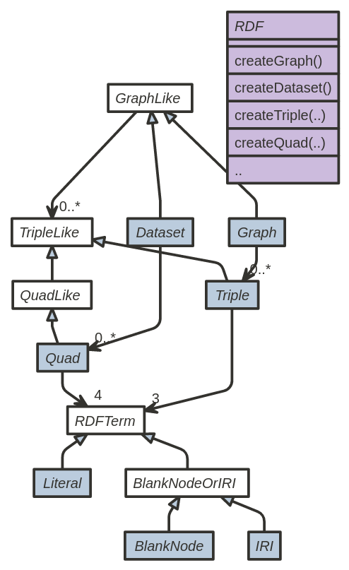
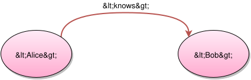
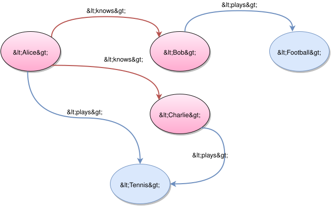

## Project Information

This document provides an overview of the various documents and links that are part of this project's general information. All of this content is automatically generated by [Maven](http://maven.apache.org) on behalf of the project.

### Overview

| Document | Description |
| --- | --- |
| [About](index.html) | Commons Java API for RDF 1.1 |
| [Summary](project-summary.html) | This document lists other related information of this project |
| [Project Modules](modules.html) | This document lists the modules (sub-projects) of this project. |
| [Team](team-list.html) | This document provides information on the members of this project. These are the individuals who have contributed to the project in one form or another. |
| [Source Code Management](source-repository.html) | This document lists ways to access the online source repository. |
| [Issue Management](issue-tracking.html) | This document provides information on the issue management system used in this project. |
| [Mailing Lists](mail-lists.html) | This document provides subscription and archive information for this project's mailing lists. |
| [Dependency Information](dependency-info.html) | This document describes how to to include this project as a dependency using various dependency management tools. |
| [Dependency Management](dependency-management.html) | This document lists the dependencies that are defined through dependencyManagement. |
| [Dependencies](dependencies.html) | This document lists the project's dependencies and provides information on each dependency. |
| [Dependency Convergence](dependency-convergence.html) | This document presents the convergence of dependency versions across the entire project, and its sub modules. |
| [CI Management](integration.html) | This is a link to the definitions of all continuous integration processes that builds and tests code on a frequent, regular basis. |
| [Distribution Management](distribution-management.html) | This document provides informations on the distribution management of this project. |

---
## Overview

This project uses [JIRA](http://www.atlassian.com/software/jira).

## Issue Management

Issues, bugs, and feature requests should be submitted to the following issue management system for this project.

```
https://issues.apache.org/jira/browse/COMMONSRDF
```

---
## Overview

This project uses [Jenkins](http://jenkins-ci.org/).

## Access

The following is a link to the continuous integration system used by the project:

```
https://builds.apache.org/
```

## Notifiers

No notifiers are defined. Please check back at a later date.

---
# Apache Commons RDF

2017-12-23:
[Commons RDF 0.5.0](download.html) released.

Commons RDF aims to provide a common library for [RDF 1.1](http://www.w3.org/TR/rdf11-concepts/) that could be implemented by systems on the Java Virtual Machine.

[](images/class-diagram.png)

The main motivation behind this simple library is revise an historical incompatibility issue. This library does not pretend to be a generic api wrapping those libraries, but a set of interfaces for the RDF 1.1 concepts that can be used to expose common RDF-1.1 concepts using common Java interfaces. In the initial phase commons-rdf is focused on a subset of the core concepts defined by RDF-1.1 (URI/IRI, Blank Node, Literal, Triple, and Graph). In particular, commons RDF aims to provide a type-safe, non-general API that covers RDF 1.1. In a future phase we may define interfaces for Datasets and Quads.

## API

The [class diagram](images/class-diagram.png) on the right depicts the main [interfaces](apidocs/index.html?org/apache/commons/rdf/api/package-summary.html) which may be included in Commons RDF, specifically:

* [Graph](apidocs/index.html?org/apache/commons/rdf/api/Graph.html): a graph, a set of RDF triples.
* [Triple](apidocs/index.html?org/apache/commons/rdf/api/Triple.html): a RDF triple with getSubject(), getPredicate(), getObject().
* [Dataset](apidocs/index.html?org/apache/commons/rdf/api/Dataset.html): a dataset, of RDF quads (or if you like, a set of named graphs).
* [Quad](apidocs/index.html?org/apache/commons/rdf/api/Quad.html): a RDF quad with with getGraphName(), getSubject(), getPredicate(), getObject().
* [RDFTerm](apidocs/index.html?org/apache/commons/rdf/api/RDFTerm.html): any RDF 1.1 Term which can be part of a Triple or Quad. IRIs, literals and blank nodes are collectively known as RDF terms.
* [IRI](apidocs/index.html?org/apache/commons/rdf/api/IRI.html): an Internationalized Resource Identifier (e.g. representing <http://example.com/>)
* [BlankNode](apidocs/index.html?org/apache/commons/rdf/api/BlankNode.html): a RDF-1.1 Blank Node, e.g. representing \_:b1. Disjoint from IRIs and literals.
* [BlankNodeOrIRI](apidocs/index.html?org/apache/commons/rdf/api/BlankNodeOrIRI.html): this interface represents the RDF Terms that may be used in the subject position of an RDF 1.1 Triple, including BlankNode and IRI.
* [Literal](apidocs/index.html?org/apache/commons/rdf/api/Literal.html): a RDF-1.1 literal, e.g. representing "Hello there"@en.

The design of the [API](apidocs/index.html?org/apache/commons/rdf/api/package-summary.html) follows the terminology as defined by [RDF 1.1 Concepts and Abstract Syntax](http://www.w3.org/TR/rdf11-concepts/), a W3C Recommendation published on 25 February 2014. The idea is that Commons RDF provide a common library for RDF 1.1 with multiple implementions for the Java Virtual Machine, allowing the portability across different Commons RDF implementations.

Commons RDF is designed for compatibility between different [implementations](implementations.html), e.g. by defining strong equality and hash code semantics (e.g. for [triple](apidocs/org/apache/commons/rdf/api/Triple.html#equals-java.lang.Object-) and [literals](fapidocs/org/apache/commons/rdf/api/Literal.html#equals-java.lang.Object-) ); this allows users of Commons RDF to “mix and match”, for instance querying a FooGraphImpl and directly adding its FooTripleImpls to a BarGraphImpl without any explicit convertion.

To create such instances without hard-coding an implementation, one can use:

* [RDF](apidocs/index.html?org/apache/commons/rdf/api/RDF.html): interface for creating instances of the above types (e.g. LiteralImpl and GraphImpl) as well as converting from/to the underlying framework’s API.

The API also includes a couple of “upper” interfaces which do not have the above equality semantics and bridge the graph/quad duality:

* [TripleLike](apidocs/index.html?org/apache/commons/rdf/api/TripleLike.html): common super-interface of Triple and Quad (also a generalised triple).
* [QuadLike](apidocs/index.html?org/apache/commons/rdf/api/QuadLike.html): a TripleLike that also has getGraphName() (a generalized quad)
* [GraphLike](apidocs/index.html?org/apache/commons/rdf/api/GraphLike.html): common super-interface of Graph and Dataset.

See the the [user guide](userguide.html) for examples of how to interact with these interfaces.

## Modules

The project is composed by two modules:

* [API](apidocs/index.html?org/apache/commons/rdf/api/package-summary.html) defines a common library of RDF 1.1 concepts.
* [Simple](apidocs/index.html?org/apache/commons/rdf/simple/package-summary.html) provides a simple implementation, mainly for internal validation and very simple scenarios.
* [jena](apidocs/index.html?org/apache/commons/rdf/jena/package-summary.html) provides an Apache Jena-backed implementation
* [rdf4j](apidocs/index.html?org/apache/commons/rdf/rdf4j/package-summary.html) provides an Eclipse RDF4J-backed implementation
* [jsonld-java](apidocs/index.html?org/apache/commons/rdf/jsonldjava/package-summary.html) provides an JSONLD-Java-backed implementation

These modules follow the [semantic versioning](http://semver.org/) principles, where version x.y.z of Simple implements version x.y of the API; i.e., the version z are backwards-compatible patches of the implementation.

For more details, read about the [implementations of the Commons RDF API](implementations.html).

## Contributing

Everybody is welcomed to [join the project](mail-lists.html) and [contribute](contributing.html)!

---
## Project Dependencies

### test

The following is a list of test dependencies for this project. These dependencies are only required to compile and run unit tests for the application:

| GroupId | ArtifactId | Version | Type | Licenses |
| --- | --- | --- | --- | --- |
| junit | [junit](http://junit.org) | 4.12 | jar | [Eclipse Public License 1.0](http://www.eclipse.org/legal/epl-v10.html) |
| org.slf4j | [slf4j-simple](http://www.slf4j.org) | 1.7.25 | jar | [MIT License](http://www.opensource.org/licenses/mit-license.php) |

## Project Transitive Dependencies

The following is a list of transitive dependencies for this project. Transitive dependencies are the dependencies of the project dependencies.

### test

The following is a list of test dependencies for this project. These dependencies are only required to compile and run unit tests for the application:

| GroupId | ArtifactId | Version | Type | Licenses |
| --- | --- | --- | --- | --- |
| org.hamcrest | [hamcrest-core](https://github.com/hamcrest/JavaHamcrest/hamcrest-core) | 1.3 | jar | [New BSD License](http://www.opensource.org/licenses/bsd-license.php) |
| org.slf4j | [slf4j-api](http://www.slf4j.org) | 1.7.25 | jar | [MIT License](http://www.opensource.org/licenses/mit-license.php) |

## Project Dependency Graph

### Dependency Tree

* org.apache.commons:commons-rdf-parent:pom:0.6.0-SNAPSHOT ![[Information]](assets/proper_commons-rdf_images_icon_info_sml.gif)

  | Commons RDF |
  | --- |
  | **Description:** Commons Java API for RDF 1.1  **URL:** <https://commons.apache.org/proper/commons-rdf/>  **Project Licenses:** [Apache License, Version 2.0](https://www.apache.org/licenses/LICENSE-2.0.txt) |

  * junit:junit:jar:4.12 (test) ![[Information]](./images/icon_info_sml.gif)

    | JUnit |
    | --- |
    | **Description:** JUnit is a unit testing framework for Java, created by Erich Gamma and Kent Beck.  **URL:** <http://junit.org>  **Project Licenses:** [Eclipse Public License 1.0](http://www.eclipse.org/legal/epl-v10.html) |

    * org.hamcrest:hamcrest-core:jar:1.3 (test) ![[Information]](./images/icon_info_sml.gif)

      | Hamcrest Core |
      | --- |
      | **Description:** This is the core API of hamcrest matcher framework to be used by third-party framework providers. This includes the a foundation set of matcher implementations for common operations.  **URL:** <https://github.com/hamcrest/JavaHamcrest/hamcrest-core>  **Project Licenses:** [New BSD License](http://www.opensource.org/licenses/bsd-license.php) |
  * org.slf4j:slf4j-simple:jar:1.7.25 (test) ![[Information]](./images/icon_info_sml.gif)

    | SLF4J Simple Binding |
    | --- |
    | **Description:** SLF4J Simple binding  **URL:** <http://www.slf4j.org>  **Project Licenses:** [MIT License](http://www.opensource.org/licenses/mit-license.php) |

    * org.slf4j:slf4j-api:jar:1.7.25 (test) ![[Information]](./images/icon_info_sml.gif)

      | SLF4J API Module |
      | --- |
      | **Description:** The slf4j API  **URL:** <http://www.slf4j.org>  **Project Licenses:** [MIT License](http://www.opensource.org/licenses/mit-license.php) |

## Licenses

**Eclipse Public License 1.0:** JUnit

**MIT License:** SLF4J API Module, SLF4J Simple Binding

**Apache License, Version 2.0:** Commons RDF

**New BSD License:** Hamcrest Core

## Dependency File Details

| Filename | Size | Entries | Classes | Packages | Java Version | Debug Information |
| --- | --- | --- | --- | --- | --- | --- |
| junit-4.12.jar | 314.9 kB | 323 | 286 | 30 | 1.5 | Yes |
| hamcrest-core-1.3.jar | 45 kB | 52 | 45 | 3 | 1.5 | Yes |
| slf4j-api-1.7.25.jar | 41.2 kB | 46 | 34 | 4 | 1.5 | Yes |
| slf4j-simple-1.7.25.jar | 15.3 kB | 20 | 10 | 1 | 1.5 | Yes |
| Total | Size | Entries | Classes | Packages | Java Version | Debug Information |
| 4 | 416.4 kB | 441 | 375 | 38 | 1.5 | 4 |
| test: 4 | test: 416.4 kB | test: 441 | test: 375 | test: 38 | - | test: 4 |

## Dependency Repository Locations

| Repo ID | URL | Release | Snapshot |
| --- | --- | --- | --- |
| central | <https://repo.maven.apache.org/maven2> | Yes | No |
| apache.snapshots | <https://repository.apache.org/snapshots> | No | Yes |

Repository locations for each of the Dependencies.

| Artifact | central | apache.snapshots |
| --- | --- | --- |
| junit:junit:jar:4.12 | [Found at https://repo.maven.apache.org/maven2](https://repo.maven.apache.org/maven2/junit/junit/4.12/junit-4.12.jar) | - |
| org.hamcrest:hamcrest-core:jar:1.3 | [Found at https://repo.maven.apache.org/maven2](https://repo.maven.apache.org/maven2/org/hamcrest/hamcrest-core/1.3/hamcrest-core-1.3.jar) | - |
| org.slf4j:slf4j-api:jar:1.7.25 | [Found at https://repo.maven.apache.org/maven2](https://repo.maven.apache.org/maven2/org/slf4j/slf4j-api/1.7.25/slf4j-api-1.7.25.jar) | - |
| org.slf4j:slf4j-simple:jar:1.7.25 | [Found at https://repo.maven.apache.org/maven2](https://repo.maven.apache.org/maven2/org/slf4j/slf4j-simple/1.7.25/slf4j-simple-1.7.25.jar) | - |
| Total | central | apache.snapshots |
| 4 (test: 4) | 4 | 0 |

---
## Generated Reports

This document provides an overview of the various reports that are automatically generated by [Maven](http://maven.apache.org) . Each report is briefly described below.

### Overview

| Document | Description |
| --- | --- |
| [Changes](changes-report.html) | Changes report on releases of this project. |
| [JIRA Report](jira-report.html) | Report on Issues from the JIRA Issue Tracking System. |
| [Javadoc](apidocs/index.html) | Javadoc API documentation. |
| [Source Xref](xref/index.html) | HTML based, cross-reference version of Java source code. |
| [Test Source Xref](xref-test/index.html) | HTML based, cross-reference version of Java test source code. |
| [Surefire Report](surefire-report.html) | Report on the test results of the project. |
| [Rat Report](rat-report.html) | Report on compliance to license related source code policies |
| [Checkstyle](checkstyle-aggregate.html) | Report on coding style conventions. |
| [PMD](pmd.html) | Verification of coding rules. |

---
# User Guide

This page shows some examples of a client using the Commons RDF API. It was last updated for version 0.5.0 of the Commons RDF [API](apidocs/).

* [Introduction](#Introduction)
  * [RDF concepts](#RDF_concepts)
* [Using Commons RDF from Maven](#Using_Commons_RDF_from_Maven)
* [Creating Commons RDF instances](#Creating_Commons_RDF_instances)
* [Finding an RDF implementation](#Finding_an_RDF_implementation)
* [Using an RDF implementation](#Using_an_RDF_implementation)
* [RDF terms](#RDF_terms)
  * [N-Triples string](#N-Triples_string)
  * [IRI](#IRI)
  * [Blank node](#Blank_node)
    * [Blank node reference](#Blank_node_reference)
  * [Literal](#Literal)
    * [Datatype](#Datatype)
      * [Types](#Types)
    * [Language](#Language)
* [Triple](#Triple)
* [Quad](#Quad)
* [Graph](#Graph)
  * [Adding triples](#Adding_triples)
  * [Finding triples](#Finding_triples)
  * [Size](#Size)
  * [Iterating over triples](#Iterating_over_triples)
  * [Stream of triples](#Stream_of_triples)
  * [Removing triples](#Removing_triples)
* [Dataset](#Dataset)
  * [Dataset operations](#Dataset_operations)
* [Mutability and thread safety](#Mutability_and_thread_safety)
* [Implementations](#Implementations)
  * [Cross-compatibility](#Cross-compatibility)
* [Complete example](#Complete_example)

## Introduction

[Commons RDF](index.html) is an API that intends to directly describe [RDF 1.1 concepts](http://www.w3.org/TR/rdf11-concepts/) as a set of corresponding interfaces and methods.

### RDF concepts

RDF is a [graph-based data model](http://www.w3.org/TR/rdf11-concepts/#data-model), where a *graph* contains a series of *triples*, each containing the node-arc-node link *subject* -> *predicate* -> *object*. Nodes in the graph are represented either as *IRIs*, *literals* and *blank nodes*. : This user guide does not intend to give a detailed description of RDF as a data model. To fully understand this user guide, you should have a brief understanding of the core RDF concepts mentioned above.

For more information on RDF, see the [RDF primer](http://www.w3.org/TR/rdf11-primer/) and the [RDF concepts](http://www.w3.org/TR/rdf11-concepts/#data-model) specification from W3C.

## Using Commons RDF from Maven

To use Commons RDF API from an [Apache Maven](http://maven.apache.org/) project, add the following dependency to your pom.xml:

```
<dependencies>
    <dependency>
        <groupId>org.apache.commons</groupId>
        <artifactId>commons-rdf-api</artifactId>
        <version>0.5.0</version>
    </dependency>
</dependencies>
```

*The <version> above might not be up to date, see the [download page](download.html) for the latest version.*

If you are testing a SNAPSHOT version, then you will have to either build Commons RDF from [source](https://github.com/apache/commons-rdf), or add this [snapshot repository](https://github.com/apache/commons-rdf#snapshot-repository):

```
<repositories>
  <repository>
    <id>apache.snapshots</id>
    <name>Apache Snapshot Repository</name>
    <url>http://repository.apache.org/snapshots</url>
    <releases>
      <enabled>false</enabled>
    </releases>
  </repository>
</repositories>
```

As Commons RDF requires Java 8 or later, you will also need:

```
<properties>
  <maven.compiler.source>1.8</maven.compiler.source>
  <maven.compiler.target>1.8</maven.compiler.target>
</properties>
```

In the examples below we will use the [*simple* implementation](apidocs/org/apache/commons/rdf/simple/package-summary.html), but the examples should be equally applicable to other [implementations](implementations.html). To add a dependency for the *simple* implementation, add to your <dependencies>:

```
    <dependency>
        <groupId>org.apache.commons</groupId>
        <artifactId>commons-rdf-simple</artifactId>
        <version>0.5.0</version>
    </dependency>
```

*The <version> above might not be up to date, see the [download page](download.html) for the latest version.*

## Creating Commons RDF instances

To create instances of Commons RDF interfaces like [Graph](apidocs/org/apache/commons/rdf/api/Graph.html) and [IRI](apidocs/org/apache/commons/rdf/api/IRI.html) you will need a [RDF](apidocs/org/apache/commons/rdf/api/RDF.html) implementation.

### Finding an RDF implementation

The [implementations](implementations.html) of RDF can usually be created using a normal Java constructor, for instance the *simple* implementation from [SimpleRDF](apidocs/org/apache/commons/rdf/simple/SimpleRDF.html):

```
import org.apache.commons.rdf.api.*;
import org.apache.commons.rdf.simple.SimpleRDF;
// ...
RDF rdf = new SimpleRDF();
```

If you don’t want to depend on instantiating a concrete RDF implementation, you can alternatively use the [ServiceLoader](http://docs.oracle.com/javase/8/docs/api/java/util/ServiceLoader.html) to lookup any RDF implementations found on the classpath:

```
import java.util.Iterator;
import java.util.ServiceLoader;

import org.apache.commons.rdf.api.*;
// ...
ServiceLoader<RDF> loader = ServiceLoader.load(RDF.class);
Iterator<RDF> iterator = loader.iterator();
RDF rdf = iterator.next();
```

Note that the ServiceLoader approach above might not work well within split classloader systems like OSGi.

When using the factory method [createBlankNode(String)](apidocs/org/apache/commons/rdf/api/RDF.html#createBlankNode-java.lang.String-) from different sources, care should be taken to create correspondingly different RDF instances.

### Using an RDF implementation

Using the RDF implementation you can construct any [RDFTerm](apidocs/org/apache/commons/rdf/api/RDFTerm.html), e.g. to create a [BlankNode](apidocs/org/apache/commons/rdf/api/BlankNode.html), [IRI](apidocs/org/apache/commons/rdf/api/IRI.html) and [Literal](apidocs/org/apache/commons/rdf/api/Literal.html):

```
BlankNode aliceBlankNode = rdf.createBlankNode();
IRI nameIri = rdf.createIRI("http://example.com/name");
Literal aliceLiteral = rdf.createLiteral("Alice");
```

You can also create a stand-alone [Triple](apidocs/org/apache/commons/rdf/api/Triple.html):

```
Triple triple = rdf.createTriple(aliceBlankNode, nameIri, aliceLiteral);
```

The [RDF](apidocs/org/apache/commons/rdf/api/RDF.html) interface also contains more specific variants of some of the methods above, e.g. to create a typed literal.

In addition, the [implementations](implementations.html) of RDF may add specific converter methods and implementation-specific subtypes for interoperability with their underlying RDF framework’s API.

## RDF terms

[RDFTerm](apidocs/org/apache/commons/rdf/api/RDFTerm.html) is the super-interface for instances that can be used as subject, predicate and object of a [Triple](apidocs/org/apache/commons/rdf/api/Triple.html).

The RDF term interfaces are arranged in this type hierarchy:

* [RDFTerm](apidocs/org/apache/commons/rdf/api/RDFTerm.html)
  * [BlankNodeOrIRI](apidocs/org/apache/commons/rdf/api/BlankNodeOrIRI.html)
    * [BlankNode](apidocs/org/apache/commons/rdf/api/BlankNode.html)
    * [IRI](apidocs/org/apache/commons/rdf/api/IRI.html)
  * [Literal](apidocs/org/apache/commons/rdf/api/Literal.html)

### N-Triples string

All of the [RDFTerm](apidocs/org/apache/commons/rdf/api/RDFTerm.html) types support the ntriplesString() method:

```
System.out.println(aliceBlankNode.ntriplesString());
System.out.println(nameIri.ntriplesString());
System.out.println(aliceLiteral.ntriplesString());
```

> \_:ef136d20-f1ee-3830-a54b-cd5e489d50fb
>
> <http://example.com/name>
>
> "Alice"

This returns the [N-Triples](http://www.w3.org/TR/n-triples) canonical form of the term, which can be useful for debugging or simple serialization.

*Note: The .toString() of the simple implementation used in some of these examples use ntriplesString() internally, but Commons RDF places no such formal requirement on the .toString() method. Clients that rely on a canonical N-Triples-compatible string should instead use ntriplesString().*

### IRI

An [IRI](apidocs/org/apache/commons/rdf/api/IRI.html) is a representation of an [Internationalized Resource Identifier](http://www.w3.org/TR/rdf11-concepts/#dfn-iri), e.g. http://example.com/alice or http://ns.example.org/vocab#term.

> IRIs in the RDF abstract syntax MUST be absolute, and MAY contain a fragment identifier.

An IRI identifies a resource that can be used as a *subject*, *predicate* or *object* of a [Triple](apidocs/org/apache/commons/rdf/api/Triple.html) or [Quad](apidocs/org/apache/commons/rdf/api/Quad.html), where it can also be used a *graph name*.

To create an IRI instance from an RDF implementation, use [createIRI](apidocs/org/apache/commons/rdf/api/RDF.html#createIRI-java.lang.String-):

```
IRI iri = rdf.createIRI("http://example.com/alice");
```

You can retrieve the IRI string using [getIRIString](apidocs/org/apache/commons/rdf/api/IRI.html#getIRIString--):

```
System.out.println(iri.getIRIString());
```

> http://example.com/alice

*Note: The **IRI** string might contain non-ASCII characters which must be %-encoded for applications that expect an **URI**. It is currently out of scope for Commons RDF to perform such a conversion, however implementations might provide separate methods for that purpose.*

Two IRI instances can be compared using the [equals](apidocs/org/apache/commons/rdf/api/IRI.html#equals-java.lang.Object-) method, which uses [simple string comparison](http://tools.ietf.org/html/rfc3987#section-5.3.1):

```
IRI iri2 = rdf.createIRI("http://example.com/alice");
System.out.println(iri.equals(iri2));
```

> true

```
IRI iri3 = rdf.createIRI("http://example.com/alice/./");
System.out.println(iri.equals(iri3));
```

> false

Note that IRIs are never equal to objects which are not themselves instances of [IRI](apidocs/org/apache/commons/rdf/api/IRI.html):

```
System.out.println(iri.equals("http://example.com/alice"));
System.out.println(iri.equals(rdf.createLiteral("http://example.com/alice")));
```

> false
>
> false

### Blank node

A [blank node](http://www.w3.org/TR/rdf11-concepts/#section-blank-nodes) is a resource which, unlike an IRI, is not directly identified. Blank nodes can be used as *subject* or *object* of a [Triple](apidocs/org/apache/commons/rdf/api/Triple.html) or [Quad](apidocs/org/apache/commons/rdf/api/Quad.html), where it can also be used a *graph name*.

To create a new [BlankNode](apidocs/org/apache/commons/rdf/api/BlankNode.html) instance from a RDF implementation, use [createBlankNode](apidocs/org/apache/commons/rdf/api/RDF.html#createBlankNode--):

```
BlankNode bnode = rdf.createBlankNode();
```

Every call to createBlankNode() returns a brand new blank node which can be used in multiple triples in multiple graphs. Thus every such blank node can only be [equal](apidocs/org/apache/commons/rdf/api/BlankNode.html#equals-java.lang.Object-) to itself:

```
System.out.println(bnode.equals(bnode));
System.out.println(bnode.equals(rdf.createBlankNode()));
```

> true
>
> false

Sometimes it can be beneficial to create a blank node based on a localized *name*, without needing to keep object references to earlier BlankNode instances. For that purpose, the RDF interface provides the [expanded createBlankNode](apidocs/org/apache/commons/rdf/api/RDF.html#createBlankNode-java.lang.String-) method:

```
BlankNode b1 = rdf.createBlankNode("b1");
```

Note that there is no requirement for the [ntriplesString()](apidocs/org/apache/commons/rdf/api/RDFTerm.html#ntriplesString--) of the BlankNode to reflect the provided name:

```
System.out.println(b1.ntriplesString());
```

> \_:6c0f628f-02cb-3634-99db-0e1e99d2e66d

Any later createBlankNode("b1") **on the same RDF instance** returns a BlankNode which are [equal](apidocs/org/apache/commons/rdf/api/BlankNode.html#equals-java.lang.Object-) to the previous b1:

```
System.out.println(b1.equals(rdf.createBlankNode("b1")));
```

> true

That means that care should be taken to create a new RDF instance if making “different” blank nodes (e.g. parsed from a different RDF file) which accidfentally might have the same name:

```
System.out.println(b1.equals(new SimpleRDF().createBlankNode("b1")));
```

> false

#### Blank node reference

While blank nodes are distinct from IRIs, and don’t have inherent universal identifiers, it can nevertheless be useful for debugging and testing to have a unique reference string for a particular blank node. For that purpose, BlankNode exposes the [uniqueReference](apidocs/org/apache/commons/rdf/api/BlankNode.html#uniqueReference--) method:

```
System.out.println(bnode.uniqueReference());
```

> 735d5e63-96a4-488b-8613-7037b82c74a5

While this reference string might for the *simple* implementation also be seen within the BlankNode.ntriplesString() result, there is no such guarantee from the Commons RDF API. Clients who need a globally unique reference for a blank node should therefore use the uniqueReference() method.

*Note: While it is recommended for this string to be (or contain) a [UUID string](http://docs.oracle.com/javase/8/docs/api/java/util/UUID.html), implementations are free to use any scheme to ensure their blank node references are globally unique. Therefore no assumptions should be made about this string except that it is unique per blank node.*

### Literal

A [literal](http://www.w3.org/TR/rdf11-concepts/#section-Graph-Literal) in RDF is a value such as a string, number or a date. A Literal can only be used as an *object* of a [Triple](apidocs/org/apache/commons/rdf/api/Triple.html#getObject--) or [Quad](apidocs/org/apache/commons/rdf/api/Quad.html#getObject--)

To create a [Literal](apidocs/org/apache/commons/rdf/api/Literal.html) instance from an RDF implementation, use [createLiteral](apidocs/org/apache/commons/rdf/api/RDF.html#createLiteral-java.lang.String-):

```
Literal literal = rdf.createLiteral("Hello world!");
System.out.println(literal.ntriplesString());
```

> "Hello world!"

The *lexical value* (what is inside the quotes) can be retrieved using [getLexicalForm()](apidocs/org/apache/commons/rdf/api/Literal.html#getLexicalForm--):

```
String lexical = literal.getLexicalForm();
System.out.println(lexical);
```

> Hello world!

#### Datatype

All literals in RDF 1.1 have a [datatype](http://www.w3.org/TR/rdf11-concepts/#dfn-datatype-iri) IRI, which can be retrieved using [Literal.getDatatype()](apidocs/org/apache/commons/rdf/api/Literal.html#getDatatype--):

```
IRI datatype = literal.getDatatype();
System.out.println(datatype.ntriplesString());
```

> <http://www.w3.org/2001/XMLSchema#string>

In RDF 1.1, a [simple literal](http://www.w3.org/TR/rdf11-concepts/#dfn-simple-literal) (as created above) always have the type http://www.w3.org/2001/XMLSchema#string (or [xsd:string](apidocs/org/apache/commons/rdf/simple/Types.html#XSD_STRING) for short).

**Note:**
RDF 1.0 had the datatype
http://www.w3.org/1999/02/22-rdf-syntax-ns#PlainLiteral to
indicate *plain literals* (untyped), which were distinct from
http://www.w3.org/2001/XMLSchema#string (typed). Commons
RDF assumes RDF 1.1, which merges the two concepts as the second type, however
particular implementations might have explicit options for RDF 1.0 support, in
which case you might find Literal instances with the deprecated
[plain
literal](apidocs/org/apache/commons/rdf/simple/Types.html#RDF_PLAINLITERAL) data type.

To create a literal with any other [datatype](http://www.w3.org/TR/rdf11-concepts/#dfn-datatype-iri) (e.g. xsd:double), then create the datatype IRI and pass it to the expanded [createLiteral](apidocs/org/apache/commons/rdf/api/RDF.html#createLiteral-java.lang.String-org.apache.commons.rdf.api.IRI-):

```
IRI xsdDouble = rdf.createIRI("http://www.w3.org/2001/XMLSchema#double");
Literal literalDouble = rdf.createLiteral("13.37", xsdDouble);
System.out.println(literalDouble.ntriplesString());
```

> "13.37"^^<http://www.w3.org/2001/XMLSchema#double>

##### Types

The class [Types](apidocs/org/apache/commons/rdf/simple/Types.html), which is part of the *simple* implementation, provides IRI constants for the standard XML Schema datatypes like xsd:dateTime and xsd:float. Using Types, the above example can be simplified to:

```
Literal literalDouble2 = rdf.createLiteral("13.37", Types.XSD_DOUBLE);
```

As the constants in Types are all instances of IRI, so they can also be used for comparisons:

```
System.out.println(Types.XSD_STRING.equals(literal.getDatatype()));
```

> true

#### Language

Literals may be created with an associated [language tag](http://www.w3.org/TR/rdf11-concepts/#dfn-language-tagged-string) using the expanded [createLiteral](apidocs/org/apache/commons/rdf/api/RDF.html#createLiteral-java.lang.String-java.lang.String-):

```
Literal inSpanish = rdf.createLiteral("¡Hola, Mundo!", "es");
System.out.println(inSpanish.ntriplesString());
System.out.println(inSpanish.getLexicalForm());
```

> "¡Hola, Mundo!"@es
>
> ¡Hola, Mundo!

A literal with a language tag always have the implied type http://www.w3.org/1999/02/22-rdf-syntax-ns#langString:

```
System.out.println(inSpanish.getDatatype().ntriplesString());
```

> <http://www.w3.org/1999/02/22-rdf-syntax-ns#langString>

The language tag can be retrieved using [getLanguageTag()](apidocs/org/apache/commons/rdf/api/Literal.html#getLanguageTag--):

```
Optional<String> tag = inSpanish.getLanguageTag();
if (tag.isPresent()) {
    System.out.println(tag.get());
}
```

> es

The language tag is behind an [Optional](http://docs.oracle.com/javase/8/docs/api/java/util/Optional.html) as it won’t be present for any other datatypes than http://www.w3.org/1999/02/22-rdf-syntax-ns#langString:

```
System.out.println(literal.getLanguageTag().isPresent());
System.out.println(literalDouble.getLanguageTag().isPresent());
```

> false
>
> false

## Triple

A [triple](http://www.w3.org/TR/rdf11-concepts/#section-triples) in RDF 1.1 consists of:

* The [subject](apidocs/org/apache/commons/rdf/api/Triple.html#getSubject--), which is an [IRI](apidocs/org/apache/commons/rdf/api/IRI.html) or a [BlankNode](apidocs/org/apache/commons/rdf/api/BlankNode.html)
* The [predicate](apidocs/org/apache/commons/rdf/api/Triple.html#getPredicate--), which is an [IRI](apidocs/org/apache/commons/rdf/api/IRI.html)
* The [object](apidocs/org/apache/commons/rdf/api/Triple.html#getObject--), which is an [IRI](apidocs/org/apache/commons/rdf/api/IRI.html), a [BlankNode](apidocs/org/apache/commons/rdf/api/BlankNode.html) or a [Literal](apidocs/org/apache/commons/rdf/api/Literal.html)

To construct a [Triple](apidocs/org/apache/commons/rdf/api/Triple.html) from an RDF implementation, use [createTriple](apidocs/org/apache/commons/rdf/api/RDF.html#createTriple-org.apache.commons.rdf.api.BlankNodeOrIRI-org.apache.commons.rdf.api.IRI-org.apache.commons.rdf.api.RDFTerm-):

```
BlankNodeOrIRI subject = rdf.createBlankNode();
IRI predicate = rdf.createIRI("http://example.com/says");
RDFTerm object = rdf.createLiteral("Hello");
Triple triple = rdf.createTriple(subject, predicate, object);
```

The subject of the triple can be retrieved using [getSubject](apidocs/org/apache/commons/rdf/api/Triple.html#getSubject--):

```
BlankNodeOrIRI subj = triple.getSubject();
System.out.println(subj.ntriplesString());
```

> \_:7b914fbe-aa2a-4551-b71c-8ac0e2b52b26

Likewise the predicate using [getPredicate](apidocs/org/apache/commons/rdf/api/Triple.html#getPredicate--):

```
IRI pred = triple.getPredicate();
System.out.println(pred.getIRIString());
```

> http://example.com/says

Finally, the object of the triple is returned with [getObject](apidocs/org/apache/commons/rdf/api/Triple.html#getObject--):

```
RDFTerm obj = triple.getObject();
System.out.println(obj.ntriplesString());
```

> "Hello"

For the subject and object you might find it useful to do Java type checking and casting from the types [BlankNodeOrIRI](apidocs/org/apache/commons/rdf/api/BlankNodeOrIRI.html) and [RDFTerm](apidocs/org/apache/commons/rdf/api/RDFTerm.html):

```
if (subj instanceof IRI) {
    String s = ((IRI) subj).getIRIString();
    System.out.println(s);
}
// ..
if (obj instanceof Literal) {
    IRI type = ((Literal) obj).getDatatype();
    System.out.println(type);
}
```

In Commons RDF, BlankNodeOrIRI instances are always one of BlankNode or IRI, and RDFTerm instances one of BlankNode, IRI or Literal.

A Triple is considered [equal](apidocs/org/apache/commons/rdf/api/Triple.html#equals-java.lang.Object-) to another Triple if each of their subject, predicate and object are equal:

```
System.out.println(triple.equals(rdf.createTriple(subj, pred, obj)));
```

> true

This equality is true even across implementations, as Commons RDF has specified *equality semantics* for [Triples](apidocs/org/apache/commons/rdf/api/Triple.html#equals-java.lang.Object-), [Quads](apidocs/org/apache/commons/rdf/api/Quad.html#equals-java.lang.Object-), [IRIs](apidocs/org/apache/commons/rdf/api/IRI.html#equals-java.lang.Object-), [Literals](apidocs/org/apache/commons/rdf/api/Literal.html#equals-java.lang.Object-) and even [BlankNodes](apidocs/org/apache/commons/rdf/api/BlankNode.html#equals-java.lang.Object-).

## Quad

A *quad* is a triple with an associated *graph name*, and can be a statement in a [dataset](http://www.w3.org/TR/rdf11-concepts/#section-dataset).

Commons RDF represents such statements using the class [Quad](apidocs/org/apache/commons/rdf/api/Quad.html), which consists of:

* The [subject](apidocs/org/apache/commons/rdf/api/Quad.html#getSubject--), which is an [IRI](apidocs/org/apache/commons/rdf/api/IRI.html) or a [BlankNode](apidocs/org/apache/commons/rdf/api/BlankNode.html)
* The [predicate](apidocs/org/apache/commons/rdf/api/Quad.html#getPredicate--), which is an [IRI](apidocs/org/apache/commons/rdf/api/IRI.html)
* The [object](apidocs/org/apache/commons/rdf/api/Quad.html#getObject--), which is an [IRI](apidocs/org/apache/commons/rdf/api/IRI.html), a [BlankNode](apidocs/org/apache/commons/rdf/api/BlankNode.html) or a [Literal](apidocs/org/apache/commons/rdf/api/Literal.html)
* The [graph name](apidocs/org/apache/commons/rdf/api/Quad.html#getGraphName--), which is an [IRI](apidocs/org/apache/commons/rdf/api/IRI.html) or a [BlankNode](apidocs/org/apache/commons/rdf/api/BlankNode.html); wrapped as an java.util.Optional

To create a Quad, use [createQuad](apidocs/org/apache/commons/rdf/api/RDF.html#createQuad-org.apache.commons.rdf.api.BlankNodeOrIRI-org.apache.commons.rdf.api.BlankNodeOrIRI-org.apache.commons.rdf.api.IRI-org.apache.commons.rdf.api.RDFTerm-):

```
BlankNodeOrIRI graph = rdf.createIRI("http://example.com/graph");
BlankNodeOrIRI subject = rdf.createBlankNode();
IRI predicate = rdf.createIRI("http://example.com/says");
RDFTerm object = rdf.createLiteral("Hello");
Quad quad = rdf.createQuad(graph, subject, predicate, object);
```

The subject, predicate and object are accessible just like in a Triple:

```
IRI pred = quad.getPredicate();
System.out.println(pred.ntriplesString());
```

> <http://example.com/says>

### Graph name

The quad’s *graph name* is accessible using [getGraphName()](apidocs/org/apache/commons/rdf/api/Quad.html#getGraphName--):

```
Optional<BlankNodeOrIRI> g = quad.getGraphName();
```

The graph name is represented as an [Optional](https://docs.oracle.com/javase/8/docs/api/java/util/Optional.html), where Optional.empty() indicates that the quad is in the [default graph](https://www.w3.org/TR/rdf11-concepts/#dfn-default-graph), while if the [Optional.isPresent()](https://docs.oracle.com/javase/8/docs/api/java/util/Optional.html#isPresent--) then the graph name BlankNodeOrIRI is accessible with g.get():

```
if (g.isPresent()) {
  BlankNodeOrIRI graphName = g.get();
  System.out.println(graphName.ntriplesString());
}
```

> <http://example.com/graph>

To create a quad in the *default graph*, supply null as the graph name to the factory method:

```
Quad otherQuad = rdf.createQuad(null, subject, predicate, object);
System.out.println(otherQuad.getGraphName().isPresent());
```

> false

Note that a Quad will never return null on any of its getters, which is why the graph name is wrapped as an Optional. This also allows the use of Java 8 functional programming patterns like:

```
String str = quad.map(BlankNodeOrIRI::ntriplesString).orElse("");
```

As the createQuad method does not expect an Optional, you might use this orElse pattern to represent the default graph as null:

```
BlankNodeOrIRI g = quad.getGraphName().orElse(null);
if (g == null) {
  System.out.println("In default graph");
}
rdf.createQuad(g,s,p,o);
```

Care should be taken with regards when accessing graph named with BlankNodes, as the graph name will be compared using [BlankNode’s equality semantics](apidocs/org/apache/commons/rdf/api/BlankNode.html#equals-java.lang.Object-).

### Quad equality

A Quad is considered [equal](apidocs/org/apache/commons/rdf/api/Quad.html#equals-java.lang.Object-) to another Quad if each of the graph name, subject, predicate and object are equal:

```
System.out.println(quad.equals(otherQuad));
```

> false

### Converting quads to triples

All quads can be viewed as triples - in a way “stripping” the graph name:

```
Triple quadAsTriple = quad.asTriple();
```

This can be utilized to compare quads at triple-level (considering just s/p/o):

```
System.out.println(quadAsTriple.equals(otherQuad.asTriple());
```

> true

To create a triple from a quad, you will need to use [RDF.createQuad](apidocs/org/apache/commons/rdf/api/RDF.html#createQuad-org.apache.commons.rdf.api.BlankNodeOrIRI-org.apache.commons.rdf.api.BlankNodeOrIRI-org.apache.commons.rdf.api.IRI-org.apache.commons.rdf.api.RDFTerm-) providing the desired graph name:

```
Triple t; // ..
BlankNodeOrIRI g; // ..
Quad q = rdf.createQuad(g, t.getSubject(), t.getPredicate(), t.getObject());
```

### TripleLike

Note that the class [Quad](apidocs/org/apache/commons/rdf/api/Quad.html) does **not** extend the class [Triple](apidocs/org/apache/commons/rdf/api/Triple.html), as they have different equality semantics.

Both Triple and Quad do however share a common “duck-typing” interface [TripleLike](apidocs/org/apache/commons/rdf/api/TripleLike.html):

```
TripleLike a = quad;
TripleLike b = quad.asTriple();
```

Unlike Triple and Quad, TripleLike does not mandate any specific .equals(), it just provides common access to [getSubject()](apidocs/org/apache/commons/rdf/api/TripleLike.html#getSubject--) [getPredicate()](apidocs/org/apache/commons/rdf/api/TripleLike.html#getPredicate--) and [getObject()](apidocs/org/apache/commons/rdf/api/TripleLike.html#getObject--).

```
RDFTerm s = a.getSubject();
RDFTerm p = a.getPredicate();
RDFTerm o = a.getObject();
```

TripleLike can also be used for [generalized RDF](https://www.w3.org/TR/rdf11-concepts/#section-generalized-rdf) therefore all of its parts are returned as [RDFTerm](apidocs/org/apache/commons/rdf/api/RDFTerm.html).

For generalized quads the [QuadLike](apidocs/org/apache/commons/rdf/api/QuadLike.html) interface extends TripleLike to add [getGraphName()](apidocs/org/apache/commons/rdf/api/QuadLike.html#getGraphName--) as an Optional<T extends RDFTerm>.

## Graph

A [graph](http://www.w3.org/TR/rdf11-concepts/#section-rdf-graph) is a collection of triples.

To create a [Graph](apidocs/org/apache/commons/rdf/api/Graph.html) instance from a RDF implementation, use [createGraph()](apidocs/org/apache/commons/rdf/api/RDF.html#createGraph--):

```
Graph graph = rdf.createGraph();
```

Implementations will typically also have other ways of retrieving a Graph, e.g. by parsing a Turtle file or connecting to a storage backend.

### Adding triples

Any [Triple](apidocs/org/apache/commons/rdf/api/Triple.html) can be added to the graph using the [add](apidocs/org/apache/commons/rdf/api/Graph.html#add-org.apache.commons.rdf.api.Triple-) method:

```
graph.add(triple);
```

As an alternative to creating the Triple first, you can use the expanded *subject/predicate/object* form of [Graph.add](apidocs/org/apache/commons/rdf/api/Graph.html#add-org.apache.commons.rdf.api.BlankNodeOrIRI-org.apache.commons.rdf.api.IRI-org.apache.commons.rdf.api.RDFTerm-):

```
IRI bob = rdf.createIRI("http://example.com/bob");
IRI nameIri = rdf.createIRI("http://example.com/name");
Literal bobName = rdf.createLiteral("Bob");
graph.add(bob, nameIRI, bobName);
```

It is not necessary to check if a triple already exist in the graph, as the underlying implementation will ignore duplicate triples.

### Finding triples

You can check if the graph [contains](apidocs/org/apache/commons/rdf/api/Graph.html#contains-org.apache.commons.rdf.api.Triple-) a triple:

```
System.out.println(graph.contains(triple));
```

> true

The expanded *subject/predicate/object* call for [Graph.contains()](apidocs/org/apache/commons/rdf/api/Graph.html#contains-org.apache.commons.rdf.api.BlankNodeOrIRI-org.apache.commons.rdf.api.IRI-org.apache.commons.rdf.api.RDFTerm-) can be used without needing to create a Triple first, and also allow null as a wildcard parameter:

```
System.out.println(graph.contains(null, nameIri, bobName));
```

> true

### Size

The [size](apidocs/org/apache/commons/rdf/api/Graph.html#size--) of a graph is the count of unique triples:

```
System.out.println(graph.size());
```

> 2

### Iterating over triples

The [iterate](apidocs/org/apache/commons/rdf/api/Graph.html#iterate--) method can be used to sequentially iterate over all the triples of the graph:

```
for (Triple t : graph.iterate()) {
  System.out.println(t.getObject());
}
```

> "Alice"
>
> "Bob"

The expanded [iterate](apidocs/org/apache/commons/rdf/api/Graph.html#iterate-org.apache.commons.rdf.api.BlankNodeOrIRI-org.apache.commons.rdf.api.IRI-org.apache.commons.rdf.api.RDFTerm-) method takes a *subject/predicate/object* filter which permits the null wildcard:

```
for (Triple t : graph.iterate(null, null, bobName)) {
  System.out.println(t.getPredicate());
}
```

> <http://example.com/name>

### Stream of triples

For processing of larger graphs, and to access more detailed filtering and processing, the [stream](apidocs/org/apache/commons/rdf/api/Graph.html#stream--) method return a Java 8 [Stream](http://docs.oracle.com/javase/8/docs/api/java/util/stream/Stream.html).

Some of the implementations (e.g. [RDF4J](implementations.html#Closing_RDF4J_resources)) might require resources to be closed after the stream has been processed, so .stream() should be used within a [try-with-resources](https://docs.oracle.com/javase/tutorial/essential/exceptions/tryResourceClose.html) block.

```
try (Stream<? extends Triple> triples = graph.stream()) {
  Stream<RDFTerm> subjects = triples.map(t -> t.getObject());
  String s = subjects.map(RDFTerm::ntriplesString).collect(Collectors.joining(" "));
  System.out.println(s);
}
```

> "Alice" "Bob"

For details about what can be done with a stream, see the [java.util.stream documentation](http://docs.oracle.com/javase/8/docs/api/java/util/stream/package-summary.html).

Note that by default the stream will be parallel, use [.sequential()](http://docs.oracle.com/javase/8/docs/api/java/util/stream/BaseStream.html#sequential--) if your stream operations need to interact with objects that are not thread-safe.

Streams allow advanced [filter predicates](http://docs.oracle.com/javase/8/docs/api/java/util/stream/Stream.html#filter-java.util.function.Predicate-), but you may find that simple *subject/predicate/object* patterns are handled more efficiently by the implementation when using the expanded [stream](http://commonsrdf.incubator.apache.org/apidocs/org/apache/commons/rdf/api/Graph.html#stream-org.apache.commons.rdf.api.BlankNodeOrIRI-org.apache.commons.rdf.api.IRI-org.apache.commons.rdf.api.RDFTerm-) method. These can of course be combined:

```
try (Stream<? extends Triple> named = graph.stream(null, nameIri, null)) {
   Stream<? extends Triple> namedB = named.filter(
       t -> t.getObject().ntriplesString().contains("B"));
   System.out.println(namedB.map(t -> t.getSubject()).findAny().get());
 }
```

> <http://example.com/bob>

### Removing triples

Triples can be [removed](apidocs/org/apache/commons/rdf/api/Graph.html#remove-org.apache.commons.rdf.api.Triple-) from a graph:

```
graph.remove(triple);
System.out.println(graph.contains(triple));
```

> false

The expanded *subject/predicate/object* form of [remove()](apidocs/org/apache/commons/rdf/api/Graph.html#remove-org.apache.commons.rdf.api.BlankNodeOrIRI-org.apache.commons.rdf.api.IRI-org.apache.commons.rdf.api.RDFTerm-) can be used without needing to construct a Triple first. It also allow null as a wildcard pattern:

```
graph.remove(null, nameIri, null);
```

To remove all triples, use [clear](apidocs/org/apache/commons/rdf/api/Graph.html#clear--):

```
graph.clear();
System.out.println(graph.contains(null, null, null));
```

> false

## Dataset

A [dataset](https://www.w3.org/TR/rdf11-concepts/#section-dataset) is a collection of quads, or if you like, a collection of Graphs.

To create a [Dataset](apidocs/org/apache/commons/rdf/api/Dataset.html) instance from a RDF implementation, use [createDataset()](apidocs/org/apache/commons/rdf/api/RDF.html#createDataset--):

```
Dataset dataset = rdf.createDataset();
```

Implementations will typically also have other ways of retrieving a Dataset, e.g. by parsing a JSON-LD file or connecting to a storage backend.

### Dataset operations

Dataset operations match their equivalent operations on Graph, except that methods like [add(q)](apidocs/org/apache/commons/rdf/api/Dataset.html#add-org.apache.commons.rdf.api.Quad-) and [remove(q)](apidocs/org/apache/commons/rdf/api/Dataset.html#remove-org.apache.commons.rdf.api.Quad-) use [Quad](apidocs/org/apache/commons/rdf/api/Quad.html) instead of Triple.

```
dataset.add(quad);
System.out.println(dataset.contains(quad));
dataset.remove(quad);
```

> true

The convenience method [add(g,s,p,o)](apidocs/org/apache/commons/rdf/api/Dataset.html#add-org.apache.commons.rdf.api.BlankNodeOrIRI-org.apache.commons.rdf.api.BlankNodeOrIRI-org.apache.commons.rdf.api.IRI-org.apache.commons.rdf.api.RDFTerm-) take an additional BlankNodeOrIRI parameter for the graph name - matching RDF.createQuad(g,s,p,o).

Note that the expanded pattern methods like [contains(g,s,p,o)](apidocs/org/apache/commons/rdf/api/Dataset.html#contains-java.util.Optional-org.apache.commons.rdf.api.BlankNodeOrIRI-org.apache.commons.rdf.api.IRI-org.apache.commons.rdf.api.RDFTerm-) and [stream(g,s,p,o)](apidocs/org/apache/commons/rdf/api/Dataset.html#stream-java.util.Optional-org.apache.commons.rdf.api.BlankNodeOrIRI-org.apache.commons.rdf.api.IRI-org.apache.commons.rdf.api.RDFTerm-) uses null as a wildcard pattern, and therefore an explicit *graph name* parameter must be supplied as [Optional.empty()](https://docs.oracle.com/javase/8/docs/api/java/util/Optional.html#empty--) (default graph) or wrapped using [Optional.of(g)](https://docs.oracle.com/javase/8/docs/api/java/util/Optional.html#of-T-):

```
Literal foo = rdf.createLiteral("Foo");
// Match Foo in any graph, any subject, any predicate
if (dataset.contains(null, null, null, foo)) {
  System.out.println("Foo literal found");
}

// Match Foo in default graph, any subject, any predicate
if (dataset.contains(Optional.empty(), null, null, foo)) {
  System.out.println("Foo literal found in default graph");
}


BlankNodeOrIRI g1 = rdf.createIRI("http://example.com/graph1");
// Match Foo in named graph, any subject, any predicate
if (dataset.contains(Optional.of(g1), null, null, foo)) {
  System.out.println("Foo literal found in default graph");
}
```

### Graphs in the dataset

An [RDF Dataset](https://www.w3.org/TR/rdf11-concepts/#section-dataset) is defined as:

> An RDF dataset is a collection of RDF graphs, and comprises:
>
> * Exactly one default graph, being an RDF graph. The default graph does not have a name and may be empty.
> * Zero or more named graphs. Each named graph is a pair consisting of an IRI or a blank node (the graph name), and an RDF graph. Graph names are unique within an RDF dataset.

It is possible to retrieve these graphs from a Dataset using:

* [getGraph()](apidocs/org/apache/commons/rdf/api/Dataset.html#getGraph--) for the *default graph*
* [getGraph(blankNodeOrIRI)](apidocs/org/apache/commons/rdf/api/Dataset.html#getGraph-org.apache.commons.rdf.api.BlankNodeOrIRI-) for a named graph

```
Graph defaultGraph = dataset.getGraph();
BlankNodeOrIRI graphName = rdf.createIRI("http://example.com/graph");
Optional<Graph> otherGraph = dataset.getGraph(graphName);
```

These provide a Graph **view** of the corresponding Triples in the Dataset:

```
System.out.println(defaultGraph.contains(otherQuad.asTriple()));
System.out.println(defaultGraph.size());
```

> true 1

It is unspecified if modifications to the returned Graph are reflected in the Dataset.

Note that it is unspecified if requesting an unknown graph name will return Optional.empty() or create a new (empty) Graph.

Some implementations may also support a *union graph*, a Graph that contains all triples regardless of their graph names. *simple* provides [DatasetGraphView](apidocs/org/apache/commons/rdf/simple/DatasetGraphView.html) which can be used with any Dataset for this purpose.

## Mutability and thread safety

*Note: This section is subject to change - see discussion on [COMMONSRDF-7](https://issues.apache.org/jira/browse/COMMONSRDF-7)*

In Commons RDF, all instances of Triple and RDFTerm (e.g. IRI, BlankNode, Literal) are considered *immutable*. That is, their content does not change, and so calling a method like [IRI.getIRIString](apidocs/org/apache/commons/rdf/api/IRI.html#getIRIString--) or [Literal.getDatatype](apidocs/org/apache/commons/rdf/api/Literal.html#getDatatype--) will have a return value which .equals() any earlier return values. Being immutable, the Triple and RDFTerm types should be considered thread-safe. Similarly their hashCode() should be considered stable, so any RDFTerm or Triple can be used in hashing collections like [HashMap](https://docs.oracle.com/javase/8/docs/api/java/util/HashMap.html).

A Graph may be *mutable*, particular if it supports methods like [Graph.add](apidocs/org/apache/commons/rdf/api/Graph.html#add-org.apache.commons.rdf.api.BlankNodeOrIRI-org.apache.commons.rdf.api.IRI-org.apache.commons.rdf.api.RDFTerm-) and [Graph.remove](apidocs/org/apache/commons/rdf/api/Graph.html#remove-org.apache.commons.rdf.api.Triple-). That means that responses to methods like [size](apidocs/org/apache/commons/rdf/api/Graph.html#size--) and [contains](apidocs/org/apache/commons/rdf/api/Graph.html#contains-org.apache.commons.rdf.api.Triple-) might change during its lifetime. A mutable Graph might also be modified by operations outside Commons RDF, e.g. because it is backed by a shared datastore with multiple clients.

Implementations of Commons RDF may specify the (im)mutability of Graph in further details in their documentation. If a graph is immutable, the methods add and remove may throw a UnsupportedOperationException.

Commons RDF does not specify if methods on a Graph are thread-safe. Iterator methods like [iterate](apidocs/org/apache/commons/rdf/api/Graph.html#iterate--) and [stream](apidocs/org/apache/commons/rdf/api/Graph.html#stream-org.apache.commons.rdf.api.BlankNodeOrIRI-org.apache.commons.rdf.api.IRI-org.apache.commons.rdf.api.RDFTerm-) might throw a [ConcurrentModificationException](http://docs.oracle.com/javase/8/docs/api/java/util/ConcurrentModificationException.html) if it detects a thread concurrency modification, although this behaviour is not guaranteed. Implementations of Commons RDF may specify more specific thread-safety considerations.

If an implementation does not specify any thread-safety support, then all potentially concurrent access to a Graph must be synchronized, e.g.:

```
Graph graph;
// ...
synchronized(graph) {
    graph.add(triple);
}
// ...
synchronized(graph) {
    for (Triple t : graph) {
        // ...
    }
}
```

## Implementations

The [Commons RDF API](apidocs/org/apache/commons/rdf/api/package-summary.html) is a set of Java interfaces, which can be implemented by several Java RDF frameworks. See the [implementations](implementations.html) page for an updated list of providers.

Commons RDF defines a RDF interface as a factory for using a particular implementations’ RDFTerm, Triple, Quad, Graph and Dataset. The RDF implementations also add adapter/converter methods to facilitate interoperability with their underlying framework’s API.

Note that some RDF frameworks have several possibilities for creating a backend for a Graph or Dataset, which configuration is implementation-specific.

### Cross-compatibility

While different frameworks have their own classes implementing the Commons RDF interfaces, Commons RDF objects are cross-compatible. Thus a client is able to mix and match objects from multiple implementations:

```
import org.apache.commons.rdf.rdf4j.RDF4J;
import org.apache.commons.rdf.jena.JenaRDF;

RDF rdf4j = new RDF4J();
JenaRDF jena = new JenaRDF();

JenaGraph jenaGraph = jena.createGraph();
// Jena-specific load method
jenaGraph.asJenaModel().read("dataset.ttl");


// Another Graph, from a different implementation
Graph rdf4jGraph = rdf4j.createGraph();  

// Any RDF implementation can make RDFTerms
IRI rdfIRI = rdf4j.createIRI("http://example.com/property1");
// and used added to a different implementation's
jenaGraph.add(rdfIRI,rdfIRI,rdfIRI);

// Both Triple and RDFTerm instances can be used
// with interoperability
for (Triple t1: g1.stream(null, iri1, null)) {
    if (g2.contains(t1.getSubject(), null, t1.getObject())) {
      g2.remove(t1);
    }
}
```

It is however generally recommended to use the matching RDF implementation for operations on a Graph or Dataset as it avoids unnecessary conversion round-trips.

*Note: The Graph implementation is not required to keep the JVM object reference, e.g. after g2.add(subj1, pred, obj) it is not required to later return the same subj1 implementation in g2.stream(). Special care should be taken if returned values needs to be casted to implementation specific types, e.g. using the appropriate adapter method from the desired RDF implementation.*

The .equals() methods of RDFTerm, Triple and Quad are explicitly defined, so their instances can be compared across implementations, and thus can safely be used for instance as keys in a java.util.Map or java.util.Set.

*Note: Special care might need to be taken for cross-interoperability of BlankNode instances. While multiple triples/quads with the same “foreign” BlankNode can be added without breaking their connections, the Graph/Quad is not required to **return** blank node instances that .equals() those previously inserted - specifically implementations are **not** expected to persist the blank node [uniqueReference](apidocs/org/apache/commons/rdf/api/BlankNode.html#uniqueReference--).*

## Complete example

The complete source code for the examples used in this user guide can be browsed in [UserGuideTest.java](https://github.com/apache/commons-rdf/blob/master/examples/src/example/UserGuideTest.java) within the [examples](https://github.com/apache/commons-rdf/tree/master/examples) folder of the Commons RDF [source code repository](source-repository.html).

---
## Project Dependency Management

### compile

The following is a list of compile dependencies in the DependencyManagement of this project. These dependencies can be included in the submodules to compile and run the submodule:

| GroupId | ArtifactId | Version | Type | License |
| --- | --- | --- | --- | --- |
| junit | [junit](http://junit.org) | 4.12 | jar | [Eclipse Public License 1.0](http://www.eclipse.org/legal/epl-v10.html) |
| org.slf4j | [slf4j-simple](http://www.slf4j.org) | 1.7.25 | jar | [MIT License](http://www.opensource.org/licenses/mit-license.php) |

---
# Introduction to RDF using Commons RDF

This page is a tutorial to introduce programming with the [Resource Description Framework (RDF)](https://www.w3.org/TR/rdf11-concepts/) using Java and [Apache Commons RDF](index.md). If you already know RDF, you may instead jump ahead to the [Commons RDF user guide](userguide.html).

This is not meant as an extensive RDF tutorial, for that please consult the [W3C RDF 1.1 Primer](https://www.w3.org/TR/rdf11-primer/). You may also like the [Apache Jena introduction to RDF](https://jena.apache.org/tutorials/rdf_api.html) which uses the [Apache Jena](https://jena.apache.org/) implementation directly.

This tutorial attempts to show the basic concepts of RDF and how you can work with RDF programmatically using the [Apache Commons RDF API](index.md) in a simple Java program.

## Getting started with Commons RDF

This tutorial will assume you already know a bit of [Java programming](http://docs.oracle.com/javase/tutorial/) and that you use an *IDE* like [Eclipse](http://www.eclipse.org/) or [Netbeans](https://netbeans.org/). Note that Commons RDF requires Open JDK 8, [Java 8](https://www.java.com/) or equivalent.

The Commons RDF JARs are [available from Maven Central](download.html#Maven). While there are multiple [Commons RDF implementations](implementations.html), this tutorial will use the built-in *simple* implementation as it requires no additional dependencies.

First, create a new Java project for this tutorial, say rdftutorial.

**Tip**: Check that your IDE project is using the **Java 8** syntax and compiler.

We’ll create the package name org.example, but you can use whatever you prefer. Then create RdfTutorial.java with a static main() method we can run:

```
package org.example;

import org.apache.commons.rdf.api.*;
import org.apache.commons.rdf.simple.SimpleRDF;

public class RdfTutorial {
    public static void main(String[] args) {
      // ...
    }    
}
```

### Adding Commons RDF to the class path

Above we added the import for the Commons RDF API, but the library is not yet on your class path.

**Note**: If you are already familiar with *Maven*, then see instead [how to use Commons RDF from Maven](userguide.html#Using_Commons_RDF_from_Maven) and add the commons-rdf-simple dependency to your project. This will make it easier later to share your project or to use newer versions of Commons RDF.

This tutorial assumes a classic Java project with local .jar files (say in your project’s lib/ folder), so download and add to your project’s class path:

* [commons-rdf-api-0.5.0.jar](https://repo.maven.apache.org/maven2/org/apache/commons/commons-rdf-api/0.5.0/commons-rdf-api-0.5.0.jar) ([signature](https://repo.maven.apache.org/maven2/org/apache/commons/commons-rdf-api/0.5.0/commons-rdf-api-0.5.0.jar.asc))
* [commons-rdf-simple-0.5.0.jar](https://repo.maven.apache.org/maven2/org/apache/commons/commons-rdf-simple/0.5.0/commons-rdf-simple-0.5.0.jar) ([signature](https://repo.maven.apache.org/maven2/org/apache/commons/commons-rdf-simple/0.5.0/commons-rdf-simple-0.5.0.jar.asc))

*Tip: If you prefer you can [verify the signatures](https://www.apache.org/info/verification.html) using the Apache Commons [KEYS](https://www.apache.org/dist/commons/KEYS).*

As there are [multiple Commons RDF implementations](implementations.html), we have to say which one we want to use. Add to your RdfTutorial class:

```
RDF rdf = new SimpleRDF();
```

If you have the classpath set up correctly, you should now be able to compile RdfTutorial without warnings.

## RDF resources

“The clue is in the name”; the *Resource Description Framework* (RDF) is for describing **resources**. But what is a resource?

Anything can be a resource, it is just a concept we want to describe, like computer *files* (text document, image, database), *physical things* (person, place, cat), *locations* (city, point on a map), or more *abstract concepts* (organization, disease, theatre play).

To know which concept we mean, in RDF the resource needs to either:

* have a global *identifier*; we call this an **IRI**
* be used *indirectly* in a statement; we call this a **blank node**
* be a *value*, we call this a **literal**

In this tutorial we’ll use the *IRI* syntax <identifier> to indicate an identified resource, the *blank node* syntax \_:it to indicate an indirectly referenced resource, and the *literal* syntax "Hello" to indicate a value.

Don’t worry about this syntax, RDF is a **model** with several ways to represent it when saved to a file; the [Commons RDF API](apidocs/index.html?org/apache/commons/rdf/api/package-summary.html) directly reflects the RDF model in a syntax-neutral way.

Let’s create our first identified resource, an IRI instance:

```
IRI alice = rdf.createIRI("Alice");
System.out.println(alice.ntriplesString());
```

This should print out:

> <Alice>

**Note**: For simplicity this tutorial use *relative IRI references* which are not really global identifiers. While this is supported by SimpleRDF, some implementations will require *absolute IRIs* like <http://example.com/Alice>.

### Triples

To describe a resource in RDF we provide one or more statements, which are called *triples* of 3 resources (*subject*, *predicate*, *object*):

```
<Alice> <knows> <Bob> .
```



This RDF statement is a relationship between the **subject** <Alice> and the **object** <Bob>, not dissimilar from the subject and direct object of the similar English sentence *“Alice knows Bob”*.

What kind of relationship? Well, that is identified with the **predicate** <knows>. The relationship is *directional*, from the subject to the object; although *Alice knows Bob*, we don’t know if Bob really knows Alice! In RDF the predicate is also called a *property* as it is describing the subject.

You may have noticed that properties are also resources - to understand the kind of relationship we also need a description of it’s concept. More about this later!

Let’s try to create the above statement in Commons RDF; first we’ll create the remaining resources <knows> and <Bob>:

```
IRI knows = rdf.createIRI("knows");        
IRI bob = rdf.createIRI("Bob");
```

Note that the Java variable names alice, knows and bob are not important to Commons RDF, we could as well have called these a, k, b, but to not confuse yourself it’s good to keep the variable names somewhat related to the captured identifiers.

Next we’ll create a Triple:

```
Triple aliceKnowsBob = rdf.createTriple(alice, knows, bob);
```

We can access .getSubject(), .getPredicate() and .getObject() from a Triple:

```
System.out.println(aliceKnowsBob.getSubject().ntriplesString());
System.out.println(aliceKnowsBob.getPredicate().ntriplesString());
System.out.println(aliceKnowsBob.getObject().ntriplesString());
```

> <Alice>   
>  <knows>   
>  <Bob>

***Tip**: Instances from SimpleRDF can be printed directly, as System.out would use their .toString(), but for consistent behaviour across implementations we use .ntriplesString() above.*

With SimpleRDF we can also print the Triple for debugging:

```
System.out.println(aliceKnowsBob);
```

> <Alice> <knows> <Bob> .

### Graph

By using the same identified resources in multiple triples, you can create a *graph*. For instance, this graph shows multiple relations of <knows> and <plays>:

```
<Alice> <knows> <Bob> .
<Alice> <knows> <Charlie> .
<Alice> <plays> <Tennis> .
<Bob> <knows> <Charlie> .
<Bob> <plays> <Football> .
<Charlie> <plays> <Tennis> .
```

The power of a graph as a data structure is that you don’t have to decide a hierarchy. The statements of an RDF graph can be listed in any order, and so we should not consider the <Alice> resource as anything more special than <Bob> or <Tennis>.



It is therefore possible to *query* the graph, such as *"Who plays Tennis?* or *“Who does Alice know?”*, but also more complex, like *“Does Alice know anyone that plays Football?”*.

Let’s try that now using Commons RDF. To keep the triples we’ll need a Graph:

```
Graph graph = rdf.createGraph();
```

We already have the first triple, so we’ll .add() it to the graph:

```
graph.add(aliceKnowsBob);
```

Before adding the remaining statements we need a few more resources:

```
IRI charlie = rdf.createIRI("Charlie");

IRI plays = rdf.createIRI("plays");

IRI football = rdf.createIRI("Football");        
IRI tennis = rdf.createIRI("Tennis");
```

Now we use the graph.add(subj,pred,obj) shorthand which creates the Triple instances and add them to the graph.

```
graph.add(alice, knows, charlie);
graph.add(alice, plays, tennis);
graph.add(bob, knows, charlie);
graph.add(bob, plays, football);
graph.add(charlie, plays, tennis);
```

Next we’ll ask the graph those questions using .iterate(s,p,o) and null as the wildcard.

```
System.out.println("Who plays Tennis?");
for (Triple triple : graph.iterate(null, plays, tennis)) {
    System.out.println(triple.getSubject());
}
```

> Who plays Tennis?   
>  <Alice>   
>  <Charlie>

Notice how we only print out the .getSubject() (our wildcard), if you check .getPredicate() or .getObject() you will find they are equal to plays and tennis:

```
System.out.println("Who plays Tennis?");
for (Triple triple : graph.iterate(null, plays, tennis)) {
    System.out.println(triple.getSubject());
    System.out.println(plays.equals(triple.getPredicate()));
    System.out.println(tennis.equals(triple.getObject()));
}
```

We can query with wildcards in any positions, for instance for the *object*:

```
System.out.println("Who does Alice know?");
for (Triple triple : graph.iterate(alice, knows, null)) {
    System.out.println(triple.getObject());
}
```

> Who does Alice know?   
>  <Bob>   
>  <Charlie>

Let’s try to look up which of those friends play football:

```
System.out.println("Does Alice know anyone that plays Football?");
for (Triple triple : graph.iterate(alice, knows, null)) {
    RDFTerm aliceFriend = triple.getObject();
    if (graph.contains(aliceFriend, plays, football)) {
        System.out.println("Yes, " + aliceFriend);
    }
}
```

You will get a compiler error:

> RDFTerm cannot be converted to BlankNodeOrIRI

This is because in an RDF triple, not all kind of resources can be used in all positions, and the kind of resource in Commons RDF is indicated by the interfaces:

* [IRI](apidocs/org/apache/commons/rdf/api/IRI.html) (identified)
* [BlankNode](apidocs/org/apache/commons/rdf/api/BlankNode.html) (indirect)
* [Literal](apidocs/org/apache/commons/rdf/api/Literal.html) (value)

Look at the method signature of [graph.contains(s,p,o)](apidocs/org/apache/commons/rdf/api/Graph.html#contains-org.apache.commons.rdf.api.BlankNodeOrIRI-org.apache.commons.rdf.api.IRI-org.apache.commons.rdf.api.RDFTerm-):

```
boolean contains(BlankNodeOrIRI subject,
                 IRI predicate,
                 RDFTerm object)
```

In short, for any RDF triple:

* The **subject** must be a [BlankNodeOrIRI](apidocs/org/apache/commons/rdf/api/BlankNodeOrIRI.html), that is either a BlankNode or IRI
* The **predicate** must be a [IRI](apidocs/org/apache/commons/rdf/api/IRI.html) (so we can look up what it means)
* The **object** must be a [RDFTerm](apidocs/org/apache/commons/rdf/api/RDFTerm.html), that is either a BlankNode, IRI or Literal

As we are retrieving triples from the graph, the triple.getObject() is only known to be an RDFTerm if we use it as a Java variable - there could in theory be triples in the graph with Literal and BlankNode objects:

```
<Alice> <knows> "Santa Claus".
<Alice> <knows> _:someone.
```

In this case we could have done a naive casting like (IRI)aliceFriend; we inserted her IRI-represented friends right before, but this is a toy example - there’s no need to use RDF if you already know the answer!

So unless you know for sure in your graph that <knows> is never used with a literal value as object, this would not be safe. So we’ll do an instanceof check (skipping any literals) and cast to BlankNodeOrIRI:

```
System.out.println("Does Alice know anyone that plays Football?");
for (Triple triple : graph.iterate(alice, knows, null)) {
    RDFTerm aliceFriend = triple.getObject();
    if (! (aliceFriend instanceof BlankNodeOrIRI)) {
        continue;
    }
    if (graph.contains( (BlankNodeOrIRI)aliceFriend, plays, football)) {
        System.out.println("Yes, " + aliceFriend);
    }
}
```

> Does Alice know anyone that plays Football?   
>  Yes, <Bob>

## Literal values

We talked briefly about literals above as a way to represent *values* in RDF. What is a literal value? In a way you could think of a value as when you no longer want to stay in graph-land of related resources, and just want to use primitive types like float, int or String to represent values like a player rating, the number of matches played, or the full name of a person (including spaces and punctuation which don’t work well in an identifier).

Such values are in Commons RDF represented as instances of Literal, which we can create using rdf.createLiteral(..). Strings are easy:

```
Literal aliceName = rdf.createLiteral("Alice W. Land");
```

We can then add a triple that relates the resource <Alice> to this value, let’s use a new predicate <name>:

```
IRI name = rdf.createIRI("name");
graph.add(alice, name, aliceName);
```

When you look up literal properties in a graph, take care that in RDF a property is not necessarily *functional*, that is, it would be perfectly valid RDF-wise for a person to have multiple names; Alice might also be called *“Alice Land”*.

Instead of using graph.iterate() and break in a for-loop, it might be easier to use the Java 8 Stream returned from .stream() together with .findAny() - which return an Optional in case there is no <name>:

```
System.out.println(graph.stream(alice, name, null).findAny());
```

> Optional[<Alice> <name> "Alice W. Land" .]

**Note:** Using .findFirst() will not returned the “first” recorded triple, as triples in a graph are not necessarily kept in order.

You can use optional.isPresent() and optional.get() to check if a Triple matched the graph stream pattern:

```
import java.util.Optional;
// ...
Optional<? extends Triple> nameTriple = graph.stream(alice, name, null).findAny();
if (nameTriple.isPresent()) {
    System.out.println(nameTriple.get());
}
```

If you feel adventerous, you can try the [Java 8 functional programming](http://www.oracle.com/webfolder/technetwork/tutorials/obe/java/Lambda-QuickStart/index.html) style to work with of Stream and Optional and get the literal value unquoted:

```
graph.stream(alice, name, null)
        .findAny().map(Triple::getObject)
        .filter(obj -> obj instanceof Literal)
        .map(literalName -> ((Literal)literalName).getLexicalForm())
        .ifPresent(System.out::println);
```

> Alice W. Land

Notice how we here used a .filter to skip any non-Literal names (which would not have the .getLexicalForm() method).

### Typed literals

Non-String value types are represented in RDF as *typed literals*; which is similar to (but not the same as) Java native types. A typed literal is a combination of a *string representation* (e.g. “13.37”) and a data type IRI, e.g. <http://www.w3.org/2001/XMLSchema#float>. RDF reuse the XSD datatypes.

A collection of the standardized datatype IRIs are provided in Simple’s [Types](apidocs/org/apache/commons/rdf/simple/Types.html) class, which we can use with createLiteral by adding the corresponding import:

```
import org.apache.commons.rdf.simple.Types;
// ...
IRI playerRating = rdf.createIRI("playerRating");
Literal aliceRating = rdf.createLiteral("13.37", Types.XSD_FLOAT);
graph.add(alice, playerRating, aliceRating);
```

Note that Commons RDF does not currently provide converters from/to native Java data types and the RDF string representations.

### Language-specific literals

We live in a globalized world, with many spoken and written languages. While we can often agree about a concept like <Football>, different languages might call it differently. The distinction in RDF between identified resources and literal values, mean we can represent names or labels for the same thing.

Rather than introducing language-specific predicates like <name\_in\_english> and <name\_in\_norwegian> it is usually better in RDF to use *language-typed literals*:

```
Literal footballInEnglish = rdf.createLiteral("football", "en");
Literal footballInNorwegian = rdf.createLiteral("fotball", "no");

graph.add(football, name, footballInEnglish);
graph.add(football, name, footballInNorwegian);
```

The language tags like "en" and "no" are identified by [BCP47](https://tools.ietf.org/html/bcp47) - you can’t just make up your own but must use one that matches the language. It is possible to use localized languages as well, e.g.

```
Literal footballInAmericanEnglish = rdf.createLiteral("soccer", "en-US");
graph.add(football, name, footballInAmericanEnglish);
```

Note that Commons RDF does not currently provide constants for the standardized languages or methods to look up localized languages.

## Blank nodes - when you don’t know the identity

Sometimes you don’t know the identity of a resource. This can be the case where you know the *existence* of a resource, similar to “someone” or “some” in English. For instance,

```
<Charlie> <knows> _:someone .
_:someone <plays> <Football> .
```

We don’t know who this \_:someone is, it could be <Bob> (which we know plays football), it could be someone else, even <Alice> (we don’t know that she doesn’t play football).

In RDF we represent \_:someone as a *blank node* - it’s a resource without a global identity. Different RDF files can all talk about \_:blanknode, but they would all be different resources. Crucially, a blank node can be used in multiple triples within the same graph, so that we can relate a subject to a blank node resource, and then describe the blank node further.

Let’s add some blank node statements to our graph:

```
BlankNode someone = rdf.createBlankNode();
graph.add(charlie, knows, someone);
graph.add(someone, plays, football);
BlankNode someoneElse = rdf.createBlankNode();
graph.add(charlie, knows, someoneElse);
```

Every call to rdf.createBlankNode() creates a new, unrelated blank node with an internal identifier. Let’s have a look:

```
for (Triple heKnows : graph.iterate(charlie, knows, null)) {
    if (! (heKnows.getObject() instanceof BlankNodeOrIRI)) {
        continue;
    }
    BlankNodeOrIRI who = (BlankNodeOrIRI)heKnows.getObject();
    System.out.println("Charlie knows "+ who);
    for (Triple whoPlays : graph.iterate(who, plays, null)) {
        System.out.println("  who plays " + whoPlays.getObject());
    }
}
```

> Charlie knows \_:ae4115fb-86bf-3330-bc3b-713810e5a1ea   
>  who plays <Football>   
>  Charlie knows \_:884d5c05-93a9-3709-b655-4152c2e51258

As we see above, given a BlankNode instance it is perfectly valid to ask the same Graph about further triples relating to the BlankNode. (Asking any other graph will probably not give any results).

### Blank node labels

In Commons RDF it is also possible to create a blank node from a *name* or *label* - which can be useful if you don’t want to keep or retrieve the BlankNode instance to later add statements about the same node.

Let’s first delete the old BlankNode statements:

```
graph.remove(null,null,someone);
graph.remove(someone,null,null);
```

And now we’ll try an alternate approach:

```
// no Java variable for the new BlankNode instance
graph.add(charlie, knows, rdf.createBlankNode("someone"));        
// at any point later (with the same RDF instance)
graph.add(rdf.createBlankNode("someone"), plays, football);
```

Running the "Charlie knows" query again (try making it into a function) should still work, but now return a different label for the football player:

> Charlie knows \_:5e2a75b2-33b4-3bb8-b2dc-019d42c2215a   
>  who plays <Football>   
>  Charlie knows \_:884d5c05-93a9-3709-b655-4152c2e51258

You may notice that with SimpleRDF the string "someone" does **not** survive into the string representation of the BlankNode label as \_:someone, that is because unlike IRIs the label of a blank node carries no meaning and does not need to be preserved.

Note that it needs to be the same RDF instance to recreate the same *“someone”* BlankNode. This is a Commons RDF-specific behaviour to improve cross-graph compatibility, other RDF frameworks may save the blank node using the provided label as-is with a \_: prefix, which in some cases could cause collisions (but perhaps more readable output).

### Open world assumption

How to interpret a blank node depends on the assumptions you build into your RDF application - it could be thought of as a logical “there exists a resource that..” or a more pragmatic “I don’t know/care about the resource’s IRI”. Blank nodes can be useful if your RDF model describes intermediate resources like “a person’s membership of an organization” or “a participant’s result in a race” which it often is not worth maintaining identifiers for.

It is common on the semantic web to use the [open world assumption](http://wiki.opensemanticframework.org/index.php/Overview_of_the_Open_World_Assumption) - if it is not stated as a *triple* in your graph, then you don’t know if something is is true or false, for instance if <Alice> <plays> <Football> .

Note that the open world assumption applies both to IRIs and BlankNodes, that is, you can’t necessarily assume that the resources <Alice> and <Charlie> describe two different people just because they have two different identifiers - in fact it is very common that different systems use different identifiers to describe the same (or pretty much the same) thing in the real world.

It is however common for applications to “close the world”; saying “given this information I have gathered as RDF, I’ll assume these resources are all separate things in the world, then do I then know if <Alice> <plays> <Football> is false?”.

Using logical *inference rules* and *ontologies* is one method to get stronger assumptions and conclusions. Note that building good rules or ontologies requires a fair bit more knowledge than what can be conveyed in this short tutorial.

It is out of scope for Commons RDF to support the many ways to deal with logical assumptions and conclusions, however you may find interest in using [Jena implementation](implementations.html#Apache_Jena) combined with Jena’s [ontology API](https://jena.apache.org/documentation/ontology/).

---
# Download Commons RDF

## Maven

Apache Commons RDF is available from [Maven Central](https://repo.maven.apache.org/maven2/org/apache/commons/commons-rdf-api/), mirrored from [ASF’s Maven repository](https://repository.apache.org/content/repositories/releases/org/apache/commons/commons-rdf-api/). For convenience of IDE users, the Maven artifacts include -javadoc.jar and -sources.jar, however you might prefer the online [API javadoc](apidocs/) and the [source code releases](#Source_code) (see below).

To use Commons RDF with [Maven](https://maven.apache.org/), add to your pom.xml:

```
<dependencies>
  <dependency>
      <groupId>org.apache.commons</groupId>
      <artifactId>commons-rdf-api</artifactId>
      <version>0.5.0</version>
  </dependency>

  <!-- and at least one of the implementations: -->

  <dependency>
      <groupId>org.apache.commons</groupId>
      <artifactId>commons-rdf-simple</artifactId>
      <version>0.5.0</version>
  </dependency>
  <dependency>
      <groupId>org.apache.commons</groupId>
      <artifactId>commons-rdf-jsonld-java</artifactId>
      <version>0.5.0</version>
  </dependency>
  <dependency>
      <groupId>org.apache.commons</groupId>
      <artifactId>commons-rdf-jena</artifactId>
      <version>0.5.0</version>
  </dependency>
  <dependency>
      <groupId>org.apache.commons</groupId>
      <artifactId>commons-rdf-rdf4j</artifactId>
      <version>0.5.0</version>
  </dependency>

</dependencies>
```

The <version> above might not be up to date, see the [source code releases](#Source_code) below to find the latest version.

See the [user guide](userguide.html) for documentation of the Apache Commons RDF API, and the [implementations](implementations.html) for details on each of the bindings.

## Source code

Here you can find all source releases published of Apache Commons RDF.

For the latest developments you may also be interested in the [source code repository](source-repository.html), which is also [mirrored to GitHub](http://github.com/apache/commons-rdf).

### 0.5.0

**Apache Commons RDF 0.5.0** was published on 2017-12-23, and is available for download from official mirrors of the ASF Distribution Directory [incubator/commonsrdf](https://www.apache.org/dyn/closer.lua/incubator/commonsrdf/0.5.0/):

* [apache-commons-rdf-0.5.0-src.zip](https://www.apache.org/dyn/closer.lua/commons/rdf/source/apache-commons-rdf-0.5.0-source-release.zip) ([asc](https://www.apache.org/dist/commons/rdf/source/apache-commons-rdf-0.5.0-source-release.zip.asc), [sha256](https://www.apache.org/dist/commons/rdf/source/apache-commons-rdf-0.5.0-source-release.zip.sha256))

After downloading the files, [check the signatures](https://www.apache.org/info/verification.html) using the following [KEYS](https://www.apache.org/dist/commons/KEYS) file. The [changelog](http://apache.forsale.plus/commons/rdf/RELEASE-NOTES.txt) is available from the [Apache Commons RDF Jira](https://issues.apache.org/jira/browse/COMMONSRDF).

### Previous Releases

Previous release are available from [archive.apache.org](https://archive.apache.org/dist/commons/rdf/).

Note that earlier [incubator releases](https://archive.apache.org/dist/incubator/commonsrdf/) (0.3.0-incubating and earlier) are archived separately.

---
## Overview

Apache Commons uses shared mailing lists for all of its [components](components.html).
To make it easier for people to only read messages related to components they are interested in,
the convention in Commons is to prefix the subject line of messages with the component's name,
for example:

* [EMAIL] Problem with mime message
* [IO] Progress Monitor
* [VFS] Public key authentication support for sftp

Questions related to the usage of Commons components should be posted to the
[User List](http://mail-archives.apache.org/mod_mbox/commons-user/).
  
The [Developer List](http://mail-archives.apache.org/mod_mbox/commons-dev/)
is for questions and discussion related to the development of Commons components.
  
Please do not cross-post; developers are also subscribed to the user list.
Read the archives first in case your question has already been answered.
If not, then subscribe to the appropriate list and post your question.

**Note:** please don't send patches or attachments to any of the mailing lists.
Patches are best handled via the *Issue Tracking* system.
Otherwise, please upload the file to a public server and include the URL in the mail.

Please read the [Public Forum Archive Policy](http://www.apache.org/foundation/public-archives.html)
and [Tips for email contributors](http://www.apache.org/dev/contrib-email-tips.html) as well as
the Commons page [On Contributing Patches](patches.html)
  
For further information on Apache mailing lists please read
[General mailing list information](http://www.apache.org/foundation/mailinglists.html)
in particular the section entitled
[Subscribing and Unsubscribing](http://www.apache.org/foundation/mailinglists.html#subscribe)

## Commons Mailing Lists

**Please prefix the subject line of any messages with: *[component]*** - *thanks!*

| Name | Subscribe | Unsubscribe | Post | Apache Archive | Other Archives |
| --- | --- | --- | --- | --- | --- |
| **Commons Security List**    This is a private list, for reporting and discussion of security issues related to Commons components.    Please do not report security issues to public mailing lists or the JIRA issue tracker. | [Subscribe](mailto:security-subscribe@commons.apache.org)  Please note, that a subscription will only be successful for Commons PMC (or ASF) Members, or upon invitation. If you wish to subscribe, please contact the private@ mailing list. | [Unsubscribe](mailto:security-unsubscribe@commons.apache.org) | [Post](mailto:security@commons.apache.org)    Posts from non-subscribers will be allowed if they relate to a security issue with a Commons component. | [mail‑search.apache.org](https://mail-search.apache.org/pmc/private-arch/commons-security/) | Please note, that this archive is not accessible to the public, due to the confidential nature of the discussions. |
| **Commons User List**    Questions on using Commons components. | [Subscribe](mailto:user-subscribe@commons.apache.org) | [Unsubscribe](mailto:user-unsubscribe@commons.apache.org) | [Post](mailto:user@commons.apache.org) | [mail‑archives.apache.org](http://mail-archives.apache.org/mod_mbox/commons-user/) | [www.mail‑archive.com](http://www.mail-archive.com/user@commons.apache.org/) |
| **Commons Developer List**    Discussion of development of Commons components. | [Subscribe](mailto:dev-subscribe@commons.apache.org) | [Unsubscribe](mailto:dev-unsubscribe@commons.apache.org) | [Post](mailto:dev@commons.apache.org) | [mail‑archives.apache.org](http://mail-archives.apache.org/mod_mbox/commons-dev/) | [www.mail‑archive.com](http://www.mail-archive.com/dev@commons.apache.org/) |
| **Commons Issues List**    Only for e-mails automatically generated by the *issue tracking* system. | [Subscribe](mailto:issues-subscribe@commons.apache.org) | [Unsubscribe](mailto:issues-unsubscribe@commons.apache.org) | *read only* | [mail‑archives.apache.org](http://mail-archives.apache.org/mod_mbox/commons-issues/) | [www.mail‑archive.com](http://www.mail-archive.com/issues@commons.apache.org/) |
| **Commons Commits List**    Only for e-mails automatically generated by the [source control](scminfo.html) sytem. | [Subscribe](mailto:commits-subscribe@commons.apache.org) | [Unsubscribe](mailto:commits-unsubscribe@commons.apache.org) | *read only* | [mail‑archives.apache.org](http://mail-archives.apache.org/mod_mbox/commons-commits/) | [www.mail‑archive.com](http://www.mail-archive.com/commits@commons.apache.org/) |
| **Commons Notifications List**    For site staging build e-mails automatically generated by Buildbot. | [Subscribe](mailto:notifications-subscribe@commons.apache.org) | [Unsubscribe](mailto:notifications-unsubscribe@commons.apache.org) | *read only* | [mail‑archives.apache.org](http://mail-archives.apache.org/mod_mbox/commons-notifications/) | [www.mail‑archive.com](http://www.mail-archive.com/notifications@commons.apache.org/) |

## Apache Mailing Lists

Other mailing lists which you may find useful include:

| Name | Subscribe | Unsubscribe | Apache Archive | Other Archives |
| --- | --- | --- | --- | --- |
| **Apache Announce List**    General announcements of Apache project releases. | [Subscribe](mailto:announce-subscribe@apache.org) | [Unsubscribe](mailto:announce-unsubscribe@apache.org) | [mail‑archives.apache.org](http://mail-archives.apache.org/mod_mbox/www-announce/) | [www.mail‑archive.com](http://www.mail-archive.com/announce@apache.org/) |

## Other subject prefixes

Other prefixes which may be used on Commons mailing lists are:

* [ALL] - general discussion (developer list)
* [DOC] - Documentation discussion
* [jira] - this is automatically added by JIRA messages (issues list)
* [VOTE], [RESULT], [CANCELLED] - voting threads (developer list)
* [ANNOUNCE], [ANN] - announcements of releases etc.

---
## Overview

The following is the distribution management information used by this project.

### Download URL

<https://commons.apache.org/proper/commons-rdf/download.html>

### Repository - apache.releases.https

<https://repository.apache.org/service/local/staging/deploy/maven2>

### Snapshot Repository - apache.snapshots.https

<https://repository.apache.org/content/repositories/snapshots>

### Site - commonsrdf-site

scm:svn:https://svn.apache.org/repos/infra/websites/production/commons/content/proper/commons-rdf/

---
# Implementations

The Commons RDF API must be used with one or more implementations.

The Apache Commons RDF distribution includes bindings for the implementations:

* [Commons RDF Simple](#Commons_RDF_Simple)
* [Apache Jena](#Apache_Jena)
* [Eclipse RDF4J](#Eclipse_RDF4J) (formerly Sesame)
* [JSONLD-Java](#JSONLD-Java)

In addition there can be [External implementations](#External-implementations) which are released separately by their respective projects.

One goal of the Commons RDF API is to enable runtime cross-compatibility of its implementations, therefore it is perfectly valid to combine them and for instance do:

* Copy triples from a Jena Model to an RDF4J Repository (e.g. copying between two Common RDF Graphs)
* Create an RDF4J-backed Quad that use a Jena-backed BlankNode
* Read an RDF file with Jena’s parsers into an RDF4J-backed Dataset

### Commons RDF Simple

[org.apache.commons.rdf.simple](apidocs/org/apache/commons/rdf/simple/package-summary.html) is part of Commons RDF, and its main purpose is to verify and clarify the [test harness](testapidocs/org/apache/commons/rdf/api/package-summary.html). It is backed by simple (if not naive) in-memory POJO objects and have no external dependencies.

Note that although this module fully implements the commons-rdf API, it should **not** be considered as a reference implementation. It is **not thread-safe** and probably **not scalable**, however it may be useful for testing and simple usage (e.g. prototyping and creating graph fragments).

**Usage:**

```
<dependency>
    <groupId>org.apache.commons</groupId>
    <artifactId>commons-rdf-simple</artifactId>
    <version>0.5.0</version>
</dependency>
```

```
import org.apache.commons.rdf.api.Graph;
import org.apache.commons.rdf.api.RDF;
import org.apache.commons.rdf.simple.SimpleRDF;

RDF rdf = new SimpleRDF();
Graph graph = rdf.createGraph();
```

### Apache Jena

[org.apache.commons.rdf.jena](apidocs/org/apache/commons/rdf/jena/package-summary.html) is an implementation of the Commons RDF API backed by [Apache Jena](http://jena.apache.org/), including converters from/to Jena and Commons RDF.

**Usage:**

```
<dependency>
    <groupId>org.apache.commons</groupId>
    <artifactId>commons-rdf-jena</artifactId>
    <version>0.5.0</version>
</dependency>
```

```
import org.apache.commons.rdf.api.Graph;
import org.apache.commons.rdf.api.RDFTermFactory;
import org.apache.commons.rdf.jena.JenaRDF;

RDF rdf = new JenaRDF();
Graph graph = rdf.createGraph();
```

Objects created with [JenaRDF](apidocs/org/apache/commons/rdf/jena/JenaRDF.html) implement interfaces like [JenaQuad](apidocs/org/apache/commons/rdf/jena/JenaQuad.html) and [JenaLiteral](apidocs/org/apache/commons/rdf/jena/JenaLiteral.html) which give access to the underlying Jena objects through methods like [asJenaNode()](apidocs/org/apache/commons/rdf/jena/JenaRDFTerm.html#asJenaNode--) and [asJenaGraph()](apidocs/org/apache/commons/rdf/jena/JenaGraph.html#asJenaGraph--).

JenaRDF includes additional methods for converting from/to Apache Jena and Commons RDF, like [asRDFTerm(Node)](apidocs/org/apache/commons/rdf/jena/JenaRDF.html#asRDFTerm-org.apache.jena.graph.Node-) and [asJenaNode(RDFTerm)](apidocs/org/apache/commons/rdf/jena/JenaRDF.html#asJenaNode-org.apache.commons.rdf.api.RDFTerm-).

#### Generalized RDF

Apache Jena can support [generalized RDF](https://www.w3.org/TR/rdf11-concepts/#section-generalized-rdf), e.g.:

> A generalized RDF triple is a triple having a subject, a predicate, and object, where each can be an IRI, a blank node or a literal.

Within Commons RDF it is possible to create [generalized triples](apidocs/org/apache/commons/rdf/jena/JenaRDF.html#createGeneralizedTriple-org.apache.commons.rdf.api.RDFTerm-org.apache.commons.rdf.api.RDFTerm-org.apache.commons.rdf.api.RDFTerm-) and [quads](apidocs/org/apache/commons/rdf/jena/JenaRDF.html#createGeneralizedQuad-org.apache.commons.rdf.api.RDFTerm-org.apache.commons.rdf.api.RDFTerm-org.apache.commons.rdf.api.RDFTerm-org.apache.commons.rdf.api.RDFTerm-) using JenaRDF - however note that the returned [JenaGeneralizedTripleLike](apidocs/org/apache/commons/rdf/jena/JenaGeneralizedTripleLike.html) and [JenaGeneralizedQuadLike](apidocs/org/apache/commons/rdf/jena/JenaGeneralizedQuadLike.html) do not have the [equality semantics of Triple](apidocs/org/apache/commons/rdf/api/Triple.html#equals-java.lang.Object-) or [Quad](apidocs/org/apache/commons/rdf/api/Quad.html#equals-java.lang.Object-) and thus can’t be used with the regular [Graph](apidocs/org/apache/commons/rdf/api/Graph.html) or [Dataset](apidocs/org/apache/commons/rdf/api/Dataset.html) methods.

The generalized triples/quads can be accessed as [org.apache.jena.graph.Triple](https://jena.apache.org/documentation/javadoc/jena/org/apache/jena/graph/Triple.html) and [org.apache.jena.sparql.core.Quad](https://jena.apache.org/documentation/javadoc/arq/org/apache/jena/sparql/core/Quad.html) - but can’t currently be used with an equivalent *generalized graph* or *generalized dataset* within Commons RDF (see [COMMONSRDF-42](https://issues.apache.org/jira/browse/COMMONSRDF-42)).

### Eclipse RDF4J

[org.apache.commons.rdf.rdf4j](apidocs/org/apache/commons/rdf/rdf4j/package-summary.html) is an implementation of the Commons RDF API backed by Eclispe [RDF4J 2.0](http://rdf4j.org/) (formerly Sesame), including converters from/to RDF4J and Commons RDF.

**Usage:**

```
<dependency>
    <groupId>org.apache.commons</groupId>
    <artifactId>commons-rdf-rdf4j</artifactId>
    <version>0.5.0</version>
</dependency>
```

```
import org.apache.commons.rdf.api.Graph;
import org.apache.commons.rdf.api.RDF;
import org.apache.commons.rdf.rdf4j.RDF4J;

RDF rdf = new RDF4J();
Graph graph = rdf.createGraph();
```

Objects created with [RDF4J](apidocs/org/apache/commons/rdf/rdf4j/RDF4J.html) implement interfaces like [RDF4JTerm](apidocs/org/apache/commons/rdf/rdf4j/RDF4JTerm.html) and [RDF4JGraph](apidocs/org/apache/commons/rdf/rdf4j/RDF4JGraph.html) which give access to the underlying Jena objects through methods like [asValue()](apidocs/org/apache/commons/rdf/rdf4j/RDF4JTerm.html#asValue--) and [asRepository()](apidocs/org/apache/commons/rdf/rdf4j/RDF4JGraphLike.html#asRepository--).

RDF4J includes additional methods for converting from/to RDF4J and Commons RDF, like [asTriple(Statement)](apidocs/org/apache/commons/rdf/rdf4j/RDF4J.html#asTriple-org.eclipse.rdf4j.model.Statement-) and [asRDFTerm(Value)](apidocs/org/apache/commons/rdf/rdf4j/RDF4J.html#asRDFTerm-org.eclipse.rdf4j.model.Value-).

#### Closing RDF4J resources

When using RDF4J with an RDF4J Repository, e.g. from [asRDFTermGraph(Repository)](apidocs/org/apache/commons/rdf/rdf4j/RDF4J.html#asGraph-org.eclipse.rdf4j.repository.Repository-org.apache.commons.rdf.rdf4j.RDF4J.Option...-), care must be taken to close underlying resources when using the methods [stream()](apidocs/org/apache/commons/rdf/rdf4j/RDF4JGraph.html#stream--) and [iterate()](apidocs/org/apache/commons/rdf/rdf4j/RDF4JGraph.html#iterate--) for both Graphs and Datasets.

This can generally achieved using a [try-with-resources](https://docs.oracle.com/javase/tutorial/essential/exceptions/tryResourceClose.html) block, e.g.:

```
int subjects;
try (Stream<RDF4JTriple> s : graph.stream(s,p,o)) {
  subjects = s.map(RDF4JTriple::getSubject).distinct().count()
}
```

This will ensure that the underlying RDF4J [RepositoryConnection](http://rdf4j.org/javadoc/latest/org/eclipse/rdf4j/repository/RepositoryConnection.html) and [RepositoryResult](http://rdf4j.org/javadoc/latest/org/eclipse/rdf4j/repository/RepositoryResult.html) are closed after use.

Methods that return directly, like [Graph.add()](apidocs/org/apache/commons/rdf/api/Graph.html#add-org.apache.commons.rdf.api.Triple-) and [Dataset.size()](apidocs/org/apache/commons/rdf/api/Dataset.html#size--) will use and close separate transactions per method calls and therefore do not need any special handling; however this will come with a performance hit when doing multiple graph/dataset modifications. (See [COMMONSRDF-45](https://issues.apache.org/jira/browse/COMMONSRDF-45))

Java’s [java.util.Iteratable](http://docs.oracle.com/javase/8/docs/api/java/lang/Iterable.html) and [java.util.Iterator](http://docs.oracle.com/javase/8/docs/api/java/util/Iterator.html) does not extend [AutoClosable](http://docs.oracle.com/javase/8/docs/api/java/lang/AutoCloseable.html), and as there are many ways that a for-each loop may not run to exhaustion, Commons RDF introduces [ClosableIterable](apidocs/org/apache/commons/rdf/rdf4j/ClosableIterable.html), which can be used with RDF4J as:

```
RDF4JGraph graph; // ...
try (ClosableIterable<Triple> s : graph.iterate()) {
 for (Triple t : triples) {
     return t; // OK to terminate for-loop early
 }
}
```

### JSONLD-Java

[org.apache.commons.rdf.jsonld](apidocs/org/apache/commons/rdf/jsonld/package-summary.html) is an implementation of the Commons RDF API backed by [JSON-LD-Java](https://github.com/jsonld-java/jsonld-java).

This is primarily intended to support [JSON-LD](http://json-ld.org/) parsing and writing.

**Usage:**

```
<dependency>
    <groupId>org.apache.commons</groupId>
    <artifactId>commons-rdf-jsonld</artifactId>
    <version>0.5.0</version>
</dependency>
```

```
import org.apache.commons.rdf.api.Graph;
import org.apache.commons.rdf.api.RDFTermFactory;
import org.apache.commons.rdf.jsonld.JsonLdFactory;

RDF rdf = new JsonLdRDF();
Graph graph = rdfTermFactory.createGraph();
```

## External implementations

### OWL API

[OWL API](http://owlapi.sourceforge.net/) 5 extends Commons RDF directly for its family of [RDFNode](https://github.com/owlcs/owlapi/blob/version5/api/src/main/java/org/semanticweb/owlapi/io/RDFNode.java#L25) implementations. It is a partial compatibility implementation without its own RDFTermFactory, Graph or Dataset.

## Related implementations

### Apache Clerezza

[Apache Clerezza](https://clerezza.apache.org/) is aligning its [RDF core](https://github.com/apache/clerezza-rdf-core) module with Commons RDF.

---
Commons RDF 0.6.0-SNAPSHOT API


## Frame Alert

This document is designed to be viewed using the frames feature. If you see this message, you are using a non-frame-capable web client. Link to [Non-frame version](overview-summary.html).

---
# Contribute

Contributions to this project will be gratefully received.

Feel free to subscribe to the [dev@commons](mail-lists.html) mailing list to follow the ongoing development of Commons RDF, ask questions about its usage, or help shape Commons RDF by contributing your ideas, code and use cases. Please use the Subject tag [RDF] in your posts.

You can contribute to Apache Commons RDF in many ways:

* Participate in the design discussions on [dev@commons](mail-lists.html)
* Implement the Commons RDF API in your own [implementation](implementations.html)
* Raise an [issue](https://issues.apache.org/jira/browse/COMMONSRDF)
* Raise a [pull request](https://github.com/apache/commons-rdf/pulls) to:
  * Contribute new [tests](https://github.com/apache/commons-rdf/tree/master/api/src/test/java/org/apache/commons/rdf/api)
  * Suggest changes to the [API](https://github.com/apache/commons-rdf/tree/master/api/)
  * Improve the [Javadocs](apidocs/)
  * Fix bugs in the [simple](https://github.com/apache/commons-rdf/tree/master/simple/src/main/java/org/apache/commons/rdf/simple) implementation
  * .. and more
* Improve the [website](https://commons.apache.org/proper/commons-rdf/) by:
  * Raising a pull request for changes to [src/site](https://github.com/apache/commons-rdf/tree/master/src/site)
  * Contribute example use cases

All ASF committers have write access to Apache Commons repositories and are welcome to contribute directly. (No need to ask!) Please make sure you have subscribed to the [dev@commons](mail-lists.html) list first for any feedback. We do ask that you raise a corresponding [issue](https://issues.apache.org/jira/browse/COMMONSRDF) referenced in your commits (e.g. COMMONSRDF-999: Avoid NullPointerException in GraphImpl.iterate()). Larger changes or any changes to the [api](api/) should be raised as a [pull request](https://github.com/apache/commons-rdf/pulls) for code review and discussion.

All contributions are assumed to be under the [Apache License, version 2.0](http://www.apache.org/licenses/LICENSE-2.0), however we may ask you to also sign a [software grant](https://www.apache.org/licenses/software-grant.txt) for any larger contributions.

---
## Project Summary

### Project Information

| Field | Value |
| --- | --- |
| Name | Commons RDF |
| Description | Commons Java API for RDF 1.1 |
| Homepage | <https://commons.apache.org/proper/commons-rdf/> |

### Project Organization

| Field | Value |
| --- | --- |
| Name | The Apache Software Foundation |
| URL | <https://www.apache.org/> |

### Build Information

| Field | Value |
| --- | --- |
| GroupId | org.apache.commons |
| ArtifactId | commons-rdf-parent |
| Version | 0.6.0-SNAPSHOT |
| Type | pom |

### Download

<https://commons.apache.org/proper/commons-rdf/download.html>

---
## Reactor Dependency Convergence

**Legend:**

| [Error] | At least one dependency has a differing version of the dependency or has SNAPSHOT dependencies. |

  

**Statistics:**

| Number of modules: | 7 |
| Number of dependencies (NOD): | 64 |
| Number of unique artifacts (NOA): | 81 |
| Number of version-conflicting artifacts (NOC): | 2 |
| Number of SNAPSHOT artifacts (NOS): | 0 |
| Convergence (NOD/NOA): | [Error] **79 %** |
| Ready for release (100% convergence and no SNAPSHOTS): | [Error] **Error** You do not have 100% convergence. |

### Dependencies used in modules

#### com.github.jsonld-java:jsonld-java

|  |  |  |  |  |  |
| --- | --- | --- | --- | --- | --- |
| [Error] | |  |  | | --- | --- | | 0.11.1 | 1. org.apache.commons:commons-rdf-integration-tests:jar:0.6.0-SNAPSHOT +- org.apache.commons:commons-rdf-jena:jar:0.6.0-SNAPSHOT:compile |  \- org.apache.jena:jena-osgi:jar:3.5.0:compile |     \- (com.github.jsonld-java:jsonld-java:jar:0.11.1:compile - omitted for conflict with 0.8.3) \- org.apache.commons:commons-rdf-jsonld-java:jar:0.6.0-SNAPSHOT:compile    \- com.github.jsonld-java:jsonld-java:jar:0.11.1:compile | | 0.8.3 | 1. org.apache.commons:commons-rdf-integration-tests:jar:0.6.0-SNAPSHOT \- org.apache.commons:commons-rdf-rdf4j:jar:0.6.0-SNAPSHOT:compile    \- org.eclipse.rdf4j:rdf4j-rio-jsonld:jar:2.2.2:compile       \- (com.github.jsonld-java:jsonld-java:jar:0.8.3:compile - omitted for conflict with 0.11.1) | |

#### org.slf4j:slf4j-api

|  |  |  |  |  |  |  |  |
| --- | --- | --- | --- | --- | --- | --- | --- |
| [Error] | |  |  | | --- | --- | | 1.7.10 | 1. org.apache.commons:commons-rdf-integration-tests:jar:0.6.0-SNAPSHOT \- org.apache.commons:commons-rdf-rdf4j:jar:0.6.0-SNAPSHOT:compile    +- org.eclipse.rdf4j:rdf4j-model:jar:2.2.2:compile    |  \- org.eclipse.rdf4j:rdf4j-util:jar:2.2.2:compile    |     \- (org.slf4j:slf4j-api:jar:1.7.10:compile - omitted for duplicate)    +- org.eclipse.rdf4j:rdf4j-sail-memory:jar:2.2.2:compile    |  +- org.eclipse.rdf4j:rdf4j-sail-base:jar:2.2.2:compile    |  |  \- (org.slf4j:slf4j-api:jar:1.7.10:compile - omitted for duplicate)    |  +- org.eclipse.rdf4j:rdf4j-sail-inferencer:jar:2.2.2:compile    |  |  +- org.eclipse.rdf4j:rdf4j-queryparser-serql:jar:2.2.2:runtime    |  |  |  \- (org.slf4j:slf4j-api:jar:1.7.10:runtime - omitted for duplicate)    |  |  \- (org.slf4j:slf4j-api:jar:1.7.10:compile - omitted for duplicate)    |  +- org.eclipse.rdf4j:rdf4j-queryalgebra-evaluation:jar:2.2.2:compile    |  |  \- (org.slf4j:slf4j-api:jar:1.7.10:compile - omitted for duplicate)    |  \- (org.slf4j:slf4j-api:jar:1.7.10:compile - omitted for duplicate)    \- org.eclipse.rdf4j:rdf4j-repository-sail:jar:2.2.2:compile       +- org.eclipse.rdf4j:rdf4j-sail-api:jar:2.2.2:compile       |  \- (org.slf4j:slf4j-api:jar:1.7.10:compile - omitted for duplicate)       \- org.eclipse.rdf4j:rdf4j-http-client:jar:2.2.2:compile          \- (org.slf4j:slf4j-api:jar:1.7.10:compile - omitted for duplicate) | | 1.7.12 | 1. org.apache.commons:commons-rdf-integration-tests:jar:0.6.0-SNAPSHOT \- org.apache.commons:commons-rdf-jena:jar:0.6.0-SNAPSHOT:compile    \- org.apache.jena:jena-osgi:jar:3.5.0:compile       \- org.apache.thrift:libthrift:jar:0.9.3:compile          \- (org.slf4j:slf4j-api:jar:1.7.12:compile - omitted for conflict with 1.7.25)  2. org.apache.commons:commons-rdf-jena:jar:0.6.0-SNAPSHOT \- org.apache.jena:jena-osgi:jar:3.5.0:compile    \- org.apache.thrift:libthrift:jar:0.9.3:compile       \- (org.slf4j:slf4j-api:jar:1.7.12:compile - omitted for conflict with 1.7.25) | | 1.7.25 | 1. org.apache.commons:commons-rdf-integration-tests:jar:0.6.0-SNAPSHOT +- org.apache.commons:commons-rdf-rdf4j:jar:0.6.0-SNAPSHOT:compile |  \- org.eclipse.rdf4j:rdf4j-repository-api:jar:2.2.2:compile |     \- org.slf4j:slf4j-api:jar:1.7.25:compile +- org.apache.commons:commons-rdf-jena:jar:0.6.0-SNAPSHOT:compile |  \- org.apache.jena:jena-osgi:jar:3.5.0:compile |     +- org.slf4j:jcl-over-slf4j:jar:1.7.25:compile |     |  \- (org.slf4j:slf4j-api:jar:1.7.25:compile - omitted for conflict with 1.7.25) |     \- (org.slf4j:slf4j-api:jar:1.7.25:compile - omitted for conflict with 1.7.25) +- org.apache.commons:commons-rdf-jsonld-java:jar:0.6.0-SNAPSHOT:compile |  \- com.github.jsonld-java:jsonld-java:jar:0.11.1:compile |     \- (org.slf4j:slf4j-api:jar:1.7.25:compile - omitted for conflict with 1.7.25) \- org.slf4j:slf4j-simple:jar:1.7.25:test    \- (org.slf4j:slf4j-api:jar:1.7.25:compile - scope updated from test; omitted for duplicate)  2. org.apache.commons:commons-rdf-jena:jar:0.6.0-SNAPSHOT +- org.apache.jena:jena-osgi:jar:3.5.0:compile |  +- org.slf4j:jcl-over-slf4j:jar:1.7.25:compile |  |  \- (org.slf4j:slf4j-api:jar:1.7.25:compile - omitted for conflict with 1.7.12) |  \- org.slf4j:slf4j-api:jar:1.7.25:compile \- org.slf4j:slf4j-simple:jar:1.7.25:test    \- (org.slf4j:slf4j-api:jar:1.7.25:test - omitted for duplicate) | |

---
## Project Team

A successful project requires many people to play many roles. Some members write code or documentation, while others are valuable as testers, submitting patches and suggestions.

The project team is comprised of Members and Contributors. Members have direct access to the source of a project and actively evolve the code-base. Contributors improve the project through submission of patches and suggestions to the Members. The number of Contributors to the project is unbounded. Get involved today. All contributions to the project are greatly appreciated.

### Members

The following is a list of developers with commit privileges that have directly contributed to the project in one way or another.

| Image | Id | Name | Email | URL | Roles | Time Zone |
| --- | --- | --- | --- | --- | --- | --- |
|  | lewismc | Lewis John McGibbney | lewismc[at]apache[dot]org | - | Committer, Emeritus PPMC Member, Emeritus Champion | +1 |
|  | ggregory | Gary Gregory | ggregory[at]apache[dot]org | - | Committer, Emeritus PPMC Member, Emeritus Mentor | +1 |
|  | wikier | Sergio Fernández | wikier[at]apache[dot]org | <http://www.wikier.org> | Committer, Emeritus PPMC Member | +1 |
|  | stain | Stian Soiland-Reyes | stain[at]apache[dot]org | <http://orcid.org/0000-0001-9842-9718> | Committer, PMC Member, Emeritus PPMC Member | +0 |
|  | enridaga | Enrico Daga | enridaga[at]apache[dot]org | - | Committer, Emeritus PPMC Member | +0 |
|  | britter | Benedikt Ritter | britter[at]apache[dot]org | - | Committer, PMC Member, Emeritus PPMC Member | +1 |
|  | ansell | Peter Ansell | ansell[at]apache[dot]org | <https://github.com/ansell> | Reviewer, Emeritus Committer, Emeritus PPMC Member | - |

### Contributors

The following additional people have contributed to this project through the way of suggestions, patches or documentation.

| Image | Name | Email | URL | Roles | Time Zone |
| --- | --- | --- | --- | --- | --- |
|  | Reto Gmür | reto[at]apache[dot]org | - | Emeritus Committer, Emeritus PPMC Member | +1 |
|  | Andy Seaborne | andy[at]apache[dot]org | - | Emeritus Committer, Emeritus PPPMC Member, Reviewer | +0 |
|  | Rob Vesse | rvesse[at]apache[dot]org | - | Emeritus Mentor | +0 |
|  | John D Ament | johndament[at]apache[dot]org | - | Emeritus PPMC Member, Emeritus Mentor | +1 |
|  | Aaron Coburn | acoburn[at]apache[dot]org | - | Contributor | +1 |
|  | Adam Soroka | ajs6f[at]apache[dot]org | - | Reviewer | +0 |
|  | Guohui Xiao | gx.xiao[at]gmail[dot]com | <http://orcid.org/0000-0002-5115-4769> | Contributor | +1 |

---
## Project Modules

This project has declared the following modules:

| Name | Description |
| --- | --- |
| [Commons RDF API](api/index.html) | Commons Java API for RDF 1.1 |
| [Commons RDF impl: Simple](simple/index.html) | Simple (if not naive) implementation of Commons RDF API |
| [Commons RDF impl: RDF4j](rdf4j/index.html) | Eclipse RDF4j implementation of Commons RDF API |
| [Commons RDF impl: Jena](jena/index.html) | Apache Jena implementation of Commons RDF API |
| [Commons RDF impl: JSON-LD Java](jsonld-java/index.html) | Parser integration of JSON-LD Java |
| [Commons RDF Integration tests](commons-rdf-integration-tests/index.html) | Commons Java API for RDF 1.1 |

---
## Overview

This project uses [Git](http://git-scm.com/) to manage its source code. Instructions on Git use can be found at <http://git-scm.com/documentation>.

## Web Browser Access

The following is a link to a browsable version of the source repository:

```
https://gitbox.apache.org/repos/asf/commons-rdf.git
```

## Anonymous Access

The source can be checked out anonymously from Git with this command (See <http://git-scm.com/docs/git-clone>):

```
$ git clone https://gitbox.apache.org/repos/asf/commons-rdf.git
```

## Developer Access

Only project developers can access the Git tree via this method (See <http://git-scm.com/docs/git-clone>).

```
$ git clone https://gitbox.apache.org/repos/asf/commons-rdf.git
```

## Access from Behind a Firewall

Refer to the documentation of the SCM used for more information about access behind a firewall.

---
## Dependency Information

### Apache Maven

```
<dependency>
  <groupId>org.apache.commons</groupId>
  <artifactId>commons-rdf-parent</artifactId>
  <version>0.6.0-SNAPSHOT</version>
  <type>pom</type>
</dependency>
```

### Apache Buildr

```
'org.apache.commons:commons-rdf-parent:pom:0.6.0-SNAPSHOT'
```

### Apache Ivy

```
<dependency org="org.apache.commons" name="commons-rdf-parent" rev="0.6.0-SNAPSHOT">
  <artifact name="commons-rdf-parent" type="pom" />
</dependency>
```

### Groovy Grape

```
@Grapes(
@Grab(group='org.apache.commons', module='commons-rdf-parent', version='0.6.0-SNAPSHOT')
)
```

### Gradle/Grails

```
compile 'org.apache.commons:commons-rdf-parent:0.6.0-SNAPSHOT'
```

### Scala SBT

```
libraryDependencies += "org.apache.commons" % "commons-rdf-parent" % "0.6.0-SNAPSHOT"
```

### Leiningen

```
[org.apache.commons/commons-rdf-parent "0.6.0-SNAPSHOT"]
```

---
PNG


IHDR'o IDATx^XKbwwuk[؉b'\*vgw\_; (..g{3gd`L ɴ`L '`L 0"mBMeL 0&s 0& `62&`9`Lp`qS`L p`L 0&`BXMhL 0&Xy0&0!,&4XT&`,<`L n,n\*`L 0nL 0&L
7 0pv[&C^̥1 (xbe``H}YpK3&`6hpdG"o<Ч,L gYu;cr"rP}­-YPT)S#g6^17Ny5޾lw"$n`pWOL喙]lYb4L ;xG+dNS0&,ܱBj`L?,<w|0+,f5&n&n$`wbm- 0x 
5,GkV.,A9>|[B!=Cʽy
f. s%@Mf2\f
nF` EP~.&
f:{l;:4y
yfzV{N.>lڽ֩m1fl)sb']fu;[݄Bƒw,L $m
`hT-j7ͻW1r(}}DokZO-kqVԬMl̳|/ǀP}8= 7 0'`pob(^QcG=~CQP)2F rMG\*
ФN}C&tD1n2ؙ}c^6 [`nCL 0H
pM6ֶpnZ4<;c[йur:C&tƧ/0f7ҦI)#0nWoaȚ9V'wp~d+F&<8nX
F2&\_~o^ZJiEPT%!ܪiȄNBc$ޭ`ei߱Dbݶ1YΣPs8C`N8\3`f@X~&l?5SR %KY.K`eLw] O9E+o`jl$$v.\5Z:v|ǖ{@<0D[Ƿg(UZ+=CЛ|<]keîZ{d.]>MzR"ߔyCq-Lg2\E\`+\.`I!={X\I!Cj}#vGޜ1t݂ש rTg/s=K.xyyr9fMs$9. 08'`p^ص' S/Oaek# F-\*/p9ilҊhke#v,pqF;rL $
7yǠ5"ju-+xMo^(CpuCViۤ2e~>8o^('&mǭgL +W\_]eÿ5>"'N삯߾`%Hkko\_.Ik^蚂lٳ܉T&ǖwl L $i
wŝ7
n`BHX'\Y=`6A4.p؀qsH\Xx$ְp'Q>2&gX-7O
&@,p?jnCL 0H,<w|0+,f5&n&n$`wbm- 0x )
( ClyТhh"8};d=CL̜ 0&`N#hN#jb}Q
n5n.` IA!cN!HuG#T[71\!Y
0&#`n;<6U78vzݾo^0H
Y3@bePŵ6RUxt6D&=Ql
P\_@yﱐdh2X-@R `n- ͻW5fʁ>F!c,co0bJ7dΘ
zMU6B ,0K)h2X,@ `n½ir9wC[Xם[}js!G8\_ o΂k\*,,,l+b.v+
鉰o\_1iBXrB\*\1`@P%]#F >v'T\^.tbYz}Ș>+8[$b-x'ij Wȑ.JGcLJǫ%|SlNxsXY%uPMm('GOwG/%lQ{뾕N5K1Y~P=\_y
{tʖ
kA%Q
97Hcٶ:R.}r S`yMabD][
Kq2Y+@R!`pf0T.lmpnB\_B2Ѯi/o8䏲n}ș-7ߎmVp(K\s.BK)6g;#O(TY,?x|[8V)`]lj\]6{Bx,%/ dI(\E#,<O[hT
jy4eЋYsȾ>zOk?;
)SDJ7gҦ][#8RBxJ;TNŻoйɃ'w0y`T'[<pq]`օaL h!`p߾ǢHAeVL@ȍ+Y#>sr{rkZuF6Z&F\*lOb`H2k!(,Fڭ rzX~ +S>3'
Ó1mrX#XyjTn{h3O?H?~֍#)]9Uyiѓ8wA#DǶbnK?[&4ez\_Xuy`Fn^k/tЅjz޽Blyd vne\*+0@%XXeɗ2;{pku;hl59)߆=7
Q"qID{N?݇7(ːYΨVWyϚ
p]T)yӒwkM/٣P8,ƪȕ=Fz XH/W5}yp'm}nn?E@\_

B.cE) ʈ>ӑ'gAeu蒋}tm3XdۊsxVMI}zײAWW\oZ#jW{KETb]4Y|Q+oxr^Snti3{QIbKa
絥#.M:p)@R"p|}zelZΎ.iv#GtiȖ5r6jN#<əj"/av[k;XZZ\?=^4>~z^dΐcF\_xT
Vk֋WOpnga߿;M5 N,%&S\_ՠc-T,h
Ug,[B1![Fs`6:R. 0D@\_=LOcA-YJߺwU7R~DGhSL-YQ55ͻWsY1~h{裓pnM/"ÿC)`lq'f+`IMPid\m~'Ei虽ظs)SL4&9U[yΨZI}y0qL\*&ᖜAdg|)REY7\A=Vypig\*ZQA1f`>-Yf#{ͫĝx;Ip'09-q?h۸'\*3yn>>ȝVA#JdZ9j´&?]ƢPbKիUf:):y[o\_йqz33:L\*/ZAK<#""0wx<{)σ?}
-tg}!6Z\*h?7VD$bC/8R:p+7mjӤ­\*o?\y><#d`rk3&$"tk2wygtl~LIޫ+Ad)q^.D[RxQ{h a7N褳HFtq}(]8.*sܿT;N/-fsI⯟;I0Dz\߾ewb7&A.Ƒ{<1]f!!yJEdVQp)4%mz,X37n\_F\0D%.fۤN&#C󇈜v!FJh9JZPƱ#k\~ /}&^lRۊ%:CDSMщ> c`};=+@aX#?E`#\_j\_l1v]زgn5PE\$vN\&`Id%PGI)V!i\ `Iwnv0rpk8 0&FqNn1ǝ8ǝ[w$C\7u袖A'^yaI4UT S+eL\pHN?XMgL $B,܉pP̼I,f>=&w'ͳ 0&,ܱǏD l`L 7τ&Ĺ>&̊n>]&T,]ͬǝI|n
{w
DTOf0'.N
Htu\!gN\'`I@u4{6u򈿃.է-YpvvPY
IuTnRƍeL a DZܴ-Cάyм~mn+NN"TndLxثx,$Wn8`L@#nM;s}L nNI7 0J;|ǖ{@<`\nL 0X`<~ ,a㇘`Xy&7&1&`VXj8M3,&1LH&+:2.n[`@; Q/\_?T(Yg"JKnQqƄ"hBPsqK@.WZts]),5^yl.mFS=P0o1V}pwEc]
ߏ۶'ȑ5O+8[$b-xTó Wȑ.ZAؔxDoʁY`?ω8t}+dBd]렬d,nMMixڂxIypnƃw6
+5["c,y+& FZOD|#nF`YKqȔ!++A~]8
7[$OٳBJXZޣq5Ѯ46iQh4bf?s12yQBZhհ[x,1" I p/\] t;ݻ2 1a |Cr7 %T,SoA(/aQ(oq+rضo5
+Ҏn;Wp)ۧR$ȓ8UƙKGQ=t'r"vڀkALL$ҶߪIUP$=p!?FڠG$ܔ򵋘j[ij#:-ilݏdV=plӈv3?5CP0\_ Xb9#p@'BֽPԯVo&fzGL=(X.F:p+Wil"d#imT\_6f^-ک`!a1vpLj3$$})rB66".%5^};EJ%)-<g.ABbIB}\_8uFԬȍ +w/VZ\_u>>#Uгox4{8\TN/K\_: kTJ$~ɋ6rRt9%2ˌC"=Sً;y.ZO\_+毜[fvS1zޣ[»^8C٧?j2
.53=\*-qnp9,X35\*7mƏ8
3dWՕq%Sv,F!⢌OLKIUIk/T,iL^yw^!G9c6;C+7^cĔb[{;þ[eR wbvh$m#
7
B.c`IG<9\*JL=b\_Aiucc[zo޿bzdq{ƋOmk]^ȣpn
@߱ke:o\_Z.,>&䥽!G@{i֘HZ|`\_=vX,
/V%.^>5[R6i&~Ť9ĶH5rU2r>.pY,Qc'pS>26-gG$?O
p!ilY#&9B.c"/Eb^ڱl`iisby:&ޡWGԙ3dY?: [\3pxJ ^ʯ\_bn&8UHk5}<UBF݄7macUzS=Wobβ1
6efu;[]&Npf3
sqUsrG,jYHk?wL{'mCTF@^a~'EGYܒ&ɒت-sѼ^gT.fS ,nɉMS)R$d2EWGX=>rjw/Y1Y+779U| 'wGT-nM]B1޷}
sO\_
}FDEVN-6Mzϥpg]C'vGʳFz|ԑa&'k
2eȦHsw:OxOgʥD޸v;ԬP|ҫRk"YCެY:<.S߿Ge7W,ie#c)G֮]
Y30tSPLЫg7t]&"]4$!S'@x
}Ș>3ogjc#/DOP
ƍiSP\yu)\_c٨T2ר)JyP;5nS&ӧO814t-Z.LJ!C.]={F֬8q8XZY>| ,jJyUk
-ZBJxBQ-zW:,QQF`Xb55Uz!(XV+)Ϝ5+G^uN&O۶pO,YS'OݻK'vٳGaᎉ4`晑 "\_~Ez7ع3fԫ\_M !ZltӣJwܼy]:w/Mٲ'ذa=eˆu7!EիWbYB^|kwݻwky O0pjwOmm-6l$y!%ZVv8yREޥ)ѳM4DM1b(EZػd"^TFCk٣z k֬xp>6m
[KPr\R'g@"!}~17hz2x+רY$۶ma#PDIeòeK0o!ʗw۷NNHixB޼yvwIؼilB,)IxZ1a+W.lݶ+>ÆDӦO>r\EgϞQc@Sf5B\;)Sz9:S[\_,L 7τDM4qIfZzo?,]zY?~.]HX-Pzn7oDX$W+':}^|޹S{\%KWғ'ѰA]Ԫ]&LKǻj'O
rr咺R>3|ű0\*obEAJҥ+xϟC6hذ1FZS`,<?C[:j:5zKԯ[ܪ`o
EɓDZgA<ؽr\pTE#jYC>&RҦ=ղ={}zTs$/%ǣwOt+Ѥgϝ;\R,xF{Ǣ8K
I,܆Pg[<9C{.t"6l'9Y7:K[k=֩ {PC+YD;OXPB
hүW)oI [jCG\*U,/[?BPn=;A-/e;d'M֭լ{mXjH۶G.K{G1aZZ˹Pѳ?~5g<}8?$K<5Ck08\_,{D?r\*>R%7aEWVE,Ϙ9[,yKN+:~J4g^UD[5\BѨq9aCa!h\*26hU&/k۷oA=9M#I{>|p˜96n
˗/b̌a.l H2č\3f\0 .nB#88\_:&'&;c1Y%ɁLA:Ed}.@tuǘ1Պ\f|}g
)S&bMxƌiuŀ^Kxߖ6iwN16
<m(bZ=DF{OA^^p؟'K,~J\_s^DQ
zsn'WА)y˗CSOY}hq^"EG?&˺v.{&׭[5W;#$QѨmZZ:ו>DN턥N%NʕÜ<ͥDjPg5'Ob\*t2"{
+ahYJѤi/=3 Wnm"
mݪ8Giv^c:6q8Q7!6\AߎIlpL`rEDˠ)[ZW/7Up:zEIҥOAbK{dVPFALE3[5mղ8So+^z
\Lj٪8EK$\*q3д>g|-[NI)R$gUSHtmڴCWtP.hdI/.m2gάK襇'\_5
9瑓-7o
g@@%K̘FA/7YܴVm,gbK\KMMDڻhOץtiQ6Jګ\_-H,YŒjWȂ0~,%%e˕""ۧmƍNX p0EW3nL0,܆q≀)
7yr?w680Vh p'J3EᦳӴS>,I}p
%m(9~.^p3 X;W+n]I^>n3nq 8Ɓ[N
n[Y`[\z, p`"~;7-Q`NÍc69mc=[,q˗K%XLďp'IM{ g[ٚhׅ?6X}:6Dygw]-߾ðS
paoQ:u`:YuΓ`
7]<RR(BuM@$.f]),"{^:}}#k}1gxԭ72p
%
w\e&<Nbن;a#'KW(}\_yȓ
-V^Ț)^u}
L?QV^>\:g#[!n`B⊀Jd|.7P(VtH$ѫfqoڽGN6H5rMUqvzMfc7Y˷\ŤakcgPs}xSdytm=Ƞ2X/%-d+e2jg
eB!8jj&nZuh=Bo׏HoJZ%%}piLZ)KAp,^VP"QC0{ aͻ!~ TGf|?:Kg["g8x|;[J,-,p\|
%
;O'/$~ob\]ƩXX-R:CV`,xIP([5 7P޹
GXx.ǷШVhq$heipK"7W!\_
ل/m㞨Th&և١;u\*to;TX˱IGƝKѪa7Cd6?$ ĥhPg˴\*䊎!+X4E3)SYnN|.\_(+rŪP}Ljy
nv&aX)D6o'w1x5k!(,F-^(^6n-3WN^?#~b0޿}+OZQgUkTLCߺB~}ׁ84Rd{
9偍uZs(TYs(\Z;{pku5
۰Fq\ɡX½pT]='kev!>A$ph?\] 5k7nܹI#CLY29;K~Uk\_((XcH
΀꿳kھޠ.Y%--,reȌ58{o].@+꯹pC'vABЯ˘h1H6tYPwݶb:b\_]YǶ"(޼nԣP8F[\_]^oyt}Nsյrl
Q0\_߄[\_ft.Mz4(SuIqb]wrN@hG:TYs>X w-ǖUs
6tdٽW/f+WWsp|}zelZΎ.I=~2guljنYtMGKQuYr3y΃ 1/X v@?{1 7h|:jo//sw>F'ܓ/FzLju߱HcQo­3\*FȗbD|hgH,܆Pg{rYqɃ\_mhR!r稙1,1
+E܃GpC&tD0$[{-ֽB)WMm1
dq]T)GlsCf/ϙȕ=V[fT0[z
3gf@=gjU\XTC?}hwo`Ɍѿ[r־OE`kmC(}+nj-B&tTNS\,<9M-y)k:Mധ\*c`EzQz~p[rb#Eՠ~)Re-.[!p.֎OyQ+ę^0y;v&`T-dPF]+ѦG=krί"/gC/\]Wm2DlSQ;D6yp9hn)u\*x[4= mg(R'ojYN|'Q#<z3ԒWyтb\_^:f+ًG7Oy\d\}Q襬߷/fɔ]UaF^CTTװ/Ȓ1xi#\*e\*dʐMm2٘c\*7b$>DoZ6"G&6eZrE>}͆LZE4Dhy'T)<+ IDATدu8]
fqwMKݙ2d{:H,%n(Z};{-3zu<"C,v;Hx`7Lgk۱gtJܷp'z3H-[
tRX
0c\_8M^L^9n]\_4K>z
;/?vf6\
3'vE;="{Evqu\_Ƶd6qO[!W^Oj&Fo޽΃qV0~ti3ݵP7&.Ƒ{<1]f!!yHKçwyra-Ur+\JMIkLۗAAMu&.fۤN&#C̠89B 9Mfa!󫔫
e~wtpqu.slJCtdCUBFԦ22xY&vN-A~l$hNGj2hgi!:hKˡ7T';"`<|׉ܿUC2Vyrywl fAB&ɐWC"qgiKDuc`Rk܀#Z1^ܢPA&^\_b>Y' ۘy칡X
%ϙ
a c|vc`ťBr߽޼Ӕ
Ψ-<’œ,ޚ<wķpSϤGz@,k#q-AojM+T"i-!a? !ÿc"/=o|#w"`Zlq"aZ t$jΨk}JUoaqr6`6J.Ȕ$&^]/C&;r<
H4NdChl,1jq`6.O.Dh3!,I!r‰TlB) ,!xGO;!feҮ;iFN7\_E݇N(IUX1IN:G?a0ܹ"Ia;٭|qMvxk­<$mL\V&`JiqcDY=˸pD7QN%RK[q-17/kn'/NL ^ DN<rWtס%N.Ǩ1
L\_VʏL^EvvrPh:s8\_\+"Z]ݠO,J@h(i&]+z:1 MSx;;+-c$3B^=­-o\anxk.hia3.'uvvWA\*5rfW
w3J\*޼{02D(TTߜiꢭhhK$Bq<0(=16-KRlsZl`4C3oj]6K[($f6kuL97w90Ʊp&NiSTEF>X5VxBaeV%Efefpc`6&M.+A hmrv\u<1EOӵIMYuXXEIP(-?L@t$,ܺ
g,,"$smT0FxnGj`47=oaI^;fs-spG2
ffk,fSbR`6ƪvv<)8\*[m)1GO73Hr9J@h'ĝqqSKwxLǔ;&B p(hHSˠkrE)p2ǘXIˊ.NAA-ָYڪ M)KLś;QOZ<7`H,Z\_~~CQ:sgݾ9Ƣ~VS钑[J't967'xp'DMaeiű{qe%&uUePmG8&?bLHB/;c[08)`׳ef6J.( hm`l`1q]wBojtaeNmn}!$mel<N`ygɅ
#1y7߾`vlSjǶbyJvֻޟ?1~VDb̀9Jw`6
F.$ hmSS\L1z.oW[0=osMȩݱwBRFa\_EmJ|
;|q[u˜ӖGp
#vCt1tx$V
k-Q}($E8ٛd4]9MKһG@|2OTPK)bKӘRXw\GփXpރC.@YQ
5 Y3x
92eSIWh)RxDoʡY`?ωBl\_\X9恻kurS>P(0nV?QOǡhAKĔw[#/bBn`֘HZY.YFKp|֩=kԭW\_=Ŗ=q5D?w4v-m~obti5eJ.Z5q<#ئØs}\c~n`B@$Dz/u|1N4]x"ܟ>DŽك=<[[;|r\*vM{ t7 %3
-be3[n<F|%P
~
.]>%utRK"'Gq,<3WڃtE:CV`,xI [5 7P޹
GXx.ǷШVh"x&,5h0}H51Gþ}ńF9@+{ro3~
u#K<{WN!u\*<y@mAjnjѫacmT֚gi
=+;[\\*f5B. h>X!Lz4]joB1 8d.e$TC{E8~tP6]}5j<t9OQyikZuF6Z&F¾Xix.v/$ ʨ~ڭ 5%gzPR=dO'/bB'l?5vXr9iyM(#w\ǖ+X<j7R#+
߆נqvʯOczG\*~
3dWZ44m[.; y4Ԏ-sMM%S
7Yǵ:qB54޼w#[ᰵzN\_<-See^f-pjecPíX֔[Z69:C2Z{zNJԩe;þ[>p-]5ơ;/|\G!^q?ș-Fٯcqv0&\_"%D/Ƶ+p)]lnm"?6VBh[GS4:6EgYc06mu=Myb⭯pC'vABЯK"$g:,DnB\_]rm,hVÛ@­z
ǒ
Oox4Z6
! w}PL=fF\_<ep߼]|A9Ũ~gBA+'mS
Kp?|zweFnekM.;c`cѼ+1=~So}z%i9;$ ~Ȝ12
@ǭilY#&4ț ȢLb^ڱl`iis8~bnzzu^j\_YKuk@ͣd
^,cqءFȑ-/RH)Yls\*{Ȅ§`iƢQu/T)20s(NKM\_T%j`lc;t=B4ǣB5 ,1MyT&es}ç285$[{-ֽB)WMK{1 dq]T)yzk;<w0.aF۶{ndE:G2Jڄ;<jFJ"9S=;<G~Xģg46:&4B/J%fW/ӽR%:W~'E>zf/6\"eprت-sѼ^gTTWOi0{t3FᖜAd@$䭝"EJsش@+1.Yz2^@PιhϨS鋇☙qᓻb\5]Au\)#"]?=o{ܪ
s=@gM
l6ms
SoC{͖8umPb ms\*tiĔnNes`kFYÛDM.cQ(\_1q&jYN|tdj[G(]>={
Sۈ$ri\_^
SJ`sWdz0n<8+[9Ik!&ܶR OQ>Q1/y6PwU8tbpO7D?#[R[?$bQ/rB7OFgo^a}/Vҫ<cvxyF:I¶xRBٔ8%cv";WyLi`mp.ކ79IQl\*@zLu8]CMIǛ2e\*%L7BI!n};{R5oȐ.Kn/5}X@t]x@\_$-p\:),vMGN+Dg\_)t퇫x;G~<YJ\_ </,߁-VHXInkEQH3fF
=5s.<Wo"C̢|KFe^`|FR;-5FZ}媚>ǭۯJB<H&ï05Jd/#Lk}&V700>e;!Mm!;ǵ[X "U+pt="xY4'O#/ͻkɬXR"hJZXf
nܾ
˗,kt!^L.db9JZZ=çv/ۧn$C9(XYiiKGfNJ(&uۧ/2e
GJ}G6l('kף⟨TXiXyؤsq ˝Q䴿uācEhmytr&#RWC&tuZ4(ӏʍї;yy\Ȥ%9xqWI3=Q O9%6S.Z
2wNvuFf,ƠeE@hBy%,ܑxp>ۜ=;F"N?@9݂dy|;X
Wk\D;11ncWZR
&,1دi?|5>mFgNx1>(mcWcKיΨ~­$r.EоoP9~n޽/^?soWyۙ~%On:6o싖FtINvkBMu~N,ܺP<F!d2Y}%uCԢFE\yGŷxp:ZXXEˉ;Y4I1.ZYu%cL,Ƥei$IڝƘ$~ct\2RYu bT,FɅE%m9BQxN#.p2:ǘXIR#m 3τoDžsqyrit='/nz=-)8jpJ5[#[dș-ɉ %ӗl1)̠l mz΀כb¢Xħx;;;(GPF&"rP}J9-3ϫINmzT\( 8dqJ7RɀYj==og'oP"\_]OyCˌhrj^1Ú!y&h%z]B]IliwX
-i[dU
k(?t$@ݺw@\K:lt6񧇆i7#f(ףWٌFʍ2iI!Զgg&m>r^w>ٻ.zfCG?QABHl,H M:E:iI^,\*%R$4At MD MPQ@@im޲$;()wν7w^';ÍZIW,VjX.PS;A|7MNq{ 
Pߡ7yq3=ËjK-aӴ9qs7tBXQtҎb]`В{<&AD^9|ϛ:C=V
J<iM\_Po#@ĝ=FT#Ҧ;k=xJD 5Dd!" ]A-t~@IXaf8]ZY"z"nlŬ!D
D5S?dgD܁ "n,pu6) #@wvMXP &WMwj`({Z`u)yqV;7ـi TQ yq^4#&ȀN;}~|ޘڑ
=%8:&2'3\*ُM}( &kp@-JDJ2"i&>h$+Dd 6\
I9P";&>h4"nt2!@s\*L({Z)yH%zdy6.҈#Jݮ'K^F@B^"&F%4;9sN+m%a r#o"&F&$mg
Z
e='
;:ʊCH;R4ifњL'"6eO;1V\GI@iOPym%mstݔ){2TO+neERq]n({rq;w7O^<R1d.;&-8rΣI$B[Q0VFv`aH% zթ7}YJǠۣm~dGnPdyFG[:fٝf9gDrt)qG3#hv=M9󆸕#=Iq<H¨\*eOSH[Ś&Vr){rtKĭ]D$D\*ִ;=S葈[9IUi
2Rl"t1-"n娙[9IUiW
NwjIՔ=M9$V."E"niH[e
b:=M&V"I
"ni;CUaǩP4e[z$)UmWwjiDL(CDC$IAĭm"mq=Uh
D܊{.\ˊ~%'=jbi2Idf̓T׿dF`2w4MIP4ehaB"w)H;Q){Z@x]@.ESjBo\_6Jeo%pe4,ޔs
GuᏀۢDAֽ m

Cs3ђ{<p%;
-9@8^F4X3NyU8Uoow$"mtvu H"˝s\pKO|ze" &Hh,WlrAoLm&ⓘVy\*tJ  .jg8‡i
WZyy{"Uw"n`R&s{{HU!ä7ĩfr:"U|M@3Sۛs{=-DxX"L݃;@FiӞWnPin,"5,gc}zewH;K3$bP!,^Um IDATxh9[5\*UD]`,i\*Rf&S!VC1C"n?NmrdtGTl)yCʨ@fOKf)}8u( J42'o`HFT!@'cpEtUi7D\*UnsyG%>["n1@.qwL+oU7h#?鍩}욚G=-4E"ӹgL&lj=s)%#r|\B0~iNS"mSK0#%a` l{;{"n/#4j"n2"oO xmLchz-<\*d2];d̞fIw8GQ"op7֌<4h!@ĝBvSHU3 @(dhM.Dn"hZi "UsE}0ME&o2R#=Dnڃv;9WMWq{h⊾(M,ޔaWTp@q1I`7ޘGhZqa\_r6=
"5IJ6J@6S& kfkӣ?({TSOҪ[Mi.Dp7o)9`g[w,=zb#`J}ϗ~2 V(..$f)i2HS$S k&g25eL})
=r1`1gj&^8
YdR܋B V"(]g0LW$R n{1DW7N?
CA~|\\0aih0ٔ]?Uhk-8~0tpi4?I"rGDi\t4y[qbmYwrΟ/ߩ7ֵ>66X8荩=QV[(ij3X{8%%1ݓΩnH )C\*
D~&nb(fFcXu
G
Ozm]-Xfs3k;|Io6A^х%Ŧt5|1/[?z6+e1]}:M)2wL2cސ3}+g`sn+T1 qVtJѨF~4-`SNfRM?gi.yOGs1eu1ڝ+hR˙6[xkW[y:QDDJ҆2d!`.+Zf/Ռ4:eKq1X}o[L
r+<iiiaJ$q{\d#={2K"nsn)}z%l=\_
evYD.v/j޸=Q,
GW;+{L"nG.$q\S3JcET982
[V7荩tؗC(-1MDB:<!ORj"tt]?$I,[Ϡ{z|ܒ|7ִkͦƎs%cJ@\*GW;+{L"n13&n=}1W)8c0 Zb6NW1]\ry
1uT7l9g{#G.-rQ-SRRn\*یH:\_ =%V=!w:b42ȹYF\VbsC|).0a0%d`}b0f0b~ @>
Dܡ@]cqUYv,LLL9ه6x//irq7wvw"nؗq:qeZVzJSyЬw0P1Ww YAjo(QG[:eDܾζDĝI]DhVF;wD᭿@HOjAjvu]BAԧ V}!/詳-:`QLhVD;DCπQP0#hg;y"l!
Dܙ< 5
J%&$7w3 Ό3ˤ"SBEDܑoOgK)bqK\48Tl<~m?K
stb nD׹4Q%`8́8OYffdpQOli4Q8N(ag#6{Qj%a,>w|\LSl1Dž+yb0^H#F06L"MA7ZޠV[1!JQ'$\KoH}ytJ2v8A~o.\&Lrf7Y[glv?ۓ߈ʢz;'OS&Uq^L@|Z~Nj:ƕq邸PZL
ZvcJ@@MvtQoĭy\_(bR$Nw-QVA5=FCqc$Ǡ=$EDᢩI `#[5WDY&whD!WA
6f&;$.ފ\* &dޣܖD[qq+N%a#^Dޛ{ے;x+n4"nũ$lR{SxBp[qoōFĭ8@jzaq{ovjQnK"⭸шHM/l"nNMv=
mI\7T6M٩G!-Ú{ۏ{C=Bرhfk}-ZY3cYV%pQ\*(V8Xiw~OW8#35#|.›B^ۮk0}]TVskM.>T1˾Ru;vԶ~O-vov@߾e~EA$&A"EpY4i
\_o#G{<?qG |<yGg\*ŚP)Uh\_x}]U۟}8|h~\_wAXSxZm>r4߃}<pjArà+crGAժPI۵RNB…ĉիrZ)S?d.>)Ǝz1x0Z+qGtW+~ߛ83.;9sqneŠafmz\ ;P՗^ na+kQ!DE@AG18Q\:hf@~%տ/#q20!EMv%Ao潶K7le+Q{\_"V8~=9rx]wnrJ\*Qsf/>Ǽ .NQ[W&⾏D3b+ԧNbgߛVQzS~>O&E|:t6;7
+(%}뿛;axUM:@ogŌѸv/}g b\_.#{AOA}GMvAl~Y#?{DΜ9m;oƭ[hM:31s\TR7oޔ4h-Za8r$UPDIc~D ,]6y>{!</T;?᠖k$⏊Te)Mt zExĞk Uw~d2U:wyl\*D!?nf,GGҋxS$[C{8piO\_e[9:{ol'pUf+A/^\_ou}8ϟƿ7#lXi~ġݒlϟ/\_zp-$n#=ryтlmKM/l\_{Ǔpx/7hW^o)v†N1@\5<Yipϛ2;w`7PLy1D4޺N7`(U6u8{ػ+=Ca<BE9|(O;/ctرq5.OC%5k{~jl^!BN^"ĵ΁Zk\ ơAqE4n?bc+aȐؾlfo,\ڷ6Nϣv:x'}{Hn3H{̍5oKd--ӧzJʕ+V^ڵPBE,Z,KUYƏø'nWܹ֫s!ifߗ/ݻߤ瞳%%ø!/תK.,>s\\b"nn޸1uD2kN;udoiUPAWXbtÇ/'F^x:bUK.i=Syܽ{?/jx+[p?9t2}qXhJjȓ7~t{ـ\*cfKnZA\_.=}JŌ?ǯ'RQaKi
oRX>o
+
["oQll\_QjzaBg s'%Jh4bg\_A|%-\*5q?\:ٖ(]
s9KuQp~v3
~ME\#٘3v|%mt<O\*+vhv[2W:4Xy4n\*'skj&J!'ÇMnkA"x˾L4VVs~\*\\*?mذcF'Px2<YF8{%.1|˖lMP>}&乿.|ޣ٣6}8k~5k]2rmL<.\@oƍ=c{ƺUpqto={qqcnb\*UdFDVN3Kuд]+?
ӡxq(Ty酸j4{!ۦ;ocTv(]`{b(p97߲n b⫠J"i#P
kl1+b{H#PQ;\_Q߹ \=>31f3f釿/Kp/5n4뭻mOjzaB|C{EyՊynג=u;R RwoKnmlKZo^#/[#ᆯQ ^mVWKAĂEIZڂGCc啸h%[y5ف!'n4q@.]:d4U\\ҟ̞gчkx:[nVb,1itbL6߂XwNZ>RI>j,g}?<isASrw{=0g'x.0O;vDg^|LLƌ'"—u=[mA4\0/L{܂{wb$zV1yh7\*DI޾bV<E?D«PI; KϠ)UuVlv`WCL
Əwb͢xCO<[/=exo:y 2+b||OVc϶$t3e+I1;H|\lBƧ+Щu!GHEL]:~nMEMvքP)-Vb%V5@PIMȴ}j\](vmXn$WRr{IYc\_r0…KQ1& %~z.]RGf̘={cٲ|%xnj@]\*p\_숈ۊފySqDWΟ>
?3װ)xRs
8.~fb+$}xK?ךwB:j]p{o'f֞P>vgJW({\.]\*ܦٕQ3Kэ+?o7ЏD -l-}?^F^(rERFGPxf?.BT=Oނs/|KμJcC?.P>w41ԡɣ|1c8.2'5AvόR~9qk
'Nw`ƍ^GY\_Trnb.A\j6+^I,[\*b['އx0s%BJRP5VϞ=+ɓi3gΠYѤi3:B7ll.Y7|ف\_ou^ɴ6ɖM(ʝ%Ř:[,1}={voXVٶYb΍hТ3n(}Jܸ
]F駭|3"gxnc+QvaۆҪ[H+=[#E\_ڣ~@!4lb\*U.TJm-<RԺe\rE0'aaqy)ˏӖdL|<b];+0V#K<]ĿĒuKP'Q(ФZ8[`HT[NҾOꥏjAθohXLƴzKJegj&J!%nZ$BLڰ;w`xh&A\_Q,9جF)˾(̈́U1֭\*^f-Lhj\*J\*"xN
[h7i
!p;ٳBVmɗ
D܀YNJ\_L<{+}
mhչ/6Yے$ҬZ1%sJ?]Qs8vFN\_[1;mן={ÊZP9b/V159(Z1/%iBA<2%5}!q%%Zkf@?LKg#U>'޼q,FF\Re+Vϊ ʎvl\We|uxN>vMa$pܙꄔڶiڵ`ďxl̟?O~Y/?qJbؾ
/eXKr.W" 1w{ty[:~Q+ӿdR?FNXgUq5qlM"}7/"~ԴkN\_|<z|;%ˍץqEPegdDܐĞLȮ0O)JvDnϨ&'~n^&䵒! =)Rh
>ey)i5xR~vVE(z1>銭"yZ}ۿ/./
WCKD4eg7w5}!Ug}r-W\YrF]>J/bo5l+hQ\_>{T}9?&G7aז5U}]y?#-v:j'!%JQ#ѣG/tJؖ۷tkW><6 ?A,>g,鬳8-XgŊ^N<mLT^Cj/>~$:`׭Ÿqcd8("ۚȺ&{VOؿ!\r~t3FA"o}MdaED׫[>(֬`;.>bPN%E8k6=bZ.lrܹX뇤pWH}GNG'+[#ס=%B<v-Š{܊$8ϐmf[쥋hsم\*YRV/\9Fmkqt`$"?4D"C]e7jFQ54G( 6JR3o[\:-^5ko= ېj]pѽo~|P|(F©۸-jV\_
R6zwS^mP6;FMv\{H[>%'QEuM6mꀕ8մQ"qɁW!-46{¥lluǶ IDAT.]yy$bEd@.~-[ACoQڋV%|4e:v(uj3D˂vIZ{6]ޛ(CΊWE(leGqkQ5\8`,A"/`b6VLhgju^ok;:w\ǤliyTzٖ.kS6 \a+)Dto;ݽv“xqhWeTJX|)
r\]pZ-|B(4^kY:+˖\_8H{ӽMCIL~=q/
ckFt5澗}8\*DȣŝT[Xpd'K>-y5n\;-\5yvKx2c{K`b%J'mұAQj!٪8G^AR;7K2=NCbL[#|zFxy֋vj^
R"DEC>jZ>=pha}1׫[yÊIصkt6[[n+%Tc￰cn{Z?$f5{95k]V̊Զwɝ-#\_'Y]r~UעtEDlX3֮ΠsѾC'\_]Ό3CoHɶ</=s\vW!Y
BǟD̳U$tMH޲NzyU\_n e&.};6i4RQۻcQ뮈}߼z!LH7ȀVjןH=zv'eWsOɧ+"nS|\n/o\#~LX\;
[\_<g~)>THZis5}%n8wa-q|Kdx(Uj:d-K=uן"w7ق3GKGѿǷD7Iˤ$AyH
T5w(ž۽{%/~c8Zt#}D[d9|z+W/ xNM)m]bNrp"nOEu#?;T!{m%l eS'}~>?Rk\_.[JK6S}K=#v8 p\g.w;?XMvO\ٗOh%/ $Xj[y/NJ[#7></S$D~.W'%1>Qp}&; u|HpS0=I?V<ږ<DAB7)wvѽ^JrV竿o|#`!<;$hЬ[?~D<Vw;'й{n디?7"ID\#+ESӝw
PA+[/gQD'~Un&fa&3̇MMD܁B6~wqD5فtG"nwPRqO0W`
Zt:;qa8~$8&eZ8Lq8ɜG6LW}W=o6[G!-FsuY ^RA<^kYJH"H9WGfK.i<3lcr9wMKM/l"nGMv=
mI\7Zf XZmAƒ+)&.([͛bL续FŢC7\dX[]iMFccD7-55ف(%wpVheNal:cv,ޔ\*]&h4ZƹZWx
q0~t"#RYM/l"nMBMv=
m7\?FׯK7ɅD玝\_l
l))4+DT
4ZhX48O`d-Ns\e@lI\_
vZBwǡzv.M\.ΖO}8۷8)\_qؗ \7 Y#q[W5,BƘZ5ۗhWўιpΓrC郻aY.C8ہұ]My3\9w2RE`ZE4L$XqX%swN^+i:L>݀3`U81%:`t^aT}A(7tcDl|Gutxؿb`vZVu"dL5L+\r Q?Qv/}ckK#E>wL9%rD3|ޘ؛>&=xMDyT\_wH?8 W{t -}@x--/\tq1&rE%FĝVbj R#Q&@8:v?‰p,Y揌pDܑhϙ}"&MKg4c(#<31=DzWqܓpD;i]Rl\icJ`(¹'N8ɚaWG券3RkqG37+⎋1E5l
vn\c]'!R/4<MXq\*qR>M >4ψi8j<%O\_|2pn@8qp3K={(jq;i9(l՗ZikAAjd=p#D᧳@KLmsPZ0hgԇ7\6f&A4?|L tJ7pI\*#@M"Ai/&yceFϔWȁp"+s7Fp7΍ VB =qJ{RjZ<g<)p$U.p[pk\"aըjTMs!V63"t3Jscx}:@8Q\*AqgQ NxVAiFAAjvޜ\`ѰkWdF9qGݝ)t]c44g0)H]z
qWE!V\bF[ۿx7"n^'(\_ĝpgz;P ;(TKOD܂nFftĖ˛>Md"hv:w~L-Vg"nਦ^qb3//4lL&/RG ̵{ZF׫Q9yY<5w"nOS}"ny[c]ݳmVp-DX5Cwv@8\_]WWZ/\_'s"ԓqg;THrp1
qp;\lUr#qgjOj@8m|\"ÞTzo0;W3wWjBâsڭpfsuXh8c0Den4 &rP;qg:pcj,5;gtڽU5$&VAd"3\_gy ͝@ژа2^a0
G;'7z
"a6OXFsvT̰&zSjWFT7j9\'B.\_;2\E7S3M-B!⹦+1Dܾ+@oLæ(У:‹yE^(X^QpHoL-ZػfFcWA픁72,1 G1t0Ɣ8t\*d,5v\m{QYN;hX?1qqh, y8HɁ]eʔЃ2;w쥜QXgv[xOOЊ8CĂ?-wԩ۞Gu72,1 ]rژFQhO/|:tMրqc~sa~\_pGu72,1 3DeO(IuqcLXb0Fعh/nyQDDʰ;pʗ54PD$%}\|\2X2F)uq1w1hkcs%̬R('GzxWDDʱ;b06JV2Yx')u,..vzl%M{b0z].^ F1uNW.fm^r`7wlu"n7[:7S
yٝWt#7N\_I'
v8c\*ৼ!n,>>>^+ƋCrԨFDD܊1H;wN+@K1''n.fs8m8ʡۯ7TԿ &V\B"+978ߠ7GnLWdvyl飢RJesD8!s"n"1V
J͊$AjIəQ9Iâv168LΉb\*v0nyh<EpТQ73"d#C.Icgi|"klwks0ґ#G~~˭?-qԩ1sw]늿V2GGU%qqhL;cΑrW)?b9~
qWxKQu4SulFcX+74J( &јD!]\lc(!۶2쭧Eft$YWMPRT}`0l;$棘Ac\*Dz]<9@%8#!%5SJ!) &;UDSwyޘZ3P8mOg?8m0oA5"7L'`|Rlcdc@偹x10gzl4.tQu#@M+nG\b`Ho)tؾU/2̽"n"nUv8M;.xvbc5q-}M&@}"n"nuZv͊;rNA\_g&DalllphHQ"n"pUI|:9Wwyf\T?X4-|;vU#7wU!pEQ\_r/7ݾ& q\_8Bm|&nh#QéJWUXHoJM
'ըEV"n@;k4>OhrYvp/2&nrN\Np71
w|&;0(HE"̙5#𦎅7mo6w%Rg ]jD܀|ޡGkwLr"nਊ^CF"n"no,nӏ1OlqFsD܎]xqQG#7eMB"n++q`%wOĭqqcDu#C.gIĭqqcDu#CD
37;IJQ;2Lĭ`=qqcDu#CD
37;IJQ;2Lĭ`=qqcDu#CD
37;IJQ;2Lĭ`=qqcDu#CD
37;IJQ=;vlVbVݫ;n?vǒŋ0cT|4e:jzܟ
=rb O[<R 
M^z~gb}V
gXwXv
~ϝǭ[`BjhѲ5txEcnjȑFL[5?qV>Tyk:aÆ`떯iV-XHt]H;qo߸;7rK/>ç+r,<U./mVVΟ{0x<|퉸
j;)q?L86J.\rܹs8p`?ݻ.]AnCɓ&`ժX|~޽\*עyS\'ݵh@}w6؅g)qnF r(^U^]q.z7SZqҰ0=ft"6lXUa2:JO8}WL</\;@w GRSwA̙'GvPvL[xOd^D!=àDܾ3^
SFmr%˖GF}H"nC\* GDj1eDEEQ;gcR/׬.>cC\_mQ#bվzJlΜIcDGGU6husZk׮sgQ@Zzڵjca5RuޣG/t%K#X`>fϞJ۶}`k+d=z= p{nҥuf\psALL,:vg6>"nkC"nbżհ%4l堯Waƕ1d njߣN6^u̟10jrʕW/\_90
dso\*?m1/>v
?|4k;~ןH8ܺ%\_5\_m&="nwRp17l\*\_ڌ"EM^ٳgl?pݺuE]нG/}4 +W,ŏ^/VE7[a&Ú/WZP4WXNM6bҘ'~/WŒs$AVeȐؾlf')0v(i~RS!\_xƎ/m\v
}ШQ<U,\ką1{'xT"n`{#"nka϶$}0\*he}#Brʅe+xɲ(ȣ;#͏cHz^0s~:bST]Xþ\_oxTYC{cݒhѹtCcQ
y" o;JGK#w
;(EF,&,tq1Ɍrw޳g7ہ[
QX1,[Ӧ~ &vWݵ3RRׯ\_aCPP!$&P\*ʗ/,n4еK'Oe{E4iPcJsX2g575<۶r ֢L2ҽ؂H4m!CAH臣G`\_X!V+k%
67"?qϟƠP9l>yTae|U{b6]^ڕPnڬ&\*'C6HOZڂ>#fbO™\_0g J#kj}geݒqh6t!<MqSDT
q˫O+:wVlMX+(Q¡}Bj(XQ;۹sA"(Ν;xNMTP.ɫby"Şǟs=/Q\*ț73Sg+dQĜ?={`+\ۅ].z}Үm+ɓI6e
D^FD'1ubKu$n+|Q1uEo0(T9r0ex<]QNKx\8FX9p3z
/qW/e羈l[di[D~¶Ð|yPT,{boYvgVjղΟ={LE'zY>ruU,]b/b۾ȮoAb<o|زu{FL'Ϝ9fM\_pϚ=79IMEǎо}GbN,Q+Hw[ouugXhA}{jDܞ"D%\_Ƅ]Q\v
Y\*FǞ
M޺[-A^P.&i#+QutSGB3-~1:oQ}ߔ>\*{EXTc!!w~zظit\*rthի38LXk:y׷koh׮=\ok
Vn޼%TI}N,\_mڴCZZ;F)(̹}eȑ&mV|0d:vzK
\
ګ IDAT˪[&^W7zfoٲ58ءߑp:mf8M!5!/q;0Cv`9xC/<[Hf+&CL}!(}A'RX8knoв3.>Ufz q|2!\*pۯ."n?{cH{رcDcb.q0)(lGSQf-MC.\*,d"܏?ӧOV"˙vf\_D`RdгG7n;fE;<7z WOBWf9 a͚Ր=b7ad/"\X+\xuΛ[-[wް|$^æ'K9>ew91#E:\*/aPek𩯅W>$Ľb2L2eT=2
w [[nm+epu7mdwL2ۭ+~PsQbE{xAޝVbn\_dlEo䓎ѩ8y'i?[{;gs|>!8)Nll"+\DrmZiDG}oK܋DZÇ/q}I=U?Kǽܾ}ڠ1x\_f9>w|f;&G7aז58D?U'ŌHx5i ínΝҪޓB ZG
V$!簝3 ͛0q8EKl"E8շ{h}y=}{a=XzMѷ8Ƶ~ZH7\*|^\\*\.NBa)U˚vܾ}K"㬎sD`Zɒxrm>=>wy҃cq?b3ҋcdɝ?lH4n&½.׼-D"vD%n-g.w!C?\Q1A6Bf!9Xljry5\:[?6ː'o>ܼq
E
l{o,G'b7mLDnC!!nHg:?\_x-8A)HٲOKd~Yc-Z}70\E\(>tJZλXW3+`C:ܹsWr W~O?"\*\_$kINV:J&"7|5x iϼulY\YIٲe덥8qq6|TzuhtZY.]mZ͛hޢ%ʔy
b-p?pa|>Agೲ`"ne<D#7c{s=LtPbwۡ=۰nǶ(ﳿ lUHѣKhhy܌IUH/}..Ğo6\_&F#c2q̓B Z2/\_%Zd\_5Rˌj[ތy>ŋp"xkي2gWʕ!3tmϝ-k\E>rq[DeܶXĉp޻w7: CNjX8hZhWHur+x"G/]Yv
uq㆔+бc'i;BzkK?#
}-:Zm#%o~'hV?ɗ$-yC
:mvX]y#\*ƽvޏvm(EhrXtiT $"n=sSH<qy #aTw1vg"n;xSG oWD"@}\*E2o+
O8Kj"ne苈[y=g \:a<CJ5b["m-W=oE\A%0qWO{%Vq\*'Jd'TOO4û/EcL[z8D:"E%0qWO{%VqY\{[''ݗ;?鉸3"ne2"DJL">[ &vA)2qG]Β['&vA)2qGg"n"nw̓"wd虈[z&&v<A)2qGg"n"nw̓"߉;2`S,KMH:gYq;r5,80`H^eF% (ug=Y"77G
jh;qb3u`q0[4L&Ոx'L
bLJ!VEx
oMԤ>V-X)88g$9}W^"]{"n@b^F¢x YxNRK2R+E#L7xkcCgä7OIq+O:]l"Fʒ6tqg$02Qb3"phCX'"n!I"nj墣4Ng
8ԎPyq+OD It"nVŭjs)I\("n>'\_]w\lcܸ8sd0.:HD[yZ'VNH"ZqgjAi+==\_1kl(H#?!@'
 uJ{AWY5ct?\<fkAAj~Lj쐈[yj'VNH"Zq破?>qXhݪa"n1wDF'Caհ%4le߿71qO@ĭ<# VNH"Zq<P3(H "@W8\_`NӁ,(w
R%FpDS>tBъ;
d\'DD?}qG%0ЊLiyǛgcMLjU\\9m0&D=E"nE'#zjISĨV[1!JeC>aD܊P D܂bc5|="Nۗl+n`(cDI"n驱p3~'d:q?;PD ›н7"$"tl
Z&lw\_X4z̼A@{1DmM!%oo"nI"l\_v6#Ӱ679
T-azCV^Qlp^mӍs1"n$ɈiMEpqސR0А. &P2DDJOU"&IAi5A8!@MMEpEڔt%
ps("n7j!A;$kc@s%h)\YAĭ,}4qgcc\MoH!)xmlΐh+kf9d:jCp1
DB.v:ت^9MՈ3uA"mC;;W614l咦&D(DCG0dz[i[xTcr+הDAۛp`L)];=2ftg3YYq[x\_)9^dF$#eEvCwu7@SqnAT0CO\*%ϐa0u)UQ ZmL#W&JȚ9Og$1v.O3SJє1ޓ$).o10֧ڤ'vSrG+)7j,ꦸ3|Hn2u(
1"n7'w@Y5ȚLnK6TT1q zż5K"8DξpE7sYMʀfzCΗ~<m+ؖ]y8̈J3OD᧳HmGB
: 8Z0yi؛8OMMr(f.o:qWOA#lBzSjRPU!@ĭ\*un2D4:]L?62R'P\*Ul41EoL\*2Mqe>\_4ozcO˪|lqUB7I“쇈;<)Rq{HsxkȩSnC`)EpwaXb9YfUG9Ųd:}k+Y[,ljKĭ.}m6Dj4Ry
?
yZ&.fx./0B+\_<2M=Cowl+eք( N"uu#V~}vDj0RZ3OEir
Nzy1u'0)S&w0)n?t]7q{ D")Xr@=a9,M
#/aqϸ`)4uq19ј:1Ƕ8gbem23֌%[,
P;ډwyvĭžπI\D=zOKK
:cqR @!@.{9~F&טŌc,Ɣ^貉ؖ'LNf/(CCq{Hp 鍩53b5^0ښk\_У@;RBK$#]=ȁf4wpitqf!Io ۊj8{ƚ'etĩ'q{
6D^" J3f<cV3(!%1.b7
|Gꍩeccc+FEƣǗ-b6,v#LtH3:;(t:;w#@oD?"@%jwk4L>zsoUY\_Ib.ސCN;g4Lj#u }Vrgo
"3.۷-#==|mf
=NؖHM\_[Fǰs\s%t|\B07n15U}5Hl &Q2"HG
lf˝&Ӊ4y|+rffK#hxc7mAJBǶBr=U..&1V#(ft$YǶjYId .dTM%\*d8;ܕտ (w61glAfc¿g`+-%m)H #:TM>(v;7r nFe,7sΣ`Y#i!@<i$ lLܜ[aLS7pp06g-I=,! qY("n%kǏe n Jʹ=ӭQ!;訊.߆?%$Pz/JG{z' ( "UB͚"E`}Nxflw񨛙;3;73wy5nvO7;@@r-J!,nct:yy\X|xyYAjm&$suxhv`Op;,`qaRyXm:}P;V 弜 nW;@<|cbBf` g`WY}i4\zOJi-Lrנ:b2O`pt
LA\*k7eT)$!D/#ڳA ,l\*:͞&$2L\_ pg\_,>.aA([.7lOX}t`v;r,`u6Nދ?kםx?dȔyF\*P1.멣u"|ֶJ:l9p},Fۯ?>rR?ų^j&Y]q.9oqpx?m-kxZuEA4? w~
Fqu%3F+0np\r+1,>k.K9v,@p>AAA7!r|?=1ScZ5ҤܙcciO;qe<rDPH&]Gzoq^ܻ;2d̄ҕQп(w-w80`XxӆucȒ5{>9޾.}\>ǠǟV&eٴ4Y>ud~za/Ghll۰'wpHI
)gϞ \_b~t4i;1""Xyn~<'[-fƕ4q1r~-:DHr&\_:s$~r
qhgҦKoȿdp\ӤՋt!=G=O/Pq;TQ?""Xynʬy(QB[<m\_>3V#slش2R̖\_oeR~lVȖ$iOLiq/pRN
g"11)`bwޤu
:Sl3w8`1X\_ƢHE\=g[rZ\*WaqCRS0]ae4퐰phO7&eN]p}4icoT{Ș)s;ED p ,+~)K'߮^)Q8"z0W=:ͤ|4n5D?j@ҕ%D/WCMaM捚4TAA6ͺWdp%88KͰH3s݇NC\*\_Aa
A"\*|BM|ҺI][pxvt7|D-aM&yiqT5ŅsZ;E&ݻffxxflp[C0,<7wb+-F;OwB!SIJx#شb66iRQ=p?0jv2fʊ~}ۿ@^/kz : {P4qB8d۱vlBڟfC(7
mF<1&
G9X9R̎-qkNDce"hȑME)-\*|j[{Ȓ-amصy
7UjО:V'/ArA9/Pqt8b!xS2]\_|&`=nYqN`~Y
>\_4Mw"%NނJ
?KGrz9~-TF!cfhNF7p9,Zzcz!}L׬#2f̄s7Ϙ 'I(\dłIp+ڻ
8=A G\Vn0q&& p@f,F[8k3.`t3"waE\*oF2{w9ZVeKݗ[HYq[.ӧt@絿b^:'+Xu/j&p[C0,<uÂ%I|4uvf
|ڦJno)-vn\_Rඑ; +tъrׇ{N,uJ;b2
)UNyz]0\_L,ܾ5np{<k
d(Uq
T߬J3=e
do
^6
n\_T`;@ n:S0`vXo3mx3no;@w8,NF\DE`,yX;6,hSp;#q'=s4h?E^OLX]Ϙk\_X${h?nqI`v=c+,^nE%ꐾ0}"1l)L @ p}~%<<4B=\_/<ey$I<.g۴/M` pf~' nmg%GE"l HG IDAT/\_|eL
\XF"tl x]
H]27 sv`ϸ]2`<v/sLY,lx
"l xE,8nKw?s 8Eϸ]A]D2`vg>,qKSD׺EÀ.fÂ\_įutj,V-#m87&감JtzZoj#%p p,.fCdYuMlAP=W%
Tj×\_/h\TeLI̿51N2fXFh@hhA\*Ap4.2&$2?t;,qng4Z,4H"l @2^&we6(nG &Sx21qa.M3&l\*IOAi\X]X$RN,V{dL AD;H}
Ilm\*E\Jۅxꐾ0=R\*4`6HmAH5.gmFۅCC
Rj@/?Yi&`D[!սX]&rtLl|WH=TT@i"|ǎ`v^FGjdO<`Fhv
\*IkmEnj`vC=(&wZjuH= /h80b. Jʒ,U66k l%X]5DK/[Q~LҜ$AD%jqYޮpsf`v3mo3oV{V릦UZ@Jq\_dϸȅH@"M%Y%W,U6~)<,orVmeqb>Cͮ
$MT}cqnnUՅ02ZH2p[39B
YAz}4æN:dIT,GF޴t籐d}&^>AUPӹV`
3| 6hK$Yny<N\*w268q☰$
k[=l\l/lyYٻ7g`v&Mm%-\>h\Jo%rxkBBBO$`&66' AZHwy<Ғ$Uߞ=GY,G py-dhu]rk감k<zYWʼnAnZr2蟢.]۶Vȯݒe<yCX\\BxXH$$ٶY,Ծ7n`E-\*IeRCӒ\33@Vw -Dk-<~ySS^jQ%
pXPiUB;n/X:WZ&YVMYe`F7֑n+Vti˲|N2$&U2СBP?^ӑlxhpVb G>n.-\*fhkRʹDk.vua,JP'c4qY^(VXtUɒPۏ<+/<E@,Ծ5n?`R/Zfq\*Kh$Y5NYkgy)Bj;c%?˘?fhP{Ր0n/w~Jk UKAxpɋLx۾SDA,g2\_R'Yum)jeL^,sc1VЏ"ˍewp;ju Mi,-[a&jN|WH܉h9 la!7ri̱P[31#u.IAdY$%J[na1775t1ڸEweYJpeV`ga>@dDVIw%,Iv’\*\_J7 orhh\*)/Oӗ:{\_JB$ley&6+:B
l x}l^6U&AlJ+IRޔ M\ߔߝO <,dyY^$IOuz]%igBl x?n/s4YWWCα2HIBƄ,EaR\\OBm/9.|/\"D}oY5Ml\>{lq $j[
H
J?VMl,΂#$!c>j[hs^&X7eju]:fʐ!f<PmmG ;Uj%a|"PɕEBeIZ^m đ}W,,0KZSK͑$
@\*/r)$]IH)eh[0ٷ%%cbgj]#W޲n,OxXH,$zz21qa&~z5$%Ӳ,\*GP;.|ozoU:LE.t^$ZOj)NN{Ԏ/}a&X=D@JP>JRH"&˲ۿGB혷4/,p/Y-\*%s44Cv^)H
vGrVnLBm\_8D,pw]t@KJk ,]˗-1d3z)}yH)%q9`&Ra\. .6p'1!`,Q]l 5n29:9ozn޸J3h9.@`Y=\*Sq`\_?n4;X3[iyFqq&Vi.z[$ȯR^IB{\_%@`Y=\*ͅ\pR@ʦR6lep%$I%"ř,p4;XeJyzS"T)/TR^ICeusclgL p{,`Usq& nn@wJnrq&Fi(7m=+o-v0&1pߨZVIﾛ5k}-[#]t&7k/>K\*eˆbŊjPTlG|jyT
vh5ՃG9sf{\*#sL `pDϜ>];HMZ}>}
~ŃbEH)=ʗFYP~ً/pM>uO<AhfE֬YM.Y+/E
;&IzBcg{O4SMa"cֽ<`{,ܶ3L k&k^n-Ι!Cq!1ٳHnjz/E?UfZ:ϘeRD{)/V\_8r6|%
zfbժOfRoܰ٨p8W@X=08Q]"\*jU[J;w|cG~,۶m CNzt?E伅(W!Ok௿‘':ujݻwjVtUajc?୷F5о}GOސٲ%Xt1֬]/XZP;wj/֭߄&oM}T[=k? TV
/,633&B,.iGIOpU>C=l5kVcޣ@JӦMW\_n(\_9-i:H,i1Z{>Wb6:v(0`Iyz4qu\_Ϙ!pfK0Щ]CuE(^<o6j֨2 Shݦ-΋c٫ߋO?i"E?G~ЪUm5\* p%
7-7WPM[,֭h߮
޽+}#vُ^i쯿^'ddrĉгGW!'L֪U+h|;u7m[uB\Iuf\%JEd@ʕ+hѢ]%ݿjT"o؄+ t
4lPG?-OErQJU̜9p[32&b,.LxDmyFZ&\_ܸ9,/fhRŲbyﾃID~ )U׊|oh:-i8p`?
,d(Ju7BL#sfĄ q:xx`ɘ1#v-fJR,h/DKE\_L9\_9-WV^rb뜗 0W`v%$l;Y(FJ?\l94l
)bvu|ID"fnf43T2f͎1|(HHK4=r\_I+i{m?D^v钵;w|ɮկnj3)vmEwx$j3}hڴsm;CѣG/m5\* p%
eWXb8+W.׸޽{wc!)-\8$Oڵk&TK,Yѵ[D]}1\*W\*'"֭h;uh$kLabv}ט0~IRh䈡ؽ;n^u-
fsJڴ̘>S\_6p[K1&j,ܮ&lM\}2edbfۿVDf'EĒ+:ݨa]1;޲u;rZ~%\owL\*&t VFc(![Dv7k"EtT/7=/lg@6W8y1ӧs%=l۾33bNM 07`vhjnZV&͞=vLt}m6N\F{I,bF7а'92Ad\*Ua6ڰa8e~Yvгgo?g:v,?qLɒh2;tv7o1}e\_Ï-gYmv?`LEX]69wJ$vբ+K%ll|)zEe9gmEKAWRctX-ƌ).u@7
xS1ʕl7ѣGPAre}F@nٟжMK4GsJ3tDV1iTG?t|j[npqf&\Hۅp2mpc|c.ڵEYm1̙ҝ;w@\*We=?/đnaիI6]Bg)\*mMt̹e\*d'2r6>\_F׭S qU\*mD~W4jXuqM-4i!\iN""\tI+kּ%4=SRXS"gL]XEڨ{9NMj^EO7…\_ТyRR:zee)S}\
$6NLoK#\;`o
ۺe3xTQhQi䂘a萁?`8mM\_n1ߦ=?pڵGRXS"gL]XEA@3J#,<,=3n4d1`SX=\*y @.p;
Xg-9Y&X=0X=\*Yřpn%'x;X%8`N#4bᶞdOp;``tdv gLiXzC^%KYos@̙Ӡ)IH^5D+țd$<^[sL n\=A2{<:|Zy#w!\ 0#`oOArvCCbmҭh?<}暘,r:,X+Iҫw]z\)ۨ1l%`p{p4!$U Hr,K$ez ]| eRI|I%|oou3A#kL>;v~Dj4q}! 0`v>SZTCJ[+To'1Nk@M%WGeIDץ:3#^՞:S?``vKC(\*ɔ.}!/Eo6;\_ظ]̟߭8&6>w)p˙,$
EK| foΟhPraQƖ衩 H!I\_DbdYej;@ `rￌ@'Ȫ4ZQY-xuVdk`ڰ.2 I,$9Jœx[+sk,};6MYZt'x9=6/K6,GCtPmg빑L+p{Rn9E15d1}xWSczQ6~[5p[Xz"6DD\_p`N'$UrMGr-^L 0 pߋ)'}T$IJ4<y̑&YGsTGH\*iqӥhD.CBByBI8I2Zóp`&,nX%b[
Z-C3&Zwbaa~fCY(:>Җ۸
-WJ2J$o\_ަ#R n/wxhH0Wiv):
Fyy7}y/śX%w7^hnniIm>=LLiXҹpT9$^KFYibsnٚ1KnUsRz6xL p{PYVK̯C}Z\*䈘q7.8\9;O6T 47ZyceWsLX=ߴr1RHgMhP XLT{є{z>ѷ%x
S
h-dб2hQƝt,^24HHt-Xܯ6?"&|өP <ـ6tq@S]ƘW`wZ&ܡ\*?DtqlhC^l
,pS<p3n77.4 RWM,o>BEtVY6-Fpn@dJh|ۙ59HfQ$e;Zs@&X=@:x5hhW(nh$R]Iht97?pjuj 1IIy\6-thI׹L p Q㲌zYא=t,dHM`vÂ&M䠾)\\*MurP#~>{>M
xY,OdpL8-,\V'x@aI~WXJA/lCgVs\*I8Mod!p9ټ].\*6dtF.\ 0`vZ:\_[8o\*U\*.ͦ#`
g^nG9fK3&L,Τif|o["5D/qa4˙AEkbd33&R,.ī\*IȫT?F8v
:d17Ϻ•0g`vIv!˅ٴ ;Tk~7ϺM1'`vDK&-92HYWPCJ@u.d`v\_-8&ncL+eǯS 1&`?n%[^ <cq`6rf[=4]^)W@XSDd\_^\_E)>k\ :,XϟkdI`v`vX66hb4q{6\H]4:X]ͺyNع
?W$"lmx
5Wl"m.38w1~V1nsX66<݆+b6` 2-> IDATGzV; Np,unC1pۄg=+x{\_ULEc\ͺa折MXme}fѳN</\*&1?z.fFǰPsEL&,6>3Yϊsz'n`v=en#cm"&`npYg9a p7PP/uc M׼tPmjmֶǁ|>1meV n:a7:,ooKn7ȹB'~M\'es~Lw]~#tWߵlhJ Ȳ|H\_ى&ٔ`s[=nkIq>&\,F;
rZwl\?nr^t!&\*]t4fve7=u%lz]@M2(^۹Hw@UgYm nFpk8c4p#,wu<w+p{|,>:?.!=.c;@
,^mϺαp;ƏK3Gp;B˲p`PsWgs,܎L,܎,V^}Z"o׈VrO6YErzG̲Rn0%59sB3B}z#8}3gvI009s\*W~o]pGo\H>C~p\_CPV‹t/^w[AȒ-Kwna(U:>mêvp3gN/֛RTxב/{hּʕ+o#awȕ+UG5:uj|cW&~(P7mF\*а'9jMXnԨn׷oݶ}11gpm<J}-[gKv7ݺDDQ%;iҤFZeH.I6Kliq^n{q9"srĠlq1DZa92ddsygPQYGZ\*,@A-&uŋq7;vTĉSǵ
L4u<\*,dKJ?(ϒ%Q>}
ݺv!ѸIS{e\?n#Q￘6m2vFeXX8}]pE9sAAA>b׷3gLƍ07rʗ v)t E|h8-ƊQH\*!%{vu\1@E.lg۷0lg\_l8ft4 y.ܴPR9ND'b}{\_7lPBXdUt ]vGN]4Xhb@͜>\_sgc yuOS={L0!˖~g5Yءx^=fz.RĪz:vlm3wJ֭9|= 3f<o`˒=b!\u"jUjX9i1n\p百Dhy\_pp\3=}:E?Eڴ؄;6ǰ8N=
ZBbA& ol/k5"Ǥo@nU7lPKKBU'OlsgѦuj}%ҡCbɝӧxͷPf-kҥ7ܩ=.^\_ȑC{0p\*ƳCŊ {g1eD|uZn>}$xW\޽{mDKִĿgw8|O&կ\G.fŋc
S0y1,Y%v:eh֬胒h/7ŋd>3ToHDIL?}O;o6X~\*%ZRҹ
\*Z05f͎@6mZw`WY֏Z'fՖǎ%($e/dm/9.Gz|pw5ÓF }0a!{gw~+"X]z
zWK#mv<N݇ӀO1aeN
û
!G\ظr'P15
Im/,J'(BMZlt޿٫O"nMbװ'92aO\_'N&v&0թ[2eZ-vډua츉 !CF^\*奇k׮bqȔ)#v-H|/fG޽ѻO?i!)1s6r|m[%z|}JK26o.ݼy;DGhڴ9
(?֭t
xJCmq\_Ĭhbb;aQZuܹnj$pLM{%KN4Թ+t&pm4\_[n7 J"kln>eW\_bI[>wPooF
Lr6musz1V]f5ϛ=z}o&e/YFn{qӆ\_0|\*d$Gģ0iP;\*~Fqu뗱pT}ԑ:x2HX;n~C ?Ĕ 6IDo;yC!SO?Ą(V
zTp/\8W@PBEMӋkSes"ؠ}د$@ӦŬ=CW$qq?YF\*K|5bP5/>7K1jX[۶wyGkװ{>lQ|Ԭ&MN7Ծ8,\_dV
Zjeb˗v>ѺM[C!bYQp0{LJV֭[8}D4:8v֩wwش1&@bA.٧DiY?Iݺu۵lܸ
e-Kd`v
r+Mڴ93\*ّp"',j4'bФ%bL)jdܼvFq1OBߴ}\_ϟalbF>dR ,sL-C~/+EQNGtw^q1h)kh޼%(\Iڷ4[3ZRNBے0'~@]ut#{zmț7a/=<دca?)SgR&m~чݻC1t1;DhzE۶^8-LuX-OI{RbsdVL$ĂP%J1}
؏],G`\_l
JqVZQ<\)Apʞ}!jJL25j!=c3R
UGDKRl0#l2Vf!I#c,zVɒ}ޟb\_OŸp=GpHI1;e᳈&e<Gmqq^]]
OE޳
A۞Q$Ճ=ЅZ1
d^̴#f˴MҔh jsɃu6heWbYrifkx
vh(̋#fj}l/\Ei&2K,]Rř'a3%u>iOIYRUZ=k6lXyw
;?Vᣏ>I JR[9FB R" jg,>۹sj\CivORdMrʃΝGںu3&OJCe˖Kp3nGqـn|6\*)>j\*ّ@(+%kv1cd{]&a^3L.8d$29ͮOݏ-k&گ~LBJPqa' =uGD^Щˑ-kV@{Vͪ
ÊW[hٵKG13ŗ(T}g0jX!}z\*nzx7oĘ#(,f;ݍ7x'̓N3Y;5},TZĿJ?VX%{jڗ'=O1:Җ-[6T\_ž3уɔŖB+s}UV`0`0kq,҃ ˦D>R
zPnܠ:;\_E:|SBX$ʕbk\_d/6p;B&G `-kqhhiBJ^al^##+?qVMxkNFfPjBRri!zzs'kRvٻ
v@jv|CE9c{1j4{ 23lҤf"BJЕFEK}xZ lܥ:w\*7ݻ1+o^:Y
>RGnrҽaO%KܹE$ݻ%jJ$Rׯ\_SD}7a+{d\_roƏi?gLf7ܠlѼXi8DGуESD\_mN(h
hV/h[m\*oM=pfy=.½r8\<Q9sH1}Zos{|5#zf]8U-Ϟ'fJoW/eR%DSNj}x9c.x!FC3
E|ց,JP͜im)M2 7iXN$2[SfGLkHIiM8ʦY,-u/Yjz\_ٓ8p05o)̐y!040
uTW:gN͍gvqy&bK״R+)Z
7|Z֧}xڏW-]J\*h2qLAmf(+{&)P>m$(:SMg)-^@e#nZ
,zТlPv.QU0
YK.|
mE͸yKi)QV4!{58wɅ'=yPGd\_? ƴ̹iu$~֞ I)s6Iwg-6+j$;c⍷(/}Ȓ-;N]&>qL
5D[3Y͠ie?pGh1cF F+r i$erkV={'mRFIJڣhe/fQk։td^ݏ9s!J`#:ao.EjL/N̅-Ӄ#Nez-lOQ8]jz@6?鿕%w:>GVDMn"{e7m>?<Y|NժJ+4YcvO@@
0eHGdȘ-(wdj8ux/[l'2;\*j$~vm=V/]J3p9|irxxh¨^x.݇\_U!ȝ '`Ф}KF4Y 6.. -]BD
O6
%An,Y0pPd˚ߏ+/#K8x8MG¤IE")\YU7S1FE<,~P7ns%>7~ȓ'OD=[[͗OqzaUnIz⁂ϑ=;CR%ftx\_Lq7\_pGƉуE6[7o<SW^#F1y
s3`h VW"(.\_1~1/lQX+;%BpS$$%-3`5x|1tE?n~+ĞUAę늵/Afƍ[Ԣۊy9{T⁀fw~).3:oۦMER
h{IH̕D罧M,f9r]vB<aP]L3x:םp)Kn>'YwTA"/$c>0}fzNA<-B;ZƉV.](hh߭{q'%KEd:%aiqg)L8}$A!E/B
]Ѫ#`2
Z?LV"ڔ-KvwڧW%{6},dfv``Hl'>P}7xws,L!,,:Xm nFpk8c4p#,wu<w+p{|,>:?.!=.c;@
,^mϺαp;ƏK3Gp;B˲p`PsWgs,܎L,܎~#co@o@o-SR&'ǂ:,8Z$Åwaۀ2yrYibm{ـZy#&?ח/K̹Lp8
wxXp$ 2kb"5n Y^`NL
>+ܡBU\*JV$AD<VEH<|kf,?e}V{VT|V cJ@I#If>
)=(UB\*& }ɚ̟8ǗW|o[l"`NmaL0JZmx:1?#4>gX̡ܝ&Z8okH5&.}KNV},74`<Ν?yiú$^0&|,ܾ=n;0"PKoŲa&BEB6V(/n&%` !c%`92Ѹ]΍#H֊ԡMV'dY$Ie\dA&PV+KgbpӘ@JBCCI!I&xx&P\Ua/X>k+"5)ǿ$މXms2(^^óp%'n $I (\ג3ٲK{gcOӌ{F76P UEeU({0 J,IJ$+Z$·,<PG{^\p
KF2\hܮwNvlāuJDyro㫀<UyU5!xIަ#\S9I7
&cJ߼uG,f)8)#~O=ǺZoJn5%U\_HRCzh8l0 p`FĚ.ۤ{?8Q>ջ][CO6£
M; !}%`nVA&L"ƛq7ߒx[yZr$-uɿ;A!KQ<w]o;U/ikZS/hU^3^ݽû,o^NF^nf-$1W# ^8$UAB^l
­ px`>Ne]iV#lU߱Km\_{\_i/AKަ#JÐF,nU1W
->LRM/qg[\*UGX7WE2[)^~kG{|%Jt)EnJ\*Q08Ovx?T+/y,0Uѵ$͵4rp
.HH\_Y?ys,nHKUguatZT[)C 鴌.UJF=ZX}[V&`F <,=岅;^7ͦcV/F./l:!`Sq='7YC;X{d9Z''GWՄ#IDAT>puX^0.!\ԏ<$U!\-p6];Bӻ˦te]n?:u,Τɶo3>Vijm7p5tiV㙷Ya" Ti{,l !cOdUo-dv gn&hB$yˋw&gehcb<ҍXb r5F79oڰV3Α{}D`;ͽju\ J.\q `.t&6.`Gq3B@m|\_ac|{Lpw~H`h;HY@8; pDe3ㄅ}=S,~XeA?&nf`Bp@rXy|X"2H-ְ\h29X0\"[ib+ky/n
X$#)ʻ&5?
{Xعvdž}88c!)<6clp~DșN
'Rs,^nY[ pJ7p߸L)tF`
3ҏ9]d^jKbTcV,ܶ,ܾ7nuv>/p0`>Fp#lVA\58C-0?p~DșN
'Rs,^nH8c;ϽA,>475dž@{n;XRdߊ/B!!틽pͲ^4N۰|.n~l:{,^>BBhv?-M\\_\_cחx1o3?x1@m,WE>v}/nA?vc|Y<|}2{Fww[a|ˠIvX"D`hFx4ޓj+?x1@?~\*u\_Ǯw`!n#?~Kx-b/h|/@]nxN4A\c|ϱsi\_E,/m\_iуX=v/9c./c\_÷}uӺ/c\_;m0zsՎ?z̥E<|q{prZE<|q{
Fb |1qL
5N:B{aז5h}(~Һ10)[.7$xxraoo7ybg=OKTwY#JW\*ʐԑ}"4iҮ}ƕs=yC.C9d#((LY,g1}0hbx}غv>k%UM)]wu6Cб8o6;-2͘),J5"{M$eϒ!aoB,^n3a7\_\_XXi2x!ǟƿ<kV
E}'~>#;o9퍿ǘ9'[ZeZ jo(0W-5I8~pzswmŘcXx\*jڟZY:c^<r"UPj-\82Hs%%e%iFY
?~Z0Nx<&~xfèk!c&ӆ毗1.rRrYן?{1[ o|P?~
ҥψ'bHՏ8qLZ
[JϜ%3F+0nD:@}7\_iBC,clk,sV#VlhFI%+aבּI;,ܞu;DY=eHG1DGPPP6qçe\oY߸C812g͆QQ%};6M5b&~I3!kBLKfiK^u3|s{l^EÐ.}P?rz!%ahҮ7eGYo{/6$~~vzXȖ5,#Mڴ|ޝŃLhQKLrDs
p>N'"C,(Xo"ݨp>xG1;
S}QI26߻xdXݎ+t{맙x7!x~f!iE;gUǧm{nz\I+B?oGF4iD
g"1,\*Tx?l߰woKoO䵴~NشʠiǾH:aS?UZZcЎB8m['ƈŃ#zf-XTI? ̱DbmRލ!%Q4={cDEC4ԥI.=3Vux٪ao]H:5khc"Ѕ{bfܼذt\*5li^r^q0<Zmh\>nϱ$ᦽUsǡD՞0͘ov|
Zv+?uD٪u{^4h+hmhw

w~
UkF?'떠a.(]#|/}Mؿcsoآ[ǧmzﶬš=\_[={bČUⳋ~ʹcQ$Z7Sfc݇NE=Tz8!ю9`\_bнx:ۡB鿠쯿Ñ&M:C~#ظb;1%p?~ (Iyju0$I${og2huȓ=n[Fgp{;\_cֵIO"}<{^mFA,<нG%݆}FP0=wsdʜU5RuÖ]PRpznqffoy#xxi4P-`Q3Z||(\p'.FK4vPZ]JA3N&ݞ7in]ǣ@`޷LS CP|
|U5C"X/%\_Ɗ3f
^GꅟVO\o Ȓ5ȓ=nkFgp{?ggGL1k߸YܾhRw8cWHK'oW/jФ%BjL{Sqxp^z|u-PND?i~0 [d:jOaȔbO}eI'1!=OOdSs"\_ǟk4ic\*M|3e)CzB͆Y[F@ pInbMI9J$Vz

IciHz$3Gs 5'C'%n(\_3Np:zV9x;7Vrբf@uO+ps9-F\}){4+IZ,[67n7v([j:Ng[t|>gAʵѠEbOKMy
`(Z1,Q\*(æ%n;yăFR)[&{.R@/gx'oŠǣ0iP;W8N\_6S)$u<ϒ侗=ipvpTX:~wolv\3LnR(0Ux&n/\_i\_ ¾gN^:'@i9kv<P,SILOG؇
aN[}l3z\*#Icr&,@51|f&fuD nme6%0kT6`XS M@STR\_(Y>aς=nWcvZ6j
2 ^},67QlX>k6D~k4hju@ժVAhj%kPZ=m^|xPܸvPdm:6yP
m
y.&#\_"rxhܶuGL@ƾD|qЃ%T%MqAz :#|C<ԜӞES,^oS蒗Q=&
RTj?PVbŊusD0HjP
ϒ i)rEe%#&\*UZK7aaK+ݍ3^93y9>繼dσѼ];8Uچ̶Owgvef)>y]UzPyD}陣ƐV}^e\_XMy|X87֘٦=Ym/yv9mxOrA=gVn;RNrRzxϜ<f?ȼǿ󌊗-GhyC&`QrYD럦kh^'Y(p5խM7R\_:>>;VSκ4gN'\*;՜lZAݧn
H%\*W;wǂ۱u3 +n}j!ޅʃp<;\*
@Pn`ϗ5Og{ı\*WL/
j%g2J6QϙfF>2L?D,ro9{Gyx3vv@`QD7mr6e͏|CvvӞ3WlM&9:>׺~Mmw9q˕%qsz~<N~'Ь<5'1K݌
7唲\*<=[luz8c\*=R^C/? TIܪBރ×Zg,L]AL?2Az?h%y {ͷDރnnӔ{y\_\*KMT~׶Ǭpb{Y5o(-wl';|]iZVY/nSi0]7$C}1wU
wUŞ%|Ԃg4퇛^5|f%|-GSn ^B\*\*Zˋ-pk6HuUhfk}haA`$v~,ZCbjaSEGm9"cWЂ1‚ GHY^ç­ sUE<$ƮcA#OkO[Ab稫B3[xH]-CpGU# f1"cW{
"/:jQWfZ؇>F+ OK$fpĶK]%Kn!
;?GْCzJfZFX;B:Jb`iD::Jlؕ^b`ƭkbllLm& q@,r\*h^b@5x
68KKκH$5@@Yng]A@$pK  ,   @%z
mpYp 68Ka8Dn^CA@%v0@@@"D  @1IENDB`*

---
[Skip navigation links](#skip.navbar.top "Skip navigation links")

* [Overview](../../../../../overview-summary.html)
* [Package](package-summary.html)
* Class
* [Use](class-use/Triple.html)
* [Tree](package-tree.html)
* [Deprecated](../../../../../deprecated-list.html)
* [Index](../../../../../index-all.html)
* [Help](../../../../../help-doc.html)

* [Prev Class](../../../../../org/apache/commons/rdf/api/RDFTermFactory.html "interface in org.apache.commons.rdf.api")
* [Next Class](../../../../../org/apache/commons/rdf/api/TripleLike.html "interface in org.apache.commons.rdf.api")

* [Frames](../../../../../index.html?org/apache/commons/rdf/api/Triple.html)
* [No Frames](Triple.html)

* [All Classes](../../../../../allclasses-noframe.html)

* Summary:
* Nested |
* Field |
* Constr |
* [Method](#method.summary)

* Detail:
* Field |
* Constr |
* [Method](#method.detail)


org.apache.commons.rdf.api

## Interface Triple

* All Superinterfaces:
  :   [TripleLike](../../../../../org/apache/commons/rdf/api/TripleLike.html "interface in org.apache.commons.rdf.api")

  All Known Subinterfaces:
  :   [JenaTriple](../../../../../org/apache/commons/rdf/jena/JenaTriple.html "interface in org.apache.commons.rdf.jena"), [JsonLdTriple](../../../../../org/apache/commons/rdf/jsonldjava/JsonLdTriple.html "interface in org.apache.commons.rdf.jsonldjava"), [RDF4JTriple](../../../../../org/apache/commons/rdf/rdf4j/RDF4JTriple.html "interface in org.apache.commons.rdf.rdf4j")

  ---

    

  ```
  public interface Triple
  extends TripleLike
  ```

  An [RDF-1.1
  Triple](http://www.w3.org/TR/rdf11-concepts/#dfn-rdf-triple), as defined by
  [RDF-1.1 Concepts and
  Abstract Syntax](http://www.w3.org/TR/rdf11-concepts/#section-triples), a W3C Recommendation published on 25 February 2014.

  A `Triple` object in Commons RDF is considered
  **immutable**, that is, over its life time it will have
  consistent behaviour for its [`equals(Object)`](../../../../../org/apache/commons/rdf/api/Triple.html#equals-java.lang.Object-), and the [`RDFTerm`](../../../../../org/apache/commons/rdf/api/RDFTerm.html "interface in org.apache.commons.rdf.api")
  instances returned from [`getSubject()`](../../../../../org/apache/commons/rdf/api/Triple.html#getSubject--), [`getPredicate()`](../../../../../org/apache/commons/rdf/api/Triple.html#getPredicate--) and
  [`getObject()`](../../../../../org/apache/commons/rdf/api/Triple.html#getObject--) will have consistent [`RDFTerm.equals(Object)`](../../../../../org/apache/commons/rdf/api/RDFTerm.html#equals-java.lang.Object-)
  behaviour.

  Note that `Triple` methods are not required to return object
  identical (`==`) instances as long as they are equivalent
  according to [`RDFTerm.equals(Object)`](../../../../../org/apache/commons/rdf/api/RDFTerm.html#equals-java.lang.Object-). Specialisations of
  `Triple` may provide additional methods that are documented to be
  mutable.

  `Triple` methods are **thread-safe**, however
  specialisations may provide additional methods that are documented to not be
  thread-safe.

  `Triple`s can be safely used in hashing collections like
  [`HashSet`](https://docs.oracle.com/javase/8/docs/api/java/util/HashSet.html?is-external=true "class or interface in java.util") and [`HashMap`](https://docs.oracle.com/javase/8/docs/api/java/util/HashMap.html?is-external=true "class or interface in java.util").

  Any `Triple` can be used interchangeably across Commons RDF
  implementations.

  See Also:
  :   [`Quad`](../../../../../org/apache/commons/rdf/api/Quad.html "interface in org.apache.commons.rdf.api"),
      [`RDF.createTriple(BlankNodeOrIRI,IRI,RDFTerm)`](../../../../../org/apache/commons/rdf/api/RDF.html#createTriple-org.apache.commons.rdf.api.BlankNodeOrIRI-org.apache.commons.rdf.api.IRI-org.apache.commons.rdf.api.RDFTerm-),
      [RDF-1.1
      Triple](http://www.w3.org/TR/rdf11-concepts/#dfn-rdf-triple)

* * ### Method Summary

    All Methods [Instance Methods](javascript:show(2);) [Abstract Methods](javascript:show(4);)

    | Modifier and Type | Method and Description |
    | `boolean` | `equals(Object other)` Check it this Triple is equal to another Triple. |
    | `RDFTerm` | `getObject()` The object of this triple, which may be either a [`BlankNode`](../../../../../org/apache/commons/rdf/api/BlankNode.html "interface in org.apache.commons.rdf.api"), an [`IRI`](../../../../../org/apache/commons/rdf/api/IRI.html "interface in org.apache.commons.rdf.api"), or a [`Literal`](../../../../../org/apache/commons/rdf/api/Literal.html "interface in org.apache.commons.rdf.api"), which are represented in Commons RDF by the interface [`RDFTerm`](../../../../../org/apache/commons/rdf/api/RDFTerm.html "interface in org.apache.commons.rdf.api"). |
    | `IRI` | `getPredicate()` The predicate [`IRI`](../../../../../org/apache/commons/rdf/api/IRI.html "interface in org.apache.commons.rdf.api") of this triple. |
    | `BlankNodeOrIRI` | `getSubject()` The subject of this triple, which may be either a [`BlankNode`](../../../../../org/apache/commons/rdf/api/BlankNode.html "interface in org.apache.commons.rdf.api") or an [`IRI`](../../../../../org/apache/commons/rdf/api/IRI.html "interface in org.apache.commons.rdf.api"), which are represented in Commons RDF by the interface [`BlankNodeOrIRI`](../../../../../org/apache/commons/rdf/api/BlankNodeOrIRI.html "interface in org.apache.commons.rdf.api"). |
    | `int` | `hashCode()` Calculate a hash code for this Triple. |

* * ### Method Detail

    * #### getSubject

      ```
      BlankNodeOrIRI getSubject()
      ```

      The subject of this triple, which may be either a [`BlankNode`](../../../../../org/apache/commons/rdf/api/BlankNode.html "interface in org.apache.commons.rdf.api") or an
      [`IRI`](../../../../../org/apache/commons/rdf/api/IRI.html "interface in org.apache.commons.rdf.api"), which are represented in Commons RDF by the interface
      [`BlankNodeOrIRI`](../../../../../org/apache/commons/rdf/api/BlankNodeOrIRI.html "interface in org.apache.commons.rdf.api").

      Specified by:
      :   `getSubject` in interface `TripleLike`

      Returns:
      :   The subject [`BlankNodeOrIRI`](../../../../../org/apache/commons/rdf/api/BlankNodeOrIRI.html "interface in org.apache.commons.rdf.api") of this triple.

      See Also:
      :   [RDF-1.1
          Triple subject](http://www.w3.org/TR/rdf11-concepts/#dfn-subject)
    * #### getPredicate

      ```
      IRI getPredicate()
      ```

      The predicate [`IRI`](../../../../../org/apache/commons/rdf/api/IRI.html "interface in org.apache.commons.rdf.api") of this triple.

      Specified by:
      :   `getPredicate` in interface `TripleLike`

      Returns:
      :   The predicate [`IRI`](../../../../../org/apache/commons/rdf/api/IRI.html "interface in org.apache.commons.rdf.api") of this triple.

      See Also:
      :   [RDF-1.1
          Triple predicate](http://www.w3.org/TR/rdf11-concepts/#dfn-predicate)
    * #### getObject

      ```
      RDFTerm getObject()
      ```

      The object of this triple, which may be either a [`BlankNode`](../../../../../org/apache/commons/rdf/api/BlankNode.html "interface in org.apache.commons.rdf.api"), an
      [`IRI`](../../../../../org/apache/commons/rdf/api/IRI.html "interface in org.apache.commons.rdf.api"), or a [`Literal`](../../../../../org/apache/commons/rdf/api/Literal.html "interface in org.apache.commons.rdf.api"), which are represented in Commons RDF
      by the interface [`RDFTerm`](../../../../../org/apache/commons/rdf/api/RDFTerm.html "interface in org.apache.commons.rdf.api").

      Specified by:
      :   `getObject` in interface `TripleLike`

      Returns:
      :   The object [`RDFTerm`](../../../../../org/apache/commons/rdf/api/RDFTerm.html "interface in org.apache.commons.rdf.api") of this triple.

      See Also:
      :   [RDF-1.1
          Triple object](http://www.w3.org/TR/rdf11-concepts/#dfn-object)
    * #### equals

      ```
      boolean equals(Object other)
      ```

      Check it this Triple is equal to another Triple.

      Two Triples are equal if and only if their [`getSubject()`](../../../../../org/apache/commons/rdf/api/Triple.html#getSubject--),
      [`getPredicate()`](../../../../../org/apache/commons/rdf/api/Triple.html#getPredicate--) and [`getObject()`](../../../../../org/apache/commons/rdf/api/Triple.html#getObject--) are equal.

      Implementations MUST also override [`hashCode()`](../../../../../org/apache/commons/rdf/api/Triple.html#hashCode--) so that two equal
      Triples produce the same hash code.

      Overrides:
      :   `equals` in class `Object`

      Parameters:
      :   `other` - Another object

      Returns:
      :   true if other is a Triple and is equal to this

      See Also:
      :   [`Object.equals(Object)`](https://docs.oracle.com/javase/8/docs/api/java/lang/Object.html?is-external=true#equals-java.lang.Object- "class or interface in java.lang")
    * #### hashCode

      ```
      int hashCode()
      ```

      Calculate a hash code for this Triple.

      The returned hash code MUST be equal to the result of
      [`Objects.hash(Object...)`](https://docs.oracle.com/javase/8/docs/api/java/util/Objects.html?is-external=true#hash-java.lang.Object...- "class or interface in java.util") with the arguments [`getSubject()`](../../../../../org/apache/commons/rdf/api/Triple.html#getSubject--),
      [`getPredicate()`](../../../../../org/apache/commons/rdf/api/Triple.html#getPredicate--), [`getObject()`](../../../../../org/apache/commons/rdf/api/Triple.html#getObject--).

      This method MUST be implemented in conjunction with
      [`equals(Object)`](../../../../../org/apache/commons/rdf/api/Triple.html#equals-java.lang.Object-) so that two equal [`Triple`](../../../../../org/apache/commons/rdf/api/Triple.html "interface in org.apache.commons.rdf.api")s produce the
      same hash code.

      Overrides:
      :   `hashCode` in class `Object`

      Returns:
      :   a hash code value for this Triple.

      See Also:
      :   [`Object.hashCode()`](https://docs.oracle.com/javase/8/docs/api/java/lang/Object.html?is-external=true#hashCode-- "class or interface in java.lang"),
          [`Objects.hash(Object...)`](https://docs.oracle.com/javase/8/docs/api/java/util/Objects.html?is-external=true#hash-java.lang.Object...- "class or interface in java.util")


[Skip navigation links](#skip.navbar.bottom "Skip navigation links")

* [Overview](../../../../../overview-summary.html)
* [Package](package-summary.html)
* Class
* [Use](class-use/Triple.html)
* [Tree](package-tree.html)
* [Deprecated](../../../../../deprecated-list.html)
* [Index](../../../../../index-all.html)
* [Help](../../../../../help-doc.html)

* [Prev Class](../../../../../org/apache/commons/rdf/api/RDFTermFactory.html "interface in org.apache.commons.rdf.api")
* [Next Class](../../../../../org/apache/commons/rdf/api/TripleLike.html "interface in org.apache.commons.rdf.api")

* [Frames](../../../../../index.html?org/apache/commons/rdf/api/Triple.html)
* [No Frames](Triple.html)

* [All Classes](../../../../../allclasses-noframe.html)

* Summary:
* Nested |
* Field |
* Constr |
* [Method](#method.summary)

* Detail:
* Field |
* Constr |
* [Method](#method.detail)

Copyright © 2015–2018 [The Apache Software Foundation](https://www.apache.org/). All rights reserved.

---
## Apache Commons RDF Release Notes

### Release History

| Version | Date | Description |
| --- | --- | --- |
| [0.5.0](#a0.5.0) | 2017-11-19 | Minor feature and bug fix release. |
| [0.3.0-incubating](#a0.3.0-incubating) | 2016-11-15 | Minor feature and bug fix release. |
| [0.2.0-incubating](#a0.2.0-incubating) | 2016-09-27 | Minor feature and bug fix release. |
| [0.1.0-incubating](#a0.1.0-incubating) | 2016-08-24 | Initial Release |

### Release 0.5.0 – 2017-11-19

| Type | Changes | By |
| --- | --- | --- |
| Fix | RDFSyntax should be interface, not enum. Fixes [COMMONSRDF-47](https://issues.apache.org/jira/browse/COMMONSRDF-47). |  |
| Fix | RDF-1.1 specifies that language tags need to be compared using lower-case. Fixes [COMMONSRDF-51](https://issues.apache.org/jira/browse/COMMONSRDF-51). |  |
| Fix | Duplicate Bundle-SymbolicName values across all components. Fixes [COMMONSRDF-52](https://issues.apache.org/jira/browse/COMMONSRDF-52). |  |
| Fix | Stream of Jena quads use wrong IRI for default graph. Fixes [COMMONSRDF-55](https://issues.apache.org/jira/browse/COMMONSRDF-55). |  |
| Fix | Use newer dependency Jena/RDF4J/JSONLD Java. Fixes [COMMONSRDF-57](https://issues.apache.org/jira/browse/COMMONSRDF-57). |  |
| Fix | japicmp-maven-plugin breaking build because there is at least one incompatibility. Fixes [COMMONSRDF-62](https://issues.apache.org/jira/browse/COMMONSRDF-62). |  |
| Fix | AbstractRDFParserTest.parseFile and parseFileContentType broken under Mac OS X. Fixes [COMMONSRDF-63](https://issues.apache.org/jira/browse/COMMONSRDF-63). |  |
| Fix | JenaDatasetImpl.toString() throws RIOT exception. Fixes [COMMONSRDF-66](https://issues.apache.org/jira/browse/COMMONSRDF-66). |  |
| Add | Add ServiceLoader support in OSGi. Fixes [COMMONSRDF-53](https://issues.apache.org/jira/browse/COMMONSRDF-53). |  |
| Add | overloaded versions of RDF4J#asRDFTerm(org.eclipse.rdf4j.model.Value). Fixes [COMMONSRDF-54](https://issues.apache.org/jira/browse/COMMONSRDF-54). |  |
| Add | Fix javadocs warnings. Fixes [COMMONSRDF-59](https://issues.apache.org/jira/browse/COMMONSRDF-59). |  |
| Add | Add Automatic-Module-Name to bundle manifest. Fixes [COMMONSRDF-64](https://issues.apache.org/jira/browse/COMMONSRDF-64). |  |
| Add | Upgrade to Jena 3.4.0, RDF4J 2.2.2. Fixes [COMMONSRDF-65](https://issues.apache.org/jira/browse/COMMONSRDF-65). |  |
| Add | Upgrade Jena version to 3.5.0. Fixes [COMMONSRDF-70](https://issues.apache.org/jira/browse/COMMONSRDF-70). |  |

### Release 0.3.0-incubating – 2016-11-15

No changes in this release.

### Release 0.2.0-incubating – 2016-09-27

No changes in this release.

### Release 0.1.0-incubating – 2016-08-24

| Type | Changes | By |
| --- | --- | --- |
| Add | Initial Release. |  |

---
## Surefire Report

## Summary

  

| Tests | Errors | Failures | Skipped | Success Rate | Time |
| --- | --- | --- | --- | --- | --- |
| 0 | 0 | 0 | 0 | 0% | 0 |

  

Note: failures are anticipated and checked for with assertions while errors are unanticipated.

---
## Checkstyle Results

The following document contains the results of [Checkstyle](http://checkstyle.sourceforge.net/) 6.18 with /home/stain/src/commons-rdf/src/conf/checkstyle.xml ruleset. [](checkstyle.rss)

## Summary

| Files | Info | Warnings | Errors |
| --- | --- | --- | --- |
| 112 | 0 | 0 | 29 |

## Files

| File | I | W | E |
| --- | --- | --- | --- |
| [commons-rdf-api/src/main/java/org/apache/commons/rdf/api/RDFTerm.java](#commons-rdf-api.src.main.java.org.apache.commons.rdf.api.RDFTerm.java) | 0 | 0 | 1 |
| [commons-rdf-api/src/main/java/org/apache/commons/rdf/api/W3CRDFSyntax.java](#commons-rdf-api.src.main.java.org.apache.commons.rdf.api.W3CRDFSyntax.java) | 0 | 0 | 3 |
| [commons-rdf-api/src/main/java/org/apache/commons/rdf/experimental/package-info.java](#commons-rdf-api.src.main.java.org.apache.commons.rdf.experimental.package-info.java) | 0 | 0 | 1 |
| [commons-rdf-jena/src/main/java/org/apache/commons/rdf/jena/JenaRDF.java](#commons-rdf-jena.src.main.java.org.apache.commons.rdf.jena.JenaRDF.java) | 0 | 0 | 1 |
| [commons-rdf-jena/src/main/java/org/apache/commons/rdf/jena/experimental/JenaRDFParser.java](#commons-rdf-jena.src.main.java.org.apache.commons.rdf.jena.experimental.JenaRDFParser.java) | 0 | 0 | 1 |
| [commons-rdf-jena/src/main/java/org/apache/commons/rdf/jena/experimental/package-info.java](#commons-rdf-jena.src.main.java.org.apache.commons.rdf.jena.experimental.package-info.java) | 0 | 0 | 1 |
| [commons-rdf-jsonld-java/src/main/java/org/apache/commons/rdf/jsonldjava/JsonLdRDF.java](#commons-rdf-jsonld-java.src.main.java.org.apache.commons.rdf.jsonldjava.JsonLdRDF.java) | 0 | 0 | 1 |
| [commons-rdf-jsonld-java/src/main/java/org/apache/commons/rdf/jsonldjava/experimental/package-info.java](#commons-rdf-jsonld-java.src.main.java.org.apache.commons.rdf.jsonldjava.experimental.package-info.java) | 0 | 0 | 1 |
| [commons-rdf-jsonld-java/src/main/java/org/apache/commons/rdf/jsonldjava/package-info.java](#commons-rdf-jsonld-java.src.main.java.org.apache.commons.rdf.jsonldjava.package-info.java) | 0 | 0 | 1 |
| [commons-rdf-rdf4j/src/main/java/org/apache/commons/rdf/rdf4j/experimental/RDF4JParser.java](#commons-rdf-rdf4j.src.main.java.org.apache.commons.rdf.rdf4j.experimental.RDF4JParser.java) | 0 | 0 | 1 |
| [commons-rdf-rdf4j/src/main/java/org/apache/commons/rdf/rdf4j/experimental/package-info.java](#commons-rdf-rdf4j.src.main.java.org.apache.commons.rdf.rdf4j.experimental.package-info.java) | 0 | 0 | 1 |
| [commons-rdf-rdf4j/src/main/java/org/apache/commons/rdf/rdf4j/impl/AbstractRDFTerm.java](#commons-rdf-rdf4j.src.main.java.org.apache.commons.rdf.rdf4j.impl.AbstractRDFTerm.java) | 0 | 0 | 1 |
| [commons-rdf-rdf4j/src/main/java/org/apache/commons/rdf/rdf4j/impl/AbstractRepositoryGraphLike.java](#commons-rdf-rdf4j.src.main.java.org.apache.commons.rdf.rdf4j.impl.AbstractRepositoryGraphLike.java) | 0 | 0 | 5 |
| [commons-rdf-rdf4j/src/main/java/org/apache/commons/rdf/rdf4j/impl/BlankNodeImpl.java](#commons-rdf-rdf4j.src.main.java.org.apache.commons.rdf.rdf4j.impl.BlankNodeImpl.java) | 0 | 0 | 1 |
| [commons-rdf-rdf4j/src/main/java/org/apache/commons/rdf/rdf4j/impl/ConvertedStatements.java](#commons-rdf-rdf4j.src.main.java.org.apache.commons.rdf.rdf4j.impl.ConvertedStatements.java) | 0 | 0 | 1 |
| [commons-rdf-rdf4j/src/main/java/org/apache/commons/rdf/rdf4j/impl/IRIImpl.java](#commons-rdf-rdf4j.src.main.java.org.apache.commons.rdf.rdf4j.impl.IRIImpl.java) | 0 | 0 | 1 |
| [commons-rdf-rdf4j/src/main/java/org/apache/commons/rdf/rdf4j/impl/LiteralImpl.java](#commons-rdf-rdf4j.src.main.java.org.apache.commons.rdf.rdf4j.impl.LiteralImpl.java) | 0 | 0 | 1 |
| [commons-rdf-rdf4j/src/main/java/org/apache/commons/rdf/rdf4j/impl/ModelGraphImpl.java](#commons-rdf-rdf4j.src.main.java.org.apache.commons.rdf.rdf4j.impl.ModelGraphImpl.java) | 0 | 0 | 1 |
| [commons-rdf-rdf4j/src/main/java/org/apache/commons/rdf/rdf4j/impl/QuadImpl.java](#commons-rdf-rdf4j.src.main.java.org.apache.commons.rdf.rdf4j.impl.QuadImpl.java) | 0 | 0 | 1 |
| [commons-rdf-rdf4j/src/main/java/org/apache/commons/rdf/rdf4j/impl/TripleImpl.java](#commons-rdf-rdf4j.src.main.java.org.apache.commons.rdf.rdf4j.impl.TripleImpl.java) | 0 | 0 | 1 |
| [commons-rdf-simple/src/main/java/org/apache/commons/rdf/simple/GraphImpl.java](#commons-rdf-simple.src.main.java.org.apache.commons.rdf.simple.GraphImpl.java) | 0 | 0 | 1 |
| [commons-rdf-simple/src/main/java/org/apache/commons/rdf/simple/experimental/RDFParseException.java](#commons-rdf-simple.src.main.java.org.apache.commons.rdf.simple.experimental.RDFParseException.java) | 0 | 0 | 1 |
| [commons-rdf-simple/src/main/java/org/apache/commons/rdf/simple/experimental/package-info.java](#commons-rdf-simple.src.main.java.org.apache.commons.rdf.simple.experimental.package-info.java) | 0 | 0 | 1 |

## Details

### commons-rdf-api/src/main/java/org/apache/commons/rdf/api/RDFTerm.java

| Severity | Category | Rule | Message | Line |
| --- | --- | --- | --- | --- |
| Error | whitespace | FileTabCharacter | File contains tab characters (this is the first instance). | [65](./xref/commons-rdf-api/src/main/java/org/apache/commons/rdf/api/RDFTerm.html#L65) |

### commons-rdf-api/src/main/java/org/apache/commons/rdf/api/W3CRDFSyntax.java

| Severity | Category | Rule | Message | Line |
| --- | --- | --- | --- | --- |
| Error | misc | NewlineAtEndOfFile | File does not end with a newline. |  |
| Error | modifier | ModifierOrder | 'static' modifier out of order with the JLS suggestions. | [48](./xref/commons-rdf-api/src/main/java/org/apache/commons/rdf/api/W3CRDFSyntax.html#L48) |
| Error | coding | MultipleVariableDeclarations | Each variable declaration must be in its own statement. | [90](./xref/commons-rdf-api/src/main/java/org/apache/commons/rdf/api/W3CRDFSyntax.html#L90) |

### commons-rdf-api/src/main/java/org/apache/commons/rdf/experimental/package-info.java

| Severity | Category | Rule | Message | Line |
| --- | --- | --- | --- | --- |
| Error | misc | NewlineAtEndOfFile | File does not end with a newline. |  |

### commons-rdf-jena/src/main/java/org/apache/commons/rdf/jena/JenaRDF.java

| Severity | Category | Rule | Message | Line |
| --- | --- | --- | --- | --- |
| Error | blocks | NeedBraces | 'if' construct must use '{}'s. | [693](./xref/commons-rdf-jena/src/main/java/org/apache/commons/rdf/jena/JenaRDF.html#L693) |

### commons-rdf-jena/src/main/java/org/apache/commons/rdf/jena/experimental/JenaRDFParser.java

| Severity | Category | Rule | Message | Line |
| --- | --- | --- | --- | --- |
| Error | whitespace | FileTabCharacter | File contains tab characters (this is the first instance). | [92](./xref/commons-rdf-jena/src/main/java/org/apache/commons/rdf/jena/experimental/JenaRDFParser.html#L92) |

### commons-rdf-jena/src/main/java/org/apache/commons/rdf/jena/experimental/package-info.java

| Severity | Category | Rule | Message | Line |
| --- | --- | --- | --- | --- |
| Error | misc | NewlineAtEndOfFile | File does not end with a newline. |  |

### commons-rdf-jsonld-java/src/main/java/org/apache/commons/rdf/jsonldjava/JsonLdRDF.java

| Severity | Category | Rule | Message | Line |
| --- | --- | --- | --- | --- |
| Error | misc | NewlineAtEndOfFile | File does not end with a newline. |  |

### commons-rdf-jsonld-java/src/main/java/org/apache/commons/rdf/jsonldjava/experimental/package-info.java

| Severity | Category | Rule | Message | Line |
| --- | --- | --- | --- | --- |
| Error | misc | NewlineAtEndOfFile | File does not end with a newline. |  |

### commons-rdf-jsonld-java/src/main/java/org/apache/commons/rdf/jsonldjava/package-info.java

| Severity | Category | Rule | Message | Line |
| --- | --- | --- | --- | --- |
| Error | misc | NewlineAtEndOfFile | File does not end with a newline. |  |

### commons-rdf-rdf4j/src/main/java/org/apache/commons/rdf/rdf4j/experimental/RDF4JParser.java

| Severity | Category | Rule | Message | Line |
| --- | --- | --- | --- | --- |
| Error | modifier | ModifierOrder | 'static' modifier out of order with the JLS suggestions. | [85](./xref/commons-rdf-rdf4j/src/main/java/org/apache/commons/rdf/rdf4j/experimental/RDF4JParser.html#L85) |

### commons-rdf-rdf4j/src/main/java/org/apache/commons/rdf/rdf4j/experimental/package-info.java

| Severity | Category | Rule | Message | Line |
| --- | --- | --- | --- | --- |
| Error | misc | NewlineAtEndOfFile | File does not end with a newline. |  |

### commons-rdf-rdf4j/src/main/java/org/apache/commons/rdf/rdf4j/impl/AbstractRDFTerm.java

| Severity | Category | Rule | Message | Line |
| --- | --- | --- | --- | --- |
| Error | misc | NewlineAtEndOfFile | File does not end with a newline. |  |

### commons-rdf-rdf4j/src/main/java/org/apache/commons/rdf/rdf4j/impl/AbstractRepositoryGraphLike.java

| Severity | Category | Rule | Message | Line |
| --- | --- | --- | --- | --- |
| Error | design | VisibilityModifier | Variable 'repository' must be private and have accessor methods. | [33](./xref/commons-rdf-rdf4j/src/main/java/org/apache/commons/rdf/rdf4j/impl/AbstractRepositoryGraphLike.html#L33) |
| Error | design | VisibilityModifier | Variable 'includeInferred' must be private and have accessor methods. | [34](./xref/commons-rdf-rdf4j/src/main/java/org/apache/commons/rdf/rdf4j/impl/AbstractRepositoryGraphLike.html#L34) |
| Error | design | VisibilityModifier | Variable 'handleInitAndShutdown' must be private and have accessor methods. | [35](./xref/commons-rdf-rdf4j/src/main/java/org/apache/commons/rdf/rdf4j/impl/AbstractRepositoryGraphLike.html#L35) |
| Error | design | VisibilityModifier | Variable 'rdf4jTermFactory' must be private and have accessor methods. | [36](./xref/commons-rdf-rdf4j/src/main/java/org/apache/commons/rdf/rdf4j/impl/AbstractRepositoryGraphLike.html#L36) |
| Error | design | VisibilityModifier | Variable 'salt' must be private and have accessor methods. | [37](./xref/commons-rdf-rdf4j/src/main/java/org/apache/commons/rdf/rdf4j/impl/AbstractRepositoryGraphLike.html#L37) |

### commons-rdf-rdf4j/src/main/java/org/apache/commons/rdf/rdf4j/impl/BlankNodeImpl.java

| Severity | Category | Rule | Message | Line |
| --- | --- | --- | --- | --- |
| Error | misc | NewlineAtEndOfFile | File does not end with a newline. |  |

### commons-rdf-rdf4j/src/main/java/org/apache/commons/rdf/rdf4j/impl/ConvertedStatements.java

| Severity | Category | Rule | Message | Line |
| --- | --- | --- | --- | --- |
| Error | misc | NewlineAtEndOfFile | File does not end with a newline. |  |

### commons-rdf-rdf4j/src/main/java/org/apache/commons/rdf/rdf4j/impl/IRIImpl.java

| Severity | Category | Rule | Message | Line |
| --- | --- | --- | --- | --- |
| Error | misc | NewlineAtEndOfFile | File does not end with a newline. |  |

### commons-rdf-rdf4j/src/main/java/org/apache/commons/rdf/rdf4j/impl/LiteralImpl.java

| Severity | Category | Rule | Message | Line |
| --- | --- | --- | --- | --- |
| Error | misc | NewlineAtEndOfFile | File does not end with a newline. |  |

### commons-rdf-rdf4j/src/main/java/org/apache/commons/rdf/rdf4j/impl/ModelGraphImpl.java

| Severity | Category | Rule | Message | Line |
| --- | --- | --- | --- | --- |
| Error | misc | NewlineAtEndOfFile | File does not end with a newline. |  |

### commons-rdf-rdf4j/src/main/java/org/apache/commons/rdf/rdf4j/impl/QuadImpl.java

| Severity | Category | Rule | Message | Line |
| --- | --- | --- | --- | --- |
| Error | misc | NewlineAtEndOfFile | File does not end with a newline. |  |

### commons-rdf-rdf4j/src/main/java/org/apache/commons/rdf/rdf4j/impl/TripleImpl.java

| Severity | Category | Rule | Message | Line |
| --- | --- | --- | --- | --- |
| Error | misc | NewlineAtEndOfFile | File does not end with a newline. |  |

### commons-rdf-simple/src/main/java/org/apache/commons/rdf/simple/GraphImpl.java

| Severity | Category | Rule | Message | Line |
| --- | --- | --- | --- | --- |
| Error | imports | AvoidStarImport | Using the '.\*' form of import should be avoided - org.apache.commons.rdf.api.\*. | [20](./xref/commons-rdf-simple/src/main/java/org/apache/commons/rdf/simple/GraphImpl.html#L20) |

### commons-rdf-simple/src/main/java/org/apache/commons/rdf/simple/experimental/RDFParseException.java

| Severity | Category | Rule | Message | Line |
| --- | --- | --- | --- | --- |
| Error | misc | NewlineAtEndOfFile | File does not end with a newline. |  |

### commons-rdf-simple/src/main/java/org/apache/commons/rdf/simple/experimental/package-info.java

| Severity | Category | Rule | Message | Line |
| --- | --- | --- | --- | --- |
| Error | misc | NewlineAtEndOfFile | File does not end with a newline. |  |

---
## Rat (Release Audit Tool) results

The following document contains the results of [Rat (Release Audit Tool)](http://creadur.apache.org/rat/apache-rat-plugin/).

```
*****************************************************
Summary
-------
Generated at: 2018-02-13T01:35:41+00:00

Notes: 3
Binaries: 4
Archives: 0
Standards: 28

Apache Licensed: 27
Generated Documents: 0

JavaDocs are generated, thus a license header is optional.
Generated files do not require license headers.

1 Unknown Licenses

*****************************************************

Files with unapproved licenses:

  .github/PULL_REQUEST_TEMPLATE.md

*****************************************************

*****************************************************
  Files with Apache License headers will be marked AL
  Binary files (which do not require any license headers) will be marked B
  Compressed archives will be marked A
  Notices, licenses etc. will be marked N
  N     RELEASE-NOTES.txt
  AL    commons-rdf-examples/src/example/IntroToRDF.java
  AL    commons-rdf-examples/src/example/IntroToRDFTest.java
  AL    commons-rdf-examples/src/example/UserGuideTest.java
  AL    commons-rdf-examples/README.md
  AL    commons-rdf-examples/pom.xml
  N     LICENSE
  AL    SITE.md
  AL    MATURITY.md
  N     NOTICE
  AL    src/assembly/src.xml
  AL    src/changes/changes.xml
  AL    src/conf/findbugs-exclude-filter.xml
  AL    src/conf/checkstyle-suppressions.xml
  AL    src/conf/pmd.xml
  AL    src/conf/checkstyle.xml
  AL    src/site/markdown/contributing.md
  AL    src/site/markdown/introduction.md
  AL    src/site/markdown/implementations.md
  AL    src/site/markdown/userguide.md
  AL    src/site/markdown/index.md
  AL    src/site/markdown/download.md
  AL    src/site/site.xml
  AL    src/site/resources/images/rdf-01.svg
  B     src/site/resources/images/commonsrdf-logo.xcf
  B     src/site/resources/images/class-diagram.png
  B     src/site/resources/images/apache-incubator-logo.png
  AL    src/site/resources/images/class-diagram.nomnoml
  B     src/site/resources/images/commonsrdf-logo.png
  AL    src/site/resources/images/rdf-02.svg
  AL    README.md
  AL    RELEASE-PROCESS.md
  AL    LICENSE-header.txt
  AL    pom.xml
 !????? .github/PULL_REQUEST_TEMPLATE.md
 
*****************************************************

 Printing headers for text files without a valid license header...
 
=====================================================
== File: .github/PULL_REQUEST_TEMPLATE.md
=====================================================
Be sure to do all of the following to help us incorporate your contribution quickly and easily:

 - [ ] Make sure the PR title is formatted like: `COMMONSRDF-XXX: title of pull request`
   (replace `XXX` in the title with the actual Jira issue number; if there is no one,
   please [create one](https://issues.apache.org/jira/browse/COMMONSRDF) before).
 - [ ] Make sure tests pass via mvn clean verify (even better, enable Travis-CI on your
   fork and ensure the whole test suite passes).
 - [ ] If this contribution is large, please file an 
   [Apache's Individual Contributor License Agreement](https://www.apache.org/licenses/icla.txt).

---
```

---
# Frame Alert

You don't have frames. Go [here](overview-summary.html)

---
# Frame Alert

You don't have frames. Go [here](overview-summary.html)

---
## PMD Results

The following document contains the results of [PMD](http://pmd.sourceforge.net/) 6.0.1.

## Files

### Commons RDF API - org/apache/commons/rdf/api/RDFSyntax.java

| Violation | Line |
| --- | --- |
| Avoid modifiers which are implied by the context | [48](./xref/Commons RDF API - org/apache/commons/rdf/api/RDFSyntax.html#L48) |
| Avoid modifiers which are implied by the context | [57](./xref/Commons RDF API - org/apache/commons/rdf/api/RDFSyntax.html#L57) |
| Avoid modifiers which are implied by the context | [65](./xref/Commons RDF API - org/apache/commons/rdf/api/RDFSyntax.html#L65) |
| Avoid modifiers which are implied by the context | [73](./xref/Commons RDF API - org/apache/commons/rdf/api/RDFSyntax.html#L73) |
| Avoid modifiers which are implied by the context | [83](./xref/Commons RDF API - org/apache/commons/rdf/api/RDFSyntax.html#L83) |
| Avoid modifiers which are implied by the context | [91](./xref/Commons RDF API - org/apache/commons/rdf/api/RDFSyntax.html#L91) |
| Avoid modifiers which are implied by the context | [99](./xref/Commons RDF API - org/apache/commons/rdf/api/RDFSyntax.html#L99) |

### Commons RDF impl: Jena - org/apache/commons/rdf/jena/JenaGraph.java

| Violation | Line |
| --- | --- |
| Avoid modifiers which are implied by the context | [41](./xref/Commons RDF impl: Jena - org/apache/commons/rdf/jena/JenaGraph.html#L41) |
| Avoid modifiers which are implied by the context | [55](./xref/Commons RDF impl: Jena - org/apache/commons/rdf/jena/JenaGraph.html#L55) |

### Commons RDF impl: Jena - org/apache/commons/rdf/jena/JenaQuadLike.java

| Violation | Line |
| --- | --- |
| Avoid modifiers which are implied by the context | [42](./xref/Commons RDF impl: Jena - org/apache/commons/rdf/jena/JenaQuadLike.html#L42) |

### Commons RDF impl: Jena - org/apache/commons/rdf/jena/JenaRDFTerm.java

| Violation | Line |
| --- | --- |
| Avoid modifiers which are implied by the context | [34](./xref/Commons RDF impl: Jena - org/apache/commons/rdf/jena/JenaRDFTerm.html#L34) |

### Commons RDF impl: Jena - org/apache/commons/rdf/jena/JenaTripleLike.java

| Violation | Line |
| --- | --- |
| Unnecessary use of fully qualified name 'org.apache.commons.rdf.api.TripleLike' due to existing import 'org.apache.commons.rdf.api.TripleLike' | [37](./xref/Commons RDF impl: Jena - org/apache/commons/rdf/jena/JenaTripleLike.html#L37) |

### Commons RDF impl: Jena - org/apache/commons/rdf/jena/impl/AbstractQuadLike.java

| Violation | Line |
| --- | --- |
| Unnecessary use of fully qualified name 'org.apache.jena.sparql.core.Quad' due to existing import 'org.apache.jena.sparql.core.Quad' | [108](./xref/Commons RDF impl: Jena - org/apache/commons/rdf/jena/impl/AbstractQuadLike.html#L108) |
| Unnecessary use of fully qualified name 'org.apache.jena.graph.Triple' due to existing import 'org.apache.jena.graph.Triple' | [109](./xref/Commons RDF impl: Jena - org/apache/commons/rdf/jena/impl/AbstractQuadLike.html#L109) |
| Unnecessary use of fully qualified name 'org.apache.jena.sparql.core.Quad' due to existing import 'org.apache.jena.sparql.core.Quad' | [125](./xref/Commons RDF impl: Jena - org/apache/commons/rdf/jena/impl/AbstractQuadLike.html#L125) |
| Unnecessary use of fully qualified name 'org.apache.jena.graph.Triple' due to existing import 'org.apache.jena.graph.Triple' | [138](./xref/Commons RDF impl: Jena - org/apache/commons/rdf/jena/impl/AbstractQuadLike.html#L138) |
| Unnecessary use of fully qualified name 'org.apache.jena.sparql.core.Quad' due to existing import 'org.apache.jena.sparql.core.Quad' | [147](./xref/Commons RDF impl: Jena - org/apache/commons/rdf/jena/impl/AbstractQuadLike.html#L147) |
| Unnecessary use of fully qualified name 'org.apache.jena.sparql.core.Quad.create' due to existing import 'org.apache.jena.sparql.core.Quad' | [150](./xref/Commons RDF impl: Jena - org/apache/commons/rdf/jena/impl/AbstractQuadLike.html#L150) |
| Unnecessary use of fully qualified name 'org.apache.jena.graph.Triple' due to existing import 'org.apache.jena.graph.Triple' | [160](./xref/Commons RDF impl: Jena - org/apache/commons/rdf/jena/impl/AbstractQuadLike.html#L160) |
| Unnecessary use of fully qualified name 'org.apache.jena.graph.Triple.create' due to existing import 'org.apache.jena.graph.Triple' | [163](./xref/Commons RDF impl: Jena - org/apache/commons/rdf/jena/impl/AbstractQuadLike.html#L163) |

### Commons RDF impl: Jena - org/apache/commons/rdf/jena/impl/InternalJenaFactory.java

| Violation | Line |
| --- | --- |
| Avoid empty if statements | [152](./xref/Commons RDF impl: Jena - org/apache/commons/rdf/jena/impl/InternalJenaFactory.html#L152)–[155](./xref/Commons RDF impl: Jena - org/apache/commons/rdf/jena/impl/InternalJenaFactory.html#L155) |
| Avoid empty if statements | [156](./xref/Commons RDF impl: Jena - org/apache/commons/rdf/jena/impl/InternalJenaFactory.html#L156)–[159](./xref/Commons RDF impl: Jena - org/apache/commons/rdf/jena/impl/InternalJenaFactory.html#L159) |

### Commons RDF impl: Jena - org/apache/commons/rdf/jena/impl/JenaGraphImpl.java

| Violation | Line |
| --- | --- |
| Useless parentheses. | [110](./xref/Commons RDF impl: Jena - org/apache/commons/rdf/jena/impl/JenaGraphImpl.html#L110) |
| Double checked locking is not thread safe in Java. | [156](./xref/Commons RDF impl: Jena - org/apache/commons/rdf/jena/impl/JenaGraphImpl.html#L156)–[168](./xref/Commons RDF impl: Jena - org/apache/commons/rdf/jena/impl/JenaGraphImpl.html#L168) |

### Commons RDF impl: Jena - org/apache/commons/rdf/jena/impl/JenaQuadImpl.java

| Violation | Line |
| --- | --- |
| Useless parentheses. | [41](./xref/Commons RDF impl: Jena - org/apache/commons/rdf/jena/impl/JenaQuadImpl.html#L41) |

### Commons RDF impl: JSON-LD Java - org/apache/commons/rdf/jsonldjava/JsonLdDataset.java

| Violation | Line |
| --- | --- |
| Unnecessary use of fully qualified name 'org.apache.commons.rdf.api.Quad' due to existing import 'org.apache.commons.rdf.api.Quad' | [35](./xref/Commons RDF impl: JSON-LD Java - org/apache/commons/rdf/jsonldjava/JsonLdDataset.html#L35) |
| Unnecessary use of fully qualified name 'org.apache.commons.rdf.api.Quad' due to existing import 'org.apache.commons.rdf.api.Quad' | [38](./xref/Commons RDF impl: JSON-LD Java - org/apache/commons/rdf/jsonldjava/JsonLdDataset.html#L38) |
| Unnecessary use of fully qualified name 'com.github.jsonldjava.core.RDFDataset.Quad' due to existing import 'com.github.jsonldjava.core.RDFDataset' | [107](./xref/Commons RDF impl: JSON-LD Java - org/apache/commons/rdf/jsonldjava/JsonLdDataset.html#L107) |

### Commons RDF impl: JSON-LD Java - org/apache/commons/rdf/jsonldjava/JsonLdGraph.java

| Violation | Line |
| --- | --- |
| Unnecessary use of fully qualified name 'com.github.jsonldjava.core.RDFDataset.Quad' due to existing import 'com.github.jsonldjava.core.RDFDataset' | [109](./xref/Commons RDF impl: JSON-LD Java - org/apache/commons/rdf/jsonldjava/JsonLdGraph.html#L109) |

### Commons RDF impl: JSON-LD Java - org/apache/commons/rdf/jsonldjava/JsonLdGraphLike.java

| Violation | Line |
| --- | --- |
| Avoid modifiers which are implied by the context | [58](./xref/Commons RDF impl: JSON-LD Java - org/apache/commons/rdf/jsonldjava/JsonLdGraphLike.html#L58) |

### Commons RDF impl: JSON-LD Java - org/apache/commons/rdf/jsonldjava/JsonLdTripleLike.java

| Violation | Line |
| --- | --- |
| Avoid modifiers which are implied by the context | [30](./xref/Commons RDF impl: JSON-LD Java - org/apache/commons/rdf/jsonldjava/JsonLdTripleLike.html#L30) |

### Commons RDF impl: JSON-LD Java - org/apache/commons/rdf/jsonldjava/JsonLdUnionGraph.java

| Violation | Line |
| --- | --- |
| Unnecessary use of fully qualified name 'org.apache.commons.rdf.api.Triple' due to existing import 'org.apache.commons.rdf.api.Triple' | [47](./xref/Commons RDF impl: JSON-LD Java - org/apache/commons/rdf/jsonldjava/JsonLdUnionGraph.html#L47) |
| Unnecessary use of fully qualified name 'org.apache.commons.rdf.api.Triple' due to existing import 'org.apache.commons.rdf.api.Triple' | [50](./xref/Commons RDF impl: JSON-LD Java - org/apache/commons/rdf/jsonldjava/JsonLdUnionGraph.html#L50) |
| Unnecessary use of fully qualified name 'com.github.jsonldjava.core.RDFDataset.Quad' due to existing import 'com.github.jsonldjava.core.RDFDataset' | [103](./xref/Commons RDF impl: JSON-LD Java - org/apache/commons/rdf/jsonldjava/JsonLdUnionGraph.html#L103) |

### Commons RDF impl: RDF4j - org/apache/commons/rdf/rdf4j/package-info.java

| Violation | Line |
| --- | --- |
| Avoid unused imports such as 'org.apache.commons.rdf.api.Dataset' | [49](./xref/Commons RDF impl: RDF4j - org/apache/commons/rdf/rdf4j/package-info.html#L49) |
| Avoid unused imports such as 'org.apache.commons.rdf.api.Graph' | [50](./xref/Commons RDF impl: RDF4j - org/apache/commons/rdf/rdf4j/package-info.html#L50) |

### Commons RDF impl: Simple - org/apache/commons/rdf/simple/GraphImpl.java

| Violation | Line |
| --- | --- |
| Avoid unused imports such as 'org.apache.commons.rdf.api' | [20](./xref/Commons RDF impl: Simple - org/apache/commons/rdf/simple/GraphImpl.html#L20) |

### Commons RDF impl: Simple - org/apache/commons/rdf/simple/SimpleRDF.java

| Violation | Line |
| --- | --- |
| Avoid modifiers which are implied by the context | [50](./xref/Commons RDF impl: Simple - org/apache/commons/rdf/simple/SimpleRDF.html#L50)–[51](./xref/Commons RDF impl: Simple - org/apache/commons/rdf/simple/SimpleRDF.html#L51) |

### Commons RDF impl: Simple - org/apache/commons/rdf/simple/experimental/AbstractRDFParser.java

| Violation | Line |
| --- | --- |
| Avoid using java.lang.ThreadGroup; it is not thread safe | [61](./xref/Commons RDF impl: Simple - org/apache/commons/rdf/simple/experimental/AbstractRDFParser.html#L61) |

---
## JIRA Report

| Fix Version | Key | Component | Summary | Type | Resolution | Status |
| --- | --- | --- | --- | --- | --- | --- |
|  | [COMMONSRDF-60](https://issues.apache.org/jira/browse/COMMONSRDF-60) | api | Upgrade to latest commons parent | Improvement | Fixed | Resolved |
|  | [COMMONSRDF-19](https://issues.apache.org/jira/browse/COMMONSRDF-19) |  | Commons RDF implementations web page | Task | Fixed | Resolved |
|  | [COMMONSRDF-1](https://issues.apache.org/jira/browse/COMMONSRDF-1) |  | IP Clearance for CommonsRDF (incubating) code base | Task | Fixed | Closed |
| 0.6.0 | [COMMONSRDF-71](https://issues.apache.org/jira/browse/COMMONSRDF-71) | rdf4j | RDF4J javadoc link is incorrect | Bug | Fixed | Resolved |
| 0.6.0 | [COMMONSRDF-74](https://issues.apache.org/jira/browse/COMMONSRDF-74) | jena | Add Dataset and DatasetGraph conversions to JenaRDF | Improvement | Fixed | Resolved |
| 0.6.0 | [COMMONSRDF-67](https://issues.apache.org/jira/browse/COMMONSRDF-67) | build | Make build compatible with JDK9 | Improvement | Fixed | Resolved |
| 0.5.0 | [COMMONSRDF-66](https://issues.apache.org/jira/browse/COMMONSRDF-66) | jena | JenaDatasetImpl.toString() throws RIOT exception | Bug | Fixed | Resolved |
| 0.5.0 | [COMMONSRDF-63](https://issues.apache.org/jira/browse/COMMONSRDF-63) | simple | AbstractRDFParserTest.parseFile and parseFileContentType broken under Mac OS X | Bug | Fixed | Resolved |
| 0.5.0 | [COMMONSRDF-62](https://issues.apache.org/jira/browse/COMMONSRDF-62) | api, build | japicmp-maven-plugin breaking build because there is at least one incompatibility | Bug | Fixed | Resolved |
| 0.5.0 | [COMMONSRDF-57](https://issues.apache.org/jira/browse/COMMONSRDF-57) | jena, jsonld-java, rdf4j | Use newer dependency Jena/RDF4J/JSONLD Java | Bug | Fixed | Resolved |
| 0.5.0 | [COMMONSRDF-55](https://issues.apache.org/jira/browse/COMMONSRDF-55) | jena | Stream of Jena quads use wrong IRI for default graph | Bug | Fixed | Resolved |
| 0.5.0 | [COMMONSRDF-52](https://issues.apache.org/jira/browse/COMMONSRDF-52) | api, jena, jsonld-java, rdf4j, simple | Duplicate Bundle-SymbolicName values across all components | Bug | Fixed | Resolved |
| 0.5.0 | [COMMONSRDF-51](https://issues.apache.org/jira/browse/COMMONSRDF-51) | api | RDF-1.1 specifies that language tags need to be compared using lower-case | Bug | Fixed | Resolved |
| 0.5.0 | [COMMONSRDF-47](https://issues.apache.org/jira/browse/COMMONSRDF-47) | api | RDFSyntax should be interface, not enum | Bug | Fixed | Resolved |
| 0.5.0 | [COMMONSRDF-70](https://issues.apache.org/jira/browse/COMMONSRDF-70) | jena | Upgrade Jena version to 3.5.0 | Improvement | Fixed | Resolved |
| 0.5.0 | [COMMONSRDF-65](https://issues.apache.org/jira/browse/COMMONSRDF-65) | jena | Upgrade to Jena 3.4.0, RDF4J 2.2.2 | Improvement | Fixed | Resolved |
| 0.5.0 | [COMMONSRDF-64](https://issues.apache.org/jira/browse/COMMONSRDF-64) | api, jena, jsonld-java, rdf4j, simple | Add Automatic-Module-Name to bundle manifest | Improvement | Fixed | Resolved |
| 0.5.0 | [COMMONSRDF-59](https://issues.apache.org/jira/browse/COMMONSRDF-59) | api | Fix javadocs warnings | Improvement | Fixed | Resolved |
| 0.5.0 | [COMMONSRDF-54](https://issues.apache.org/jira/browse/COMMONSRDF-54) | rdf4j | overloaded versions of RDF4J#asRDFTerm(org.eclipse.rdf4j.model.Value) | Improvement | Fixed | Resolved |
| 0.5.0 | [COMMONSRDF-53](https://issues.apache.org/jira/browse/COMMONSRDF-53) | jena, jsonld-java, rdf4j, simple | Add ServiceLoader support in OSGi | Improvement | Fixed | Resolved |
| 0.3.0 | [COMMONSRDF-56](https://issues.apache.org/jira/browse/COMMONSRDF-56) | jsonld-java | JSON-LD Literals wrongly compare equal | Bug | Fixed | Resolved |
| 0.3.0 | [COMMONSRDF-46](https://issues.apache.org/jira/browse/COMMONSRDF-46) | api | Rename RDFTermFactory to RDF | Bug | Fixed | Resolved |
| 0.3.0 | [COMMONSRDF-38](https://issues.apache.org/jira/browse/COMMONSRDF-38) |  | simple Graph.contains(Triple) does not map bnodes consistently | Bug | Fixed | Resolved |
| 0.3.0 | [COMMONSRDF-7](https://issues.apache.org/jira/browse/COMMONSRDF-7) | api | Document that RDFTerm, Triple and Quad are immutable | Improvement | Fixed | Resolved |
| 0.3.0 | [COMMONSRDF-39](https://issues.apache.org/jira/browse/COMMONSRDF-39) |  | Add RDFParser interface (experimental) | New Feature | Fixed | Resolved |
| 0.3.0 | [COMMONSRDF-37](https://issues.apache.org/jira/browse/COMMONSRDF-37) |  | Quad and Dataset support | New Feature | Fixed | Resolved |
| 0.3.0 | [COMMONSRDF-36](https://issues.apache.org/jira/browse/COMMONSRDF-36) |  | jsonld-java integration | New Feature | Fixed | Resolved |
| 0.3.0 | [COMMONSRDF-35](https://issues.apache.org/jira/browse/COMMONSRDF-35) |  | rdf4j integration | New Feature | Fixed | Resolved |
| 0.3.0 | [COMMONSRDF-33](https://issues.apache.org/jira/browse/COMMONSRDF-33) |  | Jena integration | New Feature | Fixed | Resolved |
| 0.2.0 | [COMMONSRDF-25](https://issues.apache.org/jira/browse/COMMONSRDF-25) |  | Remove mentions of "local scope" in .equals() | Bug | Fixed | Closed |
| 0.2.0 | [COMMONSRDF-28](https://issues.apache.org/jira/browse/COMMONSRDF-28) |  | Add internal SimpleRDFTerm marker interface | Improvement | Fixed | Closed |
| 0.2.0 | [COMMONSRDF-27](https://issues.apache.org/jira/browse/COMMONSRDF-27) |  | Don't require BlankNode mapping in RDFTermFactory.createBlankNode() | Improvement | Fixed | Closed |
| 0.2.0 | [COMMONSRDF-21](https://issues.apache.org/jira/browse/COMMONSRDF-21) |  | Remove BlankNode requirements from RDFTermFactory.createGraph() | Improvement | Fixed | Closed |
| 0.2.0 | [COMMONSRDF-14](https://issues.apache.org/jira/browse/COMMONSRDF-14) |  | Define value returned by hashCode() | Improvement | Fixed | Closed |
| 0.2.0 | [COMMONSRDF-26](https://issues.apache.org/jira/browse/COMMONSRDF-26) |  | Add RDFSyntax constants (e.g. TURTLE) | New Feature | Fixed | Closed |
| 0.2.0 | [COMMONSRDF-20](https://issues.apache.org/jira/browse/COMMONSRDF-20) |  | Provide a mechanism for allowing the load of different RDF Term Factories | New Feature | Fixed | Closed |
| 0.1.0 | [COMMONSRDF-16](https://issues.apache.org/jira/browse/COMMONSRDF-16) |  | Sketch versioning scheme | Bug | Fixed | Closed |
| 0.1.0 | [COMMONSRDF-8](https://issues.apache.org/jira/browse/COMMONSRDF-8) |  | simple .GraphImpl.add() must clone BlankNode | Bug | Fixed | Closed |
| 0.1.0 | [COMMONSRDF-29](https://issues.apache.org/jira/browse/COMMONSRDF-29) |  | Rename BlankNode.internalIdentifier() to BlankNode.uniqueReference() | Improvement | Fixed | Closed |
| 0.1.0 | [COMMONSRDF-18](https://issues.apache.org/jira/browse/COMMONSRDF-18) |  | Remove mycila license-plugin from build | Improvement | Fixed | Closed |
| 0.1.0 | [COMMONSRDF-9](https://issues.apache.org/jira/browse/COMMONSRDF-9) |  | Bootstrap Commons site build | Improvement | Fixed | Closed |
| 0.1.0 | [COMMONSRDF-6](https://issues.apache.org/jira/browse/COMMONSRDF-6) |  | Contract around the internal string of a blank node | Improvement | Fixed | Closed |
| 0.1.0 | [COMMONSRDF-3](https://issues.apache.org/jira/browse/COMMONSRDF-3) |  | Implement Apache RAT Plugin | Improvement | Fixed | Closed |
| 0.1.0 | [COMMONSRDF-31](https://issues.apache.org/jira/browse/COMMONSRDF-31) |  | Add RDFTermFactory | New Feature | Fixed | Closed |
| 0.1.0 | [COMMONSRDF-30](https://issues.apache.org/jira/browse/COMMONSRDF-30) |  | Add "simple" implementation and unit tests | New Feature | Fixed | Closed |
| 0.1.0 | [COMMONSRDF-12](https://issues.apache.org/jira/browse/COMMONSRDF-12) |  | Graph to be Iterable | New Feature | Fixed | Closed |
| 0.1.0 | [COMMONSRDF-2](https://issues.apache.org/jira/browse/COMMONSRDF-2) |  | Initial refactoring | Task | Fixed | Closed |

---
[Skip navigation links](#skip.navbar.top "Skip navigation links")

* [Overview](../../../../../overview-summary.html)
* Package
* Class
* [Use](package-use.html)
* [Tree](package-tree.html)
* [Deprecated](../../../../../deprecated-list.html)
* [Index](../../../../../index-all.html)
* [Help](../../../../../help-doc.html)

* [Prev Package](../../../../../org/apache/commons/rdf/rdf4j/impl/package-summary.html)
* [Next Package](../../../../../org/apache/commons/rdf/simple/experimental/package-summary.html)

* [Frames](../../../../../index.html?org/apache/commons/rdf/simple/package-summary.html)
* [No Frames](package-summary.html)

* [All Classes](../../../../../allclasses-noframe.html)

# Package org.apache.commons.rdf.simple

A simple in-memory implementation of the Commons RDF API.

See: [Description](#package.description)

* Class Summary

  | Class | Description |
  |  |  |
  | --- | --- |
  | [DatasetGraphView](../../../../../org/apache/commons/rdf/simple/DatasetGraphView.html "class in org.apache.commons.rdf.simple") | A [`Graph`](../../../../../org/apache/commons/rdf/api/Graph.html "interface in org.apache.commons.rdf.api") view on a [`Dataset`](../../../../../org/apache/commons/rdf/api/Dataset.html "interface in org.apache.commons.rdf.api"). |
  | [SimpleRDF](../../../../../org/apache/commons/rdf/simple/SimpleRDF.html "class in org.apache.commons.rdf.simple") | Simple RDF implementation. |
  | [SimpleRDFTermFactory](../../../../../org/apache/commons/rdf/simple/SimpleRDFTermFactory.html "class in org.apache.commons.rdf.simple") | Deprecated |
  | [Types](../../../../../org/apache/commons/rdf/simple/Types.html "class in org.apache.commons.rdf.simple") | Types from the RDF and XML Schema vocabularies. |

## Package org.apache.commons.rdf.simple Description

A simple in-memory implementation of the Commons RDF API.

This package contains a simple (if not naive) implementation of
[`org.apache.commons.rdf.api`](../../../../../org/apache/commons/rdf/api/package-summary.html) using in-memory POJO objects.

Note that although this module fully implements the commons-rdf API, it
should **not** be considered a reference implementation. It is
**not thread-safe** nor scalable, but may be useful for testing
and simple usage (e.g. prototyping).

To use this implementation, create an instance of
[`SimpleRDF`](../../../../../org/apache/commons/rdf/simple/SimpleRDF.html "class in org.apache.commons.rdf.simple") and use methods like
[`SimpleRDF.createGraph()`](../../../../../org/apache/commons/rdf/simple/SimpleRDF.html#createGraph--) and
[`SimpleRDF.createIRI(String)`](../../../../../org/apache/commons/rdf/simple/SimpleRDF.html#createIRI-java.lang.String-).

The [`Types`](../../../../../org/apache/commons/rdf/simple/Types.html "class in org.apache.commons.rdf.simple") class provide constant
[`IRI`](../../../../../org/apache/commons/rdf/api/IRI.html "interface in org.apache.commons.rdf.api")s of the common RDF XML datatypes.

[Skip navigation links](#skip.navbar.bottom "Skip navigation links")

* [Overview](../../../../../overview-summary.html)
* Package
* Class
* [Use](package-use.html)
* [Tree](package-tree.html)
* [Deprecated](../../../../../deprecated-list.html)
* [Index](../../../../../index-all.html)
* [Help](../../../../../help-doc.html)

* [Prev Package](../../../../../org/apache/commons/rdf/rdf4j/impl/package-summary.html)
* [Next Package](../../../../../org/apache/commons/rdf/simple/experimental/package-summary.html)

* [Frames](../../../../../index.html?org/apache/commons/rdf/simple/package-summary.html)
* [No Frames](package-summary.html)

* [All Classes](../../../../../allclasses-noframe.html)

Copyright © 2015–2018 [The Apache Software Foundation](https://www.apache.org/). All rights reserved.

---
[Skip navigation links](#skip.navbar.top "Skip navigation links")

* [Overview](../../../../../overview-summary.html)
* [Package](package-summary.html)
* Class
* [Use](class-use/IRI.html)
* [Tree](package-tree.html)
* [Deprecated](../../../../../deprecated-list.html)
* [Index](../../../../../index-all.html)
* [Help](../../../../../help-doc.html)

* [Prev Class](../../../../../org/apache/commons/rdf/api/GraphLike.html "interface in org.apache.commons.rdf.api")
* [Next Class](../../../../../org/apache/commons/rdf/api/Literal.html "interface in org.apache.commons.rdf.api")

* [Frames](../../../../../index.html?org/apache/commons/rdf/api/IRI.html)
* [No Frames](IRI.html)

* [All Classes](../../../../../allclasses-noframe.html)

* Summary:
* Nested |
* Field |
* Constr |
* [Method](#method.summary)

* Detail:
* Field |
* Constr |
* [Method](#method.detail)


org.apache.commons.rdf.api

## Interface IRI

* All Superinterfaces:
  :   [BlankNodeOrIRI](../../../../../org/apache/commons/rdf/api/BlankNodeOrIRI.html "interface in org.apache.commons.rdf.api"), [RDFTerm](../../../../../org/apache/commons/rdf/api/RDFTerm.html "interface in org.apache.commons.rdf.api")

  All Known Subinterfaces:
  :   [JenaIRI](../../../../../org/apache/commons/rdf/jena/JenaIRI.html "interface in org.apache.commons.rdf.jena"), [JsonLdIRI](../../../../../org/apache/commons/rdf/jsonldjava/JsonLdIRI.html "interface in org.apache.commons.rdf.jsonldjava"), [RDF4JIRI](../../../../../org/apache/commons/rdf/rdf4j/RDF4JIRI.html "interface in org.apache.commons.rdf.rdf4j")

  All Known Implementing Classes:
  :   [Types](../../../../../org/apache/commons/rdf/simple/Types.html "class in org.apache.commons.rdf.simple")

  ---

    

  ```
  public interface IRI
  extends BlankNodeOrIRI
  ```

  An [RDF-1.1 IRI](http://www.w3.org/TR/rdf11-concepts/#dfn-iri),
  as defined by [RDF-1.1
  Concepts and Abstract Syntax](http://www.w3.org/TR/rdf11-concepts/#section-IRIs), a W3C Recommendation published on 25
  February 2014.

  See Also:
  :   [`RDF.createIRI(String)`](../../../../../org/apache/commons/rdf/api/RDF.html#createIRI-java.lang.String-)

* * ### Method Summary

    All Methods [Instance Methods](javascript:show(2);) [Abstract Methods](javascript:show(4);)

    | Modifier and Type | Method and Description |
    | `boolean` | `equals(Object other)` Check it this IRI is equal to another IRI. |
    | `String` | `getIRIString()` Return the IRI encoded as a native Unicode String.  The returned string must not include URL-encoding to escape non-ASCII characters. |
    | `int` | `hashCode()` Calculate a hash code for this IRI. |

    * ### Methods inherited from interface org.apache.commons.rdf.api.[RDFTerm](../../../../../org/apache/commons/rdf/api/RDFTerm.html "interface in org.apache.commons.rdf.api")

      `ntriplesString`

* * ### Method Detail

    * #### getIRIString

      ```
      String getIRIString()
      ```

      Return the IRI encoded as a native Unicode String.  
      The returned string must not include URL-encoding to escape non-ASCII
      characters.

      Returns:
      :   The IRI encoded as a native Unicode String.
    * #### equals

      ```
      boolean equals(Object other)
      ```

      Check it this IRI is equal to another IRI.
      > [IRI
      > equality](http://www.w3.org/TR/rdf11-concepts/#section-IRIs): Two IRIs are equal if and only if they are equivalent under
      > Simple String Comparison according to section 5.1 of [RFC3987]. Further
      > normalization MUST NOT be performed when comparing IRIs for equality.

      Two IRI instances are equal if and only if their [`getIRIString()`](../../../../../org/apache/commons/rdf/api/IRI.html#getIRIString--)
      are equal.
      Implementations MUST also override [`hashCode()`](../../../../../org/apache/commons/rdf/api/IRI.html#hashCode--) so that two equal
      IRIs produce the same hash code.

      Specified by:
      :   `equals` in interface `RDFTerm`

      Overrides:
      :   `equals` in class `Object`

      Parameters:
      :   `other` - Another object

      Returns:
      :   true if other is an IRI and is equal to this

      See Also:
      :   [`Object.equals(Object)`](https://docs.oracle.com/javase/8/docs/api/java/lang/Object.html?is-external=true#equals-java.lang.Object- "class or interface in java.lang")
    * #### hashCode

      ```
      int hashCode()
      ```

      Calculate a hash code for this IRI.

      The returned hash code MUST be equal to the [`String.hashCode()`](https://docs.oracle.com/javase/8/docs/api/java/lang/String.html?is-external=true#hashCode-- "class or interface in java.lang") of
      the [`getIRIString()`](../../../../../org/apache/commons/rdf/api/IRI.html#getIRIString--).

      This method MUST be implemented in conjunction with
      [`equals(Object)`](../../../../../org/apache/commons/rdf/api/IRI.html#equals-java.lang.Object-) so that two equal IRIs produce the same hash
      code.

      Specified by:
      :   `hashCode` in interface `RDFTerm`

      Overrides:
      :   `hashCode` in class `Object`

      Returns:
      :   a hash code value for this IRI.

      See Also:
      :   [`Object.hashCode()`](https://docs.oracle.com/javase/8/docs/api/java/lang/Object.html?is-external=true#hashCode-- "class or interface in java.lang")


[Skip navigation links](#skip.navbar.bottom "Skip navigation links")

* [Overview](../../../../../overview-summary.html)
* [Package](package-summary.html)
* Class
* [Use](class-use/IRI.html)
* [Tree](package-tree.html)
* [Deprecated](../../../../../deprecated-list.html)
* [Index](../../../../../index-all.html)
* [Help](../../../../../help-doc.html)

* [Prev Class](../../../../../org/apache/commons/rdf/api/GraphLike.html "interface in org.apache.commons.rdf.api")
* [Next Class](../../../../../org/apache/commons/rdf/api/Literal.html "interface in org.apache.commons.rdf.api")

* [Frames](../../../../../index.html?org/apache/commons/rdf/api/IRI.html)
* [No Frames](IRI.html)

* [All Classes](../../../../../allclasses-noframe.html)

* Summary:
* Nested |
* Field |
* Constr |
* [Method](#method.summary)

* Detail:
* Field |
* Constr |
* [Method](#method.detail)

Copyright © 2015–2018 [The Apache Software Foundation](https://www.apache.org/). All rights reserved.

---
[Skip navigation links](#skip.navbar.top "Skip navigation links")

* [Overview](../../../../../overview-summary.html)
* Package
* Class
* [Use](package-use.html)
* [Tree](package-tree.html)
* [Deprecated](../../../../../deprecated-list.html)
* [Index](../../../../../index-all.html)
* [Help](../../../../../help-doc.html)

* Prev Package
* [Next Package](../../../../../org/apache/commons/rdf/experimental/package-summary.html)

* [Frames](../../../../../index.html?org/apache/commons/rdf/api/package-summary.html)
* [No Frames](package-summary.html)

* [All Classes](../../../../../allclasses-noframe.html)

# Package org.apache.commons.rdf.api

Commons RDF, a common library of RDF 1.1 concepts.

See: [Description](#package.description)

* Interface Summary

  | Interface | Description |
  |  |  |
  | --- | --- |
  | [BlankNode](../../../../../org/apache/commons/rdf/api/BlankNode.html "interface in org.apache.commons.rdf.api") | A [RDF-1.1 Blank Node](http://www.w3.org/TR/rdf11-concepts/#dfn-blank-node), as defined by [RDF-1.1 Concepts and Abstract Syntax](http://www.w3.org/TR/rdf11-concepts/#section-blank-nodes), a W3C Recommendation published on 25 February 2014.  Note: [Blank nodes](http://www.w3.org/TR/rdf11-concepts/#dfn-blank-node) are disjoint from IRIs and literals. |
  | [BlankNodeOrIRI](../../../../../org/apache/commons/rdf/api/BlankNodeOrIRI.html "interface in org.apache.commons.rdf.api") | This interface represents the [`RDFTerm`](../../../../../org/apache/commons/rdf/api/RDFTerm.html "interface in org.apache.commons.rdf.api")s that may be used in the subject position of an RDF-1.1 [`Triple`](../../../../../org/apache/commons/rdf/api/Triple.html "interface in org.apache.commons.rdf.api") as well as the graph name position of a [`Quad`](../../../../../org/apache/commons/rdf/api/Quad.html "interface in org.apache.commons.rdf.api"). |
  | [Dataset](../../../../../org/apache/commons/rdf/api/Dataset.html "interface in org.apache.commons.rdf.api") | An [RDF 1.1 Dataset](http://www.w3.org/TR/rdf11-concepts/#dfn-rdf-dataset), a set of RDF quads, as defined by [RDF-1.1 Concepts and Abstract Syntax](http://www.w3.org/TR/rdf11-concepts/#section-rdf-dataset), a W3C Recommendation published on 25 February 2014. |
  | [Graph](../../../../../org/apache/commons/rdf/api/Graph.html "interface in org.apache.commons.rdf.api") | An  [RDF 1.1 Graph](http://www.w3.org/TR/rdf11-concepts/#section-rdf-graph), a set of RDF triples, as defined by [RDF-1.1 Concepts and Abstract Syntax](http://www.w3.org/TR/rdf11-concepts/), a W3C Recommendation published on 25 February 2014. |
  | [GraphLike](../../../../../org/apache/commons/rdf/api/GraphLike.html "interface in org.apache.commons.rdf.api")<T extends [TripleLike](../../../../../org/apache/commons/rdf/api/TripleLike.html "interface in org.apache.commons.rdf.api")> | A "graph-like" interface that contains [`TripleLike`](../../../../../org/apache/commons/rdf/api/TripleLike.html "interface in org.apache.commons.rdf.api") statements. |
  | [IRI](../../../../../org/apache/commons/rdf/api/IRI.html "interface in org.apache.commons.rdf.api") | An [RDF-1.1 IRI](http://www.w3.org/TR/rdf11-concepts/#dfn-iri), as defined by [RDF-1.1 Concepts and Abstract Syntax](http://www.w3.org/TR/rdf11-concepts/#section-IRIs), a W3C Recommendation published on 25 February 2014. |
  | [Literal](../../../../../org/apache/commons/rdf/api/Literal.html "interface in org.apache.commons.rdf.api") | An [RDF-1.1 Literal](https://www.w3.org/TR/rdf11-concepts/#dfn-literal), as defined by [RDF-1.1 Concepts and Abstract Syntax](http://www.w3.org/TR/rdf11-concepts/#section-Graph-Literal), a W3C Recommendation published on 25 February 2014. |
  | [Quad](../../../../../org/apache/commons/rdf/api/Quad.html "interface in org.apache.commons.rdf.api") | A Quad is a statement in a [RDF-1.1 Dataset](http://www.w3.org/TR/rdf11-concepts/#section-dataset), as defined by [RDF-1.1 Concepts and Abstract Syntax](https://www.w3.org/TR/2014/NOTE-rdf11-datasets-20140225/#quad-semantics), a W3C Working Group Note published on 25 February 2014. |
  | [QuadLike](../../../../../org/apache/commons/rdf/api/QuadLike.html "interface in org.apache.commons.rdf.api")<G extends [RDFTerm](../../../../../org/apache/commons/rdf/api/RDFTerm.html "interface in org.apache.commons.rdf.api")> | A generalised "quad-like" interface, extended by [`Quad`](../../../../../org/apache/commons/rdf/api/Quad.html "interface in org.apache.commons.rdf.api"). |
  | [RDF](../../../../../org/apache/commons/rdf/api/RDF.html "interface in org.apache.commons.rdf.api") | A RDF implementation. |
  | [RDFSyntax](../../../../../org/apache/commons/rdf/api/RDFSyntax.html "interface in org.apache.commons.rdf.api") | An RDF syntax, e.g. |
  | [RDFTerm](../../../../../org/apache/commons/rdf/api/RDFTerm.html "interface in org.apache.commons.rdf.api") | An [RDF-1.1 Term](http://www.w3.org/TR/rdf11-concepts/#dfn-rdf-term), as defined by [RDF-1.1 Concepts and Abstract Syntax](http://www.w3.org/TR/rdf11-concepts/), a W3C Recommendation published on 25 February 2014. |
  | [RDFTermFactory](../../../../../org/apache/commons/rdf/api/RDFTermFactory.html "interface in org.apache.commons.rdf.api") | Deprecated |
  | [Triple](../../../../../org/apache/commons/rdf/api/Triple.html "interface in org.apache.commons.rdf.api") | An [RDF-1.1 Triple](http://www.w3.org/TR/rdf11-concepts/#dfn-rdf-triple), as defined by [RDF-1.1 Concepts and Abstract Syntax](http://www.w3.org/TR/rdf11-concepts/#section-triples), a W3C Recommendation published on 25 February 2014. |
  | [TripleLike](../../../../../org/apache/commons/rdf/api/TripleLike.html "interface in org.apache.commons.rdf.api") | A generalised "triple-like" interface, extended by [`Triple`](../../../../../org/apache/commons/rdf/api/Triple.html "interface in org.apache.commons.rdf.api") and [`Quad`](../../../../../org/apache/commons/rdf/api/Quad.html "interface in org.apache.commons.rdf.api"). |

## Package org.apache.commons.rdf.api Description

Commons RDF, a common library of RDF 1.1 concepts.

The core [RDF 1.1 concepts](http://www.w3.org/TR/rdf11-concepts/)
are represented by corresponding interfaces:

A [`Graph`](../../../../../org/apache/commons/rdf/api/Graph.html "interface in org.apache.commons.rdf.api") is a collection of
[`Triple`](../../../../../org/apache/commons/rdf/api/Triple.html "interface in org.apache.commons.rdf.api")s, which have a *subject*,
*predicate* and *object* of
[`RDFTerm`](../../../../../org/apache/commons/rdf/api/RDFTerm.html "interface in org.apache.commons.rdf.api")s. The three types of RDF terms are
[`IRI`](../../../../../org/apache/commons/rdf/api/IRI.html "interface in org.apache.commons.rdf.api"),
[`Literal`](../../../../../org/apache/commons/rdf/api/Literal.html "interface in org.apache.commons.rdf.api") and
[`BlankNode`](../../../../../org/apache/commons/rdf/api/BlankNode.html "interface in org.apache.commons.rdf.api").

Implementations of this API should provide an
[`RDF`](../../../../../org/apache/commons/rdf/api/RDF.html "interface in org.apache.commons.rdf.api") to facilitate creation of these
objects.

All the [`RDFTerm`](../../../../../org/apache/commons/rdf/api/RDFTerm.html "interface in org.apache.commons.rdf.api") objects are immutable,
while a [`Graph`](../../../../../org/apache/commons/rdf/api/Graph.html "interface in org.apache.commons.rdf.api") MAY be mutable (e.g. support
methods like [`Graph.add(Triple)`](../../../../../org/apache/commons/rdf/api/Graph.html#add-org.apache.commons.rdf.api.Triple-)).

[`RDFSyntax`](../../../../../org/apache/commons/rdf/api/RDFSyntax.html "interface in org.apache.commons.rdf.api") enumerates the W3C standard RDF
1.1 syntaxes and their media types.

For further documentation and contact details, see the
[Commons RDF](http://commonsrdf.incubator.apache.org/) web site.

[Skip navigation links](#skip.navbar.bottom "Skip navigation links")

* [Overview](../../../../../overview-summary.html)
* Package
* Class
* [Use](package-use.html)
* [Tree](package-tree.html)
* [Deprecated](../../../../../deprecated-list.html)
* [Index](../../../../../index-all.html)
* [Help](../../../../../help-doc.html)

* Prev Package
* [Next Package](../../../../../org/apache/commons/rdf/experimental/package-summary.html)

* [Frames](../../../../../index.html?org/apache/commons/rdf/api/package-summary.html)
* [No Frames](package-summary.html)

* [All Classes](../../../../../allclasses-noframe.html)

Copyright © 2015–2018 [The Apache Software Foundation](https://www.apache.org/). All rights reserved.

---
[Skip navigation links](#skip.navbar.top "Skip navigation links")

* [Overview](../../../../../overview-summary.html)
* [Package](package-summary.html)
* Class
* [Use](class-use/Graph.html)
* [Tree](package-tree.html)
* [Deprecated](../../../../../deprecated-list.html)
* [Index](../../../../../index-all.html)
* [Help](../../../../../help-doc.html)

* [Prev Class](../../../../../org/apache/commons/rdf/api/Dataset.html "interface in org.apache.commons.rdf.api")
* [Next Class](../../../../../org/apache/commons/rdf/api/GraphLike.html "interface in org.apache.commons.rdf.api")

* [Frames](../../../../../index.html?org/apache/commons/rdf/api/Graph.html)
* [No Frames](Graph.html)

* [All Classes](../../../../../allclasses-noframe.html)

* Summary:
* Nested |
* Field |
* Constr |
* [Method](#method.summary)

* Detail:
* Field |
* Constr |
* [Method](#method.detail)


org.apache.commons.rdf.api

## Interface Graph

* All Superinterfaces:
  :   [AutoCloseable](https://docs.oracle.com/javase/8/docs/api/java/lang/AutoCloseable.html?is-external=true "class or interface in java.lang"), [GraphLike](../../../../../org/apache/commons/rdf/api/GraphLike.html "interface in org.apache.commons.rdf.api")<[Triple](../../../../../org/apache/commons/rdf/api/Triple.html "interface in org.apache.commons.rdf.api")>

  All Known Subinterfaces:
  :   [JenaGraph](../../../../../org/apache/commons/rdf/jena/JenaGraph.html "interface in org.apache.commons.rdf.jena"), [JsonLdGraph](../../../../../org/apache/commons/rdf/jsonldjava/JsonLdGraph.html "interface in org.apache.commons.rdf.jsonldjava"), [JsonLdUnionGraph](../../../../../org/apache/commons/rdf/jsonldjava/JsonLdUnionGraph.html "interface in org.apache.commons.rdf.jsonldjava"), [RDF4JGraph](../../../../../org/apache/commons/rdf/rdf4j/RDF4JGraph.html "interface in org.apache.commons.rdf.rdf4j")

  All Known Implementing Classes:
  :   [DatasetGraphView](../../../../../org/apache/commons/rdf/simple/DatasetGraphView.html "class in org.apache.commons.rdf.simple")

  ---

    

  ```
  public interface Graph
  extends AutoCloseable, GraphLike<Triple>
  ```

  An  [RDF 1.1
  Graph](http://www.w3.org/TR/rdf11-concepts/#section-rdf-graph), a set of RDF triples, as defined by
  [RDF-1.1 Concepts and Abstract
  Syntax](http://www.w3.org/TR/rdf11-concepts/), a W3C Recommendation published on 25 February 2014.

  See Also:
  :   [`RDF.createGraph()`](../../../../../org/apache/commons/rdf/api/RDF.html#createGraph--)

* * ### Method Summary

    All Methods [Instance Methods](javascript:show(2);) [Abstract Methods](javascript:show(4);) [Default Methods](javascript:show(16);) [Deprecated Methods](javascript:show(32);)

    | Modifier and Type | Method and Description |
    | `void` | `add(BlankNodeOrIRI subject, IRI predicate, RDFTerm object)` Adds a triple to the graph, possibly mapping any of the components to those supported by this Graph. |
    | `void` | `add(Triple triple)` Adds a triple to the graph, possibly mapping any of the components of the Triple to those supported by this Graph. |
    | `void` | `clear()` Clears the graph, removing all triples. |
    | `default void` | `close()` Closes the graph, relinquishing any underlying resources. |
    | `boolean` | `contains(BlankNodeOrIRI subject, IRI predicate, RDFTerm object)` Checks if graph contains a pattern of triples. |
    | `boolean` | `contains(Triple triple)` Checks if graph contains triple. |
    | `default Stream<? extends Triple>` | `getTriples()` Deprecated. |
    | `default Stream<? extends Triple>` | `getTriples(BlankNodeOrIRI subject, IRI predicate, RDFTerm object)` Deprecated. |
    | `default Iterable<Triple>` | `iterate()` Gets an Iterable for iterating over all triples in the graph. |
    | `default Iterable<Triple>` | `iterate(BlankNodeOrIRI subject, IRI predicate, RDFTerm object)` Gets an Iterable for iterating over the triples in the graph that match the pattern. |
    | `void` | `remove(BlankNodeOrIRI subject, IRI predicate, RDFTerm object)` Removes a concrete pattern of triples from the graph. |
    | `void` | `remove(Triple triple)` Removes a concrete triple from the graph. |
    | `long` | `size()` Number of triples contained by the graph. |
    | `Stream<? extends Triple>` | `stream()` Gets all triples contained by the graph. |
    | `Stream<? extends Triple>` | `stream(BlankNodeOrIRI subject, IRI predicate, RDFTerm object)` Gets all triples contained by the graph matched with the pattern. |

* * ### Method Detail

    * #### add

      ```
      void add(Triple triple)
      ```

      Adds a triple to the graph, possibly mapping any of the components of the
      Triple to those supported by this Graph.

      Specified by:
      :   `add` in interface `GraphLike<Triple>`

      Parameters:
      :   `triple` - The triple to add
    * #### add

      ```
      void add(BlankNodeOrIRI subject,
               IRI predicate,
               RDFTerm object)
      ```

      Adds a triple to the graph, possibly mapping any of the components to
      those supported by this Graph.

      Parameters:
      :   `subject` - The triple subject
      :   `predicate` - The triple predicate
      :   `object` - The triple object
    * #### contains

      ```
      boolean contains(Triple triple)
      ```

      Checks if graph contains triple.

      Specified by:
      :   `contains` in interface `GraphLike<Triple>`

      Parameters:
      :   `triple` - The triple to check.

      Returns:
      :   True if the Graph contains the given Triple.
    * #### contains

      ```
      boolean contains(BlankNodeOrIRI subject,
                       IRI predicate,
                       RDFTerm object)
      ```

      Checks if graph contains a pattern of triples.

      Parameters:
      :   `subject` - The triple subject (null is a wildcard)
      :   `predicate` - The triple predicate (null is a wildcard)
      :   `object` - The triple object (null is a wildcard)

      Returns:
      :   True if the Graph contains any Triples that match the given
          pattern.
    * #### close

      ```
      default void close()
                  throws Exception
      ```

      Closes the graph, relinquishing any underlying resources.

      For example, this would close any open file and network streams and free
      database locks held by the Graph implementation.

      The behaviour of the other Graph methods are undefined after closing the
      graph.

      Implementations might not need [`close()`](../../../../../org/apache/commons/rdf/api/Graph.html#close--), hence the default
      implementation does nothing.

      Specified by:
      :   `close` in interface `AutoCloseable`

      Throws:
      :   `Exception`
    * #### remove

      ```
      void remove(Triple triple)
      ```

      Removes a concrete triple from the graph.

      Specified by:
      :   `remove` in interface `GraphLike<Triple>`

      Parameters:
      :   `triple` - triple to remove
    * #### remove

      ```
      void remove(BlankNodeOrIRI subject,
                  IRI predicate,
                  RDFTerm object)
      ```

      Removes a concrete pattern of triples from the graph.

      Parameters:
      :   `subject` - The triple subject (null is a wildcard)
      :   `predicate` - The triple predicate (null is a wildcard)
      :   `object` - The triple object (null is a wildcard)
    * #### clear

      ```
      void clear()
      ```

      Clears the graph, removing all triples.

      Specified by:
      :   `clear` in interface `GraphLike<Triple>`
    * #### size

      ```
      long size()
      ```

      Number of triples contained by the graph.

      The count of a set does not include duplicates, consistent with the
      [`Triple.equals(Object)`](../../../../../org/apache/commons/rdf/api/Triple.html#equals-java.lang.Object-) equals method for each [`Triple`](../../../../../org/apache/commons/rdf/api/Triple.html "interface in org.apache.commons.rdf.api").

      Specified by:
      :   `size` in interface `GraphLike<Triple>`

      Returns:
      :   The number of triples in the graph
    * #### stream

      ```
      Stream<? extends Triple> stream()
      ```

      Gets all triples contained by the graph.  

      The iteration does not contain any duplicate triples, as determined by
      the [`Triple.equals(Object)`](../../../../../org/apache/commons/rdf/api/Triple.html#equals-java.lang.Object-) method for each [`Triple`](../../../../../org/apache/commons/rdf/api/Triple.html "interface in org.apache.commons.rdf.api").

      The behaviour of the [`Stream`](https://docs.oracle.com/javase/8/docs/api/java/util/stream/Stream.html?is-external=true "class or interface in java.util.stream") is not specified if
      [`add(Triple)`](../../../../../org/apache/commons/rdf/api/Graph.html#add-org.apache.commons.rdf.api.Triple-), [`remove(Triple)`](../../../../../org/apache/commons/rdf/api/Graph.html#remove-org.apache.commons.rdf.api.Triple-) or [`clear()`](../../../../../org/apache/commons/rdf/api/Graph.html#clear--) are
      called on the [`Graph`](../../../../../org/apache/commons/rdf/api/Graph.html "interface in org.apache.commons.rdf.api") before it terminates.

      Implementations may throw [`ConcurrentModificationException`](https://docs.oracle.com/javase/8/docs/api/java/util/ConcurrentModificationException.html?is-external=true "class or interface in java.util") from
      Stream methods if they detect a conflict while the Stream is active.

      Specified by:
      :   `stream` in interface `GraphLike<Triple>`

      Returns:
      :   A [`Stream`](https://docs.oracle.com/javase/8/docs/api/java/util/stream/Stream.html?is-external=true "class or interface in java.util.stream") over all of the triples in the graph

      Since:
      :   0.3.0-incubating
    * #### stream

      ```
      Stream<? extends Triple> stream(BlankNodeOrIRI subject,
                                      IRI predicate,
                                      RDFTerm object)
      ```

      Gets all triples contained by the graph matched with the pattern.

      The iteration does not contain any duplicate triples, as determined by
      the [`Triple.equals(Object)`](../../../../../org/apache/commons/rdf/api/Triple.html#equals-java.lang.Object-) method for each [`Triple`](../../../../../org/apache/commons/rdf/api/Triple.html "interface in org.apache.commons.rdf.api").

      The behaviour of the [`Stream`](https://docs.oracle.com/javase/8/docs/api/java/util/stream/Stream.html?is-external=true "class or interface in java.util.stream") is not specified if
      [`add(Triple)`](../../../../../org/apache/commons/rdf/api/Graph.html#add-org.apache.commons.rdf.api.Triple-), [`remove(Triple)`](../../../../../org/apache/commons/rdf/api/Graph.html#remove-org.apache.commons.rdf.api.Triple-) or [`clear()`](../../../../../org/apache/commons/rdf/api/Graph.html#clear--) are
      called on the [`Graph`](../../../../../org/apache/commons/rdf/api/Graph.html "interface in org.apache.commons.rdf.api") before it terminates.

      Implementations may throw [`ConcurrentModificationException`](https://docs.oracle.com/javase/8/docs/api/java/util/ConcurrentModificationException.html?is-external=true "class or interface in java.util") from
      Stream methods if they detect a conflict while the Stream is active.

      Parameters:
      :   `subject` - The triple subject (null is a wildcard)
      :   `predicate` - The triple predicate (null is a wildcard)
      :   `object` - The triple object (null is a wildcard)

      Returns:
      :   A [`Stream`](https://docs.oracle.com/javase/8/docs/api/java/util/stream/Stream.html?is-external=true "class or interface in java.util.stream") over the matched triples.

      Since:
      :   0.3.0-incubating
    * #### getTriples

      ```
      @Deprecated
      default Stream<? extends Triple> getTriples()
      ```

      Deprecated.

      This method is deprecated, use the equivalent method [`stream()`](../../../../../org/apache/commons/rdf/api/Graph.html#stream--)
      instead.

      Returns:
      :   A [`Stream`](https://docs.oracle.com/javase/8/docs/api/java/util/stream/Stream.html?is-external=true "class or interface in java.util.stream") over all triples.
    * #### getTriples

      ```
      @Deprecated
      default Stream<? extends Triple> getTriples(BlankNodeOrIRI subject,
                                                              IRI predicate,
                                                              RDFTerm object)
      ```

      Deprecated.

      This method is deprecated, use the equivalent method
      [`stream(BlankNodeOrIRI, IRI, RDFTerm)`](../../../../../org/apache/commons/rdf/api/Graph.html#stream-org.apache.commons.rdf.api.BlankNodeOrIRI-org.apache.commons.rdf.api.IRI-org.apache.commons.rdf.api.RDFTerm-) instead.

      Parameters:
      :   `subject` - The triple subject (null is a wildcard)
      :   `predicate` - The triple predicate (null is a wildcard)
      :   `object` - The triple object (null is a wildcard)

      Returns:
      :   A [`Stream`](https://docs.oracle.com/javase/8/docs/api/java/util/stream/Stream.html?is-external=true "class or interface in java.util.stream") over the matched triples.
    * #### iterate

      ```
      default Iterable<Triple> iterate()
                                throws ConcurrentModificationException,
                                       IllegalStateException
      ```

      Gets an Iterable for iterating over all triples in the graph.

      This method is meant to be used with a Java for-each loop, e.g.:

      ```
       for (Triple t : graph.iterate()) {
           System.out.println(t);
       }
      ```

      The behaviour of the iterator is not specified if [`add(Triple)`](../../../../../org/apache/commons/rdf/api/Graph.html#add-org.apache.commons.rdf.api.Triple-),
      [`remove(Triple)`](../../../../../org/apache/commons/rdf/api/Graph.html#remove-org.apache.commons.rdf.api.Triple-) or [`clear()`](../../../../../org/apache/commons/rdf/api/Graph.html#clear--), are called on the
      [`Graph`](../../../../../org/apache/commons/rdf/api/Graph.html "interface in org.apache.commons.rdf.api") before it terminates. It is undefined if the returned
      [`Iterator`](https://docs.oracle.com/javase/8/docs/api/java/util/Iterator.html?is-external=true "class or interface in java.util") supports the [`Iterator.remove()`](https://docs.oracle.com/javase/8/docs/api/java/util/Iterator.html?is-external=true#remove-- "class or interface in java.util") method.

      Implementations may throw [`ConcurrentModificationException`](https://docs.oracle.com/javase/8/docs/api/java/util/ConcurrentModificationException.html?is-external=true "class or interface in java.util") from
      Iterator methods if they detect a concurrency conflict while the Iterator
      is active.

      The [`Iterable.iterator()`](https://docs.oracle.com/javase/8/docs/api/java/lang/Iterable.html?is-external=true#iterator-- "class or interface in java.lang") must only be called once, that is the
      Iterable must only be iterated over once. A [`IllegalStateException`](https://docs.oracle.com/javase/8/docs/api/java/lang/IllegalStateException.html?is-external=true "class or interface in java.lang")
      may be thrown on attempt to reuse the Iterable.

      The default implementation of this method will call [`stream()`](../../../../../org/apache/commons/rdf/api/Graph.html#stream--) to return
      its [`BaseStream.iterator()`](https://docs.oracle.com/javase/8/docs/api/java/util/stream/BaseStream.html?is-external=true#iterator-- "class or interface in java.util.stream").

      Specified by:
      :   `iterate` in interface `GraphLike<Triple>`

      Returns:
      :   A [`Iterable`](https://docs.oracle.com/javase/8/docs/api/java/lang/Iterable.html?is-external=true "class or interface in java.lang") that returns [`Iterator`](https://docs.oracle.com/javase/8/docs/api/java/util/Iterator.html?is-external=true "class or interface in java.util") over all of the
          triples in the graph

      Throws:
      :   `IllegalStateException` - if the [`Iterable`](https://docs.oracle.com/javase/8/docs/api/java/lang/Iterable.html?is-external=true "class or interface in java.lang") has been reused
      :   `ConcurrentModificationException` - if a concurrency conflict occurs while the Iterator is
          active.
    * #### iterate

      ```
      default Iterable<Triple> iterate(BlankNodeOrIRI subject,
                                       IRI predicate,
                                       RDFTerm object)
                                throws ConcurrentModificationException,
                                       IllegalStateException
      ```

      Gets an Iterable for iterating over the triples in the graph that match
      the pattern.

      This method is meant to be used with a Java for-each loop, e.g.:

      ```
       IRI alice = factory.createIRI("http://example.com/alice");
       IRI knows = factory.createIRI("http://xmlns.com/foaf/0.1/");
       for (Triple t : graph.iterate(alice, knows, null)) {
           System.out.println(t.getObject());
       }
      ```

      The behaviour of the iterator is not specified if [`add(Triple)`](../../../../../org/apache/commons/rdf/api/Graph.html#add-org.apache.commons.rdf.api.Triple-),
      [`remove(Triple)`](../../../../../org/apache/commons/rdf/api/Graph.html#remove-org.apache.commons.rdf.api.Triple-) or [`clear()`](../../../../../org/apache/commons/rdf/api/Graph.html#clear--), are called on the
      [`Graph`](../../../../../org/apache/commons/rdf/api/Graph.html "interface in org.apache.commons.rdf.api") before it terminates. It is undefined if the returned
      [`Iterator`](https://docs.oracle.com/javase/8/docs/api/java/util/Iterator.html?is-external=true "class or interface in java.util") supports the [`Iterator.remove()`](https://docs.oracle.com/javase/8/docs/api/java/util/Iterator.html?is-external=true#remove-- "class or interface in java.util") method.

      Implementations may throw [`ConcurrentModificationException`](https://docs.oracle.com/javase/8/docs/api/java/util/ConcurrentModificationException.html?is-external=true "class or interface in java.util") from
      Iterator methods if they detect a concurrency conflict while the Iterator
      is active.

      The [`Iterable.iterator()`](https://docs.oracle.com/javase/8/docs/api/java/lang/Iterable.html?is-external=true#iterator-- "class or interface in java.lang") must only be called once, that is the
      Iterable must only be iterated over once. A [`IllegalStateException`](https://docs.oracle.com/javase/8/docs/api/java/lang/IllegalStateException.html?is-external=true "class or interface in java.lang")
      may be thrown on attempt to reuse the Iterable.

      The default implementation of this method will call
      [`stream(BlankNodeOrIRI, IRI, RDFTerm)`](../../../../../org/apache/commons/rdf/api/Graph.html#stream-org.apache.commons.rdf.api.BlankNodeOrIRI-org.apache.commons.rdf.api.IRI-org.apache.commons.rdf.api.RDFTerm-) to return its
      [`BaseStream.iterator()`](https://docs.oracle.com/javase/8/docs/api/java/util/stream/BaseStream.html?is-external=true#iterator-- "class or interface in java.util.stream").

      Parameters:
      :   `subject` - The triple subject (null is a wildcard)
      :   `predicate` - The triple predicate (null is a wildcard)
      :   `object` - The triple object (null is a wildcard)

      Returns:
      :   A [`Iterable`](https://docs.oracle.com/javase/8/docs/api/java/lang/Iterable.html?is-external=true "class or interface in java.lang") that returns [`Iterator`](https://docs.oracle.com/javase/8/docs/api/java/util/Iterator.html?is-external=true "class or interface in java.util") over the
          matching triples in the graph

      Throws:
      :   `IllegalStateException` - if the [`Iterable`](https://docs.oracle.com/javase/8/docs/api/java/lang/Iterable.html?is-external=true "class or interface in java.lang") has been reused
      :   `ConcurrentModificationException` - if a concurrency conflict occurs while the Iterator is
          active.


[Skip navigation links](#skip.navbar.bottom "Skip navigation links")

* [Overview](../../../../../overview-summary.html)
* [Package](package-summary.html)
* Class
* [Use](class-use/Graph.html)
* [Tree](package-tree.html)
* [Deprecated](../../../../../deprecated-list.html)
* [Index](../../../../../index-all.html)
* [Help](../../../../../help-doc.html)

* [Prev Class](../../../../../org/apache/commons/rdf/api/Dataset.html "interface in org.apache.commons.rdf.api")
* [Next Class](../../../../../org/apache/commons/rdf/api/GraphLike.html "interface in org.apache.commons.rdf.api")

* [Frames](../../../../../index.html?org/apache/commons/rdf/api/Graph.html)
* [No Frames](Graph.html)

* [All Classes](../../../../../allclasses-noframe.html)

* Summary:
* Nested |
* Field |
* Constr |
* [Method](#method.summary)

* Detail:
* Field |
* Constr |
* [Method](#method.detail)

Copyright © 2015–2018 [The Apache Software Foundation](https://www.apache.org/). All rights reserved.

---
[Skip navigation links](#skip.navbar.top "Skip navigation links")

* [Overview](../../../../../overview-summary.html)
* [Package](package-summary.html)
* Class
* [Use](class-use/QuadLike.html)
* [Tree](package-tree.html)
* [Deprecated](../../../../../deprecated-list.html)
* [Index](../../../../../index-all.html)
* [Help](../../../../../help-doc.html)

* [Prev Class](../../../../../org/apache/commons/rdf/api/Quad.html "interface in org.apache.commons.rdf.api")
* [Next Class](../../../../../org/apache/commons/rdf/api/RDF.html "interface in org.apache.commons.rdf.api")

* [Frames](../../../../../index.html?org/apache/commons/rdf/api/QuadLike.html)
* [No Frames](QuadLike.html)

* [All Classes](../../../../../allclasses-noframe.html)

* Summary:
* Nested |
* Field |
* Constr |
* [Method](#method.summary)

* Detail:
* Field |
* Constr |
* [Method](#method.detail)


org.apache.commons.rdf.api

## Interface QuadLike<G extends [RDFTerm](../../../../../org/apache/commons/rdf/api/RDFTerm.html "interface in org.apache.commons.rdf.api")>

* All Superinterfaces:
  :   [TripleLike](../../../../../org/apache/commons/rdf/api/TripleLike.html "interface in org.apache.commons.rdf.api")

  All Known Subinterfaces:
  :   [JenaGeneralizedQuadLike](../../../../../org/apache/commons/rdf/jena/JenaGeneralizedQuadLike.html "interface in org.apache.commons.rdf.jena"), [JenaQuad](../../../../../org/apache/commons/rdf/jena/JenaQuad.html "interface in org.apache.commons.rdf.jena"), [JenaQuadLike](../../../../../org/apache/commons/rdf/jena/JenaQuadLike.html "interface in org.apache.commons.rdf.jena")<G>, [JsonLdQuad](../../../../../org/apache/commons/rdf/jsonldjava/JsonLdQuad.html "interface in org.apache.commons.rdf.jsonldjava"), [JsonLdQuadLike](../../../../../org/apache/commons/rdf/jsonldjava/JsonLdQuadLike.html "interface in org.apache.commons.rdf.jsonldjava")<G>, [Quad](../../../../../org/apache/commons/rdf/api/Quad.html "interface in org.apache.commons.rdf.api"), [RDF4JQuad](../../../../../org/apache/commons/rdf/rdf4j/RDF4JQuad.html "interface in org.apache.commons.rdf.rdf4j")

  ---

    

  ```
  public interface QuadLike<G extends RDFTerm>
  extends TripleLike
  ```

  A generalised "quad-like" interface, extended by [`Quad`](../../../../../org/apache/commons/rdf/api/Quad.html "interface in org.apache.commons.rdf.api").

  A QuadLike statement has at least a [`TripleLike.getSubject()`](../../../../../org/apache/commons/rdf/api/TripleLike.html#getSubject--),
  [`TripleLike.getPredicate()`](../../../../../org/apache/commons/rdf/api/TripleLike.html#getPredicate--), [`TripleLike.getObject()`](../../../../../org/apache/commons/rdf/api/TripleLike.html#getObject--) and [`getGraphName()`](../../../../../org/apache/commons/rdf/api/QuadLike.html#getGraphName--),
  but unlike a [`Quad`](../../../../../org/apache/commons/rdf/api/Quad.html "interface in org.apache.commons.rdf.api") does not have a formalised
  [`Quad.equals(Object)`](../../../../../org/apache/commons/rdf/api/Quad.html#equals-java.lang.Object-) or [`Quad.hashCode()`](../../../../../org/apache/commons/rdf/api/Quad.html#hashCode--) semantics and is not
  required to be *immutable* or *thread-safe*. This interface can
  also be used for *generalised quads* (e.g. a [`BlankNode`](../../../../../org/apache/commons/rdf/api/BlankNode.html "interface in org.apache.commons.rdf.api") as
  predicate).

  Implementations should specialise which specific [`RDFTerm`](../../../../../org/apache/commons/rdf/api/RDFTerm.html "interface in org.apache.commons.rdf.api") types they
  return by overriding [`TripleLike.getSubject()`](../../../../../org/apache/commons/rdf/api/TripleLike.html#getSubject--), [`TripleLike.getPredicate()`](../../../../../org/apache/commons/rdf/api/TripleLike.html#getPredicate--),
  [`TripleLike.getObject()`](../../../../../org/apache/commons/rdf/api/TripleLike.html#getObject--) and [`getGraphName()`](../../../../../org/apache/commons/rdf/api/QuadLike.html#getGraphName--).

  Since:
  :   0.3.0-incubating

  See Also:
  :   [`Quad`](../../../../../org/apache/commons/rdf/api/Quad.html "interface in org.apache.commons.rdf.api")

* * ### Method Summary

    All Methods [Instance Methods](javascript:show(2);) [Abstract Methods](javascript:show(4);)

    | Modifier and Type | Method and Description |
    | `Optional<G>` | `getGraphName()` The graph name (graph label) of this statement, if present. |

    * ### Methods inherited from interface org.apache.commons.rdf.api.[TripleLike](../../../../../org/apache/commons/rdf/api/TripleLike.html "interface in org.apache.commons.rdf.api")

      `getObject, getPredicate, getSubject`

* * ### Method Detail

    * #### getGraphName

      ```
      Optional<G> getGraphName()
      ```

      The graph name (graph label) of this statement, if present.

      If [`Optional.isPresent()`](https://docs.oracle.com/javase/8/docs/api/java/util/Optional.html?is-external=true#isPresent-- "class or interface in java.util"), then the [`Optional.get()`](https://docs.oracle.com/javase/8/docs/api/java/util/Optional.html?is-external=true#get-- "class or interface in java.util") indicate
      the graph name of this statement. If the graph name is not present,e.g.
      the value is [`Optional.empty()`](https://docs.oracle.com/javase/8/docs/api/java/util/Optional.html?is-external=true#empty-- "class or interface in java.util"), it indicates that this Quad is in
      the default graph.

      Returns:
      :   If [`Optional.isPresent()`](https://docs.oracle.com/javase/8/docs/api/java/util/Optional.html?is-external=true#isPresent-- "class or interface in java.util"), the graph name of this quad,
          otherwise [`Optional.empty()`](https://docs.oracle.com/javase/8/docs/api/java/util/Optional.html?is-external=true#empty-- "class or interface in java.util"), indicating the default graph.
          The graph name is typically an [`IRI`](../../../../../org/apache/commons/rdf/api/IRI.html "interface in org.apache.commons.rdf.api") or [`BlankNode`](../../../../../org/apache/commons/rdf/api/BlankNode.html "interface in org.apache.commons.rdf.api").


[Skip navigation links](#skip.navbar.bottom "Skip navigation links")

* [Overview](../../../../../overview-summary.html)
* [Package](package-summary.html)
* Class
* [Use](class-use/QuadLike.html)
* [Tree](package-tree.html)
* [Deprecated](../../../../../deprecated-list.html)
* [Index](../../../../../index-all.html)
* [Help](../../../../../help-doc.html)

* [Prev Class](../../../../../org/apache/commons/rdf/api/Quad.html "interface in org.apache.commons.rdf.api")
* [Next Class](../../../../../org/apache/commons/rdf/api/RDF.html "interface in org.apache.commons.rdf.api")

* [Frames](../../../../../index.html?org/apache/commons/rdf/api/QuadLike.html)
* [No Frames](QuadLike.html)

* [All Classes](../../../../../allclasses-noframe.html)

* Summary:
* Nested |
* Field |
* Constr |
* [Method](#method.summary)

* Detail:
* Field |
* Constr |
* [Method](#method.detail)

Copyright © 2015–2018 [The Apache Software Foundation](https://www.apache.org/). All rights reserved.

---
[Skip navigation links](#skip.navbar.top "Skip navigation links")

* [Overview](../../../../../overview-summary.html)
* [Package](package-summary.html)
* Class
* [Use](class-use/BlankNode.html)
* [Tree](package-tree.html)
* [Deprecated](../../../../../deprecated-list.html)
* [Index](../../../../../index-all.html)
* [Help](../../../../../help-doc.html)

* Prev Class
* [Next Class](../../../../../org/apache/commons/rdf/api/BlankNodeOrIRI.html "interface in org.apache.commons.rdf.api")

* [Frames](../../../../../index.html?org/apache/commons/rdf/api/BlankNode.html)
* [No Frames](BlankNode.html)

* [All Classes](../../../../../allclasses-noframe.html)

* Summary:
* Nested |
* Field |
* Constr |
* [Method](#method.summary)

* Detail:
* Field |
* Constr |
* [Method](#method.detail)


org.apache.commons.rdf.api

## Interface BlankNode

* All Superinterfaces:
  :   [BlankNodeOrIRI](../../../../../org/apache/commons/rdf/api/BlankNodeOrIRI.html "interface in org.apache.commons.rdf.api"), [RDFTerm](../../../../../org/apache/commons/rdf/api/RDFTerm.html "interface in org.apache.commons.rdf.api")

  All Known Subinterfaces:
  :   [JenaBlankNode](../../../../../org/apache/commons/rdf/jena/JenaBlankNode.html "interface in org.apache.commons.rdf.jena"), [JsonLdBlankNode](../../../../../org/apache/commons/rdf/jsonldjava/JsonLdBlankNode.html "interface in org.apache.commons.rdf.jsonldjava"), [RDF4JBlankNode](../../../../../org/apache/commons/rdf/rdf4j/RDF4JBlankNode.html "interface in org.apache.commons.rdf.rdf4j")

  ---

    

  ```
  public interface BlankNode
  extends BlankNodeOrIRI
  ```

  A [RDF-1.1
  Blank Node](http://www.w3.org/TR/rdf11-concepts/#dfn-blank-node), as defined by
  [RDF-1.1
  Concepts and Abstract Syntax](http://www.w3.org/TR/rdf11-concepts/#section-blank-nodes), a W3C Recommendation published on 25
  February 2014.  
  Note:
  > [Blank nodes](http://www.w3.org/TR/rdf11-concepts/#dfn-blank-node)
  > are disjoint from IRIs and literals. Otherwise, the set of possible blank
  > nodes is arbitrary. RDF makes no reference to any internal structure of blank
  > nodes.

  Also note that:
  > [Blank node
  > identifiers](http://www.w3.org/TR/rdf11-concepts/#dfn-blank-node-identifier) are local identifiers that are used in some concrete RDF
  > syntaxes or RDF store implementations. They are always *locally
  > scoped* to the file or RDF store, and are *not* persistent or
  > portable identifiers for blank nodes. Blank node identifiers are *not*
  > part of the RDF abstract syntax, but are entirely dependent on the concrete
  > syntax or implementation. The syntactic restrictions on blank node
  > identifiers, if any, therefore also depend on the concrete RDF syntax or
  > implementation.
  > Implementations that handle blank node identifiers in concrete syntaxes need
  > to be careful not to create the same blank node from multiple occurrences of
  > the same blank node identifier except in situations where this is supported
  > by the syntax.

  A BlankNode SHOULD contain a [`UUID`](https://docs.oracle.com/javase/8/docs/api/java/util/UUID.html?is-external=true "class or interface in java.util")-derived string as part of its
  universally unique [`uniqueReference()`](../../../../../org/apache/commons/rdf/api/BlankNode.html#uniqueReference--).

  See Also:
  :   [`RDF.createBlankNode()`](../../../../../org/apache/commons/rdf/api/RDF.html#createBlankNode--),
      [`RDF.createBlankNode(String)`](../../../../../org/apache/commons/rdf/api/RDF.html#createBlankNode-java.lang.String-),
      [RDF-1.1
      Blank Node](http://www.w3.org/TR/rdf11-concepts/#dfn-blank-node)

* * ### Method Summary

    All Methods [Instance Methods](javascript:show(2);) [Abstract Methods](javascript:show(4);)

    | Modifier and Type | Method and Description |
    | `boolean` | `equals(Object other)` Check it this BlankNode is equal to another BlankNode. |
    | `int` | `hashCode()` Calculate a hash code for this BlankNode. |
    | `String` | `uniqueReference()` Return a reference for uniquely identifying the blank node. |

    * ### Methods inherited from interface org.apache.commons.rdf.api.[RDFTerm](../../../../../org/apache/commons/rdf/api/RDFTerm.html "interface in org.apache.commons.rdf.api")

      `ntriplesString`

* * ### Method Detail

    * #### uniqueReference

      ```
      String uniqueReference()
      ```

      Return a reference for uniquely identifying the blank node.

      The reference string MUST universally and uniquely identify this blank
      node. That is, different blank nodes created separately in different JVMs
      or from different [`RDF`](../../../../../org/apache/commons/rdf/api/RDF.html "interface in org.apache.commons.rdf.api") instances MUST NOT have the same reference
      string.

      The [`uniqueReference()`](../../../../../org/apache/commons/rdf/api/BlankNode.html#uniqueReference--) of two `BlankNode` instances
      MUST be equal if and only if the two blank nodes are equal according to
      [`equals(Object)`](../../../../../org/apache/commons/rdf/api/BlankNode.html#equals-java.lang.Object-).

      Clients should not assume any particular structure of the reference
      string, however it is recommended that the reference string contain a
      UUID-derived string, e.g. as returned from [`UUID.toString()`](https://docs.oracle.com/javase/8/docs/api/java/util/UUID.html?is-external=true#toString-- "class or interface in java.util").

      **IMPORTANT:** This is not a
      [blank node identifier](http://www.w3.org/TR/rdf11-concepts/#dfn-blank-node-identifier) nor a serialization/syntax label, and there are
      no guarantees that it is a valid identifier in any concrete RDF syntax.
      For an N-Triples compatible identifier, use [`RDFTerm.ntriplesString()`](../../../../../org/apache/commons/rdf/api/RDFTerm.html#ntriplesString--).

      Returns:
      :   A universally unique reference to identify this [`BlankNode`](../../../../../org/apache/commons/rdf/api/BlankNode.html "interface in org.apache.commons.rdf.api")
    * #### equals

      ```
      boolean equals(Object other)
      ```

      Check it this BlankNode is equal to another BlankNode. Two BlankNodes
      MUST be equal if, and only if, they have the same
      [`uniqueReference()`](../../../../../org/apache/commons/rdf/api/BlankNode.html#uniqueReference--).

      Implementations MUST also override [`hashCode()`](../../../../../org/apache/commons/rdf/api/BlankNode.html#hashCode--) so that two equal
      Literals produce the same hash code.

      Specified by:
      :   `equals` in interface `RDFTerm`

      Overrides:
      :   `equals` in class `Object`

      Parameters:
      :   `other` - Another object

      Returns:
      :   true if other is a BlankNode instance that represent the same
          blank node

      See Also:
      :   [`Object.equals(Object)`](https://docs.oracle.com/javase/8/docs/api/java/lang/Object.html?is-external=true#equals-java.lang.Object- "class or interface in java.lang")
    * #### hashCode

      ```
      int hashCode()
      ```

      Calculate a hash code for this BlankNode.

      The returned hash code MUST be equal to the [`String.hashCode()`](https://docs.oracle.com/javase/8/docs/api/java/lang/String.html?is-external=true#hashCode-- "class or interface in java.lang") of
      the [`uniqueReference()`](../../../../../org/apache/commons/rdf/api/BlankNode.html#uniqueReference--).

      This method MUST be implemented in conjunction with
      [`equals(Object)`](../../../../../org/apache/commons/rdf/api/BlankNode.html#equals-java.lang.Object-) so that two equal BlankNodes produce the same
      hash code.

      Specified by:
      :   `hashCode` in interface `RDFTerm`

      Overrides:
      :   `hashCode` in class `Object`

      Returns:
      :   a hash code value for this BlankNode.

      See Also:
      :   [`Object.hashCode()`](https://docs.oracle.com/javase/8/docs/api/java/lang/Object.html?is-external=true#hashCode-- "class or interface in java.lang")


[Skip navigation links](#skip.navbar.bottom "Skip navigation links")

* [Overview](../../../../../overview-summary.html)
* [Package](package-summary.html)
* Class
* [Use](class-use/BlankNode.html)
* [Tree](package-tree.html)
* [Deprecated](../../../../../deprecated-list.html)
* [Index](../../../../../index-all.html)
* [Help](../../../../../help-doc.html)

* Prev Class
* [Next Class](../../../../../org/apache/commons/rdf/api/BlankNodeOrIRI.html "interface in org.apache.commons.rdf.api")

* [Frames](../../../../../index.html?org/apache/commons/rdf/api/BlankNode.html)
* [No Frames](BlankNode.html)

* [All Classes](../../../../../allclasses-noframe.html)

* Summary:
* Nested |
* Field |
* Constr |
* [Method](#method.summary)

* Detail:
* Field |
* Constr |
* [Method](#method.detail)

Copyright © 2015–2018 [The Apache Software Foundation](https://www.apache.org/). All rights reserved.

---
[Skip navigation links](#skip.navbar.top "Skip navigation links")

* [Overview](../../../../../overview-summary.html)
* [Package](package-summary.html)
* Class
* [Use](class-use/Literal.html)
* [Tree](package-tree.html)
* [Deprecated](../../../../../deprecated-list.html)
* [Index](../../../../../index-all.html)
* [Help](../../../../../help-doc.html)

* [Prev Class](../../../../../org/apache/commons/rdf/api/IRI.html "interface in org.apache.commons.rdf.api")
* [Next Class](../../../../../org/apache/commons/rdf/api/Quad.html "interface in org.apache.commons.rdf.api")

* [Frames](../../../../../index.html?org/apache/commons/rdf/api/Literal.html)
* [No Frames](Literal.html)

* [All Classes](../../../../../allclasses-noframe.html)

* Summary:
* Nested |
* Field |
* Constr |
* [Method](#method.summary)

* Detail:
* Field |
* Constr |
* [Method](#method.detail)


org.apache.commons.rdf.api

## Interface Literal

* All Superinterfaces:
  :   [RDFTerm](../../../../../org/apache/commons/rdf/api/RDFTerm.html "interface in org.apache.commons.rdf.api")

  All Known Subinterfaces:
  :   [JenaLiteral](../../../../../org/apache/commons/rdf/jena/JenaLiteral.html "interface in org.apache.commons.rdf.jena"), [JsonLdLiteral](../../../../../org/apache/commons/rdf/jsonldjava/JsonLdLiteral.html "interface in org.apache.commons.rdf.jsonldjava"), [RDF4JLiteral](../../../../../org/apache/commons/rdf/rdf4j/RDF4JLiteral.html "interface in org.apache.commons.rdf.rdf4j")

  ---

    

  ```
  public interface Literal
  extends RDFTerm
  ```

  An [RDF-1.1 Literal](https://www.w3.org/TR/rdf11-concepts/#dfn-literal), as defined by
  [RDF-1.1 Concepts and Abstract Syntax](http://www.w3.org/TR/rdf11-concepts/#section-Graph-Literal), a W3C Recommendation published on
  25 February 2014.

  See Also:
  :   [`RDF.createLiteral(String)`](../../../../../org/apache/commons/rdf/api/RDF.html#createLiteral-java.lang.String-),
      [`RDF.createLiteral(String, IRI)`](../../../../../org/apache/commons/rdf/api/RDF.html#createLiteral-java.lang.String-org.apache.commons.rdf.api.IRI-),
      [`RDF.createLiteral(String, String)`](../../../../../org/apache/commons/rdf/api/RDF.html#createLiteral-java.lang.String-java.lang.String-)

* * ### Method Summary

    All Methods [Instance Methods](javascript:show(2);) [Abstract Methods](javascript:show(4);)

    | Modifier and Type | Method and Description |
    | `boolean` | `equals(Object other)` Check it this Literal is equal to another Literal. |
    | `IRI` | `getDatatype()` The IRI identifying the datatype that determines how the lexical form maps to a literal value. |
    | `Optional<String>` | `getLanguageTag()` If and only if the datatype IRI is <http://www.w3.org/1999/02/22-rdf-syntax-ns#langString>, the language tag for this Literal is a non-empty language tag as defined by [BCP47](http://tools.ietf.org/html/bcp47).  If the datatype IRI is not <http://www.w3.org/1999/02/22-rdf-syntax-ns#langString>, this method must return [`Optional.empty()`](https://docs.oracle.com/javase/8/docs/api/java/util/Optional.html?is-external=true#empty-- "class or interface in java.util"). |
    | `String` | `getLexicalForm()` The lexical form of this literal, represented by a [Unicode string](http://www.unicode.org/versions/latest/). |
    | `int` | `hashCode()` Calculate a hash code for this Literal. |

    * ### Methods inherited from interface org.apache.commons.rdf.api.[RDFTerm](../../../../../org/apache/commons/rdf/api/RDFTerm.html "interface in org.apache.commons.rdf.api")

      `ntriplesString`

* * ### Method Detail

    * #### getLexicalForm

      ```
      String getLexicalForm()
      ```

      The lexical form of this literal, represented by a
      [Unicode string](http://www.unicode.org/versions/latest/).

      Returns:
      :   The lexical form of this literal.

      See Also:
      :   [RDF-1.1
          Literal lexical form](http://www.w3.org/TR/rdf11-concepts/#dfn-lexical-form)
    * #### getDatatype

      ```
      IRI getDatatype()
      ```

      The IRI identifying the datatype that determines how the lexical form
      maps to a literal value.
      If the datatype IRI is
      <http://www.w3.org/1999/02/22-rdf-syntax-ns#langString>,
      [`getLanguageTag()`](../../../../../org/apache/commons/rdf/api/Literal.html#getLanguageTag--) must not return [`Optional.empty()`](https://docs.oracle.com/javase/8/docs/api/java/util/Optional.html?is-external=true#empty-- "class or interface in java.util"), and
      it must return a valid
      [BCP47](http://tools.ietf.org/html/bcp47) language tag.

      Returns:
      :   The datatype IRI for this literal.

      See Also:
      :   [RDF-1.1
          Literal datatype IRI](http://www.w3.org/TR/rdf11-concepts/#dfn-datatype-iri)
    * #### getLanguageTag

      ```
      Optional<String> getLanguageTag()
      ```

      If and only if the datatype IRI is
      <http://www.w3.org/1999/02/22-rdf-syntax-ns#langString>, the language
      tag for this Literal is a non-empty language tag as defined by
      [BCP47](http://tools.ietf.org/html/bcp47).  
      If the datatype IRI is not
      <http://www.w3.org/1999/02/22-rdf-syntax-ns#langString>, this method
      must return [`Optional.empty()`](https://docs.oracle.com/javase/8/docs/api/java/util/Optional.html?is-external=true#empty-- "class or interface in java.util").

      The value space of language tags is always in lower case; although
      RDF implementations MAY convert all language tags to lower case,
      safe comparisons of language tags should be done using
      [`String.toLowerCase(Locale)`](https://docs.oracle.com/javase/8/docs/api/java/lang/String.html?is-external=true#toLowerCase-java.util.Locale- "class or interface in java.lang") with the locale
      [`Locale.ROOT`](https://docs.oracle.com/javase/8/docs/api/java/util/Locale.html?is-external=true#ROOT "class or interface in java.util").

      Implementation note: If your application requires [`Serializable`](https://docs.oracle.com/javase/8/docs/api/java/io/Serializable.html?is-external=true "class or interface in java.io")
      objects, it is best not to store an [`Optional`](https://docs.oracle.com/javase/8/docs/api/java/util/Optional.html?is-external=true "class or interface in java.util") in a field. It is
      recommended to use [`Optional.ofNullable(Object)`](https://docs.oracle.com/javase/8/docs/api/java/util/Optional.html?is-external=true#ofNullable-T- "class or interface in java.util") to create the
      return value for this method.

      Returns:
      :   The [`Optional`](https://docs.oracle.com/javase/8/docs/api/java/util/Optional.html?is-external=true "class or interface in java.util") language tag for this literal. If
          [`Optional.isPresent()`](https://docs.oracle.com/javase/8/docs/api/java/util/Optional.html?is-external=true#isPresent-- "class or interface in java.util") returns true, the value returned by
          [`Optional.get()`](https://docs.oracle.com/javase/8/docs/api/java/util/Optional.html?is-external=true#get-- "class or interface in java.util") must be a non-empty language tag string
          conforming to BCP47.

      See Also:
      :   [RDF-1.1
          Literal language tag](http://www.w3.org/TR/rdf11-concepts/#dfn-language-tag)
    * #### equals

      ```
      boolean equals(Object other)
      ```

      Check it this Literal is equal to another Literal.
      > [Literal
      > term equality](http://www.w3.org/TR/rdf11-concepts/#dfn-literal-term):
      > Two literals are term-equal (the same RDF literal) if
      > and only if the two lexical forms, the two datatype IRIs, and the two
      > language tags (if any) compare equal, character by character. Thus, two
      > literals can have the same value without being the same RDF term.

      As the value space for language tags is lower-space, if they are present,
      they MUST be compared character by character
      using the equivalent of [`String.toLowerCase(java.util.Locale)`](https://docs.oracle.com/javase/8/docs/api/java/lang/String.html?is-external=true#toLowerCase-java.util.Locale- "class or interface in java.lang") with
      the locale [`Locale.ROOT`](https://docs.oracle.com/javase/8/docs/api/java/util/Locale.html?is-external=true#ROOT "class or interface in java.util").

      Implementations MUST also override [`hashCode()`](../../../../../org/apache/commons/rdf/api/Literal.html#hashCode--) so that two equal
      Literals produce the same hash code.

      Specified by:
      :   `equals` in interface `RDFTerm`

      Overrides:
      :   `equals` in class `Object`

      Parameters:
      :   `other` - Another object

      Returns:
      :   true if other is a Literal and is equal to this

      See Also:
      :   [`Object.equals(Object)`](https://docs.oracle.com/javase/8/docs/api/java/lang/Object.html?is-external=true#equals-java.lang.Object- "class or interface in java.lang")
    * #### hashCode

      ```
      int hashCode()
      ```

      Calculate a hash code for this Literal.

      The returned hash code MUST be equal to the result of
      [`Objects.hash(Object...)`](https://docs.oracle.com/javase/8/docs/api/java/util/Objects.html?is-external=true#hash-java.lang.Object...- "class or interface in java.util") with the arguments
      [`getLexicalForm()`](../../../../../org/apache/commons/rdf/api/Literal.html#getLexicalForm--), [`getDatatype()`](../../../../../org/apache/commons/rdf/api/Literal.html#getDatatype--),
      [`getLanguageTag()`](../../../../../org/apache/commons/rdf/api/Literal.html#getLanguageTag--)`.map(s->s.toLowerString(Locale.ROOT))`.

      This method MUST be implemented in conjunction with
      [`equals(Object)`](../../../../../org/apache/commons/rdf/api/Literal.html#equals-java.lang.Object-) so that two equal Literals produce the same hash
      code.

      Specified by:
      :   `hashCode` in interface `RDFTerm`

      Overrides:
      :   `hashCode` in class `Object`

      Returns:
      :   a hash code value for this Literal.

      See Also:
      :   [`Object.hashCode()`](https://docs.oracle.com/javase/8/docs/api/java/lang/Object.html?is-external=true#hashCode-- "class or interface in java.lang"),
          [`Objects.hash(Object...)`](https://docs.oracle.com/javase/8/docs/api/java/util/Objects.html?is-external=true#hash-java.lang.Object...- "class or interface in java.util")


[Skip navigation links](#skip.navbar.bottom "Skip navigation links")

* [Overview](../../../../../overview-summary.html)
* [Package](package-summary.html)
* Class
* [Use](class-use/Literal.html)
* [Tree](package-tree.html)
* [Deprecated](../../../../../deprecated-list.html)
* [Index](../../../../../index-all.html)
* [Help](../../../../../help-doc.html)

* [Prev Class](../../../../../org/apache/commons/rdf/api/IRI.html "interface in org.apache.commons.rdf.api")
* [Next Class](../../../../../org/apache/commons/rdf/api/Quad.html "interface in org.apache.commons.rdf.api")

* [Frames](../../../../../index.html?org/apache/commons/rdf/api/Literal.html)
* [No Frames](Literal.html)

* [All Classes](../../../../../allclasses-noframe.html)

* Summary:
* Nested |
* Field |
* Constr |
* [Method](#method.summary)

* Detail:
* Field |
* Constr |
* [Method](#method.detail)

Copyright © 2015–2018 [The Apache Software Foundation](https://www.apache.org/). All rights reserved.

---
[Skip navigation links](#skip.navbar.top "Skip navigation links")

* [Overview](../../../../../overview-summary.html)
* [Package](package-summary.html)
* Class
* [Use](class-use/Types.html)
* [Tree](package-tree.html)
* [Deprecated](../../../../../deprecated-list.html)
* [Index](../../../../../index-all.html)
* [Help](../../../../../help-doc.html)

* [Prev Class](../../../../../org/apache/commons/rdf/simple/SimpleRDFTermFactory.html "class in org.apache.commons.rdf.simple")
* Next Class

* [Frames](../../../../../index.html?org/apache/commons/rdf/simple/Types.html)
* [No Frames](Types.html)

* [All Classes](../../../../../allclasses-noframe.html)

* Summary:
* Nested |
* [Field](#field.summary) |
* Constr |
* [Method](#method.summary)

* Detail:
* [Field](#field.detail) |
* Constr |
* [Method](#method.detail)


org.apache.commons.rdf.simple

## Class Types

* [java.lang.Object](https://docs.oracle.com/javase/8/docs/api/java/lang/Object.html?is-external=true "class or interface in java.lang")
* * org.apache.commons.rdf.simple.Types

* All Implemented Interfaces:
  :   [BlankNodeOrIRI](../../../../../org/apache/commons/rdf/api/BlankNodeOrIRI.html "interface in org.apache.commons.rdf.api"), [IRI](../../../../../org/apache/commons/rdf/api/IRI.html "interface in org.apache.commons.rdf.api"), [RDFTerm](../../../../../org/apache/commons/rdf/api/RDFTerm.html "interface in org.apache.commons.rdf.api")

  ---

    

  ```
  public final class Types
  extends Object
  implements IRI
  ```

  Types from the RDF and XML Schema vocabularies.

* * ### Field Summary

    Fields

    | Modifier and Type | Field and Description |
    | `static Types` | `RDF_HTML` http://www.w3.org/1999/02/22-rdf-syntax-ns#HTML |
    | `static Types` | `RDF_LANGSTRING` http://www.w3.org/1999/02/22-rdf-syntax-ns#langString |
    | `static Types` | `RDF_PLAINLITERAL` Deprecated. Not used in RDF-1.1 |
    | `static Types` | `RDF_XMLLITERAL` http://www.w3.org/1999/02/22-rdf-syntax-ns#XMLLiteral |
    | `static Types` | `XSD_ANYURI` http://www.w3.org/2001/XMLSchema#anyURI |
    | `static Types` | `XSD_BASE64BINARY` http://www.w3.org/2001/XMLSchema#base64Binary |
    | `static Types` | `XSD_BOOLEAN` http://www.w3.org/2001/XMLSchema#boolean |
    | `static Types` | `XSD_BYTE` http://www.w3.org/2001/XMLSchema#byte |
    | `static Types` | `XSD_DATE` http://www.w3.org/2001/XMLSchema#date |
    | `static Types` | `XSD_DATETIME` http://www.w3.org/2001/XMLSchema#dateTime |
    | `static Types` | `XSD_DAYTIMEDURATION` http://www.w3.org/2001/XMLSchema#dayTimeDuration |
    | `static Types` | `XSD_DECIMAL` http://www.w3.org/2001/XMLSchema#decimal |
    | `static Types` | `XSD_DOUBLE` http://www.w3.org/2001/XMLSchema#double |
    | `static Types` | `XSD_DURATION` http://www.w3.org/2001/XMLSchema#duration |
    | `static Types` | `XSD_FLOAT` http://www.w3.org/2001/XMLSchema#float |
    | `static Types` | `XSD_GDAY` http://www.w3.org/2001/XMLSchema#gDay |
    | `static Types` | `XSD_GMONTH` http://www.w3.org/2001/XMLSchema#gMonth |
    | `static Types` | `XSD_GMONTHDAY` http://www.w3.org/2001/XMLSchema#gMonthDay |
    | `static Types` | `XSD_GYEAR` http://www.w3.org/2001/XMLSchema#gYear |
    | `static Types` | `XSD_GYEARMONTH` http://www.w3.org/2001/XMLSchema#gYearMonth |
    | `static Types` | `XSD_HEXBINARY` http://www.w3.org/2001/XMLSchema#hexBinary |
    | `static Types` | `XSD_INT` http://www.w3.org/2001/XMLSchema#int |
    | `static Types` | `XSD_INTEGER` http://www.w3.org/2001/XMLSchema#integer |
    | `static Types` | `XSD_LANGUAGE` http://www.w3.org/2001/XMLSchema#language |
    | `static Types` | `XSD_LONG` http://www.w3.org/2001/XMLSchema#long |
    | `static Types` | `XSD_NAME` http://www.w3.org/2001/XMLSchema#Name |
    | `static Types` | `XSD_NCNAME` http://www.w3.org/2001/XMLSchema#NCName |
    | `static Types` | `XSD_NEGATIVEINTEGER` http://www.w3.org/2001/XMLSchema#negativeInteger |
    | `static Types` | `XSD_NMTOKEN` http://www.w3.org/2001/XMLSchema#NMTOKEN |
    | `static Types` | `XSD_NONNEGATIVEINTEGER` http://www.w3.org/2001/XMLSchema#nonNegativeInteger |
    | `static Types` | `XSD_NONPOSITIVEINTEGER` http://www.w3.org/2001/XMLSchema#nonPositiveInteger |
    | `static Types` | `XSD_NORMALIZEDSTRING` http://www.w3.org/2001/XMLSchema#normalizedString |
    | `static Types` | `XSD_POSITIVEINTEGER` http://www.w3.org/2001/XMLSchema#positiveInteger |
    | `static Types` | `XSD_SHORT` http://www.w3.org/2001/XMLSchema#short |
    | `static Types` | `XSD_STRING` http://www.w3.org/2001/XMLSchema#string |
    | `static Types` | `XSD_TIME` http://www.w3.org/2001/XMLSchema#time |
    | `static Types` | `XSD_TOKEN` http://www.w3.org/2001/XMLSchema#token |
    | `static Types` | `XSD_UNSIGNEDBYTE` http://www.w3.org/2001/XMLSchema#unsignedByte |
    | `static Types` | `XSD_UNSIGNEDINT` http://www.w3.org/2001/XMLSchema#unsignedInt |
    | `static Types` | `XSD_UNSIGNEDLONG` http://www.w3.org/2001/XMLSchema#unsignedLong |
    | `static Types` | `XSD_UNSIGNEDSHORT` http://www.w3.org/2001/XMLSchema#unsignedShort |
  * ### Method Summary

    All Methods [Static Methods](javascript:show(1);) [Instance Methods](javascript:show(2);) [Concrete Methods](javascript:show(8);)

    | Modifier and Type | Method and Description |
    | `boolean` | `equals(Object other)` Check it this IRI is equal to another IRI. |
    | `static Optional<IRI>` | `get(IRI nextIRI)` Get the IRI from this collection if it is present, or return [`Optional.empty()`](https://docs.oracle.com/javase/8/docs/api/java/util/Optional.html?is-external=true#empty-- "class or interface in java.util") otherwise. |
    | `String` | `getIRIString()` Return the IRI encoded as a native Unicode String.  The returned string must not include URL-encoding to escape non-ASCII characters. |
    | `int` | `hashCode()` Calculate a hash code for this IRI. |
    | `String` | `ntriplesString()` Return the term serialised as specified by the RDF-1.1 N-Triples Canonical form. |
    | `String` | `toString()` |
    | `static Set<IRI>` | `values()` Get an immutable set of the IRIs used by the RDF-1.1 specification to define types, from the RDF and XML Schema vocabularies. |

    * ### Methods inherited from class java.lang.[Object](https://docs.oracle.com/javase/8/docs/api/java/lang/Object.html?is-external=true "class or interface in java.lang")

      `clone, finalize, getClass, notify, notifyAll, wait, wait, wait`

* * ### Field Detail

    * #### RDF\_HTML

      ```
      public static final Types RDF_HTML
      ```

      http://www.w3.org/1999/02/22-rdf-syntax-ns#HTML
    * #### RDF\_LANGSTRING

      ```
      public static final Types RDF_LANGSTRING
      ```

      http://www.w3.org/1999/02/22-rdf-syntax-ns#langString
    * #### RDF\_PLAINLITERAL

      ```
      @Deprecated
      public static final Types RDF_PLAINLITERAL
      ```

      Deprecated. Not used in RDF-1.1

      http://www.w3.org/1999/02/22-rdf-syntax-ns#PlainLiteral
    * #### RDF\_XMLLITERAL

      ```
      public static final Types RDF_XMLLITERAL
      ```

      http://www.w3.org/1999/02/22-rdf-syntax-ns#XMLLiteral
    * #### XSD\_ANYURI

      ```
      public static final Types XSD_ANYURI
      ```

      http://www.w3.org/2001/XMLSchema#anyURI
    * #### XSD\_BASE64BINARY

      ```
      public static final Types XSD_BASE64BINARY
      ```

      http://www.w3.org/2001/XMLSchema#base64Binary
    * #### XSD\_BOOLEAN

      ```
      public static final Types XSD_BOOLEAN
      ```

      http://www.w3.org/2001/XMLSchema#boolean
    * #### XSD\_BYTE

      ```
      public static final Types XSD_BYTE
      ```

      http://www.w3.org/2001/XMLSchema#byte
    * #### XSD\_DATE

      ```
      public static final Types XSD_DATE
      ```

      http://www.w3.org/2001/XMLSchema#date
    * #### XSD\_DATETIME

      ```
      public static final Types XSD_DATETIME
      ```

      http://www.w3.org/2001/XMLSchema#dateTime
    * #### XSD\_DAYTIMEDURATION

      ```
      public static final Types XSD_DAYTIMEDURATION
      ```

      http://www.w3.org/2001/XMLSchema#dayTimeDuration
    * #### XSD\_DECIMAL

      ```
      public static final Types XSD_DECIMAL
      ```

      http://www.w3.org/2001/XMLSchema#decimal
    * #### XSD\_DOUBLE

      ```
      public static final Types XSD_DOUBLE
      ```

      http://www.w3.org/2001/XMLSchema#double
    * #### XSD\_DURATION

      ```
      public static final Types XSD_DURATION
      ```

      http://www.w3.org/2001/XMLSchema#duration
    * #### XSD\_FLOAT

      ```
      public static final Types XSD_FLOAT
      ```

      http://www.w3.org/2001/XMLSchema#float
    * #### XSD\_GDAY

      ```
      public static final Types XSD_GDAY
      ```

      http://www.w3.org/2001/XMLSchema#gDay
    * #### XSD\_GMONTH

      ```
      public static final Types XSD_GMONTH
      ```

      http://www.w3.org/2001/XMLSchema#gMonth
    * #### XSD\_GMONTHDAY

      ```
      public static final Types XSD_GMONTHDAY
      ```

      http://www.w3.org/2001/XMLSchema#gMonthDay
    * #### XSD\_GYEAR

      ```
      public static final Types XSD_GYEAR
      ```

      http://www.w3.org/2001/XMLSchema#gYear
    * #### XSD\_GYEARMONTH

      ```
      public static final Types XSD_GYEARMONTH
      ```

      http://www.w3.org/2001/XMLSchema#gYearMonth
    * #### XSD\_HEXBINARY

      ```
      public static final Types XSD_HEXBINARY
      ```

      http://www.w3.org/2001/XMLSchema#hexBinary
    * #### XSD\_INT

      ```
      public static final Types XSD_INT
      ```

      http://www.w3.org/2001/XMLSchema#int
    * #### XSD\_INTEGER

      ```
      public static final Types XSD_INTEGER
      ```

      http://www.w3.org/2001/XMLSchema#integer
    * #### XSD\_LANGUAGE

      ```
      public static final Types XSD_LANGUAGE
      ```

      http://www.w3.org/2001/XMLSchema#language
    * #### XSD\_LONG

      ```
      public static final Types XSD_LONG
      ```

      http://www.w3.org/2001/XMLSchema#long
    * #### XSD\_NAME

      ```
      public static final Types XSD_NAME
      ```

      http://www.w3.org/2001/XMLSchema#Name
    * #### XSD\_NCNAME

      ```
      public static final Types XSD_NCNAME
      ```

      http://www.w3.org/2001/XMLSchema#NCName
    * #### XSD\_NEGATIVEINTEGER

      ```
      public static final Types XSD_NEGATIVEINTEGER
      ```

      http://www.w3.org/2001/XMLSchema#negativeInteger
    * #### XSD\_NMTOKEN

      ```
      public static final Types XSD_NMTOKEN
      ```

      http://www.w3.org/2001/XMLSchema#NMTOKEN
    * #### XSD\_NONNEGATIVEINTEGER

      ```
      public static final Types XSD_NONNEGATIVEINTEGER
      ```

      http://www.w3.org/2001/XMLSchema#nonNegativeInteger
    * #### XSD\_NONPOSITIVEINTEGER

      ```
      public static final Types XSD_NONPOSITIVEINTEGER
      ```

      http://www.w3.org/2001/XMLSchema#nonPositiveInteger
    * #### XSD\_NORMALIZEDSTRING

      ```
      public static final Types XSD_NORMALIZEDSTRING
      ```

      http://www.w3.org/2001/XMLSchema#normalizedString
    * #### XSD\_POSITIVEINTEGER

      ```
      public static final Types XSD_POSITIVEINTEGER
      ```

      http://www.w3.org/2001/XMLSchema#positiveInteger
    * #### XSD\_SHORT

      ```
      public static final Types XSD_SHORT
      ```

      http://www.w3.org/2001/XMLSchema#short
    * #### XSD\_STRING

      ```
      public static final Types XSD_STRING
      ```

      http://www.w3.org/2001/XMLSchema#string
    * #### XSD\_TIME

      ```
      public static final Types XSD_TIME
      ```

      http://www.w3.org/2001/XMLSchema#time
    * #### XSD\_TOKEN

      ```
      public static final Types XSD_TOKEN
      ```

      http://www.w3.org/2001/XMLSchema#token
    * #### XSD\_UNSIGNEDBYTE

      ```
      public static final Types XSD_UNSIGNEDBYTE
      ```

      http://www.w3.org/2001/XMLSchema#unsignedByte
    * #### XSD\_UNSIGNEDINT

      ```
      public static final Types XSD_UNSIGNEDINT
      ```

      http://www.w3.org/2001/XMLSchema#unsignedInt
    * #### XSD\_UNSIGNEDLONG

      ```
      public static final Types XSD_UNSIGNEDLONG
      ```

      http://www.w3.org/2001/XMLSchema#unsignedLong
    * #### XSD\_UNSIGNEDSHORT

      ```
      public static final Types XSD_UNSIGNEDSHORT
      ```

      http://www.w3.org/2001/XMLSchema#unsignedShort
  * ### Method Detail

    * #### getIRIString

      ```
      public String getIRIString()
      ```

      Description copied from interface: `IRI`

      Return the IRI encoded as a native Unicode String.  
      The returned string must not include URL-encoding to escape non-ASCII
      characters.

      Specified by:
      :   `getIRIString` in interface `IRI`

      Returns:
      :   The IRI encoded as a native Unicode String.
    * #### ntriplesString

      ```
      public String ntriplesString()
      ```

      Description copied from interface: `RDFTerm`

      Return the term serialised as specified by the RDF-1.1 N-Triples
      Canonical form.

      Specified by:
      :   `ntriplesString` in interface `RDFTerm`

      Returns:
      :   The term serialised as RDF-1.1 N-Triples.

      See Also:
      :   [RDF-1.1 N-Triples Canonical form](http://www.w3.org/TR/n-triples/#canonical-ntriples)
    * #### equals

      ```
      public boolean equals(Object other)
      ```

      Description copied from interface: `IRI`

      Check it this IRI is equal to another IRI.
      > [IRI
      > equality](http://www.w3.org/TR/rdf11-concepts/#section-IRIs): Two IRIs are equal if and only if they are equivalent under
      > Simple String Comparison according to section 5.1 of [RFC3987]. Further
      > normalization MUST NOT be performed when comparing IRIs for equality.

      Two IRI instances are equal if and only if their [`IRI.getIRIString()`](../../../../../org/apache/commons/rdf/api/IRI.html#getIRIString--)
      are equal.
      Implementations MUST also override [`IRI.hashCode()`](../../../../../org/apache/commons/rdf/api/IRI.html#hashCode--) so that two equal
      IRIs produce the same hash code.

      Specified by:
      :   `equals` in interface `IRI`

      Specified by:
      :   `equals` in interface `RDFTerm`

      Overrides:
      :   `equals` in class `Object`

      Parameters:
      :   `other` - Another object

      Returns:
      :   true if other is an IRI and is equal to this

      See Also:
      :   [`Object.equals(Object)`](https://docs.oracle.com/javase/8/docs/api/java/lang/Object.html?is-external=true#equals-java.lang.Object- "class or interface in java.lang")
    * #### hashCode

      ```
      public int hashCode()
      ```

      Description copied from interface: `IRI`

      Calculate a hash code for this IRI.

      The returned hash code MUST be equal to the [`String.hashCode()`](https://docs.oracle.com/javase/8/docs/api/java/lang/String.html?is-external=true#hashCode-- "class or interface in java.lang") of
      the [`IRI.getIRIString()`](../../../../../org/apache/commons/rdf/api/IRI.html#getIRIString--).

      This method MUST be implemented in conjunction with
      [`IRI.equals(Object)`](../../../../../org/apache/commons/rdf/api/IRI.html#equals-java.lang.Object-) so that two equal IRIs produce the same hash
      code.

      Specified by:
      :   `hashCode` in interface `IRI`

      Specified by:
      :   `hashCode` in interface `RDFTerm`

      Overrides:
      :   `hashCode` in class `Object`

      Returns:
      :   a hash code value for this IRI.

      See Also:
      :   [`Object.hashCode()`](https://docs.oracle.com/javase/8/docs/api/java/lang/Object.html?is-external=true#hashCode-- "class or interface in java.lang")
    * #### toString

      ```
      public String toString()
      ```

      Overrides:
      :   `toString` in class `Object`
    * #### values

      ```
      public static Set<IRI> values()
      ```

      Get an immutable set of the IRIs used by the RDF-1.1 specification to
      define types, from the RDF and XML Schema vocabularies.

      Returns:
      :   A [`Set`](https://docs.oracle.com/javase/8/docs/api/java/util/Set.html?is-external=true "class or interface in java.util") containing all of the IRIs in this collection.
    * #### get

      ```
      public static Optional<IRI> get(IRI nextIRI)
      ```

      Get the IRI from this collection if it is present, or return
      [`Optional.empty()`](https://docs.oracle.com/javase/8/docs/api/java/util/Optional.html?is-external=true#empty-- "class or interface in java.util") otherwise.

      Parameters:
      :   `nextIRI` - The IRI to look for.

      Returns:
      :   An [`Optional`](https://docs.oracle.com/javase/8/docs/api/java/util/Optional.html?is-external=true "class or interface in java.util") containing the IRI from this collection or
          [`Optional.empty()`](https://docs.oracle.com/javase/8/docs/api/java/util/Optional.html?is-external=true#empty-- "class or interface in java.util") if it is not present here.


[Skip navigation links](#skip.navbar.bottom "Skip navigation links")

* [Overview](../../../../../overview-summary.html)
* [Package](package-summary.html)
* Class
* [Use](class-use/Types.html)
* [Tree](package-tree.html)
* [Deprecated](../../../../../deprecated-list.html)
* [Index](../../../../../index-all.html)
* [Help](../../../../../help-doc.html)

* [Prev Class](../../../../../org/apache/commons/rdf/simple/SimpleRDFTermFactory.html "class in org.apache.commons.rdf.simple")
* Next Class

* [Frames](../../../../../index.html?org/apache/commons/rdf/simple/Types.html)
* [No Frames](Types.html)

* [All Classes](../../../../../allclasses-noframe.html)

* Summary:
* Nested |
* [Field](#field.summary) |
* Constr |
* [Method](#method.summary)

* Detail:
* [Field](#field.detail) |
* Constr |
* [Method](#method.detail)

Copyright © 2015–2018 [The Apache Software Foundation](https://www.apache.org/). All rights reserved.

---
[Skip navigation links](#skip.navbar.top "Skip navigation links")

* [Overview](../../../../../overview-summary.html)
* [Package](package-summary.html)
* Class
* [Use](class-use/RDFTerm.html)
* [Tree](package-tree.html)
* [Deprecated](../../../../../deprecated-list.html)
* [Index](../../../../../index-all.html)
* [Help](../../../../../help-doc.html)

* [Prev Class](../../../../../org/apache/commons/rdf/api/RDFSyntax.html "interface in org.apache.commons.rdf.api")
* [Next Class](../../../../../org/apache/commons/rdf/api/RDFTermFactory.html "interface in org.apache.commons.rdf.api")

* [Frames](../../../../../index.html?org/apache/commons/rdf/api/RDFTerm.html)
* [No Frames](RDFTerm.html)

* [All Classes](../../../../../allclasses-noframe.html)

* Summary:
* Nested |
* Field |
* Constr |
* [Method](#method.summary)

* Detail:
* Field |
* Constr |
* [Method](#method.detail)


org.apache.commons.rdf.api

## Interface RDFTerm

* All Known Subinterfaces:
  :   [BlankNode](../../../../../org/apache/commons/rdf/api/BlankNode.html "interface in org.apache.commons.rdf.api"), [BlankNodeOrIRI](../../../../../org/apache/commons/rdf/api/BlankNodeOrIRI.html "interface in org.apache.commons.rdf.api"), [IRI](../../../../../org/apache/commons/rdf/api/IRI.html "interface in org.apache.commons.rdf.api"), [JenaBlankNode](../../../../../org/apache/commons/rdf/jena/JenaBlankNode.html "interface in org.apache.commons.rdf.jena"), [JenaIRI](../../../../../org/apache/commons/rdf/jena/JenaIRI.html "interface in org.apache.commons.rdf.jena"), [JenaLiteral](../../../../../org/apache/commons/rdf/jena/JenaLiteral.html "interface in org.apache.commons.rdf.jena"), [JenaRDFTerm](../../../../../org/apache/commons/rdf/jena/JenaRDFTerm.html "interface in org.apache.commons.rdf.jena"), [JsonLdBlankNode](../../../../../org/apache/commons/rdf/jsonldjava/JsonLdBlankNode.html "interface in org.apache.commons.rdf.jsonldjava"), [JsonLdIRI](../../../../../org/apache/commons/rdf/jsonldjava/JsonLdIRI.html "interface in org.apache.commons.rdf.jsonldjava"), [JsonLdLiteral](../../../../../org/apache/commons/rdf/jsonldjava/JsonLdLiteral.html "interface in org.apache.commons.rdf.jsonldjava"), [JsonLdTerm](../../../../../org/apache/commons/rdf/jsonldjava/JsonLdTerm.html "interface in org.apache.commons.rdf.jsonldjava"), [Literal](../../../../../org/apache/commons/rdf/api/Literal.html "interface in org.apache.commons.rdf.api"), [RDF4JBlankNode](../../../../../org/apache/commons/rdf/rdf4j/RDF4JBlankNode.html "interface in org.apache.commons.rdf.rdf4j"), [RDF4JBlankNodeOrIRI](../../../../../org/apache/commons/rdf/rdf4j/RDF4JBlankNodeOrIRI.html "interface in org.apache.commons.rdf.rdf4j"), [RDF4JIRI](../../../../../org/apache/commons/rdf/rdf4j/RDF4JIRI.html "interface in org.apache.commons.rdf.rdf4j"), [RDF4JLiteral](../../../../../org/apache/commons/rdf/rdf4j/RDF4JLiteral.html "interface in org.apache.commons.rdf.rdf4j"), [RDF4JTerm](../../../../../org/apache/commons/rdf/rdf4j/RDF4JTerm.html "interface in org.apache.commons.rdf.rdf4j")

  All Known Implementing Classes:
  :   [Types](../../../../../org/apache/commons/rdf/simple/Types.html "class in org.apache.commons.rdf.simple")

  ---

    

  ```
  public interface RDFTerm
  ```

  An [RDF-1.1
  Term](http://www.w3.org/TR/rdf11-concepts/#dfn-rdf-term), as defined by
  [RDF-1.1 Concepts and
  Abstract Syntax](http://www.w3.org/TR/rdf11-concepts/), a W3C Recommendation published on 25 February 2014.

  A [`RDFTerm`](../../../../../org/apache/commons/rdf/api/RDFTerm.html "interface in org.apache.commons.rdf.api") object in Commons RDF is considered
  **immutable**, that is, over its life time it will have
  consistent behaviour for its [`equals(Object)`](../../../../../org/apache/commons/rdf/api/RDFTerm.html#equals-java.lang.Object-) and [`hashCode()`](../../../../../org/apache/commons/rdf/api/RDFTerm.html#hashCode--),
  and objects returned from its getter methods (e.g. [`IRI.getIRIString()`](../../../../../org/apache/commons/rdf/api/IRI.html#getIRIString--)
  and [`Literal.getLanguageTag()`](../../../../../org/apache/commons/rdf/api/Literal.html#getLanguageTag--)) will have consistent
  [`equals(Object)`](../../../../../org/apache/commons/rdf/api/RDFTerm.html#equals-java.lang.Object-) behaviour.

  Note that methods in `RDFTerm` and its Commons RDF specialisations
  [`IRI`](../../../../../org/apache/commons/rdf/api/IRI.html "interface in org.apache.commons.rdf.api"), [`BlankNode`](../../../../../org/apache/commons/rdf/api/BlankNode.html "interface in org.apache.commons.rdf.api") and [`Literal`](../../../../../org/apache/commons/rdf/api/Literal.html "interface in org.apache.commons.rdf.api") are not required to return
  object identical (`==`) instances as long as they are equivalent
  according to their [`Object.equals(Object)`](https://docs.oracle.com/javase/8/docs/api/java/lang/Object.html?is-external=true#equals-java.lang.Object- "class or interface in java.lang"). Further specialisations may
  provide additional methods that are documented to be mutable.

  Methods in `RDFTerm` and its Commons RDF specialisations
  [`IRI`](../../../../../org/apache/commons/rdf/api/IRI.html "interface in org.apache.commons.rdf.api"), [`BlankNode`](../../../../../org/apache/commons/rdf/api/BlankNode.html "interface in org.apache.commons.rdf.api") and [`Literal`](../../../../../org/apache/commons/rdf/api/Literal.html "interface in org.apache.commons.rdf.api") are
  **thread-safe**, however further specialisations may add
  additional methods that are documented to not be thread-safe.

  `RDFTerm`s can be safely used in hashing collections like
  [`HashSet`](https://docs.oracle.com/javase/8/docs/api/java/util/HashSet.html?is-external=true "class or interface in java.util") and [`HashMap`](https://docs.oracle.com/javase/8/docs/api/java/util/HashMap.html?is-external=true "class or interface in java.util").

  Any `RDFTerm` can be used interchangeably across Commons RDF
  implementations.

  See Also:
  :   [RDF-1.1
      Term](http://www.w3.org/TR/rdf11-concepts/#dfn-rdf-term)

* * ### Method Summary

    All Methods [Instance Methods](javascript:show(2);) [Abstract Methods](javascript:show(4);)

    | Modifier and Type | Method and Description |
    | `boolean` | `equals(Object other)` Check it this RDFTerm is equal to another RDFTerm. |
    | `int` | `hashCode()` Calculate a hash code for this RDFTerm. |
    | `String` | `ntriplesString()` Return the term serialised as specified by the RDF-1.1 N-Triples Canonical form. |

* * ### Method Detail

    * #### ntriplesString

      ```
      String ntriplesString()
      ```

      Return the term serialised as specified by the RDF-1.1 N-Triples
      Canonical form.

      Returns:
      :   The term serialised as RDF-1.1 N-Triples.

      See Also:
      :   [RDF-1.1 N-Triples Canonical form](http://www.w3.org/TR/n-triples/#canonical-ntriples)
    * #### equals

      ```
      boolean equals(Object other)
      ```

      Check it this RDFTerm is equal to another RDFTerm.

      If this object is an [`IRI`](../../../../../org/apache/commons/rdf/api/IRI.html "interface in org.apache.commons.rdf.api"), equality is checked using
      [`IRI.equals(Object)`](../../../../../org/apache/commons/rdf/api/IRI.html#equals-java.lang.Object-), or if this object is a [`BlankNode`](../../../../../org/apache/commons/rdf/api/BlankNode.html "interface in org.apache.commons.rdf.api"),
      equality is checked using [`BlankNode.equals(Object)`](../../../../../org/apache/commons/rdf/api/BlankNode.html#equals-java.lang.Object-), or if this
      object is a [`Literal`](../../../../../org/apache/commons/rdf/api/Literal.html "interface in org.apache.commons.rdf.api"), equality is checked using
      [`Literal.equals(Object)`](../../../../../org/apache/commons/rdf/api/Literal.html#equals-java.lang.Object-).

      Implementations MUST also override [`hashCode()`](../../../../../org/apache/commons/rdf/api/RDFTerm.html#hashCode--) so that two equal
      Literals produce the same hash code.

      Overrides:
      :   `equals` in class `Object`

      Parameters:
      :   `other` - Another object

      Returns:
      :   true if other is a RDFTerm and is equal to this

      See Also:
      :   [`IRI.equals(Object)`](../../../../../org/apache/commons/rdf/api/IRI.html#equals-java.lang.Object-),
          [`BlankNode.equals(Object)`](../../../../../org/apache/commons/rdf/api/BlankNode.html#equals-java.lang.Object-),
          [`Literal.equals(Object)`](../../../../../org/apache/commons/rdf/api/Literal.html#equals-java.lang.Object-)
    * #### hashCode

      ```
      int hashCode()
      ```

      Calculate a hash code for this RDFTerm.

      As an [`RDFTerm`](../../../../../org/apache/commons/rdf/api/RDFTerm.html "interface in org.apache.commons.rdf.api") is *immutable*, this method will always
      return the same hashCode over the lifetime of this object.

      This method MUST be implemented in conjunction with
      [`equals(Object)`](../../../../../org/apache/commons/rdf/api/RDFTerm.html#equals-java.lang.Object-) so that two equal RDFTerm produce the same hash
      code.

      Overrides:
      :   `hashCode` in class `Object`

      Returns:
      :   a hash code value for this RDFTerm.

      See Also:
      :   [`IRI.hashCode()`](../../../../../org/apache/commons/rdf/api/IRI.html#hashCode--),
          [`Literal.hashCode()`](../../../../../org/apache/commons/rdf/api/Literal.html#hashCode--),
          [`BlankNode.hashCode()`](../../../../../org/apache/commons/rdf/api/BlankNode.html#hashCode--)


[Skip navigation links](#skip.navbar.bottom "Skip navigation links")

* [Overview](../../../../../overview-summary.html)
* [Package](package-summary.html)
* Class
* [Use](class-use/RDFTerm.html)
* [Tree](package-tree.html)
* [Deprecated](../../../../../deprecated-list.html)
* [Index](../../../../../index-all.html)
* [Help](../../../../../help-doc.html)

* [Prev Class](../../../../../org/apache/commons/rdf/api/RDFSyntax.html "interface in org.apache.commons.rdf.api")
* [Next Class](../../../../../org/apache/commons/rdf/api/RDFTermFactory.html "interface in org.apache.commons.rdf.api")

* [Frames](../../../../../index.html?org/apache/commons/rdf/api/RDFTerm.html)
* [No Frames](RDFTerm.html)

* [All Classes](../../../../../allclasses-noframe.html)

* Summary:
* Nested |
* Field |
* Constr |
* [Method](#method.summary)

* Detail:
* Field |
* Constr |
* [Method](#method.detail)

Copyright © 2015–2018 [The Apache Software Foundation](https://www.apache.org/). All rights reserved.

---
[Skip navigation links](#skip.navbar.top "Skip navigation links")

* [Overview](../../../../../overview-summary.html)
* [Package](package-summary.html)
* Class
* [Use](class-use/SimpleRDF.html)
* [Tree](package-tree.html)
* [Deprecated](../../../../../deprecated-list.html)
* [Index](../../../../../index-all.html)
* [Help](../../../../../help-doc.html)

* [Prev Class](../../../../../org/apache/commons/rdf/simple/DatasetGraphView.html "class in org.apache.commons.rdf.simple")
* [Next Class](../../../../../org/apache/commons/rdf/simple/SimpleRDFTermFactory.html "class in org.apache.commons.rdf.simple")

* [Frames](../../../../../index.html?org/apache/commons/rdf/simple/SimpleRDF.html)
* [No Frames](SimpleRDF.html)

* [All Classes](../../../../../allclasses-noframe.html)

* Summary:
* Nested |
* Field |
* [Constr](#constructor.summary) |
* [Method](#method.summary)

* Detail:
* Field |
* [Constr](#constructor.detail) |
* [Method](#method.detail)


org.apache.commons.rdf.simple

## Class SimpleRDF

* [java.lang.Object](https://docs.oracle.com/javase/8/docs/api/java/lang/Object.html?is-external=true "class or interface in java.lang")
* * org.apache.commons.rdf.simple.SimpleRDF

* All Implemented Interfaces:
  :   [RDF](../../../../../org/apache/commons/rdf/api/RDF.html "interface in org.apache.commons.rdf.api")

  ---

    

  ```
  public class SimpleRDF
  extends Object
  implements RDF
  ```

  Simple RDF implementation.

  The [`RDFTerm`](../../../../../org/apache/commons/rdf/api/RDFTerm.html "interface in org.apache.commons.rdf.api"), [`Triple`](../../../../../org/apache/commons/rdf/api/Triple.html "interface in org.apache.commons.rdf.api"), [`Quad`](../../../../../org/apache/commons/rdf/api/Quad.html "interface in org.apache.commons.rdf.api"), [`Graph`](../../../../../org/apache/commons/rdf/api/Graph.html "interface in org.apache.commons.rdf.api") and
  [`Dataset`](../../../../../org/apache/commons/rdf/api/Dataset.html "interface in org.apache.commons.rdf.api") instances created by SimpleRDF are simple in-memory
  Implementations that are not thread-safe or efficient, but which may be
  useful for testing and prototyping purposes.

* * ### Constructor Summary

    Constructors

    | Constructor and Description |
    | `SimpleRDF()` |
  * ### Method Summary

    All Methods [Instance Methods](javascript:show(2);) [Concrete Methods](javascript:show(8);)

    | Modifier and Type | Method and Description |
    | `BlankNode` | `createBlankNode()` Create a new blank node. |
    | `BlankNode` | `createBlankNode(String name)` Create a blank node based on the given name. |
    | `Dataset` | `createDataset()` Create a new dataset. |
    | `Graph` | `createGraph()` Create a new graph. |
    | `IRI` | `createIRI(String iri)` Create an IRI from a (possibly escaped) String. |
    | `Literal` | `createLiteral(String literal)` Create a simple literal. |
    | `Literal` | `createLiteral(String literal, IRI dataType)` Create a literal with the specified data type. |
    | `Literal` | `createLiteral(String literal, String language)` Create a language-tagged literal. |
    | `Quad` | `createQuad(BlankNodeOrIRI graphName, BlankNodeOrIRI subject, IRI predicate, RDFTerm object)` Create a quad. |
    | `Triple` | `createTriple(BlankNodeOrIRI subject, IRI predicate, RDFTerm object)` Create a triple. |

    * ### Methods inherited from class java.lang.[Object](https://docs.oracle.com/javase/8/docs/api/java/lang/Object.html?is-external=true "class or interface in java.lang")

      `clone, equals, finalize, getClass, hashCode, notify, notifyAll, toString, wait, wait, wait`

* * ### Constructor Detail

    * #### SimpleRDF

      ```
      public SimpleRDF()
      ```
  * ### Method Detail

    * #### createBlankNode

      ```
      public BlankNode createBlankNode()
      ```

      Description copied from interface: `RDF`

      Create a new blank node.

      The returned blank node MUST NOT be equal to any existing
      [`BlankNode`](../../../../../org/apache/commons/rdf/api/BlankNode.html "interface in org.apache.commons.rdf.api") instances according to
      [`BlankNode.equals(Object)`](../../../../../org/apache/commons/rdf/api/BlankNode.html#equals-java.lang.Object-).

      Specified by:
      :   `createBlankNode` in interface `RDF`

      Returns:
      :   A new, unique [`BlankNode`](../../../../../org/apache/commons/rdf/api/BlankNode.html "interface in org.apache.commons.rdf.api")
    * #### createBlankNode

      ```
      public BlankNode createBlankNode(String name)
      ```

      Description copied from interface: `RDF`

      Create a blank node based on the given name.

      All [`BlankNode`](../../../../../org/apache/commons/rdf/api/BlankNode.html "interface in org.apache.commons.rdf.api")s created with the given `name` *on a
      particular instance* of `RDF` MUST be equivalent according
      to [`BlankNode.equals(Object)`](../../../../../org/apache/commons/rdf/api/BlankNode.html#equals-java.lang.Object-),

      The returned BlankNode MUST NOT be equal to `BlankNode`
      instances returned for any other `name` or those returned from
      [`RDF.createBlankNode()`](../../../../../org/apache/commons/rdf/api/RDF.html#createBlankNode--).

      The returned BlankNode SHOULD NOT be equivalent to any BlankNodes created
      on a *different* `RDF` instance, e.g. different
      instances of `RDF` should produce different blank nodes for
      the same `name` unless they purposely are intending to create
      equivalent [`BlankNode`](../../../../../org/apache/commons/rdf/api/BlankNode.html "interface in org.apache.commons.rdf.api") instances (e.g. a reinstated
      [`Serializable`](https://docs.oracle.com/javase/8/docs/api/java/io/Serializable.html?is-external=true "class or interface in java.io") factory).

      Specified by:
      :   `createBlankNode` in interface `RDF`

      Parameters:
      :   `name` - A non-empty, non-null, String that is unique to this blank
          node in the context of this [`RDF`](../../../../../org/apache/commons/rdf/api/RDF.html "interface in org.apache.commons.rdf.api").

      Returns:
      :   A BlankNode for the given name
    * #### createGraph

      ```
      public Graph createGraph()
      ```

      Description copied from interface: `RDF`

      Create a new graph.
      It is undefined if the graph will be persisted by any underlying storage
      mechanism.

      Specified by:
      :   `createGraph` in interface `RDF`

      Returns:
      :   A new Graph
    * #### createDataset

      ```
      public Dataset createDataset()
                            throws UnsupportedOperationException
      ```

      Description copied from interface: `RDF`

      Create a new dataset.
      It is undefined if the dataset will be persisted by any underlying
      storage mechanism.

      Specified by:
      :   `createDataset` in interface `RDF`

      Returns:
      :   A new Dataset

      Throws:
      :   `UnsupportedOperationException`
    * #### createIRI

      ```
      public IRI createIRI(String iri)
      ```

      Description copied from interface: `RDF`

      Create an IRI from a (possibly escaped) String.
      The provided iri string MUST be valid according to the
      [W3C RDF-1.1
      IRI](http://www.w3.org/TR/rdf11-concepts/#dfn-iri) definition.

      Specified by:
      :   `createIRI` in interface `RDF`

      Parameters:
      :   `iri` - Internationalized Resource Identifier

      Returns:
      :   A new IRI
    * #### createLiteral

      ```
      public Literal createLiteral(String literal)
      ```

      Description copied from interface: `RDF`

      Create a simple literal.
      The provided lexical form should not be escaped in any sense, e.g. should
      not include "quotes" unless those are part of the literal value.
      The returned Literal MUST have a [`Literal.getLexicalForm()`](../../../../../org/apache/commons/rdf/api/Literal.html#getLexicalForm--) that is
      equal to the provided lexical form, MUST NOT have a
      [`Literal.getLanguageTag()`](../../../../../org/apache/commons/rdf/api/Literal.html#getLanguageTag--) present, and SHOULD return a
      [`Literal.getDatatype()`](../../../../../org/apache/commons/rdf/api/Literal.html#getDatatype--) that is equal to the IRI
      `http://www.w3.org/2001/XMLSchema#string`.

      Specified by:
      :   `createLiteral` in interface `RDF`

      Parameters:
      :   `literal` - The literal value in plain text

      Returns:
      :   The created Literal
    * #### createLiteral

      ```
      public Literal createLiteral(String literal,
                                   IRI dataType)
      ```

      Description copied from interface: `RDF`

      Create a literal with the specified data type.
      The provided lexical form should not be escaped in any sense, e.g. should
      not include "quotes" unless those are part of the literal value.
      It is RECOMMENDED that the provided dataType is one of the [RDF-compatible XSD
      types](http://www.w3.org/TR/rdf11-concepts/#xsd-datatypes).
      The provided lexical form SHOULD be in the
      [lexical
      space](http://www.w3.org/TR/rdf11-concepts/#dfn-lexical-space) of the provided dataType.
      The returned Literal SHOULD have a [`Literal.getLexicalForm()`](../../../../../org/apache/commons/rdf/api/Literal.html#getLexicalForm--) that
      is equal to the provided lexicalForm, MUST NOT have a
      [`Literal.getLanguageTag()`](../../../../../org/apache/commons/rdf/api/Literal.html#getLanguageTag--) present, and MUST return a
      [`Literal.getDatatype()`](../../../../../org/apache/commons/rdf/api/Literal.html#getDatatype--) that is equivalent to the provided dataType
      IRI.

      Specified by:
      :   `createLiteral` in interface `RDF`

      Parameters:
      :   `literal` - The literal value
      :   `dataType` - The data type IRI for the literal value, e.g.
          `http://www.w3.org/2001/XMLSchema#integer`

      Returns:
      :   The created Literal
    * #### createLiteral

      ```
      public Literal createLiteral(String literal,
                                   String language)
      ```

      Description copied from interface: `RDF`

      Create a language-tagged literal.
      The provided lexical form should not be escaped in any sense, e.g. should
      not include "quotes" unless those are part of the literal value.
      The provided language tag MUST be valid according to
      [BCP47](http://tools.ietf.org/html/bcp47), e.g.
      `en`.
      The provided language tag
      [MAY be converted to lower case](http://www.w3.org/TR/rdf11-concepts/#dfn-language-tagged-string).
      The returned Literal SHOULD have a [`Literal.getLexicalForm()`](../../../../../org/apache/commons/rdf/api/Literal.html#getLexicalForm--) which
      is equal to the provided lexicalForm, MUST return a
      [`Literal.getDatatype()`](../../../../../org/apache/commons/rdf/api/Literal.html#getDatatype--) that is equal to the IRI
      `http://www.w3.org/1999/02/22-rdf-syntax-ns#langString`, and
      MUST have a [`Literal.getLanguageTag()`](../../../../../org/apache/commons/rdf/api/Literal.html#getLanguageTag--) present which SHOULD be
      equal to the provided language tag (compared as
      [`String.toLowerCase(Locale)`](https://docs.oracle.com/javase/8/docs/api/java/lang/String.html?is-external=true#toLowerCase-java.util.Locale- "class or interface in java.lang") using [`Locale.ENGLISH`](https://docs.oracle.com/javase/8/docs/api/java/util/Locale.html?is-external=true#ENGLISH "class or interface in java.util")).

      Specified by:
      :   `createLiteral` in interface `RDF`

      Parameters:
      :   `literal` - The literal value
      :   `language` - The non-empty language tag as defined by
          [BCP47](http://tools.ietf.org/html/bcp47)

      Returns:
      :   The created Literal
    * #### createTriple

      ```
      public Triple createTriple(BlankNodeOrIRI subject,
                                 IRI predicate,
                                 RDFTerm object)
      ```

      Description copied from interface: `RDF`

      Create a triple.
      The returned Triple SHOULD have a [`Triple.getSubject()`](../../../../../org/apache/commons/rdf/api/Triple.html#getSubject--) that is
      equal to the provided subject, a [`Triple.getPredicate()`](../../../../../org/apache/commons/rdf/api/Triple.html#getPredicate--) that is
      equal to the provided predicate, and a [`Triple.getObject()`](../../../../../org/apache/commons/rdf/api/Triple.html#getObject--) that is
      equal to the provided object.

      Specified by:
      :   `createTriple` in interface `RDF`

      Parameters:
      :   `subject` - The IRI or BlankNode that is the subject of the triple
      :   `predicate` - The IRI that is the predicate of the triple
      :   `object` - The IRI, BlankNode or Literal that is the object of the triple

      Returns:
      :   The created Triple
    * #### createQuad

      ```
      public Quad createQuad(BlankNodeOrIRI graphName,
                             BlankNodeOrIRI subject,
                             IRI predicate,
                             RDFTerm object)
                      throws IllegalArgumentException
      ```

      Description copied from interface: `RDF`

      Create a quad.

      The returned Quad SHOULD have a [`Quad.getGraphName()`](../../../../../org/apache/commons/rdf/api/Quad.html#getGraphName--) that is equal
      to the provided graphName, a [`Quad.getSubject()`](../../../../../org/apache/commons/rdf/api/Quad.html#getSubject--) that is equal to
      the provided subject, a [`Quad.getPredicate()`](../../../../../org/apache/commons/rdf/api/Quad.html#getPredicate--) that is equal to the
      provided predicate, and a [`Quad.getObject()`](../../../../../org/apache/commons/rdf/api/Quad.html#getObject--) that is equal to the
      provided object.

      Specified by:
      :   `createQuad` in interface `RDF`

      Parameters:
      :   `graphName` - The IRI or BlankNode that this quad belongs to, or
          `null` for the public graph
      :   `subject` - The IRI or BlankNode that is the subject of the quad
      :   `predicate` - The IRI that is the predicate of the quad
      :   `object` - The IRI, BlankNode or Literal that is the object of the quad

      Returns:
      :   The created Quad

      Throws:
      :   `IllegalArgumentException` - If any of the provided arguments are not acceptable, e.g.
          because a Literal has a lexicalForm that is too large for an
          underlying storage.


[Skip navigation links](#skip.navbar.bottom "Skip navigation links")

* [Overview](../../../../../overview-summary.html)
* [Package](package-summary.html)
* Class
* [Use](class-use/SimpleRDF.html)
* [Tree](package-tree.html)
* [Deprecated](../../../../../deprecated-list.html)
* [Index](../../../../../index-all.html)
* [Help](../../../../../help-doc.html)

* [Prev Class](../../../../../org/apache/commons/rdf/simple/DatasetGraphView.html "class in org.apache.commons.rdf.simple")
* [Next Class](../../../../../org/apache/commons/rdf/simple/SimpleRDFTermFactory.html "class in org.apache.commons.rdf.simple")

* [Frames](../../../../../index.html?org/apache/commons/rdf/simple/SimpleRDF.html)
* [No Frames](SimpleRDF.html)

* [All Classes](../../../../../allclasses-noframe.html)

* Summary:
* Nested |
* Field |
* [Constr](#constructor.summary) |
* [Method](#method.summary)

* Detail:
* Field |
* [Constr](#constructor.detail) |
* [Method](#method.detail)

Copyright © 2015–2018 [The Apache Software Foundation](https://www.apache.org/). All rights reserved.

---
[Skip navigation links](#skip.navbar.top "Skip navigation links")

* [Overview](../../../../../overview-summary.html)
* [Package](package-summary.html)
* Class
* [Use](class-use/Quad.html)
* [Tree](package-tree.html)
* [Deprecated](../../../../../deprecated-list.html)
* [Index](../../../../../index-all.html)
* [Help](../../../../../help-doc.html)

* [Prev Class](../../../../../org/apache/commons/rdf/api/Literal.html "interface in org.apache.commons.rdf.api")
* [Next Class](../../../../../org/apache/commons/rdf/api/QuadLike.html "interface in org.apache.commons.rdf.api")

* [Frames](../../../../../index.html?org/apache/commons/rdf/api/Quad.html)
* [No Frames](Quad.html)

* [All Classes](../../../../../allclasses-noframe.html)

* Summary:
* Nested |
* Field |
* Constr |
* [Method](#method.summary)

* Detail:
* Field |
* Constr |
* [Method](#method.detail)


org.apache.commons.rdf.api

## Interface Quad

* All Superinterfaces:
  :   [QuadLike](../../../../../org/apache/commons/rdf/api/QuadLike.html "interface in org.apache.commons.rdf.api")<[BlankNodeOrIRI](../../../../../org/apache/commons/rdf/api/BlankNodeOrIRI.html "interface in org.apache.commons.rdf.api")>, [TripleLike](../../../../../org/apache/commons/rdf/api/TripleLike.html "interface in org.apache.commons.rdf.api")

  All Known Subinterfaces:
  :   [JenaQuad](../../../../../org/apache/commons/rdf/jena/JenaQuad.html "interface in org.apache.commons.rdf.jena"), [JsonLdQuad](../../../../../org/apache/commons/rdf/jsonldjava/JsonLdQuad.html "interface in org.apache.commons.rdf.jsonldjava"), [RDF4JQuad](../../../../../org/apache/commons/rdf/rdf4j/RDF4JQuad.html "interface in org.apache.commons.rdf.rdf4j")

  ---

    

  ```
  public interface Quad
  extends QuadLike<BlankNodeOrIRI>
  ```

  A Quad is a statement in a
  [RDF-1.1
  Dataset](http://www.w3.org/TR/rdf11-concepts/#section-dataset), as defined by [RDF-1.1 Concepts and Abstract Syntax](https://www.w3.org/TR/2014/NOTE-rdf11-datasets-20140225/#quad-semantics), a W3C Working Group Note published
  on 25 February 2014.

  A `Quad` object in Commons RDF is considered
  **immutable**, that is, over its life time it will have
  consistent behaviour for its [`equals(Object)`](../../../../../org/apache/commons/rdf/api/Quad.html#equals-java.lang.Object-), and the instances
  returned from [`getGraphName()`](../../../../../org/apache/commons/rdf/api/Quad.html#getGraphName--), [`getSubject()`](../../../../../org/apache/commons/rdf/api/Quad.html#getSubject--),
  [`getPredicate()`](../../../../../org/apache/commons/rdf/api/Quad.html#getPredicate--), [`getObject()`](../../../../../org/apache/commons/rdf/api/Quad.html#getObject--) and [`asTriple()`](../../../../../org/apache/commons/rdf/api/Quad.html#asTriple--) will
  have consistent [`Object.equals(Object)`](https://docs.oracle.com/javase/8/docs/api/java/lang/Object.html?is-external=true#equals-java.lang.Object- "class or interface in java.lang") behaviour.

  Note that `Quad` methods are not required to return object
  identical (`==`) instances as long as they are equivalent
  according to [`Object.equals(Object)`](https://docs.oracle.com/javase/8/docs/api/java/lang/Object.html?is-external=true#equals-java.lang.Object- "class or interface in java.lang"). Specialisations of
  `Quad` may provide additional methods that are documented to be
  mutable.

  `Quad` methods are **thread-safe**, however
  specialisations may provide additional methods that are documented to not be
  thread-safe.

  `Quad`s can be safely used in hashing collections like
  [`HashSet`](https://docs.oracle.com/javase/8/docs/api/java/util/HashSet.html?is-external=true "class or interface in java.util") and [`HashMap`](https://docs.oracle.com/javase/8/docs/api/java/util/HashMap.html?is-external=true "class or interface in java.util").

  Any `Quad` can be used interchangeably across Commons RDF
  implementations.

  Since:
  :   0.3.0-incubating

  See Also:
  :   [`Dataset`](../../../../../org/apache/commons/rdf/api/Dataset.html "interface in org.apache.commons.rdf.api"),
      [`RDF.createQuad(BlankNodeOrIRI,BlankNodeOrIRI,IRI,RDFTerm)`](../../../../../org/apache/commons/rdf/api/RDF.html#createQuad-org.apache.commons.rdf.api.BlankNodeOrIRI-org.apache.commons.rdf.api.BlankNodeOrIRI-org.apache.commons.rdf.api.IRI-org.apache.commons.rdf.api.RDFTerm-),
      [RDF
      1.1: On Semantics of RDF Datasets](http://www.w3.org/TR/2014/NOTE-rdf11-datasets-20140225/),

* * ### Method Summary

    All Methods [Instance Methods](javascript:show(2);) [Abstract Methods](javascript:show(4);) [Default Methods](javascript:show(16);)

    | Modifier and Type | Method and Description |
    | `default Triple` | `asTriple()` Adapt this Quad to a Triple. |
    | `boolean` | `equals(Object other)` Check it this Quad is equal to another Quad. |
    | `Optional<BlankNodeOrIRI>` | `getGraphName()` The graph name (graph label) of this quad, if present. |
    | `RDFTerm` | `getObject()` The object of this quad, which may be either a [`BlankNode`](../../../../../org/apache/commons/rdf/api/BlankNode.html "interface in org.apache.commons.rdf.api"), an [`IRI`](../../../../../org/apache/commons/rdf/api/IRI.html "interface in org.apache.commons.rdf.api"), or a [`Literal`](../../../../../org/apache/commons/rdf/api/Literal.html "interface in org.apache.commons.rdf.api"), which are represented in Commons RDF by the interface [`RDFTerm`](../../../../../org/apache/commons/rdf/api/RDFTerm.html "interface in org.apache.commons.rdf.api"). |
    | `IRI` | `getPredicate()` The predicate [`IRI`](../../../../../org/apache/commons/rdf/api/IRI.html "interface in org.apache.commons.rdf.api") of this quad. |
    | `BlankNodeOrIRI` | `getSubject()` The subject of this quad, which may be either a [`BlankNode`](../../../../../org/apache/commons/rdf/api/BlankNode.html "interface in org.apache.commons.rdf.api") or an [`IRI`](../../../../../org/apache/commons/rdf/api/IRI.html "interface in org.apache.commons.rdf.api"), which are represented in Commons RDF by the interface [`BlankNodeOrIRI`](../../../../../org/apache/commons/rdf/api/BlankNodeOrIRI.html "interface in org.apache.commons.rdf.api"). |
    | `int` | `hashCode()` Calculate a hash code for this Quad. |

* * ### Method Detail

    * #### getGraphName

      ```
      Optional<BlankNodeOrIRI> getGraphName()
      ```

      The graph name (graph label) of this quad, if present.
      If [`Optional.isPresent()`](https://docs.oracle.com/javase/8/docs/api/java/util/Optional.html?is-external=true#isPresent-- "class or interface in java.util"), then the [`Optional.get()`](https://docs.oracle.com/javase/8/docs/api/java/util/Optional.html?is-external=true#get-- "class or interface in java.util") is
      either a [`BlankNode`](../../../../../org/apache/commons/rdf/api/BlankNode.html "interface in org.apache.commons.rdf.api") or an [`IRI`](../../../../../org/apache/commons/rdf/api/IRI.html "interface in org.apache.commons.rdf.api"), indicating the
      [graph
      name](https://www.w3.org/TR/rdf11-concepts/#dfn-named-graph) of this Quad. If the graph name is not present, e.g. the value
      is [`Optional.empty()`](https://docs.oracle.com/javase/8/docs/api/java/util/Optional.html?is-external=true#empty-- "class or interface in java.util"), it indicates that this Quad is in the
      [default
      graph](https://www.w3.org/TR/rdf11-concepts/#dfn-default-graph).

      Specified by:
      :   `getGraphName` in interface `QuadLike<BlankNodeOrIRI>`

      Returns:
      :   If [`Optional.isPresent()`](https://docs.oracle.com/javase/8/docs/api/java/util/Optional.html?is-external=true#isPresent-- "class or interface in java.util"), the graph name
          [`BlankNodeOrIRI`](../../../../../org/apache/commons/rdf/api/BlankNodeOrIRI.html "interface in org.apache.commons.rdf.api") of this quad, otherwise
          [`Optional.empty()`](https://docs.oracle.com/javase/8/docs/api/java/util/Optional.html?is-external=true#empty-- "class or interface in java.util"), indicating the default graph.

      See Also:
      :   [RDF-
          1.1 Dataset](https://www.w3.org/TR/rdf11-concepts/#dfn-rdf-dataset)
    * #### getSubject

      ```
      BlankNodeOrIRI getSubject()
      ```

      The subject of this quad, which may be either a [`BlankNode`](../../../../../org/apache/commons/rdf/api/BlankNode.html "interface in org.apache.commons.rdf.api") or an
      [`IRI`](../../../../../org/apache/commons/rdf/api/IRI.html "interface in org.apache.commons.rdf.api"), which are represented in Commons RDF by the interface
      [`BlankNodeOrIRI`](../../../../../org/apache/commons/rdf/api/BlankNodeOrIRI.html "interface in org.apache.commons.rdf.api").

      Specified by:
      :   `getSubject` in interface `TripleLike`

      Returns:
      :   The subject [`BlankNodeOrIRI`](../../../../../org/apache/commons/rdf/api/BlankNodeOrIRI.html "interface in org.apache.commons.rdf.api") of this quad.

      See Also:
      :   [RDF-1.1
          Triple subject](http://www.w3.org/TR/rdf11-concepts/#dfn-subject)
    * #### getPredicate

      ```
      IRI getPredicate()
      ```

      The predicate [`IRI`](../../../../../org/apache/commons/rdf/api/IRI.html "interface in org.apache.commons.rdf.api") of this quad.

      Specified by:
      :   `getPredicate` in interface `TripleLike`

      Returns:
      :   The predicate [`IRI`](../../../../../org/apache/commons/rdf/api/IRI.html "interface in org.apache.commons.rdf.api") of this quad.

      See Also:
      :   [RDF-1.1
          Triple predicate](http://www.w3.org/TR/rdf11-concepts/#dfn-predicate)
    * #### getObject

      ```
      RDFTerm getObject()
      ```

      The object of this quad, which may be either a [`BlankNode`](../../../../../org/apache/commons/rdf/api/BlankNode.html "interface in org.apache.commons.rdf.api"), an
      [`IRI`](../../../../../org/apache/commons/rdf/api/IRI.html "interface in org.apache.commons.rdf.api"), or a [`Literal`](../../../../../org/apache/commons/rdf/api/Literal.html "interface in org.apache.commons.rdf.api"), which are represented in Commons RDF
      by the interface [`RDFTerm`](../../../../../org/apache/commons/rdf/api/RDFTerm.html "interface in org.apache.commons.rdf.api").

      Specified by:
      :   `getObject` in interface `TripleLike`

      Returns:
      :   The object [`RDFTerm`](../../../../../org/apache/commons/rdf/api/RDFTerm.html "interface in org.apache.commons.rdf.api") of this quad.

      See Also:
      :   [RDF-1.1
          Triple object](http://www.w3.org/TR/rdf11-concepts/#dfn-object)
    * #### asTriple

      ```
      default Triple asTriple()
      ```

      Adapt this Quad to a Triple.

      The returned [`Triple`](../../../../../org/apache/commons/rdf/api/Triple.html "interface in org.apache.commons.rdf.api") will have equivalent values returned from the
      methods [`TripleLike.getSubject()`](../../../../../org/apache/commons/rdf/api/TripleLike.html#getSubject--),
      [`TripleLike.getPredicate()`](../../../../../org/apache/commons/rdf/api/TripleLike.html#getPredicate--) and [`TripleLike.getObject()`](../../../../../org/apache/commons/rdf/api/TripleLike.html#getObject--).

      The returned [`Triple`](../../../../../org/apache/commons/rdf/api/Triple.html "interface in org.apache.commons.rdf.api") MUST NOT be [`equals(Object)`](../../../../../org/apache/commons/rdf/api/Quad.html#equals-java.lang.Object-) to this
      [`Quad`](../../../../../org/apache/commons/rdf/api/Quad.html "interface in org.apache.commons.rdf.api"), even if this quad has a default graph
      [`getGraphName()`](../../../../../org/apache/commons/rdf/api/Quad.html#getGraphName--) value of [`Optional.empty()`](https://docs.oracle.com/javase/8/docs/api/java/util/Optional.html?is-external=true#empty-- "class or interface in java.util"), but MUST
      follow the [`Triple.equals(Object)`](../../../../../org/apache/commons/rdf/api/Triple.html#equals-java.lang.Object-) semantics. This means that the
      following MUST be true:

      ```
       Quad q1, q2;
       if (q1.equals(q2)) {
           assert (q1.asTriple().equals(q2.asTriple()));
       } else if (q1.asTriple().equals(q2.asTriple())) {
           assert (q1.getSubject().equals(q2.getSubject()));
           assert (q1.getPredicate().equals(q2.getPredicate()));
           assert (q1.getObject().equals(q2.getObject()));
           assert (!q1.getGraphName().equals(q2.getGraphName()));
       }
      ```

      The `default` implementation of this method return a proxy
      [`Triple`](../../../../../org/apache/commons/rdf/api/Triple.html "interface in org.apache.commons.rdf.api") instance that keeps a reference to this [`Quad`](../../../../../org/apache/commons/rdf/api/Quad.html "interface in org.apache.commons.rdf.api") to
      call the underlying [`TripleLike`](../../../../../org/apache/commons/rdf/api/TripleLike.html "interface in org.apache.commons.rdf.api") methods, but supplies a
      [`Triple`](../../../../../org/apache/commons/rdf/api/Triple.html "interface in org.apache.commons.rdf.api") compatible implementation of [`Triple.equals(Object)`](../../../../../org/apache/commons/rdf/api/Triple.html#equals-java.lang.Object-)
      and [`Triple.hashCode()`](../../../../../org/apache/commons/rdf/api/Triple.html#hashCode--). Implementations may override this method,
      e.g. for a more efficient solution.

      Returns:
      :   A [`Triple`](../../../../../org/apache/commons/rdf/api/Triple.html "interface in org.apache.commons.rdf.api") that contains the same [`TripleLike`](../../../../../org/apache/commons/rdf/api/TripleLike.html "interface in org.apache.commons.rdf.api")
          properties as this Quad.
    * #### equals

      ```
      boolean equals(Object other)
      ```

      Check it this Quad is equal to another Quad.

      Two Quads are equal if and only if their [`getGraphName()`](../../../../../org/apache/commons/rdf/api/Quad.html#getGraphName--),
      [`getSubject()`](../../../../../org/apache/commons/rdf/api/Quad.html#getSubject--), [`getPredicate()`](../../../../../org/apache/commons/rdf/api/Quad.html#getPredicate--) and [`getObject()`](../../../../../org/apache/commons/rdf/api/Quad.html#getObject--)
      are equal.

      Implementations MUST also override [`hashCode()`](../../../../../org/apache/commons/rdf/api/Quad.html#hashCode--) so that two equal
      Quads produce the same hash code.

      Note that a [`Quad`](../../../../../org/apache/commons/rdf/api/Quad.html "interface in org.apache.commons.rdf.api") MUST NOT be equal to a [`Triple`](../../../../../org/apache/commons/rdf/api/Triple.html "interface in org.apache.commons.rdf.api"), even if
      this Quad's [`getGraphName()`](../../../../../org/apache/commons/rdf/api/Quad.html#getGraphName--) is [`Optional.empty()`](https://docs.oracle.com/javase/8/docs/api/java/util/Optional.html?is-external=true#empty-- "class or interface in java.util"). To test
      triple-like equivalence, callers can use:

      ```
       Quad q1;
       Triple t2;
       q1.asTriple().equals(t2));
      ```

      Overrides:
      :   `equals` in class `Object`

      Parameters:
      :   `other` - Another object

      Returns:
      :   true if other is a Quad and is equal to this

      See Also:
      :   [`Object.equals(Object)`](https://docs.oracle.com/javase/8/docs/api/java/lang/Object.html?is-external=true#equals-java.lang.Object- "class or interface in java.lang")
    * #### hashCode

      ```
      int hashCode()
      ```

      Calculate a hash code for this Quad.

      The returned hash code MUST be equal to the result of
      [`Objects.hash(Object...)`](https://docs.oracle.com/javase/8/docs/api/java/util/Objects.html?is-external=true#hash-java.lang.Object...- "class or interface in java.util") with the arguments [`getSubject()`](../../../../../org/apache/commons/rdf/api/Quad.html#getSubject--),
      [`getPredicate()`](../../../../../org/apache/commons/rdf/api/Quad.html#getPredicate--), [`getObject()`](../../../../../org/apache/commons/rdf/api/Quad.html#getObject--), [`getGraphName()`](../../../../../org/apache/commons/rdf/api/Quad.html#getGraphName--).

      This method MUST be implemented in conjunction with
      [`equals(Object)`](../../../../../org/apache/commons/rdf/api/Quad.html#equals-java.lang.Object-) so that two equal [`Quad`](../../../../../org/apache/commons/rdf/api/Quad.html "interface in org.apache.commons.rdf.api")s produce the same
      hash code.

      Overrides:
      :   `hashCode` in class `Object`

      Returns:
      :   a hash code value for this Quad.

      See Also:
      :   [`Object.hashCode()`](https://docs.oracle.com/javase/8/docs/api/java/lang/Object.html?is-external=true#hashCode-- "class or interface in java.lang"),
          [`Objects.hash(Object...)`](https://docs.oracle.com/javase/8/docs/api/java/util/Objects.html?is-external=true#hash-java.lang.Object...- "class or interface in java.util")


[Skip navigation links](#skip.navbar.bottom "Skip navigation links")

* [Overview](../../../../../overview-summary.html)
* [Package](package-summary.html)
* Class
* [Use](class-use/Quad.html)
* [Tree](package-tree.html)
* [Deprecated](../../../../../deprecated-list.html)
* [Index](../../../../../index-all.html)
* [Help](../../../../../help-doc.html)

* [Prev Class](../../../../../org/apache/commons/rdf/api/Literal.html "interface in org.apache.commons.rdf.api")
* [Next Class](../../../../../org/apache/commons/rdf/api/QuadLike.html "interface in org.apache.commons.rdf.api")

* [Frames](../../../../../index.html?org/apache/commons/rdf/api/Quad.html)
* [No Frames](Quad.html)

* [All Classes](../../../../../allclasses-noframe.html)

* Summary:
* Nested |
* Field |
* Constr |
* [Method](#method.summary)

* Detail:
* Field |
* Constr |
* [Method](#method.detail)

Copyright © 2015–2018 [The Apache Software Foundation](https://www.apache.org/). All rights reserved.

---
[Skip navigation links](#skip.navbar.top "Skip navigation links")

* [Overview](../../../../../overview-summary.html)
* [Package](package-summary.html)
* Class
* [Use](class-use/BlankNodeOrIRI.html)
* [Tree](package-tree.html)
* [Deprecated](../../../../../deprecated-list.html)
* [Index](../../../../../index-all.html)
* [Help](../../../../../help-doc.html)

* [Prev Class](../../../../../org/apache/commons/rdf/api/BlankNode.html "interface in org.apache.commons.rdf.api")
* [Next Class](../../../../../org/apache/commons/rdf/api/Dataset.html "interface in org.apache.commons.rdf.api")

* [Frames](../../../../../index.html?org/apache/commons/rdf/api/BlankNodeOrIRI.html)
* [No Frames](BlankNodeOrIRI.html)

* [All Classes](../../../../../allclasses-noframe.html)

* Summary:
* Nested |
* Field |
* Constr |
* Method

* Detail:
* Field |
* Constr |
* Method


org.apache.commons.rdf.api

## Interface BlankNodeOrIRI

* All Superinterfaces:
  :   [RDFTerm](../../../../../org/apache/commons/rdf/api/RDFTerm.html "interface in org.apache.commons.rdf.api")

  All Known Subinterfaces:
  :   [BlankNode](../../../../../org/apache/commons/rdf/api/BlankNode.html "interface in org.apache.commons.rdf.api"), [IRI](../../../../../org/apache/commons/rdf/api/IRI.html "interface in org.apache.commons.rdf.api"), [JenaBlankNode](../../../../../org/apache/commons/rdf/jena/JenaBlankNode.html "interface in org.apache.commons.rdf.jena"), [JenaIRI](../../../../../org/apache/commons/rdf/jena/JenaIRI.html "interface in org.apache.commons.rdf.jena"), [JsonLdBlankNode](../../../../../org/apache/commons/rdf/jsonldjava/JsonLdBlankNode.html "interface in org.apache.commons.rdf.jsonldjava"), [JsonLdIRI](../../../../../org/apache/commons/rdf/jsonldjava/JsonLdIRI.html "interface in org.apache.commons.rdf.jsonldjava"), [RDF4JBlankNode](../../../../../org/apache/commons/rdf/rdf4j/RDF4JBlankNode.html "interface in org.apache.commons.rdf.rdf4j"), [RDF4JBlankNodeOrIRI](../../../../../org/apache/commons/rdf/rdf4j/RDF4JBlankNodeOrIRI.html "interface in org.apache.commons.rdf.rdf4j"), [RDF4JIRI](../../../../../org/apache/commons/rdf/rdf4j/RDF4JIRI.html "interface in org.apache.commons.rdf.rdf4j")

  All Known Implementing Classes:
  :   [Types](../../../../../org/apache/commons/rdf/simple/Types.html "class in org.apache.commons.rdf.simple")

  ---

    

  ```
  public interface BlankNodeOrIRI
  extends RDFTerm
  ```

  This interface represents the [`RDFTerm`](../../../../../org/apache/commons/rdf/api/RDFTerm.html "interface in org.apache.commons.rdf.api")s that may be used in the
  subject position of an RDF-1.1 [`Triple`](../../../../../org/apache/commons/rdf/api/Triple.html "interface in org.apache.commons.rdf.api") as well as the graph name
  position of a [`Quad`](../../../../../org/apache/commons/rdf/api/Quad.html "interface in org.apache.commons.rdf.api").

  Instances of BlankNodeOrIRI SHOULD be a [`BlankNode`](../../../../../org/apache/commons/rdf/api/BlankNode.html "interface in org.apache.commons.rdf.api") or an [`IRI`](../../../../../org/apache/commons/rdf/api/IRI.html "interface in org.apache.commons.rdf.api").

* * ### Method Summary

    * ### Methods inherited from interface org.apache.commons.rdf.api.[RDFTerm](../../../../../org/apache/commons/rdf/api/RDFTerm.html "interface in org.apache.commons.rdf.api")

      `equals, hashCode, ntriplesString`


[Skip navigation links](#skip.navbar.bottom "Skip navigation links")

* [Overview](../../../../../overview-summary.html)
* [Package](package-summary.html)
* Class
* [Use](class-use/BlankNodeOrIRI.html)
* [Tree](package-tree.html)
* [Deprecated](../../../../../deprecated-list.html)
* [Index](../../../../../index-all.html)
* [Help](../../../../../help-doc.html)

* [Prev Class](../../../../../org/apache/commons/rdf/api/BlankNode.html "interface in org.apache.commons.rdf.api")
* [Next Class](../../../../../org/apache/commons/rdf/api/Dataset.html "interface in org.apache.commons.rdf.api")

* [Frames](../../../../../index.html?org/apache/commons/rdf/api/BlankNodeOrIRI.html)
* [No Frames](BlankNodeOrIRI.html)

* [All Classes](../../../../../allclasses-noframe.html)

* Summary:
* Nested |
* Field |
* Constr |
* Method

* Detail:
* Field |
* Constr |
* Method

Copyright © 2015–2018 [The Apache Software Foundation](https://www.apache.org/). All rights reserved.

---
[Skip navigation links](#skip.navbar.top "Skip navigation links")

* [Overview](../../../../../overview-summary.html)
* [Package](package-summary.html)
* Class
* [Use](class-use/TripleLike.html)
* [Tree](package-tree.html)
* [Deprecated](../../../../../deprecated-list.html)
* [Index](../../../../../index-all.html)
* [Help](../../../../../help-doc.html)

* [Prev Class](../../../../../org/apache/commons/rdf/api/Triple.html "interface in org.apache.commons.rdf.api")
* Next Class

* [Frames](../../../../../index.html?org/apache/commons/rdf/api/TripleLike.html)
* [No Frames](TripleLike.html)

* [All Classes](../../../../../allclasses-noframe.html)

* Summary:
* Nested |
* Field |
* Constr |
* [Method](#method.summary)

* Detail:
* Field |
* Constr |
* [Method](#method.detail)


org.apache.commons.rdf.api

## Interface TripleLike

* All Known Subinterfaces:
  :   [JenaGeneralizedQuadLike](../../../../../org/apache/commons/rdf/jena/JenaGeneralizedQuadLike.html "interface in org.apache.commons.rdf.jena"), [JenaGeneralizedTripleLike](../../../../../org/apache/commons/rdf/jena/JenaGeneralizedTripleLike.html "interface in org.apache.commons.rdf.jena"), [JenaQuad](../../../../../org/apache/commons/rdf/jena/JenaQuad.html "interface in org.apache.commons.rdf.jena"), [JenaQuadLike](../../../../../org/apache/commons/rdf/jena/JenaQuadLike.html "interface in org.apache.commons.rdf.jena")<G>, [JenaTriple](../../../../../org/apache/commons/rdf/jena/JenaTriple.html "interface in org.apache.commons.rdf.jena"), [JenaTripleLike](../../../../../org/apache/commons/rdf/jena/JenaTripleLike.html "interface in org.apache.commons.rdf.jena"), [JsonLdQuad](../../../../../org/apache/commons/rdf/jsonldjava/JsonLdQuad.html "interface in org.apache.commons.rdf.jsonldjava"), [JsonLdQuadLike](../../../../../org/apache/commons/rdf/jsonldjava/JsonLdQuadLike.html "interface in org.apache.commons.rdf.jsonldjava")<G>, [JsonLdTriple](../../../../../org/apache/commons/rdf/jsonldjava/JsonLdTriple.html "interface in org.apache.commons.rdf.jsonldjava"), [JsonLdTripleLike](../../../../../org/apache/commons/rdf/jsonldjava/JsonLdTripleLike.html "interface in org.apache.commons.rdf.jsonldjava"), [Quad](../../../../../org/apache/commons/rdf/api/Quad.html "interface in org.apache.commons.rdf.api"), [QuadLike](../../../../../org/apache/commons/rdf/api/QuadLike.html "interface in org.apache.commons.rdf.api")<G>, [RDF4JQuad](../../../../../org/apache/commons/rdf/rdf4j/RDF4JQuad.html "interface in org.apache.commons.rdf.rdf4j"), [RDF4JTriple](../../../../../org/apache/commons/rdf/rdf4j/RDF4JTriple.html "interface in org.apache.commons.rdf.rdf4j"), [RDF4JTripleLike](../../../../../org/apache/commons/rdf/rdf4j/RDF4JTripleLike.html "interface in org.apache.commons.rdf.rdf4j"), [Triple](../../../../../org/apache/commons/rdf/api/Triple.html "interface in org.apache.commons.rdf.api")

  ---

    

  ```
  public interface TripleLike
  ```

  A generalised "triple-like" interface, extended by [`Triple`](../../../../../org/apache/commons/rdf/api/Triple.html "interface in org.apache.commons.rdf.api") and
  [`Quad`](../../../../../org/apache/commons/rdf/api/Quad.html "interface in org.apache.commons.rdf.api").

  A TripleLike statement has at least a [`getSubject()`](../../../../../org/apache/commons/rdf/api/TripleLike.html#getSubject--),
  [`getPredicate()`](../../../../../org/apache/commons/rdf/api/TripleLike.html#getPredicate--) and [`getObject()`](../../../../../org/apache/commons/rdf/api/TripleLike.html#getObject--), but unlike a [`Triple`](../../../../../org/apache/commons/rdf/api/Triple.html "interface in org.apache.commons.rdf.api")
  does not have a formalised [`Triple.equals(Object)`](../../../../../org/apache/commons/rdf/api/Triple.html#equals-java.lang.Object-) or
  [`Triple.hashCode()`](../../../../../org/apache/commons/rdf/api/Triple.html#hashCode--) semantics and is not required to be
  *immutable* or *thread-safe*. This interfaced can also be used
  for *generalised triples* (e.g. a [`BlankNode`](../../../../../org/apache/commons/rdf/api/BlankNode.html "interface in org.apache.commons.rdf.api") as predicate).

  Implementations should specialise which specific [`RDFTerm`](../../../../../org/apache/commons/rdf/api/RDFTerm.html "interface in org.apache.commons.rdf.api") types they
  return by overriding [`getSubject()`](../../../../../org/apache/commons/rdf/api/TripleLike.html#getSubject--), [`getPredicate()`](../../../../../org/apache/commons/rdf/api/TripleLike.html#getPredicate--) and
  [`getObject()`](../../../../../org/apache/commons/rdf/api/TripleLike.html#getObject--).

  Since:
  :   0.3.0-incubating

  See Also:
  :   [`Triple`](../../../../../org/apache/commons/rdf/api/Triple.html "interface in org.apache.commons.rdf.api"),
      [`Quad`](../../../../../org/apache/commons/rdf/api/Quad.html "interface in org.apache.commons.rdf.api"),
      [`QuadLike`](../../../../../org/apache/commons/rdf/api/QuadLike.html "interface in org.apache.commons.rdf.api")

* * ### Method Summary

    All Methods [Instance Methods](javascript:show(2);) [Abstract Methods](javascript:show(4);)

    | Modifier and Type | Method and Description |
    | `RDFTerm` | `getObject()` The object of this statement. |
    | `RDFTerm` | `getPredicate()` The predicate of this statement. |
    | `RDFTerm` | `getSubject()` The subject of this statement. |

* * ### Method Detail

    * #### getSubject

      ```
      RDFTerm getSubject()
      ```

      The subject of this statement.

      Returns:
      :   The subject, typically an [`IRI`](../../../../../org/apache/commons/rdf/api/IRI.html "interface in org.apache.commons.rdf.api") or [`BlankNode`](../../../../../org/apache/commons/rdf/api/BlankNode.html "interface in org.apache.commons.rdf.api").
    * #### getPredicate

      ```
      RDFTerm getPredicate()
      ```

      The predicate of this statement.

      Returns:
      :   The predicate, typically an [`IRI`](../../../../../org/apache/commons/rdf/api/IRI.html "interface in org.apache.commons.rdf.api").
    * #### getObject

      ```
      RDFTerm getObject()
      ```

      The object of this statement.

      Returns:
      :   The object, typically an [`IRI`](../../../../../org/apache/commons/rdf/api/IRI.html "interface in org.apache.commons.rdf.api"), [`BlankNode`](../../../../../org/apache/commons/rdf/api/BlankNode.html "interface in org.apache.commons.rdf.api") or
          [`Literal`](../../../../../org/apache/commons/rdf/api/Literal.html "interface in org.apache.commons.rdf.api").


[Skip navigation links](#skip.navbar.bottom "Skip navigation links")

* [Overview](../../../../../overview-summary.html)
* [Package](package-summary.html)
* Class
* [Use](class-use/TripleLike.html)
* [Tree](package-tree.html)
* [Deprecated](../../../../../deprecated-list.html)
* [Index](../../../../../index-all.html)
* [Help](../../../../../help-doc.html)

* [Prev Class](../../../../../org/apache/commons/rdf/api/Triple.html "interface in org.apache.commons.rdf.api")
* Next Class

* [Frames](../../../../../index.html?org/apache/commons/rdf/api/TripleLike.html)
* [No Frames](TripleLike.html)

* [All Classes](../../../../../allclasses-noframe.html)

* Summary:
* Nested |
* Field |
* Constr |
* [Method](#method.summary)

* Detail:
* Field |
* Constr |
* [Method](#method.detail)

Copyright © 2015–2018 [The Apache Software Foundation](https://www.apache.org/). All rights reserved.

---
[Skip navigation links](#skip.navbar.top "Skip navigation links")

* [Overview](../../../../../overview-summary.html)
* [Package](package-summary.html)
* Class
* [Use](class-use/DatasetGraphView.html)
* [Tree](package-tree.html)
* [Deprecated](../../../../../deprecated-list.html)
* [Index](../../../../../index-all.html)
* [Help](../../../../../help-doc.html)

* Prev Class
* [Next Class](../../../../../org/apache/commons/rdf/simple/SimpleRDF.html "class in org.apache.commons.rdf.simple")

* [Frames](../../../../../index.html?org/apache/commons/rdf/simple/DatasetGraphView.html)
* [No Frames](DatasetGraphView.html)

* [All Classes](../../../../../allclasses-noframe.html)

* Summary:
* Nested |
* Field |
* [Constr](#constructor.summary) |
* [Method](#method.summary)

* Detail:
* Field |
* [Constr](#constructor.detail) |
* [Method](#method.detail)


org.apache.commons.rdf.simple

## Class DatasetGraphView

* [java.lang.Object](https://docs.oracle.com/javase/8/docs/api/java/lang/Object.html?is-external=true "class or interface in java.lang")
* * org.apache.commons.rdf.simple.DatasetGraphView

* All Implemented Interfaces:
  :   [AutoCloseable](https://docs.oracle.com/javase/8/docs/api/java/lang/AutoCloseable.html?is-external=true "class or interface in java.lang"), [Graph](../../../../../org/apache/commons/rdf/api/Graph.html "interface in org.apache.commons.rdf.api"), [GraphLike](../../../../../org/apache/commons/rdf/api/GraphLike.html "interface in org.apache.commons.rdf.api")<[Triple](../../../../../org/apache/commons/rdf/api/Triple.html "interface in org.apache.commons.rdf.api")>

  ---

    

  ```
  public class DatasetGraphView
  extends Object
  implements Graph
  ```

  A [`Graph`](../../../../../org/apache/commons/rdf/api/Graph.html "interface in org.apache.commons.rdf.api") view on a [`Dataset`](../../../../../org/apache/commons/rdf/api/Dataset.html "interface in org.apache.commons.rdf.api").

  This view is backed by a [`Dataset`](../../../../../org/apache/commons/rdf/api/Dataset.html "interface in org.apache.commons.rdf.api"), and can be constructed in two ways:

  [`DatasetGraphView(Dataset)`](../../../../../org/apache/commons/rdf/simple/DatasetGraphView.html#DatasetGraphView-org.apache.commons.rdf.api.Dataset-)
  :   Expose a *union graph* view of the Dataset, where all the
      [`Quad`](../../../../../org/apache/commons/rdf/api/Quad.html "interface in org.apache.commons.rdf.api")s of the Dataset is represented as a [`Triple`](../../../../../org/apache/commons/rdf/api/Triple.html "interface in org.apache.commons.rdf.api"). Adding
      triples will add them to the *default graph*, while removing triples
      will remove from all graphs.

  [`DatasetGraphView(Dataset, BlankNodeOrIRI)`](../../../../../org/apache/commons/rdf/simple/DatasetGraphView.html#DatasetGraphView-org.apache.commons.rdf.api.Dataset-org.apache.commons.rdf.api.BlankNodeOrIRI-)
  :   Expose a particular graph of the Dataset, either named by an [`IRI`](../../../../../org/apache/commons/rdf/api/IRI.html "interface in org.apache.commons.rdf.api"),
      a [`BlankNode`](../../../../../org/apache/commons/rdf/api/BlankNode.html "interface in org.apache.commons.rdf.api"), or `null` for the *default
      graph*.

  Changes in the Graph are reflected directly in the Dataset and vice versa.
  This class is thread-safe is the underlying Dataset is thread-safe.

* * ### Constructor Summary

    Constructors

    | Constructor and Description |
    | `DatasetGraphView(Dataset dataset)` |
    | `DatasetGraphView(Dataset dataset, BlankNodeOrIRI namedGraph)` |
  * ### Method Summary

    All Methods [Instance Methods](javascript:show(2);) [Concrete Methods](javascript:show(8);)

    | Modifier and Type | Method and Description |
    | `void` | `add(BlankNodeOrIRI subject, IRI predicate, RDFTerm object)` Adds a triple to the graph, possibly mapping any of the components to those supported by this Graph. |
    | `void` | `add(Triple triple)` Adds a triple to the graph, possibly mapping any of the components of the Triple to those supported by this Graph. |
    | `void` | `clear()` Clears the graph, removing all triples. |
    | `void` | `close()` Closes the graph, relinquishing any underlying resources. |
    | `boolean` | `contains(BlankNodeOrIRI subject, IRI predicate, RDFTerm object)` Checks if graph contains a pattern of triples. |
    | `boolean` | `contains(Triple triple)` Checks if graph contains triple. |
    | `void` | `remove(BlankNodeOrIRI subject, IRI predicate, RDFTerm object)` Removes a concrete pattern of triples from the graph. |
    | `void` | `remove(Triple triple)` Removes a concrete triple from the graph. |
    | `long` | `size()` Number of triples contained by the graph. |
    | `Stream<? extends Triple>` | `stream()` Gets all triples contained by the graph. |
    | `Stream<? extends Triple>` | `stream(BlankNodeOrIRI subject, IRI predicate, RDFTerm object)` Gets all triples contained by the graph matched with the pattern. |

    * ### Methods inherited from class java.lang.[Object](https://docs.oracle.com/javase/8/docs/api/java/lang/Object.html?is-external=true "class or interface in java.lang")

      `clone, equals, finalize, getClass, hashCode, notify, notifyAll, toString, wait, wait, wait`
    * ### Methods inherited from interface org.apache.commons.rdf.api.[Graph](../../../../../org/apache/commons/rdf/api/Graph.html "interface in org.apache.commons.rdf.api")

      `getTriples, getTriples, iterate, iterate`

* * ### Constructor Detail

    * #### DatasetGraphView

      ```
      public DatasetGraphView(Dataset dataset)
      ```
    * #### DatasetGraphView

      ```
      public DatasetGraphView(Dataset dataset,
                              BlankNodeOrIRI namedGraph)
      ```
  * ### Method Detail

    * #### close

      ```
      public void close()
                 throws Exception
      ```

      Description copied from interface: `Graph`

      Closes the graph, relinquishing any underlying resources.

      For example, this would close any open file and network streams and free
      database locks held by the Graph implementation.

      The behaviour of the other Graph methods are undefined after closing the
      graph.

      Implementations might not need [`Graph.close()`](../../../../../org/apache/commons/rdf/api/Graph.html#close--), hence the default
      implementation does nothing.

      Specified by:
      :   `close` in interface `AutoCloseable`

      Specified by:
      :   `close` in interface `Graph`

      Throws:
      :   `Exception`
    * #### add

      ```
      public void add(Triple triple)
      ```

      Description copied from interface: `Graph`

      Adds a triple to the graph, possibly mapping any of the components of the
      Triple to those supported by this Graph.

      Specified by:
      :   `add` in interface `Graph`

      Specified by:
      :   `add` in interface `GraphLike<Triple>`

      Parameters:
      :   `triple` - The triple to add
    * #### add

      ```
      public void add(BlankNodeOrIRI subject,
                      IRI predicate,
                      RDFTerm object)
      ```

      Description copied from interface: `Graph`

      Adds a triple to the graph, possibly mapping any of the components to
      those supported by this Graph.

      Specified by:
      :   `add` in interface `Graph`

      Parameters:
      :   `subject` - The triple subject
      :   `predicate` - The triple predicate
      :   `object` - The triple object
    * #### contains

      ```
      public boolean contains(Triple triple)
      ```

      Description copied from interface: `Graph`

      Checks if graph contains triple.

      Specified by:
      :   `contains` in interface `Graph`

      Specified by:
      :   `contains` in interface `GraphLike<Triple>`

      Parameters:
      :   `triple` - The triple to check.

      Returns:
      :   True if the Graph contains the given Triple.
    * #### contains

      ```
      public boolean contains(BlankNodeOrIRI subject,
                              IRI predicate,
                              RDFTerm object)
      ```

      Description copied from interface: `Graph`

      Checks if graph contains a pattern of triples.

      Specified by:
      :   `contains` in interface `Graph`

      Parameters:
      :   `subject` - The triple subject (null is a wildcard)
      :   `predicate` - The triple predicate (null is a wildcard)
      :   `object` - The triple object (null is a wildcard)

      Returns:
      :   True if the Graph contains any Triples that match the given
          pattern.
    * #### remove

      ```
      public void remove(Triple triple)
      ```

      Description copied from interface: `Graph`

      Removes a concrete triple from the graph.

      Specified by:
      :   `remove` in interface `Graph`

      Specified by:
      :   `remove` in interface `GraphLike<Triple>`

      Parameters:
      :   `triple` - triple to remove
    * #### remove

      ```
      public void remove(BlankNodeOrIRI subject,
                         IRI predicate,
                         RDFTerm object)
      ```

      Description copied from interface: `Graph`

      Removes a concrete pattern of triples from the graph.

      Specified by:
      :   `remove` in interface `Graph`

      Parameters:
      :   `subject` - The triple subject (null is a wildcard)
      :   `predicate` - The triple predicate (null is a wildcard)
      :   `object` - The triple object (null is a wildcard)
    * #### clear

      ```
      public void clear()
      ```

      Description copied from interface: `Graph`

      Clears the graph, removing all triples.

      Specified by:
      :   `clear` in interface `Graph`

      Specified by:
      :   `clear` in interface `GraphLike<Triple>`
    * #### size

      ```
      public long size()
      ```

      Description copied from interface: `Graph`

      Number of triples contained by the graph.

      The count of a set does not include duplicates, consistent with the
      [`Triple.equals(Object)`](../../../../../org/apache/commons/rdf/api/Triple.html#equals-java.lang.Object-) equals method for each [`Triple`](../../../../../org/apache/commons/rdf/api/Triple.html "interface in org.apache.commons.rdf.api").

      Specified by:
      :   `size` in interface `Graph`

      Specified by:
      :   `size` in interface `GraphLike<Triple>`

      Returns:
      :   The number of triples in the graph
    * #### stream

      ```
      public Stream<? extends Triple> stream()
      ```

      Description copied from interface: `Graph`

      Gets all triples contained by the graph.  

      The iteration does not contain any duplicate triples, as determined by
      the [`Triple.equals(Object)`](../../../../../org/apache/commons/rdf/api/Triple.html#equals-java.lang.Object-) method for each [`Triple`](../../../../../org/apache/commons/rdf/api/Triple.html "interface in org.apache.commons.rdf.api").

      The behaviour of the [`Stream`](https://docs.oracle.com/javase/8/docs/api/java/util/stream/Stream.html?is-external=true "class or interface in java.util.stream") is not specified if
      [`Graph.add(Triple)`](../../../../../org/apache/commons/rdf/api/Graph.html#add-org.apache.commons.rdf.api.Triple-), [`Graph.remove(Triple)`](../../../../../org/apache/commons/rdf/api/Graph.html#remove-org.apache.commons.rdf.api.Triple-) or [`Graph.clear()`](../../../../../org/apache/commons/rdf/api/Graph.html#clear--) are
      called on the [`Graph`](../../../../../org/apache/commons/rdf/api/Graph.html "interface in org.apache.commons.rdf.api") before it terminates.

      Implementations may throw [`ConcurrentModificationException`](https://docs.oracle.com/javase/8/docs/api/java/util/ConcurrentModificationException.html?is-external=true "class or interface in java.util") from
      Stream methods if they detect a conflict while the Stream is active.

      Specified by:
      :   `stream` in interface `Graph`

      Specified by:
      :   `stream` in interface `GraphLike<Triple>`

      Returns:
      :   A [`Stream`](https://docs.oracle.com/javase/8/docs/api/java/util/stream/Stream.html?is-external=true "class or interface in java.util.stream") over all of the triples in the graph
    * #### stream

      ```
      public Stream<? extends Triple> stream(BlankNodeOrIRI subject,
                                             IRI predicate,
                                             RDFTerm object)
      ```

      Description copied from interface: `Graph`

      Gets all triples contained by the graph matched with the pattern.

      The iteration does not contain any duplicate triples, as determined by
      the [`Triple.equals(Object)`](../../../../../org/apache/commons/rdf/api/Triple.html#equals-java.lang.Object-) method for each [`Triple`](../../../../../org/apache/commons/rdf/api/Triple.html "interface in org.apache.commons.rdf.api").

      The behaviour of the [`Stream`](https://docs.oracle.com/javase/8/docs/api/java/util/stream/Stream.html?is-external=true "class or interface in java.util.stream") is not specified if
      [`Graph.add(Triple)`](../../../../../org/apache/commons/rdf/api/Graph.html#add-org.apache.commons.rdf.api.Triple-), [`Graph.remove(Triple)`](../../../../../org/apache/commons/rdf/api/Graph.html#remove-org.apache.commons.rdf.api.Triple-) or [`Graph.clear()`](../../../../../org/apache/commons/rdf/api/Graph.html#clear--) are
      called on the [`Graph`](../../../../../org/apache/commons/rdf/api/Graph.html "interface in org.apache.commons.rdf.api") before it terminates.

      Implementations may throw [`ConcurrentModificationException`](https://docs.oracle.com/javase/8/docs/api/java/util/ConcurrentModificationException.html?is-external=true "class or interface in java.util") from
      Stream methods if they detect a conflict while the Stream is active.

      Specified by:
      :   `stream` in interface `Graph`

      Parameters:
      :   `subject` - The triple subject (null is a wildcard)
      :   `predicate` - The triple predicate (null is a wildcard)
      :   `object` - The triple object (null is a wildcard)

      Returns:
      :   A [`Stream`](https://docs.oracle.com/javase/8/docs/api/java/util/stream/Stream.html?is-external=true "class or interface in java.util.stream") over the matched triples.


[Skip navigation links](#skip.navbar.bottom "Skip navigation links")

* [Overview](../../../../../overview-summary.html)
* [Package](package-summary.html)
* Class
* [Use](class-use/DatasetGraphView.html)
* [Tree](package-tree.html)
* [Deprecated](../../../../../deprecated-list.html)
* [Index](../../../../../index-all.html)
* [Help](../../../../../help-doc.html)

* Prev Class
* [Next Class](../../../../../org/apache/commons/rdf/simple/SimpleRDF.html "class in org.apache.commons.rdf.simple")

* [Frames](../../../../../index.html?org/apache/commons/rdf/simple/DatasetGraphView.html)
* [No Frames](DatasetGraphView.html)

* [All Classes](../../../../../allclasses-noframe.html)

* Summary:
* Nested |
* Field |
* [Constr](#constructor.summary) |
* [Method](#method.summary)

* Detail:
* Field |
* [Constr](#constructor.detail) |
* [Method](#method.detail)

Copyright © 2015–2018 [The Apache Software Foundation](https://www.apache.org/). All rights reserved.

---
[Skip navigation links](#skip.navbar.top "Skip navigation links")

* [Overview](../../../../../overview-summary.html)
* [Package](package-summary.html)
* Class
* [Use](class-use/RDF.html)
* [Tree](package-tree.html)
* [Deprecated](../../../../../deprecated-list.html)
* [Index](../../../../../index-all.html)
* [Help](../../../../../help-doc.html)

* [Prev Class](../../../../../org/apache/commons/rdf/api/QuadLike.html "interface in org.apache.commons.rdf.api")
* [Next Class](../../../../../org/apache/commons/rdf/api/RDFSyntax.html "interface in org.apache.commons.rdf.api")

* [Frames](../../../../../index.html?org/apache/commons/rdf/api/RDF.html)
* [No Frames](RDF.html)

* [All Classes](../../../../../allclasses-noframe.html)

* Summary:
* Nested |
* Field |
* Constr |
* [Method](#method.summary)

* Detail:
* Field |
* Constr |
* [Method](#method.detail)


org.apache.commons.rdf.api

## Interface RDF

* All Known Implementing Classes:
  :   [JenaRDF](../../../../../org/apache/commons/rdf/jena/JenaRDF.html "class in org.apache.commons.rdf.jena"), [JsonLdRDF](../../../../../org/apache/commons/rdf/jsonldjava/JsonLdRDF.html "class in org.apache.commons.rdf.jsonldjava"), [RDF4J](../../../../../org/apache/commons/rdf/rdf4j/RDF4J.html "class in org.apache.commons.rdf.rdf4j"), [SimpleRDF](../../../../../org/apache/commons/rdf/simple/SimpleRDF.html "class in org.apache.commons.rdf.simple")

  ---

    

  ```
  public interface RDF
  ```

  A RDF implementation.

  A `RDF` implementation can create instances of the [`RDFTerm`](../../../../../org/apache/commons/rdf/api/RDFTerm.html "interface in org.apache.commons.rdf.api")
  types [`IRI`](../../../../../org/apache/commons/rdf/api/IRI.html "interface in org.apache.commons.rdf.api"), [`BlankNode`](../../../../../org/apache/commons/rdf/api/BlankNode.html "interface in org.apache.commons.rdf.api") and [`Literal`](../../../../../org/apache/commons/rdf/api/Literal.html "interface in org.apache.commons.rdf.api"), as well as creating
  instances of the types [`Triple`](../../../../../org/apache/commons/rdf/api/Triple.html "interface in org.apache.commons.rdf.api"), [`Quad`](../../../../../org/apache/commons/rdf/api/Quad.html "interface in org.apache.commons.rdf.api"), [`Graph`](../../../../../org/apache/commons/rdf/api/Graph.html "interface in org.apache.commons.rdf.api") or
  [`Dataset`](../../../../../org/apache/commons/rdf/api/Dataset.html "interface in org.apache.commons.rdf.api").

  A *partial RDF implementation* should be clearly documented as such,
  and may throw [`UnsupportedOperationException`](https://docs.oracle.com/javase/8/docs/api/java/lang/UnsupportedOperationException.html?is-external=true "class or interface in java.lang") where applicable, e.g. if
  it does not support creating [`Dataset`](../../../../../org/apache/commons/rdf/api/Dataset.html "interface in org.apache.commons.rdf.api")s or [`Quad`](../../../../../org/apache/commons/rdf/api/Quad.html "interface in org.apache.commons.rdf.api")s.

  Instances of `RDF` work like a factory for creating Commons RDF
  instances. spezializations of this interface may also provide methods for
  conversions from/to their underlying RDF framework.

  If a factory method of a particular implementation does not allow or support
  a provided parameter, e.g. because an IRI is considered invalid, then it
  SHOULD throw [`IllegalArgumentException`](https://docs.oracle.com/javase/8/docs/api/java/lang/IllegalArgumentException.html?is-external=true "class or interface in java.lang").

  Since:
  :   0.3.0-incubating

  See Also:
  :   [`RDFTerm`](../../../../../org/apache/commons/rdf/api/RDFTerm.html "interface in org.apache.commons.rdf.api"),
      [`Graph`](../../../../../org/apache/commons/rdf/api/Graph.html "interface in org.apache.commons.rdf.api"),
      [`Quad`](../../../../../org/apache/commons/rdf/api/Quad.html "interface in org.apache.commons.rdf.api")

* * ### Method Summary

    All Methods [Instance Methods](javascript:show(2);) [Abstract Methods](javascript:show(4);)

    | Modifier and Type | Method and Description |
    | `BlankNode` | `createBlankNode()` Create a new blank node. |
    | `BlankNode` | `createBlankNode(String name)` Create a blank node based on the given name. |
    | `Dataset` | `createDataset()` Create a new dataset. |
    | `Graph` | `createGraph()` Create a new graph. |
    | `IRI` | `createIRI(String iri)` Create an IRI from a (possibly escaped) String. |
    | `Literal` | `createLiteral(String lexicalForm)` Create a simple literal. |
    | `Literal` | `createLiteral(String lexicalForm, IRI dataType)` Create a literal with the specified data type. |
    | `Literal` | `createLiteral(String lexicalForm, String languageTag)` Create a language-tagged literal. |
    | `Quad` | `createQuad(BlankNodeOrIRI graphName, BlankNodeOrIRI subject, IRI predicate, RDFTerm object)` Create a quad. |
    | `Triple` | `createTriple(BlankNodeOrIRI subject, IRI predicate, RDFTerm object)` Create a triple. |

* * ### Method Detail

    * #### createBlankNode

      ```
      BlankNode createBlankNode()
      ```

      Create a new blank node.

      The returned blank node MUST NOT be equal to any existing
      [`BlankNode`](../../../../../org/apache/commons/rdf/api/BlankNode.html "interface in org.apache.commons.rdf.api") instances according to
      [`BlankNode.equals(Object)`](../../../../../org/apache/commons/rdf/api/BlankNode.html#equals-java.lang.Object-).

      Returns:
      :   A new, unique [`BlankNode`](../../../../../org/apache/commons/rdf/api/BlankNode.html "interface in org.apache.commons.rdf.api")
    * #### createBlankNode

      ```
      BlankNode createBlankNode(String name)
      ```

      Create a blank node based on the given name.

      All [`BlankNode`](../../../../../org/apache/commons/rdf/api/BlankNode.html "interface in org.apache.commons.rdf.api")s created with the given `name` *on a
      particular instance* of `RDF` MUST be equivalent according
      to [`BlankNode.equals(Object)`](../../../../../org/apache/commons/rdf/api/BlankNode.html#equals-java.lang.Object-),

      The returned BlankNode MUST NOT be equal to `BlankNode`
      instances returned for any other `name` or those returned from
      [`createBlankNode()`](../../../../../org/apache/commons/rdf/api/RDF.html#createBlankNode--).

      The returned BlankNode SHOULD NOT be equivalent to any BlankNodes created
      on a *different* `RDF` instance, e.g. different
      instances of `RDF` should produce different blank nodes for
      the same `name` unless they purposely are intending to create
      equivalent [`BlankNode`](../../../../../org/apache/commons/rdf/api/BlankNode.html "interface in org.apache.commons.rdf.api") instances (e.g. a reinstated
      [`Serializable`](https://docs.oracle.com/javase/8/docs/api/java/io/Serializable.html?is-external=true "class or interface in java.io") factory).

      Parameters:
      :   `name` - A non-empty, non-null, String that is unique to this blank
          node in the context of this [`RDF`](../../../../../org/apache/commons/rdf/api/RDF.html "interface in org.apache.commons.rdf.api").

      Returns:
      :   A BlankNode for the given name
    * #### createGraph

      ```
      Graph createGraph()
      ```

      Create a new graph.
      It is undefined if the graph will be persisted by any underlying storage
      mechanism.

      Returns:
      :   A new Graph
    * #### createDataset

      ```
      Dataset createDataset()
      ```

      Create a new dataset.
      It is undefined if the dataset will be persisted by any underlying
      storage mechanism.

      Returns:
      :   A new Dataset
    * #### createIRI

      ```
      IRI createIRI(String iri)
             throws IllegalArgumentException
      ```

      Create an IRI from a (possibly escaped) String.
      The provided iri string MUST be valid according to the
      [W3C RDF-1.1
      IRI](http://www.w3.org/TR/rdf11-concepts/#dfn-iri) definition.

      Parameters:
      :   `iri` - Internationalized Resource Identifier

      Returns:
      :   A new IRI

      Throws:
      :   `IllegalArgumentException` - If the provided string is not acceptable, e.g. does not
          conform to the RFC3987 syntax.
    * #### createLiteral

      ```
      Literal createLiteral(String lexicalForm)
                     throws IllegalArgumentException
      ```

      Create a simple literal.
      The provided lexical form should not be escaped in any sense, e.g. should
      not include "quotes" unless those are part of the literal value.
      The returned Literal MUST have a [`Literal.getLexicalForm()`](../../../../../org/apache/commons/rdf/api/Literal.html#getLexicalForm--) that is
      equal to the provided lexical form, MUST NOT have a
      [`Literal.getLanguageTag()`](../../../../../org/apache/commons/rdf/api/Literal.html#getLanguageTag--) present, and SHOULD return a
      [`Literal.getDatatype()`](../../../../../org/apache/commons/rdf/api/Literal.html#getDatatype--) that is equal to the IRI
      `http://www.w3.org/2001/XMLSchema#string`.

      Parameters:
      :   `lexicalForm` - The literal value in plain text

      Returns:
      :   The created Literal

      Throws:
      :   `IllegalArgumentException` - If the provided lexicalForm is not acceptable, e.g. because
          it is too large for an underlying storage.
    * #### createLiteral

      ```
      Literal createLiteral(String lexicalForm,
                            IRI dataType)
                     throws IllegalArgumentException
      ```

      Create a literal with the specified data type.
      The provided lexical form should not be escaped in any sense, e.g. should
      not include "quotes" unless those are part of the literal value.
      It is RECOMMENDED that the provided dataType is one of the [RDF-compatible XSD
      types](http://www.w3.org/TR/rdf11-concepts/#xsd-datatypes).
      The provided lexical form SHOULD be in the
      [lexical
      space](http://www.w3.org/TR/rdf11-concepts/#dfn-lexical-space) of the provided dataType.
      The returned Literal SHOULD have a [`Literal.getLexicalForm()`](../../../../../org/apache/commons/rdf/api/Literal.html#getLexicalForm--) that
      is equal to the provided lexicalForm, MUST NOT have a
      [`Literal.getLanguageTag()`](../../../../../org/apache/commons/rdf/api/Literal.html#getLanguageTag--) present, and MUST return a
      [`Literal.getDatatype()`](../../../../../org/apache/commons/rdf/api/Literal.html#getDatatype--) that is equivalent to the provided dataType
      IRI.

      Parameters:
      :   `lexicalForm` - The literal value
      :   `dataType` - The data type IRI for the literal value, e.g.
          `http://www.w3.org/2001/XMLSchema#integer`

      Returns:
      :   The created Literal

      Throws:
      :   `IllegalArgumentException` - If any of the provided arguments are not acceptable, e.g.
          because the provided dataType is not permitted.
    * #### createLiteral

      ```
      Literal createLiteral(String lexicalForm,
                            String languageTag)
                     throws IllegalArgumentException
      ```

      Create a language-tagged literal.
      The provided lexical form should not be escaped in any sense, e.g. should
      not include "quotes" unless those are part of the literal value.
      The provided language tag MUST be valid according to
      [BCP47](http://tools.ietf.org/html/bcp47), e.g.
      `en`.
      The provided language tag
      [MAY be converted to lower case](http://www.w3.org/TR/rdf11-concepts/#dfn-language-tagged-string).
      The returned Literal SHOULD have a [`Literal.getLexicalForm()`](../../../../../org/apache/commons/rdf/api/Literal.html#getLexicalForm--) which
      is equal to the provided lexicalForm, MUST return a
      [`Literal.getDatatype()`](../../../../../org/apache/commons/rdf/api/Literal.html#getDatatype--) that is equal to the IRI
      `http://www.w3.org/1999/02/22-rdf-syntax-ns#langString`, and
      MUST have a [`Literal.getLanguageTag()`](../../../../../org/apache/commons/rdf/api/Literal.html#getLanguageTag--) present which SHOULD be
      equal to the provided language tag (compared as
      [`String.toLowerCase(Locale)`](https://docs.oracle.com/javase/8/docs/api/java/lang/String.html?is-external=true#toLowerCase-java.util.Locale- "class or interface in java.lang") using [`Locale.ENGLISH`](https://docs.oracle.com/javase/8/docs/api/java/util/Locale.html?is-external=true#ENGLISH "class or interface in java.util")).

      Parameters:
      :   `lexicalForm` - The literal value
      :   `languageTag` - The non-empty language tag as defined by
          [BCP47](http://tools.ietf.org/html/bcp47)

      Returns:
      :   The created Literal

      Throws:
      :   `IllegalArgumentException` - If the provided values are not acceptable, e.g. because the
          languageTag was syntactically invalid.
    * #### createTriple

      ```
      Triple createTriple(BlankNodeOrIRI subject,
                          IRI predicate,
                          RDFTerm object)
                   throws IllegalArgumentException
      ```

      Create a triple.
      The returned Triple SHOULD have a [`Triple.getSubject()`](../../../../../org/apache/commons/rdf/api/Triple.html#getSubject--) that is
      equal to the provided subject, a [`Triple.getPredicate()`](../../../../../org/apache/commons/rdf/api/Triple.html#getPredicate--) that is
      equal to the provided predicate, and a [`Triple.getObject()`](../../../../../org/apache/commons/rdf/api/Triple.html#getObject--) that is
      equal to the provided object.

      Parameters:
      :   `subject` - The IRI or BlankNode that is the subject of the triple
      :   `predicate` - The IRI that is the predicate of the triple
      :   `object` - The IRI, BlankNode or Literal that is the object of the triple

      Returns:
      :   The created Triple

      Throws:
      :   `IllegalArgumentException` - If any of the provided arguments are not acceptable, e.g.
          because a Literal has a lexicalForm that is too large for an
          underlying storage.
    * #### createQuad

      ```
      Quad createQuad(BlankNodeOrIRI graphName,
                      BlankNodeOrIRI subject,
                      IRI predicate,
                      RDFTerm object)
               throws IllegalArgumentException
      ```

      Create a quad.

      The returned Quad SHOULD have a [`Quad.getGraphName()`](../../../../../org/apache/commons/rdf/api/Quad.html#getGraphName--) that is equal
      to the provided graphName, a [`Quad.getSubject()`](../../../../../org/apache/commons/rdf/api/Quad.html#getSubject--) that is equal to
      the provided subject, a [`Quad.getPredicate()`](../../../../../org/apache/commons/rdf/api/Quad.html#getPredicate--) that is equal to the
      provided predicate, and a [`Quad.getObject()`](../../../../../org/apache/commons/rdf/api/Quad.html#getObject--) that is equal to the
      provided object.

      Parameters:
      :   `graphName` - The IRI or BlankNode that this quad belongs to, or
          `null` for the public graph
      :   `subject` - The IRI or BlankNode that is the subject of the quad
      :   `predicate` - The IRI that is the predicate of the quad
      :   `object` - The IRI, BlankNode or Literal that is the object of the quad

      Returns:
      :   The created Quad

      Throws:
      :   `IllegalArgumentException` - If any of the provided arguments are not acceptable, e.g.
          because a Literal has a lexicalForm that is too large for an
          underlying storage.


[Skip navigation links](#skip.navbar.bottom "Skip navigation links")

* [Overview](../../../../../overview-summary.html)
* [Package](package-summary.html)
* Class
* [Use](class-use/RDF.html)
* [Tree](package-tree.html)
* [Deprecated](../../../../../deprecated-list.html)
* [Index](../../../../../index-all.html)
* [Help](../../../../../help-doc.html)

* [Prev Class](../../../../../org/apache/commons/rdf/api/QuadLike.html "interface in org.apache.commons.rdf.api")
* [Next Class](../../../../../org/apache/commons/rdf/api/RDFSyntax.html "interface in org.apache.commons.rdf.api")

* [Frames](../../../../../index.html?org/apache/commons/rdf/api/RDF.html)
* [No Frames](RDF.html)

* [All Classes](../../../../../allclasses-noframe.html)

* Summary:
* Nested |
* Field |
* Constr |
* [Method](#method.summary)

* Detail:
* Field |
* Constr |
* [Method](#method.detail)

Copyright © 2015–2018 [The Apache Software Foundation](https://www.apache.org/). All rights reserved.

---
[Skip navigation links](#skip.navbar.top "Skip navigation links")

* [Overview](../../../../../overview-summary.html)
* [Package](package-summary.html)
* Class
* [Use](class-use/Dataset.html)
* [Tree](package-tree.html)
* [Deprecated](../../../../../deprecated-list.html)
* [Index](../../../../../index-all.html)
* [Help](../../../../../help-doc.html)

* [Prev Class](../../../../../org/apache/commons/rdf/api/BlankNodeOrIRI.html "interface in org.apache.commons.rdf.api")
* [Next Class](../../../../../org/apache/commons/rdf/api/Graph.html "interface in org.apache.commons.rdf.api")

* [Frames](../../../../../index.html?org/apache/commons/rdf/api/Dataset.html)
* [No Frames](Dataset.html)

* [All Classes](../../../../../allclasses-noframe.html)

* Summary:
* Nested |
* Field |
* Constr |
* [Method](#method.summary)

* Detail:
* Field |
* Constr |
* [Method](#method.detail)


org.apache.commons.rdf.api

## Interface Dataset

* All Superinterfaces:
  :   [AutoCloseable](https://docs.oracle.com/javase/8/docs/api/java/lang/AutoCloseable.html?is-external=true "class or interface in java.lang"), [GraphLike](../../../../../org/apache/commons/rdf/api/GraphLike.html "interface in org.apache.commons.rdf.api")<[Quad](../../../../../org/apache/commons/rdf/api/Quad.html "interface in org.apache.commons.rdf.api")>

  All Known Subinterfaces:
  :   [JenaDataset](../../../../../org/apache/commons/rdf/jena/JenaDataset.html "interface in org.apache.commons.rdf.jena"), [JsonLdDataset](../../../../../org/apache/commons/rdf/jsonldjava/JsonLdDataset.html "interface in org.apache.commons.rdf.jsonldjava"), [RDF4JDataset](../../../../../org/apache/commons/rdf/rdf4j/RDF4JDataset.html "interface in org.apache.commons.rdf.rdf4j")

  ---

    

  ```
  public interface Dataset
  extends AutoCloseable, GraphLike<Quad>
  ```

  An [RDF
  1.1 Dataset](http://www.w3.org/TR/rdf11-concepts/#dfn-rdf-dataset), a set of RDF quads, as defined by
  [RDF-1.1 Concepts and Abstract
  Syntax](http://www.w3.org/TR/rdf11-concepts/#section-rdf-dataset), a W3C Recommendation published on 25 February 2014.

  Since:
  :   0.3.0-incubating

  See Also:
  :   [`RDF.createDataset()`](../../../../../org/apache/commons/rdf/api/RDF.html#createDataset--)

* * ### Method Summary

    All Methods [Instance Methods](javascript:show(2);) [Abstract Methods](javascript:show(4);) [Default Methods](javascript:show(16);)

    | Modifier and Type | Method and Description |
    | `void` | `add(BlankNodeOrIRI graphName, BlankNodeOrIRI subject, IRI predicate, RDFTerm object)` Add a quad to the dataset, possibly mapping any of the components to those supported by this dataset. |
    | `void` | `add(Quad quad)` Add a quad to the dataset, possibly mapping any of the components of the Quad to those supported by this dataset. |
    | `void` | `clear()` Clear the dataset, removing all quads. |
    | `default void` | `close()` Close the dataset, relinquishing any underlying resources. |
    | `boolean` | `contains(Optional<BlankNodeOrIRI> graphName, BlankNodeOrIRI subject, IRI predicate, RDFTerm object)` Check if dataset contains a pattern of quads. |
    | `boolean` | `contains(Quad quad)` Check if dataset contains quad. |
    | `Graph` | `getGraph()` Get the default graph of this dataset. |
    | `Optional<Graph>` | `getGraph(BlankNodeOrIRI graphName)` Get a named graph in this dataset. |
    | `Stream<BlankNodeOrIRI>` | `getGraphNames()` Get the graph names in this Dataset. |
    | `default Iterable<Quad>` | `iterate()` Get an Iterable for iterating over all quads in the dataset. |
    | `default Iterable<Quad>` | `iterate(Optional<BlankNodeOrIRI> graphName, BlankNodeOrIRI subject, IRI predicate, RDFTerm object)` Get an Iterable for iterating over the quads in the dataset that match the pattern. |
    | `void` | `remove(Optional<BlankNodeOrIRI> graphName, BlankNodeOrIRI subject, IRI predicate, RDFTerm object)` Remove a concrete pattern of quads from the default graph of the dataset. |
    | `void` | `remove(Quad quad)` Remove a concrete quad from the dataset. |
    | `long` | `size()` Number of quads contained by the dataset. |
    | `Stream<? extends Quad>` | `stream()` Get all quads contained by the dataset. |
    | `Stream<? extends Quad>` | `stream(Optional<BlankNodeOrIRI> graphName, BlankNodeOrIRI subject, IRI predicate, RDFTerm object)` Get all quads contained by the dataset matched with the pattern. |

* * ### Method Detail

    * #### add

      ```
      void add(Quad quad)
      ```

      Add a quad to the dataset, possibly mapping any of the components of the
      Quad to those supported by this dataset.

      Specified by:
      :   `add` in interface `GraphLike<Quad>`

      Parameters:
      :   `quad` - The quad to add
    * #### add

      ```
      void add(BlankNodeOrIRI graphName,
               BlankNodeOrIRI subject,
               IRI predicate,
               RDFTerm object)
      ```

      Add a quad to the dataset, possibly mapping any of the components to
      those supported by this dataset.

      Parameters:
      :   `graphName` - The graph the quad belongs to, or `null` for the
          default graph
      :   `subject` - The quad subject
      :   `predicate` - The quad predicate
      :   `object` - The quad object
    * #### contains

      ```
      boolean contains(Quad quad)
      ```

      Check if dataset contains quad.

      Specified by:
      :   `contains` in interface `GraphLike<Quad>`

      Parameters:
      :   `quad` - The quad to check.

      Returns:
      :   True if the dataset contains the given Quad.
    * #### contains

      ```
      boolean contains(Optional<BlankNodeOrIRI> graphName,
                       BlankNodeOrIRI subject,
                       IRI predicate,
                       RDFTerm object)
      ```

      Check if dataset contains a pattern of quads.

      Parameters:
      :   `graphName` - The graph the quad belongs to, wrapped as an [`Optional`](https://docs.oracle.com/javase/8/docs/api/java/util/Optional.html?is-external=true "class or interface in java.util")
          (`null` is a wildcard, [`Optional.empty()`](https://docs.oracle.com/javase/8/docs/api/java/util/Optional.html?is-external=true#empty-- "class or interface in java.util") is
          the default graph)
      :   `subject` - The quad subject (`null` is a wildcard)
      :   `predicate` - The quad predicate (`null` is a wildcard)
      :   `object` - The quad object (`null` is a wildcard)

      Returns:
      :   True if the dataset contains any quads that match the given
          pattern.
    * #### close

      ```
      default void close()
                  throws Exception
      ```

      Close the dataset, relinquishing any underlying resources.

      For example, this would close any open file and network streams and free
      database locks held by the dataset implementation.

      The behaviour of the other dataset methods are undefined after closing
      the dataset.

      Implementations might not need [`close()`](../../../../../org/apache/commons/rdf/api/Dataset.html#close--), hence the default
      implementation does nothing.

      Specified by:
      :   `close` in interface `AutoCloseable`

      Throws:
      :   `Exception`
    * #### getGraph

      ```
      Graph getGraph()
      ```

      Get the default graph of this dataset.

      The [`Triple`](../../../../../org/apache/commons/rdf/api/Triple.html "interface in org.apache.commons.rdf.api")s of the default graph are equivalent to the
      [`Quad`](../../../../../org/apache/commons/rdf/api/Quad.html "interface in org.apache.commons.rdf.api")s in this Dataset which has the [`Quad.getGraphName()`](../../../../../org/apache/commons/rdf/api/Quad.html#getGraphName--)
      set to [`Optional.empty()`](https://docs.oracle.com/javase/8/docs/api/java/util/Optional.html?is-external=true#empty-- "class or interface in java.util").

      It is unspecified if modifications to the returned Graph are reflected in
      this Dataset.

      The returned graph MAY be empty.

      Returns:
      :   The default graph of this Dataset

      See Also:
      :   [`getGraph(BlankNodeOrIRI)`](../../../../../org/apache/commons/rdf/api/Dataset.html#getGraph-org.apache.commons.rdf.api.BlankNodeOrIRI-)
    * #### getGraph

      ```
      Optional<Graph> getGraph(BlankNodeOrIRI graphName)
      ```

      Get a named graph in this dataset.

      The [`Triple`](../../../../../org/apache/commons/rdf/api/Triple.html "interface in org.apache.commons.rdf.api")s of the named graph are equivalent to the the Quads of
      this Dataset which has the [`Quad.getGraphName()`](../../../../../org/apache/commons/rdf/api/Quad.html#getGraphName--) equal to the
      provided `graphName`, or equal to [`Optional.empty()`](https://docs.oracle.com/javase/8/docs/api/java/util/Optional.html?is-external=true#empty-- "class or interface in java.util") if
      the provided `graphName` is `null`.

      It is unspecified if modifications to the returned Graph are reflected in
      this Dataset.

      It is unspecified if requesting an unknown or empty graph will return
      [`Optional.empty()`](https://docs.oracle.com/javase/8/docs/api/java/util/Optional.html?is-external=true#empty-- "class or interface in java.util") or create a new empty [`Graph`](../../../../../org/apache/commons/rdf/api/Graph.html "interface in org.apache.commons.rdf.api").

      Parameters:
      :   `graphName` - The name of the graph, or `null` for the default
          graph.

      Returns:
      :   The named Graph, or [`Optional.empty()`](https://docs.oracle.com/javase/8/docs/api/java/util/Optional.html?is-external=true#empty-- "class or interface in java.util") if the dataset do
          not contain the named graph.

      See Also:
      :   [`getGraph()`](../../../../../org/apache/commons/rdf/api/Dataset.html#getGraph--),
          [`getGraphNames()`](../../../../../org/apache/commons/rdf/api/Dataset.html#getGraphNames--)
    * #### getGraphNames

      ```
      Stream<BlankNodeOrIRI> getGraphNames()
      ```

      Get the graph names in this Dataset.

      The set of returned graph names is equivalent to the set of unique
      [`Quad.getGraphName()`](../../../../../org/apache/commons/rdf/api/Quad.html#getGraphName--) of all the [`stream()`](../../../../../org/apache/commons/rdf/api/Dataset.html#stream--) of this dataset
      (excluding the default graph).

      The returned [`Stream`](https://docs.oracle.com/javase/8/docs/api/java/util/stream/Stream.html?is-external=true "class or interface in java.util.stream") SHOULD NOT contain duplicate graph names.

      The graph names can be used with [`getGraph(BlankNodeOrIRI)`](../../../../../org/apache/commons/rdf/api/Dataset.html#getGraph-org.apache.commons.rdf.api.BlankNodeOrIRI-) to
      retrieve the corresponding [`Graph`](../../../../../org/apache/commons/rdf/api/Graph.html "interface in org.apache.commons.rdf.api"), however callers should be aware
      of any concurrent modifications to the Dataset may cause such calls to
      return [`Optional.empty()`](https://docs.oracle.com/javase/8/docs/api/java/util/Optional.html?is-external=true#empty-- "class or interface in java.util").

      Note that a Dataset always contains a **default graph**
      which is not named, and thus is not represented in the returned Stream.
      The default graph is accessible via [`getGraph()`](../../../../../org/apache/commons/rdf/api/Dataset.html#getGraph--) or by using
      [`Optional.empty()`](https://docs.oracle.com/javase/8/docs/api/java/util/Optional.html?is-external=true#empty-- "class or interface in java.util") in the Quad access methods).

      Returns:
      :   A [`Stream`](https://docs.oracle.com/javase/8/docs/api/java/util/stream/Stream.html?is-external=true "class or interface in java.util.stream") of the graph names of this Dataset.
    * #### remove

      ```
      void remove(Quad quad)
      ```

      Remove a concrete quad from the dataset.

      Specified by:
      :   `remove` in interface `GraphLike<Quad>`

      Parameters:
      :   `quad` - quad to remove
    * #### remove

      ```
      void remove(Optional<BlankNodeOrIRI> graphName,
                  BlankNodeOrIRI subject,
                  IRI predicate,
                  RDFTerm object)
      ```

      Remove a concrete pattern of quads from the default graph of the dataset.

      Parameters:
      :   `graphName` - The graph the quad belongs to, wrapped as an [`Optional`](https://docs.oracle.com/javase/8/docs/api/java/util/Optional.html?is-external=true "class or interface in java.util")
          (`null` is a wildcard, [`Optional.empty()`](https://docs.oracle.com/javase/8/docs/api/java/util/Optional.html?is-external=true#empty-- "class or interface in java.util") is
          the default graph)
      :   `subject` - The quad subject (`null` is a wildcard)
      :   `predicate` - The quad predicate (`null` is a wildcard)
      :   `object` - The quad object (`null` is a wildcard)
    * #### clear

      ```
      void clear()
      ```

      Clear the dataset, removing all quads.

      Specified by:
      :   `clear` in interface `GraphLike<Quad>`
    * #### size

      ```
      long size()
      ```

      Number of quads contained by the dataset.

      The count of a set does not include duplicates, consistent with the
      [`Quad.equals(Object)`](../../../../../org/apache/commons/rdf/api/Quad.html#equals-java.lang.Object-) equals method for each [`Quad`](../../../../../org/apache/commons/rdf/api/Quad.html "interface in org.apache.commons.rdf.api").

      Specified by:
      :   `size` in interface `GraphLike<Quad>`

      Returns:
      :   The number of quads in the dataset
    * #### stream

      ```
      Stream<? extends Quad> stream()
      ```

      Get all quads contained by the dataset.  

      The iteration does not contain any duplicate quads, as determined by the
      [`Quad.equals(Object)`](../../../../../org/apache/commons/rdf/api/Quad.html#equals-java.lang.Object-) method for each [`Quad`](../../../../../org/apache/commons/rdf/api/Quad.html "interface in org.apache.commons.rdf.api").

      The behaviour of the [`Stream`](https://docs.oracle.com/javase/8/docs/api/java/util/stream/Stream.html?is-external=true "class or interface in java.util.stream") is not specified if
      [`add(Quad)`](../../../../../org/apache/commons/rdf/api/Dataset.html#add-org.apache.commons.rdf.api.Quad-), [`remove(Quad)`](../../../../../org/apache/commons/rdf/api/Dataset.html#remove-org.apache.commons.rdf.api.Quad-) or [`clear()`](../../../../../org/apache/commons/rdf/api/Dataset.html#clear--) are called
      on the [`Dataset`](../../../../../org/apache/commons/rdf/api/Dataset.html "interface in org.apache.commons.rdf.api") before it terminates.

      Implementations may throw [`ConcurrentModificationException`](https://docs.oracle.com/javase/8/docs/api/java/util/ConcurrentModificationException.html?is-external=true "class or interface in java.util") from
      Stream methods if they detect a conflict while the Stream is active.

      Specified by:
      :   `stream` in interface `GraphLike<Quad>`

      Returns:
      :   A [`Stream`](https://docs.oracle.com/javase/8/docs/api/java/util/stream/Stream.html?is-external=true "class or interface in java.util.stream") over all of the quads in the dataset
    * #### stream

      ```
      Stream<? extends Quad> stream(Optional<BlankNodeOrIRI> graphName,
                                    BlankNodeOrIRI subject,
                                    IRI predicate,
                                    RDFTerm object)
      ```

      Get all quads contained by the dataset matched with the pattern.

      The iteration does not contain any duplicate quads, as determined by the
      [`Quad.equals(Object)`](../../../../../org/apache/commons/rdf/api/Quad.html#equals-java.lang.Object-) method for each [`Quad`](../../../../../org/apache/commons/rdf/api/Quad.html "interface in org.apache.commons.rdf.api").

      The behaviour of the [`Stream`](https://docs.oracle.com/javase/8/docs/api/java/util/stream/Stream.html?is-external=true "class or interface in java.util.stream") is not specified if
      [`add(Quad)`](../../../../../org/apache/commons/rdf/api/Dataset.html#add-org.apache.commons.rdf.api.Quad-), [`remove(Quad)`](../../../../../org/apache/commons/rdf/api/Dataset.html#remove-org.apache.commons.rdf.api.Quad-) or [`clear()`](../../../../../org/apache/commons/rdf/api/Dataset.html#clear--) are called
      on the [`Dataset`](../../../../../org/apache/commons/rdf/api/Dataset.html "interface in org.apache.commons.rdf.api") before it terminates.

      Implementations may throw [`ConcurrentModificationException`](https://docs.oracle.com/javase/8/docs/api/java/util/ConcurrentModificationException.html?is-external=true "class or interface in java.util") from
      Stream methods if they detect a conflict while the Stream is active.

      Parameters:
      :   `graphName` - The graph the quad belongs to, wrapped as an [`Optional`](https://docs.oracle.com/javase/8/docs/api/java/util/Optional.html?is-external=true "class or interface in java.util")
          (`null` is a wildcard, [`Optional.empty()`](https://docs.oracle.com/javase/8/docs/api/java/util/Optional.html?is-external=true#empty-- "class or interface in java.util") is
          the default graph)
      :   `subject` - The quad subject (`null` is a wildcard)
      :   `predicate` - The quad predicate (`null` is a wildcard)
      :   `object` - The quad object (`null` is a wildcard)

      Returns:
      :   A [`Stream`](https://docs.oracle.com/javase/8/docs/api/java/util/stream/Stream.html?is-external=true "class or interface in java.util.stream") over the matched quads.
    * #### iterate

      ```
      default Iterable<Quad> iterate()
                              throws ConcurrentModificationException,
                                     IllegalStateException
      ```

      Get an Iterable for iterating over all quads in the dataset.

      This method is meant to be used with a Java for-each loop, e.g.:

      ```
       for (Quad t : dataset.iterate()) {
           System.out.println(t);
       }
      ```

      The behaviour of the iterator is not specified if [`add(Quad)`](../../../../../org/apache/commons/rdf/api/Dataset.html#add-org.apache.commons.rdf.api.Quad-),
      [`remove(Quad)`](../../../../../org/apache/commons/rdf/api/Dataset.html#remove-org.apache.commons.rdf.api.Quad-) or [`clear()`](../../../../../org/apache/commons/rdf/api/Dataset.html#clear--), are called on the
      [`Dataset`](../../../../../org/apache/commons/rdf/api/Dataset.html "interface in org.apache.commons.rdf.api") before it terminates. It is undefined if the returned
      [`Iterator`](https://docs.oracle.com/javase/8/docs/api/java/util/Iterator.html?is-external=true "class or interface in java.util") supports the [`Iterator.remove()`](https://docs.oracle.com/javase/8/docs/api/java/util/Iterator.html?is-external=true#remove-- "class or interface in java.util") method.

      Implementations may throw [`ConcurrentModificationException`](https://docs.oracle.com/javase/8/docs/api/java/util/ConcurrentModificationException.html?is-external=true "class or interface in java.util") from
      Iterator methods if they detect a concurrency conflict while the Iterator
      is active.

      The [`Iterable.iterator()`](https://docs.oracle.com/javase/8/docs/api/java/lang/Iterable.html?is-external=true#iterator-- "class or interface in java.lang") must only be called once, that is the
      Iterable must only be iterated over once. A [`IllegalStateException`](https://docs.oracle.com/javase/8/docs/api/java/lang/IllegalStateException.html?is-external=true "class or interface in java.lang")
      may be thrown on attempt to reuse the Iterable.

      The default implementation of this method will call [`stream()`](../../../../../org/apache/commons/rdf/api/Dataset.html#stream--) to
      return its [`BaseStream.iterator()`](https://docs.oracle.com/javase/8/docs/api/java/util/stream/BaseStream.html?is-external=true#iterator-- "class or interface in java.util.stream").

      Specified by:
      :   `iterate` in interface `GraphLike<Quad>`

      Returns:
      :   A [`Iterable`](https://docs.oracle.com/javase/8/docs/api/java/lang/Iterable.html?is-external=true "class or interface in java.lang") that returns [`Iterator`](https://docs.oracle.com/javase/8/docs/api/java/util/Iterator.html?is-external=true "class or interface in java.util") over all of the
          quads in the dataset

      Throws:
      :   `IllegalStateException` - if the [`Iterable`](https://docs.oracle.com/javase/8/docs/api/java/lang/Iterable.html?is-external=true "class or interface in java.lang") has been reused
      :   `ConcurrentModificationException` - if a concurrency conflict occurs while the Iterator is
          active.
    * #### iterate

      ```
      default Iterable<Quad> iterate(Optional<BlankNodeOrIRI> graphName,
                                     BlankNodeOrIRI subject,
                                     IRI predicate,
                                     RDFTerm object)
                              throws ConcurrentModificationException,
                                     IllegalStateException
      ```

      Get an Iterable for iterating over the quads in the dataset that match
      the pattern.

      This method is meant to be used with a Java for-each loop, e.g.:

      ```
       IRI alice = factory.createIRI("http://example.com/alice");
       IRI knows = factory.createIRI("http://xmlns.com/foaf/0.1/");
       for (Quad t : dataset.iterate(null, alice, knows, null)) {
           System.out.println(t.getGraphName());
           System.out.println(t.getObject());
       }
      ```

      The behaviour of the iterator is not specified if [`add(Quad)`](../../../../../org/apache/commons/rdf/api/Dataset.html#add-org.apache.commons.rdf.api.Quad-),
      [`remove(Quad)`](../../../../../org/apache/commons/rdf/api/Dataset.html#remove-org.apache.commons.rdf.api.Quad-) or [`clear()`](../../../../../org/apache/commons/rdf/api/Dataset.html#clear--), are called on the
      [`Dataset`](../../../../../org/apache/commons/rdf/api/Dataset.html "interface in org.apache.commons.rdf.api") before it terminates. It is undefined if the returned
      [`Iterator`](https://docs.oracle.com/javase/8/docs/api/java/util/Iterator.html?is-external=true "class or interface in java.util") supports the [`Iterator.remove()`](https://docs.oracle.com/javase/8/docs/api/java/util/Iterator.html?is-external=true#remove-- "class or interface in java.util") method.

      Implementations may throw [`ConcurrentModificationException`](https://docs.oracle.com/javase/8/docs/api/java/util/ConcurrentModificationException.html?is-external=true "class or interface in java.util") from
      Iterator methods if they detect a concurrency conflict while the Iterator
      is active.

      The [`Iterable.iterator()`](https://docs.oracle.com/javase/8/docs/api/java/lang/Iterable.html?is-external=true#iterator-- "class or interface in java.lang") must only be called once, that is the
      Iterable must only be iterated over once. A [`IllegalStateException`](https://docs.oracle.com/javase/8/docs/api/java/lang/IllegalStateException.html?is-external=true "class or interface in java.lang")
      may be thrown on attempt to reuse the Iterable.

      The default implementation of this method will call
      [`stream(Optional, BlankNodeOrIRI, IRI, RDFTerm)`](../../../../../org/apache/commons/rdf/api/Dataset.html#stream-java.util.Optional-org.apache.commons.rdf.api.BlankNodeOrIRI-org.apache.commons.rdf.api.IRI-org.apache.commons.rdf.api.RDFTerm-) to return its
      [`BaseStream.iterator()`](https://docs.oracle.com/javase/8/docs/api/java/util/stream/BaseStream.html?is-external=true#iterator-- "class or interface in java.util.stream").

      Parameters:
      :   `graphName` - The graph the quad belongs to, wrapped as an [`Optional`](https://docs.oracle.com/javase/8/docs/api/java/util/Optional.html?is-external=true "class or interface in java.util")
          (`null` is a wildcard, [`Optional.empty()`](https://docs.oracle.com/javase/8/docs/api/java/util/Optional.html?is-external=true#empty-- "class or interface in java.util") is
          the default graph)
      :   `subject` - The quad subject (`null` is a wildcard)
      :   `predicate` - The quad predicate (`null` is a wildcard)
      :   `object` - The quad object (`null` is a wildcard)

      Returns:
      :   A [`Iterable`](https://docs.oracle.com/javase/8/docs/api/java/lang/Iterable.html?is-external=true "class or interface in java.lang") that returns [`Iterator`](https://docs.oracle.com/javase/8/docs/api/java/util/Iterator.html?is-external=true "class or interface in java.util") over the
          matching quads in the dataset

      Throws:
      :   `IllegalStateException` - if the [`Iterable`](https://docs.oracle.com/javase/8/docs/api/java/lang/Iterable.html?is-external=true "class or interface in java.lang") has been reused
      :   `ConcurrentModificationException` - if a concurrency conflict occurs while the Iterator is
          active.


[Skip navigation links](#skip.navbar.bottom "Skip navigation links")

* [Overview](../../../../../overview-summary.html)
* [Package](package-summary.html)
* Class
* [Use](class-use/Dataset.html)
* [Tree](package-tree.html)
* [Deprecated](../../../../../deprecated-list.html)
* [Index](../../../../../index-all.html)
* [Help](../../../../../help-doc.html)

* [Prev Class](../../../../../org/apache/commons/rdf/api/BlankNodeOrIRI.html "interface in org.apache.commons.rdf.api")
* [Next Class](../../../../../org/apache/commons/rdf/api/Graph.html "interface in org.apache.commons.rdf.api")

* [Frames](../../../../../index.html?org/apache/commons/rdf/api/Dataset.html)
* [No Frames](Dataset.html)

* [All Classes](../../../../../allclasses-noframe.html)

* Summary:
* Nested |
* Field |
* Constr |
* [Method](#method.summary)

* Detail:
* Field |
* Constr |
* [Method](#method.detail)

Copyright © 2015–2018 [The Apache Software Foundation](https://www.apache.org/). All rights reserved.

---
[Skip navigation links](#skip.navbar.top "Skip navigation links")

* [Overview](../../../../../overview-summary.html)
* [Package](package-summary.html)
* Class
* [Use](class-use/JenaGeneralizedQuadLike.html)
* [Tree](package-tree.html)
* [Deprecated](../../../../../deprecated-list.html)
* [Index](../../../../../index-all.html)
* [Help](../../../../../help-doc.html)

* [Prev Class](../../../../../org/apache/commons/rdf/jena/JenaDataset.html "interface in org.apache.commons.rdf.jena")
* [Next Class](../../../../../org/apache/commons/rdf/jena/JenaGeneralizedTripleLike.html "interface in org.apache.commons.rdf.jena")

* [Frames](../../../../../index.html?org/apache/commons/rdf/jena/JenaGeneralizedQuadLike.html)
* [No Frames](JenaGeneralizedQuadLike.html)

* [All Classes](../../../../../allclasses-noframe.html)

* Summary:
* Nested |
* Field |
* Constr |
* Method

* Detail:
* Field |
* Constr |
* Method


org.apache.commons.rdf.jena

## Interface JenaGeneralizedQuadLike

* All Superinterfaces:
  :   [JenaQuadLike](../../../../../org/apache/commons/rdf/jena/JenaQuadLike.html "interface in org.apache.commons.rdf.jena")<[RDFTerm](../../../../../org/apache/commons/rdf/api/RDFTerm.html "interface in org.apache.commons.rdf.api")>, [JenaTripleLike](../../../../../org/apache/commons/rdf/jena/JenaTripleLike.html "interface in org.apache.commons.rdf.jena"), [QuadLike](../../../../../org/apache/commons/rdf/api/QuadLike.html "interface in org.apache.commons.rdf.api")<[RDFTerm](../../../../../org/apache/commons/rdf/api/RDFTerm.html "interface in org.apache.commons.rdf.api")>, [TripleLike](../../../../../org/apache/commons/rdf/api/TripleLike.html "interface in org.apache.commons.rdf.api")

  ---

    

  ```
  public interface JenaGeneralizedQuadLike
  extends JenaQuadLike<RDFTerm>
  ```

  A generalized quad representation.

  A *generalized quad* is a quad-like object which allow any
  [`RDFTerm`](../../../../../org/apache/commons/rdf/api/RDFTerm.html "interface in org.apache.commons.rdf.api") type for its [`TripleLike.getSubject()`](../../../../../org/apache/commons/rdf/api/TripleLike.html#getSubject--), [`TripleLike.getPredicate()`](../../../../../org/apache/commons/rdf/api/TripleLike.html#getPredicate--)
  [`TripleLike.getObject()`](../../../../../org/apache/commons/rdf/api/TripleLike.html#getObject--) and [`QuadLike.getGraphName()`](../../../../../org/apache/commons/rdf/api/QuadLike.html#getGraphName--). This might be useful with
  some serializations like JSON-LD.

  Note that unlike [`Quad`](../../../../../org/apache/commons/rdf/api/Quad.html "interface in org.apache.commons.rdf.api"), this type does not have fixed semantics for
  [`Object.equals(Object)`](https://docs.oracle.com/javase/8/docs/api/java/lang/Object.html?is-external=true#equals-java.lang.Object- "class or interface in java.lang") or [`Object.hashCode()`](https://docs.oracle.com/javase/8/docs/api/java/lang/Object.html?is-external=true#hashCode-- "class or interface in java.lang") beyond object
  identity.

  See Also:
  :   [`JenaGeneralizedTripleLike`](../../../../../org/apache/commons/rdf/jena/JenaGeneralizedTripleLike.html "interface in org.apache.commons.rdf.jena")

* * ### Method Summary

    * ### Methods inherited from interface org.apache.commons.rdf.jena.[JenaQuadLike](../../../../../org/apache/commons/rdf/jena/JenaQuadLike.html "interface in org.apache.commons.rdf.jena")

      `asJenaQuad`
    * ### Methods inherited from interface org.apache.commons.rdf.jena.[JenaTripleLike](../../../../../org/apache/commons/rdf/jena/JenaTripleLike.html "interface in org.apache.commons.rdf.jena")

      `asJenaTriple`
    * ### Methods inherited from interface org.apache.commons.rdf.api.[QuadLike](../../../../../org/apache/commons/rdf/api/QuadLike.html "interface in org.apache.commons.rdf.api")

      `getGraphName`
    * ### Methods inherited from interface org.apache.commons.rdf.api.[TripleLike](../../../../../org/apache/commons/rdf/api/TripleLike.html "interface in org.apache.commons.rdf.api")

      `getObject, getPredicate, getSubject`


[Skip navigation links](#skip.navbar.bottom "Skip navigation links")

* [Overview](../../../../../overview-summary.html)
* [Package](package-summary.html)
* Class
* [Use](class-use/JenaGeneralizedQuadLike.html)
* [Tree](package-tree.html)
* [Deprecated](../../../../../deprecated-list.html)
* [Index](../../../../../index-all.html)
* [Help](../../../../../help-doc.html)

* [Prev Class](../../../../../org/apache/commons/rdf/jena/JenaDataset.html "interface in org.apache.commons.rdf.jena")
* [Next Class](../../../../../org/apache/commons/rdf/jena/JenaGeneralizedTripleLike.html "interface in org.apache.commons.rdf.jena")

* [Frames](../../../../../index.html?org/apache/commons/rdf/jena/JenaGeneralizedQuadLike.html)
* [No Frames](JenaGeneralizedQuadLike.html)

* [All Classes](../../../../../allclasses-noframe.html)

* Summary:
* Nested |
* Field |
* Constr |
* Method

* Detail:
* Field |
* Constr |
* Method

Copyright © 2015–2018 [The Apache Software Foundation](https://www.apache.org/). All rights reserved.

---
[Skip navigation links](#skip.navbar.top "Skip navigation links")

* [Overview](../../../../../overview-summary.html)
* [Package](package-summary.html)
* Class
* [Use](class-use/JenaQuad.html)
* [Tree](package-tree.html)
* [Deprecated](../../../../../deprecated-list.html)
* [Index](../../../../../index-all.html)
* [Help](../../../../../help-doc.html)

* [Prev Class](../../../../../org/apache/commons/rdf/jena/JenaLiteral.html "interface in org.apache.commons.rdf.jena")
* [Next Class](../../../../../org/apache/commons/rdf/jena/JenaQuadLike.html "interface in org.apache.commons.rdf.jena")

* [Frames](../../../../../index.html?org/apache/commons/rdf/jena/JenaQuad.html)
* [No Frames](JenaQuad.html)

* [All Classes](../../../../../allclasses-noframe.html)

* Summary:
* Nested |
* Field |
* Constr |
* Method

* Detail:
* Field |
* Constr |
* Method


org.apache.commons.rdf.jena

## Interface JenaQuad

* All Superinterfaces:
  :   [JenaQuadLike](../../../../../org/apache/commons/rdf/jena/JenaQuadLike.html "interface in org.apache.commons.rdf.jena")<[BlankNodeOrIRI](../../../../../org/apache/commons/rdf/api/BlankNodeOrIRI.html "interface in org.apache.commons.rdf.api")>, [JenaTripleLike](../../../../../org/apache/commons/rdf/jena/JenaTripleLike.html "interface in org.apache.commons.rdf.jena"), [Quad](../../../../../org/apache/commons/rdf/api/Quad.html "interface in org.apache.commons.rdf.api"), [QuadLike](../../../../../org/apache/commons/rdf/api/QuadLike.html "interface in org.apache.commons.rdf.api")<[BlankNodeOrIRI](../../../../../org/apache/commons/rdf/api/BlankNodeOrIRI.html "interface in org.apache.commons.rdf.api")>, [TripleLike](../../../../../org/apache/commons/rdf/api/TripleLike.html "interface in org.apache.commons.rdf.api")

  ---

    

  ```
  public interface JenaQuad
  extends Quad, JenaQuadLike<BlankNodeOrIRI>
  ```

  A Jena-backed [`Quad`](../../../../../org/apache/commons/rdf/api/Quad.html "interface in org.apache.commons.rdf.api").

  The underlying Jena `Quad` can be accessed
  with [`JenaQuadLike.asJenaQuad()`](../../../../../org/apache/commons/rdf/jena/JenaQuadLike.html#asJenaQuad--).

* * ### Method Summary

    * ### Methods inherited from interface org.apache.commons.rdf.api.[Quad](../../../../../org/apache/commons/rdf/api/Quad.html "interface in org.apache.commons.rdf.api")

      `asTriple, equals, getGraphName, getObject, getPredicate, getSubject, hashCode`
    * ### Methods inherited from interface org.apache.commons.rdf.jena.[JenaQuadLike](../../../../../org/apache/commons/rdf/jena/JenaQuadLike.html "interface in org.apache.commons.rdf.jena")

      `asJenaQuad`
    * ### Methods inherited from interface org.apache.commons.rdf.jena.[JenaTripleLike](../../../../../org/apache/commons/rdf/jena/JenaTripleLike.html "interface in org.apache.commons.rdf.jena")

      `asJenaTriple`


[Skip navigation links](#skip.navbar.bottom "Skip navigation links")

* [Overview](../../../../../overview-summary.html)
* [Package](package-summary.html)
* Class
* [Use](class-use/JenaQuad.html)
* [Tree](package-tree.html)
* [Deprecated](../../../../../deprecated-list.html)
* [Index](../../../../../index-all.html)
* [Help](../../../../../help-doc.html)

* [Prev Class](../../../../../org/apache/commons/rdf/jena/JenaLiteral.html "interface in org.apache.commons.rdf.jena")
* [Next Class](../../../../../org/apache/commons/rdf/jena/JenaQuadLike.html "interface in org.apache.commons.rdf.jena")

* [Frames](../../../../../index.html?org/apache/commons/rdf/jena/JenaQuad.html)
* [No Frames](JenaQuad.html)

* [All Classes](../../../../../allclasses-noframe.html)

* Summary:
* Nested |
* Field |
* Constr |
* Method

* Detail:
* Field |
* Constr |
* Method

Copyright © 2015–2018 [The Apache Software Foundation](https://www.apache.org/). All rights reserved.

---
[Skip navigation links](#skip.navbar.top "Skip navigation links")

* [Overview](../../../../../overview-summary.html)
* [Package](package-summary.html)
* Class
* [Use](class-use/JenaGraph.html)
* [Tree](package-tree.html)
* [Deprecated](../../../../../deprecated-list.html)
* [Index](../../../../../index-all.html)
* [Help](../../../../../help-doc.html)

* [Prev Class](../../../../../org/apache/commons/rdf/jena/JenaGeneralizedTripleLike.html "interface in org.apache.commons.rdf.jena")
* [Next Class](../../../../../org/apache/commons/rdf/jena/JenaIRI.html "interface in org.apache.commons.rdf.jena")

* [Frames](../../../../../index.html?org/apache/commons/rdf/jena/JenaGraph.html)
* [No Frames](JenaGraph.html)

* [All Classes](../../../../../allclasses-noframe.html)

* Summary:
* Nested |
* Field |
* Constr |
* [Method](#method.summary)

* Detail:
* Field |
* Constr |
* [Method](#method.detail)


org.apache.commons.rdf.jena

## Interface JenaGraph

* All Superinterfaces:
  :   [AutoCloseable](https://docs.oracle.com/javase/8/docs/api/java/lang/AutoCloseable.html?is-external=true "class or interface in java.lang"), [Graph](../../../../../org/apache/commons/rdf/api/Graph.html "interface in org.apache.commons.rdf.api"), [GraphLike](../../../../../org/apache/commons/rdf/api/GraphLike.html "interface in org.apache.commons.rdf.api")<[Triple](../../../../../org/apache/commons/rdf/api/Triple.html "interface in org.apache.commons.rdf.api")>

  ---

    

  ```
  public interface JenaGraph
  extends Graph
  ```

  A Jena-backed [`Graph`](../../../../../org/apache/commons/rdf/api/Graph.html "interface in org.apache.commons.rdf.api").

  The underlying Jena `Graph` can be accessed with
  [`asJenaGraph()`](../../../../../org/apache/commons/rdf/jena/JenaGraph.html#asJenaGraph--).

* * ### Method Summary

    All Methods [Instance Methods](javascript:show(2);) [Abstract Methods](javascript:show(4);)

    | Modifier and Type | Method and Description |
    | `org.apache.jena.graph.Graph` | `asJenaGraph()` Return the underlying Jena `Graph`. |
    | `org.apache.jena.rdf.model.Model` | `asJenaModel()` Return the graph as a Jena `Model`. |

    * ### Methods inherited from interface org.apache.commons.rdf.api.[Graph](../../../../../org/apache/commons/rdf/api/Graph.html "interface in org.apache.commons.rdf.api")

      `add, add, clear, close, contains, contains, getTriples, getTriples, iterate, iterate, remove, remove, size, stream, stream`

* * ### Method Detail

    * #### asJenaGraph

      ```
      org.apache.jena.graph.Graph asJenaGraph()
      ```

      Return the underlying Jena `Graph`.

      Changes to the Jena graph are reflected in the Commons RDF graph and vice
      versa.

      Returns:
      :   A Jena `Graph`
    * #### asJenaModel

      ```
      org.apache.jena.rdf.model.Model asJenaModel()
      ```

      Return the graph as a Jena `Model`.

      Changes to the Jena model are reflected in the Commons RDF graph and vice
      versa.

      Note that in some cases there is no underlying Jena `Model`, in
      which case this method will create one. Subsequent calls should return
      the same model.

      Returns:
      :   A Jena `Model`


[Skip navigation links](#skip.navbar.bottom "Skip navigation links")

* [Overview](../../../../../overview-summary.html)
* [Package](package-summary.html)
* Class
* [Use](class-use/JenaGraph.html)
* [Tree](package-tree.html)
* [Deprecated](../../../../../deprecated-list.html)
* [Index](../../../../../index-all.html)
* [Help](../../../../../help-doc.html)

* [Prev Class](../../../../../org/apache/commons/rdf/jena/JenaGeneralizedTripleLike.html "interface in org.apache.commons.rdf.jena")
* [Next Class](../../../../../org/apache/commons/rdf/jena/JenaIRI.html "interface in org.apache.commons.rdf.jena")

* [Frames](../../../../../index.html?org/apache/commons/rdf/jena/JenaGraph.html)
* [No Frames](JenaGraph.html)

* [All Classes](../../../../../allclasses-noframe.html)

* Summary:
* Nested |
* Field |
* Constr |
* [Method](#method.summary)

* Detail:
* Field |
* Constr |
* [Method](#method.detail)

Copyright © 2015–2018 [The Apache Software Foundation](https://www.apache.org/). All rights reserved.

---
[Skip navigation links](#skip.navbar.top "Skip navigation links")

* [Overview](../../../../../overview-summary.html)
* [Package](package-summary.html)
* Class
* [Use](class-use/RDF4JTerm.html)
* [Tree](package-tree.html)
* [Deprecated](../../../../../deprecated-list.html)
* [Index](../../../../../index-all.html)
* [Help](../../../../../help-doc.html)

* [Prev Class](../../../../../org/apache/commons/rdf/rdf4j/RDF4JQuad.html "interface in org.apache.commons.rdf.rdf4j")
* [Next Class](../../../../../org/apache/commons/rdf/rdf4j/RDF4JTriple.html "interface in org.apache.commons.rdf.rdf4j")

* [Frames](../../../../../index.html?org/apache/commons/rdf/rdf4j/RDF4JTerm.html)
* [No Frames](RDF4JTerm.html)

* [All Classes](../../../../../allclasses-noframe.html)

* Summary:
* Nested |
* Field |
* Constr |
* [Method](#method.summary)

* Detail:
* Field |
* Constr |
* [Method](#method.detail)


org.apache.commons.rdf.rdf4j

## Interface RDF4JTerm

* All Superinterfaces:
  :   [RDFTerm](../../../../../org/apache/commons/rdf/api/RDFTerm.html "interface in org.apache.commons.rdf.api")

  All Known Subinterfaces:
  :   [RDF4JBlankNode](../../../../../org/apache/commons/rdf/rdf4j/RDF4JBlankNode.html "interface in org.apache.commons.rdf.rdf4j"), [RDF4JBlankNodeOrIRI](../../../../../org/apache/commons/rdf/rdf4j/RDF4JBlankNodeOrIRI.html "interface in org.apache.commons.rdf.rdf4j"), [RDF4JIRI](../../../../../org/apache/commons/rdf/rdf4j/RDF4JIRI.html "interface in org.apache.commons.rdf.rdf4j"), [RDF4JLiteral](../../../../../org/apache/commons/rdf/rdf4j/RDF4JLiteral.html "interface in org.apache.commons.rdf.rdf4j")

  ---

    

  ```
  public interface RDF4JTerm
  extends RDFTerm
  ```

  Marker interface for RDF4J implementations of RDFTerm.

* * ### Method Summary

    All Methods [Instance Methods](javascript:show(2);) [Abstract Methods](javascript:show(4);)

    | Modifier and Type | Method and Description |
    | `org.eclipse.rdf4j.model.Value` | `asValue()` Return the RDF4J `Value` that this RDFTerm represents. |

    * ### Methods inherited from interface org.apache.commons.rdf.api.[RDFTerm](../../../../../org/apache/commons/rdf/api/RDFTerm.html "interface in org.apache.commons.rdf.api")

      `equals, hashCode, ntriplesString`

* * ### Method Detail

    * #### asValue

      ```
      org.eclipse.rdf4j.model.Value asValue()
      ```

      Return the RDF4J `Value` that this RDFTerm represents.

      Returns:
      :   The wrapped `Value` (e.g. a `Literal`, `IRI` or
          `BNode`.


[Skip navigation links](#skip.navbar.bottom "Skip navigation links")

* [Overview](../../../../../overview-summary.html)
* [Package](package-summary.html)
* Class
* [Use](class-use/RDF4JTerm.html)
* [Tree](package-tree.html)
* [Deprecated](../../../../../deprecated-list.html)
* [Index](../../../../../index-all.html)
* [Help](../../../../../help-doc.html)

* [Prev Class](../../../../../org/apache/commons/rdf/rdf4j/RDF4JQuad.html "interface in org.apache.commons.rdf.rdf4j")
* [Next Class](../../../../../org/apache/commons/rdf/rdf4j/RDF4JTriple.html "interface in org.apache.commons.rdf.rdf4j")

* [Frames](../../../../../index.html?org/apache/commons/rdf/rdf4j/RDF4JTerm.html)
* [No Frames](RDF4JTerm.html)

* [All Classes](../../../../../allclasses-noframe.html)

* Summary:
* Nested |
* Field |
* Constr |
* [Method](#method.summary)

* Detail:
* Field |
* Constr |
* [Method](#method.detail)

Copyright © 2015–2018 [The Apache Software Foundation](https://www.apache.org/). All rights reserved.

---
[Skip navigation links](#skip.navbar.top "Skip navigation links")

* [Overview](../../../../../overview-summary.html)
* [Package](package-summary.html)
* Class
* [Use](class-use/RDF4J.html)
* [Tree](package-tree.html)
* [Deprecated](../../../../../deprecated-list.html)
* [Index](../../../../../index-all.html)
* [Help](../../../../../help-doc.html)

* [Prev Class](../../../../../org/apache/commons/rdf/rdf4j/ClosableIterable.html "interface in org.apache.commons.rdf.rdf4j")
* [Next Class](../../../../../org/apache/commons/rdf/rdf4j/RDF4J.Option.html "enum in org.apache.commons.rdf.rdf4j")

* [Frames](../../../../../index.html?org/apache/commons/rdf/rdf4j/RDF4J.html)
* [No Frames](RDF4J.html)

* [All Classes](../../../../../allclasses-noframe.html)

* Summary:
* [Nested](#nested.class.summary) |
* Field |
* [Constr](#constructor.summary) |
* [Method](#method.summary)

* Detail:
* Field |
* [Constr](#constructor.detail) |
* [Method](#method.detail)


org.apache.commons.rdf.rdf4j

## Class RDF4J

* [java.lang.Object](https://docs.oracle.com/javase/8/docs/api/java/lang/Object.html?is-external=true "class or interface in java.lang")
* * org.apache.commons.rdf.rdf4j.RDF4J

* All Implemented Interfaces:
  :   [RDF](../../../../../org/apache/commons/rdf/api/RDF.html "interface in org.apache.commons.rdf.api")

  ---

    

  ```
  public final class RDF4J
  extends Object
  implements RDF
  ```

  RDF4J implementation of RDF.

  The [`RDF4J()`](../../../../../org/apache/commons/rdf/rdf4j/RDF4J.html#RDF4J--) constructor uses a `SimpleValueFactory` to create
  corresponding RDF4J `Value` instances. Alternatively, this factory can
  be constructed with a different `ValueFactory` using
  [`RDF4J(ValueFactory)`](../../../../../org/apache/commons/rdf/rdf4j/RDF4J.html#RDF4J-org.eclipse.rdf4j.model.ValueFactory-).

  [`asRDFTerm(Value)`](../../../../../org/apache/commons/rdf/rdf4j/RDF4J.html#asRDFTerm-org.eclipse.rdf4j.model.Value-) can be used to convert any RDF4J `Value` to
  an RDFTerm. Note that adapted `BNode`s are considered equal if they are
  converted with the same [`RDF4J`](../../../../../org/apache/commons/rdf/rdf4j/RDF4J.html "class in org.apache.commons.rdf.rdf4j") instance and have the same
  `BNode.getID()`.

  [`createGraph()`](../../../../../org/apache/commons/rdf/rdf4j/RDF4J.html#createGraph--) creates a new Graph backed by `LinkedHashModel`.
  To use other models, see [`asGraph(Model)`](../../../../../org/apache/commons/rdf/rdf4j/RDF4J.html#asGraph-org.eclipse.rdf4j.model.Model-).

  To adapt a RDF4J `Repository` as a [`Dataset`](../../../../../org/apache/commons/rdf/api/Dataset.html "interface in org.apache.commons.rdf.api") or [`Graph`](../../../../../org/apache/commons/rdf/api/Graph.html "interface in org.apache.commons.rdf.api"),
  use [`asDataset(Repository, Option...)`](../../../../../org/apache/commons/rdf/rdf4j/RDF4J.html#asDataset-org.eclipse.rdf4j.repository.Repository-org.apache.commons.rdf.rdf4j.RDF4J.Option...-) or
  [`asGraph(Repository, Option...)`](../../../../../org/apache/commons/rdf/rdf4j/RDF4J.html#asGraph-org.eclipse.rdf4j.repository.Repository-org.apache.commons.rdf.rdf4j.RDF4J.Option...-).

  [`asTriple(Statement)`](../../../../../org/apache/commons/rdf/rdf4j/RDF4J.html#asTriple-org.eclipse.rdf4j.model.Statement-) can be used to convert a RDF4J `Statement`
  to a Commons RDF [`Triple`](../../../../../org/apache/commons/rdf/api/Triple.html "interface in org.apache.commons.rdf.api"), and equivalent [`asQuad(Statement)`](../../../../../org/apache/commons/rdf/rdf4j/RDF4J.html#asQuad-org.eclipse.rdf4j.model.Statement-) to
  convert a [`Quad`](../../../../../org/apache/commons/rdf/api/Quad.html "interface in org.apache.commons.rdf.api").

  To convert any [`Triple`](../../../../../org/apache/commons/rdf/api/Triple.html "interface in org.apache.commons.rdf.api") or [`Quad`](../../../../../org/apache/commons/rdf/api/Quad.html "interface in org.apache.commons.rdf.api") to to RDF4J `Statement`,
  use [`asStatement(TripleLike)`](../../../../../org/apache/commons/rdf/rdf4j/RDF4J.html#asStatement-org.apache.commons.rdf.api.TripleLike-). This recognises previously converted
  [`RDF4JTriple`](../../../../../org/apache/commons/rdf/rdf4j/RDF4JTriple.html "interface in org.apache.commons.rdf.rdf4j")s and [`RDF4JQuad`](../../../../../org/apache/commons/rdf/rdf4j/RDF4JQuad.html "interface in org.apache.commons.rdf.rdf4j")s without re-converting their
  [`RDF4JTripleLike.asStatement()`](../../../../../org/apache/commons/rdf/rdf4j/RDF4JTripleLike.html#asStatement--).

  Likewise, [`asValue(RDFTerm)`](../../../../../org/apache/commons/rdf/rdf4j/RDF4J.html#asValue-org.apache.commons.rdf.api.RDFTerm-) can be used to convert any Commons RDF
  [`RDFTerm`](../../../../../org/apache/commons/rdf/api/RDFTerm.html "interface in org.apache.commons.rdf.api") to a corresponding RDF4J `Value`. This recognises
  previously converted [`RDF4JTerm`](../../../../../org/apache/commons/rdf/rdf4j/RDF4JTerm.html "interface in org.apache.commons.rdf.rdf4j")s without re-converting their
  [`RDF4JTerm.asValue()`](../../../../../org/apache/commons/rdf/rdf4j/RDF4JTerm.html#asValue--).

  For the purpose of [`BlankNode`](../../../../../org/apache/commons/rdf/api/BlankNode.html "interface in org.apache.commons.rdf.api") equivalence, this factory contains an
  internal [`UUID`](https://docs.oracle.com/javase/8/docs/api/java/util/UUID.html?is-external=true "class or interface in java.util") salt that is used by adapter methods like
  [`asQuad(Statement)`](../../../../../org/apache/commons/rdf/rdf4j/RDF4J.html#asQuad-org.eclipse.rdf4j.model.Statement-), [`asTriple(Statement)`](../../../../../org/apache/commons/rdf/rdf4j/RDF4J.html#asTriple-org.eclipse.rdf4j.model.Statement-),
  [`asRDFTerm(Value)`](../../../../../org/apache/commons/rdf/rdf4j/RDF4J.html#asRDFTerm-org.eclipse.rdf4j.model.Value-) as well as [`createBlankNode(String)`](../../../../../org/apache/commons/rdf/rdf4j/RDF4J.html#createBlankNode-java.lang.String-). As
  RDF4J `BNode` instances from multiple repositories or models may have
  the same `BNode.getID()`, converting them with the above methods might
  cause accidental [`BlankNode`](../../../../../org/apache/commons/rdf/api/BlankNode.html "interface in org.apache.commons.rdf.api") equivalence. Note that the [`Graph`](../../../../../org/apache/commons/rdf/api/Graph.html "interface in org.apache.commons.rdf.api")
  and [`Dataset`](../../../../../org/apache/commons/rdf/api/Dataset.html "interface in org.apache.commons.rdf.api") adapter methods like
  [`asDataset(Repository, Option...)`](../../../../../org/apache/commons/rdf/rdf4j/RDF4J.html#asDataset-org.eclipse.rdf4j.repository.Repository-org.apache.commons.rdf.rdf4j.RDF4J.Option...-) and
  [`asGraph(Repository, Option...)`](../../../../../org/apache/commons/rdf/rdf4j/RDF4J.html#asGraph-org.eclipse.rdf4j.repository.Repository-org.apache.commons.rdf.rdf4j.RDF4J.Option...-) therefore uses a unique [`RDF4J`](../../../../../org/apache/commons/rdf/rdf4j/RDF4J.html "class in org.apache.commons.rdf.rdf4j")
  internally.

  See Also:
  :   [`RDF`](../../../../../org/apache/commons/rdf/api/RDF.html "interface in org.apache.commons.rdf.api")

* * ### Nested Class Summary

    Nested Classes

    | Modifier and Type | Class and Description |
    | `static class` | `RDF4J.Option` |
  * ### Constructor Summary

    Constructors

    | Constructor and Description |
    | `RDF4J()` Construct an [`RDF4J`](../../../../../org/apache/commons/rdf/rdf4j/RDF4J.html "class in org.apache.commons.rdf.rdf4j"). |
    | `RDF4J(UUID salt)` Construct an [`RDF4J`](../../../../../org/apache/commons/rdf/rdf4j/RDF4J.html "class in org.apache.commons.rdf.rdf4j"). |
    | `RDF4J(org.eclipse.rdf4j.model.ValueFactory valueFactory)` Construct an [`RDF4J`](../../../../../org/apache/commons/rdf/rdf4j/RDF4J.html "class in org.apache.commons.rdf.rdf4j"). |
    | `RDF4J(org.eclipse.rdf4j.model.ValueFactory valueFactory, UUID salt)` Construct an [`RDF4J`](../../../../../org/apache/commons/rdf/rdf4j/RDF4J.html "class in org.apache.commons.rdf.rdf4j"). |
  * ### Method Summary

    All Methods [Static Methods](javascript:show(1);) [Instance Methods](javascript:show(2);) [Concrete Methods](javascript:show(8);)

    | Modifier and Type | Method and Description |
    | `RDF4JDataset` | `asDataset(org.eclipse.rdf4j.repository.Repository repository, RDF4J.Option... options)` Adapt an RDF4J `Repository` as a Commons RDF [`Dataset`](../../../../../org/apache/commons/rdf/api/Dataset.html "interface in org.apache.commons.rdf.api"). |
    | `RDF4JGraph` | `asGraph(org.eclipse.rdf4j.model.Model model)` Adapt an RDF4J `Model` as a Commons RDF [`Graph`](../../../../../org/apache/commons/rdf/api/Graph.html "interface in org.apache.commons.rdf.api"). |
    | `RDF4JGraph` | `asGraph(org.eclipse.rdf4j.repository.Repository repository, RDF4J.Option... options)` Adapt an RDF4J `Repository` as a Commons RDF [`Graph`](../../../../../org/apache/commons/rdf/api/Graph.html "interface in org.apache.commons.rdf.api"). |
    | `RDF4JGraph` | `asGraph(org.eclipse.rdf4j.repository.Repository repository, Set<? extends BlankNodeOrIRI> contexts, RDF4J.Option... option)` Adapt an RDF4J `Repository` as a Commons RDF [`Graph`](../../../../../org/apache/commons/rdf/api/Graph.html "interface in org.apache.commons.rdf.api"). |
    | `RDF4JGraph` | `asGraphUnion(org.eclipse.rdf4j.repository.Repository repository, RDF4J.Option... options)` Adapt an RDF4J `Repository` as a Commons RDF [`Graph`](../../../../../org/apache/commons/rdf/api/Graph.html "interface in org.apache.commons.rdf.api"). |
    | `RDF4JQuad` | `asQuad(org.eclipse.rdf4j.model.Statement statement)` Adapt a RDF4J `Statement` as a Commons RDF [`Quad`](../../../../../org/apache/commons/rdf/api/Quad.html "interface in org.apache.commons.rdf.api"). |
    | `RDF4JBlankNode` | `asRDFTerm(org.eclipse.rdf4j.model.BNode value)` Adapt a RDF4J `BNode` as a Commons RDF [`BlankNode`](../../../../../org/apache/commons/rdf/api/BlankNode.html "interface in org.apache.commons.rdf.api") |
    | `RDF4JIRI` | `asRDFTerm(org.eclipse.rdf4j.model.IRI value)` Adapt a RDF4J `IRI` as a Commons RDF [`IRI`](../../../../../org/apache/commons/rdf/api/IRI.html "interface in org.apache.commons.rdf.api") |
    | `RDF4JLiteral` | `asRDFTerm(org.eclipse.rdf4j.model.Literal value)` Adapt a RDF4J `Literal` as a Commons RDF [`Literal`](../../../../../org/apache/commons/rdf/api/Literal.html "interface in org.apache.commons.rdf.api") |
    | `RDF4JBlankNodeOrIRI` | `asRDFTerm(org.eclipse.rdf4j.model.Resource value)` Adapt a RDF4J `Resource` as a Commons RDF [`BlankNodeOrIRI`](../../../../../org/apache/commons/rdf/api/BlankNodeOrIRI.html "interface in org.apache.commons.rdf.api") |
    | `RDF4JTerm` | `asRDFTerm(org.eclipse.rdf4j.model.Value value)` Adapt a RDF4J `Value` as a Commons RDF [`RDFTerm`](../../../../../org/apache/commons/rdf/api/RDFTerm.html "interface in org.apache.commons.rdf.api"). |
    | `static RDF4JTerm` | `asRDFTerm(org.eclipse.rdf4j.model.Value value, UUID salt)` Adapt a RDF4J `Value` as a Commons RDF [`RDFTerm`](../../../../../org/apache/commons/rdf/api/RDFTerm.html "interface in org.apache.commons.rdf.api"). |
    | `org.eclipse.rdf4j.model.Statement` | `asStatement(TripleLike tripleLike)` Adapt a Commons RDF [`Triple`](../../../../../org/apache/commons/rdf/api/Triple.html "interface in org.apache.commons.rdf.api") or [`Quad`](../../../../../org/apache/commons/rdf/api/Quad.html "interface in org.apache.commons.rdf.api") as a RDF4J `Statement`. |
    | `RDF4JTriple` | `asTriple(org.eclipse.rdf4j.model.Statement statement)` Adapt a RDF4J `Statement` as a Commons RDF [`Triple`](../../../../../org/apache/commons/rdf/api/Triple.html "interface in org.apache.commons.rdf.api"). |
    | `org.eclipse.rdf4j.model.Value` | `asValue(RDFTerm term)` Adapt a Commons RDF [`RDFTerm`](../../../../../org/apache/commons/rdf/api/RDFTerm.html "interface in org.apache.commons.rdf.api") as a RDF4J `Value`. |
    | `RDF4JBlankNode` | `createBlankNode()` Create a new blank node. |
    | `RDF4JBlankNode` | `createBlankNode(String name)` Create a blank node based on the given name. |
    | `RDF4JDataset` | `createDataset()` Create a new dataset. |
    | `RDF4JGraph` | `createGraph()` Create a new graph. |
    | `RDF4JIRI` | `createIRI(String iri)` Create an IRI from a (possibly escaped) String. |
    | `RDF4JLiteral` | `createLiteral(String lexicalForm)` Create a simple literal. |
    | `Literal` | `createLiteral(String lexicalForm, IRI dataType)` Create a literal with the specified data type. |
    | `Literal` | `createLiteral(String lexicalForm, String languageTag)` Create a language-tagged literal. |
    | `Quad` | `createQuad(BlankNodeOrIRI graphName, BlankNodeOrIRI subject, IRI predicate, RDFTerm object)` Create a quad. |
    | `RDF4JTriple` | `createTriple(BlankNodeOrIRI subject, IRI predicate, RDFTerm object)` Create a triple. |
    | `org.eclipse.rdf4j.model.ValueFactory` | `getValueFactory()` |

    * ### Methods inherited from class java.lang.[Object](https://docs.oracle.com/javase/8/docs/api/java/lang/Object.html?is-external=true "class or interface in java.lang")

      `clone, equals, finalize, getClass, hashCode, notify, notifyAll, toString, wait, wait, wait`

* * ### Constructor Detail

    * #### RDF4J

      ```
      public RDF4J()
      ```

      Construct an [`RDF4J`](../../../../../org/apache/commons/rdf/rdf4j/RDF4J.html "class in org.apache.commons.rdf.rdf4j").
    * #### RDF4J

      ```
      public RDF4J(org.eclipse.rdf4j.model.ValueFactory valueFactory)
      ```

      Construct an [`RDF4J`](../../../../../org/apache/commons/rdf/rdf4j/RDF4J.html "class in org.apache.commons.rdf.rdf4j").

      This constructor is intended for use with the value factory from
      `Repository.getValueFactory()` when using Repository-based graphs
      and datasets.

      Parameters:
      :   `valueFactory` - The RDF4J `ValueFactory` to use
    * #### RDF4J

      ```
      public RDF4J(UUID salt)
      ```

      Construct an [`RDF4J`](../../../../../org/apache/commons/rdf/rdf4j/RDF4J.html "class in org.apache.commons.rdf.rdf4j").

      This constructor may be used if reproducible
      [`BlankNode.uniqueReference()`](../../../../../org/apache/commons/rdf/api/BlankNode.html#uniqueReference--) in [`BlankNode`](../../../../../org/apache/commons/rdf/api/BlankNode.html "interface in org.apache.commons.rdf.api") is desirable.

      Parameters:
      :   `salt` - An [`UUID`](https://docs.oracle.com/javase/8/docs/api/java/util/UUID.html?is-external=true "class or interface in java.util") salt to be used by any created
          [`BlankNode`](../../../../../org/apache/commons/rdf/api/BlankNode.html "interface in org.apache.commons.rdf.api")s for the purpose of
          [`BlankNode.uniqueReference()`](../../../../../org/apache/commons/rdf/api/BlankNode.html#uniqueReference--)
    * #### RDF4J

      ```
      public RDF4J(org.eclipse.rdf4j.model.ValueFactory valueFactory,
                   UUID salt)
      ```

      Construct an [`RDF4J`](../../../../../org/apache/commons/rdf/rdf4j/RDF4J.html "class in org.apache.commons.rdf.rdf4j").

      This constructor may be used if reproducible
      [`BlankNode.uniqueReference()`](../../../../../org/apache/commons/rdf/api/BlankNode.html#uniqueReference--) in [`BlankNode`](../../../../../org/apache/commons/rdf/api/BlankNode.html "interface in org.apache.commons.rdf.api") is desirable.

      Parameters:
      :   `valueFactory` - The RDF4J `ValueFactory` to use
      :   `salt` - An [`UUID`](https://docs.oracle.com/javase/8/docs/api/java/util/UUID.html?is-external=true "class or interface in java.util") salt to be used by any created
          [`BlankNode`](../../../../../org/apache/commons/rdf/api/BlankNode.html "interface in org.apache.commons.rdf.api")s for the purpose of
          [`BlankNode.uniqueReference()`](../../../../../org/apache/commons/rdf/api/BlankNode.html#uniqueReference--)
  * ### Method Detail

    * #### asQuad

      ```
      public RDF4JQuad asQuad(org.eclipse.rdf4j.model.Statement statement)
      ```

      Adapt a RDF4J `Statement` as a Commons RDF [`Quad`](../../../../../org/apache/commons/rdf/api/Quad.html "interface in org.apache.commons.rdf.api").

      For the purpose of [`BlankNode`](../../../../../org/apache/commons/rdf/api/BlankNode.html "interface in org.apache.commons.rdf.api") equivalence, this method will use an
      internal salt UUID that is unique per instance of [`RDF4J`](../../../../../org/apache/commons/rdf/rdf4j/RDF4J.html "class in org.apache.commons.rdf.rdf4j").

      **NOTE:** If combining RDF4J `Statement`s multiple
      repositories or models, then their `BNode`s may have the same
      `BNode.getID()`, which with this method would become equivalent
      according to [`BlankNode.equals(Object)`](../../../../../org/apache/commons/rdf/api/BlankNode.html#equals-java.lang.Object-) and
      [`BlankNode.uniqueReference()`](../../../../../org/apache/commons/rdf/api/BlankNode.html#uniqueReference--), unless a separate [`RDF4J`](../../../../../org/apache/commons/rdf/rdf4j/RDF4J.html "class in org.apache.commons.rdf.rdf4j")
      instance is used per RDF4J repository/model.

      Parameters:
      :   `statement` - The statement to convert

      Returns:
      :   A [`RDF4JQuad`](../../../../../org/apache/commons/rdf/rdf4j/RDF4JQuad.html "interface in org.apache.commons.rdf.rdf4j") that is equivalent to the statement
    * #### asRDFTerm

      ```
      public RDF4JTerm asRDFTerm(org.eclipse.rdf4j.model.Value value)
      ```

      Adapt a RDF4J `Value` as a Commons RDF [`RDFTerm`](../../../../../org/apache/commons/rdf/api/RDFTerm.html "interface in org.apache.commons.rdf.api").

      The value will be of the same kind as the term, e.g. a
      `BNode` is converted to a
      [`BlankNode`](../../../../../org/apache/commons/rdf/api/BlankNode.html "interface in org.apache.commons.rdf.api"), a
      `IRI` is converted to a
      [`IRI`](../../../../../org/apache/commons/rdf/api/IRI.html "interface in org.apache.commons.rdf.api") and a
      `Literal`. is converted to a
      [`Literal`](../../../../../org/apache/commons/rdf/api/Literal.html "interface in org.apache.commons.rdf.api")

      For the purpose of [`BlankNode`](../../../../../org/apache/commons/rdf/api/BlankNode.html "interface in org.apache.commons.rdf.api") equivalence, this method will use an
      internal salt UUID that is unique per instance of [`RDF4J`](../../../../../org/apache/commons/rdf/rdf4j/RDF4J.html "class in org.apache.commons.rdf.rdf4j").

      **NOTE:** If combining RDF4J values from multiple
      repositories or models, then their `BNode`s may have the same
      `BNode.getID()`, which with this method would become equivalent
      according to [`BlankNode.equals(Object)`](../../../../../org/apache/commons/rdf/api/BlankNode.html#equals-java.lang.Object-) and
      [`BlankNode.uniqueReference()`](../../../../../org/apache/commons/rdf/api/BlankNode.html#uniqueReference--), unless a separate [`RDF4J`](../../../../../org/apache/commons/rdf/rdf4j/RDF4J.html "class in org.apache.commons.rdf.rdf4j")
      instance is used per RDF4J repository/model.

      Parameters:
      :   `value` - The RDF4J `Value` to convert.

      Returns:
      :   A [`RDFTerm`](../../../../../org/apache/commons/rdf/api/RDFTerm.html "interface in org.apache.commons.rdf.api") that corresponds to the RDF4J value

      Throws:
      :   `IllegalArgumentException` - if the value is not a BNode, Literal or IRI
    * #### asRDFTerm

      ```
      public RDF4JBlankNode asRDFTerm(org.eclipse.rdf4j.model.BNode value)
      ```

      Adapt a RDF4J
      `BNode` as a Commons RDF
      [`BlankNode`](../../../../../org/apache/commons/rdf/api/BlankNode.html "interface in org.apache.commons.rdf.api")

      For the purpose of [`BlankNode`](../../../../../org/apache/commons/rdf/api/BlankNode.html "interface in org.apache.commons.rdf.api") equivalence, this method will use an
      internal salt UUID that is unique per instance of [`RDF4J`](../../../../../org/apache/commons/rdf/rdf4j/RDF4J.html "class in org.apache.commons.rdf.rdf4j").

      **NOTE:** If combining RDF4J values from multiple
      repositories or models, then their `BNode`s may have the same
      `BNode.getID()`, which with this method would become equivalent
      according to [`BlankNode.equals(Object)`](../../../../../org/apache/commons/rdf/api/BlankNode.html#equals-java.lang.Object-) and
      [`BlankNode.uniqueReference()`](../../../../../org/apache/commons/rdf/api/BlankNode.html#uniqueReference--), unless a separate [`RDF4J`](../../../../../org/apache/commons/rdf/rdf4j/RDF4J.html "class in org.apache.commons.rdf.rdf4j")
      instance is used per RDF4J repository/model.

      Parameters:
      :   `value` - The RDF4J `BNode` to convert.

      Returns:
      :   A [`RDF4JBlankNode`](../../../../../org/apache/commons/rdf/rdf4j/RDF4JBlankNode.html "interface in org.apache.commons.rdf.rdf4j") that corresponds to the RDF4J BNode
    * #### asRDFTerm

      ```
      public RDF4JLiteral asRDFTerm(org.eclipse.rdf4j.model.Literal value)
      ```

      Adapt a RDF4J
      `Literal` as a Commons RDF
      [`Literal`](../../../../../org/apache/commons/rdf/api/Literal.html "interface in org.apache.commons.rdf.api")

      Parameters:
      :   `value` - The RDF4J `Literal` to convert.

      Returns:
      :   A [`RDF4JLiteral`](../../../../../org/apache/commons/rdf/rdf4j/RDF4JLiteral.html "interface in org.apache.commons.rdf.rdf4j") that corresponds to the RDF4J literal
    * #### asRDFTerm

      ```
      public RDF4JIRI asRDFTerm(org.eclipse.rdf4j.model.IRI value)
      ```

      Adapt a RDF4J
      `IRI` as a Commons RDF
      [`IRI`](../../../../../org/apache/commons/rdf/api/IRI.html "interface in org.apache.commons.rdf.api")

      Parameters:
      :   `value` - The RDF4J `Value` to convert.

      Returns:
      :   A [`RDF4JIRI`](../../../../../org/apache/commons/rdf/rdf4j/RDF4JIRI.html "interface in org.apache.commons.rdf.rdf4j") that corresponds to the RDF4J IRI
    * #### asRDFTerm

      ```
      public RDF4JBlankNodeOrIRI asRDFTerm(org.eclipse.rdf4j.model.Resource value)
      ```

      Adapt a RDF4J
      `Resource` as a Commons RDF
      [`BlankNodeOrIRI`](../../../../../org/apache/commons/rdf/api/BlankNodeOrIRI.html "interface in org.apache.commons.rdf.api")

      Parameters:
      :   `value` - The RDF4J `Value` to convert.

      Returns:
      :   A [`RDF4JBlankNodeOrIRI`](../../../../../org/apache/commons/rdf/rdf4j/RDF4JBlankNodeOrIRI.html "interface in org.apache.commons.rdf.rdf4j") that corresponds to the RDF4J Resource
    * #### asRDFTerm

      ```
      public static RDF4JTerm asRDFTerm(org.eclipse.rdf4j.model.Value value,
                                        UUID salt)
      ```

      Adapt a RDF4J `Value` as a Commons RDF [`RDFTerm`](../../../../../org/apache/commons/rdf/api/RDFTerm.html "interface in org.apache.commons.rdf.api").

      The value will be of the same kind as the term, e.g. a
      `BNode` is converted to a
      [`BlankNode`](../../../../../org/apache/commons/rdf/api/BlankNode.html "interface in org.apache.commons.rdf.api"), a
      `IRI` is converted to a
      [`IRI`](../../../../../org/apache/commons/rdf/api/IRI.html "interface in org.apache.commons.rdf.api") and a
      `Literal`. is converted to a
      [`Literal`](../../../../../org/apache/commons/rdf/api/Literal.html "interface in org.apache.commons.rdf.api")

      Parameters:
      :   `value` - The RDF4J `Value` to convert.
      :   `salt` - A [`UUID`](https://docs.oracle.com/javase/8/docs/api/java/util/UUID.html?is-external=true "class or interface in java.util") salt to use for uniquely mapping any
          `BNode`s. The salt should typically be the same for
          multiple statements in the same `Repository` or
          `Model` to ensure [`BlankNode.equals(Object)`](../../../../../org/apache/commons/rdf/api/BlankNode.html#equals-java.lang.Object-) and
          [`BlankNode.uniqueReference()`](../../../../../org/apache/commons/rdf/api/BlankNode.html#uniqueReference--) works as intended.

      Returns:
      :   A [`RDFTerm`](../../../../../org/apache/commons/rdf/api/RDFTerm.html "interface in org.apache.commons.rdf.api") that corresponds to the RDF4J value

      Throws:
      :   `IllegalArgumentException` - if the value is not a BNode, Literal or IRI
    * #### asDataset

      ```
      public RDF4JDataset asDataset(org.eclipse.rdf4j.repository.Repository repository,
                                    RDF4J.Option... options)
      ```

      Adapt an RDF4J `Repository` as a Commons RDF [`Dataset`](../../../../../org/apache/commons/rdf/api/Dataset.html "interface in org.apache.commons.rdf.api").

      Changes to the dataset are reflected in the repository, and vice versa.

      **Note:** Some operations on the [`RDF4JDataset`](../../../../../org/apache/commons/rdf/rdf4j/RDF4JDataset.html "interface in org.apache.commons.rdf.rdf4j")
      requires the use of try-with-resources to close underlying
      `RepositoryConnection`s, including [`RDF4JDataset.iterate()`](../../../../../org/apache/commons/rdf/rdf4j/RDF4JDataset.html#iterate--),
      [`RDF4JDataset.stream()`](../../../../../org/apache/commons/rdf/rdf4j/RDF4JDataset.html#stream--) and [`RDF4JDataset.getGraphNames()`](../../../../../org/apache/commons/rdf/rdf4j/RDF4JDataset.html#getGraphNames--).

      Parameters:
      :   `repository` - RDF4J `Repository` to connect to.
      :   `options` - Zero or more [`RDF4J.Option`](../../../../../org/apache/commons/rdf/rdf4j/RDF4J.Option.html "enum in org.apache.commons.rdf.rdf4j")

      Returns:
      :   A [`Dataset`](../../../../../org/apache/commons/rdf/api/Dataset.html "interface in org.apache.commons.rdf.api") backed by the RDF4J repository.
    * #### asGraph

      ```
      public RDF4JGraph asGraph(org.eclipse.rdf4j.model.Model model)
      ```

      Adapt an RDF4J `Model` as a Commons RDF [`Graph`](../../../../../org/apache/commons/rdf/api/Graph.html "interface in org.apache.commons.rdf.api").

      Changes to the graph are reflected in the model, and vice versa.

      Parameters:
      :   `model` - RDF4J `Model` to adapt.

      Returns:
      :   Adapted [`Graph`](../../../../../org/apache/commons/rdf/api/Graph.html "interface in org.apache.commons.rdf.api").
    * #### asGraph

      ```
      public RDF4JGraph asGraph(org.eclipse.rdf4j.repository.Repository repository,
                                RDF4J.Option... options)
      ```

      Adapt an RDF4J `Repository` as a Commons RDF [`Graph`](../../../../../org/apache/commons/rdf/api/Graph.html "interface in org.apache.commons.rdf.api").

      The graph will only include triples in the default graph (equivalent to
      context `new Resource[0]{null})` in RDF4J).

      Changes to the graph are reflected in the repository, and vice versa.

      **Note:** Some operations on the [`RDF4JGraph`](../../../../../org/apache/commons/rdf/rdf4j/RDF4JGraph.html "interface in org.apache.commons.rdf.rdf4j") requires
      the use of try-with-resources to close underlying
      `RepositoryConnection`s, including [`RDF4JGraph.iterate()`](../../../../../org/apache/commons/rdf/rdf4j/RDF4JGraph.html#iterate--) and
      [`RDF4JGraph.stream()`](../../../../../org/apache/commons/rdf/rdf4j/RDF4JGraph.html#stream--).

      Parameters:
      :   `repository` - RDF4J `Repository` to connect to.
      :   `options` - Zero or more [`RDF4J.Option`](../../../../../org/apache/commons/rdf/rdf4j/RDF4J.Option.html "enum in org.apache.commons.rdf.rdf4j")

      Returns:
      :   A [`Graph`](../../../../../org/apache/commons/rdf/api/Graph.html "interface in org.apache.commons.rdf.api") backed by the RDF4J repository.
    * #### asGraphUnion

      ```
      public RDF4JGraph asGraphUnion(org.eclipse.rdf4j.repository.Repository repository,
                                     RDF4J.Option... options)
      ```

      Adapt an RDF4J `Repository` as a Commons RDF [`Graph`](../../../../../org/apache/commons/rdf/api/Graph.html "interface in org.apache.commons.rdf.api").

      The graph will include triples in any contexts (e.g. the union graph).

      Changes to the graph are reflected in the repository, and vice versa.

      Parameters:
      :   `repository` - RDF4J `Repository` to connect to.
      :   `options` - Zero or more [`RDF4J.Option`](../../../../../org/apache/commons/rdf/rdf4j/RDF4J.Option.html "enum in org.apache.commons.rdf.rdf4j")

      Returns:
      :   A union [`Graph`](../../../../../org/apache/commons/rdf/api/Graph.html "interface in org.apache.commons.rdf.api") backed by the RDF4J repository.
    * #### asGraph

      ```
      public RDF4JGraph asGraph(org.eclipse.rdf4j.repository.Repository repository,
                                Set<? extends BlankNodeOrIRI> contexts,
                                RDF4J.Option... option)
      ```

      Adapt an RDF4J `Repository` as a Commons RDF [`Graph`](../../../../../org/apache/commons/rdf/api/Graph.html "interface in org.apache.commons.rdf.api").

      The graph will include triples in the specified contexts.

      Changes to the graph are reflected in the repository, and vice versa.
      Triples added/removed to the graph are reflected in all the specified
      contexts.

      **Note:** Some operations on the [`RDF4JGraph`](../../../../../org/apache/commons/rdf/rdf4j/RDF4JGraph.html "interface in org.apache.commons.rdf.rdf4j") requires
      the use of try-with-resources to close underlying
      `RepositoryConnection`s, including [`RDF4JGraph.iterate()`](../../../../../org/apache/commons/rdf/rdf4j/RDF4JGraph.html#iterate--) and
      [`RDF4JGraph.stream()`](../../../../../org/apache/commons/rdf/rdf4j/RDF4JGraph.html#stream--).

      Parameters:
      :   `repository` - RDF4J `Repository` to connect to.
      :   `contexts` - A [`Set`](https://docs.oracle.com/javase/8/docs/api/java/util/Set.html?is-external=true "class or interface in java.util") of [`BlankNodeOrIRI`](../../../../../org/apache/commons/rdf/api/BlankNodeOrIRI.html "interface in org.apache.commons.rdf.api") specifying the graph
          names to use as a context. The set may include the value
          `null` to indicate the default graph. The empty set
          indicates any context, e.g. the *union graph*.
      :   `option` - Zero or more [`RDF4J.Option`](../../../../../org/apache/commons/rdf/rdf4j/RDF4J.Option.html "enum in org.apache.commons.rdf.rdf4j")s

      Returns:
      :   A [`Graph`](../../../../../org/apache/commons/rdf/api/Graph.html "interface in org.apache.commons.rdf.api") backed by the RDF4J repository.
    * #### asStatement

      ```
      public org.eclipse.rdf4j.model.Statement asStatement(TripleLike tripleLike)
      ```

      Adapt a Commons RDF [`Triple`](../../../../../org/apache/commons/rdf/api/Triple.html "interface in org.apache.commons.rdf.api") or [`Quad`](../../../../../org/apache/commons/rdf/api/Quad.html "interface in org.apache.commons.rdf.api") as a RDF4J
      `Statement`.

      If the `tripleLike` argument is an [`RDF4JTriple`](../../../../../org/apache/commons/rdf/rdf4j/RDF4JTriple.html "interface in org.apache.commons.rdf.rdf4j") or a
      [`RDF4JQuad`](../../../../../org/apache/commons/rdf/rdf4j/RDF4JQuad.html "interface in org.apache.commons.rdf.rdf4j"), then its [`RDF4JTripleLike.asStatement()`](../../../../../org/apache/commons/rdf/rdf4j/RDF4JTripleLike.html#asStatement--) is
      returned as-is. Note that this means that a [`RDF4JTriple`](../../../../../org/apache/commons/rdf/rdf4j/RDF4JTriple.html "interface in org.apache.commons.rdf.rdf4j") would
      preserve its `Statement.getContext()`, and that any
      [`BlankNode`](../../../../../org/apache/commons/rdf/api/BlankNode.html "interface in org.apache.commons.rdf.api")s would be deemed equivalent in RDF4J if they have the
      same `BNode.getID()`.

      Parameters:
      :   `tripleLike` - A [`Triple`](../../../../../org/apache/commons/rdf/api/Triple.html "interface in org.apache.commons.rdf.api") or [`Quad`](../../../../../org/apache/commons/rdf/api/Quad.html "interface in org.apache.commons.rdf.api") to adapt

      Returns:
      :   A corresponding `Statement`
    * #### asTriple

      ```
      public RDF4JTriple asTriple(org.eclipse.rdf4j.model.Statement statement)
      ```

      Adapt a RDF4J `Statement` as a Commons RDF [`Triple`](../../../../../org/apache/commons/rdf/api/Triple.html "interface in org.apache.commons.rdf.api").

      For the purpose of [`BlankNode`](../../../../../org/apache/commons/rdf/api/BlankNode.html "interface in org.apache.commons.rdf.api") equivalence, this method will use an
      internal salt UUID that is unique per instance of [`RDF4J`](../../../../../org/apache/commons/rdf/rdf4j/RDF4J.html "class in org.apache.commons.rdf.rdf4j").

      **NOTE:** If combining RDF4J statements from multiple
      repositories or models, then their `BNode`s may have the same
      `BNode.getID()`, which with this method would become equivalent
      according to [`BlankNode.equals(Object)`](../../../../../org/apache/commons/rdf/api/BlankNode.html#equals-java.lang.Object-) and
      [`BlankNode.uniqueReference()`](../../../../../org/apache/commons/rdf/api/BlankNode.html#uniqueReference--), unless a separate [`RDF4J`](../../../../../org/apache/commons/rdf/rdf4j/RDF4J.html "class in org.apache.commons.rdf.rdf4j")
      instance is used per RDF4J repository/model.

      Parameters:
      :   `statement` - The RDF4J `Statement` to adapt.

      Returns:
      :   A [`RDF4JTriple`](../../../../../org/apache/commons/rdf/rdf4j/RDF4JTriple.html "interface in org.apache.commons.rdf.rdf4j") that is equivalent to the statement
    * #### asValue

      ```
      public org.eclipse.rdf4j.model.Value asValue(RDFTerm term)
      ```

      Adapt a Commons RDF [`RDFTerm`](../../../../../org/apache/commons/rdf/api/RDFTerm.html "interface in org.apache.commons.rdf.api") as a RDF4J `Value`.

      The value will be of the same kind as the term, e.g. a
      [`BlankNode`](../../../../../org/apache/commons/rdf/api/BlankNode.html "interface in org.apache.commons.rdf.api") is converted to a
      `BNode`, a
      [`IRI`](../../../../../org/apache/commons/rdf/api/IRI.html "interface in org.apache.commons.rdf.api") is converted to a
      `IRI` and a
      [`Literal`](../../../../../org/apache/commons/rdf/api/Literal.html "interface in org.apache.commons.rdf.api") is converted to a
      `Literal`.

      If the provided [`RDFTerm`](../../../../../org/apache/commons/rdf/api/RDFTerm.html "interface in org.apache.commons.rdf.api") is `null`, then the returned
      value is `null`.

      If the provided term is an instance of [`RDF4JTerm`](../../../../../org/apache/commons/rdf/rdf4j/RDF4JTerm.html "interface in org.apache.commons.rdf.rdf4j"), then the
      [`RDF4JTerm.asValue()`](../../../../../org/apache/commons/rdf/rdf4j/RDF4JTerm.html#asValue--) is returned without any conversion. Note that
      this could mean that a `Value` from a different kind of
      `ValueFactory` could be returned.

      Parameters:
      :   `term` - RDFTerm to adapt to RDF4J Value

      Returns:
      :   Adapted RDF4J `Value`
    * #### createBlankNode

      ```
      public RDF4JBlankNode createBlankNode()
      ```

      Description copied from interface: `RDF`

      Create a new blank node.

      The returned blank node MUST NOT be equal to any existing
      [`BlankNode`](../../../../../org/apache/commons/rdf/api/BlankNode.html "interface in org.apache.commons.rdf.api") instances according to
      [`BlankNode.equals(Object)`](../../../../../org/apache/commons/rdf/api/BlankNode.html#equals-java.lang.Object-).

      Specified by:
      :   `createBlankNode` in interface `RDF`

      Returns:
      :   A new, unique [`BlankNode`](../../../../../org/apache/commons/rdf/api/BlankNode.html "interface in org.apache.commons.rdf.api")
    * #### createBlankNode

      ```
      public RDF4JBlankNode createBlankNode(String name)
      ```

      Description copied from interface: `RDF`

      Create a blank node based on the given name.

      All [`BlankNode`](../../../../../org/apache/commons/rdf/api/BlankNode.html "interface in org.apache.commons.rdf.api")s created with the given `name` *on a
      particular instance* of `RDF` MUST be equivalent according
      to [`BlankNode.equals(Object)`](../../../../../org/apache/commons/rdf/api/BlankNode.html#equals-java.lang.Object-),

      The returned BlankNode MUST NOT be equal to `BlankNode`
      instances returned for any other `name` or those returned from
      [`RDF.createBlankNode()`](../../../../../org/apache/commons/rdf/api/RDF.html#createBlankNode--).

      The returned BlankNode SHOULD NOT be equivalent to any BlankNodes created
      on a *different* `RDF` instance, e.g. different
      instances of `RDF` should produce different blank nodes for
      the same `name` unless they purposely are intending to create
      equivalent [`BlankNode`](../../../../../org/apache/commons/rdf/api/BlankNode.html "interface in org.apache.commons.rdf.api") instances (e.g. a reinstated
      [`Serializable`](https://docs.oracle.com/javase/8/docs/api/java/io/Serializable.html?is-external=true "class or interface in java.io") factory).

      Specified by:
      :   `createBlankNode` in interface `RDF`

      Parameters:
      :   `name` - A non-empty, non-null, String that is unique to this blank
          node in the context of this [`RDF`](../../../../../org/apache/commons/rdf/api/RDF.html "interface in org.apache.commons.rdf.api").

      Returns:
      :   A BlankNode for the given name
    * #### createDataset

      ```
      public RDF4JDataset createDataset()
      ```

      Create a new dataset.
      It is undefined if the dataset will be persisted by any underlying
      storage mechanism.

      **Note:** Some operations on the [`RDF4JDataset`](../../../../../org/apache/commons/rdf/rdf4j/RDF4JDataset.html "interface in org.apache.commons.rdf.rdf4j")
      requires the use of try-with-resources to close underlying
      `RepositoryConnection`s, including [`RDF4JDataset.iterate()`](../../../../../org/apache/commons/rdf/rdf4j/RDF4JDataset.html#iterate--),
      [`RDF4JDataset.stream()`](../../../../../org/apache/commons/rdf/rdf4j/RDF4JDataset.html#stream--) and [`RDF4JDataset.getGraphNames()`](../../../../../org/apache/commons/rdf/rdf4j/RDF4JDataset.html#getGraphNames--).

      Specified by:
      :   `createDataset` in interface `RDF`

      Returns:
      :   A new Dataset
    * #### createGraph

      ```
      public RDF4JGraph createGraph()
      ```

      Description copied from interface: `RDF`

      Create a new graph.
      It is undefined if the graph will be persisted by any underlying storage
      mechanism.

      Specified by:
      :   `createGraph` in interface `RDF`

      Returns:
      :   A new Graph
    * #### createIRI

      ```
      public RDF4JIRI createIRI(String iri)
                         throws IllegalArgumentException
      ```

      Description copied from interface: `RDF`

      Create an IRI from a (possibly escaped) String.
      The provided iri string MUST be valid according to the
      [W3C RDF-1.1
      IRI](http://www.w3.org/TR/rdf11-concepts/#dfn-iri) definition.

      Specified by:
      :   `createIRI` in interface `RDF`

      Parameters:
      :   `iri` - Internationalized Resource Identifier

      Returns:
      :   A new IRI

      Throws:
      :   `IllegalArgumentException` - If the provided string is not acceptable, e.g. does not
          conform to the RFC3987 syntax.
    * #### createLiteral

      ```
      public RDF4JLiteral createLiteral(String lexicalForm)
                                 throws IllegalArgumentException
      ```

      Description copied from interface: `RDF`

      Create a simple literal.
      The provided lexical form should not be escaped in any sense, e.g. should
      not include "quotes" unless those are part of the literal value.
      The returned Literal MUST have a [`Literal.getLexicalForm()`](../../../../../org/apache/commons/rdf/api/Literal.html#getLexicalForm--) that is
      equal to the provided lexical form, MUST NOT have a
      [`Literal.getLanguageTag()`](../../../../../org/apache/commons/rdf/api/Literal.html#getLanguageTag--) present, and SHOULD return a
      [`Literal.getDatatype()`](../../../../../org/apache/commons/rdf/api/Literal.html#getDatatype--) that is equal to the IRI
      `http://www.w3.org/2001/XMLSchema#string`.

      Specified by:
      :   `createLiteral` in interface `RDF`

      Parameters:
      :   `lexicalForm` - The literal value in plain text

      Returns:
      :   The created Literal

      Throws:
      :   `IllegalArgumentException` - If the provided lexicalForm is not acceptable, e.g. because
          it is too large for an underlying storage.
    * #### createLiteral

      ```
      public Literal createLiteral(String lexicalForm,
                                   IRI dataType)
                            throws IllegalArgumentException
      ```

      Description copied from interface: `RDF`

      Create a literal with the specified data type.
      The provided lexical form should not be escaped in any sense, e.g. should
      not include "quotes" unless those are part of the literal value.
      It is RECOMMENDED that the provided dataType is one of the [RDF-compatible XSD
      types](http://www.w3.org/TR/rdf11-concepts/#xsd-datatypes).
      The provided lexical form SHOULD be in the
      [lexical
      space](http://www.w3.org/TR/rdf11-concepts/#dfn-lexical-space) of the provided dataType.
      The returned Literal SHOULD have a [`Literal.getLexicalForm()`](../../../../../org/apache/commons/rdf/api/Literal.html#getLexicalForm--) that
      is equal to the provided lexicalForm, MUST NOT have a
      [`Literal.getLanguageTag()`](../../../../../org/apache/commons/rdf/api/Literal.html#getLanguageTag--) present, and MUST return a
      [`Literal.getDatatype()`](../../../../../org/apache/commons/rdf/api/Literal.html#getDatatype--) that is equivalent to the provided dataType
      IRI.

      Specified by:
      :   `createLiteral` in interface `RDF`

      Parameters:
      :   `lexicalForm` - The literal value
      :   `dataType` - The data type IRI for the literal value, e.g.
          `http://www.w3.org/2001/XMLSchema#integer`

      Returns:
      :   The created Literal

      Throws:
      :   `IllegalArgumentException` - If any of the provided arguments are not acceptable, e.g.
          because the provided dataType is not permitted.
    * #### createLiteral

      ```
      public Literal createLiteral(String lexicalForm,
                                   String languageTag)
                            throws IllegalArgumentException
      ```

      Description copied from interface: `RDF`

      Create a language-tagged literal.
      The provided lexical form should not be escaped in any sense, e.g. should
      not include "quotes" unless those are part of the literal value.
      The provided language tag MUST be valid according to
      [BCP47](http://tools.ietf.org/html/bcp47), e.g.
      `en`.
      The provided language tag
      [MAY be converted to lower case](http://www.w3.org/TR/rdf11-concepts/#dfn-language-tagged-string).
      The returned Literal SHOULD have a [`Literal.getLexicalForm()`](../../../../../org/apache/commons/rdf/api/Literal.html#getLexicalForm--) which
      is equal to the provided lexicalForm, MUST return a
      [`Literal.getDatatype()`](../../../../../org/apache/commons/rdf/api/Literal.html#getDatatype--) that is equal to the IRI
      `http://www.w3.org/1999/02/22-rdf-syntax-ns#langString`, and
      MUST have a [`Literal.getLanguageTag()`](../../../../../org/apache/commons/rdf/api/Literal.html#getLanguageTag--) present which SHOULD be
      equal to the provided language tag (compared as
      [`String.toLowerCase(Locale)`](https://docs.oracle.com/javase/8/docs/api/java/lang/String.html?is-external=true#toLowerCase-java.util.Locale- "class or interface in java.lang") using [`Locale.ENGLISH`](https://docs.oracle.com/javase/8/docs/api/java/util/Locale.html?is-external=true#ENGLISH "class or interface in java.util")).

      Specified by:
      :   `createLiteral` in interface `RDF`

      Parameters:
      :   `lexicalForm` - The literal value
      :   `languageTag` - The non-empty language tag as defined by
          [BCP47](http://tools.ietf.org/html/bcp47)

      Returns:
      :   The created Literal

      Throws:
      :   `IllegalArgumentException` - If the provided values are not acceptable, e.g. because the
          languageTag was syntactically invalid.
    * #### createTriple

      ```
      public RDF4JTriple createTriple(BlankNodeOrIRI subject,
                                      IRI predicate,
                                      RDFTerm object)
                               throws IllegalArgumentException
      ```

      Description copied from interface: `RDF`

      Create a triple.
      The returned Triple SHOULD have a [`Triple.getSubject()`](../../../../../org/apache/commons/rdf/api/Triple.html#getSubject--) that is
      equal to the provided subject, a [`Triple.getPredicate()`](../../../../../org/apache/commons/rdf/api/Triple.html#getPredicate--) that is
      equal to the provided predicate, and a [`Triple.getObject()`](../../../../../org/apache/commons/rdf/api/Triple.html#getObject--) that is
      equal to the provided object.

      Specified by:
      :   `createTriple` in interface `RDF`

      Parameters:
      :   `subject` - The IRI or BlankNode that is the subject of the triple
      :   `predicate` - The IRI that is the predicate of the triple
      :   `object` - The IRI, BlankNode or Literal that is the object of the triple

      Returns:
      :   The created Triple

      Throws:
      :   `IllegalArgumentException` - If any of the provided arguments are not acceptable, e.g.
          because a Literal has a lexicalForm that is too large for an
          underlying storage.
    * #### createQuad

      ```
      public Quad createQuad(BlankNodeOrIRI graphName,
                             BlankNodeOrIRI subject,
                             IRI predicate,
                             RDFTerm object)
                      throws IllegalArgumentException
      ```

      Description copied from interface: `RDF`

      Create a quad.

      The returned Quad SHOULD have a [`Quad.getGraphName()`](../../../../../org/apache/commons/rdf/api/Quad.html#getGraphName--) that is equal
      to the provided graphName, a [`Quad.getSubject()`](../../../../../org/apache/commons/rdf/api/Quad.html#getSubject--) that is equal to
      the provided subject, a [`Quad.getPredicate()`](../../../../../org/apache/commons/rdf/api/Quad.html#getPredicate--) that is equal to the
      provided predicate, and a [`Quad.getObject()`](../../../../../org/apache/commons/rdf/api/Quad.html#getObject--) that is equal to the
      provided object.

      Specified by:
      :   `createQuad` in interface `RDF`

      Parameters:
      :   `graphName` - The IRI or BlankNode that this quad belongs to, or
          `null` for the public graph
      :   `subject` - The IRI or BlankNode that is the subject of the quad
      :   `predicate` - The IRI that is the predicate of the quad
      :   `object` - The IRI, BlankNode or Literal that is the object of the quad

      Returns:
      :   The created Quad

      Throws:
      :   `IllegalArgumentException` - If any of the provided arguments are not acceptable, e.g.
          because a Literal has a lexicalForm that is too large for an
          underlying storage.
    * #### getValueFactory

      ```
      public org.eclipse.rdf4j.model.ValueFactory getValueFactory()
      ```


[Skip navigation links](#skip.navbar.bottom "Skip navigation links")

* [Overview](../../../../../overview-summary.html)
* [Package](package-summary.html)
* Class
* [Use](class-use/RDF4J.html)
* [Tree](package-tree.html)
* [Deprecated](../../../../../deprecated-list.html)
* [Index](../../../../../index-all.html)
* [Help](../../../../../help-doc.html)

* [Prev Class](../../../../../org/apache/commons/rdf/rdf4j/ClosableIterable.html "interface in org.apache.commons.rdf.rdf4j")
* [Next Class](../../../../../org/apache/commons/rdf/rdf4j/RDF4J.Option.html "enum in org.apache.commons.rdf.rdf4j")

* [Frames](../../../../../index.html?org/apache/commons/rdf/rdf4j/RDF4J.html)
* [No Frames](RDF4J.html)

* [All Classes](../../../../../allclasses-noframe.html)

* Summary:
* [Nested](#nested.class.summary) |
* Field |
* [Constr](#constructor.summary) |
* [Method](#method.summary)

* Detail:
* Field |
* [Constr](#constructor.detail) |
* [Method](#method.detail)

Copyright © 2015–2018 [The Apache Software Foundation](https://www.apache.org/). All rights reserved.

---
[Skip navigation links](#skip.navbar.top "Skip navigation links")

* [Overview](../../../../../overview-summary.html)
* [Package](package-summary.html)
* Class
* [Use](class-use/JenaLiteral.html)
* [Tree](package-tree.html)
* [Deprecated](../../../../../deprecated-list.html)
* [Index](../../../../../index-all.html)
* [Help](../../../../../help-doc.html)

* [Prev Class](../../../../../org/apache/commons/rdf/jena/JenaIRI.html "interface in org.apache.commons.rdf.jena")
* [Next Class](../../../../../org/apache/commons/rdf/jena/JenaQuad.html "interface in org.apache.commons.rdf.jena")

* [Frames](../../../../../index.html?org/apache/commons/rdf/jena/JenaLiteral.html)
* [No Frames](JenaLiteral.html)

* [All Classes](../../../../../allclasses-noframe.html)

* Summary:
* Nested |
* Field |
* Constr |
* Method

* Detail:
* Field |
* Constr |
* Method


org.apache.commons.rdf.jena

## Interface JenaLiteral

* All Superinterfaces:
  :   [JenaRDFTerm](../../../../../org/apache/commons/rdf/jena/JenaRDFTerm.html "interface in org.apache.commons.rdf.jena"), [Literal](../../../../../org/apache/commons/rdf/api/Literal.html "interface in org.apache.commons.rdf.api"), [RDFTerm](../../../../../org/apache/commons/rdf/api/RDFTerm.html "interface in org.apache.commons.rdf.api")

  ---

    

  ```
  public interface JenaLiteral
  extends JenaRDFTerm, Literal
  ```

  A Jena-backed [`Literal`](../../../../../org/apache/commons/rdf/api/Literal.html "interface in org.apache.commons.rdf.api")
  The underlying Jena `Node` can be accessed from [`JenaRDFTerm.asJenaNode()`](../../../../../org/apache/commons/rdf/jena/JenaRDFTerm.html#asJenaNode--).

  See Also:
  :   `Node.isLiteral()`

* * ### Method Summary

    * ### Methods inherited from interface org.apache.commons.rdf.jena.[JenaRDFTerm](../../../../../org/apache/commons/rdf/jena/JenaRDFTerm.html "interface in org.apache.commons.rdf.jena")

      `asJenaNode`
    * ### Methods inherited from interface org.apache.commons.rdf.api.[Literal](../../../../../org/apache/commons/rdf/api/Literal.html "interface in org.apache.commons.rdf.api")

      `equals, getDatatype, getLanguageTag, getLexicalForm, hashCode`
    * ### Methods inherited from interface org.apache.commons.rdf.api.[RDFTerm](../../../../../org/apache/commons/rdf/api/RDFTerm.html "interface in org.apache.commons.rdf.api")

      `ntriplesString`


[Skip navigation links](#skip.navbar.bottom "Skip navigation links")

* [Overview](../../../../../overview-summary.html)
* [Package](package-summary.html)
* Class
* [Use](class-use/JenaLiteral.html)
* [Tree](package-tree.html)
* [Deprecated](../../../../../deprecated-list.html)
* [Index](../../../../../index-all.html)
* [Help](../../../../../help-doc.html)

* [Prev Class](../../../../../org/apache/commons/rdf/jena/JenaIRI.html "interface in org.apache.commons.rdf.jena")
* [Next Class](../../../../../org/apache/commons/rdf/jena/JenaQuad.html "interface in org.apache.commons.rdf.jena")

* [Frames](../../../../../index.html?org/apache/commons/rdf/jena/JenaLiteral.html)
* [No Frames](JenaLiteral.html)

* [All Classes](../../../../../allclasses-noframe.html)

* Summary:
* Nested |
* Field |
* Constr |
* Method

* Detail:
* Field |
* Constr |
* Method

Copyright © 2015–2018 [The Apache Software Foundation](https://www.apache.org/). All rights reserved.

---
[Skip navigation links](#skip.navbar.top "Skip navigation links")

* [Overview](../../../../../overview-summary.html)
* Package
* Class
* [Use](package-use.html)
* [Tree](package-tree.html)
* [Deprecated](../../../../../deprecated-list.html)
* [Index](../../../../../index-all.html)
* [Help](../../../../../help-doc.html)

* [Prev Package](../../../../../org/apache/commons/rdf/jsonldjava/experimental/package-summary.html)
* [Next Package](../../../../../org/apache/commons/rdf/rdf4j/experimental/package-summary.html)

* [Frames](../../../../../index.html?org/apache/commons/rdf/rdf4j/package-summary.html)
* [No Frames](package-summary.html)

* [All Classes](../../../../../allclasses-noframe.html)

# Package org.apache.commons.rdf.rdf4j

Commons RDF integration with [RDF4J](http://rdf4j.org/).

See: [Description](#package.description)

* Interface Summary

  | Interface | Description |
  |  |  |
  | --- | --- |
  | [ClosableIterable](../../../../../org/apache/commons/rdf/rdf4j/ClosableIterable.html "interface in org.apache.commons.rdf.rdf4j")<T> | An [`Iterable`](https://docs.oracle.com/javase/8/docs/api/java/lang/Iterable.html?is-external=true "class or interface in java.lang") which should be [`AutoCloseable.close()`](https://docs.oracle.com/javase/8/docs/api/java/lang/AutoCloseable.html?is-external=true#close-- "class or interface in java.lang")d after use. |
  | [RDF4JBlankNode](../../../../../org/apache/commons/rdf/rdf4j/RDF4JBlankNode.html "interface in org.apache.commons.rdf.rdf4j") | Marker interface for RDF4J implementations of Commons RDF [`BlankNode`](../../../../../org/apache/commons/rdf/api/BlankNode.html "interface in org.apache.commons.rdf.api"). |
  | [RDF4JBlankNodeOrIRI](../../../../../org/apache/commons/rdf/rdf4j/RDF4JBlankNodeOrIRI.html "interface in org.apache.commons.rdf.rdf4j") | Marker interface for RDF4J implementations of Commons RDF [`BlankNodeOrIRI`](../../../../../org/apache/commons/rdf/api/BlankNodeOrIRI.html "interface in org.apache.commons.rdf.api") (e.g. |
  | [RDF4JDataset](../../../../../org/apache/commons/rdf/rdf4j/RDF4JDataset.html "interface in org.apache.commons.rdf.rdf4j") | Marker interface for RDF4J implementations of Dataset. |
  | [RDF4JGraph](../../../../../org/apache/commons/rdf/rdf4j/RDF4JGraph.html "interface in org.apache.commons.rdf.rdf4j") | Marker interface for RDF4J implementations of Graph. |
  | [RDF4JGraphLike](../../../../../org/apache/commons/rdf/rdf4j/RDF4JGraphLike.html "interface in org.apache.commons.rdf.rdf4j")<T extends [TripleLike](../../../../../org/apache/commons/rdf/api/TripleLike.html "interface in org.apache.commons.rdf.api")> | Marker interface for RDF4J implementations of GraphLike. |
  | [RDF4JIRI](../../../../../org/apache/commons/rdf/rdf4j/RDF4JIRI.html "interface in org.apache.commons.rdf.rdf4j") | Marker interface for RDF4J implementations of Commons RDF [`IRI`](../../../../../org/apache/commons/rdf/api/IRI.html "interface in org.apache.commons.rdf.api"). |
  | [RDF4JLiteral](../../../../../org/apache/commons/rdf/rdf4j/RDF4JLiteral.html "interface in org.apache.commons.rdf.rdf4j") | Marker interface for RDF4J implementations of Commons RDF [`Literal`](../../../../../org/apache/commons/rdf/api/Literal.html "interface in org.apache.commons.rdf.api"). |
  | [RDF4JQuad](../../../../../org/apache/commons/rdf/rdf4j/RDF4JQuad.html "interface in org.apache.commons.rdf.rdf4j") | Marker interface for RDF4J implementations of Quad. |
  | [RDF4JTerm](../../../../../org/apache/commons/rdf/rdf4j/RDF4JTerm.html "interface in org.apache.commons.rdf.rdf4j") | Marker interface for RDF4J implementations of RDFTerm. |
  | [RDF4JTriple](../../../../../org/apache/commons/rdf/rdf4j/RDF4JTriple.html "interface in org.apache.commons.rdf.rdf4j") | Marker interface for RDF4J implementations of Triple. |
  | [RDF4JTripleLike](../../../../../org/apache/commons/rdf/rdf4j/RDF4JTripleLike.html "interface in org.apache.commons.rdf.rdf4j") | Marker interface for RDF4J implementations of [`TripleLike`](../../../../../org/apache/commons/rdf/api/TripleLike.html "interface in org.apache.commons.rdf.api") statements. |
* Class Summary

  | Class | Description |
  |  |  |
  | --- | --- |
  | [RDF4J](../../../../../org/apache/commons/rdf/rdf4j/RDF4J.html "class in org.apache.commons.rdf.rdf4j") | RDF4J implementation of RDF. |
* Enum Summary

  | Enum | Description |
  |  |  |
  | --- | --- |
  | [RDF4J.Option](../../../../../org/apache/commons/rdf/rdf4j/RDF4J.Option.html "enum in org.apache.commons.rdf.rdf4j") |  |

## Package org.apache.commons.rdf.rdf4j Description

Commons RDF integration with [RDF4J](http://rdf4j.org/).

Use the [`RDF4J`](../../../../../org/apache/commons/rdf/rdf4j/RDF4J.html "class in org.apache.commons.rdf.rdf4j") to convert between Commons RDF and RDF4J types, for
instance [`RDF4J.asQuad(org.eclipse.rdf4j.model.Statement)`](../../../../../org/apache/commons/rdf/rdf4j/RDF4J.html#asQuad-org.eclipse.rdf4j.model.Statement-) converts a
RDF4J `Statement` to a
[`Quad`](../../../../../org/apache/commons/rdf/api/Quad.html "interface in org.apache.commons.rdf.api"). Converted RDF terms implement the
[`RDF4JTerm`](../../../../../org/apache/commons/rdf/rdf4j/RDF4JTerm.html "interface in org.apache.commons.rdf.rdf4j") interface, and converted statements the
[`RDF4JTripleLike`](../../../../../org/apache/commons/rdf/rdf4j/RDF4JTripleLike.html "interface in org.apache.commons.rdf.rdf4j") interface, which provide convenience access to the
underlying RDF4J implementations.

RDF4J `Model`s and
`Repository` instances can be adapted to
Commons RDF [`Graph`](../../../../../org/apache/commons/rdf/api/Graph.html "interface in org.apache.commons.rdf.api") and [`Dataset`](../../../../../org/apache/commons/rdf/api/Dataset.html "interface in org.apache.commons.rdf.api"), e.g. using
[`RDF4J.asGraph(org.eclipse.rdf4j.model.Model)`](../../../../../org/apache/commons/rdf/rdf4j/RDF4J.html#asGraph-org.eclipse.rdf4j.model.Model-) or
[`RDF4J.asDataset(org.eclipse.rdf4j.repository.Repository, RDF4J.Option...)`](../../../../../org/apache/commons/rdf/rdf4j/RDF4J.html#asDataset-org.eclipse.rdf4j.repository.Repository-org.apache.commons.rdf.rdf4j.RDF4J.Option...-)
The returned adapted graph/dataset is directly mapped, so changes are
propagated both ways. For convenience, the marker interface
[`RDF4JGraph`](../../../../../org/apache/commons/rdf/rdf4j/RDF4JGraph.html "interface in org.apache.commons.rdf.rdf4j") and [`RDF4JDataset`](../../../../../org/apache/commons/rdf/rdf4j/RDF4JDataset.html "interface in org.apache.commons.rdf.rdf4j") provide access to the underlying
RDF4J implementations.

The [`RDF4JParser`](../../../../../org/apache/commons/rdf/rdf4j/experimental/RDF4JParser.html "class in org.apache.commons.rdf.rdf4j.experimental") can be used to parse RDF files using RDF4j. It should
be most efficient if used with [`AbstractRDFParser.target(Dataset)`](../../../../../org/apache/commons/rdf/simple/experimental/AbstractRDFParser.html#target-org.apache.commons.rdf.api.Dataset-) and an
adapted [`RDF4JDataset`](../../../../../org/apache/commons/rdf/rdf4j/RDF4JDataset.html "interface in org.apache.commons.rdf.rdf4j"), or [`AbstractRDFParser.target(Graph)`](../../../../../org/apache/commons/rdf/simple/experimental/AbstractRDFParser.html#target-org.apache.commons.rdf.api.Graph-) and a an
adapted [`RDF4JGraph`](../../../../../org/apache/commons/rdf/rdf4j/RDF4JGraph.html "interface in org.apache.commons.rdf.rdf4j")

[Skip navigation links](#skip.navbar.bottom "Skip navigation links")

* [Overview](../../../../../overview-summary.html)
* Package
* Class
* [Use](package-use.html)
* [Tree](package-tree.html)
* [Deprecated](../../../../../deprecated-list.html)
* [Index](../../../../../index-all.html)
* [Help](../../../../../help-doc.html)

* [Prev Package](../../../../../org/apache/commons/rdf/jsonldjava/experimental/package-summary.html)
* [Next Package](../../../../../org/apache/commons/rdf/rdf4j/experimental/package-summary.html)

* [Frames](../../../../../index.html?org/apache/commons/rdf/rdf4j/package-summary.html)
* [No Frames](package-summary.html)

* [All Classes](../../../../../allclasses-noframe.html)

Copyright © 2015–2018 [The Apache Software Foundation](https://www.apache.org/). All rights reserved.

---
[Skip navigation links](#skip.navbar.top "Skip navigation links")

* [Overview](../../../../../overview-summary.html)
* [Package](package-summary.html)
* Class
* [Use](class-use/JenaRDFTerm.html)
* [Tree](package-tree.html)
* [Deprecated](../../../../../deprecated-list.html)
* [Index](../../../../../index-all.html)
* [Help](../../../../../help-doc.html)

* [Prev Class](../../../../../org/apache/commons/rdf/jena/JenaRDF.html "class in org.apache.commons.rdf.jena")
* [Next Class](../../../../../org/apache/commons/rdf/jena/JenaTriple.html "interface in org.apache.commons.rdf.jena")

* [Frames](../../../../../index.html?org/apache/commons/rdf/jena/JenaRDFTerm.html)
* [No Frames](JenaRDFTerm.html)

* [All Classes](../../../../../allclasses-noframe.html)

* Summary:
* Nested |
* Field |
* Constr |
* [Method](#method.summary)

* Detail:
* Field |
* Constr |
* [Method](#method.detail)


org.apache.commons.rdf.jena

## Interface JenaRDFTerm

* All Superinterfaces:
  :   [RDFTerm](../../../../../org/apache/commons/rdf/api/RDFTerm.html "interface in org.apache.commons.rdf.api")

  All Known Subinterfaces:
  :   [JenaBlankNode](../../../../../org/apache/commons/rdf/jena/JenaBlankNode.html "interface in org.apache.commons.rdf.jena"), [JenaIRI](../../../../../org/apache/commons/rdf/jena/JenaIRI.html "interface in org.apache.commons.rdf.jena"), [JenaLiteral](../../../../../org/apache/commons/rdf/jena/JenaLiteral.html "interface in org.apache.commons.rdf.jena")

  ---

    

  ```
  public interface JenaRDFTerm
  extends RDFTerm
  ```

  A Jena-backed [`RDFTerm`](../../../../../org/apache/commons/rdf/api/RDFTerm.html "interface in org.apache.commons.rdf.api").

  The underlying Jena `Node` can be retrieved with [`asJenaNode()`](../../../../../org/apache/commons/rdf/jena/JenaRDFTerm.html#asJenaNode--).

  See Also:
  :   [`JenaIRI`](../../../../../org/apache/commons/rdf/jena/JenaIRI.html "interface in org.apache.commons.rdf.jena"),
      [`JenaLiteral`](../../../../../org/apache/commons/rdf/jena/JenaLiteral.html "interface in org.apache.commons.rdf.jena"),
      [`JenaBlankNode`](../../../../../org/apache/commons/rdf/jena/JenaBlankNode.html "interface in org.apache.commons.rdf.jena")

* * ### Method Summary

    All Methods [Instance Methods](javascript:show(2);) [Abstract Methods](javascript:show(4);)

    | Modifier and Type | Method and Description |
    | `org.apache.jena.graph.Node` | `asJenaNode()` |

    * ### Methods inherited from interface org.apache.commons.rdf.api.[RDFTerm](../../../../../org/apache/commons/rdf/api/RDFTerm.html "interface in org.apache.commons.rdf.api")

      `equals, hashCode, ntriplesString`

* * ### Method Detail

    * #### asJenaNode

      ```
      org.apache.jena.graph.Node asJenaNode()
      ```


[Skip navigation links](#skip.navbar.bottom "Skip navigation links")

* [Overview](../../../../../overview-summary.html)
* [Package](package-summary.html)
* Class
* [Use](class-use/JenaRDFTerm.html)
* [Tree](package-tree.html)
* [Deprecated](../../../../../deprecated-list.html)
* [Index](../../../../../index-all.html)
* [Help](../../../../../help-doc.html)

* [Prev Class](../../../../../org/apache/commons/rdf/jena/JenaRDF.html "class in org.apache.commons.rdf.jena")
* [Next Class](../../../../../org/apache/commons/rdf/jena/JenaTriple.html "interface in org.apache.commons.rdf.jena")

* [Frames](../../../../../index.html?org/apache/commons/rdf/jena/JenaRDFTerm.html)
* [No Frames](JenaRDFTerm.html)

* [All Classes](../../../../../allclasses-noframe.html)

* Summary:
* Nested |
* Field |
* Constr |
* [Method](#method.summary)

* Detail:
* Field |
* Constr |
* [Method](#method.detail)

Copyright © 2015–2018 [The Apache Software Foundation](https://www.apache.org/). All rights reserved.

---
[Skip navigation links](#skip.navbar.top "Skip navigation links")

* [Overview](../../../../../overview-summary.html)
* [Package](package-summary.html)
* Class
* [Use](class-use/JenaRDF.html)
* [Tree](package-tree.html)
* [Deprecated](../../../../../deprecated-list.html)
* [Index](../../../../../index-all.html)
* [Help](../../../../../help-doc.html)

* [Prev Class](../../../../../org/apache/commons/rdf/jena/JenaQuadLike.html "interface in org.apache.commons.rdf.jena")
* [Next Class](../../../../../org/apache/commons/rdf/jena/JenaRDFTerm.html "interface in org.apache.commons.rdf.jena")

* [Frames](../../../../../index.html?org/apache/commons/rdf/jena/JenaRDF.html)
* [No Frames](JenaRDF.html)

* [All Classes](../../../../../allclasses-noframe.html)

* Summary:
* Nested |
* Field |
* [Constr](#constructor.summary) |
* [Method](#method.summary)

* Detail:
* Field |
* [Constr](#constructor.detail) |
* [Method](#method.detail)


org.apache.commons.rdf.jena

## Class JenaRDF

* [java.lang.Object](https://docs.oracle.com/javase/8/docs/api/java/lang/Object.html?is-external=true "class or interface in java.lang")
* * org.apache.commons.rdf.jena.JenaRDF

* All Implemented Interfaces:
  :   [RDF](../../../../../org/apache/commons/rdf/api/RDF.html "interface in org.apache.commons.rdf.api")

  ---

    

  ```
  public final class JenaRDF
  extends Object
  implements RDF
  ```

  Apache Jena RDF implementation.

  Instances of JenaRDF can also convert existing objects from Jena with methods
  like [`asRDFTerm(Node)`](../../../../../org/apache/commons/rdf/jena/JenaRDF.html#asRDFTerm-org.apache.jena.graph.Node-) and
  [`asGraph(org.apache.jena.graph.Graph)`](../../../../../org/apache/commons/rdf/jena/JenaRDF.html#asGraph-org.apache.jena.graph.Graph-), and vice versa from any
  Commons RDF object to Jena with the `asJena*` methods like
  [`asJenaNode(RDFTerm)`](../../../../../org/apache/commons/rdf/jena/JenaRDF.html#asJenaNode-org.apache.commons.rdf.api.RDFTerm-) and [`asJenaGraph(Graph)`](../../../../../org/apache/commons/rdf/jena/JenaRDF.html#asJenaGraph-org.apache.commons.rdf.api.Graph-).

  Note that Commons RDF objects created by this class implement the
  specializations interfaces like [`JenaRDFTerm`](../../../../../org/apache/commons/rdf/jena/JenaRDFTerm.html "interface in org.apache.commons.rdf.jena"), [`JenaGraph`](../../../../../org/apache/commons/rdf/jena/JenaGraph.html "interface in org.apache.commons.rdf.jena") and
  [`JenaTriple`](../../../../../org/apache/commons/rdf/jena/JenaTriple.html "interface in org.apache.commons.rdf.jena"), which provide access to the underlying Jena objects, e.g.
  with [`JenaRDFTerm.asJenaNode()`](../../../../../org/apache/commons/rdf/jena/JenaRDFTerm.html#asJenaNode--).

  For the purpose of [`BlankNode`](../../../../../org/apache/commons/rdf/api/BlankNode.html "interface in org.apache.commons.rdf.api") identity when using
  [`createBlankNode(String)`](../../../../../org/apache/commons/rdf/jena/JenaRDF.html#createBlankNode-java.lang.String-) (see [`BlankNode.equals(Object)`](../../../../../org/apache/commons/rdf/api/BlankNode.html#equals-java.lang.Object-) and
  [`BlankNode.uniqueReference()`](../../../../../org/apache/commons/rdf/api/BlankNode.html#uniqueReference--)), each instance of JenaRDF uses an
  internal random state. If for some reason consistent/reproducible BlankNode
  identity is desired, it is possible to retrieve the state as a UUID using
  [`salt()`](../../../../../org/apache/commons/rdf/jena/JenaRDF.html#salt--) for subsequent use with [`JenaRDF(UUID)`](../../../../../org/apache/commons/rdf/jena/JenaRDF.html#JenaRDF-java.util.UUID-) - note
  that such consistency is only guaranteed within the same minor version of
  Commons RDF.

  See Also:
  :   [`RDF`](../../../../../org/apache/commons/rdf/api/RDF.html "interface in org.apache.commons.rdf.api")

* * ### Constructor Summary

    Constructors

    | Constructor and Description |
    | `JenaRDF()` Create a JenaRDF. |
    | `JenaRDF(UUID salt)` Create a JenaRDF. |
  * ### Method Summary

    All Methods [Static Methods](javascript:show(1);) [Instance Methods](javascript:show(2);) [Concrete Methods](javascript:show(8);)

    | Modifier and Type | Method and Description |
    | `JenaDataset` | `asDataset(org.apache.jena.query.Dataset datasetGraph)` Adapt an existing Jena `Dataset` to CommonsRDF [`Dataset`](../../../../../org/apache/commons/rdf/api/Dataset.html "interface in org.apache.commons.rdf.api"). |
    | `JenaDataset` | `asDataset(org.apache.jena.sparql.core.DatasetGraph datasetGraph)` Adapt an existing Jena `DatasetGraph` to CommonsRDF [`Dataset`](../../../../../org/apache/commons/rdf/api/Dataset.html "interface in org.apache.commons.rdf.api"). |
    | `JenaQuadLike<RDFTerm>` | `asGeneralizedQuad(org.apache.jena.sparql.core.Quad quad)` Adapt a generalized Jena `Quad` to a CommonsRDF [`QuadLike`](../../../../../org/apache/commons/rdf/api/QuadLike.html "interface in org.apache.commons.rdf.api"). |
    | `JenaTripleLike` | `asGeneralizedTriple(org.apache.jena.graph.Triple triple)` Adapt a generalized Jena `Triple` to a CommonsRDF [`TripleLike`](../../../../../org/apache/commons/rdf/api/TripleLike.html "interface in org.apache.commons.rdf.api"). |
    | `JenaGraph` | `asGraph(org.apache.jena.graph.Graph graph)` Adapt an existing Jena `Graph` to CommonsRDF [`Graph`](../../../../../org/apache/commons/rdf/api/Graph.html "interface in org.apache.commons.rdf.api"). |
    | `JenaGraph` | `asGraph(org.apache.jena.rdf.model.Model model)` Adapt an existing Jena `Model` to CommonsRDF [`Graph`](../../../../../org/apache/commons/rdf/api/Graph.html "interface in org.apache.commons.rdf.api"). |
    | `org.apache.jena.query.Dataset` | `asJenaDataset(Dataset dataset)` Convert a CommonsRDF Dataset to a Jena Dataset. |
    | `org.apache.jena.sparql.core.DatasetGraph` | `asJenaDatasetGraph(Dataset dataset)` Convert a CommonsRDF Dataset to a Jena DatasetGraph. |
    | `org.apache.jena.graph.Graph` | `asJenaGraph(Graph graph)` Convert a CommonsRDF Graph to a Jena Graph. |
    | `Optional<org.apache.jena.riot.Lang>` | `asJenaLang(RDFSyntax rdfSyntax)` Return Jena `Lang` corresponding to a [`RDFSyntax`](../../../../../org/apache/commons/rdf/api/RDFSyntax.html "interface in org.apache.commons.rdf.api"). |
    | `org.apache.jena.graph.Node` | `asJenaNode(RDFTerm term)` Convert a CommonsRDF RDFTerm to a Jena Node. |
    | `org.apache.jena.sparql.core.Quad` | `asJenaQuad(Quad quad)` Convert a CommonsRDF [`Quad`](../../../../../org/apache/commons/rdf/api/Quad.html "interface in org.apache.commons.rdf.api") to a Jena `Quad`. |
    | `org.apache.jena.graph.Triple` | `asJenaTriple(Triple triple)` Convert a CommonsRDF [`Triple`](../../../../../org/apache/commons/rdf/api/Triple.html "interface in org.apache.commons.rdf.api") to a Jena `Triple`. |
    | `JenaQuad` | `asQuad(org.apache.jena.sparql.core.Quad quad)` Adapt an existing Jena `Quad` to CommonsRDF [`Quad`](../../../../../org/apache/commons/rdf/api/Quad.html "interface in org.apache.commons.rdf.api"). |
    | `static Quad` | `asQuad(RDF factory, org.apache.jena.sparql.core.Quad quad)` Convert from Jena `Quad` to a Commons RDF [`Quad`](../../../../../org/apache/commons/rdf/api/Quad.html "interface in org.apache.commons.rdf.api"). |
    | `Optional<RDFSyntax>` | `asRDFSyntax(org.apache.jena.riot.Lang lang)` Return [`RDFSyntax`](../../../../../org/apache/commons/rdf/api/RDFSyntax.html "interface in org.apache.commons.rdf.api") corresponding to a Jena `Lang`. |
    | `JenaRDFTerm` | `asRDFTerm(org.apache.jena.graph.Node node)` Adapt an existing Jena Node to CommonsRDF [`RDFTerm`](../../../../../org/apache/commons/rdf/api/RDFTerm.html "interface in org.apache.commons.rdf.api"). |
    | `static RDFTerm` | `asRDFTerm(RDF factory, org.apache.jena.graph.Node node)` Convert from Jena `Node` to any Commons RDF implementation. |
    | `static Triple` | `asTriple(RDF factory, org.apache.jena.graph.Triple triple)` Convert from Jena `Triple` to a Commons RDF [`Triple`](../../../../../org/apache/commons/rdf/api/Triple.html "interface in org.apache.commons.rdf.api"). |
    | `JenaTriple` | `asTriple(org.apache.jena.graph.Triple triple)` Adapt an existing Jena Triple to CommonsRDF [`Triple`](../../../../../org/apache/commons/rdf/api/Triple.html "interface in org.apache.commons.rdf.api"). |
    | `JenaBlankNode` | `createBlankNode()` Create a new blank node. |
    | `JenaBlankNode` | `createBlankNode(String name)` Create a blank node based on the given name. |
    | `JenaDataset` | `createDataset()` Create a new dataset. |
    | `JenaGeneralizedQuadLike` | `createGeneralizedQuad(RDFTerm subject, RDFTerm predicate, RDFTerm object, RDFTerm graphName)` Create a generalized Jena quad. |
    | `JenaGeneralizedTripleLike` | `createGeneralizedTriple(RDFTerm subject, RDFTerm predicate, RDFTerm object)` Create a generalized Jena triple. |
    | `JenaGraph` | `createGraph()` Create a new graph. |
    | `JenaIRI` | `createIRI(String iri)` Create an IRI from a (possibly escaped) String. |
    | `JenaLiteral` | `createLiteral(String lexicalForm)` Create a simple literal. |
    | `JenaLiteral` | `createLiteral(String lexicalForm, IRI dataType)` Create a literal with the specified data type. |
    | `JenaLiteral` | `createLiteral(String lexicalForm, String languageTag)` Create a language-tagged literal. |
    | `JenaQuad` | `createQuad(BlankNodeOrIRI graphName, BlankNodeOrIRI subject, IRI predicate, RDFTerm object)` Create a quad. |
    | `JenaTriple` | `createTriple(BlankNodeOrIRI subject, IRI predicate, RDFTerm object)` Create a triple. |
    | `UUID` | `salt()` Return the [`UUID`](https://docs.oracle.com/javase/8/docs/api/java/util/UUID.html?is-external=true "class or interface in java.util") salt used by this factory. |
    | `org.apache.jena.riot.system.StreamRDF` | `streamJenaToGeneralizedQuad(Consumer<QuadLike<RDFTerm>> generalizedConsumer)` Create a `StreamRDF` instance that inserts generalized [`QuadLike`](../../../../../org/apache/commons/rdf/api/QuadLike.html "interface in org.apache.commons.rdf.api")s. |
    | `org.apache.jena.riot.system.StreamRDF` | `streamJenaToGeneralizedTriple(Consumer<TripleLike> generalizedConsumer)` Create a `StreamRDF` instance that inserts generalized [`TripleLike`](../../../../../org/apache/commons/rdf/api/TripleLike.html "interface in org.apache.commons.rdf.api")s. |
    | `static org.apache.jena.riot.system.StreamRDF` | `streamJenaToQuad(RDF factory, Consumer<Quad> consumer)` Create a `StreamRDF` instance that inserts the converted [`Quad`](../../../../../org/apache/commons/rdf/api/Quad.html "interface in org.apache.commons.rdf.api")s. |

    * ### Methods inherited from class java.lang.[Object](https://docs.oracle.com/javase/8/docs/api/java/lang/Object.html?is-external=true "class or interface in java.lang")

      `clone, equals, finalize, getClass, hashCode, notify, notifyAll, toString, wait, wait, wait`

* * ### Constructor Detail

    * #### JenaRDF

      ```
      public JenaRDF()
      ```

      Create a JenaRDF.

      This constructor will use a randomly generated [`UUID`](https://docs.oracle.com/javase/8/docs/api/java/util/UUID.html?is-external=true "class or interface in java.util") as a salt for
      the purposes of [`BlankNode`](../../../../../org/apache/commons/rdf/api/BlankNode.html "interface in org.apache.commons.rdf.api") identity, see [`salt()`](../../../../../org/apache/commons/rdf/jena/JenaRDF.html#salt--).
    * #### JenaRDF

      ```
      public JenaRDF(UUID salt)
      ```

      Create a JenaRDF.

      This constructor will use the specified [`UUID`](https://docs.oracle.com/javase/8/docs/api/java/util/UUID.html?is-external=true "class or interface in java.util") as a salt for the
      purposes of [`BlankNode`](../../../../../org/apache/commons/rdf/api/BlankNode.html "interface in org.apache.commons.rdf.api") identity, and should only be used in cases
      where predictable and consistent [`BlankNode.uniqueReference()`](../../../../../org/apache/commons/rdf/api/BlankNode.html#uniqueReference--) are
      important.

      Parameters:
      :   `salt` - [`UUID`](https://docs.oracle.com/javase/8/docs/api/java/util/UUID.html?is-external=true "class or interface in java.util") to use as salt for [`BlankNode`](../../../../../org/apache/commons/rdf/api/BlankNode.html "interface in org.apache.commons.rdf.api") equality
  * ### Method Detail

    * #### createBlankNode

      ```
      public JenaBlankNode createBlankNode()
      ```

      Description copied from interface: `RDF`

      Create a new blank node.

      The returned blank node MUST NOT be equal to any existing
      [`BlankNode`](../../../../../org/apache/commons/rdf/api/BlankNode.html "interface in org.apache.commons.rdf.api") instances according to
      [`BlankNode.equals(Object)`](../../../../../org/apache/commons/rdf/api/BlankNode.html#equals-java.lang.Object-).

      Specified by:
      :   `createBlankNode` in interface `RDF`

      Returns:
      :   A new, unique [`BlankNode`](../../../../../org/apache/commons/rdf/api/BlankNode.html "interface in org.apache.commons.rdf.api")
    * #### createBlankNode

      ```
      public JenaBlankNode createBlankNode(String name)
      ```

      Description copied from interface: `RDF`

      Create a blank node based on the given name.

      All [`BlankNode`](../../../../../org/apache/commons/rdf/api/BlankNode.html "interface in org.apache.commons.rdf.api")s created with the given `name` *on a
      particular instance* of `RDF` MUST be equivalent according
      to [`BlankNode.equals(Object)`](../../../../../org/apache/commons/rdf/api/BlankNode.html#equals-java.lang.Object-),

      The returned BlankNode MUST NOT be equal to `BlankNode`
      instances returned for any other `name` or those returned from
      [`RDF.createBlankNode()`](../../../../../org/apache/commons/rdf/api/RDF.html#createBlankNode--).

      The returned BlankNode SHOULD NOT be equivalent to any BlankNodes created
      on a *different* `RDF` instance, e.g. different
      instances of `RDF` should produce different blank nodes for
      the same `name` unless they purposely are intending to create
      equivalent [`BlankNode`](../../../../../org/apache/commons/rdf/api/BlankNode.html "interface in org.apache.commons.rdf.api") instances (e.g. a reinstated
      [`Serializable`](https://docs.oracle.com/javase/8/docs/api/java/io/Serializable.html?is-external=true "class or interface in java.io") factory).

      Specified by:
      :   `createBlankNode` in interface `RDF`

      Parameters:
      :   `name` - A non-empty, non-null, String that is unique to this blank
          node in the context of this [`RDF`](../../../../../org/apache/commons/rdf/api/RDF.html "interface in org.apache.commons.rdf.api").

      Returns:
      :   A BlankNode for the given name
    * #### createDataset

      ```
      public JenaDataset createDataset()
      ```

      Description copied from interface: `RDF`

      Create a new dataset.
      It is undefined if the dataset will be persisted by any underlying
      storage mechanism.

      Specified by:
      :   `createDataset` in interface `RDF`

      Returns:
      :   A new Dataset
    * #### createGraph

      ```
      public JenaGraph createGraph()
      ```

      Description copied from interface: `RDF`

      Create a new graph.
      It is undefined if the graph will be persisted by any underlying storage
      mechanism.

      Specified by:
      :   `createGraph` in interface `RDF`

      Returns:
      :   A new Graph
    * #### createIRI

      ```
      public JenaIRI createIRI(String iri)
      ```

      Description copied from interface: `RDF`

      Create an IRI from a (possibly escaped) String.
      The provided iri string MUST be valid according to the
      [W3C RDF-1.1
      IRI](http://www.w3.org/TR/rdf11-concepts/#dfn-iri) definition.

      Specified by:
      :   `createIRI` in interface `RDF`

      Parameters:
      :   `iri` - Internationalized Resource Identifier

      Returns:
      :   A new IRI
    * #### createLiteral

      ```
      public JenaLiteral createLiteral(String lexicalForm)
      ```

      Description copied from interface: `RDF`

      Create a simple literal.
      The provided lexical form should not be escaped in any sense, e.g. should
      not include "quotes" unless those are part of the literal value.
      The returned Literal MUST have a [`Literal.getLexicalForm()`](../../../../../org/apache/commons/rdf/api/Literal.html#getLexicalForm--) that is
      equal to the provided lexical form, MUST NOT have a
      [`Literal.getLanguageTag()`](../../../../../org/apache/commons/rdf/api/Literal.html#getLanguageTag--) present, and SHOULD return a
      [`Literal.getDatatype()`](../../../../../org/apache/commons/rdf/api/Literal.html#getDatatype--) that is equal to the IRI
      `http://www.w3.org/2001/XMLSchema#string`.

      Specified by:
      :   `createLiteral` in interface `RDF`

      Parameters:
      :   `lexicalForm` - The literal value in plain text

      Returns:
      :   The created Literal
    * #### createLiteral

      ```
      public JenaLiteral createLiteral(String lexicalForm,
                                       IRI dataType)
      ```

      Description copied from interface: `RDF`

      Create a literal with the specified data type.
      The provided lexical form should not be escaped in any sense, e.g. should
      not include "quotes" unless those are part of the literal value.
      It is RECOMMENDED that the provided dataType is one of the [RDF-compatible XSD
      types](http://www.w3.org/TR/rdf11-concepts/#xsd-datatypes).
      The provided lexical form SHOULD be in the
      [lexical
      space](http://www.w3.org/TR/rdf11-concepts/#dfn-lexical-space) of the provided dataType.
      The returned Literal SHOULD have a [`Literal.getLexicalForm()`](../../../../../org/apache/commons/rdf/api/Literal.html#getLexicalForm--) that
      is equal to the provided lexicalForm, MUST NOT have a
      [`Literal.getLanguageTag()`](../../../../../org/apache/commons/rdf/api/Literal.html#getLanguageTag--) present, and MUST return a
      [`Literal.getDatatype()`](../../../../../org/apache/commons/rdf/api/Literal.html#getDatatype--) that is equivalent to the provided dataType
      IRI.

      Specified by:
      :   `createLiteral` in interface `RDF`

      Parameters:
      :   `lexicalForm` - The literal value
      :   `dataType` - The data type IRI for the literal value, e.g.
          `http://www.w3.org/2001/XMLSchema#integer`

      Returns:
      :   The created Literal
    * #### createLiteral

      ```
      public JenaLiteral createLiteral(String lexicalForm,
                                       String languageTag)
      ```

      Description copied from interface: `RDF`

      Create a language-tagged literal.
      The provided lexical form should not be escaped in any sense, e.g. should
      not include "quotes" unless those are part of the literal value.
      The provided language tag MUST be valid according to
      [BCP47](http://tools.ietf.org/html/bcp47), e.g.
      `en`.
      The provided language tag
      [MAY be converted to lower case](http://www.w3.org/TR/rdf11-concepts/#dfn-language-tagged-string).
      The returned Literal SHOULD have a [`Literal.getLexicalForm()`](../../../../../org/apache/commons/rdf/api/Literal.html#getLexicalForm--) which
      is equal to the provided lexicalForm, MUST return a
      [`Literal.getDatatype()`](../../../../../org/apache/commons/rdf/api/Literal.html#getDatatype--) that is equal to the IRI
      `http://www.w3.org/1999/02/22-rdf-syntax-ns#langString`, and
      MUST have a [`Literal.getLanguageTag()`](../../../../../org/apache/commons/rdf/api/Literal.html#getLanguageTag--) present which SHOULD be
      equal to the provided language tag (compared as
      [`String.toLowerCase(Locale)`](https://docs.oracle.com/javase/8/docs/api/java/lang/String.html?is-external=true#toLowerCase-java.util.Locale- "class or interface in java.lang") using [`Locale.ENGLISH`](https://docs.oracle.com/javase/8/docs/api/java/util/Locale.html?is-external=true#ENGLISH "class or interface in java.util")).

      Specified by:
      :   `createLiteral` in interface `RDF`

      Parameters:
      :   `lexicalForm` - The literal value
      :   `languageTag` - The non-empty language tag as defined by
          [BCP47](http://tools.ietf.org/html/bcp47)

      Returns:
      :   The created Literal
    * #### createTriple

      ```
      public JenaTriple createTriple(BlankNodeOrIRI subject,
                                     IRI predicate,
                                     RDFTerm object)
      ```

      Description copied from interface: `RDF`

      Create a triple.
      The returned Triple SHOULD have a [`Triple.getSubject()`](../../../../../org/apache/commons/rdf/api/Triple.html#getSubject--) that is
      equal to the provided subject, a [`Triple.getPredicate()`](../../../../../org/apache/commons/rdf/api/Triple.html#getPredicate--) that is
      equal to the provided predicate, and a [`Triple.getObject()`](../../../../../org/apache/commons/rdf/api/Triple.html#getObject--) that is
      equal to the provided object.

      Specified by:
      :   `createTriple` in interface `RDF`

      Parameters:
      :   `subject` - The IRI or BlankNode that is the subject of the triple
      :   `predicate` - The IRI that is the predicate of the triple
      :   `object` - The IRI, BlankNode or Literal that is the object of the triple

      Returns:
      :   The created Triple
    * #### createQuad

      ```
      public JenaQuad createQuad(BlankNodeOrIRI graphName,
                                 BlankNodeOrIRI subject,
                                 IRI predicate,
                                 RDFTerm object)
                          throws IllegalArgumentException,
                                 UnsupportedOperationException
      ```

      Create a quad.

      The returned Quad SHOULD have a [`Quad.getGraphName()`](../../../../../org/apache/commons/rdf/api/Quad.html#getGraphName--) that is equal
      to the provided graphName, a [`Quad.getSubject()`](../../../../../org/apache/commons/rdf/api/Quad.html#getSubject--) that is equal to
      the provided subject, a [`Quad.getPredicate()`](../../../../../org/apache/commons/rdf/api/Quad.html#getPredicate--) that is equal to the
      provided predicate, and a [`Quad.getObject()`](../../../../../org/apache/commons/rdf/api/Quad.html#getObject--) that is equal to the
      provided object.

      In addition to supporting a `graphName` of `null`
      for representing a triple in the *default graph*, this method also
      recognize a [`JenaIRI`](../../../../../org/apache/commons/rdf/jena/JenaIRI.html "interface in org.apache.commons.rdf.jena") which [`JenaRDFTerm.asJenaNode()`](../../../../../org/apache/commons/rdf/jena/JenaRDFTerm.html#asJenaNode--)
      represent the default graph according to
      `Quad.isDefaultGraph(Node)`, in which
      case the returned JenaQuad will have a [`Quad.getGraphName()`](../../../../../org/apache/commons/rdf/api/Quad.html#getGraphName--) of
      [`Optional.empty()`](https://docs.oracle.com/javase/8/docs/api/java/util/Optional.html?is-external=true#empty-- "class or interface in java.util") rather than the provided IRI.

      Specified by:
      :   `createQuad` in interface `RDF`

      Parameters:
      :   `graphName` - The IRI or BlankNode that this quad belongs to, or
          `null` for the public graph
      :   `subject` - The IRI or BlankNode that is the subject of the quad
      :   `predicate` - The IRI that is the predicate of the quad
      :   `object` - The IRI, BlankNode or Literal that is the object of the quad

      Returns:
      :   The created Quad

      Throws:
      :   `IllegalArgumentException` - If any of the provided arguments are not acceptable, e.g.
          because a Literal has a lexicalForm that is too large for an
          underlying storage.
      :   `UnsupportedOperationException`
    * #### createGeneralizedTriple

      ```
      public JenaGeneralizedTripleLike createGeneralizedTriple(RDFTerm subject,
                                                               RDFTerm predicate,
                                                               RDFTerm object)
      ```

      Create a generalized Jena triple.

      The *generalized triple* supports any [`RDFTerm`](../../../../../org/apache/commons/rdf/api/RDFTerm.html "interface in org.apache.commons.rdf.api") as its
      [`TripleLike.getSubject()`](../../../../../org/apache/commons/rdf/api/TripleLike.html#getSubject--) [`TripleLike.getPredicate()`](../../../../../org/apache/commons/rdf/api/TripleLike.html#getPredicate--) or
      [`TripleLike.getObject()`](../../../../../org/apache/commons/rdf/api/TripleLike.html#getObject--).

      Parameters:
      :   `subject` - The subject of the statement
      :   `predicate` - The predicate of the statement
      :   `object` - The object of the statement

      Returns:
      :   Generalized [`TripleLike`](../../../../../org/apache/commons/rdf/api/TripleLike.html "interface in org.apache.commons.rdf.api"). Note that the generalized triple
          does **not** implement [`Triple.equals(Object)`](../../../../../org/apache/commons/rdf/api/Triple.html#equals-java.lang.Object-)
          or [`Triple.hashCode()`](../../../../../org/apache/commons/rdf/api/Triple.html#hashCode--).

      See Also:
      :   [`createTriple(BlankNodeOrIRI, IRI, RDFTerm)`](../../../../../org/apache/commons/rdf/jena/JenaRDF.html#createTriple-org.apache.commons.rdf.api.BlankNodeOrIRI-org.apache.commons.rdf.api.IRI-org.apache.commons.rdf.api.RDFTerm-),
          [`createGeneralizedQuad(RDFTerm, RDFTerm, RDFTerm, RDFTerm)`](../../../../../org/apache/commons/rdf/jena/JenaRDF.html#createGeneralizedQuad-org.apache.commons.rdf.api.RDFTerm-org.apache.commons.rdf.api.RDFTerm-org.apache.commons.rdf.api.RDFTerm-org.apache.commons.rdf.api.RDFTerm-)
    * #### createGeneralizedQuad

      ```
      public JenaGeneralizedQuadLike createGeneralizedQuad(RDFTerm subject,
                                                           RDFTerm predicate,
                                                           RDFTerm object,
                                                           RDFTerm graphName)
      ```

      Create a generalized Jena quad.

      The *generalized quad* supports any [`RDFTerm`](../../../../../org/apache/commons/rdf/api/RDFTerm.html "interface in org.apache.commons.rdf.api") as its
      [`TripleLike.getSubject()`](../../../../../org/apache/commons/rdf/api/TripleLike.html#getSubject--) [`TripleLike.getPredicate()`](../../../../../org/apache/commons/rdf/api/TripleLike.html#getPredicate--),
      [`TripleLike.getObject()`](../../../../../org/apache/commons/rdf/api/TripleLike.html#getObject--) or [`TripleLike.getObject()`](../../../../../org/apache/commons/rdf/api/TripleLike.html#getObject--).

      In addition to supporting a `graphName` of `null`
      for representing a triple in the *default graph*, this method also
      recognize a [`JenaIRI`](../../../../../org/apache/commons/rdf/jena/JenaIRI.html "interface in org.apache.commons.rdf.jena") which [`JenaRDFTerm.asJenaNode()`](../../../../../org/apache/commons/rdf/jena/JenaRDFTerm.html#asJenaNode--)
      represent the default graph according to
      `Quad.isDefaultGraph(Node)`, in which
      case the returned JenaQuad will have a [`Quad.getGraphName()`](../../../../../org/apache/commons/rdf/api/Quad.html#getGraphName--) of
      [`Optional.empty()`](https://docs.oracle.com/javase/8/docs/api/java/util/Optional.html?is-external=true#empty-- "class or interface in java.util") rather than the provided IRI.

      Parameters:
      :   `subject` - The subject of the statement
      :   `predicate` - The predicate of the statement
      :   `object` - The object of the statement
      :   `graphName` - The graph name of the statement

      Returns:
      :   Generalized [`QuadLike`](../../../../../org/apache/commons/rdf/api/QuadLike.html "interface in org.apache.commons.rdf.api"). Note that the generalized quad does
          **not** implement [`Quad.equals(Object)`](../../../../../org/apache/commons/rdf/api/Quad.html#equals-java.lang.Object-) or
          [`Quad.hashCode()`](../../../../../org/apache/commons/rdf/api/Quad.html#hashCode--).

      See Also:
      :   [`createQuad(BlankNodeOrIRI, BlankNodeOrIRI, IRI, RDFTerm)`](../../../../../org/apache/commons/rdf/jena/JenaRDF.html#createQuad-org.apache.commons.rdf.api.BlankNodeOrIRI-org.apache.commons.rdf.api.BlankNodeOrIRI-org.apache.commons.rdf.api.IRI-org.apache.commons.rdf.api.RDFTerm-),
          [`createGeneralizedTriple(RDFTerm, RDFTerm, RDFTerm)`](../../../../../org/apache/commons/rdf/jena/JenaRDF.html#createGeneralizedTriple-org.apache.commons.rdf.api.RDFTerm-org.apache.commons.rdf.api.RDFTerm-org.apache.commons.rdf.api.RDFTerm-)
    * #### asRDFTerm

      ```
      public JenaRDFTerm asRDFTerm(org.apache.jena.graph.Node node)
                            throws ConversionException
      ```

      Adapt an existing Jena Node to CommonsRDF [`RDFTerm`](../../../../../org/apache/commons/rdf/api/RDFTerm.html "interface in org.apache.commons.rdf.api").

      If `Node.isLiteral()`, then the returned value is a
      [`Literal`](../../../../../org/apache/commons/rdf/api/Literal.html "interface in org.apache.commons.rdf.api"). If `Node.isURI()`, the returned value is a IRI. If
      {$@link Node#isBlank()}, the returned value is a [`BlankNode`](../../../../../org/apache/commons/rdf/api/BlankNode.html "interface in org.apache.commons.rdf.api"), which
      will use a [`UUID`](https://docs.oracle.com/javase/8/docs/api/java/util/UUID.html?is-external=true "class or interface in java.util") salt from this [`JenaRDF`](../../../../../org/apache/commons/rdf/jena/JenaRDF.html "class in org.apache.commons.rdf.jena") instance in
      combination with `Node.getBlankNodeId()` for the purpose of its
      [`BlankNode.uniqueReference()`](../../../../../org/apache/commons/rdf/api/BlankNode.html#uniqueReference--).

      Parameters:
      :   `node` - The Jena Node to adapt. It's `Node.isConcrete()` must be
          `true`.

      Returns:
      :   Adapted [`JenaRDFTerm`](../../../../../org/apache/commons/rdf/jena/JenaRDFTerm.html "interface in org.apache.commons.rdf.jena")

      Throws:
      :   `ConversionException` - If the `Node` can't be represented as an
          [`RDFTerm`](../../../../../org/apache/commons/rdf/api/RDFTerm.html "interface in org.apache.commons.rdf.api"), e.g. if the node is not concrete or
          represents a variable in Jena.

      See Also:
      :   [`asRDFTerm(RDF, Node)`](../../../../../org/apache/commons/rdf/jena/JenaRDF.html#asRDFTerm-org.apache.commons.rdf.api.RDF-org.apache.jena.graph.Node-)
    * #### asRDFTerm

      ```
      public static RDFTerm asRDFTerm(RDF factory,
                                      org.apache.jena.graph.Node node)
      ```

      Convert from Jena `Node` to any Commons RDF implementation.

      Note that if the `Node.isBlank()`, then the factory's
      [`RDF.createBlankNode(String)`](../../../../../org/apache/commons/rdf/api/RDF.html#createBlankNode-java.lang.String-) will be used, meaning that care
      should be taken if reusing an [`RDF`](../../../../../org/apache/commons/rdf/api/RDF.html "interface in org.apache.commons.rdf.api") instance for multiple
      conversion sessions.

      Parameters:
      :   `factory` - [`RDF`](../../../../../org/apache/commons/rdf/api/RDF.html "interface in org.apache.commons.rdf.api") to use for creating [`RDFTerm`](../../../../../org/apache/commons/rdf/api/RDFTerm.html "interface in org.apache.commons.rdf.api").
      :   `node` - The Jena Node to adapt. It's `Node.isConcrete()` must be
          `true`.

      Returns:
      :   Adapted [`RDFTerm`](../../../../../org/apache/commons/rdf/api/RDFTerm.html "interface in org.apache.commons.rdf.api")

      Throws:
      :   `ConversionException` - If the `Node` can't be represented as an
          [`RDFTerm`](../../../../../org/apache/commons/rdf/api/RDFTerm.html "interface in org.apache.commons.rdf.api"), e.g. if the node is not concrete or
          represents a variable in Jena.

      See Also:
      :   [`asRDFTerm(Node)`](../../../../../org/apache/commons/rdf/jena/JenaRDF.html#asRDFTerm-org.apache.jena.graph.Node-)
    * #### asTriple

      ```
      public JenaTriple asTriple(org.apache.jena.graph.Triple triple)
                          throws ConversionException
      ```

      Adapt an existing Jena Triple to CommonsRDF [`Triple`](../../../../../org/apache/commons/rdf/api/Triple.html "interface in org.apache.commons.rdf.api").

      If the triple contains any `Node.isBlank()`, then any corresponding
      [`BlankNode`](../../../../../org/apache/commons/rdf/api/BlankNode.html "interface in org.apache.commons.rdf.api") will use a [`UUID`](https://docs.oracle.com/javase/8/docs/api/java/util/UUID.html?is-external=true "class or interface in java.util") salt from this [`JenaRDF`](../../../../../org/apache/commons/rdf/jena/JenaRDF.html "class in org.apache.commons.rdf.jena")
      instance in combination with `Node.getBlankNodeId()` for the
      purpose of its [`BlankNode.uniqueReference()`](../../../../../org/apache/commons/rdf/api/BlankNode.html#uniqueReference--).

      Parameters:
      :   `triple` - Jena `Triple` to adapt

      Returns:
      :   Adapted [`JenaTriple`](../../../../../org/apache/commons/rdf/jena/JenaTriple.html "interface in org.apache.commons.rdf.jena")

      Throws:
      :   `ConversionException` - if any of the triple's nodes are not concrete or the triple
          is a generalized triple

      See Also:
      :   [`asTriple(RDF, org.apache.jena.graph.Triple)`](../../../../../org/apache/commons/rdf/jena/JenaRDF.html#asTriple-org.apache.commons.rdf.api.RDF-org.apache.jena.graph.Triple-)
    * #### asGeneralizedTriple

      ```
      public JenaTripleLike asGeneralizedTriple(org.apache.jena.graph.Triple triple)
                                         throws ConversionException
      ```

      Adapt a generalized Jena `Triple` to a
      CommonsRDF [`TripleLike`](../../../../../org/apache/commons/rdf/api/TripleLike.html "interface in org.apache.commons.rdf.api").

      The generalized triple supports any [`RDFTerm`](../../../../../org/apache/commons/rdf/api/RDFTerm.html "interface in org.apache.commons.rdf.api") as its
      [`TripleLike.getSubject()`](../../../../../org/apache/commons/rdf/api/TripleLike.html#getSubject--) [`TripleLike.getPredicate()`](../../../../../org/apache/commons/rdf/api/TripleLike.html#getPredicate--) or
      [`TripleLike.getObject()`](../../../../../org/apache/commons/rdf/api/TripleLike.html#getObject--).

      If the Jena triple contains any `Node.isBlank()`, then any
      corresponding [`BlankNode`](../../../../../org/apache/commons/rdf/api/BlankNode.html "interface in org.apache.commons.rdf.api") will use a [`UUID`](https://docs.oracle.com/javase/8/docs/api/java/util/UUID.html?is-external=true "class or interface in java.util") salt from this
      [`JenaRDF`](../../../../../org/apache/commons/rdf/jena/JenaRDF.html "class in org.apache.commons.rdf.jena") instance in combination with
      `Node.getBlankNodeId()` for the purpose of its
      [`BlankNode.uniqueReference()`](../../../../../org/apache/commons/rdf/api/BlankNode.html#uniqueReference--).

      Parameters:
      :   `triple` - Jena triple

      Returns:
      :   Adapted [`TripleLike`](../../../../../org/apache/commons/rdf/api/TripleLike.html "interface in org.apache.commons.rdf.api"). Note that the generalized triple does
          **not** implement [`Triple.equals(Object)`](../../../../../org/apache/commons/rdf/api/Triple.html#equals-java.lang.Object-) or
          [`Triple.hashCode()`](../../../../../org/apache/commons/rdf/api/Triple.html#hashCode--).

      Throws:
      :   `ConversionException` - if any of the triple's nodes are not concrete

      See Also:
      :   [`asTriple(RDF, org.apache.jena.graph.Triple)`](../../../../../org/apache/commons/rdf/jena/JenaRDF.html#asTriple-org.apache.commons.rdf.api.RDF-org.apache.jena.graph.Triple-)
    * #### asGeneralizedQuad

      ```
      public JenaQuadLike<RDFTerm> asGeneralizedQuad(org.apache.jena.sparql.core.Quad quad)
                                              throws ConversionException
      ```

      Adapt a generalized Jena `Quad` to a
      CommonsRDF [`QuadLike`](../../../../../org/apache/commons/rdf/api/QuadLike.html "interface in org.apache.commons.rdf.api").

      The generalized quad supports any [`RDFTerm`](../../../../../org/apache/commons/rdf/api/RDFTerm.html "interface in org.apache.commons.rdf.api") as its
      [`QuadLike.getGraphName()`](../../../../../org/apache/commons/rdf/api/QuadLike.html#getGraphName--), [`TripleLike.getSubject()`](../../../../../org/apache/commons/rdf/api/TripleLike.html#getSubject--)
      [`TripleLike.getPredicate()`](../../../../../org/apache/commons/rdf/api/TripleLike.html#getPredicate--) or [`TripleLike.getObject()`](../../../../../org/apache/commons/rdf/api/TripleLike.html#getObject--).

      If the Jena quad contains any `Node.isBlank()`, then any
      corresponding [`BlankNode`](../../../../../org/apache/commons/rdf/api/BlankNode.html "interface in org.apache.commons.rdf.api") will use a [`UUID`](https://docs.oracle.com/javase/8/docs/api/java/util/UUID.html?is-external=true "class or interface in java.util") salt from this
      [`JenaRDF`](../../../../../org/apache/commons/rdf/jena/JenaRDF.html "class in org.apache.commons.rdf.jena") instance in combination with
      `Node.getBlankNodeId()` for the purpose of its
      [`BlankNode.uniqueReference()`](../../../../../org/apache/commons/rdf/api/BlankNode.html#uniqueReference--).

      If the provided quad `Quad.isDefaultGraph()`,
      the returned [`JenaQuadLike`](../../../../../org/apache/commons/rdf/jena/JenaQuadLike.html "interface in org.apache.commons.rdf.jena") has a [`QuadLike.getGraphName()`](../../../../../org/apache/commons/rdf/api/QuadLike.html#getGraphName--)
      of [`Optional.empty()`](https://docs.oracle.com/javase/8/docs/api/java/util/Optional.html?is-external=true#empty-- "class or interface in java.util").

      Parameters:
      :   `quad` - Jena quad

      Returns:
      :   Adapted [`QuadLike`](../../../../../org/apache/commons/rdf/api/QuadLike.html "interface in org.apache.commons.rdf.api"). Note that the generalized quad does
          **not** implement [`Quad.equals(Object)`](../../../../../org/apache/commons/rdf/api/Quad.html#equals-java.lang.Object-) or
          [`Quad.hashCode()`](../../../../../org/apache/commons/rdf/api/Quad.html#hashCode--).

      Throws:
      :   `ConversionException` - if any of the quad nodes are not concrete

      See Also:
      :   [`asQuad(org.apache.jena.sparql.core.Quad)`](../../../../../org/apache/commons/rdf/jena/JenaRDF.html#asQuad-org.apache.jena.sparql.core.Quad-),
          [`asGeneralizedTriple(org.apache.jena.graph.Triple)`](../../../../../org/apache/commons/rdf/jena/JenaRDF.html#asGeneralizedTriple-org.apache.jena.graph.Triple-)
    * #### asTriple

      ```
      public static Triple asTriple(RDF factory,
                                    org.apache.jena.graph.Triple triple)
                             throws ConversionException
      ```

      Convert from Jena `Triple` to a Commons RDF
      [`Triple`](../../../../../org/apache/commons/rdf/api/Triple.html "interface in org.apache.commons.rdf.api").

      Note that if any of the triple's nodes `Node.isBlank()`, then the
      factory's [`RDF.createBlankNode(String)`](../../../../../org/apache/commons/rdf/api/RDF.html#createBlankNode-java.lang.String-) will be used, meaning that
      care should be taken if reusing an [`RDF`](../../../../../org/apache/commons/rdf/api/RDF.html "interface in org.apache.commons.rdf.api") instance for multiple
      conversion sessions.

      Parameters:
      :   `factory` - [`RDF`](../../../../../org/apache/commons/rdf/api/RDF.html "interface in org.apache.commons.rdf.api") to use for creating the [`Triple`](../../../../../org/apache/commons/rdf/api/Triple.html "interface in org.apache.commons.rdf.api") and its
          [`RDFTerm`](../../../../../org/apache/commons/rdf/api/RDFTerm.html "interface in org.apache.commons.rdf.api")s.
      :   `triple` - Jena triple

      Returns:
      :   Converted triple

      Throws:
      :   `ConversionException` - if any of the triple's nodes are not concrete or the triple
          is a generalized triple

      See Also:
      :   [`asTriple(org.apache.jena.graph.Triple)`](../../../../../org/apache/commons/rdf/jena/JenaRDF.html#asTriple-org.apache.jena.graph.Triple-)
    * #### asQuad

      ```
      public JenaQuad asQuad(org.apache.jena.sparql.core.Quad quad)
      ```

      Adapt an existing Jena `Quad` to
      CommonsRDF [`Quad`](../../../../../org/apache/commons/rdf/api/Quad.html "interface in org.apache.commons.rdf.api").

      If the quad contains any `Node.isBlank()`, then any corresponding
      [`BlankNode`](../../../../../org/apache/commons/rdf/api/BlankNode.html "interface in org.apache.commons.rdf.api") will use a [`UUID`](https://docs.oracle.com/javase/8/docs/api/java/util/UUID.html?is-external=true "class or interface in java.util") salt from this [`JenaRDF`](../../../../../org/apache/commons/rdf/jena/JenaRDF.html "class in org.apache.commons.rdf.jena")
      instance in combination with `Node.getBlankNodeId()` for the
      purpose of its [`BlankNode.uniqueReference()`](../../../../../org/apache/commons/rdf/api/BlankNode.html#uniqueReference--).

      If the provided quad `Quad.isDefaultGraph()`,
      the returned [`JenaQuad`](../../../../../org/apache/commons/rdf/jena/JenaQuad.html "interface in org.apache.commons.rdf.jena") has a [`Quad.getGraphName()`](../../../../../org/apache/commons/rdf/api/Quad.html#getGraphName--)
      of [`Optional.empty()`](https://docs.oracle.com/javase/8/docs/api/java/util/Optional.html?is-external=true#empty-- "class or interface in java.util").

      Parameters:
      :   `quad` - Jena quad

      Returns:
      :   Adapted quad
    * #### asGraph

      ```
      public JenaGraph asGraph(org.apache.jena.graph.Graph graph)
      ```

      Adapt an existing Jena `Graph` to CommonsRDF
      [`Graph`](../../../../../org/apache/commons/rdf/api/Graph.html "interface in org.apache.commons.rdf.api").

      This does not take a copy, changes to the CommonsRDF Graph are reflected
      in the jena graph, which is accessible from
      [`JenaGraph.asJenaGraph()`](../../../../../org/apache/commons/rdf/jena/JenaGraph.html#asJenaGraph--).

      If the graph contains any `Node.isBlank()`, then any corresponding
      [`BlankNode`](../../../../../org/apache/commons/rdf/api/BlankNode.html "interface in org.apache.commons.rdf.api") will use a [`UUID`](https://docs.oracle.com/javase/8/docs/api/java/util/UUID.html?is-external=true "class or interface in java.util") salt from this [`JenaRDF`](../../../../../org/apache/commons/rdf/jena/JenaRDF.html "class in org.apache.commons.rdf.jena")
      instance in combination with `Node.getBlankNodeId()` for the
      purpose of its [`BlankNode.uniqueReference()`](../../../../../org/apache/commons/rdf/api/BlankNode.html#uniqueReference--).

      Parameters:
      :   `graph` - Jena `Graph` to adapt

      Returns:
      :   Adapted [`JenaGraph`](../../../../../org/apache/commons/rdf/jena/JenaGraph.html "interface in org.apache.commons.rdf.jena")
    * #### asGraph

      ```
      public JenaGraph asGraph(org.apache.jena.rdf.model.Model model)
      ```

      Adapt an existing Jena `Model` to
      CommonsRDF [`Graph`](../../../../../org/apache/commons/rdf/api/Graph.html "interface in org.apache.commons.rdf.api").

      This does not ake a copy, changes to the CommonsRDF Graph are reflected
      in the jena graph, which is accessible from
      [`JenaGraph.asJenaGraph()`](../../../../../org/apache/commons/rdf/jena/JenaGraph.html#asJenaGraph--).

      If the graph contains any `Node.isBlank()`, then any corresponding
      [`BlankNode`](../../../../../org/apache/commons/rdf/api/BlankNode.html "interface in org.apache.commons.rdf.api") will use a [`UUID`](https://docs.oracle.com/javase/8/docs/api/java/util/UUID.html?is-external=true "class or interface in java.util") salt from this [`JenaRDF`](../../../../../org/apache/commons/rdf/jena/JenaRDF.html "class in org.apache.commons.rdf.jena")
      instance in combination with `Node.getBlankNodeId()` for the
      purpose of its [`BlankNode.uniqueReference()`](../../../../../org/apache/commons/rdf/api/BlankNode.html#uniqueReference--).

      Parameters:
      :   `model` - Jena `Model` to adapt

      Returns:
      :   Adapted [`JenaGraph`](../../../../../org/apache/commons/rdf/jena/JenaGraph.html "interface in org.apache.commons.rdf.jena")
    * #### asDataset

      ```
      public JenaDataset asDataset(org.apache.jena.sparql.core.DatasetGraph datasetGraph)
      ```

      Adapt an existing Jena `DatasetGraph` to CommonsRDF
      [`Dataset`](../../../../../org/apache/commons/rdf/api/Dataset.html "interface in org.apache.commons.rdf.api").

      This does not take a copy, changes to the CommonsRDF Dataset are
      reflected in the jena dataset graph, which is accessible from
      [`JenaDataset.asJenaDatasetGraph()`](../../../../../org/apache/commons/rdf/jena/JenaDataset.html#asJenaDatasetGraph--).

      If the dataset contains any `Node.isBlank()`, then any
      corresponding [`BlankNode`](../../../../../org/apache/commons/rdf/api/BlankNode.html "interface in org.apache.commons.rdf.api") will use a [`UUID`](https://docs.oracle.com/javase/8/docs/api/java/util/UUID.html?is-external=true "class or interface in java.util") salt from this
      [`JenaRDF`](../../../../../org/apache/commons/rdf/jena/JenaRDF.html "class in org.apache.commons.rdf.jena") instance in combination with
      `Node.getBlankNodeId()` for the purpose of its
      [`BlankNode.uniqueReference()`](../../../../../org/apache/commons/rdf/api/BlankNode.html#uniqueReference--).

      Parameters:
      :   `datasetGraph` - Jena `DatasetGraph` to adapt

      Returns:
      :   Adapted [`JenaDataset`](../../../../../org/apache/commons/rdf/jena/JenaDataset.html "interface in org.apache.commons.rdf.jena")
    * #### asDataset

      ```
      public JenaDataset asDataset(org.apache.jena.query.Dataset datasetGraph)
      ```

      Adapt an existing Jena `Dataset` to
      CommonsRDF [`Dataset`](../../../../../org/apache/commons/rdf/api/Dataset.html "interface in org.apache.commons.rdf.api").

      This does not take a copy, changes to the CommonsRDF Dataset are
      reflected in the jena dataset graph, which is accessible from
      [`JenaDataset.asJenaDatasetGraph()`](../../../../../org/apache/commons/rdf/jena/JenaDataset.html#asJenaDatasetGraph--).

      If the dataset contains any `Node.isBlank()`, then any
      corresponding [`BlankNode`](../../../../../org/apache/commons/rdf/api/BlankNode.html "interface in org.apache.commons.rdf.api") will use a [`UUID`](https://docs.oracle.com/javase/8/docs/api/java/util/UUID.html?is-external=true "class or interface in java.util") salt from this
      [`JenaRDF`](../../../../../org/apache/commons/rdf/jena/JenaRDF.html "class in org.apache.commons.rdf.jena") instance in combination with
      `Node.getBlankNodeId()` for the purpose of its
      [`BlankNode.uniqueReference()`](../../../../../org/apache/commons/rdf/api/BlankNode.html#uniqueReference--).

      Parameters:
      :   `datasetGraph` - Jena `Dataset` to adapt

      Returns:
      :   Adapted [`JenaDataset`](../../../../../org/apache/commons/rdf/jena/JenaDataset.html "interface in org.apache.commons.rdf.jena")
    * #### asQuad

      ```
      public static Quad asQuad(RDF factory,
                                org.apache.jena.sparql.core.Quad quad)
      ```

      Convert from Jena `Quad` to a Commons
      RDF [`Quad`](../../../../../org/apache/commons/rdf/api/Quad.html "interface in org.apache.commons.rdf.api").

      Note that if any of the quad's nodes `Node.isBlank()`, then the
      factory's [`RDF.createBlankNode(String)`](../../../../../org/apache/commons/rdf/api/RDF.html#createBlankNode-java.lang.String-) will be used, meaning that
      care should be taken if reusing an [`RDF`](../../../../../org/apache/commons/rdf/api/RDF.html "interface in org.apache.commons.rdf.api") instance for multiple
      conversion sessions.

      If the provided quad `Quad.isDefaultGraph()`,
      the returned [`JenaQuadLike`](../../../../../org/apache/commons/rdf/jena/JenaQuadLike.html "interface in org.apache.commons.rdf.jena") has a [`QuadLike.getGraphName()`](../../../../../org/apache/commons/rdf/api/QuadLike.html#getGraphName--)
      of [`Optional.empty()`](https://docs.oracle.com/javase/8/docs/api/java/util/Optional.html?is-external=true#empty-- "class or interface in java.util").

      Parameters:
      :   `factory` - [`RDF`](../../../../../org/apache/commons/rdf/api/RDF.html "interface in org.apache.commons.rdf.api") to use for creating the [`Triple`](../../../../../org/apache/commons/rdf/api/Triple.html "interface in org.apache.commons.rdf.api") and its
          [`RDFTerm`](../../../../../org/apache/commons/rdf/api/RDFTerm.html "interface in org.apache.commons.rdf.api")s.
      :   `quad` - Jena `Quad` to adapt

      Returns:
      :   Converted [`Quad`](../../../../../org/apache/commons/rdf/api/Quad.html "interface in org.apache.commons.rdf.api")

      Throws:
      :   `ConversionException` - if any of the quad's nodes are not concrete or the quad is a
          generalized quad

      See Also:
      :   [`asQuad(org.apache.jena.sparql.core.Quad)`](../../../../../org/apache/commons/rdf/jena/JenaRDF.html#asQuad-org.apache.jena.sparql.core.Quad-),
          [`asGeneralizedQuad(org.apache.jena.sparql.core.Quad)`](../../../../../org/apache/commons/rdf/jena/JenaRDF.html#asGeneralizedQuad-org.apache.jena.sparql.core.Quad-)
    * #### asRDFSyntax

      ```
      public Optional<RDFSyntax> asRDFSyntax(org.apache.jena.riot.Lang lang)
      ```

      Return [`RDFSyntax`](../../../../../org/apache/commons/rdf/api/RDFSyntax.html "interface in org.apache.commons.rdf.api") corresponding to a Jena `Lang`.

      Parameters:
      :   `lang` - `Lang` to convert

      Returns:
      :   Matched [`RDFSyntax`](../../../../../org/apache/commons/rdf/api/RDFSyntax.html "interface in org.apache.commons.rdf.api"), otherwise [`Optional.empty()`](https://docs.oracle.com/javase/8/docs/api/java/util/Optional.html?is-external=true#empty-- "class or interface in java.util")
    * #### asJenaLang

      ```
      public Optional<org.apache.jena.riot.Lang> asJenaLang(RDFSyntax rdfSyntax)
      ```

      Return Jena `Lang` corresponding to a [`RDFSyntax`](../../../../../org/apache/commons/rdf/api/RDFSyntax.html "interface in org.apache.commons.rdf.api").

      Parameters:
      :   `rdfSyntax` - [`RDFSyntax`](../../../../../org/apache/commons/rdf/api/RDFSyntax.html "interface in org.apache.commons.rdf.api") to convert

      Returns:
      :   Matched `Lang`, otherwise [`Optional.empty()`](https://docs.oracle.com/javase/8/docs/api/java/util/Optional.html?is-external=true#empty-- "class or interface in java.util")
    * #### streamJenaToQuad

      ```
      public static org.apache.jena.riot.system.StreamRDF streamJenaToQuad(RDF factory,
                                                                           Consumer<Quad> consumer)
      ```

      Create a `StreamRDF` instance that inserts the converted
      [`Quad`](../../../../../org/apache/commons/rdf/api/Quad.html "interface in org.apache.commons.rdf.api")s. into a the provided [`Consumer`](https://docs.oracle.com/javase/8/docs/api/java/util/function/Consumer.html?is-external=true "class or interface in java.util.function").

      The returned `StreamRDF` can be used for instance with Jena's
      `RDFDataMgr.parse(StreamRDF, String)`.

      Parameters:
      :   `factory` - [`RDF`](../../../../../org/apache/commons/rdf/api/RDF.html "interface in org.apache.commons.rdf.api") to use for creating [`RDFTerm`](../../../../../org/apache/commons/rdf/api/RDFTerm.html "interface in org.apache.commons.rdf.api")s and
          [`Quad`](../../../../../org/apache/commons/rdf/api/Quad.html "interface in org.apache.commons.rdf.api")s.
      :   `consumer` - A [`Consumer`](https://docs.oracle.com/javase/8/docs/api/java/util/function/Consumer.html?is-external=true "class or interface in java.util.function") of [`Quad`](../../../../../org/apache/commons/rdf/api/Quad.html "interface in org.apache.commons.rdf.api")s

      Returns:
      :   A `StreamRDF` that will stream converted quads to the
          consumer
    * #### streamJenaToGeneralizedTriple

      ```
      public org.apache.jena.riot.system.StreamRDF streamJenaToGeneralizedTriple(Consumer<TripleLike> generalizedConsumer)
      ```

      Create a `StreamRDF` instance that inserts generalized
      [`TripleLike`](../../../../../org/apache/commons/rdf/api/TripleLike.html "interface in org.apache.commons.rdf.api")s. into a the provided [`Consumer`](https://docs.oracle.com/javase/8/docs/api/java/util/function/Consumer.html?is-external=true "class or interface in java.util.function").

      A generalized triple allows any [`RDFTerm`](../../../../../org/apache/commons/rdf/api/RDFTerm.html "interface in org.apache.commons.rdf.api") for
      [`TripleLike.getSubject()`](../../../../../org/apache/commons/rdf/api/TripleLike.html#getSubject--), [`TripleLike.getPredicate()`](../../../../../org/apache/commons/rdf/api/TripleLike.html#getPredicate--) and
      [`TripleLike.getObject()`](../../../../../org/apache/commons/rdf/api/TripleLike.html#getObject--).

      The returned `StreamRDF` can be used for instance with Jena's
      `RDFDataMgr.parse(StreamRDF, String)`.

      Parameters:
      :   `generalizedConsumer` - A [`Consumer`](https://docs.oracle.com/javase/8/docs/api/java/util/function/Consumer.html?is-external=true "class or interface in java.util.function") of generalized [`TripleLike`](../../../../../org/apache/commons/rdf/api/TripleLike.html "interface in org.apache.commons.rdf.api")s

      Returns:
      :   A `StreamRDF` that will stream generalized triples to the
          consumer
    * #### streamJenaToGeneralizedQuad

      ```
      public org.apache.jena.riot.system.StreamRDF streamJenaToGeneralizedQuad(Consumer<QuadLike<RDFTerm>> generalizedConsumer)
      ```

      Create a `StreamRDF` instance that inserts generalized
      [`QuadLike`](../../../../../org/apache/commons/rdf/api/QuadLike.html "interface in org.apache.commons.rdf.api")s. into a the provided [`Consumer`](https://docs.oracle.com/javase/8/docs/api/java/util/function/Consumer.html?is-external=true "class or interface in java.util.function").

      A generalized quad allows any [`RDFTerm`](../../../../../org/apache/commons/rdf/api/RDFTerm.html "interface in org.apache.commons.rdf.api") for
      [`TripleLike.getSubject()`](../../../../../org/apache/commons/rdf/api/TripleLike.html#getSubject--), [`TripleLike.getPredicate()`](../../../../../org/apache/commons/rdf/api/TripleLike.html#getPredicate--),
      [`TripleLike.getObject()`](../../../../../org/apache/commons/rdf/api/TripleLike.html#getObject--) and [`QuadLike.getGraphName()`](../../../../../org/apache/commons/rdf/api/QuadLike.html#getGraphName--) .

      The returned `StreamRDF` can be used for instance with Jena's
      `RDFDataMgr.parse(StreamRDF, String)`.

      Parameters:
      :   `generalizedConsumer` - A [`Consumer`](https://docs.oracle.com/javase/8/docs/api/java/util/function/Consumer.html?is-external=true "class or interface in java.util.function") of generalized [`QuadLike`](../../../../../org/apache/commons/rdf/api/QuadLike.html "interface in org.apache.commons.rdf.api")s

      Returns:
      :   A `StreamRDF` that will stream generalized quads to the
          consumer
    * #### asJenaDataset

      ```
      public org.apache.jena.query.Dataset asJenaDataset(Dataset dataset)
      ```

      Convert a CommonsRDF Dataset to a Jena Dataset. If the Dataset was from Jena
      originally, return that original object wrapped else create a copy using Jena
      objects.

      Parameters:
      :   `dataset` - Commons RDF [`Dataset`](../../../../../org/apache/commons/rdf/api/Dataset.html "interface in org.apache.commons.rdf.api") to convert

      Returns:
      :   Converted Jena `Dataset`
    * #### asJenaDatasetGraph

      ```
      public org.apache.jena.sparql.core.DatasetGraph asJenaDatasetGraph(Dataset dataset)
      ```

      Convert a CommonsRDF Dataset to a Jena DatasetGraph. If the Dataset was from Jena
      originally, return that original object's underlying DatasetGraph else create a
      copy using Jena objects.

      Parameters:
      :   `dataset` - Commons RDF [`Dataset`](../../../../../org/apache/commons/rdf/api/Dataset.html "interface in org.apache.commons.rdf.api") to convert

      Returns:
      :   Converted Jena `DatasetGraph`
    * #### asJenaGraph

      ```
      public org.apache.jena.graph.Graph asJenaGraph(Graph graph)
      ```

      Convert a CommonsRDF Graph to a Jena Graph. If the Graph was from Jena
      originally, return that original object else create a copy using Jena
      objects.

      Parameters:
      :   `graph` - Commons RDF [`Graph`](../../../../../org/apache/commons/rdf/api/Graph.html "interface in org.apache.commons.rdf.api") to convert

      Returns:
      :   Converted Jena `Graph`
    * #### asJenaNode

      ```
      public org.apache.jena.graph.Node asJenaNode(RDFTerm term)
      ```

      Convert a CommonsRDF RDFTerm to a Jena Node. If the RDFTerm was from Jena
      originally, return that original object, else create a copy using Jena
      objects.

      Parameters:
      :   `term` - Commons RDF [`RDFTerm`](../../../../../org/apache/commons/rdf/api/RDFTerm.html "interface in org.apache.commons.rdf.api") to convert

      Returns:
      :   Converted Jena `Node`
    * #### asJenaTriple

      ```
      public org.apache.jena.graph.Triple asJenaTriple(Triple triple)
      ```

      Convert a CommonsRDF [`Triple`](../../../../../org/apache/commons/rdf/api/Triple.html "interface in org.apache.commons.rdf.api") to a Jena
      `Triple`.

      If the triple was from Jena originally, return that original object, else
      create a copy using Jena objects.

      Parameters:
      :   `triple` - Commons RDF [`Triple`](../../../../../org/apache/commons/rdf/api/Triple.html "interface in org.apache.commons.rdf.api") to convert

      Returns:
      :   Converted Jena `Triple`
    * #### asJenaQuad

      ```
      public org.apache.jena.sparql.core.Quad asJenaQuad(Quad quad)
      ```

      Convert a CommonsRDF [`Quad`](../../../../../org/apache/commons/rdf/api/Quad.html "interface in org.apache.commons.rdf.api") to a Jena
      `Quad`.

      If the quad was from Jena originally, return that original object,
      otherwise create a copy using Jena objects.

      Parameters:
      :   `quad` - Commons RDF [`Quad`](../../../../../org/apache/commons/rdf/api/Quad.html "interface in org.apache.commons.rdf.api") to convert

      Returns:
      :   Converted Jena `Quad`
    * #### salt

      ```
      public UUID salt()
      ```

      Return the [`UUID`](https://docs.oracle.com/javase/8/docs/api/java/util/UUID.html?is-external=true "class or interface in java.util") salt used by this factory.

      The salt is used for the purposes of [`BlankNode`](../../../../../org/apache/commons/rdf/api/BlankNode.html "interface in org.apache.commons.rdf.api") identity, see
      [`BlankNode.uniqueReference()`](../../../../../org/apache/commons/rdf/api/BlankNode.html#uniqueReference--) for details.

      This salt can be used with the constructor [`JenaRDF(UUID)`](../../../../../org/apache/commons/rdf/jena/JenaRDF.html#JenaRDF-java.util.UUID-)
      if consistent or reproducible [`BlankNode`](../../../../../org/apache/commons/rdf/api/BlankNode.html "interface in org.apache.commons.rdf.api")s are desirable.

      Returns:
      :   The [`UUID`](https://docs.oracle.com/javase/8/docs/api/java/util/UUID.html?is-external=true "class or interface in java.util") used as salt


[Skip navigation links](#skip.navbar.bottom "Skip navigation links")

* [Overview](../../../../../overview-summary.html)
* [Package](package-summary.html)
* Class
* [Use](class-use/JenaRDF.html)
* [Tree](package-tree.html)
* [Deprecated](../../../../../deprecated-list.html)
* [Index](../../../../../index-all.html)
* [Help](../../../../../help-doc.html)

* [Prev Class](../../../../../org/apache/commons/rdf/jena/JenaQuadLike.html "interface in org.apache.commons.rdf.jena")
* [Next Class](../../../../../org/apache/commons/rdf/jena/JenaRDFTerm.html "interface in org.apache.commons.rdf.jena")

* [Frames](../../../../../index.html?org/apache/commons/rdf/jena/JenaRDF.html)
* [No Frames](JenaRDF.html)

* [All Classes](../../../../../allclasses-noframe.html)

* Summary:
* Nested |
* Field |
* [Constr](#constructor.summary) |
* [Method](#method.summary)

* Detail:
* Field |
* [Constr](#constructor.detail) |
* [Method](#method.detail)

Copyright © 2015–2018 [The Apache Software Foundation](https://www.apache.org/). All rights reserved.

---
[Skip navigation links](#skip.navbar.top "Skip navigation links")

* [Overview](../../../../../overview-summary.html)
* [Package](package-summary.html)
* Class
* [Use](class-use/ClosableIterable.html)
* [Tree](package-tree.html)
* [Deprecated](../../../../../deprecated-list.html)
* [Index](../../../../../index-all.html)
* [Help](../../../../../help-doc.html)

* Prev Class
* [Next Class](../../../../../org/apache/commons/rdf/rdf4j/RDF4J.html "class in org.apache.commons.rdf.rdf4j")

* [Frames](../../../../../index.html?org/apache/commons/rdf/rdf4j/ClosableIterable.html)
* [No Frames](ClosableIterable.html)

* [All Classes](../../../../../allclasses-noframe.html)

* Summary:
* Nested |
* Field |
* Constr |
* Method

* Detail:
* Field |
* Constr |
* Method


org.apache.commons.rdf.rdf4j

## Interface ClosableIterable<T>

* Type Parameters:
  :   `T` - type of elements returned by the iterator

  All Superinterfaces:
  :   [AutoCloseable](https://docs.oracle.com/javase/8/docs/api/java/lang/AutoCloseable.html?is-external=true "class or interface in java.lang"), [Iterable](https://docs.oracle.com/javase/8/docs/api/java/lang/Iterable.html?is-external=true "class or interface in java.lang")<T>

  ---

    

  ```
  public interface ClosableIterable<T>
  extends Iterable<T>, AutoCloseable
  ```

  An [`Iterable`](https://docs.oracle.com/javase/8/docs/api/java/lang/Iterable.html?is-external=true "class or interface in java.lang") which should be [`AutoCloseable.close()`](https://docs.oracle.com/javase/8/docs/api/java/lang/AutoCloseable.html?is-external=true#close-- "class or interface in java.lang")d after use.

  A good pattern to use this iterator is with an outer try-with-resources
  block: `for (ClosableIterable<Triple> triples : graph.iterate()) {
  for (Triple t : triples) {
  return t; // OK to terminate for-loop early
  }
  }` The above will ensure that underlying resources are closed even if
  the iteration does not exhaust all triples.

* * ### Method Summary

    * ### Methods inherited from interface java.lang.[Iterable](https://docs.oracle.com/javase/8/docs/api/java/lang/Iterable.html?is-external=true "class or interface in java.lang")

      `forEach, iterator, spliterator`
    * ### Methods inherited from interface java.lang.[AutoCloseable](https://docs.oracle.com/javase/8/docs/api/java/lang/AutoCloseable.html?is-external=true "class or interface in java.lang")

      `close`


[Skip navigation links](#skip.navbar.bottom "Skip navigation links")

* [Overview](../../../../../overview-summary.html)
* [Package](package-summary.html)
* Class
* [Use](class-use/ClosableIterable.html)
* [Tree](package-tree.html)
* [Deprecated](../../../../../deprecated-list.html)
* [Index](../../../../../index-all.html)
* [Help](../../../../../help-doc.html)

* Prev Class
* [Next Class](../../../../../org/apache/commons/rdf/rdf4j/RDF4J.html "class in org.apache.commons.rdf.rdf4j")

* [Frames](../../../../../index.html?org/apache/commons/rdf/rdf4j/ClosableIterable.html)
* [No Frames](ClosableIterable.html)

* [All Classes](../../../../../allclasses-noframe.html)

* Summary:
* Nested |
* Field |
* Constr |
* Method

* Detail:
* Field |
* Constr |
* Method

Copyright © 2015–2018 [The Apache Software Foundation](https://www.apache.org/). All rights reserved.

---
[Skip navigation links](#skip.navbar.top "Skip navigation links")

* [Overview](../../../../../overview-summary.html)
* Package
* Class
* [Use](package-use.html)
* [Tree](package-tree.html)
* [Deprecated](../../../../../deprecated-list.html)
* [Index](../../../../../index-all.html)
* [Help](../../../../../help-doc.html)

* [Prev Package](../../../../../org/apache/commons/rdf/experimental/package-summary.html)
* [Next Package](../../../../../org/apache/commons/rdf/jena/experimental/package-summary.html)

* [Frames](../../../../../index.html?org/apache/commons/rdf/jena/package-summary.html)
* [No Frames](package-summary.html)

* [All Classes](../../../../../allclasses-noframe.html)

# Package org.apache.commons.rdf.jena

* Interface Summary

  | Interface | Description |
  |  |  |
  | --- | --- |
  | [JenaBlankNode](../../../../../org/apache/commons/rdf/jena/JenaBlankNode.html "interface in org.apache.commons.rdf.jena") | A Jena-backed [`BlankNode`](../../../../../org/apache/commons/rdf/api/BlankNode.html "interface in org.apache.commons.rdf.api"). |
  | [JenaDataset](../../../../../org/apache/commons/rdf/jena/JenaDataset.html "interface in org.apache.commons.rdf.jena") | A Jena-backed [`Dataset`](../../../../../org/apache/commons/rdf/api/Dataset.html "interface in org.apache.commons.rdf.api"). |
  | [JenaGeneralizedQuadLike](../../../../../org/apache/commons/rdf/jena/JenaGeneralizedQuadLike.html "interface in org.apache.commons.rdf.jena") | A generalized quad representation. |
  | [JenaGeneralizedTripleLike](../../../../../org/apache/commons/rdf/jena/JenaGeneralizedTripleLike.html "interface in org.apache.commons.rdf.jena") | A generalized triple representation. |
  | [JenaGraph](../../../../../org/apache/commons/rdf/jena/JenaGraph.html "interface in org.apache.commons.rdf.jena") | A Jena-backed [`Graph`](../../../../../org/apache/commons/rdf/api/Graph.html "interface in org.apache.commons.rdf.api"). |
  | [JenaIRI](../../../../../org/apache/commons/rdf/jena/JenaIRI.html "interface in org.apache.commons.rdf.jena") | A Jena-backed [`IRI`](../../../../../org/apache/commons/rdf/api/IRI.html "interface in org.apache.commons.rdf.api"). |
  | [JenaLiteral](../../../../../org/apache/commons/rdf/jena/JenaLiteral.html "interface in org.apache.commons.rdf.jena") | A Jena-backed [`Literal`](../../../../../org/apache/commons/rdf/api/Literal.html "interface in org.apache.commons.rdf.api") The underlying Jena `Node` can be accessed from [`JenaRDFTerm.asJenaNode()`](../../../../../org/apache/commons/rdf/jena/JenaRDFTerm.html#asJenaNode--). |
  | [JenaQuad](../../../../../org/apache/commons/rdf/jena/JenaQuad.html "interface in org.apache.commons.rdf.jena") | A Jena-backed [`Quad`](../../../../../org/apache/commons/rdf/api/Quad.html "interface in org.apache.commons.rdf.api"). |
  | [JenaQuadLike](../../../../../org/apache/commons/rdf/jena/JenaQuadLike.html "interface in org.apache.commons.rdf.jena")<G extends [RDFTerm](../../../../../org/apache/commons/rdf/api/RDFTerm.html "interface in org.apache.commons.rdf.api")> | A [`QuadLike`](../../../../../org/apache/commons/rdf/api/QuadLike.html "interface in org.apache.commons.rdf.api") wrapper of a Jena `Quad`. |
  | [JenaRDFTerm](../../../../../org/apache/commons/rdf/jena/JenaRDFTerm.html "interface in org.apache.commons.rdf.jena") | A Jena-backed [`RDFTerm`](../../../../../org/apache/commons/rdf/api/RDFTerm.html "interface in org.apache.commons.rdf.api"). |
  | [JenaTriple](../../../../../org/apache/commons/rdf/jena/JenaTriple.html "interface in org.apache.commons.rdf.jena") | A Jena-backed [`Triple`](../../../../../org/apache/commons/rdf/api/Triple.html "interface in org.apache.commons.rdf.api"). |
  | [JenaTripleLike](../../../../../org/apache/commons/rdf/jena/JenaTripleLike.html "interface in org.apache.commons.rdf.jena") | A [`TripleLike`](../../../../../org/apache/commons/rdf/api/TripleLike.html "interface in org.apache.commons.rdf.api") wrapper of a Jena `Triple`. |
* Class Summary

  | Class | Description |
  |  |  |
  | --- | --- |
  | [JenaRDF](../../../../../org/apache/commons/rdf/jena/JenaRDF.html "class in org.apache.commons.rdf.jena") | Apache Jena RDF implementation. |
* Exception Summary

  | Exception | Description |
  |  |  |
  | --- | --- |
  | [ConversionException](../../../../../org/apache/commons/rdf/jena/ConversionException.html "class in org.apache.commons.rdf.jena") | Exception thrown when a problem arises across the Jena-CommonRDF boundary. |

[Skip navigation links](#skip.navbar.bottom "Skip navigation links")

* [Overview](../../../../../overview-summary.html)
* Package
* Class
* [Use](package-use.html)
* [Tree](package-tree.html)
* [Deprecated](../../../../../deprecated-list.html)
* [Index](../../../../../index-all.html)
* [Help](../../../../../help-doc.html)

* [Prev Package](../../../../../org/apache/commons/rdf/experimental/package-summary.html)
* [Next Package](../../../../../org/apache/commons/rdf/jena/experimental/package-summary.html)

* [Frames](../../../../../index.html?org/apache/commons/rdf/jena/package-summary.html)
* [No Frames](package-summary.html)

* [All Classes](../../../../../allclasses-noframe.html)

Copyright © 2015–2018 [The Apache Software Foundation](https://www.apache.org/). All rights reserved.

---
[Skip navigation links](#skip.navbar.top "Skip navigation links")

* [Overview](../../../../../overview-summary.html)
* [Package](package-summary.html)
* Class
* [Use](class-use/JenaGeneralizedTripleLike.html)
* [Tree](package-tree.html)
* [Deprecated](../../../../../deprecated-list.html)
* [Index](../../../../../index-all.html)
* [Help](../../../../../help-doc.html)

* [Prev Class](../../../../../org/apache/commons/rdf/jena/JenaGeneralizedQuadLike.html "interface in org.apache.commons.rdf.jena")
* [Next Class](../../../../../org/apache/commons/rdf/jena/JenaGraph.html "interface in org.apache.commons.rdf.jena")

* [Frames](../../../../../index.html?org/apache/commons/rdf/jena/JenaGeneralizedTripleLike.html)
* [No Frames](JenaGeneralizedTripleLike.html)

* [All Classes](../../../../../allclasses-noframe.html)

* Summary:
* Nested |
* Field |
* Constr |
* Method

* Detail:
* Field |
* Constr |
* Method


org.apache.commons.rdf.jena

## Interface JenaGeneralizedTripleLike

* All Superinterfaces:
  :   [JenaTripleLike](../../../../../org/apache/commons/rdf/jena/JenaTripleLike.html "interface in org.apache.commons.rdf.jena"), [TripleLike](../../../../../org/apache/commons/rdf/api/TripleLike.html "interface in org.apache.commons.rdf.api")

  ---

    

  ```
  public interface JenaGeneralizedTripleLike
  extends JenaTripleLike
  ```

  A generalized triple representation.

  A *generalized triple* is a triple-like object which allow any
  [`RDFTerm`](../../../../../org/apache/commons/rdf/api/RDFTerm.html "interface in org.apache.commons.rdf.api") type for its [`TripleLike.getSubject()`](../../../../../org/apache/commons/rdf/api/TripleLike.html#getSubject--), [`TripleLike.getPredicate()`](../../../../../org/apache/commons/rdf/api/TripleLike.html#getPredicate--)
  and [`TripleLike.getObject()`](../../../../../org/apache/commons/rdf/api/TripleLike.html#getObject--). This might be useful with some serializations like
  JSON-LD.

  Note that unlike [`Triple`](../../../../../org/apache/commons/rdf/api/Triple.html "interface in org.apache.commons.rdf.api"), this type does not have fixed semantics for
  [`Object.equals(Object)`](https://docs.oracle.com/javase/8/docs/api/java/lang/Object.html?is-external=true#equals-java.lang.Object- "class or interface in java.lang") or [`Object.hashCode()`](https://docs.oracle.com/javase/8/docs/api/java/lang/Object.html?is-external=true#hashCode-- "class or interface in java.lang") beyond object
  identity.

  See Also:
  :   [`JenaGeneralizedQuadLike`](../../../../../org/apache/commons/rdf/jena/JenaGeneralizedQuadLike.html "interface in org.apache.commons.rdf.jena")

* * ### Method Summary

    * ### Methods inherited from interface org.apache.commons.rdf.jena.[JenaTripleLike](../../../../../org/apache/commons/rdf/jena/JenaTripleLike.html "interface in org.apache.commons.rdf.jena")

      `asJenaTriple`
    * ### Methods inherited from interface org.apache.commons.rdf.api.[TripleLike](../../../../../org/apache/commons/rdf/api/TripleLike.html "interface in org.apache.commons.rdf.api")

      `getObject, getPredicate, getSubject`


[Skip navigation links](#skip.navbar.bottom "Skip navigation links")

* [Overview](../../../../../overview-summary.html)
* [Package](package-summary.html)
* Class
* [Use](class-use/JenaGeneralizedTripleLike.html)
* [Tree](package-tree.html)
* [Deprecated](../../../../../deprecated-list.html)
* [Index](../../../../../index-all.html)
* [Help](../../../../../help-doc.html)

* [Prev Class](../../../../../org/apache/commons/rdf/jena/JenaGeneralizedQuadLike.html "interface in org.apache.commons.rdf.jena")
* [Next Class](../../../../../org/apache/commons/rdf/jena/JenaGraph.html "interface in org.apache.commons.rdf.jena")

* [Frames](../../../../../index.html?org/apache/commons/rdf/jena/JenaGeneralizedTripleLike.html)
* [No Frames](JenaGeneralizedTripleLike.html)

* [All Classes](../../../../../allclasses-noframe.html)

* Summary:
* Nested |
* Field |
* Constr |
* Method

* Detail:
* Field |
* Constr |
* Method

Copyright © 2015–2018 [The Apache Software Foundation](https://www.apache.org/). All rights reserved.

---
[Skip navigation links](#skip.navbar.top "Skip navigation links")

* [Overview](../../../../../overview-summary.html)
* [Package](package-summary.html)
* Class
* [Use](class-use/RDF4JGraph.html)
* [Tree](package-tree.html)
* [Deprecated](../../../../../deprecated-list.html)
* [Index](../../../../../index-all.html)
* [Help](../../../../../help-doc.html)

* [Prev Class](../../../../../org/apache/commons/rdf/rdf4j/RDF4JDataset.html "interface in org.apache.commons.rdf.rdf4j")
* [Next Class](../../../../../org/apache/commons/rdf/rdf4j/RDF4JGraphLike.html "interface in org.apache.commons.rdf.rdf4j")

* [Frames](../../../../../index.html?org/apache/commons/rdf/rdf4j/RDF4JGraph.html)
* [No Frames](RDF4JGraph.html)

* [All Classes](../../../../../allclasses-noframe.html)

* Summary:
* Nested |
* Field |
* Constr |
* [Method](#method.summary)

* Detail:
* Field |
* Constr |
* [Method](#method.detail)


org.apache.commons.rdf.rdf4j

## Interface RDF4JGraph

* All Superinterfaces:
  :   [AutoCloseable](https://docs.oracle.com/javase/8/docs/api/java/lang/AutoCloseable.html?is-external=true "class or interface in java.lang"), [Graph](../../../../../org/apache/commons/rdf/api/Graph.html "interface in org.apache.commons.rdf.api"), [GraphLike](../../../../../org/apache/commons/rdf/api/GraphLike.html "interface in org.apache.commons.rdf.api")<[Triple](../../../../../org/apache/commons/rdf/api/Triple.html "interface in org.apache.commons.rdf.api")>, [RDF4JGraphLike](../../../../../org/apache/commons/rdf/rdf4j/RDF4JGraphLike.html "interface in org.apache.commons.rdf.rdf4j")<[Triple](../../../../../org/apache/commons/rdf/api/Triple.html "interface in org.apache.commons.rdf.api")>

  ---

    

  ```
  public interface RDF4JGraph
  extends Graph, RDF4JGraphLike<Triple>
  ```

  Marker interface for RDF4J implementations of Graph.

  See Also:
  :   [`RDF4J.createGraph()`](../../../../../org/apache/commons/rdf/rdf4j/RDF4J.html#createGraph--),
      [`RDF4J.asGraph(Model)`](../../../../../org/apache/commons/rdf/rdf4j/RDF4J.html#asGraph-org.eclipse.rdf4j.model.Model-),
      [`RDF4J.asGraph(Repository, Option...)`](../../../../../org/apache/commons/rdf/rdf4j/RDF4J.html#asGraph-org.eclipse.rdf4j.repository.Repository-org.apache.commons.rdf.rdf4j.RDF4J.Option...-),
      [`RDF4J.asGraphUnion(Repository, Option...)`](../../../../../org/apache/commons/rdf/rdf4j/RDF4J.html#asGraphUnion-org.eclipse.rdf4j.repository.Repository-org.apache.commons.rdf.rdf4j.RDF4J.Option...-),
      [`Dataset.getGraph()`](../../../../../org/apache/commons/rdf/api/Dataset.html#getGraph--),
      [`Dataset.getGraph(BlankNodeOrIRI)`](../../../../../org/apache/commons/rdf/api/Dataset.html#getGraph-org.apache.commons.rdf.api.BlankNodeOrIRI-)

* * ### Method Summary

    All Methods [Instance Methods](javascript:show(2);) [Abstract Methods](javascript:show(4);)

    | Modifier and Type | Method and Description |
    | `Set<RDF4JBlankNodeOrIRI>` | `getContextMask()` Return a copy of the context mask as a [`Set`](https://docs.oracle.com/javase/8/docs/api/java/util/Set.html?is-external=true "class or interface in java.util") of [`RDF4JBlankNodeOrIRI`](../../../../../org/apache/commons/rdf/rdf4j/RDF4JBlankNodeOrIRI.html "interface in org.apache.commons.rdf.rdf4j") graph names. |
    | `ClosableIterable<Triple>` | `iterate()` Gets an Iterable for iterating over all triples in the graph. |
    | `ClosableIterable<Triple>` | `iterate(BlankNodeOrIRI subject, IRI predicate, RDFTerm object)` Gets an Iterable for iterating over the triples in the graph that match the pattern. |
    | `Stream<RDF4JTriple>` | `stream()` Gets all triples contained by the graph. |
    | `Stream<RDF4JTriple>` | `stream(BlankNodeOrIRI subject, IRI predicate, RDFTerm object)` Gets all triples contained by the graph matched with the pattern. |

    * ### Methods inherited from interface org.apache.commons.rdf.api.[Graph](../../../../../org/apache/commons/rdf/api/Graph.html "interface in org.apache.commons.rdf.api")

      `add, add, clear, close, contains, contains, getTriples, getTriples, remove, remove, size`
    * ### Methods inherited from interface org.apache.commons.rdf.rdf4j.[RDF4JGraphLike](../../../../../org/apache/commons/rdf/rdf4j/RDF4JGraphLike.html "interface in org.apache.commons.rdf.rdf4j")

      `asModel, asRepository`

* * ### Method Detail

    * #### getContextMask

      ```
      Set<RDF4JBlankNodeOrIRI> getContextMask()
      ```

      Return a copy of the context mask as a [`Set`](https://docs.oracle.com/javase/8/docs/api/java/util/Set.html?is-external=true "class or interface in java.util") of
      [`RDF4JBlankNodeOrIRI`](../../../../../org/apache/commons/rdf/rdf4j/RDF4JBlankNodeOrIRI.html "interface in org.apache.commons.rdf.rdf4j") graph names.

      If the set is not [`Set.isEmpty()`](https://docs.oracle.com/javase/8/docs/api/java/util/Set.html?is-external=true#isEmpty-- "class or interface in java.util"), the mask determines which
      *contexts* in the corresponding RDF4J `Model` or
      `Repository` that this graph reflect. Modifications to the graph
      (e.g. [`Graph.add(Triple)`](../../../../../org/apache/commons/rdf/api/Graph.html#add-org.apache.commons.rdf.api.Triple-) will be performed for all the specified
      contexts, while retrieval (e.g. [`Graph.contains(Triple)`](../../../../../org/apache/commons/rdf/api/Graph.html#contains-org.apache.commons.rdf.api.Triple-)) will succeed
      if the triple is in at least one of the specified contexts.

      The context mask array may contain `null`, indicating the
      default context (the *default graph* in RDF datasets).

      If the context mask is [`Set.isEmpty()`](https://docs.oracle.com/javase/8/docs/api/java/util/Set.html?is-external=true#isEmpty-- "class or interface in java.util"), then this is a *union
      graph* which triples reflect statements in any contexts. Triples
      added to the graph will be added in the default context, e.g. equivalent
      to `new Resource[1]{null}`) in RDF4J.

      Note that the context mask itself cannot be `null`.

      The returned set is an immutable copy; to specify a different mask, use
      [`RDF4J.asGraph(Repository, Set, Option...)`](../../../../../org/apache/commons/rdf/rdf4j/RDF4J.html#asGraph-org.eclipse.rdf4j.repository.Repository-java.util.Set-org.apache.commons.rdf.rdf4j.RDF4J.Option...-)

      Returns:
      :   The context mask as a set of [`BlankNodeOrIRI`](../../../../../org/apache/commons/rdf/api/BlankNodeOrIRI.html "interface in org.apache.commons.rdf.api") graph names,
          which may contain the value `null`.
    * #### stream

      ```
      Stream<RDF4JTriple> stream()
      ```

      Gets all triples contained by the graph.  

      The iteration does not contain any duplicate triples, as determined by
      the [`Triple.equals(Object)`](../../../../../org/apache/commons/rdf/api/Triple.html#equals-java.lang.Object-) method for each [`Triple`](../../../../../org/apache/commons/rdf/api/Triple.html "interface in org.apache.commons.rdf.api").

      The behaviour of the [`Stream`](https://docs.oracle.com/javase/8/docs/api/java/util/stream/Stream.html?is-external=true "class or interface in java.util.stream") is not specified if
      [`Graph.add(Triple)`](../../../../../org/apache/commons/rdf/api/Graph.html#add-org.apache.commons.rdf.api.Triple-), [`Graph.remove(Triple)`](../../../../../org/apache/commons/rdf/api/Graph.html#remove-org.apache.commons.rdf.api.Triple-) or [`Graph.clear()`](../../../../../org/apache/commons/rdf/api/Graph.html#clear--) are
      called on the [`Graph`](../../../../../org/apache/commons/rdf/api/Graph.html "interface in org.apache.commons.rdf.api") before it terminates.

      Implementations may throw [`ConcurrentModificationException`](https://docs.oracle.com/javase/8/docs/api/java/util/ConcurrentModificationException.html?is-external=true "class or interface in java.util") from
      Stream methods if they detect a conflict while the Stream is active.

      Note that for graphs backed by a repository ([`RDF4JGraphLike.asRepository()`](../../../../../org/apache/commons/rdf/rdf4j/RDF4JGraphLike.html#asRepository--) is
      present), the stream **must be closed** with
      [`BaseStream.close()`](https://docs.oracle.com/javase/8/docs/api/java/util/stream/BaseStream.html?is-external=true#close-- "class or interface in java.util.stream").

      This can generally achieved using a try-with-resources block, e.g.:

      ```
       int subjects;
       try (Stream<RDF4JTriple> s : graph.stream()) {
         subjects = s.map(RDF4JTriple::getSubject).distinct().count()
       }
      ```

      Specified by:
      :   `stream` in interface `Graph`

      Specified by:
      :   `stream` in interface `GraphLike<Triple>`

      Returns:
      :   A [`Stream`](https://docs.oracle.com/javase/8/docs/api/java/util/stream/Stream.html?is-external=true "class or interface in java.util.stream") over all of the triples in the graph
    * #### stream

      ```
      Stream<RDF4JTriple> stream(BlankNodeOrIRI subject,
                                 IRI predicate,
                                 RDFTerm object)
      ```

      Gets all triples contained by the graph matched with the pattern.

      The iteration does not contain any duplicate triples, as determined by
      the [`Triple.equals(Object)`](../../../../../org/apache/commons/rdf/api/Triple.html#equals-java.lang.Object-) method for each [`Triple`](../../../../../org/apache/commons/rdf/api/Triple.html "interface in org.apache.commons.rdf.api").

      The behaviour of the [`Stream`](https://docs.oracle.com/javase/8/docs/api/java/util/stream/Stream.html?is-external=true "class or interface in java.util.stream") is not specified if
      [`Graph.add(Triple)`](../../../../../org/apache/commons/rdf/api/Graph.html#add-org.apache.commons.rdf.api.Triple-), [`Graph.remove(Triple)`](../../../../../org/apache/commons/rdf/api/Graph.html#remove-org.apache.commons.rdf.api.Triple-) or [`Graph.clear()`](../../../../../org/apache/commons/rdf/api/Graph.html#clear--) are
      called on the [`Graph`](../../../../../org/apache/commons/rdf/api/Graph.html "interface in org.apache.commons.rdf.api") before it terminates.

      Implementations may throw [`ConcurrentModificationException`](https://docs.oracle.com/javase/8/docs/api/java/util/ConcurrentModificationException.html?is-external=true "class or interface in java.util") from
      Stream methods if they detect a conflict while the Stream is active.

      Note that for graphs backed by a repository ([`RDF4JGraphLike.asRepository()`](../../../../../org/apache/commons/rdf/rdf4j/RDF4JGraphLike.html#asRepository--) is
      present), the stream **must be closed** with
      [`BaseStream.close()`](https://docs.oracle.com/javase/8/docs/api/java/util/stream/BaseStream.html?is-external=true#close-- "class or interface in java.util.stream").

      This can generally achieved using a try-with-resources block, e.g.:

      ```
       int subjects;
       try (Stream<RDF4JTriple> s : graph.stream(s,p,o)) {
         subjects = s.map(RDF4JTriple::getSubject).distinct().count()
       }
      ```

      Specified by:
      :   `stream` in interface `Graph`

      Parameters:
      :   `subject` - The triple subject (null is a wildcard)
      :   `predicate` - The triple predicate (null is a wildcard)
      :   `object` - The triple object (null is a wildcard)

      Returns:
      :   A [`Stream`](https://docs.oracle.com/javase/8/docs/api/java/util/stream/Stream.html?is-external=true "class or interface in java.util.stream") over the matched triples.
    * #### iterate

      ```
      ClosableIterable<Triple> iterate()
                                throws ConcurrentModificationException,
                                       IllegalStateException
      ```

      Gets an Iterable for iterating over all triples in the graph.

      This method is meant to be used with a Java for-each loop, e.g.:

      ```
       for (Triple t : graph.iterate()) {
           System.out.println(t);
       }
      ```

      The behaviour of the iterator is not specified if [`Graph.add(Triple)`](../../../../../org/apache/commons/rdf/api/Graph.html#add-org.apache.commons.rdf.api.Triple-),
      [`Graph.remove(Triple)`](../../../../../org/apache/commons/rdf/api/Graph.html#remove-org.apache.commons.rdf.api.Triple-) or [`Graph.clear()`](../../../../../org/apache/commons/rdf/api/Graph.html#clear--), are called on the
      [`Graph`](../../../../../org/apache/commons/rdf/api/Graph.html "interface in org.apache.commons.rdf.api") before it terminates. It is undefined if the returned
      [`Iterator`](https://docs.oracle.com/javase/8/docs/api/java/util/Iterator.html?is-external=true "class or interface in java.util") supports the [`Iterator.remove()`](https://docs.oracle.com/javase/8/docs/api/java/util/Iterator.html?is-external=true#remove-- "class or interface in java.util") method.

      Implementations may throw [`ConcurrentModificationException`](https://docs.oracle.com/javase/8/docs/api/java/util/ConcurrentModificationException.html?is-external=true "class or interface in java.util") from
      Iterator methods if they detect a concurrency conflict while the Iterator
      is active.

      The [`Iterable.iterator()`](https://docs.oracle.com/javase/8/docs/api/java/lang/Iterable.html?is-external=true#iterator-- "class or interface in java.lang") must only be called once, that is the
      Iterable must only be iterated over once. A [`IllegalStateException`](https://docs.oracle.com/javase/8/docs/api/java/lang/IllegalStateException.html?is-external=true "class or interface in java.lang")
      may be thrown on attempt to reuse the Iterable.

      The default implementation of this method will call [`Graph.stream()`](../../../../../org/apache/commons/rdf/api/Graph.html#stream--) to return
      its [`BaseStream.iterator()`](https://docs.oracle.com/javase/8/docs/api/java/util/stream/BaseStream.html?is-external=true#iterator-- "class or interface in java.util.stream").

      Note that for graphs backed by a repository ([`RDF4JGraphLike.asRepository()`](../../../../../org/apache/commons/rdf/rdf4j/RDF4JGraphLike.html#asRepository--) is
      present), the iterable **must be closed** with
      [`AutoCloseable.close()`](https://docs.oracle.com/javase/8/docs/api/java/lang/AutoCloseable.html?is-external=true#close-- "class or interface in java.lang").

      This can generally achieved using a try-with-resources block, e.g.:

      ```
       try (ClosableIterable<Triple> s : graph.iterate()) {
         for (Triple t : triples) {
             return t; // OK to terminate for-loop early
         }
       }
      ```

      If you don't use a try-with-resources block, the iterator will attempt to
      close the ClosableIterable when reaching the end of the iteration.

      Specified by:
      :   `iterate` in interface `Graph`

      Specified by:
      :   `iterate` in interface `GraphLike<Triple>`

      Returns:
      :   A [`Iterable`](https://docs.oracle.com/javase/8/docs/api/java/lang/Iterable.html?is-external=true "class or interface in java.lang") that returns [`Iterator`](https://docs.oracle.com/javase/8/docs/api/java/util/Iterator.html?is-external=true "class or interface in java.util") over all of the
          triples in the graph

      Throws:
      :   `ConcurrentModificationException` - if a concurrency conflict occurs while the Iterator is
          active.
      :   `IllegalStateException` - if the [`Iterable`](https://docs.oracle.com/javase/8/docs/api/java/lang/Iterable.html?is-external=true "class or interface in java.lang") has been reused
    * #### iterate

      ```
      ClosableIterable<Triple> iterate(BlankNodeOrIRI subject,
                                       IRI predicate,
                                       RDFTerm object)
      ```

      Gets an Iterable for iterating over the triples in the graph that match
      the pattern.

      This method is meant to be used with a Java for-each loop, e.g.:

      ```
       IRI alice = factory.createIRI("http://example.com/alice");
       IRI knows = factory.createIRI("http://xmlns.com/foaf/0.1/");
       for (Triple t : graph.iterate(alice, knows, null)) {
           System.out.println(t.getObject());
       }
      ```

      The behaviour of the iterator is not specified if [`Graph.add(Triple)`](../../../../../org/apache/commons/rdf/api/Graph.html#add-org.apache.commons.rdf.api.Triple-),
      [`Graph.remove(Triple)`](../../../../../org/apache/commons/rdf/api/Graph.html#remove-org.apache.commons.rdf.api.Triple-) or [`Graph.clear()`](../../../../../org/apache/commons/rdf/api/Graph.html#clear--), are called on the
      [`Graph`](../../../../../org/apache/commons/rdf/api/Graph.html "interface in org.apache.commons.rdf.api") before it terminates. It is undefined if the returned
      [`Iterator`](https://docs.oracle.com/javase/8/docs/api/java/util/Iterator.html?is-external=true "class or interface in java.util") supports the [`Iterator.remove()`](https://docs.oracle.com/javase/8/docs/api/java/util/Iterator.html?is-external=true#remove-- "class or interface in java.util") method.

      Implementations may throw [`ConcurrentModificationException`](https://docs.oracle.com/javase/8/docs/api/java/util/ConcurrentModificationException.html?is-external=true "class or interface in java.util") from
      Iterator methods if they detect a concurrency conflict while the Iterator
      is active.

      The [`Iterable.iterator()`](https://docs.oracle.com/javase/8/docs/api/java/lang/Iterable.html?is-external=true#iterator-- "class or interface in java.lang") must only be called once, that is the
      Iterable must only be iterated over once. A [`IllegalStateException`](https://docs.oracle.com/javase/8/docs/api/java/lang/IllegalStateException.html?is-external=true "class or interface in java.lang")
      may be thrown on attempt to reuse the Iterable.

      The default implementation of this method will call
      [`Graph.stream(BlankNodeOrIRI, IRI, RDFTerm)`](../../../../../org/apache/commons/rdf/api/Graph.html#stream-org.apache.commons.rdf.api.BlankNodeOrIRI-org.apache.commons.rdf.api.IRI-org.apache.commons.rdf.api.RDFTerm-) to return its
      [`BaseStream.iterator()`](https://docs.oracle.com/javase/8/docs/api/java/util/stream/BaseStream.html?is-external=true#iterator-- "class or interface in java.util.stream").

      Note that for graphs backed by a repository ([`RDF4JGraphLike.asRepository()`](../../../../../org/apache/commons/rdf/rdf4j/RDF4JGraphLike.html#asRepository--) is
      present), the iterable **must be closed** with
      [`AutoCloseable.close()`](https://docs.oracle.com/javase/8/docs/api/java/lang/AutoCloseable.html?is-external=true#close-- "class or interface in java.lang").

      This can generally achieved using a try-with-resources block, e.g.:

      ```
       try (ClosableIterable<Triple> s : graph.iterate(s,p,o)) {
         for (Triple t : triples) {
             return t; // OK to terminate for-loop early
         }
       }
      ```

      If you don't use a try-with-resources block, the iterator will attempt to
      close the ClosableIterable when reaching the end of the iteration.

      Specified by:
      :   `iterate` in interface `Graph`

      Parameters:
      :   `subject` - The triple subject (null is a wildcard)
      :   `predicate` - The triple predicate (null is a wildcard)
      :   `object` - The triple object (null is a wildcard)

      Returns:
      :   A [`Iterable`](https://docs.oracle.com/javase/8/docs/api/java/lang/Iterable.html?is-external=true "class or interface in java.lang") that returns [`Iterator`](https://docs.oracle.com/javase/8/docs/api/java/util/Iterator.html?is-external=true "class or interface in java.util") over the
          matching triples in the graph


[Skip navigation links](#skip.navbar.bottom "Skip navigation links")

* [Overview](../../../../../overview-summary.html)
* [Package](package-summary.html)
* Class
* [Use](class-use/RDF4JGraph.html)
* [Tree](package-tree.html)
* [Deprecated](../../../../../deprecated-list.html)
* [Index](../../../../../index-all.html)
* [Help](../../../../../help-doc.html)

* [Prev Class](../../../../../org/apache/commons/rdf/rdf4j/RDF4JDataset.html "interface in org.apache.commons.rdf.rdf4j")
* [Next Class](../../../../../org/apache/commons/rdf/rdf4j/RDF4JGraphLike.html "interface in org.apache.commons.rdf.rdf4j")

* [Frames](../../../../../index.html?org/apache/commons/rdf/rdf4j/RDF4JGraph.html)
* [No Frames](RDF4JGraph.html)

* [All Classes](../../../../../allclasses-noframe.html)

* Summary:
* Nested |
* Field |
* Constr |
* [Method](#method.summary)

* Detail:
* Field |
* Constr |
* [Method](#method.detail)

Copyright © 2015–2018 [The Apache Software Foundation](https://www.apache.org/). All rights reserved.

---
[Skip navigation links](#skip.navbar.top "Skip navigation links")

* [Overview](../../../../../overview-summary.html)
* [Package](package-summary.html)
* Class
* [Use](class-use/RDF4JGraphLike.html)
* [Tree](package-tree.html)
* [Deprecated](../../../../../deprecated-list.html)
* [Index](../../../../../index-all.html)
* [Help](../../../../../help-doc.html)

* [Prev Class](../../../../../org/apache/commons/rdf/rdf4j/RDF4JGraph.html "interface in org.apache.commons.rdf.rdf4j")
* [Next Class](../../../../../org/apache/commons/rdf/rdf4j/RDF4JIRI.html "interface in org.apache.commons.rdf.rdf4j")

* [Frames](../../../../../index.html?org/apache/commons/rdf/rdf4j/RDF4JGraphLike.html)
* [No Frames](RDF4JGraphLike.html)

* [All Classes](../../../../../allclasses-noframe.html)

* Summary:
* Nested |
* Field |
* Constr |
* [Method](#method.summary)

* Detail:
* Field |
* Constr |
* [Method](#method.detail)


org.apache.commons.rdf.rdf4j

## Interface RDF4JGraphLike<T extends [TripleLike](../../../../../org/apache/commons/rdf/api/TripleLike.html "interface in org.apache.commons.rdf.api")>

* All Superinterfaces:
  :   [AutoCloseable](https://docs.oracle.com/javase/8/docs/api/java/lang/AutoCloseable.html?is-external=true "class or interface in java.lang"), [GraphLike](../../../../../org/apache/commons/rdf/api/GraphLike.html "interface in org.apache.commons.rdf.api")<T>

  All Known Subinterfaces:
  :   [RDF4JDataset](../../../../../org/apache/commons/rdf/rdf4j/RDF4JDataset.html "interface in org.apache.commons.rdf.rdf4j"), [RDF4JGraph](../../../../../org/apache/commons/rdf/rdf4j/RDF4JGraph.html "interface in org.apache.commons.rdf.rdf4j")

  ---

    

  ```
  public interface RDF4JGraphLike<T extends TripleLike>
  extends GraphLike<T>, AutoCloseable
  ```

  Marker interface for RDF4J implementations of GraphLike.

  This is a common interface for [`RDF4JGraph`](../../../../../org/apache/commons/rdf/rdf4j/RDF4JGraph.html "interface in org.apache.commons.rdf.rdf4j") and [`RDF4JDataset`](../../../../../org/apache/commons/rdf/rdf4j/RDF4JDataset.html "interface in org.apache.commons.rdf.rdf4j")
  which provides access to the underlying RDF4J `Model` and/or
  `Repository`.

  At least one of [`asModel()`](../../../../../org/apache/commons/rdf/rdf4j/RDF4JGraphLike.html#asModel--) or [`asRepository()`](../../../../../org/apache/commons/rdf/rdf4j/RDF4JGraphLike.html#asRepository--) will always be
  [`Optional.isPresent()`](https://docs.oracle.com/javase/8/docs/api/java/util/Optional.html?is-external=true#isPresent-- "class or interface in java.util").

  See Also:
  :   [`RDF4JDataset`](../../../../../org/apache/commons/rdf/rdf4j/RDF4JDataset.html "interface in org.apache.commons.rdf.rdf4j"),
      [`RDF4JGraph`](../../../../../org/apache/commons/rdf/rdf4j/RDF4JGraph.html "interface in org.apache.commons.rdf.rdf4j")

* * ### Method Summary

    All Methods [Instance Methods](javascript:show(2);) [Abstract Methods](javascript:show(4);)

    | Modifier and Type | Method and Description |
    | `Optional<org.eclipse.rdf4j.model.Model>` | `asModel()` Return the corresponding RDF4J `Model`, if present. |
    | `Optional<org.eclipse.rdf4j.repository.Repository>` | `asRepository()` Return the corresponding RDF4J `Repository`, if present. |

    * ### Methods inherited from interface org.apache.commons.rdf.api.[GraphLike](../../../../../org/apache/commons/rdf/api/GraphLike.html "interface in org.apache.commons.rdf.api")

      `add, clear, contains, iterate, remove, size, stream`
    * ### Methods inherited from interface java.lang.[AutoCloseable](https://docs.oracle.com/javase/8/docs/api/java/lang/AutoCloseable.html?is-external=true "class or interface in java.lang")

      `close`

* * ### Method Detail

    * #### asModel

      ```
      Optional<org.eclipse.rdf4j.model.Model> asModel()
      ```

      Return the corresponding RDF4J `Model`, if present.

      The return value is [`Optional.isPresent()`](https://docs.oracle.com/javase/8/docs/api/java/util/Optional.html?is-external=true#isPresent-- "class or interface in java.util") if this is backed by a
      Model.

      Changes to the Model are reflected in both directions.

      Returns:
      :   The corresponding RDF4J Model.
    * #### asRepository

      ```
      Optional<org.eclipse.rdf4j.repository.Repository> asRepository()
      ```

      Return the corresponding RDF4J `Repository`, if present.

      The return value is [`Optional.isPresent()`](https://docs.oracle.com/javase/8/docs/api/java/util/Optional.html?is-external=true#isPresent-- "class or interface in java.util") if this is backed by a
      Repository.

      Changes to the Repository are reflected in both directions.

      Returns:
      :   The corresponding RDF4J Repository.


[Skip navigation links](#skip.navbar.bottom "Skip navigation links")

* [Overview](../../../../../overview-summary.html)
* [Package](package-summary.html)
* Class
* [Use](class-use/RDF4JGraphLike.html)
* [Tree](package-tree.html)
* [Deprecated](../../../../../deprecated-list.html)
* [Index](../../../../../index-all.html)
* [Help](../../../../../help-doc.html)

* [Prev Class](../../../../../org/apache/commons/rdf/rdf4j/RDF4JGraph.html "interface in org.apache.commons.rdf.rdf4j")
* [Next Class](../../../../../org/apache/commons/rdf/rdf4j/RDF4JIRI.html "interface in org.apache.commons.rdf.rdf4j")

* [Frames](../../../../../index.html?org/apache/commons/rdf/rdf4j/RDF4JGraphLike.html)
* [No Frames](RDF4JGraphLike.html)

* [All Classes](../../../../../allclasses-noframe.html)

* Summary:
* Nested |
* Field |
* Constr |
* [Method](#method.summary)

* Detail:
* Field |
* Constr |
* [Method](#method.detail)

Copyright © 2015–2018 [The Apache Software Foundation](https://www.apache.org/). All rights reserved.

---
[Skip navigation links](#skip.navbar.top "Skip navigation links")

* Overview
* Package
* Class
* Use
* [Tree](overview-tree.html)
* [Deprecated](deprecated-list.html)
* [Index](index-all.html)
* [Help](help-doc.html)

* Prev
* Next

* [Frames](index.html?overview-summary.html)
* [No Frames](overview-summary.html)

* [All Classes](allclasses-noframe.html)

# Commons RDF 0.6.0-SNAPSHOT API

Packages

| Package | Description |
|  |  |
| --- | --- |
| [org.apache.commons.rdf.api](org/apache/commons/rdf/api/package-summary.html) | Commons RDF, a common library of RDF 1.1 concepts. |
| [org.apache.commons.rdf.experimental](org/apache/commons/rdf/experimental/package-summary.html) | Experimental Commons RDF features. |
| [org.apache.commons.rdf.jena](org/apache/commons/rdf/jena/package-summary.html) |  |
| [org.apache.commons.rdf.jena.experimental](org/apache/commons/rdf/jena/experimental/package-summary.html) | Experimental Commons RDF Jena implementations. |
| [org.apache.commons.rdf.jena.impl](org/apache/commons/rdf/jena/impl/package-summary.html) |  |
| [org.apache.commons.rdf.jsonldjava](org/apache/commons/rdf/jsonldjava/package-summary.html) | Integration with jsonld-java |
| [org.apache.commons.rdf.jsonldjava.experimental](org/apache/commons/rdf/jsonldjava/experimental/package-summary.html) | Experimental Commons RDF JSONLD-Java implementations. |
| [org.apache.commons.rdf.rdf4j](org/apache/commons/rdf/rdf4j/package-summary.html) | Commons RDF integration with [RDF4J](http://rdf4j.org/). |
| [org.apache.commons.rdf.rdf4j.experimental](org/apache/commons/rdf/rdf4j/experimental/package-summary.html) | Experimental Commons RDF RDF4J implementations. |
| [org.apache.commons.rdf.rdf4j.impl](org/apache/commons/rdf/rdf4j/impl/package-summary.html) |  |
| [org.apache.commons.rdf.simple](org/apache/commons/rdf/simple/package-summary.html) | A simple in-memory implementation of the Commons RDF API. |
| [org.apache.commons.rdf.simple.experimental](org/apache/commons/rdf/simple/experimental/package-summary.html) | Experimental Commons RDF Simple implementations. |

[Skip navigation links](#skip.navbar.bottom "Skip navigation links")

* Overview
* Package
* Class
* Use
* [Tree](overview-tree.html)
* [Deprecated](deprecated-list.html)
* [Index](index-all.html)
* [Help](help-doc.html)

* Prev
* Next

* [Frames](index.html?overview-summary.html)
* [No Frames](overview-summary.html)

* [All Classes](allclasses-noframe.html)

Copyright © 2015–2018 [The Apache Software Foundation](https://www.apache.org/). All rights reserved.

---
[Skip navigation links](#skip.navbar.top "Skip navigation links")

* [Overview](../../../../../overview-summary.html)
* [Package](package-summary.html)
* Class
* [Use](class-use/RDF4JTriple.html)
* [Tree](package-tree.html)
* [Deprecated](../../../../../deprecated-list.html)
* [Index](../../../../../index-all.html)
* [Help](../../../../../help-doc.html)

* [Prev Class](../../../../../org/apache/commons/rdf/rdf4j/RDF4JTerm.html "interface in org.apache.commons.rdf.rdf4j")
* [Next Class](../../../../../org/apache/commons/rdf/rdf4j/RDF4JTripleLike.html "interface in org.apache.commons.rdf.rdf4j")

* [Frames](../../../../../index.html?org/apache/commons/rdf/rdf4j/RDF4JTriple.html)
* [No Frames](RDF4JTriple.html)

* [All Classes](../../../../../allclasses-noframe.html)

* Summary:
* Nested |
* Field |
* Constr |
* Method

* Detail:
* Field |
* Constr |
* Method


org.apache.commons.rdf.rdf4j

## Interface RDF4JTriple

* All Superinterfaces:
  :   [RDF4JTripleLike](../../../../../org/apache/commons/rdf/rdf4j/RDF4JTripleLike.html "interface in org.apache.commons.rdf.rdf4j"), [Triple](../../../../../org/apache/commons/rdf/api/Triple.html "interface in org.apache.commons.rdf.api"), [TripleLike](../../../../../org/apache/commons/rdf/api/TripleLike.html "interface in org.apache.commons.rdf.api")

  ---

    

  ```
  public interface RDF4JTriple
  extends Triple, RDF4JTripleLike
  ```

  Marker interface for RDF4J implementations of Triple.

  See Also:
  :   [`RDF4J.createTriple(org.apache.commons.rdf.api.BlankNodeOrIRI,
      org.apache.commons.rdf.api.IRI, org.apache.commons.rdf.api.RDFTerm)`](../../../../../org/apache/commons/rdf/rdf4j/RDF4J.html#createTriple-org.apache.commons.rdf.api.BlankNodeOrIRI-org.apache.commons.rdf.api.IRI-org.apache.commons.rdf.api.RDFTerm-)

* * ### Method Summary

    * ### Methods inherited from interface org.apache.commons.rdf.api.[Triple](../../../../../org/apache/commons/rdf/api/Triple.html "interface in org.apache.commons.rdf.api")

      `equals, getObject, getPredicate, getSubject, hashCode`
    * ### Methods inherited from interface org.apache.commons.rdf.rdf4j.[RDF4JTripleLike](../../../../../org/apache/commons/rdf/rdf4j/RDF4JTripleLike.html "interface in org.apache.commons.rdf.rdf4j")

      `asStatement`


[Skip navigation links](#skip.navbar.bottom "Skip navigation links")

* [Overview](../../../../../overview-summary.html)
* [Package](package-summary.html)
* Class
* [Use](class-use/RDF4JTriple.html)
* [Tree](package-tree.html)
* [Deprecated](../../../../../deprecated-list.html)
* [Index](../../../../../index-all.html)
* [Help](../../../../../help-doc.html)

* [Prev Class](../../../../../org/apache/commons/rdf/rdf4j/RDF4JTerm.html "interface in org.apache.commons.rdf.rdf4j")
* [Next Class](../../../../../org/apache/commons/rdf/rdf4j/RDF4JTripleLike.html "interface in org.apache.commons.rdf.rdf4j")

* [Frames](../../../../../index.html?org/apache/commons/rdf/rdf4j/RDF4JTriple.html)
* [No Frames](RDF4JTriple.html)

* [All Classes](../../../../../allclasses-noframe.html)

* Summary:
* Nested |
* Field |
* Constr |
* Method

* Detail:
* Field |
* Constr |
* Method

Copyright © 2015–2018 [The Apache Software Foundation](https://www.apache.org/). All rights reserved.

---
```
001/**
002 * Licensed to the Apache Software Foundation (ASF) under one
003 * or more contributor license agreements. See the NOTICE file
004 * distributed with this work for additional information
005 * regarding copyright ownership. The ASF licenses this file
006 * to you under the Apache License, Version 2.0 (the
007 * "License"); you may not use this file except in compliance
008 * with the License.  You may obtain a copy of the License at
009 *
010 *     http://www.apache.org/licenses/LICENSE-2.0
011 *
012 * Unless required by applicable law or agreed to in writing, software
013 * distributed under the License is distributed on an "AS IS" BASIS,
014 * WITHOUT WARRANTIES OR CONDITIONS OF ANY KIND, either express or implied.
015 * See the License for the specific language governing permissions and
016 * limitations under the License.
017 */
018package org.apache.commons.rdf.api;
019
020import java.util.Objects;
021
022/**
023 * An <a href= "http://www.w3.org/TR/rdf11-concepts/#dfn-rdf-triple" >RDF-1.1
024 * Triple</a>, as defined by
025 * <a href= "http://www.w3.org/TR/rdf11-concepts/#section-triples" >RDF-1.1 Concepts and
026 * Abstract Syntax</a>, a W3C Recommendation published on 25 February 2014.
027 * <p>
028 * A <code>Triple</code> object in Commons RDF is considered
029 * <strong>immutable</strong>, that is, over its life time it will have
030 * consistent behaviour for its {@link #equals(Object)}, and the {@link RDFTerm}
031 * instances returned from {@link #getSubject()}, {@link #getPredicate()} and
032 * {@link #getObject()} will have consistent {@link RDFTerm#equals(Object)}
033 * behaviour.
034 * <p>
035 * Note that <code>Triple</code> methods are not required to return object
036 * identical (<code>==</code>) instances as long as they are equivalent
037 * according to {@link RDFTerm#equals(Object)}. Specialisations of
038 * <code>Triple</code> may provide additional methods that are documented to be
039 * mutable.
040 * <p>
041 * <code>Triple</code> methods are <strong>thread-safe</strong>, however
042 * specialisations may provide additional methods that are documented to not be
043 * thread-safe.
044 * <p>
045 * <code>Triple</code>s can be safely used in hashing collections like
046 * {@link java.util.HashSet} and {@link java.util.HashMap}.
047 * <p>
048 * Any <code>Triple</code> can be used interchangeably across Commons RDF
049 * implementations.
050 *
051 * @see Quad
052 * @see RDF#createTriple(BlankNodeOrIRI,IRI,RDFTerm)
053 * @see <a href= "http://www.w3.org/TR/rdf11-concepts/#dfn-rdf-triple" >RDF-1.1
054 *      Triple</a>
055 */
056public interface Triple extends TripleLike {
057
058    /**
059     * The subject of this triple, which may be either a {@link BlankNode} or an
060     * {@link IRI}, which are represented in Commons RDF by the interface
061     * {@link BlankNodeOrIRI}.
062     *
063     * @return The subject {@link BlankNodeOrIRI} of this triple.
064     * @see <a href="http://www.w3.org/TR/rdf11-concepts/#dfn-subject">RDF-1.1
065     *      Triple subject</a>
066     */
067    @Override
068    BlankNodeOrIRI getSubject();
069
070    /**
071     * The predicate {@link IRI} of this triple.
072     *
073     * @return The predicate {@link IRI} of this triple.
074     * @see <a href="http://www.w3.org/TR/rdf11-concepts/#dfn-predicate">RDF-1.1
075     *      Triple predicate</a>
076     */
077    @Override
078    IRI getPredicate();
079
080    /**
081     * The object of this triple, which may be either a {@link BlankNode}, an
082     * {@link IRI}, or a {@link Literal}, which are represented in Commons RDF
083     * by the interface {@link RDFTerm}.
084     *
085     * @return The object {@link RDFTerm} of this triple.
086     * @see <a href="http://www.w3.org/TR/rdf11-concepts/#dfn-object">RDF-1.1
087     *      Triple object</a>
088     */
089    @Override
090    RDFTerm getObject();
091
092    /**
093     * Check it this Triple is equal to another Triple.
094     * <p>
095     * Two Triples are equal if and only if their {@link #getSubject()},
096     * {@link #getPredicate()} and {@link #getObject()} are equal.
097     * </p>
098     * <p>
099     * Implementations MUST also override {@link #hashCode()} so that two equal
100     * Triples produce the same hash code.
101     * </p>
102     *
103     * @param other
104     *            Another object
105     * @return true if other is a Triple and is equal to this
106     * @see Object#equals(Object)
107     */
108    @Override
109    boolean equals(Object other);
110
111    /**
112     * Calculate a hash code for this Triple.
113     * <p>
114     * The returned hash code MUST be equal to the result of
115     * {@link Objects#hash(Object...)} with the arguments {@link #getSubject()},
116     * {@link #getPredicate()}, {@link #getObject()}.
117     * <p>
118     * This method MUST be implemented in conjunction with
119     * {@link #equals(Object)} so that two equal {@link Triple}s produce the
120     * same hash code.
121     *
122     * @return a hash code value for this Triple.
123     * @see Object#hashCode()
124     * @see Objects#hash(Object...)
125     */
126    @Override
127    int hashCode();
128
129}
```

---
[Skip navigation links](#skip.navbar.top "Skip navigation links")

* [Overview](overview-summary.html)
* Package
* Class
* Use
* [Tree](overview-tree.html)
* Deprecated
* [Index](index-all.html)
* [Help](help-doc.html)

* Prev
* Next

* [Frames](index.html?deprecated-list.html)
* [No Frames](deprecated-list.html)

* [All Classes](allclasses-noframe.html)

# Deprecated API

## Contents

* [Deprecated Interfaces](#interface)
* [Deprecated Classes](#class)
* [Deprecated Fields](#field)
* [Deprecated Methods](#method)

* Deprecated Interfaces

  | Interface and Description |
  |  |
  | --- |
  | [org.apache.commons.rdf.api.RDFTermFactory](org/apache/commons/rdf/api/RDFTermFactory.html "interface in org.apache.commons.rdf.api") |

* Deprecated Classes

  | Class and Description |
  |  |
  | --- |
  | [org.apache.commons.rdf.simple.SimpleRDFTermFactory](org/apache/commons/rdf/simple/SimpleRDFTermFactory.html "class in org.apache.commons.rdf.simple") |

* Deprecated Fields

  | Field and Description |
  |  |
  | --- |
  | [org.apache.commons.rdf.simple.Types.RDF\_PLAINLITERAL](org/apache/commons/rdf/simple/Types.html#RDF_PLAINLITERAL) Not used in RDF-1.1 |

* Deprecated Methods

  | Method and Description |
  |  |
  | --- |
  | [org.apache.commons.rdf.api.Graph.getTriples()](org/apache/commons/rdf/api/Graph.html#getTriples--) |
  | [org.apache.commons.rdf.api.Graph.getTriples(BlankNodeOrIRI, IRI, RDFTerm)](org/apache/commons/rdf/api/Graph.html#getTriples-org.apache.commons.rdf.api.BlankNodeOrIRI-org.apache.commons.rdf.api.IRI-org.apache.commons.rdf.api.RDFTerm-) |

[Skip navigation links](#skip.navbar.bottom "Skip navigation links")

* [Overview](overview-summary.html)
* Package
* Class
* Use
* [Tree](overview-tree.html)
* Deprecated
* [Index](index-all.html)
* [Help](help-doc.html)

* Prev
* Next

* [Frames](index.html?deprecated-list.html)
* [No Frames](deprecated-list.html)

* [All Classes](allclasses-noframe.html)

Copyright © 2015–2018 [The Apache Software Foundation](https://www.apache.org/). All rights reserved.

---
[Skip navigation links](#skip.navbar.top "Skip navigation links")

* [Overview](overview-summary.html)
* Package
* Class
* Use
* [Tree](overview-tree.html)
* [Deprecated](deprecated-list.html)
* Index
* [Help](help-doc.html)

* Prev
* Next

* [Frames](index.html?index-all.html)
* [No Frames](index-all.html)

* [All Classes](allclasses-noframe.html)

[A](#I:A) [B](#I:B) [C](#I:C) [D](#I:D) [E](#I:E) [F](#I:F) [G](#I:G) [H](#I:H) [I](#I:I) [J](#I:J) [L](#I:L) [M](#I:M) [N](#I:N) [O](#I:O) [P](#I:P) [Q](#I:Q) [R](#I:R) [S](#I:S) [T](#I:T) [U](#I:U) [V](#I:V) [W](#I:W) [X](#I:X) 

## A

[AbstractRDFParser](org/apache/commons/rdf/simple/experimental/AbstractRDFParser.html "class in org.apache.commons.rdf.simple.experimental")<[T](org/apache/commons/rdf/simple/experimental/AbstractRDFParser.html "type parameter in AbstractRDFParser") extends [AbstractRDFParser](org/apache/commons/rdf/simple/experimental/AbstractRDFParser.html "class in org.apache.commons.rdf.simple.experimental")<[T](org/apache/commons/rdf/simple/experimental/AbstractRDFParser.html "type parameter in AbstractRDFParser")>> - Class in [org.apache.commons.rdf.simple.experimental](org/apache/commons/rdf/simple/experimental/package-summary.html)
:   Abstract RDFParser

[AbstractRDFParser()](org/apache/commons/rdf/simple/experimental/AbstractRDFParser.html#AbstractRDFParser--) - Constructor for class org.apache.commons.rdf.simple.experimental.[AbstractRDFParser](org/apache/commons/rdf/simple/experimental/AbstractRDFParser.html "class in org.apache.commons.rdf.simple.experimental")


[add(Quad)](org/apache/commons/rdf/api/Dataset.html#add-org.apache.commons.rdf.api.Quad-) - Method in interface org.apache.commons.rdf.api.[Dataset](org/apache/commons/rdf/api/Dataset.html "interface in org.apache.commons.rdf.api")
:   Add a quad to the dataset, possibly mapping any of the components of the
    Quad to those supported by this dataset.

[add(BlankNodeOrIRI, BlankNodeOrIRI, IRI, RDFTerm)](org/apache/commons/rdf/api/Dataset.html#add-org.apache.commons.rdf.api.BlankNodeOrIRI-org.apache.commons.rdf.api.BlankNodeOrIRI-org.apache.commons.rdf.api.IRI-org.apache.commons.rdf.api.RDFTerm-) - Method in interface org.apache.commons.rdf.api.[Dataset](org/apache/commons/rdf/api/Dataset.html "interface in org.apache.commons.rdf.api")
:   Add a quad to the dataset, possibly mapping any of the components to
    those supported by this dataset.

[add(Triple)](org/apache/commons/rdf/api/Graph.html#add-org.apache.commons.rdf.api.Triple-) - Method in interface org.apache.commons.rdf.api.[Graph](org/apache/commons/rdf/api/Graph.html "interface in org.apache.commons.rdf.api")
:   Adds a triple to the graph, possibly mapping any of the components of the
    Triple to those supported by this Graph.

[add(BlankNodeOrIRI, IRI, RDFTerm)](org/apache/commons/rdf/api/Graph.html#add-org.apache.commons.rdf.api.BlankNodeOrIRI-org.apache.commons.rdf.api.IRI-org.apache.commons.rdf.api.RDFTerm-) - Method in interface org.apache.commons.rdf.api.[Graph](org/apache/commons/rdf/api/Graph.html "interface in org.apache.commons.rdf.api")
:   Adds a triple to the graph, possibly mapping any of the components to
    those supported by this Graph.

[add(T)](org/apache/commons/rdf/api/GraphLike.html#add-T-) - Method in interface org.apache.commons.rdf.api.[GraphLike](org/apache/commons/rdf/api/GraphLike.html "interface in org.apache.commons.rdf.api")
:   Add a statement.

[add(Triple)](org/apache/commons/rdf/simple/DatasetGraphView.html#add-org.apache.commons.rdf.api.Triple-) - Method in class org.apache.commons.rdf.simple.[DatasetGraphView](org/apache/commons/rdf/simple/DatasetGraphView.html "class in org.apache.commons.rdf.simple")


[add(BlankNodeOrIRI, IRI, RDFTerm)](org/apache/commons/rdf/simple/DatasetGraphView.html#add-org.apache.commons.rdf.api.BlankNodeOrIRI-org.apache.commons.rdf.api.IRI-org.apache.commons.rdf.api.RDFTerm-) - Method in class org.apache.commons.rdf.simple.[DatasetGraphView](org/apache/commons/rdf/simple/DatasetGraphView.html "class in org.apache.commons.rdf.simple")


[asDataset(DatasetGraph)](org/apache/commons/rdf/jena/JenaRDF.html#asDataset-org.apache.jena.sparql.core.DatasetGraph-) - Method in class org.apache.commons.rdf.jena.[JenaRDF](org/apache/commons/rdf/jena/JenaRDF.html "class in org.apache.commons.rdf.jena")
:   Adapt an existing Jena `DatasetGraph` to CommonsRDF
    [`Dataset`](org/apache/commons/rdf/api/Dataset.html "interface in org.apache.commons.rdf.api").

[asDataset(Dataset)](org/apache/commons/rdf/jena/JenaRDF.html#asDataset-org.apache.jena.query.Dataset-) - Method in class org.apache.commons.rdf.jena.[JenaRDF](org/apache/commons/rdf/jena/JenaRDF.html "class in org.apache.commons.rdf.jena")
:   Adapt an existing Jena `Dataset` to
    CommonsRDF [`Dataset`](org/apache/commons/rdf/api/Dataset.html "interface in org.apache.commons.rdf.api").

[asDataset(RDFDataset)](org/apache/commons/rdf/jsonldjava/JsonLdRDF.html#asDataset-com.github.jsonldjava.core.RDFDataset-) - Method in class org.apache.commons.rdf.jsonldjava.[JsonLdRDF](org/apache/commons/rdf/jsonldjava/JsonLdRDF.html "class in org.apache.commons.rdf.jsonldjava")
:   Adapt a JsonLd `RDFDataset` as a Commons RDF [`Dataset`](org/apache/commons/rdf/api/Dataset.html "interface in org.apache.commons.rdf.api").

[asDataset(Repository, RDF4J.Option...)](org/apache/commons/rdf/rdf4j/RDF4J.html#asDataset-org.eclipse.rdf4j.repository.Repository-org.apache.commons.rdf.rdf4j.RDF4J.Option...-) - Method in class org.apache.commons.rdf.rdf4j.[RDF4J](org/apache/commons/rdf/rdf4j/RDF4J.html "class in org.apache.commons.rdf.rdf4j")
:   Adapt an RDF4J `Repository` as a Commons RDF [`Dataset`](org/apache/commons/rdf/api/Dataset.html "interface in org.apache.commons.rdf.api").

[asGeneralizedQuad(Quad)](org/apache/commons/rdf/jena/JenaRDF.html#asGeneralizedQuad-org.apache.jena.sparql.core.Quad-) - Method in class org.apache.commons.rdf.jena.[JenaRDF](org/apache/commons/rdf/jena/JenaRDF.html "class in org.apache.commons.rdf.jena")
:   Adapt a generalized Jena `Quad` to a
    CommonsRDF [`QuadLike`](org/apache/commons/rdf/api/QuadLike.html "interface in org.apache.commons.rdf.api").

[asGeneralizedTriple(Triple)](org/apache/commons/rdf/jena/JenaRDF.html#asGeneralizedTriple-org.apache.jena.graph.Triple-) - Method in class org.apache.commons.rdf.jena.[JenaRDF](org/apache/commons/rdf/jena/JenaRDF.html "class in org.apache.commons.rdf.jena")
:   Adapt a generalized Jena `Triple` to a
    CommonsRDF [`TripleLike`](org/apache/commons/rdf/api/TripleLike.html "interface in org.apache.commons.rdf.api").

[asGraph(Graph)](org/apache/commons/rdf/jena/JenaRDF.html#asGraph-org.apache.jena.graph.Graph-) - Method in class org.apache.commons.rdf.jena.[JenaRDF](org/apache/commons/rdf/jena/JenaRDF.html "class in org.apache.commons.rdf.jena")
:   Adapt an existing Jena `Graph` to CommonsRDF
    [`Graph`](org/apache/commons/rdf/api/Graph.html "interface in org.apache.commons.rdf.api").

[asGraph(Model)](org/apache/commons/rdf/jena/JenaRDF.html#asGraph-org.apache.jena.rdf.model.Model-) - Method in class org.apache.commons.rdf.jena.[JenaRDF](org/apache/commons/rdf/jena/JenaRDF.html "class in org.apache.commons.rdf.jena")
:   Adapt an existing Jena `Model` to
    CommonsRDF [`Graph`](org/apache/commons/rdf/api/Graph.html "interface in org.apache.commons.rdf.api").

[asGraph(RDFDataset)](org/apache/commons/rdf/jsonldjava/JsonLdRDF.html#asGraph-com.github.jsonldjava.core.RDFDataset-) - Method in class org.apache.commons.rdf.jsonldjava.[JsonLdRDF](org/apache/commons/rdf/jsonldjava/JsonLdRDF.html "class in org.apache.commons.rdf.jsonldjava")
:   Adapt a JsonLd `RDFDataset` as a Commons RDF [`Graph`](org/apache/commons/rdf/api/Graph.html "interface in org.apache.commons.rdf.api").

[asGraph(Model)](org/apache/commons/rdf/rdf4j/RDF4J.html#asGraph-org.eclipse.rdf4j.model.Model-) - Method in class org.apache.commons.rdf.rdf4j.[RDF4J](org/apache/commons/rdf/rdf4j/RDF4J.html "class in org.apache.commons.rdf.rdf4j")
:   Adapt an RDF4J `Model` as a Commons RDF [`Graph`](org/apache/commons/rdf/api/Graph.html "interface in org.apache.commons.rdf.api").

[asGraph(Repository, RDF4J.Option...)](org/apache/commons/rdf/rdf4j/RDF4J.html#asGraph-org.eclipse.rdf4j.repository.Repository-org.apache.commons.rdf.rdf4j.RDF4J.Option...-) - Method in class org.apache.commons.rdf.rdf4j.[RDF4J](org/apache/commons/rdf/rdf4j/RDF4J.html "class in org.apache.commons.rdf.rdf4j")
:   Adapt an RDF4J `Repository` as a Commons RDF [`Graph`](org/apache/commons/rdf/api/Graph.html "interface in org.apache.commons.rdf.api").

[asGraph(Repository, Set<? extends BlankNodeOrIRI>, RDF4J.Option...)](org/apache/commons/rdf/rdf4j/RDF4J.html#asGraph-org.eclipse.rdf4j.repository.Repository-java.util.Set-org.apache.commons.rdf.rdf4j.RDF4J.Option...-) - Method in class org.apache.commons.rdf.rdf4j.[RDF4J](org/apache/commons/rdf/rdf4j/RDF4J.html "class in org.apache.commons.rdf.rdf4j")
:   Adapt an RDF4J `Repository` as a Commons RDF [`Graph`](org/apache/commons/rdf/api/Graph.html "interface in org.apache.commons.rdf.api").

[asGraphUnion(Repository, RDF4J.Option...)](org/apache/commons/rdf/rdf4j/RDF4J.html#asGraphUnion-org.eclipse.rdf4j.repository.Repository-org.apache.commons.rdf.rdf4j.RDF4J.Option...-) - Method in class org.apache.commons.rdf.rdf4j.[RDF4J](org/apache/commons/rdf/rdf4j/RDF4J.html "class in org.apache.commons.rdf.rdf4j")
:   Adapt an RDF4J `Repository` as a Commons RDF [`Graph`](org/apache/commons/rdf/api/Graph.html "interface in org.apache.commons.rdf.api").

[asJenaDataset(Dataset)](org/apache/commons/rdf/jena/JenaRDF.html#asJenaDataset-org.apache.commons.rdf.api.Dataset-) - Method in class org.apache.commons.rdf.jena.[JenaRDF](org/apache/commons/rdf/jena/JenaRDF.html "class in org.apache.commons.rdf.jena")
:   Convert a CommonsRDF Dataset to a Jena Dataset.

[asJenaDatasetGraph()](org/apache/commons/rdf/jena/JenaDataset.html#asJenaDatasetGraph--) - Method in interface org.apache.commons.rdf.jena.[JenaDataset](org/apache/commons/rdf/jena/JenaDataset.html "interface in org.apache.commons.rdf.jena")
:   Return the underlying Jena `DatasetGraph`.

[asJenaDatasetGraph(Dataset)](org/apache/commons/rdf/jena/JenaRDF.html#asJenaDatasetGraph-org.apache.commons.rdf.api.Dataset-) - Method in class org.apache.commons.rdf.jena.[JenaRDF](org/apache/commons/rdf/jena/JenaRDF.html "class in org.apache.commons.rdf.jena")
:   Convert a CommonsRDF Dataset to a Jena DatasetGraph.

[asJenaGraph()](org/apache/commons/rdf/jena/JenaGraph.html#asJenaGraph--) - Method in interface org.apache.commons.rdf.jena.[JenaGraph](org/apache/commons/rdf/jena/JenaGraph.html "interface in org.apache.commons.rdf.jena")
:   Return the underlying Jena `Graph`.

[asJenaGraph(Graph)](org/apache/commons/rdf/jena/JenaRDF.html#asJenaGraph-org.apache.commons.rdf.api.Graph-) - Method in class org.apache.commons.rdf.jena.[JenaRDF](org/apache/commons/rdf/jena/JenaRDF.html "class in org.apache.commons.rdf.jena")
:   Convert a CommonsRDF Graph to a Jena Graph.

[asJenaLang(RDFSyntax)](org/apache/commons/rdf/jena/JenaRDF.html#asJenaLang-org.apache.commons.rdf.api.RDFSyntax-) - Method in class org.apache.commons.rdf.jena.[JenaRDF](org/apache/commons/rdf/jena/JenaRDF.html "class in org.apache.commons.rdf.jena")
:   Return Jena `Lang` corresponding to a [`RDFSyntax`](org/apache/commons/rdf/api/RDFSyntax.html "interface in org.apache.commons.rdf.api").

[asJenaModel()](org/apache/commons/rdf/jena/JenaGraph.html#asJenaModel--) - Method in interface org.apache.commons.rdf.jena.[JenaGraph](org/apache/commons/rdf/jena/JenaGraph.html "interface in org.apache.commons.rdf.jena")
:   Return the graph as a Jena `Model`.

[asJenaNode(RDFTerm)](org/apache/commons/rdf/jena/JenaRDF.html#asJenaNode-org.apache.commons.rdf.api.RDFTerm-) - Method in class org.apache.commons.rdf.jena.[JenaRDF](org/apache/commons/rdf/jena/JenaRDF.html "class in org.apache.commons.rdf.jena")
:   Convert a CommonsRDF RDFTerm to a Jena Node.

[asJenaNode()](org/apache/commons/rdf/jena/JenaRDFTerm.html#asJenaNode--) - Method in interface org.apache.commons.rdf.jena.[JenaRDFTerm](org/apache/commons/rdf/jena/JenaRDFTerm.html "interface in org.apache.commons.rdf.jena")


[asJenaQuad()](org/apache/commons/rdf/jena/JenaQuadLike.html#asJenaQuad--) - Method in interface org.apache.commons.rdf.jena.[JenaQuadLike](org/apache/commons/rdf/jena/JenaQuadLike.html "interface in org.apache.commons.rdf.jena")
:   Return the adapted Jena quad

[asJenaQuad(Quad)](org/apache/commons/rdf/jena/JenaRDF.html#asJenaQuad-org.apache.commons.rdf.api.Quad-) - Method in class org.apache.commons.rdf.jena.[JenaRDF](org/apache/commons/rdf/jena/JenaRDF.html "class in org.apache.commons.rdf.jena")
:   Convert a CommonsRDF [`Quad`](org/apache/commons/rdf/api/Quad.html "interface in org.apache.commons.rdf.api") to a Jena
    `Quad`.

[asJenaTriple(Triple)](org/apache/commons/rdf/jena/JenaRDF.html#asJenaTriple-org.apache.commons.rdf.api.Triple-) - Method in class org.apache.commons.rdf.jena.[JenaRDF](org/apache/commons/rdf/jena/JenaRDF.html "class in org.apache.commons.rdf.jena")
:   Convert a CommonsRDF [`Triple`](org/apache/commons/rdf/api/Triple.html "interface in org.apache.commons.rdf.api") to a Jena
    `Triple`.

[asJenaTriple()](org/apache/commons/rdf/jena/JenaTripleLike.html#asJenaTriple--) - Method in interface org.apache.commons.rdf.jena.[JenaTripleLike](org/apache/commons/rdf/jena/JenaTripleLike.html "interface in org.apache.commons.rdf.jena")
:   Return the adapted Jena triple

[asJsonLdNode(RDFTerm)](org/apache/commons/rdf/jsonldjava/JsonLdRDF.html#asJsonLdNode-org.apache.commons.rdf.api.RDFTerm-) - Method in class org.apache.commons.rdf.jsonldjava.[JsonLdRDF](org/apache/commons/rdf/jsonldjava/JsonLdRDF.html "class in org.apache.commons.rdf.jsonldjava")


[asJsonLdNode()](org/apache/commons/rdf/jsonldjava/JsonLdTerm.html#asJsonLdNode--) - Method in interface org.apache.commons.rdf.jsonldjava.[JsonLdTerm](org/apache/commons/rdf/jsonldjava/JsonLdTerm.html "interface in org.apache.commons.rdf.jsonldjava")
:   Return the underlying JsonLd `RDFDataset.Node`.

[asJsonLdQuad(Quad)](org/apache/commons/rdf/jsonldjava/JsonLdRDF.html#asJsonLdQuad-org.apache.commons.rdf.api.Quad-) - Method in class org.apache.commons.rdf.jsonldjava.[JsonLdRDF](org/apache/commons/rdf/jsonldjava/JsonLdRDF.html "class in org.apache.commons.rdf.jsonldjava")
:   Adapt a Commons RDF [`Quad`](org/apache/commons/rdf/api/Quad.html "interface in org.apache.commons.rdf.api") as a JsonLd
    `RDFDataset.Quad`.

[asJsonLdQuad(Triple)](org/apache/commons/rdf/jsonldjava/JsonLdRDF.html#asJsonLdQuad-org.apache.commons.rdf.api.Triple-) - Method in class org.apache.commons.rdf.jsonldjava.[JsonLdRDF](org/apache/commons/rdf/jsonldjava/JsonLdRDF.html "class in org.apache.commons.rdf.jsonldjava")
:   Adapt a Commons RDF [`Triple`](org/apache/commons/rdf/api/Triple.html "interface in org.apache.commons.rdf.api") as a JsonLd
    `RDFDataset.Quad`.

[asJsonLdQuad()](org/apache/commons/rdf/jsonldjava/JsonLdTripleLike.html#asJsonLdQuad--) - Method in interface org.apache.commons.rdf.jsonldjava.[JsonLdTripleLike](org/apache/commons/rdf/jsonldjava/JsonLdTripleLike.html "interface in org.apache.commons.rdf.jsonldjava")
:   Return the underlying JsonLD
    `RDFDataset.Quad`

[asModel()](org/apache/commons/rdf/rdf4j/RDF4JGraphLike.html#asModel--) - Method in interface org.apache.commons.rdf.rdf4j.[RDF4JGraphLike](org/apache/commons/rdf/rdf4j/RDF4JGraphLike.html "interface in org.apache.commons.rdf.rdf4j")
:   Return the corresponding RDF4J `Model`, if present.

[asQuad(Quad)](org/apache/commons/rdf/jena/JenaRDF.html#asQuad-org.apache.jena.sparql.core.Quad-) - Method in class org.apache.commons.rdf.jena.[JenaRDF](org/apache/commons/rdf/jena/JenaRDF.html "class in org.apache.commons.rdf.jena")
:   Adapt an existing Jena `Quad` to
    CommonsRDF [`Quad`](org/apache/commons/rdf/api/Quad.html "interface in org.apache.commons.rdf.api").

[asQuad(RDF, Quad)](org/apache/commons/rdf/jena/JenaRDF.html#asQuad-org.apache.commons.rdf.api.RDF-org.apache.jena.sparql.core.Quad-) - Static method in class org.apache.commons.rdf.jena.[JenaRDF](org/apache/commons/rdf/jena/JenaRDF.html "class in org.apache.commons.rdf.jena")
:   Convert from Jena `Quad` to a Commons
    RDF [`Quad`](org/apache/commons/rdf/api/Quad.html "interface in org.apache.commons.rdf.api").

[asQuad(RDFDataset.Quad)](org/apache/commons/rdf/jsonldjava/JsonLdRDF.html#asQuad-com.github.jsonldjava.core.RDFDataset.Quad-) - Method in class org.apache.commons.rdf.jsonldjava.[JsonLdRDF](org/apache/commons/rdf/jsonldjava/JsonLdRDF.html "class in org.apache.commons.rdf.jsonldjava")
:   Adapt a JsonLd `RDFDataset.Quad` as a
    Commons RDF [`Quad`](org/apache/commons/rdf/api/Quad.html "interface in org.apache.commons.rdf.api").

[asQuad(Statement)](org/apache/commons/rdf/rdf4j/RDF4J.html#asQuad-org.eclipse.rdf4j.model.Statement-) - Method in class org.apache.commons.rdf.rdf4j.[RDF4J](org/apache/commons/rdf/rdf4j/RDF4J.html "class in org.apache.commons.rdf.rdf4j")
:   Adapt a RDF4J `Statement` as a Commons RDF [`Quad`](org/apache/commons/rdf/api/Quad.html "interface in org.apache.commons.rdf.api").

[asRDFSyntax(Lang)](org/apache/commons/rdf/jena/JenaRDF.html#asRDFSyntax-org.apache.jena.riot.Lang-) - Method in class org.apache.commons.rdf.jena.[JenaRDF](org/apache/commons/rdf/jena/JenaRDF.html "class in org.apache.commons.rdf.jena")
:   Return [`RDFSyntax`](org/apache/commons/rdf/api/RDFSyntax.html "interface in org.apache.commons.rdf.api") corresponding to a Jena `Lang`.

[asRDFTerm(Node)](org/apache/commons/rdf/jena/JenaRDF.html#asRDFTerm-org.apache.jena.graph.Node-) - Method in class org.apache.commons.rdf.jena.[JenaRDF](org/apache/commons/rdf/jena/JenaRDF.html "class in org.apache.commons.rdf.jena")
:   Adapt an existing Jena Node to CommonsRDF [`RDFTerm`](org/apache/commons/rdf/api/RDFTerm.html "interface in org.apache.commons.rdf.api").

[asRDFTerm(RDF, Node)](org/apache/commons/rdf/jena/JenaRDF.html#asRDFTerm-org.apache.commons.rdf.api.RDF-org.apache.jena.graph.Node-) - Static method in class org.apache.commons.rdf.jena.[JenaRDF](org/apache/commons/rdf/jena/JenaRDF.html "class in org.apache.commons.rdf.jena")
:   Convert from Jena `Node` to any Commons RDF implementation.

[asRDFTerm(RDFDataset.Node)](org/apache/commons/rdf/jsonldjava/JsonLdRDF.html#asRDFTerm-com.github.jsonldjava.core.RDFDataset.Node-) - Method in class org.apache.commons.rdf.jsonldjava.[JsonLdRDF](org/apache/commons/rdf/jsonldjava/JsonLdRDF.html "class in org.apache.commons.rdf.jsonldjava")
:   Adapt a JsonLd `RDFDataset.Node` as a Commons RDF [`RDFTerm`](org/apache/commons/rdf/api/RDFTerm.html "interface in org.apache.commons.rdf.api").

[asRDFTerm(Value)](org/apache/commons/rdf/rdf4j/RDF4J.html#asRDFTerm-org.eclipse.rdf4j.model.Value-) - Method in class org.apache.commons.rdf.rdf4j.[RDF4J](org/apache/commons/rdf/rdf4j/RDF4J.html "class in org.apache.commons.rdf.rdf4j")
:   Adapt a RDF4J `Value` as a Commons RDF [`RDFTerm`](org/apache/commons/rdf/api/RDFTerm.html "interface in org.apache.commons.rdf.api").

[asRDFTerm(BNode)](org/apache/commons/rdf/rdf4j/RDF4J.html#asRDFTerm-org.eclipse.rdf4j.model.BNode-) - Method in class org.apache.commons.rdf.rdf4j.[RDF4J](org/apache/commons/rdf/rdf4j/RDF4J.html "class in org.apache.commons.rdf.rdf4j")
:   Adapt a RDF4J
    `BNode` as a Commons RDF
    [`BlankNode`](org/apache/commons/rdf/api/BlankNode.html "interface in org.apache.commons.rdf.api")

[asRDFTerm(Literal)](org/apache/commons/rdf/rdf4j/RDF4J.html#asRDFTerm-org.eclipse.rdf4j.model.Literal-) - Method in class org.apache.commons.rdf.rdf4j.[RDF4J](org/apache/commons/rdf/rdf4j/RDF4J.html "class in org.apache.commons.rdf.rdf4j")
:   Adapt a RDF4J
    `Literal` as a Commons RDF
    [`Literal`](org/apache/commons/rdf/api/Literal.html "interface in org.apache.commons.rdf.api")

[asRDFTerm(IRI)](org/apache/commons/rdf/rdf4j/RDF4J.html#asRDFTerm-org.eclipse.rdf4j.model.IRI-) - Method in class org.apache.commons.rdf.rdf4j.[RDF4J](org/apache/commons/rdf/rdf4j/RDF4J.html "class in org.apache.commons.rdf.rdf4j")
:   Adapt a RDF4J
    `IRI` as a Commons RDF
    [`IRI`](org/apache/commons/rdf/api/IRI.html "interface in org.apache.commons.rdf.api")

[asRDFTerm(Resource)](org/apache/commons/rdf/rdf4j/RDF4J.html#asRDFTerm-org.eclipse.rdf4j.model.Resource-) - Method in class org.apache.commons.rdf.rdf4j.[RDF4J](org/apache/commons/rdf/rdf4j/RDF4J.html "class in org.apache.commons.rdf.rdf4j")
:   Adapt a RDF4J
    `Resource` as a Commons RDF
    [`BlankNodeOrIRI`](org/apache/commons/rdf/api/BlankNodeOrIRI.html "interface in org.apache.commons.rdf.api")

[asRDFTerm(Value, UUID)](org/apache/commons/rdf/rdf4j/RDF4J.html#asRDFTerm-org.eclipse.rdf4j.model.Value-java.util.UUID-) - Static method in class org.apache.commons.rdf.rdf4j.[RDF4J](org/apache/commons/rdf/rdf4j/RDF4J.html "class in org.apache.commons.rdf.rdf4j")
:   Adapt a RDF4J `Value` as a Commons RDF [`RDFTerm`](org/apache/commons/rdf/api/RDFTerm.html "interface in org.apache.commons.rdf.api").

[asRepository()](org/apache/commons/rdf/rdf4j/RDF4JGraphLike.html#asRepository--) - Method in interface org.apache.commons.rdf.rdf4j.[RDF4JGraphLike](org/apache/commons/rdf/rdf4j/RDF4JGraphLike.html "interface in org.apache.commons.rdf.rdf4j")
:   Return the corresponding RDF4J `Repository`, if present.

[asStatement(TripleLike)](org/apache/commons/rdf/rdf4j/RDF4J.html#asStatement-org.apache.commons.rdf.api.TripleLike-) - Method in class org.apache.commons.rdf.rdf4j.[RDF4J](org/apache/commons/rdf/rdf4j/RDF4J.html "class in org.apache.commons.rdf.rdf4j")
:   Adapt a Commons RDF [`Triple`](org/apache/commons/rdf/api/Triple.html "interface in org.apache.commons.rdf.api") or [`Quad`](org/apache/commons/rdf/api/Quad.html "interface in org.apache.commons.rdf.api") as a RDF4J
    `Statement`.

[asStatement()](org/apache/commons/rdf/rdf4j/RDF4JTripleLike.html#asStatement--) - Method in interface org.apache.commons.rdf.rdf4j.[RDF4JTripleLike](org/apache/commons/rdf/rdf4j/RDF4JTripleLike.html "interface in org.apache.commons.rdf.rdf4j")
:   Return the corresponding RDF4J `Statement`.

[asT()](org/apache/commons/rdf/simple/experimental/AbstractRDFParser.html#asT--) - Method in class org.apache.commons.rdf.simple.experimental.[AbstractRDFParser](org/apache/commons/rdf/simple/experimental/AbstractRDFParser.html "class in org.apache.commons.rdf.simple.experimental")


[asTriple()](org/apache/commons/rdf/api/Quad.html#asTriple--) - Method in interface org.apache.commons.rdf.api.[Quad](org/apache/commons/rdf/api/Quad.html "interface in org.apache.commons.rdf.api")
:   Adapt this Quad to a Triple.

[asTriple(Triple)](org/apache/commons/rdf/jena/JenaRDF.html#asTriple-org.apache.jena.graph.Triple-) - Method in class org.apache.commons.rdf.jena.[JenaRDF](org/apache/commons/rdf/jena/JenaRDF.html "class in org.apache.commons.rdf.jena")
:   Adapt an existing Jena Triple to CommonsRDF [`Triple`](org/apache/commons/rdf/api/Triple.html "interface in org.apache.commons.rdf.api").

[asTriple(RDF, Triple)](org/apache/commons/rdf/jena/JenaRDF.html#asTriple-org.apache.commons.rdf.api.RDF-org.apache.jena.graph.Triple-) - Static method in class org.apache.commons.rdf.jena.[JenaRDF](org/apache/commons/rdf/jena/JenaRDF.html "class in org.apache.commons.rdf.jena")
:   Convert from Jena `Triple` to a Commons RDF
    [`Triple`](org/apache/commons/rdf/api/Triple.html "interface in org.apache.commons.rdf.api").

[asTriple(RDFDataset.Quad)](org/apache/commons/rdf/jsonldjava/JsonLdRDF.html#asTriple-com.github.jsonldjava.core.RDFDataset.Quad-) - Method in class org.apache.commons.rdf.jsonldjava.[JsonLdRDF](org/apache/commons/rdf/jsonldjava/JsonLdRDF.html "class in org.apache.commons.rdf.jsonldjava")
:   Adapt a JsonLd `RDFDataset.Quad` as a
    Commons RDF [`Triple`](org/apache/commons/rdf/api/Triple.html "interface in org.apache.commons.rdf.api").

[asTriple(Statement)](org/apache/commons/rdf/rdf4j/RDF4J.html#asTriple-org.eclipse.rdf4j.model.Statement-) - Method in class org.apache.commons.rdf.rdf4j.[RDF4J](org/apache/commons/rdf/rdf4j/RDF4J.html "class in org.apache.commons.rdf.rdf4j")
:   Adapt a RDF4J `Statement` as a Commons RDF [`Triple`](org/apache/commons/rdf/api/Triple.html "interface in org.apache.commons.rdf.api").

[asUnionGraph(RDFDataset)](org/apache/commons/rdf/jsonldjava/JsonLdRDF.html#asUnionGraph-com.github.jsonldjava.core.RDFDataset-) - Method in class org.apache.commons.rdf.jsonldjava.[JsonLdRDF](org/apache/commons/rdf/jsonldjava/JsonLdRDF.html "class in org.apache.commons.rdf.jsonldjava")
:   Adapt a JsonLd `RDFDataset` as a Commons RDF [`Graph`](org/apache/commons/rdf/api/Graph.html "interface in org.apache.commons.rdf.api").

[asValue(RDFTerm)](org/apache/commons/rdf/rdf4j/RDF4J.html#asValue-org.apache.commons.rdf.api.RDFTerm-) - Method in class org.apache.commons.rdf.rdf4j.[RDF4J](org/apache/commons/rdf/rdf4j/RDF4J.html "class in org.apache.commons.rdf.rdf4j")
:   Adapt a Commons RDF [`RDFTerm`](org/apache/commons/rdf/api/RDFTerm.html "interface in org.apache.commons.rdf.api") as a RDF4J `Value`.

[asValue()](org/apache/commons/rdf/rdf4j/RDF4JBlankNode.html#asValue--) - Method in interface org.apache.commons.rdf.rdf4j.[RDF4JBlankNode](org/apache/commons/rdf/rdf4j/RDF4JBlankNode.html "interface in org.apache.commons.rdf.rdf4j")


[asValue()](org/apache/commons/rdf/rdf4j/RDF4JBlankNodeOrIRI.html#asValue--) - Method in interface org.apache.commons.rdf.rdf4j.[RDF4JBlankNodeOrIRI](org/apache/commons/rdf/rdf4j/RDF4JBlankNodeOrIRI.html "interface in org.apache.commons.rdf.rdf4j")


[asValue()](org/apache/commons/rdf/rdf4j/RDF4JIRI.html#asValue--) - Method in interface org.apache.commons.rdf.rdf4j.[RDF4JIRI](org/apache/commons/rdf/rdf4j/RDF4JIRI.html "interface in org.apache.commons.rdf.rdf4j")


[asValue()](org/apache/commons/rdf/rdf4j/RDF4JTerm.html#asValue--) - Method in interface org.apache.commons.rdf.rdf4j.[RDF4JTerm](org/apache/commons/rdf/rdf4j/RDF4JTerm.html "interface in org.apache.commons.rdf.rdf4j")
:   Return the RDF4J `Value` that this RDFTerm represents.

## B

[base(IRI)](org/apache/commons/rdf/experimental/RDFParser.html#base-org.apache.commons.rdf.api.IRI-) - Method in interface org.apache.commons.rdf.experimental.[RDFParser](org/apache/commons/rdf/experimental/RDFParser.html "interface in org.apache.commons.rdf.experimental")
:   Specify a base IRI to use for parsing any relative IRI references.

[base(String)](org/apache/commons/rdf/experimental/RDFParser.html#base-java.lang.String-) - Method in interface org.apache.commons.rdf.experimental.[RDFParser](org/apache/commons/rdf/experimental/RDFParser.html "interface in org.apache.commons.rdf.experimental")
:   Specify a base IRI to use for parsing any relative IRI references.

[base(IRI)](org/apache/commons/rdf/simple/experimental/AbstractRDFParser.html#base-org.apache.commons.rdf.api.IRI-) - Method in class org.apache.commons.rdf.simple.experimental.[AbstractRDFParser](org/apache/commons/rdf/simple/experimental/AbstractRDFParser.html "class in org.apache.commons.rdf.simple.experimental")


[base(String)](org/apache/commons/rdf/simple/experimental/AbstractRDFParser.html#base-java.lang.String-) - Method in class org.apache.commons.rdf.simple.experimental.[AbstractRDFParser](org/apache/commons/rdf/simple/experimental/AbstractRDFParser.html "class in org.apache.commons.rdf.simple.experimental")


[BlankNode](org/apache/commons/rdf/api/BlankNode.html "interface in org.apache.commons.rdf.api") - Interface in [org.apache.commons.rdf.api](org/apache/commons/rdf/api/package-summary.html)
:   A [RDF-1.1
    Blank Node](http://www.w3.org/TR/rdf11-concepts/#dfn-blank-node), as defined by
    [RDF-1.1
    Concepts and Abstract Syntax](http://www.w3.org/TR/rdf11-concepts/#section-blank-nodes), a W3C Recommendation published on 25
    February 2014.  
    Note:
    [Blank nodes](http://www.w3.org/TR/rdf11-concepts/#dfn-blank-node)
    are disjoint from IRIs and literals.

[BlankNodeOrIRI](org/apache/commons/rdf/api/BlankNodeOrIRI.html "interface in org.apache.commons.rdf.api") - Interface in [org.apache.commons.rdf.api](org/apache/commons/rdf/api/package-summary.html)
:   This interface represents the [`RDFTerm`](org/apache/commons/rdf/api/RDFTerm.html "interface in org.apache.commons.rdf.api")s that may be used in the
    subject position of an RDF-1.1 [`Triple`](org/apache/commons/rdf/api/Triple.html "interface in org.apache.commons.rdf.api") as well as the graph name
    position of a [`Quad`](org/apache/commons/rdf/api/Quad.html "interface in org.apache.commons.rdf.api").

[byFileExtension(String)](org/apache/commons/rdf/api/RDFSyntax.html#byFileExtension-java.lang.String-) - Static method in interface org.apache.commons.rdf.api.[RDFSyntax](org/apache/commons/rdf/api/RDFSyntax.html "interface in org.apache.commons.rdf.api")
:   Return the RDFSyntax with the specified file extension.

[byMediaType(String)](org/apache/commons/rdf/api/RDFSyntax.html#byMediaType-java.lang.String-) - Static method in interface org.apache.commons.rdf.api.[RDFSyntax](org/apache/commons/rdf/api/RDFSyntax.html "interface in org.apache.commons.rdf.api")
:   Return the RDFSyntax with the specified media type.

[byName(String)](org/apache/commons/rdf/api/RDFSyntax.html#byName-java.lang.String-) - Static method in interface org.apache.commons.rdf.api.[RDFSyntax](org/apache/commons/rdf/api/RDFSyntax.html "interface in org.apache.commons.rdf.api")
:   Return the RDFSyntax with the specified [`RDFSyntax.name()`](org/apache/commons/rdf/api/RDFSyntax.html#name--).

## C

[checkBaseRequired()](org/apache/commons/rdf/simple/experimental/AbstractRDFParser.html#checkBaseRequired--) - Method in class org.apache.commons.rdf.simple.experimental.[AbstractRDFParser](org/apache/commons/rdf/simple/experimental/AbstractRDFParser.html "class in org.apache.commons.rdf.simple.experimental")
:   Check if base is required.

[checkContentType()](org/apache/commons/rdf/simple/experimental/AbstractRDFParser.html#checkContentType--) - Method in class org.apache.commons.rdf.simple.experimental.[AbstractRDFParser](org/apache/commons/rdf/simple/experimental/AbstractRDFParser.html "class in org.apache.commons.rdf.simple.experimental")
:   Subclasses can override this method to check compatibility with the
    contentType setting.

[checkIsAbsolute(IRI)](org/apache/commons/rdf/simple/experimental/AbstractRDFParser.html#checkIsAbsolute-org.apache.commons.rdf.api.IRI-) - Method in class org.apache.commons.rdf.simple.experimental.[AbstractRDFParser](org/apache/commons/rdf/simple/experimental/AbstractRDFParser.html "class in org.apache.commons.rdf.simple.experimental")
:   Check if an iri is absolute.

[checkSource()](org/apache/commons/rdf/jsonldjava/experimental/JsonLdParser.html#checkSource--) - Method in class org.apache.commons.rdf.jsonldjava.experimental.[JsonLdParser](org/apache/commons/rdf/jsonldjava/experimental/JsonLdParser.html "class in org.apache.commons.rdf.jsonldjava.experimental")


[checkSource()](org/apache/commons/rdf/simple/experimental/AbstractRDFParser.html#checkSource--) - Method in class org.apache.commons.rdf.simple.experimental.[AbstractRDFParser](org/apache/commons/rdf/simple/experimental/AbstractRDFParser.html "class in org.apache.commons.rdf.simple.experimental")
:   Check that one and only one source is present and valid.

[checkTarget()](org/apache/commons/rdf/simple/experimental/AbstractRDFParser.html#checkTarget--) - Method in class org.apache.commons.rdf.simple.experimental.[AbstractRDFParser](org/apache/commons/rdf/simple/experimental/AbstractRDFParser.html "class in org.apache.commons.rdf.simple.experimental")
:   Subclasses can override this method to check the target is valid.

[clear()](org/apache/commons/rdf/api/Dataset.html#clear--) - Method in interface org.apache.commons.rdf.api.[Dataset](org/apache/commons/rdf/api/Dataset.html "interface in org.apache.commons.rdf.api")
:   Clear the dataset, removing all quads.

[clear()](org/apache/commons/rdf/api/Graph.html#clear--) - Method in interface org.apache.commons.rdf.api.[Graph](org/apache/commons/rdf/api/Graph.html "interface in org.apache.commons.rdf.api")
:   Clears the graph, removing all triples.

[clear()](org/apache/commons/rdf/api/GraphLike.html#clear--) - Method in interface org.apache.commons.rdf.api.[GraphLike](org/apache/commons/rdf/api/GraphLike.html "interface in org.apache.commons.rdf.api")
:   Remove all statements.

[clear()](org/apache/commons/rdf/simple/DatasetGraphView.html#clear--) - Method in class org.apache.commons.rdf.simple.[DatasetGraphView](org/apache/commons/rdf/simple/DatasetGraphView.html "class in org.apache.commons.rdf.simple")


[clone()](org/apache/commons/rdf/simple/experimental/AbstractRDFParser.html#clone--) - Method in class org.apache.commons.rdf.simple.experimental.[AbstractRDFParser](org/apache/commons/rdf/simple/experimental/AbstractRDFParser.html "class in org.apache.commons.rdf.simple.experimental")


[ClosableIterable](org/apache/commons/rdf/rdf4j/ClosableIterable.html "interface in org.apache.commons.rdf.rdf4j")<[T](org/apache/commons/rdf/rdf4j/ClosableIterable.html "type parameter in ClosableIterable")> - Interface in [org.apache.commons.rdf.rdf4j](org/apache/commons/rdf/rdf4j/package-summary.html)
:   An [`Iterable`](https://docs.oracle.com/javase/8/docs/api/java/lang/Iterable.html?is-external=true "class or interface in java.lang") which should be [`AutoCloseable.close()`](https://docs.oracle.com/javase/8/docs/api/java/lang/AutoCloseable.html?is-external=true#close-- "class or interface in java.lang")d after use.

[close()](org/apache/commons/rdf/api/Dataset.html#close--) - Method in interface org.apache.commons.rdf.api.[Dataset](org/apache/commons/rdf/api/Dataset.html "interface in org.apache.commons.rdf.api")
:   Close the dataset, relinquishing any underlying resources.

[close()](org/apache/commons/rdf/api/Graph.html#close--) - Method in interface org.apache.commons.rdf.api.[Graph](org/apache/commons/rdf/api/Graph.html "interface in org.apache.commons.rdf.api")
:   Closes the graph, relinquishing any underlying resources.

[close()](org/apache/commons/rdf/simple/DatasetGraphView.html#close--) - Method in class org.apache.commons.rdf.simple.[DatasetGraphView](org/apache/commons/rdf/simple/DatasetGraphView.html "class in org.apache.commons.rdf.simple")


[contains(Quad)](org/apache/commons/rdf/api/Dataset.html#contains-org.apache.commons.rdf.api.Quad-) - Method in interface org.apache.commons.rdf.api.[Dataset](org/apache/commons/rdf/api/Dataset.html "interface in org.apache.commons.rdf.api")
:   Check if dataset contains quad.

[contains(Optional<BlankNodeOrIRI>, BlankNodeOrIRI, IRI, RDFTerm)](org/apache/commons/rdf/api/Dataset.html#contains-java.util.Optional-org.apache.commons.rdf.api.BlankNodeOrIRI-org.apache.commons.rdf.api.IRI-org.apache.commons.rdf.api.RDFTerm-) - Method in interface org.apache.commons.rdf.api.[Dataset](org/apache/commons/rdf/api/Dataset.html "interface in org.apache.commons.rdf.api")
:   Check if dataset contains a pattern of quads.

[contains(Triple)](org/apache/commons/rdf/api/Graph.html#contains-org.apache.commons.rdf.api.Triple-) - Method in interface org.apache.commons.rdf.api.[Graph](org/apache/commons/rdf/api/Graph.html "interface in org.apache.commons.rdf.api")
:   Checks if graph contains triple.

[contains(BlankNodeOrIRI, IRI, RDFTerm)](org/apache/commons/rdf/api/Graph.html#contains-org.apache.commons.rdf.api.BlankNodeOrIRI-org.apache.commons.rdf.api.IRI-org.apache.commons.rdf.api.RDFTerm-) - Method in interface org.apache.commons.rdf.api.[Graph](org/apache/commons/rdf/api/Graph.html "interface in org.apache.commons.rdf.api")
:   Checks if graph contains a pattern of triples.

[contains(T)](org/apache/commons/rdf/api/GraphLike.html#contains-T-) - Method in interface org.apache.commons.rdf.api.[GraphLike](org/apache/commons/rdf/api/GraphLike.html "interface in org.apache.commons.rdf.api")
:   Check if statement is contained.

[contains(Triple)](org/apache/commons/rdf/simple/DatasetGraphView.html#contains-org.apache.commons.rdf.api.Triple-) - Method in class org.apache.commons.rdf.simple.[DatasetGraphView](org/apache/commons/rdf/simple/DatasetGraphView.html "class in org.apache.commons.rdf.simple")


[contains(BlankNodeOrIRI, IRI, RDFTerm)](org/apache/commons/rdf/simple/DatasetGraphView.html#contains-org.apache.commons.rdf.api.BlankNodeOrIRI-org.apache.commons.rdf.api.IRI-org.apache.commons.rdf.api.RDFTerm-) - Method in class org.apache.commons.rdf.simple.[DatasetGraphView](org/apache/commons/rdf/simple/DatasetGraphView.html "class in org.apache.commons.rdf.simple")


[contentType(RDFSyntax)](org/apache/commons/rdf/experimental/RDFParser.html#contentType-org.apache.commons.rdf.api.RDFSyntax-) - Method in interface org.apache.commons.rdf.experimental.[RDFParser](org/apache/commons/rdf/experimental/RDFParser.html "interface in org.apache.commons.rdf.experimental")
:   Specify the content type of the RDF syntax to parse.

[contentType(String)](org/apache/commons/rdf/experimental/RDFParser.html#contentType-java.lang.String-) - Method in interface org.apache.commons.rdf.experimental.[RDFParser](org/apache/commons/rdf/experimental/RDFParser.html "interface in org.apache.commons.rdf.experimental")
:   Specify the content type of the RDF syntax to parse.

[contentType(RDFSyntax)](org/apache/commons/rdf/jsonldjava/experimental/JsonLdParser.html#contentType-org.apache.commons.rdf.api.RDFSyntax-) - Method in class org.apache.commons.rdf.jsonldjava.experimental.[JsonLdParser](org/apache/commons/rdf/jsonldjava/experimental/JsonLdParser.html "class in org.apache.commons.rdf.jsonldjava.experimental")


[contentType(String)](org/apache/commons/rdf/jsonldjava/experimental/JsonLdParser.html#contentType-java.lang.String-) - Method in class org.apache.commons.rdf.jsonldjava.experimental.[JsonLdParser](org/apache/commons/rdf/jsonldjava/experimental/JsonLdParser.html "class in org.apache.commons.rdf.jsonldjava.experimental")


[contentType(RDFSyntax)](org/apache/commons/rdf/simple/experimental/AbstractRDFParser.html#contentType-org.apache.commons.rdf.api.RDFSyntax-) - Method in class org.apache.commons.rdf.simple.experimental.[AbstractRDFParser](org/apache/commons/rdf/simple/experimental/AbstractRDFParser.html "class in org.apache.commons.rdf.simple.experimental")


[contentType(String)](org/apache/commons/rdf/simple/experimental/AbstractRDFParser.html#contentType-java.lang.String-) - Method in class org.apache.commons.rdf.simple.experimental.[AbstractRDFParser](org/apache/commons/rdf/simple/experimental/AbstractRDFParser.html "class in org.apache.commons.rdf.simple.experimental")


[ConversionException](org/apache/commons/rdf/jena/ConversionException.html "class in org.apache.commons.rdf.jena") - Exception in [org.apache.commons.rdf.jena](org/apache/commons/rdf/jena/package-summary.html)
:   Exception thrown when a problem arises across the Jena-CommonRDF boundary.

[ConversionException()](org/apache/commons/rdf/jena/ConversionException.html#ConversionException--) - Constructor for exception org.apache.commons.rdf.jena.[ConversionException](org/apache/commons/rdf/jena/ConversionException.html "class in org.apache.commons.rdf.jena")


[ConversionException(String)](org/apache/commons/rdf/jena/ConversionException.html#ConversionException-java.lang.String-) - Constructor for exception org.apache.commons.rdf.jena.[ConversionException](org/apache/commons/rdf/jena/ConversionException.html "class in org.apache.commons.rdf.jena")


[ConversionException(Throwable)](org/apache/commons/rdf/jena/ConversionException.html#ConversionException-java.lang.Throwable-) - Constructor for exception org.apache.commons.rdf.jena.[ConversionException](org/apache/commons/rdf/jena/ConversionException.html "class in org.apache.commons.rdf.jena")


[ConversionException(String, Throwable)](org/apache/commons/rdf/jena/ConversionException.html#ConversionException-java.lang.String-java.lang.Throwable-) - Constructor for exception org.apache.commons.rdf.jena.[ConversionException](org/apache/commons/rdf/jena/ConversionException.html "class in org.apache.commons.rdf.jena")


[createBlankNode()](org/apache/commons/rdf/api/RDF.html#createBlankNode--) - Method in interface org.apache.commons.rdf.api.[RDF](org/apache/commons/rdf/api/RDF.html "interface in org.apache.commons.rdf.api")
:   Create a new blank node.

[createBlankNode(String)](org/apache/commons/rdf/api/RDF.html#createBlankNode-java.lang.String-) - Method in interface org.apache.commons.rdf.api.[RDF](org/apache/commons/rdf/api/RDF.html "interface in org.apache.commons.rdf.api")
:   Create a blank node based on the given name.

[createBlankNode()](org/apache/commons/rdf/api/RDFTermFactory.html#createBlankNode--) - Method in interface org.apache.commons.rdf.api.[RDFTermFactory](org/apache/commons/rdf/api/RDFTermFactory.html "interface in org.apache.commons.rdf.api")
:   Deprecated.

[createBlankNode(String)](org/apache/commons/rdf/api/RDFTermFactory.html#createBlankNode-java.lang.String-) - Method in interface org.apache.commons.rdf.api.[RDFTermFactory](org/apache/commons/rdf/api/RDFTermFactory.html "interface in org.apache.commons.rdf.api")
:   Deprecated.

[createBlankNode(String, UUID)](org/apache/commons/rdf/jena/impl/InternalJenaFactory.html#createBlankNode-java.lang.String-java.util.UUID-) - Method in class org.apache.commons.rdf.jena.impl.[InternalJenaFactory](org/apache/commons/rdf/jena/impl/InternalJenaFactory.html "class in org.apache.commons.rdf.jena.impl")


[createBlankNode(UUID)](org/apache/commons/rdf/jena/impl/InternalJenaFactory.html#createBlankNode-java.util.UUID-) - Method in class org.apache.commons.rdf.jena.impl.[InternalJenaFactory](org/apache/commons/rdf/jena/impl/InternalJenaFactory.html "class in org.apache.commons.rdf.jena.impl")


[createBlankNode()](org/apache/commons/rdf/jena/JenaRDF.html#createBlankNode--) - Method in class org.apache.commons.rdf.jena.[JenaRDF](org/apache/commons/rdf/jena/JenaRDF.html "class in org.apache.commons.rdf.jena")


[createBlankNode(String)](org/apache/commons/rdf/jena/JenaRDF.html#createBlankNode-java.lang.String-) - Method in class org.apache.commons.rdf.jena.[JenaRDF](org/apache/commons/rdf/jena/JenaRDF.html "class in org.apache.commons.rdf.jena")


[createBlankNode()](org/apache/commons/rdf/jsonldjava/JsonLdRDF.html#createBlankNode--) - Method in class org.apache.commons.rdf.jsonldjava.[JsonLdRDF](org/apache/commons/rdf/jsonldjava/JsonLdRDF.html "class in org.apache.commons.rdf.jsonldjava")


[createBlankNode(String)](org/apache/commons/rdf/jsonldjava/JsonLdRDF.html#createBlankNode-java.lang.String-) - Method in class org.apache.commons.rdf.jsonldjava.[JsonLdRDF](org/apache/commons/rdf/jsonldjava/JsonLdRDF.html "class in org.apache.commons.rdf.jsonldjava")


[createBlankNode()](org/apache/commons/rdf/rdf4j/RDF4J.html#createBlankNode--) - Method in class org.apache.commons.rdf.rdf4j.[RDF4J](org/apache/commons/rdf/rdf4j/RDF4J.html "class in org.apache.commons.rdf.rdf4j")


[createBlankNode(String)](org/apache/commons/rdf/rdf4j/RDF4J.html#createBlankNode-java.lang.String-) - Method in class org.apache.commons.rdf.rdf4j.[RDF4J](org/apache/commons/rdf/rdf4j/RDF4J.html "class in org.apache.commons.rdf.rdf4j")


[createBlankNode()](org/apache/commons/rdf/simple/SimpleRDF.html#createBlankNode--) - Method in class org.apache.commons.rdf.simple.[SimpleRDF](org/apache/commons/rdf/simple/SimpleRDF.html "class in org.apache.commons.rdf.simple")


[createBlankNode(String)](org/apache/commons/rdf/simple/SimpleRDF.html#createBlankNode-java.lang.String-) - Method in class org.apache.commons.rdf.simple.[SimpleRDF](org/apache/commons/rdf/simple/SimpleRDF.html "class in org.apache.commons.rdf.simple")


[createBlankNode()](org/apache/commons/rdf/simple/SimpleRDFTermFactory.html#createBlankNode--) - Method in class org.apache.commons.rdf.simple.[SimpleRDFTermFactory](org/apache/commons/rdf/simple/SimpleRDFTermFactory.html "class in org.apache.commons.rdf.simple")
:   Deprecated.

[createBlankNode(String)](org/apache/commons/rdf/simple/SimpleRDFTermFactory.html#createBlankNode-java.lang.String-) - Method in class org.apache.commons.rdf.simple.[SimpleRDFTermFactory](org/apache/commons/rdf/simple/SimpleRDFTermFactory.html "class in org.apache.commons.rdf.simple")
:   Deprecated.

[createBlankNodeImpl(BNode, UUID)](org/apache/commons/rdf/rdf4j/impl/InternalRDF4JFactory.html#createBlankNodeImpl-org.eclipse.rdf4j.model.BNode-java.util.UUID-) - Method in class org.apache.commons.rdf.rdf4j.impl.[InternalRDF4JFactory](org/apache/commons/rdf/rdf4j/impl/InternalRDF4JFactory.html "class in org.apache.commons.rdf.rdf4j.impl")
:   Construct a [`RDF4JBlankNode`](org/apache/commons/rdf/rdf4j/RDF4JBlankNode.html "interface in org.apache.commons.rdf.rdf4j") from a RDF4J `BNode`.

[createDataset()](org/apache/commons/rdf/api/RDF.html#createDataset--) - Method in interface org.apache.commons.rdf.api.[RDF](org/apache/commons/rdf/api/RDF.html "interface in org.apache.commons.rdf.api")
:   Create a new dataset.

[createDataset(DatasetGraph, UUID)](org/apache/commons/rdf/jena/impl/InternalJenaFactory.html#createDataset-org.apache.jena.sparql.core.DatasetGraph-java.util.UUID-) - Method in class org.apache.commons.rdf.jena.impl.[InternalJenaFactory](org/apache/commons/rdf/jena/impl/InternalJenaFactory.html "class in org.apache.commons.rdf.jena.impl")


[createDataset(UUID)](org/apache/commons/rdf/jena/impl/InternalJenaFactory.html#createDataset-java.util.UUID-) - Method in class org.apache.commons.rdf.jena.impl.[InternalJenaFactory](org/apache/commons/rdf/jena/impl/InternalJenaFactory.html "class in org.apache.commons.rdf.jena.impl")


[createDataset()](org/apache/commons/rdf/jena/JenaRDF.html#createDataset--) - Method in class org.apache.commons.rdf.jena.[JenaRDF](org/apache/commons/rdf/jena/JenaRDF.html "class in org.apache.commons.rdf.jena")


[createDataset()](org/apache/commons/rdf/jsonldjava/JsonLdRDF.html#createDataset--) - Method in class org.apache.commons.rdf.jsonldjava.[JsonLdRDF](org/apache/commons/rdf/jsonldjava/JsonLdRDF.html "class in org.apache.commons.rdf.jsonldjava")


[createDataset()](org/apache/commons/rdf/rdf4j/RDF4J.html#createDataset--) - Method in class org.apache.commons.rdf.rdf4j.[RDF4J](org/apache/commons/rdf/rdf4j/RDF4J.html "class in org.apache.commons.rdf.rdf4j")
:   Create a new dataset.

[createDataset()](org/apache/commons/rdf/simple/SimpleRDF.html#createDataset--) - Method in class org.apache.commons.rdf.simple.[SimpleRDF](org/apache/commons/rdf/simple/SimpleRDF.html "class in org.apache.commons.rdf.simple")


[createGeneralizedQuad(Quad, UUID)](org/apache/commons/rdf/jena/impl/InternalJenaFactory.html#createGeneralizedQuad-org.apache.jena.sparql.core.Quad-java.util.UUID-) - Method in class org.apache.commons.rdf.jena.impl.[InternalJenaFactory](org/apache/commons/rdf/jena/impl/InternalJenaFactory.html "class in org.apache.commons.rdf.jena.impl")


[createGeneralizedQuad(RDFTerm, RDFTerm, RDFTerm, RDFTerm)](org/apache/commons/rdf/jena/impl/InternalJenaFactory.html#createGeneralizedQuad-org.apache.commons.rdf.api.RDFTerm-org.apache.commons.rdf.api.RDFTerm-org.apache.commons.rdf.api.RDFTerm-org.apache.commons.rdf.api.RDFTerm-) - Method in class org.apache.commons.rdf.jena.impl.[InternalJenaFactory](org/apache/commons/rdf/jena/impl/InternalJenaFactory.html "class in org.apache.commons.rdf.jena.impl")


[createGeneralizedQuad(RDFTerm, RDFTerm, RDFTerm, RDFTerm)](org/apache/commons/rdf/jena/JenaRDF.html#createGeneralizedQuad-org.apache.commons.rdf.api.RDFTerm-org.apache.commons.rdf.api.RDFTerm-org.apache.commons.rdf.api.RDFTerm-org.apache.commons.rdf.api.RDFTerm-) - Method in class org.apache.commons.rdf.jena.[JenaRDF](org/apache/commons/rdf/jena/JenaRDF.html "class in org.apache.commons.rdf.jena")
:   Create a generalized Jena quad.

[createGeneralizedTriple(Triple, UUID)](org/apache/commons/rdf/jena/impl/InternalJenaFactory.html#createGeneralizedTriple-org.apache.jena.graph.Triple-java.util.UUID-) - Method in class org.apache.commons.rdf.jena.impl.[InternalJenaFactory](org/apache/commons/rdf/jena/impl/InternalJenaFactory.html "class in org.apache.commons.rdf.jena.impl")


[createGeneralizedTriple(RDFTerm, RDFTerm, RDFTerm)](org/apache/commons/rdf/jena/impl/InternalJenaFactory.html#createGeneralizedTriple-org.apache.commons.rdf.api.RDFTerm-org.apache.commons.rdf.api.RDFTerm-org.apache.commons.rdf.api.RDFTerm-) - Method in class org.apache.commons.rdf.jena.impl.[InternalJenaFactory](org/apache/commons/rdf/jena/impl/InternalJenaFactory.html "class in org.apache.commons.rdf.jena.impl")


[createGeneralizedTriple(RDFTerm, RDFTerm, RDFTerm)](org/apache/commons/rdf/jena/JenaRDF.html#createGeneralizedTriple-org.apache.commons.rdf.api.RDFTerm-org.apache.commons.rdf.api.RDFTerm-org.apache.commons.rdf.api.RDFTerm-) - Method in class org.apache.commons.rdf.jena.[JenaRDF](org/apache/commons/rdf/jena/JenaRDF.html "class in org.apache.commons.rdf.jena")
:   Create a generalized Jena triple.

[createGraph()](org/apache/commons/rdf/api/RDF.html#createGraph--) - Method in interface org.apache.commons.rdf.api.[RDF](org/apache/commons/rdf/api/RDF.html "interface in org.apache.commons.rdf.api")
:   Create a new graph.

[createGraph()](org/apache/commons/rdf/api/RDFTermFactory.html#createGraph--) - Method in interface org.apache.commons.rdf.api.[RDFTermFactory](org/apache/commons/rdf/api/RDFTermFactory.html "interface in org.apache.commons.rdf.api")
:   Deprecated.

[createGraph(Model, UUID)](org/apache/commons/rdf/jena/impl/InternalJenaFactory.html#createGraph-org.apache.jena.rdf.model.Model-java.util.UUID-) - Method in class org.apache.commons.rdf.jena.impl.[InternalJenaFactory](org/apache/commons/rdf/jena/impl/InternalJenaFactory.html "class in org.apache.commons.rdf.jena.impl")


[createGraph(Graph, UUID)](org/apache/commons/rdf/jena/impl/InternalJenaFactory.html#createGraph-org.apache.jena.graph.Graph-java.util.UUID-) - Method in class org.apache.commons.rdf.jena.impl.[InternalJenaFactory](org/apache/commons/rdf/jena/impl/InternalJenaFactory.html "class in org.apache.commons.rdf.jena.impl")


[createGraph(UUID)](org/apache/commons/rdf/jena/impl/InternalJenaFactory.html#createGraph-java.util.UUID-) - Method in class org.apache.commons.rdf.jena.impl.[InternalJenaFactory](org/apache/commons/rdf/jena/impl/InternalJenaFactory.html "class in org.apache.commons.rdf.jena.impl")


[createGraph()](org/apache/commons/rdf/jena/JenaRDF.html#createGraph--) - Method in class org.apache.commons.rdf.jena.[JenaRDF](org/apache/commons/rdf/jena/JenaRDF.html "class in org.apache.commons.rdf.jena")


[createGraph()](org/apache/commons/rdf/jsonldjava/JsonLdRDF.html#createGraph--) - Method in class org.apache.commons.rdf.jsonldjava.[JsonLdRDF](org/apache/commons/rdf/jsonldjava/JsonLdRDF.html "class in org.apache.commons.rdf.jsonldjava")


[createGraph()](org/apache/commons/rdf/rdf4j/RDF4J.html#createGraph--) - Method in class org.apache.commons.rdf.rdf4j.[RDF4J](org/apache/commons/rdf/rdf4j/RDF4J.html "class in org.apache.commons.rdf.rdf4j")


[createGraph()](org/apache/commons/rdf/simple/SimpleRDF.html#createGraph--) - Method in class org.apache.commons.rdf.simple.[SimpleRDF](org/apache/commons/rdf/simple/SimpleRDF.html "class in org.apache.commons.rdf.simple")


[createGraph()](org/apache/commons/rdf/simple/SimpleRDFTermFactory.html#createGraph--) - Method in class org.apache.commons.rdf.simple.[SimpleRDFTermFactory](org/apache/commons/rdf/simple/SimpleRDFTermFactory.html "class in org.apache.commons.rdf.simple")
:   Deprecated.

[createIRI(String)](org/apache/commons/rdf/api/RDF.html#createIRI-java.lang.String-) - Method in interface org.apache.commons.rdf.api.[RDF](org/apache/commons/rdf/api/RDF.html "interface in org.apache.commons.rdf.api")
:   Create an IRI from a (possibly escaped) String.

[createIRI(String)](org/apache/commons/rdf/api/RDFTermFactory.html#createIRI-java.lang.String-) - Method in interface org.apache.commons.rdf.api.[RDFTermFactory](org/apache/commons/rdf/api/RDFTermFactory.html "interface in org.apache.commons.rdf.api")
:   Deprecated.

[createIRI(String)](org/apache/commons/rdf/jena/impl/InternalJenaFactory.html#createIRI-java.lang.String-) - Method in class org.apache.commons.rdf.jena.impl.[InternalJenaFactory](org/apache/commons/rdf/jena/impl/InternalJenaFactory.html "class in org.apache.commons.rdf.jena.impl")


[createIRI(String)](org/apache/commons/rdf/jena/JenaRDF.html#createIRI-java.lang.String-) - Method in class org.apache.commons.rdf.jena.[JenaRDF](org/apache/commons/rdf/jena/JenaRDF.html "class in org.apache.commons.rdf.jena")


[createIRI(String)](org/apache/commons/rdf/jsonldjava/JsonLdRDF.html#createIRI-java.lang.String-) - Method in class org.apache.commons.rdf.jsonldjava.[JsonLdRDF](org/apache/commons/rdf/jsonldjava/JsonLdRDF.html "class in org.apache.commons.rdf.jsonldjava")


[createIRI(String)](org/apache/commons/rdf/rdf4j/RDF4J.html#createIRI-java.lang.String-) - Method in class org.apache.commons.rdf.rdf4j.[RDF4J](org/apache/commons/rdf/rdf4j/RDF4J.html "class in org.apache.commons.rdf.rdf4j")


[createIRI(String)](org/apache/commons/rdf/simple/SimpleRDF.html#createIRI-java.lang.String-) - Method in class org.apache.commons.rdf.simple.[SimpleRDF](org/apache/commons/rdf/simple/SimpleRDF.html "class in org.apache.commons.rdf.simple")


[createIRI(String)](org/apache/commons/rdf/simple/SimpleRDFTermFactory.html#createIRI-java.lang.String-) - Method in class org.apache.commons.rdf.simple.[SimpleRDFTermFactory](org/apache/commons/rdf/simple/SimpleRDFTermFactory.html "class in org.apache.commons.rdf.simple")
:   Deprecated.

[createIRIImpl(IRI)](org/apache/commons/rdf/rdf4j/impl/InternalRDF4JFactory.html#createIRIImpl-org.eclipse.rdf4j.model.IRI-) - Method in class org.apache.commons.rdf.rdf4j.impl.[InternalRDF4JFactory](org/apache/commons/rdf/rdf4j/impl/InternalRDF4JFactory.html "class in org.apache.commons.rdf.rdf4j.impl")
:   Construct a [`RDF4JIRI`](org/apache/commons/rdf/rdf4j/RDF4JIRI.html "interface in org.apache.commons.rdf.rdf4j") from a RDF4J `IRI`.

[createLiteral(String)](org/apache/commons/rdf/api/RDF.html#createLiteral-java.lang.String-) - Method in interface org.apache.commons.rdf.api.[RDF](org/apache/commons/rdf/api/RDF.html "interface in org.apache.commons.rdf.api")
:   Create a simple literal.

[createLiteral(String, IRI)](org/apache/commons/rdf/api/RDF.html#createLiteral-java.lang.String-org.apache.commons.rdf.api.IRI-) - Method in interface org.apache.commons.rdf.api.[RDF](org/apache/commons/rdf/api/RDF.html "interface in org.apache.commons.rdf.api")
:   Create a literal with the specified data type.

[createLiteral(String, String)](org/apache/commons/rdf/api/RDF.html#createLiteral-java.lang.String-java.lang.String-) - Method in interface org.apache.commons.rdf.api.[RDF](org/apache/commons/rdf/api/RDF.html "interface in org.apache.commons.rdf.api")
:   Create a language-tagged literal.

[createLiteral(String)](org/apache/commons/rdf/api/RDFTermFactory.html#createLiteral-java.lang.String-) - Method in interface org.apache.commons.rdf.api.[RDFTermFactory](org/apache/commons/rdf/api/RDFTermFactory.html "interface in org.apache.commons.rdf.api")
:   Deprecated.

[createLiteral(String, IRI)](org/apache/commons/rdf/api/RDFTermFactory.html#createLiteral-java.lang.String-org.apache.commons.rdf.api.IRI-) - Method in interface org.apache.commons.rdf.api.[RDFTermFactory](org/apache/commons/rdf/api/RDFTermFactory.html "interface in org.apache.commons.rdf.api")
:   Deprecated.

[createLiteral(String, String)](org/apache/commons/rdf/api/RDFTermFactory.html#createLiteral-java.lang.String-java.lang.String-) - Method in interface org.apache.commons.rdf.api.[RDFTermFactory](org/apache/commons/rdf/api/RDFTermFactory.html "interface in org.apache.commons.rdf.api")
:   Deprecated.

[createLiteral(String)](org/apache/commons/rdf/jena/impl/InternalJenaFactory.html#createLiteral-java.lang.String-) - Method in class org.apache.commons.rdf.jena.impl.[InternalJenaFactory](org/apache/commons/rdf/jena/impl/InternalJenaFactory.html "class in org.apache.commons.rdf.jena.impl")


[createLiteral(String)](org/apache/commons/rdf/jena/JenaRDF.html#createLiteral-java.lang.String-) - Method in class org.apache.commons.rdf.jena.[JenaRDF](org/apache/commons/rdf/jena/JenaRDF.html "class in org.apache.commons.rdf.jena")


[createLiteral(String, IRI)](org/apache/commons/rdf/jena/JenaRDF.html#createLiteral-java.lang.String-org.apache.commons.rdf.api.IRI-) - Method in class org.apache.commons.rdf.jena.[JenaRDF](org/apache/commons/rdf/jena/JenaRDF.html "class in org.apache.commons.rdf.jena")


[createLiteral(String, String)](org/apache/commons/rdf/jena/JenaRDF.html#createLiteral-java.lang.String-java.lang.String-) - Method in class org.apache.commons.rdf.jena.[JenaRDF](org/apache/commons/rdf/jena/JenaRDF.html "class in org.apache.commons.rdf.jena")


[createLiteral(String)](org/apache/commons/rdf/jsonldjava/JsonLdRDF.html#createLiteral-java.lang.String-) - Method in class org.apache.commons.rdf.jsonldjava.[JsonLdRDF](org/apache/commons/rdf/jsonldjava/JsonLdRDF.html "class in org.apache.commons.rdf.jsonldjava")


[createLiteral(String, IRI)](org/apache/commons/rdf/jsonldjava/JsonLdRDF.html#createLiteral-java.lang.String-org.apache.commons.rdf.api.IRI-) - Method in class org.apache.commons.rdf.jsonldjava.[JsonLdRDF](org/apache/commons/rdf/jsonldjava/JsonLdRDF.html "class in org.apache.commons.rdf.jsonldjava")


[createLiteral(String, String)](org/apache/commons/rdf/jsonldjava/JsonLdRDF.html#createLiteral-java.lang.String-java.lang.String-) - Method in class org.apache.commons.rdf.jsonldjava.[JsonLdRDF](org/apache/commons/rdf/jsonldjava/JsonLdRDF.html "class in org.apache.commons.rdf.jsonldjava")


[createLiteral(String)](org/apache/commons/rdf/rdf4j/RDF4J.html#createLiteral-java.lang.String-) - Method in class org.apache.commons.rdf.rdf4j.[RDF4J](org/apache/commons/rdf/rdf4j/RDF4J.html "class in org.apache.commons.rdf.rdf4j")


[createLiteral(String, IRI)](org/apache/commons/rdf/rdf4j/RDF4J.html#createLiteral-java.lang.String-org.apache.commons.rdf.api.IRI-) - Method in class org.apache.commons.rdf.rdf4j.[RDF4J](org/apache/commons/rdf/rdf4j/RDF4J.html "class in org.apache.commons.rdf.rdf4j")


[createLiteral(String, String)](org/apache/commons/rdf/rdf4j/RDF4J.html#createLiteral-java.lang.String-java.lang.String-) - Method in class org.apache.commons.rdf.rdf4j.[RDF4J](org/apache/commons/rdf/rdf4j/RDF4J.html "class in org.apache.commons.rdf.rdf4j")


[createLiteral(String)](org/apache/commons/rdf/simple/SimpleRDF.html#createLiteral-java.lang.String-) - Method in class org.apache.commons.rdf.simple.[SimpleRDF](org/apache/commons/rdf/simple/SimpleRDF.html "class in org.apache.commons.rdf.simple")


[createLiteral(String, IRI)](org/apache/commons/rdf/simple/SimpleRDF.html#createLiteral-java.lang.String-org.apache.commons.rdf.api.IRI-) - Method in class org.apache.commons.rdf.simple.[SimpleRDF](org/apache/commons/rdf/simple/SimpleRDF.html "class in org.apache.commons.rdf.simple")


[createLiteral(String, String)](org/apache/commons/rdf/simple/SimpleRDF.html#createLiteral-java.lang.String-java.lang.String-) - Method in class org.apache.commons.rdf.simple.[SimpleRDF](org/apache/commons/rdf/simple/SimpleRDF.html "class in org.apache.commons.rdf.simple")


[createLiteral(String)](org/apache/commons/rdf/simple/SimpleRDFTermFactory.html#createLiteral-java.lang.String-) - Method in class org.apache.commons.rdf.simple.[SimpleRDFTermFactory](org/apache/commons/rdf/simple/SimpleRDFTermFactory.html "class in org.apache.commons.rdf.simple")
:   Deprecated.

[createLiteral(String, IRI)](org/apache/commons/rdf/simple/SimpleRDFTermFactory.html#createLiteral-java.lang.String-org.apache.commons.rdf.api.IRI-) - Method in class org.apache.commons.rdf.simple.[SimpleRDFTermFactory](org/apache/commons/rdf/simple/SimpleRDFTermFactory.html "class in org.apache.commons.rdf.simple")
:   Deprecated.

[createLiteral(String, String)](org/apache/commons/rdf/simple/SimpleRDFTermFactory.html#createLiteral-java.lang.String-java.lang.String-) - Method in class org.apache.commons.rdf.simple.[SimpleRDFTermFactory](org/apache/commons/rdf/simple/SimpleRDFTermFactory.html "class in org.apache.commons.rdf.simple")
:   Deprecated.

[createLiteralDT(String, String)](org/apache/commons/rdf/jena/impl/InternalJenaFactory.html#createLiteralDT-java.lang.String-java.lang.String-) - Method in class org.apache.commons.rdf.jena.impl.[InternalJenaFactory](org/apache/commons/rdf/jena/impl/InternalJenaFactory.html "class in org.apache.commons.rdf.jena.impl")


[createLiteralImpl(Literal)](org/apache/commons/rdf/rdf4j/impl/InternalRDF4JFactory.html#createLiteralImpl-org.eclipse.rdf4j.model.Literal-) - Method in class org.apache.commons.rdf.rdf4j.impl.[InternalRDF4JFactory](org/apache/commons/rdf/rdf4j/impl/InternalRDF4JFactory.html "class in org.apache.commons.rdf.rdf4j.impl")
:   Construct a [`RDF4JLiteral`](org/apache/commons/rdf/rdf4j/RDF4JLiteral.html "interface in org.apache.commons.rdf.rdf4j") from a RDF4J `Literal`.

[createLiteralLang(String, String)](org/apache/commons/rdf/jena/impl/InternalJenaFactory.html#createLiteralLang-java.lang.String-java.lang.String-) - Method in class org.apache.commons.rdf.jena.impl.[InternalJenaFactory](org/apache/commons/rdf/jena/impl/InternalJenaFactory.html "class in org.apache.commons.rdf.jena.impl")


[createModelGraphImpl(Model, RDF4J)](org/apache/commons/rdf/rdf4j/impl/InternalRDF4JFactory.html#createModelGraphImpl-org.eclipse.rdf4j.model.Model-org.apache.commons.rdf.rdf4j.RDF4J-) - Method in class org.apache.commons.rdf.rdf4j.impl.[InternalRDF4JFactory](org/apache/commons/rdf/rdf4j/impl/InternalRDF4JFactory.html "class in org.apache.commons.rdf.rdf4j.impl")
:   Construct a [`RDF4JGraph`](org/apache/commons/rdf/rdf4j/RDF4JGraph.html "interface in org.apache.commons.rdf.rdf4j") from a RDF4J `Model`.

[createQuad(BlankNodeOrIRI, BlankNodeOrIRI, IRI, RDFTerm)](org/apache/commons/rdf/api/RDF.html#createQuad-org.apache.commons.rdf.api.BlankNodeOrIRI-org.apache.commons.rdf.api.BlankNodeOrIRI-org.apache.commons.rdf.api.IRI-org.apache.commons.rdf.api.RDFTerm-) - Method in interface org.apache.commons.rdf.api.[RDF](org/apache/commons/rdf/api/RDF.html "interface in org.apache.commons.rdf.api")
:   Create a quad.

[createQuad(BlankNodeOrIRI, IRI, RDFTerm, BlankNodeOrIRI)](org/apache/commons/rdf/jena/impl/InternalJenaFactory.html#createQuad-org.apache.commons.rdf.api.BlankNodeOrIRI-org.apache.commons.rdf.api.IRI-org.apache.commons.rdf.api.RDFTerm-org.apache.commons.rdf.api.BlankNodeOrIRI-) - Method in class org.apache.commons.rdf.jena.impl.[InternalJenaFactory](org/apache/commons/rdf/jena/impl/InternalJenaFactory.html "class in org.apache.commons.rdf.jena.impl")


[createQuad(Quad, UUID)](org/apache/commons/rdf/jena/impl/InternalJenaFactory.html#createQuad-org.apache.jena.sparql.core.Quad-java.util.UUID-) - Method in class org.apache.commons.rdf.jena.impl.[InternalJenaFactory](org/apache/commons/rdf/jena/impl/InternalJenaFactory.html "class in org.apache.commons.rdf.jena.impl")


[createQuad(BlankNodeOrIRI, BlankNodeOrIRI, IRI, RDFTerm)](org/apache/commons/rdf/jena/JenaRDF.html#createQuad-org.apache.commons.rdf.api.BlankNodeOrIRI-org.apache.commons.rdf.api.BlankNodeOrIRI-org.apache.commons.rdf.api.IRI-org.apache.commons.rdf.api.RDFTerm-) - Method in class org.apache.commons.rdf.jena.[JenaRDF](org/apache/commons/rdf/jena/JenaRDF.html "class in org.apache.commons.rdf.jena")
:   Create a quad.

[createQuad(BlankNodeOrIRI, BlankNodeOrIRI, IRI, RDFTerm)](org/apache/commons/rdf/jsonldjava/JsonLdRDF.html#createQuad-org.apache.commons.rdf.api.BlankNodeOrIRI-org.apache.commons.rdf.api.BlankNodeOrIRI-org.apache.commons.rdf.api.IRI-org.apache.commons.rdf.api.RDFTerm-) - Method in class org.apache.commons.rdf.jsonldjava.[JsonLdRDF](org/apache/commons/rdf/jsonldjava/JsonLdRDF.html "class in org.apache.commons.rdf.jsonldjava")


[createQuad(BlankNodeOrIRI, BlankNodeOrIRI, IRI, RDFTerm)](org/apache/commons/rdf/rdf4j/RDF4J.html#createQuad-org.apache.commons.rdf.api.BlankNodeOrIRI-org.apache.commons.rdf.api.BlankNodeOrIRI-org.apache.commons.rdf.api.IRI-org.apache.commons.rdf.api.RDFTerm-) - Method in class org.apache.commons.rdf.rdf4j.[RDF4J](org/apache/commons/rdf/rdf4j/RDF4J.html "class in org.apache.commons.rdf.rdf4j")


[createQuad(BlankNodeOrIRI, BlankNodeOrIRI, IRI, RDFTerm)](org/apache/commons/rdf/simple/SimpleRDF.html#createQuad-org.apache.commons.rdf.api.BlankNodeOrIRI-org.apache.commons.rdf.api.BlankNodeOrIRI-org.apache.commons.rdf.api.IRI-org.apache.commons.rdf.api.RDFTerm-) - Method in class org.apache.commons.rdf.simple.[SimpleRDF](org/apache/commons/rdf/simple/SimpleRDF.html "class in org.apache.commons.rdf.simple")


[createQuadImpl(Statement, UUID)](org/apache/commons/rdf/rdf4j/impl/InternalRDF4JFactory.html#createQuadImpl-org.eclipse.rdf4j.model.Statement-java.util.UUID-) - Method in class org.apache.commons.rdf.rdf4j.impl.[InternalRDF4JFactory](org/apache/commons/rdf/rdf4j/impl/InternalRDF4JFactory.html "class in org.apache.commons.rdf.rdf4j.impl")
:   Construct a [`RDF4JQuad`](org/apache/commons/rdf/rdf4j/RDF4JQuad.html "interface in org.apache.commons.rdf.rdf4j") from a RDF4J `Statement`.

[createRDFTerm(Node, UUID)](org/apache/commons/rdf/jena/impl/InternalJenaFactory.html#createRDFTerm-org.apache.jena.graph.Node-java.util.UUID-) - Method in class org.apache.commons.rdf.jena.impl.[InternalJenaFactory](org/apache/commons/rdf/jena/impl/InternalJenaFactory.html "class in org.apache.commons.rdf.jena.impl")


[createRDFTermFactory()](org/apache/commons/rdf/jena/experimental/JenaRDFParser.html#createRDFTermFactory--) - Method in class org.apache.commons.rdf.jena.experimental.[JenaRDFParser](org/apache/commons/rdf/jena/experimental/JenaRDFParser.html "class in org.apache.commons.rdf.jena.experimental")


[createRDFTermFactory()](org/apache/commons/rdf/jsonldjava/experimental/JsonLdParser.html#createRDFTermFactory--) - Method in class org.apache.commons.rdf.jsonldjava.experimental.[JsonLdParser](org/apache/commons/rdf/jsonldjava/experimental/JsonLdParser.html "class in org.apache.commons.rdf.jsonldjava.experimental")


[createRDFTermFactory()](org/apache/commons/rdf/rdf4j/experimental/RDF4JParser.html#createRDFTermFactory--) - Method in class org.apache.commons.rdf.rdf4j.experimental.[RDF4JParser](org/apache/commons/rdf/rdf4j/experimental/RDF4JParser.html "class in org.apache.commons.rdf.rdf4j.experimental")


[createRDFTermFactory()](org/apache/commons/rdf/simple/experimental/AbstractRDFParser.html#createRDFTermFactory--) - Method in class org.apache.commons.rdf.simple.experimental.[AbstractRDFParser](org/apache/commons/rdf/simple/experimental/AbstractRDFParser.html "class in org.apache.commons.rdf.simple.experimental")
:   Create a new [`RDF`](org/apache/commons/rdf/api/RDF.html "interface in org.apache.commons.rdf.api") for a parse session.

[createRepositoryDatasetImpl(Repository, boolean, boolean)](org/apache/commons/rdf/rdf4j/impl/InternalRDF4JFactory.html#createRepositoryDatasetImpl-org.eclipse.rdf4j.repository.Repository-boolean-boolean-) - Method in class org.apache.commons.rdf.rdf4j.impl.[InternalRDF4JFactory](org/apache/commons/rdf/rdf4j/impl/InternalRDF4JFactory.html "class in org.apache.commons.rdf.rdf4j.impl")
:   Construct a [`RDF4JDataset`](org/apache/commons/rdf/rdf4j/RDF4JDataset.html "interface in org.apache.commons.rdf.rdf4j") from a RDF4J `Repository`.

[createRepositoryGraphImpl(Repository, boolean, boolean, Resource...)](org/apache/commons/rdf/rdf4j/impl/InternalRDF4JFactory.html#createRepositoryGraphImpl-org.eclipse.rdf4j.repository.Repository-boolean-boolean-org.eclipse.rdf4j.model.Resource...-) - Method in class org.apache.commons.rdf.rdf4j.impl.[InternalRDF4JFactory](org/apache/commons/rdf/rdf4j/impl/InternalRDF4JFactory.html "class in org.apache.commons.rdf.rdf4j.impl")
:   Construct a [`RDF4JGraph`](org/apache/commons/rdf/rdf4j/RDF4JGraph.html "interface in org.apache.commons.rdf.rdf4j") from a RDF4J `Model`.

[createTriple(BlankNodeOrIRI, IRI, RDFTerm)](org/apache/commons/rdf/api/RDF.html#createTriple-org.apache.commons.rdf.api.BlankNodeOrIRI-org.apache.commons.rdf.api.IRI-org.apache.commons.rdf.api.RDFTerm-) - Method in interface org.apache.commons.rdf.api.[RDF](org/apache/commons/rdf/api/RDF.html "interface in org.apache.commons.rdf.api")
:   Create a triple.

[createTriple(BlankNodeOrIRI, IRI, RDFTerm)](org/apache/commons/rdf/api/RDFTermFactory.html#createTriple-org.apache.commons.rdf.api.BlankNodeOrIRI-org.apache.commons.rdf.api.IRI-org.apache.commons.rdf.api.RDFTerm-) - Method in interface org.apache.commons.rdf.api.[RDFTermFactory](org/apache/commons/rdf/api/RDFTermFactory.html "interface in org.apache.commons.rdf.api")
:   Deprecated.

[createTriple(BlankNodeOrIRI, IRI, RDFTerm)](org/apache/commons/rdf/jena/impl/InternalJenaFactory.html#createTriple-org.apache.commons.rdf.api.BlankNodeOrIRI-org.apache.commons.rdf.api.IRI-org.apache.commons.rdf.api.RDFTerm-) - Method in class org.apache.commons.rdf.jena.impl.[InternalJenaFactory](org/apache/commons/rdf/jena/impl/InternalJenaFactory.html "class in org.apache.commons.rdf.jena.impl")


[createTriple(Triple, UUID)](org/apache/commons/rdf/jena/impl/InternalJenaFactory.html#createTriple-org.apache.jena.graph.Triple-java.util.UUID-) - Method in class org.apache.commons.rdf.jena.impl.[InternalJenaFactory](org/apache/commons/rdf/jena/impl/InternalJenaFactory.html "class in org.apache.commons.rdf.jena.impl")


[createTriple(BlankNodeOrIRI, IRI, RDFTerm)](org/apache/commons/rdf/jena/JenaRDF.html#createTriple-org.apache.commons.rdf.api.BlankNodeOrIRI-org.apache.commons.rdf.api.IRI-org.apache.commons.rdf.api.RDFTerm-) - Method in class org.apache.commons.rdf.jena.[JenaRDF](org/apache/commons/rdf/jena/JenaRDF.html "class in org.apache.commons.rdf.jena")


[createTriple(BlankNodeOrIRI, IRI, RDFTerm)](org/apache/commons/rdf/jsonldjava/JsonLdRDF.html#createTriple-org.apache.commons.rdf.api.BlankNodeOrIRI-org.apache.commons.rdf.api.IRI-org.apache.commons.rdf.api.RDFTerm-) - Method in class org.apache.commons.rdf.jsonldjava.[JsonLdRDF](org/apache/commons/rdf/jsonldjava/JsonLdRDF.html "class in org.apache.commons.rdf.jsonldjava")


[createTriple(BlankNodeOrIRI, IRI, RDFTerm)](org/apache/commons/rdf/rdf4j/RDF4J.html#createTriple-org.apache.commons.rdf.api.BlankNodeOrIRI-org.apache.commons.rdf.api.IRI-org.apache.commons.rdf.api.RDFTerm-) - Method in class org.apache.commons.rdf.rdf4j.[RDF4J](org/apache/commons/rdf/rdf4j/RDF4J.html "class in org.apache.commons.rdf.rdf4j")


[createTriple(BlankNodeOrIRI, IRI, RDFTerm)](org/apache/commons/rdf/simple/SimpleRDF.html#createTriple-org.apache.commons.rdf.api.BlankNodeOrIRI-org.apache.commons.rdf.api.IRI-org.apache.commons.rdf.api.RDFTerm-) - Method in class org.apache.commons.rdf.simple.[SimpleRDF](org/apache/commons/rdf/simple/SimpleRDF.html "class in org.apache.commons.rdf.simple")


[createTriple(BlankNodeOrIRI, IRI, RDFTerm)](org/apache/commons/rdf/simple/SimpleRDFTermFactory.html#createTriple-org.apache.commons.rdf.api.BlankNodeOrIRI-org.apache.commons.rdf.api.IRI-org.apache.commons.rdf.api.RDFTerm-) - Method in class org.apache.commons.rdf.simple.[SimpleRDFTermFactory](org/apache/commons/rdf/simple/SimpleRDFTermFactory.html "class in org.apache.commons.rdf.simple")
:   Deprecated.

[createTripleImpl(Statement, UUID)](org/apache/commons/rdf/rdf4j/impl/InternalRDF4JFactory.html#createTripleImpl-org.eclipse.rdf4j.model.Statement-java.util.UUID-) - Method in class org.apache.commons.rdf.rdf4j.impl.[InternalRDF4JFactory](org/apache/commons/rdf/rdf4j/impl/InternalRDF4JFactory.html "class in org.apache.commons.rdf.rdf4j.impl")
:   Construct a [`RDF4JTriple`](org/apache/commons/rdf/rdf4j/RDF4JTriple.html "interface in org.apache.commons.rdf.rdf4j") from a RDF4J `Statement`.

## D

[Dataset](org/apache/commons/rdf/api/Dataset.html "interface in org.apache.commons.rdf.api") - Interface in [org.apache.commons.rdf.api](org/apache/commons/rdf/api/package-summary.html)
:   An [RDF
    1.1 Dataset](http://www.w3.org/TR/rdf11-concepts/#dfn-rdf-dataset), a set of RDF quads, as defined by
    [RDF-1.1 Concepts and Abstract
    Syntax](http://www.w3.org/TR/rdf11-concepts/#section-rdf-dataset), a W3C Recommendation published on 25 February 2014.

[DatasetGraphView](org/apache/commons/rdf/simple/DatasetGraphView.html "class in org.apache.commons.rdf.simple") - Class in [org.apache.commons.rdf.simple](org/apache/commons/rdf/simple/package-summary.html)
:   A [`Graph`](org/apache/commons/rdf/api/Graph.html "interface in org.apache.commons.rdf.api") view on a [`Dataset`](org/apache/commons/rdf/api/Dataset.html "interface in org.apache.commons.rdf.api").

[DatasetGraphView(Dataset)](org/apache/commons/rdf/simple/DatasetGraphView.html#DatasetGraphView-org.apache.commons.rdf.api.Dataset-) - Constructor for class org.apache.commons.rdf.simple.[DatasetGraphView](org/apache/commons/rdf/simple/DatasetGraphView.html "class in org.apache.commons.rdf.simple")


[DatasetGraphView(Dataset, BlankNodeOrIRI)](org/apache/commons/rdf/simple/DatasetGraphView.html#DatasetGraphView-org.apache.commons.rdf.api.Dataset-org.apache.commons.rdf.api.BlankNodeOrIRI-) - Constructor for class org.apache.commons.rdf.simple.[DatasetGraphView](org/apache/commons/rdf/simple/DatasetGraphView.html "class in org.apache.commons.rdf.simple")

## E

[equals(Object)](org/apache/commons/rdf/api/BlankNode.html#equals-java.lang.Object-) - Method in interface org.apache.commons.rdf.api.[BlankNode](org/apache/commons/rdf/api/BlankNode.html "interface in org.apache.commons.rdf.api")
:   Check it this BlankNode is equal to another BlankNode.

[equals(Object)](org/apache/commons/rdf/api/IRI.html#equals-java.lang.Object-) - Method in interface org.apache.commons.rdf.api.[IRI](org/apache/commons/rdf/api/IRI.html "interface in org.apache.commons.rdf.api")
:   Check it this IRI is equal to another IRI.

[equals(Object)](org/apache/commons/rdf/api/Literal.html#equals-java.lang.Object-) - Method in interface org.apache.commons.rdf.api.[Literal](org/apache/commons/rdf/api/Literal.html "interface in org.apache.commons.rdf.api")
:   Check it this Literal is equal to another Literal.

[equals(Object)](org/apache/commons/rdf/api/Quad.html#equals-java.lang.Object-) - Method in interface org.apache.commons.rdf.api.[Quad](org/apache/commons/rdf/api/Quad.html "interface in org.apache.commons.rdf.api")
:   Check it this Quad is equal to another Quad.

[equals(Object)](org/apache/commons/rdf/api/RDFSyntax.html#equals-java.lang.Object-) - Method in interface org.apache.commons.rdf.api.[RDFSyntax](org/apache/commons/rdf/api/RDFSyntax.html "interface in org.apache.commons.rdf.api")
:   Compare this RDFSyntax with another object.

[equals(Object)](org/apache/commons/rdf/api/RDFTerm.html#equals-java.lang.Object-) - Method in interface org.apache.commons.rdf.api.[RDFTerm](org/apache/commons/rdf/api/RDFTerm.html "interface in org.apache.commons.rdf.api")
:   Check it this RDFTerm is equal to another RDFTerm.

[equals(Object)](org/apache/commons/rdf/api/Triple.html#equals-java.lang.Object-) - Method in interface org.apache.commons.rdf.api.[Triple](org/apache/commons/rdf/api/Triple.html "interface in org.apache.commons.rdf.api")
:   Check it this Triple is equal to another Triple.

[equals(Object)](org/apache/commons/rdf/simple/Types.html#equals-java.lang.Object-) - Method in class org.apache.commons.rdf.simple.[Types](org/apache/commons/rdf/simple/Types.html "class in org.apache.commons.rdf.simple")

## F

[fileExtension()](org/apache/commons/rdf/api/RDFSyntax.html#fileExtension--) - Method in interface org.apache.commons.rdf.api.[RDFSyntax](org/apache/commons/rdf/api/RDFSyntax.html "interface in org.apache.commons.rdf.api")
:   The [IANA-registered](https://tools.ietf.org/html/rfc2046)
    file extension.

[fileExtensions()](org/apache/commons/rdf/api/RDFSyntax.html#fileExtensions--) - Method in interface org.apache.commons.rdf.api.[RDFSyntax](org/apache/commons/rdf/api/RDFSyntax.html "interface in org.apache.commons.rdf.api")
:   Set of file extensions for this RDF syntax, including any non-official extensions.

## G

[get(IRI)](org/apache/commons/rdf/simple/Types.html#get-org.apache.commons.rdf.api.IRI-) - Static method in class org.apache.commons.rdf.simple.[Types](org/apache/commons/rdf/simple/Types.html "class in org.apache.commons.rdf.simple")
:   Get the IRI from this collection if it is present, or return
    [`Optional.empty()`](https://docs.oracle.com/javase/8/docs/api/java/util/Optional.html?is-external=true#empty-- "class or interface in java.util") otherwise.

[getBase()](org/apache/commons/rdf/simple/experimental/AbstractRDFParser.html#getBase--) - Method in class org.apache.commons.rdf.simple.experimental.[AbstractRDFParser](org/apache/commons/rdf/simple/experimental/AbstractRDFParser.html "class in org.apache.commons.rdf.simple.experimental")
:   Get the set base [`IRI`](org/apache/commons/rdf/api/IRI.html "interface in org.apache.commons.rdf.api"), if present.

[getContentType()](org/apache/commons/rdf/simple/experimental/AbstractRDFParser.html#getContentType--) - Method in class org.apache.commons.rdf.simple.experimental.[AbstractRDFParser](org/apache/commons/rdf/simple/experimental/AbstractRDFParser.html "class in org.apache.commons.rdf.simple.experimental")
:   Get the set content-type String, if any.

[getContentTypeSyntax()](org/apache/commons/rdf/simple/experimental/AbstractRDFParser.html#getContentTypeSyntax--) - Method in class org.apache.commons.rdf.simple.experimental.[AbstractRDFParser](org/apache/commons/rdf/simple/experimental/AbstractRDFParser.html "class in org.apache.commons.rdf.simple.experimental")
:   Get the set content-type [`RDFSyntax`](org/apache/commons/rdf/api/RDFSyntax.html "interface in org.apache.commons.rdf.api"), if any.

[getContextMask()](org/apache/commons/rdf/rdf4j/RDF4JGraph.html#getContextMask--) - Method in interface org.apache.commons.rdf.rdf4j.[RDF4JGraph](org/apache/commons/rdf/rdf4j/RDF4JGraph.html "interface in org.apache.commons.rdf.rdf4j")
:   Return a copy of the context mask as a [`Set`](https://docs.oracle.com/javase/8/docs/api/java/util/Set.html?is-external=true "class or interface in java.util") of
    [`RDF4JBlankNodeOrIRI`](org/apache/commons/rdf/rdf4j/RDF4JBlankNodeOrIRI.html "interface in org.apache.commons.rdf.rdf4j") graph names.

[getDatatype()](org/apache/commons/rdf/api/Literal.html#getDatatype--) - Method in interface org.apache.commons.rdf.api.[Literal](org/apache/commons/rdf/api/Literal.html "interface in org.apache.commons.rdf.api")
:   The IRI identifying the datatype that determines how the lexical form
    maps to a literal value.

[getGraph()](org/apache/commons/rdf/api/Dataset.html#getGraph--) - Method in interface org.apache.commons.rdf.api.[Dataset](org/apache/commons/rdf/api/Dataset.html "interface in org.apache.commons.rdf.api")
:   Get the default graph of this dataset.

[getGraph(BlankNodeOrIRI)](org/apache/commons/rdf/api/Dataset.html#getGraph-org.apache.commons.rdf.api.BlankNodeOrIRI-) - Method in interface org.apache.commons.rdf.api.[Dataset](org/apache/commons/rdf/api/Dataset.html "interface in org.apache.commons.rdf.api")
:   Get a named graph in this dataset.

[getGraphName()](org/apache/commons/rdf/api/Quad.html#getGraphName--) - Method in interface org.apache.commons.rdf.api.[Quad](org/apache/commons/rdf/api/Quad.html "interface in org.apache.commons.rdf.api")
:   The graph name (graph label) of this quad, if present.

[getGraphName()](org/apache/commons/rdf/api/QuadLike.html#getGraphName--) - Method in interface org.apache.commons.rdf.api.[QuadLike](org/apache/commons/rdf/api/QuadLike.html "interface in org.apache.commons.rdf.api")
:   The graph name (graph label) of this statement, if present.

[getGraphNames()](org/apache/commons/rdf/api/Dataset.html#getGraphNames--) - Method in interface org.apache.commons.rdf.api.[Dataset](org/apache/commons/rdf/api/Dataset.html "interface in org.apache.commons.rdf.api")
:   Get the graph names in this Dataset.

[getGraphNames()](org/apache/commons/rdf/rdf4j/RDF4JDataset.html#getGraphNames--) - Method in interface org.apache.commons.rdf.rdf4j.[RDF4JDataset](org/apache/commons/rdf/rdf4j/RDF4JDataset.html "interface in org.apache.commons.rdf.rdf4j")
:   Get the graph names in this Dataset.

[getIRIString()](org/apache/commons/rdf/api/IRI.html#getIRIString--) - Method in interface org.apache.commons.rdf.api.[IRI](org/apache/commons/rdf/api/IRI.html "interface in org.apache.commons.rdf.api")
:   Return the IRI encoded as a native Unicode String.  
    The returned string must not include URL-encoding to escape non-ASCII
    characters.

[getIRIString()](org/apache/commons/rdf/simple/Types.html#getIRIString--) - Method in class org.apache.commons.rdf.simple.[Types](org/apache/commons/rdf/simple/Types.html "class in org.apache.commons.rdf.simple")


[getLanguageTag()](org/apache/commons/rdf/api/Literal.html#getLanguageTag--) - Method in interface org.apache.commons.rdf.api.[Literal](org/apache/commons/rdf/api/Literal.html "interface in org.apache.commons.rdf.api")
:   If and only if the datatype IRI is
    <http://www.w3.org/1999/02/22-rdf-syntax-ns#langString>, the language
    tag for this Literal is a non-empty language tag as defined by
    [BCP47](http://tools.ietf.org/html/bcp47).  
    If the datatype IRI is not
    <http://www.w3.org/1999/02/22-rdf-syntax-ns#langString>, this method
    must return [`Optional.empty()`](https://docs.oracle.com/javase/8/docs/api/java/util/Optional.html?is-external=true#empty-- "class or interface in java.util").

[getLexicalForm()](org/apache/commons/rdf/api/Literal.html#getLexicalForm--) - Method in interface org.apache.commons.rdf.api.[Literal](org/apache/commons/rdf/api/Literal.html "interface in org.apache.commons.rdf.api")
:   The lexical form of this literal, represented by a
    [Unicode string](http://www.unicode.org/versions/latest/).

[getObject()](org/apache/commons/rdf/api/Quad.html#getObject--) - Method in interface org.apache.commons.rdf.api.[Quad](org/apache/commons/rdf/api/Quad.html "interface in org.apache.commons.rdf.api")
:   The object of this quad, which may be either a [`BlankNode`](org/apache/commons/rdf/api/BlankNode.html "interface in org.apache.commons.rdf.api"), an
    [`IRI`](org/apache/commons/rdf/api/IRI.html "interface in org.apache.commons.rdf.api"), or a [`Literal`](org/apache/commons/rdf/api/Literal.html "interface in org.apache.commons.rdf.api"), which are represented in Commons RDF
    by the interface [`RDFTerm`](org/apache/commons/rdf/api/RDFTerm.html "interface in org.apache.commons.rdf.api").

[getObject()](org/apache/commons/rdf/api/Triple.html#getObject--) - Method in interface org.apache.commons.rdf.api.[Triple](org/apache/commons/rdf/api/Triple.html "interface in org.apache.commons.rdf.api")
:   The object of this triple, which may be either a [`BlankNode`](org/apache/commons/rdf/api/BlankNode.html "interface in org.apache.commons.rdf.api"), an
    [`IRI`](org/apache/commons/rdf/api/IRI.html "interface in org.apache.commons.rdf.api"), or a [`Literal`](org/apache/commons/rdf/api/Literal.html "interface in org.apache.commons.rdf.api"), which are represented in Commons RDF
    by the interface [`RDFTerm`](org/apache/commons/rdf/api/RDFTerm.html "interface in org.apache.commons.rdf.api").

[getObject()](org/apache/commons/rdf/api/TripleLike.html#getObject--) - Method in interface org.apache.commons.rdf.api.[TripleLike](org/apache/commons/rdf/api/TripleLike.html "interface in org.apache.commons.rdf.api")
:   The object of this statement.

[getParserConfig()](org/apache/commons/rdf/rdf4j/experimental/RDF4JParser.html#getParserConfig--) - Method in class org.apache.commons.rdf.rdf4j.experimental.[RDF4JParser](org/apache/commons/rdf/rdf4j/experimental/RDF4JParser.html "class in org.apache.commons.rdf.rdf4j.experimental")
:   Get the RDF4J `ParserConfig` to use.

[getPredicate()](org/apache/commons/rdf/api/Quad.html#getPredicate--) - Method in interface org.apache.commons.rdf.api.[Quad](org/apache/commons/rdf/api/Quad.html "interface in org.apache.commons.rdf.api")
:   The predicate [`IRI`](org/apache/commons/rdf/api/IRI.html "interface in org.apache.commons.rdf.api") of this quad.

[getPredicate()](org/apache/commons/rdf/api/Triple.html#getPredicate--) - Method in interface org.apache.commons.rdf.api.[Triple](org/apache/commons/rdf/api/Triple.html "interface in org.apache.commons.rdf.api")
:   The predicate [`IRI`](org/apache/commons/rdf/api/IRI.html "interface in org.apache.commons.rdf.api") of this triple.

[getPredicate()](org/apache/commons/rdf/api/TripleLike.html#getPredicate--) - Method in interface org.apache.commons.rdf.api.[TripleLike](org/apache/commons/rdf/api/TripleLike.html "interface in org.apache.commons.rdf.api")
:   The predicate of this statement.

[getRdfDataSet()](org/apache/commons/rdf/jsonldjava/JsonLdGraphLike.html#getRdfDataSet--) - Method in interface org.apache.commons.rdf.jsonldjava.[JsonLdGraphLike](org/apache/commons/rdf/jsonldjava/JsonLdGraphLike.html "interface in org.apache.commons.rdf.jsonldjava")
:   Return the underlying JSONLD-Java `RDFDataset`.

[getRDFParserBuilder()](org/apache/commons/rdf/simple/experimental/RDFParseException.html#getRDFParserBuilder--) - Method in exception org.apache.commons.rdf.simple.experimental.[RDFParseException](org/apache/commons/rdf/simple/experimental/RDFParseException.html "class in org.apache.commons.rdf.simple.experimental")


[getRdfTermFactory()](org/apache/commons/rdf/simple/experimental/AbstractRDFParser.html#getRdfTermFactory--) - Method in class org.apache.commons.rdf.simple.experimental.[AbstractRDFParser](org/apache/commons/rdf/simple/experimental/AbstractRDFParser.html "class in org.apache.commons.rdf.simple.experimental")
:   Get the set [`RDF`](org/apache/commons/rdf/api/RDF.html "interface in org.apache.commons.rdf.api"), if any.

[getSourceFile()](org/apache/commons/rdf/simple/experimental/AbstractRDFParser.html#getSourceFile--) - Method in class org.apache.commons.rdf.simple.experimental.[AbstractRDFParser](org/apache/commons/rdf/simple/experimental/AbstractRDFParser.html "class in org.apache.commons.rdf.simple.experimental")
:   Get the set source [`Path`](https://docs.oracle.com/javase/8/docs/api/java/nio/file/Path.html?is-external=true "class or interface in java.nio.file").

[getSourceInputStream()](org/apache/commons/rdf/simple/experimental/AbstractRDFParser.html#getSourceInputStream--) - Method in class org.apache.commons.rdf.simple.experimental.[AbstractRDFParser](org/apache/commons/rdf/simple/experimental/AbstractRDFParser.html "class in org.apache.commons.rdf.simple.experimental")
:   Get the set source [`InputStream`](https://docs.oracle.com/javase/8/docs/api/java/io/InputStream.html?is-external=true "class or interface in java.io").

[getSourceIri()](org/apache/commons/rdf/simple/experimental/AbstractRDFParser.html#getSourceIri--) - Method in class org.apache.commons.rdf.simple.experimental.[AbstractRDFParser](org/apache/commons/rdf/simple/experimental/AbstractRDFParser.html "class in org.apache.commons.rdf.simple.experimental")
:   Get the set source [`Path`](https://docs.oracle.com/javase/8/docs/api/java/nio/file/Path.html?is-external=true "class or interface in java.nio.file").

[getSubject()](org/apache/commons/rdf/api/Quad.html#getSubject--) - Method in interface org.apache.commons.rdf.api.[Quad](org/apache/commons/rdf/api/Quad.html "interface in org.apache.commons.rdf.api")
:   The subject of this quad, which may be either a [`BlankNode`](org/apache/commons/rdf/api/BlankNode.html "interface in org.apache.commons.rdf.api") or an
    [`IRI`](org/apache/commons/rdf/api/IRI.html "interface in org.apache.commons.rdf.api"), which are represented in Commons RDF by the interface
    [`BlankNodeOrIRI`](org/apache/commons/rdf/api/BlankNodeOrIRI.html "interface in org.apache.commons.rdf.api").

[getSubject()](org/apache/commons/rdf/api/Triple.html#getSubject--) - Method in interface org.apache.commons.rdf.api.[Triple](org/apache/commons/rdf/api/Triple.html "interface in org.apache.commons.rdf.api")
:   The subject of this triple, which may be either a [`BlankNode`](org/apache/commons/rdf/api/BlankNode.html "interface in org.apache.commons.rdf.api") or an
    [`IRI`](org/apache/commons/rdf/api/IRI.html "interface in org.apache.commons.rdf.api"), which are represented in Commons RDF by the interface
    [`BlankNodeOrIRI`](org/apache/commons/rdf/api/BlankNodeOrIRI.html "interface in org.apache.commons.rdf.api").

[getSubject()](org/apache/commons/rdf/api/TripleLike.html#getSubject--) - Method in interface org.apache.commons.rdf.api.[TripleLike](org/apache/commons/rdf/api/TripleLike.html "interface in org.apache.commons.rdf.api")
:   The subject of this statement.

[getTarget()](org/apache/commons/rdf/simple/experimental/AbstractRDFParser.html#getTarget--) - Method in class org.apache.commons.rdf.simple.experimental.[AbstractRDFParser](org/apache/commons/rdf/simple/experimental/AbstractRDFParser.html "class in org.apache.commons.rdf.simple.experimental")
:   Get the target to consume parsed Quads.

[getTargetDataset()](org/apache/commons/rdf/simple/experimental/AbstractRDFParser.html#getTargetDataset--) - Method in class org.apache.commons.rdf.simple.experimental.[AbstractRDFParser](org/apache/commons/rdf/simple/experimental/AbstractRDFParser.html "class in org.apache.commons.rdf.simple.experimental")
:   Get the target dataset as set by [`AbstractRDFParser.target(Dataset)`](org/apache/commons/rdf/simple/experimental/AbstractRDFParser.html#target-org.apache.commons.rdf.api.Dataset-).

[getTargetGraph()](org/apache/commons/rdf/simple/experimental/AbstractRDFParser.html#getTargetGraph--) - Method in class org.apache.commons.rdf.simple.experimental.[AbstractRDFParser](org/apache/commons/rdf/simple/experimental/AbstractRDFParser.html "class in org.apache.commons.rdf.simple.experimental")
:   Get the target graph as set by [`AbstractRDFParser.target(Graph)`](org/apache/commons/rdf/simple/experimental/AbstractRDFParser.html#target-org.apache.commons.rdf.api.Graph-).

[getTriples()](org/apache/commons/rdf/api/Graph.html#getTriples--) - Method in interface org.apache.commons.rdf.api.[Graph](org/apache/commons/rdf/api/Graph.html "interface in org.apache.commons.rdf.api")
:   Deprecated.

[getTriples(BlankNodeOrIRI, IRI, RDFTerm)](org/apache/commons/rdf/api/Graph.html#getTriples-org.apache.commons.rdf.api.BlankNodeOrIRI-org.apache.commons.rdf.api.IRI-org.apache.commons.rdf.api.RDFTerm-) - Method in interface org.apache.commons.rdf.api.[Graph](org/apache/commons/rdf/api/Graph.html "interface in org.apache.commons.rdf.api")
:   Deprecated.

[getUnionGraph()](org/apache/commons/rdf/jena/JenaDataset.html#getUnionGraph--) - Method in interface org.apache.commons.rdf.jena.[JenaDataset](org/apache/commons/rdf/jena/JenaDataset.html "interface in org.apache.commons.rdf.jena")
:   Return a union graph view of this dataset.

[getValueFactory()](org/apache/commons/rdf/rdf4j/RDF4J.html#getValueFactory--) - Method in class org.apache.commons.rdf.rdf4j.[RDF4J](org/apache/commons/rdf/rdf4j/RDF4J.html "class in org.apache.commons.rdf.rdf4j")


[Graph](org/apache/commons/rdf/api/Graph.html "interface in org.apache.commons.rdf.api") - Interface in [org.apache.commons.rdf.api](org/apache/commons/rdf/api/package-summary.html)
:   An  [RDF 1.1
    Graph](http://www.w3.org/TR/rdf11-concepts/#section-rdf-graph), a set of RDF triples, as defined by
    [RDF-1.1 Concepts and Abstract
    Syntax](http://www.w3.org/TR/rdf11-concepts/), a W3C Recommendation published on 25 February 2014.

[GraphLike](org/apache/commons/rdf/api/GraphLike.html "interface in org.apache.commons.rdf.api")<[T](org/apache/commons/rdf/api/GraphLike.html "type parameter in GraphLike") extends [TripleLike](org/apache/commons/rdf/api/TripleLike.html "interface in org.apache.commons.rdf.api")> - Interface in [org.apache.commons.rdf.api](org/apache/commons/rdf/api/package-summary.html)
:   A "graph-like" interface that contains [`TripleLike`](org/apache/commons/rdf/api/TripleLike.html "interface in org.apache.commons.rdf.api") statements.

[guessRDFSyntax(Path)](org/apache/commons/rdf/simple/experimental/AbstractRDFParser.html#guessRDFSyntax-java.nio.file.Path-) - Static method in class org.apache.commons.rdf.simple.experimental.[AbstractRDFParser](org/apache/commons/rdf/simple/experimental/AbstractRDFParser.html "class in org.apache.commons.rdf.simple.experimental")
:   Guess RDFSyntax from a local file's extension.

## H

[hashCode()](org/apache/commons/rdf/api/BlankNode.html#hashCode--) - Method in interface org.apache.commons.rdf.api.[BlankNode](org/apache/commons/rdf/api/BlankNode.html "interface in org.apache.commons.rdf.api")
:   Calculate a hash code for this BlankNode.

[hashCode()](org/apache/commons/rdf/api/IRI.html#hashCode--) - Method in interface org.apache.commons.rdf.api.[IRI](org/apache/commons/rdf/api/IRI.html "interface in org.apache.commons.rdf.api")
:   Calculate a hash code for this IRI.

[hashCode()](org/apache/commons/rdf/api/Literal.html#hashCode--) - Method in interface org.apache.commons.rdf.api.[Literal](org/apache/commons/rdf/api/Literal.html "interface in org.apache.commons.rdf.api")
:   Calculate a hash code for this Literal.

[hashCode()](org/apache/commons/rdf/api/Quad.html#hashCode--) - Method in interface org.apache.commons.rdf.api.[Quad](org/apache/commons/rdf/api/Quad.html "interface in org.apache.commons.rdf.api")
:   Calculate a hash code for this Quad.

[hashCode()](org/apache/commons/rdf/api/RDFSyntax.html#hashCode--) - Method in interface org.apache.commons.rdf.api.[RDFSyntax](org/apache/commons/rdf/api/RDFSyntax.html "interface in org.apache.commons.rdf.api")
:   The hash code of an RDFSyntax is equivalent to the hash code
    of the [`RDFSyntax.mediaType()`](org/apache/commons/rdf/api/RDFSyntax.html#mediaType--) in lower case according to
    [`String.toLowerCase(Locale)`](https://docs.oracle.com/javase/8/docs/api/java/lang/String.html?is-external=true#toLowerCase-java.util.Locale- "class or interface in java.lang") with the locale
    [`Locale.ROOT`](https://docs.oracle.com/javase/8/docs/api/java/util/Locale.html?is-external=true#ROOT "class or interface in java.util").

[hashCode()](org/apache/commons/rdf/api/RDFTerm.html#hashCode--) - Method in interface org.apache.commons.rdf.api.[RDFTerm](org/apache/commons/rdf/api/RDFTerm.html "interface in org.apache.commons.rdf.api")
:   Calculate a hash code for this RDFTerm.

[hashCode()](org/apache/commons/rdf/api/Triple.html#hashCode--) - Method in interface org.apache.commons.rdf.api.[Triple](org/apache/commons/rdf/api/Triple.html "interface in org.apache.commons.rdf.api")
:   Calculate a hash code for this Triple.

[hashCode()](org/apache/commons/rdf/simple/Types.html#hashCode--) - Method in class org.apache.commons.rdf.simple.[Types](org/apache/commons/rdf/simple/Types.html "class in org.apache.commons.rdf.simple")

## I

[InternalJenaFactory](org/apache/commons/rdf/jena/impl/InternalJenaFactory.html "class in org.apache.commons.rdf.jena.impl") - Class in [org.apache.commons.rdf.jena.impl](org/apache/commons/rdf/jena/impl/package-summary.html)
:   Construct Jena implementations of Commons RDF.

[InternalJenaFactory()](org/apache/commons/rdf/jena/impl/InternalJenaFactory.html#InternalJenaFactory--) - Constructor for class org.apache.commons.rdf.jena.impl.[InternalJenaFactory](org/apache/commons/rdf/jena/impl/InternalJenaFactory.html "class in org.apache.commons.rdf.jena.impl")


[InternalRDF4JFactory](org/apache/commons/rdf/rdf4j/impl/InternalRDF4JFactory.html "class in org.apache.commons.rdf.rdf4j.impl") - Class in [org.apache.commons.rdf.rdf4j.impl](org/apache/commons/rdf/rdf4j/impl/package-summary.html)
:   Factory for [`RDF4JTerm`](org/apache/commons/rdf/rdf4j/RDF4JTerm.html "interface in org.apache.commons.rdf.rdf4j") instances.

[InternalRDF4JFactory()](org/apache/commons/rdf/rdf4j/impl/InternalRDF4JFactory.html#InternalRDF4JFactory--) - Constructor for class org.apache.commons.rdf.rdf4j.impl.[InternalRDF4JFactory](org/apache/commons/rdf/rdf4j/impl/InternalRDF4JFactory.html "class in org.apache.commons.rdf.rdf4j.impl")


[IRI](org/apache/commons/rdf/api/IRI.html "interface in org.apache.commons.rdf.api") - Interface in [org.apache.commons.rdf.api](org/apache/commons/rdf/api/package-summary.html)
:   An [RDF-1.1 IRI](http://www.w3.org/TR/rdf11-concepts/#dfn-iri),
    as defined by [RDF-1.1
    Concepts and Abstract Syntax](http://www.w3.org/TR/rdf11-concepts/#section-IRIs), a W3C Recommendation published on 25
    February 2014.

[iri()](org/apache/commons/rdf/api/RDFSyntax.html#iri--) - Method in interface org.apache.commons.rdf.api.[RDFSyntax](org/apache/commons/rdf/api/RDFSyntax.html "interface in org.apache.commons.rdf.api")
:   Return the [`IRI`](org/apache/commons/rdf/api/IRI.html "interface in org.apache.commons.rdf.api") that *identifies* the RDF syntax.

[iterate()](org/apache/commons/rdf/api/Dataset.html#iterate--) - Method in interface org.apache.commons.rdf.api.[Dataset](org/apache/commons/rdf/api/Dataset.html "interface in org.apache.commons.rdf.api")
:   Get an Iterable for iterating over all quads in the dataset.

[iterate(Optional<BlankNodeOrIRI>, BlankNodeOrIRI, IRI, RDFTerm)](org/apache/commons/rdf/api/Dataset.html#iterate-java.util.Optional-org.apache.commons.rdf.api.BlankNodeOrIRI-org.apache.commons.rdf.api.IRI-org.apache.commons.rdf.api.RDFTerm-) - Method in interface org.apache.commons.rdf.api.[Dataset](org/apache/commons/rdf/api/Dataset.html "interface in org.apache.commons.rdf.api")
:   Get an Iterable for iterating over the quads in the dataset that match
    the pattern.

[iterate()](org/apache/commons/rdf/api/Graph.html#iterate--) - Method in interface org.apache.commons.rdf.api.[Graph](org/apache/commons/rdf/api/Graph.html "interface in org.apache.commons.rdf.api")
:   Gets an Iterable for iterating over all triples in the graph.

[iterate(BlankNodeOrIRI, IRI, RDFTerm)](org/apache/commons/rdf/api/Graph.html#iterate-org.apache.commons.rdf.api.BlankNodeOrIRI-org.apache.commons.rdf.api.IRI-org.apache.commons.rdf.api.RDFTerm-) - Method in interface org.apache.commons.rdf.api.[Graph](org/apache/commons/rdf/api/Graph.html "interface in org.apache.commons.rdf.api")
:   Gets an Iterable for iterating over the triples in the graph that match
    the pattern.

[iterate()](org/apache/commons/rdf/api/GraphLike.html#iterate--) - Method in interface org.apache.commons.rdf.api.[GraphLike](org/apache/commons/rdf/api/GraphLike.html "interface in org.apache.commons.rdf.api")
:   Iterate over contained statements.

[iterate()](org/apache/commons/rdf/rdf4j/RDF4JDataset.html#iterate--) - Method in interface org.apache.commons.rdf.rdf4j.[RDF4JDataset](org/apache/commons/rdf/rdf4j/RDF4JDataset.html "interface in org.apache.commons.rdf.rdf4j")
:   Get an Iterable for iterating over all quads in the dataset.

[iterate(Optional<BlankNodeOrIRI>, BlankNodeOrIRI, IRI, RDFTerm)](org/apache/commons/rdf/rdf4j/RDF4JDataset.html#iterate-java.util.Optional-org.apache.commons.rdf.api.BlankNodeOrIRI-org.apache.commons.rdf.api.IRI-org.apache.commons.rdf.api.RDFTerm-) - Method in interface org.apache.commons.rdf.rdf4j.[RDF4JDataset](org/apache/commons/rdf/rdf4j/RDF4JDataset.html "interface in org.apache.commons.rdf.rdf4j")
:   Get an Iterable for iterating over the quads in the dataset that match
    the pattern.

[iterate()](org/apache/commons/rdf/rdf4j/RDF4JGraph.html#iterate--) - Method in interface org.apache.commons.rdf.rdf4j.[RDF4JGraph](org/apache/commons/rdf/rdf4j/RDF4JGraph.html "interface in org.apache.commons.rdf.rdf4j")
:   Gets an Iterable for iterating over all triples in the graph.

[iterate(BlankNodeOrIRI, IRI, RDFTerm)](org/apache/commons/rdf/rdf4j/RDF4JGraph.html#iterate-org.apache.commons.rdf.api.BlankNodeOrIRI-org.apache.commons.rdf.api.IRI-org.apache.commons.rdf.api.RDFTerm-) - Method in interface org.apache.commons.rdf.rdf4j.[RDF4JGraph](org/apache/commons/rdf/rdf4j/RDF4JGraph.html "interface in org.apache.commons.rdf.rdf4j")
:   Gets an Iterable for iterating over the triples in the graph that match
    the pattern.

## J

[JenaBlankNode](org/apache/commons/rdf/jena/JenaBlankNode.html "interface in org.apache.commons.rdf.jena") - Interface in [org.apache.commons.rdf.jena](org/apache/commons/rdf/jena/package-summary.html)
:   A Jena-backed [`BlankNode`](org/apache/commons/rdf/api/BlankNode.html "interface in org.apache.commons.rdf.api").

[JenaDataset](org/apache/commons/rdf/jena/JenaDataset.html "interface in org.apache.commons.rdf.jena") - Interface in [org.apache.commons.rdf.jena](org/apache/commons/rdf/jena/package-summary.html)
:   A Jena-backed [`Dataset`](org/apache/commons/rdf/api/Dataset.html "interface in org.apache.commons.rdf.api").

[JenaGeneralizedQuadLike](org/apache/commons/rdf/jena/JenaGeneralizedQuadLike.html "interface in org.apache.commons.rdf.jena") - Interface in [org.apache.commons.rdf.jena](org/apache/commons/rdf/jena/package-summary.html)
:   A generalized quad representation.

[JenaGeneralizedTripleLike](org/apache/commons/rdf/jena/JenaGeneralizedTripleLike.html "interface in org.apache.commons.rdf.jena") - Interface in [org.apache.commons.rdf.jena](org/apache/commons/rdf/jena/package-summary.html)
:   A generalized triple representation.

[JenaGraph](org/apache/commons/rdf/jena/JenaGraph.html "interface in org.apache.commons.rdf.jena") - Interface in [org.apache.commons.rdf.jena](org/apache/commons/rdf/jena/package-summary.html)
:   A Jena-backed [`Graph`](org/apache/commons/rdf/api/Graph.html "interface in org.apache.commons.rdf.api").

[JenaIRI](org/apache/commons/rdf/jena/JenaIRI.html "interface in org.apache.commons.rdf.jena") - Interface in [org.apache.commons.rdf.jena](org/apache/commons/rdf/jena/package-summary.html)
:   A Jena-backed [`IRI`](org/apache/commons/rdf/api/IRI.html "interface in org.apache.commons.rdf.api").

[JenaLiteral](org/apache/commons/rdf/jena/JenaLiteral.html "interface in org.apache.commons.rdf.jena") - Interface in [org.apache.commons.rdf.jena](org/apache/commons/rdf/jena/package-summary.html)
:   A Jena-backed [`Literal`](org/apache/commons/rdf/api/Literal.html "interface in org.apache.commons.rdf.api")
    The underlying Jena `Node` can be accessed from [`JenaRDFTerm.asJenaNode()`](org/apache/commons/rdf/jena/JenaRDFTerm.html#asJenaNode--).

[JenaQuad](org/apache/commons/rdf/jena/JenaQuad.html "interface in org.apache.commons.rdf.jena") - Interface in [org.apache.commons.rdf.jena](org/apache/commons/rdf/jena/package-summary.html)
:   A Jena-backed [`Quad`](org/apache/commons/rdf/api/Quad.html "interface in org.apache.commons.rdf.api").

[JenaQuadLike](org/apache/commons/rdf/jena/JenaQuadLike.html "interface in org.apache.commons.rdf.jena")<[G](org/apache/commons/rdf/jena/JenaQuadLike.html "type parameter in JenaQuadLike") extends [RDFTerm](org/apache/commons/rdf/api/RDFTerm.html "interface in org.apache.commons.rdf.api")> - Interface in [org.apache.commons.rdf.jena](org/apache/commons/rdf/jena/package-summary.html)
:   A [`QuadLike`](org/apache/commons/rdf/api/QuadLike.html "interface in org.apache.commons.rdf.api") wrapper of a Jena `Quad`.

[JenaRDF](org/apache/commons/rdf/jena/JenaRDF.html "class in org.apache.commons.rdf.jena") - Class in [org.apache.commons.rdf.jena](org/apache/commons/rdf/jena/package-summary.html)
:   Apache Jena RDF implementation.

[JenaRDF()](org/apache/commons/rdf/jena/JenaRDF.html#JenaRDF--) - Constructor for class org.apache.commons.rdf.jena.[JenaRDF](org/apache/commons/rdf/jena/JenaRDF.html "class in org.apache.commons.rdf.jena")
:   Create a JenaRDF.

[JenaRDF(UUID)](org/apache/commons/rdf/jena/JenaRDF.html#JenaRDF-java.util.UUID-) - Constructor for class org.apache.commons.rdf.jena.[JenaRDF](org/apache/commons/rdf/jena/JenaRDF.html "class in org.apache.commons.rdf.jena")
:   Create a JenaRDF.

[JenaRDFParser](org/apache/commons/rdf/jena/experimental/JenaRDFParser.html "class in org.apache.commons.rdf.jena.experimental") - Class in [org.apache.commons.rdf.jena.experimental](org/apache/commons/rdf/jena/experimental/package-summary.html)


[JenaRDFParser()](org/apache/commons/rdf/jena/experimental/JenaRDFParser.html#JenaRDFParser--) - Constructor for class org.apache.commons.rdf.jena.experimental.[JenaRDFParser](org/apache/commons/rdf/jena/experimental/JenaRDFParser.html "class in org.apache.commons.rdf.jena.experimental")


[JenaRDFTerm](org/apache/commons/rdf/jena/JenaRDFTerm.html "interface in org.apache.commons.rdf.jena") - Interface in [org.apache.commons.rdf.jena](org/apache/commons/rdf/jena/package-summary.html)
:   A Jena-backed [`RDFTerm`](org/apache/commons/rdf/api/RDFTerm.html "interface in org.apache.commons.rdf.api").

[JenaTriple](org/apache/commons/rdf/jena/JenaTriple.html "interface in org.apache.commons.rdf.jena") - Interface in [org.apache.commons.rdf.jena](org/apache/commons/rdf/jena/package-summary.html)
:   A Jena-backed [`Triple`](org/apache/commons/rdf/api/Triple.html "interface in org.apache.commons.rdf.api").

[JenaTripleLike](org/apache/commons/rdf/jena/JenaTripleLike.html "interface in org.apache.commons.rdf.jena") - Interface in [org.apache.commons.rdf.jena](org/apache/commons/rdf/jena/package-summary.html)
:   A [`TripleLike`](org/apache/commons/rdf/api/TripleLike.html "interface in org.apache.commons.rdf.api") wrapper of a Jena `Triple`.

[JSONLD](org/apache/commons/rdf/api/RDFSyntax.html#JSONLD) - Static variable in interface org.apache.commons.rdf.api.[RDFSyntax](org/apache/commons/rdf/api/RDFSyntax.html "interface in org.apache.commons.rdf.api")
:   JSON-LD 1.0

[JsonLdBlankNode](org/apache/commons/rdf/jsonldjava/JsonLdBlankNode.html "interface in org.apache.commons.rdf.jsonldjava") - Interface in [org.apache.commons.rdf.jsonldjava](org/apache/commons/rdf/jsonldjava/package-summary.html)


[JsonLdDataset](org/apache/commons/rdf/jsonldjava/JsonLdDataset.html "interface in org.apache.commons.rdf.jsonldjava") - Interface in [org.apache.commons.rdf.jsonldjava](org/apache/commons/rdf/jsonldjava/package-summary.html)


[JsonLdGraph](org/apache/commons/rdf/jsonldjava/JsonLdGraph.html "interface in org.apache.commons.rdf.jsonldjava") - Interface in [org.apache.commons.rdf.jsonldjava](org/apache/commons/rdf/jsonldjava/package-summary.html)
:   A [`Graph`](org/apache/commons/rdf/api/Graph.html "interface in org.apache.commons.rdf.api") view of a JsonLd `RDFDataset`.

[JsonLdGraphLike](org/apache/commons/rdf/jsonldjava/JsonLdGraphLike.html "interface in org.apache.commons.rdf.jsonldjava")<[T](org/apache/commons/rdf/jsonldjava/JsonLdGraphLike.html "type parameter in JsonLdGraphLike") extends [TripleLike](org/apache/commons/rdf/api/TripleLike.html "interface in org.apache.commons.rdf.api")> - Interface in [org.apache.commons.rdf.jsonldjava](org/apache/commons/rdf/jsonldjava/package-summary.html)
:   Common abstract [`GraphLike`](org/apache/commons/rdf/api/GraphLike.html "interface in org.apache.commons.rdf.api").

[JsonLdIRI](org/apache/commons/rdf/jsonldjava/JsonLdIRI.html "interface in org.apache.commons.rdf.jsonldjava") - Interface in [org.apache.commons.rdf.jsonldjava](org/apache/commons/rdf/jsonldjava/package-summary.html)


[JsonLdLiteral](org/apache/commons/rdf/jsonldjava/JsonLdLiteral.html "interface in org.apache.commons.rdf.jsonldjava") - Interface in [org.apache.commons.rdf.jsonldjava](org/apache/commons/rdf/jsonldjava/package-summary.html)


[JsonLdParser](org/apache/commons/rdf/jsonldjava/experimental/JsonLdParser.html "class in org.apache.commons.rdf.jsonldjava.experimental") - Class in [org.apache.commons.rdf.jsonldjava.experimental](org/apache/commons/rdf/jsonldjava/experimental/package-summary.html)


[JsonLdParser()](org/apache/commons/rdf/jsonldjava/experimental/JsonLdParser.html#JsonLdParser--) - Constructor for class org.apache.commons.rdf.jsonldjava.experimental.[JsonLdParser](org/apache/commons/rdf/jsonldjava/experimental/JsonLdParser.html "class in org.apache.commons.rdf.jsonldjava.experimental")


[JsonLdQuad](org/apache/commons/rdf/jsonldjava/JsonLdQuad.html "interface in org.apache.commons.rdf.jsonldjava") - Interface in [org.apache.commons.rdf.jsonldjava](org/apache/commons/rdf/jsonldjava/package-summary.html)


[JsonLdQuadLike](org/apache/commons/rdf/jsonldjava/JsonLdQuadLike.html "interface in org.apache.commons.rdf.jsonldjava")<[G](org/apache/commons/rdf/jsonldjava/JsonLdQuadLike.html "type parameter in JsonLdQuadLike") extends [RDFTerm](org/apache/commons/rdf/api/RDFTerm.html "interface in org.apache.commons.rdf.api")> - Interface in [org.apache.commons.rdf.jsonldjava](org/apache/commons/rdf/jsonldjava/package-summary.html)


[JsonLdRDF](org/apache/commons/rdf/jsonldjava/JsonLdRDF.html "class in org.apache.commons.rdf.jsonldjava") - Class in [org.apache.commons.rdf.jsonldjava](org/apache/commons/rdf/jsonldjava/package-summary.html)
:   JSON-LD Java RDF implementation.

[JsonLdRDF()](org/apache/commons/rdf/jsonldjava/JsonLdRDF.html#JsonLdRDF--) - Constructor for class org.apache.commons.rdf.jsonldjava.[JsonLdRDF](org/apache/commons/rdf/jsonldjava/JsonLdRDF.html "class in org.apache.commons.rdf.jsonldjava")


[JsonLdTerm](org/apache/commons/rdf/jsonldjava/JsonLdTerm.html "interface in org.apache.commons.rdf.jsonldjava") - Interface in [org.apache.commons.rdf.jsonldjava](org/apache/commons/rdf/jsonldjava/package-summary.html)


[JsonLdTriple](org/apache/commons/rdf/jsonldjava/JsonLdTriple.html "interface in org.apache.commons.rdf.jsonldjava") - Interface in [org.apache.commons.rdf.jsonldjava](org/apache/commons/rdf/jsonldjava/package-summary.html)


[JsonLdTripleLike](org/apache/commons/rdf/jsonldjava/JsonLdTripleLike.html "interface in org.apache.commons.rdf.jsonldjava") - Interface in [org.apache.commons.rdf.jsonldjava](org/apache/commons/rdf/jsonldjava/package-summary.html)


[JsonLdUnionGraph](org/apache/commons/rdf/jsonldjava/JsonLdUnionGraph.html "interface in org.apache.commons.rdf.jsonldjava") - Interface in [org.apache.commons.rdf.jsonldjava](org/apache/commons/rdf/jsonldjava/package-summary.html)
:   A **union graph** representation of a JsonLd `RDFDataset`.

## L

[Literal](org/apache/commons/rdf/api/Literal.html "interface in org.apache.commons.rdf.api") - Interface in [org.apache.commons.rdf.api](org/apache/commons/rdf/api/package-summary.html)
:   An [RDF-1.1 Literal](https://www.w3.org/TR/rdf11-concepts/#dfn-literal), as defined by
    [RDF-1.1 Concepts and Abstract Syntax](http://www.w3.org/TR/rdf11-concepts/#section-Graph-Literal), a W3C Recommendation published on
    25 February 2014.

## M

[makeRDFHandler()](org/apache/commons/rdf/rdf4j/experimental/RDF4JParser.html#makeRDFHandler--) - Method in class org.apache.commons.rdf.rdf4j.experimental.[RDF4JParser](org/apache/commons/rdf/rdf4j/experimental/RDF4JParser.html "class in org.apache.commons.rdf.rdf4j.experimental")


[mediaType()](org/apache/commons/rdf/api/RDFSyntax.html#mediaType--) - Method in interface org.apache.commons.rdf.api.[RDFSyntax](org/apache/commons/rdf/api/RDFSyntax.html "interface in org.apache.commons.rdf.api")
:   The [IANA media type](https://tools.ietf.org/html/rfc2046) for
    the RDF syntax.

[mediaTypes()](org/apache/commons/rdf/api/RDFSyntax.html#mediaTypes--) - Method in interface org.apache.commons.rdf.api.[RDFSyntax](org/apache/commons/rdf/api/RDFSyntax.html "interface in org.apache.commons.rdf.api")
:   Set of [IANA media types](https://tools.ietf.org/html/rfc2046) that
    covers this RDF syntax, including any non-official media types.

## N

[name()](org/apache/commons/rdf/api/RDFSyntax.html#name--) - Method in interface org.apache.commons.rdf.api.[RDFSyntax](org/apache/commons/rdf/api/RDFSyntax.html "interface in org.apache.commons.rdf.api")
:   A short name of the RDF Syntax e.g.

[NQUADS](org/apache/commons/rdf/api/RDFSyntax.html#NQUADS) - Static variable in interface org.apache.commons.rdf.api.[RDFSyntax](org/apache/commons/rdf/api/RDFSyntax.html "interface in org.apache.commons.rdf.api")
:   RDF 1.1 N-Quads

[NTRIPLES](org/apache/commons/rdf/api/RDFSyntax.html#NTRIPLES) - Static variable in interface org.apache.commons.rdf.api.[RDFSyntax](org/apache/commons/rdf/api/RDFSyntax.html "interface in org.apache.commons.rdf.api")
:   RDF 1.1 N-Triples

[ntriplesString()](org/apache/commons/rdf/api/RDFTerm.html#ntriplesString--) - Method in interface org.apache.commons.rdf.api.[RDFTerm](org/apache/commons/rdf/api/RDFTerm.html "interface in org.apache.commons.rdf.api")
:   Return the term serialised as specified by the RDF-1.1 N-Triples
    Canonical form.

[ntriplesString()](org/apache/commons/rdf/simple/Types.html#ntriplesString--) - Method in class org.apache.commons.rdf.simple.[Types](org/apache/commons/rdf/simple/Types.html "class in org.apache.commons.rdf.simple")

## O

[org.apache.commons.rdf.api](org/apache/commons/rdf/api/package-summary.html) - package org.apache.commons.rdf.api
:   Commons RDF, a common library of RDF 1.1 concepts.

[org.apache.commons.rdf.experimental](org/apache/commons/rdf/experimental/package-summary.html) - package org.apache.commons.rdf.experimental
:   Experimental Commons RDF features.

[org.apache.commons.rdf.jena](org/apache/commons/rdf/jena/package-summary.html) - package org.apache.commons.rdf.jena


[org.apache.commons.rdf.jena.experimental](org/apache/commons/rdf/jena/experimental/package-summary.html) - package org.apache.commons.rdf.jena.experimental
:   Experimental Commons RDF Jena implementations.

[org.apache.commons.rdf.jena.impl](org/apache/commons/rdf/jena/impl/package-summary.html) - package org.apache.commons.rdf.jena.impl


[org.apache.commons.rdf.jsonldjava](org/apache/commons/rdf/jsonldjava/package-summary.html) - package org.apache.commons.rdf.jsonldjava
:   Integration with jsonld-java

[org.apache.commons.rdf.jsonldjava.experimental](org/apache/commons/rdf/jsonldjava/experimental/package-summary.html) - package org.apache.commons.rdf.jsonldjava.experimental
:   Experimental Commons RDF JSONLD-Java implementations.

[org.apache.commons.rdf.rdf4j](org/apache/commons/rdf/rdf4j/package-summary.html) - package org.apache.commons.rdf.rdf4j
:   Commons RDF integration with [RDF4J](http://rdf4j.org/).

[org.apache.commons.rdf.rdf4j.experimental](org/apache/commons/rdf/rdf4j/experimental/package-summary.html) - package org.apache.commons.rdf.rdf4j.experimental
:   Experimental Commons RDF RDF4J implementations.

[org.apache.commons.rdf.rdf4j.impl](org/apache/commons/rdf/rdf4j/impl/package-summary.html) - package org.apache.commons.rdf.rdf4j.impl


[org.apache.commons.rdf.simple](org/apache/commons/rdf/simple/package-summary.html) - package org.apache.commons.rdf.simple
:   A simple in-memory implementation of the Commons RDF API.

[org.apache.commons.rdf.simple.experimental](org/apache/commons/rdf/simple/experimental/package-summary.html) - package org.apache.commons.rdf.simple.experimental
:   Experimental Commons RDF Simple implementations.

## P

[parse()](org/apache/commons/rdf/experimental/RDFParser.html#parse--) - Method in interface org.apache.commons.rdf.experimental.[RDFParser](org/apache/commons/rdf/experimental/RDFParser.html "interface in org.apache.commons.rdf.experimental")
:   Parse the specified source.

[parse()](org/apache/commons/rdf/simple/experimental/AbstractRDFParser.html#parse--) - Method in class org.apache.commons.rdf.simple.experimental.[AbstractRDFParser](org/apache/commons/rdf/simple/experimental/AbstractRDFParser.html "class in org.apache.commons.rdf.simple.experimental")


[parseSynchronusly()](org/apache/commons/rdf/jena/experimental/JenaRDFParser.html#parseSynchronusly--) - Method in class org.apache.commons.rdf.jena.experimental.[JenaRDFParser](org/apache/commons/rdf/jena/experimental/JenaRDFParser.html "class in org.apache.commons.rdf.jena.experimental")


[parseSynchronusly()](org/apache/commons/rdf/jsonldjava/experimental/JsonLdParser.html#parseSynchronusly--) - Method in class org.apache.commons.rdf.jsonldjava.experimental.[JsonLdParser](org/apache/commons/rdf/jsonldjava/experimental/JsonLdParser.html "class in org.apache.commons.rdf.jsonldjava.experimental")


[parseSynchronusly()](org/apache/commons/rdf/rdf4j/experimental/RDF4JParser.html#parseSynchronusly--) - Method in class org.apache.commons.rdf.rdf4j.experimental.[RDF4JParser](org/apache/commons/rdf/rdf4j/experimental/RDF4JParser.html "class in org.apache.commons.rdf.rdf4j.experimental")


[parseSynchronusly()](org/apache/commons/rdf/simple/experimental/AbstractRDFParser.html#parseSynchronusly--) - Method in class org.apache.commons.rdf.simple.experimental.[AbstractRDFParser](org/apache/commons/rdf/simple/experimental/AbstractRDFParser.html "class in org.apache.commons.rdf.simple.experimental")
:   Parse [`AbstractRDFParser.sourceInputStream`](org/apache/commons/rdf/simple/experimental/AbstractRDFParser.html#sourceInputStream), [`AbstractRDFParser.sourceFile`](org/apache/commons/rdf/simple/experimental/AbstractRDFParser.html#sourceFile) or
    [`AbstractRDFParser.sourceIri`](org/apache/commons/rdf/simple/experimental/AbstractRDFParser.html#sourceIri).

[prepareForParsing()](org/apache/commons/rdf/rdf4j/experimental/RDF4JParser.html#prepareForParsing--) - Method in class org.apache.commons.rdf.rdf4j.experimental.[RDF4JParser](org/apache/commons/rdf/rdf4j/experimental/RDF4JParser.html "class in org.apache.commons.rdf.rdf4j.experimental")


[prepareForParsing()](org/apache/commons/rdf/simple/experimental/AbstractRDFParser.html#prepareForParsing--) - Method in class org.apache.commons.rdf.simple.experimental.[AbstractRDFParser](org/apache/commons/rdf/simple/experimental/AbstractRDFParser.html "class in org.apache.commons.rdf.simple.experimental")
:   Prepare a clone of this RDFParser which have been checked and completed.

## Q

[Quad](org/apache/commons/rdf/api/Quad.html "interface in org.apache.commons.rdf.api") - Interface in [org.apache.commons.rdf.api](org/apache/commons/rdf/api/package-summary.html)
:   A Quad is a statement in a
    [RDF-1.1
    Dataset](http://www.w3.org/TR/rdf11-concepts/#section-dataset), as defined by [RDF-1.1 Concepts and Abstract Syntax](https://www.w3.org/TR/2014/NOTE-rdf11-datasets-20140225/#quad-semantics), a W3C Working Group Note published
    on 25 February 2014.

[QuadLike](org/apache/commons/rdf/api/QuadLike.html "interface in org.apache.commons.rdf.api")<[G](org/apache/commons/rdf/api/QuadLike.html "type parameter in QuadLike") extends [RDFTerm](org/apache/commons/rdf/api/RDFTerm.html "interface in org.apache.commons.rdf.api")> - Interface in [org.apache.commons.rdf.api](org/apache/commons/rdf/api/package-summary.html)
:   A generalised "quad-like" interface, extended by [`Quad`](org/apache/commons/rdf/api/Quad.html "interface in org.apache.commons.rdf.api").

## R

[RDF](org/apache/commons/rdf/api/RDF.html "interface in org.apache.commons.rdf.api") - Interface in [org.apache.commons.rdf.api](org/apache/commons/rdf/api/package-summary.html)
:   A RDF implementation.

[RDF4J](org/apache/commons/rdf/rdf4j/RDF4J.html "class in org.apache.commons.rdf.rdf4j") - Class in [org.apache.commons.rdf.rdf4j](org/apache/commons/rdf/rdf4j/package-summary.html)
:   RDF4J implementation of RDF.

[RDF4J()](org/apache/commons/rdf/rdf4j/RDF4J.html#RDF4J--) - Constructor for class org.apache.commons.rdf.rdf4j.[RDF4J](org/apache/commons/rdf/rdf4j/RDF4J.html "class in org.apache.commons.rdf.rdf4j")
:   Construct an [`RDF4J`](org/apache/commons/rdf/rdf4j/RDF4J.html "class in org.apache.commons.rdf.rdf4j").

[RDF4J(ValueFactory)](org/apache/commons/rdf/rdf4j/RDF4J.html#RDF4J-org.eclipse.rdf4j.model.ValueFactory-) - Constructor for class org.apache.commons.rdf.rdf4j.[RDF4J](org/apache/commons/rdf/rdf4j/RDF4J.html "class in org.apache.commons.rdf.rdf4j")
:   Construct an [`RDF4J`](org/apache/commons/rdf/rdf4j/RDF4J.html "class in org.apache.commons.rdf.rdf4j").

[RDF4J(UUID)](org/apache/commons/rdf/rdf4j/RDF4J.html#RDF4J-java.util.UUID-) - Constructor for class org.apache.commons.rdf.rdf4j.[RDF4J](org/apache/commons/rdf/rdf4j/RDF4J.html "class in org.apache.commons.rdf.rdf4j")
:   Construct an [`RDF4J`](org/apache/commons/rdf/rdf4j/RDF4J.html "class in org.apache.commons.rdf.rdf4j").

[RDF4J(ValueFactory, UUID)](org/apache/commons/rdf/rdf4j/RDF4J.html#RDF4J-org.eclipse.rdf4j.model.ValueFactory-java.util.UUID-) - Constructor for class org.apache.commons.rdf.rdf4j.[RDF4J](org/apache/commons/rdf/rdf4j/RDF4J.html "class in org.apache.commons.rdf.rdf4j")
:   Construct an [`RDF4J`](org/apache/commons/rdf/rdf4j/RDF4J.html "class in org.apache.commons.rdf.rdf4j").

[RDF4J.Option](org/apache/commons/rdf/rdf4j/RDF4J.Option.html "enum in org.apache.commons.rdf.rdf4j") - Enum in [org.apache.commons.rdf.rdf4j](org/apache/commons/rdf/rdf4j/package-summary.html)


[RDF4JBlankNode](org/apache/commons/rdf/rdf4j/RDF4JBlankNode.html "interface in org.apache.commons.rdf.rdf4j") - Interface in [org.apache.commons.rdf.rdf4j](org/apache/commons/rdf/rdf4j/package-summary.html)
:   Marker interface for RDF4J implementations of Commons RDF
    [`BlankNode`](org/apache/commons/rdf/api/BlankNode.html "interface in org.apache.commons.rdf.api").

[RDF4JBlankNodeOrIRI](org/apache/commons/rdf/rdf4j/RDF4JBlankNodeOrIRI.html "interface in org.apache.commons.rdf.rdf4j") - Interface in [org.apache.commons.rdf.rdf4j](org/apache/commons/rdf/rdf4j/package-summary.html)
:   Marker interface for RDF4J implementations of Commons RDF
    [`BlankNodeOrIRI`](org/apache/commons/rdf/api/BlankNodeOrIRI.html "interface in org.apache.commons.rdf.api") (e.g.

[RDF4JDataset](org/apache/commons/rdf/rdf4j/RDF4JDataset.html "interface in org.apache.commons.rdf.rdf4j") - Interface in [org.apache.commons.rdf.rdf4j](org/apache/commons/rdf/rdf4j/package-summary.html)
:   Marker interface for RDF4J implementations of Dataset.

[RDF4JGraph](org/apache/commons/rdf/rdf4j/RDF4JGraph.html "interface in org.apache.commons.rdf.rdf4j") - Interface in [org.apache.commons.rdf.rdf4j](org/apache/commons/rdf/rdf4j/package-summary.html)
:   Marker interface for RDF4J implementations of Graph.

[RDF4JGraphLike](org/apache/commons/rdf/rdf4j/RDF4JGraphLike.html "interface in org.apache.commons.rdf.rdf4j")<[T](org/apache/commons/rdf/rdf4j/RDF4JGraphLike.html "type parameter in RDF4JGraphLike") extends [TripleLike](org/apache/commons/rdf/api/TripleLike.html "interface in org.apache.commons.rdf.api")> - Interface in [org.apache.commons.rdf.rdf4j](org/apache/commons/rdf/rdf4j/package-summary.html)
:   Marker interface for RDF4J implementations of GraphLike.

[RDF4JIRI](org/apache/commons/rdf/rdf4j/RDF4JIRI.html "interface in org.apache.commons.rdf.rdf4j") - Interface in [org.apache.commons.rdf.rdf4j](org/apache/commons/rdf/rdf4j/package-summary.html)
:   Marker interface for RDF4J implementations of Commons RDF
    [`IRI`](org/apache/commons/rdf/api/IRI.html "interface in org.apache.commons.rdf.api").

[RDF4JLiteral](org/apache/commons/rdf/rdf4j/RDF4JLiteral.html "interface in org.apache.commons.rdf.rdf4j") - Interface in [org.apache.commons.rdf.rdf4j](org/apache/commons/rdf/rdf4j/package-summary.html)
:   Marker interface for RDF4J implementations of Commons RDF
    [`Literal`](org/apache/commons/rdf/api/Literal.html "interface in org.apache.commons.rdf.api").

[RDF4JParser](org/apache/commons/rdf/rdf4j/experimental/RDF4JParser.html "class in org.apache.commons.rdf.rdf4j.experimental") - Class in [org.apache.commons.rdf.rdf4j.experimental](org/apache/commons/rdf/rdf4j/experimental/package-summary.html)
:   RDF4J-based parser.

[RDF4JParser()](org/apache/commons/rdf/rdf4j/experimental/RDF4JParser.html#RDF4JParser--) - Constructor for class org.apache.commons.rdf.rdf4j.experimental.[RDF4JParser](org/apache/commons/rdf/rdf4j/experimental/RDF4JParser.html "class in org.apache.commons.rdf.rdf4j.experimental")


[RDF4JQuad](org/apache/commons/rdf/rdf4j/RDF4JQuad.html "interface in org.apache.commons.rdf.rdf4j") - Interface in [org.apache.commons.rdf.rdf4j](org/apache/commons/rdf/rdf4j/package-summary.html)
:   Marker interface for RDF4J implementations of Quad.

[RDF4JTerm](org/apache/commons/rdf/rdf4j/RDF4JTerm.html "interface in org.apache.commons.rdf.rdf4j") - Interface in [org.apache.commons.rdf.rdf4j](org/apache/commons/rdf/rdf4j/package-summary.html)
:   Marker interface for RDF4J implementations of RDFTerm.

[RDF4JTriple](org/apache/commons/rdf/rdf4j/RDF4JTriple.html "interface in org.apache.commons.rdf.rdf4j") - Interface in [org.apache.commons.rdf.rdf4j](org/apache/commons/rdf/rdf4j/package-summary.html)
:   Marker interface for RDF4J implementations of Triple.

[RDF4JTripleLike](org/apache/commons/rdf/rdf4j/RDF4JTripleLike.html "interface in org.apache.commons.rdf.rdf4j") - Interface in [org.apache.commons.rdf.rdf4j](org/apache/commons/rdf/rdf4j/package-summary.html)
:   Marker interface for RDF4J implementations of [`TripleLike`](org/apache/commons/rdf/api/TripleLike.html "interface in org.apache.commons.rdf.api") statements.

[RDF\_HTML](org/apache/commons/rdf/simple/Types.html#RDF_HTML) - Static variable in class org.apache.commons.rdf.simple.[Types](org/apache/commons/rdf/simple/Types.html "class in org.apache.commons.rdf.simple")
:   http://www.w3.org/1999/02/22-rdf-syntax-ns#HTML

[RDF\_LANGSTRING](org/apache/commons/rdf/simple/Types.html#RDF_LANGSTRING) - Static variable in class org.apache.commons.rdf.simple.[Types](org/apache/commons/rdf/simple/Types.html "class in org.apache.commons.rdf.simple")
:   http://www.w3.org/1999/02/22-rdf-syntax-ns#langString

[RDF\_PLAINLITERAL](org/apache/commons/rdf/simple/Types.html#RDF_PLAINLITERAL) - Static variable in class org.apache.commons.rdf.simple.[Types](org/apache/commons/rdf/simple/Types.html "class in org.apache.commons.rdf.simple")
:   Deprecated.

    Not used in RDF-1.1

[RDF\_XMLLITERAL](org/apache/commons/rdf/simple/Types.html#RDF_XMLLITERAL) - Static variable in class org.apache.commons.rdf.simple.[Types](org/apache/commons/rdf/simple/Types.html "class in org.apache.commons.rdf.simple")
:   http://www.w3.org/1999/02/22-rdf-syntax-ns#XMLLiteral

[RDFA](org/apache/commons/rdf/api/RDFSyntax.html#RDFA) - Static variable in interface org.apache.commons.rdf.api.[RDFSyntax](org/apache/commons/rdf/api/RDFSyntax.html "interface in org.apache.commons.rdf.api")
:   HTML+RDFa 1.1 and XHTML+RDFa 1.1

[RDFParseException](org/apache/commons/rdf/simple/experimental/RDFParseException.html "class in org.apache.commons.rdf.simple.experimental") - Exception in [org.apache.commons.rdf.simple.experimental](org/apache/commons/rdf/simple/experimental/package-summary.html)


[RDFParseException(RDFParser)](org/apache/commons/rdf/simple/experimental/RDFParseException.html#RDFParseException-org.apache.commons.rdf.experimental.RDFParser-) - Constructor for exception org.apache.commons.rdf.simple.experimental.[RDFParseException](org/apache/commons/rdf/simple/experimental/RDFParseException.html "class in org.apache.commons.rdf.simple.experimental")


[RDFParseException(RDFParser, String, Throwable)](org/apache/commons/rdf/simple/experimental/RDFParseException.html#RDFParseException-org.apache.commons.rdf.experimental.RDFParser-java.lang.String-java.lang.Throwable-) - Constructor for exception org.apache.commons.rdf.simple.experimental.[RDFParseException](org/apache/commons/rdf/simple/experimental/RDFParseException.html "class in org.apache.commons.rdf.simple.experimental")


[RDFParseException(RDFParser, String)](org/apache/commons/rdf/simple/experimental/RDFParseException.html#RDFParseException-org.apache.commons.rdf.experimental.RDFParser-java.lang.String-) - Constructor for exception org.apache.commons.rdf.simple.experimental.[RDFParseException](org/apache/commons/rdf/simple/experimental/RDFParseException.html "class in org.apache.commons.rdf.simple.experimental")


[RDFParseException(RDFParser, Throwable)](org/apache/commons/rdf/simple/experimental/RDFParseException.html#RDFParseException-org.apache.commons.rdf.experimental.RDFParser-java.lang.Throwable-) - Constructor for exception org.apache.commons.rdf.simple.experimental.[RDFParseException](org/apache/commons/rdf/simple/experimental/RDFParseException.html "class in org.apache.commons.rdf.simple.experimental")


[RDFParser](org/apache/commons/rdf/experimental/RDFParser.html "interface in org.apache.commons.rdf.experimental") - Interface in [org.apache.commons.rdf.experimental](org/apache/commons/rdf/experimental/package-summary.html)
:   Parse an RDF source into a target (e.g.

[RDFParser.ParseResult](org/apache/commons/rdf/experimental/RDFParser.ParseResult.html "interface in org.apache.commons.rdf.experimental") - Interface in [org.apache.commons.rdf.experimental](org/apache/commons/rdf/experimental/package-summary.html)
:   The result of [`RDFParser.parse()`](org/apache/commons/rdf/experimental/RDFParser.html#parse--) indicating parsing completed.

[RDFSyntax](org/apache/commons/rdf/api/RDFSyntax.html "interface in org.apache.commons.rdf.api") - Interface in [org.apache.commons.rdf.api](org/apache/commons/rdf/api/package-summary.html)
:   An RDF syntax, e.g.

[RDFTerm](org/apache/commons/rdf/api/RDFTerm.html "interface in org.apache.commons.rdf.api") - Interface in [org.apache.commons.rdf.api](org/apache/commons/rdf/api/package-summary.html)
:   An [RDF-1.1
    Term](http://www.w3.org/TR/rdf11-concepts/#dfn-rdf-term), as defined by
    [RDF-1.1 Concepts and
    Abstract Syntax](http://www.w3.org/TR/rdf11-concepts/), a W3C Recommendation published on 25 February 2014.

[RDFTermFactory](org/apache/commons/rdf/api/RDFTermFactory.html "interface in org.apache.commons.rdf.api") - Interface in [org.apache.commons.rdf.api](org/apache/commons/rdf/api/package-summary.html)
:   Deprecated.

[rdfTermFactory(RDF)](org/apache/commons/rdf/experimental/RDFParser.html#rdfTermFactory-org.apache.commons.rdf.api.RDF-) - Method in interface org.apache.commons.rdf.experimental.[RDFParser](org/apache/commons/rdf/experimental/RDFParser.html "interface in org.apache.commons.rdf.experimental")
:   Specify which [`RDF`](org/apache/commons/rdf/api/RDF.html "interface in org.apache.commons.rdf.api") to use for generating [`RDFTerm`](org/apache/commons/rdf/api/RDFTerm.html "interface in org.apache.commons.rdf.api")s.

[rdfTermFactory(RDF)](org/apache/commons/rdf/simple/experimental/AbstractRDFParser.html#rdfTermFactory-org.apache.commons.rdf.api.RDF-) - Method in class org.apache.commons.rdf.simple.experimental.[AbstractRDFParser](org/apache/commons/rdf/simple/experimental/AbstractRDFParser.html "class in org.apache.commons.rdf.simple.experimental")


[RDFXML](org/apache/commons/rdf/api/RDFSyntax.html#RDFXML) - Static variable in interface org.apache.commons.rdf.api.[RDFSyntax](org/apache/commons/rdf/api/RDFSyntax.html "interface in org.apache.commons.rdf.api")
:   RDF 1.1 XML Syntax

[remove(Quad)](org/apache/commons/rdf/api/Dataset.html#remove-org.apache.commons.rdf.api.Quad-) - Method in interface org.apache.commons.rdf.api.[Dataset](org/apache/commons/rdf/api/Dataset.html "interface in org.apache.commons.rdf.api")
:   Remove a concrete quad from the dataset.

[remove(Optional<BlankNodeOrIRI>, BlankNodeOrIRI, IRI, RDFTerm)](org/apache/commons/rdf/api/Dataset.html#remove-java.util.Optional-org.apache.commons.rdf.api.BlankNodeOrIRI-org.apache.commons.rdf.api.IRI-org.apache.commons.rdf.api.RDFTerm-) - Method in interface org.apache.commons.rdf.api.[Dataset](org/apache/commons/rdf/api/Dataset.html "interface in org.apache.commons.rdf.api")
:   Remove a concrete pattern of quads from the default graph of the dataset.

[remove(Triple)](org/apache/commons/rdf/api/Graph.html#remove-org.apache.commons.rdf.api.Triple-) - Method in interface org.apache.commons.rdf.api.[Graph](org/apache/commons/rdf/api/Graph.html "interface in org.apache.commons.rdf.api")
:   Removes a concrete triple from the graph.

[remove(BlankNodeOrIRI, IRI, RDFTerm)](org/apache/commons/rdf/api/Graph.html#remove-org.apache.commons.rdf.api.BlankNodeOrIRI-org.apache.commons.rdf.api.IRI-org.apache.commons.rdf.api.RDFTerm-) - Method in interface org.apache.commons.rdf.api.[Graph](org/apache/commons/rdf/api/Graph.html "interface in org.apache.commons.rdf.api")
:   Removes a concrete pattern of triples from the graph.

[remove(T)](org/apache/commons/rdf/api/GraphLike.html#remove-T-) - Method in interface org.apache.commons.rdf.api.[GraphLike](org/apache/commons/rdf/api/GraphLike.html "interface in org.apache.commons.rdf.api")
:   Add a statement.

[remove(Triple)](org/apache/commons/rdf/simple/DatasetGraphView.html#remove-org.apache.commons.rdf.api.Triple-) - Method in class org.apache.commons.rdf.simple.[DatasetGraphView](org/apache/commons/rdf/simple/DatasetGraphView.html "class in org.apache.commons.rdf.simple")


[remove(BlankNodeOrIRI, IRI, RDFTerm)](org/apache/commons/rdf/simple/DatasetGraphView.html#remove-org.apache.commons.rdf.api.BlankNodeOrIRI-org.apache.commons.rdf.api.IRI-org.apache.commons.rdf.api.RDFTerm-) - Method in class org.apache.commons.rdf.simple.[DatasetGraphView](org/apache/commons/rdf/simple/DatasetGraphView.html "class in org.apache.commons.rdf.simple")


[resetSource()](org/apache/commons/rdf/simple/experimental/AbstractRDFParser.html#resetSource--) - Method in class org.apache.commons.rdf.simple.experimental.[AbstractRDFParser](org/apache/commons/rdf/simple/experimental/AbstractRDFParser.html "class in org.apache.commons.rdf.simple.experimental")
:   Reset all source\* fields to Optional.empty()

[resetTarget()](org/apache/commons/rdf/jena/experimental/JenaRDFParser.html#resetTarget--) - Method in class org.apache.commons.rdf.jena.experimental.[JenaRDFParser](org/apache/commons/rdf/jena/experimental/JenaRDFParser.html "class in org.apache.commons.rdf.jena.experimental")


[resetTarget()](org/apache/commons/rdf/simple/experimental/AbstractRDFParser.html#resetTarget--) - Method in class org.apache.commons.rdf.simple.experimental.[AbstractRDFParser](org/apache/commons/rdf/simple/experimental/AbstractRDFParser.html "class in org.apache.commons.rdf.simple.experimental")
:   Reset all optional target\* fields to [`Optional.empty()`](https://docs.oracle.com/javase/8/docs/api/java/util/Optional.html?is-external=true#empty-- "class or interface in java.util").

## S

[salt()](org/apache/commons/rdf/jena/JenaRDF.html#salt--) - Method in class org.apache.commons.rdf.jena.[JenaRDF](org/apache/commons/rdf/jena/JenaRDF.html "class in org.apache.commons.rdf.jena")
:   Return the [`UUID`](https://docs.oracle.com/javase/8/docs/api/java/util/UUID.html?is-external=true "class or interface in java.util") salt used by this factory.

[setParserConfig(ParserConfig)](org/apache/commons/rdf/rdf4j/experimental/RDF4JParser.html#setParserConfig-org.eclipse.rdf4j.rio.ParserConfig-) - Method in class org.apache.commons.rdf.rdf4j.experimental.[RDF4JParser](org/apache/commons/rdf/rdf4j/experimental/RDF4JParser.html "class in org.apache.commons.rdf.rdf4j.experimental")
:   Set an RDF4J `ParserConfig` to use

[SimpleRDF](org/apache/commons/rdf/simple/SimpleRDF.html "class in org.apache.commons.rdf.simple") - Class in [org.apache.commons.rdf.simple](org/apache/commons/rdf/simple/package-summary.html)
:   Simple RDF implementation.

[SimpleRDF()](org/apache/commons/rdf/simple/SimpleRDF.html#SimpleRDF--) - Constructor for class org.apache.commons.rdf.simple.[SimpleRDF](org/apache/commons/rdf/simple/SimpleRDF.html "class in org.apache.commons.rdf.simple")


[SimpleRDFTermFactory](org/apache/commons/rdf/simple/SimpleRDFTermFactory.html "class in org.apache.commons.rdf.simple") - Class in [org.apache.commons.rdf.simple](org/apache/commons/rdf/simple/package-summary.html)
:   Deprecated.

[SimpleRDFTermFactory()](org/apache/commons/rdf/simple/SimpleRDFTermFactory.html#SimpleRDFTermFactory--) - Constructor for class org.apache.commons.rdf.simple.[SimpleRDFTermFactory](org/apache/commons/rdf/simple/SimpleRDFTermFactory.html "class in org.apache.commons.rdf.simple")
:   Deprecated.

[size()](org/apache/commons/rdf/api/Dataset.html#size--) - Method in interface org.apache.commons.rdf.api.[Dataset](org/apache/commons/rdf/api/Dataset.html "interface in org.apache.commons.rdf.api")
:   Number of quads contained by the dataset.

[size()](org/apache/commons/rdf/api/Graph.html#size--) - Method in interface org.apache.commons.rdf.api.[Graph](org/apache/commons/rdf/api/Graph.html "interface in org.apache.commons.rdf.api")
:   Number of triples contained by the graph.

[size()](org/apache/commons/rdf/api/GraphLike.html#size--) - Method in interface org.apache.commons.rdf.api.[GraphLike](org/apache/commons/rdf/api/GraphLike.html "interface in org.apache.commons.rdf.api")
:   Number of statements.

[size()](org/apache/commons/rdf/simple/DatasetGraphView.html#size--) - Method in class org.apache.commons.rdf.simple.[DatasetGraphView](org/apache/commons/rdf/simple/DatasetGraphView.html "class in org.apache.commons.rdf.simple")


[source(InputStream)](org/apache/commons/rdf/experimental/RDFParser.html#source-java.io.InputStream-) - Method in interface org.apache.commons.rdf.experimental.[RDFParser](org/apache/commons/rdf/experimental/RDFParser.html "interface in org.apache.commons.rdf.experimental")
:   Specify a source [`InputStream`](https://docs.oracle.com/javase/8/docs/api/java/io/InputStream.html?is-external=true "class or interface in java.io") to parse.

[source(Path)](org/apache/commons/rdf/experimental/RDFParser.html#source-java.nio.file.Path-) - Method in interface org.apache.commons.rdf.experimental.[RDFParser](org/apache/commons/rdf/experimental/RDFParser.html "interface in org.apache.commons.rdf.experimental")
:   Specify a source file [`Path`](https://docs.oracle.com/javase/8/docs/api/java/nio/file/Path.html?is-external=true "class or interface in java.nio.file") to parse.

[source(IRI)](org/apache/commons/rdf/experimental/RDFParser.html#source-org.apache.commons.rdf.api.IRI-) - Method in interface org.apache.commons.rdf.experimental.[RDFParser](org/apache/commons/rdf/experimental/RDFParser.html "interface in org.apache.commons.rdf.experimental")
:   Specify an absolute source [`IRI`](org/apache/commons/rdf/api/IRI.html "interface in org.apache.commons.rdf.api") to retrieve and parse.

[source(String)](org/apache/commons/rdf/experimental/RDFParser.html#source-java.lang.String-) - Method in interface org.apache.commons.rdf.experimental.[RDFParser](org/apache/commons/rdf/experimental/RDFParser.html "interface in org.apache.commons.rdf.experimental")
:   Specify an absolute source IRI to retrieve and parse.

[source(InputStream)](org/apache/commons/rdf/simple/experimental/AbstractRDFParser.html#source-java.io.InputStream-) - Method in class org.apache.commons.rdf.simple.experimental.[AbstractRDFParser](org/apache/commons/rdf/simple/experimental/AbstractRDFParser.html "class in org.apache.commons.rdf.simple.experimental")


[source(Path)](org/apache/commons/rdf/simple/experimental/AbstractRDFParser.html#source-java.nio.file.Path-) - Method in class org.apache.commons.rdf.simple.experimental.[AbstractRDFParser](org/apache/commons/rdf/simple/experimental/AbstractRDFParser.html "class in org.apache.commons.rdf.simple.experimental")


[source(IRI)](org/apache/commons/rdf/simple/experimental/AbstractRDFParser.html#source-org.apache.commons.rdf.api.IRI-) - Method in class org.apache.commons.rdf.simple.experimental.[AbstractRDFParser](org/apache/commons/rdf/simple/experimental/AbstractRDFParser.html "class in org.apache.commons.rdf.simple.experimental")


[source(String)](org/apache/commons/rdf/simple/experimental/AbstractRDFParser.html#source-java.lang.String-) - Method in class org.apache.commons.rdf.simple.experimental.[AbstractRDFParser](org/apache/commons/rdf/simple/experimental/AbstractRDFParser.html "class in org.apache.commons.rdf.simple.experimental")


[stream()](org/apache/commons/rdf/api/Dataset.html#stream--) - Method in interface org.apache.commons.rdf.api.[Dataset](org/apache/commons/rdf/api/Dataset.html "interface in org.apache.commons.rdf.api")
:   Get all quads contained by the dataset.

[stream(Optional<BlankNodeOrIRI>, BlankNodeOrIRI, IRI, RDFTerm)](org/apache/commons/rdf/api/Dataset.html#stream-java.util.Optional-org.apache.commons.rdf.api.BlankNodeOrIRI-org.apache.commons.rdf.api.IRI-org.apache.commons.rdf.api.RDFTerm-) - Method in interface org.apache.commons.rdf.api.[Dataset](org/apache/commons/rdf/api/Dataset.html "interface in org.apache.commons.rdf.api")
:   Get all quads contained by the dataset matched with the pattern.

[stream()](org/apache/commons/rdf/api/Graph.html#stream--) - Method in interface org.apache.commons.rdf.api.[Graph](org/apache/commons/rdf/api/Graph.html "interface in org.apache.commons.rdf.api")
:   Gets all triples contained by the graph.

[stream(BlankNodeOrIRI, IRI, RDFTerm)](org/apache/commons/rdf/api/Graph.html#stream-org.apache.commons.rdf.api.BlankNodeOrIRI-org.apache.commons.rdf.api.IRI-org.apache.commons.rdf.api.RDFTerm-) - Method in interface org.apache.commons.rdf.api.[Graph](org/apache/commons/rdf/api/Graph.html "interface in org.apache.commons.rdf.api")
:   Gets all triples contained by the graph matched with the pattern.

[stream()](org/apache/commons/rdf/api/GraphLike.html#stream--) - Method in interface org.apache.commons.rdf.api.[GraphLike](org/apache/commons/rdf/api/GraphLike.html "interface in org.apache.commons.rdf.api")
:   Return a Stream of contained statements.

[stream()](org/apache/commons/rdf/rdf4j/RDF4JDataset.html#stream--) - Method in interface org.apache.commons.rdf.rdf4j.[RDF4JDataset](org/apache/commons/rdf/rdf4j/RDF4JDataset.html "interface in org.apache.commons.rdf.rdf4j")
:   Get all quads contained by the dataset.

[stream(Optional<BlankNodeOrIRI>, BlankNodeOrIRI, IRI, RDFTerm)](org/apache/commons/rdf/rdf4j/RDF4JDataset.html#stream-java.util.Optional-org.apache.commons.rdf.api.BlankNodeOrIRI-org.apache.commons.rdf.api.IRI-org.apache.commons.rdf.api.RDFTerm-) - Method in interface org.apache.commons.rdf.rdf4j.[RDF4JDataset](org/apache/commons/rdf/rdf4j/RDF4JDataset.html "interface in org.apache.commons.rdf.rdf4j")
:   Get all quads contained by the dataset matched with the pattern.

[stream()](org/apache/commons/rdf/rdf4j/RDF4JGraph.html#stream--) - Method in interface org.apache.commons.rdf.rdf4j.[RDF4JGraph](org/apache/commons/rdf/rdf4j/RDF4JGraph.html "interface in org.apache.commons.rdf.rdf4j")
:   Gets all triples contained by the graph.

[stream(BlankNodeOrIRI, IRI, RDFTerm)](org/apache/commons/rdf/rdf4j/RDF4JGraph.html#stream-org.apache.commons.rdf.api.BlankNodeOrIRI-org.apache.commons.rdf.api.IRI-org.apache.commons.rdf.api.RDFTerm-) - Method in interface org.apache.commons.rdf.rdf4j.[RDF4JGraph](org/apache/commons/rdf/rdf4j/RDF4JGraph.html "interface in org.apache.commons.rdf.rdf4j")
:   Gets all triples contained by the graph matched with the pattern.

[stream()](org/apache/commons/rdf/simple/DatasetGraphView.html#stream--) - Method in class org.apache.commons.rdf.simple.[DatasetGraphView](org/apache/commons/rdf/simple/DatasetGraphView.html "class in org.apache.commons.rdf.simple")


[stream(BlankNodeOrIRI, IRI, RDFTerm)](org/apache/commons/rdf/simple/DatasetGraphView.html#stream-org.apache.commons.rdf.api.BlankNodeOrIRI-org.apache.commons.rdf.api.IRI-org.apache.commons.rdf.api.RDFTerm-) - Method in class org.apache.commons.rdf.simple.[DatasetGraphView](org/apache/commons/rdf/simple/DatasetGraphView.html "class in org.apache.commons.rdf.simple")


[streamJenaToGeneralizedQuad(Consumer<QuadLike<RDFTerm>>)](org/apache/commons/rdf/jena/JenaRDF.html#streamJenaToGeneralizedQuad-java.util.function.Consumer-) - Method in class org.apache.commons.rdf.jena.[JenaRDF](org/apache/commons/rdf/jena/JenaRDF.html "class in org.apache.commons.rdf.jena")
:   Create a `StreamRDF` instance that inserts generalized
    [`QuadLike`](org/apache/commons/rdf/api/QuadLike.html "interface in org.apache.commons.rdf.api")s.

[streamJenaToGeneralizedTriple(Consumer<TripleLike>)](org/apache/commons/rdf/jena/JenaRDF.html#streamJenaToGeneralizedTriple-java.util.function.Consumer-) - Method in class org.apache.commons.rdf.jena.[JenaRDF](org/apache/commons/rdf/jena/JenaRDF.html "class in org.apache.commons.rdf.jena")
:   Create a `StreamRDF` instance that inserts generalized
    [`TripleLike`](org/apache/commons/rdf/api/TripleLike.html "interface in org.apache.commons.rdf.api")s.

[streamJenaToQuad(RDF, Consumer<Quad>)](org/apache/commons/rdf/jena/JenaRDF.html#streamJenaToQuad-org.apache.commons.rdf.api.RDF-java.util.function.Consumer-) - Static method in class org.apache.commons.rdf.jena.[JenaRDF](org/apache/commons/rdf/jena/JenaRDF.html "class in org.apache.commons.rdf.jena")
:   Create a `StreamRDF` instance that inserts the converted
    [`Quad`](org/apache/commons/rdf/api/Quad.html "interface in org.apache.commons.rdf.api")s.

[supportsDataset()](org/apache/commons/rdf/api/RDFSyntax.html#supportsDataset--) - Method in interface org.apache.commons.rdf.api.[RDFSyntax](org/apache/commons/rdf/api/RDFSyntax.html "interface in org.apache.commons.rdf.api")
:   Indicate if this RDF syntax supports
    [RDF
    Datasets](https://www.w3.org/TR/rdf11-concepts/#section-dataset).

## T

[target(Graph)](org/apache/commons/rdf/experimental/RDFParser.html#target-org.apache.commons.rdf.api.Graph-) - Method in interface org.apache.commons.rdf.experimental.[RDFParser](org/apache/commons/rdf/experimental/RDFParser.html "interface in org.apache.commons.rdf.experimental")
:   Specify a [`Graph`](org/apache/commons/rdf/api/Graph.html "interface in org.apache.commons.rdf.api") to add parsed triples to.

[target(Dataset)](org/apache/commons/rdf/experimental/RDFParser.html#target-org.apache.commons.rdf.api.Dataset-) - Method in interface org.apache.commons.rdf.experimental.[RDFParser](org/apache/commons/rdf/experimental/RDFParser.html "interface in org.apache.commons.rdf.experimental")
:   Specify a [`Dataset`](org/apache/commons/rdf/api/Dataset.html "interface in org.apache.commons.rdf.api") to add parsed quads to.

[target(Consumer<Quad>)](org/apache/commons/rdf/experimental/RDFParser.html#target-java.util.function.Consumer-) - Method in interface org.apache.commons.rdf.experimental.[RDFParser](org/apache/commons/rdf/experimental/RDFParser.html "interface in org.apache.commons.rdf.experimental")
:   Specify a consumer for parsed quads.

[target(Consumer<Quad>)](org/apache/commons/rdf/simple/experimental/AbstractRDFParser.html#target-java.util.function.Consumer-) - Method in class org.apache.commons.rdf.simple.experimental.[AbstractRDFParser](org/apache/commons/rdf/simple/experimental/AbstractRDFParser.html "class in org.apache.commons.rdf.simple.experimental")


[target(Dataset)](org/apache/commons/rdf/simple/experimental/AbstractRDFParser.html#target-org.apache.commons.rdf.api.Dataset-) - Method in class org.apache.commons.rdf.simple.experimental.[AbstractRDFParser](org/apache/commons/rdf/simple/experimental/AbstractRDFParser.html "class in org.apache.commons.rdf.simple.experimental")


[target(Graph)](org/apache/commons/rdf/simple/experimental/AbstractRDFParser.html#target-org.apache.commons.rdf.api.Graph-) - Method in class org.apache.commons.rdf.simple.experimental.[AbstractRDFParser](org/apache/commons/rdf/simple/experimental/AbstractRDFParser.html "class in org.apache.commons.rdf.simple.experimental")


[targetGeneralizedQuad(Consumer<QuadLike<RDFTerm>>)](org/apache/commons/rdf/jena/experimental/JenaRDFParser.html#targetGeneralizedQuad-java.util.function.Consumer-) - Method in class org.apache.commons.rdf.jena.experimental.[JenaRDFParser](org/apache/commons/rdf/jena/experimental/JenaRDFParser.html "class in org.apache.commons.rdf.jena.experimental")


[targetGeneralizedTriple(Consumer<TripleLike>)](org/apache/commons/rdf/jena/experimental/JenaRDFParser.html#targetGeneralizedTriple-java.util.function.Consumer-) - Method in class org.apache.commons.rdf.jena.experimental.[JenaRDFParser](org/apache/commons/rdf/jena/experimental/JenaRDFParser.html "class in org.apache.commons.rdf.jena.experimental")


[threadGroup](org/apache/commons/rdf/simple/experimental/AbstractRDFParser.html#threadGroup) - Static variable in class org.apache.commons.rdf.simple.experimental.[AbstractRDFParser](org/apache/commons/rdf/simple/experimental/AbstractRDFParser.html "class in org.apache.commons.rdf.simple.experimental")


[title()](org/apache/commons/rdf/api/RDFSyntax.html#title--) - Method in interface org.apache.commons.rdf.api.[RDFSyntax](org/apache/commons/rdf/api/RDFSyntax.html "interface in org.apache.commons.rdf.api")
:   The title of the RDF Syntax.

[toString()](org/apache/commons/rdf/simple/Types.html#toString--) - Method in class org.apache.commons.rdf.simple.[Types](org/apache/commons/rdf/simple/Types.html "class in org.apache.commons.rdf.simple")


[TRIG](org/apache/commons/rdf/api/RDFSyntax.html#TRIG) - Static variable in interface org.apache.commons.rdf.api.[RDFSyntax](org/apache/commons/rdf/api/RDFSyntax.html "interface in org.apache.commons.rdf.api")
:   RDF 1.1 TriG

[Triple](org/apache/commons/rdf/api/Triple.html "interface in org.apache.commons.rdf.api") - Interface in [org.apache.commons.rdf.api](org/apache/commons/rdf/api/package-summary.html)
:   An [RDF-1.1
    Triple](http://www.w3.org/TR/rdf11-concepts/#dfn-rdf-triple), as defined by
    [RDF-1.1 Concepts and
    Abstract Syntax](http://www.w3.org/TR/rdf11-concepts/#section-triples), a W3C Recommendation published on 25 February 2014.

[TripleLike](org/apache/commons/rdf/api/TripleLike.html "interface in org.apache.commons.rdf.api") - Interface in [org.apache.commons.rdf.api](org/apache/commons/rdf/api/package-summary.html)
:   A generalised "triple-like" interface, extended by [`Triple`](org/apache/commons/rdf/api/Triple.html "interface in org.apache.commons.rdf.api") and
    [`Quad`](org/apache/commons/rdf/api/Quad.html "interface in org.apache.commons.rdf.api").

[TURTLE](org/apache/commons/rdf/api/RDFSyntax.html#TURTLE) - Static variable in interface org.apache.commons.rdf.api.[RDFSyntax](org/apache/commons/rdf/api/RDFSyntax.html "interface in org.apache.commons.rdf.api")
:   RDF 1.1 Turtle

[Types](org/apache/commons/rdf/simple/Types.html "class in org.apache.commons.rdf.simple") - Class in [org.apache.commons.rdf.simple](org/apache/commons/rdf/simple/package-summary.html)
:   Types from the RDF and XML Schema vocabularies.

## U

[uniqueReference()](org/apache/commons/rdf/api/BlankNode.html#uniqueReference--) - Method in interface org.apache.commons.rdf.api.[BlankNode](org/apache/commons/rdf/api/BlankNode.html "interface in org.apache.commons.rdf.api")
:   Return a reference for uniquely identifying the blank node.

## V

[valueOf(String)](org/apache/commons/rdf/rdf4j/RDF4J.Option.html#valueOf-java.lang.String-) - Static method in enum org.apache.commons.rdf.rdf4j.[RDF4J.Option](org/apache/commons/rdf/rdf4j/RDF4J.Option.html "enum in org.apache.commons.rdf.rdf4j")
:   Returns the enum constant of this type with the specified name.

[values()](org/apache/commons/rdf/rdf4j/RDF4J.Option.html#values--) - Static method in enum org.apache.commons.rdf.rdf4j.[RDF4J.Option](org/apache/commons/rdf/rdf4j/RDF4J.Option.html "enum in org.apache.commons.rdf.rdf4j")
:   Returns an array containing the constants of this enum type, in
    the order they are declared.

[values()](org/apache/commons/rdf/simple/Types.html#values--) - Static method in class org.apache.commons.rdf.simple.[Types](org/apache/commons/rdf/simple/Types.html "class in org.apache.commons.rdf.simple")
:   Get an immutable set of the IRIs used by the RDF-1.1 specification to
    define types, from the RDF and XML Schema vocabularies.

## W

[w3cSyntaxes()](org/apache/commons/rdf/api/RDFSyntax.html#w3cSyntaxes--) - Static method in interface org.apache.commons.rdf.api.[RDFSyntax](org/apache/commons/rdf/api/RDFSyntax.html "interface in org.apache.commons.rdf.api")
:   Return the RDF 1.1 serialization syntaxes.

## X

[XSD\_ANYURI](org/apache/commons/rdf/simple/Types.html#XSD_ANYURI) - Static variable in class org.apache.commons.rdf.simple.[Types](org/apache/commons/rdf/simple/Types.html "class in org.apache.commons.rdf.simple")
:   http://www.w3.org/2001/XMLSchema#anyURI

[XSD\_BASE64BINARY](org/apache/commons/rdf/simple/Types.html#XSD_BASE64BINARY) - Static variable in class org.apache.commons.rdf.simple.[Types](org/apache/commons/rdf/simple/Types.html "class in org.apache.commons.rdf.simple")
:   http://www.w3.org/2001/XMLSchema#base64Binary

[XSD\_BOOLEAN](org/apache/commons/rdf/simple/Types.html#XSD_BOOLEAN) - Static variable in class org.apache.commons.rdf.simple.[Types](org/apache/commons/rdf/simple/Types.html "class in org.apache.commons.rdf.simple")
:   http://www.w3.org/2001/XMLSchema#boolean

[XSD\_BYTE](org/apache/commons/rdf/simple/Types.html#XSD_BYTE) - Static variable in class org.apache.commons.rdf.simple.[Types](org/apache/commons/rdf/simple/Types.html "class in org.apache.commons.rdf.simple")
:   http://www.w3.org/2001/XMLSchema#byte

[XSD\_DATE](org/apache/commons/rdf/simple/Types.html#XSD_DATE) - Static variable in class org.apache.commons.rdf.simple.[Types](org/apache/commons/rdf/simple/Types.html "class in org.apache.commons.rdf.simple")
:   http://www.w3.org/2001/XMLSchema#date

[XSD\_DATETIME](org/apache/commons/rdf/simple/Types.html#XSD_DATETIME) - Static variable in class org.apache.commons.rdf.simple.[Types](org/apache/commons/rdf/simple/Types.html "class in org.apache.commons.rdf.simple")
:   http://www.w3.org/2001/XMLSchema#dateTime

[XSD\_DAYTIMEDURATION](org/apache/commons/rdf/simple/Types.html#XSD_DAYTIMEDURATION) - Static variable in class org.apache.commons.rdf.simple.[Types](org/apache/commons/rdf/simple/Types.html "class in org.apache.commons.rdf.simple")
:   http://www.w3.org/2001/XMLSchema#dayTimeDuration

[XSD\_DECIMAL](org/apache/commons/rdf/simple/Types.html#XSD_DECIMAL) - Static variable in class org.apache.commons.rdf.simple.[Types](org/apache/commons/rdf/simple/Types.html "class in org.apache.commons.rdf.simple")
:   http://www.w3.org/2001/XMLSchema#decimal

[XSD\_DOUBLE](org/apache/commons/rdf/simple/Types.html#XSD_DOUBLE) - Static variable in class org.apache.commons.rdf.simple.[Types](org/apache/commons/rdf/simple/Types.html "class in org.apache.commons.rdf.simple")
:   http://www.w3.org/2001/XMLSchema#double

[XSD\_DURATION](org/apache/commons/rdf/simple/Types.html#XSD_DURATION) - Static variable in class org.apache.commons.rdf.simple.[Types](org/apache/commons/rdf/simple/Types.html "class in org.apache.commons.rdf.simple")
:   http://www.w3.org/2001/XMLSchema#duration

[XSD\_FLOAT](org/apache/commons/rdf/simple/Types.html#XSD_FLOAT) - Static variable in class org.apache.commons.rdf.simple.[Types](org/apache/commons/rdf/simple/Types.html "class in org.apache.commons.rdf.simple")
:   http://www.w3.org/2001/XMLSchema#float

[XSD\_GDAY](org/apache/commons/rdf/simple/Types.html#XSD_GDAY) - Static variable in class org.apache.commons.rdf.simple.[Types](org/apache/commons/rdf/simple/Types.html "class in org.apache.commons.rdf.simple")
:   http://www.w3.org/2001/XMLSchema#gDay

[XSD\_GMONTH](org/apache/commons/rdf/simple/Types.html#XSD_GMONTH) - Static variable in class org.apache.commons.rdf.simple.[Types](org/apache/commons/rdf/simple/Types.html "class in org.apache.commons.rdf.simple")
:   http://www.w3.org/2001/XMLSchema#gMonth

[XSD\_GMONTHDAY](org/apache/commons/rdf/simple/Types.html#XSD_GMONTHDAY) - Static variable in class org.apache.commons.rdf.simple.[Types](org/apache/commons/rdf/simple/Types.html "class in org.apache.commons.rdf.simple")
:   http://www.w3.org/2001/XMLSchema#gMonthDay

[XSD\_GYEAR](org/apache/commons/rdf/simple/Types.html#XSD_GYEAR) - Static variable in class org.apache.commons.rdf.simple.[Types](org/apache/commons/rdf/simple/Types.html "class in org.apache.commons.rdf.simple")
:   http://www.w3.org/2001/XMLSchema#gYear

[XSD\_GYEARMONTH](org/apache/commons/rdf/simple/Types.html#XSD_GYEARMONTH) - Static variable in class org.apache.commons.rdf.simple.[Types](org/apache/commons/rdf/simple/Types.html "class in org.apache.commons.rdf.simple")
:   http://www.w3.org/2001/XMLSchema#gYearMonth

[XSD\_HEXBINARY](org/apache/commons/rdf/simple/Types.html#XSD_HEXBINARY) - Static variable in class org.apache.commons.rdf.simple.[Types](org/apache/commons/rdf/simple/Types.html "class in org.apache.commons.rdf.simple")
:   http://www.w3.org/2001/XMLSchema#hexBinary

[XSD\_INT](org/apache/commons/rdf/simple/Types.html#XSD_INT) - Static variable in class org.apache.commons.rdf.simple.[Types](org/apache/commons/rdf/simple/Types.html "class in org.apache.commons.rdf.simple")
:   http://www.w3.org/2001/XMLSchema#int

[XSD\_INTEGER](org/apache/commons/rdf/simple/Types.html#XSD_INTEGER) - Static variable in class org.apache.commons.rdf.simple.[Types](org/apache/commons/rdf/simple/Types.html "class in org.apache.commons.rdf.simple")
:   http://www.w3.org/2001/XMLSchema#integer

[XSD\_LANGUAGE](org/apache/commons/rdf/simple/Types.html#XSD_LANGUAGE) - Static variable in class org.apache.commons.rdf.simple.[Types](org/apache/commons/rdf/simple/Types.html "class in org.apache.commons.rdf.simple")
:   http://www.w3.org/2001/XMLSchema#language

[XSD\_LONG](org/apache/commons/rdf/simple/Types.html#XSD_LONG) - Static variable in class org.apache.commons.rdf.simple.[Types](org/apache/commons/rdf/simple/Types.html "class in org.apache.commons.rdf.simple")
:   http://www.w3.org/2001/XMLSchema#long

[XSD\_NAME](org/apache/commons/rdf/simple/Types.html#XSD_NAME) - Static variable in class org.apache.commons.rdf.simple.[Types](org/apache/commons/rdf/simple/Types.html "class in org.apache.commons.rdf.simple")
:   http://www.w3.org/2001/XMLSchema#Name

[XSD\_NCNAME](org/apache/commons/rdf/simple/Types.html#XSD_NCNAME) - Static variable in class org.apache.commons.rdf.simple.[Types](org/apache/commons/rdf/simple/Types.html "class in org.apache.commons.rdf.simple")
:   http://www.w3.org/2001/XMLSchema#NCName

[XSD\_NEGATIVEINTEGER](org/apache/commons/rdf/simple/Types.html#XSD_NEGATIVEINTEGER) - Static variable in class org.apache.commons.rdf.simple.[Types](org/apache/commons/rdf/simple/Types.html "class in org.apache.commons.rdf.simple")
:   http://www.w3.org/2001/XMLSchema#negativeInteger

[XSD\_NMTOKEN](org/apache/commons/rdf/simple/Types.html#XSD_NMTOKEN) - Static variable in class org.apache.commons.rdf.simple.[Types](org/apache/commons/rdf/simple/Types.html "class in org.apache.commons.rdf.simple")
:   http://www.w3.org/2001/XMLSchema#NMTOKEN

[XSD\_NONNEGATIVEINTEGER](org/apache/commons/rdf/simple/Types.html#XSD_NONNEGATIVEINTEGER) - Static variable in class org.apache.commons.rdf.simple.[Types](org/apache/commons/rdf/simple/Types.html "class in org.apache.commons.rdf.simple")
:   http://www.w3.org/2001/XMLSchema#nonNegativeInteger

[XSD\_NONPOSITIVEINTEGER](org/apache/commons/rdf/simple/Types.html#XSD_NONPOSITIVEINTEGER) - Static variable in class org.apache.commons.rdf.simple.[Types](org/apache/commons/rdf/simple/Types.html "class in org.apache.commons.rdf.simple")
:   http://www.w3.org/2001/XMLSchema#nonPositiveInteger

[XSD\_NORMALIZEDSTRING](org/apache/commons/rdf/simple/Types.html#XSD_NORMALIZEDSTRING) - Static variable in class org.apache.commons.rdf.simple.[Types](org/apache/commons/rdf/simple/Types.html "class in org.apache.commons.rdf.simple")
:   http://www.w3.org/2001/XMLSchema#normalizedString

[XSD\_POSITIVEINTEGER](org/apache/commons/rdf/simple/Types.html#XSD_POSITIVEINTEGER) - Static variable in class org.apache.commons.rdf.simple.[Types](org/apache/commons/rdf/simple/Types.html "class in org.apache.commons.rdf.simple")
:   http://www.w3.org/2001/XMLSchema#positiveInteger

[XSD\_SHORT](org/apache/commons/rdf/simple/Types.html#XSD_SHORT) - Static variable in class org.apache.commons.rdf.simple.[Types](org/apache/commons/rdf/simple/Types.html "class in org.apache.commons.rdf.simple")
:   http://www.w3.org/2001/XMLSchema#short

[XSD\_STRING](org/apache/commons/rdf/simple/Types.html#XSD_STRING) - Static variable in class org.apache.commons.rdf.simple.[Types](org/apache/commons/rdf/simple/Types.html "class in org.apache.commons.rdf.simple")
:   http://www.w3.org/2001/XMLSchema#string

[XSD\_TIME](org/apache/commons/rdf/simple/Types.html#XSD_TIME) - Static variable in class org.apache.commons.rdf.simple.[Types](org/apache/commons/rdf/simple/Types.html "class in org.apache.commons.rdf.simple")
:   http://www.w3.org/2001/XMLSchema#time

[XSD\_TOKEN](org/apache/commons/rdf/simple/Types.html#XSD_TOKEN) - Static variable in class org.apache.commons.rdf.simple.[Types](org/apache/commons/rdf/simple/Types.html "class in org.apache.commons.rdf.simple")
:   http://www.w3.org/2001/XMLSchema#token

[XSD\_UNSIGNEDBYTE](org/apache/commons/rdf/simple/Types.html#XSD_UNSIGNEDBYTE) - Static variable in class org.apache.commons.rdf.simple.[Types](org/apache/commons/rdf/simple/Types.html "class in org.apache.commons.rdf.simple")
:   http://www.w3.org/2001/XMLSchema#unsignedByte

[XSD\_UNSIGNEDINT](org/apache/commons/rdf/simple/Types.html#XSD_UNSIGNEDINT) - Static variable in class org.apache.commons.rdf.simple.[Types](org/apache/commons/rdf/simple/Types.html "class in org.apache.commons.rdf.simple")
:   http://www.w3.org/2001/XMLSchema#unsignedInt

[XSD\_UNSIGNEDLONG](org/apache/commons/rdf/simple/Types.html#XSD_UNSIGNEDLONG) - Static variable in class org.apache.commons.rdf.simple.[Types](org/apache/commons/rdf/simple/Types.html "class in org.apache.commons.rdf.simple")
:   http://www.w3.org/2001/XMLSchema#unsignedLong

[XSD\_UNSIGNEDSHORT](org/apache/commons/rdf/simple/Types.html#XSD_UNSIGNEDSHORT) - Static variable in class org.apache.commons.rdf.simple.[Types](org/apache/commons/rdf/simple/Types.html "class in org.apache.commons.rdf.simple")
:   http://www.w3.org/2001/XMLSchema#unsignedShort

[A](#I:A) [B](#I:B) [C](#I:C) [D](#I:D) [E](#I:E) [F](#I:F) [G](#I:G) [H](#I:H) [I](#I:I) [J](#I:J) [L](#I:L) [M](#I:M) [N](#I:N) [O](#I:O) [P](#I:P) [Q](#I:Q) [R](#I:R) [S](#I:S) [T](#I:T) [U](#I:U) [V](#I:V) [W](#I:W) [X](#I:X)

[Skip navigation links](#skip.navbar.bottom "Skip navigation links")

* [Overview](overview-summary.html)
* Package
* Class
* Use
* [Tree](overview-tree.html)
* [Deprecated](deprecated-list.html)
* Index
* [Help](help-doc.html)

* Prev
* Next

* [Frames](index.html?index-all.html)
* [No Frames](index-all.html)

* [All Classes](allclasses-noframe.html)

Copyright © 2015–2018 [The Apache Software Foundation](https://www.apache.org/). All rights reserved.

---
# All Classes

* [AbstractRDFParser](org/apache/commons/rdf/simple/experimental/AbstractRDFParser.html "class in org.apache.commons.rdf.simple.experimental")
* [BlankNode](org/apache/commons/rdf/api/BlankNode.html "interface in org.apache.commons.rdf.api")
* [BlankNodeOrIRI](org/apache/commons/rdf/api/BlankNodeOrIRI.html "interface in org.apache.commons.rdf.api")
* [ClosableIterable](org/apache/commons/rdf/rdf4j/ClosableIterable.html "interface in org.apache.commons.rdf.rdf4j")
* [ConversionException](org/apache/commons/rdf/jena/ConversionException.html "class in org.apache.commons.rdf.jena")
* [Dataset](org/apache/commons/rdf/api/Dataset.html "interface in org.apache.commons.rdf.api")
* [DatasetGraphView](org/apache/commons/rdf/simple/DatasetGraphView.html "class in org.apache.commons.rdf.simple")
* [Graph](org/apache/commons/rdf/api/Graph.html "interface in org.apache.commons.rdf.api")
* [GraphLike](org/apache/commons/rdf/api/GraphLike.html "interface in org.apache.commons.rdf.api")
* [InternalJenaFactory](org/apache/commons/rdf/jena/impl/InternalJenaFactory.html "class in org.apache.commons.rdf.jena.impl")
* [InternalRDF4JFactory](org/apache/commons/rdf/rdf4j/impl/InternalRDF4JFactory.html "class in org.apache.commons.rdf.rdf4j.impl")
* [IRI](org/apache/commons/rdf/api/IRI.html "interface in org.apache.commons.rdf.api")
* [JenaBlankNode](org/apache/commons/rdf/jena/JenaBlankNode.html "interface in org.apache.commons.rdf.jena")
* [JenaDataset](org/apache/commons/rdf/jena/JenaDataset.html "interface in org.apache.commons.rdf.jena")
* [JenaGeneralizedQuadLike](org/apache/commons/rdf/jena/JenaGeneralizedQuadLike.html "interface in org.apache.commons.rdf.jena")
* [JenaGeneralizedTripleLike](org/apache/commons/rdf/jena/JenaGeneralizedTripleLike.html "interface in org.apache.commons.rdf.jena")
* [JenaGraph](org/apache/commons/rdf/jena/JenaGraph.html "interface in org.apache.commons.rdf.jena")
* [JenaIRI](org/apache/commons/rdf/jena/JenaIRI.html "interface in org.apache.commons.rdf.jena")
* [JenaLiteral](org/apache/commons/rdf/jena/JenaLiteral.html "interface in org.apache.commons.rdf.jena")
* [JenaQuad](org/apache/commons/rdf/jena/JenaQuad.html "interface in org.apache.commons.rdf.jena")
* [JenaQuadLike](org/apache/commons/rdf/jena/JenaQuadLike.html "interface in org.apache.commons.rdf.jena")
* [JenaRDF](org/apache/commons/rdf/jena/JenaRDF.html "class in org.apache.commons.rdf.jena")
* [JenaRDFParser](org/apache/commons/rdf/jena/experimental/JenaRDFParser.html "class in org.apache.commons.rdf.jena.experimental")
* [JenaRDFTerm](org/apache/commons/rdf/jena/JenaRDFTerm.html "interface in org.apache.commons.rdf.jena")
* [JenaTriple](org/apache/commons/rdf/jena/JenaTriple.html "interface in org.apache.commons.rdf.jena")
* [JenaTripleLike](org/apache/commons/rdf/jena/JenaTripleLike.html "interface in org.apache.commons.rdf.jena")
* [JsonLdBlankNode](org/apache/commons/rdf/jsonldjava/JsonLdBlankNode.html "interface in org.apache.commons.rdf.jsonldjava")
* [JsonLdDataset](org/apache/commons/rdf/jsonldjava/JsonLdDataset.html "interface in org.apache.commons.rdf.jsonldjava")
* [JsonLdGraph](org/apache/commons/rdf/jsonldjava/JsonLdGraph.html "interface in org.apache.commons.rdf.jsonldjava")
* [JsonLdGraphLike](org/apache/commons/rdf/jsonldjava/JsonLdGraphLike.html "interface in org.apache.commons.rdf.jsonldjava")
* [JsonLdIRI](org/apache/commons/rdf/jsonldjava/JsonLdIRI.html "interface in org.apache.commons.rdf.jsonldjava")
* [JsonLdLiteral](org/apache/commons/rdf/jsonldjava/JsonLdLiteral.html "interface in org.apache.commons.rdf.jsonldjava")
* [JsonLdParser](org/apache/commons/rdf/jsonldjava/experimental/JsonLdParser.html "class in org.apache.commons.rdf.jsonldjava.experimental")
* [JsonLdQuad](org/apache/commons/rdf/jsonldjava/JsonLdQuad.html "interface in org.apache.commons.rdf.jsonldjava")
* [JsonLdQuadLike](org/apache/commons/rdf/jsonldjava/JsonLdQuadLike.html "interface in org.apache.commons.rdf.jsonldjava")
* [JsonLdRDF](org/apache/commons/rdf/jsonldjava/JsonLdRDF.html "class in org.apache.commons.rdf.jsonldjava")
* [JsonLdTerm](org/apache/commons/rdf/jsonldjava/JsonLdTerm.html "interface in org.apache.commons.rdf.jsonldjava")
* [JsonLdTriple](org/apache/commons/rdf/jsonldjava/JsonLdTriple.html "interface in org.apache.commons.rdf.jsonldjava")
* [JsonLdTripleLike](org/apache/commons/rdf/jsonldjava/JsonLdTripleLike.html "interface in org.apache.commons.rdf.jsonldjava")
* [JsonLdUnionGraph](org/apache/commons/rdf/jsonldjava/JsonLdUnionGraph.html "interface in org.apache.commons.rdf.jsonldjava")
* [Literal](org/apache/commons/rdf/api/Literal.html "interface in org.apache.commons.rdf.api")
* [Quad](org/apache/commons/rdf/api/Quad.html "interface in org.apache.commons.rdf.api")
* [QuadLike](org/apache/commons/rdf/api/QuadLike.html "interface in org.apache.commons.rdf.api")
* [RDF](org/apache/commons/rdf/api/RDF.html "interface in org.apache.commons.rdf.api")
* [RDF4J](org/apache/commons/rdf/rdf4j/RDF4J.html "class in org.apache.commons.rdf.rdf4j")
* [RDF4J.Option](org/apache/commons/rdf/rdf4j/RDF4J.Option.html "enum in org.apache.commons.rdf.rdf4j")
* [RDF4JBlankNode](org/apache/commons/rdf/rdf4j/RDF4JBlankNode.html "interface in org.apache.commons.rdf.rdf4j")
* [RDF4JBlankNodeOrIRI](org/apache/commons/rdf/rdf4j/RDF4JBlankNodeOrIRI.html "interface in org.apache.commons.rdf.rdf4j")
* [RDF4JDataset](org/apache/commons/rdf/rdf4j/RDF4JDataset.html "interface in org.apache.commons.rdf.rdf4j")
* [RDF4JGraph](org/apache/commons/rdf/rdf4j/RDF4JGraph.html "interface in org.apache.commons.rdf.rdf4j")
* [RDF4JGraphLike](org/apache/commons/rdf/rdf4j/RDF4JGraphLike.html "interface in org.apache.commons.rdf.rdf4j")
* [RDF4JIRI](org/apache/commons/rdf/rdf4j/RDF4JIRI.html "interface in org.apache.commons.rdf.rdf4j")
* [RDF4JLiteral](org/apache/commons/rdf/rdf4j/RDF4JLiteral.html "interface in org.apache.commons.rdf.rdf4j")
* [RDF4JParser](org/apache/commons/rdf/rdf4j/experimental/RDF4JParser.html "class in org.apache.commons.rdf.rdf4j.experimental")
* [RDF4JQuad](org/apache/commons/rdf/rdf4j/RDF4JQuad.html "interface in org.apache.commons.rdf.rdf4j")
* [RDF4JTerm](org/apache/commons/rdf/rdf4j/RDF4JTerm.html "interface in org.apache.commons.rdf.rdf4j")
* [RDF4JTriple](org/apache/commons/rdf/rdf4j/RDF4JTriple.html "interface in org.apache.commons.rdf.rdf4j")
* [RDF4JTripleLike](org/apache/commons/rdf/rdf4j/RDF4JTripleLike.html "interface in org.apache.commons.rdf.rdf4j")
* [RDFParseException](org/apache/commons/rdf/simple/experimental/RDFParseException.html "class in org.apache.commons.rdf.simple.experimental")
* [RDFParser](org/apache/commons/rdf/experimental/RDFParser.html "interface in org.apache.commons.rdf.experimental")
* [RDFParser.ParseResult](org/apache/commons/rdf/experimental/RDFParser.ParseResult.html "interface in org.apache.commons.rdf.experimental")
* [RDFSyntax](org/apache/commons/rdf/api/RDFSyntax.html "interface in org.apache.commons.rdf.api")
* [RDFTerm](org/apache/commons/rdf/api/RDFTerm.html "interface in org.apache.commons.rdf.api")
* [RDFTermFactory](org/apache/commons/rdf/api/RDFTermFactory.html "interface in org.apache.commons.rdf.api")
* [SimpleRDF](org/apache/commons/rdf/simple/SimpleRDF.html "class in org.apache.commons.rdf.simple")
* [SimpleRDFTermFactory](org/apache/commons/rdf/simple/SimpleRDFTermFactory.html "class in org.apache.commons.rdf.simple")
* [Triple](org/apache/commons/rdf/api/Triple.html "interface in org.apache.commons.rdf.api")
* [TripleLike](org/apache/commons/rdf/api/TripleLike.html "interface in org.apache.commons.rdf.api")
* [Types](org/apache/commons/rdf/simple/Types.html "class in org.apache.commons.rdf.simple")

---
[Skip navigation links](#skip.navbar.top "Skip navigation links")

* [Overview](../../../../../../overview-summary.html)
* [Package](../package-summary.html)
* [Class](../../../../../../org/apache/commons/rdf/api/Triple.html "interface in org.apache.commons.rdf.api")
* Use
* [Tree](../package-tree.html)
* [Deprecated](../../../../../../deprecated-list.html)
* [Index](../../../../../../index-all.html)
* [Help](../../../../../../help-doc.html)

* Prev
* Next

* [Frames](../../../../../../index.html?org/apache/commons/rdf/api/class-use/Triple.html)
* [No Frames](Triple.html)

* [All Classes](../../../../../../allclasses-noframe.html)

## Uses of Interface org.apache.commons.rdf.api.Triple

* Packages that use [Triple](../../../../../../org/apache/commons/rdf/api/Triple.html "interface in org.apache.commons.rdf.api")

  | Package | Description |
  |  |  |
  | --- | --- |
  | [org.apache.commons.rdf.api](#org.apache.commons.rdf.api) | Commons RDF, a common library of RDF 1.1 concepts. |
  | [org.apache.commons.rdf.jena](#org.apache.commons.rdf.jena) |  |
  | [org.apache.commons.rdf.jsonldjava](#org.apache.commons.rdf.jsonldjava) | Integration with jsonld-java |
  | [org.apache.commons.rdf.rdf4j](#org.apache.commons.rdf.rdf4j) | Commons RDF integration with [RDF4J](http://rdf4j.org/). |
  | [org.apache.commons.rdf.simple](#org.apache.commons.rdf.simple) | A simple in-memory implementation of the Commons RDF API. |
* * ### Uses of [Triple](../../../../../../org/apache/commons/rdf/api/Triple.html "interface in org.apache.commons.rdf.api") in [org.apache.commons.rdf.api](../../../../../../org/apache/commons/rdf/api/package-summary.html)

    Methods in [org.apache.commons.rdf.api](../../../../../../org/apache/commons/rdf/api/package-summary.html) that return [Triple](../../../../../../org/apache/commons/rdf/api/Triple.html "interface in org.apache.commons.rdf.api")

    | Modifier and Type | Method and Description |
    |  |  |
    | --- | --- |
    | `default Triple` | Quad.`asTriple()` Adapt this Quad to a Triple. |
    | `Triple` | RDF.`createTriple(BlankNodeOrIRI subject, IRI predicate, RDFTerm object)` Create a triple. |
    | `default Triple` | RDFTermFactory.`createTriple(BlankNodeOrIRI subject, IRI predicate, RDFTerm object)` Deprecated. |

    Methods in [org.apache.commons.rdf.api](../../../../../../org/apache/commons/rdf/api/package-summary.html) that return types with arguments of type [Triple](../../../../../../org/apache/commons/rdf/api/Triple.html "interface in org.apache.commons.rdf.api")

    | Modifier and Type | Method and Description |
    |  |  |
    | --- | --- |
    | `default Stream<? extends Triple>` | Graph.`getTriples()` Deprecated. |
    | `default Stream<? extends Triple>` | Graph.`getTriples(BlankNodeOrIRI subject, IRI predicate, RDFTerm object)` Deprecated. |
    | `default Iterable<Triple>` | Graph.`iterate()` Gets an Iterable for iterating over all triples in the graph. |
    | `default Iterable<Triple>` | Graph.`iterate(BlankNodeOrIRI subject, IRI predicate, RDFTerm object)` Gets an Iterable for iterating over the triples in the graph that match the pattern. |
    | `Stream<? extends Triple>` | Graph.`stream()` Gets all triples contained by the graph. |
    | `Stream<? extends Triple>` | Graph.`stream(BlankNodeOrIRI subject, IRI predicate, RDFTerm object)` Gets all triples contained by the graph matched with the pattern. |

    Methods in [org.apache.commons.rdf.api](../../../../../../org/apache/commons/rdf/api/package-summary.html) with parameters of type [Triple](../../../../../../org/apache/commons/rdf/api/Triple.html "interface in org.apache.commons.rdf.api")

    | Modifier and Type | Method and Description |
    |  |  |
    | --- | --- |
    | `void` | Graph.`add(Triple triple)` Adds a triple to the graph, possibly mapping any of the components of the Triple to those supported by this Graph. |
    | `boolean` | Graph.`contains(Triple triple)` Checks if graph contains triple. |
    | `void` | Graph.`remove(Triple triple)` Removes a concrete triple from the graph. |
  * ### Uses of [Triple](../../../../../../org/apache/commons/rdf/api/Triple.html "interface in org.apache.commons.rdf.api") in [org.apache.commons.rdf.jena](../../../../../../org/apache/commons/rdf/jena/package-summary.html)

    Subinterfaces of [Triple](../../../../../../org/apache/commons/rdf/api/Triple.html "interface in org.apache.commons.rdf.api") in [org.apache.commons.rdf.jena](../../../../../../org/apache/commons/rdf/jena/package-summary.html)

    | Modifier and Type | Interface and Description |
    |  |  |
    | --- | --- |
    | `interface` | `JenaTriple` A Jena-backed [`Triple`](../../../../../../org/apache/commons/rdf/api/Triple.html "interface in org.apache.commons.rdf.api"). |

    Methods in [org.apache.commons.rdf.jena](../../../../../../org/apache/commons/rdf/jena/package-summary.html) that return [Triple](../../../../../../org/apache/commons/rdf/api/Triple.html "interface in org.apache.commons.rdf.api")

    | Modifier and Type | Method and Description |
    |  |  |
    | --- | --- |
    | `static Triple` | JenaRDF.`asTriple(RDF factory, org.apache.jena.graph.Triple triple)` Convert from Jena `Triple` to a Commons RDF [`Triple`](../../../../../../org/apache/commons/rdf/api/Triple.html "interface in org.apache.commons.rdf.api"). |

    Methods in [org.apache.commons.rdf.jena](../../../../../../org/apache/commons/rdf/jena/package-summary.html) with parameters of type [Triple](../../../../../../org/apache/commons/rdf/api/Triple.html "interface in org.apache.commons.rdf.api")

    | Modifier and Type | Method and Description |
    |  |  |
    | --- | --- |
    | `org.apache.jena.graph.Triple` | JenaRDF.`asJenaTriple(Triple triple)` Convert a CommonsRDF [`Triple`](../../../../../../org/apache/commons/rdf/api/Triple.html "interface in org.apache.commons.rdf.api") to a Jena `Triple`. |
  * ### Uses of [Triple](../../../../../../org/apache/commons/rdf/api/Triple.html "interface in org.apache.commons.rdf.api") in [org.apache.commons.rdf.jsonldjava](../../../../../../org/apache/commons/rdf/jsonldjava/package-summary.html)

    Subinterfaces of [Triple](../../../../../../org/apache/commons/rdf/api/Triple.html "interface in org.apache.commons.rdf.api") in [org.apache.commons.rdf.jsonldjava](../../../../../../org/apache/commons/rdf/jsonldjava/package-summary.html)

    | Modifier and Type | Interface and Description |
    |  |  |
    | --- | --- |
    | `interface` | `JsonLdTriple` |

    Methods in [org.apache.commons.rdf.jsonldjava](../../../../../../org/apache/commons/rdf/jsonldjava/package-summary.html) with parameters of type [Triple](../../../../../../org/apache/commons/rdf/api/Triple.html "interface in org.apache.commons.rdf.api")

    | Modifier and Type | Method and Description |
    |  |  |
    | --- | --- |
    | `com.github.jsonldjava.core.RDFDataset.Quad` | JsonLdRDF.`asJsonLdQuad(Triple triple)` Adapt a Commons RDF [`Triple`](../../../../../../org/apache/commons/rdf/api/Triple.html "interface in org.apache.commons.rdf.api") as a JsonLd `RDFDataset.Quad`. |
  * ### Uses of [Triple](../../../../../../org/apache/commons/rdf/api/Triple.html "interface in org.apache.commons.rdf.api") in [org.apache.commons.rdf.rdf4j](../../../../../../org/apache/commons/rdf/rdf4j/package-summary.html)

    Subinterfaces of [Triple](../../../../../../org/apache/commons/rdf/api/Triple.html "interface in org.apache.commons.rdf.api") in [org.apache.commons.rdf.rdf4j](../../../../../../org/apache/commons/rdf/rdf4j/package-summary.html)

    | Modifier and Type | Interface and Description |
    |  |  |
    | --- | --- |
    | `interface` | `RDF4JTriple` Marker interface for RDF4J implementations of Triple. |

    Methods in [org.apache.commons.rdf.rdf4j](../../../../../../org/apache/commons/rdf/rdf4j/package-summary.html) that return types with arguments of type [Triple](../../../../../../org/apache/commons/rdf/api/Triple.html "interface in org.apache.commons.rdf.api")

    | Modifier and Type | Method and Description |
    |  |  |
    | --- | --- |
    | `ClosableIterable<Triple>` | RDF4JGraph.`iterate()` Gets an Iterable for iterating over all triples in the graph. |
    | `ClosableIterable<Triple>` | RDF4JGraph.`iterate(BlankNodeOrIRI subject, IRI predicate, RDFTerm object)` Gets an Iterable for iterating over the triples in the graph that match the pattern. |
  * ### Uses of [Triple](../../../../../../org/apache/commons/rdf/api/Triple.html "interface in org.apache.commons.rdf.api") in [org.apache.commons.rdf.simple](../../../../../../org/apache/commons/rdf/simple/package-summary.html)

    Methods in [org.apache.commons.rdf.simple](../../../../../../org/apache/commons/rdf/simple/package-summary.html) that return [Triple](../../../../../../org/apache/commons/rdf/api/Triple.html "interface in org.apache.commons.rdf.api")

    | Modifier and Type | Method and Description |
    |  |  |
    | --- | --- |
    | `Triple` | SimpleRDF.`createTriple(BlankNodeOrIRI subject, IRI predicate, RDFTerm object)` |
    | `Triple` | SimpleRDFTermFactory.`createTriple(BlankNodeOrIRI subject, IRI predicate, RDFTerm object)` Deprecated. |

    Methods in [org.apache.commons.rdf.simple](../../../../../../org/apache/commons/rdf/simple/package-summary.html) that return types with arguments of type [Triple](../../../../../../org/apache/commons/rdf/api/Triple.html "interface in org.apache.commons.rdf.api")

    | Modifier and Type | Method and Description |
    |  |  |
    | --- | --- |
    | `Stream<? extends Triple>` | DatasetGraphView.`stream()` |
    | `Stream<? extends Triple>` | DatasetGraphView.`stream(BlankNodeOrIRI subject, IRI predicate, RDFTerm object)` |

    Methods in [org.apache.commons.rdf.simple](../../../../../../org/apache/commons/rdf/simple/package-summary.html) with parameters of type [Triple](../../../../../../org/apache/commons/rdf/api/Triple.html "interface in org.apache.commons.rdf.api")

    | Modifier and Type | Method and Description |
    |  |  |
    | --- | --- |
    | `void` | DatasetGraphView.`add(Triple triple)` |
    | `boolean` | DatasetGraphView.`contains(Triple triple)` |
    | `void` | DatasetGraphView.`remove(Triple triple)` |

[Skip navigation links](#skip.navbar.bottom "Skip navigation links")

* [Overview](../../../../../../overview-summary.html)
* [Package](../package-summary.html)
* [Class](../../../../../../org/apache/commons/rdf/api/Triple.html "interface in org.apache.commons.rdf.api")
* Use
* [Tree](../package-tree.html)
* [Deprecated](../../../../../../deprecated-list.html)
* [Index](../../../../../../index-all.html)
* [Help](../../../../../../help-doc.html)

* Prev
* Next

* [Frames](../../../../../../index.html?org/apache/commons/rdf/api/class-use/Triple.html)
* [No Frames](Triple.html)

* [All Classes](../../../../../../allclasses-noframe.html)

Copyright © 2015–2018 [The Apache Software Foundation](https://www.apache.org/). All rights reserved.

---
[Skip navigation links](#skip.navbar.top "Skip navigation links")

* [Overview](../../../../../overview-summary.html)
* [Package](package-summary.html)
* Class
* [Use](class-use/JenaTriple.html)
* [Tree](package-tree.html)
* [Deprecated](../../../../../deprecated-list.html)
* [Index](../../../../../index-all.html)
* [Help](../../../../../help-doc.html)

* [Prev Class](../../../../../org/apache/commons/rdf/jena/JenaRDFTerm.html "interface in org.apache.commons.rdf.jena")
* [Next Class](../../../../../org/apache/commons/rdf/jena/JenaTripleLike.html "interface in org.apache.commons.rdf.jena")

* [Frames](../../../../../index.html?org/apache/commons/rdf/jena/JenaTriple.html)
* [No Frames](JenaTriple.html)

* [All Classes](../../../../../allclasses-noframe.html)

* Summary:
* Nested |
* Field |
* Constr |
* Method

* Detail:
* Field |
* Constr |
* Method


org.apache.commons.rdf.jena

## Interface JenaTriple

* All Superinterfaces:
  :   [JenaTripleLike](../../../../../org/apache/commons/rdf/jena/JenaTripleLike.html "interface in org.apache.commons.rdf.jena"), [Triple](../../../../../org/apache/commons/rdf/api/Triple.html "interface in org.apache.commons.rdf.api"), [TripleLike](../../../../../org/apache/commons/rdf/api/TripleLike.html "interface in org.apache.commons.rdf.api")

  ---

    

  ```
  public interface JenaTriple
  extends Triple, JenaTripleLike
  ```

  A Jena-backed [`Triple`](../../../../../org/apache/commons/rdf/api/Triple.html "interface in org.apache.commons.rdf.api").

  The underlying Jena `Triple` can be accessed with
  [`JenaTripleLike.asJenaTriple()`](../../../../../org/apache/commons/rdf/jena/JenaTripleLike.html#asJenaTriple--).

* * ### Method Summary

    * ### Methods inherited from interface org.apache.commons.rdf.api.[Triple](../../../../../org/apache/commons/rdf/api/Triple.html "interface in org.apache.commons.rdf.api")

      `equals, getObject, getPredicate, getSubject, hashCode`
    * ### Methods inherited from interface org.apache.commons.rdf.jena.[JenaTripleLike](../../../../../org/apache/commons/rdf/jena/JenaTripleLike.html "interface in org.apache.commons.rdf.jena")

      `asJenaTriple`


[Skip navigation links](#skip.navbar.bottom "Skip navigation links")

* [Overview](../../../../../overview-summary.html)
* [Package](package-summary.html)
* Class
* [Use](class-use/JenaTriple.html)
* [Tree](package-tree.html)
* [Deprecated](../../../../../deprecated-list.html)
* [Index](../../../../../index-all.html)
* [Help](../../../../../help-doc.html)

* [Prev Class](../../../../../org/apache/commons/rdf/jena/JenaRDFTerm.html "interface in org.apache.commons.rdf.jena")
* [Next Class](../../../../../org/apache/commons/rdf/jena/JenaTripleLike.html "interface in org.apache.commons.rdf.jena")

* [Frames](../../../../../index.html?org/apache/commons/rdf/jena/JenaTriple.html)
* [No Frames](JenaTriple.html)

* [All Classes](../../../../../allclasses-noframe.html)

* Summary:
* Nested |
* Field |
* Constr |
* Method

* Detail:
* Field |
* Constr |
* Method

Copyright © 2015–2018 [The Apache Software Foundation](https://www.apache.org/). All rights reserved.

---
[Skip navigation links](#skip.navbar.top "Skip navigation links")

* [Overview](../../../../../overview-summary.html)
* [Package](package-summary.html)
* Class
* [Use](class-use/JsonLdTriple.html)
* [Tree](package-tree.html)
* [Deprecated](../../../../../deprecated-list.html)
* [Index](../../../../../index-all.html)
* [Help](../../../../../help-doc.html)

* [Prev Class](../../../../../org/apache/commons/rdf/jsonldjava/JsonLdTerm.html "interface in org.apache.commons.rdf.jsonldjava")
* [Next Class](../../../../../org/apache/commons/rdf/jsonldjava/JsonLdTripleLike.html "interface in org.apache.commons.rdf.jsonldjava")

* [Frames](../../../../../index.html?org/apache/commons/rdf/jsonldjava/JsonLdTriple.html)
* [No Frames](JsonLdTriple.html)

* [All Classes](../../../../../allclasses-noframe.html)

* Summary:
* Nested |
* Field |
* Constr |
* Method

* Detail:
* Field |
* Constr |
* Method


org.apache.commons.rdf.jsonldjava

## Interface JsonLdTriple

* All Superinterfaces:
  :   [JsonLdTripleLike](../../../../../org/apache/commons/rdf/jsonldjava/JsonLdTripleLike.html "interface in org.apache.commons.rdf.jsonldjava"), [Triple](../../../../../org/apache/commons/rdf/api/Triple.html "interface in org.apache.commons.rdf.api"), [TripleLike](../../../../../org/apache/commons/rdf/api/TripleLike.html "interface in org.apache.commons.rdf.api")

  ---

    

  ```
  public interface JsonLdTriple
  extends Triple, JsonLdTripleLike
  ```

* * ### Method Summary

    * ### Methods inherited from interface org.apache.commons.rdf.api.[Triple](../../../../../org/apache/commons/rdf/api/Triple.html "interface in org.apache.commons.rdf.api")

      `equals, getObject, getPredicate, getSubject, hashCode`
    * ### Methods inherited from interface org.apache.commons.rdf.jsonldjava.[JsonLdTripleLike](../../../../../org/apache/commons/rdf/jsonldjava/JsonLdTripleLike.html "interface in org.apache.commons.rdf.jsonldjava")

      `asJsonLdQuad`


[Skip navigation links](#skip.navbar.bottom "Skip navigation links")

* [Overview](../../../../../overview-summary.html)
* [Package](package-summary.html)
* Class
* [Use](class-use/JsonLdTriple.html)
* [Tree](package-tree.html)
* [Deprecated](../../../../../deprecated-list.html)
* [Index](../../../../../index-all.html)
* [Help](../../../../../help-doc.html)

* [Prev Class](../../../../../org/apache/commons/rdf/jsonldjava/JsonLdTerm.html "interface in org.apache.commons.rdf.jsonldjava")
* [Next Class](../../../../../org/apache/commons/rdf/jsonldjava/JsonLdTripleLike.html "interface in org.apache.commons.rdf.jsonldjava")

* [Frames](../../../../../index.html?org/apache/commons/rdf/jsonldjava/JsonLdTriple.html)
* [No Frames](JsonLdTriple.html)

* [All Classes](../../../../../allclasses-noframe.html)

* Summary:
* Nested |
* Field |
* Constr |
* Method

* Detail:
* Field |
* Constr |
* Method

Copyright © 2015–2018 [The Apache Software Foundation](https://www.apache.org/). All rights reserved.

---
[Skip navigation links](#skip.navbar.top "Skip navigation links")

* [Overview](../../../../../overview-summary.html)
* [Package](package-summary.html)
* Class
* Use
* Tree
* [Deprecated](../../../../../deprecated-list.html)
* [Index](../../../../../index-all.html)
* [Help](../../../../../help-doc.html)

* Prev
* [Next](../../../../../org/apache/commons/rdf/experimental/package-tree.html)

* [Frames](../../../../../index.html?org/apache/commons/rdf/api/package-tree.html)
* [No Frames](package-tree.html)

* [All Classes](../../../../../allclasses-noframe.html)

# Hierarchy For Package org.apache.commons.rdf.api

Package Hierarchies:

* [All Packages](../../../../../overview-tree.html)

## Interface Hierarchy

* java.lang.[AutoCloseable](https://docs.oracle.com/javase/8/docs/api/java/lang/AutoCloseable.html?is-external=true "class or interface in java.lang")
  * org.apache.commons.rdf.api.[Dataset](../../../../../org/apache/commons/rdf/api/Dataset.html "interface in org.apache.commons.rdf.api") (also extends org.apache.commons.rdf.api.[GraphLike](../../../../../org/apache/commons/rdf/api/GraphLike.html "interface in org.apache.commons.rdf.api")<T>)
  * org.apache.commons.rdf.api.[Graph](../../../../../org/apache/commons/rdf/api/Graph.html "interface in org.apache.commons.rdf.api") (also extends org.apache.commons.rdf.api.[GraphLike](../../../../../org/apache/commons/rdf/api/GraphLike.html "interface in org.apache.commons.rdf.api")<T>)
* org.apache.commons.rdf.api.[GraphLike](../../../../../org/apache/commons/rdf/api/GraphLike.html "interface in org.apache.commons.rdf.api")<T>
  * org.apache.commons.rdf.api.[Dataset](../../../../../org/apache/commons/rdf/api/Dataset.html "interface in org.apache.commons.rdf.api") (also extends java.lang.[AutoCloseable](https://docs.oracle.com/javase/8/docs/api/java/lang/AutoCloseable.html?is-external=true "class or interface in java.lang"))
  * org.apache.commons.rdf.api.[Graph](../../../../../org/apache/commons/rdf/api/Graph.html "interface in org.apache.commons.rdf.api") (also extends java.lang.[AutoCloseable](https://docs.oracle.com/javase/8/docs/api/java/lang/AutoCloseable.html?is-external=true "class or interface in java.lang"))
* org.apache.commons.rdf.api.[RDF](../../../../../org/apache/commons/rdf/api/RDF.html "interface in org.apache.commons.rdf.api")
* org.apache.commons.rdf.api.[RDFSyntax](../../../../../org/apache/commons/rdf/api/RDFSyntax.html "interface in org.apache.commons.rdf.api")
* org.apache.commons.rdf.api.[RDFTerm](../../../../../org/apache/commons/rdf/api/RDFTerm.html "interface in org.apache.commons.rdf.api")
  * org.apache.commons.rdf.api.[BlankNodeOrIRI](../../../../../org/apache/commons/rdf/api/BlankNodeOrIRI.html "interface in org.apache.commons.rdf.api")
    * org.apache.commons.rdf.api.[BlankNode](../../../../../org/apache/commons/rdf/api/BlankNode.html "interface in org.apache.commons.rdf.api")
    * org.apache.commons.rdf.api.[IRI](../../../../../org/apache/commons/rdf/api/IRI.html "interface in org.apache.commons.rdf.api")
  * org.apache.commons.rdf.api.[Literal](../../../../../org/apache/commons/rdf/api/Literal.html "interface in org.apache.commons.rdf.api")
* org.apache.commons.rdf.api.[RDFTermFactory](../../../../../org/apache/commons/rdf/api/RDFTermFactory.html "interface in org.apache.commons.rdf.api")
* org.apache.commons.rdf.api.[TripleLike](../../../../../org/apache/commons/rdf/api/TripleLike.html "interface in org.apache.commons.rdf.api")
  * org.apache.commons.rdf.api.[QuadLike](../../../../../org/apache/commons/rdf/api/QuadLike.html "interface in org.apache.commons.rdf.api")<G>
    * org.apache.commons.rdf.api.[Quad](../../../../../org/apache/commons/rdf/api/Quad.html "interface in org.apache.commons.rdf.api")
  * org.apache.commons.rdf.api.[Triple](../../../../../org/apache/commons/rdf/api/Triple.html "interface in org.apache.commons.rdf.api")

[Skip navigation links](#skip.navbar.bottom "Skip navigation links")

* [Overview](../../../../../overview-summary.html)
* [Package](package-summary.html)
* Class
* Use
* Tree
* [Deprecated](../../../../../deprecated-list.html)
* [Index](../../../../../index-all.html)
* [Help](../../../../../help-doc.html)

* Prev
* [Next](../../../../../org/apache/commons/rdf/experimental/package-tree.html)

* [Frames](../../../../../index.html?org/apache/commons/rdf/api/package-tree.html)
* [No Frames](package-tree.html)

* [All Classes](../../../../../allclasses-noframe.html)

Copyright © 2015–2018 [The Apache Software Foundation](https://www.apache.org/). All rights reserved.

---
[Skip navigation links](#skip.navbar.top "Skip navigation links")

* [Overview](../../../../../overview-summary.html)
* [Package](package-summary.html)
* Class
* [Use](class-use/RDFTermFactory.html)
* [Tree](package-tree.html)
* [Deprecated](../../../../../deprecated-list.html)
* [Index](../../../../../index-all.html)
* [Help](../../../../../help-doc.html)

* [Prev Class](../../../../../org/apache/commons/rdf/api/RDFTerm.html "interface in org.apache.commons.rdf.api")
* [Next Class](../../../../../org/apache/commons/rdf/api/Triple.html "interface in org.apache.commons.rdf.api")

* [Frames](../../../../../index.html?org/apache/commons/rdf/api/RDFTermFactory.html)
* [No Frames](RDFTermFactory.html)

* [All Classes](../../../../../allclasses-noframe.html)

* Summary:
* Nested |
* Field |
* Constr |
* [Method](#method.summary)

* Detail:
* Field |
* Constr |
* [Method](#method.detail)


org.apache.commons.rdf.api

## Interface RDFTermFactory

* All Known Implementing Classes:
  :   [SimpleRDFTermFactory](../../../../../org/apache/commons/rdf/simple/SimpleRDFTermFactory.html "class in org.apache.commons.rdf.simple")

  ---

  Deprecated.

    

  ```
  @Deprecated
  public interface RDFTermFactory
  ```

  Factory for creating RDFTerm instances..

  This interface is **deprecated** in favour of the richer
  [`RDF`](../../../../../org/apache/commons/rdf/api/RDF.html "interface in org.apache.commons.rdf.api").

  See Also:
  :   [`RDF`](../../../../../org/apache/commons/rdf/api/RDF.html "interface in org.apache.commons.rdf.api")

* * ### Method Summary

    All Methods [Instance Methods](javascript:show(2);) [Default Methods](javascript:show(16);) [Deprecated Methods](javascript:show(32);)

    | Modifier and Type | Method and Description |
    | `default BlankNode` | `createBlankNode()` Deprecated. |
    | `default BlankNode` | `createBlankNode(String name)` Deprecated. |
    | `default Graph` | `createGraph()` Deprecated. |
    | `default IRI` | `createIRI(String iri)` Deprecated. |
    | `default Literal` | `createLiteral(String lexicalForm)` Deprecated. |
    | `default Literal` | `createLiteral(String lexicalForm, IRI dataType)` Deprecated. |
    | `default Literal` | `createLiteral(String lexicalForm, String languageTag)` Deprecated. |
    | `default Triple` | `createTriple(BlankNodeOrIRI subject, IRI predicate, RDFTerm object)` Deprecated. |

* * ### Method Detail

    * #### createBlankNode

      ```
      default BlankNode createBlankNode()
                                 throws UnsupportedOperationException
      ```

      Deprecated.

      Throws:
      :   `UnsupportedOperationException`
    * #### createBlankNode

      ```
      default BlankNode createBlankNode(String name)
                                 throws UnsupportedOperationException
      ```

      Deprecated.

      Throws:
      :   `UnsupportedOperationException`
    * #### createGraph

      ```
      default Graph createGraph()
                         throws UnsupportedOperationException
      ```

      Deprecated.

      Throws:
      :   `UnsupportedOperationException`
    * #### createIRI

      ```
      default IRI createIRI(String iri)
                     throws IllegalArgumentException,
                            UnsupportedOperationException
      ```

      Deprecated.

      Throws:
      :   `IllegalArgumentException`
      :   `UnsupportedOperationException`
    * #### createLiteral

      ```
      default Literal createLiteral(String lexicalForm)
                             throws IllegalArgumentException,
                                    UnsupportedOperationException
      ```

      Deprecated.

      Throws:
      :   `IllegalArgumentException`
      :   `UnsupportedOperationException`
    * #### createLiteral

      ```
      default Literal createLiteral(String lexicalForm,
                                    IRI dataType)
                             throws IllegalArgumentException,
                                    UnsupportedOperationException
      ```

      Deprecated.

      Throws:
      :   `IllegalArgumentException`
      :   `UnsupportedOperationException`
    * #### createLiteral

      ```
      default Literal createLiteral(String lexicalForm,
                                    String languageTag)
                             throws IllegalArgumentException,
                                    UnsupportedOperationException
      ```

      Deprecated.

      Throws:
      :   `IllegalArgumentException`
      :   `UnsupportedOperationException`
    * #### createTriple

      ```
      default Triple createTriple(BlankNodeOrIRI subject,
                                  IRI predicate,
                                  RDFTerm object)
                           throws IllegalArgumentException,
                                  UnsupportedOperationException
      ```

      Deprecated.

      Throws:
      :   `IllegalArgumentException`
      :   `UnsupportedOperationException`


[Skip navigation links](#skip.navbar.bottom "Skip navigation links")

* [Overview](../../../../../overview-summary.html)
* [Package](package-summary.html)
* Class
* [Use](class-use/RDFTermFactory.html)
* [Tree](package-tree.html)
* [Deprecated](../../../../../deprecated-list.html)
* [Index](../../../../../index-all.html)
* [Help](../../../../../help-doc.html)

* [Prev Class](../../../../../org/apache/commons/rdf/api/RDFTerm.html "interface in org.apache.commons.rdf.api")
* [Next Class](../../../../../org/apache/commons/rdf/api/Triple.html "interface in org.apache.commons.rdf.api")

* [Frames](../../../../../index.html?org/apache/commons/rdf/api/RDFTermFactory.html)
* [No Frames](RDFTermFactory.html)

* [All Classes](../../../../../allclasses-noframe.html)

* Summary:
* Nested |
* Field |
* Constr |
* [Method](#method.summary)

* Detail:
* Field |
* Constr |
* [Method](#method.detail)

Copyright © 2015–2018 [The Apache Software Foundation](https://www.apache.org/). All rights reserved.

---
[Skip navigation links](#skip.navbar.top "Skip navigation links")

* [Overview](overview-summary.html)
* Package
* Class
* Use
* [Tree](overview-tree.html)
* [Deprecated](deprecated-list.html)
* [Index](index-all.html)
* Help

* Prev
* Next

* [Frames](index.html?help-doc.html)
* [No Frames](help-doc.html)

* [All Classes](allclasses-noframe.html)

# How This API Document Is Organized

This API (Application Programming Interface) document has pages corresponding to the items in the navigation bar, described as follows.

* ## Overview

  The [Overview](overview-summary.html) page is the front page of this API document and provides a list of all packages with a summary for each. This page can also contain an overall description of the set of packages.
* ## Package

  Each package has a page that contains a list of its classes and interfaces, with a summary for each. This page can contain six categories:

  * Interfaces (italic)
  * Classes
  * Enums
  * Exceptions
  * Errors
  * Annotation Types
* ## Class/Interface

  Each class, interface, nested class and nested interface has its own separate page. Each of these pages has three sections consisting of a class/interface description, summary tables, and detailed member descriptions:

  * Class inheritance diagram
  * Direct Subclasses
  * All Known Subinterfaces
  * All Known Implementing Classes
  * Class/interface declaration
  * Class/interface description
  * Nested Class Summary
  * Field Summary
  * Constructor Summary
  * Method Summary
  * Field Detail
  * Constructor Detail
  * Method Detail

  Each summary entry contains the first sentence from the detailed description for that item. The summary entries are alphabetical, while the detailed descriptions are in the order they appear in the source code. This preserves the logical groupings established by the programmer.
* ## Annotation Type

  Each annotation type has its own separate page with the following sections:

  * Annotation Type declaration
  * Annotation Type description
  * Required Element Summary
  * Optional Element Summary
  * Element Detail
* ## Enum

  Each enum has its own separate page with the following sections:

  * Enum declaration
  * Enum description
  * Enum Constant Summary
  * Enum Constant Detail
* ## Use

  Each documented package, class and interface has its own Use page. This page describes what packages, classes, methods, constructors and fields use any part of the given class or package. Given a class or interface A, its Use page includes subclasses of A, fields declared as A, methods that return A, and methods and constructors with parameters of type A. You can access this page by first going to the package, class or interface, then clicking on the "Use" link in the navigation bar.
* ## Tree (Class Hierarchy)

  There is a [Class Hierarchy](overview-tree.html) page for all packages, plus a hierarchy for each package. Each hierarchy page contains a list of classes and a list of interfaces. The classes are organized by inheritance structure starting with `java.lang.Object`. The interfaces do not inherit from `java.lang.Object`.

  * When viewing the Overview page, clicking on "Tree" displays the hierarchy for all packages.
  * When viewing a particular package, class or interface page, clicking "Tree" displays the hierarchy for only that package.
* ## Deprecated API

  The [Deprecated API](deprecated-list.html) page lists all of the API that have been deprecated. A deprecated API is not recommended for use, generally due to improvements, and a replacement API is usually given. Deprecated APIs may be removed in future implementations.
* ## Index

  The [Index](index-all.html) contains an alphabetic list of all classes, interfaces, constructors, methods, and fields.
* ## Prev/Next

  These links take you to the next or previous class, interface, package, or related page.
* ## Frames/No Frames

  These links show and hide the HTML frames. All pages are available with or without frames.
* ## All Classes

  The [All Classes](allclasses-noframe.html) link shows all classes and interfaces except non-static nested types.
* ## Serialized Form

  Each serializable or externalizable class has a description of its serialization fields and methods. This information is of interest to re-implementors, not to developers using the API. While there is no link in the navigation bar, you can get to this information by going to any serialized class and clicking "Serialized Form" in the "See also" section of the class description.
* ## Constant Field Values

  The [Constant Field Values](constant-values.html) page lists the static final fields and their values.

This help file applies to API documentation generated using the standard doclet.

[Skip navigation links](#skip.navbar.bottom "Skip navigation links")

* [Overview](overview-summary.html)
* Package
* Class
* Use
* [Tree](overview-tree.html)
* [Deprecated](deprecated-list.html)
* [Index](index-all.html)
* Help

* Prev
* Next

* [Frames](index.html?help-doc.html)
* [No Frames](help-doc.html)

* [All Classes](allclasses-noframe.html)

Copyright © 2015–2018 [The Apache Software Foundation](https://www.apache.org/). All rights reserved.

---
xml version="1.0" encoding="ISO-8859-1"?


Commons RDF - Checkstyle report
https://commons.apache.org/proper/commons-rdf/
Commons RDF - Checkstyle report
en-us
©2015 - 2018 The Apache Software Foundation

File: 112,
Errors: 29,
Warnings: 0,
Infos: 0
https://commons.apache.org/proper/commons-rdf//checkstyle.html

Click [here](https://commons.apache.org/proper/commons-rdf//checkstyle.html) for the full Checkstyle report.

| Files | I | W | E |
| --- | --- | --- | --- |
| [commons-rdf-jena/src/main/java/org/apache/commons/rdf/jena/JenaRDFTerm.java](https://commons.apache.org/proper/commons-rdf//checkstyle.html#commons-rdf-jena.src.main.java.org.apache.commons.rdf.jena.JenaRDFTerm.java) | 0 | 0 | 0 |
| [commons-rdf-rdf4j/src/main/java/org/apache/commons/rdf/rdf4j/RDF4JQuad.java](https://commons.apache.org/proper/commons-rdf//checkstyle.html#commons-rdf-rdf4j.src.main.java.org.apache.commons.rdf.rdf4j.RDF4JQuad.java) | 0 | 0 | 0 |
| [commons-rdf-rdf4j/src/main/java/org/apache/commons/rdf/rdf4j/RDF4JGraphLike.java](https://commons.apache.org/proper/commons-rdf//checkstyle.html#commons-rdf-rdf4j.src.main.java.org.apache.commons.rdf.rdf4j.RDF4JGraphLike.java) | 0 | 0 | 0 |
| [commons-rdf-api/src/main/java/org/apache/commons/rdf/experimental/RDFParser.java](https://commons.apache.org/proper/commons-rdf//checkstyle.html#commons-rdf-api.src.main.java.org.apache.commons.rdf.experimental.RDFParser.java) | 0 | 0 | 0 |
| [commons-rdf-rdf4j/src/main/java/org/apache/commons/rdf/rdf4j/impl/TripleImpl.java](https://commons.apache.org/proper/commons-rdf//checkstyle.html#commons-rdf-rdf4j.src.main.java.org.apache.commons.rdf.rdf4j.impl.TripleImpl.java) | 0 | 0 | 1 |
| [commons-rdf-rdf4j/src/main/java/org/apache/commons/rdf/rdf4j/RDF4JBlankNode.java](https://commons.apache.org/proper/commons-rdf//checkstyle.html#commons-rdf-rdf4j.src.main.java.org.apache.commons.rdf.rdf4j.RDF4JBlankNode.java) | 0 | 0 | 0 |
| [commons-rdf-rdf4j/src/main/java/org/apache/commons/rdf/rdf4j/impl/LiteralImpl.java](https://commons.apache.org/proper/commons-rdf//checkstyle.html#commons-rdf-rdf4j.src.main.java.org.apache.commons.rdf.rdf4j.impl.LiteralImpl.java) | 0 | 0 | 1 |
| [commons-rdf-api/src/main/java/org/apache/commons/rdf/api/Triple.java](https://commons.apache.org/proper/commons-rdf//checkstyle.html#commons-rdf-api.src.main.java.org.apache.commons.rdf.api.Triple.java) | 0 | 0 | 0 |
| [commons-rdf-simple/src/main/java/org/apache/commons/rdf/simple/experimental/RDFParseException.java](https://commons.apache.org/proper/commons-rdf//checkstyle.html#commons-rdf-simple.src.main.java.org.apache.commons.rdf.simple.experimental.RDFParseException.java) | 0 | 0 | 1 |
| [commons-rdf-jena/src/main/java/org/apache/commons/rdf/jena/ConversionException.java](https://commons.apache.org/proper/commons-rdf//checkstyle.html#commons-rdf-jena.src.main.java.org.apache.commons.rdf.jena.ConversionException.java) | 0 | 0 | 0 |
| [commons-rdf-rdf4j/src/main/java/org/apache/commons/rdf/rdf4j/ClosableIterable.java](https://commons.apache.org/proper/commons-rdf//checkstyle.html#commons-rdf-rdf4j.src.main.java.org.apache.commons.rdf.rdf4j.ClosableIterable.java) | 0 | 0 | 0 |
| [commons-rdf-jena/src/main/java/org/apache/commons/rdf/jena/impl/JenaGraphImpl.java](https://commons.apache.org/proper/commons-rdf//checkstyle.html#commons-rdf-jena.src.main.java.org.apache.commons.rdf.jena.impl.JenaGraphImpl.java) | 0 | 0 | 0 |
| [commons-rdf-api/src/main/java/org/apache/commons/rdf/api/Quad.java](https://commons.apache.org/proper/commons-rdf//checkstyle.html#commons-rdf-api.src.main.java.org.apache.commons.rdf.api.Quad.java) | 0 | 0 | 0 |
| [commons-rdf-api/src/main/java/org/apache/commons/rdf/api/RDFSyntax.java](https://commons.apache.org/proper/commons-rdf//checkstyle.html#commons-rdf-api.src.main.java.org.apache.commons.rdf.api.RDFSyntax.java) | 0 | 0 | 0 |
| [commons-rdf-simple/src/main/java/org/apache/commons/rdf/simple/LiteralImpl.java](https://commons.apache.org/proper/commons-rdf//checkstyle.html#commons-rdf-simple.src.main.java.org.apache.commons.rdf.simple.LiteralImpl.java) | 0 | 0 | 0 |
| [commons-rdf-jena/src/main/java/org/apache/commons/rdf/jena/JenaTriple.java](https://commons.apache.org/proper/commons-rdf//checkstyle.html#commons-rdf-jena.src.main.java.org.apache.commons.rdf.jena.JenaTriple.java) | 0 | 0 | 0 |
| [commons-rdf-rdf4j/src/main/java/org/apache/commons/rdf/rdf4j/impl/InternalRDF4JFactory.java](https://commons.apache.org/proper/commons-rdf//checkstyle.html#commons-rdf-rdf4j.src.main.java.org.apache.commons.rdf.rdf4j.impl.InternalRDF4JFactory.java) | 0 | 0 | 0 |
| [commons-rdf-rdf4j/src/main/java/org/apache/commons/rdf/rdf4j/impl/RepositoryDatasetImpl.java](https://commons.apache.org/proper/commons-rdf//checkstyle.html#commons-rdf-rdf4j.src.main.java.org.apache.commons.rdf.rdf4j.impl.RepositoryDatasetImpl.java) | 0 | 0 | 0 |
| [commons-rdf-jena/src/main/java/org/apache/commons/rdf/jena/impl/JenaDatasetImpl.java](https://commons.apache.org/proper/commons-rdf//checkstyle.html#commons-rdf-jena.src.main.java.org.apache.commons.rdf.jena.impl.JenaDatasetImpl.java) | 0 | 0 | 0 |
| [commons-rdf-simple/src/main/java/org/apache/commons/rdf/simple/DatasetImpl.java](https://commons.apache.org/proper/commons-rdf//checkstyle.html#commons-rdf-simple.src.main.java.org.apache.commons.rdf.simple.DatasetImpl.java) | 0 | 0 | 0 |
| [commons-rdf-rdf4j/src/main/java/org/apache/commons/rdf/rdf4j/impl/ConvertedStatements.java](https://commons.apache.org/proper/commons-rdf//checkstyle.html#commons-rdf-rdf4j.src.main.java.org.apache.commons.rdf.rdf4j.impl.ConvertedStatements.java) | 0 | 0 | 1 |
| [commons-rdf-api/target/maven-archiver/pom.properties](https://commons.apache.org/proper/commons-rdf//checkstyle.html#commons-rdf-api.target.maven-archiver.pom.properties) | 0 | 0 | 0 |
| [commons-rdf-api/src/main/java/org/apache/commons/rdf/api/RDF.java](https://commons.apache.org/proper/commons-rdf//checkstyle.html#commons-rdf-api.src.main.java.org.apache.commons.rdf.api.RDF.java) | 0 | 0 | 0 |
| [commons-rdf-jsonld-java/src/main/java/org/apache/commons/rdf/jsonldjava/JsonLdQuadLike.java](https://commons.apache.org/proper/commons-rdf//checkstyle.html#commons-rdf-jsonld-java.src.main.java.org.apache.commons.rdf.jsonldjava.JsonLdQuadLike.java) | 0 | 0 | 0 |
| [commons-rdf-jena/src/main/java/org/apache/commons/rdf/jena/impl/JenaIRIImpl.java](https://commons.apache.org/proper/commons-rdf//checkstyle.html#commons-rdf-jena.src.main.java.org.apache.commons.rdf.jena.impl.JenaIRIImpl.java) | 0 | 0 | 0 |
| [commons-rdf-api/src/main/java/org/apache/commons/rdf/api/Literal.java](https://commons.apache.org/proper/commons-rdf//checkstyle.html#commons-rdf-api.src.main.java.org.apache.commons.rdf.api.Literal.java) | 0 | 0 | 0 |
| [commons-rdf-rdf4j/src/main/java/org/apache/commons/rdf/rdf4j/RDF4JTriple.java](https://commons.apache.org/proper/commons-rdf//checkstyle.html#commons-rdf-rdf4j.src.main.java.org.apache.commons.rdf.rdf4j.RDF4JTriple.java) | 0 | 0 | 0 |
| [commons-rdf-jena/src/main/java/org/apache/commons/rdf/jena/JenaIRI.java](https://commons.apache.org/proper/commons-rdf//checkstyle.html#commons-rdf-jena.src.main.java.org.apache.commons.rdf.jena.JenaIRI.java) | 0 | 0 | 0 |
| [commons-rdf-simple/src/main/java/org/apache/commons/rdf/simple/Types.java](https://commons.apache.org/proper/commons-rdf//checkstyle.html#commons-rdf-simple.src.main.java.org.apache.commons.rdf.simple.Types.java) | 0 | 0 | 0 |
| [commons-rdf-api/src/main/java/org/apache/commons/rdf/api/BlankNodeOrIRI.java](https://commons.apache.org/proper/commons-rdf//checkstyle.html#commons-rdf-api.src.main.java.org.apache.commons.rdf.api.BlankNodeOrIRI.java) | 0 | 0 | 0 |
| [commons-rdf-rdf4j/src/main/java/org/apache/commons/rdf/rdf4j/impl/RepositoryGraphImpl.java](https://commons.apache.org/proper/commons-rdf//checkstyle.html#commons-rdf-rdf4j.src.main.java.org.apache.commons.rdf.rdf4j.impl.RepositoryGraphImpl.java) | 0 | 0 | 0 |
| [commons-rdf-simple/src/main/java/org/apache/commons/rdf/simple/experimental/AbstractRDFParser.java](https://commons.apache.org/proper/commons-rdf//checkstyle.html#commons-rdf-simple.src.main.java.org.apache.commons.rdf.simple.experimental.AbstractRDFParser.java) | 0 | 0 | 0 |
| [commons-rdf-jena/src/main/java/org/apache/commons/rdf/jena/JenaGeneralizedQuadLike.java](https://commons.apache.org/proper/commons-rdf//checkstyle.html#commons-rdf-jena.src.main.java.org.apache.commons.rdf.jena.JenaGeneralizedQuadLike.java) | 0 | 0 | 0 |
| [commons-rdf-rdf4j/target/maven-archiver/pom.properties](https://commons.apache.org/proper/commons-rdf//checkstyle.html#commons-rdf-rdf4j.target.maven-archiver.pom.properties) | 0 | 0 | 0 |
| [commons-rdf-rdf4j/src/main/java/org/apache/commons/rdf/rdf4j/RDF4JBlankNodeOrIRI.java](https://commons.apache.org/proper/commons-rdf//checkstyle.html#commons-rdf-rdf4j.src.main.java.org.apache.commons.rdf.rdf4j.RDF4JBlankNodeOrIRI.java) | 0 | 0 | 0 |
| [commons-rdf-jena/src/main/java/org/apache/commons/rdf/jena/JenaTripleLike.java](https://commons.apache.org/proper/commons-rdf//checkstyle.html#commons-rdf-jena.src.main.java.org.apache.commons.rdf.jena.JenaTripleLike.java) | 0 | 0 | 0 |
| [commons-rdf-jena/src/main/java/org/apache/commons/rdf/jena/JenaGeneralizedTripleLike.java](https://commons.apache.org/proper/commons-rdf//checkstyle.html#commons-rdf-jena.src.main.java.org.apache.commons.rdf.jena.JenaGeneralizedTripleLike.java) | 0 | 0 | 0 |
| [commons-rdf-api/src/main/java/org/apache/commons/rdf/api/IRI.java](https://commons.apache.org/proper/commons-rdf//checkstyle.html#commons-rdf-api.src.main.java.org.apache.commons.rdf.api.IRI.java) | 0 | 0 | 0 |
| [commons-rdf-jena/src/main/java/org/apache/commons/rdf/jena/impl/AbstractQuadLike.java](https://commons.apache.org/proper/commons-rdf//checkstyle.html#commons-rdf-jena.src.main.java.org.apache.commons.rdf.jena.impl.AbstractQuadLike.java) | 0 | 0 | 0 |
| [commons-rdf-jsonld-java/src/main/java/org/apache/commons/rdf/jsonldjava/JsonLdGraph.java](https://commons.apache.org/proper/commons-rdf//checkstyle.html#commons-rdf-jsonld-java.src.main.java.org.apache.commons.rdf.jsonldjava.JsonLdGraph.java) | 0 | 0 | 0 |
| [commons-rdf-rdf4j/src/main/java/org/apache/commons/rdf/rdf4j/RDF4JTripleLike.java](https://commons.apache.org/proper/commons-rdf//checkstyle.html#commons-rdf-rdf4j.src.main.java.org.apache.commons.rdf.rdf4j.RDF4JTripleLike.java) | 0 | 0 | 0 |
| [commons-rdf-jena/src/main/java/org/apache/commons/rdf/jena/impl/JenaBlankNodeImpl.java](https://commons.apache.org/proper/commons-rdf//checkstyle.html#commons-rdf-jena.src.main.java.org.apache.commons.rdf.jena.impl.JenaBlankNodeImpl.java) | 0 | 0 | 0 |
| [commons-rdf-jsonld-java/src/main/java/org/apache/commons/rdf/jsonldjava/experimental/package-info.java](https://commons.apache.org/proper/commons-rdf//checkstyle.html#commons-rdf-jsonld-java.src.main.java.org.apache.commons.rdf.jsonldjava.experimental.package-info.java) | 0 | 0 | 1 |
| [commons-rdf-api/src/main/java/org/apache/commons/rdf/api/package-info.java](https://commons.apache.org/proper/commons-rdf//checkstyle.html#commons-rdf-api.src.main.java.org.apache.commons.rdf.api.package-info.java) | 0 | 0 | 0 |
| [commons-rdf-simple/src/main/java/org/apache/commons/rdf/simple/GraphImpl.java](https://commons.apache.org/proper/commons-rdf//checkstyle.html#commons-rdf-simple.src.main.java.org.apache.commons.rdf.simple.GraphImpl.java) | 0 | 0 | 1 |
| [commons-rdf-jena/src/main/java/org/apache/commons/rdf/jena/JenaDataset.java](https://commons.apache.org/proper/commons-rdf//checkstyle.html#commons-rdf-jena.src.main.java.org.apache.commons.rdf.jena.JenaDataset.java) | 0 | 0 | 0 |
| [commons-rdf-jsonld-java/src/main/java/org/apache/commons/rdf/jsonldjava/JsonLdRDF.java](https://commons.apache.org/proper/commons-rdf//checkstyle.html#commons-rdf-jsonld-java.src.main.java.org.apache.commons.rdf.jsonldjava.JsonLdRDF.java) | 0 | 0 | 1 |
| [commons-rdf-api/src/main/java/org/apache/commons/rdf/api/Dataset.java](https://commons.apache.org/proper/commons-rdf//checkstyle.html#commons-rdf-api.src.main.java.org.apache.commons.rdf.api.Dataset.java) | 0 | 0 | 0 |
| [commons-rdf-jsonld-java/src/main/java/org/apache/commons/rdf/jsonldjava/JsonLdTerm.java](https://commons.apache.org/proper/commons-rdf//checkstyle.html#commons-rdf-jsonld-java.src.main.java.org.apache.commons.rdf.jsonldjava.JsonLdTerm.java) | 0 | 0 | 0 |
| [commons-rdf-simple/src/main/java/org/apache/commons/rdf/simple/SimpleRDFTermFactory.java](https://commons.apache.org/proper/commons-rdf//checkstyle.html#commons-rdf-simple.src.main.java.org.apache.commons.rdf.simple.SimpleRDFTermFactory.java) | 0 | 0 | 0 |
| [commons-rdf-simple/target/maven-archiver/pom.properties](https://commons.apache.org/proper/commons-rdf//checkstyle.html#commons-rdf-simple.target.maven-archiver.pom.properties) | 0 | 0 | 0 |
| [commons-rdf-jena/src/main/java/org/apache/commons/rdf/jena/JenaBlankNode.java](https://commons.apache.org/proper/commons-rdf//checkstyle.html#commons-rdf-jena.src.main.java.org.apache.commons.rdf.jena.JenaBlankNode.java) | 0 | 0 | 0 |
| [commons-rdf-jena/src/main/java/org/apache/commons/rdf/jena/experimental/package-info.java](https://commons.apache.org/proper/commons-rdf//checkstyle.html#commons-rdf-jena.src.main.java.org.apache.commons.rdf.jena.experimental.package-info.java) | 0 | 0 | 1 |
| [commons-rdf-api/src/main/java/org/apache/commons/rdf/api/QuadLike.java](https://commons.apache.org/proper/commons-rdf//checkstyle.html#commons-rdf-api.src.main.java.org.apache.commons.rdf.api.QuadLike.java) | 0 | 0 | 0 |
| [commons-rdf-simple/src/main/java/org/apache/commons/rdf/simple/package-info.java](https://commons.apache.org/proper/commons-rdf//checkstyle.html#commons-rdf-simple.src.main.java.org.apache.commons.rdf.simple.package-info.java) | 0 | 0 | 0 |
| [commons-rdf-rdf4j/src/main/java/org/apache/commons/rdf/rdf4j/impl/AbstractRepositoryGraphLike.java](https://commons.apache.org/proper/commons-rdf//checkstyle.html#commons-rdf-rdf4j.src.main.java.org.apache.commons.rdf.rdf4j.impl.AbstractRepositoryGraphLike.java) | 0 | 0 | 5 |
| [commons-rdf-api/src/main/java/org/apache/commons/rdf/experimental/package-info.java](https://commons.apache.org/proper/commons-rdf//checkstyle.html#commons-rdf-api.src.main.java.org.apache.commons.rdf.experimental.package-info.java) | 0 | 0 | 1 |
| [commons-rdf-api/src/main/java/org/apache/commons/rdf/api/RDFTerm.java](https://commons.apache.org/proper/commons-rdf//checkstyle.html#commons-rdf-api.src.main.java.org.apache.commons.rdf.api.RDFTerm.java) | 0 | 0 | 1 |
| [commons-rdf-api/src/main/java/org/apache/commons/rdf/api/W3CRDFSyntax.java](https://commons.apache.org/proper/commons-rdf//checkstyle.html#commons-rdf-api.src.main.java.org.apache.commons.rdf.api.W3CRDFSyntax.java) | 0 | 0 | 3 |
| [commons-rdf-api/src/main/java/org/apache/commons/rdf/api/TripleLike.java](https://commons.apache.org/proper/commons-rdf//checkstyle.html#commons-rdf-api.src.main.java.org.apache.commons.rdf.api.TripleLike.java) | 0 | 0 | 0 |
| [commons-rdf-jsonld-java/src/main/java/org/apache/commons/rdf/jsonldjava/experimental/JsonLdParser.java](https://commons.apache.org/proper/commons-rdf//checkstyle.html#commons-rdf-jsonld-java.src.main.java.org.apache.commons.rdf.jsonldjava.experimental.JsonLdParser.java) | 0 | 0 | 0 |
| [commons-rdf-jena/src/main/java/org/apache/commons/rdf/jena/JenaGraph.java](https://commons.apache.org/proper/commons-rdf//checkstyle.html#commons-rdf-jena.src.main.java.org.apache.commons.rdf.jena.JenaGraph.java) | 0 | 0 | 0 |
| [commons-rdf-jena/src/main/java/org/apache/commons/rdf/jena/impl/JenaGeneralizedTripleLikeImpl.java](https://commons.apache.org/proper/commons-rdf//checkstyle.html#commons-rdf-jena.src.main.java.org.apache.commons.rdf.jena.impl.JenaGeneralizedTripleLikeImpl.java) | 0 | 0 | 0 |
| [commons-rdf-simple/src/main/java/org/apache/commons/rdf/simple/BlankNodeImpl.java](https://commons.apache.org/proper/commons-rdf//checkstyle.html#commons-rdf-simple.src.main.java.org.apache.commons.rdf.simple.BlankNodeImpl.java) | 0 | 0 | 0 |
| [commons-rdf-jena/src/main/java/org/apache/commons/rdf/jena/impl/JenaTripleImpl.java](https://commons.apache.org/proper/commons-rdf//checkstyle.html#commons-rdf-jena.src.main.java.org.apache.commons.rdf.jena.impl.JenaTripleImpl.java) | 0 | 0 | 0 |
| [commons-rdf-rdf4j/src/main/java/org/apache/commons/rdf/rdf4j/impl/BlankNodeImpl.java](https://commons.apache.org/proper/commons-rdf//checkstyle.html#commons-rdf-rdf4j.src.main.java.org.apache.commons.rdf.rdf4j.impl.BlankNodeImpl.java) | 0 | 0 | 1 |
| [commons-rdf-jena/src/main/java/org/apache/commons/rdf/jena/impl/InternalJenaFactory.java](https://commons.apache.org/proper/commons-rdf//checkstyle.html#commons-rdf-jena.src.main.java.org.apache.commons.rdf.jena.impl.InternalJenaFactory.java) | 0 | 0 | 0 |
| [commons-rdf-rdf4j/src/main/java/org/apache/commons/rdf/rdf4j/RDF4JTerm.java](https://commons.apache.org/proper/commons-rdf//checkstyle.html#commons-rdf-rdf4j.src.main.java.org.apache.commons.rdf.rdf4j.RDF4JTerm.java) | 0 | 0 | 0 |
| [commons-rdf-rdf4j/src/main/java/org/apache/commons/rdf/rdf4j/impl/QuadImpl.java](https://commons.apache.org/proper/commons-rdf//checkstyle.html#commons-rdf-rdf4j.src.main.java.org.apache.commons.rdf.rdf4j.impl.QuadImpl.java) | 0 | 0 | 1 |
| [commons-rdf-api/src/main/java/org/apache/commons/rdf/api/GraphLike.java](https://commons.apache.org/proper/commons-rdf//checkstyle.html#commons-rdf-api.src.main.java.org.apache.commons.rdf.api.GraphLike.java) | 0 | 0 | 0 |
| [commons-rdf-jena/src/main/java/org/apache/commons/rdf/jena/JenaLiteral.java](https://commons.apache.org/proper/commons-rdf//checkstyle.html#commons-rdf-jena.src.main.java.org.apache.commons.rdf.jena.JenaLiteral.java) | 0 | 0 | 0 |
| [commons-rdf-rdf4j/src/main/java/org/apache/commons/rdf/rdf4j/experimental/package-info.java](https://commons.apache.org/proper/commons-rdf//checkstyle.html#commons-rdf-rdf4j.src.main.java.org.apache.commons.rdf.rdf4j.experimental.package-info.java) | 0 | 0 | 1 |
| [commons-rdf-jsonld-java/target/maven-archiver/pom.properties](https://commons.apache.org/proper/commons-rdf//checkstyle.html#commons-rdf-jsonld-java.target.maven-archiver.pom.properties) | 0 | 0 | 0 |
| [commons-rdf-jena/src/main/java/org/apache/commons/rdf/jena/impl/JenaGeneralizedQuadLikeImpl.java](https://commons.apache.org/proper/commons-rdf//checkstyle.html#commons-rdf-jena.src.main.java.org.apache.commons.rdf.jena.impl.JenaGeneralizedQuadLikeImpl.java) | 0 | 0 | 0 |
| [commons-rdf-jsonld-java/src/main/java/org/apache/commons/rdf/jsonldjava/JsonLdDataset.java](https://commons.apache.org/proper/commons-rdf//checkstyle.html#commons-rdf-jsonld-java.src.main.java.org.apache.commons.rdf.jsonldjava.JsonLdDataset.java) | 0 | 0 | 0 |
| [commons-rdf-rdf4j/src/main/java/org/apache/commons/rdf/rdf4j/RDF4JLiteral.java](https://commons.apache.org/proper/commons-rdf//checkstyle.html#commons-rdf-rdf4j.src.main.java.org.apache.commons.rdf.rdf4j.RDF4JLiteral.java) | 0 | 0 | 0 |
| [commons-rdf-simple/src/main/java/org/apache/commons/rdf/simple/SimpleRDF.java](https://commons.apache.org/proper/commons-rdf//checkstyle.html#commons-rdf-simple.src.main.java.org.apache.commons.rdf.simple.SimpleRDF.java) | 0 | 0 | 0 |
| [commons-rdf-rdf4j/src/main/java/org/apache/commons/rdf/rdf4j/impl/AbstractRDFTerm.java](https://commons.apache.org/proper/commons-rdf//checkstyle.html#commons-rdf-rdf4j.src.main.java.org.apache.commons.rdf.rdf4j.impl.AbstractRDFTerm.java) | 0 | 0 | 1 |
| [commons-rdf-jena/src/main/java/org/apache/commons/rdf/jena/impl/JenaLiteralImpl.java](https://commons.apache.org/proper/commons-rdf//checkstyle.html#commons-rdf-jena.src.main.java.org.apache.commons.rdf.jena.impl.JenaLiteralImpl.java) | 0 | 0 | 0 |
| [commons-rdf-jsonld-java/src/main/java/org/apache/commons/rdf/jsonldjava/JsonLdBlankNode.java](https://commons.apache.org/proper/commons-rdf//checkstyle.html#commons-rdf-jsonld-java.src.main.java.org.apache.commons.rdf.jsonldjava.JsonLdBlankNode.java) | 0 | 0 | 0 |
| [commons-rdf-jena/src/main/java/org/apache/commons/rdf/jena/JenaRDF.java](https://commons.apache.org/proper/commons-rdf//checkstyle.html#commons-rdf-jena.src.main.java.org.apache.commons.rdf.jena.JenaRDF.java) | 0 | 0 | 1 |
| [commons-rdf-rdf4j/src/main/java/org/apache/commons/rdf/rdf4j/RDF4JGraph.java](https://commons.apache.org/proper/commons-rdf//checkstyle.html#commons-rdf-rdf4j.src.main.java.org.apache.commons.rdf.rdf4j.RDF4JGraph.java) | 0 | 0 | 0 |
| [commons-rdf-jena/src/main/java/org/apache/commons/rdf/jena/JenaQuad.java](https://commons.apache.org/proper/commons-rdf//checkstyle.html#commons-rdf-jena.src.main.java.org.apache.commons.rdf.jena.JenaQuad.java) | 0 | 0 | 0 |
| [commons-rdf-jena/src/main/java/org/apache/commons/rdf/jena/experimental/JenaRDFParser.java](https://commons.apache.org/proper/commons-rdf//checkstyle.html#commons-rdf-jena.src.main.java.org.apache.commons.rdf.jena.experimental.JenaRDFParser.java) | 0 | 0 | 1 |
| [commons-rdf-jena/src/main/java/org/apache/commons/rdf/jena/impl/JenaQuadImpl.java](https://commons.apache.org/proper/commons-rdf//checkstyle.html#commons-rdf-jena.src.main.java.org.apache.commons.rdf.jena.impl.JenaQuadImpl.java) | 0 | 0 | 0 |
| [commons-rdf-simple/src/main/java/org/apache/commons/rdf/simple/DatasetGraphView.java](https://commons.apache.org/proper/commons-rdf//checkstyle.html#commons-rdf-simple.src.main.java.org.apache.commons.rdf.simple.DatasetGraphView.java) | 0 | 0 | 0 |
| [commons-rdf-simple/src/main/java/org/apache/commons/rdf/simple/experimental/package-info.java](https://commons.apache.org/proper/commons-rdf//checkstyle.html#commons-rdf-simple.src.main.java.org.apache.commons.rdf.simple.experimental.package-info.java) | 0 | 0 | 1 |
| [commons-rdf-simple/src/main/java/org/apache/commons/rdf/simple/QuadImpl.java](https://commons.apache.org/proper/commons-rdf//checkstyle.html#commons-rdf-simple.src.main.java.org.apache.commons.rdf.simple.QuadImpl.java) | 0 | 0 | 0 |
| [commons-rdf-jsonld-java/src/main/java/org/apache/commons/rdf/jsonldjava/JsonLdUnionGraph.java](https://commons.apache.org/proper/commons-rdf//checkstyle.html#commons-rdf-jsonld-java.src.main.java.org.apache.commons.rdf.jsonldjava.JsonLdUnionGraph.java) | 0 | 0 | 0 |
| [commons-rdf-jsonld-java/src/main/java/org/apache/commons/rdf/jsonldjava/JsonLdQuad.java](https://commons.apache.org/proper/commons-rdf//checkstyle.html#commons-rdf-jsonld-java.src.main.java.org.apache.commons.rdf.jsonldjava.JsonLdQuad.java) | 0 | 0 | 0 |
| [commons-rdf-api/src/main/java/org/apache/commons/rdf/api/RDFTermFactory.java](https://commons.apache.org/proper/commons-rdf//checkstyle.html#commons-rdf-api.src.main.java.org.apache.commons.rdf.api.RDFTermFactory.java) | 0 | 0 | 0 |
| [commons-rdf-rdf4j/src/main/java/org/apache/commons/rdf/rdf4j/experimental/RDF4JParser.java](https://commons.apache.org/proper/commons-rdf//checkstyle.html#commons-rdf-rdf4j.src.main.java.org.apache.commons.rdf.rdf4j.experimental.RDF4JParser.java) | 0 | 0 | 1 |
| [commons-rdf-rdf4j/src/main/java/org/apache/commons/rdf/rdf4j/RDF4J.java](https://commons.apache.org/proper/commons-rdf//checkstyle.html#commons-rdf-rdf4j.src.main.java.org.apache.commons.rdf.rdf4j.RDF4J.java) | 0 | 0 | 0 |
| [commons-rdf-jena/src/main/java/org/apache/commons/rdf/jena/JenaQuadLike.java](https://commons.apache.org/proper/commons-rdf//checkstyle.html#commons-rdf-jena.src.main.java.org.apache.commons.rdf.jena.JenaQuadLike.java) | 0 | 0 | 0 |
| [commons-rdf-simple/src/main/java/org/apache/commons/rdf/simple/TripleImpl.java](https://commons.apache.org/proper/commons-rdf//checkstyle.html#commons-rdf-simple.src.main.java.org.apache.commons.rdf.simple.TripleImpl.java) | 0 | 0 | 0 |
| [commons-rdf-rdf4j/src/main/java/org/apache/commons/rdf/rdf4j/RDF4JDataset.java](https://commons.apache.org/proper/commons-rdf//checkstyle.html#commons-rdf-rdf4j.src.main.java.org.apache.commons.rdf.rdf4j.RDF4JDataset.java) | 0 | 0 | 0 |
| [commons-rdf-jena/target/maven-archiver/pom.properties](https://commons.apache.org/proper/commons-rdf//checkstyle.html#commons-rdf-jena.target.maven-archiver.pom.properties) | 0 | 0 | 0 |
| [commons-rdf-api/src/main/java/org/apache/commons/rdf/api/BlankNode.java](https://commons.apache.org/proper/commons-rdf//checkstyle.html#commons-rdf-api.src.main.java.org.apache.commons.rdf.api.BlankNode.java) | 0 | 0 | 0 |
| [commons-rdf-jsonld-java/src/main/java/org/apache/commons/rdf/jsonldjava/package-info.java](https://commons.apache.org/proper/commons-rdf//checkstyle.html#commons-rdf-jsonld-java.src.main.java.org.apache.commons.rdf.jsonldjava.package-info.java) | 0 | 0 | 1 |
| [commons-rdf-jsonld-java/src/main/java/org/apache/commons/rdf/jsonldjava/JsonLdIRI.java](https://commons.apache.org/proper/commons-rdf//checkstyle.html#commons-rdf-jsonld-java.src.main.java.org.apache.commons.rdf.jsonldjava.JsonLdIRI.java) | 0 | 0 | 0 |
| [commons-rdf-rdf4j/src/main/java/org/apache/commons/rdf/rdf4j/RDF4JIRI.java](https://commons.apache.org/proper/commons-rdf//checkstyle.html#commons-rdf-rdf4j.src.main.java.org.apache.commons.rdf.rdf4j.RDF4JIRI.java) | 0 | 0 | 0 |
| [commons-rdf-jsonld-java/src/main/java/org/apache/commons/rdf/jsonldjava/JsonLdGraphLike.java](https://commons.apache.org/proper/commons-rdf//checkstyle.html#commons-rdf-jsonld-java.src.main.java.org.apache.commons.rdf.jsonldjava.JsonLdGraphLike.java) | 0 | 0 | 0 |
| [commons-rdf-jena/src/main/java/org/apache/commons/rdf/jena/impl/AbstractJenaRDFTerm.java](https://commons.apache.org/proper/commons-rdf//checkstyle.html#commons-rdf-jena.src.main.java.org.apache.commons.rdf.jena.impl.AbstractJenaRDFTerm.java) | 0 | 0 | 0 |
| [commons-rdf-simple/src/main/java/org/apache/commons/rdf/simple/IRIImpl.java](https://commons.apache.org/proper/commons-rdf//checkstyle.html#commons-rdf-simple.src.main.java.org.apache.commons.rdf.simple.IRIImpl.java) | 0 | 0 | 0 |
| [commons-rdf-jsonld-java/src/main/java/org/apache/commons/rdf/jsonldjava/JsonLdTriple.java](https://commons.apache.org/proper/commons-rdf//checkstyle.html#commons-rdf-jsonld-java.src.main.java.org.apache.commons.rdf.jsonldjava.JsonLdTriple.java) | 0 | 0 | 0 |
| [commons-rdf-rdf4j/src/main/java/org/apache/commons/rdf/rdf4j/package-info.java](https://commons.apache.org/proper/commons-rdf//checkstyle.html#commons-rdf-rdf4j.src.main.java.org.apache.commons.rdf.rdf4j.package-info.java) | 0 | 0 | 0 |
| [commons-rdf-rdf4j/src/main/java/org/apache/commons/rdf/rdf4j/impl/ModelGraphImpl.java](https://commons.apache.org/proper/commons-rdf//checkstyle.html#commons-rdf-rdf4j.src.main.java.org.apache.commons.rdf.rdf4j.impl.ModelGraphImpl.java) | 0 | 0 | 1 |
| [commons-rdf-jsonld-java/src/main/java/org/apache/commons/rdf/jsonldjava/JsonLdLiteral.java](https://commons.apache.org/proper/commons-rdf//checkstyle.html#commons-rdf-jsonld-java.src.main.java.org.apache.commons.rdf.jsonldjava.JsonLdLiteral.java) | 0 | 0 | 0 |
| [commons-rdf-jsonld-java/src/main/java/org/apache/commons/rdf/jsonldjava/JsonLdTripleLike.java](https://commons.apache.org/proper/commons-rdf//checkstyle.html#commons-rdf-jsonld-java.src.main.java.org.apache.commons.rdf.jsonldjava.JsonLdTripleLike.java) | 0 | 0 | 0 |
| [commons-rdf-integration-tests/target/maven-archiver/pom.properties](https://commons.apache.org/proper/commons-rdf//checkstyle.html#commons-rdf-integration-tests.target.maven-archiver.pom.properties) | 0 | 0 | 0 |
| [commons-rdf-api/src/main/java/org/apache/commons/rdf/api/Graph.java](https://commons.apache.org/proper/commons-rdf//checkstyle.html#commons-rdf-api.src.main.java.org.apache.commons.rdf.api.Graph.java) | 0 | 0 | 0 |
| [commons-rdf-rdf4j/src/main/java/org/apache/commons/rdf/rdf4j/impl/IRIImpl.java](https://commons.apache.org/proper/commons-rdf//checkstyle.html#commons-rdf-rdf4j.src.main.java.org.apache.commons.rdf.rdf4j.impl.IRIImpl.java) | 0 | 0 | 1 |

---
* Overview
* Package

* [FRAMES](index.html)
* [NO FRAMES](overview-summary.html)

## Commons RDF 0.6.0-SNAPSHOT Reference

| Packages |
| --- |
| [org.apache.commons.rdf.api](org/apache/commons/rdf/api/package-summary.html) |
| [org.apache.commons.rdf.experimental](org/apache/commons/rdf/experimental/package-summary.html) |
| [org.apache.commons.rdf.jena](org/apache/commons/rdf/jena/package-summary.html) |
| [org.apache.commons.rdf.jena.experimental](org/apache/commons/rdf/jena/experimental/package-summary.html) |
| [org.apache.commons.rdf.jena.impl](org/apache/commons/rdf/jena/impl/package-summary.html) |
| [org.apache.commons.rdf.jsonldjava](org/apache/commons/rdf/jsonldjava/package-summary.html) |
| [org.apache.commons.rdf.jsonldjava.experimental](org/apache/commons/rdf/jsonldjava/experimental/package-summary.html) |
| [org.apache.commons.rdf.rdf4j](org/apache/commons/rdf/rdf4j/package-summary.html) |
| [org.apache.commons.rdf.rdf4j.experimental](org/apache/commons/rdf/rdf4j/experimental/package-summary.html) |
| [org.apache.commons.rdf.rdf4j.impl](org/apache/commons/rdf/rdf4j/impl/package-summary.html) |
| [org.apache.commons.rdf.simple](org/apache/commons/rdf/simple/package-summary.html) |
| [org.apache.commons.rdf.simple.experimental](org/apache/commons/rdf/simple/experimental/package-summary.html) |

* Overview
* Package

* [FRAMES](index.html)
* [NO FRAMES](overview-summary.html)

---

Copyright © 2015–2018 [The Apache Software Foundation](https://www.apache.org/). All rights reserved.

---
* Overview
* Package

* [FRAMES](index.html)
* [NO FRAMES](overview-summary.html)

## Commons RDF 0.6.0-SNAPSHOT Reference

| Packages |
| --- |
| [org.apache.commons.rdf.api](org/apache/commons/rdf/api/package-summary.html) |
| [org.apache.commons.rdf.integrationtests](org/apache/commons/rdf/integrationtests/package-summary.html) |
| [org.apache.commons.rdf.jena](org/apache/commons/rdf/jena/package-summary.html) |
| [org.apache.commons.rdf.jsonldjava](org/apache/commons/rdf/jsonldjava/package-summary.html) |
| [org.apache.commons.rdf.rdf4j](org/apache/commons/rdf/rdf4j/package-summary.html) |
| [org.apache.commons.rdf.simple](org/apache/commons/rdf/simple/package-summary.html) |
| [org.apache.commons.rdf.simple.experimental](org/apache/commons/rdf/simple/experimental/package-summary.html) |

* Overview
* Package

* [FRAMES](index.html)
* [NO FRAMES](overview-summary.html)

---

Copyright © 2015–2018 [The Apache Software Foundation](https://www.apache.org/). All rights reserved.

---
[Skip navigation links](#skip.navbar.top "Skip navigation links")

* [Overview](../../../../../overview-summary.html)
* [Package](package-summary.html)
* Class
* Use
* [Tree](package-tree.html)
* [Deprecated](../../../../../deprecated-list.html)
* [Index](../../../../../index-all.html)
* [Help](../../../../../help-doc.html)

* Prev
* Next

* [Frames](../../../../../index.html?org/apache/commons/rdf/simple/package-use.html)
* [No Frames](package-use.html)

* [All Classes](../../../../../allclasses-noframe.html)

# Uses of Package org.apache.commons.rdf.simple

* Packages that use [org.apache.commons.rdf.simple](../../../../../org/apache/commons/rdf/simple/package-summary.html)

  | Package | Description |
  |  |  |
  | --- | --- |
  | [org.apache.commons.rdf.simple](#org.apache.commons.rdf.simple) | A simple in-memory implementation of the Commons RDF API. |
* Classes in [org.apache.commons.rdf.simple](../../../../../org/apache/commons/rdf/simple/package-summary.html) used by [org.apache.commons.rdf.simple](../../../../../org/apache/commons/rdf/simple/package-summary.html)

  | Class and Description |
  |  |
  | --- |
  | [Types](../../../../../org/apache/commons/rdf/simple/class-use/Types.html#org.apache.commons.rdf.simple) Types from the RDF and XML Schema vocabularies. |

[Skip navigation links](#skip.navbar.bottom "Skip navigation links")

* [Overview](../../../../../overview-summary.html)
* [Package](package-summary.html)
* Class
* Use
* [Tree](package-tree.html)
* [Deprecated](../../../../../deprecated-list.html)
* [Index](../../../../../index-all.html)
* [Help](../../../../../help-doc.html)

* Prev
* Next

* [Frames](../../../../../index.html?org/apache/commons/rdf/simple/package-use.html)
* [No Frames](package-use.html)

* [All Classes](../../../../../allclasses-noframe.html)

Copyright © 2015–2018 [The Apache Software Foundation](https://www.apache.org/). All rights reserved.

---
[Skip navigation links](#skip.navbar.top "Skip navigation links")

* [Overview](../../../../../overview-summary.html)
* [Package](package-summary.html)
* Class
* [Use](class-use/SimpleRDFTermFactory.html)
* [Tree](package-tree.html)
* [Deprecated](../../../../../deprecated-list.html)
* [Index](../../../../../index-all.html)
* [Help](../../../../../help-doc.html)

* [Prev Class](../../../../../org/apache/commons/rdf/simple/SimpleRDF.html "class in org.apache.commons.rdf.simple")
* [Next Class](../../../../../org/apache/commons/rdf/simple/Types.html "class in org.apache.commons.rdf.simple")

* [Frames](../../../../../index.html?org/apache/commons/rdf/simple/SimpleRDFTermFactory.html)
* [No Frames](SimpleRDFTermFactory.html)

* [All Classes](../../../../../allclasses-noframe.html)

* Summary:
* Nested |
* Field |
* [Constr](#constructor.summary) |
* [Method](#method.summary)

* Detail:
* Field |
* [Constr](#constructor.detail) |
* [Method](#method.detail)


org.apache.commons.rdf.simple

## Class SimpleRDFTermFactory

* [java.lang.Object](https://docs.oracle.com/javase/8/docs/api/java/lang/Object.html?is-external=true "class or interface in java.lang")
* * org.apache.commons.rdf.simple.SimpleRDFTermFactory

* All Implemented Interfaces:
  :   [RDFTermFactory](../../../../../org/apache/commons/rdf/api/RDFTermFactory.html "interface in org.apache.commons.rdf.api")

  ---

  Deprecated.

    

  ```
  @Deprecated
  public class SimpleRDFTermFactory
  extends Object
  implements RDFTermFactory
  ```

  A Simple implementation of [`RDFTermFactory`](../../../../../org/apache/commons/rdf/api/RDFTermFactory.html "interface in org.apache.commons.rdf.api")

  This class is **deprecated**, use instead [`SimpleRDF`](../../../../../org/apache/commons/rdf/simple/SimpleRDF.html "class in org.apache.commons.rdf.simple").

* * ### Constructor Summary

    Constructors

    | Constructor and Description |
    | `SimpleRDFTermFactory()` Deprecated. |
  * ### Method Summary

    All Methods [Instance Methods](javascript:show(2);) [Concrete Methods](javascript:show(8);) [Deprecated Methods](javascript:show(32);)

    | Modifier and Type | Method and Description |
    | `BlankNode` | `createBlankNode()` Deprecated. |
    | `BlankNode` | `createBlankNode(String name)` Deprecated. |
    | `Graph` | `createGraph()` Deprecated. |
    | `IRI` | `createIRI(String iri)` Deprecated. |
    | `Literal` | `createLiteral(String literal)` Deprecated. |
    | `Literal` | `createLiteral(String literal, IRI dataType)` Deprecated. |
    | `Literal` | `createLiteral(String literal, String language)` Deprecated. |
    | `Triple` | `createTriple(BlankNodeOrIRI subject, IRI predicate, RDFTerm object)` Deprecated. |

    * ### Methods inherited from class java.lang.[Object](https://docs.oracle.com/javase/8/docs/api/java/lang/Object.html?is-external=true "class or interface in java.lang")

      `clone, equals, finalize, getClass, hashCode, notify, notifyAll, toString, wait, wait, wait`

* * ### Constructor Detail

    * #### SimpleRDFTermFactory

      ```
      public SimpleRDFTermFactory()
      ```

      Deprecated.
  * ### Method Detail

    * #### createBlankNode

      ```
      public BlankNode createBlankNode()
      ```

      Deprecated.

      Specified by:
      :   `createBlankNode` in interface `RDFTermFactory`
    * #### createBlankNode

      ```
      public BlankNode createBlankNode(String name)
      ```

      Deprecated.

      Specified by:
      :   `createBlankNode` in interface `RDFTermFactory`
    * #### createGraph

      ```
      public Graph createGraph()
      ```

      Deprecated.

      Specified by:
      :   `createGraph` in interface `RDFTermFactory`
    * #### createIRI

      ```
      public IRI createIRI(String iri)
      ```

      Deprecated.

      Specified by:
      :   `createIRI` in interface `RDFTermFactory`
    * #### createLiteral

      ```
      public Literal createLiteral(String literal)
      ```

      Deprecated.

      Specified by:
      :   `createLiteral` in interface `RDFTermFactory`
    * #### createLiteral

      ```
      public Literal createLiteral(String literal,
                                   IRI dataType)
      ```

      Deprecated.

      Specified by:
      :   `createLiteral` in interface `RDFTermFactory`
    * #### createLiteral

      ```
      public Literal createLiteral(String literal,
                                   String language)
      ```

      Deprecated.

      Specified by:
      :   `createLiteral` in interface `RDFTermFactory`
    * #### createTriple

      ```
      public Triple createTriple(BlankNodeOrIRI subject,
                                 IRI predicate,
                                 RDFTerm object)
      ```

      Deprecated.

      Specified by:
      :   `createTriple` in interface `RDFTermFactory`


[Skip navigation links](#skip.navbar.bottom "Skip navigation links")

* [Overview](../../../../../overview-summary.html)
* [Package](package-summary.html)
* Class
* [Use](class-use/SimpleRDFTermFactory.html)
* [Tree](package-tree.html)
* [Deprecated](../../../../../deprecated-list.html)
* [Index](../../../../../index-all.html)
* [Help](../../../../../help-doc.html)

* [Prev Class](../../../../../org/apache/commons/rdf/simple/SimpleRDF.html "class in org.apache.commons.rdf.simple")
* [Next Class](../../../../../org/apache/commons/rdf/simple/Types.html "class in org.apache.commons.rdf.simple")

* [Frames](../../../../../index.html?org/apache/commons/rdf/simple/SimpleRDFTermFactory.html)
* [No Frames](SimpleRDFTermFactory.html)

* [All Classes](../../../../../allclasses-noframe.html)

* Summary:
* Nested |
* Field |
* [Constr](#constructor.summary) |
* [Method](#method.summary)

* Detail:
* Field |
* [Constr](#constructor.detail) |
* [Method](#method.detail)

Copyright © 2015–2018 [The Apache Software Foundation](https://www.apache.org/). All rights reserved.

---
[Skip navigation links](#skip.navbar.top "Skip navigation links")

* [Overview](../../../../../../overview-summary.html)
* Package
* Class
* [Use](package-use.html)
* [Tree](package-tree.html)
* [Deprecated](../../../../../../deprecated-list.html)
* [Index](../../../../../../index-all.html)
* [Help](../../../../../../help-doc.html)

* [Prev Package](../../../../../../org/apache/commons/rdf/rdf4j/experimental/package-summary.html)
* [Next Package](../../../../../../org/apache/commons/rdf/simple/package-summary.html)

* [Frames](../../../../../../index.html?org/apache/commons/rdf/rdf4j/impl/package-summary.html)
* [No Frames](package-summary.html)

* [All Classes](../../../../../../allclasses-noframe.html)

# Package org.apache.commons.rdf.rdf4j.impl

* Class Summary

  | Class | Description |
  |  |  |
  | --- | --- |
  | [InternalRDF4JFactory](../../../../../../org/apache/commons/rdf/rdf4j/impl/InternalRDF4JFactory.html "class in org.apache.commons.rdf.rdf4j.impl") | Factory for [`RDF4JTerm`](../../../../../../org/apache/commons/rdf/rdf4j/RDF4JTerm.html "interface in org.apache.commons.rdf.rdf4j") instances. |

[Skip navigation links](#skip.navbar.bottom "Skip navigation links")

* [Overview](../../../../../../overview-summary.html)
* Package
* Class
* [Use](package-use.html)
* [Tree](package-tree.html)
* [Deprecated](../../../../../../deprecated-list.html)
* [Index](../../../../../../index-all.html)
* [Help](../../../../../../help-doc.html)

* [Prev Package](../../../../../../org/apache/commons/rdf/rdf4j/experimental/package-summary.html)
* [Next Package](../../../../../../org/apache/commons/rdf/simple/package-summary.html)

* [Frames](../../../../../../index.html?org/apache/commons/rdf/rdf4j/impl/package-summary.html)
* [No Frames](package-summary.html)

* [All Classes](../../../../../../allclasses-noframe.html)

Copyright © 2015–2018 [The Apache Software Foundation](https://www.apache.org/). All rights reserved.

---
[Skip navigation links](#skip.navbar.top "Skip navigation links")

* [Overview](../../../../../overview-summary.html)
* [Package](package-summary.html)
* Class
* Use
* Tree
* [Deprecated](../../../../../deprecated-list.html)
* [Index](../../../../../index-all.html)
* [Help](../../../../../help-doc.html)

* [Prev](../../../../../org/apache/commons/rdf/rdf4j/impl/package-tree.html)
* [Next](../../../../../org/apache/commons/rdf/simple/experimental/package-tree.html)

* [Frames](../../../../../index.html?org/apache/commons/rdf/simple/package-tree.html)
* [No Frames](package-tree.html)

* [All Classes](../../../../../allclasses-noframe.html)

# Hierarchy For Package org.apache.commons.rdf.simple

Package Hierarchies:

* [All Packages](../../../../../overview-tree.html)

## Class Hierarchy

* java.lang.[Object](https://docs.oracle.com/javase/8/docs/api/java/lang/Object.html?is-external=true "class or interface in java.lang")
  * org.apache.commons.rdf.simple.[DatasetGraphView](../../../../../org/apache/commons/rdf/simple/DatasetGraphView.html "class in org.apache.commons.rdf.simple") (implements org.apache.commons.rdf.api.[Graph](../../../../../org/apache/commons/rdf/api/Graph.html "interface in org.apache.commons.rdf.api"))
  * org.apache.commons.rdf.simple.[SimpleRDF](../../../../../org/apache/commons/rdf/simple/SimpleRDF.html "class in org.apache.commons.rdf.simple") (implements org.apache.commons.rdf.api.[RDF](../../../../../org/apache/commons/rdf/api/RDF.html "interface in org.apache.commons.rdf.api"))
  * org.apache.commons.rdf.simple.[SimpleRDFTermFactory](../../../../../org/apache/commons/rdf/simple/SimpleRDFTermFactory.html "class in org.apache.commons.rdf.simple") (implements org.apache.commons.rdf.api.[RDFTermFactory](../../../../../org/apache/commons/rdf/api/RDFTermFactory.html "interface in org.apache.commons.rdf.api"))
  * org.apache.commons.rdf.simple.[Types](../../../../../org/apache/commons/rdf/simple/Types.html "class in org.apache.commons.rdf.simple") (implements org.apache.commons.rdf.api.[IRI](../../../../../org/apache/commons/rdf/api/IRI.html "interface in org.apache.commons.rdf.api"))

[Skip navigation links](#skip.navbar.bottom "Skip navigation links")

* [Overview](../../../../../overview-summary.html)
* [Package](package-summary.html)
* Class
* Use
* Tree
* [Deprecated](../../../../../deprecated-list.html)
* [Index](../../../../../index-all.html)
* [Help](../../../../../help-doc.html)

* [Prev](../../../../../org/apache/commons/rdf/rdf4j/impl/package-tree.html)
* [Next](../../../../../org/apache/commons/rdf/simple/experimental/package-tree.html)

* [Frames](../../../../../index.html?org/apache/commons/rdf/simple/package-tree.html)
* [No Frames](package-tree.html)

* [All Classes](../../../../../allclasses-noframe.html)

Copyright © 2015–2018 [The Apache Software Foundation](https://www.apache.org/). All rights reserved.

---
[Skip navigation links](#skip.navbar.top "Skip navigation links")

* [Overview](../../../../../../overview-summary.html)
* Package
* Class
* [Use](package-use.html)
* [Tree](package-tree.html)
* [Deprecated](../../../../../../deprecated-list.html)
* [Index](../../../../../../index-all.html)
* [Help](../../../../../../help-doc.html)

* [Prev Package](../../../../../../org/apache/commons/rdf/simple/package-summary.html)
* Next Package

* [Frames](../../../../../../index.html?org/apache/commons/rdf/simple/experimental/package-summary.html)
* [No Frames](package-summary.html)

* [All Classes](../../../../../../allclasses-noframe.html)

# Package org.apache.commons.rdf.simple.experimental

Experimental Commons RDF Simple implementations.

See: [Description](#package.description)

* Class Summary

  | Class | Description |
  |  |  |
  | --- | --- |
  | [AbstractRDFParser](../../../../../../org/apache/commons/rdf/simple/experimental/AbstractRDFParser.html "class in org.apache.commons.rdf.simple.experimental")<T extends [AbstractRDFParser](../../../../../../org/apache/commons/rdf/simple/experimental/AbstractRDFParser.html "class in org.apache.commons.rdf.simple.experimental")<T>> | Abstract RDFParser |
* Exception Summary

  | Exception | Description |
  |  |  |
  | --- | --- |
  | [RDFParseException](../../../../../../org/apache/commons/rdf/simple/experimental/RDFParseException.html "class in org.apache.commons.rdf.simple.experimental") |  |

## Package org.apache.commons.rdf.simple.experimental Description

Experimental Commons RDF Simple implementations.

Classes in this package should be considered **at risk**; they
might change or be removed in the next minor update of Commons RDF.

When a class has stabilized, it will move to the
[`org.apache.commons.rdf.simple`](../../../../../../org/apache/commons/rdf/simple/package-summary.html) package.

* [`AbstractRDFParser`](../../../../../../org/apache/commons/rdf/simple/experimental/AbstractRDFParser.html "class in org.apache.commons.rdf.simple.experimental") - an abstract helper class for implementations
  of [`RDFParser`](../../../../../../org/apache/commons/rdf/experimental/RDFParser.html "interface in org.apache.commons.rdf.experimental").

[Skip navigation links](#skip.navbar.bottom "Skip navigation links")

* [Overview](../../../../../../overview-summary.html)
* Package
* Class
* [Use](package-use.html)
* [Tree](package-tree.html)
* [Deprecated](../../../../../../deprecated-list.html)
* [Index](../../../../../../index-all.html)
* [Help](../../../../../../help-doc.html)

* [Prev Package](../../../../../../org/apache/commons/rdf/simple/package-summary.html)
* Next Package

* [Frames](../../../../../../index.html?org/apache/commons/rdf/simple/experimental/package-summary.html)
* [No Frames](package-summary.html)

* [All Classes](../../../../../../allclasses-noframe.html)

Copyright © 2015–2018 [The Apache Software Foundation](https://www.apache.org/). All rights reserved.

---
[Skip navigation links](#skip.navbar.top "Skip navigation links")

* [Overview](../../../../../../overview-summary.html)
* [Package](../package-summary.html)
* [Class](../../../../../../org/apache/commons/rdf/api/IRI.html "interface in org.apache.commons.rdf.api")
* Use
* [Tree](../package-tree.html)
* [Deprecated](../../../../../../deprecated-list.html)
* [Index](../../../../../../index-all.html)
* [Help](../../../../../../help-doc.html)

* Prev
* Next

* [Frames](../../../../../../index.html?org/apache/commons/rdf/api/class-use/IRI.html)
* [No Frames](IRI.html)

* [All Classes](../../../../../../allclasses-noframe.html)

## Uses of Interface org.apache.commons.rdf.api.IRI

* Packages that use [IRI](../../../../../../org/apache/commons/rdf/api/IRI.html "interface in org.apache.commons.rdf.api")

  | Package | Description |
  |  |  |
  | --- | --- |
  | [org.apache.commons.rdf.api](#org.apache.commons.rdf.api) | Commons RDF, a common library of RDF 1.1 concepts. |
  | [org.apache.commons.rdf.experimental](#org.apache.commons.rdf.experimental) | Experimental Commons RDF features. |
  | [org.apache.commons.rdf.jena](#org.apache.commons.rdf.jena) |  |
  | [org.apache.commons.rdf.jena.impl](#org.apache.commons.rdf.jena.impl) |  |
  | [org.apache.commons.rdf.jsonldjava](#org.apache.commons.rdf.jsonldjava) | Integration with jsonld-java |
  | [org.apache.commons.rdf.rdf4j](#org.apache.commons.rdf.rdf4j) | Commons RDF integration with [RDF4J](http://rdf4j.org/). |
  | [org.apache.commons.rdf.simple](#org.apache.commons.rdf.simple) | A simple in-memory implementation of the Commons RDF API. |
  | [org.apache.commons.rdf.simple.experimental](#org.apache.commons.rdf.simple.experimental) | Experimental Commons RDF Simple implementations. |
* * ### Uses of [IRI](../../../../../../org/apache/commons/rdf/api/IRI.html "interface in org.apache.commons.rdf.api") in [org.apache.commons.rdf.api](../../../../../../org/apache/commons/rdf/api/package-summary.html)

    Methods in [org.apache.commons.rdf.api](../../../../../../org/apache/commons/rdf/api/package-summary.html) that return [IRI](../../../../../../org/apache/commons/rdf/api/IRI.html "interface in org.apache.commons.rdf.api")

    | Modifier and Type | Method and Description |
    |  |  |
    | --- | --- |
    | `IRI` | RDF.`createIRI(String iri)` Create an IRI from a (possibly escaped) String. |
    | `default IRI` | RDFTermFactory.`createIRI(String iri)` Deprecated. |
    | `IRI` | Literal.`getDatatype()` The IRI identifying the datatype that determines how the lexical form maps to a literal value. |
    | `IRI` | Triple.`getPredicate()` The predicate [`IRI`](../../../../../../org/apache/commons/rdf/api/IRI.html "interface in org.apache.commons.rdf.api") of this triple. |
    | `IRI` | Quad.`getPredicate()` The predicate [`IRI`](../../../../../../org/apache/commons/rdf/api/IRI.html "interface in org.apache.commons.rdf.api") of this quad. |
    | `IRI` | RDFSyntax.`iri()` Return the [`IRI`](../../../../../../org/apache/commons/rdf/api/IRI.html "interface in org.apache.commons.rdf.api") that *identifies* the RDF syntax. |

    Methods in [org.apache.commons.rdf.api](../../../../../../org/apache/commons/rdf/api/package-summary.html) with parameters of type [IRI](../../../../../../org/apache/commons/rdf/api/IRI.html "interface in org.apache.commons.rdf.api")

    | Modifier and Type | Method and Description |
    |  |  |
    | --- | --- |
    | `void` | Dataset.`add(BlankNodeOrIRI graphName, BlankNodeOrIRI subject, IRI predicate, RDFTerm object)` Add a quad to the dataset, possibly mapping any of the components to those supported by this dataset. |
    | `void` | Graph.`add(BlankNodeOrIRI subject, IRI predicate, RDFTerm object)` Adds a triple to the graph, possibly mapping any of the components to those supported by this Graph. |
    | `boolean` | Graph.`contains(BlankNodeOrIRI subject, IRI predicate, RDFTerm object)` Checks if graph contains a pattern of triples. |
    | `boolean` | Dataset.`contains(Optional<BlankNodeOrIRI> graphName, BlankNodeOrIRI subject, IRI predicate, RDFTerm object)` Check if dataset contains a pattern of quads. |
    | `Literal` | RDF.`createLiteral(String lexicalForm, IRI dataType)` Create a literal with the specified data type. |
    | `default Literal` | RDFTermFactory.`createLiteral(String lexicalForm, IRI dataType)` Deprecated. |
    | `Quad` | RDF.`createQuad(BlankNodeOrIRI graphName, BlankNodeOrIRI subject, IRI predicate, RDFTerm object)` Create a quad. |
    | `Triple` | RDF.`createTriple(BlankNodeOrIRI subject, IRI predicate, RDFTerm object)` Create a triple. |
    | `default Triple` | RDFTermFactory.`createTriple(BlankNodeOrIRI subject, IRI predicate, RDFTerm object)` Deprecated. |
    | `default Stream<? extends Triple>` | Graph.`getTriples(BlankNodeOrIRI subject, IRI predicate, RDFTerm object)` Deprecated. |
    | `default Iterable<Triple>` | Graph.`iterate(BlankNodeOrIRI subject, IRI predicate, RDFTerm object)` Gets an Iterable for iterating over the triples in the graph that match the pattern. |
    | `default Iterable<Quad>` | Dataset.`iterate(Optional<BlankNodeOrIRI> graphName, BlankNodeOrIRI subject, IRI predicate, RDFTerm object)` Get an Iterable for iterating over the quads in the dataset that match the pattern. |
    | `void` | Graph.`remove(BlankNodeOrIRI subject, IRI predicate, RDFTerm object)` Removes a concrete pattern of triples from the graph. |
    | `void` | Dataset.`remove(Optional<BlankNodeOrIRI> graphName, BlankNodeOrIRI subject, IRI predicate, RDFTerm object)` Remove a concrete pattern of quads from the default graph of the dataset. |
    | `Stream<? extends Triple>` | Graph.`stream(BlankNodeOrIRI subject, IRI predicate, RDFTerm object)` Gets all triples contained by the graph matched with the pattern. |
    | `Stream<? extends Quad>` | Dataset.`stream(Optional<BlankNodeOrIRI> graphName, BlankNodeOrIRI subject, IRI predicate, RDFTerm object)` Get all quads contained by the dataset matched with the pattern. |
  * ### Uses of [IRI](../../../../../../org/apache/commons/rdf/api/IRI.html "interface in org.apache.commons.rdf.api") in [org.apache.commons.rdf.experimental](../../../../../../org/apache/commons/rdf/experimental/package-summary.html)

    Methods in [org.apache.commons.rdf.experimental](../../../../../../org/apache/commons/rdf/experimental/package-summary.html) with parameters of type [IRI](../../../../../../org/apache/commons/rdf/api/IRI.html "interface in org.apache.commons.rdf.api")

    | Modifier and Type | Method and Description |
    |  |  |
    | --- | --- |
    | `RDFParser` | RDFParser.`base(IRI base)` Specify a base IRI to use for parsing any relative IRI references. |
    | `RDFParser` | RDFParser.`source(IRI iri)` Specify an absolute source [`IRI`](../../../../../../org/apache/commons/rdf/api/IRI.html "interface in org.apache.commons.rdf.api") to retrieve and parse. |
  * ### Uses of [IRI](../../../../../../org/apache/commons/rdf/api/IRI.html "interface in org.apache.commons.rdf.api") in [org.apache.commons.rdf.jena](../../../../../../org/apache/commons/rdf/jena/package-summary.html)

    Subinterfaces of [IRI](../../../../../../org/apache/commons/rdf/api/IRI.html "interface in org.apache.commons.rdf.api") in [org.apache.commons.rdf.jena](../../../../../../org/apache/commons/rdf/jena/package-summary.html)

    | Modifier and Type | Interface and Description |
    |  |  |
    | --- | --- |
    | `interface` | `JenaIRI` A Jena-backed [`IRI`](../../../../../../org/apache/commons/rdf/api/IRI.html "interface in org.apache.commons.rdf.api"). |

    Methods in [org.apache.commons.rdf.jena](../../../../../../org/apache/commons/rdf/jena/package-summary.html) with parameters of type [IRI](../../../../../../org/apache/commons/rdf/api/IRI.html "interface in org.apache.commons.rdf.api")

    | Modifier and Type | Method and Description |
    |  |  |
    | --- | --- |
    | `JenaLiteral` | JenaRDF.`createLiteral(String lexicalForm, IRI dataType)` |
    | `JenaQuad` | JenaRDF.`createQuad(BlankNodeOrIRI graphName, BlankNodeOrIRI subject, IRI predicate, RDFTerm object)` Create a quad. |
    | `JenaTriple` | JenaRDF.`createTriple(BlankNodeOrIRI subject, IRI predicate, RDFTerm object)` |
  * ### Uses of [IRI](../../../../../../org/apache/commons/rdf/api/IRI.html "interface in org.apache.commons.rdf.api") in [org.apache.commons.rdf.jena.impl](../../../../../../org/apache/commons/rdf/jena/impl/package-summary.html)

    Methods in [org.apache.commons.rdf.jena.impl](../../../../../../org/apache/commons/rdf/jena/impl/package-summary.html) with parameters of type [IRI](../../../../../../org/apache/commons/rdf/api/IRI.html "interface in org.apache.commons.rdf.api")

    | Modifier and Type | Method and Description |
    |  |  |
    | --- | --- |
    | `JenaQuad` | InternalJenaFactory.`createQuad(BlankNodeOrIRI subject, IRI predicate, RDFTerm object, BlankNodeOrIRI graphName)` |
    | `JenaTriple` | InternalJenaFactory.`createTriple(BlankNodeOrIRI subject, IRI predicate, RDFTerm object)` |
  * ### Uses of [IRI](../../../../../../org/apache/commons/rdf/api/IRI.html "interface in org.apache.commons.rdf.api") in [org.apache.commons.rdf.jsonldjava](../../../../../../org/apache/commons/rdf/jsonldjava/package-summary.html)

    Subinterfaces of [IRI](../../../../../../org/apache/commons/rdf/api/IRI.html "interface in org.apache.commons.rdf.api") in [org.apache.commons.rdf.jsonldjava](../../../../../../org/apache/commons/rdf/jsonldjava/package-summary.html)

    | Modifier and Type | Interface and Description |
    |  |  |
    | --- | --- |
    | `interface` | `JsonLdIRI` |

    Methods in [org.apache.commons.rdf.jsonldjava](../../../../../../org/apache/commons/rdf/jsonldjava/package-summary.html) with parameters of type [IRI](../../../../../../org/apache/commons/rdf/api/IRI.html "interface in org.apache.commons.rdf.api")

    | Modifier and Type | Method and Description |
    |  |  |
    | --- | --- |
    | `JsonLdLiteral` | JsonLdRDF.`createLiteral(String literal, IRI dataType)` |
    | `JsonLdQuad` | JsonLdRDF.`createQuad(BlankNodeOrIRI graphName, BlankNodeOrIRI subject, IRI predicate, RDFTerm object)` |
    | `JsonLdTriple` | JsonLdRDF.`createTriple(BlankNodeOrIRI subject, IRI predicate, RDFTerm object)` |
  * ### Uses of [IRI](../../../../../../org/apache/commons/rdf/api/IRI.html "interface in org.apache.commons.rdf.api") in [org.apache.commons.rdf.rdf4j](../../../../../../org/apache/commons/rdf/rdf4j/package-summary.html)

    Subinterfaces of [IRI](../../../../../../org/apache/commons/rdf/api/IRI.html "interface in org.apache.commons.rdf.api") in [org.apache.commons.rdf.rdf4j](../../../../../../org/apache/commons/rdf/rdf4j/package-summary.html)

    | Modifier and Type | Interface and Description |
    |  |  |
    | --- | --- |
    | `interface` | `RDF4JIRI` Marker interface for RDF4J implementations of Commons RDF [`IRI`](../../../../../../org/apache/commons/rdf/api/IRI.html "interface in org.apache.commons.rdf.api"). |

    Methods in [org.apache.commons.rdf.rdf4j](../../../../../../org/apache/commons/rdf/rdf4j/package-summary.html) with parameters of type [IRI](../../../../../../org/apache/commons/rdf/api/IRI.html "interface in org.apache.commons.rdf.api")

    | Modifier and Type | Method and Description |
    |  |  |
    | --- | --- |
    | `Literal` | RDF4J.`createLiteral(String lexicalForm, IRI dataType)` |
    | `Quad` | RDF4J.`createQuad(BlankNodeOrIRI graphName, BlankNodeOrIRI subject, IRI predicate, RDFTerm object)` |
    | `RDF4JTriple` | RDF4J.`createTriple(BlankNodeOrIRI subject, IRI predicate, RDFTerm object)` |
    | `ClosableIterable<Triple>` | RDF4JGraph.`iterate(BlankNodeOrIRI subject, IRI predicate, RDFTerm object)` Gets an Iterable for iterating over the triples in the graph that match the pattern. |
    | `ClosableIterable<Quad>` | RDF4JDataset.`iterate(Optional<BlankNodeOrIRI> graphName, BlankNodeOrIRI subject, IRI predicate, RDFTerm object)` Get an Iterable for iterating over the quads in the dataset that match the pattern. |
    | `Stream<RDF4JTriple>` | RDF4JGraph.`stream(BlankNodeOrIRI subject, IRI predicate, RDFTerm object)` Gets all triples contained by the graph matched with the pattern. |
    | `Stream<RDF4JQuad>` | RDF4JDataset.`stream(Optional<BlankNodeOrIRI> graphName, BlankNodeOrIRI subject, IRI predicate, RDFTerm object)` Get all quads contained by the dataset matched with the pattern. |
  * ### Uses of [IRI](../../../../../../org/apache/commons/rdf/api/IRI.html "interface in org.apache.commons.rdf.api") in [org.apache.commons.rdf.simple](../../../../../../org/apache/commons/rdf/simple/package-summary.html)

    Classes in [org.apache.commons.rdf.simple](../../../../../../org/apache/commons/rdf/simple/package-summary.html) that implement [IRI](../../../../../../org/apache/commons/rdf/api/IRI.html "interface in org.apache.commons.rdf.api")

    | Modifier and Type | Class and Description |
    |  |  |
    | --- | --- |
    | `class` | `Types` Types from the RDF and XML Schema vocabularies. |

    Methods in [org.apache.commons.rdf.simple](../../../../../../org/apache/commons/rdf/simple/package-summary.html) that return [IRI](../../../../../../org/apache/commons/rdf/api/IRI.html "interface in org.apache.commons.rdf.api")

    | Modifier and Type | Method and Description |
    |  |  |
    | --- | --- |
    | `IRI` | SimpleRDF.`createIRI(String iri)` |
    | `IRI` | SimpleRDFTermFactory.`createIRI(String iri)` Deprecated. |

    Methods in [org.apache.commons.rdf.simple](../../../../../../org/apache/commons/rdf/simple/package-summary.html) that return types with arguments of type [IRI](../../../../../../org/apache/commons/rdf/api/IRI.html "interface in org.apache.commons.rdf.api")

    | Modifier and Type | Method and Description |
    |  |  |
    | --- | --- |
    | `static Optional<IRI>` | Types.`get(IRI nextIRI)` Get the IRI from this collection if it is present, or return [`Optional.empty()`](https://docs.oracle.com/javase/8/docs/api/java/util/Optional.html?is-external=true#empty-- "class or interface in java.util") otherwise. |
    | `static Set<IRI>` | Types.`values()` Get an immutable set of the IRIs used by the RDF-1.1 specification to define types, from the RDF and XML Schema vocabularies. |

    Methods in [org.apache.commons.rdf.simple](../../../../../../org/apache/commons/rdf/simple/package-summary.html) with parameters of type [IRI](../../../../../../org/apache/commons/rdf/api/IRI.html "interface in org.apache.commons.rdf.api")

    | Modifier and Type | Method and Description |
    |  |  |
    | --- | --- |
    | `void` | DatasetGraphView.`add(BlankNodeOrIRI subject, IRI predicate, RDFTerm object)` |
    | `boolean` | DatasetGraphView.`contains(BlankNodeOrIRI subject, IRI predicate, RDFTerm object)` |
    | `Literal` | SimpleRDF.`createLiteral(String literal, IRI dataType)` |
    | `Literal` | SimpleRDFTermFactory.`createLiteral(String literal, IRI dataType)` Deprecated. |
    | `Quad` | SimpleRDF.`createQuad(BlankNodeOrIRI graphName, BlankNodeOrIRI subject, IRI predicate, RDFTerm object)` |
    | `Triple` | SimpleRDF.`createTriple(BlankNodeOrIRI subject, IRI predicate, RDFTerm object)` |
    | `Triple` | SimpleRDFTermFactory.`createTriple(BlankNodeOrIRI subject, IRI predicate, RDFTerm object)` Deprecated. |
    | `static Optional<IRI>` | Types.`get(IRI nextIRI)` Get the IRI from this collection if it is present, or return [`Optional.empty()`](https://docs.oracle.com/javase/8/docs/api/java/util/Optional.html?is-external=true#empty-- "class or interface in java.util") otherwise. |
    | `void` | DatasetGraphView.`remove(BlankNodeOrIRI subject, IRI predicate, RDFTerm object)` |
    | `Stream<? extends Triple>` | DatasetGraphView.`stream(BlankNodeOrIRI subject, IRI predicate, RDFTerm object)` |
  * ### Uses of [IRI](../../../../../../org/apache/commons/rdf/api/IRI.html "interface in org.apache.commons.rdf.api") in [org.apache.commons.rdf.simple.experimental](../../../../../../org/apache/commons/rdf/simple/experimental/package-summary.html)

    Methods in [org.apache.commons.rdf.simple.experimental](../../../../../../org/apache/commons/rdf/simple/experimental/package-summary.html) that return types with arguments of type [IRI](../../../../../../org/apache/commons/rdf/api/IRI.html "interface in org.apache.commons.rdf.api")

    | Modifier and Type | Method and Description |
    |  |  |
    | --- | --- |
    | `Optional<IRI>` | AbstractRDFParser.`getBase()` Get the set base [`IRI`](../../../../../../org/apache/commons/rdf/api/IRI.html "interface in org.apache.commons.rdf.api"), if present. |
    | `Optional<IRI>` | AbstractRDFParser.`getSourceIri()` Get the set source [`Path`](https://docs.oracle.com/javase/8/docs/api/java/nio/file/Path.html?is-external=true "class or interface in java.nio.file"). |

    Methods in [org.apache.commons.rdf.simple.experimental](../../../../../../org/apache/commons/rdf/simple/experimental/package-summary.html) with parameters of type [IRI](../../../../../../org/apache/commons/rdf/api/IRI.html "interface in org.apache.commons.rdf.api")

    | Modifier and Type | Method and Description |
    |  |  |
    | --- | --- |
    | `T` | AbstractRDFParser.`base(IRI base)` |
    | `protected void` | AbstractRDFParser.`checkIsAbsolute(IRI iri)` Check if an iri is absolute. |
    | `T` | AbstractRDFParser.`source(IRI iri)` |

[Skip navigation links](#skip.navbar.bottom "Skip navigation links")

* [Overview](../../../../../../overview-summary.html)
* [Package](../package-summary.html)
* [Class](../../../../../../org/apache/commons/rdf/api/IRI.html "interface in org.apache.commons.rdf.api")
* Use
* [Tree](../package-tree.html)
* [Deprecated](../../../../../../deprecated-list.html)
* [Index](../../../../../../index-all.html)
* [Help](../../../../../../help-doc.html)

* Prev
* Next

* [Frames](../../../../../../index.html?org/apache/commons/rdf/api/class-use/IRI.html)
* [No Frames](IRI.html)

* [All Classes](../../../../../../allclasses-noframe.html)

Copyright © 2015–2018 [The Apache Software Foundation](https://www.apache.org/). All rights reserved.

---
[Skip navigation links](#skip.navbar.top "Skip navigation links")

* [Overview](../../../../../overview-summary.html)
* [Package](package-summary.html)
* Class
* [Use](class-use/RDF4JIRI.html)
* [Tree](package-tree.html)
* [Deprecated](../../../../../deprecated-list.html)
* [Index](../../../../../index-all.html)
* [Help](../../../../../help-doc.html)

* [Prev Class](../../../../../org/apache/commons/rdf/rdf4j/RDF4JGraphLike.html "interface in org.apache.commons.rdf.rdf4j")
* [Next Class](../../../../../org/apache/commons/rdf/rdf4j/RDF4JLiteral.html "interface in org.apache.commons.rdf.rdf4j")

* [Frames](../../../../../index.html?org/apache/commons/rdf/rdf4j/RDF4JIRI.html)
* [No Frames](RDF4JIRI.html)

* [All Classes](../../../../../allclasses-noframe.html)

* Summary:
* Nested |
* Field |
* Constr |
* [Method](#method.summary)

* Detail:
* Field |
* Constr |
* [Method](#method.detail)


org.apache.commons.rdf.rdf4j

## Interface RDF4JIRI

* All Superinterfaces:
  :   [BlankNodeOrIRI](../../../../../org/apache/commons/rdf/api/BlankNodeOrIRI.html "interface in org.apache.commons.rdf.api"), [IRI](../../../../../org/apache/commons/rdf/api/IRI.html "interface in org.apache.commons.rdf.api"), [RDF4JBlankNodeOrIRI](../../../../../org/apache/commons/rdf/rdf4j/RDF4JBlankNodeOrIRI.html "interface in org.apache.commons.rdf.rdf4j"), [RDF4JTerm](../../../../../org/apache/commons/rdf/rdf4j/RDF4JTerm.html "interface in org.apache.commons.rdf.rdf4j"), [RDFTerm](../../../../../org/apache/commons/rdf/api/RDFTerm.html "interface in org.apache.commons.rdf.api")

  ---

    

  ```
  public interface RDF4JIRI
  extends RDF4JBlankNodeOrIRI, IRI
  ```

  Marker interface for RDF4J implementations of Commons RDF
  [`IRI`](../../../../../org/apache/commons/rdf/api/IRI.html "interface in org.apache.commons.rdf.api").

  The underlying RDF4J `IRI` instance can be
  retrieved with [`asValue()`](../../../../../org/apache/commons/rdf/rdf4j/RDF4JIRI.html#asValue--).

  See Also:
  :   [`RDF4J.createIRI(String)`](../../../../../org/apache/commons/rdf/rdf4j/RDF4J.html#createIRI-java.lang.String-)

* * ### Method Summary

    All Methods [Instance Methods](javascript:show(2);) [Abstract Methods](javascript:show(4);)

    | Modifier and Type | Method and Description |
    | `org.eclipse.rdf4j.model.IRI` | `asValue()` Return the RDF4J `Value` that this RDFTerm represents. |

    * ### Methods inherited from interface org.apache.commons.rdf.api.[IRI](../../../../../org/apache/commons/rdf/api/IRI.html "interface in org.apache.commons.rdf.api")

      `equals, getIRIString, hashCode`
    * ### Methods inherited from interface org.apache.commons.rdf.api.[RDFTerm](../../../../../org/apache/commons/rdf/api/RDFTerm.html "interface in org.apache.commons.rdf.api")

      `ntriplesString`

* * ### Method Detail

    * #### asValue

      ```
      org.eclipse.rdf4j.model.IRI asValue()
      ```

      Description copied from interface: `RDF4JTerm`

      Return the RDF4J `Value` that this RDFTerm represents.

      Specified by:
      :   `asValue` in interface `RDF4JBlankNodeOrIRI`

      Specified by:
      :   `asValue` in interface `RDF4JTerm`

      Returns:
      :   The wrapped `Value` (e.g. a `Literal`, `IRI` or
          `BNode`.


[Skip navigation links](#skip.navbar.bottom "Skip navigation links")

* [Overview](../../../../../overview-summary.html)
* [Package](package-summary.html)
* Class
* [Use](class-use/RDF4JIRI.html)
* [Tree](package-tree.html)
* [Deprecated](../../../../../deprecated-list.html)
* [Index](../../../../../index-all.html)
* [Help](../../../../../help-doc.html)

* [Prev Class](../../../../../org/apache/commons/rdf/rdf4j/RDF4JGraphLike.html "interface in org.apache.commons.rdf.rdf4j")
* [Next Class](../../../../../org/apache/commons/rdf/rdf4j/RDF4JLiteral.html "interface in org.apache.commons.rdf.rdf4j")

* [Frames](../../../../../index.html?org/apache/commons/rdf/rdf4j/RDF4JIRI.html)
* [No Frames](RDF4JIRI.html)

* [All Classes](../../../../../allclasses-noframe.html)

* Summary:
* Nested |
* Field |
* Constr |
* [Method](#method.summary)

* Detail:
* Field |
* Constr |
* [Method](#method.detail)

Copyright © 2015–2018 [The Apache Software Foundation](https://www.apache.org/). All rights reserved.

---
```
001/**
002 * Licensed to the Apache Software Foundation (ASF) under one
003 * or more contributor license agreements. See the NOTICE file
004 * distributed with this work for additional information
005 * regarding copyright ownership. The ASF licenses this file
006 * to you under the Apache License, Version 2.0 (the
007 * "License"); you may not use this file except in compliance
008 * with the License.  You may obtain a copy of the License at
009 *
010 *     http://www.apache.org/licenses/LICENSE-2.0
011 *
012 * Unless required by applicable law or agreed to in writing, software
013 * distributed under the License is distributed on an "AS IS" BASIS,
014 * WITHOUT WARRANTIES OR CONDITIONS OF ANY KIND, either express or implied.
015 * See the License for the specific language governing permissions and
016 * limitations under the License.
017 */
018package org.apache.commons.rdf.api;
019
020/**
021 * An <a href= "http://www.w3.org/TR/rdf11-concepts/#dfn-iri" >RDF-1.1 IRI</a>,
022 * as defined by <a href= "http://www.w3.org/TR/rdf11-concepts/#section-IRIs" >RDF-1.1
023 * Concepts and Abstract Syntax</a>, a W3C Recommendation published on 25
024 * February 2014.
025 *
026 * @see RDF#createIRI(String)
027 */
028public interface IRI extends BlankNodeOrIRI {
029
030    /**
031     * Return the IRI encoded as a native Unicode String.<br>
032     *
033     * The returned string must not include URL-encoding to escape non-ASCII
034     * characters.
035     *
036     * @return The IRI encoded as a native Unicode String.
037     */
038    String getIRIString();
039
040    /**
041     * Check it this IRI is equal to another IRI. <blockquote>
042     * <a href="http://www.w3.org/TR/rdf11-concepts/#section-IRIs">IRI
043     * equality</a>: Two IRIs are equal if and only if they are equivalent under
044     * Simple String Comparison according to section 5.1 of [RFC3987]. Further
045     * normalization MUST NOT be performed when comparing IRIs for equality.
046     * </blockquote>
047     *
048     * Two IRI instances are equal if and only if their {@link #getIRIString()}
049     * are equal.
050     *
051     * Implementations MUST also override {@link #hashCode()} so that two equal
052     * IRIs produce the same hash code.
053     *
054     * @param other
055     *            Another object
056     * @return true if other is an IRI and is equal to this
057     * @see Object#equals(Object)
058     */
059    @Override
060    boolean equals(Object other);
061
062    /**
063     * Calculate a hash code for this IRI.
064     * <p>
065     * The returned hash code MUST be equal to the {@link String#hashCode()} of
066     * the {@link #getIRIString()}.
067     * <p>
068     * This method MUST be implemented in conjunction with
069     * {@link #equals(Object)} so that two equal IRIs produce the same hash
070     * code.
071     *
072     * @return a hash code value for this IRI.
073     * @see Object#hashCode()
074     */
075    @Override
076    int hashCode();
077}
```

---
[Skip navigation links](#skip.navbar.top "Skip navigation links")

* [Overview](../../../../../overview-summary.html)
* [Package](package-summary.html)
* Class
* [Use](class-use/JsonLdIRI.html)
* [Tree](package-tree.html)
* [Deprecated](../../../../../deprecated-list.html)
* [Index](../../../../../index-all.html)
* [Help](../../../../../help-doc.html)

* [Prev Class](../../../../../org/apache/commons/rdf/jsonldjava/JsonLdGraphLike.html "interface in org.apache.commons.rdf.jsonldjava")
* [Next Class](../../../../../org/apache/commons/rdf/jsonldjava/JsonLdLiteral.html "interface in org.apache.commons.rdf.jsonldjava")

* [Frames](../../../../../index.html?org/apache/commons/rdf/jsonldjava/JsonLdIRI.html)
* [No Frames](JsonLdIRI.html)

* [All Classes](../../../../../allclasses-noframe.html)

* Summary:
* Nested |
* Field |
* Constr |
* Method

* Detail:
* Field |
* Constr |
* Method


org.apache.commons.rdf.jsonldjava

## Interface JsonLdIRI

* All Superinterfaces:
  :   [BlankNodeOrIRI](../../../../../org/apache/commons/rdf/api/BlankNodeOrIRI.html "interface in org.apache.commons.rdf.api"), [IRI](../../../../../org/apache/commons/rdf/api/IRI.html "interface in org.apache.commons.rdf.api"), [JsonLdTerm](../../../../../org/apache/commons/rdf/jsonldjava/JsonLdTerm.html "interface in org.apache.commons.rdf.jsonldjava"), [RDFTerm](../../../../../org/apache/commons/rdf/api/RDFTerm.html "interface in org.apache.commons.rdf.api")

  ---

    

  ```
  public interface JsonLdIRI
  extends JsonLdTerm, IRI
  ```

* * ### Method Summary

    * ### Methods inherited from interface org.apache.commons.rdf.jsonldjava.[JsonLdTerm](../../../../../org/apache/commons/rdf/jsonldjava/JsonLdTerm.html "interface in org.apache.commons.rdf.jsonldjava")

      `asJsonLdNode`
    * ### Methods inherited from interface org.apache.commons.rdf.api.[IRI](../../../../../org/apache/commons/rdf/api/IRI.html "interface in org.apache.commons.rdf.api")

      `equals, getIRIString, hashCode`
    * ### Methods inherited from interface org.apache.commons.rdf.api.[RDFTerm](../../../../../org/apache/commons/rdf/api/RDFTerm.html "interface in org.apache.commons.rdf.api")

      `ntriplesString`


[Skip navigation links](#skip.navbar.bottom "Skip navigation links")

* [Overview](../../../../../overview-summary.html)
* [Package](package-summary.html)
* Class
* [Use](class-use/JsonLdIRI.html)
* [Tree](package-tree.html)
* [Deprecated](../../../../../deprecated-list.html)
* [Index](../../../../../index-all.html)
* [Help](../../../../../help-doc.html)

* [Prev Class](../../../../../org/apache/commons/rdf/jsonldjava/JsonLdGraphLike.html "interface in org.apache.commons.rdf.jsonldjava")
* [Next Class](../../../../../org/apache/commons/rdf/jsonldjava/JsonLdLiteral.html "interface in org.apache.commons.rdf.jsonldjava")

* [Frames](../../../../../index.html?org/apache/commons/rdf/jsonldjava/JsonLdIRI.html)
* [No Frames](JsonLdIRI.html)

* [All Classes](../../../../../allclasses-noframe.html)

* Summary:
* Nested |
* Field |
* Constr |
* Method

* Detail:
* Field |
* Constr |
* Method

Copyright © 2015–2018 [The Apache Software Foundation](https://www.apache.org/). All rights reserved.

---
[Skip navigation links](#skip.navbar.top "Skip navigation links")

* [Overview](../../../../../overview-summary.html)
* [Package](package-summary.html)
* Class
* [Use](class-use/JenaIRI.html)
* [Tree](package-tree.html)
* [Deprecated](../../../../../deprecated-list.html)
* [Index](../../../../../index-all.html)
* [Help](../../../../../help-doc.html)

* [Prev Class](../../../../../org/apache/commons/rdf/jena/JenaGraph.html "interface in org.apache.commons.rdf.jena")
* [Next Class](../../../../../org/apache/commons/rdf/jena/JenaLiteral.html "interface in org.apache.commons.rdf.jena")

* [Frames](../../../../../index.html?org/apache/commons/rdf/jena/JenaIRI.html)
* [No Frames](JenaIRI.html)

* [All Classes](../../../../../allclasses-noframe.html)

* Summary:
* Nested |
* Field |
* Constr |
* Method

* Detail:
* Field |
* Constr |
* Method


org.apache.commons.rdf.jena

## Interface JenaIRI

* All Superinterfaces:
  :   [BlankNodeOrIRI](../../../../../org/apache/commons/rdf/api/BlankNodeOrIRI.html "interface in org.apache.commons.rdf.api"), [IRI](../../../../../org/apache/commons/rdf/api/IRI.html "interface in org.apache.commons.rdf.api"), [JenaRDFTerm](../../../../../org/apache/commons/rdf/jena/JenaRDFTerm.html "interface in org.apache.commons.rdf.jena"), [RDFTerm](../../../../../org/apache/commons/rdf/api/RDFTerm.html "interface in org.apache.commons.rdf.api")

  ---

    

  ```
  public interface JenaIRI
  extends JenaRDFTerm, IRI
  ```

  A Jena-backed [`IRI`](../../../../../org/apache/commons/rdf/api/IRI.html "interface in org.apache.commons.rdf.api").

  The underlying Jena `Node` can be accessed from [`JenaRDFTerm.asJenaNode()`](../../../../../org/apache/commons/rdf/jena/JenaRDFTerm.html#asJenaNode--).

  See Also:
  :   `Node.isURI()`

* * ### Method Summary

    * ### Methods inherited from interface org.apache.commons.rdf.jena.[JenaRDFTerm](../../../../../org/apache/commons/rdf/jena/JenaRDFTerm.html "interface in org.apache.commons.rdf.jena")

      `asJenaNode`
    * ### Methods inherited from interface org.apache.commons.rdf.api.[IRI](../../../../../org/apache/commons/rdf/api/IRI.html "interface in org.apache.commons.rdf.api")

      `equals, getIRIString, hashCode`
    * ### Methods inherited from interface org.apache.commons.rdf.api.[RDFTerm](../../../../../org/apache/commons/rdf/api/RDFTerm.html "interface in org.apache.commons.rdf.api")

      `ntriplesString`


[Skip navigation links](#skip.navbar.bottom "Skip navigation links")

* [Overview](../../../../../overview-summary.html)
* [Package](package-summary.html)
* Class
* [Use](class-use/JenaIRI.html)
* [Tree](package-tree.html)
* [Deprecated](../../../../../deprecated-list.html)
* [Index](../../../../../index-all.html)
* [Help](../../../../../help-doc.html)

* [Prev Class](../../../../../org/apache/commons/rdf/jena/JenaGraph.html "interface in org.apache.commons.rdf.jena")
* [Next Class](../../../../../org/apache/commons/rdf/jena/JenaLiteral.html "interface in org.apache.commons.rdf.jena")

* [Frames](../../../../../index.html?org/apache/commons/rdf/jena/JenaIRI.html)
* [No Frames](JenaIRI.html)

* [All Classes](../../../../../allclasses-noframe.html)

* Summary:
* Nested |
* Field |
* Constr |
* Method

* Detail:
* Field |
* Constr |
* Method

Copyright © 2015–2018 [The Apache Software Foundation](https://www.apache.org/). All rights reserved.

---
[Skip navigation links](#skip.navbar.top "Skip navigation links")

* [Overview](../../../../../overview-summary.html)
* [Package](package-summary.html)
* Class
* [Use](class-use/GraphLike.html)
* [Tree](package-tree.html)
* [Deprecated](../../../../../deprecated-list.html)
* [Index](../../../../../index-all.html)
* [Help](../../../../../help-doc.html)

* [Prev Class](../../../../../org/apache/commons/rdf/api/Graph.html "interface in org.apache.commons.rdf.api")
* [Next Class](../../../../../org/apache/commons/rdf/api/IRI.html "interface in org.apache.commons.rdf.api")

* [Frames](../../../../../index.html?org/apache/commons/rdf/api/GraphLike.html)
* [No Frames](GraphLike.html)

* [All Classes](../../../../../allclasses-noframe.html)

* Summary:
* Nested |
* Field |
* Constr |
* [Method](#method.summary)

* Detail:
* Field |
* Constr |
* [Method](#method.detail)


org.apache.commons.rdf.api

## Interface GraphLike<T extends [TripleLike](../../../../../org/apache/commons/rdf/api/TripleLike.html "interface in org.apache.commons.rdf.api")>

* Type Parameters:
  :   `T` - A [`TripleLike`](../../../../../org/apache/commons/rdf/api/TripleLike.html "interface in org.apache.commons.rdf.api") type used by the graph methods, typically
      [`Triple`](../../../../../org/apache/commons/rdf/api/Triple.html "interface in org.apache.commons.rdf.api") or [`Quad`](../../../../../org/apache/commons/rdf/api/Quad.html "interface in org.apache.commons.rdf.api")

  All Known Subinterfaces:
  :   [Dataset](../../../../../org/apache/commons/rdf/api/Dataset.html "interface in org.apache.commons.rdf.api"), [Graph](../../../../../org/apache/commons/rdf/api/Graph.html "interface in org.apache.commons.rdf.api"), [JenaDataset](../../../../../org/apache/commons/rdf/jena/JenaDataset.html "interface in org.apache.commons.rdf.jena"), [JenaGraph](../../../../../org/apache/commons/rdf/jena/JenaGraph.html "interface in org.apache.commons.rdf.jena"), [JsonLdDataset](../../../../../org/apache/commons/rdf/jsonldjava/JsonLdDataset.html "interface in org.apache.commons.rdf.jsonldjava"), [JsonLdGraph](../../../../../org/apache/commons/rdf/jsonldjava/JsonLdGraph.html "interface in org.apache.commons.rdf.jsonldjava"), [JsonLdGraphLike](../../../../../org/apache/commons/rdf/jsonldjava/JsonLdGraphLike.html "interface in org.apache.commons.rdf.jsonldjava")<T>, [JsonLdUnionGraph](../../../../../org/apache/commons/rdf/jsonldjava/JsonLdUnionGraph.html "interface in org.apache.commons.rdf.jsonldjava"), [RDF4JDataset](../../../../../org/apache/commons/rdf/rdf4j/RDF4JDataset.html "interface in org.apache.commons.rdf.rdf4j"), [RDF4JGraph](../../../../../org/apache/commons/rdf/rdf4j/RDF4JGraph.html "interface in org.apache.commons.rdf.rdf4j"), [RDF4JGraphLike](../../../../../org/apache/commons/rdf/rdf4j/RDF4JGraphLike.html "interface in org.apache.commons.rdf.rdf4j")<T>

  All Known Implementing Classes:
  :   [DatasetGraphView](../../../../../org/apache/commons/rdf/simple/DatasetGraphView.html "class in org.apache.commons.rdf.simple")

  ---

    

  ```
  public interface GraphLike<T extends TripleLike>
  ```

  A "graph-like" interface that contains [`TripleLike`](../../../../../org/apache/commons/rdf/api/TripleLike.html "interface in org.apache.commons.rdf.api") statements.

  Extended by [`Graph`](../../../../../org/apache/commons/rdf/api/Graph.html "interface in org.apache.commons.rdf.api") (for [`Triple`](../../../../../org/apache/commons/rdf/api/Triple.html "interface in org.apache.commons.rdf.api")) and [`Dataset`](../../../../../org/apache/commons/rdf/api/Dataset.html "interface in org.apache.commons.rdf.api") (for
  [`Quad`](../../../../../org/apache/commons/rdf/api/Quad.html "interface in org.apache.commons.rdf.api")).

  Unlike [`Graph`](../../../../../org/apache/commons/rdf/api/Graph.html "interface in org.apache.commons.rdf.api") and [`Dataset`](../../../../../org/apache/commons/rdf/api/Dataset.html "interface in org.apache.commons.rdf.api"), this interface can support
  generalised [`TripleLike`](../../../../../org/apache/commons/rdf/api/TripleLike.html "interface in org.apache.commons.rdf.api") or [`QuadLike`](../../../../../org/apache/commons/rdf/api/QuadLike.html "interface in org.apache.commons.rdf.api") statements, but does not
  imply semantics like [`size()`](../../../../../org/apache/commons/rdf/api/GraphLike.html#size--) or the requirement of mapping
  [`RDFTerm`](../../../../../org/apache/commons/rdf/api/RDFTerm.html "interface in org.apache.commons.rdf.api") instances from different implementations.

  As [`TripleLike`](../../../../../org/apache/commons/rdf/api/TripleLike.html "interface in org.apache.commons.rdf.api") do not have a specific [`Object.equals(Object)`](https://docs.oracle.com/javase/8/docs/api/java/lang/Object.html?is-external=true#equals-java.lang.Object- "class or interface in java.lang")
  semantics, the behaviour of methods like [`contains(TripleLike)`](../../../../../org/apache/commons/rdf/api/GraphLike.html#contains-T-) and
  [`remove(TripleLike)`](../../../../../org/apache/commons/rdf/api/GraphLike.html#remove-T-) is undefined for arguments that are not object
  identical to previously added or returned [`TripleLike`](../../../../../org/apache/commons/rdf/api/TripleLike.html "interface in org.apache.commons.rdf.api") statements.

  Since:
  :   0.3.0-incubating

  See Also:
  :   [`Graph`](../../../../../org/apache/commons/rdf/api/Graph.html "interface in org.apache.commons.rdf.api"),
      [`Dataset`](../../../../../org/apache/commons/rdf/api/Dataset.html "interface in org.apache.commons.rdf.api"),
      [`TripleLike`](../../../../../org/apache/commons/rdf/api/TripleLike.html "interface in org.apache.commons.rdf.api")

* * ### Method Summary

    All Methods [Instance Methods](javascript:show(2);) [Abstract Methods](javascript:show(4);)

    | Modifier and Type | Method and Description |
    | `void` | `add(T statement)` Add a statement. |
    | `void` | `clear()` Remove all statements. |
    | `boolean` | `contains(T statement)` Check if statement is contained. |
    | `Iterable<T>` | `iterate()` Iterate over contained statements. |
    | `void` | `remove(T statement)` Add a statement. |
    | `long` | `size()` Number of statements. |
    | `Stream<? extends T>` | `stream()` Return a Stream of contained statements. |

* * ### Method Detail

    * #### add

      ```
      void add(T statement)
      ```

      Add a statement.

      Parameters:
      :   `statement` - The TripleLike statement to add
    * #### contains

      ```
      boolean contains(T statement)
      ```

      Check if statement is contained.

      Parameters:
      :   `statement` - The [`TripleLike`](../../../../../org/apache/commons/rdf/api/TripleLike.html "interface in org.apache.commons.rdf.api") statement to check

      Returns:
      :   True if the statement is contained
    * #### remove

      ```
      void remove(T statement)
      ```

      Add a statement.

      Parameters:
      :   `statement` - The TripleLike statement to add
    * #### clear

      ```
      void clear()
      ```

      Remove all statements.
    * #### size

      ```
      long size()
      ```

      Number of statements.

      Returns:
      :   Number of statements
    * #### stream

      ```
      Stream<? extends T> stream()
      ```

      Return a Stream of contained statements.

      Returns:
      :   A [`Stream`](https://docs.oracle.com/javase/8/docs/api/java/util/stream/Stream.html?is-external=true "class or interface in java.util.stream") of [`TripleLike`](../../../../../org/apache/commons/rdf/api/TripleLike.html "interface in org.apache.commons.rdf.api") statements.
    * #### iterate

      ```
      Iterable<T> iterate()
                   throws ConcurrentModificationException,
                          IllegalStateException
      ```

      Iterate over contained statements.

      Returns:
      :   An [`Iterable`](https://docs.oracle.com/javase/8/docs/api/java/lang/Iterable.html?is-external=true "class or interface in java.lang") of [`TripleLike`](../../../../../org/apache/commons/rdf/api/TripleLike.html "interface in org.apache.commons.rdf.api") statements.

      Throws:
      :   `IllegalStateException` - if the [`Iterable`](https://docs.oracle.com/javase/8/docs/api/java/lang/Iterable.html?is-external=true "class or interface in java.lang") has been reused
      :   `ConcurrentModificationException` - if a concurrency conflict occurs while the Iterator is
          active.


[Skip navigation links](#skip.navbar.bottom "Skip navigation links")

* [Overview](../../../../../overview-summary.html)
* [Package](package-summary.html)
* Class
* [Use](class-use/GraphLike.html)
* [Tree](package-tree.html)
* [Deprecated](../../../../../deprecated-list.html)
* [Index](../../../../../index-all.html)
* [Help](../../../../../help-doc.html)

* [Prev Class](../../../../../org/apache/commons/rdf/api/Graph.html "interface in org.apache.commons.rdf.api")
* [Next Class](../../../../../org/apache/commons/rdf/api/IRI.html "interface in org.apache.commons.rdf.api")

* [Frames](../../../../../index.html?org/apache/commons/rdf/api/GraphLike.html)
* [No Frames](GraphLike.html)

* [All Classes](../../../../../allclasses-noframe.html)

* Summary:
* Nested |
* Field |
* Constr |
* [Method](#method.summary)

* Detail:
* Field |
* Constr |
* [Method](#method.detail)

Copyright © 2015–2018 [The Apache Software Foundation](https://www.apache.org/). All rights reserved.

---
[Skip navigation links](#skip.navbar.top "Skip navigation links")

* [Overview](../../../../../overview-summary.html)
* [Package](package-summary.html)
* Class
* Use
* [Tree](package-tree.html)
* [Deprecated](../../../../../deprecated-list.html)
* [Index](../../../../../index-all.html)
* [Help](../../../../../help-doc.html)

* Prev
* Next

* [Frames](../../../../../index.html?org/apache/commons/rdf/api/package-use.html)
* [No Frames](package-use.html)

* [All Classes](../../../../../allclasses-noframe.html)

# Uses of Package org.apache.commons.rdf.api

* Packages that use [org.apache.commons.rdf.api](../../../../../org/apache/commons/rdf/api/package-summary.html)

  | Package | Description |
  |  |  |
  | --- | --- |
  | [org.apache.commons.rdf.api](#org.apache.commons.rdf.api) | Commons RDF, a common library of RDF 1.1 concepts. |
  | [org.apache.commons.rdf.experimental](#org.apache.commons.rdf.experimental) | Experimental Commons RDF features. |
  | [org.apache.commons.rdf.jena](#org.apache.commons.rdf.jena) |  |
  | [org.apache.commons.rdf.jena.experimental](#org.apache.commons.rdf.jena.experimental) | Experimental Commons RDF Jena implementations. |
  | [org.apache.commons.rdf.jena.impl](#org.apache.commons.rdf.jena.impl) |  |
  | [org.apache.commons.rdf.jsonldjava](#org.apache.commons.rdf.jsonldjava) | Integration with jsonld-java |
  | [org.apache.commons.rdf.jsonldjava.experimental](#org.apache.commons.rdf.jsonldjava.experimental) | Experimental Commons RDF JSONLD-Java implementations. |
  | [org.apache.commons.rdf.rdf4j](#org.apache.commons.rdf.rdf4j) | Commons RDF integration with [RDF4J](http://rdf4j.org/). |
  | [org.apache.commons.rdf.simple](#org.apache.commons.rdf.simple) | A simple in-memory implementation of the Commons RDF API. |
  | [org.apache.commons.rdf.simple.experimental](#org.apache.commons.rdf.simple.experimental) | Experimental Commons RDF Simple implementations. |
* Classes in [org.apache.commons.rdf.api](../../../../../org/apache/commons/rdf/api/package-summary.html) used by [org.apache.commons.rdf.api](../../../../../org/apache/commons/rdf/api/package-summary.html)

  | Class and Description |
  |  |
  | --- |
  | [BlankNode](../../../../../org/apache/commons/rdf/api/class-use/BlankNode.html#org.apache.commons.rdf.api) A [RDF-1.1 Blank Node](http://www.w3.org/TR/rdf11-concepts/#dfn-blank-node), as defined by [RDF-1.1 Concepts and Abstract Syntax](http://www.w3.org/TR/rdf11-concepts/#section-blank-nodes), a W3C Recommendation published on 25 February 2014.  Note: [Blank nodes](http://www.w3.org/TR/rdf11-concepts/#dfn-blank-node) are disjoint from IRIs and literals. |
  | [BlankNodeOrIRI](../../../../../org/apache/commons/rdf/api/class-use/BlankNodeOrIRI.html#org.apache.commons.rdf.api) This interface represents the [`RDFTerm`](../../../../../org/apache/commons/rdf/api/RDFTerm.html "interface in org.apache.commons.rdf.api")s that may be used in the subject position of an RDF-1.1 [`Triple`](../../../../../org/apache/commons/rdf/api/Triple.html "interface in org.apache.commons.rdf.api") as well as the graph name position of a [`Quad`](../../../../../org/apache/commons/rdf/api/Quad.html "interface in org.apache.commons.rdf.api"). |
  | [Dataset](../../../../../org/apache/commons/rdf/api/class-use/Dataset.html#org.apache.commons.rdf.api) An [RDF 1.1 Dataset](http://www.w3.org/TR/rdf11-concepts/#dfn-rdf-dataset), a set of RDF quads, as defined by [RDF-1.1 Concepts and Abstract Syntax](http://www.w3.org/TR/rdf11-concepts/#section-rdf-dataset), a W3C Recommendation published on 25 February 2014. |
  | [Graph](../../../../../org/apache/commons/rdf/api/class-use/Graph.html#org.apache.commons.rdf.api) An  [RDF 1.1 Graph](http://www.w3.org/TR/rdf11-concepts/#section-rdf-graph), a set of RDF triples, as defined by [RDF-1.1 Concepts and Abstract Syntax](http://www.w3.org/TR/rdf11-concepts/), a W3C Recommendation published on 25 February 2014. |
  | [GraphLike](../../../../../org/apache/commons/rdf/api/class-use/GraphLike.html#org.apache.commons.rdf.api) A "graph-like" interface that contains [`TripleLike`](../../../../../org/apache/commons/rdf/api/TripleLike.html "interface in org.apache.commons.rdf.api") statements. |
  | [IRI](../../../../../org/apache/commons/rdf/api/class-use/IRI.html#org.apache.commons.rdf.api) An [RDF-1.1 IRI](http://www.w3.org/TR/rdf11-concepts/#dfn-iri), as defined by [RDF-1.1 Concepts and Abstract Syntax](http://www.w3.org/TR/rdf11-concepts/#section-IRIs), a W3C Recommendation published on 25 February 2014. |
  | [Literal](../../../../../org/apache/commons/rdf/api/class-use/Literal.html#org.apache.commons.rdf.api) An [RDF-1.1 Literal](https://www.w3.org/TR/rdf11-concepts/#dfn-literal), as defined by [RDF-1.1 Concepts and Abstract Syntax](http://www.w3.org/TR/rdf11-concepts/#section-Graph-Literal), a W3C Recommendation published on 25 February 2014. |
  | [Quad](../../../../../org/apache/commons/rdf/api/class-use/Quad.html#org.apache.commons.rdf.api) A Quad is a statement in a [RDF-1.1 Dataset](http://www.w3.org/TR/rdf11-concepts/#section-dataset), as defined by [RDF-1.1 Concepts and Abstract Syntax](https://www.w3.org/TR/2014/NOTE-rdf11-datasets-20140225/#quad-semantics), a W3C Working Group Note published on 25 February 2014. |
  | [QuadLike](../../../../../org/apache/commons/rdf/api/class-use/QuadLike.html#org.apache.commons.rdf.api) A generalised "quad-like" interface, extended by [`Quad`](../../../../../org/apache/commons/rdf/api/Quad.html "interface in org.apache.commons.rdf.api"). |
  | [RDFSyntax](../../../../../org/apache/commons/rdf/api/class-use/RDFSyntax.html#org.apache.commons.rdf.api) An RDF syntax, e.g. |
  | [RDFTerm](../../../../../org/apache/commons/rdf/api/class-use/RDFTerm.html#org.apache.commons.rdf.api) An [RDF-1.1 Term](http://www.w3.org/TR/rdf11-concepts/#dfn-rdf-term), as defined by [RDF-1.1 Concepts and Abstract Syntax](http://www.w3.org/TR/rdf11-concepts/), a W3C Recommendation published on 25 February 2014. |
  | [Triple](../../../../../org/apache/commons/rdf/api/class-use/Triple.html#org.apache.commons.rdf.api) An [RDF-1.1 Triple](http://www.w3.org/TR/rdf11-concepts/#dfn-rdf-triple), as defined by [RDF-1.1 Concepts and Abstract Syntax](http://www.w3.org/TR/rdf11-concepts/#section-triples), a W3C Recommendation published on 25 February 2014. |
  | [TripleLike](../../../../../org/apache/commons/rdf/api/class-use/TripleLike.html#org.apache.commons.rdf.api) A generalised "triple-like" interface, extended by [`Triple`](../../../../../org/apache/commons/rdf/api/Triple.html "interface in org.apache.commons.rdf.api") and [`Quad`](../../../../../org/apache/commons/rdf/api/Quad.html "interface in org.apache.commons.rdf.api"). |
* Classes in [org.apache.commons.rdf.api](../../../../../org/apache/commons/rdf/api/package-summary.html) used by [org.apache.commons.rdf.experimental](../../../../../org/apache/commons/rdf/experimental/package-summary.html)

  | Class and Description |
  |  |
  | --- |
  | [Dataset](../../../../../org/apache/commons/rdf/api/class-use/Dataset.html#org.apache.commons.rdf.experimental) An [RDF 1.1 Dataset](http://www.w3.org/TR/rdf11-concepts/#dfn-rdf-dataset), a set of RDF quads, as defined by [RDF-1.1 Concepts and Abstract Syntax](http://www.w3.org/TR/rdf11-concepts/#section-rdf-dataset), a W3C Recommendation published on 25 February 2014. |
  | [Graph](../../../../../org/apache/commons/rdf/api/class-use/Graph.html#org.apache.commons.rdf.experimental) An  [RDF 1.1 Graph](http://www.w3.org/TR/rdf11-concepts/#section-rdf-graph), a set of RDF triples, as defined by [RDF-1.1 Concepts and Abstract Syntax](http://www.w3.org/TR/rdf11-concepts/), a W3C Recommendation published on 25 February 2014. |
  | [IRI](../../../../../org/apache/commons/rdf/api/class-use/IRI.html#org.apache.commons.rdf.experimental) An [RDF-1.1 IRI](http://www.w3.org/TR/rdf11-concepts/#dfn-iri), as defined by [RDF-1.1 Concepts and Abstract Syntax](http://www.w3.org/TR/rdf11-concepts/#section-IRIs), a W3C Recommendation published on 25 February 2014. |
  | [Quad](../../../../../org/apache/commons/rdf/api/class-use/Quad.html#org.apache.commons.rdf.experimental) A Quad is a statement in a [RDF-1.1 Dataset](http://www.w3.org/TR/rdf11-concepts/#section-dataset), as defined by [RDF-1.1 Concepts and Abstract Syntax](https://www.w3.org/TR/2014/NOTE-rdf11-datasets-20140225/#quad-semantics), a W3C Working Group Note published on 25 February 2014. |
  | [RDF](../../../../../org/apache/commons/rdf/api/class-use/RDF.html#org.apache.commons.rdf.experimental) A RDF implementation. |
  | [RDFSyntax](../../../../../org/apache/commons/rdf/api/class-use/RDFSyntax.html#org.apache.commons.rdf.experimental) An RDF syntax, e.g. |
* Classes in [org.apache.commons.rdf.api](../../../../../org/apache/commons/rdf/api/package-summary.html) used by [org.apache.commons.rdf.jena](../../../../../org/apache/commons/rdf/jena/package-summary.html)

  | Class and Description |
  |  |
  | --- |
  | [BlankNode](../../../../../org/apache/commons/rdf/api/class-use/BlankNode.html#org.apache.commons.rdf.jena) A [RDF-1.1 Blank Node](http://www.w3.org/TR/rdf11-concepts/#dfn-blank-node), as defined by [RDF-1.1 Concepts and Abstract Syntax](http://www.w3.org/TR/rdf11-concepts/#section-blank-nodes), a W3C Recommendation published on 25 February 2014.  Note: [Blank nodes](http://www.w3.org/TR/rdf11-concepts/#dfn-blank-node) are disjoint from IRIs and literals. |
  | [BlankNodeOrIRI](../../../../../org/apache/commons/rdf/api/class-use/BlankNodeOrIRI.html#org.apache.commons.rdf.jena) This interface represents the [`RDFTerm`](../../../../../org/apache/commons/rdf/api/RDFTerm.html "interface in org.apache.commons.rdf.api")s that may be used in the subject position of an RDF-1.1 [`Triple`](../../../../../org/apache/commons/rdf/api/Triple.html "interface in org.apache.commons.rdf.api") as well as the graph name position of a [`Quad`](../../../../../org/apache/commons/rdf/api/Quad.html "interface in org.apache.commons.rdf.api"). |
  | [Dataset](../../../../../org/apache/commons/rdf/api/class-use/Dataset.html#org.apache.commons.rdf.jena) An [RDF 1.1 Dataset](http://www.w3.org/TR/rdf11-concepts/#dfn-rdf-dataset), a set of RDF quads, as defined by [RDF-1.1 Concepts and Abstract Syntax](http://www.w3.org/TR/rdf11-concepts/#section-rdf-dataset), a W3C Recommendation published on 25 February 2014. |
  | [Graph](../../../../../org/apache/commons/rdf/api/class-use/Graph.html#org.apache.commons.rdf.jena) An  [RDF 1.1 Graph](http://www.w3.org/TR/rdf11-concepts/#section-rdf-graph), a set of RDF triples, as defined by [RDF-1.1 Concepts and Abstract Syntax](http://www.w3.org/TR/rdf11-concepts/), a W3C Recommendation published on 25 February 2014. |
  | [GraphLike](../../../../../org/apache/commons/rdf/api/class-use/GraphLike.html#org.apache.commons.rdf.jena) A "graph-like" interface that contains [`TripleLike`](../../../../../org/apache/commons/rdf/api/TripleLike.html "interface in org.apache.commons.rdf.api") statements. |
  | [IRI](../../../../../org/apache/commons/rdf/api/class-use/IRI.html#org.apache.commons.rdf.jena) An [RDF-1.1 IRI](http://www.w3.org/TR/rdf11-concepts/#dfn-iri), as defined by [RDF-1.1 Concepts and Abstract Syntax](http://www.w3.org/TR/rdf11-concepts/#section-IRIs), a W3C Recommendation published on 25 February 2014. |
  | [Literal](../../../../../org/apache/commons/rdf/api/class-use/Literal.html#org.apache.commons.rdf.jena) An [RDF-1.1 Literal](https://www.w3.org/TR/rdf11-concepts/#dfn-literal), as defined by [RDF-1.1 Concepts and Abstract Syntax](http://www.w3.org/TR/rdf11-concepts/#section-Graph-Literal), a W3C Recommendation published on 25 February 2014. |
  | [Quad](../../../../../org/apache/commons/rdf/api/class-use/Quad.html#org.apache.commons.rdf.jena) A Quad is a statement in a [RDF-1.1 Dataset](http://www.w3.org/TR/rdf11-concepts/#section-dataset), as defined by [RDF-1.1 Concepts and Abstract Syntax](https://www.w3.org/TR/2014/NOTE-rdf11-datasets-20140225/#quad-semantics), a W3C Working Group Note published on 25 February 2014. |
  | [QuadLike](../../../../../org/apache/commons/rdf/api/class-use/QuadLike.html#org.apache.commons.rdf.jena) A generalised "quad-like" interface, extended by [`Quad`](../../../../../org/apache/commons/rdf/api/Quad.html "interface in org.apache.commons.rdf.api"). |
  | [RDF](../../../../../org/apache/commons/rdf/api/class-use/RDF.html#org.apache.commons.rdf.jena) A RDF implementation. |
  | [RDFSyntax](../../../../../org/apache/commons/rdf/api/class-use/RDFSyntax.html#org.apache.commons.rdf.jena) An RDF syntax, e.g. |
  | [RDFTerm](../../../../../org/apache/commons/rdf/api/class-use/RDFTerm.html#org.apache.commons.rdf.jena) An [RDF-1.1 Term](http://www.w3.org/TR/rdf11-concepts/#dfn-rdf-term), as defined by [RDF-1.1 Concepts and Abstract Syntax](http://www.w3.org/TR/rdf11-concepts/), a W3C Recommendation published on 25 February 2014. |
  | [Triple](../../../../../org/apache/commons/rdf/api/class-use/Triple.html#org.apache.commons.rdf.jena) An [RDF-1.1 Triple](http://www.w3.org/TR/rdf11-concepts/#dfn-rdf-triple), as defined by [RDF-1.1 Concepts and Abstract Syntax](http://www.w3.org/TR/rdf11-concepts/#section-triples), a W3C Recommendation published on 25 February 2014. |
  | [TripleLike](../../../../../org/apache/commons/rdf/api/class-use/TripleLike.html#org.apache.commons.rdf.jena) A generalised "triple-like" interface, extended by [`Triple`](../../../../../org/apache/commons/rdf/api/Triple.html "interface in org.apache.commons.rdf.api") and [`Quad`](../../../../../org/apache/commons/rdf/api/Quad.html "interface in org.apache.commons.rdf.api"). |
* Classes in [org.apache.commons.rdf.api](../../../../../org/apache/commons/rdf/api/package-summary.html) used by [org.apache.commons.rdf.jena.experimental](../../../../../org/apache/commons/rdf/jena/experimental/package-summary.html)

  | Class and Description |
  |  |
  | --- |
  | [QuadLike](../../../../../org/apache/commons/rdf/api/class-use/QuadLike.html#org.apache.commons.rdf.jena.experimental) A generalised "quad-like" interface, extended by [`Quad`](../../../../../org/apache/commons/rdf/api/Quad.html "interface in org.apache.commons.rdf.api"). |
  | [RDF](../../../../../org/apache/commons/rdf/api/class-use/RDF.html#org.apache.commons.rdf.jena.experimental) A RDF implementation. |
  | [RDFTerm](../../../../../org/apache/commons/rdf/api/class-use/RDFTerm.html#org.apache.commons.rdf.jena.experimental) An [RDF-1.1 Term](http://www.w3.org/TR/rdf11-concepts/#dfn-rdf-term), as defined by [RDF-1.1 Concepts and Abstract Syntax](http://www.w3.org/TR/rdf11-concepts/), a W3C Recommendation published on 25 February 2014. |
  | [TripleLike](../../../../../org/apache/commons/rdf/api/class-use/TripleLike.html#org.apache.commons.rdf.jena.experimental) A generalised "triple-like" interface, extended by [`Triple`](../../../../../org/apache/commons/rdf/api/Triple.html "interface in org.apache.commons.rdf.api") and [`Quad`](../../../../../org/apache/commons/rdf/api/Quad.html "interface in org.apache.commons.rdf.api"). |
* Classes in [org.apache.commons.rdf.api](../../../../../org/apache/commons/rdf/api/package-summary.html) used by [org.apache.commons.rdf.jena.impl](../../../../../org/apache/commons/rdf/jena/impl/package-summary.html)

  | Class and Description |
  |  |
  | --- |
  | [BlankNodeOrIRI](../../../../../org/apache/commons/rdf/api/class-use/BlankNodeOrIRI.html#org.apache.commons.rdf.jena.impl) This interface represents the [`RDFTerm`](../../../../../org/apache/commons/rdf/api/RDFTerm.html "interface in org.apache.commons.rdf.api")s that may be used in the subject position of an RDF-1.1 [`Triple`](../../../../../org/apache/commons/rdf/api/Triple.html "interface in org.apache.commons.rdf.api") as well as the graph name position of a [`Quad`](../../../../../org/apache/commons/rdf/api/Quad.html "interface in org.apache.commons.rdf.api"). |
  | [IRI](../../../../../org/apache/commons/rdf/api/class-use/IRI.html#org.apache.commons.rdf.jena.impl) An [RDF-1.1 IRI](http://www.w3.org/TR/rdf11-concepts/#dfn-iri), as defined by [RDF-1.1 Concepts and Abstract Syntax](http://www.w3.org/TR/rdf11-concepts/#section-IRIs), a W3C Recommendation published on 25 February 2014. |
  | [RDFTerm](../../../../../org/apache/commons/rdf/api/class-use/RDFTerm.html#org.apache.commons.rdf.jena.impl) An [RDF-1.1 Term](http://www.w3.org/TR/rdf11-concepts/#dfn-rdf-term), as defined by [RDF-1.1 Concepts and Abstract Syntax](http://www.w3.org/TR/rdf11-concepts/), a W3C Recommendation published on 25 February 2014. |
* Classes in [org.apache.commons.rdf.api](../../../../../org/apache/commons/rdf/api/package-summary.html) used by [org.apache.commons.rdf.jsonldjava](../../../../../org/apache/commons/rdf/jsonldjava/package-summary.html)

  | Class and Description |
  |  |
  | --- |
  | [BlankNode](../../../../../org/apache/commons/rdf/api/class-use/BlankNode.html#org.apache.commons.rdf.jsonldjava) A [RDF-1.1 Blank Node](http://www.w3.org/TR/rdf11-concepts/#dfn-blank-node), as defined by [RDF-1.1 Concepts and Abstract Syntax](http://www.w3.org/TR/rdf11-concepts/#section-blank-nodes), a W3C Recommendation published on 25 February 2014.  Note: [Blank nodes](http://www.w3.org/TR/rdf11-concepts/#dfn-blank-node) are disjoint from IRIs and literals. |
  | [BlankNodeOrIRI](../../../../../org/apache/commons/rdf/api/class-use/BlankNodeOrIRI.html#org.apache.commons.rdf.jsonldjava) This interface represents the [`RDFTerm`](../../../../../org/apache/commons/rdf/api/RDFTerm.html "interface in org.apache.commons.rdf.api")s that may be used in the subject position of an RDF-1.1 [`Triple`](../../../../../org/apache/commons/rdf/api/Triple.html "interface in org.apache.commons.rdf.api") as well as the graph name position of a [`Quad`](../../../../../org/apache/commons/rdf/api/Quad.html "interface in org.apache.commons.rdf.api"). |
  | [Dataset](../../../../../org/apache/commons/rdf/api/class-use/Dataset.html#org.apache.commons.rdf.jsonldjava) An [RDF 1.1 Dataset](http://www.w3.org/TR/rdf11-concepts/#dfn-rdf-dataset), a set of RDF quads, as defined by [RDF-1.1 Concepts and Abstract Syntax](http://www.w3.org/TR/rdf11-concepts/#section-rdf-dataset), a W3C Recommendation published on 25 February 2014. |
  | [Graph](../../../../../org/apache/commons/rdf/api/class-use/Graph.html#org.apache.commons.rdf.jsonldjava) An  [RDF 1.1 Graph](http://www.w3.org/TR/rdf11-concepts/#section-rdf-graph), a set of RDF triples, as defined by [RDF-1.1 Concepts and Abstract Syntax](http://www.w3.org/TR/rdf11-concepts/), a W3C Recommendation published on 25 February 2014. |
  | [GraphLike](../../../../../org/apache/commons/rdf/api/class-use/GraphLike.html#org.apache.commons.rdf.jsonldjava) A "graph-like" interface that contains [`TripleLike`](../../../../../org/apache/commons/rdf/api/TripleLike.html "interface in org.apache.commons.rdf.api") statements. |
  | [IRI](../../../../../org/apache/commons/rdf/api/class-use/IRI.html#org.apache.commons.rdf.jsonldjava) An [RDF-1.1 IRI](http://www.w3.org/TR/rdf11-concepts/#dfn-iri), as defined by [RDF-1.1 Concepts and Abstract Syntax](http://www.w3.org/TR/rdf11-concepts/#section-IRIs), a W3C Recommendation published on 25 February 2014. |
  | [Literal](../../../../../org/apache/commons/rdf/api/class-use/Literal.html#org.apache.commons.rdf.jsonldjava) An [RDF-1.1 Literal](https://www.w3.org/TR/rdf11-concepts/#dfn-literal), as defined by [RDF-1.1 Concepts and Abstract Syntax](http://www.w3.org/TR/rdf11-concepts/#section-Graph-Literal), a W3C Recommendation published on 25 February 2014. |
  | [Quad](../../../../../org/apache/commons/rdf/api/class-use/Quad.html#org.apache.commons.rdf.jsonldjava) A Quad is a statement in a [RDF-1.1 Dataset](http://www.w3.org/TR/rdf11-concepts/#section-dataset), as defined by [RDF-1.1 Concepts and Abstract Syntax](https://www.w3.org/TR/2014/NOTE-rdf11-datasets-20140225/#quad-semantics), a W3C Working Group Note published on 25 February 2014. |
  | [QuadLike](../../../../../org/apache/commons/rdf/api/class-use/QuadLike.html#org.apache.commons.rdf.jsonldjava) A generalised "quad-like" interface, extended by [`Quad`](../../../../../org/apache/commons/rdf/api/Quad.html "interface in org.apache.commons.rdf.api"). |
  | [RDF](../../../../../org/apache/commons/rdf/api/class-use/RDF.html#org.apache.commons.rdf.jsonldjava) A RDF implementation. |
  | [RDFTerm](../../../../../org/apache/commons/rdf/api/class-use/RDFTerm.html#org.apache.commons.rdf.jsonldjava) An [RDF-1.1 Term](http://www.w3.org/TR/rdf11-concepts/#dfn-rdf-term), as defined by [RDF-1.1 Concepts and Abstract Syntax](http://www.w3.org/TR/rdf11-concepts/), a W3C Recommendation published on 25 February 2014. |
  | [Triple](../../../../../org/apache/commons/rdf/api/class-use/Triple.html#org.apache.commons.rdf.jsonldjava) An [RDF-1.1 Triple](http://www.w3.org/TR/rdf11-concepts/#dfn-rdf-triple), as defined by [RDF-1.1 Concepts and Abstract Syntax](http://www.w3.org/TR/rdf11-concepts/#section-triples), a W3C Recommendation published on 25 February 2014. |
  | [TripleLike](../../../../../org/apache/commons/rdf/api/class-use/TripleLike.html#org.apache.commons.rdf.jsonldjava) A generalised "triple-like" interface, extended by [`Triple`](../../../../../org/apache/commons/rdf/api/Triple.html "interface in org.apache.commons.rdf.api") and [`Quad`](../../../../../org/apache/commons/rdf/api/Quad.html "interface in org.apache.commons.rdf.api"). |
* Classes in [org.apache.commons.rdf.api](../../../../../org/apache/commons/rdf/api/package-summary.html) used by [org.apache.commons.rdf.jsonldjava.experimental](../../../../../org/apache/commons/rdf/jsonldjava/experimental/package-summary.html)

  | Class and Description |
  |  |
  | --- |
  | [RDFSyntax](../../../../../org/apache/commons/rdf/api/class-use/RDFSyntax.html#org.apache.commons.rdf.jsonldjava.experimental) An RDF syntax, e.g. |
* Classes in [org.apache.commons.rdf.api](../../../../../org/apache/commons/rdf/api/package-summary.html) used by [org.apache.commons.rdf.rdf4j](../../../../../org/apache/commons/rdf/rdf4j/package-summary.html)

  | Class and Description |
  |  |
  | --- |
  | [BlankNode](../../../../../org/apache/commons/rdf/api/class-use/BlankNode.html#org.apache.commons.rdf.rdf4j) A [RDF-1.1 Blank Node](http://www.w3.org/TR/rdf11-concepts/#dfn-blank-node), as defined by [RDF-1.1 Concepts and Abstract Syntax](http://www.w3.org/TR/rdf11-concepts/#section-blank-nodes), a W3C Recommendation published on 25 February 2014.  Note: [Blank nodes](http://www.w3.org/TR/rdf11-concepts/#dfn-blank-node) are disjoint from IRIs and literals. |
  | [BlankNodeOrIRI](../../../../../org/apache/commons/rdf/api/class-use/BlankNodeOrIRI.html#org.apache.commons.rdf.rdf4j) This interface represents the [`RDFTerm`](../../../../../org/apache/commons/rdf/api/RDFTerm.html "interface in org.apache.commons.rdf.api")s that may be used in the subject position of an RDF-1.1 [`Triple`](../../../../../org/apache/commons/rdf/api/Triple.html "interface in org.apache.commons.rdf.api") as well as the graph name position of a [`Quad`](../../../../../org/apache/commons/rdf/api/Quad.html "interface in org.apache.commons.rdf.api"). |
  | [Dataset](../../../../../org/apache/commons/rdf/api/class-use/Dataset.html#org.apache.commons.rdf.rdf4j) An [RDF 1.1 Dataset](http://www.w3.org/TR/rdf11-concepts/#dfn-rdf-dataset), a set of RDF quads, as defined by [RDF-1.1 Concepts and Abstract Syntax](http://www.w3.org/TR/rdf11-concepts/#section-rdf-dataset), a W3C Recommendation published on 25 February 2014. |
  | [Graph](../../../../../org/apache/commons/rdf/api/class-use/Graph.html#org.apache.commons.rdf.rdf4j) An  [RDF 1.1 Graph](http://www.w3.org/TR/rdf11-concepts/#section-rdf-graph), a set of RDF triples, as defined by [RDF-1.1 Concepts and Abstract Syntax](http://www.w3.org/TR/rdf11-concepts/), a W3C Recommendation published on 25 February 2014. |
  | [GraphLike](../../../../../org/apache/commons/rdf/api/class-use/GraphLike.html#org.apache.commons.rdf.rdf4j) A "graph-like" interface that contains [`TripleLike`](../../../../../org/apache/commons/rdf/api/TripleLike.html "interface in org.apache.commons.rdf.api") statements. |
  | [IRI](../../../../../org/apache/commons/rdf/api/class-use/IRI.html#org.apache.commons.rdf.rdf4j) An [RDF-1.1 IRI](http://www.w3.org/TR/rdf11-concepts/#dfn-iri), as defined by [RDF-1.1 Concepts and Abstract Syntax](http://www.w3.org/TR/rdf11-concepts/#section-IRIs), a W3C Recommendation published on 25 February 2014. |
  | [Literal](../../../../../org/apache/commons/rdf/api/class-use/Literal.html#org.apache.commons.rdf.rdf4j) An [RDF-1.1 Literal](https://www.w3.org/TR/rdf11-concepts/#dfn-literal), as defined by [RDF-1.1 Concepts and Abstract Syntax](http://www.w3.org/TR/rdf11-concepts/#section-Graph-Literal), a W3C Recommendation published on 25 February 2014. |
  | [Quad](../../../../../org/apache/commons/rdf/api/class-use/Quad.html#org.apache.commons.rdf.rdf4j) A Quad is a statement in a [RDF-1.1 Dataset](http://www.w3.org/TR/rdf11-concepts/#section-dataset), as defined by [RDF-1.1 Concepts and Abstract Syntax](https://www.w3.org/TR/2014/NOTE-rdf11-datasets-20140225/#quad-semantics), a W3C Working Group Note published on 25 February 2014. |
  | [QuadLike](../../../../../org/apache/commons/rdf/api/class-use/QuadLike.html#org.apache.commons.rdf.rdf4j) A generalised "quad-like" interface, extended by [`Quad`](../../../../../org/apache/commons/rdf/api/Quad.html "interface in org.apache.commons.rdf.api"). |
  | [RDF](../../../../../org/apache/commons/rdf/api/class-use/RDF.html#org.apache.commons.rdf.rdf4j) A RDF implementation. |
  | [RDFTerm](../../../../../org/apache/commons/rdf/api/class-use/RDFTerm.html#org.apache.commons.rdf.rdf4j) An [RDF-1.1 Term](http://www.w3.org/TR/rdf11-concepts/#dfn-rdf-term), as defined by [RDF-1.1 Concepts and Abstract Syntax](http://www.w3.org/TR/rdf11-concepts/), a W3C Recommendation published on 25 February 2014. |
  | [Triple](../../../../../org/apache/commons/rdf/api/class-use/Triple.html#org.apache.commons.rdf.rdf4j) An [RDF-1.1 Triple](http://www.w3.org/TR/rdf11-concepts/#dfn-rdf-triple), as defined by [RDF-1.1 Concepts and Abstract Syntax](http://www.w3.org/TR/rdf11-concepts/#section-triples), a W3C Recommendation published on 25 February 2014. |
  | [TripleLike](../../../../../org/apache/commons/rdf/api/class-use/TripleLike.html#org.apache.commons.rdf.rdf4j) A generalised "triple-like" interface, extended by [`Triple`](../../../../../org/apache/commons/rdf/api/Triple.html "interface in org.apache.commons.rdf.api") and [`Quad`](../../../../../org/apache/commons/rdf/api/Quad.html "interface in org.apache.commons.rdf.api"). |
* Classes in [org.apache.commons.rdf.api](../../../../../org/apache/commons/rdf/api/package-summary.html) used by [org.apache.commons.rdf.simple](../../../../../org/apache/commons/rdf/simple/package-summary.html)

  | Class and Description |
  |  |
  | --- |
  | [BlankNode](../../../../../org/apache/commons/rdf/api/class-use/BlankNode.html#org.apache.commons.rdf.simple) A [RDF-1.1 Blank Node](http://www.w3.org/TR/rdf11-concepts/#dfn-blank-node), as defined by [RDF-1.1 Concepts and Abstract Syntax](http://www.w3.org/TR/rdf11-concepts/#section-blank-nodes), a W3C Recommendation published on 25 February 2014.  Note: [Blank nodes](http://www.w3.org/TR/rdf11-concepts/#dfn-blank-node) are disjoint from IRIs and literals. |
  | [BlankNodeOrIRI](../../../../../org/apache/commons/rdf/api/class-use/BlankNodeOrIRI.html#org.apache.commons.rdf.simple) This interface represents the [`RDFTerm`](../../../../../org/apache/commons/rdf/api/RDFTerm.html "interface in org.apache.commons.rdf.api")s that may be used in the subject position of an RDF-1.1 [`Triple`](../../../../../org/apache/commons/rdf/api/Triple.html "interface in org.apache.commons.rdf.api") as well as the graph name position of a [`Quad`](../../../../../org/apache/commons/rdf/api/Quad.html "interface in org.apache.commons.rdf.api"). |
  | [Dataset](../../../../../org/apache/commons/rdf/api/class-use/Dataset.html#org.apache.commons.rdf.simple) An [RDF 1.1 Dataset](http://www.w3.org/TR/rdf11-concepts/#dfn-rdf-dataset), a set of RDF quads, as defined by [RDF-1.1 Concepts and Abstract Syntax](http://www.w3.org/TR/rdf11-concepts/#section-rdf-dataset), a W3C Recommendation published on 25 February 2014. |
  | [Graph](../../../../../org/apache/commons/rdf/api/class-use/Graph.html#org.apache.commons.rdf.simple) An  [RDF 1.1 Graph](http://www.w3.org/TR/rdf11-concepts/#section-rdf-graph), a set of RDF triples, as defined by [RDF-1.1 Concepts and Abstract Syntax](http://www.w3.org/TR/rdf11-concepts/), a W3C Recommendation published on 25 February 2014. |
  | [GraphLike](../../../../../org/apache/commons/rdf/api/class-use/GraphLike.html#org.apache.commons.rdf.simple) A "graph-like" interface that contains [`TripleLike`](../../../../../org/apache/commons/rdf/api/TripleLike.html "interface in org.apache.commons.rdf.api") statements. |
  | [IRI](../../../../../org/apache/commons/rdf/api/class-use/IRI.html#org.apache.commons.rdf.simple) An [RDF-1.1 IRI](http://www.w3.org/TR/rdf11-concepts/#dfn-iri), as defined by [RDF-1.1 Concepts and Abstract Syntax](http://www.w3.org/TR/rdf11-concepts/#section-IRIs), a W3C Recommendation published on 25 February 2014. |
  | [Literal](../../../../../org/apache/commons/rdf/api/class-use/Literal.html#org.apache.commons.rdf.simple) An [RDF-1.1 Literal](https://www.w3.org/TR/rdf11-concepts/#dfn-literal), as defined by [RDF-1.1 Concepts and Abstract Syntax](http://www.w3.org/TR/rdf11-concepts/#section-Graph-Literal), a W3C Recommendation published on 25 February 2014. |
  | [Quad](../../../../../org/apache/commons/rdf/api/class-use/Quad.html#org.apache.commons.rdf.simple) A Quad is a statement in a [RDF-1.1 Dataset](http://www.w3.org/TR/rdf11-concepts/#section-dataset), as defined by [RDF-1.1 Concepts and Abstract Syntax](https://www.w3.org/TR/2014/NOTE-rdf11-datasets-20140225/#quad-semantics), a W3C Working Group Note published on 25 February 2014. |
  | [RDF](../../../../../org/apache/commons/rdf/api/class-use/RDF.html#org.apache.commons.rdf.simple) A RDF implementation. |
  | [RDFTerm](../../../../../org/apache/commons/rdf/api/class-use/RDFTerm.html#org.apache.commons.rdf.simple) An [RDF-1.1 Term](http://www.w3.org/TR/rdf11-concepts/#dfn-rdf-term), as defined by [RDF-1.1 Concepts and Abstract Syntax](http://www.w3.org/TR/rdf11-concepts/), a W3C Recommendation published on 25 February 2014. |
  | [RDFTermFactory](../../../../../org/apache/commons/rdf/api/class-use/RDFTermFactory.html#org.apache.commons.rdf.simple) Deprecated. |
  | [Triple](../../../../../org/apache/commons/rdf/api/class-use/Triple.html#org.apache.commons.rdf.simple) An [RDF-1.1 Triple](http://www.w3.org/TR/rdf11-concepts/#dfn-rdf-triple), as defined by [RDF-1.1 Concepts and Abstract Syntax](http://www.w3.org/TR/rdf11-concepts/#section-triples), a W3C Recommendation published on 25 February 2014. |
* Classes in [org.apache.commons.rdf.api](../../../../../org/apache/commons/rdf/api/package-summary.html) used by [org.apache.commons.rdf.simple.experimental](../../../../../org/apache/commons/rdf/simple/experimental/package-summary.html)

  | Class and Description |
  |  |
  | --- |
  | [Dataset](../../../../../org/apache/commons/rdf/api/class-use/Dataset.html#org.apache.commons.rdf.simple.experimental) An [RDF 1.1 Dataset](http://www.w3.org/TR/rdf11-concepts/#dfn-rdf-dataset), a set of RDF quads, as defined by [RDF-1.1 Concepts and Abstract Syntax](http://www.w3.org/TR/rdf11-concepts/#section-rdf-dataset), a W3C Recommendation published on 25 February 2014. |
  | [Graph](../../../../../org/apache/commons/rdf/api/class-use/Graph.html#org.apache.commons.rdf.simple.experimental) An  [RDF 1.1 Graph](http://www.w3.org/TR/rdf11-concepts/#section-rdf-graph), a set of RDF triples, as defined by [RDF-1.1 Concepts and Abstract Syntax](http://www.w3.org/TR/rdf11-concepts/), a W3C Recommendation published on 25 February 2014. |
  | [IRI](../../../../../org/apache/commons/rdf/api/class-use/IRI.html#org.apache.commons.rdf.simple.experimental) An [RDF-1.1 IRI](http://www.w3.org/TR/rdf11-concepts/#dfn-iri), as defined by [RDF-1.1 Concepts and Abstract Syntax](http://www.w3.org/TR/rdf11-concepts/#section-IRIs), a W3C Recommendation published on 25 February 2014. |
  | [Quad](../../../../../org/apache/commons/rdf/api/class-use/Quad.html#org.apache.commons.rdf.simple.experimental) A Quad is a statement in a [RDF-1.1 Dataset](http://www.w3.org/TR/rdf11-concepts/#section-dataset), as defined by [RDF-1.1 Concepts and Abstract Syntax](https://www.w3.org/TR/2014/NOTE-rdf11-datasets-20140225/#quad-semantics), a W3C Working Group Note published on 25 February 2014. |
  | [RDF](../../../../../org/apache/commons/rdf/api/class-use/RDF.html#org.apache.commons.rdf.simple.experimental) A RDF implementation. |
  | [RDFSyntax](../../../../../org/apache/commons/rdf/api/class-use/RDFSyntax.html#org.apache.commons.rdf.simple.experimental) An RDF syntax, e.g. |

[Skip navigation links](#skip.navbar.bottom "Skip navigation links")

* [Overview](../../../../../overview-summary.html)
* [Package](package-summary.html)
* Class
* Use
* [Tree](package-tree.html)
* [Deprecated](../../../../../deprecated-list.html)
* [Index](../../../../../index-all.html)
* [Help](../../../../../help-doc.html)

* Prev
* Next

* [Frames](../../../../../index.html?org/apache/commons/rdf/api/package-use.html)
* [No Frames](package-use.html)

* [All Classes](../../../../../allclasses-noframe.html)

Copyright © 2015–2018 [The Apache Software Foundation](https://www.apache.org/). All rights reserved.

---
[Skip navigation links](#skip.navbar.top "Skip navigation links")

* [Overview](../../../../../overview-summary.html)
* Package
* Class
* [Use](package-use.html)
* [Tree](package-tree.html)
* [Deprecated](../../../../../deprecated-list.html)
* [Index](../../../../../index-all.html)
* [Help](../../../../../help-doc.html)

* [Prev Package](../../../../../org/apache/commons/rdf/api/package-summary.html)
* [Next Package](../../../../../org/apache/commons/rdf/jena/package-summary.html)

* [Frames](../../../../../index.html?org/apache/commons/rdf/experimental/package-summary.html)
* [No Frames](package-summary.html)

* [All Classes](../../../../../allclasses-noframe.html)

# Package org.apache.commons.rdf.experimental

Experimental Commons RDF features.

See: [Description](#package.description)

* Interface Summary

  | Interface | Description |
  |  |  |
  | --- | --- |
  | [RDFParser](../../../../../org/apache/commons/rdf/experimental/RDFParser.html "interface in org.apache.commons.rdf.experimental") | Parse an RDF source into a target (e.g. |
  | [RDFParser.ParseResult](../../../../../org/apache/commons/rdf/experimental/RDFParser.ParseResult.html "interface in org.apache.commons.rdf.experimental") | The result of [`RDFParser.parse()`](../../../../../org/apache/commons/rdf/experimental/RDFParser.html#parse--) indicating parsing completed. |

## Package org.apache.commons.rdf.experimental Description

Experimental Commons RDF features.

Interfaces/classes in this package should be considered **at
risk**; they might change or be removed in the next minor update of
Commons RDF.

When class/interface has stabilized, it will move to the
[`org.apache.commons.rdf.api`](../../../../../org/apache/commons/rdf/api/package-summary.html) package.

* [`RDFParser`](../../../../../org/apache/commons/rdf/experimental/RDFParser.html "interface in org.apache.commons.rdf.experimental") - a builder-like interface for parsing RDF to a
  [`Graph`](../../../../../org/apache/commons/rdf/api/Graph.html "interface in org.apache.commons.rdf.api") or
  [`Dataset`](../../../../../org/apache/commons/rdf/api/Dataset.html "interface in org.apache.commons.rdf.api").

[Skip navigation links](#skip.navbar.bottom "Skip navigation links")

* [Overview](../../../../../overview-summary.html)
* Package
* Class
* [Use](package-use.html)
* [Tree](package-tree.html)
* [Deprecated](../../../../../deprecated-list.html)
* [Index](../../../../../index-all.html)
* [Help](../../../../../help-doc.html)

* [Prev Package](../../../../../org/apache/commons/rdf/api/package-summary.html)
* [Next Package](../../../../../org/apache/commons/rdf/jena/package-summary.html)

* [Frames](../../../../../index.html?org/apache/commons/rdf/experimental/package-summary.html)
* [No Frames](package-summary.html)

* [All Classes](../../../../../allclasses-noframe.html)

Copyright © 2015–2018 [The Apache Software Foundation](https://www.apache.org/). All rights reserved.

---
[Skip navigation links](#skip.navbar.top "Skip navigation links")

* [Overview](../../../../../overview-summary.html)
* [Package](package-summary.html)
* Class
* [Use](class-use/RDFSyntax.html)
* [Tree](package-tree.html)
* [Deprecated](../../../../../deprecated-list.html)
* [Index](../../../../../index-all.html)
* [Help](../../../../../help-doc.html)

* [Prev Class](../../../../../org/apache/commons/rdf/api/RDF.html "interface in org.apache.commons.rdf.api")
* [Next Class](../../../../../org/apache/commons/rdf/api/RDFTerm.html "interface in org.apache.commons.rdf.api")

* [Frames](../../../../../index.html?org/apache/commons/rdf/api/RDFSyntax.html)
* [No Frames](RDFSyntax.html)

* [All Classes](../../../../../allclasses-noframe.html)

* Summary:
* Nested |
* [Field](#field.summary) |
* Constr |
* [Method](#method.summary)

* Detail:
* [Field](#field.detail) |
* Constr |
* [Method](#method.detail)


org.apache.commons.rdf.api

## Interface RDFSyntax

* ---

    

  ```
  public interface RDFSyntax
  ```

  An RDF syntax, e.g. as used for parsing and writing RDF.

  An RDF syntax is uniquely identified by its [`mediaType()`](../../../../../org/apache/commons/rdf/api/RDFSyntax.html#mediaType--), and has a
  suggested [`fileExtension()`](../../../../../org/apache/commons/rdf/api/RDFSyntax.html#fileExtension--).

  Some of the RDF syntaxes may [`supportsDataset()`](../../../../../org/apache/commons/rdf/api/RDFSyntax.html#supportsDataset--), meaning they can
  represent [`Quad`](../../../../../org/apache/commons/rdf/api/Quad.html "interface in org.apache.commons.rdf.api")s.

  An enumeration of the official RDF 1.1 syntaxes is available in
  `W3CRDFSyntax` - for convenience they are also accessible
  as constants here, e.g. `RDFSyntax.JSONLD`.

* * ### Field Summary

    Fields

    | Modifier and Type | Field and Description |
    | `static RDFSyntax` | `JSONLD` JSON-LD 1.0 |
    | `static RDFSyntax` | `NQUADS` RDF 1.1 N-Quads |
    | `static RDFSyntax` | `NTRIPLES` RDF 1.1 N-Triples |
    | `static RDFSyntax` | `RDFA` HTML+RDFa 1.1 and XHTML+RDFa 1.1 |
    | `static RDFSyntax` | `RDFXML` RDF 1.1 XML Syntax |
    | `static RDFSyntax` | `TRIG` RDF 1.1 TriG |
    | `static RDFSyntax` | `TURTLE` RDF 1.1 Turtle |
  * ### Method Summary

    All Methods [Static Methods](javascript:show(1);) [Instance Methods](javascript:show(2);) [Abstract Methods](javascript:show(4);) [Default Methods](javascript:show(16);)

    | Modifier and Type | Method and Description |
    | `static Optional<RDFSyntax>` | `byFileExtension(String fileExtension)` Return the RDFSyntax with the specified file extension. |
    | `static Optional<RDFSyntax>` | `byMediaType(String mediaType)` Return the RDFSyntax with the specified media type. |
    | `static Optional<RDFSyntax>` | `byName(String name)` Return the RDFSyntax with the specified [`name()`](../../../../../org/apache/commons/rdf/api/RDFSyntax.html#name--). |
    | `boolean` | `equals(Object obj)` Compare this RDFSyntax with another object. |
    | `String` | `fileExtension()` The [IANA-registered](https://tools.ietf.org/html/rfc2046) file extension. |
    | `default Set<String>` | `fileExtensions()` Set of file extensions for this RDF syntax, including any non-official extensions. |
    | `int` | `hashCode()` The hash code of an RDFSyntax is equivalent to the hash code of the [`mediaType()`](../../../../../org/apache/commons/rdf/api/RDFSyntax.html#mediaType--) in lower case according to [`String.toLowerCase(Locale)`](https://docs.oracle.com/javase/8/docs/api/java/lang/String.html?is-external=true#toLowerCase-java.util.Locale- "class or interface in java.lang") with the locale [`Locale.ROOT`](https://docs.oracle.com/javase/8/docs/api/java/util/Locale.html?is-external=true#ROOT "class or interface in java.util"). |
    | `IRI` | `iri()` Return the [`IRI`](../../../../../org/apache/commons/rdf/api/IRI.html "interface in org.apache.commons.rdf.api") that *identifies* the RDF syntax. |
    | `String` | `mediaType()` The [IANA media type](https://tools.ietf.org/html/rfc2046) for the RDF syntax. |
    | `default Set<String>` | `mediaTypes()` Set of [IANA media types](https://tools.ietf.org/html/rfc2046) that covers this RDF syntax, including any non-official media types. |
    | `String` | `name()` A short name of the RDF Syntax e.g. |
    | `boolean` | `supportsDataset()` Indicate if this RDF syntax supports [RDF Datasets](https://www.w3.org/TR/rdf11-concepts/#section-dataset). |
    | `String` | `title()` The title of the RDF Syntax. |
    | `static Set<RDFSyntax>` | `w3cSyntaxes()` Return the RDF 1.1 serialization syntaxes. |

* * ### Field Detail

    * #### JSONLD

      ```
      static final RDFSyntax JSONLD
      ```

      JSON-LD 1.0

      See Also:
      :   <https://www.w3.org/TR/json-ld/>
    * #### TURTLE

      ```
      static final RDFSyntax TURTLE
      ```

      RDF 1.1 Turtle

      See Also:
      :   <https://www.w3.org/TR/turtle/>
    * #### NQUADS

      ```
      static final RDFSyntax NQUADS
      ```

      RDF 1.1 N-Quads

      See Also:
      :   <https://www.w3.org/TR/n-quads/>
    * #### NTRIPLES

      ```
      static final RDFSyntax NTRIPLES
      ```

      RDF 1.1 N-Triples

      See Also:
      :   <https://www.w3.org/TR/n-triples/>
    * #### RDFA

      ```
      static final RDFSyntax RDFA
      ```

      HTML+RDFa 1.1 and XHTML+RDFa 1.1

      See Also:
      :   <https://www.w3.org/TR/html-rdfa/>,
          <https://www.w3.org/TR/xhtml-rdfa/>
    * #### RDFXML

      ```
      static final RDFSyntax RDFXML
      ```

      RDF 1.1 XML Syntax

      See Also:
      :   <https://www.w3.org/TR/rdf-syntax-grammar/>
    * #### TRIG

      ```
      static final RDFSyntax TRIG
      ```

      RDF 1.1 TriG

      See Also:
      :   <https://www.w3.org/TR/trig/>
  * ### Method Detail

    * #### name

      ```
      String name()
      ```

      A short name of the RDF Syntax e.g. `JSONLD`.

      The name is specific to Commons RDF and carries no particular meaning.

      Returns:
      :   Short name for RDF syntax
    * #### title

      ```
      String title()
      ```

      The title of the RDF Syntax.

      This is generally the title of the corresponding standard,
      e.g. *RDF 1.1 Turtle*.

      Returns:
      :   Title of RDF Syntax
    * #### mediaType

      ```
      String mediaType()
      ```

      The [IANA media type](https://tools.ietf.org/html/rfc2046) for
      the RDF syntax.

      The media type can be used as part of `Content-Type` and
      `Accept` for *content negotiation* in the
      [HTTP
      protocol](https://tools.ietf.org/html/rfc7231#section-3.1.1.1).

      Returns:
      :   The registered media type of the RDF Syntax
    * #### mediaTypes

      ```
      default Set<String> mediaTypes()
      ```

      Set of [IANA media types](https://tools.ietf.org/html/rfc2046) that
      covers this RDF syntax, including any non-official media types.

      The media type can be used as part of `Content-Type` and
      `Accept` for *content negotiation* in the
      [HTTP
      protocol](https://tools.ietf.org/html/rfc7231#section-3.1.1.1).

      The returned Set MUST include the value [`mediaType()`](../../../../../org/apache/commons/rdf/api/RDFSyntax.html#mediaType--); this is the
      behaviour of the default implementation.

      Returns:
      :   The media types corresponding to the RDF Syntax
    * #### fileExtension

      ```
      String fileExtension()
      ```

      The [IANA-registered](https://tools.ietf.org/html/rfc2046)
      file extension.

      The file extension includes the leading period, e.g. `.jsonld`

      Returns:
      :   The registered file extension of the RDF Syntax
    * #### fileExtensions

      ```
      default Set<String> fileExtensions()
      ```

      Set of file extensions for this RDF syntax, including any non-official extensions.

      The file extension includes the leading period, e.g. `.jsonld`

      The returned Set MUST include the value from [`fileExtension()`](../../../../../org/apache/commons/rdf/api/RDFSyntax.html#fileExtension--); this is
      the behaviour of the default implementation.

      Returns:
      :   The file extensions corresponding to the RDF Syntax
    * #### supportsDataset

      ```
      boolean supportsDataset()
      ```

      Indicate if this RDF syntax supports
      [RDF
      Datasets](https://www.w3.org/TR/rdf11-concepts/#section-dataset).

      Returns:
      :   true if this RDF Syntax supports datasets; false otherwise
    * #### iri

      ```
      IRI iri()
      ```

      Return the [`IRI`](../../../../../org/apache/commons/rdf/api/IRI.html "interface in org.apache.commons.rdf.api") that *identifies* the RDF syntax.

      Note that the identifying IRI is generally distinct from the IRI of the
      document that *specifies* the RDF syntax.

      Returns:
      :   Identifying IRI, e.g.
          `http://www.w3.org/ns/formats/JSON-LD`
    * #### equals

      ```
      boolean equals(Object obj)
      ```

      Compare this RDFSyntax with another object.

      Two [`RDFSyntax`](../../../../../org/apache/commons/rdf/api/RDFSyntax.html "interface in org.apache.commons.rdf.api")es are considered equal if their
      [`mediaType()`](../../../../../org/apache/commons/rdf/api/RDFSyntax.html#mediaType--)s are equal when compared as lower case strings
      according to [`String.toLowerCase(Locale)`](https://docs.oracle.com/javase/8/docs/api/java/lang/String.html?is-external=true#toLowerCase-java.util.Locale- "class or interface in java.lang") with the locale
      [`Locale.ROOT`](https://docs.oracle.com/javase/8/docs/api/java/util/Locale.html?is-external=true#ROOT "class or interface in java.util").

      Overrides:
      :   `equals` in class `Object`

      Parameters:
      :   `obj` - the object with which to compare

      Returns:
      :   true if this object is the same as the obj argument; false otherwise
    * #### hashCode

      ```
      int hashCode()
      ```

      The hash code of an RDFSyntax is equivalent to the hash code
      of the [`mediaType()`](../../../../../org/apache/commons/rdf/api/RDFSyntax.html#mediaType--) in lower case according to
      [`String.toLowerCase(Locale)`](https://docs.oracle.com/javase/8/docs/api/java/lang/String.html?is-external=true#toLowerCase-java.util.Locale- "class or interface in java.lang") with the locale
      [`Locale.ROOT`](https://docs.oracle.com/javase/8/docs/api/java/util/Locale.html?is-external=true#ROOT "class or interface in java.util").

      Overrides:
      :   `hashCode` in class `Object`

      Returns:
      :   Hash code of RDFSyntax
    * #### w3cSyntaxes

      ```
      static Set<RDFSyntax> w3cSyntaxes()
      ```

      Return the RDF 1.1 serialization syntaxes.

      This lists the W3C standardized RDF 1.1 syntaxes like [`TURTLE`](../../../../../org/apache/commons/rdf/api/RDFSyntax.html#TURTLE) and
      [`JSONLD`](../../../../../org/apache/commons/rdf/api/RDFSyntax.html#JSONLD). Note the existence of other RDF syntaxes that are not
      included here, e.g. [N3](http://www.w3.org/TeamSubmission/n3/) and
      [TriX](https://en.wikipedia.org/wiki/TriX_%28syntax%29).

      The syntaxes returned only support the [`mediaType()`](../../../../../org/apache/commons/rdf/api/RDFSyntax.html#mediaType--)
      and [`fileExtension()`](../../../../../org/apache/commons/rdf/api/RDFSyntax.html#fileExtension--) as defined in the corresponding
      W3C specification.

      Returns:
      :   A set of the official RDF 1.1 [`RDFSyntax`](../../../../../org/apache/commons/rdf/api/RDFSyntax.html "interface in org.apache.commons.rdf.api")es.

      See Also:
      :   [RDF
          1.1 Primer](https://www.w3.org/TR/rdf11-primer/#section-graph-syntax),
          [`RDFParser`](../../../../../org/apache/commons/rdf/experimental/RDFParser.html "interface in org.apache.commons.rdf.experimental")
    * #### byMediaType

      ```
      static Optional<RDFSyntax> byMediaType(String mediaType)
      ```

      Return the RDFSyntax with the specified media type.

      The `mediaType` is compared in lower case to all media types
      supported, therefore it might not be equal to the
      [`mediaType()`](../../../../../org/apache/commons/rdf/api/RDFSyntax.html#mediaType--) of the returned RDFSyntax.

      If the media type specifies parameters, e.g.
      `text/turtle; charset=ascii`, only the part of the string to
      before `;` is considered.

      This method support all syntaxes returned by [`w3cSyntaxes()`](../../../../../org/apache/commons/rdf/api/RDFSyntax.html#w3cSyntaxes--).

      Parameters:
      :   `mediaType` - The media type to match

      Returns:
      :   If [`Optional.isPresent()`](https://docs.oracle.com/javase/8/docs/api/java/util/Optional.html?is-external=true#isPresent-- "class or interface in java.util"), the [`RDFSyntax`](../../../../../org/apache/commons/rdf/api/RDFSyntax.html "interface in org.apache.commons.rdf.api") which has
          a matching [`mediaType()`](../../../../../org/apache/commons/rdf/api/RDFSyntax.html#mediaType--), otherwise
          [`Optional.empty()`](https://docs.oracle.com/javase/8/docs/api/java/util/Optional.html?is-external=true#empty-- "class or interface in java.util") indicating that no matching syntax was
          found.
    * #### byFileExtension

      ```
      static Optional<RDFSyntax> byFileExtension(String fileExtension)
      ```

      Return the RDFSyntax with the specified file extension.

      The `fileExtension` is compared in lower case to all
      extensions supported, therefore it might not be equal to the
      [`fileExtension()`](../../../../../org/apache/commons/rdf/api/RDFSyntax.html#fileExtension--) of the returned RDFSyntax.

      This method support all syntaxes returned by [`w3cSyntaxes()`](../../../../../org/apache/commons/rdf/api/RDFSyntax.html#w3cSyntaxes--).

      Parameters:
      :   `fileExtension` - The fileExtension to match, starting with `.`

      Returns:
      :   If [`Optional.isPresent()`](https://docs.oracle.com/javase/8/docs/api/java/util/Optional.html?is-external=true#isPresent-- "class or interface in java.util"), the [`RDFSyntax`](../../../../../org/apache/commons/rdf/api/RDFSyntax.html "interface in org.apache.commons.rdf.api") which has
          a matching [`fileExtension()`](../../../../../org/apache/commons/rdf/api/RDFSyntax.html#fileExtension--), otherwise
          [`Optional.empty()`](https://docs.oracle.com/javase/8/docs/api/java/util/Optional.html?is-external=true#empty-- "class or interface in java.util") indicating that no matching file
          extension was found.
    * #### byName

      ```
      static Optional<RDFSyntax> byName(String name)
      ```

      Return the RDFSyntax with the specified [`name()`](../../../../../org/apache/commons/rdf/api/RDFSyntax.html#name--).

      This method support all syntaxes returned by [`w3cSyntaxes()`](../../../../../org/apache/commons/rdf/api/RDFSyntax.html#w3cSyntaxes--).

      Parameters:
      :   `name` - The name to match, , e.g. `"JSONLD"`

      Returns:
      :   If [`Optional.isPresent()`](https://docs.oracle.com/javase/8/docs/api/java/util/Optional.html?is-external=true#isPresent-- "class or interface in java.util"), the [`RDFSyntax`](../../../../../org/apache/commons/rdf/api/RDFSyntax.html "interface in org.apache.commons.rdf.api") which has
          a matching [`name()`](../../../../../org/apache/commons/rdf/api/RDFSyntax.html#name--), otherwise
          [`Optional.empty()`](https://docs.oracle.com/javase/8/docs/api/java/util/Optional.html?is-external=true#empty-- "class or interface in java.util") indicating that no matching name was found.


[Skip navigation links](#skip.navbar.bottom "Skip navigation links")

* [Overview](../../../../../overview-summary.html)
* [Package](package-summary.html)
* Class
* [Use](class-use/RDFSyntax.html)
* [Tree](package-tree.html)
* [Deprecated](../../../../../deprecated-list.html)
* [Index](../../../../../index-all.html)
* [Help](../../../../../help-doc.html)

* [Prev Class](../../../../../org/apache/commons/rdf/api/RDF.html "interface in org.apache.commons.rdf.api")
* [Next Class](../../../../../org/apache/commons/rdf/api/RDFTerm.html "interface in org.apache.commons.rdf.api")

* [Frames](../../../../../index.html?org/apache/commons/rdf/api/RDFSyntax.html)
* [No Frames](RDFSyntax.html)

* [All Classes](../../../../../allclasses-noframe.html)

* Summary:
* Nested |
* [Field](#field.summary) |
* Constr |
* [Method](#method.summary)

* Detail:
* [Field](#field.detail) |
* Constr |
* [Method](#method.detail)

Copyright © 2015–2018 [The Apache Software Foundation](https://www.apache.org/). All rights reserved.

---
```
001/**
002 * Licensed to the Apache Software Foundation (ASF) under one
003 * or more contributor license agreements. See the NOTICE file
004 * distributed with this work for additional information
005 * regarding copyright ownership. The ASF licenses this file
006 * to you under the Apache License, Version 2.0 (the
007 * "License"); you may not use this file except in compliance
008 * with the License.  You may obtain a copy of the License at
009 *
010 *     http://www.apache.org/licenses/LICENSE-2.0
011 *
012 * Unless required by applicable law or agreed to in writing, software
013 * distributed under the License is distributed on an "AS IS" BASIS,
014 * WITHOUT WARRANTIES OR CONDITIONS OF ANY KIND, either express or implied.
015 * See the License for the specific language governing permissions and
016 * limitations under the License.
017 */
018package org.apache.commons.rdf.api;
019
020import java.util.ConcurrentModificationException;
021import java.util.Iterator;
022import java.util.stream.Stream;
023
024/**
025 * An <a href="http://www.w3.org/TR/rdf11-concepts/#section-rdf-graph"> RDF 1.1
026 * Graph</a>, a set of RDF triples, as defined by
027 * <a href="http://www.w3.org/TR/rdf11-concepts/" >RDF-1.1 Concepts and Abstract
028 * Syntax</a>, a W3C Recommendation published on 25 February 2014.
029 *
030 * @see RDF#createGraph()
031 */
032public interface Graph extends AutoCloseable, GraphLike<Triple> {
033
034    /**
035     * Adds a triple to the graph, possibly mapping any of the components of the
036     * Triple to those supported by this Graph.
037     *
038     * @param triple
039     *            The triple to add
040     */
041    @Override
042    void add(Triple triple);
043
044    /**
045     * Adds a triple to the graph, possibly mapping any of the components to
046     * those supported by this Graph.
047     *
048     * @param subject
049     *            The triple subject
050     * @param predicate
051     *            The triple predicate
052     * @param object
053     *            The triple object
054     */
055    void add(BlankNodeOrIRI subject, IRI predicate, RDFTerm object);
056
057    /**
058     * Checks if graph contains triple.
059     *
060     * @param triple
061     *            The triple to check.
062     * @return True if the Graph contains the given Triple.
063     */
064    @Override
065    boolean contains(Triple triple);
066
067    /**
068     * Checks if graph contains a pattern of triples.
069     *
070     * @param subject
071     *            The triple subject (null is a wildcard)
072     * @param predicate
073     *            The triple predicate (null is a wildcard)
074     * @param object
075     *            The triple object (null is a wildcard)
076     * @return True if the Graph contains any Triples that match the given
077     *         pattern.
078     */
079    boolean contains(BlankNodeOrIRI subject, IRI predicate, RDFTerm object);
080
081    /**
082     * Closes the graph, relinquishing any underlying resources.
083     * <p>
084     * For example, this would close any open file and network streams and free
085     * database locks held by the Graph implementation.
086     * <p>
087     * The behaviour of the other Graph methods are undefined after closing the
088     * graph.
089     * <p>
090     * Implementations might not need {@link #close()}, hence the default
091     * implementation does nothing.
092     */
093    @Override
094    default void close() throws Exception {
095    }
096
097    /**
098     * Removes a concrete triple from the graph.
099     *
100     * @param triple
101     *            triple to remove
102     */
103    @Override
104    void remove(Triple triple);
105
106    /**
107     * Removes a concrete pattern of triples from the graph.
108     *
109     * @param subject
110     *            The triple subject (null is a wildcard)
111     * @param predicate
112     *            The triple predicate (null is a wildcard)
113     * @param object
114     *            The triple object (null is a wildcard)
115     */
116    void remove(BlankNodeOrIRI subject, IRI predicate, RDFTerm object);
117
118    /**
119     * Clears the graph, removing all triples.
120     */
121    @Override
122    void clear();
123
124    /**
125     * Number of triples contained by the graph.
126     * <p>
127     * The count of a set does not include duplicates, consistent with the
128     * {@link Triple#equals(Object)} equals method for each {@link Triple}.
129     *
130     * @return The number of triples in the graph
131     */
132    @Override
133    long size();
134
135    /**
136     * Gets all triples contained by the graph.<br>
137     * <p>
138     * The iteration does not contain any duplicate triples, as determined by
139     * the {@link Triple#equals(Object)} method for each {@link Triple}.
140     * <p>
141     * The behaviour of the {@link Stream} is not specified if
142     * {@link #add(Triple)}, {@link #remove(Triple)} or {@link #clear()} are
143     * called on the {@link Graph} before it terminates.
144     * <p>
145     * Implementations may throw {@link ConcurrentModificationException} from
146     * Stream methods if they detect a conflict while the Stream is active.
147     *
148     * @since 0.3.0-incubating
149     * @return A {@link Stream} over all of the triples in the graph
150     */
151    @Override
152    Stream<? extends Triple> stream();
153
154    /**
155     * Gets all triples contained by the graph matched with the pattern.
156     * <p>
157     * The iteration does not contain any duplicate triples, as determined by
158     * the {@link Triple#equals(Object)} method for each {@link Triple}.
159     * <p>
160     * The behaviour of the {@link Stream} is not specified if
161     * {@link #add(Triple)}, {@link #remove(Triple)} or {@link #clear()} are
162     * called on the {@link Graph} before it terminates.
163     * <p>
164     * Implementations may throw {@link ConcurrentModificationException} from
165     * Stream methods if they detect a conflict while the Stream is active.
166     * <p>
167     *
168     * @since 0.3.0-incubating
169     * @param subject
170     *            The triple subject (null is a wildcard)
171     * @param predicate
172     *            The triple predicate (null is a wildcard)
173     * @param object
174     *            The triple object (null is a wildcard)
175     * @return A {@link Stream} over the matched triples.
176     */
177    Stream<? extends Triple> stream(BlankNodeOrIRI subject, IRI predicate, RDFTerm object);
178
179    /**
180     * This method is deprecated, use the equivalent method {@link #stream()}
181     * instead.
182     *
183     * @return A {@link Stream} over all triples.
184     */
185    @Deprecated
186    default Stream<? extends Triple> getTriples() {
187        return stream();
188    }
189
190    /**
191     * This method is deprecated, use the equivalent method
192     * {@link #stream(BlankNodeOrIRI, IRI, RDFTerm)} instead.
193     *
194     * @param subject
195     *            The triple subject (null is a wildcard)
196     * @param predicate
197     *            The triple predicate (null is a wildcard)
198     * @param object
199     *            The triple object (null is a wildcard)
200     * @return A {@link Stream} over the matched triples.
201     */
202    @Deprecated
203    default Stream<? extends Triple> getTriples(final BlankNodeOrIRI subject, final IRI predicate, final RDFTerm object) {
204        return stream(subject, predicate, object);
205    }
206
207    /**
208     * Gets an Iterable for iterating over all triples in the graph.
209     * <p>
210     * This method is meant to be used with a Java for-each loop, e.g.:
211     *
212     * <pre>
213     * for (Triple t : graph.iterate()) {
214     *     System.out.println(t);
215     * }
216     * </pre>
217     *
218     * The behaviour of the iterator is not specified if {@link #add(Triple)},
219     * {@link #remove(Triple)} or {@link #clear()}, are called on the
220     * {@link Graph} before it terminates. It is undefined if the returned
221     * {@link Iterator} supports the {@link Iterator#remove()} method.
222     * <p>
223     * Implementations may throw {@link ConcurrentModificationException} from
224     * Iterator methods if they detect a concurrency conflict while the Iterator
225     * is active.
226     * <p>
227     * The {@link Iterable#iterator()} must only be called once, that is the
228     * Iterable must only be iterated over once. A {@link IllegalStateException}
229     * may be thrown on attempt to reuse the Iterable.
230     * <p>
231     * The default implementation of this method will call {@link #stream()} to return
232     * its {@link Stream#iterator()}.
233     *
234     * @return A {@link Iterable} that returns {@link Iterator} over all of the
235     *         triples in the graph
236     * @throws IllegalStateException
237     *             if the {@link Iterable} has been reused
238     * @throws ConcurrentModificationException
239     *             if a concurrency conflict occurs while the Iterator is
240     *             active.
241     */
242    @Override
243    @SuppressWarnings("unchecked")
244    default Iterable<Triple> iterate() throws ConcurrentModificationException, IllegalStateException {
245        return ((Stream<Triple>) stream())::iterator;
246    }
247
248    /**
249     * Gets an Iterable for iterating over the triples in the graph that match
250     * the pattern.
251     * <p>
252     * This method is meant to be used with a Java for-each loop, e.g.:
253     *
254     * <pre>
255     * IRI alice = factory.createIRI("http://example.com/alice");
256     * IRI knows = factory.createIRI("http://xmlns.com/foaf/0.1/");
257     * for (Triple t : graph.iterate(alice, knows, null)) {
258     *     System.out.println(t.getObject());
259     * }
260     * </pre>
261     * <p>
262     * The behaviour of the iterator is not specified if {@link #add(Triple)},
263     * {@link #remove(Triple)} or {@link #clear()}, are called on the
264     * {@link Graph} before it terminates. It is undefined if the returned
265     * {@link Iterator} supports the {@link Iterator#remove()} method.
266     * <p>
267     * Implementations may throw {@link ConcurrentModificationException} from
268     * Iterator methods if they detect a concurrency conflict while the Iterator
269     * is active.
270     * <p>
271     * The {@link Iterable#iterator()} must only be called once, that is the
272     * Iterable must only be iterated over once. A {@link IllegalStateException}
273     * may be thrown on attempt to reuse the Iterable.
274     * <p>
275     * The default implementation of this method will call
276     * {@link #stream(BlankNodeOrIRI, IRI, RDFTerm)} to return its
277     * {@link Stream#iterator()}.
278     *
279     * @param subject
280     *            The triple subject (null is a wildcard)
281     * @param predicate
282     *            The triple predicate (null is a wildcard)
283     * @param object
284     *            The triple object (null is a wildcard)
285     * @return A {@link Iterable} that returns {@link Iterator} over the
286     *         matching triples in the graph
287     * @throws IllegalStateException
288     *             if the {@link Iterable} has been reused
289     * @throws ConcurrentModificationException
290     *             if a concurrency conflict occurs while the Iterator is
291     *             active.
292     */
293    @SuppressWarnings("unchecked")
294    default Iterable<Triple> iterate(final BlankNodeOrIRI subject, final IRI predicate, final RDFTerm object)
295            throws ConcurrentModificationException, IllegalStateException {
296        return ((Stream<Triple>) stream(subject, predicate, object))::iterator;
297    }
298}
```

---
[Skip navigation links](#skip.navbar.top "Skip navigation links")

* [Overview](../../../../../overview-summary.html)
* [Package](package-summary.html)
* Class
* [Use](class-use/JsonLdUnionGraph.html)
* [Tree](package-tree.html)
* [Deprecated](../../../../../deprecated-list.html)
* [Index](../../../../../index-all.html)
* [Help](../../../../../help-doc.html)

* [Prev Class](../../../../../org/apache/commons/rdf/jsonldjava/JsonLdTripleLike.html "interface in org.apache.commons.rdf.jsonldjava")
* Next Class

* [Frames](../../../../../index.html?org/apache/commons/rdf/jsonldjava/JsonLdUnionGraph.html)
* [No Frames](JsonLdUnionGraph.html)

* [All Classes](../../../../../allclasses-noframe.html)

* Summary:
* Nested |
* Field |
* Constr |
* Method

* Detail:
* Field |
* Constr |
* Method


org.apache.commons.rdf.jsonldjava

## Interface JsonLdUnionGraph

* All Superinterfaces:
  :   [AutoCloseable](https://docs.oracle.com/javase/8/docs/api/java/lang/AutoCloseable.html?is-external=true "class or interface in java.lang"), [Graph](../../../../../org/apache/commons/rdf/api/Graph.html "interface in org.apache.commons.rdf.api"), [GraphLike](../../../../../org/apache/commons/rdf/api/GraphLike.html "interface in org.apache.commons.rdf.api")<[Triple](../../../../../org/apache/commons/rdf/api/Triple.html "interface in org.apache.commons.rdf.api")>, [JsonLdGraphLike](../../../../../org/apache/commons/rdf/jsonldjava/JsonLdGraphLike.html "interface in org.apache.commons.rdf.jsonldjava")<[Triple](../../../../../org/apache/commons/rdf/api/Triple.html "interface in org.apache.commons.rdf.api")>

  ---

    

  ```
  public interface JsonLdUnionGraph
  extends JsonLdGraphLike<Triple>, Graph
  ```

  A **union graph** representation of a JsonLd `RDFDataset`.

  A union graph contains all the triples of the dataset, irregardless of their
  graph names.

  [`Graph.add(Triple)`](../../../../../org/apache/commons/rdf/api/Graph.html#add-org.apache.commons.rdf.api.Triple-) and [`Graph.add(BlankNodeOrIRI, IRI, RDFTerm)`](../../../../../org/apache/commons/rdf/api/Graph.html#add-org.apache.commons.rdf.api.BlankNodeOrIRI-org.apache.commons.rdf.api.IRI-org.apache.commons.rdf.api.RDFTerm-) will add
  the triple to the default graph (e.g. `@default` in JSON-LD),
  while the remaining methods (including [`Graph.remove(Triple)`](../../../../../org/apache/commons/rdf/api/Graph.html#remove-org.apache.commons.rdf.api.Triple-) or
  [`Graph.remove(BlankNodeOrIRI, IRI, RDFTerm)`](../../../../../org/apache/commons/rdf/api/Graph.html#remove-org.apache.commons.rdf.api.BlankNodeOrIRI-org.apache.commons.rdf.api.IRI-org.apache.commons.rdf.api.RDFTerm-)) relate to triples from
  **all** graphs.

  **Note:** Some operations like [`GraphLike.stream()`](../../../../../org/apache/commons/rdf/api/GraphLike.html#stream--) and
  [`GraphLike.size()`](../../../../../org/apache/commons/rdf/api/GraphLike.html#size--) are inefficient as they skip any duplicate triples from
  multiple graphs.

* * ### Method Summary

    * ### Methods inherited from interface org.apache.commons.rdf.jsonldjava.[JsonLdGraphLike](../../../../../org/apache/commons/rdf/jsonldjava/JsonLdGraphLike.html "interface in org.apache.commons.rdf.jsonldjava")

      `getRdfDataSet`
    * ### Methods inherited from interface org.apache.commons.rdf.api.[Graph](../../../../../org/apache/commons/rdf/api/Graph.html "interface in org.apache.commons.rdf.api")

      `add, add, clear, close, contains, contains, getTriples, getTriples, iterate, iterate, remove, remove, size, stream, stream`


[Skip navigation links](#skip.navbar.bottom "Skip navigation links")

* [Overview](../../../../../overview-summary.html)
* [Package](package-summary.html)
* Class
* [Use](class-use/JsonLdUnionGraph.html)
* [Tree](package-tree.html)
* [Deprecated](../../../../../deprecated-list.html)
* [Index](../../../../../index-all.html)
* [Help](../../../../../help-doc.html)

* [Prev Class](../../../../../org/apache/commons/rdf/jsonldjava/JsonLdTripleLike.html "interface in org.apache.commons.rdf.jsonldjava")
* Next Class

* [Frames](../../../../../index.html?org/apache/commons/rdf/jsonldjava/JsonLdUnionGraph.html)
* [No Frames](JsonLdUnionGraph.html)

* [All Classes](../../../../../allclasses-noframe.html)

* Summary:
* Nested |
* Field |
* Constr |
* Method

* Detail:
* Field |
* Constr |
* Method

Copyright © 2015–2018 [The Apache Software Foundation](https://www.apache.org/). All rights reserved.

---
[Skip navigation links](#skip.navbar.top "Skip navigation links")

* [Overview](../../../../../../overview-summary.html)
* [Package](../package-summary.html)
* [Class](../../../../../../org/apache/commons/rdf/api/Graph.html "interface in org.apache.commons.rdf.api")
* Use
* [Tree](../package-tree.html)
* [Deprecated](../../../../../../deprecated-list.html)
* [Index](../../../../../../index-all.html)
* [Help](../../../../../../help-doc.html)

* Prev
* Next

* [Frames](../../../../../../index.html?org/apache/commons/rdf/api/class-use/Graph.html)
* [No Frames](Graph.html)

* [All Classes](../../../../../../allclasses-noframe.html)

## Uses of Interface org.apache.commons.rdf.api.Graph

* Packages that use [Graph](../../../../../../org/apache/commons/rdf/api/Graph.html "interface in org.apache.commons.rdf.api")

  | Package | Description |
  |  |  |
  | --- | --- |
  | [org.apache.commons.rdf.api](#org.apache.commons.rdf.api) | Commons RDF, a common library of RDF 1.1 concepts. |
  | [org.apache.commons.rdf.experimental](#org.apache.commons.rdf.experimental) | Experimental Commons RDF features. |
  | [org.apache.commons.rdf.jena](#org.apache.commons.rdf.jena) |  |
  | [org.apache.commons.rdf.jsonldjava](#org.apache.commons.rdf.jsonldjava) | Integration with jsonld-java |
  | [org.apache.commons.rdf.rdf4j](#org.apache.commons.rdf.rdf4j) | Commons RDF integration with [RDF4J](http://rdf4j.org/). |
  | [org.apache.commons.rdf.simple](#org.apache.commons.rdf.simple) | A simple in-memory implementation of the Commons RDF API. |
  | [org.apache.commons.rdf.simple.experimental](#org.apache.commons.rdf.simple.experimental) | Experimental Commons RDF Simple implementations. |
* * ### Uses of [Graph](../../../../../../org/apache/commons/rdf/api/Graph.html "interface in org.apache.commons.rdf.api") in [org.apache.commons.rdf.api](../../../../../../org/apache/commons/rdf/api/package-summary.html)

    Methods in [org.apache.commons.rdf.api](../../../../../../org/apache/commons/rdf/api/package-summary.html) that return [Graph](../../../../../../org/apache/commons/rdf/api/Graph.html "interface in org.apache.commons.rdf.api")

    | Modifier and Type | Method and Description |
    |  |  |
    | --- | --- |
    | `Graph` | RDF.`createGraph()` Create a new graph. |
    | `default Graph` | RDFTermFactory.`createGraph()` Deprecated. |
    | `Graph` | Dataset.`getGraph()` Get the default graph of this dataset. |

    Methods in [org.apache.commons.rdf.api](../../../../../../org/apache/commons/rdf/api/package-summary.html) that return types with arguments of type [Graph](../../../../../../org/apache/commons/rdf/api/Graph.html "interface in org.apache.commons.rdf.api")

    | Modifier and Type | Method and Description |
    |  |  |
    | --- | --- |
    | `Optional<Graph>` | Dataset.`getGraph(BlankNodeOrIRI graphName)` Get a named graph in this dataset. |
  * ### Uses of [Graph](../../../../../../org/apache/commons/rdf/api/Graph.html "interface in org.apache.commons.rdf.api") in [org.apache.commons.rdf.experimental](../../../../../../org/apache/commons/rdf/experimental/package-summary.html)

    Methods in [org.apache.commons.rdf.experimental](../../../../../../org/apache/commons/rdf/experimental/package-summary.html) with parameters of type [Graph](../../../../../../org/apache/commons/rdf/api/Graph.html "interface in org.apache.commons.rdf.api")

    | Modifier and Type | Method and Description |
    |  |  |
    | --- | --- |
    | `default RDFParser` | RDFParser.`target(Graph graph)` Specify a [`Graph`](../../../../../../org/apache/commons/rdf/api/Graph.html "interface in org.apache.commons.rdf.api") to add parsed triples to. |
  * ### Uses of [Graph](../../../../../../org/apache/commons/rdf/api/Graph.html "interface in org.apache.commons.rdf.api") in [org.apache.commons.rdf.jena](../../../../../../org/apache/commons/rdf/jena/package-summary.html)

    Subinterfaces of [Graph](../../../../../../org/apache/commons/rdf/api/Graph.html "interface in org.apache.commons.rdf.api") in [org.apache.commons.rdf.jena](../../../../../../org/apache/commons/rdf/jena/package-summary.html)

    | Modifier and Type | Interface and Description |
    |  |  |
    | --- | --- |
    | `interface` | `JenaGraph` A Jena-backed [`Graph`](../../../../../../org/apache/commons/rdf/api/Graph.html "interface in org.apache.commons.rdf.api"). |

    Methods in [org.apache.commons.rdf.jena](../../../../../../org/apache/commons/rdf/jena/package-summary.html) with parameters of type [Graph](../../../../../../org/apache/commons/rdf/api/Graph.html "interface in org.apache.commons.rdf.api")

    | Modifier and Type | Method and Description |
    |  |  |
    | --- | --- |
    | `org.apache.jena.graph.Graph` | JenaRDF.`asJenaGraph(Graph graph)` Convert a CommonsRDF Graph to a Jena Graph. |
  * ### Uses of [Graph](../../../../../../org/apache/commons/rdf/api/Graph.html "interface in org.apache.commons.rdf.api") in [org.apache.commons.rdf.jsonldjava](../../../../../../org/apache/commons/rdf/jsonldjava/package-summary.html)

    Subinterfaces of [Graph](../../../../../../org/apache/commons/rdf/api/Graph.html "interface in org.apache.commons.rdf.api") in [org.apache.commons.rdf.jsonldjava](../../../../../../org/apache/commons/rdf/jsonldjava/package-summary.html)

    | Modifier and Type | Interface and Description |
    |  |  |
    | --- | --- |
    | `interface` | `JsonLdGraph` A [`Graph`](../../../../../../org/apache/commons/rdf/api/Graph.html "interface in org.apache.commons.rdf.api") view of a JsonLd `RDFDataset`. |
    | `interface` | `JsonLdUnionGraph` A **union graph** representation of a JsonLd `RDFDataset`. |
  * ### Uses of [Graph](../../../../../../org/apache/commons/rdf/api/Graph.html "interface in org.apache.commons.rdf.api") in [org.apache.commons.rdf.rdf4j](../../../../../../org/apache/commons/rdf/rdf4j/package-summary.html)

    Subinterfaces of [Graph](../../../../../../org/apache/commons/rdf/api/Graph.html "interface in org.apache.commons.rdf.api") in [org.apache.commons.rdf.rdf4j](../../../../../../org/apache/commons/rdf/rdf4j/package-summary.html)

    | Modifier and Type | Interface and Description |
    |  |  |
    | --- | --- |
    | `interface` | `RDF4JGraph` Marker interface for RDF4J implementations of Graph. |
  * ### Uses of [Graph](../../../../../../org/apache/commons/rdf/api/Graph.html "interface in org.apache.commons.rdf.api") in [org.apache.commons.rdf.simple](../../../../../../org/apache/commons/rdf/simple/package-summary.html)

    Classes in [org.apache.commons.rdf.simple](../../../../../../org/apache/commons/rdf/simple/package-summary.html) that implement [Graph](../../../../../../org/apache/commons/rdf/api/Graph.html "interface in org.apache.commons.rdf.api")

    | Modifier and Type | Class and Description |
    |  |  |
    | --- | --- |
    | `class` | `DatasetGraphView` A [`Graph`](../../../../../../org/apache/commons/rdf/api/Graph.html "interface in org.apache.commons.rdf.api") view on a [`Dataset`](../../../../../../org/apache/commons/rdf/api/Dataset.html "interface in org.apache.commons.rdf.api"). |

    Methods in [org.apache.commons.rdf.simple](../../../../../../org/apache/commons/rdf/simple/package-summary.html) that return [Graph](../../../../../../org/apache/commons/rdf/api/Graph.html "interface in org.apache.commons.rdf.api")

    | Modifier and Type | Method and Description |
    |  |  |
    | --- | --- |
    | `Graph` | SimpleRDF.`createGraph()` |
    | `Graph` | SimpleRDFTermFactory.`createGraph()` Deprecated. |
  * ### Uses of [Graph](../../../../../../org/apache/commons/rdf/api/Graph.html "interface in org.apache.commons.rdf.api") in [org.apache.commons.rdf.simple.experimental](../../../../../../org/apache/commons/rdf/simple/experimental/package-summary.html)

    Methods in [org.apache.commons.rdf.simple.experimental](../../../../../../org/apache/commons/rdf/simple/experimental/package-summary.html) that return types with arguments of type [Graph](../../../../../../org/apache/commons/rdf/api/Graph.html "interface in org.apache.commons.rdf.api")

    | Modifier and Type | Method and Description |
    |  |  |
    | --- | --- |
    | `Optional<Graph>` | AbstractRDFParser.`getTargetGraph()` Get the target graph as set by [`AbstractRDFParser.target(Graph)`](../../../../../../org/apache/commons/rdf/simple/experimental/AbstractRDFParser.html#target-org.apache.commons.rdf.api.Graph-). |

    Methods in [org.apache.commons.rdf.simple.experimental](../../../../../../org/apache/commons/rdf/simple/experimental/package-summary.html) with parameters of type [Graph](../../../../../../org/apache/commons/rdf/api/Graph.html "interface in org.apache.commons.rdf.api")

    | Modifier and Type | Method and Description |
    |  |  |
    | --- | --- |
    | `T` | AbstractRDFParser.`target(Graph graph)` |

[Skip navigation links](#skip.navbar.bottom "Skip navigation links")

* [Overview](../../../../../../overview-summary.html)
* [Package](../package-summary.html)
* [Class](../../../../../../org/apache/commons/rdf/api/Graph.html "interface in org.apache.commons.rdf.api")
* Use
* [Tree](../package-tree.html)
* [Deprecated](../../../../../../deprecated-list.html)
* [Index](../../../../../../index-all.html)
* [Help](../../../../../../help-doc.html)

* Prev
* Next

* [Frames](../../../../../../index.html?org/apache/commons/rdf/api/class-use/Graph.html)
* [No Frames](Graph.html)

* [All Classes](../../../../../../allclasses-noframe.html)

Copyright © 2015–2018 [The Apache Software Foundation](https://www.apache.org/). All rights reserved.

---
[Skip navigation links](#skip.navbar.top "Skip navigation links")

* [Overview](../../../../../overview-summary.html)
* [Package](package-summary.html)
* Class
* [Use](class-use/JsonLdGraph.html)
* [Tree](package-tree.html)
* [Deprecated](../../../../../deprecated-list.html)
* [Index](../../../../../index-all.html)
* [Help](../../../../../help-doc.html)

* [Prev Class](../../../../../org/apache/commons/rdf/jsonldjava/JsonLdDataset.html "interface in org.apache.commons.rdf.jsonldjava")
* [Next Class](../../../../../org/apache/commons/rdf/jsonldjava/JsonLdGraphLike.html "interface in org.apache.commons.rdf.jsonldjava")

* [Frames](../../../../../index.html?org/apache/commons/rdf/jsonldjava/JsonLdGraph.html)
* [No Frames](JsonLdGraph.html)

* [All Classes](../../../../../allclasses-noframe.html)

* Summary:
* Nested |
* Field |
* Constr |
* Method

* Detail:
* Field |
* Constr |
* Method


org.apache.commons.rdf.jsonldjava

## Interface JsonLdGraph

* All Superinterfaces:
  :   [AutoCloseable](https://docs.oracle.com/javase/8/docs/api/java/lang/AutoCloseable.html?is-external=true "class or interface in java.lang"), [Graph](../../../../../org/apache/commons/rdf/api/Graph.html "interface in org.apache.commons.rdf.api"), [GraphLike](../../../../../org/apache/commons/rdf/api/GraphLike.html "interface in org.apache.commons.rdf.api")<[Triple](../../../../../org/apache/commons/rdf/api/Triple.html "interface in org.apache.commons.rdf.api")>, [JsonLdGraphLike](../../../../../org/apache/commons/rdf/jsonldjava/JsonLdGraphLike.html "interface in org.apache.commons.rdf.jsonldjava")<[Triple](../../../../../org/apache/commons/rdf/api/Triple.html "interface in org.apache.commons.rdf.api")>

  ---

    

  ```
  public interface JsonLdGraph
  extends JsonLdGraphLike<Triple>, Graph
  ```

  A [`Graph`](../../../../../org/apache/commons/rdf/api/Graph.html "interface in org.apache.commons.rdf.api") view of a JsonLd `RDFDataset`.

* * ### Method Summary

    * ### Methods inherited from interface org.apache.commons.rdf.jsonldjava.[JsonLdGraphLike](../../../../../org/apache/commons/rdf/jsonldjava/JsonLdGraphLike.html "interface in org.apache.commons.rdf.jsonldjava")

      `getRdfDataSet`
    * ### Methods inherited from interface org.apache.commons.rdf.api.[Graph](../../../../../org/apache/commons/rdf/api/Graph.html "interface in org.apache.commons.rdf.api")

      `add, add, clear, close, contains, contains, getTriples, getTriples, iterate, iterate, remove, remove, size, stream, stream`


[Skip navigation links](#skip.navbar.bottom "Skip navigation links")

* [Overview](../../../../../overview-summary.html)
* [Package](package-summary.html)
* Class
* [Use](class-use/JsonLdGraph.html)
* [Tree](package-tree.html)
* [Deprecated](../../../../../deprecated-list.html)
* [Index](../../../../../index-all.html)
* [Help](../../../../../help-doc.html)

* [Prev Class](../../../../../org/apache/commons/rdf/jsonldjava/JsonLdDataset.html "interface in org.apache.commons.rdf.jsonldjava")
* [Next Class](../../../../../org/apache/commons/rdf/jsonldjava/JsonLdGraphLike.html "interface in org.apache.commons.rdf.jsonldjava")

* [Frames](../../../../../index.html?org/apache/commons/rdf/jsonldjava/JsonLdGraph.html)
* [No Frames](JsonLdGraph.html)

* [All Classes](../../../../../allclasses-noframe.html)

* Summary:
* Nested |
* Field |
* Constr |
* Method

* Detail:
* Field |
* Constr |
* Method

Copyright © 2015–2018 [The Apache Software Foundation](https://www.apache.org/). All rights reserved.

---
[Skip navigation links](#skip.navbar.top "Skip navigation links")

* [Overview](../../../../../../overview-summary.html)
* [Package](../package-summary.html)
* [Class](../../../../../../org/apache/commons/rdf/api/QuadLike.html "interface in org.apache.commons.rdf.api")
* Use
* [Tree](../package-tree.html)
* [Deprecated](../../../../../../deprecated-list.html)
* [Index](../../../../../../index-all.html)
* [Help](../../../../../../help-doc.html)

* Prev
* Next

* [Frames](../../../../../../index.html?org/apache/commons/rdf/api/class-use/QuadLike.html)
* [No Frames](QuadLike.html)

* [All Classes](../../../../../../allclasses-noframe.html)

## Uses of Interface org.apache.commons.rdf.api.QuadLike

* Packages that use [QuadLike](../../../../../../org/apache/commons/rdf/api/QuadLike.html "interface in org.apache.commons.rdf.api")

  | Package | Description |
  |  |  |
  | --- | --- |
  | [org.apache.commons.rdf.api](#org.apache.commons.rdf.api) | Commons RDF, a common library of RDF 1.1 concepts. |
  | [org.apache.commons.rdf.jena](#org.apache.commons.rdf.jena) |  |
  | [org.apache.commons.rdf.jena.experimental](#org.apache.commons.rdf.jena.experimental) | Experimental Commons RDF Jena implementations. |
  | [org.apache.commons.rdf.jsonldjava](#org.apache.commons.rdf.jsonldjava) | Integration with jsonld-java |
  | [org.apache.commons.rdf.rdf4j](#org.apache.commons.rdf.rdf4j) | Commons RDF integration with [RDF4J](http://rdf4j.org/). |
* * ### Uses of [QuadLike](../../../../../../org/apache/commons/rdf/api/QuadLike.html "interface in org.apache.commons.rdf.api") in [org.apache.commons.rdf.api](../../../../../../org/apache/commons/rdf/api/package-summary.html)

    Subinterfaces of [QuadLike](../../../../../../org/apache/commons/rdf/api/QuadLike.html "interface in org.apache.commons.rdf.api") in [org.apache.commons.rdf.api](../../../../../../org/apache/commons/rdf/api/package-summary.html)

    | Modifier and Type | Interface and Description |
    |  |  |
    | --- | --- |
    | `interface` | `Quad` A Quad is a statement in a [RDF-1.1 Dataset](http://www.w3.org/TR/rdf11-concepts/#section-dataset), as defined by [RDF-1.1 Concepts and Abstract Syntax](https://www.w3.org/TR/2014/NOTE-rdf11-datasets-20140225/#quad-semantics), a W3C Working Group Note published on 25 February 2014. |
  * ### Uses of [QuadLike](../../../../../../org/apache/commons/rdf/api/QuadLike.html "interface in org.apache.commons.rdf.api") in [org.apache.commons.rdf.jena](../../../../../../org/apache/commons/rdf/jena/package-summary.html)

    Subinterfaces of [QuadLike](../../../../../../org/apache/commons/rdf/api/QuadLike.html "interface in org.apache.commons.rdf.api") in [org.apache.commons.rdf.jena](../../../../../../org/apache/commons/rdf/jena/package-summary.html)

    | Modifier and Type | Interface and Description |
    |  |  |
    | --- | --- |
    | `interface` | `JenaGeneralizedQuadLike` A generalized quad representation. |
    | `interface` | `JenaQuad` A Jena-backed [`Quad`](../../../../../../org/apache/commons/rdf/api/Quad.html "interface in org.apache.commons.rdf.api"). |
    | `interface` | `JenaQuadLike<G extends RDFTerm>` A [`QuadLike`](../../../../../../org/apache/commons/rdf/api/QuadLike.html "interface in org.apache.commons.rdf.api") wrapper of a Jena `Quad`. |

    Method parameters in [org.apache.commons.rdf.jena](../../../../../../org/apache/commons/rdf/jena/package-summary.html) with type arguments of type [QuadLike](../../../../../../org/apache/commons/rdf/api/QuadLike.html "interface in org.apache.commons.rdf.api")

    | Modifier and Type | Method and Description |
    |  |  |
    | --- | --- |
    | `org.apache.jena.riot.system.StreamRDF` | JenaRDF.`streamJenaToGeneralizedQuad(Consumer<QuadLike<RDFTerm>> generalizedConsumer)` Create a `StreamRDF` instance that inserts generalized [`QuadLike`](../../../../../../org/apache/commons/rdf/api/QuadLike.html "interface in org.apache.commons.rdf.api")s. |
  * ### Uses of [QuadLike](../../../../../../org/apache/commons/rdf/api/QuadLike.html "interface in org.apache.commons.rdf.api") in [org.apache.commons.rdf.jena.experimental](../../../../../../org/apache/commons/rdf/jena/experimental/package-summary.html)

    Method parameters in [org.apache.commons.rdf.jena.experimental](../../../../../../org/apache/commons/rdf/jena/experimental/package-summary.html) with type arguments of type [QuadLike](../../../../../../org/apache/commons/rdf/api/QuadLike.html "interface in org.apache.commons.rdf.api")

    | Modifier and Type | Method and Description |
    |  |  |
    | --- | --- |
    | `JenaRDFParser` | JenaRDFParser.`targetGeneralizedQuad(Consumer<QuadLike<RDFTerm>> consumer)` |
  * ### Uses of [QuadLike](../../../../../../org/apache/commons/rdf/api/QuadLike.html "interface in org.apache.commons.rdf.api") in [org.apache.commons.rdf.jsonldjava](../../../../../../org/apache/commons/rdf/jsonldjava/package-summary.html)

    Subinterfaces of [QuadLike](../../../../../../org/apache/commons/rdf/api/QuadLike.html "interface in org.apache.commons.rdf.api") in [org.apache.commons.rdf.jsonldjava](../../../../../../org/apache/commons/rdf/jsonldjava/package-summary.html)

    | Modifier and Type | Interface and Description |
    |  |  |
    | --- | --- |
    | `interface` | `JsonLdQuad` |
    | `interface` | `JsonLdQuadLike<G extends RDFTerm>` |
  * ### Uses of [QuadLike](../../../../../../org/apache/commons/rdf/api/QuadLike.html "interface in org.apache.commons.rdf.api") in [org.apache.commons.rdf.rdf4j](../../../../../../org/apache/commons/rdf/rdf4j/package-summary.html)

    Subinterfaces of [QuadLike](../../../../../../org/apache/commons/rdf/api/QuadLike.html "interface in org.apache.commons.rdf.api") in [org.apache.commons.rdf.rdf4j](../../../../../../org/apache/commons/rdf/rdf4j/package-summary.html)

    | Modifier and Type | Interface and Description |
    |  |  |
    | --- | --- |
    | `interface` | `RDF4JQuad` Marker interface for RDF4J implementations of Quad. |

[Skip navigation links](#skip.navbar.bottom "Skip navigation links")

* [Overview](../../../../../../overview-summary.html)
* [Package](../package-summary.html)
* [Class](../../../../../../org/apache/commons/rdf/api/QuadLike.html "interface in org.apache.commons.rdf.api")
* Use
* [Tree](../package-tree.html)
* [Deprecated](../../../../../../deprecated-list.html)
* [Index](../../../../../../index-all.html)
* [Help](../../../../../../help-doc.html)

* Prev
* Next

* [Frames](../../../../../../index.html?org/apache/commons/rdf/api/class-use/QuadLike.html)
* [No Frames](QuadLike.html)

* [All Classes](../../../../../../allclasses-noframe.html)

Copyright © 2015–2018 [The Apache Software Foundation](https://www.apache.org/). All rights reserved.

---
[Skip navigation links](#skip.navbar.top "Skip navigation links")

* [Overview](../../../../../overview-summary.html)
* [Package](package-summary.html)
* Class
* [Use](class-use/JenaQuadLike.html)
* [Tree](package-tree.html)
* [Deprecated](../../../../../deprecated-list.html)
* [Index](../../../../../index-all.html)
* [Help](../../../../../help-doc.html)

* [Prev Class](../../../../../org/apache/commons/rdf/jena/JenaQuad.html "interface in org.apache.commons.rdf.jena")
* [Next Class](../../../../../org/apache/commons/rdf/jena/JenaRDF.html "class in org.apache.commons.rdf.jena")

* [Frames](../../../../../index.html?org/apache/commons/rdf/jena/JenaQuadLike.html)
* [No Frames](JenaQuadLike.html)

* [All Classes](../../../../../allclasses-noframe.html)

* Summary:
* Nested |
* Field |
* Constr |
* [Method](#method.summary)

* Detail:
* Field |
* Constr |
* [Method](#method.detail)


org.apache.commons.rdf.jena

## Interface JenaQuadLike<G extends [RDFTerm](../../../../../org/apache/commons/rdf/api/RDFTerm.html "interface in org.apache.commons.rdf.api")>

* All Superinterfaces:
  :   [JenaTripleLike](../../../../../org/apache/commons/rdf/jena/JenaTripleLike.html "interface in org.apache.commons.rdf.jena"), [QuadLike](../../../../../org/apache/commons/rdf/api/QuadLike.html "interface in org.apache.commons.rdf.api")<G>, [TripleLike](../../../../../org/apache/commons/rdf/api/TripleLike.html "interface in org.apache.commons.rdf.api")

  All Known Subinterfaces:
  :   [JenaGeneralizedQuadLike](../../../../../org/apache/commons/rdf/jena/JenaGeneralizedQuadLike.html "interface in org.apache.commons.rdf.jena"), [JenaQuad](../../../../../org/apache/commons/rdf/jena/JenaQuad.html "interface in org.apache.commons.rdf.jena")

  ---

    

  ```
  public interface JenaQuadLike<G extends RDFTerm>
  extends JenaTripleLike, QuadLike<G>
  ```

  A [`QuadLike`](../../../../../org/apache/commons/rdf/api/QuadLike.html "interface in org.apache.commons.rdf.api") wrapper of a Jena `Quad`.

  This is a marker interface common to its specializations [`JenaQuad`](../../../../../org/apache/commons/rdf/jena/JenaQuad.html "interface in org.apache.commons.rdf.jena") and
  [`JenaGeneralizedQuadLike`](../../../../../org/apache/commons/rdf/jena/JenaGeneralizedQuadLike.html "interface in org.apache.commons.rdf.jena").

  See Also:
  :   [`JenaQuad`](../../../../../org/apache/commons/rdf/jena/JenaQuad.html "interface in org.apache.commons.rdf.jena"),
      [`JenaGeneralizedQuadLike`](../../../../../org/apache/commons/rdf/jena/JenaGeneralizedQuadLike.html "interface in org.apache.commons.rdf.jena")

* * ### Method Summary

    All Methods [Instance Methods](javascript:show(2);) [Abstract Methods](javascript:show(4);)

    | Modifier and Type | Method and Description |
    | `org.apache.jena.sparql.core.Quad` | `asJenaQuad()` Return the adapted Jena quad |

    * ### Methods inherited from interface org.apache.commons.rdf.jena.[JenaTripleLike](../../../../../org/apache/commons/rdf/jena/JenaTripleLike.html "interface in org.apache.commons.rdf.jena")

      `asJenaTriple`
    * ### Methods inherited from interface org.apache.commons.rdf.api.[QuadLike](../../../../../org/apache/commons/rdf/api/QuadLike.html "interface in org.apache.commons.rdf.api")

      `getGraphName`
    * ### Methods inherited from interface org.apache.commons.rdf.api.[TripleLike](../../../../../org/apache/commons/rdf/api/TripleLike.html "interface in org.apache.commons.rdf.api")

      `getObject, getPredicate, getSubject`

* * ### Method Detail

    * #### asJenaQuad

      ```
      org.apache.jena.sparql.core.Quad asJenaQuad()
      ```

      Return the adapted Jena quad

      Returns:
      :   Adapted Jena `Quad`.


[Skip navigation links](#skip.navbar.bottom "Skip navigation links")

* [Overview](../../../../../overview-summary.html)
* [Package](package-summary.html)
* Class
* [Use](class-use/JenaQuadLike.html)
* [Tree](package-tree.html)
* [Deprecated](../../../../../deprecated-list.html)
* [Index](../../../../../index-all.html)
* [Help](../../../../../help-doc.html)

* [Prev Class](../../../../../org/apache/commons/rdf/jena/JenaQuad.html "interface in org.apache.commons.rdf.jena")
* [Next Class](../../../../../org/apache/commons/rdf/jena/JenaRDF.html "class in org.apache.commons.rdf.jena")

* [Frames](../../../../../index.html?org/apache/commons/rdf/jena/JenaQuadLike.html)
* [No Frames](JenaQuadLike.html)

* [All Classes](../../../../../allclasses-noframe.html)

* Summary:
* Nested |
* Field |
* Constr |
* [Method](#method.summary)

* Detail:
* Field |
* Constr |
* [Method](#method.detail)

Copyright © 2015–2018 [The Apache Software Foundation](https://www.apache.org/). All rights reserved.

---
[Skip navigation links](#skip.navbar.top "Skip navigation links")

* [Overview](../../../../../overview-summary.html)
* [Package](package-summary.html)
* Class
* [Use](class-use/JsonLdQuad.html)
* [Tree](package-tree.html)
* [Deprecated](../../../../../deprecated-list.html)
* [Index](../../../../../index-all.html)
* [Help](../../../../../help-doc.html)

* [Prev Class](../../../../../org/apache/commons/rdf/jsonldjava/JsonLdLiteral.html "interface in org.apache.commons.rdf.jsonldjava")
* [Next Class](../../../../../org/apache/commons/rdf/jsonldjava/JsonLdQuadLike.html "interface in org.apache.commons.rdf.jsonldjava")

* [Frames](../../../../../index.html?org/apache/commons/rdf/jsonldjava/JsonLdQuad.html)
* [No Frames](JsonLdQuad.html)

* [All Classes](../../../../../allclasses-noframe.html)

* Summary:
* Nested |
* Field |
* Constr |
* Method

* Detail:
* Field |
* Constr |
* Method


org.apache.commons.rdf.jsonldjava

## Interface JsonLdQuad

* All Superinterfaces:
  :   [JsonLdTripleLike](../../../../../org/apache/commons/rdf/jsonldjava/JsonLdTripleLike.html "interface in org.apache.commons.rdf.jsonldjava"), [Quad](../../../../../org/apache/commons/rdf/api/Quad.html "interface in org.apache.commons.rdf.api"), [QuadLike](../../../../../org/apache/commons/rdf/api/QuadLike.html "interface in org.apache.commons.rdf.api")<[BlankNodeOrIRI](../../../../../org/apache/commons/rdf/api/BlankNodeOrIRI.html "interface in org.apache.commons.rdf.api")>, [TripleLike](../../../../../org/apache/commons/rdf/api/TripleLike.html "interface in org.apache.commons.rdf.api")

  ---

    

  ```
  public interface JsonLdQuad
  extends Quad, JsonLdTripleLike
  ```

* * ### Method Summary

    * ### Methods inherited from interface org.apache.commons.rdf.api.[Quad](../../../../../org/apache/commons/rdf/api/Quad.html "interface in org.apache.commons.rdf.api")

      `asTriple, equals, getGraphName, getObject, getPredicate, getSubject, hashCode`
    * ### Methods inherited from interface org.apache.commons.rdf.jsonldjava.[JsonLdTripleLike](../../../../../org/apache/commons/rdf/jsonldjava/JsonLdTripleLike.html "interface in org.apache.commons.rdf.jsonldjava")

      `asJsonLdQuad`


[Skip navigation links](#skip.navbar.bottom "Skip navigation links")

* [Overview](../../../../../overview-summary.html)
* [Package](package-summary.html)
* Class
* [Use](class-use/JsonLdQuad.html)
* [Tree](package-tree.html)
* [Deprecated](../../../../../deprecated-list.html)
* [Index](../../../../../index-all.html)
* [Help](../../../../../help-doc.html)

* [Prev Class](../../../../../org/apache/commons/rdf/jsonldjava/JsonLdLiteral.html "interface in org.apache.commons.rdf.jsonldjava")
* [Next Class](../../../../../org/apache/commons/rdf/jsonldjava/JsonLdQuadLike.html "interface in org.apache.commons.rdf.jsonldjava")

* [Frames](../../../../../index.html?org/apache/commons/rdf/jsonldjava/JsonLdQuad.html)
* [No Frames](JsonLdQuad.html)

* [All Classes](../../../../../allclasses-noframe.html)

* Summary:
* Nested |
* Field |
* Constr |
* Method

* Detail:
* Field |
* Constr |
* Method

Copyright © 2015–2018 [The Apache Software Foundation](https://www.apache.org/). All rights reserved.

---
```
001/**
002 * Licensed to the Apache Software Foundation (ASF) under one
003 * or more contributor license agreements. See the NOTICE file
004 * distributed with this work for additional information
005 * regarding copyright ownership. The ASF licenses this file
006 * to you under the Apache License, Version 2.0 (the
007 * "License"); you may not use this file except in compliance
008 * with the License.  You may obtain a copy of the License at
009 *
010 *     http://www.apache.org/licenses/LICENSE-2.0
011 *
012 * Unless required by applicable law or agreed to in writing, software
013 * distributed under the License is distributed on an "AS IS" BASIS,
014 * WITHOUT WARRANTIES OR CONDITIONS OF ANY KIND, either express or implied.
015 * See the License for the specific language governing permissions and
016 * limitations under the License.
017 */
018package org.apache.commons.rdf.api;
019
020import java.util.Optional;
021
022/**
023 * A generalised "quad-like" interface, extended by {@link Quad}.
024 * <p>
025 * A QuadLike statement has at least a {@link #getSubject()},
026 * {@link #getPredicate()}, {@link #getObject()} and {@link #getGraphName()},
027 * but unlike a {@link Quad} does not have a formalised
028 * {@link Quad#equals(Object)} or {@link Quad#hashCode()} semantics and is not
029 * required to be <em>immutable</em> or <em>thread-safe</em>. This interface can
030 * also be used for <em>generalised quads</em> (e.g. a {@link BlankNode} as
031 * predicate).
032 * <p>
033 * Implementations should specialise which specific {@link RDFTerm} types they
034 * return by overriding {@link #getSubject()}, {@link #getPredicate()},
035 * {@link #getObject()} and {@link #getGraphName()}.
036 *
037 * @since 0.3.0-incubating
038 * @see Quad
039 */
040public interface QuadLike<G extends RDFTerm> extends TripleLike {
041
042    /**
043     * The graph name (graph label) of this statement, if present.
044     * <p>
045     * If {@link Optional#isPresent()}, then the {@link Optional#get()} indicate
046     * the graph name of this statement. If the graph name is not present,e.g.
047     * the value is {@link Optional#empty()}, it indicates that this Quad is in
048     * the default graph.
049     *
050     * @return If {@link Optional#isPresent()}, the graph name of this quad,
051     *         otherwise {@link Optional#empty()}, indicating the default graph.
052     *         The graph name is typically an {@link IRI} or {@link BlankNode}.
053     */
054    Optional<G> getGraphName();
055
056}
```

---
[Skip navigation links](#skip.navbar.top "Skip navigation links")

* [Overview](../../../../../overview-summary.html)
* [Package](package-summary.html)
* Class
* [Use](class-use/JsonLdQuadLike.html)
* [Tree](package-tree.html)
* [Deprecated](../../../../../deprecated-list.html)
* [Index](../../../../../index-all.html)
* [Help](../../../../../help-doc.html)

* [Prev Class](../../../../../org/apache/commons/rdf/jsonldjava/JsonLdQuad.html "interface in org.apache.commons.rdf.jsonldjava")
* [Next Class](../../../../../org/apache/commons/rdf/jsonldjava/JsonLdRDF.html "class in org.apache.commons.rdf.jsonldjava")

* [Frames](../../../../../index.html?org/apache/commons/rdf/jsonldjava/JsonLdQuadLike.html)
* [No Frames](JsonLdQuadLike.html)

* [All Classes](../../../../../allclasses-noframe.html)

* Summary:
* Nested |
* Field |
* Constr |
* Method

* Detail:
* Field |
* Constr |
* Method


org.apache.commons.rdf.jsonldjava

## Interface JsonLdQuadLike<G extends [RDFTerm](../../../../../org/apache/commons/rdf/api/RDFTerm.html "interface in org.apache.commons.rdf.api")>

* All Superinterfaces:
  :   [JsonLdTripleLike](../../../../../org/apache/commons/rdf/jsonldjava/JsonLdTripleLike.html "interface in org.apache.commons.rdf.jsonldjava"), [QuadLike](../../../../../org/apache/commons/rdf/api/QuadLike.html "interface in org.apache.commons.rdf.api")<G>, [TripleLike](../../../../../org/apache/commons/rdf/api/TripleLike.html "interface in org.apache.commons.rdf.api")

  ---

    

  ```
  public interface JsonLdQuadLike<G extends RDFTerm>
  extends QuadLike<G>, JsonLdTripleLike
  ```

* * ### Method Summary

    * ### Methods inherited from interface org.apache.commons.rdf.api.[QuadLike](../../../../../org/apache/commons/rdf/api/QuadLike.html "interface in org.apache.commons.rdf.api")

      `getGraphName`
    * ### Methods inherited from interface org.apache.commons.rdf.jsonldjava.[JsonLdTripleLike](../../../../../org/apache/commons/rdf/jsonldjava/JsonLdTripleLike.html "interface in org.apache.commons.rdf.jsonldjava")

      `asJsonLdQuad`
    * ### Methods inherited from interface org.apache.commons.rdf.api.[TripleLike](../../../../../org/apache/commons/rdf/api/TripleLike.html "interface in org.apache.commons.rdf.api")

      `getObject, getPredicate, getSubject`


[Skip navigation links](#skip.navbar.bottom "Skip navigation links")

* [Overview](../../../../../overview-summary.html)
* [Package](package-summary.html)
* Class
* [Use](class-use/JsonLdQuadLike.html)
* [Tree](package-tree.html)
* [Deprecated](../../../../../deprecated-list.html)
* [Index](../../../../../index-all.html)
* [Help](../../../../../help-doc.html)

* [Prev Class](../../../../../org/apache/commons/rdf/jsonldjava/JsonLdQuad.html "interface in org.apache.commons.rdf.jsonldjava")
* [Next Class](../../../../../org/apache/commons/rdf/jsonldjava/JsonLdRDF.html "class in org.apache.commons.rdf.jsonldjava")

* [Frames](../../../../../index.html?org/apache/commons/rdf/jsonldjava/JsonLdQuadLike.html)
* [No Frames](JsonLdQuadLike.html)

* [All Classes](../../../../../allclasses-noframe.html)

* Summary:
* Nested |
* Field |
* Constr |
* Method

* Detail:
* Field |
* Constr |
* Method

Copyright © 2015–2018 [The Apache Software Foundation](https://www.apache.org/). All rights reserved.

---
[Skip navigation links](#skip.navbar.top "Skip navigation links")

* [Overview](../../../../../overview-summary.html)
* [Package](package-summary.html)
* Class
* [Use](class-use/RDF4JQuad.html)
* [Tree](package-tree.html)
* [Deprecated](../../../../../deprecated-list.html)
* [Index](../../../../../index-all.html)
* [Help](../../../../../help-doc.html)

* [Prev Class](../../../../../org/apache/commons/rdf/rdf4j/RDF4JLiteral.html "interface in org.apache.commons.rdf.rdf4j")
* [Next Class](../../../../../org/apache/commons/rdf/rdf4j/RDF4JTerm.html "interface in org.apache.commons.rdf.rdf4j")

* [Frames](../../../../../index.html?org/apache/commons/rdf/rdf4j/RDF4JQuad.html)
* [No Frames](RDF4JQuad.html)

* [All Classes](../../../../../allclasses-noframe.html)

* Summary:
* Nested |
* Field |
* Constr |
* Method

* Detail:
* Field |
* Constr |
* Method


org.apache.commons.rdf.rdf4j

## Interface RDF4JQuad

* All Superinterfaces:
  :   [Quad](../../../../../org/apache/commons/rdf/api/Quad.html "interface in org.apache.commons.rdf.api"), [QuadLike](../../../../../org/apache/commons/rdf/api/QuadLike.html "interface in org.apache.commons.rdf.api")<[BlankNodeOrIRI](../../../../../org/apache/commons/rdf/api/BlankNodeOrIRI.html "interface in org.apache.commons.rdf.api")>, [RDF4JTripleLike](../../../../../org/apache/commons/rdf/rdf4j/RDF4JTripleLike.html "interface in org.apache.commons.rdf.rdf4j"), [TripleLike](../../../../../org/apache/commons/rdf/api/TripleLike.html "interface in org.apache.commons.rdf.api")

  ---

    

  ```
  public interface RDF4JQuad
  extends Quad, RDF4JTripleLike
  ```

  Marker interface for RDF4J implementations of Quad.

  See Also:
  :   [`RDF4J.createQuad(org.apache.commons.rdf.api.BlankNodeOrIRI,
      org.apache.commons.rdf.api.BlankNodeOrIRI,
      org.apache.commons.rdf.api.IRI, org.apache.commons.rdf.api.RDFTerm)`](../../../../../org/apache/commons/rdf/rdf4j/RDF4J.html#createQuad-org.apache.commons.rdf.api.BlankNodeOrIRI-org.apache.commons.rdf.api.BlankNodeOrIRI-org.apache.commons.rdf.api.IRI-org.apache.commons.rdf.api.RDFTerm-)

* * ### Method Summary

    * ### Methods inherited from interface org.apache.commons.rdf.api.[Quad](../../../../../org/apache/commons/rdf/api/Quad.html "interface in org.apache.commons.rdf.api")

      `asTriple, equals, getGraphName, getObject, getPredicate, getSubject, hashCode`
    * ### Methods inherited from interface org.apache.commons.rdf.rdf4j.[RDF4JTripleLike](../../../../../org/apache/commons/rdf/rdf4j/RDF4JTripleLike.html "interface in org.apache.commons.rdf.rdf4j")

      `asStatement`


[Skip navigation links](#skip.navbar.bottom "Skip navigation links")

* [Overview](../../../../../overview-summary.html)
* [Package](package-summary.html)
* Class
* [Use](class-use/RDF4JQuad.html)
* [Tree](package-tree.html)
* [Deprecated](../../../../../deprecated-list.html)
* [Index](../../../../../index-all.html)
* [Help](../../../../../help-doc.html)

* [Prev Class](../../../../../org/apache/commons/rdf/rdf4j/RDF4JLiteral.html "interface in org.apache.commons.rdf.rdf4j")
* [Next Class](../../../../../org/apache/commons/rdf/rdf4j/RDF4JTerm.html "interface in org.apache.commons.rdf.rdf4j")

* [Frames](../../../../../index.html?org/apache/commons/rdf/rdf4j/RDF4JQuad.html)
* [No Frames](RDF4JQuad.html)

* [All Classes](../../../../../allclasses-noframe.html)

* Summary:
* Nested |
* Field |
* Constr |
* Method

* Detail:
* Field |
* Constr |
* Method

Copyright © 2015–2018 [The Apache Software Foundation](https://www.apache.org/). All rights reserved.

---
[Skip navigation links](#skip.navbar.top "Skip navigation links")

* [Overview](../../../../../../overview-summary.html)
* [Package](../package-summary.html)
* [Class](../../../../../../org/apache/commons/rdf/api/BlankNode.html "interface in org.apache.commons.rdf.api")
* Use
* [Tree](../package-tree.html)
* [Deprecated](../../../../../../deprecated-list.html)
* [Index](../../../../../../index-all.html)
* [Help](../../../../../../help-doc.html)

* Prev
* Next

* [Frames](../../../../../../index.html?org/apache/commons/rdf/api/class-use/BlankNode.html)
* [No Frames](BlankNode.html)

* [All Classes](../../../../../../allclasses-noframe.html)

## Uses of Interface org.apache.commons.rdf.api.BlankNode

* Packages that use [BlankNode](../../../../../../org/apache/commons/rdf/api/BlankNode.html "interface in org.apache.commons.rdf.api")

  | Package | Description |
  |  |  |
  | --- | --- |
  | [org.apache.commons.rdf.api](#org.apache.commons.rdf.api) | Commons RDF, a common library of RDF 1.1 concepts. |
  | [org.apache.commons.rdf.jena](#org.apache.commons.rdf.jena) |  |
  | [org.apache.commons.rdf.jsonldjava](#org.apache.commons.rdf.jsonldjava) | Integration with jsonld-java |
  | [org.apache.commons.rdf.rdf4j](#org.apache.commons.rdf.rdf4j) | Commons RDF integration with [RDF4J](http://rdf4j.org/). |
  | [org.apache.commons.rdf.simple](#org.apache.commons.rdf.simple) | A simple in-memory implementation of the Commons RDF API. |
* * ### Uses of [BlankNode](../../../../../../org/apache/commons/rdf/api/BlankNode.html "interface in org.apache.commons.rdf.api") in [org.apache.commons.rdf.api](../../../../../../org/apache/commons/rdf/api/package-summary.html)

    Methods in [org.apache.commons.rdf.api](../../../../../../org/apache/commons/rdf/api/package-summary.html) that return [BlankNode](../../../../../../org/apache/commons/rdf/api/BlankNode.html "interface in org.apache.commons.rdf.api")

    | Modifier and Type | Method and Description |
    |  |  |
    | --- | --- |
    | `BlankNode` | RDF.`createBlankNode()` Create a new blank node. |
    | `default BlankNode` | RDFTermFactory.`createBlankNode()` Deprecated. |
    | `BlankNode` | RDF.`createBlankNode(String name)` Create a blank node based on the given name. |
    | `default BlankNode` | RDFTermFactory.`createBlankNode(String name)` Deprecated. |
  * ### Uses of [BlankNode](../../../../../../org/apache/commons/rdf/api/BlankNode.html "interface in org.apache.commons.rdf.api") in [org.apache.commons.rdf.jena](../../../../../../org/apache/commons/rdf/jena/package-summary.html)

    Subinterfaces of [BlankNode](../../../../../../org/apache/commons/rdf/api/BlankNode.html "interface in org.apache.commons.rdf.api") in [org.apache.commons.rdf.jena](../../../../../../org/apache/commons/rdf/jena/package-summary.html)

    | Modifier and Type | Interface and Description |
    |  |  |
    | --- | --- |
    | `interface` | `JenaBlankNode` A Jena-backed [`BlankNode`](../../../../../../org/apache/commons/rdf/api/BlankNode.html "interface in org.apache.commons.rdf.api"). |
  * ### Uses of [BlankNode](../../../../../../org/apache/commons/rdf/api/BlankNode.html "interface in org.apache.commons.rdf.api") in [org.apache.commons.rdf.jsonldjava](../../../../../../org/apache/commons/rdf/jsonldjava/package-summary.html)

    Subinterfaces of [BlankNode](../../../../../../org/apache/commons/rdf/api/BlankNode.html "interface in org.apache.commons.rdf.api") in [org.apache.commons.rdf.jsonldjava](../../../../../../org/apache/commons/rdf/jsonldjava/package-summary.html)

    | Modifier and Type | Interface and Description |
    |  |  |
    | --- | --- |
    | `interface` | `JsonLdBlankNode` |
  * ### Uses of [BlankNode](../../../../../../org/apache/commons/rdf/api/BlankNode.html "interface in org.apache.commons.rdf.api") in [org.apache.commons.rdf.rdf4j](../../../../../../org/apache/commons/rdf/rdf4j/package-summary.html)

    Subinterfaces of [BlankNode](../../../../../../org/apache/commons/rdf/api/BlankNode.html "interface in org.apache.commons.rdf.api") in [org.apache.commons.rdf.rdf4j](../../../../../../org/apache/commons/rdf/rdf4j/package-summary.html)

    | Modifier and Type | Interface and Description |
    |  |  |
    | --- | --- |
    | `interface` | `RDF4JBlankNode` Marker interface for RDF4J implementations of Commons RDF [`BlankNode`](../../../../../../org/apache/commons/rdf/api/BlankNode.html "interface in org.apache.commons.rdf.api"). |
  * ### Uses of [BlankNode](../../../../../../org/apache/commons/rdf/api/BlankNode.html "interface in org.apache.commons.rdf.api") in [org.apache.commons.rdf.simple](../../../../../../org/apache/commons/rdf/simple/package-summary.html)

    Methods in [org.apache.commons.rdf.simple](../../../../../../org/apache/commons/rdf/simple/package-summary.html) that return [BlankNode](../../../../../../org/apache/commons/rdf/api/BlankNode.html "interface in org.apache.commons.rdf.api")

    | Modifier and Type | Method and Description |
    |  |  |
    | --- | --- |
    | `BlankNode` | SimpleRDF.`createBlankNode()` |
    | `BlankNode` | SimpleRDFTermFactory.`createBlankNode()` Deprecated. |
    | `BlankNode` | SimpleRDF.`createBlankNode(String name)` |
    | `BlankNode` | SimpleRDFTermFactory.`createBlankNode(String name)` Deprecated. |

[Skip navigation links](#skip.navbar.bottom "Skip navigation links")

* [Overview](../../../../../../overview-summary.html)
* [Package](../package-summary.html)
* [Class](../../../../../../org/apache/commons/rdf/api/BlankNode.html "interface in org.apache.commons.rdf.api")
* Use
* [Tree](../package-tree.html)
* [Deprecated](../../../../../../deprecated-list.html)
* [Index](../../../../../../index-all.html)
* [Help](../../../../../../help-doc.html)

* Prev
* Next

* [Frames](../../../../../../index.html?org/apache/commons/rdf/api/class-use/BlankNode.html)
* [No Frames](BlankNode.html)

* [All Classes](../../../../../../allclasses-noframe.html)

Copyright © 2015–2018 [The Apache Software Foundation](https://www.apache.org/). All rights reserved.

---
```
001/**
002 * Licensed to the Apache Software Foundation (ASF) under one
003 * or more contributor license agreements. See the NOTICE file
004 * distributed with this work for additional information
005 * regarding copyright ownership. The ASF licenses this file
006 * to you under the Apache License, Version 2.0 (the
007 * "License"); you may not use this file except in compliance
008 * with the License.  You may obtain a copy of the License at
009 *
010 *     http://www.apache.org/licenses/LICENSE-2.0
011 *
012 * Unless required by applicable law or agreed to in writing, software
013 * distributed under the License is distributed on an "AS IS" BASIS,
014 * WITHOUT WARRANTIES OR CONDITIONS OF ANY KIND, either express or implied.
015 * See the License for the specific language governing permissions and
016 * limitations under the License.
017 */
018package org.apache.commons.rdf.api;
019
020import java.util.UUID;
021
022/**
023 * A <a href= "http://www.w3.org/TR/rdf11-concepts/#dfn-blank-node" >RDF-1.1
024 * Blank Node</a>, as defined by
025 * <a href= "http://www.w3.org/TR/rdf11-concepts/#section-blank-nodes" >RDF-1.1
026 * Concepts and Abstract Syntax</a>, a W3C Recommendation published on 25
027 * February 2014.<br>
028 *
029 * Note: <blockquote>
030 * <a href="http://www.w3.org/TR/rdf11-concepts/#dfn-blank-node">Blank nodes</a>
031 * are disjoint from IRIs and literals. Otherwise, the set of possible blank
032 * nodes is arbitrary. RDF makes no reference to any internal structure of blank
033 * nodes. </blockquote>
034 *
035 * Also note that: <blockquote> <a href=
036 * "http://www.w3.org/TR/rdf11-concepts/#dfn-blank-node-identifier">Blank node
037 * identifiers</a> are local identifiers that are used in some concrete RDF
038 * syntaxes or RDF store implementations. They are always <em>locally
039 * scoped</em> to the file or RDF store, and are <em>not</em> persistent or
040 * portable identifiers for blank nodes. Blank node identifiers are <em>not</em>
041 * part of the RDF abstract syntax, but are entirely dependent on the concrete
042 * syntax or implementation. The syntactic restrictions on blank node
043 * identifiers, if any, therefore also depend on the concrete RDF syntax or
044 * implementation.
045 *
046 * Implementations that handle blank node identifiers in concrete syntaxes need
047 * to be careful not to create the same blank node from multiple occurrences of
048 * the same blank node identifier except in situations where this is supported
049 * by the syntax. </blockquote>
050 *
051 * A BlankNode SHOULD contain a {@link UUID}-derived string as part of its
052 * universally unique {@link #uniqueReference()}.
053 *
054 * @see RDF#createBlankNode()
055 * @see RDF#createBlankNode(String)
056 * @see <a href="http://www.w3.org/TR/rdf11-concepts/#dfn-blank-node">RDF-1.1
057 *      Blank Node</a>
058 */
059public interface BlankNode extends BlankNodeOrIRI {
060
061    /**
062     * Return a reference for uniquely identifying the blank node.
063     * <p>
064     * The reference string MUST universally and uniquely identify this blank
065     * node. That is, different blank nodes created separately in different JVMs
066     * or from different {@link RDF} instances MUST NOT have the same reference
067     * string.
068     * <p>
069     * The {@link #uniqueReference()} of two <code>BlankNode</code> instances
070     * MUST be equal if and only if the two blank nodes are equal according to
071     * {@link #equals(Object)}.
072     * <p>
073     * Clients should not assume any particular structure of the reference
074     * string, however it is recommended that the reference string contain a
075     * UUID-derived string, e.g. as returned from {@link UUID#toString()}.
076     * <p>
077     * <strong>IMPORTANT:</strong> This is not a
078     * <a href="http://www.w3.org/TR/rdf11-concepts/#dfn-blank-node-identifier">
079     * blank node identifier</a> nor a serialization/syntax label, and there are
080     * no guarantees that it is a valid identifier in any concrete RDF syntax.
081     * For an N-Triples compatible identifier, use {@link #ntriplesString()}.
082     *
083     * @return A universally unique reference to identify this {@link BlankNode}
084     */
085    String uniqueReference();
086
087    /**
088     * Check it this BlankNode is equal to another BlankNode. Two BlankNodes
089     * MUST be equal if, and only if, they have the same
090     * {@link #uniqueReference()}.
091     * <p>
092     * Implementations MUST also override {@link #hashCode()} so that two equal
093     * Literals produce the same hash code.
094     *
095     * @param other
096     *            Another object
097     * @return true if other is a BlankNode instance that represent the same
098     *         blank node
099     * @see Object#equals(Object)
100     */
101    @Override
102    boolean equals(Object other);
103
104    /**
105     * Calculate a hash code for this BlankNode.
106     * <p>
107     * The returned hash code MUST be equal to the {@link String#hashCode()} of
108     * the {@link #uniqueReference()}.
109     * <p>
110     * This method MUST be implemented in conjunction with
111     * {@link #equals(Object)} so that two equal BlankNodes produce the same
112     * hash code.
113     *
114     * @return a hash code value for this BlankNode.
115     * @see Object#hashCode()
116     */
117    @Override
118    int hashCode();
119
120}
```

---
[Skip navigation links](#skip.navbar.top "Skip navigation links")

* [Overview](../../../../../overview-summary.html)
* [Package](package-summary.html)
* Class
* [Use](class-use/JenaBlankNode.html)
* [Tree](package-tree.html)
* [Deprecated](../../../../../deprecated-list.html)
* [Index](../../../../../index-all.html)
* [Help](../../../../../help-doc.html)

* [Prev Class](../../../../../org/apache/commons/rdf/jena/ConversionException.html "class in org.apache.commons.rdf.jena")
* [Next Class](../../../../../org/apache/commons/rdf/jena/JenaDataset.html "interface in org.apache.commons.rdf.jena")

* [Frames](../../../../../index.html?org/apache/commons/rdf/jena/JenaBlankNode.html)
* [No Frames](JenaBlankNode.html)

* [All Classes](../../../../../allclasses-noframe.html)

* Summary:
* Nested |
* Field |
* Constr |
* Method

* Detail:
* Field |
* Constr |
* Method


org.apache.commons.rdf.jena

## Interface JenaBlankNode

* All Superinterfaces:
  :   [BlankNode](../../../../../org/apache/commons/rdf/api/BlankNode.html "interface in org.apache.commons.rdf.api"), [BlankNodeOrIRI](../../../../../org/apache/commons/rdf/api/BlankNodeOrIRI.html "interface in org.apache.commons.rdf.api"), [JenaRDFTerm](../../../../../org/apache/commons/rdf/jena/JenaRDFTerm.html "interface in org.apache.commons.rdf.jena"), [RDFTerm](../../../../../org/apache/commons/rdf/api/RDFTerm.html "interface in org.apache.commons.rdf.api")

  ---

    

  ```
  public interface JenaBlankNode
  extends JenaRDFTerm, BlankNode
  ```

  A Jena-backed [`BlankNode`](../../../../../org/apache/commons/rdf/api/BlankNode.html "interface in org.apache.commons.rdf.api").

  The underlying Jena `Node` can be accessed from [`JenaRDFTerm.asJenaNode()`](../../../../../org/apache/commons/rdf/jena/JenaRDFTerm.html#asJenaNode--).

  See Also:
  :   `Node.isBlank()`

* * ### Method Summary

    * ### Methods inherited from interface org.apache.commons.rdf.jena.[JenaRDFTerm](../../../../../org/apache/commons/rdf/jena/JenaRDFTerm.html "interface in org.apache.commons.rdf.jena")

      `asJenaNode`
    * ### Methods inherited from interface org.apache.commons.rdf.api.[BlankNode](../../../../../org/apache/commons/rdf/api/BlankNode.html "interface in org.apache.commons.rdf.api")

      `equals, hashCode, uniqueReference`
    * ### Methods inherited from interface org.apache.commons.rdf.api.[RDFTerm](../../../../../org/apache/commons/rdf/api/RDFTerm.html "interface in org.apache.commons.rdf.api")

      `ntriplesString`


[Skip navigation links](#skip.navbar.bottom "Skip navigation links")

* [Overview](../../../../../overview-summary.html)
* [Package](package-summary.html)
* Class
* [Use](class-use/JenaBlankNode.html)
* [Tree](package-tree.html)
* [Deprecated](../../../../../deprecated-list.html)
* [Index](../../../../../index-all.html)
* [Help](../../../../../help-doc.html)

* [Prev Class](../../../../../org/apache/commons/rdf/jena/ConversionException.html "class in org.apache.commons.rdf.jena")
* [Next Class](../../../../../org/apache/commons/rdf/jena/JenaDataset.html "interface in org.apache.commons.rdf.jena")

* [Frames](../../../../../index.html?org/apache/commons/rdf/jena/JenaBlankNode.html)
* [No Frames](JenaBlankNode.html)

* [All Classes](../../../../../allclasses-noframe.html)

* Summary:
* Nested |
* Field |
* Constr |
* Method

* Detail:
* Field |
* Constr |
* Method

Copyright © 2015–2018 [The Apache Software Foundation](https://www.apache.org/). All rights reserved.

---
[Skip navigation links](#skip.navbar.top "Skip navigation links")

* [Overview](../../../../../overview-summary.html)
* [Package](package-summary.html)
* Class
* [Use](class-use/RDF4JBlankNode.html)
* [Tree](package-tree.html)
* [Deprecated](../../../../../deprecated-list.html)
* [Index](../../../../../index-all.html)
* [Help](../../../../../help-doc.html)

* [Prev Class](../../../../../org/apache/commons/rdf/rdf4j/RDF4J.Option.html "enum in org.apache.commons.rdf.rdf4j")
* [Next Class](../../../../../org/apache/commons/rdf/rdf4j/RDF4JBlankNodeOrIRI.html "interface in org.apache.commons.rdf.rdf4j")

* [Frames](../../../../../index.html?org/apache/commons/rdf/rdf4j/RDF4JBlankNode.html)
* [No Frames](RDF4JBlankNode.html)

* [All Classes](../../../../../allclasses-noframe.html)

* Summary:
* Nested |
* Field |
* Constr |
* [Method](#method.summary)

* Detail:
* Field |
* Constr |
* [Method](#method.detail)


org.apache.commons.rdf.rdf4j

## Interface RDF4JBlankNode

* All Superinterfaces:
  :   [BlankNode](../../../../../org/apache/commons/rdf/api/BlankNode.html "interface in org.apache.commons.rdf.api"), [BlankNodeOrIRI](../../../../../org/apache/commons/rdf/api/BlankNodeOrIRI.html "interface in org.apache.commons.rdf.api"), [RDF4JBlankNodeOrIRI](../../../../../org/apache/commons/rdf/rdf4j/RDF4JBlankNodeOrIRI.html "interface in org.apache.commons.rdf.rdf4j"), [RDF4JTerm](../../../../../org/apache/commons/rdf/rdf4j/RDF4JTerm.html "interface in org.apache.commons.rdf.rdf4j"), [RDFTerm](../../../../../org/apache/commons/rdf/api/RDFTerm.html "interface in org.apache.commons.rdf.api")

  ---

    

  ```
  public interface RDF4JBlankNode
  extends RDF4JBlankNodeOrIRI, BlankNode
  ```

  Marker interface for RDF4J implementations of Commons RDF
  [`BlankNode`](../../../../../org/apache/commons/rdf/api/BlankNode.html "interface in org.apache.commons.rdf.api").

  The underlying RDF4J `BNode` instance can be retrieved with
  [`asValue()`](../../../../../org/apache/commons/rdf/rdf4j/RDF4JBlankNode.html#asValue--).

  See Also:
  :   [`RDF4J.createBlankNode()`](../../../../../org/apache/commons/rdf/rdf4j/RDF4J.html#createBlankNode--)

* * ### Method Summary

    All Methods [Instance Methods](javascript:show(2);) [Abstract Methods](javascript:show(4);)

    | Modifier and Type | Method and Description |
    | `org.eclipse.rdf4j.model.BNode` | `asValue()` Return the RDF4J `Value` that this RDFTerm represents. |

    * ### Methods inherited from interface org.apache.commons.rdf.api.[BlankNode](../../../../../org/apache/commons/rdf/api/BlankNode.html "interface in org.apache.commons.rdf.api")

      `equals, hashCode, uniqueReference`
    * ### Methods inherited from interface org.apache.commons.rdf.api.[RDFTerm](../../../../../org/apache/commons/rdf/api/RDFTerm.html "interface in org.apache.commons.rdf.api")

      `ntriplesString`

* * ### Method Detail

    * #### asValue

      ```
      org.eclipse.rdf4j.model.BNode asValue()
      ```

      Description copied from interface: `RDF4JTerm`

      Return the RDF4J `Value` that this RDFTerm represents.

      Specified by:
      :   `asValue` in interface `RDF4JBlankNodeOrIRI`

      Specified by:
      :   `asValue` in interface `RDF4JTerm`

      Returns:
      :   The wrapped `Value` (e.g. a `Literal`, `IRI` or
          `BNode`.


[Skip navigation links](#skip.navbar.bottom "Skip navigation links")

* [Overview](../../../../../overview-summary.html)
* [Package](package-summary.html)
* Class
* [Use](class-use/RDF4JBlankNode.html)
* [Tree](package-tree.html)
* [Deprecated](../../../../../deprecated-list.html)
* [Index](../../../../../index-all.html)
* [Help](../../../../../help-doc.html)

* [Prev Class](../../../../../org/apache/commons/rdf/rdf4j/RDF4J.Option.html "enum in org.apache.commons.rdf.rdf4j")
* [Next Class](../../../../../org/apache/commons/rdf/rdf4j/RDF4JBlankNodeOrIRI.html "interface in org.apache.commons.rdf.rdf4j")

* [Frames](../../../../../index.html?org/apache/commons/rdf/rdf4j/RDF4JBlankNode.html)
* [No Frames](RDF4JBlankNode.html)

* [All Classes](../../../../../allclasses-noframe.html)

* Summary:
* Nested |
* Field |
* Constr |
* [Method](#method.summary)

* Detail:
* Field |
* Constr |
* [Method](#method.detail)

Copyright © 2015–2018 [The Apache Software Foundation](https://www.apache.org/). All rights reserved.

---
[Skip navigation links](#skip.navbar.top "Skip navigation links")

* [Overview](../../../../../overview-summary.html)
* [Package](package-summary.html)
* Class
* [Use](class-use/JsonLdBlankNode.html)
* [Tree](package-tree.html)
* [Deprecated](../../../../../deprecated-list.html)
* [Index](../../../../../index-all.html)
* [Help](../../../../../help-doc.html)

* Prev Class
* [Next Class](../../../../../org/apache/commons/rdf/jsonldjava/JsonLdDataset.html "interface in org.apache.commons.rdf.jsonldjava")

* [Frames](../../../../../index.html?org/apache/commons/rdf/jsonldjava/JsonLdBlankNode.html)
* [No Frames](JsonLdBlankNode.html)

* [All Classes](../../../../../allclasses-noframe.html)

* Summary:
* Nested |
* Field |
* Constr |
* Method

* Detail:
* Field |
* Constr |
* Method


org.apache.commons.rdf.jsonldjava

## Interface JsonLdBlankNode

* All Superinterfaces:
  :   [BlankNode](../../../../../org/apache/commons/rdf/api/BlankNode.html "interface in org.apache.commons.rdf.api"), [BlankNodeOrIRI](../../../../../org/apache/commons/rdf/api/BlankNodeOrIRI.html "interface in org.apache.commons.rdf.api"), [JsonLdTerm](../../../../../org/apache/commons/rdf/jsonldjava/JsonLdTerm.html "interface in org.apache.commons.rdf.jsonldjava"), [RDFTerm](../../../../../org/apache/commons/rdf/api/RDFTerm.html "interface in org.apache.commons.rdf.api")

  ---

    

  ```
  public interface JsonLdBlankNode
  extends JsonLdTerm, BlankNode
  ```

* * ### Method Summary

    * ### Methods inherited from interface org.apache.commons.rdf.jsonldjava.[JsonLdTerm](../../../../../org/apache/commons/rdf/jsonldjava/JsonLdTerm.html "interface in org.apache.commons.rdf.jsonldjava")

      `asJsonLdNode`
    * ### Methods inherited from interface org.apache.commons.rdf.api.[BlankNode](../../../../../org/apache/commons/rdf/api/BlankNode.html "interface in org.apache.commons.rdf.api")

      `equals, hashCode, uniqueReference`
    * ### Methods inherited from interface org.apache.commons.rdf.api.[RDFTerm](../../../../../org/apache/commons/rdf/api/RDFTerm.html "interface in org.apache.commons.rdf.api")

      `ntriplesString`


[Skip navigation links](#skip.navbar.bottom "Skip navigation links")

* [Overview](../../../../../overview-summary.html)
* [Package](package-summary.html)
* Class
* [Use](class-use/JsonLdBlankNode.html)
* [Tree](package-tree.html)
* [Deprecated](../../../../../deprecated-list.html)
* [Index](../../../../../index-all.html)
* [Help](../../../../../help-doc.html)

* Prev Class
* [Next Class](../../../../../org/apache/commons/rdf/jsonldjava/JsonLdDataset.html "interface in org.apache.commons.rdf.jsonldjava")

* [Frames](../../../../../index.html?org/apache/commons/rdf/jsonldjava/JsonLdBlankNode.html)
* [No Frames](JsonLdBlankNode.html)

* [All Classes](../../../../../allclasses-noframe.html)

* Summary:
* Nested |
* Field |
* Constr |
* Method

* Detail:
* Field |
* Constr |
* Method

Copyright © 2015–2018 [The Apache Software Foundation](https://www.apache.org/). All rights reserved.

---
```
001/**
002 * Licensed to the Apache Software Foundation (ASF) under one
003 * or more contributor license agreements. See the NOTICE file
004 * distributed with this work for additional information
005 * regarding copyright ownership. The ASF licenses this file
006 * to you under the Apache License, Version 2.0 (the
007 * "License"); you may not use this file except in compliance
008 * with the License.  You may obtain a copy of the License at
009 *
010 *     http://www.apache.org/licenses/LICENSE-2.0
011 *
012 * Unless required by applicable law or agreed to in writing, software
013 * distributed under the License is distributed on an "AS IS" BASIS,
014 * WITHOUT WARRANTIES OR CONDITIONS OF ANY KIND, either express or implied.
015 * See the License for the specific language governing permissions and
016 * limitations under the License.
017 */
018package org.apache.commons.rdf.api;
019
020import java.io.Serializable;
021import java.util.Locale;
022import java.util.Objects;
023import java.util.Optional;
024
025/**
026 * An <a href= "https://www.w3.org/TR/rdf11-concepts/#dfn-literal"
027 * >RDF-1.1 Literal</a>, as defined by
028 * <a href= "http://www.w3.org/TR/rdf11-concepts/#section-Graph-Literal"
029 * >RDF-1.1 Concepts and Abstract Syntax</a>, a W3C Recommendation published on
030 * 25 February 2014.
031 *
032 * @see RDF#createLiteral(String)
033 * @see RDF#createLiteral(String, IRI)
034 * @see RDF#createLiteral(String, String)
035 */
036public interface Literal extends RDFTerm {
037
038    /**
039     * The lexical form of this literal, represented by a
040     * <a href="http://www.unicode.org/versions/latest/">Unicode string</a>.
041     *
042     * @return The lexical form of this literal.
043     * @see <a href=
044     *      "http://www.w3.org/TR/rdf11-concepts/#dfn-lexical-form">RDF-1.1
045     *      Literal lexical form</a>
046     */
047    String getLexicalForm();
048
049    /**
050     * The IRI identifying the datatype that determines how the lexical form
051     * maps to a literal value.
052     *
053     * If the datatype IRI is
054     * <a href="http://www.w3.org/1999/02/22-rdf-syntax-ns#langString"
055     * >http://www.w3.org/1999/02/22-rdf-syntax-ns#langString</a>,
056     * {@link #getLanguageTag()} must not return {@link Optional#empty()}, and
057     * it must return a valid
058     * <a href="http://tools.ietf.org/html/bcp47">BCP47</a> language tag.
059     *
060     * @return The datatype IRI for this literal.
061     * @see <a href=
062     *      "http://www.w3.org/TR/rdf11-concepts/#dfn-datatype-iri">RDF-1.1
063     *      Literal datatype IRI</a>
064     */
065    IRI getDatatype();
066
067    /**
068     * If and only if the datatype IRI is
069     * <a href="http://www.w3.org/1999/02/22-rdf-syntax-ns#langString"
070     * >http://www.w3.org/1999/02/22-rdf-syntax-ns#langString</a>, the language
071     * tag for this Literal is a non-empty language tag as defined by
072     * <a href="http://tools.ietf.org/html/bcp47">BCP47</a>.<br>
073     * If the datatype IRI is not
074     * <a href="http://www.w3.org/1999/02/22-rdf-syntax-ns#langString"
075     * >http://www.w3.org/1999/02/22-rdf-syntax-ns#langString</a>, this method
076     * must return {@link Optional#empty()}.
077     * <p>
078     * The value space of language tags is always in lower case; although
079     * RDF implementations MAY convert all language tags to lower case,
080     * safe comparisons of language tags should be done using
081     * {@link String#toLowerCase(Locale)} with the locale
082     * {@link Locale#ROOT}.
083     * <p>
084     * Implementation note: If your application requires {@link Serializable}
085     * objects, it is best not to store an {@link Optional} in a field. It is
086     * recommended to use {@link Optional#ofNullable(Object)} to create the
087     * return value for this method.
088     *
089     * @return The {@link Optional} language tag for this literal. If
090     *         {@link Optional#isPresent()} returns true, the value returned by
091     *         {@link Optional#get()} must be a non-empty language tag string
092     *         conforming to BCP47.
093     * @see <a href=
094     *      "http://www.w3.org/TR/rdf11-concepts/#dfn-language-tag">RDF-1.1
095     *      Literal language tag</a>
096     */
097    Optional<String> getLanguageTag();
098
099    /**
100     * Check it this Literal is equal to another Literal.
101     * <blockquote>
102     * <a href="http://www.w3.org/TR/rdf11-concepts/#dfn-literal-term">Literal
103     * term equality</a>:
104     * Two literals are term-equal (the same RDF literal) if
105     * and only if the two lexical forms, the two datatype IRIs, and the two
106     * language tags (if any) compare equal, character by character. Thus, two
107     * literals can have the same value without being the same RDF term.
108     * </blockquote>
109     * As the value space for language tags is lower-space, if they are present,
110     * they MUST be compared character by character
111     * using the equivalent of {@link String#toLowerCase(java.util.Locale)} with
112     * the locale {@link Locale#ROOT}.
113     * <p>
114     * Implementations MUST also override {@link #hashCode()} so that two equal
115     * Literals produce the same hash code.
116     *
117     * @param other
118     *            Another object
119     * @return true if other is a Literal and is equal to this
120     * @see Object#equals(Object)
121     */
122    @Override
123    boolean equals(Object other);
124
125    /**
126     * Calculate a hash code for this Literal.
127     * <p>
128     * The returned hash code MUST be equal to the result of
129     * {@link Objects#hash(Object...)} with the arguments
130     * {@link #getLexicalForm()}, {@link #getDatatype()},
131     * {@link #getLanguageTag()}<code>.map(s-&gt;s.toLowerString(Locale.ROOT))</code>.
132     * <p>
133     * This method MUST be implemented in conjunction with
134     * {@link #equals(Object)} so that two equal Literals produce the same hash
135     * code.
136     *
137     * @return a hash code value for this Literal.
138     * @see Object#hashCode()
139     * @see Objects#hash(Object...)
140     */
141    @Override
142    int hashCode();
143
144}
```

---
[Skip navigation links](#skip.navbar.top "Skip navigation links")

* [Overview](../../../../../overview-summary.html)
* [Package](package-summary.html)
* Class
* [Use](class-use/JsonLdLiteral.html)
* [Tree](package-tree.html)
* [Deprecated](../../../../../deprecated-list.html)
* [Index](../../../../../index-all.html)
* [Help](../../../../../help-doc.html)

* [Prev Class](../../../../../org/apache/commons/rdf/jsonldjava/JsonLdIRI.html "interface in org.apache.commons.rdf.jsonldjava")
* [Next Class](../../../../../org/apache/commons/rdf/jsonldjava/JsonLdQuad.html "interface in org.apache.commons.rdf.jsonldjava")

* [Frames](../../../../../index.html?org/apache/commons/rdf/jsonldjava/JsonLdLiteral.html)
* [No Frames](JsonLdLiteral.html)

* [All Classes](../../../../../allclasses-noframe.html)

* Summary:
* Nested |
* Field |
* Constr |
* Method

* Detail:
* Field |
* Constr |
* Method


org.apache.commons.rdf.jsonldjava

## Interface JsonLdLiteral

* All Superinterfaces:
  :   [JsonLdTerm](../../../../../org/apache/commons/rdf/jsonldjava/JsonLdTerm.html "interface in org.apache.commons.rdf.jsonldjava"), [Literal](../../../../../org/apache/commons/rdf/api/Literal.html "interface in org.apache.commons.rdf.api"), [RDFTerm](../../../../../org/apache/commons/rdf/api/RDFTerm.html "interface in org.apache.commons.rdf.api")

  ---

    

  ```
  public interface JsonLdLiteral
  extends JsonLdTerm, Literal
  ```

* * ### Method Summary

    * ### Methods inherited from interface org.apache.commons.rdf.jsonldjava.[JsonLdTerm](../../../../../org/apache/commons/rdf/jsonldjava/JsonLdTerm.html "interface in org.apache.commons.rdf.jsonldjava")

      `asJsonLdNode`
    * ### Methods inherited from interface org.apache.commons.rdf.api.[Literal](../../../../../org/apache/commons/rdf/api/Literal.html "interface in org.apache.commons.rdf.api")

      `equals, getDatatype, getLanguageTag, getLexicalForm, hashCode`
    * ### Methods inherited from interface org.apache.commons.rdf.api.[RDFTerm](../../../../../org/apache/commons/rdf/api/RDFTerm.html "interface in org.apache.commons.rdf.api")

      `ntriplesString`


[Skip navigation links](#skip.navbar.bottom "Skip navigation links")

* [Overview](../../../../../overview-summary.html)
* [Package](package-summary.html)
* Class
* [Use](class-use/JsonLdLiteral.html)
* [Tree](package-tree.html)
* [Deprecated](../../../../../deprecated-list.html)
* [Index](../../../../../index-all.html)
* [Help](../../../../../help-doc.html)

* [Prev Class](../../../../../org/apache/commons/rdf/jsonldjava/JsonLdIRI.html "interface in org.apache.commons.rdf.jsonldjava")
* [Next Class](../../../../../org/apache/commons/rdf/jsonldjava/JsonLdQuad.html "interface in org.apache.commons.rdf.jsonldjava")

* [Frames](../../../../../index.html?org/apache/commons/rdf/jsonldjava/JsonLdLiteral.html)
* [No Frames](JsonLdLiteral.html)

* [All Classes](../../../../../allclasses-noframe.html)

* Summary:
* Nested |
* Field |
* Constr |
* Method

* Detail:
* Field |
* Constr |
* Method

Copyright © 2015–2018 [The Apache Software Foundation](https://www.apache.org/). All rights reserved.

---
[Skip navigation links](#skip.navbar.top "Skip navigation links")

* [Overview](../../../../../../overview-summary.html)
* [Package](../package-summary.html)
* [Class](../../../../../../org/apache/commons/rdf/api/Literal.html "interface in org.apache.commons.rdf.api")
* Use
* [Tree](../package-tree.html)
* [Deprecated](../../../../../../deprecated-list.html)
* [Index](../../../../../../index-all.html)
* [Help](../../../../../../help-doc.html)

* Prev
* Next

* [Frames](../../../../../../index.html?org/apache/commons/rdf/api/class-use/Literal.html)
* [No Frames](Literal.html)

* [All Classes](../../../../../../allclasses-noframe.html)

## Uses of Interface org.apache.commons.rdf.api.Literal

* Packages that use [Literal](../../../../../../org/apache/commons/rdf/api/Literal.html "interface in org.apache.commons.rdf.api")

  | Package | Description |
  |  |  |
  | --- | --- |
  | [org.apache.commons.rdf.api](#org.apache.commons.rdf.api) | Commons RDF, a common library of RDF 1.1 concepts. |
  | [org.apache.commons.rdf.jena](#org.apache.commons.rdf.jena) |  |
  | [org.apache.commons.rdf.jsonldjava](#org.apache.commons.rdf.jsonldjava) | Integration with jsonld-java |
  | [org.apache.commons.rdf.rdf4j](#org.apache.commons.rdf.rdf4j) | Commons RDF integration with [RDF4J](http://rdf4j.org/). |
  | [org.apache.commons.rdf.simple](#org.apache.commons.rdf.simple) | A simple in-memory implementation of the Commons RDF API. |
* * ### Uses of [Literal](../../../../../../org/apache/commons/rdf/api/Literal.html "interface in org.apache.commons.rdf.api") in [org.apache.commons.rdf.api](../../../../../../org/apache/commons/rdf/api/package-summary.html)

    Methods in [org.apache.commons.rdf.api](../../../../../../org/apache/commons/rdf/api/package-summary.html) that return [Literal](../../../../../../org/apache/commons/rdf/api/Literal.html "interface in org.apache.commons.rdf.api")

    | Modifier and Type | Method and Description |
    |  |  |
    | --- | --- |
    | `Literal` | RDF.`createLiteral(String lexicalForm)` Create a simple literal. |
    | `default Literal` | RDFTermFactory.`createLiteral(String lexicalForm)` Deprecated. |
    | `Literal` | RDF.`createLiteral(String lexicalForm, IRI dataType)` Create a literal with the specified data type. |
    | `default Literal` | RDFTermFactory.`createLiteral(String lexicalForm, IRI dataType)` Deprecated. |
    | `Literal` | RDF.`createLiteral(String lexicalForm, String languageTag)` Create a language-tagged literal. |
    | `default Literal` | RDFTermFactory.`createLiteral(String lexicalForm, String languageTag)` Deprecated. |
  * ### Uses of [Literal](../../../../../../org/apache/commons/rdf/api/Literal.html "interface in org.apache.commons.rdf.api") in [org.apache.commons.rdf.jena](../../../../../../org/apache/commons/rdf/jena/package-summary.html)

    Subinterfaces of [Literal](../../../../../../org/apache/commons/rdf/api/Literal.html "interface in org.apache.commons.rdf.api") in [org.apache.commons.rdf.jena](../../../../../../org/apache/commons/rdf/jena/package-summary.html)

    | Modifier and Type | Interface and Description |
    |  |  |
    | --- | --- |
    | `interface` | `JenaLiteral` A Jena-backed [`Literal`](../../../../../../org/apache/commons/rdf/api/Literal.html "interface in org.apache.commons.rdf.api") The underlying Jena `Node` can be accessed from [`JenaRDFTerm.asJenaNode()`](../../../../../../org/apache/commons/rdf/jena/JenaRDFTerm.html#asJenaNode--). |
  * ### Uses of [Literal](../../../../../../org/apache/commons/rdf/api/Literal.html "interface in org.apache.commons.rdf.api") in [org.apache.commons.rdf.jsonldjava](../../../../../../org/apache/commons/rdf/jsonldjava/package-summary.html)

    Subinterfaces of [Literal](../../../../../../org/apache/commons/rdf/api/Literal.html "interface in org.apache.commons.rdf.api") in [org.apache.commons.rdf.jsonldjava](../../../../../../org/apache/commons/rdf/jsonldjava/package-summary.html)

    | Modifier and Type | Interface and Description |
    |  |  |
    | --- | --- |
    | `interface` | `JsonLdLiteral` |
  * ### Uses of [Literal](../../../../../../org/apache/commons/rdf/api/Literal.html "interface in org.apache.commons.rdf.api") in [org.apache.commons.rdf.rdf4j](../../../../../../org/apache/commons/rdf/rdf4j/package-summary.html)

    Subinterfaces of [Literal](../../../../../../org/apache/commons/rdf/api/Literal.html "interface in org.apache.commons.rdf.api") in [org.apache.commons.rdf.rdf4j](../../../../../../org/apache/commons/rdf/rdf4j/package-summary.html)

    | Modifier and Type | Interface and Description |
    |  |  |
    | --- | --- |
    | `interface` | `RDF4JLiteral` Marker interface for RDF4J implementations of Commons RDF [`Literal`](../../../../../../org/apache/commons/rdf/api/Literal.html "interface in org.apache.commons.rdf.api"). |

    Methods in [org.apache.commons.rdf.rdf4j](../../../../../../org/apache/commons/rdf/rdf4j/package-summary.html) that return [Literal](../../../../../../org/apache/commons/rdf/api/Literal.html "interface in org.apache.commons.rdf.api")

    | Modifier and Type | Method and Description |
    |  |  |
    | --- | --- |
    | `Literal` | RDF4J.`createLiteral(String lexicalForm, IRI dataType)` |
    | `Literal` | RDF4J.`createLiteral(String lexicalForm, String languageTag)` |
  * ### Uses of [Literal](../../../../../../org/apache/commons/rdf/api/Literal.html "interface in org.apache.commons.rdf.api") in [org.apache.commons.rdf.simple](../../../../../../org/apache/commons/rdf/simple/package-summary.html)

    Methods in [org.apache.commons.rdf.simple](../../../../../../org/apache/commons/rdf/simple/package-summary.html) that return [Literal](../../../../../../org/apache/commons/rdf/api/Literal.html "interface in org.apache.commons.rdf.api")

    | Modifier and Type | Method and Description |
    |  |  |
    | --- | --- |
    | `Literal` | SimpleRDF.`createLiteral(String literal)` |
    | `Literal` | SimpleRDFTermFactory.`createLiteral(String literal)` Deprecated. |
    | `Literal` | SimpleRDF.`createLiteral(String literal, IRI dataType)` |
    | `Literal` | SimpleRDFTermFactory.`createLiteral(String literal, IRI dataType)` Deprecated. |
    | `Literal` | SimpleRDF.`createLiteral(String literal, String language)` |
    | `Literal` | SimpleRDFTermFactory.`createLiteral(String literal, String language)` Deprecated. |

[Skip navigation links](#skip.navbar.bottom "Skip navigation links")

* [Overview](../../../../../../overview-summary.html)
* [Package](../package-summary.html)
* [Class](../../../../../../org/apache/commons/rdf/api/Literal.html "interface in org.apache.commons.rdf.api")
* Use
* [Tree](../package-tree.html)
* [Deprecated](../../../../../../deprecated-list.html)
* [Index](../../../../../../index-all.html)
* [Help](../../../../../../help-doc.html)

* Prev
* Next

* [Frames](../../../../../../index.html?org/apache/commons/rdf/api/class-use/Literal.html)
* [No Frames](Literal.html)

* [All Classes](../../../../../../allclasses-noframe.html)

Copyright © 2015–2018 [The Apache Software Foundation](https://www.apache.org/). All rights reserved.

---
[Skip navigation links](#skip.navbar.top "Skip navigation links")

* [Overview](../../../../../overview-summary.html)
* [Package](package-summary.html)
* Class
* [Use](class-use/RDF4JLiteral.html)
* [Tree](package-tree.html)
* [Deprecated](../../../../../deprecated-list.html)
* [Index](../../../../../index-all.html)
* [Help](../../../../../help-doc.html)

* [Prev Class](../../../../../org/apache/commons/rdf/rdf4j/RDF4JIRI.html "interface in org.apache.commons.rdf.rdf4j")
* [Next Class](../../../../../org/apache/commons/rdf/rdf4j/RDF4JQuad.html "interface in org.apache.commons.rdf.rdf4j")

* [Frames](../../../../../index.html?org/apache/commons/rdf/rdf4j/RDF4JLiteral.html)
* [No Frames](RDF4JLiteral.html)

* [All Classes](../../../../../allclasses-noframe.html)

* Summary:
* Nested |
* Field |
* Constr |
* Method

* Detail:
* Field |
* Constr |
* Method


org.apache.commons.rdf.rdf4j

## Interface RDF4JLiteral

* All Superinterfaces:
  :   [Literal](../../../../../org/apache/commons/rdf/api/Literal.html "interface in org.apache.commons.rdf.api"), [RDF4JTerm](../../../../../org/apache/commons/rdf/rdf4j/RDF4JTerm.html "interface in org.apache.commons.rdf.rdf4j"), [RDFTerm](../../../../../org/apache/commons/rdf/api/RDFTerm.html "interface in org.apache.commons.rdf.api")

  ---

    

  ```
  public interface RDF4JLiteral
  extends RDF4JTerm, Literal
  ```

  Marker interface for RDF4J implementations of Commons RDF
  [`Literal`](../../../../../org/apache/commons/rdf/api/Literal.html "interface in org.apache.commons.rdf.api").

  The underlying RDF4J `Literal` instance can be
  retrieved with [`RDF4JTerm.asValue()`](../../../../../org/apache/commons/rdf/rdf4j/RDF4JTerm.html#asValue--).

  See Also:
  :   [`RDF4J.createLiteral(String)`](../../../../../org/apache/commons/rdf/rdf4j/RDF4J.html#createLiteral-java.lang.String-)

* * ### Method Summary

    * ### Methods inherited from interface org.apache.commons.rdf.rdf4j.[RDF4JTerm](../../../../../org/apache/commons/rdf/rdf4j/RDF4JTerm.html "interface in org.apache.commons.rdf.rdf4j")

      `asValue`
    * ### Methods inherited from interface org.apache.commons.rdf.api.[Literal](../../../../../org/apache/commons/rdf/api/Literal.html "interface in org.apache.commons.rdf.api")

      `equals, getDatatype, getLanguageTag, getLexicalForm, hashCode`
    * ### Methods inherited from interface org.apache.commons.rdf.api.[RDFTerm](../../../../../org/apache/commons/rdf/api/RDFTerm.html "interface in org.apache.commons.rdf.api")

      `ntriplesString`


[Skip navigation links](#skip.navbar.bottom "Skip navigation links")

* [Overview](../../../../../overview-summary.html)
* [Package](package-summary.html)
* Class
* [Use](class-use/RDF4JLiteral.html)
* [Tree](package-tree.html)
* [Deprecated](../../../../../deprecated-list.html)
* [Index](../../../../../index-all.html)
* [Help](../../../../../help-doc.html)

* [Prev Class](../../../../../org/apache/commons/rdf/rdf4j/RDF4JIRI.html "interface in org.apache.commons.rdf.rdf4j")
* [Next Class](../../../../../org/apache/commons/rdf/rdf4j/RDF4JQuad.html "interface in org.apache.commons.rdf.rdf4j")

* [Frames](../../../../../index.html?org/apache/commons/rdf/rdf4j/RDF4JLiteral.html)
* [No Frames](RDF4JLiteral.html)

* [All Classes](../../../../../allclasses-noframe.html)

* Summary:
* Nested |
* Field |
* Constr |
* Method

* Detail:
* Field |
* Constr |
* Method

Copyright © 2015–2018 [The Apache Software Foundation](https://www.apache.org/). All rights reserved.

---
```
001/**
002 * Licensed to the Apache Software Foundation (ASF) under one
003 * or more contributor license agreements. See the NOTICE file
004 * distributed with this work for additional information
005 * regarding copyright ownership. The ASF licenses this file
006 * to you under the Apache License, Version 2.0 (the
007 * "License"); you may not use this file except in compliance
008 * with the License.  You may obtain a copy of the License at
009 *
010 *     http://www.apache.org/licenses/LICENSE-2.0
011 *
012 * Unless required by applicable law or agreed to in writing, software
013 * distributed under the License is distributed on an "AS IS" BASIS,
014 * WITHOUT WARRANTIES OR CONDITIONS OF ANY KIND, either express or implied.
015 * See the License for the specific language governing permissions and
016 * limitations under the License.
017 */
018package org.apache.commons.rdf.simple;
019
020import org.apache.commons.rdf.api.IRI;
021
022import java.util.Collections;
023import java.util.LinkedHashSet;
024import java.util.Optional;
025import java.util.Set;
026
027/**
028 * Types from the RDF and XML Schema vocabularies.
029 */
030public final class Types implements IRI, SimpleRDF.SimpleRDFTerm {
031
032    /**
033     * <tt>http://www.w3.org/1999/02/22-rdf-syntax-ns#HTML</tt>
034     */
035    public static final Types RDF_HTML = new Types("http://www.w3.org/1999/02/22-rdf-syntax-ns#HTML");
036
037    /**
038     * <tt>http://www.w3.org/1999/02/22-rdf-syntax-ns#langString</tt>
039     */
040    public static final Types RDF_LANGSTRING = new Types("http://www.w3.org/1999/02/22-rdf-syntax-ns#langString");
041
042    /**
043     * <tt>http://www.w3.org/1999/02/22-rdf-syntax-ns#PlainLiteral</tt>
044     *
045     * @deprecated Not used in RDF-1.1
046     */
047    @Deprecated
048    public static final Types RDF_PLAINLITERAL = new Types("http://www.w3.org/1999/02/22-rdf-syntax-ns#PlainLiteral");
049
050    /**
051     * <tt>http://www.w3.org/1999/02/22-rdf-syntax-ns#XMLLiteral</tt>
052     */
053    public static final Types RDF_XMLLITERAL = new Types("http://www.w3.org/1999/02/22-rdf-syntax-ns#XMLLiteral");
054
055    /**
056     * <tt>http://www.w3.org/2001/XMLSchema#anyURI</tt>
057     */
058    public static final Types XSD_ANYURI = new Types("http://www.w3.org/2001/XMLSchema#anyURI");
059
060    /**
061     * <tt>http://www.w3.org/2001/XMLSchema#base64Binary</tt>
062     */
063    public static final Types XSD_BASE64BINARY = new Types("http://www.w3.org/2001/XMLSchema#base64Binary");
064
065    /**
066     * <tt>http://www.w3.org/2001/XMLSchema#boolean</tt>
067     */
068    public static final Types XSD_BOOLEAN = new Types("http://www.w3.org/2001/XMLSchema#boolean");
069
070    /**
071     * <tt>http://www.w3.org/2001/XMLSchema#byte</tt>
072     */
073    public static final Types XSD_BYTE = new Types("http://www.w3.org/2001/XMLSchema#byte");
074
075    /**
076     * <tt>http://www.w3.org/2001/XMLSchema#date</tt>
077     */
078    public static final Types XSD_DATE = new Types("http://www.w3.org/2001/XMLSchema#date");
079
080    /**
081     * <tt>http://www.w3.org/2001/XMLSchema#dateTime</tt>
082     */
083    public static final Types XSD_DATETIME = new Types("http://www.w3.org/2001/XMLSchema#dateTime");
084
085    /**
086     * <tt>http://www.w3.org/2001/XMLSchema#dayTimeDuration</tt>
087     */
088    public static final Types XSD_DAYTIMEDURATION = new Types("http://www.w3.org/2001/XMLSchema#dayTimeDuration");
089
090    /**
091     * <tt>http://www.w3.org/2001/XMLSchema#decimal</tt>
092     */
093    public static final Types XSD_DECIMAL = new Types("http://www.w3.org/2001/XMLSchema#decimal");
094
095    /**
096     * <tt>http://www.w3.org/2001/XMLSchema#double</tt>
097     */
098    public static final Types XSD_DOUBLE = new Types("http://www.w3.org/2001/XMLSchema#double");
099
100    /**
101     * <tt>http://www.w3.org/2001/XMLSchema#duration</tt>
102     */
103    public static final Types XSD_DURATION = new Types("http://www.w3.org/2001/XMLSchema#duration");
104
105    /**
106     * <tt>http://www.w3.org/2001/XMLSchema#float</tt>
107     */
108    public static final Types XSD_FLOAT = new Types("http://www.w3.org/2001/XMLSchema#float");
109
110    /**
111     * <tt>http://www.w3.org/2001/XMLSchema#gDay</tt>
112     */
113    public static final Types XSD_GDAY = new Types("http://www.w3.org/2001/XMLSchema#gDay");
114
115    /**
116     * <tt>http://www.w3.org/2001/XMLSchema#gMonth</tt>
117     */
118    public static final Types XSD_GMONTH = new Types("http://www.w3.org/2001/XMLSchema#gMonth");
119
120    /**
121     * <tt>http://www.w3.org/2001/XMLSchema#gMonthDay</tt>
122     */
123    public static final Types XSD_GMONTHDAY = new Types("http://www.w3.org/2001/XMLSchema#gMonthDay");
124
125    /**
126     * <tt>http://www.w3.org/2001/XMLSchema#gYear</tt>
127     */
128    public static final Types XSD_GYEAR = new Types("http://www.w3.org/2001/XMLSchema#gYear");
129
130    /**
131     * <tt>http://www.w3.org/2001/XMLSchema#gYearMonth</tt>
132     */
133    public static final Types XSD_GYEARMONTH = new Types("http://www.w3.org/2001/XMLSchema#gYearMonth");
134
135    /**
136     * <tt>http://www.w3.org/2001/XMLSchema#hexBinary</tt>
137     */
138    public static final Types XSD_HEXBINARY = new Types("http://www.w3.org/2001/XMLSchema#hexBinary");
139
140    /**
141     * <tt>http://www.w3.org/2001/XMLSchema#int</tt>
142     */
143    public static final Types XSD_INT = new Types("http://www.w3.org/2001/XMLSchema#int");
144
145    /**
146     * <tt>http://www.w3.org/2001/XMLSchema#integer</tt>
147     */
148    public static final Types XSD_INTEGER = new Types("http://www.w3.org/2001/XMLSchema#integer");
149
150    /**
151     * <tt>http://www.w3.org/2001/XMLSchema#language</tt>
152     */
153    public static final Types XSD_LANGUAGE = new Types("http://www.w3.org/2001/XMLSchema#language");
154
155    /**
156     * <tt>http://www.w3.org/2001/XMLSchema#long</tt>
157     */
158    public static final Types XSD_LONG = new Types("http://www.w3.org/2001/XMLSchema#long");
159
160    /**
161     * <tt>http://www.w3.org/2001/XMLSchema#Name</tt>
162     */
163    public static final Types XSD_NAME = new Types("http://www.w3.org/2001/XMLSchema#Name");
164
165    /**
166     * <tt>http://www.w3.org/2001/XMLSchema#NCName</tt>
167     */
168    public static final Types XSD_NCNAME = new Types("http://www.w3.org/2001/XMLSchema#NCName");
169
170    /**
171     * <tt>http://www.w3.org/2001/XMLSchema#negativeInteger</tt>
172     */
173    public static final Types XSD_NEGATIVEINTEGER = new Types("http://www.w3.org/2001/XMLSchema#negativeInteger");
174
175    /**
176     * <tt>http://www.w3.org/2001/XMLSchema#NMTOKEN</tt>
177     */
178    public static final Types XSD_NMTOKEN = new Types("http://www.w3.org/2001/XMLSchema#NMTOKEN");
179
180    /**
181     * <tt>http://www.w3.org/2001/XMLSchema#nonNegativeInteger</tt>
182     */
183    public static final Types XSD_NONNEGATIVEINTEGER = new Types("http://www.w3.org/2001/XMLSchema#nonNegativeInteger");
184
185    /**
186     * <tt>http://www.w3.org/2001/XMLSchema#nonPositiveInteger</tt>
187     */
188    public static final Types XSD_NONPOSITIVEINTEGER = new Types("http://www.w3.org/2001/XMLSchema#nonPositiveInteger");
189
190    /**
191     * <tt>http://www.w3.org/2001/XMLSchema#normalizedString</tt>
192     */
193    public static final Types XSD_NORMALIZEDSTRING = new Types("http://www.w3.org/2001/XMLSchema#normalizedString");
194
195    /**
196     * <tt>http://www.w3.org/2001/XMLSchema#positiveInteger</tt>
197     */
198    public static final Types XSD_POSITIVEINTEGER = new Types("http://www.w3.org/2001/XMLSchema#positiveInteger");
199
200    /**
201     * <tt>http://www.w3.org/2001/XMLSchema#short</tt>
202     */
203    public static final Types XSD_SHORT = new Types("http://www.w3.org/2001/XMLSchema#short");
204
205    /**
206     * <tt>http://www.w3.org/2001/XMLSchema#string</tt>
207     */
208    public static final Types XSD_STRING = new Types("http://www.w3.org/2001/XMLSchema#string");
209
210    /**
211     * <tt>http://www.w3.org/2001/XMLSchema#time</tt>
212     */
213    public static final Types XSD_TIME = new Types("http://www.w3.org/2001/XMLSchema#time");
214
215    /**
216     * <tt>http://www.w3.org/2001/XMLSchema#token</tt>
217     */
218    public static final Types XSD_TOKEN = new Types("http://www.w3.org/2001/XMLSchema#token");
219
220    /**
221     * <tt>http://www.w3.org/2001/XMLSchema#unsignedByte</tt>
222     */
223    public static final Types XSD_UNSIGNEDBYTE = new Types("http://www.w3.org/2001/XMLSchema#unsignedByte");
224
225    /**
226     * <tt>http://www.w3.org/2001/XMLSchema#unsignedInt</tt>
227     */
228    public static final Types XSD_UNSIGNEDINT = new Types("http://www.w3.org/2001/XMLSchema#unsignedInt");
229
230    /**
231     * <tt>http://www.w3.org/2001/XMLSchema#unsignedLong</tt>
232     */
233    public static final Types XSD_UNSIGNEDLONG = new Types("http://www.w3.org/2001/XMLSchema#unsignedLong");
234
235    /**
236     * <tt>http://www.w3.org/2001/XMLSchema#unsignedShort</tt>
237     */
238    public static final Types XSD_UNSIGNEDSHORT = new Types("http://www.w3.org/2001/XMLSchema#unsignedShort");
239
240    private static final Set<IRI> ALL_TYPES;
241
242    static {
243        final Set<IRI> tempTypes = new LinkedHashSet<>();
244        tempTypes.add(RDF_HTML);
245        tempTypes.add(RDF_LANGSTRING);
246        tempTypes.add(RDF_PLAINLITERAL);
247        tempTypes.add(RDF_XMLLITERAL);
248        tempTypes.add(XSD_ANYURI);
249        tempTypes.add(XSD_BASE64BINARY);
250        tempTypes.add(XSD_BOOLEAN);
251        tempTypes.add(XSD_BYTE);
252        tempTypes.add(XSD_DATE);
253        tempTypes.add(XSD_DATETIME);
254        tempTypes.add(XSD_DAYTIMEDURATION);
255        tempTypes.add(XSD_DECIMAL);
256        tempTypes.add(XSD_DOUBLE);
257        tempTypes.add(XSD_DURATION);
258        tempTypes.add(XSD_FLOAT);
259        tempTypes.add(XSD_GDAY);
260        tempTypes.add(XSD_GMONTH);
261        tempTypes.add(XSD_GMONTHDAY);
262        tempTypes.add(XSD_GYEAR);
263        tempTypes.add(XSD_GYEARMONTH);
264        tempTypes.add(XSD_HEXBINARY);
265        tempTypes.add(XSD_INT);
266        tempTypes.add(XSD_INTEGER);
267        tempTypes.add(XSD_LANGUAGE);
268        tempTypes.add(XSD_LONG);
269        tempTypes.add(XSD_NAME);
270        tempTypes.add(XSD_NCNAME);
271        tempTypes.add(XSD_NEGATIVEINTEGER);
272        tempTypes.add(XSD_NMTOKEN);
273        tempTypes.add(XSD_NONNEGATIVEINTEGER);
274        tempTypes.add(XSD_NONPOSITIVEINTEGER);
275        tempTypes.add(XSD_NORMALIZEDSTRING);
276        tempTypes.add(XSD_POSITIVEINTEGER);
277        tempTypes.add(XSD_SHORT);
278        tempTypes.add(XSD_STRING);
279        tempTypes.add(XSD_TIME);
280        tempTypes.add(XSD_TOKEN);
281        tempTypes.add(XSD_UNSIGNEDBYTE);
282        tempTypes.add(XSD_UNSIGNEDINT);
283        tempTypes.add(XSD_UNSIGNEDLONG);
284        tempTypes.add(XSD_UNSIGNEDSHORT);
285        ALL_TYPES = Collections.unmodifiableSet(tempTypes);
286    }
287
288    private final IRI field;
289
290    private Types(final String field) {
291        this.field = new IRIImpl(field);
292    }
293
294    @Override
295    public String getIRIString() {
296        return this.field.getIRIString();
297    }
298
299    @Override
300    public String ntriplesString() {
301        return this.field.ntriplesString();
302    }
303
304    @Override
305    public boolean equals(final Object other) {
306        return this.field.equals(other);
307    }
308
309    @Override
310    public int hashCode() {
311        return this.field.hashCode();
312    }
313
314    @Override
315    public String toString() {
316        return this.field.toString();
317    }
318
319    /**
320     * Get an immutable set of the IRIs used by the RDF-1.1 specification to
321     * define types, from the RDF and XML Schema vocabularies.
322     *
323     * @return A {@link Set} containing all of the IRIs in this collection.
324     */
325    public static Set<IRI> values() {
326        return ALL_TYPES;
327    }
328
329    /**
330     * Get the IRI from this collection if it is present, or return
331     * {@link Optional#empty()} otherwise.
332     *
333     * @param nextIRI
334     *            The IRI to look for.
335     * @return An {@link Optional} containing the IRI from this collection or
336     *         {@link Optional#empty()} if it is not present here.
337     */
338    public static Optional<IRI> get(final IRI nextIRI) {
339        if (ALL_TYPES.contains(nextIRI)) {
340            // If we know about this IRI, then look through our set to find the
341            // object that matches and return it
342            for (final IRI nextType : ALL_TYPES) {
343                if (nextType.equals(nextIRI)) {
344                    return Optional.of(nextType);
345                }
346            }
347        }
348        return Optional.empty();
349    }
350}
```

---
[Skip navigation links](#skip.navbar.top "Skip navigation links")

* [Overview](../../../../../../overview-summary.html)
* [Package](../package-summary.html)
* [Class](../../../../../../org/apache/commons/rdf/simple/Types.html "class in org.apache.commons.rdf.simple")
* Use
* [Tree](../package-tree.html)
* [Deprecated](../../../../../../deprecated-list.html)
* [Index](../../../../../../index-all.html)
* [Help](../../../../../../help-doc.html)

* Prev
* Next

* [Frames](../../../../../../index.html?org/apache/commons/rdf/simple/class-use/Types.html)
* [No Frames](Types.html)

* [All Classes](../../../../../../allclasses-noframe.html)

## Uses of Class org.apache.commons.rdf.simple.Types

* Packages that use [Types](../../../../../../org/apache/commons/rdf/simple/Types.html "class in org.apache.commons.rdf.simple")

  | Package | Description |
  |  |  |
  | --- | --- |
  | [org.apache.commons.rdf.simple](#org.apache.commons.rdf.simple) | A simple in-memory implementation of the Commons RDF API. |
* * ### Uses of [Types](../../../../../../org/apache/commons/rdf/simple/Types.html "class in org.apache.commons.rdf.simple") in [org.apache.commons.rdf.simple](../../../../../../org/apache/commons/rdf/simple/package-summary.html)

    Fields in [org.apache.commons.rdf.simple](../../../../../../org/apache/commons/rdf/simple/package-summary.html) declared as [Types](../../../../../../org/apache/commons/rdf/simple/Types.html "class in org.apache.commons.rdf.simple")

    | Modifier and Type | Field and Description |
    |  |  |
    | --- | --- |
    | `static Types` | Types.`RDF_HTML` http://www.w3.org/1999/02/22-rdf-syntax-ns#HTML |
    | `static Types` | Types.`RDF_LANGSTRING` http://www.w3.org/1999/02/22-rdf-syntax-ns#langString |
    | `static Types` | Types.`RDF_PLAINLITERAL` Deprecated. Not used in RDF-1.1 |
    | `static Types` | Types.`RDF_XMLLITERAL` http://www.w3.org/1999/02/22-rdf-syntax-ns#XMLLiteral |
    | `static Types` | Types.`XSD_ANYURI` http://www.w3.org/2001/XMLSchema#anyURI |
    | `static Types` | Types.`XSD_BASE64BINARY` http://www.w3.org/2001/XMLSchema#base64Binary |
    | `static Types` | Types.`XSD_BOOLEAN` http://www.w3.org/2001/XMLSchema#boolean |
    | `static Types` | Types.`XSD_BYTE` http://www.w3.org/2001/XMLSchema#byte |
    | `static Types` | Types.`XSD_DATE` http://www.w3.org/2001/XMLSchema#date |
    | `static Types` | Types.`XSD_DATETIME` http://www.w3.org/2001/XMLSchema#dateTime |
    | `static Types` | Types.`XSD_DAYTIMEDURATION` http://www.w3.org/2001/XMLSchema#dayTimeDuration |
    | `static Types` | Types.`XSD_DECIMAL` http://www.w3.org/2001/XMLSchema#decimal |
    | `static Types` | Types.`XSD_DOUBLE` http://www.w3.org/2001/XMLSchema#double |
    | `static Types` | Types.`XSD_DURATION` http://www.w3.org/2001/XMLSchema#duration |
    | `static Types` | Types.`XSD_FLOAT` http://www.w3.org/2001/XMLSchema#float |
    | `static Types` | Types.`XSD_GDAY` http://www.w3.org/2001/XMLSchema#gDay |
    | `static Types` | Types.`XSD_GMONTH` http://www.w3.org/2001/XMLSchema#gMonth |
    | `static Types` | Types.`XSD_GMONTHDAY` http://www.w3.org/2001/XMLSchema#gMonthDay |
    | `static Types` | Types.`XSD_GYEAR` http://www.w3.org/2001/XMLSchema#gYear |
    | `static Types` | Types.`XSD_GYEARMONTH` http://www.w3.org/2001/XMLSchema#gYearMonth |
    | `static Types` | Types.`XSD_HEXBINARY` http://www.w3.org/2001/XMLSchema#hexBinary |
    | `static Types` | Types.`XSD_INT` http://www.w3.org/2001/XMLSchema#int |
    | `static Types` | Types.`XSD_INTEGER` http://www.w3.org/2001/XMLSchema#integer |
    | `static Types` | Types.`XSD_LANGUAGE` http://www.w3.org/2001/XMLSchema#language |
    | `static Types` | Types.`XSD_LONG` http://www.w3.org/2001/XMLSchema#long |
    | `static Types` | Types.`XSD_NAME` http://www.w3.org/2001/XMLSchema#Name |
    | `static Types` | Types.`XSD_NCNAME` http://www.w3.org/2001/XMLSchema#NCName |
    | `static Types` | Types.`XSD_NEGATIVEINTEGER` http://www.w3.org/2001/XMLSchema#negativeInteger |
    | `static Types` | Types.`XSD_NMTOKEN` http://www.w3.org/2001/XMLSchema#NMTOKEN |
    | `static Types` | Types.`XSD_NONNEGATIVEINTEGER` http://www.w3.org/2001/XMLSchema#nonNegativeInteger |
    | `static Types` | Types.`XSD_NONPOSITIVEINTEGER` http://www.w3.org/2001/XMLSchema#nonPositiveInteger |
    | `static Types` | Types.`XSD_NORMALIZEDSTRING` http://www.w3.org/2001/XMLSchema#normalizedString |
    | `static Types` | Types.`XSD_POSITIVEINTEGER` http://www.w3.org/2001/XMLSchema#positiveInteger |
    | `static Types` | Types.`XSD_SHORT` http://www.w3.org/2001/XMLSchema#short |
    | `static Types` | Types.`XSD_STRING` http://www.w3.org/2001/XMLSchema#string |
    | `static Types` | Types.`XSD_TIME` http://www.w3.org/2001/XMLSchema#time |
    | `static Types` | Types.`XSD_TOKEN` http://www.w3.org/2001/XMLSchema#token |
    | `static Types` | Types.`XSD_UNSIGNEDBYTE` http://www.w3.org/2001/XMLSchema#unsignedByte |
    | `static Types` | Types.`XSD_UNSIGNEDINT` http://www.w3.org/2001/XMLSchema#unsignedInt |
    | `static Types` | Types.`XSD_UNSIGNEDLONG` http://www.w3.org/2001/XMLSchema#unsignedLong |
    | `static Types` | Types.`XSD_UNSIGNEDSHORT` http://www.w3.org/2001/XMLSchema#unsignedShort |

[Skip navigation links](#skip.navbar.bottom "Skip navigation links")

* [Overview](../../../../../../overview-summary.html)
* [Package](../package-summary.html)
* [Class](../../../../../../org/apache/commons/rdf/simple/Types.html "class in org.apache.commons.rdf.simple")
* Use
* [Tree](../package-tree.html)
* [Deprecated](../../../../../../deprecated-list.html)
* [Index](../../../../../../index-all.html)
* [Help](../../../../../../help-doc.html)

* Prev
* Next

* [Frames](../../../../../../index.html?org/apache/commons/rdf/simple/class-use/Types.html)
* [No Frames](Types.html)

* [All Classes](../../../../../../allclasses-noframe.html)

Copyright © 2015–2018 [The Apache Software Foundation](https://www.apache.org/). All rights reserved.

---
[Skip navigation links](#skip.navbar.top "Skip navigation links")

* [Overview](../../../../../../overview-summary.html)
* [Package](../package-summary.html)
* [Class](../../../../../../org/apache/commons/rdf/api/RDFTerm.html "interface in org.apache.commons.rdf.api")
* Use
* [Tree](../package-tree.html)
* [Deprecated](../../../../../../deprecated-list.html)
* [Index](../../../../../../index-all.html)
* [Help](../../../../../../help-doc.html)

* Prev
* Next

* [Frames](../../../../../../index.html?org/apache/commons/rdf/api/class-use/RDFTerm.html)
* [No Frames](RDFTerm.html)

* [All Classes](../../../../../../allclasses-noframe.html)

## Uses of Interface org.apache.commons.rdf.api.RDFTerm

* Packages that use [RDFTerm](../../../../../../org/apache/commons/rdf/api/RDFTerm.html "interface in org.apache.commons.rdf.api")

  | Package | Description |
  |  |  |
  | --- | --- |
  | [org.apache.commons.rdf.api](#org.apache.commons.rdf.api) | Commons RDF, a common library of RDF 1.1 concepts. |
  | [org.apache.commons.rdf.jena](#org.apache.commons.rdf.jena) |  |
  | [org.apache.commons.rdf.jena.experimental](#org.apache.commons.rdf.jena.experimental) | Experimental Commons RDF Jena implementations. |
  | [org.apache.commons.rdf.jena.impl](#org.apache.commons.rdf.jena.impl) |  |
  | [org.apache.commons.rdf.jsonldjava](#org.apache.commons.rdf.jsonldjava) | Integration with jsonld-java |
  | [org.apache.commons.rdf.rdf4j](#org.apache.commons.rdf.rdf4j) | Commons RDF integration with [RDF4J](http://rdf4j.org/). |
  | [org.apache.commons.rdf.simple](#org.apache.commons.rdf.simple) | A simple in-memory implementation of the Commons RDF API. |
* * ### Uses of [RDFTerm](../../../../../../org/apache/commons/rdf/api/RDFTerm.html "interface in org.apache.commons.rdf.api") in [org.apache.commons.rdf.api](../../../../../../org/apache/commons/rdf/api/package-summary.html)

    Classes in [org.apache.commons.rdf.api](../../../../../../org/apache/commons/rdf/api/package-summary.html) with type parameters of type [RDFTerm](../../../../../../org/apache/commons/rdf/api/RDFTerm.html "interface in org.apache.commons.rdf.api")

    | Modifier and Type | Interface and Description |
    |  |  |
    | --- | --- |
    | `interface` | `QuadLike<G extends RDFTerm>` A generalised "quad-like" interface, extended by [`Quad`](../../../../../../org/apache/commons/rdf/api/Quad.html "interface in org.apache.commons.rdf.api"). |

    Subinterfaces of [RDFTerm](../../../../../../org/apache/commons/rdf/api/RDFTerm.html "interface in org.apache.commons.rdf.api") in [org.apache.commons.rdf.api](../../../../../../org/apache/commons/rdf/api/package-summary.html)

    | Modifier and Type | Interface and Description |
    |  |  |
    | --- | --- |
    | `interface` | `BlankNode` A [RDF-1.1 Blank Node](http://www.w3.org/TR/rdf11-concepts/#dfn-blank-node), as defined by [RDF-1.1 Concepts and Abstract Syntax](http://www.w3.org/TR/rdf11-concepts/#section-blank-nodes), a W3C Recommendation published on 25 February 2014.  Note: [Blank nodes](http://www.w3.org/TR/rdf11-concepts/#dfn-blank-node) are disjoint from IRIs and literals. |
    | `interface` | `BlankNodeOrIRI` This interface represents the [`RDFTerm`](../../../../../../org/apache/commons/rdf/api/RDFTerm.html "interface in org.apache.commons.rdf.api")s that may be used in the subject position of an RDF-1.1 [`Triple`](../../../../../../org/apache/commons/rdf/api/Triple.html "interface in org.apache.commons.rdf.api") as well as the graph name position of a [`Quad`](../../../../../../org/apache/commons/rdf/api/Quad.html "interface in org.apache.commons.rdf.api"). |
    | `interface` | `IRI` An [RDF-1.1 IRI](http://www.w3.org/TR/rdf11-concepts/#dfn-iri), as defined by [RDF-1.1 Concepts and Abstract Syntax](http://www.w3.org/TR/rdf11-concepts/#section-IRIs), a W3C Recommendation published on 25 February 2014. |
    | `interface` | `Literal` An [RDF-1.1 Literal](https://www.w3.org/TR/rdf11-concepts/#dfn-literal), as defined by [RDF-1.1 Concepts and Abstract Syntax](http://www.w3.org/TR/rdf11-concepts/#section-Graph-Literal), a W3C Recommendation published on 25 February 2014. |

    Methods in [org.apache.commons.rdf.api](../../../../../../org/apache/commons/rdf/api/package-summary.html) that return [RDFTerm](../../../../../../org/apache/commons/rdf/api/RDFTerm.html "interface in org.apache.commons.rdf.api")

    | Modifier and Type | Method and Description |
    |  |  |
    | --- | --- |
    | `RDFTerm` | Triple.`getObject()` The object of this triple, which may be either a [`BlankNode`](../../../../../../org/apache/commons/rdf/api/BlankNode.html "interface in org.apache.commons.rdf.api"), an [`IRI`](../../../../../../org/apache/commons/rdf/api/IRI.html "interface in org.apache.commons.rdf.api"), or a [`Literal`](../../../../../../org/apache/commons/rdf/api/Literal.html "interface in org.apache.commons.rdf.api"), which are represented in Commons RDF by the interface [`RDFTerm`](../../../../../../org/apache/commons/rdf/api/RDFTerm.html "interface in org.apache.commons.rdf.api"). |
    | `RDFTerm` | TripleLike.`getObject()` The object of this statement. |
    | `RDFTerm` | Quad.`getObject()` The object of this quad, which may be either a [`BlankNode`](../../../../../../org/apache/commons/rdf/api/BlankNode.html "interface in org.apache.commons.rdf.api"), an [`IRI`](../../../../../../org/apache/commons/rdf/api/IRI.html "interface in org.apache.commons.rdf.api"), or a [`Literal`](../../../../../../org/apache/commons/rdf/api/Literal.html "interface in org.apache.commons.rdf.api"), which are represented in Commons RDF by the interface [`RDFTerm`](../../../../../../org/apache/commons/rdf/api/RDFTerm.html "interface in org.apache.commons.rdf.api"). |
    | `RDFTerm` | TripleLike.`getPredicate()` The predicate of this statement. |
    | `RDFTerm` | TripleLike.`getSubject()` The subject of this statement. |

    Methods in [org.apache.commons.rdf.api](../../../../../../org/apache/commons/rdf/api/package-summary.html) with parameters of type [RDFTerm](../../../../../../org/apache/commons/rdf/api/RDFTerm.html "interface in org.apache.commons.rdf.api")

    | Modifier and Type | Method and Description |
    |  |  |
    | --- | --- |
    | `void` | Dataset.`add(BlankNodeOrIRI graphName, BlankNodeOrIRI subject, IRI predicate, RDFTerm object)` Add a quad to the dataset, possibly mapping any of the components to those supported by this dataset. |
    | `void` | Graph.`add(BlankNodeOrIRI subject, IRI predicate, RDFTerm object)` Adds a triple to the graph, possibly mapping any of the components to those supported by this Graph. |
    | `boolean` | Graph.`contains(BlankNodeOrIRI subject, IRI predicate, RDFTerm object)` Checks if graph contains a pattern of triples. |
    | `boolean` | Dataset.`contains(Optional<BlankNodeOrIRI> graphName, BlankNodeOrIRI subject, IRI predicate, RDFTerm object)` Check if dataset contains a pattern of quads. |
    | `Quad` | RDF.`createQuad(BlankNodeOrIRI graphName, BlankNodeOrIRI subject, IRI predicate, RDFTerm object)` Create a quad. |
    | `Triple` | RDF.`createTriple(BlankNodeOrIRI subject, IRI predicate, RDFTerm object)` Create a triple. |
    | `default Triple` | RDFTermFactory.`createTriple(BlankNodeOrIRI subject, IRI predicate, RDFTerm object)` Deprecated. |
    | `default Stream<? extends Triple>` | Graph.`getTriples(BlankNodeOrIRI subject, IRI predicate, RDFTerm object)` Deprecated. |
    | `default Iterable<Triple>` | Graph.`iterate(BlankNodeOrIRI subject, IRI predicate, RDFTerm object)` Gets an Iterable for iterating over the triples in the graph that match the pattern. |
    | `default Iterable<Quad>` | Dataset.`iterate(Optional<BlankNodeOrIRI> graphName, BlankNodeOrIRI subject, IRI predicate, RDFTerm object)` Get an Iterable for iterating over the quads in the dataset that match the pattern. |
    | `void` | Graph.`remove(BlankNodeOrIRI subject, IRI predicate, RDFTerm object)` Removes a concrete pattern of triples from the graph. |
    | `void` | Dataset.`remove(Optional<BlankNodeOrIRI> graphName, BlankNodeOrIRI subject, IRI predicate, RDFTerm object)` Remove a concrete pattern of quads from the default graph of the dataset. |
    | `Stream<? extends Triple>` | Graph.`stream(BlankNodeOrIRI subject, IRI predicate, RDFTerm object)` Gets all triples contained by the graph matched with the pattern. |
    | `Stream<? extends Quad>` | Dataset.`stream(Optional<BlankNodeOrIRI> graphName, BlankNodeOrIRI subject, IRI predicate, RDFTerm object)` Get all quads contained by the dataset matched with the pattern. |
  * ### Uses of [RDFTerm](../../../../../../org/apache/commons/rdf/api/RDFTerm.html "interface in org.apache.commons.rdf.api") in [org.apache.commons.rdf.jena](../../../../../../org/apache/commons/rdf/jena/package-summary.html)

    Classes in [org.apache.commons.rdf.jena](../../../../../../org/apache/commons/rdf/jena/package-summary.html) with type parameters of type [RDFTerm](../../../../../../org/apache/commons/rdf/api/RDFTerm.html "interface in org.apache.commons.rdf.api")

    | Modifier and Type | Interface and Description |
    |  |  |
    | --- | --- |
    | `interface` | `JenaQuadLike<G extends RDFTerm>` A [`QuadLike`](../../../../../../org/apache/commons/rdf/api/QuadLike.html "interface in org.apache.commons.rdf.api") wrapper of a Jena `Quad`. |

    Subinterfaces of [RDFTerm](../../../../../../org/apache/commons/rdf/api/RDFTerm.html "interface in org.apache.commons.rdf.api") in [org.apache.commons.rdf.jena](../../../../../../org/apache/commons/rdf/jena/package-summary.html)

    | Modifier and Type | Interface and Description |
    |  |  |
    | --- | --- |
    | `interface` | `JenaBlankNode` A Jena-backed [`BlankNode`](../../../../../../org/apache/commons/rdf/api/BlankNode.html "interface in org.apache.commons.rdf.api"). |
    | `interface` | `JenaIRI` A Jena-backed [`IRI`](../../../../../../org/apache/commons/rdf/api/IRI.html "interface in org.apache.commons.rdf.api"). |
    | `interface` | `JenaLiteral` A Jena-backed [`Literal`](../../../../../../org/apache/commons/rdf/api/Literal.html "interface in org.apache.commons.rdf.api") The underlying Jena `Node` can be accessed from [`JenaRDFTerm.asJenaNode()`](../../../../../../org/apache/commons/rdf/jena/JenaRDFTerm.html#asJenaNode--). |
    | `interface` | `JenaRDFTerm` A Jena-backed [`RDFTerm`](../../../../../../org/apache/commons/rdf/api/RDFTerm.html "interface in org.apache.commons.rdf.api"). |

    Methods in [org.apache.commons.rdf.jena](../../../../../../org/apache/commons/rdf/jena/package-summary.html) that return [RDFTerm](../../../../../../org/apache/commons/rdf/api/RDFTerm.html "interface in org.apache.commons.rdf.api")

    | Modifier and Type | Method and Description |
    |  |  |
    | --- | --- |
    | `static RDFTerm` | JenaRDF.`asRDFTerm(RDF factory, org.apache.jena.graph.Node node)` Convert from Jena `Node` to any Commons RDF implementation. |

    Methods in [org.apache.commons.rdf.jena](../../../../../../org/apache/commons/rdf/jena/package-summary.html) that return types with arguments of type [RDFTerm](../../../../../../org/apache/commons/rdf/api/RDFTerm.html "interface in org.apache.commons.rdf.api")

    | Modifier and Type | Method and Description |
    |  |  |
    | --- | --- |
    | `JenaQuadLike<RDFTerm>` | JenaRDF.`asGeneralizedQuad(org.apache.jena.sparql.core.Quad quad)` Adapt a generalized Jena `Quad` to a CommonsRDF [`QuadLike`](../../../../../../org/apache/commons/rdf/api/QuadLike.html "interface in org.apache.commons.rdf.api"). |

    Methods in [org.apache.commons.rdf.jena](../../../../../../org/apache/commons/rdf/jena/package-summary.html) with parameters of type [RDFTerm](../../../../../../org/apache/commons/rdf/api/RDFTerm.html "interface in org.apache.commons.rdf.api")

    | Modifier and Type | Method and Description |
    |  |  |
    | --- | --- |
    | `org.apache.jena.graph.Node` | JenaRDF.`asJenaNode(RDFTerm term)` Convert a CommonsRDF RDFTerm to a Jena Node. |
    | `JenaGeneralizedQuadLike` | JenaRDF.`createGeneralizedQuad(RDFTerm subject, RDFTerm predicate, RDFTerm object, RDFTerm graphName)` Create a generalized Jena quad. |
    | `JenaGeneralizedTripleLike` | JenaRDF.`createGeneralizedTriple(RDFTerm subject, RDFTerm predicate, RDFTerm object)` Create a generalized Jena triple. |
    | `JenaQuad` | JenaRDF.`createQuad(BlankNodeOrIRI graphName, BlankNodeOrIRI subject, IRI predicate, RDFTerm object)` Create a quad. |
    | `JenaTriple` | JenaRDF.`createTriple(BlankNodeOrIRI subject, IRI predicate, RDFTerm object)` |

    Method parameters in [org.apache.commons.rdf.jena](../../../../../../org/apache/commons/rdf/jena/package-summary.html) with type arguments of type [RDFTerm](../../../../../../org/apache/commons/rdf/api/RDFTerm.html "interface in org.apache.commons.rdf.api")

    | Modifier and Type | Method and Description |
    |  |  |
    | --- | --- |
    | `org.apache.jena.riot.system.StreamRDF` | JenaRDF.`streamJenaToGeneralizedQuad(Consumer<QuadLike<RDFTerm>> generalizedConsumer)` Create a `StreamRDF` instance that inserts generalized [`QuadLike`](../../../../../../org/apache/commons/rdf/api/QuadLike.html "interface in org.apache.commons.rdf.api")s. |
  * ### Uses of [RDFTerm](../../../../../../org/apache/commons/rdf/api/RDFTerm.html "interface in org.apache.commons.rdf.api") in [org.apache.commons.rdf.jena.experimental](../../../../../../org/apache/commons/rdf/jena/experimental/package-summary.html)

    Method parameters in [org.apache.commons.rdf.jena.experimental](../../../../../../org/apache/commons/rdf/jena/experimental/package-summary.html) with type arguments of type [RDFTerm](../../../../../../org/apache/commons/rdf/api/RDFTerm.html "interface in org.apache.commons.rdf.api")

    | Modifier and Type | Method and Description |
    |  |  |
    | --- | --- |
    | `JenaRDFParser` | JenaRDFParser.`targetGeneralizedQuad(Consumer<QuadLike<RDFTerm>> consumer)` |
  * ### Uses of [RDFTerm](../../../../../../org/apache/commons/rdf/api/RDFTerm.html "interface in org.apache.commons.rdf.api") in [org.apache.commons.rdf.jena.impl](../../../../../../org/apache/commons/rdf/jena/impl/package-summary.html)

    Methods in [org.apache.commons.rdf.jena.impl](../../../../../../org/apache/commons/rdf/jena/impl/package-summary.html) with parameters of type [RDFTerm](../../../../../../org/apache/commons/rdf/api/RDFTerm.html "interface in org.apache.commons.rdf.api")

    | Modifier and Type | Method and Description |
    |  |  |
    | --- | --- |
    | `JenaGeneralizedQuadLike` | InternalJenaFactory.`createGeneralizedQuad(RDFTerm subject, RDFTerm predicate, RDFTerm object, RDFTerm graphName)` |
    | `JenaGeneralizedTripleLike` | InternalJenaFactory.`createGeneralizedTriple(RDFTerm subject, RDFTerm predicate, RDFTerm object)` |
    | `JenaQuad` | InternalJenaFactory.`createQuad(BlankNodeOrIRI subject, IRI predicate, RDFTerm object, BlankNodeOrIRI graphName)` |
    | `JenaTriple` | InternalJenaFactory.`createTriple(BlankNodeOrIRI subject, IRI predicate, RDFTerm object)` |
  * ### Uses of [RDFTerm](../../../../../../org/apache/commons/rdf/api/RDFTerm.html "interface in org.apache.commons.rdf.api") in [org.apache.commons.rdf.jsonldjava](../../../../../../org/apache/commons/rdf/jsonldjava/package-summary.html)

    Classes in [org.apache.commons.rdf.jsonldjava](../../../../../../org/apache/commons/rdf/jsonldjava/package-summary.html) with type parameters of type [RDFTerm](../../../../../../org/apache/commons/rdf/api/RDFTerm.html "interface in org.apache.commons.rdf.api")

    | Modifier and Type | Interface and Description |
    |  |  |
    | --- | --- |
    | `interface` | `JsonLdQuadLike<G extends RDFTerm>` |

    Subinterfaces of [RDFTerm](../../../../../../org/apache/commons/rdf/api/RDFTerm.html "interface in org.apache.commons.rdf.api") in [org.apache.commons.rdf.jsonldjava](../../../../../../org/apache/commons/rdf/jsonldjava/package-summary.html)

    | Modifier and Type | Interface and Description |
    |  |  |
    | --- | --- |
    | `interface` | `JsonLdBlankNode` |
    | `interface` | `JsonLdIRI` |
    | `interface` | `JsonLdLiteral` |
    | `interface` | `JsonLdTerm` |

    Methods in [org.apache.commons.rdf.jsonldjava](../../../../../../org/apache/commons/rdf/jsonldjava/package-summary.html) with parameters of type [RDFTerm](../../../../../../org/apache/commons/rdf/api/RDFTerm.html "interface in org.apache.commons.rdf.api")

    | Modifier and Type | Method and Description |
    |  |  |
    | --- | --- |
    | `com.github.jsonldjava.core.RDFDataset.Node` | JsonLdRDF.`asJsonLdNode(RDFTerm term)` |
    | `JsonLdQuad` | JsonLdRDF.`createQuad(BlankNodeOrIRI graphName, BlankNodeOrIRI subject, IRI predicate, RDFTerm object)` |
    | `JsonLdTriple` | JsonLdRDF.`createTriple(BlankNodeOrIRI subject, IRI predicate, RDFTerm object)` |
  * ### Uses of [RDFTerm](../../../../../../org/apache/commons/rdf/api/RDFTerm.html "interface in org.apache.commons.rdf.api") in [org.apache.commons.rdf.rdf4j](../../../../../../org/apache/commons/rdf/rdf4j/package-summary.html)

    Subinterfaces of [RDFTerm](../../../../../../org/apache/commons/rdf/api/RDFTerm.html "interface in org.apache.commons.rdf.api") in [org.apache.commons.rdf.rdf4j](../../../../../../org/apache/commons/rdf/rdf4j/package-summary.html)

    | Modifier and Type | Interface and Description |
    |  |  |
    | --- | --- |
    | `interface` | `RDF4JBlankNode` Marker interface for RDF4J implementations of Commons RDF [`BlankNode`](../../../../../../org/apache/commons/rdf/api/BlankNode.html "interface in org.apache.commons.rdf.api"). |
    | `interface` | `RDF4JBlankNodeOrIRI` Marker interface for RDF4J implementations of Commons RDF [`BlankNodeOrIRI`](../../../../../../org/apache/commons/rdf/api/BlankNodeOrIRI.html "interface in org.apache.commons.rdf.api") (e.g. |
    | `interface` | `RDF4JIRI` Marker interface for RDF4J implementations of Commons RDF [`IRI`](../../../../../../org/apache/commons/rdf/api/IRI.html "interface in org.apache.commons.rdf.api"). |
    | `interface` | `RDF4JLiteral` Marker interface for RDF4J implementations of Commons RDF [`Literal`](../../../../../../org/apache/commons/rdf/api/Literal.html "interface in org.apache.commons.rdf.api"). |
    | `interface` | `RDF4JTerm` Marker interface for RDF4J implementations of RDFTerm. |

    Methods in [org.apache.commons.rdf.rdf4j](../../../../../../org/apache/commons/rdf/rdf4j/package-summary.html) with parameters of type [RDFTerm](../../../../../../org/apache/commons/rdf/api/RDFTerm.html "interface in org.apache.commons.rdf.api")

    | Modifier and Type | Method and Description |
    |  |  |
    | --- | --- |
    | `org.eclipse.rdf4j.model.Value` | RDF4J.`asValue(RDFTerm term)` Adapt a Commons RDF [`RDFTerm`](../../../../../../org/apache/commons/rdf/api/RDFTerm.html "interface in org.apache.commons.rdf.api") as a RDF4J `Value`. |
    | `Quad` | RDF4J.`createQuad(BlankNodeOrIRI graphName, BlankNodeOrIRI subject, IRI predicate, RDFTerm object)` |
    | `RDF4JTriple` | RDF4J.`createTriple(BlankNodeOrIRI subject, IRI predicate, RDFTerm object)` |
    | `ClosableIterable<Triple>` | RDF4JGraph.`iterate(BlankNodeOrIRI subject, IRI predicate, RDFTerm object)` Gets an Iterable for iterating over the triples in the graph that match the pattern. |
    | `ClosableIterable<Quad>` | RDF4JDataset.`iterate(Optional<BlankNodeOrIRI> graphName, BlankNodeOrIRI subject, IRI predicate, RDFTerm object)` Get an Iterable for iterating over the quads in the dataset that match the pattern. |
    | `Stream<RDF4JTriple>` | RDF4JGraph.`stream(BlankNodeOrIRI subject, IRI predicate, RDFTerm object)` Gets all triples contained by the graph matched with the pattern. |
    | `Stream<RDF4JQuad>` | RDF4JDataset.`stream(Optional<BlankNodeOrIRI> graphName, BlankNodeOrIRI subject, IRI predicate, RDFTerm object)` Get all quads contained by the dataset matched with the pattern. |
  * ### Uses of [RDFTerm](../../../../../../org/apache/commons/rdf/api/RDFTerm.html "interface in org.apache.commons.rdf.api") in [org.apache.commons.rdf.simple](../../../../../../org/apache/commons/rdf/simple/package-summary.html)

    Classes in [org.apache.commons.rdf.simple](../../../../../../org/apache/commons/rdf/simple/package-summary.html) that implement [RDFTerm](../../../../../../org/apache/commons/rdf/api/RDFTerm.html "interface in org.apache.commons.rdf.api")

    | Modifier and Type | Class and Description |
    |  |  |
    | --- | --- |
    | `class` | `Types` Types from the RDF and XML Schema vocabularies. |

    Methods in [org.apache.commons.rdf.simple](../../../../../../org/apache/commons/rdf/simple/package-summary.html) with parameters of type [RDFTerm](../../../../../../org/apache/commons/rdf/api/RDFTerm.html "interface in org.apache.commons.rdf.api")

    | Modifier and Type | Method and Description |
    |  |  |
    | --- | --- |
    | `void` | DatasetGraphView.`add(BlankNodeOrIRI subject, IRI predicate, RDFTerm object)` |
    | `boolean` | DatasetGraphView.`contains(BlankNodeOrIRI subject, IRI predicate, RDFTerm object)` |
    | `Quad` | SimpleRDF.`createQuad(BlankNodeOrIRI graphName, BlankNodeOrIRI subject, IRI predicate, RDFTerm object)` |
    | `Triple` | SimpleRDF.`createTriple(BlankNodeOrIRI subject, IRI predicate, RDFTerm object)` |
    | `Triple` | SimpleRDFTermFactory.`createTriple(BlankNodeOrIRI subject, IRI predicate, RDFTerm object)` Deprecated. |
    | `void` | DatasetGraphView.`remove(BlankNodeOrIRI subject, IRI predicate, RDFTerm object)` |
    | `Stream<? extends Triple>` | DatasetGraphView.`stream(BlankNodeOrIRI subject, IRI predicate, RDFTerm object)` |

[Skip navigation links](#skip.navbar.bottom "Skip navigation links")

* [Overview](../../../../../../overview-summary.html)
* [Package](../package-summary.html)
* [Class](../../../../../../org/apache/commons/rdf/api/RDFTerm.html "interface in org.apache.commons.rdf.api")
* Use
* [Tree](../package-tree.html)
* [Deprecated](../../../../../../deprecated-list.html)
* [Index](../../../../../../index-all.html)
* [Help](../../../../../../help-doc.html)

* Prev
* Next

* [Frames](../../../../../../index.html?org/apache/commons/rdf/api/class-use/RDFTerm.html)
* [No Frames](RDFTerm.html)

* [All Classes](../../../../../../allclasses-noframe.html)

Copyright © 2015–2018 [The Apache Software Foundation](https://www.apache.org/). All rights reserved.

---
[Skip navigation links](#skip.navbar.top "Skip navigation links")

* [Overview](../../../../../overview-summary.html)
* [Package](package-summary.html)
* Class
* [Use](class-use/JsonLdTerm.html)
* [Tree](package-tree.html)
* [Deprecated](../../../../../deprecated-list.html)
* [Index](../../../../../index-all.html)
* [Help](../../../../../help-doc.html)

* [Prev Class](../../../../../org/apache/commons/rdf/jsonldjava/JsonLdRDF.html "class in org.apache.commons.rdf.jsonldjava")
* [Next Class](../../../../../org/apache/commons/rdf/jsonldjava/JsonLdTriple.html "interface in org.apache.commons.rdf.jsonldjava")

* [Frames](../../../../../index.html?org/apache/commons/rdf/jsonldjava/JsonLdTerm.html)
* [No Frames](JsonLdTerm.html)

* [All Classes](../../../../../allclasses-noframe.html)

* Summary:
* Nested |
* Field |
* Constr |
* [Method](#method.summary)

* Detail:
* Field |
* Constr |
* [Method](#method.detail)


org.apache.commons.rdf.jsonldjava

## Interface JsonLdTerm

* All Superinterfaces:
  :   [RDFTerm](../../../../../org/apache/commons/rdf/api/RDFTerm.html "interface in org.apache.commons.rdf.api")

  All Known Subinterfaces:
  :   [JsonLdBlankNode](../../../../../org/apache/commons/rdf/jsonldjava/JsonLdBlankNode.html "interface in org.apache.commons.rdf.jsonldjava"), [JsonLdIRI](../../../../../org/apache/commons/rdf/jsonldjava/JsonLdIRI.html "interface in org.apache.commons.rdf.jsonldjava"), [JsonLdLiteral](../../../../../org/apache/commons/rdf/jsonldjava/JsonLdLiteral.html "interface in org.apache.commons.rdf.jsonldjava")

  ---

    

  ```
  public interface JsonLdTerm
  extends RDFTerm
  ```

* * ### Method Summary

    All Methods [Instance Methods](javascript:show(2);) [Abstract Methods](javascript:show(4);)

    | Modifier and Type | Method and Description |
    | `com.github.jsonldjava.core.RDFDataset.Node` | `asJsonLdNode()` Return the underlying JsonLd `RDFDataset.Node`. |

    * ### Methods inherited from interface org.apache.commons.rdf.api.[RDFTerm](../../../../../org/apache/commons/rdf/api/RDFTerm.html "interface in org.apache.commons.rdf.api")

      `equals, hashCode, ntriplesString`

* * ### Method Detail

    * #### asJsonLdNode

      ```
      com.github.jsonldjava.core.RDFDataset.Node asJsonLdNode()
      ```

      Return the underlying JsonLd `RDFDataset.Node`.

      Returns:
      :   JsonLd `RDFDataset.Node`


[Skip navigation links](#skip.navbar.bottom "Skip navigation links")

* [Overview](../../../../../overview-summary.html)
* [Package](package-summary.html)
* Class
* [Use](class-use/JsonLdTerm.html)
* [Tree](package-tree.html)
* [Deprecated](../../../../../deprecated-list.html)
* [Index](../../../../../index-all.html)
* [Help](../../../../../help-doc.html)

* [Prev Class](../../../../../org/apache/commons/rdf/jsonldjava/JsonLdRDF.html "class in org.apache.commons.rdf.jsonldjava")
* [Next Class](../../../../../org/apache/commons/rdf/jsonldjava/JsonLdTriple.html "interface in org.apache.commons.rdf.jsonldjava")

* [Frames](../../../../../index.html?org/apache/commons/rdf/jsonldjava/JsonLdTerm.html)
* [No Frames](JsonLdTerm.html)

* [All Classes](../../../../../allclasses-noframe.html)

* Summary:
* Nested |
* Field |
* Constr |
* [Method](#method.summary)

* Detail:
* Field |
* Constr |
* [Method](#method.detail)

Copyright © 2015–2018 [The Apache Software Foundation](https://www.apache.org/). All rights reserved.

---
[Skip navigation links](#skip.navbar.top "Skip navigation links")

* [Overview](../../../../../overview-summary.html)
* [Package](package-summary.html)
* Class
* [Use](class-use/RDF4JBlankNodeOrIRI.html)
* [Tree](package-tree.html)
* [Deprecated](../../../../../deprecated-list.html)
* [Index](../../../../../index-all.html)
* [Help](../../../../../help-doc.html)

* [Prev Class](../../../../../org/apache/commons/rdf/rdf4j/RDF4JBlankNode.html "interface in org.apache.commons.rdf.rdf4j")
* [Next Class](../../../../../org/apache/commons/rdf/rdf4j/RDF4JDataset.html "interface in org.apache.commons.rdf.rdf4j")

* [Frames](../../../../../index.html?org/apache/commons/rdf/rdf4j/RDF4JBlankNodeOrIRI.html)
* [No Frames](RDF4JBlankNodeOrIRI.html)

* [All Classes](../../../../../allclasses-noframe.html)

* Summary:
* Nested |
* Field |
* Constr |
* [Method](#method.summary)

* Detail:
* Field |
* Constr |
* [Method](#method.detail)


org.apache.commons.rdf.rdf4j

## Interface RDF4JBlankNodeOrIRI

* All Superinterfaces:
  :   [BlankNodeOrIRI](../../../../../org/apache/commons/rdf/api/BlankNodeOrIRI.html "interface in org.apache.commons.rdf.api"), [RDF4JTerm](../../../../../org/apache/commons/rdf/rdf4j/RDF4JTerm.html "interface in org.apache.commons.rdf.rdf4j"), [RDFTerm](../../../../../org/apache/commons/rdf/api/RDFTerm.html "interface in org.apache.commons.rdf.api")

  All Known Subinterfaces:
  :   [RDF4JBlankNode](../../../../../org/apache/commons/rdf/rdf4j/RDF4JBlankNode.html "interface in org.apache.commons.rdf.rdf4j"), [RDF4JIRI](../../../../../org/apache/commons/rdf/rdf4j/RDF4JIRI.html "interface in org.apache.commons.rdf.rdf4j")

  ---

    

  ```
  public interface RDF4JBlankNodeOrIRI
  extends RDF4JTerm, BlankNodeOrIRI
  ```

  Marker interface for RDF4J implementations of Commons RDF
  [`BlankNodeOrIRI`](../../../../../org/apache/commons/rdf/api/BlankNodeOrIRI.html "interface in org.apache.commons.rdf.api") (e.g. the subject of a [`Triple`](../../../../../org/apache/commons/rdf/api/Triple.html "interface in org.apache.commons.rdf.api")).

  The underlying RDF4J `Resource` instance can be
  retrieved with [`asValue()`](../../../../../org/apache/commons/rdf/rdf4j/RDF4JBlankNodeOrIRI.html#asValue--).

* * ### Method Summary

    All Methods [Instance Methods](javascript:show(2);) [Abstract Methods](javascript:show(4);)

    | Modifier and Type | Method and Description |
    | `org.eclipse.rdf4j.model.Resource` | `asValue()` Return the RDF4J `Value` that this RDFTerm represents. |

    * ### Methods inherited from interface org.apache.commons.rdf.api.[RDFTerm](../../../../../org/apache/commons/rdf/api/RDFTerm.html "interface in org.apache.commons.rdf.api")

      `equals, hashCode, ntriplesString`

* * ### Method Detail

    * #### asValue

      ```
      org.eclipse.rdf4j.model.Resource asValue()
      ```

      Description copied from interface: `RDF4JTerm`

      Return the RDF4J `Value` that this RDFTerm represents.

      Specified by:
      :   `asValue` in interface `RDF4JTerm`

      Returns:
      :   The wrapped `Value` (e.g. a `Literal`, `IRI` or
          `BNode`.


[Skip navigation links](#skip.navbar.bottom "Skip navigation links")

* [Overview](../../../../../overview-summary.html)
* [Package](package-summary.html)
* Class
* [Use](class-use/RDF4JBlankNodeOrIRI.html)
* [Tree](package-tree.html)
* [Deprecated](../../../../../deprecated-list.html)
* [Index](../../../../../index-all.html)
* [Help](../../../../../help-doc.html)

* [Prev Class](../../../../../org/apache/commons/rdf/rdf4j/RDF4JBlankNode.html "interface in org.apache.commons.rdf.rdf4j")
* [Next Class](../../../../../org/apache/commons/rdf/rdf4j/RDF4JDataset.html "interface in org.apache.commons.rdf.rdf4j")

* [Frames](../../../../../index.html?org/apache/commons/rdf/rdf4j/RDF4JBlankNodeOrIRI.html)
* [No Frames](RDF4JBlankNodeOrIRI.html)

* [All Classes](../../../../../allclasses-noframe.html)

* Summary:
* Nested |
* Field |
* Constr |
* [Method](#method.summary)

* Detail:
* Field |
* Constr |
* [Method](#method.detail)

Copyright © 2015–2018 [The Apache Software Foundation](https://www.apache.org/). All rights reserved.

---
```
001/**
002 * Licensed to the Apache Software Foundation (ASF) under one
003 * or more contributor license agreements. See the NOTICE file
004 * distributed with this work for additional information
005 * regarding copyright ownership. The ASF licenses this file
006 * to you under the Apache License, Version 2.0 (the
007 * "License"); you may not use this file except in compliance
008 * with the License.  You may obtain a copy of the License at
009 *
010 *     http://www.apache.org/licenses/LICENSE-2.0
011 *
012 * Unless required by applicable law or agreed to in writing, software
013 * distributed under the License is distributed on an "AS IS" BASIS,
014 * WITHOUT WARRANTIES OR CONDITIONS OF ANY KIND, either express or implied.
015 * See the License for the specific language governing permissions and
016 * limitations under the License.
017 */
018package org.apache.commons.rdf.api;
019
020/**
021 * An <a href= "http://www.w3.org/TR/rdf11-concepts/#dfn-rdf-term" >RDF-1.1
022 * Term</a>, as defined by
023 * <a href= "http://www.w3.org/TR/rdf11-concepts/" >RDF-1.1 Concepts and
024 * Abstract Syntax</a>, a W3C Recommendation published on 25 February 2014.
025 * <p>
026 * A {@link RDFTerm} object in Commons RDF is considered
027 * <strong>immutable</strong>, that is, over its life time it will have
028 * consistent behaviour for its {@link #equals(Object)} and {@link #hashCode()},
029 * and objects returned from its getter methods (e.g. {@link IRI#getIRIString()}
030 * and {@link Literal#getLanguageTag()}) will have consistent
031 * {@link #equals(Object)} behaviour.
032 * <p>
033 * Note that methods in <code>RDFTerm</code> and its Commons RDF specialisations
034 * {@link IRI}, {@link BlankNode} and {@link Literal} are not required to return
035 * object identical (<code>==</code>) instances as long as they are equivalent
036 * according to their {@link Object#equals(Object)}. Further specialisations may
037 * provide additional methods that are documented to be mutable.
038 * <p>
039 * Methods in <code>RDFTerm</code> and its Commons RDF specialisations
040 * {@link IRI}, {@link BlankNode} and {@link Literal} are
041 * <strong>thread-safe</strong>, however further specialisations may add
042 * additional methods that are documented to not be thread-safe.
043 * <p>
044 * <code>RDFTerm</code>s can be safely used in hashing collections like
045 * {@link java.util.HashSet} and {@link java.util.HashMap}.
046 * <p>
047 * Any <code>RDFTerm</code> can be used interchangeably across Commons RDF
048 * implementations.
049 *
050 * @see <a href= "http://www.w3.org/TR/rdf11-concepts/#dfn-rdf-term" >RDF-1.1
051 *      Term</a>
052 */
053public interface RDFTerm {
054
055    /**
056     * Return the term serialised as specified by the RDF-1.1 N-Triples
057     * Canonical form.
058     *
059     * @return The term serialised as RDF-1.1 N-Triples.
060     * @see <a href="http://www.w3.org/TR/n-triples/#canonical-ntriples">
061     *      RDF-1.1 N-Triples Canonical form</a>
062     */
063    String ntriplesString();
064
065        /**
066         * Check it this RDFTerm is equal to another RDFTerm.
067         * <p>
068         * If this object is an {@link IRI}, equality is checked using
069         * {@link IRI#equals(Object)}, or if this object is a {@link BlankNode},
070         * equality is checked using {@link BlankNode#equals(Object)}, or if this
071         * object is a {@link Literal}, equality is checked using
072         * {@link Literal#equals(Object)}.
073         * <p>
074         * Implementations MUST also override {@link #hashCode()} so that two equal
075         * Literals produce the same hash code.
076         *
077         * @see IRI#equals(Object)
078         * @see BlankNode#equals(Object)
079         * @see Literal#equals(Object)
080         *
081         * @param other
082         *            Another object
083         * @return true if other is a RDFTerm and is equal to this
084         */
085    @Override
086    boolean equals(Object other);
087
088        /**
089         * Calculate a hash code for this RDFTerm.
090         * <p>
091         * As an {@link RDFTerm} is <em>immutable</em>, this method will always
092         * return the same hashCode over the lifetime of this object.
093         * <p>
094         * This method MUST be implemented in conjunction with
095         * {@link #equals(Object)} so that two equal RDFTerm produce the same hash
096         * code.
097         *
098         * @see IRI#hashCode()
099         * @see Literal#hashCode()
100         * @see BlankNode#hashCode()
101         *
102         * @return a hash code value for this RDFTerm.
103         */
104    @Override
105    int hashCode();
106
107}
```

---
```
001/**
002 * Licensed to the Apache Software Foundation (ASF) under one
003 * or more contributor license agreements. See the NOTICE file
004 * distributed with this work for additional information
005 * regarding copyright ownership. The ASF licenses this file
006 * to you under the Apache License, Version 2.0 (the
007 * "License"); you may not use this file except in compliance
008 * with the License.  You may obtain a copy of the License at
009 *
010 *     http://www.apache.org/licenses/LICENSE-2.0
011 *
012 * Unless required by applicable law or agreed to in writing, software
013 * distributed under the License is distributed on an "AS IS" BASIS,
014 * WITHOUT WARRANTIES OR CONDITIONS OF ANY KIND, either express or implied.
015 * See the License for the specific language governing permissions and
016 * limitations under the License.
017 */
018package org.apache.commons.rdf.simple;
019
020import java.util.UUID;
021
022import org.apache.commons.rdf.api.BlankNode;
023import org.apache.commons.rdf.api.BlankNodeOrIRI;
024import org.apache.commons.rdf.api.Dataset;
025import org.apache.commons.rdf.api.Graph;
026import org.apache.commons.rdf.api.IRI;
027import org.apache.commons.rdf.api.Literal;
028import org.apache.commons.rdf.api.Quad;
029import org.apache.commons.rdf.api.RDFTerm;
030import org.apache.commons.rdf.api.RDF;
031import org.apache.commons.rdf.api.Triple;
032
033/**
034 * Simple RDF implementation.
035 * <p>
036 * The {@link RDFTerm}, {@link Triple}, {@link Quad}, {@link Graph} and
037 * {@link Dataset} instances created by SimpleRDF are simple in-memory
038 * Implementations that are not thread-safe or efficient, but which may be
039 * useful for testing and prototyping purposes.
040 */
041public class SimpleRDF implements RDF {
042
043    /**
044     * Marker interface to say that this RDFTerm is part of the Simple
045     * implementation. Used by {@link GraphImpl} to avoid double remapping.
046     * <p>
047     * This method is package protected to avoid any third-party subclasses.
048     *
049     */
050    static interface SimpleRDFTerm extends RDFTerm {
051    }
052
053    /**
054     * Unique salt per instance, for {@link #createBlankNode(String)}
055     */
056    private final UUID SALT = UUID.randomUUID();
057
058    @Override
059    public BlankNode createBlankNode() {
060        return new BlankNodeImpl();
061    }
062
063    @Override
064    public BlankNode createBlankNode(final String name) {
065        return new BlankNodeImpl(SALT, name);
066    }
067
068    @Override
069    public Graph createGraph() {
070        // Creates a GraphImpl object using this object as the factory for
071        // delegating all object creation to
072        return new GraphImpl(this);
073    }
074
075    @Override
076    public Dataset createDataset() throws UnsupportedOperationException {
077        return new DatasetImpl(this);
078    }
079
080    @Override
081    public IRI createIRI(final String iri) {
082        final IRI result = new IRIImpl(iri);
083        // Reuse any IRI objects already created in Types
084        return Types.get(result).orElse(result);
085    }
086
087    @Override
088    public Literal createLiteral(final String literal) {
089        return new LiteralImpl(literal);
090    }
091
092    @Override
093    public Literal createLiteral(final String literal, final IRI dataType) {
094        return new LiteralImpl(literal, dataType);
095    }
096
097    @Override
098    public Literal createLiteral(final String literal, final String language) {
099        return new LiteralImpl(literal, language);
100    }
101
102    @Override
103    public Triple createTriple(final BlankNodeOrIRI subject, final IRI predicate, final RDFTerm object) {
104        return new TripleImpl(subject, predicate, object);
105    }
106
107    @Override
108    public Quad createQuad(final BlankNodeOrIRI graphName, final BlankNodeOrIRI subject, final IRI predicate, final RDFTerm object)
109            throws IllegalArgumentException {
110        return new QuadImpl(graphName, subject, predicate, object);
111    }
112}
```

---
[Skip navigation links](#skip.navbar.top "Skip navigation links")

* [Overview](../../../../../../overview-summary.html)
* [Package](../package-summary.html)
* [Class](../../../../../../org/apache/commons/rdf/simple/SimpleRDF.html "class in org.apache.commons.rdf.simple")
* Use
* [Tree](../package-tree.html)
* [Deprecated](../../../../../../deprecated-list.html)
* [Index](../../../../../../index-all.html)
* [Help](../../../../../../help-doc.html)

* Prev
* Next

* [Frames](../../../../../../index.html?org/apache/commons/rdf/simple/class-use/SimpleRDF.html)
* [No Frames](SimpleRDF.html)

* [All Classes](../../../../../../allclasses-noframe.html)

## Uses of Class org.apache.commons.rdf.simple.SimpleRDF

No usage of org.apache.commons.rdf.simple.SimpleRDF

[Skip navigation links](#skip.navbar.bottom "Skip navigation links")

* [Overview](../../../../../../overview-summary.html)
* [Package](../package-summary.html)
* [Class](../../../../../../org/apache/commons/rdf/simple/SimpleRDF.html "class in org.apache.commons.rdf.simple")
* Use
* [Tree](../package-tree.html)
* [Deprecated](../../../../../../deprecated-list.html)
* [Index](../../../../../../index-all.html)
* [Help](../../../../../../help-doc.html)

* Prev
* Next

* [Frames](../../../../../../index.html?org/apache/commons/rdf/simple/class-use/SimpleRDF.html)
* [No Frames](SimpleRDF.html)

* [All Classes](../../../../../../allclasses-noframe.html)

Copyright © 2015–2018 [The Apache Software Foundation](https://www.apache.org/). All rights reserved.

---
```
001/**
002 * Licensed to the Apache Software Foundation (ASF) under one
003 * or more contributor license agreements. See the NOTICE file
004 * distributed with this work for additional information
005 * regarding copyright ownership. The ASF licenses this file
006 * to you under the Apache License, Version 2.0 (the
007 * "License"); you may not use this file except in compliance
008 * with the License.  You may obtain a copy of the License at
009 *
010 *     http://www.apache.org/licenses/LICENSE-2.0
011 *
012 * Unless required by applicable law or agreed to in writing, software
013 * distributed under the License is distributed on an "AS IS" BASIS,
014 * WITHOUT WARRANTIES OR CONDITIONS OF ANY KIND, either express or implied.
015 * See the License for the specific language governing permissions and
016 * limitations under the License.
017 */
018package org.apache.commons.rdf.api;
019
020import java.util.Objects;
021import java.util.Optional;
022
023/**
024 * A Quad is a statement in a
025 * <a href= "http://www.w3.org/TR/rdf11-concepts/#section-dataset" >RDF-1.1
026 * Dataset</a>, as defined by <a href=
027 * "https://www.w3.org/TR/2014/NOTE-rdf11-datasets-20140225/#quad-semantics"
028 * >RDF-1.1 Concepts and Abstract Syntax</a>, a W3C Working Group Note published
029 * on 25 February 2014.
030 * <p>
031 * A <code>Quad</code> object in Commons RDF is considered
032 * <strong>immutable</strong>, that is, over its life time it will have
033 * consistent behaviour for its {@link #equals(Object)}, and the instances
034 * returned from {@link #getGraphName()}, {@link #getSubject()},
035 * {@link #getPredicate()}, {@link #getObject()} and {@link #asTriple()} will
036 * have consistent {@link Object#equals(Object)} behaviour.
037 * <p>
038 * Note that <code>Quad</code> methods are not required to return object
039 * identical (<code>==</code>) instances as long as they are equivalent
040 * according to {@link Object#equals(Object)}. Specialisations of
041 * <code>Quad</code> may provide additional methods that are documented to be
042 * mutable.
043 * <p>
044 * <code>Quad</code> methods are <strong>thread-safe</strong>, however
045 * specialisations may provide additional methods that are documented to not be
046 * thread-safe.
047 * <p>
048 * <code>Quad</code>s can be safely used in hashing collections like
049 * {@link java.util.HashSet} and {@link java.util.HashMap}.
050 * <p>
051 * Any <code>Quad</code> can be used interchangeably across Commons RDF
052 * implementations.
053 *
054 * @since 0.3.0-incubating
055 * @see Dataset
056 * @see RDF#createQuad(BlankNodeOrIRI,BlankNodeOrIRI,IRI,RDFTerm)
057 * @see <a href="http://www.w3.org/TR/2014/NOTE-rdf11-datasets-20140225/">RDF
058 *      1.1: On Semantics of RDF Datasets</a>
059 * @see <a href="http://www.w3.org/TR/rdf11-concepts/#section-dataset"> </a>
060 */
061public interface Quad extends QuadLike<BlankNodeOrIRI> {
062
063    /**
064     * The graph name (graph label) of this quad, if present.
065     *
066     * If {@link Optional#isPresent()}, then the {@link Optional#get()} is
067     * either a {@link BlankNode} or an {@link IRI}, indicating the
068     * <a href="https://www.w3.org/TR/rdf11-concepts/#dfn-named-graph">graph
069     * name</a> of this Quad. If the graph name is not present, e.g. the value
070     * is {@link Optional#empty()}, it indicates that this Quad is in the
071     * <a href="https://www.w3.org/TR/rdf11-concepts/#dfn-default-graph">default
072     * graph</a>.
073     *
074     * @return If {@link Optional#isPresent()}, the graph name
075     *         {@link BlankNodeOrIRI} of this quad, otherwise
076     *         {@link Optional#empty()}, indicating the default graph.
077     *
078     * @see <a href="https://www.w3.org/TR/rdf11-concepts/#dfn-rdf-dataset">RDF-
079     *      1.1 Dataset</a>
080     */
081    @Override
082    Optional<BlankNodeOrIRI> getGraphName();
083
084    /**
085     * The subject of this quad, which may be either a {@link BlankNode} or an
086     * {@link IRI}, which are represented in Commons RDF by the interface
087     * {@link BlankNodeOrIRI}.
088     *
089     * @return The subject {@link BlankNodeOrIRI} of this quad.
090     * @see <a href="http://www.w3.org/TR/rdf11-concepts/#dfn-subject">RDF-1.1
091     *      Triple subject</a>
092     */
093    @Override
094    BlankNodeOrIRI getSubject();
095
096    /**
097     * The predicate {@link IRI} of this quad.
098     *
099     * @return The predicate {@link IRI} of this quad.
100     * @see <a href="http://www.w3.org/TR/rdf11-concepts/#dfn-predicate">RDF-1.1
101     *      Triple predicate</a>
102     */
103    @Override
104    IRI getPredicate();
105
106    /**
107     * The object of this quad, which may be either a {@link BlankNode}, an
108     * {@link IRI}, or a {@link Literal}, which are represented in Commons RDF
109     * by the interface {@link RDFTerm}.
110     *
111     * @return The object {@link RDFTerm} of this quad.
112     * @see <a href="http://www.w3.org/TR/rdf11-concepts/#dfn-object">RDF-1.1
113     *      Triple object</a>
114     */
115    @Override
116    RDFTerm getObject();
117
118    /**
119     * Adapt this Quad to a Triple.
120     * <p>
121     * The returned {@link Triple} will have equivalent values returned from the
122     * methods {@link TripleLike#getSubject()},
123     * {@link TripleLike#getPredicate()} and {@link TripleLike#getObject()}.
124     * <p>
125     * The returned {@link Triple} MUST NOT be {@link #equals(Object)} to this
126     * {@link Quad}, even if this quad has a default graph
127     * {@link #getGraphName()} value of {@link Optional#empty()}, but MUST
128     * follow the {@link Triple#equals(Object)} semantics. This means that the
129     * following MUST be true:
130     *
131     * <pre>
132     * Quad q1, q2;
133     * if (q1.equals(q2)) {
134     *     assert (q1.asTriple().equals(q2.asTriple()));
135     * } else if (q1.asTriple().equals(q2.asTriple())) {
136     *     assert (q1.getSubject().equals(q2.getSubject()));
137     *     assert (q1.getPredicate().equals(q2.getPredicate()));
138     *     assert (q1.getObject().equals(q2.getObject()));
139     *     assert (!q1.getGraphName().equals(q2.getGraphName()));
140     * }
141     * </pre>
142     *
143     * The <code>default</code> implementation of this method return a proxy
144     * {@link Triple} instance that keeps a reference to this {@link Quad} to
145     * call the underlying {@link TripleLike} methods, but supplies a
146     * {@link Triple} compatible implementation of {@link Triple#equals(Object)}
147     * and {@link Triple#hashCode()}. Implementations may override this method,
148     * e.g. for a more efficient solution.
149     *
150     * @return A {@link Triple} that contains the same {@link TripleLike}
151     *         properties as this Quad.
152     */
153    default Triple asTriple() {
154        return new Triple() {
155            @Override
156            public BlankNodeOrIRI getSubject() {
157                return Quad.this.getSubject();
158            }
159
160            @Override
161            public IRI getPredicate() {
162                return Quad.this.getPredicate();
163            }
164
165            @Override
166            public RDFTerm getObject() {
167                return Quad.this.getObject();
168            }
169
170            @Override
171            public boolean equals(final Object obj) {
172                if (obj == this) {
173                    return true;
174                }
175                if (!(obj instanceof Triple)) {
176                    return false;
177                }
178                final Triple other = (Triple) obj;
179                return Objects.equals(getSubject(), other.getSubject())
180                        && Objects.equals(getPredicate(), other.getPredicate())
181                        && Objects.equals(getObject(), other.getObject());
182            }
183
184            @Override
185            public int hashCode() {
186                return Objects.hash(getSubject(), getPredicate(), getObject());
187            }
188        };
189    }
190
191    /**
192     * Check it this Quad is equal to another Quad.
193     * <p>
194     * Two Quads are equal if and only if their {@link #getGraphName()},
195     * {@link #getSubject()}, {@link #getPredicate()} and {@link #getObject()}
196     * are equal.
197     * </p>
198     * <p>
199     * Implementations MUST also override {@link #hashCode()} so that two equal
200     * Quads produce the same hash code.
201     * </p>
202     * <p>
203     * Note that a {@link Quad} MUST NOT be equal to a {@link Triple}, even if
204     * this Quad's {@link #getGraphName()} is {@link Optional#empty()}. To test
205     * triple-like equivalence, callers can use:
206     * </p>
207     *
208     * <pre>
209     * Quad q1;
210     * Triple t2;
211     * q1.asTriple().equals(t2));
212     * </pre>
213     *
214     * @param other
215     *            Another object
216     * @return true if other is a Quad and is equal to this
217     * @see Object#equals(Object)
218     */
219    @Override
220    boolean equals(Object other);
221
222    /**
223     * Calculate a hash code for this Quad.
224     * <p>
225     * The returned hash code MUST be equal to the result of
226     * {@link Objects#hash(Object...)} with the arguments {@link #getSubject()},
227     * {@link #getPredicate()}, {@link #getObject()}, {@link #getGraphName()}.
228     * <p>
229     * This method MUST be implemented in conjunction with
230     * {@link #equals(Object)} so that two equal {@link Quad}s produce the same
231     * hash code.
232     *
233     * @return a hash code value for this Quad.
234     * @see Object#hashCode()
235     * @see Objects#hash(Object...)
236     */
237    @Override
238    int hashCode();
239
240}
```

---
[Skip navigation links](#skip.navbar.top "Skip navigation links")

* [Overview](../../../../../../overview-summary.html)
* [Package](../package-summary.html)
* [Class](../../../../../../org/apache/commons/rdf/api/Quad.html "interface in org.apache.commons.rdf.api")
* Use
* [Tree](../package-tree.html)
* [Deprecated](../../../../../../deprecated-list.html)
* [Index](../../../../../../index-all.html)
* [Help](../../../../../../help-doc.html)

* Prev
* Next

* [Frames](../../../../../../index.html?org/apache/commons/rdf/api/class-use/Quad.html)
* [No Frames](Quad.html)

* [All Classes](../../../../../../allclasses-noframe.html)

## Uses of Interface org.apache.commons.rdf.api.Quad

* Packages that use [Quad](../../../../../../org/apache/commons/rdf/api/Quad.html "interface in org.apache.commons.rdf.api")

  | Package | Description |
  |  |  |
  | --- | --- |
  | [org.apache.commons.rdf.api](#org.apache.commons.rdf.api) | Commons RDF, a common library of RDF 1.1 concepts. |
  | [org.apache.commons.rdf.experimental](#org.apache.commons.rdf.experimental) | Experimental Commons RDF features. |
  | [org.apache.commons.rdf.jena](#org.apache.commons.rdf.jena) |  |
  | [org.apache.commons.rdf.jsonldjava](#org.apache.commons.rdf.jsonldjava) | Integration with jsonld-java |
  | [org.apache.commons.rdf.rdf4j](#org.apache.commons.rdf.rdf4j) | Commons RDF integration with [RDF4J](http://rdf4j.org/). |
  | [org.apache.commons.rdf.simple](#org.apache.commons.rdf.simple) | A simple in-memory implementation of the Commons RDF API. |
  | [org.apache.commons.rdf.simple.experimental](#org.apache.commons.rdf.simple.experimental) | Experimental Commons RDF Simple implementations. |
* * ### Uses of [Quad](../../../../../../org/apache/commons/rdf/api/Quad.html "interface in org.apache.commons.rdf.api") in [org.apache.commons.rdf.api](../../../../../../org/apache/commons/rdf/api/package-summary.html)

    Methods in [org.apache.commons.rdf.api](../../../../../../org/apache/commons/rdf/api/package-summary.html) that return [Quad](../../../../../../org/apache/commons/rdf/api/Quad.html "interface in org.apache.commons.rdf.api")

    | Modifier and Type | Method and Description |
    |  |  |
    | --- | --- |
    | `Quad` | RDF.`createQuad(BlankNodeOrIRI graphName, BlankNodeOrIRI subject, IRI predicate, RDFTerm object)` Create a quad. |

    Methods in [org.apache.commons.rdf.api](../../../../../../org/apache/commons/rdf/api/package-summary.html) that return types with arguments of type [Quad](../../../../../../org/apache/commons/rdf/api/Quad.html "interface in org.apache.commons.rdf.api")

    | Modifier and Type | Method and Description |
    |  |  |
    | --- | --- |
    | `default Iterable<Quad>` | Dataset.`iterate()` Get an Iterable for iterating over all quads in the dataset. |
    | `default Iterable<Quad>` | Dataset.`iterate(Optional<BlankNodeOrIRI> graphName, BlankNodeOrIRI subject, IRI predicate, RDFTerm object)` Get an Iterable for iterating over the quads in the dataset that match the pattern. |
    | `Stream<? extends Quad>` | Dataset.`stream()` Get all quads contained by the dataset. |
    | `Stream<? extends Quad>` | Dataset.`stream(Optional<BlankNodeOrIRI> graphName, BlankNodeOrIRI subject, IRI predicate, RDFTerm object)` Get all quads contained by the dataset matched with the pattern. |

    Methods in [org.apache.commons.rdf.api](../../../../../../org/apache/commons/rdf/api/package-summary.html) with parameters of type [Quad](../../../../../../org/apache/commons/rdf/api/Quad.html "interface in org.apache.commons.rdf.api")

    | Modifier and Type | Method and Description |
    |  |  |
    | --- | --- |
    | `void` | Dataset.`add(Quad quad)` Add a quad to the dataset, possibly mapping any of the components of the Quad to those supported by this dataset. |
    | `boolean` | Dataset.`contains(Quad quad)` Check if dataset contains quad. |
    | `void` | Dataset.`remove(Quad quad)` Remove a concrete quad from the dataset. |
  * ### Uses of [Quad](../../../../../../org/apache/commons/rdf/api/Quad.html "interface in org.apache.commons.rdf.api") in [org.apache.commons.rdf.experimental](../../../../../../org/apache/commons/rdf/experimental/package-summary.html)

    Method parameters in [org.apache.commons.rdf.experimental](../../../../../../org/apache/commons/rdf/experimental/package-summary.html) with type arguments of type [Quad](../../../../../../org/apache/commons/rdf/api/Quad.html "interface in org.apache.commons.rdf.api")

    | Modifier and Type | Method and Description |
    |  |  |
    | --- | --- |
    | `RDFParser` | RDFParser.`target(Consumer<Quad> consumer)` Specify a consumer for parsed quads. |
  * ### Uses of [Quad](../../../../../../org/apache/commons/rdf/api/Quad.html "interface in org.apache.commons.rdf.api") in [org.apache.commons.rdf.jena](../../../../../../org/apache/commons/rdf/jena/package-summary.html)

    Subinterfaces of [Quad](../../../../../../org/apache/commons/rdf/api/Quad.html "interface in org.apache.commons.rdf.api") in [org.apache.commons.rdf.jena](../../../../../../org/apache/commons/rdf/jena/package-summary.html)

    | Modifier and Type | Interface and Description |
    |  |  |
    | --- | --- |
    | `interface` | `JenaQuad` A Jena-backed [`Quad`](../../../../../../org/apache/commons/rdf/api/Quad.html "interface in org.apache.commons.rdf.api"). |

    Methods in [org.apache.commons.rdf.jena](../../../../../../org/apache/commons/rdf/jena/package-summary.html) that return [Quad](../../../../../../org/apache/commons/rdf/api/Quad.html "interface in org.apache.commons.rdf.api")

    | Modifier and Type | Method and Description |
    |  |  |
    | --- | --- |
    | `static Quad` | JenaRDF.`asQuad(RDF factory, org.apache.jena.sparql.core.Quad quad)` Convert from Jena `Quad` to a Commons RDF [`Quad`](../../../../../../org/apache/commons/rdf/api/Quad.html "interface in org.apache.commons.rdf.api"). |

    Methods in [org.apache.commons.rdf.jena](../../../../../../org/apache/commons/rdf/jena/package-summary.html) with parameters of type [Quad](../../../../../../org/apache/commons/rdf/api/Quad.html "interface in org.apache.commons.rdf.api")

    | Modifier and Type | Method and Description |
    |  |  |
    | --- | --- |
    | `org.apache.jena.sparql.core.Quad` | JenaRDF.`asJenaQuad(Quad quad)` Convert a CommonsRDF [`Quad`](../../../../../../org/apache/commons/rdf/api/Quad.html "interface in org.apache.commons.rdf.api") to a Jena `Quad`. |

    Method parameters in [org.apache.commons.rdf.jena](../../../../../../org/apache/commons/rdf/jena/package-summary.html) with type arguments of type [Quad](../../../../../../org/apache/commons/rdf/api/Quad.html "interface in org.apache.commons.rdf.api")

    | Modifier and Type | Method and Description |
    |  |  |
    | --- | --- |
    | `static org.apache.jena.riot.system.StreamRDF` | JenaRDF.`streamJenaToQuad(RDF factory, Consumer<Quad> consumer)` Create a `StreamRDF` instance that inserts the converted [`Quad`](../../../../../../org/apache/commons/rdf/api/Quad.html "interface in org.apache.commons.rdf.api")s. |
  * ### Uses of [Quad](../../../../../../org/apache/commons/rdf/api/Quad.html "interface in org.apache.commons.rdf.api") in [org.apache.commons.rdf.jsonldjava](../../../../../../org/apache/commons/rdf/jsonldjava/package-summary.html)

    Subinterfaces of [Quad](../../../../../../org/apache/commons/rdf/api/Quad.html "interface in org.apache.commons.rdf.api") in [org.apache.commons.rdf.jsonldjava](../../../../../../org/apache/commons/rdf/jsonldjava/package-summary.html)

    | Modifier and Type | Interface and Description |
    |  |  |
    | --- | --- |
    | `interface` | `JsonLdQuad` |

    Methods in [org.apache.commons.rdf.jsonldjava](../../../../../../org/apache/commons/rdf/jsonldjava/package-summary.html) with parameters of type [Quad](../../../../../../org/apache/commons/rdf/api/Quad.html "interface in org.apache.commons.rdf.api")

    | Modifier and Type | Method and Description |
    |  |  |
    | --- | --- |
    | `com.github.jsonldjava.core.RDFDataset.Quad` | JsonLdRDF.`asJsonLdQuad(Quad quad)` Adapt a Commons RDF [`Quad`](../../../../../../org/apache/commons/rdf/api/Quad.html "interface in org.apache.commons.rdf.api") as a JsonLd `RDFDataset.Quad`. |
  * ### Uses of [Quad](../../../../../../org/apache/commons/rdf/api/Quad.html "interface in org.apache.commons.rdf.api") in [org.apache.commons.rdf.rdf4j](../../../../../../org/apache/commons/rdf/rdf4j/package-summary.html)

    Subinterfaces of [Quad](../../../../../../org/apache/commons/rdf/api/Quad.html "interface in org.apache.commons.rdf.api") in [org.apache.commons.rdf.rdf4j](../../../../../../org/apache/commons/rdf/rdf4j/package-summary.html)

    | Modifier and Type | Interface and Description |
    |  |  |
    | --- | --- |
    | `interface` | `RDF4JQuad` Marker interface for RDF4J implementations of Quad. |

    Methods in [org.apache.commons.rdf.rdf4j](../../../../../../org/apache/commons/rdf/rdf4j/package-summary.html) that return [Quad](../../../../../../org/apache/commons/rdf/api/Quad.html "interface in org.apache.commons.rdf.api")

    | Modifier and Type | Method and Description |
    |  |  |
    | --- | --- |
    | `Quad` | RDF4J.`createQuad(BlankNodeOrIRI graphName, BlankNodeOrIRI subject, IRI predicate, RDFTerm object)` |

    Methods in [org.apache.commons.rdf.rdf4j](../../../../../../org/apache/commons/rdf/rdf4j/package-summary.html) that return types with arguments of type [Quad](../../../../../../org/apache/commons/rdf/api/Quad.html "interface in org.apache.commons.rdf.api")

    | Modifier and Type | Method and Description |
    |  |  |
    | --- | --- |
    | `ClosableIterable<Quad>` | RDF4JDataset.`iterate()` Get an Iterable for iterating over all quads in the dataset. |
    | `ClosableIterable<Quad>` | RDF4JDataset.`iterate(Optional<BlankNodeOrIRI> graphName, BlankNodeOrIRI subject, IRI predicate, RDFTerm object)` Get an Iterable for iterating over the quads in the dataset that match the pattern. |
  * ### Uses of [Quad](../../../../../../org/apache/commons/rdf/api/Quad.html "interface in org.apache.commons.rdf.api") in [org.apache.commons.rdf.simple](../../../../../../org/apache/commons/rdf/simple/package-summary.html)

    Methods in [org.apache.commons.rdf.simple](../../../../../../org/apache/commons/rdf/simple/package-summary.html) that return [Quad](../../../../../../org/apache/commons/rdf/api/Quad.html "interface in org.apache.commons.rdf.api")

    | Modifier and Type | Method and Description |
    |  |  |
    | --- | --- |
    | `Quad` | SimpleRDF.`createQuad(BlankNodeOrIRI graphName, BlankNodeOrIRI subject, IRI predicate, RDFTerm object)` |
  * ### Uses of [Quad](../../../../../../org/apache/commons/rdf/api/Quad.html "interface in org.apache.commons.rdf.api") in [org.apache.commons.rdf.simple.experimental](../../../../../../org/apache/commons/rdf/simple/experimental/package-summary.html)

    Methods in [org.apache.commons.rdf.simple.experimental](../../../../../../org/apache/commons/rdf/simple/experimental/package-summary.html) that return types with arguments of type [Quad](../../../../../../org/apache/commons/rdf/api/Quad.html "interface in org.apache.commons.rdf.api")

    | Modifier and Type | Method and Description |
    |  |  |
    | --- | --- |
    | `Consumer<Quad>` | AbstractRDFParser.`getTarget()` Get the target to consume parsed Quads. |

    Method parameters in [org.apache.commons.rdf.simple.experimental](../../../../../../org/apache/commons/rdf/simple/experimental/package-summary.html) with type arguments of type [Quad](../../../../../../org/apache/commons/rdf/api/Quad.html "interface in org.apache.commons.rdf.api")

    | Modifier and Type | Method and Description |
    |  |  |
    | --- | --- |
    | `T` | AbstractRDFParser.`target(Consumer<Quad> consumer)` |

[Skip navigation links](#skip.navbar.bottom "Skip navigation links")

* [Overview](../../../../../../overview-summary.html)
* [Package](../package-summary.html)
* [Class](../../../../../../org/apache/commons/rdf/api/Quad.html "interface in org.apache.commons.rdf.api")
* Use
* [Tree](../package-tree.html)
* [Deprecated](../../../../../../deprecated-list.html)
* [Index](../../../../../../index-all.html)
* [Help](../../../../../../help-doc.html)

* Prev
* Next

* [Frames](../../../../../../index.html?org/apache/commons/rdf/api/class-use/Quad.html)
* [No Frames](Quad.html)

* [All Classes](../../../../../../allclasses-noframe.html)

Copyright © 2015–2018 [The Apache Software Foundation](https://www.apache.org/). All rights reserved.

---
```
001/**
002 * Licensed to the Apache Software Foundation (ASF) under one
003 * or more contributor license agreements. See the NOTICE file
004 * distributed with this work for additional information
005 * regarding copyright ownership. The ASF licenses this file
006 * to you under the Apache License, Version 2.0 (the
007 * "License"); you may not use this file except in compliance
008 * with the License.  You may obtain a copy of the License at
009 *
010 *     http://www.apache.org/licenses/LICENSE-2.0
011 *
012 * Unless required by applicable law or agreed to in writing, software
013 * distributed under the License is distributed on an "AS IS" BASIS,
014 * WITHOUT WARRANTIES OR CONDITIONS OF ANY KIND, either express or implied.
015 * See the License for the specific language governing permissions and
016 * limitations under the License.
017 */
018package org.apache.commons.rdf.api;
019
020/**
021 * This interface represents the {@link RDFTerm}s that may be used in the
022 * subject position of an RDF-1.1 {@link Triple} as well as the graph name
023 * position of a {@link Quad}.
024 * <p>
025 * Instances of BlankNodeOrIRI SHOULD be a {@link BlankNode} or an {@link IRI}.
026 */
027public interface BlankNodeOrIRI extends RDFTerm {
028}
```

---
[Skip navigation links](#skip.navbar.top "Skip navigation links")

* [Overview](../../../../../../overview-summary.html)
* [Package](../package-summary.html)
* [Class](../../../../../../org/apache/commons/rdf/api/BlankNodeOrIRI.html "interface in org.apache.commons.rdf.api")
* Use
* [Tree](../package-tree.html)
* [Deprecated](../../../../../../deprecated-list.html)
* [Index](../../../../../../index-all.html)
* [Help](../../../../../../help-doc.html)

* Prev
* Next

* [Frames](../../../../../../index.html?org/apache/commons/rdf/api/class-use/BlankNodeOrIRI.html)
* [No Frames](BlankNodeOrIRI.html)

* [All Classes](../../../../../../allclasses-noframe.html)

## Uses of Interface org.apache.commons.rdf.api.BlankNodeOrIRI

* Packages that use [BlankNodeOrIRI](../../../../../../org/apache/commons/rdf/api/BlankNodeOrIRI.html "interface in org.apache.commons.rdf.api")

  | Package | Description |
  |  |  |
  | --- | --- |
  | [org.apache.commons.rdf.api](#org.apache.commons.rdf.api) | Commons RDF, a common library of RDF 1.1 concepts. |
  | [org.apache.commons.rdf.jena](#org.apache.commons.rdf.jena) |  |
  | [org.apache.commons.rdf.jena.impl](#org.apache.commons.rdf.jena.impl) |  |
  | [org.apache.commons.rdf.jsonldjava](#org.apache.commons.rdf.jsonldjava) | Integration with jsonld-java |
  | [org.apache.commons.rdf.rdf4j](#org.apache.commons.rdf.rdf4j) | Commons RDF integration with [RDF4J](http://rdf4j.org/). |
  | [org.apache.commons.rdf.simple](#org.apache.commons.rdf.simple) | A simple in-memory implementation of the Commons RDF API. |
* * ### Uses of [BlankNodeOrIRI](../../../../../../org/apache/commons/rdf/api/BlankNodeOrIRI.html "interface in org.apache.commons.rdf.api") in [org.apache.commons.rdf.api](../../../../../../org/apache/commons/rdf/api/package-summary.html)

    Subinterfaces of [BlankNodeOrIRI](../../../../../../org/apache/commons/rdf/api/BlankNodeOrIRI.html "interface in org.apache.commons.rdf.api") in [org.apache.commons.rdf.api](../../../../../../org/apache/commons/rdf/api/package-summary.html)

    | Modifier and Type | Interface and Description |
    |  |  |
    | --- | --- |
    | `interface` | `BlankNode` A [RDF-1.1 Blank Node](http://www.w3.org/TR/rdf11-concepts/#dfn-blank-node), as defined by [RDF-1.1 Concepts and Abstract Syntax](http://www.w3.org/TR/rdf11-concepts/#section-blank-nodes), a W3C Recommendation published on 25 February 2014.  Note: [Blank nodes](http://www.w3.org/TR/rdf11-concepts/#dfn-blank-node) are disjoint from IRIs and literals. |
    | `interface` | `IRI` An [RDF-1.1 IRI](http://www.w3.org/TR/rdf11-concepts/#dfn-iri), as defined by [RDF-1.1 Concepts and Abstract Syntax](http://www.w3.org/TR/rdf11-concepts/#section-IRIs), a W3C Recommendation published on 25 February 2014. |

    Methods in [org.apache.commons.rdf.api](../../../../../../org/apache/commons/rdf/api/package-summary.html) that return [BlankNodeOrIRI](../../../../../../org/apache/commons/rdf/api/BlankNodeOrIRI.html "interface in org.apache.commons.rdf.api")

    | Modifier and Type | Method and Description |
    |  |  |
    | --- | --- |
    | `BlankNodeOrIRI` | Triple.`getSubject()` The subject of this triple, which may be either a [`BlankNode`](../../../../../../org/apache/commons/rdf/api/BlankNode.html "interface in org.apache.commons.rdf.api") or an [`IRI`](../../../../../../org/apache/commons/rdf/api/IRI.html "interface in org.apache.commons.rdf.api"), which are represented in Commons RDF by the interface [`BlankNodeOrIRI`](../../../../../../org/apache/commons/rdf/api/BlankNodeOrIRI.html "interface in org.apache.commons.rdf.api"). |
    | `BlankNodeOrIRI` | Quad.`getSubject()` The subject of this quad, which may be either a [`BlankNode`](../../../../../../org/apache/commons/rdf/api/BlankNode.html "interface in org.apache.commons.rdf.api") or an [`IRI`](../../../../../../org/apache/commons/rdf/api/IRI.html "interface in org.apache.commons.rdf.api"), which are represented in Commons RDF by the interface [`BlankNodeOrIRI`](../../../../../../org/apache/commons/rdf/api/BlankNodeOrIRI.html "interface in org.apache.commons.rdf.api"). |

    Methods in [org.apache.commons.rdf.api](../../../../../../org/apache/commons/rdf/api/package-summary.html) that return types with arguments of type [BlankNodeOrIRI](../../../../../../org/apache/commons/rdf/api/BlankNodeOrIRI.html "interface in org.apache.commons.rdf.api")

    | Modifier and Type | Method and Description |
    |  |  |
    | --- | --- |
    | `Optional<BlankNodeOrIRI>` | Quad.`getGraphName()` The graph name (graph label) of this quad, if present. |
    | `Stream<BlankNodeOrIRI>` | Dataset.`getGraphNames()` Get the graph names in this Dataset. |

    Methods in [org.apache.commons.rdf.api](../../../../../../org/apache/commons/rdf/api/package-summary.html) with parameters of type [BlankNodeOrIRI](../../../../../../org/apache/commons/rdf/api/BlankNodeOrIRI.html "interface in org.apache.commons.rdf.api")

    | Modifier and Type | Method and Description |
    |  |  |
    | --- | --- |
    | `void` | Dataset.`add(BlankNodeOrIRI graphName, BlankNodeOrIRI subject, IRI predicate, RDFTerm object)` Add a quad to the dataset, possibly mapping any of the components to those supported by this dataset. |
    | `void` | Graph.`add(BlankNodeOrIRI subject, IRI predicate, RDFTerm object)` Adds a triple to the graph, possibly mapping any of the components to those supported by this Graph. |
    | `boolean` | Graph.`contains(BlankNodeOrIRI subject, IRI predicate, RDFTerm object)` Checks if graph contains a pattern of triples. |
    | `boolean` | Dataset.`contains(Optional<BlankNodeOrIRI> graphName, BlankNodeOrIRI subject, IRI predicate, RDFTerm object)` Check if dataset contains a pattern of quads. |
    | `Quad` | RDF.`createQuad(BlankNodeOrIRI graphName, BlankNodeOrIRI subject, IRI predicate, RDFTerm object)` Create a quad. |
    | `Triple` | RDF.`createTriple(BlankNodeOrIRI subject, IRI predicate, RDFTerm object)` Create a triple. |
    | `default Triple` | RDFTermFactory.`createTriple(BlankNodeOrIRI subject, IRI predicate, RDFTerm object)` Deprecated. |
    | `Optional<Graph>` | Dataset.`getGraph(BlankNodeOrIRI graphName)` Get a named graph in this dataset. |
    | `default Stream<? extends Triple>` | Graph.`getTriples(BlankNodeOrIRI subject, IRI predicate, RDFTerm object)` Deprecated. |
    | `default Iterable<Triple>` | Graph.`iterate(BlankNodeOrIRI subject, IRI predicate, RDFTerm object)` Gets an Iterable for iterating over the triples in the graph that match the pattern. |
    | `default Iterable<Quad>` | Dataset.`iterate(Optional<BlankNodeOrIRI> graphName, BlankNodeOrIRI subject, IRI predicate, RDFTerm object)` Get an Iterable for iterating over the quads in the dataset that match the pattern. |
    | `void` | Graph.`remove(BlankNodeOrIRI subject, IRI predicate, RDFTerm object)` Removes a concrete pattern of triples from the graph. |
    | `void` | Dataset.`remove(Optional<BlankNodeOrIRI> graphName, BlankNodeOrIRI subject, IRI predicate, RDFTerm object)` Remove a concrete pattern of quads from the default graph of the dataset. |
    | `Stream<? extends Triple>` | Graph.`stream(BlankNodeOrIRI subject, IRI predicate, RDFTerm object)` Gets all triples contained by the graph matched with the pattern. |
    | `Stream<? extends Quad>` | Dataset.`stream(Optional<BlankNodeOrIRI> graphName, BlankNodeOrIRI subject, IRI predicate, RDFTerm object)` Get all quads contained by the dataset matched with the pattern. |

    Method parameters in [org.apache.commons.rdf.api](../../../../../../org/apache/commons/rdf/api/package-summary.html) with type arguments of type [BlankNodeOrIRI](../../../../../../org/apache/commons/rdf/api/BlankNodeOrIRI.html "interface in org.apache.commons.rdf.api")

    | Modifier and Type | Method and Description |
    |  |  |
    | --- | --- |
    | `boolean` | Dataset.`contains(Optional<BlankNodeOrIRI> graphName, BlankNodeOrIRI subject, IRI predicate, RDFTerm object)` Check if dataset contains a pattern of quads. |
    | `default Iterable<Quad>` | Dataset.`iterate(Optional<BlankNodeOrIRI> graphName, BlankNodeOrIRI subject, IRI predicate, RDFTerm object)` Get an Iterable for iterating over the quads in the dataset that match the pattern. |
    | `void` | Dataset.`remove(Optional<BlankNodeOrIRI> graphName, BlankNodeOrIRI subject, IRI predicate, RDFTerm object)` Remove a concrete pattern of quads from the default graph of the dataset. |
    | `Stream<? extends Quad>` | Dataset.`stream(Optional<BlankNodeOrIRI> graphName, BlankNodeOrIRI subject, IRI predicate, RDFTerm object)` Get all quads contained by the dataset matched with the pattern. |
  * ### Uses of [BlankNodeOrIRI](../../../../../../org/apache/commons/rdf/api/BlankNodeOrIRI.html "interface in org.apache.commons.rdf.api") in [org.apache.commons.rdf.jena](../../../../../../org/apache/commons/rdf/jena/package-summary.html)

    Subinterfaces of [BlankNodeOrIRI](../../../../../../org/apache/commons/rdf/api/BlankNodeOrIRI.html "interface in org.apache.commons.rdf.api") in [org.apache.commons.rdf.jena](../../../../../../org/apache/commons/rdf/jena/package-summary.html)

    | Modifier and Type | Interface and Description |
    |  |  |
    | --- | --- |
    | `interface` | `JenaBlankNode` A Jena-backed [`BlankNode`](../../../../../../org/apache/commons/rdf/api/BlankNode.html "interface in org.apache.commons.rdf.api"). |
    | `interface` | `JenaIRI` A Jena-backed [`IRI`](../../../../../../org/apache/commons/rdf/api/IRI.html "interface in org.apache.commons.rdf.api"). |

    Methods in [org.apache.commons.rdf.jena](../../../../../../org/apache/commons/rdf/jena/package-summary.html) with parameters of type [BlankNodeOrIRI](../../../../../../org/apache/commons/rdf/api/BlankNodeOrIRI.html "interface in org.apache.commons.rdf.api")

    | Modifier and Type | Method and Description |
    |  |  |
    | --- | --- |
    | `JenaQuad` | JenaRDF.`createQuad(BlankNodeOrIRI graphName, BlankNodeOrIRI subject, IRI predicate, RDFTerm object)` Create a quad. |
    | `JenaTriple` | JenaRDF.`createTriple(BlankNodeOrIRI subject, IRI predicate, RDFTerm object)` |
  * ### Uses of [BlankNodeOrIRI](../../../../../../org/apache/commons/rdf/api/BlankNodeOrIRI.html "interface in org.apache.commons.rdf.api") in [org.apache.commons.rdf.jena.impl](../../../../../../org/apache/commons/rdf/jena/impl/package-summary.html)

    Methods in [org.apache.commons.rdf.jena.impl](../../../../../../org/apache/commons/rdf/jena/impl/package-summary.html) with parameters of type [BlankNodeOrIRI](../../../../../../org/apache/commons/rdf/api/BlankNodeOrIRI.html "interface in org.apache.commons.rdf.api")

    | Modifier and Type | Method and Description |
    |  |  |
    | --- | --- |
    | `JenaQuad` | InternalJenaFactory.`createQuad(BlankNodeOrIRI subject, IRI predicate, RDFTerm object, BlankNodeOrIRI graphName)` |
    | `JenaTriple` | InternalJenaFactory.`createTriple(BlankNodeOrIRI subject, IRI predicate, RDFTerm object)` |
  * ### Uses of [BlankNodeOrIRI](../../../../../../org/apache/commons/rdf/api/BlankNodeOrIRI.html "interface in org.apache.commons.rdf.api") in [org.apache.commons.rdf.jsonldjava](../../../../../../org/apache/commons/rdf/jsonldjava/package-summary.html)

    Subinterfaces of [BlankNodeOrIRI](../../../../../../org/apache/commons/rdf/api/BlankNodeOrIRI.html "interface in org.apache.commons.rdf.api") in [org.apache.commons.rdf.jsonldjava](../../../../../../org/apache/commons/rdf/jsonldjava/package-summary.html)

    | Modifier and Type | Interface and Description |
    |  |  |
    | --- | --- |
    | `interface` | `JsonLdBlankNode` |
    | `interface` | `JsonLdIRI` |

    Methods in [org.apache.commons.rdf.jsonldjava](../../../../../../org/apache/commons/rdf/jsonldjava/package-summary.html) with parameters of type [BlankNodeOrIRI](../../../../../../org/apache/commons/rdf/api/BlankNodeOrIRI.html "interface in org.apache.commons.rdf.api")

    | Modifier and Type | Method and Description |
    |  |  |
    | --- | --- |
    | `JsonLdQuad` | JsonLdRDF.`createQuad(BlankNodeOrIRI graphName, BlankNodeOrIRI subject, IRI predicate, RDFTerm object)` |
    | `JsonLdTriple` | JsonLdRDF.`createTriple(BlankNodeOrIRI subject, IRI predicate, RDFTerm object)` |
  * ### Uses of [BlankNodeOrIRI](../../../../../../org/apache/commons/rdf/api/BlankNodeOrIRI.html "interface in org.apache.commons.rdf.api") in [org.apache.commons.rdf.rdf4j](../../../../../../org/apache/commons/rdf/rdf4j/package-summary.html)

    Subinterfaces of [BlankNodeOrIRI](../../../../../../org/apache/commons/rdf/api/BlankNodeOrIRI.html "interface in org.apache.commons.rdf.api") in [org.apache.commons.rdf.rdf4j](../../../../../../org/apache/commons/rdf/rdf4j/package-summary.html)

    | Modifier and Type | Interface and Description |
    |  |  |
    | --- | --- |
    | `interface` | `RDF4JBlankNode` Marker interface for RDF4J implementations of Commons RDF [`BlankNode`](../../../../../../org/apache/commons/rdf/api/BlankNode.html "interface in org.apache.commons.rdf.api"). |
    | `interface` | `RDF4JBlankNodeOrIRI` Marker interface for RDF4J implementations of Commons RDF [`BlankNodeOrIRI`](../../../../../../org/apache/commons/rdf/api/BlankNodeOrIRI.html "interface in org.apache.commons.rdf.api") (e.g. |
    | `interface` | `RDF4JIRI` Marker interface for RDF4J implementations of Commons RDF [`IRI`](../../../../../../org/apache/commons/rdf/api/IRI.html "interface in org.apache.commons.rdf.api"). |

    Methods in [org.apache.commons.rdf.rdf4j](../../../../../../org/apache/commons/rdf/rdf4j/package-summary.html) that return types with arguments of type [BlankNodeOrIRI](../../../../../../org/apache/commons/rdf/api/BlankNodeOrIRI.html "interface in org.apache.commons.rdf.api")

    | Modifier and Type | Method and Description |
    |  |  |
    | --- | --- |
    | `Stream<BlankNodeOrIRI>` | RDF4JDataset.`getGraphNames()` Get the graph names in this Dataset. |

    Methods in [org.apache.commons.rdf.rdf4j](../../../../../../org/apache/commons/rdf/rdf4j/package-summary.html) with parameters of type [BlankNodeOrIRI](../../../../../../org/apache/commons/rdf/api/BlankNodeOrIRI.html "interface in org.apache.commons.rdf.api")

    | Modifier and Type | Method and Description |
    |  |  |
    | --- | --- |
    | `Quad` | RDF4J.`createQuad(BlankNodeOrIRI graphName, BlankNodeOrIRI subject, IRI predicate, RDFTerm object)` |
    | `RDF4JTriple` | RDF4J.`createTriple(BlankNodeOrIRI subject, IRI predicate, RDFTerm object)` |
    | `ClosableIterable<Triple>` | RDF4JGraph.`iterate(BlankNodeOrIRI subject, IRI predicate, RDFTerm object)` Gets an Iterable for iterating over the triples in the graph that match the pattern. |
    | `ClosableIterable<Quad>` | RDF4JDataset.`iterate(Optional<BlankNodeOrIRI> graphName, BlankNodeOrIRI subject, IRI predicate, RDFTerm object)` Get an Iterable for iterating over the quads in the dataset that match the pattern. |
    | `Stream<RDF4JTriple>` | RDF4JGraph.`stream(BlankNodeOrIRI subject, IRI predicate, RDFTerm object)` Gets all triples contained by the graph matched with the pattern. |
    | `Stream<RDF4JQuad>` | RDF4JDataset.`stream(Optional<BlankNodeOrIRI> graphName, BlankNodeOrIRI subject, IRI predicate, RDFTerm object)` Get all quads contained by the dataset matched with the pattern. |

    Method parameters in [org.apache.commons.rdf.rdf4j](../../../../../../org/apache/commons/rdf/rdf4j/package-summary.html) with type arguments of type [BlankNodeOrIRI](../../../../../../org/apache/commons/rdf/api/BlankNodeOrIRI.html "interface in org.apache.commons.rdf.api")

    | Modifier and Type | Method and Description |
    |  |  |
    | --- | --- |
    | `RDF4JGraph` | RDF4J.`asGraph(org.eclipse.rdf4j.repository.Repository repository, Set<? extends BlankNodeOrIRI> contexts, RDF4J.Option... option)` Adapt an RDF4J `Repository` as a Commons RDF [`Graph`](../../../../../../org/apache/commons/rdf/api/Graph.html "interface in org.apache.commons.rdf.api"). |
    | `ClosableIterable<Quad>` | RDF4JDataset.`iterate(Optional<BlankNodeOrIRI> graphName, BlankNodeOrIRI subject, IRI predicate, RDFTerm object)` Get an Iterable for iterating over the quads in the dataset that match the pattern. |
    | `Stream<RDF4JQuad>` | RDF4JDataset.`stream(Optional<BlankNodeOrIRI> graphName, BlankNodeOrIRI subject, IRI predicate, RDFTerm object)` Get all quads contained by the dataset matched with the pattern. |
  * ### Uses of [BlankNodeOrIRI](../../../../../../org/apache/commons/rdf/api/BlankNodeOrIRI.html "interface in org.apache.commons.rdf.api") in [org.apache.commons.rdf.simple](../../../../../../org/apache/commons/rdf/simple/package-summary.html)

    Classes in [org.apache.commons.rdf.simple](../../../../../../org/apache/commons/rdf/simple/package-summary.html) that implement [BlankNodeOrIRI](../../../../../../org/apache/commons/rdf/api/BlankNodeOrIRI.html "interface in org.apache.commons.rdf.api")

    | Modifier and Type | Class and Description |
    |  |  |
    | --- | --- |
    | `class` | `Types` Types from the RDF and XML Schema vocabularies. |

    Methods in [org.apache.commons.rdf.simple](../../../../../../org/apache/commons/rdf/simple/package-summary.html) with parameters of type [BlankNodeOrIRI](../../../../../../org/apache/commons/rdf/api/BlankNodeOrIRI.html "interface in org.apache.commons.rdf.api")

    | Modifier and Type | Method and Description |
    |  |  |
    | --- | --- |
    | `void` | DatasetGraphView.`add(BlankNodeOrIRI subject, IRI predicate, RDFTerm object)` |
    | `boolean` | DatasetGraphView.`contains(BlankNodeOrIRI subject, IRI predicate, RDFTerm object)` |
    | `Quad` | SimpleRDF.`createQuad(BlankNodeOrIRI graphName, BlankNodeOrIRI subject, IRI predicate, RDFTerm object)` |
    | `Triple` | SimpleRDF.`createTriple(BlankNodeOrIRI subject, IRI predicate, RDFTerm object)` |
    | `Triple` | SimpleRDFTermFactory.`createTriple(BlankNodeOrIRI subject, IRI predicate, RDFTerm object)` Deprecated. |
    | `void` | DatasetGraphView.`remove(BlankNodeOrIRI subject, IRI predicate, RDFTerm object)` |
    | `Stream<? extends Triple>` | DatasetGraphView.`stream(BlankNodeOrIRI subject, IRI predicate, RDFTerm object)` |

    Constructors in [org.apache.commons.rdf.simple](../../../../../../org/apache/commons/rdf/simple/package-summary.html) with parameters of type [BlankNodeOrIRI](../../../../../../org/apache/commons/rdf/api/BlankNodeOrIRI.html "interface in org.apache.commons.rdf.api")

    | Constructor and Description |
    |  |
    | --- |
    | `DatasetGraphView(Dataset dataset, BlankNodeOrIRI namedGraph)` |

[Skip navigation links](#skip.navbar.bottom "Skip navigation links")

* [Overview](../../../../../../overview-summary.html)
* [Package](../package-summary.html)
* [Class](../../../../../../org/apache/commons/rdf/api/BlankNodeOrIRI.html "interface in org.apache.commons.rdf.api")
* Use
* [Tree](../package-tree.html)
* [Deprecated](../../../../../../deprecated-list.html)
* [Index](../../../../../../index-all.html)
* [Help](../../../../../../help-doc.html)

* Prev
* Next

* [Frames](../../../../../../index.html?org/apache/commons/rdf/api/class-use/BlankNodeOrIRI.html)
* [No Frames](BlankNodeOrIRI.html)

* [All Classes](../../../../../../allclasses-noframe.html)

Copyright © 2015–2018 [The Apache Software Foundation](https://www.apache.org/). All rights reserved.

---
[Skip navigation links](#skip.navbar.top "Skip navigation links")

* [Overview](../../../../../overview-summary.html)
* [Package](package-summary.html)
* Class
* [Use](class-use/RDF4JTripleLike.html)
* [Tree](package-tree.html)
* [Deprecated](../../../../../deprecated-list.html)
* [Index](../../../../../index-all.html)
* [Help](../../../../../help-doc.html)

* [Prev Class](../../../../../org/apache/commons/rdf/rdf4j/RDF4JTriple.html "interface in org.apache.commons.rdf.rdf4j")
* Next Class

* [Frames](../../../../../index.html?org/apache/commons/rdf/rdf4j/RDF4JTripleLike.html)
* [No Frames](RDF4JTripleLike.html)

* [All Classes](../../../../../allclasses-noframe.html)

* Summary:
* Nested |
* Field |
* Constr |
* [Method](#method.summary)

* Detail:
* Field |
* Constr |
* [Method](#method.detail)


org.apache.commons.rdf.rdf4j

## Interface RDF4JTripleLike

* All Superinterfaces:
  :   [TripleLike](../../../../../org/apache/commons/rdf/api/TripleLike.html "interface in org.apache.commons.rdf.api")

  All Known Subinterfaces:
  :   [RDF4JQuad](../../../../../org/apache/commons/rdf/rdf4j/RDF4JQuad.html "interface in org.apache.commons.rdf.rdf4j"), [RDF4JTriple](../../../../../org/apache/commons/rdf/rdf4j/RDF4JTriple.html "interface in org.apache.commons.rdf.rdf4j")

  ---

    

  ```
  public interface RDF4JTripleLike
  extends TripleLike
  ```

  Marker interface for RDF4J implementations of [`TripleLike`](../../../../../org/apache/commons/rdf/api/TripleLike.html "interface in org.apache.commons.rdf.api") statements.

  This interface is in common with the more specific [`RDF4JTriple`](../../../../../org/apache/commons/rdf/rdf4j/RDF4JTriple.html "interface in org.apache.commons.rdf.rdf4j") or
  [`RDF4JQuad`](../../../../../org/apache/commons/rdf/rdf4j/RDF4JQuad.html "interface in org.apache.commons.rdf.rdf4j").

  This is backed by a `Statement` retrievable with
  [`asStatement()`](../../../../../org/apache/commons/rdf/rdf4j/RDF4JTripleLike.html#asStatement--).

  See Also:
  :   [`RDF4JTriple`](../../../../../org/apache/commons/rdf/rdf4j/RDF4JTriple.html "interface in org.apache.commons.rdf.rdf4j"),
      [`RDF4JQuad`](../../../../../org/apache/commons/rdf/rdf4j/RDF4JQuad.html "interface in org.apache.commons.rdf.rdf4j")

* * ### Method Summary

    All Methods [Instance Methods](javascript:show(2);) [Abstract Methods](javascript:show(4);)

    | Modifier and Type | Method and Description |
    | `org.eclipse.rdf4j.model.Statement` | `asStatement()` Return the corresponding RDF4J `Statement`. |

    * ### Methods inherited from interface org.apache.commons.rdf.api.[TripleLike](../../../../../org/apache/commons/rdf/api/TripleLike.html "interface in org.apache.commons.rdf.api")

      `getObject, getPredicate, getSubject`

* * ### Method Detail

    * #### asStatement

      ```
      org.eclipse.rdf4j.model.Statement asStatement()
      ```

      Return the corresponding RDF4J `Statement`.

      Returns:
      :   The corresponding RDF4J Statement.


[Skip navigation links](#skip.navbar.bottom "Skip navigation links")

* [Overview](../../../../../overview-summary.html)
* [Package](package-summary.html)
* Class
* [Use](class-use/RDF4JTripleLike.html)
* [Tree](package-tree.html)
* [Deprecated](../../../../../deprecated-list.html)
* [Index](../../../../../index-all.html)
* [Help](../../../../../help-doc.html)

* [Prev Class](../../../../../org/apache/commons/rdf/rdf4j/RDF4JTriple.html "interface in org.apache.commons.rdf.rdf4j")
* Next Class

* [Frames](../../../../../index.html?org/apache/commons/rdf/rdf4j/RDF4JTripleLike.html)
* [No Frames](RDF4JTripleLike.html)

* [All Classes](../../../../../allclasses-noframe.html)

* Summary:
* Nested |
* Field |
* Constr |
* [Method](#method.summary)

* Detail:
* Field |
* Constr |
* [Method](#method.detail)

Copyright © 2015–2018 [The Apache Software Foundation](https://www.apache.org/). All rights reserved.

---
[Skip navigation links](#skip.navbar.top "Skip navigation links")

* [Overview](../../../../../../overview-summary.html)
* [Package](../package-summary.html)
* [Class](../../../../../../org/apache/commons/rdf/api/TripleLike.html "interface in org.apache.commons.rdf.api")
* Use
* [Tree](../package-tree.html)
* [Deprecated](../../../../../../deprecated-list.html)
* [Index](../../../../../../index-all.html)
* [Help](../../../../../../help-doc.html)

* Prev
* Next

* [Frames](../../../../../../index.html?org/apache/commons/rdf/api/class-use/TripleLike.html)
* [No Frames](TripleLike.html)

* [All Classes](../../../../../../allclasses-noframe.html)

## Uses of Interface org.apache.commons.rdf.api.TripleLike

* Packages that use [TripleLike](../../../../../../org/apache/commons/rdf/api/TripleLike.html "interface in org.apache.commons.rdf.api")

  | Package | Description |
  |  |  |
  | --- | --- |
  | [org.apache.commons.rdf.api](#org.apache.commons.rdf.api) | Commons RDF, a common library of RDF 1.1 concepts. |
  | [org.apache.commons.rdf.jena](#org.apache.commons.rdf.jena) |  |
  | [org.apache.commons.rdf.jena.experimental](#org.apache.commons.rdf.jena.experimental) | Experimental Commons RDF Jena implementations. |
  | [org.apache.commons.rdf.jsonldjava](#org.apache.commons.rdf.jsonldjava) | Integration with jsonld-java |
  | [org.apache.commons.rdf.rdf4j](#org.apache.commons.rdf.rdf4j) | Commons RDF integration with [RDF4J](http://rdf4j.org/). |
* * ### Uses of [TripleLike](../../../../../../org/apache/commons/rdf/api/TripleLike.html "interface in org.apache.commons.rdf.api") in [org.apache.commons.rdf.api](../../../../../../org/apache/commons/rdf/api/package-summary.html)

    Classes in [org.apache.commons.rdf.api](../../../../../../org/apache/commons/rdf/api/package-summary.html) with type parameters of type [TripleLike](../../../../../../org/apache/commons/rdf/api/TripleLike.html "interface in org.apache.commons.rdf.api")

    | Modifier and Type | Interface and Description |
    |  |  |
    | --- | --- |
    | `interface` | `GraphLike<T extends TripleLike>` A "graph-like" interface that contains [`TripleLike`](../../../../../../org/apache/commons/rdf/api/TripleLike.html "interface in org.apache.commons.rdf.api") statements. |

    Subinterfaces of [TripleLike](../../../../../../org/apache/commons/rdf/api/TripleLike.html "interface in org.apache.commons.rdf.api") in [org.apache.commons.rdf.api](../../../../../../org/apache/commons/rdf/api/package-summary.html)

    | Modifier and Type | Interface and Description |
    |  |  |
    | --- | --- |
    | `interface` | `Quad` A Quad is a statement in a [RDF-1.1 Dataset](http://www.w3.org/TR/rdf11-concepts/#section-dataset), as defined by [RDF-1.1 Concepts and Abstract Syntax](https://www.w3.org/TR/2014/NOTE-rdf11-datasets-20140225/#quad-semantics), a W3C Working Group Note published on 25 February 2014. |
    | `interface` | `QuadLike<G extends RDFTerm>` A generalised "quad-like" interface, extended by [`Quad`](../../../../../../org/apache/commons/rdf/api/Quad.html "interface in org.apache.commons.rdf.api"). |
    | `interface` | `Triple` An [RDF-1.1 Triple](http://www.w3.org/TR/rdf11-concepts/#dfn-rdf-triple), as defined by [RDF-1.1 Concepts and Abstract Syntax](http://www.w3.org/TR/rdf11-concepts/#section-triples), a W3C Recommendation published on 25 February 2014. |
  * ### Uses of [TripleLike](../../../../../../org/apache/commons/rdf/api/TripleLike.html "interface in org.apache.commons.rdf.api") in [org.apache.commons.rdf.jena](../../../../../../org/apache/commons/rdf/jena/package-summary.html)

    Subinterfaces of [TripleLike](../../../../../../org/apache/commons/rdf/api/TripleLike.html "interface in org.apache.commons.rdf.api") in [org.apache.commons.rdf.jena](../../../../../../org/apache/commons/rdf/jena/package-summary.html)

    | Modifier and Type | Interface and Description |
    |  |  |
    | --- | --- |
    | `interface` | `JenaGeneralizedQuadLike` A generalized quad representation. |
    | `interface` | `JenaGeneralizedTripleLike` A generalized triple representation. |
    | `interface` | `JenaQuad` A Jena-backed [`Quad`](../../../../../../org/apache/commons/rdf/api/Quad.html "interface in org.apache.commons.rdf.api"). |
    | `interface` | `JenaQuadLike<G extends RDFTerm>` A [`QuadLike`](../../../../../../org/apache/commons/rdf/api/QuadLike.html "interface in org.apache.commons.rdf.api") wrapper of a Jena `Quad`. |
    | `interface` | `JenaTriple` A Jena-backed [`Triple`](../../../../../../org/apache/commons/rdf/api/Triple.html "interface in org.apache.commons.rdf.api"). |
    | `interface` | `JenaTripleLike` A [`TripleLike`](../../../../../../org/apache/commons/rdf/api/TripleLike.html "interface in org.apache.commons.rdf.api") wrapper of a Jena `Triple`. |

    Method parameters in [org.apache.commons.rdf.jena](../../../../../../org/apache/commons/rdf/jena/package-summary.html) with type arguments of type [TripleLike](../../../../../../org/apache/commons/rdf/api/TripleLike.html "interface in org.apache.commons.rdf.api")

    | Modifier and Type | Method and Description |
    |  |  |
    | --- | --- |
    | `org.apache.jena.riot.system.StreamRDF` | JenaRDF.`streamJenaToGeneralizedTriple(Consumer<TripleLike> generalizedConsumer)` Create a `StreamRDF` instance that inserts generalized [`TripleLike`](../../../../../../org/apache/commons/rdf/api/TripleLike.html "interface in org.apache.commons.rdf.api")s. |
  * ### Uses of [TripleLike](../../../../../../org/apache/commons/rdf/api/TripleLike.html "interface in org.apache.commons.rdf.api") in [org.apache.commons.rdf.jena.experimental](../../../../../../org/apache/commons/rdf/jena/experimental/package-summary.html)

    Method parameters in [org.apache.commons.rdf.jena.experimental](../../../../../../org/apache/commons/rdf/jena/experimental/package-summary.html) with type arguments of type [TripleLike](../../../../../../org/apache/commons/rdf/api/TripleLike.html "interface in org.apache.commons.rdf.api")

    | Modifier and Type | Method and Description |
    |  |  |
    | --- | --- |
    | `JenaRDFParser` | JenaRDFParser.`targetGeneralizedTriple(Consumer<TripleLike> consumer)` |
  * ### Uses of [TripleLike](../../../../../../org/apache/commons/rdf/api/TripleLike.html "interface in org.apache.commons.rdf.api") in [org.apache.commons.rdf.jsonldjava](../../../../../../org/apache/commons/rdf/jsonldjava/package-summary.html)

    Classes in [org.apache.commons.rdf.jsonldjava](../../../../../../org/apache/commons/rdf/jsonldjava/package-summary.html) with type parameters of type [TripleLike](../../../../../../org/apache/commons/rdf/api/TripleLike.html "interface in org.apache.commons.rdf.api")

    | Modifier and Type | Interface and Description |
    |  |  |
    | --- | --- |
    | `interface` | `JsonLdGraphLike<T extends TripleLike>` Common abstract [`GraphLike`](../../../../../../org/apache/commons/rdf/api/GraphLike.html "interface in org.apache.commons.rdf.api"). |

    Subinterfaces of [TripleLike](../../../../../../org/apache/commons/rdf/api/TripleLike.html "interface in org.apache.commons.rdf.api") in [org.apache.commons.rdf.jsonldjava](../../../../../../org/apache/commons/rdf/jsonldjava/package-summary.html)

    | Modifier and Type | Interface and Description |
    |  |  |
    | --- | --- |
    | `interface` | `JsonLdQuad` |
    | `interface` | `JsonLdQuadLike<G extends RDFTerm>` |
    | `interface` | `JsonLdTriple` |
    | `interface` | `JsonLdTripleLike` |
  * ### Uses of [TripleLike](../../../../../../org/apache/commons/rdf/api/TripleLike.html "interface in org.apache.commons.rdf.api") in [org.apache.commons.rdf.rdf4j](../../../../../../org/apache/commons/rdf/rdf4j/package-summary.html)

    Classes in [org.apache.commons.rdf.rdf4j](../../../../../../org/apache/commons/rdf/rdf4j/package-summary.html) with type parameters of type [TripleLike](../../../../../../org/apache/commons/rdf/api/TripleLike.html "interface in org.apache.commons.rdf.api")

    | Modifier and Type | Interface and Description |
    |  |  |
    | --- | --- |
    | `interface` | `RDF4JGraphLike<T extends TripleLike>` Marker interface for RDF4J implementations of GraphLike. |

    Subinterfaces of [TripleLike](../../../../../../org/apache/commons/rdf/api/TripleLike.html "interface in org.apache.commons.rdf.api") in [org.apache.commons.rdf.rdf4j](../../../../../../org/apache/commons/rdf/rdf4j/package-summary.html)

    | Modifier and Type | Interface and Description |
    |  |  |
    | --- | --- |
    | `interface` | `RDF4JQuad` Marker interface for RDF4J implementations of Quad. |
    | `interface` | `RDF4JTriple` Marker interface for RDF4J implementations of Triple. |
    | `interface` | `RDF4JTripleLike` Marker interface for RDF4J implementations of [`TripleLike`](../../../../../../org/apache/commons/rdf/api/TripleLike.html "interface in org.apache.commons.rdf.api") statements. |

    Methods in [org.apache.commons.rdf.rdf4j](../../../../../../org/apache/commons/rdf/rdf4j/package-summary.html) with parameters of type [TripleLike](../../../../../../org/apache/commons/rdf/api/TripleLike.html "interface in org.apache.commons.rdf.api")

    | Modifier and Type | Method and Description |
    |  |  |
    | --- | --- |
    | `org.eclipse.rdf4j.model.Statement` | RDF4J.`asStatement(TripleLike tripleLike)` Adapt a Commons RDF [`Triple`](../../../../../../org/apache/commons/rdf/api/Triple.html "interface in org.apache.commons.rdf.api") or [`Quad`](../../../../../../org/apache/commons/rdf/api/Quad.html "interface in org.apache.commons.rdf.api") as a RDF4J `Statement`. |

[Skip navigation links](#skip.navbar.bottom "Skip navigation links")

* [Overview](../../../../../../overview-summary.html)
* [Package](../package-summary.html)
* [Class](../../../../../../org/apache/commons/rdf/api/TripleLike.html "interface in org.apache.commons.rdf.api")
* Use
* [Tree](../package-tree.html)
* [Deprecated](../../../../../../deprecated-list.html)
* [Index](../../../../../../index-all.html)
* [Help](../../../../../../help-doc.html)

* Prev
* Next

* [Frames](../../../../../../index.html?org/apache/commons/rdf/api/class-use/TripleLike.html)
* [No Frames](TripleLike.html)

* [All Classes](../../../../../../allclasses-noframe.html)

Copyright © 2015–2018 [The Apache Software Foundation](https://www.apache.org/). All rights reserved.

---
```
001/**
002 * Licensed to the Apache Software Foundation (ASF) under one
003 * or more contributor license agreements. See the NOTICE file
004 * distributed with this work for additional information
005 * regarding copyright ownership. The ASF licenses this file
006 * to you under the Apache License, Version 2.0 (the
007 * "License"); you may not use this file except in compliance
008 * with the License.  You may obtain a copy of the License at
009 *
010 *     http://www.apache.org/licenses/LICENSE-2.0
011 *
012 * Unless required by applicable law or agreed to in writing, software
013 * distributed under the License is distributed on an "AS IS" BASIS,
014 * WITHOUT WARRANTIES OR CONDITIONS OF ANY KIND, either express or implied.
015 * See the License for the specific language governing permissions and
016 * limitations under the License.
017 */
018package org.apache.commons.rdf.api;
019
020/**
021 * A generalised "triple-like" interface, extended by {@link Triple} and
022 * {@link Quad}.
023 * <p>
024 * A TripleLike statement has at least a {@link #getSubject()},
025 * {@link #getPredicate()} and {@link #getObject()}, but unlike a {@link Triple}
026 * does not have a formalised {@link Triple#equals(Object)} or
027 * {@link Triple#hashCode()} semantics and is not required to be
028 * <em>immutable</em> or <em>thread-safe</em>. This interfaced can also be used
029 * for <em>generalised triples</em> (e.g. a {@link BlankNode} as predicate).
030 * <p>
031 * Implementations should specialise which specific {@link RDFTerm} types they
032 * return by overriding {@link #getSubject()}, {@link #getPredicate()} and
033 * {@link #getObject()}.
034 *
035 *
036 * @since 0.3.0-incubating
037 * @see Triple
038 * @see Quad
039 * @see QuadLike
040 */
041public interface TripleLike {
042
043    /**
044     * The subject of this statement.
045     *
046     * @return The subject, typically an {@link IRI} or {@link BlankNode}.
047     */
048    RDFTerm getSubject();
049
050    /**
051     * The predicate of this statement.
052     *
053     * @return The predicate, typically an {@link IRI}.
054     */
055    RDFTerm getPredicate();
056
057    /**
058     * The object of this statement.
059     *
060     * @return The object, typically an {@link IRI}, {@link BlankNode} or
061     *         {@link Literal}.
062     */
063    RDFTerm getObject();
064}
```

---
[Skip navigation links](#skip.navbar.top "Skip navigation links")

* [Overview](../../../../../overview-summary.html)
* [Package](package-summary.html)
* Class
* [Use](class-use/JenaTripleLike.html)
* [Tree](package-tree.html)
* [Deprecated](../../../../../deprecated-list.html)
* [Index](../../../../../index-all.html)
* [Help](../../../../../help-doc.html)

* [Prev Class](../../../../../org/apache/commons/rdf/jena/JenaTriple.html "interface in org.apache.commons.rdf.jena")
* Next Class

* [Frames](../../../../../index.html?org/apache/commons/rdf/jena/JenaTripleLike.html)
* [No Frames](JenaTripleLike.html)

* [All Classes](../../../../../allclasses-noframe.html)

* Summary:
* Nested |
* Field |
* Constr |
* [Method](#method.summary)

* Detail:
* Field |
* Constr |
* [Method](#method.detail)


org.apache.commons.rdf.jena

## Interface JenaTripleLike

* All Superinterfaces:
  :   [TripleLike](../../../../../org/apache/commons/rdf/api/TripleLike.html "interface in org.apache.commons.rdf.api")

  All Known Subinterfaces:
  :   [JenaGeneralizedQuadLike](../../../../../org/apache/commons/rdf/jena/JenaGeneralizedQuadLike.html "interface in org.apache.commons.rdf.jena"), [JenaGeneralizedTripleLike](../../../../../org/apache/commons/rdf/jena/JenaGeneralizedTripleLike.html "interface in org.apache.commons.rdf.jena"), [JenaQuad](../../../../../org/apache/commons/rdf/jena/JenaQuad.html "interface in org.apache.commons.rdf.jena"), [JenaQuadLike](../../../../../org/apache/commons/rdf/jena/JenaQuadLike.html "interface in org.apache.commons.rdf.jena")<G>, [JenaTriple](../../../../../org/apache/commons/rdf/jena/JenaTriple.html "interface in org.apache.commons.rdf.jena")

  ---

    

  ```
  public interface JenaTripleLike
  extends TripleLike
  ```

  A [`TripleLike`](../../../../../org/apache/commons/rdf/api/TripleLike.html "interface in org.apache.commons.rdf.api") wrapper of a Jena `Triple`.

  This is a marker interface common to its specializations [`JenaTriple`](../../../../../org/apache/commons/rdf/jena/JenaTriple.html "interface in org.apache.commons.rdf.jena"),
  [`JenaGeneralizedTripleLike`](../../../../../org/apache/commons/rdf/jena/JenaGeneralizedTripleLike.html "interface in org.apache.commons.rdf.jena"), [`JenaQuad`](../../../../../org/apache/commons/rdf/jena/JenaQuad.html "interface in org.apache.commons.rdf.jena") and
  [`JenaGeneralizedQuadLike`](../../../../../org/apache/commons/rdf/jena/JenaGeneralizedQuadLike.html "interface in org.apache.commons.rdf.jena").

  See Also:
  :   [`JenaTriple`](../../../../../org/apache/commons/rdf/jena/JenaTriple.html "interface in org.apache.commons.rdf.jena"),
      [`JenaGeneralizedTripleLike`](../../../../../org/apache/commons/rdf/jena/JenaGeneralizedTripleLike.html "interface in org.apache.commons.rdf.jena"),
      [`JenaQuad`](../../../../../org/apache/commons/rdf/jena/JenaQuad.html "interface in org.apache.commons.rdf.jena"),
      [`JenaGeneralizedQuadLike`](../../../../../org/apache/commons/rdf/jena/JenaGeneralizedQuadLike.html "interface in org.apache.commons.rdf.jena")

* * ### Method Summary

    All Methods [Instance Methods](javascript:show(2);) [Abstract Methods](javascript:show(4);)

    | Modifier and Type | Method and Description |
    | `org.apache.jena.graph.Triple` | `asJenaTriple()` Return the adapted Jena triple |

    * ### Methods inherited from interface org.apache.commons.rdf.api.[TripleLike](../../../../../org/apache/commons/rdf/api/TripleLike.html "interface in org.apache.commons.rdf.api")

      `getObject, getPredicate, getSubject`

* * ### Method Detail

    * #### asJenaTriple

      ```
      org.apache.jena.graph.Triple asJenaTriple()
      ```

      Return the adapted Jena triple

      Returns:
      :   Adapted Jena `Triple`.


[Skip navigation links](#skip.navbar.bottom "Skip navigation links")

* [Overview](../../../../../overview-summary.html)
* [Package](package-summary.html)
* Class
* [Use](class-use/JenaTripleLike.html)
* [Tree](package-tree.html)
* [Deprecated](../../../../../deprecated-list.html)
* [Index](../../../../../index-all.html)
* [Help](../../../../../help-doc.html)

* [Prev Class](../../../../../org/apache/commons/rdf/jena/JenaTriple.html "interface in org.apache.commons.rdf.jena")
* Next Class

* [Frames](../../../../../index.html?org/apache/commons/rdf/jena/JenaTripleLike.html)
* [No Frames](JenaTripleLike.html)

* [All Classes](../../../../../allclasses-noframe.html)

* Summary:
* Nested |
* Field |
* Constr |
* [Method](#method.summary)

* Detail:
* Field |
* Constr |
* [Method](#method.detail)

Copyright © 2015–2018 [The Apache Software Foundation](https://www.apache.org/). All rights reserved.

---
[Skip navigation links](#skip.navbar.top "Skip navigation links")

* [Overview](../../../../../overview-summary.html)
* [Package](package-summary.html)
* Class
* [Use](class-use/JsonLdTripleLike.html)
* [Tree](package-tree.html)
* [Deprecated](../../../../../deprecated-list.html)
* [Index](../../../../../index-all.html)
* [Help](../../../../../help-doc.html)

* [Prev Class](../../../../../org/apache/commons/rdf/jsonldjava/JsonLdTriple.html "interface in org.apache.commons.rdf.jsonldjava")
* [Next Class](../../../../../org/apache/commons/rdf/jsonldjava/JsonLdUnionGraph.html "interface in org.apache.commons.rdf.jsonldjava")

* [Frames](../../../../../index.html?org/apache/commons/rdf/jsonldjava/JsonLdTripleLike.html)
* [No Frames](JsonLdTripleLike.html)

* [All Classes](../../../../../allclasses-noframe.html)

* Summary:
* Nested |
* Field |
* Constr |
* [Method](#method.summary)

* Detail:
* Field |
* Constr |
* [Method](#method.detail)


org.apache.commons.rdf.jsonldjava

## Interface JsonLdTripleLike

* All Superinterfaces:
  :   [TripleLike](../../../../../org/apache/commons/rdf/api/TripleLike.html "interface in org.apache.commons.rdf.api")

  All Known Subinterfaces:
  :   [JsonLdQuad](../../../../../org/apache/commons/rdf/jsonldjava/JsonLdQuad.html "interface in org.apache.commons.rdf.jsonldjava"), [JsonLdQuadLike](../../../../../org/apache/commons/rdf/jsonldjava/JsonLdQuadLike.html "interface in org.apache.commons.rdf.jsonldjava")<G>, [JsonLdTriple](../../../../../org/apache/commons/rdf/jsonldjava/JsonLdTriple.html "interface in org.apache.commons.rdf.jsonldjava")

  ---

    

  ```
  public interface JsonLdTripleLike
  extends TripleLike
  ```

* * ### Method Summary

    All Methods [Instance Methods](javascript:show(2);) [Abstract Methods](javascript:show(4);)

    | Modifier and Type | Method and Description |
    | `com.github.jsonldjava.core.RDFDataset.Quad` | `asJsonLdQuad()` Return the underlying JsonLD `RDFDataset.Quad` |

    * ### Methods inherited from interface org.apache.commons.rdf.api.[TripleLike](../../../../../org/apache/commons/rdf/api/TripleLike.html "interface in org.apache.commons.rdf.api")

      `getObject, getPredicate, getSubject`

* * ### Method Detail

    * #### asJsonLdQuad

      ```
      com.github.jsonldjava.core.RDFDataset.Quad asJsonLdQuad()
      ```

      Return the underlying JsonLD
      `RDFDataset.Quad`

      Returns:
      :   The JsonLD `RDFDataset.Quad`


[Skip navigation links](#skip.navbar.bottom "Skip navigation links")

* [Overview](../../../../../overview-summary.html)
* [Package](package-summary.html)
* Class
* [Use](class-use/JsonLdTripleLike.html)
* [Tree](package-tree.html)
* [Deprecated](../../../../../deprecated-list.html)
* [Index](../../../../../index-all.html)
* [Help](../../../../../help-doc.html)

* [Prev Class](../../../../../org/apache/commons/rdf/jsonldjava/JsonLdTriple.html "interface in org.apache.commons.rdf.jsonldjava")
* [Next Class](../../../../../org/apache/commons/rdf/jsonldjava/JsonLdUnionGraph.html "interface in org.apache.commons.rdf.jsonldjava")

* [Frames](../../../../../index.html?org/apache/commons/rdf/jsonldjava/JsonLdTripleLike.html)
* [No Frames](JsonLdTripleLike.html)

* [All Classes](../../../../../allclasses-noframe.html)

* Summary:
* Nested |
* Field |
* Constr |
* [Method](#method.summary)

* Detail:
* Field |
* Constr |
* [Method](#method.detail)

Copyright © 2015–2018 [The Apache Software Foundation](https://www.apache.org/). All rights reserved.

---
```
001/**
002 * Licensed to the Apache Software Foundation (ASF) under one
003 * or more contributor license agreements. See the NOTICE file
004 * distributed with this work for additional information
005 * regarding copyright ownership. The ASF licenses this file
006 * to you under the Apache License, Version 2.0 (the
007 * "License"); you may not use this file except in compliance
008 * with the License.  You may obtain a copy of the License at
009 *
010 *     http://www.apache.org/licenses/LICENSE-2.0
011 *
012 * Unless required by applicable law or agreed to in writing, software
013 * distributed under the License is distributed on an "AS IS" BASIS,
014 * WITHOUT WARRANTIES OR CONDITIONS OF ANY KIND, either express or implied.
015 * See the License for the specific language governing permissions and
016 * limitations under the License.
017 */
018package org.apache.commons.rdf.simple;
019
020import java.util.Optional;
021import java.util.stream.Stream;
022
023import org.apache.commons.rdf.api.BlankNode;
024import org.apache.commons.rdf.api.BlankNodeOrIRI;
025import org.apache.commons.rdf.api.Dataset;
026import org.apache.commons.rdf.api.Graph;
027import org.apache.commons.rdf.api.IRI;
028import org.apache.commons.rdf.api.Quad;
029import org.apache.commons.rdf.api.RDFTerm;
030import org.apache.commons.rdf.api.Triple;
031
032/**
033 * A {@link Graph} view on a {@link Dataset}.
034 * <p>
035 * This view is backed by a {@link Dataset}, and can be constructed in two ways:
036 *
037 * <dl>
038 * <dt>{@link #DatasetGraphView(Dataset)}</dt>
039 * <dd>Expose a <em>union graph</em> view of the Dataset, where all the
040 * {@link Quad}s of the Dataset is represented as a {@link Triple}. Adding
041 * triples will add them to the <em>default graph</em>, while removing triples
042 * will remove from all graphs.</dd>
043 *
044 * <dt>{@link #DatasetGraphView(Dataset, BlankNodeOrIRI)}</dt>
045 * <dd>Expose a particular graph of the Dataset, either named by an {@link IRI},
046 * a {@link BlankNode}, or <code>null</code> for the <em>default
047 * graph</em>.</dd>
048 * </dl>
049 * <p>
050 * Changes in the Graph are reflected directly in the Dataset and vice versa.
051 * This class is thread-safe is the underlying Dataset is thread-safe.
052 */
053public class DatasetGraphView implements Graph {
054
055    private final boolean unionGraph;
056    private final BlankNodeOrIRI namedGraph;
057    private final Dataset dataset;
058
059    public DatasetGraphView(final Dataset dataset) {
060        this.dataset = dataset;
061        this.namedGraph = null;
062        this.unionGraph = true;
063    }
064
065    public DatasetGraphView(final Dataset dataset, final BlankNodeOrIRI namedGraph) {
066        this.dataset = dataset;
067        this.namedGraph = namedGraph;
068        this.unionGraph = false;
069    }
070
071    @Override
072    public void close() throws Exception {
073        dataset.close();
074
075    }
076
077    @Override
078    public void add(final Triple triple) {
079        dataset.add(namedGraph, triple.getSubject(), triple.getPredicate(), triple.getObject());
080    }
081
082    @Override
083    public void add(final BlankNodeOrIRI subject, final IRI predicate, final RDFTerm object) {
084        dataset.add(namedGraph, subject, predicate, object);
085    }
086
087    @Override
088    public boolean contains(final Triple triple) {
089        return dataset.contains(unionOrNamedGraph(), triple.getSubject(), triple.getPredicate(), triple.getObject());
090    }
091
092    private Optional<BlankNodeOrIRI> unionOrNamedGraph() {
093        if (unionGraph) {
094            return null;
095        }
096        return Optional.ofNullable(namedGraph);
097    }
098
099    @Override
100    public boolean contains(final BlankNodeOrIRI subject, final IRI predicate, final RDFTerm object) {
101        return dataset.contains(unionOrNamedGraph(), subject, predicate, object);
102    }
103
104    @Override
105    public void remove(final Triple triple) {
106        dataset.remove(unionOrNamedGraph(), triple.getSubject(), triple.getPredicate(), triple.getObject());
107    }
108
109    @Override
110    public void remove(final BlankNodeOrIRI subject, final IRI predicate, final RDFTerm object) {
111        dataset.remove(unionOrNamedGraph(), subject, predicate, object);
112    }
113
114    @Override
115    public void clear() {
116        dataset.remove(unionOrNamedGraph(), null, null, null);
117    }
118
119    @Override
120    public long size() {
121        return stream().count();
122    }
123
124    @Override
125    public Stream<? extends Triple> stream() {
126        return stream(null, null, null);
127    }
128
129    @Override
130    public Stream<? extends Triple> stream(final BlankNodeOrIRI subject, final IRI predicate, final RDFTerm object) {
131        final Stream<Triple> stream = dataset.stream(unionOrNamedGraph(), subject, predicate, object).map(Quad::asTriple);
132        if (unionGraph) {
133            // remove duplicates
134            return stream.distinct();
135        }
136        return stream;
137    }
138
139}
```

---
[Skip navigation links](#skip.navbar.top "Skip navigation links")

* [Overview](../../../../../../overview-summary.html)
* [Package](../package-summary.html)
* [Class](../../../../../../org/apache/commons/rdf/simple/DatasetGraphView.html "class in org.apache.commons.rdf.simple")
* Use
* [Tree](../package-tree.html)
* [Deprecated](../../../../../../deprecated-list.html)
* [Index](../../../../../../index-all.html)
* [Help](../../../../../../help-doc.html)

* Prev
* Next

* [Frames](../../../../../../index.html?org/apache/commons/rdf/simple/class-use/DatasetGraphView.html)
* [No Frames](DatasetGraphView.html)

* [All Classes](../../../../../../allclasses-noframe.html)

## Uses of Class org.apache.commons.rdf.simple.DatasetGraphView

No usage of org.apache.commons.rdf.simple.DatasetGraphView

[Skip navigation links](#skip.navbar.bottom "Skip navigation links")

* [Overview](../../../../../../overview-summary.html)
* [Package](../package-summary.html)
* [Class](../../../../../../org/apache/commons/rdf/simple/DatasetGraphView.html "class in org.apache.commons.rdf.simple")
* Use
* [Tree](../package-tree.html)
* [Deprecated](../../../../../../deprecated-list.html)
* [Index](../../../../../../index-all.html)
* [Help](../../../../../../help-doc.html)

* Prev
* Next

* [Frames](../../../../../../index.html?org/apache/commons/rdf/simple/class-use/DatasetGraphView.html)
* [No Frames](DatasetGraphView.html)

* [All Classes](../../../../../../allclasses-noframe.html)

Copyright © 2015–2018 [The Apache Software Foundation](https://www.apache.org/). All rights reserved.

---
[Skip navigation links](#skip.navbar.top "Skip navigation links")

* [Overview](../../../../../../overview-summary.html)
* [Package](../package-summary.html)
* [Class](../../../../../../org/apache/commons/rdf/api/RDF.html "interface in org.apache.commons.rdf.api")
* Use
* [Tree](../package-tree.html)
* [Deprecated](../../../../../../deprecated-list.html)
* [Index](../../../../../../index-all.html)
* [Help](../../../../../../help-doc.html)

* Prev
* Next

* [Frames](../../../../../../index.html?org/apache/commons/rdf/api/class-use/RDF.html)
* [No Frames](RDF.html)

* [All Classes](../../../../../../allclasses-noframe.html)

## Uses of Interface org.apache.commons.rdf.api.RDF

* Packages that use [RDF](../../../../../../org/apache/commons/rdf/api/RDF.html "interface in org.apache.commons.rdf.api")

  | Package | Description |
  |  |  |
  | --- | --- |
  | [org.apache.commons.rdf.experimental](#org.apache.commons.rdf.experimental) | Experimental Commons RDF features. |
  | [org.apache.commons.rdf.jena](#org.apache.commons.rdf.jena) |  |
  | [org.apache.commons.rdf.jena.experimental](#org.apache.commons.rdf.jena.experimental) | Experimental Commons RDF Jena implementations. |
  | [org.apache.commons.rdf.jsonldjava](#org.apache.commons.rdf.jsonldjava) | Integration with jsonld-java |
  | [org.apache.commons.rdf.rdf4j](#org.apache.commons.rdf.rdf4j) | Commons RDF integration with [RDF4J](http://rdf4j.org/). |
  | [org.apache.commons.rdf.simple](#org.apache.commons.rdf.simple) | A simple in-memory implementation of the Commons RDF API. |
  | [org.apache.commons.rdf.simple.experimental](#org.apache.commons.rdf.simple.experimental) | Experimental Commons RDF Simple implementations. |
* * ### Uses of [RDF](../../../../../../org/apache/commons/rdf/api/RDF.html "interface in org.apache.commons.rdf.api") in [org.apache.commons.rdf.experimental](../../../../../../org/apache/commons/rdf/experimental/package-summary.html)

    Methods in [org.apache.commons.rdf.experimental](../../../../../../org/apache/commons/rdf/experimental/package-summary.html) with parameters of type [RDF](../../../../../../org/apache/commons/rdf/api/RDF.html "interface in org.apache.commons.rdf.api")

    | Modifier and Type | Method and Description |
    |  |  |
    | --- | --- |
    | `RDFParser` | RDFParser.`rdfTermFactory(RDF rdfTermFactory)` Specify which [`RDF`](../../../../../../org/apache/commons/rdf/api/RDF.html "interface in org.apache.commons.rdf.api") to use for generating [`RDFTerm`](../../../../../../org/apache/commons/rdf/api/RDFTerm.html "interface in org.apache.commons.rdf.api")s. |
  * ### Uses of [RDF](../../../../../../org/apache/commons/rdf/api/RDF.html "interface in org.apache.commons.rdf.api") in [org.apache.commons.rdf.jena](../../../../../../org/apache/commons/rdf/jena/package-summary.html)

    Classes in [org.apache.commons.rdf.jena](../../../../../../org/apache/commons/rdf/jena/package-summary.html) that implement [RDF](../../../../../../org/apache/commons/rdf/api/RDF.html "interface in org.apache.commons.rdf.api")

    | Modifier and Type | Class and Description |
    |  |  |
    | --- | --- |
    | `class` | `JenaRDF` Apache Jena RDF implementation. |

    Methods in [org.apache.commons.rdf.jena](../../../../../../org/apache/commons/rdf/jena/package-summary.html) with parameters of type [RDF](../../../../../../org/apache/commons/rdf/api/RDF.html "interface in org.apache.commons.rdf.api")

    | Modifier and Type | Method and Description |
    |  |  |
    | --- | --- |
    | `static Quad` | JenaRDF.`asQuad(RDF factory, org.apache.jena.sparql.core.Quad quad)` Convert from Jena `Quad` to a Commons RDF [`Quad`](../../../../../../org/apache/commons/rdf/api/Quad.html "interface in org.apache.commons.rdf.api"). |
    | `static RDFTerm` | JenaRDF.`asRDFTerm(RDF factory, org.apache.jena.graph.Node node)` Convert from Jena `Node` to any Commons RDF implementation. |
    | `static Triple` | JenaRDF.`asTriple(RDF factory, org.apache.jena.graph.Triple triple)` Convert from Jena `Triple` to a Commons RDF [`Triple`](../../../../../../org/apache/commons/rdf/api/Triple.html "interface in org.apache.commons.rdf.api"). |
    | `static org.apache.jena.riot.system.StreamRDF` | JenaRDF.`streamJenaToQuad(RDF factory, Consumer<Quad> consumer)` Create a `StreamRDF` instance that inserts the converted [`Quad`](../../../../../../org/apache/commons/rdf/api/Quad.html "interface in org.apache.commons.rdf.api")s. |
  * ### Uses of [RDF](../../../../../../org/apache/commons/rdf/api/RDF.html "interface in org.apache.commons.rdf.api") in [org.apache.commons.rdf.jena.experimental](../../../../../../org/apache/commons/rdf/jena/experimental/package-summary.html)

    Methods in [org.apache.commons.rdf.jena.experimental](../../../../../../org/apache/commons/rdf/jena/experimental/package-summary.html) that return [RDF](../../../../../../org/apache/commons/rdf/api/RDF.html "interface in org.apache.commons.rdf.api")

    | Modifier and Type | Method and Description |
    |  |  |
    | --- | --- |
    | `protected RDF` | JenaRDFParser.`createRDFTermFactory()` |
  * ### Uses of [RDF](../../../../../../org/apache/commons/rdf/api/RDF.html "interface in org.apache.commons.rdf.api") in [org.apache.commons.rdf.jsonldjava](../../../../../../org/apache/commons/rdf/jsonldjava/package-summary.html)

    Classes in [org.apache.commons.rdf.jsonldjava](../../../../../../org/apache/commons/rdf/jsonldjava/package-summary.html) that implement [RDF](../../../../../../org/apache/commons/rdf/api/RDF.html "interface in org.apache.commons.rdf.api")

    | Modifier and Type | Class and Description |
    |  |  |
    | --- | --- |
    | `class` | `JsonLdRDF` JSON-LD Java RDF implementation. |
  * ### Uses of [RDF](../../../../../../org/apache/commons/rdf/api/RDF.html "interface in org.apache.commons.rdf.api") in [org.apache.commons.rdf.rdf4j](../../../../../../org/apache/commons/rdf/rdf4j/package-summary.html)

    Classes in [org.apache.commons.rdf.rdf4j](../../../../../../org/apache/commons/rdf/rdf4j/package-summary.html) that implement [RDF](../../../../../../org/apache/commons/rdf/api/RDF.html "interface in org.apache.commons.rdf.api")

    | Modifier and Type | Class and Description |
    |  |  |
    | --- | --- |
    | `class` | `RDF4J` RDF4J implementation of RDF. |
  * ### Uses of [RDF](../../../../../../org/apache/commons/rdf/api/RDF.html "interface in org.apache.commons.rdf.api") in [org.apache.commons.rdf.simple](../../../../../../org/apache/commons/rdf/simple/package-summary.html)

    Classes in [org.apache.commons.rdf.simple](../../../../../../org/apache/commons/rdf/simple/package-summary.html) that implement [RDF](../../../../../../org/apache/commons/rdf/api/RDF.html "interface in org.apache.commons.rdf.api")

    | Modifier and Type | Class and Description |
    |  |  |
    | --- | --- |
    | `class` | `SimpleRDF` Simple RDF implementation. |
  * ### Uses of [RDF](../../../../../../org/apache/commons/rdf/api/RDF.html "interface in org.apache.commons.rdf.api") in [org.apache.commons.rdf.simple.experimental](../../../../../../org/apache/commons/rdf/simple/experimental/package-summary.html)

    Methods in [org.apache.commons.rdf.simple.experimental](../../../../../../org/apache/commons/rdf/simple/experimental/package-summary.html) that return [RDF](../../../../../../org/apache/commons/rdf/api/RDF.html "interface in org.apache.commons.rdf.api")

    | Modifier and Type | Method and Description |
    |  |  |
    | --- | --- |
    | `protected RDF` | AbstractRDFParser.`createRDFTermFactory()` Create a new [`RDF`](../../../../../../org/apache/commons/rdf/api/RDF.html "interface in org.apache.commons.rdf.api") for a parse session. |

    Methods in [org.apache.commons.rdf.simple.experimental](../../../../../../org/apache/commons/rdf/simple/experimental/package-summary.html) that return types with arguments of type [RDF](../../../../../../org/apache/commons/rdf/api/RDF.html "interface in org.apache.commons.rdf.api")

    | Modifier and Type | Method and Description |
    |  |  |
    | --- | --- |
    | `Optional<RDF>` | AbstractRDFParser.`getRdfTermFactory()` Get the set [`RDF`](../../../../../../org/apache/commons/rdf/api/RDF.html "interface in org.apache.commons.rdf.api"), if any. |

    Methods in [org.apache.commons.rdf.simple.experimental](../../../../../../org/apache/commons/rdf/simple/experimental/package-summary.html) with parameters of type [RDF](../../../../../../org/apache/commons/rdf/api/RDF.html "interface in org.apache.commons.rdf.api")

    | Modifier and Type | Method and Description |
    |  |  |
    | --- | --- |
    | `T` | AbstractRDFParser.`rdfTermFactory(RDF rdfTermFactory)` |

[Skip navigation links](#skip.navbar.bottom "Skip navigation links")

* [Overview](../../../../../../overview-summary.html)
* [Package](../package-summary.html)
* [Class](../../../../../../org/apache/commons/rdf/api/RDF.html "interface in org.apache.commons.rdf.api")
* Use
* [Tree](../package-tree.html)
* [Deprecated](../../../../../../deprecated-list.html)
* [Index](../../../../../../index-all.html)
* [Help](../../../../../../help-doc.html)

* Prev
* Next

* [Frames](../../../../../../index.html?org/apache/commons/rdf/api/class-use/RDF.html)
* [No Frames](RDF.html)

* [All Classes](../../../../../../allclasses-noframe.html)

Copyright © 2015–2018 [The Apache Software Foundation](https://www.apache.org/). All rights reserved.

---
[Skip navigation links](#skip.navbar.top "Skip navigation links")

* [Overview](../../../../../overview-summary.html)
* [Package](package-summary.html)
* Class
* [Use](class-use/JsonLdRDF.html)
* [Tree](package-tree.html)
* [Deprecated](../../../../../deprecated-list.html)
* [Index](../../../../../index-all.html)
* [Help](../../../../../help-doc.html)

* [Prev Class](../../../../../org/apache/commons/rdf/jsonldjava/JsonLdQuadLike.html "interface in org.apache.commons.rdf.jsonldjava")
* [Next Class](../../../../../org/apache/commons/rdf/jsonldjava/JsonLdTerm.html "interface in org.apache.commons.rdf.jsonldjava")

* [Frames](../../../../../index.html?org/apache/commons/rdf/jsonldjava/JsonLdRDF.html)
* [No Frames](JsonLdRDF.html)

* [All Classes](../../../../../allclasses-noframe.html)

* Summary:
* Nested |
* Field |
* [Constr](#constructor.summary) |
* [Method](#method.summary)

* Detail:
* Field |
* [Constr](#constructor.detail) |
* [Method](#method.detail)


org.apache.commons.rdf.jsonldjava

## Class JsonLdRDF

* [java.lang.Object](https://docs.oracle.com/javase/8/docs/api/java/lang/Object.html?is-external=true "class or interface in java.lang")
* * org.apache.commons.rdf.jsonldjava.JsonLdRDF

* All Implemented Interfaces:
  :   [RDF](../../../../../org/apache/commons/rdf/api/RDF.html "interface in org.apache.commons.rdf.api")

  ---

    

  ```
  public final class JsonLdRDF
  extends Object
  implements RDF
  ```

  JSON-LD Java RDF implementation.

* * ### Constructor Summary

    Constructors

    | Constructor and Description |
    | `JsonLdRDF()` |
  * ### Method Summary

    All Methods [Instance Methods](javascript:show(2);) [Concrete Methods](javascript:show(8);)

    | Modifier and Type | Method and Description |
    | `JsonLdDataset` | `asDataset(com.github.jsonldjava.core.RDFDataset rdfDataSet)` Adapt a JsonLd `RDFDataset` as a Commons RDF [`Dataset`](../../../../../org/apache/commons/rdf/api/Dataset.html "interface in org.apache.commons.rdf.api"). |
    | `JsonLdGraph` | `asGraph(com.github.jsonldjava.core.RDFDataset rdfDataSet)` Adapt a JsonLd `RDFDataset` as a Commons RDF [`Graph`](../../../../../org/apache/commons/rdf/api/Graph.html "interface in org.apache.commons.rdf.api"). |
    | `com.github.jsonldjava.core.RDFDataset.Node` | `asJsonLdNode(RDFTerm term)` |
    | `com.github.jsonldjava.core.RDFDataset.Quad` | `asJsonLdQuad(Quad quad)` Adapt a Commons RDF [`Quad`](../../../../../org/apache/commons/rdf/api/Quad.html "interface in org.apache.commons.rdf.api") as a JsonLd `RDFDataset.Quad`. |
    | `com.github.jsonldjava.core.RDFDataset.Quad` | `asJsonLdQuad(Triple triple)` Adapt a Commons RDF [`Triple`](../../../../../org/apache/commons/rdf/api/Triple.html "interface in org.apache.commons.rdf.api") as a JsonLd `RDFDataset.Quad`. |
    | `JsonLdQuad` | `asQuad(com.github.jsonldjava.core.RDFDataset.Quad quad)` Adapt a JsonLd `RDFDataset.Quad` as a Commons RDF [`Quad`](../../../../../org/apache/commons/rdf/api/Quad.html "interface in org.apache.commons.rdf.api"). |
    | `JsonLdTerm` | `asRDFTerm(com.github.jsonldjava.core.RDFDataset.Node node)` Adapt a JsonLd `RDFDataset.Node` as a Commons RDF [`RDFTerm`](../../../../../org/apache/commons/rdf/api/RDFTerm.html "interface in org.apache.commons.rdf.api"). |
    | `JsonLdTriple` | `asTriple(com.github.jsonldjava.core.RDFDataset.Quad quad)` Adapt a JsonLd `RDFDataset.Quad` as a Commons RDF [`Triple`](../../../../../org/apache/commons/rdf/api/Triple.html "interface in org.apache.commons.rdf.api"). |
    | `JsonLdUnionGraph` | `asUnionGraph(com.github.jsonldjava.core.RDFDataset rdfDataSet)` Adapt a JsonLd `RDFDataset` as a Commons RDF [`Graph`](../../../../../org/apache/commons/rdf/api/Graph.html "interface in org.apache.commons.rdf.api"). |
    | `JsonLdBlankNode` | `createBlankNode()` Create a new blank node. |
    | `JsonLdBlankNode` | `createBlankNode(String name)` Create a blank node based on the given name. |
    | `JsonLdDataset` | `createDataset()` Create a new dataset. |
    | `JsonLdGraph` | `createGraph()` Create a new graph. |
    | `JsonLdIRI` | `createIRI(String iri)` Create an IRI from a (possibly escaped) String. |
    | `JsonLdLiteral` | `createLiteral(String literal)` Create a simple literal. |
    | `JsonLdLiteral` | `createLiteral(String literal, IRI dataType)` Create a literal with the specified data type. |
    | `JsonLdLiteral` | `createLiteral(String literal, String language)` Create a language-tagged literal. |
    | `JsonLdQuad` | `createQuad(BlankNodeOrIRI graphName, BlankNodeOrIRI subject, IRI predicate, RDFTerm object)` Create a quad. |
    | `JsonLdTriple` | `createTriple(BlankNodeOrIRI subject, IRI predicate, RDFTerm object)` Create a triple. |

    * ### Methods inherited from class java.lang.[Object](https://docs.oracle.com/javase/8/docs/api/java/lang/Object.html?is-external=true "class or interface in java.lang")

      `clone, equals, finalize, getClass, hashCode, notify, notifyAll, toString, wait, wait, wait`

* * ### Constructor Detail

    * #### JsonLdRDF

      ```
      public JsonLdRDF()
      ```
  * ### Method Detail

    * #### asDataset

      ```
      public JsonLdDataset asDataset(com.github.jsonldjava.core.RDFDataset rdfDataSet)
      ```

      Adapt a JsonLd `RDFDataset` as a Commons RDF [`Dataset`](../../../../../org/apache/commons/rdf/api/Dataset.html "interface in org.apache.commons.rdf.api").

      Changes to the Commons RDF [`Dataset`](../../../../../org/apache/commons/rdf/api/Dataset.html "interface in org.apache.commons.rdf.api") are reflected in the JsonLd
      `RDFDataset` and vice versa.

      Parameters:
      :   `rdfDataSet` - JsonLd `RDFDataset` to adapt

      Returns:
      :   Adapted [`Dataset`](../../../../../org/apache/commons/rdf/api/Dataset.html "interface in org.apache.commons.rdf.api")

      See Also:
      :   [`asGraph(RDFDataset)`](../../../../../org/apache/commons/rdf/jsonldjava/JsonLdRDF.html#asGraph-com.github.jsonldjava.core.RDFDataset-)
    * #### asGraph

      ```
      public JsonLdGraph asGraph(com.github.jsonldjava.core.RDFDataset rdfDataSet)
      ```

      Adapt a JsonLd `RDFDataset` as a Commons RDF [`Graph`](../../../../../org/apache/commons/rdf/api/Graph.html "interface in org.apache.commons.rdf.api").

      Only triples in the *default graph* are included. To retrieve any
      other graph, [`asDataset(RDFDataset)`](../../../../../org/apache/commons/rdf/jsonldjava/JsonLdRDF.html#asDataset-com.github.jsonldjava.core.RDFDataset-) together with
      [`Dataset.getGraph(BlankNodeOrIRI)`](../../../../../org/apache/commons/rdf/api/Dataset.html#getGraph-org.apache.commons.rdf.api.BlankNodeOrIRI-).

      Changes to the Commons RDF [`Graph`](../../../../../org/apache/commons/rdf/api/Graph.html "interface in org.apache.commons.rdf.api") are reflected in the JsonLd
      `RDFDataset` and vice versa.

      Parameters:
      :   `rdfDataSet` - JsonLd `RDFDataset` to adapt

      Returns:
      :   Adapted [`Graph`](../../../../../org/apache/commons/rdf/api/Graph.html "interface in org.apache.commons.rdf.api") covering the *default graph*

      See Also:
      :   [`asDataset(RDFDataset)`](../../../../../org/apache/commons/rdf/jsonldjava/JsonLdRDF.html#asDataset-com.github.jsonldjava.core.RDFDataset-),
          [`asUnionGraph(RDFDataset)`](../../../../../org/apache/commons/rdf/jsonldjava/JsonLdRDF.html#asUnionGraph-com.github.jsonldjava.core.RDFDataset-)
    * #### asJsonLdNode

      ```
      public com.github.jsonldjava.core.RDFDataset.Node asJsonLdNode(RDFTerm term)
      ```
    * #### asJsonLdQuad

      ```
      public com.github.jsonldjava.core.RDFDataset.Quad asJsonLdQuad(Quad quad)
      ```

      Adapt a Commons RDF [`Quad`](../../../../../org/apache/commons/rdf/api/Quad.html "interface in org.apache.commons.rdf.api") as a JsonLd
      `RDFDataset.Quad`.

      Parameters:
      :   `quad` - Commons RDF [`Quad`](../../../../../org/apache/commons/rdf/api/Quad.html "interface in org.apache.commons.rdf.api") to adapt

      Returns:
      :   Adapted JsonLd `RDFDataset.Quad`
    * #### asJsonLdQuad

      ```
      public com.github.jsonldjava.core.RDFDataset.Quad asJsonLdQuad(Triple triple)
      ```

      Adapt a Commons RDF [`Triple`](../../../../../org/apache/commons/rdf/api/Triple.html "interface in org.apache.commons.rdf.api") as a JsonLd
      `RDFDataset.Quad`.

      Parameters:
      :   `triple` - Commons RDF [`Triple`](../../../../../org/apache/commons/rdf/api/Triple.html "interface in org.apache.commons.rdf.api") to adapt

      Returns:
      :   Adapted JsonLd `RDFDataset.Quad`
    * #### asQuad

      ```
      public JsonLdQuad asQuad(com.github.jsonldjava.core.RDFDataset.Quad quad)
      ```

      Adapt a JsonLd `RDFDataset.Quad` as a
      Commons RDF [`Quad`](../../../../../org/apache/commons/rdf/api/Quad.html "interface in org.apache.commons.rdf.api").

      The underlying JsonLd quad can be retrieved with
      [`JsonLdTripleLike.asJsonLdQuad()`](../../../../../org/apache/commons/rdf/jsonldjava/JsonLdTripleLike.html#asJsonLdQuad--).

      Parameters:
      :   `quad` - A JsonLd `RDFDataset.Quad` to
          adapt

      Returns:
      :   Adapted [`JsonLdQuad`](../../../../../org/apache/commons/rdf/jsonldjava/JsonLdQuad.html "interface in org.apache.commons.rdf.jsonldjava")
    * #### asRDFTerm

      ```
      public JsonLdTerm asRDFTerm(com.github.jsonldjava.core.RDFDataset.Node node)
      ```

      Adapt a JsonLd `RDFDataset.Node` as a Commons RDF [`RDFTerm`](../../../../../org/apache/commons/rdf/api/RDFTerm.html "interface in org.apache.commons.rdf.api").

      The underlying node can be retrieved with
      [`JsonLdTerm.asJsonLdNode()`](../../../../../org/apache/commons/rdf/jsonldjava/JsonLdTerm.html#asJsonLdNode--).

      Parameters:
      :   `node` - A JsonLd `RDFDataset.Node` to adapt

      Returns:
      :   Adapted [`JsonLdTerm`](../../../../../org/apache/commons/rdf/jsonldjava/JsonLdTerm.html "interface in org.apache.commons.rdf.jsonldjava")
    * #### asTriple

      ```
      public JsonLdTriple asTriple(com.github.jsonldjava.core.RDFDataset.Quad quad)
      ```

      Adapt a JsonLd `RDFDataset.Quad` as a
      Commons RDF [`Triple`](../../../../../org/apache/commons/rdf/api/Triple.html "interface in org.apache.commons.rdf.api").

      The underlying JsonLd quad can be retrieved with
      [`JsonLdTripleLike.asJsonLdQuad()`](../../../../../org/apache/commons/rdf/jsonldjava/JsonLdTripleLike.html#asJsonLdQuad--).

      Parameters:
      :   `quad` - A JsonLd `RDFDataset.Quad` to
          adapt

      Returns:
      :   Adapted [`JsonLdTriple`](../../../../../org/apache/commons/rdf/jsonldjava/JsonLdTriple.html "interface in org.apache.commons.rdf.jsonldjava")
    * #### asUnionGraph

      ```
      public JsonLdUnionGraph asUnionGraph(com.github.jsonldjava.core.RDFDataset rdfDataSet)
      ```

      Adapt a JsonLd `RDFDataset` as a Commons RDF [`Graph`](../../../../../org/apache/commons/rdf/api/Graph.html "interface in org.apache.commons.rdf.api").

      The graph can be seen as a *union graph* as it will contains all
      the triples across all the graphs of the underlying `RDFDataset`.

      Note that some triple operations on a union graph can be inefficient as
      they need to remove any duplicate triples across the graphs.

      Changes to the Commons RDF [`Graph`](../../../../../org/apache/commons/rdf/api/Graph.html "interface in org.apache.commons.rdf.api") are reflected in the JsonLd
      `RDFDataset` and vice versa. Triples removed from the graph are
      removed from **all** graphs, while triples added are added
      to the *default graph*.

      Parameters:
      :   `rdfDataSet` - JsonLd `RDFDataset` to adapt

      Returns:
      :   Adapted [`Dataset`](../../../../../org/apache/commons/rdf/api/Dataset.html "interface in org.apache.commons.rdf.api")
    * #### createBlankNode

      ```
      public JsonLdBlankNode createBlankNode()
      ```

      Description copied from interface: `RDF`

      Create a new blank node.

      The returned blank node MUST NOT be equal to any existing
      [`BlankNode`](../../../../../org/apache/commons/rdf/api/BlankNode.html "interface in org.apache.commons.rdf.api") instances according to
      [`BlankNode.equals(Object)`](../../../../../org/apache/commons/rdf/api/BlankNode.html#equals-java.lang.Object-).

      Specified by:
      :   `createBlankNode` in interface `RDF`

      Returns:
      :   A new, unique [`BlankNode`](../../../../../org/apache/commons/rdf/api/BlankNode.html "interface in org.apache.commons.rdf.api")
    * #### createBlankNode

      ```
      public JsonLdBlankNode createBlankNode(String name)
      ```

      Description copied from interface: `RDF`

      Create a blank node based on the given name.

      All [`BlankNode`](../../../../../org/apache/commons/rdf/api/BlankNode.html "interface in org.apache.commons.rdf.api")s created with the given `name` *on a
      particular instance* of `RDF` MUST be equivalent according
      to [`BlankNode.equals(Object)`](../../../../../org/apache/commons/rdf/api/BlankNode.html#equals-java.lang.Object-),

      The returned BlankNode MUST NOT be equal to `BlankNode`
      instances returned for any other `name` or those returned from
      [`RDF.createBlankNode()`](../../../../../org/apache/commons/rdf/api/RDF.html#createBlankNode--).

      The returned BlankNode SHOULD NOT be equivalent to any BlankNodes created
      on a *different* `RDF` instance, e.g. different
      instances of `RDF` should produce different blank nodes for
      the same `name` unless they purposely are intending to create
      equivalent [`BlankNode`](../../../../../org/apache/commons/rdf/api/BlankNode.html "interface in org.apache.commons.rdf.api") instances (e.g. a reinstated
      [`Serializable`](https://docs.oracle.com/javase/8/docs/api/java/io/Serializable.html?is-external=true "class or interface in java.io") factory).

      Specified by:
      :   `createBlankNode` in interface `RDF`

      Parameters:
      :   `name` - A non-empty, non-null, String that is unique to this blank
          node in the context of this [`RDF`](../../../../../org/apache/commons/rdf/api/RDF.html "interface in org.apache.commons.rdf.api").

      Returns:
      :   A BlankNode for the given name
    * #### createDataset

      ```
      public JsonLdDataset createDataset()
      ```

      Description copied from interface: `RDF`

      Create a new dataset.
      It is undefined if the dataset will be persisted by any underlying
      storage mechanism.

      Specified by:
      :   `createDataset` in interface `RDF`

      Returns:
      :   A new Dataset
    * #### createGraph

      ```
      public JsonLdGraph createGraph()
      ```

      Description copied from interface: `RDF`

      Create a new graph.
      It is undefined if the graph will be persisted by any underlying storage
      mechanism.

      Specified by:
      :   `createGraph` in interface `RDF`

      Returns:
      :   A new Graph
    * #### createIRI

      ```
      public JsonLdIRI createIRI(String iri)
      ```

      Description copied from interface: `RDF`

      Create an IRI from a (possibly escaped) String.
      The provided iri string MUST be valid according to the
      [W3C RDF-1.1
      IRI](http://www.w3.org/TR/rdf11-concepts/#dfn-iri) definition.

      Specified by:
      :   `createIRI` in interface `RDF`

      Parameters:
      :   `iri` - Internationalized Resource Identifier

      Returns:
      :   A new IRI
    * #### createLiteral

      ```
      public JsonLdLiteral createLiteral(String literal)
      ```

      Description copied from interface: `RDF`

      Create a simple literal.
      The provided lexical form should not be escaped in any sense, e.g. should
      not include "quotes" unless those are part of the literal value.
      The returned Literal MUST have a [`Literal.getLexicalForm()`](../../../../../org/apache/commons/rdf/api/Literal.html#getLexicalForm--) that is
      equal to the provided lexical form, MUST NOT have a
      [`Literal.getLanguageTag()`](../../../../../org/apache/commons/rdf/api/Literal.html#getLanguageTag--) present, and SHOULD return a
      [`Literal.getDatatype()`](../../../../../org/apache/commons/rdf/api/Literal.html#getDatatype--) that is equal to the IRI
      `http://www.w3.org/2001/XMLSchema#string`.

      Specified by:
      :   `createLiteral` in interface `RDF`

      Parameters:
      :   `literal` - The literal value in plain text

      Returns:
      :   The created Literal
    * #### createLiteral

      ```
      public JsonLdLiteral createLiteral(String literal,
                                         IRI dataType)
      ```

      Description copied from interface: `RDF`

      Create a literal with the specified data type.
      The provided lexical form should not be escaped in any sense, e.g. should
      not include "quotes" unless those are part of the literal value.
      It is RECOMMENDED that the provided dataType is one of the [RDF-compatible XSD
      types](http://www.w3.org/TR/rdf11-concepts/#xsd-datatypes).
      The provided lexical form SHOULD be in the
      [lexical
      space](http://www.w3.org/TR/rdf11-concepts/#dfn-lexical-space) of the provided dataType.
      The returned Literal SHOULD have a [`Literal.getLexicalForm()`](../../../../../org/apache/commons/rdf/api/Literal.html#getLexicalForm--) that
      is equal to the provided lexicalForm, MUST NOT have a
      [`Literal.getLanguageTag()`](../../../../../org/apache/commons/rdf/api/Literal.html#getLanguageTag--) present, and MUST return a
      [`Literal.getDatatype()`](../../../../../org/apache/commons/rdf/api/Literal.html#getDatatype--) that is equivalent to the provided dataType
      IRI.

      Specified by:
      :   `createLiteral` in interface `RDF`

      Parameters:
      :   `literal` - The literal value
      :   `dataType` - The data type IRI for the literal value, e.g.
          `http://www.w3.org/2001/XMLSchema#integer`

      Returns:
      :   The created Literal
    * #### createLiteral

      ```
      public JsonLdLiteral createLiteral(String literal,
                                         String language)
      ```

      Description copied from interface: `RDF`

      Create a language-tagged literal.
      The provided lexical form should not be escaped in any sense, e.g. should
      not include "quotes" unless those are part of the literal value.
      The provided language tag MUST be valid according to
      [BCP47](http://tools.ietf.org/html/bcp47), e.g.
      `en`.
      The provided language tag
      [MAY be converted to lower case](http://www.w3.org/TR/rdf11-concepts/#dfn-language-tagged-string).
      The returned Literal SHOULD have a [`Literal.getLexicalForm()`](../../../../../org/apache/commons/rdf/api/Literal.html#getLexicalForm--) which
      is equal to the provided lexicalForm, MUST return a
      [`Literal.getDatatype()`](../../../../../org/apache/commons/rdf/api/Literal.html#getDatatype--) that is equal to the IRI
      `http://www.w3.org/1999/02/22-rdf-syntax-ns#langString`, and
      MUST have a [`Literal.getLanguageTag()`](../../../../../org/apache/commons/rdf/api/Literal.html#getLanguageTag--) present which SHOULD be
      equal to the provided language tag (compared as
      [`String.toLowerCase(Locale)`](https://docs.oracle.com/javase/8/docs/api/java/lang/String.html?is-external=true#toLowerCase-java.util.Locale- "class or interface in java.lang") using [`Locale.ENGLISH`](https://docs.oracle.com/javase/8/docs/api/java/util/Locale.html?is-external=true#ENGLISH "class or interface in java.util")).

      Specified by:
      :   `createLiteral` in interface `RDF`

      Parameters:
      :   `literal` - The literal value
      :   `language` - The non-empty language tag as defined by
          [BCP47](http://tools.ietf.org/html/bcp47)

      Returns:
      :   The created Literal
    * #### createQuad

      ```
      public JsonLdQuad createQuad(BlankNodeOrIRI graphName,
                                   BlankNodeOrIRI subject,
                                   IRI predicate,
                                   RDFTerm object)
                            throws IllegalArgumentException,
                                   UnsupportedOperationException
      ```

      Description copied from interface: `RDF`

      Create a quad.

      The returned Quad SHOULD have a [`Quad.getGraphName()`](../../../../../org/apache/commons/rdf/api/Quad.html#getGraphName--) that is equal
      to the provided graphName, a [`Quad.getSubject()`](../../../../../org/apache/commons/rdf/api/Quad.html#getSubject--) that is equal to
      the provided subject, a [`Quad.getPredicate()`](../../../../../org/apache/commons/rdf/api/Quad.html#getPredicate--) that is equal to the
      provided predicate, and a [`Quad.getObject()`](../../../../../org/apache/commons/rdf/api/Quad.html#getObject--) that is equal to the
      provided object.

      Specified by:
      :   `createQuad` in interface `RDF`

      Parameters:
      :   `graphName` - The IRI or BlankNode that this quad belongs to, or
          `null` for the public graph
      :   `subject` - The IRI or BlankNode that is the subject of the quad
      :   `predicate` - The IRI that is the predicate of the quad
      :   `object` - The IRI, BlankNode or Literal that is the object of the quad

      Returns:
      :   The created Quad

      Throws:
      :   `IllegalArgumentException` - If any of the provided arguments are not acceptable, e.g.
          because a Literal has a lexicalForm that is too large for an
          underlying storage.
      :   `UnsupportedOperationException`
    * #### createTriple

      ```
      public JsonLdTriple createTriple(BlankNodeOrIRI subject,
                                       IRI predicate,
                                       RDFTerm object)
      ```

      Description copied from interface: `RDF`

      Create a triple.
      The returned Triple SHOULD have a [`Triple.getSubject()`](../../../../../org/apache/commons/rdf/api/Triple.html#getSubject--) that is
      equal to the provided subject, a [`Triple.getPredicate()`](../../../../../org/apache/commons/rdf/api/Triple.html#getPredicate--) that is
      equal to the provided predicate, and a [`Triple.getObject()`](../../../../../org/apache/commons/rdf/api/Triple.html#getObject--) that is
      equal to the provided object.

      Specified by:
      :   `createTriple` in interface `RDF`

      Parameters:
      :   `subject` - The IRI or BlankNode that is the subject of the triple
      :   `predicate` - The IRI that is the predicate of the triple
      :   `object` - The IRI, BlankNode or Literal that is the object of the triple

      Returns:
      :   The created Triple


[Skip navigation links](#skip.navbar.bottom "Skip navigation links")

* [Overview](../../../../../overview-summary.html)
* [Package](package-summary.html)
* Class
* [Use](class-use/JsonLdRDF.html)
* [Tree](package-tree.html)
* [Deprecated](../../../../../deprecated-list.html)
* [Index](../../../../../index-all.html)
* [Help](../../../../../help-doc.html)

* [Prev Class](../../../../../org/apache/commons/rdf/jsonldjava/JsonLdQuadLike.html "interface in org.apache.commons.rdf.jsonldjava")
* [Next Class](../../../../../org/apache/commons/rdf/jsonldjava/JsonLdTerm.html "interface in org.apache.commons.rdf.jsonldjava")

* [Frames](../../../../../index.html?org/apache/commons/rdf/jsonldjava/JsonLdRDF.html)
* [No Frames](JsonLdRDF.html)

* [All Classes](../../../../../allclasses-noframe.html)

* Summary:
* Nested |
* Field |
* [Constr](#constructor.summary) |
* [Method](#method.summary)

* Detail:
* Field |
* [Constr](#constructor.detail) |
* [Method](#method.detail)

Copyright © 2015–2018 [The Apache Software Foundation](https://www.apache.org/). All rights reserved.

---
```
001/**
002 * Licensed to the Apache Software Foundation (ASF) under one
003 * or more contributor license agreements. See the NOTICE file
004 * distributed with this work for additional information
005 * regarding copyright ownership. The ASF licenses this file
006 * to you under the Apache License, Version 2.0 (the
007 * "License"); you may not use this file except in compliance
008 * with the License.  You may obtain a copy of the License at
009 *
010 *     http://www.apache.org/licenses/LICENSE-2.0
011 *
012 * Unless required by applicable law or agreed to in writing, software
013 * distributed under the License is distributed on an "AS IS" BASIS,
014 * WITHOUT WARRANTIES OR CONDITIONS OF ANY KIND, either express or implied.
015 * See the License for the specific language governing permissions and
016 * limitations under the License.
017 */
018package org.apache.commons.rdf.api;
019
020import java.io.Serializable;
021import java.util.Locale;
022
023/**
024 * A RDF implementation.
025 * <p>
026 * A <code>RDF</code> implementation can create instances of the {@link RDFTerm}
027 * types {@link IRI}, {@link BlankNode} and {@link Literal}, as well as creating
028 * instances of the types {@link Triple}, {@link Quad}, {@link Graph} or
029 * {@link Dataset}.
030 * <p>
031 * A <em>partial RDF implementation</em> should be clearly documented as such,
032 * and may throw {@link UnsupportedOperationException} where applicable, e.g. if
033 * it does not support creating {@link Dataset}s or {@link Quad}s.
034 * <p>
035 * Instances of <code>RDF</code> work like a factory for creating Commons RDF
036 * instances. spezializations of this interface may also provide methods for
037 * conversions from/to their underlying RDF framework.
038 * <p>
039 * If a factory method of a particular implementation does not allow or support
040 * a provided parameter, e.g. because an IRI is considered invalid, then it
041 * SHOULD throw {@link IllegalArgumentException}.
042 *
043 * @since 0.3.0-incubating
044 * @see RDFTerm
045 * @see Graph
046 * @see Quad
047 */
048public interface RDF {
049
050    /**
051     * Create a new blank node.
052     * <p>
053     * The returned blank node MUST NOT be equal to any existing
054     * {@link BlankNode} instances according to
055     * {@link BlankNode#equals(Object)}.
056     *
057     * @return A new, unique {@link BlankNode}
058     */
059    BlankNode createBlankNode();
060
061    /**
062     * Create a blank node based on the given name.
063     * <p>
064     * All {@link BlankNode}s created with the given <code>name</code> <em>on a
065     * particular instance</em> of <code>RDF</code> MUST be equivalent according
066     * to {@link BlankNode#equals(Object)},
067     * <p>
068     * The returned BlankNode MUST NOT be equal to <code>BlankNode</code>
069     * instances returned for any other <code>name</code> or those returned from
070     * {@link #createBlankNode()}.
071     * <p>
072     * The returned BlankNode SHOULD NOT be equivalent to any BlankNodes created
073     * on a <em>different</em> <code>RDF</code> instance, e.g. different
074     * instances of <code>RDF</code> should produce different blank nodes for
075     * the same <code>name</code> unless they purposely are intending to create
076     * equivalent {@link BlankNode} instances (e.g. a reinstated
077     * {@link Serializable} factory).
078     *
079     * @param name
080     *            A non-empty, non-null, String that is unique to this blank
081     *            node in the context of this {@link RDF}.
082     * @return A BlankNode for the given name
083     */
084    BlankNode createBlankNode(String name);
085
086    /**
087     * Create a new graph.
088     *
089     * It is undefined if the graph will be persisted by any underlying storage
090     * mechanism.
091     *
092     * @return A new Graph
093     */
094    Graph createGraph();
095
096    /**
097     * Create a new dataset.
098     *
099     * It is undefined if the dataset will be persisted by any underlying
100     * storage mechanism.
101     *
102     * @return A new Dataset
103     */
104    Dataset createDataset();
105
106    /**
107     * Create an IRI from a (possibly escaped) String.
108     *
109     * The provided iri string MUST be valid according to the
110     * <a href="http://www.w3.org/TR/rdf11-concepts/#dfn-iri">W3C RDF-1.1
111     * IRI</a> definition.
112     *
113     * @param iri
114     *            Internationalized Resource Identifier
115     * @return A new IRI
116     * @throws IllegalArgumentException
117     *             If the provided string is not acceptable, e.g. does not
118     *             conform to the RFC3987 syntax.
119     */
120    IRI createIRI(String iri) throws IllegalArgumentException;
121
122    /**
123     * Create a simple literal.
124     *
125     * The provided lexical form should not be escaped in any sense, e.g. should
126     * not include "quotes" unless those are part of the literal value.
127     *
128     * The returned Literal MUST have a {@link Literal#getLexicalForm()} that is
129     * equal to the provided lexical form, MUST NOT have a
130     * {@link Literal#getLanguageTag()} present, and SHOULD return a
131     * {@link Literal#getDatatype()} that is equal to the IRI
132     * <code>http://www.w3.org/2001/XMLSchema#string</code>.
133     *
134     * @param lexicalForm
135     *            The literal value in plain text
136     * @return The created Literal
137     * @throws IllegalArgumentException
138     *             If the provided lexicalForm is not acceptable, e.g. because
139     *             it is too large for an underlying storage.
140     */
141    Literal createLiteral(String lexicalForm) throws IllegalArgumentException;
142
143    /**
144     * Create a literal with the specified data type.
145     *
146     * The provided lexical form should not be escaped in any sense, e.g. should
147     * not include "quotes" unless those are part of the literal value.
148     *
149     * It is RECOMMENDED that the provided dataType is one of the <a href=
150     * "http://www.w3.org/TR/rdf11-concepts/#xsd-datatypes">RDF-compatible XSD
151     * types</a>.
152     *
153     * The provided lexical form SHOULD be in the
154     * <a href="http://www.w3.org/TR/rdf11-concepts/#dfn-lexical-space">lexical
155     * space</a> of the provided dataType.
156     *
157     * The returned Literal SHOULD have a {@link Literal#getLexicalForm()} that
158     * is equal to the provided lexicalForm, MUST NOT have a
159     * {@link Literal#getLanguageTag()} present, and MUST return a
160     * {@link Literal#getDatatype()} that is equivalent to the provided dataType
161     * IRI.
162     *
163     * @param lexicalForm
164     *            The literal value
165     * @param dataType
166     *            The data type IRI for the literal value, e.g.
167     *            <code>http://www.w3.org/2001/XMLSchema#integer</code>
168     * @return The created Literal
169     * @throws IllegalArgumentException
170     *             If any of the provided arguments are not acceptable, e.g.
171     *             because the provided dataType is not permitted.
172     */
173    Literal createLiteral(String lexicalForm, IRI dataType) throws IllegalArgumentException;
174
175    /**
176     * Create a language-tagged literal.
177     *
178     * The provided lexical form should not be escaped in any sense, e.g. should
179     * not include "quotes" unless those are part of the literal value.
180     *
181     * The provided language tag MUST be valid according to
182     * <a href="http://tools.ietf.org/html/bcp47">BCP47</a>, e.g.
183     * <code>en</code>.
184     *
185     * The provided language tag
186     * <a href="http://www.w3.org/TR/rdf11-concepts/#dfn-language-tagged-string"
187     * >MAY be converted to lower case</a>.
188     *
189     * The returned Literal SHOULD have a {@link Literal#getLexicalForm()} which
190     * is equal to the provided lexicalForm, MUST return a
191     * {@link Literal#getDatatype()} that is equal to the IRI
192     * <code>http://www.w3.org/1999/02/22-rdf-syntax-ns#langString</code>, and
193     * MUST have a {@link Literal#getLanguageTag()} present which SHOULD be
194     * equal to the provided language tag (compared as
195     * {@link String#toLowerCase(Locale)} using {@link Locale#ENGLISH}).
196     *
197     * @param lexicalForm
198     *            The literal value
199     * @param languageTag
200     *            The non-empty language tag as defined by
201     *            <a href="http://tools.ietf.org/html/bcp47">BCP47</a>
202     * @return The created Literal
203     * @throws IllegalArgumentException
204     *             If the provided values are not acceptable, e.g. because the
205     *             languageTag was syntactically invalid.
206     */
207    Literal createLiteral(String lexicalForm, String languageTag) throws IllegalArgumentException;
208
209    /**
210     * Create a triple.
211     *
212     * The returned Triple SHOULD have a {@link Triple#getSubject()} that is
213     * equal to the provided subject, a {@link Triple#getPredicate()} that is
214     * equal to the provided predicate, and a {@link Triple#getObject()} that is
215     * equal to the provided object.
216     *
217     * @param subject
218     *            The IRI or BlankNode that is the subject of the triple
219     * @param predicate
220     *            The IRI that is the predicate of the triple
221     * @param object
222     *            The IRI, BlankNode or Literal that is the object of the triple
223     * @return The created Triple
224     * @throws IllegalArgumentException
225     *             If any of the provided arguments are not acceptable, e.g.
226     *             because a Literal has a lexicalForm that is too large for an
227     *             underlying storage.
228     */
229    Triple createTriple(BlankNodeOrIRI subject, IRI predicate, RDFTerm object) throws IllegalArgumentException;
230
231    /**
232     * Create a quad.
233     * <p>
234     * The returned Quad SHOULD have a {@link Quad#getGraphName()} that is equal
235     * to the provided graphName, a {@link Quad#getSubject()} that is equal to
236     * the provided subject, a {@link Quad#getPredicate()} that is equal to the
237     * provided predicate, and a {@link Quad#getObject()} that is equal to the
238     * provided object.
239     *
240     * @param graphName
241     *            The IRI or BlankNode that this quad belongs to, or
242     *            <code>null</code> for the public graph
243     * @param subject
244     *            The IRI or BlankNode that is the subject of the quad
245     * @param predicate
246     *            The IRI that is the predicate of the quad
247     * @param object
248     *            The IRI, BlankNode or Literal that is the object of the quad
249     * @return The created Quad
250     * @throws IllegalArgumentException
251     *             If any of the provided arguments are not acceptable, e.g.
252     *             because a Literal has a lexicalForm that is too large for an
253     *             underlying storage.
254     */
255    Quad createQuad(BlankNodeOrIRI graphName, BlankNodeOrIRI subject, IRI predicate, RDFTerm object)
256            throws IllegalArgumentException;
257
258}
```

---
[Skip navigation links](#skip.navbar.top "Skip navigation links")

* [Overview](../../../../../overview-summary.html)
* [Package](package-summary.html)
* Class
* [Use](class-use/JenaDataset.html)
* [Tree](package-tree.html)
* [Deprecated](../../../../../deprecated-list.html)
* [Index](../../../../../index-all.html)
* [Help](../../../../../help-doc.html)

* [Prev Class](../../../../../org/apache/commons/rdf/jena/JenaBlankNode.html "interface in org.apache.commons.rdf.jena")
* [Next Class](../../../../../org/apache/commons/rdf/jena/JenaGeneralizedQuadLike.html "interface in org.apache.commons.rdf.jena")

* [Frames](../../../../../index.html?org/apache/commons/rdf/jena/JenaDataset.html)
* [No Frames](JenaDataset.html)

* [All Classes](../../../../../allclasses-noframe.html)

* Summary:
* Nested |
* Field |
* Constr |
* [Method](#method.summary)

* Detail:
* Field |
* Constr |
* [Method](#method.detail)


org.apache.commons.rdf.jena

## Interface JenaDataset

* All Superinterfaces:
  :   [AutoCloseable](https://docs.oracle.com/javase/8/docs/api/java/lang/AutoCloseable.html?is-external=true "class or interface in java.lang"), [Dataset](../../../../../org/apache/commons/rdf/api/Dataset.html "interface in org.apache.commons.rdf.api"), [GraphLike](../../../../../org/apache/commons/rdf/api/GraphLike.html "interface in org.apache.commons.rdf.api")<[Quad](../../../../../org/apache/commons/rdf/api/Quad.html "interface in org.apache.commons.rdf.api")>

  ---

    

  ```
  public interface JenaDataset
  extends Dataset
  ```

  A Jena-backed [`Dataset`](../../../../../org/apache/commons/rdf/api/Dataset.html "interface in org.apache.commons.rdf.api").

  The underlying Jena `DatasetGraph` can be accessed with
  [`asJenaDatasetGraph()`](../../../../../org/apache/commons/rdf/jena/JenaDataset.html#asJenaDatasetGraph--).

* * ### Method Summary

    All Methods [Instance Methods](javascript:show(2);) [Abstract Methods](javascript:show(4);)

    | Modifier and Type | Method and Description |
    | `org.apache.jena.sparql.core.DatasetGraph` | `asJenaDatasetGraph()` Return the underlying Jena `DatasetGraph`. |
    | `JenaGraph` | `getUnionGraph()` Return a union graph view of this dataset. |

    * ### Methods inherited from interface org.apache.commons.rdf.api.[Dataset](../../../../../org/apache/commons/rdf/api/Dataset.html "interface in org.apache.commons.rdf.api")

      `add, add, clear, close, contains, contains, getGraph, getGraph, getGraphNames, iterate, iterate, remove, remove, size, stream, stream`

* * ### Method Detail

    * #### asJenaDatasetGraph

      ```
      org.apache.jena.sparql.core.DatasetGraph asJenaDatasetGraph()
      ```

      Return the underlying Jena `DatasetGraph`.

      Changes to the Jena *dataset graph* are reflected in the Commons
      RDF dataset and vice versa.

      Returns:
      :   A Jena `DatasetGraph`
    * #### getUnionGraph

      ```
      JenaGraph getUnionGraph()
      ```

      Return a union graph view of this dataset.

      The *union graph* contains triples in any graph (including the
      default graph).

      Changes in the union graph are reflected in the Commons RDF dataset and
      vice versa. Triples added to the graph are added to the default graph.

      Returns:
      :   A union [`Graph`](../../../../../org/apache/commons/rdf/api/Graph.html "interface in org.apache.commons.rdf.api")


[Skip navigation links](#skip.navbar.bottom "Skip navigation links")

* [Overview](../../../../../overview-summary.html)
* [Package](package-summary.html)
* Class
* [Use](class-use/JenaDataset.html)
* [Tree](package-tree.html)
* [Deprecated](../../../../../deprecated-list.html)
* [Index](../../../../../index-all.html)
* [Help](../../../../../help-doc.html)

* [Prev Class](../../../../../org/apache/commons/rdf/jena/JenaBlankNode.html "interface in org.apache.commons.rdf.jena")
* [Next Class](../../../../../org/apache/commons/rdf/jena/JenaGeneralizedQuadLike.html "interface in org.apache.commons.rdf.jena")

* [Frames](../../../../../index.html?org/apache/commons/rdf/jena/JenaDataset.html)
* [No Frames](JenaDataset.html)

* [All Classes](../../../../../allclasses-noframe.html)

* Summary:
* Nested |
* Field |
* Constr |
* [Method](#method.summary)

* Detail:
* Field |
* Constr |
* [Method](#method.detail)

Copyright © 2015–2018 [The Apache Software Foundation](https://www.apache.org/). All rights reserved.

---
```
001/**
002 * Licensed to the Apache Software Foundation (ASF) under one
003 * or more contributor license agreements. See the NOTICE file
004 * distributed with this work for additional information
005 * regarding copyright ownership. The ASF licenses this file
006 * to you under the Apache License, Version 2.0 (the
007 * "License"); you may not use this file except in compliance
008 * with the License.  You may obtain a copy of the License at
009 *
010 *     http://www.apache.org/licenses/LICENSE-2.0
011 *
012 * Unless required by applicable law or agreed to in writing, software
013 * distributed under the License is distributed on an "AS IS" BASIS,
014 * WITHOUT WARRANTIES OR CONDITIONS OF ANY KIND, either express or implied.
015 * See the License for the specific language governing permissions and
016 * limitations under the License.
017 */
018package org.apache.commons.rdf.api;
019
020import java.util.ConcurrentModificationException;
021import java.util.Iterator;
022import java.util.Optional;
023import java.util.stream.Stream;
024
025/**
026 * An <a href="http://www.w3.org/TR/rdf11-concepts/#dfn-rdf-dataset">RDF
027 * 1.1 Dataset</a>, a set of RDF quads, as defined by
028 * <a href="http://www.w3.org/TR/rdf11-concepts/#section-rdf-dataset">RDF-1.1 Concepts and Abstract
029 * Syntax</a>, a W3C Recommendation published on 25 February 2014.
030 *
031 * @since 0.3.0-incubating
032 * @see RDF#createDataset()
033 */
034public interface Dataset extends AutoCloseable, GraphLike<Quad> {
035
036    /**
037     * Add a quad to the dataset, possibly mapping any of the components of the
038     * Quad to those supported by this dataset.
039     *
040     * @param quad
041     *            The quad to add
042     */
043    @Override
044    void add(Quad quad);
045
046    /**
047     * Add a quad to the dataset, possibly mapping any of the components to
048     * those supported by this dataset.
049     *
050     * @param graphName
051     *            The graph the quad belongs to, or <code>null</code> for the
052     *            default graph
053     * @param subject
054     *            The quad subject
055     * @param predicate
056     *            The quad predicate
057     * @param object
058     *            The quad object
059     */
060    void add(BlankNodeOrIRI graphName, BlankNodeOrIRI subject, IRI predicate, RDFTerm object);
061
062    /**
063     * Check if dataset contains quad.
064     *
065     * @param quad
066     *            The quad to check.
067     * @return True if the dataset contains the given Quad.
068     */
069    @Override
070    boolean contains(Quad quad);
071
072    /**
073     * Check if dataset contains a pattern of quads.
074     *
075     * @param graphName
076     *            The graph the quad belongs to, wrapped as an {@link Optional}
077     *            (<code>null</code> is a wildcard, {@link Optional#empty()} is
078     *            the default graph)
079     * @param subject
080     *            The quad subject (<code>null</code> is a wildcard)
081     * @param predicate
082     *            The quad predicate (<code>null</code> is a wildcard)
083     * @param object
084     *            The quad object (<code>null</code> is a wildcard)
085     * @return True if the dataset contains any quads that match the given
086     *         pattern.
087     */
088    boolean contains(Optional<BlankNodeOrIRI> graphName, BlankNodeOrIRI subject, IRI predicate, RDFTerm object);
089
090    /**
091     * Close the dataset, relinquishing any underlying resources.
092     * <p>
093     * For example, this would close any open file and network streams and free
094     * database locks held by the dataset implementation.
095     * <p>
096     * The behaviour of the other dataset methods are undefined after closing
097     * the dataset.
098     * <p>
099     * Implementations might not need {@link #close()}, hence the default
100     * implementation does nothing.
101     */
102    @Override
103    default void close() throws Exception {
104    }
105
106    /**
107     * Get the default graph of this dataset.
108     * <p>
109     * The {@link Triple}s of the default graph are equivalent to the
110     * {@link Quad}s in this Dataset which has the {@link Quad#getGraphName()}
111     * set to {@link Optional#empty()}.
112     * <p>
113     * It is unspecified if modifications to the returned Graph are reflected in
114     * this Dataset.
115     * <p>
116     * The returned graph MAY be empty.
117     *
118     * @see #getGraph(BlankNodeOrIRI)
119     * @return The default graph of this Dataset
120     */
121    Graph getGraph();
122
123    /**
124     * Get a named graph in this dataset.
125     * <p>
126     * The {@link Triple}s of the named graph are equivalent to the the Quads of
127     * this Dataset which has the {@link Quad#getGraphName()} equal to the
128     * provided <code>graphName</code>, or equal to {@link Optional#empty()} if
129     * the provided <code>graphName</code> is <code>null</code>.
130     * <p>
131     * It is unspecified if modifications to the returned Graph are reflected in
132     * this Dataset.
133     * <p>
134     * It is unspecified if requesting an unknown or empty graph will return
135     * {@link Optional#empty()} or create a new empty {@link Graph}.
136     *
137     * @see #getGraph()
138     * @see #getGraphNames()
139     * @param graphName
140     *            The name of the graph, or <code>null</code> for the default
141     *            graph.
142     * @return The named Graph, or {@link Optional#empty()} if the dataset do
143     *         not contain the named graph.
144     */
145    Optional<Graph> getGraph(BlankNodeOrIRI graphName);
146
147    /**
148     * Get the graph names in this Dataset.
149     * <p>
150     * The set of returned graph names is equivalent to the set of unique
151     * {@link Quad#getGraphName()} of all the {@link #stream()} of this dataset
152     * (excluding the default graph).
153     * <p>
154     * The returned {@link Stream} SHOULD NOT contain duplicate graph names.
155     * <p>
156     * The graph names can be used with {@link #getGraph(BlankNodeOrIRI)} to
157     * retrieve the corresponding {@link Graph}, however callers should be aware
158     * of any concurrent modifications to the Dataset may cause such calls to
159     * return {@link Optional#empty()}.
160     * <p>
161     * Note that a Dataset always contains a <strong>default graph</strong>
162     * which is not named, and thus is not represented in the returned Stream.
163     * The default graph is accessible via {@link #getGraph()} or by using
164     * {@link Optional#empty()} in the Quad access methods).
165     *
166     * @return A {@link Stream} of the graph names of this Dataset.
167     */
168    Stream<BlankNodeOrIRI> getGraphNames();
169
170    /**
171     * Remove a concrete quad from the dataset.
172     *
173     * @param quad
174     *            quad to remove
175     */
176    @Override
177    void remove(Quad quad);
178
179    /**
180     * Remove a concrete pattern of quads from the default graph of the dataset.
181     *
182     * @param graphName
183     *            The graph the quad belongs to, wrapped as an {@link Optional}
184     *            (<code>null</code> is a wildcard, {@link Optional#empty()} is
185     *            the default graph)
186     * @param subject
187     *            The quad subject (<code>null</code> is a wildcard)
188     * @param predicate
189     *            The quad predicate (<code>null</code> is a wildcard)
190     * @param object
191     *            The quad object (<code>null</code> is a wildcard)
192     */
193    void remove(Optional<BlankNodeOrIRI> graphName, BlankNodeOrIRI subject, IRI predicate, RDFTerm object);
194
195    /**
196     * Clear the dataset, removing all quads.
197     */
198    @Override
199    void clear();
200
201    /**
202     * Number of quads contained by the dataset.
203     * <p>
204     * The count of a set does not include duplicates, consistent with the
205     * {@link Quad#equals(Object)} equals method for each {@link Quad}.
206     *
207     * @return The number of quads in the dataset
208     */
209    @Override
210    long size();
211
212    /**
213     * Get all quads contained by the dataset.<br>
214     * <p>
215     * The iteration does not contain any duplicate quads, as determined by the
216     * {@link Quad#equals(Object)} method for each {@link Quad}.
217     * <p>
218     * The behaviour of the {@link Stream} is not specified if
219     * {@link #add(Quad)}, {@link #remove(Quad)} or {@link #clear()} are called
220     * on the {@link Dataset} before it terminates.
221     * <p>
222     * Implementations may throw {@link ConcurrentModificationException} from
223     * Stream methods if they detect a conflict while the Stream is active.
224     *
225     * @return A {@link Stream} over all of the quads in the dataset
226     */
227    @Override
228    Stream<? extends Quad> stream();
229
230    /**
231     * Get all quads contained by the dataset matched with the pattern.
232     * <p>
233     * The iteration does not contain any duplicate quads, as determined by the
234     * {@link Quad#equals(Object)} method for each {@link Quad}.
235     * <p>
236     * The behaviour of the {@link Stream} is not specified if
237     * {@link #add(Quad)}, {@link #remove(Quad)} or {@link #clear()} are called
238     * on the {@link Dataset} before it terminates.
239     * <p>
240     * Implementations may throw {@link ConcurrentModificationException} from
241     * Stream methods if they detect a conflict while the Stream is active.
242     *
243     * @param graphName
244     *            The graph the quad belongs to, wrapped as an {@link Optional}
245     *            (<code>null</code> is a wildcard, {@link Optional#empty()} is
246     *            the default graph)
247     * @param subject
248     *            The quad subject (<code>null</code> is a wildcard)
249     * @param predicate
250     *            The quad predicate (<code>null</code> is a wildcard)
251     * @param object
252     *            The quad object (<code>null</code> is a wildcard)
253     * @return A {@link Stream} over the matched quads.
254     */
255    Stream<? extends Quad> stream(Optional<BlankNodeOrIRI> graphName, BlankNodeOrIRI subject, IRI predicate,
256            RDFTerm object);
257
258    /**
259     * Get an Iterable for iterating over all quads in the dataset.
260     * <p>
261     * This method is meant to be used with a Java for-each loop, e.g.:
262     *
263     * <pre>
264     * for (Quad t : dataset.iterate()) {
265     *     System.out.println(t);
266     * }
267     * </pre>
268     *
269     * The behaviour of the iterator is not specified if {@link #add(Quad)},
270     * {@link #remove(Quad)} or {@link #clear()}, are called on the
271     * {@link Dataset} before it terminates. It is undefined if the returned
272     * {@link Iterator} supports the {@link Iterator#remove()} method.
273     * <p>
274     * Implementations may throw {@link ConcurrentModificationException} from
275     * Iterator methods if they detect a concurrency conflict while the Iterator
276     * is active.
277     * <p>
278     * The {@link Iterable#iterator()} must only be called once, that is the
279     * Iterable must only be iterated over once. A {@link IllegalStateException}
280     * may be thrown on attempt to reuse the Iterable.
281     * <p>
282     * The default implementation of this method will call {@link #stream()} to
283     * return its {@link Stream#iterator()}.
284     *
285     * @return A {@link Iterable} that returns {@link Iterator} over all of the
286     *         quads in the dataset
287     * @throws IllegalStateException
288     *             if the {@link Iterable} has been reused
289     * @throws ConcurrentModificationException
290     *             if a concurrency conflict occurs while the Iterator is
291     *             active.
292     */
293    @Override
294    @SuppressWarnings("unchecked")
295    default Iterable<Quad> iterate() throws ConcurrentModificationException, IllegalStateException {
296        return ((Stream<Quad>) stream())::iterator;
297    }
298
299    /**
300     * Get an Iterable for iterating over the quads in the dataset that match
301     * the pattern.
302     * <p>
303     * This method is meant to be used with a Java for-each loop, e.g.:
304     *
305     * <pre>
306     * IRI alice = factory.createIRI("http://example.com/alice");
307     * IRI knows = factory.createIRI("http://xmlns.com/foaf/0.1/");
308     * for (Quad t : dataset.iterate(null, alice, knows, null)) {
309     *     System.out.println(t.getGraphName());
310     *     System.out.println(t.getObject());
311     * }
312     * </pre>
313     * <p>
314     * The behaviour of the iterator is not specified if {@link #add(Quad)},
315     * {@link #remove(Quad)} or {@link #clear()}, are called on the
316     * {@link Dataset} before it terminates. It is undefined if the returned
317     * {@link Iterator} supports the {@link Iterator#remove()} method.
318     * <p>
319     * Implementations may throw {@link ConcurrentModificationException} from
320     * Iterator methods if they detect a concurrency conflict while the Iterator
321     * is active.
322     * <p>
323     * The {@link Iterable#iterator()} must only be called once, that is the
324     * Iterable must only be iterated over once. A {@link IllegalStateException}
325     * may be thrown on attempt to reuse the Iterable.
326     * <p>
327     * The default implementation of this method will call
328     * {@link #stream(Optional, BlankNodeOrIRI, IRI, RDFTerm)} to return its
329     * {@link Stream#iterator()}.
330     *
331     * @param graphName
332     *            The graph the quad belongs to, wrapped as an {@link Optional}
333     *            (<code>null</code> is a wildcard, {@link Optional#empty()} is
334     *            the default graph)
335     * @param subject
336     *            The quad subject (<code>null</code> is a wildcard)
337     * @param predicate
338     *            The quad predicate (<code>null</code> is a wildcard)
339     * @param object
340     *            The quad object (<code>null</code> is a wildcard)
341     * @return A {@link Iterable} that returns {@link Iterator} over the
342     *         matching quads in the dataset
343     * @throws IllegalStateException
344     *             if the {@link Iterable} has been reused
345     * @throws ConcurrentModificationException
346     *             if a concurrency conflict occurs while the Iterator is
347     *             active.
348     */
349    @SuppressWarnings("unchecked")
350    default Iterable<Quad> iterate(final Optional<BlankNodeOrIRI> graphName, final BlankNodeOrIRI subject, final IRI predicate,
351            final RDFTerm object) throws ConcurrentModificationException, IllegalStateException {
352        return ((Stream<Quad>) stream(graphName, subject, predicate, object))::iterator;
353    }
354}
```

---
[Skip navigation links](#skip.navbar.top "Skip navigation links")

* [Overview](../../../../../overview-summary.html)
* [Package](package-summary.html)
* Class
* [Use](class-use/RDF4JDataset.html)
* [Tree](package-tree.html)
* [Deprecated](../../../../../deprecated-list.html)
* [Index](../../../../../index-all.html)
* [Help](../../../../../help-doc.html)

* [Prev Class](../../../../../org/apache/commons/rdf/rdf4j/RDF4JBlankNodeOrIRI.html "interface in org.apache.commons.rdf.rdf4j")
* [Next Class](../../../../../org/apache/commons/rdf/rdf4j/RDF4JGraph.html "interface in org.apache.commons.rdf.rdf4j")

* [Frames](../../../../../index.html?org/apache/commons/rdf/rdf4j/RDF4JDataset.html)
* [No Frames](RDF4JDataset.html)

* [All Classes](../../../../../allclasses-noframe.html)

* Summary:
* Nested |
* Field |
* Constr |
* [Method](#method.summary)

* Detail:
* Field |
* Constr |
* [Method](#method.detail)


org.apache.commons.rdf.rdf4j

## Interface RDF4JDataset

* All Superinterfaces:
  :   [AutoCloseable](https://docs.oracle.com/javase/8/docs/api/java/lang/AutoCloseable.html?is-external=true "class or interface in java.lang"), [Dataset](../../../../../org/apache/commons/rdf/api/Dataset.html "interface in org.apache.commons.rdf.api"), [GraphLike](../../../../../org/apache/commons/rdf/api/GraphLike.html "interface in org.apache.commons.rdf.api")<[Quad](../../../../../org/apache/commons/rdf/api/Quad.html "interface in org.apache.commons.rdf.api")>, [RDF4JGraphLike](../../../../../org/apache/commons/rdf/rdf4j/RDF4JGraphLike.html "interface in org.apache.commons.rdf.rdf4j")<[Quad](../../../../../org/apache/commons/rdf/api/Quad.html "interface in org.apache.commons.rdf.api")>

  ---

    

  ```
  public interface RDF4JDataset
  extends Dataset, RDF4JGraphLike<Quad>
  ```

  Marker interface for RDF4J implementations of Dataset.

  See Also:
  :   [`RDF4J.createDataset()`](../../../../../org/apache/commons/rdf/rdf4j/RDF4J.html#createDataset--),
      [`RDF4J.asDataset(org.eclipse.rdf4j.repository.Repository, Option...)`](../../../../../org/apache/commons/rdf/rdf4j/RDF4J.html#asDataset-org.eclipse.rdf4j.repository.Repository-org.apache.commons.rdf.rdf4j.RDF4J.Option...-)

* * ### Method Summary

    All Methods [Instance Methods](javascript:show(2);) [Abstract Methods](javascript:show(4);)

    | Modifier and Type | Method and Description |
    | `Stream<BlankNodeOrIRI>` | `getGraphNames()` Get the graph names in this Dataset. |
    | `ClosableIterable<Quad>` | `iterate()` Get an Iterable for iterating over all quads in the dataset. |
    | `ClosableIterable<Quad>` | `iterate(Optional<BlankNodeOrIRI> graphName, BlankNodeOrIRI subject, IRI predicate, RDFTerm object)` Get an Iterable for iterating over the quads in the dataset that match the pattern. |
    | `Stream<RDF4JQuad>` | `stream()` Get all quads contained by the dataset. |
    | `Stream<RDF4JQuad>` | `stream(Optional<BlankNodeOrIRI> graphName, BlankNodeOrIRI subject, IRI predicate, RDFTerm object)` Get all quads contained by the dataset matched with the pattern. |

    * ### Methods inherited from interface org.apache.commons.rdf.api.[Dataset](../../../../../org/apache/commons/rdf/api/Dataset.html "interface in org.apache.commons.rdf.api")

      `add, add, clear, close, contains, contains, getGraph, getGraph, remove, remove, size`
    * ### Methods inherited from interface org.apache.commons.rdf.rdf4j.[RDF4JGraphLike](../../../../../org/apache/commons/rdf/rdf4j/RDF4JGraphLike.html "interface in org.apache.commons.rdf.rdf4j")

      `asModel, asRepository`

* * ### Method Detail

    * #### stream

      ```
      Stream<RDF4JQuad> stream()
      ```

      Get all quads contained by the dataset.  

      The iteration does not contain any duplicate quads, as determined by the
      [`Quad.equals(Object)`](../../../../../org/apache/commons/rdf/api/Quad.html#equals-java.lang.Object-) method for each [`Quad`](../../../../../org/apache/commons/rdf/api/Quad.html "interface in org.apache.commons.rdf.api").

      The behaviour of the [`Stream`](https://docs.oracle.com/javase/8/docs/api/java/util/stream/Stream.html?is-external=true "class or interface in java.util.stream") is not specified if
      [`Dataset.add(Quad)`](../../../../../org/apache/commons/rdf/api/Dataset.html#add-org.apache.commons.rdf.api.Quad-), [`Dataset.remove(Quad)`](../../../../../org/apache/commons/rdf/api/Dataset.html#remove-org.apache.commons.rdf.api.Quad-) or [`Dataset.clear()`](../../../../../org/apache/commons/rdf/api/Dataset.html#clear--) are called
      on the [`Dataset`](../../../../../org/apache/commons/rdf/api/Dataset.html "interface in org.apache.commons.rdf.api") before it terminates.

      Implementations may throw [`ConcurrentModificationException`](https://docs.oracle.com/javase/8/docs/api/java/util/ConcurrentModificationException.html?is-external=true "class or interface in java.util") from
      Stream methods if they detect a conflict while the Stream is active.

      Note that for datasets backed by a repository ([`RDF4JGraphLike.asRepository()`](../../../../../org/apache/commons/rdf/rdf4j/RDF4JGraphLike.html#asRepository--) is
      present), the stream **must be closed** with
      [`BaseStream.close()`](https://docs.oracle.com/javase/8/docs/api/java/util/stream/BaseStream.html?is-external=true#close-- "class or interface in java.util.stream").

      This can generally achieved using a try-with-resources block, e.g.:

      ```
       int subjects;
       try (Stream<RDF4JQuad> s : graph.stream()) {
         subjects = s.map(RDF4JQuad::getSubject).distinct().count()
       }
      ```

      Specified by:
      :   `stream` in interface `Dataset`

      Specified by:
      :   `stream` in interface `GraphLike<Quad>`

      Returns:
      :   A [`Stream`](https://docs.oracle.com/javase/8/docs/api/java/util/stream/Stream.html?is-external=true "class or interface in java.util.stream") over all of the quads in the dataset
    * #### stream

      ```
      Stream<RDF4JQuad> stream(Optional<BlankNodeOrIRI> graphName,
                               BlankNodeOrIRI subject,
                               IRI predicate,
                               RDFTerm object)
      ```

      Get all quads contained by the dataset matched with the pattern.

      The iteration does not contain any duplicate quads, as determined by the
      [`Quad.equals(Object)`](../../../../../org/apache/commons/rdf/api/Quad.html#equals-java.lang.Object-) method for each [`Quad`](../../../../../org/apache/commons/rdf/api/Quad.html "interface in org.apache.commons.rdf.api").

      The behaviour of the [`Stream`](https://docs.oracle.com/javase/8/docs/api/java/util/stream/Stream.html?is-external=true "class or interface in java.util.stream") is not specified if
      [`Dataset.add(Quad)`](../../../../../org/apache/commons/rdf/api/Dataset.html#add-org.apache.commons.rdf.api.Quad-), [`Dataset.remove(Quad)`](../../../../../org/apache/commons/rdf/api/Dataset.html#remove-org.apache.commons.rdf.api.Quad-) or [`Dataset.clear()`](../../../../../org/apache/commons/rdf/api/Dataset.html#clear--) are called
      on the [`Dataset`](../../../../../org/apache/commons/rdf/api/Dataset.html "interface in org.apache.commons.rdf.api") before it terminates.

      Implementations may throw [`ConcurrentModificationException`](https://docs.oracle.com/javase/8/docs/api/java/util/ConcurrentModificationException.html?is-external=true "class or interface in java.util") from
      Stream methods if they detect a conflict while the Stream is active.

      Note that for datasets backed by a repository ([`RDF4JGraphLike.asRepository()`](../../../../../org/apache/commons/rdf/rdf4j/RDF4JGraphLike.html#asRepository--) is
      present), the stream **must be closed** with
      [`BaseStream.close()`](https://docs.oracle.com/javase/8/docs/api/java/util/stream/BaseStream.html?is-external=true#close-- "class or interface in java.util.stream").

      This can generally achieved using a try-with-resources block, e.g.:

      ```
       int subjects;
       try (Stream<RDF4JQuad> s : graph.stream()) {
         subjects = s.map(RDF4JQuad::getSubject).distinct().count()
       }
      ```

      Specified by:
      :   `stream` in interface `Dataset`

      Parameters:
      :   `graphName` - The graph the quad belongs to, wrapped as an [`Optional`](https://docs.oracle.com/javase/8/docs/api/java/util/Optional.html?is-external=true "class or interface in java.util")
          (`null` is a wildcard, [`Optional.empty()`](https://docs.oracle.com/javase/8/docs/api/java/util/Optional.html?is-external=true#empty-- "class or interface in java.util") is
          the default graph)
      :   `subject` - The quad subject (`null` is a wildcard)
      :   `predicate` - The quad predicate (`null` is a wildcard)
      :   `object` - The quad object (`null` is a wildcard)

      Returns:
      :   A [`Stream`](https://docs.oracle.com/javase/8/docs/api/java/util/stream/Stream.html?is-external=true "class or interface in java.util.stream") over the matched quads.
    * #### getGraphNames

      ```
      Stream<BlankNodeOrIRI> getGraphNames()
      ```

      Get the graph names in this Dataset.

      The set of returned graph names is equivalent to the set of unique
      [`Quad.getGraphName()`](../../../../../org/apache/commons/rdf/api/Quad.html#getGraphName--) of all the [`Dataset.stream()`](../../../../../org/apache/commons/rdf/api/Dataset.html#stream--) of this dataset
      (excluding the default graph).

      The returned [`Stream`](https://docs.oracle.com/javase/8/docs/api/java/util/stream/Stream.html?is-external=true "class or interface in java.util.stream") SHOULD NOT contain duplicate graph names.

      The graph names can be used with [`Dataset.getGraph(BlankNodeOrIRI)`](../../../../../org/apache/commons/rdf/api/Dataset.html#getGraph-org.apache.commons.rdf.api.BlankNodeOrIRI-) to
      retrieve the corresponding [`Graph`](../../../../../org/apache/commons/rdf/api/Graph.html "interface in org.apache.commons.rdf.api"), however callers should be aware
      of any concurrent modifications to the Dataset may cause such calls to
      return [`Optional.empty()`](https://docs.oracle.com/javase/8/docs/api/java/util/Optional.html?is-external=true#empty-- "class or interface in java.util").

      Note that a Dataset always contains a **default graph**
      which is not named, and thus is not represented in the returned Stream.
      The default graph is accessible via [`Dataset.getGraph()`](../../../../../org/apache/commons/rdf/api/Dataset.html#getGraph--) or by using
      [`Optional.empty()`](https://docs.oracle.com/javase/8/docs/api/java/util/Optional.html?is-external=true#empty-- "class or interface in java.util") in the Quad access methods).

      Note that for datasets backed by a repository ([`RDF4JGraphLike.asRepository()`](../../../../../org/apache/commons/rdf/rdf4j/RDF4JGraphLike.html#asRepository--) is
      present), the stream **must be closed** with
      [`BaseStream.close()`](https://docs.oracle.com/javase/8/docs/api/java/util/stream/BaseStream.html?is-external=true#close-- "class or interface in java.util.stream").

      This can generally achieved using a try-with-resources block, e.g.:

      ```
       int graphs;
       try (Stream<BlankNodeOrIRI> s : graph.stream()) {
         graphs = s.count()
       }
      ```

      Specified by:
      :   `getGraphNames` in interface `Dataset`

      Returns:
      :   A [`Stream`](https://docs.oracle.com/javase/8/docs/api/java/util/stream/Stream.html?is-external=true "class or interface in java.util.stream") of the graph names of this Dataset.
    * #### iterate

      ```
      ClosableIterable<Quad> iterate()
      ```

      Get an Iterable for iterating over all quads in the dataset.

      This method is meant to be used with a Java for-each loop, e.g.:

      ```
       for (Quad t : dataset.iterate()) {
           System.out.println(t);
       }
      ```

      The behaviour of the iterator is not specified if [`Dataset.add(Quad)`](../../../../../org/apache/commons/rdf/api/Dataset.html#add-org.apache.commons.rdf.api.Quad-),
      [`Dataset.remove(Quad)`](../../../../../org/apache/commons/rdf/api/Dataset.html#remove-org.apache.commons.rdf.api.Quad-) or [`Dataset.clear()`](../../../../../org/apache/commons/rdf/api/Dataset.html#clear--), are called on the
      [`Dataset`](../../../../../org/apache/commons/rdf/api/Dataset.html "interface in org.apache.commons.rdf.api") before it terminates. It is undefined if the returned
      [`Iterator`](https://docs.oracle.com/javase/8/docs/api/java/util/Iterator.html?is-external=true "class or interface in java.util") supports the [`Iterator.remove()`](https://docs.oracle.com/javase/8/docs/api/java/util/Iterator.html?is-external=true#remove-- "class or interface in java.util") method.

      Implementations may throw [`ConcurrentModificationException`](https://docs.oracle.com/javase/8/docs/api/java/util/ConcurrentModificationException.html?is-external=true "class or interface in java.util") from
      Iterator methods if they detect a concurrency conflict while the Iterator
      is active.

      The [`Iterable.iterator()`](https://docs.oracle.com/javase/8/docs/api/java/lang/Iterable.html?is-external=true#iterator-- "class or interface in java.lang") must only be called once, that is the
      Iterable must only be iterated over once. A [`IllegalStateException`](https://docs.oracle.com/javase/8/docs/api/java/lang/IllegalStateException.html?is-external=true "class or interface in java.lang")
      may be thrown on attempt to reuse the Iterable.

      The default implementation of this method will call [`Dataset.stream()`](../../../../../org/apache/commons/rdf/api/Dataset.html#stream--) to
      return its [`BaseStream.iterator()`](https://docs.oracle.com/javase/8/docs/api/java/util/stream/BaseStream.html?is-external=true#iterator-- "class or interface in java.util.stream").

      Note that for datasets backed by a repository ([`RDF4JGraphLike.asRepository()`](../../../../../org/apache/commons/rdf/rdf4j/RDF4JGraphLike.html#asRepository--) is
      present), the iterable **must be closed** with
      [`AutoCloseable.close()`](https://docs.oracle.com/javase/8/docs/api/java/lang/AutoCloseable.html?is-external=true#close-- "class or interface in java.lang").

      This can generally achieved using a try-with-resources block, e.g.:

      ```
       try (ClosableIterable<Quad> s : graph.iterate()) {
         for (Quad q : quads) {
             return q; // OK to terminate for-loop early
         }
       }
      ```

      If you don't use a try-with-resources block, the iterator will attempt to
      close the ClosableIterable when reaching the end of the iteration.

      Specified by:
      :   `iterate` in interface `Dataset`

      Specified by:
      :   `iterate` in interface `GraphLike<Quad>`

      Returns:
      :   A [`Iterable`](https://docs.oracle.com/javase/8/docs/api/java/lang/Iterable.html?is-external=true "class or interface in java.lang") that returns [`Iterator`](https://docs.oracle.com/javase/8/docs/api/java/util/Iterator.html?is-external=true "class or interface in java.util") over all of the
          quads in the dataset
    * #### iterate

      ```
      ClosableIterable<Quad> iterate(Optional<BlankNodeOrIRI> graphName,
                                     BlankNodeOrIRI subject,
                                     IRI predicate,
                                     RDFTerm object)
      ```

      Get an Iterable for iterating over the quads in the dataset that match
      the pattern.

      This method is meant to be used with a Java for-each loop, e.g.:

      ```
       IRI alice = factory.createIRI("http://example.com/alice");
       IRI knows = factory.createIRI("http://xmlns.com/foaf/0.1/");
       for (Quad t : dataset.iterate(null, alice, knows, null)) {
           System.out.println(t.getGraphName());
           System.out.println(t.getObject());
       }
      ```

      The behaviour of the iterator is not specified if [`Dataset.add(Quad)`](../../../../../org/apache/commons/rdf/api/Dataset.html#add-org.apache.commons.rdf.api.Quad-),
      [`Dataset.remove(Quad)`](../../../../../org/apache/commons/rdf/api/Dataset.html#remove-org.apache.commons.rdf.api.Quad-) or [`Dataset.clear()`](../../../../../org/apache/commons/rdf/api/Dataset.html#clear--), are called on the
      [`Dataset`](../../../../../org/apache/commons/rdf/api/Dataset.html "interface in org.apache.commons.rdf.api") before it terminates. It is undefined if the returned
      [`Iterator`](https://docs.oracle.com/javase/8/docs/api/java/util/Iterator.html?is-external=true "class or interface in java.util") supports the [`Iterator.remove()`](https://docs.oracle.com/javase/8/docs/api/java/util/Iterator.html?is-external=true#remove-- "class or interface in java.util") method.

      Implementations may throw [`ConcurrentModificationException`](https://docs.oracle.com/javase/8/docs/api/java/util/ConcurrentModificationException.html?is-external=true "class or interface in java.util") from
      Iterator methods if they detect a concurrency conflict while the Iterator
      is active.

      The [`Iterable.iterator()`](https://docs.oracle.com/javase/8/docs/api/java/lang/Iterable.html?is-external=true#iterator-- "class or interface in java.lang") must only be called once, that is the
      Iterable must only be iterated over once. A [`IllegalStateException`](https://docs.oracle.com/javase/8/docs/api/java/lang/IllegalStateException.html?is-external=true "class or interface in java.lang")
      may be thrown on attempt to reuse the Iterable.

      The default implementation of this method will call
      [`Dataset.stream(Optional, BlankNodeOrIRI, IRI, RDFTerm)`](../../../../../org/apache/commons/rdf/api/Dataset.html#stream-java.util.Optional-org.apache.commons.rdf.api.BlankNodeOrIRI-org.apache.commons.rdf.api.IRI-org.apache.commons.rdf.api.RDFTerm-) to return its
      [`BaseStream.iterator()`](https://docs.oracle.com/javase/8/docs/api/java/util/stream/BaseStream.html?is-external=true#iterator-- "class or interface in java.util.stream").

      Note that for datasets backed by a repository ([`RDF4JGraphLike.asRepository()`](../../../../../org/apache/commons/rdf/rdf4j/RDF4JGraphLike.html#asRepository--) is
      present), the iterable **must be closed** with
      [`AutoCloseable.close()`](https://docs.oracle.com/javase/8/docs/api/java/lang/AutoCloseable.html?is-external=true#close-- "class or interface in java.lang").

      This can generally achieved using a try-with-resources block, e.g.:

      ```
       try (ClosableIterable<Quad> s : graph.iterate(g,s,p,o)) {
         for (Quad q : quads) {
             return q; // OK to terminate for-loop early
         }
       }
      ```

      If you don't use a try-with-resources block, the iterator will attempt to
      close the ClosableIterable when reaching the end of the iteration.

      Specified by:
      :   `iterate` in interface `Dataset`

      Parameters:
      :   `graphName` - The graph the quad belongs to, wrapped as an [`Optional`](https://docs.oracle.com/javase/8/docs/api/java/util/Optional.html?is-external=true "class or interface in java.util")
          (`null` is a wildcard, [`Optional.empty()`](https://docs.oracle.com/javase/8/docs/api/java/util/Optional.html?is-external=true#empty-- "class or interface in java.util") is
          the default graph)
      :   `subject` - The quad subject (`null` is a wildcard)
      :   `predicate` - The quad predicate (`null` is a wildcard)
      :   `object` - The quad object (`null` is a wildcard)

      Returns:
      :   A [`Iterable`](https://docs.oracle.com/javase/8/docs/api/java/lang/Iterable.html?is-external=true "class or interface in java.lang") that returns [`Iterator`](https://docs.oracle.com/javase/8/docs/api/java/util/Iterator.html?is-external=true "class or interface in java.util") over the
          matching quads in the dataset


[Skip navigation links](#skip.navbar.bottom "Skip navigation links")

* [Overview](../../../../../overview-summary.html)
* [Package](package-summary.html)
* Class
* [Use](class-use/RDF4JDataset.html)
* [Tree](package-tree.html)
* [Deprecated](../../../../../deprecated-list.html)
* [Index](../../../../../index-all.html)
* [Help](../../../../../help-doc.html)

* [Prev Class](../../../../../org/apache/commons/rdf/rdf4j/RDF4JBlankNodeOrIRI.html "interface in org.apache.commons.rdf.rdf4j")
* [Next Class](../../../../../org/apache/commons/rdf/rdf4j/RDF4JGraph.html "interface in org.apache.commons.rdf.rdf4j")

* [Frames](../../../../../index.html?org/apache/commons/rdf/rdf4j/RDF4JDataset.html)
* [No Frames](RDF4JDataset.html)

* [All Classes](../../../../../allclasses-noframe.html)

* Summary:
* Nested |
* Field |
* Constr |
* [Method](#method.summary)

* Detail:
* Field |
* Constr |
* [Method](#method.detail)

Copyright © 2015–2018 [The Apache Software Foundation](https://www.apache.org/). All rights reserved.

---
[Skip navigation links](#skip.navbar.top "Skip navigation links")

* [Overview](../../../../../../overview-summary.html)
* [Package](../package-summary.html)
* [Class](../../../../../../org/apache/commons/rdf/api/Dataset.html "interface in org.apache.commons.rdf.api")
* Use
* [Tree](../package-tree.html)
* [Deprecated](../../../../../../deprecated-list.html)
* [Index](../../../../../../index-all.html)
* [Help](../../../../../../help-doc.html)

* Prev
* Next

* [Frames](../../../../../../index.html?org/apache/commons/rdf/api/class-use/Dataset.html)
* [No Frames](Dataset.html)

* [All Classes](../../../../../../allclasses-noframe.html)

## Uses of Interface org.apache.commons.rdf.api.Dataset

* Packages that use [Dataset](../../../../../../org/apache/commons/rdf/api/Dataset.html "interface in org.apache.commons.rdf.api")

  | Package | Description |
  |  |  |
  | --- | --- |
  | [org.apache.commons.rdf.api](#org.apache.commons.rdf.api) | Commons RDF, a common library of RDF 1.1 concepts. |
  | [org.apache.commons.rdf.experimental](#org.apache.commons.rdf.experimental) | Experimental Commons RDF features. |
  | [org.apache.commons.rdf.jena](#org.apache.commons.rdf.jena) |  |
  | [org.apache.commons.rdf.jsonldjava](#org.apache.commons.rdf.jsonldjava) | Integration with jsonld-java |
  | [org.apache.commons.rdf.rdf4j](#org.apache.commons.rdf.rdf4j) | Commons RDF integration with [RDF4J](http://rdf4j.org/). |
  | [org.apache.commons.rdf.simple](#org.apache.commons.rdf.simple) | A simple in-memory implementation of the Commons RDF API. |
  | [org.apache.commons.rdf.simple.experimental](#org.apache.commons.rdf.simple.experimental) | Experimental Commons RDF Simple implementations. |
* * ### Uses of [Dataset](../../../../../../org/apache/commons/rdf/api/Dataset.html "interface in org.apache.commons.rdf.api") in [org.apache.commons.rdf.api](../../../../../../org/apache/commons/rdf/api/package-summary.html)

    Methods in [org.apache.commons.rdf.api](../../../../../../org/apache/commons/rdf/api/package-summary.html) that return [Dataset](../../../../../../org/apache/commons/rdf/api/Dataset.html "interface in org.apache.commons.rdf.api")

    | Modifier and Type | Method and Description |
    |  |  |
    | --- | --- |
    | `Dataset` | RDF.`createDataset()` Create a new dataset. |
  * ### Uses of [Dataset](../../../../../../org/apache/commons/rdf/api/Dataset.html "interface in org.apache.commons.rdf.api") in [org.apache.commons.rdf.experimental](../../../../../../org/apache/commons/rdf/experimental/package-summary.html)

    Methods in [org.apache.commons.rdf.experimental](../../../../../../org/apache/commons/rdf/experimental/package-summary.html) with parameters of type [Dataset](../../../../../../org/apache/commons/rdf/api/Dataset.html "interface in org.apache.commons.rdf.api")

    | Modifier and Type | Method and Description |
    |  |  |
    | --- | --- |
    | `default RDFParser` | RDFParser.`target(Dataset dataset)` Specify a [`Dataset`](../../../../../../org/apache/commons/rdf/api/Dataset.html "interface in org.apache.commons.rdf.api") to add parsed quads to. |
  * ### Uses of [Dataset](../../../../../../org/apache/commons/rdf/api/Dataset.html "interface in org.apache.commons.rdf.api") in [org.apache.commons.rdf.jena](../../../../../../org/apache/commons/rdf/jena/package-summary.html)

    Subinterfaces of [Dataset](../../../../../../org/apache/commons/rdf/api/Dataset.html "interface in org.apache.commons.rdf.api") in [org.apache.commons.rdf.jena](../../../../../../org/apache/commons/rdf/jena/package-summary.html)

    | Modifier and Type | Interface and Description |
    |  |  |
    | --- | --- |
    | `interface` | `JenaDataset` A Jena-backed [`Dataset`](../../../../../../org/apache/commons/rdf/api/Dataset.html "interface in org.apache.commons.rdf.api"). |

    Methods in [org.apache.commons.rdf.jena](../../../../../../org/apache/commons/rdf/jena/package-summary.html) with parameters of type [Dataset](../../../../../../org/apache/commons/rdf/api/Dataset.html "interface in org.apache.commons.rdf.api")

    | Modifier and Type | Method and Description |
    |  |  |
    | --- | --- |
    | `org.apache.jena.query.Dataset` | JenaRDF.`asJenaDataset(Dataset dataset)` Convert a CommonsRDF Dataset to a Jena Dataset. |
    | `org.apache.jena.sparql.core.DatasetGraph` | JenaRDF.`asJenaDatasetGraph(Dataset dataset)` Convert a CommonsRDF Dataset to a Jena DatasetGraph. |
  * ### Uses of [Dataset](../../../../../../org/apache/commons/rdf/api/Dataset.html "interface in org.apache.commons.rdf.api") in [org.apache.commons.rdf.jsonldjava](../../../../../../org/apache/commons/rdf/jsonldjava/package-summary.html)

    Subinterfaces of [Dataset](../../../../../../org/apache/commons/rdf/api/Dataset.html "interface in org.apache.commons.rdf.api") in [org.apache.commons.rdf.jsonldjava](../../../../../../org/apache/commons/rdf/jsonldjava/package-summary.html)

    | Modifier and Type | Interface and Description |
    |  |  |
    | --- | --- |
    | `interface` | `JsonLdDataset` |
  * ### Uses of [Dataset](../../../../../../org/apache/commons/rdf/api/Dataset.html "interface in org.apache.commons.rdf.api") in [org.apache.commons.rdf.rdf4j](../../../../../../org/apache/commons/rdf/rdf4j/package-summary.html)

    Subinterfaces of [Dataset](../../../../../../org/apache/commons/rdf/api/Dataset.html "interface in org.apache.commons.rdf.api") in [org.apache.commons.rdf.rdf4j](../../../../../../org/apache/commons/rdf/rdf4j/package-summary.html)

    | Modifier and Type | Interface and Description |
    |  |  |
    | --- | --- |
    | `interface` | `RDF4JDataset` Marker interface for RDF4J implementations of Dataset. |
  * ### Uses of [Dataset](../../../../../../org/apache/commons/rdf/api/Dataset.html "interface in org.apache.commons.rdf.api") in [org.apache.commons.rdf.simple](../../../../../../org/apache/commons/rdf/simple/package-summary.html)

    Methods in [org.apache.commons.rdf.simple](../../../../../../org/apache/commons/rdf/simple/package-summary.html) that return [Dataset](../../../../../../org/apache/commons/rdf/api/Dataset.html "interface in org.apache.commons.rdf.api")

    | Modifier and Type | Method and Description |
    |  |  |
    | --- | --- |
    | `Dataset` | SimpleRDF.`createDataset()` |

    Constructors in [org.apache.commons.rdf.simple](../../../../../../org/apache/commons/rdf/simple/package-summary.html) with parameters of type [Dataset](../../../../../../org/apache/commons/rdf/api/Dataset.html "interface in org.apache.commons.rdf.api")

    | Constructor and Description |
    |  |
    | --- |
    | `DatasetGraphView(Dataset dataset)` |
    | `DatasetGraphView(Dataset dataset, BlankNodeOrIRI namedGraph)` |
  * ### Uses of [Dataset](../../../../../../org/apache/commons/rdf/api/Dataset.html "interface in org.apache.commons.rdf.api") in [org.apache.commons.rdf.simple.experimental](../../../../../../org/apache/commons/rdf/simple/experimental/package-summary.html)

    Methods in [org.apache.commons.rdf.simple.experimental](../../../../../../org/apache/commons/rdf/simple/experimental/package-summary.html) that return types with arguments of type [Dataset](../../../../../../org/apache/commons/rdf/api/Dataset.html "interface in org.apache.commons.rdf.api")

    | Modifier and Type | Method and Description |
    |  |  |
    | --- | --- |
    | `Optional<Dataset>` | AbstractRDFParser.`getTargetDataset()` Get the target dataset as set by [`AbstractRDFParser.target(Dataset)`](../../../../../../org/apache/commons/rdf/simple/experimental/AbstractRDFParser.html#target-org.apache.commons.rdf.api.Dataset-). |

    Methods in [org.apache.commons.rdf.simple.experimental](../../../../../../org/apache/commons/rdf/simple/experimental/package-summary.html) with parameters of type [Dataset](../../../../../../org/apache/commons/rdf/api/Dataset.html "interface in org.apache.commons.rdf.api")

    | Modifier and Type | Method and Description |
    |  |  |
    | --- | --- |
    | `T` | AbstractRDFParser.`target(Dataset dataset)` |

[Skip navigation links](#skip.navbar.bottom "Skip navigation links")

* [Overview](../../../../../../overview-summary.html)
* [Package](../package-summary.html)
* [Class](../../../../../../org/apache/commons/rdf/api/Dataset.html "interface in org.apache.commons.rdf.api")
* Use
* [Tree](../package-tree.html)
* [Deprecated](../../../../../../deprecated-list.html)
* [Index](../../../../../../index-all.html)
* [Help](../../../../../../help-doc.html)

* Prev
* Next

* [Frames](../../../../../../index.html?org/apache/commons/rdf/api/class-use/Dataset.html)
* [No Frames](Dataset.html)

* [All Classes](../../../../../../allclasses-noframe.html)

Copyright © 2015–2018 [The Apache Software Foundation](https://www.apache.org/). All rights reserved.

---
[Skip navigation links](#skip.navbar.top "Skip navigation links")

* [Overview](../../../../../overview-summary.html)
* [Package](package-summary.html)
* Class
* [Use](class-use/JsonLdDataset.html)
* [Tree](package-tree.html)
* [Deprecated](../../../../../deprecated-list.html)
* [Index](../../../../../index-all.html)
* [Help](../../../../../help-doc.html)

* [Prev Class](../../../../../org/apache/commons/rdf/jsonldjava/JsonLdBlankNode.html "interface in org.apache.commons.rdf.jsonldjava")
* [Next Class](../../../../../org/apache/commons/rdf/jsonldjava/JsonLdGraph.html "interface in org.apache.commons.rdf.jsonldjava")

* [Frames](../../../../../index.html?org/apache/commons/rdf/jsonldjava/JsonLdDataset.html)
* [No Frames](JsonLdDataset.html)

* [All Classes](../../../../../allclasses-noframe.html)

* Summary:
* Nested |
* Field |
* Constr |
* Method

* Detail:
* Field |
* Constr |
* Method


org.apache.commons.rdf.jsonldjava

## Interface JsonLdDataset

* All Superinterfaces:
  :   [AutoCloseable](https://docs.oracle.com/javase/8/docs/api/java/lang/AutoCloseable.html?is-external=true "class or interface in java.lang"), [Dataset](../../../../../org/apache/commons/rdf/api/Dataset.html "interface in org.apache.commons.rdf.api"), [GraphLike](../../../../../org/apache/commons/rdf/api/GraphLike.html "interface in org.apache.commons.rdf.api")<[Quad](../../../../../org/apache/commons/rdf/api/Quad.html "interface in org.apache.commons.rdf.api")>, [JsonLdGraphLike](../../../../../org/apache/commons/rdf/jsonldjava/JsonLdGraphLike.html "interface in org.apache.commons.rdf.jsonldjava")<[Quad](../../../../../org/apache/commons/rdf/api/Quad.html "interface in org.apache.commons.rdf.api")>

  ---

    

  ```
  public interface JsonLdDataset
  extends JsonLdGraphLike<Quad>, Dataset
  ```

* * ### Method Summary

    * ### Methods inherited from interface org.apache.commons.rdf.jsonldjava.[JsonLdGraphLike](../../../../../org/apache/commons/rdf/jsonldjava/JsonLdGraphLike.html "interface in org.apache.commons.rdf.jsonldjava")

      `getRdfDataSet`
    * ### Methods inherited from interface org.apache.commons.rdf.api.[Dataset](../../../../../org/apache/commons/rdf/api/Dataset.html "interface in org.apache.commons.rdf.api")

      `add, add, clear, close, contains, contains, getGraph, getGraph, getGraphNames, iterate, iterate, remove, remove, size, stream, stream`


[Skip navigation links](#skip.navbar.bottom "Skip navigation links")

* [Overview](../../../../../overview-summary.html)
* [Package](package-summary.html)
* Class
* [Use](class-use/JsonLdDataset.html)
* [Tree](package-tree.html)
* [Deprecated](../../../../../deprecated-list.html)
* [Index](../../../../../index-all.html)
* [Help](../../../../../help-doc.html)

* [Prev Class](../../../../../org/apache/commons/rdf/jsonldjava/JsonLdBlankNode.html "interface in org.apache.commons.rdf.jsonldjava")
* [Next Class](../../../../../org/apache/commons/rdf/jsonldjava/JsonLdGraph.html "interface in org.apache.commons.rdf.jsonldjava")

* [Frames](../../../../../index.html?org/apache/commons/rdf/jsonldjava/JsonLdDataset.html)
* [No Frames](JsonLdDataset.html)

* [All Classes](../../../../../allclasses-noframe.html)

* Summary:
* Nested |
* Field |
* Constr |
* Method

* Detail:
* Field |
* Constr |
* Method

Copyright © 2015–2018 [The Apache Software Foundation](https://www.apache.org/). All rights reserved.

---
[Skip navigation links](#skip.navbar.top "Skip navigation links")

* [Overview](../../../../../overview-summary.html)
* [Package](package-summary.html)
* Class
* Use
* Tree
* [Deprecated](../../../../../deprecated-list.html)
* [Index](../../../../../index-all.html)
* [Help](../../../../../help-doc.html)

* [Prev](../../../../../org/apache/commons/rdf/experimental/package-tree.html)
* [Next](../../../../../org/apache/commons/rdf/jena/experimental/package-tree.html)

* [Frames](../../../../../index.html?org/apache/commons/rdf/jena/package-tree.html)
* [No Frames](package-tree.html)

* [All Classes](../../../../../allclasses-noframe.html)

# Hierarchy For Package org.apache.commons.rdf.jena

Package Hierarchies:

* [All Packages](../../../../../overview-tree.html)

## Class Hierarchy

* java.lang.[Object](https://docs.oracle.com/javase/8/docs/api/java/lang/Object.html?is-external=true "class or interface in java.lang")
  * org.apache.commons.rdf.jena.[JenaRDF](../../../../../org/apache/commons/rdf/jena/JenaRDF.html "class in org.apache.commons.rdf.jena") (implements org.apache.commons.rdf.api.[RDF](../../../../../org/apache/commons/rdf/api/RDF.html "interface in org.apache.commons.rdf.api"))
  * java.lang.[Throwable](https://docs.oracle.com/javase/8/docs/api/java/lang/Throwable.html?is-external=true "class or interface in java.lang") (implements java.io.[Serializable](https://docs.oracle.com/javase/8/docs/api/java/io/Serializable.html?is-external=true "class or interface in java.io"))
    * java.lang.[Exception](https://docs.oracle.com/javase/8/docs/api/java/lang/Exception.html?is-external=true "class or interface in java.lang")
      * java.lang.[RuntimeException](https://docs.oracle.com/javase/8/docs/api/java/lang/RuntimeException.html?is-external=true "class or interface in java.lang")
        * org.apache.commons.rdf.jena.[ConversionException](../../../../../org/apache/commons/rdf/jena/ConversionException.html "class in org.apache.commons.rdf.jena")

## Interface Hierarchy

* java.lang.[AutoCloseable](https://docs.oracle.com/javase/8/docs/api/java/lang/AutoCloseable.html?is-external=true "class or interface in java.lang")
  * org.apache.commons.rdf.api.[Dataset](../../../../../org/apache/commons/rdf/api/Dataset.html "interface in org.apache.commons.rdf.api") (also extends org.apache.commons.rdf.api.[GraphLike](../../../../../org/apache/commons/rdf/api/GraphLike.html "interface in org.apache.commons.rdf.api")<T>)
    * org.apache.commons.rdf.jena.[JenaDataset](../../../../../org/apache/commons/rdf/jena/JenaDataset.html "interface in org.apache.commons.rdf.jena")
  * org.apache.commons.rdf.api.[Graph](../../../../../org/apache/commons/rdf/api/Graph.html "interface in org.apache.commons.rdf.api") (also extends org.apache.commons.rdf.api.[GraphLike](../../../../../org/apache/commons/rdf/api/GraphLike.html "interface in org.apache.commons.rdf.api")<T>)
    * org.apache.commons.rdf.jena.[JenaGraph](../../../../../org/apache/commons/rdf/jena/JenaGraph.html "interface in org.apache.commons.rdf.jena")
* org.apache.commons.rdf.api.[GraphLike](../../../../../org/apache/commons/rdf/api/GraphLike.html "interface in org.apache.commons.rdf.api")<T>
  * org.apache.commons.rdf.api.[Dataset](../../../../../org/apache/commons/rdf/api/Dataset.html "interface in org.apache.commons.rdf.api") (also extends java.lang.[AutoCloseable](https://docs.oracle.com/javase/8/docs/api/java/lang/AutoCloseable.html?is-external=true "class or interface in java.lang"))
    * org.apache.commons.rdf.jena.[JenaDataset](../../../../../org/apache/commons/rdf/jena/JenaDataset.html "interface in org.apache.commons.rdf.jena")
  * org.apache.commons.rdf.api.[Graph](../../../../../org/apache/commons/rdf/api/Graph.html "interface in org.apache.commons.rdf.api") (also extends java.lang.[AutoCloseable](https://docs.oracle.com/javase/8/docs/api/java/lang/AutoCloseable.html?is-external=true "class or interface in java.lang"))
    * org.apache.commons.rdf.jena.[JenaGraph](../../../../../org/apache/commons/rdf/jena/JenaGraph.html "interface in org.apache.commons.rdf.jena")
* org.apache.commons.rdf.api.[RDFTerm](../../../../../org/apache/commons/rdf/api/RDFTerm.html "interface in org.apache.commons.rdf.api")
  * org.apache.commons.rdf.api.[BlankNodeOrIRI](../../../../../org/apache/commons/rdf/api/BlankNodeOrIRI.html "interface in org.apache.commons.rdf.api")
    * org.apache.commons.rdf.api.[BlankNode](../../../../../org/apache/commons/rdf/api/BlankNode.html "interface in org.apache.commons.rdf.api")
      * org.apache.commons.rdf.jena.[JenaBlankNode](../../../../../org/apache/commons/rdf/jena/JenaBlankNode.html "interface in org.apache.commons.rdf.jena") (also extends org.apache.commons.rdf.jena.[JenaRDFTerm](../../../../../org/apache/commons/rdf/jena/JenaRDFTerm.html "interface in org.apache.commons.rdf.jena"))
    * org.apache.commons.rdf.api.[IRI](../../../../../org/apache/commons/rdf/api/IRI.html "interface in org.apache.commons.rdf.api")
      * org.apache.commons.rdf.jena.[JenaIRI](../../../../../org/apache/commons/rdf/jena/JenaIRI.html "interface in org.apache.commons.rdf.jena") (also extends org.apache.commons.rdf.jena.[JenaRDFTerm](../../../../../org/apache/commons/rdf/jena/JenaRDFTerm.html "interface in org.apache.commons.rdf.jena"))
  * org.apache.commons.rdf.jena.[JenaRDFTerm](../../../../../org/apache/commons/rdf/jena/JenaRDFTerm.html "interface in org.apache.commons.rdf.jena")
    * org.apache.commons.rdf.jena.[JenaBlankNode](../../../../../org/apache/commons/rdf/jena/JenaBlankNode.html "interface in org.apache.commons.rdf.jena") (also extends org.apache.commons.rdf.api.[BlankNode](../../../../../org/apache/commons/rdf/api/BlankNode.html "interface in org.apache.commons.rdf.api"))
    * org.apache.commons.rdf.jena.[JenaIRI](../../../../../org/apache/commons/rdf/jena/JenaIRI.html "interface in org.apache.commons.rdf.jena") (also extends org.apache.commons.rdf.api.[IRI](../../../../../org/apache/commons/rdf/api/IRI.html "interface in org.apache.commons.rdf.api"))
    * org.apache.commons.rdf.jena.[JenaLiteral](../../../../../org/apache/commons/rdf/jena/JenaLiteral.html "interface in org.apache.commons.rdf.jena") (also extends org.apache.commons.rdf.api.[Literal](../../../../../org/apache/commons/rdf/api/Literal.html "interface in org.apache.commons.rdf.api"))
  * org.apache.commons.rdf.api.[Literal](../../../../../org/apache/commons/rdf/api/Literal.html "interface in org.apache.commons.rdf.api")
    * org.apache.commons.rdf.jena.[JenaLiteral](../../../../../org/apache/commons/rdf/jena/JenaLiteral.html "interface in org.apache.commons.rdf.jena") (also extends org.apache.commons.rdf.jena.[JenaRDFTerm](../../../../../org/apache/commons/rdf/jena/JenaRDFTerm.html "interface in org.apache.commons.rdf.jena"))
* org.apache.commons.rdf.api.[TripleLike](../../../../../org/apache/commons/rdf/api/TripleLike.html "interface in org.apache.commons.rdf.api")
  * org.apache.commons.rdf.jena.[JenaTripleLike](../../../../../org/apache/commons/rdf/jena/JenaTripleLike.html "interface in org.apache.commons.rdf.jena")
    * org.apache.commons.rdf.jena.[JenaGeneralizedTripleLike](../../../../../org/apache/commons/rdf/jena/JenaGeneralizedTripleLike.html "interface in org.apache.commons.rdf.jena")
    * org.apache.commons.rdf.jena.[JenaQuadLike](../../../../../org/apache/commons/rdf/jena/JenaQuadLike.html "interface in org.apache.commons.rdf.jena")<G> (also extends org.apache.commons.rdf.api.[QuadLike](../../../../../org/apache/commons/rdf/api/QuadLike.html "interface in org.apache.commons.rdf.api")<G>)
      * org.apache.commons.rdf.jena.[JenaGeneralizedQuadLike](../../../../../org/apache/commons/rdf/jena/JenaGeneralizedQuadLike.html "interface in org.apache.commons.rdf.jena")
      * org.apache.commons.rdf.jena.[JenaQuad](../../../../../org/apache/commons/rdf/jena/JenaQuad.html "interface in org.apache.commons.rdf.jena") (also extends org.apache.commons.rdf.api.[Quad](../../../../../org/apache/commons/rdf/api/Quad.html "interface in org.apache.commons.rdf.api"))
    * org.apache.commons.rdf.jena.[JenaTriple](../../../../../org/apache/commons/rdf/jena/JenaTriple.html "interface in org.apache.commons.rdf.jena") (also extends org.apache.commons.rdf.api.[Triple](../../../../../org/apache/commons/rdf/api/Triple.html "interface in org.apache.commons.rdf.api"))
  * org.apache.commons.rdf.api.[QuadLike](../../../../../org/apache/commons/rdf/api/QuadLike.html "interface in org.apache.commons.rdf.api")<G>
    * org.apache.commons.rdf.jena.[JenaQuadLike](../../../../../org/apache/commons/rdf/jena/JenaQuadLike.html "interface in org.apache.commons.rdf.jena")<G> (also extends org.apache.commons.rdf.jena.[JenaTripleLike](../../../../../org/apache/commons/rdf/jena/JenaTripleLike.html "interface in org.apache.commons.rdf.jena"))
      * org.apache.commons.rdf.jena.[JenaGeneralizedQuadLike](../../../../../org/apache/commons/rdf/jena/JenaGeneralizedQuadLike.html "interface in org.apache.commons.rdf.jena")
      * org.apache.commons.rdf.jena.[JenaQuad](../../../../../org/apache/commons/rdf/jena/JenaQuad.html "interface in org.apache.commons.rdf.jena") (also extends org.apache.commons.rdf.api.[Quad](../../../../../org/apache/commons/rdf/api/Quad.html "interface in org.apache.commons.rdf.api"))
    * org.apache.commons.rdf.api.[Quad](../../../../../org/apache/commons/rdf/api/Quad.html "interface in org.apache.commons.rdf.api")
      * org.apache.commons.rdf.jena.[JenaQuad](../../../../../org/apache/commons/rdf/jena/JenaQuad.html "interface in org.apache.commons.rdf.jena") (also extends org.apache.commons.rdf.jena.[JenaQuadLike](../../../../../org/apache/commons/rdf/jena/JenaQuadLike.html "interface in org.apache.commons.rdf.jena")<G>)
  * org.apache.commons.rdf.api.[Triple](../../../../../org/apache/commons/rdf/api/Triple.html "interface in org.apache.commons.rdf.api")
    * org.apache.commons.rdf.jena.[JenaTriple](../../../../../org/apache/commons/rdf/jena/JenaTriple.html "interface in org.apache.commons.rdf.jena") (also extends org.apache.commons.rdf.jena.[JenaTripleLike](../../../../../org/apache/commons/rdf/jena/JenaTripleLike.html "interface in org.apache.commons.rdf.jena"))

[Skip navigation links](#skip.navbar.bottom "Skip navigation links")

* [Overview](../../../../../overview-summary.html)
* [Package](package-summary.html)
* Class
* Use
* Tree
* [Deprecated](../../../../../deprecated-list.html)
* [Index](../../../../../index-all.html)
* [Help](../../../../../help-doc.html)

* [Prev](../../../../../org/apache/commons/rdf/experimental/package-tree.html)
* [Next](../../../../../org/apache/commons/rdf/jena/experimental/package-tree.html)

* [Frames](../../../../../index.html?org/apache/commons/rdf/jena/package-tree.html)
* [No Frames](package-tree.html)

* [All Classes](../../../../../allclasses-noframe.html)

Copyright © 2015–2018 [The Apache Software Foundation](https://www.apache.org/). All rights reserved.

---
[Skip navigation links](#skip.navbar.top "Skip navigation links")

* [Overview](../../../../../../overview-summary.html)
* [Package](../package-summary.html)
* [Class](../../../../../../org/apache/commons/rdf/jena/JenaGeneralizedQuadLike.html "interface in org.apache.commons.rdf.jena")
* Use
* [Tree](../package-tree.html)
* [Deprecated](../../../../../../deprecated-list.html)
* [Index](../../../../../../index-all.html)
* [Help](../../../../../../help-doc.html)

* Prev
* Next

* [Frames](../../../../../../index.html?org/apache/commons/rdf/jena/class-use/JenaGeneralizedQuadLike.html)
* [No Frames](JenaGeneralizedQuadLike.html)

* [All Classes](../../../../../../allclasses-noframe.html)

## Uses of Interface org.apache.commons.rdf.jena.JenaGeneralizedQuadLike

* Packages that use [JenaGeneralizedQuadLike](../../../../../../org/apache/commons/rdf/jena/JenaGeneralizedQuadLike.html "interface in org.apache.commons.rdf.jena")

  | Package | Description |
  |  |  |
  | --- | --- |
  | [org.apache.commons.rdf.jena](#org.apache.commons.rdf.jena) |  |
  | [org.apache.commons.rdf.jena.impl](#org.apache.commons.rdf.jena.impl) |  |
* * ### Uses of [JenaGeneralizedQuadLike](../../../../../../org/apache/commons/rdf/jena/JenaGeneralizedQuadLike.html "interface in org.apache.commons.rdf.jena") in [org.apache.commons.rdf.jena](../../../../../../org/apache/commons/rdf/jena/package-summary.html)

    Methods in [org.apache.commons.rdf.jena](../../../../../../org/apache/commons/rdf/jena/package-summary.html) that return [JenaGeneralizedQuadLike](../../../../../../org/apache/commons/rdf/jena/JenaGeneralizedQuadLike.html "interface in org.apache.commons.rdf.jena")

    | Modifier and Type | Method and Description |
    |  |  |
    | --- | --- |
    | `JenaGeneralizedQuadLike` | JenaRDF.`createGeneralizedQuad(RDFTerm subject, RDFTerm predicate, RDFTerm object, RDFTerm graphName)` Create a generalized Jena quad. |
  * ### Uses of [JenaGeneralizedQuadLike](../../../../../../org/apache/commons/rdf/jena/JenaGeneralizedQuadLike.html "interface in org.apache.commons.rdf.jena") in [org.apache.commons.rdf.jena.impl](../../../../../../org/apache/commons/rdf/jena/impl/package-summary.html)

    Methods in [org.apache.commons.rdf.jena.impl](../../../../../../org/apache/commons/rdf/jena/impl/package-summary.html) that return [JenaGeneralizedQuadLike](../../../../../../org/apache/commons/rdf/jena/JenaGeneralizedQuadLike.html "interface in org.apache.commons.rdf.jena")

    | Modifier and Type | Method and Description |
    |  |  |
    | --- | --- |
    | `JenaGeneralizedQuadLike` | InternalJenaFactory.`createGeneralizedQuad(org.apache.jena.sparql.core.Quad quad, UUID salt)` |
    | `JenaGeneralizedQuadLike` | InternalJenaFactory.`createGeneralizedQuad(RDFTerm subject, RDFTerm predicate, RDFTerm object, RDFTerm graphName)` |

[Skip navigation links](#skip.navbar.bottom "Skip navigation links")

* [Overview](../../../../../../overview-summary.html)
* [Package](../package-summary.html)
* [Class](../../../../../../org/apache/commons/rdf/jena/JenaGeneralizedQuadLike.html "interface in org.apache.commons.rdf.jena")
* Use
* [Tree](../package-tree.html)
* [Deprecated](../../../../../../deprecated-list.html)
* [Index](../../../../../../index-all.html)
* [Help](../../../../../../help-doc.html)

* Prev
* Next

* [Frames](../../../../../../index.html?org/apache/commons/rdf/jena/class-use/JenaGeneralizedQuadLike.html)
* [No Frames](JenaGeneralizedQuadLike.html)

* [All Classes](../../../../../../allclasses-noframe.html)

Copyright © 2015–2018 [The Apache Software Foundation](https://www.apache.org/). All rights reserved.

---
```
001/**
002 * Licensed to the Apache Software Foundation (ASF) under one
003 * or more contributor license agreements.  See the NOTICE file
004 * distributed with this work for additional information
005 * regarding copyright ownership.  The ASF licenses this file
006 * to you under the Apache License, Version 2.0 (the
007 * "License"); you may not use this file except in compliance
008 * with the License.  You may obtain a copy of the License at
009 *
010 *     http://www.apache.org/licenses/LICENSE-2.0
011 *
012 * Unless required by applicable law or agreed to in writing, software
013 * distributed under the License is distributed on an "AS IS" BASIS,
014 * WITHOUT WARRANTIES OR CONDITIONS OF ANY KIND, either express or implied.
015 * See the License for the specific language governing permissions and
016 * limitations under the License.
017 */
018package org.apache.commons.rdf.jena;
019
020import org.apache.commons.rdf.api.Quad;
021import org.apache.commons.rdf.api.RDFTerm;
022
023/**
024 * A generalized quad representation.
025 * <p>
026 * A <em>generalized quad</em> is a quad-like object which allow any
027 * {@link RDFTerm} type for its {@link #getSubject()}, {@link #getPredicate()}
028 * {@link #getObject()} and {@link #getGraphName()}. This might be useful with
029 * some serializations like JSON-LD.
030 * <p>
031 * Note that unlike {@link Quad}, this type does not have fixed semantics for
032 * {@link Object#equals(Object)} or {@link Object#hashCode()} beyond object
033 * identity.
034 *
035 * @see JenaGeneralizedTripleLike
036 */
037public interface JenaGeneralizedQuadLike extends JenaQuadLike<RDFTerm> {
038}
```

---
```
001/**
002 * Licensed to the Apache Software Foundation (ASF) under one
003 * or more contributor license agreements.  See the NOTICE file
004 * distributed with this work for additional information
005 * regarding copyright ownership.  The ASF licenses this file
006 * to you under the Apache License, Version 2.0 (the
007 * "License"); you may not use this file except in compliance
008 * with the License.  You may obtain a copy of the License at
009 *
010 *     http://www.apache.org/licenses/LICENSE-2.0
011 *
012 * Unless required by applicable law or agreed to in writing, software
013 * distributed under the License is distributed on an "AS IS" BASIS,
014 * WITHOUT WARRANTIES OR CONDITIONS OF ANY KIND, either express or implied.
015 * See the License for the specific language governing permissions and
016 * limitations under the License.
017 */
018package org.apache.commons.rdf.jena;
019
020import org.apache.commons.rdf.api.BlankNodeOrIRI;
021
022/**
023 * A Jena-backed {@link org.apache.commons.rdf.api.Quad}.
024 * <p>
025 * The underlying Jena {@link org.apache.jena.sparql.core.Quad} can be accessed
026 * with {@link #asJenaQuad()}.
027 */
028public interface JenaQuad extends org.apache.commons.rdf.api.Quad, JenaQuadLike<BlankNodeOrIRI> {
029}
```

---
[Skip navigation links](#skip.navbar.top "Skip navigation links")

* [Overview](../../../../../../overview-summary.html)
* [Package](../package-summary.html)
* [Class](../../../../../../org/apache/commons/rdf/jena/JenaQuad.html "interface in org.apache.commons.rdf.jena")
* Use
* [Tree](../package-tree.html)
* [Deprecated](../../../../../../deprecated-list.html)
* [Index](../../../../../../index-all.html)
* [Help](../../../../../../help-doc.html)

* Prev
* Next

* [Frames](../../../../../../index.html?org/apache/commons/rdf/jena/class-use/JenaQuad.html)
* [No Frames](JenaQuad.html)

* [All Classes](../../../../../../allclasses-noframe.html)

## Uses of Interface org.apache.commons.rdf.jena.JenaQuad

* Packages that use [JenaQuad](../../../../../../org/apache/commons/rdf/jena/JenaQuad.html "interface in org.apache.commons.rdf.jena")

  | Package | Description |
  |  |  |
  | --- | --- |
  | [org.apache.commons.rdf.jena](#org.apache.commons.rdf.jena) |  |
  | [org.apache.commons.rdf.jena.impl](#org.apache.commons.rdf.jena.impl) |  |
* * ### Uses of [JenaQuad](../../../../../../org/apache/commons/rdf/jena/JenaQuad.html "interface in org.apache.commons.rdf.jena") in [org.apache.commons.rdf.jena](../../../../../../org/apache/commons/rdf/jena/package-summary.html)

    Methods in [org.apache.commons.rdf.jena](../../../../../../org/apache/commons/rdf/jena/package-summary.html) that return [JenaQuad](../../../../../../org/apache/commons/rdf/jena/JenaQuad.html "interface in org.apache.commons.rdf.jena")

    | Modifier and Type | Method and Description |
    |  |  |
    | --- | --- |
    | `JenaQuad` | JenaRDF.`asQuad(org.apache.jena.sparql.core.Quad quad)` Adapt an existing Jena `Quad` to CommonsRDF [`Quad`](../../../../../../org/apache/commons/rdf/api/Quad.html "interface in org.apache.commons.rdf.api"). |
    | `JenaQuad` | JenaRDF.`createQuad(BlankNodeOrIRI graphName, BlankNodeOrIRI subject, IRI predicate, RDFTerm object)` Create a quad. |
  * ### Uses of [JenaQuad](../../../../../../org/apache/commons/rdf/jena/JenaQuad.html "interface in org.apache.commons.rdf.jena") in [org.apache.commons.rdf.jena.impl](../../../../../../org/apache/commons/rdf/jena/impl/package-summary.html)

    Methods in [org.apache.commons.rdf.jena.impl](../../../../../../org/apache/commons/rdf/jena/impl/package-summary.html) that return [JenaQuad](../../../../../../org/apache/commons/rdf/jena/JenaQuad.html "interface in org.apache.commons.rdf.jena")

    | Modifier and Type | Method and Description |
    |  |  |
    | --- | --- |
    | `JenaQuad` | InternalJenaFactory.`createQuad(BlankNodeOrIRI subject, IRI predicate, RDFTerm object, BlankNodeOrIRI graphName)` |
    | `JenaQuad` | InternalJenaFactory.`createQuad(org.apache.jena.sparql.core.Quad quad, UUID salt)` |

[Skip navigation links](#skip.navbar.bottom "Skip navigation links")

* [Overview](../../../../../../overview-summary.html)
* [Package](../package-summary.html)
* [Class](../../../../../../org/apache/commons/rdf/jena/JenaQuad.html "interface in org.apache.commons.rdf.jena")
* Use
* [Tree](../package-tree.html)
* [Deprecated](../../../../../../deprecated-list.html)
* [Index](../../../../../../index-all.html)
* [Help](../../../../../../help-doc.html)

* Prev
* Next

* [Frames](../../../../../../index.html?org/apache/commons/rdf/jena/class-use/JenaQuad.html)
* [No Frames](JenaQuad.html)

* [All Classes](../../../../../../allclasses-noframe.html)

Copyright © 2015–2018 [The Apache Software Foundation](https://www.apache.org/). All rights reserved.

---
[Skip navigation links](#skip.navbar.top "Skip navigation links")

* [Overview](../../../../../../overview-summary.html)
* [Package](../package-summary.html)
* [Class](../../../../../../org/apache/commons/rdf/jena/JenaGraph.html "interface in org.apache.commons.rdf.jena")
* Use
* [Tree](../package-tree.html)
* [Deprecated](../../../../../../deprecated-list.html)
* [Index](../../../../../../index-all.html)
* [Help](../../../../../../help-doc.html)

* Prev
* Next

* [Frames](../../../../../../index.html?org/apache/commons/rdf/jena/class-use/JenaGraph.html)
* [No Frames](JenaGraph.html)

* [All Classes](../../../../../../allclasses-noframe.html)

## Uses of Interface org.apache.commons.rdf.jena.JenaGraph

* Packages that use [JenaGraph](../../../../../../org/apache/commons/rdf/jena/JenaGraph.html "interface in org.apache.commons.rdf.jena")

  | Package | Description |
  |  |  |
  | --- | --- |
  | [org.apache.commons.rdf.jena](#org.apache.commons.rdf.jena) |  |
  | [org.apache.commons.rdf.jena.impl](#org.apache.commons.rdf.jena.impl) |  |
* * ### Uses of [JenaGraph](../../../../../../org/apache/commons/rdf/jena/JenaGraph.html "interface in org.apache.commons.rdf.jena") in [org.apache.commons.rdf.jena](../../../../../../org/apache/commons/rdf/jena/package-summary.html)

    Methods in [org.apache.commons.rdf.jena](../../../../../../org/apache/commons/rdf/jena/package-summary.html) that return [JenaGraph](../../../../../../org/apache/commons/rdf/jena/JenaGraph.html "interface in org.apache.commons.rdf.jena")

    | Modifier and Type | Method and Description |
    |  |  |
    | --- | --- |
    | `JenaGraph` | JenaRDF.`asGraph(org.apache.jena.graph.Graph graph)` Adapt an existing Jena `Graph` to CommonsRDF [`Graph`](../../../../../../org/apache/commons/rdf/api/Graph.html "interface in org.apache.commons.rdf.api"). |
    | `JenaGraph` | JenaRDF.`asGraph(org.apache.jena.rdf.model.Model model)` Adapt an existing Jena `Model` to CommonsRDF [`Graph`](../../../../../../org/apache/commons/rdf/api/Graph.html "interface in org.apache.commons.rdf.api"). |
    | `JenaGraph` | JenaRDF.`createGraph()` |
    | `JenaGraph` | JenaDataset.`getUnionGraph()` Return a union graph view of this dataset. |
  * ### Uses of [JenaGraph](../../../../../../org/apache/commons/rdf/jena/JenaGraph.html "interface in org.apache.commons.rdf.jena") in [org.apache.commons.rdf.jena.impl](../../../../../../org/apache/commons/rdf/jena/impl/package-summary.html)

    Methods in [org.apache.commons.rdf.jena.impl](../../../../../../org/apache/commons/rdf/jena/impl/package-summary.html) that return [JenaGraph](../../../../../../org/apache/commons/rdf/jena/JenaGraph.html "interface in org.apache.commons.rdf.jena")

    | Modifier and Type | Method and Description |
    |  |  |
    | --- | --- |
    | `JenaGraph` | InternalJenaFactory.`createGraph(org.apache.jena.graph.Graph graph, UUID salt)` |
    | `JenaGraph` | InternalJenaFactory.`createGraph(org.apache.jena.rdf.model.Model model, UUID salt)` |
    | `JenaGraph` | InternalJenaFactory.`createGraph(UUID salt)` |

[Skip navigation links](#skip.navbar.bottom "Skip navigation links")

* [Overview](../../../../../../overview-summary.html)
* [Package](../package-summary.html)
* [Class](../../../../../../org/apache/commons/rdf/jena/JenaGraph.html "interface in org.apache.commons.rdf.jena")
* Use
* [Tree](../package-tree.html)
* [Deprecated](../../../../../../deprecated-list.html)
* [Index](../../../../../../index-all.html)
* [Help](../../../../../../help-doc.html)

* Prev
* Next

* [Frames](../../../../../../index.html?org/apache/commons/rdf/jena/class-use/JenaGraph.html)
* [No Frames](JenaGraph.html)

* [All Classes](../../../../../../allclasses-noframe.html)

Copyright © 2015–2018 [The Apache Software Foundation](https://www.apache.org/). All rights reserved.

---
```
001/**
002 * Licensed to the Apache Software Foundation (ASF) under one
003 * or more contributor license agreements.  See the NOTICE file
004 * distributed with this work for additional information
005 * regarding copyright ownership.  The ASF licenses this file
006 * to you under the Apache License, Version 2.0 (the
007 * "License"); you may not use this file except in compliance
008 * with the License.  You may obtain a copy of the License at
009 *
010 *     http://www.apache.org/licenses/LICENSE-2.0
011 *
012 * Unless required by applicable law or agreed to in writing, software
013 * distributed under the License is distributed on an "AS IS" BASIS,
014 * WITHOUT WARRANTIES OR CONDITIONS OF ANY KIND, either express or implied.
015 * See the License for the specific language governing permissions and
016 * limitations under the License.
017 */
018
019package org.apache.commons.rdf.jena;
020
021// NOTE: To avoid confusion, don't import Graph as it exists in both APIs
022import org.apache.jena.rdf.model.Model;
023//
024
025/**
026 * A Jena-backed {@link org.apache.commons.rdf.api.Graph}.
027 * <p>
028 * The underlying Jena {@link org.apache.jena.graph.Graph} can be accessed with
029 * {@link #asJenaGraph()}.
030 */
031public interface JenaGraph extends org.apache.commons.rdf.api.Graph {
032
033    /**
034     * Return the underlying Jena {@link org.apache.jena.graph.Graph}.
035     * <p>
036     * Changes to the Jena graph are reflected in the Commons RDF graph and vice
037     * versa.
038     *
039     * @return A Jena {@link org.apache.jena.graph.Graph}
040     */
041    public org.apache.jena.graph.Graph asJenaGraph();
042
043    /**
044     * Return the graph as a Jena {@link Model}.
045     * <p>
046     * Changes to the Jena model are reflected in the Commons RDF graph and vice
047     * versa.
048     * <p>
049     * Note that in some cases there is no underlying Jena {@link Model}, in
050     * which case this method will create one. Subsequent calls should return
051     * the same model.
052     *
053     * @return A Jena {@link Model}
054     */
055    public Model asJenaModel();
056}
```

---
[Skip navigation links](#skip.navbar.top "Skip navigation links")

* [Overview](../../../../../overview-summary.html)
* [Package](package-summary.html)
* Class
* Use
* Tree
* [Deprecated](../../../../../deprecated-list.html)
* [Index](../../../../../index-all.html)
* [Help](../../../../../help-doc.html)

* [Prev](../../../../../org/apache/commons/rdf/jsonldjava/experimental/package-tree.html)
* [Next](../../../../../org/apache/commons/rdf/rdf4j/experimental/package-tree.html)

* [Frames](../../../../../index.html?org/apache/commons/rdf/rdf4j/package-tree.html)
* [No Frames](package-tree.html)

* [All Classes](../../../../../allclasses-noframe.html)

# Hierarchy For Package org.apache.commons.rdf.rdf4j

Package Hierarchies:

* [All Packages](../../../../../overview-tree.html)

## Class Hierarchy

* java.lang.[Object](https://docs.oracle.com/javase/8/docs/api/java/lang/Object.html?is-external=true "class or interface in java.lang")
  * org.apache.commons.rdf.rdf4j.[RDF4J](../../../../../org/apache/commons/rdf/rdf4j/RDF4J.html "class in org.apache.commons.rdf.rdf4j") (implements org.apache.commons.rdf.api.[RDF](../../../../../org/apache/commons/rdf/api/RDF.html "interface in org.apache.commons.rdf.api"))

## Interface Hierarchy

* java.lang.[AutoCloseable](https://docs.oracle.com/javase/8/docs/api/java/lang/AutoCloseable.html?is-external=true "class or interface in java.lang")
  * org.apache.commons.rdf.rdf4j.[ClosableIterable](../../../../../org/apache/commons/rdf/rdf4j/ClosableIterable.html "interface in org.apache.commons.rdf.rdf4j")<T> (also extends java.lang.[Iterable](https://docs.oracle.com/javase/8/docs/api/java/lang/Iterable.html?is-external=true "class or interface in java.lang")<T>)
  * org.apache.commons.rdf.api.[Dataset](../../../../../org/apache/commons/rdf/api/Dataset.html "interface in org.apache.commons.rdf.api") (also extends org.apache.commons.rdf.api.[GraphLike](../../../../../org/apache/commons/rdf/api/GraphLike.html "interface in org.apache.commons.rdf.api")<T>)
    * org.apache.commons.rdf.rdf4j.[RDF4JDataset](../../../../../org/apache/commons/rdf/rdf4j/RDF4JDataset.html "interface in org.apache.commons.rdf.rdf4j") (also extends org.apache.commons.rdf.rdf4j.[RDF4JGraphLike](../../../../../org/apache/commons/rdf/rdf4j/RDF4JGraphLike.html "interface in org.apache.commons.rdf.rdf4j")<T>)
  * org.apache.commons.rdf.api.[Graph](../../../../../org/apache/commons/rdf/api/Graph.html "interface in org.apache.commons.rdf.api") (also extends org.apache.commons.rdf.api.[GraphLike](../../../../../org/apache/commons/rdf/api/GraphLike.html "interface in org.apache.commons.rdf.api")<T>)
    * org.apache.commons.rdf.rdf4j.[RDF4JGraph](../../../../../org/apache/commons/rdf/rdf4j/RDF4JGraph.html "interface in org.apache.commons.rdf.rdf4j") (also extends org.apache.commons.rdf.rdf4j.[RDF4JGraphLike](../../../../../org/apache/commons/rdf/rdf4j/RDF4JGraphLike.html "interface in org.apache.commons.rdf.rdf4j")<T>)
  * org.apache.commons.rdf.rdf4j.[RDF4JGraphLike](../../../../../org/apache/commons/rdf/rdf4j/RDF4JGraphLike.html "interface in org.apache.commons.rdf.rdf4j")<T> (also extends org.apache.commons.rdf.api.[GraphLike](../../../../../org/apache/commons/rdf/api/GraphLike.html "interface in org.apache.commons.rdf.api")<T>)
    * org.apache.commons.rdf.rdf4j.[RDF4JDataset](../../../../../org/apache/commons/rdf/rdf4j/RDF4JDataset.html "interface in org.apache.commons.rdf.rdf4j") (also extends org.apache.commons.rdf.api.[Dataset](../../../../../org/apache/commons/rdf/api/Dataset.html "interface in org.apache.commons.rdf.api"))
    * org.apache.commons.rdf.rdf4j.[RDF4JGraph](../../../../../org/apache/commons/rdf/rdf4j/RDF4JGraph.html "interface in org.apache.commons.rdf.rdf4j") (also extends org.apache.commons.rdf.api.[Graph](../../../../../org/apache/commons/rdf/api/Graph.html "interface in org.apache.commons.rdf.api"))
* org.apache.commons.rdf.api.[GraphLike](../../../../../org/apache/commons/rdf/api/GraphLike.html "interface in org.apache.commons.rdf.api")<T>
  * org.apache.commons.rdf.api.[Dataset](../../../../../org/apache/commons/rdf/api/Dataset.html "interface in org.apache.commons.rdf.api") (also extends java.lang.[AutoCloseable](https://docs.oracle.com/javase/8/docs/api/java/lang/AutoCloseable.html?is-external=true "class or interface in java.lang"))
    * org.apache.commons.rdf.rdf4j.[RDF4JDataset](../../../../../org/apache/commons/rdf/rdf4j/RDF4JDataset.html "interface in org.apache.commons.rdf.rdf4j") (also extends org.apache.commons.rdf.rdf4j.[RDF4JGraphLike](../../../../../org/apache/commons/rdf/rdf4j/RDF4JGraphLike.html "interface in org.apache.commons.rdf.rdf4j")<T>)
  * org.apache.commons.rdf.api.[Graph](../../../../../org/apache/commons/rdf/api/Graph.html "interface in org.apache.commons.rdf.api") (also extends java.lang.[AutoCloseable](https://docs.oracle.com/javase/8/docs/api/java/lang/AutoCloseable.html?is-external=true "class or interface in java.lang"))
    * org.apache.commons.rdf.rdf4j.[RDF4JGraph](../../../../../org/apache/commons/rdf/rdf4j/RDF4JGraph.html "interface in org.apache.commons.rdf.rdf4j") (also extends org.apache.commons.rdf.rdf4j.[RDF4JGraphLike](../../../../../org/apache/commons/rdf/rdf4j/RDF4JGraphLike.html "interface in org.apache.commons.rdf.rdf4j")<T>)
  * org.apache.commons.rdf.rdf4j.[RDF4JGraphLike](../../../../../org/apache/commons/rdf/rdf4j/RDF4JGraphLike.html "interface in org.apache.commons.rdf.rdf4j")<T> (also extends java.lang.[AutoCloseable](https://docs.oracle.com/javase/8/docs/api/java/lang/AutoCloseable.html?is-external=true "class or interface in java.lang"))
    * org.apache.commons.rdf.rdf4j.[RDF4JDataset](../../../../../org/apache/commons/rdf/rdf4j/RDF4JDataset.html "interface in org.apache.commons.rdf.rdf4j") (also extends org.apache.commons.rdf.api.[Dataset](../../../../../org/apache/commons/rdf/api/Dataset.html "interface in org.apache.commons.rdf.api"))
    * org.apache.commons.rdf.rdf4j.[RDF4JGraph](../../../../../org/apache/commons/rdf/rdf4j/RDF4JGraph.html "interface in org.apache.commons.rdf.rdf4j") (also extends org.apache.commons.rdf.api.[Graph](../../../../../org/apache/commons/rdf/api/Graph.html "interface in org.apache.commons.rdf.api"))
* java.lang.[Iterable](https://docs.oracle.com/javase/8/docs/api/java/lang/Iterable.html?is-external=true "class or interface in java.lang")<T>
  * org.apache.commons.rdf.rdf4j.[ClosableIterable](../../../../../org/apache/commons/rdf/rdf4j/ClosableIterable.html "interface in org.apache.commons.rdf.rdf4j")<T> (also extends java.lang.[AutoCloseable](https://docs.oracle.com/javase/8/docs/api/java/lang/AutoCloseable.html?is-external=true "class or interface in java.lang"))
* org.apache.commons.rdf.api.[RDFTerm](../../../../../org/apache/commons/rdf/api/RDFTerm.html "interface in org.apache.commons.rdf.api")
  * org.apache.commons.rdf.api.[BlankNodeOrIRI](../../../../../org/apache/commons/rdf/api/BlankNodeOrIRI.html "interface in org.apache.commons.rdf.api")
    * org.apache.commons.rdf.api.[BlankNode](../../../../../org/apache/commons/rdf/api/BlankNode.html "interface in org.apache.commons.rdf.api")
      * org.apache.commons.rdf.rdf4j.[RDF4JBlankNode](../../../../../org/apache/commons/rdf/rdf4j/RDF4JBlankNode.html "interface in org.apache.commons.rdf.rdf4j") (also extends org.apache.commons.rdf.rdf4j.[RDF4JBlankNodeOrIRI](../../../../../org/apache/commons/rdf/rdf4j/RDF4JBlankNodeOrIRI.html "interface in org.apache.commons.rdf.rdf4j"))
    * org.apache.commons.rdf.api.[IRI](../../../../../org/apache/commons/rdf/api/IRI.html "interface in org.apache.commons.rdf.api")
      * org.apache.commons.rdf.rdf4j.[RDF4JIRI](../../../../../org/apache/commons/rdf/rdf4j/RDF4JIRI.html "interface in org.apache.commons.rdf.rdf4j") (also extends org.apache.commons.rdf.rdf4j.[RDF4JBlankNodeOrIRI](../../../../../org/apache/commons/rdf/rdf4j/RDF4JBlankNodeOrIRI.html "interface in org.apache.commons.rdf.rdf4j"))
    * org.apache.commons.rdf.rdf4j.[RDF4JBlankNodeOrIRI](../../../../../org/apache/commons/rdf/rdf4j/RDF4JBlankNodeOrIRI.html "interface in org.apache.commons.rdf.rdf4j") (also extends org.apache.commons.rdf.rdf4j.[RDF4JTerm](../../../../../org/apache/commons/rdf/rdf4j/RDF4JTerm.html "interface in org.apache.commons.rdf.rdf4j"))
      * org.apache.commons.rdf.rdf4j.[RDF4JBlankNode](../../../../../org/apache/commons/rdf/rdf4j/RDF4JBlankNode.html "interface in org.apache.commons.rdf.rdf4j") (also extends org.apache.commons.rdf.api.[BlankNode](../../../../../org/apache/commons/rdf/api/BlankNode.html "interface in org.apache.commons.rdf.api"))
      * org.apache.commons.rdf.rdf4j.[RDF4JIRI](../../../../../org/apache/commons/rdf/rdf4j/RDF4JIRI.html "interface in org.apache.commons.rdf.rdf4j") (also extends org.apache.commons.rdf.api.[IRI](../../../../../org/apache/commons/rdf/api/IRI.html "interface in org.apache.commons.rdf.api"))
  * org.apache.commons.rdf.api.[Literal](../../../../../org/apache/commons/rdf/api/Literal.html "interface in org.apache.commons.rdf.api")
    * org.apache.commons.rdf.rdf4j.[RDF4JLiteral](../../../../../org/apache/commons/rdf/rdf4j/RDF4JLiteral.html "interface in org.apache.commons.rdf.rdf4j") (also extends org.apache.commons.rdf.rdf4j.[RDF4JTerm](../../../../../org/apache/commons/rdf/rdf4j/RDF4JTerm.html "interface in org.apache.commons.rdf.rdf4j"))
  * org.apache.commons.rdf.rdf4j.[RDF4JTerm](../../../../../org/apache/commons/rdf/rdf4j/RDF4JTerm.html "interface in org.apache.commons.rdf.rdf4j")
    * org.apache.commons.rdf.rdf4j.[RDF4JBlankNodeOrIRI](../../../../../org/apache/commons/rdf/rdf4j/RDF4JBlankNodeOrIRI.html "interface in org.apache.commons.rdf.rdf4j") (also extends org.apache.commons.rdf.api.[BlankNodeOrIRI](../../../../../org/apache/commons/rdf/api/BlankNodeOrIRI.html "interface in org.apache.commons.rdf.api"))
      * org.apache.commons.rdf.rdf4j.[RDF4JBlankNode](../../../../../org/apache/commons/rdf/rdf4j/RDF4JBlankNode.html "interface in org.apache.commons.rdf.rdf4j") (also extends org.apache.commons.rdf.api.[BlankNode](../../../../../org/apache/commons/rdf/api/BlankNode.html "interface in org.apache.commons.rdf.api"))
      * org.apache.commons.rdf.rdf4j.[RDF4JIRI](../../../../../org/apache/commons/rdf/rdf4j/RDF4JIRI.html "interface in org.apache.commons.rdf.rdf4j") (also extends org.apache.commons.rdf.api.[IRI](../../../../../org/apache/commons/rdf/api/IRI.html "interface in org.apache.commons.rdf.api"))
    * org.apache.commons.rdf.rdf4j.[RDF4JLiteral](../../../../../org/apache/commons/rdf/rdf4j/RDF4JLiteral.html "interface in org.apache.commons.rdf.rdf4j") (also extends org.apache.commons.rdf.api.[Literal](../../../../../org/apache/commons/rdf/api/Literal.html "interface in org.apache.commons.rdf.api"))
* org.apache.commons.rdf.api.[TripleLike](../../../../../org/apache/commons/rdf/api/TripleLike.html "interface in org.apache.commons.rdf.api")
  * org.apache.commons.rdf.api.[QuadLike](../../../../../org/apache/commons/rdf/api/QuadLike.html "interface in org.apache.commons.rdf.api")<G>
    * org.apache.commons.rdf.api.[Quad](../../../../../org/apache/commons/rdf/api/Quad.html "interface in org.apache.commons.rdf.api")
      * org.apache.commons.rdf.rdf4j.[RDF4JQuad](../../../../../org/apache/commons/rdf/rdf4j/RDF4JQuad.html "interface in org.apache.commons.rdf.rdf4j") (also extends org.apache.commons.rdf.rdf4j.[RDF4JTripleLike](../../../../../org/apache/commons/rdf/rdf4j/RDF4JTripleLike.html "interface in org.apache.commons.rdf.rdf4j"))
  * org.apache.commons.rdf.rdf4j.[RDF4JTripleLike](../../../../../org/apache/commons/rdf/rdf4j/RDF4JTripleLike.html "interface in org.apache.commons.rdf.rdf4j")
    * org.apache.commons.rdf.rdf4j.[RDF4JQuad](../../../../../org/apache/commons/rdf/rdf4j/RDF4JQuad.html "interface in org.apache.commons.rdf.rdf4j") (also extends org.apache.commons.rdf.api.[Quad](../../../../../org/apache/commons/rdf/api/Quad.html "interface in org.apache.commons.rdf.api"))
    * org.apache.commons.rdf.rdf4j.[RDF4JTriple](../../../../../org/apache/commons/rdf/rdf4j/RDF4JTriple.html "interface in org.apache.commons.rdf.rdf4j") (also extends org.apache.commons.rdf.api.[Triple](../../../../../org/apache/commons/rdf/api/Triple.html "interface in org.apache.commons.rdf.api"))
  * org.apache.commons.rdf.api.[Triple](../../../../../org/apache/commons/rdf/api/Triple.html "interface in org.apache.commons.rdf.api")
    * org.apache.commons.rdf.rdf4j.[RDF4JTriple](../../../../../org/apache/commons/rdf/rdf4j/RDF4JTriple.html "interface in org.apache.commons.rdf.rdf4j") (also extends org.apache.commons.rdf.rdf4j.[RDF4JTripleLike](../../../../../org/apache/commons/rdf/rdf4j/RDF4JTripleLike.html "interface in org.apache.commons.rdf.rdf4j"))

## Enum Hierarchy

* java.lang.[Object](https://docs.oracle.com/javase/8/docs/api/java/lang/Object.html?is-external=true "class or interface in java.lang")
  * java.lang.[Enum](https://docs.oracle.com/javase/8/docs/api/java/lang/Enum.html?is-external=true "class or interface in java.lang")<E> (implements java.lang.[Comparable](https://docs.oracle.com/javase/8/docs/api/java/lang/Comparable.html?is-external=true "class or interface in java.lang")<T>, java.io.[Serializable](https://docs.oracle.com/javase/8/docs/api/java/io/Serializable.html?is-external=true "class or interface in java.io"))
    * org.apache.commons.rdf.rdf4j.[RDF4J.Option](../../../../../org/apache/commons/rdf/rdf4j/RDF4J.Option.html "enum in org.apache.commons.rdf.rdf4j")

[Skip navigation links](#skip.navbar.bottom "Skip navigation links")

* [Overview](../../../../../overview-summary.html)
* [Package](package-summary.html)
* Class
* Use
* Tree
* [Deprecated](../../../../../deprecated-list.html)
* [Index](../../../../../index-all.html)
* [Help](../../../../../help-doc.html)

* [Prev](../../../../../org/apache/commons/rdf/jsonldjava/experimental/package-tree.html)
* [Next](../../../../../org/apache/commons/rdf/rdf4j/experimental/package-tree.html)

* [Frames](../../../../../index.html?org/apache/commons/rdf/rdf4j/package-tree.html)
* [No Frames](package-tree.html)

* [All Classes](../../../../../allclasses-noframe.html)

Copyright © 2015–2018 [The Apache Software Foundation](https://www.apache.org/). All rights reserved.

---
```
001/**
002 * Licensed to the Apache Software Foundation (ASF) under one
003 * or more contributor license agreements. See the NOTICE file
004 * distributed with this work for additional information
005 * regarding copyright ownership. The ASF licenses this file
006 * to you under the Apache License, Version 2.0 (the
007 * "License"); you may not use this file except in compliance
008 * with the License.  You may obtain a copy of the License at
009 *
010 *     http://www.apache.org/licenses/LICENSE-2.0
011 *
012 * Unless required by applicable law or agreed to in writing, software
013 * distributed under the License is distributed on an "AS IS" BASIS,
014 * WITHOUT WARRANTIES OR CONDITIONS OF ANY KIND, either express or implied.
015 * See the License for the specific language governing permissions and
016 * limitations under the License.
017 */
018package org.apache.commons.rdf.rdf4j;
019
020import org.apache.commons.rdf.api.RDFTerm;
021import org.eclipse.rdf4j.model.BNode;
022import org.eclipse.rdf4j.model.IRI;
023import org.eclipse.rdf4j.model.Literal;
024import org.eclipse.rdf4j.model.Value;
025
026/**
027 * Marker interface for RDF4J implementations of RDFTerm.
028 *
029 */
030public interface RDF4JTerm extends RDFTerm {
031
032    /**
033     * Return the RDF4J {@link Value} that this RDFTerm represents.
034     *
035     * @return The wrapped {@link Value} (e.g. a {@link Literal}, {@link IRI} or
036     *         {@link BNode}.
037     */
038    Value asValue();
039}
```

---
[Skip navigation links](#skip.navbar.top "Skip navigation links")

* [Overview](../../../../../../overview-summary.html)
* [Package](../package-summary.html)
* [Class](../../../../../../org/apache/commons/rdf/rdf4j/RDF4JTerm.html "interface in org.apache.commons.rdf.rdf4j")
* Use
* [Tree](../package-tree.html)
* [Deprecated](../../../../../../deprecated-list.html)
* [Index](../../../../../../index-all.html)
* [Help](../../../../../../help-doc.html)

* Prev
* Next

* [Frames](../../../../../../index.html?org/apache/commons/rdf/rdf4j/class-use/RDF4JTerm.html)
* [No Frames](RDF4JTerm.html)

* [All Classes](../../../../../../allclasses-noframe.html)

## Uses of Interface org.apache.commons.rdf.rdf4j.RDF4JTerm

* Packages that use [RDF4JTerm](../../../../../../org/apache/commons/rdf/rdf4j/RDF4JTerm.html "interface in org.apache.commons.rdf.rdf4j")

  | Package | Description |
  |  |  |
  | --- | --- |
  | [org.apache.commons.rdf.rdf4j](#org.apache.commons.rdf.rdf4j) | Commons RDF integration with [RDF4J](http://rdf4j.org/). |
* * ### Uses of [RDF4JTerm](../../../../../../org/apache/commons/rdf/rdf4j/RDF4JTerm.html "interface in org.apache.commons.rdf.rdf4j") in [org.apache.commons.rdf.rdf4j](../../../../../../org/apache/commons/rdf/rdf4j/package-summary.html)

    Subinterfaces of [RDF4JTerm](../../../../../../org/apache/commons/rdf/rdf4j/RDF4JTerm.html "interface in org.apache.commons.rdf.rdf4j") in [org.apache.commons.rdf.rdf4j](../../../../../../org/apache/commons/rdf/rdf4j/package-summary.html)

    | Modifier and Type | Interface and Description |
    |  |  |
    | --- | --- |
    | `interface` | `RDF4JBlankNode` Marker interface for RDF4J implementations of Commons RDF [`BlankNode`](../../../../../../org/apache/commons/rdf/api/BlankNode.html "interface in org.apache.commons.rdf.api"). |
    | `interface` | `RDF4JBlankNodeOrIRI` Marker interface for RDF4J implementations of Commons RDF [`BlankNodeOrIRI`](../../../../../../org/apache/commons/rdf/api/BlankNodeOrIRI.html "interface in org.apache.commons.rdf.api") (e.g. |
    | `interface` | `RDF4JIRI` Marker interface for RDF4J implementations of Commons RDF [`IRI`](../../../../../../org/apache/commons/rdf/api/IRI.html "interface in org.apache.commons.rdf.api"). |
    | `interface` | `RDF4JLiteral` Marker interface for RDF4J implementations of Commons RDF [`Literal`](../../../../../../org/apache/commons/rdf/api/Literal.html "interface in org.apache.commons.rdf.api"). |

    Methods in [org.apache.commons.rdf.rdf4j](../../../../../../org/apache/commons/rdf/rdf4j/package-summary.html) that return [RDF4JTerm](../../../../../../org/apache/commons/rdf/rdf4j/RDF4JTerm.html "interface in org.apache.commons.rdf.rdf4j")

    | Modifier and Type | Method and Description |
    |  |  |
    | --- | --- |
    | `RDF4JTerm` | RDF4J.`asRDFTerm(org.eclipse.rdf4j.model.Value value)` Adapt a RDF4J `Value` as a Commons RDF [`RDFTerm`](../../../../../../org/apache/commons/rdf/api/RDFTerm.html "interface in org.apache.commons.rdf.api"). |
    | `static RDF4JTerm` | RDF4J.`asRDFTerm(org.eclipse.rdf4j.model.Value value, UUID salt)` Adapt a RDF4J `Value` as a Commons RDF [`RDFTerm`](../../../../../../org/apache/commons/rdf/api/RDFTerm.html "interface in org.apache.commons.rdf.api"). |

[Skip navigation links](#skip.navbar.bottom "Skip navigation links")

* [Overview](../../../../../../overview-summary.html)
* [Package](../package-summary.html)
* [Class](../../../../../../org/apache/commons/rdf/rdf4j/RDF4JTerm.html "interface in org.apache.commons.rdf.rdf4j")
* Use
* [Tree](../package-tree.html)
* [Deprecated](../../../../../../deprecated-list.html)
* [Index](../../../../../../index-all.html)
* [Help](../../../../../../help-doc.html)

* Prev
* Next

* [Frames](../../../../../../index.html?org/apache/commons/rdf/rdf4j/class-use/RDF4JTerm.html)
* [No Frames](RDF4JTerm.html)

* [All Classes](../../../../../../allclasses-noframe.html)

Copyright © 2015–2018 [The Apache Software Foundation](https://www.apache.org/). All rights reserved.

---
[Skip navigation links](#skip.navbar.top "Skip navigation links")

* [Overview](../../../../../overview-summary.html)
* [Package](package-summary.html)
* Class
* [Use](class-use/RDF4J.Option.html)
* [Tree](package-tree.html)
* [Deprecated](../../../../../deprecated-list.html)
* [Index](../../../../../index-all.html)
* [Help](../../../../../help-doc.html)

* [Prev Class](../../../../../org/apache/commons/rdf/rdf4j/RDF4J.html "class in org.apache.commons.rdf.rdf4j")
* [Next Class](../../../../../org/apache/commons/rdf/rdf4j/RDF4JBlankNode.html "interface in org.apache.commons.rdf.rdf4j")

* [Frames](../../../../../index.html?org/apache/commons/rdf/rdf4j/RDF4J.Option.html)
* [No Frames](RDF4J.Option.html)

* [All Classes](../../../../../allclasses-noframe.html)

* Summary:
* Nested |
* [Enum Constants](#enum.constant.summary) |
* Field |
* [Method](#method.summary)

* Detail:
* [Enum Constants](#enum.constant.detail) |
* Field |
* [Method](#method.detail)


org.apache.commons.rdf.rdf4j

## Enum RDF4J.Option

* [java.lang.Object](https://docs.oracle.com/javase/8/docs/api/java/lang/Object.html?is-external=true "class or interface in java.lang")
* * [java.lang.Enum](https://docs.oracle.com/javase/8/docs/api/java/lang/Enum.html?is-external=true "class or interface in java.lang")<[RDF4J.Option](../../../../../org/apache/commons/rdf/rdf4j/RDF4J.Option.html "enum in org.apache.commons.rdf.rdf4j")>
  * * org.apache.commons.rdf.rdf4j.RDF4J.Option

* All Implemented Interfaces:
  :   [Serializable](https://docs.oracle.com/javase/8/docs/api/java/io/Serializable.html?is-external=true "class or interface in java.io"), [Comparable](https://docs.oracle.com/javase/8/docs/api/java/lang/Comparable.html?is-external=true "class or interface in java.lang")<[RDF4J.Option](../../../../../org/apache/commons/rdf/rdf4j/RDF4J.Option.html "enum in org.apache.commons.rdf.rdf4j")>

  Enclosing class:
  :   [RDF4J](../../../../../org/apache/commons/rdf/rdf4j/RDF4J.html "class in org.apache.commons.rdf.rdf4j")

  ---

    

  ```
  public static enum RDF4J.Option
  extends Enum<RDF4J.Option>
  ```

* * ### Enum Constant Summary

    Enum Constants

    | Enum Constant and Description |
    | `handleInitAndShutdown` The graph/dataset should handle `Repository.initialize()` (if needed) and `Repository.shutDown()` on [`Graph.close()`](../../../../../org/apache/commons/rdf/api/Graph.html#close--) / [`Dataset.close()`](../../../../../org/apache/commons/rdf/api/Dataset.html#close--). |
    | `includeInferred` The Graph/Dataset should include any inferred statements |
  * ### Method Summary

    All Methods [Static Methods](javascript:show(1);) [Concrete Methods](javascript:show(8);)

    | Modifier and Type | Method and Description |
    | `static RDF4J.Option` | `valueOf(String name)` Returns the enum constant of this type with the specified name. |
    | `static RDF4J.Option[]` | `values()` Returns an array containing the constants of this enum type, in the order they are declared. |

    * ### Methods inherited from class java.lang.[Enum](https://docs.oracle.com/javase/8/docs/api/java/lang/Enum.html?is-external=true "class or interface in java.lang")

      `clone, compareTo, equals, finalize, getDeclaringClass, hashCode, name, ordinal, toString, valueOf`
    * ### Methods inherited from class java.lang.[Object](https://docs.oracle.com/javase/8/docs/api/java/lang/Object.html?is-external=true "class or interface in java.lang")

      `getClass, notify, notifyAll, wait, wait, wait`

* * ### Enum Constant Detail

    * #### includeInferred

      ```
      public static final RDF4J.Option includeInferred
      ```

      The Graph/Dataset should include any inferred statements
    * #### handleInitAndShutdown

      ```
      public static final RDF4J.Option handleInitAndShutdown
      ```

      The graph/dataset should handle `Repository.initialize()` (if
      needed) and `Repository.shutDown()` on [`Graph.close()`](../../../../../org/apache/commons/rdf/api/Graph.html#close--) /
      [`Dataset.close()`](../../../../../org/apache/commons/rdf/api/Dataset.html#close--).
  * ### Method Detail

    * #### values

      ```
      public static RDF4J.Option[] values()
      ```

      Returns an array containing the constants of this enum type, in
      the order they are declared. This method may be used to iterate
      over the constants as follows:

      ```
      for (RDF4J.Option c : RDF4J.Option.values())
          System.out.println(c);
      ```

      Returns:
      :   an array containing the constants of this enum type, in the order they are declared
    * #### valueOf

      ```
      public static RDF4J.Option valueOf(String name)
      ```

      Returns the enum constant of this type with the specified name.
      The string must match *exactly* an identifier used to declare an
      enum constant in this type. (Extraneous whitespace characters are
      not permitted.)

      Parameters:
      :   `name` - the name of the enum constant to be returned.

      Returns:
      :   the enum constant with the specified name

      Throws:
      :   `IllegalArgumentException` - if this enum type has no constant with the specified name
      :   `NullPointerException` - if the argument is null


[Skip navigation links](#skip.navbar.bottom "Skip navigation links")

* [Overview](../../../../../overview-summary.html)
* [Package](package-summary.html)
* Class
* [Use](class-use/RDF4J.Option.html)
* [Tree](package-tree.html)
* [Deprecated](../../../../../deprecated-list.html)
* [Index](../../../../../index-all.html)
* [Help](../../../../../help-doc.html)

* [Prev Class](../../../../../org/apache/commons/rdf/rdf4j/RDF4J.html "class in org.apache.commons.rdf.rdf4j")
* [Next Class](../../../../../org/apache/commons/rdf/rdf4j/RDF4JBlankNode.html "interface in org.apache.commons.rdf.rdf4j")

* [Frames](../../../../../index.html?org/apache/commons/rdf/rdf4j/RDF4J.Option.html)
* [No Frames](RDF4J.Option.html)

* [All Classes](../../../../../allclasses-noframe.html)

* Summary:
* Nested |
* [Enum Constants](#enum.constant.summary) |
* Field |
* [Method](#method.summary)

* Detail:
* [Enum Constants](#enum.constant.detail) |
* Field |
* [Method](#method.detail)

Copyright © 2015–2018 [The Apache Software Foundation](https://www.apache.org/). All rights reserved.

---
[Skip navigation links](#skip.navbar.top "Skip navigation links")

* [Overview](../../../../../../overview-summary.html)
* [Package](../package-summary.html)
* [Class](../../../../../../org/apache/commons/rdf/rdf4j/RDF4J.html "class in org.apache.commons.rdf.rdf4j")
* Use
* [Tree](../package-tree.html)
* [Deprecated](../../../../../../deprecated-list.html)
* [Index](../../../../../../index-all.html)
* [Help](../../../../../../help-doc.html)

* Prev
* Next

* [Frames](../../../../../../index.html?org/apache/commons/rdf/rdf4j/class-use/RDF4J.html)
* [No Frames](RDF4J.html)

* [All Classes](../../../../../../allclasses-noframe.html)

## Uses of Class org.apache.commons.rdf.rdf4j.RDF4J

* Packages that use [RDF4J](../../../../../../org/apache/commons/rdf/rdf4j/RDF4J.html "class in org.apache.commons.rdf.rdf4j")

  | Package | Description |
  |  |  |
  | --- | --- |
  | [org.apache.commons.rdf.rdf4j.experimental](#org.apache.commons.rdf.rdf4j.experimental) | Experimental Commons RDF RDF4J implementations. |
  | [org.apache.commons.rdf.rdf4j.impl](#org.apache.commons.rdf.rdf4j.impl) |  |
* * ### Uses of [RDF4J](../../../../../../org/apache/commons/rdf/rdf4j/RDF4J.html "class in org.apache.commons.rdf.rdf4j") in [org.apache.commons.rdf.rdf4j.experimental](../../../../../../org/apache/commons/rdf/rdf4j/experimental/package-summary.html)

    Methods in [org.apache.commons.rdf.rdf4j.experimental](../../../../../../org/apache/commons/rdf/rdf4j/experimental/package-summary.html) that return [RDF4J](../../../../../../org/apache/commons/rdf/rdf4j/RDF4J.html "class in org.apache.commons.rdf.rdf4j")

    | Modifier and Type | Method and Description |
    |  |  |
    | --- | --- |
    | `protected RDF4J` | RDF4JParser.`createRDFTermFactory()` |
  * ### Uses of [RDF4J](../../../../../../org/apache/commons/rdf/rdf4j/RDF4J.html "class in org.apache.commons.rdf.rdf4j") in [org.apache.commons.rdf.rdf4j.impl](../../../../../../org/apache/commons/rdf/rdf4j/impl/package-summary.html)

    Methods in [org.apache.commons.rdf.rdf4j.impl](../../../../../../org/apache/commons/rdf/rdf4j/impl/package-summary.html) with parameters of type [RDF4J](../../../../../../org/apache/commons/rdf/rdf4j/RDF4J.html "class in org.apache.commons.rdf.rdf4j")

    | Modifier and Type | Method and Description |
    |  |  |
    | --- | --- |
    | `RDF4JGraph` | InternalRDF4JFactory.`createModelGraphImpl(org.eclipse.rdf4j.model.Model model, RDF4J rdf4jTermFactory)` Construct a [`RDF4JGraph`](../../../../../../org/apache/commons/rdf/rdf4j/RDF4JGraph.html "interface in org.apache.commons.rdf.rdf4j") from a RDF4J `Model`. |

[Skip navigation links](#skip.navbar.bottom "Skip navigation links")

* [Overview](../../../../../../overview-summary.html)
* [Package](../package-summary.html)
* [Class](../../../../../../org/apache/commons/rdf/rdf4j/RDF4J.html "class in org.apache.commons.rdf.rdf4j")
* Use
* [Tree](../package-tree.html)
* [Deprecated](../../../../../../deprecated-list.html)
* [Index](../../../../../../index-all.html)
* [Help](../../../../../../help-doc.html)

* Prev
* Next

* [Frames](../../../../../../index.html?org/apache/commons/rdf/rdf4j/class-use/RDF4J.html)
* [No Frames](RDF4J.html)

* [All Classes](../../../../../../allclasses-noframe.html)

Copyright © 2015–2018 [The Apache Software Foundation](https://www.apache.org/). All rights reserved.

---
```
001/**
002 * Licensed to the Apache Software Foundation (ASF) under one
003 * or more contributor license agreements. See the NOTICE file
004 * distributed with this work for additional information
005 * regarding copyright ownership. The ASF licenses this file
006 * to you under the Apache License, Version 2.0 (the
007 * "License"); you may not use this file except in compliance
008 * with the License.  You may obtain a copy of the License at
009 *
010 *     http://www.apache.org/licenses/LICENSE-2.0
011 *
012 * Unless required by applicable law or agreed to in writing, software
013 * distributed under the License is distributed on an "AS IS" BASIS,
014 * WITHOUT WARRANTIES OR CONDITIONS OF ANY KIND, either express or implied.
015 * See the License for the specific language governing permissions and
016 * limitations under the License.
017 */
018package org.apache.commons.rdf.rdf4j;
019
020import java.util.Arrays;
021import java.util.EnumSet;
022import java.util.Objects;
023import java.util.Set;
024import java.util.UUID;
025
026// To avoid confusion, avoid importing
027// classes that are in both
028// commons.rdf and openrdf.model (e.g. IRI, Literal)
029import org.apache.commons.rdf.api.BlankNode;
030import org.apache.commons.rdf.api.BlankNodeOrIRI;
031import org.apache.commons.rdf.api.Dataset;
032import org.apache.commons.rdf.api.Graph;
033import org.apache.commons.rdf.api.Quad;
034import org.apache.commons.rdf.api.RDFTerm;
035import org.apache.commons.rdf.api.RDF;
036import org.apache.commons.rdf.api.Triple;
037import org.apache.commons.rdf.api.TripleLike;
038import org.apache.commons.rdf.rdf4j.impl.InternalRDF4JFactory;
039import org.eclipse.rdf4j.model.BNode;
040import org.eclipse.rdf4j.model.IRI;
041import org.eclipse.rdf4j.model.Literal;
042import org.eclipse.rdf4j.model.Model;
043import org.eclipse.rdf4j.model.Resource;
044import org.eclipse.rdf4j.model.Statement;
045import org.eclipse.rdf4j.model.Value;
046import org.eclipse.rdf4j.model.ValueFactory;
047import org.eclipse.rdf4j.model.impl.LinkedHashModel;
048import org.eclipse.rdf4j.model.impl.SimpleValueFactory;
049import org.eclipse.rdf4j.repository.Repository;
050import org.eclipse.rdf4j.repository.RepositoryConnection;
051import org.eclipse.rdf4j.repository.sail.SailRepository;
052import org.eclipse.rdf4j.sail.Sail;
053import org.eclipse.rdf4j.sail.memory.MemoryStore;
054
055/**
056 * RDF4J implementation of RDF.
057 * <p>
058 * The {@link #RDF4J()} constructor uses a {@link SimpleValueFactory} to create
059 * corresponding RDF4J {@link Value} instances. Alternatively, this factory can
060 * be constructed with a different {@link ValueFactory} using
061 * {@link #RDF4J(ValueFactory)}.
062 * <p>
063 * {@link #asRDFTerm(Value)} can be used to convert any RDF4J {@link Value} to
064 * an RDFTerm. Note that adapted {@link BNode}s are considered equal if they are
065 * converted with the same {@link RDF4J} instance and have the same
066 * {@link BNode#getID()}.
067 * <p>
068 * {@link #createGraph()} creates a new Graph backed by {@link LinkedHashModel}.
069 * To use other models, see {@link #asGraph(Model)}.
070 * <p>
071 * To adapt a RDF4J {@link Repository} as a {@link Dataset} or {@link Graph},
072 * use {@link #asDataset(Repository, Option...)} or
073 * {@link #asGraph(Repository, Option...)}.
074 * <p>
075 * {@link #asTriple(Statement)} can be used to convert a RDF4J {@link Statement}
076 * to a Commons RDF {@link Triple}, and equivalent {@link #asQuad(Statement)} to
077 * convert a {@link Quad}.
078 * <p>
079 * To convert any {@link Triple} or {@link Quad} to to RDF4J {@link Statement},
080 * use {@link #asStatement(TripleLike)}. This recognises previously converted
081 * {@link RDF4JTriple}s and {@link RDF4JQuad}s without re-converting their
082 * {@link RDF4JTripleLike#asStatement()}.
083 * <p>
084 * Likewise, {@link #asValue(RDFTerm)} can be used to convert any Commons RDF
085 * {@link RDFTerm} to a corresponding RDF4J {@link Value}. This recognises
086 * previously converted {@link RDF4JTerm}s without re-converting their
087 * {@link RDF4JTerm#asValue()}.
088 * <p>
089 * For the purpose of {@link BlankNode} equivalence, this factory contains an
090 * internal {@link UUID} salt that is used by adapter methods like
091 * {@link #asQuad(Statement)}, {@link #asTriple(Statement)},
092 * {@link #asRDFTerm(Value)} as well as {@link #createBlankNode(String)}. As
093 * RDF4J {@link BNode} instances from multiple repositories or models may have
094 * the same {@link BNode#getID()}, converting them with the above methods might
095 * cause accidental {@link BlankNode} equivalence. Note that the {@link Graph}
096 * and {@link Dataset} adapter methods like
097 * {@link #asDataset(Repository, Option...)} and
098 * {@link #asGraph(Repository, Option...)} therefore uses a unique {@link RDF4J}
099 * internally.
100 *
101 * @see RDF
102 *
103 */
104@SuppressWarnings("PMD.UnnecessaryFullyQualifiedName") // we use fully-qualified names for clarity
105public final class RDF4J implements RDF {
106
107    /**
108     * InternalRDF4JFactory is deliberately abstract
109     */
110    private static InternalRDF4JFactory rdf4j = new InternalRDF4JFactory() {
111    };
112
113    public enum Option {
114        /**
115         * The Graph/Dataset should include any inferred statements
116         */
117        includeInferred,
118        /**
119         * The graph/dataset should handle {@link Repository#initialize()} (if
120         * needed) and {@link Repository#shutDown()} on {@link Graph#close()} /
121         * {@link Dataset#close()}.
122         */
123        handleInitAndShutdown
124    }
125
126    private final UUID salt;
127
128    private final ValueFactory valueFactory;
129
130    /**
131     * Construct an {@link RDF4J}.
132     *
133     */
134    public RDF4J() {
135        this(SimpleValueFactory.getInstance(), UUID.randomUUID());
136    }
137
138    /**
139     * Construct an {@link RDF4J}.
140     * <p>
141     * This constructor is intended for use with the value factory from
142     * {@link Repository#getValueFactory()} when using Repository-based graphs
143     * and datasets.
144     *
145     * @param valueFactory
146     *            The RDF4J {@link ValueFactory} to use
147     */
148    public RDF4J(final ValueFactory valueFactory) {
149        this(valueFactory, UUID.randomUUID());
150    }
151
152    /**
153     * Construct an {@link RDF4J}.
154     * <p>
155     * This constructor may be used if reproducible
156     * {@link BlankNode#uniqueReference()} in {@link BlankNode} is desirable.
157     *
158     * @param salt
159     *            An {@link UUID} salt to be used by any created
160     *            {@link BlankNode}s for the purpose of
161     *            {@link BlankNode#uniqueReference()}
162     */
163    public RDF4J(final UUID salt) {
164        this(SimpleValueFactory.getInstance(), salt);
165    }
166
167    /**
168     * Construct an {@link RDF4J}.
169     * <p>
170     * This constructor may be used if reproducible
171     * {@link BlankNode#uniqueReference()} in {@link BlankNode} is desirable.
172     *
173     * @param valueFactory
174     *            The RDF4J {@link ValueFactory} to use
175     * @param salt
176     *            An {@link UUID} salt to be used by any created
177     *            {@link BlankNode}s for the purpose of
178     *            {@link BlankNode#uniqueReference()}
179     */
180    public RDF4J(final ValueFactory valueFactory, final UUID salt) {
181        this.valueFactory = valueFactory;
182        this.salt = salt;
183    }
184
185    /**
186     * Adapt a RDF4J {@link Statement} as a Commons RDF {@link Quad}.
187     * <p>
188     * For the purpose of {@link BlankNode} equivalence, this method will use an
189     * internal salt UUID that is unique per instance of {@link RDF4J}.
190     * <p>
191     * <strong>NOTE:</strong> If combining RDF4J {@link Statement}s multiple
192     * repositories or models, then their {@link BNode}s may have the same
193     * {@link BNode#getID()}, which with this method would become equivalent
194     * according to {@link BlankNode#equals(Object)} and
195     * {@link BlankNode#uniqueReference()}, unless a separate {@link RDF4J}
196     * instance is used per RDF4J repository/model.
197     *
198     * @param statement
199     *            The statement to convert
200     * @return A {@link RDF4JQuad} that is equivalent to the statement
201     */
202    public RDF4JQuad asQuad(final Statement statement) {
203        return rdf4j.createQuadImpl(statement, salt);
204    }
205
206    /**
207     *
208     * Adapt a RDF4J {@link Value} as a Commons RDF {@link RDFTerm}.
209     * <p>
210     * The value will be of the same kind as the term, e.g. a
211     * {@link org.eclipse.rdf4j.model.BNode} is converted to a
212     * {@link org.apache.commons.rdf.api.BlankNode}, a
213     * {@link org.eclipse.rdf4j.model.IRI} is converted to a
214     * {@link org.apache.commons.rdf.api.IRI} and a
215     * {@link org.eclipse.rdf4j.model.Literal}. is converted to a
216     * {@link org.apache.commons.rdf.api.Literal}
217     * <p>
218     * For the purpose of {@link BlankNode} equivalence, this method will use an
219     * internal salt UUID that is unique per instance of {@link RDF4J}.
220     * <p>
221     * <strong>NOTE:</strong> If combining RDF4J values from multiple
222     * repositories or models, then their {@link BNode}s may have the same
223     * {@link BNode#getID()}, which with this method would become equivalent
224     * according to {@link BlankNode#equals(Object)} and
225     * {@link BlankNode#uniqueReference()}, unless a separate {@link RDF4J}
226     * instance is used per RDF4J repository/model.
227     *
228     * @param value
229     *            The RDF4J {@link Value} to convert.
230     * @return A {@link RDFTerm} that corresponds to the RDF4J value
231     * @throws IllegalArgumentException
232     *             if the value is not a BNode, Literal or IRI
233     */
234    public RDF4JTerm asRDFTerm(final Value value) {
235        return asRDFTerm(value, salt);
236    }
237
238    /**
239     *
240     * Adapt a RDF4J
241     * {@link org.eclipse.rdf4j.model.BNode} as a Commons RDF
242     * {@link org.apache.commons.rdf.api.BlankNode}
243     * <p>
244     * For the purpose of {@link BlankNode} equivalence, this method will use an
245     * internal salt UUID that is unique per instance of {@link RDF4J}.
246     * <p>
247     * <strong>NOTE:</strong> If combining RDF4J values from multiple
248     * repositories or models, then their {@link BNode}s may have the same
249     * {@link BNode#getID()}, which with this method would become equivalent
250     * according to {@link BlankNode#equals(Object)} and
251     * {@link BlankNode#uniqueReference()}, unless a separate {@link RDF4J}
252     * instance is used per RDF4J repository/model.
253     *
254     * @param value
255     *            The RDF4J {@link BNode} to convert.
256     * @return A {@link RDF4JBlankNode} that corresponds to the RDF4J BNode
257     */
258    public RDF4JBlankNode asRDFTerm(final BNode value) {
259        return rdf4j.createBlankNodeImpl(value, salt);
260    }
261
262    /**
263     *
264     * Adapt a RDF4J
265     * {@link org.eclipse.rdf4j.model.Literal} as a Commons RDF
266     * {@link org.apache.commons.rdf.api.Literal}
267     * <p>
268     * @param value
269     *            The RDF4J {@link Literal} to convert.
270     * @return A {@link RDF4JLiteral} that corresponds to the RDF4J literal
271     */
272    public RDF4JLiteral asRDFTerm(final Literal value) {
273        return rdf4j.createLiteralImpl(value);
274    }
275
276    /**
277     *
278     * Adapt a RDF4J
279     * {@link org.eclipse.rdf4j.model.IRI} as a Commons RDF
280     * {@link org.apache.commons.rdf.api.IRI}
281     * <p>
282     * @param value
283     *            The RDF4J {@link Value} to convert.
284     * @return A {@link RDF4JIRI} that corresponds to the RDF4J IRI
285     */
286    public RDF4JIRI asRDFTerm(final org.eclipse.rdf4j.model.IRI value) {
287        return rdf4j.createIRIImpl(value);
288    }
289
290    /**
291     *
292     * Adapt a RDF4J
293     * {@link org.eclipse.rdf4j.model.Resource} as a Commons RDF
294     * {@link org.apache.commons.rdf.api.BlankNodeOrIRI}
295     * <p>
296     * @param value
297     *            The RDF4J {@link Value} to convert.
298     * @return A {@link RDF4JBlankNodeOrIRI} that corresponds to the RDF4J Resource
299     */
300    public RDF4JBlankNodeOrIRI asRDFTerm(final org.eclipse.rdf4j.model.Resource value) {
301        if(value instanceof IRI){
302            return asRDFTerm((IRI)value);
303        } else if (value instanceof BNode){
304            return asRDFTerm((BNode)value);
305        }
306        throw new IllegalArgumentException("Value is not a BNode or IRI: " + value.getClass());
307    }
308
309    /**
310     * Adapt a RDF4J {@link Value} as a Commons RDF {@link RDFTerm}.
311     * <p>
312     * The value will be of the same kind as the term, e.g. a
313     * {@link org.eclipse.rdf4j.model.BNode} is converted to a
314     * {@link org.apache.commons.rdf.api.BlankNode}, a
315     * {@link org.eclipse.rdf4j.model.IRI} is converted to a
316     * {@link org.apache.commons.rdf.api.IRI} and a
317     * {@link org.eclipse.rdf4j.model.Literal}. is converted to a
318     * {@link org.apache.commons.rdf.api.Literal}
319     *
320     * @param value
321     *            The RDF4J {@link Value} to convert.
322     * @param salt
323     *            A {@link UUID} salt to use for uniquely mapping any
324     *            {@link BNode}s. The salt should typically be the same for
325     *            multiple statements in the same {@link Repository} or
326     *            {@link Model} to ensure {@link BlankNode#equals(Object)} and
327     *            {@link BlankNode#uniqueReference()} works as intended.
328     * @return A {@link RDFTerm} that corresponds to the RDF4J value
329     * @throws IllegalArgumentException
330     *             if the value is not a BNode, Literal or IRI
331     */
332    public static RDF4JTerm asRDFTerm(final Value value, final UUID salt) {
333        if (value instanceof BNode) {
334            return rdf4j.createBlankNodeImpl((BNode) value, salt);
335        }
336        if (value instanceof org.eclipse.rdf4j.model.Literal) {
337            return rdf4j.createLiteralImpl((org.eclipse.rdf4j.model.Literal) value);
338        }
339        if (value instanceof org.eclipse.rdf4j.model.IRI) {
340            return rdf4j.createIRIImpl((org.eclipse.rdf4j.model.IRI) value);
341        }
342        throw new IllegalArgumentException("Value is not a BNode, Literal or IRI: " + value.getClass());
343    }
344
345    /**
346     * Adapt an RDF4J {@link Repository} as a Commons RDF {@link Dataset}.
347     * <p>
348     * Changes to the dataset are reflected in the repository, and vice versa.
349     * <p>
350     * <strong>Note:</strong> Some operations on the {@link RDF4JDataset}
351     * requires the use of try-with-resources to close underlying
352     * {@link RepositoryConnection}s, including {@link RDF4JDataset#iterate()},
353     * {@link RDF4JDataset#stream()} and {@link RDF4JDataset#getGraphNames()}.
354     *
355     * @param repository
356     *            RDF4J {@link Repository} to connect to.
357     * @param options
358     *            Zero or more {@link Option}
359     * @return A {@link Dataset} backed by the RDF4J repository.
360     */
361    public RDF4JDataset asDataset(final Repository repository, final Option... options) {
362        final EnumSet<Option> opts = optionSet(options);
363        return rdf4j.createRepositoryDatasetImpl(repository, opts.contains(Option.handleInitAndShutdown),
364                opts.contains(Option.includeInferred));
365    }
366
367    /**
368     * Adapt an RDF4J {@link Model} as a Commons RDF {@link Graph}.
369     * <p>
370     * Changes to the graph are reflected in the model, and vice versa.
371     *
372     * @param model
373     *            RDF4J {@link Model} to adapt.
374     * @return Adapted {@link Graph}.
375     */
376    public RDF4JGraph asGraph(final Model model) {
377        return rdf4j.createModelGraphImpl(model, this);
378    }
379
380    /**
381     * Adapt an RDF4J {@link Repository} as a Commons RDF {@link Graph}.
382     * <p>
383     * The graph will only include triples in the default graph (equivalent to
384     * context <code>new Resource[0]{null})</code> in RDF4J).
385     * <p>
386     * Changes to the graph are reflected in the repository, and vice versa.
387     * <p>
388     * <strong>Note:</strong> Some operations on the {@link RDF4JGraph} requires
389     * the use of try-with-resources to close underlying
390     * {@link RepositoryConnection}s, including {@link RDF4JGraph#iterate()} and
391     * {@link RDF4JGraph#stream()}.
392     *
393     * @param repository
394     *            RDF4J {@link Repository} to connect to.
395     * @param options
396     *            Zero or more {@link Option}
397     * @return A {@link Graph} backed by the RDF4J repository.
398     */
399    public RDF4JGraph asGraph(final Repository repository, final Option... options) {
400        final EnumSet<Option> opts = optionSet(options);
401        return rdf4j.createRepositoryGraphImpl(repository, opts.contains(Option.handleInitAndShutdown),
402                opts.contains(Option.includeInferred), new Resource[] { null }); // default
403                                                                                 // graph
404    }
405
406    /**
407     * Adapt an RDF4J {@link Repository} as a Commons RDF {@link Graph}.
408     * <p>
409     * The graph will include triples in any contexts (e.g. the union graph).
410     * <p>
411     * Changes to the graph are reflected in the repository, and vice versa.
412     *
413     * @param repository
414     *            RDF4J {@link Repository} to connect to.
415     * @param options
416     *            Zero or more {@link Option}
417     * @return A union {@link Graph} backed by the RDF4J repository.
418     */
419    public RDF4JGraph asGraphUnion(final Repository repository, final Option... options) {
420        final EnumSet<Option> opts = optionSet(options);
421        return rdf4j.createRepositoryGraphImpl(repository, opts.contains(Option.handleInitAndShutdown),
422                opts.contains(Option.includeInferred), new Resource[] {}); // union
423                                                                           // graph
424
425    }
426
427    /**
428     * Adapt an RDF4J {@link Repository} as a Commons RDF {@link Graph}.
429     * <p>
430     * The graph will include triples in the specified contexts.
431     * <p>
432     * Changes to the graph are reflected in the repository, and vice versa.
433     * Triples added/removed to the graph are reflected in all the specified
434     * contexts.
435     * <p>
436     * <strong>Note:</strong> Some operations on the {@link RDF4JGraph} requires
437     * the use of try-with-resources to close underlying
438     * {@link RepositoryConnection}s, including {@link RDF4JGraph#iterate()} and
439     * {@link RDF4JGraph#stream()}.
440     *
441     * @param repository
442     *            RDF4J {@link Repository} to connect to.
443     * @param contexts
444     *            A {@link Set} of {@link BlankNodeOrIRI} specifying the graph
445     *            names to use as a context. The set may include the value
446     *            <code>null</code> to indicate the default graph. The empty set
447     *            indicates any context, e.g. the <em>union graph</em>.
448     * @param option
449     *            Zero or more {@link Option}s
450     * @return A {@link Graph} backed by the RDF4J repository.
451     */
452    public RDF4JGraph asGraph(final Repository repository, final Set<? extends BlankNodeOrIRI> contexts, final Option... option) {
453        final EnumSet<Option> opts = optionSet(option);
454        /** NOTE: asValue() deliberately CAN handle <code>null</code> */
455        final Resource[] resources = contexts.stream().map(g -> (Resource) asValue(g)).toArray(Resource[]::new);
456        return rdf4j.createRepositoryGraphImpl(Objects.requireNonNull(repository),
457                opts.contains(Option.handleInitAndShutdown), opts.contains(Option.includeInferred), resources);
458    }
459
460    /**
461     * Adapt a Commons RDF {@link Triple} or {@link Quad} as a RDF4J
462     * {@link Statement}.
463     * <p>
464     * If the <code>tripleLike</code> argument is an {@link RDF4JTriple} or a
465     * {@link RDF4JQuad}, then its {@link RDF4JTripleLike#asStatement()} is
466     * returned as-is. Note that this means that a {@link RDF4JTriple} would
467     * preserve its {@link Statement#getContext()}, and that any
468     * {@link BlankNode}s would be deemed equivalent in RDF4J if they have the
469     * same {@link BNode#getID()}.
470     *
471     * @param tripleLike
472     *            A {@link Triple} or {@link Quad} to adapt
473     * @return A corresponding {@link Statement}
474     */
475    public Statement asStatement(final TripleLike tripleLike) {
476        if (tripleLike instanceof RDF4JTripleLike) {
477            // Return original statement - this covers both RDF4JQuad and
478            // RDF4JTriple
479            return ((RDF4JTripleLike) tripleLike).asStatement();
480        }
481
482        final org.eclipse.rdf4j.model.Resource subject = (org.eclipse.rdf4j.model.Resource) asValue(tripleLike.getSubject());
483        final org.eclipse.rdf4j.model.IRI predicate = (org.eclipse.rdf4j.model.IRI) asValue(tripleLike.getPredicate());
484        final Value object = asValue(tripleLike.getObject());
485
486        org.eclipse.rdf4j.model.Resource context = null;
487        if (tripleLike instanceof Quad) {
488            final Quad quad = (Quad) tripleLike;
489            context = (org.eclipse.rdf4j.model.Resource) asValue(quad.getGraphName().orElse(null));
490        }
491
492        return getValueFactory().createStatement(subject, predicate, object, context);
493    }
494
495    /**
496     * Adapt a RDF4J {@link Statement} as a Commons RDF {@link Triple}.
497     * <p>
498     * For the purpose of {@link BlankNode} equivalence, this method will use an
499     * internal salt UUID that is unique per instance of {@link RDF4J}.
500     * <p>
501     * <strong>NOTE:</strong> If combining RDF4J statements from multiple
502     * repositories or models, then their {@link BNode}s may have the same
503     * {@link BNode#getID()}, which with this method would become equivalent
504     * according to {@link BlankNode#equals(Object)} and
505     * {@link BlankNode#uniqueReference()}, unless a separate {@link RDF4J}
506     * instance is used per RDF4J repository/model.
507     *
508     * @param statement
509     *            The RDF4J {@link Statement} to adapt.
510     * @return A {@link RDF4JTriple} that is equivalent to the statement
511     */
512    public RDF4JTriple asTriple(final Statement statement) {
513        return rdf4j.createTripleImpl(statement, salt);
514    }
515
516    /**
517     * Adapt a Commons RDF {@link RDFTerm} as a RDF4J {@link Value}.
518     * <p>
519     * The value will be of the same kind as the term, e.g. a
520     * {@link org.apache.commons.rdf.api.BlankNode} is converted to a
521     * {@link org.eclipse.rdf4j.model.BNode}, a
522     * {@link org.apache.commons.rdf.api.IRI} is converted to a
523     * {@link org.eclipse.rdf4j.model.IRI} and a
524     * {@link org.apache.commons.rdf.api.Literal} is converted to a
525     * {@link org.eclipse.rdf4j.model.Literal}.
526     * <p>
527     * If the provided {@link RDFTerm} is <code>null</code>, then the returned
528     * value is <code>null</code>.
529     * <p>
530     * If the provided term is an instance of {@link RDF4JTerm}, then the
531     * {@link RDF4JTerm#asValue()} is returned without any conversion. Note that
532     * this could mean that a {@link Value} from a different kind of
533     * {@link ValueFactory} could be returned.
534     *
535     * @param term
536     *            RDFTerm to adapt to RDF4J Value
537     * @return Adapted RDF4J {@link Value}
538     */
539    public Value asValue(final RDFTerm term) {
540        if (term == null) {
541            return null;
542        }
543        if (term instanceof RDF4JTerm) {
544            // One of our own - avoid converting again.
545            // (This is crucial to avoid double-escaping in BlankNode)
546            return ((RDF4JTerm) term).asValue();
547        }
548        if (term instanceof org.apache.commons.rdf.api.IRI) {
549            final org.apache.commons.rdf.api.IRI iri = (org.apache.commons.rdf.api.IRI) term;
550            return getValueFactory().createIRI(iri.getIRIString());
551        }
552        if (term instanceof org.apache.commons.rdf.api.Literal) {
553            final org.apache.commons.rdf.api.Literal literal = (org.apache.commons.rdf.api.Literal) term;
554            final String label = literal.getLexicalForm();
555            if (literal.getLanguageTag().isPresent()) {
556                final String lang = literal.getLanguageTag().get();
557                return getValueFactory().createLiteral(label, lang);
558            }
559            final org.eclipse.rdf4j.model.IRI dataType = (org.eclipse.rdf4j.model.IRI) asValue(literal.getDatatype());
560            return getValueFactory().createLiteral(label, dataType);
561        }
562        if (term instanceof BlankNode) {
563            // This is where it gets tricky to support round trips!
564            final BlankNode blankNode = (BlankNode) term;
565            // FIXME: The uniqueReference might not be a valid BlankNode
566            // identifier..
567            // does it have to be in RDF4J?
568            return getValueFactory().createBNode(blankNode.uniqueReference());
569        }
570        throw new IllegalArgumentException("RDFTerm was not an IRI, Literal or BlankNode: " + term.getClass());
571    }
572
573    @Override
574    public RDF4JBlankNode createBlankNode() {
575        final BNode bnode = getValueFactory().createBNode();
576        return asRDFTerm(bnode);
577    }
578
579    @Override
580    public RDF4JBlankNode createBlankNode(final String name) {
581        final BNode bnode = getValueFactory().createBNode(name);
582        return asRDFTerm(bnode);
583    }
584
585    /**
586     * {@inheritDoc}
587     * <p>
588     * <strong>Note:</strong> Some operations on the {@link RDF4JDataset}
589     * requires the use of try-with-resources to close underlying
590     * {@link RepositoryConnection}s, including {@link RDF4JDataset#iterate()},
591     * {@link RDF4JDataset#stream()} and {@link RDF4JDataset#getGraphNames()}.
592     *
593     */
594    @Override
595    public RDF4JDataset createDataset() {
596        final Sail sail = new MemoryStore();
597        final Repository repository = new SailRepository(sail);
598        return rdf4j.createRepositoryDatasetImpl(repository, true, false);
599    }
600
601    @Override
602    public RDF4JGraph createGraph() {
603        return asGraph(new LinkedHashModel());
604    }
605
606    @Override
607    public RDF4JIRI createIRI(final String iri) throws IllegalArgumentException {
608        return asRDFTerm(getValueFactory().createIRI(iri));
609    }
610
611    @Override
612    public RDF4JLiteral createLiteral(final String lexicalForm) throws IllegalArgumentException {
613        final org.eclipse.rdf4j.model.Literal lit = getValueFactory().createLiteral(lexicalForm);
614        return asRDFTerm(lit);
615    }
616
617    @Override
618    public org.apache.commons.rdf.api.Literal createLiteral(final String lexicalForm, final org.apache.commons.rdf.api.IRI dataType)
619            throws IllegalArgumentException {
620        final org.eclipse.rdf4j.model.IRI iri = getValueFactory().createIRI(dataType.getIRIString());
621        final org.eclipse.rdf4j.model.Literal lit = getValueFactory().createLiteral(lexicalForm, iri);
622        return asRDFTerm(lit);
623    }
624
625    @Override
626    public org.apache.commons.rdf.api.Literal createLiteral(final String lexicalForm, final String languageTag)
627            throws IllegalArgumentException {
628        final org.eclipse.rdf4j.model.Literal lit = getValueFactory().createLiteral(lexicalForm, languageTag);
629        return asRDFTerm(lit);
630    }
631
632    @Override
633    public RDF4JTriple createTriple(final BlankNodeOrIRI subject, final org.apache.commons.rdf.api.IRI predicate, final RDFTerm object)
634            throws IllegalArgumentException {
635        final Statement statement = getValueFactory().createStatement(
636                (org.eclipse.rdf4j.model.Resource) asValue(subject), (org.eclipse.rdf4j.model.IRI) asValue(predicate),
637                asValue(object));
638        return asTriple(statement);
639    }
640
641    @Override
642    public Quad createQuad(final BlankNodeOrIRI graphName, final BlankNodeOrIRI subject, final org.apache.commons.rdf.api.IRI predicate,
643            final RDFTerm object) throws IllegalArgumentException {
644        final Statement statement = getValueFactory().createStatement(
645                (org.eclipse.rdf4j.model.Resource) asValue(subject), (org.eclipse.rdf4j.model.IRI) asValue(predicate),
646                asValue(object), (org.eclipse.rdf4j.model.Resource) asValue(graphName));
647        return asQuad(statement);
648    }
649
650    public ValueFactory getValueFactory() {
651        return valueFactory;
652    }
653
654    private EnumSet<Option> optionSet(final Option... options) {
655        final EnumSet<Option> opts = EnumSet.noneOf(Option.class);
656        opts.addAll(Arrays.asList(options));
657        return opts;
658    }
659
660}
```

---
[Skip navigation links](#skip.navbar.top "Skip navigation links")

* [Overview](../../../../../../overview-summary.html)
* [Package](../package-summary.html)
* [Class](../../../../../../org/apache/commons/rdf/jena/JenaLiteral.html "interface in org.apache.commons.rdf.jena")
* Use
* [Tree](../package-tree.html)
* [Deprecated](../../../../../../deprecated-list.html)
* [Index](../../../../../../index-all.html)
* [Help](../../../../../../help-doc.html)

* Prev
* Next

* [Frames](../../../../../../index.html?org/apache/commons/rdf/jena/class-use/JenaLiteral.html)
* [No Frames](JenaLiteral.html)

* [All Classes](../../../../../../allclasses-noframe.html)

## Uses of Interface org.apache.commons.rdf.jena.JenaLiteral

* Packages that use [JenaLiteral](../../../../../../org/apache/commons/rdf/jena/JenaLiteral.html "interface in org.apache.commons.rdf.jena")

  | Package | Description |
  |  |  |
  | --- | --- |
  | [org.apache.commons.rdf.jena](#org.apache.commons.rdf.jena) |  |
  | [org.apache.commons.rdf.jena.impl](#org.apache.commons.rdf.jena.impl) |  |
* * ### Uses of [JenaLiteral](../../../../../../org/apache/commons/rdf/jena/JenaLiteral.html "interface in org.apache.commons.rdf.jena") in [org.apache.commons.rdf.jena](../../../../../../org/apache/commons/rdf/jena/package-summary.html)

    Methods in [org.apache.commons.rdf.jena](../../../../../../org/apache/commons/rdf/jena/package-summary.html) that return [JenaLiteral](../../../../../../org/apache/commons/rdf/jena/JenaLiteral.html "interface in org.apache.commons.rdf.jena")

    | Modifier and Type | Method and Description |
    |  |  |
    | --- | --- |
    | `JenaLiteral` | JenaRDF.`createLiteral(String lexicalForm)` |
    | `JenaLiteral` | JenaRDF.`createLiteral(String lexicalForm, IRI dataType)` |
    | `JenaLiteral` | JenaRDF.`createLiteral(String lexicalForm, String languageTag)` |
  * ### Uses of [JenaLiteral](../../../../../../org/apache/commons/rdf/jena/JenaLiteral.html "interface in org.apache.commons.rdf.jena") in [org.apache.commons.rdf.jena.impl](../../../../../../org/apache/commons/rdf/jena/impl/package-summary.html)

    Methods in [org.apache.commons.rdf.jena.impl](../../../../../../org/apache/commons/rdf/jena/impl/package-summary.html) that return [JenaLiteral](../../../../../../org/apache/commons/rdf/jena/JenaLiteral.html "interface in org.apache.commons.rdf.jena")

    | Modifier and Type | Method and Description |
    |  |  |
    | --- | --- |
    | `JenaLiteral` | InternalJenaFactory.`createLiteral(String lexStr)` |
    | `JenaLiteral` | InternalJenaFactory.`createLiteralDT(String lexStr, String datatypeIRI)` |
    | `JenaLiteral` | InternalJenaFactory.`createLiteralLang(String lexStr, String langTag)` |

[Skip navigation links](#skip.navbar.bottom "Skip navigation links")

* [Overview](../../../../../../overview-summary.html)
* [Package](../package-summary.html)
* [Class](../../../../../../org/apache/commons/rdf/jena/JenaLiteral.html "interface in org.apache.commons.rdf.jena")
* Use
* [Tree](../package-tree.html)
* [Deprecated](../../../../../../deprecated-list.html)
* [Index](../../../../../../index-all.html)
* [Help](../../../../../../help-doc.html)

* Prev
* Next

* [Frames](../../../../../../index.html?org/apache/commons/rdf/jena/class-use/JenaLiteral.html)
* [No Frames](JenaLiteral.html)

* [All Classes](../../../../../../allclasses-noframe.html)

Copyright © 2015–2018 [The Apache Software Foundation](https://www.apache.org/). All rights reserved.

---
```
001/**
002 * Licensed to the Apache Software Foundation (ASF) under one
003 * or more contributor license agreements.  See the NOTICE file
004 * distributed with this work for additional information
005 * regarding copyright ownership.  The ASF licenses this file
006 * to you under the Apache License, Version 2.0 (the
007 * "License"); you may not use this file except in compliance
008 * with the License.  You may obtain a copy of the License at
009 *
010 *     http://www.apache.org/licenses/LICENSE-2.0
011 *
012 * Unless required by applicable law or agreed to in writing, software
013 * distributed under the License is distributed on an "AS IS" BASIS,
014 * WITHOUT WARRANTIES OR CONDITIONS OF ANY KIND, either express or implied.
015 * See the License for the specific language governing permissions and
016 * limitations under the License.
017 */
018package org.apache.commons.rdf.jena;
019
020import org.apache.commons.rdf.api.Literal;
021import org.apache.jena.graph.Node;
022
023/**
024 * A Jena-backed {@link Literal}
025 *
026 * The underlying Jena {@link Node} can be accessed from {@link #asJenaNode()}.
027 *
028 * @see Node#isLiteral()
029 */
030public interface JenaLiteral extends JenaRDFTerm, Literal {
031
032}
```

---
[Skip navigation links](#skip.navbar.top "Skip navigation links")

* [Overview](../../../../../../overview-summary.html)
* [Package](package-summary.html)
* Class
* [Use](class-use/RDF4JParser.html)
* [Tree](package-tree.html)
* [Deprecated](../../../../../../deprecated-list.html)
* [Index](../../../../../../index-all.html)
* [Help](../../../../../../help-doc.html)

* Prev Class
* Next Class

* [Frames](../../../../../../index.html?org/apache/commons/rdf/rdf4j/experimental/RDF4JParser.html)
* [No Frames](RDF4JParser.html)

* [All Classes](../../../../../../allclasses-noframe.html)

* Summary:
* Nested |
* [Field](#fields.inherited.from.class.org.apache.commons.rdf.simple.experimental.AbstractRDFParser) |
* [Constr](#constructor.summary) |
* [Method](#method.summary)

* Detail:
* Field |
* [Constr](#constructor.detail) |
* [Method](#method.detail)


org.apache.commons.rdf.rdf4j.experimental

## Class RDF4JParser

* [java.lang.Object](https://docs.oracle.com/javase/8/docs/api/java/lang/Object.html?is-external=true "class or interface in java.lang")
* * [org.apache.commons.rdf.simple.experimental.AbstractRDFParser](../../../../../../org/apache/commons/rdf/simple/experimental/AbstractRDFParser.html "class in org.apache.commons.rdf.simple.experimental")<[RDF4JParser](../../../../../../org/apache/commons/rdf/rdf4j/experimental/RDF4JParser.html "class in org.apache.commons.rdf.rdf4j.experimental")>
  * * org.apache.commons.rdf.rdf4j.experimental.RDF4JParser

* All Implemented Interfaces:
  :   [Cloneable](https://docs.oracle.com/javase/8/docs/api/java/lang/Cloneable.html?is-external=true "class or interface in java.lang"), [RDFParser](../../../../../../org/apache/commons/rdf/experimental/RDFParser.html "interface in org.apache.commons.rdf.experimental")

  ---

    

  ```
  public class RDF4JParser
  extends AbstractRDFParser<RDF4JParser>
  ```

  RDF4J-based parser.

  This can handle the RDF syntaxes [`RDFSyntax.JSONLD`](../../../../../../org/apache/commons/rdf/api/RDFSyntax.html#JSONLD),
  [`RDFSyntax.NQUADS`](../../../../../../org/apache/commons/rdf/api/RDFSyntax.html#NQUADS), [`RDFSyntax.NTRIPLES`](../../../../../../org/apache/commons/rdf/api/RDFSyntax.html#NTRIPLES),
  [`RDFSyntax.RDFXML`](../../../../../../org/apache/commons/rdf/api/RDFSyntax.html#RDFXML), [`RDFSyntax.TRIG`](../../../../../../org/apache/commons/rdf/api/RDFSyntax.html#TRIG) and [`RDFSyntax.TURTLE`](../../../../../../org/apache/commons/rdf/api/RDFSyntax.html#TURTLE)
  - additional syntaxes can be supported by including the corresponding
  *rdf4j-rio-\** module on the classpath.

* * ### Nested Class Summary

    * ### Nested classes/interfaces inherited from interface org.apache.commons.rdf.experimental.[RDFParser](../../../../../../org/apache/commons/rdf/experimental/RDFParser.html "interface in org.apache.commons.rdf.experimental")

      `RDFParser.ParseResult`
  * ### Field Summary

    * ### Fields inherited from class org.apache.commons.rdf.simple.experimental.[AbstractRDFParser](../../../../../../org/apache/commons/rdf/simple/experimental/AbstractRDFParser.html "class in org.apache.commons.rdf.simple.experimental")

      `threadGroup`
  * ### Constructor Summary

    Constructors

    | Constructor and Description |
    | `RDF4JParser()` |
  * ### Method Summary

    All Methods [Instance Methods](javascript:show(2);) [Concrete Methods](javascript:show(8);)

    | Modifier and Type | Method and Description |
    | `protected RDF4J` | `createRDFTermFactory()` Create a new [`RDF`](../../../../../../org/apache/commons/rdf/api/RDF.html "interface in org.apache.commons.rdf.api") for a parse session. |
    | `org.eclipse.rdf4j.rio.ParserConfig` | `getParserConfig()` Get the RDF4J `ParserConfig` to use. |
    | `protected org.eclipse.rdf4j.rio.RDFHandler` | `makeRDFHandler()` |
    | `protected void` | `parseSynchronusly()` Parse [`AbstractRDFParser.sourceInputStream`](../../../../../../org/apache/commons/rdf/simple/experimental/AbstractRDFParser.html#sourceInputStream), [`AbstractRDFParser.sourceFile`](../../../../../../org/apache/commons/rdf/simple/experimental/AbstractRDFParser.html#sourceFile) or [`AbstractRDFParser.sourceIri`](../../../../../../org/apache/commons/rdf/simple/experimental/AbstractRDFParser.html#sourceIri). |
    | `protected RDF4JParser` | `prepareForParsing()` Prepare a clone of this RDFParser which have been checked and completed. |
    | `void` | `setParserConfig(org.eclipse.rdf4j.rio.ParserConfig parserConfig)` Set an RDF4J `ParserConfig` to use |

    * ### Methods inherited from class org.apache.commons.rdf.simple.experimental.[AbstractRDFParser](../../../../../../org/apache/commons/rdf/simple/experimental/AbstractRDFParser.html "class in org.apache.commons.rdf.simple.experimental")

      `asT, base, base, checkBaseRequired, checkContentType, checkIsAbsolute, checkSource, checkTarget, clone, contentType, contentType, getBase, getContentType, getContentTypeSyntax, getRdfTermFactory, getSourceFile, getSourceInputStream, getSourceIri, getTarget, getTargetDataset, getTargetGraph, guessRDFSyntax, parse, rdfTermFactory, resetSource, resetTarget, source, source, source, source, target, target, target`
    * ### Methods inherited from class java.lang.[Object](https://docs.oracle.com/javase/8/docs/api/java/lang/Object.html?is-external=true "class or interface in java.lang")

      `equals, finalize, getClass, hashCode, notify, notifyAll, toString, wait, wait, wait`

* * ### Constructor Detail

    * #### RDF4JParser

      ```
      public RDF4JParser()
      ```
  * ### Method Detail

    * #### createRDFTermFactory

      ```
      protected RDF4J createRDFTermFactory()
      ```

      Description copied from class: `AbstractRDFParser`

      Create a new [`RDF`](../../../../../../org/apache/commons/rdf/api/RDF.html "interface in org.apache.commons.rdf.api") for a parse session.

      This is called by [`AbstractRDFParser.parse()`](../../../../../../org/apache/commons/rdf/simple/experimental/AbstractRDFParser.html#parse--) to set [`AbstractRDFParser.rdfTermFactory(RDF)`](../../../../../../org/apache/commons/rdf/simple/experimental/AbstractRDFParser.html#rdfTermFactory-org.apache.commons.rdf.api.RDF-) if
      it is [`Optional.empty()`](https://docs.oracle.com/javase/8/docs/api/java/util/Optional.html?is-external=true#empty-- "class or interface in java.util").

      As parsed blank nodes might be made with
      [`RDF.createBlankNode(String)`](../../../../../../org/apache/commons/rdf/api/RDF.html#createBlankNode-java.lang.String-), each call to this method SHOULD
      return a new RDF instance.

      Overrides:
      :   `createRDFTermFactory` in class `AbstractRDFParser<RDF4JParser>`

      Returns:
      :   A new [`RDF`](../../../../../../org/apache/commons/rdf/api/RDF.html "interface in org.apache.commons.rdf.api")
    * #### prepareForParsing

      ```
      protected RDF4JParser prepareForParsing()
                                       throws IOException,
                                              IllegalStateException
      ```

      Description copied from class: `AbstractRDFParser`

      Prepare a clone of this RDFParser which have been checked and completed.

      The returned clone will always have [`AbstractRDFParser.getTarget()`](../../../../../../org/apache/commons/rdf/simple/experimental/AbstractRDFParser.html#getTarget--) and
      [`AbstractRDFParser.getRdfTermFactory()`](../../../../../../org/apache/commons/rdf/simple/experimental/AbstractRDFParser.html#getRdfTermFactory--) present.

      If the [`AbstractRDFParser.getSourceFile()`](../../../../../../org/apache/commons/rdf/simple/experimental/AbstractRDFParser.html#getSourceFile--) is present, but the [`AbstractRDFParser.getBase()`](../../../../../../org/apache/commons/rdf/simple/experimental/AbstractRDFParser.html#getBase--) is
      not present, the base will be set to the `file:///` IRI for
      the Path's real path (e.g. resolving any symbolic links).

      Overrides:
      :   `prepareForParsing` in class `AbstractRDFParser<RDF4JParser>`

      Returns:
      :   A completed and checked clone of this RDFParser

      Throws:
      :   `IOException` - If the source was not accessible (e.g. a file was not found)
      :   `IllegalStateException` - If the parser was not in a compatible setting (e.g.
          contentType was an invalid string)
    * #### parseSynchronusly

      ```
      protected void parseSynchronusly()
                                throws IOException
      ```

      Description copied from class: `AbstractRDFParser`

      Parse [`AbstractRDFParser.sourceInputStream`](../../../../../../org/apache/commons/rdf/simple/experimental/AbstractRDFParser.html#sourceInputStream), [`AbstractRDFParser.sourceFile`](../../../../../../org/apache/commons/rdf/simple/experimental/AbstractRDFParser.html#sourceFile) or
      [`AbstractRDFParser.sourceIri`](../../../../../../org/apache/commons/rdf/simple/experimental/AbstractRDFParser.html#sourceIri).

      One of the source fields MUST be present, as checked by
      [`AbstractRDFParser.checkSource()`](../../../../../../org/apache/commons/rdf/simple/experimental/AbstractRDFParser.html#checkSource--).

      [`AbstractRDFParser.checkBaseRequired()`](../../../../../../org/apache/commons/rdf/simple/experimental/AbstractRDFParser.html#checkBaseRequired--) is called to verify if [`AbstractRDFParser.getBase()`](../../../../../../org/apache/commons/rdf/simple/experimental/AbstractRDFParser.html#getBase--) is
      required.

      Specified by:
      :   `parseSynchronusly` in class `AbstractRDFParser<RDF4JParser>`

      Throws:
      :   `IOException` - If the source could not be read
    * #### getParserConfig

      ```
      public org.eclipse.rdf4j.rio.ParserConfig getParserConfig()
      ```

      Get the RDF4J `ParserConfig` to use.

      If no parser config is set, the default configuration is provided.

      **Note:** The parser config is mutable - changes in the
      returned config is reflected in this instance of the parser. To avoid
      mutation, create a new `ParserConfig` and set
      [`setParserConfig(ParserConfig)`](../../../../../../org/apache/commons/rdf/rdf4j/experimental/RDF4JParser.html#setParserConfig-org.eclipse.rdf4j.rio.ParserConfig-).

      Returns:
      :   The RDF4J `ParserConfig`
    * #### setParserConfig

      ```
      public void setParserConfig(org.eclipse.rdf4j.rio.ParserConfig parserConfig)
      ```

      Set an RDF4J `ParserConfig` to use

      Parameters:
      :   `parserConfig` - Parser configuration
    * #### makeRDFHandler

      ```
      protected org.eclipse.rdf4j.rio.RDFHandler makeRDFHandler()
      ```


[Skip navigation links](#skip.navbar.bottom "Skip navigation links")

* [Overview](../../../../../../overview-summary.html)
* [Package](package-summary.html)
* Class
* [Use](class-use/RDF4JParser.html)
* [Tree](package-tree.html)
* [Deprecated](../../../../../../deprecated-list.html)
* [Index](../../../../../../index-all.html)
* [Help](../../../../../../help-doc.html)

* Prev Class
* Next Class

* [Frames](../../../../../../index.html?org/apache/commons/rdf/rdf4j/experimental/RDF4JParser.html)
* [No Frames](RDF4JParser.html)

* [All Classes](../../../../../../allclasses-noframe.html)

* Summary:
* Nested |
* [Field](#fields.inherited.from.class.org.apache.commons.rdf.simple.experimental.AbstractRDFParser) |
* [Constr](#constructor.summary) |
* [Method](#method.summary)

* Detail:
* Field |
* [Constr](#constructor.detail) |
* [Method](#method.detail)

Copyright © 2015–2018 [The Apache Software Foundation](https://www.apache.org/). All rights reserved.

---
[Skip navigation links](#skip.navbar.top "Skip navigation links")

* [Overview](../../../../../../overview-summary.html)
* Package
* Class
* [Use](package-use.html)
* [Tree](package-tree.html)
* [Deprecated](../../../../../../deprecated-list.html)
* [Index](../../../../../../index-all.html)
* [Help](../../../../../../help-doc.html)

* [Prev Package](../../../../../../org/apache/commons/rdf/jsonldjava/package-summary.html)
* [Next Package](../../../../../../org/apache/commons/rdf/rdf4j/package-summary.html)

* [Frames](../../../../../../index.html?org/apache/commons/rdf/jsonldjava/experimental/package-summary.html)
* [No Frames](package-summary.html)

* [All Classes](../../../../../../allclasses-noframe.html)

# Package org.apache.commons.rdf.jsonldjava.experimental

Experimental Commons RDF JSONLD-Java implementations.

See: [Description](#package.description)

* Class Summary

  | Class | Description |
  |  |  |
  | --- | --- |
  | [JsonLdParser](../../../../../../org/apache/commons/rdf/jsonldjava/experimental/JsonLdParser.html "class in org.apache.commons.rdf.jsonldjava.experimental") |  |

## Package org.apache.commons.rdf.jsonldjava.experimental Description

Experimental Commons RDF JSONLD-Java implementations.

Classes in this package should be considered **at risk**; they
might change or be removed in the next minor update of Commons RDF.

When a class has stabilized, it will move to the
[`org.apache.commons.rdf.jsonldjava`](../../../../../../org/apache/commons/rdf/jsonldjava/package-summary.html) package.

* `JsonLdParser` - an JSONLD-Java-backed implementations of
  [`RDFParser`](../../../../../../org/apache/commons/rdf/experimental/RDFParser.html "interface in org.apache.commons.rdf.experimental").

[Skip navigation links](#skip.navbar.bottom "Skip navigation links")

* [Overview](../../../../../../overview-summary.html)
* Package
* Class
* [Use](package-use.html)
* [Tree](package-tree.html)
* [Deprecated](../../../../../../deprecated-list.html)
* [Index](../../../../../../index-all.html)
* [Help](../../../../../../help-doc.html)

* [Prev Package](../../../../../../org/apache/commons/rdf/jsonldjava/package-summary.html)
* [Next Package](../../../../../../org/apache/commons/rdf/rdf4j/package-summary.html)

* [Frames](../../../../../../index.html?org/apache/commons/rdf/jsonldjava/experimental/package-summary.html)
* [No Frames](package-summary.html)

* [All Classes](../../../../../../allclasses-noframe.html)

Copyright © 2015–2018 [The Apache Software Foundation](https://www.apache.org/). All rights reserved.

---
[Skip navigation links](#skip.navbar.top "Skip navigation links")

* [Overview](../../../../../../overview-summary.html)
* [Package](package-summary.html)
* Class
* [Use](class-use/AbstractRDFParser.html)
* [Tree](package-tree.html)
* [Deprecated](../../../../../../deprecated-list.html)
* [Index](../../../../../../index-all.html)
* [Help](../../../../../../help-doc.html)

* Prev Class
* [Next Class](../../../../../../org/apache/commons/rdf/simple/experimental/RDFParseException.html "class in org.apache.commons.rdf.simple.experimental")

* [Frames](../../../../../../index.html?org/apache/commons/rdf/simple/experimental/AbstractRDFParser.html)
* [No Frames](AbstractRDFParser.html)

* [All Classes](../../../../../../allclasses-noframe.html)

* Summary:
* Nested |
* [Field](#field.summary) |
* [Constr](#constructor.summary) |
* [Method](#method.summary)

* Detail:
* [Field](#field.detail) |
* [Constr](#constructor.detail) |
* [Method](#method.detail)


org.apache.commons.rdf.simple.experimental

## Class AbstractRDFParser<T extends AbstractRDFParser<T>>

* [java.lang.Object](https://docs.oracle.com/javase/8/docs/api/java/lang/Object.html?is-external=true "class or interface in java.lang")
* * org.apache.commons.rdf.simple.experimental.AbstractRDFParser<T>

* All Implemented Interfaces:
  :   [Cloneable](https://docs.oracle.com/javase/8/docs/api/java/lang/Cloneable.html?is-external=true "class or interface in java.lang"), [RDFParser](../../../../../../org/apache/commons/rdf/experimental/RDFParser.html "interface in org.apache.commons.rdf.experimental")

  Direct Known Subclasses:
  :   [JenaRDFParser](../../../../../../org/apache/commons/rdf/jena/experimental/JenaRDFParser.html "class in org.apache.commons.rdf.jena.experimental"), [JsonLdParser](../../../../../../org/apache/commons/rdf/jsonldjava/experimental/JsonLdParser.html "class in org.apache.commons.rdf.jsonldjava.experimental"), [RDF4JParser](../../../../../../org/apache/commons/rdf/rdf4j/experimental/RDF4JParser.html "class in org.apache.commons.rdf.rdf4j.experimental")

  ---

    

  ```
  public abstract class AbstractRDFParser<T extends AbstractRDFParser<T>>
  extends Object
  implements RDFParser, Cloneable
  ```

  Abstract RDFParser

  This abstract class keeps the properties in protected fields like
  [`sourceFile`](../../../../../../org/apache/commons/rdf/simple/experimental/AbstractRDFParser.html#sourceFile) using [`Optional`](https://docs.oracle.com/javase/8/docs/api/java/util/Optional.html?is-external=true "class or interface in java.util"). Some basic checking like
  [`checkIsAbsolute(IRI)`](../../../../../../org/apache/commons/rdf/simple/experimental/AbstractRDFParser.html#checkIsAbsolute-org.apache.commons.rdf.api.IRI-) is performed.

  This class and its subclasses are [`Cloneable`](https://docs.oracle.com/javase/8/docs/api/java/lang/Cloneable.html?is-external=true "class or interface in java.lang"), immutable and
  (therefore) thread-safe - each call to option methods like
  [`contentType(String)`](../../../../../../org/apache/commons/rdf/simple/experimental/AbstractRDFParser.html#contentType-java.lang.String-) or [`source(IRI)`](../../../../../../org/apache/commons/rdf/simple/experimental/AbstractRDFParser.html#source-org.apache.commons.rdf.api.IRI-) will return a cloned,
  mutated copy.

  By default, parsing is done by the abstract method
  [`parseSynchronusly()`](../../../../../../org/apache/commons/rdf/simple/experimental/AbstractRDFParser.html#parseSynchronusly--) - which is executed in a cloned snapshot - hence
  multiple [`parse()`](../../../../../../org/apache/commons/rdf/simple/experimental/AbstractRDFParser.html#parse--) calls are thread-safe. The default [`parse()`](../../../../../../org/apache/commons/rdf/simple/experimental/AbstractRDFParser.html#parse--)
  uses a thread pool in [`threadGroup`](../../../../../../org/apache/commons/rdf/simple/experimental/AbstractRDFParser.html#threadGroup) - but implementations can override
  [`parse()`](../../../../../../org/apache/commons/rdf/simple/experimental/AbstractRDFParser.html#parse--) (e.g. because it has its own threading model or use
  asynchronous remote execution).

* * ### Nested Class Summary

    * ### Nested classes/interfaces inherited from interface org.apache.commons.rdf.experimental.[RDFParser](../../../../../../org/apache/commons/rdf/experimental/RDFParser.html "interface in org.apache.commons.rdf.experimental")

      `RDFParser.ParseResult`
  * ### Field Summary

    Fields

    | Modifier and Type | Field and Description |
    | `static ThreadGroup` | `threadGroup` |
  * ### Constructor Summary

    Constructors

    | Constructor and Description |
    | `AbstractRDFParser()` |
  * ### Method Summary

    All Methods [Static Methods](javascript:show(1);) [Instance Methods](javascript:show(2);) [Abstract Methods](javascript:show(4);) [Concrete Methods](javascript:show(8);)

    | Modifier and Type | Method and Description |
    | `protected T` | `asT()` |
    | `T` | `base(IRI base)` Specify a base IRI to use for parsing any relative IRI references. |
    | `T` | `base(String base)` Specify a base IRI to use for parsing any relative IRI references. |
    | `protected void` | `checkBaseRequired()` Check if base is required. |
    | `protected void` | `checkContentType()` Subclasses can override this method to check compatibility with the contentType setting. |
    | `protected void` | `checkIsAbsolute(IRI iri)` Check if an iri is absolute. |
    | `protected void` | `checkSource()` Check that one and only one source is present and valid. |
    | `protected void` | `checkTarget()` Subclasses can override this method to check the target is valid. |
    | `T` | `clone()` |
    | `T` | `contentType(RDFSyntax rdfSyntax)` Specify the content type of the RDF syntax to parse. |
    | `T` | `contentType(String contentType)` Specify the content type of the RDF syntax to parse. |
    | `protected RDF` | `createRDFTermFactory()` Create a new [`RDF`](../../../../../../org/apache/commons/rdf/api/RDF.html "interface in org.apache.commons.rdf.api") for a parse session. |
    | `Optional<IRI>` | `getBase()` Get the set base [`IRI`](../../../../../../org/apache/commons/rdf/api/IRI.html "interface in org.apache.commons.rdf.api"), if present. |
    | `Optional<String>` | `getContentType()` Get the set content-type String, if any. |
    | `Optional<RDFSyntax>` | `getContentTypeSyntax()` Get the set content-type [`RDFSyntax`](../../../../../../org/apache/commons/rdf/api/RDFSyntax.html "interface in org.apache.commons.rdf.api"), if any. |
    | `Optional<RDF>` | `getRdfTermFactory()` Get the set [`RDF`](../../../../../../org/apache/commons/rdf/api/RDF.html "interface in org.apache.commons.rdf.api"), if any. |
    | `Optional<Path>` | `getSourceFile()` Get the set source [`Path`](https://docs.oracle.com/javase/8/docs/api/java/nio/file/Path.html?is-external=true "class or interface in java.nio.file"). |
    | `Optional<InputStream>` | `getSourceInputStream()` Get the set source [`InputStream`](https://docs.oracle.com/javase/8/docs/api/java/io/InputStream.html?is-external=true "class or interface in java.io"). |
    | `Optional<IRI>` | `getSourceIri()` Get the set source [`Path`](https://docs.oracle.com/javase/8/docs/api/java/nio/file/Path.html?is-external=true "class or interface in java.nio.file"). |
    | `Consumer<Quad>` | `getTarget()` Get the target to consume parsed Quads. |
    | `Optional<Dataset>` | `getTargetDataset()` Get the target dataset as set by [`target(Dataset)`](../../../../../../org/apache/commons/rdf/simple/experimental/AbstractRDFParser.html#target-org.apache.commons.rdf.api.Dataset-). |
    | `Optional<Graph>` | `getTargetGraph()` Get the target graph as set by [`target(Graph)`](../../../../../../org/apache/commons/rdf/simple/experimental/AbstractRDFParser.html#target-org.apache.commons.rdf.api.Graph-). |
    | `protected static Optional<RDFSyntax>` | `guessRDFSyntax(Path path)` Guess RDFSyntax from a local file's extension. |
    | `Future<RDFParser.ParseResult>` | `parse()` Parse the specified source. |
    | `protected abstract void` | `parseSynchronusly()` Parse [`sourceInputStream`](../../../../../../org/apache/commons/rdf/simple/experimental/AbstractRDFParser.html#sourceInputStream), [`sourceFile`](../../../../../../org/apache/commons/rdf/simple/experimental/AbstractRDFParser.html#sourceFile) or [`sourceIri`](../../../../../../org/apache/commons/rdf/simple/experimental/AbstractRDFParser.html#sourceIri). |
    | `protected T` | `prepareForParsing()` Prepare a clone of this RDFParser which have been checked and completed. |
    | `T` | `rdfTermFactory(RDF rdfTermFactory)` Specify which [`RDF`](../../../../../../org/apache/commons/rdf/api/RDF.html "interface in org.apache.commons.rdf.api") to use for generating [`RDFTerm`](../../../../../../org/apache/commons/rdf/api/RDFTerm.html "interface in org.apache.commons.rdf.api")s. |
    | `protected void` | `resetSource()` Reset all source\* fields to Optional.empty() |
    | `protected void` | `resetTarget()` Reset all optional target\* fields to [`Optional.empty()`](https://docs.oracle.com/javase/8/docs/api/java/util/Optional.html?is-external=true#empty-- "class or interface in java.util"). |
    | `T` | `source(InputStream inputStream)` Specify a source [`InputStream`](https://docs.oracle.com/javase/8/docs/api/java/io/InputStream.html?is-external=true "class or interface in java.io") to parse. |
    | `T` | `source(IRI iri)` Specify an absolute source [`IRI`](../../../../../../org/apache/commons/rdf/api/IRI.html "interface in org.apache.commons.rdf.api") to retrieve and parse. |
    | `T` | `source(Path file)` Specify a source file [`Path`](https://docs.oracle.com/javase/8/docs/api/java/nio/file/Path.html?is-external=true "class or interface in java.nio.file") to parse. |
    | `T` | `source(String iri)` Specify an absolute source IRI to retrieve and parse. |
    | `T` | `target(Consumer<Quad> consumer)` Specify a consumer for parsed quads. |
    | `T` | `target(Dataset dataset)` Specify a [`Dataset`](../../../../../../org/apache/commons/rdf/api/Dataset.html "interface in org.apache.commons.rdf.api") to add parsed quads to. |
    | `T` | `target(Graph graph)` Specify a [`Graph`](../../../../../../org/apache/commons/rdf/api/Graph.html "interface in org.apache.commons.rdf.api") to add parsed triples to. |

    * ### Methods inherited from class java.lang.[Object](https://docs.oracle.com/javase/8/docs/api/java/lang/Object.html?is-external=true "class or interface in java.lang")

      `equals, finalize, getClass, hashCode, notify, notifyAll, toString, wait, wait, wait`

* * ### Field Detail

    * #### threadGroup

      ```
      public static final ThreadGroup threadGroup
      ```
  * ### Constructor Detail

    * #### AbstractRDFParser

      ```
      public AbstractRDFParser()
      ```
  * ### Method Detail

    * #### getRdfTermFactory

      ```
      public Optional<RDF> getRdfTermFactory()
      ```

      Get the set [`RDF`](../../../../../../org/apache/commons/rdf/api/RDF.html "interface in org.apache.commons.rdf.api"), if any.

      Returns:
      :   The [`RDF`](../../../../../../org/apache/commons/rdf/api/RDF.html "interface in org.apache.commons.rdf.api") to use, or [`Optional.empty()`](https://docs.oracle.com/javase/8/docs/api/java/util/Optional.html?is-external=true#empty-- "class or interface in java.util") if it has not
          been set
    * #### getContentTypeSyntax

      ```
      public Optional<RDFSyntax> getContentTypeSyntax()
      ```

      Get the set content-type [`RDFSyntax`](../../../../../../org/apache/commons/rdf/api/RDFSyntax.html "interface in org.apache.commons.rdf.api"), if any.

      If this is [`Optional.isPresent()`](https://docs.oracle.com/javase/8/docs/api/java/util/Optional.html?is-external=true#isPresent-- "class or interface in java.util"), then [`getContentType()`](../../../../../../org/apache/commons/rdf/simple/experimental/AbstractRDFParser.html#getContentType--)
      contains the value of [`RDFSyntax.mediaType()`](../../../../../../org/apache/commons/rdf/api/RDFSyntax.html#mediaType--).

      Returns:
      :   The [`RDFSyntax`](../../../../../../org/apache/commons/rdf/api/RDFSyntax.html "interface in org.apache.commons.rdf.api") of the content type, or
          [`Optional.empty()`](https://docs.oracle.com/javase/8/docs/api/java/util/Optional.html?is-external=true#empty-- "class or interface in java.util") if it has not been set
    * #### getContentType

      ```
      public final Optional<String> getContentType()
      ```

      Get the set content-type String, if any.

      If this is [`Optional.isPresent()`](https://docs.oracle.com/javase/8/docs/api/java/util/Optional.html?is-external=true#isPresent-- "class or interface in java.util") and is recognized by
      [`RDFSyntax.byMediaType(String)`](../../../../../../org/apache/commons/rdf/api/RDFSyntax.html#byMediaType-java.lang.String-), then the corresponding
      [`RDFSyntax`](../../../../../../org/apache/commons/rdf/api/RDFSyntax.html "interface in org.apache.commons.rdf.api") is set on [`getContentType()`](../../../../../../org/apache/commons/rdf/simple/experimental/AbstractRDFParser.html#getContentType--), otherwise that is
      [`Optional.empty()`](https://docs.oracle.com/javase/8/docs/api/java/util/Optional.html?is-external=true#empty-- "class or interface in java.util").

      Returns:
      :   The Content-Type IANA media type, e.g. `text/turtle`,
          or [`Optional.empty()`](https://docs.oracle.com/javase/8/docs/api/java/util/Optional.html?is-external=true#empty-- "class or interface in java.util") if it has not been set
    * #### getTarget

      ```
      public Consumer<Quad> getTarget()
      ```

      Get the target to consume parsed Quads.

      From the call to [`parseSynchronusly()`](../../../../../../org/apache/commons/rdf/simple/experimental/AbstractRDFParser.html#parseSynchronusly--), this will be a
      non-`null` value (as a target is a required setting).

      Returns:
      :   The target consumer of [`Quad`](../../../../../../org/apache/commons/rdf/api/Quad.html "interface in org.apache.commons.rdf.api")s, or `null` if it
          has not yet been set.
    * #### getTargetDataset

      ```
      public Optional<Dataset> getTargetDataset()
      ```

      Get the target dataset as set by [`target(Dataset)`](../../../../../../org/apache/commons/rdf/simple/experimental/AbstractRDFParser.html#target-org.apache.commons.rdf.api.Dataset-).

      The return value is [`Optional.isPresent()`](https://docs.oracle.com/javase/8/docs/api/java/util/Optional.html?is-external=true#isPresent-- "class or interface in java.util") if and only if
      [`target(Dataset)`](../../../../../../org/apache/commons/rdf/simple/experimental/AbstractRDFParser.html#target-org.apache.commons.rdf.api.Dataset-) has been set, meaning that the implementation
      may choose to append parsed quads to the [`Dataset`](../../../../../../org/apache/commons/rdf/api/Dataset.html "interface in org.apache.commons.rdf.api") directly instead
      of relying on the generated [`getTarget()`](../../../../../../org/apache/commons/rdf/simple/experimental/AbstractRDFParser.html#getTarget--) consumer.

      If this value is present, then [`getTargetGraph()`](../../../../../../org/apache/commons/rdf/simple/experimental/AbstractRDFParser.html#getTargetGraph--) MUST be
      [`Optional.empty()`](https://docs.oracle.com/javase/8/docs/api/java/util/Optional.html?is-external=true#empty-- "class or interface in java.util").

      Returns:
      :   The target Dataset, or [`Optional.empty()`](https://docs.oracle.com/javase/8/docs/api/java/util/Optional.html?is-external=true#empty-- "class or interface in java.util") if another kind
          of target has been set.
    * #### getTargetGraph

      ```
      public Optional<Graph> getTargetGraph()
      ```

      Get the target graph as set by [`target(Graph)`](../../../../../../org/apache/commons/rdf/simple/experimental/AbstractRDFParser.html#target-org.apache.commons.rdf.api.Graph-).

      The return value is [`Optional.isPresent()`](https://docs.oracle.com/javase/8/docs/api/java/util/Optional.html?is-external=true#isPresent-- "class or interface in java.util") if and only if
      [`target(Graph)`](../../../../../../org/apache/commons/rdf/simple/experimental/AbstractRDFParser.html#target-org.apache.commons.rdf.api.Graph-) has been set, meaning that the implementation may
      choose to append parsed triples to the [`Graph`](../../../../../../org/apache/commons/rdf/api/Graph.html "interface in org.apache.commons.rdf.api") directly instead of
      relying on the generated [`getTarget()`](../../../../../../org/apache/commons/rdf/simple/experimental/AbstractRDFParser.html#getTarget--) consumer.

      If this value is present, then [`getTargetDataset()`](../../../../../../org/apache/commons/rdf/simple/experimental/AbstractRDFParser.html#getTargetDataset--) MUST be
      [`Optional.empty()`](https://docs.oracle.com/javase/8/docs/api/java/util/Optional.html?is-external=true#empty-- "class or interface in java.util").

      Returns:
      :   The target Graph, or [`Optional.empty()`](https://docs.oracle.com/javase/8/docs/api/java/util/Optional.html?is-external=true#empty-- "class or interface in java.util") if another kind of
          target has been set.
    * #### getBase

      ```
      public Optional<IRI> getBase()
      ```

      Get the set base [`IRI`](../../../../../../org/apache/commons/rdf/api/IRI.html "interface in org.apache.commons.rdf.api"), if present.

      Returns:
      :   The base [`IRI`](../../../../../../org/apache/commons/rdf/api/IRI.html "interface in org.apache.commons.rdf.api"), or [`Optional.empty()`](https://docs.oracle.com/javase/8/docs/api/java/util/Optional.html?is-external=true#empty-- "class or interface in java.util") if it has not
          been set
    * #### getSourceInputStream

      ```
      public Optional<InputStream> getSourceInputStream()
      ```

      Get the set source [`InputStream`](https://docs.oracle.com/javase/8/docs/api/java/io/InputStream.html?is-external=true "class or interface in java.io").

      If this is [`Optional.isPresent()`](https://docs.oracle.com/javase/8/docs/api/java/util/Optional.html?is-external=true#isPresent-- "class or interface in java.util"), then [`getSourceFile()`](../../../../../../org/apache/commons/rdf/simple/experimental/AbstractRDFParser.html#getSourceFile--)
      and [`getSourceIri()`](../../../../../../org/apache/commons/rdf/simple/experimental/AbstractRDFParser.html#getSourceIri--) are [`Optional.empty()`](https://docs.oracle.com/javase/8/docs/api/java/util/Optional.html?is-external=true#empty-- "class or interface in java.util").

      Returns:
      :   The source [`InputStream`](https://docs.oracle.com/javase/8/docs/api/java/io/InputStream.html?is-external=true "class or interface in java.io"), or [`Optional.empty()`](https://docs.oracle.com/javase/8/docs/api/java/util/Optional.html?is-external=true#empty-- "class or interface in java.util") if it
          has not been set
    * #### getSourceFile

      ```
      public Optional<Path> getSourceFile()
      ```

      Get the set source [`Path`](https://docs.oracle.com/javase/8/docs/api/java/nio/file/Path.html?is-external=true "class or interface in java.nio.file").

      If this is [`Optional.isPresent()`](https://docs.oracle.com/javase/8/docs/api/java/util/Optional.html?is-external=true#isPresent-- "class or interface in java.util"), then
      [`getSourceInputStream()`](../../../../../../org/apache/commons/rdf/simple/experimental/AbstractRDFParser.html#getSourceInputStream--) and [`getSourceIri()`](../../../../../../org/apache/commons/rdf/simple/experimental/AbstractRDFParser.html#getSourceIri--) are
      [`Optional.empty()`](https://docs.oracle.com/javase/8/docs/api/java/util/Optional.html?is-external=true#empty-- "class or interface in java.util").

      Returns:
      :   The source [`Path`](https://docs.oracle.com/javase/8/docs/api/java/nio/file/Path.html?is-external=true "class or interface in java.nio.file"), or [`Optional.empty()`](https://docs.oracle.com/javase/8/docs/api/java/util/Optional.html?is-external=true#empty-- "class or interface in java.util") if it has
          not been set
    * #### getSourceIri

      ```
      public Optional<IRI> getSourceIri()
      ```

      Get the set source [`Path`](https://docs.oracle.com/javase/8/docs/api/java/nio/file/Path.html?is-external=true "class or interface in java.nio.file").

      If this is [`Optional.isPresent()`](https://docs.oracle.com/javase/8/docs/api/java/util/Optional.html?is-external=true#isPresent-- "class or interface in java.util"), then
      [`getSourceInputStream()`](../../../../../../org/apache/commons/rdf/simple/experimental/AbstractRDFParser.html#getSourceInputStream--) and [`getSourceInputStream()`](../../../../../../org/apache/commons/rdf/simple/experimental/AbstractRDFParser.html#getSourceInputStream--) are
      [`Optional.empty()`](https://docs.oracle.com/javase/8/docs/api/java/util/Optional.html?is-external=true#empty-- "class or interface in java.util").

      Returns:
      :   The source [`IRI`](../../../../../../org/apache/commons/rdf/api/IRI.html "interface in org.apache.commons.rdf.api"), or [`Optional.empty()`](https://docs.oracle.com/javase/8/docs/api/java/util/Optional.html?is-external=true#empty-- "class or interface in java.util") if it has not
          been set
    * #### clone

      ```
      public T clone()
      ```

      Overrides:
      :   `clone` in class `Object`
    * #### asT

      ```
      protected T asT()
      ```
    * #### rdfTermFactory

      ```
      public T rdfTermFactory(RDF rdfTermFactory)
      ```

      Description copied from interface: `RDFParser`

      Specify which [`RDF`](../../../../../../org/apache/commons/rdf/api/RDF.html "interface in org.apache.commons.rdf.api") to use for generating [`RDFTerm`](../../../../../../org/apache/commons/rdf/api/RDFTerm.html "interface in org.apache.commons.rdf.api")s.

      This option may be used together with [`RDFParser.target(Graph)`](../../../../../../org/apache/commons/rdf/experimental/RDFParser.html#target-org.apache.commons.rdf.api.Graph-) to override
      the implementation's default factory and graph.

      **Warning:** Using the same [`RDF`](../../../../../../org/apache/commons/rdf/api/RDF.html "interface in org.apache.commons.rdf.api") for multiple
      [`RDFParser.parse()`](../../../../../../org/apache/commons/rdf/experimental/RDFParser.html#parse--) calls may accidentally merge [`BlankNode`](../../../../../../org/apache/commons/rdf/api/BlankNode.html "interface in org.apache.commons.rdf.api")s having
      the same label, as the parser may use the
      [`RDF.createBlankNode(String)`](../../../../../../org/apache/commons/rdf/api/RDF.html#createBlankNode-java.lang.String-) method from the parsed blank node
      labels.

      Specified by:
      :   `rdfTermFactory` in interface `RDFParser`

      Parameters:
      :   `rdfTermFactory` - [`RDF`](../../../../../../org/apache/commons/rdf/api/RDF.html "interface in org.apache.commons.rdf.api") to use for generating RDFTerms.

      Returns:
      :   An [`RDFParser`](../../../../../../org/apache/commons/rdf/experimental/RDFParser.html "interface in org.apache.commons.rdf.experimental") that will use the specified rdfTermFactory

      See Also:
      :   [`RDFParser.target(Graph)`](../../../../../../org/apache/commons/rdf/experimental/RDFParser.html#target-org.apache.commons.rdf.api.Graph-)
    * #### contentType

      ```
      public T contentType(RDFSyntax rdfSyntax)
                    throws IllegalArgumentException
      ```

      Description copied from interface: `RDFParser`

      Specify the content type of the RDF syntax to parse.

      This option can be used to select the RDFSyntax of the source, overriding
      any `Content-Type` headers or equivalent.

      The character set of the RDFSyntax is assumed to be
      [`StandardCharsets.UTF_8`](https://docs.oracle.com/javase/8/docs/api/java/nio/charset/StandardCharsets.html?is-external=true#UTF_8 "class or interface in java.nio.charset") unless overridden within the document
      (e.g. `<?xml version="1.0" encoding="iso-8859-1"?>` in
      [`RDFSyntax.RDFXML`](../../../../../../org/apache/commons/rdf/api/RDFSyntax.html#RDFXML)).

      This method will override any contentType set with
      [`RDFParser.contentType(String)`](../../../../../../org/apache/commons/rdf/experimental/RDFParser.html#contentType-java.lang.String-).

      Specified by:
      :   `contentType` in interface `RDFParser`

      Parameters:
      :   `rdfSyntax` - An [`RDFSyntax`](../../../../../../org/apache/commons/rdf/api/RDFSyntax.html "interface in org.apache.commons.rdf.api") to parse the source according to, e.g.
          [`RDFSyntax.TURTLE`](../../../../../../org/apache/commons/rdf/api/RDFSyntax.html#TURTLE).

      Returns:
      :   An [`RDFParser`](../../../../../../org/apache/commons/rdf/experimental/RDFParser.html "interface in org.apache.commons.rdf.experimental") that will use the specified content type.

      Throws:
      :   `IllegalArgumentException` - If this RDFParser does not support the specified RDFSyntax.

      See Also:
      :   [`RDFParser.contentType(String)`](../../../../../../org/apache/commons/rdf/experimental/RDFParser.html#contentType-java.lang.String-)
    * #### contentType

      ```
      public T contentType(String contentType)
                    throws IllegalArgumentException
      ```

      Description copied from interface: `RDFParser`

      Specify the content type of the RDF syntax to parse.

      This option can be used to select the RDFSyntax of the source, overriding
      any `Content-Type` headers or equivalent.

      The content type MAY include a `charset` parameter if the RDF
      media types permit it; the default charset is
      [`StandardCharsets.UTF_8`](https://docs.oracle.com/javase/8/docs/api/java/nio/charset/StandardCharsets.html?is-external=true#UTF_8 "class or interface in java.nio.charset") unless overridden within the document.

      This method will override any contentType set with
      [`RDFParser.contentType(RDFSyntax)`](../../../../../../org/apache/commons/rdf/experimental/RDFParser.html#contentType-org.apache.commons.rdf.api.RDFSyntax-).

      Specified by:
      :   `contentType` in interface `RDFParser`

      Parameters:
      :   `contentType` - A content-type string, e.g. `application/ld+json`
          or `text/turtle;charset="UTF-8"` as specified by
          [RFC7231](https://tools.ietf.org/html/rfc7231#section-3.1.1.1).

      Returns:
      :   An [`RDFParser`](../../../../../../org/apache/commons/rdf/experimental/RDFParser.html "interface in org.apache.commons.rdf.experimental") that will use the specified content type.

      Throws:
      :   `IllegalArgumentException` - If the contentType has an invalid syntax, or this RDFParser
          does not support the specified contentType.

      See Also:
      :   [`RDFParser.contentType(RDFSyntax)`](../../../../../../org/apache/commons/rdf/experimental/RDFParser.html#contentType-org.apache.commons.rdf.api.RDFSyntax-)
    * #### base

      ```
      public T base(IRI base)
      ```

      Description copied from interface: `RDFParser`

      Specify a base IRI to use for parsing any relative IRI references.

      Setting this option will override any protocol-specific base IRI (e.g.
      `Content-Location` header) or the [`RDFParser.source(IRI)`](../../../../../../org/apache/commons/rdf/experimental/RDFParser.html#source-org.apache.commons.rdf.api.IRI-) IRI,
      but does not override any base IRIs set within the source document (e.g.
      `@base` in Turtle documents).

      If the source is in a syntax that does not support relative IRI
      references (e.g. [`RDFSyntax.NTRIPLES`](../../../../../../org/apache/commons/rdf/api/RDFSyntax.html#NTRIPLES)), setting the
      `base` has no effect.

      This method will override any base IRI set with [`RDFParser.base(String)`](../../../../../../org/apache/commons/rdf/experimental/RDFParser.html#base-java.lang.String-).

      Specified by:
      :   `base` in interface `RDFParser`

      Parameters:
      :   `base` - An absolute IRI to use as a base.

      Returns:
      :   An [`RDFParser`](../../../../../../org/apache/commons/rdf/experimental/RDFParser.html "interface in org.apache.commons.rdf.experimental") that will use the specified base IRI.

      See Also:
      :   [`RDFParser.base(String)`](../../../../../../org/apache/commons/rdf/experimental/RDFParser.html#base-java.lang.String-)
    * #### base

      ```
      public T base(String base)
             throws IllegalArgumentException
      ```

      Description copied from interface: `RDFParser`

      Specify a base IRI to use for parsing any relative IRI references.

      Setting this option will override any protocol-specific base IRI (e.g.
      `Content-Location` header) or the [`RDFParser.source(IRI)`](../../../../../../org/apache/commons/rdf/experimental/RDFParser.html#source-org.apache.commons.rdf.api.IRI-) IRI,
      but does not override any base IRIs set within the source document (e.g.
      `@base` in Turtle documents).

      If the source is in a syntax that does not support relative IRI
      references (e.g. [`RDFSyntax.NTRIPLES`](../../../../../../org/apache/commons/rdf/api/RDFSyntax.html#NTRIPLES)), setting the
      `base` has no effect.

      This method will override any base IRI set with [`RDFParser.base(IRI)`](../../../../../../org/apache/commons/rdf/experimental/RDFParser.html#base-org.apache.commons.rdf.api.IRI-).

      Specified by:
      :   `base` in interface `RDFParser`

      Parameters:
      :   `base` - An absolute IRI to use as a base.

      Returns:
      :   An [`RDFParser`](../../../../../../org/apache/commons/rdf/experimental/RDFParser.html "interface in org.apache.commons.rdf.experimental") that will use the specified base IRI.

      Throws:
      :   `IllegalArgumentException` - If the base is not a valid absolute IRI string

      See Also:
      :   [`RDFParser.base(IRI)`](../../../../../../org/apache/commons/rdf/experimental/RDFParser.html#base-org.apache.commons.rdf.api.IRI-)
    * #### source

      ```
      public T source(InputStream inputStream)
      ```

      Description copied from interface: `RDFParser`

      Specify a source [`InputStream`](https://docs.oracle.com/javase/8/docs/api/java/io/InputStream.html?is-external=true "class or interface in java.io") to parse.

      The source set will not be read before the call to [`RDFParser.parse()`](../../../../../../org/apache/commons/rdf/experimental/RDFParser.html#parse--).

      The InputStream will not be closed after parsing. The InputStream does
      not need to support [`InputStream.markSupported()`](https://docs.oracle.com/javase/8/docs/api/java/io/InputStream.html?is-external=true#markSupported-- "class or interface in java.io").

      The parser might not consume the complete stream (e.g. an RDF/XML parser
      may not read beyond the closing tag of
      `</rdf:Description>`).

      The [`RDFParser.contentType(RDFSyntax)`](../../../../../../org/apache/commons/rdf/experimental/RDFParser.html#contentType-org.apache.commons.rdf.api.RDFSyntax-) or [`RDFParser.contentType(String)`](../../../../../../org/apache/commons/rdf/experimental/RDFParser.html#contentType-java.lang.String-)
      SHOULD be set before calling [`RDFParser.parse()`](../../../../../../org/apache/commons/rdf/experimental/RDFParser.html#parse--).

      The character set is assumed to be [`StandardCharsets.UTF_8`](https://docs.oracle.com/javase/8/docs/api/java/nio/charset/StandardCharsets.html?is-external=true#UTF_8 "class or interface in java.nio.charset") unless
      the [`RDFParser.contentType(String)`](../../../../../../org/apache/commons/rdf/experimental/RDFParser.html#contentType-java.lang.String-) specifies otherwise or the document
      declares its own charset (e.g. RDF/XML with a
      `<?xml encoding="iso-8859-1">` header).

      The [`RDFParser.base(IRI)`](../../../../../../org/apache/commons/rdf/experimental/RDFParser.html#base-org.apache.commons.rdf.api.IRI-) or [`RDFParser.base(String)`](../../../../../../org/apache/commons/rdf/experimental/RDFParser.html#base-java.lang.String-) MUST be set before
      calling [`RDFParser.parse()`](../../../../../../org/apache/commons/rdf/experimental/RDFParser.html#parse--), unless the RDF syntax does not permit relative
      IRIs (e.g. [`RDFSyntax.NTRIPLES`](../../../../../../org/apache/commons/rdf/api/RDFSyntax.html#NTRIPLES)).

      This method will override any source set with [`RDFParser.source(IRI)`](../../../../../../org/apache/commons/rdf/experimental/RDFParser.html#source-org.apache.commons.rdf.api.IRI-),
      [`RDFParser.source(Path)`](../../../../../../org/apache/commons/rdf/experimental/RDFParser.html#source-java.nio.file.Path-) or [`RDFParser.source(String)`](../../../../../../org/apache/commons/rdf/experimental/RDFParser.html#source-java.lang.String-).

      Specified by:
      :   `source` in interface `RDFParser`

      Parameters:
      :   `inputStream` - An InputStream to consume

      Returns:
      :   An [`RDFParser`](../../../../../../org/apache/commons/rdf/experimental/RDFParser.html "interface in org.apache.commons.rdf.experimental") that will use the specified source.
    * #### source

      ```
      public T source(Path file)
      ```

      Description copied from interface: `RDFParser`

      Specify a source file [`Path`](https://docs.oracle.com/javase/8/docs/api/java/nio/file/Path.html?is-external=true "class or interface in java.nio.file") to parse.

      The source set will not be read before the call to [`RDFParser.parse()`](../../../../../../org/apache/commons/rdf/experimental/RDFParser.html#parse--).

      The [`RDFParser.contentType(RDFSyntax)`](../../../../../../org/apache/commons/rdf/experimental/RDFParser.html#contentType-org.apache.commons.rdf.api.RDFSyntax-) or [`RDFParser.contentType(String)`](../../../../../../org/apache/commons/rdf/experimental/RDFParser.html#contentType-java.lang.String-)
      SHOULD be set before calling [`RDFParser.parse()`](../../../../../../org/apache/commons/rdf/experimental/RDFParser.html#parse--).

      The character set is assumed to be [`StandardCharsets.UTF_8`](https://docs.oracle.com/javase/8/docs/api/java/nio/charset/StandardCharsets.html?is-external=true#UTF_8 "class or interface in java.nio.charset") unless
      the [`RDFParser.contentType(String)`](../../../../../../org/apache/commons/rdf/experimental/RDFParser.html#contentType-java.lang.String-) specifies otherwise or the document
      declares its own charset (e.g. RDF/XML with a
      `<?xml encoding="iso-8859-1">` header).

      The [`RDFParser.base(IRI)`](../../../../../../org/apache/commons/rdf/experimental/RDFParser.html#base-org.apache.commons.rdf.api.IRI-) or [`RDFParser.base(String)`](../../../../../../org/apache/commons/rdf/experimental/RDFParser.html#base-java.lang.String-) MAY be set before calling
      [`RDFParser.parse()`](../../../../../../org/apache/commons/rdf/experimental/RDFParser.html#parse--), otherwise [`Path.toUri()`](https://docs.oracle.com/javase/8/docs/api/java/nio/file/Path.html?is-external=true#toUri-- "class or interface in java.nio.file") will be used as the base
      IRI.

      This method will override any source set with [`RDFParser.source(IRI)`](../../../../../../org/apache/commons/rdf/experimental/RDFParser.html#source-org.apache.commons.rdf.api.IRI-),
      [`RDFParser.source(InputStream)`](../../../../../../org/apache/commons/rdf/experimental/RDFParser.html#source-java.io.InputStream-) or [`RDFParser.source(String)`](../../../../../../org/apache/commons/rdf/experimental/RDFParser.html#source-java.lang.String-).

      Specified by:
      :   `source` in interface `RDFParser`

      Parameters:
      :   `file` - A Path for a file to parse

      Returns:
      :   An [`RDFParser`](../../../../../../org/apache/commons/rdf/experimental/RDFParser.html "interface in org.apache.commons.rdf.experimental") that will use the specified source.
    * #### source

      ```
      public T source(IRI iri)
      ```

      Description copied from interface: `RDFParser`

      Specify an absolute source [`IRI`](../../../../../../org/apache/commons/rdf/api/IRI.html "interface in org.apache.commons.rdf.api") to retrieve and parse.

      The source set will not be read before the call to [`RDFParser.parse()`](../../../../../../org/apache/commons/rdf/experimental/RDFParser.html#parse--).

      If this builder does not support the given IRI protocol (e.g.
      `urn:uuid:ce667463-c5ab-4c23-9b64-701d055c4890`), this method
      should succeed, while the [`RDFParser.parse()`](../../../../../../org/apache/commons/rdf/experimental/RDFParser.html#parse--) should throw an
      [`IOException`](https://docs.oracle.com/javase/8/docs/api/java/io/IOException.html?is-external=true "class or interface in java.io").

      The [`RDFParser.contentType(RDFSyntax)`](../../../../../../org/apache/commons/rdf/experimental/RDFParser.html#contentType-org.apache.commons.rdf.api.RDFSyntax-) or [`RDFParser.contentType(String)`](../../../../../../org/apache/commons/rdf/experimental/RDFParser.html#contentType-java.lang.String-) MAY
      be set before calling [`RDFParser.parse()`](../../../../../../org/apache/commons/rdf/experimental/RDFParser.html#parse--), in which case that type MAY be
      used for content negotiation (e.g. `Accept` header in HTTP),
      and SHOULD be used for selecting the RDFSyntax.

      The character set is assumed to be [`StandardCharsets.UTF_8`](https://docs.oracle.com/javase/8/docs/api/java/nio/charset/StandardCharsets.html?is-external=true#UTF_8 "class or interface in java.nio.charset") unless
      the protocol's equivalent of `Content-Type` specifies
      otherwise or the document declares its own charset (e.g. RDF/XML with a
      `<?xml encoding="iso-8859-1">` header).

      The [`RDFParser.base(IRI)`](../../../../../../org/apache/commons/rdf/experimental/RDFParser.html#base-org.apache.commons.rdf.api.IRI-) or [`RDFParser.base(String)`](../../../../../../org/apache/commons/rdf/experimental/RDFParser.html#base-java.lang.String-) MAY be set before calling
      [`RDFParser.parse()`](../../../../../../org/apache/commons/rdf/experimental/RDFParser.html#parse--), otherwise the source IRI will be used as the base IRI.

      This method will override any source set with [`RDFParser.source(Path)`](../../../../../../org/apache/commons/rdf/experimental/RDFParser.html#source-java.nio.file.Path-),
      [`RDFParser.source(InputStream)`](../../../../../../org/apache/commons/rdf/experimental/RDFParser.html#source-java.io.InputStream-) or [`RDFParser.source(String)`](../../../../../../org/apache/commons/rdf/experimental/RDFParser.html#source-java.lang.String-).

      Specified by:
      :   `source` in interface `RDFParser`

      Parameters:
      :   `iri` - An IRI to retrieve and parse

      Returns:
      :   An [`RDFParser`](../../../../../../org/apache/commons/rdf/experimental/RDFParser.html "interface in org.apache.commons.rdf.experimental") that will use the specified source.
    * #### source

      ```
      public T source(String iri)
               throws IllegalArgumentException
      ```

      Description copied from interface: `RDFParser`

      Specify an absolute source IRI to retrieve and parse.

      The source set will not be read before the call to [`RDFParser.parse()`](../../../../../../org/apache/commons/rdf/experimental/RDFParser.html#parse--).

      If this builder does not support the given IRI (e.g.
      `urn:uuid:ce667463-c5ab-4c23-9b64-701d055c4890`), this method
      should succeed, while the [`RDFParser.parse()`](../../../../../../org/apache/commons/rdf/experimental/RDFParser.html#parse--) should throw an
      [`IOException`](https://docs.oracle.com/javase/8/docs/api/java/io/IOException.html?is-external=true "class or interface in java.io").

      The [`RDFParser.contentType(RDFSyntax)`](../../../../../../org/apache/commons/rdf/experimental/RDFParser.html#contentType-org.apache.commons.rdf.api.RDFSyntax-) or [`RDFParser.contentType(String)`](../../../../../../org/apache/commons/rdf/experimental/RDFParser.html#contentType-java.lang.String-) MAY
      be set before calling [`RDFParser.parse()`](../../../../../../org/apache/commons/rdf/experimental/RDFParser.html#parse--), in which case that type MAY be
      used for content negotiation (e.g. `Accept` header in HTTP),
      and SHOULD be used for selecting the RDFSyntax.

      The character set is assumed to be [`StandardCharsets.UTF_8`](https://docs.oracle.com/javase/8/docs/api/java/nio/charset/StandardCharsets.html?is-external=true#UTF_8 "class or interface in java.nio.charset") unless
      the protocol's equivalent of `Content-Type` specifies
      otherwise or the document declares its own charset (e.g. RDF/XML with a
      `<?xml encoding="iso-8859-1">` header).

      The [`RDFParser.base(IRI)`](../../../../../../org/apache/commons/rdf/experimental/RDFParser.html#base-org.apache.commons.rdf.api.IRI-) or [`RDFParser.base(String)`](../../../../../../org/apache/commons/rdf/experimental/RDFParser.html#base-java.lang.String-) MAY be set before calling
      [`RDFParser.parse()`](../../../../../../org/apache/commons/rdf/experimental/RDFParser.html#parse--), otherwise the source IRI will be used as the base IRI.

      This method will override any source set with [`RDFParser.source(Path)`](../../../../../../org/apache/commons/rdf/experimental/RDFParser.html#source-java.nio.file.Path-),
      [`RDFParser.source(InputStream)`](../../../../../../org/apache/commons/rdf/experimental/RDFParser.html#source-java.io.InputStream-) or [`RDFParser.source(IRI)`](../../../../../../org/apache/commons/rdf/experimental/RDFParser.html#source-org.apache.commons.rdf.api.IRI-).

      Specified by:
      :   `source` in interface `RDFParser`

      Parameters:
      :   `iri` - An IRI to retrieve and parse

      Returns:
      :   An [`RDFParser`](../../../../../../org/apache/commons/rdf/experimental/RDFParser.html "interface in org.apache.commons.rdf.experimental") that will use the specified source.

      Throws:
      :   `IllegalArgumentException` - If the base is not a valid absolute IRI string
    * #### checkIsAbsolute

      ```
      protected void checkIsAbsolute(IRI iri)
                              throws IllegalArgumentException
      ```

      Check if an iri is absolute.

      Used by [`source(String)`](../../../../../../org/apache/commons/rdf/simple/experimental/AbstractRDFParser.html#source-java.lang.String-) and [`base(String)`](../../../../../../org/apache/commons/rdf/simple/experimental/AbstractRDFParser.html#base-java.lang.String-).

      Parameters:
      :   `iri` - IRI to check

      Throws:
      :   `IllegalArgumentException` - If the IRI is not absolute
    * #### checkSource

      ```
      protected void checkSource()
                          throws IOException
      ```

      Check that one and only one source is present and valid.

      Used by [`parse()`](../../../../../../org/apache/commons/rdf/simple/experimental/AbstractRDFParser.html#parse--).

      Subclasses might override this method, e.g. to support other source
      combinations, or to check if the sourceIri is resolvable.

      Throws:
      :   `IOException` - If a source file can't be read
    * #### checkBaseRequired

      ```
      protected void checkBaseRequired()
                                throws IllegalStateException
      ```

      Check if base is required.

      Throws:
      :   `IllegalStateException` - if base is required, but not set.
    * #### resetSource

      ```
      protected void resetSource()
      ```

      Reset all source\* fields to Optional.empty()

      Subclasses should override this and call `super.resetSource()`
      if they need to reset any additional source\* fields.
    * #### resetTarget

      ```
      protected void resetTarget()
      ```

      Reset all optional target\* fields to [`Optional.empty()`](https://docs.oracle.com/javase/8/docs/api/java/util/Optional.html?is-external=true#empty-- "class or interface in java.util").

      Note that the consumer set for [`getTarget()`](../../../../../../org/apache/commons/rdf/simple/experimental/AbstractRDFParser.html#getTarget--) is
      **note** reset.

      Subclasses should override this and call `super.resetTarget()`
      if they need to reset any additional target\* fields.
    * #### parseSynchronusly

      ```
      protected abstract void parseSynchronusly()
                                         throws IOException,
                                                RDFParseException
      ```

      Parse [`sourceInputStream`](../../../../../../org/apache/commons/rdf/simple/experimental/AbstractRDFParser.html#sourceInputStream), [`sourceFile`](../../../../../../org/apache/commons/rdf/simple/experimental/AbstractRDFParser.html#sourceFile) or
      [`sourceIri`](../../../../../../org/apache/commons/rdf/simple/experimental/AbstractRDFParser.html#sourceIri).

      One of the source fields MUST be present, as checked by
      [`checkSource()`](../../../../../../org/apache/commons/rdf/simple/experimental/AbstractRDFParser.html#checkSource--).

      [`checkBaseRequired()`](../../../../../../org/apache/commons/rdf/simple/experimental/AbstractRDFParser.html#checkBaseRequired--) is called to verify if [`getBase()`](../../../../../../org/apache/commons/rdf/simple/experimental/AbstractRDFParser.html#getBase--) is
      required.

      Throws:
      :   `IOException` - If the source could not be read
      :   `RDFParseException` - If the source could not be parsed (e.g. a .ttl file was not
          valid Turtle)
    * #### prepareForParsing

      ```
      protected T prepareForParsing()
                             throws IOException,
                                    IllegalStateException
      ```

      Prepare a clone of this RDFParser which have been checked and completed.

      The returned clone will always have [`getTarget()`](../../../../../../org/apache/commons/rdf/simple/experimental/AbstractRDFParser.html#getTarget--) and
      [`getRdfTermFactory()`](../../../../../../org/apache/commons/rdf/simple/experimental/AbstractRDFParser.html#getRdfTermFactory--) present.

      If the [`getSourceFile()`](../../../../../../org/apache/commons/rdf/simple/experimental/AbstractRDFParser.html#getSourceFile--) is present, but the [`getBase()`](../../../../../../org/apache/commons/rdf/simple/experimental/AbstractRDFParser.html#getBase--) is
      not present, the base will be set to the `file:///` IRI for
      the Path's real path (e.g. resolving any symbolic links).

      Returns:
      :   A completed and checked clone of this RDFParser

      Throws:
      :   `IOException` - If the source was not accessible (e.g. a file was not found)
      :   `IllegalStateException` - If the parser was not in a compatible setting (e.g.
          contentType was an invalid string)
    * #### checkTarget

      ```
      protected void checkTarget()
      ```

      Subclasses can override this method to check the target is valid.

      The default implementation throws an IllegalStateException if the target
      has not been set.
    * #### checkContentType

      ```
      protected void checkContentType()
                               throws IllegalStateException
      ```

      Subclasses can override this method to check compatibility with the
      contentType setting.

      Throws:
      :   `IllegalStateException` - if the [`getContentType()`](../../../../../../org/apache/commons/rdf/simple/experimental/AbstractRDFParser.html#getContentType--) or
          [`getContentTypeSyntax()`](../../../../../../org/apache/commons/rdf/simple/experimental/AbstractRDFParser.html#getContentTypeSyntax--) is not compatible or invalid
    * #### guessRDFSyntax

      ```
      protected static Optional<RDFSyntax> guessRDFSyntax(Path path)
      ```

      Guess RDFSyntax from a local file's extension.

      This method can be used by subclasses if [`getContentType()`](../../../../../../org/apache/commons/rdf/simple/experimental/AbstractRDFParser.html#getContentType--) is not
      present and [`getSourceFile()`](../../../../../../org/apache/commons/rdf/simple/experimental/AbstractRDFParser.html#getSourceFile--) is set.

      Parameters:
      :   `path` - Path which extension should be checked

      Returns:
      :   The [`RDFSyntax`](../../../../../../org/apache/commons/rdf/api/RDFSyntax.html "interface in org.apache.commons.rdf.api") which has a matching
          [`RDFSyntax.fileExtension()`](../../../../../../org/apache/commons/rdf/api/RDFSyntax.html#fileExtension--), otherwise
          [`Optional.empty()`](https://docs.oracle.com/javase/8/docs/api/java/util/Optional.html?is-external=true#empty-- "class or interface in java.util").
    * #### createRDFTermFactory

      ```
      protected RDF createRDFTermFactory()
      ```

      Create a new [`RDF`](../../../../../../org/apache/commons/rdf/api/RDF.html "interface in org.apache.commons.rdf.api") for a parse session.

      This is called by [`parse()`](../../../../../../org/apache/commons/rdf/simple/experimental/AbstractRDFParser.html#parse--) to set [`rdfTermFactory(RDF)`](../../../../../../org/apache/commons/rdf/simple/experimental/AbstractRDFParser.html#rdfTermFactory-org.apache.commons.rdf.api.RDF-) if
      it is [`Optional.empty()`](https://docs.oracle.com/javase/8/docs/api/java/util/Optional.html?is-external=true#empty-- "class or interface in java.util").

      As parsed blank nodes might be made with
      [`RDF.createBlankNode(String)`](../../../../../../org/apache/commons/rdf/api/RDF.html#createBlankNode-java.lang.String-), each call to this method SHOULD
      return a new RDF instance.

      Returns:
      :   A new [`RDF`](../../../../../../org/apache/commons/rdf/api/RDF.html "interface in org.apache.commons.rdf.api")
    * #### parse

      ```
      public Future<RDFParser.ParseResult> parse()
                                          throws IOException,
                                                 IllegalStateException
      ```

      Description copied from interface: `RDFParser`

      Parse the specified source.

      A source method (e.g. [`RDFParser.source(InputStream)`](../../../../../../org/apache/commons/rdf/experimental/RDFParser.html#source-java.io.InputStream-), [`RDFParser.source(IRI)`](../../../../../../org/apache/commons/rdf/experimental/RDFParser.html#source-org.apache.commons.rdf.api.IRI-),
      [`RDFParser.source(Path)`](../../../../../../org/apache/commons/rdf/experimental/RDFParser.html#source-java.nio.file.Path-), [`RDFParser.source(String)`](../../../../../../org/apache/commons/rdf/experimental/RDFParser.html#source-java.lang.String-) or an equivalent subclass
      method) MUST have been called before calling this method, otherwise an
      [`IllegalStateException`](https://docs.oracle.com/javase/8/docs/api/java/lang/IllegalStateException.html?is-external=true "class or interface in java.lang") will be thrown.

      A target method (e.g. [`RDFParser.target(Consumer)`](../../../../../../org/apache/commons/rdf/experimental/RDFParser.html#target-java.util.function.Consumer-),
      [`RDFParser.target(Dataset)`](../../../../../../org/apache/commons/rdf/experimental/RDFParser.html#target-org.apache.commons.rdf.api.Dataset-), [`RDFParser.target(Graph)`](../../../../../../org/apache/commons/rdf/experimental/RDFParser.html#target-org.apache.commons.rdf.api.Graph-) or an equivalent
      subclass method) MUST have been called before calling parse(), otherwise
      an [`IllegalStateException`](https://docs.oracle.com/javase/8/docs/api/java/lang/IllegalStateException.html?is-external=true "class or interface in java.lang") will be thrown.

      It is undefined if this method is thread-safe, however the
      [`RDFParser`](../../../../../../org/apache/commons/rdf/experimental/RDFParser.html "interface in org.apache.commons.rdf.experimental") may be reused (e.g. setting a different source) as soon
      as the [`Future`](https://docs.oracle.com/javase/8/docs/api/java/util/concurrent/Future.html?is-external=true "class or interface in java.util.concurrent") has been returned from this method.

      The RDFParser SHOULD perform the parsing as an asynchronous operation,
      and return the [`Future`](https://docs.oracle.com/javase/8/docs/api/java/util/concurrent/Future.html?is-external=true "class or interface in java.util.concurrent") as soon as preliminary checks (such as
      validity of the [`RDFParser.source(IRI)`](../../../../../../org/apache/commons/rdf/experimental/RDFParser.html#source-org.apache.commons.rdf.api.IRI-) and [`RDFParser.contentType(RDFSyntax)`](../../../../../../org/apache/commons/rdf/experimental/RDFParser.html#contentType-org.apache.commons.rdf.api.RDFSyntax-)
      settings) have finished. The future SHOULD not mark
      [`Future.isDone()`](https://docs.oracle.com/javase/8/docs/api/java/util/concurrent/Future.html?is-external=true#isDone-- "class or interface in java.util.concurrent") before parsing is complete. A synchronous
      implementation MAY be blocking on the `parse()` call and
      return a Future that is already [`Future.isDone()`](https://docs.oracle.com/javase/8/docs/api/java/util/concurrent/Future.html?is-external=true#isDone-- "class or interface in java.util.concurrent").

      The returned [`Future`](https://docs.oracle.com/javase/8/docs/api/java/util/concurrent/Future.html?is-external=true "class or interface in java.util.concurrent") contains a [`RDFParser.ParseResult`](../../../../../../org/apache/commons/rdf/experimental/RDFParser.ParseResult.html "interface in org.apache.commons.rdf.experimental").
      Implementations may subclass this interface to provide any parser
      details, e.g. list of warnings. `null` is a possible return
      value if no details are available, but parsing succeeded.

      If an exception occurs during parsing, (e.g. [`IOException`](https://docs.oracle.com/javase/8/docs/api/java/io/IOException.html?is-external=true "class or interface in java.io") or
      `org.apache.commons.rdf.simple.experimental.RDFParseException`),
      it should be indicated as the
      [`Throwable.getCause()`](https://docs.oracle.com/javase/8/docs/api/java/lang/Throwable.html?is-external=true#getCause-- "class or interface in java.lang") in the
      [`ExecutionException`](https://docs.oracle.com/javase/8/docs/api/java/util/concurrent/ExecutionException.html?is-external=true "class or interface in java.util.concurrent") thrown on
      [`Future.get()`](https://docs.oracle.com/javase/8/docs/api/java/util/concurrent/Future.html?is-external=true#get-- "class or interface in java.util.concurrent").

      Specified by:
      :   `parse` in interface `RDFParser`

      Returns:
      :   A Future that will return the populated [`Graph`](../../../../../../org/apache/commons/rdf/api/Graph.html "interface in org.apache.commons.rdf.api") when the
          parsing has finished.

      Throws:
      :   `IOException` - If an error occurred while starting to read the source (e.g.
          file not found, unsupported IRI protocol). Note that IO
          errors during parsing would instead be the
          [`Throwable.getCause()`](https://docs.oracle.com/javase/8/docs/api/java/lang/Throwable.html?is-external=true#getCause-- "class or interface in java.lang") of
          the [`ExecutionException`](https://docs.oracle.com/javase/8/docs/api/java/util/concurrent/ExecutionException.html?is-external=true "class or interface in java.util.concurrent") thrown on
          [`Future.get()`](https://docs.oracle.com/javase/8/docs/api/java/util/concurrent/Future.html?is-external=true#get-- "class or interface in java.util.concurrent").
      :   `IllegalStateException` - If the builder is in an invalid state, e.g. a
          `source` has not been set.
    * #### target

      ```
      public T target(Consumer<Quad> consumer)
      ```

      Description copied from interface: `RDFParser`

      Specify a consumer for parsed quads.

      The quads will include triples in all named graphs of the parsed source,
      including any triples in the default graph. When parsing a source format
      which do not support datasets, all quads delivered to the consumer will
      be in the default graph (e.g. their [`Quad.getGraphName()`](../../../../../../org/apache/commons/rdf/api/Quad.html#getGraphName--) will be
      as [`Optional.empty()`](https://docs.oracle.com/javase/8/docs/api/java/util/Optional.html?is-external=true#empty-- "class or interface in java.util")), while for a source

      It is undefined if any quads are consumed if [`RDFParser.parse()`](../../../../../../org/apache/commons/rdf/experimental/RDFParser.html#parse--) throws any
      exceptions. On the other hand, if [`RDFParser.parse()`](../../../../../../org/apache/commons/rdf/experimental/RDFParser.html#parse--) does not indicate an
      exception, the implementation SHOULD have produced all parsed quads to
      the specified consumer.

      Calling this method will override any earlier targets set with
      [`RDFParser.target(Graph)`](../../../../../../org/apache/commons/rdf/experimental/RDFParser.html#target-org.apache.commons.rdf.api.Graph-), [`RDFParser.target(Consumer)`](../../../../../../org/apache/commons/rdf/experimental/RDFParser.html#target-java.util.function.Consumer-) or
      [`RDFParser.target(Dataset)`](../../../../../../org/apache/commons/rdf/experimental/RDFParser.html#target-org.apache.commons.rdf.api.Dataset-).

      The consumer is not assumed to be thread safe - only one
      [`Consumer.accept(Object)`](https://docs.oracle.com/javase/8/docs/api/java/util/function/Consumer.html?is-external=true#accept-T- "class or interface in java.util.function") is delivered at a time for a given
      [`RDFParser.parse()`](../../../../../../org/apache/commons/rdf/experimental/RDFParser.html#parse--) call.

      This method is typically called with a functional consumer, for example:

      ```
       List<Quad> quads = new ArrayList<Quad>;
       parserBuilder.target(quads::add).parse();
      ```

      Specified by:
      :   `target` in interface `RDFParser`

      Parameters:
      :   `consumer` - A [`Consumer`](https://docs.oracle.com/javase/8/docs/api/java/util/function/Consumer.html?is-external=true "class or interface in java.util.function") of [`Quad`](../../../../../../org/apache/commons/rdf/api/Quad.html "interface in org.apache.commons.rdf.api")s

      Returns:
      :   An [`RDFParser`](../../../../../../org/apache/commons/rdf/experimental/RDFParser.html "interface in org.apache.commons.rdf.experimental") that will call the consumer for into the
          specified dataset.
    * #### target

      ```
      public T target(Dataset dataset)
      ```

      Description copied from interface: `RDFParser`

      Specify a [`Dataset`](../../../../../../org/apache/commons/rdf/api/Dataset.html "interface in org.apache.commons.rdf.api") to add parsed quads to.

      It is undefined if any quads are added to the specified [`Dataset`](../../../../../../org/apache/commons/rdf/api/Dataset.html "interface in org.apache.commons.rdf.api")
      if [`RDFParser.parse()`](../../../../../../org/apache/commons/rdf/experimental/RDFParser.html#parse--) throws any exceptions. (However implementations are
      free to prevent this using transaction mechanisms or similar). On the
      other hand, if [`RDFParser.parse()`](../../../../../../org/apache/commons/rdf/experimental/RDFParser.html#parse--) does not indicate an exception, the
      implementation SHOULD have inserted all parsed quads to the specified
      dataset.

      Calling this method will override any earlier targets set with
      [`RDFParser.target(Graph)`](../../../../../../org/apache/commons/rdf/experimental/RDFParser.html#target-org.apache.commons.rdf.api.Graph-), [`RDFParser.target(Consumer)`](../../../../../../org/apache/commons/rdf/experimental/RDFParser.html#target-java.util.function.Consumer-) or
      [`RDFParser.target(Dataset)`](../../../../../../org/apache/commons/rdf/experimental/RDFParser.html#target-org.apache.commons.rdf.api.Dataset-).

      The default implementation of this method calls [`RDFParser.target(Consumer)`](../../../../../../org/apache/commons/rdf/experimental/RDFParser.html#target-java.util.function.Consumer-)
      with a [`Consumer`](https://docs.oracle.com/javase/8/docs/api/java/util/function/Consumer.html?is-external=true "class or interface in java.util.function") that does [`Dataset.add(Quad)`](../../../../../../org/apache/commons/rdf/api/Dataset.html#add-org.apache.commons.rdf.api.Quad-).

      Specified by:
      :   `target` in interface `RDFParser`

      Parameters:
      :   `dataset` - The [`Dataset`](../../../../../../org/apache/commons/rdf/api/Dataset.html "interface in org.apache.commons.rdf.api") to add quads to.

      Returns:
      :   An [`RDFParser`](../../../../../../org/apache/commons/rdf/experimental/RDFParser.html "interface in org.apache.commons.rdf.experimental") that will insert triples into the specified
          dataset.
    * #### target

      ```
      public T target(Graph graph)
      ```

      Description copied from interface: `RDFParser`

      Specify a [`Graph`](../../../../../../org/apache/commons/rdf/api/Graph.html "interface in org.apache.commons.rdf.api") to add parsed triples to.

      If the source supports datasets (e.g. the [`RDFParser.contentType(RDFSyntax)`](../../../../../../org/apache/commons/rdf/experimental/RDFParser.html#contentType-org.apache.commons.rdf.api.RDFSyntax-)
      set has [`RDFSyntax.supportsDataset()`](../../../../../../org/apache/commons/rdf/api/RDFSyntax.html#supportsDataset--) is true)), then only quads in
      the *default graph* will be added to the Graph as [`Triple`](../../../../../../org/apache/commons/rdf/api/Triple.html "interface in org.apache.commons.rdf.api")s.

      It is undefined if any triples are added to the specified [`Graph`](../../../../../../org/apache/commons/rdf/api/Graph.html "interface in org.apache.commons.rdf.api")
      if [`RDFParser.parse()`](../../../../../../org/apache/commons/rdf/experimental/RDFParser.html#parse--) throws any exceptions. (However implementations are
      free to prevent this using transaction mechanisms or similar). If
      [`Future.get()`](https://docs.oracle.com/javase/8/docs/api/java/util/concurrent/Future.html?is-external=true#get-- "class or interface in java.util.concurrent") does not indicate an exception, the parser
      implementation SHOULD have inserted all parsed triples to the specified
      graph.

      Calling this method will override any earlier targets set with
      [`RDFParser.target(Graph)`](../../../../../../org/apache/commons/rdf/experimental/RDFParser.html#target-org.apache.commons.rdf.api.Graph-), [`RDFParser.target(Consumer)`](../../../../../../org/apache/commons/rdf/experimental/RDFParser.html#target-java.util.function.Consumer-) or
      [`RDFParser.target(Dataset)`](../../../../../../org/apache/commons/rdf/experimental/RDFParser.html#target-org.apache.commons.rdf.api.Dataset-).

      The default implementation of this method calls [`RDFParser.target(Consumer)`](../../../../../../org/apache/commons/rdf/experimental/RDFParser.html#target-java.util.function.Consumer-)
      with a [`Consumer`](https://docs.oracle.com/javase/8/docs/api/java/util/function/Consumer.html?is-external=true "class or interface in java.util.function") that does [`Graph.add(Triple)`](../../../../../../org/apache/commons/rdf/api/Graph.html#add-org.apache.commons.rdf.api.Triple-) with
      [`Quad.asTriple()`](../../../../../../org/apache/commons/rdf/api/Quad.html#asTriple--) if the quad is in the default graph.

      Specified by:
      :   `target` in interface `RDFParser`

      Parameters:
      :   `graph` - The [`Graph`](../../../../../../org/apache/commons/rdf/api/Graph.html "interface in org.apache.commons.rdf.api") to add triples to.

      Returns:
      :   An [`RDFParser`](../../../../../../org/apache/commons/rdf/experimental/RDFParser.html "interface in org.apache.commons.rdf.experimental") that will insert triples into the specified
          graph.


[Skip navigation links](#skip.navbar.bottom "Skip navigation links")

* [Overview](../../../../../../overview-summary.html)
* [Package](package-summary.html)
* Class
* [Use](class-use/AbstractRDFParser.html)
* [Tree](package-tree.html)
* [Deprecated](../../../../../../deprecated-list.html)
* [Index](../../../../../../index-all.html)
* [Help](../../../../../../help-doc.html)

* Prev Class
* [Next Class](../../../../../../org/apache/commons/rdf/simple/experimental/RDFParseException.html "class in org.apache.commons.rdf.simple.experimental")

* [Frames](../../../../../../index.html?org/apache/commons/rdf/simple/experimental/AbstractRDFParser.html)
* [No Frames](AbstractRDFParser.html)

* [All Classes](../../../../../../allclasses-noframe.html)

* Summary:
* Nested |
* [Field](#field.summary) |
* [Constr](#constructor.summary) |
* [Method](#method.summary)

* Detail:
* [Field](#field.detail) |
* [Constr](#constructor.detail) |
* [Method](#method.detail)

Copyright © 2015–2018 [The Apache Software Foundation](https://www.apache.org/). All rights reserved.

---
[Skip navigation links](#skip.navbar.top "Skip navigation links")

* [Overview](../../../../../overview-summary.html)
* [Package](package-summary.html)
* Class
* Use
* [Tree](package-tree.html)
* [Deprecated](../../../../../deprecated-list.html)
* [Index](../../../../../index-all.html)
* [Help](../../../../../help-doc.html)

* Prev
* Next

* [Frames](../../../../../index.html?org/apache/commons/rdf/rdf4j/package-use.html)
* [No Frames](package-use.html)

* [All Classes](../../../../../allclasses-noframe.html)

# Uses of Package org.apache.commons.rdf.rdf4j

* Packages that use [org.apache.commons.rdf.rdf4j](../../../../../org/apache/commons/rdf/rdf4j/package-summary.html)

  | Package | Description |
  |  |  |
  | --- | --- |
  | [org.apache.commons.rdf.rdf4j](#org.apache.commons.rdf.rdf4j) | Commons RDF integration with [RDF4J](http://rdf4j.org/). |
  | [org.apache.commons.rdf.rdf4j.experimental](#org.apache.commons.rdf.rdf4j.experimental) | Experimental Commons RDF RDF4J implementations. |
  | [org.apache.commons.rdf.rdf4j.impl](#org.apache.commons.rdf.rdf4j.impl) |  |
* Classes in [org.apache.commons.rdf.rdf4j](../../../../../org/apache/commons/rdf/rdf4j/package-summary.html) used by [org.apache.commons.rdf.rdf4j](../../../../../org/apache/commons/rdf/rdf4j/package-summary.html)

  | Class and Description |
  |  |
  | --- |
  | [ClosableIterable](../../../../../org/apache/commons/rdf/rdf4j/class-use/ClosableIterable.html#org.apache.commons.rdf.rdf4j) An [`Iterable`](https://docs.oracle.com/javase/8/docs/api/java/lang/Iterable.html?is-external=true "class or interface in java.lang") which should be [`AutoCloseable.close()`](https://docs.oracle.com/javase/8/docs/api/java/lang/AutoCloseable.html?is-external=true#close-- "class or interface in java.lang")d after use. |
  | [RDF4J.Option](../../../../../org/apache/commons/rdf/rdf4j/class-use/RDF4J.Option.html#org.apache.commons.rdf.rdf4j) |
  | [RDF4JBlankNode](../../../../../org/apache/commons/rdf/rdf4j/class-use/RDF4JBlankNode.html#org.apache.commons.rdf.rdf4j) Marker interface for RDF4J implementations of Commons RDF [`BlankNode`](../../../../../org/apache/commons/rdf/api/BlankNode.html "interface in org.apache.commons.rdf.api"). |
  | [RDF4JBlankNodeOrIRI](../../../../../org/apache/commons/rdf/rdf4j/class-use/RDF4JBlankNodeOrIRI.html#org.apache.commons.rdf.rdf4j) Marker interface for RDF4J implementations of Commons RDF [`BlankNodeOrIRI`](../../../../../org/apache/commons/rdf/api/BlankNodeOrIRI.html "interface in org.apache.commons.rdf.api") (e.g. |
  | [RDF4JDataset](../../../../../org/apache/commons/rdf/rdf4j/class-use/RDF4JDataset.html#org.apache.commons.rdf.rdf4j) Marker interface for RDF4J implementations of Dataset. |
  | [RDF4JGraph](../../../../../org/apache/commons/rdf/rdf4j/class-use/RDF4JGraph.html#org.apache.commons.rdf.rdf4j) Marker interface for RDF4J implementations of Graph. |
  | [RDF4JGraphLike](../../../../../org/apache/commons/rdf/rdf4j/class-use/RDF4JGraphLike.html#org.apache.commons.rdf.rdf4j) Marker interface for RDF4J implementations of GraphLike. |
  | [RDF4JIRI](../../../../../org/apache/commons/rdf/rdf4j/class-use/RDF4JIRI.html#org.apache.commons.rdf.rdf4j) Marker interface for RDF4J implementations of Commons RDF [`IRI`](../../../../../org/apache/commons/rdf/api/IRI.html "interface in org.apache.commons.rdf.api"). |
  | [RDF4JLiteral](../../../../../org/apache/commons/rdf/rdf4j/class-use/RDF4JLiteral.html#org.apache.commons.rdf.rdf4j) Marker interface for RDF4J implementations of Commons RDF [`Literal`](../../../../../org/apache/commons/rdf/api/Literal.html "interface in org.apache.commons.rdf.api"). |
  | [RDF4JQuad](../../../../../org/apache/commons/rdf/rdf4j/class-use/RDF4JQuad.html#org.apache.commons.rdf.rdf4j) Marker interface for RDF4J implementations of Quad. |
  | [RDF4JTerm](../../../../../org/apache/commons/rdf/rdf4j/class-use/RDF4JTerm.html#org.apache.commons.rdf.rdf4j) Marker interface for RDF4J implementations of RDFTerm. |
  | [RDF4JTriple](../../../../../org/apache/commons/rdf/rdf4j/class-use/RDF4JTriple.html#org.apache.commons.rdf.rdf4j) Marker interface for RDF4J implementations of Triple. |
  | [RDF4JTripleLike](../../../../../org/apache/commons/rdf/rdf4j/class-use/RDF4JTripleLike.html#org.apache.commons.rdf.rdf4j) Marker interface for RDF4J implementations of [`TripleLike`](../../../../../org/apache/commons/rdf/api/TripleLike.html "interface in org.apache.commons.rdf.api") statements. |
* Classes in [org.apache.commons.rdf.rdf4j](../../../../../org/apache/commons/rdf/rdf4j/package-summary.html) used by [org.apache.commons.rdf.rdf4j.experimental](../../../../../org/apache/commons/rdf/rdf4j/experimental/package-summary.html)

  | Class and Description |
  |  |
  | --- |
  | [RDF4J](../../../../../org/apache/commons/rdf/rdf4j/class-use/RDF4J.html#org.apache.commons.rdf.rdf4j.experimental) RDF4J implementation of RDF. |
* Classes in [org.apache.commons.rdf.rdf4j](../../../../../org/apache/commons/rdf/rdf4j/package-summary.html) used by [org.apache.commons.rdf.rdf4j.impl](../../../../../org/apache/commons/rdf/rdf4j/impl/package-summary.html)

  | Class and Description |
  |  |
  | --- |
  | [RDF4J](../../../../../org/apache/commons/rdf/rdf4j/class-use/RDF4J.html#org.apache.commons.rdf.rdf4j.impl) RDF4J implementation of RDF. |
  | [RDF4JBlankNode](../../../../../org/apache/commons/rdf/rdf4j/class-use/RDF4JBlankNode.html#org.apache.commons.rdf.rdf4j.impl) Marker interface for RDF4J implementations of Commons RDF [`BlankNode`](../../../../../org/apache/commons/rdf/api/BlankNode.html "interface in org.apache.commons.rdf.api"). |
  | [RDF4JDataset](../../../../../org/apache/commons/rdf/rdf4j/class-use/RDF4JDataset.html#org.apache.commons.rdf.rdf4j.impl) Marker interface for RDF4J implementations of Dataset. |
  | [RDF4JGraph](../../../../../org/apache/commons/rdf/rdf4j/class-use/RDF4JGraph.html#org.apache.commons.rdf.rdf4j.impl) Marker interface for RDF4J implementations of Graph. |
  | [RDF4JIRI](../../../../../org/apache/commons/rdf/rdf4j/class-use/RDF4JIRI.html#org.apache.commons.rdf.rdf4j.impl) Marker interface for RDF4J implementations of Commons RDF [`IRI`](../../../../../org/apache/commons/rdf/api/IRI.html "interface in org.apache.commons.rdf.api"). |
  | [RDF4JLiteral](../../../../../org/apache/commons/rdf/rdf4j/class-use/RDF4JLiteral.html#org.apache.commons.rdf.rdf4j.impl) Marker interface for RDF4J implementations of Commons RDF [`Literal`](../../../../../org/apache/commons/rdf/api/Literal.html "interface in org.apache.commons.rdf.api"). |
  | [RDF4JQuad](../../../../../org/apache/commons/rdf/rdf4j/class-use/RDF4JQuad.html#org.apache.commons.rdf.rdf4j.impl) Marker interface for RDF4J implementations of Quad. |
  | [RDF4JTriple](../../../../../org/apache/commons/rdf/rdf4j/class-use/RDF4JTriple.html#org.apache.commons.rdf.rdf4j.impl) Marker interface for RDF4J implementations of Triple. |

[Skip navigation links](#skip.navbar.bottom "Skip navigation links")

* [Overview](../../../../../overview-summary.html)
* [Package](package-summary.html)
* Class
* Use
* [Tree](package-tree.html)
* [Deprecated](../../../../../deprecated-list.html)
* [Index](../../../../../index-all.html)
* [Help](../../../../../help-doc.html)

* Prev
* Next

* [Frames](../../../../../index.html?org/apache/commons/rdf/rdf4j/package-use.html)
* [No Frames](package-use.html)

* [All Classes](../../../../../allclasses-noframe.html)

Copyright © 2015–2018 [The Apache Software Foundation](https://www.apache.org/). All rights reserved.

---
[Skip navigation links](#skip.navbar.top "Skip navigation links")

* [Overview](../../../../../../overview-summary.html)
* Package
* Class
* [Use](package-use.html)
* [Tree](package-tree.html)
* [Deprecated](../../../../../../deprecated-list.html)
* [Index](../../../../../../index-all.html)
* [Help](../../../../../../help-doc.html)

* [Prev Package](../../../../../../org/apache/commons/rdf/rdf4j/package-summary.html)
* [Next Package](../../../../../../org/apache/commons/rdf/rdf4j/impl/package-summary.html)

* [Frames](../../../../../../index.html?org/apache/commons/rdf/rdf4j/experimental/package-summary.html)
* [No Frames](package-summary.html)

* [All Classes](../../../../../../allclasses-noframe.html)

# Package org.apache.commons.rdf.rdf4j.experimental

Experimental Commons RDF RDF4J implementations.

See: [Description](#package.description)

* Class Summary

  | Class | Description |
  |  |  |
  | --- | --- |
  | [RDF4JParser](../../../../../../org/apache/commons/rdf/rdf4j/experimental/RDF4JParser.html "class in org.apache.commons.rdf.rdf4j.experimental") | RDF4J-based parser. |

## Package org.apache.commons.rdf.rdf4j.experimental Description

Experimental Commons RDF RDF4J implementations.

Classes in this package should be considered **at risk**; they
might change or be removed in the next minor update of Commons RDF.

When a class has stabilized, it will move to the
[`org.apache.commons.rdf.rdf4j`](../../../../../../org/apache/commons/rdf/rdf4j/package-summary.html) package.

* [`RDF4JParser`](../../../../../../org/apache/commons/rdf/rdf4j/experimental/RDF4JParser.html "class in org.apache.commons.rdf.rdf4j.experimental") - an RDF4J-backed implementations of
  [`RDFParser`](../../../../../../org/apache/commons/rdf/experimental/RDFParser.html "interface in org.apache.commons.rdf.experimental").

[Skip navigation links](#skip.navbar.bottom "Skip navigation links")

* [Overview](../../../../../../overview-summary.html)
* Package
* Class
* [Use](package-use.html)
* [Tree](package-tree.html)
* [Deprecated](../../../../../../deprecated-list.html)
* [Index](../../../../../../index-all.html)
* [Help](../../../../../../help-doc.html)

* [Prev Package](../../../../../../org/apache/commons/rdf/rdf4j/package-summary.html)
* [Next Package](../../../../../../org/apache/commons/rdf/rdf4j/impl/package-summary.html)

* [Frames](../../../../../../index.html?org/apache/commons/rdf/rdf4j/experimental/package-summary.html)
* [No Frames](package-summary.html)

* [All Classes](../../../../../../allclasses-noframe.html)

Copyright © 2015–2018 [The Apache Software Foundation](https://www.apache.org/). All rights reserved.

---
```
001/**
002 * Licensed to the Apache Software Foundation (ASF) under one
003 * or more contributor license agreements.  See the NOTICE file
004 * distributed with this work for additional information
005 * regarding copyright ownership.  The ASF licenses this file
006 * to you under the Apache License, Version 2.0 (the
007 * "License"); you may not use this file except in compliance
008 * with the License.  You may obtain a copy of the License at
009 *
010 *     http://www.apache.org/licenses/LICENSE-2.0
011 *
012 * Unless required by applicable law or agreed to in writing, software
013 * distributed under the License is distributed on an "AS IS" BASIS,
014 * WITHOUT WARRANTIES OR CONDITIONS OF ANY KIND, either express or implied.
015 * See the License for the specific language governing permissions and
016 * limitations under the License.
017 */
018
019package org.apache.commons.rdf.jena;
020
021import org.apache.commons.rdf.api.RDFTerm;
022import org.apache.jena.graph.Node;
023
024/**
025 * A Jena-backed {@link RDFTerm}.
026 * <p>
027 * The underlying Jena {@link Node} can be retrieved with {@link #asJenaNode()}.
028 *
029 * @see JenaIRI
030 * @see JenaLiteral
031 * @see JenaBlankNode
032 */
033public interface JenaRDFTerm extends RDFTerm {
034    public Node asJenaNode();
035}
```

---
[Skip navigation links](#skip.navbar.top "Skip navigation links")

* [Overview](../../../../../../overview-summary.html)
* [Package](../package-summary.html)
* [Class](../../../../../../org/apache/commons/rdf/jena/JenaRDFTerm.html "interface in org.apache.commons.rdf.jena")
* Use
* [Tree](../package-tree.html)
* [Deprecated](../../../../../../deprecated-list.html)
* [Index](../../../../../../index-all.html)
* [Help](../../../../../../help-doc.html)

* Prev
* Next

* [Frames](../../../../../../index.html?org/apache/commons/rdf/jena/class-use/JenaRDFTerm.html)
* [No Frames](JenaRDFTerm.html)

* [All Classes](../../../../../../allclasses-noframe.html)

## Uses of Interface org.apache.commons.rdf.jena.JenaRDFTerm

* Packages that use [JenaRDFTerm](../../../../../../org/apache/commons/rdf/jena/JenaRDFTerm.html "interface in org.apache.commons.rdf.jena")

  | Package | Description |
  |  |  |
  | --- | --- |
  | [org.apache.commons.rdf.jena](#org.apache.commons.rdf.jena) |  |
  | [org.apache.commons.rdf.jena.impl](#org.apache.commons.rdf.jena.impl) |  |
* * ### Uses of [JenaRDFTerm](../../../../../../org/apache/commons/rdf/jena/JenaRDFTerm.html "interface in org.apache.commons.rdf.jena") in [org.apache.commons.rdf.jena](../../../../../../org/apache/commons/rdf/jena/package-summary.html)

    Subinterfaces of [JenaRDFTerm](../../../../../../org/apache/commons/rdf/jena/JenaRDFTerm.html "interface in org.apache.commons.rdf.jena") in [org.apache.commons.rdf.jena](../../../../../../org/apache/commons/rdf/jena/package-summary.html)

    | Modifier and Type | Interface and Description |
    |  |  |
    | --- | --- |
    | `interface` | `JenaBlankNode` A Jena-backed [`BlankNode`](../../../../../../org/apache/commons/rdf/api/BlankNode.html "interface in org.apache.commons.rdf.api"). |
    | `interface` | `JenaIRI` A Jena-backed [`IRI`](../../../../../../org/apache/commons/rdf/api/IRI.html "interface in org.apache.commons.rdf.api"). |
    | `interface` | `JenaLiteral` A Jena-backed [`Literal`](../../../../../../org/apache/commons/rdf/api/Literal.html "interface in org.apache.commons.rdf.api") The underlying Jena `Node` can be accessed from [`asJenaNode()`](../../../../../../org/apache/commons/rdf/jena/JenaRDFTerm.html#asJenaNode--). |

    Methods in [org.apache.commons.rdf.jena](../../../../../../org/apache/commons/rdf/jena/package-summary.html) that return [JenaRDFTerm](../../../../../../org/apache/commons/rdf/jena/JenaRDFTerm.html "interface in org.apache.commons.rdf.jena")

    | Modifier and Type | Method and Description |
    |  |  |
    | --- | --- |
    | `JenaRDFTerm` | JenaRDF.`asRDFTerm(org.apache.jena.graph.Node node)` Adapt an existing Jena Node to CommonsRDF [`RDFTerm`](../../../../../../org/apache/commons/rdf/api/RDFTerm.html "interface in org.apache.commons.rdf.api"). |
  * ### Uses of [JenaRDFTerm](../../../../../../org/apache/commons/rdf/jena/JenaRDFTerm.html "interface in org.apache.commons.rdf.jena") in [org.apache.commons.rdf.jena.impl](../../../../../../org/apache/commons/rdf/jena/impl/package-summary.html)

    Methods in [org.apache.commons.rdf.jena.impl](../../../../../../org/apache/commons/rdf/jena/impl/package-summary.html) that return [JenaRDFTerm](../../../../../../org/apache/commons/rdf/jena/JenaRDFTerm.html "interface in org.apache.commons.rdf.jena")

    | Modifier and Type | Method and Description |
    |  |  |
    | --- | --- |
    | `JenaRDFTerm` | InternalJenaFactory.`createRDFTerm(org.apache.jena.graph.Node node, UUID salt)` |

[Skip navigation links](#skip.navbar.bottom "Skip navigation links")

* [Overview](../../../../../../overview-summary.html)
* [Package](../package-summary.html)
* [Class](../../../../../../org/apache/commons/rdf/jena/JenaRDFTerm.html "interface in org.apache.commons.rdf.jena")
* Use
* [Tree](../package-tree.html)
* [Deprecated](../../../../../../deprecated-list.html)
* [Index](../../../../../../index-all.html)
* [Help](../../../../../../help-doc.html)

* Prev
* Next

* [Frames](../../../../../../index.html?org/apache/commons/rdf/jena/class-use/JenaRDFTerm.html)
* [No Frames](JenaRDFTerm.html)

* [All Classes](../../../../../../allclasses-noframe.html)

Copyright © 2015–2018 [The Apache Software Foundation](https://www.apache.org/). All rights reserved.

---
```
001/**
002 * Licensed to the Apache Software Foundation (ASF) under one
003 * or more contributor license agreements.  See the NOTICE file
004 * distributed with this work for additional information
005 * regarding copyright ownership.  The ASF licenses this file
006 * to you under the Apache License, Version 2.0 (the
007 * "License"); you may not use this file except in compliance
008 * with the License.  You may obtain a copy of the License at
009 *
010 *     http://www.apache.org/licenses/LICENSE-2.0
011 *
012 * Unless required by applicable law or agreed to in writing, software
013 * distributed under the License is distributed on an "AS IS" BASIS,
014 * WITHOUT WARRANTIES OR CONDITIONS OF ANY KIND, either express or implied.
015 * See the License for the specific language governing permissions and
016 * limitations under the License.
017 */
018package org.apache.commons.rdf.jena;
019
020import java.util.Optional;
021import java.util.UUID;
022import java.util.function.Consumer;
023
024import org.apache.commons.rdf.api.BlankNode;
025import org.apache.commons.rdf.api.BlankNodeOrIRI;
026import org.apache.commons.rdf.api.Dataset;
027import org.apache.commons.rdf.api.Graph;
028import org.apache.commons.rdf.api.IRI;
029import org.apache.commons.rdf.api.Literal;
030import org.apache.commons.rdf.api.Quad;
031import org.apache.commons.rdf.api.QuadLike;
032import org.apache.commons.rdf.api.RDFSyntax;
033import org.apache.commons.rdf.api.RDFTerm;
034import org.apache.commons.rdf.api.RDF;
035import org.apache.commons.rdf.api.Triple;
036import org.apache.commons.rdf.api.TripleLike;
037import org.apache.commons.rdf.jena.impl.InternalJenaFactory;
038import org.apache.jena.datatypes.RDFDatatype;
039import org.apache.jena.datatypes.xsd.XSDDatatype;
040import org.apache.jena.graph.Node;
041import org.apache.jena.graph.NodeFactory;
042import org.apache.jena.query.DatasetFactory;
043import org.apache.jena.riot.Lang;
044import org.apache.jena.riot.RDFDataMgr;
045import org.apache.jena.riot.RDFLanguages;
046import org.apache.jena.riot.system.StreamRDF;
047import org.apache.jena.riot.system.StreamRDFBase;
048import org.apache.jena.sparql.core.DatasetGraph;
049import org.apache.jena.sparql.core.DatasetGraphFactory;
050import org.apache.jena.sparql.graph.GraphFactory;
051
052/**
053 * Apache Jena RDF implementation.
054 * <p>
055 * Instances of JenaRDF can also convert existing objects from Jena with methods
056 * like {@link #asRDFTerm(Node)} and
057 * {@link #asGraph(org.apache.jena.graph.Graph)}, and vice versa from any
058 * Commons RDF object to Jena with the <code>asJena*</code> methods like
059 * {@link #asJenaNode(RDFTerm)} and {@link #asJenaGraph(Graph)}.
060 * <p>
061 * Note that Commons RDF objects created by this class implement the
062 * specializations interfaces like {@link JenaRDFTerm}, {@link JenaGraph} and
063 * {@link JenaTriple}, which provide access to the underlying Jena objects, e.g.
064 * with {@link JenaRDFTerm#asJenaNode()}.
065 * <p>
066 * For the purpose of {@link BlankNode} identity when using
067 * {@link #createBlankNode(String)} (see {@link BlankNode#equals(Object)} and
068 * {@link BlankNode#uniqueReference()}), each instance of JenaRDF uses an
069 * internal random state. If for some reason consistent/reproducible BlankNode
070 * identity is desired, it is possible to retrieve the state as a UUID using
071 * {@link #salt()} for subsequent use with {@link JenaRDF#JenaRDF(UUID)} - note
072 * that such consistency is only guaranteed within the same minor version of
073 * Commons RDF.
074 *
075 * @see RDF
076 */
077public final class JenaRDF implements RDF {
078
079    private static InternalJenaFactory internalJenaFactory = new InternalJenaFactory() {
080    };
081
082    private final UUID salt;
083
084    /**
085     * Create a JenaRDF.
086     * <p>
087     * This constructor will use a randomly generated {@link UUID} as a salt for
088     * the purposes of {@link BlankNode} identity, see {@link #salt()}.
089     */
090    public JenaRDF() {
091        this.salt = UUID.randomUUID();
092    }
093
094    /**
095     * Create a JenaRDF.
096     * <p>
097     * This constructor will use the specified {@link UUID} as a salt for the
098     * purposes of {@link BlankNode} identity, and should only be used in cases
099     * where predictable and consistent {@link BlankNode#uniqueReference()} are
100     * important.
101     *
102     * @param salt
103     *            {@link UUID} to use as salt for {@link BlankNode} equality
104     */
105    public JenaRDF(final UUID salt) {
106        this.salt = salt;
107    }
108
109    @Override
110    public JenaBlankNode createBlankNode() {
111        return internalJenaFactory.createBlankNode(salt());
112    }
113
114    @Override
115    public JenaBlankNode createBlankNode(final String name) {
116        return internalJenaFactory.createBlankNode(name, salt());
117    }
118
119    @Override
120    public JenaDataset createDataset() {
121        return internalJenaFactory.createDataset(salt());
122    }
123
124    @Override
125    public JenaGraph createGraph() {
126        return internalJenaFactory.createGraph(salt());
127    }
128
129    @Override
130    public JenaIRI createIRI(final String iri) {
131        validateIRI(iri);
132        return internalJenaFactory.createIRI(iri);
133    }
134
135    @Override
136    public JenaLiteral createLiteral(final String lexicalForm) {
137        return internalJenaFactory.createLiteral(lexicalForm);
138    }
139
140    @Override
141    public JenaLiteral createLiteral(final String lexicalForm, final IRI dataType) {
142        return internalJenaFactory.createLiteralDT(lexicalForm, dataType.getIRIString());
143    }
144
145    @Override
146    public JenaLiteral createLiteral(final String lexicalForm, final String languageTag) {
147        validateLang(languageTag);
148        return internalJenaFactory.createLiteralLang(lexicalForm, languageTag);
149    }
150
151    @Override
152    public JenaTriple createTriple(final BlankNodeOrIRI subject, final IRI predicate, final RDFTerm object) {
153        return internalJenaFactory.createTriple(subject, predicate, object);
154    }
155
156    /**
157     * {@inheritDoc}
158     * <p>
159     * In addition to supporting a <code>graphName</code> of <code>null</code>
160     * for representing a triple in the <em>default graph</em>, this method also
161     * recognize a {@link JenaIRI} which {@link JenaRDFTerm#asJenaNode()}
162     * represent the default graph according to
163     * {@link org.apache.jena.sparql.core.Quad#isDefaultGraph(Node)}, in which
164     * case the returned JenaQuad will have a {@link Quad#getGraphName()} of
165     * {@link Optional#empty()} rather than the provided IRI.
166     *
167     */
168    @Override
169    public JenaQuad createQuad(final BlankNodeOrIRI graphName, final BlankNodeOrIRI subject, final IRI predicate, final RDFTerm object)
170            throws IllegalArgumentException, UnsupportedOperationException {
171        return internalJenaFactory.createQuad(subject, predicate, object, graphName);
172    }
173
174    /**
175     * Create a generalized Jena triple.
176     * <p>
177     * The <em>generalized triple</em> supports any {@link RDFTerm} as its
178     * {@link TripleLike#getSubject()} {@link TripleLike#getPredicate()} or
179     * {@link TripleLike#getObject()}.
180     *
181     * @see #createTriple(BlankNodeOrIRI, IRI, RDFTerm)
182     * @see #createGeneralizedQuad(RDFTerm, RDFTerm, RDFTerm, RDFTerm)
183     *
184     * @param subject
185     *            The subject of the statement
186     * @param predicate
187     *            The predicate of the statement
188     * @param object
189     *            The object of the statement
190     * @return Generalized {@link TripleLike}. Note that the generalized triple
191     *         does <strong>not</strong> implement {@link Triple#equals(Object)}
192     *         or {@link Triple#hashCode()}.
193     */
194    public JenaGeneralizedTripleLike createGeneralizedTriple(final RDFTerm subject, final RDFTerm predicate, final RDFTerm object) {
195        return internalJenaFactory.createGeneralizedTriple(subject, predicate, object);
196    }
197
198    /**
199     * Create a generalized Jena quad.
200     * <p>
201     * The <em>generalized quad</em> supports any {@link RDFTerm} as its
202     * {@link QuadLike#getSubject()} {@link QuadLike#getPredicate()},
203     * {@link QuadLike#getObject()} or {@link QuadLike#getObject()}.
204     * <p>
205     * In addition to supporting a <code>graphName</code> of <code>null</code>
206     * for representing a triple in the <em>default graph</em>, this method also
207     * recognize a {@link JenaIRI} which {@link JenaRDFTerm#asJenaNode()}
208     * represent the default graph according to
209     * {@link org.apache.jena.sparql.core.Quad#isDefaultGraph(Node)}, in which
210     * case the returned JenaQuad will have a {@link Quad#getGraphName()} of
211     * {@link Optional#empty()} rather than the provided IRI.
212     *
213     * @see #createQuad(BlankNodeOrIRI, BlankNodeOrIRI, IRI, RDFTerm)
214     * @see #createGeneralizedTriple(RDFTerm, RDFTerm, RDFTerm)
215     *
216     * @param subject
217     *            The subject of the statement
218     * @param predicate
219     *            The predicate of the statement
220     * @param object
221     *            The object of the statement
222     * @param graphName
223     *            The graph name of the statement
224     * @return Generalized {@link QuadLike}. Note that the generalized quad does
225     *         <strong>not</strong> implement {@link Quad#equals(Object)} or
226     *         {@link Quad#hashCode()}.
227     */
228    public JenaGeneralizedQuadLike createGeneralizedQuad(final RDFTerm subject, final RDFTerm predicate, final RDFTerm object,
229            final RDFTerm graphName) {
230        return internalJenaFactory.createGeneralizedQuad(subject, predicate, object, graphName);
231    }
232
233    /**
234     * Adapt an existing Jena Node to CommonsRDF {@link RDFTerm}.
235     * <p>
236     * If {@link Node#isLiteral()}, then the returned value is a
237     * {@link Literal}. If {@link Node#isURI()}, the returned value is a IRI. If
238     * {$@link Node#isBlank()}, the returned value is a {@link BlankNode}, which
239     * will use a {@link UUID} salt from this {@link JenaRDF} instance in
240     * combination with {@link Node#getBlankNodeId()} for the purpose of its
241     * {@link BlankNode#uniqueReference()}.
242     *
243     * @see #asRDFTerm(RDF, Node)
244     *
245     * @param node
246     *            The Jena Node to adapt. It's {@link Node#isConcrete()} must be
247     *            <code>true</code>.
248     * @return Adapted {@link JenaRDFTerm}
249     * @throws ConversionException
250     *             If the {@link Node} can't be represented as an
251     *             {@link RDFTerm}, e.g. if the node is not concrete or
252     *             represents a variable in Jena.
253     */
254    public JenaRDFTerm asRDFTerm(final Node node) throws ConversionException {
255        return internalJenaFactory.createRDFTerm(node, salt());
256    }
257
258    /**
259     * Convert from Jena {@link Node} to any Commons RDF implementation.
260     * <p>
261     * Note that if the {@link Node#isBlank()}, then the factory's
262     * {@link RDF#createBlankNode(String)} will be used, meaning that care
263     * should be taken if reusing an {@link RDF} instance for multiple
264     * conversion sessions.
265     *
266     * @see #asRDFTerm(Node)
267     *
268     * @param factory
269     *            {@link RDF} to use for creating {@link RDFTerm}.
270     * @param node
271     *            The Jena Node to adapt. It's {@link Node#isConcrete()} must be
272     *            <code>true</code>.
273     * @return Adapted {@link RDFTerm}
274     * @throws ConversionException
275     *             If the {@link Node} can't be represented as an
276     *             {@link RDFTerm}, e.g. if the node is not concrete or
277     *             represents a variable in Jena.
278     */
279    public static RDFTerm asRDFTerm(final RDF factory, final Node node) {
280        if (node == null) {
281            return null;
282        }
283        if (factory instanceof JenaRDF) {
284            // No need to convert, just wrap
285            return ((JenaRDF) factory).asRDFTerm(node);
286        }
287        if (node.isURI()) {
288            return factory.createIRI(node.getURI());
289        }
290        if (node.isLiteral()) {
291            final String lang = node.getLiteralLanguage();
292            if (lang != null && !lang.isEmpty()) {
293                return factory.createLiteral(node.getLiteralLexicalForm(), lang);
294            }
295            if (node.getLiteralDatatype().equals(XSDDatatype.XSDstring)) {
296                return factory.createLiteral(node.getLiteralLexicalForm());
297            }
298            final IRI dt = factory.createIRI(node.getLiteralDatatype().getURI());
299            return factory.createLiteral(node.getLiteralLexicalForm(), dt);
300        }
301        if (node.isBlank()) {
302            // The factory
303            return factory.createBlankNode(node.getBlankNodeLabel());
304        }
305        throw new ConversionException("Node is not a concrete RDF Term: " + node);
306    }
307
308    /**
309     * Adapt an existing Jena Triple to CommonsRDF {@link Triple}.
310     * <p>
311     * If the triple contains any {@link Node#isBlank()}, then any corresponding
312     * {@link BlankNode} will use a {@link UUID} salt from this {@link JenaRDF}
313     * instance in combination with {@link Node#getBlankNodeId()} for the
314     * purpose of its {@link BlankNode#uniqueReference()}.
315     *
316     * @see #asTriple(RDF, org.apache.jena.graph.Triple)
317     *
318     * @param triple
319     *            Jena {@link org.apache.jena.graph.Triple} to adapt
320     * @return Adapted {@link JenaTriple}
321     * @throws ConversionException
322     *             if any of the triple's nodes are not concrete or the triple
323     *             is a generalized triple
324     */
325    public JenaTriple asTriple(final org.apache.jena.graph.Triple triple) throws ConversionException {
326        return internalJenaFactory.createTriple(triple, salt());
327    }
328
329    /**
330     * Adapt a generalized Jena {@link org.apache.jena.graph.Triple} to a
331     * CommonsRDF {@link TripleLike}.
332     * <p>
333     * The generalized triple supports any {@link RDFTerm} as its
334     * {@link TripleLike#getSubject()} {@link TripleLike#getPredicate()} or
335     * {@link TripleLike#getObject()}.
336     * <p>
337     * If the Jena triple contains any {@link Node#isBlank()}, then any
338     * corresponding {@link BlankNode} will use a {@link UUID} salt from this
339     * {@link JenaRDF} instance in combination with
340     * {@link Node#getBlankNodeId()} for the purpose of its
341     * {@link BlankNode#uniqueReference()}.
342     *
343     * @see #asTriple(RDF, org.apache.jena.graph.Triple)
344     *
345     * @param triple
346     *            Jena triple
347     * @return Adapted {@link TripleLike}. Note that the generalized triple does
348     *         <strong>not</strong> implement {@link Triple#equals(Object)} or
349     *         {@link Triple#hashCode()}.
350     * @throws ConversionException
351     *             if any of the triple's nodes are not concrete
352     */
353    public JenaTripleLike asGeneralizedTriple(final org.apache.jena.graph.Triple triple) throws ConversionException {
354        return internalJenaFactory.createGeneralizedTriple(triple, salt());
355    }
356
357    /**
358     * Adapt a generalized Jena {@link org.apache.jena.sparql.core.Quad} to a
359     * CommonsRDF {@link QuadLike}.
360     * <p>
361     * The generalized quad supports any {@link RDFTerm} as its
362     * {@link QuadLike#getGraphName()}, {@link QuadLike#getSubject()}
363     * {@link QuadLike#getPredicate()} or {@link QuadLike#getObject()}.
364     * <p>
365     * If the Jena quad contains any {@link Node#isBlank()}, then any
366     * corresponding {@link BlankNode} will use a {@link UUID} salt from this
367     * {@link JenaRDF} instance in combination with
368     * {@link Node#getBlankNodeId()} for the purpose of its
369     * {@link BlankNode#uniqueReference()}.
370     * <p>
371     * If the provided quad {@link org.apache.jena.sparql.core.Quad#isDefaultGraph()},
372     * the returned {@link JenaQuadLike} has a {@link JenaQuadLike#getGraphName()}
373     * of {@link Optional#empty()}.
374     *
375     * @see #asQuad(org.apache.jena.sparql.core.Quad)
376     * @see #asGeneralizedTriple(org.apache.jena.graph.Triple)
377     *
378     * @param quad
379     *            Jena quad
380     * @return Adapted {@link QuadLike}. Note that the generalized quad does
381     *         <strong>not</strong> implement {@link Quad#equals(Object)} or
382     *         {@link Quad#hashCode()}.
383     * @throws ConversionException
384     *             if any of the quad nodes are not concrete
385     */
386    public JenaQuadLike<RDFTerm> asGeneralizedQuad(final org.apache.jena.sparql.core.Quad quad) throws ConversionException {
387        return internalJenaFactory.createGeneralizedQuad(quad, salt());
388    }
389
390    /**
391     * Convert from Jena {@link org.apache.jena.graph.Triple} to a Commons RDF
392     * {@link Triple}.
393     * <p>
394     * Note that if any of the triple's nodes {@link Node#isBlank()}, then the
395     * factory's {@link RDF#createBlankNode(String)} will be used, meaning that
396     * care should be taken if reusing an {@link RDF} instance for multiple
397     * conversion sessions.
398     *
399     * @see #asTriple(org.apache.jena.graph.Triple)
400     *
401     * @param factory
402     *            {@link RDF} to use for creating the {@link Triple} and its
403     *            {@link RDFTerm}s.
404     * @param triple
405     *            Jena triple
406     * @return Converted triple
407     * @throws ConversionException
408     *             if any of the triple's nodes are not concrete or the triple
409     *             is a generalized triple
410     */
411    public static Triple asTriple(final RDF factory, final org.apache.jena.graph.Triple triple) throws ConversionException {
412        if (factory instanceof JenaRDF) {
413            // No need to convert, just wrap
414            return ((JenaRDF) factory).asTriple(triple);
415        }
416        final BlankNodeOrIRI subject;
417        final IRI predicate;
418        try {
419            subject = (BlankNodeOrIRI) asRDFTerm(factory, triple.getSubject());
420            predicate = (IRI) asRDFTerm(factory, triple.getPredicate());
421        } catch (final ClassCastException ex) {
422            throw new ConversionException("Can't convert generalized triple: " + triple, ex);
423        }
424        final RDFTerm object = asRDFTerm(factory, triple.getObject());
425        return factory.createTriple(subject, predicate, object);
426    }
427
428    /**
429     * Adapt an existing Jena {@link org.apache.jena.sparql.core.Quad} to
430     * CommonsRDF {@link Quad}.
431     * <p>
432     * If the quad contains any {@link Node#isBlank()}, then any corresponding
433     * {@link BlankNode} will use a {@link UUID} salt from this {@link JenaRDF}
434     * instance in combination with {@link Node#getBlankNodeId()} for the
435     * purpose of its {@link BlankNode#uniqueReference()}.
436     * <p>
437     * If the provided quad {@link org.apache.jena.sparql.core.Quad#isDefaultGraph()},
438     * the returned {@link JenaQuad} has a {@link Quad#getGraphName()}
439     * of {@link Optional#empty()}.
440     *
441     * @param quad
442     *            Jena quad
443     * @return Adapted quad
444     */
445    public JenaQuad asQuad(final org.apache.jena.sparql.core.Quad quad) {
446        return internalJenaFactory.createQuad(quad, salt());
447    }
448
449    /**
450     * Adapt an existing Jena {@link org.apache.jena.graph.Graph} to CommonsRDF
451     * {@link Graph}.
452     * <p>
453     * This does not take a copy, changes to the CommonsRDF Graph are reflected
454     * in the jena graph, which is accessible from
455     * {@link JenaGraph#asJenaGraph()}.
456     * <p>
457     * If the graph contains any {@link Node#isBlank()}, then any corresponding
458     * {@link BlankNode} will use a {@link UUID} salt from this {@link JenaRDF}
459     * instance in combination with {@link Node#getBlankNodeId()} for the
460     * purpose of its {@link BlankNode#uniqueReference()}.
461     *
462     * @param graph
463     *            Jena {@link org.apache.jena.graph.Graph} to adapt
464     * @return Adapted {@link JenaGraph}
465     */
466    public JenaGraph asGraph(final org.apache.jena.graph.Graph graph) {
467        return internalJenaFactory.createGraph(graph, salt());
468    }
469
470    /**
471     * Adapt an existing Jena {@link org.apache.jena.rdf.model.Model} to
472     * CommonsRDF {@link Graph}.
473     * <p>
474     * This does not ake a copy, changes to the CommonsRDF Graph are reflected
475     * in the jena graph, which is accessible from
476     * {@link JenaGraph#asJenaGraph()}.
477     * <p>
478     * If the graph contains any {@link Node#isBlank()}, then any corresponding
479     * {@link BlankNode} will use a {@link UUID} salt from this {@link JenaRDF}
480     * instance in combination with {@link Node#getBlankNodeId()} for the
481     * purpose of its {@link BlankNode#uniqueReference()}.
482     *
483     * @param model
484     *            Jena {@link org.apache.jena.rdf.model.Model} to adapt
485     * @return Adapted {@link JenaGraph}
486     */
487    public JenaGraph asGraph(final org.apache.jena.rdf.model.Model model) {
488        return internalJenaFactory.createGraph(model, salt());
489    }
490
491    /**
492     * Adapt an existing Jena {@link DatasetGraph} to CommonsRDF
493     * {@link Dataset}.
494     * <p>
495     * This does not take a copy, changes to the CommonsRDF Dataset are
496     * reflected in the jena dataset graph, which is accessible from
497     * {@link JenaDataset#asJenaDatasetGraph()}.
498     * <p>
499     * If the dataset contains any {@link Node#isBlank()}, then any
500     * corresponding {@link BlankNode} will use a {@link UUID} salt from this
501     * {@link JenaRDF} instance in combination with
502     * {@link Node#getBlankNodeId()} for the purpose of its
503     * {@link BlankNode#uniqueReference()}.
504     *
505     * @param datasetGraph
506     *            Jena {@link DatasetGraph} to adapt
507     * @return Adapted {@link JenaDataset}
508     */
509    public JenaDataset asDataset(final DatasetGraph datasetGraph) {
510        return internalJenaFactory.createDataset(datasetGraph, salt());
511    }
512
513    /**
514     * Adapt an existing Jena {@link org.apache.jena.query.Dataset} to
515     * CommonsRDF {@link Dataset}.
516     * <p>
517     * This does not take a copy, changes to the CommonsRDF Dataset are
518     * reflected in the jena dataset graph, which is accessible from
519     * {@link JenaDataset#asJenaDatasetGraph()}.
520     * <p>
521     * If the dataset contains any {@link Node#isBlank()}, then any
522     * corresponding {@link BlankNode} will use a {@link UUID} salt from this
523     * {@link JenaRDF} instance in combination with
524     * {@link Node#getBlankNodeId()} for the purpose of its
525     * {@link BlankNode#uniqueReference()}.
526     *
527     * @param datasetGraph
528     *            Jena {@link org.apache.jena.query.Dataset} to adapt
529     * @return Adapted {@link JenaDataset}
530     */
531    public JenaDataset asDataset(final org.apache.jena.query.Dataset datasetGraph) {
532        return internalJenaFactory.createDataset(datasetGraph.asDatasetGraph(), salt());
533    }
534
535    /**
536     * Convert from Jena {@link org.apache.jena.sparql.core.Quad} to a Commons
537     * RDF {@link Quad}.
538     * <p>
539     * Note that if any of the quad's nodes {@link Node#isBlank()}, then the
540     * factory's {@link RDF#createBlankNode(String)} will be used, meaning that
541     * care should be taken if reusing an {@link RDF} instance for multiple
542     * conversion sessions.
543     * <p>
544     * If the provided quad {@link org.apache.jena.sparql.core.Quad#isDefaultGraph()},
545     * the returned {@link JenaQuadLike} has a {@link JenaQuadLike#getGraphName()}
546     * of {@link Optional#empty()}.
547     *
548     * @see #asQuad(org.apache.jena.sparql.core.Quad)
549     * @see #asGeneralizedQuad(org.apache.jena.sparql.core.Quad)
550     *
551     * @param factory
552     *            {@link RDF} to use for creating the {@link Triple} and its
553     *            {@link RDFTerm}s.
554     * @param quad
555     *            Jena {@link org.apache.jena.sparql.core.Quad} to adapt
556     * @return Converted {@link Quad}
557     * @throws ConversionException
558     *             if any of the quad's nodes are not concrete or the quad is a
559     *             generalized quad
560     */
561    public static Quad asQuad(final RDF factory, final org.apache.jena.sparql.core.Quad quad) {
562        if (factory instanceof JenaRDF) {
563            // No need to convert, just wrap
564            return ((JenaRDF) factory).asQuad(quad);
565        }
566        final BlankNodeOrIRI graphName = (BlankNodeOrIRI) (asRDFTerm(factory, quad.getGraph()));
567        final BlankNodeOrIRI subject = (BlankNodeOrIRI) (asRDFTerm(factory, quad.getSubject()));
568        final IRI predicate = (IRI) (asRDFTerm(factory, quad.getPredicate()));
569        final RDFTerm object = asRDFTerm(factory, quad.getObject());
570        return factory.createQuad(graphName, subject, predicate, object);
571    }
572
573    /**
574     * Return {@link RDFSyntax} corresponding to a Jena {@link Lang}.
575     *
576     * @param lang
577     *            {@link Lang} to convert
578     * @return Matched {@link RDFSyntax}, otherwise {@link Optional#empty()}
579     */
580    public Optional<RDFSyntax> asRDFSyntax(final Lang lang) {
581        return RDFSyntax.byMediaType(lang.getContentType().getContentType());
582    }
583
584    /**
585     * Return Jena {@link Lang} corresponding to a {@link RDFSyntax}.
586     *
587     * @param rdfSyntax
588     *            {@link RDFSyntax} to convert
589     * @return Matched {@link Lang}, otherwise {@link Optional#empty()}
590     */
591    public Optional<Lang> asJenaLang(final RDFSyntax rdfSyntax) {
592        return Optional.ofNullable(RDFLanguages.contentTypeToLang(rdfSyntax.mediaType()));
593    }
594
595    /**
596     * Create a {@link StreamRDF} instance that inserts the converted
597     * {@link Quad}s. into a the provided {@link Consumer}.
598     * <p>
599     * The returned {@link StreamRDF} can be used for instance with Jena's
600     * {@link RDFDataMgr#parse(StreamRDF, String)}.
601     *
602     * @param factory
603     *            {@link RDF} to use for creating {@link RDFTerm}s and
604     *            {@link Quad}s.
605     * @param consumer
606     *            A {@link Consumer} of {@link Quad}s
607     * @return A {@link StreamRDF} that will stream converted quads to the
608     *         consumer
609     */
610    public static StreamRDF streamJenaToQuad(final RDF factory, final Consumer<Quad> consumer) {
611        return new StreamRDFBase() {
612            @Override
613            public void quad(final org.apache.jena.sparql.core.Quad quad) {
614                consumer.accept(asQuad(factory, quad));
615            }
616        };
617    }
618
619    /**
620     * Create a {@link StreamRDF} instance that inserts generalized
621     * {@link TripleLike}s. into a the provided {@link Consumer}.
622     * <p>
623     * A generalized triple allows any {@link RDFTerm} for
624     * {@link TripleLike#getSubject()}, {@link TripleLike#getPredicate()} and
625     * {@link TripleLike#getObject()}.
626     * <p>
627     * The returned {@link StreamRDF} can be used for instance with Jena's
628     * {@link RDFDataMgr#parse(StreamRDF, String)}.
629     *
630     * @param generalizedConsumer
631     *            A {@link Consumer} of generalized {@link TripleLike}s
632     * @return A {@link StreamRDF} that will stream generalized triples to the
633     *         consumer
634     */
635    public StreamRDF streamJenaToGeneralizedTriple(final Consumer<TripleLike> generalizedConsumer) {
636        return new StreamRDFBase() {
637            @Override
638            public void triple(final org.apache.jena.graph.Triple triple) {
639                generalizedConsumer.accept(asGeneralizedTriple(triple));
640            }
641        };
642    }
643
644    /**
645     * Create a {@link StreamRDF} instance that inserts generalized
646     * {@link QuadLike}s. into a the provided {@link Consumer}.
647     * <p>
648     * A generalized quad allows any {@link RDFTerm} for
649     * {@link QuadLike#getSubject()}, {@link TripleLike#getPredicate()},
650     * {@link QuadLike#getObject()} and {@link QuadLike#getGraphName()} .
651     * <p>
652     * The returned {@link StreamRDF} can be used for instance with Jena's
653     * {@link RDFDataMgr#parse(StreamRDF, String)}.
654     *
655     * @param generalizedConsumer
656     *            A {@link Consumer} of generalized {@link QuadLike}s
657     * @return A {@link StreamRDF} that will stream generalized quads to the
658     *         consumer
659     */
660    public StreamRDF streamJenaToGeneralizedQuad(final Consumer<QuadLike<RDFTerm>> generalizedConsumer) {
661        return new StreamRDFBase() {
662            @Override
663            public void quad(final org.apache.jena.sparql.core.Quad quad) {
664                generalizedConsumer.accept(asGeneralizedQuad(quad));
665            }
666        };
667    }
668
669    /**
670     * Convert a CommonsRDF Dataset to a Jena Dataset. If the Dataset was from Jena
671     * originally, return that original object wrapped else create a copy using Jena
672     * objects.
673     *
674     * @param dataset
675     *            Commons RDF {@link Dataset} to convert
676     * @return Converted Jena {@link org.apache.jena.query.Dataset}
677     */
678    public org.apache.jena.query.Dataset asJenaDataset(final Dataset dataset) {
679        return DatasetFactory.wrap(asJenaDatasetGraph(dataset));
680    }
681
682    /**
683     * Convert a CommonsRDF Dataset to a Jena DatasetGraph. If the Dataset was from Jena
684     * originally, return that original object's underlying DatasetGraph else create a
685     * copy using Jena objects.
686     *
687     * @param dataset
688     *            Commons RDF {@link Dataset} to convert
689     * @return Converted Jena {@link org.apache.jena.sparql.core.DatasetGraph}
690     */
691    public DatasetGraph asJenaDatasetGraph(final Dataset dataset) {
692        final DatasetGraph dsg;
693        if (dataset instanceof JenaDataset)
694            dsg = ((JenaDataset) dataset).asJenaDatasetGraph();
695        else {
696            dsg = DatasetGraphFactory.createGeneral();
697            dataset.stream().map(this::asJenaQuad).forEach(dsg::add);
698        }
699        return dsg;
700    }
701
702    /**
703     * Convert a CommonsRDF Graph to a Jena Graph. If the Graph was from Jena
704     * originally, return that original object else create a copy using Jena
705     * objects.
706     *
707     * @param graph
708     *            Commons RDF {@link Graph} to convert
709     * @return Converted Jena {@link org.apache.jena.graph.Graph}
710     */
711    public org.apache.jena.graph.Graph asJenaGraph(final Graph graph) {
712        if (graph instanceof JenaGraph) {
713            return ((JenaGraph) graph).asJenaGraph();
714        }
715        final org.apache.jena.graph.Graph g = GraphFactory.createGraphMem();
716        graph.stream().forEach(t -> g.add(asJenaTriple(t)));
717        return g;
718    }
719
720    /**
721     * Convert a CommonsRDF RDFTerm to a Jena Node. If the RDFTerm was from Jena
722     * originally, return that original object, else create a copy using Jena
723     * objects.
724     *
725     * @param term
726     *            Commons RDF {@link RDFTerm} to convert
727     * @return Converted Jena {@link Node}
728     */
729    public Node asJenaNode(final RDFTerm term) {
730        if (term == null) {
731            return null;
732        }
733        if (term instanceof JenaRDFTerm) {
734            // TODO: What if it's a JenaBlankNodeImpl with
735            // a different salt? Do we need to rewrite the
736            // jena blanknode identifier?
737            return ((JenaRDFTerm) term).asJenaNode();
738        }
739
740        if (term instanceof IRI) {
741            return NodeFactory.createURI(((IRI) term).getIRIString());
742        }
743
744        if (term instanceof Literal) {
745            final Literal lit = (Literal) term;
746            final RDFDatatype dt = NodeFactory.getType(lit.getDatatype().getIRIString());
747            final String lang = lit.getLanguageTag().orElse("");
748            return NodeFactory.createLiteral(lit.getLexicalForm(), lang, dt);
749        }
750
751        if (term instanceof BlankNode) {
752            final String id = ((BlankNode) term).uniqueReference();
753            return NodeFactory.createBlankNode(id);
754        }
755        throw new ConversionException("Not a concrete RDF Term: " + term);
756    }
757
758    /**
759     * Convert a CommonsRDF {@link Triple} to a Jena
760     * {@link org.apache.jena.graph.Triple}.
761     * <p>
762     * If the triple was from Jena originally, return that original object, else
763     * create a copy using Jena objects.
764     *
765     * @param triple
766     *            Commons RDF {@link Triple} to convert
767     * @return Converted Jena {@link org.apache.jena.graph.Triple}
768     */
769    public org.apache.jena.graph.Triple asJenaTriple(final Triple triple) {
770        if (triple instanceof JenaTriple) {
771            return ((JenaTriple) triple).asJenaTriple();
772        }
773        return org.apache.jena.graph.Triple.create(asJenaNode(triple.getSubject()),
774                asJenaNode(triple.getPredicate()),
775                asJenaNode(triple.getObject()));
776    }
777
778    /**
779     * Convert a CommonsRDF {@link Quad} to a Jena
780     * {@link org.apache.jena.sparql.core.Quad}.
781     * <p>
782     * If the quad was from Jena originally, return that original object,
783     * otherwise create a copy using Jena objects.
784     *
785     * @param quad
786     *            Commons RDF {@link Quad} to convert
787     * @return Converted Jena {@link org.apache.jena.sparql.core.Quad}
788     */
789    public org.apache.jena.sparql.core.Quad asJenaQuad(final Quad quad) {
790        if (quad instanceof JenaQuad) {
791            return ((JenaQuad) quad).asJenaQuad();
792        }
793        return org.apache.jena.sparql.core.Quad.create(
794                asJenaNode(quad.getGraphName().orElse(null)),
795                asJenaNode(quad.getSubject()),
796                asJenaNode(quad.getPredicate()),
797                asJenaNode(quad.getObject()));
798    }
799
800    // Some simple validations - full IRI parsing is not cheap.
801    private void validateIRI(final String iri) {
802        if (iri.contains(" ")) {
803            throw new IllegalArgumentException();
804        }
805        if (iri.contains("<")) {
806            throw new IllegalArgumentException();
807        }
808        if (iri.contains(">")) {
809            throw new IllegalArgumentException();
810        }
811    }
812
813    private static void validateLang(final String languageTag) {
814        if (languageTag.contains(" ")) {
815            throw new IllegalArgumentException("Invalid language tag: " + languageTag);
816        }
817    }
818
819    /**
820     * Return the {@link UUID} salt used by this factory.
821     * <p>
822     * The salt is used for the purposes of {@link BlankNode} identity, see
823     * {@link BlankNode#uniqueReference()} for details.
824     * <p>
825     * This salt can be used with the constructor {@link JenaRDF#JenaRDF(UUID)}
826     * if consistent or reproducible {@link BlankNode}s are desirable.
827     *
828     * @return The {@link UUID} used as salt
829     */
830    public UUID salt() {
831        return salt;
832    }
833
834}
```

---
[Skip navigation links](#skip.navbar.top "Skip navigation links")

* [Overview](../../../../../overview-summary.html)
* [Package](package-summary.html)
* Class
* [Use](class-use/ConversionException.html)
* [Tree](package-tree.html)
* [Deprecated](../../../../../deprecated-list.html)
* [Index](../../../../../index-all.html)
* [Help](../../../../../help-doc.html)

* Prev Class
* [Next Class](../../../../../org/apache/commons/rdf/jena/JenaBlankNode.html "interface in org.apache.commons.rdf.jena")

* [Frames](../../../../../index.html?org/apache/commons/rdf/jena/ConversionException.html)
* [No Frames](ConversionException.html)

* [All Classes](../../../../../allclasses-noframe.html)

* Summary:
* Nested |
* Field |
* [Constr](#constructor.summary) |
* [Method](#methods.inherited.from.class.java.lang.Throwable)

* Detail:
* Field |
* [Constr](#constructor.detail) |
* Method


org.apache.commons.rdf.jena

## Class ConversionException

* [java.lang.Object](https://docs.oracle.com/javase/8/docs/api/java/lang/Object.html?is-external=true "class or interface in java.lang")
* * [java.lang.Throwable](https://docs.oracle.com/javase/8/docs/api/java/lang/Throwable.html?is-external=true "class or interface in java.lang")
  * * [java.lang.Exception](https://docs.oracle.com/javase/8/docs/api/java/lang/Exception.html?is-external=true "class or interface in java.lang")
    * * [java.lang.RuntimeException](https://docs.oracle.com/javase/8/docs/api/java/lang/RuntimeException.html?is-external=true "class or interface in java.lang")
      * * org.apache.commons.rdf.jena.ConversionException

* All Implemented Interfaces:
  :   [Serializable](https://docs.oracle.com/javase/8/docs/api/java/io/Serializable.html?is-external=true "class or interface in java.io")

  ---

    

  ```
  public class ConversionException
  extends RuntimeException
  ```

  Exception thrown when a problem arises across the Jena-CommonRDF boundary.

  This should not happen in well-formed RDF data but, for example, Jena triples
  allow
  [generalized RDF](http://www.w3.org/TR/rdf11-concepts/#section-generalized-rdf).

  See Also:
  :   [Serialized Form](../../../../../serialized-form.html#org.apache.commons.rdf.jena.ConversionException)

* * ### Constructor Summary

    Constructors

    | Constructor and Description |
    | `ConversionException()` |
    | `ConversionException(String message)` |
    | `ConversionException(String message, Throwable cause)` |
    | `ConversionException(Throwable cause)` |
  * ### Method Summary

    * ### Methods inherited from class java.lang.[Throwable](https://docs.oracle.com/javase/8/docs/api/java/lang/Throwable.html?is-external=true "class or interface in java.lang")

      `addSuppressed, fillInStackTrace, getCause, getLocalizedMessage, getMessage, getStackTrace, getSuppressed, initCause, printStackTrace, printStackTrace, printStackTrace, setStackTrace, toString`
    * ### Methods inherited from class java.lang.[Object](https://docs.oracle.com/javase/8/docs/api/java/lang/Object.html?is-external=true "class or interface in java.lang")

      `clone, equals, finalize, getClass, hashCode, notify, notifyAll, wait, wait, wait`

* * ### Constructor Detail

    * #### ConversionException

      ```
      public ConversionException()
      ```
    * #### ConversionException

      ```
      public ConversionException(String message)
      ```
    * #### ConversionException

      ```
      public ConversionException(Throwable cause)
      ```
    * #### ConversionException

      ```
      public ConversionException(String message,
                                 Throwable cause)
      ```


[Skip navigation links](#skip.navbar.bottom "Skip navigation links")

* [Overview](../../../../../overview-summary.html)
* [Package](package-summary.html)
* Class
* [Use](class-use/ConversionException.html)
* [Tree](package-tree.html)
* [Deprecated](../../../../../deprecated-list.html)
* [Index](../../../../../index-all.html)
* [Help](../../../../../help-doc.html)

* Prev Class
* [Next Class](../../../../../org/apache/commons/rdf/jena/JenaBlankNode.html "interface in org.apache.commons.rdf.jena")

* [Frames](../../../../../index.html?org/apache/commons/rdf/jena/ConversionException.html)
* [No Frames](ConversionException.html)

* [All Classes](../../../../../allclasses-noframe.html)

* Summary:
* Nested |
* Field |
* [Constr](#constructor.summary) |
* [Method](#methods.inherited.from.class.java.lang.Throwable)

* Detail:
* Field |
* [Constr](#constructor.detail) |
* Method

Copyright © 2015–2018 [The Apache Software Foundation](https://www.apache.org/). All rights reserved.

---
[Skip navigation links](#skip.navbar.top "Skip navigation links")

* [Overview](../../../../../../overview-summary.html)
* [Package](../package-summary.html)
* [Class](../../../../../../org/apache/commons/rdf/jena/JenaRDF.html "class in org.apache.commons.rdf.jena")
* Use
* [Tree](../package-tree.html)
* [Deprecated](../../../../../../deprecated-list.html)
* [Index](../../../../../../index-all.html)
* [Help](../../../../../../help-doc.html)

* Prev
* Next

* [Frames](../../../../../../index.html?org/apache/commons/rdf/jena/class-use/JenaRDF.html)
* [No Frames](JenaRDF.html)

* [All Classes](../../../../../../allclasses-noframe.html)

## Uses of Class org.apache.commons.rdf.jena.JenaRDF

No usage of org.apache.commons.rdf.jena.JenaRDF

[Skip navigation links](#skip.navbar.bottom "Skip navigation links")

* [Overview](../../../../../../overview-summary.html)
* [Package](../package-summary.html)
* [Class](../../../../../../org/apache/commons/rdf/jena/JenaRDF.html "class in org.apache.commons.rdf.jena")
* Use
* [Tree](../package-tree.html)
* [Deprecated](../../../../../../deprecated-list.html)
* [Index](../../../../../../index-all.html)
* [Help](../../../../../../help-doc.html)

* Prev
* Next

* [Frames](../../../../../../index.html?org/apache/commons/rdf/jena/class-use/JenaRDF.html)
* [No Frames](JenaRDF.html)

* [All Classes](../../../../../../allclasses-noframe.html)

Copyright © 2015–2018 [The Apache Software Foundation](https://www.apache.org/). All rights reserved.

---
[Skip navigation links](#skip.navbar.top "Skip navigation links")

* [Overview](../../../../../../overview-summary.html)
* [Package](../package-summary.html)
* [Class](../../../../../../org/apache/commons/rdf/rdf4j/ClosableIterable.html "interface in org.apache.commons.rdf.rdf4j")
* Use
* [Tree](../package-tree.html)
* [Deprecated](../../../../../../deprecated-list.html)
* [Index](../../../../../../index-all.html)
* [Help](../../../../../../help-doc.html)

* Prev
* Next

* [Frames](../../../../../../index.html?org/apache/commons/rdf/rdf4j/class-use/ClosableIterable.html)
* [No Frames](ClosableIterable.html)

* [All Classes](../../../../../../allclasses-noframe.html)

## Uses of Interface org.apache.commons.rdf.rdf4j.ClosableIterable

* Packages that use [ClosableIterable](../../../../../../org/apache/commons/rdf/rdf4j/ClosableIterable.html "interface in org.apache.commons.rdf.rdf4j")

  | Package | Description |
  |  |  |
  | --- | --- |
  | [org.apache.commons.rdf.rdf4j](#org.apache.commons.rdf.rdf4j) | Commons RDF integration with [RDF4J](http://rdf4j.org/). |
* * ### Uses of [ClosableIterable](../../../../../../org/apache/commons/rdf/rdf4j/ClosableIterable.html "interface in org.apache.commons.rdf.rdf4j") in [org.apache.commons.rdf.rdf4j](../../../../../../org/apache/commons/rdf/rdf4j/package-summary.html)

    Methods in [org.apache.commons.rdf.rdf4j](../../../../../../org/apache/commons/rdf/rdf4j/package-summary.html) that return [ClosableIterable](../../../../../../org/apache/commons/rdf/rdf4j/ClosableIterable.html "interface in org.apache.commons.rdf.rdf4j")

    | Modifier and Type | Method and Description |
    |  |  |
    | --- | --- |
    | `ClosableIterable<Quad>` | RDF4JDataset.`iterate()` Get an Iterable for iterating over all quads in the dataset. |
    | `ClosableIterable<Triple>` | RDF4JGraph.`iterate()` Gets an Iterable for iterating over all triples in the graph. |
    | `ClosableIterable<Triple>` | RDF4JGraph.`iterate(BlankNodeOrIRI subject, IRI predicate, RDFTerm object)` Gets an Iterable for iterating over the triples in the graph that match the pattern. |
    | `ClosableIterable<Quad>` | RDF4JDataset.`iterate(Optional<BlankNodeOrIRI> graphName, BlankNodeOrIRI subject, IRI predicate, RDFTerm object)` Get an Iterable for iterating over the quads in the dataset that match the pattern. |

[Skip navigation links](#skip.navbar.bottom "Skip navigation links")

* [Overview](../../../../../../overview-summary.html)
* [Package](../package-summary.html)
* [Class](../../../../../../org/apache/commons/rdf/rdf4j/ClosableIterable.html "interface in org.apache.commons.rdf.rdf4j")
* Use
* [Tree](../package-tree.html)
* [Deprecated](../../../../../../deprecated-list.html)
* [Index](../../../../../../index-all.html)
* [Help](../../../../../../help-doc.html)

* Prev
* Next

* [Frames](../../../../../../index.html?org/apache/commons/rdf/rdf4j/class-use/ClosableIterable.html)
* [No Frames](ClosableIterable.html)

* [All Classes](../../../../../../allclasses-noframe.html)

Copyright © 2015–2018 [The Apache Software Foundation](https://www.apache.org/). All rights reserved.

---
```
001/**
002 * Licensed to the Apache Software Foundation (ASF) under one
003 * or more contributor license agreements. See the NOTICE file
004 * distributed with this work for additional information
005 * regarding copyright ownership. The ASF licenses this file
006 * to you under the Apache License, Version 2.0 (the
007 * "License"); you may not use this file except in compliance
008 * with the License.  You may obtain a copy of the License at
009 *
010 *     http://www.apache.org/licenses/LICENSE-2.0
011 *
012 * Unless required by applicable law or agreed to in writing, software
013 * distributed under the License is distributed on an "AS IS" BASIS,
014 * WITHOUT WARRANTIES OR CONDITIONS OF ANY KIND, either express or implied.
015 * See the License for the specific language governing permissions and
016 * limitations under the License.
017 */
018package org.apache.commons.rdf.rdf4j;
019
020/**
021 * An {@link Iterable} which should be {@link #close()}d after use.
022 * <p>
023 * A good pattern to use this iterator is with an outer try-with-resources
024 * block: <code>
025 * for (ClosableIterable&lt;Triple&gt; triples : graph.iterate()) {
026 *     for (Triple t : triples) {
027 *       return t; // OK to terminate for-loop early
028 *     }
029 * }
030 * </code> The above will ensure that underlying resources are closed even if
031 * the iteration does not exhaust all triples.
032 *
033 * @param <T>
034 *            type of elements returned by the iterator
035 */
036public interface ClosableIterable<T> extends Iterable<T>, AutoCloseable {
037
038}
```

---
[Skip navigation links](#skip.navbar.top "Skip navigation links")

* [Overview](../../../../../../overview-summary.html)
* Package
* Class
* [Use](package-use.html)
* [Tree](package-tree.html)
* [Deprecated](../../../../../../deprecated-list.html)
* [Index](../../../../../../index-all.html)
* [Help](../../../../../../help-doc.html)

* [Prev Package](../../../../../../org/apache/commons/rdf/jena/package-summary.html)
* [Next Package](../../../../../../org/apache/commons/rdf/jena/impl/package-summary.html)

* [Frames](../../../../../../index.html?org/apache/commons/rdf/jena/experimental/package-summary.html)
* [No Frames](package-summary.html)

* [All Classes](../../../../../../allclasses-noframe.html)

# Package org.apache.commons.rdf.jena.experimental

Experimental Commons RDF Jena implementations.

See: [Description](#package.description)

* Class Summary

  | Class | Description |
  |  |  |
  | --- | --- |
  | [JenaRDFParser](../../../../../../org/apache/commons/rdf/jena/experimental/JenaRDFParser.html "class in org.apache.commons.rdf.jena.experimental") |  |

## Package org.apache.commons.rdf.jena.experimental Description

Experimental Commons RDF Jena implementations.

Classes in this package should be considered **at risk**; they
might change or be removed in the next minor update of Commons RDF.

When a class has stabilized, it will move to the
[`org.apache.commons.rdf.jena`](../../../../../../org/apache/commons/rdf/jena/package-summary.html) package.

* [`JenaRDFParser`](../../../../../../org/apache/commons/rdf/jena/experimental/JenaRDFParser.html "class in org.apache.commons.rdf.jena.experimental") - a Jena-backed implementations of
  [`RDFParser`](../../../../../../org/apache/commons/rdf/experimental/RDFParser.html "interface in org.apache.commons.rdf.experimental").

[Skip navigation links](#skip.navbar.bottom "Skip navigation links")

* [Overview](../../../../../../overview-summary.html)
* Package
* Class
* [Use](package-use.html)
* [Tree](package-tree.html)
* [Deprecated](../../../../../../deprecated-list.html)
* [Index](../../../../../../index-all.html)
* [Help](../../../../../../help-doc.html)

* [Prev Package](../../../../../../org/apache/commons/rdf/jena/package-summary.html)
* [Next Package](../../../../../../org/apache/commons/rdf/jena/impl/package-summary.html)

* [Frames](../../../../../../index.html?org/apache/commons/rdf/jena/experimental/package-summary.html)
* [No Frames](package-summary.html)

* [All Classes](../../../../../../allclasses-noframe.html)

Copyright © 2015–2018 [The Apache Software Foundation](https://www.apache.org/). All rights reserved.

---
[Skip navigation links](#skip.navbar.top "Skip navigation links")

* [Overview](../../../../../overview-summary.html)
* [Package](package-summary.html)
* Class
* Use
* [Tree](package-tree.html)
* [Deprecated](../../../../../deprecated-list.html)
* [Index](../../../../../index-all.html)
* [Help](../../../../../help-doc.html)

* Prev
* Next

* [Frames](../../../../../index.html?org/apache/commons/rdf/jena/package-use.html)
* [No Frames](package-use.html)

* [All Classes](../../../../../allclasses-noframe.html)

# Uses of Package org.apache.commons.rdf.jena

* Packages that use [org.apache.commons.rdf.jena](../../../../../org/apache/commons/rdf/jena/package-summary.html)

  | Package | Description |
  |  |  |
  | --- | --- |
  | [org.apache.commons.rdf.jena](#org.apache.commons.rdf.jena) |  |
  | [org.apache.commons.rdf.jena.impl](#org.apache.commons.rdf.jena.impl) |  |
* Classes in [org.apache.commons.rdf.jena](../../../../../org/apache/commons/rdf/jena/package-summary.html) used by [org.apache.commons.rdf.jena](../../../../../org/apache/commons/rdf/jena/package-summary.html)

  | Class and Description |
  |  |
  | --- |
  | [ConversionException](../../../../../org/apache/commons/rdf/jena/class-use/ConversionException.html#org.apache.commons.rdf.jena) Exception thrown when a problem arises across the Jena-CommonRDF boundary. |
  | [JenaBlankNode](../../../../../org/apache/commons/rdf/jena/class-use/JenaBlankNode.html#org.apache.commons.rdf.jena) A Jena-backed [`BlankNode`](../../../../../org/apache/commons/rdf/api/BlankNode.html "interface in org.apache.commons.rdf.api"). |
  | [JenaDataset](../../../../../org/apache/commons/rdf/jena/class-use/JenaDataset.html#org.apache.commons.rdf.jena) A Jena-backed [`Dataset`](../../../../../org/apache/commons/rdf/api/Dataset.html "interface in org.apache.commons.rdf.api"). |
  | [JenaGeneralizedQuadLike](../../../../../org/apache/commons/rdf/jena/class-use/JenaGeneralizedQuadLike.html#org.apache.commons.rdf.jena) A generalized quad representation. |
  | [JenaGeneralizedTripleLike](../../../../../org/apache/commons/rdf/jena/class-use/JenaGeneralizedTripleLike.html#org.apache.commons.rdf.jena) A generalized triple representation. |
  | [JenaGraph](../../../../../org/apache/commons/rdf/jena/class-use/JenaGraph.html#org.apache.commons.rdf.jena) A Jena-backed [`Graph`](../../../../../org/apache/commons/rdf/api/Graph.html "interface in org.apache.commons.rdf.api"). |
  | [JenaIRI](../../../../../org/apache/commons/rdf/jena/class-use/JenaIRI.html#org.apache.commons.rdf.jena) A Jena-backed [`IRI`](../../../../../org/apache/commons/rdf/api/IRI.html "interface in org.apache.commons.rdf.api"). |
  | [JenaLiteral](../../../../../org/apache/commons/rdf/jena/class-use/JenaLiteral.html#org.apache.commons.rdf.jena) A Jena-backed [`Literal`](../../../../../org/apache/commons/rdf/api/Literal.html "interface in org.apache.commons.rdf.api") The underlying Jena `Node` can be accessed from [`JenaRDFTerm.asJenaNode()`](../../../../../org/apache/commons/rdf/jena/JenaRDFTerm.html#asJenaNode--). |
  | [JenaQuad](../../../../../org/apache/commons/rdf/jena/class-use/JenaQuad.html#org.apache.commons.rdf.jena) A Jena-backed [`Quad`](../../../../../org/apache/commons/rdf/api/Quad.html "interface in org.apache.commons.rdf.api"). |
  | [JenaQuadLike](../../../../../org/apache/commons/rdf/jena/class-use/JenaQuadLike.html#org.apache.commons.rdf.jena) A [`QuadLike`](../../../../../org/apache/commons/rdf/api/QuadLike.html "interface in org.apache.commons.rdf.api") wrapper of a Jena `Quad`. |
  | [JenaRDFTerm](../../../../../org/apache/commons/rdf/jena/class-use/JenaRDFTerm.html#org.apache.commons.rdf.jena) A Jena-backed [`RDFTerm`](../../../../../org/apache/commons/rdf/api/RDFTerm.html "interface in org.apache.commons.rdf.api"). |
  | [JenaTriple](../../../../../org/apache/commons/rdf/jena/class-use/JenaTriple.html#org.apache.commons.rdf.jena) A Jena-backed [`Triple`](../../../../../org/apache/commons/rdf/api/Triple.html "interface in org.apache.commons.rdf.api"). |
  | [JenaTripleLike](../../../../../org/apache/commons/rdf/jena/class-use/JenaTripleLike.html#org.apache.commons.rdf.jena) A [`TripleLike`](../../../../../org/apache/commons/rdf/api/TripleLike.html "interface in org.apache.commons.rdf.api") wrapper of a Jena `Triple`. |
* Classes in [org.apache.commons.rdf.jena](../../../../../org/apache/commons/rdf/jena/package-summary.html) used by [org.apache.commons.rdf.jena.impl](../../../../../org/apache/commons/rdf/jena/impl/package-summary.html)

  | Class and Description |
  |  |
  | --- |
  | [ConversionException](../../../../../org/apache/commons/rdf/jena/class-use/ConversionException.html#org.apache.commons.rdf.jena.impl) Exception thrown when a problem arises across the Jena-CommonRDF boundary. |
  | [JenaBlankNode](../../../../../org/apache/commons/rdf/jena/class-use/JenaBlankNode.html#org.apache.commons.rdf.jena.impl) A Jena-backed [`BlankNode`](../../../../../org/apache/commons/rdf/api/BlankNode.html "interface in org.apache.commons.rdf.api"). |
  | [JenaDataset](../../../../../org/apache/commons/rdf/jena/class-use/JenaDataset.html#org.apache.commons.rdf.jena.impl) A Jena-backed [`Dataset`](../../../../../org/apache/commons/rdf/api/Dataset.html "interface in org.apache.commons.rdf.api"). |
  | [JenaGeneralizedQuadLike](../../../../../org/apache/commons/rdf/jena/class-use/JenaGeneralizedQuadLike.html#org.apache.commons.rdf.jena.impl) A generalized quad representation. |
  | [JenaGeneralizedTripleLike](../../../../../org/apache/commons/rdf/jena/class-use/JenaGeneralizedTripleLike.html#org.apache.commons.rdf.jena.impl) A generalized triple representation. |
  | [JenaGraph](../../../../../org/apache/commons/rdf/jena/class-use/JenaGraph.html#org.apache.commons.rdf.jena.impl) A Jena-backed [`Graph`](../../../../../org/apache/commons/rdf/api/Graph.html "interface in org.apache.commons.rdf.api"). |
  | [JenaIRI](../../../../../org/apache/commons/rdf/jena/class-use/JenaIRI.html#org.apache.commons.rdf.jena.impl) A Jena-backed [`IRI`](../../../../../org/apache/commons/rdf/api/IRI.html "interface in org.apache.commons.rdf.api"). |
  | [JenaLiteral](../../../../../org/apache/commons/rdf/jena/class-use/JenaLiteral.html#org.apache.commons.rdf.jena.impl) A Jena-backed [`Literal`](../../../../../org/apache/commons/rdf/api/Literal.html "interface in org.apache.commons.rdf.api") The underlying Jena `Node` can be accessed from [`JenaRDFTerm.asJenaNode()`](../../../../../org/apache/commons/rdf/jena/JenaRDFTerm.html#asJenaNode--). |
  | [JenaQuad](../../../../../org/apache/commons/rdf/jena/class-use/JenaQuad.html#org.apache.commons.rdf.jena.impl) A Jena-backed [`Quad`](../../../../../org/apache/commons/rdf/api/Quad.html "interface in org.apache.commons.rdf.api"). |
  | [JenaRDFTerm](../../../../../org/apache/commons/rdf/jena/class-use/JenaRDFTerm.html#org.apache.commons.rdf.jena.impl) A Jena-backed [`RDFTerm`](../../../../../org/apache/commons/rdf/api/RDFTerm.html "interface in org.apache.commons.rdf.api"). |
  | [JenaTriple](../../../../../org/apache/commons/rdf/jena/class-use/JenaTriple.html#org.apache.commons.rdf.jena.impl) A Jena-backed [`Triple`](../../../../../org/apache/commons/rdf/api/Triple.html "interface in org.apache.commons.rdf.api"). |

[Skip navigation links](#skip.navbar.bottom "Skip navigation links")

* [Overview](../../../../../overview-summary.html)
* [Package](package-summary.html)
* Class
* Use
* [Tree](package-tree.html)
* [Deprecated](../../../../../deprecated-list.html)
* [Index](../../../../../index-all.html)
* [Help](../../../../../help-doc.html)

* Prev
* Next

* [Frames](../../../../../index.html?org/apache/commons/rdf/jena/package-use.html)
* [No Frames](package-use.html)

* [All Classes](../../../../../allclasses-noframe.html)

Copyright © 2015–2018 [The Apache Software Foundation](https://www.apache.org/). All rights reserved.

---
[Skip navigation links](#skip.navbar.top "Skip navigation links")

* [Overview](../../../../../../overview-summary.html)
* [Package](../package-summary.html)
* [Class](../../../../../../org/apache/commons/rdf/jena/JenaGeneralizedTripleLike.html "interface in org.apache.commons.rdf.jena")
* Use
* [Tree](../package-tree.html)
* [Deprecated](../../../../../../deprecated-list.html)
* [Index](../../../../../../index-all.html)
* [Help](../../../../../../help-doc.html)

* Prev
* Next

* [Frames](../../../../../../index.html?org/apache/commons/rdf/jena/class-use/JenaGeneralizedTripleLike.html)
* [No Frames](JenaGeneralizedTripleLike.html)

* [All Classes](../../../../../../allclasses-noframe.html)

## Uses of Interface org.apache.commons.rdf.jena.JenaGeneralizedTripleLike

* Packages that use [JenaGeneralizedTripleLike](../../../../../../org/apache/commons/rdf/jena/JenaGeneralizedTripleLike.html "interface in org.apache.commons.rdf.jena")

  | Package | Description |
  |  |  |
  | --- | --- |
  | [org.apache.commons.rdf.jena](#org.apache.commons.rdf.jena) |  |
  | [org.apache.commons.rdf.jena.impl](#org.apache.commons.rdf.jena.impl) |  |
* * ### Uses of [JenaGeneralizedTripleLike](../../../../../../org/apache/commons/rdf/jena/JenaGeneralizedTripleLike.html "interface in org.apache.commons.rdf.jena") in [org.apache.commons.rdf.jena](../../../../../../org/apache/commons/rdf/jena/package-summary.html)

    Methods in [org.apache.commons.rdf.jena](../../../../../../org/apache/commons/rdf/jena/package-summary.html) that return [JenaGeneralizedTripleLike](../../../../../../org/apache/commons/rdf/jena/JenaGeneralizedTripleLike.html "interface in org.apache.commons.rdf.jena")

    | Modifier and Type | Method and Description |
    |  |  |
    | --- | --- |
    | `JenaGeneralizedTripleLike` | JenaRDF.`createGeneralizedTriple(RDFTerm subject, RDFTerm predicate, RDFTerm object)` Create a generalized Jena triple. |
  * ### Uses of [JenaGeneralizedTripleLike](../../../../../../org/apache/commons/rdf/jena/JenaGeneralizedTripleLike.html "interface in org.apache.commons.rdf.jena") in [org.apache.commons.rdf.jena.impl](../../../../../../org/apache/commons/rdf/jena/impl/package-summary.html)

    Methods in [org.apache.commons.rdf.jena.impl](../../../../../../org/apache/commons/rdf/jena/impl/package-summary.html) that return [JenaGeneralizedTripleLike](../../../../../../org/apache/commons/rdf/jena/JenaGeneralizedTripleLike.html "interface in org.apache.commons.rdf.jena")

    | Modifier and Type | Method and Description |
    |  |  |
    | --- | --- |
    | `JenaGeneralizedTripleLike` | InternalJenaFactory.`createGeneralizedTriple(RDFTerm subject, RDFTerm predicate, RDFTerm object)` |
    | `JenaGeneralizedTripleLike` | InternalJenaFactory.`createGeneralizedTriple(org.apache.jena.graph.Triple triple, UUID salt)` |

[Skip navigation links](#skip.navbar.bottom "Skip navigation links")

* [Overview](../../../../../../overview-summary.html)
* [Package](../package-summary.html)
* [Class](../../../../../../org/apache/commons/rdf/jena/JenaGeneralizedTripleLike.html "interface in org.apache.commons.rdf.jena")
* Use
* [Tree](../package-tree.html)
* [Deprecated](../../../../../../deprecated-list.html)
* [Index](../../../../../../index-all.html)
* [Help](../../../../../../help-doc.html)

* Prev
* Next

* [Frames](../../../../../../index.html?org/apache/commons/rdf/jena/class-use/JenaGeneralizedTripleLike.html)
* [No Frames](JenaGeneralizedTripleLike.html)

* [All Classes](../../../../../../allclasses-noframe.html)

Copyright © 2015–2018 [The Apache Software Foundation](https://www.apache.org/). All rights reserved.

---
```
001/**
002 * Licensed to the Apache Software Foundation (ASF) under one
003 * or more contributor license agreements.  See the NOTICE file
004 * distributed with this work for additional information
005 * regarding copyright ownership.  The ASF licenses this file
006 * to you under the Apache License, Version 2.0 (the
007 * "License"); you may not use this file except in compliance
008 * with the License.  You may obtain a copy of the License at
009 *
010 *     http://www.apache.org/licenses/LICENSE-2.0
011 *
012 * Unless required by applicable law or agreed to in writing, software
013 * distributed under the License is distributed on an "AS IS" BASIS,
014 * WITHOUT WARRANTIES OR CONDITIONS OF ANY KIND, either express or implied.
015 * See the License for the specific language governing permissions and
016 * limitations under the License.
017 */
018package org.apache.commons.rdf.jena;
019
020import org.apache.commons.rdf.api.RDFTerm;
021import org.apache.commons.rdf.api.Triple;
022
023/**
024 * A generalized triple representation.
025 * <p>
026 * A <em>generalized triple</em> is a triple-like object which allow any
027 * {@link RDFTerm} type for its {@link #getSubject()}, {@link #getPredicate()}
028 * and {@link #getObject()}. This might be useful with some serializations like
029 * JSON-LD.
030 * <p>
031 * Note that unlike {@link Triple}, this type does not have fixed semantics for
032 * {@link Object#equals(Object)} or {@link Object#hashCode()} beyond object
033 * identity.
034 *
035 * @see JenaGeneralizedQuadLike
036 */
037public interface JenaGeneralizedTripleLike extends JenaTripleLike {
038}
```

---
[Skip navigation links](#skip.navbar.top "Skip navigation links")

* [Overview](../../../../../../overview-summary.html)
* [Package](../package-summary.html)
* [Class](../../../../../../org/apache/commons/rdf/rdf4j/RDF4JGraph.html "interface in org.apache.commons.rdf.rdf4j")
* Use
* [Tree](../package-tree.html)
* [Deprecated](../../../../../../deprecated-list.html)
* [Index](../../../../../../index-all.html)
* [Help](../../../../../../help-doc.html)

* Prev
* Next

* [Frames](../../../../../../index.html?org/apache/commons/rdf/rdf4j/class-use/RDF4JGraph.html)
* [No Frames](RDF4JGraph.html)

* [All Classes](../../../../../../allclasses-noframe.html)

## Uses of Interface org.apache.commons.rdf.rdf4j.RDF4JGraph

* Packages that use [RDF4JGraph](../../../../../../org/apache/commons/rdf/rdf4j/RDF4JGraph.html "interface in org.apache.commons.rdf.rdf4j")

  | Package | Description |
  |  |  |
  | --- | --- |
  | [org.apache.commons.rdf.rdf4j](#org.apache.commons.rdf.rdf4j) | Commons RDF integration with [RDF4J](http://rdf4j.org/). |
  | [org.apache.commons.rdf.rdf4j.impl](#org.apache.commons.rdf.rdf4j.impl) |  |
* * ### Uses of [RDF4JGraph](../../../../../../org/apache/commons/rdf/rdf4j/RDF4JGraph.html "interface in org.apache.commons.rdf.rdf4j") in [org.apache.commons.rdf.rdf4j](../../../../../../org/apache/commons/rdf/rdf4j/package-summary.html)

    Methods in [org.apache.commons.rdf.rdf4j](../../../../../../org/apache/commons/rdf/rdf4j/package-summary.html) that return [RDF4JGraph](../../../../../../org/apache/commons/rdf/rdf4j/RDF4JGraph.html "interface in org.apache.commons.rdf.rdf4j")

    | Modifier and Type | Method and Description |
    |  |  |
    | --- | --- |
    | `RDF4JGraph` | RDF4J.`asGraph(org.eclipse.rdf4j.model.Model model)` Adapt an RDF4J `Model` as a Commons RDF [`Graph`](../../../../../../org/apache/commons/rdf/api/Graph.html "interface in org.apache.commons.rdf.api"). |
    | `RDF4JGraph` | RDF4J.`asGraph(org.eclipse.rdf4j.repository.Repository repository, RDF4J.Option... options)` Adapt an RDF4J `Repository` as a Commons RDF [`Graph`](../../../../../../org/apache/commons/rdf/api/Graph.html "interface in org.apache.commons.rdf.api"). |
    | `RDF4JGraph` | RDF4J.`asGraph(org.eclipse.rdf4j.repository.Repository repository, Set<? extends BlankNodeOrIRI> contexts, RDF4J.Option... option)` Adapt an RDF4J `Repository` as a Commons RDF [`Graph`](../../../../../../org/apache/commons/rdf/api/Graph.html "interface in org.apache.commons.rdf.api"). |
    | `RDF4JGraph` | RDF4J.`asGraphUnion(org.eclipse.rdf4j.repository.Repository repository, RDF4J.Option... options)` Adapt an RDF4J `Repository` as a Commons RDF [`Graph`](../../../../../../org/apache/commons/rdf/api/Graph.html "interface in org.apache.commons.rdf.api"). |
    | `RDF4JGraph` | RDF4J.`createGraph()` |
  * ### Uses of [RDF4JGraph](../../../../../../org/apache/commons/rdf/rdf4j/RDF4JGraph.html "interface in org.apache.commons.rdf.rdf4j") in [org.apache.commons.rdf.rdf4j.impl](../../../../../../org/apache/commons/rdf/rdf4j/impl/package-summary.html)

    Methods in [org.apache.commons.rdf.rdf4j.impl](../../../../../../org/apache/commons/rdf/rdf4j/impl/package-summary.html) that return [RDF4JGraph](../../../../../../org/apache/commons/rdf/rdf4j/RDF4JGraph.html "interface in org.apache.commons.rdf.rdf4j")

    | Modifier and Type | Method and Description |
    |  |  |
    | --- | --- |
    | `RDF4JGraph` | InternalRDF4JFactory.`createModelGraphImpl(org.eclipse.rdf4j.model.Model model, RDF4J rdf4jTermFactory)` Construct a [`RDF4JGraph`](../../../../../../org/apache/commons/rdf/rdf4j/RDF4JGraph.html "interface in org.apache.commons.rdf.rdf4j") from a RDF4J `Model`. |
    | `RDF4JGraph` | InternalRDF4JFactory.`createRepositoryGraphImpl(org.eclipse.rdf4j.repository.Repository repository, boolean handleInitAndShutdown, boolean includeInferred, org.eclipse.rdf4j.model.Resource... contextMask)` Construct a [`RDF4JGraph`](../../../../../../org/apache/commons/rdf/rdf4j/RDF4JGraph.html "interface in org.apache.commons.rdf.rdf4j") from a RDF4J `Model`. |

[Skip navigation links](#skip.navbar.bottom "Skip navigation links")

* [Overview](../../../../../../overview-summary.html)
* [Package](../package-summary.html)
* [Class](../../../../../../org/apache/commons/rdf/rdf4j/RDF4JGraph.html "interface in org.apache.commons.rdf.rdf4j")
* Use
* [Tree](../package-tree.html)
* [Deprecated](../../../../../../deprecated-list.html)
* [Index](../../../../../../index-all.html)
* [Help](../../../../../../help-doc.html)

* Prev
* Next

* [Frames](../../../../../../index.html?org/apache/commons/rdf/rdf4j/class-use/RDF4JGraph.html)
* [No Frames](RDF4JGraph.html)

* [All Classes](../../../../../../allclasses-noframe.html)

Copyright © 2015–2018 [The Apache Software Foundation](https://www.apache.org/). All rights reserved.

---
```
001/**
002 * Licensed to the Apache Software Foundation (ASF) under one
003 * or more contributor license agreements. See the NOTICE file
004 * distributed with this work for additional information
005 * regarding copyright ownership. The ASF licenses this file
006 * to you under the Apache License, Version 2.0 (the
007 * "License"); you may not use this file except in compliance
008 * with the License.  You may obtain a copy of the License at
009 *
010 *     http://www.apache.org/licenses/LICENSE-2.0
011 *
012 * Unless required by applicable law or agreed to in writing, software
013 * distributed under the License is distributed on an "AS IS" BASIS,
014 * WITHOUT WARRANTIES OR CONDITIONS OF ANY KIND, either express or implied.
015 * See the License for the specific language governing permissions and
016 * limitations under the License.
017 */
018package org.apache.commons.rdf.rdf4j;
019
020import java.util.ConcurrentModificationException;
021import java.util.Set;
022import java.util.stream.Stream;
023
024import org.apache.commons.rdf.api.BlankNodeOrIRI;
025import org.apache.commons.rdf.api.Graph;
026import org.apache.commons.rdf.api.IRI;
027import org.apache.commons.rdf.api.RDFTerm;
028import org.apache.commons.rdf.api.Triple;
029import org.eclipse.rdf4j.model.Model;
030import org.eclipse.rdf4j.repository.Repository;
031
032/**
033 * Marker interface for RDF4J implementations of Graph.
034 *
035 * @see RDF4J#createGraph()
036 * @see RDF4J#asGraph(Model)
037 * @see RDF4J#asGraph(Repository, Option...)
038 * @see RDF4J#asGraphUnion(Repository, Option...)
039 * @see RDF4JDataset#getGraph()
040 * @see RDF4JDataset#getGraph(BlankNodeOrIRI)
041 */
042public interface RDF4JGraph extends Graph, RDF4JGraphLike<Triple> {
043
044    /**
045     * Return a copy of the context mask as a {@link Set} of
046     * {@link RDF4JBlankNodeOrIRI} graph names.
047     * <p>
048     * If the set is not {@link Set#isEmpty()}, the mask determines which
049     * <em>contexts</em> in the corresponding RDF4J {@link Model} or
050     * {@link Repository} that this graph reflect. Modifications to the graph
051     * (e.g. {@link #add(Triple)} will be performed for all the specified
052     * contexts, while retrieval (e.g. {@link #contains(Triple)}) will succeed
053     * if the triple is in at least one of the specified contexts.
054     * <p>
055     * The context mask array may contain <code>null</code>, indicating the
056     * default context (the <em>default graph</em> in RDF datasets).
057     * <p>
058     * If the context mask is {@link Set#isEmpty()}, then this is a <em>union
059     * graph</em> which triples reflect statements in any contexts. Triples
060     * added to the graph will be added in the default context, e.g. equivalent
061     * to <code>new Resource[1]{null}</code>) in RDF4J.
062     * <p>
063     * Note that the context mask itself cannot be <code>null</code>.
064     * <p>
065     * The returned set is an immutable copy; to specify a different mask, use
066     * {@link RDF4J#asGraph(Repository, Set, Option...)}
067     *
068     * @return The context mask as a set of {@link BlankNodeOrIRI} graph names,
069     *         which may contain the value <code>null</code>.
070     */
071    Set<RDF4JBlankNodeOrIRI> getContextMask();
072
073    /**
074     * {@inheritDoc}
075     * <p>
076     * Note that for graphs backed by a repository ({@link #asRepository()} is
077     * present), the stream <strong>must be closed</strong> with
078     * {@link Stream#close()}.
079     * <p>
080     * This can generally achieved using a try-with-resources block, e.g.:
081     *
082     * <pre>
083     * int subjects;
084     * try (Stream&lt;RDF4JTriple&gt; s : graph.stream()) {
085     *   subjects = s.map(RDF4JTriple::getSubject).distinct().count()
086     * }
087     * </pre>
088     */
089    @Override
090    Stream<RDF4JTriple> stream();
091
092    /**
093     * {@inheritDoc}
094     * <p>
095     * Note that for graphs backed by a repository ({@link #asRepository()} is
096     * present), the stream <strong>must be closed</strong> with
097     * {@link Stream#close()}.
098     * <p>
099     * This can generally achieved using a try-with-resources block, e.g.:
100     *
101     * <pre>
102     * int subjects;
103     * try (Stream&lt;RDF4JTriple&gt; s : graph.stream(s,p,o)) {
104     *   subjects = s.map(RDF4JTriple::getSubject).distinct().count()
105     * }
106     * </pre>
107     */
108    @Override
109    Stream<RDF4JTriple> stream(BlankNodeOrIRI subject, IRI predicate, RDFTerm object);
110
111    /**
112     * {@inheritDoc}
113     * <p>
114     * Note that for graphs backed by a repository ({@link #asRepository()} is
115     * present), the iterable <strong>must be closed</strong> with
116     * {@link ClosableIterable#close()}.
117     * <p>
118     * This can generally achieved using a try-with-resources block, e.g.:
119     *
120     * <pre>
121     * try (ClosableIterable&lt;Triple&gt; s : graph.iterate()) {
122     *   for (Triple t : triples) {
123     *       return t; // OK to terminate for-loop early
124     *   }
125     * }
126     * </pre>
127     *
128     * If you don't use a try-with-resources block, the iterator will attempt to
129     * close the ClosableIterable when reaching the end of the iteration.
130     */
131    @Override
132    ClosableIterable<Triple> iterate() throws ConcurrentModificationException, IllegalStateException;
133
134    /**
135     * {@inheritDoc}
136     * <p>
137     * Note that for graphs backed by a repository ({@link #asRepository()} is
138     * present), the iterable <strong>must be closed</strong> with
139     * {@link ClosableIterable#close()}.
140     * <p>
141     * This can generally achieved using a try-with-resources block, e.g.:
142     *
143     * <pre>
144     * try (ClosableIterable&lt;Triple&gt; s : graph.iterate(s,p,o)) {
145     *   for (Triple t : triples) {
146     *       return t; // OK to terminate for-loop early
147     *   }
148     * }
149     * </pre>
150     *
151     * If you don't use a try-with-resources block, the iterator will attempt to
152     * close the ClosableIterable when reaching the end of the iteration.
153     */
154    @Override
155    ClosableIterable<Triple> iterate(BlankNodeOrIRI subject, IRI predicate, RDFTerm object);
156}
```

---
[Skip navigation links](#skip.navbar.top "Skip navigation links")

* [Overview](../../../../../../overview-summary.html)
* [Package](../package-summary.html)
* [Class](../../../../../../org/apache/commons/rdf/rdf4j/RDF4JGraphLike.html "interface in org.apache.commons.rdf.rdf4j")
* Use
* [Tree](../package-tree.html)
* [Deprecated](../../../../../../deprecated-list.html)
* [Index](../../../../../../index-all.html)
* [Help](../../../../../../help-doc.html)

* Prev
* Next

* [Frames](../../../../../../index.html?org/apache/commons/rdf/rdf4j/class-use/RDF4JGraphLike.html)
* [No Frames](RDF4JGraphLike.html)

* [All Classes](../../../../../../allclasses-noframe.html)

## Uses of Interface org.apache.commons.rdf.rdf4j.RDF4JGraphLike

* Packages that use [RDF4JGraphLike](../../../../../../org/apache/commons/rdf/rdf4j/RDF4JGraphLike.html "interface in org.apache.commons.rdf.rdf4j")

  | Package | Description |
  |  |  |
  | --- | --- |
  | [org.apache.commons.rdf.rdf4j](#org.apache.commons.rdf.rdf4j) | Commons RDF integration with [RDF4J](http://rdf4j.org/). |
* * ### Uses of [RDF4JGraphLike](../../../../../../org/apache/commons/rdf/rdf4j/RDF4JGraphLike.html "interface in org.apache.commons.rdf.rdf4j") in [org.apache.commons.rdf.rdf4j](../../../../../../org/apache/commons/rdf/rdf4j/package-summary.html)

    Subinterfaces of [RDF4JGraphLike](../../../../../../org/apache/commons/rdf/rdf4j/RDF4JGraphLike.html "interface in org.apache.commons.rdf.rdf4j") in [org.apache.commons.rdf.rdf4j](../../../../../../org/apache/commons/rdf/rdf4j/package-summary.html)

    | Modifier and Type | Interface and Description |
    |  |  |
    | --- | --- |
    | `interface` | `RDF4JDataset` Marker interface for RDF4J implementations of Dataset. |
    | `interface` | `RDF4JGraph` Marker interface for RDF4J implementations of Graph. |

[Skip navigation links](#skip.navbar.bottom "Skip navigation links")

* [Overview](../../../../../../overview-summary.html)
* [Package](../package-summary.html)
* [Class](../../../../../../org/apache/commons/rdf/rdf4j/RDF4JGraphLike.html "interface in org.apache.commons.rdf.rdf4j")
* Use
* [Tree](../package-tree.html)
* [Deprecated](../../../../../../deprecated-list.html)
* [Index](../../../../../../index-all.html)
* [Help](../../../../../../help-doc.html)

* Prev
* Next

* [Frames](../../../../../../index.html?org/apache/commons/rdf/rdf4j/class-use/RDF4JGraphLike.html)
* [No Frames](RDF4JGraphLike.html)

* [All Classes](../../../../../../allclasses-noframe.html)

Copyright © 2015–2018 [The Apache Software Foundation](https://www.apache.org/). All rights reserved.

---
```
001/**
002 * Licensed to the Apache Software Foundation (ASF) under one
003 * or more contributor license agreements. See the NOTICE file
004 * distributed with this work for additional information
005 * regarding copyright ownership. The ASF licenses this file
006 * to you under the Apache License, Version 2.0 (the
007 * "License"); you may not use this file except in compliance
008 * with the License.  You may obtain a copy of the License at
009 *
010 *     http://www.apache.org/licenses/LICENSE-2.0
011 *
012 * Unless required by applicable law or agreed to in writing, software
013 * distributed under the License is distributed on an "AS IS" BASIS,
014 * WITHOUT WARRANTIES OR CONDITIONS OF ANY KIND, either express or implied.
015 * See the License for the specific language governing permissions and
016 * limitations under the License.
017 */
018package org.apache.commons.rdf.rdf4j;
019
020import java.util.Optional;
021
022import org.apache.commons.rdf.api.GraphLike;
023import org.apache.commons.rdf.api.TripleLike;
024import org.eclipse.rdf4j.model.Model;
025import org.eclipse.rdf4j.repository.Repository;
026
027/**
028 * Marker interface for RDF4J implementations of GraphLike.
029 * <p>
030 * This is a common interface for {@link RDF4JGraph} and {@link RDF4JDataset}
031 * which provides access to the underlying RDF4J {@link Model} and/or
032 * {@link Repository}.
033 * <p>
034 * At least one of {@link #asModel()} or {@link #asRepository()} will always be
035 * {@link Optional#isPresent()}.
036 *
037 * @see RDF4JDataset
038 * @see RDF4JGraph
039 */
040public interface RDF4JGraphLike<T extends TripleLike> extends GraphLike<T>, AutoCloseable {
041
042    /**
043     * Return the corresponding RDF4J {@link Model}, if present.
044     * <p>
045     * The return value is {@link Optional#isPresent()} if this is backed by a
046     * Model.
047     * <p>
048     * Changes to the Model are reflected in both directions.
049     *
050     * @return The corresponding RDF4J Model.
051     */
052    Optional<Model> asModel();
053
054    /**
055     * Return the corresponding RDF4J {@link Repository}, if present.
056     * <p>
057     * The return value is {@link Optional#isPresent()} if this is backed by a
058     * Repository.
059     * <p>
060     * Changes to the Repository are reflected in both directions.
061     *
062     * @return The corresponding RDF4J Repository.
063     */
064    Optional<Repository> asRepository();
065
066}
```

---
[Skip navigation links](#skip.navbar.top "Skip navigation links")

* [Overview](overview-summary.html)
* Package
* Class
* Use
* Tree
* [Deprecated](deprecated-list.html)
* [Index](index-all.html)
* [Help](help-doc.html)

* Prev
* Next

* [Frames](index.html?overview-tree.html)
* [No Frames](overview-tree.html)

* [All Classes](allclasses-noframe.html)

# Hierarchy For All Packages

Package Hierarchies:

* [org.apache.commons.rdf.api](org/apache/commons/rdf/api/package-tree.html),
* [org.apache.commons.rdf.experimental](org/apache/commons/rdf/experimental/package-tree.html),
* [org.apache.commons.rdf.jena](org/apache/commons/rdf/jena/package-tree.html),
* [org.apache.commons.rdf.jena.experimental](org/apache/commons/rdf/jena/experimental/package-tree.html),
* [org.apache.commons.rdf.jena.impl](org/apache/commons/rdf/jena/impl/package-tree.html),
* [org.apache.commons.rdf.jsonldjava](org/apache/commons/rdf/jsonldjava/package-tree.html),
* [org.apache.commons.rdf.jsonldjava.experimental](org/apache/commons/rdf/jsonldjava/experimental/package-tree.html),
* [org.apache.commons.rdf.rdf4j](org/apache/commons/rdf/rdf4j/package-tree.html),
* [org.apache.commons.rdf.rdf4j.experimental](org/apache/commons/rdf/rdf4j/experimental/package-tree.html),
* [org.apache.commons.rdf.rdf4j.impl](org/apache/commons/rdf/rdf4j/impl/package-tree.html),
* [org.apache.commons.rdf.simple](org/apache/commons/rdf/simple/package-tree.html),
* [org.apache.commons.rdf.simple.experimental](org/apache/commons/rdf/simple/experimental/package-tree.html)

## Class Hierarchy

* java.lang.[Object](https://docs.oracle.com/javase/8/docs/api/java/lang/Object.html?is-external=true "class or interface in java.lang")
  * org.apache.commons.rdf.simple.experimental.[AbstractRDFParser](org/apache/commons/rdf/simple/experimental/AbstractRDFParser.html "class in org.apache.commons.rdf.simple.experimental")<T> (implements java.lang.[Cloneable](https://docs.oracle.com/javase/8/docs/api/java/lang/Cloneable.html?is-external=true "class or interface in java.lang"), org.apache.commons.rdf.experimental.[RDFParser](org/apache/commons/rdf/experimental/RDFParser.html "interface in org.apache.commons.rdf.experimental"))
    * org.apache.commons.rdf.jena.experimental.[JenaRDFParser](org/apache/commons/rdf/jena/experimental/JenaRDFParser.html "class in org.apache.commons.rdf.jena.experimental")
    * org.apache.commons.rdf.jsonldjava.experimental.[JsonLdParser](org/apache/commons/rdf/jsonldjava/experimental/JsonLdParser.html "class in org.apache.commons.rdf.jsonldjava.experimental")
    * org.apache.commons.rdf.rdf4j.experimental.[RDF4JParser](org/apache/commons/rdf/rdf4j/experimental/RDF4JParser.html "class in org.apache.commons.rdf.rdf4j.experimental")
  * org.apache.commons.rdf.simple.[DatasetGraphView](org/apache/commons/rdf/simple/DatasetGraphView.html "class in org.apache.commons.rdf.simple") (implements org.apache.commons.rdf.api.[Graph](org/apache/commons/rdf/api/Graph.html "interface in org.apache.commons.rdf.api"))
  * org.apache.commons.rdf.jena.impl.[InternalJenaFactory](org/apache/commons/rdf/jena/impl/InternalJenaFactory.html "class in org.apache.commons.rdf.jena.impl")
  * org.apache.commons.rdf.rdf4j.impl.[InternalRDF4JFactory](org/apache/commons/rdf/rdf4j/impl/InternalRDF4JFactory.html "class in org.apache.commons.rdf.rdf4j.impl")
  * org.apache.commons.rdf.jena.[JenaRDF](org/apache/commons/rdf/jena/JenaRDF.html "class in org.apache.commons.rdf.jena") (implements org.apache.commons.rdf.api.[RDF](org/apache/commons/rdf/api/RDF.html "interface in org.apache.commons.rdf.api"))
  * org.apache.commons.rdf.jsonldjava.[JsonLdRDF](org/apache/commons/rdf/jsonldjava/JsonLdRDF.html "class in org.apache.commons.rdf.jsonldjava") (implements org.apache.commons.rdf.api.[RDF](org/apache/commons/rdf/api/RDF.html "interface in org.apache.commons.rdf.api"))
  * org.apache.commons.rdf.rdf4j.[RDF4J](org/apache/commons/rdf/rdf4j/RDF4J.html "class in org.apache.commons.rdf.rdf4j") (implements org.apache.commons.rdf.api.[RDF](org/apache/commons/rdf/api/RDF.html "interface in org.apache.commons.rdf.api"))
  * org.apache.commons.rdf.simple.[SimpleRDF](org/apache/commons/rdf/simple/SimpleRDF.html "class in org.apache.commons.rdf.simple") (implements org.apache.commons.rdf.api.[RDF](org/apache/commons/rdf/api/RDF.html "interface in org.apache.commons.rdf.api"))
  * org.apache.commons.rdf.simple.[SimpleRDFTermFactory](org/apache/commons/rdf/simple/SimpleRDFTermFactory.html "class in org.apache.commons.rdf.simple") (implements org.apache.commons.rdf.api.[RDFTermFactory](org/apache/commons/rdf/api/RDFTermFactory.html "interface in org.apache.commons.rdf.api"))
  * java.lang.[Throwable](https://docs.oracle.com/javase/8/docs/api/java/lang/Throwable.html?is-external=true "class or interface in java.lang") (implements java.io.[Serializable](https://docs.oracle.com/javase/8/docs/api/java/io/Serializable.html?is-external=true "class or interface in java.io"))
    * java.lang.[Exception](https://docs.oracle.com/javase/8/docs/api/java/lang/Exception.html?is-external=true "class or interface in java.lang")
      * org.apache.commons.rdf.simple.experimental.[RDFParseException](org/apache/commons/rdf/simple/experimental/RDFParseException.html "class in org.apache.commons.rdf.simple.experimental")
      * java.lang.[RuntimeException](https://docs.oracle.com/javase/8/docs/api/java/lang/RuntimeException.html?is-external=true "class or interface in java.lang")
        * org.apache.commons.rdf.jena.[ConversionException](org/apache/commons/rdf/jena/ConversionException.html "class in org.apache.commons.rdf.jena")
  * org.apache.commons.rdf.simple.[Types](org/apache/commons/rdf/simple/Types.html "class in org.apache.commons.rdf.simple") (implements org.apache.commons.rdf.api.[IRI](org/apache/commons/rdf/api/IRI.html "interface in org.apache.commons.rdf.api"))

## Interface Hierarchy

* java.lang.[AutoCloseable](https://docs.oracle.com/javase/8/docs/api/java/lang/AutoCloseable.html?is-external=true "class or interface in java.lang")
  * org.apache.commons.rdf.rdf4j.[ClosableIterable](org/apache/commons/rdf/rdf4j/ClosableIterable.html "interface in org.apache.commons.rdf.rdf4j")<T> (also extends java.lang.[Iterable](https://docs.oracle.com/javase/8/docs/api/java/lang/Iterable.html?is-external=true "class or interface in java.lang")<T>)
  * org.apache.commons.rdf.api.[Dataset](org/apache/commons/rdf/api/Dataset.html "interface in org.apache.commons.rdf.api") (also extends org.apache.commons.rdf.api.[GraphLike](org/apache/commons/rdf/api/GraphLike.html "interface in org.apache.commons.rdf.api")<T>)
    * org.apache.commons.rdf.jena.[JenaDataset](org/apache/commons/rdf/jena/JenaDataset.html "interface in org.apache.commons.rdf.jena")
    * org.apache.commons.rdf.jsonldjava.[JsonLdDataset](org/apache/commons/rdf/jsonldjava/JsonLdDataset.html "interface in org.apache.commons.rdf.jsonldjava") (also extends org.apache.commons.rdf.jsonldjava.[JsonLdGraphLike](org/apache/commons/rdf/jsonldjava/JsonLdGraphLike.html "interface in org.apache.commons.rdf.jsonldjava")<T>)
    * org.apache.commons.rdf.rdf4j.[RDF4JDataset](org/apache/commons/rdf/rdf4j/RDF4JDataset.html "interface in org.apache.commons.rdf.rdf4j") (also extends org.apache.commons.rdf.rdf4j.[RDF4JGraphLike](org/apache/commons/rdf/rdf4j/RDF4JGraphLike.html "interface in org.apache.commons.rdf.rdf4j")<T>)
  * org.apache.commons.rdf.api.[Graph](org/apache/commons/rdf/api/Graph.html "interface in org.apache.commons.rdf.api") (also extends org.apache.commons.rdf.api.[GraphLike](org/apache/commons/rdf/api/GraphLike.html "interface in org.apache.commons.rdf.api")<T>)
    * org.apache.commons.rdf.jena.[JenaGraph](org/apache/commons/rdf/jena/JenaGraph.html "interface in org.apache.commons.rdf.jena")
    * org.apache.commons.rdf.jsonldjava.[JsonLdGraph](org/apache/commons/rdf/jsonldjava/JsonLdGraph.html "interface in org.apache.commons.rdf.jsonldjava") (also extends org.apache.commons.rdf.jsonldjava.[JsonLdGraphLike](org/apache/commons/rdf/jsonldjava/JsonLdGraphLike.html "interface in org.apache.commons.rdf.jsonldjava")<T>)
    * org.apache.commons.rdf.jsonldjava.[JsonLdUnionGraph](org/apache/commons/rdf/jsonldjava/JsonLdUnionGraph.html "interface in org.apache.commons.rdf.jsonldjava") (also extends org.apache.commons.rdf.jsonldjava.[JsonLdGraphLike](org/apache/commons/rdf/jsonldjava/JsonLdGraphLike.html "interface in org.apache.commons.rdf.jsonldjava")<T>)
    * org.apache.commons.rdf.rdf4j.[RDF4JGraph](org/apache/commons/rdf/rdf4j/RDF4JGraph.html "interface in org.apache.commons.rdf.rdf4j") (also extends org.apache.commons.rdf.rdf4j.[RDF4JGraphLike](org/apache/commons/rdf/rdf4j/RDF4JGraphLike.html "interface in org.apache.commons.rdf.rdf4j")<T>)
  * org.apache.commons.rdf.jena.[JenaDataset](org/apache/commons/rdf/jena/JenaDataset.html "interface in org.apache.commons.rdf.jena")
  * org.apache.commons.rdf.jena.[JenaGraph](org/apache/commons/rdf/jena/JenaGraph.html "interface in org.apache.commons.rdf.jena")
  * org.apache.commons.rdf.jsonldjava.[JsonLdDataset](org/apache/commons/rdf/jsonldjava/JsonLdDataset.html "interface in org.apache.commons.rdf.jsonldjava") (also extends org.apache.commons.rdf.api.[Dataset](org/apache/commons/rdf/api/Dataset.html "interface in org.apache.commons.rdf.api"), org.apache.commons.rdf.jsonldjava.[JsonLdGraphLike](org/apache/commons/rdf/jsonldjava/JsonLdGraphLike.html "interface in org.apache.commons.rdf.jsonldjava")<T>)
  * org.apache.commons.rdf.jsonldjava.[JsonLdGraph](org/apache/commons/rdf/jsonldjava/JsonLdGraph.html "interface in org.apache.commons.rdf.jsonldjava") (also extends org.apache.commons.rdf.api.[Graph](org/apache/commons/rdf/api/Graph.html "interface in org.apache.commons.rdf.api"), org.apache.commons.rdf.jsonldjava.[JsonLdGraphLike](org/apache/commons/rdf/jsonldjava/JsonLdGraphLike.html "interface in org.apache.commons.rdf.jsonldjava")<T>)
  * org.apache.commons.rdf.jsonldjava.[JsonLdUnionGraph](org/apache/commons/rdf/jsonldjava/JsonLdUnionGraph.html "interface in org.apache.commons.rdf.jsonldjava") (also extends org.apache.commons.rdf.api.[Graph](org/apache/commons/rdf/api/Graph.html "interface in org.apache.commons.rdf.api"), org.apache.commons.rdf.jsonldjava.[JsonLdGraphLike](org/apache/commons/rdf/jsonldjava/JsonLdGraphLike.html "interface in org.apache.commons.rdf.jsonldjava")<T>)
  * org.apache.commons.rdf.rdf4j.[RDF4JDataset](org/apache/commons/rdf/rdf4j/RDF4JDataset.html "interface in org.apache.commons.rdf.rdf4j") (also extends org.apache.commons.rdf.api.[Dataset](org/apache/commons/rdf/api/Dataset.html "interface in org.apache.commons.rdf.api"), org.apache.commons.rdf.rdf4j.[RDF4JGraphLike](org/apache/commons/rdf/rdf4j/RDF4JGraphLike.html "interface in org.apache.commons.rdf.rdf4j")<T>)
  * org.apache.commons.rdf.rdf4j.[RDF4JGraph](org/apache/commons/rdf/rdf4j/RDF4JGraph.html "interface in org.apache.commons.rdf.rdf4j") (also extends org.apache.commons.rdf.api.[Graph](org/apache/commons/rdf/api/Graph.html "interface in org.apache.commons.rdf.api"), org.apache.commons.rdf.rdf4j.[RDF4JGraphLike](org/apache/commons/rdf/rdf4j/RDF4JGraphLike.html "interface in org.apache.commons.rdf.rdf4j")<T>)
  * org.apache.commons.rdf.rdf4j.[RDF4JGraphLike](org/apache/commons/rdf/rdf4j/RDF4JGraphLike.html "interface in org.apache.commons.rdf.rdf4j")<T> (also extends org.apache.commons.rdf.api.[GraphLike](org/apache/commons/rdf/api/GraphLike.html "interface in org.apache.commons.rdf.api")<T>)
    * org.apache.commons.rdf.rdf4j.[RDF4JDataset](org/apache/commons/rdf/rdf4j/RDF4JDataset.html "interface in org.apache.commons.rdf.rdf4j") (also extends org.apache.commons.rdf.api.[Dataset](org/apache/commons/rdf/api/Dataset.html "interface in org.apache.commons.rdf.api"))
    * org.apache.commons.rdf.rdf4j.[RDF4JGraph](org/apache/commons/rdf/rdf4j/RDF4JGraph.html "interface in org.apache.commons.rdf.rdf4j") (also extends org.apache.commons.rdf.api.[Graph](org/apache/commons/rdf/api/Graph.html "interface in org.apache.commons.rdf.api"))
* org.apache.commons.rdf.api.[GraphLike](org/apache/commons/rdf/api/GraphLike.html "interface in org.apache.commons.rdf.api")<T>
  * org.apache.commons.rdf.api.[Dataset](org/apache/commons/rdf/api/Dataset.html "interface in org.apache.commons.rdf.api") (also extends java.lang.[AutoCloseable](https://docs.oracle.com/javase/8/docs/api/java/lang/AutoCloseable.html?is-external=true "class or interface in java.lang"))
    * org.apache.commons.rdf.jena.[JenaDataset](org/apache/commons/rdf/jena/JenaDataset.html "interface in org.apache.commons.rdf.jena")
    * org.apache.commons.rdf.jsonldjava.[JsonLdDataset](org/apache/commons/rdf/jsonldjava/JsonLdDataset.html "interface in org.apache.commons.rdf.jsonldjava") (also extends org.apache.commons.rdf.jsonldjava.[JsonLdGraphLike](org/apache/commons/rdf/jsonldjava/JsonLdGraphLike.html "interface in org.apache.commons.rdf.jsonldjava")<T>)
    * org.apache.commons.rdf.rdf4j.[RDF4JDataset](org/apache/commons/rdf/rdf4j/RDF4JDataset.html "interface in org.apache.commons.rdf.rdf4j") (also extends org.apache.commons.rdf.rdf4j.[RDF4JGraphLike](org/apache/commons/rdf/rdf4j/RDF4JGraphLike.html "interface in org.apache.commons.rdf.rdf4j")<T>)
  * org.apache.commons.rdf.api.[Graph](org/apache/commons/rdf/api/Graph.html "interface in org.apache.commons.rdf.api") (also extends java.lang.[AutoCloseable](https://docs.oracle.com/javase/8/docs/api/java/lang/AutoCloseable.html?is-external=true "class or interface in java.lang"))
    * org.apache.commons.rdf.jena.[JenaGraph](org/apache/commons/rdf/jena/JenaGraph.html "interface in org.apache.commons.rdf.jena")
    * org.apache.commons.rdf.jsonldjava.[JsonLdGraph](org/apache/commons/rdf/jsonldjava/JsonLdGraph.html "interface in org.apache.commons.rdf.jsonldjava") (also extends org.apache.commons.rdf.jsonldjava.[JsonLdGraphLike](org/apache/commons/rdf/jsonldjava/JsonLdGraphLike.html "interface in org.apache.commons.rdf.jsonldjava")<T>)
    * org.apache.commons.rdf.jsonldjava.[JsonLdUnionGraph](org/apache/commons/rdf/jsonldjava/JsonLdUnionGraph.html "interface in org.apache.commons.rdf.jsonldjava") (also extends org.apache.commons.rdf.jsonldjava.[JsonLdGraphLike](org/apache/commons/rdf/jsonldjava/JsonLdGraphLike.html "interface in org.apache.commons.rdf.jsonldjava")<T>)
    * org.apache.commons.rdf.rdf4j.[RDF4JGraph](org/apache/commons/rdf/rdf4j/RDF4JGraph.html "interface in org.apache.commons.rdf.rdf4j") (also extends org.apache.commons.rdf.rdf4j.[RDF4JGraphLike](org/apache/commons/rdf/rdf4j/RDF4JGraphLike.html "interface in org.apache.commons.rdf.rdf4j")<T>)
  * org.apache.commons.rdf.jena.[JenaDataset](org/apache/commons/rdf/jena/JenaDataset.html "interface in org.apache.commons.rdf.jena")
  * org.apache.commons.rdf.jena.[JenaGraph](org/apache/commons/rdf/jena/JenaGraph.html "interface in org.apache.commons.rdf.jena")
  * org.apache.commons.rdf.jsonldjava.[JsonLdDataset](org/apache/commons/rdf/jsonldjava/JsonLdDataset.html "interface in org.apache.commons.rdf.jsonldjava") (also extends org.apache.commons.rdf.api.[Dataset](org/apache/commons/rdf/api/Dataset.html "interface in org.apache.commons.rdf.api"), org.apache.commons.rdf.jsonldjava.[JsonLdGraphLike](org/apache/commons/rdf/jsonldjava/JsonLdGraphLike.html "interface in org.apache.commons.rdf.jsonldjava")<T>)
  * org.apache.commons.rdf.jsonldjava.[JsonLdGraph](org/apache/commons/rdf/jsonldjava/JsonLdGraph.html "interface in org.apache.commons.rdf.jsonldjava") (also extends org.apache.commons.rdf.api.[Graph](org/apache/commons/rdf/api/Graph.html "interface in org.apache.commons.rdf.api"), org.apache.commons.rdf.jsonldjava.[JsonLdGraphLike](org/apache/commons/rdf/jsonldjava/JsonLdGraphLike.html "interface in org.apache.commons.rdf.jsonldjava")<T>)
  * org.apache.commons.rdf.jsonldjava.[JsonLdGraphLike](org/apache/commons/rdf/jsonldjava/JsonLdGraphLike.html "interface in org.apache.commons.rdf.jsonldjava")<T>
    * org.apache.commons.rdf.jsonldjava.[JsonLdDataset](org/apache/commons/rdf/jsonldjava/JsonLdDataset.html "interface in org.apache.commons.rdf.jsonldjava") (also extends org.apache.commons.rdf.api.[Dataset](org/apache/commons/rdf/api/Dataset.html "interface in org.apache.commons.rdf.api"))
    * org.apache.commons.rdf.jsonldjava.[JsonLdGraph](org/apache/commons/rdf/jsonldjava/JsonLdGraph.html "interface in org.apache.commons.rdf.jsonldjava") (also extends org.apache.commons.rdf.api.[Graph](org/apache/commons/rdf/api/Graph.html "interface in org.apache.commons.rdf.api"))
    * org.apache.commons.rdf.jsonldjava.[JsonLdUnionGraph](org/apache/commons/rdf/jsonldjava/JsonLdUnionGraph.html "interface in org.apache.commons.rdf.jsonldjava") (also extends org.apache.commons.rdf.api.[Graph](org/apache/commons/rdf/api/Graph.html "interface in org.apache.commons.rdf.api"))
  * org.apache.commons.rdf.jsonldjava.[JsonLdUnionGraph](org/apache/commons/rdf/jsonldjava/JsonLdUnionGraph.html "interface in org.apache.commons.rdf.jsonldjava") (also extends org.apache.commons.rdf.api.[Graph](org/apache/commons/rdf/api/Graph.html "interface in org.apache.commons.rdf.api"), org.apache.commons.rdf.jsonldjava.[JsonLdGraphLike](org/apache/commons/rdf/jsonldjava/JsonLdGraphLike.html "interface in org.apache.commons.rdf.jsonldjava")<T>)
  * org.apache.commons.rdf.rdf4j.[RDF4JDataset](org/apache/commons/rdf/rdf4j/RDF4JDataset.html "interface in org.apache.commons.rdf.rdf4j") (also extends org.apache.commons.rdf.api.[Dataset](org/apache/commons/rdf/api/Dataset.html "interface in org.apache.commons.rdf.api"), org.apache.commons.rdf.rdf4j.[RDF4JGraphLike](org/apache/commons/rdf/rdf4j/RDF4JGraphLike.html "interface in org.apache.commons.rdf.rdf4j")<T>)
  * org.apache.commons.rdf.rdf4j.[RDF4JGraph](org/apache/commons/rdf/rdf4j/RDF4JGraph.html "interface in org.apache.commons.rdf.rdf4j") (also extends org.apache.commons.rdf.api.[Graph](org/apache/commons/rdf/api/Graph.html "interface in org.apache.commons.rdf.api"), org.apache.commons.rdf.rdf4j.[RDF4JGraphLike](org/apache/commons/rdf/rdf4j/RDF4JGraphLike.html "interface in org.apache.commons.rdf.rdf4j")<T>)
  * org.apache.commons.rdf.rdf4j.[RDF4JGraphLike](org/apache/commons/rdf/rdf4j/RDF4JGraphLike.html "interface in org.apache.commons.rdf.rdf4j")<T> (also extends java.lang.[AutoCloseable](https://docs.oracle.com/javase/8/docs/api/java/lang/AutoCloseable.html?is-external=true "class or interface in java.lang"))
    * org.apache.commons.rdf.rdf4j.[RDF4JDataset](org/apache/commons/rdf/rdf4j/RDF4JDataset.html "interface in org.apache.commons.rdf.rdf4j") (also extends org.apache.commons.rdf.api.[Dataset](org/apache/commons/rdf/api/Dataset.html "interface in org.apache.commons.rdf.api"))
    * org.apache.commons.rdf.rdf4j.[RDF4JGraph](org/apache/commons/rdf/rdf4j/RDF4JGraph.html "interface in org.apache.commons.rdf.rdf4j") (also extends org.apache.commons.rdf.api.[Graph](org/apache/commons/rdf/api/Graph.html "interface in org.apache.commons.rdf.api"))
* java.lang.[Iterable](https://docs.oracle.com/javase/8/docs/api/java/lang/Iterable.html?is-external=true "class or interface in java.lang")<T>
  * org.apache.commons.rdf.rdf4j.[ClosableIterable](org/apache/commons/rdf/rdf4j/ClosableIterable.html "interface in org.apache.commons.rdf.rdf4j")<T> (also extends java.lang.[AutoCloseable](https://docs.oracle.com/javase/8/docs/api/java/lang/AutoCloseable.html?is-external=true "class or interface in java.lang"))
* org.apache.commons.rdf.api.[RDF](org/apache/commons/rdf/api/RDF.html "interface in org.apache.commons.rdf.api")
* org.apache.commons.rdf.experimental.[RDFParser](org/apache/commons/rdf/experimental/RDFParser.html "interface in org.apache.commons.rdf.experimental")
* org.apache.commons.rdf.experimental.[RDFParser.ParseResult](org/apache/commons/rdf/experimental/RDFParser.ParseResult.html "interface in org.apache.commons.rdf.experimental")
* org.apache.commons.rdf.api.[RDFSyntax](org/apache/commons/rdf/api/RDFSyntax.html "interface in org.apache.commons.rdf.api")
* org.apache.commons.rdf.api.[RDFTerm](org/apache/commons/rdf/api/RDFTerm.html "interface in org.apache.commons.rdf.api")
  * org.apache.commons.rdf.api.[BlankNode](org/apache/commons/rdf/api/BlankNode.html "interface in org.apache.commons.rdf.api")
    * org.apache.commons.rdf.jena.[JenaBlankNode](org/apache/commons/rdf/jena/JenaBlankNode.html "interface in org.apache.commons.rdf.jena") (also extends org.apache.commons.rdf.jena.[JenaRDFTerm](org/apache/commons/rdf/jena/JenaRDFTerm.html "interface in org.apache.commons.rdf.jena"))
    * org.apache.commons.rdf.jsonldjava.[JsonLdBlankNode](org/apache/commons/rdf/jsonldjava/JsonLdBlankNode.html "interface in org.apache.commons.rdf.jsonldjava") (also extends org.apache.commons.rdf.jsonldjava.[JsonLdTerm](org/apache/commons/rdf/jsonldjava/JsonLdTerm.html "interface in org.apache.commons.rdf.jsonldjava"))
    * org.apache.commons.rdf.rdf4j.[RDF4JBlankNode](org/apache/commons/rdf/rdf4j/RDF4JBlankNode.html "interface in org.apache.commons.rdf.rdf4j") (also extends org.apache.commons.rdf.rdf4j.[RDF4JBlankNodeOrIRI](org/apache/commons/rdf/rdf4j/RDF4JBlankNodeOrIRI.html "interface in org.apache.commons.rdf.rdf4j"))
  * org.apache.commons.rdf.api.[BlankNodeOrIRI](org/apache/commons/rdf/api/BlankNodeOrIRI.html "interface in org.apache.commons.rdf.api")
    * org.apache.commons.rdf.api.[BlankNode](org/apache/commons/rdf/api/BlankNode.html "interface in org.apache.commons.rdf.api")
      * org.apache.commons.rdf.jena.[JenaBlankNode](org/apache/commons/rdf/jena/JenaBlankNode.html "interface in org.apache.commons.rdf.jena") (also extends org.apache.commons.rdf.jena.[JenaRDFTerm](org/apache/commons/rdf/jena/JenaRDFTerm.html "interface in org.apache.commons.rdf.jena"))
      * org.apache.commons.rdf.jsonldjava.[JsonLdBlankNode](org/apache/commons/rdf/jsonldjava/JsonLdBlankNode.html "interface in org.apache.commons.rdf.jsonldjava") (also extends org.apache.commons.rdf.jsonldjava.[JsonLdTerm](org/apache/commons/rdf/jsonldjava/JsonLdTerm.html "interface in org.apache.commons.rdf.jsonldjava"))
      * org.apache.commons.rdf.rdf4j.[RDF4JBlankNode](org/apache/commons/rdf/rdf4j/RDF4JBlankNode.html "interface in org.apache.commons.rdf.rdf4j") (also extends org.apache.commons.rdf.rdf4j.[RDF4JBlankNodeOrIRI](org/apache/commons/rdf/rdf4j/RDF4JBlankNodeOrIRI.html "interface in org.apache.commons.rdf.rdf4j"))
    * org.apache.commons.rdf.api.[IRI](org/apache/commons/rdf/api/IRI.html "interface in org.apache.commons.rdf.api")
      * org.apache.commons.rdf.jena.[JenaIRI](org/apache/commons/rdf/jena/JenaIRI.html "interface in org.apache.commons.rdf.jena") (also extends org.apache.commons.rdf.jena.[JenaRDFTerm](org/apache/commons/rdf/jena/JenaRDFTerm.html "interface in org.apache.commons.rdf.jena"))
      * org.apache.commons.rdf.jsonldjava.[JsonLdIRI](org/apache/commons/rdf/jsonldjava/JsonLdIRI.html "interface in org.apache.commons.rdf.jsonldjava") (also extends org.apache.commons.rdf.jsonldjava.[JsonLdTerm](org/apache/commons/rdf/jsonldjava/JsonLdTerm.html "interface in org.apache.commons.rdf.jsonldjava"))
      * org.apache.commons.rdf.rdf4j.[RDF4JIRI](org/apache/commons/rdf/rdf4j/RDF4JIRI.html "interface in org.apache.commons.rdf.rdf4j") (also extends org.apache.commons.rdf.rdf4j.[RDF4JBlankNodeOrIRI](org/apache/commons/rdf/rdf4j/RDF4JBlankNodeOrIRI.html "interface in org.apache.commons.rdf.rdf4j"))
    * org.apache.commons.rdf.jena.[JenaBlankNode](org/apache/commons/rdf/jena/JenaBlankNode.html "interface in org.apache.commons.rdf.jena") (also extends org.apache.commons.rdf.api.[BlankNode](org/apache/commons/rdf/api/BlankNode.html "interface in org.apache.commons.rdf.api"), org.apache.commons.rdf.jena.[JenaRDFTerm](org/apache/commons/rdf/jena/JenaRDFTerm.html "interface in org.apache.commons.rdf.jena"))
    * org.apache.commons.rdf.jena.[JenaIRI](org/apache/commons/rdf/jena/JenaIRI.html "interface in org.apache.commons.rdf.jena") (also extends org.apache.commons.rdf.api.[IRI](org/apache/commons/rdf/api/IRI.html "interface in org.apache.commons.rdf.api"), org.apache.commons.rdf.jena.[JenaRDFTerm](org/apache/commons/rdf/jena/JenaRDFTerm.html "interface in org.apache.commons.rdf.jena"))
    * org.apache.commons.rdf.jsonldjava.[JsonLdBlankNode](org/apache/commons/rdf/jsonldjava/JsonLdBlankNode.html "interface in org.apache.commons.rdf.jsonldjava") (also extends org.apache.commons.rdf.api.[BlankNode](org/apache/commons/rdf/api/BlankNode.html "interface in org.apache.commons.rdf.api"), org.apache.commons.rdf.jsonldjava.[JsonLdTerm](org/apache/commons/rdf/jsonldjava/JsonLdTerm.html "interface in org.apache.commons.rdf.jsonldjava"))
    * org.apache.commons.rdf.jsonldjava.[JsonLdIRI](org/apache/commons/rdf/jsonldjava/JsonLdIRI.html "interface in org.apache.commons.rdf.jsonldjava") (also extends org.apache.commons.rdf.api.[IRI](org/apache/commons/rdf/api/IRI.html "interface in org.apache.commons.rdf.api"), org.apache.commons.rdf.jsonldjava.[JsonLdTerm](org/apache/commons/rdf/jsonldjava/JsonLdTerm.html "interface in org.apache.commons.rdf.jsonldjava"))
    * org.apache.commons.rdf.rdf4j.[RDF4JBlankNode](org/apache/commons/rdf/rdf4j/RDF4JBlankNode.html "interface in org.apache.commons.rdf.rdf4j") (also extends org.apache.commons.rdf.api.[BlankNode](org/apache/commons/rdf/api/BlankNode.html "interface in org.apache.commons.rdf.api"), org.apache.commons.rdf.rdf4j.[RDF4JBlankNodeOrIRI](org/apache/commons/rdf/rdf4j/RDF4JBlankNodeOrIRI.html "interface in org.apache.commons.rdf.rdf4j"))
    * org.apache.commons.rdf.rdf4j.[RDF4JBlankNodeOrIRI](org/apache/commons/rdf/rdf4j/RDF4JBlankNodeOrIRI.html "interface in org.apache.commons.rdf.rdf4j") (also extends org.apache.commons.rdf.rdf4j.[RDF4JTerm](org/apache/commons/rdf/rdf4j/RDF4JTerm.html "interface in org.apache.commons.rdf.rdf4j"))
      * org.apache.commons.rdf.rdf4j.[RDF4JBlankNode](org/apache/commons/rdf/rdf4j/RDF4JBlankNode.html "interface in org.apache.commons.rdf.rdf4j") (also extends org.apache.commons.rdf.api.[BlankNode](org/apache/commons/rdf/api/BlankNode.html "interface in org.apache.commons.rdf.api"))
      * org.apache.commons.rdf.rdf4j.[RDF4JIRI](org/apache/commons/rdf/rdf4j/RDF4JIRI.html "interface in org.apache.commons.rdf.rdf4j") (also extends org.apache.commons.rdf.api.[IRI](org/apache/commons/rdf/api/IRI.html "interface in org.apache.commons.rdf.api"))
    * org.apache.commons.rdf.rdf4j.[RDF4JIRI](org/apache/commons/rdf/rdf4j/RDF4JIRI.html "interface in org.apache.commons.rdf.rdf4j") (also extends org.apache.commons.rdf.api.[IRI](org/apache/commons/rdf/api/IRI.html "interface in org.apache.commons.rdf.api"), org.apache.commons.rdf.rdf4j.[RDF4JBlankNodeOrIRI](org/apache/commons/rdf/rdf4j/RDF4JBlankNodeOrIRI.html "interface in org.apache.commons.rdf.rdf4j"))
  * org.apache.commons.rdf.api.[IRI](org/apache/commons/rdf/api/IRI.html "interface in org.apache.commons.rdf.api")
    * org.apache.commons.rdf.jena.[JenaIRI](org/apache/commons/rdf/jena/JenaIRI.html "interface in org.apache.commons.rdf.jena") (also extends org.apache.commons.rdf.jena.[JenaRDFTerm](org/apache/commons/rdf/jena/JenaRDFTerm.html "interface in org.apache.commons.rdf.jena"))
    * org.apache.commons.rdf.jsonldjava.[JsonLdIRI](org/apache/commons/rdf/jsonldjava/JsonLdIRI.html "interface in org.apache.commons.rdf.jsonldjava") (also extends org.apache.commons.rdf.jsonldjava.[JsonLdTerm](org/apache/commons/rdf/jsonldjava/JsonLdTerm.html "interface in org.apache.commons.rdf.jsonldjava"))
    * org.apache.commons.rdf.rdf4j.[RDF4JIRI](org/apache/commons/rdf/rdf4j/RDF4JIRI.html "interface in org.apache.commons.rdf.rdf4j") (also extends org.apache.commons.rdf.rdf4j.[RDF4JBlankNodeOrIRI](org/apache/commons/rdf/rdf4j/RDF4JBlankNodeOrIRI.html "interface in org.apache.commons.rdf.rdf4j"))
  * org.apache.commons.rdf.jena.[JenaBlankNode](org/apache/commons/rdf/jena/JenaBlankNode.html "interface in org.apache.commons.rdf.jena") (also extends org.apache.commons.rdf.api.[BlankNode](org/apache/commons/rdf/api/BlankNode.html "interface in org.apache.commons.rdf.api"), org.apache.commons.rdf.jena.[JenaRDFTerm](org/apache/commons/rdf/jena/JenaRDFTerm.html "interface in org.apache.commons.rdf.jena"))
  * org.apache.commons.rdf.jena.[JenaIRI](org/apache/commons/rdf/jena/JenaIRI.html "interface in org.apache.commons.rdf.jena") (also extends org.apache.commons.rdf.api.[IRI](org/apache/commons/rdf/api/IRI.html "interface in org.apache.commons.rdf.api"), org.apache.commons.rdf.jena.[JenaRDFTerm](org/apache/commons/rdf/jena/JenaRDFTerm.html "interface in org.apache.commons.rdf.jena"))
  * org.apache.commons.rdf.jena.[JenaLiteral](org/apache/commons/rdf/jena/JenaLiteral.html "interface in org.apache.commons.rdf.jena") (also extends org.apache.commons.rdf.jena.[JenaRDFTerm](org/apache/commons/rdf/jena/JenaRDFTerm.html "interface in org.apache.commons.rdf.jena"), org.apache.commons.rdf.api.[Literal](org/apache/commons/rdf/api/Literal.html "interface in org.apache.commons.rdf.api"))
  * org.apache.commons.rdf.jena.[JenaRDFTerm](org/apache/commons/rdf/jena/JenaRDFTerm.html "interface in org.apache.commons.rdf.jena")
    * org.apache.commons.rdf.jena.[JenaBlankNode](org/apache/commons/rdf/jena/JenaBlankNode.html "interface in org.apache.commons.rdf.jena") (also extends org.apache.commons.rdf.api.[BlankNode](org/apache/commons/rdf/api/BlankNode.html "interface in org.apache.commons.rdf.api"))
    * org.apache.commons.rdf.jena.[JenaIRI](org/apache/commons/rdf/jena/JenaIRI.html "interface in org.apache.commons.rdf.jena") (also extends org.apache.commons.rdf.api.[IRI](org/apache/commons/rdf/api/IRI.html "interface in org.apache.commons.rdf.api"))
    * org.apache.commons.rdf.jena.[JenaLiteral](org/apache/commons/rdf/jena/JenaLiteral.html "interface in org.apache.commons.rdf.jena") (also extends org.apache.commons.rdf.api.[Literal](org/apache/commons/rdf/api/Literal.html "interface in org.apache.commons.rdf.api"))
  * org.apache.commons.rdf.jsonldjava.[JsonLdBlankNode](org/apache/commons/rdf/jsonldjava/JsonLdBlankNode.html "interface in org.apache.commons.rdf.jsonldjava") (also extends org.apache.commons.rdf.api.[BlankNode](org/apache/commons/rdf/api/BlankNode.html "interface in org.apache.commons.rdf.api"), org.apache.commons.rdf.jsonldjava.[JsonLdTerm](org/apache/commons/rdf/jsonldjava/JsonLdTerm.html "interface in org.apache.commons.rdf.jsonldjava"))
  * org.apache.commons.rdf.jsonldjava.[JsonLdIRI](org/apache/commons/rdf/jsonldjava/JsonLdIRI.html "interface in org.apache.commons.rdf.jsonldjava") (also extends org.apache.commons.rdf.api.[IRI](org/apache/commons/rdf/api/IRI.html "interface in org.apache.commons.rdf.api"), org.apache.commons.rdf.jsonldjava.[JsonLdTerm](org/apache/commons/rdf/jsonldjava/JsonLdTerm.html "interface in org.apache.commons.rdf.jsonldjava"))
  * org.apache.commons.rdf.jsonldjava.[JsonLdLiteral](org/apache/commons/rdf/jsonldjava/JsonLdLiteral.html "interface in org.apache.commons.rdf.jsonldjava") (also extends org.apache.commons.rdf.jsonldjava.[JsonLdTerm](org/apache/commons/rdf/jsonldjava/JsonLdTerm.html "interface in org.apache.commons.rdf.jsonldjava"), org.apache.commons.rdf.api.[Literal](org/apache/commons/rdf/api/Literal.html "interface in org.apache.commons.rdf.api"))
  * org.apache.commons.rdf.jsonldjava.[JsonLdTerm](org/apache/commons/rdf/jsonldjava/JsonLdTerm.html "interface in org.apache.commons.rdf.jsonldjava")
    * org.apache.commons.rdf.jsonldjava.[JsonLdBlankNode](org/apache/commons/rdf/jsonldjava/JsonLdBlankNode.html "interface in org.apache.commons.rdf.jsonldjava") (also extends org.apache.commons.rdf.api.[BlankNode](org/apache/commons/rdf/api/BlankNode.html "interface in org.apache.commons.rdf.api"))
    * org.apache.commons.rdf.jsonldjava.[JsonLdIRI](org/apache/commons/rdf/jsonldjava/JsonLdIRI.html "interface in org.apache.commons.rdf.jsonldjava") (also extends org.apache.commons.rdf.api.[IRI](org/apache/commons/rdf/api/IRI.html "interface in org.apache.commons.rdf.api"))
    * org.apache.commons.rdf.jsonldjava.[JsonLdLiteral](org/apache/commons/rdf/jsonldjava/JsonLdLiteral.html "interface in org.apache.commons.rdf.jsonldjava") (also extends org.apache.commons.rdf.api.[Literal](org/apache/commons/rdf/api/Literal.html "interface in org.apache.commons.rdf.api"))
  * org.apache.commons.rdf.api.[Literal](org/apache/commons/rdf/api/Literal.html "interface in org.apache.commons.rdf.api")
    * org.apache.commons.rdf.jena.[JenaLiteral](org/apache/commons/rdf/jena/JenaLiteral.html "interface in org.apache.commons.rdf.jena") (also extends org.apache.commons.rdf.jena.[JenaRDFTerm](org/apache/commons/rdf/jena/JenaRDFTerm.html "interface in org.apache.commons.rdf.jena"))
    * org.apache.commons.rdf.jsonldjava.[JsonLdLiteral](org/apache/commons/rdf/jsonldjava/JsonLdLiteral.html "interface in org.apache.commons.rdf.jsonldjava") (also extends org.apache.commons.rdf.jsonldjava.[JsonLdTerm](org/apache/commons/rdf/jsonldjava/JsonLdTerm.html "interface in org.apache.commons.rdf.jsonldjava"))
    * org.apache.commons.rdf.rdf4j.[RDF4JLiteral](org/apache/commons/rdf/rdf4j/RDF4JLiteral.html "interface in org.apache.commons.rdf.rdf4j") (also extends org.apache.commons.rdf.rdf4j.[RDF4JTerm](org/apache/commons/rdf/rdf4j/RDF4JTerm.html "interface in org.apache.commons.rdf.rdf4j"))
  * org.apache.commons.rdf.rdf4j.[RDF4JBlankNode](org/apache/commons/rdf/rdf4j/RDF4JBlankNode.html "interface in org.apache.commons.rdf.rdf4j") (also extends org.apache.commons.rdf.api.[BlankNode](org/apache/commons/rdf/api/BlankNode.html "interface in org.apache.commons.rdf.api"), org.apache.commons.rdf.rdf4j.[RDF4JBlankNodeOrIRI](org/apache/commons/rdf/rdf4j/RDF4JBlankNodeOrIRI.html "interface in org.apache.commons.rdf.rdf4j"))
  * org.apache.commons.rdf.rdf4j.[RDF4JBlankNodeOrIRI](org/apache/commons/rdf/rdf4j/RDF4JBlankNodeOrIRI.html "interface in org.apache.commons.rdf.rdf4j") (also extends org.apache.commons.rdf.api.[BlankNodeOrIRI](org/apache/commons/rdf/api/BlankNodeOrIRI.html "interface in org.apache.commons.rdf.api"), org.apache.commons.rdf.rdf4j.[RDF4JTerm](org/apache/commons/rdf/rdf4j/RDF4JTerm.html "interface in org.apache.commons.rdf.rdf4j"))
    * org.apache.commons.rdf.rdf4j.[RDF4JBlankNode](org/apache/commons/rdf/rdf4j/RDF4JBlankNode.html "interface in org.apache.commons.rdf.rdf4j") (also extends org.apache.commons.rdf.api.[BlankNode](org/apache/commons/rdf/api/BlankNode.html "interface in org.apache.commons.rdf.api"))
    * org.apache.commons.rdf.rdf4j.[RDF4JIRI](org/apache/commons/rdf/rdf4j/RDF4JIRI.html "interface in org.apache.commons.rdf.rdf4j") (also extends org.apache.commons.rdf.api.[IRI](org/apache/commons/rdf/api/IRI.html "interface in org.apache.commons.rdf.api"))
  * org.apache.commons.rdf.rdf4j.[RDF4JIRI](org/apache/commons/rdf/rdf4j/RDF4JIRI.html "interface in org.apache.commons.rdf.rdf4j") (also extends org.apache.commons.rdf.api.[IRI](org/apache/commons/rdf/api/IRI.html "interface in org.apache.commons.rdf.api"), org.apache.commons.rdf.rdf4j.[RDF4JBlankNodeOrIRI](org/apache/commons/rdf/rdf4j/RDF4JBlankNodeOrIRI.html "interface in org.apache.commons.rdf.rdf4j"))
  * org.apache.commons.rdf.rdf4j.[RDF4JLiteral](org/apache/commons/rdf/rdf4j/RDF4JLiteral.html "interface in org.apache.commons.rdf.rdf4j") (also extends org.apache.commons.rdf.api.[Literal](org/apache/commons/rdf/api/Literal.html "interface in org.apache.commons.rdf.api"), org.apache.commons.rdf.rdf4j.[RDF4JTerm](org/apache/commons/rdf/rdf4j/RDF4JTerm.html "interface in org.apache.commons.rdf.rdf4j"))
  * org.apache.commons.rdf.rdf4j.[RDF4JTerm](org/apache/commons/rdf/rdf4j/RDF4JTerm.html "interface in org.apache.commons.rdf.rdf4j")
    * org.apache.commons.rdf.rdf4j.[RDF4JBlankNode](org/apache/commons/rdf/rdf4j/RDF4JBlankNode.html "interface in org.apache.commons.rdf.rdf4j") (also extends org.apache.commons.rdf.api.[BlankNode](org/apache/commons/rdf/api/BlankNode.html "interface in org.apache.commons.rdf.api"), org.apache.commons.rdf.rdf4j.[RDF4JBlankNodeOrIRI](org/apache/commons/rdf/rdf4j/RDF4JBlankNodeOrIRI.html "interface in org.apache.commons.rdf.rdf4j"))
    * org.apache.commons.rdf.rdf4j.[RDF4JBlankNodeOrIRI](org/apache/commons/rdf/rdf4j/RDF4JBlankNodeOrIRI.html "interface in org.apache.commons.rdf.rdf4j") (also extends org.apache.commons.rdf.api.[BlankNodeOrIRI](org/apache/commons/rdf/api/BlankNodeOrIRI.html "interface in org.apache.commons.rdf.api"))
      * org.apache.commons.rdf.rdf4j.[RDF4JBlankNode](org/apache/commons/rdf/rdf4j/RDF4JBlankNode.html "interface in org.apache.commons.rdf.rdf4j") (also extends org.apache.commons.rdf.api.[BlankNode](org/apache/commons/rdf/api/BlankNode.html "interface in org.apache.commons.rdf.api"))
      * org.apache.commons.rdf.rdf4j.[RDF4JIRI](org/apache/commons/rdf/rdf4j/RDF4JIRI.html "interface in org.apache.commons.rdf.rdf4j") (also extends org.apache.commons.rdf.api.[IRI](org/apache/commons/rdf/api/IRI.html "interface in org.apache.commons.rdf.api"))
    * org.apache.commons.rdf.rdf4j.[RDF4JIRI](org/apache/commons/rdf/rdf4j/RDF4JIRI.html "interface in org.apache.commons.rdf.rdf4j") (also extends org.apache.commons.rdf.api.[IRI](org/apache/commons/rdf/api/IRI.html "interface in org.apache.commons.rdf.api"), org.apache.commons.rdf.rdf4j.[RDF4JBlankNodeOrIRI](org/apache/commons/rdf/rdf4j/RDF4JBlankNodeOrIRI.html "interface in org.apache.commons.rdf.rdf4j"))
    * org.apache.commons.rdf.rdf4j.[RDF4JLiteral](org/apache/commons/rdf/rdf4j/RDF4JLiteral.html "interface in org.apache.commons.rdf.rdf4j") (also extends org.apache.commons.rdf.api.[Literal](org/apache/commons/rdf/api/Literal.html "interface in org.apache.commons.rdf.api"))
* org.apache.commons.rdf.api.[RDFTermFactory](org/apache/commons/rdf/api/RDFTermFactory.html "interface in org.apache.commons.rdf.api")
* org.apache.commons.rdf.api.[TripleLike](org/apache/commons/rdf/api/TripleLike.html "interface in org.apache.commons.rdf.api")
  * org.apache.commons.rdf.jena.[JenaGeneralizedQuadLike](org/apache/commons/rdf/jena/JenaGeneralizedQuadLike.html "interface in org.apache.commons.rdf.jena")
  * org.apache.commons.rdf.jena.[JenaGeneralizedTripleLike](org/apache/commons/rdf/jena/JenaGeneralizedTripleLike.html "interface in org.apache.commons.rdf.jena")
  * org.apache.commons.rdf.jena.[JenaQuad](org/apache/commons/rdf/jena/JenaQuad.html "interface in org.apache.commons.rdf.jena") (also extends org.apache.commons.rdf.jena.[JenaQuadLike](org/apache/commons/rdf/jena/JenaQuadLike.html "interface in org.apache.commons.rdf.jena")<G>, org.apache.commons.rdf.api.[Quad](org/apache/commons/rdf/api/Quad.html "interface in org.apache.commons.rdf.api"))
  * org.apache.commons.rdf.jena.[JenaQuadLike](org/apache/commons/rdf/jena/JenaQuadLike.html "interface in org.apache.commons.rdf.jena")<G> (also extends org.apache.commons.rdf.jena.[JenaTripleLike](org/apache/commons/rdf/jena/JenaTripleLike.html "interface in org.apache.commons.rdf.jena"), org.apache.commons.rdf.api.[QuadLike](org/apache/commons/rdf/api/QuadLike.html "interface in org.apache.commons.rdf.api")<G>)
    * org.apache.commons.rdf.jena.[JenaGeneralizedQuadLike](org/apache/commons/rdf/jena/JenaGeneralizedQuadLike.html "interface in org.apache.commons.rdf.jena")
    * org.apache.commons.rdf.jena.[JenaQuad](org/apache/commons/rdf/jena/JenaQuad.html "interface in org.apache.commons.rdf.jena") (also extends org.apache.commons.rdf.api.[Quad](org/apache/commons/rdf/api/Quad.html "interface in org.apache.commons.rdf.api"))
  * org.apache.commons.rdf.jena.[JenaTriple](org/apache/commons/rdf/jena/JenaTriple.html "interface in org.apache.commons.rdf.jena") (also extends org.apache.commons.rdf.jena.[JenaTripleLike](org/apache/commons/rdf/jena/JenaTripleLike.html "interface in org.apache.commons.rdf.jena"), org.apache.commons.rdf.api.[Triple](org/apache/commons/rdf/api/Triple.html "interface in org.apache.commons.rdf.api"))
  * org.apache.commons.rdf.jena.[JenaTripleLike](org/apache/commons/rdf/jena/JenaTripleLike.html "interface in org.apache.commons.rdf.jena")
    * org.apache.commons.rdf.jena.[JenaGeneralizedQuadLike](org/apache/commons/rdf/jena/JenaGeneralizedQuadLike.html "interface in org.apache.commons.rdf.jena")
    * org.apache.commons.rdf.jena.[JenaGeneralizedTripleLike](org/apache/commons/rdf/jena/JenaGeneralizedTripleLike.html "interface in org.apache.commons.rdf.jena")
    * org.apache.commons.rdf.jena.[JenaQuad](org/apache/commons/rdf/jena/JenaQuad.html "interface in org.apache.commons.rdf.jena") (also extends org.apache.commons.rdf.jena.[JenaQuadLike](org/apache/commons/rdf/jena/JenaQuadLike.html "interface in org.apache.commons.rdf.jena")<G>, org.apache.commons.rdf.api.[Quad](org/apache/commons/rdf/api/Quad.html "interface in org.apache.commons.rdf.api"))
    * org.apache.commons.rdf.jena.[JenaQuadLike](org/apache/commons/rdf/jena/JenaQuadLike.html "interface in org.apache.commons.rdf.jena")<G> (also extends org.apache.commons.rdf.api.[QuadLike](org/apache/commons/rdf/api/QuadLike.html "interface in org.apache.commons.rdf.api")<G>)
      * org.apache.commons.rdf.jena.[JenaGeneralizedQuadLike](org/apache/commons/rdf/jena/JenaGeneralizedQuadLike.html "interface in org.apache.commons.rdf.jena")
      * org.apache.commons.rdf.jena.[JenaQuad](org/apache/commons/rdf/jena/JenaQuad.html "interface in org.apache.commons.rdf.jena") (also extends org.apache.commons.rdf.api.[Quad](org/apache/commons/rdf/api/Quad.html "interface in org.apache.commons.rdf.api"))
    * org.apache.commons.rdf.jena.[JenaTriple](org/apache/commons/rdf/jena/JenaTriple.html "interface in org.apache.commons.rdf.jena") (also extends org.apache.commons.rdf.api.[Triple](org/apache/commons/rdf/api/Triple.html "interface in org.apache.commons.rdf.api"))
  * org.apache.commons.rdf.jsonldjava.[JsonLdQuad](org/apache/commons/rdf/jsonldjava/JsonLdQuad.html "interface in org.apache.commons.rdf.jsonldjava") (also extends org.apache.commons.rdf.jsonldjava.[JsonLdTripleLike](org/apache/commons/rdf/jsonldjava/JsonLdTripleLike.html "interface in org.apache.commons.rdf.jsonldjava"), org.apache.commons.rdf.api.[Quad](org/apache/commons/rdf/api/Quad.html "interface in org.apache.commons.rdf.api"))
  * org.apache.commons.rdf.jsonldjava.[JsonLdQuadLike](org/apache/commons/rdf/jsonldjava/JsonLdQuadLike.html "interface in org.apache.commons.rdf.jsonldjava")<G> (also extends org.apache.commons.rdf.jsonldjava.[JsonLdTripleLike](org/apache/commons/rdf/jsonldjava/JsonLdTripleLike.html "interface in org.apache.commons.rdf.jsonldjava"), org.apache.commons.rdf.api.[QuadLike](org/apache/commons/rdf/api/QuadLike.html "interface in org.apache.commons.rdf.api")<G>)
  * org.apache.commons.rdf.jsonldjava.[JsonLdTriple](org/apache/commons/rdf/jsonldjava/JsonLdTriple.html "interface in org.apache.commons.rdf.jsonldjava") (also extends org.apache.commons.rdf.jsonldjava.[JsonLdTripleLike](org/apache/commons/rdf/jsonldjava/JsonLdTripleLike.html "interface in org.apache.commons.rdf.jsonldjava"), org.apache.commons.rdf.api.[Triple](org/apache/commons/rdf/api/Triple.html "interface in org.apache.commons.rdf.api"))
  * org.apache.commons.rdf.jsonldjava.[JsonLdTripleLike](org/apache/commons/rdf/jsonldjava/JsonLdTripleLike.html "interface in org.apache.commons.rdf.jsonldjava")
    * org.apache.commons.rdf.jsonldjava.[JsonLdQuad](org/apache/commons/rdf/jsonldjava/JsonLdQuad.html "interface in org.apache.commons.rdf.jsonldjava") (also extends org.apache.commons.rdf.api.[Quad](org/apache/commons/rdf/api/Quad.html "interface in org.apache.commons.rdf.api"))
    * org.apache.commons.rdf.jsonldjava.[JsonLdQuadLike](org/apache/commons/rdf/jsonldjava/JsonLdQuadLike.html "interface in org.apache.commons.rdf.jsonldjava")<G> (also extends org.apache.commons.rdf.api.[QuadLike](org/apache/commons/rdf/api/QuadLike.html "interface in org.apache.commons.rdf.api")<G>)
    * org.apache.commons.rdf.jsonldjava.[JsonLdTriple](org/apache/commons/rdf/jsonldjava/JsonLdTriple.html "interface in org.apache.commons.rdf.jsonldjava") (also extends org.apache.commons.rdf.api.[Triple](org/apache/commons/rdf/api/Triple.html "interface in org.apache.commons.rdf.api"))
  * org.apache.commons.rdf.api.[Quad](org/apache/commons/rdf/api/Quad.html "interface in org.apache.commons.rdf.api")
    * org.apache.commons.rdf.jena.[JenaQuad](org/apache/commons/rdf/jena/JenaQuad.html "interface in org.apache.commons.rdf.jena") (also extends org.apache.commons.rdf.jena.[JenaQuadLike](org/apache/commons/rdf/jena/JenaQuadLike.html "interface in org.apache.commons.rdf.jena")<G>)
    * org.apache.commons.rdf.jsonldjava.[JsonLdQuad](org/apache/commons/rdf/jsonldjava/JsonLdQuad.html "interface in org.apache.commons.rdf.jsonldjava") (also extends org.apache.commons.rdf.jsonldjava.[JsonLdTripleLike](org/apache/commons/rdf/jsonldjava/JsonLdTripleLike.html "interface in org.apache.commons.rdf.jsonldjava"))
    * org.apache.commons.rdf.rdf4j.[RDF4JQuad](org/apache/commons/rdf/rdf4j/RDF4JQuad.html "interface in org.apache.commons.rdf.rdf4j") (also extends org.apache.commons.rdf.rdf4j.[RDF4JTripleLike](org/apache/commons/rdf/rdf4j/RDF4JTripleLike.html "interface in org.apache.commons.rdf.rdf4j"))
  * org.apache.commons.rdf.api.[QuadLike](org/apache/commons/rdf/api/QuadLike.html "interface in org.apache.commons.rdf.api")<G>
    * org.apache.commons.rdf.jena.[JenaGeneralizedQuadLike](org/apache/commons/rdf/jena/JenaGeneralizedQuadLike.html "interface in org.apache.commons.rdf.jena")
    * org.apache.commons.rdf.jena.[JenaQuad](org/apache/commons/rdf/jena/JenaQuad.html "interface in org.apache.commons.rdf.jena") (also extends org.apache.commons.rdf.jena.[JenaQuadLike](org/apache/commons/rdf/jena/JenaQuadLike.html "interface in org.apache.commons.rdf.jena")<G>, org.apache.commons.rdf.api.[Quad](org/apache/commons/rdf/api/Quad.html "interface in org.apache.commons.rdf.api"))
    * org.apache.commons.rdf.jena.[JenaQuadLike](org/apache/commons/rdf/jena/JenaQuadLike.html "interface in org.apache.commons.rdf.jena")<G> (also extends org.apache.commons.rdf.jena.[JenaTripleLike](org/apache/commons/rdf/jena/JenaTripleLike.html "interface in org.apache.commons.rdf.jena"))
      * org.apache.commons.rdf.jena.[JenaGeneralizedQuadLike](org/apache/commons/rdf/jena/JenaGeneralizedQuadLike.html "interface in org.apache.commons.rdf.jena")
      * org.apache.commons.rdf.jena.[JenaQuad](org/apache/commons/rdf/jena/JenaQuad.html "interface in org.apache.commons.rdf.jena") (also extends org.apache.commons.rdf.api.[Quad](org/apache/commons/rdf/api/Quad.html "interface in org.apache.commons.rdf.api"))
    * org.apache.commons.rdf.jsonldjava.[JsonLdQuad](org/apache/commons/rdf/jsonldjava/JsonLdQuad.html "interface in org.apache.commons.rdf.jsonldjava") (also extends org.apache.commons.rdf.jsonldjava.[JsonLdTripleLike](org/apache/commons/rdf/jsonldjava/JsonLdTripleLike.html "interface in org.apache.commons.rdf.jsonldjava"), org.apache.commons.rdf.api.[Quad](org/apache/commons/rdf/api/Quad.html "interface in org.apache.commons.rdf.api"))
    * org.apache.commons.rdf.jsonldjava.[JsonLdQuadLike](org/apache/commons/rdf/jsonldjava/JsonLdQuadLike.html "interface in org.apache.commons.rdf.jsonldjava")<G> (also extends org.apache.commons.rdf.jsonldjava.[JsonLdTripleLike](org/apache/commons/rdf/jsonldjava/JsonLdTripleLike.html "interface in org.apache.commons.rdf.jsonldjava"))
    * org.apache.commons.rdf.api.[Quad](org/apache/commons/rdf/api/Quad.html "interface in org.apache.commons.rdf.api")
      * org.apache.commons.rdf.jena.[JenaQuad](org/apache/commons/rdf/jena/JenaQuad.html "interface in org.apache.commons.rdf.jena") (also extends org.apache.commons.rdf.jena.[JenaQuadLike](org/apache/commons/rdf/jena/JenaQuadLike.html "interface in org.apache.commons.rdf.jena")<G>)
      * org.apache.commons.rdf.jsonldjava.[JsonLdQuad](org/apache/commons/rdf/jsonldjava/JsonLdQuad.html "interface in org.apache.commons.rdf.jsonldjava") (also extends org.apache.commons.rdf.jsonldjava.[JsonLdTripleLike](org/apache/commons/rdf/jsonldjava/JsonLdTripleLike.html "interface in org.apache.commons.rdf.jsonldjava"))
      * org.apache.commons.rdf.rdf4j.[RDF4JQuad](org/apache/commons/rdf/rdf4j/RDF4JQuad.html "interface in org.apache.commons.rdf.rdf4j") (also extends org.apache.commons.rdf.rdf4j.[RDF4JTripleLike](org/apache/commons/rdf/rdf4j/RDF4JTripleLike.html "interface in org.apache.commons.rdf.rdf4j"))
    * org.apache.commons.rdf.rdf4j.[RDF4JQuad](org/apache/commons/rdf/rdf4j/RDF4JQuad.html "interface in org.apache.commons.rdf.rdf4j") (also extends org.apache.commons.rdf.api.[Quad](org/apache/commons/rdf/api/Quad.html "interface in org.apache.commons.rdf.api"), org.apache.commons.rdf.rdf4j.[RDF4JTripleLike](org/apache/commons/rdf/rdf4j/RDF4JTripleLike.html "interface in org.apache.commons.rdf.rdf4j"))
  * org.apache.commons.rdf.rdf4j.[RDF4JQuad](org/apache/commons/rdf/rdf4j/RDF4JQuad.html "interface in org.apache.commons.rdf.rdf4j") (also extends org.apache.commons.rdf.api.[Quad](org/apache/commons/rdf/api/Quad.html "interface in org.apache.commons.rdf.api"), org.apache.commons.rdf.rdf4j.[RDF4JTripleLike](org/apache/commons/rdf/rdf4j/RDF4JTripleLike.html "interface in org.apache.commons.rdf.rdf4j"))
  * org.apache.commons.rdf.rdf4j.[RDF4JTriple](org/apache/commons/rdf/rdf4j/RDF4JTriple.html "interface in org.apache.commons.rdf.rdf4j") (also extends org.apache.commons.rdf.rdf4j.[RDF4JTripleLike](org/apache/commons/rdf/rdf4j/RDF4JTripleLike.html "interface in org.apache.commons.rdf.rdf4j"), org.apache.commons.rdf.api.[Triple](org/apache/commons/rdf/api/Triple.html "interface in org.apache.commons.rdf.api"))
  * org.apache.commons.rdf.rdf4j.[RDF4JTripleLike](org/apache/commons/rdf/rdf4j/RDF4JTripleLike.html "interface in org.apache.commons.rdf.rdf4j")
    * org.apache.commons.rdf.rdf4j.[RDF4JQuad](org/apache/commons/rdf/rdf4j/RDF4JQuad.html "interface in org.apache.commons.rdf.rdf4j") (also extends org.apache.commons.rdf.api.[Quad](org/apache/commons/rdf/api/Quad.html "interface in org.apache.commons.rdf.api"))
    * org.apache.commons.rdf.rdf4j.[RDF4JTriple](org/apache/commons/rdf/rdf4j/RDF4JTriple.html "interface in org.apache.commons.rdf.rdf4j") (also extends org.apache.commons.rdf.api.[Triple](org/apache/commons/rdf/api/Triple.html "interface in org.apache.commons.rdf.api"))
  * org.apache.commons.rdf.api.[Triple](org/apache/commons/rdf/api/Triple.html "interface in org.apache.commons.rdf.api")
    * org.apache.commons.rdf.jena.[JenaTriple](org/apache/commons/rdf/jena/JenaTriple.html "interface in org.apache.commons.rdf.jena") (also extends org.apache.commons.rdf.jena.[JenaTripleLike](org/apache/commons/rdf/jena/JenaTripleLike.html "interface in org.apache.commons.rdf.jena"))
    * org.apache.commons.rdf.jsonldjava.[JsonLdTriple](org/apache/commons/rdf/jsonldjava/JsonLdTriple.html "interface in org.apache.commons.rdf.jsonldjava") (also extends org.apache.commons.rdf.jsonldjava.[JsonLdTripleLike](org/apache/commons/rdf/jsonldjava/JsonLdTripleLike.html "interface in org.apache.commons.rdf.jsonldjava"))
    * org.apache.commons.rdf.rdf4j.[RDF4JTriple](org/apache/commons/rdf/rdf4j/RDF4JTriple.html "interface in org.apache.commons.rdf.rdf4j") (also extends org.apache.commons.rdf.rdf4j.[RDF4JTripleLike](org/apache/commons/rdf/rdf4j/RDF4JTripleLike.html "interface in org.apache.commons.rdf.rdf4j"))

## Enum Hierarchy

* java.lang.[Object](https://docs.oracle.com/javase/8/docs/api/java/lang/Object.html?is-external=true "class or interface in java.lang")
  * java.lang.[Enum](https://docs.oracle.com/javase/8/docs/api/java/lang/Enum.html?is-external=true "class or interface in java.lang")<E> (implements java.lang.[Comparable](https://docs.oracle.com/javase/8/docs/api/java/lang/Comparable.html?is-external=true "class or interface in java.lang")<T>, java.io.[Serializable](https://docs.oracle.com/javase/8/docs/api/java/io/Serializable.html?is-external=true "class or interface in java.io"))
    * org.apache.commons.rdf.rdf4j.[RDF4J.Option](org/apache/commons/rdf/rdf4j/RDF4J.Option.html "enum in org.apache.commons.rdf.rdf4j")

[Skip navigation links](#skip.navbar.bottom "Skip navigation links")

* [Overview](overview-summary.html)
* Package
* Class
* Use
* Tree
* [Deprecated](deprecated-list.html)
* [Index](index-all.html)
* [Help](help-doc.html)

* Prev
* Next

* [Frames](index.html?overview-tree.html)
* [No Frames](overview-tree.html)

* [All Classes](allclasses-noframe.html)

Copyright © 2015–2018 [The Apache Software Foundation](https://www.apache.org/). All rights reserved.

---
[Skip navigation links](#skip.navbar.top "Skip navigation links")

* [Overview](../../../../../overview-summary.html)
* Package
* Class
* [Use](package-use.html)
* [Tree](package-tree.html)
* [Deprecated](../../../../../deprecated-list.html)
* [Index](../../../../../index-all.html)
* [Help](../../../../../help-doc.html)

* [Prev Package](../../../../../org/apache/commons/rdf/jena/impl/package-summary.html)
* [Next Package](../../../../../org/apache/commons/rdf/jsonldjava/experimental/package-summary.html)

* [Frames](../../../../../index.html?org/apache/commons/rdf/jsonldjava/package-summary.html)
* [No Frames](package-summary.html)

* [All Classes](../../../../../allclasses-noframe.html)

# Package org.apache.commons.rdf.jsonldjava

Integration with jsonld-java

See: [Description](#package.description)

* Interface Summary

  | Interface | Description |
  |  |  |
  | --- | --- |
  | [JsonLdBlankNode](../../../../../org/apache/commons/rdf/jsonldjava/JsonLdBlankNode.html "interface in org.apache.commons.rdf.jsonldjava") |  |
  | [JsonLdDataset](../../../../../org/apache/commons/rdf/jsonldjava/JsonLdDataset.html "interface in org.apache.commons.rdf.jsonldjava") |  |
  | [JsonLdGraph](../../../../../org/apache/commons/rdf/jsonldjava/JsonLdGraph.html "interface in org.apache.commons.rdf.jsonldjava") | A [`Graph`](../../../../../org/apache/commons/rdf/api/Graph.html "interface in org.apache.commons.rdf.api") view of a JsonLd `RDFDataset`. |
  | [JsonLdGraphLike](../../../../../org/apache/commons/rdf/jsonldjava/JsonLdGraphLike.html "interface in org.apache.commons.rdf.jsonldjava")<T extends [TripleLike](../../../../../org/apache/commons/rdf/api/TripleLike.html "interface in org.apache.commons.rdf.api")> | Common abstract [`GraphLike`](../../../../../org/apache/commons/rdf/api/GraphLike.html "interface in org.apache.commons.rdf.api"). |
  | [JsonLdIRI](../../../../../org/apache/commons/rdf/jsonldjava/JsonLdIRI.html "interface in org.apache.commons.rdf.jsonldjava") |  |
  | [JsonLdLiteral](../../../../../org/apache/commons/rdf/jsonldjava/JsonLdLiteral.html "interface in org.apache.commons.rdf.jsonldjava") |  |
  | [JsonLdQuad](../../../../../org/apache/commons/rdf/jsonldjava/JsonLdQuad.html "interface in org.apache.commons.rdf.jsonldjava") |  |
  | [JsonLdQuadLike](../../../../../org/apache/commons/rdf/jsonldjava/JsonLdQuadLike.html "interface in org.apache.commons.rdf.jsonldjava")<G extends [RDFTerm](../../../../../org/apache/commons/rdf/api/RDFTerm.html "interface in org.apache.commons.rdf.api")> |  |
  | [JsonLdTerm](../../../../../org/apache/commons/rdf/jsonldjava/JsonLdTerm.html "interface in org.apache.commons.rdf.jsonldjava") |  |
  | [JsonLdTriple](../../../../../org/apache/commons/rdf/jsonldjava/JsonLdTriple.html "interface in org.apache.commons.rdf.jsonldjava") |  |
  | [JsonLdTripleLike](../../../../../org/apache/commons/rdf/jsonldjava/JsonLdTripleLike.html "interface in org.apache.commons.rdf.jsonldjava") |  |
  | [JsonLdUnionGraph](../../../../../org/apache/commons/rdf/jsonldjava/JsonLdUnionGraph.html "interface in org.apache.commons.rdf.jsonldjava") | A **union graph** representation of a JsonLd `RDFDataset`. |
* Class Summary

  | Class | Description |
  |  |  |
  | --- | --- |
  | [JsonLdRDF](../../../../../org/apache/commons/rdf/jsonldjava/JsonLdRDF.html "class in org.apache.commons.rdf.jsonldjava") | JSON-LD Java RDF implementation. |

## Package org.apache.commons.rdf.jsonldjava Description

Integration with jsonld-java

See Also:
:   [`JsonLdRDF`](../../../../../org/apache/commons/rdf/jsonldjava/JsonLdRDF.html "class in org.apache.commons.rdf.jsonldjava"),
    [`JsonLdGraph`](../../../../../org/apache/commons/rdf/jsonldjava/JsonLdGraph.html "interface in org.apache.commons.rdf.jsonldjava"),
    [`JsonLdUnionGraph`](../../../../../org/apache/commons/rdf/jsonldjava/JsonLdUnionGraph.html "interface in org.apache.commons.rdf.jsonldjava"),
    [`JsonLdDataset`](../../../../../org/apache/commons/rdf/jsonldjava/JsonLdDataset.html "interface in org.apache.commons.rdf.jsonldjava")

[Skip navigation links](#skip.navbar.bottom "Skip navigation links")

* [Overview](../../../../../overview-summary.html)
* Package
* Class
* [Use](package-use.html)
* [Tree](package-tree.html)
* [Deprecated](../../../../../deprecated-list.html)
* [Index](../../../../../index-all.html)
* [Help](../../../../../help-doc.html)

* [Prev Package](../../../../../org/apache/commons/rdf/jena/impl/package-summary.html)
* [Next Package](../../../../../org/apache/commons/rdf/jsonldjava/experimental/package-summary.html)

* [Frames](../../../../../index.html?org/apache/commons/rdf/jsonldjava/package-summary.html)
* [No Frames](package-summary.html)

* [All Classes](../../../../../allclasses-noframe.html)

Copyright © 2015–2018 [The Apache Software Foundation](https://www.apache.org/). All rights reserved.

---
[Skip navigation links](#skip.navbar.top "Skip navigation links")

* [Overview](../../../../../../overview-summary.html)
* Package
* Class
* [Use](package-use.html)
* [Tree](package-tree.html)
* [Deprecated](../../../../../../deprecated-list.html)
* [Index](../../../../../../index-all.html)
* [Help](../../../../../../help-doc.html)

* [Prev Package](../../../../../../org/apache/commons/rdf/jena/experimental/package-summary.html)
* [Next Package](../../../../../../org/apache/commons/rdf/jsonldjava/package-summary.html)

* [Frames](../../../../../../index.html?org/apache/commons/rdf/jena/impl/package-summary.html)
* [No Frames](package-summary.html)

* [All Classes](../../../../../../allclasses-noframe.html)

# Package org.apache.commons.rdf.jena.impl

* Class Summary

  | Class | Description |
  |  |  |
  | --- | --- |
  | [InternalJenaFactory](../../../../../../org/apache/commons/rdf/jena/impl/InternalJenaFactory.html "class in org.apache.commons.rdf.jena.impl") | Construct Jena implementations of Commons RDF. |

[Skip navigation links](#skip.navbar.bottom "Skip navigation links")

* [Overview](../../../../../../overview-summary.html)
* Package
* Class
* [Use](package-use.html)
* [Tree](package-tree.html)
* [Deprecated](../../../../../../deprecated-list.html)
* [Index](../../../../../../index-all.html)
* [Help](../../../../../../help-doc.html)

* [Prev Package](../../../../../../org/apache/commons/rdf/jena/experimental/package-summary.html)
* [Next Package](../../../../../../org/apache/commons/rdf/jsonldjava/package-summary.html)

* [Frames](../../../../../../index.html?org/apache/commons/rdf/jena/impl/package-summary.html)
* [No Frames](package-summary.html)

* [All Classes](../../../../../../allclasses-noframe.html)

Copyright © 2015–2018 [The Apache Software Foundation](https://www.apache.org/). All rights reserved.

---
[Skip navigation links](#skip.navbar.top "Skip navigation links")

* [Overview](../../../../../../overview-summary.html)
* [Package](../package-summary.html)
* [Class](../../../../../../org/apache/commons/rdf/rdf4j/RDF4JTriple.html "interface in org.apache.commons.rdf.rdf4j")
* Use
* [Tree](../package-tree.html)
* [Deprecated](../../../../../../deprecated-list.html)
* [Index](../../../../../../index-all.html)
* [Help](../../../../../../help-doc.html)

* Prev
* Next

* [Frames](../../../../../../index.html?org/apache/commons/rdf/rdf4j/class-use/RDF4JTriple.html)
* [No Frames](RDF4JTriple.html)

* [All Classes](../../../../../../allclasses-noframe.html)

## Uses of Interface org.apache.commons.rdf.rdf4j.RDF4JTriple

* Packages that use [RDF4JTriple](../../../../../../org/apache/commons/rdf/rdf4j/RDF4JTriple.html "interface in org.apache.commons.rdf.rdf4j")

  | Package | Description |
  |  |  |
  | --- | --- |
  | [org.apache.commons.rdf.rdf4j](#org.apache.commons.rdf.rdf4j) | Commons RDF integration with [RDF4J](http://rdf4j.org/). |
  | [org.apache.commons.rdf.rdf4j.impl](#org.apache.commons.rdf.rdf4j.impl) |  |
* * ### Uses of [RDF4JTriple](../../../../../../org/apache/commons/rdf/rdf4j/RDF4JTriple.html "interface in org.apache.commons.rdf.rdf4j") in [org.apache.commons.rdf.rdf4j](../../../../../../org/apache/commons/rdf/rdf4j/package-summary.html)

    Methods in [org.apache.commons.rdf.rdf4j](../../../../../../org/apache/commons/rdf/rdf4j/package-summary.html) that return [RDF4JTriple](../../../../../../org/apache/commons/rdf/rdf4j/RDF4JTriple.html "interface in org.apache.commons.rdf.rdf4j")

    | Modifier and Type | Method and Description |
    |  |  |
    | --- | --- |
    | `RDF4JTriple` | RDF4J.`asTriple(org.eclipse.rdf4j.model.Statement statement)` Adapt a RDF4J `Statement` as a Commons RDF [`Triple`](../../../../../../org/apache/commons/rdf/api/Triple.html "interface in org.apache.commons.rdf.api"). |
    | `RDF4JTriple` | RDF4J.`createTriple(BlankNodeOrIRI subject, IRI predicate, RDFTerm object)` |

    Methods in [org.apache.commons.rdf.rdf4j](../../../../../../org/apache/commons/rdf/rdf4j/package-summary.html) that return types with arguments of type [RDF4JTriple](../../../../../../org/apache/commons/rdf/rdf4j/RDF4JTriple.html "interface in org.apache.commons.rdf.rdf4j")

    | Modifier and Type | Method and Description |
    |  |  |
    | --- | --- |
    | `Stream<RDF4JTriple>` | RDF4JGraph.`stream()` Gets all triples contained by the graph. |
    | `Stream<RDF4JTriple>` | RDF4JGraph.`stream(BlankNodeOrIRI subject, IRI predicate, RDFTerm object)` Gets all triples contained by the graph matched with the pattern. |
  * ### Uses of [RDF4JTriple](../../../../../../org/apache/commons/rdf/rdf4j/RDF4JTriple.html "interface in org.apache.commons.rdf.rdf4j") in [org.apache.commons.rdf.rdf4j.impl](../../../../../../org/apache/commons/rdf/rdf4j/impl/package-summary.html)

    Methods in [org.apache.commons.rdf.rdf4j.impl](../../../../../../org/apache/commons/rdf/rdf4j/impl/package-summary.html) that return [RDF4JTriple](../../../../../../org/apache/commons/rdf/rdf4j/RDF4JTriple.html "interface in org.apache.commons.rdf.rdf4j")

    | Modifier and Type | Method and Description |
    |  |  |
    | --- | --- |
    | `RDF4JTriple` | InternalRDF4JFactory.`createTripleImpl(org.eclipse.rdf4j.model.Statement statement, UUID salt)` Construct a [`RDF4JTriple`](../../../../../../org/apache/commons/rdf/rdf4j/RDF4JTriple.html "interface in org.apache.commons.rdf.rdf4j") from a RDF4J `Statement`. |

[Skip navigation links](#skip.navbar.bottom "Skip navigation links")

* [Overview](../../../../../../overview-summary.html)
* [Package](../package-summary.html)
* [Class](../../../../../../org/apache/commons/rdf/rdf4j/RDF4JTriple.html "interface in org.apache.commons.rdf.rdf4j")
* Use
* [Tree](../package-tree.html)
* [Deprecated](../../../../../../deprecated-list.html)
* [Index](../../../../../../index-all.html)
* [Help](../../../../../../help-doc.html)

* Prev
* Next

* [Frames](../../../../../../index.html?org/apache/commons/rdf/rdf4j/class-use/RDF4JTriple.html)
* [No Frames](RDF4JTriple.html)

* [All Classes](../../../../../../allclasses-noframe.html)

Copyright © 2015–2018 [The Apache Software Foundation](https://www.apache.org/). All rights reserved.

---
```
001/**
002 * Licensed to the Apache Software Foundation (ASF) under one
003 * or more contributor license agreements. See the NOTICE file
004 * distributed with this work for additional information
005 * regarding copyright ownership. The ASF licenses this file
006 * to you under the Apache License, Version 2.0 (the
007 * "License"); you may not use this file except in compliance
008 * with the License.  You may obtain a copy of the License at
009 *
010 *     http://www.apache.org/licenses/LICENSE-2.0
011 *
012 * Unless required by applicable law or agreed to in writing, software
013 * distributed under the License is distributed on an "AS IS" BASIS,
014 * WITHOUT WARRANTIES OR CONDITIONS OF ANY KIND, either express or implied.
015 * See the License for the specific language governing permissions and
016 * limitations under the License.
017 */
018package org.apache.commons.rdf.rdf4j;
019
020import org.apache.commons.rdf.api.Triple;
021
022/**
023 * Marker interface for RDF4J implementations of Triple.
024 *
025 * @see RDF4J#createTriple(org.apache.commons.rdf.api.BlankNodeOrIRI,
026 *      org.apache.commons.rdf.api.IRI, org.apache.commons.rdf.api.RDFTerm)
027 */
028public interface RDF4JTriple extends Triple, RDF4JTripleLike {
029
030}
```

---
[Skip navigation links](#skip.navbar.top "Skip navigation links")

* [Overview](../../../../../overview-summary.html)
* [Package](package-summary.html)
* Class
* [Use](class-use/RDFParser.ParseResult.html)
* [Tree](package-tree.html)
* [Deprecated](../../../../../deprecated-list.html)
* [Index](../../../../../index-all.html)
* [Help](../../../../../help-doc.html)

* [Prev Class](../../../../../org/apache/commons/rdf/experimental/RDFParser.html "interface in org.apache.commons.rdf.experimental")
* Next Class

* [Frames](../../../../../index.html?org/apache/commons/rdf/experimental/RDFParser.ParseResult.html)
* [No Frames](RDFParser.ParseResult.html)

* [All Classes](../../../../../allclasses-noframe.html)

* Summary:
* Nested |
* Field |
* Constr |
* Method

* Detail:
* Field |
* Constr |
* Method


org.apache.commons.rdf.experimental

## Interface RDFParser.ParseResult

* Enclosing interface:
  :   [RDFParser](../../../../../org/apache/commons/rdf/experimental/RDFParser.html "interface in org.apache.commons.rdf.experimental")

  ---

    

  ```
  public static interface RDFParser.ParseResult
  ```

  The result of [`RDFParser.parse()`](../../../../../org/apache/commons/rdf/experimental/RDFParser.html#parse--) indicating parsing completed.

  This is a marker interface that may be subclassed to include parser
  details, e.g. warning messages or triple counts.


[Skip navigation links](#skip.navbar.bottom "Skip navigation links")

* [Overview](../../../../../overview-summary.html)
* [Package](package-summary.html)
* Class
* [Use](class-use/RDFParser.ParseResult.html)
* [Tree](package-tree.html)
* [Deprecated](../../../../../deprecated-list.html)
* [Index](../../../../../index-all.html)
* [Help](../../../../../help-doc.html)

* [Prev Class](../../../../../org/apache/commons/rdf/experimental/RDFParser.html "interface in org.apache.commons.rdf.experimental")
* Next Class

* [Frames](../../../../../index.html?org/apache/commons/rdf/experimental/RDFParser.ParseResult.html)
* [No Frames](RDFParser.ParseResult.html)

* [All Classes](../../../../../allclasses-noframe.html)

* Summary:
* Nested |
* Field |
* Constr |
* Method

* Detail:
* Field |
* Constr |
* Method

Copyright © 2015–2018 [The Apache Software Foundation](https://www.apache.org/). All rights reserved.

---
[Skip navigation links](#skip.navbar.top "Skip navigation links")

* [Overview](../../../../../../overview-summary.html)
* [Package](package-summary.html)
* Class
* [Use](class-use/InternalJenaFactory.html)
* [Tree](package-tree.html)
* [Deprecated](../../../../../../deprecated-list.html)
* [Index](../../../../../../index-all.html)
* [Help](../../../../../../help-doc.html)

* Prev Class
* Next Class

* [Frames](../../../../../../index.html?org/apache/commons/rdf/jena/impl/InternalJenaFactory.html)
* [No Frames](InternalJenaFactory.html)

* [All Classes](../../../../../../allclasses-noframe.html)

* Summary:
* Nested |
* Field |
* [Constr](#constructor.summary) |
* [Method](#method.summary)

* Detail:
* Field |
* [Constr](#constructor.detail) |
* [Method](#method.detail)


org.apache.commons.rdf.jena.impl

## Class InternalJenaFactory

* [java.lang.Object](https://docs.oracle.com/javase/8/docs/api/java/lang/Object.html?is-external=true "class or interface in java.lang")
* * org.apache.commons.rdf.jena.impl.InternalJenaFactory

* ---

    

  ```
  public abstract class InternalJenaFactory
  extends Object
  ```

  Construct Jena implementations of Commons RDF.

  This class is deliberately an abstract class, as it is an internal helper
  which **may change** in any minor version update; users should
  instead use [`JenaRDF`](../../../../../../org/apache/commons/rdf/jena/JenaRDF.html "class in org.apache.commons.rdf.jena").

  For the purpose of blank node identity, some of these methods require a
  [`UUID`](https://docs.oracle.com/javase/8/docs/api/java/util/UUID.html?is-external=true "class or interface in java.util") to use as a salt. See [`BlankNode.uniqueReference()`](../../../../../../org/apache/commons/rdf/api/BlankNode.html#uniqueReference--) for
  details.

* * ### Constructor Summary

    Constructors

    | Constructor and Description |
    | `InternalJenaFactory()` |
  * ### Method Summary

    All Methods [Instance Methods](javascript:show(2);) [Concrete Methods](javascript:show(8);)

    | Modifier and Type | Method and Description |
    | `JenaBlankNode` | `createBlankNode(String id, UUID salt)` |
    | `JenaBlankNode` | `createBlankNode(UUID salt)` |
    | `JenaDataset` | `createDataset(org.apache.jena.sparql.core.DatasetGraph datasetGraph, UUID salt)` |
    | `JenaDataset` | `createDataset(UUID salt)` |
    | `JenaGeneralizedQuadLike` | `createGeneralizedQuad(org.apache.jena.sparql.core.Quad quad, UUID salt)` |
    | `JenaGeneralizedQuadLike` | `createGeneralizedQuad(RDFTerm subject, RDFTerm predicate, RDFTerm object, RDFTerm graphName)` |
    | `JenaGeneralizedTripleLike` | `createGeneralizedTriple(RDFTerm subject, RDFTerm predicate, RDFTerm object)` |
    | `JenaGeneralizedTripleLike` | `createGeneralizedTriple(org.apache.jena.graph.Triple triple, UUID salt)` |
    | `JenaGraph` | `createGraph(org.apache.jena.graph.Graph graph, UUID salt)` |
    | `JenaGraph` | `createGraph(org.apache.jena.rdf.model.Model model, UUID salt)` |
    | `JenaGraph` | `createGraph(UUID salt)` |
    | `JenaIRI` | `createIRI(String iriStr)` |
    | `JenaLiteral` | `createLiteral(String lexStr)` |
    | `JenaLiteral` | `createLiteralDT(String lexStr, String datatypeIRI)` |
    | `JenaLiteral` | `createLiteralLang(String lexStr, String langTag)` |
    | `JenaQuad` | `createQuad(BlankNodeOrIRI subject, IRI predicate, RDFTerm object, BlankNodeOrIRI graphName)` |
    | `JenaQuad` | `createQuad(org.apache.jena.sparql.core.Quad quad, UUID salt)` |
    | `JenaRDFTerm` | `createRDFTerm(org.apache.jena.graph.Node node, UUID salt)` |
    | `JenaTriple` | `createTriple(BlankNodeOrIRI subject, IRI predicate, RDFTerm object)` |
    | `JenaTriple` | `createTriple(org.apache.jena.graph.Triple triple, UUID salt)` |

    * ### Methods inherited from class java.lang.[Object](https://docs.oracle.com/javase/8/docs/api/java/lang/Object.html?is-external=true "class or interface in java.lang")

      `clone, equals, finalize, getClass, hashCode, notify, notifyAll, toString, wait, wait, wait`

* * ### Constructor Detail

    * #### InternalJenaFactory

      ```
      public InternalJenaFactory()
      ```
  * ### Method Detail

    * #### createBlankNode

      ```
      public JenaBlankNode createBlankNode(String id,
                                           UUID salt)
      ```
    * #### createBlankNode

      ```
      public JenaBlankNode createBlankNode(UUID salt)
      ```
    * #### createDataset

      ```
      public JenaDataset createDataset(org.apache.jena.sparql.core.DatasetGraph datasetGraph,
                                       UUID salt)
      ```
    * #### createDataset

      ```
      public JenaDataset createDataset(UUID salt)
      ```
    * #### createGeneralizedQuad

      ```
      public JenaGeneralizedQuadLike createGeneralizedQuad(org.apache.jena.sparql.core.Quad quad,
                                                           UUID salt)
      ```
    * #### createGeneralizedQuad

      ```
      public JenaGeneralizedQuadLike createGeneralizedQuad(RDFTerm subject,
                                                           RDFTerm predicate,
                                                           RDFTerm object,
                                                           RDFTerm graphName)
      ```
    * #### createGeneralizedTriple

      ```
      public JenaGeneralizedTripleLike createGeneralizedTriple(org.apache.jena.graph.Triple triple,
                                                               UUID salt)
      ```
    * #### createGeneralizedTriple

      ```
      public JenaGeneralizedTripleLike createGeneralizedTriple(RDFTerm subject,
                                                               RDFTerm predicate,
                                                               RDFTerm object)
      ```
    * #### createGraph

      ```
      public JenaGraph createGraph(org.apache.jena.rdf.model.Model model,
                                   UUID salt)
      ```
    * #### createGraph

      ```
      public JenaGraph createGraph(org.apache.jena.graph.Graph graph,
                                   UUID salt)
      ```
    * #### createGraph

      ```
      public JenaGraph createGraph(UUID salt)
      ```
    * #### createIRI

      ```
      public JenaIRI createIRI(String iriStr)
      ```
    * #### createLiteral

      ```
      public JenaLiteral createLiteral(String lexStr)
      ```
    * #### createLiteralDT

      ```
      public JenaLiteral createLiteralDT(String lexStr,
                                         String datatypeIRI)
      ```
    * #### createLiteralLang

      ```
      public JenaLiteral createLiteralLang(String lexStr,
                                           String langTag)
      ```
    * #### createQuad

      ```
      public JenaQuad createQuad(BlankNodeOrIRI subject,
                                 IRI predicate,
                                 RDFTerm object,
                                 BlankNodeOrIRI graphName)
      ```
    * #### createQuad

      ```
      public JenaQuad createQuad(org.apache.jena.sparql.core.Quad quad,
                                 UUID salt)
      ```
    * #### createRDFTerm

      ```
      public JenaRDFTerm createRDFTerm(org.apache.jena.graph.Node node,
                                       UUID salt)
                                throws ConversionException
      ```

      Throws:
      :   `ConversionException`
    * #### createTriple

      ```
      public JenaTriple createTriple(BlankNodeOrIRI subject,
                                     IRI predicate,
                                     RDFTerm object)
      ```
    * #### createTriple

      ```
      public JenaTriple createTriple(org.apache.jena.graph.Triple triple,
                                     UUID salt)
      ```


[Skip navigation links](#skip.navbar.bottom "Skip navigation links")

* [Overview](../../../../../../overview-summary.html)
* [Package](package-summary.html)
* Class
* [Use](class-use/InternalJenaFactory.html)
* [Tree](package-tree.html)
* [Deprecated](../../../../../../deprecated-list.html)
* [Index](../../../../../../index-all.html)
* [Help](../../../../../../help-doc.html)

* Prev Class
* Next Class

* [Frames](../../../../../../index.html?org/apache/commons/rdf/jena/impl/InternalJenaFactory.html)
* [No Frames](InternalJenaFactory.html)

* [All Classes](../../../../../../allclasses-noframe.html)

* Summary:
* Nested |
* Field |
* [Constr](#constructor.summary) |
* [Method](#method.summary)

* Detail:
* Field |
* [Constr](#constructor.detail) |
* [Method](#method.detail)

Copyright © 2015–2018 [The Apache Software Foundation](https://www.apache.org/). All rights reserved.

---
[Skip navigation links](#skip.navbar.top "Skip navigation links")

* [Overview](../../../../../../overview-summary.html)
* [Package](package-summary.html)
* Class
* [Use](class-use/InternalRDF4JFactory.html)
* [Tree](package-tree.html)
* [Deprecated](../../../../../../deprecated-list.html)
* [Index](../../../../../../index-all.html)
* [Help](../../../../../../help-doc.html)

* Prev Class
* Next Class

* [Frames](../../../../../../index.html?org/apache/commons/rdf/rdf4j/impl/InternalRDF4JFactory.html)
* [No Frames](InternalRDF4JFactory.html)

* [All Classes](../../../../../../allclasses-noframe.html)

* Summary:
* Nested |
* Field |
* [Constr](#constructor.summary) |
* [Method](#method.summary)

* Detail:
* Field |
* [Constr](#constructor.detail) |
* [Method](#method.detail)


org.apache.commons.rdf.rdf4j.impl

## Class InternalRDF4JFactory

* [java.lang.Object](https://docs.oracle.com/javase/8/docs/api/java/lang/Object.html?is-external=true "class or interface in java.lang")
* * org.apache.commons.rdf.rdf4j.impl.InternalRDF4JFactory

* ---

    

  ```
  public abstract class InternalRDF4JFactory
  extends Object
  ```

  Factory for [`RDF4JTerm`](../../../../../../org/apache/commons/rdf/rdf4j/RDF4JTerm.html "interface in org.apache.commons.rdf.rdf4j") instances.

  **Internal class:** This "abstract" class is intended for
  internal use by Commons RDF and may change in any minor update. Use instead
  [`RDF4J`](../../../../../../org/apache/commons/rdf/rdf4j/RDF4J.html "class in org.apache.commons.rdf.rdf4j") methods like [`RDF4J.createBlankNode()`](../../../../../../org/apache/commons/rdf/rdf4j/RDF4J.html#createBlankNode--),
  [`RDF4J.asRDFTerm(org.eclipse.rdf4j.model.Value)`](../../../../../../org/apache/commons/rdf/rdf4j/RDF4J.html#asRDFTerm-org.eclipse.rdf4j.model.Value-) and
  [`RDF4J.asGraph(Repository, Option...)`](../../../../../../org/apache/commons/rdf/rdf4j/RDF4J.html#asGraph-org.eclipse.rdf4j.repository.Repository-org.apache.commons.rdf.rdf4j.RDF4J.Option...-)

  This class exists as a `public` bridge between the packages
  [`org.apache.commons.rdf.rdf4j`](../../../../../../org/apache/commons/rdf/rdf4j/package-summary.html) and
  [`org.apache.commons.rdf.rdf4j.impl`](../../../../../../org/apache/commons/rdf/rdf4j/impl/package-summary.html) by exposing the package-public
  constructors.

  See Also:
  :   [`RDF4J`](../../../../../../org/apache/commons/rdf/rdf4j/RDF4J.html "class in org.apache.commons.rdf.rdf4j")

* * ### Constructor Summary

    Constructors

    | Constructor and Description |
    | `InternalRDF4JFactory()` |
  * ### Method Summary

    All Methods [Instance Methods](javascript:show(2);) [Concrete Methods](javascript:show(8);)

    | Modifier and Type | Method and Description |
    | `RDF4JBlankNode` | `createBlankNodeImpl(org.eclipse.rdf4j.model.BNode bNode, UUID salt)` Construct a [`RDF4JBlankNode`](../../../../../../org/apache/commons/rdf/rdf4j/RDF4JBlankNode.html "interface in org.apache.commons.rdf.rdf4j") from a RDF4J `BNode`. |
    | `RDF4JIRI` | `createIRIImpl(org.eclipse.rdf4j.model.IRI iri)` Construct a [`RDF4JIRI`](../../../../../../org/apache/commons/rdf/rdf4j/RDF4JIRI.html "interface in org.apache.commons.rdf.rdf4j") from a RDF4J `IRI`. |
    | `RDF4JLiteral` | `createLiteralImpl(org.eclipse.rdf4j.model.Literal literal)` Construct a [`RDF4JLiteral`](../../../../../../org/apache/commons/rdf/rdf4j/RDF4JLiteral.html "interface in org.apache.commons.rdf.rdf4j") from a RDF4J `Literal`. |
    | `RDF4JGraph` | `createModelGraphImpl(org.eclipse.rdf4j.model.Model model, RDF4J rdf4jTermFactory)` Construct a [`RDF4JGraph`](../../../../../../org/apache/commons/rdf/rdf4j/RDF4JGraph.html "interface in org.apache.commons.rdf.rdf4j") from a RDF4J `Model`. |
    | `RDF4JQuad` | `createQuadImpl(org.eclipse.rdf4j.model.Statement statement, UUID salt)` Construct a [`RDF4JQuad`](../../../../../../org/apache/commons/rdf/rdf4j/RDF4JQuad.html "interface in org.apache.commons.rdf.rdf4j") from a RDF4J `Statement`. |
    | `RDF4JDataset` | `createRepositoryDatasetImpl(org.eclipse.rdf4j.repository.Repository repository, boolean handleInitAndShutdown, boolean includeInferred)` Construct a [`RDF4JDataset`](../../../../../../org/apache/commons/rdf/rdf4j/RDF4JDataset.html "interface in org.apache.commons.rdf.rdf4j") from a RDF4J `Repository`. |
    | `RDF4JGraph` | `createRepositoryGraphImpl(org.eclipse.rdf4j.repository.Repository repository, boolean handleInitAndShutdown, boolean includeInferred, org.eclipse.rdf4j.model.Resource... contextMask)` Construct a [`RDF4JGraph`](../../../../../../org/apache/commons/rdf/rdf4j/RDF4JGraph.html "interface in org.apache.commons.rdf.rdf4j") from a RDF4J `Model`. |
    | `RDF4JTriple` | `createTripleImpl(org.eclipse.rdf4j.model.Statement statement, UUID salt)` Construct a [`RDF4JTriple`](../../../../../../org/apache/commons/rdf/rdf4j/RDF4JTriple.html "interface in org.apache.commons.rdf.rdf4j") from a RDF4J `Statement`. |

    * ### Methods inherited from class java.lang.[Object](https://docs.oracle.com/javase/8/docs/api/java/lang/Object.html?is-external=true "class or interface in java.lang")

      `clone, equals, finalize, getClass, hashCode, notify, notifyAll, toString, wait, wait, wait`

* * ### Constructor Detail

    * #### InternalRDF4JFactory

      ```
      public InternalRDF4JFactory()
      ```
  * ### Method Detail

    * #### createBlankNodeImpl

      ```
      public RDF4JBlankNode createBlankNodeImpl(org.eclipse.rdf4j.model.BNode bNode,
                                                UUID salt)
      ```

      Construct a [`RDF4JBlankNode`](../../../../../../org/apache/commons/rdf/rdf4j/RDF4JBlankNode.html "interface in org.apache.commons.rdf.rdf4j") from a RDF4J `BNode`.

      Parameters:
      :   `bNode` - RDF4J `BNode` to adapt
      :   `salt` - [`UUID`](https://docs.oracle.com/javase/8/docs/api/java/util/UUID.html?is-external=true "class or interface in java.util") to use for [`BlankNode.uniqueReference()`](../../../../../../org/apache/commons/rdf/api/BlankNode.html#uniqueReference--) in
          combination with `BNode.getID()`

      Returns:
      :   Adapted [`RDF4JBlankNode`](../../../../../../org/apache/commons/rdf/rdf4j/RDF4JBlankNode.html "interface in org.apache.commons.rdf.rdf4j")
    * #### createIRIImpl

      ```
      public RDF4JIRI createIRIImpl(org.eclipse.rdf4j.model.IRI iri)
      ```

      Construct a [`RDF4JIRI`](../../../../../../org/apache/commons/rdf/rdf4j/RDF4JIRI.html "interface in org.apache.commons.rdf.rdf4j") from a RDF4J `IRI`.

      Parameters:
      :   `iri` - RDF4J `IRI` to adapt

      Returns:
      :   Adapted [`RDF4JIRI`](../../../../../../org/apache/commons/rdf/rdf4j/RDF4JIRI.html "interface in org.apache.commons.rdf.rdf4j")
    * #### createLiteralImpl

      ```
      public RDF4JLiteral createLiteralImpl(org.eclipse.rdf4j.model.Literal literal)
      ```

      Construct a [`RDF4JLiteral`](../../../../../../org/apache/commons/rdf/rdf4j/RDF4JLiteral.html "interface in org.apache.commons.rdf.rdf4j") from a RDF4J `Literal`.

      Parameters:
      :   `literal` - RDF4J `Literal`

      Returns:
      :   Adapted [`RDF4JLiteral`](../../../../../../org/apache/commons/rdf/rdf4j/RDF4JLiteral.html "interface in org.apache.commons.rdf.rdf4j")
    * #### createModelGraphImpl

      ```
      public RDF4JGraph createModelGraphImpl(org.eclipse.rdf4j.model.Model model,
                                             RDF4J rdf4jTermFactory)
      ```

      Construct a [`RDF4JGraph`](../../../../../../org/apache/commons/rdf/rdf4j/RDF4JGraph.html "interface in org.apache.commons.rdf.rdf4j") from a RDF4J `Model`.

      Changes in the graph will be reflected in the model, and vice versa.

      Parameters:
      :   `model` - RDF4J `Model` to adapt
      :   `rdf4jTermFactory` - factory to use for adapting graph triples

      Returns:
      :   Adapted [`RDF4JGraph`](../../../../../../org/apache/commons/rdf/rdf4j/RDF4JGraph.html "interface in org.apache.commons.rdf.rdf4j")
    * #### createQuadImpl

      ```
      public RDF4JQuad createQuadImpl(org.eclipse.rdf4j.model.Statement statement,
                                      UUID salt)
      ```

      Construct a [`RDF4JQuad`](../../../../../../org/apache/commons/rdf/rdf4j/RDF4JQuad.html "interface in org.apache.commons.rdf.rdf4j") from a RDF4J `Statement`.

      Parameters:
      :   `statement` - RDF4J `Statement` to adapt
      :   `salt` - [`UUID`](https://docs.oracle.com/javase/8/docs/api/java/util/UUID.html?is-external=true "class or interface in java.util") for adapting any `BNode`s

      Returns:
      :   Adapted [`RDF4JQuad`](../../../../../../org/apache/commons/rdf/rdf4j/RDF4JQuad.html "interface in org.apache.commons.rdf.rdf4j")
    * #### createRepositoryDatasetImpl

      ```
      public RDF4JDataset createRepositoryDatasetImpl(org.eclipse.rdf4j.repository.Repository repository,
                                                      boolean handleInitAndShutdown,
                                                      boolean includeInferred)
      ```

      Construct a [`RDF4JDataset`](../../../../../../org/apache/commons/rdf/rdf4j/RDF4JDataset.html "interface in org.apache.commons.rdf.rdf4j") from a RDF4J `Repository`.

      Changes in the dataset will be reflected in the repsitory, and vice
      versa.

      Parameters:
      :   `repository` - RDF4J `Repository` to adapt
      :   `handleInitAndShutdown` - If `true`, the [`RDF4JDataset`](../../../../../../org/apache/commons/rdf/rdf4j/RDF4JDataset.html "interface in org.apache.commons.rdf.rdf4j") will initialize
          the repository (if needed), and shut it down on
          [`Dataset.close()`](../../../../../../org/apache/commons/rdf/api/Dataset.html#close--).
      :   `includeInferred` - If true, any inferred quads are included in the dataset

      Returns:
      :   Adapted [`RDF4JDataset`](../../../../../../org/apache/commons/rdf/rdf4j/RDF4JDataset.html "interface in org.apache.commons.rdf.rdf4j")
    * #### createRepositoryGraphImpl

      ```
      public RDF4JGraph createRepositoryGraphImpl(org.eclipse.rdf4j.repository.Repository repository,
                                                  boolean handleInitAndShutdown,
                                                  boolean includeInferred,
                                                  org.eclipse.rdf4j.model.Resource... contextMask)
      ```

      Construct a [`RDF4JGraph`](../../../../../../org/apache/commons/rdf/rdf4j/RDF4JGraph.html "interface in org.apache.commons.rdf.rdf4j") from a RDF4J `Model`.

      Changes in the graph will be reflected in the model, and vice versa.

      Parameters:
      :   `repository` - RDF4J `Repository` to adapt
      :   `handleInitAndShutdown` - If `true`, the [`RDF4JGraph`](../../../../../../org/apache/commons/rdf/rdf4j/RDF4JGraph.html "interface in org.apache.commons.rdf.rdf4j") will initialize
          the repository (if needed), and shut it down on
          [`Graph.close()`](../../../../../../org/apache/commons/rdf/api/Graph.html#close--).
      :   `includeInferred` - If true, any inferred quads are included in the dataset
      :   `contextMask` - Zero or more `Resource`s contexts. The array may contain
          the value `null` for the default graph - however
          care must be taken to not provide a null-array
          `(Resource[]) null`.

      Returns:
      :   Adapted [`RDF4JGraph`](../../../../../../org/apache/commons/rdf/rdf4j/RDF4JGraph.html "interface in org.apache.commons.rdf.rdf4j")
    * #### createTripleImpl

      ```
      public RDF4JTriple createTripleImpl(org.eclipse.rdf4j.model.Statement statement,
                                          UUID salt)
      ```

      Construct a [`RDF4JTriple`](../../../../../../org/apache/commons/rdf/rdf4j/RDF4JTriple.html "interface in org.apache.commons.rdf.rdf4j") from a RDF4J `Statement`.

      Parameters:
      :   `statement` - RDF4J `Statement` to adapt
      :   `salt` - [`UUID`](https://docs.oracle.com/javase/8/docs/api/java/util/UUID.html?is-external=true "class or interface in java.util") for adapting any `BNode`s

      Returns:
      :   Adapted [`RDF4JTriple`](../../../../../../org/apache/commons/rdf/rdf4j/RDF4JTriple.html "interface in org.apache.commons.rdf.rdf4j")


[Skip navigation links](#skip.navbar.bottom "Skip navigation links")

* [Overview](../../../../../../overview-summary.html)
* [Package](package-summary.html)
* Class
* [Use](class-use/InternalRDF4JFactory.html)
* [Tree](package-tree.html)
* [Deprecated](../../../../../../deprecated-list.html)
* [Index](../../../../../../index-all.html)
* [Help](../../../../../../help-doc.html)

* Prev Class
* Next Class

* [Frames](../../../../../../index.html?org/apache/commons/rdf/rdf4j/impl/InternalRDF4JFactory.html)
* [No Frames](InternalRDF4JFactory.html)

* [All Classes](../../../../../../allclasses-noframe.html)

* Summary:
* Nested |
* Field |
* [Constr](#constructor.summary) |
* [Method](#method.summary)

* Detail:
* Field |
* [Constr](#constructor.detail) |
* [Method](#method.detail)

Copyright © 2015–2018 [The Apache Software Foundation](https://www.apache.org/). All rights reserved.

---
[Skip navigation links](#skip.navbar.top "Skip navigation links")

* [Overview](../../../../../../overview-summary.html)
* [Package](package-summary.html)
* Class
* [Use](class-use/JsonLdParser.html)
* [Tree](package-tree.html)
* [Deprecated](../../../../../../deprecated-list.html)
* [Index](../../../../../../index-all.html)
* [Help](../../../../../../help-doc.html)

* Prev Class
* Next Class

* [Frames](../../../../../../index.html?org/apache/commons/rdf/jsonldjava/experimental/JsonLdParser.html)
* [No Frames](JsonLdParser.html)

* [All Classes](../../../../../../allclasses-noframe.html)

* Summary:
* Nested |
* [Field](#fields.inherited.from.class.org.apache.commons.rdf.simple.experimental.AbstractRDFParser) |
* [Constr](#constructor.summary) |
* [Method](#method.summary)

* Detail:
* Field |
* [Constr](#constructor.detail) |
* [Method](#method.detail)


org.apache.commons.rdf.jsonldjava.experimental

## Class JsonLdParser

* [java.lang.Object](https://docs.oracle.com/javase/8/docs/api/java/lang/Object.html?is-external=true "class or interface in java.lang")
* * [org.apache.commons.rdf.simple.experimental.AbstractRDFParser](../../../../../../org/apache/commons/rdf/simple/experimental/AbstractRDFParser.html "class in org.apache.commons.rdf.simple.experimental")<[JsonLdParser](../../../../../../org/apache/commons/rdf/jsonldjava/experimental/JsonLdParser.html "class in org.apache.commons.rdf.jsonldjava.experimental")>
  * * org.apache.commons.rdf.jsonldjava.experimental.JsonLdParser

* All Implemented Interfaces:
  :   [Cloneable](https://docs.oracle.com/javase/8/docs/api/java/lang/Cloneable.html?is-external=true "class or interface in java.lang"), [RDFParser](../../../../../../org/apache/commons/rdf/experimental/RDFParser.html "interface in org.apache.commons.rdf.experimental")

  ---

    

  ```
  public class JsonLdParser
  extends AbstractRDFParser<JsonLdParser>
  ```

* * ### Nested Class Summary

    * ### Nested classes/interfaces inherited from interface org.apache.commons.rdf.experimental.[RDFParser](../../../../../../org/apache/commons/rdf/experimental/RDFParser.html "interface in org.apache.commons.rdf.experimental")

      `RDFParser.ParseResult`
  * ### Field Summary

    * ### Fields inherited from class org.apache.commons.rdf.simple.experimental.[AbstractRDFParser](../../../../../../org/apache/commons/rdf/simple/experimental/AbstractRDFParser.html "class in org.apache.commons.rdf.simple.experimental")

      `threadGroup`
  * ### Constructor Summary

    Constructors

    | Constructor and Description |
    | `JsonLdParser()` |
  * ### Method Summary

    All Methods [Instance Methods](javascript:show(2);) [Concrete Methods](javascript:show(8);)

    | Modifier and Type | Method and Description |
    | `protected void` | `checkSource()` Check that one and only one source is present and valid. |
    | `JsonLdParser` | `contentType(RDFSyntax rdfSyntax)` Specify the content type of the RDF syntax to parse. |
    | `JsonLdParser` | `contentType(String contentType)` Specify the content type of the RDF syntax to parse. |
    | `protected JsonLdRDF` | `createRDFTermFactory()` Create a new [`RDF`](../../../../../../org/apache/commons/rdf/api/RDF.html "interface in org.apache.commons.rdf.api") for a parse session. |
    | `protected void` | `parseSynchronusly()` Parse [`AbstractRDFParser.sourceInputStream`](../../../../../../org/apache/commons/rdf/simple/experimental/AbstractRDFParser.html#sourceInputStream), [`AbstractRDFParser.sourceFile`](../../../../../../org/apache/commons/rdf/simple/experimental/AbstractRDFParser.html#sourceFile) or [`AbstractRDFParser.sourceIri`](../../../../../../org/apache/commons/rdf/simple/experimental/AbstractRDFParser.html#sourceIri). |

    * ### Methods inherited from class org.apache.commons.rdf.simple.experimental.[AbstractRDFParser](../../../../../../org/apache/commons/rdf/simple/experimental/AbstractRDFParser.html "class in org.apache.commons.rdf.simple.experimental")

      `asT, base, base, checkBaseRequired, checkContentType, checkIsAbsolute, checkTarget, clone, getBase, getContentType, getContentTypeSyntax, getRdfTermFactory, getSourceFile, getSourceInputStream, getSourceIri, getTarget, getTargetDataset, getTargetGraph, guessRDFSyntax, parse, prepareForParsing, rdfTermFactory, resetSource, resetTarget, source, source, source, source, target, target, target`
    * ### Methods inherited from class java.lang.[Object](https://docs.oracle.com/javase/8/docs/api/java/lang/Object.html?is-external=true "class or interface in java.lang")

      `equals, finalize, getClass, hashCode, notify, notifyAll, toString, wait, wait, wait`

* * ### Constructor Detail

    * #### JsonLdParser

      ```
      public JsonLdParser()
      ```
  * ### Method Detail

    * #### createRDFTermFactory

      ```
      protected JsonLdRDF createRDFTermFactory()
      ```

      Description copied from class: `AbstractRDFParser`

      Create a new [`RDF`](../../../../../../org/apache/commons/rdf/api/RDF.html "interface in org.apache.commons.rdf.api") for a parse session.

      This is called by [`AbstractRDFParser.parse()`](../../../../../../org/apache/commons/rdf/simple/experimental/AbstractRDFParser.html#parse--) to set [`AbstractRDFParser.rdfTermFactory(RDF)`](../../../../../../org/apache/commons/rdf/simple/experimental/AbstractRDFParser.html#rdfTermFactory-org.apache.commons.rdf.api.RDF-) if
      it is [`Optional.empty()`](https://docs.oracle.com/javase/8/docs/api/java/util/Optional.html?is-external=true#empty-- "class or interface in java.util").

      As parsed blank nodes might be made with
      [`RDF.createBlankNode(String)`](../../../../../../org/apache/commons/rdf/api/RDF.html#createBlankNode-java.lang.String-), each call to this method SHOULD
      return a new RDF instance.

      Overrides:
      :   `createRDFTermFactory` in class `AbstractRDFParser<JsonLdParser>`

      Returns:
      :   A new [`RDF`](../../../../../../org/apache/commons/rdf/api/RDF.html "interface in org.apache.commons.rdf.api")
    * #### contentType

      ```
      public JsonLdParser contentType(RDFSyntax rdfSyntax)
                               throws IllegalArgumentException
      ```

      Description copied from interface: `RDFParser`

      Specify the content type of the RDF syntax to parse.

      This option can be used to select the RDFSyntax of the source, overriding
      any `Content-Type` headers or equivalent.

      The character set of the RDFSyntax is assumed to be
      [`StandardCharsets.UTF_8`](https://docs.oracle.com/javase/8/docs/api/java/nio/charset/StandardCharsets.html?is-external=true#UTF_8 "class or interface in java.nio.charset") unless overridden within the document
      (e.g. `<?xml version="1.0" encoding="iso-8859-1"?>` in
      [`RDFSyntax.RDFXML`](../../../../../../org/apache/commons/rdf/api/RDFSyntax.html#RDFXML)).

      This method will override any contentType set with
      [`RDFParser.contentType(String)`](../../../../../../org/apache/commons/rdf/experimental/RDFParser.html#contentType-java.lang.String-).

      Specified by:
      :   `contentType` in interface `RDFParser`

      Overrides:
      :   `contentType` in class `AbstractRDFParser<JsonLdParser>`

      Parameters:
      :   `rdfSyntax` - An [`RDFSyntax`](../../../../../../org/apache/commons/rdf/api/RDFSyntax.html "interface in org.apache.commons.rdf.api") to parse the source according to, e.g.
          [`RDFSyntax.TURTLE`](../../../../../../org/apache/commons/rdf/api/RDFSyntax.html#TURTLE).

      Returns:
      :   An [`RDFParser`](../../../../../../org/apache/commons/rdf/experimental/RDFParser.html "interface in org.apache.commons.rdf.experimental") that will use the specified content type.

      Throws:
      :   `IllegalArgumentException` - If this RDFParser does not support the specified RDFSyntax.

      See Also:
      :   [`RDFParser.contentType(String)`](../../../../../../org/apache/commons/rdf/experimental/RDFParser.html#contentType-java.lang.String-)
    * #### contentType

      ```
      public JsonLdParser contentType(String contentType)
                               throws IllegalArgumentException
      ```

      Description copied from interface: `RDFParser`

      Specify the content type of the RDF syntax to parse.

      This option can be used to select the RDFSyntax of the source, overriding
      any `Content-Type` headers or equivalent.

      The content type MAY include a `charset` parameter if the RDF
      media types permit it; the default charset is
      [`StandardCharsets.UTF_8`](https://docs.oracle.com/javase/8/docs/api/java/nio/charset/StandardCharsets.html?is-external=true#UTF_8 "class or interface in java.nio.charset") unless overridden within the document.

      This method will override any contentType set with
      [`RDFParser.contentType(RDFSyntax)`](../../../../../../org/apache/commons/rdf/experimental/RDFParser.html#contentType-org.apache.commons.rdf.api.RDFSyntax-).

      Specified by:
      :   `contentType` in interface `RDFParser`

      Overrides:
      :   `contentType` in class `AbstractRDFParser<JsonLdParser>`

      Parameters:
      :   `contentType` - A content-type string, e.g. `application/ld+json`
          or `text/turtle;charset="UTF-8"` as specified by
          [RFC7231](https://tools.ietf.org/html/rfc7231#section-3.1.1.1).

      Returns:
      :   An [`RDFParser`](../../../../../../org/apache/commons/rdf/experimental/RDFParser.html "interface in org.apache.commons.rdf.experimental") that will use the specified content type.

      Throws:
      :   `IllegalArgumentException` - If the contentType has an invalid syntax, or this RDFParser
          does not support the specified contentType.

      See Also:
      :   [`RDFParser.contentType(RDFSyntax)`](../../../../../../org/apache/commons/rdf/experimental/RDFParser.html#contentType-org.apache.commons.rdf.api.RDFSyntax-)
    * #### checkSource

      ```
      protected void checkSource()
                          throws IOException
      ```

      Description copied from class: `AbstractRDFParser`

      Check that one and only one source is present and valid.

      Used by [`AbstractRDFParser.parse()`](../../../../../../org/apache/commons/rdf/simple/experimental/AbstractRDFParser.html#parse--).

      Subclasses might override this method, e.g. to support other source
      combinations, or to check if the sourceIri is resolvable.

      Overrides:
      :   `checkSource` in class `AbstractRDFParser<JsonLdParser>`

      Throws:
      :   `IOException` - If a source file can't be read
    * #### parseSynchronusly

      ```
      protected void parseSynchronusly()
                                throws IOException
      ```

      Description copied from class: `AbstractRDFParser`

      Parse [`AbstractRDFParser.sourceInputStream`](../../../../../../org/apache/commons/rdf/simple/experimental/AbstractRDFParser.html#sourceInputStream), [`AbstractRDFParser.sourceFile`](../../../../../../org/apache/commons/rdf/simple/experimental/AbstractRDFParser.html#sourceFile) or
      [`AbstractRDFParser.sourceIri`](../../../../../../org/apache/commons/rdf/simple/experimental/AbstractRDFParser.html#sourceIri).

      One of the source fields MUST be present, as checked by
      [`AbstractRDFParser.checkSource()`](../../../../../../org/apache/commons/rdf/simple/experimental/AbstractRDFParser.html#checkSource--).

      [`AbstractRDFParser.checkBaseRequired()`](../../../../../../org/apache/commons/rdf/simple/experimental/AbstractRDFParser.html#checkBaseRequired--) is called to verify if [`AbstractRDFParser.getBase()`](../../../../../../org/apache/commons/rdf/simple/experimental/AbstractRDFParser.html#getBase--) is
      required.

      Specified by:
      :   `parseSynchronusly` in class `AbstractRDFParser<JsonLdParser>`

      Throws:
      :   `IOException` - If the source could not be read


[Skip navigation links](#skip.navbar.bottom "Skip navigation links")

* [Overview](../../../../../../overview-summary.html)
* [Package](package-summary.html)
* Class
* [Use](class-use/JsonLdParser.html)
* [Tree](package-tree.html)
* [Deprecated](../../../../../../deprecated-list.html)
* [Index](../../../../../../index-all.html)
* [Help](../../../../../../help-doc.html)

* Prev Class
* Next Class

* [Frames](../../../../../../index.html?org/apache/commons/rdf/jsonldjava/experimental/JsonLdParser.html)
* [No Frames](JsonLdParser.html)

* [All Classes](../../../../../../allclasses-noframe.html)

* Summary:
* Nested |
* [Field](#fields.inherited.from.class.org.apache.commons.rdf.simple.experimental.AbstractRDFParser) |
* [Constr](#constructor.summary) |
* [Method](#method.summary)

* Detail:
* Field |
* [Constr](#constructor.detail) |
* [Method](#method.detail)

Copyright © 2015–2018 [The Apache Software Foundation](https://www.apache.org/). All rights reserved.

---
[Skip navigation links](#skip.navbar.top "Skip navigation links")

* [Overview](../../../../../../overview-summary.html)
* [Package](package-summary.html)
* Class
* [Use](class-use/JenaRDFParser.html)
* [Tree](package-tree.html)
* [Deprecated](../../../../../../deprecated-list.html)
* [Index](../../../../../../index-all.html)
* [Help](../../../../../../help-doc.html)

* Prev Class
* Next Class

* [Frames](../../../../../../index.html?org/apache/commons/rdf/jena/experimental/JenaRDFParser.html)
* [No Frames](JenaRDFParser.html)

* [All Classes](../../../../../../allclasses-noframe.html)

* Summary:
* Nested |
* [Field](#fields.inherited.from.class.org.apache.commons.rdf.simple.experimental.AbstractRDFParser) |
* [Constr](#constructor.summary) |
* [Method](#method.summary)

* Detail:
* Field |
* [Constr](#constructor.detail) |
* [Method](#method.detail)


org.apache.commons.rdf.jena.experimental

## Class JenaRDFParser

* [java.lang.Object](https://docs.oracle.com/javase/8/docs/api/java/lang/Object.html?is-external=true "class or interface in java.lang")
* * [org.apache.commons.rdf.simple.experimental.AbstractRDFParser](../../../../../../org/apache/commons/rdf/simple/experimental/AbstractRDFParser.html "class in org.apache.commons.rdf.simple.experimental")<[JenaRDFParser](../../../../../../org/apache/commons/rdf/jena/experimental/JenaRDFParser.html "class in org.apache.commons.rdf.jena.experimental")>
  * * org.apache.commons.rdf.jena.experimental.JenaRDFParser

* All Implemented Interfaces:
  :   [Cloneable](https://docs.oracle.com/javase/8/docs/api/java/lang/Cloneable.html?is-external=true "class or interface in java.lang"), [RDFParser](../../../../../../org/apache/commons/rdf/experimental/RDFParser.html "interface in org.apache.commons.rdf.experimental")

  ---

    

  ```
  public class JenaRDFParser
  extends AbstractRDFParser<JenaRDFParser>
  ```

* * ### Nested Class Summary

    * ### Nested classes/interfaces inherited from interface org.apache.commons.rdf.experimental.[RDFParser](../../../../../../org/apache/commons/rdf/experimental/RDFParser.html "interface in org.apache.commons.rdf.experimental")

      `RDFParser.ParseResult`
  * ### Field Summary

    * ### Fields inherited from class org.apache.commons.rdf.simple.experimental.[AbstractRDFParser](../../../../../../org/apache/commons/rdf/simple/experimental/AbstractRDFParser.html "class in org.apache.commons.rdf.simple.experimental")

      `threadGroup`
  * ### Constructor Summary

    Constructors

    | Constructor and Description |
    | `JenaRDFParser()` |
  * ### Method Summary

    All Methods [Instance Methods](javascript:show(2);) [Concrete Methods](javascript:show(8);)

    | Modifier and Type | Method and Description |
    | `protected RDF` | `createRDFTermFactory()` Create a new [`RDF`](../../../../../../org/apache/commons/rdf/api/RDF.html "interface in org.apache.commons.rdf.api") for a parse session. |
    | `protected void` | `parseSynchronusly()` Parse [`AbstractRDFParser.sourceInputStream`](../../../../../../org/apache/commons/rdf/simple/experimental/AbstractRDFParser.html#sourceInputStream), [`AbstractRDFParser.sourceFile`](../../../../../../org/apache/commons/rdf/simple/experimental/AbstractRDFParser.html#sourceFile) or [`AbstractRDFParser.sourceIri`](../../../../../../org/apache/commons/rdf/simple/experimental/AbstractRDFParser.html#sourceIri). |
    | `protected void` | `resetTarget()` Reset all optional target\* fields to [`Optional.empty()`](https://docs.oracle.com/javase/8/docs/api/java/util/Optional.html?is-external=true#empty-- "class or interface in java.util"). |
    | `JenaRDFParser` | `targetGeneralizedQuad(Consumer<QuadLike<RDFTerm>> consumer)` |
    | `JenaRDFParser` | `targetGeneralizedTriple(Consumer<TripleLike> consumer)` |

    * ### Methods inherited from class org.apache.commons.rdf.simple.experimental.[AbstractRDFParser](../../../../../../org/apache/commons/rdf/simple/experimental/AbstractRDFParser.html "class in org.apache.commons.rdf.simple.experimental")

      `asT, base, base, checkBaseRequired, checkContentType, checkIsAbsolute, checkSource, checkTarget, clone, contentType, contentType, getBase, getContentType, getContentTypeSyntax, getRdfTermFactory, getSourceFile, getSourceInputStream, getSourceIri, getTarget, getTargetDataset, getTargetGraph, guessRDFSyntax, parse, prepareForParsing, rdfTermFactory, resetSource, source, source, source, source, target, target, target`
    * ### Methods inherited from class java.lang.[Object](https://docs.oracle.com/javase/8/docs/api/java/lang/Object.html?is-external=true "class or interface in java.lang")

      `equals, finalize, getClass, hashCode, notify, notifyAll, toString, wait, wait, wait`

* * ### Constructor Detail

    * #### JenaRDFParser

      ```
      public JenaRDFParser()
      ```
  * ### Method Detail

    * #### createRDFTermFactory

      ```
      protected RDF createRDFTermFactory()
      ```

      Description copied from class: `AbstractRDFParser`

      Create a new [`RDF`](../../../../../../org/apache/commons/rdf/api/RDF.html "interface in org.apache.commons.rdf.api") for a parse session.

      This is called by [`AbstractRDFParser.parse()`](../../../../../../org/apache/commons/rdf/simple/experimental/AbstractRDFParser.html#parse--) to set [`AbstractRDFParser.rdfTermFactory(RDF)`](../../../../../../org/apache/commons/rdf/simple/experimental/AbstractRDFParser.html#rdfTermFactory-org.apache.commons.rdf.api.RDF-) if
      it is [`Optional.empty()`](https://docs.oracle.com/javase/8/docs/api/java/util/Optional.html?is-external=true#empty-- "class or interface in java.util").

      As parsed blank nodes might be made with
      [`RDF.createBlankNode(String)`](../../../../../../org/apache/commons/rdf/api/RDF.html#createBlankNode-java.lang.String-), each call to this method SHOULD
      return a new RDF instance.

      Overrides:
      :   `createRDFTermFactory` in class `AbstractRDFParser<JenaRDFParser>`

      Returns:
      :   A new [`RDF`](../../../../../../org/apache/commons/rdf/api/RDF.html "interface in org.apache.commons.rdf.api")
    * #### targetGeneralizedTriple

      ```
      public JenaRDFParser targetGeneralizedTriple(Consumer<TripleLike> consumer)
      ```
    * #### targetGeneralizedQuad

      ```
      public JenaRDFParser targetGeneralizedQuad(Consumer<QuadLike<RDFTerm>> consumer)
      ```
    * #### resetTarget

      ```
      protected void resetTarget()
      ```

      Description copied from class: `AbstractRDFParser`

      Reset all optional target\* fields to [`Optional.empty()`](https://docs.oracle.com/javase/8/docs/api/java/util/Optional.html?is-external=true#empty-- "class or interface in java.util").

      Note that the consumer set for [`AbstractRDFParser.getTarget()`](../../../../../../org/apache/commons/rdf/simple/experimental/AbstractRDFParser.html#getTarget--) is
      **note** reset.

      Subclasses should override this and call `super.resetTarget()`
      if they need to reset any additional target\* fields.

      Overrides:
      :   `resetTarget` in class `AbstractRDFParser<JenaRDFParser>`
    * #### parseSynchronusly

      ```
      protected void parseSynchronusly()
                                throws IOException
      ```

      Description copied from class: `AbstractRDFParser`

      Parse [`AbstractRDFParser.sourceInputStream`](../../../../../../org/apache/commons/rdf/simple/experimental/AbstractRDFParser.html#sourceInputStream), [`AbstractRDFParser.sourceFile`](../../../../../../org/apache/commons/rdf/simple/experimental/AbstractRDFParser.html#sourceFile) or
      [`AbstractRDFParser.sourceIri`](../../../../../../org/apache/commons/rdf/simple/experimental/AbstractRDFParser.html#sourceIri).

      One of the source fields MUST be present, as checked by
      [`AbstractRDFParser.checkSource()`](../../../../../../org/apache/commons/rdf/simple/experimental/AbstractRDFParser.html#checkSource--).

      [`AbstractRDFParser.checkBaseRequired()`](../../../../../../org/apache/commons/rdf/simple/experimental/AbstractRDFParser.html#checkBaseRequired--) is called to verify if [`AbstractRDFParser.getBase()`](../../../../../../org/apache/commons/rdf/simple/experimental/AbstractRDFParser.html#getBase--) is
      required.

      Specified by:
      :   `parseSynchronusly` in class `AbstractRDFParser<JenaRDFParser>`

      Throws:
      :   `IOException` - If the source could not be read


[Skip navigation links](#skip.navbar.bottom "Skip navigation links")

* [Overview](../../../../../../overview-summary.html)
* [Package](package-summary.html)
* Class
* [Use](class-use/JenaRDFParser.html)
* [Tree](package-tree.html)
* [Deprecated](../../../../../../deprecated-list.html)
* [Index](../../../../../../index-all.html)
* [Help](../../../../../../help-doc.html)

* Prev Class
* Next Class

* [Frames](../../../../../../index.html?org/apache/commons/rdf/jena/experimental/JenaRDFParser.html)
* [No Frames](JenaRDFParser.html)

* [All Classes](../../../../../../allclasses-noframe.html)

* Summary:
* Nested |
* [Field](#fields.inherited.from.class.org.apache.commons.rdf.simple.experimental.AbstractRDFParser) |
* [Constr](#constructor.summary) |
* [Method](#method.summary)

* Detail:
* Field |
* [Constr](#constructor.detail) |
* [Method](#method.detail)

Copyright © 2015–2018 [The Apache Software Foundation](https://www.apache.org/). All rights reserved.

---
[Skip navigation links](#skip.navbar.top "Skip navigation links")

* [Overview](../../../../../overview-summary.html)
* [Package](package-summary.html)
* Class
* [Use](class-use/JsonLdGraphLike.html)
* [Tree](package-tree.html)
* [Deprecated](../../../../../deprecated-list.html)
* [Index](../../../../../index-all.html)
* [Help](../../../../../help-doc.html)

* [Prev Class](../../../../../org/apache/commons/rdf/jsonldjava/JsonLdGraph.html "interface in org.apache.commons.rdf.jsonldjava")
* [Next Class](../../../../../org/apache/commons/rdf/jsonldjava/JsonLdIRI.html "interface in org.apache.commons.rdf.jsonldjava")

* [Frames](../../../../../index.html?org/apache/commons/rdf/jsonldjava/JsonLdGraphLike.html)
* [No Frames](JsonLdGraphLike.html)

* [All Classes](../../../../../allclasses-noframe.html)

* Summary:
* Nested |
* Field |
* Constr |
* [Method](#method.summary)

* Detail:
* Field |
* Constr |
* [Method](#method.detail)


org.apache.commons.rdf.jsonldjava

## Interface JsonLdGraphLike<T extends [TripleLike](../../../../../org/apache/commons/rdf/api/TripleLike.html "interface in org.apache.commons.rdf.api")>

* Type Parameters:
  :   `T` - specialisation of [`TripleLike`](../../../../../org/apache/commons/rdf/api/TripleLike.html "interface in org.apache.commons.rdf.api"), e.g. [`Triple`](../../../../../org/apache/commons/rdf/api/Triple.html "interface in org.apache.commons.rdf.api") or
      [`Quad`](../../../../../org/apache/commons/rdf/api/Quad.html "interface in org.apache.commons.rdf.api")

  All Superinterfaces:
  :   [GraphLike](../../../../../org/apache/commons/rdf/api/GraphLike.html "interface in org.apache.commons.rdf.api")<T>

  All Known Subinterfaces:
  :   [JsonLdDataset](../../../../../org/apache/commons/rdf/jsonldjava/JsonLdDataset.html "interface in org.apache.commons.rdf.jsonldjava"), [JsonLdGraph](../../../../../org/apache/commons/rdf/jsonldjava/JsonLdGraph.html "interface in org.apache.commons.rdf.jsonldjava"), [JsonLdUnionGraph](../../../../../org/apache/commons/rdf/jsonldjava/JsonLdUnionGraph.html "interface in org.apache.commons.rdf.jsonldjava")

  ---

    

  ```
  public interface JsonLdGraphLike<T extends TripleLike>
  extends GraphLike<T>
  ```

  Common abstract [`GraphLike`](../../../../../org/apache/commons/rdf/api/GraphLike.html "interface in org.apache.commons.rdf.api").

  Specialised by [`JsonLdGraph`](../../../../../org/apache/commons/rdf/jsonldjava/JsonLdGraph.html "interface in org.apache.commons.rdf.jsonldjava"), [`JsonLdUnionGraph`](../../../../../org/apache/commons/rdf/jsonldjava/JsonLdUnionGraph.html "interface in org.apache.commons.rdf.jsonldjava") and
  [`JsonLdDataset`](../../../../../org/apache/commons/rdf/jsonldjava/JsonLdDataset.html "interface in org.apache.commons.rdf.jsonldjava").

* * ### Method Summary

    All Methods [Instance Methods](javascript:show(2);) [Abstract Methods](javascript:show(4);)

    | Modifier and Type | Method and Description |
    | `com.github.jsonldjava.core.RDFDataset` | `getRdfDataSet()` Return the underlying JSONLD-Java `RDFDataset`. |

    * ### Methods inherited from interface org.apache.commons.rdf.api.[GraphLike](../../../../../org/apache/commons/rdf/api/GraphLike.html "interface in org.apache.commons.rdf.api")

      `add, clear, contains, iterate, remove, size, stream`

* * ### Method Detail

    * #### getRdfDataSet

      ```
      com.github.jsonldjava.core.RDFDataset getRdfDataSet()
      ```

      Return the underlying JSONLD-Java `RDFDataset`.

      Changes in the JSONLD-Java dataset is reflected in this class and vice
      versa.

      Returns:
      :   The underlying JSONLD-JAva RDFDataset


[Skip navigation links](#skip.navbar.bottom "Skip navigation links")

* [Overview](../../../../../overview-summary.html)
* [Package](package-summary.html)
* Class
* [Use](class-use/JsonLdGraphLike.html)
* [Tree](package-tree.html)
* [Deprecated](../../../../../deprecated-list.html)
* [Index](../../../../../index-all.html)
* [Help](../../../../../help-doc.html)

* [Prev Class](../../../../../org/apache/commons/rdf/jsonldjava/JsonLdGraph.html "interface in org.apache.commons.rdf.jsonldjava")
* [Next Class](../../../../../org/apache/commons/rdf/jsonldjava/JsonLdIRI.html "interface in org.apache.commons.rdf.jsonldjava")

* [Frames](../../../../../index.html?org/apache/commons/rdf/jsonldjava/JsonLdGraphLike.html)
* [No Frames](JsonLdGraphLike.html)

* [All Classes](../../../../../allclasses-noframe.html)

* Summary:
* Nested |
* Field |
* Constr |
* [Method](#method.summary)

* Detail:
* Field |
* Constr |
* [Method](#method.detail)

Copyright © 2015–2018 [The Apache Software Foundation](https://www.apache.org/). All rights reserved.

---
[Skip navigation links](#skip.navbar.top "Skip navigation links")

* [Overview](../../../../../overview-summary.html)
* [Package](package-summary.html)
* Class
* [Use](class-use/RDFParser.html)
* [Tree](package-tree.html)
* [Deprecated](../../../../../deprecated-list.html)
* [Index](../../../../../index-all.html)
* [Help](../../../../../help-doc.html)

* Prev Class
* [Next Class](../../../../../org/apache/commons/rdf/experimental/RDFParser.ParseResult.html "interface in org.apache.commons.rdf.experimental")

* [Frames](../../../../../index.html?org/apache/commons/rdf/experimental/RDFParser.html)
* [No Frames](RDFParser.html)

* [All Classes](../../../../../allclasses-noframe.html)

* Summary:
* [Nested](#nested.class.summary) |
* Field |
* Constr |
* [Method](#method.summary)

* Detail:
* Field |
* Constr |
* [Method](#method.detail)


org.apache.commons.rdf.experimental

## Interface RDFParser

* All Known Implementing Classes:
  :   [AbstractRDFParser](../../../../../org/apache/commons/rdf/simple/experimental/AbstractRDFParser.html "class in org.apache.commons.rdf.simple.experimental"), [JenaRDFParser](../../../../../org/apache/commons/rdf/jena/experimental/JenaRDFParser.html "class in org.apache.commons.rdf.jena.experimental"), [JsonLdParser](../../../../../org/apache/commons/rdf/jsonldjava/experimental/JsonLdParser.html "class in org.apache.commons.rdf.jsonldjava.experimental"), [RDF4JParser](../../../../../org/apache/commons/rdf/rdf4j/experimental/RDF4JParser.html "class in org.apache.commons.rdf.rdf4j.experimental")

  ---

    

  ```
  public interface RDFParser
  ```

  Parse an RDF source into a target (e.g. a Graph/Dataset).

  ## Experimental

  This interface (and its implementations) should be
  considered **at risk**; they might change or be removed in the
  next minor update of Commons RDF. It may move to the the
  [`org.apache.commons.rdf.api`](../../../../../org/apache/commons/rdf/api/package-summary.html) package when it has stabilized.

  ## Description

  This interface follows the
  [Builder pattern](https://en.wikipedia.org/wiki/Builder_pattern),
  allowing to set parser settings like [`contentType(RDFSyntax)`](../../../../../org/apache/commons/rdf/experimental/RDFParser.html#contentType-org.apache.commons.rdf.api.RDFSyntax-) and
  [`base(IRI)`](../../../../../org/apache/commons/rdf/experimental/RDFParser.html#base-org.apache.commons.rdf.api.IRI-). A caller MUST call one of the `source` methods
  (e.g. [`source(IRI)`](../../../../../org/apache/commons/rdf/experimental/RDFParser.html#source-org.apache.commons.rdf.api.IRI-), [`source(Path)`](../../../../../org/apache/commons/rdf/experimental/RDFParser.html#source-java.nio.file.Path-),
  [`source(InputStream)`](../../../../../org/apache/commons/rdf/experimental/RDFParser.html#source-java.io.InputStream-)), and MUST call one of the `target`
  methods (e.g. [`target(Consumer)`](../../../../../org/apache/commons/rdf/experimental/RDFParser.html#target-java.util.function.Consumer-), [`target(Dataset)`](../../../../../org/apache/commons/rdf/experimental/RDFParser.html#target-org.apache.commons.rdf.api.Dataset-),
  [`target(Graph)`](../../../../../org/apache/commons/rdf/experimental/RDFParser.html#target-org.apache.commons.rdf.api.Graph-)) before calling [`parse()`](../../../../../org/apache/commons/rdf/experimental/RDFParser.html#parse--) on the returned
  RDFParser - however methods can be called in any order.

  The call to [`parse()`](../../../../../org/apache/commons/rdf/experimental/RDFParser.html#parse--) returns a [`Future`](https://docs.oracle.com/javase/8/docs/api/java/util/concurrent/Future.html?is-external=true "class or interface in java.util.concurrent"), allowing asynchronous
  parse operations. Callers are recommended to check [`Future.get()`](https://docs.oracle.com/javase/8/docs/api/java/util/concurrent/Future.html?is-external=true#get-- "class or interface in java.util.concurrent") to
  ensure parsing completed successfully, or catch exceptions thrown during
  parsing.

  Setting a method that has already been set will override any existing value
  in the returned builder - regardless of the parameter type (e.g.
  [`source(IRI)`](../../../../../org/apache/commons/rdf/experimental/RDFParser.html#source-org.apache.commons.rdf.api.IRI-) will override a previous [`source(Path)`](../../../../../org/apache/commons/rdf/experimental/RDFParser.html#source-java.nio.file.Path-). Settings
  can be unset by passing `null` - note that this may require
  casting, e.g. `contentType( (RDFSyntax) null )` to undo a previous
  call to [`contentType(RDFSyntax)`](../../../../../org/apache/commons/rdf/experimental/RDFParser.html#contentType-org.apache.commons.rdf.api.RDFSyntax-).

  It is undefined if a RDFParser is mutable or thread-safe, so callers should
  always use the returned modified RDFParser from the builder methods. The
  builder may return itself after modification, or a cloned builder with the
  modified settings applied. Implementations are however encouraged to be
  immutable, thread-safe and document this. As an example starting point, see
  `org.apache.commons.rdf.simple.AbstractRDFParser`.

  Example usage:

  ```
   Graph g1 = rDFTermFactory.createGraph();
   new ExampleRDFParserBuilder().source(Paths.get("/tmp/graph.ttl")).contentType(RDFSyntax.TURTLE).target(g1).parse()
           .get(30, TimeUnit.Seconds);
  ```

* * ### Nested Class Summary

    Nested Classes

    | Modifier and Type | Interface and Description |
    | `static interface` | `RDFParser.ParseResult` The result of [`parse()`](../../../../../org/apache/commons/rdf/experimental/RDFParser.html#parse--) indicating parsing completed. |
  * ### Method Summary

    All Methods [Instance Methods](javascript:show(2);) [Abstract Methods](javascript:show(4);) [Default Methods](javascript:show(16);)

    | Modifier and Type | Method and Description |
    | `RDFParser` | `base(IRI base)` Specify a base IRI to use for parsing any relative IRI references. |
    | `RDFParser` | `base(String base)` Specify a base IRI to use for parsing any relative IRI references. |
    | `RDFParser` | `contentType(RDFSyntax rdfSyntax)` Specify the content type of the RDF syntax to parse. |
    | `RDFParser` | `contentType(String contentType)` Specify the content type of the RDF syntax to parse. |
    | `Future<? extends RDFParser.ParseResult>` | `parse()` Parse the specified source. |
    | `RDFParser` | `rdfTermFactory(RDF rdfTermFactory)` Specify which [`RDF`](../../../../../org/apache/commons/rdf/api/RDF.html "interface in org.apache.commons.rdf.api") to use for generating [`RDFTerm`](../../../../../org/apache/commons/rdf/api/RDFTerm.html "interface in org.apache.commons.rdf.api")s. |
    | `RDFParser` | `source(InputStream inputStream)` Specify a source [`InputStream`](https://docs.oracle.com/javase/8/docs/api/java/io/InputStream.html?is-external=true "class or interface in java.io") to parse. |
    | `RDFParser` | `source(IRI iri)` Specify an absolute source [`IRI`](../../../../../org/apache/commons/rdf/api/IRI.html "interface in org.apache.commons.rdf.api") to retrieve and parse. |
    | `RDFParser` | `source(Path file)` Specify a source file [`Path`](https://docs.oracle.com/javase/8/docs/api/java/nio/file/Path.html?is-external=true "class or interface in java.nio.file") to parse. |
    | `RDFParser` | `source(String iri)` Specify an absolute source IRI to retrieve and parse. |
    | `RDFParser` | `target(Consumer<Quad> consumer)` Specify a consumer for parsed quads. |
    | `default RDFParser` | `target(Dataset dataset)` Specify a [`Dataset`](../../../../../org/apache/commons/rdf/api/Dataset.html "interface in org.apache.commons.rdf.api") to add parsed quads to. |
    | `default RDFParser` | `target(Graph graph)` Specify a [`Graph`](../../../../../org/apache/commons/rdf/api/Graph.html "interface in org.apache.commons.rdf.api") to add parsed triples to. |

* * ### Method Detail

    * #### rdfTermFactory

      ```
      RDFParser rdfTermFactory(RDF rdfTermFactory)
      ```

      Specify which [`RDF`](../../../../../org/apache/commons/rdf/api/RDF.html "interface in org.apache.commons.rdf.api") to use for generating [`RDFTerm`](../../../../../org/apache/commons/rdf/api/RDFTerm.html "interface in org.apache.commons.rdf.api")s.

      This option may be used together with [`target(Graph)`](../../../../../org/apache/commons/rdf/experimental/RDFParser.html#target-org.apache.commons.rdf.api.Graph-) to override
      the implementation's default factory and graph.

      **Warning:** Using the same [`RDF`](../../../../../org/apache/commons/rdf/api/RDF.html "interface in org.apache.commons.rdf.api") for multiple
      [`parse()`](../../../../../org/apache/commons/rdf/experimental/RDFParser.html#parse--) calls may accidentally merge [`BlankNode`](../../../../../org/apache/commons/rdf/api/BlankNode.html "interface in org.apache.commons.rdf.api")s having
      the same label, as the parser may use the
      [`RDF.createBlankNode(String)`](../../../../../org/apache/commons/rdf/api/RDF.html#createBlankNode-java.lang.String-) method from the parsed blank node
      labels.

      Parameters:
      :   `rdfTermFactory` - [`RDF`](../../../../../org/apache/commons/rdf/api/RDF.html "interface in org.apache.commons.rdf.api") to use for generating RDFTerms.

      Returns:
      :   An [`RDFParser`](../../../../../org/apache/commons/rdf/experimental/RDFParser.html "interface in org.apache.commons.rdf.experimental") that will use the specified rdfTermFactory

      See Also:
      :   [`target(Graph)`](../../../../../org/apache/commons/rdf/experimental/RDFParser.html#target-org.apache.commons.rdf.api.Graph-)
    * #### contentType

      ```
      RDFParser contentType(RDFSyntax rdfSyntax)
                     throws IllegalArgumentException
      ```

      Specify the content type of the RDF syntax to parse.

      This option can be used to select the RDFSyntax of the source, overriding
      any `Content-Type` headers or equivalent.

      The character set of the RDFSyntax is assumed to be
      [`StandardCharsets.UTF_8`](https://docs.oracle.com/javase/8/docs/api/java/nio/charset/StandardCharsets.html?is-external=true#UTF_8 "class or interface in java.nio.charset") unless overridden within the document
      (e.g. `<?xml version="1.0" encoding="iso-8859-1"?>` in
      [`RDFSyntax.RDFXML`](../../../../../org/apache/commons/rdf/api/RDFSyntax.html#RDFXML)).

      This method will override any contentType set with
      [`contentType(String)`](../../../../../org/apache/commons/rdf/experimental/RDFParser.html#contentType-java.lang.String-).

      Parameters:
      :   `rdfSyntax` - An [`RDFSyntax`](../../../../../org/apache/commons/rdf/api/RDFSyntax.html "interface in org.apache.commons.rdf.api") to parse the source according to, e.g.
          [`RDFSyntax.TURTLE`](../../../../../org/apache/commons/rdf/api/RDFSyntax.html#TURTLE).

      Returns:
      :   An [`RDFParser`](../../../../../org/apache/commons/rdf/experimental/RDFParser.html "interface in org.apache.commons.rdf.experimental") that will use the specified content type.

      Throws:
      :   `IllegalArgumentException` - If this RDFParser does not support the specified RDFSyntax.

      See Also:
      :   [`contentType(String)`](../../../../../org/apache/commons/rdf/experimental/RDFParser.html#contentType-java.lang.String-)
    * #### contentType

      ```
      RDFParser contentType(String contentType)
                     throws IllegalArgumentException
      ```

      Specify the content type of the RDF syntax to parse.

      This option can be used to select the RDFSyntax of the source, overriding
      any `Content-Type` headers or equivalent.

      The content type MAY include a `charset` parameter if the RDF
      media types permit it; the default charset is
      [`StandardCharsets.UTF_8`](https://docs.oracle.com/javase/8/docs/api/java/nio/charset/StandardCharsets.html?is-external=true#UTF_8 "class or interface in java.nio.charset") unless overridden within the document.

      This method will override any contentType set with
      [`contentType(RDFSyntax)`](../../../../../org/apache/commons/rdf/experimental/RDFParser.html#contentType-org.apache.commons.rdf.api.RDFSyntax-).

      Parameters:
      :   `contentType` - A content-type string, e.g. `application/ld+json`
          or `text/turtle;charset="UTF-8"` as specified by
          [RFC7231](https://tools.ietf.org/html/rfc7231#section-3.1.1.1).

      Returns:
      :   An [`RDFParser`](../../../../../org/apache/commons/rdf/experimental/RDFParser.html "interface in org.apache.commons.rdf.experimental") that will use the specified content type.

      Throws:
      :   `IllegalArgumentException` - If the contentType has an invalid syntax, or this RDFParser
          does not support the specified contentType.

      See Also:
      :   [`contentType(RDFSyntax)`](../../../../../org/apache/commons/rdf/experimental/RDFParser.html#contentType-org.apache.commons.rdf.api.RDFSyntax-)
    * #### target

      ```
      default RDFParser target(Graph graph)
      ```

      Specify a [`Graph`](../../../../../org/apache/commons/rdf/api/Graph.html "interface in org.apache.commons.rdf.api") to add parsed triples to.

      If the source supports datasets (e.g. the [`contentType(RDFSyntax)`](../../../../../org/apache/commons/rdf/experimental/RDFParser.html#contentType-org.apache.commons.rdf.api.RDFSyntax-)
      set has [`RDFSyntax.supportsDataset()`](../../../../../org/apache/commons/rdf/api/RDFSyntax.html#supportsDataset--) is true)), then only quads in
      the *default graph* will be added to the Graph as [`Triple`](../../../../../org/apache/commons/rdf/api/Triple.html "interface in org.apache.commons.rdf.api")s.

      It is undefined if any triples are added to the specified [`Graph`](../../../../../org/apache/commons/rdf/api/Graph.html "interface in org.apache.commons.rdf.api")
      if [`parse()`](../../../../../org/apache/commons/rdf/experimental/RDFParser.html#parse--) throws any exceptions. (However implementations are
      free to prevent this using transaction mechanisms or similar). If
      [`Future.get()`](https://docs.oracle.com/javase/8/docs/api/java/util/concurrent/Future.html?is-external=true#get-- "class or interface in java.util.concurrent") does not indicate an exception, the parser
      implementation SHOULD have inserted all parsed triples to the specified
      graph.

      Calling this method will override any earlier targets set with
      [`target(Graph)`](../../../../../org/apache/commons/rdf/experimental/RDFParser.html#target-org.apache.commons.rdf.api.Graph-), [`target(Consumer)`](../../../../../org/apache/commons/rdf/experimental/RDFParser.html#target-java.util.function.Consumer-) or
      [`target(Dataset)`](../../../../../org/apache/commons/rdf/experimental/RDFParser.html#target-org.apache.commons.rdf.api.Dataset-).

      The default implementation of this method calls [`target(Consumer)`](../../../../../org/apache/commons/rdf/experimental/RDFParser.html#target-java.util.function.Consumer-)
      with a [`Consumer`](https://docs.oracle.com/javase/8/docs/api/java/util/function/Consumer.html?is-external=true "class or interface in java.util.function") that does [`Graph.add(Triple)`](../../../../../org/apache/commons/rdf/api/Graph.html#add-org.apache.commons.rdf.api.Triple-) with
      [`Quad.asTriple()`](../../../../../org/apache/commons/rdf/api/Quad.html#asTriple--) if the quad is in the default graph.

      Parameters:
      :   `graph` - The [`Graph`](../../../../../org/apache/commons/rdf/api/Graph.html "interface in org.apache.commons.rdf.api") to add triples to.

      Returns:
      :   An [`RDFParser`](../../../../../org/apache/commons/rdf/experimental/RDFParser.html "interface in org.apache.commons.rdf.experimental") that will insert triples into the specified
          graph.
    * #### target

      ```
      default RDFParser target(Dataset dataset)
      ```

      Specify a [`Dataset`](../../../../../org/apache/commons/rdf/api/Dataset.html "interface in org.apache.commons.rdf.api") to add parsed quads to.

      It is undefined if any quads are added to the specified [`Dataset`](../../../../../org/apache/commons/rdf/api/Dataset.html "interface in org.apache.commons.rdf.api")
      if [`parse()`](../../../../../org/apache/commons/rdf/experimental/RDFParser.html#parse--) throws any exceptions. (However implementations are
      free to prevent this using transaction mechanisms or similar). On the
      other hand, if [`parse()`](../../../../../org/apache/commons/rdf/experimental/RDFParser.html#parse--) does not indicate an exception, the
      implementation SHOULD have inserted all parsed quads to the specified
      dataset.

      Calling this method will override any earlier targets set with
      [`target(Graph)`](../../../../../org/apache/commons/rdf/experimental/RDFParser.html#target-org.apache.commons.rdf.api.Graph-), [`target(Consumer)`](../../../../../org/apache/commons/rdf/experimental/RDFParser.html#target-java.util.function.Consumer-) or
      [`target(Dataset)`](../../../../../org/apache/commons/rdf/experimental/RDFParser.html#target-org.apache.commons.rdf.api.Dataset-).

      The default implementation of this method calls [`target(Consumer)`](../../../../../org/apache/commons/rdf/experimental/RDFParser.html#target-java.util.function.Consumer-)
      with a [`Consumer`](https://docs.oracle.com/javase/8/docs/api/java/util/function/Consumer.html?is-external=true "class or interface in java.util.function") that does [`Dataset.add(Quad)`](../../../../../org/apache/commons/rdf/api/Dataset.html#add-org.apache.commons.rdf.api.Quad-).

      Parameters:
      :   `dataset` - The [`Dataset`](../../../../../org/apache/commons/rdf/api/Dataset.html "interface in org.apache.commons.rdf.api") to add quads to.

      Returns:
      :   An [`RDFParser`](../../../../../org/apache/commons/rdf/experimental/RDFParser.html "interface in org.apache.commons.rdf.experimental") that will insert triples into the specified
          dataset.
    * #### target

      ```
      RDFParser target(Consumer<Quad> consumer)
      ```

      Specify a consumer for parsed quads.

      The quads will include triples in all named graphs of the parsed source,
      including any triples in the default graph. When parsing a source format
      which do not support datasets, all quads delivered to the consumer will
      be in the default graph (e.g. their [`Quad.getGraphName()`](../../../../../org/apache/commons/rdf/api/Quad.html#getGraphName--) will be
      as [`Optional.empty()`](https://docs.oracle.com/javase/8/docs/api/java/util/Optional.html?is-external=true#empty-- "class or interface in java.util")), while for a source

      It is undefined if any quads are consumed if [`parse()`](../../../../../org/apache/commons/rdf/experimental/RDFParser.html#parse--) throws any
      exceptions. On the other hand, if [`parse()`](../../../../../org/apache/commons/rdf/experimental/RDFParser.html#parse--) does not indicate an
      exception, the implementation SHOULD have produced all parsed quads to
      the specified consumer.

      Calling this method will override any earlier targets set with
      [`target(Graph)`](../../../../../org/apache/commons/rdf/experimental/RDFParser.html#target-org.apache.commons.rdf.api.Graph-), [`target(Consumer)`](../../../../../org/apache/commons/rdf/experimental/RDFParser.html#target-java.util.function.Consumer-) or
      [`target(Dataset)`](../../../../../org/apache/commons/rdf/experimental/RDFParser.html#target-org.apache.commons.rdf.api.Dataset-).

      The consumer is not assumed to be thread safe - only one
      [`Consumer.accept(Object)`](https://docs.oracle.com/javase/8/docs/api/java/util/function/Consumer.html?is-external=true#accept-T- "class or interface in java.util.function") is delivered at a time for a given
      [`parse()`](../../../../../org/apache/commons/rdf/experimental/RDFParser.html#parse--) call.

      This method is typically called with a functional consumer, for example:

      ```
       List<Quad> quads = new ArrayList<Quad>;
       parserBuilder.target(quads::add).parse();
      ```

      Parameters:
      :   `consumer` - A [`Consumer`](https://docs.oracle.com/javase/8/docs/api/java/util/function/Consumer.html?is-external=true "class or interface in java.util.function") of [`Quad`](../../../../../org/apache/commons/rdf/api/Quad.html "interface in org.apache.commons.rdf.api")s

      Returns:
      :   An [`RDFParser`](../../../../../org/apache/commons/rdf/experimental/RDFParser.html "interface in org.apache.commons.rdf.experimental") that will call the consumer for into the
          specified dataset.
    * #### base

      ```
      RDFParser base(IRI base)
      ```

      Specify a base IRI to use for parsing any relative IRI references.

      Setting this option will override any protocol-specific base IRI (e.g.
      `Content-Location` header) or the [`source(IRI)`](../../../../../org/apache/commons/rdf/experimental/RDFParser.html#source-org.apache.commons.rdf.api.IRI-) IRI,
      but does not override any base IRIs set within the source document (e.g.
      `@base` in Turtle documents).

      If the source is in a syntax that does not support relative IRI
      references (e.g. [`RDFSyntax.NTRIPLES`](../../../../../org/apache/commons/rdf/api/RDFSyntax.html#NTRIPLES)), setting the
      `base` has no effect.

      This method will override any base IRI set with [`base(String)`](../../../../../org/apache/commons/rdf/experimental/RDFParser.html#base-java.lang.String-).

      Parameters:
      :   `base` - An absolute IRI to use as a base.

      Returns:
      :   An [`RDFParser`](../../../../../org/apache/commons/rdf/experimental/RDFParser.html "interface in org.apache.commons.rdf.experimental") that will use the specified base IRI.

      See Also:
      :   [`base(String)`](../../../../../org/apache/commons/rdf/experimental/RDFParser.html#base-java.lang.String-)
    * #### base

      ```
      RDFParser base(String base)
              throws IllegalArgumentException
      ```

      Specify a base IRI to use for parsing any relative IRI references.

      Setting this option will override any protocol-specific base IRI (e.g.
      `Content-Location` header) or the [`source(IRI)`](../../../../../org/apache/commons/rdf/experimental/RDFParser.html#source-org.apache.commons.rdf.api.IRI-) IRI,
      but does not override any base IRIs set within the source document (e.g.
      `@base` in Turtle documents).

      If the source is in a syntax that does not support relative IRI
      references (e.g. [`RDFSyntax.NTRIPLES`](../../../../../org/apache/commons/rdf/api/RDFSyntax.html#NTRIPLES)), setting the
      `base` has no effect.

      This method will override any base IRI set with [`base(IRI)`](../../../../../org/apache/commons/rdf/experimental/RDFParser.html#base-org.apache.commons.rdf.api.IRI-).

      Parameters:
      :   `base` - An absolute IRI to use as a base.

      Returns:
      :   An [`RDFParser`](../../../../../org/apache/commons/rdf/experimental/RDFParser.html "interface in org.apache.commons.rdf.experimental") that will use the specified base IRI.

      Throws:
      :   `IllegalArgumentException` - If the base is not a valid absolute IRI string

      See Also:
      :   [`base(IRI)`](../../../../../org/apache/commons/rdf/experimental/RDFParser.html#base-org.apache.commons.rdf.api.IRI-)
    * #### source

      ```
      RDFParser source(InputStream inputStream)
      ```

      Specify a source [`InputStream`](https://docs.oracle.com/javase/8/docs/api/java/io/InputStream.html?is-external=true "class or interface in java.io") to parse.

      The source set will not be read before the call to [`parse()`](../../../../../org/apache/commons/rdf/experimental/RDFParser.html#parse--).

      The InputStream will not be closed after parsing. The InputStream does
      not need to support [`InputStream.markSupported()`](https://docs.oracle.com/javase/8/docs/api/java/io/InputStream.html?is-external=true#markSupported-- "class or interface in java.io").

      The parser might not consume the complete stream (e.g. an RDF/XML parser
      may not read beyond the closing tag of
      `</rdf:Description>`).

      The [`contentType(RDFSyntax)`](../../../../../org/apache/commons/rdf/experimental/RDFParser.html#contentType-org.apache.commons.rdf.api.RDFSyntax-) or [`contentType(String)`](../../../../../org/apache/commons/rdf/experimental/RDFParser.html#contentType-java.lang.String-)
      SHOULD be set before calling [`parse()`](../../../../../org/apache/commons/rdf/experimental/RDFParser.html#parse--).

      The character set is assumed to be [`StandardCharsets.UTF_8`](https://docs.oracle.com/javase/8/docs/api/java/nio/charset/StandardCharsets.html?is-external=true#UTF_8 "class or interface in java.nio.charset") unless
      the [`contentType(String)`](../../../../../org/apache/commons/rdf/experimental/RDFParser.html#contentType-java.lang.String-) specifies otherwise or the document
      declares its own charset (e.g. RDF/XML with a
      `<?xml encoding="iso-8859-1">` header).

      The [`base(IRI)`](../../../../../org/apache/commons/rdf/experimental/RDFParser.html#base-org.apache.commons.rdf.api.IRI-) or [`base(String)`](../../../../../org/apache/commons/rdf/experimental/RDFParser.html#base-java.lang.String-) MUST be set before
      calling [`parse()`](../../../../../org/apache/commons/rdf/experimental/RDFParser.html#parse--), unless the RDF syntax does not permit relative
      IRIs (e.g. [`RDFSyntax.NTRIPLES`](../../../../../org/apache/commons/rdf/api/RDFSyntax.html#NTRIPLES)).

      This method will override any source set with [`source(IRI)`](../../../../../org/apache/commons/rdf/experimental/RDFParser.html#source-org.apache.commons.rdf.api.IRI-),
      [`source(Path)`](../../../../../org/apache/commons/rdf/experimental/RDFParser.html#source-java.nio.file.Path-) or [`source(String)`](../../../../../org/apache/commons/rdf/experimental/RDFParser.html#source-java.lang.String-).

      Parameters:
      :   `inputStream` - An InputStream to consume

      Returns:
      :   An [`RDFParser`](../../../../../org/apache/commons/rdf/experimental/RDFParser.html "interface in org.apache.commons.rdf.experimental") that will use the specified source.
    * #### source

      ```
      RDFParser source(Path file)
      ```

      Specify a source file [`Path`](https://docs.oracle.com/javase/8/docs/api/java/nio/file/Path.html?is-external=true "class or interface in java.nio.file") to parse.

      The source set will not be read before the call to [`parse()`](../../../../../org/apache/commons/rdf/experimental/RDFParser.html#parse--).

      The [`contentType(RDFSyntax)`](../../../../../org/apache/commons/rdf/experimental/RDFParser.html#contentType-org.apache.commons.rdf.api.RDFSyntax-) or [`contentType(String)`](../../../../../org/apache/commons/rdf/experimental/RDFParser.html#contentType-java.lang.String-)
      SHOULD be set before calling [`parse()`](../../../../../org/apache/commons/rdf/experimental/RDFParser.html#parse--).

      The character set is assumed to be [`StandardCharsets.UTF_8`](https://docs.oracle.com/javase/8/docs/api/java/nio/charset/StandardCharsets.html?is-external=true#UTF_8 "class or interface in java.nio.charset") unless
      the [`contentType(String)`](../../../../../org/apache/commons/rdf/experimental/RDFParser.html#contentType-java.lang.String-) specifies otherwise or the document
      declares its own charset (e.g. RDF/XML with a
      `<?xml encoding="iso-8859-1">` header).

      The [`base(IRI)`](../../../../../org/apache/commons/rdf/experimental/RDFParser.html#base-org.apache.commons.rdf.api.IRI-) or [`base(String)`](../../../../../org/apache/commons/rdf/experimental/RDFParser.html#base-java.lang.String-) MAY be set before calling
      [`parse()`](../../../../../org/apache/commons/rdf/experimental/RDFParser.html#parse--), otherwise [`Path.toUri()`](https://docs.oracle.com/javase/8/docs/api/java/nio/file/Path.html?is-external=true#toUri-- "class or interface in java.nio.file") will be used as the base
      IRI.

      This method will override any source set with [`source(IRI)`](../../../../../org/apache/commons/rdf/experimental/RDFParser.html#source-org.apache.commons.rdf.api.IRI-),
      [`source(InputStream)`](../../../../../org/apache/commons/rdf/experimental/RDFParser.html#source-java.io.InputStream-) or [`source(String)`](../../../../../org/apache/commons/rdf/experimental/RDFParser.html#source-java.lang.String-).

      Parameters:
      :   `file` - A Path for a file to parse

      Returns:
      :   An [`RDFParser`](../../../../../org/apache/commons/rdf/experimental/RDFParser.html "interface in org.apache.commons.rdf.experimental") that will use the specified source.
    * #### source

      ```
      RDFParser source(IRI iri)
      ```

      Specify an absolute source [`IRI`](../../../../../org/apache/commons/rdf/api/IRI.html "interface in org.apache.commons.rdf.api") to retrieve and parse.

      The source set will not be read before the call to [`parse()`](../../../../../org/apache/commons/rdf/experimental/RDFParser.html#parse--).

      If this builder does not support the given IRI protocol (e.g.
      `urn:uuid:ce667463-c5ab-4c23-9b64-701d055c4890`), this method
      should succeed, while the [`parse()`](../../../../../org/apache/commons/rdf/experimental/RDFParser.html#parse--) should throw an
      [`IOException`](https://docs.oracle.com/javase/8/docs/api/java/io/IOException.html?is-external=true "class or interface in java.io").

      The [`contentType(RDFSyntax)`](../../../../../org/apache/commons/rdf/experimental/RDFParser.html#contentType-org.apache.commons.rdf.api.RDFSyntax-) or [`contentType(String)`](../../../../../org/apache/commons/rdf/experimental/RDFParser.html#contentType-java.lang.String-) MAY
      be set before calling [`parse()`](../../../../../org/apache/commons/rdf/experimental/RDFParser.html#parse--), in which case that type MAY be
      used for content negotiation (e.g. `Accept` header in HTTP),
      and SHOULD be used for selecting the RDFSyntax.

      The character set is assumed to be [`StandardCharsets.UTF_8`](https://docs.oracle.com/javase/8/docs/api/java/nio/charset/StandardCharsets.html?is-external=true#UTF_8 "class or interface in java.nio.charset") unless
      the protocol's equivalent of `Content-Type` specifies
      otherwise or the document declares its own charset (e.g. RDF/XML with a
      `<?xml encoding="iso-8859-1">` header).

      The [`base(IRI)`](../../../../../org/apache/commons/rdf/experimental/RDFParser.html#base-org.apache.commons.rdf.api.IRI-) or [`base(String)`](../../../../../org/apache/commons/rdf/experimental/RDFParser.html#base-java.lang.String-) MAY be set before calling
      [`parse()`](../../../../../org/apache/commons/rdf/experimental/RDFParser.html#parse--), otherwise the source IRI will be used as the base IRI.

      This method will override any source set with [`source(Path)`](../../../../../org/apache/commons/rdf/experimental/RDFParser.html#source-java.nio.file.Path-),
      [`source(InputStream)`](../../../../../org/apache/commons/rdf/experimental/RDFParser.html#source-java.io.InputStream-) or [`source(String)`](../../../../../org/apache/commons/rdf/experimental/RDFParser.html#source-java.lang.String-).

      Parameters:
      :   `iri` - An IRI to retrieve and parse

      Returns:
      :   An [`RDFParser`](../../../../../org/apache/commons/rdf/experimental/RDFParser.html "interface in org.apache.commons.rdf.experimental") that will use the specified source.
    * #### source

      ```
      RDFParser source(String iri)
                throws IllegalArgumentException
      ```

      Specify an absolute source IRI to retrieve and parse.

      The source set will not be read before the call to [`parse()`](../../../../../org/apache/commons/rdf/experimental/RDFParser.html#parse--).

      If this builder does not support the given IRI (e.g.
      `urn:uuid:ce667463-c5ab-4c23-9b64-701d055c4890`), this method
      should succeed, while the [`parse()`](../../../../../org/apache/commons/rdf/experimental/RDFParser.html#parse--) should throw an
      [`IOException`](https://docs.oracle.com/javase/8/docs/api/java/io/IOException.html?is-external=true "class or interface in java.io").

      The [`contentType(RDFSyntax)`](../../../../../org/apache/commons/rdf/experimental/RDFParser.html#contentType-org.apache.commons.rdf.api.RDFSyntax-) or [`contentType(String)`](../../../../../org/apache/commons/rdf/experimental/RDFParser.html#contentType-java.lang.String-) MAY
      be set before calling [`parse()`](../../../../../org/apache/commons/rdf/experimental/RDFParser.html#parse--), in which case that type MAY be
      used for content negotiation (e.g. `Accept` header in HTTP),
      and SHOULD be used for selecting the RDFSyntax.

      The character set is assumed to be [`StandardCharsets.UTF_8`](https://docs.oracle.com/javase/8/docs/api/java/nio/charset/StandardCharsets.html?is-external=true#UTF_8 "class or interface in java.nio.charset") unless
      the protocol's equivalent of `Content-Type` specifies
      otherwise or the document declares its own charset (e.g. RDF/XML with a
      `<?xml encoding="iso-8859-1">` header).

      The [`base(IRI)`](../../../../../org/apache/commons/rdf/experimental/RDFParser.html#base-org.apache.commons.rdf.api.IRI-) or [`base(String)`](../../../../../org/apache/commons/rdf/experimental/RDFParser.html#base-java.lang.String-) MAY be set before calling
      [`parse()`](../../../../../org/apache/commons/rdf/experimental/RDFParser.html#parse--), otherwise the source IRI will be used as the base IRI.

      This method will override any source set with [`source(Path)`](../../../../../org/apache/commons/rdf/experimental/RDFParser.html#source-java.nio.file.Path-),
      [`source(InputStream)`](../../../../../org/apache/commons/rdf/experimental/RDFParser.html#source-java.io.InputStream-) or [`source(IRI)`](../../../../../org/apache/commons/rdf/experimental/RDFParser.html#source-org.apache.commons.rdf.api.IRI-).

      Parameters:
      :   `iri` - An IRI to retrieve and parse

      Returns:
      :   An [`RDFParser`](../../../../../org/apache/commons/rdf/experimental/RDFParser.html "interface in org.apache.commons.rdf.experimental") that will use the specified source.

      Throws:
      :   `IllegalArgumentException` - If the base is not a valid absolute IRI string
    * #### parse

      ```
      Future<? extends RDFParser.ParseResult> parse()
                                             throws IOException,
                                                    IllegalStateException
      ```

      Parse the specified source.

      A source method (e.g. [`source(InputStream)`](../../../../../org/apache/commons/rdf/experimental/RDFParser.html#source-java.io.InputStream-), [`source(IRI)`](../../../../../org/apache/commons/rdf/experimental/RDFParser.html#source-org.apache.commons.rdf.api.IRI-),
      [`source(Path)`](../../../../../org/apache/commons/rdf/experimental/RDFParser.html#source-java.nio.file.Path-), [`source(String)`](../../../../../org/apache/commons/rdf/experimental/RDFParser.html#source-java.lang.String-) or an equivalent subclass
      method) MUST have been called before calling this method, otherwise an
      [`IllegalStateException`](https://docs.oracle.com/javase/8/docs/api/java/lang/IllegalStateException.html?is-external=true "class or interface in java.lang") will be thrown.

      A target method (e.g. [`target(Consumer)`](../../../../../org/apache/commons/rdf/experimental/RDFParser.html#target-java.util.function.Consumer-),
      [`target(Dataset)`](../../../../../org/apache/commons/rdf/experimental/RDFParser.html#target-org.apache.commons.rdf.api.Dataset-), [`target(Graph)`](../../../../../org/apache/commons/rdf/experimental/RDFParser.html#target-org.apache.commons.rdf.api.Graph-) or an equivalent
      subclass method) MUST have been called before calling parse(), otherwise
      an [`IllegalStateException`](https://docs.oracle.com/javase/8/docs/api/java/lang/IllegalStateException.html?is-external=true "class or interface in java.lang") will be thrown.

      It is undefined if this method is thread-safe, however the
      [`RDFParser`](../../../../../org/apache/commons/rdf/experimental/RDFParser.html "interface in org.apache.commons.rdf.experimental") may be reused (e.g. setting a different source) as soon
      as the [`Future`](https://docs.oracle.com/javase/8/docs/api/java/util/concurrent/Future.html?is-external=true "class or interface in java.util.concurrent") has been returned from this method.

      The RDFParser SHOULD perform the parsing as an asynchronous operation,
      and return the [`Future`](https://docs.oracle.com/javase/8/docs/api/java/util/concurrent/Future.html?is-external=true "class or interface in java.util.concurrent") as soon as preliminary checks (such as
      validity of the [`source(IRI)`](../../../../../org/apache/commons/rdf/experimental/RDFParser.html#source-org.apache.commons.rdf.api.IRI-) and [`contentType(RDFSyntax)`](../../../../../org/apache/commons/rdf/experimental/RDFParser.html#contentType-org.apache.commons.rdf.api.RDFSyntax-)
      settings) have finished. The future SHOULD not mark
      [`Future.isDone()`](https://docs.oracle.com/javase/8/docs/api/java/util/concurrent/Future.html?is-external=true#isDone-- "class or interface in java.util.concurrent") before parsing is complete. A synchronous
      implementation MAY be blocking on the `parse()` call and
      return a Future that is already [`Future.isDone()`](https://docs.oracle.com/javase/8/docs/api/java/util/concurrent/Future.html?is-external=true#isDone-- "class or interface in java.util.concurrent").

      The returned [`Future`](https://docs.oracle.com/javase/8/docs/api/java/util/concurrent/Future.html?is-external=true "class or interface in java.util.concurrent") contains a [`RDFParser.ParseResult`](../../../../../org/apache/commons/rdf/experimental/RDFParser.ParseResult.html "interface in org.apache.commons.rdf.experimental").
      Implementations may subclass this interface to provide any parser
      details, e.g. list of warnings. `null` is a possible return
      value if no details are available, but parsing succeeded.

      If an exception occurs during parsing, (e.g. [`IOException`](https://docs.oracle.com/javase/8/docs/api/java/io/IOException.html?is-external=true "class or interface in java.io") or
      `org.apache.commons.rdf.simple.experimental.RDFParseException`),
      it should be indicated as the
      [`Throwable.getCause()`](https://docs.oracle.com/javase/8/docs/api/java/lang/Throwable.html?is-external=true#getCause-- "class or interface in java.lang") in the
      [`ExecutionException`](https://docs.oracle.com/javase/8/docs/api/java/util/concurrent/ExecutionException.html?is-external=true "class or interface in java.util.concurrent") thrown on
      [`Future.get()`](https://docs.oracle.com/javase/8/docs/api/java/util/concurrent/Future.html?is-external=true#get-- "class or interface in java.util.concurrent").

      Returns:
      :   A Future that will return the populated [`Graph`](../../../../../org/apache/commons/rdf/api/Graph.html "interface in org.apache.commons.rdf.api") when the
          parsing has finished.

      Throws:
      :   `IOException` - If an error occurred while starting to read the source (e.g.
          file not found, unsupported IRI protocol). Note that IO
          errors during parsing would instead be the
          [`Throwable.getCause()`](https://docs.oracle.com/javase/8/docs/api/java/lang/Throwable.html?is-external=true#getCause-- "class or interface in java.lang") of
          the [`ExecutionException`](https://docs.oracle.com/javase/8/docs/api/java/util/concurrent/ExecutionException.html?is-external=true "class or interface in java.util.concurrent") thrown on
          [`Future.get()`](https://docs.oracle.com/javase/8/docs/api/java/util/concurrent/Future.html?is-external=true#get-- "class or interface in java.util.concurrent").
      :   `IllegalStateException` - If the builder is in an invalid state, e.g. a
          `source` has not been set.


[Skip navigation links](#skip.navbar.bottom "Skip navigation links")

* [Overview](../../../../../overview-summary.html)
* [Package](package-summary.html)
* Class
* [Use](class-use/RDFParser.html)
* [Tree](package-tree.html)
* [Deprecated](../../../../../deprecated-list.html)
* [Index](../../../../../index-all.html)
* [Help](../../../../../help-doc.html)

* Prev Class
* [Next Class](../../../../../org/apache/commons/rdf/experimental/RDFParser.ParseResult.html "interface in org.apache.commons.rdf.experimental")

* [Frames](../../../../../index.html?org/apache/commons/rdf/experimental/RDFParser.html)
* [No Frames](RDFParser.html)

* [All Classes](../../../../../allclasses-noframe.html)

* Summary:
* [Nested](#nested.class.summary) |
* Field |
* Constr |
* [Method](#method.summary)

* Detail:
* Field |
* Constr |
* [Method](#method.detail)

Copyright © 2015–2018 [The Apache Software Foundation](https://www.apache.org/). All rights reserved.

---
[Skip navigation links](#skip.navbar.top "Skip navigation links")

* [Overview](../../../../../../overview-summary.html)
* [Package](package-summary.html)
* Class
* [Use](class-use/RDFParseException.html)
* [Tree](package-tree.html)
* [Deprecated](../../../../../../deprecated-list.html)
* [Index](../../../../../../index-all.html)
* [Help](../../../../../../help-doc.html)

* [Prev Class](../../../../../../org/apache/commons/rdf/simple/experimental/AbstractRDFParser.html "class in org.apache.commons.rdf.simple.experimental")
* Next Class

* [Frames](../../../../../../index.html?org/apache/commons/rdf/simple/experimental/RDFParseException.html)
* [No Frames](RDFParseException.html)

* [All Classes](../../../../../../allclasses-noframe.html)

* Summary:
* Nested |
* Field |
* [Constr](#constructor.summary) |
* [Method](#method.summary)

* Detail:
* Field |
* [Constr](#constructor.detail) |
* [Method](#method.detail)


org.apache.commons.rdf.simple.experimental

## Class RDFParseException

* [java.lang.Object](https://docs.oracle.com/javase/8/docs/api/java/lang/Object.html?is-external=true "class or interface in java.lang")
* * [java.lang.Throwable](https://docs.oracle.com/javase/8/docs/api/java/lang/Throwable.html?is-external=true "class or interface in java.lang")
  * * [java.lang.Exception](https://docs.oracle.com/javase/8/docs/api/java/lang/Exception.html?is-external=true "class or interface in java.lang")
    * * org.apache.commons.rdf.simple.experimental.RDFParseException

* All Implemented Interfaces:
  :   [Serializable](https://docs.oracle.com/javase/8/docs/api/java/io/Serializable.html?is-external=true "class or interface in java.io")

  ---

    

  ```
  public class RDFParseException
  extends Exception
  ```

  See Also:
  :   [Serialized Form](../../../../../../serialized-form.html#org.apache.commons.rdf.simple.experimental.RDFParseException)

* * ### Constructor Summary

    Constructors

    | Constructor and Description |
    | `RDFParseException(RDFParser builder)` |
    | `RDFParseException(RDFParser builder, String message)` |
    | `RDFParseException(RDFParser builder, String message, Throwable cause)` |
    | `RDFParseException(RDFParser builder, Throwable cause)` |
  * ### Method Summary

    All Methods [Instance Methods](javascript:show(2);) [Concrete Methods](javascript:show(8);)

    | Modifier and Type | Method and Description |
    | `RDFParser` | `getRDFParserBuilder()` |

    * ### Methods inherited from class java.lang.[Throwable](https://docs.oracle.com/javase/8/docs/api/java/lang/Throwable.html?is-external=true "class or interface in java.lang")

      `addSuppressed, fillInStackTrace, getCause, getLocalizedMessage, getMessage, getStackTrace, getSuppressed, initCause, printStackTrace, printStackTrace, printStackTrace, setStackTrace, toString`
    * ### Methods inherited from class java.lang.[Object](https://docs.oracle.com/javase/8/docs/api/java/lang/Object.html?is-external=true "class or interface in java.lang")

      `clone, equals, finalize, getClass, hashCode, notify, notifyAll, wait, wait, wait`

* * ### Constructor Detail

    * #### RDFParseException

      ```
      public RDFParseException(RDFParser builder)
      ```
    * #### RDFParseException

      ```
      public RDFParseException(RDFParser builder,
                               String message,
                               Throwable cause)
      ```
    * #### RDFParseException

      ```
      public RDFParseException(RDFParser builder,
                               String message)
      ```
    * #### RDFParseException

      ```
      public RDFParseException(RDFParser builder,
                               Throwable cause)
      ```
  * ### Method Detail

    * #### getRDFParserBuilder

      ```
      public RDFParser getRDFParserBuilder()
      ```


[Skip navigation links](#skip.navbar.bottom "Skip navigation links")

* [Overview](../../../../../../overview-summary.html)
* [Package](package-summary.html)
* Class
* [Use](class-use/RDFParseException.html)
* [Tree](package-tree.html)
* [Deprecated](../../../../../../deprecated-list.html)
* [Index](../../../../../../index-all.html)
* [Help](../../../../../../help-doc.html)

* [Prev Class](../../../../../../org/apache/commons/rdf/simple/experimental/AbstractRDFParser.html "class in org.apache.commons.rdf.simple.experimental")
* Next Class

* [Frames](../../../../../../index.html?org/apache/commons/rdf/simple/experimental/RDFParseException.html)
* [No Frames](RDFParseException.html)

* [All Classes](../../../../../../allclasses-noframe.html)

* Summary:
* Nested |
* Field |
* [Constr](#constructor.summary) |
* [Method](#method.summary)

* Detail:
* Field |
* [Constr](#constructor.detail) |
* [Method](#method.detail)

Copyright © 2015–2018 [The Apache Software Foundation](https://www.apache.org/). All rights reserved.

---
[Skip navigation links](#skip.navbar.top "Skip navigation links")

* [Overview](../../../../../../overview-summary.html)
* [Package](../package-summary.html)
* [Class](../../../../../../org/apache/commons/rdf/jena/JenaTriple.html "interface in org.apache.commons.rdf.jena")
* Use
* [Tree](../package-tree.html)
* [Deprecated](../../../../../../deprecated-list.html)
* [Index](../../../../../../index-all.html)
* [Help](../../../../../../help-doc.html)

* Prev
* Next

* [Frames](../../../../../../index.html?org/apache/commons/rdf/jena/class-use/JenaTriple.html)
* [No Frames](JenaTriple.html)

* [All Classes](../../../../../../allclasses-noframe.html)

## Uses of Interface org.apache.commons.rdf.jena.JenaTriple

* Packages that use [JenaTriple](../../../../../../org/apache/commons/rdf/jena/JenaTriple.html "interface in org.apache.commons.rdf.jena")

  | Package | Description |
  |  |  |
  | --- | --- |
  | [org.apache.commons.rdf.jena](#org.apache.commons.rdf.jena) |  |
  | [org.apache.commons.rdf.jena.impl](#org.apache.commons.rdf.jena.impl) |  |
* * ### Uses of [JenaTriple](../../../../../../org/apache/commons/rdf/jena/JenaTriple.html "interface in org.apache.commons.rdf.jena") in [org.apache.commons.rdf.jena](../../../../../../org/apache/commons/rdf/jena/package-summary.html)

    Methods in [org.apache.commons.rdf.jena](../../../../../../org/apache/commons/rdf/jena/package-summary.html) that return [JenaTriple](../../../../../../org/apache/commons/rdf/jena/JenaTriple.html "interface in org.apache.commons.rdf.jena")

    | Modifier and Type | Method and Description |
    |  |  |
    | --- | --- |
    | `JenaTriple` | JenaRDF.`asTriple(org.apache.jena.graph.Triple triple)` Adapt an existing Jena Triple to CommonsRDF [`Triple`](../../../../../../org/apache/commons/rdf/api/Triple.html "interface in org.apache.commons.rdf.api"). |
    | `JenaTriple` | JenaRDF.`createTriple(BlankNodeOrIRI subject, IRI predicate, RDFTerm object)` |
  * ### Uses of [JenaTriple](../../../../../../org/apache/commons/rdf/jena/JenaTriple.html "interface in org.apache.commons.rdf.jena") in [org.apache.commons.rdf.jena.impl](../../../../../../org/apache/commons/rdf/jena/impl/package-summary.html)

    Methods in [org.apache.commons.rdf.jena.impl](../../../../../../org/apache/commons/rdf/jena/impl/package-summary.html) that return [JenaTriple](../../../../../../org/apache/commons/rdf/jena/JenaTriple.html "interface in org.apache.commons.rdf.jena")

    | Modifier and Type | Method and Description |
    |  |  |
    | --- | --- |
    | `JenaTriple` | InternalJenaFactory.`createTriple(BlankNodeOrIRI subject, IRI predicate, RDFTerm object)` |
    | `JenaTriple` | InternalJenaFactory.`createTriple(org.apache.jena.graph.Triple triple, UUID salt)` |

[Skip navigation links](#skip.navbar.bottom "Skip navigation links")

* [Overview](../../../../../../overview-summary.html)
* [Package](../package-summary.html)
* [Class](../../../../../../org/apache/commons/rdf/jena/JenaTriple.html "interface in org.apache.commons.rdf.jena")
* Use
* [Tree](../package-tree.html)
* [Deprecated](../../../../../../deprecated-list.html)
* [Index](../../../../../../index-all.html)
* [Help](../../../../../../help-doc.html)

* Prev
* Next

* [Frames](../../../../../../index.html?org/apache/commons/rdf/jena/class-use/JenaTriple.html)
* [No Frames](JenaTriple.html)

* [All Classes](../../../../../../allclasses-noframe.html)

Copyright © 2015–2018 [The Apache Software Foundation](https://www.apache.org/). All rights reserved.

---
```
001/**
002 * Licensed to the Apache Software Foundation (ASF) under one
003 * or more contributor license agreements.  See the NOTICE file
004 * distributed with this work for additional information
005 * regarding copyright ownership.  The ASF licenses this file
006 * to you under the Apache License, Version 2.0 (the
007 * "License"); you may not use this file except in compliance
008 * with the License.  You may obtain a copy of the License at
009 *
010 *     http://www.apache.org/licenses/LICENSE-2.0
011 *
012 * Unless required by applicable law or agreed to in writing, software
013 * distributed under the License is distributed on an "AS IS" BASIS,
014 * WITHOUT WARRANTIES OR CONDITIONS OF ANY KIND, either express or implied.
015 * See the License for the specific language governing permissions and
016 * limitations under the License.
017 */
018package org.apache.commons.rdf.jena;
019
020/**
021 * A Jena-backed {@link org.apache.commons.rdf.api.Triple}.
022 * <p>
023 * The underlying Jena {@link org.apache.jena.graph.Triple} can be accessed with
024 * {@link #asJenaTriple()}.
025 */
026public interface JenaTriple extends org.apache.commons.rdf.api.Triple, JenaTripleLike {
027}
```

---
```
001/**
002 * Licensed to the Apache Software Foundation (ASF) under one
003 * or more contributor license agreements. See the NOTICE file
004 * distributed with this work for additional information
005 * regarding copyright ownership. The ASF licenses this file
006 * to you under the Apache License, Version 2.0 (the
007 * "License"); you may not use this file except in compliance
008 * with the License.  You may obtain a copy of the License at
009 *
010 *     http://www.apache.org/licenses/LICENSE-2.0
011 *
012 * Unless required by applicable law or agreed to in writing, software
013 * distributed under the License is distributed on an "AS IS" BASIS,
014 * WITHOUT WARRANTIES OR CONDITIONS OF ANY KIND, either express or implied.
015 * See the License for the specific language governing permissions and
016 * limitations under the License.
017 */
018package org.apache.commons.rdf.jsonldjava;
019
020import java.util.Objects;
021
022import org.apache.commons.rdf.api.BlankNodeOrIRI;
023import org.apache.commons.rdf.api.IRI;
024import org.apache.commons.rdf.api.RDFTerm;
025import org.apache.commons.rdf.api.Triple;
026
027import com.github.jsonldjava.core.RDFDataset.Quad;
028
029public interface JsonLdTriple extends Triple, JsonLdTripleLike {
030
031}
032
033final class JsonLdTripleImpl extends JsonLdQuadLikeImpl<BlankNodeOrIRI, IRI, RDFTerm, RDFTerm> implements JsonLdTriple {
034
035    JsonLdTripleImpl(final Quad quad, final String blankNodePrefix) {
036        super(quad, blankNodePrefix);
037    }
038
039    @Override
040    public boolean equals(final Object obj) {
041        if (!(obj instanceof Triple)) {
042            return false;
043        }
044        final Triple other = (Triple) obj;
045        return getSubject().equals(other.getSubject()) && getPredicate().equals(other.getPredicate())
046                && getObject().equals(other.getObject());
047    }
048
049    @Override
050    public int hashCode() {
051        return Objects.hash(getSubject(), getPredicate(), getObject());
052    }
053}
```

---
[Skip navigation links](#skip.navbar.top "Skip navigation links")

* [Overview](../../../../../../overview-summary.html)
* [Package](../package-summary.html)
* [Class](../../../../../../org/apache/commons/rdf/jsonldjava/JsonLdTriple.html "interface in org.apache.commons.rdf.jsonldjava")
* Use
* [Tree](../package-tree.html)
* [Deprecated](../../../../../../deprecated-list.html)
* [Index](../../../../../../index-all.html)
* [Help](../../../../../../help-doc.html)

* Prev
* Next

* [Frames](../../../../../../index.html?org/apache/commons/rdf/jsonldjava/class-use/JsonLdTriple.html)
* [No Frames](JsonLdTriple.html)

* [All Classes](../../../../../../allclasses-noframe.html)

## Uses of Interface org.apache.commons.rdf.jsonldjava.JsonLdTriple

* Packages that use [JsonLdTriple](../../../../../../org/apache/commons/rdf/jsonldjava/JsonLdTriple.html "interface in org.apache.commons.rdf.jsonldjava")

  | Package | Description |
  |  |  |
  | --- | --- |
  | [org.apache.commons.rdf.jsonldjava](#org.apache.commons.rdf.jsonldjava) | Integration with jsonld-java |
* * ### Uses of [JsonLdTriple](../../../../../../org/apache/commons/rdf/jsonldjava/JsonLdTriple.html "interface in org.apache.commons.rdf.jsonldjava") in [org.apache.commons.rdf.jsonldjava](../../../../../../org/apache/commons/rdf/jsonldjava/package-summary.html)

    Methods in [org.apache.commons.rdf.jsonldjava](../../../../../../org/apache/commons/rdf/jsonldjava/package-summary.html) that return [JsonLdTriple](../../../../../../org/apache/commons/rdf/jsonldjava/JsonLdTriple.html "interface in org.apache.commons.rdf.jsonldjava")

    | Modifier and Type | Method and Description |
    |  |  |
    | --- | --- |
    | `JsonLdTriple` | JsonLdRDF.`asTriple(com.github.jsonldjava.core.RDFDataset.Quad quad)` Adapt a JsonLd `RDFDataset.Quad` as a Commons RDF [`Triple`](../../../../../../org/apache/commons/rdf/api/Triple.html "interface in org.apache.commons.rdf.api"). |
    | `JsonLdTriple` | JsonLdRDF.`createTriple(BlankNodeOrIRI subject, IRI predicate, RDFTerm object)` |

[Skip navigation links](#skip.navbar.bottom "Skip navigation links")

* [Overview](../../../../../../overview-summary.html)
* [Package](../package-summary.html)
* [Class](../../../../../../org/apache/commons/rdf/jsonldjava/JsonLdTriple.html "interface in org.apache.commons.rdf.jsonldjava")
* Use
* [Tree](../package-tree.html)
* [Deprecated](../../../../../../deprecated-list.html)
* [Index](../../../../../../index-all.html)
* [Help](../../../../../../help-doc.html)

* Prev
* Next

* [Frames](../../../../../../index.html?org/apache/commons/rdf/jsonldjava/class-use/JsonLdTriple.html)
* [No Frames](JsonLdTriple.html)

* [All Classes](../../../../../../allclasses-noframe.html)

Copyright © 2015–2018 [The Apache Software Foundation](https://www.apache.org/). All rights reserved.

---
[Skip navigation links](#skip.navbar.top "Skip navigation links")

* [Overview](../../../../../overview-summary.html)
* [Package](package-summary.html)
* Class
* Use
* Tree
* [Deprecated](../../../../../deprecated-list.html)
* [Index](../../../../../index-all.html)
* [Help](../../../../../help-doc.html)

* [Prev](../../../../../org/apache/commons/rdf/jena/impl/package-tree.html)
* [Next](../../../../../org/apache/commons/rdf/jsonldjava/experimental/package-tree.html)

* [Frames](../../../../../index.html?org/apache/commons/rdf/jsonldjava/package-tree.html)
* [No Frames](package-tree.html)

* [All Classes](../../../../../allclasses-noframe.html)

# Hierarchy For Package org.apache.commons.rdf.jsonldjava

Package Hierarchies:

* [All Packages](../../../../../overview-tree.html)

## Class Hierarchy

* java.lang.[Object](https://docs.oracle.com/javase/8/docs/api/java/lang/Object.html?is-external=true "class or interface in java.lang")
  * org.apache.commons.rdf.jsonldjava.[JsonLdRDF](../../../../../org/apache/commons/rdf/jsonldjava/JsonLdRDF.html "class in org.apache.commons.rdf.jsonldjava") (implements org.apache.commons.rdf.api.[RDF](../../../../../org/apache/commons/rdf/api/RDF.html "interface in org.apache.commons.rdf.api"))

## Interface Hierarchy

* java.lang.[AutoCloseable](https://docs.oracle.com/javase/8/docs/api/java/lang/AutoCloseable.html?is-external=true "class or interface in java.lang")
  * org.apache.commons.rdf.api.[Dataset](../../../../../org/apache/commons/rdf/api/Dataset.html "interface in org.apache.commons.rdf.api") (also extends org.apache.commons.rdf.api.[GraphLike](../../../../../org/apache/commons/rdf/api/GraphLike.html "interface in org.apache.commons.rdf.api")<T>)
    * org.apache.commons.rdf.jsonldjava.[JsonLdDataset](../../../../../org/apache/commons/rdf/jsonldjava/JsonLdDataset.html "interface in org.apache.commons.rdf.jsonldjava") (also extends org.apache.commons.rdf.jsonldjava.[JsonLdGraphLike](../../../../../org/apache/commons/rdf/jsonldjava/JsonLdGraphLike.html "interface in org.apache.commons.rdf.jsonldjava")<T>)
  * org.apache.commons.rdf.api.[Graph](../../../../../org/apache/commons/rdf/api/Graph.html "interface in org.apache.commons.rdf.api") (also extends org.apache.commons.rdf.api.[GraphLike](../../../../../org/apache/commons/rdf/api/GraphLike.html "interface in org.apache.commons.rdf.api")<T>)
    * org.apache.commons.rdf.jsonldjava.[JsonLdGraph](../../../../../org/apache/commons/rdf/jsonldjava/JsonLdGraph.html "interface in org.apache.commons.rdf.jsonldjava") (also extends org.apache.commons.rdf.jsonldjava.[JsonLdGraphLike](../../../../../org/apache/commons/rdf/jsonldjava/JsonLdGraphLike.html "interface in org.apache.commons.rdf.jsonldjava")<T>)
    * org.apache.commons.rdf.jsonldjava.[JsonLdUnionGraph](../../../../../org/apache/commons/rdf/jsonldjava/JsonLdUnionGraph.html "interface in org.apache.commons.rdf.jsonldjava") (also extends org.apache.commons.rdf.jsonldjava.[JsonLdGraphLike](../../../../../org/apache/commons/rdf/jsonldjava/JsonLdGraphLike.html "interface in org.apache.commons.rdf.jsonldjava")<T>)
* org.apache.commons.rdf.api.[GraphLike](../../../../../org/apache/commons/rdf/api/GraphLike.html "interface in org.apache.commons.rdf.api")<T>
  * org.apache.commons.rdf.api.[Dataset](../../../../../org/apache/commons/rdf/api/Dataset.html "interface in org.apache.commons.rdf.api") (also extends java.lang.[AutoCloseable](https://docs.oracle.com/javase/8/docs/api/java/lang/AutoCloseable.html?is-external=true "class or interface in java.lang"))
    * org.apache.commons.rdf.jsonldjava.[JsonLdDataset](../../../../../org/apache/commons/rdf/jsonldjava/JsonLdDataset.html "interface in org.apache.commons.rdf.jsonldjava") (also extends org.apache.commons.rdf.jsonldjava.[JsonLdGraphLike](../../../../../org/apache/commons/rdf/jsonldjava/JsonLdGraphLike.html "interface in org.apache.commons.rdf.jsonldjava")<T>)
  * org.apache.commons.rdf.api.[Graph](../../../../../org/apache/commons/rdf/api/Graph.html "interface in org.apache.commons.rdf.api") (also extends java.lang.[AutoCloseable](https://docs.oracle.com/javase/8/docs/api/java/lang/AutoCloseable.html?is-external=true "class or interface in java.lang"))
    * org.apache.commons.rdf.jsonldjava.[JsonLdGraph](../../../../../org/apache/commons/rdf/jsonldjava/JsonLdGraph.html "interface in org.apache.commons.rdf.jsonldjava") (also extends org.apache.commons.rdf.jsonldjava.[JsonLdGraphLike](../../../../../org/apache/commons/rdf/jsonldjava/JsonLdGraphLike.html "interface in org.apache.commons.rdf.jsonldjava")<T>)
    * org.apache.commons.rdf.jsonldjava.[JsonLdUnionGraph](../../../../../org/apache/commons/rdf/jsonldjava/JsonLdUnionGraph.html "interface in org.apache.commons.rdf.jsonldjava") (also extends org.apache.commons.rdf.jsonldjava.[JsonLdGraphLike](../../../../../org/apache/commons/rdf/jsonldjava/JsonLdGraphLike.html "interface in org.apache.commons.rdf.jsonldjava")<T>)
  * org.apache.commons.rdf.jsonldjava.[JsonLdGraphLike](../../../../../org/apache/commons/rdf/jsonldjava/JsonLdGraphLike.html "interface in org.apache.commons.rdf.jsonldjava")<T>
    * org.apache.commons.rdf.jsonldjava.[JsonLdDataset](../../../../../org/apache/commons/rdf/jsonldjava/JsonLdDataset.html "interface in org.apache.commons.rdf.jsonldjava") (also extends org.apache.commons.rdf.api.[Dataset](../../../../../org/apache/commons/rdf/api/Dataset.html "interface in org.apache.commons.rdf.api"))
    * org.apache.commons.rdf.jsonldjava.[JsonLdGraph](../../../../../org/apache/commons/rdf/jsonldjava/JsonLdGraph.html "interface in org.apache.commons.rdf.jsonldjava") (also extends org.apache.commons.rdf.api.[Graph](../../../../../org/apache/commons/rdf/api/Graph.html "interface in org.apache.commons.rdf.api"))
    * org.apache.commons.rdf.jsonldjava.[JsonLdUnionGraph](../../../../../org/apache/commons/rdf/jsonldjava/JsonLdUnionGraph.html "interface in org.apache.commons.rdf.jsonldjava") (also extends org.apache.commons.rdf.api.[Graph](../../../../../org/apache/commons/rdf/api/Graph.html "interface in org.apache.commons.rdf.api"))
* org.apache.commons.rdf.api.[RDFTerm](../../../../../org/apache/commons/rdf/api/RDFTerm.html "interface in org.apache.commons.rdf.api")
  * org.apache.commons.rdf.api.[BlankNodeOrIRI](../../../../../org/apache/commons/rdf/api/BlankNodeOrIRI.html "interface in org.apache.commons.rdf.api")
    * org.apache.commons.rdf.api.[BlankNode](../../../../../org/apache/commons/rdf/api/BlankNode.html "interface in org.apache.commons.rdf.api")
      * org.apache.commons.rdf.jsonldjava.[JsonLdBlankNode](../../../../../org/apache/commons/rdf/jsonldjava/JsonLdBlankNode.html "interface in org.apache.commons.rdf.jsonldjava") (also extends org.apache.commons.rdf.jsonldjava.[JsonLdTerm](../../../../../org/apache/commons/rdf/jsonldjava/JsonLdTerm.html "interface in org.apache.commons.rdf.jsonldjava"))
    * org.apache.commons.rdf.api.[IRI](../../../../../org/apache/commons/rdf/api/IRI.html "interface in org.apache.commons.rdf.api")
      * org.apache.commons.rdf.jsonldjava.[JsonLdIRI](../../../../../org/apache/commons/rdf/jsonldjava/JsonLdIRI.html "interface in org.apache.commons.rdf.jsonldjava") (also extends org.apache.commons.rdf.jsonldjava.[JsonLdTerm](../../../../../org/apache/commons/rdf/jsonldjava/JsonLdTerm.html "interface in org.apache.commons.rdf.jsonldjava"))
  * org.apache.commons.rdf.jsonldjava.[JsonLdTerm](../../../../../org/apache/commons/rdf/jsonldjava/JsonLdTerm.html "interface in org.apache.commons.rdf.jsonldjava")
    * org.apache.commons.rdf.jsonldjava.[JsonLdBlankNode](../../../../../org/apache/commons/rdf/jsonldjava/JsonLdBlankNode.html "interface in org.apache.commons.rdf.jsonldjava") (also extends org.apache.commons.rdf.api.[BlankNode](../../../../../org/apache/commons/rdf/api/BlankNode.html "interface in org.apache.commons.rdf.api"))
    * org.apache.commons.rdf.jsonldjava.[JsonLdIRI](../../../../../org/apache/commons/rdf/jsonldjava/JsonLdIRI.html "interface in org.apache.commons.rdf.jsonldjava") (also extends org.apache.commons.rdf.api.[IRI](../../../../../org/apache/commons/rdf/api/IRI.html "interface in org.apache.commons.rdf.api"))
    * org.apache.commons.rdf.jsonldjava.[JsonLdLiteral](../../../../../org/apache/commons/rdf/jsonldjava/JsonLdLiteral.html "interface in org.apache.commons.rdf.jsonldjava") (also extends org.apache.commons.rdf.api.[Literal](../../../../../org/apache/commons/rdf/api/Literal.html "interface in org.apache.commons.rdf.api"))
  * org.apache.commons.rdf.api.[Literal](../../../../../org/apache/commons/rdf/api/Literal.html "interface in org.apache.commons.rdf.api")
    * org.apache.commons.rdf.jsonldjava.[JsonLdLiteral](../../../../../org/apache/commons/rdf/jsonldjava/JsonLdLiteral.html "interface in org.apache.commons.rdf.jsonldjava") (also extends org.apache.commons.rdf.jsonldjava.[JsonLdTerm](../../../../../org/apache/commons/rdf/jsonldjava/JsonLdTerm.html "interface in org.apache.commons.rdf.jsonldjava"))
* org.apache.commons.rdf.api.[TripleLike](../../../../../org/apache/commons/rdf/api/TripleLike.html "interface in org.apache.commons.rdf.api")
  * org.apache.commons.rdf.jsonldjava.[JsonLdTripleLike](../../../../../org/apache/commons/rdf/jsonldjava/JsonLdTripleLike.html "interface in org.apache.commons.rdf.jsonldjava")
    * org.apache.commons.rdf.jsonldjava.[JsonLdQuad](../../../../../org/apache/commons/rdf/jsonldjava/JsonLdQuad.html "interface in org.apache.commons.rdf.jsonldjava") (also extends org.apache.commons.rdf.api.[Quad](../../../../../org/apache/commons/rdf/api/Quad.html "interface in org.apache.commons.rdf.api"))
    * org.apache.commons.rdf.jsonldjava.[JsonLdQuadLike](../../../../../org/apache/commons/rdf/jsonldjava/JsonLdQuadLike.html "interface in org.apache.commons.rdf.jsonldjava")<G> (also extends org.apache.commons.rdf.api.[QuadLike](../../../../../org/apache/commons/rdf/api/QuadLike.html "interface in org.apache.commons.rdf.api")<G>)
    * org.apache.commons.rdf.jsonldjava.[JsonLdTriple](../../../../../org/apache/commons/rdf/jsonldjava/JsonLdTriple.html "interface in org.apache.commons.rdf.jsonldjava") (also extends org.apache.commons.rdf.api.[Triple](../../../../../org/apache/commons/rdf/api/Triple.html "interface in org.apache.commons.rdf.api"))
  * org.apache.commons.rdf.api.[QuadLike](../../../../../org/apache/commons/rdf/api/QuadLike.html "interface in org.apache.commons.rdf.api")<G>
    * org.apache.commons.rdf.jsonldjava.[JsonLdQuadLike](../../../../../org/apache/commons/rdf/jsonldjava/JsonLdQuadLike.html "interface in org.apache.commons.rdf.jsonldjava")<G> (also extends org.apache.commons.rdf.jsonldjava.[JsonLdTripleLike](../../../../../org/apache/commons/rdf/jsonldjava/JsonLdTripleLike.html "interface in org.apache.commons.rdf.jsonldjava"))
    * org.apache.commons.rdf.api.[Quad](../../../../../org/apache/commons/rdf/api/Quad.html "interface in org.apache.commons.rdf.api")
      * org.apache.commons.rdf.jsonldjava.[JsonLdQuad](../../../../../org/apache/commons/rdf/jsonldjava/JsonLdQuad.html "interface in org.apache.commons.rdf.jsonldjava") (also extends org.apache.commons.rdf.jsonldjava.[JsonLdTripleLike](../../../../../org/apache/commons/rdf/jsonldjava/JsonLdTripleLike.html "interface in org.apache.commons.rdf.jsonldjava"))
  * org.apache.commons.rdf.api.[Triple](../../../../../org/apache/commons/rdf/api/Triple.html "interface in org.apache.commons.rdf.api")
    * org.apache.commons.rdf.jsonldjava.[JsonLdTriple](../../../../../org/apache/commons/rdf/jsonldjava/JsonLdTriple.html "interface in org.apache.commons.rdf.jsonldjava") (also extends org.apache.commons.rdf.jsonldjava.[JsonLdTripleLike](../../../../../org/apache/commons/rdf/jsonldjava/JsonLdTripleLike.html "interface in org.apache.commons.rdf.jsonldjava"))

[Skip navigation links](#skip.navbar.bottom "Skip navigation links")

* [Overview](../../../../../overview-summary.html)
* [Package](package-summary.html)
* Class
* Use
* Tree
* [Deprecated](../../../../../deprecated-list.html)
* [Index](../../../../../index-all.html)
* [Help](../../../../../help-doc.html)

* [Prev](../../../../../org/apache/commons/rdf/jena/impl/package-tree.html)
* [Next](../../../../../org/apache/commons/rdf/jsonldjava/experimental/package-tree.html)

* [Frames](../../../../../index.html?org/apache/commons/rdf/jsonldjava/package-tree.html)
* [No Frames](package-tree.html)

* [All Classes](../../../../../allclasses-noframe.html)

Copyright © 2015–2018 [The Apache Software Foundation](https://www.apache.org/). All rights reserved.

---
[Skip navigation links](#skip.navbar.top "Skip navigation links")

* [Overview](../../../../../overview-summary.html)
* [Package](package-summary.html)
* Class
* Use
* Tree
* [Deprecated](../../../../../deprecated-list.html)
* [Index](../../../../../index-all.html)
* [Help](../../../../../help-doc.html)

* [Prev](../../../../../org/apache/commons/rdf/api/package-tree.html)
* [Next](../../../../../org/apache/commons/rdf/jena/package-tree.html)

* [Frames](../../../../../index.html?org/apache/commons/rdf/experimental/package-tree.html)
* [No Frames](package-tree.html)

* [All Classes](../../../../../allclasses-noframe.html)

# Hierarchy For Package org.apache.commons.rdf.experimental

Package Hierarchies:

* [All Packages](../../../../../overview-tree.html)

## Interface Hierarchy

* org.apache.commons.rdf.experimental.[RDFParser](../../../../../org/apache/commons/rdf/experimental/RDFParser.html "interface in org.apache.commons.rdf.experimental")
* org.apache.commons.rdf.experimental.[RDFParser.ParseResult](../../../../../org/apache/commons/rdf/experimental/RDFParser.ParseResult.html "interface in org.apache.commons.rdf.experimental")

[Skip navigation links](#skip.navbar.bottom "Skip navigation links")

* [Overview](../../../../../overview-summary.html)
* [Package](package-summary.html)
* Class
* Use
* Tree
* [Deprecated](../../../../../deprecated-list.html)
* [Index](../../../../../index-all.html)
* [Help](../../../../../help-doc.html)

* [Prev](../../../../../org/apache/commons/rdf/api/package-tree.html)
* [Next](../../../../../org/apache/commons/rdf/jena/package-tree.html)

* [Frames](../../../../../index.html?org/apache/commons/rdf/experimental/package-tree.html)
* [No Frames](package-tree.html)

* [All Classes](../../../../../allclasses-noframe.html)

Copyright © 2015–2018 [The Apache Software Foundation](https://www.apache.org/). All rights reserved.

---
```
001/**
002 * Licensed to the Apache Software Foundation (ASF) under one
003 * or more contributor license agreements. See the NOTICE file
004 * distributed with this work for additional information
005 * regarding copyright ownership. The ASF licenses this file
006 * to you under the Apache License, Version 2.0 (the
007 * "License"); you may not use this file except in compliance
008 * with the License.  You may obtain a copy of the License at
009 *
010 *     http://www.apache.org/licenses/LICENSE-2.0
011 *
012 * Unless required by applicable law or agreed to in writing, software
013 * distributed under the License is distributed on an "AS IS" BASIS,
014 * WITHOUT WARRANTIES OR CONDITIONS OF ANY KIND, either express or implied.
015 * See the License for the specific language governing permissions and
016 * limitations under the License.
017 */
018package org.apache.commons.rdf.api;
019
020/**
021 * Factory for creating RDFTerm instances..
022 * <p>
023 * This interface is <strong>deprecated</strong> in favour of the richer
024 * {@link RDF}.
025 *
026 * @see RDF
027 */
028@Deprecated
029public interface RDFTermFactory {
030
031    default BlankNode createBlankNode() throws UnsupportedOperationException {
032        throw new UnsupportedOperationException("createBlankNode() not supported");
033    }
034
035    default BlankNode createBlankNode(final String name) throws UnsupportedOperationException {
036        throw new UnsupportedOperationException("createBlankNode(String) not supported");
037    }
038
039    default Graph createGraph() throws UnsupportedOperationException {
040        throw new UnsupportedOperationException("createGraph() not supported");
041    }
042
043    default IRI createIRI(final String iri) throws IllegalArgumentException, UnsupportedOperationException {
044        throw new UnsupportedOperationException("createIRI(String) not supported");
045    }
046
047    default Literal createLiteral(final String lexicalForm) throws IllegalArgumentException, UnsupportedOperationException {
048        throw new UnsupportedOperationException("createLiteral(String) not supported");
049    }
050
051    default Literal createLiteral(final String lexicalForm, final IRI dataType)
052            throws IllegalArgumentException, UnsupportedOperationException {
053        throw new UnsupportedOperationException("createLiteral(String) not supported");
054    }
055
056    default Literal createLiteral(final String lexicalForm, final String languageTag)
057            throws IllegalArgumentException, UnsupportedOperationException {
058        throw new UnsupportedOperationException("createLiteral(String,String) not supported");
059    }
060
061    default Triple createTriple(final BlankNodeOrIRI subject, final IRI predicate, final RDFTerm object)
062            throws IllegalArgumentException, UnsupportedOperationException {
063        throw new UnsupportedOperationException("createTriple(BlankNodeOrIRI,IRI,RDFTerm) not supported");
064    }
065
066}
```

---
[Skip navigation links](#skip.navbar.top "Skip navigation links")

* [Overview](../../../../../../overview-summary.html)
* [Package](../package-summary.html)
* [Class](../../../../../../org/apache/commons/rdf/api/RDFTermFactory.html "interface in org.apache.commons.rdf.api")
* Use
* [Tree](../package-tree.html)
* [Deprecated](../../../../../../deprecated-list.html)
* [Index](../../../../../../index-all.html)
* [Help](../../../../../../help-doc.html)

* Prev
* Next

* [Frames](../../../../../../index.html?org/apache/commons/rdf/api/class-use/RDFTermFactory.html)
* [No Frames](RDFTermFactory.html)

* [All Classes](../../../../../../allclasses-noframe.html)

## Uses of Interface org.apache.commons.rdf.api.RDFTermFactory

* Packages that use [RDFTermFactory](../../../../../../org/apache/commons/rdf/api/RDFTermFactory.html "interface in org.apache.commons.rdf.api")

  | Package | Description |
  |  |  |
  | --- | --- |
  | [org.apache.commons.rdf.simple](#org.apache.commons.rdf.simple) | A simple in-memory implementation of the Commons RDF API. |
* * ### Uses of [RDFTermFactory](../../../../../../org/apache/commons/rdf/api/RDFTermFactory.html "interface in org.apache.commons.rdf.api") in [org.apache.commons.rdf.simple](../../../../../../org/apache/commons/rdf/simple/package-summary.html)

    Classes in [org.apache.commons.rdf.simple](../../../../../../org/apache/commons/rdf/simple/package-summary.html) that implement [RDFTermFactory](../../../../../../org/apache/commons/rdf/api/RDFTermFactory.html "interface in org.apache.commons.rdf.api")

    | Modifier and Type | Class and Description |
    |  |  |
    | --- | --- |
    | `class` | `SimpleRDFTermFactory` Deprecated. |

[Skip navigation links](#skip.navbar.bottom "Skip navigation links")

* [Overview](../../../../../../overview-summary.html)
* [Package](../package-summary.html)
* [Class](../../../../../../org/apache/commons/rdf/api/RDFTermFactory.html "interface in org.apache.commons.rdf.api")
* Use
* [Tree](../package-tree.html)
* [Deprecated](../../../../../../deprecated-list.html)
* [Index](../../../../../../index-all.html)
* [Help](../../../../../../help-doc.html)

* Prev
* Next

* [Frames](../../../../../../index.html?org/apache/commons/rdf/api/class-use/RDFTermFactory.html)
* [No Frames](RDFTermFactory.html)

* [All Classes](../../../../../../allclasses-noframe.html)

Copyright © 2015–2018 [The Apache Software Foundation](https://www.apache.org/). All rights reserved.

---
[Skip navigation links](#skip.navbar.top "Skip navigation links")

* [Overview](overview-summary.html)
* Package
* Class
* Use
* [Tree](overview-tree.html)
* [Deprecated](deprecated-list.html)
* [Index](index-all.html)
* [Help](help-doc.html)

* Prev
* Next

* [Frames](index.html?constant-values.html)
* [No Frames](constant-values.html)

* [All Classes](allclasses-noframe.html)

# Constant Field Values

## Contents

[Skip navigation links](#skip.navbar.bottom "Skip navigation links")

* [Overview](overview-summary.html)
* Package
* Class
* Use
* [Tree](overview-tree.html)
* [Deprecated](deprecated-list.html)
* [Index](index-all.html)
* [Help](help-doc.html)

* Prev
* Next

* [Frames](index.html?constant-values.html)
* [No Frames](constant-values.html)

* [All Classes](allclasses-noframe.html)

Copyright © 2015–2018 [The Apache Software Foundation](https://www.apache.org/). All rights reserved.

---
* [Overview](../../../../../../overview-summary.html)
* Package

* [FRAMES](../../../../../../index.html)
* [NO FRAMES](package-summary.html)

## Package org.apache.commons.rdf.jena.impl

| Class Summary |
| --- |
| [AbstractJenaRDFTerm](AbstractJenaRDFTerm.html) |
| [AbstractQuadLike](AbstractQuadLike.html) |
| [DefaultGraphChecker](AbstractQuadLike.html) |
| [InternalJenaFactory](InternalJenaFactory.html) |
| [JenaBlankNodeImpl](JenaBlankNodeImpl.html) |
| [JenaDatasetImpl](JenaDatasetImpl.html) |
| [JenaGeneralizedQuadLikeImpl](JenaGeneralizedQuadLikeImpl.html) |
| [JenaGeneralizedTripleLikeImpl](JenaGeneralizedTripleLikeImpl.html) |
| [JenaGraphImpl](JenaGraphImpl.html) |
| [JenaIRIImpl](JenaIRIImpl.html) |
| [JenaLiteralImpl](JenaLiteralImpl.html) |
| [JenaQuadImpl](JenaQuadImpl.html) |
| [JenaTripleImpl](JenaTripleImpl.html) |

* [Overview](../../../../../../overview-summary.html)
* Package

* [FRAMES](../../../../../../index.html)
* [NO FRAMES](package-summary.html)

---

Copyright © 2015–2018 [The Apache Software Foundation](https://www.apache.org/). All rights reserved.

---
* [Overview](../../../../../overview-summary.html)
* Package

* [FRAMES](../../../../../index.html)
* [NO FRAMES](package-summary.html)

## Package org.apache.commons.rdf.jena

| Class Summary |
| --- |
| [ConversionException](ConversionException.html) |
| [JenaBlankNode](JenaBlankNode.html) |
| [JenaDataset](JenaDataset.html) |
| [JenaGeneralizedQuadLike](JenaGeneralizedQuadLike.html) |
| [JenaGeneralizedTripleLike](JenaGeneralizedTripleLike.html) |
| [JenaGraph](JenaGraph.html) |
| [JenaIRI](JenaIRI.html) |
| [JenaLiteral](JenaLiteral.html) |
| [JenaQuad](JenaQuad.html) |
| [JenaQuadLike](JenaQuadLike.html) |
| [JenaRDF](JenaRDF.html) |
| [JenaRDFTerm](JenaRDFTerm.html) |
| [JenaTriple](JenaTriple.html) |
| [JenaTripleLike](JenaTripleLike.html) |

* [Overview](../../../../../overview-summary.html)
* Package

* [FRAMES](../../../../../index.html)
* [NO FRAMES](package-summary.html)

---

Copyright © 2015–2018 [The Apache Software Foundation](https://www.apache.org/). All rights reserved.

---
* [Overview](../../../../../overview-summary.html)
* Package

* [FRAMES](../../../../../index.html)
* [NO FRAMES](package-summary.html)

## Package org.apache.commons.rdf.api

| Class Summary |
| --- |
| [BlankNode](BlankNode.html) |
| [BlankNodeOrIRI](BlankNodeOrIRI.html) |
| [Dataset](Dataset.html) |
| [FormatIRI](W3CRDFSyntax.html) |
| [Graph](Graph.html) |
| [GraphLike](GraphLike.html) |
| [IRI](IRI.html) |
| [Literal](Literal.html) |
| [Quad](Quad.html) |
| [QuadLike](QuadLike.html) |
| [RDF](RDF.html) |
| [RDFSyntax](RDFSyntax.html) |
| [RDFTerm](RDFTerm.html) |
| [RDFTermFactory](RDFTermFactory.html) |
| [Triple](Triple.html) |
| [TripleLike](TripleLike.html) |
| [W3CRDFSyntax](W3CRDFSyntax.html) |

* [Overview](../../../../../overview-summary.html)
* Package

* [FRAMES](../../../../../index.html)
* [NO FRAMES](package-summary.html)

---

Copyright © 2015–2018 [The Apache Software Foundation](https://www.apache.org/). All rights reserved.

---
* [Overview](../../../../../../overview-summary.html)
* Package

* [FRAMES](../../../../../../index.html)
* [NO FRAMES](package-summary.html)

## Package org.apache.commons.rdf.jena.experimental

| Class Summary |
| --- |
| [JenaRDFParser](JenaRDFParser.html) |

* [Overview](../../../../../../overview-summary.html)
* Package

* [FRAMES](../../../../../../index.html)
* [NO FRAMES](package-summary.html)

---

Copyright © 2015–2018 [The Apache Software Foundation](https://www.apache.org/). All rights reserved.

---
* [Overview](../../../../../overview-summary.html)
* Package

* [FRAMES](../../../../../index.html)
* [NO FRAMES](package-summary.html)

## Package org.apache.commons.rdf.jsonldjava

| Class Summary |
| --- |
| [AbstractJsonLdGraphLike](JsonLdGraphLike.html) |
| [JsonLdBlankNode](JsonLdBlankNode.html) |
| [JsonLdBlankNodeImpl](JsonLdBlankNode.html) |
| [JsonLdDataset](JsonLdDataset.html) |
| [JsonLdDatasetImpl](JsonLdDataset.html) |
| [JsonLdGraph](JsonLdGraph.html) |
| [JsonLdGraphImpl](JsonLdGraph.html) |
| [JsonLdGraphLike](JsonLdGraphLike.html) |
| [JsonLdIRI](JsonLdIRI.html) |
| [JsonLdIRIImpl](JsonLdIRI.html) |
| [JsonLdLiteral](JsonLdLiteral.html) |
| [JsonLdLiteralImpl](JsonLdLiteral.html) |
| [JsonLdQuad](JsonLdQuad.html) |
| [JsonLdQuadImpl](JsonLdQuad.html) |
| [JsonLdQuadLike](JsonLdQuadLike.html) |
| [JsonLdQuadLikeImpl](JsonLdQuadLike.html) |
| [JsonLdRDF](JsonLdRDF.html) |
| [JsonLdTerm](JsonLdTerm.html) |
| [JsonLdTermImpl](JsonLdTerm.html) |
| [JsonLdTriple](JsonLdTriple.html) |
| [JsonLdTripleImpl](JsonLdTriple.html) |
| [JsonLdTripleLike](JsonLdTripleLike.html) |
| [JsonLdUnionGraph](JsonLdUnionGraph.html) |
| [JsonLdUnionGraphImpl](JsonLdUnionGraph.html) |

* [Overview](../../../../../overview-summary.html)
* Package

* [FRAMES](../../../../../index.html)
* [NO FRAMES](package-summary.html)

---

Copyright © 2015–2018 [The Apache Software Foundation](https://www.apache.org/). All rights reserved.

---
* [Overview](../../../../../../overview-summary.html)
* Package

* [FRAMES](../../../../../../index.html)
* [NO FRAMES](package-summary.html)

## Package org.apache.commons.rdf.jsonldjava.experimental

| Class Summary |
| --- |
| [JsonLdParser](JsonLdParser.html) |

* [Overview](../../../../../../overview-summary.html)
* Package

* [FRAMES](../../../../../../index.html)
* [NO FRAMES](package-summary.html)

---

Copyright © 2015–2018 [The Apache Software Foundation](https://www.apache.org/). All rights reserved.

---
* [Overview](../../../../../../overview-summary.html)
* Package

* [FRAMES](../../../../../../index.html)
* [NO FRAMES](package-summary.html)

## Package org.apache.commons.rdf.rdf4j.experimental

| Class Summary |
| --- |
| [AddToModel](RDF4JParser.html) |
| [AddToQuadConsumer](RDF4JParser.html) |
| [RDF4JParser](RDF4JParser.html) |

* [Overview](../../../../../../overview-summary.html)
* Package

* [FRAMES](../../../../../../index.html)
* [NO FRAMES](package-summary.html)

---

Copyright © 2015–2018 [The Apache Software Foundation](https://www.apache.org/). All rights reserved.

---
* [Overview](../../../../../overview-summary.html)
* Package

* [FRAMES](../../../../../index.html)
* [NO FRAMES](package-summary.html)

## Package org.apache.commons.rdf.simple

| Class Summary |
| --- |
| [BlankNodeImpl](BlankNodeImpl.html) |
| [DatasetGraphView](DatasetGraphView.html) |
| [DatasetImpl](DatasetImpl.html) |
| [GraphImpl](GraphImpl.html) |
| [IRIImpl](IRIImpl.html) |
| [LiteralImpl](LiteralImpl.html) |
| [QuadImpl](QuadImpl.html) |
| [SimpleRDF](SimpleRDF.html) |
| [SimpleRDFTerm](SimpleRDF.html) |
| [SimpleRDFTermFactory](SimpleRDFTermFactory.html) |
| [TripleImpl](TripleImpl.html) |
| [Types](Types.html) |

* [Overview](../../../../../overview-summary.html)
* Package

* [FRAMES](../../../../../index.html)
* [NO FRAMES](package-summary.html)

---

Copyright © 2015–2018 [The Apache Software Foundation](https://www.apache.org/). All rights reserved.

---
* [Overview](../../../../../../overview-summary.html)
* Package

* [FRAMES](../../../../../../index.html)
* [NO FRAMES](package-summary.html)

## Package org.apache.commons.rdf.simple.experimental

| Class Summary |
| --- |
| [AbstractRDFParser](AbstractRDFParser.html) |
| [RDFParseException](RDFParseException.html) |

* [Overview](../../../../../../overview-summary.html)
* Package

* [FRAMES](../../../../../../index.html)
* [NO FRAMES](package-summary.html)

---

Copyright © 2015–2018 [The Apache Software Foundation](https://www.apache.org/). All rights reserved.

---
* [Overview](../../../../../overview-summary.html)
* Package

* [FRAMES](../../../../../index.html)
* [NO FRAMES](package-summary.html)

## Package org.apache.commons.rdf.experimental

| Class Summary |
| --- |
| [ParseResult](RDFParser.html) |
| [RDFParser](RDFParser.html) |

* [Overview](../../../../../overview-summary.html)
* Package

* [FRAMES](../../../../../index.html)
* [NO FRAMES](package-summary.html)

---

Copyright © 2015–2018 [The Apache Software Foundation](https://www.apache.org/). All rights reserved.

---
* [Overview](../../../../../overview-summary.html)
* Package

* [FRAMES](../../../../../index.html)
* [NO FRAMES](package-summary.html)

## Package org.apache.commons.rdf.rdf4j

| Class Summary |
| --- |
| [ClosableIterable](ClosableIterable.html) |
| [Option](RDF4J.html) |
| [RDF4J](RDF4J.html) |
| [RDF4JBlankNode](RDF4JBlankNode.html) |
| [RDF4JBlankNodeOrIRI](RDF4JBlankNodeOrIRI.html) |
| [RDF4JDataset](RDF4JDataset.html) |
| [RDF4JGraph](RDF4JGraph.html) |
| [RDF4JGraphLike](RDF4JGraphLike.html) |
| [RDF4JIRI](RDF4JIRI.html) |
| [RDF4JLiteral](RDF4JLiteral.html) |
| [RDF4JQuad](RDF4JQuad.html) |
| [RDF4JTerm](RDF4JTerm.html) |
| [RDF4JTriple](RDF4JTriple.html) |
| [RDF4JTripleLike](RDF4JTripleLike.html) |

* [Overview](../../../../../overview-summary.html)
* Package

* [FRAMES](../../../../../index.html)
* [NO FRAMES](package-summary.html)

---

Copyright © 2015–2018 [The Apache Software Foundation](https://www.apache.org/). All rights reserved.

---
* [Overview](../../../../../../overview-summary.html)
* Package

* [FRAMES](../../../../../../index.html)
* [NO FRAMES](package-summary.html)

## Package org.apache.commons.rdf.rdf4j.impl

| Class Summary |
| --- |
| [AbstractRDFTerm](AbstractRDFTerm.html) |
| [AbstractRepositoryGraphLike](AbstractRepositoryGraphLike.html) |
| [BlankNodeImpl](BlankNodeImpl.html) |
| [ConvertedIterator](ConvertedStatements.html) |
| [ConvertedStatements](ConvertedStatements.html) |
| [IRIImpl](IRIImpl.html) |
| [InternalRDF4JFactory](InternalRDF4JFactory.html) |
| [LiteralImpl](LiteralImpl.html) |
| [ModelGraphImpl](ModelGraphImpl.html) |
| [QuadImpl](QuadImpl.html) |
| [RepositoryDatasetImpl](RepositoryDatasetImpl.html) |
| [RepositoryGraphImpl](RepositoryGraphImpl.html) |
| [TripleImpl](TripleImpl.html) |

* [Overview](../../../../../../overview-summary.html)
* Package

* [FRAMES](../../../../../../index.html)
* [NO FRAMES](package-summary.html)

---

Copyright © 2015–2018 [The Apache Software Foundation](https://www.apache.org/). All rights reserved.

---
* [Overview](../../../../../overview-summary.html)
* Package

* [FRAMES](../../../../../index.html)
* [NO FRAMES](package-summary.html)

## Package org.apache.commons.rdf.api

| Class Summary |
| --- |
| [AbstractBlankNodeTest](AbstractBlankNodeTest.html) |
| [AbstractDatasetTest](AbstractDatasetTest.html) |
| [AbstractGraphTest](AbstractGraphTest.html) |
| [AbstractRDFTest](AbstractRDFTest.html) |
| [DefaultDatasetTest](DefaultDatasetTest.html) |
| [DefaultGraphTest](DefaultGraphTest.html) |
| [DefaultQuadTest](DefaultQuadTest.html) |
| [DefaultRDFTermFactoryTest](DefaultRDFTermFactoryTest.html) |
| [DummyDataset](DummyDataset.html) |
| [DummyDatasetTest](DummyDatasetTest.html) |
| [DummyGraph](DummyGraph.html) |
| [DummyGraphTest](DummyGraphTest.html) |
| [DummyIRI](DummyIRI.html) |
| [DummyIRITest](DummyIRITest.html) |
| [DummyQuad](DummyQuad.html) |
| [DummyQuadTest](DummyQuadTest.html) |
| [DummyTriple](DummyTriple.html) |
| [DummyTripleTest](DummyTripleTest.html) |
| [RDFSyntaxTest](RDFSyntaxTest.html) |

* [Overview](../../../../../overview-summary.html)
* Package

* [FRAMES](../../../../../index.html)
* [NO FRAMES](package-summary.html)

---

Copyright © 2015–2018 [The Apache Software Foundation](https://www.apache.org/). All rights reserved.

---
* [Overview](../../../../../overview-summary.html)
* Package

* [FRAMES](../../../../../index.html)
* [NO FRAMES](package-summary.html)

## Package org.apache.commons.rdf.rdf4j

| Class Summary |
| --- |
| [BlankNodeTest](BlankNodeTest.html) |
| [DatasetTest](DatasetTest.html) |
| [GraphTest](GraphTest.html) |
| [MemoryGraphTest](MemoryGraphTest.html) |
| [MemoryStoreRDF](MemoryGraphTest.html) |
| [MemoryStoreRDFTest](MemoryStoreRDFTest.html) |
| [NativeStoreGraphTest](NativeStoreGraphTest.html) |
| [NativeStoreRDF](NativeStoreGraphTest.html) |
| [RDF4JMethodOverloadsTest](RDF4JMethodOverloadsTest.html) |
| [RDF4JServiceLoaderTest](RDF4JServiceLoaderTest.html) |
| [RDF4JTest](RDF4JTest.html) |

* [Overview](../../../../../overview-summary.html)
* Package

* [FRAMES](../../../../../index.html)
* [NO FRAMES](package-summary.html)

---

Copyright © 2015–2018 [The Apache Software Foundation](https://www.apache.org/). All rights reserved.

---
* [Overview](../../../../../../overview-summary.html)
* Package

* [FRAMES](../../../../../../index.html)
* [NO FRAMES](package-summary.html)

## Package org.apache.commons.rdf.simple.experimental

| Class Summary |
| --- |
| [AbstractRDFParserTest](AbstractRDFParserTest.html) |

* [Overview](../../../../../../overview-summary.html)
* Package

* [FRAMES](../../../../../../index.html)
* [NO FRAMES](package-summary.html)

---

Copyright © 2015–2018 [The Apache Software Foundation](https://www.apache.org/). All rights reserved.

---
* [Overview](../../../../../overview-summary.html)
* Package

* [FRAMES](../../../../../index.html)
* [NO FRAMES](package-summary.html)

## Package org.apache.commons.rdf.simple

| Class Summary |
| --- |
| [BlankNodeImplTest](BlankNodeImplTest.html) |
| [DummyRDFParserBuilder](DummyRDFParserBuilder.html) |
| [SimpleDatasetTest](SimpleDatasetTest.html) |
| [SimpleGraphTest](SimpleGraphTest.html) |
| [SimpleRDFTest](SimpleRDFTest.html) |
| [SimpleServiceLoaderTest](SimpleServiceLoaderTest.html) |
| [TestWritingGraph](TestWritingGraph.html) |
| [TypesTest](TypesTest.html) |

* [Overview](../../../../../overview-summary.html)
* Package

* [FRAMES](../../../../../index.html)
* [NO FRAMES](package-summary.html)

---

Copyright © 2015–2018 [The Apache Software Foundation](https://www.apache.org/). All rights reserved.

---
* [Overview](../../../../../overview-summary.html)
* Package

* [FRAMES](../../../../../index.html)
* [NO FRAMES](package-summary.html)

## Package org.apache.commons.rdf.integrationtests

| Class Summary |
| --- |
| [AllToAllTest](AllToAllTest.html) |
| [JSONLDParsingTest](JSONLDParsingTest.html) |

* [Overview](../../../../../overview-summary.html)
* Package

* [FRAMES](../../../../../index.html)
* [NO FRAMES](package-summary.html)

---

Copyright © 2015–2018 [The Apache Software Foundation](https://www.apache.org/). All rights reserved.

---
* [Overview](../../../../../overview-summary.html)
* Package

* [FRAMES](../../../../../index.html)
* [NO FRAMES](package-summary.html)

## Package org.apache.commons.rdf.jsonldjava

| Class Summary |
| --- |
| [JsonLdBlankNodeTest](JsonLdBlankNodeTest.html) |
| [JsonLdComparisonTest](JsonLdComparisonTest.html) |
| [JsonLdDatasetTest](JsonLdDatasetTest.html) |
| [JsonLdGraphTest](JsonLdGraphTest.html) |
| [JsonLdParserBuilderTest](JsonLdParserBuilderTest.html) |
| [JsonLdRDFTest](JsonLdRDFTest.html) |
| [JsonLdServiceLoaderTest](JsonLdServiceLoaderTest.html) |

* [Overview](../../../../../overview-summary.html)
* Package

* [FRAMES](../../../../../index.html)
* [NO FRAMES](package-summary.html)

---

Copyright © 2015–2018 [The Apache Software Foundation](https://www.apache.org/). All rights reserved.

---
* [Overview](../../../../../overview-summary.html)
* Package

* [FRAMES](../../../../../index.html)
* [NO FRAMES](package-summary.html)

## Package org.apache.commons.rdf.jena

| Class Summary |
| --- |
| [DatasetJenaTest](DatasetJenaTest.html) |
| [DefaultGraphInQuadTest](DefaultGraphInQuadTest.html) |
| [GeneralizedRDFQuadTest](GeneralizedRDFQuadTest.html) |
| [GeneralizedRDFTripleTest](GeneralizedRDFTripleTest.html) |
| [JenaRDFTest](JenaRDFTest.html) |
| [JenaServiceLoaderTest](JenaServiceLoaderTest.html) |
| [TestBlankNodeJena](TestBlankNodeJena.html) |
| [TestGraphJena](TestGraphJena.html) |
| [TestJenaGraphToCommonsRDFGraph](TestJenaGraphToCommonsRDFGraph.html) |
| [TestRDFParserBuilder](TestRDFParserBuilder.html) |

* [Overview](../../../../../overview-summary.html)
* Package

* [FRAMES](../../../../../index.html)
* [NO FRAMES](package-summary.html)

---

Copyright © 2015–2018 [The Apache Software Foundation](https://www.apache.org/). All rights reserved.

---
```
001/**
002 * Licensed to the Apache Software Foundation (ASF) under one
003 * or more contributor license agreements. See the NOTICE file
004 * distributed with this work for additional information
005 * regarding copyright ownership. The ASF licenses this file
006 * to you under the Apache License, Version 2.0 (the
007 * "License"); you may not use this file except in compliance
008 * with the License.  You may obtain a copy of the License at
009 *
010 *     http://www.apache.org/licenses/LICENSE-2.0
011 *
012 * Unless required by applicable law or agreed to in writing, software
013 * distributed under the License is distributed on an "AS IS" BASIS,
014 * WITHOUT WARRANTIES OR CONDITIONS OF ANY KIND, either express or implied.
015 * See the License for the specific language governing permissions and
016 * limitations under the License.
017 */
018package org.apache.commons.rdf.simple;
019
020import org.apache.commons.rdf.api.BlankNode;
021import org.apache.commons.rdf.api.BlankNodeOrIRI;
022import org.apache.commons.rdf.api.Graph;
023import org.apache.commons.rdf.api.IRI;
024import org.apache.commons.rdf.api.Literal;
025import org.apache.commons.rdf.api.RDFTerm;
026import org.apache.commons.rdf.api.RDFTermFactory;
027import org.apache.commons.rdf.api.Triple;
028
029/**
030 * A Simple implementation of {@link RDFTermFactory}
031 * <p>
032 * This class is <strong>deprecated</strong>, use instead {@link SimpleRDF}.
033 */
034@Deprecated
035public class SimpleRDFTermFactory implements RDFTermFactory {
036
037    private final SimpleRDF factory = new SimpleRDF();
038
039    @Override
040    public BlankNode createBlankNode() {
041        return factory.createBlankNode();
042    }
043
044    @Override
045    public BlankNode createBlankNode(final String name) {
046        return factory.createBlankNode(name);
047    }
048
049    @Override
050    public Graph createGraph() {
051        return factory.createGraph();
052    }
053
054    @Override
055    public IRI createIRI(final String iri) {
056        return factory.createIRI(iri);
057    }
058
059    @Override
060    public Literal createLiteral(final String literal) {
061        return factory.createLiteral(literal);
062    }
063
064    @Override
065    public Literal createLiteral(final String literal, final IRI dataType) {
066        return factory.createLiteral(literal, dataType);
067    }
068
069    @Override
070    public Literal createLiteral(final String literal, final String language) {
071        return factory.createLiteral(literal, language);
072    }
073
074    @Override
075    public Triple createTriple(final BlankNodeOrIRI subject, final IRI predicate, final RDFTerm object) {
076        return factory.createTriple(subject, predicate, object);
077    }
078}
```

---
[Skip navigation links](#skip.navbar.top "Skip navigation links")

* [Overview](../../../../../../overview-summary.html)
* [Package](../package-summary.html)
* [Class](../../../../../../org/apache/commons/rdf/simple/SimpleRDFTermFactory.html "class in org.apache.commons.rdf.simple")
* Use
* [Tree](../package-tree.html)
* [Deprecated](../../../../../../deprecated-list.html)
* [Index](../../../../../../index-all.html)
* [Help](../../../../../../help-doc.html)

* Prev
* Next

* [Frames](../../../../../../index.html?org/apache/commons/rdf/simple/class-use/SimpleRDFTermFactory.html)
* [No Frames](SimpleRDFTermFactory.html)

* [All Classes](../../../../../../allclasses-noframe.html)

## Uses of Class org.apache.commons.rdf.simple.SimpleRDFTermFactory

No usage of org.apache.commons.rdf.simple.SimpleRDFTermFactory

[Skip navigation links](#skip.navbar.bottom "Skip navigation links")

* [Overview](../../../../../../overview-summary.html)
* [Package](../package-summary.html)
* [Class](../../../../../../org/apache/commons/rdf/simple/SimpleRDFTermFactory.html "class in org.apache.commons.rdf.simple")
* Use
* [Tree](../package-tree.html)
* [Deprecated](../../../../../../deprecated-list.html)
* [Index](../../../../../../index-all.html)
* [Help](../../../../../../help-doc.html)

* Prev
* Next

* [Frames](../../../../../../index.html?org/apache/commons/rdf/simple/class-use/SimpleRDFTermFactory.html)
* [No Frames](SimpleRDFTermFactory.html)

* [All Classes](../../../../../../allclasses-noframe.html)

Copyright © 2015–2018 [The Apache Software Foundation](https://www.apache.org/). All rights reserved.

---
[Skip navigation links](#skip.navbar.top "Skip navigation links")

* [Overview](../../../../../../overview-summary.html)
* [Package](package-summary.html)
* Class
* Use
* Tree
* [Deprecated](../../../../../../deprecated-list.html)
* [Index](../../../../../../index-all.html)
* [Help](../../../../../../help-doc.html)

* [Prev](../../../../../../org/apache/commons/rdf/rdf4j/experimental/package-tree.html)
* [Next](../../../../../../org/apache/commons/rdf/simple/package-tree.html)

* [Frames](../../../../../../index.html?org/apache/commons/rdf/rdf4j/impl/package-tree.html)
* [No Frames](package-tree.html)

* [All Classes](../../../../../../allclasses-noframe.html)

# Hierarchy For Package org.apache.commons.rdf.rdf4j.impl

Package Hierarchies:

* [All Packages](../../../../../../overview-tree.html)

## Class Hierarchy

* java.lang.[Object](https://docs.oracle.com/javase/8/docs/api/java/lang/Object.html?is-external=true "class or interface in java.lang")
  * org.apache.commons.rdf.rdf4j.impl.[InternalRDF4JFactory](../../../../../../org/apache/commons/rdf/rdf4j/impl/InternalRDF4JFactory.html "class in org.apache.commons.rdf.rdf4j.impl")

[Skip navigation links](#skip.navbar.bottom "Skip navigation links")

* [Overview](../../../../../../overview-summary.html)
* [Package](package-summary.html)
* Class
* Use
* Tree
* [Deprecated](../../../../../../deprecated-list.html)
* [Index](../../../../../../index-all.html)
* [Help](../../../../../../help-doc.html)

* [Prev](../../../../../../org/apache/commons/rdf/rdf4j/experimental/package-tree.html)
* [Next](../../../../../../org/apache/commons/rdf/simple/package-tree.html)

* [Frames](../../../../../../index.html?org/apache/commons/rdf/rdf4j/impl/package-tree.html)
* [No Frames](package-tree.html)

* [All Classes](../../../../../../allclasses-noframe.html)

Copyright © 2015–2018 [The Apache Software Foundation](https://www.apache.org/). All rights reserved.

---
[Skip navigation links](#skip.navbar.top "Skip navigation links")

* [Overview](../../../../../../overview-summary.html)
* [Package](package-summary.html)
* Class
* Use
* [Tree](package-tree.html)
* [Deprecated](../../../../../../deprecated-list.html)
* [Index](../../../../../../index-all.html)
* [Help](../../../../../../help-doc.html)

* Prev
* Next

* [Frames](../../../../../../index.html?org/apache/commons/rdf/rdf4j/impl/package-use.html)
* [No Frames](package-use.html)

* [All Classes](../../../../../../allclasses-noframe.html)

# Uses of Package org.apache.commons.rdf.rdf4j.impl

No usage of org.apache.commons.rdf.rdf4j.impl

[Skip navigation links](#skip.navbar.bottom "Skip navigation links")

* [Overview](../../../../../../overview-summary.html)
* [Package](package-summary.html)
* Class
* Use
* [Tree](package-tree.html)
* [Deprecated](../../../../../../deprecated-list.html)
* [Index](../../../../../../index-all.html)
* [Help](../../../../../../help-doc.html)

* Prev
* Next

* [Frames](../../../../../../index.html?org/apache/commons/rdf/rdf4j/impl/package-use.html)
* [No Frames](package-use.html)

* [All Classes](../../../../../../allclasses-noframe.html)

Copyright © 2015–2018 [The Apache Software Foundation](https://www.apache.org/). All rights reserved.

---
[Skip navigation links](#skip.navbar.top "Skip navigation links")

* [Overview](../../../../../../overview-summary.html)
* [Package](package-summary.html)
* Class
* Use
* Tree
* [Deprecated](../../../../../../deprecated-list.html)
* [Index](../../../../../../index-all.html)
* [Help](../../../../../../help-doc.html)

* [Prev](../../../../../../org/apache/commons/rdf/simple/package-tree.html)
* Next

* [Frames](../../../../../../index.html?org/apache/commons/rdf/simple/experimental/package-tree.html)
* [No Frames](package-tree.html)

* [All Classes](../../../../../../allclasses-noframe.html)

# Hierarchy For Package org.apache.commons.rdf.simple.experimental

Package Hierarchies:

* [All Packages](../../../../../../overview-tree.html)

## Class Hierarchy

* java.lang.[Object](https://docs.oracle.com/javase/8/docs/api/java/lang/Object.html?is-external=true "class or interface in java.lang")
  * org.apache.commons.rdf.simple.experimental.[AbstractRDFParser](../../../../../../org/apache/commons/rdf/simple/experimental/AbstractRDFParser.html "class in org.apache.commons.rdf.simple.experimental")<T> (implements java.lang.[Cloneable](https://docs.oracle.com/javase/8/docs/api/java/lang/Cloneable.html?is-external=true "class or interface in java.lang"), org.apache.commons.rdf.experimental.[RDFParser](../../../../../../org/apache/commons/rdf/experimental/RDFParser.html "interface in org.apache.commons.rdf.experimental"))
  * java.lang.[Throwable](https://docs.oracle.com/javase/8/docs/api/java/lang/Throwable.html?is-external=true "class or interface in java.lang") (implements java.io.[Serializable](https://docs.oracle.com/javase/8/docs/api/java/io/Serializable.html?is-external=true "class or interface in java.io"))
    * java.lang.[Exception](https://docs.oracle.com/javase/8/docs/api/java/lang/Exception.html?is-external=true "class or interface in java.lang")
      * org.apache.commons.rdf.simple.experimental.[RDFParseException](../../../../../../org/apache/commons/rdf/simple/experimental/RDFParseException.html "class in org.apache.commons.rdf.simple.experimental")

[Skip navigation links](#skip.navbar.bottom "Skip navigation links")

* [Overview](../../../../../../overview-summary.html)
* [Package](package-summary.html)
* Class
* Use
* Tree
* [Deprecated](../../../../../../deprecated-list.html)
* [Index](../../../../../../index-all.html)
* [Help](../../../../../../help-doc.html)

* [Prev](../../../../../../org/apache/commons/rdf/simple/package-tree.html)
* Next

* [Frames](../../../../../../index.html?org/apache/commons/rdf/simple/experimental/package-tree.html)
* [No Frames](package-tree.html)

* [All Classes](../../../../../../allclasses-noframe.html)

Copyright © 2015–2018 [The Apache Software Foundation](https://www.apache.org/). All rights reserved.

---
[Skip navigation links](#skip.navbar.top "Skip navigation links")

* [Overview](../../../../../../overview-summary.html)
* [Package](package-summary.html)
* Class
* Use
* [Tree](package-tree.html)
* [Deprecated](../../../../../../deprecated-list.html)
* [Index](../../../../../../index-all.html)
* [Help](../../../../../../help-doc.html)

* Prev
* Next

* [Frames](../../../../../../index.html?org/apache/commons/rdf/simple/experimental/package-use.html)
* [No Frames](package-use.html)

* [All Classes](../../../../../../allclasses-noframe.html)

# Uses of Package org.apache.commons.rdf.simple.experimental

* Packages that use [org.apache.commons.rdf.simple.experimental](../../../../../../org/apache/commons/rdf/simple/experimental/package-summary.html)

  | Package | Description |
  |  |  |
  | --- | --- |
  | [org.apache.commons.rdf.jena.experimental](#org.apache.commons.rdf.jena.experimental) | Experimental Commons RDF Jena implementations. |
  | [org.apache.commons.rdf.jsonldjava.experimental](#org.apache.commons.rdf.jsonldjava.experimental) | Experimental Commons RDF JSONLD-Java implementations. |
  | [org.apache.commons.rdf.rdf4j.experimental](#org.apache.commons.rdf.rdf4j.experimental) | Experimental Commons RDF RDF4J implementations. |
  | [org.apache.commons.rdf.simple.experimental](#org.apache.commons.rdf.simple.experimental) | Experimental Commons RDF Simple implementations. |
* Classes in [org.apache.commons.rdf.simple.experimental](../../../../../../org/apache/commons/rdf/simple/experimental/package-summary.html) used by [org.apache.commons.rdf.jena.experimental](../../../../../../org/apache/commons/rdf/jena/experimental/package-summary.html)

  | Class and Description |
  |  |
  | --- |
  | [AbstractRDFParser](../../../../../../org/apache/commons/rdf/simple/experimental/class-use/AbstractRDFParser.html#org.apache.commons.rdf.jena.experimental) Abstract RDFParser |
* Classes in [org.apache.commons.rdf.simple.experimental](../../../../../../org/apache/commons/rdf/simple/experimental/package-summary.html) used by [org.apache.commons.rdf.jsonldjava.experimental](../../../../../../org/apache/commons/rdf/jsonldjava/experimental/package-summary.html)

  | Class and Description |
  |  |
  | --- |
  | [AbstractRDFParser](../../../../../../org/apache/commons/rdf/simple/experimental/class-use/AbstractRDFParser.html#org.apache.commons.rdf.jsonldjava.experimental) Abstract RDFParser |
* Classes in [org.apache.commons.rdf.simple.experimental](../../../../../../org/apache/commons/rdf/simple/experimental/package-summary.html) used by [org.apache.commons.rdf.rdf4j.experimental](../../../../../../org/apache/commons/rdf/rdf4j/experimental/package-summary.html)

  | Class and Description |
  |  |
  | --- |
  | [AbstractRDFParser](../../../../../../org/apache/commons/rdf/simple/experimental/class-use/AbstractRDFParser.html#org.apache.commons.rdf.rdf4j.experimental) Abstract RDFParser |
* Classes in [org.apache.commons.rdf.simple.experimental](../../../../../../org/apache/commons/rdf/simple/experimental/package-summary.html) used by [org.apache.commons.rdf.simple.experimental](../../../../../../org/apache/commons/rdf/simple/experimental/package-summary.html)

  | Class and Description |
  |  |
  | --- |
  | [AbstractRDFParser](../../../../../../org/apache/commons/rdf/simple/experimental/class-use/AbstractRDFParser.html#org.apache.commons.rdf.simple.experimental) Abstract RDFParser |
  | [RDFParseException](../../../../../../org/apache/commons/rdf/simple/experimental/class-use/RDFParseException.html#org.apache.commons.rdf.simple.experimental) |

[Skip navigation links](#skip.navbar.bottom "Skip navigation links")

* [Overview](../../../../../../overview-summary.html)
* [Package](package-summary.html)
* Class
* Use
* [Tree](package-tree.html)
* [Deprecated](../../../../../../deprecated-list.html)
* [Index](../../../../../../index-all.html)
* [Help](../../../../../../help-doc.html)

* Prev
* Next

* [Frames](../../../../../../index.html?org/apache/commons/rdf/simple/experimental/package-use.html)
* [No Frames](package-use.html)

* [All Classes](../../../../../../allclasses-noframe.html)

Copyright © 2015–2018 [The Apache Software Foundation](https://www.apache.org/). All rights reserved.

---
[Skip navigation links](#skip.navbar.top "Skip navigation links")

* [Overview](../../../../../../overview-summary.html)
* [Package](../package-summary.html)
* [Class](../../../../../../org/apache/commons/rdf/rdf4j/RDF4JIRI.html "interface in org.apache.commons.rdf.rdf4j")
* Use
* [Tree](../package-tree.html)
* [Deprecated](../../../../../../deprecated-list.html)
* [Index](../../../../../../index-all.html)
* [Help](../../../../../../help-doc.html)

* Prev
* Next

* [Frames](../../../../../../index.html?org/apache/commons/rdf/rdf4j/class-use/RDF4JIRI.html)
* [No Frames](RDF4JIRI.html)

* [All Classes](../../../../../../allclasses-noframe.html)

## Uses of Interface org.apache.commons.rdf.rdf4j.RDF4JIRI

* Packages that use [RDF4JIRI](../../../../../../org/apache/commons/rdf/rdf4j/RDF4JIRI.html "interface in org.apache.commons.rdf.rdf4j")

  | Package | Description |
  |  |  |
  | --- | --- |
  | [org.apache.commons.rdf.rdf4j](#org.apache.commons.rdf.rdf4j) | Commons RDF integration with [RDF4J](http://rdf4j.org/). |
  | [org.apache.commons.rdf.rdf4j.impl](#org.apache.commons.rdf.rdf4j.impl) |  |
* * ### Uses of [RDF4JIRI](../../../../../../org/apache/commons/rdf/rdf4j/RDF4JIRI.html "interface in org.apache.commons.rdf.rdf4j") in [org.apache.commons.rdf.rdf4j](../../../../../../org/apache/commons/rdf/rdf4j/package-summary.html)

    Methods in [org.apache.commons.rdf.rdf4j](../../../../../../org/apache/commons/rdf/rdf4j/package-summary.html) that return [RDF4JIRI](../../../../../../org/apache/commons/rdf/rdf4j/RDF4JIRI.html "interface in org.apache.commons.rdf.rdf4j")

    | Modifier and Type | Method and Description |
    |  |  |
    | --- | --- |
    | `RDF4JIRI` | RDF4J.`asRDFTerm(org.eclipse.rdf4j.model.IRI value)` Adapt a RDF4J `IRI` as a Commons RDF [`IRI`](../../../../../../org/apache/commons/rdf/api/IRI.html "interface in org.apache.commons.rdf.api") |
    | `RDF4JIRI` | RDF4J.`createIRI(String iri)` |
  * ### Uses of [RDF4JIRI](../../../../../../org/apache/commons/rdf/rdf4j/RDF4JIRI.html "interface in org.apache.commons.rdf.rdf4j") in [org.apache.commons.rdf.rdf4j.impl](../../../../../../org/apache/commons/rdf/rdf4j/impl/package-summary.html)

    Methods in [org.apache.commons.rdf.rdf4j.impl](../../../../../../org/apache/commons/rdf/rdf4j/impl/package-summary.html) that return [RDF4JIRI](../../../../../../org/apache/commons/rdf/rdf4j/RDF4JIRI.html "interface in org.apache.commons.rdf.rdf4j")

    | Modifier and Type | Method and Description |
    |  |  |
    | --- | --- |
    | `RDF4JIRI` | InternalRDF4JFactory.`createIRIImpl(org.eclipse.rdf4j.model.IRI iri)` Construct a [`RDF4JIRI`](../../../../../../org/apache/commons/rdf/rdf4j/RDF4JIRI.html "interface in org.apache.commons.rdf.rdf4j") from a RDF4J `IRI`. |

[Skip navigation links](#skip.navbar.bottom "Skip navigation links")

* [Overview](../../../../../../overview-summary.html)
* [Package](../package-summary.html)
* [Class](../../../../../../org/apache/commons/rdf/rdf4j/RDF4JIRI.html "interface in org.apache.commons.rdf.rdf4j")
* Use
* [Tree](../package-tree.html)
* [Deprecated](../../../../../../deprecated-list.html)
* [Index](../../../../../../index-all.html)
* [Help](../../../../../../help-doc.html)

* Prev
* Next

* [Frames](../../../../../../index.html?org/apache/commons/rdf/rdf4j/class-use/RDF4JIRI.html)
* [No Frames](RDF4JIRI.html)

* [All Classes](../../../../../../allclasses-noframe.html)

Copyright © 2015–2018 [The Apache Software Foundation](https://www.apache.org/). All rights reserved.

---
```
001/**
002 * Licensed to the Apache Software Foundation (ASF) under one
003 * or more contributor license agreements. See the NOTICE file
004 * distributed with this work for additional information
005 * regarding copyright ownership. The ASF licenses this file
006 * to you under the Apache License, Version 2.0 (the
007 * "License"); you may not use this file except in compliance
008 * with the License.  You may obtain a copy of the License at
009 *
010 *     http://www.apache.org/licenses/LICENSE-2.0
011 *
012 * Unless required by applicable law or agreed to in writing, software
013 * distributed under the License is distributed on an "AS IS" BASIS,
014 * WITHOUT WARRANTIES OR CONDITIONS OF ANY KIND, either express or implied.
015 * See the License for the specific language governing permissions and
016 * limitations under the License.
017 */
018package org.apache.commons.rdf.rdf4j;
019
020/**
021 * Marker interface for RDF4J implementations of Commons RDF
022 * {@link org.apache.commons.rdf.api.IRI}.
023 * <p>
024 * The underlying RDF4J {@link org.eclipse.rdf4j.model.IRI} instance can be
025 * retrieved with {@link #asValue()}.
026 *
027 * @see RDF4J#createIRI(String)
028 */
029public interface RDF4JIRI extends RDF4JBlankNodeOrIRI, org.apache.commons.rdf.api.IRI {
030
031    @Override
032    org.eclipse.rdf4j.model.IRI asValue();
033
034}
```

---
[Skip navigation links](#skip.navbar.top "Skip navigation links")

* [Overview](../../../../../../overview-summary.html)
* [Package](../package-summary.html)
* [Class](../../../../../../org/apache/commons/rdf/jsonldjava/JsonLdIRI.html "interface in org.apache.commons.rdf.jsonldjava")
* Use
* [Tree](../package-tree.html)
* [Deprecated](../../../../../../deprecated-list.html)
* [Index](../../../../../../index-all.html)
* [Help](../../../../../../help-doc.html)

* Prev
* Next

* [Frames](../../../../../../index.html?org/apache/commons/rdf/jsonldjava/class-use/JsonLdIRI.html)
* [No Frames](JsonLdIRI.html)

* [All Classes](../../../../../../allclasses-noframe.html)

## Uses of Interface org.apache.commons.rdf.jsonldjava.JsonLdIRI

* Packages that use [JsonLdIRI](../../../../../../org/apache/commons/rdf/jsonldjava/JsonLdIRI.html "interface in org.apache.commons.rdf.jsonldjava")

  | Package | Description |
  |  |  |
  | --- | --- |
  | [org.apache.commons.rdf.jsonldjava](#org.apache.commons.rdf.jsonldjava) | Integration with jsonld-java |
* * ### Uses of [JsonLdIRI](../../../../../../org/apache/commons/rdf/jsonldjava/JsonLdIRI.html "interface in org.apache.commons.rdf.jsonldjava") in [org.apache.commons.rdf.jsonldjava](../../../../../../org/apache/commons/rdf/jsonldjava/package-summary.html)

    Methods in [org.apache.commons.rdf.jsonldjava](../../../../../../org/apache/commons/rdf/jsonldjava/package-summary.html) that return [JsonLdIRI](../../../../../../org/apache/commons/rdf/jsonldjava/JsonLdIRI.html "interface in org.apache.commons.rdf.jsonldjava")

    | Modifier and Type | Method and Description |
    |  |  |
    | --- | --- |
    | `JsonLdIRI` | JsonLdRDF.`createIRI(String iri)` |

[Skip navigation links](#skip.navbar.bottom "Skip navigation links")

* [Overview](../../../../../../overview-summary.html)
* [Package](../package-summary.html)
* [Class](../../../../../../org/apache/commons/rdf/jsonldjava/JsonLdIRI.html "interface in org.apache.commons.rdf.jsonldjava")
* Use
* [Tree](../package-tree.html)
* [Deprecated](../../../../../../deprecated-list.html)
* [Index](../../../../../../index-all.html)
* [Help](../../../../../../help-doc.html)

* Prev
* Next

* [Frames](../../../../../../index.html?org/apache/commons/rdf/jsonldjava/class-use/JsonLdIRI.html)
* [No Frames](JsonLdIRI.html)

* [All Classes](../../../../../../allclasses-noframe.html)

Copyright © 2015–2018 [The Apache Software Foundation](https://www.apache.org/). All rights reserved.

---
```
001/**
002 * Licensed to the Apache Software Foundation (ASF) under one
003 * or more contributor license agreements. See the NOTICE file
004 * distributed with this work for additional information
005 * regarding copyright ownership. The ASF licenses this file
006 * to you under the Apache License, Version 2.0 (the
007 * "License"); you may not use this file except in compliance
008 * with the License.  You may obtain a copy of the License at
009 *
010 *     http://www.apache.org/licenses/LICENSE-2.0
011 *
012 * Unless required by applicable law or agreed to in writing, software
013 * distributed under the License is distributed on an "AS IS" BASIS,
014 * WITHOUT WARRANTIES OR CONDITIONS OF ANY KIND, either express or implied.
015 * See the License for the specific language governing permissions and
016 * limitations under the License.
017 */
018package org.apache.commons.rdf.jsonldjava;
019
020import org.apache.commons.rdf.api.IRI;
021
022import com.github.jsonldjava.core.RDFDataset;
023import com.github.jsonldjava.core.RDFDataset.Node;
024
025public interface JsonLdIRI extends JsonLdTerm, IRI {
026}
027
028final class JsonLdIRIImpl extends JsonLdTermImpl implements JsonLdIRI {
029
030    JsonLdIRIImpl(final Node node) {
031        super(node);
032        if (!node.isIRI()) {
033            throw new IllegalArgumentException("Node is not an IRI:" + node);
034        }
035    }
036
037    JsonLdIRIImpl(final String iri) {
038        super(new RDFDataset.IRI(iri));
039    }
040
041    @Override
042    public String ntriplesString() {
043        return "<" + node.getValue() + ">";
044    }
045
046    @Override
047    public String getIRIString() {
048        return node.getValue();
049    }
050
051    @Override
052    public int hashCode() {
053        return node.getValue().hashCode();
054    }
055
056    @Override
057    public boolean equals(final Object obj) {
058        if (!(obj instanceof IRI)) {
059            return false;
060        }
061        final IRI other = (IRI) obj;
062        return node.getValue().equals(other.getIRIString());
063    }
064}
```

---
```
001/**
002 * Licensed to the Apache Software Foundation (ASF) under one
003 * or more contributor license agreements.  See the NOTICE file
004 * distributed with this work for additional information
005 * regarding copyright ownership.  The ASF licenses this file
006 * to you under the Apache License, Version 2.0 (the
007 * "License"); you may not use this file except in compliance
008 * with the License.  You may obtain a copy of the License at
009 *
010 *     http://www.apache.org/licenses/LICENSE-2.0
011 *
012 * Unless required by applicable law or agreed to in writing, software
013 * distributed under the License is distributed on an "AS IS" BASIS,
014 * WITHOUT WARRANTIES OR CONDITIONS OF ANY KIND, either express or implied.
015 * See the License for the specific language governing permissions and
016 * limitations under the License.
017 */
018package org.apache.commons.rdf.jena;
019
020import org.apache.commons.rdf.api.IRI;
021import org.apache.jena.graph.Node;
022
023/**
024 * A Jena-backed {@link IRI}.
025 * <p>
026 * The underlying Jena {@link Node} can be accessed from {@link #asJenaNode()}.
027 *
028 * @see Node#isURI()
029 */
030public interface JenaIRI extends JenaRDFTerm, IRI {
031
032}
```

---
[Skip navigation links](#skip.navbar.top "Skip navigation links")

* [Overview](../../../../../../overview-summary.html)
* [Package](../package-summary.html)
* [Class](../../../../../../org/apache/commons/rdf/jena/JenaIRI.html "interface in org.apache.commons.rdf.jena")
* Use
* [Tree](../package-tree.html)
* [Deprecated](../../../../../../deprecated-list.html)
* [Index](../../../../../../index-all.html)
* [Help](../../../../../../help-doc.html)

* Prev
* Next

* [Frames](../../../../../../index.html?org/apache/commons/rdf/jena/class-use/JenaIRI.html)
* [No Frames](JenaIRI.html)

* [All Classes](../../../../../../allclasses-noframe.html)

## Uses of Interface org.apache.commons.rdf.jena.JenaIRI

* Packages that use [JenaIRI](../../../../../../org/apache/commons/rdf/jena/JenaIRI.html "interface in org.apache.commons.rdf.jena")

  | Package | Description |
  |  |  |
  | --- | --- |
  | [org.apache.commons.rdf.jena](#org.apache.commons.rdf.jena) |  |
  | [org.apache.commons.rdf.jena.impl](#org.apache.commons.rdf.jena.impl) |  |
* * ### Uses of [JenaIRI](../../../../../../org/apache/commons/rdf/jena/JenaIRI.html "interface in org.apache.commons.rdf.jena") in [org.apache.commons.rdf.jena](../../../../../../org/apache/commons/rdf/jena/package-summary.html)

    Methods in [org.apache.commons.rdf.jena](../../../../../../org/apache/commons/rdf/jena/package-summary.html) that return [JenaIRI](../../../../../../org/apache/commons/rdf/jena/JenaIRI.html "interface in org.apache.commons.rdf.jena")

    | Modifier and Type | Method and Description |
    |  |  |
    | --- | --- |
    | `JenaIRI` | JenaRDF.`createIRI(String iri)` |
  * ### Uses of [JenaIRI](../../../../../../org/apache/commons/rdf/jena/JenaIRI.html "interface in org.apache.commons.rdf.jena") in [org.apache.commons.rdf.jena.impl](../../../../../../org/apache/commons/rdf/jena/impl/package-summary.html)

    Methods in [org.apache.commons.rdf.jena.impl](../../../../../../org/apache/commons/rdf/jena/impl/package-summary.html) that return [JenaIRI](../../../../../../org/apache/commons/rdf/jena/JenaIRI.html "interface in org.apache.commons.rdf.jena")

    | Modifier and Type | Method and Description |
    |  |  |
    | --- | --- |
    | `JenaIRI` | InternalJenaFactory.`createIRI(String iriStr)` |

[Skip navigation links](#skip.navbar.bottom "Skip navigation links")

* [Overview](../../../../../../overview-summary.html)
* [Package](../package-summary.html)
* [Class](../../../../../../org/apache/commons/rdf/jena/JenaIRI.html "interface in org.apache.commons.rdf.jena")
* Use
* [Tree](../package-tree.html)
* [Deprecated](../../../../../../deprecated-list.html)
* [Index](../../../../../../index-all.html)
* [Help](../../../../../../help-doc.html)

* Prev
* Next

* [Frames](../../../../../../index.html?org/apache/commons/rdf/jena/class-use/JenaIRI.html)
* [No Frames](JenaIRI.html)

* [All Classes](../../../../../../allclasses-noframe.html)

Copyright © 2015–2018 [The Apache Software Foundation](https://www.apache.org/). All rights reserved.

---
[Skip navigation links](#skip.navbar.top "Skip navigation links")

* [Overview](../../../../../../overview-summary.html)
* [Package](../package-summary.html)
* [Class](../../../../../../org/apache/commons/rdf/api/GraphLike.html "interface in org.apache.commons.rdf.api")
* Use
* [Tree](../package-tree.html)
* [Deprecated](../../../../../../deprecated-list.html)
* [Index](../../../../../../index-all.html)
* [Help](../../../../../../help-doc.html)

* Prev
* Next

* [Frames](../../../../../../index.html?org/apache/commons/rdf/api/class-use/GraphLike.html)
* [No Frames](GraphLike.html)

* [All Classes](../../../../../../allclasses-noframe.html)

## Uses of Interface org.apache.commons.rdf.api.GraphLike

* Packages that use [GraphLike](../../../../../../org/apache/commons/rdf/api/GraphLike.html "interface in org.apache.commons.rdf.api")

  | Package | Description |
  |  |  |
  | --- | --- |
  | [org.apache.commons.rdf.api](#org.apache.commons.rdf.api) | Commons RDF, a common library of RDF 1.1 concepts. |
  | [org.apache.commons.rdf.jena](#org.apache.commons.rdf.jena) |  |
  | [org.apache.commons.rdf.jsonldjava](#org.apache.commons.rdf.jsonldjava) | Integration with jsonld-java |
  | [org.apache.commons.rdf.rdf4j](#org.apache.commons.rdf.rdf4j) | Commons RDF integration with [RDF4J](http://rdf4j.org/). |
  | [org.apache.commons.rdf.simple](#org.apache.commons.rdf.simple) | A simple in-memory implementation of the Commons RDF API. |
* * ### Uses of [GraphLike](../../../../../../org/apache/commons/rdf/api/GraphLike.html "interface in org.apache.commons.rdf.api") in [org.apache.commons.rdf.api](../../../../../../org/apache/commons/rdf/api/package-summary.html)

    Subinterfaces of [GraphLike](../../../../../../org/apache/commons/rdf/api/GraphLike.html "interface in org.apache.commons.rdf.api") in [org.apache.commons.rdf.api](../../../../../../org/apache/commons/rdf/api/package-summary.html)

    | Modifier and Type | Interface and Description |
    |  |  |
    | --- | --- |
    | `interface` | `Dataset` An [RDF 1.1 Dataset](http://www.w3.org/TR/rdf11-concepts/#dfn-rdf-dataset), a set of RDF quads, as defined by [RDF-1.1 Concepts and Abstract Syntax](http://www.w3.org/TR/rdf11-concepts/#section-rdf-dataset), a W3C Recommendation published on 25 February 2014. |
    | `interface` | `Graph` An  [RDF 1.1 Graph](http://www.w3.org/TR/rdf11-concepts/#section-rdf-graph), a set of RDF triples, as defined by [RDF-1.1 Concepts and Abstract Syntax](http://www.w3.org/TR/rdf11-concepts/), a W3C Recommendation published on 25 February 2014. |
  * ### Uses of [GraphLike](../../../../../../org/apache/commons/rdf/api/GraphLike.html "interface in org.apache.commons.rdf.api") in [org.apache.commons.rdf.jena](../../../../../../org/apache/commons/rdf/jena/package-summary.html)

    Subinterfaces of [GraphLike](../../../../../../org/apache/commons/rdf/api/GraphLike.html "interface in org.apache.commons.rdf.api") in [org.apache.commons.rdf.jena](../../../../../../org/apache/commons/rdf/jena/package-summary.html)

    | Modifier and Type | Interface and Description |
    |  |  |
    | --- | --- |
    | `interface` | `JenaDataset` A Jena-backed [`Dataset`](../../../../../../org/apache/commons/rdf/api/Dataset.html "interface in org.apache.commons.rdf.api"). |
    | `interface` | `JenaGraph` A Jena-backed [`Graph`](../../../../../../org/apache/commons/rdf/api/Graph.html "interface in org.apache.commons.rdf.api"). |
  * ### Uses of [GraphLike](../../../../../../org/apache/commons/rdf/api/GraphLike.html "interface in org.apache.commons.rdf.api") in [org.apache.commons.rdf.jsonldjava](../../../../../../org/apache/commons/rdf/jsonldjava/package-summary.html)

    Subinterfaces of [GraphLike](../../../../../../org/apache/commons/rdf/api/GraphLike.html "interface in org.apache.commons.rdf.api") in [org.apache.commons.rdf.jsonldjava](../../../../../../org/apache/commons/rdf/jsonldjava/package-summary.html)

    | Modifier and Type | Interface and Description |
    |  |  |
    | --- | --- |
    | `interface` | `JsonLdDataset` |
    | `interface` | `JsonLdGraph` A [`Graph`](../../../../../../org/apache/commons/rdf/api/Graph.html "interface in org.apache.commons.rdf.api") view of a JsonLd `RDFDataset`. |
    | `interface` | `JsonLdGraphLike<T extends TripleLike>` Common abstract [`GraphLike`](../../../../../../org/apache/commons/rdf/api/GraphLike.html "interface in org.apache.commons.rdf.api"). |
    | `interface` | `JsonLdUnionGraph` A **union graph** representation of a JsonLd `RDFDataset`. |
  * ### Uses of [GraphLike](../../../../../../org/apache/commons/rdf/api/GraphLike.html "interface in org.apache.commons.rdf.api") in [org.apache.commons.rdf.rdf4j](../../../../../../org/apache/commons/rdf/rdf4j/package-summary.html)

    Subinterfaces of [GraphLike](../../../../../../org/apache/commons/rdf/api/GraphLike.html "interface in org.apache.commons.rdf.api") in [org.apache.commons.rdf.rdf4j](../../../../../../org/apache/commons/rdf/rdf4j/package-summary.html)

    | Modifier and Type | Interface and Description |
    |  |  |
    | --- | --- |
    | `interface` | `RDF4JDataset` Marker interface for RDF4J implementations of Dataset. |
    | `interface` | `RDF4JGraph` Marker interface for RDF4J implementations of Graph. |
    | `interface` | `RDF4JGraphLike<T extends TripleLike>` Marker interface for RDF4J implementations of GraphLike. |
  * ### Uses of [GraphLike](../../../../../../org/apache/commons/rdf/api/GraphLike.html "interface in org.apache.commons.rdf.api") in [org.apache.commons.rdf.simple](../../../../../../org/apache/commons/rdf/simple/package-summary.html)

    Classes in [org.apache.commons.rdf.simple](../../../../../../org/apache/commons/rdf/simple/package-summary.html) that implement [GraphLike](../../../../../../org/apache/commons/rdf/api/GraphLike.html "interface in org.apache.commons.rdf.api")

    | Modifier and Type | Class and Description |
    |  |  |
    | --- | --- |
    | `class` | `DatasetGraphView` A [`Graph`](../../../../../../org/apache/commons/rdf/api/Graph.html "interface in org.apache.commons.rdf.api") view on a [`Dataset`](../../../../../../org/apache/commons/rdf/api/Dataset.html "interface in org.apache.commons.rdf.api"). |

[Skip navigation links](#skip.navbar.bottom "Skip navigation links")

* [Overview](../../../../../../overview-summary.html)
* [Package](../package-summary.html)
* [Class](../../../../../../org/apache/commons/rdf/api/GraphLike.html "interface in org.apache.commons.rdf.api")
* Use
* [Tree](../package-tree.html)
* [Deprecated](../../../../../../deprecated-list.html)
* [Index](../../../../../../index-all.html)
* [Help](../../../../../../help-doc.html)

* Prev
* Next

* [Frames](../../../../../../index.html?org/apache/commons/rdf/api/class-use/GraphLike.html)
* [No Frames](GraphLike.html)

* [All Classes](../../../../../../allclasses-noframe.html)

Copyright © 2015–2018 [The Apache Software Foundation](https://www.apache.org/). All rights reserved.

---
```
001/**
002 * Licensed to the Apache Software Foundation (ASF) under one
003 * or more contributor license agreements. See the NOTICE file
004 * distributed with this work for additional information
005 * regarding copyright ownership. The ASF licenses this file
006 * to you under the Apache License, Version 2.0 (the
007 * "License"); you may not use this file except in compliance
008 * with the License.  You may obtain a copy of the License at
009 *
010 *     http://www.apache.org/licenses/LICENSE-2.0
011 *
012 * Unless required by applicable law or agreed to in writing, software
013 * distributed under the License is distributed on an "AS IS" BASIS,
014 * WITHOUT WARRANTIES OR CONDITIONS OF ANY KIND, either express or implied.
015 * See the License for the specific language governing permissions and
016 * limitations under the License.
017 */
018package org.apache.commons.rdf.api;
019
020import java.util.ConcurrentModificationException;
021import java.util.stream.Stream;
022
023/**
024 * A "graph-like" interface that contains {@link TripleLike} statements.
025 * <p>
026 * Extended by {@link Graph} (for {@link Triple}) and {@link Dataset} (for
027 * {@link Quad}).
028 * <p>
029 * Unlike {@link Graph} and {@link Dataset}, this interface can support
030 * generalised {@link TripleLike} or {@link QuadLike} statements, but does not
031 * imply semantics like {@link #size()} or the requirement of mapping
032 * {@link RDFTerm} instances from different implementations.
033 * <p>
034 * As {@link TripleLike} do not have a specific {@link Object#equals(Object)}
035 * semantics, the behaviour of methods like {@link #contains(TripleLike)} and
036 * {@link #remove(TripleLike)} is undefined for arguments that are not object
037 * identical to previously added or returned {@link TripleLike} statements.
038 *
039 * @param <T>
040 *            A {@link TripleLike} type used by the graph methods, typically
041 *            {@link Triple} or {@link Quad}
042 *
043 * @since 0.3.0-incubating
044 * @see Graph
045 * @see Dataset
046 * @see TripleLike
047 */
048public interface GraphLike<T extends TripleLike> {
049
050    /**
051     * Add a statement.
052     *
053     * @param statement
054     *            The TripleLike statement to add
055     */
056    void add(T statement);
057
058    /**
059     * Check if statement is contained.
060     *
061     * @param statement
062     *            The {@link TripleLike} statement to check
063     * @return True if the statement is contained
064     */
065    boolean contains(T statement);
066
067    /**
068     * Add a statement.
069     *
070     * @param statement
071     *            The TripleLike statement to add
072     */
073    void remove(T statement);
074
075    /**
076     * Remove all statements.
077     */
078    void clear();
079
080    /**
081     * Number of statements.
082     *
083     * @return Number of statements
084     */
085    long size();
086
087    /**
088     * Return a Stream of contained statements.
089     *
090     * @return A {@link Stream} of {@link TripleLike} statements.
091     */
092    Stream<? extends T> stream();
093
094    /**
095     * Iterate over contained statements.
096     *
097     * @return An {@link Iterable} of {@link TripleLike} statements.
098     * @throws IllegalStateException
099     *             if the {@link Iterable} has been reused
100     * @throws ConcurrentModificationException
101     *             if a concurrency conflict occurs while the Iterator is
102     *             active.
103     */
104    Iterable<T> iterate() throws ConcurrentModificationException, IllegalStateException;
105
106}
```

---
[Skip navigation links](#skip.navbar.top "Skip navigation links")

* [Overview](../../../../../../overview-summary.html)
* [Package](../package-summary.html)
* [Class](../../../../../../org/apache/commons/rdf/api/RDFSyntax.html "interface in org.apache.commons.rdf.api")
* Use
* [Tree](../package-tree.html)
* [Deprecated](../../../../../../deprecated-list.html)
* [Index](../../../../../../index-all.html)
* [Help](../../../../../../help-doc.html)

* Prev
* Next

* [Frames](../../../../../../index.html?org/apache/commons/rdf/api/class-use/RDFSyntax.html)
* [No Frames](RDFSyntax.html)

* [All Classes](../../../../../../allclasses-noframe.html)

## Uses of Interface org.apache.commons.rdf.api.RDFSyntax

* Packages that use [RDFSyntax](../../../../../../org/apache/commons/rdf/api/RDFSyntax.html "interface in org.apache.commons.rdf.api")

  | Package | Description |
  |  |  |
  | --- | --- |
  | [org.apache.commons.rdf.api](#org.apache.commons.rdf.api) | Commons RDF, a common library of RDF 1.1 concepts. |
  | [org.apache.commons.rdf.experimental](#org.apache.commons.rdf.experimental) | Experimental Commons RDF features. |
  | [org.apache.commons.rdf.jena](#org.apache.commons.rdf.jena) |  |
  | [org.apache.commons.rdf.jsonldjava.experimental](#org.apache.commons.rdf.jsonldjava.experimental) | Experimental Commons RDF JSONLD-Java implementations. |
  | [org.apache.commons.rdf.simple.experimental](#org.apache.commons.rdf.simple.experimental) | Experimental Commons RDF Simple implementations. |
* * ### Uses of [RDFSyntax](../../../../../../org/apache/commons/rdf/api/RDFSyntax.html "interface in org.apache.commons.rdf.api") in [org.apache.commons.rdf.api](../../../../../../org/apache/commons/rdf/api/package-summary.html)

    Fields in [org.apache.commons.rdf.api](../../../../../../org/apache/commons/rdf/api/package-summary.html) declared as [RDFSyntax](../../../../../../org/apache/commons/rdf/api/RDFSyntax.html "interface in org.apache.commons.rdf.api")

    | Modifier and Type | Field and Description |
    |  |  |
    | --- | --- |
    | `static RDFSyntax` | RDFSyntax.`JSONLD` JSON-LD 1.0 |
    | `static RDFSyntax` | RDFSyntax.`NQUADS` RDF 1.1 N-Quads |
    | `static RDFSyntax` | RDFSyntax.`NTRIPLES` RDF 1.1 N-Triples |
    | `static RDFSyntax` | RDFSyntax.`RDFA` HTML+RDFa 1.1 and XHTML+RDFa 1.1 |
    | `static RDFSyntax` | RDFSyntax.`RDFXML` RDF 1.1 XML Syntax |
    | `static RDFSyntax` | RDFSyntax.`TRIG` RDF 1.1 TriG |
    | `static RDFSyntax` | RDFSyntax.`TURTLE` RDF 1.1 Turtle |

    Methods in [org.apache.commons.rdf.api](../../../../../../org/apache/commons/rdf/api/package-summary.html) that return types with arguments of type [RDFSyntax](../../../../../../org/apache/commons/rdf/api/RDFSyntax.html "interface in org.apache.commons.rdf.api")

    | Modifier and Type | Method and Description |
    |  |  |
    | --- | --- |
    | `static Optional<RDFSyntax>` | RDFSyntax.`byFileExtension(String fileExtension)` Return the RDFSyntax with the specified file extension. |
    | `static Optional<RDFSyntax>` | RDFSyntax.`byMediaType(String mediaType)` Return the RDFSyntax with the specified media type. |
    | `static Optional<RDFSyntax>` | RDFSyntax.`byName(String name)` Return the RDFSyntax with the specified [`name()`](../../../../../../org/apache/commons/rdf/api/RDFSyntax.html#name--). |
    | `static Set<RDFSyntax>` | RDFSyntax.`w3cSyntaxes()` Return the RDF 1.1 serialization syntaxes. |
  * ### Uses of [RDFSyntax](../../../../../../org/apache/commons/rdf/api/RDFSyntax.html "interface in org.apache.commons.rdf.api") in [org.apache.commons.rdf.experimental](../../../../../../org/apache/commons/rdf/experimental/package-summary.html)

    Methods in [org.apache.commons.rdf.experimental](../../../../../../org/apache/commons/rdf/experimental/package-summary.html) with parameters of type [RDFSyntax](../../../../../../org/apache/commons/rdf/api/RDFSyntax.html "interface in org.apache.commons.rdf.api")

    | Modifier and Type | Method and Description |
    |  |  |
    | --- | --- |
    | `RDFParser` | RDFParser.`contentType(RDFSyntax rdfSyntax)` Specify the content type of the RDF syntax to parse. |
  * ### Uses of [RDFSyntax](../../../../../../org/apache/commons/rdf/api/RDFSyntax.html "interface in org.apache.commons.rdf.api") in [org.apache.commons.rdf.jena](../../../../../../org/apache/commons/rdf/jena/package-summary.html)

    Methods in [org.apache.commons.rdf.jena](../../../../../../org/apache/commons/rdf/jena/package-summary.html) that return types with arguments of type [RDFSyntax](../../../../../../org/apache/commons/rdf/api/RDFSyntax.html "interface in org.apache.commons.rdf.api")

    | Modifier and Type | Method and Description |
    |  |  |
    | --- | --- |
    | `Optional<RDFSyntax>` | JenaRDF.`asRDFSyntax(org.apache.jena.riot.Lang lang)` Return [`RDFSyntax`](../../../../../../org/apache/commons/rdf/api/RDFSyntax.html "interface in org.apache.commons.rdf.api") corresponding to a Jena `Lang`. |

    Methods in [org.apache.commons.rdf.jena](../../../../../../org/apache/commons/rdf/jena/package-summary.html) with parameters of type [RDFSyntax](../../../../../../org/apache/commons/rdf/api/RDFSyntax.html "interface in org.apache.commons.rdf.api")

    | Modifier and Type | Method and Description |
    |  |  |
    | --- | --- |
    | `Optional<org.apache.jena.riot.Lang>` | JenaRDF.`asJenaLang(RDFSyntax rdfSyntax)` Return Jena `Lang` corresponding to a [`RDFSyntax`](../../../../../../org/apache/commons/rdf/api/RDFSyntax.html "interface in org.apache.commons.rdf.api"). |
  * ### Uses of [RDFSyntax](../../../../../../org/apache/commons/rdf/api/RDFSyntax.html "interface in org.apache.commons.rdf.api") in [org.apache.commons.rdf.jsonldjava.experimental](../../../../../../org/apache/commons/rdf/jsonldjava/experimental/package-summary.html)

    Methods in [org.apache.commons.rdf.jsonldjava.experimental](../../../../../../org/apache/commons/rdf/jsonldjava/experimental/package-summary.html) with parameters of type [RDFSyntax](../../../../../../org/apache/commons/rdf/api/RDFSyntax.html "interface in org.apache.commons.rdf.api")

    | Modifier and Type | Method and Description |
    |  |  |
    | --- | --- |
    | `JsonLdParser` | JsonLdParser.`contentType(RDFSyntax rdfSyntax)` |
  * ### Uses of [RDFSyntax](../../../../../../org/apache/commons/rdf/api/RDFSyntax.html "interface in org.apache.commons.rdf.api") in [org.apache.commons.rdf.simple.experimental](../../../../../../org/apache/commons/rdf/simple/experimental/package-summary.html)

    Methods in [org.apache.commons.rdf.simple.experimental](../../../../../../org/apache/commons/rdf/simple/experimental/package-summary.html) that return types with arguments of type [RDFSyntax](../../../../../../org/apache/commons/rdf/api/RDFSyntax.html "interface in org.apache.commons.rdf.api")

    | Modifier and Type | Method and Description |
    |  |  |
    | --- | --- |
    | `Optional<RDFSyntax>` | AbstractRDFParser.`getContentTypeSyntax()` Get the set content-type [`RDFSyntax`](../../../../../../org/apache/commons/rdf/api/RDFSyntax.html "interface in org.apache.commons.rdf.api"), if any. |
    | `protected static Optional<RDFSyntax>` | AbstractRDFParser.`guessRDFSyntax(Path path)` Guess RDFSyntax from a local file's extension. |

    Methods in [org.apache.commons.rdf.simple.experimental](../../../../../../org/apache/commons/rdf/simple/experimental/package-summary.html) with parameters of type [RDFSyntax](../../../../../../org/apache/commons/rdf/api/RDFSyntax.html "interface in org.apache.commons.rdf.api")

    | Modifier and Type | Method and Description |
    |  |  |
    | --- | --- |
    | `T` | AbstractRDFParser.`contentType(RDFSyntax rdfSyntax)` |

[Skip navigation links](#skip.navbar.bottom "Skip navigation links")

* [Overview](../../../../../../overview-summary.html)
* [Package](../package-summary.html)
* [Class](../../../../../../org/apache/commons/rdf/api/RDFSyntax.html "interface in org.apache.commons.rdf.api")
* Use
* [Tree](../package-tree.html)
* [Deprecated](../../../../../../deprecated-list.html)
* [Index](../../../../../../index-all.html)
* [Help](../../../../../../help-doc.html)

* Prev
* Next

* [Frames](../../../../../../index.html?org/apache/commons/rdf/api/class-use/RDFSyntax.html)
* [No Frames](RDFSyntax.html)

* [All Classes](../../../../../../allclasses-noframe.html)

Copyright © 2015–2018 [The Apache Software Foundation](https://www.apache.org/). All rights reserved.

---
[Skip navigation links](#skip.navbar.top "Skip navigation links")

* [Overview](../../../../../overview-summary.html)
* [Package](package-summary.html)
* Class
* Use
* [Tree](package-tree.html)
* [Deprecated](../../../../../deprecated-list.html)
* [Index](../../../../../index-all.html)
* [Help](../../../../../help-doc.html)

* Prev
* Next

* [Frames](../../../../../index.html?org/apache/commons/rdf/experimental/package-use.html)
* [No Frames](package-use.html)

* [All Classes](../../../../../allclasses-noframe.html)

# Uses of Package org.apache.commons.rdf.experimental

* Packages that use [org.apache.commons.rdf.experimental](../../../../../org/apache/commons/rdf/experimental/package-summary.html)

  | Package | Description |
  |  |  |
  | --- | --- |
  | [org.apache.commons.rdf.experimental](#org.apache.commons.rdf.experimental) | Experimental Commons RDF features. |
  | [org.apache.commons.rdf.jena.experimental](#org.apache.commons.rdf.jena.experimental) | Experimental Commons RDF Jena implementations. |
  | [org.apache.commons.rdf.jsonldjava.experimental](#org.apache.commons.rdf.jsonldjava.experimental) | Experimental Commons RDF JSONLD-Java implementations. |
  | [org.apache.commons.rdf.rdf4j.experimental](#org.apache.commons.rdf.rdf4j.experimental) | Experimental Commons RDF RDF4J implementations. |
  | [org.apache.commons.rdf.simple.experimental](#org.apache.commons.rdf.simple.experimental) | Experimental Commons RDF Simple implementations. |
* Classes in [org.apache.commons.rdf.experimental](../../../../../org/apache/commons/rdf/experimental/package-summary.html) used by [org.apache.commons.rdf.experimental](../../../../../org/apache/commons/rdf/experimental/package-summary.html)

  | Class and Description |
  |  |
  | --- |
  | [RDFParser](../../../../../org/apache/commons/rdf/experimental/class-use/RDFParser.html#org.apache.commons.rdf.experimental) Parse an RDF source into a target (e.g. |
  | [RDFParser.ParseResult](../../../../../org/apache/commons/rdf/experimental/class-use/RDFParser.ParseResult.html#org.apache.commons.rdf.experimental) The result of [`RDFParser.parse()`](../../../../../org/apache/commons/rdf/experimental/RDFParser.html#parse--) indicating parsing completed. |
* Classes in [org.apache.commons.rdf.experimental](../../../../../org/apache/commons/rdf/experimental/package-summary.html) used by [org.apache.commons.rdf.jena.experimental](../../../../../org/apache/commons/rdf/jena/experimental/package-summary.html)

  | Class and Description |
  |  |
  | --- |
  | [RDFParser](../../../../../org/apache/commons/rdf/experimental/class-use/RDFParser.html#org.apache.commons.rdf.jena.experimental) Parse an RDF source into a target (e.g. |
* Classes in [org.apache.commons.rdf.experimental](../../../../../org/apache/commons/rdf/experimental/package-summary.html) used by [org.apache.commons.rdf.jsonldjava.experimental](../../../../../org/apache/commons/rdf/jsonldjava/experimental/package-summary.html)

  | Class and Description |
  |  |
  | --- |
  | [RDFParser](../../../../../org/apache/commons/rdf/experimental/class-use/RDFParser.html#org.apache.commons.rdf.jsonldjava.experimental) Parse an RDF source into a target (e.g. |
* Classes in [org.apache.commons.rdf.experimental](../../../../../org/apache/commons/rdf/experimental/package-summary.html) used by [org.apache.commons.rdf.rdf4j.experimental](../../../../../org/apache/commons/rdf/rdf4j/experimental/package-summary.html)

  | Class and Description |
  |  |
  | --- |
  | [RDFParser](../../../../../org/apache/commons/rdf/experimental/class-use/RDFParser.html#org.apache.commons.rdf.rdf4j.experimental) Parse an RDF source into a target (e.g. |
* Classes in [org.apache.commons.rdf.experimental](../../../../../org/apache/commons/rdf/experimental/package-summary.html) used by [org.apache.commons.rdf.simple.experimental](../../../../../org/apache/commons/rdf/simple/experimental/package-summary.html)

  | Class and Description |
  |  |
  | --- |
  | [RDFParser](../../../../../org/apache/commons/rdf/experimental/class-use/RDFParser.html#org.apache.commons.rdf.simple.experimental) Parse an RDF source into a target (e.g. |
  | [RDFParser.ParseResult](../../../../../org/apache/commons/rdf/experimental/class-use/RDFParser.ParseResult.html#org.apache.commons.rdf.simple.experimental) The result of [`RDFParser.parse()`](../../../../../org/apache/commons/rdf/experimental/RDFParser.html#parse--) indicating parsing completed. |

[Skip navigation links](#skip.navbar.bottom "Skip navigation links")

* [Overview](../../../../../overview-summary.html)
* [Package](package-summary.html)
* Class
* Use
* [Tree](package-tree.html)
* [Deprecated](../../../../../deprecated-list.html)
* [Index](../../../../../index-all.html)
* [Help](../../../../../help-doc.html)

* Prev
* Next

* [Frames](../../../../../index.html?org/apache/commons/rdf/experimental/package-use.html)
* [No Frames](package-use.html)

* [All Classes](../../../../../allclasses-noframe.html)

Copyright © 2015–2018 [The Apache Software Foundation](https://www.apache.org/). All rights reserved.

---
```
001/**
002 * Licensed to the Apache Software Foundation (ASF) under one
003 * or more contributor license agreements. See the NOTICE file
004 * distributed with this work for additional information
005 * regarding copyright ownership. The ASF licenses this file
006 * to you under the Apache License, Version 2.0 (the
007 * "License"); you may not use this file except in compliance
008 * with the License.  You may obtain a copy of the License at
009 *
010 *     http://www.apache.org/licenses/LICENSE-2.0
011 *
012 * Unless required by applicable law or agreed to in writing, software
013 * distributed under the License is distributed on an "AS IS" BASIS,
014 * WITHOUT WARRANTIES OR CONDITIONS OF ANY KIND, either express or implied.
015 * See the License for the specific language governing permissions and
016 * limitations under the License.
017 */
018package org.apache.commons.rdf.api;
019
020import java.util.Collections;
021import java.util.Locale;
022import java.util.Optional;
023import java.util.Set;
024
025/**
026 * An RDF syntax, e.g. as used for parsing and writing RDF.
027 * <p>
028 * An RDF syntax is uniquely identified by its {@link #mediaType()}, and has a
029 * suggested {@link #fileExtension()}.
030 * <p>
031 * Some of the RDF syntaxes may {@link #supportsDataset()}, meaning they can
032 * represent {@link Quad}s.
033 * <p>
034 * An enumeration of the official RDF 1.1 syntaxes is available in
035 * {@link W3CRDFSyntax} - for convenience they are also accessible
036 * as constants here, e.g. <code>RDFSyntax.JSONLD</code>.
037 *
038 */
039public interface RDFSyntax {
040
041    /**
042     * JSON-LD 1.0
043     *
044     * @see <a href=
045     *      "https://www.w3.org/TR/json-ld/">https://www.w3.org/TR/json-ld/</a>
046     *
047     */
048    static RDFSyntax JSONLD = W3CRDFSyntax.JSONLD;
049
050    /**
051     * RDF 1.1 Turtle
052     *
053     * @see <a href=
054     *      "https://www.w3.org/TR/turtle/">https://www.w3.org/TR/turtle/</a>
055     *
056     */
057    static RDFSyntax TURTLE = W3CRDFSyntax.TURTLE;
058
059    /**
060     * RDF 1.1 N-Quads
061     *
062     * @see <a href=
063     *      "https://www.w3.org/TR/n-quads/">https://www.w3.org/TR/n-quads/</a>
064     */
065    static RDFSyntax NQUADS = W3CRDFSyntax.NQUADS;
066
067    /**
068     * RDF 1.1 N-Triples
069     *
070     * @see <a href=
071     *      "https://www.w3.org/TR/n-triples/">https://www.w3.org/TR/n-triples/</a>
072     */
073    static RDFSyntax NTRIPLES = W3CRDFSyntax.NTRIPLES;
074
075    /**
076     * HTML+RDFa 1.1 and XHTML+RDFa 1.1
077     *
078     * @see <a href=
079     *      "https://www.w3.org/TR/html-rdfa/">https://www.w3.org/TR/html-rdfa/</a>
080     * @see <a href=
081     *      "https://www.w3.org/TR/xhtml-rdfa/">https://www.w3.org/TR/xhtml-rdfa/</a>
082     */
083    static RDFSyntax RDFA = W3CRDFSyntax.RDFA;
084
085    /**
086     * RDF 1.1 XML Syntax
087     *
088     * @see <a href=
089     *      "https://www.w3.org/TR/rdf-syntax-grammar/">https://www.w3.org/TR/rdf-syntax-grammar/</a>
090     */
091    static RDFSyntax RDFXML = W3CRDFSyntax.RDFXML;
092
093    /**
094     * RDF 1.1 TriG
095     *
096     * @see <a href=
097     *      "https://www.w3.org/TR/trig/">https://www.w3.org/TR/trig/</a>
098     */
099    static RDFSyntax TRIG = W3CRDFSyntax.TRIG;
100
101    /**
102     * A short name of the RDF Syntax e.g. <code>JSONLD</code>.
103     * <p>
104     * The name is specific to Commons RDF and carries no particular meaning.
105     *
106     * @return Short name for RDF syntax
107     */
108    String name();
109
110    /**
111     * The title of the RDF Syntax.
112     * <p>
113     * This is generally the title of the corresponding standard,
114     * e.g. <em>RDF 1.1 Turtle</em>.
115     *
116     * @return Title of RDF Syntax
117     */
118    String title();
119
120    /**
121     * The <a href="https://tools.ietf.org/html/rfc2046">IANA media type</a> for
122     * the RDF syntax.
123     * <p>
124     * The media type can be used as part of <code>Content-Type</code> and
125     * <code>Accept</code> for <em>content negotiation</em> in the
126     * <a href="https://tools.ietf.org/html/rfc7231#section-3.1.1.1">HTTP
127     * protocol</a>.
128     *
129     * @return The registered media type of the RDF Syntax
130     */
131    String mediaType();
132
133    /**
134     * Set of <a href="https://tools.ietf.org/html/rfc2046">IANA media types</a> that
135     * covers this RDF syntax, including any non-official media types.
136     * <p>
137     * The media type can be used as part of <code>Content-Type</code> and
138     * <code>Accept</code> for <em>content negotiation</em> in the
139     * <a href="https://tools.ietf.org/html/rfc7231#section-3.1.1.1">HTTP
140     * protocol</a>.
141     * <p>
142     * The returned Set MUST include the value {@link #mediaType()}; this is the
143     * behaviour of the default implementation.
144     *
145     * @return The media types corresponding to the RDF Syntax
146     */
147    default Set<String> mediaTypes() {
148        return Collections.singleton(mediaType());
149    }
150
151    /**
152     * The <a href="https://tools.ietf.org/html/rfc2046">IANA-registered</a>
153     * file extension.
154     * <p>
155     * The file extension includes the leading period, e.g. <code>.jsonld</code>
156     *
157     * @return The registered file extension of the RDF Syntax
158     */
159    String fileExtension();
160
161    /**
162     * Set of file extensions for this RDF syntax, including any non-official extensions.
163     * <p>
164     * The file extension includes the leading period, e.g. <code>.jsonld</code>
165     * <p>
166     * The returned Set MUST include the value from {@link #fileExtension()}; this is
167     * the behaviour of the default implementation.
168     *
169     * @return The file extensions corresponding to the RDF Syntax
170     */
171    default Set<String> fileExtensions() {
172        return Collections.singleton(fileExtension());
173    }
174
175    /**
176     * Indicate if this RDF syntax supports
177     * <a href="https://www.w3.org/TR/rdf11-concepts/#section-dataset">RDF
178     * Datasets</a>.
179     *
180     * @return true if this RDF Syntax supports datasets; false otherwise
181     */
182    boolean supportsDataset();
183
184    /**
185     * Return the {@link IRI} that <em>identifies</em> the RDF syntax.
186     * <p>
187     * Note that the identifying IRI is generally distinct from the IRI of the
188     * document that <em>specifies</em> the RDF syntax.
189     *
190     * @return Identifying IRI, e.g.
191     *         <code>http://www.w3.org/ns/formats/JSON-LD</code>
192     */
193    IRI iri();
194
195    /**
196     * Compare this RDFSyntax with another object.
197     * <p>
198     * Two {@link RDFSyntax}es are considered equal if their
199     * {@link #mediaType()}s are equal when compared as lower case strings
200     * according to {@link String#toLowerCase(Locale)} with the locale
201     * {@link Locale#ROOT}.
202     *
203     * @param obj the object with which to compare
204     * @return true if this object is the same as the obj argument; false otherwise
205     */
206    @Override
207    boolean equals(Object obj);
208
209    /**
210     * The hash code of an RDFSyntax is equivalent to the hash code
211     * of the {@link #mediaType()} in lower case according to
212     * {@link String#toLowerCase(Locale)} with the locale
213     * {@link Locale#ROOT}.
214     *
215     * @return Hash code of RDFSyntax
216     */
217    @Override
218    int hashCode();
219
220    /**
221     * Return the RDF 1.1 serialization syntaxes.
222     * <p>
223     * This lists the W3C standardized RDF 1.1 syntaxes like {@link #TURTLE} and
224     * {@link #JSONLD}. Note the existence of other RDF syntaxes that are not
225     * included here, e.g. <a href="http://www.w3.org/TeamSubmission/n3/">N3</a> and
226     * <a href="https://en.wikipedia.org/wiki/TriX_%28syntax%29">TriX</a>.
227     * <p>
228     * The syntaxes returned only support the {@link #mediaType()}
229     * and {@link #fileExtension()} as defined in the corresponding
230     * W3C specification.
231     *
232     * @return
233     *      A set of the official RDF 1.1 {@link RDFSyntax}es.
234     *
235     * @see <a href="https://www.w3.org/TR/rdf11-primer/#section-graph-syntax">RDF
236     *      1.1 Primer</a>
237     * @see org.apache.commons.rdf.experimental.RDFParser
238     */
239
240    static Set<RDFSyntax> w3cSyntaxes() {
241        return W3CRDFSyntax.syntaxes;
242    }
243
244    /**
245     * Return the RDFSyntax with the specified media type.
246     * <p>
247     * The <code>mediaType</code> is compared in lower case to all media types
248     * supported, therefore it might not be equal to the
249     * {@link RDFSyntax#mediaType} of the returned RDFSyntax.
250     * <p>
251     * If the media type specifies parameters, e.g.
252     * <code>text/turtle; charset=ascii</code>, only the part of the string to
253     * before <code>;</code> is considered.
254     * <p>
255     * This method support all syntaxes returned by {@link #w3cSyntaxes()}.
256     *
257     * @param mediaType
258     *            The media type to match
259     * @return If {@link Optional#isPresent()}, the {@link RDFSyntax} which has
260     *         a matching {@link RDFSyntax#mediaType()}, otherwise
261     *         {@link Optional#empty()} indicating that no matching syntax was
262     *         found.
263     */
264    static Optional<RDFSyntax> byMediaType(final String mediaType) {
265        final String type = mediaType.toLowerCase(Locale.ROOT).split("\\s*;", 2)[0];
266        return w3cSyntaxes().stream().filter(t -> t.mediaTypes().contains(type))
267                .findAny();
268    }
269
270    /**
271     * Return the RDFSyntax with the specified file extension.
272     * <p>
273     * The <code>fileExtension</code> is compared in lower case to all
274     * extensions supported, therefore it might not be equal to the
275     * {@link RDFSyntax#fileExtension} of the returned RDFSyntax.
276     * <p>
277     * This method support all syntaxes returned by {@link #w3cSyntaxes()}.
278     *
279     * @param fileExtension
280     *            The fileExtension to match, starting with <code>.</code>
281     * @return If {@link Optional#isPresent()}, the {@link RDFSyntax} which has
282     *         a matching {@link RDFSyntax#fileExtension()}, otherwise
283     *         {@link Optional#empty()} indicating that no matching file
284     *         extension was found.
285     */
286    static Optional<RDFSyntax> byFileExtension(final String fileExtension) {
287        final String ext = fileExtension.toLowerCase(Locale.ROOT);
288        return w3cSyntaxes().stream().filter(t -> t.fileExtensions().contains(ext))
289                .findAny();
290    }
291
292    /**
293     * Return the RDFSyntax with the specified {@link #name()}.
294     * <p>
295     * This method support all syntaxes returned by {@link #w3cSyntaxes()}.
296     *
297     * @param name
298     *            The name to match, , e.g. <code>"JSONLD"</code>
299     * @return If {@link Optional#isPresent()}, the {@link RDFSyntax} which has
300     *         a matching {@link RDFSyntax#name()}, otherwise
301     *         {@link Optional#empty()} indicating that no matching name was found.
302     */
303    static Optional<RDFSyntax> byName(final String name) {
304        return w3cSyntaxes().stream().filter(t -> t.name().equals(name)).findAny();
305    }
306
307
308}
```

---
```
001/**
002 * Licensed to the Apache Software Foundation (ASF) under one
003 * or more contributor license agreements. See the NOTICE file
004 * distributed with this work for additional information
005 * regarding copyright ownership. The ASF licenses this file
006 * to you under the Apache License, Version 2.0 (the
007 * "License"); you may not use this file except in compliance
008 * with the License.  You may obtain a copy of the License at
009 *
010 *     http://www.apache.org/licenses/LICENSE-2.0
011 *
012 * Unless required by applicable law or agreed to in writing, software
013 * distributed under the License is distributed on an "AS IS" BASIS,
014 * WITHOUT WARRANTIES OR CONDITIONS OF ANY KIND, either express or implied.
015 * See the License for the specific language governing permissions and
016 * limitations under the License.
017 */
018package org.apache.commons.rdf.jsonldjava;
019
020import java.util.List;
021import java.util.stream.Stream;
022
023import org.apache.commons.rdf.api.BlankNodeOrIRI;
024import org.apache.commons.rdf.api.Graph;
025import org.apache.commons.rdf.api.IRI;
026import org.apache.commons.rdf.api.RDFTerm;
027import org.apache.commons.rdf.api.Triple;
028
029import com.github.jsonldjava.core.RDFDataset;
030
031/**
032 * A <strong>union graph</strong> representation of a JsonLd {@link RDFDataset}.
033 * <p>
034 * A union graph contains all the triples of the dataset, irregardless of their
035 * graph names.
036 * <p>
037 * {@link #add(Triple)} and {@link #add(BlankNodeOrIRI, IRI, RDFTerm)} will add
038 * the triple to the default graph (e.g. <code>@default</code> in JSON-LD),
039 * while the remaining methods (including {@link #remove(Triple)} or
040 * {@link #remove(BlankNodeOrIRI, IRI, RDFTerm)}) relate to triples from
041 * <strong>all</strong> graphs.
042 * <p>
043 * <strong>Note:</strong> Some operations like {@link #stream()} and
044 * {@link #size()} are inefficient as they skip any duplicate triples from
045 * multiple graphs.
046 */
047public interface JsonLdUnionGraph extends JsonLdGraphLike<org.apache.commons.rdf.api.Triple>, Graph {
048}
049
050class JsonLdUnionGraphImpl extends AbstractJsonLdGraphLike<org.apache.commons.rdf.api.Triple>
051        implements JsonLdUnionGraph {
052
053    JsonLdUnionGraphImpl(final String bnodePrefix) {
054        super(bnodePrefix);
055    }
056
057    JsonLdUnionGraphImpl(final RDFDataset rdfDataSet) {
058        super(rdfDataSet);
059    }
060
061    JsonLdUnionGraphImpl(final RDFDataset rdfDataSet, final String bnodePrefix) {
062        super(rdfDataSet, bnodePrefix);
063    }
064
065    @Override
066    public void add(final BlankNodeOrIRI subject, final IRI predicate, final RDFTerm object) {
067        super.add(null, subject, predicate, object);
068    }
069
070    @Override
071    public boolean contains(final BlankNodeOrIRI subject, final IRI predicate, final RDFTerm object) {
072        return super.contains(null, subject, predicate, object);
073    }
074
075    @Override
076    public void remove(final BlankNodeOrIRI subject, final IRI predicate, final RDFTerm object) {
077        super.remove(null, subject, predicate, object);
078    }
079
080    @Override
081    public void remove(final Triple t) {
082        // Remove from ALL graphs, not just default graph
083        super.remove(null, t.getSubject(), t.getPredicate(), t.getObject());
084    }
085
086    @Override
087    public Stream<JsonLdTriple> stream(final BlankNodeOrIRI subject, final IRI predicate, final RDFTerm object) {
088        return filteredGraphs(null).flatMap(List::stream).filter(quadFilter(subject, predicate, object))
089                .map(factory::asTriple)
090                // Make sure we don't have duplicate triples
091                // NOTE: This can be quite inefficient
092                .distinct();
093    }
094
095    @Override
096    public Stream<? extends Triple> stream() {
097        // NOTE: inefficient as we have to remove duplicate triples
098        // in different graphs :-(
099        return super.stream().distinct();
100    }
101
102    @Override
103    JsonLdTriple asTripleOrQuad(final com.github.jsonldjava.core.RDFDataset.Quad jsonldQuad) {
104        return factory.asTriple(jsonldQuad);
105    }
106
107    @Override
108    public long size() {
109        // Note: Our specialized stream() already removes duplicates using
110        // .distinct()
111        return stream().count();
112    }
113}
```

---
[Skip navigation links](#skip.navbar.top "Skip navigation links")

* [Overview](../../../../../../overview-summary.html)
* [Package](../package-summary.html)
* [Class](../../../../../../org/apache/commons/rdf/jsonldjava/JsonLdUnionGraph.html "interface in org.apache.commons.rdf.jsonldjava")
* Use
* [Tree](../package-tree.html)
* [Deprecated](../../../../../../deprecated-list.html)
* [Index](../../../../../../index-all.html)
* [Help](../../../../../../help-doc.html)

* Prev
* Next

* [Frames](../../../../../../index.html?org/apache/commons/rdf/jsonldjava/class-use/JsonLdUnionGraph.html)
* [No Frames](JsonLdUnionGraph.html)

* [All Classes](../../../../../../allclasses-noframe.html)

## Uses of Interface org.apache.commons.rdf.jsonldjava.JsonLdUnionGraph

* Packages that use [JsonLdUnionGraph](../../../../../../org/apache/commons/rdf/jsonldjava/JsonLdUnionGraph.html "interface in org.apache.commons.rdf.jsonldjava")

  | Package | Description |
  |  |  |
  | --- | --- |
  | [org.apache.commons.rdf.jsonldjava](#org.apache.commons.rdf.jsonldjava) | Integration with jsonld-java |
* * ### Uses of [JsonLdUnionGraph](../../../../../../org/apache/commons/rdf/jsonldjava/JsonLdUnionGraph.html "interface in org.apache.commons.rdf.jsonldjava") in [org.apache.commons.rdf.jsonldjava](../../../../../../org/apache/commons/rdf/jsonldjava/package-summary.html)

    Methods in [org.apache.commons.rdf.jsonldjava](../../../../../../org/apache/commons/rdf/jsonldjava/package-summary.html) that return [JsonLdUnionGraph](../../../../../../org/apache/commons/rdf/jsonldjava/JsonLdUnionGraph.html "interface in org.apache.commons.rdf.jsonldjava")

    | Modifier and Type | Method and Description |
    |  |  |
    | --- | --- |
    | `JsonLdUnionGraph` | JsonLdRDF.`asUnionGraph(com.github.jsonldjava.core.RDFDataset rdfDataSet)` Adapt a JsonLd `RDFDataset` as a Commons RDF [`Graph`](../../../../../../org/apache/commons/rdf/api/Graph.html "interface in org.apache.commons.rdf.api"). |

[Skip navigation links](#skip.navbar.bottom "Skip navigation links")

* [Overview](../../../../../../overview-summary.html)
* [Package](../package-summary.html)
* [Class](../../../../../../org/apache/commons/rdf/jsonldjava/JsonLdUnionGraph.html "interface in org.apache.commons.rdf.jsonldjava")
* Use
* [Tree](../package-tree.html)
* [Deprecated](../../../../../../deprecated-list.html)
* [Index](../../../../../../index-all.html)
* [Help](../../../../../../help-doc.html)

* Prev
* Next

* [Frames](../../../../../../index.html?org/apache/commons/rdf/jsonldjava/class-use/JsonLdUnionGraph.html)
* [No Frames](JsonLdUnionGraph.html)

* [All Classes](../../../../../../allclasses-noframe.html)

Copyright © 2015–2018 [The Apache Software Foundation](https://www.apache.org/). All rights reserved.

---
[Skip navigation links](#skip.navbar.top "Skip navigation links")

* [Overview](../../../../../../overview-summary.html)
* [Package](../package-summary.html)
* [Class](../../../../../../org/apache/commons/rdf/jsonldjava/JsonLdGraph.html "interface in org.apache.commons.rdf.jsonldjava")
* Use
* [Tree](../package-tree.html)
* [Deprecated](../../../../../../deprecated-list.html)
* [Index](../../../../../../index-all.html)
* [Help](../../../../../../help-doc.html)

* Prev
* Next

* [Frames](../../../../../../index.html?org/apache/commons/rdf/jsonldjava/class-use/JsonLdGraph.html)
* [No Frames](JsonLdGraph.html)

* [All Classes](../../../../../../allclasses-noframe.html)

## Uses of Interface org.apache.commons.rdf.jsonldjava.JsonLdGraph

* Packages that use [JsonLdGraph](../../../../../../org/apache/commons/rdf/jsonldjava/JsonLdGraph.html "interface in org.apache.commons.rdf.jsonldjava")

  | Package | Description |
  |  |  |
  | --- | --- |
  | [org.apache.commons.rdf.jsonldjava](#org.apache.commons.rdf.jsonldjava) | Integration with jsonld-java |
* * ### Uses of [JsonLdGraph](../../../../../../org/apache/commons/rdf/jsonldjava/JsonLdGraph.html "interface in org.apache.commons.rdf.jsonldjava") in [org.apache.commons.rdf.jsonldjava](../../../../../../org/apache/commons/rdf/jsonldjava/package-summary.html)

    Methods in [org.apache.commons.rdf.jsonldjava](../../../../../../org/apache/commons/rdf/jsonldjava/package-summary.html) that return [JsonLdGraph](../../../../../../org/apache/commons/rdf/jsonldjava/JsonLdGraph.html "interface in org.apache.commons.rdf.jsonldjava")

    | Modifier and Type | Method and Description |
    |  |  |
    | --- | --- |
    | `JsonLdGraph` | JsonLdRDF.`asGraph(com.github.jsonldjava.core.RDFDataset rdfDataSet)` Adapt a JsonLd `RDFDataset` as a Commons RDF [`Graph`](../../../../../../org/apache/commons/rdf/api/Graph.html "interface in org.apache.commons.rdf.api"). |
    | `JsonLdGraph` | JsonLdRDF.`createGraph()` |

[Skip navigation links](#skip.navbar.bottom "Skip navigation links")

* [Overview](../../../../../../overview-summary.html)
* [Package](../package-summary.html)
* [Class](../../../../../../org/apache/commons/rdf/jsonldjava/JsonLdGraph.html "interface in org.apache.commons.rdf.jsonldjava")
* Use
* [Tree](../package-tree.html)
* [Deprecated](../../../../../../deprecated-list.html)
* [Index](../../../../../../index-all.html)
* [Help](../../../../../../help-doc.html)

* Prev
* Next

* [Frames](../../../../../../index.html?org/apache/commons/rdf/jsonldjava/class-use/JsonLdGraph.html)
* [No Frames](JsonLdGraph.html)

* [All Classes](../../../../../../allclasses-noframe.html)

Copyright © 2015–2018 [The Apache Software Foundation](https://www.apache.org/). All rights reserved.

---
```
001/**
002 * Licensed to the Apache Software Foundation (ASF) under one
003 * or more contributor license agreements. See the NOTICE file
004 * distributed with this work for additional information
005 * regarding copyright ownership. The ASF licenses this file
006 * to you under the Apache License, Version 2.0 (the
007 * "License"); you may not use this file except in compliance
008 * with the License.  You may obtain a copy of the License at
009 *
010 *     http://www.apache.org/licenses/LICENSE-2.0
011 *
012 * Unless required by applicable law or agreed to in writing, software
013 * distributed under the License is distributed on an "AS IS" BASIS,
014 * WITHOUT WARRANTIES OR CONDITIONS OF ANY KIND, either express or implied.
015 * See the License for the specific language governing permissions and
016 * limitations under the License.
017 */
018package org.apache.commons.rdf.jsonldjava;
019
020import java.util.List;
021import java.util.Objects;
022import java.util.Optional;
023import java.util.stream.Stream;
024
025import org.apache.commons.rdf.api.BlankNodeOrIRI;
026import org.apache.commons.rdf.api.Graph;
027import org.apache.commons.rdf.api.IRI;
028import org.apache.commons.rdf.api.RDFTerm;
029import org.apache.commons.rdf.api.Triple;
030
031import com.github.jsonldjava.core.RDFDataset;
032
033/**
034 * A {@link Graph} view of a JsonLd {@link RDFDataset}.
035 *
036 */
037public interface JsonLdGraph extends JsonLdGraphLike<Triple>, Graph {
038}
039
040class JsonLdGraphImpl extends AbstractJsonLdGraphLike<Triple> implements JsonLdGraph {
041
042    private final Optional<BlankNodeOrIRI> graphName;
043
044    JsonLdGraphImpl(final RDFDataset rdfDataSet) {
045        super(rdfDataSet);
046        this.graphName = Optional.empty();
047    }
048
049    JsonLdGraphImpl(final RDFDataset rdfDataSet, final Optional<BlankNodeOrIRI> graphName, final String bnodePrefix) {
050        super(rdfDataSet, bnodePrefix);
051        this.graphName = Objects.requireNonNull(graphName);
052    }
053
054    JsonLdGraphImpl(final String bnodePrefix) {
055        super(bnodePrefix);
056        this.graphName = Optional.empty();
057    }
058
059    @Override
060    public void clear() {
061        filteredGraphs(graphName).forEach(l -> l.clear());
062    }
063
064    @Override
065    public void add(final Triple t) {
066        // Ensure it's added in the correct graph
067        super.add(graphName.orElse(null), t.getSubject(), t.getPredicate(), t.getObject());
068    }
069
070    @Override
071    public void add(final BlankNodeOrIRI subject, final IRI predicate, final RDFTerm object) {
072        super.add(graphName.orElse(null), subject, predicate, object);
073    }
074
075    @Override
076    public boolean contains(final BlankNodeOrIRI subject, final IRI predicate, final RDFTerm object) {
077        return super.contains(graphName, subject, predicate, object);
078    }
079
080    @Override
081    public boolean contains(final Triple t) {
082        return contains(graphName, t.getSubject(), t.getPredicate(), t.getObject());
083    }
084
085    @Override
086    public void remove(final BlankNodeOrIRI subject, final IRI predicate, final RDFTerm object) {
087        super.remove(graphName, subject, predicate, object);
088    }
089
090    @Override
091    public void remove(final Triple t) {
092        // Only remove from the particular graph
093        remove(graphName, t.getSubject(), t.getPredicate(), t.getObject());
094    }
095
096    @Override
097    public long size() {
098        final String g = graphName.map(factory::asJsonLdString).orElse("@default");
099        return Optional.ofNullable(rdfDataSet.getQuads(g)).map(List::size).orElse(0);
100    }
101
102    @Override
103    public Stream<JsonLdTriple> stream(final BlankNodeOrIRI subject, final IRI predicate, final RDFTerm object) {
104        return filteredGraphs(graphName).flatMap(List::stream).filter(quadFilter(subject, predicate, object))
105                .map(factory::asTriple);
106    }
107
108    @Override
109    JsonLdTriple asTripleOrQuad(final com.github.jsonldjava.core.RDFDataset.Quad jsonldQuad) {
110        return factory.asTriple(jsonldQuad);
111    }
112}
```

---
```
001/**
002 * Licensed to the Apache Software Foundation (ASF) under one
003 * or more contributor license agreements.  See the NOTICE file
004 * distributed with this work for additional information
005 * regarding copyright ownership.  The ASF licenses this file
006 * to you under the Apache License, Version 2.0 (the
007 * "License"); you may not use this file except in compliance
008 * with the License.  You may obtain a copy of the License at
009 *
010 *     http://www.apache.org/licenses/LICENSE-2.0
011 *
012 * Unless required by applicable law or agreed to in writing, software
013 * distributed under the License is distributed on an "AS IS" BASIS,
014 * WITHOUT WARRANTIES OR CONDITIONS OF ANY KIND, either express or implied.
015 * See the License for the specific language governing permissions and
016 * limitations under the License.
017 */
018
019package org.apache.commons.rdf.jena;
020
021import org.apache.commons.rdf.api.QuadLike;
022import org.apache.commons.rdf.api.RDFTerm;
023import org.apache.jena.sparql.core.Quad;
024
025/**
026 * A {@link QuadLike} wrapper of a Jena {@link Quad}.
027 * <p>
028 * This is a marker interface common to its specializations {@link JenaQuad} and
029 * {@link JenaGeneralizedQuadLike}.
030 *
031 * @see JenaQuad
032 * @see JenaGeneralizedQuadLike
033 *
034 */
035public interface JenaQuadLike<G extends RDFTerm> extends JenaTripleLike, QuadLike<G> {
036
037    /**
038     * Return the adapted Jena quad
039     *
040     * @return Adapted Jena {@link Quad}.
041     */
042    public Quad asJenaQuad();
043}
```

---
[Skip navigation links](#skip.navbar.top "Skip navigation links")

* [Overview](../../../../../../overview-summary.html)
* [Package](../package-summary.html)
* [Class](../../../../../../org/apache/commons/rdf/jena/JenaQuadLike.html "interface in org.apache.commons.rdf.jena")
* Use
* [Tree](../package-tree.html)
* [Deprecated](../../../../../../deprecated-list.html)
* [Index](../../../../../../index-all.html)
* [Help](../../../../../../help-doc.html)

* Prev
* Next

* [Frames](../../../../../../index.html?org/apache/commons/rdf/jena/class-use/JenaQuadLike.html)
* [No Frames](JenaQuadLike.html)

* [All Classes](../../../../../../allclasses-noframe.html)

## Uses of Interface org.apache.commons.rdf.jena.JenaQuadLike

* Packages that use [JenaQuadLike](../../../../../../org/apache/commons/rdf/jena/JenaQuadLike.html "interface in org.apache.commons.rdf.jena")

  | Package | Description |
  |  |  |
  | --- | --- |
  | [org.apache.commons.rdf.jena](#org.apache.commons.rdf.jena) |  |
* * ### Uses of [JenaQuadLike](../../../../../../org/apache/commons/rdf/jena/JenaQuadLike.html "interface in org.apache.commons.rdf.jena") in [org.apache.commons.rdf.jena](../../../../../../org/apache/commons/rdf/jena/package-summary.html)

    Subinterfaces of [JenaQuadLike](../../../../../../org/apache/commons/rdf/jena/JenaQuadLike.html "interface in org.apache.commons.rdf.jena") in [org.apache.commons.rdf.jena](../../../../../../org/apache/commons/rdf/jena/package-summary.html)

    | Modifier and Type | Interface and Description |
    |  |  |
    | --- | --- |
    | `interface` | `JenaGeneralizedQuadLike` A generalized quad representation. |
    | `interface` | `JenaQuad` A Jena-backed [`Quad`](../../../../../../org/apache/commons/rdf/api/Quad.html "interface in org.apache.commons.rdf.api"). |

    Methods in [org.apache.commons.rdf.jena](../../../../../../org/apache/commons/rdf/jena/package-summary.html) that return [JenaQuadLike](../../../../../../org/apache/commons/rdf/jena/JenaQuadLike.html "interface in org.apache.commons.rdf.jena")

    | Modifier and Type | Method and Description |
    |  |  |
    | --- | --- |
    | `JenaQuadLike<RDFTerm>` | JenaRDF.`asGeneralizedQuad(org.apache.jena.sparql.core.Quad quad)` Adapt a generalized Jena `Quad` to a CommonsRDF [`QuadLike`](../../../../../../org/apache/commons/rdf/api/QuadLike.html "interface in org.apache.commons.rdf.api"). |

[Skip navigation links](#skip.navbar.bottom "Skip navigation links")

* [Overview](../../../../../../overview-summary.html)
* [Package](../package-summary.html)
* [Class](../../../../../../org/apache/commons/rdf/jena/JenaQuadLike.html "interface in org.apache.commons.rdf.jena")
* Use
* [Tree](../package-tree.html)
* [Deprecated](../../../../../../deprecated-list.html)
* [Index](../../../../../../index-all.html)
* [Help](../../../../../../help-doc.html)

* Prev
* Next

* [Frames](../../../../../../index.html?org/apache/commons/rdf/jena/class-use/JenaQuadLike.html)
* [No Frames](JenaQuadLike.html)

* [All Classes](../../../../../../allclasses-noframe.html)

Copyright © 2015–2018 [The Apache Software Foundation](https://www.apache.org/). All rights reserved.

---
[Skip navigation links](#skip.navbar.top "Skip navigation links")

* [Overview](../../../../../../overview-summary.html)
* [Package](../package-summary.html)
* [Class](../../../../../../org/apache/commons/rdf/jsonldjava/JsonLdQuad.html "interface in org.apache.commons.rdf.jsonldjava")
* Use
* [Tree](../package-tree.html)
* [Deprecated](../../../../../../deprecated-list.html)
* [Index](../../../../../../index-all.html)
* [Help](../../../../../../help-doc.html)

* Prev
* Next

* [Frames](../../../../../../index.html?org/apache/commons/rdf/jsonldjava/class-use/JsonLdQuad.html)
* [No Frames](JsonLdQuad.html)

* [All Classes](../../../../../../allclasses-noframe.html)

## Uses of Interface org.apache.commons.rdf.jsonldjava.JsonLdQuad

* Packages that use [JsonLdQuad](../../../../../../org/apache/commons/rdf/jsonldjava/JsonLdQuad.html "interface in org.apache.commons.rdf.jsonldjava")

  | Package | Description |
  |  |  |
  | --- | --- |
  | [org.apache.commons.rdf.jsonldjava](#org.apache.commons.rdf.jsonldjava) | Integration with jsonld-java |
* * ### Uses of [JsonLdQuad](../../../../../../org/apache/commons/rdf/jsonldjava/JsonLdQuad.html "interface in org.apache.commons.rdf.jsonldjava") in [org.apache.commons.rdf.jsonldjava](../../../../../../org/apache/commons/rdf/jsonldjava/package-summary.html)

    Methods in [org.apache.commons.rdf.jsonldjava](../../../../../../org/apache/commons/rdf/jsonldjava/package-summary.html) that return [JsonLdQuad](../../../../../../org/apache/commons/rdf/jsonldjava/JsonLdQuad.html "interface in org.apache.commons.rdf.jsonldjava")

    | Modifier and Type | Method and Description |
    |  |  |
    | --- | --- |
    | `JsonLdQuad` | JsonLdRDF.`asQuad(com.github.jsonldjava.core.RDFDataset.Quad quad)` Adapt a JsonLd `RDFDataset.Quad` as a Commons RDF [`Quad`](../../../../../../org/apache/commons/rdf/api/Quad.html "interface in org.apache.commons.rdf.api"). |
    | `JsonLdQuad` | JsonLdRDF.`createQuad(BlankNodeOrIRI graphName, BlankNodeOrIRI subject, IRI predicate, RDFTerm object)` |

[Skip navigation links](#skip.navbar.bottom "Skip navigation links")

* [Overview](../../../../../../overview-summary.html)
* [Package](../package-summary.html)
* [Class](../../../../../../org/apache/commons/rdf/jsonldjava/JsonLdQuad.html "interface in org.apache.commons.rdf.jsonldjava")
* Use
* [Tree](../package-tree.html)
* [Deprecated](../../../../../../deprecated-list.html)
* [Index](../../../../../../index-all.html)
* [Help](../../../../../../help-doc.html)

* Prev
* Next

* [Frames](../../../../../../index.html?org/apache/commons/rdf/jsonldjava/class-use/JsonLdQuad.html)
* [No Frames](JsonLdQuad.html)

* [All Classes](../../../../../../allclasses-noframe.html)

Copyright © 2015–2018 [The Apache Software Foundation](https://www.apache.org/). All rights reserved.

---
```
001/**
002 * Licensed to the Apache Software Foundation (ASF) under one
003 * or more contributor license agreements. See the NOTICE file
004 * distributed with this work for additional information
005 * regarding copyright ownership. The ASF licenses this file
006 * to you under the Apache License, Version 2.0 (the
007 * "License"); you may not use this file except in compliance
008 * with the License.  You may obtain a copy of the License at
009 *
010 *     http://www.apache.org/licenses/LICENSE-2.0
011 *
012 * Unless required by applicable law or agreed to in writing, software
013 * distributed under the License is distributed on an "AS IS" BASIS,
014 * WITHOUT WARRANTIES OR CONDITIONS OF ANY KIND, either express or implied.
015 * See the License for the specific language governing permissions and
016 * limitations under the License.
017 */
018package org.apache.commons.rdf.jsonldjava;
019
020import java.util.Objects;
021
022import org.apache.commons.rdf.api.BlankNodeOrIRI;
023import org.apache.commons.rdf.api.IRI;
024import org.apache.commons.rdf.api.RDFTerm;
025// Note: To avoid confusion - don't import either Quad
026
027public interface JsonLdQuad extends org.apache.commons.rdf.api.Quad, JsonLdTripleLike {
028
029}
030
031final class JsonLdQuadImpl extends JsonLdQuadLikeImpl<BlankNodeOrIRI, IRI, RDFTerm, BlankNodeOrIRI>
032        implements JsonLdQuad {
033
034    JsonLdQuadImpl(final com.github.jsonldjava.core.RDFDataset.Quad quad, final String blankNodePrefix) {
035        super(quad, blankNodePrefix);
036    }
037
038    @Override
039    public boolean equals(final Object obj) {
040        if (obj == this) {
041            return true;
042        }
043        if (!(obj instanceof org.apache.commons.rdf.api.Quad)) {
044            return false;
045        }
046        final org.apache.commons.rdf.api.Quad other = (org.apache.commons.rdf.api.Quad) obj;
047        return getGraphName().equals(other.getGraphName()) && getSubject().equals(other.getSubject())
048                && getPredicate().equals(other.getPredicate()) && getObject().equals(other.getObject());
049    }
050
051    @Override
052    public int hashCode() {
053        return Objects.hash(getGraphName(), getSubject(), getPredicate(), getObject());
054    }
055}
```

---
[Skip navigation links](#skip.navbar.top "Skip navigation links")

* [Overview](../../../../../../overview-summary.html)
* [Package](../package-summary.html)
* [Class](../../../../../../org/apache/commons/rdf/jsonldjava/JsonLdQuadLike.html "interface in org.apache.commons.rdf.jsonldjava")
* Use
* [Tree](../package-tree.html)
* [Deprecated](../../../../../../deprecated-list.html)
* [Index](../../../../../../index-all.html)
* [Help](../../../../../../help-doc.html)

* Prev
* Next

* [Frames](../../../../../../index.html?org/apache/commons/rdf/jsonldjava/class-use/JsonLdQuadLike.html)
* [No Frames](JsonLdQuadLike.html)

* [All Classes](../../../../../../allclasses-noframe.html)

## Uses of Interface org.apache.commons.rdf.jsonldjava.JsonLdQuadLike

No usage of org.apache.commons.rdf.jsonldjava.JsonLdQuadLike

[Skip navigation links](#skip.navbar.bottom "Skip navigation links")

* [Overview](../../../../../../overview-summary.html)
* [Package](../package-summary.html)
* [Class](../../../../../../org/apache/commons/rdf/jsonldjava/JsonLdQuadLike.html "interface in org.apache.commons.rdf.jsonldjava")
* Use
* [Tree](../package-tree.html)
* [Deprecated](../../../../../../deprecated-list.html)
* [Index](../../../../../../index-all.html)
* [Help](../../../../../../help-doc.html)

* Prev
* Next

* [Frames](../../../../../../index.html?org/apache/commons/rdf/jsonldjava/class-use/JsonLdQuadLike.html)
* [No Frames](JsonLdQuadLike.html)

* [All Classes](../../../../../../allclasses-noframe.html)

Copyright © 2015–2018 [The Apache Software Foundation](https://www.apache.org/). All rights reserved.

---
```
001/**
002 * Licensed to the Apache Software Foundation (ASF) under one
003 * or more contributor license agreements. See the NOTICE file
004 * distributed with this work for additional information
005 * regarding copyright ownership. The ASF licenses this file
006 * to you under the Apache License, Version 2.0 (the
007 * "License"); you may not use this file except in compliance
008 * with the License.  You may obtain a copy of the License at
009 *
010 *     http://www.apache.org/licenses/LICENSE-2.0
011 *
012 * Unless required by applicable law or agreed to in writing, software
013 * distributed under the License is distributed on an "AS IS" BASIS,
014 * WITHOUT WARRANTIES OR CONDITIONS OF ANY KIND, either express or implied.
015 * See the License for the specific language governing permissions and
016 * limitations under the License.
017 */
018package org.apache.commons.rdf.jsonldjava;
019
020import java.util.Optional;
021
022import org.apache.commons.rdf.api.QuadLike;
023import org.apache.commons.rdf.api.RDFTerm;
024
025import com.github.jsonldjava.core.RDFDataset.Quad;
026
027public interface JsonLdQuadLike<G extends RDFTerm> extends QuadLike<G>, JsonLdTripleLike {
028
029}
030
031class JsonLdQuadLikeImpl<S extends RDFTerm, P extends RDFTerm, O extends RDFTerm, G extends RDFTerm>
032        implements JsonLdQuadLike<G> {
033
034    // Note: We always pass the blankNodePrefix and don't rely on the internal
035    // blankNodePrefix in this static factory
036    private static JsonLdRDF rdfTermFactory = new JsonLdRDF();
037
038    private final Quad quad;
039    private final String blankNodePrefix;
040
041    JsonLdQuadLikeImpl(final Quad jsonldQuad, final String blankNodePrefix) {
042        this.quad = jsonldQuad;
043        this.blankNodePrefix = blankNodePrefix;
044    }
045
046    @SuppressWarnings("unchecked")
047    @Override
048    public Optional<G> getGraphName() {
049        final G g = (G) rdfTermFactory.asRDFTerm(quad.getGraph(), blankNodePrefix);
050        return Optional.ofNullable(g);
051    }
052
053    @SuppressWarnings("unchecked")
054    @Override
055    public S getSubject() {
056        return (S) rdfTermFactory.asRDFTerm(quad.getSubject(), blankNodePrefix);
057    }
058
059    @SuppressWarnings("unchecked")
060    @Override
061    public P getPredicate() {
062        return (P) rdfTermFactory.asRDFTerm(quad.getPredicate(), blankNodePrefix);
063    }
064
065    @SuppressWarnings("unchecked")
066    @Override
067    public O getObject() {
068        return (O) rdfTermFactory.asRDFTerm(quad.getObject(), blankNodePrefix);
069    }
070
071    @Override
072    public Quad asJsonLdQuad() {
073        return quad;
074    }
075
076    @Override
077    public String toString() {
078        return quad.toString();
079    }
080}
```

---
[Skip navigation links](#skip.navbar.top "Skip navigation links")

* [Overview](../../../../../../overview-summary.html)
* [Package](../package-summary.html)
* [Class](../../../../../../org/apache/commons/rdf/rdf4j/RDF4JQuad.html "interface in org.apache.commons.rdf.rdf4j")
* Use
* [Tree](../package-tree.html)
* [Deprecated](../../../../../../deprecated-list.html)
* [Index](../../../../../../index-all.html)
* [Help](../../../../../../help-doc.html)

* Prev
* Next

* [Frames](../../../../../../index.html?org/apache/commons/rdf/rdf4j/class-use/RDF4JQuad.html)
* [No Frames](RDF4JQuad.html)

* [All Classes](../../../../../../allclasses-noframe.html)

## Uses of Interface org.apache.commons.rdf.rdf4j.RDF4JQuad

* Packages that use [RDF4JQuad](../../../../../../org/apache/commons/rdf/rdf4j/RDF4JQuad.html "interface in org.apache.commons.rdf.rdf4j")

  | Package | Description |
  |  |  |
  | --- | --- |
  | [org.apache.commons.rdf.rdf4j](#org.apache.commons.rdf.rdf4j) | Commons RDF integration with [RDF4J](http://rdf4j.org/). |
  | [org.apache.commons.rdf.rdf4j.impl](#org.apache.commons.rdf.rdf4j.impl) |  |
* * ### Uses of [RDF4JQuad](../../../../../../org/apache/commons/rdf/rdf4j/RDF4JQuad.html "interface in org.apache.commons.rdf.rdf4j") in [org.apache.commons.rdf.rdf4j](../../../../../../org/apache/commons/rdf/rdf4j/package-summary.html)

    Methods in [org.apache.commons.rdf.rdf4j](../../../../../../org/apache/commons/rdf/rdf4j/package-summary.html) that return [RDF4JQuad](../../../../../../org/apache/commons/rdf/rdf4j/RDF4JQuad.html "interface in org.apache.commons.rdf.rdf4j")

    | Modifier and Type | Method and Description |
    |  |  |
    | --- | --- |
    | `RDF4JQuad` | RDF4J.`asQuad(org.eclipse.rdf4j.model.Statement statement)` Adapt a RDF4J `Statement` as a Commons RDF [`Quad`](../../../../../../org/apache/commons/rdf/api/Quad.html "interface in org.apache.commons.rdf.api"). |

    Methods in [org.apache.commons.rdf.rdf4j](../../../../../../org/apache/commons/rdf/rdf4j/package-summary.html) that return types with arguments of type [RDF4JQuad](../../../../../../org/apache/commons/rdf/rdf4j/RDF4JQuad.html "interface in org.apache.commons.rdf.rdf4j")

    | Modifier and Type | Method and Description |
    |  |  |
    | --- | --- |
    | `Stream<RDF4JQuad>` | RDF4JDataset.`stream()` Get all quads contained by the dataset. |
    | `Stream<RDF4JQuad>` | RDF4JDataset.`stream(Optional<BlankNodeOrIRI> graphName, BlankNodeOrIRI subject, IRI predicate, RDFTerm object)` Get all quads contained by the dataset matched with the pattern. |
  * ### Uses of [RDF4JQuad](../../../../../../org/apache/commons/rdf/rdf4j/RDF4JQuad.html "interface in org.apache.commons.rdf.rdf4j") in [org.apache.commons.rdf.rdf4j.impl](../../../../../../org/apache/commons/rdf/rdf4j/impl/package-summary.html)

    Methods in [org.apache.commons.rdf.rdf4j.impl](../../../../../../org/apache/commons/rdf/rdf4j/impl/package-summary.html) that return [RDF4JQuad](../../../../../../org/apache/commons/rdf/rdf4j/RDF4JQuad.html "interface in org.apache.commons.rdf.rdf4j")

    | Modifier and Type | Method and Description |
    |  |  |
    | --- | --- |
    | `RDF4JQuad` | InternalRDF4JFactory.`createQuadImpl(org.eclipse.rdf4j.model.Statement statement, UUID salt)` Construct a [`RDF4JQuad`](../../../../../../org/apache/commons/rdf/rdf4j/RDF4JQuad.html "interface in org.apache.commons.rdf.rdf4j") from a RDF4J `Statement`. |

[Skip navigation links](#skip.navbar.bottom "Skip navigation links")

* [Overview](../../../../../../overview-summary.html)
* [Package](../package-summary.html)
* [Class](../../../../../../org/apache/commons/rdf/rdf4j/RDF4JQuad.html "interface in org.apache.commons.rdf.rdf4j")
* Use
* [Tree](../package-tree.html)
* [Deprecated](../../../../../../deprecated-list.html)
* [Index](../../../../../../index-all.html)
* [Help](../../../../../../help-doc.html)

* Prev
* Next

* [Frames](../../../../../../index.html?org/apache/commons/rdf/rdf4j/class-use/RDF4JQuad.html)
* [No Frames](RDF4JQuad.html)

* [All Classes](../../../../../../allclasses-noframe.html)

Copyright © 2015–2018 [The Apache Software Foundation](https://www.apache.org/). All rights reserved.

---
```
001/**
002 * Licensed to the Apache Software Foundation (ASF) under one
003 * or more contributor license agreements. See the NOTICE file
004 * distributed with this work for additional information
005 * regarding copyright ownership. The ASF licenses this file
006 * to you under the Apache License, Version 2.0 (the
007 * "License"); you may not use this file except in compliance
008 * with the License.  You may obtain a copy of the License at
009 *
010 *     http://www.apache.org/licenses/LICENSE-2.0
011 *
012 * Unless required by applicable law or agreed to in writing, software
013 * distributed under the License is distributed on an "AS IS" BASIS,
014 * WITHOUT WARRANTIES OR CONDITIONS OF ANY KIND, either express or implied.
015 * See the License for the specific language governing permissions and
016 * limitations under the License.
017 */
018package org.apache.commons.rdf.rdf4j;
019
020import org.apache.commons.rdf.api.Quad;
021
022/**
023 * Marker interface for RDF4J implementations of Quad.
024 *
025 * @see RDF4J#createQuad(org.apache.commons.rdf.api.BlankNodeOrIRI,
026 *      org.apache.commons.rdf.api.BlankNodeOrIRI,
027 *      org.apache.commons.rdf.api.IRI, org.apache.commons.rdf.api.RDFTerm)
028 */
029public interface RDF4JQuad extends Quad, RDF4JTripleLike {
030
031}
```

---
```
001/**
002 * Licensed to the Apache Software Foundation (ASF) under one
003 * or more contributor license agreements.  See the NOTICE file
004 * distributed with this work for additional information
005 * regarding copyright ownership.  The ASF licenses this file
006 * to you under the Apache License, Version 2.0 (the
007 * "License"); you may not use this file except in compliance
008 * with the License.  You may obtain a copy of the License at
009 *
010 *     http://www.apache.org/licenses/LICENSE-2.0
011 *
012 * Unless required by applicable law or agreed to in writing, software
013 * distributed under the License is distributed on an "AS IS" BASIS,
014 * WITHOUT WARRANTIES OR CONDITIONS OF ANY KIND, either express or implied.
015 * See the License for the specific language governing permissions and
016 * limitations under the License.
017 */
018
019package org.apache.commons.rdf.jena;
020
021import org.apache.commons.rdf.api.BlankNode;
022import org.apache.jena.graph.Node;
023
024/**
025 * A Jena-backed {@link BlankNode}.
026 * <p>
027 * The underlying Jena {@link Node} can be accessed from {@link #asJenaNode()}.
028 *
029 * @see Node#isBlank()
030 */
031public interface JenaBlankNode extends JenaRDFTerm, BlankNode {
032
033}
```

---
[Skip navigation links](#skip.navbar.top "Skip navigation links")

* [Overview](../../../../../../overview-summary.html)
* [Package](../package-summary.html)
* [Class](../../../../../../org/apache/commons/rdf/jena/JenaBlankNode.html "interface in org.apache.commons.rdf.jena")
* Use
* [Tree](../package-tree.html)
* [Deprecated](../../../../../../deprecated-list.html)
* [Index](../../../../../../index-all.html)
* [Help](../../../../../../help-doc.html)

* Prev
* Next

* [Frames](../../../../../../index.html?org/apache/commons/rdf/jena/class-use/JenaBlankNode.html)
* [No Frames](JenaBlankNode.html)

* [All Classes](../../../../../../allclasses-noframe.html)

## Uses of Interface org.apache.commons.rdf.jena.JenaBlankNode

* Packages that use [JenaBlankNode](../../../../../../org/apache/commons/rdf/jena/JenaBlankNode.html "interface in org.apache.commons.rdf.jena")

  | Package | Description |
  |  |  |
  | --- | --- |
  | [org.apache.commons.rdf.jena](#org.apache.commons.rdf.jena) |  |
  | [org.apache.commons.rdf.jena.impl](#org.apache.commons.rdf.jena.impl) |  |
* * ### Uses of [JenaBlankNode](../../../../../../org/apache/commons/rdf/jena/JenaBlankNode.html "interface in org.apache.commons.rdf.jena") in [org.apache.commons.rdf.jena](../../../../../../org/apache/commons/rdf/jena/package-summary.html)

    Methods in [org.apache.commons.rdf.jena](../../../../../../org/apache/commons/rdf/jena/package-summary.html) that return [JenaBlankNode](../../../../../../org/apache/commons/rdf/jena/JenaBlankNode.html "interface in org.apache.commons.rdf.jena")

    | Modifier and Type | Method and Description |
    |  |  |
    | --- | --- |
    | `JenaBlankNode` | JenaRDF.`createBlankNode()` |
    | `JenaBlankNode` | JenaRDF.`createBlankNode(String name)` |
  * ### Uses of [JenaBlankNode](../../../../../../org/apache/commons/rdf/jena/JenaBlankNode.html "interface in org.apache.commons.rdf.jena") in [org.apache.commons.rdf.jena.impl](../../../../../../org/apache/commons/rdf/jena/impl/package-summary.html)

    Methods in [org.apache.commons.rdf.jena.impl](../../../../../../org/apache/commons/rdf/jena/impl/package-summary.html) that return [JenaBlankNode](../../../../../../org/apache/commons/rdf/jena/JenaBlankNode.html "interface in org.apache.commons.rdf.jena")

    | Modifier and Type | Method and Description |
    |  |  |
    | --- | --- |
    | `JenaBlankNode` | InternalJenaFactory.`createBlankNode(String id, UUID salt)` |
    | `JenaBlankNode` | InternalJenaFactory.`createBlankNode(UUID salt)` |

[Skip navigation links](#skip.navbar.bottom "Skip navigation links")

* [Overview](../../../../../../overview-summary.html)
* [Package](../package-summary.html)
* [Class](../../../../../../org/apache/commons/rdf/jena/JenaBlankNode.html "interface in org.apache.commons.rdf.jena")
* Use
* [Tree](../package-tree.html)
* [Deprecated](../../../../../../deprecated-list.html)
* [Index](../../../../../../index-all.html)
* [Help](../../../../../../help-doc.html)

* Prev
* Next

* [Frames](../../../../../../index.html?org/apache/commons/rdf/jena/class-use/JenaBlankNode.html)
* [No Frames](JenaBlankNode.html)

* [All Classes](../../../../../../allclasses-noframe.html)

Copyright © 2015–2018 [The Apache Software Foundation](https://www.apache.org/). All rights reserved.

---
[Skip navigation links](#skip.navbar.top "Skip navigation links")

* [Overview](../../../../../../overview-summary.html)
* [Package](../package-summary.html)
* [Class](../../../../../../org/apache/commons/rdf/rdf4j/RDF4JBlankNode.html "interface in org.apache.commons.rdf.rdf4j")
* Use
* [Tree](../package-tree.html)
* [Deprecated](../../../../../../deprecated-list.html)
* [Index](../../../../../../index-all.html)
* [Help](../../../../../../help-doc.html)

* Prev
* Next

* [Frames](../../../../../../index.html?org/apache/commons/rdf/rdf4j/class-use/RDF4JBlankNode.html)
* [No Frames](RDF4JBlankNode.html)

* [All Classes](../../../../../../allclasses-noframe.html)

## Uses of Interface org.apache.commons.rdf.rdf4j.RDF4JBlankNode

* Packages that use [RDF4JBlankNode](../../../../../../org/apache/commons/rdf/rdf4j/RDF4JBlankNode.html "interface in org.apache.commons.rdf.rdf4j")

  | Package | Description |
  |  |  |
  | --- | --- |
  | [org.apache.commons.rdf.rdf4j](#org.apache.commons.rdf.rdf4j) | Commons RDF integration with [RDF4J](http://rdf4j.org/). |
  | [org.apache.commons.rdf.rdf4j.impl](#org.apache.commons.rdf.rdf4j.impl) |  |
* * ### Uses of [RDF4JBlankNode](../../../../../../org/apache/commons/rdf/rdf4j/RDF4JBlankNode.html "interface in org.apache.commons.rdf.rdf4j") in [org.apache.commons.rdf.rdf4j](../../../../../../org/apache/commons/rdf/rdf4j/package-summary.html)

    Methods in [org.apache.commons.rdf.rdf4j](../../../../../../org/apache/commons/rdf/rdf4j/package-summary.html) that return [RDF4JBlankNode](../../../../../../org/apache/commons/rdf/rdf4j/RDF4JBlankNode.html "interface in org.apache.commons.rdf.rdf4j")

    | Modifier and Type | Method and Description |
    |  |  |
    | --- | --- |
    | `RDF4JBlankNode` | RDF4J.`asRDFTerm(org.eclipse.rdf4j.model.BNode value)` Adapt a RDF4J `BNode` as a Commons RDF [`BlankNode`](../../../../../../org/apache/commons/rdf/api/BlankNode.html "interface in org.apache.commons.rdf.api") |
    | `RDF4JBlankNode` | RDF4J.`createBlankNode()` |
    | `RDF4JBlankNode` | RDF4J.`createBlankNode(String name)` |
  * ### Uses of [RDF4JBlankNode](../../../../../../org/apache/commons/rdf/rdf4j/RDF4JBlankNode.html "interface in org.apache.commons.rdf.rdf4j") in [org.apache.commons.rdf.rdf4j.impl](../../../../../../org/apache/commons/rdf/rdf4j/impl/package-summary.html)

    Methods in [org.apache.commons.rdf.rdf4j.impl](../../../../../../org/apache/commons/rdf/rdf4j/impl/package-summary.html) that return [RDF4JBlankNode](../../../../../../org/apache/commons/rdf/rdf4j/RDF4JBlankNode.html "interface in org.apache.commons.rdf.rdf4j")

    | Modifier and Type | Method and Description |
    |  |  |
    | --- | --- |
    | `RDF4JBlankNode` | InternalRDF4JFactory.`createBlankNodeImpl(org.eclipse.rdf4j.model.BNode bNode, UUID salt)` Construct a [`RDF4JBlankNode`](../../../../../../org/apache/commons/rdf/rdf4j/RDF4JBlankNode.html "interface in org.apache.commons.rdf.rdf4j") from a RDF4J `BNode`. |

[Skip navigation links](#skip.navbar.bottom "Skip navigation links")

* [Overview](../../../../../../overview-summary.html)
* [Package](../package-summary.html)
* [Class](../../../../../../org/apache/commons/rdf/rdf4j/RDF4JBlankNode.html "interface in org.apache.commons.rdf.rdf4j")
* Use
* [Tree](../package-tree.html)
* [Deprecated](../../../../../../deprecated-list.html)
* [Index](../../../../../../index-all.html)
* [Help](../../../../../../help-doc.html)

* Prev
* Next

* [Frames](../../../../../../index.html?org/apache/commons/rdf/rdf4j/class-use/RDF4JBlankNode.html)
* [No Frames](RDF4JBlankNode.html)

* [All Classes](../../../../../../allclasses-noframe.html)

Copyright © 2015–2018 [The Apache Software Foundation](https://www.apache.org/). All rights reserved.

---
```
001/**
002 * Licensed to the Apache Software Foundation (ASF) under one
003 * or more contributor license agreements. See the NOTICE file
004 * distributed with this work for additional information
005 * regarding copyright ownership. The ASF licenses this file
006 * to you under the Apache License, Version 2.0 (the
007 * "License"); you may not use this file except in compliance
008 * with the License.  You may obtain a copy of the License at
009 *
010 *     http://www.apache.org/licenses/LICENSE-2.0
011 *
012 * Unless required by applicable law or agreed to in writing, software
013 * distributed under the License is distributed on an "AS IS" BASIS,
014 * WITHOUT WARRANTIES OR CONDITIONS OF ANY KIND, either express or implied.
015 * See the License for the specific language governing permissions and
016 * limitations under the License.
017 */
018package org.apache.commons.rdf.rdf4j;
019
020import org.apache.commons.rdf.api.BlankNode;
021import org.eclipse.rdf4j.model.BNode;
022
023/**
024 * Marker interface for RDF4J implementations of Commons RDF
025 * {@link org.apache.commons.rdf.api.BlankNode}.
026 * <p>
027 * The underlying RDF4J {@link BNode} instance can be retrieved with
028 * {@link #asValue()}.
029 *
030 * @see RDF4J#createBlankNode()
031 */
032public interface RDF4JBlankNode extends RDF4JBlankNodeOrIRI, BlankNode {
033
034    @Override
035    BNode asValue();
036
037}
```

---
```
001/**
002 * Licensed to the Apache Software Foundation (ASF) under one
003 * or more contributor license agreements. See the NOTICE file
004 * distributed with this work for additional information
005 * regarding copyright ownership. The ASF licenses this file
006 * to you under the Apache License, Version 2.0 (the
007 * "License"); you may not use this file except in compliance
008 * with the License.  You may obtain a copy of the License at
009 *
010 *     http://www.apache.org/licenses/LICENSE-2.0
011 *
012 * Unless required by applicable law or agreed to in writing, software
013 * distributed under the License is distributed on an "AS IS" BASIS,
014 * WITHOUT WARRANTIES OR CONDITIONS OF ANY KIND, either express or implied.
015 * See the License for the specific language governing permissions and
016 * limitations under the License.
017 */
018package org.apache.commons.rdf.jsonldjava;
019
020import org.apache.commons.rdf.api.BlankNode;
021
022import com.github.jsonldjava.core.RDFDataset.Node;
023
024public interface JsonLdBlankNode extends JsonLdTerm, BlankNode {
025}
026
027final class JsonLdBlankNodeImpl extends JsonLdTermImpl implements JsonLdBlankNode {
028    private final String blankNodePrefix;
029
030    JsonLdBlankNodeImpl(final Node node, final String blankNodePrefix) {
031        super(node);
032        this.blankNodePrefix = blankNodePrefix;
033        if (!node.isBlankNode()) {
034            throw new IllegalArgumentException("Node is not a BlankNode:" + node);
035        }
036    }
037
038    @Override
039    public String ntriplesString() {
040        // TODO: Escape if this is not valid ntriples string (e.g. contains :)
041        return node.getValue();
042    }
043
044    @Override
045    public String uniqueReference() {
046        return blankNodePrefix + node.getValue();
047    }
048
049    @Override
050    public boolean equals(final Object obj) {
051        if (!(obj instanceof BlankNode)) {
052            return false;
053        }
054        final BlankNode other = (BlankNode) obj;
055        return uniqueReference().equals(other.uniqueReference());
056    }
057
058    @Override
059    public int hashCode() {
060        return uniqueReference().hashCode();
061    }
062
063    @Override
064    public String toString() {
065        return ntriplesString() + " [" + uniqueReference() + "]";
066    }
067}
```

---
[Skip navigation links](#skip.navbar.top "Skip navigation links")

* [Overview](../../../../../../overview-summary.html)
* [Package](../package-summary.html)
* [Class](../../../../../../org/apache/commons/rdf/jsonldjava/JsonLdBlankNode.html "interface in org.apache.commons.rdf.jsonldjava")
* Use
* [Tree](../package-tree.html)
* [Deprecated](../../../../../../deprecated-list.html)
* [Index](../../../../../../index-all.html)
* [Help](../../../../../../help-doc.html)

* Prev
* Next

* [Frames](../../../../../../index.html?org/apache/commons/rdf/jsonldjava/class-use/JsonLdBlankNode.html)
* [No Frames](JsonLdBlankNode.html)

* [All Classes](../../../../../../allclasses-noframe.html)

## Uses of Interface org.apache.commons.rdf.jsonldjava.JsonLdBlankNode

* Packages that use [JsonLdBlankNode](../../../../../../org/apache/commons/rdf/jsonldjava/JsonLdBlankNode.html "interface in org.apache.commons.rdf.jsonldjava")

  | Package | Description |
  |  |  |
  | --- | --- |
  | [org.apache.commons.rdf.jsonldjava](#org.apache.commons.rdf.jsonldjava) | Integration with jsonld-java |
* * ### Uses of [JsonLdBlankNode](../../../../../../org/apache/commons/rdf/jsonldjava/JsonLdBlankNode.html "interface in org.apache.commons.rdf.jsonldjava") in [org.apache.commons.rdf.jsonldjava](../../../../../../org/apache/commons/rdf/jsonldjava/package-summary.html)

    Methods in [org.apache.commons.rdf.jsonldjava](../../../../../../org/apache/commons/rdf/jsonldjava/package-summary.html) that return [JsonLdBlankNode](../../../../../../org/apache/commons/rdf/jsonldjava/JsonLdBlankNode.html "interface in org.apache.commons.rdf.jsonldjava")

    | Modifier and Type | Method and Description |
    |  |  |
    | --- | --- |
    | `JsonLdBlankNode` | JsonLdRDF.`createBlankNode()` |
    | `JsonLdBlankNode` | JsonLdRDF.`createBlankNode(String name)` |

[Skip navigation links](#skip.navbar.bottom "Skip navigation links")

* [Overview](../../../../../../overview-summary.html)
* [Package](../package-summary.html)
* [Class](../../../../../../org/apache/commons/rdf/jsonldjava/JsonLdBlankNode.html "interface in org.apache.commons.rdf.jsonldjava")
* Use
* [Tree](../package-tree.html)
* [Deprecated](../../../../../../deprecated-list.html)
* [Index](../../../../../../index-all.html)
* [Help](../../../../../../help-doc.html)

* Prev
* Next

* [Frames](../../../../../../index.html?org/apache/commons/rdf/jsonldjava/class-use/JsonLdBlankNode.html)
* [No Frames](JsonLdBlankNode.html)

* [All Classes](../../../../../../allclasses-noframe.html)

Copyright © 2015–2018 [The Apache Software Foundation](https://www.apache.org/). All rights reserved.

---
```
001/**
002 * Licensed to the Apache Software Foundation (ASF) under one
003 * or more contributor license agreements. See the NOTICE file
004 * distributed with this work for additional information
005 * regarding copyright ownership. The ASF licenses this file
006 * to you under the Apache License, Version 2.0 (the
007 * "License"); you may not use this file except in compliance
008 * with the License.  You may obtain a copy of the License at
009 *
010 *     http://www.apache.org/licenses/LICENSE-2.0
011 *
012 * Unless required by applicable law or agreed to in writing, software
013 * distributed under the License is distributed on an "AS IS" BASIS,
014 * WITHOUT WARRANTIES OR CONDITIONS OF ANY KIND, either express or implied.
015 * See the License for the specific language governing permissions and
016 * limitations under the License.
017 */
018package org.apache.commons.rdf.jsonldjava;
019
020import java.util.Locale;
021import java.util.Objects;
022import java.util.Optional;
023
024import org.apache.commons.rdf.api.IRI;
025import org.apache.commons.rdf.api.Literal;
026import org.apache.commons.rdf.simple.Types;
027
028import com.github.jsonldjava.core.RDFDataset.Node;
029
030public interface JsonLdLiteral extends JsonLdTerm, Literal {
031}
032
033class JsonLdLiteralImpl extends JsonLdTermImpl implements JsonLdLiteral {
034
035    JsonLdLiteralImpl(final Node node) {
036        super(node);
037        if (!node.isLiteral()) {
038            throw new IllegalArgumentException("Node is not a Literal:" + node);
039        }
040    }
041
042    private static String lowerCase(final String langTag) {
043        return langTag.toLowerCase(Locale.ROOT);
044    }
045
046    @Override
047    public String ntriplesString() {
048        final StringBuilder sb = new StringBuilder();
049        sb.append('"');
050        // Escape special characters
051        sb.append(getLexicalForm().replace("\\", "\\\\"). // escaped to \\
052                replace("\"", "\\\""). // escaped to \"
053                replace("\r", "\\r"). // escaped to \r
054                replace("\n", "\\n")); // escaped to \n
055        sb.append('"');
056
057        if (getLanguageTag().isPresent()) {
058            sb.append("@");
059            sb.append(getLanguageTag().get());
060        } else if (!getDatatype().equals(Types.XSD_STRING)) {
061            sb.append("^^");
062            sb.append(getDatatype().ntriplesString());
063        }
064        return sb.toString();
065    }
066
067    @Override
068    public String getLexicalForm() {
069        return node.getValue();
070    }
071
072    @Override
073    public IRI getDatatype() {
074        return new JsonLdIRIImpl(node.getDatatype());
075    }
076
077    @Override
078    public Optional<String> getLanguageTag() {
079        return Optional.ofNullable(node.getLanguage());
080    }
081
082    @Override
083    public int hashCode() {
084        return Objects.hash(node.getValue(), node.getDatatype(),
085                getLanguageTag().map(JsonLdLiteralImpl::lowerCase));
086    }
087
088    @Override
089    public boolean equals(final Object obj) {
090        // COMMONSRDF-56: Do **not** use
091        // asJsonLdNode().compareTo(other.asJsonLdNode())
092        if (obj instanceof Literal) {
093            final Literal other = (Literal) obj;
094            return getLexicalForm().equals(other.getLexicalForm())
095                    && getDatatype().equals(other.getDatatype())
096                    && getLanguageTag().map(JsonLdLiteralImpl::lowerCase)
097                        .equals(other.getLanguageTag().map(JsonLdLiteralImpl::lowerCase));
098        }
099        return false;
100    }
101}
```

---
[Skip navigation links](#skip.navbar.top "Skip navigation links")

* [Overview](../../../../../../overview-summary.html)
* [Package](../package-summary.html)
* [Class](../../../../../../org/apache/commons/rdf/jsonldjava/JsonLdLiteral.html "interface in org.apache.commons.rdf.jsonldjava")
* Use
* [Tree](../package-tree.html)
* [Deprecated](../../../../../../deprecated-list.html)
* [Index](../../../../../../index-all.html)
* [Help](../../../../../../help-doc.html)

* Prev
* Next

* [Frames](../../../../../../index.html?org/apache/commons/rdf/jsonldjava/class-use/JsonLdLiteral.html)
* [No Frames](JsonLdLiteral.html)

* [All Classes](../../../../../../allclasses-noframe.html)

## Uses of Interface org.apache.commons.rdf.jsonldjava.JsonLdLiteral

* Packages that use [JsonLdLiteral](../../../../../../org/apache/commons/rdf/jsonldjava/JsonLdLiteral.html "interface in org.apache.commons.rdf.jsonldjava")

  | Package | Description |
  |  |  |
  | --- | --- |
  | [org.apache.commons.rdf.jsonldjava](#org.apache.commons.rdf.jsonldjava) | Integration with jsonld-java |
* * ### Uses of [JsonLdLiteral](../../../../../../org/apache/commons/rdf/jsonldjava/JsonLdLiteral.html "interface in org.apache.commons.rdf.jsonldjava") in [org.apache.commons.rdf.jsonldjava](../../../../../../org/apache/commons/rdf/jsonldjava/package-summary.html)

    Methods in [org.apache.commons.rdf.jsonldjava](../../../../../../org/apache/commons/rdf/jsonldjava/package-summary.html) that return [JsonLdLiteral](../../../../../../org/apache/commons/rdf/jsonldjava/JsonLdLiteral.html "interface in org.apache.commons.rdf.jsonldjava")

    | Modifier and Type | Method and Description |
    |  |  |
    | --- | --- |
    | `JsonLdLiteral` | JsonLdRDF.`createLiteral(String literal)` |
    | `JsonLdLiteral` | JsonLdRDF.`createLiteral(String literal, IRI dataType)` |
    | `JsonLdLiteral` | JsonLdRDF.`createLiteral(String literal, String language)` |

[Skip navigation links](#skip.navbar.bottom "Skip navigation links")

* [Overview](../../../../../../overview-summary.html)
* [Package](../package-summary.html)
* [Class](../../../../../../org/apache/commons/rdf/jsonldjava/JsonLdLiteral.html "interface in org.apache.commons.rdf.jsonldjava")
* Use
* [Tree](../package-tree.html)
* [Deprecated](../../../../../../deprecated-list.html)
* [Index](../../../../../../index-all.html)
* [Help](../../../../../../help-doc.html)

* Prev
* Next

* [Frames](../../../../../../index.html?org/apache/commons/rdf/jsonldjava/class-use/JsonLdLiteral.html)
* [No Frames](JsonLdLiteral.html)

* [All Classes](../../../../../../allclasses-noframe.html)

Copyright © 2015–2018 [The Apache Software Foundation](https://www.apache.org/). All rights reserved.

---
[Skip navigation links](#skip.navbar.top "Skip navigation links")

* [Overview](../../../../../../overview-summary.html)
* [Package](../package-summary.html)
* [Class](../../../../../../org/apache/commons/rdf/rdf4j/RDF4JLiteral.html "interface in org.apache.commons.rdf.rdf4j")
* Use
* [Tree](../package-tree.html)
* [Deprecated](../../../../../../deprecated-list.html)
* [Index](../../../../../../index-all.html)
* [Help](../../../../../../help-doc.html)

* Prev
* Next

* [Frames](../../../../../../index.html?org/apache/commons/rdf/rdf4j/class-use/RDF4JLiteral.html)
* [No Frames](RDF4JLiteral.html)

* [All Classes](../../../../../../allclasses-noframe.html)

## Uses of Interface org.apache.commons.rdf.rdf4j.RDF4JLiteral

* Packages that use [RDF4JLiteral](../../../../../../org/apache/commons/rdf/rdf4j/RDF4JLiteral.html "interface in org.apache.commons.rdf.rdf4j")

  | Package | Description |
  |  |  |
  | --- | --- |
  | [org.apache.commons.rdf.rdf4j](#org.apache.commons.rdf.rdf4j) | Commons RDF integration with [RDF4J](http://rdf4j.org/). |
  | [org.apache.commons.rdf.rdf4j.impl](#org.apache.commons.rdf.rdf4j.impl) |  |
* * ### Uses of [RDF4JLiteral](../../../../../../org/apache/commons/rdf/rdf4j/RDF4JLiteral.html "interface in org.apache.commons.rdf.rdf4j") in [org.apache.commons.rdf.rdf4j](../../../../../../org/apache/commons/rdf/rdf4j/package-summary.html)

    Methods in [org.apache.commons.rdf.rdf4j](../../../../../../org/apache/commons/rdf/rdf4j/package-summary.html) that return [RDF4JLiteral](../../../../../../org/apache/commons/rdf/rdf4j/RDF4JLiteral.html "interface in org.apache.commons.rdf.rdf4j")

    | Modifier and Type | Method and Description |
    |  |  |
    | --- | --- |
    | `RDF4JLiteral` | RDF4J.`asRDFTerm(org.eclipse.rdf4j.model.Literal value)` Adapt a RDF4J `Literal` as a Commons RDF [`Literal`](../../../../../../org/apache/commons/rdf/api/Literal.html "interface in org.apache.commons.rdf.api") |
    | `RDF4JLiteral` | RDF4J.`createLiteral(String lexicalForm)` |
  * ### Uses of [RDF4JLiteral](../../../../../../org/apache/commons/rdf/rdf4j/RDF4JLiteral.html "interface in org.apache.commons.rdf.rdf4j") in [org.apache.commons.rdf.rdf4j.impl](../../../../../../org/apache/commons/rdf/rdf4j/impl/package-summary.html)

    Methods in [org.apache.commons.rdf.rdf4j.impl](../../../../../../org/apache/commons/rdf/rdf4j/impl/package-summary.html) that return [RDF4JLiteral](../../../../../../org/apache/commons/rdf/rdf4j/RDF4JLiteral.html "interface in org.apache.commons.rdf.rdf4j")

    | Modifier and Type | Method and Description |
    |  |  |
    | --- | --- |
    | `RDF4JLiteral` | InternalRDF4JFactory.`createLiteralImpl(org.eclipse.rdf4j.model.Literal literal)` Construct a [`RDF4JLiteral`](../../../../../../org/apache/commons/rdf/rdf4j/RDF4JLiteral.html "interface in org.apache.commons.rdf.rdf4j") from a RDF4J `Literal`. |

[Skip navigation links](#skip.navbar.bottom "Skip navigation links")

* [Overview](../../../../../../overview-summary.html)
* [Package](../package-summary.html)
* [Class](../../../../../../org/apache/commons/rdf/rdf4j/RDF4JLiteral.html "interface in org.apache.commons.rdf.rdf4j")
* Use
* [Tree](../package-tree.html)
* [Deprecated](../../../../../../deprecated-list.html)
* [Index](../../../../../../index-all.html)
* [Help](../../../../../../help-doc.html)

* Prev
* Next

* [Frames](../../../../../../index.html?org/apache/commons/rdf/rdf4j/class-use/RDF4JLiteral.html)
* [No Frames](RDF4JLiteral.html)

* [All Classes](../../../../../../allclasses-noframe.html)

Copyright © 2015–2018 [The Apache Software Foundation](https://www.apache.org/). All rights reserved.

---
```
001/**
002 * Licensed to the Apache Software Foundation (ASF) under one
003 * or more contributor license agreements. See the NOTICE file
004 * distributed with this work for additional information
005 * regarding copyright ownership. The ASF licenses this file
006 * to you under the Apache License, Version 2.0 (the
007 * "License"); you may not use this file except in compliance
008 * with the License.  You may obtain a copy of the License at
009 *
010 *     http://www.apache.org/licenses/LICENSE-2.0
011 *
012 * Unless required by applicable law or agreed to in writing, software
013 * distributed under the License is distributed on an "AS IS" BASIS,
014 * WITHOUT WARRANTIES OR CONDITIONS OF ANY KIND, either express or implied.
015 * See the License for the specific language governing permissions and
016 * limitations under the License.
017 */
018package org.apache.commons.rdf.rdf4j;
019
020/**
021 * Marker interface for RDF4J implementations of Commons RDF
022 * {@link org.apache.commons.rdf.api.Literal}.
023 * <p>
024 * The underlying RDF4J {@link org.eclipse.rdf4j.model.Literal} instance can be
025 * retrieved with {@link #asValue()}.
026 *
027 * @see RDF4J#createLiteral(String)
028 */
029public interface RDF4JLiteral extends RDF4JTerm, org.apache.commons.rdf.api.Literal {
030}
```

---
```
001/**
002 * Licensed to the Apache Software Foundation (ASF) under one
003 * or more contributor license agreements. See the NOTICE file
004 * distributed with this work for additional information
005 * regarding copyright ownership. The ASF licenses this file
006 * to you under the Apache License, Version 2.0 (the
007 * "License"); you may not use this file except in compliance
008 * with the License.  You may obtain a copy of the License at
009 *
010 *     http://www.apache.org/licenses/LICENSE-2.0
011 *
012 * Unless required by applicable law or agreed to in writing, software
013 * distributed under the License is distributed on an "AS IS" BASIS,
014 * WITHOUT WARRANTIES OR CONDITIONS OF ANY KIND, either express or implied.
015 * See the License for the specific language governing permissions and
016 * limitations under the License.
017 */
018package org.apache.commons.rdf.jsonldjava;
019
020import org.apache.commons.rdf.api.RDFTerm;
021
022import com.github.jsonldjava.core.RDFDataset.Node;
023
024public interface JsonLdTerm extends RDFTerm {
025
026    /**
027     * Return the underlying JsonLd {@link Node}.
028     *
029     * @return JsonLd {@link Node}
030     */
031    Node asJsonLdNode();
032}
033
034abstract class JsonLdTermImpl implements JsonLdTerm {
035    final Node node;
036
037    JsonLdTermImpl(final Node node) {
038        this.node = node;
039    }
040
041    @Override
042    public Node asJsonLdNode() {
043        return node;
044    }
045
046    @Override
047    public String toString() {
048        return ntriplesString();
049    }
050
051}
```

---
[Skip navigation links](#skip.navbar.top "Skip navigation links")

* [Overview](../../../../../../overview-summary.html)
* [Package](../package-summary.html)
* [Class](../../../../../../org/apache/commons/rdf/jsonldjava/JsonLdTerm.html "interface in org.apache.commons.rdf.jsonldjava")
* Use
* [Tree](../package-tree.html)
* [Deprecated](../../../../../../deprecated-list.html)
* [Index](../../../../../../index-all.html)
* [Help](../../../../../../help-doc.html)

* Prev
* Next

* [Frames](../../../../../../index.html?org/apache/commons/rdf/jsonldjava/class-use/JsonLdTerm.html)
* [No Frames](JsonLdTerm.html)

* [All Classes](../../../../../../allclasses-noframe.html)

## Uses of Interface org.apache.commons.rdf.jsonldjava.JsonLdTerm

* Packages that use [JsonLdTerm](../../../../../../org/apache/commons/rdf/jsonldjava/JsonLdTerm.html "interface in org.apache.commons.rdf.jsonldjava")

  | Package | Description |
  |  |  |
  | --- | --- |
  | [org.apache.commons.rdf.jsonldjava](#org.apache.commons.rdf.jsonldjava) | Integration with jsonld-java |
* * ### Uses of [JsonLdTerm](../../../../../../org/apache/commons/rdf/jsonldjava/JsonLdTerm.html "interface in org.apache.commons.rdf.jsonldjava") in [org.apache.commons.rdf.jsonldjava](../../../../../../org/apache/commons/rdf/jsonldjava/package-summary.html)

    Subinterfaces of [JsonLdTerm](../../../../../../org/apache/commons/rdf/jsonldjava/JsonLdTerm.html "interface in org.apache.commons.rdf.jsonldjava") in [org.apache.commons.rdf.jsonldjava](../../../../../../org/apache/commons/rdf/jsonldjava/package-summary.html)

    | Modifier and Type | Interface and Description |
    |  |  |
    | --- | --- |
    | `interface` | `JsonLdBlankNode` |
    | `interface` | `JsonLdIRI` |
    | `interface` | `JsonLdLiteral` |

    Methods in [org.apache.commons.rdf.jsonldjava](../../../../../../org/apache/commons/rdf/jsonldjava/package-summary.html) that return [JsonLdTerm](../../../../../../org/apache/commons/rdf/jsonldjava/JsonLdTerm.html "interface in org.apache.commons.rdf.jsonldjava")

    | Modifier and Type | Method and Description |
    |  |  |
    | --- | --- |
    | `JsonLdTerm` | JsonLdRDF.`asRDFTerm(com.github.jsonldjava.core.RDFDataset.Node node)` Adapt a JsonLd `RDFDataset.Node` as a Commons RDF [`RDFTerm`](../../../../../../org/apache/commons/rdf/api/RDFTerm.html "interface in org.apache.commons.rdf.api"). |

[Skip navigation links](#skip.navbar.bottom "Skip navigation links")

* [Overview](../../../../../../overview-summary.html)
* [Package](../package-summary.html)
* [Class](../../../../../../org/apache/commons/rdf/jsonldjava/JsonLdTerm.html "interface in org.apache.commons.rdf.jsonldjava")
* Use
* [Tree](../package-tree.html)
* [Deprecated](../../../../../../deprecated-list.html)
* [Index](../../../../../../index-all.html)
* [Help](../../../../../../help-doc.html)

* Prev
* Next

* [Frames](../../../../../../index.html?org/apache/commons/rdf/jsonldjava/class-use/JsonLdTerm.html)
* [No Frames](JsonLdTerm.html)

* [All Classes](../../../../../../allclasses-noframe.html)

Copyright © 2015–2018 [The Apache Software Foundation](https://www.apache.org/). All rights reserved.

---
```
001/**
002 * Licensed to the Apache Software Foundation (ASF) under one
003 * or more contributor license agreements. See the NOTICE file
004 * distributed with this work for additional information
005 * regarding copyright ownership. The ASF licenses this file
006 * to you under the Apache License, Version 2.0 (the
007 * "License"); you may not use this file except in compliance
008 * with the License.  You may obtain a copy of the License at
009 *
010 *     http://www.apache.org/licenses/LICENSE-2.0
011 *
012 * Unless required by applicable law or agreed to in writing, software
013 * distributed under the License is distributed on an "AS IS" BASIS,
014 * WITHOUT WARRANTIES OR CONDITIONS OF ANY KIND, either express or implied.
015 * See the License for the specific language governing permissions and
016 * limitations under the License.
017 */
018package org.apache.commons.rdf.rdf4j;
019
020import org.apache.commons.rdf.api.BlankNodeOrIRI;
021import org.apache.commons.rdf.api.Triple;
022import org.eclipse.rdf4j.model.Resource;
023
024/**
025 * Marker interface for RDF4J implementations of Commons RDF
026 * {@link BlankNodeOrIRI} (e.g. the subject of a {@link Triple}).
027 * <p>
028 * The underlying RDF4J {@link org.eclipse.rdf4j.model.Resource} instance can be
029 * retrieved with {@link #asValue()}.
030 *
031 */
032public interface RDF4JBlankNodeOrIRI extends RDF4JTerm, BlankNodeOrIRI {
033
034    @Override
035    Resource asValue();
036
037}
```

---
[Skip navigation links](#skip.navbar.top "Skip navigation links")

* [Overview](../../../../../../overview-summary.html)
* [Package](../package-summary.html)
* [Class](../../../../../../org/apache/commons/rdf/rdf4j/RDF4JBlankNodeOrIRI.html "interface in org.apache.commons.rdf.rdf4j")
* Use
* [Tree](../package-tree.html)
* [Deprecated](../../../../../../deprecated-list.html)
* [Index](../../../../../../index-all.html)
* [Help](../../../../../../help-doc.html)

* Prev
* Next

* [Frames](../../../../../../index.html?org/apache/commons/rdf/rdf4j/class-use/RDF4JBlankNodeOrIRI.html)
* [No Frames](RDF4JBlankNodeOrIRI.html)

* [All Classes](../../../../../../allclasses-noframe.html)

## Uses of Interface org.apache.commons.rdf.rdf4j.RDF4JBlankNodeOrIRI

* Packages that use [RDF4JBlankNodeOrIRI](../../../../../../org/apache/commons/rdf/rdf4j/RDF4JBlankNodeOrIRI.html "interface in org.apache.commons.rdf.rdf4j")

  | Package | Description |
  |  |  |
  | --- | --- |
  | [org.apache.commons.rdf.rdf4j](#org.apache.commons.rdf.rdf4j) | Commons RDF integration with [RDF4J](http://rdf4j.org/). |
* * ### Uses of [RDF4JBlankNodeOrIRI](../../../../../../org/apache/commons/rdf/rdf4j/RDF4JBlankNodeOrIRI.html "interface in org.apache.commons.rdf.rdf4j") in [org.apache.commons.rdf.rdf4j](../../../../../../org/apache/commons/rdf/rdf4j/package-summary.html)

    Subinterfaces of [RDF4JBlankNodeOrIRI](../../../../../../org/apache/commons/rdf/rdf4j/RDF4JBlankNodeOrIRI.html "interface in org.apache.commons.rdf.rdf4j") in [org.apache.commons.rdf.rdf4j](../../../../../../org/apache/commons/rdf/rdf4j/package-summary.html)

    | Modifier and Type | Interface and Description |
    |  |  |
    | --- | --- |
    | `interface` | `RDF4JBlankNode` Marker interface for RDF4J implementations of Commons RDF [`BlankNode`](../../../../../../org/apache/commons/rdf/api/BlankNode.html "interface in org.apache.commons.rdf.api"). |
    | `interface` | `RDF4JIRI` Marker interface for RDF4J implementations of Commons RDF [`IRI`](../../../../../../org/apache/commons/rdf/api/IRI.html "interface in org.apache.commons.rdf.api"). |

    Methods in [org.apache.commons.rdf.rdf4j](../../../../../../org/apache/commons/rdf/rdf4j/package-summary.html) that return [RDF4JBlankNodeOrIRI](../../../../../../org/apache/commons/rdf/rdf4j/RDF4JBlankNodeOrIRI.html "interface in org.apache.commons.rdf.rdf4j")

    | Modifier and Type | Method and Description |
    |  |  |
    | --- | --- |
    | `RDF4JBlankNodeOrIRI` | RDF4J.`asRDFTerm(org.eclipse.rdf4j.model.Resource value)` Adapt a RDF4J `Resource` as a Commons RDF [`BlankNodeOrIRI`](../../../../../../org/apache/commons/rdf/api/BlankNodeOrIRI.html "interface in org.apache.commons.rdf.api") |

    Methods in [org.apache.commons.rdf.rdf4j](../../../../../../org/apache/commons/rdf/rdf4j/package-summary.html) that return types with arguments of type [RDF4JBlankNodeOrIRI](../../../../../../org/apache/commons/rdf/rdf4j/RDF4JBlankNodeOrIRI.html "interface in org.apache.commons.rdf.rdf4j")

    | Modifier and Type | Method and Description |
    |  |  |
    | --- | --- |
    | `Set<RDF4JBlankNodeOrIRI>` | RDF4JGraph.`getContextMask()` Return a copy of the context mask as a [`Set`](https://docs.oracle.com/javase/8/docs/api/java/util/Set.html?is-external=true "class or interface in java.util") of [`RDF4JBlankNodeOrIRI`](../../../../../../org/apache/commons/rdf/rdf4j/RDF4JBlankNodeOrIRI.html "interface in org.apache.commons.rdf.rdf4j") graph names. |

[Skip navigation links](#skip.navbar.bottom "Skip navigation links")

* [Overview](../../../../../../overview-summary.html)
* [Package](../package-summary.html)
* [Class](../../../../../../org/apache/commons/rdf/rdf4j/RDF4JBlankNodeOrIRI.html "interface in org.apache.commons.rdf.rdf4j")
* Use
* [Tree](../package-tree.html)
* [Deprecated](../../../../../../deprecated-list.html)
* [Index](../../../../../../index-all.html)
* [Help](../../../../../../help-doc.html)

* Prev
* Next

* [Frames](../../../../../../index.html?org/apache/commons/rdf/rdf4j/class-use/RDF4JBlankNodeOrIRI.html)
* [No Frames](RDF4JBlankNodeOrIRI.html)

* [All Classes](../../../../../../allclasses-noframe.html)

Copyright © 2015–2018 [The Apache Software Foundation](https://www.apache.org/). All rights reserved.

---
```
001/**
002 * Licensed to the Apache Software Foundation (ASF) under one
003 * or more contributor license agreements. See the NOTICE file
004 * distributed with this work for additional information
005 * regarding copyright ownership. The ASF licenses this file
006 * to you under the Apache License, Version 2.0 (the
007 * "License"); you may not use this file except in compliance
008 * with the License.  You may obtain a copy of the License at
009 *
010 *     http://www.apache.org/licenses/LICENSE-2.0
011 *
012 * Unless required by applicable law or agreed to in writing, software
013 * distributed under the License is distributed on an "AS IS" BASIS,
014 * WITHOUT WARRANTIES OR CONDITIONS OF ANY KIND, either express or implied.
015 * See the License for the specific language governing permissions and
016 * limitations under the License.
017 */
018package org.apache.commons.rdf.rdf4j;
019
020import org.apache.commons.rdf.api.TripleLike;
021import org.eclipse.rdf4j.model.Statement;
022
023/**
024 * Marker interface for RDF4J implementations of {@link TripleLike} statements.
025 * <p>
026 * This interface is in common with the more specific {@link RDF4JTriple} or
027 * {@link RDF4JQuad}.
028 * <p>
029 * This is backed by a {@link Statement} retrievable with
030 * {@link #asStatement()}.
031 *
032 * @see RDF4JTriple
033 * @see RDF4JQuad
034 */
035public interface RDF4JTripleLike extends TripleLike {
036
037    /**
038     * Return the corresponding RDF4J {@link Statement}.
039     *
040     * @return The corresponding RDF4J Statement.
041     */
042    Statement asStatement();
043}
```

---
[Skip navigation links](#skip.navbar.top "Skip navigation links")

* [Overview](../../../../../../overview-summary.html)
* [Package](../package-summary.html)
* [Class](../../../../../../org/apache/commons/rdf/rdf4j/RDF4JTripleLike.html "interface in org.apache.commons.rdf.rdf4j")
* Use
* [Tree](../package-tree.html)
* [Deprecated](../../../../../../deprecated-list.html)
* [Index](../../../../../../index-all.html)
* [Help](../../../../../../help-doc.html)

* Prev
* Next

* [Frames](../../../../../../index.html?org/apache/commons/rdf/rdf4j/class-use/RDF4JTripleLike.html)
* [No Frames](RDF4JTripleLike.html)

* [All Classes](../../../../../../allclasses-noframe.html)

## Uses of Interface org.apache.commons.rdf.rdf4j.RDF4JTripleLike

* Packages that use [RDF4JTripleLike](../../../../../../org/apache/commons/rdf/rdf4j/RDF4JTripleLike.html "interface in org.apache.commons.rdf.rdf4j")

  | Package | Description |
  |  |  |
  | --- | --- |
  | [org.apache.commons.rdf.rdf4j](#org.apache.commons.rdf.rdf4j) | Commons RDF integration with [RDF4J](http://rdf4j.org/). |
* * ### Uses of [RDF4JTripleLike](../../../../../../org/apache/commons/rdf/rdf4j/RDF4JTripleLike.html "interface in org.apache.commons.rdf.rdf4j") in [org.apache.commons.rdf.rdf4j](../../../../../../org/apache/commons/rdf/rdf4j/package-summary.html)

    Subinterfaces of [RDF4JTripleLike](../../../../../../org/apache/commons/rdf/rdf4j/RDF4JTripleLike.html "interface in org.apache.commons.rdf.rdf4j") in [org.apache.commons.rdf.rdf4j](../../../../../../org/apache/commons/rdf/rdf4j/package-summary.html)

    | Modifier and Type | Interface and Description |
    |  |  |
    | --- | --- |
    | `interface` | `RDF4JQuad` Marker interface for RDF4J implementations of Quad. |
    | `interface` | `RDF4JTriple` Marker interface for RDF4J implementations of Triple. |

[Skip navigation links](#skip.navbar.bottom "Skip navigation links")

* [Overview](../../../../../../overview-summary.html)
* [Package](../package-summary.html)
* [Class](../../../../../../org/apache/commons/rdf/rdf4j/RDF4JTripleLike.html "interface in org.apache.commons.rdf.rdf4j")
* Use
* [Tree](../package-tree.html)
* [Deprecated](../../../../../../deprecated-list.html)
* [Index](../../../../../../index-all.html)
* [Help](../../../../../../help-doc.html)

* Prev
* Next

* [Frames](../../../../../../index.html?org/apache/commons/rdf/rdf4j/class-use/RDF4JTripleLike.html)
* [No Frames](RDF4JTripleLike.html)

* [All Classes](../../../../../../allclasses-noframe.html)

Copyright © 2015–2018 [The Apache Software Foundation](https://www.apache.org/). All rights reserved.

---
[Skip navigation links](#skip.navbar.top "Skip navigation links")

* [Overview](../../../../../../overview-summary.html)
* [Package](../package-summary.html)
* [Class](../../../../../../org/apache/commons/rdf/jena/JenaTripleLike.html "interface in org.apache.commons.rdf.jena")
* Use
* [Tree](../package-tree.html)
* [Deprecated](../../../../../../deprecated-list.html)
* [Index](../../../../../../index-all.html)
* [Help](../../../../../../help-doc.html)

* Prev
* Next

* [Frames](../../../../../../index.html?org/apache/commons/rdf/jena/class-use/JenaTripleLike.html)
* [No Frames](JenaTripleLike.html)

* [All Classes](../../../../../../allclasses-noframe.html)

## Uses of Interface org.apache.commons.rdf.jena.JenaTripleLike

* Packages that use [JenaTripleLike](../../../../../../org/apache/commons/rdf/jena/JenaTripleLike.html "interface in org.apache.commons.rdf.jena")

  | Package | Description |
  |  |  |
  | --- | --- |
  | [org.apache.commons.rdf.jena](#org.apache.commons.rdf.jena) |  |
* * ### Uses of [JenaTripleLike](../../../../../../org/apache/commons/rdf/jena/JenaTripleLike.html "interface in org.apache.commons.rdf.jena") in [org.apache.commons.rdf.jena](../../../../../../org/apache/commons/rdf/jena/package-summary.html)

    Subinterfaces of [JenaTripleLike](../../../../../../org/apache/commons/rdf/jena/JenaTripleLike.html "interface in org.apache.commons.rdf.jena") in [org.apache.commons.rdf.jena](../../../../../../org/apache/commons/rdf/jena/package-summary.html)

    | Modifier and Type | Interface and Description |
    |  |  |
    | --- | --- |
    | `interface` | `JenaGeneralizedQuadLike` A generalized quad representation. |
    | `interface` | `JenaGeneralizedTripleLike` A generalized triple representation. |
    | `interface` | `JenaQuad` A Jena-backed [`Quad`](../../../../../../org/apache/commons/rdf/api/Quad.html "interface in org.apache.commons.rdf.api"). |
    | `interface` | `JenaQuadLike<G extends RDFTerm>` A [`QuadLike`](../../../../../../org/apache/commons/rdf/api/QuadLike.html "interface in org.apache.commons.rdf.api") wrapper of a Jena `Quad`. |
    | `interface` | `JenaTriple` A Jena-backed [`Triple`](../../../../../../org/apache/commons/rdf/api/Triple.html "interface in org.apache.commons.rdf.api"). |

    Methods in [org.apache.commons.rdf.jena](../../../../../../org/apache/commons/rdf/jena/package-summary.html) that return [JenaTripleLike](../../../../../../org/apache/commons/rdf/jena/JenaTripleLike.html "interface in org.apache.commons.rdf.jena")

    | Modifier and Type | Method and Description |
    |  |  |
    | --- | --- |
    | `JenaTripleLike` | JenaRDF.`asGeneralizedTriple(org.apache.jena.graph.Triple triple)` Adapt a generalized Jena `Triple` to a CommonsRDF [`TripleLike`](../../../../../../org/apache/commons/rdf/api/TripleLike.html "interface in org.apache.commons.rdf.api"). |

[Skip navigation links](#skip.navbar.bottom "Skip navigation links")

* [Overview](../../../../../../overview-summary.html)
* [Package](../package-summary.html)
* [Class](../../../../../../org/apache/commons/rdf/jena/JenaTripleLike.html "interface in org.apache.commons.rdf.jena")
* Use
* [Tree](../package-tree.html)
* [Deprecated](../../../../../../deprecated-list.html)
* [Index](../../../../../../index-all.html)
* [Help](../../../../../../help-doc.html)

* Prev
* Next

* [Frames](../../../../../../index.html?org/apache/commons/rdf/jena/class-use/JenaTripleLike.html)
* [No Frames](JenaTripleLike.html)

* [All Classes](../../../../../../allclasses-noframe.html)

Copyright © 2015–2018 [The Apache Software Foundation](https://www.apache.org/). All rights reserved.

---
```
001/**
002 * Licensed to the Apache Software Foundation (ASF) under one
003 * or more contributor license agreements.  See the NOTICE file
004 * distributed with this work for additional information
005 * regarding copyright ownership.  The ASF licenses this file
006 * to you under the Apache License, Version 2.0 (the
007 * "License"); you may not use this file except in compliance
008 * with the License.  You may obtain a copy of the License at
009 *
010 *     http://www.apache.org/licenses/LICENSE-2.0
011 *
012 * Unless required by applicable law or agreed to in writing, software
013 * distributed under the License is distributed on an "AS IS" BASIS,
014 * WITHOUT WARRANTIES OR CONDITIONS OF ANY KIND, either express or implied.
015 * See the License for the specific language governing permissions and
016 * limitations under the License.
017 */
018
019package org.apache.commons.rdf.jena;
020
021import org.apache.commons.rdf.api.TripleLike;
022import org.apache.jena.graph.Triple;
023
024/**
025 * A {@link TripleLike} wrapper of a Jena {@link Triple}.
026 * <p>
027 * This is a marker interface common to its specializations {@link JenaTriple},
028 * {@link JenaGeneralizedTripleLike}, {@link JenaQuad} and
029 * {@link JenaGeneralizedQuadLike}.
030 *
031 * @see JenaTriple
032 * @see JenaGeneralizedTripleLike
033 * @see JenaQuad
034 * @see JenaGeneralizedQuadLike
035 *
036 */
037public interface JenaTripleLike extends org.apache.commons.rdf.api.TripleLike {
038
039    /**
040     * Return the adapted Jena triple
041     *
042     * @return Adapted Jena {@link Triple}.
043     */
044    Triple asJenaTriple();
045}
```

---
```
001/**
002 * Licensed to the Apache Software Foundation (ASF) under one
003 * or more contributor license agreements. See the NOTICE file
004 * distributed with this work for additional information
005 * regarding copyright ownership. The ASF licenses this file
006 * to you under the Apache License, Version 2.0 (the
007 * "License"); you may not use this file except in compliance
008 * with the License.  You may obtain a copy of the License at
009 *
010 *     http://www.apache.org/licenses/LICENSE-2.0
011 *
012 * Unless required by applicable law or agreed to in writing, software
013 * distributed under the License is distributed on an "AS IS" BASIS,
014 * WITHOUT WARRANTIES OR CONDITIONS OF ANY KIND, either express or implied.
015 * See the License for the specific language governing permissions and
016 * limitations under the License.
017 */
018package org.apache.commons.rdf.jsonldjava;
019
020import org.apache.commons.rdf.api.TripleLike;
021
022public interface JsonLdTripleLike extends TripleLike {
023
024    /**
025     * Return the underlying JsonLD
026     * {@link com.github.jsonldjava.core.RDFDataset.Quad}
027     *
028     * @return The JsonLD {@link com.github.jsonldjava.core.RDFDataset.Quad}
029     */
030    public com.github.jsonldjava.core.RDFDataset.Quad asJsonLdQuad();
031
032}
```

---
[Skip navigation links](#skip.navbar.top "Skip navigation links")

* [Overview](../../../../../../overview-summary.html)
* [Package](../package-summary.html)
* [Class](../../../../../../org/apache/commons/rdf/jsonldjava/JsonLdTripleLike.html "interface in org.apache.commons.rdf.jsonldjava")
* Use
* [Tree](../package-tree.html)
* [Deprecated](../../../../../../deprecated-list.html)
* [Index](../../../../../../index-all.html)
* [Help](../../../../../../help-doc.html)

* Prev
* Next

* [Frames](../../../../../../index.html?org/apache/commons/rdf/jsonldjava/class-use/JsonLdTripleLike.html)
* [No Frames](JsonLdTripleLike.html)

* [All Classes](../../../../../../allclasses-noframe.html)

## Uses of Interface org.apache.commons.rdf.jsonldjava.JsonLdTripleLike

* Packages that use [JsonLdTripleLike](../../../../../../org/apache/commons/rdf/jsonldjava/JsonLdTripleLike.html "interface in org.apache.commons.rdf.jsonldjava")

  | Package | Description |
  |  |  |
  | --- | --- |
  | [org.apache.commons.rdf.jsonldjava](#org.apache.commons.rdf.jsonldjava) | Integration with jsonld-java |
* * ### Uses of [JsonLdTripleLike](../../../../../../org/apache/commons/rdf/jsonldjava/JsonLdTripleLike.html "interface in org.apache.commons.rdf.jsonldjava") in [org.apache.commons.rdf.jsonldjava](../../../../../../org/apache/commons/rdf/jsonldjava/package-summary.html)

    Subinterfaces of [JsonLdTripleLike](../../../../../../org/apache/commons/rdf/jsonldjava/JsonLdTripleLike.html "interface in org.apache.commons.rdf.jsonldjava") in [org.apache.commons.rdf.jsonldjava](../../../../../../org/apache/commons/rdf/jsonldjava/package-summary.html)

    | Modifier and Type | Interface and Description |
    |  |  |
    | --- | --- |
    | `interface` | `JsonLdQuad` |
    | `interface` | `JsonLdQuadLike<G extends RDFTerm>` |
    | `interface` | `JsonLdTriple` |

[Skip navigation links](#skip.navbar.bottom "Skip navigation links")

* [Overview](../../../../../../overview-summary.html)
* [Package](../package-summary.html)
* [Class](../../../../../../org/apache/commons/rdf/jsonldjava/JsonLdTripleLike.html "interface in org.apache.commons.rdf.jsonldjava")
* Use
* [Tree](../package-tree.html)
* [Deprecated](../../../../../../deprecated-list.html)
* [Index](../../../../../../index-all.html)
* [Help](../../../../../../help-doc.html)

* Prev
* Next

* [Frames](../../../../../../index.html?org/apache/commons/rdf/jsonldjava/class-use/JsonLdTripleLike.html)
* [No Frames](JsonLdTripleLike.html)

* [All Classes](../../../../../../allclasses-noframe.html)

Copyright © 2015–2018 [The Apache Software Foundation](https://www.apache.org/). All rights reserved.

---
```
001/**
002 * Licensed to the Apache Software Foundation (ASF) under one
003 * or more contributor license agreements. See the NOTICE file
004 * distributed with this work for additional information
005 * regarding copyright ownership. The ASF licenses this file
006 * to you under the Apache License, Version 2.0 (the
007 * "License"); you may not use this file except in compliance
008 * with the License.  You may obtain a copy of the License at
009 *
010 *     http://www.apache.org/licenses/LICENSE-2.0
011 *
012 * Unless required by applicable law or agreed to in writing, software
013 * distributed under the License is distributed on an "AS IS" BASIS,
014 * WITHOUT WARRANTIES OR CONDITIONS OF ANY KIND, either express or implied.
015 * See the License for the specific language governing permissions and
016 * limitations under the License.
017 */
018package org.apache.commons.rdf.jsonldjava;
019
020import java.nio.charset.StandardCharsets;
021import java.util.Objects;
022import java.util.UUID;
023
024import org.apache.commons.rdf.api.BlankNode;
025import org.apache.commons.rdf.api.BlankNodeOrIRI;
026import org.apache.commons.rdf.api.Dataset;
027import org.apache.commons.rdf.api.Graph;
028import org.apache.commons.rdf.api.IRI;
029import org.apache.commons.rdf.api.Literal;
030import org.apache.commons.rdf.api.RDFTerm;
031import org.apache.commons.rdf.api.RDF;
032import org.apache.commons.rdf.api.Triple;
033import org.apache.commons.rdf.simple.Types;
034
035import com.github.jsonldjava.core.RDFDataset;
036import com.github.jsonldjava.core.RDFDataset.Node;
037
038/**
039 * JSON-LD Java RDF implementation.
040 */
041public final class JsonLdRDF implements RDF {
042
043    final String bnodePrefix;
044
045    public JsonLdRDF() {
046        // An "outside Graph" bnodePrefix
047        this("urn:uuid:" + UUID.randomUUID() + "#b");
048    }
049
050    JsonLdRDF(final String bnodePrefix) {
051        this.bnodePrefix = Objects.requireNonNull(bnodePrefix);
052    }
053
054    /**
055     * Adapt a JsonLd {@link RDFDataset} as a Commons RDF {@link Dataset}.
056     * <p>
057     * Changes to the Commons RDF {@link Dataset} are reflected in the JsonLd
058     * {@link RDFDataset} and vice versa.
059     *
060     * @see #asGraph(RDFDataset)
061     * @param rdfDataSet
062     *            JsonLd {@link RDFDataset} to adapt
063     * @return Adapted {@link Dataset}
064     */
065    public JsonLdDataset asDataset(final RDFDataset rdfDataSet) {
066        return new JsonLdDatasetImpl(rdfDataSet);
067    }
068
069    /**
070     * Adapt a JsonLd {@link RDFDataset} as a Commons RDF {@link Graph}.
071     * <p>
072     * Only triples in the <em>default graph</em> are included. To retrieve any
073     * other graph, {@link #asDataset(RDFDataset)} together with
074     * {@link Dataset#getGraph(BlankNodeOrIRI)}.
075     * <p>
076     * Changes to the Commons RDF {@link Graph} are reflected in the JsonLd
077     * {@link RDFDataset} and vice versa.
078     *
079     * @see #asDataset(RDFDataset)
080     * @see #asUnionGraph(RDFDataset)
081     * @param rdfDataSet
082     *            JsonLd {@link RDFDataset} to adapt
083     * @return Adapted {@link Graph} covering the <em>default graph</em>
084     */
085    public JsonLdGraph asGraph(final RDFDataset rdfDataSet) {
086        return new JsonLdGraphImpl(rdfDataSet);
087    }
088
089    public Node asJsonLdNode(final RDFTerm term) {
090        if (term instanceof JsonLdBlankNode) {
091            final JsonLdBlankNode jsonLdBlankNode = (JsonLdBlankNode) term;
092            if (jsonLdBlankNode.uniqueReference().startsWith(bnodePrefix)) {
093                // Only return blank nodes 'as is' if they have the same prefix
094                return jsonLdBlankNode.asJsonLdNode();
095            }
096        } else if (term instanceof JsonLdTerm) {
097            // non-Bnodes can always be return as-is
098            return ((JsonLdTerm) term).asJsonLdNode();
099        }
100        if (term instanceof IRI) {
101            return new RDFDataset.IRI(((IRI) term).getIRIString());
102        }
103        if (term instanceof BlankNode) {
104            final String ref = ((BlankNode) term).uniqueReference();
105            if (ref.startsWith(bnodePrefix)) {
106                // one of our own (but no longer a JsonLdBlankNode),
107                // we can recover the label after our unique prefix
108                return new RDFDataset.BlankNode(ref.replace(bnodePrefix, ""));
109            }
110            // The "foreign" unique reference might not be a valid bnode string,
111            // we'll convert to a UUID
112            final UUID uuid = UUID.nameUUIDFromBytes(ref.getBytes(StandardCharsets.UTF_8));
113            return new RDFDataset.BlankNode("_:" + uuid);
114        }
115        if (term instanceof Literal) {
116            final Literal literal = (Literal) term;
117            return new RDFDataset.Literal(literal.getLexicalForm(), literal.getDatatype().getIRIString(),
118                    literal.getLanguageTag().orElse(null));
119        }
120        throw new IllegalArgumentException("RDFTerm not instanceof IRI, BlankNode or Literal: " + term);
121    }
122
123    /**
124     * Adapt a Commons RDF {@link org.apache.commons.rdf.api.Quad} as a JsonLd
125     * {@link com.github.jsonldjava.core.RDFDataset.Quad}.
126     *
127     * @param quad
128     *            Commons RDF {@link org.apache.commons.rdf.api.Quad} to adapt
129     * @return Adapted JsonLd {@link com.github.jsonldjava.core.RDFDataset.Quad}
130     */
131    public RDFDataset.Quad asJsonLdQuad(final org.apache.commons.rdf.api.Quad quad) {
132        final BlankNodeOrIRI g = quad.getGraphName().orElse(null);
133        return createJsonLdQuad(g, quad.getSubject(), quad.getPredicate(), quad.getObject());
134    }
135
136    /**
137     * Adapt a Commons RDF {@link Triple} as a JsonLd
138     * {@link com.github.jsonldjava.core.RDFDataset.Quad}.
139     *
140     * @param triple
141     *            Commons RDF {@link Triple} to adapt
142     * @return Adapted JsonLd {@link com.github.jsonldjava.core.RDFDataset.Quad}
143     */
144    public RDFDataset.Quad asJsonLdQuad(final Triple triple) {
145        return createJsonLdQuad(null, triple.getSubject(), triple.getPredicate(), triple.getObject());
146    }
147
148    /**
149     * Adapt a JsonLd {@link com.github.jsonldjava.core.RDFDataset.Quad} as a
150     * Commons RDF {@link org.apache.commons.rdf.api.Quad}.
151     * <p>
152     * The underlying JsonLd quad can be retrieved with
153     * {@link JsonLdQuad#asJsonLdQuad()}.
154     *
155     * @param quad
156     *            A JsonLd {@link com.github.jsonldjava.core.RDFDataset.Quad} to
157     *            adapt
158     * @return Adapted {@link JsonLdQuad}
159     */
160    public JsonLdQuad asQuad(final RDFDataset.Quad quad) {
161        return new JsonLdQuadImpl(quad, bnodePrefix);
162    }
163
164    /**
165     * Adapt a JsonLd {@link Node} as a Commons RDF {@link RDFTerm}.
166     * <p>
167     * The underlying node can be retrieved with
168     * {@link JsonLdTerm#asJsonLdNode()}.
169     *
170     * @param node
171     *            A JsonLd {@link Node} to adapt
172     * @return Adapted {@link JsonLdTerm}
173     */
174    public JsonLdTerm asRDFTerm(final Node node) {
175        return asRDFTerm(node, bnodePrefix);
176    }
177
178    /**
179     * Adapt a JsonLd {@link com.github.jsonldjava.core.RDFDataset.Quad} as a
180     * Commons RDF {@link org.apache.commons.rdf.api.Triple}.
181     * <p>
182     * The underlying JsonLd quad can be retrieved with
183     * {@link JsonLdTriple#asJsonLdQuad()}.
184     *
185     * @param quad
186     *            A JsonLd {@link com.github.jsonldjava.core.RDFDataset.Quad} to
187     *            adapt
188     * @return Adapted {@link JsonLdTriple}
189     */
190    public JsonLdTriple asTriple(final RDFDataset.Quad quad) {
191        return new JsonLdTripleImpl(quad, bnodePrefix);
192    }
193
194    /**
195     * Adapt a JsonLd {@link RDFDataset} as a Commons RDF {@link Graph}.
196     * <p>
197     * The graph can be seen as a <em>union graph</em> as it will contains all
198     * the triples across all the graphs of the underlying {@link RDFDataset}.
199     * <p>
200     * Note that some triple operations on a union graph can be inefficient as
201     * they need to remove any duplicate triples across the graphs.
202     * <p>
203     * Changes to the Commons RDF {@link Graph} are reflected in the JsonLd
204     * {@link RDFDataset} and vice versa. Triples removed from the graph are
205     * removed from <strong>all</strong> graphs, while triples added are added
206     * to the <em>default graph</em>.
207     *
208     * @param rdfDataSet
209     *            JsonLd {@link RDFDataset} to adapt
210     * @return Adapted {@link Dataset}
211     */
212    public JsonLdUnionGraph asUnionGraph(final RDFDataset rdfDataSet) {
213        return new JsonLdUnionGraphImpl(rdfDataSet);
214    }
215
216    @Override
217    public JsonLdBlankNode createBlankNode() {
218        final String id = "_:" + UUID.randomUUID().toString();
219        return new JsonLdBlankNodeImpl(new RDFDataset.BlankNode(id), bnodePrefix);
220    }
221
222    @Override
223    public JsonLdBlankNode createBlankNode(final String name) {
224        final String id = "_:" + name;
225        // TODO: Check if name is valid JSON-LD BlankNode identifier
226        return new JsonLdBlankNodeImpl(new RDFDataset.BlankNode(id), bnodePrefix);
227    }
228
229    @Override
230    public JsonLdDataset createDataset() {
231        return new JsonLdDatasetImpl(bnodePrefix);
232    }
233
234    @Override
235    public JsonLdGraph createGraph() {
236        return new JsonLdGraphImpl(bnodePrefix);
237    }
238
239    @Override
240    public JsonLdIRI createIRI(final String iri) {
241        return new JsonLdIRIImpl(iri);
242    }
243
244    @Override
245    public JsonLdLiteral createLiteral(final String literal) {
246        return new JsonLdLiteralImpl(new RDFDataset.Literal(literal, null, null));
247    }
248
249    @Override
250    public JsonLdLiteral createLiteral(final String literal, final IRI dataType) {
251        return new JsonLdLiteralImpl(new RDFDataset.Literal(literal, dataType.getIRIString(), null));
252    }
253
254    @Override
255    public JsonLdLiteral createLiteral(final String literal, final String language) {
256        return new JsonLdLiteralImpl(new RDFDataset.Literal(literal, Types.RDF_LANGSTRING.getIRIString(), language));
257    }
258
259    @Override
260    public JsonLdQuad createQuad(final BlankNodeOrIRI graphName, final BlankNodeOrIRI subject, final IRI predicate, final RDFTerm object)
261            throws IllegalArgumentException, UnsupportedOperationException {
262        return new JsonLdQuadImpl(createJsonLdQuad(graphName, subject, predicate, object), bnodePrefix);
263    }
264
265    @Override
266    public JsonLdTriple createTriple(final BlankNodeOrIRI subject, final IRI predicate, final RDFTerm object) {
267        return new JsonLdTripleImpl(createJsonLdQuad(null, subject, predicate, object), bnodePrefix);
268    }
269
270    String asJsonLdString(final BlankNodeOrIRI blankNodeOrIRI) {
271        if (blankNodeOrIRI == null) {
272            return null;
273        }
274        if (blankNodeOrIRI instanceof IRI) {
275            return ((IRI) blankNodeOrIRI).getIRIString();
276        } else if (blankNodeOrIRI instanceof BlankNode) {
277            final BlankNode blankNode = (BlankNode) blankNodeOrIRI;
278            final String ref = blankNode.uniqueReference();
279            if (ref.startsWith(bnodePrefix)) {
280                // One of ours (but possibly not a JsonLdBlankNode) -
281                // we can use the suffix directly
282                return ref.replace(bnodePrefix, "");
283            }
284            // Map to unique bnode identifier, e.g.
285            // _:0dbd92ee-ab1a-45e7-bba2-7ade54f87ec5
286            final UUID uuid = UUID.nameUUIDFromBytes(ref.getBytes(StandardCharsets.UTF_8));
287            return "_:" + uuid;
288        } else {
289            throw new IllegalArgumentException("Expected a BlankNode or IRI, not: " + blankNodeOrIRI);
290        }
291    }
292
293    JsonLdTerm asRDFTerm(final Node node, final String blankNodePrefix) {
294        if (node == null) {
295            return null; // e.g. default graph
296        }
297        if (node.isIRI()) {
298            return new JsonLdIRIImpl(node);
299        } else if (node.isBlankNode()) {
300            return new JsonLdBlankNodeImpl(node, blankNodePrefix);
301        } else if (node.isLiteral()) {
302            // TODO: Our own JsonLdLiteral
303            if (node.getLanguage() != null) {
304                return createLiteral(node.getValue(), node.getLanguage());
305            }
306            return createLiteral(node.getValue(), createIRI(node.getDatatype()));
307        } else {
308            throw new IllegalArgumentException("Node is neither IRI, BlankNode nor Literal: " + node);
309        }
310    }
311
312    RDFDataset.Quad createJsonLdQuad(final BlankNodeOrIRI graphName, final BlankNodeOrIRI subject, final IRI predicate, final RDFTerm object) {
313        return new RDFDataset.Quad(asJsonLdNode(subject), asJsonLdNode(predicate), asJsonLdNode(object),
314                asJsonLdString(graphName));
315    }
316
317}
```

---
[Skip navigation links](#skip.navbar.top "Skip navigation links")

* [Overview](../../../../../../overview-summary.html)
* [Package](../package-summary.html)
* [Class](../../../../../../org/apache/commons/rdf/jsonldjava/JsonLdRDF.html "class in org.apache.commons.rdf.jsonldjava")
* Use
* [Tree](../package-tree.html)
* [Deprecated](../../../../../../deprecated-list.html)
* [Index](../../../../../../index-all.html)
* [Help](../../../../../../help-doc.html)

* Prev
* Next

* [Frames](../../../../../../index.html?org/apache/commons/rdf/jsonldjava/class-use/JsonLdRDF.html)
* [No Frames](JsonLdRDF.html)

* [All Classes](../../../../../../allclasses-noframe.html)

## Uses of Class org.apache.commons.rdf.jsonldjava.JsonLdRDF

* Packages that use [JsonLdRDF](../../../../../../org/apache/commons/rdf/jsonldjava/JsonLdRDF.html "class in org.apache.commons.rdf.jsonldjava")

  | Package | Description |
  |  |  |
  | --- | --- |
  | [org.apache.commons.rdf.jsonldjava.experimental](#org.apache.commons.rdf.jsonldjava.experimental) | Experimental Commons RDF JSONLD-Java implementations. |
* * ### Uses of [JsonLdRDF](../../../../../../org/apache/commons/rdf/jsonldjava/JsonLdRDF.html "class in org.apache.commons.rdf.jsonldjava") in [org.apache.commons.rdf.jsonldjava.experimental](../../../../../../org/apache/commons/rdf/jsonldjava/experimental/package-summary.html)

    Methods in [org.apache.commons.rdf.jsonldjava.experimental](../../../../../../org/apache/commons/rdf/jsonldjava/experimental/package-summary.html) that return [JsonLdRDF](../../../../../../org/apache/commons/rdf/jsonldjava/JsonLdRDF.html "class in org.apache.commons.rdf.jsonldjava")

    | Modifier and Type | Method and Description |
    |  |  |
    | --- | --- |
    | `protected JsonLdRDF` | JsonLdParser.`createRDFTermFactory()` |

[Skip navigation links](#skip.navbar.bottom "Skip navigation links")

* [Overview](../../../../../../overview-summary.html)
* [Package](../package-summary.html)
* [Class](../../../../../../org/apache/commons/rdf/jsonldjava/JsonLdRDF.html "class in org.apache.commons.rdf.jsonldjava")
* Use
* [Tree](../package-tree.html)
* [Deprecated](../../../../../../deprecated-list.html)
* [Index](../../../../../../index-all.html)
* [Help](../../../../../../help-doc.html)

* Prev
* Next

* [Frames](../../../../../../index.html?org/apache/commons/rdf/jsonldjava/class-use/JsonLdRDF.html)
* [No Frames](JsonLdRDF.html)

* [All Classes](../../../../../../allclasses-noframe.html)

Copyright © 2015–2018 [The Apache Software Foundation](https://www.apache.org/). All rights reserved.

---
```
001/**
002 * Licensed to the Apache Software Foundation (ASF) under one
003 * or more contributor license agreements.  See the NOTICE file
004 * distributed with this work for additional information
005 * regarding copyright ownership.  The ASF licenses this file
006 * to you under the Apache License, Version 2.0 (the
007 * "License"); you may not use this file except in compliance
008 * with the License.  You may obtain a copy of the License at
009 *
010 *     http://www.apache.org/licenses/LICENSE-2.0
011 *
012 * Unless required by applicable law or agreed to in writing, software
013 * distributed under the License is distributed on an "AS IS" BASIS,
014 * WITHOUT WARRANTIES OR CONDITIONS OF ANY KIND, either express or implied.
015 * See the License for the specific language governing permissions and
016 * limitations under the License.
017 */
018
019package org.apache.commons.rdf.jena;
020
021import org.apache.commons.rdf.api.Dataset;
022import org.apache.commons.rdf.api.Graph;
023import org.apache.jena.sparql.core.DatasetGraph;
024
025/**
026 * A Jena-backed {@link Dataset}.
027 * <p>
028 * The underlying Jena {@link DatasetGraph} can be accessed with
029 * {@link #asJenaDatasetGraph()}.
030 */
031public interface JenaDataset extends Dataset {
032
033    /**
034     * Return the underlying Jena {@link DatasetGraph}.
035     * <p>
036     * Changes to the Jena <em>dataset graph</em> are reflected in the Commons
037     * RDF dataset and vice versa.
038     *
039     * @return A Jena {@link DatasetGraph}
040     */
041    DatasetGraph asJenaDatasetGraph();
042
043    /**
044     * Return a union graph view of this dataset.
045     * <p>
046     * The <em>union graph</em> contains triples in any graph (including the
047     * default graph).
048     * <p>
049     * Changes in the union graph are reflected in the Commons RDF dataset and
050     * vice versa. Triples added to the graph are added to the default graph.
051     *
052     * @return A union {@link Graph}
053     */
054    JenaGraph getUnionGraph();
055
056}
```

---
[Skip navigation links](#skip.navbar.top "Skip navigation links")

* [Overview](../../../../../../overview-summary.html)
* [Package](../package-summary.html)
* [Class](../../../../../../org/apache/commons/rdf/jena/JenaDataset.html "interface in org.apache.commons.rdf.jena")
* Use
* [Tree](../package-tree.html)
* [Deprecated](../../../../../../deprecated-list.html)
* [Index](../../../../../../index-all.html)
* [Help](../../../../../../help-doc.html)

* Prev
* Next

* [Frames](../../../../../../index.html?org/apache/commons/rdf/jena/class-use/JenaDataset.html)
* [No Frames](JenaDataset.html)

* [All Classes](../../../../../../allclasses-noframe.html)

## Uses of Interface org.apache.commons.rdf.jena.JenaDataset

* Packages that use [JenaDataset](../../../../../../org/apache/commons/rdf/jena/JenaDataset.html "interface in org.apache.commons.rdf.jena")

  | Package | Description |
  |  |  |
  | --- | --- |
  | [org.apache.commons.rdf.jena](#org.apache.commons.rdf.jena) |  |
  | [org.apache.commons.rdf.jena.impl](#org.apache.commons.rdf.jena.impl) |  |
* * ### Uses of [JenaDataset](../../../../../../org/apache/commons/rdf/jena/JenaDataset.html "interface in org.apache.commons.rdf.jena") in [org.apache.commons.rdf.jena](../../../../../../org/apache/commons/rdf/jena/package-summary.html)

    Methods in [org.apache.commons.rdf.jena](../../../../../../org/apache/commons/rdf/jena/package-summary.html) that return [JenaDataset](../../../../../../org/apache/commons/rdf/jena/JenaDataset.html "interface in org.apache.commons.rdf.jena")

    | Modifier and Type | Method and Description |
    |  |  |
    | --- | --- |
    | `JenaDataset` | JenaRDF.`asDataset(org.apache.jena.query.Dataset datasetGraph)` Adapt an existing Jena `Dataset` to CommonsRDF [`Dataset`](../../../../../../org/apache/commons/rdf/api/Dataset.html "interface in org.apache.commons.rdf.api"). |
    | `JenaDataset` | JenaRDF.`asDataset(org.apache.jena.sparql.core.DatasetGraph datasetGraph)` Adapt an existing Jena `DatasetGraph` to CommonsRDF [`Dataset`](../../../../../../org/apache/commons/rdf/api/Dataset.html "interface in org.apache.commons.rdf.api"). |
    | `JenaDataset` | JenaRDF.`createDataset()` |
  * ### Uses of [JenaDataset](../../../../../../org/apache/commons/rdf/jena/JenaDataset.html "interface in org.apache.commons.rdf.jena") in [org.apache.commons.rdf.jena.impl](../../../../../../org/apache/commons/rdf/jena/impl/package-summary.html)

    Methods in [org.apache.commons.rdf.jena.impl](../../../../../../org/apache/commons/rdf/jena/impl/package-summary.html) that return [JenaDataset](../../../../../../org/apache/commons/rdf/jena/JenaDataset.html "interface in org.apache.commons.rdf.jena")

    | Modifier and Type | Method and Description |
    |  |  |
    | --- | --- |
    | `JenaDataset` | InternalJenaFactory.`createDataset(org.apache.jena.sparql.core.DatasetGraph datasetGraph, UUID salt)` |
    | `JenaDataset` | InternalJenaFactory.`createDataset(UUID salt)` |

[Skip navigation links](#skip.navbar.bottom "Skip navigation links")

* [Overview](../../../../../../overview-summary.html)
* [Package](../package-summary.html)
* [Class](../../../../../../org/apache/commons/rdf/jena/JenaDataset.html "interface in org.apache.commons.rdf.jena")
* Use
* [Tree](../package-tree.html)
* [Deprecated](../../../../../../deprecated-list.html)
* [Index](../../../../../../index-all.html)
* [Help](../../../../../../help-doc.html)

* Prev
* Next

* [Frames](../../../../../../index.html?org/apache/commons/rdf/jena/class-use/JenaDataset.html)
* [No Frames](JenaDataset.html)

* [All Classes](../../../../../../allclasses-noframe.html)

Copyright © 2015–2018 [The Apache Software Foundation](https://www.apache.org/). All rights reserved.

---
[Skip navigation links](#skip.navbar.top "Skip navigation links")

* [Overview](../../../../../../overview-summary.html)
* [Package](../package-summary.html)
* [Class](../../../../../../org/apache/commons/rdf/rdf4j/RDF4JDataset.html "interface in org.apache.commons.rdf.rdf4j")
* Use
* [Tree](../package-tree.html)
* [Deprecated](../../../../../../deprecated-list.html)
* [Index](../../../../../../index-all.html)
* [Help](../../../../../../help-doc.html)

* Prev
* Next

* [Frames](../../../../../../index.html?org/apache/commons/rdf/rdf4j/class-use/RDF4JDataset.html)
* [No Frames](RDF4JDataset.html)

* [All Classes](../../../../../../allclasses-noframe.html)

## Uses of Interface org.apache.commons.rdf.rdf4j.RDF4JDataset

* Packages that use [RDF4JDataset](../../../../../../org/apache/commons/rdf/rdf4j/RDF4JDataset.html "interface in org.apache.commons.rdf.rdf4j")

  | Package | Description |
  |  |  |
  | --- | --- |
  | [org.apache.commons.rdf.rdf4j](#org.apache.commons.rdf.rdf4j) | Commons RDF integration with [RDF4J](http://rdf4j.org/). |
  | [org.apache.commons.rdf.rdf4j.impl](#org.apache.commons.rdf.rdf4j.impl) |  |
* * ### Uses of [RDF4JDataset](../../../../../../org/apache/commons/rdf/rdf4j/RDF4JDataset.html "interface in org.apache.commons.rdf.rdf4j") in [org.apache.commons.rdf.rdf4j](../../../../../../org/apache/commons/rdf/rdf4j/package-summary.html)

    Methods in [org.apache.commons.rdf.rdf4j](../../../../../../org/apache/commons/rdf/rdf4j/package-summary.html) that return [RDF4JDataset](../../../../../../org/apache/commons/rdf/rdf4j/RDF4JDataset.html "interface in org.apache.commons.rdf.rdf4j")

    | Modifier and Type | Method and Description |
    |  |  |
    | --- | --- |
    | `RDF4JDataset` | RDF4J.`asDataset(org.eclipse.rdf4j.repository.Repository repository, RDF4J.Option... options)` Adapt an RDF4J `Repository` as a Commons RDF [`Dataset`](../../../../../../org/apache/commons/rdf/api/Dataset.html "interface in org.apache.commons.rdf.api"). |
    | `RDF4JDataset` | RDF4J.`createDataset()` Create a new dataset. |
  * ### Uses of [RDF4JDataset](../../../../../../org/apache/commons/rdf/rdf4j/RDF4JDataset.html "interface in org.apache.commons.rdf.rdf4j") in [org.apache.commons.rdf.rdf4j.impl](../../../../../../org/apache/commons/rdf/rdf4j/impl/package-summary.html)

    Methods in [org.apache.commons.rdf.rdf4j.impl](../../../../../../org/apache/commons/rdf/rdf4j/impl/package-summary.html) that return [RDF4JDataset](../../../../../../org/apache/commons/rdf/rdf4j/RDF4JDataset.html "interface in org.apache.commons.rdf.rdf4j")

    | Modifier and Type | Method and Description |
    |  |  |
    | --- | --- |
    | `RDF4JDataset` | InternalRDF4JFactory.`createRepositoryDatasetImpl(org.eclipse.rdf4j.repository.Repository repository, boolean handleInitAndShutdown, boolean includeInferred)` Construct a [`RDF4JDataset`](../../../../../../org/apache/commons/rdf/rdf4j/RDF4JDataset.html "interface in org.apache.commons.rdf.rdf4j") from a RDF4J `Repository`. |

[Skip navigation links](#skip.navbar.bottom "Skip navigation links")

* [Overview](../../../../../../overview-summary.html)
* [Package](../package-summary.html)
* [Class](../../../../../../org/apache/commons/rdf/rdf4j/RDF4JDataset.html "interface in org.apache.commons.rdf.rdf4j")
* Use
* [Tree](../package-tree.html)
* [Deprecated](../../../../../../deprecated-list.html)
* [Index](../../../../../../index-all.html)
* [Help](../../../../../../help-doc.html)

* Prev
* Next

* [Frames](../../../../../../index.html?org/apache/commons/rdf/rdf4j/class-use/RDF4JDataset.html)
* [No Frames](RDF4JDataset.html)

* [All Classes](../../../../../../allclasses-noframe.html)

Copyright © 2015–2018 [The Apache Software Foundation](https://www.apache.org/). All rights reserved.

---
```
001/**
002 * Licensed to the Apache Software Foundation (ASF) under one
003 * or more contributor license agreements. See the NOTICE file
004 * distributed with this work for additional information
005 * regarding copyright ownership. The ASF licenses this file
006 * to you under the Apache License, Version 2.0 (the
007 * "License"); you may not use this file except in compliance
008 * with the License.  You may obtain a copy of the License at
009 *
010 *     http://www.apache.org/licenses/LICENSE-2.0
011 *
012 * Unless required by applicable law or agreed to in writing, software
013 * distributed under the License is distributed on an "AS IS" BASIS,
014 * WITHOUT WARRANTIES OR CONDITIONS OF ANY KIND, either express or implied.
015 * See the License for the specific language governing permissions and
016 * limitations under the License.
017 */
018package org.apache.commons.rdf.rdf4j;
019
020import java.util.Optional;
021import java.util.stream.Stream;
022
023import org.apache.commons.rdf.api.BlankNodeOrIRI;
024import org.apache.commons.rdf.api.Dataset;
025import org.apache.commons.rdf.api.IRI;
026import org.apache.commons.rdf.api.Quad;
027import org.apache.commons.rdf.api.RDFTerm;
028
029/**
030 * Marker interface for RDF4J implementations of Dataset.
031 *
032 * @see RDF4J#createDataset()
033 * @see RDF4J#asDataset(org.eclipse.rdf4j.repository.Repository, Option...)
034 */
035public interface RDF4JDataset extends Dataset, RDF4JGraphLike<Quad> {
036
037    /**
038     * {@inheritDoc}
039     * <p>
040     * Note that for datasets backed by a repository ({@link #asRepository()} is
041     * present), the stream <strong>must be closed</strong> with
042     * {@link Stream#close()}.
043     * <p>
044     * This can generally achieved using a try-with-resources block, e.g.:
045     *
046     * <pre>
047     * int subjects;
048     * try (Stream&lt;RDF4JQuad&gt; s : graph.stream()) {
049     *   subjects = s.map(RDF4JQuad::getSubject).distinct().count()
050     * }
051     * </pre>
052     */
053    @Override
054    Stream<RDF4JQuad> stream();
055
056    /**
057     * {@inheritDoc}
058     * <p>
059     * Note that for datasets backed by a repository ({@link #asRepository()} is
060     * present), the stream <strong>must be closed</strong> with
061     * {@link Stream#close()}.
062     * <p>
063     * This can generally achieved using a try-with-resources block, e.g.:
064     *
065     * <pre>
066     * int subjects;
067     * try (Stream&lt;RDF4JQuad&gt; s : graph.stream()) {
068     *   subjects = s.map(RDF4JQuad::getSubject).distinct().count()
069     * }
070     * </pre>
071     */
072    @Override
073    Stream<RDF4JQuad> stream(Optional<BlankNodeOrIRI> graphName, BlankNodeOrIRI subject, IRI predicate, RDFTerm object);
074
075    /**
076     * {@inheritDoc}
077     * <p>
078     * Note that for datasets backed by a repository ({@link #asRepository()} is
079     * present), the stream <strong>must be closed</strong> with
080     * {@link Stream#close()}.
081     * <p>
082     * This can generally achieved using a try-with-resources block, e.g.:
083     *
084     * <pre>
085     * int graphs;
086     * try (Stream&lt;BlankNodeOrIRI&gt; s : graph.stream()) {
087     *   graphs = s.count()
088     * }
089     * </pre>
090     */
091    @Override
092    Stream<BlankNodeOrIRI> getGraphNames();
093
094    /**
095     * {@inheritDoc}
096     * <p>
097     * Note that for datasets backed by a repository ({@link #asRepository()} is
098     * present), the iterable <strong>must be closed</strong> with
099     * {@link ClosableIterable#close()}.
100     * <p>
101     * This can generally achieved using a try-with-resources block, e.g.:
102     *
103     * <pre>
104     * try (ClosableIterable&lt;Quad&gt; s : graph.iterate()) {
105     *   for (Quad q : quads) {
106     *       return q; // OK to terminate for-loop early
107     *   }
108     * }
109     * </pre>
110     *
111     * If you don't use a try-with-resources block, the iterator will attempt to
112     * close the ClosableIterable when reaching the end of the iteration.
113     */
114    @Override
115    ClosableIterable<Quad> iterate();
116
117    /**
118     * {@inheritDoc}
119     * <p>
120     * Note that for datasets backed by a repository ({@link #asRepository()} is
121     * present), the iterable <strong>must be closed</strong> with
122     * {@link ClosableIterable#close()}.
123     * <p>
124     * This can generally achieved using a try-with-resources block, e.g.:
125     *
126     * <pre>
127     * try (ClosableIterable&lt;Quad&gt; s : graph.iterate(g,s,p,o)) {
128     *   for (Quad q : quads) {
129     *       return q; // OK to terminate for-loop early
130     *   }
131     * }
132     * </pre>
133     *
134     * If you don't use a try-with-resources block, the iterator will attempt to
135     * close the ClosableIterable when reaching the end of the iteration.
136     */
137    @Override
138    ClosableIterable<Quad> iterate(Optional<BlankNodeOrIRI> graphName, BlankNodeOrIRI subject, IRI predicate,
139            RDFTerm object);
140
141}
```

---
[Skip navigation links](#skip.navbar.top "Skip navigation links")

* [Overview](../../../../../../overview-summary.html)
* [Package](../package-summary.html)
* [Class](../../../../../../org/apache/commons/rdf/jsonldjava/JsonLdDataset.html "interface in org.apache.commons.rdf.jsonldjava")
* Use
* [Tree](../package-tree.html)
* [Deprecated](../../../../../../deprecated-list.html)
* [Index](../../../../../../index-all.html)
* [Help](../../../../../../help-doc.html)

* Prev
* Next

* [Frames](../../../../../../index.html?org/apache/commons/rdf/jsonldjava/class-use/JsonLdDataset.html)
* [No Frames](JsonLdDataset.html)

* [All Classes](../../../../../../allclasses-noframe.html)

## Uses of Interface org.apache.commons.rdf.jsonldjava.JsonLdDataset

* Packages that use [JsonLdDataset](../../../../../../org/apache/commons/rdf/jsonldjava/JsonLdDataset.html "interface in org.apache.commons.rdf.jsonldjava")

  | Package | Description |
  |  |  |
  | --- | --- |
  | [org.apache.commons.rdf.jsonldjava](#org.apache.commons.rdf.jsonldjava) | Integration with jsonld-java |
* * ### Uses of [JsonLdDataset](../../../../../../org/apache/commons/rdf/jsonldjava/JsonLdDataset.html "interface in org.apache.commons.rdf.jsonldjava") in [org.apache.commons.rdf.jsonldjava](../../../../../../org/apache/commons/rdf/jsonldjava/package-summary.html)

    Methods in [org.apache.commons.rdf.jsonldjava](../../../../../../org/apache/commons/rdf/jsonldjava/package-summary.html) that return [JsonLdDataset](../../../../../../org/apache/commons/rdf/jsonldjava/JsonLdDataset.html "interface in org.apache.commons.rdf.jsonldjava")

    | Modifier and Type | Method and Description |
    |  |  |
    | --- | --- |
    | `JsonLdDataset` | JsonLdRDF.`asDataset(com.github.jsonldjava.core.RDFDataset rdfDataSet)` Adapt a JsonLd `RDFDataset` as a Commons RDF [`Dataset`](../../../../../../org/apache/commons/rdf/api/Dataset.html "interface in org.apache.commons.rdf.api"). |
    | `JsonLdDataset` | JsonLdRDF.`createDataset()` |

[Skip navigation links](#skip.navbar.bottom "Skip navigation links")

* [Overview](../../../../../../overview-summary.html)
* [Package](../package-summary.html)
* [Class](../../../../../../org/apache/commons/rdf/jsonldjava/JsonLdDataset.html "interface in org.apache.commons.rdf.jsonldjava")
* Use
* [Tree](../package-tree.html)
* [Deprecated](../../../../../../deprecated-list.html)
* [Index](../../../../../../index-all.html)
* [Help](../../../../../../help-doc.html)

* Prev
* Next

* [Frames](../../../../../../index.html?org/apache/commons/rdf/jsonldjava/class-use/JsonLdDataset.html)
* [No Frames](JsonLdDataset.html)

* [All Classes](../../../../../../allclasses-noframe.html)

Copyright © 2015–2018 [The Apache Software Foundation](https://www.apache.org/). All rights reserved.

---
```
001/**
002 * Licensed to the Apache Software Foundation (ASF) under one
003 * or more contributor license agreements. See the NOTICE file
004 * distributed with this work for additional information
005 * regarding copyright ownership. The ASF licenses this file
006 * to you under the Apache License, Version 2.0 (the
007 * "License"); you may not use this file except in compliance
008 * with the License.  You may obtain a copy of the License at
009 *
010 *     http://www.apache.org/licenses/LICENSE-2.0
011 *
012 * Unless required by applicable law or agreed to in writing, software
013 * distributed under the License is distributed on an "AS IS" BASIS,
014 * WITHOUT WARRANTIES OR CONDITIONS OF ANY KIND, either express or implied.
015 * See the License for the specific language governing permissions and
016 * limitations under the License.
017 */
018package org.apache.commons.rdf.jsonldjava;
019
020import java.util.List;
021import java.util.Optional;
022import java.util.function.Predicate;
023import java.util.stream.Collectors;
024import java.util.stream.Stream;
025
026import org.apache.commons.rdf.api.BlankNodeOrIRI;
027import org.apache.commons.rdf.api.Dataset;
028import org.apache.commons.rdf.api.Graph;
029import org.apache.commons.rdf.api.IRI;
030import org.apache.commons.rdf.api.Quad;
031import org.apache.commons.rdf.api.RDFTerm;
032
033import com.github.jsonldjava.core.RDFDataset;
034
035public interface JsonLdDataset extends JsonLdGraphLike<org.apache.commons.rdf.api.Quad>, Dataset {
036}
037
038class JsonLdDatasetImpl extends AbstractJsonLdGraphLike<org.apache.commons.rdf.api.Quad> implements JsonLdDataset {
039
040    JsonLdDatasetImpl(final RDFDataset rdfDataSet) {
041        super(rdfDataSet);
042    }
043
044    JsonLdDatasetImpl(final RDFDataset rdfDataset, final String bnodePrefix) {
045        super(rdfDataset, bnodePrefix);
046    }
047
048    JsonLdDatasetImpl(final String bnodePrefix) {
049        super(bnodePrefix);
050    }
051
052    @Override
053    public void add(final BlankNodeOrIRI graphName, final BlankNodeOrIRI subject, final IRI predicate, final RDFTerm object) {
054        super.add(graphName, subject, predicate, object);
055    }
056
057    @Override
058    public boolean contains(final Optional<BlankNodeOrIRI> graphName, final BlankNodeOrIRI subject, final IRI predicate, final RDFTerm object) {
059        return super.contains(graphName, subject, predicate, object);
060    }
061
062    @Override
063    public Graph getGraph() {
064        return new JsonLdGraphImpl(rdfDataSet, Optional.empty(), bnodePrefix);
065    }
066
067    @Override
068    public Optional<Graph> getGraph(final BlankNodeOrIRI graphName) {
069        if (graphName == null) {
070            return Optional.of(getGraph());
071        }
072
073        return Optional.of(new JsonLdGraphImpl(rdfDataSet, Optional.of(graphName), bnodePrefix));
074    }
075
076    @Override
077    public Stream<BlankNodeOrIRI> getGraphNames() {
078        return rdfDataSet.graphNames().parallelStream().filter(Predicate.isEqual("@default").negate())
079                .map(s -> s.startsWith("_:") ? new RDFDataset.BlankNode(s) : new RDFDataset.IRI(s))
080                .map(n -> (BlankNodeOrIRI) factory.asRDFTerm(n));
081    }
082
083    @Override
084    public void remove(final Optional<BlankNodeOrIRI> graphName, final BlankNodeOrIRI subject, final IRI predicate, final RDFTerm object) {
085        super.remove(graphName, subject, predicate, object);
086    }
087
088    @Override
089    public void remove(final Quad q) {
090        remove(q.getGraphName(), q.getSubject(), q.getPredicate(), q.getObject());
091    }
092
093    @Override
094    public Stream<? extends Quad> stream(final Optional<BlankNodeOrIRI> graphName, final BlankNodeOrIRI subject, final IRI predicate,
095            final RDFTerm object) {
096        return filteredGraphs(graphName).flatMap(List::stream).filter(quadFilter(subject, predicate, object))
097                .map(factory::asQuad);
098    }
099
100    @Override
101    public long size() {
102        return rdfDataSet.graphNames().stream().map(rdfDataSet::getQuads)
103                .collect(Collectors.summingLong(List::size));
104    }
105
106    @Override
107    Quad asTripleOrQuad(final com.github.jsonldjava.core.RDFDataset.Quad jsonldQuad) {
108        return factory.asQuad(jsonldQuad);
109    }
110
111}
```

---
[Skip navigation links](#skip.navbar.top "Skip navigation links")

* [Overview](../../../../../../overview-summary.html)
* [Package](package-summary.html)
* Class
* Use
* Tree
* [Deprecated](../../../../../../deprecated-list.html)
* [Index](../../../../../../index-all.html)
* [Help](../../../../../../help-doc.html)

* [Prev](../../../../../../org/apache/commons/rdf/jena/package-tree.html)
* [Next](../../../../../../org/apache/commons/rdf/jena/impl/package-tree.html)

* [Frames](../../../../../../index.html?org/apache/commons/rdf/jena/experimental/package-tree.html)
* [No Frames](package-tree.html)

* [All Classes](../../../../../../allclasses-noframe.html)

# Hierarchy For Package org.apache.commons.rdf.jena.experimental

Package Hierarchies:

* [All Packages](../../../../../../overview-tree.html)

## Class Hierarchy

* java.lang.[Object](https://docs.oracle.com/javase/8/docs/api/java/lang/Object.html?is-external=true "class or interface in java.lang")
  * org.apache.commons.rdf.simple.experimental.[AbstractRDFParser](../../../../../../org/apache/commons/rdf/simple/experimental/AbstractRDFParser.html "class in org.apache.commons.rdf.simple.experimental")<T> (implements java.lang.[Cloneable](https://docs.oracle.com/javase/8/docs/api/java/lang/Cloneable.html?is-external=true "class or interface in java.lang"), org.apache.commons.rdf.experimental.[RDFParser](../../../../../../org/apache/commons/rdf/experimental/RDFParser.html "interface in org.apache.commons.rdf.experimental"))
    * org.apache.commons.rdf.jena.experimental.[JenaRDFParser](../../../../../../org/apache/commons/rdf/jena/experimental/JenaRDFParser.html "class in org.apache.commons.rdf.jena.experimental")

[Skip navigation links](#skip.navbar.bottom "Skip navigation links")

* [Overview](../../../../../../overview-summary.html)
* [Package](package-summary.html)
* Class
* Use
* Tree
* [Deprecated](../../../../../../deprecated-list.html)
* [Index](../../../../../../index-all.html)
* [Help](../../../../../../help-doc.html)

* [Prev](../../../../../../org/apache/commons/rdf/jena/package-tree.html)
* [Next](../../../../../../org/apache/commons/rdf/jena/impl/package-tree.html)

* [Frames](../../../../../../index.html?org/apache/commons/rdf/jena/experimental/package-tree.html)
* [No Frames](package-tree.html)

* [All Classes](../../../../../../allclasses-noframe.html)

Copyright © 2015–2018 [The Apache Software Foundation](https://www.apache.org/). All rights reserved.

---
[Skip navigation links](#skip.navbar.top "Skip navigation links")

* [Overview](../../../../../../overview-summary.html)
* [Package](package-summary.html)
* Class
* Use
* Tree
* [Deprecated](../../../../../../deprecated-list.html)
* [Index](../../../../../../index-all.html)
* [Help](../../../../../../help-doc.html)

* [Prev](../../../../../../org/apache/commons/rdf/rdf4j/package-tree.html)
* [Next](../../../../../../org/apache/commons/rdf/rdf4j/impl/package-tree.html)

* [Frames](../../../../../../index.html?org/apache/commons/rdf/rdf4j/experimental/package-tree.html)
* [No Frames](package-tree.html)

* [All Classes](../../../../../../allclasses-noframe.html)

# Hierarchy For Package org.apache.commons.rdf.rdf4j.experimental

Package Hierarchies:

* [All Packages](../../../../../../overview-tree.html)

## Class Hierarchy

* java.lang.[Object](https://docs.oracle.com/javase/8/docs/api/java/lang/Object.html?is-external=true "class or interface in java.lang")
  * org.apache.commons.rdf.simple.experimental.[AbstractRDFParser](../../../../../../org/apache/commons/rdf/simple/experimental/AbstractRDFParser.html "class in org.apache.commons.rdf.simple.experimental")<T> (implements java.lang.[Cloneable](https://docs.oracle.com/javase/8/docs/api/java/lang/Cloneable.html?is-external=true "class or interface in java.lang"), org.apache.commons.rdf.experimental.[RDFParser](../../../../../../org/apache/commons/rdf/experimental/RDFParser.html "interface in org.apache.commons.rdf.experimental"))
    * org.apache.commons.rdf.rdf4j.experimental.[RDF4JParser](../../../../../../org/apache/commons/rdf/rdf4j/experimental/RDF4JParser.html "class in org.apache.commons.rdf.rdf4j.experimental")

[Skip navigation links](#skip.navbar.bottom "Skip navigation links")

* [Overview](../../../../../../overview-summary.html)
* [Package](package-summary.html)
* Class
* Use
* Tree
* [Deprecated](../../../../../../deprecated-list.html)
* [Index](../../../../../../index-all.html)
* [Help](../../../../../../help-doc.html)

* [Prev](../../../../../../org/apache/commons/rdf/rdf4j/package-tree.html)
* [Next](../../../../../../org/apache/commons/rdf/rdf4j/impl/package-tree.html)

* [Frames](../../../../../../index.html?org/apache/commons/rdf/rdf4j/experimental/package-tree.html)
* [No Frames](package-tree.html)

* [All Classes](../../../../../../allclasses-noframe.html)

Copyright © 2015–2018 [The Apache Software Foundation](https://www.apache.org/). All rights reserved.

---
[Skip navigation links](#skip.navbar.top "Skip navigation links")

* [Overview](../../../../../../overview-summary.html)
* [Package](package-summary.html)
* Class
* Use
* Tree
* [Deprecated](../../../../../../deprecated-list.html)
* [Index](../../../../../../index-all.html)
* [Help](../../../../../../help-doc.html)

* [Prev](../../../../../../org/apache/commons/rdf/jsonldjava/package-tree.html)
* [Next](../../../../../../org/apache/commons/rdf/rdf4j/package-tree.html)

* [Frames](../../../../../../index.html?org/apache/commons/rdf/jsonldjava/experimental/package-tree.html)
* [No Frames](package-tree.html)

* [All Classes](../../../../../../allclasses-noframe.html)

# Hierarchy For Package org.apache.commons.rdf.jsonldjava.experimental

Package Hierarchies:

* [All Packages](../../../../../../overview-tree.html)

## Class Hierarchy

* java.lang.[Object](https://docs.oracle.com/javase/8/docs/api/java/lang/Object.html?is-external=true "class or interface in java.lang")
  * org.apache.commons.rdf.simple.experimental.[AbstractRDFParser](../../../../../../org/apache/commons/rdf/simple/experimental/AbstractRDFParser.html "class in org.apache.commons.rdf.simple.experimental")<T> (implements java.lang.[Cloneable](https://docs.oracle.com/javase/8/docs/api/java/lang/Cloneable.html?is-external=true "class or interface in java.lang"), org.apache.commons.rdf.experimental.[RDFParser](../../../../../../org/apache/commons/rdf/experimental/RDFParser.html "interface in org.apache.commons.rdf.experimental"))
    * org.apache.commons.rdf.jsonldjava.experimental.[JsonLdParser](../../../../../../org/apache/commons/rdf/jsonldjava/experimental/JsonLdParser.html "class in org.apache.commons.rdf.jsonldjava.experimental")

[Skip navigation links](#skip.navbar.bottom "Skip navigation links")

* [Overview](../../../../../../overview-summary.html)
* [Package](package-summary.html)
* Class
* Use
* Tree
* [Deprecated](../../../../../../deprecated-list.html)
* [Index](../../../../../../index-all.html)
* [Help](../../../../../../help-doc.html)

* [Prev](../../../../../../org/apache/commons/rdf/jsonldjava/package-tree.html)
* [Next](../../../../../../org/apache/commons/rdf/rdf4j/package-tree.html)

* [Frames](../../../../../../index.html?org/apache/commons/rdf/jsonldjava/experimental/package-tree.html)
* [No Frames](package-tree.html)

* [All Classes](../../../../../../allclasses-noframe.html)

Copyright © 2015–2018 [The Apache Software Foundation](https://www.apache.org/). All rights reserved.

---
[Skip navigation links](#skip.navbar.top "Skip navigation links")

* [Overview](../../../../../../overview-summary.html)
* [Package](../package-summary.html)
* [Class](../../../../../../org/apache/commons/rdf/rdf4j/RDF4J.Option.html "enum in org.apache.commons.rdf.rdf4j")
* Use
* [Tree](../package-tree.html)
* [Deprecated](../../../../../../deprecated-list.html)
* [Index](../../../../../../index-all.html)
* [Help](../../../../../../help-doc.html)

* Prev
* Next

* [Frames](../../../../../../index.html?org/apache/commons/rdf/rdf4j/class-use/RDF4J.Option.html)
* [No Frames](RDF4J.Option.html)

* [All Classes](../../../../../../allclasses-noframe.html)

## Uses of Class org.apache.commons.rdf.rdf4j.RDF4J.Option

* Packages that use [RDF4J.Option](../../../../../../org/apache/commons/rdf/rdf4j/RDF4J.Option.html "enum in org.apache.commons.rdf.rdf4j")

  | Package | Description |
  |  |  |
  | --- | --- |
  | [org.apache.commons.rdf.rdf4j](#org.apache.commons.rdf.rdf4j) | Commons RDF integration with [RDF4J](http://rdf4j.org/). |
* * ### Uses of [RDF4J.Option](../../../../../../org/apache/commons/rdf/rdf4j/RDF4J.Option.html "enum in org.apache.commons.rdf.rdf4j") in [org.apache.commons.rdf.rdf4j](../../../../../../org/apache/commons/rdf/rdf4j/package-summary.html)

    Methods in [org.apache.commons.rdf.rdf4j](../../../../../../org/apache/commons/rdf/rdf4j/package-summary.html) that return [RDF4J.Option](../../../../../../org/apache/commons/rdf/rdf4j/RDF4J.Option.html "enum in org.apache.commons.rdf.rdf4j")

    | Modifier and Type | Method and Description |
    |  |  |
    | --- | --- |
    | `static RDF4J.Option` | RDF4J.Option.`valueOf(String name)` Returns the enum constant of this type with the specified name. |
    | `static RDF4J.Option[]` | RDF4J.Option.`values()` Returns an array containing the constants of this enum type, in the order they are declared. |

    Methods in [org.apache.commons.rdf.rdf4j](../../../../../../org/apache/commons/rdf/rdf4j/package-summary.html) with parameters of type [RDF4J.Option](../../../../../../org/apache/commons/rdf/rdf4j/RDF4J.Option.html "enum in org.apache.commons.rdf.rdf4j")

    | Modifier and Type | Method and Description |
    |  |  |
    | --- | --- |
    | `RDF4JDataset` | RDF4J.`asDataset(org.eclipse.rdf4j.repository.Repository repository, RDF4J.Option... options)` Adapt an RDF4J `Repository` as a Commons RDF [`Dataset`](../../../../../../org/apache/commons/rdf/api/Dataset.html "interface in org.apache.commons.rdf.api"). |
    | `RDF4JGraph` | RDF4J.`asGraph(org.eclipse.rdf4j.repository.Repository repository, RDF4J.Option... options)` Adapt an RDF4J `Repository` as a Commons RDF [`Graph`](../../../../../../org/apache/commons/rdf/api/Graph.html "interface in org.apache.commons.rdf.api"). |
    | `RDF4JGraph` | RDF4J.`asGraph(org.eclipse.rdf4j.repository.Repository repository, Set<? extends BlankNodeOrIRI> contexts, RDF4J.Option... option)` Adapt an RDF4J `Repository` as a Commons RDF [`Graph`](../../../../../../org/apache/commons/rdf/api/Graph.html "interface in org.apache.commons.rdf.api"). |
    | `RDF4JGraph` | RDF4J.`asGraphUnion(org.eclipse.rdf4j.repository.Repository repository, RDF4J.Option... options)` Adapt an RDF4J `Repository` as a Commons RDF [`Graph`](../../../../../../org/apache/commons/rdf/api/Graph.html "interface in org.apache.commons.rdf.api"). |

[Skip navigation links](#skip.navbar.bottom "Skip navigation links")

* [Overview](../../../../../../overview-summary.html)
* [Package](../package-summary.html)
* [Class](../../../../../../org/apache/commons/rdf/rdf4j/RDF4J.Option.html "enum in org.apache.commons.rdf.rdf4j")
* Use
* [Tree](../package-tree.html)
* [Deprecated](../../../../../../deprecated-list.html)
* [Index](../../../../../../index-all.html)
* [Help](../../../../../../help-doc.html)

* Prev
* Next

* [Frames](../../../../../../index.html?org/apache/commons/rdf/rdf4j/class-use/RDF4J.Option.html)
* [No Frames](RDF4J.Option.html)

* [All Classes](../../../../../../allclasses-noframe.html)

Copyright © 2015–2018 [The Apache Software Foundation](https://www.apache.org/). All rights reserved.

---
```
001/**
002 * Licensed to the Apache Software Foundation (ASF) under one
003 * or more contributor license agreements. See the NOTICE file
004 * distributed with this work for additional information
005 * regarding copyright ownership. The ASF licenses this file
006 * to you under the Apache License, Version 2.0 (the
007 * "License"); you may not use this file except in compliance
008 * with the License.  You may obtain a copy of the License at
009 *
010 *     http://www.apache.org/licenses/LICENSE-2.0
011 *
012 * Unless required by applicable law or agreed to in writing, software
013 * distributed under the License is distributed on an "AS IS" BASIS,
014 * WITHOUT WARRANTIES OR CONDITIONS OF ANY KIND, either express or implied.
015 * See the License for the specific language governing permissions and
016 * limitations under the License.
017 */
018package org.apache.commons.rdf.rdf4j;
019
020import java.util.Arrays;
021import java.util.EnumSet;
022import java.util.Objects;
023import java.util.Set;
024import java.util.UUID;
025
026// To avoid confusion, avoid importing
027// classes that are in both
028// commons.rdf and openrdf.model (e.g. IRI, Literal)
029import org.apache.commons.rdf.api.BlankNode;
030import org.apache.commons.rdf.api.BlankNodeOrIRI;
031import org.apache.commons.rdf.api.Dataset;
032import org.apache.commons.rdf.api.Graph;
033import org.apache.commons.rdf.api.Quad;
034import org.apache.commons.rdf.api.RDFTerm;
035import org.apache.commons.rdf.api.RDF;
036import org.apache.commons.rdf.api.Triple;
037import org.apache.commons.rdf.api.TripleLike;
038import org.apache.commons.rdf.rdf4j.impl.InternalRDF4JFactory;
039import org.eclipse.rdf4j.model.BNode;
040import org.eclipse.rdf4j.model.IRI;
041import org.eclipse.rdf4j.model.Literal;
042import org.eclipse.rdf4j.model.Model;
043import org.eclipse.rdf4j.model.Resource;
044import org.eclipse.rdf4j.model.Statement;
045import org.eclipse.rdf4j.model.Value;
046import org.eclipse.rdf4j.model.ValueFactory;
047import org.eclipse.rdf4j.model.impl.LinkedHashModel;
048import org.eclipse.rdf4j.model.impl.SimpleValueFactory;
049import org.eclipse.rdf4j.repository.Repository;
050import org.eclipse.rdf4j.repository.RepositoryConnection;
051import org.eclipse.rdf4j.repository.sail.SailRepository;
052import org.eclipse.rdf4j.sail.Sail;
053import org.eclipse.rdf4j.sail.memory.MemoryStore;
054
055/**
056 * RDF4J implementation of RDF.
057 * <p>
058 * The {@link #RDF4J()} constructor uses a {@link SimpleValueFactory} to create
059 * corresponding RDF4J {@link Value} instances. Alternatively, this factory can
060 * be constructed with a different {@link ValueFactory} using
061 * {@link #RDF4J(ValueFactory)}.
062 * <p>
063 * {@link #asRDFTerm(Value)} can be used to convert any RDF4J {@link Value} to
064 * an RDFTerm. Note that adapted {@link BNode}s are considered equal if they are
065 * converted with the same {@link RDF4J} instance and have the same
066 * {@link BNode#getID()}.
067 * <p>
068 * {@link #createGraph()} creates a new Graph backed by {@link LinkedHashModel}.
069 * To use other models, see {@link #asGraph(Model)}.
070 * <p>
071 * To adapt a RDF4J {@link Repository} as a {@link Dataset} or {@link Graph},
072 * use {@link #asDataset(Repository, Option...)} or
073 * {@link #asGraph(Repository, Option...)}.
074 * <p>
075 * {@link #asTriple(Statement)} can be used to convert a RDF4J {@link Statement}
076 * to a Commons RDF {@link Triple}, and equivalent {@link #asQuad(Statement)} to
077 * convert a {@link Quad}.
078 * <p>
079 * To convert any {@link Triple} or {@link Quad} to to RDF4J {@link Statement},
080 * use {@link #asStatement(TripleLike)}. This recognises previously converted
081 * {@link RDF4JTriple}s and {@link RDF4JQuad}s without re-converting their
082 * {@link RDF4JTripleLike#asStatement()}.
083 * <p>
084 * Likewise, {@link #asValue(RDFTerm)} can be used to convert any Commons RDF
085 * {@link RDFTerm} to a corresponding RDF4J {@link Value}. This recognises
086 * previously converted {@link RDF4JTerm}s without re-converting their
087 * {@link RDF4JTerm#asValue()}.
088 * <p>
089 * For the purpose of {@link BlankNode} equivalence, this factory contains an
090 * internal {@link UUID} salt that is used by adapter methods like
091 * {@link #asQuad(Statement)}, {@link #asTriple(Statement)},
092 * {@link #asRDFTerm(Value)} as well as {@link #createBlankNode(String)}. As
093 * RDF4J {@link BNode} instances from multiple repositories or models may have
094 * the same {@link BNode#getID()}, converting them with the above methods might
095 * cause accidental {@link BlankNode} equivalence. Note that the {@link Graph}
096 * and {@link Dataset} adapter methods like
097 * {@link #asDataset(Repository, Option...)} and
098 * {@link #asGraph(Repository, Option...)} therefore uses a unique {@link RDF4J}
099 * internally.
100 *
101 * @see RDF
102 *
103 */
104@SuppressWarnings("PMD.UnnecessaryFullyQualifiedName") // we use fully-qualified names for clarity
105public final class RDF4J implements RDF {
106
107    /**
108     * InternalRDF4JFactory is deliberately abstract
109     */
110    private static InternalRDF4JFactory rdf4j = new InternalRDF4JFactory() {
111    };
112
113    public enum Option {
114        /**
115         * The Graph/Dataset should include any inferred statements
116         */
117        includeInferred,
118        /**
119         * The graph/dataset should handle {@link Repository#initialize()} (if
120         * needed) and {@link Repository#shutDown()} on {@link Graph#close()} /
121         * {@link Dataset#close()}.
122         */
123        handleInitAndShutdown
124    }
125
126    private final UUID salt;
127
128    private final ValueFactory valueFactory;
129
130    /**
131     * Construct an {@link RDF4J}.
132     *
133     */
134    public RDF4J() {
135        this(SimpleValueFactory.getInstance(), UUID.randomUUID());
136    }
137
138    /**
139     * Construct an {@link RDF4J}.
140     * <p>
141     * This constructor is intended for use with the value factory from
142     * {@link Repository#getValueFactory()} when using Repository-based graphs
143     * and datasets.
144     *
145     * @param valueFactory
146     *            The RDF4J {@link ValueFactory} to use
147     */
148    public RDF4J(final ValueFactory valueFactory) {
149        this(valueFactory, UUID.randomUUID());
150    }
151
152    /**
153     * Construct an {@link RDF4J}.
154     * <p>
155     * This constructor may be used if reproducible
156     * {@link BlankNode#uniqueReference()} in {@link BlankNode} is desirable.
157     *
158     * @param salt
159     *            An {@link UUID} salt to be used by any created
160     *            {@link BlankNode}s for the purpose of
161     *            {@link BlankNode#uniqueReference()}
162     */
163    public RDF4J(final UUID salt) {
164        this(SimpleValueFactory.getInstance(), salt);
165    }
166
167    /**
168     * Construct an {@link RDF4J}.
169     * <p>
170     * This constructor may be used if reproducible
171     * {@link BlankNode#uniqueReference()} in {@link BlankNode} is desirable.
172     *
173     * @param valueFactory
174     *            The RDF4J {@link ValueFactory} to use
175     * @param salt
176     *            An {@link UUID} salt to be used by any created
177     *            {@link BlankNode}s for the purpose of
178     *            {@link BlankNode#uniqueReference()}
179     */
180    public RDF4J(final ValueFactory valueFactory, final UUID salt) {
181        this.valueFactory = valueFactory;
182        this.salt = salt;
183    }
184
185    /**
186     * Adapt a RDF4J {@link Statement} as a Commons RDF {@link Quad}.
187     * <p>
188     * For the purpose of {@link BlankNode} equivalence, this method will use an
189     * internal salt UUID that is unique per instance of {@link RDF4J}.
190     * <p>
191     * <strong>NOTE:</strong> If combining RDF4J {@link Statement}s multiple
192     * repositories or models, then their {@link BNode}s may have the same
193     * {@link BNode#getID()}, which with this method would become equivalent
194     * according to {@link BlankNode#equals(Object)} and
195     * {@link BlankNode#uniqueReference()}, unless a separate {@link RDF4J}
196     * instance is used per RDF4J repository/model.
197     *
198     * @param statement
199     *            The statement to convert
200     * @return A {@link RDF4JQuad} that is equivalent to the statement
201     */
202    public RDF4JQuad asQuad(final Statement statement) {
203        return rdf4j.createQuadImpl(statement, salt);
204    }
205
206    /**
207     *
208     * Adapt a RDF4J {@link Value} as a Commons RDF {@link RDFTerm}.
209     * <p>
210     * The value will be of the same kind as the term, e.g. a
211     * {@link org.eclipse.rdf4j.model.BNode} is converted to a
212     * {@link org.apache.commons.rdf.api.BlankNode}, a
213     * {@link org.eclipse.rdf4j.model.IRI} is converted to a
214     * {@link org.apache.commons.rdf.api.IRI} and a
215     * {@link org.eclipse.rdf4j.model.Literal}. is converted to a
216     * {@link org.apache.commons.rdf.api.Literal}
217     * <p>
218     * For the purpose of {@link BlankNode} equivalence, this method will use an
219     * internal salt UUID that is unique per instance of {@link RDF4J}.
220     * <p>
221     * <strong>NOTE:</strong> If combining RDF4J values from multiple
222     * repositories or models, then their {@link BNode}s may have the same
223     * {@link BNode#getID()}, which with this method would become equivalent
224     * according to {@link BlankNode#equals(Object)} and
225     * {@link BlankNode#uniqueReference()}, unless a separate {@link RDF4J}
226     * instance is used per RDF4J repository/model.
227     *
228     * @param value
229     *            The RDF4J {@link Value} to convert.
230     * @return A {@link RDFTerm} that corresponds to the RDF4J value
231     * @throws IllegalArgumentException
232     *             if the value is not a BNode, Literal or IRI
233     */
234    public RDF4JTerm asRDFTerm(final Value value) {
235        return asRDFTerm(value, salt);
236    }
237
238    /**
239     *
240     * Adapt a RDF4J
241     * {@link org.eclipse.rdf4j.model.BNode} as a Commons RDF
242     * {@link org.apache.commons.rdf.api.BlankNode}
243     * <p>
244     * For the purpose of {@link BlankNode} equivalence, this method will use an
245     * internal salt UUID that is unique per instance of {@link RDF4J}.
246     * <p>
247     * <strong>NOTE:</strong> If combining RDF4J values from multiple
248     * repositories or models, then their {@link BNode}s may have the same
249     * {@link BNode#getID()}, which with this method would become equivalent
250     * according to {@link BlankNode#equals(Object)} and
251     * {@link BlankNode#uniqueReference()}, unless a separate {@link RDF4J}
252     * instance is used per RDF4J repository/model.
253     *
254     * @param value
255     *            The RDF4J {@link BNode} to convert.
256     * @return A {@link RDF4JBlankNode} that corresponds to the RDF4J BNode
257     */
258    public RDF4JBlankNode asRDFTerm(final BNode value) {
259        return rdf4j.createBlankNodeImpl(value, salt);
260    }
261
262    /**
263     *
264     * Adapt a RDF4J
265     * {@link org.eclipse.rdf4j.model.Literal} as a Commons RDF
266     * {@link org.apache.commons.rdf.api.Literal}
267     * <p>
268     * @param value
269     *            The RDF4J {@link Literal} to convert.
270     * @return A {@link RDF4JLiteral} that corresponds to the RDF4J literal
271     */
272    public RDF4JLiteral asRDFTerm(final Literal value) {
273        return rdf4j.createLiteralImpl(value);
274    }
275
276    /**
277     *
278     * Adapt a RDF4J
279     * {@link org.eclipse.rdf4j.model.IRI} as a Commons RDF
280     * {@link org.apache.commons.rdf.api.IRI}
281     * <p>
282     * @param value
283     *            The RDF4J {@link Value} to convert.
284     * @return A {@link RDF4JIRI} that corresponds to the RDF4J IRI
285     */
286    public RDF4JIRI asRDFTerm(final org.eclipse.rdf4j.model.IRI value) {
287        return rdf4j.createIRIImpl(value);
288    }
289
290    /**
291     *
292     * Adapt a RDF4J
293     * {@link org.eclipse.rdf4j.model.Resource} as a Commons RDF
294     * {@link org.apache.commons.rdf.api.BlankNodeOrIRI}
295     * <p>
296     * @param value
297     *            The RDF4J {@link Value} to convert.
298     * @return A {@link RDF4JBlankNodeOrIRI} that corresponds to the RDF4J Resource
299     */
300    public RDF4JBlankNodeOrIRI asRDFTerm(final org.eclipse.rdf4j.model.Resource value) {
301        if(value instanceof IRI){
302            return asRDFTerm((IRI)value);
303        } else if (value instanceof BNode){
304            return asRDFTerm((BNode)value);
305        }
306        throw new IllegalArgumentException("Value is not a BNode or IRI: " + value.getClass());
307    }
308
309    /**
310     * Adapt a RDF4J {@link Value} as a Commons RDF {@link RDFTerm}.
311     * <p>
312     * The value will be of the same kind as the term, e.g. a
313     * {@link org.eclipse.rdf4j.model.BNode} is converted to a
314     * {@link org.apache.commons.rdf.api.BlankNode}, a
315     * {@link org.eclipse.rdf4j.model.IRI} is converted to a
316     * {@link org.apache.commons.rdf.api.IRI} and a
317     * {@link org.eclipse.rdf4j.model.Literal}. is converted to a
318     * {@link org.apache.commons.rdf.api.Literal}
319     *
320     * @param value
321     *            The RDF4J {@link Value} to convert.
322     * @param salt
323     *            A {@link UUID} salt to use for uniquely mapping any
324     *            {@link BNode}s. The salt should typically be the same for
325     *            multiple statements in the same {@link Repository} or
326     *            {@link Model} to ensure {@link BlankNode#equals(Object)} and
327     *            {@link BlankNode#uniqueReference()} works as intended.
328     * @return A {@link RDFTerm} that corresponds to the RDF4J value
329     * @throws IllegalArgumentException
330     *             if the value is not a BNode, Literal or IRI
331     */
332    public static RDF4JTerm asRDFTerm(final Value value, final UUID salt) {
333        if (value instanceof BNode) {
334            return rdf4j.createBlankNodeImpl((BNode) value, salt);
335        }
336        if (value instanceof org.eclipse.rdf4j.model.Literal) {
337            return rdf4j.createLiteralImpl((org.eclipse.rdf4j.model.Literal) value);
338        }
339        if (value instanceof org.eclipse.rdf4j.model.IRI) {
340            return rdf4j.createIRIImpl((org.eclipse.rdf4j.model.IRI) value);
341        }
342        throw new IllegalArgumentException("Value is not a BNode, Literal or IRI: " + value.getClass());
343    }
344
345    /**
346     * Adapt an RDF4J {@link Repository} as a Commons RDF {@link Dataset}.
347     * <p>
348     * Changes to the dataset are reflected in the repository, and vice versa.
349     * <p>
350     * <strong>Note:</strong> Some operations on the {@link RDF4JDataset}
351     * requires the use of try-with-resources to close underlying
352     * {@link RepositoryConnection}s, including {@link RDF4JDataset#iterate()},
353     * {@link RDF4JDataset#stream()} and {@link RDF4JDataset#getGraphNames()}.
354     *
355     * @param repository
356     *            RDF4J {@link Repository} to connect to.
357     * @param options
358     *            Zero or more {@link Option}
359     * @return A {@link Dataset} backed by the RDF4J repository.
360     */
361    public RDF4JDataset asDataset(final Repository repository, final Option... options) {
362        final EnumSet<Option> opts = optionSet(options);
363        return rdf4j.createRepositoryDatasetImpl(repository, opts.contains(Option.handleInitAndShutdown),
364                opts.contains(Option.includeInferred));
365    }
366
367    /**
368     * Adapt an RDF4J {@link Model} as a Commons RDF {@link Graph}.
369     * <p>
370     * Changes to the graph are reflected in the model, and vice versa.
371     *
372     * @param model
373     *            RDF4J {@link Model} to adapt.
374     * @return Adapted {@link Graph}.
375     */
376    public RDF4JGraph asGraph(final Model model) {
377        return rdf4j.createModelGraphImpl(model, this);
378    }
379
380    /**
381     * Adapt an RDF4J {@link Repository} as a Commons RDF {@link Graph}.
382     * <p>
383     * The graph will only include triples in the default graph (equivalent to
384     * context <code>new Resource[0]{null})</code> in RDF4J).
385     * <p>
386     * Changes to the graph are reflected in the repository, and vice versa.
387     * <p>
388     * <strong>Note:</strong> Some operations on the {@link RDF4JGraph} requires
389     * the use of try-with-resources to close underlying
390     * {@link RepositoryConnection}s, including {@link RDF4JGraph#iterate()} and
391     * {@link RDF4JGraph#stream()}.
392     *
393     * @param repository
394     *            RDF4J {@link Repository} to connect to.
395     * @param options
396     *            Zero or more {@link Option}
397     * @return A {@link Graph} backed by the RDF4J repository.
398     */
399    public RDF4JGraph asGraph(final Repository repository, final Option... options) {
400        final EnumSet<Option> opts = optionSet(options);
401        return rdf4j.createRepositoryGraphImpl(repository, opts.contains(Option.handleInitAndShutdown),
402                opts.contains(Option.includeInferred), new Resource[] { null }); // default
403                                                                                 // graph
404    }
405
406    /**
407     * Adapt an RDF4J {@link Repository} as a Commons RDF {@link Graph}.
408     * <p>
409     * The graph will include triples in any contexts (e.g. the union graph).
410     * <p>
411     * Changes to the graph are reflected in the repository, and vice versa.
412     *
413     * @param repository
414     *            RDF4J {@link Repository} to connect to.
415     * @param options
416     *            Zero or more {@link Option}
417     * @return A union {@link Graph} backed by the RDF4J repository.
418     */
419    public RDF4JGraph asGraphUnion(final Repository repository, final Option... options) {
420        final EnumSet<Option> opts = optionSet(options);
421        return rdf4j.createRepositoryGraphImpl(repository, opts.contains(Option.handleInitAndShutdown),
422                opts.contains(Option.includeInferred), new Resource[] {}); // union
423                                                                           // graph
424
425    }
426
427    /**
428     * Adapt an RDF4J {@link Repository} as a Commons RDF {@link Graph}.
429     * <p>
430     * The graph will include triples in the specified contexts.
431     * <p>
432     * Changes to the graph are reflected in the repository, and vice versa.
433     * Triples added/removed to the graph are reflected in all the specified
434     * contexts.
435     * <p>
436     * <strong>Note:</strong> Some operations on the {@link RDF4JGraph} requires
437     * the use of try-with-resources to close underlying
438     * {@link RepositoryConnection}s, including {@link RDF4JGraph#iterate()} and
439     * {@link RDF4JGraph#stream()}.
440     *
441     * @param repository
442     *            RDF4J {@link Repository} to connect to.
443     * @param contexts
444     *            A {@link Set} of {@link BlankNodeOrIRI} specifying the graph
445     *            names to use as a context. The set may include the value
446     *            <code>null</code> to indicate the default graph. The empty set
447     *            indicates any context, e.g. the <em>union graph</em>.
448     * @param option
449     *            Zero or more {@link Option}s
450     * @return A {@link Graph} backed by the RDF4J repository.
451     */
452    public RDF4JGraph asGraph(final Repository repository, final Set<? extends BlankNodeOrIRI> contexts, final Option... option) {
453        final EnumSet<Option> opts = optionSet(option);
454        /** NOTE: asValue() deliberately CAN handle <code>null</code> */
455        final Resource[] resources = contexts.stream().map(g -> (Resource) asValue(g)).toArray(Resource[]::new);
456        return rdf4j.createRepositoryGraphImpl(Objects.requireNonNull(repository),
457                opts.contains(Option.handleInitAndShutdown), opts.contains(Option.includeInferred), resources);
458    }
459
460    /**
461     * Adapt a Commons RDF {@link Triple} or {@link Quad} as a RDF4J
462     * {@link Statement}.
463     * <p>
464     * If the <code>tripleLike</code> argument is an {@link RDF4JTriple} or a
465     * {@link RDF4JQuad}, then its {@link RDF4JTripleLike#asStatement()} is
466     * returned as-is. Note that this means that a {@link RDF4JTriple} would
467     * preserve its {@link Statement#getContext()}, and that any
468     * {@link BlankNode}s would be deemed equivalent in RDF4J if they have the
469     * same {@link BNode#getID()}.
470     *
471     * @param tripleLike
472     *            A {@link Triple} or {@link Quad} to adapt
473     * @return A corresponding {@link Statement}
474     */
475    public Statement asStatement(final TripleLike tripleLike) {
476        if (tripleLike instanceof RDF4JTripleLike) {
477            // Return original statement - this covers both RDF4JQuad and
478            // RDF4JTriple
479            return ((RDF4JTripleLike) tripleLike).asStatement();
480        }
481
482        final org.eclipse.rdf4j.model.Resource subject = (org.eclipse.rdf4j.model.Resource) asValue(tripleLike.getSubject());
483        final org.eclipse.rdf4j.model.IRI predicate = (org.eclipse.rdf4j.model.IRI) asValue(tripleLike.getPredicate());
484        final Value object = asValue(tripleLike.getObject());
485
486        org.eclipse.rdf4j.model.Resource context = null;
487        if (tripleLike instanceof Quad) {
488            final Quad quad = (Quad) tripleLike;
489            context = (org.eclipse.rdf4j.model.Resource) asValue(quad.getGraphName().orElse(null));
490        }
491
492        return getValueFactory().createStatement(subject, predicate, object, context);
493    }
494
495    /**
496     * Adapt a RDF4J {@link Statement} as a Commons RDF {@link Triple}.
497     * <p>
498     * For the purpose of {@link BlankNode} equivalence, this method will use an
499     * internal salt UUID that is unique per instance of {@link RDF4J}.
500     * <p>
501     * <strong>NOTE:</strong> If combining RDF4J statements from multiple
502     * repositories or models, then their {@link BNode}s may have the same
503     * {@link BNode#getID()}, which with this method would become equivalent
504     * according to {@link BlankNode#equals(Object)} and
505     * {@link BlankNode#uniqueReference()}, unless a separate {@link RDF4J}
506     * instance is used per RDF4J repository/model.
507     *
508     * @param statement
509     *            The RDF4J {@link Statement} to adapt.
510     * @return A {@link RDF4JTriple} that is equivalent to the statement
511     */
512    public RDF4JTriple asTriple(final Statement statement) {
513        return rdf4j.createTripleImpl(statement, salt);
514    }
515
516    /**
517     * Adapt a Commons RDF {@link RDFTerm} as a RDF4J {@link Value}.
518     * <p>
519     * The value will be of the same kind as the term, e.g. a
520     * {@link org.apache.commons.rdf.api.BlankNode} is converted to a
521     * {@link org.eclipse.rdf4j.model.BNode}, a
522     * {@link org.apache.commons.rdf.api.IRI} is converted to a
523     * {@link org.eclipse.rdf4j.model.IRI} and a
524     * {@link org.apache.commons.rdf.api.Literal} is converted to a
525     * {@link org.eclipse.rdf4j.model.Literal}.
526     * <p>
527     * If the provided {@link RDFTerm} is <code>null</code>, then the returned
528     * value is <code>null</code>.
529     * <p>
530     * If the provided term is an instance of {@link RDF4JTerm}, then the
531     * {@link RDF4JTerm#asValue()} is returned without any conversion. Note that
532     * this could mean that a {@link Value} from a different kind of
533     * {@link ValueFactory} could be returned.
534     *
535     * @param term
536     *            RDFTerm to adapt to RDF4J Value
537     * @return Adapted RDF4J {@link Value}
538     */
539    public Value asValue(final RDFTerm term) {
540        if (term == null) {
541            return null;
542        }
543        if (term instanceof RDF4JTerm) {
544            // One of our own - avoid converting again.
545            // (This is crucial to avoid double-escaping in BlankNode)
546            return ((RDF4JTerm) term).asValue();
547        }
548        if (term instanceof org.apache.commons.rdf.api.IRI) {
549            final org.apache.commons.rdf.api.IRI iri = (org.apache.commons.rdf.api.IRI) term;
550            return getValueFactory().createIRI(iri.getIRIString());
551        }
552        if (term instanceof org.apache.commons.rdf.api.Literal) {
553            final org.apache.commons.rdf.api.Literal literal = (org.apache.commons.rdf.api.Literal) term;
554            final String label = literal.getLexicalForm();
555            if (literal.getLanguageTag().isPresent()) {
556                final String lang = literal.getLanguageTag().get();
557                return getValueFactory().createLiteral(label, lang);
558            }
559            final org.eclipse.rdf4j.model.IRI dataType = (org.eclipse.rdf4j.model.IRI) asValue(literal.getDatatype());
560            return getValueFactory().createLiteral(label, dataType);
561        }
562        if (term instanceof BlankNode) {
563            // This is where it gets tricky to support round trips!
564            final BlankNode blankNode = (BlankNode) term;
565            // FIXME: The uniqueReference might not be a valid BlankNode
566            // identifier..
567            // does it have to be in RDF4J?
568            return getValueFactory().createBNode(blankNode.uniqueReference());
569        }
570        throw new IllegalArgumentException("RDFTerm was not an IRI, Literal or BlankNode: " + term.getClass());
571    }
572
573    @Override
574    public RDF4JBlankNode createBlankNode() {
575        final BNode bnode = getValueFactory().createBNode();
576        return asRDFTerm(bnode);
577    }
578
579    @Override
580    public RDF4JBlankNode createBlankNode(final String name) {
581        final BNode bnode = getValueFactory().createBNode(name);
582        return asRDFTerm(bnode);
583    }
584
585    /**
586     * {@inheritDoc}
587     * <p>
588     * <strong>Note:</strong> Some operations on the {@link RDF4JDataset}
589     * requires the use of try-with-resources to close underlying
590     * {@link RepositoryConnection}s, including {@link RDF4JDataset#iterate()},
591     * {@link RDF4JDataset#stream()} and {@link RDF4JDataset#getGraphNames()}.
592     *
593     */
594    @Override
595    public RDF4JDataset createDataset() {
596        final Sail sail = new MemoryStore();
597        final Repository repository = new SailRepository(sail);
598        return rdf4j.createRepositoryDatasetImpl(repository, true, false);
599    }
600
601    @Override
602    public RDF4JGraph createGraph() {
603        return asGraph(new LinkedHashModel());
604    }
605
606    @Override
607    public RDF4JIRI createIRI(final String iri) throws IllegalArgumentException {
608        return asRDFTerm(getValueFactory().createIRI(iri));
609    }
610
611    @Override
612    public RDF4JLiteral createLiteral(final String lexicalForm) throws IllegalArgumentException {
613        final org.eclipse.rdf4j.model.Literal lit = getValueFactory().createLiteral(lexicalForm);
614        return asRDFTerm(lit);
615    }
616
617    @Override
618    public org.apache.commons.rdf.api.Literal createLiteral(final String lexicalForm, final org.apache.commons.rdf.api.IRI dataType)
619            throws IllegalArgumentException {
620        final org.eclipse.rdf4j.model.IRI iri = getValueFactory().createIRI(dataType.getIRIString());
621        final org.eclipse.rdf4j.model.Literal lit = getValueFactory().createLiteral(lexicalForm, iri);
622        return asRDFTerm(lit);
623    }
624
625    @Override
626    public org.apache.commons.rdf.api.Literal createLiteral(final String lexicalForm, final String languageTag)
627            throws IllegalArgumentException {
628        final org.eclipse.rdf4j.model.Literal lit = getValueFactory().createLiteral(lexicalForm, languageTag);
629        return asRDFTerm(lit);
630    }
631
632    @Override
633    public RDF4JTriple createTriple(final BlankNodeOrIRI subject, final org.apache.commons.rdf.api.IRI predicate, final RDFTerm object)
634            throws IllegalArgumentException {
635        final Statement statement = getValueFactory().createStatement(
636                (org.eclipse.rdf4j.model.Resource) asValue(subject), (org.eclipse.rdf4j.model.IRI) asValue(predicate),
637                asValue(object));
638        return asTriple(statement);
639    }
640
641    @Override
642    public Quad createQuad(final BlankNodeOrIRI graphName, final BlankNodeOrIRI subject, final org.apache.commons.rdf.api.IRI predicate,
643            final RDFTerm object) throws IllegalArgumentException {
644        final Statement statement = getValueFactory().createStatement(
645                (org.eclipse.rdf4j.model.Resource) asValue(subject), (org.eclipse.rdf4j.model.IRI) asValue(predicate),
646                asValue(object), (org.eclipse.rdf4j.model.Resource) asValue(graphName));
647        return asQuad(statement);
648    }
649
650    public ValueFactory getValueFactory() {
651        return valueFactory;
652    }
653
654    private EnumSet<Option> optionSet(final Option... options) {
655        final EnumSet<Option> opts = EnumSet.noneOf(Option.class);
656        opts.addAll(Arrays.asList(options));
657        return opts;
658    }
659
660}
```

---
```
001/**
002 * Licensed to the Apache Software Foundation (ASF) under one
003 * or more contributor license agreements. See the NOTICE file
004 * distributed with this work for additional information
005 * regarding copyright ownership. The ASF licenses this file
006 * to you under the Apache License, Version 2.0 (the
007 * "License"); you may not use this file except in compliance
008 * with the License.  You may obtain a copy of the License at
009 *
010 *     http://www.apache.org/licenses/LICENSE-2.0
011 *
012 * Unless required by applicable law or agreed to in writing, software
013 * distributed under the License is distributed on an "AS IS" BASIS,
014 * WITHOUT WARRANTIES OR CONDITIONS OF ANY KIND, either express or implied.
015 * See the License for the specific language governing permissions and
016 * limitations under the License.
017 */
018package org.apache.commons.rdf.rdf4j.experimental;
019
020import java.io.IOException;
021import java.io.InputStream;
022import java.net.MalformedURLException;
023import java.net.URL;
024import java.nio.file.Files;
025import java.nio.file.Path;
026import java.util.Optional;
027import java.util.function.Consumer;
028import java.util.stream.Stream;
029
030import org.apache.commons.rdf.api.IRI;
031import org.apache.commons.rdf.api.Quad;
032import org.apache.commons.rdf.api.RDFSyntax;
033import org.apache.commons.rdf.rdf4j.RDF4J;
034import org.apache.commons.rdf.rdf4j.RDF4JBlankNodeOrIRI;
035import org.apache.commons.rdf.rdf4j.RDF4JDataset;
036import org.apache.commons.rdf.rdf4j.RDF4JGraph;
037import org.apache.commons.rdf.simple.experimental.AbstractRDFParser;
038import org.eclipse.rdf4j.model.Model;
039import org.eclipse.rdf4j.model.Resource;
040import org.eclipse.rdf4j.repository.util.RDFInserter;
041import org.eclipse.rdf4j.repository.util.RDFLoader;
042import org.eclipse.rdf4j.rio.ParserConfig;
043import org.eclipse.rdf4j.rio.RDFFormat;
044import org.eclipse.rdf4j.rio.RDFHandler;
045import org.eclipse.rdf4j.rio.RDFHandlerException;
046import org.eclipse.rdf4j.rio.Rio;
047import org.eclipse.rdf4j.rio.helpers.AbstractRDFHandler;
048
049/**
050 * RDF4J-based parser.
051 * <p>
052 * This can handle the RDF syntaxes {@link RDFSyntax#JSONLD},
053 * {@link RDFSyntax#NQUADS}, {@link RDFSyntax#NTRIPLES},
054 * {@link RDFSyntax#RDFXML}, {@link RDFSyntax#TRIG} and {@link RDFSyntax#TURTLE}
055 * - additional syntaxes can be supported by including the corresponding
056 * <em>rdf4j-rio-*</em> module on the classpath.
057 *
058 */
059public class RDF4JParser extends AbstractRDFParser<RDF4JParser> {
060
061    private final class AddToQuadConsumer extends AbstractRDFHandler {
062        private final Consumer<Quad> quadTarget;
063
064        private AddToQuadConsumer(final Consumer<Quad> quadTarget) {
065            this.quadTarget = quadTarget;
066        }
067
068        @Override
069        public void handleStatement(final org.eclipse.rdf4j.model.Statement st) throws RDFHandlerException {
070            // TODO: if getRdfTermFactory() is a non-rdf4j factory, should
071            // we use factory.createQuad() instead?
072            // Unsure what is the promise of setting getRdfTermFactory() --
073            // does it go all the way down to creating BlankNode, IRI and
074            // Literal?
075            quadTarget.accept(rdf4jTermFactory.asQuad(st));
076            // Performance note:
077            // Graph/Quad.add should pick up again our
078            // RDF4JGraphLike.asStatement()
079            // and avoid double conversion.
080            // Additionally the RDF4JQuad and RDF4JTriple implementations
081            // are lazily converting subj/obj/pred/graph.s
082        }
083    }
084
085    private final static class AddToModel extends AbstractRDFHandler {
086        private final Model model;
087
088        public AddToModel(final Model model) {
089            this.model = model;
090        }
091
092        @Override
093        public void handleStatement(final org.eclipse.rdf4j.model.Statement st) throws RDFHandlerException {
094            model.add(st);
095        }
096
097        @Override
098        public void handleNamespace(final String prefix, final String uri) throws RDFHandlerException {
099            model.setNamespace(prefix, uri);
100        }
101    }
102
103    private RDF4J rdf4jTermFactory;
104    private ParserConfig parserConfig = new ParserConfig();
105
106    @Override
107    protected RDF4J createRDFTermFactory() {
108        return new RDF4J();
109    }
110
111    @Override
112    protected RDF4JParser prepareForParsing() throws IOException, IllegalStateException {
113        final RDF4JParser c = super.prepareForParsing();
114        // Ensure we have an RDF4J for conversion.
115        // We'll make a new one if user has provided a non-RDF4J factory
116        c.rdf4jTermFactory = (RDF4J) getRdfTermFactory().filter(RDF4J.class::isInstance)
117                .orElseGet(c::createRDFTermFactory);
118        return c;
119    }
120
121    @Override
122    protected void parseSynchronusly() throws IOException {
123        final Optional<RDFFormat> formatByMimeType = getContentType().flatMap(Rio::getParserFormatForMIMEType);
124        final String base = getBase().map(IRI::getIRIString).orElse(null);
125
126        final ParserConfig parserConfig = getParserConfig();
127        // TODO: Should we need to set anything?
128        final RDFLoader loader = new RDFLoader(parserConfig, rdf4jTermFactory.getValueFactory());
129        final RDFHandler rdfHandler = makeRDFHandler();
130        if (getSourceFile().isPresent()) {
131            // NOTE: While we could have used
132            // loader.load(sourcePath.toFile()
133            // if the path fs provider == FileSystems.getDefault(),
134            // that RDFLoader method does not use absolute path
135            // as the base URI, so to be consistent
136            // we'll always do it with our own input stream
137            //
138            // That means we may have to guess format by extensions:
139            final Optional<RDFFormat> formatByFilename = getSourceFile().map(Path::getFileName).map(Path::toString)
140                    .flatMap(Rio::getParserFormatForFileName);
141            // TODO: for the excited.. what about the extension after following
142            // symlinks?
143
144            final RDFFormat format = formatByMimeType.orElse(formatByFilename.orElse(null));
145            try (InputStream in = Files.newInputStream(getSourceFile().get())) {
146                loader.load(in, base, format, rdfHandler);
147            }
148        } else if (getSourceIri().isPresent()) {
149            try {
150                // TODO: Handle international IRIs properly
151                // (Unicode support for for hostname, path and query)
152                final URL url = new URL(getSourceIri().get().getIRIString());
153                // TODO: This probably does not support https:// -> http://
154                // redirections
155                loader.load(url, base, formatByMimeType.orElse(null), makeRDFHandler());
156            } catch (final MalformedURLException ex) {
157                throw new IOException("Can't handle source URL: " + getSourceIri().get(), ex);
158            }
159        }
160        // must be getSourceInputStream then, this is guaranteed by
161        // super.checkSource();
162        loader.load(getSourceInputStream().get(), base, formatByMimeType.orElse(null), rdfHandler);
163    }
164
165    /**
166     * Get the RDF4J {@link ParserConfig} to use.
167     * <p>
168     * If no parser config is set, the default configuration is provided.
169     * <p>
170     * <strong>Note:</strong> The parser config is mutable - changes in the
171     * returned config is reflected in this instance of the parser. To avoid
172     * mutation, create a new {@link ParserConfig} and set
173     * {@link #setParserConfig(ParserConfig)}.
174     *
175     * @return The RDF4J {@link ParserConfig}
176     */
177    public ParserConfig getParserConfig() {
178        return parserConfig;
179    }
180
181    /**
182     * Set an RDF4J {@link ParserConfig} to use
183     *
184     * @param parserConfig
185     *            Parser configuration
186     */
187    public void setParserConfig(final ParserConfig parserConfig) {
188        this.parserConfig = parserConfig;
189    }
190
191    protected RDFHandler makeRDFHandler() {
192
193        // TODO: Can we join the below DF4JDataset and RDF4JGraph cases
194        // using RDF4JGraphLike<TripleLike<BlankNodeOrIRI,IRI,RDFTerm>>
195        // or will that need tricky generics types?
196
197        if (getTargetDataset().filter(RDF4JDataset.class::isInstance).isPresent()) {
198            // One of us, we can add them as Statements directly
199            final RDF4JDataset dataset = (RDF4JDataset) getTargetDataset().get();
200            if (dataset.asRepository().isPresent()) {
201                return new RDFInserter(dataset.asRepository().get().getConnection());
202            }
203            if (dataset.asModel().isPresent()) {
204                final Model model = dataset.asModel().get();
205                return new AddToModel(model);
206            }
207            // Not backed by Repository or Model?
208            // Third-party RDF4JDataset subclass, so we'll fall through to the
209            // getTarget() handling further down
210        } else if (getTargetGraph().filter(RDF4JGraph.class::isInstance).isPresent()) {
211            final RDF4JGraph graph = (RDF4JGraph) getTargetGraph().get();
212
213            if (graph.asRepository().isPresent()) {
214                final RDFInserter inserter = new RDFInserter(graph.asRepository().get().getConnection());
215                if (!graph.getContextMask().isEmpty()) {
216                    final Stream<RDF4JBlankNodeOrIRI> b = graph.getContextMask().stream();
217                    final Stream<Resource> c = b.map(RDF4JBlankNodeOrIRI::asValue);
218                    final Resource[] contexts = c.toArray(Resource[]::new);
219                    inserter.enforceContext(contexts);
220                }
221                return inserter;
222            }
223            if (graph.asModel().isPresent() && graph.getContextMask().isEmpty()) {
224                // the model accepts any quad
225                final Model model = graph.asModel().get();
226                return new AddToModel(model);
227            }
228            // else - fall through
229        }
230
231        // Fall thorough: let target() consume our converted quads.
232        return new AddToQuadConsumer(getTarget());
233    }
234
235}
```

---
[Skip navigation links](#skip.navbar.top "Skip navigation links")

* [Overview](../../../../../../../overview-summary.html)
* [Package](../package-summary.html)
* [Class](../../../../../../../org/apache/commons/rdf/rdf4j/experimental/RDF4JParser.html "class in org.apache.commons.rdf.rdf4j.experimental")
* Use
* [Tree](../package-tree.html)
* [Deprecated](../../../../../../../deprecated-list.html)
* [Index](../../../../../../../index-all.html)
* [Help](../../../../../../../help-doc.html)

* Prev
* Next

* [Frames](../../../../../../../index.html?org/apache/commons/rdf/rdf4j/experimental/class-use/RDF4JParser.html)
* [No Frames](RDF4JParser.html)

* [All Classes](../../../../../../../allclasses-noframe.html)

## Uses of Class org.apache.commons.rdf.rdf4j.experimental.RDF4JParser

* Packages that use [RDF4JParser](../../../../../../../org/apache/commons/rdf/rdf4j/experimental/RDF4JParser.html "class in org.apache.commons.rdf.rdf4j.experimental")

  | Package | Description |
  |  |  |
  | --- | --- |
  | [org.apache.commons.rdf.rdf4j.experimental](#org.apache.commons.rdf.rdf4j.experimental) | Experimental Commons RDF RDF4J implementations. |
* * ### Uses of [RDF4JParser](../../../../../../../org/apache/commons/rdf/rdf4j/experimental/RDF4JParser.html "class in org.apache.commons.rdf.rdf4j.experimental") in [org.apache.commons.rdf.rdf4j.experimental](../../../../../../../org/apache/commons/rdf/rdf4j/experimental/package-summary.html)

    Methods in [org.apache.commons.rdf.rdf4j.experimental](../../../../../../../org/apache/commons/rdf/rdf4j/experimental/package-summary.html) that return [RDF4JParser](../../../../../../../org/apache/commons/rdf/rdf4j/experimental/RDF4JParser.html "class in org.apache.commons.rdf.rdf4j.experimental")

    | Modifier and Type | Method and Description |
    |  |  |
    | --- | --- |
    | `protected RDF4JParser` | RDF4JParser.`prepareForParsing()` |

[Skip navigation links](#skip.navbar.bottom "Skip navigation links")

* [Overview](../../../../../../../overview-summary.html)
* [Package](../package-summary.html)
* [Class](../../../../../../../org/apache/commons/rdf/rdf4j/experimental/RDF4JParser.html "class in org.apache.commons.rdf.rdf4j.experimental")
* Use
* [Tree](../package-tree.html)
* [Deprecated](../../../../../../../deprecated-list.html)
* [Index](../../../../../../../index-all.html)
* [Help](../../../../../../../help-doc.html)

* Prev
* Next

* [Frames](../../../../../../../index.html?org/apache/commons/rdf/rdf4j/experimental/class-use/RDF4JParser.html)
* [No Frames](RDF4JParser.html)

* [All Classes](../../../../../../../allclasses-noframe.html)

Copyright © 2015–2018 [The Apache Software Foundation](https://www.apache.org/). All rights reserved.

---
[Skip navigation links](#skip.navbar.top "Skip navigation links")

* [Overview](../../../../../../overview-summary.html)
* [Package](package-summary.html)
* Class
* Use
* [Tree](package-tree.html)
* [Deprecated](../../../../../../deprecated-list.html)
* [Index](../../../../../../index-all.html)
* [Help](../../../../../../help-doc.html)

* Prev
* Next

* [Frames](../../../../../../index.html?org/apache/commons/rdf/jsonldjava/experimental/package-use.html)
* [No Frames](package-use.html)

* [All Classes](../../../../../../allclasses-noframe.html)

# Uses of Package org.apache.commons.rdf.jsonldjava.experimental

* Packages that use [org.apache.commons.rdf.jsonldjava.experimental](../../../../../../org/apache/commons/rdf/jsonldjava/experimental/package-summary.html)

  | Package | Description |
  |  |  |
  | --- | --- |
  | [org.apache.commons.rdf.jsonldjava.experimental](#org.apache.commons.rdf.jsonldjava.experimental) | Experimental Commons RDF JSONLD-Java implementations. |
* Classes in [org.apache.commons.rdf.jsonldjava.experimental](../../../../../../org/apache/commons/rdf/jsonldjava/experimental/package-summary.html) used by [org.apache.commons.rdf.jsonldjava.experimental](../../../../../../org/apache/commons/rdf/jsonldjava/experimental/package-summary.html)

  | Class and Description |
  |  |
  | --- |
  | [JsonLdParser](../../../../../../org/apache/commons/rdf/jsonldjava/experimental/class-use/JsonLdParser.html#org.apache.commons.rdf.jsonldjava.experimental) |

[Skip navigation links](#skip.navbar.bottom "Skip navigation links")

* [Overview](../../../../../../overview-summary.html)
* [Package](package-summary.html)
* Class
* Use
* [Tree](package-tree.html)
* [Deprecated](../../../../../../deprecated-list.html)
* [Index](../../../../../../index-all.html)
* [Help](../../../../../../help-doc.html)

* Prev
* Next

* [Frames](../../../../../../index.html?org/apache/commons/rdf/jsonldjava/experimental/package-use.html)
* [No Frames](package-use.html)

* [All Classes](../../../../../../allclasses-noframe.html)

Copyright © 2015–2018 [The Apache Software Foundation](https://www.apache.org/). All rights reserved.

---
[Skip navigation links](#skip.navbar.top "Skip navigation links")

* [Overview](../../../../../../../overview-summary.html)
* [Package](../package-summary.html)
* [Class](../../../../../../../org/apache/commons/rdf/simple/experimental/AbstractRDFParser.html "class in org.apache.commons.rdf.simple.experimental")
* Use
* [Tree](../package-tree.html)
* [Deprecated](../../../../../../../deprecated-list.html)
* [Index](../../../../../../../index-all.html)
* [Help](../../../../../../../help-doc.html)

* Prev
* Next

* [Frames](../../../../../../../index.html?org/apache/commons/rdf/simple/experimental/class-use/AbstractRDFParser.html)
* [No Frames](AbstractRDFParser.html)

* [All Classes](../../../../../../../allclasses-noframe.html)

## Uses of Class org.apache.commons.rdf.simple.experimental.AbstractRDFParser

* Packages that use [AbstractRDFParser](../../../../../../../org/apache/commons/rdf/simple/experimental/AbstractRDFParser.html "class in org.apache.commons.rdf.simple.experimental")

  | Package | Description |
  |  |  |
  | --- | --- |
  | [org.apache.commons.rdf.jena.experimental](#org.apache.commons.rdf.jena.experimental) | Experimental Commons RDF Jena implementations. |
  | [org.apache.commons.rdf.jsonldjava.experimental](#org.apache.commons.rdf.jsonldjava.experimental) | Experimental Commons RDF JSONLD-Java implementations. |
  | [org.apache.commons.rdf.rdf4j.experimental](#org.apache.commons.rdf.rdf4j.experimental) | Experimental Commons RDF RDF4J implementations. |
  | [org.apache.commons.rdf.simple.experimental](#org.apache.commons.rdf.simple.experimental) | Experimental Commons RDF Simple implementations. |
* * ### Uses of [AbstractRDFParser](../../../../../../../org/apache/commons/rdf/simple/experimental/AbstractRDFParser.html "class in org.apache.commons.rdf.simple.experimental") in [org.apache.commons.rdf.jena.experimental](../../../../../../../org/apache/commons/rdf/jena/experimental/package-summary.html)

    Subclasses of [AbstractRDFParser](../../../../../../../org/apache/commons/rdf/simple/experimental/AbstractRDFParser.html "class in org.apache.commons.rdf.simple.experimental") in [org.apache.commons.rdf.jena.experimental](../../../../../../../org/apache/commons/rdf/jena/experimental/package-summary.html)

    | Modifier and Type | Class and Description |
    |  |  |
    | --- | --- |
    | `class` | `JenaRDFParser` |
  * ### Uses of [AbstractRDFParser](../../../../../../../org/apache/commons/rdf/simple/experimental/AbstractRDFParser.html "class in org.apache.commons.rdf.simple.experimental") in [org.apache.commons.rdf.jsonldjava.experimental](../../../../../../../org/apache/commons/rdf/jsonldjava/experimental/package-summary.html)

    Subclasses of [AbstractRDFParser](../../../../../../../org/apache/commons/rdf/simple/experimental/AbstractRDFParser.html "class in org.apache.commons.rdf.simple.experimental") in [org.apache.commons.rdf.jsonldjava.experimental](../../../../../../../org/apache/commons/rdf/jsonldjava/experimental/package-summary.html)

    | Modifier and Type | Class and Description |
    |  |  |
    | --- | --- |
    | `class` | `JsonLdParser` |
  * ### Uses of [AbstractRDFParser](../../../../../../../org/apache/commons/rdf/simple/experimental/AbstractRDFParser.html "class in org.apache.commons.rdf.simple.experimental") in [org.apache.commons.rdf.rdf4j.experimental](../../../../../../../org/apache/commons/rdf/rdf4j/experimental/package-summary.html)

    Subclasses of [AbstractRDFParser](../../../../../../../org/apache/commons/rdf/simple/experimental/AbstractRDFParser.html "class in org.apache.commons.rdf.simple.experimental") in [org.apache.commons.rdf.rdf4j.experimental](../../../../../../../org/apache/commons/rdf/rdf4j/experimental/package-summary.html)

    | Modifier and Type | Class and Description |
    |  |  |
    | --- | --- |
    | `class` | `RDF4JParser` RDF4J-based parser. |
  * ### Uses of [AbstractRDFParser](../../../../../../../org/apache/commons/rdf/simple/experimental/AbstractRDFParser.html "class in org.apache.commons.rdf.simple.experimental") in [org.apache.commons.rdf.simple.experimental](../../../../../../../org/apache/commons/rdf/simple/experimental/package-summary.html)

    Classes in [org.apache.commons.rdf.simple.experimental](../../../../../../../org/apache/commons/rdf/simple/experimental/package-summary.html) with type parameters of type [AbstractRDFParser](../../../../../../../org/apache/commons/rdf/simple/experimental/AbstractRDFParser.html "class in org.apache.commons.rdf.simple.experimental")

    | Modifier and Type | Class and Description |
    |  |  |
    | --- | --- |
    | `class` | `AbstractRDFParser<T extends AbstractRDFParser<T>>` Abstract RDFParser |

[Skip navigation links](#skip.navbar.bottom "Skip navigation links")

* [Overview](../../../../../../../overview-summary.html)
* [Package](../package-summary.html)
* [Class](../../../../../../../org/apache/commons/rdf/simple/experimental/AbstractRDFParser.html "class in org.apache.commons.rdf.simple.experimental")
* Use
* [Tree](../package-tree.html)
* [Deprecated](../../../../../../../deprecated-list.html)
* [Index](../../../../../../../index-all.html)
* [Help](../../../../../../../help-doc.html)

* Prev
* Next

* [Frames](../../../../../../../index.html?org/apache/commons/rdf/simple/experimental/class-use/AbstractRDFParser.html)
* [No Frames](AbstractRDFParser.html)

* [All Classes](../../../../../../../allclasses-noframe.html)

Copyright © 2015–2018 [The Apache Software Foundation](https://www.apache.org/). All rights reserved.

---
```
001/**
002 * Licensed to the Apache Software Foundation (ASF) under one
003 * or more contributor license agreements. See the NOTICE file
004 * distributed with this work for additional information
005 * regarding copyright ownership. The ASF licenses this file
006 * to you under the Apache License, Version 2.0 (the
007 * "License"); you may not use this file except in compliance
008 * with the License.  You may obtain a copy of the License at
009 *
010 *     http://www.apache.org/licenses/LICENSE-2.0
011 *
012 * Unless required by applicable law or agreed to in writing, software
013 * distributed under the License is distributed on an "AS IS" BASIS,
014 * WITHOUT WARRANTIES OR CONDITIONS OF ANY KIND, either express or implied.
015 * See the License for the specific language governing permissions and
016 * limitations under the License.
017 */
018package org.apache.commons.rdf.simple.experimental;
019
020import java.io.IOException;
021import java.io.InputStream;
022import java.net.URI;
023import java.nio.file.Files;
024import java.nio.file.Path;
025import java.util.Optional;
026import java.util.concurrent.ExecutorService;
027import java.util.concurrent.Executors;
028import java.util.concurrent.Future;
029import java.util.function.Consumer;
030
031import org.apache.commons.rdf.api.Dataset;
032import org.apache.commons.rdf.api.Graph;
033import org.apache.commons.rdf.api.IRI;
034import org.apache.commons.rdf.api.Quad;
035import org.apache.commons.rdf.api.RDFSyntax;
036import org.apache.commons.rdf.api.RDF;
037import org.apache.commons.rdf.experimental.RDFParser;
038import org.apache.commons.rdf.simple.SimpleRDF;
039
040/**
041 * Abstract RDFParser
042 * <p>
043 * This abstract class keeps the properties in protected fields like
044 * {@link #sourceFile} using {@link Optional}. Some basic checking like
045 * {@link #checkIsAbsolute(IRI)} is performed.
046 * <p>
047 * This class and its subclasses are {@link Cloneable}, immutable and
048 * (therefore) thread-safe - each call to option methods like
049 * {@link #contentType(String)} or {@link #source(IRI)} will return a cloned,
050 * mutated copy.
051 * <p>
052 * By default, parsing is done by the abstract method
053 * {@link #parseSynchronusly()} - which is executed in a cloned snapshot - hence
054 * multiple {@link #parse()} calls are thread-safe. The default {@link #parse()}
055 * uses a thread pool in {@link #threadGroup} - but implementations can override
056 * {@link #parse()} (e.g. because it has its own threading model or use
057 * asynchronous remote execution).
058 */
059public abstract class AbstractRDFParser<T extends AbstractRDFParser<T>> implements RDFParser, Cloneable {
060
061    public static final ThreadGroup threadGroup = new ThreadGroup("Commons RDF parsers");
062    private static final ExecutorService threadpool = Executors.newCachedThreadPool(r -> new Thread(threadGroup, r));
063
064    // Basically only used for creating IRIs
065    private static RDF internalRdfTermFactory = new SimpleRDF();
066
067    /**
068     * Get the set {@link RDF}, if any.
069     *
070     * @return The {@link RDF} to use, or {@link Optional#empty()} if it has not
071     *         been set
072     */
073    public Optional<RDF> getRdfTermFactory() {
074        return rdfTermFactory;
075    }
076
077    /**
078     * Get the set content-type {@link RDFSyntax}, if any.
079     * <p>
080     * If this is {@link Optional#isPresent()}, then {@link #getContentType()}
081     * contains the value of {@link RDFSyntax#mediaType}.
082     *
083     * @return The {@link RDFSyntax} of the content type, or
084     *         {@link Optional#empty()} if it has not been set
085     */
086    public Optional<RDFSyntax> getContentTypeSyntax() {
087        return contentTypeSyntax;
088    }
089
090    /**
091     * Get the set content-type String, if any.
092     * <p>
093     * If this is {@link Optional#isPresent()} and is recognized by
094     * {@link RDFSyntax#byMediaType(String)}, then the corresponding
095     * {@link RDFSyntax} is set on {@link #getContentType()}, otherwise that is
096     * {@link Optional#empty()}.
097     *
098     * @return The Content-Type IANA media type, e.g. <code>text/turtle</code>,
099     *         or {@link Optional#empty()} if it has not been set
100     */
101    public final Optional<String> getContentType() {
102        return contentType;
103    }
104
105    /**
106     * Get the target to consume parsed Quads.
107     * <p>
108     * From the call to {@link #parseSynchronusly()}, this will be a
109     * non-<code>null</code> value (as a target is a required setting).
110     *
111     * @return The target consumer of {@link Quad}s, or <code>null</code> if it
112     *         has not yet been set.
113     *
114     */
115    public Consumer<Quad> getTarget() {
116        return target;
117    }
118
119    /**
120     * Get the target dataset as set by {@link #target(Dataset)}.
121     * <p>
122     * The return value is {@link Optional#isPresent()} if and only if
123     * {@link #target(Dataset)} has been set, meaning that the implementation
124     * may choose to append parsed quads to the {@link Dataset} directly instead
125     * of relying on the generated {@link #getTarget()} consumer.
126     * <p>
127     * If this value is present, then {@link #getTargetGraph()} MUST be
128     * {@link Optional#empty()}.
129     *
130     * @return The target Dataset, or {@link Optional#empty()} if another kind
131     *         of target has been set.
132     */
133    public Optional<Dataset> getTargetDataset() {
134        return targetDataset;
135    }
136
137    /**
138     * Get the target graph as set by {@link #target(Graph)}.
139     * <p>
140     * The return value is {@link Optional#isPresent()} if and only if
141     * {@link #target(Graph)} has been set, meaning that the implementation may
142     * choose to append parsed triples to the {@link Graph} directly instead of
143     * relying on the generated {@link #getTarget()} consumer.
144     * <p>
145     * If this value is present, then {@link #getTargetDataset()} MUST be
146     * {@link Optional#empty()}.
147     *
148     * @return The target Graph, or {@link Optional#empty()} if another kind of
149     *         target has been set.
150     */
151    public Optional<Graph> getTargetGraph() {
152        return targetGraph;
153    }
154
155    /**
156     * Get the set base {@link IRI}, if present.
157     *
158     * @return The base {@link IRI}, or {@link Optional#empty()} if it has not
159     *         been set
160     */
161    public Optional<IRI> getBase() {
162        return base;
163    }
164
165    /**
166     * Get the set source {@link InputStream}.
167     * <p>
168     * If this is {@link Optional#isPresent()}, then {@link #getSourceFile()}
169     * and {@link #getSourceIri()} are {@link Optional#empty()}.
170     *
171     * @return The source {@link InputStream}, or {@link Optional#empty()} if it
172     *         has not been set
173     */
174    public Optional<InputStream> getSourceInputStream() {
175        return sourceInputStream;
176    }
177
178    /**
179     * Get the set source {@link Path}.
180     * <p>
181     * If this is {@link Optional#isPresent()}, then
182     * {@link #getSourceInputStream()} and {@link #getSourceIri()} are
183     * {@link Optional#empty()}.
184     *
185     * @return The source {@link Path}, or {@link Optional#empty()} if it has
186     *         not been set
187     */
188    public Optional<Path> getSourceFile() {
189        return sourceFile;
190    }
191
192    /**
193     * Get the set source {@link Path}.
194     * <p>
195     * If this is {@link Optional#isPresent()}, then
196     * {@link #getSourceInputStream()} and {@link #getSourceInputStream()} are
197     * {@link Optional#empty()}.
198     *
199     * @return The source {@link IRI}, or {@link Optional#empty()} if it has not
200     *         been set
201     */
202    public Optional<IRI> getSourceIri() {
203        return sourceIri;
204    }
205
206    private Optional<RDF> rdfTermFactory = Optional.empty();
207    private Optional<RDFSyntax> contentTypeSyntax = Optional.empty();
208    private Optional<String> contentType = Optional.empty();
209    private Optional<IRI> base = Optional.empty();
210    private Optional<InputStream> sourceInputStream = Optional.empty();
211    private Optional<Path> sourceFile = Optional.empty();
212    private Optional<IRI> sourceIri = Optional.empty();
213    private Consumer<Quad> target;
214    private Optional<Dataset> targetDataset;
215    private Optional<Graph> targetGraph;
216
217    @SuppressWarnings("unchecked")
218    @Override
219    public T clone() {
220        try {
221            return (T) super.clone();
222        } catch (final CloneNotSupportedException e) {
223            throw new RuntimeException(e);
224        }
225    }
226
227    @SuppressWarnings("unchecked")
228    protected T asT() {
229        return (T) this;
230    }
231
232    @Override
233    public T rdfTermFactory(final RDF rdfTermFactory) {
234        final AbstractRDFParser<T> c = clone();
235        c.rdfTermFactory = Optional.ofNullable(rdfTermFactory);
236        return c.asT();
237    }
238
239    @Override
240    public T contentType(final RDFSyntax rdfSyntax) throws IllegalArgumentException {
241        final AbstractRDFParser<T> c = clone();
242        c.contentTypeSyntax = Optional.ofNullable(rdfSyntax);
243        c.contentType = c.contentTypeSyntax.map(syntax -> syntax.mediaType());
244        return c.asT();
245    }
246
247    @Override
248    public T contentType(final String contentType) throws IllegalArgumentException {
249        final AbstractRDFParser<T> c = clone();
250        c.contentType = Optional.ofNullable(contentType);
251        c.contentTypeSyntax = c.contentType.flatMap(RDFSyntax::byMediaType);
252        return c.asT();
253    }
254
255    @Override
256    public T base(final IRI base) {
257        final AbstractRDFParser<T> c = clone();
258        c.base = Optional.ofNullable(base);
259        c.base.ifPresent(i -> checkIsAbsolute(i));
260        return c.asT();
261    }
262
263    @Override
264    public T base(final String base) throws IllegalArgumentException {
265        return base(internalRdfTermFactory.createIRI(base));
266    }
267
268    @Override
269    public T source(final InputStream inputStream) {
270        final AbstractRDFParser<T> c = clone();
271        c.resetSource();
272        c.sourceInputStream = Optional.ofNullable(inputStream);
273        return c.asT();
274    }
275
276    @Override
277    public T source(final Path file) {
278        final AbstractRDFParser<T> c = clone();
279        c.resetSource();
280        c.sourceFile = Optional.ofNullable(file);
281        return c.asT();
282    }
283
284    @Override
285    public T source(final IRI iri) {
286        final AbstractRDFParser<T> c = clone();
287        c.resetSource();
288        c.sourceIri = Optional.ofNullable(iri);
289        c.sourceIri.ifPresent(i -> checkIsAbsolute(i));
290        return c.asT();
291    }
292
293    @Override
294    public T source(final String iri) throws IllegalArgumentException {
295        final AbstractRDFParser<T> c = clone();
296        c.resetSource();
297        c.sourceIri = Optional.ofNullable(iri).map(internalRdfTermFactory::createIRI);
298        c.sourceIri.ifPresent(i -> checkIsAbsolute(i));
299        return source(internalRdfTermFactory.createIRI(iri));
300    }
301
302    /**
303     * Check if an iri is absolute.
304     * <p>
305     * Used by {@link #source(String)} and {@link #base(String)}.
306     *
307     * @param iri
308     *            IRI to check
309     * @throws IllegalArgumentException
310     *             If the IRI is not absolute
311     */
312    protected void checkIsAbsolute(final IRI iri) throws IllegalArgumentException {
313        if (!URI.create(iri.getIRIString()).isAbsolute()) {
314            throw new IllegalArgumentException("IRI is not absolute: " + iri);
315        }
316    }
317
318    /**
319     * Check that one and only one source is present and valid.
320     * <p>
321     * Used by {@link #parse()}.
322     * <p>
323     * Subclasses might override this method, e.g. to support other source
324     * combinations, or to check if the sourceIri is resolvable.
325     *
326     * @throws IOException
327     *             If a source file can't be read
328     */
329    protected void checkSource() throws IOException {
330        if (!sourceFile.isPresent() && !sourceInputStream.isPresent() && !sourceIri.isPresent()) {
331            throw new IllegalStateException("No source has been set");
332        }
333        if (sourceIri.isPresent() && sourceInputStream.isPresent()) {
334            throw new IllegalStateException("Both sourceIri and sourceInputStream have been set");
335        }
336        if (sourceIri.isPresent() && sourceFile.isPresent()) {
337            throw new IllegalStateException("Both sourceIri and sourceFile have been set");
338        }
339        if (sourceInputStream.isPresent() && sourceFile.isPresent()) {
340            throw new IllegalStateException("Both sourceInputStream and sourceFile have been set");
341        }
342        if (sourceFile.isPresent() && !sourceFile.filter(Files::isReadable).isPresent()) {
343            throw new IOException("Can't read file: " + sourceFile);
344        }
345    }
346
347    /**
348     * Check if base is required.
349     *
350     * @throws IllegalStateException
351     *             if base is required, but not set.
352     */
353    protected void checkBaseRequired() throws IllegalStateException {
354        if (!base.isPresent() && sourceInputStream.isPresent()
355                && !contentTypeSyntax.filter(t -> t == RDFSyntax.NQUADS || t == RDFSyntax.NTRIPLES).isPresent()) {
356            throw new IllegalStateException("base iri required for inputstream source");
357        }
358    }
359
360    /**
361     * Reset all source* fields to Optional.empty()
362     * <p>
363     * Subclasses should override this and call <code>super.resetSource()</code>
364     * if they need to reset any additional source* fields.
365     *
366     */
367    protected void resetSource() {
368        sourceInputStream = Optional.empty();
369        sourceIri = Optional.empty();
370        sourceFile = Optional.empty();
371    }
372
373    /**
374     * Reset all optional target* fields to {@link Optional#empty()}.
375     * <p>
376     * Note that the consumer set for {@link #getTarget()} is
377     * <strong>note</strong> reset.
378     * <p>
379     * Subclasses should override this and call <code>super.resetTarget()</code>
380     * if they need to reset any additional target* fields.
381     *
382     */
383    protected void resetTarget() {
384        targetDataset = Optional.empty();
385        targetGraph = Optional.empty();
386    }
387
388    /**
389     * Parse {@link #sourceInputStream}, {@link #sourceFile} or
390     * {@link #sourceIri}.
391     * <p>
392     * One of the source fields MUST be present, as checked by
393     * {@link #checkSource()}.
394     * <p>
395     * {@link #checkBaseRequired()} is called to verify if {@link #getBase()} is
396     * required.
397     *
398     * @throws IOException
399     *             If the source could not be read
400     * @throws RDFParseException
401     *             If the source could not be parsed (e.g. a .ttl file was not
402     *             valid Turtle)
403     */
404    protected abstract void parseSynchronusly() throws IOException, RDFParseException;
405
406    /**
407     * Prepare a clone of this RDFParser which have been checked and completed.
408     * <p>
409     * The returned clone will always have {@link #getTarget()} and
410     * {@link #getRdfTermFactory()} present.
411     * <p>
412     * If the {@link #getSourceFile()} is present, but the {@link #getBase()} is
413     * not present, the base will be set to the <code>file:///</code> IRI for
414     * the Path's real path (e.g. resolving any symbolic links).
415     *
416     * @return A completed and checked clone of this RDFParser
417     * @throws IOException
418     *             If the source was not accessible (e.g. a file was not found)
419     * @throws IllegalStateException
420     *             If the parser was not in a compatible setting (e.g.
421     *             contentType was an invalid string)
422     */
423    protected T prepareForParsing() throws IOException, IllegalStateException {
424        checkSource();
425        checkBaseRequired();
426        checkContentType();
427        checkTarget();
428
429        // We'll make a clone of our current state which will be passed to
430        // parseSynchronously()
431        final AbstractRDFParser<T> c = clone();
432
433        // Use a fresh SimpleRDF for each parse
434        if (!c.rdfTermFactory.isPresent()) {
435            c.rdfTermFactory = Optional.of(createRDFTermFactory());
436        }
437        // sourceFile, but no base? Let's follow any symlinks and use
438        // the file:/// URI
439        if (c.sourceFile.isPresent() && !c.base.isPresent()) {
440            final URI baseUri = c.sourceFile.get().toRealPath().toUri();
441            c.base = Optional.of(internalRdfTermFactory.createIRI(baseUri.toString()));
442        }
443
444        return c.asT();
445    }
446
447    /**
448     * Subclasses can override this method to check the target is valid.
449     * <p>
450     * The default implementation throws an IllegalStateException if the target
451     * has not been set.
452     */
453    protected void checkTarget() {
454        if (target == null) {
455            throw new IllegalStateException("target has not been set");
456        }
457        if (targetGraph.isPresent() && targetDataset.isPresent()) {
458            // This should not happen as each target(..) method resets the
459            // optionals
460            throw new IllegalStateException("targetGraph and targetDataset can't both be set");
461        }
462    }
463
464    /**
465     * Subclasses can override this method to check compatibility with the
466     * contentType setting.
467     *
468     * @throws IllegalStateException
469     *             if the {@link #getContentType()} or
470     *             {@link #getContentTypeSyntax()} is not compatible or invalid
471     */
472    protected void checkContentType() throws IllegalStateException {
473    }
474
475    /**
476     * Guess RDFSyntax from a local file's extension.
477     * <p>
478     * This method can be used by subclasses if {@link #getContentType()} is not
479     * present and {@link #getSourceFile()} is set.
480     *
481     * @param path
482     *            Path which extension should be checked
483     * @return The {@link RDFSyntax} which has a matching
484     *         {@link RDFSyntax#fileExtension}, otherwise
485     *         {@link Optional#empty()}.
486     */
487    protected static Optional<RDFSyntax> guessRDFSyntax(final Path path) {
488        return fileExtension(path).flatMap(RDFSyntax::byFileExtension);
489    }
490
491    /**
492     * Return the file extension of a Path - if any.
493     * <p>
494     * The returned file extension includes the leading <code>.</code>
495     * <p>
496     * Note that this only returns the last extension, e.g. the file extension
497     * for <code>archive.tar.gz</code> would be <code>.gz</code>
498     *
499     * @param path
500     *            Path which filename might contain an extension
501     * @return File extension (including the leading <code>.</code>, or
502     *         {@link Optional#empty()} if the path has no extension
503     */
504    private static Optional<String> fileExtension(final Path path) {
505        final Path fileName = path.getFileName();
506        if (fileName == null) {
507            return Optional.empty();
508        }
509        final String filenameStr = fileName.toString();
510        final int last = filenameStr.lastIndexOf(".");
511        if (last > -1) {
512            return Optional.of(filenameStr.substring(last));
513        }
514        return Optional.empty();
515    }
516
517    /**
518     * Create a new {@link RDF} for a parse session.
519     * <p>
520     * This is called by {@link #parse()} to set {@link #rdfTermFactory(RDF)} if
521     * it is {@link Optional#empty()}.
522     * <p>
523     * As parsed blank nodes might be made with
524     * {@link RDF#createBlankNode(String)}, each call to this method SHOULD
525     * return a new RDF instance.
526     *
527     * @return A new {@link RDF}
528     */
529    protected RDF createRDFTermFactory() {
530        return new SimpleRDF();
531    }
532
533    @Override
534    public Future<ParseResult> parse() throws IOException, IllegalStateException {
535        final AbstractRDFParser<T> c = prepareForParsing();
536        return threadpool.submit(() -> {
537            c.parseSynchronusly();
538            return null;
539        });
540    }
541
542    @Override
543    public T target(final Consumer<Quad> consumer) {
544        final AbstractRDFParser<T> c = clone();
545        c.resetTarget();
546        c.target = consumer;
547        return c.asT();
548    }
549
550    @Override
551    public T target(final Dataset dataset) {
552        @SuppressWarnings({ "rawtypes", "unchecked" })
553        final
554        AbstractRDFParser<T> c = (AbstractRDFParser) RDFParser.super.target(dataset);
555        c.resetTarget();
556        c.targetDataset = Optional.of(dataset);
557        return c.asT();
558    }
559
560    @Override
561    public T target(final Graph graph) {
562        @SuppressWarnings({ "rawtypes", "unchecked" }) // super calls our
563        final
564                                                       // .clone()
565        AbstractRDFParser<T> c = (AbstractRDFParser) RDFParser.super.target(graph);
566        c.resetTarget();
567        c.targetGraph = Optional.of(graph);
568        return c.asT();
569    }
570
571}
```

---
[Skip navigation links](#skip.navbar.top "Skip navigation links")

* [Overview](../../../../../../overview-summary.html)
* [Package](package-summary.html)
* Class
* Use
* [Tree](package-tree.html)
* [Deprecated](../../../../../../deprecated-list.html)
* [Index](../../../../../../index-all.html)
* [Help](../../../../../../help-doc.html)

* Prev
* Next

* [Frames](../../../../../../index.html?org/apache/commons/rdf/rdf4j/experimental/package-use.html)
* [No Frames](package-use.html)

* [All Classes](../../../../../../allclasses-noframe.html)

# Uses of Package org.apache.commons.rdf.rdf4j.experimental

* Packages that use [org.apache.commons.rdf.rdf4j.experimental](../../../../../../org/apache/commons/rdf/rdf4j/experimental/package-summary.html)

  | Package | Description |
  |  |  |
  | --- | --- |
  | [org.apache.commons.rdf.rdf4j.experimental](#org.apache.commons.rdf.rdf4j.experimental) | Experimental Commons RDF RDF4J implementations. |
* Classes in [org.apache.commons.rdf.rdf4j.experimental](../../../../../../org/apache/commons/rdf/rdf4j/experimental/package-summary.html) used by [org.apache.commons.rdf.rdf4j.experimental](../../../../../../org/apache/commons/rdf/rdf4j/experimental/package-summary.html)

  | Class and Description |
  |  |
  | --- |
  | [RDF4JParser](../../../../../../org/apache/commons/rdf/rdf4j/experimental/class-use/RDF4JParser.html#org.apache.commons.rdf.rdf4j.experimental) RDF4J-based parser. |

[Skip navigation links](#skip.navbar.bottom "Skip navigation links")

* [Overview](../../../../../../overview-summary.html)
* [Package](package-summary.html)
* Class
* Use
* [Tree](package-tree.html)
* [Deprecated](../../../../../../deprecated-list.html)
* [Index](../../../../../../index-all.html)
* [Help](../../../../../../help-doc.html)

* Prev
* Next

* [Frames](../../../../../../index.html?org/apache/commons/rdf/rdf4j/experimental/package-use.html)
* [No Frames](package-use.html)

* [All Classes](../../../../../../allclasses-noframe.html)

Copyright © 2015–2018 [The Apache Software Foundation](https://www.apache.org/). All rights reserved.

---
[Skip navigation links](#skip.navbar.top "Skip navigation links")

* [Overview](overview-summary.html)
* Package
* Class
* Use
* [Tree](overview-tree.html)
* [Deprecated](deprecated-list.html)
* [Index](index-all.html)
* [Help](help-doc.html)

* Prev
* Next

* [Frames](index.html?serialized-form.html)
* [No Frames](serialized-form.html)

* [All Classes](allclasses-noframe.html)

# Serialized Form

* ## Package org.apache.commons.rdf.jena

  * ### Class [org.apache.commons.rdf.jena.ConversionException](org/apache/commons/rdf/jena/ConversionException.html "class in org.apache.commons.rdf.jena") extends [RuntimeException](https://docs.oracle.com/javase/8/docs/api/java/lang/RuntimeException.html?is-external=true "class or interface in java.lang") implements Serializable

    serialVersionUID:
    :   -898179977312382568L
* ## Package org.apache.commons.rdf.simple.experimental

  * ### Class [org.apache.commons.rdf.simple.experimental.RDFParseException](org/apache/commons/rdf/simple/experimental/RDFParseException.html "class in org.apache.commons.rdf.simple.experimental") extends [Exception](https://docs.oracle.com/javase/8/docs/api/java/lang/Exception.html?is-external=true "class or interface in java.lang") implements Serializable

    serialVersionUID:
    :   5427752643780702976L

    * ### Serialized Fields

      * #### builder

        ```
        RDFParser builder
        ```

[Skip navigation links](#skip.navbar.bottom "Skip navigation links")

* [Overview](overview-summary.html)
* Package
* Class
* Use
* [Tree](overview-tree.html)
* [Deprecated](deprecated-list.html)
* [Index](index-all.html)
* [Help](help-doc.html)

* Prev
* Next

* [Frames](index.html?serialized-form.html)
* [No Frames](serialized-form.html)

* [All Classes](allclasses-noframe.html)

Copyright © 2015–2018 [The Apache Software Foundation](https://www.apache.org/). All rights reserved.

---
[Skip navigation links](#skip.navbar.top "Skip navigation links")

* [Overview](../../../../../../overview-summary.html)
* [Package](../package-summary.html)
* [Class](../../../../../../org/apache/commons/rdf/jena/ConversionException.html "class in org.apache.commons.rdf.jena")
* Use
* [Tree](../package-tree.html)
* [Deprecated](../../../../../../deprecated-list.html)
* [Index](../../../../../../index-all.html)
* [Help](../../../../../../help-doc.html)

* Prev
* Next

* [Frames](../../../../../../index.html?org/apache/commons/rdf/jena/class-use/ConversionException.html)
* [No Frames](ConversionException.html)

* [All Classes](../../../../../../allclasses-noframe.html)

## Uses of Class org.apache.commons.rdf.jena.ConversionException

* Packages that use [ConversionException](../../../../../../org/apache/commons/rdf/jena/ConversionException.html "class in org.apache.commons.rdf.jena")

  | Package | Description |
  |  |  |
  | --- | --- |
  | [org.apache.commons.rdf.jena](#org.apache.commons.rdf.jena) |  |
  | [org.apache.commons.rdf.jena.impl](#org.apache.commons.rdf.jena.impl) |  |
* * ### Uses of [ConversionException](../../../../../../org/apache/commons/rdf/jena/ConversionException.html "class in org.apache.commons.rdf.jena") in [org.apache.commons.rdf.jena](../../../../../../org/apache/commons/rdf/jena/package-summary.html)

    Methods in [org.apache.commons.rdf.jena](../../../../../../org/apache/commons/rdf/jena/package-summary.html) that throw [ConversionException](../../../../../../org/apache/commons/rdf/jena/ConversionException.html "class in org.apache.commons.rdf.jena")

    | Modifier and Type | Method and Description |
    |  |  |
    | --- | --- |
    | `JenaQuadLike<RDFTerm>` | JenaRDF.`asGeneralizedQuad(org.apache.jena.sparql.core.Quad quad)` Adapt a generalized Jena `Quad` to a CommonsRDF [`QuadLike`](../../../../../../org/apache/commons/rdf/api/QuadLike.html "interface in org.apache.commons.rdf.api"). |
    | `JenaTripleLike` | JenaRDF.`asGeneralizedTriple(org.apache.jena.graph.Triple triple)` Adapt a generalized Jena `Triple` to a CommonsRDF [`TripleLike`](../../../../../../org/apache/commons/rdf/api/TripleLike.html "interface in org.apache.commons.rdf.api"). |
    | `JenaRDFTerm` | JenaRDF.`asRDFTerm(org.apache.jena.graph.Node node)` Adapt an existing Jena Node to CommonsRDF [`RDFTerm`](../../../../../../org/apache/commons/rdf/api/RDFTerm.html "interface in org.apache.commons.rdf.api"). |
    | `static Triple` | JenaRDF.`asTriple(RDF factory, org.apache.jena.graph.Triple triple)` Convert from Jena `Triple` to a Commons RDF [`Triple`](../../../../../../org/apache/commons/rdf/api/Triple.html "interface in org.apache.commons.rdf.api"). |
    | `JenaTriple` | JenaRDF.`asTriple(org.apache.jena.graph.Triple triple)` Adapt an existing Jena Triple to CommonsRDF [`Triple`](../../../../../../org/apache/commons/rdf/api/Triple.html "interface in org.apache.commons.rdf.api"). |
  * ### Uses of [ConversionException](../../../../../../org/apache/commons/rdf/jena/ConversionException.html "class in org.apache.commons.rdf.jena") in [org.apache.commons.rdf.jena.impl](../../../../../../org/apache/commons/rdf/jena/impl/package-summary.html)

    Methods in [org.apache.commons.rdf.jena.impl](../../../../../../org/apache/commons/rdf/jena/impl/package-summary.html) that throw [ConversionException](../../../../../../org/apache/commons/rdf/jena/ConversionException.html "class in org.apache.commons.rdf.jena")

    | Modifier and Type | Method and Description |
    |  |  |
    | --- | --- |
    | `JenaRDFTerm` | InternalJenaFactory.`createRDFTerm(org.apache.jena.graph.Node node, UUID salt)` |

[Skip navigation links](#skip.navbar.bottom "Skip navigation links")

* [Overview](../../../../../../overview-summary.html)
* [Package](../package-summary.html)
* [Class](../../../../../../org/apache/commons/rdf/jena/ConversionException.html "class in org.apache.commons.rdf.jena")
* Use
* [Tree](../package-tree.html)
* [Deprecated](../../../../../../deprecated-list.html)
* [Index](../../../../../../index-all.html)
* [Help](../../../../../../help-doc.html)

* Prev
* Next

* [Frames](../../../../../../index.html?org/apache/commons/rdf/jena/class-use/ConversionException.html)
* [No Frames](ConversionException.html)

* [All Classes](../../../../../../allclasses-noframe.html)

Copyright © 2015–2018 [The Apache Software Foundation](https://www.apache.org/). All rights reserved.

---
```
001/**
002 * Licensed to the Apache Software Foundation (ASF) under one
003 * or more contributor license agreements.  See the NOTICE file
004 * distributed with this work for additional information
005 * regarding copyright ownership.  The ASF licenses this file
006 * to you under the Apache License, Version 2.0 (the
007 * "License"); you may not use this file except in compliance
008 * with the License.  You may obtain a copy of the License at
009 *
010 *     http://www.apache.org/licenses/LICENSE-2.0
011 *
012 * Unless required by applicable law or agreed to in writing, software
013 * distributed under the License is distributed on an "AS IS" BASIS,
014 * WITHOUT WARRANTIES OR CONDITIONS OF ANY KIND, either express or implied.
015 * See the License for the specific language governing permissions and
016 * limitations under the License.
017 */
018
019package org.apache.commons.rdf.jena;
020
021/**
022 * Exception thrown when a problem arises across the Jena-CommonRDF boundary.
023 * <p>
024 * This should not happen in well-formed RDF data but, for example, Jena triples
025 * allow
026 * <a href="http://www.w3.org/TR/rdf11-concepts/#section-generalized-rdf" >
027 * generalized RDF</a>.
028 */
029
030public class ConversionException extends RuntimeException {
031    private static final long serialVersionUID = -898179977312382568L;
032
033    public ConversionException() {
034        super();
035    }
036
037    public ConversionException(final String message) {
038        super(message);
039    }
040
041    public ConversionException(final Throwable cause) {
042        super(cause);
043    }
044
045    public ConversionException(final String message, final Throwable cause) {
046        super(message, cause);
047    }
048}
```

---
[Skip navigation links](#skip.navbar.top "Skip navigation links")

* [Overview](../../../../../../overview-summary.html)
* [Package](package-summary.html)
* Class
* Use
* [Tree](package-tree.html)
* [Deprecated](../../../../../../deprecated-list.html)
* [Index](../../../../../../index-all.html)
* [Help](../../../../../../help-doc.html)

* Prev
* Next

* [Frames](../../../../../../index.html?org/apache/commons/rdf/jena/experimental/package-use.html)
* [No Frames](package-use.html)

* [All Classes](../../../../../../allclasses-noframe.html)

# Uses of Package org.apache.commons.rdf.jena.experimental

* Packages that use [org.apache.commons.rdf.jena.experimental](../../../../../../org/apache/commons/rdf/jena/experimental/package-summary.html)

  | Package | Description |
  |  |  |
  | --- | --- |
  | [org.apache.commons.rdf.jena.experimental](#org.apache.commons.rdf.jena.experimental) | Experimental Commons RDF Jena implementations. |
* Classes in [org.apache.commons.rdf.jena.experimental](../../../../../../org/apache/commons/rdf/jena/experimental/package-summary.html) used by [org.apache.commons.rdf.jena.experimental](../../../../../../org/apache/commons/rdf/jena/experimental/package-summary.html)

  | Class and Description |
  |  |
  | --- |
  | [JenaRDFParser](../../../../../../org/apache/commons/rdf/jena/experimental/class-use/JenaRDFParser.html#org.apache.commons.rdf.jena.experimental) |

[Skip navigation links](#skip.navbar.bottom "Skip navigation links")

* [Overview](../../../../../../overview-summary.html)
* [Package](package-summary.html)
* Class
* Use
* [Tree](package-tree.html)
* [Deprecated](../../../../../../deprecated-list.html)
* [Index](../../../../../../index-all.html)
* [Help](../../../../../../help-doc.html)

* Prev
* Next

* [Frames](../../../../../../index.html?org/apache/commons/rdf/jena/experimental/package-use.html)
* [No Frames](package-use.html)

* [All Classes](../../../../../../allclasses-noframe.html)

Copyright © 2015–2018 [The Apache Software Foundation](https://www.apache.org/). All rights reserved.

---
[Skip navigation links](#skip.navbar.top "Skip navigation links")

* [Overview](../../../../../../overview-summary.html)
* [Package](package-summary.html)
* Class
* Use
* Tree
* [Deprecated](../../../../../../deprecated-list.html)
* [Index](../../../../../../index-all.html)
* [Help](../../../../../../help-doc.html)

* [Prev](../../../../../../org/apache/commons/rdf/jena/experimental/package-tree.html)
* [Next](../../../../../../org/apache/commons/rdf/jsonldjava/package-tree.html)

* [Frames](../../../../../../index.html?org/apache/commons/rdf/jena/impl/package-tree.html)
* [No Frames](package-tree.html)

* [All Classes](../../../../../../allclasses-noframe.html)

# Hierarchy For Package org.apache.commons.rdf.jena.impl

Package Hierarchies:

* [All Packages](../../../../../../overview-tree.html)

## Class Hierarchy

* java.lang.[Object](https://docs.oracle.com/javase/8/docs/api/java/lang/Object.html?is-external=true "class or interface in java.lang")
  * org.apache.commons.rdf.jena.impl.[InternalJenaFactory](../../../../../../org/apache/commons/rdf/jena/impl/InternalJenaFactory.html "class in org.apache.commons.rdf.jena.impl")

[Skip navigation links](#skip.navbar.bottom "Skip navigation links")

* [Overview](../../../../../../overview-summary.html)
* [Package](package-summary.html)
* Class
* Use
* Tree
* [Deprecated](../../../../../../deprecated-list.html)
* [Index](../../../../../../index-all.html)
* [Help](../../../../../../help-doc.html)

* [Prev](../../../../../../org/apache/commons/rdf/jena/experimental/package-tree.html)
* [Next](../../../../../../org/apache/commons/rdf/jsonldjava/package-tree.html)

* [Frames](../../../../../../index.html?org/apache/commons/rdf/jena/impl/package-tree.html)
* [No Frames](package-tree.html)

* [All Classes](../../../../../../allclasses-noframe.html)

Copyright © 2015–2018 [The Apache Software Foundation](https://www.apache.org/). All rights reserved.

---
[Skip navigation links](#skip.navbar.top "Skip navigation links")

* [Overview](../../../../../overview-summary.html)
* [Package](package-summary.html)
* Class
* Use
* [Tree](package-tree.html)
* [Deprecated](../../../../../deprecated-list.html)
* [Index](../../../../../index-all.html)
* [Help](../../../../../help-doc.html)

* Prev
* Next

* [Frames](../../../../../index.html?org/apache/commons/rdf/jsonldjava/package-use.html)
* [No Frames](package-use.html)

* [All Classes](../../../../../allclasses-noframe.html)

# Uses of Package org.apache.commons.rdf.jsonldjava

* Packages that use [org.apache.commons.rdf.jsonldjava](../../../../../org/apache/commons/rdf/jsonldjava/package-summary.html)

  | Package | Description |
  |  |  |
  | --- | --- |
  | [org.apache.commons.rdf.jsonldjava](#org.apache.commons.rdf.jsonldjava) | Integration with jsonld-java |
  | [org.apache.commons.rdf.jsonldjava.experimental](#org.apache.commons.rdf.jsonldjava.experimental) | Experimental Commons RDF JSONLD-Java implementations. |
* Classes in [org.apache.commons.rdf.jsonldjava](../../../../../org/apache/commons/rdf/jsonldjava/package-summary.html) used by [org.apache.commons.rdf.jsonldjava](../../../../../org/apache/commons/rdf/jsonldjava/package-summary.html)

  | Class and Description |
  |  |
  | --- |
  | [JsonLdBlankNode](../../../../../org/apache/commons/rdf/jsonldjava/class-use/JsonLdBlankNode.html#org.apache.commons.rdf.jsonldjava) |
  | [JsonLdDataset](../../../../../org/apache/commons/rdf/jsonldjava/class-use/JsonLdDataset.html#org.apache.commons.rdf.jsonldjava) |
  | [JsonLdGraph](../../../../../org/apache/commons/rdf/jsonldjava/class-use/JsonLdGraph.html#org.apache.commons.rdf.jsonldjava) A [`Graph`](../../../../../org/apache/commons/rdf/api/Graph.html "interface in org.apache.commons.rdf.api") view of a JsonLd `RDFDataset`. |
  | [JsonLdGraphLike](../../../../../org/apache/commons/rdf/jsonldjava/class-use/JsonLdGraphLike.html#org.apache.commons.rdf.jsonldjava) Common abstract [`GraphLike`](../../../../../org/apache/commons/rdf/api/GraphLike.html "interface in org.apache.commons.rdf.api"). |
  | [JsonLdIRI](../../../../../org/apache/commons/rdf/jsonldjava/class-use/JsonLdIRI.html#org.apache.commons.rdf.jsonldjava) |
  | [JsonLdLiteral](../../../../../org/apache/commons/rdf/jsonldjava/class-use/JsonLdLiteral.html#org.apache.commons.rdf.jsonldjava) |
  | [JsonLdQuad](../../../../../org/apache/commons/rdf/jsonldjava/class-use/JsonLdQuad.html#org.apache.commons.rdf.jsonldjava) |
  | [JsonLdTerm](../../../../../org/apache/commons/rdf/jsonldjava/class-use/JsonLdTerm.html#org.apache.commons.rdf.jsonldjava) |
  | [JsonLdTriple](../../../../../org/apache/commons/rdf/jsonldjava/class-use/JsonLdTriple.html#org.apache.commons.rdf.jsonldjava) |
  | [JsonLdTripleLike](../../../../../org/apache/commons/rdf/jsonldjava/class-use/JsonLdTripleLike.html#org.apache.commons.rdf.jsonldjava) |
  | [JsonLdUnionGraph](../../../../../org/apache/commons/rdf/jsonldjava/class-use/JsonLdUnionGraph.html#org.apache.commons.rdf.jsonldjava) A **union graph** representation of a JsonLd `RDFDataset`. |
* Classes in [org.apache.commons.rdf.jsonldjava](../../../../../org/apache/commons/rdf/jsonldjava/package-summary.html) used by [org.apache.commons.rdf.jsonldjava.experimental](../../../../../org/apache/commons/rdf/jsonldjava/experimental/package-summary.html)

  | Class and Description |
  |  |
  | --- |
  | [JsonLdRDF](../../../../../org/apache/commons/rdf/jsonldjava/class-use/JsonLdRDF.html#org.apache.commons.rdf.jsonldjava.experimental) JSON-LD Java RDF implementation. |

[Skip navigation links](#skip.navbar.bottom "Skip navigation links")

* [Overview](../../../../../overview-summary.html)
* [Package](package-summary.html)
* Class
* Use
* [Tree](package-tree.html)
* [Deprecated](../../../../../deprecated-list.html)
* [Index](../../../../../index-all.html)
* [Help](../../../../../help-doc.html)

* Prev
* Next

* [Frames](../../../../../index.html?org/apache/commons/rdf/jsonldjava/package-use.html)
* [No Frames](package-use.html)

* [All Classes](../../../../../allclasses-noframe.html)

Copyright © 2015–2018 [The Apache Software Foundation](https://www.apache.org/). All rights reserved.

---
[Skip navigation links](#skip.navbar.top "Skip navigation links")

* [Overview](../../../../../../overview-summary.html)
* [Package](package-summary.html)
* Class
* Use
* [Tree](package-tree.html)
* [Deprecated](../../../../../../deprecated-list.html)
* [Index](../../../../../../index-all.html)
* [Help](../../../../../../help-doc.html)

* Prev
* Next

* [Frames](../../../../../../index.html?org/apache/commons/rdf/jena/impl/package-use.html)
* [No Frames](package-use.html)

* [All Classes](../../../../../../allclasses-noframe.html)

# Uses of Package org.apache.commons.rdf.jena.impl

No usage of org.apache.commons.rdf.jena.impl

[Skip navigation links](#skip.navbar.bottom "Skip navigation links")

* [Overview](../../../../../../overview-summary.html)
* [Package](package-summary.html)
* Class
* Use
* [Tree](package-tree.html)
* [Deprecated](../../../../../../deprecated-list.html)
* [Index](../../../../../../index-all.html)
* [Help](../../../../../../help-doc.html)

* Prev
* Next

* [Frames](../../../../../../index.html?org/apache/commons/rdf/jena/impl/package-use.html)
* [No Frames](package-use.html)

* [All Classes](../../../../../../allclasses-noframe.html)

Copyright © 2015–2018 [The Apache Software Foundation](https://www.apache.org/). All rights reserved.

---
```
001/**
002 * Licensed to the Apache Software Foundation (ASF) under one
003 * or more contributor license agreements. See the NOTICE file
004 * distributed with this work for additional information
005 * regarding copyright ownership. The ASF licenses this file
006 * to you under the Apache License, Version 2.0 (the
007 * "License"); you may not use this file except in compliance
008 * with the License.  You may obtain a copy of the License at
009 *
010 *     http://www.apache.org/licenses/LICENSE-2.0
011 *
012 * Unless required by applicable law or agreed to in writing, software
013 * distributed under the License is distributed on an "AS IS" BASIS,
014 * WITHOUT WARRANTIES OR CONDITIONS OF ANY KIND, either express or implied.
015 * See the License for the specific language governing permissions and
016 * limitations under the License.
017 */
018package org.apache.commons.rdf.experimental;
019
020import java.io.IOException;
021import java.io.InputStream;
022import java.nio.charset.StandardCharsets;
023import java.nio.file.Path;
024import java.util.Optional;
025import java.util.concurrent.Future;
026import java.util.function.Consumer;
027
028import org.apache.commons.rdf.api.BlankNode;
029import org.apache.commons.rdf.api.Dataset;
030import org.apache.commons.rdf.api.Graph;
031import org.apache.commons.rdf.api.IRI;
032import org.apache.commons.rdf.api.Quad;
033import org.apache.commons.rdf.api.RDFSyntax;
034import org.apache.commons.rdf.api.RDFTerm;
035import org.apache.commons.rdf.api.RDF;
036import org.apache.commons.rdf.api.Triple;
037
038/**
039 * Parse an RDF source into a target (e.g. a Graph/Dataset).
040 * <h2>Experimental</h2> This interface (and its implementations) should be
041 * considered <strong>at risk</strong>; they might change or be removed in the
042 * next minor update of Commons RDF. It may move to the the
043 * {@link org.apache.commons.rdf.api} package when it has stabilized.
044 * <h2>Description</h2>
045 * <p>
046 * This interface follows the
047 * <a href="https://en.wikipedia.org/wiki/Builder_pattern">Builder pattern</a>,
048 * allowing to set parser settings like {@link #contentType(RDFSyntax)} and
049 * {@link #base(IRI)}. A caller MUST call one of the <code>source</code> methods
050 * (e.g. {@link #source(IRI)}, {@link #source(Path)},
051 * {@link #source(InputStream)}), and MUST call one of the <code>target</code>
052 * methods (e.g. {@link #target(Consumer)}, {@link #target(Dataset)},
053 * {@link #target(Graph)}) before calling {@link #parse()} on the returned
054 * RDFParser - however methods can be called in any order.
055 * <p>
056 * The call to {@link #parse()} returns a {@link Future}, allowing asynchronous
057 * parse operations. Callers are recommended to check {@link Future#get()} to
058 * ensure parsing completed successfully, or catch exceptions thrown during
059 * parsing.
060 * <p>
061 * Setting a method that has already been set will override any existing value
062 * in the returned builder - regardless of the parameter type (e.g.
063 * {@link #source(IRI)} will override a previous {@link #source(Path)}. Settings
064 * can be unset by passing <code>null</code> - note that this may require
065 * casting, e.g. <code>contentType( (RDFSyntax) null )</code> to undo a previous
066 * call to {@link #contentType(RDFSyntax)}.
067 * <p>
068 * It is undefined if a RDFParser is mutable or thread-safe, so callers should
069 * always use the returned modified RDFParser from the builder methods. The
070 * builder may return itself after modification, or a cloned builder with the
071 * modified settings applied. Implementations are however encouraged to be
072 * immutable, thread-safe and document this. As an example starting point, see
073 * <code>org.apache.commons.rdf.simple.AbstractRDFParser</code>.
074 * <p>
075 * Example usage:
076 * </p>
077 *
078 * <pre>
079 * Graph g1 = rDFTermFactory.createGraph();
080 * new ExampleRDFParserBuilder().source(Paths.get("/tmp/graph.ttl")).contentType(RDFSyntax.TURTLE).target(g1).parse()
081 *         .get(30, TimeUnit.Seconds);
082 * </pre>
083 *
084 */
085public interface RDFParser {
086
087    /**
088     * The result of {@link RDFParser#parse()} indicating parsing completed.
089     * <p>
090     * This is a marker interface that may be subclassed to include parser
091     * details, e.g. warning messages or triple counts.
092     */
093    interface ParseResult {
094    }
095
096    /**
097     * Specify which {@link RDF} to use for generating {@link RDFTerm}s.
098     * <p>
099     * This option may be used together with {@link #target(Graph)} to override
100     * the implementation's default factory and graph.
101     * <p>
102     * <strong>Warning:</strong> Using the same {@link RDF} for multiple
103     * {@link #parse()} calls may accidentally merge {@link BlankNode}s having
104     * the same label, as the parser may use the
105     * {@link RDF#createBlankNode(String)} method from the parsed blank node
106     * labels.
107     *
108     * @see #target(Graph)
109     * @param rdfTermFactory
110     *            {@link RDF} to use for generating RDFTerms.
111     * @return An {@link RDFParser} that will use the specified rdfTermFactory
112     */
113    RDFParser rdfTermFactory(RDF rdfTermFactory);
114
115    /**
116     * Specify the content type of the RDF syntax to parse.
117     * <p>
118     * This option can be used to select the RDFSyntax of the source, overriding
119     * any <code>Content-Type</code> headers or equivalent.
120     * <p>
121     * The character set of the RDFSyntax is assumed to be
122     * {@link StandardCharsets#UTF_8} unless overridden within the document
123     * (e.g. {@code <?xml version="1.0" encoding="iso-8859-1"?>} in
124     * {@link RDFSyntax#RDFXML}).
125     * <p>
126     * This method will override any contentType set with
127     * {@link #contentType(String)}.
128     *
129     * @see #contentType(String)
130     * @param rdfSyntax
131     *            An {@link RDFSyntax} to parse the source according to, e.g.
132     *            {@link RDFSyntax#TURTLE}.
133     * @throws IllegalArgumentException
134     *             If this RDFParser does not support the specified RDFSyntax.
135     * @return An {@link RDFParser} that will use the specified content type.
136     */
137    RDFParser contentType(RDFSyntax rdfSyntax) throws IllegalArgumentException;
138
139    /**
140     * Specify the content type of the RDF syntax to parse.
141     * <p>
142     * This option can be used to select the RDFSyntax of the source, overriding
143     * any <code>Content-Type</code> headers or equivalent.
144     * <p>
145     * The content type MAY include a <code>charset</code> parameter if the RDF
146     * media types permit it; the default charset is
147     * {@link StandardCharsets#UTF_8} unless overridden within the document.
148     * <p>
149     * This method will override any contentType set with
150     * {@link #contentType(RDFSyntax)}.
151     *
152     * @see #contentType(RDFSyntax)
153     * @param contentType
154     *            A content-type string, e.g. <code>application/ld+json</code>
155     *            or <code>text/turtle;charset="UTF-8"</code> as specified by
156     *            <a href="https://tools.ietf.org/html/rfc7231#section-3.1.1.1">
157     *            RFC7231</a>.
158     * @return An {@link RDFParser} that will use the specified content type.
159     * @throws IllegalArgumentException
160     *             If the contentType has an invalid syntax, or this RDFParser
161     *             does not support the specified contentType.
162     */
163    RDFParser contentType(String contentType) throws IllegalArgumentException;
164
165    /**
166     * Specify a {@link Graph} to add parsed triples to.
167     * <p>
168     * If the source supports datasets (e.g. the {@link #contentType(RDFSyntax)}
169     * set has {@link RDFSyntax#supportsDataset} is true)), then only quads in
170     * the <em>default graph</em> will be added to the Graph as {@link Triple}s.
171     * <p>
172     * It is undefined if any triples are added to the specified {@link Graph}
173     * if {@link #parse()} throws any exceptions. (However implementations are
174     * free to prevent this using transaction mechanisms or similar). If
175     * {@link Future#get()} does not indicate an exception, the parser
176     * implementation SHOULD have inserted all parsed triples to the specified
177     * graph.
178     * <p>
179     * Calling this method will override any earlier targets set with
180     * {@link #target(Graph)}, {@link #target(Consumer)} or
181     * {@link #target(Dataset)}.
182     * <p>
183     * The default implementation of this method calls {@link #target(Consumer)}
184     * with a {@link Consumer} that does {@link Graph#add(Triple)} with
185     * {@link Quad#asTriple()} if the quad is in the default graph.
186     *
187     * @param graph
188     *            The {@link Graph} to add triples to.
189     * @return An {@link RDFParser} that will insert triples into the specified
190     *         graph.
191     */
192    default RDFParser target(final Graph graph) {
193        return target(q -> {
194            if (!q.getGraphName().isPresent()) {
195                graph.add(q.asTriple());
196            }
197        });
198    }
199
200    /**
201     * Specify a {@link Dataset} to add parsed quads to.
202     * <p>
203     * It is undefined if any quads are added to the specified {@link Dataset}
204     * if {@link #parse()} throws any exceptions. (However implementations are
205     * free to prevent this using transaction mechanisms or similar). On the
206     * other hand, if {@link #parse()} does not indicate an exception, the
207     * implementation SHOULD have inserted all parsed quads to the specified
208     * dataset.
209     * <p>
210     * Calling this method will override any earlier targets set with
211     * {@link #target(Graph)}, {@link #target(Consumer)} or
212     * {@link #target(Dataset)}.
213     * <p>
214     * The default implementation of this method calls {@link #target(Consumer)}
215     * with a {@link Consumer} that does {@link Dataset#add(Quad)}.
216     *
217     * @param dataset
218     *            The {@link Dataset} to add quads to.
219     * @return An {@link RDFParser} that will insert triples into the specified
220     *         dataset.
221     */
222    default RDFParser target(final Dataset dataset) {
223        return target(dataset::add);
224    }
225
226    /**
227     * Specify a consumer for parsed quads.
228     * <p>
229     * The quads will include triples in all named graphs of the parsed source,
230     * including any triples in the default graph. When parsing a source format
231     * which do not support datasets, all quads delivered to the consumer will
232     * be in the default graph (e.g. their {@link Quad#getGraphName()} will be
233     * as {@link Optional#empty()}), while for a source
234     * <p>
235     * It is undefined if any quads are consumed if {@link #parse()} throws any
236     * exceptions. On the other hand, if {@link #parse()} does not indicate an
237     * exception, the implementation SHOULD have produced all parsed quads to
238     * the specified consumer.
239     * <p>
240     * Calling this method will override any earlier targets set with
241     * {@link #target(Graph)}, {@link #target(Consumer)} or
242     * {@link #target(Dataset)}.
243     * <p>
244     * The consumer is not assumed to be thread safe - only one
245     * {@link Consumer#accept(Object)} is delivered at a time for a given
246     * {@link RDFParser#parse()} call.
247     * <p>
248     * This method is typically called with a functional consumer, for example:
249     *
250     * <pre>
251     * {@code
252     * List<Quad> quads = new ArrayList<Quad>;
253     * parserBuilder.target(quads::add).parse();
254     * }
255     * </pre>
256     *
257     * @param consumer
258     *            A {@link Consumer} of {@link Quad}s
259     * @return An {@link RDFParser} that will call the consumer for into the
260     *         specified dataset.
261     */
262    RDFParser target(Consumer<Quad> consumer);
263
264    /**
265     * Specify a base IRI to use for parsing any relative IRI references.
266     * <p>
267     * Setting this option will override any protocol-specific base IRI (e.g.
268     * <code>Content-Location</code> header) or the {@link #source(IRI)} IRI,
269     * but does not override any base IRIs set within the source document (e.g.
270     * <code>@base</code> in Turtle documents).
271     * <p>
272     * If the source is in a syntax that does not support relative IRI
273     * references (e.g. {@link RDFSyntax#NTRIPLES}), setting the
274     * <code>base</code> has no effect.
275     * <p>
276     * This method will override any base IRI set with {@link #base(String)}.
277     *
278     * @see #base(String)
279     * @param base
280     *            An absolute IRI to use as a base.
281     * @return An {@link RDFParser} that will use the specified base IRI.
282     */
283    RDFParser base(IRI base);
284
285    /**
286     * Specify a base IRI to use for parsing any relative IRI references.
287     * <p>
288     * Setting this option will override any protocol-specific base IRI (e.g.
289     * <code>Content-Location</code> header) or the {@link #source(IRI)} IRI,
290     * but does not override any base IRIs set within the source document (e.g.
291     * <code>@base</code> in Turtle documents).
292     * <p>
293     * If the source is in a syntax that does not support relative IRI
294     * references (e.g. {@link RDFSyntax#NTRIPLES}), setting the
295     * <code>base</code> has no effect.
296     * <p>
297     * This method will override any base IRI set with {@link #base(IRI)}.
298     *
299     * @see #base(IRI)
300     * @param base
301     *            An absolute IRI to use as a base.
302     * @return An {@link RDFParser} that will use the specified base IRI.
303     * @throws IllegalArgumentException
304     *             If the base is not a valid absolute IRI string
305     */
306    RDFParser base(String base) throws IllegalArgumentException;
307
308    /**
309     * Specify a source {@link InputStream} to parse.
310     * <p>
311     * The source set will not be read before the call to {@link #parse()}.
312     * <p>
313     * The InputStream will not be closed after parsing. The InputStream does
314     * not need to support {@link InputStream#markSupported()}.
315     * <p>
316     * The parser might not consume the complete stream (e.g. an RDF/XML parser
317     * may not read beyond the closing tag of
318     * <code>&lt;/rdf:Description&gt;</code>).
319     * <p>
320     * The {@link #contentType(RDFSyntax)} or {@link #contentType(String)}
321     * SHOULD be set before calling {@link #parse()}.
322     * <p>
323     * The character set is assumed to be {@link StandardCharsets#UTF_8} unless
324     * the {@link #contentType(String)} specifies otherwise or the document
325     * declares its own charset (e.g. RDF/XML with a
326     * <code>&lt;?xml encoding="iso-8859-1"&gt;</code> header).
327     * <p>
328     * The {@link #base(IRI)} or {@link #base(String)} MUST be set before
329     * calling {@link #parse()}, unless the RDF syntax does not permit relative
330     * IRIs (e.g. {@link RDFSyntax#NTRIPLES}).
331     * <p>
332     * This method will override any source set with {@link #source(IRI)},
333     * {@link #source(Path)} or {@link #source(String)}.
334     *
335     * @param inputStream
336     *            An InputStream to consume
337     * @return An {@link RDFParser} that will use the specified source.
338     */
339    RDFParser source(InputStream inputStream);
340
341    /**
342     * Specify a source file {@link Path} to parse.
343     * <p>
344     * The source set will not be read before the call to {@link #parse()}.
345     * <p>
346     * The {@link #contentType(RDFSyntax)} or {@link #contentType(String)}
347     * SHOULD be set before calling {@link #parse()}.
348     * <p>
349     * The character set is assumed to be {@link StandardCharsets#UTF_8} unless
350     * the {@link #contentType(String)} specifies otherwise or the document
351     * declares its own charset (e.g. RDF/XML with a
352     * <code>&lt;?xml encoding="iso-8859-1"&gt;</code> header).
353     * <p>
354     * The {@link #base(IRI)} or {@link #base(String)} MAY be set before calling
355     * {@link #parse()}, otherwise {@link Path#toUri()} will be used as the base
356     * IRI.
357     * <p>
358     * This method will override any source set with {@link #source(IRI)},
359     * {@link #source(InputStream)} or {@link #source(String)}.
360     *
361     * @param file
362     *            A Path for a file to parse
363     * @return An {@link RDFParser} that will use the specified source.
364     */
365    RDFParser source(Path file);
366
367    /**
368     * Specify an absolute source {@link IRI} to retrieve and parse.
369     * <p>
370     * The source set will not be read before the call to {@link #parse()}.
371     * <p>
372     * If this builder does not support the given IRI protocol (e.g.
373     * <code>urn:uuid:ce667463-c5ab-4c23-9b64-701d055c4890</code>), this method
374     * should succeed, while the {@link #parse()} should throw an
375     * {@link IOException}.
376     * <p>
377     * The {@link #contentType(RDFSyntax)} or {@link #contentType(String)} MAY
378     * be set before calling {@link #parse()}, in which case that type MAY be
379     * used for content negotiation (e.g. <code>Accept</code> header in HTTP),
380     * and SHOULD be used for selecting the RDFSyntax.
381     * <p>
382     * The character set is assumed to be {@link StandardCharsets#UTF_8} unless
383     * the protocol's equivalent of <code>Content-Type</code> specifies
384     * otherwise or the document declares its own charset (e.g. RDF/XML with a
385     * <code>&lt;?xml encoding="iso-8859-1"&gt;</code> header).
386     * <p>
387     * The {@link #base(IRI)} or {@link #base(String)} MAY be set before calling
388     * {@link #parse()}, otherwise the source IRI will be used as the base IRI.
389     * <p>
390     * This method will override any source set with {@link #source(Path)},
391     * {@link #source(InputStream)} or {@link #source(String)}.
392     *
393     * @param iri
394     *            An IRI to retrieve and parse
395     * @return An {@link RDFParser} that will use the specified source.
396     */
397    RDFParser source(IRI iri);
398
399    /**
400     * Specify an absolute source IRI to retrieve and parse.
401     * <p>
402     * The source set will not be read before the call to {@link #parse()}.
403     * <p>
404     * If this builder does not support the given IRI (e.g.
405     * <code>urn:uuid:ce667463-c5ab-4c23-9b64-701d055c4890</code>), this method
406     * should succeed, while the {@link #parse()} should throw an
407     * {@link IOException}.
408     * <p>
409     * The {@link #contentType(RDFSyntax)} or {@link #contentType(String)} MAY
410     * be set before calling {@link #parse()}, in which case that type MAY be
411     * used for content negotiation (e.g. <code>Accept</code> header in HTTP),
412     * and SHOULD be used for selecting the RDFSyntax.
413     * <p>
414     * The character set is assumed to be {@link StandardCharsets#UTF_8} unless
415     * the protocol's equivalent of <code>Content-Type</code> specifies
416     * otherwise or the document declares its own charset (e.g. RDF/XML with a
417     * <code>&lt;?xml encoding="iso-8859-1"&gt;</code> header).
418     * <p>
419     * The {@link #base(IRI)} or {@link #base(String)} MAY be set before calling
420     * {@link #parse()}, otherwise the source IRI will be used as the base IRI.
421     * <p>
422     * This method will override any source set with {@link #source(Path)},
423     * {@link #source(InputStream)} or {@link #source(IRI)}.
424     *
425     * @param iri
426     *            An IRI to retrieve and parse
427     * @return An {@link RDFParser} that will use the specified source.
428     * @throws IllegalArgumentException
429     *             If the base is not a valid absolute IRI string
430     *
431     */
432    RDFParser source(String iri) throws IllegalArgumentException;
433
434    /**
435     * Parse the specified source.
436     * <p>
437     * A source method (e.g. {@link #source(InputStream)}, {@link #source(IRI)},
438     * {@link #source(Path)}, {@link #source(String)} or an equivalent subclass
439     * method) MUST have been called before calling this method, otherwise an
440     * {@link IllegalStateException} will be thrown.
441     * <p>
442     * A target method (e.g. {@link #target(Consumer)},
443     * {@link #target(Dataset)}, {@link #target(Graph)} or an equivalent
444     * subclass method) MUST have been called before calling parse(), otherwise
445     * an {@link IllegalStateException} will be thrown.
446     * <p>
447     * It is undefined if this method is thread-safe, however the
448     * {@link RDFParser} may be reused (e.g. setting a different source) as soon
449     * as the {@link Future} has been returned from this method.
450     * <p>
451     * The RDFParser SHOULD perform the parsing as an asynchronous operation,
452     * and return the {@link Future} as soon as preliminary checks (such as
453     * validity of the {@link #source(IRI)} and {@link #contentType(RDFSyntax)}
454     * settings) have finished. The future SHOULD not mark
455     * {@link Future#isDone()} before parsing is complete. A synchronous
456     * implementation MAY be blocking on the <code>parse()</code> call and
457     * return a Future that is already {@link Future#isDone()}.
458     * <p>
459     * The returned {@link Future} contains a {@link ParseResult}.
460     * Implementations may subclass this interface to provide any parser
461     * details, e.g. list of warnings. <code>null</code> is a possible return
462     * value if no details are available, but parsing succeeded.
463     * <p>
464     * If an exception occurs during parsing, (e.g. {@link IOException} or
465     * <code>org.apache.commons.rdf.simple.experimental.RDFParseException</code>),
466     * it should be indicated as the
467     * {@link java.util.concurrent.ExecutionException#getCause()} in the
468     * {@link java.util.concurrent.ExecutionException} thrown on
469     * {@link Future#get()}.
470     *
471     * @return A Future that will return the populated {@link Graph} when the
472     *         parsing has finished.
473     * @throws IOException
474     *             If an error occurred while starting to read the source (e.g.
475     *             file not found, unsupported IRI protocol). Note that IO
476     *             errors during parsing would instead be the
477     *             {@link java.util.concurrent.ExecutionException#getCause()} of
478     *             the {@link java.util.concurrent.ExecutionException} thrown on
479     *             {@link Future#get()}.
480     * @throws IllegalStateException
481     *             If the builder is in an invalid state, e.g. a
482     *             <code>source</code> has not been set.
483     */
484    Future<? extends ParseResult> parse() throws IOException, IllegalStateException;
485}
```

---
[Skip navigation links](#skip.navbar.top "Skip navigation links")

* [Overview](../../../../../../overview-summary.html)
* [Package](../package-summary.html)
* [Class](../../../../../../org/apache/commons/rdf/experimental/RDFParser.ParseResult.html "interface in org.apache.commons.rdf.experimental")
* Use
* [Tree](../package-tree.html)
* [Deprecated](../../../../../../deprecated-list.html)
* [Index](../../../../../../index-all.html)
* [Help](../../../../../../help-doc.html)

* Prev
* Next

* [Frames](../../../../../../index.html?org/apache/commons/rdf/experimental/class-use/RDFParser.ParseResult.html)
* [No Frames](RDFParser.ParseResult.html)

* [All Classes](../../../../../../allclasses-noframe.html)

## Uses of Interface org.apache.commons.rdf.experimental.RDFParser.ParseResult

* Packages that use [RDFParser.ParseResult](../../../../../../org/apache/commons/rdf/experimental/RDFParser.ParseResult.html "interface in org.apache.commons.rdf.experimental")

  | Package | Description |
  |  |  |
  | --- | --- |
  | [org.apache.commons.rdf.experimental](#org.apache.commons.rdf.experimental) | Experimental Commons RDF features. |
  | [org.apache.commons.rdf.simple.experimental](#org.apache.commons.rdf.simple.experimental) | Experimental Commons RDF Simple implementations. |
* * ### Uses of [RDFParser.ParseResult](../../../../../../org/apache/commons/rdf/experimental/RDFParser.ParseResult.html "interface in org.apache.commons.rdf.experimental") in [org.apache.commons.rdf.experimental](../../../../../../org/apache/commons/rdf/experimental/package-summary.html)

    Methods in [org.apache.commons.rdf.experimental](../../../../../../org/apache/commons/rdf/experimental/package-summary.html) that return types with arguments of type [RDFParser.ParseResult](../../../../../../org/apache/commons/rdf/experimental/RDFParser.ParseResult.html "interface in org.apache.commons.rdf.experimental")

    | Modifier and Type | Method and Description |
    |  |  |
    | --- | --- |
    | `Future<? extends RDFParser.ParseResult>` | RDFParser.`parse()` Parse the specified source. |
  * ### Uses of [RDFParser.ParseResult](../../../../../../org/apache/commons/rdf/experimental/RDFParser.ParseResult.html "interface in org.apache.commons.rdf.experimental") in [org.apache.commons.rdf.simple.experimental](../../../../../../org/apache/commons/rdf/simple/experimental/package-summary.html)

    Methods in [org.apache.commons.rdf.simple.experimental](../../../../../../org/apache/commons/rdf/simple/experimental/package-summary.html) that return types with arguments of type [RDFParser.ParseResult](../../../../../../org/apache/commons/rdf/experimental/RDFParser.ParseResult.html "interface in org.apache.commons.rdf.experimental")

    | Modifier and Type | Method and Description |
    |  |  |
    | --- | --- |
    | `Future<RDFParser.ParseResult>` | AbstractRDFParser.`parse()` |

[Skip navigation links](#skip.navbar.bottom "Skip navigation links")

* [Overview](../../../../../../overview-summary.html)
* [Package](../package-summary.html)
* [Class](../../../../../../org/apache/commons/rdf/experimental/RDFParser.ParseResult.html "interface in org.apache.commons.rdf.experimental")
* Use
* [Tree](../package-tree.html)
* [Deprecated](../../../../../../deprecated-list.html)
* [Index](../../../../../../index-all.html)
* [Help](../../../../../../help-doc.html)

* Prev
* Next

* [Frames](../../../../../../index.html?org/apache/commons/rdf/experimental/class-use/RDFParser.ParseResult.html)
* [No Frames](RDFParser.ParseResult.html)

* [All Classes](../../../../../../allclasses-noframe.html)

Copyright © 2015–2018 [The Apache Software Foundation](https://www.apache.org/). All rights reserved.

---
[Skip navigation links](#skip.navbar.top "Skip navigation links")

* [Overview](../../../../../../../overview-summary.html)
* [Package](../package-summary.html)
* [Class](../../../../../../../org/apache/commons/rdf/jena/impl/InternalJenaFactory.html "class in org.apache.commons.rdf.jena.impl")
* Use
* [Tree](../package-tree.html)
* [Deprecated](../../../../../../../deprecated-list.html)
* [Index](../../../../../../../index-all.html)
* [Help](../../../../../../../help-doc.html)

* Prev
* Next

* [Frames](../../../../../../../index.html?org/apache/commons/rdf/jena/impl/class-use/InternalJenaFactory.html)
* [No Frames](InternalJenaFactory.html)

* [All Classes](../../../../../../../allclasses-noframe.html)

## Uses of Class org.apache.commons.rdf.jena.impl.InternalJenaFactory

No usage of org.apache.commons.rdf.jena.impl.InternalJenaFactory

[Skip navigation links](#skip.navbar.bottom "Skip navigation links")

* [Overview](../../../../../../../overview-summary.html)
* [Package](../package-summary.html)
* [Class](../../../../../../../org/apache/commons/rdf/jena/impl/InternalJenaFactory.html "class in org.apache.commons.rdf.jena.impl")
* Use
* [Tree](../package-tree.html)
* [Deprecated](../../../../../../../deprecated-list.html)
* [Index](../../../../../../../index-all.html)
* [Help](../../../../../../../help-doc.html)

* Prev
* Next

* [Frames](../../../../../../../index.html?org/apache/commons/rdf/jena/impl/class-use/InternalJenaFactory.html)
* [No Frames](InternalJenaFactory.html)

* [All Classes](../../../../../../../allclasses-noframe.html)

Copyright © 2015–2018 [The Apache Software Foundation](https://www.apache.org/). All rights reserved.

---
```
001/**
002 * Licensed to the Apache Software Foundation (ASF) under one
003 * or more contributor license agreements.  See the NOTICE file
004 * distributed with this work for additional information
005 * regarding copyright ownership.  The ASF licenses this file
006 * to you under the Apache License, Version 2.0 (the
007 * "License"); you may not use this file except in compliance
008 * with the License.  You may obtain a copy of the License at
009 *
010 *     http://www.apache.org/licenses/LICENSE-2.0
011 *
012 * Unless required by applicable law or agreed to in writing, software
013 * distributed under the License is distributed on an "AS IS" BASIS,
014 * WITHOUT WARRANTIES OR CONDITIONS OF ANY KIND, either express or implied.
015 * See the License for the specific language governing permissions and
016 * limitations under the License.
017 */
018
019package org.apache.commons.rdf.jena.impl;
020
021import java.util.Optional;
022import java.util.UUID;
023
024import org.apache.commons.rdf.api.BlankNode;
025import org.apache.commons.rdf.api.BlankNodeOrIRI;
026import org.apache.commons.rdf.api.IRI;
027import org.apache.commons.rdf.api.RDFTerm;
028import org.apache.commons.rdf.jena.ConversionException;
029import org.apache.commons.rdf.jena.JenaBlankNode;
030import org.apache.commons.rdf.jena.JenaDataset;
031import org.apache.commons.rdf.jena.JenaGeneralizedQuadLike;
032import org.apache.commons.rdf.jena.JenaGeneralizedTripleLike;
033import org.apache.commons.rdf.jena.JenaGraph;
034import org.apache.commons.rdf.jena.JenaIRI;
035import org.apache.commons.rdf.jena.JenaLiteral;
036import org.apache.commons.rdf.jena.JenaQuad;
037import org.apache.commons.rdf.jena.JenaRDF;
038import org.apache.commons.rdf.jena.JenaRDFTerm;
039import org.apache.commons.rdf.jena.JenaTriple;
040import org.apache.jena.graph.Node;
041import org.apache.jena.graph.NodeFactory;
042import org.apache.jena.rdf.model.Model;
043import org.apache.jena.sparql.core.DatasetGraph;
044import org.apache.jena.sparql.core.DatasetGraphFactory;
045import org.apache.jena.sparql.graph.GraphFactory;
046import org.apache.jena.system.JenaSystem;
047
048/**
049 * Construct Jena implementations of Commons RDF.
050 * <p>
051 * This class is deliberately an abstract class, as it is an internal helper
052 * which <strong>may change</strong> in any minor version update; users should
053 * instead use {@link JenaRDF}.
054 * <p>
055 * For the purpose of blank node identity, some of these methods require a
056 * {@link UUID} to use as a salt. See {@link BlankNode#uniqueReference()} for
057 * details.
058 *
059 */
060public abstract class InternalJenaFactory {
061
062    static {
063        // http://jena.apache.org/documentation/notes/system-initialization.html
064        JenaSystem.init();
065    }
066
067
068    public JenaBlankNode createBlankNode(final String id, final UUID salt) {
069        return new JenaBlankNodeImpl(NodeFactory.createBlankNode(id), salt);
070    }
071
072    public JenaBlankNode createBlankNode(final UUID salt) {
073        return new JenaBlankNodeImpl(NodeFactory.createBlankNode(), salt);
074    }
075
076    public JenaDataset createDataset(final DatasetGraph datasetGraph, final UUID salt) {
077        return new JenaDatasetImpl(datasetGraph, salt);
078    }
079
080    public JenaDataset createDataset(final UUID salt) {
081        final DatasetGraph dg = DatasetGraphFactory.createGeneral();
082        // Or which createMethod() -- a bit confusing with lots of choice..
083        return new JenaDatasetImpl(dg, salt);
084    }
085
086    public JenaGeneralizedQuadLike createGeneralizedQuad(final org.apache.jena.sparql.core.Quad quad, final UUID salt) {
087        return new JenaGeneralizedQuadLikeImpl(quad, salt);
088    }
089
090    public JenaGeneralizedQuadLike createGeneralizedQuad(final RDFTerm subject, final RDFTerm predicate, final RDFTerm object,
091            final RDFTerm graphName) {
092        return new JenaGeneralizedQuadLikeImpl(subject, predicate, object, Optional.ofNullable(graphName));
093    }
094
095    public JenaGeneralizedTripleLike createGeneralizedTriple(final org.apache.jena.graph.Triple triple, final UUID salt) {
096        return new JenaGeneralizedTripleLikeImpl(triple, salt);
097    }
098
099    public JenaGeneralizedTripleLike createGeneralizedTriple(final RDFTerm subject, final RDFTerm predicate, final RDFTerm object) {
100        return new JenaGeneralizedTripleLikeImpl(subject, predicate, object);
101    }
102
103    public JenaGraph createGraph(final Model model, final UUID salt) {
104        return new JenaGraphImpl(model, salt);
105    }
106
107    public JenaGraph createGraph(final org.apache.jena.graph.Graph graph, final UUID salt) {
108        return new JenaGraphImpl(graph, salt);
109    }
110
111    public JenaGraph createGraph(final UUID salt) {
112        return new JenaGraphImpl(GraphFactory.createDefaultGraph(), salt);
113    }
114
115    public JenaIRI createIRI(final String iriStr) {
116        return new JenaIRIImpl(iriStr);
117    }
118
119    public JenaLiteral createLiteral(final String lexStr) {
120        return new JenaLiteralImpl(NodeFactory.createLiteral(lexStr));
121    }
122
123    public JenaLiteral createLiteralDT(final String lexStr, final String datatypeIRI) {
124        return new JenaLiteralImpl(NodeFactory.createLiteral(lexStr, NodeFactory.getType(datatypeIRI)));
125    }
126
127    public JenaLiteral createLiteralLang(final String lexStr, final String langTag) {
128        return new JenaLiteralImpl(NodeFactory.createLiteral(lexStr, langTag));
129    }
130
131    public JenaQuad createQuad(final BlankNodeOrIRI subject, final IRI predicate, final RDFTerm object, final BlankNodeOrIRI graphName) {
132        return new JenaQuadImpl(subject, predicate, object, Optional.ofNullable(graphName));
133    }
134
135    public JenaQuad createQuad(final org.apache.jena.sparql.core.Quad quad, final UUID salt) {
136        return new JenaQuadImpl(quad, salt);
137    }
138
139    public JenaRDFTerm createRDFTerm(final Node node, final UUID salt) throws ConversionException {
140        if (!node.isConcrete()) {
141            throw new ConversionException("Node is not a concrete RDF Term: " + node);
142        }
143        if (node.isURI()) {
144            return new JenaIRIImpl(node);
145        }
146        if (node.isLiteral()) {
147            return new JenaLiteralImpl(node);
148        }
149        if (node.isBlank()) {
150            return new JenaBlankNodeImpl(node, salt);
151        }
152        if (node.equals(Node.ANY)) {
153            // NOTE: JenaAny no longer supported by Commons RDF
154            // return JenaAnyImpl.Singleton.instance;
155        }
156        if (node.isVariable()) {
157            // NOTE: JenaVariable no longer supported by Commons RDF
158            // return new JenaVariableImpl(node);
159        }
160        throw new ConversionException("Unrecognized node type: " + node);
161    }
162
163    public JenaTriple createTriple(final BlankNodeOrIRI subject, final IRI predicate, final RDFTerm object) {
164        return new JenaTripleImpl(subject, predicate, object);
165    }
166
167    public JenaTriple createTriple(final org.apache.jena.graph.Triple triple, final UUID salt) {
168        return new JenaTripleImpl(triple, salt);
169    }
170
171}
```

---
[Skip navigation links](#skip.navbar.top "Skip navigation links")

* [Overview](../../../../../../../overview-summary.html)
* [Package](../package-summary.html)
* [Class](../../../../../../../org/apache/commons/rdf/rdf4j/impl/InternalRDF4JFactory.html "class in org.apache.commons.rdf.rdf4j.impl")
* Use
* [Tree](../package-tree.html)
* [Deprecated](../../../../../../../deprecated-list.html)
* [Index](../../../../../../../index-all.html)
* [Help](../../../../../../../help-doc.html)

* Prev
* Next

* [Frames](../../../../../../../index.html?org/apache/commons/rdf/rdf4j/impl/class-use/InternalRDF4JFactory.html)
* [No Frames](InternalRDF4JFactory.html)

* [All Classes](../../../../../../../allclasses-noframe.html)

## Uses of Class org.apache.commons.rdf.rdf4j.impl.InternalRDF4JFactory

No usage of org.apache.commons.rdf.rdf4j.impl.InternalRDF4JFactory

[Skip navigation links](#skip.navbar.bottom "Skip navigation links")

* [Overview](../../../../../../../overview-summary.html)
* [Package](../package-summary.html)
* [Class](../../../../../../../org/apache/commons/rdf/rdf4j/impl/InternalRDF4JFactory.html "class in org.apache.commons.rdf.rdf4j.impl")
* Use
* [Tree](../package-tree.html)
* [Deprecated](../../../../../../../deprecated-list.html)
* [Index](../../../../../../../index-all.html)
* [Help](../../../../../../../help-doc.html)

* Prev
* Next

* [Frames](../../../../../../../index.html?org/apache/commons/rdf/rdf4j/impl/class-use/InternalRDF4JFactory.html)
* [No Frames](InternalRDF4JFactory.html)

* [All Classes](../../../../../../../allclasses-noframe.html)

Copyright © 2015–2018 [The Apache Software Foundation](https://www.apache.org/). All rights reserved.

---
```
001/**
002 * Licensed to the Apache Software Foundation (ASF) under one
003 * or more contributor license agreements. See the NOTICE file
004 * distributed with this work for additional information
005 * regarding copyright ownership. The ASF licenses this file
006 * to you under the Apache License, Version 2.0 (the
007 * "License"); you may not use this file except in compliance
008 * with the License.  You may obtain a copy of the License at
009 *
010 *     http://www.apache.org/licenses/LICENSE-2.0
011 *
012 * Unless required by applicable law or agreed to in writing, software
013 * distributed under the License is distributed on an "AS IS" BASIS,
014 * WITHOUT WARRANTIES OR CONDITIONS OF ANY KIND, either express or implied.
015 * See the License for the specific language governing permissions and
016 * limitations under the License.
017 */
018package org.apache.commons.rdf.rdf4j.impl;
019
020import java.util.UUID;
021
022import org.apache.commons.rdf.api.BlankNode;
023import org.apache.commons.rdf.rdf4j.RDF4JBlankNode;
024import org.apache.commons.rdf.rdf4j.RDF4JDataset;
025import org.apache.commons.rdf.rdf4j.RDF4JGraph;
026import org.apache.commons.rdf.rdf4j.RDF4JIRI;
027import org.apache.commons.rdf.rdf4j.RDF4JLiteral;
028import org.apache.commons.rdf.rdf4j.RDF4JQuad;
029import org.apache.commons.rdf.rdf4j.RDF4JTerm;
030import org.apache.commons.rdf.rdf4j.RDF4J;
031import org.apache.commons.rdf.rdf4j.RDF4JTriple;
032import org.eclipse.rdf4j.model.BNode;
033import org.eclipse.rdf4j.model.IRI;
034import org.eclipse.rdf4j.model.Literal;
035import org.eclipse.rdf4j.model.Model;
036import org.eclipse.rdf4j.model.Resource;
037import org.eclipse.rdf4j.model.Statement;
038import org.eclipse.rdf4j.repository.Repository;
039
040/**
041 * Factory for {@link RDF4JTerm} instances.
042 * <p>
043 * <strong>Internal class:</strong> This "abstract" class is intended for
044 * internal use by Commons RDF and may change in any minor update. Use instead
045 * {@link RDF4J} methods like {@link RDF4J#createBlankNode()},
046 * {@link RDF4J#asRDFTerm(org.eclipse.rdf4j.model.Value)} and
047 * {@link RDF4J#asGraph(Repository, Option...)}
048 * <p>
049 * This class exists as a <code>public</code> bridge between the packages
050 * {@link org.apache.commons.rdf.rdf4j} and
051 * {@link org.apache.commons.rdf.rdf4j.impl} by exposing the package-public
052 * constructors.
053 *
054 * @see RDF4J
055 */
056public abstract class InternalRDF4JFactory {
057
058    /**
059     * Construct a {@link RDF4JBlankNode} from a RDF4J {@link BNode}.
060     *
061     * @param bNode
062     *            RDF4J {@link BNode} to adapt
063     * @param salt
064     *            {@link UUID} to use for {@link BlankNode#uniqueReference()} in
065     *            combination with {@link BNode#getID()}
066     * @return Adapted {@link RDF4JBlankNode}
067     */
068    public RDF4JBlankNode createBlankNodeImpl(final BNode bNode, final UUID salt) {
069        return new BlankNodeImpl(bNode, salt);
070    }
071
072    /**
073     * Construct a {@link RDF4JIRI} from a RDF4J {@link IRI}.
074     *
075     * @param iri
076     *            RDF4J {@link IRI} to adapt
077     * @return Adapted {@link RDF4JIRI}
078     */
079    public RDF4JIRI createIRIImpl(final IRI iri) {
080        return new IRIImpl(iri);
081    }
082
083    /**
084     * Construct a {@link RDF4JLiteral} from a RDF4J {@link Literal}.
085     *
086     * @param literal
087     *            RDF4J {@link Literal}
088     * @return Adapted {@link RDF4JLiteral}
089     */
090    public RDF4JLiteral createLiteralImpl(final Literal literal) {
091        return new LiteralImpl(literal);
092    }
093
094    /**
095     * Construct a {@link RDF4JGraph} from a RDF4J {@link Model}.
096     * <p>
097     * Changes in the graph will be reflected in the model, and vice versa.
098     *
099     * @param model
100     *            RDF4J {@link Model} to adapt
101     * @param rdf4jTermFactory
102     *            factory to use for adapting graph triples
103     * @return Adapted {@link RDF4JGraph}
104     */
105    public RDF4JGraph createModelGraphImpl(final Model model, final RDF4J rdf4jTermFactory) {
106        return new ModelGraphImpl(model, rdf4jTermFactory);
107    }
108
109    /**
110     * Construct a {@link RDF4JQuad} from a RDF4J {@link Statement}.
111     *
112     * @param statement
113     *            RDF4J {@link Statement} to adapt
114     * @param salt
115     *            {@link UUID} for adapting any {@link BNode}s
116     * @return Adapted {@link RDF4JQuad}
117     */
118    public RDF4JQuad createQuadImpl(final Statement statement, final UUID salt) {
119        return new QuadImpl(statement, salt);
120    }
121
122    /**
123     * Construct a {@link RDF4JDataset} from a RDF4J {@link Repository}.
124     * <p>
125     * Changes in the dataset will be reflected in the repsitory, and vice
126     * versa.
127     *
128     * @param repository
129     *            RDF4J {@link Repository} to adapt
130     * @param handleInitAndShutdown
131     *            If <code>true</code>, the {@link RDF4JDataset} will initialize
132     *            the repository (if needed), and shut it down on
133     *            {@link RDF4JDataset#close()}.
134     * @param includeInferred
135     *            If true, any inferred quads are included in the dataset
136     *
137     * @return Adapted {@link RDF4JDataset}
138     */
139    public RDF4JDataset createRepositoryDatasetImpl(final Repository repository, final boolean handleInitAndShutdown,
140            final boolean includeInferred) {
141        return new RepositoryDatasetImpl(repository, UUID.randomUUID(), handleInitAndShutdown, includeInferred);
142    }
143
144    /**
145     * Construct a {@link RDF4JGraph} from a RDF4J {@link Model}.
146     * <p>
147     * Changes in the graph will be reflected in the model, and vice versa.
148     *
149     * @param repository
150     *            RDF4J {@link Repository} to adapt
151     * @param handleInitAndShutdown
152     *            If <code>true</code>, the {@link RDF4JGraph} will initialize
153     *            the repository (if needed), and shut it down on
154     *            {@link RDF4JGraph#close()}.
155     * @param includeInferred
156     *            If true, any inferred quads are included in the dataset
157     * @param contextMask
158     *            Zero or more {@link Resource}s contexts. The array may contain
159     *            the value <code>null</code> for the default graph - however
160     *            care must be taken to not provide a null-array
161     *            <code>(Resource[]) null</code>.
162     * @return Adapted {@link RDF4JGraph}
163     */
164    public RDF4JGraph createRepositoryGraphImpl(final Repository repository, final boolean handleInitAndShutdown,
165            final boolean includeInferred, final Resource... contextMask) {
166        return new RepositoryGraphImpl(repository, UUID.randomUUID(), handleInitAndShutdown, includeInferred,
167                contextMask);
168    }
169
170    /**
171     * Construct a {@link RDF4JTriple} from a RDF4J {@link Statement}.
172     *
173     * @param statement
174     *            RDF4J {@link Statement} to adapt
175     * @param salt
176     *            {@link UUID} for adapting any {@link BNode}s
177     * @return Adapted {@link RDF4JTriple}
178     */
179    public RDF4JTriple createTripleImpl(final Statement statement, final UUID salt) {
180        return new TripleImpl(statement, salt);
181    }
182
183}
```

---
[Skip navigation links](#skip.navbar.top "Skip navigation links")

* [Overview](../../../../../../../overview-summary.html)
* [Package](../package-summary.html)
* [Class](../../../../../../../org/apache/commons/rdf/jsonldjava/experimental/JsonLdParser.html "class in org.apache.commons.rdf.jsonldjava.experimental")
* Use
* [Tree](../package-tree.html)
* [Deprecated](../../../../../../../deprecated-list.html)
* [Index](../../../../../../../index-all.html)
* [Help](../../../../../../../help-doc.html)

* Prev
* Next

* [Frames](../../../../../../../index.html?org/apache/commons/rdf/jsonldjava/experimental/class-use/JsonLdParser.html)
* [No Frames](JsonLdParser.html)

* [All Classes](../../../../../../../allclasses-noframe.html)

## Uses of Class org.apache.commons.rdf.jsonldjava.experimental.JsonLdParser

* Packages that use [JsonLdParser](../../../../../../../org/apache/commons/rdf/jsonldjava/experimental/JsonLdParser.html "class in org.apache.commons.rdf.jsonldjava.experimental")

  | Package | Description |
  |  |  |
  | --- | --- |
  | [org.apache.commons.rdf.jsonldjava.experimental](#org.apache.commons.rdf.jsonldjava.experimental) | Experimental Commons RDF JSONLD-Java implementations. |
* * ### Uses of [JsonLdParser](../../../../../../../org/apache/commons/rdf/jsonldjava/experimental/JsonLdParser.html "class in org.apache.commons.rdf.jsonldjava.experimental") in [org.apache.commons.rdf.jsonldjava.experimental](../../../../../../../org/apache/commons/rdf/jsonldjava/experimental/package-summary.html)

    Methods in [org.apache.commons.rdf.jsonldjava.experimental](../../../../../../../org/apache/commons/rdf/jsonldjava/experimental/package-summary.html) that return [JsonLdParser](../../../../../../../org/apache/commons/rdf/jsonldjava/experimental/JsonLdParser.html "class in org.apache.commons.rdf.jsonldjava.experimental")

    | Modifier and Type | Method and Description |
    |  |  |
    | --- | --- |
    | `JsonLdParser` | JsonLdParser.`contentType(RDFSyntax rdfSyntax)` |
    | `JsonLdParser` | JsonLdParser.`contentType(String contentType)` |

[Skip navigation links](#skip.navbar.bottom "Skip navigation links")

* [Overview](../../../../../../../overview-summary.html)
* [Package](../package-summary.html)
* [Class](../../../../../../../org/apache/commons/rdf/jsonldjava/experimental/JsonLdParser.html "class in org.apache.commons.rdf.jsonldjava.experimental")
* Use
* [Tree](../package-tree.html)
* [Deprecated](../../../../../../../deprecated-list.html)
* [Index](../../../../../../../index-all.html)
* [Help](../../../../../../../help-doc.html)

* Prev
* Next

* [Frames](../../../../../../../index.html?org/apache/commons/rdf/jsonldjava/experimental/class-use/JsonLdParser.html)
* [No Frames](JsonLdParser.html)

* [All Classes](../../../../../../../allclasses-noframe.html)

Copyright © 2015–2018 [The Apache Software Foundation](https://www.apache.org/). All rights reserved.

---
```
001/**
002 * Licensed to the Apache Software Foundation (ASF) under one
003 * or more contributor license agreements. See the NOTICE file
004 * distributed with this work for additional information
005 * regarding copyright ownership. The ASF licenses this file
006 * to you under the Apache License, Version 2.0 (the
007 * "License"); you may not use this file except in compliance
008 * with the License.  You may obtain a copy of the License at
009 *
010 *     http://www.apache.org/licenses/LICENSE-2.0
011 *
012 * Unless required by applicable law or agreed to in writing, software
013 * distributed under the License is distributed on an "AS IS" BASIS,
014 * WITHOUT WARRANTIES OR CONDITIONS OF ANY KIND, either express or implied.
015 * See the License for the specific language governing permissions and
016 * limitations under the License.
017 */
018package org.apache.commons.rdf.jsonldjava.experimental;
019
020import java.io.IOException;
021import java.io.InputStream;
022import java.net.MalformedURLException;
023import java.net.URI;
024import java.net.URISyntaxException;
025import java.net.URL;
026import java.nio.file.Files;
027import java.util.function.Predicate;
028
029import org.apache.commons.rdf.api.Dataset;
030import org.apache.commons.rdf.api.Graph;
031import org.apache.commons.rdf.api.IRI;
032import org.apache.commons.rdf.api.RDFSyntax;
033import org.apache.commons.rdf.jsonldjava.JsonLdDataset;
034import org.apache.commons.rdf.jsonldjava.JsonLdGraph;
035import org.apache.commons.rdf.jsonldjava.JsonLdRDF;
036import org.apache.commons.rdf.simple.experimental.AbstractRDFParser;
037
038import com.github.jsonldjava.core.JsonLdError;
039import com.github.jsonldjava.core.JsonLdOptions;
040import com.github.jsonldjava.core.JsonLdProcessor;
041import com.github.jsonldjava.core.RDFDataset;
042import com.github.jsonldjava.utils.JsonUtils;
043
044public class JsonLdParser extends AbstractRDFParser<JsonLdParser> {
045
046    @Override
047    protected JsonLdRDF createRDFTermFactory() {
048        return new JsonLdRDF();
049    }
050
051    @Override
052    public JsonLdParser contentType(final RDFSyntax rdfSyntax) throws IllegalArgumentException {
053        if (rdfSyntax != null && rdfSyntax != RDFSyntax.JSONLD) {
054            throw new IllegalArgumentException("Unsupported contentType: " + rdfSyntax);
055        }
056        return super.contentType(rdfSyntax);
057    }
058
059    @Override
060    public JsonLdParser contentType(final String contentType) throws IllegalArgumentException {
061        final JsonLdParser c = super.contentType(contentType);
062        if (c.getContentType().filter(Predicate.isEqual(RDFSyntax.JSONLD).negate()).isPresent()) {
063            throw new IllegalArgumentException("Unsupported contentType: " + contentType);
064        }
065        return c;
066    }
067
068    private static URL asURL(final IRI iri) throws IllegalStateException {
069        try {
070            return new URI(iri.getIRIString()).toURL();
071        } catch (MalformedURLException | URISyntaxException e) {
072            throw new IllegalStateException("Invalid URL: " + iri.getIRIString());
073        }
074    }
075
076    @Override
077    protected void checkSource() throws IOException {
078        super.checkSource();
079        // Might throw IllegalStateException if invalid
080        getSourceIri().map(JsonLdParser::asURL);
081    }
082
083    @Override
084    protected void parseSynchronusly() throws IOException {
085        final Object json = readSource();
086        final JsonLdOptions options = new JsonLdOptions();
087        getBase().map(IRI::getIRIString).ifPresent(options::setBase);
088        // TODO: base from readSource() (after redirection and Content-Location
089        // header)
090        // should be forwarded
091
092        // TODO: Modify JsonLdProcessor to accept the target RDFDataset
093        RDFDataset rdfDataset;
094        try {
095            rdfDataset = (RDFDataset) JsonLdProcessor.toRDF(json, options);
096        } catch (final JsonLdError e) {
097            throw new IOException("Could not parse Json-LD", e);
098        }
099        if (getTargetGraph().isPresent()) {
100            final Graph intoGraph = getTargetGraph().get();
101            if (intoGraph instanceof JsonLdGraph && !intoGraph.contains(null, null, null)) {
102                // Empty graph, we can just move over the map content directly:
103                final JsonLdGraph jsonLdGraph = (JsonLdGraph) intoGraph;
104                jsonLdGraph.getRdfDataSet().putAll(rdfDataset);
105                return;
106                // otherwise we have to merge as normal
107            }
108            // TODO: Modify JsonLdProcessor to have an actual triple callback
109            final Graph parsedGraph = getJsonLdFactory().asGraph(rdfDataset);
110            // sequential() as we don't know if destination is thread safe :-/
111            parsedGraph.stream().sequential().forEach(intoGraph::add);
112        } else if (getTargetDataset().isPresent()) {
113            final Dataset intoDataset = getTargetDataset().get();
114            if (intoDataset instanceof JsonLdDataset && !intoDataset.contains(null, null, null, null)) {
115                final JsonLdDataset jsonLdDataset = (JsonLdDataset) intoDataset;
116                // Empty - we can just do a brave replace!
117                jsonLdDataset.getRdfDataSet().putAll(rdfDataset);
118                return;
119                // otherwise we have to merge.. but also avoid duplicate
120                // triples,
121                // map blank nodes etc, so we'll fall back to normal Dataset
122                // appending.
123            }
124            final Dataset fromDataset = getJsonLdFactory().asDataset(rdfDataset);
125            // .sequential() as we don't know if destination is thread-safe :-/
126            fromDataset.stream().sequential().forEach(intoDataset::add);
127        } else {
128            final Dataset fromDataset = getJsonLdFactory().asDataset(rdfDataset);
129            // No need for .sequential() here
130            fromDataset.stream().forEach(getTarget());
131        }
132    }
133
134    private JsonLdRDF getJsonLdFactory() {
135        if (getRdfTermFactory().isPresent() && getRdfTermFactory().get() instanceof JsonLdRDF) {
136            return (JsonLdRDF) getRdfTermFactory().get();
137        }
138        return createRDFTermFactory();
139    }
140
141    private Object readSource() throws IOException {
142        // Due to checked IOException we can't easily
143        // do this with .map and .orElseGet()
144
145        if (getSourceInputStream().isPresent()) {
146            return JsonUtils.fromInputStream(getSourceInputStream().get());
147        }
148        if (getSourceIri().isPresent()) {
149            // TODO: propagate @base from content
150            return JsonUtils.fromURL(asURL(getSourceIri().get()), JsonUtils.getDefaultHttpClient());
151        }
152        if (getSourceFile().isPresent()) {
153            try (InputStream inputStream = Files.newInputStream(getSourceFile().get())) {
154                return JsonUtils.fromInputStream(inputStream);
155            }
156        }
157        throw new IllegalStateException("No known source found");
158    }
159
160}
```

---
```
001/**
002 * Licensed to the Apache Software Foundation (ASF) under one
003 * or more contributor license agreements.  See the NOTICE file
004 * distributed with this work for additional information
005 * regarding copyright ownership.  The ASF licenses this file
006 * to you under the Apache License, Version 2.0 (the
007 * "License"); you may not use this file except in compliance
008 * with the License.  You may obtain a copy of the License at
009 *
010 *     http://www.apache.org/licenses/LICENSE-2.0
011 *
012 * Unless required by applicable law or agreed to in writing, software
013 * distributed under the License is distributed on an "AS IS" BASIS,
014 * WITHOUT WARRANTIES OR CONDITIONS OF ANY KIND, either express or implied.
015 * See the License for the specific language governing permissions and
016 * limitations under the License.
017 */
018
019package org.apache.commons.rdf.jena.experimental;
020
021import java.io.IOException;
022import java.io.InputStream;
023import java.nio.file.Files;
024import java.util.function.Consumer;
025
026import org.apache.commons.rdf.api.IRI;
027import org.apache.commons.rdf.api.QuadLike;
028import org.apache.commons.rdf.api.RDF;
029import org.apache.commons.rdf.api.RDFTerm;
030import org.apache.commons.rdf.api.TripleLike;
031import org.apache.commons.rdf.jena.JenaGraph;
032import org.apache.commons.rdf.jena.JenaRDF;
033import org.apache.commons.rdf.simple.experimental.AbstractRDFParser;
034import org.apache.jena.graph.Graph;
035import org.apache.jena.riot.Lang;
036import org.apache.jena.riot.RDFParser;
037import org.apache.jena.riot.system.StreamRDF;
038import org.apache.jena.riot.system.StreamRDFLib;
039
040public class JenaRDFParser extends AbstractRDFParser<JenaRDFParser> {
041
042    private Consumer<TripleLike> generalizedConsumerTriple;
043    private Consumer<QuadLike<RDFTerm>> generalizedConsumerQuad;
044
045    @Override
046    protected RDF createRDFTermFactory() {
047        return new JenaRDF();
048    }
049
050    public JenaRDFParser targetGeneralizedTriple(final Consumer<TripleLike> consumer) {
051        final JenaRDFParser c = this.clone();
052        c.resetTarget();
053        c.generalizedConsumerTriple = consumer;
054        return c;
055    }
056
057    public JenaRDFParser targetGeneralizedQuad(final Consumer<QuadLike<RDFTerm>> consumer) {
058        final JenaRDFParser c = this.clone();
059        c.resetTarget();
060        c.generalizedConsumerQuad = consumer;
061        return c;
062    }
063
064    @Override
065    protected void resetTarget() {
066        super.resetTarget();
067        this.generalizedConsumerTriple = null;
068        this.generalizedConsumerQuad = null;
069    }
070
071    @Override
072    protected void parseSynchronusly() throws IOException {
073        StreamRDF dest;
074        final JenaRDF jenaRDF = getJenaFactory();
075        if (getTargetGraph().isPresent() && getTargetGraph().get() instanceof JenaGraph) {
076            final Graph jenaGraph = ((JenaGraph) getTargetGraph().get()).asJenaGraph();
077            dest = StreamRDFLib.graph(jenaGraph);
078        } else {
079            if (generalizedConsumerQuad != null) {
080                dest = jenaRDF.streamJenaToGeneralizedQuad(generalizedConsumerQuad);
081            } else if (generalizedConsumerTriple != null) {
082                dest = jenaRDF.streamJenaToGeneralizedTriple(generalizedConsumerTriple);
083            } else {
084                dest = JenaRDF.streamJenaToQuad(getRdfTermFactory().get(), getTarget());
085            }
086        }
087
088        final Lang lang = getContentTypeSyntax().flatMap(jenaRDF::asJenaLang).orElse(null);
089        final String baseStr = getBase().map(IRI::getIRIString).orElse(null);
090
091        if (getSourceIri().isPresent()) {
092                    RDFParser.source(getSourceIri().get().toString()).base(baseStr).lang(lang).parse(dest);
093        } else if (getSourceFile().isPresent()) {
094            try (InputStream s = Files.newInputStream(getSourceFile().get())) {
095                    RDFParser.source(s).base(baseStr).lang(lang).parse(dest);
096            }
097        } else {
098            RDFParser.source(getSourceInputStream().get()).base(baseStr).lang(lang).parse(dest);
099        }
100    }
101
102    private JenaRDF getJenaFactory() {
103        return (JenaRDF) getRdfTermFactory().filter(JenaRDF.class::isInstance).orElseGet(this::createRDFTermFactory);
104    }
105
106}
```

---
[Skip navigation links](#skip.navbar.top "Skip navigation links")

* [Overview](../../../../../../../overview-summary.html)
* [Package](../package-summary.html)
* [Class](../../../../../../../org/apache/commons/rdf/jena/experimental/JenaRDFParser.html "class in org.apache.commons.rdf.jena.experimental")
* Use
* [Tree](../package-tree.html)
* [Deprecated](../../../../../../../deprecated-list.html)
* [Index](../../../../../../../index-all.html)
* [Help](../../../../../../../help-doc.html)

* Prev
* Next

* [Frames](../../../../../../../index.html?org/apache/commons/rdf/jena/experimental/class-use/JenaRDFParser.html)
* [No Frames](JenaRDFParser.html)

* [All Classes](../../../../../../../allclasses-noframe.html)

## Uses of Class org.apache.commons.rdf.jena.experimental.JenaRDFParser

* Packages that use [JenaRDFParser](../../../../../../../org/apache/commons/rdf/jena/experimental/JenaRDFParser.html "class in org.apache.commons.rdf.jena.experimental")

  | Package | Description |
  |  |  |
  | --- | --- |
  | [org.apache.commons.rdf.jena.experimental](#org.apache.commons.rdf.jena.experimental) | Experimental Commons RDF Jena implementations. |
* * ### Uses of [JenaRDFParser](../../../../../../../org/apache/commons/rdf/jena/experimental/JenaRDFParser.html "class in org.apache.commons.rdf.jena.experimental") in [org.apache.commons.rdf.jena.experimental](../../../../../../../org/apache/commons/rdf/jena/experimental/package-summary.html)

    Methods in [org.apache.commons.rdf.jena.experimental](../../../../../../../org/apache/commons/rdf/jena/experimental/package-summary.html) that return [JenaRDFParser](../../../../../../../org/apache/commons/rdf/jena/experimental/JenaRDFParser.html "class in org.apache.commons.rdf.jena.experimental")

    | Modifier and Type | Method and Description |
    |  |  |
    | --- | --- |
    | `JenaRDFParser` | JenaRDFParser.`targetGeneralizedQuad(Consumer<QuadLike<RDFTerm>> consumer)` |
    | `JenaRDFParser` | JenaRDFParser.`targetGeneralizedTriple(Consumer<TripleLike> consumer)` |

[Skip navigation links](#skip.navbar.bottom "Skip navigation links")

* [Overview](../../../../../../../overview-summary.html)
* [Package](../package-summary.html)
* [Class](../../../../../../../org/apache/commons/rdf/jena/experimental/JenaRDFParser.html "class in org.apache.commons.rdf.jena.experimental")
* Use
* [Tree](../package-tree.html)
* [Deprecated](../../../../../../../deprecated-list.html)
* [Index](../../../../../../../index-all.html)
* [Help](../../../../../../../help-doc.html)

* Prev
* Next

* [Frames](../../../../../../../index.html?org/apache/commons/rdf/jena/experimental/class-use/JenaRDFParser.html)
* [No Frames](JenaRDFParser.html)

* [All Classes](../../../../../../../allclasses-noframe.html)

Copyright © 2015–2018 [The Apache Software Foundation](https://www.apache.org/). All rights reserved.

---
[Skip navigation links](#skip.navbar.top "Skip navigation links")

* [Overview](../../../../../../overview-summary.html)
* [Package](../package-summary.html)
* [Class](../../../../../../org/apache/commons/rdf/jsonldjava/JsonLdGraphLike.html "interface in org.apache.commons.rdf.jsonldjava")
* Use
* [Tree](../package-tree.html)
* [Deprecated](../../../../../../deprecated-list.html)
* [Index](../../../../../../index-all.html)
* [Help](../../../../../../help-doc.html)

* Prev
* Next

* [Frames](../../../../../../index.html?org/apache/commons/rdf/jsonldjava/class-use/JsonLdGraphLike.html)
* [No Frames](JsonLdGraphLike.html)

* [All Classes](../../../../../../allclasses-noframe.html)

## Uses of Interface org.apache.commons.rdf.jsonldjava.JsonLdGraphLike

* Packages that use [JsonLdGraphLike](../../../../../../org/apache/commons/rdf/jsonldjava/JsonLdGraphLike.html "interface in org.apache.commons.rdf.jsonldjava")

  | Package | Description |
  |  |  |
  | --- | --- |
  | [org.apache.commons.rdf.jsonldjava](#org.apache.commons.rdf.jsonldjava) | Integration with jsonld-java |
* * ### Uses of [JsonLdGraphLike](../../../../../../org/apache/commons/rdf/jsonldjava/JsonLdGraphLike.html "interface in org.apache.commons.rdf.jsonldjava") in [org.apache.commons.rdf.jsonldjava](../../../../../../org/apache/commons/rdf/jsonldjava/package-summary.html)

    Subinterfaces of [JsonLdGraphLike](../../../../../../org/apache/commons/rdf/jsonldjava/JsonLdGraphLike.html "interface in org.apache.commons.rdf.jsonldjava") in [org.apache.commons.rdf.jsonldjava](../../../../../../org/apache/commons/rdf/jsonldjava/package-summary.html)

    | Modifier and Type | Interface and Description |
    |  |  |
    | --- | --- |
    | `interface` | `JsonLdDataset` |
    | `interface` | `JsonLdGraph` A [`Graph`](../../../../../../org/apache/commons/rdf/api/Graph.html "interface in org.apache.commons.rdf.api") view of a JsonLd `RDFDataset`. |
    | `interface` | `JsonLdUnionGraph` A **union graph** representation of a JsonLd `RDFDataset`. |

[Skip navigation links](#skip.navbar.bottom "Skip navigation links")

* [Overview](../../../../../../overview-summary.html)
* [Package](../package-summary.html)
* [Class](../../../../../../org/apache/commons/rdf/jsonldjava/JsonLdGraphLike.html "interface in org.apache.commons.rdf.jsonldjava")
* Use
* [Tree](../package-tree.html)
* [Deprecated](../../../../../../deprecated-list.html)
* [Index](../../../../../../index-all.html)
* [Help](../../../../../../help-doc.html)

* Prev
* Next

* [Frames](../../../../../../index.html?org/apache/commons/rdf/jsonldjava/class-use/JsonLdGraphLike.html)
* [No Frames](JsonLdGraphLike.html)

* [All Classes](../../../../../../allclasses-noframe.html)

Copyright © 2015–2018 [The Apache Software Foundation](https://www.apache.org/). All rights reserved.

---
```
001/**
002 * Licensed to the Apache Software Foundation (ASF) under one
003 * or more contributor license agreements. See the NOTICE file
004 * distributed with this work for additional information
005 * regarding copyright ownership. The ASF licenses this file
006 * to you under the Apache License, Version 2.0 (the
007 * "License"); you may not use this file except in compliance
008 * with the License.  You may obtain a copy of the License at
009 *
010 *     http://www.apache.org/licenses/LICENSE-2.0
011 *
012 * Unless required by applicable law or agreed to in writing, software
013 * distributed under the License is distributed on an "AS IS" BASIS,
014 * WITHOUT WARRANTIES OR CONDITIONS OF ANY KIND, either express or implied.
015 * See the License for the specific language governing permissions and
016 * limitations under the License.
017 */
018package org.apache.commons.rdf.jsonldjava;
019
020import java.util.List;
021import java.util.Objects;
022import java.util.Optional;
023import java.util.UUID;
024import java.util.function.Predicate;
025import java.util.stream.Stream;
026
027import org.apache.commons.rdf.api.BlankNodeOrIRI;
028import org.apache.commons.rdf.api.GraphLike;
029import org.apache.commons.rdf.api.IRI;
030import org.apache.commons.rdf.api.Literal;
031import org.apache.commons.rdf.api.RDFTerm;
032// NOTE: To avod confusion, don't importing either of the Quad
033import org.apache.commons.rdf.api.Triple;
034import org.apache.commons.rdf.api.TripleLike;
035
036import com.github.jsonldjava.core.RDFDataset;
037import com.github.jsonldjava.core.RDFDataset.Node;
038
039/**
040 * Common abstract {@link GraphLike}.
041 * <p>
042 * Specialised by {@link JsonLdGraph}, {@link JsonLdUnionGraph} and
043 * {@link JsonLdDataset}.
044 *
045 * @param <T>
046 *            specialisation of {@link TripleLike}, e.g. {@link Triple} or
047 *            {@link org.apache.commons.rdf.api.Quad}
048 */
049public interface JsonLdGraphLike<T extends TripleLike> extends GraphLike<T> {
050    /**
051     * Return the underlying JSONLD-Java {@link RDFDataset}.
052     * <p>
053     * Changes in the JSONLD-Java dataset is reflected in this class and vice
054     * versa.
055     *
056     * @return The underlying JSONLD-JAva RDFDataset
057     */
058    public RDFDataset getRdfDataSet();
059}
060
061abstract class AbstractJsonLdGraphLike<T extends TripleLike> implements JsonLdGraphLike<T> {
062
063    /**
064     * Used by {@link #bnodePrefix()} to get a unique UUID per JVM run
065     */
066    private static UUID SALT = UUID.randomUUID();
067
068    /**
069     * Prefix to use in blank node identifiers
070     */
071    final String bnodePrefix;
072
073    final JsonLdRDF factory;
074
075    /**
076     * The underlying JSON-LD {@link RDFDataset}.
077     * <p>
078     * Note: This is NOT final as it is reset to <code>null</code> by
079     * {@link #close()} (to free memory).
080     */
081    RDFDataset rdfDataSet;
082
083    AbstractJsonLdGraphLike(final RDFDataset rdfDataSet) {
084        this(rdfDataSet, "urn:uuid:" + SALT + "#" + "g" + System.identityHashCode(rdfDataSet));
085    }
086
087    AbstractJsonLdGraphLike(final RDFDataset rdfDataSet, final String bnodePrefix) {
088        this.rdfDataSet = Objects.requireNonNull(rdfDataSet);
089        this.bnodePrefix = Objects.requireNonNull(bnodePrefix);
090        this.factory = new JsonLdRDF(bnodePrefix);
091    }
092
093    AbstractJsonLdGraphLike(final String bnodePrefix) {
094        this(new RDFDataset(), bnodePrefix);
095    }
096
097    @Override
098    public void add(final T t) {
099        // add triples to default graph by default
100        BlankNodeOrIRI graphName = null;
101        if (t instanceof org.apache.commons.rdf.api.Quad) {
102            final org.apache.commons.rdf.api.Quad q = (org.apache.commons.rdf.api.Quad) t;
103            graphName = q.getGraphName().orElse(null);
104        }
105        // FIXME: JSON-LD's rdfDataSet.addQuad method does not support
106        // generalized RDF, so we have to do a naive cast here
107        add(graphName, (BlankNodeOrIRI) t.getSubject(), (IRI) t.getPredicate(), t.getObject());
108    }
109
110    void add(final BlankNodeOrIRI graphName, final BlankNodeOrIRI subject, final IRI predicate, final RDFTerm object) {
111        final String g = factory.asJsonLdString(graphName);
112        final String s = factory.asJsonLdString(subject);
113        final String p = factory.asJsonLdString(predicate);
114        if (object instanceof BlankNodeOrIRI) {
115            final String o = factory.asJsonLdString((BlankNodeOrIRI) object);
116            rdfDataSet.addQuad(s, p, o, g);
117        } else if (object instanceof Literal) {
118            final Literal literal = (Literal) object;
119            final String language = literal.getLanguageTag().orElse(null);
120            final String datatype = literal.getDatatype().getIRIString();
121            rdfDataSet.addQuad(s, p, literal.getLexicalForm(), datatype, language, g);
122        }
123    }
124
125    public void close() {
126        // Drop the memory reference, but don't clear it
127        rdfDataSet = null;
128    }
129
130    @Override
131    public void clear() {
132        filteredGraphs(null).forEach(s -> s.clear());
133        // In theory we could use
134        // rdfDataSet.clear();
135        // but then we would need to also do
136        // rdfDataSet.put("@default", new ArrayList());
137        // .. both of which seems to be touching too much on JsonLd-Java's
138        // internal structure
139    }
140
141    @Override
142    public boolean contains(final T tripleOrQuad) {
143        return stream().anyMatch(Predicate.isEqual(tripleOrQuad));
144    }
145
146    @Override
147    public RDFDataset getRdfDataSet() {
148        return rdfDataSet;
149    }
150
151    @Override
152    public Stream<? extends T> stream() {
153        return rdfDataSet.graphNames().parallelStream().map(rdfDataSet::getQuads)
154                .flatMap(List<RDFDataset.Quad>::parallelStream).map(this::asTripleOrQuad);
155    }
156
157    /**
158     * Convert JsonLd Quad to a Commons RDF {@link Triple} or
159     * {@link org.apache.commons.rdf.api.Quad}
160     *
161     *
162     * @see JsonLdRDF#asTriple(Quad)
163     * @see JsonLdRDF#asQuad(Quad)
164     * @param jsonldQuad
165     *            jsonld quad to convert
166     * @return converted {@link TripleLike}
167     */
168    abstract T asTripleOrQuad(RDFDataset.Quad jsonldQuad);
169
170    // This will be made public in JsonLdDataset
171    // and is used by the other methods.
172    boolean contains(final Optional<BlankNodeOrIRI> graphName, final BlankNodeOrIRI s, final IRI p, final RDFTerm o) {
173        return filteredGraphs(graphName).flatMap(List::stream).anyMatch(quadFilter(s, p, o));
174    }
175
176    Stream<List<RDFDataset.Quad>> filteredGraphs(final Optional<BlankNodeOrIRI> graphName) {
177        return rdfDataSet.graphNames().parallelStream()
178                // if graphName == null (wildcard), select all graphs,
179                // otherwise check its jsonld string
180                // (including @default for default graph)
181                .filter(g -> graphName == null || g.equals(graphName.map(factory::asJsonLdString).orElse("@default")))
182                // remove the quads which match our filter (which could have
183                // nulls as wildcards)
184                .map(rdfDataSet::getQuads);
185    }
186
187    String graphNameAsJsonLdString(final T tripleOrQuad) {
188        if (tripleOrQuad instanceof org.apache.commons.rdf.api.Quad) {
189            final org.apache.commons.rdf.api.Quad quad = (org.apache.commons.rdf.api.Quad) tripleOrQuad;
190            return quad.getGraphName().map(factory::asJsonLdString).orElse("@default");
191        }
192        return "@default";
193    }
194
195    Predicate<RDFDataset.Quad> quadFilter(final BlankNodeOrIRI subject, final IRI predicate, final RDFTerm object) {
196        final Optional<Node> subjectNode = Optional.ofNullable(subject).map(factory::asJsonLdNode);
197        final Optional<Node> predicateNode = Optional.ofNullable(predicate).map(factory::asJsonLdNode);
198        final Optional<Node> objectNode = Optional.ofNullable(object).map(factory::asJsonLdNode);
199
200        return q -> {
201            if (subjectNode.isPresent() && subjectNode.get().compareTo(q.getSubject()) != 0) {
202                return false;
203            }
204            if (predicateNode.isPresent() && predicateNode.get().compareTo(q.getPredicate()) != 0) {
205                return false;
206            }
207            if (objectNode.isPresent()) {
208                if (object instanceof Literal && q.getObject().isLiteral()) {
209                    // Special handling for COMMONSRDF-56, COMMONSRDF-51:
210                    // Less efficient wrapper to a Commons RDF Literal so
211                    // we can use our RDF 1.1-compliant .equals()
212                    final RDFTerm otherObj = factory.asRDFTerm(q.getObject());
213                    if (! (object.equals(otherObj))) {
214                        return false;
215                    }
216                } else {
217                    // JSONLD-Java's .compareTo can handle IRI, BlankNode and type-mismatch
218                    if (objectNode.get().compareTo(q.getObject()) != 0) {
219                        return false;
220                    }
221                }
222            }
223            // All patterns checked, must be good!
224            return true;
225        };
226    }
227
228    // NOTE: This is made public in JsonLdDataset and is used by the other
229    // remove methods.
230    void remove(final Optional<BlankNodeOrIRI> graphName, final BlankNodeOrIRI subject, final IRI predicate, final RDFTerm object) {
231        // remove the quads which match our filter (which could have nulls as
232        // wildcards)
233        filteredGraphs(graphName).forEach(t -> t.removeIf(quadFilter(subject, predicate, object)));
234    }
235
236}
```

---
[Skip navigation links](#skip.navbar.top "Skip navigation links")

* [Overview](../../../../../../overview-summary.html)
* [Package](../package-summary.html)
* [Class](../../../../../../org/apache/commons/rdf/experimental/RDFParser.html "interface in org.apache.commons.rdf.experimental")
* Use
* [Tree](../package-tree.html)
* [Deprecated](../../../../../../deprecated-list.html)
* [Index](../../../../../../index-all.html)
* [Help](../../../../../../help-doc.html)

* Prev
* Next

* [Frames](../../../../../../index.html?org/apache/commons/rdf/experimental/class-use/RDFParser.html)
* [No Frames](RDFParser.html)

* [All Classes](../../../../../../allclasses-noframe.html)

## Uses of Interface org.apache.commons.rdf.experimental.RDFParser

* Packages that use [RDFParser](../../../../../../org/apache/commons/rdf/experimental/RDFParser.html "interface in org.apache.commons.rdf.experimental")

  | Package | Description |
  |  |  |
  | --- | --- |
  | [org.apache.commons.rdf.experimental](#org.apache.commons.rdf.experimental) | Experimental Commons RDF features. |
  | [org.apache.commons.rdf.jena.experimental](#org.apache.commons.rdf.jena.experimental) | Experimental Commons RDF Jena implementations. |
  | [org.apache.commons.rdf.jsonldjava.experimental](#org.apache.commons.rdf.jsonldjava.experimental) | Experimental Commons RDF JSONLD-Java implementations. |
  | [org.apache.commons.rdf.rdf4j.experimental](#org.apache.commons.rdf.rdf4j.experimental) | Experimental Commons RDF RDF4J implementations. |
  | [org.apache.commons.rdf.simple.experimental](#org.apache.commons.rdf.simple.experimental) | Experimental Commons RDF Simple implementations. |
* * ### Uses of [RDFParser](../../../../../../org/apache/commons/rdf/experimental/RDFParser.html "interface in org.apache.commons.rdf.experimental") in [org.apache.commons.rdf.experimental](../../../../../../org/apache/commons/rdf/experimental/package-summary.html)

    Methods in [org.apache.commons.rdf.experimental](../../../../../../org/apache/commons/rdf/experimental/package-summary.html) that return [RDFParser](../../../../../../org/apache/commons/rdf/experimental/RDFParser.html "interface in org.apache.commons.rdf.experimental")

    | Modifier and Type | Method and Description |
    |  |  |
    | --- | --- |
    | `RDFParser` | RDFParser.`base(IRI base)` Specify a base IRI to use for parsing any relative IRI references. |
    | `RDFParser` | RDFParser.`base(String base)` Specify a base IRI to use for parsing any relative IRI references. |
    | `RDFParser` | RDFParser.`contentType(RDFSyntax rdfSyntax)` Specify the content type of the RDF syntax to parse. |
    | `RDFParser` | RDFParser.`contentType(String contentType)` Specify the content type of the RDF syntax to parse. |
    | `RDFParser` | RDFParser.`rdfTermFactory(RDF rdfTermFactory)` Specify which [`RDF`](../../../../../../org/apache/commons/rdf/api/RDF.html "interface in org.apache.commons.rdf.api") to use for generating [`RDFTerm`](../../../../../../org/apache/commons/rdf/api/RDFTerm.html "interface in org.apache.commons.rdf.api")s. |
    | `RDFParser` | RDFParser.`source(InputStream inputStream)` Specify a source [`InputStream`](https://docs.oracle.com/javase/8/docs/api/java/io/InputStream.html?is-external=true "class or interface in java.io") to parse. |
    | `RDFParser` | RDFParser.`source(IRI iri)` Specify an absolute source [`IRI`](../../../../../../org/apache/commons/rdf/api/IRI.html "interface in org.apache.commons.rdf.api") to retrieve and parse. |
    | `RDFParser` | RDFParser.`source(Path file)` Specify a source file [`Path`](https://docs.oracle.com/javase/8/docs/api/java/nio/file/Path.html?is-external=true "class or interface in java.nio.file") to parse. |
    | `RDFParser` | RDFParser.`source(String iri)` Specify an absolute source IRI to retrieve and parse. |
    | `RDFParser` | RDFParser.`target(Consumer<Quad> consumer)` Specify a consumer for parsed quads. |
    | `default RDFParser` | RDFParser.`target(Dataset dataset)` Specify a [`Dataset`](../../../../../../org/apache/commons/rdf/api/Dataset.html "interface in org.apache.commons.rdf.api") to add parsed quads to. |
    | `default RDFParser` | RDFParser.`target(Graph graph)` Specify a [`Graph`](../../../../../../org/apache/commons/rdf/api/Graph.html "interface in org.apache.commons.rdf.api") to add parsed triples to. |
  * ### Uses of [RDFParser](../../../../../../org/apache/commons/rdf/experimental/RDFParser.html "interface in org.apache.commons.rdf.experimental") in [org.apache.commons.rdf.jena.experimental](../../../../../../org/apache/commons/rdf/jena/experimental/package-summary.html)

    Classes in [org.apache.commons.rdf.jena.experimental](../../../../../../org/apache/commons/rdf/jena/experimental/package-summary.html) that implement [RDFParser](../../../../../../org/apache/commons/rdf/experimental/RDFParser.html "interface in org.apache.commons.rdf.experimental")

    | Modifier and Type | Class and Description |
    |  |  |
    | --- | --- |
    | `class` | `JenaRDFParser` |
  * ### Uses of [RDFParser](../../../../../../org/apache/commons/rdf/experimental/RDFParser.html "interface in org.apache.commons.rdf.experimental") in [org.apache.commons.rdf.jsonldjava.experimental](../../../../../../org/apache/commons/rdf/jsonldjava/experimental/package-summary.html)

    Classes in [org.apache.commons.rdf.jsonldjava.experimental](../../../../../../org/apache/commons/rdf/jsonldjava/experimental/package-summary.html) that implement [RDFParser](../../../../../../org/apache/commons/rdf/experimental/RDFParser.html "interface in org.apache.commons.rdf.experimental")

    | Modifier and Type | Class and Description |
    |  |  |
    | --- | --- |
    | `class` | `JsonLdParser` |
  * ### Uses of [RDFParser](../../../../../../org/apache/commons/rdf/experimental/RDFParser.html "interface in org.apache.commons.rdf.experimental") in [org.apache.commons.rdf.rdf4j.experimental](../../../../../../org/apache/commons/rdf/rdf4j/experimental/package-summary.html)

    Classes in [org.apache.commons.rdf.rdf4j.experimental](../../../../../../org/apache/commons/rdf/rdf4j/experimental/package-summary.html) that implement [RDFParser](../../../../../../org/apache/commons/rdf/experimental/RDFParser.html "interface in org.apache.commons.rdf.experimental")

    | Modifier and Type | Class and Description |
    |  |  |
    | --- | --- |
    | `class` | `RDF4JParser` RDF4J-based parser. |
  * ### Uses of [RDFParser](../../../../../../org/apache/commons/rdf/experimental/RDFParser.html "interface in org.apache.commons.rdf.experimental") in [org.apache.commons.rdf.simple.experimental](../../../../../../org/apache/commons/rdf/simple/experimental/package-summary.html)

    Classes in [org.apache.commons.rdf.simple.experimental](../../../../../../org/apache/commons/rdf/simple/experimental/package-summary.html) that implement [RDFParser](../../../../../../org/apache/commons/rdf/experimental/RDFParser.html "interface in org.apache.commons.rdf.experimental")

    | Modifier and Type | Class and Description |
    |  |  |
    | --- | --- |
    | `class` | `AbstractRDFParser<T extends AbstractRDFParser<T>>` Abstract RDFParser |

    Methods in [org.apache.commons.rdf.simple.experimental](../../../../../../org/apache/commons/rdf/simple/experimental/package-summary.html) that return [RDFParser](../../../../../../org/apache/commons/rdf/experimental/RDFParser.html "interface in org.apache.commons.rdf.experimental")

    | Modifier and Type | Method and Description |
    |  |  |
    | --- | --- |
    | `RDFParser` | RDFParseException.`getRDFParserBuilder()` |

    Constructors in [org.apache.commons.rdf.simple.experimental](../../../../../../org/apache/commons/rdf/simple/experimental/package-summary.html) with parameters of type [RDFParser](../../../../../../org/apache/commons/rdf/experimental/RDFParser.html "interface in org.apache.commons.rdf.experimental")

    | Constructor and Description |
    |  |
    | --- |
    | `RDFParseException(RDFParser builder)` |
    | `RDFParseException(RDFParser builder, String message)` |
    | `RDFParseException(RDFParser builder, String message, Throwable cause)` |
    | `RDFParseException(RDFParser builder, Throwable cause)` |

[Skip navigation links](#skip.navbar.bottom "Skip navigation links")

* [Overview](../../../../../../overview-summary.html)
* [Package](../package-summary.html)
* [Class](../../../../../../org/apache/commons/rdf/experimental/RDFParser.html "interface in org.apache.commons.rdf.experimental")
* Use
* [Tree](../package-tree.html)
* [Deprecated](../../../../../../deprecated-list.html)
* [Index](../../../../../../index-all.html)
* [Help](../../../../../../help-doc.html)

* Prev
* Next

* [Frames](../../../../../../index.html?org/apache/commons/rdf/experimental/class-use/RDFParser.html)
* [No Frames](RDFParser.html)

* [All Classes](../../../../../../allclasses-noframe.html)

Copyright © 2015–2018 [The Apache Software Foundation](https://www.apache.org/). All rights reserved.

---
[Skip navigation links](#skip.navbar.top "Skip navigation links")

* [Overview](../../../../../../../overview-summary.html)
* [Package](../package-summary.html)
* [Class](../../../../../../../org/apache/commons/rdf/simple/experimental/RDFParseException.html "class in org.apache.commons.rdf.simple.experimental")
* Use
* [Tree](../package-tree.html)
* [Deprecated](../../../../../../../deprecated-list.html)
* [Index](../../../../../../../index-all.html)
* [Help](../../../../../../../help-doc.html)

* Prev
* Next

* [Frames](../../../../../../../index.html?org/apache/commons/rdf/simple/experimental/class-use/RDFParseException.html)
* [No Frames](RDFParseException.html)

* [All Classes](../../../../../../../allclasses-noframe.html)

## Uses of Class org.apache.commons.rdf.simple.experimental.RDFParseException

* Packages that use [RDFParseException](../../../../../../../org/apache/commons/rdf/simple/experimental/RDFParseException.html "class in org.apache.commons.rdf.simple.experimental")

  | Package | Description |
  |  |  |
  | --- | --- |
  | [org.apache.commons.rdf.simple.experimental](#org.apache.commons.rdf.simple.experimental) | Experimental Commons RDF Simple implementations. |
* * ### Uses of [RDFParseException](../../../../../../../org/apache/commons/rdf/simple/experimental/RDFParseException.html "class in org.apache.commons.rdf.simple.experimental") in [org.apache.commons.rdf.simple.experimental](../../../../../../../org/apache/commons/rdf/simple/experimental/package-summary.html)

    Methods in [org.apache.commons.rdf.simple.experimental](../../../../../../../org/apache/commons/rdf/simple/experimental/package-summary.html) that throw [RDFParseException](../../../../../../../org/apache/commons/rdf/simple/experimental/RDFParseException.html "class in org.apache.commons.rdf.simple.experimental")

    | Modifier and Type | Method and Description |
    |  |  |
    | --- | --- |
    | `protected abstract void` | AbstractRDFParser.`parseSynchronusly()` Parse [`AbstractRDFParser.sourceInputStream`](../../../../../../../org/apache/commons/rdf/simple/experimental/AbstractRDFParser.html#sourceInputStream), [`AbstractRDFParser.sourceFile`](../../../../../../../org/apache/commons/rdf/simple/experimental/AbstractRDFParser.html#sourceFile) or [`AbstractRDFParser.sourceIri`](../../../../../../../org/apache/commons/rdf/simple/experimental/AbstractRDFParser.html#sourceIri). |

[Skip navigation links](#skip.navbar.bottom "Skip navigation links")

* [Overview](../../../../../../../overview-summary.html)
* [Package](../package-summary.html)
* [Class](../../../../../../../org/apache/commons/rdf/simple/experimental/RDFParseException.html "class in org.apache.commons.rdf.simple.experimental")
* Use
* [Tree](../package-tree.html)
* [Deprecated](../../../../../../../deprecated-list.html)
* [Index](../../../../../../../index-all.html)
* [Help](../../../../../../../help-doc.html)

* Prev
* Next

* [Frames](../../../../../../../index.html?org/apache/commons/rdf/simple/experimental/class-use/RDFParseException.html)
* [No Frames](RDFParseException.html)

* [All Classes](../../../../../../../allclasses-noframe.html)

Copyright © 2015–2018 [The Apache Software Foundation](https://www.apache.org/). All rights reserved.

---
```
001/**
002 * Licensed to the Apache Software Foundation (ASF) under one
003 * or more contributor license agreements. See the NOTICE file
004 * distributed with this work for additional information
005 * regarding copyright ownership. The ASF licenses this file
006 * to you under the Apache License, Version 2.0 (the
007 * "License"); you may not use this file except in compliance
008 * with the License.  You may obtain a copy of the License at
009 *
010 *     http://www.apache.org/licenses/LICENSE-2.0
011 *
012 * Unless required by applicable law or agreed to in writing, software
013 * distributed under the License is distributed on an "AS IS" BASIS,
014 * WITHOUT WARRANTIES OR CONDITIONS OF ANY KIND, either express or implied.
015 * See the License for the specific language governing permissions and
016 * limitations under the License.
017 */
018
019package org.apache.commons.rdf.simple.experimental;
020
021import org.apache.commons.rdf.experimental.RDFParser;
022
023public class RDFParseException extends Exception {
024    private static final long serialVersionUID = 5427752643780702976L;
025    private final RDFParser builder;
026
027    public RDFParseException(final RDFParser builder) {
028        super();
029        this.builder = builder;
030    }
031
032    public RDFParseException(final RDFParser builder, final String message, final Throwable cause) {
033        super(message, cause);
034        this.builder = builder;
035    }
036
037    public RDFParseException(final RDFParser builder, final String message) {
038        super(message);
039        this.builder = builder;
040    }
041
042    public RDFParseException(final RDFParser builder, final Throwable cause) {
043        super(cause);
044        this.builder = builder;
045    }
046
047    public RDFParser getRDFParserBuilder() {
048        return builder;
049    }
050}
```

---
[View Javadoc](../../../../../../../apidocs/org/apache/commons/rdf/jena/impl/JenaGeneralizedQuadLikeImpl.html)

```
1   /**
2    * Licensed to the Apache Software Foundation (ASF) under one
3    * or more contributor license agreements.  See the NOTICE file
4    * distributed with this work for additional information
5    * regarding copyright ownership.  The ASF licenses this file
6    * to you under the Apache License, Version 2.0 (the
7    * "License"); you may not use this file except in compliance
8    * with the License.  You may obtain a copy of the License at
9    *
10   *     http://www.apache.org/licenses/LICENSE-2.0
11   *
12   * Unless required by applicable law or agreed to in writing, software
13   * distributed under the License is distributed on an "AS IS" BASIS,
14   * WITHOUT WARRANTIES OR CONDITIONS OF ANY KIND, either express or implied.
15   * See the License for the specific language governing permissions and
16   * limitations under the License.
17   */
18  package org.apache.commons.rdf.jena.impl;
19  
20  import java.util.Optional;
21  import java.util.UUID;
22  
23  import org.apache.commons.rdf.api.RDFTerm;
24  import org.apache.commons.rdf.jena.JenaGeneralizedQuadLike;
25  import org.apache.jena.sparql.core.Quad;
26  
27  class JenaGeneralizedQuadLikeImpl extends AbstractQuadLike<RDFTerm, RDFTerm, RDFTerm, RDFTerm>
28          implements JenaGeneralizedQuadLike {
29  
30      JenaGeneralizedQuadLikeImpl(final RDFTerm subject, final RDFTerm predicate, final RDFTerm object, final Optional<RDFTerm> ofNullable) {
31          super(subject, predicate, object, ofNullable);
32      }
33  
34      JenaGeneralizedQuadLikeImpl(final Quad quad, final UUID salt) {
35          super(quad, salt);
36      }
37  
38  }
```

---

Copyright © 2015–2018 [The Apache Software Foundation](https://www.apache.org/). All rights reserved.

---
[View Javadoc](../../../../../../../apidocs/org/apache/commons/rdf/jena/impl/AbstractJenaRDFTerm.html)

```
1   /**
2    * Licensed to the Apache Software Foundation (ASF) under one
3    * or more contributor license agreements.  See the NOTICE file
4    * distributed with this work for additional information
5    * regarding copyright ownership.  The ASF licenses this file
6    * to you under the Apache License, Version 2.0 (the
7    * "License"); you may not use this file except in compliance
8    * with the License.  You may obtain a copy of the License at
9    *
10   *     http://www.apache.org/licenses/LICENSE-2.0
11   *
12   * Unless required by applicable law or agreed to in writing, software
13   * distributed under the License is distributed on an "AS IS" BASIS,
14   * WITHOUT WARRANTIES OR CONDITIONS OF ANY KIND, either express or implied.
15   * See the License for the specific language governing permissions and
16   * limitations under the License.
17   */
18  
19  package org.apache.commons.rdf.jena.impl;
20  
21  import org.apache.commons.rdf.jena.JenaRDFTerm;
22  import org.apache.jena.graph.Node;
23  import org.apache.jena.riot.out.NodeFmtLib;
24  
25  class AbstractJenaRDFTerm implements JenaRDFTerm {
26      private final Node node;
27      // static private PrefixMapping empty = new PrefixMappingImpl();
28  
29      protected AbstractJenaRDFTerm(final Node node) {
30          this.node = node;
31      }
32  
33      @Override
34      public Node asJenaNode() {
35          return node;
36      }
37  
38      @Override
39      public String ntriplesString() {
40          return NodeFmtLib.str(node);
41      }
42  
43      @Override
44      public String toString() {
45          return ntriplesString();
46      }
47  }
```

---

Copyright © 2015–2018 [The Apache Software Foundation](https://www.apache.org/). All rights reserved.

---
[View Javadoc](../../../../../../../apidocs/org/apache/commons/rdf/jena/impl/AbstractQuadLike.html)

```
1   /**
2    * Licensed to the Apache Software Foundation (ASF) under one
3    * or more contributor license agreements.  See the NOTICE file
4    * distributed with this work for additional information
5    * regarding copyright ownership.  The ASF licenses this file
6    * to you under the Apache License, Version 2.0 (the
7    * "License"); you may not use this file except in compliance
8    * with the License.  You may obtain a copy of the License at
9    *
10   *     http://www.apache.org/licenses/LICENSE-2.0
11   *
12   * Unless required by applicable law or agreed to in writing, software
13   * distributed under the License is distributed on an "AS IS" BASIS,
14   * WITHOUT WARRANTIES OR CONDITIONS OF ANY KIND, either express or implied.
15   * See the License for the specific language governing permissions and
16   * limitations under the License.
17   */
18  
19  package org.apache.commons.rdf.jena.impl;
20  
21  import java.util.Objects;
22  import java.util.Optional;
23  import java.util.UUID;
24  
25  import org.apache.commons.rdf.api.QuadLike;
26  import org.apache.commons.rdf.api.RDFTerm;
27  import org.apache.commons.rdf.jena.JenaQuad;
28  import org.apache.commons.rdf.jena.JenaQuadLike;
29  import org.apache.commons.rdf.jena.JenaRDF;
30  import org.apache.commons.rdf.jena.JenaRDFTerm;
31  import org.apache.commons.rdf.jena.JenaTriple;
32  import org.apache.jena.graph.Triple;
33  import org.apache.jena.sparql.core.Quad;
34  
35  /**
36   * A generalized {@link QuadLike}, backed by a Jena {@link Quad} or
37   * {@link Triple}.
38   * <p>
39   * This class does not implement any particular {@link #equals(Object)} or
40   * {@link #hashCode()} but can otherwise be used as a base class for both a
41   * {@link JenaTriple} and a {@link JenaQuad}.
42   *
43   * @see JenaTripleImpl
44   * @see JenaQuadImpl
45   * @see internalJenaFactory#createGeneralizedTriple(RDFTerm, RDFTerm, RDFTerm)
46   * @see internalJenaFactory#createGeneralizedQuad(RDFTerm, RDFTerm, RDFTerm,
47   *      RDFTerm)
48   *
49   */
50  abstract class AbstractQuadLike<S extends RDFTerm, P extends RDFTerm, O extends RDFTerm, G extends RDFTerm>
51          implements JenaQuadLike<G> {
52  
53      private static InternalJenaFactory internalJenaFactory = new InternalJenaFactory() {
54      };
55  
56      /**
57       * COMMONSRDF-55 - special handling of urn:x-arq:DefaultGraph and friends
58       * <p>
59       * This can recognize <urn:x-arq:DefaultGraph> and
60       * <urn:x-arq:DefaultGraphNode> from any IRI instance, so they can be
61       * replaced with Optional.empty(). Note that this code does not hardcode the
62       * internal Jena IRIs but uses Jena's constants {@link Quad#defaultGraphIRI}
63       * and {@link Quad#defaultGraphNodeGenerated}.
64       */
65      private static class DefaultGraphChecker {
66          // Fixed UUID for comparison of defaultGraphNodeGenerated
67          private final UUID salt = UUID.fromString("aaa6bf96-ea58-4a55-9485-3733403a1f24");
68          private final RDFTerm defaultGraph = internalJenaFactory.createRDFTerm(Quad.defaultGraphIRI, salt);
69          private final RDFTerm defaultGraphNodeGenerated = internalJenaFactory.createRDFTerm(Quad.defaultGraphNodeGenerated, salt);
70  
71          /**
72           * Check if RDFTerm is an IRI that matches the two Jena default graph
73           * constants (Even if they are from another RDF implementation).
74           * <p>
75           * This checker is "softer" than {@link #isNotDefaultGraphJenaNode(RDFTerm)}
76           *
77           * @param graphName
78           *            potential graph name IRI or BlankNode
79           * @return <code>true</code> if the RDFTerm does not indicate a default
80           *         graph in Jena
81           */
82          public boolean isNotDefaultGraph(final RDFTerm graphName) {
83              return !(graphName.equals(defaultGraph) || graphName.equals(defaultGraphNodeGenerated));
84          }
85  
86          /**
87           * Check if RDFTerm has an IRI that matches the two Jena default graph
88           * constants (but only if it is an JenaRDFTerm instance)
89           *
90           * @param graphName
91           *            potential graph name IRI or BlankNode
92           * @return <code>true</code> if the RDFTerm does not indicate a default
93           *         graph in Jena
94           */
95          public boolean isNotDefaultGraphJenaNode(final RDFTerm graphName) {
96              return ! (graphName instanceof JenaRDFTerm) ||
97                      ! Quad.isDefaultGraph(((JenaRDFTerm)graphName).asJenaNode());
98  
99          }
100     }
101 
102     private static DefaultGraphChecker defaultGraphChecker = new DefaultGraphChecker();
103 
104     final Optional<G> graphName;
105     final S subject;
106     final P predicate;
107     final O object;
108     org.apache.jena.sparql.core.Quad quad = null;
109     org.apache.jena.graph.Triple triple = null;
110 
111 
112     AbstractQuadLike(final S subject, final P predicate, final O object, final Optional<G> graphName) {
113         this.subject = Objects.requireNonNull(subject);
114         this.predicate = Objects.requireNonNull(predicate);
115         this.object = Objects.requireNonNull(object);
116         // Enforce
117         this.graphName = Objects.requireNonNull(graphName).filter(defaultGraphChecker::isNotDefaultGraphJenaNode);
118     }
119 
120     AbstractQuadLike(final S subject, final P predicate, final O object) {
121         this(subject, predicate, object, Optional.empty());
122     }
123 
124     @SuppressWarnings("unchecked")
125     AbstractQuadLike(final org.apache.jena.sparql.core.Quad quad, final UUID salt) {
126         this.quad = Objects.requireNonNull(quad);
127         this.subject = (S) internalJenaFactory.createRDFTerm(quad.getSubject(), salt);
128         this.predicate = (P) internalJenaFactory.createRDFTerm(quad.getPredicate(), salt);
129         this.object = (O) internalJenaFactory.createRDFTerm(quad.getObject(), salt);
130         if (quad.isDefaultGraph()) {
131             this.graphName = Optional.empty();
132         } else {
133             this.graphName = Optional.of((G) internalJenaFactory.createRDFTerm(quad.getGraph(), salt));
134         }
135     }
136 
137     @SuppressWarnings("unchecked")
138     AbstractQuadLike(final org.apache.jena.graph.Triple triple, final UUID salt) {
139         this.triple = Objects.requireNonNull(triple);
140         this.subject = (S) internalJenaFactory.createRDFTerm(triple.getSubject(), salt);
141         this.predicate = (P) internalJenaFactory.createRDFTerm(triple.getPredicate(), salt);
142         this.object = (O) internalJenaFactory.createRDFTerm(triple.getObject(), salt);
143         this.graphName = Optional.empty();
144     }
145 
146     @Override
147     public org.apache.jena.sparql.core.Quad asJenaQuad() {
148         final JenaRDF factory = new JenaRDF();
149         if (quad == null) {
150             quad = org.apache.jena.sparql.core.Quad.create(
151                     graphName.map(factory::asJenaNode).orElse(Quad.defaultGraphIRI),
152                     factory.asJenaNode(subject),
153                     factory.asJenaNode(predicate),
154                     factory.asJenaNode(object));
155         }
156         return quad;
157     }
158 
159     @Override
160     public org.apache.jena.graph.Triple asJenaTriple() {
161         final JenaRDF factory = new JenaRDF();
162         if (triple == null) {
163             triple = org.apache.jena.graph.Triple.create(
164                     factory.asJenaNode(subject),
165                     factory.asJenaNode(predicate),
166                     factory.asJenaNode(object));
167         }
168         return triple;
169     }
170 
171     @Override
172     public S getSubject() {
173         return subject;
174     }
175 
176     @Override
177     public P getPredicate() {
178         return predicate;
179     }
180 
181     @Override
182     public O getObject() {
183         return object;
184     }
185 
186     @Override
187     public Optional<G> getGraphName() {
188         return graphName;
189     }
190 
191     @Override
192     public String toString() {
193         // kind of nquad syntax
194         return getSubject().ntriplesString() + " " + getPredicate().ntriplesString() + " "
195                 + getObject().ntriplesString() + " " + getGraphName().map(RDFTerm::ntriplesString).orElse("") + ".";
196     }
197 
198 }
```

---

Copyright © 2015–2018 [The Apache Software Foundation](https://www.apache.org/). All rights reserved.

---
[View Javadoc](../../../../../../../apidocs/org/apache/commons/rdf/jena/impl/JenaGraphImpl.html)

```
1   /**
2    * Licensed to the Apache Software Foundation (ASF) under one
3    * or more contributor license agreements.  See the NOTICE file
4    * distributed with this work for additional information
5    * regarding copyright ownership.  The ASF licenses this file
6    * to you under the Apache License, Version 2.0 (the
7    * "License"); you may not use this file except in compliance
8    * with the License.  You may obtain a copy of the License at
9    *
10   *     http://www.apache.org/licenses/LICENSE-2.0
11   *
12   * Unless required by applicable law or agreed to in writing, software
13   * distributed under the License is distributed on an "AS IS" BASIS,
14   * WITHOUT WARRANTIES OR CONDITIONS OF ANY KIND, either express or implied.
15   * See the License for the specific language governing permissions and
16   * limitations under the License.
17   */
18  
19  package org.apache.commons.rdf.jena.impl;
20  
21  import java.io.StringWriter;
22  import java.util.UUID;
23  import java.util.stream.Stream;
24  
25  import org.apache.commons.rdf.api.BlankNodeOrIRI;
26  import org.apache.commons.rdf.api.IRI;
27  import org.apache.commons.rdf.api.Literal;
28  import org.apache.commons.rdf.api.RDFTerm;
29  import org.apache.commons.rdf.api.Triple;
30  import org.apache.commons.rdf.jena.JenaGraph;
31  import org.apache.commons.rdf.jena.JenaRDF;
32  import org.apache.jena.atlas.iterator.Iter;
33  import org.apache.jena.graph.Node;
34  import org.apache.jena.rdf.model.Model;
35  import org.apache.jena.rdf.model.ModelFactory;
36  import org.apache.jena.riot.Lang;
37  import org.apache.jena.riot.RDFDataMgr;
38  
39  class JenaGraphImpl implements JenaGraph {
40  
41      private final org.apache.jena.graph.Graph graph;
42      private final UUID salt;
43      private final transient JenaRDF factory;
44      private Model model;
45  
46      JenaGraphImpl(final org.apache.jena.graph.Graph graph, final UUID salt) {
47          this.graph = graph;
48          this.salt = salt;
49          this.factory = new JenaRDF(salt);
50      }
51  
52      JenaGraphImpl(final Model model, final UUID salt) {
53          this.model = model;
54          this.graph = model.getGraph();
55          this.salt = salt;
56          this.factory = new JenaRDF(salt);
57      }
58  
59      @Override
60      public void add(final BlankNodeOrIRI subject, final IRI predicate, final RDFTerm object) {
61          graph.add(org.apache.jena.graph.Triple.create(factory.asJenaNode(subject), factory.asJenaNode(predicate),
62                  factory.asJenaNode(object)));
63      }
64  
65      @Override
66      public void add(final Triple triple) {
67          graph.add(factory.asJenaTriple(triple));
68      }
69  
70      @Override
71      public org.apache.jena.graph.Graph asJenaGraph() {
72          return graph;
73      }
74  
75      @Override
76      public void clear() {
77          graph.clear();
78      }
79  
80      @Override
81      public void close() {
82          graph.close();
83      }
84  
85      @Override
86      public boolean contains(final BlankNodeOrIRI subject, final IRI predicate, final RDFTerm object) {
87          return graph.contains(toJenaPattern(subject), toJenaPattern(predicate), toJenaPattern(object));
88      }
89  
90      @Override
91      public boolean contains(final Triple triple) {
92          return graph.contains(factory.asJenaTriple(triple));
93      }
94  
95      @Override
96      public void remove(final BlankNodeOrIRI subject, final IRI predicate, final RDFTerm object) {
97          graph.remove(toJenaPattern(subject), toJenaPattern(predicate),
98                  toJenaPattern(object));
99      }
100 
101     private Node toJenaPattern(final RDFTerm pattern) {
102         if (pattern == null) {
103             return Node.ANY;
104         }
105         return factory.asJenaNode(pattern);
106     }
107 
108     @Override
109     public void remove(final Triple triple) {
110         if ((triple.getObject() instanceof Literal) &&
111                 ((Literal) triple.getObject()).getLanguageTag().isPresent()) {
112             // COMMONSRDF-51: graph.delete(Triple) would be too restrictive
113             // as it won't delete triples with different lang tag - so
114             // we'll need to use the pattern matching graph.remove instead()
115             graph.remove(
116                     factory.asJenaNode(triple.getSubject()),
117                     factory.asJenaNode(triple.getPredicate()),
118                     factory.asJenaNode(triple.getObject()));
119         } else {
120             graph.delete(factory.asJenaTriple(triple));
121         }
122     }
123 
124     @Override
125     public long size() {
126         return graph.size();
127     }
128 
129     @Override
130     public Stream<? extends Triple> stream() {
131         final JenaRDF factory = new JenaRDF(salt);
132         return Iter.asStream(graph.find(null, null, null), true).map(factory::asTriple);
133     }
134 
135     @Override
136     public Stream<? extends Triple> stream(final BlankNodeOrIRI s, final IRI p, final RDFTerm o) {
137         final JenaRDF factory = new JenaRDF(salt);
138         return Iter.asStream(graph.find(toJenaAny(s), toJenaAny(p), toJenaAny(o)), true).map(factory::asTriple);
139     }
140 
141     private Node toJenaAny(final RDFTerm term) {
142         if (term == null) {
143             return Node.ANY;
144         }
145         return factory.asJenaNode(term);
146     }
147 
148     @Override
149     public String toString() {
150         final StringWriter sw = new StringWriter();
151         RDFDataMgr.write(sw, graph, Lang.NT);
152         return sw.toString();
153     }
154 
155     @Override
156     public Model asJenaModel() {
157         if (model == null) {
158             synchronized (this) {
159                 // As Model can be used for locks, we should make sure we don't
160                 // make
161                 // more than one model
162                 if (model == null) {
163                     model = ModelFactory.createModelForGraph(graph);
164                 }
165             }
166         }
167         return model;
168     }
169 
170 }
```

---

Copyright © 2015–2018 [The Apache Software Foundation](https://www.apache.org/). All rights reserved.

---
[View Javadoc](../../../../../../../apidocs/org/apache/commons/rdf/jena/impl/JenaGeneralizedTripleLikeImpl.html)

```
1   /**
2    * Licensed to the Apache Software Foundation (ASF) under one
3    * or more contributor license agreements.  See the NOTICE file
4    * distributed with this work for additional information
5    * regarding copyright ownership.  The ASF licenses this file
6    * to you under the Apache License, Version 2.0 (the
7    * "License"); you may not use this file except in compliance
8    * with the License.  You may obtain a copy of the License at
9    *
10   *     http://www.apache.org/licenses/LICENSE-2.0
11   *
12   * Unless required by applicable law or agreed to in writing, software
13   * distributed under the License is distributed on an "AS IS" BASIS,
14   * WITHOUT WARRANTIES OR CONDITIONS OF ANY KIND, either express or implied.
15   * See the License for the specific language governing permissions and
16   * limitations under the License.
17   */
18  package org.apache.commons.rdf.jena.impl;
19  
20  import java.util.UUID;
21  
22  import org.apache.commons.rdf.api.RDFTerm;
23  import org.apache.commons.rdf.jena.JenaGeneralizedTripleLike;
24  import org.apache.jena.graph.Triple;
25  
26  class JenaGeneralizedTripleLikeImpl extends AbstractQuadLike<RDFTerm, RDFTerm, RDFTerm, RDFTerm>
27          implements JenaGeneralizedTripleLike {
28  
29      JenaGeneralizedTripleLikeImpl(final RDFTerm subject, final RDFTerm predicate, final RDFTerm object) {
30          super(subject, predicate, object);
31      }
32  
33      JenaGeneralizedTripleLikeImpl(final Triple triple, final UUID salt) {
34          super(triple, salt);
35      }
36  
37  }
```

---

Copyright © 2015–2018 [The Apache Software Foundation](https://www.apache.org/). All rights reserved.

---
[View Javadoc](../../../../../../../apidocs/org/apache/commons/rdf/jena/impl/JenaTripleImpl.html)

```
1   /**
2    * Licensed to the Apache Software Foundation (ASF) under one
3    * or more contributor license agreements.  See the NOTICE file
4    * distributed with this work for additional information
5    * regarding copyright ownership.  The ASF licenses this file
6    * to you under the Apache License, Version 2.0 (the
7    * "License"); you may not use this file except in compliance
8    * with the License.  You may obtain a copy of the License at
9    *
10   *     http://www.apache.org/licenses/LICENSE-2.0
11   *
12   * Unless required by applicable law or agreed to in writing, software
13   * distributed under the License is distributed on an "AS IS" BASIS,
14   * WITHOUT WARRANTIES OR CONDITIONS OF ANY KIND, either express or implied.
15   * See the License for the specific language governing permissions and
16   * limitations under the License.
17   */
18  
19  package org.apache.commons.rdf.jena.impl;
20  
21  import java.util.Objects;
22  import java.util.UUID;
23  
24  import org.apache.commons.rdf.api.BlankNodeOrIRI;
25  import org.apache.commons.rdf.api.IRI;
26  import org.apache.commons.rdf.api.RDFTerm;
27  import org.apache.commons.rdf.api.Triple;
28  import org.apache.commons.rdf.jena.ConversionException;
29  import org.apache.commons.rdf.jena.JenaTriple;
30  
31  class JenaTripleImpl extends AbstractQuadLike<BlankNodeOrIRI, IRI, RDFTerm, RDFTerm> implements JenaTriple {
32  
33      JenaTripleImpl(final BlankNodeOrIRI subject, final IRI predicate, final RDFTerm object) {
34          super(subject, predicate, object);
35      }
36  
37      JenaTripleImpl(final org.apache.jena.graph.Triple triple, final UUID salt) throws ConversionException {
38          super(triple, salt);
39          // Check the conversion
40          if (!(subject instanceof BlankNodeOrIRI) || !(predicate instanceof IRI) || !(object instanceof RDFTerm)) {
41              throw new ConversionException("Can't adapt generalized triple: " + quad);
42          }
43      }
44  
45      @Override
46      public boolean equals(final Object other) {
47          if (other == this) {
48              return true;
49          }
50          if (other == null) {
51              return false;
52          }
53          if (!(other instanceof Triple)) {
54              return false;
55          }
56          final Triple triple = (Triple) other;
57          return getSubject().equals(triple.getSubject()) && getPredicate().equals(triple.getPredicate())
58                  && getObject().equals(triple.getObject());
59      }
60  
61      @Override
62      public int hashCode() {
63          return Objects.hash(getSubject(), getPredicate(), getObject());
64      }
65  
66  }
```

---

Copyright © 2015–2018 [The Apache Software Foundation](https://www.apache.org/). All rights reserved.

---
[View Javadoc](../../../../../../../apidocs/org/apache/commons/rdf/jena/impl/JenaIRIImpl.html)

```
1   /**
2    * Licensed to the Apache Software Foundation (ASF) under one
3    * or more contributor license agreements.  See the NOTICE file
4    * distributed with this work for additional information
5    * regarding copyright ownership.  The ASF licenses this file
6    * to you under the Apache License, Version 2.0 (the
7    * "License"); you may not use this file except in compliance
8    * with the License.  You may obtain a copy of the License at
9    *
10   *     http://www.apache.org/licenses/LICENSE-2.0
11   *
12   * Unless required by applicable law or agreed to in writing, software
13   * distributed under the License is distributed on an "AS IS" BASIS,
14   * WITHOUT WARRANTIES OR CONDITIONS OF ANY KIND, either express or implied.
15   * See the License for the specific language governing permissions and
16   * limitations under the License.
17   */
18  
19  package org.apache.commons.rdf.jena.impl;
20  
21  import org.apache.commons.rdf.api.IRI;
22  import org.apache.commons.rdf.jena.JenaIRI;
23  import org.apache.jena.graph.Node;
24  import org.apache.jena.graph.NodeFactory;
25  
26  class JenaIRIImpl extends AbstractJenaRDFTerm implements JenaIRI {
27  
28      JenaIRIImpl(final Node node) {
29          super(node);
30          if (!node.isURI()) {
31              throw new IllegalArgumentException("Node is not an IRI node: " + node);
32          }
33  
34      }
35  
36      JenaIRIImpl(final String iriStr) {
37          super(NodeFactory.createURI(iriStr));
38      }
39  
40      @Override
41      public boolean equals(final Object other) {
42          if (other == this) {
43              return true;
44          }
45          if (other == null) {
46              return false;
47          }
48          if (!(other instanceof IRI)) {
49              return false;
50          }
51          final IRI iri = (IRI) other;
52          return getIRIString().equals(iri.getIRIString());
53      }
54  
55      @Override
56      public String getIRIString() {
57          return asJenaNode().getURI();
58      }
59  
60      @Override
61      public int hashCode() {
62          return getIRIString().hashCode();
63      }
64  }
```

---

Copyright © 2015–2018 [The Apache Software Foundation](https://www.apache.org/). All rights reserved.

---
[View Javadoc](../../../../../../../apidocs/org/apache/commons/rdf/jena/impl/JenaLiteralImpl.html)

```
1   /**
2    * Licensed to the Apache Software Foundation (ASF) under one
3    * or more contributor license agreements.  See the NOTICE file
4    * distributed with this work for additional information
5    * regarding copyright ownership.  The ASF licenses this file
6    * to you under the Apache License, Version 2.0 (the
7    * "License"); you may not use this file except in compliance
8    * with the License.  You may obtain a copy of the License at
9    *
10   *     http://www.apache.org/licenses/LICENSE-2.0
11   *
12   * Unless required by applicable law or agreed to in writing, software
13   * distributed under the License is distributed on an "AS IS" BASIS,
14   * WITHOUT WARRANTIES OR CONDITIONS OF ANY KIND, either express or implied.
15   * See the License for the specific language governing permissions and
16   * limitations under the License.
17   */
18  
19  package org.apache.commons.rdf.jena.impl;
20  
21  import java.util.Locale;
22  import java.util.Objects;
23  import java.util.Optional;
24  
25  import org.apache.commons.rdf.api.IRI;
26  import org.apache.commons.rdf.api.Literal;
27  import org.apache.commons.rdf.jena.JenaLiteral;
28  import org.apache.jena.graph.Node;
29  
30  class JenaLiteralImpl extends AbstractJenaRDFTerm implements JenaLiteral {
31  
32      private static InternalJenaFactory internalJenaFactory = new InternalJenaFactory() {
33      };
34  
35      JenaLiteralImpl(final Node node) {
36          super(node);
37          if (!node.isLiteral()) {
38              throw new IllegalArgumentException("Node is not a literal: " + node);
39          }
40      }
41  
42      private static String lowerCase(final String langTag) {
43          return langTag.toLowerCase(Locale.ROOT);
44      }
45  
46      @Override
47      public boolean equals(final Object other) {
48          if (other == this) {
49              return true;
50          }
51          if (other == null) {
52              return false;
53          }
54          if (!(other instanceof Literal)) {
55              return false;
56          }
57          final Literal literal = (Literal) other;
58          return getLexicalForm().equals(literal.getLexicalForm()) &&
59                  getDatatype().equals(literal.getDatatype()) &&
60                  getLanguageTag().map(JenaLiteralImpl::lowerCase).equals(
61                          literal.getLanguageTag().map(JenaLiteralImpl::lowerCase));
62      }
63  
64      @Override
65      public IRI getDatatype() {
66          return internalJenaFactory.createIRI(asJenaNode().getLiteralDatatype().getURI());
67      }
68  
69      @Override
70      public Optional<String> getLanguageTag() {
71          final String x = asJenaNode().getLiteralLanguage();
72          if (x == null || x.isEmpty()) {
73              return Optional.empty();
74          }
75          return Optional.of(x);
76      }
77  
78      @Override
79      public String getLexicalForm() {
80          return asJenaNode().getLiteralLexicalForm();
81      }
82  
83      @Override
84      public int hashCode() {
85          return Objects.hash(getLexicalForm(), getDatatype(), getLanguageTag().map(JenaLiteralImpl::lowerCase));
86      }
87  }
```

---

Copyright © 2015–2018 [The Apache Software Foundation](https://www.apache.org/). All rights reserved.

---
[View Javadoc](../../../../../../../apidocs/org/apache/commons/rdf/jena/impl/InternalJenaFactory.html)

```
1   /**
2    * Licensed to the Apache Software Foundation (ASF) under one
3    * or more contributor license agreements.  See the NOTICE file
4    * distributed with this work for additional information
5    * regarding copyright ownership.  The ASF licenses this file
6    * to you under the Apache License, Version 2.0 (the
7    * "License"); you may not use this file except in compliance
8    * with the License.  You may obtain a copy of the License at
9    *
10   *     http://www.apache.org/licenses/LICENSE-2.0
11   *
12   * Unless required by applicable law or agreed to in writing, software
13   * distributed under the License is distributed on an "AS IS" BASIS,
14   * WITHOUT WARRANTIES OR CONDITIONS OF ANY KIND, either express or implied.
15   * See the License for the specific language governing permissions and
16   * limitations under the License.
17   */
18  
19  package org.apache.commons.rdf.jena.impl;
20  
21  import java.util.Optional;
22  import java.util.UUID;
23  
24  import org.apache.commons.rdf.api.BlankNode;
25  import org.apache.commons.rdf.api.BlankNodeOrIRI;
26  import org.apache.commons.rdf.api.IRI;
27  import org.apache.commons.rdf.api.RDFTerm;
28  import org.apache.commons.rdf.jena.ConversionException;
29  import org.apache.commons.rdf.jena.JenaBlankNode;
30  import org.apache.commons.rdf.jena.JenaDataset;
31  import org.apache.commons.rdf.jena.JenaGeneralizedQuadLike;
32  import org.apache.commons.rdf.jena.JenaGeneralizedTripleLike;
33  import org.apache.commons.rdf.jena.JenaGraph;
34  import org.apache.commons.rdf.jena.JenaIRI;
35  import org.apache.commons.rdf.jena.JenaLiteral;
36  import org.apache.commons.rdf.jena.JenaQuad;
37  import org.apache.commons.rdf.jena.JenaRDF;
38  import org.apache.commons.rdf.jena.JenaRDFTerm;
39  import org.apache.commons.rdf.jena.JenaTriple;
40  import org.apache.jena.graph.Node;
41  import org.apache.jena.graph.NodeFactory;
42  import org.apache.jena.rdf.model.Model;
43  import org.apache.jena.sparql.core.DatasetGraph;
44  import org.apache.jena.sparql.core.DatasetGraphFactory;
45  import org.apache.jena.sparql.graph.GraphFactory;
46  import org.apache.jena.system.JenaSystem;
47  
48  /**
49   * Construct Jena implementations of Commons RDF.
50   * <p>
51   * This class is deliberately an abstract class, as it is an internal helper
52   * which <strong>may change</strong> in any minor version update; users should
53   * instead use {@link JenaRDF}.
54   * <p>
55   * For the purpose of blank node identity, some of these methods require a
56   * {@link UUID} to use as a salt. See {@link BlankNode#uniqueReference()} for
57   * details.
58   *
59   */
60  public abstract class InternalJenaFactory {
61  
62      static {
63          // http://jena.apache.org/documentation/notes/system-initialization.html
64          JenaSystem.init();
65      }
66  
67  
68      public JenaBlankNode createBlankNode(final String id, final UUID salt) {
69          return new JenaBlankNodeImpl(NodeFactory.createBlankNode(id), salt);
70      }
71  
72      public JenaBlankNode createBlankNode(final UUID salt) {
73          return new JenaBlankNodeImpl(NodeFactory.createBlankNode(), salt);
74      }
75  
76      public JenaDataset createDataset(final DatasetGraph datasetGraph, final UUID salt) {
77          return new JenaDatasetImpl(datasetGraph, salt);
78      }
79  
80      public JenaDataset createDataset(final UUID salt) {
81          final DatasetGraph dg = DatasetGraphFactory.createGeneral();
82          // Or which createMethod() -- a bit confusing with lots of choice..
83          return new JenaDatasetImpl(dg, salt);
84      }
85  
86      public JenaGeneralizedQuadLike createGeneralizedQuad(final org.apache.jena.sparql.core.Quad quad, final UUID salt) {
87          return new JenaGeneralizedQuadLikeImpl(quad, salt);
88      }
89  
90      public JenaGeneralizedQuadLike createGeneralizedQuad(final RDFTerm subject, final RDFTerm predicate, final RDFTerm object,
91              final RDFTerm graphName) {
92          return new JenaGeneralizedQuadLikeImpl(subject, predicate, object, Optional.ofNullable(graphName));
93      }
94  
95      public JenaGeneralizedTripleLike createGeneralizedTriple(final org.apache.jena.graph.Triple triple, final UUID salt) {
96          return new JenaGeneralizedTripleLikeImpl(triple, salt);
97      }
98  
99      public JenaGeneralizedTripleLike createGeneralizedTriple(final RDFTerm subject, final RDFTerm predicate, final RDFTerm object) {
100         return new JenaGeneralizedTripleLikeImpl(subject, predicate, object);
101     }
102 
103     public JenaGraph createGraph(final Model model, final UUID salt) {
104         return new JenaGraphImpl(model, salt);
105     }
106 
107     public JenaGraph createGraph(final org.apache.jena.graph.Graph graph, final UUID salt) {
108         return new JenaGraphImpl(graph, salt);
109     }
110 
111     public JenaGraph createGraph(final UUID salt) {
112         return new JenaGraphImpl(GraphFactory.createDefaultGraph(), salt);
113     }
114 
115     public JenaIRI createIRI(final String iriStr) {
116         return new JenaIRIImpl(iriStr);
117     }
118 
119     public JenaLiteral createLiteral(final String lexStr) {
120         return new JenaLiteralImpl(NodeFactory.createLiteral(lexStr));
121     }
122 
123     public JenaLiteral createLiteralDT(final String lexStr, final String datatypeIRI) {
124         return new JenaLiteralImpl(NodeFactory.createLiteral(lexStr, NodeFactory.getType(datatypeIRI)));
125     }
126 
127     public JenaLiteral createLiteralLang(final String lexStr, final String langTag) {
128         return new JenaLiteralImpl(NodeFactory.createLiteral(lexStr, langTag));
129     }
130 
131     public JenaQuad createQuad(final BlankNodeOrIRI subject, final IRI predicate, final RDFTerm object, final BlankNodeOrIRI graphName) {
132         return new JenaQuadImpl(subject, predicate, object, Optional.ofNullable(graphName));
133     }
134 
135     public JenaQuad createQuad(final org.apache.jena.sparql.core.Quad quad, final UUID salt) {
136         return new JenaQuadImpl(quad, salt);
137     }
138 
139     public JenaRDFTerm createRDFTerm(final Node node, final UUID salt) throws ConversionException {
140         if (!node.isConcrete()) {
141             throw new ConversionException("Node is not a concrete RDF Term: " + node);
142         }
143         if (node.isURI()) {
144             return new JenaIRIImpl(node);
145         }
146         if (node.isLiteral()) {
147             return new JenaLiteralImpl(node);
148         }
149         if (node.isBlank()) {
150             return new JenaBlankNodeImpl(node, salt);
151         }
152         if (node.equals(Node.ANY)) {
153             // NOTE: JenaAny no longer supported by Commons RDF
154             // return JenaAnyImpl.Singleton.instance;
155         }
156         if (node.isVariable()) {
157             // NOTE: JenaVariable no longer supported by Commons RDF
158             // return new JenaVariableImpl(node);
159         }
160         throw new ConversionException("Unrecognized node type: " + node);
161     }
162 
163     public JenaTriple createTriple(final BlankNodeOrIRI subject, final IRI predicate, final RDFTerm object) {
164         return new JenaTripleImpl(subject, predicate, object);
165     }
166 
167     public JenaTriple createTriple(final org.apache.jena.graph.Triple triple, final UUID salt) {
168         return new JenaTripleImpl(triple, salt);
169     }
170 
171 }
```

---

Copyright © 2015–2018 [The Apache Software Foundation](https://www.apache.org/). All rights reserved.

---
[View Javadoc](../../../../../../../apidocs/org/apache/commons/rdf/jena/impl/JenaDatasetImpl.html)

```
1   /**
2    * Licensed to the Apache Software Foundation (ASF) under one
3    * or more contributor license agreements.  See the NOTICE file
4    * distributed with this work for additional information
5    * regarding copyright ownership.  The ASF licenses this file
6    * to you under the Apache License, Version 2.0 (the
7    * "License"); you may not use this file except in compliance
8    * with the License.  You may obtain a copy of the License at
9    *
10   *     http://www.apache.org/licenses/LICENSE-2.0
11   *
12   * Unless required by applicable law or agreed to in writing, software
13   * distributed under the License is distributed on an "AS IS" BASIS,
14   * WITHOUT WARRANTIES OR CONDITIONS OF ANY KIND, either express or implied.
15   * See the License for the specific language governing permissions and
16   * limitations under the License.
17   */
18  
19  package org.apache.commons.rdf.jena.impl;
20  
21  import static org.apache.jena.graph.Node.ANY;
22  
23  import java.io.StringWriter;
24  import java.util.Optional;
25  import java.util.UUID;
26  import java.util.stream.Collectors;
27  import java.util.stream.Stream;
28  
29  import org.apache.commons.rdf.api.BlankNodeOrIRI;
30  import org.apache.commons.rdf.api.Graph;
31  import org.apache.commons.rdf.api.IRI;
32  import org.apache.commons.rdf.api.Quad;
33  import org.apache.commons.rdf.api.RDFTerm;
34  import org.apache.commons.rdf.jena.JenaDataset;
35  import org.apache.commons.rdf.jena.JenaGraph;
36  import org.apache.commons.rdf.jena.JenaRDF;
37  import org.apache.jena.atlas.iterator.Iter;
38  import org.apache.jena.graph.Node;
39  import org.apache.jena.riot.Lang;
40  import org.apache.jena.riot.RDFDataMgr;
41  import org.apache.jena.sparql.core.DatasetGraph;
42  import org.apache.jena.sparql.core.GraphView;
43  
44  class JenaDatasetImpl implements JenaDataset {
45  
46      private final DatasetGraph datasetGraph;
47      private final UUID salt;
48      private final JenaRDF factory;
49  
50      JenaDatasetImpl(final DatasetGraph datasetGraph, final UUID salt) {
51          this.datasetGraph = datasetGraph;
52          this.salt = salt;
53          this.factory = new JenaRDF(salt);
54      }
55  
56      @Override
57      public void add(final BlankNodeOrIRI graphName, final BlankNodeOrIRI subject, final IRI predicate, final RDFTerm object) {
58          datasetGraph.add(org.apache.jena.sparql.core.Quad.create(factory.asJenaNode(graphName), factory.asJenaNode(subject),
59                  factory.asJenaNode(predicate), factory.asJenaNode(object)));
60      }
61  
62      @Override
63      public void add(final Quad quad) {
64          datasetGraph.add(factory.asJenaQuad(quad));
65      }
66  
67      @Override
68      public DatasetGraph asJenaDatasetGraph() {
69          return datasetGraph;
70      }
71  
72      @Override
73      public void clear() {
74          datasetGraph.clear();
75      }
76  
77      @Override
78      public void close() {
79          datasetGraph.close();
80      }
81  
82      @Override
83      public boolean contains(final Optional<BlankNodeOrIRI> graphName, final BlankNodeOrIRI subject, final IRI predicate, final RDFTerm object) {
84          return datasetGraph.contains(toJenaPattern(graphName), toJenaPattern(subject), toJenaPattern(predicate),
85                  toJenaPattern(object));
86      }
87  
88      private Node toJenaPattern(final Optional<? extends RDFTerm> graphName) {
89          // In theory we could have done:
90          // factory.toJena(graphName.orElse(internalJenaFactory::createAnyVariable))
91          // but because of generics casting rules that doesn't work :(
92  
93          if (graphName == null) {
94              return ANY;
95          }
96          // null: default datasetGraph
97          return factory.asJenaNode(graphName.orElse(null));
98      }
99  
100     private Node toJenaPattern(final RDFTerm term) {
101         if (term == null) {
102             return ANY;
103         }
104         return factory.asJenaNode(term);
105     }
106 
107     @Override
108     public boolean contains(final Quad quad) {
109         return datasetGraph.contains(factory.asJenaQuad(quad));
110     }
111 
112     @Override
113     public void remove(final Optional<BlankNodeOrIRI> graphName, final BlankNodeOrIRI subject, final IRI predicate, final RDFTerm object) {
114         datasetGraph.deleteAny(toJenaPattern(graphName), toJenaPattern(subject),
115                 toJenaPattern(predicate), toJenaPattern(object));
116     }
117 
118     @Override
119     public void remove(final Quad quad) {
120         // COMMONSRDF-51:
121         datasetGraph.deleteAny(
122                 toJenaPattern(quad.getGraphName()),
123                 toJenaPattern(quad.getSubject()),
124                 toJenaPattern(quad.getPredicate()),
125                 toJenaPattern(quad.getObject()));
126     }
127 
128     @Override
129     public long size() {
130         final long quads = Iter.asStream(datasetGraph.listGraphNodes())
131                 .map(datasetGraph::getGraph)
132                 .collect(Collectors.summingLong(org.apache.jena.graph.Graph::size));
133         return quads + datasetGraph.getDefaultGraph().size();
134     }
135 
136     @Override
137     public Stream<? extends Quad> stream() {
138         final JenaRDF factory = new JenaRDF(salt);
139         return Iter.asStream(datasetGraph.find(ANY, ANY, ANY, ANY), true).map(factory::asQuad);
140     }
141 
142     @Override
143     public Stream<? extends Quad> stream(final Optional<BlankNodeOrIRI> g, final BlankNodeOrIRI s, final IRI p, final RDFTerm o) {
144         final JenaRDF factory = new JenaRDF(salt);
145         return Iter.asStream(datasetGraph.find(toJenaPattern(g), toJenaPattern(s), toJenaPattern(p), toJenaPattern(o)), true)
146                 .map(factory::asQuad);
147     }
148 
149     @Override
150     public String toString() {
151         final StringWriter sw = new StringWriter();
152         RDFDataMgr.write(sw, datasetGraph, Lang.NQUADS);
153         return sw.toString();
154     }
155 
156     @Override
157     public Graph getGraph() {
158         final GraphView g = GraphView.createDefaultGraph(datasetGraph);
159         return new JenaGraphImpl(g, salt);
160     }
161 
162     @Override
163     public JenaGraph getUnionGraph() {
164         final GraphView gv = GraphView.createUnionGraph(datasetGraph);
165         return new JenaGraphImpl(gv, salt);
166     }
167 
168     @Override
169     public Optional<Graph> getGraph(final BlankNodeOrIRI graphName) {
170         final GraphView gv = GraphView.createNamedGraph(datasetGraph, factory.asJenaNode(graphName));
171         return Optional.of(new JenaGraphImpl(gv, salt));
172     }
173 
174     @Override
175     public Stream<BlankNodeOrIRI> getGraphNames() {
176         final JenaRDF factory = new JenaRDF(salt);
177         return Iter.asStream(datasetGraph.listGraphNodes()).map(node -> (BlankNodeOrIRI) factory.asRDFTerm(node));
178     }
179 
180     @Override
181     public Iterable<Quad> iterate() {
182         final JenaRDF factory = new JenaRDF(salt);
183         return Iter.asStream(datasetGraph.find(), false).map(q -> (Quad) factory.asQuad(q))::iterator;
184     }
185 
186 }
```

---

Copyright © 2015–2018 [The Apache Software Foundation](https://www.apache.org/). All rights reserved.

---
[View Javadoc](../../../../../../../apidocs/org/apache/commons/rdf/jena/impl/JenaBlankNodeImpl.html)

```
1   /**
2    * Licensed to the Apache Software Foundation (ASF) under one
3    * or more contributor license agreements.  See the NOTICE file
4    * distributed with this work for additional information
5    * regarding copyright ownership.  The ASF licenses this file
6    * to you under the Apache License, Version 2.0 (the
7    * "License"); you may not use this file except in compliance
8    * with the License.  You may obtain a copy of the License at
9    *
10   *     http://www.apache.org/licenses/LICENSE-2.0
11   *
12   * Unless required by applicable law or agreed to in writing, software
13   * distributed under the License is distributed on an "AS IS" BASIS,
14   * WITHOUT WARRANTIES OR CONDITIONS OF ANY KIND, either express or implied.
15   * See the License for the specific language governing permissions and
16   * limitations under the License.
17   */
18  
19  package org.apache.commons.rdf.jena.impl;
20  
21  import java.util.UUID;
22  
23  import org.apache.commons.rdf.api.BlankNode;
24  import org.apache.commons.rdf.jena.JenaBlankNode;
25  import org.apache.jena.graph.Node;
26  
27  class JenaBlankNodeImpl extends AbstractJenaRDFTerm implements JenaBlankNode {
28  
29      private final UUID salt;
30  
31      JenaBlankNodeImpl(final Node node, final UUID salt) {
32          super(node);
33          if (!node.isBlank()) {
34              throw new IllegalArgumentException("Node is not a blank node: " + node);
35          }
36          this.salt = salt;
37      }
38  
39      @Override
40      public boolean equals(final Object other) {
41          if (other == this) {
42              return true;
43          }
44          if (other == null) {
45              return false;
46          }
47          if (!(other instanceof BlankNode)) {
48              return false;
49          }
50          final BlankNode bNode = (BlankNode) other;
51          return uniqueReference().equals(bNode.uniqueReference());
52      }
53  
54      @Override
55      public int hashCode() {
56          return uniqueReference().hashCode();
57      }
58  
59      @Override
60      public String uniqueReference() {
61          return salt + asJenaNode().getBlankNodeLabel();
62      }
63  
64  }
```

---

Copyright © 2015–2018 [The Apache Software Foundation](https://www.apache.org/). All rights reserved.

---
[View Javadoc](../../../../../../../apidocs/org/apache/commons/rdf/jena/impl/JenaQuadImpl.html)

```
1   /**
2    * Licensed to the Apache Software Foundation (ASF) under one
3    * or more contributor license agreements.  See the NOTICE file
4    * distributed with this work for additional information
5    * regarding copyright ownership.  The ASF licenses this file
6    * to you under the Apache License, Version 2.0 (the
7    * "License"); you may not use this file except in compliance
8    * with the License.  You may obtain a copy of the License at
9    *
10   *     http://www.apache.org/licenses/LICENSE-2.0
11   *
12   * Unless required by applicable law or agreed to in writing, software
13   * distributed under the License is distributed on an "AS IS" BASIS,
14   * WITHOUT WARRANTIES OR CONDITIONS OF ANY KIND, either express or implied.
15   * See the License for the specific language governing permissions and
16   * limitations under the License.
17   */
18  
19  package org.apache.commons.rdf.jena.impl;
20  
21  import java.util.Objects;
22  import java.util.Optional;
23  import java.util.UUID;
24  
25  import org.apache.commons.rdf.api.BlankNodeOrIRI;
26  import org.apache.commons.rdf.api.IRI;
27  import org.apache.commons.rdf.api.Quad;
28  import org.apache.commons.rdf.api.RDFTerm;
29  import org.apache.commons.rdf.jena.ConversionException;
30  import org.apache.commons.rdf.jena.JenaQuad;
31  
32  class JenaQuadImpl extends AbstractQuadLike<BlankNodeOrIRI, IRI, RDFTerm, BlankNodeOrIRI> implements JenaQuad {
33  
34      JenaQuadImpl(final BlankNodeOrIRI subject, final IRI predicate, final RDFTerm object, final Optional<BlankNodeOrIRI> graphName) {
35          super(subject, predicate, object, graphName);
36      }
37  
38      JenaQuadImpl(final org.apache.jena.sparql.core.Quad quad, final UUID salt) {
39          super(quad, salt);
40          // Check the conversion
41          if ((graphName.isPresent() && !(graphName.get() instanceof BlankNodeOrIRI))
42                  || !(subject instanceof BlankNodeOrIRI) || !(predicate instanceof IRI)
43                  || !(object instanceof RDFTerm)) {
44              throw new ConversionException("Can't adapt generalized quad: " + quad);
45          }
46      }
47  
48      @Override
49      public boolean equals(final Object other) {
50          if (other == this) {
51              return true;
52          }
53          if (!(other instanceof Quad)) {
54              return false;
55          }
56          final Quad quad = (Quad) other;
57          return getGraphName().equals(quad.getGraphName()) && getSubject().equals(quad.getSubject())
58                  && getPredicate().equals(quad.getPredicate()) && getObject().equals(quad.getObject());
59      }
60  
61      @Override
62      public int hashCode() {
63          return Objects.hash(getSubject(), getPredicate(), getObject(), getGraphName());
64      }
65  
66  }
```

---

Copyright © 2015–2018 [The Apache Software Foundation](https://www.apache.org/). All rights reserved.

---
[View Javadoc](../../../../../../apidocs/org/apache/commons/rdf/jena/JenaDataset.html)

```
1   /**
2    * Licensed to the Apache Software Foundation (ASF) under one
3    * or more contributor license agreements.  See the NOTICE file
4    * distributed with this work for additional information
5    * regarding copyright ownership.  The ASF licenses this file
6    * to you under the Apache License, Version 2.0 (the
7    * "License"); you may not use this file except in compliance
8    * with the License.  You may obtain a copy of the License at
9    *
10   *     http://www.apache.org/licenses/LICENSE-2.0
11   *
12   * Unless required by applicable law or agreed to in writing, software
13   * distributed under the License is distributed on an "AS IS" BASIS,
14   * WITHOUT WARRANTIES OR CONDITIONS OF ANY KIND, either express or implied.
15   * See the License for the specific language governing permissions and
16   * limitations under the License.
17   */
18  
19  package org.apache.commons.rdf.jena;
20  
21  import org.apache.commons.rdf.api.Dataset;
22  import org.apache.commons.rdf.api.Graph;
23  import org.apache.jena.sparql.core.DatasetGraph;
24  
25  /**
26   * A Jena-backed {@link Dataset}.
27   * <p>
28   * The underlying Jena {@link DatasetGraph} can be accessed with
29   * {@link #asJenaDatasetGraph()}.
30   */
31  public interface JenaDataset extends Dataset {
32  
33      /**
34       * Return the underlying Jena {@link DatasetGraph}.
35       * <p>
36       * Changes to the Jena <em>dataset graph</em> are reflected in the Commons
37       * RDF dataset and vice versa.
38       *
39       * @return A Jena {@link DatasetGraph}
40       */
41      DatasetGraph asJenaDatasetGraph();
42  
43      /**
44       * Return a union graph view of this dataset.
45       * <p>
46       * The <em>union graph</em> contains triples in any graph (including the
47       * default graph).
48       * <p>
49       * Changes in the union graph are reflected in the Commons RDF dataset and
50       * vice versa. Triples added to the graph are added to the default graph.
51       *
52       * @return A union {@link Graph}
53       */
54      JenaGraph getUnionGraph();
55  
56  }
```

---

Copyright © 2015–2018 [The Apache Software Foundation](https://www.apache.org/). All rights reserved.

---
[View Javadoc](../../../../../../apidocs/org/apache/commons/rdf/jena/JenaQuad.html)

```
1   /**
2    * Licensed to the Apache Software Foundation (ASF) under one
3    * or more contributor license agreements.  See the NOTICE file
4    * distributed with this work for additional information
5    * regarding copyright ownership.  The ASF licenses this file
6    * to you under the Apache License, Version 2.0 (the
7    * "License"); you may not use this file except in compliance
8    * with the License.  You may obtain a copy of the License at
9    *
10   *     http://www.apache.org/licenses/LICENSE-2.0
11   *
12   * Unless required by applicable law or agreed to in writing, software
13   * distributed under the License is distributed on an "AS IS" BASIS,
14   * WITHOUT WARRANTIES OR CONDITIONS OF ANY KIND, either express or implied.
15   * See the License for the specific language governing permissions and
16   * limitations under the License.
17   */
18  package org.apache.commons.rdf.jena;
19  
20  import org.apache.commons.rdf.api.BlankNodeOrIRI;
21  
22  /**
23   * A Jena-backed {@link org.apache.commons.rdf.api.Quad}.
24   * <p>
25   * The underlying Jena {@link org.apache.jena.sparql.core.Quad} can be accessed
26   * with {@link #asJenaQuad()}.
27   */
28  public interface JenaQuad extends org.apache.commons.rdf.api.Quad, JenaQuadLike<BlankNodeOrIRI> {
29  }
```

---

Copyright © 2015–2018 [The Apache Software Foundation](https://www.apache.org/). All rights reserved.

---
[View Javadoc](../../../../../../apidocs/org/apache/commons/rdf/jena/ConversionException.html)

```
1   /**
2    * Licensed to the Apache Software Foundation (ASF) under one
3    * or more contributor license agreements.  See the NOTICE file
4    * distributed with this work for additional information
5    * regarding copyright ownership.  The ASF licenses this file
6    * to you under the Apache License, Version 2.0 (the
7    * "License"); you may not use this file except in compliance
8    * with the License.  You may obtain a copy of the License at
9    *
10   *     http://www.apache.org/licenses/LICENSE-2.0
11   *
12   * Unless required by applicable law or agreed to in writing, software
13   * distributed under the License is distributed on an "AS IS" BASIS,
14   * WITHOUT WARRANTIES OR CONDITIONS OF ANY KIND, either express or implied.
15   * See the License for the specific language governing permissions and
16   * limitations under the License.
17   */
18  
19  package org.apache.commons.rdf.jena;
20  
21  /**
22   * Exception thrown when a problem arises across the Jena-CommonRDF boundary.
23   * <p>
24   * This should not happen in well-formed RDF data but, for example, Jena triples
25   * allow
26   * <a href="http://www.w3.org/TR/rdf11-concepts/#section-generalized-rdf" >
27   * generalized RDF</a>.
28   */
29  
30  public class ConversionException extends RuntimeException {
31      private static final long serialVersionUID = -898179977312382568L;
32  
33      public ConversionException() {
34          super();
35      }
36  
37      public ConversionException(final String message) {
38          super(message);
39      }
40  
41      public ConversionException(final Throwable cause) {
42          super(cause);
43      }
44  
45      public ConversionException(final String message, final Throwable cause) {
46          super(message, cause);
47      }
48  }
```

---

Copyright © 2015–2018 [The Apache Software Foundation](https://www.apache.org/). All rights reserved.

---
[View Javadoc](../../../../../../apidocs/org/apache/commons/rdf/jena/JenaBlankNode.html)

```
1   /**
2    * Licensed to the Apache Software Foundation (ASF) under one
3    * or more contributor license agreements.  See the NOTICE file
4    * distributed with this work for additional information
5    * regarding copyright ownership.  The ASF licenses this file
6    * to you under the Apache License, Version 2.0 (the
7    * "License"); you may not use this file except in compliance
8    * with the License.  You may obtain a copy of the License at
9    *
10   *     http://www.apache.org/licenses/LICENSE-2.0
11   *
12   * Unless required by applicable law or agreed to in writing, software
13   * distributed under the License is distributed on an "AS IS" BASIS,
14   * WITHOUT WARRANTIES OR CONDITIONS OF ANY KIND, either express or implied.
15   * See the License for the specific language governing permissions and
16   * limitations under the License.
17   */
18  
19  package org.apache.commons.rdf.jena;
20  
21  import org.apache.commons.rdf.api.BlankNode;
22  import org.apache.jena.graph.Node;
23  
24  /**
25   * A Jena-backed {@link BlankNode}.
26   * <p>
27   * The underlying Jena {@link Node} can be accessed from {@link #asJenaNode()}.
28   *
29   * @see Node#isBlank()
30   */
31  public interface JenaBlankNode extends JenaRDFTerm, BlankNode {
32  
33  }
```

---

Copyright © 2015–2018 [The Apache Software Foundation](https://www.apache.org/). All rights reserved.

---
[View Javadoc](../../../../../../apidocs/org/apache/commons/rdf/jena/JenaTriple.html)

```
1   /**
2    * Licensed to the Apache Software Foundation (ASF) under one
3    * or more contributor license agreements.  See the NOTICE file
4    * distributed with this work for additional information
5    * regarding copyright ownership.  The ASF licenses this file
6    * to you under the Apache License, Version 2.0 (the
7    * "License"); you may not use this file except in compliance
8    * with the License.  You may obtain a copy of the License at
9    *
10   *     http://www.apache.org/licenses/LICENSE-2.0
11   *
12   * Unless required by applicable law or agreed to in writing, software
13   * distributed under the License is distributed on an "AS IS" BASIS,
14   * WITHOUT WARRANTIES OR CONDITIONS OF ANY KIND, either express or implied.
15   * See the License for the specific language governing permissions and
16   * limitations under the License.
17   */
18  package org.apache.commons.rdf.jena;
19  
20  /**
21   * A Jena-backed {@link org.apache.commons.rdf.api.Triple}.
22   * <p>
23   * The underlying Jena {@link org.apache.jena.graph.Triple} can be accessed with
24   * {@link #asJenaTriple()}.
25   */
26  public interface JenaTriple extends org.apache.commons.rdf.api.Triple, JenaTripleLike {
27  }
```

---

Copyright © 2015–2018 [The Apache Software Foundation](https://www.apache.org/). All rights reserved.

---
[View Javadoc](../../../../../../apidocs/org/apache/commons/rdf/jena/JenaIRI.html)

```
1   /**
2    * Licensed to the Apache Software Foundation (ASF) under one
3    * or more contributor license agreements.  See the NOTICE file
4    * distributed with this work for additional information
5    * regarding copyright ownership.  The ASF licenses this file
6    * to you under the Apache License, Version 2.0 (the
7    * "License"); you may not use this file except in compliance
8    * with the License.  You may obtain a copy of the License at
9    *
10   *     http://www.apache.org/licenses/LICENSE-2.0
11   *
12   * Unless required by applicable law or agreed to in writing, software
13   * distributed under the License is distributed on an "AS IS" BASIS,
14   * WITHOUT WARRANTIES OR CONDITIONS OF ANY KIND, either express or implied.
15   * See the License for the specific language governing permissions and
16   * limitations under the License.
17   */
18  package org.apache.commons.rdf.jena;
19  
20  import org.apache.commons.rdf.api.IRI;
21  import org.apache.jena.graph.Node;
22  
23  /**
24   * A Jena-backed {@link IRI}.
25   * <p>
26   * The underlying Jena {@link Node} can be accessed from {@link #asJenaNode()}.
27   *
28   * @see Node#isURI()
29   */
30  public interface JenaIRI extends JenaRDFTerm, IRI {
31  
32  }
```

---

Copyright © 2015–2018 [The Apache Software Foundation](https://www.apache.org/). All rights reserved.

---
[View Javadoc](../../../../../../apidocs/org/apache/commons/rdf/jena/JenaQuadLike.html)

```
1   /**
2    * Licensed to the Apache Software Foundation (ASF) under one
3    * or more contributor license agreements.  See the NOTICE file
4    * distributed with this work for additional information
5    * regarding copyright ownership.  The ASF licenses this file
6    * to you under the Apache License, Version 2.0 (the
7    * "License"); you may not use this file except in compliance
8    * with the License.  You may obtain a copy of the License at
9    *
10   *     http://www.apache.org/licenses/LICENSE-2.0
11   *
12   * Unless required by applicable law or agreed to in writing, software
13   * distributed under the License is distributed on an "AS IS" BASIS,
14   * WITHOUT WARRANTIES OR CONDITIONS OF ANY KIND, either express or implied.
15   * See the License for the specific language governing permissions and
16   * limitations under the License.
17   */
18  
19  package org.apache.commons.rdf.jena;
20  
21  import org.apache.commons.rdf.api.QuadLike;
22  import org.apache.commons.rdf.api.RDFTerm;
23  import org.apache.jena.sparql.core.Quad;
24  
25  /**
26   * A {@link QuadLike} wrapper of a Jena {@link Quad}.
27   * <p>
28   * This is a marker interface common to its specializations {@link JenaQuad} and
29   * {@link JenaGeneralizedQuadLike}.
30   *
31   * @see JenaQuad
32   * @see JenaGeneralizedQuadLike
33   *
34   */
35  public interface JenaQuadLike<G extends RDFTerm> extends JenaTripleLike, QuadLike<G> {
36  
37      /**
38       * Return the adapted Jena quad
39       *
40       * @return Adapted Jena {@link Quad}.
41       */
42      public Quad asJenaQuad();
43  }
```

---

Copyright © 2015–2018 [The Apache Software Foundation](https://www.apache.org/). All rights reserved.

---
[View Javadoc](../../../../../../apidocs/org/apache/commons/rdf/jena/JenaGeneralizedQuadLike.html)

```
1   /**
2    * Licensed to the Apache Software Foundation (ASF) under one
3    * or more contributor license agreements.  See the NOTICE file
4    * distributed with this work for additional information
5    * regarding copyright ownership.  The ASF licenses this file
6    * to you under the Apache License, Version 2.0 (the
7    * "License"); you may not use this file except in compliance
8    * with the License.  You may obtain a copy of the License at
9    *
10   *     http://www.apache.org/licenses/LICENSE-2.0
11   *
12   * Unless required by applicable law or agreed to in writing, software
13   * distributed under the License is distributed on an "AS IS" BASIS,
14   * WITHOUT WARRANTIES OR CONDITIONS OF ANY KIND, either express or implied.
15   * See the License for the specific language governing permissions and
16   * limitations under the License.
17   */
18  package org.apache.commons.rdf.jena;
19  
20  import org.apache.commons.rdf.api.Quad;
21  import org.apache.commons.rdf.api.RDFTerm;
22  
23  /**
24   * A generalized quad representation.
25   * <p>
26   * A <em>generalized quad</em> is a quad-like object which allow any
27   * {@link RDFTerm} type for its {@link #getSubject()}, {@link #getPredicate()}
28   * {@link #getObject()} and {@link #getGraphName()}. This might be useful with
29   * some serializations like JSON-LD.
30   * <p>
31   * Note that unlike {@link Quad}, this type does not have fixed semantics for
32   * {@link Object#equals(Object)} or {@link Object#hashCode()} beyond object
33   * identity.
34   *
35   * @see JenaGeneralizedTripleLike
36   */
37  public interface JenaGeneralizedQuadLike extends JenaQuadLike<RDFTerm> {
38  }
```

---

Copyright © 2015–2018 [The Apache Software Foundation](https://www.apache.org/). All rights reserved.

---
[View Javadoc](../../../../../../apidocs/org/apache/commons/rdf/jena/JenaGeneralizedTripleLike.html)

```
1   /**
2    * Licensed to the Apache Software Foundation (ASF) under one
3    * or more contributor license agreements.  See the NOTICE file
4    * distributed with this work for additional information
5    * regarding copyright ownership.  The ASF licenses this file
6    * to you under the Apache License, Version 2.0 (the
7    * "License"); you may not use this file except in compliance
8    * with the License.  You may obtain a copy of the License at
9    *
10   *     http://www.apache.org/licenses/LICENSE-2.0
11   *
12   * Unless required by applicable law or agreed to in writing, software
13   * distributed under the License is distributed on an "AS IS" BASIS,
14   * WITHOUT WARRANTIES OR CONDITIONS OF ANY KIND, either express or implied.
15   * See the License for the specific language governing permissions and
16   * limitations under the License.
17   */
18  package org.apache.commons.rdf.jena;
19  
20  import org.apache.commons.rdf.api.RDFTerm;
21  import org.apache.commons.rdf.api.Triple;
22  
23  /**
24   * A generalized triple representation.
25   * <p>
26   * A <em>generalized triple</em> is a triple-like object which allow any
27   * {@link RDFTerm} type for its {@link #getSubject()}, {@link #getPredicate()}
28   * and {@link #getObject()}. This might be useful with some serializations like
29   * JSON-LD.
30   * <p>
31   * Note that unlike {@link Triple}, this type does not have fixed semantics for
32   * {@link Object#equals(Object)} or {@link Object#hashCode()} beyond object
33   * identity.
34   *
35   * @see JenaGeneralizedQuadLike
36   */
37  public interface JenaGeneralizedTripleLike extends JenaTripleLike {
38  }
```

---

Copyright © 2015–2018 [The Apache Software Foundation](https://www.apache.org/). All rights reserved.

---
[View Javadoc](../../../../../../apidocs/org/apache/commons/rdf/jena/JenaRDF.html)

```
1   /**
2    * Licensed to the Apache Software Foundation (ASF) under one
3    * or more contributor license agreements.  See the NOTICE file
4    * distributed with this work for additional information
5    * regarding copyright ownership.  The ASF licenses this file
6    * to you under the Apache License, Version 2.0 (the
7    * "License"); you may not use this file except in compliance
8    * with the License.  You may obtain a copy of the License at
9    *
10   *     http://www.apache.org/licenses/LICENSE-2.0
11   *
12   * Unless required by applicable law or agreed to in writing, software
13   * distributed under the License is distributed on an "AS IS" BASIS,
14   * WITHOUT WARRANTIES OR CONDITIONS OF ANY KIND, either express or implied.
15   * See the License for the specific language governing permissions and
16   * limitations under the License.
17   */
18  package org.apache.commons.rdf.jena;
19  
20  import java.util.Optional;
21  import java.util.UUID;
22  import java.util.function.Consumer;
23  
24  import org.apache.commons.rdf.api.BlankNode;
25  import org.apache.commons.rdf.api.BlankNodeOrIRI;
26  import org.apache.commons.rdf.api.Dataset;
27  import org.apache.commons.rdf.api.Graph;
28  import org.apache.commons.rdf.api.IRI;
29  import org.apache.commons.rdf.api.Literal;
30  import org.apache.commons.rdf.api.Quad;
31  import org.apache.commons.rdf.api.QuadLike;
32  import org.apache.commons.rdf.api.RDFSyntax;
33  import org.apache.commons.rdf.api.RDFTerm;
34  import org.apache.commons.rdf.api.RDF;
35  import org.apache.commons.rdf.api.Triple;
36  import org.apache.commons.rdf.api.TripleLike;
37  import org.apache.commons.rdf.jena.impl.InternalJenaFactory;
38  import org.apache.jena.datatypes.RDFDatatype;
39  import org.apache.jena.datatypes.xsd.XSDDatatype;
40  import org.apache.jena.graph.Node;
41  import org.apache.jena.graph.NodeFactory;
42  import org.apache.jena.query.DatasetFactory;
43  import org.apache.jena.riot.Lang;
44  import org.apache.jena.riot.RDFDataMgr;
45  import org.apache.jena.riot.RDFLanguages;
46  import org.apache.jena.riot.system.StreamRDF;
47  import org.apache.jena.riot.system.StreamRDFBase;
48  import org.apache.jena.sparql.core.DatasetGraph;
49  import org.apache.jena.sparql.core.DatasetGraphFactory;
50  import org.apache.jena.sparql.graph.GraphFactory;
51  
52  /**
53   * Apache Jena RDF implementation.
54   * <p>
55   * Instances of JenaRDF can also convert existing objects from Jena with methods
56   * like {@link #asRDFTerm(Node)} and
57   * {@link #asGraph(org.apache.jena.graph.Graph)}, and vice versa from any
58   * Commons RDF object to Jena with the <code>asJena*</code> methods like
59   * {@link #asJenaNode(RDFTerm)} and {@link #asJenaGraph(Graph)}.
60   * <p>
61   * Note that Commons RDF objects created by this class implement the
62   * specializations interfaces like {@link JenaRDFTerm}, {@link JenaGraph} and
63   * {@link JenaTriple}, which provide access to the underlying Jena objects, e.g.
64   * with {@link JenaRDFTerm#asJenaNode()}.
65   * <p>
66   * For the purpose of {@link BlankNode} identity when using
67   * {@link #createBlankNode(String)} (see {@link BlankNode#equals(Object)} and
68   * {@link BlankNode#uniqueReference()}), each instance of JenaRDF uses an
69   * internal random state. If for some reason consistent/reproducible BlankNode
70   * identity is desired, it is possible to retrieve the state as a UUID using
71   * {@link #salt()} for subsequent use with {@link JenaRDF#JenaRDF(UUID)} - note
72   * that such consistency is only guaranteed within the same minor version of
73   * Commons RDF.
74   *
75   * @see RDF
76   */
77  public final class JenaRDF implements RDF {
78  
79      private static InternalJenaFactory internalJenaFactory = new InternalJenaFactory() {
80      };
81  
82      private final UUID salt;
83  
84      /**
85       * Create a JenaRDF.
86       * <p>
87       * This constructor will use a randomly generated {@link UUID} as a salt for
88       * the purposes of {@link BlankNode} identity, see {@link #salt()}.
89       */
90      public JenaRDF() {
91          this.salt = UUID.randomUUID();
92      }
93  
94      /**
95       * Create a JenaRDF.
96       * <p>
97       * This constructor will use the specified {@link UUID} as a salt for the
98       * purposes of {@link BlankNode} identity, and should only be used in cases
99       * where predictable and consistent {@link BlankNode#uniqueReference()} are
100      * important.
101      *
102      * @param salt
103      *            {@link UUID} to use as salt for {@link BlankNode} equality
104      */
105     public JenaRDF(final UUID salt) {
106         this.salt = salt;
107     }
108 
109     @Override
110     public JenaBlankNode createBlankNode() {
111         return internalJenaFactory.createBlankNode(salt());
112     }
113 
114     @Override
115     public JenaBlankNode createBlankNode(final String name) {
116         return internalJenaFactory.createBlankNode(name, salt());
117     }
118 
119     @Override
120     public JenaDataset createDataset() {
121         return internalJenaFactory.createDataset(salt());
122     }
123 
124     @Override
125     public JenaGraph createGraph() {
126         return internalJenaFactory.createGraph(salt());
127     }
128 
129     @Override
130     public JenaIRI createIRI(final String iri) {
131         validateIRI(iri);
132         return internalJenaFactory.createIRI(iri);
133     }
134 
135     @Override
136     public JenaLiteral createLiteral(final String lexicalForm) {
137         return internalJenaFactory.createLiteral(lexicalForm);
138     }
139 
140     @Override
141     public JenaLiteral createLiteral(final String lexicalForm, final IRI dataType) {
142         return internalJenaFactory.createLiteralDT(lexicalForm, dataType.getIRIString());
143     }
144 
145     @Override
146     public JenaLiteral createLiteral(final String lexicalForm, final String languageTag) {
147         validateLang(languageTag);
148         return internalJenaFactory.createLiteralLang(lexicalForm, languageTag);
149     }
150 
151     @Override
152     public JenaTriple createTriple(final BlankNodeOrIRI subject, final IRI predicate, final RDFTerm object) {
153         return internalJenaFactory.createTriple(subject, predicate, object);
154     }
155 
156     /**
157      * {@inheritDoc}
158      * <p>
159      * In addition to supporting a <code>graphName</code> of <code>null</code>
160      * for representing a triple in the <em>default graph</em>, this method also
161      * recognize a {@link JenaIRI} which {@link JenaRDFTerm#asJenaNode()}
162      * represent the default graph according to
163      * {@link org.apache.jena.sparql.core.Quad#isDefaultGraph(Node)}, in which
164      * case the returned JenaQuad will have a {@link Quad#getGraphName()} of
165      * {@link Optional#empty()} rather than the provided IRI.
166      *
167      */
168     @Override
169     public JenaQuad createQuad(final BlankNodeOrIRI graphName, final BlankNodeOrIRI subject, final IRI predicate, final RDFTerm object)
170             throws IllegalArgumentException, UnsupportedOperationException {
171         return internalJenaFactory.createQuad(subject, predicate, object, graphName);
172     }
173 
174     /**
175      * Create a generalized Jena triple.
176      * <p>
177      * The <em>generalized triple</em> supports any {@link RDFTerm} as its
178      * {@link TripleLike#getSubject()} {@link TripleLike#getPredicate()} or
179      * {@link TripleLike#getObject()}.
180      *
181      * @see #createTriple(BlankNodeOrIRI, IRI, RDFTerm)
182      * @see #createGeneralizedQuad(RDFTerm, RDFTerm, RDFTerm, RDFTerm)
183      *
184      * @param subject
185      *            The subject of the statement
186      * @param predicate
187      *            The predicate of the statement
188      * @param object
189      *            The object of the statement
190      * @return Generalized {@link TripleLike}. Note that the generalized triple
191      *         does <strong>not</strong> implement {@link Triple#equals(Object)}
192      *         or {@link Triple#hashCode()}.
193      */
194     public JenaGeneralizedTripleLike createGeneralizedTriple(final RDFTerm subject, final RDFTerm predicate, final RDFTerm object) {
195         return internalJenaFactory.createGeneralizedTriple(subject, predicate, object);
196     }
197 
198     /**
199      * Create a generalized Jena quad.
200      * <p>
201      * The <em>generalized quad</em> supports any {@link RDFTerm} as its
202      * {@link QuadLike#getSubject()} {@link QuadLike#getPredicate()},
203      * {@link QuadLike#getObject()} or {@link QuadLike#getObject()}.
204      * <p>
205      * In addition to supporting a <code>graphName</code> of <code>null</code>
206      * for representing a triple in the <em>default graph</em>, this method also
207      * recognize a {@link JenaIRI} which {@link JenaRDFTerm#asJenaNode()}
208      * represent the default graph according to
209      * {@link org.apache.jena.sparql.core.Quad#isDefaultGraph(Node)}, in which
210      * case the returned JenaQuad will have a {@link Quad#getGraphName()} of
211      * {@link Optional#empty()} rather than the provided IRI.
212      *
213      * @see #createQuad(BlankNodeOrIRI, BlankNodeOrIRI, IRI, RDFTerm)
214      * @see #createGeneralizedTriple(RDFTerm, RDFTerm, RDFTerm)
215      *
216      * @param subject
217      *            The subject of the statement
218      * @param predicate
219      *            The predicate of the statement
220      * @param object
221      *            The object of the statement
222      * @param graphName
223      *            The graph name of the statement
224      * @return Generalized {@link QuadLike}. Note that the generalized quad does
225      *         <strong>not</strong> implement {@link Quad#equals(Object)} or
226      *         {@link Quad#hashCode()}.
227      */
228     public JenaGeneralizedQuadLike createGeneralizedQuad(final RDFTerm subject, final RDFTerm predicate, final RDFTerm object,
229             final RDFTerm graphName) {
230         return internalJenaFactory.createGeneralizedQuad(subject, predicate, object, graphName);
231     }
232 
233     /**
234      * Adapt an existing Jena Node to CommonsRDF {@link RDFTerm}.
235      * <p>
236      * If {@link Node#isLiteral()}, then the returned value is a
237      * {@link Literal}. If {@link Node#isURI()}, the returned value is a IRI. If
238      * {$@link Node#isBlank()}, the returned value is a {@link BlankNode}, which
239      * will use a {@link UUID} salt from this {@link JenaRDF} instance in
240      * combination with {@link Node#getBlankNodeId()} for the purpose of its
241      * {@link BlankNode#uniqueReference()}.
242      *
243      * @see #asRDFTerm(RDF, Node)
244      *
245      * @param node
246      *            The Jena Node to adapt. It's {@link Node#isConcrete()} must be
247      *            <code>true</code>.
248      * @return Adapted {@link JenaRDFTerm}
249      * @throws ConversionException
250      *             If the {@link Node} can't be represented as an
251      *             {@link RDFTerm}, e.g. if the node is not concrete or
252      *             represents a variable in Jena.
253      */
254     public JenaRDFTerm asRDFTerm(final Node node) throws ConversionException {
255         return internalJenaFactory.createRDFTerm(node, salt());
256     }
257 
258     /**
259      * Convert from Jena {@link Node} to any Commons RDF implementation.
260      * <p>
261      * Note that if the {@link Node#isBlank()}, then the factory's
262      * {@link RDF#createBlankNode(String)} will be used, meaning that care
263      * should be taken if reusing an {@link RDF} instance for multiple
264      * conversion sessions.
265      *
266      * @see #asRDFTerm(Node)
267      *
268      * @param factory
269      *            {@link RDF} to use for creating {@link RDFTerm}.
270      * @param node
271      *            The Jena Node to adapt. It's {@link Node#isConcrete()} must be
272      *            <code>true</code>.
273      * @return Adapted {@link RDFTerm}
274      * @throws ConversionException
275      *             If the {@link Node} can't be represented as an
276      *             {@link RDFTerm}, e.g. if the node is not concrete or
277      *             represents a variable in Jena.
278      */
279     public static RDFTerm asRDFTerm(final RDF factory, final Node node) {
280         if (node == null) {
281             return null;
282         }
283         if (factory instanceof JenaRDF) {
284             // No need to convert, just wrap
285             return ((JenaRDF) factory).asRDFTerm(node);
286         }
287         if (node.isURI()) {
288             return factory.createIRI(node.getURI());
289         }
290         if (node.isLiteral()) {
291             final String lang = node.getLiteralLanguage();
292             if (lang != null && !lang.isEmpty()) {
293                 return factory.createLiteral(node.getLiteralLexicalForm(), lang);
294             }
295             if (node.getLiteralDatatype().equals(XSDDatatype.XSDstring)) {
296                 return factory.createLiteral(node.getLiteralLexicalForm());
297             }
298             final IRI dt = factory.createIRI(node.getLiteralDatatype().getURI());
299             return factory.createLiteral(node.getLiteralLexicalForm(), dt);
300         }
301         if (node.isBlank()) {
302             // The factory
303             return factory.createBlankNode(node.getBlankNodeLabel());
304         }
305         throw new ConversionException("Node is not a concrete RDF Term: " + node);
306     }
307 
308     /**
309      * Adapt an existing Jena Triple to CommonsRDF {@link Triple}.
310      * <p>
311      * If the triple contains any {@link Node#isBlank()}, then any corresponding
312      * {@link BlankNode} will use a {@link UUID} salt from this {@link JenaRDF}
313      * instance in combination with {@link Node#getBlankNodeId()} for the
314      * purpose of its {@link BlankNode#uniqueReference()}.
315      *
316      * @see #asTriple(RDF, org.apache.jena.graph.Triple)
317      *
318      * @param triple
319      *            Jena {@link org.apache.jena.graph.Triple} to adapt
320      * @return Adapted {@link JenaTriple}
321      * @throws ConversionException
322      *             if any of the triple's nodes are not concrete or the triple
323      *             is a generalized triple
324      */
325     public JenaTriple asTriple(final org.apache.jena.graph.Triple triple) throws ConversionException {
326         return internalJenaFactory.createTriple(triple, salt());
327     }
328 
329     /**
330      * Adapt a generalized Jena {@link org.apache.jena.graph.Triple} to a
331      * CommonsRDF {@link TripleLike}.
332      * <p>
333      * The generalized triple supports any {@link RDFTerm} as its
334      * {@link TripleLike#getSubject()} {@link TripleLike#getPredicate()} or
335      * {@link TripleLike#getObject()}.
336      * <p>
337      * If the Jena triple contains any {@link Node#isBlank()}, then any
338      * corresponding {@link BlankNode} will use a {@link UUID} salt from this
339      * {@link JenaRDF} instance in combination with
340      * {@link Node#getBlankNodeId()} for the purpose of its
341      * {@link BlankNode#uniqueReference()}.
342      *
343      * @see #asTriple(RDF, org.apache.jena.graph.Triple)
344      *
345      * @param triple
346      *            Jena triple
347      * @return Adapted {@link TripleLike}. Note that the generalized triple does
348      *         <strong>not</strong> implement {@link Triple#equals(Object)} or
349      *         {@link Triple#hashCode()}.
350      * @throws ConversionException
351      *             if any of the triple's nodes are not concrete
352      */
353     public JenaTripleLike asGeneralizedTriple(final org.apache.jena.graph.Triple triple) throws ConversionException {
354         return internalJenaFactory.createGeneralizedTriple(triple, salt());
355     }
356 
357     /**
358      * Adapt a generalized Jena {@link org.apache.jena.sparql.core.Quad} to a
359      * CommonsRDF {@link QuadLike}.
360      * <p>
361      * The generalized quad supports any {@link RDFTerm} as its
362      * {@link QuadLike#getGraphName()}, {@link QuadLike#getSubject()}
363      * {@link QuadLike#getPredicate()} or {@link QuadLike#getObject()}.
364      * <p>
365      * If the Jena quad contains any {@link Node#isBlank()}, then any
366      * corresponding {@link BlankNode} will use a {@link UUID} salt from this
367      * {@link JenaRDF} instance in combination with
368      * {@link Node#getBlankNodeId()} for the purpose of its
369      * {@link BlankNode#uniqueReference()}.
370      * <p>
371      * If the provided quad {@link org.apache.jena.sparql.core.Quad#isDefaultGraph()},
372      * the returned {@link JenaQuadLike} has a {@link JenaQuadLike#getGraphName()}
373      * of {@link Optional#empty()}.
374      *
375      * @see #asQuad(org.apache.jena.sparql.core.Quad)
376      * @see #asGeneralizedTriple(org.apache.jena.graph.Triple)
377      *
378      * @param quad
379      *            Jena quad
380      * @return Adapted {@link QuadLike}. Note that the generalized quad does
381      *         <strong>not</strong> implement {@link Quad#equals(Object)} or
382      *         {@link Quad#hashCode()}.
383      * @throws ConversionException
384      *             if any of the quad nodes are not concrete
385      */
386     public JenaQuadLike<RDFTerm> asGeneralizedQuad(final org.apache.jena.sparql.core.Quad quad) throws ConversionException {
387         return internalJenaFactory.createGeneralizedQuad(quad, salt());
388     }
389 
390     /**
391      * Convert from Jena {@link org.apache.jena.graph.Triple} to a Commons RDF
392      * {@link Triple}.
393      * <p>
394      * Note that if any of the triple's nodes {@link Node#isBlank()}, then the
395      * factory's {@link RDF#createBlankNode(String)} will be used, meaning that
396      * care should be taken if reusing an {@link RDF} instance for multiple
397      * conversion sessions.
398      *
399      * @see #asTriple(org.apache.jena.graph.Triple)
400      *
401      * @param factory
402      *            {@link RDF} to use for creating the {@link Triple} and its
403      *            {@link RDFTerm}s.
404      * @param triple
405      *            Jena triple
406      * @return Converted triple
407      * @throws ConversionException
408      *             if any of the triple's nodes are not concrete or the triple
409      *             is a generalized triple
410      */
411     public static Triple asTriple(final RDF factory, final org.apache.jena.graph.Triple triple) throws ConversionException {
412         if (factory instanceof JenaRDF) {
413             // No need to convert, just wrap
414             return ((JenaRDF) factory).asTriple(triple);
415         }
416         final BlankNodeOrIRI subject;
417         final IRI predicate;
418         try {
419             subject = (BlankNodeOrIRI) asRDFTerm(factory, triple.getSubject());
420             predicate = (IRI) asRDFTerm(factory, triple.getPredicate());
421         } catch (final ClassCastException ex) {
422             throw new ConversionException("Can't convert generalized triple: " + triple, ex);
423         }
424         final RDFTerm object = asRDFTerm(factory, triple.getObject());
425         return factory.createTriple(subject, predicate, object);
426     }
427 
428     /**
429      * Adapt an existing Jena {@link org.apache.jena.sparql.core.Quad} to
430      * CommonsRDF {@link Quad}.
431      * <p>
432      * If the quad contains any {@link Node#isBlank()}, then any corresponding
433      * {@link BlankNode} will use a {@link UUID} salt from this {@link JenaRDF}
434      * instance in combination with {@link Node#getBlankNodeId()} for the
435      * purpose of its {@link BlankNode#uniqueReference()}.
436      * <p>
437      * If the provided quad {@link org.apache.jena.sparql.core.Quad#isDefaultGraph()},
438      * the returned {@link JenaQuad} has a {@link Quad#getGraphName()}
439      * of {@link Optional#empty()}.
440      *
441      * @param quad
442      *            Jena quad
443      * @return Adapted quad
444      */
445     public JenaQuad asQuad(final org.apache.jena.sparql.core.Quad quad) {
446         return internalJenaFactory.createQuad(quad, salt());
447     }
448 
449     /**
450      * Adapt an existing Jena {@link org.apache.jena.graph.Graph} to CommonsRDF
451      * {@link Graph}.
452      * <p>
453      * This does not take a copy, changes to the CommonsRDF Graph are reflected
454      * in the jena graph, which is accessible from
455      * {@link JenaGraph#asJenaGraph()}.
456      * <p>
457      * If the graph contains any {@link Node#isBlank()}, then any corresponding
458      * {@link BlankNode} will use a {@link UUID} salt from this {@link JenaRDF}
459      * instance in combination with {@link Node#getBlankNodeId()} for the
460      * purpose of its {@link BlankNode#uniqueReference()}.
461      *
462      * @param graph
463      *            Jena {@link org.apache.jena.graph.Graph} to adapt
464      * @return Adapted {@link JenaGraph}
465      */
466     public JenaGraph asGraph(final org.apache.jena.graph.Graph graph) {
467         return internalJenaFactory.createGraph(graph, salt());
468     }
469 
470     /**
471      * Adapt an existing Jena {@link org.apache.jena.rdf.model.Model} to
472      * CommonsRDF {@link Graph}.
473      * <p>
474      * This does not ake a copy, changes to the CommonsRDF Graph are reflected
475      * in the jena graph, which is accessible from
476      * {@link JenaGraph#asJenaGraph()}.
477      * <p>
478      * If the graph contains any {@link Node#isBlank()}, then any corresponding
479      * {@link BlankNode} will use a {@link UUID} salt from this {@link JenaRDF}
480      * instance in combination with {@link Node#getBlankNodeId()} for the
481      * purpose of its {@link BlankNode#uniqueReference()}.
482      *
483      * @param model
484      *            Jena {@link org.apache.jena.rdf.model.Model} to adapt
485      * @return Adapted {@link JenaGraph}
486      */
487     public JenaGraph asGraph(final org.apache.jena.rdf.model.Model model) {
488         return internalJenaFactory.createGraph(model, salt());
489     }
490 
491     /**
492      * Adapt an existing Jena {@link DatasetGraph} to CommonsRDF
493      * {@link Dataset}.
494      * <p>
495      * This does not take a copy, changes to the CommonsRDF Dataset are
496      * reflected in the jena dataset graph, which is accessible from
497      * {@link JenaDataset#asJenaDatasetGraph()}.
498      * <p>
499      * If the dataset contains any {@link Node#isBlank()}, then any
500      * corresponding {@link BlankNode} will use a {@link UUID} salt from this
501      * {@link JenaRDF} instance in combination with
502      * {@link Node#getBlankNodeId()} for the purpose of its
503      * {@link BlankNode#uniqueReference()}.
504      *
505      * @param datasetGraph
506      *            Jena {@link DatasetGraph} to adapt
507      * @return Adapted {@link JenaDataset}
508      */
509     public JenaDataset asDataset(final DatasetGraph datasetGraph) {
510         return internalJenaFactory.createDataset(datasetGraph, salt());
511     }
512 
513     /**
514      * Adapt an existing Jena {@link org.apache.jena.query.Dataset} to
515      * CommonsRDF {@link Dataset}.
516      * <p>
517      * This does not take a copy, changes to the CommonsRDF Dataset are
518      * reflected in the jena dataset graph, which is accessible from
519      * {@link JenaDataset#asJenaDatasetGraph()}.
520      * <p>
521      * If the dataset contains any {@link Node#isBlank()}, then any
522      * corresponding {@link BlankNode} will use a {@link UUID} salt from this
523      * {@link JenaRDF} instance in combination with
524      * {@link Node#getBlankNodeId()} for the purpose of its
525      * {@link BlankNode#uniqueReference()}.
526      *
527      * @param datasetGraph
528      *            Jena {@link org.apache.jena.query.Dataset} to adapt
529      * @return Adapted {@link JenaDataset}
530      */
531     public JenaDataset asDataset(final org.apache.jena.query.Dataset datasetGraph) {
532         return internalJenaFactory.createDataset(datasetGraph.asDatasetGraph(), salt());
533     }
534 
535     /**
536      * Convert from Jena {@link org.apache.jena.sparql.core.Quad} to a Commons
537      * RDF {@link Quad}.
538      * <p>
539      * Note that if any of the quad's nodes {@link Node#isBlank()}, then the
540      * factory's {@link RDF#createBlankNode(String)} will be used, meaning that
541      * care should be taken if reusing an {@link RDF} instance for multiple
542      * conversion sessions.
543      * <p>
544      * If the provided quad {@link org.apache.jena.sparql.core.Quad#isDefaultGraph()},
545      * the returned {@link JenaQuadLike} has a {@link JenaQuadLike#getGraphName()}
546      * of {@link Optional#empty()}.
547      *
548      * @see #asQuad(org.apache.jena.sparql.core.Quad)
549      * @see #asGeneralizedQuad(org.apache.jena.sparql.core.Quad)
550      *
551      * @param factory
552      *            {@link RDF} to use for creating the {@link Triple} and its
553      *            {@link RDFTerm}s.
554      * @param quad
555      *            Jena {@link org.apache.jena.sparql.core.Quad} to adapt
556      * @return Converted {@link Quad}
557      * @throws ConversionException
558      *             if any of the quad's nodes are not concrete or the quad is a
559      *             generalized quad
560      */
561     public static Quad asQuad(final RDF factory, final org.apache.jena.sparql.core.Quad quad) {
562         if (factory instanceof JenaRDF) {
563             // No need to convert, just wrap
564             return ((JenaRDF) factory).asQuad(quad);
565         }
566         final BlankNodeOrIRI graphName = (BlankNodeOrIRI) (asRDFTerm(factory, quad.getGraph()));
567         final BlankNodeOrIRI subject = (BlankNodeOrIRI) (asRDFTerm(factory, quad.getSubject()));
568         final IRI predicate = (IRI) (asRDFTerm(factory, quad.getPredicate()));
569         final RDFTerm object = asRDFTerm(factory, quad.getObject());
570         return factory.createQuad(graphName, subject, predicate, object);
571     }
572 
573     /**
574      * Return {@link RDFSyntax} corresponding to a Jena {@link Lang}.
575      *
576      * @param lang
577      *            {@link Lang} to convert
578      * @return Matched {@link RDFSyntax}, otherwise {@link Optional#empty()}
579      */
580     public Optional<RDFSyntax> asRDFSyntax(final Lang lang) {
581         return RDFSyntax.byMediaType(lang.getContentType().getContentType());
582     }
583 
584     /**
585      * Return Jena {@link Lang} corresponding to a {@link RDFSyntax}.
586      *
587      * @param rdfSyntax
588      *            {@link RDFSyntax} to convert
589      * @return Matched {@link Lang}, otherwise {@link Optional#empty()}
590      */
591     public Optional<Lang> asJenaLang(final RDFSyntax rdfSyntax) {
592         return Optional.ofNullable(RDFLanguages.contentTypeToLang(rdfSyntax.mediaType()));
593     }
594 
595     /**
596      * Create a {@link StreamRDF} instance that inserts the converted
597      * {@link Quad}s. into a the provided {@link Consumer}.
598      * <p>
599      * The returned {@link StreamRDF} can be used for instance with Jena's
600      * {@link RDFDataMgr#parse(StreamRDF, String)}.
601      *
602      * @param factory
603      *            {@link RDF} to use for creating {@link RDFTerm}s and
604      *            {@link Quad}s.
605      * @param consumer
606      *            A {@link Consumer} of {@link Quad}s
607      * @return A {@link StreamRDF} that will stream converted quads to the
608      *         consumer
609      */
610     public static StreamRDF streamJenaToQuad(final RDF factory, final Consumer<Quad> consumer) {
611         return new StreamRDFBase() {
612             @Override
613             public void quad(final org.apache.jena.sparql.core.Quad quad) {
614                 consumer.accept(asQuad(factory, quad));
615             }
616         };
617     }
618 
619     /**
620      * Create a {@link StreamRDF} instance that inserts generalized
621      * {@link TripleLike}s. into a the provided {@link Consumer}.
622      * <p>
623      * A generalized triple allows any {@link RDFTerm} for
624      * {@link TripleLike#getSubject()}, {@link TripleLike#getPredicate()} and
625      * {@link TripleLike#getObject()}.
626      * <p>
627      * The returned {@link StreamRDF} can be used for instance with Jena's
628      * {@link RDFDataMgr#parse(StreamRDF, String)}.
629      *
630      * @param generalizedConsumer
631      *            A {@link Consumer} of generalized {@link TripleLike}s
632      * @return A {@link StreamRDF} that will stream generalized triples to the
633      *         consumer
634      */
635     public StreamRDF streamJenaToGeneralizedTriple(final Consumer<TripleLike> generalizedConsumer) {
636         return new StreamRDFBase() {
637             @Override
638             public void triple(final org.apache.jena.graph.Triple triple) {
639                 generalizedConsumer.accept(asGeneralizedTriple(triple));
640             }
641         };
642     }
643 
644     /**
645      * Create a {@link StreamRDF} instance that inserts generalized
646      * {@link QuadLike}s. into a the provided {@link Consumer}.
647      * <p>
648      * A generalized quad allows any {@link RDFTerm} for
649      * {@link QuadLike#getSubject()}, {@link TripleLike#getPredicate()},
650      * {@link QuadLike#getObject()} and {@link QuadLike#getGraphName()} .
651      * <p>
652      * The returned {@link StreamRDF} can be used for instance with Jena's
653      * {@link RDFDataMgr#parse(StreamRDF, String)}.
654      *
655      * @param generalizedConsumer
656      *            A {@link Consumer} of generalized {@link QuadLike}s
657      * @return A {@link StreamRDF} that will stream generalized quads to the
658      *         consumer
659      */
660     public StreamRDF streamJenaToGeneralizedQuad(final Consumer<QuadLike<RDFTerm>> generalizedConsumer) {
661         return new StreamRDFBase() {
662             @Override
663             public void quad(final org.apache.jena.sparql.core.Quad quad) {
664                 generalizedConsumer.accept(asGeneralizedQuad(quad));
665             }
666         };
667     }
668 
669     /**
670      * Convert a CommonsRDF Dataset to a Jena Dataset. If the Dataset was from Jena
671      * originally, return that original object wrapped else create a copy using Jena
672      * objects.
673      *
674      * @param dataset
675      *            Commons RDF {@link Dataset} to convert
676      * @return Converted Jena {@link org.apache.jena.query.Dataset}
677      */
678     public org.apache.jena.query.Dataset asJenaDataset(final Dataset dataset) {
679         return DatasetFactory.wrap(asJenaDatasetGraph(dataset));
680     }
681 
682     /**
683      * Convert a CommonsRDF Dataset to a Jena DatasetGraph. If the Dataset was from Jena
684      * originally, return that original object's underlying DatasetGraph else create a
685      * copy using Jena objects.
686      *
687      * @param dataset
688      *            Commons RDF {@link Dataset} to convert
689      * @return Converted Jena {@link org.apache.jena.sparql.core.DatasetGraph}
690      */
691     public DatasetGraph asJenaDatasetGraph(final Dataset dataset) {
692         final DatasetGraph dsg;
693         if (dataset instanceof JenaDataset)
694             dsg = ((JenaDataset) dataset).asJenaDatasetGraph();
695         else {
696             dsg = DatasetGraphFactory.createGeneral();
697             dataset.stream().map(this::asJenaQuad).forEach(dsg::add);
698         }
699         return dsg;
700     }
701 
702     /**
703      * Convert a CommonsRDF Graph to a Jena Graph. If the Graph was from Jena
704      * originally, return that original object else create a copy using Jena
705      * objects.
706      *
707      * @param graph
708      *            Commons RDF {@link Graph} to convert
709      * @return Converted Jena {@link org.apache.jena.graph.Graph}
710      */
711     public org.apache.jena.graph.Graph asJenaGraph(final Graph graph) {
712         if (graph instanceof JenaGraph) {
713             return ((JenaGraph) graph).asJenaGraph();
714         }
715         final org.apache.jena.graph.Graph g = GraphFactory.createGraphMem();
716         graph.stream().forEach(t -> g.add(asJenaTriple(t)));
717         return g;
718     }
719 
720     /**
721      * Convert a CommonsRDF RDFTerm to a Jena Node. If the RDFTerm was from Jena
722      * originally, return that original object, else create a copy using Jena
723      * objects.
724      *
725      * @param term
726      *            Commons RDF {@link RDFTerm} to convert
727      * @return Converted Jena {@link Node}
728      */
729     public Node asJenaNode(final RDFTerm term) {
730         if (term == null) {
731             return null;
732         }
733         if (term instanceof JenaRDFTerm) {
734             // TODO: What if it's a JenaBlankNodeImpl with
735             // a different salt? Do we need to rewrite the
736             // jena blanknode identifier?
737             return ((JenaRDFTerm) term).asJenaNode();
738         }
739 
740         if (term instanceof IRI) {
741             return NodeFactory.createURI(((IRI) term).getIRIString());
742         }
743 
744         if (term instanceof Literal) {
745             final Literal lit = (Literal) term;
746             final RDFDatatype dt = NodeFactory.getType(lit.getDatatype().getIRIString());
747             final String lang = lit.getLanguageTag().orElse("");
748             return NodeFactory.createLiteral(lit.getLexicalForm(), lang, dt);
749         }
750 
751         if (term instanceof BlankNode) {
752             final String id = ((BlankNode) term).uniqueReference();
753             return NodeFactory.createBlankNode(id);
754         }
755         throw new ConversionException("Not a concrete RDF Term: " + term);
756     }
757 
758     /**
759      * Convert a CommonsRDF {@link Triple} to a Jena
760      * {@link org.apache.jena.graph.Triple}.
761      * <p>
762      * If the triple was from Jena originally, return that original object, else
763      * create a copy using Jena objects.
764      *
765      * @param triple
766      *            Commons RDF {@link Triple} to convert
767      * @return Converted Jena {@link org.apache.jena.graph.Triple}
768      */
769     public org.apache.jena.graph.Triple asJenaTriple(final Triple triple) {
770         if (triple instanceof JenaTriple) {
771             return ((JenaTriple) triple).asJenaTriple();
772         }
773         return org.apache.jena.graph.Triple.create(asJenaNode(triple.getSubject()),
774                 asJenaNode(triple.getPredicate()),
775                 asJenaNode(triple.getObject()));
776     }
777 
778     /**
779      * Convert a CommonsRDF {@link Quad} to a Jena
780      * {@link org.apache.jena.sparql.core.Quad}.
781      * <p>
782      * If the quad was from Jena originally, return that original object,
783      * otherwise create a copy using Jena objects.
784      *
785      * @param quad
786      *            Commons RDF {@link Quad} to convert
787      * @return Converted Jena {@link org.apache.jena.sparql.core.Quad}
788      */
789     public org.apache.jena.sparql.core.Quad asJenaQuad(final Quad quad) {
790         if (quad instanceof JenaQuad) {
791             return ((JenaQuad) quad).asJenaQuad();
792         }
793         return org.apache.jena.sparql.core.Quad.create(
794                 asJenaNode(quad.getGraphName().orElse(null)),
795                 asJenaNode(quad.getSubject()),
796                 asJenaNode(quad.getPredicate()),
797                 asJenaNode(quad.getObject()));
798     }
799 
800     // Some simple validations - full IRI parsing is not cheap.
801     private void validateIRI(final String iri) {
802         if (iri.contains(" ")) {
803             throw new IllegalArgumentException();
804         }
805         if (iri.contains("<")) {
806             throw new IllegalArgumentException();
807         }
808         if (iri.contains(">")) {
809             throw new IllegalArgumentException();
810         }
811     }
812 
813     private static void validateLang(final String languageTag) {
814         if (languageTag.contains(" ")) {
815             throw new IllegalArgumentException("Invalid language tag: " + languageTag);
816         }
817     }
818 
819     /**
820      * Return the {@link UUID} salt used by this factory.
821      * <p>
822      * The salt is used for the purposes of {@link BlankNode} identity, see
823      * {@link BlankNode#uniqueReference()} for details.
824      * <p>
825      * This salt can be used with the constructor {@link JenaRDF#JenaRDF(UUID)}
826      * if consistent or reproducible {@link BlankNode}s are desirable.
827      *
828      * @return The {@link UUID} used as salt
829      */
830     public UUID salt() {
831         return salt;
832     }
833 
834 }
```

---

Copyright © 2015–2018 [The Apache Software Foundation](https://www.apache.org/). All rights reserved.

---
[View Javadoc](../../../../../../apidocs/org/apache/commons/rdf/jena/JenaRDFTerm.html)

```
1   /**
2    * Licensed to the Apache Software Foundation (ASF) under one
3    * or more contributor license agreements.  See the NOTICE file
4    * distributed with this work for additional information
5    * regarding copyright ownership.  The ASF licenses this file
6    * to you under the Apache License, Version 2.0 (the
7    * "License"); you may not use this file except in compliance
8    * with the License.  You may obtain a copy of the License at
9    *
10   *     http://www.apache.org/licenses/LICENSE-2.0
11   *
12   * Unless required by applicable law or agreed to in writing, software
13   * distributed under the License is distributed on an "AS IS" BASIS,
14   * WITHOUT WARRANTIES OR CONDITIONS OF ANY KIND, either express or implied.
15   * See the License for the specific language governing permissions and
16   * limitations under the License.
17   */
18  
19  package org.apache.commons.rdf.jena;
20  
21  import org.apache.commons.rdf.api.RDFTerm;
22  import org.apache.jena.graph.Node;
23  
24  /**
25   * A Jena-backed {@link RDFTerm}.
26   * <p>
27   * The underlying Jena {@link Node} can be retrieved with {@link #asJenaNode()}.
28   *
29   * @see JenaIRI
30   * @see JenaLiteral
31   * @see JenaBlankNode
32   */
33  public interface JenaRDFTerm extends RDFTerm {
34      public Node asJenaNode();
35  }
```

---

Copyright © 2015–2018 [The Apache Software Foundation](https://www.apache.org/). All rights reserved.

---
[View Javadoc](../../../../../../apidocs/org/apache/commons/rdf/jena/JenaTripleLike.html)

```
1   /**
2    * Licensed to the Apache Software Foundation (ASF) under one
3    * or more contributor license agreements.  See the NOTICE file
4    * distributed with this work for additional information
5    * regarding copyright ownership.  The ASF licenses this file
6    * to you under the Apache License, Version 2.0 (the
7    * "License"); you may not use this file except in compliance
8    * with the License.  You may obtain a copy of the License at
9    *
10   *     http://www.apache.org/licenses/LICENSE-2.0
11   *
12   * Unless required by applicable law or agreed to in writing, software
13   * distributed under the License is distributed on an "AS IS" BASIS,
14   * WITHOUT WARRANTIES OR CONDITIONS OF ANY KIND, either express or implied.
15   * See the License for the specific language governing permissions and
16   * limitations under the License.
17   */
18  
19  package org.apache.commons.rdf.jena;
20  
21  import org.apache.commons.rdf.api.TripleLike;
22  import org.apache.jena.graph.Triple;
23  
24  /**
25   * A {@link TripleLike} wrapper of a Jena {@link Triple}.
26   * <p>
27   * This is a marker interface common to its specializations {@link JenaTriple},
28   * {@link JenaGeneralizedTripleLike}, {@link JenaQuad} and
29   * {@link JenaGeneralizedQuadLike}.
30   *
31   * @see JenaTriple
32   * @see JenaGeneralizedTripleLike
33   * @see JenaQuad
34   * @see JenaGeneralizedQuadLike
35   *
36   */
37  public interface JenaTripleLike extends org.apache.commons.rdf.api.TripleLike {
38  
39      /**
40       * Return the adapted Jena triple
41       *
42       * @return Adapted Jena {@link Triple}.
43       */
44      Triple asJenaTriple();
45  }
```

---

Copyright © 2015–2018 [The Apache Software Foundation](https://www.apache.org/). All rights reserved.

---
[View Javadoc](../../../../../../apidocs/org/apache/commons/rdf/jena/JenaLiteral.html)

```
1   /**
2    * Licensed to the Apache Software Foundation (ASF) under one
3    * or more contributor license agreements.  See the NOTICE file
4    * distributed with this work for additional information
5    * regarding copyright ownership.  The ASF licenses this file
6    * to you under the Apache License, Version 2.0 (the
7    * "License"); you may not use this file except in compliance
8    * with the License.  You may obtain a copy of the License at
9    *
10   *     http://www.apache.org/licenses/LICENSE-2.0
11   *
12   * Unless required by applicable law or agreed to in writing, software
13   * distributed under the License is distributed on an "AS IS" BASIS,
14   * WITHOUT WARRANTIES OR CONDITIONS OF ANY KIND, either express or implied.
15   * See the License for the specific language governing permissions and
16   * limitations under the License.
17   */
18  package org.apache.commons.rdf.jena;
19  
20  import org.apache.commons.rdf.api.Literal;
21  import org.apache.jena.graph.Node;
22  
23  /**
24   * A Jena-backed {@link Literal}
25   *
26   * The underlying Jena {@link Node} can be accessed from {@link #asJenaNode()}.
27   *
28   * @see Node#isLiteral()
29   */
30  public interface JenaLiteral extends JenaRDFTerm, Literal {
31  
32  }
```

---

Copyright © 2015–2018 [The Apache Software Foundation](https://www.apache.org/). All rights reserved.

---
[View Javadoc](../../../../../../apidocs/org/apache/commons/rdf/jena/JenaGraph.html)

```
1   /**
2    * Licensed to the Apache Software Foundation (ASF) under one
3    * or more contributor license agreements.  See the NOTICE file
4    * distributed with this work for additional information
5    * regarding copyright ownership.  The ASF licenses this file
6    * to you under the Apache License, Version 2.0 (the
7    * "License"); you may not use this file except in compliance
8    * with the License.  You may obtain a copy of the License at
9    *
10   *     http://www.apache.org/licenses/LICENSE-2.0
11   *
12   * Unless required by applicable law or agreed to in writing, software
13   * distributed under the License is distributed on an "AS IS" BASIS,
14   * WITHOUT WARRANTIES OR CONDITIONS OF ANY KIND, either express or implied.
15   * See the License for the specific language governing permissions and
16   * limitations under the License.
17   */
18  
19  package org.apache.commons.rdf.jena;
20  
21  // NOTE: To avoid confusion, don't import Graph as it exists in both APIs
22  import org.apache.jena.rdf.model.Model;
23  //
24  
25  /**
26   * A Jena-backed {@link org.apache.commons.rdf.api.Graph}.
27   * <p>
28   * The underlying Jena {@link org.apache.jena.graph.Graph} can be accessed with
29   * {@link #asJenaGraph()}.
30   */
31  public interface JenaGraph extends org.apache.commons.rdf.api.Graph {
32  
33      /**
34       * Return the underlying Jena {@link org.apache.jena.graph.Graph}.
35       * <p>
36       * Changes to the Jena graph are reflected in the Commons RDF graph and vice
37       * versa.
38       *
39       * @return A Jena {@link org.apache.jena.graph.Graph}
40       */
41      public org.apache.jena.graph.Graph asJenaGraph();
42  
43      /**
44       * Return the graph as a Jena {@link Model}.
45       * <p>
46       * Changes to the Jena model are reflected in the Commons RDF graph and vice
47       * versa.
48       * <p>
49       * Note that in some cases there is no underlying Jena {@link Model}, in
50       * which case this method will create one. Subsequent calls should return
51       * the same model.
52       *
53       * @return A Jena {@link Model}
54       */
55      public Model asJenaModel();
56  }
```

---

Copyright © 2015–2018 [The Apache Software Foundation](https://www.apache.org/). All rights reserved.

---
[View Javadoc](../../../../../../apidocs/org/apache/commons/rdf/api/BlankNodeOrIRI.html)

```
1   /**
2    * Licensed to the Apache Software Foundation (ASF) under one
3    * or more contributor license agreements. See the NOTICE file
4    * distributed with this work for additional information
5    * regarding copyright ownership. The ASF licenses this file
6    * to you under the Apache License, Version 2.0 (the
7    * "License"); you may not use this file except in compliance
8    * with the License.  You may obtain a copy of the License at
9    *
10   *     http://www.apache.org/licenses/LICENSE-2.0
11   *
12   * Unless required by applicable law or agreed to in writing, software
13   * distributed under the License is distributed on an "AS IS" BASIS,
14   * WITHOUT WARRANTIES OR CONDITIONS OF ANY KIND, either express or implied.
15   * See the License for the specific language governing permissions and
16   * limitations under the License.
17   */
18  package org.apache.commons.rdf.api;
19  
20  /**
21   * This interface represents the {@link RDFTerm}s that may be used in the
22   * subject position of an RDF-1.1 {@link Triple} as well as the graph name
23   * position of a {@link Quad}.
24   * <p>
25   * Instances of BlankNodeOrIRI SHOULD be a {@link BlankNode} or an {@link IRI}.
26   */
27  public interface BlankNodeOrIRI extends RDFTerm {
28  }
```

---

Copyright © 2015–2018 [The Apache Software Foundation](https://www.apache.org/). All rights reserved.

---
[View Javadoc](../../../../../../apidocs/org/apache/commons/rdf/api/Triple.html)

```
1   /**
2    * Licensed to the Apache Software Foundation (ASF) under one
3    * or more contributor license agreements. See the NOTICE file
4    * distributed with this work for additional information
5    * regarding copyright ownership. The ASF licenses this file
6    * to you under the Apache License, Version 2.0 (the
7    * "License"); you may not use this file except in compliance
8    * with the License.  You may obtain a copy of the License at
9    *
10   *     http://www.apache.org/licenses/LICENSE-2.0
11   *
12   * Unless required by applicable law or agreed to in writing, software
13   * distributed under the License is distributed on an "AS IS" BASIS,
14   * WITHOUT WARRANTIES OR CONDITIONS OF ANY KIND, either express or implied.
15   * See the License for the specific language governing permissions and
16   * limitations under the License.
17   */
18  package org.apache.commons.rdf.api;
19  
20  import java.util.Objects;
21  
22  /**
23   * An <a href= "http://www.w3.org/TR/rdf11-concepts/#dfn-rdf-triple" >RDF-1.1
24   * Triple</a>, as defined by
25   * <a href= "http://www.w3.org/TR/rdf11-concepts/#section-triples" >RDF-1.1 Concepts and
26   * Abstract Syntax</a>, a W3C Recommendation published on 25 February 2014.
27   * <p>
28   * A <code>Triple</code> object in Commons RDF is considered
29   * <strong>immutable</strong>, that is, over its life time it will have
30   * consistent behaviour for its {@link #equals(Object)}, and the {@link RDFTerm}
31   * instances returned from {@link #getSubject()}, {@link #getPredicate()} and
32   * {@link #getObject()} will have consistent {@link RDFTerm#equals(Object)}
33   * behaviour.
34   * <p>
35   * Note that <code>Triple</code> methods are not required to return object
36   * identical (<code>==</code>) instances as long as they are equivalent
37   * according to {@link RDFTerm#equals(Object)}. Specialisations of
38   * <code>Triple</code> may provide additional methods that are documented to be
39   * mutable.
40   * <p>
41   * <code>Triple</code> methods are <strong>thread-safe</strong>, however
42   * specialisations may provide additional methods that are documented to not be
43   * thread-safe.
44   * <p>
45   * <code>Triple</code>s can be safely used in hashing collections like
46   * {@link java.util.HashSet} and {@link java.util.HashMap}.
47   * <p>
48   * Any <code>Triple</code> can be used interchangeably across Commons RDF
49   * implementations.
50   *
51   * @see Quad
52   * @see RDF#createTriple(BlankNodeOrIRI,IRI,RDFTerm)
53   * @see <a href= "http://www.w3.org/TR/rdf11-concepts/#dfn-rdf-triple" >RDF-1.1
54   *      Triple</a>
55   */
56  public interface Triple extends TripleLike {
57  
58      /**
59       * The subject of this triple, which may be either a {@link BlankNode} or an
60       * {@link IRI}, which are represented in Commons RDF by the interface
61       * {@link BlankNodeOrIRI}.
62       *
63       * @return The subject {@link BlankNodeOrIRI} of this triple.
64       * @see <a href="http://www.w3.org/TR/rdf11-concepts/#dfn-subject">RDF-1.1
65       *      Triple subject</a>
66       */
67      @Override
68      BlankNodeOrIRI getSubject();
69  
70      /**
71       * The predicate {@link IRI} of this triple.
72       *
73       * @return The predicate {@link IRI} of this triple.
74       * @see <a href="http://www.w3.org/TR/rdf11-concepts/#dfn-predicate">RDF-1.1
75       *      Triple predicate</a>
76       */
77      @Override
78      IRI getPredicate();
79  
80      /**
81       * The object of this triple, which may be either a {@link BlankNode}, an
82       * {@link IRI}, or a {@link Literal}, which are represented in Commons RDF
83       * by the interface {@link RDFTerm}.
84       *
85       * @return The object {@link RDFTerm} of this triple.
86       * @see <a href="http://www.w3.org/TR/rdf11-concepts/#dfn-object">RDF-1.1
87       *      Triple object</a>
88       */
89      @Override
90      RDFTerm getObject();
91  
92      /**
93       * Check it this Triple is equal to another Triple.
94       * <p>
95       * Two Triples are equal if and only if their {@link #getSubject()},
96       * {@link #getPredicate()} and {@link #getObject()} are equal.
97       * </p>
98       * <p>
99       * Implementations MUST also override {@link #hashCode()} so that two equal
100      * Triples produce the same hash code.
101      * </p>
102      *
103      * @param other
104      *            Another object
105      * @return true if other is a Triple and is equal to this
106      * @see Object#equals(Object)
107      */
108     @Override
109     boolean equals(Object other);
110 
111     /**
112      * Calculate a hash code for this Triple.
113      * <p>
114      * The returned hash code MUST be equal to the result of
115      * {@link Objects#hash(Object...)} with the arguments {@link #getSubject()},
116      * {@link #getPredicate()}, {@link #getObject()}.
117      * <p>
118      * This method MUST be implemented in conjunction with
119      * {@link #equals(Object)} so that two equal {@link Triple}s produce the
120      * same hash code.
121      *
122      * @return a hash code value for this Triple.
123      * @see Object#hashCode()
124      * @see Objects#hash(Object...)
125      */
126     @Override
127     int hashCode();
128 
129 }
```

---

Copyright © 2015–2018 [The Apache Software Foundation](https://www.apache.org/). All rights reserved.

---
[View Javadoc](../../../../../../apidocs/org/apache/commons/rdf/api/TripleLike.html)

```
1   /**
2    * Licensed to the Apache Software Foundation (ASF) under one
3    * or more contributor license agreements. See the NOTICE file
4    * distributed with this work for additional information
5    * regarding copyright ownership. The ASF licenses this file
6    * to you under the Apache License, Version 2.0 (the
7    * "License"); you may not use this file except in compliance
8    * with the License.  You may obtain a copy of the License at
9    *
10   *     http://www.apache.org/licenses/LICENSE-2.0
11   *
12   * Unless required by applicable law or agreed to in writing, software
13   * distributed under the License is distributed on an "AS IS" BASIS,
14   * WITHOUT WARRANTIES OR CONDITIONS OF ANY KIND, either express or implied.
15   * See the License for the specific language governing permissions and
16   * limitations under the License.
17   */
18  package org.apache.commons.rdf.api;
19  
20  /**
21   * A generalised "triple-like" interface, extended by {@link Triple} and
22   * {@link Quad}.
23   * <p>
24   * A TripleLike statement has at least a {@link #getSubject()},
25   * {@link #getPredicate()} and {@link #getObject()}, but unlike a {@link Triple}
26   * does not have a formalised {@link Triple#equals(Object)} or
27   * {@link Triple#hashCode()} semantics and is not required to be
28   * <em>immutable</em> or <em>thread-safe</em>. This interfaced can also be used
29   * for <em>generalised triples</em> (e.g. a {@link BlankNode} as predicate).
30   * <p>
31   * Implementations should specialise which specific {@link RDFTerm} types they
32   * return by overriding {@link #getSubject()}, {@link #getPredicate()} and
33   * {@link #getObject()}.
34   *
35   *
36   * @since 0.3.0-incubating
37   * @see Triple
38   * @see Quad
39   * @see QuadLike
40   */
41  public interface TripleLike {
42  
43      /**
44       * The subject of this statement.
45       *
46       * @return The subject, typically an {@link IRI} or {@link BlankNode}.
47       */
48      RDFTerm getSubject();
49  
50      /**
51       * The predicate of this statement.
52       *
53       * @return The predicate, typically an {@link IRI}.
54       */
55      RDFTerm getPredicate();
56  
57      /**
58       * The object of this statement.
59       *
60       * @return The object, typically an {@link IRI}, {@link BlankNode} or
61       *         {@link Literal}.
62       */
63      RDFTerm getObject();
64  }
```

---

Copyright © 2015–2018 [The Apache Software Foundation](https://www.apache.org/). All rights reserved.

---
[View Javadoc](../../../../../../apidocs/org/apache/commons/rdf/api/RDFSyntax.html)

```
1   /**
2    * Licensed to the Apache Software Foundation (ASF) under one
3    * or more contributor license agreements. See the NOTICE file
4    * distributed with this work for additional information
5    * regarding copyright ownership. The ASF licenses this file
6    * to you under the Apache License, Version 2.0 (the
7    * "License"); you may not use this file except in compliance
8    * with the License.  You may obtain a copy of the License at
9    *
10   *     http://www.apache.org/licenses/LICENSE-2.0
11   *
12   * Unless required by applicable law or agreed to in writing, software
13   * distributed under the License is distributed on an "AS IS" BASIS,
14   * WITHOUT WARRANTIES OR CONDITIONS OF ANY KIND, either express or implied.
15   * See the License for the specific language governing permissions and
16   * limitations under the License.
17   */
18  package org.apache.commons.rdf.api;
19  
20  import java.util.Collections;
21  import java.util.Locale;
22  import java.util.Optional;
23  import java.util.Set;
24  
25  /**
26   * An RDF syntax, e.g. as used for parsing and writing RDF.
27   * <p>
28   * An RDF syntax is uniquely identified by its {@link #mediaType()}, and has a
29   * suggested {@link #fileExtension()}.
30   * <p>
31   * Some of the RDF syntaxes may {@link #supportsDataset()}, meaning they can
32   * represent {@link Quad}s.
33   * <p>
34   * An enumeration of the official RDF 1.1 syntaxes is available in
35   * {@link W3CRDFSyntax} - for convenience they are also accessible
36   * as constants here, e.g. <code>RDFSyntax.JSONLD</code>.
37   *
38   */
39  public interface RDFSyntax {
40  
41      /**
42       * JSON-LD 1.0
43       *
44       * @see <a href=
45       *      "https://www.w3.org/TR/json-ld/">https://www.w3.org/TR/json-ld/</a>
46       *
47       */
48      static RDFSyntax JSONLD = W3CRDFSyntax.JSONLD;
49  
50      /**
51       * RDF 1.1 Turtle
52       *
53       * @see <a href=
54       *      "https://www.w3.org/TR/turtle/">https://www.w3.org/TR/turtle/</a>
55       *
56       */
57      static RDFSyntax TURTLE = W3CRDFSyntax.TURTLE;
58  
59      /**
60       * RDF 1.1 N-Quads
61       *
62       * @see <a href=
63       *      "https://www.w3.org/TR/n-quads/">https://www.w3.org/TR/n-quads/</a>
64       */
65      static RDFSyntax NQUADS = W3CRDFSyntax.NQUADS;
66  
67      /**
68       * RDF 1.1 N-Triples
69       *
70       * @see <a href=
71       *      "https://www.w3.org/TR/n-triples/">https://www.w3.org/TR/n-triples/</a>
72       */
73      static RDFSyntax NTRIPLES = W3CRDFSyntax.NTRIPLES;
74  
75      /**
76       * HTML+RDFa 1.1 and XHTML+RDFa 1.1
77       *
78       * @see <a href=
79       *      "https://www.w3.org/TR/html-rdfa/">https://www.w3.org/TR/html-rdfa/</a>
80       * @see <a href=
81       *      "https://www.w3.org/TR/xhtml-rdfa/">https://www.w3.org/TR/xhtml-rdfa/</a>
82       */
83      static RDFSyntax RDFA = W3CRDFSyntax.RDFA;
84  
85      /**
86       * RDF 1.1 XML Syntax
87       *
88       * @see <a href=
89       *      "https://www.w3.org/TR/rdf-syntax-grammar/">https://www.w3.org/TR/rdf-syntax-grammar/</a>
90       */
91      static RDFSyntax RDFXML = W3CRDFSyntax.RDFXML;
92  
93      /**
94       * RDF 1.1 TriG
95       *
96       * @see <a href=
97       *      "https://www.w3.org/TR/trig/">https://www.w3.org/TR/trig/</a>
98       */
99      static RDFSyntax TRIG = W3CRDFSyntax.TRIG;
100 
101     /**
102      * A short name of the RDF Syntax e.g. <code>JSONLD</code>.
103      * <p>
104      * The name is specific to Commons RDF and carries no particular meaning.
105      *
106      * @return Short name for RDF syntax
107      */
108     String name();
109 
110     /**
111      * The title of the RDF Syntax.
112      * <p>
113      * This is generally the title of the corresponding standard,
114      * e.g. <em>RDF 1.1 Turtle</em>.
115      *
116      * @return Title of RDF Syntax
117      */
118     String title();
119 
120     /**
121      * The <a href="https://tools.ietf.org/html/rfc2046">IANA media type</a> for
122      * the RDF syntax.
123      * <p>
124      * The media type can be used as part of <code>Content-Type</code> and
125      * <code>Accept</code> for <em>content negotiation</em> in the
126      * <a href="https://tools.ietf.org/html/rfc7231#section-3.1.1.1">HTTP
127      * protocol</a>.
128      *
129      * @return The registered media type of the RDF Syntax
130      */
131     String mediaType();
132 
133     /**
134      * Set of <a href="https://tools.ietf.org/html/rfc2046">IANA media types</a> that
135      * covers this RDF syntax, including any non-official media types.
136      * <p>
137      * The media type can be used as part of <code>Content-Type</code> and
138      * <code>Accept</code> for <em>content negotiation</em> in the
139      * <a href="https://tools.ietf.org/html/rfc7231#section-3.1.1.1">HTTP
140      * protocol</a>.
141      * <p>
142      * The returned Set MUST include the value {@link #mediaType()}; this is the
143      * behaviour of the default implementation.
144      *
145      * @return The media types corresponding to the RDF Syntax
146      */
147     default Set<String> mediaTypes() {
148         return Collections.singleton(mediaType());
149     }
150 
151     /**
152      * The <a href="https://tools.ietf.org/html/rfc2046">IANA-registered</a>
153      * file extension.
154      * <p>
155      * The file extension includes the leading period, e.g. <code>.jsonld</code>
156      *
157      * @return The registered file extension of the RDF Syntax
158      */
159     String fileExtension();
160 
161     /**
162      * Set of file extensions for this RDF syntax, including any non-official extensions.
163      * <p>
164      * The file extension includes the leading period, e.g. <code>.jsonld</code>
165      * <p>
166      * The returned Set MUST include the value from {@link #fileExtension()}; this is
167      * the behaviour of the default implementation.
168      *
169      * @return The file extensions corresponding to the RDF Syntax
170      */
171     default Set<String> fileExtensions() {
172         return Collections.singleton(fileExtension());
173     }
174 
175     /**
176      * Indicate if this RDF syntax supports
177      * <a href="https://www.w3.org/TR/rdf11-concepts/#section-dataset">RDF
178      * Datasets</a>.
179      *
180      * @return true if this RDF Syntax supports datasets; false otherwise
181      */
182     boolean supportsDataset();
183 
184     /**
185      * Return the {@link IRI} that <em>identifies</em> the RDF syntax.
186      * <p>
187      * Note that the identifying IRI is generally distinct from the IRI of the
188      * document that <em>specifies</em> the RDF syntax.
189      *
190      * @return Identifying IRI, e.g.
191      *         <code>http://www.w3.org/ns/formats/JSON-LD</code>;
192      */
193     IRI iri();
194 
195     /**
196      * Compare this RDFSyntax with another object.
197      * <p>
198      * Two {@link RDFSyntax}es are considered equal if their
199      * {@link #mediaType()}s are equal when compared as lower case strings
200      * according to {@link String#toLowerCase(Locale)} with the locale
201      * {@link Locale#ROOT}.
202      *
203      * @param obj the object with which to compare
204      * @return true if this object is the same as the obj argument; false otherwise
205      */
206     @Override
207     boolean equals(Object obj);
208 
209     /**
210      * The hash code of an RDFSyntax is equivalent to the hash code
211      * of the {@link #mediaType()} in lower case according to
212      * {@link String#toLowerCase(Locale)} with the locale
213      * {@link Locale#ROOT}.
214      *
215      * @return Hash code of RDFSyntax
216      */
217     @Override
218     int hashCode();
219 
220     /**
221      * Return the RDF 1.1 serialization syntaxes.
222      * <p>
223      * This lists the W3C standardized RDF 1.1 syntaxes like {@link #TURTLE} and
224      * {@link #JSONLD}. Note the existence of other RDF syntaxes that are not
225      * included here, e.g. <a href="http://www.w3.org/TeamSubmission/n3/">N3</a> and
226      * <a href="https://en.wikipedia.org/wiki/TriX_%28syntax%29">TriX</a>.
227      * <p>
228      * The syntaxes returned only support the {@link #mediaType()}
229      * and {@link #fileExtension()} as defined in the corresponding
230      * W3C specification.
231      *
232      * @return
233      *      A set of the official RDF 1.1 {@link RDFSyntax}es.
234      *
235      * @see <a href="https://www.w3.org/TR/rdf11-primer/#section-graph-syntax">RDF
236      *      1.1 Primer</a>
237      * @see org.apache.commons.rdf.experimental.RDFParser
238      */
239 
240     static Set<RDFSyntax> w3cSyntaxes() {
241         return W3CRDFSyntax.syntaxes;
242     }
243 
244     /**
245      * Return the RDFSyntax with the specified media type.
246      * <p>
247      * The <code>mediaType</code> is compared in lower case to all media types
248      * supported, therefore it might not be equal to the
249      * {@link RDFSyntax#mediaType} of the returned RDFSyntax.
250      * <p>
251      * If the media type specifies parameters, e.g.
252      * <code>text/turtle; charset=ascii</code>, only the part of the string to
253      * before <code>;</code> is considered.
254      * <p>
255      * This method support all syntaxes returned by {@link #w3cSyntaxes()}.
256      *
257      * @param mediaType
258      *            The media type to match
259      * @return If {@link Optional#isPresent()}, the {@link RDFSyntax} which has
260      *         a matching {@link RDFSyntax#mediaType()}, otherwise
261      *         {@link Optional#empty()} indicating that no matching syntax was
262      *         found.
263      */
264     static Optional<RDFSyntax> byMediaType(final String mediaType) {
265         final String type = mediaType.toLowerCase(Locale.ROOT).split("\\s*;", 2)[0];
266         return w3cSyntaxes().stream().filter(t -> t.mediaTypes().contains(type))
267                 .findAny();
268     }
269 
270     /**
271      * Return the RDFSyntax with the specified file extension.
272      * <p>
273      * The <code>fileExtension</code> is compared in lower case to all
274      * extensions supported, therefore it might not be equal to the
275      * {@link RDFSyntax#fileExtension} of the returned RDFSyntax.
276      * <p>
277      * This method support all syntaxes returned by {@link #w3cSyntaxes()}.
278      *
279      * @param fileExtension
280      *            The fileExtension to match, starting with <code>.</code>
281      * @return If {@link Optional#isPresent()}, the {@link RDFSyntax} which has
282      *         a matching {@link RDFSyntax#fileExtension()}, otherwise
283      *         {@link Optional#empty()} indicating that no matching file
284      *         extension was found.
285      */
286     static Optional<RDFSyntax> byFileExtension(final String fileExtension) {
287         final String ext = fileExtension.toLowerCase(Locale.ROOT);
288         return w3cSyntaxes().stream().filter(t -> t.fileExtensions().contains(ext))
289                 .findAny();
290     }
291 
292     /**
293      * Return the RDFSyntax with the specified {@link #name()}.
294      * <p>
295      * This method support all syntaxes returned by {@link #w3cSyntaxes()}.
296      *
297      * @param name
298      *            The name to match, , e.g. <code>"JSONLD"</code>
299      * @return If {@link Optional#isPresent()}, the {@link RDFSyntax} which has
300      *         a matching {@link RDFSyntax#name()}, otherwise
301      *         {@link Optional#empty()} indicating that no matching name was found.
302      */
303     static Optional<RDFSyntax> byName(final String name) {
304         return w3cSyntaxes().stream().filter(t -> t.name().equals(name)).findAny();
305     }
306 
307 
308 }
```

---

Copyright © 2015–2018 [The Apache Software Foundation](https://www.apache.org/). All rights reserved.

---
[View Javadoc](../../../../../../apidocs/org/apache/commons/rdf/api/BlankNode.html)

```
1   /**
2    * Licensed to the Apache Software Foundation (ASF) under one
3    * or more contributor license agreements. See the NOTICE file
4    * distributed with this work for additional information
5    * regarding copyright ownership. The ASF licenses this file
6    * to you under the Apache License, Version 2.0 (the
7    * "License"); you may not use this file except in compliance
8    * with the License.  You may obtain a copy of the License at
9    *
10   *     http://www.apache.org/licenses/LICENSE-2.0
11   *
12   * Unless required by applicable law or agreed to in writing, software
13   * distributed under the License is distributed on an "AS IS" BASIS,
14   * WITHOUT WARRANTIES OR CONDITIONS OF ANY KIND, either express or implied.
15   * See the License for the specific language governing permissions and
16   * limitations under the License.
17   */
18  package org.apache.commons.rdf.api;
19  
20  import java.util.UUID;
21  
22  /**
23   * A <a href= "http://www.w3.org/TR/rdf11-concepts/#dfn-blank-node" >RDF-1.1
24   * Blank Node</a>, as defined by
25   * <a href= "http://www.w3.org/TR/rdf11-concepts/#section-blank-nodes" >RDF-1.1
26   * Concepts and Abstract Syntax</a>, a W3C Recommendation published on 25
27   * February 2014.<br>
28   *
29   * Note: <blockquote>
30   * <a href="http://www.w3.org/TR/rdf11-concepts/#dfn-blank-node">Blank nodes</a>
31   * are disjoint from IRIs and literals. Otherwise, the set of possible blank
32   * nodes is arbitrary. RDF makes no reference to any internal structure of blank
33   * nodes. </blockquote>
34   *
35   * Also note that: <blockquote> <a href=
36   * "http://www.w3.org/TR/rdf11-concepts/#dfn-blank-node-identifier">Blank node
37   * identifiers</a> are local identifiers that are used in some concrete RDF
38   * syntaxes or RDF store implementations. They are always <em>locally
39   * scoped</em> to the file or RDF store, and are <em>not</em> persistent or
40   * portable identifiers for blank nodes. Blank node identifiers are <em>not</em>
41   * part of the RDF abstract syntax, but are entirely dependent on the concrete
42   * syntax or implementation. The syntactic restrictions on blank node
43   * identifiers, if any, therefore also depend on the concrete RDF syntax or
44   * implementation.
45   *
46   * Implementations that handle blank node identifiers in concrete syntaxes need
47   * to be careful not to create the same blank node from multiple occurrences of
48   * the same blank node identifier except in situations where this is supported
49   * by the syntax. </blockquote>
50   *
51   * A BlankNode SHOULD contain a {@link UUID}-derived string as part of its
52   * universally unique {@link #uniqueReference()}.
53   *
54   * @see RDF#createBlankNode()
55   * @see RDF#createBlankNode(String)
56   * @see <a href="http://www.w3.org/TR/rdf11-concepts/#dfn-blank-node">RDF-1.1
57   *      Blank Node</a>
58   */
59  public interface BlankNode extends BlankNodeOrIRI {
60  
61      /**
62       * Return a reference for uniquely identifying the blank node.
63       * <p>
64       * The reference string MUST universally and uniquely identify this blank
65       * node. That is, different blank nodes created separately in different JVMs
66       * or from different {@link RDF} instances MUST NOT have the same reference
67       * string.
68       * <p>
69       * The {@link #uniqueReference()} of two <code>BlankNode</code> instances
70       * MUST be equal if and only if the two blank nodes are equal according to
71       * {@link #equals(Object)}.
72       * <p>
73       * Clients should not assume any particular structure of the reference
74       * string, however it is recommended that the reference string contain a
75       * UUID-derived string, e.g. as returned from {@link UUID#toString()}.
76       * <p>
77       * <strong>IMPORTANT:</strong> This is not a
78       * <a href="http://www.w3.org/TR/rdf11-concepts/#dfn-blank-node-identifier">
79       * blank node identifier</a> nor a serialization/syntax label, and there are
80       * no guarantees that it is a valid identifier in any concrete RDF syntax.
81       * For an N-Triples compatible identifier, use {@link #ntriplesString()}.
82       *
83       * @return A universally unique reference to identify this {@link BlankNode}
84       */
85      String uniqueReference();
86  
87      /**
88       * Check it this BlankNode is equal to another BlankNode. Two BlankNodes
89       * MUST be equal if, and only if, they have the same
90       * {@link #uniqueReference()}.
91       * <p>
92       * Implementations MUST also override {@link #hashCode()} so that two equal
93       * Literals produce the same hash code.
94       *
95       * @param other
96       *            Another object
97       * @return true if other is a BlankNode instance that represent the same
98       *         blank node
99       * @see Object#equals(Object)
100      */
101     @Override
102     boolean equals(Object other);
103 
104     /**
105      * Calculate a hash code for this BlankNode.
106      * <p>
107      * The returned hash code MUST be equal to the {@link String#hashCode()} of
108      * the {@link #uniqueReference()}.
109      * <p>
110      * This method MUST be implemented in conjunction with
111      * {@link #equals(Object)} so that two equal BlankNodes produce the same
112      * hash code.
113      *
114      * @return a hash code value for this BlankNode.
115      * @see Object#hashCode()
116      */
117     @Override
118     int hashCode();
119 
120 }
```

---

Copyright © 2015–2018 [The Apache Software Foundation](https://www.apache.org/). All rights reserved.

---
[View Javadoc](../../../../../../apidocs/org/apache/commons/rdf/api/Quad.html)

```
1   /**
2    * Licensed to the Apache Software Foundation (ASF) under one
3    * or more contributor license agreements. See the NOTICE file
4    * distributed with this work for additional information
5    * regarding copyright ownership. The ASF licenses this file
6    * to you under the Apache License, Version 2.0 (the
7    * "License"); you may not use this file except in compliance
8    * with the License.  You may obtain a copy of the License at
9    *
10   *     http://www.apache.org/licenses/LICENSE-2.0
11   *
12   * Unless required by applicable law or agreed to in writing, software
13   * distributed under the License is distributed on an "AS IS" BASIS,
14   * WITHOUT WARRANTIES OR CONDITIONS OF ANY KIND, either express or implied.
15   * See the License for the specific language governing permissions and
16   * limitations under the License.
17   */
18  package org.apache.commons.rdf.api;
19  
20  import java.util.Objects;
21  import java.util.Optional;
22  
23  /**
24   * A Quad is a statement in a
25   * <a href= "http://www.w3.org/TR/rdf11-concepts/#section-dataset" >RDF-1.1
26   * Dataset</a>, as defined by <a href=
27   * "https://www.w3.org/TR/2014/NOTE-rdf11-datasets-20140225/#quad-semantics"
28   * >RDF-1.1 Concepts and Abstract Syntax</a>, a W3C Working Group Note published
29   * on 25 February 2014.
30   * <p>
31   * A <code>Quad</code> object in Commons RDF is considered
32   * <strong>immutable</strong>, that is, over its life time it will have
33   * consistent behaviour for its {@link #equals(Object)}, and the instances
34   * returned from {@link #getGraphName()}, {@link #getSubject()},
35   * {@link #getPredicate()}, {@link #getObject()} and {@link #asTriple()} will
36   * have consistent {@link Object#equals(Object)} behaviour.
37   * <p>
38   * Note that <code>Quad</code> methods are not required to return object
39   * identical (<code>==</code>) instances as long as they are equivalent
40   * according to {@link Object#equals(Object)}. Specialisations of
41   * <code>Quad</code> may provide additional methods that are documented to be
42   * mutable.
43   * <p>
44   * <code>Quad</code> methods are <strong>thread-safe</strong>, however
45   * specialisations may provide additional methods that are documented to not be
46   * thread-safe.
47   * <p>
48   * <code>Quad</code>s can be safely used in hashing collections like
49   * {@link java.util.HashSet} and {@link java.util.HashMap}.
50   * <p>
51   * Any <code>Quad</code> can be used interchangeably across Commons RDF
52   * implementations.
53   *
54   * @since 0.3.0-incubating
55   * @see Dataset
56   * @see RDF#createQuad(BlankNodeOrIRI,BlankNodeOrIRI,IRI,RDFTerm)
57   * @see <a href="http://www.w3.org/TR/2014/NOTE-rdf11-datasets-20140225/">RDF
58   *      1.1: On Semantics of RDF Datasets</a>
59   * @see <a href="http://www.w3.org/TR/rdf11-concepts/#section-dataset"> </a>
60   */
61  public interface Quad extends QuadLike<BlankNodeOrIRI> {
62  
63      /**
64       * The graph name (graph label) of this quad, if present.
65       *
66       * If {@link Optional#isPresent()}, then the {@link Optional#get()} is
67       * either a {@link BlankNode} or an {@link IRI}, indicating the
68       * <a href="https://www.w3.org/TR/rdf11-concepts/#dfn-named-graph">graph
69       * name</a> of this Quad. If the graph name is not present, e.g. the value
70       * is {@link Optional#empty()}, it indicates that this Quad is in the
71       * <a href="https://www.w3.org/TR/rdf11-concepts/#dfn-default-graph">default
72       * graph</a>.
73       *
74       * @return If {@link Optional#isPresent()}, the graph name
75       *         {@link BlankNodeOrIRI} of this quad, otherwise
76       *         {@link Optional#empty()}, indicating the default graph.
77       *
78       * @see <a href="https://www.w3.org/TR/rdf11-concepts/#dfn-rdf-dataset">RDF-
79       *      1.1 Dataset</a>
80       */
81      @Override
82      Optional<BlankNodeOrIRI> getGraphName();
83  
84      /**
85       * The subject of this quad, which may be either a {@link BlankNode} or an
86       * {@link IRI}, which are represented in Commons RDF by the interface
87       * {@link BlankNodeOrIRI}.
88       *
89       * @return The subject {@link BlankNodeOrIRI} of this quad.
90       * @see <a href="http://www.w3.org/TR/rdf11-concepts/#dfn-subject">RDF-1.1
91       *      Triple subject</a>
92       */
93      @Override
94      BlankNodeOrIRI getSubject();
95  
96      /**
97       * The predicate {@link IRI} of this quad.
98       *
99       * @return The predicate {@link IRI} of this quad.
100      * @see <a href="http://www.w3.org/TR/rdf11-concepts/#dfn-predicate">RDF-1.1
101      *      Triple predicate</a>
102      */
103     @Override
104     IRI getPredicate();
105 
106     /**
107      * The object of this quad, which may be either a {@link BlankNode}, an
108      * {@link IRI}, or a {@link Literal}, which are represented in Commons RDF
109      * by the interface {@link RDFTerm}.
110      *
111      * @return The object {@link RDFTerm} of this quad.
112      * @see <a href="http://www.w3.org/TR/rdf11-concepts/#dfn-object">RDF-1.1
113      *      Triple object</a>
114      */
115     @Override
116     RDFTerm getObject();
117 
118     /**
119      * Adapt this Quad to a Triple.
120      * <p>
121      * The returned {@link Triple} will have equivalent values returned from the
122      * methods {@link TripleLike#getSubject()},
123      * {@link TripleLike#getPredicate()} and {@link TripleLike#getObject()}.
124      * <p>
125      * The returned {@link Triple} MUST NOT be {@link #equals(Object)} to this
126      * {@link Quad}, even if this quad has a default graph
127      * {@link #getGraphName()} value of {@link Optional#empty()}, but MUST
128      * follow the {@link Triple#equals(Object)} semantics. This means that the
129      * following MUST be true:
130      *
131      * <pre>
132      * Quad q1, q2;
133      * if (q1.equals(q2)) {
134      *     assert (q1.asTriple().equals(q2.asTriple()));
135      * } else if (q1.asTriple().equals(q2.asTriple())) {
136      *     assert (q1.getSubject().equals(q2.getSubject()));
137      *     assert (q1.getPredicate().equals(q2.getPredicate()));
138      *     assert (q1.getObject().equals(q2.getObject()));
139      *     assert (!q1.getGraphName().equals(q2.getGraphName()));
140      * }
141      * </pre>
142      *
143      * The <code>default</code> implementation of this method return a proxy
144      * {@link Triple} instance that keeps a reference to this {@link Quad} to
145      * call the underlying {@link TripleLike} methods, but supplies a
146      * {@link Triple} compatible implementation of {@link Triple#equals(Object)}
147      * and {@link Triple#hashCode()}. Implementations may override this method,
148      * e.g. for a more efficient solution.
149      *
150      * @return A {@link Triple} that contains the same {@link TripleLike}
151      *         properties as this Quad.
152      */
153     default Triple asTriple() {
154         return new Triple() {
155             @Override
156             public BlankNodeOrIRI getSubject() {
157                 return Quad.this.getSubject();
158             }
159 
160             @Override
161             public IRI getPredicate() {
162                 return Quad.this.getPredicate();
163             }
164 
165             @Override
166             public RDFTerm getObject() {
167                 return Quad.this.getObject();
168             }
169 
170             @Override
171             public boolean equals(final Object obj) {
172                 if (obj == this) {
173                     return true;
174                 }
175                 if (!(obj instanceof Triple)) {
176                     return false;
177                 }
178                 final Triple other = (Triple) obj;
179                 return Objects.equals(getSubject(), other.getSubject())
180                         && Objects.equals(getPredicate(), other.getPredicate())
181                         && Objects.equals(getObject(), other.getObject());
182             }
183 
184             @Override
185             public int hashCode() {
186                 return Objects.hash(getSubject(), getPredicate(), getObject());
187             }
188         };
189     }
190 
191     /**
192      * Check it this Quad is equal to another Quad.
193      * <p>
194      * Two Quads are equal if and only if their {@link #getGraphName()},
195      * {@link #getSubject()}, {@link #getPredicate()} and {@link #getObject()}
196      * are equal.
197      * </p>
198      * <p>
199      * Implementations MUST also override {@link #hashCode()} so that two equal
200      * Quads produce the same hash code.
201      * </p>
202      * <p>
203      * Note that a {@link Quad} MUST NOT be equal to a {@link Triple}, even if
204      * this Quad's {@link #getGraphName()} is {@link Optional#empty()}. To test
205      * triple-like equivalence, callers can use:
206      * </p>
207      *
208      * <pre>
209      * Quad q1;
210      * Triple t2;
211      * q1.asTriple().equals(t2));
212      * </pre>
213      *
214      * @param other
215      *            Another object
216      * @return true if other is a Quad and is equal to this
217      * @see Object#equals(Object)
218      */
219     @Override
220     boolean equals(Object other);
221 
222     /**
223      * Calculate a hash code for this Quad.
224      * <p>
225      * The returned hash code MUST be equal to the result of
226      * {@link Objects#hash(Object...)} with the arguments {@link #getSubject()},
227      * {@link #getPredicate()}, {@link #getObject()}, {@link #getGraphName()}.
228      * <p>
229      * This method MUST be implemented in conjunction with
230      * {@link #equals(Object)} so that two equal {@link Quad}s produce the same
231      * hash code.
232      *
233      * @return a hash code value for this Quad.
234      * @see Object#hashCode()
235      * @see Objects#hash(Object...)
236      */
237     @Override
238     int hashCode();
239 
240 }
```

---

Copyright © 2015–2018 [The Apache Software Foundation](https://www.apache.org/). All rights reserved.

---
[View Javadoc](../../../../../../apidocs/org/apache/commons/rdf/api/RDFTerm.html)

```
1   /**
2    * Licensed to the Apache Software Foundation (ASF) under one
3    * or more contributor license agreements. See the NOTICE file
4    * distributed with this work for additional information
5    * regarding copyright ownership. The ASF licenses this file
6    * to you under the Apache License, Version 2.0 (the
7    * "License"); you may not use this file except in compliance
8    * with the License.  You may obtain a copy of the License at
9    *
10   *     http://www.apache.org/licenses/LICENSE-2.0
11   *
12   * Unless required by applicable law or agreed to in writing, software
13   * distributed under the License is distributed on an "AS IS" BASIS,
14   * WITHOUT WARRANTIES OR CONDITIONS OF ANY KIND, either express or implied.
15   * See the License for the specific language governing permissions and
16   * limitations under the License.
17   */
18  package org.apache.commons.rdf.api;
19  
20  /**
21   * An <a href= "http://www.w3.org/TR/rdf11-concepts/#dfn-rdf-term" >RDF-1.1
22   * Term</a>, as defined by
23   * <a href= "http://www.w3.org/TR/rdf11-concepts/" >RDF-1.1 Concepts and
24   * Abstract Syntax</a>, a W3C Recommendation published on 25 February 2014.
25   * <p>
26   * A {@link RDFTerm} object in Commons RDF is considered
27   * <strong>immutable</strong>, that is, over its life time it will have
28   * consistent behaviour for its {@link #equals(Object)} and {@link #hashCode()},
29   * and objects returned from its getter methods (e.g. {@link IRI#getIRIString()}
30   * and {@link Literal#getLanguageTag()}) will have consistent
31   * {@link #equals(Object)} behaviour.
32   * <p>
33   * Note that methods in <code>RDFTerm</code> and its Commons RDF specialisations
34   * {@link IRI}, {@link BlankNode} and {@link Literal} are not required to return
35   * object identical (<code>==</code>) instances as long as they are equivalent
36   * according to their {@link Object#equals(Object)}. Further specialisations may
37   * provide additional methods that are documented to be mutable.
38   * <p>
39   * Methods in <code>RDFTerm</code> and its Commons RDF specialisations
40   * {@link IRI}, {@link BlankNode} and {@link Literal} are
41   * <strong>thread-safe</strong>, however further specialisations may add
42   * additional methods that are documented to not be thread-safe.
43   * <p>
44   * <code>RDFTerm</code>s can be safely used in hashing collections like
45   * {@link java.util.HashSet} and {@link java.util.HashMap}.
46   * <p>
47   * Any <code>RDFTerm</code> can be used interchangeably across Commons RDF
48   * implementations.
49   *
50   * @see <a href= "http://www.w3.org/TR/rdf11-concepts/#dfn-rdf-term" >RDF-1.1
51   *      Term</a>
52   */
53  public interface RDFTerm {
54  
55      /**
56       * Return the term serialised as specified by the RDF-1.1 N-Triples
57       * Canonical form.
58       *
59       * @return The term serialised as RDF-1.1 N-Triples.
60       * @see <a href="http://www.w3.org/TR/n-triples/#canonical-ntriples">
61       *      RDF-1.1 N-Triples Canonical form</a>
62       */
63      String ntriplesString();
64  
65  	/**
66  	 * Check it this RDFTerm is equal to another RDFTerm.
67  	 * <p>
68  	 * If this object is an {@link IRI}, equality is checked using
69  	 * {@link IRI#equals(Object)}, or if this object is a {@link BlankNode},
70  	 * equality is checked using {@link BlankNode#equals(Object)}, or if this
71  	 * object is a {@link Literal}, equality is checked using
72  	 * {@link Literal#equals(Object)}.
73  	 * <p>
74  	 * Implementations MUST also override {@link #hashCode()} so that two equal
75  	 * Literals produce the same hash code.
76  	 *
77  	 * @see IRI#equals(Object)
78  	 * @see BlankNode#equals(Object)
79  	 * @see Literal#equals(Object)
80  	 *
81  	 * @param other
82  	 *            Another object
83  	 * @return true if other is a RDFTerm and is equal to this
84  	 */
85      @Override
86      boolean equals(Object other);
87  
88  	/**
89  	 * Calculate a hash code for this RDFTerm.
90  	 * <p>
91  	 * As an {@link RDFTerm} is <em>immutable</em>, this method will always
92  	 * return the same hashCode over the lifetime of this object.
93  	 * <p>
94  	 * This method MUST be implemented in conjunction with
95  	 * {@link #equals(Object)} so that two equal RDFTerm produce the same hash
96  	 * code.
97  	 *
98  	 * @see IRI#hashCode()
99  	 * @see Literal#hashCode()
100 	 * @see BlankNode#hashCode()
101 	 *
102 	 * @return a hash code value for this RDFTerm.
103 	 */
104     @Override
105     int hashCode();
106 
107 }
```

---

Copyright © 2015–2018 [The Apache Software Foundation](https://www.apache.org/). All rights reserved.

---
[View Javadoc](../../../../../../apidocs/org/apache/commons/rdf/api/RDFTermFactory.html)

```
1   /**
2    * Licensed to the Apache Software Foundation (ASF) under one
3    * or more contributor license agreements. See the NOTICE file
4    * distributed with this work for additional information
5    * regarding copyright ownership. The ASF licenses this file
6    * to you under the Apache License, Version 2.0 (the
7    * "License"); you may not use this file except in compliance
8    * with the License.  You may obtain a copy of the License at
9    *
10   *     http://www.apache.org/licenses/LICENSE-2.0
11   *
12   * Unless required by applicable law or agreed to in writing, software
13   * distributed under the License is distributed on an "AS IS" BASIS,
14   * WITHOUT WARRANTIES OR CONDITIONS OF ANY KIND, either express or implied.
15   * See the License for the specific language governing permissions and
16   * limitations under the License.
17   */
18  package org.apache.commons.rdf.api;
19  
20  /**
21   * Factory for creating RDFTerm instances..
22   * <p>
23   * This interface is <strong>deprecated</strong> in favour of the richer
24   * {@link RDF}.
25   *
26   * @see RDF
27   */
28  @Deprecated
29  public interface RDFTermFactory {
30  
31      default BlankNode createBlankNode() throws UnsupportedOperationException {
32          throw new UnsupportedOperationException("createBlankNode() not supported");
33      }
34  
35      default BlankNode createBlankNode(final String name) throws UnsupportedOperationException {
36          throw new UnsupportedOperationException("createBlankNode(String) not supported");
37      }
38  
39      default Graph createGraph() throws UnsupportedOperationException {
40          throw new UnsupportedOperationException("createGraph() not supported");
41      }
42  
43      default IRI createIRI(final String iri) throws IllegalArgumentException, UnsupportedOperationException {
44          throw new UnsupportedOperationException("createIRI(String) not supported");
45      }
46  
47      default Literal createLiteral(final String lexicalForm) throws IllegalArgumentException, UnsupportedOperationException {
48          throw new UnsupportedOperationException("createLiteral(String) not supported");
49      }
50  
51      default Literal createLiteral(final String lexicalForm, final IRI dataType)
52              throws IllegalArgumentException, UnsupportedOperationException {
53          throw new UnsupportedOperationException("createLiteral(String) not supported");
54      }
55  
56      default Literal createLiteral(final String lexicalForm, final String languageTag)
57              throws IllegalArgumentException, UnsupportedOperationException {
58          throw new UnsupportedOperationException("createLiteral(String,String) not supported");
59      }
60  
61      default Triple createTriple(final BlankNodeOrIRI subject, final IRI predicate, final RDFTerm object)
62              throws IllegalArgumentException, UnsupportedOperationException {
63          throw new UnsupportedOperationException("createTriple(BlankNodeOrIRI,IRI,RDFTerm) not supported");
64      }
65  
66  }
```

---

Copyright © 2015–2018 [The Apache Software Foundation](https://www.apache.org/). All rights reserved.

---
[View Javadoc](../../../../../../apidocs/org/apache/commons/rdf/api/IRI.html)

```
1   /**
2    * Licensed to the Apache Software Foundation (ASF) under one
3    * or more contributor license agreements. See the NOTICE file
4    * distributed with this work for additional information
5    * regarding copyright ownership. The ASF licenses this file
6    * to you under the Apache License, Version 2.0 (the
7    * "License"); you may not use this file except in compliance
8    * with the License.  You may obtain a copy of the License at
9    *
10   *     http://www.apache.org/licenses/LICENSE-2.0
11   *
12   * Unless required by applicable law or agreed to in writing, software
13   * distributed under the License is distributed on an "AS IS" BASIS,
14   * WITHOUT WARRANTIES OR CONDITIONS OF ANY KIND, either express or implied.
15   * See the License for the specific language governing permissions and
16   * limitations under the License.
17   */
18  package org.apache.commons.rdf.api;
19  
20  /**
21   * An <a href= "http://www.w3.org/TR/rdf11-concepts/#dfn-iri" >RDF-1.1 IRI</a>,
22   * as defined by <a href= "http://www.w3.org/TR/rdf11-concepts/#section-IRIs" >RDF-1.1
23   * Concepts and Abstract Syntax</a>, a W3C Recommendation published on 25
24   * February 2014.
25   *
26   * @see RDF#createIRI(String)
27   */
28  public interface IRI extends BlankNodeOrIRI {
29  
30      /**
31       * Return the IRI encoded as a native Unicode String.<br>
32       *
33       * The returned string must not include URL-encoding to escape non-ASCII
34       * characters.
35       *
36       * @return The IRI encoded as a native Unicode String.
37       */
38      String getIRIString();
39  
40      /**
41       * Check it this IRI is equal to another IRI. <blockquote>
42       * <a href="http://www.w3.org/TR/rdf11-concepts/#section-IRIs">IRI
43       * equality</a>: Two IRIs are equal if and only if they are equivalent under
44       * Simple String Comparison according to section 5.1 of [RFC3987]. Further
45       * normalization MUST NOT be performed when comparing IRIs for equality.
46       * </blockquote>
47       *
48       * Two IRI instances are equal if and only if their {@link #getIRIString()}
49       * are equal.
50       *
51       * Implementations MUST also override {@link #hashCode()} so that two equal
52       * IRIs produce the same hash code.
53       *
54       * @param other
55       *            Another object
56       * @return true if other is an IRI and is equal to this
57       * @see Object#equals(Object)
58       */
59      @Override
60      boolean equals(Object other);
61  
62      /**
63       * Calculate a hash code for this IRI.
64       * <p>
65       * The returned hash code MUST be equal to the {@link String#hashCode()} of
66       * the {@link #getIRIString()}.
67       * <p>
68       * This method MUST be implemented in conjunction with
69       * {@link #equals(Object)} so that two equal IRIs produce the same hash
70       * code.
71       *
72       * @return a hash code value for this IRI.
73       * @see Object#hashCode()
74       */
75      @Override
76      int hashCode();
77  }
```

---

Copyright © 2015–2018 [The Apache Software Foundation](https://www.apache.org/). All rights reserved.

---
[View Javadoc](../../../../../../apidocs/org/apache/commons/rdf/api/Dataset.html)

```
1   /**
2    * Licensed to the Apache Software Foundation (ASF) under one
3    * or more contributor license agreements. See the NOTICE file
4    * distributed with this work for additional information
5    * regarding copyright ownership. The ASF licenses this file
6    * to you under the Apache License, Version 2.0 (the
7    * "License"); you may not use this file except in compliance
8    * with the License.  You may obtain a copy of the License at
9    *
10   *     http://www.apache.org/licenses/LICENSE-2.0
11   *
12   * Unless required by applicable law or agreed to in writing, software
13   * distributed under the License is distributed on an "AS IS" BASIS,
14   * WITHOUT WARRANTIES OR CONDITIONS OF ANY KIND, either express or implied.
15   * See the License for the specific language governing permissions and
16   * limitations under the License.
17   */
18  package org.apache.commons.rdf.api;
19  
20  import java.util.ConcurrentModificationException;
21  import java.util.Iterator;
22  import java.util.Optional;
23  import java.util.stream.Stream;
24  
25  /**
26   * An <a href="http://www.w3.org/TR/rdf11-concepts/#dfn-rdf-dataset">RDF
27   * 1.1 Dataset</a>, a set of RDF quads, as defined by
28   * <a href="http://www.w3.org/TR/rdf11-concepts/#section-rdf-dataset">RDF-1.1 Concepts and Abstract
29   * Syntax</a>, a W3C Recommendation published on 25 February 2014.
30   *
31   * @since 0.3.0-incubating
32   * @see RDF#createDataset()
33   */
34  public interface Dataset extends AutoCloseable, GraphLike<Quad> {
35  
36      /**
37       * Add a quad to the dataset, possibly mapping any of the components of the
38       * Quad to those supported by this dataset.
39       *
40       * @param quad
41       *            The quad to add
42       */
43      @Override
44      void add(Quad quad);
45  
46      /**
47       * Add a quad to the dataset, possibly mapping any of the components to
48       * those supported by this dataset.
49       *
50       * @param graphName
51       *            The graph the quad belongs to, or <code>null</code> for the
52       *            default graph
53       * @param subject
54       *            The quad subject
55       * @param predicate
56       *            The quad predicate
57       * @param object
58       *            The quad object
59       */
60      void add(BlankNodeOrIRI graphName, BlankNodeOrIRI subject, IRI predicate, RDFTerm object);
61  
62      /**
63       * Check if dataset contains quad.
64       *
65       * @param quad
66       *            The quad to check.
67       * @return True if the dataset contains the given Quad.
68       */
69      @Override
70      boolean contains(Quad quad);
71  
72      /**
73       * Check if dataset contains a pattern of quads.
74       *
75       * @param graphName
76       *            The graph the quad belongs to, wrapped as an {@link Optional}
77       *            (<code>null</code> is a wildcard, {@link Optional#empty()} is
78       *            the default graph)
79       * @param subject
80       *            The quad subject (<code>null</code> is a wildcard)
81       * @param predicate
82       *            The quad predicate (<code>null</code> is a wildcard)
83       * @param object
84       *            The quad object (<code>null</code> is a wildcard)
85       * @return True if the dataset contains any quads that match the given
86       *         pattern.
87       */
88      boolean contains(Optional<BlankNodeOrIRI> graphName, BlankNodeOrIRI subject, IRI predicate, RDFTerm object);
89  
90      /**
91       * Close the dataset, relinquishing any underlying resources.
92       * <p>
93       * For example, this would close any open file and network streams and free
94       * database locks held by the dataset implementation.
95       * <p>
96       * The behaviour of the other dataset methods are undefined after closing
97       * the dataset.
98       * <p>
99       * Implementations might not need {@link #close()}, hence the default
100      * implementation does nothing.
101      */
102     @Override
103     default void close() throws Exception {
104     }
105 
106     /**
107      * Get the default graph of this dataset.
108      * <p>
109      * The {@link Triple}s of the default graph are equivalent to the
110      * {@link Quad}s in this Dataset which has the {@link Quad#getGraphName()}
111      * set to {@link Optional#empty()}.
112      * <p>
113      * It is unspecified if modifications to the returned Graph are reflected in
114      * this Dataset.
115      * <p>
116      * The returned graph MAY be empty.
117      *
118      * @see #getGraph(BlankNodeOrIRI)
119      * @return The default graph of this Dataset
120      */
121     Graph getGraph();
122 
123     /**
124      * Get a named graph in this dataset.
125      * <p>
126      * The {@link Triple}s of the named graph are equivalent to the the Quads of
127      * this Dataset which has the {@link Quad#getGraphName()} equal to the
128      * provided <code>graphName</code>, or equal to {@link Optional#empty()} if
129      * the provided <code>graphName</code> is <code>null</code>.
130      * <p>
131      * It is unspecified if modifications to the returned Graph are reflected in
132      * this Dataset.
133      * <p>
134      * It is unspecified if requesting an unknown or empty graph will return
135      * {@link Optional#empty()} or create a new empty {@link Graph}.
136      *
137      * @see #getGraph()
138      * @see #getGraphNames()
139      * @param graphName
140      *            The name of the graph, or <code>null</code> for the default
141      *            graph.
142      * @return The named Graph, or {@link Optional#empty()} if the dataset do
143      *         not contain the named graph.
144      */
145     Optional<Graph> getGraph(BlankNodeOrIRI graphName);
146 
147     /**
148      * Get the graph names in this Dataset.
149      * <p>
150      * The set of returned graph names is equivalent to the set of unique
151      * {@link Quad#getGraphName()} of all the {@link #stream()} of this dataset
152      * (excluding the default graph).
153      * <p>
154      * The returned {@link Stream} SHOULD NOT contain duplicate graph names.
155      * <p>
156      * The graph names can be used with {@link #getGraph(BlankNodeOrIRI)} to
157      * retrieve the corresponding {@link Graph}, however callers should be aware
158      * of any concurrent modifications to the Dataset may cause such calls to
159      * return {@link Optional#empty()}.
160      * <p>
161      * Note that a Dataset always contains a <strong>default graph</strong>
162      * which is not named, and thus is not represented in the returned Stream.
163      * The default graph is accessible via {@link #getGraph()} or by using
164      * {@link Optional#empty()} in the Quad access methods).
165      *
166      * @return A {@link Stream} of the graph names of this Dataset.
167      */
168     Stream<BlankNodeOrIRI> getGraphNames();
169 
170     /**
171      * Remove a concrete quad from the dataset.
172      *
173      * @param quad
174      *            quad to remove
175      */
176     @Override
177     void remove(Quad quad);
178 
179     /**
180      * Remove a concrete pattern of quads from the default graph of the dataset.
181      *
182      * @param graphName
183      *            The graph the quad belongs to, wrapped as an {@link Optional}
184      *            (<code>null</code> is a wildcard, {@link Optional#empty()} is
185      *            the default graph)
186      * @param subject
187      *            The quad subject (<code>null</code> is a wildcard)
188      * @param predicate
189      *            The quad predicate (<code>null</code> is a wildcard)
190      * @param object
191      *            The quad object (<code>null</code> is a wildcard)
192      */
193     void remove(Optional<BlankNodeOrIRI> graphName, BlankNodeOrIRI subject, IRI predicate, RDFTerm object);
194 
195     /**
196      * Clear the dataset, removing all quads.
197      */
198     @Override
199     void clear();
200 
201     /**
202      * Number of quads contained by the dataset.
203      * <p>
204      * The count of a set does not include duplicates, consistent with the
205      * {@link Quad#equals(Object)} equals method for each {@link Quad}.
206      *
207      * @return The number of quads in the dataset
208      */
209     @Override
210     long size();
211 
212     /**
213      * Get all quads contained by the dataset.<br>
214      * <p>
215      * The iteration does not contain any duplicate quads, as determined by the
216      * {@link Quad#equals(Object)} method for each {@link Quad}.
217      * <p>
218      * The behaviour of the {@link Stream} is not specified if
219      * {@link #add(Quad)}, {@link #remove(Quad)} or {@link #clear()} are called
220      * on the {@link Dataset} before it terminates.
221      * <p>
222      * Implementations may throw {@link ConcurrentModificationException} from
223      * Stream methods if they detect a conflict while the Stream is active.
224      *
225      * @return A {@link Stream} over all of the quads in the dataset
226      */
227     @Override
228     Stream<? extends Quad> stream();
229 
230     /**
231      * Get all quads contained by the dataset matched with the pattern.
232      * <p>
233      * The iteration does not contain any duplicate quads, as determined by the
234      * {@link Quad#equals(Object)} method for each {@link Quad}.
235      * <p>
236      * The behaviour of the {@link Stream} is not specified if
237      * {@link #add(Quad)}, {@link #remove(Quad)} or {@link #clear()} are called
238      * on the {@link Dataset} before it terminates.
239      * <p>
240      * Implementations may throw {@link ConcurrentModificationException} from
241      * Stream methods if they detect a conflict while the Stream is active.
242      *
243      * @param graphName
244      *            The graph the quad belongs to, wrapped as an {@link Optional}
245      *            (<code>null</code> is a wildcard, {@link Optional#empty()} is
246      *            the default graph)
247      * @param subject
248      *            The quad subject (<code>null</code> is a wildcard)
249      * @param predicate
250      *            The quad predicate (<code>null</code> is a wildcard)
251      * @param object
252      *            The quad object (<code>null</code> is a wildcard)
253      * @return A {@link Stream} over the matched quads.
254      */
255     Stream<? extends Quad> stream(Optional<BlankNodeOrIRI> graphName, BlankNodeOrIRI subject, IRI predicate,
256             RDFTerm object);
257 
258     /**
259      * Get an Iterable for iterating over all quads in the dataset.
260      * <p>
261      * This method is meant to be used with a Java for-each loop, e.g.:
262      *
263      * <pre>
264      * for (Quad t : dataset.iterate()) {
265      *     System.out.println(t);
266      * }
267      * </pre>
268      *
269      * The behaviour of the iterator is not specified if {@link #add(Quad)},
270      * {@link #remove(Quad)} or {@link #clear()}, are called on the
271      * {@link Dataset} before it terminates. It is undefined if the returned
272      * {@link Iterator} supports the {@link Iterator#remove()} method.
273      * <p>
274      * Implementations may throw {@link ConcurrentModificationException} from
275      * Iterator methods if they detect a concurrency conflict while the Iterator
276      * is active.
277      * <p>
278      * The {@link Iterable#iterator()} must only be called once, that is the
279      * Iterable must only be iterated over once. A {@link IllegalStateException}
280      * may be thrown on attempt to reuse the Iterable.
281      * <p>
282      * The default implementation of this method will call {@link #stream()} to
283      * return its {@link Stream#iterator()}.
284      *
285      * @return A {@link Iterable} that returns {@link Iterator} over all of the
286      *         quads in the dataset
287      * @throws IllegalStateException
288      *             if the {@link Iterable} has been reused
289      * @throws ConcurrentModificationException
290      *             if a concurrency conflict occurs while the Iterator is
291      *             active.
292      */
293     @Override
294     @SuppressWarnings("unchecked")
295     default Iterable<Quad> iterate() throws ConcurrentModificationException, IllegalStateException {
296         return ((Stream<Quad>) stream())::iterator;
297     }
298 
299     /**
300      * Get an Iterable for iterating over the quads in the dataset that match
301      * the pattern.
302      * <p>
303      * This method is meant to be used with a Java for-each loop, e.g.:
304      *
305      * <pre>
306      * IRI alice = factory.createIRI("http://example.com/alice");
307      * IRI knows = factory.createIRI("http://xmlns.com/foaf/0.1/");
308      * for (Quad t : dataset.iterate(null, alice, knows, null)) {
309      *     System.out.println(t.getGraphName());
310      *     System.out.println(t.getObject());
311      * }
312      * </pre>
313      * <p>
314      * The behaviour of the iterator is not specified if {@link #add(Quad)},
315      * {@link #remove(Quad)} or {@link #clear()}, are called on the
316      * {@link Dataset} before it terminates. It is undefined if the returned
317      * {@link Iterator} supports the {@link Iterator#remove()} method.
318      * <p>
319      * Implementations may throw {@link ConcurrentModificationException} from
320      * Iterator methods if they detect a concurrency conflict while the Iterator
321      * is active.
322      * <p>
323      * The {@link Iterable#iterator()} must only be called once, that is the
324      * Iterable must only be iterated over once. A {@link IllegalStateException}
325      * may be thrown on attempt to reuse the Iterable.
326      * <p>
327      * The default implementation of this method will call
328      * {@link #stream(Optional, BlankNodeOrIRI, IRI, RDFTerm)} to return its
329      * {@link Stream#iterator()}.
330      *
331      * @param graphName
332      *            The graph the quad belongs to, wrapped as an {@link Optional}
333      *            (<code>null</code> is a wildcard, {@link Optional#empty()} is
334      *            the default graph)
335      * @param subject
336      *            The quad subject (<code>null</code> is a wildcard)
337      * @param predicate
338      *            The quad predicate (<code>null</code> is a wildcard)
339      * @param object
340      *            The quad object (<code>null</code> is a wildcard)
341      * @return A {@link Iterable} that returns {@link Iterator} over the
342      *         matching quads in the dataset
343      * @throws IllegalStateException
344      *             if the {@link Iterable} has been reused
345      * @throws ConcurrentModificationException
346      *             if a concurrency conflict occurs while the Iterator is
347      *             active.
348      */
349     @SuppressWarnings("unchecked")
350     default Iterable<Quad> iterate(final Optional<BlankNodeOrIRI> graphName, final BlankNodeOrIRI subject, final IRI predicate,
351             final RDFTerm object) throws ConcurrentModificationException, IllegalStateException {
352         return ((Stream<Quad>) stream(graphName, subject, predicate, object))::iterator;
353     }
354 }
```

---

Copyright © 2015–2018 [The Apache Software Foundation](https://www.apache.org/). All rights reserved.

---
[View Javadoc](../../../../../../apidocs/org/apache/commons/rdf/api/Graph.html)

```
1   /**
2    * Licensed to the Apache Software Foundation (ASF) under one
3    * or more contributor license agreements. See the NOTICE file
4    * distributed with this work for additional information
5    * regarding copyright ownership. The ASF licenses this file
6    * to you under the Apache License, Version 2.0 (the
7    * "License"); you may not use this file except in compliance
8    * with the License.  You may obtain a copy of the License at
9    *
10   *     http://www.apache.org/licenses/LICENSE-2.0
11   *
12   * Unless required by applicable law or agreed to in writing, software
13   * distributed under the License is distributed on an "AS IS" BASIS,
14   * WITHOUT WARRANTIES OR CONDITIONS OF ANY KIND, either express or implied.
15   * See the License for the specific language governing permissions and
16   * limitations under the License.
17   */
18  package org.apache.commons.rdf.api;
19  
20  import java.util.ConcurrentModificationException;
21  import java.util.Iterator;
22  import java.util.stream.Stream;
23  
24  /**
25   * An <a href="http://www.w3.org/TR/rdf11-concepts/#section-rdf-graph"> RDF 1.1
26   * Graph</a>, a set of RDF triples, as defined by
27   * <a href="http://www.w3.org/TR/rdf11-concepts/" >RDF-1.1 Concepts and Abstract
28   * Syntax</a>, a W3C Recommendation published on 25 February 2014.
29   *
30   * @see RDF#createGraph()
31   */
32  public interface Graph extends AutoCloseable, GraphLike<Triple> {
33  
34      /**
35       * Adds a triple to the graph, possibly mapping any of the components of the
36       * Triple to those supported by this Graph.
37       *
38       * @param triple
39       *            The triple to add
40       */
41      @Override
42      void add(Triple triple);
43  
44      /**
45       * Adds a triple to the graph, possibly mapping any of the components to
46       * those supported by this Graph.
47       *
48       * @param subject
49       *            The triple subject
50       * @param predicate
51       *            The triple predicate
52       * @param object
53       *            The triple object
54       */
55      void add(BlankNodeOrIRI subject, IRI predicate, RDFTerm object);
56  
57      /**
58       * Checks if graph contains triple.
59       *
60       * @param triple
61       *            The triple to check.
62       * @return True if the Graph contains the given Triple.
63       */
64      @Override
65      boolean contains(Triple triple);
66  
67      /**
68       * Checks if graph contains a pattern of triples.
69       *
70       * @param subject
71       *            The triple subject (null is a wildcard)
72       * @param predicate
73       *            The triple predicate (null is a wildcard)
74       * @param object
75       *            The triple object (null is a wildcard)
76       * @return True if the Graph contains any Triples that match the given
77       *         pattern.
78       */
79      boolean contains(BlankNodeOrIRI subject, IRI predicate, RDFTerm object);
80  
81      /**
82       * Closes the graph, relinquishing any underlying resources.
83       * <p>
84       * For example, this would close any open file and network streams and free
85       * database locks held by the Graph implementation.
86       * <p>
87       * The behaviour of the other Graph methods are undefined after closing the
88       * graph.
89       * <p>
90       * Implementations might not need {@link #close()}, hence the default
91       * implementation does nothing.
92       */
93      @Override
94      default void close() throws Exception {
95      }
96  
97      /**
98       * Removes a concrete triple from the graph.
99       *
100      * @param triple
101      *            triple to remove
102      */
103     @Override
104     void remove(Triple triple);
105 
106     /**
107      * Removes a concrete pattern of triples from the graph.
108      *
109      * @param subject
110      *            The triple subject (null is a wildcard)
111      * @param predicate
112      *            The triple predicate (null is a wildcard)
113      * @param object
114      *            The triple object (null is a wildcard)
115      */
116     void remove(BlankNodeOrIRI subject, IRI predicate, RDFTerm object);
117 
118     /**
119      * Clears the graph, removing all triples.
120      */
121     @Override
122     void clear();
123 
124     /**
125      * Number of triples contained by the graph.
126      * <p>
127      * The count of a set does not include duplicates, consistent with the
128      * {@link Triple#equals(Object)} equals method for each {@link Triple}.
129      *
130      * @return The number of triples in the graph
131      */
132     @Override
133     long size();
134 
135     /**
136      * Gets all triples contained by the graph.<br>
137      * <p>
138      * The iteration does not contain any duplicate triples, as determined by
139      * the {@link Triple#equals(Object)} method for each {@link Triple}.
140      * <p>
141      * The behaviour of the {@link Stream} is not specified if
142      * {@link #add(Triple)}, {@link #remove(Triple)} or {@link #clear()} are
143      * called on the {@link Graph} before it terminates.
144      * <p>
145      * Implementations may throw {@link ConcurrentModificationException} from
146      * Stream methods if they detect a conflict while the Stream is active.
147      *
148      * @since 0.3.0-incubating
149      * @return A {@link Stream} over all of the triples in the graph
150      */
151     @Override
152     Stream<? extends Triple> stream();
153 
154     /**
155      * Gets all triples contained by the graph matched with the pattern.
156      * <p>
157      * The iteration does not contain any duplicate triples, as determined by
158      * the {@link Triple#equals(Object)} method for each {@link Triple}.
159      * <p>
160      * The behaviour of the {@link Stream} is not specified if
161      * {@link #add(Triple)}, {@link #remove(Triple)} or {@link #clear()} are
162      * called on the {@link Graph} before it terminates.
163      * <p>
164      * Implementations may throw {@link ConcurrentModificationException} from
165      * Stream methods if they detect a conflict while the Stream is active.
166      * <p>
167      *
168      * @since 0.3.0-incubating
169      * @param subject
170      *            The triple subject (null is a wildcard)
171      * @param predicate
172      *            The triple predicate (null is a wildcard)
173      * @param object
174      *            The triple object (null is a wildcard)
175      * @return A {@link Stream} over the matched triples.
176      */
177     Stream<? extends Triple> stream(BlankNodeOrIRI subject, IRI predicate, RDFTerm object);
178 
179     /**
180      * This method is deprecated, use the equivalent method {@link #stream()}
181      * instead.
182      *
183      * @return A {@link Stream} over all triples.
184      */
185     @Deprecated
186     default Stream<? extends Triple> getTriples() {
187         return stream();
188     }
189 
190     /**
191      * This method is deprecated, use the equivalent method
192      * {@link #stream(BlankNodeOrIRI, IRI, RDFTerm)} instead.
193      *
194      * @param subject
195      *            The triple subject (null is a wildcard)
196      * @param predicate
197      *            The triple predicate (null is a wildcard)
198      * @param object
199      *            The triple object (null is a wildcard)
200      * @return A {@link Stream} over the matched triples.
201      */
202     @Deprecated
203     default Stream<? extends Triple> getTriples(final BlankNodeOrIRI subject, final IRI predicate, final RDFTerm object) {
204         return stream(subject, predicate, object);
205     }
206 
207     /**
208      * Gets an Iterable for iterating over all triples in the graph.
209      * <p>
210      * This method is meant to be used with a Java for-each loop, e.g.:
211      *
212      * <pre>
213      * for (Triple t : graph.iterate()) {
214      *     System.out.println(t);
215      * }
216      * </pre>
217      *
218      * The behaviour of the iterator is not specified if {@link #add(Triple)},
219      * {@link #remove(Triple)} or {@link #clear()}, are called on the
220      * {@link Graph} before it terminates. It is undefined if the returned
221      * {@link Iterator} supports the {@link Iterator#remove()} method.
222      * <p>
223      * Implementations may throw {@link ConcurrentModificationException} from
224      * Iterator methods if they detect a concurrency conflict while the Iterator
225      * is active.
226      * <p>
227      * The {@link Iterable#iterator()} must only be called once, that is the
228      * Iterable must only be iterated over once. A {@link IllegalStateException}
229      * may be thrown on attempt to reuse the Iterable.
230      * <p>
231      * The default implementation of this method will call {@link #stream()} to return
232      * its {@link Stream#iterator()}.
233      *
234      * @return A {@link Iterable} that returns {@link Iterator} over all of the
235      *         triples in the graph
236      * @throws IllegalStateException
237      *             if the {@link Iterable} has been reused
238      * @throws ConcurrentModificationException
239      *             if a concurrency conflict occurs while the Iterator is
240      *             active.
241      */
242     @Override
243     @SuppressWarnings("unchecked")
244     default Iterable<Triple> iterate() throws ConcurrentModificationException, IllegalStateException {
245         return ((Stream<Triple>) stream())::iterator;
246     }
247 
248     /**
249      * Gets an Iterable for iterating over the triples in the graph that match
250      * the pattern.
251      * <p>
252      * This method is meant to be used with a Java for-each loop, e.g.:
253      *
254      * <pre>
255      * IRI alice = factory.createIRI("http://example.com/alice");
256      * IRI knows = factory.createIRI("http://xmlns.com/foaf/0.1/");
257      * for (Triple t : graph.iterate(alice, knows, null)) {
258      *     System.out.println(t.getObject());
259      * }
260      * </pre>
261      * <p>
262      * The behaviour of the iterator is not specified if {@link #add(Triple)},
263      * {@link #remove(Triple)} or {@link #clear()}, are called on the
264      * {@link Graph} before it terminates. It is undefined if the returned
265      * {@link Iterator} supports the {@link Iterator#remove()} method.
266      * <p>
267      * Implementations may throw {@link ConcurrentModificationException} from
268      * Iterator methods if they detect a concurrency conflict while the Iterator
269      * is active.
270      * <p>
271      * The {@link Iterable#iterator()} must only be called once, that is the
272      * Iterable must only be iterated over once. A {@link IllegalStateException}
273      * may be thrown on attempt to reuse the Iterable.
274      * <p>
275      * The default implementation of this method will call
276      * {@link #stream(BlankNodeOrIRI, IRI, RDFTerm)} to return its
277      * {@link Stream#iterator()}.
278      *
279      * @param subject
280      *            The triple subject (null is a wildcard)
281      * @param predicate
282      *            The triple predicate (null is a wildcard)
283      * @param object
284      *            The triple object (null is a wildcard)
285      * @return A {@link Iterable} that returns {@link Iterator} over the
286      *         matching triples in the graph
287      * @throws IllegalStateException
288      *             if the {@link Iterable} has been reused
289      * @throws ConcurrentModificationException
290      *             if a concurrency conflict occurs while the Iterator is
291      *             active.
292      */
293     @SuppressWarnings("unchecked")
294     default Iterable<Triple> iterate(final BlankNodeOrIRI subject, final IRI predicate, final RDFTerm object)
295             throws ConcurrentModificationException, IllegalStateException {
296         return ((Stream<Triple>) stream(subject, predicate, object))::iterator;
297     }
298 }
```

---

Copyright © 2015–2018 [The Apache Software Foundation](https://www.apache.org/). All rights reserved.

---
[View Javadoc](../../../../../../apidocs/org/apache/commons/rdf/api/QuadLike.html)

```
1   /**
2    * Licensed to the Apache Software Foundation (ASF) under one
3    * or more contributor license agreements. See the NOTICE file
4    * distributed with this work for additional information
5    * regarding copyright ownership. The ASF licenses this file
6    * to you under the Apache License, Version 2.0 (the
7    * "License"); you may not use this file except in compliance
8    * with the License.  You may obtain a copy of the License at
9    *
10   *     http://www.apache.org/licenses/LICENSE-2.0
11   *
12   * Unless required by applicable law or agreed to in writing, software
13   * distributed under the License is distributed on an "AS IS" BASIS,
14   * WITHOUT WARRANTIES OR CONDITIONS OF ANY KIND, either express or implied.
15   * See the License for the specific language governing permissions and
16   * limitations under the License.
17   */
18  package org.apache.commons.rdf.api;
19  
20  import java.util.Optional;
21  
22  /**
23   * A generalised "quad-like" interface, extended by {@link Quad}.
24   * <p>
25   * A QuadLike statement has at least a {@link #getSubject()},
26   * {@link #getPredicate()}, {@link #getObject()} and {@link #getGraphName()},
27   * but unlike a {@link Quad} does not have a formalised
28   * {@link Quad#equals(Object)} or {@link Quad#hashCode()} semantics and is not
29   * required to be <em>immutable</em> or <em>thread-safe</em>. This interface can
30   * also be used for <em>generalised quads</em> (e.g. a {@link BlankNode} as
31   * predicate).
32   * <p>
33   * Implementations should specialise which specific {@link RDFTerm} types they
34   * return by overriding {@link #getSubject()}, {@link #getPredicate()},
35   * {@link #getObject()} and {@link #getGraphName()}.
36   *
37   * @since 0.3.0-incubating
38   * @see Quad
39   */
40  public interface QuadLike<G extends RDFTerm> extends TripleLike {
41  
42      /**
43       * The graph name (graph label) of this statement, if present.
44       * <p>
45       * If {@link Optional#isPresent()}, then the {@link Optional#get()} indicate
46       * the graph name of this statement. If the graph name is not present,e.g.
47       * the value is {@link Optional#empty()}, it indicates that this Quad is in
48       * the default graph.
49       *
50       * @return If {@link Optional#isPresent()}, the graph name of this quad,
51       *         otherwise {@link Optional#empty()}, indicating the default graph.
52       *         The graph name is typically an {@link IRI} or {@link BlankNode}.
53       */
54      Optional<G> getGraphName();
55  
56  }
```

---

Copyright © 2015–2018 [The Apache Software Foundation](https://www.apache.org/). All rights reserved.

---
[View Javadoc](../../../../../../apidocs/org/apache/commons/rdf/api/W3CRDFSyntax.html)

```
1   /**
2    * Licensed to the Apache Software Foundation (ASF) under one
3    * or more contributor license agreements. See the NOTICE file
4    * distributed with this work for additional information
5    * regarding copyright ownership. The ASF licenses this file
6    * to you under the Apache License, Version 2.0 (the
7    * "License"); you may not use this file except in compliance
8    * with the License.  You may obtain a copy of the License at
9    *
10   *     http://www.apache.org/licenses/LICENSE-2.0
11   *
12   * Unless required by applicable law or agreed to in writing, software
13   * distributed under the License is distributed on an "AS IS" BASIS,
14   * WITHOUT WARRANTIES OR CONDITIONS OF ANY KIND, either express or implied.
15   * See the License for the specific language governing permissions and
16   * limitations under the License.
17   */
18  package org.apache.commons.rdf.api;
19  
20  import java.util.Arrays;
21  import java.util.Collections;
22  import java.util.LinkedHashSet;
23  import java.util.Locale;
24  import java.util.Set;
25  
26  /**
27   * W3C RDF 1.1 serialization syntax.
28   * <p>
29   * This defines the W3C standardized RDF 1.1 syntaxes like {@link #TURTLE} and
30   * {@link #JSONLD}. Note the existence of other RDF syntaxes that are not
31   * included here, e.g. <a href="http://www.w3.org/TeamSubmission/n3/">N3</a> and
32   * <a href="https://en.wikipedia.org/wiki/TriX_%28syntax%29">TriX</a>.
33   * <p>
34   * This class is package-protected, its static constants are exposed through
35   * {@link RDFSyntax}.
36   *
37   * @see RDFSyntax#w3cSyntaxes()
38   * @see <a href="https://www.w3.org/TR/rdf11-primer/#section-graph-syntax">RDF
39   *      1.1 Primer</a>
40   * @see org.apache.commons.rdf.experimental.RDFParser
41   */
42  class W3CRDFSyntax implements RDFSyntax {
43  
44      /**
45       * IRI representing a <a href="https://www.w3.org/ns/formats/">W3C RDF
46       * format</a>.
47       */
48      private final static class FormatIRI implements IRI {
49          private static String BASE = "http://www.w3.org/ns/formats/";
50          private final String format;
51  
52          private FormatIRI(final String format) {
53              this.format = format;
54          }
55  
56          @Override
57          public String getIRIString() {
58              return BASE + format;
59          }
60  
61          @Override
62          public String ntriplesString() {
63              return "<" + getIRIString() + ">";
64          }
65  
66          @Override
67          public String toString() {
68              return ntriplesString();
69          }
70  
71          @Override
72          public boolean equals(final Object obj) {
73              if (this == obj) {
74                  return true;
75              }
76              if (obj == null || !(obj instanceof IRI)) {
77                  return false;
78              }
79              final IRI other = (IRI) obj;
80              return getIRIString().equals(other.getIRIString());
81          }
82  
83          @Override
84          public int hashCode() {
85              return getIRIString().hashCode();
86          }
87      }
88  
89  
90      static final RDFSyntax JSONLD, TURTLE, NQUADS, NTRIPLES, RDFA, RDFXML, TRIG;
91      static final Set<RDFSyntax> syntaxes;
92  
93      static {
94          // Initialize within static block to avoid inserting nulls
95          JSONLD = new W3CRDFSyntax("JSON-LD", "JSON-LD 1.0", "application/ld+json", ".jsonld", true);
96          TURTLE = new W3CRDFSyntax("Turtle", "RDF 1.1 Turtle", "text/turtle", ".ttl", false);
97          NQUADS = new W3CRDFSyntax("N-Quads", "RDF 1.1 N-Quads", "application/n-quads", ".nq", true);
98          NTRIPLES = new W3CRDFSyntax("N-Triples", "RDF 1.1 N-Triples", "application/n-triples", ".nt", false);
99          RDFXML = new W3CRDFSyntax("RDF_XML", "RDF 1.1 XML Syntax", "application/rdf+xml", ".rdf", false);
100         TRIG = new W3CRDFSyntax("TriG", "RDF 1.1 TriG", "application/trig", ".trig", true);
101         RDFA = new W3CRDFSyntax("RDFa", "HTML+RDFa 1.1", "text/html", ".html", false) {
102             private final Set<String> types = Collections.unmodifiableSet(new LinkedHashSet<>(
103                     Arrays.asList("text/html", "application/xhtml+xml")));
104             private final Set<String> extensions = Collections.unmodifiableSet(new LinkedHashSet<>(
105                             Arrays.asList(".html", ".xhtml")));
106             @Override
107             public Set<String> mediaTypes() {
108                 return types;
109             }
110             @Override
111             public Set<String> fileExtensions() {
112                 return extensions;
113             }
114         };
115         syntaxes = Collections.unmodifiableSet(new LinkedHashSet<>(
116                 Arrays.asList(JSONLD, NQUADS, NTRIPLES, RDFA, RDFXML, TRIG, TURTLE)));
117     }
118 
119     private final String title;
120 
121     private final String mediaType;
122 
123     private final String fileExtension;
124 
125     private final boolean supportsDataset;
126 
127     private final String name;
128 
129     private final IRI iri;
130 
131     private W3CRDFSyntax(final String name, final String title, final String mediaType, final String fileExtension, final boolean supportsDataset) {
132         this.name = name;
133         this.title = title;
134         this.mediaType = mediaType.toLowerCase(Locale.ROOT);
135         this.fileExtension = fileExtension.toLowerCase(Locale.ROOT);
136         this.supportsDataset = supportsDataset;
137         this.iri = new FormatIRI(name);
138     }
139 
140     /**
141      * {@inheritDoc}
142      * <p>
143      * {@link W3CRDFSyntax} always defines media type in lower case, so
144      * {@link String#toLowerCase(Locale)} need not be called.
145      *
146      */
147     @Override
148     public String mediaType() {
149         return mediaType;
150     }
151 
152     /**
153      * {@inheritDoc}
154      * <p>
155      * {@link W3CRDFSyntax} always defines file extensions in lower case, so
156      * {@link String#toLowerCase(Locale)} need not be called.
157      *
158      */
159     @Override
160     public String fileExtension() {
161         return fileExtension;
162     }
163 
164     @Override
165     public boolean supportsDataset() {
166         return supportsDataset;
167     }
168 
169     @Override
170     public String title() {
171         return title;
172     }
173 
174     @Override
175     public String name() {
176         return name;
177     }
178 
179     @Override
180     public IRI iri() {
181         return iri;
182     }
183 
184     @Override
185     public boolean equals(final Object obj) {
186         if (obj == this) {
187             return true;
188         }
189         if (!(obj instanceof RDFSyntax)) {
190             return false;
191         }
192         final RDFSyntax other = (RDFSyntax) obj;
193         return mediaType.equals(other.mediaType().toLowerCase(Locale.ROOT));
194     }
195 
196     @Override
197     public int hashCode() {
198         return mediaType.hashCode();
199     }
200 
201     @Override
202     public String toString() {
203         return title;
204     }
205 
206 }
```

---

Copyright © 2015–2018 [The Apache Software Foundation](https://www.apache.org/). All rights reserved.

---
[View Javadoc](../../../../../../apidocs/org/apache/commons/rdf/api/RDF.html)

```
1   /**
2    * Licensed to the Apache Software Foundation (ASF) under one
3    * or more contributor license agreements. See the NOTICE file
4    * distributed with this work for additional information
5    * regarding copyright ownership. The ASF licenses this file
6    * to you under the Apache License, Version 2.0 (the
7    * "License"); you may not use this file except in compliance
8    * with the License.  You may obtain a copy of the License at
9    *
10   *     http://www.apache.org/licenses/LICENSE-2.0
11   *
12   * Unless required by applicable law or agreed to in writing, software
13   * distributed under the License is distributed on an "AS IS" BASIS,
14   * WITHOUT WARRANTIES OR CONDITIONS OF ANY KIND, either express or implied.
15   * See the License for the specific language governing permissions and
16   * limitations under the License.
17   */
18  package org.apache.commons.rdf.api;
19  
20  import java.io.Serializable;
21  import java.util.Locale;
22  
23  /**
24   * A RDF implementation.
25   * <p>
26   * A <code>RDF</code> implementation can create instances of the {@link RDFTerm}
27   * types {@link IRI}, {@link BlankNode} and {@link Literal}, as well as creating
28   * instances of the types {@link Triple}, {@link Quad}, {@link Graph} or
29   * {@link Dataset}.
30   * <p>
31   * A <em>partial RDF implementation</em> should be clearly documented as such,
32   * and may throw {@link UnsupportedOperationException} where applicable, e.g. if
33   * it does not support creating {@link Dataset}s or {@link Quad}s.
34   * <p>
35   * Instances of <code>RDF</code> work like a factory for creating Commons RDF
36   * instances. spezializations of this interface may also provide methods for
37   * conversions from/to their underlying RDF framework.
38   * <p>
39   * If a factory method of a particular implementation does not allow or support
40   * a provided parameter, e.g. because an IRI is considered invalid, then it
41   * SHOULD throw {@link IllegalArgumentException}.
42   *
43   * @since 0.3.0-incubating
44   * @see RDFTerm
45   * @see Graph
46   * @see Quad
47   */
48  public interface RDF {
49  
50      /**
51       * Create a new blank node.
52       * <p>
53       * The returned blank node MUST NOT be equal to any existing
54       * {@link BlankNode} instances according to
55       * {@link BlankNode#equals(Object)}.
56       *
57       * @return A new, unique {@link BlankNode}
58       */
59      BlankNode createBlankNode();
60  
61      /**
62       * Create a blank node based on the given name.
63       * <p>
64       * All {@link BlankNode}s created with the given <code>name</code> <em>on a
65       * particular instance</em> of <code>RDF</code> MUST be equivalent according
66       * to {@link BlankNode#equals(Object)},
67       * <p>
68       * The returned BlankNode MUST NOT be equal to <code>BlankNode</code>
69       * instances returned for any other <code>name</code> or those returned from
70       * {@link #createBlankNode()}.
71       * <p>
72       * The returned BlankNode SHOULD NOT be equivalent to any BlankNodes created
73       * on a <em>different</em> <code>RDF</code> instance, e.g. different
74       * instances of <code>RDF</code> should produce different blank nodes for
75       * the same <code>name</code> unless they purposely are intending to create
76       * equivalent {@link BlankNode} instances (e.g. a reinstated
77       * {@link Serializable} factory).
78       *
79       * @param name
80       *            A non-empty, non-null, String that is unique to this blank
81       *            node in the context of this {@link RDF}.
82       * @return A BlankNode for the given name
83       */
84      BlankNode createBlankNode(String name);
85  
86      /**
87       * Create a new graph.
88       *
89       * It is undefined if the graph will be persisted by any underlying storage
90       * mechanism.
91       *
92       * @return A new Graph
93       */
94      Graph createGraph();
95  
96      /**
97       * Create a new dataset.
98       *
99       * It is undefined if the dataset will be persisted by any underlying
100      * storage mechanism.
101      *
102      * @return A new Dataset
103      */
104     Dataset createDataset();
105 
106     /**
107      * Create an IRI from a (possibly escaped) String.
108      *
109      * The provided iri string MUST be valid according to the
110      * <a href="http://www.w3.org/TR/rdf11-concepts/#dfn-iri">W3C RDF-1.1
111      * IRI</a> definition.
112      *
113      * @param iri
114      *            Internationalized Resource Identifier
115      * @return A new IRI
116      * @throws IllegalArgumentException
117      *             If the provided string is not acceptable, e.g. does not
118      *             conform to the RFC3987 syntax.
119      */
120     IRI createIRI(String iri) throws IllegalArgumentException;
121 
122     /**
123      * Create a simple literal.
124      *
125      * The provided lexical form should not be escaped in any sense, e.g. should
126      * not include "quotes" unless those are part of the literal value.
127      *
128      * The returned Literal MUST have a {@link Literal#getLexicalForm()} that is
129      * equal to the provided lexical form, MUST NOT have a
130      * {@link Literal#getLanguageTag()} present, and SHOULD return a
131      * {@link Literal#getDatatype()} that is equal to the IRI
132      * <code>http://www.w3.org/2001/XMLSchema#string</code>.
133      *
134      * @param lexicalForm
135      *            The literal value in plain text
136      * @return The created Literal
137      * @throws IllegalArgumentException
138      *             If the provided lexicalForm is not acceptable, e.g. because
139      *             it is too large for an underlying storage.
140      */
141     Literal createLiteral(String lexicalForm) throws IllegalArgumentException;
142 
143     /**
144      * Create a literal with the specified data type.
145      *
146      * The provided lexical form should not be escaped in any sense, e.g. should
147      * not include "quotes" unless those are part of the literal value.
148      *
149      * It is RECOMMENDED that the provided dataType is one of the <a href=
150      * "http://www.w3.org/TR/rdf11-concepts/#xsd-datatypes">RDF-compatible XSD
151      * types</a>.
152      *
153      * The provided lexical form SHOULD be in the
154      * <a href="http://www.w3.org/TR/rdf11-concepts/#dfn-lexical-space">lexical
155      * space</a> of the provided dataType.
156      *
157      * The returned Literal SHOULD have a {@link Literal#getLexicalForm()} that
158      * is equal to the provided lexicalForm, MUST NOT have a
159      * {@link Literal#getLanguageTag()} present, and MUST return a
160      * {@link Literal#getDatatype()} that is equivalent to the provided dataType
161      * IRI.
162      *
163      * @param lexicalForm
164      *            The literal value
165      * @param dataType
166      *            The data type IRI for the literal value, e.g.
167      *            <code>http://www.w3.org/2001/XMLSchema#integer</code>
168      * @return The created Literal
169      * @throws IllegalArgumentException
170      *             If any of the provided arguments are not acceptable, e.g.
171      *             because the provided dataType is not permitted.
172      */
173     Literal createLiteral(String lexicalForm, IRI dataType) throws IllegalArgumentException;
174 
175     /**
176      * Create a language-tagged literal.
177      *
178      * The provided lexical form should not be escaped in any sense, e.g. should
179      * not include "quotes" unless those are part of the literal value.
180      *
181      * The provided language tag MUST be valid according to
182      * <a href="http://tools.ietf.org/html/bcp47">BCP47</a>, e.g.
183      * <code>en</code>.
184      *
185      * The provided language tag
186      * <a href="http://www.w3.org/TR/rdf11-concepts/#dfn-language-tagged-string"
187      * >MAY be converted to lower case</a>.
188      *
189      * The returned Literal SHOULD have a {@link Literal#getLexicalForm()} which
190      * is equal to the provided lexicalForm, MUST return a
191      * {@link Literal#getDatatype()} that is equal to the IRI
192      * <code>http://www.w3.org/1999/02/22-rdf-syntax-ns#langString</code>, and
193      * MUST have a {@link Literal#getLanguageTag()} present which SHOULD be
194      * equal to the provided language tag (compared as
195      * {@link String#toLowerCase(Locale)} using {@link Locale#ENGLISH}).
196      *
197      * @param lexicalForm
198      *            The literal value
199      * @param languageTag
200      *            The non-empty language tag as defined by
201      *            <a href="http://tools.ietf.org/html/bcp47">BCP47</a>
202      * @return The created Literal
203      * @throws IllegalArgumentException
204      *             If the provided values are not acceptable, e.g. because the
205      *             languageTag was syntactically invalid.
206      */
207     Literal createLiteral(String lexicalForm, String languageTag) throws IllegalArgumentException;
208 
209     /**
210      * Create a triple.
211      *
212      * The returned Triple SHOULD have a {@link Triple#getSubject()} that is
213      * equal to the provided subject, a {@link Triple#getPredicate()} that is
214      * equal to the provided predicate, and a {@link Triple#getObject()} that is
215      * equal to the provided object.
216      *
217      * @param subject
218      *            The IRI or BlankNode that is the subject of the triple
219      * @param predicate
220      *            The IRI that is the predicate of the triple
221      * @param object
222      *            The IRI, BlankNode or Literal that is the object of the triple
223      * @return The created Triple
224      * @throws IllegalArgumentException
225      *             If any of the provided arguments are not acceptable, e.g.
226      *             because a Literal has a lexicalForm that is too large for an
227      *             underlying storage.
228      */
229     Triple createTriple(BlankNodeOrIRI subject, IRI predicate, RDFTerm object) throws IllegalArgumentException;
230 
231     /**
232      * Create a quad.
233      * <p>
234      * The returned Quad SHOULD have a {@link Quad#getGraphName()} that is equal
235      * to the provided graphName, a {@link Quad#getSubject()} that is equal to
236      * the provided subject, a {@link Quad#getPredicate()} that is equal to the
237      * provided predicate, and a {@link Quad#getObject()} that is equal to the
238      * provided object.
239      *
240      * @param graphName
241      *            The IRI or BlankNode that this quad belongs to, or
242      *            <code>null</code> for the public graph
243      * @param subject
244      *            The IRI or BlankNode that is the subject of the quad
245      * @param predicate
246      *            The IRI that is the predicate of the quad
247      * @param object
248      *            The IRI, BlankNode or Literal that is the object of the quad
249      * @return The created Quad
250      * @throws IllegalArgumentException
251      *             If any of the provided arguments are not acceptable, e.g.
252      *             because a Literal has a lexicalForm that is too large for an
253      *             underlying storage.
254      */
255     Quad createQuad(BlankNodeOrIRI graphName, BlankNodeOrIRI subject, IRI predicate, RDFTerm object)
256             throws IllegalArgumentException;
257 
258 }
```

---

Copyright © 2015–2018 [The Apache Software Foundation](https://www.apache.org/). All rights reserved.

---
[View Javadoc](../../../../../../apidocs/org/apache/commons/rdf/api/Literal.html)

```
1   /**
2    * Licensed to the Apache Software Foundation (ASF) under one
3    * or more contributor license agreements. See the NOTICE file
4    * distributed with this work for additional information
5    * regarding copyright ownership. The ASF licenses this file
6    * to you under the Apache License, Version 2.0 (the
7    * "License"); you may not use this file except in compliance
8    * with the License.  You may obtain a copy of the License at
9    *
10   *     http://www.apache.org/licenses/LICENSE-2.0
11   *
12   * Unless required by applicable law or agreed to in writing, software
13   * distributed under the License is distributed on an "AS IS" BASIS,
14   * WITHOUT WARRANTIES OR CONDITIONS OF ANY KIND, either express or implied.
15   * See the License for the specific language governing permissions and
16   * limitations under the License.
17   */
18  package org.apache.commons.rdf.api;
19  
20  import java.io.Serializable;
21  import java.util.Locale;
22  import java.util.Objects;
23  import java.util.Optional;
24  
25  /**
26   * An <a href= "https://www.w3.org/TR/rdf11-concepts/#dfn-literal"
27   * >RDF-1.1 Literal</a>, as defined by
28   * <a href= "http://www.w3.org/TR/rdf11-concepts/#section-Graph-Literal"
29   * >RDF-1.1 Concepts and Abstract Syntax</a>, a W3C Recommendation published on
30   * 25 February 2014.
31   *
32   * @see RDF#createLiteral(String)
33   * @see RDF#createLiteral(String, IRI)
34   * @see RDF#createLiteral(String, String)
35   */
36  public interface Literal extends RDFTerm {
37  
38      /**
39       * The lexical form of this literal, represented by a
40       * <a href="http://www.unicode.org/versions/latest/">Unicode string</a>.
41       *
42       * @return The lexical form of this literal.
43       * @see <a href=
44       *      "http://www.w3.org/TR/rdf11-concepts/#dfn-lexical-form">RDF-1.1
45       *      Literal lexical form</a>
46       */
47      String getLexicalForm();
48  
49      /**
50       * The IRI identifying the datatype that determines how the lexical form
51       * maps to a literal value.
52       *
53       * If the datatype IRI is
54       * <a href="http://www.w3.org/1999/02/22-rdf-syntax-ns#langString"
55       * >http://www.w3.org/1999/02/22-rdf-syntax-ns#langString</a>,
56       * {@link #getLanguageTag()} must not return {@link Optional#empty()}, and
57       * it must return a valid
58       * <a href="http://tools.ietf.org/html/bcp47">BCP47</a> language tag.
59       *
60       * @return The datatype IRI for this literal.
61       * @see <a href=
62       *      "http://www.w3.org/TR/rdf11-concepts/#dfn-datatype-iri">RDF-1.1
63       *      Literal datatype IRI</a>
64       */
65      IRI getDatatype();
66  
67      /**
68       * If and only if the datatype IRI is
69       * <a href="http://www.w3.org/1999/02/22-rdf-syntax-ns#langString"
70       * >http://www.w3.org/1999/02/22-rdf-syntax-ns#langString</a>, the language
71       * tag for this Literal is a non-empty language tag as defined by
72       * <a href="http://tools.ietf.org/html/bcp47">BCP47</a>.<br>
73       * If the datatype IRI is not
74       * <a href="http://www.w3.org/1999/02/22-rdf-syntax-ns#langString"
75       * >http://www.w3.org/1999/02/22-rdf-syntax-ns#langString</a>, this method
76       * must return {@link Optional#empty()}.
77       * <p>
78       * The value space of language tags is always in lower case; although
79       * RDF implementations MAY convert all language tags to lower case,
80       * safe comparisons of language tags should be done using
81       * {@link String#toLowerCase(Locale)} with the locale
82       * {@link Locale#ROOT}.
83       * <p>
84       * Implementation note: If your application requires {@link Serializable}
85       * objects, it is best not to store an {@link Optional} in a field. It is
86       * recommended to use {@link Optional#ofNullable(Object)} to create the
87       * return value for this method.
88       *
89       * @return The {@link Optional} language tag for this literal. If
90       *         {@link Optional#isPresent()} returns true, the value returned by
91       *         {@link Optional#get()} must be a non-empty language tag string
92       *         conforming to BCP47.
93       * @see <a href=
94       *      "http://www.w3.org/TR/rdf11-concepts/#dfn-language-tag">RDF-1.1
95       *      Literal language tag</a>
96       */
97      Optional<String> getLanguageTag();
98  
99      /**
100      * Check it this Literal is equal to another Literal.
101      * <blockquote>
102      * <a href="http://www.w3.org/TR/rdf11-concepts/#dfn-literal-term">Literal
103      * term equality</a>:
104      * Two literals are term-equal (the same RDF literal) if
105      * and only if the two lexical forms, the two datatype IRIs, and the two
106      * language tags (if any) compare equal, character by character. Thus, two
107      * literals can have the same value without being the same RDF term.
108      * </blockquote>
109      * As the value space for language tags is lower-space, if they are present,
110      * they MUST be compared character by character
111      * using the equivalent of {@link String#toLowerCase(java.util.Locale)} with
112      * the locale {@link Locale#ROOT}.
113      * <p>
114      * Implementations MUST also override {@link #hashCode()} so that two equal
115      * Literals produce the same hash code.
116      *
117      * @param other
118      *            Another object
119      * @return true if other is a Literal and is equal to this
120      * @see Object#equals(Object)
121      */
122     @Override
123     boolean equals(Object other);
124 
125     /**
126      * Calculate a hash code for this Literal.
127      * <p>
128      * The returned hash code MUST be equal to the result of
129      * {@link Objects#hash(Object...)} with the arguments
130      * {@link #getLexicalForm()}, {@link #getDatatype()},
131      * {@link #getLanguageTag()}<code>.map(s-&gt;s.toLowerString(Locale.ROOT))</code>.
132      * <p>
133      * This method MUST be implemented in conjunction with
134      * {@link #equals(Object)} so that two equal Literals produce the same hash
135      * code.
136      *
137      * @return a hash code value for this Literal.
138      * @see Object#hashCode()
139      * @see Objects#hash(Object...)
140      */
141     @Override
142     int hashCode();
143 
144 }
```

---

Copyright © 2015–2018 [The Apache Software Foundation](https://www.apache.org/). All rights reserved.

---
[View Javadoc](../../../../../../apidocs/org/apache/commons/rdf/api/GraphLike.html)

```
1   /**
2    * Licensed to the Apache Software Foundation (ASF) under one
3    * or more contributor license agreements. See the NOTICE file
4    * distributed with this work for additional information
5    * regarding copyright ownership. The ASF licenses this file
6    * to you under the Apache License, Version 2.0 (the
7    * "License"); you may not use this file except in compliance
8    * with the License.  You may obtain a copy of the License at
9    *
10   *     http://www.apache.org/licenses/LICENSE-2.0
11   *
12   * Unless required by applicable law or agreed to in writing, software
13   * distributed under the License is distributed on an "AS IS" BASIS,
14   * WITHOUT WARRANTIES OR CONDITIONS OF ANY KIND, either express or implied.
15   * See the License for the specific language governing permissions and
16   * limitations under the License.
17   */
18  package org.apache.commons.rdf.api;
19  
20  import java.util.ConcurrentModificationException;
21  import java.util.stream.Stream;
22  
23  /**
24   * A "graph-like" interface that contains {@link TripleLike} statements.
25   * <p>
26   * Extended by {@link Graph} (for {@link Triple}) and {@link Dataset} (for
27   * {@link Quad}).
28   * <p>
29   * Unlike {@link Graph} and {@link Dataset}, this interface can support
30   * generalised {@link TripleLike} or {@link QuadLike} statements, but does not
31   * imply semantics like {@link #size()} or the requirement of mapping
32   * {@link RDFTerm} instances from different implementations.
33   * <p>
34   * As {@link TripleLike} do not have a specific {@link Object#equals(Object)}
35   * semantics, the behaviour of methods like {@link #contains(TripleLike)} and
36   * {@link #remove(TripleLike)} is undefined for arguments that are not object
37   * identical to previously added or returned {@link TripleLike} statements.
38   *
39   * @param <T>
40   *            A {@link TripleLike} type used by the graph methods, typically
41   *            {@link Triple} or {@link Quad}
42   *
43   * @since 0.3.0-incubating
44   * @see Graph
45   * @see Dataset
46   * @see TripleLike
47   */
48  public interface GraphLike<T extends TripleLike> {
49  
50      /**
51       * Add a statement.
52       *
53       * @param statement
54       *            The TripleLike statement to add
55       */
56      void add(T statement);
57  
58      /**
59       * Check if statement is contained.
60       *
61       * @param statement
62       *            The {@link TripleLike} statement to check
63       * @return True if the statement is contained
64       */
65      boolean contains(T statement);
66  
67      /**
68       * Add a statement.
69       *
70       * @param statement
71       *            The TripleLike statement to add
72       */
73      void remove(T statement);
74  
75      /**
76       * Remove all statements.
77       */
78      void clear();
79  
80      /**
81       * Number of statements.
82       *
83       * @return Number of statements
84       */
85      long size();
86  
87      /**
88       * Return a Stream of contained statements.
89       *
90       * @return A {@link Stream} of {@link TripleLike} statements.
91       */
92      Stream<? extends T> stream();
93  
94      /**
95       * Iterate over contained statements.
96       *
97       * @return An {@link Iterable} of {@link TripleLike} statements.
98       * @throws IllegalStateException
99       *             if the {@link Iterable} has been reused
100      * @throws ConcurrentModificationException
101      *             if a concurrency conflict occurs while the Iterator is
102      *             active.
103      */
104     Iterable<T> iterate() throws ConcurrentModificationException, IllegalStateException;
105 
106 }
```

---

Copyright © 2015–2018 [The Apache Software Foundation](https://www.apache.org/). All rights reserved.

---
[View Javadoc](../../../../../../../apidocs/org/apache/commons/rdf/jena/experimental/JenaRDFParser.html)

```
1   /**
2    * Licensed to the Apache Software Foundation (ASF) under one
3    * or more contributor license agreements.  See the NOTICE file
4    * distributed with this work for additional information
5    * regarding copyright ownership.  The ASF licenses this file
6    * to you under the Apache License, Version 2.0 (the
7    * "License"); you may not use this file except in compliance
8    * with the License.  You may obtain a copy of the License at
9    *
10   *     http://www.apache.org/licenses/LICENSE-2.0
11   *
12   * Unless required by applicable law or agreed to in writing, software
13   * distributed under the License is distributed on an "AS IS" BASIS,
14   * WITHOUT WARRANTIES OR CONDITIONS OF ANY KIND, either express or implied.
15   * See the License for the specific language governing permissions and
16   * limitations under the License.
17   */
18  
19  package org.apache.commons.rdf.jena.experimental;
20  
21  import java.io.IOException;
22  import java.io.InputStream;
23  import java.nio.file.Files;
24  import java.util.function.Consumer;
25  
26  import org.apache.commons.rdf.api.IRI;
27  import org.apache.commons.rdf.api.QuadLike;
28  import org.apache.commons.rdf.api.RDF;
29  import org.apache.commons.rdf.api.RDFTerm;
30  import org.apache.commons.rdf.api.TripleLike;
31  import org.apache.commons.rdf.jena.JenaGraph;
32  import org.apache.commons.rdf.jena.JenaRDF;
33  import org.apache.commons.rdf.simple.experimental.AbstractRDFParser;
34  import org.apache.jena.graph.Graph;
35  import org.apache.jena.riot.Lang;
36  import org.apache.jena.riot.RDFParser;
37  import org.apache.jena.riot.system.StreamRDF;
38  import org.apache.jena.riot.system.StreamRDFLib;
39  
40  public class JenaRDFParser extends AbstractRDFParser<JenaRDFParser> {
41  
42      private Consumer<TripleLike> generalizedConsumerTriple;
43      private Consumer<QuadLike<RDFTerm>> generalizedConsumerQuad;
44  
45      @Override
46      protected RDF createRDFTermFactory() {
47          return new JenaRDF();
48      }
49  
50      public JenaRDFParser targetGeneralizedTriple(final Consumer<TripleLike> consumer) {
51          final JenaRDFParser c = this.clone();
52          c.resetTarget();
53          c.generalizedConsumerTriple = consumer;
54          return c;
55      }
56  
57      public JenaRDFParser targetGeneralizedQuad(final Consumer<QuadLike<RDFTerm>> consumer) {
58          final JenaRDFParser c = this.clone();
59          c.resetTarget();
60          c.generalizedConsumerQuad = consumer;
61          return c;
62      }
63  
64      @Override
65      protected void resetTarget() {
66          super.resetTarget();
67          this.generalizedConsumerTriple = null;
68          this.generalizedConsumerQuad = null;
69      }
70  
71      @Override
72      protected void parseSynchronusly() throws IOException {
73          StreamRDF dest;
74          final JenaRDF jenaRDF = getJenaFactory();
75          if (getTargetGraph().isPresent() && getTargetGraph().get() instanceof JenaGraph) {
76              final Graph jenaGraph = ((JenaGraph) getTargetGraph().get()).asJenaGraph();
77              dest = StreamRDFLib.graph(jenaGraph);
78          } else {
79              if (generalizedConsumerQuad != null) {
80                  dest = jenaRDF.streamJenaToGeneralizedQuad(generalizedConsumerQuad);
81              } else if (generalizedConsumerTriple != null) {
82                  dest = jenaRDF.streamJenaToGeneralizedTriple(generalizedConsumerTriple);
83              } else {
84                  dest = JenaRDF.streamJenaToQuad(getRdfTermFactory().get(), getTarget());
85              }
86          }
87  
88          final Lang lang = getContentTypeSyntax().flatMap(jenaRDF::asJenaLang).orElse(null);
89          final String baseStr = getBase().map(IRI::getIRIString).orElse(null);
90  
91          if (getSourceIri().isPresent()) {
92          	    RDFParser.source(getSourceIri().get().toString()).base(baseStr).lang(lang).parse(dest);
93          } else if (getSourceFile().isPresent()) {
94              try (InputStream s = Files.newInputStream(getSourceFile().get())) {
95              	    RDFParser.source(s).base(baseStr).lang(lang).parse(dest);
96              }
97          } else {
98              RDFParser.source(getSourceInputStream().get()).base(baseStr).lang(lang).parse(dest);
99          }
100     }
101 
102     private JenaRDF getJenaFactory() {
103         return (JenaRDF) getRdfTermFactory().filter(JenaRDF.class::isInstance).orElseGet(this::createRDFTermFactory);
104     }
105 
106 }
```

---

Copyright © 2015–2018 [The Apache Software Foundation](https://www.apache.org/). All rights reserved.

---
[View Javadoc](../../../../../../apidocs/org/apache/commons/rdf/jsonldjava/JsonLdIRI.html)

```
1   /**
2    * Licensed to the Apache Software Foundation (ASF) under one
3    * or more contributor license agreements. See the NOTICE file
4    * distributed with this work for additional information
5    * regarding copyright ownership. The ASF licenses this file
6    * to you under the Apache License, Version 2.0 (the
7    * "License"); you may not use this file except in compliance
8    * with the License.  You may obtain a copy of the License at
9    *
10   *     http://www.apache.org/licenses/LICENSE-2.0
11   *
12   * Unless required by applicable law or agreed to in writing, software
13   * distributed under the License is distributed on an "AS IS" BASIS,
14   * WITHOUT WARRANTIES OR CONDITIONS OF ANY KIND, either express or implied.
15   * See the License for the specific language governing permissions and
16   * limitations under the License.
17   */
18  package org.apache.commons.rdf.jsonldjava;
19  
20  import org.apache.commons.rdf.api.IRI;
21  
22  import com.github.jsonldjava.core.RDFDataset;
23  import com.github.jsonldjava.core.RDFDataset.Node;
24  
25  public interface JsonLdIRI extends JsonLdTerm, IRI {
26  }
27  
28  final class JsonLdIRIImpl extends JsonLdTermImpl implements JsonLdIRI {
29  
30      JsonLdIRIImpl(final Node node) {
31          super(node);
32          if (!node.isIRI()) {
33              throw new IllegalArgumentException("Node is not an IRI:" + node);
34          }
35      }
36  
37      JsonLdIRIImpl(final String iri) {
38          super(new RDFDataset.IRI(iri));
39      }
40  
41      @Override
42      public String ntriplesString() {
43          return "<" + node.getValue() + ">";
44      }
45  
46      @Override
47      public String getIRIString() {
48          return node.getValue();
49      }
50  
51      @Override
52      public int hashCode() {
53          return node.getValue().hashCode();
54      }
55  
56      @Override
57      public boolean equals(final Object obj) {
58          if (!(obj instanceof IRI)) {
59              return false;
60          }
61          final IRI other = (IRI) obj;
62          return node.getValue().equals(other.getIRIString());
63      }
64  }
```

---

Copyright © 2015–2018 [The Apache Software Foundation](https://www.apache.org/). All rights reserved.

---
[View Javadoc](../../../../../../apidocs/org/apache/commons/rdf/jsonldjava/JsonLdDataset.html)

```
1   /**
2    * Licensed to the Apache Software Foundation (ASF) under one
3    * or more contributor license agreements. See the NOTICE file
4    * distributed with this work for additional information
5    * regarding copyright ownership. The ASF licenses this file
6    * to you under the Apache License, Version 2.0 (the
7    * "License"); you may not use this file except in compliance
8    * with the License.  You may obtain a copy of the License at
9    *
10   *     http://www.apache.org/licenses/LICENSE-2.0
11   *
12   * Unless required by applicable law or agreed to in writing, software
13   * distributed under the License is distributed on an "AS IS" BASIS,
14   * WITHOUT WARRANTIES OR CONDITIONS OF ANY KIND, either express or implied.
15   * See the License for the specific language governing permissions and
16   * limitations under the License.
17   */
18  package org.apache.commons.rdf.jsonldjava;
19  
20  import java.util.List;
21  import java.util.Optional;
22  import java.util.function.Predicate;
23  import java.util.stream.Collectors;
24  import java.util.stream.Stream;
25  
26  import org.apache.commons.rdf.api.BlankNodeOrIRI;
27  import org.apache.commons.rdf.api.Dataset;
28  import org.apache.commons.rdf.api.Graph;
29  import org.apache.commons.rdf.api.IRI;
30  import org.apache.commons.rdf.api.Quad;
31  import org.apache.commons.rdf.api.RDFTerm;
32  
33  import com.github.jsonldjava.core.RDFDataset;
34  
35  public interface JsonLdDataset extends JsonLdGraphLike<org.apache.commons.rdf.api.Quad>, Dataset {
36  }
37  
38  class JsonLdDatasetImpl extends AbstractJsonLdGraphLike<org.apache.commons.rdf.api.Quad> implements JsonLdDataset {
39  
40      JsonLdDatasetImpl(final RDFDataset rdfDataSet) {
41          super(rdfDataSet);
42      }
43  
44      JsonLdDatasetImpl(final RDFDataset rdfDataset, final String bnodePrefix) {
45          super(rdfDataset, bnodePrefix);
46      }
47  
48      JsonLdDatasetImpl(final String bnodePrefix) {
49          super(bnodePrefix);
50      }
51  
52      @Override
53      public void add(final BlankNodeOrIRI graphName, final BlankNodeOrIRI subject, final IRI predicate, final RDFTerm object) {
54          super.add(graphName, subject, predicate, object);
55      }
56  
57      @Override
58      public boolean contains(final Optional<BlankNodeOrIRI> graphName, final BlankNodeOrIRI subject, final IRI predicate, final RDFTerm object) {
59          return super.contains(graphName, subject, predicate, object);
60      }
61  
62      @Override
63      public Graph getGraph() {
64          return new JsonLdGraphImpl(rdfDataSet, Optional.empty(), bnodePrefix);
65      }
66  
67      @Override
68      public Optional<Graph> getGraph(final BlankNodeOrIRI graphName) {
69          if (graphName == null) {
70              return Optional.of(getGraph());
71          }
72  
73          return Optional.of(new JsonLdGraphImpl(rdfDataSet, Optional.of(graphName), bnodePrefix));
74      }
75  
76      @Override
77      public Stream<BlankNodeOrIRI> getGraphNames() {
78          return rdfDataSet.graphNames().parallelStream().filter(Predicate.isEqual("@default").negate())
79                  .map(s -> s.startsWith("_:") ? new RDFDataset.BlankNode(s) : new RDFDataset.IRI(s))
80                  .map(n -> (BlankNodeOrIRI) factory.asRDFTerm(n));
81      }
82  
83      @Override
84      public void remove(final Optional<BlankNodeOrIRI> graphName, final BlankNodeOrIRI subject, final IRI predicate, final RDFTerm object) {
85          super.remove(graphName, subject, predicate, object);
86      }
87  
88      @Override
89      public void remove(final Quad q) {
90          remove(q.getGraphName(), q.getSubject(), q.getPredicate(), q.getObject());
91      }
92  
93      @Override
94      public Stream<? extends Quad> stream(final Optional<BlankNodeOrIRI> graphName, final BlankNodeOrIRI subject, final IRI predicate,
95              final RDFTerm object) {
96          return filteredGraphs(graphName).flatMap(List::stream).filter(quadFilter(subject, predicate, object))
97                  .map(factory::asQuad);
98      }
99  
100     @Override
101     public long size() {
102         return rdfDataSet.graphNames().stream().map(rdfDataSet::getQuads)
103                 .collect(Collectors.summingLong(List::size));
104     }
105 
106     @Override
107     Quad asTripleOrQuad(final com.github.jsonldjava.core.RDFDataset.Quad jsonldQuad) {
108         return factory.asQuad(jsonldQuad);
109     }
110 
111 }
```

---

Copyright © 2015–2018 [The Apache Software Foundation](https://www.apache.org/). All rights reserved.

---
[View Javadoc](../../../../../../apidocs/org/apache/commons/rdf/jsonldjava/JsonLdQuadLike.html)

```
1   /**
2    * Licensed to the Apache Software Foundation (ASF) under one
3    * or more contributor license agreements. See the NOTICE file
4    * distributed with this work for additional information
5    * regarding copyright ownership. The ASF licenses this file
6    * to you under the Apache License, Version 2.0 (the
7    * "License"); you may not use this file except in compliance
8    * with the License.  You may obtain a copy of the License at
9    *
10   *     http://www.apache.org/licenses/LICENSE-2.0
11   *
12   * Unless required by applicable law or agreed to in writing, software
13   * distributed under the License is distributed on an "AS IS" BASIS,
14   * WITHOUT WARRANTIES OR CONDITIONS OF ANY KIND, either express or implied.
15   * See the License for the specific language governing permissions and
16   * limitations under the License.
17   */
18  package org.apache.commons.rdf.jsonldjava;
19  
20  import java.util.Optional;
21  
22  import org.apache.commons.rdf.api.QuadLike;
23  import org.apache.commons.rdf.api.RDFTerm;
24  
25  import com.github.jsonldjava.core.RDFDataset.Quad;
26  
27  public interface JsonLdQuadLike<G extends RDFTerm> extends QuadLike<G>, JsonLdTripleLike {
28  
29  }
30  
31  class JsonLdQuadLikeImpl<S extends RDFTerm, P extends RDFTerm, O extends RDFTerm, G extends RDFTerm>
32          implements JsonLdQuadLike<G> {
33  
34      // Note: We always pass the blankNodePrefix and don't rely on the internal
35      // blankNodePrefix in this static factory
36      private static JsonLdRDF rdfTermFactory = new JsonLdRDF();
37  
38      private final Quad quad;
39      private final String blankNodePrefix;
40  
41      JsonLdQuadLikeImpl(final Quad jsonldQuad, final String blankNodePrefix) {
42          this.quad = jsonldQuad;
43          this.blankNodePrefix = blankNodePrefix;
44      }
45  
46      @SuppressWarnings("unchecked")
47      @Override
48      public Optional<G> getGraphName() {
49          final G g = (G) rdfTermFactory.asRDFTerm(quad.getGraph(), blankNodePrefix);
50          return Optional.ofNullable(g);
51      }
52  
53      @SuppressWarnings("unchecked")
54      @Override
55      public S getSubject() {
56          return (S) rdfTermFactory.asRDFTerm(quad.getSubject(), blankNodePrefix);
57      }
58  
59      @SuppressWarnings("unchecked")
60      @Override
61      public P getPredicate() {
62          return (P) rdfTermFactory.asRDFTerm(quad.getPredicate(), blankNodePrefix);
63      }
64  
65      @SuppressWarnings("unchecked")
66      @Override
67      public O getObject() {
68          return (O) rdfTermFactory.asRDFTerm(quad.getObject(), blankNodePrefix);
69      }
70  
71      @Override
72      public Quad asJsonLdQuad() {
73          return quad;
74      }
75  
76      @Override
77      public String toString() {
78          return quad.toString();
79      }
80  }
```

---

Copyright © 2015–2018 [The Apache Software Foundation](https://www.apache.org/). All rights reserved.

---
[View Javadoc](../../../../../../apidocs/org/apache/commons/rdf/jsonldjava/JsonLdTripleLike.html)

```
1   /**
2    * Licensed to the Apache Software Foundation (ASF) under one
3    * or more contributor license agreements. See the NOTICE file
4    * distributed with this work for additional information
5    * regarding copyright ownership. The ASF licenses this file
6    * to you under the Apache License, Version 2.0 (the
7    * "License"); you may not use this file except in compliance
8    * with the License.  You may obtain a copy of the License at
9    *
10   *     http://www.apache.org/licenses/LICENSE-2.0
11   *
12   * Unless required by applicable law or agreed to in writing, software
13   * distributed under the License is distributed on an "AS IS" BASIS,
14   * WITHOUT WARRANTIES OR CONDITIONS OF ANY KIND, either express or implied.
15   * See the License for the specific language governing permissions and
16   * limitations under the License.
17   */
18  package org.apache.commons.rdf.jsonldjava;
19  
20  import org.apache.commons.rdf.api.TripleLike;
21  
22  public interface JsonLdTripleLike extends TripleLike {
23  
24      /**
25       * Return the underlying JsonLD
26       * {@link com.github.jsonldjava.core.RDFDataset.Quad}
27       *
28       * @return The JsonLD {@link com.github.jsonldjava.core.RDFDataset.Quad}
29       */
30      public com.github.jsonldjava.core.RDFDataset.Quad asJsonLdQuad();
31  
32  }
```

---

Copyright © 2015–2018 [The Apache Software Foundation](https://www.apache.org/). All rights reserved.

---
[View Javadoc](../../../../../../apidocs/org/apache/commons/rdf/jsonldjava/JsonLdGraphLike.html)

```
1   /**
2    * Licensed to the Apache Software Foundation (ASF) under one
3    * or more contributor license agreements. See the NOTICE file
4    * distributed with this work for additional information
5    * regarding copyright ownership. The ASF licenses this file
6    * to you under the Apache License, Version 2.0 (the
7    * "License"); you may not use this file except in compliance
8    * with the License.  You may obtain a copy of the License at
9    *
10   *     http://www.apache.org/licenses/LICENSE-2.0
11   *
12   * Unless required by applicable law or agreed to in writing, software
13   * distributed under the License is distributed on an "AS IS" BASIS,
14   * WITHOUT WARRANTIES OR CONDITIONS OF ANY KIND, either express or implied.
15   * See the License for the specific language governing permissions and
16   * limitations under the License.
17   */
18  package org.apache.commons.rdf.jsonldjava;
19  
20  import java.util.List;
21  import java.util.Objects;
22  import java.util.Optional;
23  import java.util.UUID;
24  import java.util.function.Predicate;
25  import java.util.stream.Stream;
26  
27  import org.apache.commons.rdf.api.BlankNodeOrIRI;
28  import org.apache.commons.rdf.api.GraphLike;
29  import org.apache.commons.rdf.api.IRI;
30  import org.apache.commons.rdf.api.Literal;
31  import org.apache.commons.rdf.api.RDFTerm;
32  // NOTE: To avod confusion, don't importing either of the Quad
33  import org.apache.commons.rdf.api.Triple;
34  import org.apache.commons.rdf.api.TripleLike;
35  
36  import com.github.jsonldjava.core.RDFDataset;
37  import com.github.jsonldjava.core.RDFDataset.Node;
38  
39  /**
40   * Common abstract {@link GraphLike}.
41   * <p>
42   * Specialised by {@link JsonLdGraph}, {@link JsonLdUnionGraph} and
43   * {@link JsonLdDataset}.
44   *
45   * @param <T>
46   *            specialisation of {@link TripleLike}, e.g. {@link Triple} or
47   *            {@link org.apache.commons.rdf.api.Quad}
48   */
49  public interface JsonLdGraphLike<T extends TripleLike> extends GraphLike<T> {
50      /**
51       * Return the underlying JSONLD-Java {@link RDFDataset}.
52       * <p>
53       * Changes in the JSONLD-Java dataset is reflected in this class and vice
54       * versa.
55       *
56       * @return The underlying JSONLD-JAva RDFDataset
57       */
58      public RDFDataset getRdfDataSet();
59  }
60  
61  abstract class AbstractJsonLdGraphLike<T extends TripleLike> implements JsonLdGraphLike<T> {
62  
63      /**
64       * Used by {@link #bnodePrefix()} to get a unique UUID per JVM run
65       */
66      private static UUID SALT = UUID.randomUUID();
67  
68      /**
69       * Prefix to use in blank node identifiers
70       */
71      final String bnodePrefix;
72  
73      final JsonLdRDF factory;
74  
75      /**
76       * The underlying JSON-LD {@link RDFDataset}.
77       * <p>
78       * Note: This is NOT final as it is reset to <code>null</code> by
79       * {@link #close()} (to free memory).
80       */
81      RDFDataset rdfDataSet;
82  
83      AbstractJsonLdGraphLike(final RDFDataset rdfDataSet) {
84          this(rdfDataSet, "urn:uuid:" + SALT + "#" + "g" + System.identityHashCode(rdfDataSet));
85      }
86  
87      AbstractJsonLdGraphLike(final RDFDataset rdfDataSet, final String bnodePrefix) {
88          this.rdfDataSet = Objects.requireNonNull(rdfDataSet);
89          this.bnodePrefix = Objects.requireNonNull(bnodePrefix);
90          this.factory = new JsonLdRDF(bnodePrefix);
91      }
92  
93      AbstractJsonLdGraphLike(final String bnodePrefix) {
94          this(new RDFDataset(), bnodePrefix);
95      }
96  
97      @Override
98      public void add(final T t) {
99          // add triples to default graph by default
100         BlankNodeOrIRI graphName = null;
101         if (t instanceof org.apache.commons.rdf.api.Quad) {
102             final org.apache.commons.rdf.api.Quad q = (org.apache.commons.rdf.api.Quad) t;
103             graphName = q.getGraphName().orElse(null);
104         }
105         // FIXME: JSON-LD's rdfDataSet.addQuad method does not support
106         // generalized RDF, so we have to do a naive cast here
107         add(graphName, (BlankNodeOrIRI) t.getSubject(), (IRI) t.getPredicate(), t.getObject());
108     }
109 
110     void add(final BlankNodeOrIRI graphName, final BlankNodeOrIRI subject, final IRI predicate, final RDFTerm object) {
111         final String g = factory.asJsonLdString(graphName);
112         final String s = factory.asJsonLdString(subject);
113         final String p = factory.asJsonLdString(predicate);
114         if (object instanceof BlankNodeOrIRI) {
115             final String o = factory.asJsonLdString((BlankNodeOrIRI) object);
116             rdfDataSet.addQuad(s, p, o, g);
117         } else if (object instanceof Literal) {
118             final Literal literal = (Literal) object;
119             final String language = literal.getLanguageTag().orElse(null);
120             final String datatype = literal.getDatatype().getIRIString();
121             rdfDataSet.addQuad(s, p, literal.getLexicalForm(), datatype, language, g);
122         }
123     }
124 
125     public void close() {
126         // Drop the memory reference, but don't clear it
127         rdfDataSet = null;
128     }
129 
130     @Override
131     public void clear() {
132         filteredGraphs(null).forEach(s -> s.clear());
133         // In theory we could use
134         // rdfDataSet.clear();
135         // but then we would need to also do
136         // rdfDataSet.put("@default", new ArrayList());
137         // .. both of which seems to be touching too much on JsonLd-Java's
138         // internal structure
139     }
140 
141     @Override
142     public boolean contains(final T tripleOrQuad) {
143         return stream().anyMatch(Predicate.isEqual(tripleOrQuad));
144     }
145 
146     @Override
147     public RDFDataset getRdfDataSet() {
148         return rdfDataSet;
149     }
150 
151     @Override
152     public Stream<? extends T> stream() {
153         return rdfDataSet.graphNames().parallelStream().map(rdfDataSet::getQuads)
154                 .flatMap(List<RDFDataset.Quad>::parallelStream).map(this::asTripleOrQuad);
155     }
156 
157     /**
158      * Convert JsonLd Quad to a Commons RDF {@link Triple} or
159      * {@link org.apache.commons.rdf.api.Quad}
160      *
161      *
162      * @see JsonLdRDF#asTriple(Quad)
163      * @see JsonLdRDF#asQuad(Quad)
164      * @param jsonldQuad
165      *            jsonld quad to convert
166      * @return converted {@link TripleLike}
167      */
168     abstract T asTripleOrQuad(RDFDataset.Quad jsonldQuad);
169 
170     // This will be made public in JsonLdDataset
171     // and is used by the other methods.
172     boolean contains(final Optional<BlankNodeOrIRI> graphName, final BlankNodeOrIRI s, final IRI p, final RDFTerm o) {
173         return filteredGraphs(graphName).flatMap(List::stream).anyMatch(quadFilter(s, p, o));
174     }
175 
176     Stream<List<RDFDataset.Quad>> filteredGraphs(final Optional<BlankNodeOrIRI> graphName) {
177         return rdfDataSet.graphNames().parallelStream()
178                 // if graphName == null (wildcard), select all graphs,
179                 // otherwise check its jsonld string
180                 // (including @default for default graph)
181                 .filter(g -> graphName == null || g.equals(graphName.map(factory::asJsonLdString).orElse("@default")))
182                 // remove the quads which match our filter (which could have
183                 // nulls as wildcards)
184                 .map(rdfDataSet::getQuads);
185     }
186 
187     String graphNameAsJsonLdString(final T tripleOrQuad) {
188         if (tripleOrQuad instanceof org.apache.commons.rdf.api.Quad) {
189             final org.apache.commons.rdf.api.Quad quad = (org.apache.commons.rdf.api.Quad) tripleOrQuad;
190             return quad.getGraphName().map(factory::asJsonLdString).orElse("@default");
191         }
192         return "@default";
193     }
194 
195     Predicate<RDFDataset.Quad> quadFilter(final BlankNodeOrIRI subject, final IRI predicate, final RDFTerm object) {
196         final Optional<Node> subjectNode = Optional.ofNullable(subject).map(factory::asJsonLdNode);
197         final Optional<Node> predicateNode = Optional.ofNullable(predicate).map(factory::asJsonLdNode);
198         final Optional<Node> objectNode = Optional.ofNullable(object).map(factory::asJsonLdNode);
199 
200         return q -> {
201             if (subjectNode.isPresent() && subjectNode.get().compareTo(q.getSubject()) != 0) {
202                 return false;
203             }
204             if (predicateNode.isPresent() && predicateNode.get().compareTo(q.getPredicate()) != 0) {
205                 return false;
206             }
207             if (objectNode.isPresent()) {
208                 if (object instanceof Literal && q.getObject().isLiteral()) {
209                     // Special handling for COMMONSRDF-56, COMMONSRDF-51:
210                     // Less efficient wrapper to a Commons RDF Literal so
211                     // we can use our RDF 1.1-compliant .equals()
212                     final RDFTerm otherObj = factory.asRDFTerm(q.getObject());
213                     if (! (object.equals(otherObj))) {
214                         return false;
215                     }
216                 } else {
217                     // JSONLD-Java's .compareTo can handle IRI, BlankNode and type-mismatch
218                     if (objectNode.get().compareTo(q.getObject()) != 0) {
219                         return false;
220                     }
221                 }
222             }
223             // All patterns checked, must be good!
224             return true;
225         };
226     }
227 
228     // NOTE: This is made public in JsonLdDataset and is used by the other
229     // remove methods.
230     void remove(final Optional<BlankNodeOrIRI> graphName, final BlankNodeOrIRI subject, final IRI predicate, final RDFTerm object) {
231         // remove the quads which match our filter (which could have nulls as
232         // wildcards)
233         filteredGraphs(graphName).forEach(t -> t.removeIf(quadFilter(subject, predicate, object)));
234     }
235 
236 }
```

---

Copyright © 2015–2018 [The Apache Software Foundation](https://www.apache.org/). All rights reserved.

---
[View Javadoc](../../../../../../apidocs/org/apache/commons/rdf/jsonldjava/JsonLdLiteral.html)

```
1   /**
2    * Licensed to the Apache Software Foundation (ASF) under one
3    * or more contributor license agreements. See the NOTICE file
4    * distributed with this work for additional information
5    * regarding copyright ownership. The ASF licenses this file
6    * to you under the Apache License, Version 2.0 (the
7    * "License"); you may not use this file except in compliance
8    * with the License.  You may obtain a copy of the License at
9    *
10   *     http://www.apache.org/licenses/LICENSE-2.0
11   *
12   * Unless required by applicable law or agreed to in writing, software
13   * distributed under the License is distributed on an "AS IS" BASIS,
14   * WITHOUT WARRANTIES OR CONDITIONS OF ANY KIND, either express or implied.
15   * See the License for the specific language governing permissions and
16   * limitations under the License.
17   */
18  package org.apache.commons.rdf.jsonldjava;
19  
20  import java.util.Locale;
21  import java.util.Objects;
22  import java.util.Optional;
23  
24  import org.apache.commons.rdf.api.IRI;
25  import org.apache.commons.rdf.api.Literal;
26  import org.apache.commons.rdf.simple.Types;
27  
28  import com.github.jsonldjava.core.RDFDataset.Node;
29  
30  public interface JsonLdLiteral extends JsonLdTerm, Literal {
31  }
32  
33  class JsonLdLiteralImpl extends JsonLdTermImpl implements JsonLdLiteral {
34  
35      JsonLdLiteralImpl(final Node node) {
36          super(node);
37          if (!node.isLiteral()) {
38              throw new IllegalArgumentException("Node is not a Literal:" + node);
39          }
40      }
41  
42      private static String lowerCase(final String langTag) {
43          return langTag.toLowerCase(Locale.ROOT);
44      }
45  
46      @Override
47      public String ntriplesString() {
48          final StringBuilder sb = new StringBuilder();
49          sb.append('"');
50          // Escape special characters
51          sb.append(getLexicalForm().replace("\\", "\\\\"). // escaped to \\
52                  replace("\"", "\\\""). // escaped to \"
53                  replace("\r", "\\r"). // escaped to \r
54                  replace("\n", "\\n")); // escaped to \n
55          sb.append('"');
56  
57          if (getLanguageTag().isPresent()) {
58              sb.append("@");
59              sb.append(getLanguageTag().get());
60          } else if (!getDatatype().equals(Types.XSD_STRING)) {
61              sb.append("^^");
62              sb.append(getDatatype().ntriplesString());
63          }
64          return sb.toString();
65      }
66  
67      @Override
68      public String getLexicalForm() {
69          return node.getValue();
70      }
71  
72      @Override
73      public IRI getDatatype() {
74          return new JsonLdIRIImpl(node.getDatatype());
75      }
76  
77      @Override
78      public Optional<String> getLanguageTag() {
79          return Optional.ofNullable(node.getLanguage());
80      }
81  
82      @Override
83      public int hashCode() {
84          return Objects.hash(node.getValue(), node.getDatatype(),
85                  getLanguageTag().map(JsonLdLiteralImpl::lowerCase));
86      }
87  
88      @Override
89      public boolean equals(final Object obj) {
90          // COMMONSRDF-56: Do **not** use
91          // asJsonLdNode().compareTo(other.asJsonLdNode())
92          if (obj instanceof Literal) {
93              final Literal other = (Literal) obj;
94              return getLexicalForm().equals(other.getLexicalForm())
95                      && getDatatype().equals(other.getDatatype())
96                      && getLanguageTag().map(JsonLdLiteralImpl::lowerCase)
97                          .equals(other.getLanguageTag().map(JsonLdLiteralImpl::lowerCase));
98          }
99          return false;
100     }
101 }
```

---

Copyright © 2015–2018 [The Apache Software Foundation](https://www.apache.org/). All rights reserved.

---
[View Javadoc](../../../../../../apidocs/org/apache/commons/rdf/jsonldjava/JsonLdRDF.html)

```
1   /**
2    * Licensed to the Apache Software Foundation (ASF) under one
3    * or more contributor license agreements. See the NOTICE file
4    * distributed with this work for additional information
5    * regarding copyright ownership. The ASF licenses this file
6    * to you under the Apache License, Version 2.0 (the
7    * "License"); you may not use this file except in compliance
8    * with the License.  You may obtain a copy of the License at
9    *
10   *     http://www.apache.org/licenses/LICENSE-2.0
11   *
12   * Unless required by applicable law or agreed to in writing, software
13   * distributed under the License is distributed on an "AS IS" BASIS,
14   * WITHOUT WARRANTIES OR CONDITIONS OF ANY KIND, either express or implied.
15   * See the License for the specific language governing permissions and
16   * limitations under the License.
17   */
18  package org.apache.commons.rdf.jsonldjava;
19  
20  import java.nio.charset.StandardCharsets;
21  import java.util.Objects;
22  import java.util.UUID;
23  
24  import org.apache.commons.rdf.api.BlankNode;
25  import org.apache.commons.rdf.api.BlankNodeOrIRI;
26  import org.apache.commons.rdf.api.Dataset;
27  import org.apache.commons.rdf.api.Graph;
28  import org.apache.commons.rdf.api.IRI;
29  import org.apache.commons.rdf.api.Literal;
30  import org.apache.commons.rdf.api.RDFTerm;
31  import org.apache.commons.rdf.api.RDF;
32  import org.apache.commons.rdf.api.Triple;
33  import org.apache.commons.rdf.simple.Types;
34  
35  import com.github.jsonldjava.core.RDFDataset;
36  import com.github.jsonldjava.core.RDFDataset.Node;
37  
38  /**
39   * JSON-LD Java RDF implementation.
40   */
41  public final class JsonLdRDF implements RDF {
42  
43      final String bnodePrefix;
44  
45      public JsonLdRDF() {
46          // An "outside Graph" bnodePrefix
47          this("urn:uuid:" + UUID.randomUUID() + "#b");
48      }
49  
50      JsonLdRDF(final String bnodePrefix) {
51          this.bnodePrefix = Objects.requireNonNull(bnodePrefix);
52      }
53  
54      /**
55       * Adapt a JsonLd {@link RDFDataset} as a Commons RDF {@link Dataset}.
56       * <p>
57       * Changes to the Commons RDF {@link Dataset} are reflected in the JsonLd
58       * {@link RDFDataset} and vice versa.
59       *
60       * @see #asGraph(RDFDataset)
61       * @param rdfDataSet
62       *            JsonLd {@link RDFDataset} to adapt
63       * @return Adapted {@link Dataset}
64       */
65      public JsonLdDataset asDataset(final RDFDataset rdfDataSet) {
66          return new JsonLdDatasetImpl(rdfDataSet);
67      }
68  
69      /**
70       * Adapt a JsonLd {@link RDFDataset} as a Commons RDF {@link Graph}.
71       * <p>
72       * Only triples in the <em>default graph</em> are included. To retrieve any
73       * other graph, {@link #asDataset(RDFDataset)} together with
74       * {@link Dataset#getGraph(BlankNodeOrIRI)}.
75       * <p>
76       * Changes to the Commons RDF {@link Graph} are reflected in the JsonLd
77       * {@link RDFDataset} and vice versa.
78       *
79       * @see #asDataset(RDFDataset)
80       * @see #asUnionGraph(RDFDataset)
81       * @param rdfDataSet
82       *            JsonLd {@link RDFDataset} to adapt
83       * @return Adapted {@link Graph} covering the <em>default graph</em>
84       */
85      public JsonLdGraph asGraph(final RDFDataset rdfDataSet) {
86          return new JsonLdGraphImpl(rdfDataSet);
87      }
88  
89      public Node asJsonLdNode(final RDFTerm term) {
90          if (term instanceof JsonLdBlankNode) {
91              final JsonLdBlankNode jsonLdBlankNode = (JsonLdBlankNode) term;
92              if (jsonLdBlankNode.uniqueReference().startsWith(bnodePrefix)) {
93                  // Only return blank nodes 'as is' if they have the same prefix
94                  return jsonLdBlankNode.asJsonLdNode();
95              }
96          } else if (term instanceof JsonLdTerm) {
97              // non-Bnodes can always be return as-is
98              return ((JsonLdTerm) term).asJsonLdNode();
99          }
100         if (term instanceof IRI) {
101             return new RDFDataset.IRI(((IRI) term).getIRIString());
102         }
103         if (term instanceof BlankNode) {
104             final String ref = ((BlankNode) term).uniqueReference();
105             if (ref.startsWith(bnodePrefix)) {
106                 // one of our own (but no longer a JsonLdBlankNode),
107                 // we can recover the label after our unique prefix
108                 return new RDFDataset.BlankNode(ref.replace(bnodePrefix, ""));
109             }
110             // The "foreign" unique reference might not be a valid bnode string,
111             // we'll convert to a UUID
112             final UUID uuid = UUID.nameUUIDFromBytes(ref.getBytes(StandardCharsets.UTF_8));
113             return new RDFDataset.BlankNode("_:" + uuid);
114         }
115         if (term instanceof Literal) {
116             final Literal literal = (Literal) term;
117             return new RDFDataset.Literal(literal.getLexicalForm(), literal.getDatatype().getIRIString(),
118                     literal.getLanguageTag().orElse(null));
119         }
120         throw new IllegalArgumentException("RDFTerm not instanceof IRI, BlankNode or Literal: " + term);
121     }
122 
123     /**
124      * Adapt a Commons RDF {@link org.apache.commons.rdf.api.Quad} as a JsonLd
125      * {@link com.github.jsonldjava.core.RDFDataset.Quad}.
126      *
127      * @param quad
128      *            Commons RDF {@link org.apache.commons.rdf.api.Quad} to adapt
129      * @return Adapted JsonLd {@link com.github.jsonldjava.core.RDFDataset.Quad}
130      */
131     public RDFDataset.Quad asJsonLdQuad(final org.apache.commons.rdf.api.Quad quad) {
132         final BlankNodeOrIRI g = quad.getGraphName().orElse(null);
133         return createJsonLdQuad(g, quad.getSubject(), quad.getPredicate(), quad.getObject());
134     }
135 
136     /**
137      * Adapt a Commons RDF {@link Triple} as a JsonLd
138      * {@link com.github.jsonldjava.core.RDFDataset.Quad}.
139      *
140      * @param triple
141      *            Commons RDF {@link Triple} to adapt
142      * @return Adapted JsonLd {@link com.github.jsonldjava.core.RDFDataset.Quad}
143      */
144     public RDFDataset.Quad asJsonLdQuad(final Triple triple) {
145         return createJsonLdQuad(null, triple.getSubject(), triple.getPredicate(), triple.getObject());
146     }
147 
148     /**
149      * Adapt a JsonLd {@link com.github.jsonldjava.core.RDFDataset.Quad} as a
150      * Commons RDF {@link org.apache.commons.rdf.api.Quad}.
151      * <p>
152      * The underlying JsonLd quad can be retrieved with
153      * {@link JsonLdQuad#asJsonLdQuad()}.
154      *
155      * @param quad
156      *            A JsonLd {@link com.github.jsonldjava.core.RDFDataset.Quad} to
157      *            adapt
158      * @return Adapted {@link JsonLdQuad}
159      */
160     public JsonLdQuad asQuad(final RDFDataset.Quad quad) {
161         return new JsonLdQuadImpl(quad, bnodePrefix);
162     }
163 
164     /**
165      * Adapt a JsonLd {@link Node} as a Commons RDF {@link RDFTerm}.
166      * <p>
167      * The underlying node can be retrieved with
168      * {@link JsonLdTerm#asJsonLdNode()}.
169      *
170      * @param node
171      *            A JsonLd {@link Node} to adapt
172      * @return Adapted {@link JsonLdTerm}
173      */
174     public JsonLdTerm asRDFTerm(final Node node) {
175         return asRDFTerm(node, bnodePrefix);
176     }
177 
178     /**
179      * Adapt a JsonLd {@link com.github.jsonldjava.core.RDFDataset.Quad} as a
180      * Commons RDF {@link org.apache.commons.rdf.api.Triple}.
181      * <p>
182      * The underlying JsonLd quad can be retrieved with
183      * {@link JsonLdTriple#asJsonLdQuad()}.
184      *
185      * @param quad
186      *            A JsonLd {@link com.github.jsonldjava.core.RDFDataset.Quad} to
187      *            adapt
188      * @return Adapted {@link JsonLdTriple}
189      */
190     public JsonLdTriple asTriple(final RDFDataset.Quad quad) {
191         return new JsonLdTripleImpl(quad, bnodePrefix);
192     }
193 
194     /**
195      * Adapt a JsonLd {@link RDFDataset} as a Commons RDF {@link Graph}.
196      * <p>
197      * The graph can be seen as a <em>union graph</em> as it will contains all
198      * the triples across all the graphs of the underlying {@link RDFDataset}.
199      * <p>
200      * Note that some triple operations on a union graph can be inefficient as
201      * they need to remove any duplicate triples across the graphs.
202      * <p>
203      * Changes to the Commons RDF {@link Graph} are reflected in the JsonLd
204      * {@link RDFDataset} and vice versa. Triples removed from the graph are
205      * removed from <strong>all</strong> graphs, while triples added are added
206      * to the <em>default graph</em>.
207      *
208      * @param rdfDataSet
209      *            JsonLd {@link RDFDataset} to adapt
210      * @return Adapted {@link Dataset}
211      */
212     public JsonLdUnionGraph asUnionGraph(final RDFDataset rdfDataSet) {
213         return new JsonLdUnionGraphImpl(rdfDataSet);
214     }
215 
216     @Override
217     public JsonLdBlankNode createBlankNode() {
218         final String id = "_:" + UUID.randomUUID().toString();
219         return new JsonLdBlankNodeImpl(new RDFDataset.BlankNode(id), bnodePrefix);
220     }
221 
222     @Override
223     public JsonLdBlankNode createBlankNode(final String name) {
224         final String id = "_:" + name;
225         // TODO: Check if name is valid JSON-LD BlankNode identifier
226         return new JsonLdBlankNodeImpl(new RDFDataset.BlankNode(id), bnodePrefix);
227     }
228 
229     @Override
230     public JsonLdDataset createDataset() {
231         return new JsonLdDatasetImpl(bnodePrefix);
232     }
233 
234     @Override
235     public JsonLdGraph createGraph() {
236         return new JsonLdGraphImpl(bnodePrefix);
237     }
238 
239     @Override
240     public JsonLdIRI createIRI(final String iri) {
241         return new JsonLdIRIImpl(iri);
242     }
243 
244     @Override
245     public JsonLdLiteral createLiteral(final String literal) {
246         return new JsonLdLiteralImpl(new RDFDataset.Literal(literal, null, null));
247     }
248 
249     @Override
250     public JsonLdLiteral createLiteral(final String literal, final IRI dataType) {
251         return new JsonLdLiteralImpl(new RDFDataset.Literal(literal, dataType.getIRIString(), null));
252     }
253 
254     @Override
255     public JsonLdLiteral createLiteral(final String literal, final String language) {
256         return new JsonLdLiteralImpl(new RDFDataset.Literal(literal, Types.RDF_LANGSTRING.getIRIString(), language));
257     }
258 
259     @Override
260     public JsonLdQuad createQuad(final BlankNodeOrIRI graphName, final BlankNodeOrIRI subject, final IRI predicate, final RDFTerm object)
261             throws IllegalArgumentException, UnsupportedOperationException {
262         return new JsonLdQuadImpl(createJsonLdQuad(graphName, subject, predicate, object), bnodePrefix);
263     }
264 
265     @Override
266     public JsonLdTriple createTriple(final BlankNodeOrIRI subject, final IRI predicate, final RDFTerm object) {
267         return new JsonLdTripleImpl(createJsonLdQuad(null, subject, predicate, object), bnodePrefix);
268     }
269 
270     String asJsonLdString(final BlankNodeOrIRI blankNodeOrIRI) {
271         if (blankNodeOrIRI == null) {
272             return null;
273         }
274         if (blankNodeOrIRI instanceof IRI) {
275             return ((IRI) blankNodeOrIRI).getIRIString();
276         } else if (blankNodeOrIRI instanceof BlankNode) {
277             final BlankNode blankNode = (BlankNode) blankNodeOrIRI;
278             final String ref = blankNode.uniqueReference();
279             if (ref.startsWith(bnodePrefix)) {
280                 // One of ours (but possibly not a JsonLdBlankNode) -
281                 // we can use the suffix directly
282                 return ref.replace(bnodePrefix, "");
283             }
284             // Map to unique bnode identifier, e.g.
285             // _:0dbd92ee-ab1a-45e7-bba2-7ade54f87ec5
286             final UUID uuid = UUID.nameUUIDFromBytes(ref.getBytes(StandardCharsets.UTF_8));
287             return "_:" + uuid;
288         } else {
289             throw new IllegalArgumentException("Expected a BlankNode or IRI, not: " + blankNodeOrIRI);
290         }
291     }
292 
293     JsonLdTerm asRDFTerm(final Node node, final String blankNodePrefix) {
294         if (node == null) {
295             return null; // e.g. default graph
296         }
297         if (node.isIRI()) {
298             return new JsonLdIRIImpl(node);
299         } else if (node.isBlankNode()) {
300             return new JsonLdBlankNodeImpl(node, blankNodePrefix);
301         } else if (node.isLiteral()) {
302             // TODO: Our own JsonLdLiteral
303             if (node.getLanguage() != null) {
304                 return createLiteral(node.getValue(), node.getLanguage());
305             }
306             return createLiteral(node.getValue(), createIRI(node.getDatatype()));
307         } else {
308             throw new IllegalArgumentException("Node is neither IRI, BlankNode nor Literal: " + node);
309         }
310     }
311 
312     RDFDataset.Quad createJsonLdQuad(final BlankNodeOrIRI graphName, final BlankNodeOrIRI subject, final IRI predicate, final RDFTerm object) {
313         return new RDFDataset.Quad(asJsonLdNode(subject), asJsonLdNode(predicate), asJsonLdNode(object),
314                 asJsonLdString(graphName));
315     }
316 
317 }
```

---

Copyright © 2015–2018 [The Apache Software Foundation](https://www.apache.org/). All rights reserved.

---
[View Javadoc](../../../../../../apidocs/org/apache/commons/rdf/jsonldjava/JsonLdUnionGraph.html)

```
1   /**
2    * Licensed to the Apache Software Foundation (ASF) under one
3    * or more contributor license agreements. See the NOTICE file
4    * distributed with this work for additional information
5    * regarding copyright ownership. The ASF licenses this file
6    * to you under the Apache License, Version 2.0 (the
7    * "License"); you may not use this file except in compliance
8    * with the License.  You may obtain a copy of the License at
9    *
10   *     http://www.apache.org/licenses/LICENSE-2.0
11   *
12   * Unless required by applicable law or agreed to in writing, software
13   * distributed under the License is distributed on an "AS IS" BASIS,
14   * WITHOUT WARRANTIES OR CONDITIONS OF ANY KIND, either express or implied.
15   * See the License for the specific language governing permissions and
16   * limitations under the License.
17   */
18  package org.apache.commons.rdf.jsonldjava;
19  
20  import java.util.List;
21  import java.util.stream.Stream;
22  
23  import org.apache.commons.rdf.api.BlankNodeOrIRI;
24  import org.apache.commons.rdf.api.Graph;
25  import org.apache.commons.rdf.api.IRI;
26  import org.apache.commons.rdf.api.RDFTerm;
27  import org.apache.commons.rdf.api.Triple;
28  
29  import com.github.jsonldjava.core.RDFDataset;
30  
31  /**
32   * A <strong>union graph</strong> representation of a JsonLd {@link RDFDataset}.
33   * <p>
34   * A union graph contains all the triples of the dataset, irregardless of their
35   * graph names.
36   * <p>
37   * {@link #add(Triple)} and {@link #add(BlankNodeOrIRI, IRI, RDFTerm)} will add
38   * the triple to the default graph (e.g. <code>@default</code> in JSON-LD),
39   * while the remaining methods (including {@link #remove(Triple)} or
40   * {@link #remove(BlankNodeOrIRI, IRI, RDFTerm)}) relate to triples from
41   * <strong>all</strong> graphs.
42   * <p>
43   * <strong>Note:</strong> Some operations like {@link #stream()} and
44   * {@link #size()} are inefficient as they skip any duplicate triples from
45   * multiple graphs.
46   */
47  public interface JsonLdUnionGraph extends JsonLdGraphLike<org.apache.commons.rdf.api.Triple>, Graph {
48  }
49  
50  class JsonLdUnionGraphImpl extends AbstractJsonLdGraphLike<org.apache.commons.rdf.api.Triple>
51          implements JsonLdUnionGraph {
52  
53      JsonLdUnionGraphImpl(final String bnodePrefix) {
54          super(bnodePrefix);
55      }
56  
57      JsonLdUnionGraphImpl(final RDFDataset rdfDataSet) {
58          super(rdfDataSet);
59      }
60  
61      JsonLdUnionGraphImpl(final RDFDataset rdfDataSet, final String bnodePrefix) {
62          super(rdfDataSet, bnodePrefix);
63      }
64  
65      @Override
66      public void add(final BlankNodeOrIRI subject, final IRI predicate, final RDFTerm object) {
67          super.add(null, subject, predicate, object);
68      }
69  
70      @Override
71      public boolean contains(final BlankNodeOrIRI subject, final IRI predicate, final RDFTerm object) {
72          return super.contains(null, subject, predicate, object);
73      }
74  
75      @Override
76      public void remove(final BlankNodeOrIRI subject, final IRI predicate, final RDFTerm object) {
77          super.remove(null, subject, predicate, object);
78      }
79  
80      @Override
81      public void remove(final Triple t) {
82          // Remove from ALL graphs, not just default graph
83          super.remove(null, t.getSubject(), t.getPredicate(), t.getObject());
84      }
85  
86      @Override
87      public Stream<JsonLdTriple> stream(final BlankNodeOrIRI subject, final IRI predicate, final RDFTerm object) {
88          return filteredGraphs(null).flatMap(List::stream).filter(quadFilter(subject, predicate, object))
89                  .map(factory::asTriple)
90                  // Make sure we don't have duplicate triples
91                  // NOTE: This can be quite inefficient
92                  .distinct();
93      }
94  
95      @Override
96      public Stream<? extends Triple> stream() {
97          // NOTE: inefficient as we have to remove duplicate triples
98          // in different graphs :-(
99          return super.stream().distinct();
100     }
101 
102     @Override
103     JsonLdTriple asTripleOrQuad(final com.github.jsonldjava.core.RDFDataset.Quad jsonldQuad) {
104         return factory.asTriple(jsonldQuad);
105     }
106 
107     @Override
108     public long size() {
109         // Note: Our specialized stream() already removes duplicates using
110         // .distinct()
111         return stream().count();
112     }
113 }
```

---

Copyright © 2015–2018 [The Apache Software Foundation](https://www.apache.org/). All rights reserved.

---
[View Javadoc](../../../../../../apidocs/org/apache/commons/rdf/jsonldjava/JsonLdTriple.html)

```
1   /**
2    * Licensed to the Apache Software Foundation (ASF) under one
3    * or more contributor license agreements. See the NOTICE file
4    * distributed with this work for additional information
5    * regarding copyright ownership. The ASF licenses this file
6    * to you under the Apache License, Version 2.0 (the
7    * "License"); you may not use this file except in compliance
8    * with the License.  You may obtain a copy of the License at
9    *
10   *     http://www.apache.org/licenses/LICENSE-2.0
11   *
12   * Unless required by applicable law or agreed to in writing, software
13   * distributed under the License is distributed on an "AS IS" BASIS,
14   * WITHOUT WARRANTIES OR CONDITIONS OF ANY KIND, either express or implied.
15   * See the License for the specific language governing permissions and
16   * limitations under the License.
17   */
18  package org.apache.commons.rdf.jsonldjava;
19  
20  import java.util.Objects;
21  
22  import org.apache.commons.rdf.api.BlankNodeOrIRI;
23  import org.apache.commons.rdf.api.IRI;
24  import org.apache.commons.rdf.api.RDFTerm;
25  import org.apache.commons.rdf.api.Triple;
26  
27  import com.github.jsonldjava.core.RDFDataset.Quad;
28  
29  public interface JsonLdTriple extends Triple, JsonLdTripleLike {
30  
31  }
32  
33  final class JsonLdTripleImpl extends JsonLdQuadLikeImpl<BlankNodeOrIRI, IRI, RDFTerm, RDFTerm> implements JsonLdTriple {
34  
35      JsonLdTripleImpl(final Quad quad, final String blankNodePrefix) {
36          super(quad, blankNodePrefix);
37      }
38  
39      @Override
40      public boolean equals(final Object obj) {
41          if (!(obj instanceof Triple)) {
42              return false;
43          }
44          final Triple other = (Triple) obj;
45          return getSubject().equals(other.getSubject()) && getPredicate().equals(other.getPredicate())
46                  && getObject().equals(other.getObject());
47      }
48  
49      @Override
50      public int hashCode() {
51          return Objects.hash(getSubject(), getPredicate(), getObject());
52      }
53  }
```

---

Copyright © 2015–2018 [The Apache Software Foundation](https://www.apache.org/). All rights reserved.

---
[View Javadoc](../../../../../../apidocs/org/apache/commons/rdf/jsonldjava/JsonLdQuad.html)

```
1   /**
2    * Licensed to the Apache Software Foundation (ASF) under one
3    * or more contributor license agreements. See the NOTICE file
4    * distributed with this work for additional information
5    * regarding copyright ownership. The ASF licenses this file
6    * to you under the Apache License, Version 2.0 (the
7    * "License"); you may not use this file except in compliance
8    * with the License.  You may obtain a copy of the License at
9    *
10   *     http://www.apache.org/licenses/LICENSE-2.0
11   *
12   * Unless required by applicable law or agreed to in writing, software
13   * distributed under the License is distributed on an "AS IS" BASIS,
14   * WITHOUT WARRANTIES OR CONDITIONS OF ANY KIND, either express or implied.
15   * See the License for the specific language governing permissions and
16   * limitations under the License.
17   */
18  package org.apache.commons.rdf.jsonldjava;
19  
20  import java.util.Objects;
21  
22  import org.apache.commons.rdf.api.BlankNodeOrIRI;
23  import org.apache.commons.rdf.api.IRI;
24  import org.apache.commons.rdf.api.RDFTerm;
25  // Note: To avoid confusion - don't import either Quad
26  
27  public interface JsonLdQuad extends org.apache.commons.rdf.api.Quad, JsonLdTripleLike {
28  
29  }
30  
31  final class JsonLdQuadImpl extends JsonLdQuadLikeImpl<BlankNodeOrIRI, IRI, RDFTerm, BlankNodeOrIRI>
32          implements JsonLdQuad {
33  
34      JsonLdQuadImpl(final com.github.jsonldjava.core.RDFDataset.Quad quad, final String blankNodePrefix) {
35          super(quad, blankNodePrefix);
36      }
37  
38      @Override
39      public boolean equals(final Object obj) {
40          if (obj == this) {
41              return true;
42          }
43          if (!(obj instanceof org.apache.commons.rdf.api.Quad)) {
44              return false;
45          }
46          final org.apache.commons.rdf.api.Quad other = (org.apache.commons.rdf.api.Quad) obj;
47          return getGraphName().equals(other.getGraphName()) && getSubject().equals(other.getSubject())
48                  && getPredicate().equals(other.getPredicate()) && getObject().equals(other.getObject());
49      }
50  
51      @Override
52      public int hashCode() {
53          return Objects.hash(getGraphName(), getSubject(), getPredicate(), getObject());
54      }
55  }
```

---

Copyright © 2015–2018 [The Apache Software Foundation](https://www.apache.org/). All rights reserved.

---
[View Javadoc](../../../../../../apidocs/org/apache/commons/rdf/jsonldjava/JsonLdGraph.html)

```
1   /**
2    * Licensed to the Apache Software Foundation (ASF) under one
3    * or more contributor license agreements. See the NOTICE file
4    * distributed with this work for additional information
5    * regarding copyright ownership. The ASF licenses this file
6    * to you under the Apache License, Version 2.0 (the
7    * "License"); you may not use this file except in compliance
8    * with the License.  You may obtain a copy of the License at
9    *
10   *     http://www.apache.org/licenses/LICENSE-2.0
11   *
12   * Unless required by applicable law or agreed to in writing, software
13   * distributed under the License is distributed on an "AS IS" BASIS,
14   * WITHOUT WARRANTIES OR CONDITIONS OF ANY KIND, either express or implied.
15   * See the License for the specific language governing permissions and
16   * limitations under the License.
17   */
18  package org.apache.commons.rdf.jsonldjava;
19  
20  import java.util.List;
21  import java.util.Objects;
22  import java.util.Optional;
23  import java.util.stream.Stream;
24  
25  import org.apache.commons.rdf.api.BlankNodeOrIRI;
26  import org.apache.commons.rdf.api.Graph;
27  import org.apache.commons.rdf.api.IRI;
28  import org.apache.commons.rdf.api.RDFTerm;
29  import org.apache.commons.rdf.api.Triple;
30  
31  import com.github.jsonldjava.core.RDFDataset;
32  
33  /**
34   * A {@link Graph} view of a JsonLd {@link RDFDataset}.
35   *
36   */
37  public interface JsonLdGraph extends JsonLdGraphLike<Triple>, Graph {
38  }
39  
40  class JsonLdGraphImpl extends AbstractJsonLdGraphLike<Triple> implements JsonLdGraph {
41  
42      private final Optional<BlankNodeOrIRI> graphName;
43  
44      JsonLdGraphImpl(final RDFDataset rdfDataSet) {
45          super(rdfDataSet);
46          this.graphName = Optional.empty();
47      }
48  
49      JsonLdGraphImpl(final RDFDataset rdfDataSet, final Optional<BlankNodeOrIRI> graphName, final String bnodePrefix) {
50          super(rdfDataSet, bnodePrefix);
51          this.graphName = Objects.requireNonNull(graphName);
52      }
53  
54      JsonLdGraphImpl(final String bnodePrefix) {
55          super(bnodePrefix);
56          this.graphName = Optional.empty();
57      }
58  
59      @Override
60      public void clear() {
61          filteredGraphs(graphName).forEach(l -> l.clear());
62      }
63  
64      @Override
65      public void add(final Triple t) {
66          // Ensure it's added in the correct graph
67          super.add(graphName.orElse(null), t.getSubject(), t.getPredicate(), t.getObject());
68      }
69  
70      @Override
71      public void add(final BlankNodeOrIRI subject, final IRI predicate, final RDFTerm object) {
72          super.add(graphName.orElse(null), subject, predicate, object);
73      }
74  
75      @Override
76      public boolean contains(final BlankNodeOrIRI subject, final IRI predicate, final RDFTerm object) {
77          return super.contains(graphName, subject, predicate, object);
78      }
79  
80      @Override
81      public boolean contains(final Triple t) {
82          return contains(graphName, t.getSubject(), t.getPredicate(), t.getObject());
83      }
84  
85      @Override
86      public void remove(final BlankNodeOrIRI subject, final IRI predicate, final RDFTerm object) {
87          super.remove(graphName, subject, predicate, object);
88      }
89  
90      @Override
91      public void remove(final Triple t) {
92          // Only remove from the particular graph
93          remove(graphName, t.getSubject(), t.getPredicate(), t.getObject());
94      }
95  
96      @Override
97      public long size() {
98          final String g = graphName.map(factory::asJsonLdString).orElse("@default");
99          return Optional.ofNullable(rdfDataSet.getQuads(g)).map(List::size).orElse(0);
100     }
101 
102     @Override
103     public Stream<JsonLdTriple> stream(final BlankNodeOrIRI subject, final IRI predicate, final RDFTerm object) {
104         return filteredGraphs(graphName).flatMap(List::stream).filter(quadFilter(subject, predicate, object))
105                 .map(factory::asTriple);
106     }
107 
108     @Override
109     JsonLdTriple asTripleOrQuad(final com.github.jsonldjava.core.RDFDataset.Quad jsonldQuad) {
110         return factory.asTriple(jsonldQuad);
111     }
112 }
```

---

Copyright © 2015–2018 [The Apache Software Foundation](https://www.apache.org/). All rights reserved.

---
[View Javadoc](../../../../../../apidocs/org/apache/commons/rdf/jsonldjava/JsonLdBlankNode.html)

```
1   /**
2    * Licensed to the Apache Software Foundation (ASF) under one
3    * or more contributor license agreements. See the NOTICE file
4    * distributed with this work for additional information
5    * regarding copyright ownership. The ASF licenses this file
6    * to you under the Apache License, Version 2.0 (the
7    * "License"); you may not use this file except in compliance
8    * with the License.  You may obtain a copy of the License at
9    *
10   *     http://www.apache.org/licenses/LICENSE-2.0
11   *
12   * Unless required by applicable law or agreed to in writing, software
13   * distributed under the License is distributed on an "AS IS" BASIS,
14   * WITHOUT WARRANTIES OR CONDITIONS OF ANY KIND, either express or implied.
15   * See the License for the specific language governing permissions and
16   * limitations under the License.
17   */
18  package org.apache.commons.rdf.jsonldjava;
19  
20  import org.apache.commons.rdf.api.BlankNode;
21  
22  import com.github.jsonldjava.core.RDFDataset.Node;
23  
24  public interface JsonLdBlankNode extends JsonLdTerm, BlankNode {
25  }
26  
27  final class JsonLdBlankNodeImpl extends JsonLdTermImpl implements JsonLdBlankNode {
28      private final String blankNodePrefix;
29  
30      JsonLdBlankNodeImpl(final Node node, final String blankNodePrefix) {
31          super(node);
32          this.blankNodePrefix = blankNodePrefix;
33          if (!node.isBlankNode()) {
34              throw new IllegalArgumentException("Node is not a BlankNode:" + node);
35          }
36      }
37  
38      @Override
39      public String ntriplesString() {
40          // TODO: Escape if this is not valid ntriples string (e.g. contains :)
41          return node.getValue();
42      }
43  
44      @Override
45      public String uniqueReference() {
46          return blankNodePrefix + node.getValue();
47      }
48  
49      @Override
50      public boolean equals(final Object obj) {
51          if (!(obj instanceof BlankNode)) {
52              return false;
53          }
54          final BlankNode other = (BlankNode) obj;
55          return uniqueReference().equals(other.uniqueReference());
56      }
57  
58      @Override
59      public int hashCode() {
60          return uniqueReference().hashCode();
61      }
62  
63      @Override
64      public String toString() {
65          return ntriplesString() + " [" + uniqueReference() + "]";
66      }
67  }
```

---

Copyright © 2015–2018 [The Apache Software Foundation](https://www.apache.org/). All rights reserved.

---
[View Javadoc](../../../../../../apidocs/org/apache/commons/rdf/jsonldjava/JsonLdTerm.html)

```
1   /**
2    * Licensed to the Apache Software Foundation (ASF) under one
3    * or more contributor license agreements. See the NOTICE file
4    * distributed with this work for additional information
5    * regarding copyright ownership. The ASF licenses this file
6    * to you under the Apache License, Version 2.0 (the
7    * "License"); you may not use this file except in compliance
8    * with the License.  You may obtain a copy of the License at
9    *
10   *     http://www.apache.org/licenses/LICENSE-2.0
11   *
12   * Unless required by applicable law or agreed to in writing, software
13   * distributed under the License is distributed on an "AS IS" BASIS,
14   * WITHOUT WARRANTIES OR CONDITIONS OF ANY KIND, either express or implied.
15   * See the License for the specific language governing permissions and
16   * limitations under the License.
17   */
18  package org.apache.commons.rdf.jsonldjava;
19  
20  import org.apache.commons.rdf.api.RDFTerm;
21  
22  import com.github.jsonldjava.core.RDFDataset.Node;
23  
24  public interface JsonLdTerm extends RDFTerm {
25  
26      /**
27       * Return the underlying JsonLd {@link Node}.
28       *
29       * @return JsonLd {@link Node}
30       */
31      Node asJsonLdNode();
32  }
33  
34  abstract class JsonLdTermImpl implements JsonLdTerm {
35      final Node node;
36  
37      JsonLdTermImpl(final Node node) {
38          this.node = node;
39      }
40  
41      @Override
42      public Node asJsonLdNode() {
43          return node;
44      }
45  
46      @Override
47      public String toString() {
48          return ntriplesString();
49      }
50  
51  }
```

---

Copyright © 2015–2018 [The Apache Software Foundation](https://www.apache.org/). All rights reserved.

---
[View Javadoc](../../../../../../../apidocs/org/apache/commons/rdf/jsonldjava/experimental/JsonLdParser.html)

```
1   /**
2    * Licensed to the Apache Software Foundation (ASF) under one
3    * or more contributor license agreements. See the NOTICE file
4    * distributed with this work for additional information
5    * regarding copyright ownership. The ASF licenses this file
6    * to you under the Apache License, Version 2.0 (the
7    * "License"); you may not use this file except in compliance
8    * with the License.  You may obtain a copy of the License at
9    *
10   *     http://www.apache.org/licenses/LICENSE-2.0
11   *
12   * Unless required by applicable law or agreed to in writing, software
13   * distributed under the License is distributed on an "AS IS" BASIS,
14   * WITHOUT WARRANTIES OR CONDITIONS OF ANY KIND, either express or implied.
15   * See the License for the specific language governing permissions and
16   * limitations under the License.
17   */
18  package org.apache.commons.rdf.jsonldjava.experimental;
19  
20  import java.io.IOException;
21  import java.io.InputStream;
22  import java.net.MalformedURLException;
23  import java.net.URI;
24  import java.net.URISyntaxException;
25  import java.net.URL;
26  import java.nio.file.Files;
27  import java.util.function.Predicate;
28  
29  import org.apache.commons.rdf.api.Dataset;
30  import org.apache.commons.rdf.api.Graph;
31  import org.apache.commons.rdf.api.IRI;
32  import org.apache.commons.rdf.api.RDFSyntax;
33  import org.apache.commons.rdf.jsonldjava.JsonLdDataset;
34  import org.apache.commons.rdf.jsonldjava.JsonLdGraph;
35  import org.apache.commons.rdf.jsonldjava.JsonLdRDF;
36  import org.apache.commons.rdf.simple.experimental.AbstractRDFParser;
37  
38  import com.github.jsonldjava.core.JsonLdError;
39  import com.github.jsonldjava.core.JsonLdOptions;
40  import com.github.jsonldjava.core.JsonLdProcessor;
41  import com.github.jsonldjava.core.RDFDataset;
42  import com.github.jsonldjava.utils.JsonUtils;
43  
44  public class JsonLdParser extends AbstractRDFParser<JsonLdParser> {
45  
46      @Override
47      protected JsonLdRDF createRDFTermFactory() {
48          return new JsonLdRDF();
49      }
50  
51      @Override
52      public JsonLdParser contentType(final RDFSyntax rdfSyntax) throws IllegalArgumentException {
53          if (rdfSyntax != null && rdfSyntax != RDFSyntax.JSONLD) {
54              throw new IllegalArgumentException("Unsupported contentType: " + rdfSyntax);
55          }
56          return super.contentType(rdfSyntax);
57      }
58  
59      @Override
60      public JsonLdParser contentType(final String contentType) throws IllegalArgumentException {
61          final JsonLdParser c = super.contentType(contentType);
62          if (c.getContentType().filter(Predicate.isEqual(RDFSyntax.JSONLD).negate()).isPresent()) {
63              throw new IllegalArgumentException("Unsupported contentType: " + contentType);
64          }
65          return c;
66      }
67  
68      private static URL asURL(final IRI iri) throws IllegalStateException {
69          try {
70              return new URI(iri.getIRIString()).toURL();
71          } catch (MalformedURLException | URISyntaxException e) {
72              throw new IllegalStateException("Invalid URL: " + iri.getIRIString());
73          }
74      }
75  
76      @Override
77      protected void checkSource() throws IOException {
78          super.checkSource();
79          // Might throw IllegalStateException if invalid
80          getSourceIri().map(JsonLdParser::asURL);
81      }
82  
83      @Override
84      protected void parseSynchronusly() throws IOException {
85          final Object json = readSource();
86          final JsonLdOptions options = new JsonLdOptions();
87          getBase().map(IRI::getIRIString).ifPresent(options::setBase);
88          // TODO: base from readSource() (after redirection and Content-Location
89          // header)
90          // should be forwarded
91  
92          // TODO: Modify JsonLdProcessor to accept the target RDFDataset
93          RDFDataset rdfDataset;
94          try {
95              rdfDataset = (RDFDataset) JsonLdProcessor.toRDF(json, options);
96          } catch (final JsonLdError e) {
97              throw new IOException("Could not parse Json-LD", e);
98          }
99          if (getTargetGraph().isPresent()) {
100             final Graph intoGraph = getTargetGraph().get();
101             if (intoGraph instanceof JsonLdGraph && !intoGraph.contains(null, null, null)) {
102                 // Empty graph, we can just move over the map content directly:
103                 final JsonLdGraph jsonLdGraph = (JsonLdGraph) intoGraph;
104                 jsonLdGraph.getRdfDataSet().putAll(rdfDataset);
105                 return;
106                 // otherwise we have to merge as normal
107             }
108             // TODO: Modify JsonLdProcessor to have an actual triple callback
109             final Graph parsedGraph = getJsonLdFactory().asGraph(rdfDataset);
110             // sequential() as we don't know if destination is thread safe :-/
111             parsedGraph.stream().sequential().forEach(intoGraph::add);
112         } else if (getTargetDataset().isPresent()) {
113             final Dataset intoDataset = getTargetDataset().get();
114             if (intoDataset instanceof JsonLdDataset && !intoDataset.contains(null, null, null, null)) {
115                 final JsonLdDataset jsonLdDataset = (JsonLdDataset) intoDataset;
116                 // Empty - we can just do a brave replace!
117                 jsonLdDataset.getRdfDataSet().putAll(rdfDataset);
118                 return;
119                 // otherwise we have to merge.. but also avoid duplicate
120                 // triples,
121                 // map blank nodes etc, so we'll fall back to normal Dataset
122                 // appending.
123             }
124             final Dataset fromDataset = getJsonLdFactory().asDataset(rdfDataset);
125             // .sequential() as we don't know if destination is thread-safe :-/
126             fromDataset.stream().sequential().forEach(intoDataset::add);
127         } else {
128             final Dataset fromDataset = getJsonLdFactory().asDataset(rdfDataset);
129             // No need for .sequential() here
130             fromDataset.stream().forEach(getTarget());
131         }
132     }
133 
134     private JsonLdRDF getJsonLdFactory() {
135         if (getRdfTermFactory().isPresent() && getRdfTermFactory().get() instanceof JsonLdRDF) {
136             return (JsonLdRDF) getRdfTermFactory().get();
137         }
138         return createRDFTermFactory();
139     }
140 
141     private Object readSource() throws IOException {
142         // Due to checked IOException we can't easily
143         // do this with .map and .orElseGet()
144 
145         if (getSourceInputStream().isPresent()) {
146             return JsonUtils.fromInputStream(getSourceInputStream().get());
147         }
148         if (getSourceIri().isPresent()) {
149             // TODO: propagate @base from content
150             return JsonUtils.fromURL(asURL(getSourceIri().get()), JsonUtils.getDefaultHttpClient());
151         }
152         if (getSourceFile().isPresent()) {
153             try (InputStream inputStream = Files.newInputStream(getSourceFile().get())) {
154                 return JsonUtils.fromInputStream(inputStream);
155             }
156         }
157         throw new IllegalStateException("No known source found");
158     }
159 
160 }
```

---

Copyright © 2015–2018 [The Apache Software Foundation](https://www.apache.org/). All rights reserved.

---
[View Javadoc](../../../../../../../apidocs/org/apache/commons/rdf/rdf4j/experimental/RDF4JParser.html)

```
1   /**
2    * Licensed to the Apache Software Foundation (ASF) under one
3    * or more contributor license agreements. See the NOTICE file
4    * distributed with this work for additional information
5    * regarding copyright ownership. The ASF licenses this file
6    * to you under the Apache License, Version 2.0 (the
7    * "License"); you may not use this file except in compliance
8    * with the License.  You may obtain a copy of the License at
9    *
10   *     http://www.apache.org/licenses/LICENSE-2.0
11   *
12   * Unless required by applicable law or agreed to in writing, software
13   * distributed under the License is distributed on an "AS IS" BASIS,
14   * WITHOUT WARRANTIES OR CONDITIONS OF ANY KIND, either express or implied.
15   * See the License for the specific language governing permissions and
16   * limitations under the License.
17   */
18  package org.apache.commons.rdf.rdf4j.experimental;
19  
20  import java.io.IOException;
21  import java.io.InputStream;
22  import java.net.MalformedURLException;
23  import java.net.URL;
24  import java.nio.file.Files;
25  import java.nio.file.Path;
26  import java.util.Optional;
27  import java.util.function.Consumer;
28  import java.util.stream.Stream;
29  
30  import org.apache.commons.rdf.api.IRI;
31  import org.apache.commons.rdf.api.Quad;
32  import org.apache.commons.rdf.api.RDFSyntax;
33  import org.apache.commons.rdf.rdf4j.RDF4J;
34  import org.apache.commons.rdf.rdf4j.RDF4JBlankNodeOrIRI;
35  import org.apache.commons.rdf.rdf4j.RDF4JDataset;
36  import org.apache.commons.rdf.rdf4j.RDF4JGraph;
37  import org.apache.commons.rdf.simple.experimental.AbstractRDFParser;
38  import org.eclipse.rdf4j.model.Model;
39  import org.eclipse.rdf4j.model.Resource;
40  import org.eclipse.rdf4j.repository.util.RDFInserter;
41  import org.eclipse.rdf4j.repository.util.RDFLoader;
42  import org.eclipse.rdf4j.rio.ParserConfig;
43  import org.eclipse.rdf4j.rio.RDFFormat;
44  import org.eclipse.rdf4j.rio.RDFHandler;
45  import org.eclipse.rdf4j.rio.RDFHandlerException;
46  import org.eclipse.rdf4j.rio.Rio;
47  import org.eclipse.rdf4j.rio.helpers.AbstractRDFHandler;
48  
49  /**
50   * RDF4J-based parser.
51   * <p>
52   * This can handle the RDF syntaxes {@link RDFSyntax#JSONLD},
53   * {@link RDFSyntax#NQUADS}, {@link RDFSyntax#NTRIPLES},
54   * {@link RDFSyntax#RDFXML}, {@link RDFSyntax#TRIG} and {@link RDFSyntax#TURTLE}
55   * - additional syntaxes can be supported by including the corresponding
56   * <em>rdf4j-rio-*</em> module on the classpath.
57   *
58   */
59  public class RDF4JParser extends AbstractRDFParser<RDF4JParser> {
60  
61      private final class AddToQuadConsumer extends AbstractRDFHandler {
62          private final Consumer<Quad> quadTarget;
63  
64          private AddToQuadConsumer(final Consumer<Quad> quadTarget) {
65              this.quadTarget = quadTarget;
66          }
67  
68          @Override
69          public void handleStatement(final org.eclipse.rdf4j.model.Statement st) throws RDFHandlerException {
70              // TODO: if getRdfTermFactory() is a non-rdf4j factory, should
71              // we use factory.createQuad() instead?
72              // Unsure what is the promise of setting getRdfTermFactory() --
73              // does it go all the way down to creating BlankNode, IRI and
74              // Literal?
75              quadTarget.accept(rdf4jTermFactory.asQuad(st));
76              // Performance note:
77              // Graph/Quad.add should pick up again our
78              // RDF4JGraphLike.asStatement()
79              // and avoid double conversion.
80              // Additionally the RDF4JQuad and RDF4JTriple implementations
81              // are lazily converting subj/obj/pred/graph.s
82          }
83      }
84  
85      private final static class AddToModel extends AbstractRDFHandler {
86          private final Model model;
87  
88          public AddToModel(final Model model) {
89              this.model = model;
90          }
91  
92          @Override
93          public void handleStatement(final org.eclipse.rdf4j.model.Statement st) throws RDFHandlerException {
94              model.add(st);
95          }
96  
97          @Override
98          public void handleNamespace(final String prefix, final String uri) throws RDFHandlerException {
99              model.setNamespace(prefix, uri);
100         }
101     }
102 
103     private RDF4J rdf4jTermFactory;
104     private ParserConfig parserConfig = new ParserConfig();
105 
106     @Override
107     protected RDF4J createRDFTermFactory() {
108         return new RDF4J();
109     }
110 
111     @Override
112     protected RDF4JParser prepareForParsing() throws IOException, IllegalStateException {
113         final RDF4JParser c = super.prepareForParsing();
114         // Ensure we have an RDF4J for conversion.
115         // We'll make a new one if user has provided a non-RDF4J factory
116         c.rdf4jTermFactory = (RDF4J) getRdfTermFactory().filter(RDF4J.class::isInstance)
117                 .orElseGet(c::createRDFTermFactory);
118         return c;
119     }
120 
121     @Override
122     protected void parseSynchronusly() throws IOException {
123         final Optional<RDFFormat> formatByMimeType = getContentType().flatMap(Rio::getParserFormatForMIMEType);
124         final String base = getBase().map(IRI::getIRIString).orElse(null);
125 
126         final ParserConfig parserConfig = getParserConfig();
127         // TODO: Should we need to set anything?
128         final RDFLoader loader = new RDFLoader(parserConfig, rdf4jTermFactory.getValueFactory());
129         final RDFHandler rdfHandler = makeRDFHandler();
130         if (getSourceFile().isPresent()) {
131             // NOTE: While we could have used
132             // loader.load(sourcePath.toFile()
133             // if the path fs provider == FileSystems.getDefault(),
134             // that RDFLoader method does not use absolute path
135             // as the base URI, so to be consistent
136             // we'll always do it with our own input stream
137             //
138             // That means we may have to guess format by extensions:
139             final Optional<RDFFormat> formatByFilename = getSourceFile().map(Path::getFileName).map(Path::toString)
140                     .flatMap(Rio::getParserFormatForFileName);
141             // TODO: for the excited.. what about the extension after following
142             // symlinks?
143 
144             final RDFFormat format = formatByMimeType.orElse(formatByFilename.orElse(null));
145             try (InputStream in = Files.newInputStream(getSourceFile().get())) {
146                 loader.load(in, base, format, rdfHandler);
147             }
148         } else if (getSourceIri().isPresent()) {
149             try {
150                 // TODO: Handle international IRIs properly
151                 // (Unicode support for for hostname, path and query)
152                 final URL url = new URL(getSourceIri().get().getIRIString());
153                 // TODO: This probably does not support https:// -> http://
154                 // redirections
155                 loader.load(url, base, formatByMimeType.orElse(null), makeRDFHandler());
156             } catch (final MalformedURLException ex) {
157                 throw new IOException("Can't handle source URL: " + getSourceIri().get(), ex);
158             }
159         }
160         // must be getSourceInputStream then, this is guaranteed by
161         // super.checkSource();
162         loader.load(getSourceInputStream().get(), base, formatByMimeType.orElse(null), rdfHandler);
163     }
164 
165     /**
166      * Get the RDF4J {@link ParserConfig} to use.
167      * <p>
168      * If no parser config is set, the default configuration is provided.
169      * <p>
170      * <strong>Note:</strong> The parser config is mutable - changes in the
171      * returned config is reflected in this instance of the parser. To avoid
172      * mutation, create a new {@link ParserConfig} and set
173      * {@link #setParserConfig(ParserConfig)}.
174      *
175      * @return The RDF4J {@link ParserConfig}
176      */
177     public ParserConfig getParserConfig() {
178         return parserConfig;
179     }
180 
181     /**
182      * Set an RDF4J {@link ParserConfig} to use
183      *
184      * @param parserConfig
185      *            Parser configuration
186      */
187     public void setParserConfig(final ParserConfig parserConfig) {
188         this.parserConfig = parserConfig;
189     }
190 
191     protected RDFHandler makeRDFHandler() {
192 
193         // TODO: Can we join the below DF4JDataset and RDF4JGraph cases
194         // using RDF4JGraphLike<TripleLike<BlankNodeOrIRI,IRI,RDFTerm>>
195         // or will that need tricky generics types?
196 
197         if (getTargetDataset().filter(RDF4JDataset.class::isInstance).isPresent()) {
198             // One of us, we can add them as Statements directly
199             final RDF4JDataset dataset = (RDF4JDataset) getTargetDataset().get();
200             if (dataset.asRepository().isPresent()) {
201                 return new RDFInserter(dataset.asRepository().get().getConnection());
202             }
203             if (dataset.asModel().isPresent()) {
204                 final Model model = dataset.asModel().get();
205                 return new AddToModel(model);
206             }
207             // Not backed by Repository or Model?
208             // Third-party RDF4JDataset subclass, so we'll fall through to the
209             // getTarget() handling further down
210         } else if (getTargetGraph().filter(RDF4JGraph.class::isInstance).isPresent()) {
211             final RDF4JGraph graph = (RDF4JGraph) getTargetGraph().get();
212 
213             if (graph.asRepository().isPresent()) {
214                 final RDFInserter inserter = new RDFInserter(graph.asRepository().get().getConnection());
215                 if (!graph.getContextMask().isEmpty()) {
216                     final Stream<RDF4JBlankNodeOrIRI> b = graph.getContextMask().stream();
217                     final Stream<Resource> c = b.map(RDF4JBlankNodeOrIRI::asValue);
218                     final Resource[] contexts = c.toArray(Resource[]::new);
219                     inserter.enforceContext(contexts);
220                 }
221                 return inserter;
222             }
223             if (graph.asModel().isPresent() && graph.getContextMask().isEmpty()) {
224                 // the model accepts any quad
225                 final Model model = graph.asModel().get();
226                 return new AddToModel(model);
227             }
228             // else - fall through
229         }
230 
231         // Fall thorough: let target() consume our converted quads.
232         return new AddToQuadConsumer(getTarget());
233     }
234 
235 }
```

---

Copyright © 2015–2018 [The Apache Software Foundation](https://www.apache.org/). All rights reserved.

---
[View Javadoc](../../../../../../apidocs/org/apache/commons/rdf/simple/Types.html)

```
1   /**
2    * Licensed to the Apache Software Foundation (ASF) under one
3    * or more contributor license agreements. See the NOTICE file
4    * distributed with this work for additional information
5    * regarding copyright ownership. The ASF licenses this file
6    * to you under the Apache License, Version 2.0 (the
7    * "License"); you may not use this file except in compliance
8    * with the License.  You may obtain a copy of the License at
9    *
10   *     http://www.apache.org/licenses/LICENSE-2.0
11   *
12   * Unless required by applicable law or agreed to in writing, software
13   * distributed under the License is distributed on an "AS IS" BASIS,
14   * WITHOUT WARRANTIES OR CONDITIONS OF ANY KIND, either express or implied.
15   * See the License for the specific language governing permissions and
16   * limitations under the License.
17   */
18  package org.apache.commons.rdf.simple;
19  
20  import org.apache.commons.rdf.api.IRI;
21  
22  import java.util.Collections;
23  import java.util.LinkedHashSet;
24  import java.util.Optional;
25  import java.util.Set;
26  
27  /**
28   * Types from the RDF and XML Schema vocabularies.
29   */
30  public final class Types implements IRI, SimpleRDF.SimpleRDFTerm {
31  
32      /**
33       * <tt>http://www.w3.org/1999/02/22-rdf-syntax-ns#HTML</tt>
34       */
35      public static final Types RDF_HTML = new Types("http://www.w3.org/1999/02/22-rdf-syntax-ns#HTML");
36  
37      /**
38       * <tt>http://www.w3.org/1999/02/22-rdf-syntax-ns#langString</tt>
39       */
40      public static final Types RDF_LANGSTRING = new Types("http://www.w3.org/1999/02/22-rdf-syntax-ns#langString");
41  
42      /**
43       * <tt>http://www.w3.org/1999/02/22-rdf-syntax-ns#PlainLiteral</tt>
44       *
45       * @deprecated Not used in RDF-1.1
46       */
47      @Deprecated
48      public static final Types RDF_PLAINLITERAL = new Types("http://www.w3.org/1999/02/22-rdf-syntax-ns#PlainLiteral");
49  
50      /**
51       * <tt>http://www.w3.org/1999/02/22-rdf-syntax-ns#XMLLiteral</tt>
52       */
53      public static final Types RDF_XMLLITERAL = new Types("http://www.w3.org/1999/02/22-rdf-syntax-ns#XMLLiteral");
54  
55      /**
56       * <tt>http://www.w3.org/2001/XMLSchema#anyURI</tt>
57       */
58      public static final Types XSD_ANYURI = new Types("http://www.w3.org/2001/XMLSchema#anyURI");
59  
60      /**
61       * <tt>http://www.w3.org/2001/XMLSchema#base64Binary</tt>
62       */
63      public static final Types XSD_BASE64BINARY = new Types("http://www.w3.org/2001/XMLSchema#base64Binary");
64  
65      /**
66       * <tt>http://www.w3.org/2001/XMLSchema#boolean</tt>
67       */
68      public static final Types XSD_BOOLEAN = new Types("http://www.w3.org/2001/XMLSchema#boolean");
69  
70      /**
71       * <tt>http://www.w3.org/2001/XMLSchema#byte</tt>
72       */
73      public static final Types XSD_BYTE = new Types("http://www.w3.org/2001/XMLSchema#byte");
74  
75      /**
76       * <tt>http://www.w3.org/2001/XMLSchema#date</tt>
77       */
78      public static final Types XSD_DATE = new Types("http://www.w3.org/2001/XMLSchema#date");
79  
80      /**
81       * <tt>http://www.w3.org/2001/XMLSchema#dateTime</tt>
82       */
83      public static final Types XSD_DATETIME = new Types("http://www.w3.org/2001/XMLSchema#dateTime");
84  
85      /**
86       * <tt>http://www.w3.org/2001/XMLSchema#dayTimeDuration</tt>
87       */
88      public static final Types XSD_DAYTIMEDURATION = new Types("http://www.w3.org/2001/XMLSchema#dayTimeDuration");
89  
90      /**
91       * <tt>http://www.w3.org/2001/XMLSchema#decimal</tt>
92       */
93      public static final Types XSD_DECIMAL = new Types("http://www.w3.org/2001/XMLSchema#decimal");
94  
95      /**
96       * <tt>http://www.w3.org/2001/XMLSchema#double</tt>
97       */
98      public static final Types XSD_DOUBLE = new Types("http://www.w3.org/2001/XMLSchema#double");
99  
100     /**
101      * <tt>http://www.w3.org/2001/XMLSchema#duration</tt>
102      */
103     public static final Types XSD_DURATION = new Types("http://www.w3.org/2001/XMLSchema#duration");
104 
105     /**
106      * <tt>http://www.w3.org/2001/XMLSchema#float</tt>
107      */
108     public static final Types XSD_FLOAT = new Types("http://www.w3.org/2001/XMLSchema#float");
109 
110     /**
111      * <tt>http://www.w3.org/2001/XMLSchema#gDay</tt>
112      */
113     public static final Types XSD_GDAY = new Types("http://www.w3.org/2001/XMLSchema#gDay");
114 
115     /**
116      * <tt>http://www.w3.org/2001/XMLSchema#gMonth</tt>
117      */
118     public static final Types XSD_GMONTH = new Types("http://www.w3.org/2001/XMLSchema#gMonth");
119 
120     /**
121      * <tt>http://www.w3.org/2001/XMLSchema#gMonthDay</tt>
122      */
123     public static final Types XSD_GMONTHDAY = new Types("http://www.w3.org/2001/XMLSchema#gMonthDay");
124 
125     /**
126      * <tt>http://www.w3.org/2001/XMLSchema#gYear</tt>
127      */
128     public static final Types XSD_GYEAR = new Types("http://www.w3.org/2001/XMLSchema#gYear");
129 
130     /**
131      * <tt>http://www.w3.org/2001/XMLSchema#gYearMonth</tt>
132      */
133     public static final Types XSD_GYEARMONTH = new Types("http://www.w3.org/2001/XMLSchema#gYearMonth");
134 
135     /**
136      * <tt>http://www.w3.org/2001/XMLSchema#hexBinary</tt>
137      */
138     public static final Types XSD_HEXBINARY = new Types("http://www.w3.org/2001/XMLSchema#hexBinary");
139 
140     /**
141      * <tt>http://www.w3.org/2001/XMLSchema#int</tt>
142      */
143     public static final Types XSD_INT = new Types("http://www.w3.org/2001/XMLSchema#int");
144 
145     /**
146      * <tt>http://www.w3.org/2001/XMLSchema#integer</tt>
147      */
148     public static final Types XSD_INTEGER = new Types("http://www.w3.org/2001/XMLSchema#integer");
149 
150     /**
151      * <tt>http://www.w3.org/2001/XMLSchema#language</tt>
152      */
153     public static final Types XSD_LANGUAGE = new Types("http://www.w3.org/2001/XMLSchema#language");
154 
155     /**
156      * <tt>http://www.w3.org/2001/XMLSchema#long</tt>
157      */
158     public static final Types XSD_LONG = new Types("http://www.w3.org/2001/XMLSchema#long");
159 
160     /**
161      * <tt>http://www.w3.org/2001/XMLSchema#Name</tt>
162      */
163     public static final Types XSD_NAME = new Types("http://www.w3.org/2001/XMLSchema#Name");
164 
165     /**
166      * <tt>http://www.w3.org/2001/XMLSchema#NCName</tt>
167      */
168     public static final Types XSD_NCNAME = new Types("http://www.w3.org/2001/XMLSchema#NCName");
169 
170     /**
171      * <tt>http://www.w3.org/2001/XMLSchema#negativeInteger</tt>
172      */
173     public static final Types XSD_NEGATIVEINTEGER = new Types("http://www.w3.org/2001/XMLSchema#negativeInteger");
174 
175     /**
176      * <tt>http://www.w3.org/2001/XMLSchema#NMTOKEN</tt>
177      */
178     public static final Types XSD_NMTOKEN = new Types("http://www.w3.org/2001/XMLSchema#NMTOKEN");
179 
180     /**
181      * <tt>http://www.w3.org/2001/XMLSchema#nonNegativeInteger</tt>
182      */
183     public static final Types XSD_NONNEGATIVEINTEGER = new Types("http://www.w3.org/2001/XMLSchema#nonNegativeInteger");
184 
185     /**
186      * <tt>http://www.w3.org/2001/XMLSchema#nonPositiveInteger</tt>
187      */
188     public static final Types XSD_NONPOSITIVEINTEGER = new Types("http://www.w3.org/2001/XMLSchema#nonPositiveInteger");
189 
190     /**
191      * <tt>http://www.w3.org/2001/XMLSchema#normalizedString</tt>
192      */
193     public static final Types XSD_NORMALIZEDSTRING = new Types("http://www.w3.org/2001/XMLSchema#normalizedString");
194 
195     /**
196      * <tt>http://www.w3.org/2001/XMLSchema#positiveInteger</tt>
197      */
198     public static final Types XSD_POSITIVEINTEGER = new Types("http://www.w3.org/2001/XMLSchema#positiveInteger");
199 
200     /**
201      * <tt>http://www.w3.org/2001/XMLSchema#short</tt>
202      */
203     public static final Types XSD_SHORT = new Types("http://www.w3.org/2001/XMLSchema#short");
204 
205     /**
206      * <tt>http://www.w3.org/2001/XMLSchema#string</tt>
207      */
208     public static final Types XSD_STRING = new Types("http://www.w3.org/2001/XMLSchema#string");
209 
210     /**
211      * <tt>http://www.w3.org/2001/XMLSchema#time</tt>
212      */
213     public static final Types XSD_TIME = new Types("http://www.w3.org/2001/XMLSchema#time");
214 
215     /**
216      * <tt>http://www.w3.org/2001/XMLSchema#token</tt>
217      */
218     public static final Types XSD_TOKEN = new Types("http://www.w3.org/2001/XMLSchema#token");
219 
220     /**
221      * <tt>http://www.w3.org/2001/XMLSchema#unsignedByte</tt>
222      */
223     public static final Types XSD_UNSIGNEDBYTE = new Types("http://www.w3.org/2001/XMLSchema#unsignedByte");
224 
225     /**
226      * <tt>http://www.w3.org/2001/XMLSchema#unsignedInt</tt>
227      */
228     public static final Types XSD_UNSIGNEDINT = new Types("http://www.w3.org/2001/XMLSchema#unsignedInt");
229 
230     /**
231      * <tt>http://www.w3.org/2001/XMLSchema#unsignedLong</tt>
232      */
233     public static final Types XSD_UNSIGNEDLONG = new Types("http://www.w3.org/2001/XMLSchema#unsignedLong");
234 
235     /**
236      * <tt>http://www.w3.org/2001/XMLSchema#unsignedShort</tt>
237      */
238     public static final Types XSD_UNSIGNEDSHORT = new Types("http://www.w3.org/2001/XMLSchema#unsignedShort");
239 
240     private static final Set<IRI> ALL_TYPES;
241 
242     static {
243         final Set<IRI> tempTypes = new LinkedHashSet<>();
244         tempTypes.add(RDF_HTML);
245         tempTypes.add(RDF_LANGSTRING);
246         tempTypes.add(RDF_PLAINLITERAL);
247         tempTypes.add(RDF_XMLLITERAL);
248         tempTypes.add(XSD_ANYURI);
249         tempTypes.add(XSD_BASE64BINARY);
250         tempTypes.add(XSD_BOOLEAN);
251         tempTypes.add(XSD_BYTE);
252         tempTypes.add(XSD_DATE);
253         tempTypes.add(XSD_DATETIME);
254         tempTypes.add(XSD_DAYTIMEDURATION);
255         tempTypes.add(XSD_DECIMAL);
256         tempTypes.add(XSD_DOUBLE);
257         tempTypes.add(XSD_DURATION);
258         tempTypes.add(XSD_FLOAT);
259         tempTypes.add(XSD_GDAY);
260         tempTypes.add(XSD_GMONTH);
261         tempTypes.add(XSD_GMONTHDAY);
262         tempTypes.add(XSD_GYEAR);
263         tempTypes.add(XSD_GYEARMONTH);
264         tempTypes.add(XSD_HEXBINARY);
265         tempTypes.add(XSD_INT);
266         tempTypes.add(XSD_INTEGER);
267         tempTypes.add(XSD_LANGUAGE);
268         tempTypes.add(XSD_LONG);
269         tempTypes.add(XSD_NAME);
270         tempTypes.add(XSD_NCNAME);
271         tempTypes.add(XSD_NEGATIVEINTEGER);
272         tempTypes.add(XSD_NMTOKEN);
273         tempTypes.add(XSD_NONNEGATIVEINTEGER);
274         tempTypes.add(XSD_NONPOSITIVEINTEGER);
275         tempTypes.add(XSD_NORMALIZEDSTRING);
276         tempTypes.add(XSD_POSITIVEINTEGER);
277         tempTypes.add(XSD_SHORT);
278         tempTypes.add(XSD_STRING);
279         tempTypes.add(XSD_TIME);
280         tempTypes.add(XSD_TOKEN);
281         tempTypes.add(XSD_UNSIGNEDBYTE);
282         tempTypes.add(XSD_UNSIGNEDINT);
283         tempTypes.add(XSD_UNSIGNEDLONG);
284         tempTypes.add(XSD_UNSIGNEDSHORT);
285         ALL_TYPES = Collections.unmodifiableSet(tempTypes);
286     }
287 
288     private final IRI field;
289 
290     private Types(final String field) {
291         this.field = new IRIImpl(field);
292     }
293 
294     @Override
295     public String getIRIString() {
296         return this.field.getIRIString();
297     }
298 
299     @Override
300     public String ntriplesString() {
301         return this.field.ntriplesString();
302     }
303 
304     @Override
305     public boolean equals(final Object other) {
306         return this.field.equals(other);
307     }
308 
309     @Override
310     public int hashCode() {
311         return this.field.hashCode();
312     }
313 
314     @Override
315     public String toString() {
316         return this.field.toString();
317     }
318 
319     /**
320      * Get an immutable set of the IRIs used by the RDF-1.1 specification to
321      * define types, from the RDF and XML Schema vocabularies.
322      *
323      * @return A {@link Set} containing all of the IRIs in this collection.
324      */
325     public static Set<IRI> values() {
326         return ALL_TYPES;
327     }
328 
329     /**
330      * Get the IRI from this collection if it is present, or return
331      * {@link Optional#empty()} otherwise.
332      *
333      * @param nextIRI
334      *            The IRI to look for.
335      * @return An {@link Optional} containing the IRI from this collection or
336      *         {@link Optional#empty()} if it is not present here.
337      */
338     public static Optional<IRI> get(final IRI nextIRI) {
339         if (ALL_TYPES.contains(nextIRI)) {
340             // If we know about this IRI, then look through our set to find the
341             // object that matches and return it
342             for (final IRI nextType : ALL_TYPES) {
343                 if (nextType.equals(nextIRI)) {
344                     return Optional.of(nextType);
345                 }
346             }
347         }
348         return Optional.empty();
349     }
350 }
```

---

Copyright © 2015–2018 [The Apache Software Foundation](https://www.apache.org/). All rights reserved.

---
[View Javadoc](../../../../../../apidocs/org/apache/commons/rdf/simple/SimpleRDF.html)

```
1   /**
2    * Licensed to the Apache Software Foundation (ASF) under one
3    * or more contributor license agreements. See the NOTICE file
4    * distributed with this work for additional information
5    * regarding copyright ownership. The ASF licenses this file
6    * to you under the Apache License, Version 2.0 (the
7    * "License"); you may not use this file except in compliance
8    * with the License.  You may obtain a copy of the License at
9    *
10   *     http://www.apache.org/licenses/LICENSE-2.0
11   *
12   * Unless required by applicable law or agreed to in writing, software
13   * distributed under the License is distributed on an "AS IS" BASIS,
14   * WITHOUT WARRANTIES OR CONDITIONS OF ANY KIND, either express or implied.
15   * See the License for the specific language governing permissions and
16   * limitations under the License.
17   */
18  package org.apache.commons.rdf.simple;
19  
20  import java.util.UUID;
21  
22  import org.apache.commons.rdf.api.BlankNode;
23  import org.apache.commons.rdf.api.BlankNodeOrIRI;
24  import org.apache.commons.rdf.api.Dataset;
25  import org.apache.commons.rdf.api.Graph;
26  import org.apache.commons.rdf.api.IRI;
27  import org.apache.commons.rdf.api.Literal;
28  import org.apache.commons.rdf.api.Quad;
29  import org.apache.commons.rdf.api.RDFTerm;
30  import org.apache.commons.rdf.api.RDF;
31  import org.apache.commons.rdf.api.Triple;
32  
33  /**
34   * Simple RDF implementation.
35   * <p>
36   * The {@link RDFTerm}, {@link Triple}, {@link Quad}, {@link Graph} and
37   * {@link Dataset} instances created by SimpleRDF are simple in-memory
38   * Implementations that are not thread-safe or efficient, but which may be
39   * useful for testing and prototyping purposes.
40   */
41  public class SimpleRDF implements RDF {
42  
43      /**
44       * Marker interface to say that this RDFTerm is part of the Simple
45       * implementation. Used by {@link GraphImpl} to avoid double remapping.
46       * <p>
47       * This method is package protected to avoid any third-party subclasses.
48       *
49       */
50      static interface SimpleRDFTerm extends RDFTerm {
51      }
52  
53      /**
54       * Unique salt per instance, for {@link #createBlankNode(String)}
55       */
56      private final UUID SALT = UUID.randomUUID();
57  
58      @Override
59      public BlankNode createBlankNode() {
60          return new BlankNodeImpl();
61      }
62  
63      @Override
64      public BlankNode createBlankNode(final String name) {
65          return new BlankNodeImpl(SALT, name);
66      }
67  
68      @Override
69      public Graph createGraph() {
70          // Creates a GraphImpl object using this object as the factory for
71          // delegating all object creation to
72          return new GraphImpl(this);
73      }
74  
75      @Override
76      public Dataset createDataset() throws UnsupportedOperationException {
77          return new DatasetImpl(this);
78      }
79  
80      @Override
81      public IRI createIRI(final String iri) {
82          final IRI result = new IRIImpl(iri);
83          // Reuse any IRI objects already created in Types
84          return Types.get(result).orElse(result);
85      }
86  
87      @Override
88      public Literal createLiteral(final String literal) {
89          return new LiteralImpl(literal);
90      }
91  
92      @Override
93      public Literal createLiteral(final String literal, final IRI dataType) {
94          return new LiteralImpl(literal, dataType);
95      }
96  
97      @Override
98      public Literal createLiteral(final String literal, final String language) {
99          return new LiteralImpl(literal, language);
100     }
101 
102     @Override
103     public Triple createTriple(final BlankNodeOrIRI subject, final IRI predicate, final RDFTerm object) {
104         return new TripleImpl(subject, predicate, object);
105     }
106 
107     @Override
108     public Quad createQuad(final BlankNodeOrIRI graphName, final BlankNodeOrIRI subject, final IRI predicate, final RDFTerm object)
109             throws IllegalArgumentException {
110         return new QuadImpl(graphName, subject, predicate, object);
111     }
112 }
```

---

Copyright © 2015–2018 [The Apache Software Foundation](https://www.apache.org/). All rights reserved.

---
[View Javadoc](../../../../../../apidocs/org/apache/commons/rdf/simple/SimpleRDFTermFactory.html)

```
1   /**
2    * Licensed to the Apache Software Foundation (ASF) under one
3    * or more contributor license agreements. See the NOTICE file
4    * distributed with this work for additional information
5    * regarding copyright ownership. The ASF licenses this file
6    * to you under the Apache License, Version 2.0 (the
7    * "License"); you may not use this file except in compliance
8    * with the License.  You may obtain a copy of the License at
9    *
10   *     http://www.apache.org/licenses/LICENSE-2.0
11   *
12   * Unless required by applicable law or agreed to in writing, software
13   * distributed under the License is distributed on an "AS IS" BASIS,
14   * WITHOUT WARRANTIES OR CONDITIONS OF ANY KIND, either express or implied.
15   * See the License for the specific language governing permissions and
16   * limitations under the License.
17   */
18  package org.apache.commons.rdf.simple;
19  
20  import org.apache.commons.rdf.api.BlankNode;
21  import org.apache.commons.rdf.api.BlankNodeOrIRI;
22  import org.apache.commons.rdf.api.Graph;
23  import org.apache.commons.rdf.api.IRI;
24  import org.apache.commons.rdf.api.Literal;
25  import org.apache.commons.rdf.api.RDFTerm;
26  import org.apache.commons.rdf.api.RDFTermFactory;
27  import org.apache.commons.rdf.api.Triple;
28  
29  /**
30   * A Simple implementation of {@link RDFTermFactory}
31   * <p>
32   * This class is <strong>deprecated</strong>, use instead {@link SimpleRDF}.
33   */
34  @Deprecated
35  public class SimpleRDFTermFactory implements RDFTermFactory {
36  
37      private final SimpleRDF factory = new SimpleRDF();
38  
39      @Override
40      public BlankNode createBlankNode() {
41          return factory.createBlankNode();
42      }
43  
44      @Override
45      public BlankNode createBlankNode(final String name) {
46          return factory.createBlankNode(name);
47      }
48  
49      @Override
50      public Graph createGraph() {
51          return factory.createGraph();
52      }
53  
54      @Override
55      public IRI createIRI(final String iri) {
56          return factory.createIRI(iri);
57      }
58  
59      @Override
60      public Literal createLiteral(final String literal) {
61          return factory.createLiteral(literal);
62      }
63  
64      @Override
65      public Literal createLiteral(final String literal, final IRI dataType) {
66          return factory.createLiteral(literal, dataType);
67      }
68  
69      @Override
70      public Literal createLiteral(final String literal, final String language) {
71          return factory.createLiteral(literal, language);
72      }
73  
74      @Override
75      public Triple createTriple(final BlankNodeOrIRI subject, final IRI predicate, final RDFTerm object) {
76          return factory.createTriple(subject, predicate, object);
77      }
78  }
```

---

Copyright © 2015–2018 [The Apache Software Foundation](https://www.apache.org/). All rights reserved.

---
[View Javadoc](../../../../../../apidocs/org/apache/commons/rdf/simple/TripleImpl.html)

```
1   /**
2    * Licensed to the Apache Software Foundation (ASF) under one
3    * or more contributor license agreements. See the NOTICE file
4    * distributed with this work for additional information
5    * regarding copyright ownership. The ASF licenses this file
6    * to you under the Apache License, Version 2.0 (the
7    * "License"); you may not use this file except in compliance
8    * with the License.  You may obtain a copy of the License at
9    *
10   *     http://www.apache.org/licenses/LICENSE-2.0
11   *
12   * Unless required by applicable law or agreed to in writing, software
13   * distributed under the License is distributed on an "AS IS" BASIS,
14   * WITHOUT WARRANTIES OR CONDITIONS OF ANY KIND, either express or implied.
15   * See the License for the specific language governing permissions and
16   * limitations under the License.
17   */
18  package org.apache.commons.rdf.simple;
19  
20  import org.apache.commons.rdf.api.BlankNodeOrIRI;
21  import org.apache.commons.rdf.api.IRI;
22  import org.apache.commons.rdf.api.RDFTerm;
23  import org.apache.commons.rdf.api.Triple;
24  
25  import java.util.Objects;
26  
27  /**
28   * A simple implementation of Triple.
29   */
30  final class TripleImpl implements Triple {
31  
32      private final BlankNodeOrIRI subject;
33      private final IRI predicate;
34      private final RDFTerm object;
35  
36      /**
37       * Construct Triple from its constituent parts.
38       * <p>
39       * The objects are not changed. All mapping of BNode objects is done in
40       * {@link SimpleRDF#createTriple(BlankNodeOrIRI, IRI, RDFTerm)}.
41       *
42       * @param subject
43       *            subject of triple
44       * @param predicate
45       *            predicate of triple
46       * @param object
47       *            object of triple
48       */
49      public TripleImpl(final BlankNodeOrIRI subject, final IRI predicate, final RDFTerm object) {
50          this.subject = Objects.requireNonNull(subject);
51          this.predicate = Objects.requireNonNull(predicate);
52          this.object = Objects.requireNonNull(object);
53      }
54  
55      @Override
56      public BlankNodeOrIRI getSubject() {
57          return subject;
58      }
59  
60      @Override
61      public IRI getPredicate() {
62          return predicate;
63      }
64  
65      @Override
66      public RDFTerm getObject() {
67          return object;
68      }
69  
70      @Override
71      public String toString() {
72          return getSubject().ntriplesString() + " " + getPredicate().ntriplesString() + " "
73                  + getObject().ntriplesString() + " .";
74      }
75  
76      @Override
77      public int hashCode() {
78          return Objects.hash(subject, predicate, object);
79      }
80  
81      @Override
82      public boolean equals(final Object obj) {
83          if (!(obj instanceof Triple)) {
84              return false;
85          }
86          final Triple other = (Triple) obj;
87          return getSubject().equals(other.getSubject()) && getPredicate().equals(other.getPredicate())
88                  && getObject().equals(other.getObject());
89      }
90  
91  }
```

---

Copyright © 2015–2018 [The Apache Software Foundation](https://www.apache.org/). All rights reserved.

---
[View Javadoc](../../../../../../apidocs/org/apache/commons/rdf/simple/BlankNodeImpl.html)

```
1   /**
2    * Licensed to the Apache Software Foundation (ASF) under one
3    * or more contributor license agreements. See the NOTICE file
4    * distributed with this work for additional information
5    * regarding copyright ownership. The ASF licenses this file
6    * to you under the Apache License, Version 2.0 (the
7    * "License"); you may not use this file except in compliance
8    * with the License.  You may obtain a copy of the License at
9    *
10   *     http://www.apache.org/licenses/LICENSE-2.0
11   *
12   * Unless required by applicable law or agreed to in writing, software
13   * distributed under the License is distributed on an "AS IS" BASIS,
14   * WITHOUT WARRANTIES OR CONDITIONS OF ANY KIND, either express or implied.
15   * See the License for the specific language governing permissions and
16   * limitations under the License.
17   */
18  package org.apache.commons.rdf.simple;
19  
20  import java.nio.charset.StandardCharsets;
21  import java.util.Objects;
22  import java.util.UUID;
23  import java.util.concurrent.atomic.AtomicLong;
24  
25  import org.apache.commons.rdf.api.BlankNode;
26  import org.apache.commons.rdf.simple.SimpleRDF.SimpleRDFTerm;
27  
28  /**
29   * A simple implementation of BlankNode.
30   */
31  final class BlankNodeImpl implements BlankNode, SimpleRDFTerm {
32  
33      private static final UUID SALT = UUID.randomUUID();
34      private static final AtomicLong COUNTER = new AtomicLong();
35  
36      private final String uniqueReference;
37  
38      public BlankNodeImpl() {
39          this(SALT, Long.toString(COUNTER.incrementAndGet()));
40      }
41  
42      public BlankNodeImpl(final UUID uuidSalt, final String name) {
43          if (Objects.requireNonNull(name).isEmpty()) {
44              throw new IllegalArgumentException("Invalid blank node id: " + name);
45          }
46  
47          // Build a semi-URN - to be hashed for a name-based UUID below
48          // Both the scope and the id are used to create the UUID, ensuring that
49          // a caller can reliably create the same bnode if necessary by sending
50          // in the same scope to RDF.createBlankNode(String)
51          final String uuidInput = "urn:uuid:" + uuidSalt + "#" + name;
52  
53          // The above is not a good value for this.id, as the id
54          // needs to be further escaped for
55          // ntriplesString() (there are no restrictions on
56          // RDF.createBlankNode(String) ).
57  
58          // Rather than implement ntriples escaping here, and knowing
59          // our uniqueReference() contain a UUID anyway, we simply
60          // create another name-based UUID, and use it within both
61          // uniqueReference() and within ntriplesString().
62          //
63          // A side-effect from this is that the blank node identifier
64          // is not preserved or shown in ntriplesString. In a way
65          // this is a feature, not a bug. as the contract for RDF
66          // has no such requirement.
67          this.uniqueReference = UUID.nameUUIDFromBytes(uuidInput.getBytes(StandardCharsets.UTF_8)).toString();
68      }
69  
70      @Override
71      public String uniqueReference() {
72          return uniqueReference;
73      }
74  
75      @Override
76      public String ntriplesString() {
77          return "_:" + uniqueReference;
78      }
79  
80      @Override
81      public String toString() {
82          return ntriplesString();
83      }
84  
85      @Override
86      public int hashCode() {
87          return uniqueReference.hashCode();
88      }
89  
90      @Override
91      public boolean equals(final Object obj) {
92          if (this == obj) {
93              return true;
94          }
95          if (obj == null) {
96              return false;
97          }
98          // We don't support equality with other implementations
99          if (!(obj instanceof BlankNodeImpl)) {
100             return false;
101         }
102         final BlankNodeImpl other = (BlankNodeImpl) obj;
103         if (uniqueReference == null) {
104             if (other.uniqueReference != null) {
105                 return false;
106             }
107         } else if (!uniqueReference.equals(other.uniqueReference)) {
108             return false;
109         }
110         return true;
111     }
112 
113 }
```

---

Copyright © 2015–2018 [The Apache Software Foundation](https://www.apache.org/). All rights reserved.

---
[View Javadoc](../../../../../../apidocs/org/apache/commons/rdf/simple/DatasetImpl.html)

```
1   /**
2    * Licensed to the Apache Software Foundation (ASF) under one
3    * or more contributor license agreements. See the NOTICE file
4    * distributed with this work for additional information
5    * regarding copyright ownership. The ASF licenses this file
6    * to you under the Apache License, Version 2.0 (the
7    * "License"); you may not use this file except in compliance
8    * with the License.  You may obtain a copy of the License at
9    *
10   *     http://www.apache.org/licenses/LICENSE-2.0
11   *
12   * Unless required by applicable law or agreed to in writing, software
13   * distributed under the License is distributed on an "AS IS" BASIS,
14   * WITHOUT WARRANTIES OR CONDITIONS OF ANY KIND, either express or implied.
15   * See the License for the specific language governing permissions and
16   * limitations under the License.
17   */
18  package org.apache.commons.rdf.simple;
19  
20  import java.util.HashSet;
21  import java.util.Objects;
22  import java.util.Optional;
23  import java.util.Set;
24  import java.util.function.Predicate;
25  import java.util.stream.Collectors;
26  import java.util.stream.Stream;
27  
28  import org.apache.commons.rdf.api.BlankNode;
29  import org.apache.commons.rdf.api.BlankNodeOrIRI;
30  import org.apache.commons.rdf.api.Dataset;
31  import org.apache.commons.rdf.api.Graph;
32  import org.apache.commons.rdf.api.IRI;
33  import org.apache.commons.rdf.api.Literal;
34  import org.apache.commons.rdf.api.Quad;
35  import org.apache.commons.rdf.api.RDFTerm;
36  import org.apache.commons.rdf.simple.SimpleRDF.SimpleRDFTerm;
37  
38  /**
39   * A simple, memory-based implementation of Dataset.
40   * <p>
41   * {@link Quad}s in the graph are kept in a {@link Set}.
42   * <p>
43   * All Stream operations are performed using parallel and unordered directives.
44   */
45  final class DatasetImpl implements Dataset {
46  
47      private static final int TO_STRING_MAX = 10;
48      private final Set<Quad> quads = new HashSet<>();
49      private final SimpleRDF factory;
50  
51      DatasetImpl(final SimpleRDF simpleRDF) {
52          this.factory = simpleRDF;
53      }
54  
55      @Override
56      public void add(final BlankNodeOrIRI graphName, final BlankNodeOrIRI subject, final IRI predicate, final RDFTerm object) {
57          final BlankNodeOrIRI newGraphName = (BlankNodeOrIRI) internallyMap(graphName);
58          final BlankNodeOrIRI newSubject = (BlankNodeOrIRI) internallyMap(subject);
59          final IRI newPredicate = (IRI) internallyMap(predicate);
60          final RDFTerm newObject = internallyMap(object);
61          final Quad result = factory.createQuad(newGraphName, newSubject, newPredicate, newObject);
62          quads.add(result);
63      }
64  
65      @Override
66      public void add(final Quad quad) {
67          final BlankNodeOrIRI newGraph = (BlankNodeOrIRI) internallyMap(quad.getGraphName().orElse(null));
68          final BlankNodeOrIRI newSubject = (BlankNodeOrIRI) internallyMap(quad.getSubject());
69          final IRI newPredicate = (IRI) internallyMap(quad.getPredicate());
70          final RDFTerm newObject = internallyMap(quad.getObject());
71          // Check if any of the object references changed during the mapping, to
72          // avoid creating a new Quad object if possible
73          if (newGraph == quad.getGraphName().orElse(null) && newSubject == quad.getSubject()
74                  && newPredicate == quad.getPredicate() && newObject == quad.getObject()) {
75              quads.add(quad);
76          } else {
77              // Make a new Quad with our mapped instances
78              final Quad result = factory.createQuad(newGraph, newSubject, newPredicate, newObject);
79              quads.add(result);
80          }
81      }
82  
83      private <T extends RDFTerm> RDFTerm internallyMap(final T object) {
84          if (object == null || object instanceof SimpleRDFTerm) {
85              return object;
86          }
87          if (object instanceof BlankNode && !(object instanceof BlankNodeImpl)) {
88              final BlankNode blankNode = (BlankNode) object;
89              // This guarantees that adding the same BlankNode multiple times to
90              // this graph will generate a local object that is mapped to an
91              // equivalent object, based on the code in the package private
92              // BlankNodeImpl class
93              return factory.createBlankNode(blankNode.uniqueReference());
94          } else if (object instanceof IRI && !(object instanceof IRIImpl)) {
95              final IRI iri = (IRI) object;
96              return factory.createIRI(iri.getIRIString());
97          } else if (object instanceof Literal && !(object instanceof LiteralImpl)) {
98              final Literal literal = (Literal) object;
99              if (literal.getLanguageTag().isPresent()) {
100                 return factory.createLiteral(literal.getLexicalForm(), literal.getLanguageTag().get());
101             }
102             return factory.createLiteral(literal.getLexicalForm(), (IRI) internallyMap(literal.getDatatype()));
103         } else {
104             throw new IllegalArgumentException("Not a BlankNode, IRI or Literal: " + object);
105         }
106     }
107 
108     @Override
109     public void clear() {
110         quads.clear();
111     }
112 
113     @Override
114     public boolean contains(final Optional<BlankNodeOrIRI> graphName, final BlankNodeOrIRI subject, final IRI predicate, final RDFTerm object) {
115         return stream(graphName, subject, predicate, object).findAny().isPresent();
116     }
117 
118     @Override
119     public boolean contains(final Quad quad) {
120         return quads.contains(Objects.requireNonNull(quad));
121     }
122 
123     @Override
124     public Stream<Quad> stream() {
125         return quads.parallelStream().unordered();
126     }
127 
128     @Override
129     public Stream<Quad> stream(final Optional<BlankNodeOrIRI> graphName, final BlankNodeOrIRI subject, final IRI predicate,
130             final RDFTerm object) {
131         final Optional<BlankNodeOrIRI> newGraphName;
132         if (graphName == null) {
133             // Avoid Optional<Optional<BlankNodeOrIRI>> ...
134             newGraphName = null;
135         } else {
136             newGraphName = graphName.map(g -> (BlankNodeOrIRI) internallyMap(g));
137         }
138         final BlankNodeOrIRI newSubject = (BlankNodeOrIRI) internallyMap(subject);
139         final IRI newPredicate = (IRI) internallyMap(predicate);
140         final RDFTerm newObject = internallyMap(object);
141 
142         return getQuads(t -> {
143             if (newGraphName != null && !t.getGraphName().equals(newGraphName)) {
144                 // This would check Optional.empty() == Optional.empty()
145                 return false;
146             }
147             if (subject != null && !t.getSubject().equals(newSubject)) {
148                 return false;
149             }
150             if (predicate != null && !t.getPredicate().equals(newPredicate)) {
151                 return false;
152             }
153             if (object != null && !t.getObject().equals(newObject)) {
154                 return false;
155             }
156             return true;
157         });
158     }
159 
160     private Stream<Quad> getQuads(final Predicate<Quad> filter) {
161         return stream().filter(filter);
162     }
163 
164     @Override
165     public void remove(final Optional<BlankNodeOrIRI> graphName, final BlankNodeOrIRI subject, final IRI predicate, final RDFTerm object) {
166         final Stream<Quad> toRemove = stream(graphName, subject, predicate, object);
167         for (final Quad t : toRemove.collect(Collectors.toList())) {
168             // Avoid ConcurrentModificationException in ArrayList
169             remove(t);
170         }
171     }
172 
173     @Override
174     public void remove(final Quad quad) {
175         quads.remove(Objects.requireNonNull(quad));
176     }
177 
178     @Override
179     public long size() {
180         return quads.size();
181     }
182 
183     @Override
184     public String toString() {
185         final String s = stream().limit(TO_STRING_MAX).map(Object::toString).collect(Collectors.joining("\n"));
186         if (size() > TO_STRING_MAX) {
187             return s + "\n# ... +" + (size() - TO_STRING_MAX) + " more";
188         }
189         return s;
190     }
191 
192     @Override
193     public void close() {
194     }
195 
196     @Override
197     public Graph getGraph() {
198         return getGraph(null).get();
199     }
200 
201     @Override
202     public Optional<Graph> getGraph(final BlankNodeOrIRI graphName) {
203         return Optional.of(new DatasetGraphView(this, graphName));
204     }
205 
206     @Override
207     public Stream<BlankNodeOrIRI> getGraphNames() {
208         // Not very efficient..
209         return stream().map(Quad::getGraphName).filter(Optional::isPresent).map(Optional::get).distinct();
210     }
211 
212 }
```

---

Copyright © 2015–2018 [The Apache Software Foundation](https://www.apache.org/). All rights reserved.

---
[View Javadoc](../../../../../../apidocs/org/apache/commons/rdf/simple/GraphImpl.html)

```
1   /**
2    * Licensed to the Apache Software Foundation (ASF) under one
3    * or more contributor license agreements. See the NOTICE file
4    * distributed with this work for additional information
5    * regarding copyright ownership. The ASF licenses this file
6    * to you under the Apache License, Version 2.0 (the
7    * "License"); you may not use this file except in compliance
8    * with the License.  You may obtain a copy of the License at
9    *
10   *     http://www.apache.org/licenses/LICENSE-2.0
11   *
12   * Unless required by applicable law or agreed to in writing, software
13   * distributed under the License is distributed on an "AS IS" BASIS,
14   * WITHOUT WARRANTIES OR CONDITIONS OF ANY KIND, either express or implied.
15   * See the License for the specific language governing permissions and
16   * limitations under the License.
17   */
18  package org.apache.commons.rdf.simple;
19  
20  import org.apache.commons.rdf.api.*;
21  import org.apache.commons.rdf.simple.SimpleRDF.SimpleRDFTerm;
22  
23  import java.util.HashSet;
24  import java.util.Set;
25  import java.util.function.Predicate;
26  import java.util.stream.Collectors;
27  import java.util.stream.Stream;
28  
29  /**
30   * A simple, memory-based implementation of Graph.
31   * <p>
32   * {@link Triple}s in the graph are kept in a {@link Set}.
33   * <p>
34   * All Stream operations are performed using parallel and unordered directives.
35   */
36  final class GraphImpl implements Graph {
37  
38      private static final int TO_STRING_MAX = 10;
39      private final Set<Triple> triples = new HashSet<>();
40      private final SimpleRDF factory;
41  
42      GraphImpl(final SimpleRDF simpleRDF) {
43          this.factory = simpleRDF;
44      }
45  
46      @Override
47      public void add(final BlankNodeOrIRI subject, final IRI predicate, final RDFTerm object) {
48          final BlankNodeOrIRI newSubject = (BlankNodeOrIRI) internallyMap(subject);
49          final IRI newPredicate = (IRI) internallyMap(predicate);
50          final RDFTerm newObject = internallyMap(object);
51          final Triple result = factory.createTriple(newSubject, newPredicate, newObject);
52          triples.add(result);
53      }
54  
55      @Override
56      public void add(final Triple triple) {
57          triples.add(internallyMap(triple));
58      }
59  
60      private <T extends RDFTerm> RDFTerm internallyMap(final T object) {
61          if (object == null || object instanceof SimpleRDFTerm) {
62              // No need to re-map our own objects.
63              // We support null as internallyMap() is also used by the filters,
64              // and the
65              // factory constructors later do null checks
66              return object;
67          }
68          if (object instanceof BlankNode) {
69              final BlankNode blankNode = (BlankNode) object;
70              // This guarantees that adding the same BlankNode multiple times to
71              // this graph will generate a local object that is mapped to an
72              // equivalent object, based on the code in the package private
73              // BlankNodeImpl class
74              return factory.createBlankNode(blankNode.uniqueReference());
75          } else if (object instanceof IRI) {
76              final IRI iri = (IRI) object;
77              return factory.createIRI(iri.getIRIString());
78          } else if (object instanceof Literal) {
79              final Literal literal = (Literal) object;
80              if (literal.getLanguageTag().isPresent()) {
81                  return factory.createLiteral(literal.getLexicalForm(), literal.getLanguageTag().get());
82              }
83              return factory.createLiteral(literal.getLexicalForm(), (IRI) internallyMap(literal.getDatatype()));
84          } else {
85              throw new IllegalArgumentException("RDFTerm was neither a BlankNode, IRI nor Literal: " + object);
86          }
87      }
88  
89      private Triple internallyMap(final Triple triple) {
90          final BlankNodeOrIRI newSubject = (BlankNodeOrIRI) internallyMap(triple.getSubject());
91          final IRI newPredicate = (IRI) internallyMap(triple.getPredicate());
92          final RDFTerm newObject = internallyMap(triple.getObject());
93          // Check if any of the object references changed during the mapping, to
94          // avoid creating a new Triple object if possible
95          if (newSubject == triple.getSubject() && newPredicate == triple.getPredicate()
96                  && newObject == triple.getObject()) {
97              return triple;
98          }
99          return factory.createTriple(newSubject, newPredicate, newObject);
100     }
101 
102     @Override
103     public void clear() {
104         triples.clear();
105     }
106 
107     @Override
108     public boolean contains(final BlankNodeOrIRI subject, final IRI predicate, final RDFTerm object) {
109         return stream(subject, predicate, object).findFirst().isPresent();
110     }
111 
112     @Override
113     public boolean contains(final Triple triple) {
114         return triples.contains(internallyMap(triple));
115     }
116 
117     @Override
118     public Stream<Triple> stream() {
119         return triples.parallelStream().unordered();
120     }
121 
122     @Override
123     public Stream<Triple> stream(final BlankNodeOrIRI subject, final IRI predicate, final RDFTerm object) {
124         final BlankNodeOrIRI newSubject = (BlankNodeOrIRI) internallyMap(subject);
125         final IRI newPredicate = (IRI) internallyMap(predicate);
126         final RDFTerm newObject = internallyMap(object);
127 
128         return getTriples(t -> {
129             // Lacking the requirement for .equals() we have to be silly
130             // and test ntriples string equivalance
131             if (subject != null && !t.getSubject().equals(newSubject)) {
132                 return false;
133             }
134             if (predicate != null && !t.getPredicate().equals(newPredicate)) {
135                 return false;
136             }
137             if (object != null && !t.getObject().equals(newObject)) {
138                 return false;
139             }
140             return true;
141         });
142     }
143 
144     private Stream<Triple> getTriples(final Predicate<Triple> filter) {
145         return stream().filter(filter);
146     }
147 
148     @Override
149     public void remove(final BlankNodeOrIRI subject, final IRI predicate, final RDFTerm object) {
150         final Stream<Triple> toRemove = stream(subject, predicate, object);
151         for (final Triple t : toRemove.collect(Collectors.toList())) {
152             // Avoid ConcurrentModificationException in ArrayList
153             remove(t);
154         }
155     }
156 
157     @Override
158     public void remove(final Triple triple) {
159         triples.remove(internallyMap(triple));
160     }
161 
162     @Override
163     public long size() {
164         return triples.size();
165     }
166 
167     @Override
168     public String toString() {
169         final String s = stream().limit(TO_STRING_MAX).map(Object::toString).collect(Collectors.joining("\n"));
170         if (size() > TO_STRING_MAX) {
171             return s + "\n# ... +" + (size() - TO_STRING_MAX) + " more";
172         }
173         return s;
174     }
175 
176 }
```

---

Copyright © 2015–2018 [The Apache Software Foundation](https://www.apache.org/). All rights reserved.

---
[View Javadoc](../../../../../../apidocs/org/apache/commons/rdf/simple/QuadImpl.html)

```
1   /**
2    * Licensed to the Apache Software Foundation (ASF) under one
3    * or more contributor license agreements. See the NOTICE file
4    * distributed with this work for additional information
5    * regarding copyright ownership. The ASF licenses this file
6    * to you under the Apache License, Version 2.0 (the
7    * "License"); you may not use this file except in compliance
8    * with the License.  You may obtain a copy of the License at
9    *
10   *     http://www.apache.org/licenses/LICENSE-2.0
11   *
12   * Unless required by applicable law or agreed to in writing, software
13   * distributed under the License is distributed on an "AS IS" BASIS,
14   * WITHOUT WARRANTIES OR CONDITIONS OF ANY KIND, either express or implied.
15   * See the License for the specific language governing permissions and
16   * limitations under the License.
17   */
18  package org.apache.commons.rdf.simple;
19  
20  import org.apache.commons.rdf.api.BlankNodeOrIRI;
21  import org.apache.commons.rdf.api.IRI;
22  import org.apache.commons.rdf.api.Quad;
23  import org.apache.commons.rdf.api.RDFTerm;
24  import org.apache.commons.rdf.api.Triple;
25  
26  import java.util.Objects;
27  import java.util.Optional;
28  
29  /**
30   * A simple implementation of Quad.
31   */
32  final class QuadImpl implements Quad {
33  
34      private final BlankNodeOrIRI graphName;
35      private final BlankNodeOrIRI subject;
36      private final IRI predicate;
37      private final RDFTerm object;
38  
39      /**
40       * Construct Quad from its constituent parts.
41       * <p>
42       * The objects are not changed. All mapping of BNode objects is done in
43       * {@link SimpleRDF#createQuad(BlankNodeOrIRI, BlankNodeOrIRI, IRI, RDFTerm)}.
44       *
45       * @param graphName
46       *            graphName of triple
47       * @param subject
48       *            subject of triple
49       * @param predicate
50       *            predicate of triple
51       * @param object
52       *            object of triple
53       */
54      public QuadImpl(final BlankNodeOrIRI graphName, final BlankNodeOrIRI subject, final IRI predicate, final RDFTerm object) {
55          this.graphName = graphName; // possibly null
56          this.subject = Objects.requireNonNull(subject);
57          this.predicate = Objects.requireNonNull(predicate);
58          this.object = Objects.requireNonNull(object);
59      }
60  
61      @Override
62      public Optional<BlankNodeOrIRI> getGraphName() {
63          return Optional.ofNullable(graphName);
64      }
65  
66      @Override
67      public BlankNodeOrIRI getSubject() {
68          return subject;
69      }
70  
71      @Override
72      public IRI getPredicate() {
73          return predicate;
74      }
75  
76      @Override
77      public RDFTerm getObject() {
78          return object;
79      }
80  
81      @Override
82      public String toString() {
83          return getSubject().ntriplesString() + " " + getPredicate().ntriplesString() + " "
84                  + getObject().ntriplesString() + " " + getGraphName().map(g -> g.ntriplesString() + " ").orElse("")
85                  + ".";
86      }
87  
88      @Override
89      public int hashCode() {
90          return Objects.hash(subject, predicate, object, graphName);
91      }
92  
93      @Override
94      public boolean equals(final Object obj) {
95          if (!(obj instanceof Quad)) {
96              return false;
97          }
98          final Quad other = (Quad) obj;
99          return getGraphName().equals(other.getGraphName()) && getSubject().equals(other.getSubject())
100                 && getPredicate().equals(other.getPredicate()) && getObject().equals(other.getObject());
101     }
102 
103     @Override
104     public Triple asTriple() {
105         return new TripleImpl(getSubject(), getPredicate(), getObject());
106     }
107 
108 }
```

---

Copyright © 2015–2018 [The Apache Software Foundation](https://www.apache.org/). All rights reserved.

---
[View Javadoc](../../../../../../apidocs/org/apache/commons/rdf/simple/DatasetGraphView.html)

```
1   /**
2    * Licensed to the Apache Software Foundation (ASF) under one
3    * or more contributor license agreements. See the NOTICE file
4    * distributed with this work for additional information
5    * regarding copyright ownership. The ASF licenses this file
6    * to you under the Apache License, Version 2.0 (the
7    * "License"); you may not use this file except in compliance
8    * with the License.  You may obtain a copy of the License at
9    *
10   *     http://www.apache.org/licenses/LICENSE-2.0
11   *
12   * Unless required by applicable law or agreed to in writing, software
13   * distributed under the License is distributed on an "AS IS" BASIS,
14   * WITHOUT WARRANTIES OR CONDITIONS OF ANY KIND, either express or implied.
15   * See the License for the specific language governing permissions and
16   * limitations under the License.
17   */
18  package org.apache.commons.rdf.simple;
19  
20  import java.util.Optional;
21  import java.util.stream.Stream;
22  
23  import org.apache.commons.rdf.api.BlankNode;
24  import org.apache.commons.rdf.api.BlankNodeOrIRI;
25  import org.apache.commons.rdf.api.Dataset;
26  import org.apache.commons.rdf.api.Graph;
27  import org.apache.commons.rdf.api.IRI;
28  import org.apache.commons.rdf.api.Quad;
29  import org.apache.commons.rdf.api.RDFTerm;
30  import org.apache.commons.rdf.api.Triple;
31  
32  /**
33   * A {@link Graph} view on a {@link Dataset}.
34   * <p>
35   * This view is backed by a {@link Dataset}, and can be constructed in two ways:
36   *
37   * <dl>
38   * <dt>{@link #DatasetGraphView(Dataset)}</dt>
39   * <dd>Expose a <em>union graph</em> view of the Dataset, where all the
40   * {@link Quad}s of the Dataset is represented as a {@link Triple}. Adding
41   * triples will add them to the <em>default graph</em>, while removing triples
42   * will remove from all graphs.</dd>
43   *
44   * <dt>{@link #DatasetGraphView(Dataset, BlankNodeOrIRI)}</dt>
45   * <dd>Expose a particular graph of the Dataset, either named by an {@link IRI},
46   * a {@link BlankNode}, or <code>null</code> for the <em>default
47   * graph</em>.</dd>
48   * </dl>
49   * <p>
50   * Changes in the Graph are reflected directly in the Dataset and vice versa.
51   * This class is thread-safe is the underlying Dataset is thread-safe.
52   */
53  public class DatasetGraphView implements Graph {
54  
55      private final boolean unionGraph;
56      private final BlankNodeOrIRI namedGraph;
57      private final Dataset dataset;
58  
59      public DatasetGraphView(final Dataset dataset) {
60          this.dataset = dataset;
61          this.namedGraph = null;
62          this.unionGraph = true;
63      }
64  
65      public DatasetGraphView(final Dataset dataset, final BlankNodeOrIRI namedGraph) {
66          this.dataset = dataset;
67          this.namedGraph = namedGraph;
68          this.unionGraph = false;
69      }
70  
71      @Override
72      public void close() throws Exception {
73          dataset.close();
74  
75      }
76  
77      @Override
78      public void add(final Triple triple) {
79          dataset.add(namedGraph, triple.getSubject(), triple.getPredicate(), triple.getObject());
80      }
81  
82      @Override
83      public void add(final BlankNodeOrIRI subject, final IRI predicate, final RDFTerm object) {
84          dataset.add(namedGraph, subject, predicate, object);
85      }
86  
87      @Override
88      public boolean contains(final Triple triple) {
89          return dataset.contains(unionOrNamedGraph(), triple.getSubject(), triple.getPredicate(), triple.getObject());
90      }
91  
92      private Optional<BlankNodeOrIRI> unionOrNamedGraph() {
93          if (unionGraph) {
94              return null;
95          }
96          return Optional.ofNullable(namedGraph);
97      }
98  
99      @Override
100     public boolean contains(final BlankNodeOrIRI subject, final IRI predicate, final RDFTerm object) {
101         return dataset.contains(unionOrNamedGraph(), subject, predicate, object);
102     }
103 
104     @Override
105     public void remove(final Triple triple) {
106         dataset.remove(unionOrNamedGraph(), triple.getSubject(), triple.getPredicate(), triple.getObject());
107     }
108 
109     @Override
110     public void remove(final BlankNodeOrIRI subject, final IRI predicate, final RDFTerm object) {
111         dataset.remove(unionOrNamedGraph(), subject, predicate, object);
112     }
113 
114     @Override
115     public void clear() {
116         dataset.remove(unionOrNamedGraph(), null, null, null);
117     }
118 
119     @Override
120     public long size() {
121         return stream().count();
122     }
123 
124     @Override
125     public Stream<? extends Triple> stream() {
126         return stream(null, null, null);
127     }
128 
129     @Override
130     public Stream<? extends Triple> stream(final BlankNodeOrIRI subject, final IRI predicate, final RDFTerm object) {
131         final Stream<Triple> stream = dataset.stream(unionOrNamedGraph(), subject, predicate, object).map(Quad::asTriple);
132         if (unionGraph) {
133             // remove duplicates
134             return stream.distinct();
135         }
136         return stream;
137     }
138 
139 }
```

---

Copyright © 2015–2018 [The Apache Software Foundation](https://www.apache.org/). All rights reserved.

---
[View Javadoc](../../../../../../apidocs/org/apache/commons/rdf/simple/IRIImpl.html)

```
1   /**
2    * Licensed to the Apache Software Foundation (ASF) under one
3    * or more contributor license agreements. See the NOTICE file
4    * distributed with this work for additional information
5    * regarding copyright ownership. The ASF licenses this file
6    * to you under the Apache License, Version 2.0 (the
7    * "License"); you may not use this file except in compliance
8    * with the License.  You may obtain a copy of the License at
9    *
10   *     http://www.apache.org/licenses/LICENSE-2.0
11   *
12   * Unless required by applicable law or agreed to in writing, software
13   * distributed under the License is distributed on an "AS IS" BASIS,
14   * WITHOUT WARRANTIES OR CONDITIONS OF ANY KIND, either express or implied.
15   * See the License for the specific language governing permissions and
16   * limitations under the License.
17   */
18  package org.apache.commons.rdf.simple;
19  
20  import org.apache.commons.rdf.api.IRI;
21  
22  import java.net.URI;
23  
24  /**
25   * A simple implementation of IRI.
26   */
27  final class IRIImpl implements IRI, SimpleRDF.SimpleRDFTerm {
28  
29      private final String iri;
30  
31      public IRIImpl(final String iri) {
32          // should throw IllegalArgumentException on most illegal IRIs
33          URI.create(iri);
34          // NOTE: We don't keep the URI as it uses outdated RFC2396 and will get
35          // some IDNs wrong
36          this.iri = iri;
37      }
38  
39      @Override
40      public String getIRIString() {
41          return iri;
42      }
43  
44      @Override
45      public String ntriplesString() {
46          return "<" + getIRIString() + ">";
47      }
48  
49      @Override
50      public String toString() {
51          return ntriplesString();
52      }
53  
54      @Override
55      public boolean equals(final Object obj) {
56          if (this == obj) {
57              return true;
58          }
59          if (obj == null || !(obj instanceof IRI)) {
60              return false;
61          }
62          final IRI other = (IRI) obj;
63          return getIRIString().equals(other.getIRIString());
64      }
65  
66      @Override
67      public int hashCode() {
68          return iri.hashCode();
69      }
70  
71  }
```

---

Copyright © 2015–2018 [The Apache Software Foundation](https://www.apache.org/). All rights reserved.

---
[View Javadoc](../../../../../../apidocs/org/apache/commons/rdf/simple/LiteralImpl.html)

```
1   /**
2    * Licensed to the Apache Software Foundation (ASF) under one
3    * or more contributor license agreements. See the NOTICE file
4    * distributed with this work for additional information
5    * regarding copyright ownership. The ASF licenses this file
6    * to you under the Apache License, Version 2.0 (the
7    * "License"); you may not use this file except in compliance
8    * with the License.  You may obtain a copy of the License at
9    *
10   *     http://www.apache.org/licenses/LICENSE-2.0
11   *
12   * Unless required by applicable law or agreed to in writing, software
13   * distributed under the License is distributed on an "AS IS" BASIS,
14   * WITHOUT WARRANTIES OR CONDITIONS OF ANY KIND, either express or implied.
15   * See the License for the specific language governing permissions and
16   * limitations under the License.
17   */
18  package org.apache.commons.rdf.simple;
19  
20  import java.util.IllformedLocaleException;
21  import java.util.Locale;
22  import java.util.Objects;
23  import java.util.Optional;
24  
25  import org.apache.commons.rdf.api.IRI;
26  import org.apache.commons.rdf.api.Literal;
27  
28  /**
29   * A simple implementation of Literal.
30   */
31  final class LiteralImpl implements Literal, SimpleRDF.SimpleRDFTerm {
32  
33      private static final String QUOTE = "\"";
34  
35      private final IRI dataType;
36      private final String languageTag;
37      private final String lexicalForm;
38  
39      public LiteralImpl(final String literal) {
40          this(literal, Types.XSD_STRING);
41      }
42  
43      public LiteralImpl(final String lexicalForm, final IRI dataType) {
44          this.lexicalForm = Objects.requireNonNull(lexicalForm);
45          this.dataType = Types.get(Objects.requireNonNull(dataType)).orElse(dataType);
46          if (Types.RDF_LANGSTRING.equals(this.dataType)) {
47              throw new IllegalArgumentException(
48                      "Cannot create a non-language literal with type " + Types.RDF_LANGSTRING);
49          }
50          this.languageTag = null;
51      }
52  
53      public LiteralImpl(final String literal, final String languageTag) {
54          this.lexicalForm = Objects.requireNonNull(literal);
55          this.languageTag = Objects.requireNonNull(lowerCase(languageTag));
56          if (languageTag.isEmpty()) {
57              // TODO: Check against
58              // http://www.w3.org/TR/n-triples/#n-triples-grammar
59              throw new IllegalArgumentException("Language tag can't be null");
60          }
61          try {
62              new Locale.Builder().setLanguageTag(languageTag);
63          } catch (final IllformedLocaleException ex) {
64              throw new IllegalArgumentException("Invalid languageTag: " + languageTag, ex);
65          }
66  
67          // System.out.println(aLocale);
68          this.dataType = Types.RDF_LANGSTRING;
69      }
70  
71      @Override
72      public IRI getDatatype() {
73          return dataType;
74      }
75  
76      @Override
77      public Optional<String> getLanguageTag() {
78          return Optional.ofNullable(languageTag);
79      }
80  
81      @Override
82      public String getLexicalForm() {
83          return lexicalForm;
84      }
85  
86      @Override
87      public String ntriplesString() {
88          final StringBuilder sb = new StringBuilder();
89          sb.append(QUOTE);
90          // Escape special characters
91          sb.append(getLexicalForm().replace("\\", "\\\\"). // escaped to \\
92                  replace("\"", "\\\""). // escaped to \"
93                  replace("\r", "\\r"). // escaped to \r
94                  replace("\n", "\\n")); // escaped to \n
95          sb.append(QUOTE);
96  
97          // getLanguageTag().ifPresent(s -> sb.append("@" + s));
98          if (getLanguageTag().isPresent()) {
99              sb.append("@");
100             sb.append(getLanguageTag().get());
101 
102         } else if (!getDatatype().equals(Types.XSD_STRING)) {
103             sb.append("^^");
104             sb.append(getDatatype().ntriplesString());
105         }
106         return sb.toString();
107     }
108 
109     @Override
110     public String toString() {
111         return ntriplesString();
112     }
113 
114     @Override
115     public int hashCode() {
116         return Objects.hash(lexicalForm, dataType, languageTag);
117     }
118 
119     private static String lowerCase(final String langTag) {
120         return langTag.toLowerCase(Locale.ROOT);
121     }
122 
123     @Override
124     public boolean equals(final Object obj) {
125         if (this == obj) {
126             return true;
127         }
128         if (obj == null || !(obj instanceof Literal)) {
129             return false;
130         }
131         final Literal literal = (Literal) obj;
132         return getDatatype().equals(literal.getDatatype()) && getLexicalForm().equals(literal.getLexicalForm())
133                 && getLanguageTag().equals(literal.getLanguageTag().map(LiteralImpl::lowerCase));
134     }
135 
136 }
```

---

Copyright © 2015–2018 [The Apache Software Foundation](https://www.apache.org/). All rights reserved.

---
[View Javadoc](../../../../../../../apidocs/org/apache/commons/rdf/simple/experimental/AbstractRDFParser.html)

```
1   /**
2    * Licensed to the Apache Software Foundation (ASF) under one
3    * or more contributor license agreements. See the NOTICE file
4    * distributed with this work for additional information
5    * regarding copyright ownership. The ASF licenses this file
6    * to you under the Apache License, Version 2.0 (the
7    * "License"); you may not use this file except in compliance
8    * with the License.  You may obtain a copy of the License at
9    *
10   *     http://www.apache.org/licenses/LICENSE-2.0
11   *
12   * Unless required by applicable law or agreed to in writing, software
13   * distributed under the License is distributed on an "AS IS" BASIS,
14   * WITHOUT WARRANTIES OR CONDITIONS OF ANY KIND, either express or implied.
15   * See the License for the specific language governing permissions and
16   * limitations under the License.
17   */
18  package org.apache.commons.rdf.simple.experimental;
19  
20  import java.io.IOException;
21  import java.io.InputStream;
22  import java.net.URI;
23  import java.nio.file.Files;
24  import java.nio.file.Path;
25  import java.util.Optional;
26  import java.util.concurrent.ExecutorService;
27  import java.util.concurrent.Executors;
28  import java.util.concurrent.Future;
29  import java.util.function.Consumer;
30  
31  import org.apache.commons.rdf.api.Dataset;
32  import org.apache.commons.rdf.api.Graph;
33  import org.apache.commons.rdf.api.IRI;
34  import org.apache.commons.rdf.api.Quad;
35  import org.apache.commons.rdf.api.RDFSyntax;
36  import org.apache.commons.rdf.api.RDF;
37  import org.apache.commons.rdf.experimental.RDFParser;
38  import org.apache.commons.rdf.simple.SimpleRDF;
39  
40  /**
41   * Abstract RDFParser
42   * <p>
43   * This abstract class keeps the properties in protected fields like
44   * {@link #sourceFile} using {@link Optional}. Some basic checking like
45   * {@link #checkIsAbsolute(IRI)} is performed.
46   * <p>
47   * This class and its subclasses are {@link Cloneable}, immutable and
48   * (therefore) thread-safe - each call to option methods like
49   * {@link #contentType(String)} or {@link #source(IRI)} will return a cloned,
50   * mutated copy.
51   * <p>
52   * By default, parsing is done by the abstract method
53   * {@link #parseSynchronusly()} - which is executed in a cloned snapshot - hence
54   * multiple {@link #parse()} calls are thread-safe. The default {@link #parse()}
55   * uses a thread pool in {@link #threadGroup} - but implementations can override
56   * {@link #parse()} (e.g. because it has its own threading model or use
57   * asynchronous remote execution).
58   */
59  public abstract class AbstractRDFParser<T extends AbstractRDFParser<T>> implements RDFParser, Cloneable {
60  
61      public static final ThreadGroup threadGroup = new ThreadGroup("Commons RDF parsers");
62      private static final ExecutorService threadpool = Executors.newCachedThreadPool(r -> new Thread(threadGroup, r));
63  
64      // Basically only used for creating IRIs
65      private static RDF internalRdfTermFactory = new SimpleRDF();
66  
67      /**
68       * Get the set {@link RDF}, if any.
69       *
70       * @return The {@link RDF} to use, or {@link Optional#empty()} if it has not
71       *         been set
72       */
73      public Optional<RDF> getRdfTermFactory() {
74          return rdfTermFactory;
75      }
76  
77      /**
78       * Get the set content-type {@link RDFSyntax}, if any.
79       * <p>
80       * If this is {@link Optional#isPresent()}, then {@link #getContentType()}
81       * contains the value of {@link RDFSyntax#mediaType}.
82       *
83       * @return The {@link RDFSyntax} of the content type, or
84       *         {@link Optional#empty()} if it has not been set
85       */
86      public Optional<RDFSyntax> getContentTypeSyntax() {
87          return contentTypeSyntax;
88      }
89  
90      /**
91       * Get the set content-type String, if any.
92       * <p>
93       * If this is {@link Optional#isPresent()} and is recognized by
94       * {@link RDFSyntax#byMediaType(String)}, then the corresponding
95       * {@link RDFSyntax} is set on {@link #getContentType()}, otherwise that is
96       * {@link Optional#empty()}.
97       *
98       * @return The Content-Type IANA media type, e.g. <code>text/turtle</code>,
99       *         or {@link Optional#empty()} if it has not been set
100      */
101     public final Optional<String> getContentType() {
102         return contentType;
103     }
104 
105     /**
106      * Get the target to consume parsed Quads.
107      * <p>
108      * From the call to {@link #parseSynchronusly()}, this will be a
109      * non-<code>null</code> value (as a target is a required setting).
110      *
111      * @return The target consumer of {@link Quad}s, or <code>null</code> if it
112      *         has not yet been set.
113      *
114      */
115     public Consumer<Quad> getTarget() {
116         return target;
117     }
118 
119     /**
120      * Get the target dataset as set by {@link #target(Dataset)}.
121      * <p>
122      * The return value is {@link Optional#isPresent()} if and only if
123      * {@link #target(Dataset)} has been set, meaning that the implementation
124      * may choose to append parsed quads to the {@link Dataset} directly instead
125      * of relying on the generated {@link #getTarget()} consumer.
126      * <p>
127      * If this value is present, then {@link #getTargetGraph()} MUST be
128      * {@link Optional#empty()}.
129      *
130      * @return The target Dataset, or {@link Optional#empty()} if another kind
131      *         of target has been set.
132      */
133     public Optional<Dataset> getTargetDataset() {
134         return targetDataset;
135     }
136 
137     /**
138      * Get the target graph as set by {@link #target(Graph)}.
139      * <p>
140      * The return value is {@link Optional#isPresent()} if and only if
141      * {@link #target(Graph)} has been set, meaning that the implementation may
142      * choose to append parsed triples to the {@link Graph} directly instead of
143      * relying on the generated {@link #getTarget()} consumer.
144      * <p>
145      * If this value is present, then {@link #getTargetDataset()} MUST be
146      * {@link Optional#empty()}.
147      *
148      * @return The target Graph, or {@link Optional#empty()} if another kind of
149      *         target has been set.
150      */
151     public Optional<Graph> getTargetGraph() {
152         return targetGraph;
153     }
154 
155     /**
156      * Get the set base {@link IRI}, if present.
157      *
158      * @return The base {@link IRI}, or {@link Optional#empty()} if it has not
159      *         been set
160      */
161     public Optional<IRI> getBase() {
162         return base;
163     }
164 
165     /**
166      * Get the set source {@link InputStream}.
167      * <p>
168      * If this is {@link Optional#isPresent()}, then {@link #getSourceFile()}
169      * and {@link #getSourceIri()} are {@link Optional#empty()}.
170      *
171      * @return The source {@link InputStream}, or {@link Optional#empty()} if it
172      *         has not been set
173      */
174     public Optional<InputStream> getSourceInputStream() {
175         return sourceInputStream;
176     }
177 
178     /**
179      * Get the set source {@link Path}.
180      * <p>
181      * If this is {@link Optional#isPresent()}, then
182      * {@link #getSourceInputStream()} and {@link #getSourceIri()} are
183      * {@link Optional#empty()}.
184      *
185      * @return The source {@link Path}, or {@link Optional#empty()} if it has
186      *         not been set
187      */
188     public Optional<Path> getSourceFile() {
189         return sourceFile;
190     }
191 
192     /**
193      * Get the set source {@link Path}.
194      * <p>
195      * If this is {@link Optional#isPresent()}, then
196      * {@link #getSourceInputStream()} and {@link #getSourceInputStream()} are
197      * {@link Optional#empty()}.
198      *
199      * @return The source {@link IRI}, or {@link Optional#empty()} if it has not
200      *         been set
201      */
202     public Optional<IRI> getSourceIri() {
203         return sourceIri;
204     }
205 
206     private Optional<RDF> rdfTermFactory = Optional.empty();
207     private Optional<RDFSyntax> contentTypeSyntax = Optional.empty();
208     private Optional<String> contentType = Optional.empty();
209     private Optional<IRI> base = Optional.empty();
210     private Optional<InputStream> sourceInputStream = Optional.empty();
211     private Optional<Path> sourceFile = Optional.empty();
212     private Optional<IRI> sourceIri = Optional.empty();
213     private Consumer<Quad> target;
214     private Optional<Dataset> targetDataset;
215     private Optional<Graph> targetGraph;
216 
217     @SuppressWarnings("unchecked")
218     @Override
219     public T clone() {
220         try {
221             return (T) super.clone();
222         } catch (final CloneNotSupportedException e) {
223             throw new RuntimeException(e);
224         }
225     }
226 
227     @SuppressWarnings("unchecked")
228     protected T asT() {
229         return (T) this;
230     }
231 
232     @Override
233     public T rdfTermFactory(final RDF rdfTermFactory) {
234         final AbstractRDFParser<T> c = clone();
235         c.rdfTermFactory = Optional.ofNullable(rdfTermFactory);
236         return c.asT();
237     }
238 
239     @Override
240     public T contentType(final RDFSyntax rdfSyntax) throws IllegalArgumentException {
241         final AbstractRDFParser<T> c = clone();
242         c.contentTypeSyntax = Optional.ofNullable(rdfSyntax);
243         c.contentType = c.contentTypeSyntax.map(syntax -> syntax.mediaType());
244         return c.asT();
245     }
246 
247     @Override
248     public T contentType(final String contentType) throws IllegalArgumentException {
249         final AbstractRDFParser<T> c = clone();
250         c.contentType = Optional.ofNullable(contentType);
251         c.contentTypeSyntax = c.contentType.flatMap(RDFSyntax::byMediaType);
252         return c.asT();
253     }
254 
255     @Override
256     public T base(final IRI base) {
257         final AbstractRDFParser<T> c = clone();
258         c.base = Optional.ofNullable(base);
259         c.base.ifPresent(i -> checkIsAbsolute(i));
260         return c.asT();
261     }
262 
263     @Override
264     public T base(final String base) throws IllegalArgumentException {
265         return base(internalRdfTermFactory.createIRI(base));
266     }
267 
268     @Override
269     public T source(final InputStream inputStream) {
270         final AbstractRDFParser<T> c = clone();
271         c.resetSource();
272         c.sourceInputStream = Optional.ofNullable(inputStream);
273         return c.asT();
274     }
275 
276     @Override
277     public T source(final Path file) {
278         final AbstractRDFParser<T> c = clone();
279         c.resetSource();
280         c.sourceFile = Optional.ofNullable(file);
281         return c.asT();
282     }
283 
284     @Override
285     public T source(final IRI iri) {
286         final AbstractRDFParser<T> c = clone();
287         c.resetSource();
288         c.sourceIri = Optional.ofNullable(iri);
289         c.sourceIri.ifPresent(i -> checkIsAbsolute(i));
290         return c.asT();
291     }
292 
293     @Override
294     public T source(final String iri) throws IllegalArgumentException {
295         final AbstractRDFParser<T> c = clone();
296         c.resetSource();
297         c.sourceIri = Optional.ofNullable(iri).map(internalRdfTermFactory::createIRI);
298         c.sourceIri.ifPresent(i -> checkIsAbsolute(i));
299         return source(internalRdfTermFactory.createIRI(iri));
300     }
301 
302     /**
303      * Check if an iri is absolute.
304      * <p>
305      * Used by {@link #source(String)} and {@link #base(String)}.
306      *
307      * @param iri
308      *            IRI to check
309      * @throws IllegalArgumentException
310      *             If the IRI is not absolute
311      */
312     protected void checkIsAbsolute(final IRI iri) throws IllegalArgumentException {
313         if (!URI.create(iri.getIRIString()).isAbsolute()) {
314             throw new IllegalArgumentException("IRI is not absolute: " + iri);
315         }
316     }
317 
318     /**
319      * Check that one and only one source is present and valid.
320      * <p>
321      * Used by {@link #parse()}.
322      * <p>
323      * Subclasses might override this method, e.g. to support other source
324      * combinations, or to check if the sourceIri is resolvable.
325      *
326      * @throws IOException
327      *             If a source file can't be read
328      */
329     protected void checkSource() throws IOException {
330         if (!sourceFile.isPresent() && !sourceInputStream.isPresent() && !sourceIri.isPresent()) {
331             throw new IllegalStateException("No source has been set");
332         }
333         if (sourceIri.isPresent() && sourceInputStream.isPresent()) {
334             throw new IllegalStateException("Both sourceIri and sourceInputStream have been set");
335         }
336         if (sourceIri.isPresent() && sourceFile.isPresent()) {
337             throw new IllegalStateException("Both sourceIri and sourceFile have been set");
338         }
339         if (sourceInputStream.isPresent() && sourceFile.isPresent()) {
340             throw new IllegalStateException("Both sourceInputStream and sourceFile have been set");
341         }
342         if (sourceFile.isPresent() && !sourceFile.filter(Files::isReadable).isPresent()) {
343             throw new IOException("Can't read file: " + sourceFile);
344         }
345     }
346 
347     /**
348      * Check if base is required.
349      *
350      * @throws IllegalStateException
351      *             if base is required, but not set.
352      */
353     protected void checkBaseRequired() throws IllegalStateException {
354         if (!base.isPresent() && sourceInputStream.isPresent()
355                 && !contentTypeSyntax.filter(t -> t == RDFSyntax.NQUADS || t == RDFSyntax.NTRIPLES).isPresent()) {
356             throw new IllegalStateException("base iri required for inputstream source");
357         }
358     }
359 
360     /**
361      * Reset all source* fields to Optional.empty()
362      * <p>
363      * Subclasses should override this and call <code>super.resetSource()</code>
364      * if they need to reset any additional source* fields.
365      *
366      */
367     protected void resetSource() {
368         sourceInputStream = Optional.empty();
369         sourceIri = Optional.empty();
370         sourceFile = Optional.empty();
371     }
372 
373     /**
374      * Reset all optional target* fields to {@link Optional#empty()}.
375      * <p>
376      * Note that the consumer set for {@link #getTarget()} is
377      * <strong>note</strong> reset.
378      * <p>
379      * Subclasses should override this and call <code>super.resetTarget()</code>
380      * if they need to reset any additional target* fields.
381      *
382      */
383     protected void resetTarget() {
384         targetDataset = Optional.empty();
385         targetGraph = Optional.empty();
386     }
387 
388     /**
389      * Parse {@link #sourceInputStream}, {@link #sourceFile} or
390      * {@link #sourceIri}.
391      * <p>
392      * One of the source fields MUST be present, as checked by
393      * {@link #checkSource()}.
394      * <p>
395      * {@link #checkBaseRequired()} is called to verify if {@link #getBase()} is
396      * required.
397      *
398      * @throws IOException
399      *             If the source could not be read
400      * @throws RDFParseException
401      *             If the source could not be parsed (e.g. a .ttl file was not
402      *             valid Turtle)
403      */
404     protected abstract void parseSynchronusly() throws IOException, RDFParseException;
405 
406     /**
407      * Prepare a clone of this RDFParser which have been checked and completed.
408      * <p>
409      * The returned clone will always have {@link #getTarget()} and
410      * {@link #getRdfTermFactory()} present.
411      * <p>
412      * If the {@link #getSourceFile()} is present, but the {@link #getBase()} is
413      * not present, the base will be set to the <code>file:///</code> IRI for
414      * the Path's real path (e.g. resolving any symbolic links).
415      *
416      * @return A completed and checked clone of this RDFParser
417      * @throws IOException
418      *             If the source was not accessible (e.g. a file was not found)
419      * @throws IllegalStateException
420      *             If the parser was not in a compatible setting (e.g.
421      *             contentType was an invalid string)
422      */
423     protected T prepareForParsing() throws IOException, IllegalStateException {
424         checkSource();
425         checkBaseRequired();
426         checkContentType();
427         checkTarget();
428 
429         // We'll make a clone of our current state which will be passed to
430         // parseSynchronously()
431         final AbstractRDFParser<T> c = clone();
432 
433         // Use a fresh SimpleRDF for each parse
434         if (!c.rdfTermFactory.isPresent()) {
435             c.rdfTermFactory = Optional.of(createRDFTermFactory());
436         }
437         // sourceFile, but no base? Let's follow any symlinks and use
438         // the file:/// URI
439         if (c.sourceFile.isPresent() && !c.base.isPresent()) {
440             final URI baseUri = c.sourceFile.get().toRealPath().toUri();
441             c.base = Optional.of(internalRdfTermFactory.createIRI(baseUri.toString()));
442         }
443 
444         return c.asT();
445     }
446 
447     /**
448      * Subclasses can override this method to check the target is valid.
449      * <p>
450      * The default implementation throws an IllegalStateException if the target
451      * has not been set.
452      */
453     protected void checkTarget() {
454         if (target == null) {
455             throw new IllegalStateException("target has not been set");
456         }
457         if (targetGraph.isPresent() && targetDataset.isPresent()) {
458             // This should not happen as each target(..) method resets the
459             // optionals
460             throw new IllegalStateException("targetGraph and targetDataset can't both be set");
461         }
462     }
463 
464     /**
465      * Subclasses can override this method to check compatibility with the
466      * contentType setting.
467      *
468      * @throws IllegalStateException
469      *             if the {@link #getContentType()} or
470      *             {@link #getContentTypeSyntax()} is not compatible or invalid
471      */
472     protected void checkContentType() throws IllegalStateException {
473     }
474 
475     /**
476      * Guess RDFSyntax from a local file's extension.
477      * <p>
478      * This method can be used by subclasses if {@link #getContentType()} is not
479      * present and {@link #getSourceFile()} is set.
480      *
481      * @param path
482      *            Path which extension should be checked
483      * @return The {@link RDFSyntax} which has a matching
484      *         {@link RDFSyntax#fileExtension}, otherwise
485      *         {@link Optional#empty()}.
486      */
487     protected static Optional<RDFSyntax> guessRDFSyntax(final Path path) {
488         return fileExtension(path).flatMap(RDFSyntax::byFileExtension);
489     }
490 
491     /**
492      * Return the file extension of a Path - if any.
493      * <p>
494      * The returned file extension includes the leading <code>.</code>
495      * <p>
496      * Note that this only returns the last extension, e.g. the file extension
497      * for <code>archive.tar.gz</code> would be <code>.gz</code>
498      *
499      * @param path
500      *            Path which filename might contain an extension
501      * @return File extension (including the leading <code>.</code>, or
502      *         {@link Optional#empty()} if the path has no extension
503      */
504     private static Optional<String> fileExtension(final Path path) {
505         final Path fileName = path.getFileName();
506         if (fileName == null) {
507             return Optional.empty();
508         }
509         final String filenameStr = fileName.toString();
510         final int last = filenameStr.lastIndexOf(".");
511         if (last > -1) {
512             return Optional.of(filenameStr.substring(last));
513         }
514         return Optional.empty();
515     }
516 
517     /**
518      * Create a new {@link RDF} for a parse session.
519      * <p>
520      * This is called by {@link #parse()} to set {@link #rdfTermFactory(RDF)} if
521      * it is {@link Optional#empty()}.
522      * <p>
523      * As parsed blank nodes might be made with
524      * {@link RDF#createBlankNode(String)}, each call to this method SHOULD
525      * return a new RDF instance.
526      *
527      * @return A new {@link RDF}
528      */
529     protected RDF createRDFTermFactory() {
530         return new SimpleRDF();
531     }
532 
533     @Override
534     public Future<ParseResult> parse() throws IOException, IllegalStateException {
535         final AbstractRDFParser<T> c = prepareForParsing();
536         return threadpool.submit(() -> {
537             c.parseSynchronusly();
538             return null;
539         });
540     }
541 
542     @Override
543     public T target(final Consumer<Quad> consumer) {
544         final AbstractRDFParser<T> c = clone();
545         c.resetTarget();
546         c.target = consumer;
547         return c.asT();
548     }
549 
550     @Override
551     public T target(final Dataset dataset) {
552         @SuppressWarnings({ "rawtypes", "unchecked" })
553         final
554         AbstractRDFParser<T> c = (AbstractRDFParser) RDFParser.super.target(dataset);
555         c.resetTarget();
556         c.targetDataset = Optional.of(dataset);
557         return c.asT();
558     }
559 
560     @Override
561     public T target(final Graph graph) {
562         @SuppressWarnings({ "rawtypes", "unchecked" }) // super calls our
563         final
564                                                        // .clone()
565         AbstractRDFParser<T> c = (AbstractRDFParser) RDFParser.super.target(graph);
566         c.resetTarget();
567         c.targetGraph = Optional.of(graph);
568         return c.asT();
569     }
570 
571 }
```

---

Copyright © 2015–2018 [The Apache Software Foundation](https://www.apache.org/). All rights reserved.

---
[View Javadoc](../../../../../../../apidocs/org/apache/commons/rdf/simple/experimental/RDFParseException.html)

```
1   /**
2    * Licensed to the Apache Software Foundation (ASF) under one
3    * or more contributor license agreements. See the NOTICE file
4    * distributed with this work for additional information
5    * regarding copyright ownership. The ASF licenses this file
6    * to you under the Apache License, Version 2.0 (the
7    * "License"); you may not use this file except in compliance
8    * with the License.  You may obtain a copy of the License at
9    *
10   *     http://www.apache.org/licenses/LICENSE-2.0
11   *
12   * Unless required by applicable law or agreed to in writing, software
13   * distributed under the License is distributed on an "AS IS" BASIS,
14   * WITHOUT WARRANTIES OR CONDITIONS OF ANY KIND, either express or implied.
15   * See the License for the specific language governing permissions and
16   * limitations under the License.
17   */
18  
19  package org.apache.commons.rdf.simple.experimental;
20  
21  import org.apache.commons.rdf.experimental.RDFParser;
22  
23  public class RDFParseException extends Exception {
24      private static final long serialVersionUID = 5427752643780702976L;
25      private final RDFParser builder;
26  
27      public RDFParseException(final RDFParser builder) {
28          super();
29          this.builder = builder;
30      }
31  
32      public RDFParseException(final RDFParser builder, final String message, final Throwable cause) {
33          super(message, cause);
34          this.builder = builder;
35      }
36  
37      public RDFParseException(final RDFParser builder, final String message) {
38          super(message);
39          this.builder = builder;
40      }
41  
42      public RDFParseException(final RDFParser builder, final Throwable cause) {
43          super(cause);
44          this.builder = builder;
45      }
46  
47      public RDFParser getRDFParserBuilder() {
48          return builder;
49      }
50  }
```

---

Copyright © 2015–2018 [The Apache Software Foundation](https://www.apache.org/). All rights reserved.

---
[View Javadoc](../../../../../../apidocs/org/apache/commons/rdf/experimental/RDFParser.html)

```
1   /**
2    * Licensed to the Apache Software Foundation (ASF) under one
3    * or more contributor license agreements. See the NOTICE file
4    * distributed with this work for additional information
5    * regarding copyright ownership. The ASF licenses this file
6    * to you under the Apache License, Version 2.0 (the
7    * "License"); you may not use this file except in compliance
8    * with the License.  You may obtain a copy of the License at
9    *
10   *     http://www.apache.org/licenses/LICENSE-2.0
11   *
12   * Unless required by applicable law or agreed to in writing, software
13   * distributed under the License is distributed on an "AS IS" BASIS,
14   * WITHOUT WARRANTIES OR CONDITIONS OF ANY KIND, either express or implied.
15   * See the License for the specific language governing permissions and
16   * limitations under the License.
17   */
18  package org.apache.commons.rdf.experimental;
19  
20  import java.io.IOException;
21  import java.io.InputStream;
22  import java.nio.charset.StandardCharsets;
23  import java.nio.file.Path;
24  import java.util.Optional;
25  import java.util.concurrent.Future;
26  import java.util.function.Consumer;
27  
28  import org.apache.commons.rdf.api.BlankNode;
29  import org.apache.commons.rdf.api.Dataset;
30  import org.apache.commons.rdf.api.Graph;
31  import org.apache.commons.rdf.api.IRI;
32  import org.apache.commons.rdf.api.Quad;
33  import org.apache.commons.rdf.api.RDFSyntax;
34  import org.apache.commons.rdf.api.RDFTerm;
35  import org.apache.commons.rdf.api.RDF;
36  import org.apache.commons.rdf.api.Triple;
37  
38  /**
39   * Parse an RDF source into a target (e.g. a Graph/Dataset).
40   * <h2>Experimental</h2> This interface (and its implementations) should be
41   * considered <strong>at risk</strong>; they might change or be removed in the
42   * next minor update of Commons RDF. It may move to the the
43   * {@link org.apache.commons.rdf.api} package when it has stabilized.
44   * <h2>Description</h2>
45   * <p>
46   * This interface follows the
47   * <a href="https://en.wikipedia.org/wiki/Builder_pattern">Builder pattern</a>,
48   * allowing to set parser settings like {@link #contentType(RDFSyntax)} and
49   * {@link #base(IRI)}. A caller MUST call one of the <code>source</code> methods
50   * (e.g. {@link #source(IRI)}, {@link #source(Path)},
51   * {@link #source(InputStream)}), and MUST call one of the <code>target</code>
52   * methods (e.g. {@link #target(Consumer)}, {@link #target(Dataset)},
53   * {@link #target(Graph)}) before calling {@link #parse()} on the returned
54   * RDFParser - however methods can be called in any order.
55   * <p>
56   * The call to {@link #parse()} returns a {@link Future}, allowing asynchronous
57   * parse operations. Callers are recommended to check {@link Future#get()} to
58   * ensure parsing completed successfully, or catch exceptions thrown during
59   * parsing.
60   * <p>
61   * Setting a method that has already been set will override any existing value
62   * in the returned builder - regardless of the parameter type (e.g.
63   * {@link #source(IRI)} will override a previous {@link #source(Path)}. Settings
64   * can be unset by passing <code>null</code> - note that this may require
65   * casting, e.g. <code>contentType( (RDFSyntax) null )</code> to undo a previous
66   * call to {@link #contentType(RDFSyntax)}.
67   * <p>
68   * It is undefined if a RDFParser is mutable or thread-safe, so callers should
69   * always use the returned modified RDFParser from the builder methods. The
70   * builder may return itself after modification, or a cloned builder with the
71   * modified settings applied. Implementations are however encouraged to be
72   * immutable, thread-safe and document this. As an example starting point, see
73   * <code>org.apache.commons.rdf.simple.AbstractRDFParser</code>.
74   * <p>
75   * Example usage:
76   * </p>
77   *
78   * <pre>
79   * Graph g1 = rDFTermFactory.createGraph();
80   * new ExampleRDFParserBuilder().source(Paths.get("/tmp/graph.ttl")).contentType(RDFSyntax.TURTLE).target(g1).parse()
81   *         .get(30, TimeUnit.Seconds);
82   * </pre>
83   *
84   */
85  public interface RDFParser {
86  
87      /**
88       * The result of {@link RDFParser#parse()} indicating parsing completed.
89       * <p>
90       * This is a marker interface that may be subclassed to include parser
91       * details, e.g. warning messages or triple counts.
92       */
93      interface ParseResult {
94      }
95  
96      /**
97       * Specify which {@link RDF} to use for generating {@link RDFTerm}s.
98       * <p>
99       * This option may be used together with {@link #target(Graph)} to override
100      * the implementation's default factory and graph.
101      * <p>
102      * <strong>Warning:</strong> Using the same {@link RDF} for multiple
103      * {@link #parse()} calls may accidentally merge {@link BlankNode}s having
104      * the same label, as the parser may use the
105      * {@link RDF#createBlankNode(String)} method from the parsed blank node
106      * labels.
107      *
108      * @see #target(Graph)
109      * @param rdfTermFactory
110      *            {@link RDF} to use for generating RDFTerms.
111      * @return An {@link RDFParser} that will use the specified rdfTermFactory
112      */
113     RDFParser rdfTermFactory(RDF rdfTermFactory);
114 
115     /**
116      * Specify the content type of the RDF syntax to parse.
117      * <p>
118      * This option can be used to select the RDFSyntax of the source, overriding
119      * any <code>Content-Type</code> headers or equivalent.
120      * <p>
121      * The character set of the RDFSyntax is assumed to be
122      * {@link StandardCharsets#UTF_8} unless overridden within the document
123      * (e.g. {@code <?xml version="1.0" encoding="iso-8859-1"?>} in
124      * {@link RDFSyntax#RDFXML}).
125      * <p>
126      * This method will override any contentType set with
127      * {@link #contentType(String)}.
128      *
129      * @see #contentType(String)
130      * @param rdfSyntax
131      *            An {@link RDFSyntax} to parse the source according to, e.g.
132      *            {@link RDFSyntax#TURTLE}.
133      * @throws IllegalArgumentException
134      *             If this RDFParser does not support the specified RDFSyntax.
135      * @return An {@link RDFParser} that will use the specified content type.
136      */
137     RDFParser contentType(RDFSyntax rdfSyntax) throws IllegalArgumentException;
138 
139     /**
140      * Specify the content type of the RDF syntax to parse.
141      * <p>
142      * This option can be used to select the RDFSyntax of the source, overriding
143      * any <code>Content-Type</code> headers or equivalent.
144      * <p>
145      * The content type MAY include a <code>charset</code> parameter if the RDF
146      * media types permit it; the default charset is
147      * {@link StandardCharsets#UTF_8} unless overridden within the document.
148      * <p>
149      * This method will override any contentType set with
150      * {@link #contentType(RDFSyntax)}.
151      *
152      * @see #contentType(RDFSyntax)
153      * @param contentType
154      *            A content-type string, e.g. <code>application/ld+json</code>
155      *            or <code>text/turtle;charset="UTF-8"</code> as specified by
156      *            <a href="https://tools.ietf.org/html/rfc7231#section-3.1.1.1">
157      *            RFC7231</a>.
158      * @return An {@link RDFParser} that will use the specified content type.
159      * @throws IllegalArgumentException
160      *             If the contentType has an invalid syntax, or this RDFParser
161      *             does not support the specified contentType.
162      */
163     RDFParser contentType(String contentType) throws IllegalArgumentException;
164 
165     /**
166      * Specify a {@link Graph} to add parsed triples to.
167      * <p>
168      * If the source supports datasets (e.g. the {@link #contentType(RDFSyntax)}
169      * set has {@link RDFSyntax#supportsDataset} is true)), then only quads in
170      * the <em>default graph</em> will be added to the Graph as {@link Triple}s.
171      * <p>
172      * It is undefined if any triples are added to the specified {@link Graph}
173      * if {@link #parse()} throws any exceptions. (However implementations are
174      * free to prevent this using transaction mechanisms or similar). If
175      * {@link Future#get()} does not indicate an exception, the parser
176      * implementation SHOULD have inserted all parsed triples to the specified
177      * graph.
178      * <p>
179      * Calling this method will override any earlier targets set with
180      * {@link #target(Graph)}, {@link #target(Consumer)} or
181      * {@link #target(Dataset)}.
182      * <p>
183      * The default implementation of this method calls {@link #target(Consumer)}
184      * with a {@link Consumer} that does {@link Graph#add(Triple)} with
185      * {@link Quad#asTriple()} if the quad is in the default graph.
186      *
187      * @param graph
188      *            The {@link Graph} to add triples to.
189      * @return An {@link RDFParser} that will insert triples into the specified
190      *         graph.
191      */
192     default RDFParser target(final Graph graph) {
193         return target(q -> {
194             if (!q.getGraphName().isPresent()) {
195                 graph.add(q.asTriple());
196             }
197         });
198     }
199 
200     /**
201      * Specify a {@link Dataset} to add parsed quads to.
202      * <p>
203      * It is undefined if any quads are added to the specified {@link Dataset}
204      * if {@link #parse()} throws any exceptions. (However implementations are
205      * free to prevent this using transaction mechanisms or similar). On the
206      * other hand, if {@link #parse()} does not indicate an exception, the
207      * implementation SHOULD have inserted all parsed quads to the specified
208      * dataset.
209      * <p>
210      * Calling this method will override any earlier targets set with
211      * {@link #target(Graph)}, {@link #target(Consumer)} or
212      * {@link #target(Dataset)}.
213      * <p>
214      * The default implementation of this method calls {@link #target(Consumer)}
215      * with a {@link Consumer} that does {@link Dataset#add(Quad)}.
216      *
217      * @param dataset
218      *            The {@link Dataset} to add quads to.
219      * @return An {@link RDFParser} that will insert triples into the specified
220      *         dataset.
221      */
222     default RDFParser target(final Dataset dataset) {
223         return target(dataset::add);
224     }
225 
226     /**
227      * Specify a consumer for parsed quads.
228      * <p>
229      * The quads will include triples in all named graphs of the parsed source,
230      * including any triples in the default graph. When parsing a source format
231      * which do not support datasets, all quads delivered to the consumer will
232      * be in the default graph (e.g. their {@link Quad#getGraphName()} will be
233      * as {@link Optional#empty()}), while for a source
234      * <p>
235      * It is undefined if any quads are consumed if {@link #parse()} throws any
236      * exceptions. On the other hand, if {@link #parse()} does not indicate an
237      * exception, the implementation SHOULD have produced all parsed quads to
238      * the specified consumer.
239      * <p>
240      * Calling this method will override any earlier targets set with
241      * {@link #target(Graph)}, {@link #target(Consumer)} or
242      * {@link #target(Dataset)}.
243      * <p>
244      * The consumer is not assumed to be thread safe - only one
245      * {@link Consumer#accept(Object)} is delivered at a time for a given
246      * {@link RDFParser#parse()} call.
247      * <p>
248      * This method is typically called with a functional consumer, for example:
249      *
250      * <pre>
251      * {@code
252      * List<Quad> quads = new ArrayList<Quad>;
253      * parserBuilder.target(quads::add).parse();
254      * }
255      * </pre>
256      *
257      * @param consumer
258      *            A {@link Consumer} of {@link Quad}s
259      * @return An {@link RDFParser} that will call the consumer for into the
260      *         specified dataset.
261      */
262     RDFParser target(Consumer<Quad> consumer);
263 
264     /**
265      * Specify a base IRI to use for parsing any relative IRI references.
266      * <p>
267      * Setting this option will override any protocol-specific base IRI (e.g.
268      * <code>Content-Location</code> header) or the {@link #source(IRI)} IRI,
269      * but does not override any base IRIs set within the source document (e.g.
270      * <code>@base</code> in Turtle documents).
271      * <p>
272      * If the source is in a syntax that does not support relative IRI
273      * references (e.g. {@link RDFSyntax#NTRIPLES}), setting the
274      * <code>base</code> has no effect.
275      * <p>
276      * This method will override any base IRI set with {@link #base(String)}.
277      *
278      * @see #base(String)
279      * @param base
280      *            An absolute IRI to use as a base.
281      * @return An {@link RDFParser} that will use the specified base IRI.
282      */
283     RDFParser base(IRI base);
284 
285     /**
286      * Specify a base IRI to use for parsing any relative IRI references.
287      * <p>
288      * Setting this option will override any protocol-specific base IRI (e.g.
289      * <code>Content-Location</code> header) or the {@link #source(IRI)} IRI,
290      * but does not override any base IRIs set within the source document (e.g.
291      * <code>@base</code> in Turtle documents).
292      * <p>
293      * If the source is in a syntax that does not support relative IRI
294      * references (e.g. {@link RDFSyntax#NTRIPLES}), setting the
295      * <code>base</code> has no effect.
296      * <p>
297      * This method will override any base IRI set with {@link #base(IRI)}.
298      *
299      * @see #base(IRI)
300      * @param base
301      *            An absolute IRI to use as a base.
302      * @return An {@link RDFParser} that will use the specified base IRI.
303      * @throws IllegalArgumentException
304      *             If the base is not a valid absolute IRI string
305      */
306     RDFParser base(String base) throws IllegalArgumentException;
307 
308     /**
309      * Specify a source {@link InputStream} to parse.
310      * <p>
311      * The source set will not be read before the call to {@link #parse()}.
312      * <p>
313      * The InputStream will not be closed after parsing. The InputStream does
314      * not need to support {@link InputStream#markSupported()}.
315      * <p>
316      * The parser might not consume the complete stream (e.g. an RDF/XML parser
317      * may not read beyond the closing tag of
318      * <code>&lt;/rdf:Description&gt;</code>).
319      * <p>
320      * The {@link #contentType(RDFSyntax)} or {@link #contentType(String)}
321      * SHOULD be set before calling {@link #parse()}.
322      * <p>
323      * The character set is assumed to be {@link StandardCharsets#UTF_8} unless
324      * the {@link #contentType(String)} specifies otherwise or the document
325      * declares its own charset (e.g. RDF/XML with a
326      * <code>&lt;?xml encoding="iso-8859-1"&gt;</code> header).
327      * <p>
328      * The {@link #base(IRI)} or {@link #base(String)} MUST be set before
329      * calling {@link #parse()}, unless the RDF syntax does not permit relative
330      * IRIs (e.g. {@link RDFSyntax#NTRIPLES}).
331      * <p>
332      * This method will override any source set with {@link #source(IRI)},
333      * {@link #source(Path)} or {@link #source(String)}.
334      *
335      * @param inputStream
336      *            An InputStream to consume
337      * @return An {@link RDFParser} that will use the specified source.
338      */
339     RDFParser source(InputStream inputStream);
340 
341     /**
342      * Specify a source file {@link Path} to parse.
343      * <p>
344      * The source set will not be read before the call to {@link #parse()}.
345      * <p>
346      * The {@link #contentType(RDFSyntax)} or {@link #contentType(String)}
347      * SHOULD be set before calling {@link #parse()}.
348      * <p>
349      * The character set is assumed to be {@link StandardCharsets#UTF_8} unless
350      * the {@link #contentType(String)} specifies otherwise or the document
351      * declares its own charset (e.g. RDF/XML with a
352      * <code>&lt;?xml encoding="iso-8859-1"&gt;</code> header).
353      * <p>
354      * The {@link #base(IRI)} or {@link #base(String)} MAY be set before calling
355      * {@link #parse()}, otherwise {@link Path#toUri()} will be used as the base
356      * IRI.
357      * <p>
358      * This method will override any source set with {@link #source(IRI)},
359      * {@link #source(InputStream)} or {@link #source(String)}.
360      *
361      * @param file
362      *            A Path for a file to parse
363      * @return An {@link RDFParser} that will use the specified source.
364      */
365     RDFParser source(Path file);
366 
367     /**
368      * Specify an absolute source {@link IRI} to retrieve and parse.
369      * <p>
370      * The source set will not be read before the call to {@link #parse()}.
371      * <p>
372      * If this builder does not support the given IRI protocol (e.g.
373      * <code>urn:uuid:ce667463-c5ab-4c23-9b64-701d055c4890</code>), this method
374      * should succeed, while the {@link #parse()} should throw an
375      * {@link IOException}.
376      * <p>
377      * The {@link #contentType(RDFSyntax)} or {@link #contentType(String)} MAY
378      * be set before calling {@link #parse()}, in which case that type MAY be
379      * used for content negotiation (e.g. <code>Accept</code> header in HTTP),
380      * and SHOULD be used for selecting the RDFSyntax.
381      * <p>
382      * The character set is assumed to be {@link StandardCharsets#UTF_8} unless
383      * the protocol's equivalent of <code>Content-Type</code> specifies
384      * otherwise or the document declares its own charset (e.g. RDF/XML with a
385      * <code>&lt;?xml encoding="iso-8859-1"&gt;</code> header).
386      * <p>
387      * The {@link #base(IRI)} or {@link #base(String)} MAY be set before calling
388      * {@link #parse()}, otherwise the source IRI will be used as the base IRI.
389      * <p>
390      * This method will override any source set with {@link #source(Path)},
391      * {@link #source(InputStream)} or {@link #source(String)}.
392      *
393      * @param iri
394      *            An IRI to retrieve and parse
395      * @return An {@link RDFParser} that will use the specified source.
396      */
397     RDFParser source(IRI iri);
398 
399     /**
400      * Specify an absolute source IRI to retrieve and parse.
401      * <p>
402      * The source set will not be read before the call to {@link #parse()}.
403      * <p>
404      * If this builder does not support the given IRI (e.g.
405      * <code>urn:uuid:ce667463-c5ab-4c23-9b64-701d055c4890</code>), this method
406      * should succeed, while the {@link #parse()} should throw an
407      * {@link IOException}.
408      * <p>
409      * The {@link #contentType(RDFSyntax)} or {@link #contentType(String)} MAY
410      * be set before calling {@link #parse()}, in which case that type MAY be
411      * used for content negotiation (e.g. <code>Accept</code> header in HTTP),
412      * and SHOULD be used for selecting the RDFSyntax.
413      * <p>
414      * The character set is assumed to be {@link StandardCharsets#UTF_8} unless
415      * the protocol's equivalent of <code>Content-Type</code> specifies
416      * otherwise or the document declares its own charset (e.g. RDF/XML with a
417      * <code>&lt;?xml encoding="iso-8859-1"&gt;</code> header).
418      * <p>
419      * The {@link #base(IRI)} or {@link #base(String)} MAY be set before calling
420      * {@link #parse()}, otherwise the source IRI will be used as the base IRI.
421      * <p>
422      * This method will override any source set with {@link #source(Path)},
423      * {@link #source(InputStream)} or {@link #source(IRI)}.
424      *
425      * @param iri
426      *            An IRI to retrieve and parse
427      * @return An {@link RDFParser} that will use the specified source.
428      * @throws IllegalArgumentException
429      *             If the base is not a valid absolute IRI string
430      *
431      */
432     RDFParser source(String iri) throws IllegalArgumentException;
433 
434     /**
435      * Parse the specified source.
436      * <p>
437      * A source method (e.g. {@link #source(InputStream)}, {@link #source(IRI)},
438      * {@link #source(Path)}, {@link #source(String)} or an equivalent subclass
439      * method) MUST have been called before calling this method, otherwise an
440      * {@link IllegalStateException} will be thrown.
441      * <p>
442      * A target method (e.g. {@link #target(Consumer)},
443      * {@link #target(Dataset)}, {@link #target(Graph)} or an equivalent
444      * subclass method) MUST have been called before calling parse(), otherwise
445      * an {@link IllegalStateException} will be thrown.
446      * <p>
447      * It is undefined if this method is thread-safe, however the
448      * {@link RDFParser} may be reused (e.g. setting a different source) as soon
449      * as the {@link Future} has been returned from this method.
450      * <p>
451      * The RDFParser SHOULD perform the parsing as an asynchronous operation,
452      * and return the {@link Future} as soon as preliminary checks (such as
453      * validity of the {@link #source(IRI)} and {@link #contentType(RDFSyntax)}
454      * settings) have finished. The future SHOULD not mark
455      * {@link Future#isDone()} before parsing is complete. A synchronous
456      * implementation MAY be blocking on the <code>parse()</code> call and
457      * return a Future that is already {@link Future#isDone()}.
458      * <p>
459      * The returned {@link Future} contains a {@link ParseResult}.
460      * Implementations may subclass this interface to provide any parser
461      * details, e.g. list of warnings. <code>null</code> is a possible return
462      * value if no details are available, but parsing succeeded.
463      * <p>
464      * If an exception occurs during parsing, (e.g. {@link IOException} or
465      * <code>org.apache.commons.rdf.simple.experimental.RDFParseException</code>),
466      * it should be indicated as the
467      * {@link java.util.concurrent.ExecutionException#getCause()} in the
468      * {@link java.util.concurrent.ExecutionException} thrown on
469      * {@link Future#get()}.
470      *
471      * @return A Future that will return the populated {@link Graph} when the
472      *         parsing has finished.
473      * @throws IOException
474      *             If an error occurred while starting to read the source (e.g.
475      *             file not found, unsupported IRI protocol). Note that IO
476      *             errors during parsing would instead be the
477      *             {@link java.util.concurrent.ExecutionException#getCause()} of
478      *             the {@link java.util.concurrent.ExecutionException} thrown on
479      *             {@link Future#get()}.
480      * @throws IllegalStateException
481      *             If the builder is in an invalid state, e.g. a
482      *             <code>source</code> has not been set.
483      */
484     Future<? extends ParseResult> parse() throws IOException, IllegalStateException;
485 }
```

---

Copyright © 2015–2018 [The Apache Software Foundation](https://www.apache.org/). All rights reserved.

---
[View Javadoc](../../../../../../apidocs/org/apache/commons/rdf/rdf4j/ClosableIterable.html)

```
1   /**
2    * Licensed to the Apache Software Foundation (ASF) under one
3    * or more contributor license agreements. See the NOTICE file
4    * distributed with this work for additional information
5    * regarding copyright ownership. The ASF licenses this file
6    * to you under the Apache License, Version 2.0 (the
7    * "License"); you may not use this file except in compliance
8    * with the License.  You may obtain a copy of the License at
9    *
10   *     http://www.apache.org/licenses/LICENSE-2.0
11   *
12   * Unless required by applicable law or agreed to in writing, software
13   * distributed under the License is distributed on an "AS IS" BASIS,
14   * WITHOUT WARRANTIES OR CONDITIONS OF ANY KIND, either express or implied.
15   * See the License for the specific language governing permissions and
16   * limitations under the License.
17   */
18  package org.apache.commons.rdf.rdf4j;
19  
20  /**
21   * An {@link Iterable} which should be {@link #close()}d after use.
22   * <p>
23   * A good pattern to use this iterator is with an outer try-with-resources
24   * block: <code>
25   * for (ClosableIterable&lt;Triple&gt; triples : graph.iterate()) {
26   *     for (Triple t : triples) {
27   *       return t; // OK to terminate for-loop early
28   *     }
29   * }
30   * </code> The above will ensure that underlying resources are closed even if
31   * the iteration does not exhaust all triples.
32   *
33   * @param <T>
34   *            type of elements returned by the iterator
35   */
36  public interface ClosableIterable<T> extends Iterable<T>, AutoCloseable {
37  
38  }
```

---

Copyright © 2015–2018 [The Apache Software Foundation](https://www.apache.org/). All rights reserved.

---
[View Javadoc](../../../../../../apidocs/org/apache/commons/rdf/rdf4j/RDF4JBlankNode.html)

```
1   /**
2    * Licensed to the Apache Software Foundation (ASF) under one
3    * or more contributor license agreements. See the NOTICE file
4    * distributed with this work for additional information
5    * regarding copyright ownership. The ASF licenses this file
6    * to you under the Apache License, Version 2.0 (the
7    * "License"); you may not use this file except in compliance
8    * with the License.  You may obtain a copy of the License at
9    *
10   *     http://www.apache.org/licenses/LICENSE-2.0
11   *
12   * Unless required by applicable law or agreed to in writing, software
13   * distributed under the License is distributed on an "AS IS" BASIS,
14   * WITHOUT WARRANTIES OR CONDITIONS OF ANY KIND, either express or implied.
15   * See the License for the specific language governing permissions and
16   * limitations under the License.
17   */
18  package org.apache.commons.rdf.rdf4j;
19  
20  import org.apache.commons.rdf.api.BlankNode;
21  import org.eclipse.rdf4j.model.BNode;
22  
23  /**
24   * Marker interface for RDF4J implementations of Commons RDF
25   * {@link org.apache.commons.rdf.api.BlankNode}.
26   * <p>
27   * The underlying RDF4J {@link BNode} instance can be retrieved with
28   * {@link #asValue()}.
29   *
30   * @see RDF4J#createBlankNode()
31   */
32  public interface RDF4JBlankNode extends RDF4JBlankNodeOrIRI, BlankNode {
33  
34      @Override
35      BNode asValue();
36  
37  }
```

---

Copyright © 2015–2018 [The Apache Software Foundation](https://www.apache.org/). All rights reserved.

---
[View Javadoc](../../../../../../apidocs/org/apache/commons/rdf/rdf4j/RDF4JBlankNodeOrIRI.html)

```
1   /**
2    * Licensed to the Apache Software Foundation (ASF) under one
3    * or more contributor license agreements. See the NOTICE file
4    * distributed with this work for additional information
5    * regarding copyright ownership. The ASF licenses this file
6    * to you under the Apache License, Version 2.0 (the
7    * "License"); you may not use this file except in compliance
8    * with the License.  You may obtain a copy of the License at
9    *
10   *     http://www.apache.org/licenses/LICENSE-2.0
11   *
12   * Unless required by applicable law or agreed to in writing, software
13   * distributed under the License is distributed on an "AS IS" BASIS,
14   * WITHOUT WARRANTIES OR CONDITIONS OF ANY KIND, either express or implied.
15   * See the License for the specific language governing permissions and
16   * limitations under the License.
17   */
18  package org.apache.commons.rdf.rdf4j;
19  
20  import org.apache.commons.rdf.api.BlankNodeOrIRI;
21  import org.apache.commons.rdf.api.Triple;
22  import org.eclipse.rdf4j.model.Resource;
23  
24  /**
25   * Marker interface for RDF4J implementations of Commons RDF
26   * {@link BlankNodeOrIRI} (e.g. the subject of a {@link Triple}).
27   * <p>
28   * The underlying RDF4J {@link org.eclipse.rdf4j.model.Resource} instance can be
29   * retrieved with {@link #asValue()}.
30   *
31   */
32  public interface RDF4JBlankNodeOrIRI extends RDF4JTerm, BlankNodeOrIRI {
33  
34      @Override
35      Resource asValue();
36  
37  }
```

---

Copyright © 2015–2018 [The Apache Software Foundation](https://www.apache.org/). All rights reserved.

---
[View Javadoc](../../../../../../apidocs/org/apache/commons/rdf/rdf4j/RDF4JTerm.html)

```
1   /**
2    * Licensed to the Apache Software Foundation (ASF) under one
3    * or more contributor license agreements. See the NOTICE file
4    * distributed with this work for additional information
5    * regarding copyright ownership. The ASF licenses this file
6    * to you under the Apache License, Version 2.0 (the
7    * "License"); you may not use this file except in compliance
8    * with the License.  You may obtain a copy of the License at
9    *
10   *     http://www.apache.org/licenses/LICENSE-2.0
11   *
12   * Unless required by applicable law or agreed to in writing, software
13   * distributed under the License is distributed on an "AS IS" BASIS,
14   * WITHOUT WARRANTIES OR CONDITIONS OF ANY KIND, either express or implied.
15   * See the License for the specific language governing permissions and
16   * limitations under the License.
17   */
18  package org.apache.commons.rdf.rdf4j;
19  
20  import org.apache.commons.rdf.api.RDFTerm;
21  import org.eclipse.rdf4j.model.BNode;
22  import org.eclipse.rdf4j.model.IRI;
23  import org.eclipse.rdf4j.model.Literal;
24  import org.eclipse.rdf4j.model.Value;
25  
26  /**
27   * Marker interface for RDF4J implementations of RDFTerm.
28   *
29   */
30  public interface RDF4JTerm extends RDFTerm {
31  
32      /**
33       * Return the RDF4J {@link Value} that this RDFTerm represents.
34       *
35       * @return The wrapped {@link Value} (e.g. a {@link Literal}, {@link IRI} or
36       *         {@link BNode}.
37       */
38      Value asValue();
39  }
```

---

Copyright © 2015–2018 [The Apache Software Foundation](https://www.apache.org/). All rights reserved.

---
[View Javadoc](../../../../../../apidocs/org/apache/commons/rdf/rdf4j/RDF4JTriple.html)

```
1   /**
2    * Licensed to the Apache Software Foundation (ASF) under one
3    * or more contributor license agreements. See the NOTICE file
4    * distributed with this work for additional information
5    * regarding copyright ownership. The ASF licenses this file
6    * to you under the Apache License, Version 2.0 (the
7    * "License"); you may not use this file except in compliance
8    * with the License.  You may obtain a copy of the License at
9    *
10   *     http://www.apache.org/licenses/LICENSE-2.0
11   *
12   * Unless required by applicable law or agreed to in writing, software
13   * distributed under the License is distributed on an "AS IS" BASIS,
14   * WITHOUT WARRANTIES OR CONDITIONS OF ANY KIND, either express or implied.
15   * See the License for the specific language governing permissions and
16   * limitations under the License.
17   */
18  package org.apache.commons.rdf.rdf4j;
19  
20  import org.apache.commons.rdf.api.Triple;
21  
22  /**
23   * Marker interface for RDF4J implementations of Triple.
24   *
25   * @see RDF4J#createTriple(org.apache.commons.rdf.api.BlankNodeOrIRI,
26   *      org.apache.commons.rdf.api.IRI, org.apache.commons.rdf.api.RDFTerm)
27   */
28  public interface RDF4JTriple extends Triple, RDF4JTripleLike {
29  
30  }
```

---

Copyright © 2015–2018 [The Apache Software Foundation](https://www.apache.org/). All rights reserved.

---
[View Javadoc](../../../../../../apidocs/org/apache/commons/rdf/rdf4j/RDF4JIRI.html)

```
1   /**
2    * Licensed to the Apache Software Foundation (ASF) under one
3    * or more contributor license agreements. See the NOTICE file
4    * distributed with this work for additional information
5    * regarding copyright ownership. The ASF licenses this file
6    * to you under the Apache License, Version 2.0 (the
7    * "License"); you may not use this file except in compliance
8    * with the License.  You may obtain a copy of the License at
9    *
10   *     http://www.apache.org/licenses/LICENSE-2.0
11   *
12   * Unless required by applicable law or agreed to in writing, software
13   * distributed under the License is distributed on an "AS IS" BASIS,
14   * WITHOUT WARRANTIES OR CONDITIONS OF ANY KIND, either express or implied.
15   * See the License for the specific language governing permissions and
16   * limitations under the License.
17   */
18  package org.apache.commons.rdf.rdf4j;
19  
20  /**
21   * Marker interface for RDF4J implementations of Commons RDF
22   * {@link org.apache.commons.rdf.api.IRI}.
23   * <p>
24   * The underlying RDF4J {@link org.eclipse.rdf4j.model.IRI} instance can be
25   * retrieved with {@link #asValue()}.
26   *
27   * @see RDF4J#createIRI(String)
28   */
29  public interface RDF4JIRI extends RDF4JBlankNodeOrIRI, org.apache.commons.rdf.api.IRI {
30  
31      @Override
32      org.eclipse.rdf4j.model.IRI asValue();
33  
34  }
```

---

Copyright © 2015–2018 [The Apache Software Foundation](https://www.apache.org/). All rights reserved.

---
[View Javadoc](../../../../../../apidocs/org/apache/commons/rdf/rdf4j/RDF4J.html)

```
1   /**
2    * Licensed to the Apache Software Foundation (ASF) under one
3    * or more contributor license agreements. See the NOTICE file
4    * distributed with this work for additional information
5    * regarding copyright ownership. The ASF licenses this file
6    * to you under the Apache License, Version 2.0 (the
7    * "License"); you may not use this file except in compliance
8    * with the License.  You may obtain a copy of the License at
9    *
10   *     http://www.apache.org/licenses/LICENSE-2.0
11   *
12   * Unless required by applicable law or agreed to in writing, software
13   * distributed under the License is distributed on an "AS IS" BASIS,
14   * WITHOUT WARRANTIES OR CONDITIONS OF ANY KIND, either express or implied.
15   * See the License for the specific language governing permissions and
16   * limitations under the License.
17   */
18  package org.apache.commons.rdf.rdf4j;
19  
20  import java.util.Arrays;
21  import java.util.EnumSet;
22  import java.util.Objects;
23  import java.util.Set;
24  import java.util.UUID;
25  
26  // To avoid confusion, avoid importing
27  // classes that are in both
28  // commons.rdf and openrdf.model (e.g. IRI, Literal)
29  import org.apache.commons.rdf.api.BlankNode;
30  import org.apache.commons.rdf.api.BlankNodeOrIRI;
31  import org.apache.commons.rdf.api.Dataset;
32  import org.apache.commons.rdf.api.Graph;
33  import org.apache.commons.rdf.api.Quad;
34  import org.apache.commons.rdf.api.RDFTerm;
35  import org.apache.commons.rdf.api.RDF;
36  import org.apache.commons.rdf.api.Triple;
37  import org.apache.commons.rdf.api.TripleLike;
38  import org.apache.commons.rdf.rdf4j.impl.InternalRDF4JFactory;
39  import org.eclipse.rdf4j.model.BNode;
40  import org.eclipse.rdf4j.model.IRI;
41  import org.eclipse.rdf4j.model.Literal;
42  import org.eclipse.rdf4j.model.Model;
43  import org.eclipse.rdf4j.model.Resource;
44  import org.eclipse.rdf4j.model.Statement;
45  import org.eclipse.rdf4j.model.Value;
46  import org.eclipse.rdf4j.model.ValueFactory;
47  import org.eclipse.rdf4j.model.impl.LinkedHashModel;
48  import org.eclipse.rdf4j.model.impl.SimpleValueFactory;
49  import org.eclipse.rdf4j.repository.Repository;
50  import org.eclipse.rdf4j.repository.RepositoryConnection;
51  import org.eclipse.rdf4j.repository.sail.SailRepository;
52  import org.eclipse.rdf4j.sail.Sail;
53  import org.eclipse.rdf4j.sail.memory.MemoryStore;
54  
55  /**
56   * RDF4J implementation of RDF.
57   * <p>
58   * The {@link #RDF4J()} constructor uses a {@link SimpleValueFactory} to create
59   * corresponding RDF4J {@link Value} instances. Alternatively, this factory can
60   * be constructed with a different {@link ValueFactory} using
61   * {@link #RDF4J(ValueFactory)}.
62   * <p>
63   * {@link #asRDFTerm(Value)} can be used to convert any RDF4J {@link Value} to
64   * an RDFTerm. Note that adapted {@link BNode}s are considered equal if they are
65   * converted with the same {@link RDF4J} instance and have the same
66   * {@link BNode#getID()}.
67   * <p>
68   * {@link #createGraph()} creates a new Graph backed by {@link LinkedHashModel}.
69   * To use other models, see {@link #asGraph(Model)}.
70   * <p>
71   * To adapt a RDF4J {@link Repository} as a {@link Dataset} or {@link Graph},
72   * use {@link #asDataset(Repository, Option...)} or
73   * {@link #asGraph(Repository, Option...)}.
74   * <p>
75   * {@link #asTriple(Statement)} can be used to convert a RDF4J {@link Statement}
76   * to a Commons RDF {@link Triple}, and equivalent {@link #asQuad(Statement)} to
77   * convert a {@link Quad}.
78   * <p>
79   * To convert any {@link Triple} or {@link Quad} to to RDF4J {@link Statement},
80   * use {@link #asStatement(TripleLike)}. This recognises previously converted
81   * {@link RDF4JTriple}s and {@link RDF4JQuad}s without re-converting their
82   * {@link RDF4JTripleLike#asStatement()}.
83   * <p>
84   * Likewise, {@link #asValue(RDFTerm)} can be used to convert any Commons RDF
85   * {@link RDFTerm} to a corresponding RDF4J {@link Value}. This recognises
86   * previously converted {@link RDF4JTerm}s without re-converting their
87   * {@link RDF4JTerm#asValue()}.
88   * <p>
89   * For the purpose of {@link BlankNode} equivalence, this factory contains an
90   * internal {@link UUID} salt that is used by adapter methods like
91   * {@link #asQuad(Statement)}, {@link #asTriple(Statement)},
92   * {@link #asRDFTerm(Value)} as well as {@link #createBlankNode(String)}. As
93   * RDF4J {@link BNode} instances from multiple repositories or models may have
94   * the same {@link BNode#getID()}, converting them with the above methods might
95   * cause accidental {@link BlankNode} equivalence. Note that the {@link Graph}
96   * and {@link Dataset} adapter methods like
97   * {@link #asDataset(Repository, Option...)} and
98   * {@link #asGraph(Repository, Option...)} therefore uses a unique {@link RDF4J}
99   * internally.
100  *
101  * @see RDF
102  *
103  */
104 @SuppressWarnings("PMD.UnnecessaryFullyQualifiedName") // we use fully-qualified names for clarity
105 public final class RDF4J implements RDF {
106 
107     /**
108      * InternalRDF4JFactory is deliberately abstract
109      */
110     private static InternalRDF4JFactory rdf4j = new InternalRDF4JFactory() {
111     };
112 
113     public enum Option {
114         /**
115          * The Graph/Dataset should include any inferred statements
116          */
117         includeInferred,
118         /**
119          * The graph/dataset should handle {@link Repository#initialize()} (if
120          * needed) and {@link Repository#shutDown()} on {@link Graph#close()} /
121          * {@link Dataset#close()}.
122          */
123         handleInitAndShutdown
124     }
125 
126     private final UUID salt;
127 
128     private final ValueFactory valueFactory;
129 
130     /**
131      * Construct an {@link RDF4J}.
132      *
133      */
134     public RDF4J() {
135         this(SimpleValueFactory.getInstance(), UUID.randomUUID());
136     }
137 
138     /**
139      * Construct an {@link RDF4J}.
140      * <p>
141      * This constructor is intended for use with the value factory from
142      * {@link Repository#getValueFactory()} when using Repository-based graphs
143      * and datasets.
144      *
145      * @param valueFactory
146      *            The RDF4J {@link ValueFactory} to use
147      */
148     public RDF4J(final ValueFactory valueFactory) {
149         this(valueFactory, UUID.randomUUID());
150     }
151 
152     /**
153      * Construct an {@link RDF4J}.
154      * <p>
155      * This constructor may be used if reproducible
156      * {@link BlankNode#uniqueReference()} in {@link BlankNode} is desirable.
157      *
158      * @param salt
159      *            An {@link UUID} salt to be used by any created
160      *            {@link BlankNode}s for the purpose of
161      *            {@link BlankNode#uniqueReference()}
162      */
163     public RDF4J(final UUID salt) {
164         this(SimpleValueFactory.getInstance(), salt);
165     }
166 
167     /**
168      * Construct an {@link RDF4J}.
169      * <p>
170      * This constructor may be used if reproducible
171      * {@link BlankNode#uniqueReference()} in {@link BlankNode} is desirable.
172      *
173      * @param valueFactory
174      *            The RDF4J {@link ValueFactory} to use
175      * @param salt
176      *            An {@link UUID} salt to be used by any created
177      *            {@link BlankNode}s for the purpose of
178      *            {@link BlankNode#uniqueReference()}
179      */
180     public RDF4J(final ValueFactory valueFactory, final UUID salt) {
181         this.valueFactory = valueFactory;
182         this.salt = salt;
183     }
184 
185     /**
186      * Adapt a RDF4J {@link Statement} as a Commons RDF {@link Quad}.
187      * <p>
188      * For the purpose of {@link BlankNode} equivalence, this method will use an
189      * internal salt UUID that is unique per instance of {@link RDF4J}.
190      * <p>
191      * <strong>NOTE:</strong> If combining RDF4J {@link Statement}s multiple
192      * repositories or models, then their {@link BNode}s may have the same
193      * {@link BNode#getID()}, which with this method would become equivalent
194      * according to {@link BlankNode#equals(Object)} and
195      * {@link BlankNode#uniqueReference()}, unless a separate {@link RDF4J}
196      * instance is used per RDF4J repository/model.
197      *
198      * @param statement
199      *            The statement to convert
200      * @return A {@link RDF4JQuad} that is equivalent to the statement
201      */
202     public RDF4JQuad asQuad(final Statement statement) {
203         return rdf4j.createQuadImpl(statement, salt);
204     }
205 
206     /**
207      *
208      * Adapt a RDF4J {@link Value} as a Commons RDF {@link RDFTerm}.
209      * <p>
210      * The value will be of the same kind as the term, e.g. a
211      * {@link org.eclipse.rdf4j.model.BNode} is converted to a
212      * {@link org.apache.commons.rdf.api.BlankNode}, a
213      * {@link org.eclipse.rdf4j.model.IRI} is converted to a
214      * {@link org.apache.commons.rdf.api.IRI} and a
215      * {@link org.eclipse.rdf4j.model.Literal}. is converted to a
216      * {@link org.apache.commons.rdf.api.Literal}
217      * <p>
218      * For the purpose of {@link BlankNode} equivalence, this method will use an
219      * internal salt UUID that is unique per instance of {@link RDF4J}.
220      * <p>
221      * <strong>NOTE:</strong> If combining RDF4J values from multiple
222      * repositories or models, then their {@link BNode}s may have the same
223      * {@link BNode#getID()}, which with this method would become equivalent
224      * according to {@link BlankNode#equals(Object)} and
225      * {@link BlankNode#uniqueReference()}, unless a separate {@link RDF4J}
226      * instance is used per RDF4J repository/model.
227      *
228      * @param value
229      *            The RDF4J {@link Value} to convert.
230      * @return A {@link RDFTerm} that corresponds to the RDF4J value
231      * @throws IllegalArgumentException
232      *             if the value is not a BNode, Literal or IRI
233      */
234     public RDF4JTerm asRDFTerm(final Value value) {
235         return asRDFTerm(value, salt);
236     }
237 
238     /**
239      *
240      * Adapt a RDF4J
241      * {@link org.eclipse.rdf4j.model.BNode} as a Commons RDF
242      * {@link org.apache.commons.rdf.api.BlankNode}
243      * <p>
244      * For the purpose of {@link BlankNode} equivalence, this method will use an
245      * internal salt UUID that is unique per instance of {@link RDF4J}.
246      * <p>
247      * <strong>NOTE:</strong> If combining RDF4J values from multiple
248      * repositories or models, then their {@link BNode}s may have the same
249      * {@link BNode#getID()}, which with this method would become equivalent
250      * according to {@link BlankNode#equals(Object)} and
251      * {@link BlankNode#uniqueReference()}, unless a separate {@link RDF4J}
252      * instance is used per RDF4J repository/model.
253      *
254      * @param value
255      *            The RDF4J {@link BNode} to convert.
256      * @return A {@link RDF4JBlankNode} that corresponds to the RDF4J BNode
257      */
258     public RDF4JBlankNode asRDFTerm(final BNode value) {
259         return rdf4j.createBlankNodeImpl(value, salt);
260     }
261 
262     /**
263      *
264      * Adapt a RDF4J
265      * {@link org.eclipse.rdf4j.model.Literal} as a Commons RDF
266      * {@link org.apache.commons.rdf.api.Literal}
267      * <p>
268      * @param value
269      *            The RDF4J {@link Literal} to convert.
270      * @return A {@link RDF4JLiteral} that corresponds to the RDF4J literal
271      */
272     public RDF4JLiteral asRDFTerm(final Literal value) {
273         return rdf4j.createLiteralImpl(value);
274     }
275 
276     /**
277      *
278      * Adapt a RDF4J
279      * {@link org.eclipse.rdf4j.model.IRI} as a Commons RDF
280      * {@link org.apache.commons.rdf.api.IRI}
281      * <p>
282      * @param value
283      *            The RDF4J {@link Value} to convert.
284      * @return A {@link RDF4JIRI} that corresponds to the RDF4J IRI
285      */
286     public RDF4JIRI asRDFTerm(final org.eclipse.rdf4j.model.IRI value) {
287         return rdf4j.createIRIImpl(value);
288     }
289 
290     /**
291      *
292      * Adapt a RDF4J
293      * {@link org.eclipse.rdf4j.model.Resource} as a Commons RDF
294      * {@link org.apache.commons.rdf.api.BlankNodeOrIRI}
295      * <p>
296      * @param value
297      *            The RDF4J {@link Value} to convert.
298      * @return A {@link RDF4JBlankNodeOrIRI} that corresponds to the RDF4J Resource
299      */
300     public RDF4JBlankNodeOrIRI asRDFTerm(final org.eclipse.rdf4j.model.Resource value) {
301         if(value instanceof IRI){
302             return asRDFTerm((IRI)value);
303         } else if (value instanceof BNode){
304             return asRDFTerm((BNode)value);
305         }
306         throw new IllegalArgumentException("Value is not a BNode or IRI: " + value.getClass());
307     }
308 
309     /**
310      * Adapt a RDF4J {@link Value} as a Commons RDF {@link RDFTerm}.
311      * <p>
312      * The value will be of the same kind as the term, e.g. a
313      * {@link org.eclipse.rdf4j.model.BNode} is converted to a
314      * {@link org.apache.commons.rdf.api.BlankNode}, a
315      * {@link org.eclipse.rdf4j.model.IRI} is converted to a
316      * {@link org.apache.commons.rdf.api.IRI} and a
317      * {@link org.eclipse.rdf4j.model.Literal}. is converted to a
318      * {@link org.apache.commons.rdf.api.Literal}
319      *
320      * @param value
321      *            The RDF4J {@link Value} to convert.
322      * @param salt
323      *            A {@link UUID} salt to use for uniquely mapping any
324      *            {@link BNode}s. The salt should typically be the same for
325      *            multiple statements in the same {@link Repository} or
326      *            {@link Model} to ensure {@link BlankNode#equals(Object)} and
327      *            {@link BlankNode#uniqueReference()} works as intended.
328      * @return A {@link RDFTerm} that corresponds to the RDF4J value
329      * @throws IllegalArgumentException
330      *             if the value is not a BNode, Literal or IRI
331      */
332     public static RDF4JTerm asRDFTerm(final Value value, final UUID salt) {
333         if (value instanceof BNode) {
334             return rdf4j.createBlankNodeImpl((BNode) value, salt);
335         }
336         if (value instanceof org.eclipse.rdf4j.model.Literal) {
337             return rdf4j.createLiteralImpl((org.eclipse.rdf4j.model.Literal) value);
338         }
339         if (value instanceof org.eclipse.rdf4j.model.IRI) {
340             return rdf4j.createIRIImpl((org.eclipse.rdf4j.model.IRI) value);
341         }
342         throw new IllegalArgumentException("Value is not a BNode, Literal or IRI: " + value.getClass());
343     }
344 
345     /**
346      * Adapt an RDF4J {@link Repository} as a Commons RDF {@link Dataset}.
347      * <p>
348      * Changes to the dataset are reflected in the repository, and vice versa.
349      * <p>
350      * <strong>Note:</strong> Some operations on the {@link RDF4JDataset}
351      * requires the use of try-with-resources to close underlying
352      * {@link RepositoryConnection}s, including {@link RDF4JDataset#iterate()},
353      * {@link RDF4JDataset#stream()} and {@link RDF4JDataset#getGraphNames()}.
354      *
355      * @param repository
356      *            RDF4J {@link Repository} to connect to.
357      * @param options
358      *            Zero or more {@link Option}
359      * @return A {@link Dataset} backed by the RDF4J repository.
360      */
361     public RDF4JDataset asDataset(final Repository repository, final Option... options) {
362         final EnumSet<Option> opts = optionSet(options);
363         return rdf4j.createRepositoryDatasetImpl(repository, opts.contains(Option.handleInitAndShutdown),
364                 opts.contains(Option.includeInferred));
365     }
366 
367     /**
368      * Adapt an RDF4J {@link Model} as a Commons RDF {@link Graph}.
369      * <p>
370      * Changes to the graph are reflected in the model, and vice versa.
371      *
372      * @param model
373      *            RDF4J {@link Model} to adapt.
374      * @return Adapted {@link Graph}.
375      */
376     public RDF4JGraph asGraph(final Model model) {
377         return rdf4j.createModelGraphImpl(model, this);
378     }
379 
380     /**
381      * Adapt an RDF4J {@link Repository} as a Commons RDF {@link Graph}.
382      * <p>
383      * The graph will only include triples in the default graph (equivalent to
384      * context <code>new Resource[0]{null})</code> in RDF4J).
385      * <p>
386      * Changes to the graph are reflected in the repository, and vice versa.
387      * <p>
388      * <strong>Note:</strong> Some operations on the {@link RDF4JGraph} requires
389      * the use of try-with-resources to close underlying
390      * {@link RepositoryConnection}s, including {@link RDF4JGraph#iterate()} and
391      * {@link RDF4JGraph#stream()}.
392      *
393      * @param repository
394      *            RDF4J {@link Repository} to connect to.
395      * @param options
396      *            Zero or more {@link Option}
397      * @return A {@link Graph} backed by the RDF4J repository.
398      */
399     public RDF4JGraph asGraph(final Repository repository, final Option... options) {
400         final EnumSet<Option> opts = optionSet(options);
401         return rdf4j.createRepositoryGraphImpl(repository, opts.contains(Option.handleInitAndShutdown),
402                 opts.contains(Option.includeInferred), new Resource[] { null }); // default
403                                                                                  // graph
404     }
405 
406     /**
407      * Adapt an RDF4J {@link Repository} as a Commons RDF {@link Graph}.
408      * <p>
409      * The graph will include triples in any contexts (e.g. the union graph).
410      * <p>
411      * Changes to the graph are reflected in the repository, and vice versa.
412      *
413      * @param repository
414      *            RDF4J {@link Repository} to connect to.
415      * @param options
416      *            Zero or more {@link Option}
417      * @return A union {@link Graph} backed by the RDF4J repository.
418      */
419     public RDF4JGraph asGraphUnion(final Repository repository, final Option... options) {
420         final EnumSet<Option> opts = optionSet(options);
421         return rdf4j.createRepositoryGraphImpl(repository, opts.contains(Option.handleInitAndShutdown),
422                 opts.contains(Option.includeInferred), new Resource[] {}); // union
423                                                                            // graph
424 
425     }
426 
427     /**
428      * Adapt an RDF4J {@link Repository} as a Commons RDF {@link Graph}.
429      * <p>
430      * The graph will include triples in the specified contexts.
431      * <p>
432      * Changes to the graph are reflected in the repository, and vice versa.
433      * Triples added/removed to the graph are reflected in all the specified
434      * contexts.
435      * <p>
436      * <strong>Note:</strong> Some operations on the {@link RDF4JGraph} requires
437      * the use of try-with-resources to close underlying
438      * {@link RepositoryConnection}s, including {@link RDF4JGraph#iterate()} and
439      * {@link RDF4JGraph#stream()}.
440      *
441      * @param repository
442      *            RDF4J {@link Repository} to connect to.
443      * @param contexts
444      *            A {@link Set} of {@link BlankNodeOrIRI} specifying the graph
445      *            names to use as a context. The set may include the value
446      *            <code>null</code> to indicate the default graph. The empty set
447      *            indicates any context, e.g. the <em>union graph</em>.
448      * @param option
449      *            Zero or more {@link Option}s
450      * @return A {@link Graph} backed by the RDF4J repository.
451      */
452     public RDF4JGraph asGraph(final Repository repository, final Set<? extends BlankNodeOrIRI> contexts, final Option... option) {
453         final EnumSet<Option> opts = optionSet(option);
454         /** NOTE: asValue() deliberately CAN handle <code>null</code> */
455         final Resource[] resources = contexts.stream().map(g -> (Resource) asValue(g)).toArray(Resource[]::new);
456         return rdf4j.createRepositoryGraphImpl(Objects.requireNonNull(repository),
457                 opts.contains(Option.handleInitAndShutdown), opts.contains(Option.includeInferred), resources);
458     }
459 
460     /**
461      * Adapt a Commons RDF {@link Triple} or {@link Quad} as a RDF4J
462      * {@link Statement}.
463      * <p>
464      * If the <code>tripleLike</code> argument is an {@link RDF4JTriple} or a
465      * {@link RDF4JQuad}, then its {@link RDF4JTripleLike#asStatement()} is
466      * returned as-is. Note that this means that a {@link RDF4JTriple} would
467      * preserve its {@link Statement#getContext()}, and that any
468      * {@link BlankNode}s would be deemed equivalent in RDF4J if they have the
469      * same {@link BNode#getID()}.
470      *
471      * @param tripleLike
472      *            A {@link Triple} or {@link Quad} to adapt
473      * @return A corresponding {@link Statement}
474      */
475     public Statement asStatement(final TripleLike tripleLike) {
476         if (tripleLike instanceof RDF4JTripleLike) {
477             // Return original statement - this covers both RDF4JQuad and
478             // RDF4JTriple
479             return ((RDF4JTripleLike) tripleLike).asStatement();
480         }
481 
482         final org.eclipse.rdf4j.model.Resource subject = (org.eclipse.rdf4j.model.Resource) asValue(tripleLike.getSubject());
483         final org.eclipse.rdf4j.model.IRI predicate = (org.eclipse.rdf4j.model.IRI) asValue(tripleLike.getPredicate());
484         final Value object = asValue(tripleLike.getObject());
485 
486         org.eclipse.rdf4j.model.Resource context = null;
487         if (tripleLike instanceof Quad) {
488             final Quad quad = (Quad) tripleLike;
489             context = (org.eclipse.rdf4j.model.Resource) asValue(quad.getGraphName().orElse(null));
490         }
491 
492         return getValueFactory().createStatement(subject, predicate, object, context);
493     }
494 
495     /**
496      * Adapt a RDF4J {@link Statement} as a Commons RDF {@link Triple}.
497      * <p>
498      * For the purpose of {@link BlankNode} equivalence, this method will use an
499      * internal salt UUID that is unique per instance of {@link RDF4J}.
500      * <p>
501      * <strong>NOTE:</strong> If combining RDF4J statements from multiple
502      * repositories or models, then their {@link BNode}s may have the same
503      * {@link BNode#getID()}, which with this method would become equivalent
504      * according to {@link BlankNode#equals(Object)} and
505      * {@link BlankNode#uniqueReference()}, unless a separate {@link RDF4J}
506      * instance is used per RDF4J repository/model.
507      *
508      * @param statement
509      *            The RDF4J {@link Statement} to adapt.
510      * @return A {@link RDF4JTriple} that is equivalent to the statement
511      */
512     public RDF4JTriple asTriple(final Statement statement) {
513         return rdf4j.createTripleImpl(statement, salt);
514     }
515 
516     /**
517      * Adapt a Commons RDF {@link RDFTerm} as a RDF4J {@link Value}.
518      * <p>
519      * The value will be of the same kind as the term, e.g. a
520      * {@link org.apache.commons.rdf.api.BlankNode} is converted to a
521      * {@link org.eclipse.rdf4j.model.BNode}, a
522      * {@link org.apache.commons.rdf.api.IRI} is converted to a
523      * {@link org.eclipse.rdf4j.model.IRI} and a
524      * {@link org.apache.commons.rdf.api.Literal} is converted to a
525      * {@link org.eclipse.rdf4j.model.Literal}.
526      * <p>
527      * If the provided {@link RDFTerm} is <code>null</code>, then the returned
528      * value is <code>null</code>.
529      * <p>
530      * If the provided term is an instance of {@link RDF4JTerm}, then the
531      * {@link RDF4JTerm#asValue()} is returned without any conversion. Note that
532      * this could mean that a {@link Value} from a different kind of
533      * {@link ValueFactory} could be returned.
534      *
535      * @param term
536      *            RDFTerm to adapt to RDF4J Value
537      * @return Adapted RDF4J {@link Value}
538      */
539     public Value asValue(final RDFTerm term) {
540         if (term == null) {
541             return null;
542         }
543         if (term instanceof RDF4JTerm) {
544             // One of our own - avoid converting again.
545             // (This is crucial to avoid double-escaping in BlankNode)
546             return ((RDF4JTerm) term).asValue();
547         }
548         if (term instanceof org.apache.commons.rdf.api.IRI) {
549             final org.apache.commons.rdf.api.IRI iri = (org.apache.commons.rdf.api.IRI) term;
550             return getValueFactory().createIRI(iri.getIRIString());
551         }
552         if (term instanceof org.apache.commons.rdf.api.Literal) {
553             final org.apache.commons.rdf.api.Literal literal = (org.apache.commons.rdf.api.Literal) term;
554             final String label = literal.getLexicalForm();
555             if (literal.getLanguageTag().isPresent()) {
556                 final String lang = literal.getLanguageTag().get();
557                 return getValueFactory().createLiteral(label, lang);
558             }
559             final org.eclipse.rdf4j.model.IRI dataType = (org.eclipse.rdf4j.model.IRI) asValue(literal.getDatatype());
560             return getValueFactory().createLiteral(label, dataType);
561         }
562         if (term instanceof BlankNode) {
563             // This is where it gets tricky to support round trips!
564             final BlankNode blankNode = (BlankNode) term;
565             // FIXME: The uniqueReference might not be a valid BlankNode
566             // identifier..
567             // does it have to be in RDF4J?
568             return getValueFactory().createBNode(blankNode.uniqueReference());
569         }
570         throw new IllegalArgumentException("RDFTerm was not an IRI, Literal or BlankNode: " + term.getClass());
571     }
572 
573     @Override
574     public RDF4JBlankNode createBlankNode() {
575         final BNode bnode = getValueFactory().createBNode();
576         return asRDFTerm(bnode);
577     }
578 
579     @Override
580     public RDF4JBlankNode createBlankNode(final String name) {
581         final BNode bnode = getValueFactory().createBNode(name);
582         return asRDFTerm(bnode);
583     }
584 
585     /**
586      * {@inheritDoc}
587      * <p>
588      * <strong>Note:</strong> Some operations on the {@link RDF4JDataset}
589      * requires the use of try-with-resources to close underlying
590      * {@link RepositoryConnection}s, including {@link RDF4JDataset#iterate()},
591      * {@link RDF4JDataset#stream()} and {@link RDF4JDataset#getGraphNames()}.
592      *
593      */
594     @Override
595     public RDF4JDataset createDataset() {
596         final Sail sail = new MemoryStore();
597         final Repository repository = new SailRepository(sail);
598         return rdf4j.createRepositoryDatasetImpl(repository, true, false);
599     }
600 
601     @Override
602     public RDF4JGraph createGraph() {
603         return asGraph(new LinkedHashModel());
604     }
605 
606     @Override
607     public RDF4JIRI createIRI(final String iri) throws IllegalArgumentException {
608         return asRDFTerm(getValueFactory().createIRI(iri));
609     }
610 
611     @Override
612     public RDF4JLiteral createLiteral(final String lexicalForm) throws IllegalArgumentException {
613         final org.eclipse.rdf4j.model.Literal lit = getValueFactory().createLiteral(lexicalForm);
614         return asRDFTerm(lit);
615     }
616 
617     @Override
618     public org.apache.commons.rdf.api.Literal createLiteral(final String lexicalForm, final org.apache.commons.rdf.api.IRI dataType)
619             throws IllegalArgumentException {
620         final org.eclipse.rdf4j.model.IRI iri = getValueFactory().createIRI(dataType.getIRIString());
621         final org.eclipse.rdf4j.model.Literal lit = getValueFactory().createLiteral(lexicalForm, iri);
622         return asRDFTerm(lit);
623     }
624 
625     @Override
626     public org.apache.commons.rdf.api.Literal createLiteral(final String lexicalForm, final String languageTag)
627             throws IllegalArgumentException {
628         final org.eclipse.rdf4j.model.Literal lit = getValueFactory().createLiteral(lexicalForm, languageTag);
629         return asRDFTerm(lit);
630     }
631 
632     @Override
633     public RDF4JTriple createTriple(final BlankNodeOrIRI subject, final org.apache.commons.rdf.api.IRI predicate, final RDFTerm object)
634             throws IllegalArgumentException {
635         final Statement statement = getValueFactory().createStatement(
636                 (org.eclipse.rdf4j.model.Resource) asValue(subject), (org.eclipse.rdf4j.model.IRI) asValue(predicate),
637                 asValue(object));
638         return asTriple(statement);
639     }
640 
641     @Override
642     public Quad createQuad(final BlankNodeOrIRI graphName, final BlankNodeOrIRI subject, final org.apache.commons.rdf.api.IRI predicate,
643             final RDFTerm object) throws IllegalArgumentException {
644         final Statement statement = getValueFactory().createStatement(
645                 (org.eclipse.rdf4j.model.Resource) asValue(subject), (org.eclipse.rdf4j.model.IRI) asValue(predicate),
646                 asValue(object), (org.eclipse.rdf4j.model.Resource) asValue(graphName));
647         return asQuad(statement);
648     }
649 
650     public ValueFactory getValueFactory() {
651         return valueFactory;
652     }
653 
654     private EnumSet<Option> optionSet(final Option... options) {
655         final EnumSet<Option> opts = EnumSet.noneOf(Option.class);
656         opts.addAll(Arrays.asList(options));
657         return opts;
658     }
659 
660 }
```

---

Copyright © 2015–2018 [The Apache Software Foundation](https://www.apache.org/). All rights reserved.

---
[View Javadoc](../../../../../../apidocs/org/apache/commons/rdf/rdf4j/RDF4JQuad.html)

```
1   /**
2    * Licensed to the Apache Software Foundation (ASF) under one
3    * or more contributor license agreements. See the NOTICE file
4    * distributed with this work for additional information
5    * regarding copyright ownership. The ASF licenses this file
6    * to you under the Apache License, Version 2.0 (the
7    * "License"); you may not use this file except in compliance
8    * with the License.  You may obtain a copy of the License at
9    *
10   *     http://www.apache.org/licenses/LICENSE-2.0
11   *
12   * Unless required by applicable law or agreed to in writing, software
13   * distributed under the License is distributed on an "AS IS" BASIS,
14   * WITHOUT WARRANTIES OR CONDITIONS OF ANY KIND, either express or implied.
15   * See the License for the specific language governing permissions and
16   * limitations under the License.
17   */
18  package org.apache.commons.rdf.rdf4j;
19  
20  import org.apache.commons.rdf.api.Quad;
21  
22  /**
23   * Marker interface for RDF4J implementations of Quad.
24   *
25   * @see RDF4J#createQuad(org.apache.commons.rdf.api.BlankNodeOrIRI,
26   *      org.apache.commons.rdf.api.BlankNodeOrIRI,
27   *      org.apache.commons.rdf.api.IRI, org.apache.commons.rdf.api.RDFTerm)
28   */
29  public interface RDF4JQuad extends Quad, RDF4JTripleLike {
30  
31  }
```

---

Copyright © 2015–2018 [The Apache Software Foundation](https://www.apache.org/). All rights reserved.

---
[View Javadoc](../../../../../../apidocs/org/apache/commons/rdf/rdf4j/RDF4JGraph.html)

```
1   /**
2    * Licensed to the Apache Software Foundation (ASF) under one
3    * or more contributor license agreements. See the NOTICE file
4    * distributed with this work for additional information
5    * regarding copyright ownership. The ASF licenses this file
6    * to you under the Apache License, Version 2.0 (the
7    * "License"); you may not use this file except in compliance
8    * with the License.  You may obtain a copy of the License at
9    *
10   *     http://www.apache.org/licenses/LICENSE-2.0
11   *
12   * Unless required by applicable law or agreed to in writing, software
13   * distributed under the License is distributed on an "AS IS" BASIS,
14   * WITHOUT WARRANTIES OR CONDITIONS OF ANY KIND, either express or implied.
15   * See the License for the specific language governing permissions and
16   * limitations under the License.
17   */
18  package org.apache.commons.rdf.rdf4j;
19  
20  import java.util.ConcurrentModificationException;
21  import java.util.Set;
22  import java.util.stream.Stream;
23  
24  import org.apache.commons.rdf.api.BlankNodeOrIRI;
25  import org.apache.commons.rdf.api.Graph;
26  import org.apache.commons.rdf.api.IRI;
27  import org.apache.commons.rdf.api.RDFTerm;
28  import org.apache.commons.rdf.api.Triple;
29  import org.eclipse.rdf4j.model.Model;
30  import org.eclipse.rdf4j.repository.Repository;
31  
32  /**
33   * Marker interface for RDF4J implementations of Graph.
34   *
35   * @see RDF4J#createGraph()
36   * @see RDF4J#asGraph(Model)
37   * @see RDF4J#asGraph(Repository, Option...)
38   * @see RDF4J#asGraphUnion(Repository, Option...)
39   * @see RDF4JDataset#getGraph()
40   * @see RDF4JDataset#getGraph(BlankNodeOrIRI)
41   */
42  public interface RDF4JGraph extends Graph, RDF4JGraphLike<Triple> {
43  
44      /**
45       * Return a copy of the context mask as a {@link Set} of
46       * {@link RDF4JBlankNodeOrIRI} graph names.
47       * <p>
48       * If the set is not {@link Set#isEmpty()}, the mask determines which
49       * <em>contexts</em> in the corresponding RDF4J {@link Model} or
50       * {@link Repository} that this graph reflect. Modifications to the graph
51       * (e.g. {@link #add(Triple)} will be performed for all the specified
52       * contexts, while retrieval (e.g. {@link #contains(Triple)}) will succeed
53       * if the triple is in at least one of the specified contexts.
54       * <p>
55       * The context mask array may contain <code>null</code>, indicating the
56       * default context (the <em>default graph</em> in RDF datasets).
57       * <p>
58       * If the context mask is {@link Set#isEmpty()}, then this is a <em>union
59       * graph</em> which triples reflect statements in any contexts. Triples
60       * added to the graph will be added in the default context, e.g. equivalent
61       * to <code>new Resource[1]{null}</code>) in RDF4J.
62       * <p>
63       * Note that the context mask itself cannot be <code>null</code>.
64       * <p>
65       * The returned set is an immutable copy; to specify a different mask, use
66       * {@link RDF4J#asGraph(Repository, Set, Option...)}
67       *
68       * @return The context mask as a set of {@link BlankNodeOrIRI} graph names,
69       *         which may contain the value <code>null</code>.
70       */
71      Set<RDF4JBlankNodeOrIRI> getContextMask();
72  
73      /**
74       * {@inheritDoc}
75       * <p>
76       * Note that for graphs backed by a repository ({@link #asRepository()} is
77       * present), the stream <strong>must be closed</strong> with
78       * {@link Stream#close()}.
79       * <p>
80       * This can generally achieved using a try-with-resources block, e.g.:
81       *
82       * <pre>
83       * int subjects;
84       * try (Stream&lt;RDF4JTriple&gt; s : graph.stream()) {
85       *   subjects = s.map(RDF4JTriple::getSubject).distinct().count()
86       * }
87       * </pre>
88       */
89      @Override
90      Stream<RDF4JTriple> stream();
91  
92      /**
93       * {@inheritDoc}
94       * <p>
95       * Note that for graphs backed by a repository ({@link #asRepository()} is
96       * present), the stream <strong>must be closed</strong> with
97       * {@link Stream#close()}.
98       * <p>
99       * This can generally achieved using a try-with-resources block, e.g.:
100      *
101      * <pre>
102      * int subjects;
103      * try (Stream&lt;RDF4JTriple&gt; s : graph.stream(s,p,o)) {
104      *   subjects = s.map(RDF4JTriple::getSubject).distinct().count()
105      * }
106      * </pre>
107      */
108     @Override
109     Stream<RDF4JTriple> stream(BlankNodeOrIRI subject, IRI predicate, RDFTerm object);
110 
111     /**
112      * {@inheritDoc}
113      * <p>
114      * Note that for graphs backed by a repository ({@link #asRepository()} is
115      * present), the iterable <strong>must be closed</strong> with
116      * {@link ClosableIterable#close()}.
117      * <p>
118      * This can generally achieved using a try-with-resources block, e.g.:
119      *
120      * <pre>
121      * try (ClosableIterable&lt;Triple&gt; s : graph.iterate()) {
122      *   for (Triple t : triples) {
123      *       return t; // OK to terminate for-loop early
124      *   }
125      * }
126      * </pre>
127      *
128      * If you don't use a try-with-resources block, the iterator will attempt to
129      * close the ClosableIterable when reaching the end of the iteration.
130      */
131     @Override
132     ClosableIterable<Triple> iterate() throws ConcurrentModificationException, IllegalStateException;
133 
134     /**
135      * {@inheritDoc}
136      * <p>
137      * Note that for graphs backed by a repository ({@link #asRepository()} is
138      * present), the iterable <strong>must be closed</strong> with
139      * {@link ClosableIterable#close()}.
140      * <p>
141      * This can generally achieved using a try-with-resources block, e.g.:
142      *
143      * <pre>
144      * try (ClosableIterable&lt;Triple&gt; s : graph.iterate(s,p,o)) {
145      *   for (Triple t : triples) {
146      *       return t; // OK to terminate for-loop early
147      *   }
148      * }
149      * </pre>
150      *
151      * If you don't use a try-with-resources block, the iterator will attempt to
152      * close the ClosableIterable when reaching the end of the iteration.
153      */
154     @Override
155     ClosableIterable<Triple> iterate(BlankNodeOrIRI subject, IRI predicate, RDFTerm object);
156 }
```

---

Copyright © 2015–2018 [The Apache Software Foundation](https://www.apache.org/). All rights reserved.

---
[View Javadoc](../../../../../../apidocs/org/apache/commons/rdf/rdf4j/RDF4JGraphLike.html)

```
1   /**
2    * Licensed to the Apache Software Foundation (ASF) under one
3    * or more contributor license agreements. See the NOTICE file
4    * distributed with this work for additional information
5    * regarding copyright ownership. The ASF licenses this file
6    * to you under the Apache License, Version 2.0 (the
7    * "License"); you may not use this file except in compliance
8    * with the License.  You may obtain a copy of the License at
9    *
10   *     http://www.apache.org/licenses/LICENSE-2.0
11   *
12   * Unless required by applicable law or agreed to in writing, software
13   * distributed under the License is distributed on an "AS IS" BASIS,
14   * WITHOUT WARRANTIES OR CONDITIONS OF ANY KIND, either express or implied.
15   * See the License for the specific language governing permissions and
16   * limitations under the License.
17   */
18  package org.apache.commons.rdf.rdf4j;
19  
20  import java.util.Optional;
21  
22  import org.apache.commons.rdf.api.GraphLike;
23  import org.apache.commons.rdf.api.TripleLike;
24  import org.eclipse.rdf4j.model.Model;
25  import org.eclipse.rdf4j.repository.Repository;
26  
27  /**
28   * Marker interface for RDF4J implementations of GraphLike.
29   * <p>
30   * This is a common interface for {@link RDF4JGraph} and {@link RDF4JDataset}
31   * which provides access to the underlying RDF4J {@link Model} and/or
32   * {@link Repository}.
33   * <p>
34   * At least one of {@link #asModel()} or {@link #asRepository()} will always be
35   * {@link Optional#isPresent()}.
36   *
37   * @see RDF4JDataset
38   * @see RDF4JGraph
39   */
40  public interface RDF4JGraphLike<T extends TripleLike> extends GraphLike<T>, AutoCloseable {
41  
42      /**
43       * Return the corresponding RDF4J {@link Model}, if present.
44       * <p>
45       * The return value is {@link Optional#isPresent()} if this is backed by a
46       * Model.
47       * <p>
48       * Changes to the Model are reflected in both directions.
49       *
50       * @return The corresponding RDF4J Model.
51       */
52      Optional<Model> asModel();
53  
54      /**
55       * Return the corresponding RDF4J {@link Repository}, if present.
56       * <p>
57       * The return value is {@link Optional#isPresent()} if this is backed by a
58       * Repository.
59       * <p>
60       * Changes to the Repository are reflected in both directions.
61       *
62       * @return The corresponding RDF4J Repository.
63       */
64      Optional<Repository> asRepository();
65  
66  }
```

---

Copyright © 2015–2018 [The Apache Software Foundation](https://www.apache.org/). All rights reserved.

---
[View Javadoc](../../../../../../apidocs/org/apache/commons/rdf/rdf4j/RDF4JDataset.html)

```
1   /**
2    * Licensed to the Apache Software Foundation (ASF) under one
3    * or more contributor license agreements. See the NOTICE file
4    * distributed with this work for additional information
5    * regarding copyright ownership. The ASF licenses this file
6    * to you under the Apache License, Version 2.0 (the
7    * "License"); you may not use this file except in compliance
8    * with the License.  You may obtain a copy of the License at
9    *
10   *     http://www.apache.org/licenses/LICENSE-2.0
11   *
12   * Unless required by applicable law or agreed to in writing, software
13   * distributed under the License is distributed on an "AS IS" BASIS,
14   * WITHOUT WARRANTIES OR CONDITIONS OF ANY KIND, either express or implied.
15   * See the License for the specific language governing permissions and
16   * limitations under the License.
17   */
18  package org.apache.commons.rdf.rdf4j;
19  
20  import java.util.Optional;
21  import java.util.stream.Stream;
22  
23  import org.apache.commons.rdf.api.BlankNodeOrIRI;
24  import org.apache.commons.rdf.api.Dataset;
25  import org.apache.commons.rdf.api.IRI;
26  import org.apache.commons.rdf.api.Quad;
27  import org.apache.commons.rdf.api.RDFTerm;
28  
29  /**
30   * Marker interface for RDF4J implementations of Dataset.
31   *
32   * @see RDF4J#createDataset()
33   * @see RDF4J#asDataset(org.eclipse.rdf4j.repository.Repository, Option...)
34   */
35  public interface RDF4JDataset extends Dataset, RDF4JGraphLike<Quad> {
36  
37      /**
38       * {@inheritDoc}
39       * <p>
40       * Note that for datasets backed by a repository ({@link #asRepository()} is
41       * present), the stream <strong>must be closed</strong> with
42       * {@link Stream#close()}.
43       * <p>
44       * This can generally achieved using a try-with-resources block, e.g.:
45       *
46       * <pre>
47       * int subjects;
48       * try (Stream&lt;RDF4JQuad&gt; s : graph.stream()) {
49       *   subjects = s.map(RDF4JQuad::getSubject).distinct().count()
50       * }
51       * </pre>
52       */
53      @Override
54      Stream<RDF4JQuad> stream();
55  
56      /**
57       * {@inheritDoc}
58       * <p>
59       * Note that for datasets backed by a repository ({@link #asRepository()} is
60       * present), the stream <strong>must be closed</strong> with
61       * {@link Stream#close()}.
62       * <p>
63       * This can generally achieved using a try-with-resources block, e.g.:
64       *
65       * <pre>
66       * int subjects;
67       * try (Stream&lt;RDF4JQuad&gt; s : graph.stream()) {
68       *   subjects = s.map(RDF4JQuad::getSubject).distinct().count()
69       * }
70       * </pre>
71       */
72      @Override
73      Stream<RDF4JQuad> stream(Optional<BlankNodeOrIRI> graphName, BlankNodeOrIRI subject, IRI predicate, RDFTerm object);
74  
75      /**
76       * {@inheritDoc}
77       * <p>
78       * Note that for datasets backed by a repository ({@link #asRepository()} is
79       * present), the stream <strong>must be closed</strong> with
80       * {@link Stream#close()}.
81       * <p>
82       * This can generally achieved using a try-with-resources block, e.g.:
83       *
84       * <pre>
85       * int graphs;
86       * try (Stream&lt;BlankNodeOrIRI&gt; s : graph.stream()) {
87       *   graphs = s.count()
88       * }
89       * </pre>
90       */
91      @Override
92      Stream<BlankNodeOrIRI> getGraphNames();
93  
94      /**
95       * {@inheritDoc}
96       * <p>
97       * Note that for datasets backed by a repository ({@link #asRepository()} is
98       * present), the iterable <strong>must be closed</strong> with
99       * {@link ClosableIterable#close()}.
100      * <p>
101      * This can generally achieved using a try-with-resources block, e.g.:
102      *
103      * <pre>
104      * try (ClosableIterable&lt;Quad&gt; s : graph.iterate()) {
105      *   for (Quad q : quads) {
106      *       return q; // OK to terminate for-loop early
107      *   }
108      * }
109      * </pre>
110      *
111      * If you don't use a try-with-resources block, the iterator will attempt to
112      * close the ClosableIterable when reaching the end of the iteration.
113      */
114     @Override
115     ClosableIterable<Quad> iterate();
116 
117     /**
118      * {@inheritDoc}
119      * <p>
120      * Note that for datasets backed by a repository ({@link #asRepository()} is
121      * present), the iterable <strong>must be closed</strong> with
122      * {@link ClosableIterable#close()}.
123      * <p>
124      * This can generally achieved using a try-with-resources block, e.g.:
125      *
126      * <pre>
127      * try (ClosableIterable&lt;Quad&gt; s : graph.iterate(g,s,p,o)) {
128      *   for (Quad q : quads) {
129      *       return q; // OK to terminate for-loop early
130      *   }
131      * }
132      * </pre>
133      *
134      * If you don't use a try-with-resources block, the iterator will attempt to
135      * close the ClosableIterable when reaching the end of the iteration.
136      */
137     @Override
138     ClosableIterable<Quad> iterate(Optional<BlankNodeOrIRI> graphName, BlankNodeOrIRI subject, IRI predicate,
139             RDFTerm object);
140 
141 }
```

---

Copyright © 2015–2018 [The Apache Software Foundation](https://www.apache.org/). All rights reserved.

---
[View Javadoc](../../../../../../apidocs/org/apache/commons/rdf/rdf4j/RDF4JLiteral.html)

```
1   /**
2    * Licensed to the Apache Software Foundation (ASF) under one
3    * or more contributor license agreements. See the NOTICE file
4    * distributed with this work for additional information
5    * regarding copyright ownership. The ASF licenses this file
6    * to you under the Apache License, Version 2.0 (the
7    * "License"); you may not use this file except in compliance
8    * with the License.  You may obtain a copy of the License at
9    *
10   *     http://www.apache.org/licenses/LICENSE-2.0
11   *
12   * Unless required by applicable law or agreed to in writing, software
13   * distributed under the License is distributed on an "AS IS" BASIS,
14   * WITHOUT WARRANTIES OR CONDITIONS OF ANY KIND, either express or implied.
15   * See the License for the specific language governing permissions and
16   * limitations under the License.
17   */
18  package org.apache.commons.rdf.rdf4j;
19  
20  /**
21   * Marker interface for RDF4J implementations of Commons RDF
22   * {@link org.apache.commons.rdf.api.Literal}.
23   * <p>
24   * The underlying RDF4J {@link org.eclipse.rdf4j.model.Literal} instance can be
25   * retrieved with {@link #asValue()}.
26   *
27   * @see RDF4J#createLiteral(String)
28   */
29  public interface RDF4JLiteral extends RDF4JTerm, org.apache.commons.rdf.api.Literal {
30  }
```

---

Copyright © 2015–2018 [The Apache Software Foundation](https://www.apache.org/). All rights reserved.

---
[View Javadoc](../../../../../../apidocs/org/apache/commons/rdf/rdf4j/RDF4JTripleLike.html)

```
1   /**
2    * Licensed to the Apache Software Foundation (ASF) under one
3    * or more contributor license agreements. See the NOTICE file
4    * distributed with this work for additional information
5    * regarding copyright ownership. The ASF licenses this file
6    * to you under the Apache License, Version 2.0 (the
7    * "License"); you may not use this file except in compliance
8    * with the License.  You may obtain a copy of the License at
9    *
10   *     http://www.apache.org/licenses/LICENSE-2.0
11   *
12   * Unless required by applicable law or agreed to in writing, software
13   * distributed under the License is distributed on an "AS IS" BASIS,
14   * WITHOUT WARRANTIES OR CONDITIONS OF ANY KIND, either express or implied.
15   * See the License for the specific language governing permissions and
16   * limitations under the License.
17   */
18  package org.apache.commons.rdf.rdf4j;
19  
20  import org.apache.commons.rdf.api.TripleLike;
21  import org.eclipse.rdf4j.model.Statement;
22  
23  /**
24   * Marker interface for RDF4J implementations of {@link TripleLike} statements.
25   * <p>
26   * This interface is in common with the more specific {@link RDF4JTriple} or
27   * {@link RDF4JQuad}.
28   * <p>
29   * This is backed by a {@link Statement} retrievable with
30   * {@link #asStatement()}.
31   *
32   * @see RDF4JTriple
33   * @see RDF4JQuad
34   */
35  public interface RDF4JTripleLike extends TripleLike {
36  
37      /**
38       * Return the corresponding RDF4J {@link Statement}.
39       *
40       * @return The corresponding RDF4J Statement.
41       */
42      Statement asStatement();
43  }
```

---

Copyright © 2015–2018 [The Apache Software Foundation](https://www.apache.org/). All rights reserved.

---
[View Javadoc](../../../../../../../apidocs/org/apache/commons/rdf/rdf4j/impl/ConvertedStatements.html)

```
1   /**
2    * Licensed to the Apache Software Foundation (ASF) under one
3    * or more contributor license agreements. See the NOTICE file
4    * distributed with this work for additional information
5    * regarding copyright ownership. The ASF licenses this file
6    * to you under the Apache License, Version 2.0 (the
7    * "License"); you may not use this file except in compliance
8    * with the License.  You may obtain a copy of the License at
9    *
10   *     http://www.apache.org/licenses/LICENSE-2.0
11   *
12   * Unless required by applicable law or agreed to in writing, software
13   * distributed under the License is distributed on an "AS IS" BASIS,
14   * WITHOUT WARRANTIES OR CONDITIONS OF ANY KIND, either express or implied.
15   * See the License for the specific language governing permissions and
16   * limitations under the License.
17   */
18  package org.apache.commons.rdf.rdf4j.impl;
19  
20  import java.util.Iterator;
21  import java.util.function.Function;
22  import java.util.function.Supplier;
23  
24  import org.apache.commons.rdf.rdf4j.ClosableIterable;
25  import org.eclipse.rdf4j.model.Resource;
26  import org.eclipse.rdf4j.model.Statement;
27  import org.eclipse.rdf4j.model.Value;
28  import org.eclipse.rdf4j.repository.RepositoryConnection;
29  import org.eclipse.rdf4j.repository.RepositoryResult;
30  
31  final class ConvertedStatements<T> implements ClosableIterable<T> {
32  
33      private final RepositoryConnection conn;
34      private final RepositoryResult<Statement> results;
35      private final Function<Statement, T> statementAdapter;
36  
37      ConvertedStatements(final Supplier<RepositoryConnection> repositoryConnector, final Function<Statement, T> statementAdapter,
38              final Resource subj, final org.eclipse.rdf4j.model.IRI pred, final Value obj, final Resource... contexts) {
39          this.statementAdapter = statementAdapter;
40          this.conn = repositoryConnector.get();
41          this.results = conn.getStatements(subj, pred, obj, contexts);
42      }
43  
44      @Override
45      public Iterator<T> iterator() {
46          return new ConvertedIterator();
47      }
48  
49      @Override
50      public void close() {
51          results.close();
52          conn.close();
53      }
54  
55      private final class ConvertedIterator implements Iterator<T> {
56          @Override
57          public boolean hasNext() {
58              final boolean hasNext = results.hasNext();
59              if (!hasNext) {
60                  close();
61              }
62              return hasNext;
63          }
64  
65          @Override
66          public T next() {
67              return statementAdapter.apply(results.next());
68          }
69      }
70  
71  }
```

---

Copyright © 2015–2018 [The Apache Software Foundation](https://www.apache.org/). All rights reserved.

---
[View Javadoc](../../../../../../../apidocs/org/apache/commons/rdf/rdf4j/impl/BlankNodeImpl.html)

```
1   /**
2    * Licensed to the Apache Software Foundation (ASF) under one
3    * or more contributor license agreements. See the NOTICE file
4    * distributed with this work for additional information
5    * regarding copyright ownership. The ASF licenses this file
6    * to you under the Apache License, Version 2.0 (the
7    * "License"); you may not use this file except in compliance
8    * with the License.  You may obtain a copy of the License at
9    *
10   *     http://www.apache.org/licenses/LICENSE-2.0
11   *
12   * Unless required by applicable law or agreed to in writing, software
13   * distributed under the License is distributed on an "AS IS" BASIS,
14   * WITHOUT WARRANTIES OR CONDITIONS OF ANY KIND, either express or implied.
15   * See the License for the specific language governing permissions and
16   * limitations under the License.
17   */
18  package org.apache.commons.rdf.rdf4j.impl;
19  
20  import java.nio.charset.StandardCharsets;
21  import java.util.UUID;
22  
23  import org.apache.commons.rdf.api.BlankNode;
24  import org.apache.commons.rdf.rdf4j.RDF4JBlankNode;
25  import org.eclipse.rdf4j.model.BNode;
26  import org.eclipse.rdf4j.rio.turtle.TurtleUtil;
27  
28  final class BlankNodeImpl extends AbstractRDFTerm<BNode> implements RDF4JBlankNode {
29  
30      private transient int hashCode = 0;
31      private final long saltUUIDleast;
32      private final long saltUUIDmost;
33  
34      BlankNodeImpl(final BNode bNode, final UUID salt) {
35          super(bNode);
36          // Space-efficient storage of salt UUID
37          saltUUIDmost = salt.getMostSignificantBits();
38          saltUUIDleast = salt.getLeastSignificantBits();
39      }
40  
41      @Override
42      public boolean equals(final Object obj) {
43          if (obj == this) {
44              return true;
45          }
46          // NOTE: Do NOT use Bnode.equals() as it has a more generous
47          // equality based only on the value.getID();
48          if (obj instanceof BlankNode) {
49              final BlankNode blankNode = (BlankNode) obj;
50              return uniqueReference().equals(blankNode.uniqueReference());
51          }
52          return false;
53      }
54  
55      @Override
56      public int hashCode() {
57          if (hashCode != 0) {
58              return hashCode;
59          }
60          return hashCode = uniqueReference().hashCode();
61      }
62  
63      private boolean isValidBlankNodeLabel(final String id) {
64          // FIXME: Replace with a regular expression?
65          if (id.isEmpty()) {
66              return false;
67          }
68          if (!TurtleUtil.isBLANK_NODE_LABEL_StartChar(id.codePointAt(0))) {
69              return false;
70          }
71          for (int i = 1; i < id.length(); i++) {
72              if (!TurtleUtil.isBLANK_NODE_LABEL_Char(id.codePointAt(i))) {
73                  return false;
74              }
75          }
76          return true;
77      }
78  
79      @Override
80      public String ntriplesString() {
81          if (isValidBlankNodeLabel(value.getID())) {
82              return "_:" + value.getID();
83          }
84          return "_:" + UUID.nameUUIDFromBytes(value.getID().getBytes(StandardCharsets.UTF_8));
85      }
86  
87      @Override
88      public String uniqueReference() {
89          final UUID uuid = new UUID(saltUUIDmost, saltUUIDleast);
90          return "urn:uuid:" + uuid + "#" + value.getID();
91      }
92  
93      @Override
94      public String toString() {
95          return ntriplesString() + " [" + uniqueReference() + "]";
96      }
97  }
```

---

Copyright © 2015–2018 [The Apache Software Foundation](https://www.apache.org/). All rights reserved.

---
[View Javadoc](../../../../../../../apidocs/org/apache/commons/rdf/rdf4j/impl/QuadImpl.html)

```
1   /**
2    * Licensed to the Apache Software Foundation (ASF) under one
3    * or more contributor license agreements. See the NOTICE file
4    * distributed with this work for additional information
5    * regarding copyright ownership. The ASF licenses this file
6    * to you under the Apache License, Version 2.0 (the
7    * "License"); you may not use this file except in compliance
8    * with the License.  You may obtain a copy of the License at
9    *
10   *     http://www.apache.org/licenses/LICENSE-2.0
11   *
12   * Unless required by applicable law or agreed to in writing, software
13   * distributed under the License is distributed on an "AS IS" BASIS,
14   * WITHOUT WARRANTIES OR CONDITIONS OF ANY KIND, either express or implied.
15   * See the License for the specific language governing permissions and
16   * limitations under the License.
17   */
18  package org.apache.commons.rdf.rdf4j.impl;
19  
20  import java.util.Objects;
21  import java.util.Optional;
22  import java.util.UUID;
23  
24  import org.apache.commons.rdf.api.BlankNodeOrIRI;
25  import org.apache.commons.rdf.api.Quad;
26  import org.apache.commons.rdf.api.RDFTerm;
27  import org.apache.commons.rdf.api.Triple;
28  import org.apache.commons.rdf.rdf4j.RDF4J;
29  import org.apache.commons.rdf.rdf4j.RDF4JQuad;
30  import org.eclipse.rdf4j.model.Statement;
31  
32  final class QuadImpl implements RDF4JQuad {
33      private transient int hashCode = 0;
34      private final UUID salt;
35      private final Statement statement;
36  
37      QuadImpl(final Statement statement, final UUID salt) {
38          this.statement = statement;
39          this.salt = salt;
40      }
41  
42      @Override
43      public Statement asStatement() {
44          return statement;
45      }
46  
47      @Override
48      public Triple asTriple() {
49          return new TripleImpl(statement, salt);
50      }
51  
52      @Override
53      public boolean equals(final Object obj) {
54          if (obj instanceof Quad) {
55              final Quad quad = (Quad) obj;
56              return getGraphName().equals(quad.getGraphName()) &&
57                      getSubject().equals(quad.getSubject()) &&
58                      getPredicate().equals(quad.getPredicate()) &&
59                      getObject().equals(quad.getObject());
60          }
61          return false;
62      }
63  
64      @Override
65      public Optional<BlankNodeOrIRI> getGraphName() {
66          if (statement.getContext() == null) {
67              return Optional.empty();
68          }
69          final BlankNodeOrIRI g = (BlankNodeOrIRI) RDF4J.asRDFTerm(statement.getContext(), salt);
70          return Optional.of(g);
71      }
72  
73      @Override
74      public RDFTerm getObject() {
75          return RDF4J.asRDFTerm(statement.getObject(), salt);
76      }
77  
78      @Override
79      public org.apache.commons.rdf.api.IRI getPredicate() {
80          return (org.apache.commons.rdf.api.IRI) RDF4J.asRDFTerm(statement.getPredicate(), null);
81      }
82  
83      @Override
84      public BlankNodeOrIRI getSubject() {
85          return (BlankNodeOrIRI) RDF4J.asRDFTerm(statement.getSubject(), salt);
86      }
87  
88      @Override
89      public int hashCode() {
90          if (hashCode != 0) {
91              return hashCode;
92          }
93          return hashCode = Objects.hash(getSubject(), getPredicate(), getObject(), getGraphName());
94      }
95  
96      @Override
97      public String toString() {
98          return statement.toString();
99      }
100 }
```

---

Copyright © 2015–2018 [The Apache Software Foundation](https://www.apache.org/). All rights reserved.

---
[View Javadoc](../../../../../../../apidocs/org/apache/commons/rdf/rdf4j/impl/RepositoryDatasetImpl.html)

```
1   /**
2    * Licensed to the Apache Software Foundation (ASF) under one
3    * or more contributor license agreements. See the NOTICE file
4    * distributed with this work for additional information
5    * regarding copyright ownership. The ASF licenses this file
6    * to you under the Apache License, Version 2.0 (the
7    * "License"); you may not use this file except in compliance
8    * with the License.  You may obtain a copy of the License at
9    *
10   *     http://www.apache.org/licenses/LICENSE-2.0
11   *
12   * Unless required by applicable law or agreed to in writing, software
13   * distributed under the License is distributed on an "AS IS" BASIS,
14   * WITHOUT WARRANTIES OR CONDITIONS OF ANY KIND, either express or implied.
15   * See the License for the specific language governing permissions and
16   * limitations under the License.
17   */
18  package org.apache.commons.rdf.rdf4j.impl;
19  
20  import java.util.ConcurrentModificationException;
21  import java.util.Optional;
22  import java.util.UUID;
23  import java.util.stream.Stream;
24  
25  import org.apache.commons.rdf.api.BlankNodeOrIRI;
26  import org.apache.commons.rdf.api.Graph;
27  import org.apache.commons.rdf.api.IRI;
28  import org.apache.commons.rdf.api.Quad;
29  import org.apache.commons.rdf.api.RDFTerm;
30  import org.apache.commons.rdf.rdf4j.ClosableIterable;
31  import org.apache.commons.rdf.rdf4j.RDF4JDataset;
32  import org.apache.commons.rdf.rdf4j.RDF4JQuad;
33  import org.eclipse.rdf4j.common.iteration.Iterations;
34  import org.eclipse.rdf4j.model.Resource;
35  import org.eclipse.rdf4j.model.Statement;
36  import org.eclipse.rdf4j.model.Value;
37  import org.eclipse.rdf4j.repository.Repository;
38  import org.eclipse.rdf4j.repository.RepositoryConnection;
39  import org.eclipse.rdf4j.repository.RepositoryResult;
40  
41  class RepositoryDatasetImpl extends AbstractRepositoryGraphLike<Quad> implements RDF4JDataset {
42  
43      RepositoryDatasetImpl(final Repository repository, final UUID salt, final boolean handleInitAndShutdown, final boolean includeInferred) {
44          super(repository, salt, handleInitAndShutdown, includeInferred);
45      }
46  
47      @Override
48      public void add(final Quad tripleLike) {
49          final Statement statement = rdf4jTermFactory.asStatement(tripleLike);
50          try (RepositoryConnection conn = getRepositoryConnection()) {
51              conn.add(statement);
52              conn.commit();
53          }
54      }
55  
56      @Override
57      public boolean contains(final Quad tripleLike) {
58          final Statement statement = rdf4jTermFactory.asStatement(tripleLike);
59          try (RepositoryConnection conn = getRepositoryConnection()) {
60              return conn.hasStatement(statement, includeInferred);
61          }
62      }
63  
64      @Override
65      public void remove(final Quad tripleLike) {
66          final Statement statement = rdf4jTermFactory.asStatement(tripleLike);
67          try (RepositoryConnection conn = getRepositoryConnection()) {
68              conn.remove(statement);
69              conn.commit();
70          }
71      }
72  
73      @Override
74      public void clear() {
75          try (RepositoryConnection conn = getRepositoryConnection()) {
76              conn.clear();
77              conn.commit();
78          }
79      }
80  
81      @Override
82      public long size() {
83          if (includeInferred) {
84              // We'll need to count them all
85              return stream().count();
86          }
87          // else: Ask directly
88          try (RepositoryConnection conn = getRepositoryConnection()) {
89              return conn.size();
90          }
91      }
92  
93      @Override
94      public void add(final BlankNodeOrIRI graphName, final BlankNodeOrIRI subject, final IRI predicate, final RDFTerm object) {
95          final Resource context = (Resource) rdf4jTermFactory.asValue(graphName);
96          final Resource subj = (Resource) rdf4jTermFactory.asValue(subject);
97          final org.eclipse.rdf4j.model.IRI pred = (org.eclipse.rdf4j.model.IRI) rdf4jTermFactory.asValue(predicate);
98          final Value obj = rdf4jTermFactory.asValue(object);
99          try (RepositoryConnection conn = getRepositoryConnection()) {
100             conn.add(subj, pred, obj, context);
101             conn.commit();
102         }
103     }
104 
105     @Override
106     public boolean contains(final Optional<BlankNodeOrIRI> graphName, final BlankNodeOrIRI subject, final IRI predicate, final RDFTerm object) {
107         final Resource subj = (Resource) rdf4jTermFactory.asValue(subject);
108         final org.eclipse.rdf4j.model.IRI pred = (org.eclipse.rdf4j.model.IRI) rdf4jTermFactory.asValue(predicate);
109         final Value obj = rdf4jTermFactory.asValue(object);
110         final Resource[] contexts = asContexts(graphName);
111         try (RepositoryConnection conn = getRepositoryConnection()) {
112             return conn.hasStatement(subj, pred, obj, includeInferred, contexts);
113         }
114     }
115 
116     private Resource[] asContexts(final Optional<BlankNodeOrIRI> graphName) {
117         Resource[] contexts;
118         if (graphName == null) {
119             // no contexts == any contexts
120             contexts = new Resource[0];
121         } else {
122             final BlankNodeOrIRI g = graphName.orElse(null);
123             final Resource context = (Resource) rdf4jTermFactory.asValue(g);
124             contexts = new Resource[] { context };
125         }
126         return contexts;
127     }
128 
129     @Override
130     public void remove(final Optional<BlankNodeOrIRI> graphName, final BlankNodeOrIRI subject, final IRI predicate, final RDFTerm object) {
131         final Resource subj = (Resource) rdf4jTermFactory.asValue(subject);
132         final org.eclipse.rdf4j.model.IRI pred = (org.eclipse.rdf4j.model.IRI) rdf4jTermFactory.asValue(predicate);
133         final Value obj = rdf4jTermFactory.asValue(object);
134         final Resource[] contexts = asContexts(graphName);
135 
136         try (RepositoryConnection conn = getRepositoryConnection()) {
137             conn.remove(subj, pred, obj, contexts);
138             conn.commit();
139         }
140     }
141 
142     @Override
143     public Stream<RDF4JQuad> stream() {
144         return stream(null, null, null, null);
145     }
146 
147     @Override
148     public Stream<RDF4JQuad> stream(final Optional<BlankNodeOrIRI> graphName, final BlankNodeOrIRI subject, final IRI predicate,
149             final RDFTerm object) {
150         final Resource subj = (Resource) rdf4jTermFactory.asValue(subject);
151         final org.eclipse.rdf4j.model.IRI pred = (org.eclipse.rdf4j.model.IRI) rdf4jTermFactory.asValue(predicate);
152         final Value obj = rdf4jTermFactory.asValue(object);
153         final Resource[] contexts = asContexts(graphName);
154 
155         // NOTE: We can't do the usual try..with closing of the
156         // RepositoryConnection here as it will have to be closed outside
157         // by the user of the returned stream
158         final RepositoryConnection conn = getRepositoryConnection();
159         Stream<RDF4JQuad> stream = null;
160         try {
161             final RepositoryResult<Statement> statements = conn.getStatements(subj, pred, obj, includeInferred, contexts);
162             // NOTE: Iterations.stream should close RepositoryResult as long as
163             // our caller closes the stream
164             stream = Iterations.stream(statements).map(rdf4jTermFactory::asQuad);
165         } finally {
166             if (stream == null) {
167                 // Some exception before we made the stream, close connection
168                 // here
169                 conn.close();
170             }
171         }
172         // Make sure the RepositoryConnection is closed
173         return stream == null ? null : stream.onClose(conn::close);
174 
175     }
176 
177     @Override
178     public ClosableIterable<Quad> iterate() throws ConcurrentModificationException, IllegalStateException {
179         return iterate(null, null, null, null);
180     }
181 
182     @Override
183     public ClosableIterable<Quad> iterate(final Optional<BlankNodeOrIRI> graphName, final BlankNodeOrIRI subject, final IRI predicate,
184             final RDFTerm object) throws ConcurrentModificationException, IllegalStateException {
185         final Resource[] contexts = asContexts(graphName);
186         final Resource subj = (Resource) rdf4jTermFactory.asValue(subject);
187         final org.eclipse.rdf4j.model.IRI pred = (org.eclipse.rdf4j.model.IRI) rdf4jTermFactory.asValue(predicate);
188         final Value obj = rdf4jTermFactory.asValue(object);
189         return new ConvertedStatements<>(this::getRepositoryConnection, rdf4jTermFactory::asQuad, subj, pred, obj,
190                 contexts);
191     }
192 
193     @Override
194     protected RDF4JQuad asTripleLike(final Statement s) {
195         return rdf4jTermFactory.asQuad(s);
196     }
197 
198     @Override
199     public Graph getGraph() {
200         // default context only
201         // NOTE: We carry over the 'salt' as the graph's BlankNode should be
202         // equal to our BlankNodes
203         return new RepositoryGraphImpl(repository, salt, false, includeInferred, (Resource) null);
204     }
205 
206     @Override
207     public Optional<Graph> getGraph(final BlankNodeOrIRI graphName) {
208         // NOTE: May be null to indicate default context
209         final Resource context = (Resource) rdf4jTermFactory.asValue(graphName);
210         // NOTE: We carry over the 'salt' as the graph's BlankNode should be
211         // equal to our BlankNodes
212         return Optional.of(new RepositoryGraphImpl(repository, salt, false, includeInferred, context));
213     }
214 
215     @Override
216     public Stream<BlankNodeOrIRI> getGraphNames() {
217        final RepositoryConnection conn = getRepositoryConnection();
218        final RepositoryResult<Resource> contexts = conn.getContextIDs();
219         return Iterations.stream(contexts).map(g -> (BlankNodeOrIRI) rdf4jTermFactory.asRDFTerm(g))
220                 .onClose(conn::close);
221     }
222 
223 }
```

---

Copyright © 2015–2018 [The Apache Software Foundation](https://www.apache.org/). All rights reserved.

---
[View Javadoc](../../../../../../../apidocs/org/apache/commons/rdf/rdf4j/impl/LiteralImpl.html)

```
1   /**
2    * Licensed to the Apache Software Foundation (ASF) under one
3    * or more contributor license agreements. See the NOTICE file
4    * distributed with this work for additional information
5    * regarding copyright ownership. The ASF licenses this file
6    * to you under the Apache License, Version 2.0 (the
7    * "License"); you may not use this file except in compliance
8    * with the License.  You may obtain a copy of the License at
9    *
10   *     http://www.apache.org/licenses/LICENSE-2.0
11   *
12   * Unless required by applicable law or agreed to in writing, software
13   * distributed under the License is distributed on an "AS IS" BASIS,
14   * WITHOUT WARRANTIES OR CONDITIONS OF ANY KIND, either express or implied.
15   * See the License for the specific language governing permissions and
16   * limitations under the License.
17   */
18  package org.apache.commons.rdf.rdf4j.impl;
19  
20  import java.util.Locale;
21  import java.util.Objects;
22  import java.util.Optional;
23  
24  import org.apache.commons.rdf.rdf4j.RDF4JLiteral;
25  import org.eclipse.rdf4j.model.vocabulary.XMLSchema;
26  import org.eclipse.rdf4j.rio.turtle.TurtleUtil;
27  
28  final class LiteralImpl extends AbstractRDFTerm<org.eclipse.rdf4j.model.Literal> implements RDF4JLiteral {
29  
30      private static final String QUOTE = "\"";
31  
32      LiteralImpl(final org.eclipse.rdf4j.model.Literal literal) {
33          super(literal);
34      }
35  
36      private static String lowerCase(final String langTag) {
37          return langTag.toLowerCase(Locale.ROOT);
38      }
39  
40      @Override
41      public boolean equals(final Object obj) {
42          if (obj == this) {
43              return true;
44          }
45          if (obj instanceof org.apache.commons.rdf.api.Literal) {
46              final org.apache.commons.rdf.api.Literal other = (org.apache.commons.rdf.api.Literal) obj;
47              return getLexicalForm().equals(other.getLexicalForm()) &&
48                      getDatatype().equals(other.getDatatype()) &&
49                      getLanguageTag().map(LiteralImpl::lowerCase).equals(
50                              other.getLanguageTag().map(LiteralImpl::lowerCase));
51          }
52          return false;
53      }
54  
55      @Override
56      public org.apache.commons.rdf.api.IRI getDatatype() {
57          return new IRIImpl(value.getDatatype());
58      }
59  
60      @Override
61      public Optional<String> getLanguageTag() {
62          return value.getLanguage();
63      }
64  
65      @Override
66      public String getLexicalForm() {
67          return value.getLabel();
68      }
69  
70      @Override
71      public int hashCode() {
72          return Objects.hash(value.getLabel(), value.getDatatype(),
73                  getLanguageTag().map(LiteralImpl::lowerCase));
74      }
75  
76      @Override
77      public String ntriplesString() {
78          // TODO: Use a more efficient StringBuffer
79          final String escaped = QUOTE + TurtleUtil.encodeString(value.getLabel()) + QUOTE;
80          if (value.getLanguage().isPresent()) {
81              return escaped + "@" + value.getLanguage().get();
82          }
83          if (value.getDatatype().equals(XMLSchema.STRING)) {
84              return escaped;
85          }
86          return escaped + "^^<" + TurtleUtil.encodeURIString(value.getDatatype().toString()) + ">";
87      }
88  
89      @Override
90      public String toString() {
91          return ntriplesString();
92      }
93  }
```

---

Copyright © 2015–2018 [The Apache Software Foundation](https://www.apache.org/). All rights reserved.

---
[View Javadoc](../../../../../../../apidocs/org/apache/commons/rdf/rdf4j/impl/TripleImpl.html)

```
1   /**
2    * Licensed to the Apache Software Foundation (ASF) under one
3    * or more contributor license agreements. See the NOTICE file
4    * distributed with this work for additional information
5    * regarding copyright ownership. The ASF licenses this file
6    * to you under the Apache License, Version 2.0 (the
7    * "License"); you may not use this file except in compliance
8    * with the License.  You may obtain a copy of the License at
9    *
10   *     http://www.apache.org/licenses/LICENSE-2.0
11   *
12   * Unless required by applicable law or agreed to in writing, software
13   * distributed under the License is distributed on an "AS IS" BASIS,
14   * WITHOUT WARRANTIES OR CONDITIONS OF ANY KIND, either express or implied.
15   * See the License for the specific language governing permissions and
16   * limitations under the License.
17   */
18  package org.apache.commons.rdf.rdf4j.impl;
19  
20  import java.util.Objects;
21  import java.util.UUID;
22  
23  import org.apache.commons.rdf.api.BlankNodeOrIRI;
24  import org.apache.commons.rdf.api.RDFTerm;
25  import org.apache.commons.rdf.api.Triple;
26  import org.apache.commons.rdf.rdf4j.RDF4J;
27  import org.apache.commons.rdf.rdf4j.RDF4JTriple;
28  import org.eclipse.rdf4j.model.Statement;
29  
30  final class TripleImpl implements RDF4JTriple {
31      private final UUID salt;
32      private final Statement statement;
33  
34      TripleImpl(final Statement statement, final UUID salt) {
35          this.statement = statement;
36          this.salt = salt;
37      }
38  
39      @Override
40      public Statement asStatement() {
41          return statement;
42      }
43  
44      @Override
45      public boolean equals(final Object obj) {
46          if (obj instanceof Triple) {
47              final Triple triple = (Triple) obj;
48              return getSubject().equals(triple.getSubject()) && getPredicate().equals(triple.getPredicate())
49                      && getObject().equals(triple.getObject());
50          }
51          return false;
52      }
53  
54      @Override
55      public RDFTerm getObject() {
56          return RDF4J.asRDFTerm(statement.getObject(), salt);
57      }
58  
59      @Override
60      public org.apache.commons.rdf.api.IRI getPredicate() {
61          return (org.apache.commons.rdf.api.IRI) RDF4J.asRDFTerm(statement.getPredicate(), null);
62      }
63  
64      @Override
65      public BlankNodeOrIRI getSubject() {
66          return (BlankNodeOrIRI) RDF4J.asRDFTerm(statement.getSubject(), salt);
67      }
68  
69      @Override
70      public int hashCode() {
71          return Objects.hash(getSubject(), getPredicate(), getObject());
72      }
73  
74      @Override
75      public String toString() {
76          return statement.toString();
77      }
78  }
```

---

Copyright © 2015–2018 [The Apache Software Foundation](https://www.apache.org/). All rights reserved.

---
[View Javadoc](../../../../../../../apidocs/org/apache/commons/rdf/rdf4j/impl/AbstractRepositoryGraphLike.html)

```
1   /**
2    * Licensed to the Apache Software Foundation (ASF) under one
3    * or more contributor license agreements. See the NOTICE file
4    * distributed with this work for additional information
5    * regarding copyright ownership. The ASF licenses this file
6    * to you under the Apache License, Version 2.0 (the
7    * "License"); you may not use this file except in compliance
8    * with the License.  You may obtain a copy of the License at
9    *
10   *     http://www.apache.org/licenses/LICENSE-2.0
11   *
12   * Unless required by applicable law or agreed to in writing, software
13   * distributed under the License is distributed on an "AS IS" BASIS,
14   * WITHOUT WARRANTIES OR CONDITIONS OF ANY KIND, either express or implied.
15   * See the License for the specific language governing permissions and
16   * limitations under the License.
17   */
18  package org.apache.commons.rdf.rdf4j.impl;
19  
20  import java.util.Optional;
21  import java.util.UUID;
22  
23  import org.apache.commons.rdf.api.TripleLike;
24  import org.apache.commons.rdf.rdf4j.RDF4JGraphLike;
25  import org.apache.commons.rdf.rdf4j.RDF4J;
26  import org.eclipse.rdf4j.model.Model;
27  import org.eclipse.rdf4j.model.Statement;
28  import org.eclipse.rdf4j.repository.Repository;
29  import org.eclipse.rdf4j.repository.RepositoryConnection;
30  
31  abstract class AbstractRepositoryGraphLike<T extends TripleLike> implements RDF4JGraphLike<T> {
32  
33      protected final Repository repository;
34      protected final boolean includeInferred;
35      protected final boolean handleInitAndShutdown;
36      protected final RDF4J rdf4jTermFactory;
37      protected final UUID salt;
38  
39      AbstractRepositoryGraphLike(final Repository repository, final UUID salt, final boolean handleInitAndShutdown,
40              final boolean includeInferred) {
41          this.repository = repository;
42          this.salt = salt;
43          this.includeInferred = includeInferred;
44          this.handleInitAndShutdown = handleInitAndShutdown;
45          if (handleInitAndShutdown && !repository.isInitialized()) {
46              repository.initialize();
47          }
48          rdf4jTermFactory = new RDF4J(repository.getValueFactory(), salt);
49      }
50  
51      @Override
52      public void close() throws Exception {
53          if (handleInitAndShutdown) {
54              repository.shutDown();
55          }
56          // else: repository was initialized outside, so we should not shut it
57          // down
58      }
59  
60      protected abstract T asTripleLike(Statement s);
61  
62      protected RepositoryConnection getRepositoryConnection() {
63          return repository.getConnection();
64      }
65  
66      @Override
67      public Optional<Repository> asRepository() {
68          return Optional.of(repository);
69      }
70  
71      @Override
72      public Optional<Model> asModel() {
73          return Optional.empty();
74      }
75  
76  }
```

---

Copyright © 2015–2018 [The Apache Software Foundation](https://www.apache.org/). All rights reserved.

---
[View Javadoc](../../../../../../../apidocs/org/apache/commons/rdf/rdf4j/impl/IRIImpl.html)

```
1   /**
2    * Licensed to the Apache Software Foundation (ASF) under one
3    * or more contributor license agreements. See the NOTICE file
4    * distributed with this work for additional information
5    * regarding copyright ownership. The ASF licenses this file
6    * to you under the Apache License, Version 2.0 (the
7    * "License"); you may not use this file except in compliance
8    * with the License.  You may obtain a copy of the License at
9    *
10   *     http://www.apache.org/licenses/LICENSE-2.0
11   *
12   * Unless required by applicable law or agreed to in writing, software
13   * distributed under the License is distributed on an "AS IS" BASIS,
14   * WITHOUT WARRANTIES OR CONDITIONS OF ANY KIND, either express or implied.
15   * See the License for the specific language governing permissions and
16   * limitations under the License.
17   */
18  package org.apache.commons.rdf.rdf4j.impl;
19  
20  import org.apache.commons.rdf.rdf4j.RDF4JIRI;
21  
22  final class IRIImpl extends AbstractRDFTerm<org.eclipse.rdf4j.model.IRI> implements RDF4JIRI {
23  
24      IRIImpl(final org.eclipse.rdf4j.model.IRI iri) {
25          super(iri);
26      }
27  
28      @Override
29      public boolean equals(final Object obj) {
30          if (obj == this) {
31              return true;
32          }
33          if (obj instanceof IRIImpl) {
34              final IRIImpl impl = (IRIImpl) obj;
35              return asValue().equals(impl.asValue());
36          }
37          if (obj instanceof org.apache.commons.rdf.api.IRI) {
38              final org.apache.commons.rdf.api.IRI iri = (org.apache.commons.rdf.api.IRI) obj;
39              return value.toString().equals(iri.getIRIString());
40          }
41          return false;
42      }
43  
44      @Override
45      public String getIRIString() {
46          return value.toString();
47      }
48  
49      @Override
50      public int hashCode() {
51          // Same definition
52          return value.hashCode();
53      }
54  
55      @Override
56      public String ntriplesString() {
57          return "<" + value.toString() + ">";
58      }
59  
60      @Override
61      public String toString() {
62          return value.toString();
63      }
64  
65  }
```

---

Copyright © 2015–2018 [The Apache Software Foundation](https://www.apache.org/). All rights reserved.

---
[View Javadoc](../../../../../../../apidocs/org/apache/commons/rdf/rdf4j/impl/ModelGraphImpl.html)

```
1   /**
2    * Licensed to the Apache Software Foundation (ASF) under one
3    * or more contributor license agreements. See the NOTICE file
4    * distributed with this work for additional information
5    * regarding copyright ownership. The ASF licenses this file
6    * to you under the Apache License, Version 2.0 (the
7    * "License"); you may not use this file except in compliance
8    * with the License.  You may obtain a copy of the License at
9    *
10   *     http://www.apache.org/licenses/LICENSE-2.0
11   *
12   * Unless required by applicable law or agreed to in writing, software
13   * distributed under the License is distributed on an "AS IS" BASIS,
14   * WITHOUT WARRANTIES OR CONDITIONS OF ANY KIND, either express or implied.
15   * See the License for the specific language governing permissions and
16   * limitations under the License.
17   */
18  package org.apache.commons.rdf.rdf4j.impl;
19  
20  import java.util.Collections;
21  import java.util.ConcurrentModificationException;
22  import java.util.Iterator;
23  import java.util.Optional;
24  import java.util.Set;
25  import java.util.stream.Stream;
26  
27  import org.apache.commons.rdf.api.BlankNodeOrIRI;
28  import org.apache.commons.rdf.api.IRI;
29  import org.apache.commons.rdf.api.RDFTerm;
30  import org.apache.commons.rdf.api.Triple;
31  import org.apache.commons.rdf.rdf4j.ClosableIterable;
32  import org.apache.commons.rdf.rdf4j.RDF4JBlankNodeOrIRI;
33  import org.apache.commons.rdf.rdf4j.RDF4JGraph;
34  import org.apache.commons.rdf.rdf4j.RDF4J;
35  import org.apache.commons.rdf.rdf4j.RDF4JTriple;
36  import org.eclipse.rdf4j.model.Model;
37  import org.eclipse.rdf4j.model.Resource;
38  import org.eclipse.rdf4j.repository.Repository;
39  
40  @SuppressWarnings("PMD.UnnecessaryFullyQualifiedName") // we use fully-qualified names for clarity
41  final class ModelGraphImpl implements RDF4JGraph {
42  
43      private final Model model;
44      private final RDF4J rdf4jTermFactory;
45  
46      ModelGraphImpl(final Model model, final RDF4J rdf4jTermFactory) {
47          this.model = model;
48          this.rdf4jTermFactory = rdf4jTermFactory;
49      }
50  
51      @Override
52      public void add(final BlankNodeOrIRI subject, final org.apache.commons.rdf.api.IRI predicate, final RDFTerm object) {
53          model.add((Resource) rdf4jTermFactory.asValue(subject),
54                  (org.eclipse.rdf4j.model.IRI) rdf4jTermFactory.asValue(predicate), rdf4jTermFactory.asValue(object));
55      }
56  
57      @Override
58      public void add(final Triple triple) {
59          model.add(rdf4jTermFactory.asStatement(triple));
60      }
61  
62      @Override
63      public Optional<Model> asModel() {
64          return Optional.of(model);
65      }
66  
67      @Override
68      public Optional<Repository> asRepository() {
69          return Optional.empty();
70      }
71  
72      @Override
73      public void clear() {
74          model.clear();
75      }
76  
77      @Override
78      public boolean contains(final BlankNodeOrIRI subject, final org.apache.commons.rdf.api.IRI predicate, final RDFTerm object) {
79          return model.contains((Resource) rdf4jTermFactory.asValue(subject),
80                  (org.eclipse.rdf4j.model.IRI) rdf4jTermFactory.asValue(predicate), rdf4jTermFactory.asValue(object));
81      }
82  
83      @Override
84      public boolean contains(final Triple triple) {
85          return model.contains(rdf4jTermFactory.asStatement(triple));
86      }
87  
88      @Override
89      public void remove(final BlankNodeOrIRI subject, final org.apache.commons.rdf.api.IRI predicate, final RDFTerm object) {
90          model.remove((Resource) rdf4jTermFactory.asValue(subject),
91                  (org.eclipse.rdf4j.model.IRI) rdf4jTermFactory.asValue(predicate), rdf4jTermFactory.asValue(object));
92      }
93  
94      @Override
95      public void remove(final Triple triple) {
96          model.remove(rdf4jTermFactory.asStatement(triple));
97      }
98  
99      @Override
100     public long size() {
101         final int size = model.size();
102         if (size < Integer.MAX_VALUE) {
103             return size;
104         }
105         // TODO: Check if this can really happen with RDF4J models
106         // Collection.size() can't help us, we'll have to count
107         return model.parallelStream().count();
108     }
109 
110     @Override
111     public Stream<RDF4JTriple> stream() {
112         return model.parallelStream().map(rdf4jTermFactory::asTriple);
113     }
114 
115     @Override
116     public Stream<RDF4JTriple> stream(final BlankNodeOrIRI subject, final org.apache.commons.rdf.api.IRI predicate,
117             final RDFTerm object) {
118         return model.filter((Resource) rdf4jTermFactory.asValue(subject),
119                 (org.eclipse.rdf4j.model.IRI) rdf4jTermFactory.asValue(predicate), rdf4jTermFactory.asValue(object))
120                 .parallelStream().map(rdf4jTermFactory::asTriple);
121     }
122 
123     @Override
124     public Set<RDF4JBlankNodeOrIRI> getContextMask() {
125         // ModelGraph always do the unionGraph
126         return Collections.emptySet();
127         // TODO: Should we support contextMask like in RepositoryGraphImpl?
128     }
129 
130     @Override
131     public ClosableIterable<Triple> iterate(final BlankNodeOrIRI subject, final IRI predicate, final RDFTerm object) {
132         return new ClosableIterable<Triple>() {
133             @SuppressWarnings("unchecked")
134             @Override
135             public Iterator<Triple> iterator() {
136                 // double-cast to fight Java generics..
137                 final Stream<? extends Triple> s = stream(subject, predicate, object);
138                 return (Iterator<Triple>) s.iterator();
139             }
140 
141             @Override
142             public void close() throws Exception {
143                 // no-op as Model don't have transaction
144             }
145         };
146     }
147 
148     @Override
149     public ClosableIterable<Triple> iterate() throws ConcurrentModificationException, IllegalStateException {
150         return iterate(null, null, null);
151     }
152 
153 }
```

---

Copyright © 2015–2018 [The Apache Software Foundation](https://www.apache.org/). All rights reserved.

---
[View Javadoc](../../../../../../../apidocs/org/apache/commons/rdf/rdf4j/impl/AbstractRDFTerm.html)

```
1   /**
2    * Licensed to the Apache Software Foundation (ASF) under one
3    * or more contributor license agreements. See the NOTICE file
4    * distributed with this work for additional information
5    * regarding copyright ownership. The ASF licenses this file
6    * to you under the Apache License, Version 2.0 (the
7    * "License"); you may not use this file except in compliance
8    * with the License.  You may obtain a copy of the License at
9    *
10   *     http://www.apache.org/licenses/LICENSE-2.0
11   *
12   * Unless required by applicable law or agreed to in writing, software
13   * distributed under the License is distributed on an "AS IS" BASIS,
14   * WITHOUT WARRANTIES OR CONDITIONS OF ANY KIND, either express or implied.
15   * See the License for the specific language governing permissions and
16   * limitations under the License.
17   */
18  package org.apache.commons.rdf.rdf4j.impl;
19  
20  import org.apache.commons.rdf.rdf4j.RDF4JTerm;
21  import org.eclipse.rdf4j.model.Value;
22  
23  abstract class AbstractRDFTerm<T extends Value> implements RDF4JTerm {
24      T value;
25  
26      AbstractRDFTerm(final T value) {
27          this.value = value;
28      }
29  
30      @Override
31      public T asValue() {
32          return value;
33      }
34  }
```

---

Copyright © 2015–2018 [The Apache Software Foundation](https://www.apache.org/). All rights reserved.

---
[View Javadoc](../../../../../../../apidocs/org/apache/commons/rdf/rdf4j/impl/RepositoryGraphImpl.html)

```
1   /**
2    * Licensed to the Apache Software Foundation (ASF) under one
3    * or more contributor license agreements. See the NOTICE file
4    * distributed with this work for additional information
5    * regarding copyright ownership. The ASF licenses this file
6    * to you under the Apache License, Version 2.0 (the
7    * "License"); you may not use this file except in compliance
8    * with the License.  You may obtain a copy of the License at
9    *
10   *     http://www.apache.org/licenses/LICENSE-2.0
11   *
12   * Unless required by applicable law or agreed to in writing, software
13   * distributed under the License is distributed on an "AS IS" BASIS,
14   * WITHOUT WARRANTIES OR CONDITIONS OF ANY KIND, either express or implied.
15   * See the License for the specific language governing permissions and
16   * limitations under the License.
17   */
18  package org.apache.commons.rdf.rdf4j.impl;
19  
20  import java.util.Collections;
21  import java.util.ConcurrentModificationException;
22  import java.util.HashSet;
23  import java.util.Objects;
24  import java.util.Set;
25  import java.util.UUID;
26  import java.util.stream.Stream;
27  
28  import org.apache.commons.rdf.api.BlankNodeOrIRI;
29  import org.apache.commons.rdf.api.IRI;
30  import org.apache.commons.rdf.api.RDFTerm;
31  import org.apache.commons.rdf.api.Triple;
32  import org.apache.commons.rdf.rdf4j.ClosableIterable;
33  import org.apache.commons.rdf.rdf4j.RDF4JBlankNodeOrIRI;
34  import org.apache.commons.rdf.rdf4j.RDF4JGraph;
35  import org.apache.commons.rdf.rdf4j.RDF4JTriple;
36  import org.eclipse.rdf4j.common.iteration.Iterations;
37  import org.eclipse.rdf4j.model.Resource;
38  import org.eclipse.rdf4j.model.Statement;
39  import org.eclipse.rdf4j.model.Value;
40  import org.eclipse.rdf4j.repository.Repository;
41  import org.eclipse.rdf4j.repository.RepositoryConnection;
42  import org.eclipse.rdf4j.repository.RepositoryResult;
43  
44  class RepositoryGraphImpl extends AbstractRepositoryGraphLike<Triple> implements RDF4JGraph {
45  
46      private final Resource[] contextMask;
47  
48      RepositoryGraphImpl(final Repository repository, final UUID salt, final boolean handleInitAndShutdown, final boolean includeInferred,
49              final Resource... contextMask) {
50          super(repository, salt, handleInitAndShutdown, includeInferred);
51          this.contextMask = Objects.requireNonNull(contextMask);
52      }
53  
54      @Override
55      public void add(final Triple tripleLike) {
56          final Statement statement = rdf4jTermFactory.asStatement(tripleLike);
57          try (RepositoryConnection conn = getRepositoryConnection()) {
58              conn.add(statement, contextMask);
59              conn.commit();
60          }
61      }
62  
63      @Override
64      public boolean contains(final Triple tripleLike) {
65          final Statement statement = rdf4jTermFactory.asStatement(tripleLike);
66          try (RepositoryConnection conn = getRepositoryConnection()) {
67              return conn.hasStatement(statement, includeInferred, contextMask);
68          }
69      }
70  
71      @Override
72      public void remove(final Triple tripleLike) {
73          final Statement statement = rdf4jTermFactory.asStatement(tripleLike);
74          try (RepositoryConnection conn = getRepositoryConnection()) {
75              conn.remove(statement, contextMask);
76              conn.commit();
77          }
78      }
79  
80      @Override
81      public void clear() {
82          try (RepositoryConnection conn = getRepositoryConnection()) {
83              conn.clear(contextMask);
84              conn.commit();
85          }
86      }
87  
88      @Override
89      public long size() {
90          if (!includeInferred && contextMask.length == 0) {
91              try (RepositoryConnection conn = getRepositoryConnection()) {
92                  return conn.size();
93              }
94          }
95          try (Stream<RDF4JTriple> stream = stream()) {
96              return stream.count();
97          }
98      }
99  
100     @Override
101     public void add(final BlankNodeOrIRI subject, final IRI predicate, final RDFTerm object) {
102         final Resource subj = (Resource) rdf4jTermFactory.asValue(subject);
103         final org.eclipse.rdf4j.model.IRI pred = (org.eclipse.rdf4j.model.IRI) rdf4jTermFactory.asValue(predicate);
104         final Value obj = rdf4jTermFactory.asValue(object);
105         try (RepositoryConnection conn = getRepositoryConnection()) {
106             conn.add(subj, pred, obj, contextMask);
107             conn.commit();
108         }
109     }
110 
111     @Override
112     public boolean contains(final BlankNodeOrIRI subject, final IRI predicate, final RDFTerm object) {
113         final Resource subj = (Resource) rdf4jTermFactory.asValue(subject);
114         final org.eclipse.rdf4j.model.IRI pred = (org.eclipse.rdf4j.model.IRI) rdf4jTermFactory.asValue(predicate);
115         final Value obj = rdf4jTermFactory.asValue(object);
116         try (RepositoryConnection conn = getRepositoryConnection()) {
117             return conn.hasStatement(subj, pred, obj, includeInferred, contextMask);
118         }
119     }
120 
121     @Override
122     public void remove(final BlankNodeOrIRI subject, final IRI predicate, final RDFTerm object) {
123         final Resource subj = (Resource) rdf4jTermFactory.asValue(subject);
124         final org.eclipse.rdf4j.model.IRI pred = (org.eclipse.rdf4j.model.IRI) rdf4jTermFactory.asValue(predicate);
125         final Value obj = rdf4jTermFactory.asValue(object);
126         try (RepositoryConnection conn = getRepositoryConnection()) {
127             conn.remove(subj, pred, obj, contextMask);
128             conn.commit();
129         }
130     }
131 
132     @Override
133     public ClosableIterable<Triple> iterate() throws ConcurrentModificationException, IllegalStateException {
134         return iterate(null, null, null);
135     }
136 
137     @Override
138     public ClosableIterable<Triple> iterate(final BlankNodeOrIRI subject, final IRI predicate, final RDFTerm object)
139             throws ConcurrentModificationException, IllegalStateException {
140         final Resource subj = (Resource) rdf4jTermFactory.asValue(subject);
141         final org.eclipse.rdf4j.model.IRI pred = (org.eclipse.rdf4j.model.IRI) rdf4jTermFactory.asValue(predicate);
142         final Value obj = rdf4jTermFactory.asValue(object);
143         return new ConvertedStatements<>(this::getRepositoryConnection, rdf4jTermFactory::asTriple, subj, pred,
144                 obj, contextMask);
145     }
146 
147     @Override
148     public Stream<RDF4JTriple> stream() {
149         return stream(null, null, null);
150     }
151 
152     @Override
153     public Stream<RDF4JTriple> stream(final BlankNodeOrIRI subject, final IRI predicate, final RDFTerm object) {
154         final Resource subj = (Resource) rdf4jTermFactory.asValue(subject);
155         final org.eclipse.rdf4j.model.IRI pred = (org.eclipse.rdf4j.model.IRI) rdf4jTermFactory.asValue(predicate);
156         final Value obj = rdf4jTermFactory.asValue(object);
157 
158         // NOTE: We can't do the usual try..with closing of the
159         // RepositoryConnection here as it will have to be closed outside
160         // by the user of the returned stream
161         final RepositoryConnection conn = getRepositoryConnection();
162         Stream<RDF4JTriple> stream = null;
163         try {
164             final RepositoryResult<Statement> statements = conn.getStatements(subj, pred, obj, includeInferred, contextMask);
165             // NOTE: Iterations.stream should close RepositoryResult as long as
166             // our caller closes the stream
167             stream = Iterations.stream(statements).map(this::asTripleLike);
168         } finally {
169             if (stream == null) {
170                 // Some exception before we made the stream, close connection
171                 // here
172                 conn.close();
173             }
174         }
175         // Make sure the RepositoryConnection is closed
176         return stream == null ? null : stream.onClose(conn::close);
177     }
178 
179     @Override
180     protected RDF4JTriple asTripleLike(final Statement statement) {
181         return rdf4jTermFactory.asTriple(statement);
182     }
183 
184     @Override
185     public Set<RDF4JBlankNodeOrIRI> getContextMask() {
186         final Set<RDF4JBlankNodeOrIRI> mask = new HashSet<>();
187         for (final Resource s : contextMask) {
188             mask.add(rdf4jTermFactory.asRDFTerm(s));
189         }
190         return Collections.unmodifiableSet(mask);
191     }
192 
193 }
```

---

Copyright © 2015–2018 [The Apache Software Foundation](https://www.apache.org/). All rights reserved.

---
[View Javadoc](../../../../../../../apidocs/org/apache/commons/rdf/rdf4j/impl/InternalRDF4JFactory.html)

```
1   /**
2    * Licensed to the Apache Software Foundation (ASF) under one
3    * or more contributor license agreements. See the NOTICE file
4    * distributed with this work for additional information
5    * regarding copyright ownership. The ASF licenses this file
6    * to you under the Apache License, Version 2.0 (the
7    * "License"); you may not use this file except in compliance
8    * with the License.  You may obtain a copy of the License at
9    *
10   *     http://www.apache.org/licenses/LICENSE-2.0
11   *
12   * Unless required by applicable law or agreed to in writing, software
13   * distributed under the License is distributed on an "AS IS" BASIS,
14   * WITHOUT WARRANTIES OR CONDITIONS OF ANY KIND, either express or implied.
15   * See the License for the specific language governing permissions and
16   * limitations under the License.
17   */
18  package org.apache.commons.rdf.rdf4j.impl;
19  
20  import java.util.UUID;
21  
22  import org.apache.commons.rdf.api.BlankNode;
23  import org.apache.commons.rdf.rdf4j.RDF4JBlankNode;
24  import org.apache.commons.rdf.rdf4j.RDF4JDataset;
25  import org.apache.commons.rdf.rdf4j.RDF4JGraph;
26  import org.apache.commons.rdf.rdf4j.RDF4JIRI;
27  import org.apache.commons.rdf.rdf4j.RDF4JLiteral;
28  import org.apache.commons.rdf.rdf4j.RDF4JQuad;
29  import org.apache.commons.rdf.rdf4j.RDF4JTerm;
30  import org.apache.commons.rdf.rdf4j.RDF4J;
31  import org.apache.commons.rdf.rdf4j.RDF4JTriple;
32  import org.eclipse.rdf4j.model.BNode;
33  import org.eclipse.rdf4j.model.IRI;
34  import org.eclipse.rdf4j.model.Literal;
35  import org.eclipse.rdf4j.model.Model;
36  import org.eclipse.rdf4j.model.Resource;
37  import org.eclipse.rdf4j.model.Statement;
38  import org.eclipse.rdf4j.repository.Repository;
39  
40  /**
41   * Factory for {@link RDF4JTerm} instances.
42   * <p>
43   * <strong>Internal class:</strong> This "abstract" class is intended for
44   * internal use by Commons RDF and may change in any minor update. Use instead
45   * {@link RDF4J} methods like {@link RDF4J#createBlankNode()},
46   * {@link RDF4J#asRDFTerm(org.eclipse.rdf4j.model.Value)} and
47   * {@link RDF4J#asGraph(Repository, Option...)}
48   * <p>
49   * This class exists as a <code>public</code> bridge between the packages
50   * {@link org.apache.commons.rdf.rdf4j} and
51   * {@link org.apache.commons.rdf.rdf4j.impl} by exposing the package-public
52   * constructors.
53   *
54   * @see RDF4J
55   */
56  public abstract class InternalRDF4JFactory {
57  
58      /**
59       * Construct a {@link RDF4JBlankNode} from a RDF4J {@link BNode}.
60       *
61       * @param bNode
62       *            RDF4J {@link BNode} to adapt
63       * @param salt
64       *            {@link UUID} to use for {@link BlankNode#uniqueReference()} in
65       *            combination with {@link BNode#getID()}
66       * @return Adapted {@link RDF4JBlankNode}
67       */
68      public RDF4JBlankNode createBlankNodeImpl(final BNode bNode, final UUID salt) {
69          return new BlankNodeImpl(bNode, salt);
70      }
71  
72      /**
73       * Construct a {@link RDF4JIRI} from a RDF4J {@link IRI}.
74       *
75       * @param iri
76       *            RDF4J {@link IRI} to adapt
77       * @return Adapted {@link RDF4JIRI}
78       */
79      public RDF4JIRI createIRIImpl(final IRI iri) {
80          return new IRIImpl(iri);
81      }
82  
83      /**
84       * Construct a {@link RDF4JLiteral} from a RDF4J {@link Literal}.
85       *
86       * @param literal
87       *            RDF4J {@link Literal}
88       * @return Adapted {@link RDF4JLiteral}
89       */
90      public RDF4JLiteral createLiteralImpl(final Literal literal) {
91          return new LiteralImpl(literal);
92      }
93  
94      /**
95       * Construct a {@link RDF4JGraph} from a RDF4J {@link Model}.
96       * <p>
97       * Changes in the graph will be reflected in the model, and vice versa.
98       *
99       * @param model
100      *            RDF4J {@link Model} to adapt
101      * @param rdf4jTermFactory
102      *            factory to use for adapting graph triples
103      * @return Adapted {@link RDF4JGraph}
104      */
105     public RDF4JGraph createModelGraphImpl(final Model model, final RDF4J rdf4jTermFactory) {
106         return new ModelGraphImpl(model, rdf4jTermFactory);
107     }
108 
109     /**
110      * Construct a {@link RDF4JQuad} from a RDF4J {@link Statement}.
111      *
112      * @param statement
113      *            RDF4J {@link Statement} to adapt
114      * @param salt
115      *            {@link UUID} for adapting any {@link BNode}s
116      * @return Adapted {@link RDF4JQuad}
117      */
118     public RDF4JQuad createQuadImpl(final Statement statement, final UUID salt) {
119         return new QuadImpl(statement, salt);
120     }
121 
122     /**
123      * Construct a {@link RDF4JDataset} from a RDF4J {@link Repository}.
124      * <p>
125      * Changes in the dataset will be reflected in the repsitory, and vice
126      * versa.
127      *
128      * @param repository
129      *            RDF4J {@link Repository} to adapt
130      * @param handleInitAndShutdown
131      *            If <code>true</code>, the {@link RDF4JDataset} will initialize
132      *            the repository (if needed), and shut it down on
133      *            {@link RDF4JDataset#close()}.
134      * @param includeInferred
135      *            If true, any inferred quads are included in the dataset
136      *
137      * @return Adapted {@link RDF4JDataset}
138      */
139     public RDF4JDataset createRepositoryDatasetImpl(final Repository repository, final boolean handleInitAndShutdown,
140             final boolean includeInferred) {
141         return new RepositoryDatasetImpl(repository, UUID.randomUUID(), handleInitAndShutdown, includeInferred);
142     }
143 
144     /**
145      * Construct a {@link RDF4JGraph} from a RDF4J {@link Model}.
146      * <p>
147      * Changes in the graph will be reflected in the model, and vice versa.
148      *
149      * @param repository
150      *            RDF4J {@link Repository} to adapt
151      * @param handleInitAndShutdown
152      *            If <code>true</code>, the {@link RDF4JGraph} will initialize
153      *            the repository (if needed), and shut it down on
154      *            {@link RDF4JGraph#close()}.
155      * @param includeInferred
156      *            If true, any inferred quads are included in the dataset
157      * @param contextMask
158      *            Zero or more {@link Resource}s contexts. The array may contain
159      *            the value <code>null</code> for the default graph - however
160      *            care must be taken to not provide a null-array
161      *            <code>(Resource[]) null</code>.
162      * @return Adapted {@link RDF4JGraph}
163      */
164     public RDF4JGraph createRepositoryGraphImpl(final Repository repository, final boolean handleInitAndShutdown,
165             final boolean includeInferred, final Resource... contextMask) {
166         return new RepositoryGraphImpl(repository, UUID.randomUUID(), handleInitAndShutdown, includeInferred,
167                 contextMask);
168     }
169 
170     /**
171      * Construct a {@link RDF4JTriple} from a RDF4J {@link Statement}.
172      *
173      * @param statement
174      *            RDF4J {@link Statement} to adapt
175      * @param salt
176      *            {@link UUID} for adapting any {@link BNode}s
177      * @return Adapted {@link RDF4JTriple}
178      */
179     public RDF4JTriple createTripleImpl(final Statement statement, final UUID salt) {
180         return new TripleImpl(statement, salt);
181     }
182 
183 }
```

---

Copyright © 2015–2018 [The Apache Software Foundation](https://www.apache.org/). All rights reserved.

---
[View Javadoc](../../../../../../testapidocs/org/apache/commons/rdf/api/DummyTripleTest.html)

```
1   /**
2    * Licensed to the Apache Software Foundation (ASF) under one
3    * or more contributor license agreements. See the NOTICE file
4    * distributed with this work for additional information
5    * regarding copyright ownership. The ASF licenses this file
6    * to you under the Apache License, Version 2.0 (the
7    * "License"); you may not use this file except in compliance
8    * with the License.  You may obtain a copy of the License at
9    *
10   *     http://www.apache.org/licenses/LICENSE-2.0
11   *
12   * Unless required by applicable law or agreed to in writing, software
13   * distributed under the License is distributed on an "AS IS" BASIS,
14   * WITHOUT WARRANTIES OR CONDITIONS OF ANY KIND, either express or implied.
15   * See the License for the specific language governing permissions and
16   * limitations under the License.
17   */
18  package org.apache.commons.rdf.api;
19  
20  import static org.junit.Assert.*;
21  
22  import java.util.Objects;
23  
24  import org.junit.Test;
25  
26  public class DummyTripleTest {
27      Triple triple = new DummyTriple();
28  
29      @Test
30      public void getSubject() throws Exception {
31          assertEquals(1, ((DummyIRI) triple.getSubject()).i);
32      }
33      @Test
34      public void getPredicate() throws Exception {
35          assertEquals(2, ((DummyIRI) triple.getPredicate()).i);
36      }
37      @Test
38      public void getObject() throws Exception {
39          assertEquals(3, ((DummyIRI) triple.getObject()).i);
40      }
41  
42      @Test
43      public void equals() throws Exception {
44          assertEquals(triple, new DummyTriple());
45      }
46  
47      @Test
48      public void testHashCode() {
49          final int expected = Objects.hash(triple.getSubject(), triple.getPredicate(), triple.getObject());
50          assertEquals(expected, triple.hashCode());
51      }
52  }
53
```

---

Copyright © 2015–2018 [The Apache Software Foundation](https://www.apache.org/). All rights reserved.

---
[View Javadoc](../../../../../../testapidocs/org/apache/commons/rdf/api/RDFSyntaxTest.html)

```
1   /**
2    * Licensed to the Apache Software Foundation (ASF) under one
3    * or more contributor license agreements. See the NOTICE file
4    * distributed with this work for additional information
5    * regarding copyright ownership. The ASF licenses this file
6    * to you under the Apache License, Version 2.0 (the
7    * "License"); you may not use this file except in compliance
8    * with the License.  You may obtain a copy of the License at
9    *
10   *     http://www.apache.org/licenses/LICENSE-2.0
11   *
12   * Unless required by applicable law or agreed to in writing, software
13   * distributed under the License is distributed on an "AS IS" BASIS,
14   * WITHOUT WARRANTIES OR CONDITIONS OF ANY KIND, either express or implied.
15   * See the License for the specific language governing permissions and
16   * limitations under the License.
17   */
18  package org.apache.commons.rdf.api;
19  
20  import static org.junit.Assert.*;
21  
22  import java.util.Optional;
23  
24  import org.junit.Test;
25  
26  public class RDFSyntaxTest {
27  
28      @Test
29      public void byFileExtension() throws Exception {
30          assertEquals(RDFSyntax.JSONLD, RDFSyntax.byFileExtension(".jsonld").get());
31          assertEquals(RDFSyntax.NQUADS, RDFSyntax.byFileExtension(".nq").get());
32          assertEquals(RDFSyntax.NTRIPLES, RDFSyntax.byFileExtension(".nt").get());
33          assertEquals(RDFSyntax.RDFA, RDFSyntax.byFileExtension(".html").get());
34          assertEquals(RDFSyntax.RDFXML, RDFSyntax.byFileExtension(".rdf").get());
35          assertEquals(RDFSyntax.TRIG, RDFSyntax.byFileExtension(".trig").get());
36          assertEquals(RDFSyntax.TURTLE, RDFSyntax.byFileExtension(".ttl").get());
37      }
38  
39      @Test
40      public void byFileExtensionFailsWithoutDot() throws Exception {
41          assertEquals(Optional.empty(), RDFSyntax.byFileExtension("rdf"));
42      }
43  
44      @Test
45      public void byFileExtensionLowerCase() throws Exception {
46          assertEquals(RDFSyntax.TURTLE, RDFSyntax.byFileExtension(".TtL").get());
47      }
48  
49      @Test
50      public void byFileExtensionUnknown() throws Exception {
51          assertEquals(Optional.empty(), RDFSyntax.byFileExtension(".tar"));
52      }
53  
54      @Test
55      public void byMediaType() throws Exception {
56          assertEquals(RDFSyntax.JSONLD, RDFSyntax.byMediaType("application/ld+json").get());
57          assertEquals(RDFSyntax.NQUADS, RDFSyntax.byMediaType("application/n-quads").get());
58          assertEquals(RDFSyntax.NTRIPLES, RDFSyntax.byMediaType("application/n-triples").get());
59          assertEquals(RDFSyntax.RDFA, RDFSyntax.byMediaType("text/html").get());
60          assertEquals(RDFSyntax.RDFA, RDFSyntax.byMediaType("application/xhtml+xml").get());
61          assertEquals(RDFSyntax.RDFXML, RDFSyntax.byMediaType("application/rdf+xml").get());
62          assertEquals(RDFSyntax.TRIG, RDFSyntax.byMediaType("application/trig").get());
63          assertEquals(RDFSyntax.TURTLE, RDFSyntax.byMediaType("text/turtle").get());
64      }
65  
66      @Test
67      public void byMediaTypeContentType() throws Exception {
68          assertEquals(RDFSyntax.TURTLE, RDFSyntax.byMediaType("text/turtle; charset=\"UTF-8\"").get());
69          assertEquals(RDFSyntax.TURTLE, RDFSyntax.byMediaType("text/turtle ; charset=\"UTF-8\"").get());
70          // That's a Content-Type, not media type; we won't split by ","
71          assertEquals(Optional.empty(), RDFSyntax.byMediaType("text/turtle, text/plain"));
72          // no trimming will be done
73          assertEquals(Optional.empty(), RDFSyntax.byMediaType(" text/turtle"));
74      }
75  
76      @Test
77      public void byMediaTypeLowerCase() throws Exception {
78          assertEquals(RDFSyntax.JSONLD, RDFSyntax.byMediaType("APPLICATION/ld+JSON").get());
79      }
80  
81      @Test
82      public void byMediaTypeUnknown() throws Exception {
83          assertEquals(Optional.empty(), RDFSyntax.byMediaType("application/octet-stream"));
84      }
85  
86      @Test
87      public void fileExtension() throws Exception {
88          assertEquals(".jsonld", RDFSyntax.JSONLD.fileExtension());
89          assertEquals(".nq", RDFSyntax.NQUADS.fileExtension());
90          assertEquals(".nt", RDFSyntax.NTRIPLES.fileExtension());
91          assertEquals(".html", RDFSyntax.RDFA.fileExtension());
92          assertEquals(".rdf", RDFSyntax.RDFXML.fileExtension());
93          assertEquals(".trig", RDFSyntax.TRIG.fileExtension());
94          assertEquals(".ttl", RDFSyntax.TURTLE.fileExtension());
95      }
96  
97      @Test
98      public void fileExtensions() throws Exception {
99          assertTrue(RDFSyntax.JSONLD.fileExtensions().contains(".jsonld"));
100         assertTrue(RDFSyntax.NQUADS.fileExtensions().contains(".nq"));
101         assertTrue(RDFSyntax.NTRIPLES.fileExtensions().contains(".nt"));
102         assertTrue(RDFSyntax.RDFA.fileExtensions().contains(".html"));
103         assertTrue(RDFSyntax.RDFA.fileExtensions().contains(".xhtml"));
104         assertTrue(RDFSyntax.RDFXML.fileExtensions().contains(".rdf"));
105         assertTrue(RDFSyntax.TRIG.fileExtensions().contains(".trig"));
106         assertTrue(RDFSyntax.TURTLE.fileExtensions().contains(".ttl"));
107     }
108 
109     @Test
110     public void mediaType() throws Exception {
111         assertEquals("application/ld+json", RDFSyntax.JSONLD.mediaType());
112         assertEquals("application/n-quads", RDFSyntax.NQUADS.mediaType());
113         assertEquals("application/n-triples", RDFSyntax.NTRIPLES.mediaType());
114         assertEquals("text/html", RDFSyntax.RDFA.mediaType());
115         assertEquals("application/rdf+xml", RDFSyntax.RDFXML.mediaType());
116         assertEquals("application/trig", RDFSyntax.TRIG.mediaType());
117         assertEquals("text/turtle", RDFSyntax.TURTLE.mediaType());
118     }
119 
120 
121     @Test
122     public void mediaTypes() throws Exception {
123         assertTrue(RDFSyntax.JSONLD.mediaTypes().contains("application/ld+json"));
124         assertTrue(RDFSyntax.NQUADS.mediaTypes().contains("application/n-quads"));
125         assertTrue(RDFSyntax.NTRIPLES.mediaTypes().contains("application/n-triples"));
126         assertTrue(RDFSyntax.RDFA.mediaTypes().contains("text/html"));
127         assertTrue(RDFSyntax.RDFA.mediaTypes().contains("application/xhtml+xml"));
128         assertTrue(RDFSyntax.RDFXML.mediaTypes().contains("application/rdf+xml"));
129         assertTrue(RDFSyntax.TRIG.mediaTypes().contains("application/trig"));
130         assertTrue(RDFSyntax.TURTLE.mediaTypes().contains("text/turtle"));
131     }
132 
133     @Test
134     public void string() throws Exception {
135         assertEquals("JSON-LD 1.0", RDFSyntax.JSONLD.toString());
136         assertEquals("RDF 1.1 Turtle", RDFSyntax.TURTLE.toString());
137     }
138 
139     @Test
140     public void byName() throws Exception {
141         for (final RDFSyntax s : RDFSyntax.w3cSyntaxes()) {
142             assertEquals(s, RDFSyntax.byName(s.name()).get());
143         }
144     }
145 
146 }
```

---

Copyright © 2015–2018 [The Apache Software Foundation](https://www.apache.org/). All rights reserved.

---
[View Javadoc](../../../../../../testapidocs/org/apache/commons/rdf/api/DefaultRDFTermFactoryTest.html)

```
1   /**
2    * Licensed to the Apache Software Foundation (ASF) under one
3    * or more contributor license agreements. See the NOTICE file
4    * distributed with this work for additional information
5    * regarding copyright ownership. The ASF licenses this file
6    * to you under the Apache License, Version 2.0 (the
7    * "License"); you may not use this file except in compliance
8    * with the License.  You may obtain a copy of the License at
9    *
10   *     http://www.apache.org/licenses/LICENSE-2.0
11   *
12   * Unless required by applicable law or agreed to in writing, software
13   * distributed under the License is distributed on an "AS IS" BASIS,
14   * WITHOUT WARRANTIES OR CONDITIONS OF ANY KIND, either express or implied.
15   * See the License for the specific language governing permissions and
16   * limitations under the License.
17   */
18  package org.apache.commons.rdf.api;
19  
20  import org.junit.Test;
21  
22  /**
23   * Test that all {@link RDFTermFactory} default methods throw
24   * {@link UnsupportedOperationException}.
25   */
26  @SuppressWarnings("deprecation")
27  public class DefaultRDFTermFactoryTest {
28      // All methods in RDFTermFactory has a default implementation
29      RDFTermFactory factory = new RDFTermFactory() {};
30  
31      @Test(expected=UnsupportedOperationException.class)
32      public void createBlankNode() throws Exception {
33          factory.createBlankNode();
34      }
35      @Test(expected=UnsupportedOperationException.class)
36      public void createBlankNodeName() throws Exception {
37          factory.createBlankNode("fred");
38      }
39      @Test(expected=UnsupportedOperationException.class)
40      public void createGraph() throws Exception {
41          factory.createGraph();
42      }
43      @Test(expected=UnsupportedOperationException.class)
44      public void createIRI() throws Exception {
45          factory.createIRI("http://example.com/");
46      }
47      @Test(expected=UnsupportedOperationException.class)
48      public void createLiteral() throws Exception {
49          factory.createLiteral("Alice");
50      }
51      @Test(expected=UnsupportedOperationException.class)
52      public void createLiteralLang() throws Exception {
53          factory.createLiteral("Alice", "en");
54      }
55      @Test(expected=UnsupportedOperationException.class)
56      public void createLiteralTyped() throws Exception {
57          factory.createLiteral("Alice", new DummyIRI(0));
58      }
59      @Test(expected=UnsupportedOperationException.class)
60      public void createTriple() throws Exception {
61          factory.createTriple(new DummyIRI(1), new DummyIRI(2), new DummyIRI(3));
62      }
63  }
```

---

Copyright © 2015–2018 [The Apache Software Foundation](https://www.apache.org/). All rights reserved.

---
[View Javadoc](../../../../../../testapidocs/org/apache/commons/rdf/api/AbstractGraphTest.html)

```
1   /**
2    * Licensed to the Apache Software Foundation (ASF) under one
3    * or more contributor license agreements. See the NOTICE file
4    * distributed with this work for additional information
5    * regarding copyright ownership. The ASF licenses this file
6    * to you under the Apache License, Version 2.0 (the
7    * "License"); you may not use this file except in compliance
8    * with the License.  You may obtain a copy of the License at
9    *
10   *     http://www.apache.org/licenses/LICENSE-2.0
11   *
12   * Unless required by applicable law or agreed to in writing, software
13   * distributed under the License is distributed on an "AS IS" BASIS,
14   * WITHOUT WARRANTIES OR CONDITIONS OF ANY KIND, either express or implied.
15   * See the License for the specific language governing permissions and
16   * limitations under the License.
17   */
18  package org.apache.commons.rdf.api;
19  
20  import static org.junit.Assert.assertEquals;
21  import static org.junit.Assert.assertFalse;
22  import static org.junit.Assert.assertNotNull;
23  import static org.junit.Assert.assertTrue;
24  import static org.junit.Assert.fail;
25  
26  import java.util.ArrayList;
27  import java.util.HashSet;
28  import java.util.Iterator;
29  import java.util.List;
30  import java.util.Locale;
31  import java.util.Map;
32  import java.util.Optional;
33  import java.util.concurrent.ConcurrentHashMap;
34  import java.util.stream.Stream;
35  
36  import org.junit.Assume;
37  import org.junit.Before;
38  import org.junit.Test;
39  
40  /**
41   * Test Graph implementation
42   * <p>
43   * To add to your implementation's tests, create a subclass with a name ending
44   * in <code>Test</code> and provide {@link #createFactory()} which minimally
45   * must support {@link RDF#createGraph()} and {@link RDF#createIRI(String)}, but
46   * ideally support all operations.
47   * <p>
48   * This test uses try-with-resources blocks for calls to {@link Graph#stream()}
49   * and {@link Graph#iterate()}.
50   *
51   * @see Graph
52   * @see RDF
53   */
54  public abstract class AbstractGraphTest {
55  
56      protected RDF factory;
57      protected Graph graph;
58      protected IRI alice;
59      protected IRI bob;
60      protected IRI name;
61      protected IRI knows;
62      protected IRI member;
63      protected BlankNode bnode1;
64      protected BlankNode bnode2;
65      protected Literal aliceName;
66      protected Literal bobName;
67      protected Literal secretClubName;
68      protected Literal companyName;
69      protected Triple bobNameTriple;
70  
71      /**
72       *
73       * This method must be overridden by the implementing test to provide a
74       * factory for the test to create {@link Graph}, {@link IRI} etc.
75       *
76       * @return {@link RDF} instance to be tested.
77       */
78      protected abstract RDF createFactory();
79  
80      @Before
81      public void createGraphAndAdd() {
82          factory = createFactory();
83          graph = factory.createGraph();
84          assertEquals(0, graph.size());
85  
86          alice = factory.createIRI("http://example.com/alice");
87          bob = factory.createIRI("http://example.com/bob");
88          name = factory.createIRI("http://xmlns.com/foaf/0.1/name");
89          knows = factory.createIRI("http://xmlns.com/foaf/0.1/knows");
90          member = factory.createIRI("http://xmlns.com/foaf/0.1/member");
91          try {
92              bnode1 = factory.createBlankNode("org1");
93              bnode2 = factory.createBlankNode("org2");
94          } catch (final UnsupportedOperationException ex) {
95              // leave as null
96          }
97  
98          try {
99              secretClubName = factory.createLiteral("The Secret Club");
100             companyName = factory.createLiteral("A company");
101             aliceName = factory.createLiteral("Alice");
102             bobName = factory.createLiteral("Bob", "en-US");
103         } catch (final UnsupportedOperationException ex) {
104             // leave as null
105         }
106 
107         if (aliceName != null) {
108             graph.add(alice, name, aliceName);
109         }
110         graph.add(alice, knows, bob);
111 
112         if (bnode1 != null) {
113             graph.add(alice, member, bnode1);
114         }
115 
116         if (bobName != null) {
117             try {
118                 bobNameTriple = factory.createTriple(bob, name, bobName);
119             } catch (final UnsupportedOperationException ex) {
120                 // leave as null
121             }
122             if (bobNameTriple != null) {
123                 graph.add(bobNameTriple);
124             }
125         }
126         if (bnode1 != null) {
127             graph.add(factory.createTriple(bob, member, bnode1));
128             graph.add(factory.createTriple(bob, member, bnode2));
129             if (secretClubName != null) {
130                 graph.add(bnode1, name, secretClubName);
131                 graph.add(bnode2, name, companyName);
132             }
133         }
134     }
135 
136     @Test
137     public void size() throws Exception {
138         assertTrue(graph.size() > 0);
139         Assume.assumeNotNull(bnode1, bnode2, aliceName, bobName, secretClubName, companyName, bobNameTriple);
140         // Can only reliably predict size if we could create all triples
141         assertEquals(8, graph.size());
142     }
143 
144     @Test
145     public void iterate() throws Exception {
146 
147         Assume.assumeTrue(graph.size() > 0);
148 
149         final List<Triple> triples = new ArrayList<>();
150         for (final Triple t : graph.iterate()) {
151             triples.add(t);
152         }
153         assertEquals(graph.size(), triples.size());
154         if (bobNameTriple != null) {
155             assertTrue(triples.contains(bobNameTriple));
156         }
157 
158         // aborted iteration
159         final Iterable<Triple> iterate = graph.iterate();
160         final Iterator<Triple> it = iterate.iterator();
161 
162         assertTrue(it.hasNext());
163         it.next();
164         closeIterable(iterate);
165 
166         // second iteration - should start from fresh and
167         // get the same count
168         long count = 0;
169         final Iterable<Triple> iterable = graph.iterate();
170         for (@SuppressWarnings("unused") final
171         Triple t : iterable) {
172             count++;
173         }
174         assertEquals(graph.size(), count);
175     }
176 
177     /**
178      * Special triple closing for RDF4J.
179      */
180     private void closeIterable(final Iterable<Triple> iterate) throws Exception {
181         if (iterate instanceof AutoCloseable) {
182             ((AutoCloseable) iterate).close();
183         }
184     }
185 
186     @Test
187     public void iterateFilter() throws Exception {
188         final List<RDFTerm> friends = new ArrayList<>();
189         final IRI alice = factory.createIRI("http://example.com/alice");
190         final IRI knows = factory.createIRI("http://xmlns.com/foaf/0.1/knows");
191         for (final Triple t : graph.iterate(alice, knows, null)) {
192             friends.add(t.getObject());
193         }
194         assertEquals(1, friends.size());
195         assertEquals(bob, friends.get(0));
196 
197         // .. can we iterate over zero hits?
198         final Iterable<Triple> iterate = graph.iterate(bob, knows, alice);
199         for (final Triple unexpected : iterate) {
200             fail("Unexpected triple " + unexpected);
201         }
202         // closeIterable(iterate);
203     }
204 
205     @Test
206     public void contains() throws Exception {
207         assertFalse(graph.contains(bob, knows, alice)); // or so he claims..
208 
209         assertTrue(graph.contains(alice, knows, bob));
210 
211         try (Stream<? extends Triple> stream = graph.stream()) {
212             final Optional<? extends Triple> first = stream.skip(4).findFirst();
213             Assume.assumeTrue(first.isPresent());
214             final Triple existingTriple = first.get();
215             assertTrue(graph.contains(existingTriple));
216         }
217 
218         final Triple nonExistingTriple = factory.createTriple(bob, knows, alice);
219         assertFalse(graph.contains(nonExistingTriple));
220 
221         Triple triple = null;
222         try {
223             triple = factory.createTriple(alice, knows, bob);
224         } catch (final UnsupportedOperationException ex) {
225         }
226         if (triple != null) {
227             // FIXME: Should not this always be true?
228             // assertTrue(graph.contains(triple));
229         }
230     }
231 
232     @Test
233     public void remove() throws Exception {
234         final long fullSize = graph.size();
235         graph.remove(alice, knows, bob);
236         final long shrunkSize = graph.size();
237         assertEquals(1, fullSize - shrunkSize);
238 
239         graph.remove(alice, knows, bob);
240         assertEquals(shrunkSize, graph.size()); // unchanged
241 
242         graph.add(alice, knows, bob);
243         graph.add(alice, knows, bob);
244         graph.add(alice, knows, bob);
245         // Undetermined size at this point -- but at least it
246         // should be bigger
247         assertTrue(graph.size() > shrunkSize);
248 
249         // and after a single remove they should all be gone
250         graph.remove(alice, knows, bob);
251         assertEquals(shrunkSize, graph.size());
252 
253         Triple otherTriple;
254         try (Stream<? extends Triple> stream = graph.stream()) {
255             final Optional<? extends Triple> anyTriple = stream.findAny();
256             Assume.assumeTrue(anyTriple.isPresent());
257             otherTriple = anyTriple.get();
258         }
259 
260         graph.remove(otherTriple);
261         assertEquals(shrunkSize - 1, graph.size());
262         graph.remove(otherTriple);
263         assertEquals(shrunkSize - 1, graph.size()); // no change
264 
265         // for some reason in rdf4j this causes duplicates!
266         graph.add(otherTriple);
267         // graph.stream().forEach(System.out::println);
268         // should have increased
269         assertTrue(graph.size() >= shrunkSize);
270     }
271 
272     @Test
273     public void clear() throws Exception {
274         graph.clear();
275         assertFalse(graph.contains(alice, knows, bob));
276         assertEquals(0, graph.size());
277         graph.clear(); // no-op
278         assertEquals(0, graph.size());
279     }
280 
281     @Test
282     public void getTriples() throws Exception {
283         long tripleCount;
284         try (Stream<? extends Triple> stream = graph.stream()) {
285             tripleCount = stream.count();
286         }
287         assertTrue(tripleCount > 0);
288 
289         try (Stream<? extends Triple> stream = graph.stream()) {
290             assertTrue(stream.allMatch(t -> graph.contains(t)));
291         }
292 
293         // Check exact count
294         Assume.assumeNotNull(bnode1, bnode2, aliceName, bobName, secretClubName, companyName, bobNameTriple);
295         assertEquals(8, tripleCount);
296     }
297 
298     @Test
299     public void getTriplesQuery() throws Exception {
300 
301         try (Stream<? extends Triple> stream = graph.stream(alice, null, null)) {
302             final long aliceCount = stream.count();
303             assertTrue(aliceCount > 0);
304             Assume.assumeNotNull(aliceName);
305             assertEquals(3, aliceCount);
306         }
307 
308         Assume.assumeNotNull(bnode1, bnode2, bobName, companyName, secretClubName);
309         try (Stream<? extends Triple> stream = graph.stream(null, name, null)) {
310             assertEquals(4, stream.count());
311         }
312         Assume.assumeNotNull(bnode1);
313         try (Stream<? extends Triple> stream = graph.stream(null, member, null)) {
314             assertEquals(3, stream.count());
315         }
316     }
317 
318     @Test
319     public void addBlankNodesFromMultipleGraphs() throws Exception {
320 
321         // Create two separate Graph instances
322         // and add them to a new Graph g3
323         try (final Graph g1 = createGraph1(); final Graph g2 = createGraph2(); final Graph g3 = factory.createGraph()) {
324             addAllTriples(g1, g3);
325             addAllTriples(g2, g3);
326 
327             // Let's make a map to find all those blank nodes after insertion
328             // (The Graph implementation is not currently required to
329             // keep supporting those BlankNodes with contains() - see
330             // COMMONSRDF-15)
331 
332             final Map<String, BlankNodeOrIRI> whoIsWho = new ConcurrentHashMap<>();
333             // ConcurrentHashMap as we will try parallel forEach below,
334             // which should not give inconsistent results (it does with a
335             // HashMap!)
336 
337             // look up BlankNodes by name
338             final IRI name = factory.createIRI("http://xmlns.com/foaf/0.1/name");
339             try (Stream<? extends Triple> stream = g3.stream(null, name, null)) {
340                 stream.parallel().forEach(t -> whoIsWho.put(t.getObject().ntriplesString(), t.getSubject()));
341             }
342 
343             assertEquals(4, whoIsWho.size());
344             // and contains 4 unique values
345             assertEquals(4, new HashSet<>(whoIsWho.values()).size());
346 
347             final BlankNodeOrIRI b1Alice = whoIsWho.get("\"Alice\"");
348             assertNotNull(b1Alice);
349             final BlankNodeOrIRI b2Bob = whoIsWho.get("\"Bob\"");
350             assertNotNull(b2Bob);
351             final BlankNodeOrIRI b1Charlie = whoIsWho.get("\"Charlie\"");
352             assertNotNull(b1Charlie);
353             final BlankNodeOrIRI b2Dave = whoIsWho.get("\"Dave\"");
354             assertNotNull(b2Dave);
355 
356             // All blank nodes should differ
357             notEquals(b1Alice, b2Bob);
358             notEquals(b1Alice, b1Charlie);
359             notEquals(b1Alice, b2Dave);
360             notEquals(b2Bob, b1Charlie);
361             notEquals(b2Bob, b2Dave);
362             notEquals(b1Charlie, b2Dave);
363 
364             // And we should be able to query with them again
365             // as we got them back from g3
366             final IRI hasChild = factory.createIRI("http://example.com/hasChild");
367             assertTrue(g3.contains(b1Alice, hasChild, b2Bob));
368             assertTrue(g3.contains(b2Dave, hasChild, b1Charlie));
369             // But not
370             assertFalse(g3.contains(b1Alice, hasChild, b1Alice));
371             assertFalse(g3.contains(b1Alice, hasChild, b1Charlie));
372             assertFalse(g3.contains(b1Alice, hasChild, b2Dave));
373             // nor
374             assertFalse(g3.contains(b2Dave, hasChild, b1Alice));
375             assertFalse(g3.contains(b2Dave, hasChild, b1Alice));
376 
377             // and these don't have any children (as far as we know)
378             assertFalse(g3.contains(b2Bob, hasChild, null));
379             assertFalse(g3.contains(b1Charlie, hasChild, null));
380         } catch (final UnsupportedOperationException ex) {
381             Assume.assumeNoException(ex);
382         }
383     }
384 
385     @Test
386     public void containsLanguageTagsCaseInsensitive() throws Exception {
387         // COMMONSRDF-51: Ensure we can add/contains/remove with any casing
388         // of literal language tag
389         final Literal lower = factory.createLiteral("Hello", "en-gb");
390         final Literal upper = factory.createLiteral("Hello", "EN-GB");
391         final Literal mixed = factory.createLiteral("Hello", "en-GB");
392 
393         final IRI example1 = factory.createIRI("http://example.com/s1");
394         final IRI greeting = factory.createIRI("http://example.com/greeting");
395 
396         try (final Graph graph = factory.createGraph()) {
397             graph.add(example1, greeting, upper);
398 
399             // any kind of Triple should match
400             assertTrue(graph.contains(factory.createTriple(example1, greeting, upper)));
401             assertTrue(graph.contains(factory.createTriple(example1, greeting, lower)));
402             assertTrue(graph.contains(factory.createTriple(example1, greeting, mixed)));
403 
404             // or as patterns
405             assertTrue(graph.contains(null, null, upper));
406             assertTrue(graph.contains(null, null, lower));
407             assertTrue(graph.contains(null, null, mixed));
408         }
409     }
410 
411     @Test
412     public void containsLanguageTagsCaseInsensitiveTurkish() throws Exception {
413         // COMMONSRDF-51: Special test for Turkish issue where
414         // "i".toLowerCase() != "i"
415         // See also:
416         // https://garygregory.wordpress.com/2015/11/03/java-lowercase-conversion-turkey/
417 
418         // This is similar to the test in AbstractRDFTest, but on a graph
419         final Locale defaultLocale = Locale.getDefault();
420         try (final Graph g = factory.createGraph()) {
421             Locale.setDefault(Locale.ROOT);
422             final Literal lowerROOT = factory.createLiteral("moi", "fi");
423             final Literal upperROOT = factory.createLiteral("moi", "FI");
424             final Literal mixedROOT = factory.createLiteral("moi", "fI");
425             final IRI exampleROOT = factory.createIRI("http://example.com/s1");
426             final IRI greeting = factory.createIRI("http://example.com/greeting");
427             g.add(exampleROOT, greeting, mixedROOT);
428 
429             final Locale turkish = Locale.forLanguageTag("TR");
430             Locale.setDefault(turkish);
431             // If the below assertion fails, then the Turkish
432             // locale no longer have this peculiarity that
433             // we want to test.
434             Assume.assumeFalse("FI".toLowerCase().equals("fi"));
435 
436             // Below is pretty much the same as in
437             // containsLanguageTagsCaseInsensitive()
438             final Literal lower = factory.createLiteral("moi", "fi");
439             final Literal upper = factory.createLiteral("moi", "FI");
440             final Literal mixed = factory.createLiteral("moi", "fI");
441 
442             final IRI exampleTR = factory.createIRI("http://example.com/s2");
443             g.add(exampleTR, greeting, upper);
444             assertTrue(g.contains(factory.createTriple(exampleTR, greeting, upper)));
445             assertTrue(g.contains(factory.createTriple(exampleTR, greeting, upperROOT)));
446             assertTrue(g.contains(factory.createTriple(exampleTR, greeting, lower)));
447             assertTrue(g.contains(factory.createTriple(exampleTR, greeting, lowerROOT)));
448             assertTrue(g.contains(factory.createTriple(exampleTR, greeting, mixed)));
449             assertTrue(g.contains(factory.createTriple(exampleTR, greeting, mixedROOT)));
450             assertTrue(g.contains(exampleTR, null, upper));
451             assertTrue(g.contains(exampleTR, null, upperROOT));
452             assertTrue(g.contains(exampleTR, null, lower));
453             assertTrue(g.contains(exampleTR, null, lowerROOT));
454             assertTrue(g.contains(exampleTR, null, mixed));
455             assertTrue(g.contains(exampleTR, null, mixedROOT));
456 
457             // What about the triple we added while in ROOT locale?
458             assertTrue(g.contains(factory.createTriple(exampleROOT, greeting, upper)));
459             assertTrue(g.contains(factory.createTriple(exampleROOT, greeting, lower)));
460             assertTrue(g.contains(factory.createTriple(exampleROOT, greeting, mixed)));
461             assertTrue(g.contains(exampleROOT, null, upper));
462             assertTrue(g.contains(exampleROOT, null, lower));
463             assertTrue(g.contains(exampleROOT, null, mixed));
464         } finally {
465             Locale.setDefault(defaultLocale);
466         }
467     }
468 
469 
470     @Test
471     public void removeLanguageTagsCaseInsensitive() throws Exception {
472         // COMMONSRDF-51: Ensure we can remove with any casing
473         // of literal language tag
474         final Literal lower = factory.createLiteral("Hello", "en-gb");
475         final Literal upper = factory.createLiteral("Hello", "EN-GB");
476         final Literal mixed = factory.createLiteral("Hello", "en-GB");
477 
478         final IRI example1 = factory.createIRI("http://example.com/s1");
479         final IRI greeting = factory.createIRI("http://example.com/greeting");
480 
481         try (final Graph graph = factory.createGraph()) {
482             graph.add(example1, greeting, upper);
483 
484             // Remove should also honour any case
485             graph.remove(example1, null, mixed);
486             assertFalse(graph.contains(null, greeting, null));
487 
488             graph.add(example1, greeting, lower);
489             graph.remove(example1, null, upper);
490 
491             // Check with Triple
492             graph.add(factory.createTriple(example1, greeting, mixed));
493             graph.remove(factory.createTriple(example1, greeting, upper));
494             assertFalse(graph.contains(null, greeting, null));
495         }
496     }
497 
498     private static Optional<? extends Triple> closableFindAny(final Stream<? extends Triple> stream) {
499         try (Stream<? extends Triple> s = stream) {
500             return s.findAny();
501         }
502     }
503 
504     @Test
505     public void streamLanguageTagsCaseInsensitive() throws Exception {
506         // COMMONSRDF-51: Ensure we can add/contains/remove with any casing
507         // of literal language tag
508         final Literal lower = factory.createLiteral("Hello", "en-gb");
509         final Literal upper = factory.createLiteral("Hello", "EN-GB");
510         final Literal mixed = factory.createLiteral("Hello", "en-GB");
511 
512         final IRI example1 = factory.createIRI("http://example.com/s1");
513         final IRI greeting = factory.createIRI("http://example.com/greeting");
514 
515         try (final Graph graph = factory.createGraph()) {
516             graph.add(example1, greeting, upper);
517 
518             // or as patterns
519             assertTrue(closableFindAny(graph.stream(null, null, upper)).isPresent());
520             assertTrue(closableFindAny(graph.stream(null, null, lower)).isPresent());
521             assertTrue(closableFindAny(graph.stream(null, null, mixed)).isPresent());
522 
523             // Check the triples returned equal a new triple
524             final Triple t = closableFindAny(graph.stream(null, null, lower)).get();
525             assertEquals(t, factory.createTriple(example1, greeting, mixed));
526         }
527     }
528 
529     private void notEquals(final BlankNodeOrIRI node1, final BlankNodeOrIRI node2) {
530         assertFalse(node1.equals(node2));
531         // in which case we should be able to assume
532         // (as they are in the same graph)
533         assertFalse(node1.ntriplesString().equals(node2.ntriplesString()));
534     }
535 
536     /**
537      * Add all triples from the source to the target.
538      * <p>
539      * The triples may be copied in any order. No special conversion or
540      * adaptation of {@link BlankNode}s are performed.
541      *
542      * @param source
543      *            Source Graph to copy triples from
544      * @param target
545      *            Target Graph where triples will be added
546      */
547     private void addAllTriples(final Graph source, final Graph target) {
548 
549         // unordered() as we don't need to preserve triple order
550         // sequential() as we don't (currently) require target Graph to be
551         // thread-safe
552 
553         try (Stream<? extends Triple> stream = source.stream()) {
554             stream.unordered().sequential().forEach(t -> target.add(t));
555         }
556     }
557 
558     /**
559      * Make a new graph with two BlankNodes - each with a different
560      * uniqueReference
561      */
562     private Graph createGraph1() {
563         final RDF factory1 = createFactory();
564 
565         final IRI name = factory1.createIRI("http://xmlns.com/foaf/0.1/name");
566         final Graph g1 = factory1.createGraph();
567         final BlankNode b1 = createOwnBlankNode("b1", "0240eaaa-d33e-4fc0-a4f1-169d6ced3680");
568         g1.add(b1, name, factory1.createLiteral("Alice"));
569 
570         final BlankNode b2 = createOwnBlankNode("b2", "9de7db45-0ce7-4b0f-a1ce-c9680ffcfd9f");
571         g1.add(b2, name, factory1.createLiteral("Bob"));
572 
573         final IRI hasChild = factory1.createIRI("http://example.com/hasChild");
574         g1.add(b1, hasChild, b2);
575 
576         return g1;
577     }
578 
579     /**
580      * Create a different implementation of BlankNode to be tested with
581      * graph.add(a,b,c); (the implementation may or may not then choose to
582      * translate such to its own instances)
583      *
584      * @param name
585      * @return
586      */
587     private BlankNode createOwnBlankNode(final String name, final String uuid) {
588         return new BlankNode() {
589             @Override
590             public String ntriplesString() {
591                 return "_: " + name;
592             }
593 
594             @Override
595             public String uniqueReference() {
596                 return uuid;
597             }
598 
599             @Override
600             public int hashCode() {
601                 return uuid.hashCode();
602             }
603 
604             @Override
605             public boolean equals(final Object obj) {
606                 if (!(obj instanceof BlankNode)) {
607                     return false;
608                 }
609                 final BlankNode other = (BlankNode) obj;
610                 return uuid.equals(other.uniqueReference());
611             }
612         };
613     }
614 
615     private Graph createGraph2() {
616         final RDF factory2 = createFactory();
617         final IRI name = factory2.createIRI("http://xmlns.com/foaf/0.1/name");
618 
619         final Graph g2 = factory2.createGraph();
620 
621         final BlankNode b1 = createOwnBlankNode("b1", "bc8d3e45-a08f-421d-85b3-c25b373abf87");
622         g2.add(b1, name, factory2.createLiteral("Charlie"));
623 
624         final BlankNode b2 = createOwnBlankNode("b2", "2209097a-5078-4b03-801a-6a2d2f50d739");
625         g2.add(b2, name, factory2.createLiteral("Dave"));
626 
627         final IRI hasChild = factory2.createIRI("http://example.com/hasChild");
628         // NOTE: Opposite direction of loadGraph1
629         g2.add(b2, hasChild, b1);
630         return g2;
631     }
632 
633     /**
634      * An attempt to use the Java 8 streams to look up a more complicated query.
635      * <p>
636      * FYI, the equivalent SPARQL version (untested):
637      *
638      * <pre>
639      *     SELECT ?orgName WHERE {
640      *             ?org foaf:name ?orgName .
641      *             ?alice foaf:member ?org .
642      *             ?bob foaf:member ?org .
643      *             ?alice foaf:knows ?bob .
644      *           FILTER NOT EXIST { ?bob foaf:knows ?alice }
645      *    }
646      * </pre>
647      *
648      * @throws Exception If test fails
649      */
650     @Test
651     public void whyJavaStreamsMightNotTakeOverFromSparql() throws Exception {
652         Assume.assumeNotNull(bnode1, bnode2, secretClubName);
653         // Find a secret organizations
654         try (Stream<? extends Triple> stream = graph.stream(null, knows, null)) {
655             assertEquals("\"The Secret Club\"",
656                     // Find One-way "knows"
657                     stream.filter(t -> !graph.contains((BlankNodeOrIRI) t.getObject(), knows, t.getSubject()))
658                             .map(knowsTriple -> {
659                                 try (Stream<? extends Triple> memberOf = graph
660                                         // and those they know, what are they
661                                         // member of?
662                                         .stream((BlankNodeOrIRI) knowsTriple.getObject(), member, null)) {
663                                     return memberOf
664                                             // keep those which first-guy is a
665                                             // member of
666                                             .filter(memberTriple -> graph.contains(knowsTriple.getSubject(), member,
667                                                     // First hit is good enough
668                                                     memberTriple.getObject()))
669                                             .findFirst().get().getObject();
670                                 }
671                             })
672                             // then look up the name of that org
673                             .map(org -> {
674                                 try (Stream<? extends Triple> orgName = graph.stream((BlankNodeOrIRI) org, name,
675                                         null)) {
676                                     return orgName.findFirst().get().getObject().ntriplesString();
677                                 }
678                             }).findFirst().get());
679         }
680     }
681 }
```

---

Copyright © 2015–2018 [The Apache Software Foundation](https://www.apache.org/). All rights reserved.

---
[View Javadoc](../../../../../../testapidocs/org/apache/commons/rdf/api/DummyGraph.html)

```
1   /**
2    * Licensed to the Apache Software Foundation (ASF) under one
3    * or more contributor license agreements. See the NOTICE file
4    * distributed with this work for additional information
5    * regarding copyright ownership. The ASF licenses this file
6    * to you under the Apache License, Version 2.0 (the
7    * "License"); you may not use this file except in compliance
8    * with the License.  You may obtain a copy of the License at
9    *
10   *     http://www.apache.org/licenses/LICENSE-2.0
11   *
12   * Unless required by applicable law or agreed to in writing, software
13   * distributed under the License is distributed on an "AS IS" BASIS,
14   * WITHOUT WARRANTIES OR CONDITIONS OF ANY KIND, either express or implied.
15   * See the License for the specific language governing permissions and
16   * limitations under the License.
17   */
18  package org.apache.commons.rdf.api;
19  
20  import java.util.Arrays;
21  import java.util.stream.Stream;
22  
23  class DummyGraph implements Graph {
24  
25      boolean streamCalled = false;
26      boolean filteredStreamCalled;
27  
28      @Override
29      public void add(final Triple triple) {
30          if (! contains(triple)) {
31              throw new IllegalStateException("DummyGraph can't be modified");
32          }
33      }
34      @Override
35      public void add(final BlankNodeOrIRI subject, final IRI predicate, final RDFTerm object) {
36          if (! contains(subject, predicate, object)) {
37              throw new IllegalStateException("DummyGraph can't be modified");
38          }
39      }
40      @Override
41      public boolean contains(final Triple triple) {
42          return triple.equals(new DummyTriple());
43      }
44      @Override
45      public boolean contains(final BlankNodeOrIRI subject, final IRI predicate, final RDFTerm object) {
46          return (subject == null || subject.equals(new DummyIRI(1))) &&
47                  (predicate == null || predicate.equals(new DummyIRI(2))) &&
48                  (object == null || object.equals(new DummyIRI(3)));
49      }
50      @Override
51      public void remove(final Triple triple) {
52          if (contains(triple)) {
53              throw new IllegalStateException("DummyGraph can't be modified");
54          }
55      }
56      @Override
57      public void remove(final BlankNodeOrIRI subject, final IRI predicate, final RDFTerm object) {
58          if (contains(subject, predicate, object)) {
59              throw new IllegalStateException("DummyGraph can't be modified");
60          }
61      }
62      @Override
63      public void clear() {
64          throw new IllegalStateException("DummyGraph can't be modified");
65      }
66      @Override
67      public long size() {
68          return 1;
69      }
70      @Override
71      public Stream<? extends Triple> stream() {
72          streamCalled = true;
73          return Arrays.asList(new DummyTriple()).stream();
74      }
75  
76      @Override
77      public Stream<? extends Triple> stream(final BlankNodeOrIRI subject, final IRI predicate, final RDFTerm object) {
78          filteredStreamCalled = true;
79          if (contains(subject, predicate, object)) {
80              return Stream.of(new DummyTriple());
81          }
82          return Stream.empty();
83      }
84  }
```

---

Copyright © 2015–2018 [The Apache Software Foundation](https://www.apache.org/). All rights reserved.

---
[View Javadoc](../../../../../../testapidocs/org/apache/commons/rdf/api/DefaultGraphTest.html)

```
1   /**
2    * Licensed to the Apache Software Foundation (ASF) under one
3    * or more contributor license agreements. See the NOTICE file
4    * distributed with this work for additional information
5    * regarding copyright ownership. The ASF licenses this file
6    * to you under the Apache License, Version 2.0 (the
7    * "License"); you may not use this file except in compliance
8    * with the License.  You may obtain a copy of the License at
9    *
10   *     http://www.apache.org/licenses/LICENSE-2.0
11   *
12   * Unless required by applicable law or agreed to in writing, software
13   * distributed under the License is distributed on an "AS IS" BASIS,
14   * WITHOUT WARRANTIES OR CONDITIONS OF ANY KIND, either express or implied.
15   * See the License for the specific language governing permissions and
16   * limitations under the License.
17   */
18  package org.apache.commons.rdf.api;
19  
20  import static org.junit.Assert.*;
21  
22  import org.junit.Test;
23  
24  public class DefaultGraphTest {
25  
26      DummyGraph graph = new DummyGraph();
27  
28      @Test
29      public void close() throws Exception {
30          graph.close(); // no-op
31      }
32  
33      @SuppressWarnings("deprecation")
34      @Test
35      public void defaultGetTriples() throws Exception {
36          assertFalse(graph.streamCalled);
37          assertFalse(graph.filteredStreamCalled);
38          assertEquals(1L, graph.getTriples().count());
39          assertTrue(graph.streamCalled);
40          assertFalse(graph.filteredStreamCalled);
41      }
42  
43      @SuppressWarnings("deprecation")
44      @Test
45      public void defaultGetTriplesFiltered() throws Exception {
46          assertFalse(graph.streamCalled);
47          assertFalse(graph.filteredStreamCalled);
48          assertEquals(1L, graph.getTriples(null,null,null).count());
49          assertFalse(graph.streamCalled);
50          assertTrue(graph.filteredStreamCalled);
51          // Ensure arguments are passed on to graph.stream(s,p,o);
52          assertEquals(0L, graph.getTriples(new DummyIRI(0),null,null).count());
53      }
54  
55      @Test
56      public void defaultIterate() throws Exception {
57          assertFalse(graph.streamCalled);
58          assertFalse(graph.filteredStreamCalled);
59          for (final Triple t : graph.iterate()) {
60              assertEquals(t, new DummyTriple());
61          }
62          assertTrue(graph.streamCalled);
63          assertFalse(graph.filteredStreamCalled);
64      }
65  
66      @Test
67      public void defaultFilteredIterate() throws Exception {
68          assertFalse(graph.streamCalled);
69          assertFalse(graph.filteredStreamCalled);
70          for (final Triple t : graph.iterate(null, new DummyIRI(2), null)) {
71              assertEquals(t, new DummyTriple());
72          }
73          assertTrue(graph.filteredStreamCalled);
74          assertFalse(graph.streamCalled);
75      }
76  
77  }
78
```

---

Copyright © 2015–2018 [The Apache Software Foundation](https://www.apache.org/). All rights reserved.

---
[View Javadoc](../../../../../../testapidocs/org/apache/commons/rdf/api/AbstractRDFTest.html)

```
1   /**
2    * Licensed to the Apache Software Foundation (ASF) under one
3    * or more contributor license agreements. See the NOTICE file
4    * distributed with this work for additional information
5    * regarding copyright ownership. The ASF licenses this file
6    * to you under the Apache License, Version 2.0 (the
7    * "License"); you may not use this file except in compliance
8    * with the License.  You may obtain a copy of the License at
9    *
10   *     http://www.apache.org/licenses/LICENSE-2.0
11   *
12   * Unless required by applicable law or agreed to in writing, software
13   * distributed under the License is distributed on an "AS IS" BASIS,
14   * WITHOUT WARRANTIES OR CONDITIONS OF ANY KIND, either express or implied.
15   * See the License for the specific language governing permissions and
16   * limitations under the License.
17   */
18  package org.apache.commons.rdf.api;
19  
20  import static org.junit.Assert.*;
21  
22  import java.util.Locale;
23  import java.util.Objects;
24  import java.util.Optional;
25  
26  import org.junit.Assume;
27  import org.junit.Before;
28  import org.junit.Test;
29  
30  /**
31   * Test RDF implementation (and thus its RDFTerm implementations)
32   * <p>
33   * To add to your implementation's tests, create a subclass with a name ending
34   * in <code>Test</code> and provide {@link #createFactory()} which minimally
35   * supports one of the operations, but ideally supports all operations.
36   *
37   * @see RDF
38   */
39  public abstract class AbstractRDFTest {
40  
41      private RDF factory;
42  
43      /**
44       *
45       * This method must be overridden by the implementing test to provide a
46       * factory for the test to create {@link Literal}, {@link IRI} etc.
47       *
48       * @return {@link RDF} instance to be tested.
49       */
50      protected abstract RDF createFactory();
51  
52      @Before
53      public void setUp() {
54          factory = createFactory();
55      }
56  
57      @Test
58      public void testCreateBlankNode() throws Exception {
59          final BlankNode bnode = factory.createBlankNode();
60  
61          final BlankNode bnode2 = factory.createBlankNode();
62          assertNotEquals("Second blank node has not got a unique internal identifier", bnode.uniqueReference(),
63                  bnode2.uniqueReference());
64      }
65  
66      @Test
67      public void testCreateBlankNodeIdentifierEmpty() throws Exception {
68          try {
69              factory.createBlankNode("");
70          } catch (final IllegalArgumentException e) {
71              // Expected exception
72          }
73      }
74  
75      @Test
76      public void testCreateBlankNodeIdentifier() throws Exception {
77          factory.createBlankNode("example1");
78      }
79  
80      @Test
81      public void testCreateBlankNodeIdentifierTwice() throws Exception {
82          BlankNode bnode1, bnode2, bnode3;
83          bnode1 = factory.createBlankNode("example1");
84          bnode2 = factory.createBlankNode("example1");
85          bnode3 = factory.createBlankNode("differ");
86          // We don't know what the identifier is, but it MUST be the same
87          assertEquals(bnode1.uniqueReference(), bnode2.uniqueReference());
88          // We don't know what the ntriplesString is, but it MUST be the same
89          assertEquals(bnode1.ntriplesString(), bnode2.ntriplesString());
90          // and here it MUST differ
91          assertNotEquals(bnode1.uniqueReference(), bnode3.uniqueReference());
92          assertNotEquals(bnode1.ntriplesString(), bnode3.ntriplesString());
93      }
94  
95      @Test
96      public void testCreateBlankNodeIdentifierTwiceDifferentFactories() throws Exception {
97          BlankNode bnode1, differentFactory;
98          bnode1 = factory.createBlankNode();
99          // it MUST differ from a second factory
100         differentFactory = createFactory().createBlankNode();
101 
102         // NOTE: We can't make similar assumption if we provide a
103         // name to createBlankNode(String) as its documentation
104         // only says:
105         //
106         // * BlankNodes created using this method with the same parameter, for
107         // * different instances of RDFFactory, SHOULD NOT be equivalent.
108         //
109         // https://github.com/apache/incubator-commonsrdf/pull/7#issuecomment-92312779
110         assertNotEquals(bnode1, differentFactory);
111         assertNotEquals(bnode1.uniqueReference(), differentFactory.uniqueReference());
112         // but we can't require:
113         // assertNotEquals(bnode1.ntriplesString(),
114         // differentFactory.ntriplesString());
115     }
116 
117     @Test
118     public void testCreateGraph() throws Exception {
119         try (final Graph graph = factory.createGraph(); final Graph graph2 = factory.createGraph()) {
120 
121             assertEquals("Graph was not empty", 0, graph.size());
122             graph.add(factory.createBlankNode(), factory.createIRI("http://example.com/"), factory.createBlankNode());
123 
124             assertNotSame(graph, graph2);
125             assertEquals("Graph was empty after adding", 1, graph.size());
126             assertEquals("New graph was not empty", 0, graph2.size());
127         }
128     }
129 
130     @Test
131     public void testCreateIRI() throws Exception {
132         final IRI example = factory.createIRI("http://example.com/");
133 
134         assertEquals("http://example.com/", example.getIRIString());
135         assertEquals("<http://example.com/>", example.ntriplesString());
136 
137         final IRI term = factory.createIRI("http://example.com/vocab#term");
138         assertEquals("http://example.com/vocab#term", term.getIRIString());
139         assertEquals("<http://example.com/vocab#term>", term.ntriplesString());
140 
141         // and now for the international fun!
142         // make sure this file is edited/compiled as UTF-8
143         final IRI latin1 = factory.createIRI("http://accént.example.com/première");
144         assertEquals("http://accént.example.com/première", latin1.getIRIString());
145         assertEquals("<http://accént.example.com/première>", latin1.ntriplesString());
146 
147         final IRI cyrillic = factory.createIRI("http://example.испытание/Кириллица");
148         assertEquals("http://example.испытание/Кириллица", cyrillic.getIRIString());
149         assertEquals("<http://example.испытание/Кириллица>", cyrillic.ntriplesString());
150 
151         final IRI deseret = factory.createIRI("http://𐐀.example.com/𐐀");
152         assertEquals("http://𐐀.example.com/𐐀", deseret.getIRIString());
153         assertEquals("<http://𐐀.example.com/𐐀>", deseret.ntriplesString());
154     }
155 
156     @Test
157     public void testCreateLiteral() throws Exception {
158         final Literal example = factory.createLiteral("Example");
159         assertEquals("Example", example.getLexicalForm());
160         assertFalse(example.getLanguageTag().isPresent());
161         assertEquals("http://www.w3.org/2001/XMLSchema#string", example.getDatatype().getIRIString());
162         // http://lists.w3.org/Archives/Public/public-rdf-comments/2014Dec/0004.html
163         assertEquals("\"Example\"", example.ntriplesString());
164     }
165 
166     @Test
167     public void testCreateLiteralDateTime() throws Exception {
168         final Literal dateTime = factory.createLiteral("2014-12-27T00:50:00T-0600",
169                 factory.createIRI("http://www.w3.org/2001/XMLSchema#dateTime"));
170         assertEquals("2014-12-27T00:50:00T-0600", dateTime.getLexicalForm());
171         assertFalse(dateTime.getLanguageTag().isPresent());
172         assertEquals("http://www.w3.org/2001/XMLSchema#dateTime", dateTime.getDatatype().getIRIString());
173         assertEquals("\"2014-12-27T00:50:00T-0600\"^^<http://www.w3.org/2001/XMLSchema#dateTime>",
174                 dateTime.ntriplesString());
175     }
176 
177     @Test
178     public void testCreateLiteralLang() throws Exception {
179         final Literal example = factory.createLiteral("Example", "en");
180 
181         assertEquals("Example", example.getLexicalForm());
182         assertEquals("en", example.getLanguageTag().get());
183         assertEquals("http://www.w3.org/1999/02/22-rdf-syntax-ns#langString", example.getDatatype().getIRIString());
184         assertEquals("\"Example\"@en", example.ntriplesString());
185     }
186 
187     @Test
188     public void testCreateLiteralLangISO693_3() throws Exception {
189         // see https://issues.apache.org/jira/browse/JENA-827
190         final Literal vls = factory.createLiteral("Herbert Van de Sompel", "vls"); // JENA-827
191 
192         assertEquals("vls", vls.getLanguageTag().get());
193         assertEquals("http://www.w3.org/1999/02/22-rdf-syntax-ns#langString", vls.getDatatype().getIRIString());
194         assertEquals("\"Herbert Van de Sompel\"@vls", vls.ntriplesString());
195     }
196 
197 
198     private void assertEqualsBothWays(final Object a, final Object b) {
199         assertEquals(a, b);
200         assertEquals(b, a);
201         // hashCode must match as well
202         assertEquals(a.hashCode(), b.hashCode());
203     }
204 
205     @Test
206     public void testCreateLiteralLangCaseInsensitive() throws Exception {
207         /*
208          * COMMONSRDF-51: Literal langtag may not be in lowercase, but must be
209          * COMPARED (aka .equals and .hashCode()) in lowercase as the language
210          * space is lower case.
211          */
212         final Literal upper = factory.createLiteral("Hello", "EN-GB");
213         final Literal lower = factory.createLiteral("Hello", "en-gb");
214         final Literal mixed = factory.createLiteral("Hello", "en-GB");
215 
216         /*
217          * Disabled as some RDF frameworks (namely RDF4J) can be c configured to
218          * do BCP47 normalization (e.g. "en-GB"), so we can't guarantee
219          * lowercase language tags are preserved.
220          */
221         // assertEquals("en-gb", lower.getLanguageTag().get());
222 
223         /*
224          * NOTE: the RDF framework is free to lowercase the language tag or
225          * leave it as-is, so we can't assume:
226          */
227         // assertEquals("en-gb", upper.getLanguageTag().get());
228         // assertEquals("en-gb", mixed.getLanguageTag().get());
229 
230         /* ..unless we do a case-insensitive comparison: */
231         assertEquals("en-gb",
232                 lower.getLanguageTag().get().toLowerCase(Locale.ROOT));
233         assertEquals("en-gb",
234                 upper.getLanguageTag().get().toLowerCase(Locale.ROOT));
235         assertEquals("en-gb",
236                 mixed.getLanguageTag().get().toLowerCase(Locale.ROOT));
237 
238         // However these should all be true using .equals
239         assertEquals(lower, lower);
240         assertEqualsBothWays(lower, upper);
241         assertEqualsBothWays(lower, mixed);
242         assertEquals(upper, upper);
243         assertEqualsBothWays(upper, mixed);
244         assertEquals(mixed, mixed);
245         // Note that assertEqualsBothWays also checks
246         // that .hashCode() matches
247     }
248 
249     @Test
250     public void testCreateLiteralLangCaseInsensitiveOther() throws Exception {
251         // COMMONSRDF-51: Ensure the Literal is using case insensitive
252         // comparison against any literal implementation
253         // which may not have done .toLowerString() in their constructor
254         final Literal upper = factory.createLiteral("Hello", "EN-GB");
255         final Literal lower = factory.createLiteral("Hello", "en-gb");
256         final Literal mixed = factory.createLiteral("Hello", "en-GB");
257 
258         final Literal otherLiteral = new Literal() {
259             @Override
260             public String ntriplesString() {
261                 return "Hello@eN-Gb";
262             }
263             @Override
264             public String getLexicalForm() {
265                 return "Hello";
266             }
267             @Override
268             public Optional<String> getLanguageTag() {
269                 return Optional.of("eN-Gb");
270             }
271             @Override
272             public IRI getDatatype() {
273                 return factory.createIRI("http://www.w3.org/1999/02/22-rdf-syntax-ns#langString");
274             }
275             @Override
276             public boolean equals(final Object obj) {
277                 throw new RuntimeException("Wrong way comparison of literal");
278             }
279         };
280 
281         // NOTE: Our fake Literal can't do .equals() or .hashCode(),
282         // so don't check the wrong way around!
283         assertEquals(mixed, otherLiteral);
284         assertEquals(lower, otherLiteral);
285         assertEquals(upper, otherLiteral);
286     }
287 
288     @Test
289     public void testCreateLiteralLangCaseInsensitiveInTurkish() throws Exception {
290         // COMMONSRDF-51: Special test for Turkish issue where
291         // "i".toLowerCase() != "i"
292         // See also:
293         // https://garygregory.wordpress.com/2015/11/03/java-lowercase-conversion-turkey/
294         final Locale defaultLocale = Locale.getDefault();
295         try {
296             Locale.setDefault(Locale.ROOT);
297             final Literal mixedROOT = factory.createLiteral("moi", "fI");
298             final Literal lowerROOT = factory.createLiteral("moi", "fi");
299             final Literal upperROOT = factory.createLiteral("moi", "FI");
300 
301             final Locale turkish = Locale.forLanguageTag("TR");
302             Locale.setDefault(turkish);
303             // If the below assertion fails, then the Turkish
304             // locale no longer have this peculiarity that
305             // we want to test.
306             Assume.assumeFalse("FI".toLowerCase().equals("fi"));
307 
308             final Literal mixed = factory.createLiteral("moi", "fI");
309             final Literal lower = factory.createLiteral("moi", "fi");
310             final Literal upper = factory.createLiteral("moi", "FI");
311 
312             assertEquals(lower, lower);
313             assertEqualsBothWays(lower, upper);
314             assertEqualsBothWays(lower, mixed);
315 
316             assertEquals(upper, upper);
317             assertEqualsBothWays(upper, mixed);
318 
319             assertEquals(mixed, mixed);
320 
321             // And our instance created previously in ROOT locale
322             // should still be equal to the instance created in TR locale
323             // (e.g. test constructor is not doing a naive .toLowerCase())
324             assertEqualsBothWays(lower, lowerROOT);
325             assertEqualsBothWays(upper, lowerROOT);
326             assertEqualsBothWays(mixed, lowerROOT);
327 
328             assertEqualsBothWays(lower, upperROOT);
329             assertEqualsBothWays(upper, upperROOT);
330             assertEqualsBothWays(mixed, upperROOT);
331 
332             assertEqualsBothWays(lower, mixedROOT);
333             assertEqualsBothWays(upper, mixedROOT);
334             assertEqualsBothWays(mixed, mixedROOT);
335         } finally {
336             Locale.setDefault(defaultLocale);
337         }
338     }
339 
340     @Test
341     public void testCreateLiteralString() throws Exception {
342         final Literal example = factory.createLiteral("Example",
343                 factory.createIRI("http://www.w3.org/2001/XMLSchema#string"));
344         assertEquals("Example", example.getLexicalForm());
345         assertFalse(example.getLanguageTag().isPresent());
346         assertEquals("http://www.w3.org/2001/XMLSchema#string", example.getDatatype().getIRIString());
347         // http://lists.w3.org/Archives/Public/public-rdf-comments/2014Dec/0004.html
348         assertEquals("\"Example\"", example.ntriplesString());
349     }
350 
351     @Test
352     public void testCreateTripleBnodeBnode() {
353         final BlankNode subject = factory.createBlankNode("b1");
354         final IRI predicate = factory.createIRI("http://example.com/pred");
355         final BlankNode object = factory.createBlankNode("b2");
356         final Triple triple = factory.createTriple(subject, predicate, object);
357 
358         // bnode equivalence should be OK as we used the same
359         // factory and have not yet inserted Triple into a Graph
360         assertEquals(subject, triple.getSubject());
361         assertEquals(predicate, triple.getPredicate());
362         assertEquals(object, triple.getObject());
363     }
364 
365     @Test
366     public void testCreateTripleBnodeIRI() {
367         final BlankNode subject = factory.createBlankNode("b1");
368         final IRI predicate = factory.createIRI("http://example.com/pred");
369         final IRI object = factory.createIRI("http://example.com/obj");
370         final Triple triple = factory.createTriple(subject, predicate, object);
371 
372         // bnode equivalence should be OK as we used the same
373         // factory and have not yet inserted Triple into a Graph
374         assertEquals(subject, triple.getSubject());
375         assertEquals(predicate, triple.getPredicate());
376         assertEquals(object, triple.getObject());
377     }
378 
379     @Test
380     public void testCreateTripleBnodeTriple() {
381         final BlankNode subject = factory.createBlankNode();
382         final IRI predicate = factory.createIRI("http://example.com/pred");
383         final Literal object = factory.createLiteral("Example", "en");
384         final Triple triple = factory.createTriple(subject, predicate, object);
385 
386         // bnode equivalence should be OK as we used the same
387         // factory and have not yet inserted Triple into a Graph
388         assertEquals(subject, triple.getSubject());
389         assertEquals(predicate, triple.getPredicate());
390         assertEquals(object, triple.getObject());
391     }
392 
393     @Test
394     public void testPossiblyInvalidBlankNode() throws Exception {
395         BlankNode withColon;
396         try {
397             withColon = factory.createBlankNode("with:colon");
398         } catch (final IllegalArgumentException ex) {
399             // Good!
400             return;
401         }
402         // Factory allows :colon, which is OK as long as it's not causing an
403         // invalid ntriplesString
404         assertFalse(withColon.ntriplesString().contains("with:colon"));
405 
406         // and creating it twice gets the same ntriplesString
407         assertEquals(withColon.ntriplesString(), factory.createBlankNode("with:colon").ntriplesString());
408     }
409 
410     @Test(expected = IllegalArgumentException.class)
411     public void testInvalidIRI() throws Exception {
412         factory.createIRI("<no_brackets>");
413     }
414 
415     @Test(expected = IllegalArgumentException.class)
416     public void testInvalidLiteralLang() throws Exception {
417         factory.createLiteral("Example", "with space");
418     }
419 
420     @Test(expected = Exception.class)
421     public void testInvalidTriplePredicate() {
422         final BlankNode subject = factory.createBlankNode("b1");
423         final BlankNode predicate = factory.createBlankNode("b2");
424         final BlankNode object = factory.createBlankNode("b3");
425         factory.createTriple(subject, (IRI) predicate, object);
426     }
427 
428     @Test
429     public void hashCodeBlankNode() throws Exception {
430         final BlankNode bnode1 = factory.createBlankNode();
431         assertEquals(bnode1.uniqueReference().hashCode(), bnode1.hashCode());
432     }
433 
434     @Test
435     public void hashCodeIRI() throws Exception {
436         final IRI iri = factory.createIRI("http://example.com/");
437         assertEquals(iri.getIRIString().hashCode(), iri.hashCode());
438     }
439 
440     @Test
441     public void hashCodeLiteral() throws Exception {
442         final Literal literal = factory.createLiteral("Hello");
443         assertEquals(Objects.hash(literal.getLexicalForm(), literal.getDatatype(), literal.getLanguageTag()),
444                 literal.hashCode());
445     }
446 
447     @Test
448     public void hashCodeTriple() throws Exception {
449         final IRI iri = factory.createIRI("http://example.com/");
450         final Triple triple = factory.createTriple(iri, iri, iri);
451         assertEquals(Objects.hash(iri, iri, iri), triple.hashCode());
452     }
453 
454 }
```

---

Copyright © 2015–2018 [The Apache Software Foundation](https://www.apache.org/). All rights reserved.

---
[View Javadoc](../../../../../../testapidocs/org/apache/commons/rdf/api/AbstractDatasetTest.html)

```
1   /**
2    * Licensed to the Apache Software Foundation (ASF) under one
3    * or more contributor license agreements. See the NOTICE file
4    * distributed with this work for additional information
5    * regarding copyright ownership. The ASF licenses this file
6    * to you under the Apache License, Version 2.0 (the
7    * "License"); you may not use this file except in compliance
8    * with the License.  You may obtain a copy of the License at
9    *
10   *     http://www.apache.org/licenses/LICENSE-2.0
11   *
12   * Unless required by applicable law or agreed to in writing, software
13   * distributed under the License is distributed on an "AS IS" BASIS,
14   * WITHOUT WARRANTIES OR CONDITIONS OF ANY KIND, either express or implied.
15   * See the License for the specific language governing permissions and
16   * limitations under the License.
17   */
18  package org.apache.commons.rdf.api;
19  
20  import static org.junit.Assert.*;
21  
22  import java.util.ArrayList;
23  import java.util.HashSet;
24  import java.util.Iterator;
25  import java.util.List;
26  import java.util.Locale;
27  import java.util.Map;
28  import java.util.Optional;
29  import java.util.Set;
30  import java.util.concurrent.ConcurrentHashMap;
31  import java.util.stream.Collectors;
32  import java.util.stream.Stream;
33  
34  import org.junit.Assume;
35  import org.junit.Before;
36  import org.junit.Test;
37  
38  /**
39   * Test Dataset implementation
40   * <p>
41   * To add to your implementation's tests, create a subclass with a name ending
42   * in <code>Test</code> and provide {@link #createFactory()} which minimally
43   * must support {@link RDF#createDataset()} and {@link RDF#createIRI(String)}, but
44   * ideally support all operations.
45   * <p>
46   * This test uses try-with-resources blocks for calls to {@link Dataset#stream()}
47   * and {@link Dataset#iterate()}.
48   *
49   * @see Dataset
50   * @see RDF
51   */
52  public abstract class AbstractDatasetTest {
53  
54      protected RDF factory;
55      protected Dataset dataset;
56      protected IRI alice;
57      protected IRI bob;
58      protected IRI name;
59      protected IRI knows;
60      protected IRI member;
61      protected BlankNode bnode1;
62      protected BlankNode bnode2;
63      protected Literal aliceName;
64      protected Literal bobName;
65      protected Literal secretClubName;
66      protected Literal companyName;
67      protected Quad bobNameQuad;
68      private IRI isPrimaryTopicOf;
69      private IRI graph1;
70      private BlankNode graph2;
71  
72      /**
73       *
74       * This method must be overridden by the implementing test to provide a
75       * factory for the test to create {@link Dataset}, {@link IRI} etc.
76       *
77       * @return {@link RDF} instance to be tested.
78       */
79      protected abstract RDF createFactory();
80  
81      @Before
82      public void createDatasetAndAdd() {
83          factory = createFactory();
84          dataset = factory.createDataset();
85          assertEquals(0, dataset.size());
86  
87          graph1 = factory.createIRI("http://example.com/graph1");
88          graph2 = factory.createBlankNode();
89  
90          alice = factory.createIRI("http://example.com/alice");
91          bob = factory.createIRI("http://example.com/bob");
92          name = factory.createIRI("http://xmlns.com/foaf/0.1/name");
93          knows = factory.createIRI("http://xmlns.com/foaf/0.1/knows");
94          member = factory.createIRI("http://xmlns.com/foaf/0.1/member");
95          bnode1 = factory.createBlankNode("org1");
96          bnode2 = factory.createBlankNode("org2");
97  
98          secretClubName = factory.createLiteral("The Secret Club");
99          companyName = factory.createLiteral("A company");
100         aliceName = factory.createLiteral("Alice");
101         bobName = factory.createLiteral("Bob", "en-US");
102 
103         dataset.add(graph1, alice, name, aliceName);
104         dataset.add(graph1, alice, knows, bob);
105 
106         dataset.add(graph1, alice, member, bnode1);
107 
108         bobNameQuad = factory.createQuad(graph2, bob, name, bobName);
109         dataset.add(bobNameQuad);
110 
111         dataset.add(factory.createQuad(graph2, bob, member, bnode1));
112         dataset.add(factory.createQuad(graph2, bob, member, bnode2));
113         // NOTE: bnode1 used in both graph1 and graph2
114         dataset.add(graph1, bnode1, name, secretClubName);
115         dataset.add(graph2, bnode2, name, companyName);
116 
117         // default graph describes graph1 and graph2
118         isPrimaryTopicOf = factory.createIRI("http://xmlns.com/foaf/0.1/isPrimaryTopicOf");
119         dataset.add(null, alice, isPrimaryTopicOf, graph1);
120         dataset.add(null, bob, isPrimaryTopicOf, graph2);
121 
122 
123     }
124 
125     @Test
126     public void size() throws Exception {
127         assertEquals(10, dataset.size());
128     }
129 
130     @Test
131     public void iterate() throws Exception {
132         Assume.assumeTrue(dataset.size() > 0);
133         final List<Quad> quads = new ArrayList<>();
134         for (final Quad t : dataset.iterate()) {
135             quads.add(t);
136         }
137         assertEquals(dataset.size(), quads.size());
138 
139         //assertTrue(quads.contains(bobNameQuad));
140         // java.util.List won't do any BlankNode mapping, so
141         // instead bobNameQuad of let's check for an IRI-centric quad
142         final Quad q = factory.createQuad(graph1, alice, name, aliceName);
143         quads.contains(q);
144 
145         // aborted iteration
146         final Iterable<Quad> iterate = dataset.iterate();
147         final Iterator<Quad> it = iterate.iterator();
148 
149         assertTrue(it.hasNext());
150         it.next();
151         closeIterable(iterate);
152 
153         // second iteration - should start from fresh and
154         // get the same count
155         long count = 0;
156         final Iterable<Quad> iterable = dataset.iterate();
157         for (@SuppressWarnings("unused") final
158         Quad t : iterable) {
159             count++;
160         }
161         assertEquals(dataset.size(), count);
162 
163         // Pattern iteration which should cover multiple graphs.
164 
165         final Set<Quad> aliceQuads = new HashSet<>();
166         for (final Quad aliceQ : dataset.iterate(null, alice, null, null)) {
167             aliceQuads.add(aliceQ);
168         }
169         assertTrue(aliceQuads.contains(factory.createQuad(graph1, alice, name, aliceName)));
170         assertTrue(aliceQuads.contains(factory.createQuad(graph1, alice, knows, bob)));
171         // We can't test this by Quad equality, as bnode1 might become mapped by the
172         // dataset
173         //assertTrue(aliceQuads.contains(factory.createQuad(graph1, alice, member, bnode1)));
174         assertTrue(aliceQuads.contains(factory.createQuad(null, alice, isPrimaryTopicOf, graph1)));
175         assertEquals(4, aliceQuads.size());
176 
177         // Check the isPrimaryTopicOf statements in the default graph
178         int topics = 0;
179         for (final Quad topic : dataset.iterate(null, null, isPrimaryTopicOf, null)) {
180             topics++;
181             // COMMONSRDF-55: should not be <urn:x-arq:defaultgraph> or similar
182             assertFalse(topic.getGraphName().isPresent());
183         }
184         assertEquals(2, topics);
185     }
186 
187     @Test
188     public void streamDefaultGraphNameAlice() throws Exception {
189         // null below would match in ANY graph (including default graph)
190         final Optional<? extends Quad> aliceTopic = dataset.stream(null, alice, isPrimaryTopicOf, null).findAny();
191         assertTrue(aliceTopic.isPresent());
192         // COMMONSRDF-55: should not be <urn:x-arq:defaultgraph> or similar
193         assertNull(aliceTopic.get().getGraphName().orElse(null));
194         assertFalse(aliceTopic.get().getGraphName().isPresent());
195     }
196 
197 
198     @Test
199     public void streamDefaultGraphNameByPattern() throws Exception {
200         // Explicitly select in only the default graph Optional.empty()
201         final Optional<? extends Quad> aliceTopic = dataset.stream(Optional.empty(), null, null, null).findAny();
202         assertTrue(aliceTopic.isPresent());
203         // COMMONSRDF-55: should not be <urn:x-arq:defaultgraph> or similar
204         assertNull(aliceTopic.get().getGraphName().orElse(null));
205         assertFalse(aliceTopic.get().getGraphName().isPresent());
206     }
207 
208 
209     /**
210      * Special quad closing for RDF4J.
211      */
212     private void closeIterable(final Iterable<Quad> iterate) throws Exception {
213         if (iterate instanceof AutoCloseable) {
214             ((AutoCloseable) iterate).close();
215         }
216     }
217 
218     @Test
219     public void iterateFilter() throws Exception {
220         final List<RDFTerm> friends = new ArrayList<>();
221         final IRI alice = factory.createIRI("http://example.com/alice");
222         final IRI knows = factory.createIRI("http://xmlns.com/foaf/0.1/knows");
223         for (final Quad t : dataset.iterate(null, alice, knows, null)) {
224             friends.add(t.getObject());
225         }
226         assertEquals(1, friends.size());
227         assertEquals(bob, friends.get(0));
228 
229         // .. can we iterate over zero hits?
230         final Iterable<Quad> iterate = dataset.iterate(Optional.of(graph2), bob, knows, alice);
231         for (final Quad unexpected : iterate) {
232             fail("Unexpected quad " + unexpected);
233         }
234         // closeIterable(iterate);
235     }
236 
237     @Test
238     public void contains() throws Exception {
239         assertFalse(dataset.contains(null, bob, knows, alice)); // or so he claims..
240 
241         assertTrue(dataset.contains(Optional.of(graph1), alice, knows, bob));
242 
243         try (Stream<? extends Quad> stream = dataset.stream()) {
244             final Optional<? extends Quad> first = stream.skip(4).findFirst();
245             Assume.assumeTrue(first.isPresent());
246             final Quad existingQuad = first.get();
247             assertTrue(dataset.contains(existingQuad));
248         }
249 
250         final Quad nonExistingQuad = factory.createQuad(graph2, bob, knows, alice);
251         assertFalse(dataset.contains(nonExistingQuad));
252 
253         // An existing quad
254         final Quad quad = factory.createQuad(graph1, alice, knows, bob);
255         // FIXME: Should not this always be true?
256          assertTrue(dataset.contains(quad));
257     }
258 
259     @Test
260     public void remove() throws Exception {
261         final long fullSize = dataset.size();
262         dataset.remove(Optional.of(graph1), alice, knows, bob);
263         final long shrunkSize = dataset.size();
264         assertEquals(1, fullSize - shrunkSize);
265 
266         dataset.remove(Optional.of(graph1), alice, knows, bob);
267         assertEquals(shrunkSize, dataset.size()); // unchanged
268 
269         dataset.add(graph1, alice, knows, bob);
270         dataset.add(graph2, alice, knows, bob);
271         dataset.add(graph2, alice, knows, bob);
272         // Undetermined size at this point -- but at least it
273         // should be bigger
274         assertTrue(dataset.size() > shrunkSize);
275 
276         // and after a single remove they should all be gone
277         dataset.remove(null, alice, knows, bob);
278         assertEquals(shrunkSize, dataset.size());
279 
280         Quad otherQuad;
281         try (Stream<? extends Quad> stream = dataset.stream()) {
282             final Optional<? extends Quad> anyQuad = stream.findAny();
283             Assume.assumeTrue(anyQuad.isPresent());
284             otherQuad = anyQuad.get();
285         }
286 
287         dataset.remove(otherQuad);
288         assertEquals(shrunkSize - 1, dataset.size());
289         dataset.remove(otherQuad);
290         assertEquals(shrunkSize - 1, dataset.size()); // no change
291 
292         // for some reason in rdf4j this causes duplicates!
293         dataset.add(otherQuad);
294         // dataset.stream().forEach(System.out::println);
295         // should have increased
296         assertTrue(dataset.size() >= shrunkSize);
297     }
298 
299     @Test
300     public void clear() throws Exception {
301         dataset.clear();
302         assertFalse(dataset.contains(null, alice, knows, bob));
303         assertEquals(0, dataset.size());
304         dataset.clear(); // no-op
305         assertEquals(0, dataset.size());
306         assertFalse(dataset.contains(null, null, null, null)); // nothing here
307     }
308 
309     @Test
310     public void getQuads() throws Exception {
311         long quadCount;
312         try (Stream<? extends Quad> stream = dataset.stream()) {
313             quadCount = stream.count();
314         }
315         assertTrue(quadCount > 0);
316 
317         try (Stream<? extends Quad> stream = dataset.stream()) {
318             assertTrue(stream.allMatch(t -> dataset.contains(t)));
319         }
320 
321         // Check exact count
322         Assume.assumeNotNull(bnode1, bnode2, aliceName, bobName, secretClubName, companyName, bobNameQuad);
323         assertEquals(10, quadCount);
324     }
325 
326     @Test
327     public void getQuadsQuery() throws Exception {
328 
329         try (Stream<? extends Quad> stream = dataset.stream(Optional.of(graph1), alice, null, null)) {
330             final long aliceCount = stream.count();
331             assertTrue(aliceCount > 0);
332             Assume.assumeNotNull(aliceName);
333             assertEquals(3, aliceCount);
334         }
335 
336         Assume.assumeNotNull(bnode1, bnode2, bobName, companyName, secretClubName);
337         try (Stream<? extends Quad> stream = dataset.stream(null, null, name, null)) {
338             assertEquals(4, stream.count());
339         }
340         Assume.assumeNotNull(bnode1);
341         try (Stream<? extends Quad> stream = dataset.stream(null, null, member, null)) {
342             assertEquals(3, stream.count());
343         }
344     }
345 
346     @Test
347     public void addBlankNodesFromMultipleDatasets() throws Exception {
348         // Create two separate Dataset instances
349         try (final Dataset g1 = createDataset1();
350                 final Dataset g2 = createDataset2();
351                 final Dataset g3 = factory.createDataset()) {
352 
353             addAllQuads(g1, g3);
354             addAllQuads(g2, g3);
355 
356             // Let's make a map to find all those blank nodes after insertion
357             // (The Dataset implementation is not currently required to
358             // keep supporting those BlankNodes with contains() - see
359             // COMMONSRDF-15)
360 
361             final Map<String, BlankNodeOrIRI> whoIsWho = new ConcurrentHashMap<>();
362             // ConcurrentHashMap as we will try parallel forEach below,
363             // which should not give inconsistent results (it does with a
364             // HashMap!)
365 
366             // look up BlankNodes by name
367             final IRI name = factory.createIRI("http://xmlns.com/foaf/0.1/name");
368             try (Stream<? extends Quad> stream = g3.stream(null, null, name, null)) {
369                 stream.parallel().forEach(t -> whoIsWho.put(t.getObject().ntriplesString(), t.getSubject()));
370             }
371 
372             assertEquals(4, whoIsWho.size());
373             // and contains 4 unique values
374             assertEquals(4, new HashSet<>(whoIsWho.values()).size());
375 
376             final BlankNodeOrIRI b1Alice = whoIsWho.get("\"Alice\"");
377             assertNotNull(b1Alice);
378             final BlankNodeOrIRI b2Bob = whoIsWho.get("\"Bob\"");
379             assertNotNull(b2Bob);
380             final BlankNodeOrIRI b1Charlie = whoIsWho.get("\"Charlie\"");
381             assertNotNull(b1Charlie);
382             final BlankNodeOrIRI b2Dave = whoIsWho.get("\"Dave\"");
383             assertNotNull(b2Dave);
384 
385             // All blank nodes should differ
386             notEquals(b1Alice, b2Bob);
387             notEquals(b1Alice, b1Charlie);
388             notEquals(b1Alice, b2Dave);
389             notEquals(b2Bob, b1Charlie);
390             notEquals(b2Bob, b2Dave);
391             notEquals(b1Charlie, b2Dave);
392 
393             // And we should be able to query with them again
394             // as we got them back from g3
395             final IRI hasChild = factory.createIRI("http://example.com/hasChild");
396             // FIXME: Check graph2 BlankNode in these ..?
397             assertTrue(g3.contains(null, b1Alice, hasChild, b2Bob));
398             assertTrue(g3.contains(null, b2Dave, hasChild, b1Charlie));
399             // But not
400             assertFalse(g3.contains(null, b1Alice, hasChild, b1Alice));
401             assertFalse(g3.contains(null, b1Alice, hasChild, b1Charlie));
402             assertFalse(g3.contains(null, b1Alice, hasChild, b2Dave));
403             // nor
404             assertFalse(g3.contains(null, b2Dave, hasChild, b1Alice));
405             assertFalse(g3.contains(null, b2Dave, hasChild, b1Alice));
406 
407             // and these don't have any children (as far as we know)
408             assertFalse(g3.contains(null, b2Bob, hasChild, null));
409             assertFalse(g3.contains(null, b1Charlie, hasChild, null));
410         }
411     }
412 
413     private void notEquals(final BlankNodeOrIRI node1, final BlankNodeOrIRI node2) {
414         assertFalse(node1.equals(node2));
415         // in which case we should be able to assume
416         // (as they are in the same dataset)
417         assertFalse(node1.ntriplesString().equals(node2.ntriplesString()));
418     }
419 
420     /**
421      * Add all quads from the source to the target.
422      * <p>
423      * The quads may be copied in any order. No special conversion or
424      * adaptation of {@link BlankNode}s are performed.
425      *
426      * @param source
427      *            Source Dataset to copy quads from
428      * @param target
429      *            Target Dataset where quads will be added
430      */
431     private void addAllQuads(final Dataset source, final Dataset target) {
432 
433         // unordered() as we don't need to preserve quad order
434         // sequential() as we don't (currently) require target Dataset to be
435         // thread-safe
436 
437         try (Stream<? extends Quad> stream = source.stream()) {
438             stream.unordered().sequential().forEach(t -> target.add(t));
439         }
440     }
441 
442     /**
443      * Make a new dataset with two BlankNodes - each with a different
444      * uniqueReference
445      */
446     private Dataset createDataset1() {
447         final RDF factory1 = createFactory();
448 
449         final IRI name = factory1.createIRI("http://xmlns.com/foaf/0.1/name");
450         final Dataset g1 = factory1.createDataset();
451         final BlankNode b1 = createOwnBlankNode("b1", "0240eaaa-d33e-4fc0-a4f1-169d6ced3680");
452         g1.add(b1, b1, name, factory1.createLiteral("Alice"));
453 
454         final BlankNode b2 = createOwnBlankNode("b2", "9de7db45-0ce7-4b0f-a1ce-c9680ffcfd9f");
455         g1.add(b2, b2, name, factory1.createLiteral("Bob"));
456 
457         final IRI hasChild = factory1.createIRI("http://example.com/hasChild");
458         g1.add(null, b1, hasChild, b2);
459 
460         return g1;
461     }
462 
463     /**
464      * Create a different implementation of BlankNode to be tested with
465      * dataset.add(a,b,c); (the implementation may or may not then choose to
466      * translate such to its own instances)
467      *
468      * @param name
469      * @return
470      */
471     private BlankNode createOwnBlankNode(final String name, final String uuid) {
472         return new BlankNode() {
473             @Override
474             public String ntriplesString() {
475                 return "_: " + name;
476             }
477 
478             @Override
479             public String uniqueReference() {
480                 return uuid;
481             }
482 
483             @Override
484             public int hashCode() {
485                 return uuid.hashCode();
486             }
487 
488             @Override
489             public boolean equals(final Object obj) {
490                 if (!(obj instanceof BlankNode)) {
491                     return false;
492                 }
493                 final BlankNode other = (BlankNode) obj;
494                 return uuid.equals(other.uniqueReference());
495             }
496         };
497     }
498 
499     private Dataset createDataset2() {
500         final RDF factory2 = createFactory();
501         final IRI name = factory2.createIRI("http://xmlns.com/foaf/0.1/name");
502 
503         final Dataset g2 = factory2.createDataset();
504 
505         final BlankNode b1 = createOwnBlankNode("b1", "bc8d3e45-a08f-421d-85b3-c25b373abf87");
506         g2.add(b1, b1, name, factory2.createLiteral("Charlie"));
507 
508         final BlankNode b2 = createOwnBlankNode("b2", "2209097a-5078-4b03-801a-6a2d2f50d739");
509         g2.add(b2, b2, name, factory2.createLiteral("Dave"));
510 
511         final IRI hasChild = factory2.createIRI("http://example.com/hasChild");
512         // NOTE: Opposite direction of loadDataset1
513         g2.add(b2, b2, hasChild, b1);
514         return g2;
515     }
516 
517     /**
518      * Ensure {@link Dataset#getGraphNames()} contains our two graphs.
519      *
520      * @throws Exception
521      *             If test fails
522      */
523     @Test
524     public void getGraphNames() throws Exception {
525         final Set<BlankNodeOrIRI> names = dataset.getGraphNames().collect(Collectors.toSet());
526         assertTrue("Can't find graph name " + graph1, names.contains(graph1));
527         assertTrue("Found no quads in graph1", dataset.contains(Optional.of(graph1), null, null, null));
528 
529         final Optional<BlankNodeOrIRI> graphName2 = dataset.getGraphNames().filter(BlankNode.class::isInstance).findAny();
530         assertTrue("Could not find graph2-like BlankNode", graphName2.isPresent());
531         assertTrue("Found no quads in graph2", dataset.contains(graphName2, null, null, null));
532 
533         // Some implementations like Virtuoso might have additional internal graphs,
534         // so we can't assume this:
535         //assertEquals(2, names.size());
536     }
537 
538     @Test
539     public void getGraph() throws Exception {
540         try (final Graph defaultGraph = dataset.getGraph()) {
541             // TODO: Can we assume the default graph was empty before our new triples?
542             assertEquals(2, defaultGraph.size());
543             assertTrue(defaultGraph.contains(alice, isPrimaryTopicOf, graph1));
544             // NOTE: graph2 is a BlankNode
545             assertTrue(defaultGraph.contains(bob, isPrimaryTopicOf, null));
546         }
547     }
548 
549 
550     @Test
551     public void getGraphNull() throws Exception {
552         // Default graph should be present
553         try (final Graph defaultGraph = dataset.getGraph(null).get()) {
554             // TODO: Can we assume the default graph was empty before our new triples?
555             assertEquals(2, defaultGraph.size());
556             assertTrue(defaultGraph.contains(alice, isPrimaryTopicOf, graph1));
557             // NOTE: wildcard as graph2 is a (potentially mapped) BlankNode
558             assertTrue(defaultGraph.contains(bob, isPrimaryTopicOf, null));
559         }
560     }
561 
562 
563     @Test
564     public void getGraph1() throws Exception {
565         // graph1 should be present
566         try (final Graph g1 = dataset.getGraph(graph1).get()) {
567             assertEquals(4, g1.size());
568 
569             assertTrue(g1.contains(alice, name, aliceName));
570             assertTrue(g1.contains(alice, knows, bob));
571             assertTrue(g1.contains(alice, member, null));
572             assertTrue(g1.contains(null, name, secretClubName));
573         }
574     }
575 
576     @Test
577     public void getGraph2() throws Exception {
578         // graph2 should be present, even if is named by a BlankNode
579         // We'll look up the potentially mapped graph2 blanknode
580         final BlankNodeOrIRI graph2Name = (BlankNodeOrIRI) dataset.stream(Optional.empty(), bob, isPrimaryTopicOf, null)
581                 .map(Quad::getObject).findAny().get();
582 
583         try (final Graph g2 = dataset.getGraph(graph2Name).get()) {
584             assertEquals(4, g2.size());
585             final Triple bobNameTriple = bobNameQuad.asTriple();
586             assertTrue(g2.contains(bobNameTriple));
587             assertTrue(g2.contains(bob, member, bnode1));
588             assertTrue(g2.contains(bob, member, bnode2));
589             assertFalse(g2.contains(bnode1, name, secretClubName));
590             assertTrue(g2.contains(bnode2, name, companyName));
591         }
592     }
593 
594     @Test
595     public void containsLanguageTagsCaseInsensitive() {
596         // COMMONSRDF-51: Ensure we can add/contains/remove with any casing
597         // of literal language tag
598         final Literal lower = factory.createLiteral("Hello there", "en-gb");
599         final Literal upper = factory.createLiteral("Hello there", "EN-GB");
600         final Literal mixed = factory.createLiteral("Hello there", "en-GB");
601 
602         final IRI example1 = factory.createIRI("http://example.com/s1");
603         final IRI greeting = factory.createIRI("http://example.com/greeting");
604 
605 
606         dataset.add(null, example1, greeting, upper);
607 
608         // any kind of Triple should match
609         assertTrue(dataset.contains(factory.createQuad(null, example1, greeting, upper)));
610         assertTrue(dataset.contains(factory.createQuad(null, example1, greeting, lower)));
611         assertTrue(dataset.contains(factory.createQuad(null, example1, greeting, mixed)));
612 
613         // or as patterns
614         assertTrue(dataset.contains(null, null, null, upper));
615         assertTrue(dataset.contains(null, null, null, lower));
616         assertTrue(dataset.contains(null, null, null, mixed));
617     }
618 
619     @Test
620     public void containsLanguageTagsCaseInsensitiveTurkish() {
621         // COMMONSRDF-51: Special test for Turkish issue where
622         // "i".toLowerCase() != "i"
623         // See also:
624         // https://garygregory.wordpress.com/2015/11/03/java-lowercase-conversion-turkey/
625 
626         // This is similar to the test in AbstractRDFTest, but on a graph
627         final Locale defaultLocale = Locale.getDefault();
628         try {
629             Locale.setDefault(Locale.ROOT);
630             final Literal lowerROOT = factory.createLiteral("moi", "fi");
631             final Literal upperROOT = factory.createLiteral("moi", "FI");
632             final Literal mixedROOT = factory.createLiteral("moi", "fI");
633             final IRI exampleROOT = factory.createIRI("http://example.com/s1");
634             final IRI greeting = factory.createIRI("http://example.com/greeting");
635             dataset.add(null, exampleROOT, greeting, mixedROOT);
636 
637             final Locale turkish = Locale.forLanguageTag("TR");
638             Locale.setDefault(turkish);
639             // If the below assertion fails, then the Turkish
640             // locale no longer have this peculiarity that
641             // we want to test.
642             Assume.assumeFalse("FI".toLowerCase().equals("fi"));
643 
644             // Below is pretty much the same as in
645             // containsLanguageTagsCaseInsensitive()
646             final Literal lower = factory.createLiteral("moi", "fi");
647             final Literal upper = factory.createLiteral("moi", "FI");
648             final Literal mixed = factory.createLiteral("moi", "fI");
649 
650             final IRI exampleTR = factory.createIRI("http://example.com/s2");
651             dataset.add(null, exampleTR, greeting, upper);
652             assertTrue(dataset.contains(factory.createQuad(null, exampleTR, greeting, upper)));
653             assertTrue(dataset.contains(factory.createQuad(null, exampleTR, greeting, upperROOT)));
654             assertTrue(dataset.contains(factory.createQuad(null, exampleTR, greeting, lower)));
655             assertTrue(dataset.contains(factory.createQuad(null, exampleTR, greeting, lowerROOT)));
656             assertTrue(dataset.contains(factory.createQuad(null, exampleTR, greeting, mixed)));
657             assertTrue(dataset.contains(factory.createQuad(null, exampleTR, greeting, mixedROOT)));
658             assertTrue(dataset.contains(null, exampleTR, null, upper));
659             assertTrue(dataset.contains(null, exampleTR, null, upperROOT));
660             assertTrue(dataset.contains(null, exampleTR, null, lower));
661             assertTrue(dataset.contains(null, exampleTR, null, lowerROOT));
662             assertTrue(dataset.contains(null, exampleTR, null, mixed));
663             assertTrue(dataset.contains(null, exampleTR, null, mixedROOT));
664 
665             // What about the triple we added while in ROOT locale?
666             assertTrue(dataset.contains(factory.createQuad(null, exampleROOT, greeting, upper)));
667             assertTrue(dataset.contains(factory.createQuad(null, exampleROOT, greeting, lower)));
668             assertTrue(dataset.contains(factory.createQuad(null, exampleROOT, greeting, mixed)));
669             assertTrue(dataset.contains(null, exampleROOT, null, upper));
670             assertTrue(dataset.contains(null, exampleROOT, null, lower));
671             assertTrue(dataset.contains(null, exampleROOT, null, mixed));
672         } finally {
673             Locale.setDefault(defaultLocale);
674         }
675     }
676 
677 
678     @Test
679     public void removeLanguageTagsCaseInsensitive() {
680         // COMMONSRDF-51: Ensure we can remove with any casing
681         // of literal language tag
682         final Literal lower = factory.createLiteral("Howdy", "en-us");
683         final Literal upper = factory.createLiteral("Howdy", "EN-US");
684         final Literal mixed = factory.createLiteral("Howdy", "en-US");
685 
686         final IRI example1 = factory.createIRI("http://example.com/s1");
687         final IRI greeting = factory.createIRI("http://example.com/greeting");
688 
689         dataset.add(null, example1, greeting, upper);
690 
691         // Remove should also honour any case
692         dataset.remove(null, example1, null, mixed);
693         assertFalse(dataset.contains(null, null, greeting, null));
694 
695         dataset.add(null, example1, greeting, lower);
696         dataset.remove(null, example1, null, upper);
697 
698         // Check with Triple
699         dataset.add(factory.createQuad(null, example1, greeting, mixed));
700         dataset.remove(factory.createQuad(null, example1, greeting, upper));
701         assertFalse(dataset.contains(null, null, greeting, null));
702     }
703 
704     private static Optional<? extends Quad> closableFindAny(final Stream<? extends Quad> stream) {
705         try (Stream<? extends Quad> s = stream) {
706             return s.findAny();
707         }
708     }
709 
710     @Test
711     public void streamLanguageTagsCaseInsensitive() {
712         // COMMONSRDF-51: Ensure we can add/contains/remove with any casing
713         // of literal language tag
714         final Literal lower = factory.createLiteral("Good afternoon", "en-gb");
715         final Literal upper = factory.createLiteral("Good afternoon", "EN-GB");
716         final Literal mixed = factory.createLiteral("Good afternoon", "en-GB");
717 
718         final IRI example1 = factory.createIRI("http://example.com/s1");
719         final IRI greeting = factory.createIRI("http://example.com/greeting");
720 
721         dataset.add(null, example1, greeting, upper);
722 
723         // or as patterns
724         assertTrue(closableFindAny(dataset.stream(null, null, null, upper)).isPresent());
725         assertTrue(closableFindAny(dataset.stream(null, null, null, lower)).isPresent());
726         assertTrue(closableFindAny(dataset.stream(null, null, null, mixed)).isPresent());
727 
728         // Check the quad returned equal a new quad
729         final Quad q = closableFindAny(dataset.stream(null, null, null, lower)).get();
730         assertEquals(q, factory.createQuad(null, example1, greeting, mixed));
731     }
732 
733     /**
734      * An attempt to use the Java 8 streams to look up a more complicated query.
735      * <p>
736      * FYI, the equivalent SPARQL version (untested):
737      *
738      * <pre>
739      *     SELECT ?orgName WHERE {
740      *             ?org foaf:name ?orgName .
741      *             ?alice foaf:member ?org .
742      *             ?bob foaf:member ?org .
743      *             ?alice foaf:knows ?bob .
744      *           FILTER NOT EXIST { ?bob foaf:knows ?alice }
745      *    }
746      * </pre>
747      *
748      * @throws Exception If test fails
749      */
750     @Test
751     public void whyJavaStreamsMightNotTakeOverFromSparql() throws Exception {
752         Assume.assumeNotNull(bnode1, bnode2, secretClubName);
753         // Find a secret organizations
754         try (Stream<? extends Quad> stream = dataset.stream(null, null, knows, null)) {
755             assertEquals("\"The Secret Club\"",
756                     // Find One-way "knows"
757                     stream.filter(t -> !dataset.contains(null, (BlankNodeOrIRI) t.getObject(), knows, t.getSubject()))
758                             .map(knowsQuad -> {
759                                 try (Stream<? extends Quad> memberOf = dataset
760                                         // and those they know, what are they
761                                         // member of?
762                                         .stream(null, (BlankNodeOrIRI) knowsQuad.getObject(), member, null)) {
763                                     return memberOf
764                                             // keep those which first-guy is a
765                                             // member of
766                                             .filter(memberQuad -> dataset.contains(null, knowsQuad.getSubject(), member,
767                                                     // First hit is good enough
768                                                     memberQuad.getObject()))
769                                             .findFirst().get().getObject();
770                                 }
771                             })
772                             // then look up the name of that org
773                             .map(org -> {
774                                 try (Stream<? extends Quad> orgName = dataset.stream(null, (BlankNodeOrIRI) org, name,
775                                         null)) {
776                                     return orgName.findFirst().get().getObject().ntriplesString();
777                                 }
778                             }).findFirst().get());
779         }
780     }
781 }
```

---

Copyright © 2015–2018 [The Apache Software Foundation](https://www.apache.org/). All rights reserved.

---
[View Javadoc](../../../../../../testapidocs/org/apache/commons/rdf/api/DefaultQuadTest.html)

```
1   /**
2    * Licensed to the Apache Software Foundation (ASF) under one
3    * or more contributor license agreements. See the NOTICE file
4    * distributed with this work for additional information
5    * regarding copyright ownership. The ASF licenses this file
6    * to you under the Apache License, Version 2.0 (the
7    * "License"); you may not use this file except in compliance
8    * with the License.  You may obtain a copy of the License at
9    *
10   *     http://www.apache.org/licenses/LICENSE-2.0
11   *
12   * Unless required by applicable law or agreed to in writing, software
13   * distributed under the License is distributed on an "AS IS" BASIS,
14   * WITHOUT WARRANTIES OR CONDITIONS OF ANY KIND, either express or implied.
15   * See the License for the specific language governing permissions and
16   * limitations under the License.
17   */
18  package org.apache.commons.rdf.api;
19  
20  import static org.junit.Assert.*;
21  
22  import java.util.Objects;
23  
24  import org.junit.Test;
25  
26  public class DefaultQuadTest {
27      @Test
28      public void asQuad() throws Exception {
29          final Quad q = new DummyQuad();
30          final Triple t = q.asTriple();
31          assertEquals(t, t);
32          assertNotEquals(t,  q);
33          assertEquals(t, new DummyTriple());
34          assertEquals(t, new DummyQuad().asTriple());
35  
36          // FIXME: This would not catch if asTriple() accidentally mixed up s/p/o
37          // as they are here all the same
38          assertEquals(new DummyIRI(1), t.getSubject());
39          assertEquals(new DummyIRI(2), t.getPredicate());
40          assertEquals(new DummyIRI(3), t.getObject());
41  
42  
43  
44          assertEquals(Objects.hash(q.getSubject(), q.getPredicate(), q.getObject()), t.hashCode());
45      }
46  
47  }
```

---

Copyright © 2015–2018 [The Apache Software Foundation](https://www.apache.org/). All rights reserved.

---
[View Javadoc](../../../../../../testapidocs/org/apache/commons/rdf/api/DummyDataset.html)

```
1   /**
2    * Licensed to the Apache Software Foundation (ASF) under one
3    * or more contributor license agreements. See the NOTICE file
4    * distributed with this work for additional information
5    * regarding copyright ownership. The ASF licenses this file
6    * to you under the Apache License, Version 2.0 (the
7    * "License"); you may not use this file except in compliance
8    * with the License.  You may obtain a copy of the License at
9    *
10   *     http://www.apache.org/licenses/LICENSE-2.0
11   *
12   * Unless required by applicable law or agreed to in writing, software
13   * distributed under the License is distributed on an "AS IS" BASIS,
14   * WITHOUT WARRANTIES OR CONDITIONS OF ANY KIND, either express or implied.
15   * See the License for the specific language governing permissions and
16   * limitations under the License.
17   */
18  package org.apache.commons.rdf.api;
19  
20  import java.util.Arrays;
21  import java.util.Optional;
22  import java.util.stream.Stream;
23  
24  class DummyDataset implements Dataset {
25  
26      boolean streamCalled = false;
27      boolean filteredStreamCalled;
28  
29      @Override
30      public void add(final Quad Quad) {
31          if (! contains(Quad)) {
32              throw new IllegalStateException("DummyDataset can't be modified");
33          }
34      }
35  
36      @Override
37      public void add(final BlankNodeOrIRI graphName, final BlankNodeOrIRI subject, final IRI predicate, final RDFTerm object) {
38          if (! contains(Optional.ofNullable(graphName), subject, predicate, object)) {
39              throw new IllegalStateException("DummyDataset can't be modified");
40          }
41      }
42  
43      @Override
44      public boolean contains(final Quad Quad) {
45          return Quad.equals(new DummyQuad());
46      }
47  
48      @Override
49      public boolean contains(final Optional<BlankNodeOrIRI> graphName, final BlankNodeOrIRI subject, final IRI predicate, final RDFTerm object) {
50          return (graphName == null || ! graphName.isPresent()) &&
51                  (subject == null || subject.equals(new DummyIRI(1))) &&
52                  (predicate == null || predicate.equals(new DummyIRI(2))) &&
53                  (object == null || object.equals(new DummyIRI(3)));
54      }
55      @Override
56      public void remove(final Quad Quad) {
57          if (contains(Quad)) {
58              throw new IllegalStateException("DummyDataset can't be modified");
59          }
60      }
61      @Override
62      public void remove(final Optional<BlankNodeOrIRI> graphName, final BlankNodeOrIRI subject, final IRI predicate, final RDFTerm object) {
63          if (contains(graphName, subject, predicate, object)) {
64              throw new IllegalStateException("DummyDataset can't be modified");
65          }
66      }
67      @Override
68      public void clear() {
69          throw new IllegalStateException("DummyDataset can't be modified");
70      }
71      @Override
72      public long size() {
73          return 1;
74      }
75      @Override
76      public Stream<? extends Quad> stream() {
77          streamCalled = true;
78          return Arrays.asList(new DummyQuad()).stream();
79      }
80  
81      @Override
82      public Stream<? extends Quad> stream(final Optional<BlankNodeOrIRI> graphName, final BlankNodeOrIRI subject, final IRI predicate,
83              final RDFTerm object) {
84          filteredStreamCalled = true;
85          if (contains(graphName, subject, predicate, object)) {
86              return Stream.of(new DummyQuad());
87          }
88          return Stream.empty();
89      }
90  
91      @Override
92      public Graph getGraph() {
93          return new DummyGraph();
94      }
95  
96      @Override
97      public Optional<Graph> getGraph(final BlankNodeOrIRI graphName) {
98          if (graphName == null) {
99              return Optional.of(getGraph());
100         }
101         return Optional.empty();
102     }
103 
104     @Override
105     public Stream<BlankNodeOrIRI> getGraphNames() {
106         return Stream.empty();
107     }
108 }
```

---

Copyright © 2015–2018 [The Apache Software Foundation](https://www.apache.org/). All rights reserved.

---
[View Javadoc](../../../../../../testapidocs/org/apache/commons/rdf/api/DummyQuad.html)

```
1   /**
2    * Licensed to the Apache Software Foundation (ASF) under one
3    * or more contributor license agreements. See the NOTICE file
4    * distributed with this work for additional information
5    * regarding copyright ownership. The ASF licenses this file
6    * to you under the Apache License, Version 2.0 (the
7    * "License"); you may not use this file except in compliance
8    * with the License.  You may obtain a copy of the License at
9    *
10   *     http://www.apache.org/licenses/LICENSE-2.0
11   *
12   * Unless required by applicable law or agreed to in writing, software
13   * distributed under the License is distributed on an "AS IS" BASIS,
14   * WITHOUT WARRANTIES OR CONDITIONS OF ANY KIND, either express or implied.
15   * See the License for the specific language governing permissions and
16   * limitations under the License.
17   */
18  package org.apache.commons.rdf.api;
19  
20  import java.util.Arrays;
21  import java.util.List;
22  import java.util.Objects;
23  import java.util.Optional;
24  
25  class DummyQuad implements Quad {
26      @Override
27      public Optional<BlankNodeOrIRI> getGraphName() {
28          return Optional.empty();
29      }
30      @Override
31      public BlankNodeOrIRI getSubject() {
32          return new DummyIRI(1);
33      }
34      @Override
35      public IRI getPredicate() {
36          return new DummyIRI(2);
37      }
38      @Override
39      public RDFTerm getObject() {
40          return new DummyIRI(3);
41      }
42  
43      private static List<RDFTerm> quadList(final Quad q) {
44           return Arrays.asList(
45               q.getGraphName().orElse(null),
46               q.getSubject(),
47               q.getPredicate(),
48               q.getObject());
49      }
50  
51      @Override
52      public boolean equals(final Object obj) {
53          if (!(obj instanceof Quad)) {
54              return false;
55          }
56          return quadList(this).equals(quadList((Quad) obj));
57      }
58  
59      @Override
60      public int hashCode() {
61          return Objects.hash(getSubject(), getPredicate(), getObject(), getGraphName());
62      }
63  }
```

---

Copyright © 2015–2018 [The Apache Software Foundation](https://www.apache.org/). All rights reserved.

---
[View Javadoc](../../../../../../testapidocs/org/apache/commons/rdf/api/DummyDatasetTest.html)

```
1   /**
2    * Licensed to the Apache Software Foundation (ASF) under one
3    * or more contributor license agreements. See the NOTICE file
4    * distributed with this work for additional information
5    * regarding copyright ownership. The ASF licenses this file
6    * to you under the Apache License, Version 2.0 (the
7    * "License"); you may not use this file except in compliance
8    * with the License.  You may obtain a copy of the License at
9    *
10   *     http://www.apache.org/licenses/LICENSE-2.0
11   *
12   * Unless required by applicable law or agreed to in writing, software
13   * distributed under the License is distributed on an "AS IS" BASIS,
14   * WITHOUT WARRANTIES OR CONDITIONS OF ANY KIND, either express or implied.
15   * See the License for the specific language governing permissions and
16   * limitations under the License.
17   */
18  package org.apache.commons.rdf.api;
19  
20  import static org.junit.Assert.*;
21  
22  import org.junit.Test;
23  
24  public class DummyDatasetTest {
25      Dataset dataset = new DummyDataset();
26  
27      @Test
28      public void add() throws Exception {
29          dataset.add(new DummyQuad());
30      }
31  
32      @Test
33      public void addSPO() throws Exception {
34          dataset.add(null, new DummyIRI(1), new DummyIRI(2), new DummyIRI(3));
35      }
36  
37      @Test
38      public void contains() throws Exception {
39          assertTrue(dataset.contains(new DummyQuad()));
40      }
41  
42      @Test
43      public void containsSPO() throws Exception {
44          assertTrue(dataset.contains(null, null, null, null));
45          assertTrue(dataset.contains(null, new DummyIRI(1), new DummyIRI(2), new DummyIRI(3)));
46          assertFalse(dataset.contains(null, new DummyIRI(0), new DummyIRI(0), new DummyIRI(0)));
47      }
48  
49      @Test(expected = IllegalStateException.class)
50      public void clearNotSupported() throws Exception {
51          dataset.clear();
52      }
53  
54      @Test(expected = IllegalStateException.class)
55      public void remove() throws Exception {
56          dataset.remove(new DummyQuad());
57      }
58  
59      @Test
60      public void removeSPO() throws Exception {
61          dataset.remove(null, new DummyIRI(0), new DummyIRI(0), new DummyIRI(0));
62      }
63  
64      @Test
65      public void size() throws Exception {
66          assertEquals(1, dataset.size());
67      }
68  
69      @Test
70      public void stream() throws Exception {
71          assertEquals(new DummyQuad(), dataset.stream().findAny().get());
72      }
73  
74      @Test
75      public void streamFiltered() throws Exception {
76          assertEquals(new DummyQuad(), dataset.stream(null, null, null, null).findAny().get());
77          assertEquals(new DummyQuad(),
78                  dataset.stream(null, new DummyIRI(1), new DummyIRI(2), new DummyIRI(3)).findAny().get());
79          assertFalse(dataset.stream(null, new DummyIRI(0), new DummyIRI(0), new DummyIRI(0)).findAny().isPresent());
80      }
81  
82      @Test
83      public void getGraph() throws Exception {
84          assertTrue(dataset.getGraph() instanceof DummyGraph);
85      }
86  
87      @Test
88      public void getGraphNull() throws Exception {
89          assertTrue(dataset.getGraph(null).get() instanceof DummyGraph);
90      }
91  
92      @Test
93      public void getGraphNamed() throws Exception {
94          assertFalse(dataset.getGraph(new DummyIRI(0)).isPresent());
95      }
96  
97      @Test
98      public void getGraphNames() throws Exception {
99          assertFalse(dataset.getGraphNames().findAny().isPresent());
100     }
101 }
```

---

Copyright © 2015–2018 [The Apache Software Foundation](https://www.apache.org/). All rights reserved.

---
[View Javadoc](../../../../../../testapidocs/org/apache/commons/rdf/api/DummyTriple.html)

```
1   /**
2    * Licensed to the Apache Software Foundation (ASF) under one
3    * or more contributor license agreements. See the NOTICE file
4    * distributed with this work for additional information
5    * regarding copyright ownership. The ASF licenses this file
6    * to you under the Apache License, Version 2.0 (the
7    * "License"); you may not use this file except in compliance
8    * with the License.  You may obtain a copy of the License at
9    *
10   *     http://www.apache.org/licenses/LICENSE-2.0
11   *
12   * Unless required by applicable law or agreed to in writing, software
13   * distributed under the License is distributed on an "AS IS" BASIS,
14   * WITHOUT WARRANTIES OR CONDITIONS OF ANY KIND, either express or implied.
15   * See the License for the specific language governing permissions and
16   * limitations under the License.
17   */
18  package org.apache.commons.rdf.api;
19  
20  import java.util.Arrays;
21  import java.util.List;
22  import java.util.Objects;
23  
24  class DummyTriple implements Triple {
25      @Override
26      public BlankNodeOrIRI getSubject() {
27          return new DummyIRI(1);
28      }
29      @Override
30      public IRI getPredicate() {
31          return new DummyIRI(2);
32      }
33      @Override
34      public RDFTerm getObject() {
35          return new DummyIRI(3);
36      }
37  
38      private static List<RDFTerm> tripleList(final Triple q) {
39           return Arrays.asList(
40               q.getSubject(),
41               q.getPredicate(),
42               q.getObject());
43      }
44  
45      @Override
46      public boolean equals(final Object obj) {
47          if (!(obj instanceof Triple)) {
48              return false;
49          }
50          return tripleList(this).equals(tripleList((Triple) obj));
51      }
52  
53      @Override
54      public int hashCode() {
55          return Objects.hash(getSubject(), getPredicate(), getObject());
56      }
57  }
```

---

Copyright © 2015–2018 [The Apache Software Foundation](https://www.apache.org/). All rights reserved.

---
[View Javadoc](../../../../../../testapidocs/org/apache/commons/rdf/api/DefaultDatasetTest.html)

```
1   /**
2    * Licensed to the Apache Software Foundation (ASF) under one
3    * or more contributor license agreements. See the NOTICE file
4    * distributed with this work for additional information
5    * regarding copyright ownership. The ASF licenses this file
6    * to you under the Apache License, Version 2.0 (the
7    * "License"); you may not use this file except in compliance
8    * with the License.  You may obtain a copy of the License at
9    *
10   *     http://www.apache.org/licenses/LICENSE-2.0
11   *
12   * Unless required by applicable law or agreed to in writing, software
13   * distributed under the License is distributed on an "AS IS" BASIS,
14   * WITHOUT WARRANTIES OR CONDITIONS OF ANY KIND, either express or implied.
15   * See the License for the specific language governing permissions and
16   * limitations under the License.
17   */
18  package org.apache.commons.rdf.api;
19  
20  import static org.junit.Assert.assertEquals;
21  import static org.junit.Assert.assertFalse;
22  import static org.junit.Assert.assertTrue;
23  
24  import org.junit.Test;
25  
26  public class DefaultDatasetTest {
27  
28      DummyDataset dataset = new DummyDataset();
29  
30      @Test
31      public void close() throws Exception {
32          dataset.close(); // no-op
33      }
34  
35      @Test
36      public void defaultIterate() throws Exception {
37          assertFalse(dataset.streamCalled);
38          assertFalse(dataset.filteredStreamCalled);
39          for (final Quad t : dataset.iterate()) {
40              assertEquals(t, new DummyQuad());
41          }
42          assertTrue(dataset.streamCalled);
43          assertFalse(dataset.filteredStreamCalled);
44      }
45  
46      @Test
47      public void defaultFilteredIterate() throws Exception {
48          assertFalse(dataset.streamCalled);
49          assertFalse(dataset.filteredStreamCalled);
50          for (final Quad t : dataset.iterate(null, null, new DummyIRI(2), null)) {
51              assertEquals(t, new DummyQuad());
52          }
53          assertTrue(dataset.filteredStreamCalled);
54          assertFalse(dataset.streamCalled);
55      }
56  
57  }
58
```

---

Copyright © 2015–2018 [The Apache Software Foundation](https://www.apache.org/). All rights reserved.

---
[View Javadoc](../../../../../../testapidocs/org/apache/commons/rdf/api/DummyIRITest.html)

```
1   /**
2    * Licensed to the Apache Software Foundation (ASF) under one
3    * or more contributor license agreements. See the NOTICE file
4    * distributed with this work for additional information
5    * regarding copyright ownership. The ASF licenses this file
6    * to you under the Apache License, Version 2.0 (the
7    * "License"); you may not use this file except in compliance
8    * with the License.  You may obtain a copy of the License at
9    *
10   *     http://www.apache.org/licenses/LICENSE-2.0
11   *
12   * Unless required by applicable law or agreed to in writing, software
13   * distributed under the License is distributed on an "AS IS" BASIS,
14   * WITHOUT WARRANTIES OR CONDITIONS OF ANY KIND, either express or implied.
15   * See the License for the specific language governing permissions and
16   * limitations under the License.
17   */
18  package org.apache.commons.rdf.api;
19  
20  import static org.junit.Assert.*;
21  
22  import org.junit.Test;
23  
24  public class DummyIRITest {
25      DummyIRI iri = new DummyIRI(1337);
26  
27      @Test
28      public void i() throws Exception {
29          assertEquals(1337, iri.i);
30      }
31  
32      @Test
33      public void equals() throws Exception {
34          assertEquals(iri, new DummyIRI(1337));
35      }
36  
37      @Test
38      public void notEquals() throws Exception {
39          assertNotEquals(iri, new DummyIRI(1));
40      }
41  
42      @Test
43      public void ntriplesString() throws Exception {
44          assertEquals("<http://example.com/1337>", iri.ntriplesString());
45      }
46  
47      @Test
48      public void getIRIString() throws Exception {
49          assertEquals("http://example.com/1337", iri.getIRIString());
50      }
51  
52      @Test
53      public void testHashCode() throws Exception {
54          assertEquals("http://example.com/1337".hashCode(), iri.hashCode());
55      }
56  }
```

---

Copyright © 2015–2018 [The Apache Software Foundation](https://www.apache.org/). All rights reserved.

---
[View Javadoc](../../../../../../testapidocs/org/apache/commons/rdf/api/DummyIRI.html)

```
1   /**
2    * Licensed to the Apache Software Foundation (ASF) under one
3    * or more contributor license agreements. See the NOTICE file
4    * distributed with this work for additional information
5    * regarding copyright ownership. The ASF licenses this file
6    * to you under the Apache License, Version 2.0 (the
7    * "License"); you may not use this file except in compliance
8    * with the License.  You may obtain a copy of the License at
9    *
10   *     http://www.apache.org/licenses/LICENSE-2.0
11   *
12   * Unless required by applicable law or agreed to in writing, software
13   * distributed under the License is distributed on an "AS IS" BASIS,
14   * WITHOUT WARRANTIES OR CONDITIONS OF ANY KIND, either express or implied.
15   * See the License for the specific language governing permissions and
16   * limitations under the License.
17   */
18  package org.apache.commons.rdf.api;
19  
20  class DummyIRI implements IRI {
21      static final String EXAMPLE_COM = "http://example.com/";
22      final int i;
23  
24      public DummyIRI(final int i) {
25          this.i = i;
26      }
27  
28      @Override
29      public String ntriplesString() {
30          return "<" + EXAMPLE_COM + i + ">";
31      }
32  
33      @Override
34      public String getIRIString() {
35          return EXAMPLE_COM + i;
36      }
37  
38      @Override
39      public boolean equals(final Object obj) {
40          return (obj instanceof IRI) && ((IRI) obj).getIRIString().equals(EXAMPLE_COM + i);
41      }
42  
43      @Override
44      public int hashCode() {
45          return getIRIString().hashCode();
46      }
47  }
```

---

Copyright © 2015–2018 [The Apache Software Foundation](https://www.apache.org/). All rights reserved.

---
[View Javadoc](../../../../../../testapidocs/org/apache/commons/rdf/api/DummyQuadTest.html)

```
1   /**
2    * Licensed to the Apache Software Foundation (ASF) under one
3    * or more contributor license agreements. See the NOTICE file
4    * distributed with this work for additional information
5    * regarding copyright ownership. The ASF licenses this file
6    * to you under the Apache License, Version 2.0 (the
7    * "License"); you may not use this file except in compliance
8    * with the License.  You may obtain a copy of the License at
9    *
10   *     http://www.apache.org/licenses/LICENSE-2.0
11   *
12   * Unless required by applicable law or agreed to in writing, software
13   * distributed under the License is distributed on an "AS IS" BASIS,
14   * WITHOUT WARRANTIES OR CONDITIONS OF ANY KIND, either express or implied.
15   * See the License for the specific language governing permissions and
16   * limitations under the License.
17   */
18  package org.apache.commons.rdf.api;
19  
20  import static org.junit.Assert.*;
21  
22  import java.util.Objects;
23  
24  import org.junit.Test;
25  
26  public class DummyQuadTest {
27      Quad quad = new DummyQuad();
28  
29      @Test
30      public void getGraphName() throws Exception {
31          assertFalse(quad.getGraphName().isPresent());
32      }
33  
34      @Test
35      public void getSubject() throws Exception {
36          assertEquals(1, ((DummyIRI) quad.getSubject()).i);
37      }
38      @Test
39      public void getPredicate() throws Exception {
40          assertEquals(2, ((DummyIRI) quad.getPredicate()).i);
41      }
42      @Test
43      public void getObject() throws Exception {
44          assertEquals(3, ((DummyIRI) quad.getObject()).i);
45      }
46  
47      @Test
48      public void equals() throws Exception {
49          assertEquals(quad, new DummyQuad());
50      }
51  
52      @Test
53      public void testHashCode() {
54          final int expected = Objects.hash(quad.getSubject(), quad.getPredicate(), quad.getObject(), quad.getGraphName());
55          assertEquals(expected, quad.hashCode());
56      }
57  }
58
```

---

Copyright © 2015–2018 [The Apache Software Foundation](https://www.apache.org/). All rights reserved.

---
[View Javadoc](../../../../../../testapidocs/org/apache/commons/rdf/api/AbstractBlankNodeTest.html)

```
1   /**
2    * Licensed to the Apache Software Foundation (ASF) under one
3    * or more contributor license agreements. See the NOTICE file
4    * distributed with this work for additional information
5    * regarding copyright ownership. The ASF licenses this file
6    * to you under the Apache License, Version 2.0 (the
7    * "License"); you may not use this file except in compliance
8    * with the License.  You may obtain a copy of the License at
9    *
10   *     http://www.apache.org/licenses/LICENSE-2.0
11   *
12   * Unless required by applicable law or agreed to in writing, software
13   * distributed under the License is distributed on an "AS IS" BASIS,
14   * WITHOUT WARRANTIES OR CONDITIONS OF ANY KIND, either express or implied.
15   * See the License for the specific language governing permissions and
16   * limitations under the License.
17   */
18  package org.apache.commons.rdf.api;
19  
20  import org.junit.Test;
21  
22  import static org.junit.Assert.assertEquals;
23  import static org.junit.Assert.assertNotEquals;
24  
25  /**
26   * Abstract test class for the BlankNode interface.
27   */
28  public abstract class AbstractBlankNodeTest {
29  
30      /**
31       * This method must be overridden by the implementing test to create a
32       * {@link BlankNode} to be tested.
33       * <p>
34       * Each call to this method must provide a new, unique BlankNode.
35       *
36       * @return {@link RDF} instance to be tested.
37       */
38      protected abstract BlankNode getBlankNode();
39  
40      /**
41       * Gets a new blank node object based on the given identifier.
42       * <p>
43       * Subsequent calls to this method during a single test with the same
44       * identifier must return BlankNode objects that are equals and have the
45       * same hashCode. The objects returned from successive calls during a single
46       * test may be the same object, or they may be different objects.
47       * </p>
48       *
49       * @param identifier
50       *            The identifier to use as the reference for creating the blank
51       *            node that is returned.
52       * @return A new blank node based on the
53       */
54      protected abstract BlankNode getBlankNode(String identifier);
55  
56      /**
57       * Test method for {@link BlankNode#uniqueReference()}.
58       */
59      @Test
60      public final void testInternalIdentifier() {
61          final BlankNode testNull = new BlankNode() {
62              @Override
63              public String ntriplesString() {
64                  return null;
65              }
66  
67              @Override
68              public String uniqueReference() {
69                  return null;
70              }
71          };
72          final BlankNode testAutomatic1 = getBlankNode();
73          final BlankNode testAutomatic2 = getBlankNode();
74          final BlankNode testManual3a = getBlankNode("3");
75          final BlankNode testManual3b = getBlankNode("3");
76          final BlankNode testManual4 = getBlankNode("4");
77  
78          // Test against our fake stub
79          assertNotEquals(testNull.uniqueReference(), testAutomatic1.uniqueReference());
80          assertNotEquals(testAutomatic1.uniqueReference(), testNull.uniqueReference());
81          assertNotEquals(testNull.uniqueReference(), testManual3a.uniqueReference());
82          assertNotEquals(testManual3a.uniqueReference(), testNull.uniqueReference());
83  
84          // Test the two imported instances against each other
85          assertEquals(testAutomatic1.uniqueReference(), testAutomatic1.uniqueReference());
86          assertEquals(testAutomatic2.uniqueReference(), testAutomatic2.uniqueReference());
87          assertNotEquals(testAutomatic1.uniqueReference(), testAutomatic2.uniqueReference());
88          assertNotEquals(testAutomatic2.uniqueReference(), testAutomatic1.uniqueReference());
89          assertNotEquals(testAutomatic1.uniqueReference(), testManual3a.uniqueReference());
90          assertEquals(testManual3b.uniqueReference(), testManual3a.uniqueReference());
91          assertNotEquals(testManual3a.uniqueReference(), testManual4.uniqueReference());
92      }
93  
94      /**
95       * Test method for {@link BlankNode#equals(java.lang.Object)}.
96       */
97      @Test
98      public final void testEquals() {
99          final BlankNode testNull = new BlankNode() {
100             @Override
101             public String ntriplesString() {
102                 return null;
103             }
104 
105             @Override
106             public String uniqueReference() {
107                 return null;
108             }
109         };
110         final BlankNode testAutomatic1 = getBlankNode();
111         final BlankNode testAutomatic2 = getBlankNode();
112         final BlankNode testManual3a = getBlankNode("3");
113         final BlankNode testManual3b = getBlankNode("3");
114         final BlankNode testManual4 = getBlankNode("4");
115 
116         // Test against our fake stub
117         assertNotEquals(testNull, testAutomatic1);
118         assertNotEquals(testAutomatic1, testNull);
119         assertNotEquals(testNull, testManual3a);
120         assertNotEquals(testManual3a, testNull);
121 
122         // Test the two imported instances against each other
123         assertEquals(testAutomatic1, testAutomatic1);
124         assertEquals(testAutomatic2, testAutomatic2);
125         assertNotEquals(testAutomatic1, testAutomatic2);
126         assertNotEquals(testAutomatic2, testAutomatic1);
127         assertNotEquals(testAutomatic1, testManual3a);
128         assertEquals(testManual3b, testManual3a);
129         assertNotEquals(testManual3a, testManual4);
130     }
131 
132     /**
133      * Test method for {@link BlankNode#hashCode()}.
134      */
135     @Test
136     public final void testHashCode() {
137         final BlankNode testNull = new BlankNode() {
138             @Override
139             public String ntriplesString() {
140                 return null;
141             }
142 
143             @Override
144             public String uniqueReference() {
145                 return null;
146             }
147         };
148         final BlankNode testAutomatic1 = getBlankNode();
149         final BlankNode testAutomatic2 = getBlankNode();
150         final BlankNode testManual3a = getBlankNode("3");
151         final BlankNode testManual3b = getBlankNode("3");
152         final BlankNode testManual4 = getBlankNode("4");
153 
154         // Test against our fake stub
155         assertNotEquals(testNull.hashCode(), testAutomatic1.hashCode());
156         assertNotEquals(testAutomatic1.hashCode(), testNull.hashCode());
157         assertNotEquals(testNull.hashCode(), testManual3a.hashCode());
158         assertNotEquals(testManual3a.hashCode(), testNull.hashCode());
159 
160         // Test the two imported instances against each other
161         assertEquals(testAutomatic1.hashCode(), testAutomatic1.hashCode());
162         assertEquals(testAutomatic2.hashCode(), testAutomatic2.hashCode());
163         assertNotEquals(testAutomatic1.hashCode(), testAutomatic2.hashCode());
164         assertNotEquals(testAutomatic2.hashCode(), testAutomatic1.hashCode());
165         assertNotEquals(testAutomatic1.hashCode(), testManual3a.hashCode());
166         assertEquals(testManual3b.hashCode(), testManual3a.hashCode());
167         assertNotEquals(testManual3a.hashCode(), testManual4.hashCode());
168     }
169 
170     /**
171      * Test method for {@link RDFTerm#ntriplesString()}.
172      */
173     @Test
174     public final void testNtriplesString() {
175         final BlankNode testNull = new BlankNode() {
176             @Override
177             public String ntriplesString() {
178                 return null;
179             }
180 
181             @Override
182             public String uniqueReference() {
183                 return null;
184             }
185         };
186         final BlankNode testAutomatic1 = getBlankNode();
187         final BlankNode testAutomatic2 = getBlankNode();
188         final BlankNode testManual3a = getBlankNode("3");
189         final BlankNode testManual3b = getBlankNode("3");
190         final BlankNode testManual4 = getBlankNode("4");
191 
192         // Test against our fake stub
193         assertNotEquals(testNull.ntriplesString(), testAutomatic1.ntriplesString());
194         assertNotEquals(testAutomatic1.ntriplesString(), testNull.ntriplesString());
195         assertNotEquals(testNull.ntriplesString(), testManual3a.ntriplesString());
196         assertNotEquals(testManual3a.ntriplesString(), testNull.ntriplesString());
197 
198         // Test the two imported instances against each other
199         assertEquals(testAutomatic1.ntriplesString(), testAutomatic1.ntriplesString());
200         assertEquals(testAutomatic2.ntriplesString(), testAutomatic2.ntriplesString());
201         assertNotEquals(testAutomatic1.ntriplesString(), testAutomatic2.ntriplesString());
202         assertNotEquals(testAutomatic2.ntriplesString(), testAutomatic1.ntriplesString());
203         assertNotEquals(testAutomatic1.ntriplesString(), testManual3a.ntriplesString());
204         assertEquals(testManual3b.ntriplesString(), testManual3a.ntriplesString());
205         assertNotEquals(testManual3a.ntriplesString(), testManual4.ntriplesString());
206     }
207 
208 }
```

---

Copyright © 2015–2018 [The Apache Software Foundation](https://www.apache.org/). All rights reserved.

---
[View Javadoc](../../../../../../testapidocs/org/apache/commons/rdf/api/DummyGraphTest.html)

```
1   /**
2    * Licensed to the Apache Software Foundation (ASF) under one
3    * or more contributor license agreements. See the NOTICE file
4    * distributed with this work for additional information
5    * regarding copyright ownership. The ASF licenses this file
6    * to you under the Apache License, Version 2.0 (the
7    * "License"); you may not use this file except in compliance
8    * with the License.  You may obtain a copy of the License at
9    *
10   *     http://www.apache.org/licenses/LICENSE-2.0
11   *
12   * Unless required by applicable law or agreed to in writing, software
13   * distributed under the License is distributed on an "AS IS" BASIS,
14   * WITHOUT WARRANTIES OR CONDITIONS OF ANY KIND, either express or implied.
15   * See the License for the specific language governing permissions and
16   * limitations under the License.
17   */
18  package org.apache.commons.rdf.api;
19  
20  import static org.junit.Assert.*;
21  
22  import org.junit.Test;
23  
24  public class DummyGraphTest {
25      Graph graph = new DummyGraph();
26  
27      @Test
28      public void add() throws Exception {
29          graph.add(new DummyTriple());
30      }
31  
32      @Test
33      public void addSPO() throws Exception {
34          graph.add(new DummyIRI(1), new DummyIRI(2), new DummyIRI(3));
35      }
36  
37      @Test
38      public void contains() throws Exception {
39          assertTrue(graph.contains(new DummyTriple()));
40      }
41  
42      @Test
43      public void containsSPO() throws Exception {
44          assertTrue(graph.contains(null, null, null));
45          assertTrue(graph.contains(new DummyIRI(1), new DummyIRI(2), new DummyIRI(3)));
46          assertFalse(graph.contains(new DummyIRI(0), new DummyIRI(0), new DummyIRI(0)));
47      }
48  
49      @Test(expected = IllegalStateException.class)
50      public void clearNotSupported() throws Exception {
51          graph.clear();
52      }
53  
54      @Test(expected = IllegalStateException.class)
55      public void remove() throws Exception {
56          graph.remove(new DummyTriple());
57      }
58  
59      @Test
60      public void removeSPO() throws Exception {
61          graph.remove(new DummyIRI(0), new DummyIRI(0), new DummyIRI(0));
62      }
63  
64      @Test
65      public void size() throws Exception {
66          assertEquals(1, graph.size());
67      }
68  
69      @Test
70      public void stream() throws Exception {
71          assertEquals(new DummyTriple(), graph.stream().findAny().get());
72      }
73  
74      @Test
75      public void streamFiltered() throws Exception {
76          assertEquals(new DummyTriple(), graph.stream(null, null, null).findAny().get());
77          assertEquals(new DummyTriple(),
78                  graph.stream(new DummyIRI(1), new DummyIRI(2), new DummyIRI(3)).findAny().get());
79          assertFalse(graph.stream(new DummyIRI(0), new DummyIRI(0), new DummyIRI(0)).findAny().isPresent());
80      }
81  
82  
83  
84  }
```

---

Copyright © 2015–2018 [The Apache Software Foundation](https://www.apache.org/). All rights reserved.

---
[View Javadoc](../../../../../../testapidocs/org/apache/commons/rdf/rdf4j/DatasetTest.html)

```
1   /**
2    * Licensed to the Apache Software Foundation (ASF) under one
3    * or more contributor license agreements. See the NOTICE file
4    * distributed with this work for additional information
5    * regarding copyright ownership. The ASF licenses this file
6    * to you under the Apache License, Version 2.0 (the
7    * "License"); you may not use this file except in compliance
8    * with the License.  You may obtain a copy of the License at
9    *
10   *     http://www.apache.org/licenses/LICENSE-2.0
11   *
12   * Unless required by applicable law or agreed to in writing, software
13   * distributed under the License is distributed on an "AS IS" BASIS,
14   * WITHOUT WARRANTIES OR CONDITIONS OF ANY KIND, either express or implied.
15   * See the License for the specific language governing permissions and
16   * limitations under the License.
17   */
18  package org.apache.commons.rdf.rdf4j;
19  
20  import org.apache.commons.rdf.api.AbstractDatasetTest;
21  import org.apache.commons.rdf.api.RDF;
22  
23  public class DatasetTest extends AbstractDatasetTest {
24  
25      @Override
26      public RDF createFactory() {
27          return new RDF4J();
28      }
29  
30  }
```

---

Copyright © 2015–2018 [The Apache Software Foundation](https://www.apache.org/). All rights reserved.

---
[View Javadoc](../../../../../../testapidocs/org/apache/commons/rdf/rdf4j/MemoryGraphTest.html)

```
1   /**
2    * Licensed to the Apache Software Foundation (ASF) under one
3    * or more contributor license agreements. See the NOTICE file
4    * distributed with this work for additional information
5    * regarding copyright ownership. The ASF licenses this file
6    * to you under the Apache License, Version 2.0 (the
7    * "License"); you may not use this file except in compliance
8    * with the License.  You may obtain a copy of the License at
9    *
10   *     http://www.apache.org/licenses/LICENSE-2.0
11   *
12   * Unless required by applicable law or agreed to in writing, software
13   * distributed under the License is distributed on an "AS IS" BASIS,
14   * WITHOUT WARRANTIES OR CONDITIONS OF ANY KIND, either express or implied.
15   * See the License for the specific language governing permissions and
16   * limitations under the License.
17   */
18  package org.apache.commons.rdf.rdf4j;
19  
20  import org.apache.commons.rdf.api.AbstractGraphTest;
21  import org.apache.commons.rdf.api.BlankNodeOrIRI;
22  import org.apache.commons.rdf.api.Dataset;
23  import org.apache.commons.rdf.api.IRI;
24  import org.apache.commons.rdf.api.Literal;
25  import org.apache.commons.rdf.api.Quad;
26  import org.apache.commons.rdf.api.RDFTerm;
27  import org.apache.commons.rdf.api.RDF;
28  import org.eclipse.rdf4j.repository.Repository;
29  import org.eclipse.rdf4j.repository.sail.SailRepository;
30  import org.eclipse.rdf4j.sail.Sail;
31  import org.eclipse.rdf4j.sail.memory.MemoryStore;
32  import org.eclipse.rdf4j.sail.memory.model.MemValueFactory;
33  
34  public class MemoryGraphTest extends AbstractGraphTest {
35  
36      public static final class MemoryStoreRDF implements RDF {
37  
38          RDF4J rdf4jFactory = new RDF4J(new MemValueFactory());
39  
40          @Override
41          public RDF4JBlankNode createBlankNode() {
42              return rdf4jFactory.createBlankNode();
43          }
44  
45          @Override
46          public RDF4JBlankNode createBlankNode(final String name) {
47              return rdf4jFactory.createBlankNode(name);
48          }
49  
50          @Override
51          public Dataset createDataset() {
52              return rdf4jFactory.createDataset();
53          }
54  
55          @Override
56          public RDF4JIRI createIRI(final String iri) throws IllegalArgumentException, UnsupportedOperationException {
57              return rdf4jFactory.createIRI(iri);
58          }
59  
60          @Override
61          public RDF4JLiteral createLiteral(final String lexicalForm) {
62              return rdf4jFactory.createLiteral(lexicalForm);
63          }
64  
65          @Override
66          public Literal createLiteral(final String lexicalForm, final IRI dataType) {
67              return rdf4jFactory.createLiteral(lexicalForm, dataType);
68          }
69  
70          @Override
71          public Literal createLiteral(final String lexicalForm, final String languageTag) {
72              return rdf4jFactory.createLiteral(lexicalForm, languageTag);
73          }
74  
75          @Override
76          public RDF4JTriple createTriple(final BlankNodeOrIRI subject, final IRI predicate, final RDFTerm object) {
77              return rdf4jFactory.createTriple(subject, predicate, object);
78          }
79  
80          @Override
81          public Quad createQuad(final BlankNodeOrIRI graphName, final BlankNodeOrIRI subject, final IRI predicate, final RDFTerm object) {
82              return rdf4jFactory.createQuad(graphName, subject, predicate, object);
83          }
84  
85          @Override
86          public RDF4JGraph createGraph() {
87              final Sail sail = new MemoryStore();
88              final Repository repository = new SailRepository(sail);
89              repository.initialize();
90              return rdf4jFactory.asGraph(repository);
91          }
92      }
93  
94      @Override
95      public RDF createFactory() {
96          return new MemoryStoreRDF();
97      }
98  
99  }
```

---

Copyright © 2015–2018 [The Apache Software Foundation](https://www.apache.org/). All rights reserved.

---
[View Javadoc](../../../../../../testapidocs/org/apache/commons/rdf/rdf4j/RDF4JMethodOverloadsTest.html)

```
1   /**
2    * Licensed to the Apache Software Foundation (ASF) under one
3    * or more contributor license agreements. See the NOTICE file
4    * distributed with this work for additional information
5    * regarding copyright ownership. The ASF licenses this file
6    * to you under the Apache License, Version 2.0 (the
7    * "License"); you may not use this file except in compliance
8    * with the License.  You may obtain a copy of the License at
9    *
10   *     http://www.apache.org/licenses/LICENSE-2.0
11   *
12   * Unless required by applicable law or agreed to in writing, software
13   * distributed under the License is distributed on an "AS IS" BASIS,
14   * WITHOUT WARRANTIES OR CONDITIONS OF ANY KIND, either express or implied.
15   * See the License for the specific language governing permissions and
16   * limitations under the License.
17   */
18  package org.apache.commons.rdf.rdf4j;
19  
20  import org.eclipse.rdf4j.model.BNode;
21  import org.eclipse.rdf4j.model.IRI;
22  import org.eclipse.rdf4j.model.Literal;
23  import org.eclipse.rdf4j.model.Resource;
24  import org.eclipse.rdf4j.model.Value;
25  import org.eclipse.rdf4j.model.ValueFactory;
26  import org.eclipse.rdf4j.model.impl.SimpleValueFactory;
27  
28  import org.junit.Test;
29  
30  import static org.junit.Assert.assertEquals;
31  
32  public class RDF4JMethodOverloadsTest {
33  
34      @Test
35      public void testAsRDFTermOverloads() {
36          final RDF4J rdf4J = new RDF4J();
37  
38          final ValueFactory valueFactory = SimpleValueFactory.getInstance();
39  
40          final Value bNode = valueFactory.createBNode("b1");
41          final Value iri = valueFactory.createIRI("http://ex.org");
42          final Value literal = valueFactory.createLiteral("b1");
43  
44          assertEquals(rdf4J.asRDFTerm(bNode), rdf4J.asRDFTerm((BNode) bNode));
45          assertEquals(rdf4J.asRDFTerm(iri), rdf4J.asRDFTerm((IRI) iri));
46          assertEquals(rdf4J.asRDFTerm(literal), rdf4J.asRDFTerm((Literal) literal));
47          assertEquals(rdf4J.asRDFTerm(bNode), rdf4J.asRDFTerm((Resource) bNode));
48          assertEquals(rdf4J.asRDFTerm(iri), rdf4J.asRDFTerm((Resource) iri));
49      }
50  }
```

---

Copyright © 2015–2018 [The Apache Software Foundation](https://www.apache.org/). All rights reserved.

---
[View Javadoc](../../../../../../testapidocs/org/apache/commons/rdf/rdf4j/RDF4JServiceLoaderTest.html)

```
1   /**
2    * Licensed to the Apache Software Foundation (ASF) under one
3    * or more contributor license agreements. See the NOTICE file
4    * distributed with this work for additional information
5    * regarding copyright ownership. The ASF licenses this file
6    * to you under the Apache License, Version 2.0 (the
7    * "License"); you may not use this file except in compliance
8    * with the License.  You may obtain a copy of the License at
9    *
10   *     http://www.apache.org/licenses/LICENSE-2.0
11   *
12   * Unless required by applicable law or agreed to in writing, software
13   * distributed under the License is distributed on an "AS IS" BASIS,
14   * WITHOUT WARRANTIES OR CONDITIONS OF ANY KIND, either express or implied.
15   * See the License for the specific language governing permissions and
16   * limitations under the License.
17   */
18  
19  package org.apache.commons.rdf.rdf4j;
20  
21  import static org.junit.Assert.fail;
22  
23  import java.util.ServiceLoader;
24  
25  import org.apache.commons.rdf.api.RDF;
26  import org.junit.Test;
27  
28  public class RDF4JServiceLoaderTest {
29  
30      @Test
31      public void testServiceLoaderLookup() {
32          final ServiceLoader<RDF> loader = ServiceLoader.load(RDF.class);
33          for (final RDF impl : loader) {
34              if (impl instanceof RDF4J) {
35                  return; // yay
36              }
37          }
38          fail("RDF4J not found in ServiceLoader");
39      }
40  }
```

---

Copyright © 2015–2018 [The Apache Software Foundation](https://www.apache.org/). All rights reserved.

---
[View Javadoc](../../../../../../testapidocs/org/apache/commons/rdf/rdf4j/GraphTest.html)

```
1   /**
2    * Licensed to the Apache Software Foundation (ASF) under one
3    * or more contributor license agreements. See the NOTICE file
4    * distributed with this work for additional information
5    * regarding copyright ownership. The ASF licenses this file
6    * to you under the Apache License, Version 2.0 (the
7    * "License"); you may not use this file except in compliance
8    * with the License.  You may obtain a copy of the License at
9    *
10   *     http://www.apache.org/licenses/LICENSE-2.0
11   *
12   * Unless required by applicable law or agreed to in writing, software
13   * distributed under the License is distributed on an "AS IS" BASIS,
14   * WITHOUT WARRANTIES OR CONDITIONS OF ANY KIND, either express or implied.
15   * See the License for the specific language governing permissions and
16   * limitations under the License.
17   */
18  package org.apache.commons.rdf.rdf4j;
19  
20  import org.apache.commons.rdf.api.AbstractGraphTest;
21  import org.apache.commons.rdf.api.RDF;
22  
23  public class GraphTest extends AbstractGraphTest {
24  
25      @Override
26      public RDF createFactory() {
27          return new RDF4J();
28      }
29  
30  }
```

---

Copyright © 2015–2018 [The Apache Software Foundation](https://www.apache.org/). All rights reserved.

---
[View Javadoc](../../../../../../testapidocs/org/apache/commons/rdf/rdf4j/BlankNodeTest.html)

```
1   /**
2    * Licensed to the Apache Software Foundation (ASF) under one
3    * or more contributor license agreements. See the NOTICE file
4    * distributed with this work for additional information
5    * regarding copyright ownership. The ASF licenses this file
6    * to you under the Apache License, Version 2.0 (the
7    * "License"); you may not use this file except in compliance
8    * with the License.  You may obtain a copy of the License at
9    *
10   *     http://www.apache.org/licenses/LICENSE-2.0
11   *
12   * Unless required by applicable law or agreed to in writing, software
13   * distributed under the License is distributed on an "AS IS" BASIS,
14   * WITHOUT WARRANTIES OR CONDITIONS OF ANY KIND, either express or implied.
15   * See the License for the specific language governing permissions and
16   * limitations under the License.
17   */
18  package org.apache.commons.rdf.rdf4j;
19  
20  import org.apache.commons.rdf.api.AbstractBlankNodeTest;
21  import org.apache.commons.rdf.api.BlankNode;
22  
23  public class BlankNodeTest extends AbstractBlankNodeTest {
24  
25      RDF4J factory = new RDF4J();
26  
27      @Override
28      protected BlankNode getBlankNode() {
29          return factory.createBlankNode();
30      }
31  
32      @Override
33      protected BlankNode getBlankNode(final String identifier) {
34          return factory.createBlankNode(identifier);
35      }
36  
37  }
```

---

Copyright © 2015–2018 [The Apache Software Foundation](https://www.apache.org/). All rights reserved.

---
[View Javadoc](../../../../../../testapidocs/org/apache/commons/rdf/rdf4j/MemoryStoreRDFTest.html)

```
1   /**
2    * Licensed to the Apache Software Foundation (ASF) under one
3    * or more contributor license agreements. See the NOTICE file
4    * distributed with this work for additional information
5    * regarding copyright ownership. The ASF licenses this file
6    * to you under the Apache License, Version 2.0 (the
7    * "License"); you may not use this file except in compliance
8    * with the License.  You may obtain a copy of the License at
9    *
10   *     http://www.apache.org/licenses/LICENSE-2.0
11   *
12   * Unless required by applicable law or agreed to in writing, software
13   * distributed under the License is distributed on an "AS IS" BASIS,
14   * WITHOUT WARRANTIES OR CONDITIONS OF ANY KIND, either express or implied.
15   * See the License for the specific language governing permissions and
16   * limitations under the License.
17   */
18  package org.apache.commons.rdf.rdf4j;
19  
20  import org.apache.commons.rdf.api.AbstractRDFTest;
21  import org.apache.commons.rdf.api.RDF;
22  import org.junit.Assume;
23  
24  public class MemoryStoreRDFTest extends AbstractRDFTest {
25  
26      @Override
27      public RDF createFactory() {
28          return new MemoryGraphTest.MemoryStoreRDF();
29      }
30  
31      @Override
32      public void testInvalidLiteralLang() throws Exception {
33          Assume.assumeTrue("RDF4J doesn't check Lang strings", false);
34          super.testInvalidLiteralLang();
35      }
36  
37  }
```

---

Copyright © 2015–2018 [The Apache Software Foundation](https://www.apache.org/). All rights reserved.

---
[View Javadoc](../../../../../../testapidocs/org/apache/commons/rdf/rdf4j/RDF4JTest.html)

```
1   /**
2    * Licensed to the Apache Software Foundation (ASF) under one
3    * or more contributor license agreements. See the NOTICE file
4    * distributed with this work for additional information
5    * regarding copyright ownership. The ASF licenses this file
6    * to you under the Apache License, Version 2.0 (the
7    * "License"); you may not use this file except in compliance
8    * with the License.  You may obtain a copy of the License at
9    *
10   *     http://www.apache.org/licenses/LICENSE-2.0
11   *
12   * Unless required by applicable law or agreed to in writing, software
13   * distributed under the License is distributed on an "AS IS" BASIS,
14   * WITHOUT WARRANTIES OR CONDITIONS OF ANY KIND, either express or implied.
15   * See the License for the specific language governing permissions and
16   * limitations under the License.
17   */
18  package org.apache.commons.rdf.rdf4j;
19  
20  import org.apache.commons.rdf.api.AbstractRDFTest;
21  import org.apache.commons.rdf.api.RDF;
22  import org.junit.Assume;
23  
24  public class RDF4JTest extends AbstractRDFTest {
25  
26      @Override
27      public RDF createFactory() {
28          return new RDF4J();
29      }
30  
31      @Override
32      public void testInvalidLiteralLang() throws Exception {
33          Assume.assumeTrue("RDF4J doesn't check Lang strings", false);
34          super.testInvalidLiteralLang();
35      }
36  
37  }
```

---

Copyright © 2015–2018 [The Apache Software Foundation](https://www.apache.org/). All rights reserved.

---
[View Javadoc](../../../../../../testapidocs/org/apache/commons/rdf/rdf4j/NativeStoreGraphTest.html)

```
1   /**
2    * Licensed to the Apache Software Foundation (ASF) under one
3    * or more contributor license agreements. See the NOTICE file
4    * distributed with this work for additional information
5    * regarding copyright ownership. The ASF licenses this file
6    * to you under the Apache License, Version 2.0 (the
7    * "License"); you may not use this file except in compliance
8    * with the License.  You may obtain a copy of the License at
9    *
10   *     http://www.apache.org/licenses/LICENSE-2.0
11   *
12   * Unless required by applicable law or agreed to in writing, software
13   * distributed under the License is distributed on an "AS IS" BASIS,
14   * WITHOUT WARRANTIES OR CONDITIONS OF ANY KIND, either express or implied.
15   * See the License for the specific language governing permissions and
16   * limitations under the License.
17   */
18  package org.apache.commons.rdf.rdf4j;
19  
20  import java.io.IOException;
21  import java.io.UncheckedIOException;
22  import java.util.Collections;
23  import java.util.Set;
24  
25  import org.apache.commons.rdf.api.AbstractGraphTest;
26  import org.apache.commons.rdf.api.BlankNodeOrIRI;
27  import org.apache.commons.rdf.api.Dataset;
28  import org.apache.commons.rdf.api.IRI;
29  import org.apache.commons.rdf.api.Literal;
30  import org.apache.commons.rdf.api.Quad;
31  import org.apache.commons.rdf.api.RDFTerm;
32  import org.apache.commons.rdf.api.RDF;
33  import org.eclipse.rdf4j.repository.RepositoryConnection;
34  import org.eclipse.rdf4j.repository.RepositoryResult;
35  import org.eclipse.rdf4j.repository.sail.SailRepository;
36  import org.eclipse.rdf4j.sail.Sail;
37  import org.eclipse.rdf4j.sail.nativerdf.NativeStore;
38  import org.junit.After;
39  import org.junit.Rule;
40  import org.junit.rules.TemporaryFolder;
41  import org.junit.rules.Timeout;
42  
43  /**
44   * Test a graph within a file-based RDF4J {@link SailRepository}.
45   * <p>
46   * TIP: If the {@link #shutdownAndDelete()} take about 20 seconds this is a hint
47   * that a {@link RepositoryConnection} or {@link RepositoryResult} was not
48   * closed correctly.
49   *
50   */
51  public class NativeStoreGraphTest extends AbstractGraphTest {
52  
53      public final class NativeStoreRDF implements RDF {
54  
55          RDF4J rdf4jFactory = new RDF4J(getRepository().getValueFactory());
56  
57          @Override
58          public RDF4JGraph createGraph() {
59              // We re-use the repository connection, but use a different context
60              // every time
61              final Set<RDF4JBlankNode> context = Collections.singleton(rdf4jFactory.createBlankNode());
62              return rdf4jFactory.asGraph(getRepository(), context);
63          }
64  
65          @Override
66          public Dataset createDataset() {
67              throw new UnsupportedOperationException("Can't create more than one Dataset in this test");
68              // ...as the below would re-use the same repository:
69              // return rdf4jFactory.asRDFTermDataset(getRepository());
70          }
71  
72          // Delegate methods
73          @Override
74          public RDF4JBlankNode createBlankNode() {
75              return rdf4jFactory.createBlankNode();
76          }
77  
78          @Override
79          public RDF4JBlankNode createBlankNode(final String name) {
80              return rdf4jFactory.createBlankNode(name);
81          }
82  
83          @Override
84          public RDF4JIRI createIRI(final String iri) throws IllegalArgumentException, UnsupportedOperationException {
85              return rdf4jFactory.createIRI(iri);
86          }
87  
88          @Override
89          public RDF4JLiteral createLiteral(final String lexicalForm) {
90              return rdf4jFactory.createLiteral(lexicalForm);
91          }
92  
93          @Override
94          public Literal createLiteral(final String lexicalForm, final IRI dataType) {
95              return rdf4jFactory.createLiteral(lexicalForm, dataType);
96          }
97  
98          @Override
99          public Literal createLiteral(final String lexicalForm, final String languageTag) {
100             return rdf4jFactory.createLiteral(lexicalForm, languageTag);
101         }
102 
103         @Override
104         public RDF4JTriple createTriple(final BlankNodeOrIRI subject, final IRI predicate, final RDFTerm object) {
105             return rdf4jFactory.createTriple(subject, predicate, object);
106         }
107 
108         @Override
109         public Quad createQuad(final BlankNodeOrIRI graphName, final BlankNodeOrIRI subject, final IRI predicate, final RDFTerm object)
110                 throws IllegalArgumentException {
111             return rdf4jFactory.createQuad(graphName, subject, predicate, object);
112         }
113     }
114 
115     @Rule
116     public TemporaryFolder tempDir = new TemporaryFolder();
117 
118     private SailRepository repository;
119 
120     public void createRepository() throws IOException {
121         final Sail sail = new NativeStore(tempDir.newFolder());
122         repository = new SailRepository(sail);
123         repository.initialize();
124     }
125 
126     public synchronized SailRepository getRepository() {
127         if (repository == null) {
128             try {
129                 createRepository();
130             } catch (final IOException e) {
131                 throw new UncheckedIOException(e);
132             }
133         }
134         return repository;
135     }
136 
137     @Rule
138     /**
139      * A timeout of more than 15 seconds pr test indicates typically that
140      * shutdownAndDelete failed.
141      */
142     public Timeout globalTimeout = Timeout.seconds(15);
143 
144     @After
145     public void shutdownAndDelete() {
146         // must shutdown before we delete
147         if (repository != null) {
148             System.out.print("Shutting down rdf4j repository " + repository + "...");
149             // NOTE:
150             // If this takes about 20 seconds it means the code forgot to close
151             // a
152             // RepositoryConnection or RespositoryResult
153             // e.g. missing a try-with-resources block
154             repository.shutDown();
155             System.out.println("OK");
156         }
157     }
158 
159     // private static void deleteAll(Path dir) throws IOException {
160     // Files.walkFileTree(dir, new SimpleFileVisitor<Path>(){
161     // @Override
162     // public FileVisitResult visitFile(Path file, BasicFileAttributes attrs)
163     // throws IOException {
164     // Files.delete(file);
165     // return FileVisitResult.CONTINUE;
166     // }
167     // @Override
168     // public FileVisitResult postVisitDirectory(Path dir, IOException exc)
169     // throws IOException {
170     // FileVisitResult r = super.postVisitDirectory(dir, exc);
171     // Files.delete(dir);
172     // return r;
173     // }
174     // });
175     // }
176 
177     @Override
178     public RDF createFactory() {
179         return new NativeStoreRDF();
180     }
181 
182 }
```

---

Copyright © 2015–2018 [The Apache Software Foundation](https://www.apache.org/). All rights reserved.

---
[View Javadoc](../../../../../../../testapidocs/org/apache/commons/rdf/simple/experimental/AbstractRDFParserTest.html)

```
1   /**
2    * Licensed to the Apache Software Foundation (ASF) under one
3    * or more contributor license agreements. See the NOTICE file
4    * distributed with this work for additional information
5    * regarding copyright ownership. The ASF licenses this file
6    * to you under the Apache License, Version 2.0 (the
7    * "License"); you may not use this file except in compliance
8    * with the License.  You may obtain a copy of the License at
9    *
10   *     http://www.apache.org/licenses/LICENSE-2.0
11   *
12   * Unless required by applicable law or agreed to in writing, software
13   * distributed under the License is distributed on an "AS IS" BASIS,
14   * WITHOUT WARRANTIES OR CONDITIONS OF ANY KIND, either express or implied.
15   * See the License for the specific language governing permissions and
16   * limitations under the License.
17   */
18  package org.apache.commons.rdf.simple.experimental;
19  
20  import static org.junit.Assert.assertEquals;
21  import static org.junit.Assert.assertFalse;
22  import static org.junit.Assert.assertNull;
23  import static org.junit.Assert.assertTrue;
24  import static org.junit.Assume.assumeNotNull;
25  import java.io.ByteArrayInputStream;
26  import java.io.IOException;
27  import java.io.InputStream;
28  import java.nio.file.Files;
29  import java.nio.file.Path;
30  import java.util.concurrent.TimeUnit;
31  
32  import org.apache.commons.rdf.api.Graph;
33  import org.apache.commons.rdf.api.IRI;
34  import org.apache.commons.rdf.api.Literal;
35  import org.apache.commons.rdf.api.RDFSyntax;
36  import org.apache.commons.rdf.api.RDFTerm;
37  import org.apache.commons.rdf.api.RDF;
38  import org.apache.commons.rdf.api.Triple;
39  import org.apache.commons.rdf.experimental.RDFParser;
40  import org.apache.commons.rdf.simple.DummyRDFParserBuilder;
41  import org.apache.commons.rdf.simple.SimpleRDF;
42  import org.apache.commons.rdf.simple.Types;
43  import org.junit.After;
44  import org.junit.Before;
45  import org.junit.Rule;
46  import org.junit.Test;
47  import org.junit.rules.ExpectedException;
48  
49  public class AbstractRDFParserTest {
50  
51      private final RDF factory = new SimpleRDF();
52  
53      private final DummyRDFParserBuilder dummyParser = new DummyRDFParserBuilder();
54      private Path testNt;
55      private Path testTtl;
56      private Path testXml;
57  
58  	private Path symlink;
59  
60      @Before
61      public void createTempFile() throws IOException {
62          testNt = Files.createTempFile("test", ".nt");
63          testTtl = Files.createTempFile("test", ".ttl");
64          testXml = Files.createTempFile("test", ".xml");
65          // No need to populate the files as the dummy parser
66          // doesn't actually read anything
67  
68          // If supported, we'll make a symbolic link
69          final Path symlinks = Files.createTempDirectory("symlinked");
70          try {
71          	symlink = Files.createSymbolicLink(
72          				symlinks.resolve("linked.ttl"), testNt);
73          } catch (IOException|UnsupportedOperationException ex) {
74          	symlink = null;
75          }
76      }
77  
78      @After
79      public void deleteTempFiles() throws IOException {
80          Files.deleteIfExists(testNt);
81          Files.deleteIfExists(testTtl);
82          Files.deleteIfExists(testXml);
83      }
84  
85      @Test
86      public void guessRDFSyntax() throws Exception {
87          assertEquals(RDFSyntax.NTRIPLES, AbstractRDFParser.guessRDFSyntax(testNt).get());
88          assertEquals(RDFSyntax.TURTLE, AbstractRDFParser.guessRDFSyntax(testTtl).get());
89          assertFalse(AbstractRDFParser.guessRDFSyntax(testXml).isPresent());
90      }
91  
92      private void checkGraph(final Graph g) throws Exception {
93          assertTrue(g.size() > 0);
94          final IRI greeting = factory.createIRI("http://example.com/greeting");
95          // Should only have parsed once!
96          assertEquals(1, g.stream(null, greeting, null).count());
97          final Triple triple = g.stream(null, greeting, null).findAny().get();
98          assertTrue(triple.getSubject() instanceof IRI);
99          final IRI parsing = (IRI) triple.getSubject();
100         assertTrue(parsing.getIRIString().startsWith("urn:uuid:"));
101 
102         assertEquals("http://example.com/greeting", triple.getPredicate().getIRIString());
103 
104         assertTrue(triple.getObject() instanceof Literal);
105         final Literal literal = (Literal) triple.getObject();
106         assertEquals("Hello world", literal.getLexicalForm());
107         assertFalse(literal.getLanguageTag().isPresent());
108         assertEquals(Types.XSD_STRING, literal.getDatatype());
109 
110         // Check uniqueness of properties that are always present
111         assertEquals(1, g.stream(null, factory.createIRI("http://example.com/source"), null).count());
112 
113         // Check optional properties that are unique
114         assertTrue(2 > g.stream(null, factory.createIRI("http://example.com/base"), null).count());
115         assertTrue(2 > g.stream(null, factory.createIRI("http://example.com/contentType"), null).count());
116         assertTrue(2 > g.stream(null, factory.createIRI("http://example.com/contentTypeSyntax"), null).count());
117     }
118 
119     @Test
120     public void parseFile() throws Exception {
121         try (final Graph g = factory.createGraph()) {
122             final RDFParser parser = dummyParser.source(testNt).target(g);
123             parser.parse().get(5, TimeUnit.SECONDS);
124             checkGraph(g);
125             // FIXME: this could potentially break if the equivalent of /tmp
126             // includes
127             // international characters
128             assertEquals("<" + testNt.toUri().toString() + ">", firstPredicate(g, "source"));
129             // Should be set to the file path - after following symlinks
130             assertEquals("<" + testNt.toRealPath().toUri().toString() + ">", firstPredicate(g, "base"));
131 
132             // Should NOT have guessed the content type
133             assertNull(firstPredicate(g, "contentType"));
134             assertNull(firstPredicate(g, "contentTypeSyntax"));
135         }
136     }
137 
138     @Test
139     public void parseFileSymlink() throws Exception {
140         // This test will typically not work in Windows
141         // which requires system privileges to create symlinks
142         assumeNotNull(symlink);
143         try (final Graph g = factory.createGraph()) {
144             final RDFParser parser = dummyParser.source(symlink).target(g);
145             parser.parse().get(5, TimeUnit.SECONDS);
146             checkGraph(g);
147             assertEquals("<" + symlink.toUri().toString() + ">", firstPredicate(g, "source"));
148             assertEquals("<" + testNt.toRealPath().toUri().toString() + ">", firstPredicate(g, "base"));
149         }
150     }
151 
152     @Test
153     public void parseNoSource() throws Exception {
154         thrown.expect(IllegalStateException.class);
155         dummyParser.parse();
156     }
157 
158     @Test
159     public void parseBaseAndContentTypeNoSource() throws Exception {
160         // Can set the other options, even without source()
161         final IRI base = dummyParser.createRDFTermFactory().createIRI("http://www.example.org/test.rdf");
162         final RDFParser parser = dummyParser.base(base).contentType(RDFSyntax.RDFXML);
163         thrown.expect(IllegalStateException.class);
164         thrown.expectMessage("No source has been set");
165         // but .parse() should fail
166         parser.parse();
167     }
168 
169     @Test
170     public void parseFileMissing() throws Exception {
171         Files.delete(testNt);
172         // This should not fail yet
173         final RDFParser parser = dummyParser.source(testNt);
174         // but here:
175         thrown.expect(IOException.class);
176         parser.parse();
177     }
178 
179     @Test
180     public void parseFileContentType() throws Exception {
181         try (final Graph g = factory.createGraph()) {
182             final RDFParser parser = dummyParser.source(testNt).contentType(RDFSyntax.NTRIPLES).target(g);
183             parser.parse().get(5, TimeUnit.SECONDS);
184             checkGraph(g);
185             // FIXME: this could potentially break if the equivalent of /tmp
186             // includes
187             // international characters
188             assertEquals("<" + testNt.toUri().toString() + ">", firstPredicate(g, "source"));
189             // Should be set to the file path - after following symlinks
190             assertEquals("<" + testNt.toRealPath().toUri().toString() + ">", firstPredicate(g, "base"));
191             assertEquals("\"" + RDFSyntax.NTRIPLES.name() + "\"", firstPredicate(g, "contentTypeSyntax"));
192             assertEquals("\"application/n-triples\"", firstPredicate(g, "contentType"));
193         }
194     }
195 
196     private String firstPredicate(final Graph g, final String pred) {
197         return g.stream(null, factory.createIRI("http://example.com/" + pred), null).map(Triple::getObject)
198                 .map(RDFTerm::ntriplesString).findAny().orElse(null);
199     }
200 
201     @Rule
202     public ExpectedException thrown = ExpectedException.none();
203 
204     @Test
205     public void parseInputStreamFailsIfBaseMissing() throws Exception {
206         final InputStream inputStream = new ByteArrayInputStream(new byte[0]);
207         // Should not fail at this point
208         final RDFParser parser = dummyParser.source(inputStream);
209         // but here:
210         thrown.expect(IllegalStateException.class);
211         thrown.expectMessage("base iri required for inputstream source");
212         parser.parse();
213     }
214 
215     @Test
216     public void parseInputStreamWithBase() throws Exception {
217         final InputStream inputStream = new ByteArrayInputStream(new byte[0]);
218         final IRI base = dummyParser.createRDFTermFactory().createIRI("http://www.example.org/test.rdf");
219         try (final Graph g = factory.createGraph()) {
220             final RDFParser parser = dummyParser.source(inputStream).base(base).target(g);
221             parser.parse().get(5, TimeUnit.SECONDS);
222             checkGraph(g);
223             assertEquals("<http://www.example.org/test.rdf>", firstPredicate(g, "base"));
224             // in our particular debug output,
225             // bnode source indicates InputStream
226             assertTrue(firstPredicate(g, "source").startsWith("_:"));
227             assertNull(firstPredicate(g, "contentType"));
228             assertNull(firstPredicate(g, "contentTypeSyntax"));
229         }
230     }
231 
232     @Test
233     public void parseInputStreamWithNQuads() throws Exception {
234         final InputStream inputStream = new ByteArrayInputStream(new byte[0]);
235         try (final Graph g = factory.createGraph()) {
236             final RDFParser parser = dummyParser.source(inputStream).contentType(RDFSyntax.NQUADS).target(g);
237             parser.parse().get(5, TimeUnit.SECONDS);
238             checkGraph(g);
239             assertNull(firstPredicate(g, "base"));
240             // in our particular debug output,
241             // bnode source indicates InputStream
242             assertTrue(firstPredicate(g, "source").startsWith("_:"));
243             assertEquals("\"application/n-quads\"", firstPredicate(g, "contentType"));
244             assertEquals("\"" + RDFSyntax.NQUADS.name() + "\"", firstPredicate(g, "contentTypeSyntax"));
245         }
246     }
247 
248     @Test
249     public void parseIRI() throws Exception {
250         final IRI iri = dummyParser.createRDFTermFactory().createIRI("http://www.example.net/test.ttl");
251         try (final Graph g = factory.createGraph()) {
252             final RDFParser parser = dummyParser.source(iri).target(g);
253             parser.parse().get(5, TimeUnit.SECONDS);
254             checkGraph(g);
255             assertEquals("<http://www.example.net/test.ttl>", firstPredicate(g, "source"));
256             // No base - assuming the above IRI is always
257             // the base would break server-supplied base from
258             // any HTTP Location redirects and Content-Location header
259             assertNull(firstPredicate(g, "base"));
260             // ".ttl" in IRI string does not imply any content type
261             assertNull(firstPredicate(g, "contentType"));
262             assertNull(firstPredicate(g, "contentTypeSyntax"));
263         }
264     }
265 
266     @Test
267     public void parseIRIBaseContentType() throws Exception {
268         final IRI iri = dummyParser.createRDFTermFactory().createIRI("http://www.example.net/test.ttl");
269         try (final Graph g = factory.createGraph()) {
270             final RDFParser parser = dummyParser.source(iri).base(iri).contentType(RDFSyntax.TURTLE).target(g);
271             parser.parse().get(5, TimeUnit.SECONDS);
272             checkGraph(g);
273             assertEquals("<http://www.example.net/test.ttl>", firstPredicate(g, "source"));
274             assertEquals("<http://www.example.net/test.ttl>", firstPredicate(g, "base"));
275             assertEquals("\"" + RDFSyntax.TURTLE.name() + "\"", firstPredicate(g, "contentTypeSyntax"));
276             assertEquals("\"text/turtle\"", firstPredicate(g, "contentType"));
277         }
278     }
279 
280 }
```

---

Copyright © 2015–2018 [The Apache Software Foundation](https://www.apache.org/). All rights reserved.

---
[View Javadoc](../../../../../../testapidocs/org/apache/commons/rdf/simple/TypesTest.html)

```
1   /**
2    * Licensed to the Apache Software Foundation (ASF) under one
3    * or more contributor license agreements. See the NOTICE file
4    * distributed with this work for additional information
5    * regarding copyright ownership. The ASF licenses this file
6    * to you under the Apache License, Version 2.0 (the
7    * "License"); you may not use this file except in compliance
8    * with the License.  You may obtain a copy of the License at
9    *
10   *     http://www.apache.org/licenses/LICENSE-2.0
11   *
12   * Unless required by applicable law or agreed to in writing, software
13   * distributed under the License is distributed on an "AS IS" BASIS,
14   * WITHOUT WARRANTIES OR CONDITIONS OF ANY KIND, either express or implied.
15   * See the License for the specific language governing permissions and
16   * limitations under the License.
17   */
18  package org.apache.commons.rdf.simple;
19  
20  import static org.junit.Assert.assertEquals;
21  import static org.junit.Assert.assertFalse;
22  import static org.junit.Assert.assertTrue;
23  
24  import org.junit.Test;
25  
26  /**
27   * Tests for the {@link org.apache.commons.rdf.simple.Types} enumeration.
28   */
29  public class TypesTest {
30  
31      /**
32       * Test method for
33       * {@link org.apache.commons.rdf.simple.Types#getIRIString()} .
34       */
35      @Test
36      public final void testGetIRIString() {
37          assertEquals("http://www.w3.org/1999/02/22-rdf-syntax-ns#langString", Types.RDF_LANGSTRING.getIRIString());
38      }
39  
40      /**
41       * Test method for
42       * {@link org.apache.commons.rdf.simple.Types#ntriplesString()}.
43       */
44      @Test
45      public final void testNtriplesString() {
46          assertEquals("<http://www.w3.org/1999/02/22-rdf-syntax-ns#langString>", Types.RDF_LANGSTRING.ntriplesString());
47      }
48  
49      /**
50       * Test method for
51       * {@link org.apache.commons.rdf.simple.Types#get(org.apache.commons.rdf.api.IRI)}
52       * .
53       */
54      @Test
55      public final void testGet() {
56          assertTrue(Types.get(new IRIImpl("http://www.w3.org/2001/XMLSchema#boolean")).isPresent());
57          assertEquals("http://www.w3.org/2001/XMLSchema#boolean",
58                  Types.get(new IRIImpl("http://www.w3.org/2001/XMLSchema#boolean")).get().getIRIString());
59          assertFalse(Types.get(new IRIImpl("http://www.w3.org/2001/XMLSchema#nonExistent")).isPresent());
60      }
61  
62  }
```

---

Copyright © 2015–2018 [The Apache Software Foundation](https://www.apache.org/). All rights reserved.

---
[View Javadoc](../../../../../../testapidocs/org/apache/commons/rdf/simple/DummyRDFParserBuilder.html)

```
1   /**
2    * Licensed to the Apache Software Foundation (ASF) under one
3    * or more contributor license agreements. See the NOTICE file
4    * distributed with this work for additional information
5    * regarding copyright ownership. The ASF licenses this file
6    * to you under the Apache License, Version 2.0 (the
7    * "License"); you may not use this file except in compliance
8    * with the License.  You may obtain a copy of the License at
9    *
10   *     http://www.apache.org/licenses/LICENSE-2.0
11   *
12   * Unless required by applicable law or agreed to in writing, software
13   * distributed under the License is distributed on an "AS IS" BASIS,
14   * WITHOUT WARRANTIES OR CONDITIONS OF ANY KIND, either express or implied.
15   * See the License for the specific language governing permissions and
16   * limitations under the License.
17   */
18  package org.apache.commons.rdf.simple;
19  
20  import java.io.IOException;
21  import java.util.UUID;
22  import java.util.function.Consumer;
23  
24  import org.apache.commons.rdf.api.IRI;
25  import org.apache.commons.rdf.api.Quad;
26  import org.apache.commons.rdf.api.RDF;
27  import org.apache.commons.rdf.experimental.RDFParser;
28  import org.apache.commons.rdf.simple.experimental.AbstractRDFParser;
29  import org.apache.commons.rdf.simple.experimental.RDFParseException;
30  
31  /**
32   * For test purposes - a {@link RDFParser} that inserts information about what
33   * it has been asked to parse instead of actually parsing anything.
34   * <p>
35   * This always insert at least the triple equivalent to:
36   *
37   * <pre>
38   *    &lt;urn:uuid:b7ac3fcc-4d86-4d28-8358-a1cd094974a6&gt; &lt;http://example.com/greeting&gt; "Hello world" .
39   * </pre>
40   *
41   * Additional triples match the corresponding getter in AbstractRDFParser, e.g.:
42   *
43   * <pre>
44   *   &lt;urn:uuid:b7ac3fcc-4d86-4d28-8358-a1cd094974a6&gt; &lt;http://example.com/base&gt; &lt;http://www.example.org/&gt; .
45   *   &lt;urn:uuid:b7ac3fcc-4d86-4d28-8358-a1cd094974a6&gt; &lt;http://example.com/sourceFile&gt; "/tmp/file.ttl" .
46   * </pre>
47   *
48   *
49   */
50  public class DummyRDFParserBuilder extends AbstractRDFParser<DummyRDFParserBuilder> {
51  
52      @Override
53      protected void parseSynchronusly() throws IOException, IllegalStateException, RDFParseException {
54          // From parseSynchronusly both of these are always present
55          final RDF factory = getRdfTermFactory().get();
56          final Consumer<Quad> t = getTarget();
57  
58          // well - each parsing is unique. This should hopefully
59          // catch any accidental double parsing
60          final IRI parsing = factory.createIRI("urn:uuid:" + UUID.randomUUID());
61          t.accept(factory.createQuad(null, parsing, factory.createIRI("http://example.com/greeting"),
62                  factory.createLiteral("Hello world")));
63  
64          // Now we'll expose the finalized AbstractRDFParser settings
65          // so they can be inspected by the junit test
66  
67          if (getSourceIri().isPresent()) {
68              t.accept(factory.createQuad(null, parsing, factory.createIRI("http://example.com/source"),
69                      getSourceIri().get()));
70          }
71          if (getSourceFile().isPresent()) {
72              t.accept(factory.createQuad(null, parsing, factory.createIRI("http://example.com/source"),
73                      factory.createIRI(getSourceFile().get().toUri().toString())));
74          }
75          if (getSourceInputStream().isPresent()) {
76              t.accept(factory.createQuad(null, parsing, factory.createIRI("http://example.com/source"),
77                      factory.createBlankNode()));
78          }
79  
80          if (getBase().isPresent()) {
81              t.accept(factory.createQuad(null, parsing, factory.createIRI("http://example.com/base"), getBase().get()));
82          }
83          if (getContentType().isPresent()) {
84              t.accept(factory.createQuad(null, parsing, factory.createIRI("http://example.com/contentType"),
85                      factory.createLiteral(getContentType().get())));
86          }
87          if (getContentTypeSyntax().isPresent()) {
88              t.accept(factory.createQuad(null, parsing, factory.createIRI("http://example.com/contentTypeSyntax"),
89                      factory.createLiteral(getContentTypeSyntax().get().name())));
90          }
91      }
92  
93  }
```

---

Copyright © 2015–2018 [The Apache Software Foundation](https://www.apache.org/). All rights reserved.

---
[View Javadoc](../../../../../../testapidocs/org/apache/commons/rdf/simple/SimpleGraphTest.html)

```
1   /**
2    * Licensed to the Apache Software Foundation (ASF) under one
3    * or more contributor license agreements. See the NOTICE file
4    * distributed with this work for additional information
5    * regarding copyright ownership. The ASF licenses this file
6    * to you under the Apache License, Version 2.0 (the
7    * "License"); you may not use this file except in compliance
8    * with the License.  You may obtain a copy of the License at
9    *
10   *     http://www.apache.org/licenses/LICENSE-2.0
11   *
12   * Unless required by applicable law or agreed to in writing, software
13   * distributed under the License is distributed on an "AS IS" BASIS,
14   * WITHOUT WARRANTIES OR CONDITIONS OF ANY KIND, either express or implied.
15   * See the License for the specific language governing permissions and
16   * limitations under the License.
17   */
18  package org.apache.commons.rdf.simple;
19  
20  import static org.junit.Assert.assertTrue;
21  
22  import org.apache.commons.rdf.api.AbstractGraphTest;
23  import org.apache.commons.rdf.api.RDF;
24  import org.junit.Assume;
25  import org.junit.Test;
26  
27  /**
28   * Test SimpleRDF with AbstractGraphTest
29   */
30  public class SimpleGraphTest extends AbstractGraphTest {
31  
32      @Override
33      public RDF createFactory() {
34          return new SimpleRDF();
35      }
36  
37      @Test
38      public void graphToString() {
39          Assume.assumeNotNull(aliceName, companyName);
40          // System.out.println(graph);
41          assertTrue(
42                  graph.toString().contains("<http://example.com/alice> <http://xmlns.com/foaf/0.1/name> \"Alice\" ."));
43          assertTrue(graph.toString().contains(" <http://xmlns.com/foaf/0.1/name> \"A company\" ."));
44  
45      }
46  
47  }
```

---

Copyright © 2015–2018 [The Apache Software Foundation](https://www.apache.org/). All rights reserved.

---
[View Javadoc](../../../../../../testapidocs/org/apache/commons/rdf/simple/SimpleServiceLoaderTest.html)

```
1   /**
2    * Licensed to the Apache Software Foundation (ASF) under one
3    * or more contributor license agreements. See the NOTICE file
4    * distributed with this work for additional information
5    * regarding copyright ownership. The ASF licenses this file
6    * to you under the Apache License, Version 2.0 (the
7    * "License"); you may not use this file except in compliance
8    * with the License.  You may obtain a copy of the License at
9    *
10   *     http://www.apache.org/licenses/LICENSE-2.0
11   *
12   * Unless required by applicable law or agreed to in writing, software
13   * distributed under the License is distributed on an "AS IS" BASIS,
14   * WITHOUT WARRANTIES OR CONDITIONS OF ANY KIND, either express or implied.
15   * See the License for the specific language governing permissions and
16   * limitations under the License.
17   */
18  
19  package org.apache.commons.rdf.simple;
20  
21  import static org.junit.Assert.fail;
22  
23  import java.util.ServiceLoader;
24  
25  import org.apache.commons.rdf.api.RDF;
26  import org.junit.Test;
27  
28  public class SimpleServiceLoaderTest {
29  
30      @Test
31      public void testServiceLoaderLookup() {
32          final ServiceLoader<RDF> loader = ServiceLoader.load(RDF.class);
33          for (final RDF impl : loader) {
34              if (impl instanceof SimpleRDF) {
35                  return; // yay
36              }
37          }
38          fail("SimpleRDF not found in ServiceLoader");
39      }
40  }
```

---

Copyright © 2015–2018 [The Apache Software Foundation](https://www.apache.org/). All rights reserved.

---
[View Javadoc](../../../../../../testapidocs/org/apache/commons/rdf/simple/SimpleDatasetTest.html)

```
1   /**
2    * Licensed to the Apache Software Foundation (ASF) under one
3    * or more contributor license agreements. See the NOTICE file
4    * distributed with this work for additional information
5    * regarding copyright ownership. The ASF licenses this file
6    * to you under the Apache License, Version 2.0 (the
7    * "License"); you may not use this file except in compliance
8    * with the License.  You may obtain a copy of the License at
9    *
10   *     http://www.apache.org/licenses/LICENSE-2.0
11   *
12   * Unless required by applicable law or agreed to in writing, software
13   * distributed under the License is distributed on an "AS IS" BASIS,
14   * WITHOUT WARRANTIES OR CONDITIONS OF ANY KIND, either express or implied.
15   * See the License for the specific language governing permissions and
16   * limitations under the License.
17   */
18  package org.apache.commons.rdf.simple;
19  
20  import static org.junit.Assert.*;
21  
22  import org.apache.commons.rdf.api.AbstractDatasetTest;
23  import org.apache.commons.rdf.api.RDF;
24  import org.junit.Assume;
25  import org.junit.Test;
26  
27  /**
28   * Test SimpleRDF with AbstractGraphTest
29   */
30  public class SimpleDatasetTest extends AbstractDatasetTest {
31  
32      @Override
33      public RDF createFactory() {
34          return new SimpleRDF();
35      }
36  
37      @Test
38      public void datasetToString() {
39          Assume.assumeNotNull(aliceName, companyName);
40          //System.out.println(dataset);
41          assertTrue(
42                  dataset.toString().contains("<http://example.com/alice> <http://xmlns.com/foaf/0.1/name> \"Alice\" <http://example.com/graph1> ."));
43          assertTrue(dataset.toString().contains(" <http://xmlns.com/foaf/0.1/name> \"A company\" _:"));
44          assertTrue(dataset.toString().contains("<http://example.com/alice> <http://xmlns.com/foaf/0.1/isPrimaryTopicOf> <http://example.com/graph1> ."));
45  
46      }
47  
48  }
```

---

Copyright © 2015–2018 [The Apache Software Foundation](https://www.apache.org/). All rights reserved.

---
[View Javadoc](../../../../../../testapidocs/org/apache/commons/rdf/simple/BlankNodeImplTest.html)

```
1   /**
2    * Licensed to the Apache Software Foundation (ASF) under one
3    * or more contributor license agreements. See the NOTICE file
4    * distributed with this work for additional information
5    * regarding copyright ownership. The ASF licenses this file
6    * to you under the Apache License, Version 2.0 (the
7    * "License"); you may not use this file except in compliance
8    * with the License.  You may obtain a copy of the License at
9    *
10   *     http://www.apache.org/licenses/LICENSE-2.0
11   *
12   * Unless required by applicable law or agreed to in writing, software
13   * distributed under the License is distributed on an "AS IS" BASIS,
14   * WITHOUT WARRANTIES OR CONDITIONS OF ANY KIND, either express or implied.
15   * See the License for the specific language governing permissions and
16   * limitations under the License.
17   */
18  package org.apache.commons.rdf.simple;
19  
20  import java.util.UUID;
21  
22  import org.apache.commons.rdf.api.AbstractBlankNodeTest;
23  import org.apache.commons.rdf.api.BlankNode;
24  
25  /**
26   * Concrete implementation of BlankNodeImpl test.
27   */
28  public class BlankNodeImplTest extends AbstractBlankNodeTest {
29  
30      // Fixed salt just for this test
31      private static UUID SALT = UUID.fromString("35019b59-18b3-4e74-8707-ec55f62a37d6");
32  
33      @Override
34      protected BlankNode getBlankNode() {
35          return new BlankNodeImpl();
36      }
37  
38      @Override
39      protected BlankNode getBlankNode(final String identifier) {
40          return new BlankNodeImpl(SALT, identifier);
41      }
42  
43  }
```

---

Copyright © 2015–2018 [The Apache Software Foundation](https://www.apache.org/). All rights reserved.

---
[View Javadoc](../../../../../../testapidocs/org/apache/commons/rdf/simple/TestWritingGraph.html)

```
1   /**
2    * Licensed to the Apache Software Foundation (ASF) under one
3    * or more contributor license agreements. See the NOTICE file
4    * distributed with this work for additional information
5    * regarding copyright ownership. The ASF licenses this file
6    * to you under the Apache License, Version 2.0 (the
7    * "License"); you may not use this file except in compliance
8    * with the License.  You may obtain a copy of the License at
9    *
10   *     http://www.apache.org/licenses/LICENSE-2.0
11   *
12   * Unless required by applicable law or agreed to in writing, software
13   * distributed under the License is distributed on an "AS IS" BASIS,
14   * WITHOUT WARRANTIES OR CONDITIONS OF ANY KIND, either express or implied.
15   * See the License for the specific language governing permissions and
16   * limitations under the License.
17   */
18  package org.apache.commons.rdf.simple;
19  
20  import static org.junit.Assert.assertEquals;
21  
22  import java.nio.charset.StandardCharsets;
23  import java.nio.file.Files;
24  import java.nio.file.Path;
25  import java.util.ArrayList;
26  import java.util.Collections;
27  import java.util.List;
28  import java.util.stream.Stream;
29  
30  import org.apache.commons.rdf.api.Graph;
31  import org.apache.commons.rdf.api.IRI;
32  import org.apache.commons.rdf.api.RDF;
33  import org.apache.commons.rdf.api.Triple;
34  import org.junit.AfterClass;
35  import org.junit.BeforeClass;
36  import org.junit.Test;
37  
38  /**
39   * Test writing graph
40   */
41  public class TestWritingGraph {
42  
43      /*
44       * 200k triples should do - about 7 MB on disk. Override with
45       * -Dtriples=20000000 to exercise your memory banks.
46       */
47      private static final long TRIPLES = Long.getLong("triples", 200000L);
48  
49      /**
50       * Run tests with -Dkeepfiles=true to inspect /tmp files *
51       */
52      private static boolean KEEP_FILES = Boolean.getBoolean("keepfiles");
53  
54      private static Graph graph;
55  
56      private static RDF factory;
57  
58      @BeforeClass
59      public static void createGraph() throws Exception {
60          factory = new SimpleRDF();
61          graph = factory.createGraph();
62          final IRI subject = factory.createIRI("subj");
63          final IRI predicate = factory.createIRI("pred");
64          final List<IRI> types = new ArrayList<>(Types.values());
65          // Ensure we don't try to create a literal with rdf:langString but
66          // without a language tag
67          types.remove(Types.RDF_LANGSTRING);
68          Collections.shuffle(types);
69          for (int i = 0; i < TRIPLES; i++) {
70              if (i % 11 == 0) {
71                  graph.add(subject, predicate, factory.createBlankNode("Example " + i));
72              } else if (i % 5 == 0) {
73                  graph.add(subject, predicate, factory.createLiteral("Example " + i, "en"));
74              } else if (i % 3 == 0) {
75                  graph.add(subject, predicate, factory.createLiteral("Example " + i, types.get(i % types.size())));
76              } else {
77                  graph.add(subject, predicate, factory.createLiteral("Example " + i));
78              }
79          }
80      }
81  
82      @AfterClass
83      public static void tearDownClass() throws Exception {
84          graph.clear();
85          graph = null;
86      }
87  
88      @Test
89      public void createGraphTiming() throws Exception {
90          createGraph();
91      }
92  
93      @Test
94      public void countQuery() {
95          final IRI subject = factory.createIRI("subj");
96          final IRI predicate = factory.createIRI("pred");
97          final long count = graph.stream(subject, predicate, null).unordered().parallel().count();
98          // System.out.println("Counted - " + count);
99          assertEquals(count, TRIPLES);
100     }
101 
102     public static String tripleAsString(final Triple t) {
103         return t.getSubject().ntriplesString() + " " + t.getPredicate().ntriplesString() + " "
104                 + t.getObject().ntriplesString() + " .";
105     }
106 
107     @Test
108     public void writeGraphFromStream() throws Exception {
109         final Path graphFile = Files.createTempFile("graph", ".nt");
110         if (KEEP_FILES) {
111             System.out.println("From stream: " + graphFile);
112         } else {
113             graphFile.toFile().deleteOnExit();
114         }
115 
116         final Stream<CharSequence> stream = graph.stream().map(TestWritingGraph::tripleAsString);
117         Files.write(graphFile, stream::iterator, StandardCharsets.UTF_8);
118     }
119 
120     @Test
121     public void writeGraphFromStreamFiltered() throws Exception {
122         final Path graphFile = Files.createTempFile("graph", ".nt");
123         if (KEEP_FILES) {
124             System.out.println("Filtered stream: " + graphFile);
125         } else {
126             graphFile.toFile().deleteOnExit();
127         }
128 
129         final IRI subject = factory.createIRI("subj");
130         final IRI predicate = factory.createIRI("pred");
131         final Stream<CharSequence> stream = graph.stream(subject, predicate, null).map(TestWritingGraph::tripleAsString);
132         Files.write(graphFile, stream::iterator, StandardCharsets.UTF_8);
133 
134     }
135 
136     @Test
137     public void writeGraphFromStreamFilteredNoMatches() throws Exception {
138         final Path graphFile = Files.createTempFile("graph-empty-", ".nt");
139         if (KEEP_FILES) {
140             System.out.println("Filtered stream: " + graphFile);
141         } else {
142             graphFile.toFile().deleteOnExit();
143         }
144 
145         final IRI subject = factory.createIRI("nonexistent");
146         final IRI predicate = factory.createIRI("pred");
147         final Stream<CharSequence> stream = graph.stream(subject, predicate, null).map(Object::toString);
148         Files.write(graphFile, stream::iterator, StandardCharsets.UTF_8);
149 
150     }
151 
152 }
```

---

Copyright © 2015–2018 [The Apache Software Foundation](https://www.apache.org/). All rights reserved.

---
[View Javadoc](../../../../../../testapidocs/org/apache/commons/rdf/simple/SimpleRDFTest.html)

```
1   /**
2    * Licensed to the Apache Software Foundation (ASF) under one
3    * or more contributor license agreements. See the NOTICE file
4    * distributed with this work for additional information
5    * regarding copyright ownership. The ASF licenses this file
6    * to you under the Apache License, Version 2.0 (the
7    * "License"); you may not use this file except in compliance
8    * with the License.  You may obtain a copy of the License at
9    *
10   *     http://www.apache.org/licenses/LICENSE-2.0
11   *
12   * Unless required by applicable law or agreed to in writing, software
13   * distributed under the License is distributed on an "AS IS" BASIS,
14   * WITHOUT WARRANTIES OR CONDITIONS OF ANY KIND, either express or implied.
15   * See the License for the specific language governing permissions and
16   * limitations under the License.
17   */
18  package org.apache.commons.rdf.simple;
19  
20  import org.apache.commons.rdf.api.AbstractRDFTest;
21  import org.apache.commons.rdf.api.RDF;
22  
23  /**
24   * Simple RDF Test
25   */
26  public class SimpleRDFTest extends AbstractRDFTest {
27  
28      @Override
29      public RDF createFactory() {
30          return new SimpleRDF();
31      }
32  
33  }
```

---

Copyright © 2015–2018 [The Apache Software Foundation](https://www.apache.org/). All rights reserved.

---
[View Javadoc](../../../../../../testapidocs/org/apache/commons/rdf/integrationtests/JSONLDParsingTest.html)

```
1   /**
2    * Licensed to the Apache Software Foundation (ASF) under one
3    * or more contributor license agreements.  See the NOTICE file
4    * distributed with this work for additional information
5    * regarding copyright ownership.  The ASF licenses this file
6    * to you under the Apache License, Version 2.0 (the
7    * "License"); you may not use this file except in compliance
8    * with the License.  You may obtain a copy of the License at
9    *
10   *     http://www.apache.org/licenses/LICENSE-2.0
11   *
12   * Unless required by applicable law or agreed to in writing, software
13   * distributed under the License is distributed on an "AS IS" BASIS,
14   * WITHOUT WARRANTIES OR CONDITIONS OF ANY KIND, either express or implied.
15   * See the License for the specific language governing permissions and
16   * limitations under the License.
17   */
18  package org.apache.commons.rdf.integrationtests;
19  
20  import static org.junit.Assert.assertTrue;
21  
22  import java.io.InputStream;
23  import java.net.URL;
24  
25  import org.apache.commons.rdf.api.Graph;
26  import org.apache.commons.rdf.api.IRI;
27  import org.apache.commons.rdf.api.Literal;
28  import org.apache.commons.rdf.api.RDF;
29  import org.apache.commons.rdf.jena.JenaDataset;
30  import org.apache.commons.rdf.jena.JenaRDF;
31  import org.apache.commons.rdf.jsonldjava.JsonLdGraph;
32  import org.apache.commons.rdf.jsonldjava.JsonLdRDF;
33  import org.apache.commons.rdf.rdf4j.RDF4J;
34  import org.apache.commons.rdf.rdf4j.RDF4JGraph;
35  import org.apache.commons.rdf.simple.SimpleRDF;
36  import org.apache.jena.riot.RDFDataMgr;
37  import org.eclipse.rdf4j.model.Model;
38  import org.eclipse.rdf4j.rio.RDFFormat;
39  import org.eclipse.rdf4j.rio.Rio;
40  import org.junit.Before;
41  import org.junit.Test;
42  
43  import com.github.jsonldjava.core.JsonLdOptions;
44  import com.github.jsonldjava.core.JsonLdProcessor;
45  import com.github.jsonldjava.core.RDFDataset;
46  import com.github.jsonldjava.utils.JsonUtils;
47  
48  /**
49   * COMMONSRDF-57 etc: For upgrades, ensure JSONLD-Java parses well in all
50   * implementations even if they might have slightly incompatible versions of
51   * their dependencies.
52   * <p>
53   * The <code>*Embedded</code> tests parse <code>alice-embedded.jsonld</code>
54   * from the test classpath through Jena, RDF4J and JSONLD-Java and verifies it
55   * contains the expected triples using {@link #checkGraph(Graph)}. This ensures
56   * that the versions of JSONLD-Java and Jackson are compatible with Jena and
57   * RDF4J.
58   * <p>
59   * The <code>*Cached</code> tests parse <code>alice-cached.jsonld</code>, which
60   * references an external <code>@context</code> of http://example.com/context -
61   * but using the <a href=
62   * "https://github.com/jsonld-java/jsonld-java#loading-contexts-from-classpathjar">jarcache.json</a>
63   * mechanism of JSONLD-Java, this context will be loaded from
64   * <code>contexts/example.jsonld</code> on the test classpath instead. This
65   * ensures that the versions of HTTPClient is compatible with JSONLD-Java
66   * (however it does not check that it is compatible with Jena and
67   * RDF4J's external fetching of RDF documents).
68   *
69   */
70  public class JSONLDParsingTest {
71  
72      static RDF rdf = new SimpleRDF();
73      static IRI alice = rdf.createIRI("http://example.com/Alice");
74      static IRI name = rdf.createIRI("http://schema.org/name");
75      static IRI type = rdf.createIRI("http://www.w3.org/1999/02/22-rdf-syntax-ns#type");
76      static IRI person = rdf.createIRI("http://schema.org/Person");
77      static Literal aliceWLand = rdf.createLiteral("Alice W. Land");
78  
79      URL aliceCached = getClass().getResource("/alice-cached.jsonld");
80      URL aliceEmbedded = getClass().getResource("/alice-embedded.jsonld");
81  
82      /**
83       * Pre-test that src/test/resources files are on the classpath
84       *
85       */
86      @Before
87      public void checkTestResources() throws Exception {
88          aliceCached.openStream().close();
89          aliceEmbedded.openStream().close();
90          // Used by JSONLD-Java to avoid external dependencies. See
91          // https://github.com/jsonld-java/jsonld-java#loading-contexts-from-classpathjar
92          getClass().getResourceAsStream("/jarcache.json").close();
93          getClass().getResourceAsStream("/contexts/example.jsonld").close();
94          // (We'll use these to ensure our HTTPClient dependency works)
95      }
96  
97      private void checkGraph(final Graph g) {
98          assertTrue(g.contains(alice, name, aliceWLand));
99          assertTrue(g.contains(alice, type, person));
100     }
101 
102     @Test
103     public void jenaParseEmbedded() throws Exception {
104         jenaParse(aliceEmbedded);
105     }
106 
107     @Test
108     public void jenaParseCached() throws Exception {
109         // Check if HTTPClient cache is used from
110         // jarcache.json
111         jenaParse(aliceCached);
112     }
113 
114     private void jenaParse(final URL url) throws Exception {
115         try (final JenaDataset dataset = new JenaRDF().createDataset()) {
116             RDFDataMgr.read(dataset.asJenaDatasetGraph(), url.toExternalForm());
117             checkGraph(dataset.getGraph());
118         }
119     }
120 
121     @Test
122     public void rdf4jParseEmbedded() throws Exception {
123         rdf4jParse(aliceEmbedded);
124     }
125 
126     @Test
127     public void rdf4jParseCached() throws Exception {
128         // Check if HTTPClient cache is used from
129         // jarcache.json
130         rdf4jParse(aliceCached);
131     }
132 
133     private void rdf4jParse(final URL url) throws Exception {
134         Model model;
135         try (InputStream in = url.openStream()) {
136             model = Rio.parse(in, url.toExternalForm(), RDFFormat.JSONLD);
137         }
138         try (final RDF4JGraph graph = new RDF4J().asGraph(model)) {
139             checkGraph(graph);
140         }
141     }
142 
143     @Test
144     public void jsonldParseEmbedded() throws Exception {
145         jsonldParse(aliceEmbedded);
146     }
147 
148     @Test
149     public void jsonldParseCached() throws Exception {
150         // Check if HTTPClient cache is used from
151         // jarcache.json
152         jsonldParse(aliceCached);
153     }
154 
155     private void jsonldParse(final URL url) throws Exception {
156         final Object aliceJson = JsonUtils.fromURL(url, JsonUtils.getDefaultHttpClient());
157         final JsonLdOptions options = new JsonLdOptions();
158         options.setBase(url.toExternalForm());
159         final RDFDataset ds = (RDFDataset) JsonLdProcessor.toRDF(aliceJson);
160         try (final JsonLdGraph graph = new JsonLdRDF().asGraph(ds)) {
161             checkGraph(graph);
162         }
163     }
164 }
```

---

Copyright © 2015–2018 [The Apache Software Foundation](https://www.apache.org/). All rights reserved.

---
[View Javadoc](../../../../../../testapidocs/org/apache/commons/rdf/integrationtests/AllToAllTest.html)

```
1   /**
2    * Licensed to the Apache Software Foundation (ASF) under one
3    * or more contributor license agreements.  See the NOTICE file
4    * distributed with this work for additional information
5    * regarding copyright ownership.  The ASF licenses this file
6    * to you under the Apache License, Version 2.0 (the
7    * "License"); you may not use this file except in compliance
8    * with the License.  You may obtain a copy of the License at
9    *
10   *     http://www.apache.org/licenses/LICENSE-2.0
11   *
12   * Unless required by applicable law or agreed to in writing, software
13   * distributed under the License is distributed on an "AS IS" BASIS,
14   * WITHOUT WARRANTIES OR CONDITIONS OF ANY KIND, either express or implied.
15   * See the License for the specific language governing permissions and
16   * limitations under the License.
17   */
18  package org.apache.commons.rdf.integrationtests;
19  
20  import static org.junit.Assert.assertEquals;
21  import static org.junit.Assert.assertTrue;
22  
23  import java.util.ArrayList;
24  import java.util.Arrays;
25  import java.util.Collection;
26  import java.util.List;
27  
28  import org.apache.commons.rdf.api.BlankNode;
29  import org.apache.commons.rdf.api.Graph;
30  import org.apache.commons.rdf.api.IRI;
31  import org.apache.commons.rdf.api.Literal;
32  import org.apache.commons.rdf.api.RDF;
33  import org.apache.commons.rdf.api.RDFTerm;
34  import org.apache.commons.rdf.api.Triple;
35  import org.apache.commons.rdf.jena.JenaRDF;
36  import org.apache.commons.rdf.jsonldjava.JsonLdRDF;
37  import org.apache.commons.rdf.rdf4j.RDF4J;
38  import org.apache.commons.rdf.simple.SimpleRDF;
39  import org.junit.Test;
40  import org.junit.runner.RunWith;
41  import org.junit.runners.Parameterized;
42  import org.junit.runners.Parameterized.Parameters;
43  
44  @RunWith(Parameterized.class)
45  public class AllToAllTest {
46  
47      private final RDF nodeFactory;
48      private final RDF graphFactory;
49  
50      public AllToAllTest(final Class<? extends RDF> from, final Class<? extends RDF> to)
51              throws InstantiationException, IllegalAccessException {
52          this.nodeFactory = from.newInstance();
53          this.graphFactory = to.newInstance();
54      }
55  
56      @SuppressWarnings("rawtypes")
57      @Parameters(name = "{index}: {0}->{1}")
58      public static Collection<Object[]> data() {
59          final List<Class> factories = Arrays.asList(SimpleRDF.class, JenaRDF.class, RDF4J.class, JsonLdRDF.class);
60          final Collection<Object[]> allToAll = new ArrayList<>();
61          for (final Class from : factories) {
62              for (final Class to : factories) {
63                  // NOTE: we deliberately include self-to-self here
64                  // to test two instances of the same implementation
65                  allToAll.add(new Object[] { from, to });
66              }
67          }
68          return allToAll;
69      }
70  
71      /**
72       * This test creates a {@link Graph} with the first {@link RDF},
73       * then inserts/queries with triples using {@link RDFTerm}s created with the
74       * second factory.
75       *
76       * @throws Exception
77       *             Just in case..
78       */
79      @Test
80      public void addTermsFromOtherFactory() throws Exception {
81          try (final Graph g = graphFactory.createGraph()) {
82              final BlankNode s = nodeFactory.createBlankNode();
83              final IRI p = nodeFactory.createIRI("http://example.com/p");
84              final Literal o = nodeFactory.createLiteral("Hello");
85  
86              g.add(s, p, o);
87  
88              // blankNode should still work with g.contains()
89              assertTrue(g.contains(s, p, o));
90              final Triple t1 = g.stream().findAny().get();
91  
92              // Can't make assumptions about BlankNode equality - it might
93              // have been mapped to a different BlankNode.uniqueReference()
94              // assertEquals(s, t.getSubject());
95  
96              assertEquals(p, t1.getPredicate());
97              assertEquals(o, t1.getObject());
98  
99              final IRI s2 = nodeFactory.createIRI("http://example.com/s2");
100             g.add(s2, p, s);
101             assertTrue(g.contains(s2, p, s));
102 
103             // This should be mapped to the same BlankNode
104             // (even if it has a different identifier), e.g.
105             // we should be able to do:
106 
107             final Triple t2 = g.stream(s2, p, null).findAny().get();
108 
109             final BlankNode bnode = (BlankNode) t2.getObject();
110             // And that (possibly adapted) BlankNode object should
111             // match the subject of t1 statement
112             assertEquals(bnode, t1.getSubject());
113             // And can be used as a key:
114             final Triple t3 = g.stream(bnode, p, null).findAny().get();
115             assertEquals(t1, t3);
116         }
117     }
118 
119     /**
120      * This is a variation of {@link #addTermsFromOtherFactory()}, but here
121      * {@link Triple} is created in the "foreign" nodeFactory before adding to
122      * the graph.
123      *
124      * @throws Exception
125      *             Just in case..
126      */
127     @Test
128     public void addTriplesFromOtherFactory() throws Exception {
129         try (final Graph g = graphFactory.createGraph()) {
130             final BlankNode s = nodeFactory.createBlankNode();
131             final IRI p = nodeFactory.createIRI("http://example.com/p");
132             final Literal o = nodeFactory.createLiteral("Hello");
133 
134             final Triple srcT1 = nodeFactory.createTriple(s, p, o);
135             // This should work even with BlankNode as they are from the same
136             // factory
137             assertEquals(s, srcT1.getSubject());
138             assertEquals(p, srcT1.getPredicate());
139             assertEquals(o, srcT1.getObject());
140             g.add(srcT1);
141 
142             // what about the blankNode within?
143             assertTrue(g.contains(srcT1));
144             final Triple t1 = g.stream().findAny().get();
145 
146             // Can't make assumptions about BlankNode equality - it might
147             // have been mapped to a different BlankNode.uniqueReference()
148             // assertEquals(srcT1, t1);
149             // assertEquals(s, t1.getSubject());
150             assertEquals(p, t1.getPredicate());
151             assertEquals(o, t1.getObject());
152 
153             final IRI s2 = nodeFactory.createIRI("http://example.com/s2");
154             final Triple srcT2 = nodeFactory.createTriple(s2, p, s);
155             g.add(srcT2);
156             assertTrue(g.contains(srcT2));
157 
158             // This should be mapped to the same BlankNode
159             // (even if it has a different identifier), e.g.
160             // we should be able to do:
161 
162             final Triple t2 = g.stream(s2, p, null).findAny().get();
163 
164             final BlankNode bnode = (BlankNode) t2.getObject();
165             // And that (possibly adapted) BlankNode object should
166             // match the subject of t1 statement
167             assertEquals(bnode, t1.getSubject());
168             // And can be used as a key:
169             final Triple t3 = g.stream(bnode, p, null).findAny().get();
170             assertEquals(t1, t3);
171         }
172     }
173 }
```

---

Copyright © 2015–2018 [The Apache Software Foundation](https://www.apache.org/). All rights reserved.

---
[View Javadoc](../../../../../../testapidocs/org/apache/commons/rdf/jsonldjava/JsonLdDatasetTest.html)

```
1   /**
2    * Licensed to the Apache Software Foundation (ASF) under one
3    * or more contributor license agreements. See the NOTICE file
4    * distributed with this work for additional information
5    * regarding copyright ownership. The ASF licenses this file
6    * to you under the Apache License, Version 2.0 (the
7    * "License"); you may not use this file except in compliance
8    * with the License.  You may obtain a copy of the License at
9    *
10   *     http://www.apache.org/licenses/LICENSE-2.0
11   *
12   * Unless required by applicable law or agreed to in writing, software
13   * distributed under the License is distributed on an "AS IS" BASIS,
14   * WITHOUT WARRANTIES OR CONDITIONS OF ANY KIND, either express or implied.
15   * See the License for the specific language governing permissions and
16   * limitations under the License.
17   */
18  package org.apache.commons.rdf.jsonldjava;
19  
20  import org.apache.commons.rdf.api.AbstractDatasetTest;
21  import org.apache.commons.rdf.api.RDF;
22  
23  public class JsonLdDatasetTest extends AbstractDatasetTest {
24  
25      @Override
26      public RDF createFactory() {
27          return new JsonLdRDF();
28      }
29  
30  }
```

---

Copyright © 2015–2018 [The Apache Software Foundation](https://www.apache.org/). All rights reserved.

---
[View Javadoc](../../../../../../testapidocs/org/apache/commons/rdf/jsonldjava/JsonLdGraphTest.html)

```
1   /**
2    * Licensed to the Apache Software Foundation (ASF) under one
3    * or more contributor license agreements. See the NOTICE file
4    * distributed with this work for additional information
5    * regarding copyright ownership. The ASF licenses this file
6    * to you under the Apache License, Version 2.0 (the
7    * "License"); you may not use this file except in compliance
8    * with the License.  You may obtain a copy of the License at
9    *
10   *     http://www.apache.org/licenses/LICENSE-2.0
11   *
12   * Unless required by applicable law or agreed to in writing, software
13   * distributed under the License is distributed on an "AS IS" BASIS,
14   * WITHOUT WARRANTIES OR CONDITIONS OF ANY KIND, either express or implied.
15   * See the License for the specific language governing permissions and
16   * limitations under the License.
17   */
18  package org.apache.commons.rdf.jsonldjava;
19  
20  import org.apache.commons.rdf.api.AbstractGraphTest;
21  import org.apache.commons.rdf.api.RDF;
22  
23  public class JsonLdGraphTest extends AbstractGraphTest {
24  
25      @Override
26      public RDF createFactory() {
27          return new JsonLdRDF();
28      }
29  
30  }
```

---

Copyright © 2015–2018 [The Apache Software Foundation](https://www.apache.org/). All rights reserved.

---
[View Javadoc](../../../../../../testapidocs/org/apache/commons/rdf/jsonldjava/JsonLdComparisonTest.html)

```
1   /**
2    * Licensed to the Apache Software Foundation (ASF) under one
3    * or more contributor license agreements. See the NOTICE file
4    * distributed with this work for additional information
5    * regarding copyright ownership. The ASF licenses this file
6    * to you under the Apache License, Version 2.0 (the
7    * "License"); you may not use this file except in compliance
8    * with the License.  You may obtain a copy of the License at
9    *
10   *     http://www.apache.org/licenses/LICENSE-2.0
11   *
12   * Unless required by applicable law or agreed to in writing, software
13   * distributed under the License is distributed on an "AS IS" BASIS,
14   * WITHOUT WARRANTIES OR CONDITIONS OF ANY KIND, either express or implied.
15   * See the License for the specific language governing permissions and
16   * limitations under the License.
17   */
18  package org.apache.commons.rdf.jsonldjava;
19  
20  import static org.junit.Assert.*;
21  
22  import java.util.Optional;
23  
24  import org.apache.commons.rdf.simple.Types;
25  import org.junit.Test;
26  
27  /**
28   * COMMONSRDF-56: Test Literal comparisons with JSONLD-Java
29   */
30  public class JsonLdComparisonTest {
31  
32      JsonLdRDF rdf = new JsonLdRDF();
33  
34      @Test
35      public void literalEqual() throws Exception {
36          final JsonLdLiteral lit1 = rdf.createLiteral("Hello");
37          final JsonLdLiteral lit2 = rdf.createLiteral("Hello");
38          final JsonLdLiteral lit3 = rdf.createLiteral("Hello", Types.XSD_STRING);
39          assertEquals(lit1, lit2);
40          assertEquals(lit1, lit3);
41      }
42  
43      @Test
44      public void literalNotEqual() throws Exception {
45          final JsonLdLiteral lit1 = rdf.createLiteral("Hello");
46          final JsonLdLiteral lit2 = rdf.createLiteral("Hello there");
47          assertNotEquals(lit1, lit2);
48      }
49  
50      @Test
51      public void literalEqualLang() throws Exception {
52          final JsonLdLiteral lit1 = rdf.createLiteral("Allo Allo", "fr");
53          final JsonLdLiteral lit2 = rdf.createLiteral("Allo Allo", "fr");
54          assertEquals(lit1, lit2);
55      }
56  
57      @Test
58      public void literalNotEqualLang() throws Exception {
59          final JsonLdLiteral lit1 = rdf.createLiteral("Hello", "en");
60          final JsonLdLiteral lit2 = rdf.createLiteral("Hello", "en-us");
61          assertNotEquals(lit1, lit2);
62      }
63  
64      @Test
65      public void literalEqualType() throws Exception {
66          final JsonLdLiteral lit1 = rdf.createLiteral("1", Types.XSD_INTEGER);
67          final JsonLdLiteral lit2 = rdf.createLiteral("1", Types.XSD_INTEGER);
68          assertEquals(lit1, lit2);
69      }
70  
71  
72      @Test
73      public void literalNotEqualType() throws Exception {
74          final JsonLdLiteral lit1 = rdf.createLiteral("1", Types.XSD_INTEGER);
75          final JsonLdLiteral lit2 = rdf.createLiteral("2", Types.XSD_INTEGER);
76          final JsonLdLiteral lit3 = rdf.createLiteral("1", Types.XSD_STRING);
77  
78          assertNotEquals(lit1, lit2);
79          assertNotEquals(lit1, lit3);
80      }
81  
82  
83      @Test
84      public void grahContains() throws Exception {
85          try (final JsonLdGraph graph = rdf.createGraph()) {
86              final JsonLdIRI s = rdf.createIRI("http://example.com/s");
87              final JsonLdIRI p = rdf.createIRI("http://example.com/p");
88              final JsonLdLiteral lit1 = rdf.createLiteral("Hello");
89  
90              graph.add(s, p, lit1);
91              assertTrue(graph.contains(s, p, rdf.createLiteral("Hello")));
92              assertTrue(graph.contains(s, p, rdf.createLiteral("Hello", Types.XSD_STRING)));
93              assertFalse(graph.contains(s, p, rdf.createLiteral("Hello", Types.XSD_NORMALIZEDSTRING)));
94              assertFalse(graph.contains(s, p, rdf.createLiteral("Hello", "en")));
95              assertFalse(graph.contains(s, p, rdf.createLiteral("Other")));
96          }
97      }
98  
99      @Test
100     public void datasetContains() throws Exception {
101         try (final JsonLdDataset dataset = rdf.createDataset()) {
102             final JsonLdIRI s = rdf.createIRI("http://example.com/s");
103             final JsonLdIRI p = rdf.createIRI("http://example.com/p");
104             final JsonLdLiteral lit1 = rdf.createLiteral("Hello");
105 
106             dataset.add(null, s, p, lit1);
107             assertTrue(dataset.contains(Optional.empty(), s, p, rdf.createLiteral("Hello")));
108             assertTrue(dataset.contains(Optional.empty(), s, p, rdf.createLiteral("Hello", Types.XSD_STRING)));
109             assertFalse(
110                     dataset.contains(Optional.empty(), s, p, rdf.createLiteral("Hello", Types.XSD_NORMALIZEDSTRING)));
111             assertFalse(dataset.contains(Optional.empty(), s, p, rdf.createLiteral("Hello", "en")));
112             assertFalse(dataset.contains(Optional.empty(), s, p, rdf.createLiteral("Other")));
113         }
114     }
115 
116     @Test
117     public void datasetRemove() throws Exception {
118         try (final JsonLdDataset dataset = rdf.createDataset()) {
119             final JsonLdIRI s = rdf.createIRI("http://example.com/s");
120             final JsonLdIRI p = rdf.createIRI("http://example.com/p");
121             final JsonLdLiteral lit1 = rdf.createLiteral("Hello");
122 
123             dataset.add(null, s, p, lit1);
124             assertTrue(dataset.contains(Optional.empty(), s, p, lit1));
125             dataset.remove(null, null, null, rdf.createLiteral("Other")); // should NOT match
126             assertTrue(dataset.contains(Optional.empty(), s, p, lit1));
127             dataset.remove(null, null, null, rdf.createLiteral("Hello", Types.XSD_STRING)); // SHOULD match
128             assertFalse(dataset.contains(Optional.empty(), s, p, lit1));
129         }
130     }
131 
132     @Test
133     public void datasetStream() throws Exception {
134         try (final JsonLdDataset dataset = rdf.createDataset()) {
135             final JsonLdIRI s = rdf.createIRI("http://example.com/s");
136             final JsonLdIRI p = rdf.createIRI("http://example.com/p");
137             final JsonLdLiteral lit1 = rdf.createLiteral("Hello");
138             final JsonLdLiteral lit2 = rdf.createLiteral("Other");
139 
140             dataset.add(null, s, p, lit1);
141             assertTrue(dataset.stream(Optional.empty(), s, p, lit1).findAny().isPresent());
142             assertFalse(dataset.stream(Optional.empty(), s, p, lit2).findAny().isPresent());
143         }
144     }
145 
146 }
```

---

Copyright © 2015–2018 [The Apache Software Foundation](https://www.apache.org/). All rights reserved.

---
[View Javadoc](../../../../../../testapidocs/org/apache/commons/rdf/jsonldjava/JsonLdRDFTest.html)

```
1   /**
2    * Licensed to the Apache Software Foundation (ASF) under one
3    * or more contributor license agreements. See the NOTICE file
4    * distributed with this work for additional information
5    * regarding copyright ownership. The ASF licenses this file
6    * to you under the Apache License, Version 2.0 (the
7    * "License"); you may not use this file except in compliance
8    * with the License.  You may obtain a copy of the License at
9    *
10   *     http://www.apache.org/licenses/LICENSE-2.0
11   *
12   * Unless required by applicable law or agreed to in writing, software
13   * distributed under the License is distributed on an "AS IS" BASIS,
14   * WITHOUT WARRANTIES OR CONDITIONS OF ANY KIND, either express or implied.
15   * See the License for the specific language governing permissions and
16   * limitations under the License.
17   */
18  package org.apache.commons.rdf.jsonldjava;
19  
20  import org.apache.commons.rdf.api.AbstractRDFTest;
21  import org.apache.commons.rdf.api.RDF;
22  import org.junit.Ignore;
23  import org.junit.Test;
24  
25  public class JsonLdRDFTest extends AbstractRDFTest {
26  
27      @Override
28      public RDF createFactory() {
29          return new JsonLdRDF();
30      }
31  
32      // TODO: Add support for checking for invalid lang/iri/blanknode IDs
33      @Ignore("JSONLD-Java does not validate lang strings")
34      @Test
35      @Override
36      public void testInvalidLiteralLang() throws Exception {
37          super.testInvalidLiteralLang();
38      }
39  
40      @Ignore("JSONLD-Java does not validate IRIs")
41      @Test
42      @Override
43      public void testInvalidIRI() throws Exception {
44          super.testInvalidIRI();
45      }
46  
47      @Ignore("JSONLD-Java does not validate blanknode identifiers")
48      @Test
49      @Override
50      public void testPossiblyInvalidBlankNode() throws Exception {
51          // TODO: Fix blank node in ntriplesString()
52          super.testPossiblyInvalidBlankNode();
53      }
54  }
```

---

Copyright © 2015–2018 [The Apache Software Foundation](https://www.apache.org/). All rights reserved.

---
[View Javadoc](../../../../../../testapidocs/org/apache/commons/rdf/jsonldjava/JsonLdBlankNodeTest.html)

```
1   /**
2    * Licensed to the Apache Software Foundation (ASF) under one
3    * or more contributor license agreements. See the NOTICE file
4    * distributed with this work for additional information
5    * regarding copyright ownership. The ASF licenses this file
6    * to you under the Apache License, Version 2.0 (the
7    * "License"); you may not use this file except in compliance
8    * with the License.  You may obtain a copy of the License at
9    *
10   *     http://www.apache.org/licenses/LICENSE-2.0
11   *
12   * Unless required by applicable law or agreed to in writing, software
13   * distributed under the License is distributed on an "AS IS" BASIS,
14   * WITHOUT WARRANTIES OR CONDITIONS OF ANY KIND, either express or implied.
15   * See the License for the specific language governing permissions and
16   * limitations under the License.
17   */
18  package org.apache.commons.rdf.jsonldjava;
19  
20  import java.util.UUID;
21  
22  import org.apache.commons.rdf.api.AbstractBlankNodeTest;
23  import org.apache.commons.rdf.api.BlankNode;
24  
25  import com.github.jsonldjava.core.RDFDataset;
26  
27  public class JsonLdBlankNodeTest extends AbstractBlankNodeTest {
28  
29      String fixedPrefix = "urn:uuid:d028ca89-8b2f-4e18-90a0-8959f955038d#";
30  
31      @Override
32      protected BlankNode getBlankNode() {
33          return getBlankNode(UUID.randomUUID().toString());
34      }
35  
36      @Override
37      protected BlankNode getBlankNode(final String identifier) {
38          return new JsonLdBlankNodeImpl(new RDFDataset.BlankNode("_:" + identifier), fixedPrefix);
39      }
40  
41  }
```

---

Copyright © 2015–2018 [The Apache Software Foundation](https://www.apache.org/). All rights reserved.

---
[View Javadoc](../../../../../../testapidocs/org/apache/commons/rdf/jsonldjava/JsonLdServiceLoaderTest.html)

```
1   /**
2    * Licensed to the Apache Software Foundation (ASF) under one
3    * or more contributor license agreements. See the NOTICE file
4    * distributed with this work for additional information
5    * regarding copyright ownership. The ASF licenses this file
6    * to you under the Apache License, Version 2.0 (the
7    * "License"); you may not use this file except in compliance
8    * with the License.  You may obtain a copy of the License at
9    *
10   *     http://www.apache.org/licenses/LICENSE-2.0
11   *
12   * Unless required by applicable law or agreed to in writing, software
13   * distributed under the License is distributed on an "AS IS" BASIS,
14   * WITHOUT WARRANTIES OR CONDITIONS OF ANY KIND, either express or implied.
15   * See the License for the specific language governing permissions and
16   * limitations under the License.
17   */
18  
19  package org.apache.commons.rdf.jsonldjava;
20  
21  import static org.junit.Assert.fail;
22  
23  import java.util.ServiceLoader;
24  
25  import org.apache.commons.rdf.api.RDF;
26  import org.junit.Test;
27  
28  public class JsonLdServiceLoaderTest {
29  
30      @Test
31      public void testServiceLoaderLookup() {
32          final ServiceLoader<RDF> loader = ServiceLoader.load(RDF.class);
33          for (final RDF impl : loader) {
34              if (impl instanceof JsonLdRDF) {
35                  return; // yay
36              }
37          }
38          fail("JsonLdRDF not found in ServiceLoader");
39      }
40  }
```

---

Copyright © 2015–2018 [The Apache Software Foundation](https://www.apache.org/). All rights reserved.

---
[View Javadoc](../../../../../../testapidocs/org/apache/commons/rdf/jsonldjava/JsonLdParserBuilderTest.html)

```
1   /**
2    * Licensed to the Apache Software Foundation (ASF) under one
3    * or more contributor license agreements. See the NOTICE file
4    * distributed with this work for additional information
5    * regarding copyright ownership. The ASF licenses this file
6    * to you under the Apache License, Version 2.0 (the
7    * "License"); you may not use this file except in compliance
8    * with the License.  You may obtain a copy of the License at
9    *
10   *     http://www.apache.org/licenses/LICENSE-2.0
11   *
12   * Unless required by applicable law or agreed to in writing, software
13   * distributed under the License is distributed on an "AS IS" BASIS,
14   * WITHOUT WARRANTIES OR CONDITIONS OF ANY KIND, either express or implied.
15   * See the License for the specific language governing permissions and
16   * limitations under the License.
17   */
18  package org.apache.commons.rdf.jsonldjava;
19  
20  import static org.junit.Assert.assertEquals;
21  import static org.junit.Assert.assertNotNull;
22  import static org.junit.Assert.assertTrue;
23  
24  import java.io.InputStream;
25  import java.net.URL;
26  import java.nio.file.Files;
27  import java.nio.file.Path;
28  import java.nio.file.StandardCopyOption;
29  import java.util.concurrent.TimeUnit;
30  
31  import org.apache.commons.rdf.api.Graph;
32  import org.apache.commons.rdf.api.IRI;
33  import org.apache.commons.rdf.api.Literal;
34  import org.apache.commons.rdf.api.RDFSyntax;
35  import org.apache.commons.rdf.jsonldjava.experimental.JsonLdParser;
36  import org.apache.commons.rdf.simple.Types;
37  import org.junit.Test;
38  
39  public class JsonLdParserBuilderTest {
40      private static final String TEST_JSONLD = "/test.jsonld";
41  
42      static JsonLdRDF factory = new JsonLdRDF();
43      IRI test = factory.createIRI("http://example.com/test");
44      IRI Type = factory.createIRI("http://example.com/Type");
45      IRI type = factory.createIRI("http://www.w3.org/1999/02/22-rdf-syntax-ns#type");
46      IRI pred1 = factory.createIRI("http://example.com/pred1");
47      IRI pred2 = factory.createIRI("http://example.com/pred2");
48      IRI pred3 = factory.createIRI("http://example.com/pred3");
49      IRI pred4 = factory.createIRI("http://example.com/pred4");
50      IRI other = factory.createIRI("http://example.com/other");
51      IRI graph = factory.createIRI("http://example.com/graph");
52  
53      @Test
54      public void parseByUrl() throws Exception {
55          final URL url = getClass().getResource(TEST_JSONLD);
56          assertNotNull("Test resource not found: " + TEST_JSONLD, url);
57          final IRI iri = factory.createIRI(url.toString());
58          try (final Graph g = factory.createGraph()) {
59              new JsonLdParser().contentType(RDFSyntax.JSONLD).source(iri).target(g).parse().get(10, TimeUnit.SECONDS);
60              checkGraph(g);
61          }
62      }
63  
64      @Test
65      public void parseByPath() throws Exception {
66          final Path path = Files.createTempFile("test", ".jsonld");
67          path.toFile().deleteOnExit();
68          try (InputStream is = getClass().getResourceAsStream(TEST_JSONLD)) {
69              assertNotNull("Test resource not found: " + TEST_JSONLD, is);
70              Files.copy(is, path, StandardCopyOption.REPLACE_EXISTING);
71          }
72          try (final Graph g = factory.createGraph()) {
73              new JsonLdParser().contentType(RDFSyntax.JSONLD).source(path).target(g).parse().get(10, TimeUnit.SECONDS);
74              checkGraph(g);
75          }
76      }
77  
78      @Test
79      public void parseByStream() throws Exception {
80          try (final Graph g = factory.createGraph()) {
81              try (InputStream is = getClass().getResourceAsStream(TEST_JSONLD)) {
82                  assertNotNull("Test resource not found: " + TEST_JSONLD, is);
83                  new JsonLdParser().base("http://example.com/base/").contentType(RDFSyntax.JSONLD).source(is).target(g)
84                          .parse().get(10, TimeUnit.SECONDS);
85              }
86              checkGraph(g);
87          }
88      }
89  
90      private void checkGraph(final Graph g) {
91          assertTrue(g.contains(test, type, Type));
92          // Should not include statements from the named graph
93  
94          assertEquals(1, g.stream(test, pred1, null).count());
95          assertEquals(1, g.stream(test, pred2, null).count());
96  
97          assertEquals("Hello", ((Literal) g.stream(test, pred1, null).findFirst().get().getObject()).getLexicalForm());
98          assertTrue(g.contains(test, pred2, other));
99  
100         assertEquals("1337", ((Literal) g.stream(test, pred3, null).findFirst().get().getObject()).getLexicalForm());
101         assertEquals(Types.XSD_INTEGER,
102                 ((Literal) g.stream(test, pred3, null).findFirst().get().getObject()).getDatatype());
103 
104         // While the named graph 'graph' is not included, the relationship
105         // to that @id is included.
106         assertTrue(g.contains(test, pred4, graph));
107     }
108 }
```

---

Copyright © 2015–2018 [The Apache Software Foundation](https://www.apache.org/). All rights reserved.

---
[View Javadoc](../../../../../../testapidocs/org/apache/commons/rdf/jena/DatasetJenaTest.html)

```
1   /**
2    * Licensed to the Apache Software Foundation (ASF) under one
3    * or more contributor license agreements.  See the NOTICE file
4    * distributed with this work for additional information
5    * regarding copyright ownership.  The ASF licenses this file
6    * to you under the Apache License, Version 2.0 (the
7    * "License"); you may not use this file except in compliance
8    * with the License.  You may obtain a copy of the License at
9    *
10   *     http://www.apache.org/licenses/LICENSE-2.0
11   *
12   * Unless required by applicable law or agreed to in writing, software
13   * distributed under the License is distributed on an "AS IS" BASIS,
14   * WITHOUT WARRANTIES OR CONDITIONS OF ANY KIND, either express or implied.
15   * See the License for the specific language governing permissions and
16   * limitations under the License.
17   */
18  package org.apache.commons.rdf.jena;
19  
20  import static org.junit.Assert.assertEquals;
21  
22  import org.apache.commons.rdf.api.AbstractDatasetTest;
23  import org.apache.commons.rdf.api.IRI;
24  import org.apache.commons.rdf.api.Literal;
25  import org.apache.commons.rdf.api.RDF;
26  import org.apache.commons.rdf.simple.Types;
27  import org.junit.Test;
28  
29  public class DatasetJenaTest extends AbstractDatasetTest {
30  
31      @Override
32      public RDF createFactory() {
33          return new JenaRDF();
34      }
35  
36      @Test
37      public void datasetImplToStringTest() {
38          RDF rdf = createFactory();
39          JenaDataset jena = (JenaDataset) rdf.createDataset();
40          final IRI graph = rdf.createIRI("http://example.com/");
41          final IRI s = rdf.createIRI("http://example.com/s");
42          final IRI p = rdf.createIRI("http://example.com/p");
43          final Literal literal123 = rdf.createLiteral("123", Types.XSD_INTEGER);
44          jena.add(graph, s, p, literal123);
45          String out = jena.toString();
46          assertEquals("<http://example.com/s> <http://example.com/p> \"123\"^^<http://www"
47                  + ".w3.org/2001/XMLSchema#integer> <http://example.com/> .\n", out);
48          assertEquals(10L, dataset.size());
49      }
50  }
```

---

Copyright © 2015–2018 [The Apache Software Foundation](https://www.apache.org/). All rights reserved.

---
[View Javadoc](../../../../../../testapidocs/org/apache/commons/rdf/jena/JenaServiceLoaderTest.html)

```
1   /**
2    * Licensed to the Apache Software Foundation (ASF) under one
3    * or more contributor license agreements. See the NOTICE file
4    * distributed with this work for additional information
5    * regarding copyright ownership. The ASF licenses this file
6    * to you under the Apache License, Version 2.0 (the
7    * "License"); you may not use this file except in compliance
8    * with the License.  You may obtain a copy of the License at
9    *
10   *     http://www.apache.org/licenses/LICENSE-2.0
11   *
12   * Unless required by applicable law or agreed to in writing, software
13   * distributed under the License is distributed on an "AS IS" BASIS,
14   * WITHOUT WARRANTIES OR CONDITIONS OF ANY KIND, either express or implied.
15   * See the License for the specific language governing permissions and
16   * limitations under the License.
17   */
18  
19  package org.apache.commons.rdf.jena;
20  
21  import static org.junit.Assert.fail;
22  
23  import java.util.ServiceLoader;
24  
25  import org.apache.commons.rdf.api.RDF;
26  import org.junit.Test;
27  
28  public class JenaServiceLoaderTest {
29  
30      @Test
31      public void testServiceLoaderLookup() {
32          final ServiceLoader<RDF> loader = ServiceLoader.load(RDF.class);
33          for (final RDF impl : loader) {
34              if (impl instanceof JenaRDF) {
35                  return; // yay
36              }
37          }
38          fail("JenaRDF not found in ServiceLoader");
39      }
40  }
```

---

Copyright © 2015–2018 [The Apache Software Foundation](https://www.apache.org/). All rights reserved.

---
[View Javadoc](../../../../../../testapidocs/org/apache/commons/rdf/jena/GeneralizedRDFQuadTest.html)

```
1   /**
2    * Licensed to the Apache Software Foundation (ASF) under one
3    * or more contributor license agreements.  See the NOTICE file
4    * distributed with this work for additional information
5    * regarding copyright ownership.  The ASF licenses this file
6    * to you under the Apache License, Version 2.0 (the
7    * "License"); you may not use this file except in compliance
8    * with the License.  You may obtain a copy of the License at
9    *
10   *     http://www.apache.org/licenses/LICENSE-2.0
11   *
12   * Unless required by applicable law or agreed to in writing, software
13   * distributed under the License is distributed on an "AS IS" BASIS,
14   * WITHOUT WARRANTIES OR CONDITIONS OF ANY KIND, either express or implied.
15   * See the License for the specific language governing permissions and
16   * limitations under the License.
17   */
18  package org.apache.commons.rdf.jena;
19  
20  import static org.junit.Assert.*;
21  
22  import org.apache.commons.rdf.api.BlankNode;
23  import org.apache.commons.rdf.api.RDFTerm;
24  import org.apache.jena.graph.Node;
25  import org.apache.jena.graph.NodeFactory;
26  import org.apache.jena.sparql.core.Quad;
27  import org.junit.Test;
28  
29  public class GeneralizedRDFQuadTest {
30  
31      private final JenaRDF jena = new JenaRDF();
32  
33      @Test
34      public void bnodeProperty() throws Exception {
35          final BlankNode b1 = jena.createBlankNode("b1");
36          final JenaIRI ex1 = jena.createIRI("http://example.com/ex1");
37          final JenaIRI ex2 = jena.createIRI("http://example.com/ex2");
38          final JenaIRI ex3 = jena.createIRI("http://example.com/ex3");
39  
40          final JenaGeneralizedQuadLike q = jena.createGeneralizedQuad(ex1, b1, ex2, ex3);
41          assertEquals(ex1, q.getSubject());
42          assertEquals(ex2, q.getObject());
43          assertEquals(b1, q.getPredicate()); // it's a bnode!
44          assertEquals(ex3, q.getGraphName().get());
45          assertTrue(q.asJenaQuad().getPredicate().isBlank());
46      }
47  
48      @Test
49      public void literalPredicate() throws Exception {
50          final JenaIRI ex1 = jena.createIRI("http://example.com/ex1");
51          final JenaIRI ex2 = jena.createIRI("http://example.com/ex2");
52          final JenaIRI ex3 = jena.createIRI("http://example.com/ex3");
53          final JenaLiteral lit = jena.createLiteral("Hello");
54  
55          final JenaGeneralizedQuadLike q = jena.createGeneralizedQuad(ex1, lit, ex2, ex3);
56          assertEquals(ex1, q.getSubject());
57          assertEquals(ex2, q.getObject());
58          assertEquals(lit, q.getPredicate()); // it's a literal!
59          assertEquals(ex3, q.getGraphName().get());
60          assertTrue(q.asJenaQuad().getPredicate().isLiteral());
61      }
62  
63  
64      @Test
65      public void literalSubject() throws Exception {
66          final JenaIRI ex1 = jena.createIRI("http://example.com/ex1");
67          final JenaIRI ex2 = jena.createIRI("http://example.com/ex2");
68          final JenaIRI ex3 = jena.createIRI("http://example.com/ex3");
69          final JenaLiteral lit = jena.createLiteral("Hello");
70  
71          final JenaGeneralizedQuadLike q = jena.createGeneralizedQuad(lit, ex1, ex2, ex3);
72          assertEquals(lit, q.getSubject()); // it's a literal!
73          assertEquals(ex1, q.getPredicate());
74          assertEquals(ex2, q.getObject());
75          assertEquals(ex3, q.getGraphName().get());
76          assertTrue(q.asJenaQuad().getSubject().isLiteral());
77      }
78  
79      @Test
80      public void literalSubjectDefaultGraphGen() throws Exception {
81          final JenaIRI ex1 = jena.createIRI("http://example.com/ex1");
82          final JenaIRI ex2 = jena.createIRI("http://example.com/ex2");
83          // No need to cast to JenaIRI
84          final JenaRDFTerm defG = jena.asRDFTerm(Quad.defaultGraphNodeGenerated);
85          final JenaLiteral lit = jena.createLiteral("Hello");
86  
87          final JenaGeneralizedQuadLike q = jena.createGeneralizedQuad(lit, ex1, ex2, defG);
88          assertEquals(lit, q.getSubject()); // it's a literal!
89          assertEquals(ex1, q.getPredicate());
90          assertEquals(ex2, q.getObject());
91          assertTrue(q.asJenaQuad().getSubject().isLiteral());
92          assertFalse(q.getGraphName().isPresent());
93          assertTrue(q.asJenaQuad().isDefaultGraph());
94      }
95  
96      @Test
97      public void asGeneralizedQuad() throws Exception {
98          final Node s = NodeFactory.createLiteral("Hello");
99          final Node p = NodeFactory.createBlankNode();
100         final Node o = NodeFactory.createURI("http://example.com/ex");
101         final Node g = Quad.defaultGraphIRI;
102         final Quad jq = Quad.create(g, s, p, o);
103         final JenaQuadLike<RDFTerm> q = jena.asGeneralizedQuad(jq);
104         assertEquals(jena.createLiteral("Hello"), q.getSubject());
105         assertEquals(jena.asRDFTerm(p), q.getPredicate());
106         assertEquals(jena.createIRI("http://example.com/ex"), q.getObject());
107         assertFalse(q.getGraphName().isPresent());
108     }
109 
110     @Test
111     public void literalGraph() throws Exception {
112         final JenaIRI ex1 = jena.createIRI("http://example.com/ex1");
113         final JenaIRI ex2 = jena.createIRI("http://example.com/ex2");
114         final JenaIRI ex3 = jena.createIRI("http://example.com/ex3");
115         final JenaLiteral lit = jena.createLiteral("Hello");
116 
117         final JenaGeneralizedQuadLike q = jena.createGeneralizedQuad(ex1, ex2, ex3, lit);
118         assertEquals(ex1, q.getSubject());
119         assertEquals(ex2, q.getPredicate());
120         assertEquals(ex3, q.getObject());
121         assertEquals(lit, q.getGraphName().get()); // it's a literal!
122         assertTrue(q.asJenaQuad().getGraph().isLiteral());
123     }
124 
125 
126 
127 }
```

---

Copyright © 2015–2018 [The Apache Software Foundation](https://www.apache.org/). All rights reserved.

---
[View Javadoc](../../../../../../testapidocs/org/apache/commons/rdf/jena/TestBlankNodeJena.html)

```
1   /**
2    * Licensed to the Apache Software Foundation (ASF) under one
3    * or more contributor license agreements.  See the NOTICE file
4    * distributed with this work for additional information
5    * regarding copyright ownership.  The ASF licenses this file
6    * to you under the Apache License, Version 2.0 (the
7    * "License"); you may not use this file except in compliance
8    * with the License.  You may obtain a copy of the License at
9    *
10   *     http://www.apache.org/licenses/LICENSE-2.0
11   *
12   * Unless required by applicable law or agreed to in writing, software
13   * distributed under the License is distributed on an "AS IS" BASIS,
14   * WITHOUT WARRANTIES OR CONDITIONS OF ANY KIND, either express or implied.
15   * See the License for the specific language governing permissions and
16   * limitations under the License.
17   */
18  
19  package org.apache.commons.rdf.jena;
20  
21  import java.util.UUID;
22  
23  import org.apache.commons.rdf.api.AbstractBlankNodeTest;
24  import org.apache.commons.rdf.api.BlankNode;
25  import org.apache.commons.rdf.jena.impl.InternalJenaFactory;
26  
27  public class TestBlankNodeJena extends AbstractBlankNodeTest {
28  
29      InternalJenaFactory internalJenaFactory = new InternalJenaFactory() {
30      };
31  
32      /**
33       * Fixed salt for the purpose of this test.
34       */
35      private static final UUID SALT = UUID.fromString("ccfde817-55b8-4a5f-bc2d-6bfd8eaa41ce");
36  
37      @Override
38      protected BlankNode getBlankNode() {
39          return internalJenaFactory.createBlankNode(SALT);
40      }
41  
42      @Override
43      protected BlankNode getBlankNode(final String identifier) {
44          return internalJenaFactory.createBlankNode(identifier, SALT);
45      }
46  }
```

---

Copyright © 2015–2018 [The Apache Software Foundation](https://www.apache.org/). All rights reserved.

---
[View Javadoc](../../../../../../testapidocs/org/apache/commons/rdf/jena/TestGraphJena.html)

```
1   /**
2    * Licensed to the Apache Software Foundation (ASF) under one
3    * or more contributor license agreements.  See the NOTICE file
4    * distributed with this work for additional information
5    * regarding copyright ownership.  The ASF licenses this file
6    * to you under the Apache License, Version 2.0 (the
7    * "License"); you may not use this file except in compliance
8    * with the License.  You may obtain a copy of the License at
9    *
10   *     http://www.apache.org/licenses/LICENSE-2.0
11   *
12   * Unless required by applicable law or agreed to in writing, software
13   * distributed under the License is distributed on an "AS IS" BASIS,
14   * WITHOUT WARRANTIES OR CONDITIONS OF ANY KIND, either express or implied.
15   * See the License for the specific language governing permissions and
16   * limitations under the License.
17   */
18  
19  package org.apache.commons.rdf.jena;
20  
21  import org.apache.commons.rdf.api.AbstractGraphTest;
22  import org.apache.commons.rdf.api.RDF;
23  
24  public class TestGraphJena extends AbstractGraphTest {
25  
26      @Override
27      public RDF createFactory() {
28          return new JenaRDF();
29      }
30  
31  }
```

---

Copyright © 2015–2018 [The Apache Software Foundation](https://www.apache.org/). All rights reserved.

---
[View Javadoc](../../../../../../testapidocs/org/apache/commons/rdf/jena/TestJenaGraphToCommonsRDFGraph.html)

```
1   /**
2    * Licensed to the Apache Software Foundation (ASF) under one
3    * or more contributor license agreements.  See the NOTICE file
4    * distributed with this work for additional information
5    * regarding copyright ownership.  The ASF licenses this file
6    * to you under the Apache License, Version 2.0 (the
7    * "License"); you may not use this file except in compliance
8    * with the License.  You may obtain a copy of the License at
9    *
10   *     http://www.apache.org/licenses/LICENSE-2.0
11   *
12   * Unless required by applicable law or agreed to in writing, software
13   * distributed under the License is distributed on an "AS IS" BASIS,
14   * WITHOUT WARRANTIES OR CONDITIONS OF ANY KIND, either express or implied.
15   * See the License for the specific language governing permissions and
16   * limitations under the License.
17   */
18  
19  package org.apache.commons.rdf.jena;
20  
21  import static org.junit.Assert.assertEquals;
22  import static org.junit.Assert.assertTrue;
23  
24  import java.io.IOException;
25  import java.nio.file.Files;
26  import java.nio.file.Path;
27  import java.nio.file.StandardCopyOption;
28  
29  import org.apache.commons.rdf.api.BlankNode;
30  import org.apache.commons.rdf.api.BlankNodeOrIRI;
31  import org.apache.commons.rdf.api.Graph;
32  import org.apache.commons.rdf.api.RDFTerm;
33  import org.apache.commons.rdf.api.Triple;
34  import org.apache.commons.rdf.simple.Types;
35  import org.apache.jena.riot.Lang;
36  import org.apache.jena.riot.RDFDataMgr;
37  import org.apache.jena.sparql.graph.GraphFactory;
38  import org.junit.After;
39  import org.junit.Before;
40  import org.junit.Test;
41  
42  /** Adapt a Jena Graph after parsing data into it */
43  public class TestJenaGraphToCommonsRDFGraph {
44      private static final boolean DEBUG = false;
45      private Path turtleFile;
46  
47      @Before
48      public void preparePath() throws IOException {
49          turtleFile = Files.createTempFile("commonsrdf", "test.ttl");
50          Files.copy(getClass().getResourceAsStream("/D.ttl"), turtleFile, StandardCopyOption.REPLACE_EXISTING);
51      }
52  
53      @After
54      public void deletePath() throws IOException {
55          if (turtleFile != null) {
56              Files.deleteIfExists(turtleFile);
57          }
58      }
59  
60      @Test
61      public void jenaToCommonsRDF() throws Exception {
62          final org.apache.jena.graph.Graph jGraph = GraphFactory.createGraphMem();
63          RDFDataMgr.read(jGraph, turtleFile.toUri().toString());
64  
65          final JenaRDF factory = new JenaRDF();
66  
67          // "graph" is a CommonsRDF graph
68          try (final Graph graph = factory.asGraph(jGraph)) {
69  
70              // The below check expected statements from D.ttl
71  
72              final JenaIRI p = factory.createIRI("http://example.com/p");
73              final JenaIRI s = factory.createIRI("http://example.com/s");
74              final JenaLiteral literal123 = factory.createLiteral("123", Types.XSD_INTEGER);
75              assertTrue(graph.contains(s, p, literal123));
76  
77              final JenaIRI p1 = factory.createIRI("http://example.com/p1");
78              // Let's look up the BlankNode
79              final BlankNodeOrIRI bnode1 = graph.stream(null, p1, null).findFirst().map(Triple::getSubject).get();
80              assertTrue(bnode1 instanceof BlankNode);
81  
82              // Verify we can use BlankNode in query again
83              final RDFTerm obj = graph.stream(bnode1, p1, null).findFirst().map(Triple::getObject).get();
84  
85              // Let's look up also that nested blank node
86              assertTrue(obj instanceof BlankNode);
87              final BlankNode bnode2 = (BlankNode) obj;
88  
89              final JenaIRI q = factory.createIRI("http://example.com/q");
90              final JenaLiteral literalR = factory.createLiteral("r", "en");
91              assertTrue(graph.contains(bnode2, q, literalR));
92  
93              // Can we add the same triple again as s/p/o
94              // without affecting graph size?
95              // Just to be evil we add a blanknode-iri-blanknode statement
96              assertEquals(3, graph.size());
97              graph.add(bnode1, p1, bnode2);
98              assertEquals(3, graph.size());
99  
100             // Add the same Triple again
101             graph.stream(bnode2, null, null).findFirst().ifPresent(graph::add);
102             assertEquals(3, graph.size());
103 
104             // Add to CommonsRDF Graph
105             final JenaIRI s2 = factory.createIRI("http://example/s2");
106             final JenaIRI p2 = factory.createIRI("http://example/p2");
107             final JenaLiteral foo = factory.createLiteral("foo");
108             graph.add(s2, p2, foo);
109             assertEquals(4, graph.size());
110             assertTrue(graph.contains(s2, p2, foo));
111 
112             // Verify the corresponding Jena Nodes are in Jena graph
113             assertTrue(jGraph.contains(s2.asJenaNode(), p2.asJenaNode(), foo.asJenaNode()));
114 
115             if (DEBUG) {
116                 System.out.println("==== Write CommonsRDF graph\n");
117                 graph.stream().forEach(System.out::println);
118                 // And its in the Jena graph
119                 System.out.println("\n==== Write Jena graph directly\n");
120                 RDFDataMgr.write(System.out, jGraph, Lang.TTL);
121             }
122         }
123     }
124 }
```

---

Copyright © 2015–2018 [The Apache Software Foundation](https://www.apache.org/). All rights reserved.

---
[View Javadoc](../../../../../../testapidocs/org/apache/commons/rdf/jena/DefaultGraphInQuadTest.html)

```
1   /**
2    * Licensed to the Apache Software Foundation (ASF) under one
3    * or more contributor license agreements.  See the NOTICE file
4    * distributed with this work for additional information
5    * regarding copyright ownership.  The ASF licenses this file
6    * to you under the Apache License, Version 2.0 (the
7    * "License"); you may not use this file except in compliance
8    * with the License.  You may obtain a copy of the License at
9    *
10   *     http://www.apache.org/licenses/LICENSE-2.0
11   *
12   * Unless required by applicable law or agreed to in writing, software
13   * distributed under the License is distributed on an "AS IS" BASIS,
14   * WITHOUT WARRANTIES OR CONDITIONS OF ANY KIND, either express or implied.
15   * See the License for the specific language governing permissions and
16   * limitations under the License.
17   */
18  package org.apache.commons.rdf.jena;
19  
20  import static org.junit.Assert.assertEquals;
21  import static org.junit.Assert.assertFalse;
22  import static org.junit.Assert.assertTrue;
23  
24  import org.apache.commons.rdf.api.IRI;
25  import org.apache.commons.rdf.simple.SimpleRDF;
26  import org.apache.jena.graph.Node;
27  import org.apache.jena.graph.NodeFactory;
28  import org.apache.jena.sparql.core.Quad;
29  import org.junit.Test;
30  
31  /**
32   * COMMONSRDF-55: Handling of
33   * Jena's default graph IRI urn:x-arq:DefaultGraph
34   */
35  public class DefaultGraphInQuadTest {
36  
37      JenaRDF rdf = new JenaRDF();
38      SimpleRDF simpleRDF = new SimpleRDF();
39      IRI example = rdf.createIRI("http://example.com/");
40      Node exampleJena = NodeFactory.createURI("http://example.com/");
41  
42      @Test
43      public void createFromNull() throws Exception {
44          final JenaQuad q = rdf.createQuad(null, example, example, example);
45          assertFalse(q.getGraphName().isPresent());
46          assertTrue(q.asJenaQuad().isDefaultGraph());
47          assertEquals(Quad.defaultGraphIRI,  q.asJenaQuad().getGraph());
48      }
49  
50      @Test
51      public void createFromDefaultGraphIRI() throws Exception {
52          final JenaIRI defaultGraph = (JenaIRI) rdf.asRDFTerm(Quad.defaultGraphIRI);
53          final JenaQuad q = rdf.createQuad(defaultGraph, example, example, example);
54          // NOTE: JenaRDF specially recognize this JenaIRI constant,
55          // even if this breaks the SHOULD of RDF.createQuad()
56          assertTrue(q.asJenaQuad().isDefaultGraph());
57          assertEquals(Quad.defaultGraphIRI,  q.asJenaQuad().getGraph());
58          assertFalse(q.getGraphName().isPresent());
59          // thus we can't require
60          //assertEquals(defaultGraph, q.getGraphName().get());
61      }
62  
63      @Test
64      public void createFromForeignDefaultGraph() throws Exception {
65          // What if <urn:x-arq:DefaultGraph> appear in a non-Jena IRI?
66          final IRI foreignDefaultGraph = simpleRDF.createIRI(Quad.defaultGraphIRI.getURI());
67          final JenaQuad q = rdf.createQuad(foreignDefaultGraph, example, example, example);
68          // As the IRI was NOT a JenaIRI we preserve it as-is,
69          // rather than replacing it with Optional.empty()
70          assertTrue(q.asJenaQuad().isDefaultGraph());
71          assertTrue(q.getGraphName().isPresent()); // INCONSISTENT with above
72          assertEquals(Quad.defaultGraphIRI,  q.asJenaQuad().getGraph());
73          assertEquals(foreignDefaultGraph, q.getGraphName().get());
74          // Note that adding such a quad to a Dataset would still "convert" it to
75          // Optional.empty()
76      }
77  
78  
79      @Test
80      public void createFromDefaultGraphNodeGeneratedIRINode() throws Exception {
81          // What if <urn:x-arq:DefaultGraphNode> appear as an IRI instance?
82          final IRI foreignDefaultGraph = rdf.createIRI(Quad.defaultGraphNodeGenerated.getURI());
83          final JenaQuad q = rdf.createQuad(foreignDefaultGraph, example, example, example);
84          // NOTE: JenaRDF specially recognize this JenaIRI constant,
85          // even if this breaks the SHOULD of RDF.createQuad()
86          assertTrue(q.asJenaQuad().isDefaultGraph());
87          assertFalse(q.getGraphName().isPresent()); // CONSISTENT with above
88          // Unfortunately Quad.defaultGraphNodeGenerated is not preserved:
89          //assertEquals(Quad.defaultGraphNodeGenerated, q.asJenaQuad().getGraph());
90      }
91  
92      @Test
93      public void createFromDefaultGraphNodeGeneratedIRIString() throws Exception {
94          // What if <urn:x-arq:DefaultGraphNode> appear in a non-Jena IRI?
95          final IRI foreignDefaultGraph = simpleRDF.createIRI(Quad.defaultGraphNodeGenerated.getURI());
96          final JenaQuad q = rdf.createQuad(foreignDefaultGraph, example, example, example);
97          // We'll expect JenaRDF to preserve the graph IRI as-is
98          assertTrue(q.asJenaQuad().isDefaultGraph());
99          assertTrue(q.getGraphName().isPresent()); // INCONSISTENT WITH above
100         // Now Quad.defaultGraphNodeGenerated is preserved at both ends
101         assertEquals(Quad.defaultGraphNodeGenerated,  q.asJenaQuad().getGraph());
102         assertEquals(foreignDefaultGraph, q.getGraphName().get());
103     }
104 
105 
106     @Test
107     public void defaultGraphIRI() throws Exception {
108         final Quad jenaQuad = Quad.create(Quad.defaultGraphIRI, exampleJena, exampleJena, exampleJena);
109         final JenaQuad q = rdf.asQuad(jenaQuad);
110         assertFalse(q.getGraphName().isPresent());
111         assertTrue(q.asJenaQuad().isDefaultGraph());
112     }
113 
114     @Test
115     public void defaultGraphNodeGenerated() throws Exception {
116         // <urn:x-arq:DefaultGraphNode> might appear in parser output
117         final Quad jenaQuad = Quad.create(Quad.defaultGraphNodeGenerated, exampleJena, exampleJena, exampleJena);
118         final JenaQuad q = rdf.asQuad(jenaQuad);
119         assertFalse(q.getGraphName().isPresent());
120         assertTrue(q.asJenaQuad().isDefaultGraph());
121         // Preserves <urn:x-arq:DefaultGraphNode>
122         assertEquals(Quad.defaultGraphNodeGenerated, q.asJenaQuad().getGraph());
123     }
124 
125     @Test
126     public void unionGraph() throws Exception {
127         // unionGraph shouldn't really appear as a quad except
128         // in a pattern
129         final Quad jenaQuad = Quad.create(Quad.unionGraph, exampleJena, exampleJena, exampleJena);
130         final JenaQuad q = rdf.asQuad(jenaQuad);
131         // But at least we can agree it is NOT (necessarily) in the
132         // default graph
133         assertFalse(q.asJenaQuad().isDefaultGraph());
134         assertTrue(q.getGraphName().isPresent());
135     }
136 }
```

---

Copyright © 2015–2018 [The Apache Software Foundation](https://www.apache.org/). All rights reserved.

---
[View Javadoc](../../../../../../testapidocs/org/apache/commons/rdf/jena/GeneralizedRDFTripleTest.html)

```
1   /**
2    * Licensed to the Apache Software Foundation (ASF) under one
3    * or more contributor license agreements.  See the NOTICE file
4    * distributed with this work for additional information
5    * regarding copyright ownership.  The ASF licenses this file
6    * to you under the Apache License, Version 2.0 (the
7    * "License"); you may not use this file except in compliance
8    * with the License.  You may obtain a copy of the License at
9    *
10   *     http://www.apache.org/licenses/LICENSE-2.0
11   *
12   * Unless required by applicable law or agreed to in writing, software
13   * distributed under the License is distributed on an "AS IS" BASIS,
14   * WITHOUT WARRANTIES OR CONDITIONS OF ANY KIND, either express or implied.
15   * See the License for the specific language governing permissions and
16   * limitations under the License.
17   */
18  package org.apache.commons.rdf.jena;
19  
20  import static org.junit.Assert.assertEquals;
21  import static org.junit.Assert.assertTrue;
22  
23  import org.apache.commons.rdf.api.BlankNode;
24  import org.apache.jena.graph.Node;
25  import org.apache.jena.graph.NodeFactory;
26  import org.apache.jena.graph.Triple;
27  import org.junit.Test;
28  
29  public class GeneralizedRDFTripleTest {
30  
31      private final JenaRDF jena = new JenaRDF();
32  
33      @Test
34      public void bnodeProperty() throws Exception {
35          final BlankNode b1 = jena.createBlankNode("b1");
36          final JenaIRI ex1 = jena.createIRI("http://example.com/ex1");
37          final JenaIRI ex2 = jena.createIRI("http://example.com/ex2");
38  
39          final JenaGeneralizedTripleLike t = jena.createGeneralizedTriple(ex1, b1, ex2);
40          assertEquals(ex1, t.getSubject());
41          assertEquals(ex2, t.getObject());
42          assertEquals(b1, t.getPredicate()); // it's a bnode!
43          assertTrue(t.asJenaTriple().getPredicate().isBlank());
44      }
45  
46      @Test
47      public void literalPredicate() throws Exception {
48          final JenaIRI ex1 = jena.createIRI("http://example.com/ex1");
49          final JenaIRI ex2 = jena.createIRI("http://example.com/ex2");
50          final JenaLiteral lit = jena.createLiteral("Hello");
51  
52          final JenaGeneralizedTripleLike t = jena.createGeneralizedTriple(ex1, lit, ex2);
53          assertEquals(ex1, t.getSubject());
54          assertEquals(ex2, t.getObject());
55          assertEquals(lit, t.getPredicate()); // it's a literal!
56          assertTrue(t.asJenaTriple().getPredicate().isLiteral());
57      }
58  
59  
60      @Test
61      public void literalSubject() throws Exception {
62          final JenaIRI ex1 = jena.createIRI("http://example.com/ex1");
63          final JenaIRI ex2 = jena.createIRI("http://example.com/ex2");
64          final JenaLiteral lit = jena.createLiteral("Hello");
65  
66          final JenaGeneralizedTripleLike t = jena.createGeneralizedTriple(lit, ex1, ex2);
67          assertEquals(lit, t.getSubject()); // it's a literal!
68          assertEquals(ex1, t.getPredicate());
69          assertEquals(ex2, t.getObject());
70          assertTrue(t.asJenaTriple().getSubject().isLiteral());
71      }
72  
73      @Test
74      public void asGeneralizedTriple() throws Exception {
75          final Node s = NodeFactory.createLiteral("Hello");
76          final Node p = NodeFactory.createBlankNode();
77          final Node o = NodeFactory.createURI("http://example.com/ex");
78          final Triple jt = Triple.create(s, p, o);
79          final JenaTripleLike t = jena.asGeneralizedTriple(jt);
80          assertEquals(jena.createLiteral("Hello"), t.getSubject());
81          assertEquals(jena.asRDFTerm(p), t.getPredicate());
82          assertEquals(jena.createIRI("http://example.com/ex"), t.getObject());
83      }
84  
85  }
```

---

Copyright © 2015–2018 [The Apache Software Foundation](https://www.apache.org/). All rights reserved.

---
[View Javadoc](../../../../../../testapidocs/org/apache/commons/rdf/jena/JenaRDFTest.html)

```
1   /**
2    * Licensed to the Apache Software Foundation (ASF) under one
3    * or more contributor license agreements.  See the NOTICE file
4    * distributed with this work for additional information
5    * regarding copyright ownership.  The ASF licenses this file
6    * to you under the Apache License, Version 2.0 (the
7    * "License"); you may not use this file except in compliance
8    * with the License.  You may obtain a copy of the License at
9    *
10   *     http://www.apache.org/licenses/LICENSE-2.0
11   *
12   * Unless required by applicable law or agreed to in writing, software
13   * distributed under the License is distributed on an "AS IS" BASIS,
14   * WITHOUT WARRANTIES OR CONDITIONS OF ANY KIND, either express or implied.
15   * See the License for the specific language governing permissions and
16   * limitations under the License.
17   */
18  package org.apache.commons.rdf.jena;
19  
20  import static org.junit.Assert.assertEquals;
21  import static org.junit.Assert.assertSame;
22  import static org.junit.Assert.assertTrue;
23  
24  import org.apache.commons.rdf.api.AbstractRDFTest;
25  import org.apache.commons.rdf.api.BlankNode;
26  import org.apache.commons.rdf.api.Dataset;
27  import org.apache.commons.rdf.api.IRI;
28  import org.apache.commons.rdf.api.Quad;
29  import org.apache.commons.rdf.simple.SimpleRDF;
30  import org.apache.jena.rdf.model.Model;
31  import org.apache.jena.rdf.model.Property;
32  import org.apache.jena.rdf.model.RDFNode;
33  import org.apache.jena.rdf.model.Resource;
34  import org.apache.jena.rdf.model.Statement;
35  import org.apache.jena.sparql.core.DatasetGraph;
36  import org.apache.jena.sparql.core.DatasetGraphFactory;
37  import org.junit.Test;
38  
39  public class JenaRDFTest extends AbstractRDFTest {
40  
41      @Override
42      public JenaRDF createFactory() {
43          return new JenaRDF();
44      }
45  
46      @Test
47      public void roundTripDatasetGraphShouldMaintainIdentity() {
48          DatasetGraph dsg = DatasetGraphFactory.create();
49          JenaDataset dataset = createFactory().asDataset(dsg);
50          DatasetGraph roundTrippedDSG = createFactory().asJenaDatasetGraph(dataset);
51          assertSame("Should have gotten the same DatasetGraph object from a round trip!", dsg, roundTrippedDSG);
52      }
53  
54      @Test
55      public void testSimpleDatasetConversion() {
56          SimpleRDF factory = new SimpleRDF();
57          Dataset ds = factory.createDataset();
58          final BlankNode subject = factory.createBlankNode("b1");
59          final IRI predicate = factory.createIRI("http://example.com/pred");
60          final IRI object = factory.createIRI("http://example.com/obj");
61          final IRI graph = factory.createIRI("http://example.com/graph");
62          final Quad quad = factory.createQuad(graph, subject, predicate, object);
63          ds.add(quad);
64          JenaRDF jenaFactory = createFactory();
65          org.apache.jena.query.Dataset jenaDS = jenaFactory.asJenaDataset(ds);
66          assertEquals("Should have found one named graph!", 1, jenaDS.asDatasetGraph().size());
67          Model namedModel = jenaDS.getNamedModel(graph.getIRIString());
68          assertEquals("Should have found one triple in named graph!", 1, namedModel.size());
69          Statement statement = namedModel.listStatements().next();
70          Resource jenaSubject = statement.getSubject();
71          Property jenaPredicate = statement.getPredicate();
72          RDFNode jenaObject = statement.getObject();
73          assertTrue(jenaSubject.isAnon());
74          assertTrue(jenaObject.isResource());
75          assertEquals(subject.ntriplesString(), "_:" + jenaSubject.getId().getLabelString());
76          assertEquals(predicate.getIRIString(), jenaPredicate.getURI());
77          assertEquals(object.getIRIString(), jenaObject.asResource().getURI());
78      }
79  
80  }
```

---

Copyright © 2015–2018 [The Apache Software Foundation](https://www.apache.org/). All rights reserved.

---
[View Javadoc](../../../../../../testapidocs/org/apache/commons/rdf/jena/TestRDFParserBuilder.html)

```
1   /**
2    * Licensed to the Apache Software Foundation (ASF) under one
3    * or more contributor license agreements.  See the NOTICE file
4    * distributed with this work for additional information
5    * regarding copyright ownership.  The ASF licenses this file
6    * to you under the Apache License, Version 2.0 (the
7    * "License"); you may not use this file except in compliance
8    * with the License.  You may obtain a copy of the License at
9    *
10   *     http://www.apache.org/licenses/LICENSE-2.0
11   *
12   * Unless required by applicable law or agreed to in writing, software
13   * distributed under the License is distributed on an "AS IS" BASIS,
14   * WITHOUT WARRANTIES OR CONDITIONS OF ANY KIND, either express or implied.
15   * See the License for the specific language governing permissions and
16   * limitations under the License.
17   */
18  
19  package org.apache.commons.rdf.jena;
20  
21  import static org.junit.Assert.assertEquals;
22  
23  import java.io.IOException;
24  import java.nio.file.Files;
25  import java.nio.file.Path;
26  import java.nio.file.StandardCopyOption;
27  import java.util.concurrent.Future;
28  import java.util.concurrent.TimeUnit;
29  
30  import org.apache.commons.rdf.api.Graph;
31  import org.apache.commons.rdf.api.RDFSyntax;
32  import org.apache.commons.rdf.experimental.RDFParser.ParseResult;
33  import org.apache.commons.rdf.jena.experimental.JenaRDFParser;
34  import org.junit.After;
35  import org.junit.Before;
36  import org.junit.Test;
37  
38  public class TestRDFParserBuilder {
39  
40      private Path turtleFile;
41  
42      @Before
43      public void preparePath() throws IOException {
44          turtleFile = Files.createTempFile("commonsrdf", "test.ttl");
45          Files.copy(getClass().getResourceAsStream("/D.ttl"), turtleFile, StandardCopyOption.REPLACE_EXISTING);
46      }
47  
48      @After
49      public void deletePath() throws IOException {
50          if (turtleFile != null) {
51              Files.deleteIfExists(turtleFile);
52          }
53      }
54  
55      @Test
56      public void parseTurtle() throws Exception {
57          try (final Graph g = new JenaRDF().createGraph()) {
58              final Future<ParseResult> gFuture = new JenaRDFParser().contentType(RDFSyntax.TURTLE).source(turtleFile)
59                      .target(g).parse();
60              gFuture.get(5, TimeUnit.SECONDS);
61              assertEquals(3, g.size());
62          }
63      }
64  }
```

---

Copyright © 2015–2018 [The Apache Software Foundation](https://www.apache.org/). All rights reserved.

---
