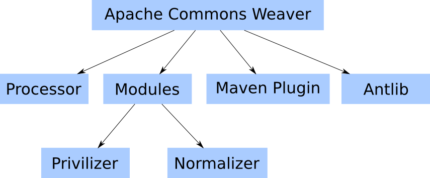

## Project Information

This document provides an overview of the various documents and links that are part of this project's general information. All of this content is automatically generated by [Maven](http://maven.apache.org) on behalf of the project.

### Overview

| Document | Description |
| --- | --- |
| [About](index.html) | Apache Commons Weaver provides an easy way to enhance compiled Java classes by generating ("weaving") bytecode into those classes. |
| [Summary](summary.html) | This document lists other related information of this project |
| [Project Modules](modules.html) | This document lists the modules (sub-projects) of this project. |
| [Team](team.html) | This document provides information on the members of this project. These are the individuals who have contributed to the project in one form or another. |
| [Source Code Management](scm.html) | This document lists ways to access the online source repository. |
| [Issue Management](issue-management.html) | This document provides information on the issue management system used in this project. |
| [Mailing Lists](mailing-lists.html) | This document provides subscription and archive information for this project's mailing lists. |
| [Dependency Information](dependency-info.html) | This document describes how to to include this project as a dependency using various dependency management tools. |
| [Dependency Convergence](dependency-convergence.html) | This document presents the convergence of dependency versions across the entire project, and its sub modules. |
| [CI Management](ci-management.html) | This is a link to the definitions of all continuous integration processes that builds and tests code on a frequent, regular basis. |
| [Distribution Management](distribution-management.html) | This document provides informations on the distribution management of this project. |

---
## Apache Commons Weaver Antlib

Provides an Antlib in the antlib:org.apache.commons.weaver.ant namespace, consisting of the following tasks:

### clean

Invokes available [Cleaner](../../apidocs/org/apache/commons/weaver/spi/Cleaner.html) implementations.

### weave

Invokes available [Weaver](../../apidocs/org/apache/commons/weaver/spi/Weaver.html) implementations.

Both the **weave** and **clean** tasks are parameterized either by nesting or by reference (via the settingsref attribute) with a custom type:

### settings

* target attribute - specifies the location of the classfiles to weave
* classpath attribute - path string (incompatible with classpathref)
* classpathref attribute - refid of an Ant **path** (incompatible with classpath)
* includesystemclasspath - specifies whether to include the system classpath
* nested propertyset - Ant **PropertySet**
* nested properties - specifies properties using the names and text values of nested elements (looks like Maven POM properties)

---
## Apache Commons Weaver Issue tracking

Apache Commons Weaver uses [ASF JIRA](https://issues.apache.org/jira/) for tracking issues.
See the [Apache Commons Weaver JIRA project page](https://issues.apache.org/jira/browse/WEAVER).

To use JIRA you may need to [create an account](https://issues.apache.org/jira/secure/Signup!default.jspa)
(if you have previously created/updated Commons issues using Bugzilla an account will have been automatically
created and you can use the [Forgot Password](https://issues.apache.org/jira/secure/ForgotPassword!default.jspa)
page to get a new password).

If you would like to report a bug, or raise an enhancement request with
Apache Commons Weaver please do the following:

1. [Search existing open bugs](https://issues.apache.org/jira/secure/IssueNavigator.jspa?reset=true&pid=12315320&sorter/field=issuekey&sorter/order=DESC&status=1&status=3&status=4).
   If you find your issue listed then please add a comment with your details.
2. [Search the mailing list archive(s)](mail-lists.html).
   You may find your issue or idea has already been discussed.
3. Decide if your issue is a bug or an enhancement.
4. Submit either a [bug report](https://issues.apache.org/jira/secure/CreateIssueDetails!init.jspa?pid=12315320&issuetype=1&priority=4&assignee=-1)
   or [enhancement request](https://issues.apache.org/jira/secure/CreateIssueDetails!init.jspa?pid=12315320&issuetype=4&priority=4&assignee=-1).

Please also remember these points:

* the more information you provide, the better we can help you
* test cases are vital, particularly for any proposed enhancements
* the developers of Apache Commons Weaver are all unpaid volunteers

For more information on subversion and creating patches see the
[Apache Contributors Guide](http://www.apache.org/dev/contributors.html).

You may also find these links useful:

* [All Open Apache Commons Weaver bugs](https://issues.apache.org/jira/secure/IssueNavigator.jspa?reset=true&pid=12315320&sorter/field=issuekey&sorter/order=DESC&status=1&status=3&status=4)
* [All Resolved Apache Commons Weaver bugs](https://issues.apache.org/jira/secure/IssueNavigator.jspa?reset=true&pid=12315320&sorter/field=issuekey&sorter/order=DESC&status=5&status=6)
* [All Apache Commons Weaver bugs](https://issues.apache.org/jira/secure/IssueNavigator.jspa?reset=true&pid=12315320&sorter/field=issuekey&sorter/order=DESC)

---
# Apache Commons Weaver

Occasionally, as Java developers, we encounter a problem whose solution simply cannot be expressed in the Java language. Often, the Java annotation processing tools can be used to great effect, and they should not be dismissed as your first line of defense when you need to generate additional classes. Occasionally, however, our only recourse is to manipulate existing class files. It is these situations which Apache Commons Weaver was designed to address.

Apache Commons Weaver consists of:

* [Core Framework](#core)
* [Weaver Modules](#weavers)
* [Maven Plugin](#maven)
* [Antlib](#antlib)

The Maven Plugin and Antlib are used for invoking Weaving facilities. Below you will find a graph with a high level overview of Apache Commons Weaver project.



Latest API documentation is [here](apidocs/index.html).

### Core Framework

The [Commons Weaver Processor](commons-weaver-parent/commons-weaver-processor/index.html) defines a “weaver module” service provider interface (SPI) as well as the facilities that use the Java ServiceLoader to discover and invoke defined weaver modules for simple filesystem-based bytecode weaving.

### Weaver Modules

A number of [Weaver Modules](commons-weaver-parent/commons-weaver-modules-parent/index.html) are provided by the Commons Weaver project. Typically a weaver module may respect a set of configuration properties which should be documented along with that module.

### Maven Plugin

The [Commons Weaver plugin for Apache Maven](commons-weaver-parent/commons-weaver-maven-plugin/plugin-info.html) aims to integrate Weaver as smoothly as possible for Maven users. Here is an example of configuring the privilizer module:

```
  <plugin>
    <groupId>org.apache.commons</groupId>
    <artifactId>commons-weaver-maven-plugin</artifactId>
    <version>${commons.weaver.version}</version>
    <configuration>
      <weaverConfig>
        <privilizer.accessLevel>${privilizer.accessLevel}</privilizer.accessLevel>
        <privilizer.policy>${privilizer.policy}</privilizer.policy>
        <privilizer.verify>${privilizer.verify}</privilizer.verify>
      </weaverConfig>
    </configuration>
    <executions>
      <execution>
        <goals>
          <goal>prepare</goal>
          <goal>weave</goal>
        </goals>
      </execution>
    </executions>
    <dependencies>
      <dependency>
        <groupId>org.apache.commons</groupId>
        <artifactId>commons-weaver-privilizer-api</artifactId>
        <version>${commons.weaver.version}</version>
      </dependency>
      <dependency>
        <groupId>org.apache.commons</groupId>
        <artifactId>commons-weaver-privilizer</artifactId>
        <version>${commons.weaver.version}</version>
      </dependency>
    </dependencies>
  </plugin>
```

### Antlib

The [Commons Weaver Antlib](commons-weaver-parent/commons-weaver-antlib/index.html) provides tasks and types to facilitate the integration of Commons Weaver into your Apache Ant-based build process. Here the user will make the commons-weaver-antlib jar (which includes the Apache Commons Weaver processor and its dependencies), along with the jar files of the desired modules, available to the Ant build using one of the various mechanisms supported. More information on this is available [here](http://ant.apache.org/manual/using.html#external-tasks). Having done this the basic approach will be to parameterize one of the provided tasks (clean|weave) with a settings element. If both weave and clean tasks are used, defining a [reference](http://ant.apache.org/manual/using.html#references) to the settings object and referencing it using the settingsref attribute is recommended, as seen here:

```
  <settings id="weavesettings"
            target="target/classes"
            classpathref="maincp">
    <properties>
      <privilizer.accessLevel>${privilizer.accessLevel}</privilizer.accessLevel>
      <privilizer.policy>${privilizer.policy}</privilizer.policy>
      <privilizer.verify>${privilizer.verify}</privilizer.verify>
    </properties>
  </settings>

  <clean settingsref="weavesettings" />
  <weave settingsref="weavesettings" />
```

Multiple weaving targets (e.g. main vs. test) are of course woven using different settings.

## Custom Weaver Modules

As discussed, some modules are provided for common cases, and the developers welcome suggestions for useful modules, but there is no reason not to get started writing your own weaver module (assuming you are sure this is the right solution, or just want to do this for fun) now! When the processor framework invokes your custom Weaver, it will pass in a Scanner that can be used to find the classes you are interested in. Request the original bytecode from the WeaveEnvironment and make your changes (for this task you will save time and frustration using one of the available open source Java bytecode manipulation libraries). Save your changes back to the WeaveEnvironment. Rinse, repeat. Hint: if your Weaver uses configuration parameters to dictate its behavior, it can leave a scannable “footprint” in your woven classes. Then implement the Cleaner SPI to find and delete these in the case that the current configuration is incompatible with the results of an earlier “weaving.”

## Examples

The canonical example is the [privilizer module](commons-weaver-parent/commons-weaver-modules-parent/commons-weaver-privilizer-parent/index.html).

A simple example could be exposing annotated methods for a REST API. Suppose you want to expose only classes annotated with @WebExposed to your Web REST API.

```
  package example;

  import java.lang.annotation.ElementType;
  import java.lang.annotation.Retention;
  import java.lang.annotation.RetentionPolicy;
  import java.lang.annotation.Target;

  /**
   * Marks methods that interest our weaver module.
   */
  @Target(ElementType.METHOD)
  @Retention(RetentionPolicy.CLASS)
  public @interface WebExposed {

  }
```

And your POJO object annotated.

```
  package example;

  /**
   * Represents a user in our system.
   */
  public class User {
      
      private String name;
      private String surname;
      private Integer age;

      public User() {
          super();
      }

      public User(String name, String surname, Integer age) {
          super();
          this.name = name;
          this.surname = surname;
          this.age = age;
      }

      @WebExposed
      public String getName() {
          return name;
      }

      public void setName(String name) {
          this.name = name;
      }

      @WebExposed
      public String getSurname() {
          return surname;
      }

      public void setSurname(String surname) {
          this.surname = surname;
      }

  }
```

Now in order to scan your classpath and find the annotated methods normally you would use Java Reflection API or something similar, but the good news is that Apache Commons Weaver abstracts this for you.

```
  package example;

  import java.io.File;
  import java.lang.annotation.ElementType;
  import java.util.Arrays;
  import java.util.Properties;

  import org.apache.commons.weaver.WeaveProcessor;
  import org.apache.commons.weaver.model.AnnotatedElements;
  import org.apache.commons.weaver.model.ScanRequest;
  import org.apache.commons.weaver.model.ScanResult;
  import org.apache.commons.weaver.model.Scanner;
  import org.apache.commons.weaver.model.WeavableMethod;
  import org.apache.commons.weaver.model.WeaveEnvironment;
  import org.apache.commons.weaver.model.WeaveInterest;
  import org.apache.commons.weaver.spi.Weaver;

  public class MyWeaver implements Weaver {

      @Override
      public boolean process(WeaveEnvironment environment, Scanner scanner) {
          // We want to find methods annotated with @WebExposed.
          WeaveInterest findAnnotation = WeaveInterest.of(WebExposed.class, ElementType.METHOD);
          ScanResult scanResult = scanner.scan(new ScanRequest().add(findAnnotation));
          AnnotatedElements<WeavableMethod<?>> annotatedMethods = scanResult.getMethods();
          for (WeavableMethod<?> method : annotatedMethods) {
              // The API code is out of the scope of this guide, but you can do other things here, 
              // like modifying your class
              System.out.println("Expose method " + method.getTarget().getName() + " in our REST API");
          }
          return true;
      }
      
  }
```

Before running the example above you need to tell the ServiceProvider about your custom Weaver. This is done by adding a file to your *META-INF* directory. If you are using Maven, then creating src/main/resources/META-INF/services/org.apache.commons.weaver.spi.Weaver with

```
example.MyWeaver
```

will instruct ServiceLoader to load your Weaver class.

## FAQ

* *Q*: Why not just use [AspectJ](http://eclipse.org/aspectj/)?

  *A*: The original motivation to develop the codebase that evolved into Commons Weaver instead of simply using AspectJ was to avoid the runtime dependency, however small, introduced by the use of AspectJ. Additionally, later versions of AspectJ are licensed under the [EPL](http://eclipse.org/legal/epl-v10.html) which can be considered less permissive than the Apache license. Choice is A Good Thing.
* *Q*: What is the relationship between Commons Weaver and Commons BCEL/ASM/Javassist/CGLIB?

  *A*: Rather than being an *alternative* to these technologies, Commons Weaver can be thought of as providing a structured environment in which these technologies can be put to use. I.e., the bytecode modifications made by a given Weaver implementation would typically be implemented using one of these (or comparable) libraries.

---
## Overview

This project uses [JIRA](http://www.atlassian.com/software/jira).

## Issue Management

Issues, bugs, and feature requests should be submitted to the following issue management system for this project.

```
http://issues.apache.org/jira/browse/WEAVER
```

---
## Apache Commons Weaver Modules

This is the parent Apache Maven module for the weaver modules provided with Apache Commons Weaver. See [Modules](modules.html).

---
Apache Maven 3 is required to build Apache Commons Weaver, using Java 8.

### Site building issues

Apache Commons Weaver uses the japicmp report for API compatibility reporting. This requires that the package goal be invoked in the same Maven run as the site goal.

---
## Dependency Information

### Apache Maven

```
<dependency>
  <groupId>org.apache.commons</groupId>
  <artifactId>commons-weaver-base</artifactId>
  <version>2.0</version>
  <type>pom</type>
</dependency>
```

### Apache Buildr

```
'org.apache.commons:commons-weaver-base:pom:2.0'
```

### Apache Ivy

```
<dependency org="org.apache.commons" name="commons-weaver-base" rev="2.0">
  <artifact name="commons-weaver-base" type="pom" />
</dependency>
```

### Groovy Grape

```
@Grapes(
@Grab(group='org.apache.commons', module='commons-weaver-base', version='2.0')
)
```

### Gradle/Grails

```
compile 'org.apache.commons:commons-weaver-base:2.0'
```

### Scala SBT

```
libraryDependencies += "org.apache.commons" % "commons-weaver-base" % "2.0"
```

### Leiningen

```
[org.apache.commons/commons-weaver-base "2.0"]
```

---
## Download Apache Commons Weaver

### Using a Mirror

We recommend you use a mirror to download our release
builds, but you **must** [verify the integrity](http://www.apache.org/info/verification.html) of
the downloaded files using signatures downloaded from our main
distribution directories. Recent releases (48 hours) may not yet
be available from all the mirrors.

You are currently using **https://dlcdn.apache.org/**. If you
encounter a problem with this mirror, please select another
mirror. If all mirrors are failing, there are *backup*
mirrors (at the end of the mirrors list) that should be
available.

Other mirrors:
https://dlcdn.apache.org/https://dlcdn.apache.org/ (backup)

It is essential that you
[verify the integrity](https://www.apache.org/info/verification.html)
of downloaded files, preferably using the PGP signature (\*.asc files);
failing that using the SHA256 hash (\*.sha256 checksum files).

The [KEYS](https://www.apache.org/dist/commons/KEYS)
file contains the public PGP keys used by Apache Commons developers
to sign releases.

## Apache Commons Weaver 2.0

### Binaries

|  |  |  |
| --- | --- | --- |
| [commons-weaver-2.0-bin.tar.gz](https://dlcdn.apache.org//commons/weaver/binaries/commons-weaver-2.0-bin.tar.gz) | [sha256](https://www.apache.org/dist/commons/weaver/binaries/commons-weaver-2.0-bin.tar.gz.sha256) | [pgp](https://www.apache.org/dist/commons/weaver/binaries/commons-weaver-2.0-bin.tar.gz.asc) |
| [commons-weaver-2.0-bin.zip](https://dlcdn.apache.org//commons/weaver/binaries/commons-weaver-2.0-bin.zip) | [sha256](https://www.apache.org/dist/commons/weaver/binaries/commons-weaver-2.0-bin.zip.sha256) | [pgp](https://www.apache.org/dist/commons/weaver/binaries/commons-weaver-2.0-bin.zip.asc) |

### Source

|  |  |  |
| --- | --- | --- |
| [commons-weaver-2.0-src.tar.gz](https://dlcdn.apache.org//commons/weaver/source/commons-weaver-2.0-src.tar.gz) | [sha256](https://www.apache.org/dist/commons/weaver/source/commons-weaver-2.0-src.tar.gz.sha256) | [pgp](https://www.apache.org/dist/commons/weaver/source/commons-weaver-2.0-src.tar.gz.asc) |
| [commons-weaver-2.0-src.zip](https://dlcdn.apache.org//commons/weaver/source/commons-weaver-2.0-src.zip) | [sha256](https://www.apache.org/dist/commons/weaver/source/commons-weaver-2.0-src.zip.sha256) | [pgp](https://www.apache.org/dist/commons/weaver/source/commons-weaver-2.0-src.zip.asc) |

## Archives

Older releases can be obtained from the archives.

* [browse download area](https://dlcdn.apache.org//commons/weaver/)
* [archives...](https://archive.apache.org/dist/commons/weaver/)

---
## Plugin Documentation

Goals available for this plugin:

| Goal | Description |
| --- | --- |
| [commons-weaver:help](help-mojo.html) | Display help information on commons-weaver-maven-plugin.  Call `mvn commons-weaver:help -Ddetail=true -Dgoal=<goal-name>` to display parameter details. |
| [commons-weaver:prepare](prepare-mojo.html) | Goal to clean woven classes. |
| [commons-weaver:test-prepare](test-prepare-mojo.html) | Goal to clean woven test classes. |
| [commons-weaver:test-weave](test-weave-mojo.html) | Goal to weave test classes. |
| [commons-weaver:weave](weave-mojo.html) | Goal to weave classes. |

### System Requirements

The following specifies the minimum requirements to run this Maven plugin:

|  |  |
| --- | --- |
| Maven | 2.0 |
| JDK | 1.8 |
| Memory | No minimum requirement. |
| Disk Space | No minimum requirement. |

### Usage

You should specify the version in your project's plugin configuration:

```
<project>
  ...
  <build>
    <!-- To define the plugin version in your parent POM -->
    <pluginManagement>
      <plugins>
        <plugin>
          <groupId>org.apache.commons</groupId>
          <artifactId>commons-weaver-maven-plugin</artifactId>
          <version>2.0</version>
        </plugin>
        ...
      </plugins>
    </pluginManagement>
    <!-- To use the plugin goals in your POM or parent POM -->
    <plugins>
      <plugin>
        <groupId>org.apache.commons</groupId>
        <artifactId>commons-weaver-maven-plugin</artifactId>
        <version>2.0</version>
      </plugin>
      ...
    </plugins>
  </build>
  ...
</project>
```

For more information, see ["Guide to Configuring Plug-ins"](http://maven.apache.org/guides/mini/guide-configuring-plugins.html)

---
## Project Summary

### Project Information

| Field | Value |
| --- | --- |
| Name | Apache Commons Weaver |
| Description | Apache Commons Weaver provides an easy way to enhance compiled Java classes by generating ("weaving") bytecode into those classes. |
| Homepage | <http://commons.apache.org/proper/commons-weaver> |

### Project Organization

| Field | Value |
| --- | --- |
| Name | The Apache Software Foundation |
| URL | <https://www.apache.org/> |

### Build Information

| Field | Value |
| --- | --- |
| GroupId | org.apache.commons |
| ArtifactId | commons-weaver-base |
| Version | 2.0 |
| Type | pom |

---
## Apache Commons Weaver Privilizer

Provides machinery to automate the handling of Java Security access controls in code. This involves wrapping calls that may trigger java.lang.SecurityExceptions in PrivilegedAction objects. Unfortunately this is quite an expensive operation and slows code down considerably; when executed in an environment that has no SecurityManager activated it is an utter waste. The typical pattern to cope with this is:

```
if (System.getSecurityManager() != null) {
  AccessController.doPrivileged(new PrivilegedAction<Void>() {
    public Void run() {
      doSomethingThatRequiresPermissions();
      return null;
    }
  });
} else {
  doSomethingThatRequiresPermissions();
}
```

This becomes tedious in short order. The immediate response of a typical developer: relegate the repetitive code to a set of utility methods. In the case of Java security, however, this approach is considered risky. The purpose of the Privilizer, then, is to instrument compiled methods originally annotated with our @Privileged annotation. This annotation is retained in the classfiles, but not available at runtime, and there are no runtime dependencies.

### Basic Privilization

```
@Privileged
private void doSomethingThatRequiresPermissions() {
  ...
}
```

Annotating a method with the [@Privileged](../../apidocs/org/apache/commons/weaver/privilizer/Privileged.html) annotation will cause the [PrivilizerWeaver](../../apidocs/org/apache/commons/weaver/privilizer/PrivilizerWeaver.html) to generate these checks automatically, leaving you to simply implement the code!

### Blueprint Privilization

The so-called “blueprint” feature returns to the concept of static utility methods. Why are these considered a liability? Because your trusted code presumptuously extends your trust via public methods to any class in the JVM, almost certainly contrary to the wishes of the owner of that JVM. Our blueprint technique allows you to define (or reuse) static utility methods in a secure way: simply define these utility methods in a SecurityManager-agnostic manner and let the consuming class request that calls to them be treated as blueprints for @Privileged methods:

```
public class Utils {
  public static void doSomethingThatRequiresPrivileges() {
    ...
  }
}

@Privilizing(CallTo(Utils.class))
public class UtilsClient {
  public void foo() {
    Utils.doSomethingThatRequiresPrivileges();
  }
}
```

The static methods of the Utils class will be called as though they had been locally declared and annotated with @Privileged. See the documentation of the [@Privilizing](../../apidocs/org/apache/commons/weaver/privilizer/Privilizing.html) annotation for more information on how to specify multiple classes, restrict to only certain methods, etc.

*Q:* What if my utility methods access static variables of their declaring class?

*A:* The imported methods reference those fields via reflection; i.e. the original fields are used.

*Q:* Does this modify the accessibility of those fields?

*A:* Yes, but only for the duration of the method implementation. The fields’ accessibility is checked before execution, and if a given field is not accessible on the way in, it will be restored to its original state in a finally block.

### Configuration

The PrivilizerWeaver supports the following options:

* privilizer.accessLevel : name of the highest [AccessLevel](../../apidocs/org/apache/commons/weaver/privilizer/AccessLevel.html) to privilize (default PRIVATE)
* privilizer.policy : name of the [Policy](../../apidocs/org/apache/commons/weaver/privilizer/Policy.html) (determines when to check for a SecurityManager)

---
## Project Team

A successful project requires many people to play many roles. Some members write code or documentation, while others are valuable as testers, submitting patches and suggestions.

The project team is comprised of Members and Contributors. Members have direct access to the source of a project and actively evolve the code-base. Contributors improve the project through submission of patches and suggestions to the Members. The number of Contributors to the project is unbounded. Get involved today. All contributions to the project are greatly appreciated.

### Members

The following is a list of developers with commit privileges that have directly contributed to the project in one way or another.

| Image | Id | Name | Email | Organization |
| --- | --- | --- | --- | --- |
|  | kinow | Bruno P. Kinoshita | kinow AT apache DOT org | Apache |
|  | mbenson | Matt Benson | mbenson AT apache DOT org | Apache |
|  | struberg | Mark Struberg | struberg AT apache DOT org | Apache |

### Contributors

There are no contributors listed for this project. Please check back again later.

---
## Project Team

A successful project requires many people to play many roles. Some members write code or documentation, while others are valuable as testers, submitting patches and suggestions.

The project team is comprised of Members and Contributors. Members have direct access to the source of a project and actively evolve the code-base. Contributors improve the project through submission of patches and suggestions to the Members. The number of Contributors to the project is unbounded. Get involved today. All contributions to the project are greatly appreciated.

### Members

The following is a list of developers with commit privileges that have directly contributed to the project in one way or another.

| Image | Id | Name | Email | Organization |
| --- | --- | --- | --- | --- |
|  | kinow | Bruno P. Kinoshita | <kinow AT apache DOT org> | Apache |
|  | mbenson | Matt Benson | <mbenson AT apache DOT org> | Apache |
|  | struberg | Mark Struberg | <struberg AT apache DOT org> | Apache |

### Contributors

There are no contributors listed for this project. Please check back again later.

---
## Overview

The following is the distribution management information used by this project.

### Repository - apache.releases.https

<https://repository.apache.org/service/local/staging/deploy/maven2>

### Snapshot Repository - apache.snapshots.https

<https://repository.apache.org/content/repositories/snapshots>

### Site - commons.site

scm:svn:https://svn.apache.org/repos/infra/websites/production/commons/content/proper/commons-weaver

---
## Reactor Dependency Convergence

**Legend:**

| [Error] | At least one dependency has a differing version of the dependency or has SNAPSHOT dependencies. |

  

**Statistics:**

| Number of modules: | 12 |
| Number of dependencies (NOD): | 49 |
| Number of unique artifacts (NOA): | 56 |
| Number of version-conflicting artifacts (NOC): | 5 |
| Number of SNAPSHOT artifacts (NOS): | 0 |
| Convergence (NOD/NOA): | [Error] **87 %** |
| Ready for release (100% convergence and no SNAPSHOTS): | [Error] **Error** You do not have 100% convergence. |

### Dependencies used in modules

#### org.apache.maven:maven-artifact

|  |  |  |  |  |  |
| --- | --- | --- | --- | --- | --- |
| [Error] | |  |  | | --- | --- | | 3.0 | 1. org.apache.commons:commons-weaver-maven-plugin:maven-plugin:2.0 \- org.apache.maven.plugin-tools:maven-plugin-annotations:jar:3.5.2:provided    \- (org.apache.maven:maven-artifact:jar:3.0:provided - omitted for conflict with 3.1.0) | | 3.1.0 | 1. org.apache.commons:commons-weaver-maven-plugin:maven-plugin:2.0 +- org.apache.maven:maven-plugin-api:jar:3.1.0:provided |  \- org.apache.maven:maven-artifact:jar:3.1.0:provided \- org.apache.maven:maven-core:jar:3.1.0:provided    \- (org.apache.maven:maven-artifact:jar:3.1.0:provided - omitted for duplicate) | |

#### org.codehaus.plexus:plexus-classworlds

|  |  |  |  |  |  |
| --- | --- | --- | --- | --- | --- |
| [Error] | |  |  | | --- | --- | | 2.4 | 1. org.apache.commons:commons-weaver-maven-plugin:maven-plugin:2.0 \- org.apache.maven:maven-plugin-api:jar:3.1.0:provided    \- org.eclipse.sisu:org.eclipse.sisu.plexus:jar:0.0.0.M2a:provided       \- (org.codehaus.plexus:plexus-classworlds:jar:2.4:provided - omitted for conflict with 2.4.2) | | 2.4.2 | 1. org.apache.commons:commons-weaver-maven-plugin:maven-plugin:2.0 \- org.apache.maven:maven-core:jar:3.1.0:provided    \- org.codehaus.plexus:plexus-classworlds:jar:2.4.2:provided | |

#### org.codehaus.plexus:plexus-utils

|  |  |  |  |  |  |  |  |  |  |
| --- | --- | --- | --- | --- | --- | --- | --- | --- | --- |
| [Error] | |  |  | | --- | --- | | 1.5.5 | 1. org.apache.commons:commons-weaver-maven-plugin:maven-plugin:2.0 \- org.apache.maven:maven-core:jar:3.1.0:provided    \- org.sonatype.plexus:plexus-sec-dispatcher:jar:1.3:provided       \- (org.codehaus.plexus:plexus-utils:jar:1.5.5:provided - omitted for conflict with 3.0.10) | | 2.0.6 | 1. org.apache.commons:commons-weaver-maven-plugin:maven-plugin:2.0 \- org.codehaus.plexus:plexus-utils:jar:2.0.6:compile | | 2.1 | 1. org.apache.commons:commons-weaver-maven-plugin:maven-plugin:2.0 \- org.apache.maven:maven-plugin-api:jar:3.1.0:provided    \- org.eclipse.sisu:org.eclipse.sisu.plexus:jar:0.0.0.M2a:provided       \- (org.codehaus.plexus:plexus-utils:jar:2.1:provided - omitted for conflict with 3.0.10) | | 3.0.10 | 1. org.apache.commons:commons-weaver-maven-plugin:maven-plugin:2.0 +- org.apache.maven:maven-plugin-api:jar:3.1.0:provided |  +- org.apache.maven:maven-model:jar:3.1.0:provided |  |  \- (org.codehaus.plexus:plexus-utils:jar:3.0.10:provided - omitted for duplicate) |  \- org.apache.maven:maven-artifact:jar:3.1.0:provided |     \- (org.codehaus.plexus:plexus-utils:jar:3.0.10:provided - omitted for duplicate) \- org.apache.maven:maven-core:jar:3.1.0:provided    +- org.apache.maven:maven-settings:jar:3.1.0:provided    |  \- (org.codehaus.plexus:plexus-utils:jar:3.0.10:provided - omitted for duplicate)    +- org.apache.maven:maven-settings-builder:jar:3.1.0:provided    |  \- (org.codehaus.plexus:plexus-utils:jar:3.0.10:provided - omitted for duplicate)    +- org.apache.maven:maven-repository-metadata:jar:3.1.0:provided    |  \- (org.codehaus.plexus:plexus-utils:jar:3.0.10:provided - omitted for duplicate)    +- org.apache.maven:maven-model-builder:jar:3.1.0:provided    |  \- (org.codehaus.plexus:plexus-utils:jar:3.0.10:provided - omitted for duplicate)    +- org.apache.maven:maven-aether-provider:jar:3.1.0:provided    |  \- (org.codehaus.plexus:plexus-utils:jar:3.0.10:provided - omitted for duplicate)    \- (org.codehaus.plexus:plexus-utils:jar:3.0.10:provided - omitted for conflict with 2.0.6) | |

#### org.eclipse.aether:aether-api

|  |  |  |  |  |  |
| --- | --- | --- | --- | --- | --- |
| [Error] | |  |  | | --- | --- | | 0.9.0.M2 | 1. org.apache.commons:commons-weaver-maven-plugin:maven-plugin:2.0 \- org.apache.maven:maven-core:jar:3.1.0:provided    +- org.apache.maven:maven-aether-provider:jar:3.1.0:provided    |  +- (org.eclipse.aether:aether-api:jar:0.9.0.M2:provided - omitted for duplicate)    |  \- org.eclipse.aether:aether-spi:jar:0.9.0.M2:provided    |     \- (org.eclipse.aether:aether-api:jar:0.9.0.M2:provided - omitted for duplicate)    +- org.eclipse.aether:aether-impl:jar:0.9.0.M2:provided    |  \- (org.eclipse.aether:aether-api:jar:0.9.0.M2:provided - omitted for duplicate)    \- (org.eclipse.aether:aether-api:jar:0.9.0.M2:provided - omitted for conflict with 1.1.0) | | 1.1.0 | 1. org.apache.commons:commons-weaver-maven-plugin:maven-plugin:2.0 +- org.eclipse.aether:aether-api:jar:1.1.0:compile \- org.eclipse.aether:aether-util:jar:1.1.0:compile    \- (org.eclipse.aether:aether-api:jar:1.1.0:compile - omitted for duplicate) | |

#### org.eclipse.aether:aether-util

|  |  |  |  |  |  |
| --- | --- | --- | --- | --- | --- |
| [Error] | |  |  | | --- | --- | | 0.9.0.M2 | 1. org.apache.commons:commons-weaver-maven-plugin:maven-plugin:2.0 \- org.apache.maven:maven-core:jar:3.1.0:provided    +- org.apache.maven:maven-aether-provider:jar:3.1.0:provided    |  \- (org.eclipse.aether:aether-util:jar:0.9.0.M2:provided - omitted for duplicate)    +- org.eclipse.aether:aether-impl:jar:0.9.0.M2:provided    |  \- (org.eclipse.aether:aether-util:jar:0.9.0.M2:provided - omitted for duplicate)    \- (org.eclipse.aether:aether-util:jar:0.9.0.M2:provided - omitted for conflict with 1.1.0) | | 1.1.0 | 1. org.apache.commons:commons-weaver-maven-plugin:maven-plugin:2.0 \- org.eclipse.aether:aether-util:jar:1.1.0:compile | |

---
## Apache Commons Weaver Normalizer

The Normalizer module merges identical anonymous class definitions into a single type, thereby “normalizing” them and reducing their collective footprint on your archive and more importantly on your JVM.

Considers only the simplest case in which:

* no methods are implemented
* the constructor only calls the super constructor

An anonymous class which violates these restrictions will be considered too complex and skipped in the interest of correctness.

### Configuration

The [NormalizerWeaver](../../../apidocs/org/apache/commons/weaver/normalizer/NormalizerWeaver.html) supports the following options:

* normalizer.superTypes : comma-delimited list of types whose subclasses/implementations should be normalized, e.g. javax.enterprise.util.TypeLiteral.
* normalizer.targetPackage : package to which merged types should be added.

---
## Overview

Apache Commons uses shared mailing lists for all of its [components](components.html).
To make it easier for people to only read messages related to components they are interested in,
the convention in Commons is to prefix the subject line of messages with the component's name,
for example:

* [EMAIL] Problem with mime message
* [IO] Progress Monitor
* [VFS] Public key authentication support for sftp

Questions related to the usage of Commons components should be posted to the
[User List](http://mail-archives.apache.org/mod_mbox/commons-user/).
  
The [Developer List](http://mail-archives.apache.org/mod_mbox/commons-dev/)
is for questions and discussion related to the development of Commons components.
  
Please do not cross-post; developers are also subscribed to the user list.
Read the archives first in case your question has already been answered.
If not, then subscribe to the appropriate list and post your question.

**Note:** please don't send patches or attachments to any of the mailing lists.
Patches are best handled via the *Issue Tracking* system.
Otherwise, please upload the file to a public server and include the URL in the mail.

Please read the [Public Forum Archive Policy](http://www.apache.org/foundation/public-archives.html)
and [Tips for email contributors](http://www.apache.org/dev/contrib-email-tips.html) as well as
the Commons page [On Contributing Patches](patches.html)
  
For further information on Apache mailing lists please read
[General mailing list information](http://www.apache.org/foundation/mailinglists.html)
in particular the section entitled
[Subscribing and Unsubscribing](http://www.apache.org/foundation/mailinglists.html#subscribe)

## Commons Mailing Lists

**Please prefix the subject line of any messages with: *[component]*** - *thanks!*

| Name | Subscribe | Unsubscribe | Post | Apache Archive | Other Archives |
| --- | --- | --- | --- | --- | --- |
| **Commons Security List**    This is a private list, for reporting and discussion of security issues related to Commons components.    Please do not report security issues to public mailing lists or the JIRA issue tracker. | [Subscribe](mailto:security-subscribe@commons.apache.org)  Please note, that a subscription will only be successful for Commons PMC (or ASF) Members, or upon invitation. If you wish to subscribe, please contact the private@ mailing list. | [Unsubscribe](mailto:security-unsubscribe@commons.apache.org) | [Post](mailto:security@commons.apache.org)    Posts from non-subscribers will be allowed if they relate to a security issue with a Commons component. | [mail‑search.apache.org](https://mail-search.apache.org/pmc/private-arch/commons-security/) | Please note, that this archive is not accessible to the public, due to the confidential nature of the discussions. |
| **Commons User List**    Questions on using Commons components. | [Subscribe](mailto:user-subscribe@commons.apache.org) | [Unsubscribe](mailto:user-unsubscribe@commons.apache.org) | [Post](mailto:user@commons.apache.org) | [mail‑archives.apache.org](http://mail-archives.apache.org/mod_mbox/commons-user/) | [www.mail‑archive.com](http://www.mail-archive.com/user@commons.apache.org/) |
| **Commons Developer List**    Discussion of development of Commons components. | [Subscribe](mailto:dev-subscribe@commons.apache.org) | [Unsubscribe](mailto:dev-unsubscribe@commons.apache.org) | [Post](mailto:dev@commons.apache.org) | [mail‑archives.apache.org](http://mail-archives.apache.org/mod_mbox/commons-dev/) | [www.mail‑archive.com](http://www.mail-archive.com/dev@commons.apache.org/) |
| **Commons Issues List**    Only for e-mails automatically generated by the *issue tracking* system. | [Subscribe](mailto:issues-subscribe@commons.apache.org) | [Unsubscribe](mailto:issues-unsubscribe@commons.apache.org) | *read only* | [mail‑archives.apache.org](http://mail-archives.apache.org/mod_mbox/commons-issues/) | [www.mail‑archive.com](http://www.mail-archive.com/issues@commons.apache.org/) |
| **Commons Commits List**    Only for e-mails automatically generated by the [source control](scminfo.html) sytem. | [Subscribe](mailto:commits-subscribe@commons.apache.org) | [Unsubscribe](mailto:commits-unsubscribe@commons.apache.org) | *read only* | [mail‑archives.apache.org](http://mail-archives.apache.org/mod_mbox/commons-commits/) | [www.mail‑archive.com](http://www.mail-archive.com/commits@commons.apache.org/) |
| **Commons Notifications List**    For site staging build e-mails automatically generated by Buildbot. | [Subscribe](mailto:notifications-subscribe@commons.apache.org) | [Unsubscribe](mailto:notifications-unsubscribe@commons.apache.org) | *read only* | [mail‑archives.apache.org](http://mail-archives.apache.org/mod_mbox/commons-notifications/) | [www.mail‑archive.com](http://www.mail-archive.com/notifications@commons.apache.org/) |

## Apache Mailing Lists

Other mailing lists which you may find useful include:

| Name | Subscribe | Unsubscribe | Apache Archive | Other Archives |
| --- | --- | --- | --- | --- |
| **Apache Announce List**    General announcements of Apache project releases. | [Subscribe](mailto:announce-subscribe@apache.org) | [Unsubscribe](mailto:announce-unsubscribe@apache.org) | [mail‑archives.apache.org](http://mail-archives.apache.org/mod_mbox/www-announce/) | [www.mail‑archive.com](http://www.mail-archive.com/announce@apache.org/) |

## Other subject prefixes

Other prefixes which may be used on Commons mailing lists are:

* [ALL] - general discussion (developer list)
* [DOC] - Documentation discussion
* [jira] - this is automatically added by JIRA messages (issues list)
* [VOTE], [RESULT], [CANCELLED] - voting threads (developer list)
* [ANNOUNCE], [ANN] - announcements of releases etc.

---
## Overview

Apache Commons uses shared mailing lists for all of its [components](components.html).
To make it easier for people to only read messages related to components they are interested in,
the convention in Commons is to prefix the subject line of messages with the component's name,
for example:

* [EMAIL] Problem with mime message
* [IO] Progress Monitor
* [VFS] Public key authentication support for sftp

Questions related to the usage of Commons components should be posted to the
[User List](http://mail-archives.apache.org/mod_mbox/commons-user/).
  
The [Developer List](http://mail-archives.apache.org/mod_mbox/commons-dev/)
is for questions and discussion related to the development of Commons components.
  
Please do not cross-post; developers are also subscribed to the user list.
Read the archives first in case your question has already been answered.
If not, then subscribe to the appropriate list and post your question.

**Note:** please don't send patches or attachments to any of the mailing lists.
Patches are best handled via the *Issue Tracking* system.
Otherwise, please upload the file to a public server and include the URL in the mail.

Please read the [Public Forum Archive Policy](http://www.apache.org/foundation/public-archives.html)
and [Tips for email contributors](http://www.apache.org/dev/contrib-email-tips.html) as well as
the Commons page [On Contributing Patches](patches.html)
  
For further information on Apache mailing lists please read
[General mailing list information](http://www.apache.org/foundation/mailinglists.html)
in particular the section entitled
[Subscribing and Unsubscribing](http://www.apache.org/foundation/mailinglists.html#subscribe)

## Commons Mailing Lists

**Please prefix the subject line of any messages with: *[component]*** - *thanks!*

| Name | Subscribe | Unsubscribe | Post | Apache Archive | Other Archives |
| --- | --- | --- | --- | --- | --- |
| **Commons Security List**    This is a private list, for reporting and discussion of security issues related to Commons components.    Please do not report security issues to public mailing lists or the JIRA issue tracker. | [Subscribe](mailto:security-subscribe@commons.apache.org)  Please note, that a subscription will only be successful for Commons PMC (or ASF) Members, or upon invitation. If you wish to subscribe, please contact the private@ mailing list. | [Unsubscribe](mailto:security-unsubscribe@commons.apache.org) | [Post](mailto:security@commons.apache.org)    Posts from non-subscribers will be allowed if they relate to a security issue with a Commons component. | [mail‑search.apache.org](https://mail-search.apache.org/pmc/private-arch/commons-security/) | Please note, that this archive is not accessible to the public, due to the confidential nature of the discussions. |
| **Commons User List**    Questions on using Commons components. | [Subscribe](mailto:user-subscribe@commons.apache.org) | [Unsubscribe](mailto:user-unsubscribe@commons.apache.org) | [Post](mailto:user@commons.apache.org) | [mail‑archives.apache.org](http://mail-archives.apache.org/mod_mbox/commons-user/) | [www.mail‑archive.com](http://www.mail-archive.com/user@commons.apache.org/) |
| **Commons Developer List**    Discussion of development of Commons components. | [Subscribe](mailto:dev-subscribe@commons.apache.org) | [Unsubscribe](mailto:dev-unsubscribe@commons.apache.org) | [Post](mailto:dev@commons.apache.org) | [mail‑archives.apache.org](http://mail-archives.apache.org/mod_mbox/commons-dev/) | [www.mail‑archive.com](http://www.mail-archive.com/dev@commons.apache.org/) |
| **Commons Issues List**    Only for e-mails automatically generated by the *issue tracking* system. | [Subscribe](mailto:issues-subscribe@commons.apache.org) | [Unsubscribe](mailto:issues-unsubscribe@commons.apache.org) | *read only* | [mail‑archives.apache.org](http://mail-archives.apache.org/mod_mbox/commons-issues/) | [www.mail‑archive.com](http://www.mail-archive.com/issues@commons.apache.org/) |
| **Commons Commits List**    Only for e-mails automatically generated by the [source control](scminfo.html) sytem. | [Subscribe](mailto:commits-subscribe@commons.apache.org) | [Unsubscribe](mailto:commits-unsubscribe@commons.apache.org) | *read only* | [mail‑archives.apache.org](http://mail-archives.apache.org/mod_mbox/commons-commits/) | [www.mail‑archive.com](http://www.mail-archive.com/commits@commons.apache.org/) |
| **Commons Notifications List**    For site staging build e-mails automatically generated by Buildbot. | [Subscribe](mailto:notifications-subscribe@commons.apache.org) | [Unsubscribe](mailto:notifications-unsubscribe@commons.apache.org) | *read only* | [mail‑archives.apache.org](http://mail-archives.apache.org/mod_mbox/commons-notifications/) | [www.mail‑archive.com](http://www.mail-archive.com/notifications@commons.apache.org/) |

## Apache Mailing Lists

Other mailing lists which you may find useful include:

| Name | Subscribe | Unsubscribe | Apache Archive | Other Archives |
| --- | --- | --- | --- | --- |
| **Apache Announce List**    General announcements of Apache project releases. | [Subscribe](mailto:announce-subscribe@apache.org) | [Unsubscribe](mailto:announce-unsubscribe@apache.org) | [mail‑archives.apache.org](http://mail-archives.apache.org/mod_mbox/www-announce/) | [www.mail‑archive.com](http://www.mail-archive.com/announce@apache.org/) |

## Other subject prefixes

Other prefixes which may be used on Commons mailing lists are:

* [ALL] - general discussion (developer list)
* [DOC] - Documentation discussion
* [jira] - this is automatically added by JIRA messages (issues list)
* [VOTE], [RESULT], [CANCELLED] - voting threads (developer list)
* [ANNOUNCE], [ANN] - announcements of releases etc.

---
## Generated Reports

This document provides an overview of the various reports that are automatically generated by [Maven](http://maven.apache.org) . Each report is briefly described below.

### Overview

| Document | Description |
| --- | --- |
| [Changes](changes-report.html) | Changes report on releases of this project. |
| [JIRA Report](jira-report.html) | Report on Issues from the JIRA Issue Tracking System. |
| [Source Xref](xref/index.html) | HTML based, cross-reference version of Java source code. |
| [Test Source Xref](xref-test/index.html) | HTML based, cross-reference version of Java test source code. |
| [Surefire Report](surefire-report.html) | Report on the test results of the project. |
| [Rat Report](rat-report.html) | Report on compliance to license related source code policies |
| [japicmp](japicmp.html) | Comparing source compatibility of against commons-weaver-base-1.3.pom |

---
## Overview

This project uses [Jenkins](http://jenkins-ci.org/).

## Access

The following is a link to the continuous integration system used by the project:

```
https://builds.apache.org/
```

## Notifiers

No notifiers are defined. Please check back at a later date.

---
## Apache Commons Weaver Processor

This module provides the org.apache.commons:commons-weaver artifact. It defines the Apache Commons Weaver SPI as well as the basic build-time (filesystem-based) processors that detect, configure, and invoke available modules.

### WeaveProcessor

The [WeaveProcessor](apidocs/org/apache/commons/weaver/WeaveProcessor.html) invokes available implementations of the [Weaver](apidocs/org/apache/commons/weaver/spi/Weaver.html) SPI.

### CleanProcessor

The [CleanProcessor](apidocs/org/apache/commons/weaver/CleanProcessor.html) invokes available implementations of the [Cleaner](apidocs/org/apache/commons/weaver/spi/Cleaner.html) SPI.

---
## Overview

This project uses [Git](https://git-scm.com/) to manage its source code. Instructions on Git use can be found at <https://git-scm.com/documentation>.

## Web Browser Access

The following is a link to a browsable version of the source repository:

```
http://gitbox.apache.org/repos/asf/commons-weaver.git
```

## Anonymous Access

The source can be checked out anonymously from Git with this command (See <https://git-scm.com/docs/git-clone>):

```
$ git clone --branch 2.0_RC1 http://gitbox.apache.org/repos/asf/commons-weaver.git
```

## Developer Access

Only project developers can access the Git tree via this method (See <https://git-scm.com/docs/git-clone>).

```
$ git clone --branch 2.0_RC1 https://gitbox.apache.org/repos/asf/commons-weaver.git
```

## Access from Behind a Firewall

Refer to the documentation of the SCM used for more information about access behind a firewall.

---
Apache Commons Weaver 2.0 API


## Frame Alert

This document is designed to be viewed using the frames feature. If you see this message, you are using a non-frame-capable web client. Link to [Non-frame version](overview-summary.html).

---
## Project Modules

This project has declared the following modules:

| Name | Description |
| --- | --- |
| [Apache Commons Weaver Build Tools](./commons-weaver-build-tools/index.html) | Provide common setup, from http://maven.apache.org/plugins/maven-checkstyle-plugin/examples/multi-module-config.html |
| [Apache Commons Weaver Parent](./commons-weaver-parent/index.html) | Apache Commons Weaver Parent |
| [Apache Commons Weaver Processor](./commons-weaver-parent/commons-weaver-processor/index.html) | Defines the Apache Commons Weaver SPI as well as the basic build-time (filesystem-based) processors that detect, configure, and invoke available modules. |
| [Apache Commons Weaver Maven Plugin](./commons-weaver-parent/commons-weaver-maven-plugin/index.html) | Weaving Maven goals |
| [Apache Commons Weaver Antlib](./commons-weaver-parent/commons-weaver-antlib/index.html) | Apache Commons Weaver Ant task library |
| [Apache Commons Weaver Modules aggregator project](./commons-weaver-parent/commons-weaver-modules-parent/index.html) | Hosts weaver modules. |
| [Apache Commons Weaver Distribution](./commons-weaver-parent/commons-weaver/index.html) | Creates the Apache Commons Weaver multimodule distribution. |

---
## Overview

Typically the licenses listed for the project are that of the project itself, and not of dependencies.

## Project Licenses

### Apache License, Version 2.0

```
                                 Apache License
                           Version 2.0, January 2004
                        http://www.apache.org/licenses/

   TERMS AND CONDITIONS FOR USE, REPRODUCTION, AND DISTRIBUTION

   1. Definitions.

      "License" shall mean the terms and conditions for use, reproduction,
      and distribution as defined by Sections 1 through 9 of this document.

      "Licensor" shall mean the copyright owner or entity authorized by
      the copyright owner that is granting the License.

      "Legal Entity" shall mean the union of the acting entity and all
      other entities that control, are controlled by, or are under common
      control with that entity. For the purposes of this definition,
      "control" means (i) the power, direct or indirect, to cause the
      direction or management of such entity, whether by contract or
      otherwise, or (ii) ownership of fifty percent (50%) or more of the
      outstanding shares, or (iii) beneficial ownership of such entity.

      "You" (or "Your") shall mean an individual or Legal Entity
      exercising permissions granted by this License.

      "Source" form shall mean the preferred form for making modifications,
      including but not limited to software source code, documentation
      source, and configuration files.

      "Object" form shall mean any form resulting from mechanical
      transformation or translation of a Source form, including but
      not limited to compiled object code, generated documentation,
      and conversions to other media types.

      "Work" shall mean the work of authorship, whether in Source or
      Object form, made available under the License, as indicated by a
      copyright notice that is included in or attached to the work
      (an example is provided in the Appendix below).

      "Derivative Works" shall mean any work, whether in Source or Object
      form, that is based on (or derived from) the Work and for which the
      editorial revisions, annotations, elaborations, or other modifications
      represent, as a whole, an original work of authorship. For the purposes
      of this License, Derivative Works shall not include works that remain
      separable from, or merely link (or bind by name) to the interfaces of,
      the Work and Derivative Works thereof.

      "Contribution" shall mean any work of authorship, including
      the original version of the Work and any modifications or additions
      to that Work or Derivative Works thereof, that is intentionally
      submitted to Licensor for inclusion in the Work by the copyright owner
      or by an individual or Legal Entity authorized to submit on behalf of
      the copyright owner. For the purposes of this definition, "submitted"
      means any form of electronic, verbal, or written communication sent
      to the Licensor or its representatives, including but not limited to
      communication on electronic mailing lists, source code control systems,
      and issue tracking systems that are managed by, or on behalf of, the
      Licensor for the purpose of discussing and improving the Work, but
      excluding communication that is conspicuously marked or otherwise
      designated in writing by the copyright owner as "Not a Contribution."

      "Contributor" shall mean Licensor and any individual or Legal Entity
      on behalf of whom a Contribution has been received by Licensor and
      subsequently incorporated within the Work.

   2. Grant of Copyright License. Subject to the terms and conditions of
      this License, each Contributor hereby grants to You a perpetual,
      worldwide, non-exclusive, no-charge, royalty-free, irrevocable
      copyright license to reproduce, prepare Derivative Works of,
      publicly display, publicly perform, sublicense, and distribute the
      Work and such Derivative Works in Source or Object form.

   3. Grant of Patent License. Subject to the terms and conditions of
      this License, each Contributor hereby grants to You a perpetual,
      worldwide, non-exclusive, no-charge, royalty-free, irrevocable
      (except as stated in this section) patent license to make, have made,
      use, offer to sell, sell, import, and otherwise transfer the Work,
      where such license applies only to those patent claims licensable
      by such Contributor that are necessarily infringed by their
      Contribution(s) alone or by combination of their Contribution(s)
      with the Work to which such Contribution(s) was submitted. If You
      institute patent litigation against any entity (including a
      cross-claim or counterclaim in a lawsuit) alleging that the Work
      or a Contribution incorporated within the Work constitutes direct
      or contributory patent infringement, then any patent licenses
      granted to You under this License for that Work shall terminate
      as of the date such litigation is filed.

   4. Redistribution. You may reproduce and distribute copies of the
      Work or Derivative Works thereof in any medium, with or without
      modifications, and in Source or Object form, provided that You
      meet the following conditions:

      (a) You must give any other recipients of the Work or
          Derivative Works a copy of this License; and

      (b) You must cause any modified files to carry prominent notices
          stating that You changed the files; and

      (c) You must retain, in the Source form of any Derivative Works
          that You distribute, all copyright, patent, trademark, and
          attribution notices from the Source form of the Work,
          excluding those notices that do not pertain to any part of
          the Derivative Works; and

      (d) If the Work includes a "NOTICE" text file as part of its
          distribution, then any Derivative Works that You distribute must
          include a readable copy of the attribution notices contained
          within such NOTICE file, excluding those notices that do not
          pertain to any part of the Derivative Works, in at least one
          of the following places: within a NOTICE text file distributed
          as part of the Derivative Works; within the Source form or
          documentation, if provided along with the Derivative Works; or,
          within a display generated by the Derivative Works, if and
          wherever such third-party notices normally appear. The contents
          of the NOTICE file are for informational purposes only and
          do not modify the License. You may add Your own attribution
          notices within Derivative Works that You distribute, alongside
          or as an addendum to the NOTICE text from the Work, provided
          that such additional attribution notices cannot be construed
          as modifying the License.

      You may add Your own copyright statement to Your modifications and
      may provide additional or different license terms and conditions
      for use, reproduction, or distribution of Your modifications, or
      for any such Derivative Works as a whole, provided Your use,
      reproduction, and distribution of the Work otherwise complies with
      the conditions stated in this License.

   5. Submission of Contributions. Unless You explicitly state otherwise,
      any Contribution intentionally submitted for inclusion in the Work
      by You to the Licensor shall be under the terms and conditions of
      this License, without any additional terms or conditions.
      Notwithstanding the above, nothing herein shall supersede or modify
      the terms of any separate license agreement you may have executed
      with Licensor regarding such Contributions.

   6. Trademarks. This License does not grant permission to use the trade
      names, trademarks, service marks, or product names of the Licensor,
      except as required for reasonable and customary use in describing the
      origin of the Work and reproducing the content of the NOTICE file.

   7. Disclaimer of Warranty. Unless required by applicable law or
      agreed to in writing, Licensor provides the Work (and each
      Contributor provides its Contributions) on an "AS IS" BASIS,
      WITHOUT WARRANTIES OR CONDITIONS OF ANY KIND, either express or
      implied, including, without limitation, any warranties or conditions
      of TITLE, NON-INFRINGEMENT, MERCHANTABILITY, or FITNESS FOR A
      PARTICULAR PURPOSE. You are solely responsible for determining the
      appropriateness of using or redistributing the Work and assume any
      risks associated with Your exercise of permissions under this License.

   8. Limitation of Liability. In no event and under no legal theory,
      whether in tort (including negligence), contract, or otherwise,
      unless required by applicable law (such as deliberate and grossly
      negligent acts) or agreed to in writing, shall any Contributor be
      liable to You for damages, including any direct, indirect, special,
      incidental, or consequential damages of any character arising as a
      result of this License or out of the use or inability to use the
      Work (including but not limited to damages for loss of goodwill,
      work stoppage, computer failure or malfunction, or any and all
      other commercial damages or losses), even if such Contributor
      has been advised of the possibility of such damages.

   9. Accepting Warranty or Additional Liability. While redistributing
      the Work or Derivative Works thereof, You may choose to offer,
      and charge a fee for, acceptance of support, warranty, indemnity,
      or other liability obligations and/or rights consistent with this
      License. However, in accepting such obligations, You may act only
      on Your own behalf and on Your sole responsibility, not on behalf
      of any other Contributor, and only if You agree to indemnify,
      defend, and hold each Contributor harmless for any liability
      incurred by, or claims asserted against, such Contributor by reason
      of your accepting any such warranty or additional liability.

   END OF TERMS AND CONDITIONS

   APPENDIX: How to apply the Apache License to your work.

      To apply the Apache License to your work, attach the following
      boilerplate notice, with the fields enclosed by brackets "[]"
      replaced with your own identifying information. (Don't include
      the brackets!)  The text should be enclosed in the appropriate
      comment syntax for the file format. We also recommend that a
      file or class name and description of purpose be included on the
      same "printed page" as the copyright notice for easier
      identification within third-party archives.

   Copyright [yyyy] [name of copyright owner]

   Licensed under the Apache License, Version 2.0 (the "License");
   you may not use this file except in compliance with the License.
   You may obtain a copy of the License at

       http://www.apache.org/licenses/LICENSE-2.0

   Unless required by applicable law or agreed to in writing, software
   distributed under the License is distributed on an "AS IS" BASIS,
   WITHOUT WARRANTIES OR CONDITIONS OF ANY KIND, either express or implied.
   See the License for the specific language governing permissions and
   limitations under the License.
```

---
## Apache Commons Weaver Antlib

Provides an Antlib in the antlib:org.apache.commons.weaver.ant namespace, consisting of the following tasks:

### clean

Invokes available [Cleaner](../../apidocs/org/apache/commons/weaver/spi/Cleaner.html) implementations.

### weave

Invokes available [Weaver](../../apidocs/org/apache/commons/weaver/spi/Weaver.html) implementations.

Both the **weave** and **clean** tasks are parameterized either by nesting or by reference (via the settingsref attribute) with a custom type:

### settings

* target attribute - specifies the location of the classfiles to weave
* classpath attribute - path string (incompatible with classpathref)
* classpathref attribute - refid of an Ant **path** (incompatible with classpath)
* includesystemclasspath - specifies whether to include the system classpath
* nested propertyset - Ant **PropertySet**
* nested properties - specifies properties using the names and text values of nested elements (looks like Maven POM properties)

---
## Overview

This project uses [Jenkins](http://jenkins-ci.org/).

## Access

The following is a link to the continuous integration system used by the project:

```
https://builds.apache.org/
```

## Notifiers

No notifiers are defined. Please check back at a later date.

---
## Dependency Information

### Apache Maven

```
<dependency>
  <groupId>org.apache.commons</groupId>
  <artifactId>commons-weaver-antlib</artifactId>
  <version>2.0</version>
</dependency>
```

### Apache Buildr

```
'org.apache.commons:commons-weaver-antlib:jar:2.0'
```

### Apache Ivy

```
<dependency org="org.apache.commons" name="commons-weaver-antlib" rev="2.0">
  <artifact name="commons-weaver-antlib" type="jar" />
</dependency>
```

### Groovy Grape

```
@Grapes(
@Grab(group='org.apache.commons', module='commons-weaver-antlib', version='2.0')
)
```

### Gradle/Grails

```
compile 'org.apache.commons:commons-weaver-antlib:2.0'
```

### Scala SBT

```
libraryDependencies += "org.apache.commons" % "commons-weaver-antlib" % "2.0"
```

### Leiningen

```
[org.apache.commons/commons-weaver-antlib "2.0"]
```

---
## Overview

This project uses [JIRA](http://www.atlassian.com/software/jira).

## Issue Management

Issues, bugs, and feature requests should be submitted to the following issue management system for this project.

```
http://issues.apache.org/jira/browse/WEAVER
```

---
## Project Information

This document provides an overview of the various documents and links that are part of this project's general information. All of this content is automatically generated by [Maven](http://maven.apache.org) on behalf of the project.

### Overview

| Document | Description |
| --- | --- |
| [CI Management](ci-management.html) | This is a link to the definitions of all continuous integration processes that builds and tests code on a frequent, regular basis. |
| [Dependencies](dependencies.html) | This document lists the project's dependencies and provides information on each dependency. |
| [Dependency Information](dependency-info.html) | This document describes how to to include this project as a dependency using various dependency management tools. |
| [Dependency Management](dependency-management.html) | This document lists the dependencies that are defined through dependencyManagement. |
| [Distribution Management](distribution-management.html) | This document provides informations on the distribution management of this project. |
| [About](index.html) | Apache Commons Weaver Ant task library |
| [Issue Management](issue-management.html) | This document provides information on the issue management system used in this project. |
| [Licenses](licenses.html) | This document lists the project license(s). |
| [Mailing Lists](mailing-lists.html) | This document provides subscription and archive information for this project's mailing lists. |
| [Plugin Management](plugin-management.html) | This document lists the plugins that are defined through pluginManagement. |
| [Plugins](plugins.html) | This document lists the build plugins and the report plugins used by this project. |
| [Source Code Management](scm.html) | This document lists ways to access the online source repository. |
| [Summary](summary.html) | This document lists other related information of this project |
| [Team](team.html) | This document provides information on the members of this project. These are the individuals who have contributed to the project in one form or another. |

---
## Generated Reports

This document provides an overview of the various reports that are automatically generated by [Maven](http://maven.apache.org) . Each report is briefly described below.

### Overview

| Document | Description |
| --- | --- |
| [JIRA Report](jira-report.html) | Report on Issues from the JIRA Issue Tracking System. |
| [Source Xref](xref/index.html) | HTML based, cross-reference version of Java source code. |
| [JDepend](jdepend-report.html) | JDepend traverses Java class file directories and generates design quality metrics for each Java package. JDepend allows you to automatically measure the quality of a design in terms of its extensibility, reusability, and maintainability to manage package dependencies effectively. |
| [japicmp](japicmp.html) | Comparing source compatibility of commons-weaver-antlib-2.0.jar against commons-weaver-antlib-1.3.jar |
| [Javadoc](apidocs/index.html) | Javadoc API documentation. |
| [CPD](cpd.html) | Duplicate code detection. |
| [PMD](pmd.html) | Verification of coding rules. |
| [Checkstyle](checkstyle.html) | Report on coding style conventions. |
| [FindBugs](findbugs.html) | Generates a source code report with the FindBugs Library. |

---
## Overview

The following is the distribution management information used by this project.

### Repository - apache.releases.https

<https://repository.apache.org/service/local/staging/deploy/maven2>

### Snapshot Repository - apache.snapshots.https

<https://repository.apache.org/content/repositories/snapshots>

### Site - commons.site

scm:svn:https://svn.apache.org/repos/infra/websites/production/commons/content/proper/commons-weaver/commons-weaver-parent/commons-weaver-antlib

---
## Project Summary

### Project Information

| Field | Value |
| --- | --- |
| Name | Apache Commons Weaver Antlib |
| Description | Apache Commons Weaver Ant task library |
| Homepage | <http://commons.apache.org/proper/commons-weaver/commons-weaver-parent/commons-weaver-antlib> |

### Project Organization

| Field | Value |
| --- | --- |
| Name | The Apache Software Foundation |
| URL | <https://www.apache.org/> |

### Build Information

| Field | Value |
| --- | --- |
| GroupId | org.apache.commons |
| ArtifactId | commons-weaver-antlib |
| Version | 2.0 |
| Type | jar |
| Java Version | 1.8 |

---
## Project Build Plugins

| GroupId | ArtifactId | Version |
| --- | --- | --- |
| com.github.siom79.japicmp | [japicmp-maven-plugin](https://github.com/siom79/japicmp) | 0.11.1 |
| org.apache.commons | [commons-build-plugin](http://commons.apache.org/proper/commons-build-plugin/) | 1.9 |
| org.apache.commons | [commons-release-plugin](http://commons.apache.org/proper/commons-release-plugin/) | 1.5-SNAPSHOT |
| org.apache.felix | [maven-bundle-plugin](http://felix.apache.org/components/bundle-plugin/) | 3.5.0 |
| org.apache.maven.plugins | [maven-antrun-plugin](http://maven.apache.org/plugins/maven-antrun-plugin/) | 1.8 |
| org.apache.maven.plugins | [maven-assembly-plugin](https://maven.apache.org/plugins/maven-assembly-plugin/) | 3.1.0 |
| org.apache.maven.plugins | [maven-checkstyle-plugin](https://maven.apache.org/plugins/maven-checkstyle-plugin/) | 3.0.0 |
| org.apache.maven.plugins | [maven-clean-plugin](http://maven.apache.org/plugins/maven-clean-plugin/) | 3.0.0 |
| org.apache.maven.plugins | [maven-compiler-plugin](https://maven.apache.org/plugins/maven-compiler-plugin/) | 3.7.0 |
| org.apache.maven.plugins | [maven-deploy-plugin](http://maven.apache.org/plugins/maven-deploy-plugin/) | 2.8.2 |
| org.apache.maven.plugins | [maven-enforcer-plugin](https://maven.apache.org/enforcer/maven-enforcer-plugin/) | 3.0.0-M2 |
| org.apache.maven.plugins | [maven-gpg-plugin](http://maven.apache.org/plugins/maven-gpg-plugin/) | 1.6 |
| org.apache.maven.plugins | [maven-install-plugin](http://maven.apache.org/plugins/maven-install-plugin/) | 2.5.2 |
| org.apache.maven.plugins | [maven-jar-plugin](https://maven.apache.org/plugins/maven-jar-plugin/) | 3.1.0 |
| org.apache.maven.plugins | [maven-javadoc-plugin](https://maven.apache.org/plugins/maven-javadoc-plugin/) | 3.0.1 |
| org.apache.maven.plugins | [maven-pmd-plugin](https://maven.apache.org/plugins/maven-pmd-plugin/) | 3.10.0 |
| org.apache.maven.plugins | [maven-release-plugin](http://maven.apache.org/maven-release/maven-release-plugin/) | 2.5.3 |
| org.apache.maven.plugins | [maven-remote-resources-plugin](http://maven.apache.org/plugins/maven-remote-resources-plugin/) | 1.5 |
| org.apache.maven.plugins | [maven-resources-plugin](https://maven.apache.org/plugins/maven-resources-plugin/) | 3.0.2 |
| org.apache.maven.plugins | [maven-scm-publish-plugin](http://maven.apache.org/plugins/maven-scm-publish-plugin) | 1.1 |
| org.apache.maven.plugins | [maven-shade-plugin](https://maven.apache.org/plugins/maven-shade-plugin/) | 3.1.1 |
| org.apache.maven.plugins | [maven-site-plugin](https://maven.apache.org/plugins/maven-site-plugin/) | 3.7.1 |
| org.apache.maven.plugins | [maven-source-plugin](https://maven.apache.org/plugins/maven-source-plugin/) | 3.0.1 |
| org.apache.maven.plugins | [maven-surefire-plugin](https://maven.apache.org/surefire/maven-surefire-plugin/) | 2.22.0 |
| org.codehaus.mojo | [animal-sniffer-maven-plugin](http://www.mojohaus.org/animal-sniffer/animal-sniffer-maven-plugin) | 1.16 |
| org.codehaus.mojo | [build-helper-maven-plugin](http://mojo.codehaus.org/build-helper-maven-plugin) | 1.9 |
| org.codehaus.mojo | [buildnumber-maven-plugin](http://www.mojohaus.org/buildnumber-maven-plugin/buildnumber-maven-plugin) | 1.4 |
| org.codehaus.mojo | [findbugs-maven-plugin](https://gleclaire.github.io/findbugs-maven-plugin/) | 3.0.5 |

## Project Report Plugins

| GroupId | ArtifactId | Version |
| --- | --- | --- |
| com.github.siom79.japicmp | [japicmp-maven-plugin](https://github.com/siom79/japicmp) | 0.11.1 |
| org.apache.maven.plugins | [maven-changes-plugin](https://maven.apache.org/plugins/maven-changes-plugin/) | 2.12.1 |
| org.apache.maven.plugins | [maven-checkstyle-plugin](https://maven.apache.org/plugins/maven-checkstyle-plugin/) | 3.0.0 |
| org.apache.maven.plugins | [maven-javadoc-plugin](https://maven.apache.org/plugins/maven-javadoc-plugin/) | 3.0.1 |
| org.apache.maven.plugins | [maven-jxr-plugin](http://maven.apache.org/jxr/maven-jxr-plugin/) | 2.5 |
| org.apache.maven.plugins | [maven-pmd-plugin](https://maven.apache.org/plugins/maven-pmd-plugin/) | 3.10.0 |
| org.apache.maven.plugins | [maven-project-info-reports-plugin](https://maven.apache.org/plugins/maven-project-info-reports-plugin/) | 3.0.0 |
| org.apache.maven.plugins | [maven-site-plugin](https://maven.apache.org/plugins/maven-site-plugin/) | 3.7.1 |
| org.apache.maven.plugins | [maven-surefire-report-plugin](https://maven.apache.org/surefire/maven-surefire-report-plugin/) | 2.22.0 |
| org.codehaus.mojo | [findbugs-maven-plugin](https://gleclaire.github.io/findbugs-maven-plugin/) | 3.0.5 |
| org.codehaus.mojo | [jdepend-maven-plugin](http://mojo.codehaus.org/jdepend-maven-plugin) | 2.0 |

---
## Project Team

A successful project requires many people to play many roles. Some members write code or documentation, while others are valuable as testers, submitting patches and suggestions.

The project team is comprised of Members and Contributors. Members have direct access to the source of a project and actively evolve the code-base. Contributors improve the project through submission of patches and suggestions to the Members. The number of Contributors to the project is unbounded. Get involved today. All contributions to the project are greatly appreciated.

### Members

The following is a list of developers with commit privileges that have directly contributed to the project in one way or another.

| Image | Id | Name | Email | Organization |
| --- | --- | --- | --- | --- |
|  | kinow | Bruno P. Kinoshita | <kinow AT apache DOT org> | Apache |
|  | mbenson | Matt Benson | <mbenson AT apache DOT org> | Apache |
|  | struberg | Mark Struberg | <struberg AT apache DOT org> | Apache |

### Contributors

There are no contributors listed for this project. Please check back again later.

---
## Overview

Apache Commons uses shared mailing lists for all of its [components](components.html).
To make it easier for people to only read messages related to components they are interested in,
the convention in Commons is to prefix the subject line of messages with the component's name,
for example:

* [EMAIL] Problem with mime message
* [IO] Progress Monitor
* [VFS] Public key authentication support for sftp

Questions related to the usage of Commons components should be posted to the
[User List](http://mail-archives.apache.org/mod_mbox/commons-user/).
  
The [Developer List](http://mail-archives.apache.org/mod_mbox/commons-dev/)
is for questions and discussion related to the development of Commons components.
  
Please do not cross-post; developers are also subscribed to the user list.
Read the archives first in case your question has already been answered.
If not, then subscribe to the appropriate list and post your question.

**Note:** please don't send patches or attachments to any of the mailing lists.
Patches are best handled via the *Issue Tracking* system.
Otherwise, please upload the file to a public server and include the URL in the mail.

Please read the [Public Forum Archive Policy](http://www.apache.org/foundation/public-archives.html)
and [Tips for email contributors](http://www.apache.org/dev/contrib-email-tips.html) as well as
the Commons page [On Contributing Patches](patches.html)
  
For further information on Apache mailing lists please read
[General mailing list information](http://www.apache.org/foundation/mailinglists.html)
in particular the section entitled
[Subscribing and Unsubscribing](http://www.apache.org/foundation/mailinglists.html#subscribe)

## Commons Mailing Lists

**Please prefix the subject line of any messages with: *[component]*** - *thanks!*

| Name | Subscribe | Unsubscribe | Post | Apache Archive | Other Archives |
| --- | --- | --- | --- | --- | --- |
| **Commons Security List**    This is a private list, for reporting and discussion of security issues related to Commons components.    Please do not report security issues to public mailing lists or the JIRA issue tracker. | [Subscribe](mailto:security-subscribe@commons.apache.org)  Please note, that a subscription will only be successful for Commons PMC (or ASF) Members, or upon invitation. If you wish to subscribe, please contact the private@ mailing list. | [Unsubscribe](mailto:security-unsubscribe@commons.apache.org) | [Post](mailto:security@commons.apache.org)    Posts from non-subscribers will be allowed if they relate to a security issue with a Commons component. | [mail‑search.apache.org](https://mail-search.apache.org/pmc/private-arch/commons-security/) | Please note, that this archive is not accessible to the public, due to the confidential nature of the discussions. |
| **Commons User List**    Questions on using Commons components. | [Subscribe](mailto:user-subscribe@commons.apache.org) | [Unsubscribe](mailto:user-unsubscribe@commons.apache.org) | [Post](mailto:user@commons.apache.org) | [mail‑archives.apache.org](http://mail-archives.apache.org/mod_mbox/commons-user/) | [www.mail‑archive.com](http://www.mail-archive.com/user@commons.apache.org/) |
| **Commons Developer List**    Discussion of development of Commons components. | [Subscribe](mailto:dev-subscribe@commons.apache.org) | [Unsubscribe](mailto:dev-unsubscribe@commons.apache.org) | [Post](mailto:dev@commons.apache.org) | [mail‑archives.apache.org](http://mail-archives.apache.org/mod_mbox/commons-dev/) | [www.mail‑archive.com](http://www.mail-archive.com/dev@commons.apache.org/) |
| **Commons Issues List**    Only for e-mails automatically generated by the *issue tracking* system. | [Subscribe](mailto:issues-subscribe@commons.apache.org) | [Unsubscribe](mailto:issues-unsubscribe@commons.apache.org) | *read only* | [mail‑archives.apache.org](http://mail-archives.apache.org/mod_mbox/commons-issues/) | [www.mail‑archive.com](http://www.mail-archive.com/issues@commons.apache.org/) |
| **Commons Commits List**    Only for e-mails automatically generated by the [source control](scminfo.html) sytem. | [Subscribe](mailto:commits-subscribe@commons.apache.org) | [Unsubscribe](mailto:commits-unsubscribe@commons.apache.org) | *read only* | [mail‑archives.apache.org](http://mail-archives.apache.org/mod_mbox/commons-commits/) | [www.mail‑archive.com](http://www.mail-archive.com/commits@commons.apache.org/) |
| **Commons Notifications List**    For site staging build e-mails automatically generated by Buildbot. | [Subscribe](mailto:notifications-subscribe@commons.apache.org) | [Unsubscribe](mailto:notifications-unsubscribe@commons.apache.org) | *read only* | [mail‑archives.apache.org](http://mail-archives.apache.org/mod_mbox/commons-notifications/) | [www.mail‑archive.com](http://www.mail-archive.com/notifications@commons.apache.org/) |

## Apache Mailing Lists

Other mailing lists which you may find useful include:

| Name | Subscribe | Unsubscribe | Apache Archive | Other Archives |
| --- | --- | --- | --- | --- |
| **Apache Announce List**    General announcements of Apache project releases. | [Subscribe](mailto:announce-subscribe@apache.org) | [Unsubscribe](mailto:announce-unsubscribe@apache.org) | [mail‑archives.apache.org](http://mail-archives.apache.org/mod_mbox/www-announce/) | [www.mail‑archive.com](http://www.mail-archive.com/announce@apache.org/) |

## Other subject prefixes

Other prefixes which may be used on Commons mailing lists are:

* [ALL] - general discussion (developer list)
* [DOC] - Documentation discussion
* [jira] - this is automatically added by JIRA messages (issues list)
* [VOTE], [RESULT], [CANCELLED] - voting threads (developer list)
* [ANNOUNCE], [ANN] - announcements of releases etc.

---
## Project Dependency Management

### compile

The following is a list of compile dependencies in the DependencyManagement of this project. These dependencies can be included in the submodules to compile and run the submodule:

| GroupId | ArtifactId | Version | Classifier | Type | License |
| --- | --- | --- | --- | --- | --- |
| org.apache.commons | [commons-lang3](http://commons.apache.org/proper/commons-lang/) | 3.7 | - | jar | [Apache License, Version 2.0](https://www.apache.org/licenses/LICENSE-2.0.txt) |
| org.apache.commons | [commons-weaver-antlib](http://commons.apache.org/proper/commons-weaver/commons-weaver-parent/commons-weaver-antlib) | 2.0 | javadoc | jar | [Apache License, Version 2.0](https://www.apache.org/licenses/LICENSE-2.0.txt) |
| org.apache.commons | [commons-weaver-antlib](http://commons.apache.org/proper/commons-weaver/commons-weaver-parent/commons-weaver-antlib) | 2.0 | sources | jar | [Apache License, Version 2.0](https://www.apache.org/licenses/LICENSE-2.0.txt) |
| org.apache.commons | [commons-weaver-antlib](http://commons.apache.org/proper/commons-weaver/commons-weaver-parent/commons-weaver-antlib) | 2.0 | - | jar | [Apache License, Version 2.0](https://www.apache.org/licenses/LICENSE-2.0.txt) |
| org.apache.commons | [commons-weaver-maven-plugin](http://commons.apache.org/proper/commons-weaver/commons-weaver-parent/commons-weaver-maven-plugin) | 2.0 | javadoc | jar | [Apache License, Version 2.0](https://www.apache.org/licenses/LICENSE-2.0.txt) |
| org.apache.commons | [commons-weaver-maven-plugin](http://commons.apache.org/proper/commons-weaver/commons-weaver-parent/commons-weaver-maven-plugin) | 2.0 | sources | jar | [Apache License, Version 2.0](https://www.apache.org/licenses/LICENSE-2.0.txt) |
| org.apache.commons | [commons-weaver-maven-plugin](http://commons.apache.org/proper/commons-weaver/commons-weaver-parent/commons-weaver-maven-plugin) | 2.0 | - | jar | [Apache License, Version 2.0](https://www.apache.org/licenses/LICENSE-2.0.txt) |
| org.apache.commons | [commons-weaver-normalizer](http://commons.apache.org/proper/commons-weaver/commons-weaver-parent/commons-weaver-modules-parent/commons-weaver-normalizer) | 2.0 | javadoc | jar | [Apache License, Version 2.0](https://www.apache.org/licenses/LICENSE-2.0.txt) |
| org.apache.commons | [commons-weaver-normalizer](http://commons.apache.org/proper/commons-weaver/commons-weaver-parent/commons-weaver-modules-parent/commons-weaver-normalizer) | 2.0 | sources | jar | [Apache License, Version 2.0](https://www.apache.org/licenses/LICENSE-2.0.txt) |
| org.apache.commons | [commons-weaver-normalizer](http://commons.apache.org/proper/commons-weaver/commons-weaver-parent/commons-weaver-modules-parent/commons-weaver-normalizer) | 2.0 | - | jar | [Apache License, Version 2.0](https://www.apache.org/licenses/LICENSE-2.0.txt) |
| org.apache.commons | [commons-weaver-privilizer](http://commons.apache.org/proper/commons-weaver/commons-weaver-parent/commons-weaver-modules-parent/commons-weaver-privilizer-parent/commons-weaver-privilizer) | 2.0 | javadoc | jar | [Apache License, Version 2.0](https://www.apache.org/licenses/LICENSE-2.0.txt) |
| org.apache.commons | [commons-weaver-privilizer](http://commons.apache.org/proper/commons-weaver/commons-weaver-parent/commons-weaver-modules-parent/commons-weaver-privilizer-parent/commons-weaver-privilizer) | 2.0 | sources | jar | [Apache License, Version 2.0](https://www.apache.org/licenses/LICENSE-2.0.txt) |
| org.apache.commons | [commons-weaver-privilizer](http://commons.apache.org/proper/commons-weaver/commons-weaver-parent/commons-weaver-modules-parent/commons-weaver-privilizer-parent/commons-weaver-privilizer) | 2.0 | - | jar | [Apache License, Version 2.0](https://www.apache.org/licenses/LICENSE-2.0.txt) |
| org.apache.commons | [commons-weaver-privilizer-api](http://commons.apache.org/proper/commons-weaver/commons-weaver-parent/commons-weaver-modules-parent/commons-weaver-privilizer-parent/commons-weaver-privilizer-api) | 2.0 | javadoc | jar | [Apache License, Version 2.0](https://www.apache.org/licenses/LICENSE-2.0.txt) |
| org.apache.commons | [commons-weaver-privilizer-api](http://commons.apache.org/proper/commons-weaver/commons-weaver-parent/commons-weaver-modules-parent/commons-weaver-privilizer-parent/commons-weaver-privilizer-api) | 2.0 | sources | jar | [Apache License, Version 2.0](https://www.apache.org/licenses/LICENSE-2.0.txt) |
| org.apache.commons | [commons-weaver-privilizer-api](http://commons.apache.org/proper/commons-weaver/commons-weaver-parent/commons-weaver-modules-parent/commons-weaver-privilizer-parent/commons-weaver-privilizer-api) | 2.0 | - | jar | [Apache License, Version 2.0](https://www.apache.org/licenses/LICENSE-2.0.txt) |
| org.apache.commons | [commons-weaver-processor](http://commons.apache.org/proper/commons-weaver/commons-weaver-parent/commons-weaver-processor) | 2.0 | javadoc | jar | [Apache License, Version 2.0](https://www.apache.org/licenses/LICENSE-2.0.txt) |
| org.apache.commons | [commons-weaver-processor](http://commons.apache.org/proper/commons-weaver/commons-weaver-parent/commons-weaver-processor) | 2.0 | sources | jar | [Apache License, Version 2.0](https://www.apache.org/licenses/LICENSE-2.0.txt) |
| org.apache.commons | [commons-weaver-processor](http://commons.apache.org/proper/commons-weaver/commons-weaver-parent/commons-weaver-processor) | 2.0 | - | jar | [Apache License, Version 2.0](https://www.apache.org/licenses/LICENSE-2.0.txt) |
| org.apache.xbean | [xbean-finder-shaded](http://geronimo.apache.org/maven/xbean/4.9/xbean-finder-shaded) | 4.9 | - | jar | [The Apache Software License, Version 2.0](http://www.apache.org/licenses/LICENSE-2.0.txt) |
| org.ow2.asm | [asm](http://asm.ow2.org/) | 6.2.1 | - | jar | [BSD](http://asm.ow2.org/license.html) |
| org.ow2.asm | [asm-analysis](http://asm.ow2.org/) | 6.2.1 | - | jar | [BSD](http://asm.ow2.org/license.html) |
| org.ow2.asm | [asm-commons](http://asm.ow2.org/) | 6.2.1 | - | jar | [BSD](http://asm.ow2.org/license.html) |
| org.ow2.asm | asm-debug-all | 6.2.1 | - | jar | - |
| org.ow2.asm | [asm-tree](http://asm.ow2.org/) | 6.2.1 | - | jar | [BSD](http://asm.ow2.org/license.html) |
| org.ow2.asm | [asm-util](http://asm.ow2.org/) | 6.2.1 | - | jar | [BSD](http://asm.ow2.org/license.html) |

### test

The following is a list of test dependencies in the DependencyManagement of this project. These dependencies can be included in the submodules to compile and run unit tests for the submodule:

| GroupId | ArtifactId | Version | Type | License |
| --- | --- | --- | --- | --- |
| junit | [junit](http://junit.org) | 4.12 | jar | [Eclipse Public License 1.0](http://www.eclipse.org/legal/epl-v10.html) |
| org.hamcrest | [hamcrest-core](https://github.com/hamcrest/JavaHamcrest/hamcrest-core) | 1.3 | jar | [New BSD License](http://www.opensource.org/licenses/bsd-license.php) |
| org.hamcrest | [hamcrest-library](https://github.com/hamcrest/JavaHamcrest/hamcrest-library) | 1.3 | jar | [New BSD License](http://www.opensource.org/licenses/bsd-license.php) |

---
## Project Dependencies

### compile

The following is a list of compile dependencies for this project. These dependencies are required to compile and run the application:

| GroupId | ArtifactId | Version | Type | Licenses |
| --- | --- | --- | --- | --- |
| org.apache.ant | [ant](http://ant.apache.org/) | 1.9.4 | jar | [The Apache Software License, Version 2.0](http://www.apache.org/licenses/LICENSE-2.0.txt) |
| org.apache.commons | [commons-lang3](http://commons.apache.org/proper/commons-lang/) | 3.7 | jar | [Apache License, Version 2.0](https://www.apache.org/licenses/LICENSE-2.0.txt) |
| org.apache.commons | [commons-weaver-processor](http://commons.apache.org/proper/commons-weaver/commons-weaver-parent/commons-weaver-processor) | 2.0 | jar | [Apache License, Version 2.0](https://www.apache.org/licenses/LICENSE-2.0.txt) |

## Project Transitive Dependencies

The following is a list of transitive dependencies for this project. Transitive dependencies are the dependencies of the project dependencies.

### compile

The following is a list of compile dependencies for this project. These dependencies are required to compile and run the application:

| GroupId | ArtifactId | Version | Type | Licenses |
| --- | --- | --- | --- | --- |
| org.apache.ant | [ant-launcher](http://ant.apache.org/) | 1.9.4 | jar | [The Apache Software License, Version 2.0](http://www.apache.org/licenses/LICENSE-2.0.txt) |
| org.apache.xbean | [xbean-asm6-shaded](http://geronimo.apache.org/maven/xbean/4.9/xbean-asm6-shaded) | 4.9 | jar | [null](http://asm.ow2.org/license.html)[null](http://www.apache.org/licenses/LICENSE-2.0.txt) |
| org.apache.xbean | [xbean-finder-shaded](http://geronimo.apache.org/maven/xbean/4.9/xbean-finder-shaded) | 4.9 | jar | [The Apache Software License, Version 2.0](http://www.apache.org/licenses/LICENSE-2.0.txt) |

## Project Dependency Graph

### Dependency Tree

* org.apache.commons:commons-weaver-antlib:jar:2.0 ![[Information]](assets/proper_commons-weaver_commons-weaver-parent_commons-weaver-antlib_images_icon_info_sml.gif)

  | Apache Commons Weaver Antlib |
  | --- |
  | **Description:** Apache Commons Weaver Ant task library  **URL:** <http://commons.apache.org/proper/commons-weaver/commons-weaver-parent/commons-weaver-antlib>  **Project Licenses:** [Apache License, Version 2.0](https://www.apache.org/licenses/LICENSE-2.0.txt) |

  * org.apache.commons:commons-weaver-processor:jar:2.0 (compile) ![[Information]](./images/icon_info_sml.gif)

    | Apache Commons Weaver Processor |
    | --- |
    | **Description:** Defines the Apache Commons Weaver SPI as well as the basic build-time (filesystem-based) processors that detect, configure, and invoke available modules.  **URL:** <http://commons.apache.org/proper/commons-weaver/commons-weaver-parent/commons-weaver-processor>  **Project Licenses:** [Apache License, Version 2.0](https://www.apache.org/licenses/LICENSE-2.0.txt) |

    * org.apache.xbean:xbean-finder-shaded:jar:4.9 (compile) ![[Information]](./images/icon_info_sml.gif)

      | Apache XBean :: Finder shaded (repackaged) |
      | --- |
      | **Description:** XBean is a plugin based server architecture.  **URL:** <http://geronimo.apache.org/maven/xbean/4.9/xbean-finder-shaded>  **Project Licenses:** [The Apache Software License, Version 2.0](http://www.apache.org/licenses/LICENSE-2.0.txt) |

      * org.apache.xbean:xbean-asm6-shaded:jar:4.9 (compile) ![[Information]](./images/icon_info_sml.gif)

        | Apache XBean :: ASM 6 shaded (repackaged) |
        | --- |
        | **Description:** Repackaged and shaded asm 6.x jars  **URL:** <http://geronimo.apache.org/maven/xbean/4.9/xbean-asm6-shaded>  **Project Licenses:** [Unnamed](http://asm.ow2.org/license.html), [Unnamed](http://www.apache.org/licenses/LICENSE-2.0.txt) |
  * org.apache.commons:commons-lang3:jar:3.7 (compile) ![[Information]](./images/icon_info_sml.gif)

    | Apache Commons Lang |
    | --- |
    | **Description:** Apache Commons Lang, a package of Java utility classes for the classes that are in java.lang's hierarchy, or are considered to be so standard as to justify existence in java.lang.  **URL:** <http://commons.apache.org/proper/commons-lang/>  **Project Licenses:** [Apache License, Version 2.0](https://www.apache.org/licenses/LICENSE-2.0.txt) |
  * org.apache.ant:ant:jar:1.9.4 (compile) ![[Information]](./images/icon_info_sml.gif)

    | Apache Ant Core |
    | --- |
    | **Description:** master POM  **URL:** <http://ant.apache.org/>  **Project Licenses:** [The Apache Software License, Version 2.0](http://www.apache.org/licenses/LICENSE-2.0.txt) |

    * org.apache.ant:ant-launcher:jar:1.9.4 (compile) ![[Information]](./images/icon_info_sml.gif)

      | Apache Ant Launcher |
      | --- |
      | **Description:** master POM  **URL:** <http://ant.apache.org/>  **Project Licenses:** [The Apache Software License, Version 2.0](http://www.apache.org/licenses/LICENSE-2.0.txt) |

## Licenses

**Unnamed:** Apache XBean :: ASM 6 shaded (repackaged)

**Apache License, Version 2.0:** Apache Commons Lang, Apache Commons Weaver Antlib, Apache Commons Weaver Processor

**The Apache Software License, Version 2.0:** Apache Ant Core, Apache Ant Launcher, Apache XBean :: Finder shaded (repackaged)

## Dependency File Details

| Filename | Size | Entries | Classes | Packages | Java Version | Debug Information |
| --- | --- | --- | --- | --- | --- | --- |
| ant-1.9.4.jar | 2 MB | 1222 | 1141 | 61 | 1.5 | Yes |
| ant-launcher-1.9.4.jar | 18.4 kB | 14 | 5 | 1 | 1.5 | Yes |
| commons-lang3-3.7.jar | 499.6 kB | 295 | 270 | 13 | 1.7 | Yes |
| commons-weaver-processor-2.0.jar | 92.9 kB | 87 | 69 | 5 | 1.8 | Yes |
| xbean-asm6-shaded-4.9.jar | 287.5 kB | 145 | 120 | 6 | 1.5 | Yes |
| xbean-finder-shaded-4.9.jar | 153 kB | 105 | 88 | 4 | 1.5 | Yes |
| Total | Size | Entries | Classes | Packages | Java Version | Debug Information |
| 6 | 3.1 MB | 1868 | 1693 | 90 | 1.8 | 6 |
| compile: 6 | compile: 3.1 MB | compile: 1868 | compile: 1693 | compile: 90 | - | compile: 6 |

---
## Project Plugin Management

| GroupId | ArtifactId | Version |
| --- | --- | --- |
| com.github.siom79.japicmp | [japicmp-maven-plugin](https://github.com/siom79/japicmp) | 0.11.1 |
| org.apache.commons | [commons-build-plugin](http://commons.apache.org/proper/commons-build-plugin/) | 1.9 |
| org.apache.felix | [maven-bundle-plugin](http://felix.apache.org/components/bundle-plugin/) | 3.5.0 |
| org.apache.maven.plugins | [maven-antrun-plugin](http://maven.apache.org/plugins/maven-antrun-plugin/) | 1.8 |
| org.apache.maven.plugins | [maven-assembly-plugin](https://maven.apache.org/plugins/maven-assembly-plugin/) | 3.1.0 |
| org.apache.maven.plugins | [maven-clean-plugin](http://maven.apache.org/plugins/maven-clean-plugin/) | 3.0.0 |
| org.apache.maven.plugins | [maven-compiler-plugin](https://maven.apache.org/plugins/maven-compiler-plugin/) | 3.7.0 |
| org.apache.maven.plugins | [maven-dependency-plugin](http://maven.apache.org/plugins/maven-dependency-plugin/) | 2.10 |
| org.apache.maven.plugins | [maven-deploy-plugin](http://maven.apache.org/plugins/maven-deploy-plugin/) | 2.8.2 |
| org.apache.maven.plugins | [maven-docck-plugin](http://maven.apache.org/plugins/maven-docck-plugin/) | 1.1 |
| org.apache.maven.plugins | [maven-enforcer-plugin](http://maven.apache.org/enforcer/maven-enforcer-plugin) | 1.4.1 |
| org.apache.maven.plugins | [maven-failsafe-plugin](https://maven.apache.org/surefire/maven-failsafe-plugin/) | 2.22.0 |
| org.apache.maven.plugins | [maven-gpg-plugin](http://maven.apache.org/plugins/maven-gpg-plugin/) | 1.6 |
| org.apache.maven.plugins | [maven-install-plugin](http://maven.apache.org/plugins/maven-install-plugin/) | 2.5.2 |
| org.apache.maven.plugins | [maven-invoker-plugin](https://maven.apache.org/plugins/maven-invoker-plugin/) | 3.0.1 |
| org.apache.maven.plugins | [maven-jar-plugin](https://maven.apache.org/plugins/maven-jar-plugin/) | 3.0.2 |
| org.apache.maven.plugins | [maven-javadoc-plugin](https://maven.apache.org/plugins/maven-javadoc-plugin/) | 3.0.1 |
| org.apache.maven.plugins | [maven-plugin-plugin](http://maven.apache.org/plugin-tools/maven-plugin-plugin) | 3.5 |
| org.apache.maven.plugins | [maven-pmd-plugin](https://maven.apache.org/plugins/maven-pmd-plugin/) | 3.10.0 |
| org.apache.maven.plugins | [maven-project-info-reports-plugin](https://maven.apache.org/plugins/maven-project-info-reports-plugin/) | 3.0.0 |
| org.apache.maven.plugins | [maven-release-plugin](http://maven.apache.org/maven-release/maven-release-plugin/) | 2.5.3 |
| org.apache.maven.plugins | [maven-remote-resources-plugin](http://maven.apache.org/plugins/maven-remote-resources-plugin/) | 1.5 |
| org.apache.maven.plugins | [maven-resources-plugin](https://maven.apache.org/plugins/maven-resources-plugin/) | 3.0.2 |
| org.apache.maven.plugins | [maven-scm-plugin](http://maven.apache.org/scm/maven-scm-plugin/) | 1.9.5 |
| org.apache.maven.plugins | [maven-scm-publish-plugin](http://maven.apache.org/plugins/maven-scm-publish-plugin) | 1.1 |
| org.apache.maven.plugins | [maven-shade-plugin](https://maven.apache.org/plugins/maven-shade-plugin/) | 3.1.1 |
| org.apache.maven.plugins | [maven-site-plugin](https://maven.apache.org/plugins/maven-site-plugin/) | 3.7.1 |
| org.apache.maven.plugins | [maven-source-plugin](https://maven.apache.org/plugins/maven-source-plugin/) | 3.0.1 |
| org.apache.maven.plugins | [maven-surefire-plugin](https://maven.apache.org/surefire/maven-surefire-plugin/) | 2.22.0 |
| org.apache.maven.plugins | [maven-surefire-report-plugin](http://maven.apache.org/surefire/maven-surefire-report-plugin/) | 2.20.1 |
| org.apache.maven.plugins | [maven-war-plugin](https://maven.apache.org/plugins/maven-war-plugin/) | 3.0.0 |
| org.apache.rat | [apache-rat-plugin](http://creadur.apache.org/rat/apache-rat-plugin/) | 0.12 |
| org.codehaus.mojo | [build-helper-maven-plugin](http://mojo.codehaus.org/build-helper-maven-plugin) | 1.9 |
| org.codehaus.mojo | [buildnumber-maven-plugin](http://www.mojohaus.org/buildnumber-maven-plugin/buildnumber-maven-plugin) | 1.4 |
| org.codehaus.mojo | [clirr-maven-plugin](http://www.mojohaus.org/clirr-maven-plugin/clirr-maven-plugin) | 2.8 |
| org.codehaus.mojo | [findbugs-maven-plugin](https://gleclaire.github.io/findbugs-maven-plugin/) | 3.0.5 |
| org.codehaus.mojo | [versions-maven-plugin](http://www.mojohaus.org/versions-maven-plugin/) | 2.5 |
| org.jacoco | [jacoco-maven-plugin](http://jacoco-maven-plugin) | 0.8.1 |

---
## Overview

This project uses [Git](https://git-scm.com/) to manage its source code. Instructions on Git use can be found at <https://git-scm.com/documentation>.

## Web Browser Access

The following is a link to a browsable version of the source repository:

```
http://gitbox.apache.org/repos/asf/commons-weaver.git/commons-weaver-parent/commons-weaver-antlib
```

## Anonymous Access

The source can be checked out anonymously from Git with this command (See <https://git-scm.com/docs/git-clone>):

```
$ git clone --branch 2.0_RC1 http://gitbox.apache.org/repos/asf/commons-weaver.git
```

## Developer Access

Only project developers can access the Git tree via this method (See <https://git-scm.com/docs/git-clone>).

```
$ git clone --branch 2.0_RC1 https://gitbox.apache.org/repos/asf/commons-weaver.git
```

## Access from Behind a Firewall

Refer to the documentation of the SCM used for more information about access behind a firewall.

---
## Generated Reports

This document provides an overview of the various reports that are automatically generated by [Maven](http://maven.apache.org) . Each report is briefly described below.

### Overview

| Document | Description |
| --- | --- |
| [JIRA Report](jira-report.html) | Report on Issues from the JIRA Issue Tracking System. |
| [japicmp](japicmp.html) | Comparing source compatibility of against commons-weaver-modules-parent-1.3.pom |

---
## Project Modules

This project has declared the following modules:

| Name | Description |
| --- | --- |
| [Apache Commons Weaver Privilizer Parent POM](./commons-weaver-privilizer-parent/index.html) | Privilizer provides machinery to automate the handling of Java Security access controls in code. |
| [Apache Commons Weaver Normalizer](./commons-weaver-normalizer/index.html) | The Normalizer module merges identical anonymous class definitions into a single type, thereby "normalizing" them and reducing their collective footprint on your archive and more importantly on your JVM. |

---
## Project Dependency Management

### compile

The following is a list of compile dependencies in the DependencyManagement of this project. These dependencies can be included in the submodules to compile and run the submodule:

| GroupId | ArtifactId | Version | Classifier | Type | License |
| --- | --- | --- | --- | --- | --- |
| org.apache.commons | [commons-lang3](http://commons.apache.org/proper/commons-lang/) | 3.7 | - | jar | [Apache License, Version 2.0](https://www.apache.org/licenses/LICENSE-2.0.txt) |
| org.apache.commons | [commons-weaver-antlib](http://commons.apache.org/proper/commons-weaver/commons-weaver-parent/commons-weaver-antlib) | 2.0 | javadoc | jar | [Apache License, Version 2.0](https://www.apache.org/licenses/LICENSE-2.0.txt) |
| org.apache.commons | [commons-weaver-antlib](http://commons.apache.org/proper/commons-weaver/commons-weaver-parent/commons-weaver-antlib) | 2.0 | sources | jar | [Apache License, Version 2.0](https://www.apache.org/licenses/LICENSE-2.0.txt) |
| org.apache.commons | [commons-weaver-antlib](http://commons.apache.org/proper/commons-weaver/commons-weaver-parent/commons-weaver-antlib) | 2.0 | - | jar | [Apache License, Version 2.0](https://www.apache.org/licenses/LICENSE-2.0.txt) |
| org.apache.commons | [commons-weaver-maven-plugin](http://commons.apache.org/proper/commons-weaver/commons-weaver-parent/commons-weaver-maven-plugin) | 2.0 | javadoc | jar | [Apache License, Version 2.0](https://www.apache.org/licenses/LICENSE-2.0.txt) |
| org.apache.commons | [commons-weaver-maven-plugin](http://commons.apache.org/proper/commons-weaver/commons-weaver-parent/commons-weaver-maven-plugin) | 2.0 | sources | jar | [Apache License, Version 2.0](https://www.apache.org/licenses/LICENSE-2.0.txt) |
| org.apache.commons | [commons-weaver-maven-plugin](http://commons.apache.org/proper/commons-weaver/commons-weaver-parent/commons-weaver-maven-plugin) | 2.0 | - | jar | [Apache License, Version 2.0](https://www.apache.org/licenses/LICENSE-2.0.txt) |
| org.apache.commons | [commons-weaver-normalizer](http://commons.apache.org/proper/commons-weaver/commons-weaver-parent/commons-weaver-modules-parent/commons-weaver-normalizer) | 2.0 | javadoc | jar | [Apache License, Version 2.0](https://www.apache.org/licenses/LICENSE-2.0.txt) |
| org.apache.commons | [commons-weaver-normalizer](http://commons.apache.org/proper/commons-weaver/commons-weaver-parent/commons-weaver-modules-parent/commons-weaver-normalizer) | 2.0 | sources | jar | [Apache License, Version 2.0](https://www.apache.org/licenses/LICENSE-2.0.txt) |
| org.apache.commons | [commons-weaver-normalizer](http://commons.apache.org/proper/commons-weaver/commons-weaver-parent/commons-weaver-modules-parent/commons-weaver-normalizer) | 2.0 | - | jar | [Apache License, Version 2.0](https://www.apache.org/licenses/LICENSE-2.0.txt) |
| org.apache.commons | [commons-weaver-privilizer](http://commons.apache.org/proper/commons-weaver/commons-weaver-parent/commons-weaver-modules-parent/commons-weaver-privilizer-parent/commons-weaver-privilizer) | 2.0 | javadoc | jar | [Apache License, Version 2.0](https://www.apache.org/licenses/LICENSE-2.0.txt) |
| org.apache.commons | [commons-weaver-privilizer](http://commons.apache.org/proper/commons-weaver/commons-weaver-parent/commons-weaver-modules-parent/commons-weaver-privilizer-parent/commons-weaver-privilizer) | 2.0 | sources | jar | [Apache License, Version 2.0](https://www.apache.org/licenses/LICENSE-2.0.txt) |
| org.apache.commons | [commons-weaver-privilizer](http://commons.apache.org/proper/commons-weaver/commons-weaver-parent/commons-weaver-modules-parent/commons-weaver-privilizer-parent/commons-weaver-privilizer) | 2.0 | - | jar | [Apache License, Version 2.0](https://www.apache.org/licenses/LICENSE-2.0.txt) |
| org.apache.commons | [commons-weaver-privilizer-api](http://commons.apache.org/proper/commons-weaver/commons-weaver-parent/commons-weaver-modules-parent/commons-weaver-privilizer-parent/commons-weaver-privilizer-api) | 2.0 | javadoc | jar | [Apache License, Version 2.0](https://www.apache.org/licenses/LICENSE-2.0.txt) |
| org.apache.commons | [commons-weaver-privilizer-api](http://commons.apache.org/proper/commons-weaver/commons-weaver-parent/commons-weaver-modules-parent/commons-weaver-privilizer-parent/commons-weaver-privilizer-api) | 2.0 | sources | jar | [Apache License, Version 2.0](https://www.apache.org/licenses/LICENSE-2.0.txt) |
| org.apache.commons | [commons-weaver-privilizer-api](http://commons.apache.org/proper/commons-weaver/commons-weaver-parent/commons-weaver-modules-parent/commons-weaver-privilizer-parent/commons-weaver-privilizer-api) | 2.0 | - | jar | [Apache License, Version 2.0](https://www.apache.org/licenses/LICENSE-2.0.txt) |
| org.apache.commons | [commons-weaver-processor](http://commons.apache.org/proper/commons-weaver/commons-weaver-parent/commons-weaver-processor) | 2.0 | javadoc | jar | [Apache License, Version 2.0](https://www.apache.org/licenses/LICENSE-2.0.txt) |
| org.apache.commons | [commons-weaver-processor](http://commons.apache.org/proper/commons-weaver/commons-weaver-parent/commons-weaver-processor) | 2.0 | sources | jar | [Apache License, Version 2.0](https://www.apache.org/licenses/LICENSE-2.0.txt) |
| org.apache.commons | [commons-weaver-processor](http://commons.apache.org/proper/commons-weaver/commons-weaver-parent/commons-weaver-processor) | 2.0 | - | jar | [Apache License, Version 2.0](https://www.apache.org/licenses/LICENSE-2.0.txt) |
| org.apache.xbean | [xbean-finder-shaded](http://geronimo.apache.org/maven/xbean/4.9/xbean-finder-shaded) | 4.9 | - | jar | [The Apache Software License, Version 2.0](http://www.apache.org/licenses/LICENSE-2.0.txt) |
| org.ow2.asm | [asm](http://asm.ow2.org/) | 6.2.1 | - | jar | [BSD](http://asm.ow2.org/license.html) |
| org.ow2.asm | [asm-analysis](http://asm.ow2.org/) | 6.2.1 | - | jar | [BSD](http://asm.ow2.org/license.html) |
| org.ow2.asm | [asm-commons](http://asm.ow2.org/) | 6.2.1 | - | jar | [BSD](http://asm.ow2.org/license.html) |
| org.ow2.asm | asm-debug-all | 6.2.1 | - | jar | - |
| org.ow2.asm | [asm-tree](http://asm.ow2.org/) | 6.2.1 | - | jar | [BSD](http://asm.ow2.org/license.html) |
| org.ow2.asm | [asm-util](http://asm.ow2.org/) | 6.2.1 | - | jar | [BSD](http://asm.ow2.org/license.html) |

### test

The following is a list of test dependencies in the DependencyManagement of this project. These dependencies can be included in the submodules to compile and run unit tests for the submodule:

| GroupId | ArtifactId | Version | Type | License |
| --- | --- | --- | --- | --- |
| junit | [junit](http://junit.org) | 4.12 | jar | [Eclipse Public License 1.0](http://www.eclipse.org/legal/epl-v10.html) |
| org.hamcrest | [hamcrest-core](https://github.com/hamcrest/JavaHamcrest/hamcrest-core) | 1.3 | jar | [New BSD License](http://www.opensource.org/licenses/bsd-license.php) |
| org.hamcrest | [hamcrest-library](https://github.com/hamcrest/JavaHamcrest/hamcrest-library) | 1.3 | jar | [New BSD License](http://www.opensource.org/licenses/bsd-license.php) |

---
## Project Summary

### Project Information

| Field | Value |
| --- | --- |
| Name | Apache Commons Weaver Modules aggregator project |
| Description | Hosts weaver modules. |
| Homepage | <http://commons.apache.org/proper/commons-weaver/commons-weaver-parent/commons-weaver-modules-parent> |

### Project Organization

| Field | Value |
| --- | --- |
| Name | The Apache Software Foundation |
| URL | <https://www.apache.org/> |

### Build Information

| Field | Value |
| --- | --- |
| GroupId | org.apache.commons |
| ArtifactId | commons-weaver-modules-parent |
| Version | 2.0 |
| Type | pom |

---
## Project Build Plugins

| GroupId | ArtifactId | Version |
| --- | --- | --- |
| org.apache.commons | [commons-build-plugin](http://commons.apache.org/proper/commons-build-plugin/) | 1.9 |
| org.apache.commons | [commons-release-plugin](http://commons.apache.org/proper/commons-release-plugin/) | 1.5-SNAPSHOT |
| org.apache.felix | [maven-bundle-plugin](http://felix.apache.org/components/bundle-plugin/) | 3.5.0 |
| org.apache.maven.plugins | [maven-antrun-plugin](http://maven.apache.org/plugins/maven-antrun-plugin/) | 1.8 |
| org.apache.maven.plugins | [maven-assembly-plugin](https://maven.apache.org/plugins/maven-assembly-plugin/) | 3.1.0 |
| org.apache.maven.plugins | [maven-checkstyle-plugin](https://maven.apache.org/plugins/maven-checkstyle-plugin/) | 3.0.0 |
| org.apache.maven.plugins | [maven-clean-plugin](http://maven.apache.org/plugins/maven-clean-plugin/) | 3.0.0 |
| org.apache.maven.plugins | [maven-compiler-plugin](https://maven.apache.org/plugins/maven-compiler-plugin/) | 3.7.0 |
| org.apache.maven.plugins | [maven-deploy-plugin](http://maven.apache.org/plugins/maven-deploy-plugin/) | 2.8.2 |
| org.apache.maven.plugins | [maven-enforcer-plugin](https://maven.apache.org/enforcer/maven-enforcer-plugin/) | 3.0.0-M2 |
| org.apache.maven.plugins | [maven-gpg-plugin](http://maven.apache.org/plugins/maven-gpg-plugin/) | 1.6 |
| org.apache.maven.plugins | [maven-install-plugin](http://maven.apache.org/plugins/maven-install-plugin/) | 2.5.2 |
| org.apache.maven.plugins | [maven-jar-plugin](https://maven.apache.org/plugins/maven-jar-plugin/) | 3.1.0 |
| org.apache.maven.plugins | [maven-javadoc-plugin](https://maven.apache.org/plugins/maven-javadoc-plugin/) | 3.0.1 |
| org.apache.maven.plugins | [maven-pmd-plugin](https://maven.apache.org/plugins/maven-pmd-plugin/) | 3.10.0 |
| org.apache.maven.plugins | [maven-release-plugin](http://maven.apache.org/maven-release/maven-release-plugin/) | 2.5.3 |
| org.apache.maven.plugins | [maven-remote-resources-plugin](http://maven.apache.org/plugins/maven-remote-resources-plugin/) | 1.5 |
| org.apache.maven.plugins | [maven-scm-publish-plugin](http://maven.apache.org/plugins/maven-scm-publish-plugin) | 1.1 |
| org.apache.maven.plugins | [maven-site-plugin](https://maven.apache.org/plugins/maven-site-plugin/) | 3.7.1 |
| org.apache.maven.plugins | [maven-source-plugin](https://maven.apache.org/plugins/maven-source-plugin/) | 3.0.1 |
| org.apache.maven.plugins | [maven-surefire-plugin](https://maven.apache.org/surefire/maven-surefire-plugin/) | 2.22.0 |
| org.codehaus.mojo | [animal-sniffer-maven-plugin](http://www.mojohaus.org/animal-sniffer/animal-sniffer-maven-plugin) | 1.16 |
| org.codehaus.mojo | [build-helper-maven-plugin](http://mojo.codehaus.org/build-helper-maven-plugin) | 1.9 |
| org.codehaus.mojo | [buildnumber-maven-plugin](http://www.mojohaus.org/buildnumber-maven-plugin/buildnumber-maven-plugin) | 1.4 |
| org.codehaus.mojo | [findbugs-maven-plugin](https://gleclaire.github.io/findbugs-maven-plugin/) | 3.0.5 |

## Project Report Plugins

| GroupId | ArtifactId | Version |
| --- | --- | --- |
| com.github.siom79.japicmp | [japicmp-maven-plugin](https://github.com/siom79/japicmp) | 0.11.1 |
| org.apache.maven.plugins | [maven-changes-plugin](https://maven.apache.org/plugins/maven-changes-plugin/) | 2.12.1 |
| org.apache.maven.plugins | [maven-javadoc-plugin](https://maven.apache.org/plugins/maven-javadoc-plugin/) | 3.0.1 |
| org.apache.maven.plugins | [maven-jxr-plugin](http://maven.apache.org/jxr/maven-jxr-plugin/) | 2.5 |
| org.apache.maven.plugins | [maven-project-info-reports-plugin](https://maven.apache.org/plugins/maven-project-info-reports-plugin/) | 3.0.0 |
| org.apache.maven.plugins | [maven-site-plugin](https://maven.apache.org/plugins/maven-site-plugin/) | 3.7.1 |
| org.apache.maven.plugins | [maven-surefire-report-plugin](https://maven.apache.org/surefire/maven-surefire-report-plugin/) | 2.22.0 |
| org.codehaus.mojo | [jdepend-maven-plugin](http://mojo.codehaus.org/jdepend-maven-plugin) | 2.0 |

---
## Overview

This project uses [Git](https://git-scm.com/) to manage its source code. Instructions on Git use can be found at <https://git-scm.com/documentation>.

## Web Browser Access

The following is a link to a browsable version of the source repository:

```
http://gitbox.apache.org/repos/asf/commons-weaver.git/commons-weaver-parent/commons-weaver-modules-parent
```

## Anonymous Access

The source can be checked out anonymously from Git with this command (See <https://git-scm.com/docs/git-clone>):

```
$ git clone --branch 2.0_RC1 http://gitbox.apache.org/repos/asf/commons-weaver.git
```

## Developer Access

Only project developers can access the Git tree via this method (See <https://git-scm.com/docs/git-clone>).

```
$ git clone --branch 2.0_RC1 https://gitbox.apache.org/repos/asf/commons-weaver.git
```

## Access from Behind a Firewall

Refer to the documentation of the SCM used for more information about access behind a firewall.

---
## Overview

Typically the licenses listed for the project are that of the project itself, and not of dependencies.

## Project Licenses

### Apache License, Version 2.0

```
                                 Apache License
                           Version 2.0, January 2004
                        http://www.apache.org/licenses/

   TERMS AND CONDITIONS FOR USE, REPRODUCTION, AND DISTRIBUTION

   1. Definitions.

      "License" shall mean the terms and conditions for use, reproduction,
      and distribution as defined by Sections 1 through 9 of this document.

      "Licensor" shall mean the copyright owner or entity authorized by
      the copyright owner that is granting the License.

      "Legal Entity" shall mean the union of the acting entity and all
      other entities that control, are controlled by, or are under common
      control with that entity. For the purposes of this definition,
      "control" means (i) the power, direct or indirect, to cause the
      direction or management of such entity, whether by contract or
      otherwise, or (ii) ownership of fifty percent (50%) or more of the
      outstanding shares, or (iii) beneficial ownership of such entity.

      "You" (or "Your") shall mean an individual or Legal Entity
      exercising permissions granted by this License.

      "Source" form shall mean the preferred form for making modifications,
      including but not limited to software source code, documentation
      source, and configuration files.

      "Object" form shall mean any form resulting from mechanical
      transformation or translation of a Source form, including but
      not limited to compiled object code, generated documentation,
      and conversions to other media types.

      "Work" shall mean the work of authorship, whether in Source or
      Object form, made available under the License, as indicated by a
      copyright notice that is included in or attached to the work
      (an example is provided in the Appendix below).

      "Derivative Works" shall mean any work, whether in Source or Object
      form, that is based on (or derived from) the Work and for which the
      editorial revisions, annotations, elaborations, or other modifications
      represent, as a whole, an original work of authorship. For the purposes
      of this License, Derivative Works shall not include works that remain
      separable from, or merely link (or bind by name) to the interfaces of,
      the Work and Derivative Works thereof.

      "Contribution" shall mean any work of authorship, including
      the original version of the Work and any modifications or additions
      to that Work or Derivative Works thereof, that is intentionally
      submitted to Licensor for inclusion in the Work by the copyright owner
      or by an individual or Legal Entity authorized to submit on behalf of
      the copyright owner. For the purposes of this definition, "submitted"
      means any form of electronic, verbal, or written communication sent
      to the Licensor or its representatives, including but not limited to
      communication on electronic mailing lists, source code control systems,
      and issue tracking systems that are managed by, or on behalf of, the
      Licensor for the purpose of discussing and improving the Work, but
      excluding communication that is conspicuously marked or otherwise
      designated in writing by the copyright owner as "Not a Contribution."

      "Contributor" shall mean Licensor and any individual or Legal Entity
      on behalf of whom a Contribution has been received by Licensor and
      subsequently incorporated within the Work.

   2. Grant of Copyright License. Subject to the terms and conditions of
      this License, each Contributor hereby grants to You a perpetual,
      worldwide, non-exclusive, no-charge, royalty-free, irrevocable
      copyright license to reproduce, prepare Derivative Works of,
      publicly display, publicly perform, sublicense, and distribute the
      Work and such Derivative Works in Source or Object form.

   3. Grant of Patent License. Subject to the terms and conditions of
      this License, each Contributor hereby grants to You a perpetual,
      worldwide, non-exclusive, no-charge, royalty-free, irrevocable
      (except as stated in this section) patent license to make, have made,
      use, offer to sell, sell, import, and otherwise transfer the Work,
      where such license applies only to those patent claims licensable
      by such Contributor that are necessarily infringed by their
      Contribution(s) alone or by combination of their Contribution(s)
      with the Work to which such Contribution(s) was submitted. If You
      institute patent litigation against any entity (including a
      cross-claim or counterclaim in a lawsuit) alleging that the Work
      or a Contribution incorporated within the Work constitutes direct
      or contributory patent infringement, then any patent licenses
      granted to You under this License for that Work shall terminate
      as of the date such litigation is filed.

   4. Redistribution. You may reproduce and distribute copies of the
      Work or Derivative Works thereof in any medium, with or without
      modifications, and in Source or Object form, provided that You
      meet the following conditions:

      (a) You must give any other recipients of the Work or
          Derivative Works a copy of this License; and

      (b) You must cause any modified files to carry prominent notices
          stating that You changed the files; and

      (c) You must retain, in the Source form of any Derivative Works
          that You distribute, all copyright, patent, trademark, and
          attribution notices from the Source form of the Work,
          excluding those notices that do not pertain to any part of
          the Derivative Works; and

      (d) If the Work includes a "NOTICE" text file as part of its
          distribution, then any Derivative Works that You distribute must
          include a readable copy of the attribution notices contained
          within such NOTICE file, excluding those notices that do not
          pertain to any part of the Derivative Works, in at least one
          of the following places: within a NOTICE text file distributed
          as part of the Derivative Works; within the Source form or
          documentation, if provided along with the Derivative Works; or,
          within a display generated by the Derivative Works, if and
          wherever such third-party notices normally appear. The contents
          of the NOTICE file are for informational purposes only and
          do not modify the License. You may add Your own attribution
          notices within Derivative Works that You distribute, alongside
          or as an addendum to the NOTICE text from the Work, provided
          that such additional attribution notices cannot be construed
          as modifying the License.

      You may add Your own copyright statement to Your modifications and
      may provide additional or different license terms and conditions
      for use, reproduction, or distribution of Your modifications, or
      for any such Derivative Works as a whole, provided Your use,
      reproduction, and distribution of the Work otherwise complies with
      the conditions stated in this License.

   5. Submission of Contributions. Unless You explicitly state otherwise,
      any Contribution intentionally submitted for inclusion in the Work
      by You to the Licensor shall be under the terms and conditions of
      this License, without any additional terms or conditions.
      Notwithstanding the above, nothing herein shall supersede or modify
      the terms of any separate license agreement you may have executed
      with Licensor regarding such Contributions.

   6. Trademarks. This License does not grant permission to use the trade
      names, trademarks, service marks, or product names of the Licensor,
      except as required for reasonable and customary use in describing the
      origin of the Work and reproducing the content of the NOTICE file.

   7. Disclaimer of Warranty. Unless required by applicable law or
      agreed to in writing, Licensor provides the Work (and each
      Contributor provides its Contributions) on an "AS IS" BASIS,
      WITHOUT WARRANTIES OR CONDITIONS OF ANY KIND, either express or
      implied, including, without limitation, any warranties or conditions
      of TITLE, NON-INFRINGEMENT, MERCHANTABILITY, or FITNESS FOR A
      PARTICULAR PURPOSE. You are solely responsible for determining the
      appropriateness of using or redistributing the Work and assume any
      risks associated with Your exercise of permissions under this License.

   8. Limitation of Liability. In no event and under no legal theory,
      whether in tort (including negligence), contract, or otherwise,
      unless required by applicable law (such as deliberate and grossly
      negligent acts) or agreed to in writing, shall any Contributor be
      liable to You for damages, including any direct, indirect, special,
      incidental, or consequential damages of any character arising as a
      result of this License or out of the use or inability to use the
      Work (including but not limited to damages for loss of goodwill,
      work stoppage, computer failure or malfunction, or any and all
      other commercial damages or losses), even if such Contributor
      has been advised of the possibility of such damages.

   9. Accepting Warranty or Additional Liability. While redistributing
      the Work or Derivative Works thereof, You may choose to offer,
      and charge a fee for, acceptance of support, warranty, indemnity,
      or other liability obligations and/or rights consistent with this
      License. However, in accepting such obligations, You may act only
      on Your own behalf and on Your sole responsibility, not on behalf
      of any other Contributor, and only if You agree to indemnify,
      defend, and hold each Contributor harmless for any liability
      incurred by, or claims asserted against, such Contributor by reason
      of your accepting any such warranty or additional liability.

   END OF TERMS AND CONDITIONS

   APPENDIX: How to apply the Apache License to your work.

      To apply the Apache License to your work, attach the following
      boilerplate notice, with the fields enclosed by brackets "[]"
      replaced with your own identifying information. (Don't include
      the brackets!)  The text should be enclosed in the appropriate
      comment syntax for the file format. We also recommend that a
      file or class name and description of purpose be included on the
      same "printed page" as the copyright notice for easier
      identification within third-party archives.

   Copyright [yyyy] [name of copyright owner]

   Licensed under the Apache License, Version 2.0 (the "License");
   you may not use this file except in compliance with the License.
   You may obtain a copy of the License at

       http://www.apache.org/licenses/LICENSE-2.0

   Unless required by applicable law or agreed to in writing, software
   distributed under the License is distributed on an "AS IS" BASIS,
   WITHOUT WARRANTIES OR CONDITIONS OF ANY KIND, either express or implied.
   See the License for the specific language governing permissions and
   limitations under the License.
```

---
## Overview

Apache Commons uses shared mailing lists for all of its [components](components.html).
To make it easier for people to only read messages related to components they are interested in,
the convention in Commons is to prefix the subject line of messages with the component's name,
for example:

* [EMAIL] Problem with mime message
* [IO] Progress Monitor
* [VFS] Public key authentication support for sftp

Questions related to the usage of Commons components should be posted to the
[User List](http://mail-archives.apache.org/mod_mbox/commons-user/).
  
The [Developer List](http://mail-archives.apache.org/mod_mbox/commons-dev/)
is for questions and discussion related to the development of Commons components.
  
Please do not cross-post; developers are also subscribed to the user list.
Read the archives first in case your question has already been answered.
If not, then subscribe to the appropriate list and post your question.

**Note:** please don't send patches or attachments to any of the mailing lists.
Patches are best handled via the *Issue Tracking* system.
Otherwise, please upload the file to a public server and include the URL in the mail.

Please read the [Public Forum Archive Policy](http://www.apache.org/foundation/public-archives.html)
and [Tips for email contributors](http://www.apache.org/dev/contrib-email-tips.html) as well as
the Commons page [On Contributing Patches](patches.html)
  
For further information on Apache mailing lists please read
[General mailing list information](http://www.apache.org/foundation/mailinglists.html)
in particular the section entitled
[Subscribing and Unsubscribing](http://www.apache.org/foundation/mailinglists.html#subscribe)

## Commons Mailing Lists

**Please prefix the subject line of any messages with: *[component]*** - *thanks!*

| Name | Subscribe | Unsubscribe | Post | Apache Archive | Other Archives |
| --- | --- | --- | --- | --- | --- |
| **Commons Security List**    This is a private list, for reporting and discussion of security issues related to Commons components.    Please do not report security issues to public mailing lists or the JIRA issue tracker. | [Subscribe](mailto:security-subscribe@commons.apache.org)  Please note, that a subscription will only be successful for Commons PMC (or ASF) Members, or upon invitation. If you wish to subscribe, please contact the private@ mailing list. | [Unsubscribe](mailto:security-unsubscribe@commons.apache.org) | [Post](mailto:security@commons.apache.org)    Posts from non-subscribers will be allowed if they relate to a security issue with a Commons component. | [mail‑search.apache.org](https://mail-search.apache.org/pmc/private-arch/commons-security/) | Please note, that this archive is not accessible to the public, due to the confidential nature of the discussions. |
| **Commons User List**    Questions on using Commons components. | [Subscribe](mailto:user-subscribe@commons.apache.org) | [Unsubscribe](mailto:user-unsubscribe@commons.apache.org) | [Post](mailto:user@commons.apache.org) | [mail‑archives.apache.org](http://mail-archives.apache.org/mod_mbox/commons-user/) | [www.mail‑archive.com](http://www.mail-archive.com/user@commons.apache.org/) |
| **Commons Developer List**    Discussion of development of Commons components. | [Subscribe](mailto:dev-subscribe@commons.apache.org) | [Unsubscribe](mailto:dev-unsubscribe@commons.apache.org) | [Post](mailto:dev@commons.apache.org) | [mail‑archives.apache.org](http://mail-archives.apache.org/mod_mbox/commons-dev/) | [www.mail‑archive.com](http://www.mail-archive.com/dev@commons.apache.org/) |
| **Commons Issues List**    Only for e-mails automatically generated by the *issue tracking* system. | [Subscribe](mailto:issues-subscribe@commons.apache.org) | [Unsubscribe](mailto:issues-unsubscribe@commons.apache.org) | *read only* | [mail‑archives.apache.org](http://mail-archives.apache.org/mod_mbox/commons-issues/) | [www.mail‑archive.com](http://www.mail-archive.com/issues@commons.apache.org/) |
| **Commons Commits List**    Only for e-mails automatically generated by the [source control](scminfo.html) sytem. | [Subscribe](mailto:commits-subscribe@commons.apache.org) | [Unsubscribe](mailto:commits-unsubscribe@commons.apache.org) | *read only* | [mail‑archives.apache.org](http://mail-archives.apache.org/mod_mbox/commons-commits/) | [www.mail‑archive.com](http://www.mail-archive.com/commits@commons.apache.org/) |
| **Commons Notifications List**    For site staging build e-mails automatically generated by Buildbot. | [Subscribe](mailto:notifications-subscribe@commons.apache.org) | [Unsubscribe](mailto:notifications-unsubscribe@commons.apache.org) | *read only* | [mail‑archives.apache.org](http://mail-archives.apache.org/mod_mbox/commons-notifications/) | [www.mail‑archive.com](http://www.mail-archive.com/notifications@commons.apache.org/) |

## Apache Mailing Lists

Other mailing lists which you may find useful include:

| Name | Subscribe | Unsubscribe | Apache Archive | Other Archives |
| --- | --- | --- | --- | --- |
| **Apache Announce List**    General announcements of Apache project releases. | [Subscribe](mailto:announce-subscribe@apache.org) | [Unsubscribe](mailto:announce-unsubscribe@apache.org) | [mail‑archives.apache.org](http://mail-archives.apache.org/mod_mbox/www-announce/) | [www.mail‑archive.com](http://www.mail-archive.com/announce@apache.org/) |

## Other subject prefixes

Other prefixes which may be used on Commons mailing lists are:

* [ALL] - general discussion (developer list)
* [DOC] - Documentation discussion
* [jira] - this is automatically added by JIRA messages (issues list)
* [VOTE], [RESULT], [CANCELLED] - voting threads (developer list)
* [ANNOUNCE], [ANN] - announcements of releases etc.

---
## Project Information

This document provides an overview of the various documents and links that are part of this project's general information. All of this content is automatically generated by [Maven](http://maven.apache.org) on behalf of the project.

### Overview

| Document | Description |
| --- | --- |
| [CI Management](ci-management.html) | This is a link to the definitions of all continuous integration processes that builds and tests code on a frequent, regular basis. |
| [Dependency Information](dependency-info.html) | This document describes how to to include this project as a dependency using various dependency management tools. |
| [Dependency Management](dependency-management.html) | This document lists the dependencies that are defined through dependencyManagement. |
| [Distribution Management](distribution-management.html) | This document provides informations on the distribution management of this project. |
| [About](index.html) | Hosts weaver modules. |
| [Issue Management](issue-management.html) | This document provides information on the issue management system used in this project. |
| [Licenses](licenses.html) | This document lists the project license(s). |
| [Mailing Lists](mailing-lists.html) | This document provides subscription and archive information for this project's mailing lists. |
| [Project Modules](modules.html) | This document lists the modules (sub-projects) of this project. |
| [Plugin Management](plugin-management.html) | This document lists the plugins that are defined through pluginManagement. |
| [Plugins](plugins.html) | This document lists the build plugins and the report plugins used by this project. |
| [Source Code Management](scm.html) | This document lists ways to access the online source repository. |
| [Summary](summary.html) | This document lists other related information of this project |
| [Team](team.html) | This document provides information on the members of this project. These are the individuals who have contributed to the project in one form or another. |

---
## Apache Commons Weaver Modules

This is the parent Apache Maven module for the weaver modules provided with Apache Commons Weaver. See [Modules](modules.html).

---
## Dependency Information

### Apache Maven

```
<dependency>
  <groupId>org.apache.commons</groupId>
  <artifactId>commons-weaver-modules-parent</artifactId>
  <version>2.0</version>
  <type>pom</type>
</dependency>
```

### Apache Buildr

```
'org.apache.commons:commons-weaver-modules-parent:pom:2.0'
```

### Apache Ivy

```
<dependency org="org.apache.commons" name="commons-weaver-modules-parent" rev="2.0">
  <artifact name="commons-weaver-modules-parent" type="pom" />
</dependency>
```

### Groovy Grape

```
@Grapes(
@Grab(group='org.apache.commons', module='commons-weaver-modules-parent', version='2.0')
)
```

### Gradle/Grails

```
compile 'org.apache.commons:commons-weaver-modules-parent:2.0'
```

### Scala SBT

```
libraryDependencies += "org.apache.commons" % "commons-weaver-modules-parent" % "2.0"
```

### Leiningen

```
[org.apache.commons/commons-weaver-modules-parent "2.0"]
```

---
## Overview

The following is the distribution management information used by this project.

### Repository - apache.releases.https

<https://repository.apache.org/service/local/staging/deploy/maven2>

### Snapshot Repository - apache.snapshots.https

<https://repository.apache.org/content/repositories/snapshots>

### Site - commons.site

scm:svn:https://svn.apache.org/repos/infra/websites/production/commons/content/proper/commons-weaver/commons-weaver-parent/commons-weaver-modules-parent

---
## Project Plugin Management

| GroupId | ArtifactId | Version |
| --- | --- | --- |
| com.github.siom79.japicmp | [japicmp-maven-plugin](https://github.com/siom79/japicmp) | 0.11.1 |
| org.apache.commons | [commons-build-plugin](http://commons.apache.org/proper/commons-build-plugin/) | 1.9 |
| org.apache.felix | [maven-bundle-plugin](http://felix.apache.org/components/bundle-plugin/) | 3.5.0 |
| org.apache.maven.plugins | [maven-antrun-plugin](http://maven.apache.org/plugins/maven-antrun-plugin/) | 1.8 |
| org.apache.maven.plugins | [maven-assembly-plugin](https://maven.apache.org/plugins/maven-assembly-plugin/) | 3.1.0 |
| org.apache.maven.plugins | [maven-clean-plugin](http://maven.apache.org/plugins/maven-clean-plugin/) | 3.0.0 |
| org.apache.maven.plugins | [maven-compiler-plugin](https://maven.apache.org/plugins/maven-compiler-plugin/) | 3.7.0 |
| org.apache.maven.plugins | [maven-dependency-plugin](http://maven.apache.org/plugins/maven-dependency-plugin/) | 2.10 |
| org.apache.maven.plugins | [maven-deploy-plugin](http://maven.apache.org/plugins/maven-deploy-plugin/) | 2.8.2 |
| org.apache.maven.plugins | [maven-docck-plugin](http://maven.apache.org/plugins/maven-docck-plugin/) | 1.1 |
| org.apache.maven.plugins | [maven-enforcer-plugin](http://maven.apache.org/enforcer/maven-enforcer-plugin) | 1.4.1 |
| org.apache.maven.plugins | [maven-failsafe-plugin](https://maven.apache.org/surefire/maven-failsafe-plugin/) | 2.22.0 |
| org.apache.maven.plugins | [maven-gpg-plugin](http://maven.apache.org/plugins/maven-gpg-plugin/) | 1.6 |
| org.apache.maven.plugins | [maven-install-plugin](http://maven.apache.org/plugins/maven-install-plugin/) | 2.5.2 |
| org.apache.maven.plugins | [maven-invoker-plugin](https://maven.apache.org/plugins/maven-invoker-plugin/) | 3.0.1 |
| org.apache.maven.plugins | [maven-jar-plugin](https://maven.apache.org/plugins/maven-jar-plugin/) | 3.0.2 |
| org.apache.maven.plugins | [maven-javadoc-plugin](https://maven.apache.org/plugins/maven-javadoc-plugin/) | 3.0.1 |
| org.apache.maven.plugins | [maven-plugin-plugin](http://maven.apache.org/plugin-tools/maven-plugin-plugin) | 3.5 |
| org.apache.maven.plugins | [maven-pmd-plugin](https://maven.apache.org/plugins/maven-pmd-plugin/) | 3.10.0 |
| org.apache.maven.plugins | [maven-project-info-reports-plugin](https://maven.apache.org/plugins/maven-project-info-reports-plugin/) | 3.0.0 |
| org.apache.maven.plugins | [maven-release-plugin](http://maven.apache.org/maven-release/maven-release-plugin/) | 2.5.3 |
| org.apache.maven.plugins | [maven-remote-resources-plugin](http://maven.apache.org/plugins/maven-remote-resources-plugin/) | 1.5 |
| org.apache.maven.plugins | [maven-resources-plugin](https://maven.apache.org/plugins/maven-resources-plugin/) | 3.0.2 |
| org.apache.maven.plugins | [maven-scm-plugin](http://maven.apache.org/scm/maven-scm-plugin/) | 1.9.5 |
| org.apache.maven.plugins | [maven-scm-publish-plugin](http://maven.apache.org/plugins/maven-scm-publish-plugin) | 1.1 |
| org.apache.maven.plugins | [maven-shade-plugin](https://maven.apache.org/plugins/maven-shade-plugin/) | 3.1.1 |
| org.apache.maven.plugins | [maven-site-plugin](https://maven.apache.org/plugins/maven-site-plugin/) | 3.7.1 |
| org.apache.maven.plugins | [maven-source-plugin](https://maven.apache.org/plugins/maven-source-plugin/) | 3.0.1 |
| org.apache.maven.plugins | [maven-surefire-plugin](https://maven.apache.org/surefire/maven-surefire-plugin/) | 2.22.0 |
| org.apache.maven.plugins | [maven-surefire-report-plugin](http://maven.apache.org/surefire/maven-surefire-report-plugin/) | 2.20.1 |
| org.apache.maven.plugins | [maven-war-plugin](https://maven.apache.org/plugins/maven-war-plugin/) | 3.0.0 |
| org.apache.rat | [apache-rat-plugin](http://creadur.apache.org/rat/apache-rat-plugin/) | 0.12 |
| org.codehaus.mojo | [build-helper-maven-plugin](http://mojo.codehaus.org/build-helper-maven-plugin) | 1.9 |
| org.codehaus.mojo | [buildnumber-maven-plugin](http://www.mojohaus.org/buildnumber-maven-plugin/buildnumber-maven-plugin) | 1.4 |
| org.codehaus.mojo | [clirr-maven-plugin](http://www.mojohaus.org/clirr-maven-plugin/clirr-maven-plugin) | 2.8 |
| org.codehaus.mojo | [findbugs-maven-plugin](https://gleclaire.github.io/findbugs-maven-plugin/) | 3.0.5 |
| org.codehaus.mojo | [versions-maven-plugin](http://www.mojohaus.org/versions-maven-plugin/) | 2.5 |
| org.jacoco | [jacoco-maven-plugin](http://jacoco-maven-plugin) | 0.8.1 |

---
## Overview

This project uses [JIRA](http://www.atlassian.com/software/jira).

## Issue Management

Issues, bugs, and feature requests should be submitted to the following issue management system for this project.

```
http://issues.apache.org/jira/browse/WEAVER
```

---
## Overview

This project uses [Jenkins](http://jenkins-ci.org/).

## Access

The following is a link to the continuous integration system used by the project:

```
https://builds.apache.org/
```

## Notifiers

No notifiers are defined. Please check back at a later date.

---
## Project Team

A successful project requires many people to play many roles. Some members write code or documentation, while others are valuable as testers, submitting patches and suggestions.

The project team is comprised of Members and Contributors. Members have direct access to the source of a project and actively evolve the code-base. Contributors improve the project through submission of patches and suggestions to the Members. The number of Contributors to the project is unbounded. Get involved today. All contributions to the project are greatly appreciated.

### Members

The following is a list of developers with commit privileges that have directly contributed to the project in one way or another.

| Image | Id | Name | Email | Organization |
| --- | --- | --- | --- | --- |
|  | kinow | Bruno P. Kinoshita | <kinow AT apache DOT org> | Apache |
|  | mbenson | Matt Benson | <mbenson AT apache DOT org> | Apache |
|  | struberg | Mark Struberg | <struberg AT apache DOT org> | Apache |

### Contributors

There are no contributors listed for this project. Please check back again later.

---
Comparing source compatibility of commons-weaver-maven-plugin-2.0.jar against commons-weaver-maven-plugin-1.3.jar
  

|  |  |
| --- | --- |
| Old: | commons-weaver-maven-plugin-1.3.jar |
| New: | commons-weaver-maven-plugin-2.0.jar |
| Created: | 2018-09-01T11:29:02.737-0500 |
| Access modifier filter: | PUBLIC |
| Only modifications: | true |
| Only binary incompatible modifications: | false |
| Ignore missing classes: | false |
| Includes: | all |
| Excludes: | org.apache.commons.weaver.maven.AbstractPrepareMojo#execute();org.apache.commons.weaver.maven.AbstractWeaveMojo#execute() |
| Semantic Versioning: | 0.0.0 |


Binary incompatible changes are marked with (!) while source incompatible changes are marked with (\*).

---
## commons-weaver:help

**Full name**:

org.apache.commons:commons-weaver-maven-plugin:2.0:help

**Description**:

Display help information on commons-weaver-maven-plugin.  
Call mvn commons-weaver:help -Ddetail=true
-Dgoal=<goal-name> to display parameter details.

**Attributes**:

### Optional Parameters

| Name | Type | Since | Description |
| --- | --- | --- | --- |
| [<detail>](#detail) | boolean | - | If true, display all settable properties for each goal. **Default value is**: false. **User property is**: detail. |
| [<goal>](#goal) | String | - | The name of the goal for which to show help. If unspecified, all goals will be displayed. **User property is**: goal. |
| [<indentSize>](#indentSize) | int | - | The number of spaces per indentation level, should be positive. **Default value is**: 2. **User property is**: indentSize. |
| [<lineLength>](#lineLength) | int | - | The maximum length of a display line, should be positive. **Default value is**: 80. **User property is**: lineLength. |

### Parameter Details

#### **<detail>**

If true, display all settable properties for each
goal.

* **Type**: boolean
* **Required**: No
* **User Property**: detail
* **Default**: false

---

#### **<goal>**

The name of the goal for which to show help. If unspecified, all
goals will be displayed.

* **Type**: java.lang.String
* **Required**: No
* **User Property**: goal

---

#### **<indentSize>**

The number of spaces per indentation level, should be positive.

* **Type**: int
* **Required**: No
* **User Property**: indentSize
* **Default**: 2

---

#### **<lineLength>**

The maximum length of a display line, should be positive.

* **Type**: int
* **Required**: No
* **User Property**: lineLength
* **Default**: 80

---
## About Apache Commons Weaver Maven Plugin

Weaving Maven goals

---
Apache Commons Weaver Maven Plugin 2.0 API


## Frame Alert

This document is designed to be viewed using the frames feature. If you see this message, you are using a non-frame-capable web client. Link to [Non-frame version](org/apache/commons/weaver/maven/package-summary.html).

---
## Generated Reports

This document provides an overview of the various reports that are automatically generated by [Maven](http://maven.apache.org) . Each report is briefly described below.

### Overview

| Document | Description |
| --- | --- |
| [JIRA Report](jira-report.html) | Report on Issues from the JIRA Issue Tracking System. |
| [Source Xref](xref/index.html) | HTML based, cross-reference version of Java source code. |
| [JDepend](jdepend-report.html) | JDepend traverses Java class file directories and generates design quality metrics for each Java package. JDepend allows you to automatically measure the quality of a design in terms of its extensibility, reusability, and maintainability to manage package dependencies effectively. |
| [japicmp](japicmp.html) | Comparing source compatibility of commons-weaver-maven-plugin-2.0.jar against commons-weaver-maven-plugin-1.3.jar |
| [Javadoc](apidocs/index.html) | Javadoc API documentation. |
| [Plugin Documentation](plugin-info.html) | This report provides goals and parameters documentation of a plugin. |
| [CPD](cpd.html) | Duplicate code detection. |
| [PMD](pmd.html) | Verification of coding rules. |
| [Checkstyle](checkstyle.html) | Report on coding style conventions. |
| [FindBugs](findbugs.html) | Generates a source code report with the FindBugs Library. |

---
## Project Information

This document provides an overview of the various documents and links that are part of this project's general information. All of this content is automatically generated by [Maven](http://maven.apache.org) on behalf of the project.

### Overview

| Document | Description |
| --- | --- |
| [CI Management](ci-management.html) | This is a link to the definitions of all continuous integration processes that builds and tests code on a frequent, regular basis. |
| [Dependencies](dependencies.html) | This document lists the project's dependencies and provides information on each dependency. |
| [Dependency Information](dependency-info.html) | This document describes how to to include this project as a dependency using various dependency management tools. |
| [Dependency Management](dependency-management.html) | This document lists the dependencies that are defined through dependencyManagement. |
| [Distribution Management](distribution-management.html) | This document provides informations on the distribution management of this project. |
| [About](index.html) | Weaving Maven goals |
| [Issue Management](issue-management.html) | This document provides information on the issue management system used in this project. |
| [Licenses](licenses.html) | This document lists the project license(s). |
| [Mailing Lists](mailing-lists.html) | This document provides subscription and archive information for this project's mailing lists. |
| [Plugin Management](plugin-management.html) | This document lists the plugins that are defined through pluginManagement. |
| [Plugins](plugins.html) | This document lists the build plugins and the report plugins used by this project. |
| [Source Code Management](scm.html) | This document lists ways to access the online source repository. |
| [Summary](summary.html) | This document lists other related information of this project |
| [Team](team.html) | This document provides information on the members of this project. These are the individuals who have contributed to the project in one form or another. |

---
## commons-weaver:prepare

**Full name**:

org.apache.commons:commons-weaver-maven-plugin:2.0:prepare

**Description**:

Goal to clean woven classes.

**Attributes**:

* Requires a Maven project to be executed.
* Requires dependency resolution of artifacts in scope: runtime+system.
* Since version: 1.3.
* Binds by default to the [lifecycle phase](http://maven.apache.org/ref/current/maven-core/lifecycles.html): initialize.

### Optional Parameters

| Name | Type | Since | Description |
| --- | --- | --- | --- |
| [<project>](#project) | MavenProject | 1.3 | (no description) **Default value is**: ${project}. |
| [<verbose>](#verbose) | boolean | 1.3 | verbose parameter. **Default value is**: false. |
| [<weaverConfig>](#weaverConfig) | Properties | 1.3 | weaver.config parameter. **User property is**: weaver.config. |

### Parameter Details

#### **<project>**

(no description)

* **Type**: org.apache.maven.project.MavenProject
* **Since**: 1.3
* **Required**: No
* **Default**: ${project}

---

#### **<verbose>**

verbose parameter.

* **Type**: boolean
* **Since**: 1.3
* **Required**: No
* **Default**: false

---

#### **<weaverConfig>**

weaver.config parameter.

* **Type**: java.util.Properties
* **Since**: 1.3
* **Required**: No
* **User Property**: weaver.config

---
## commons-weaver:weave

**Full name**:

org.apache.commons:commons-weaver-maven-plugin:2.0:weave

**Description**:

Goal to weave classes.

**Attributes**:

* Requires a Maven project to be executed.
* Requires dependency resolution of artifacts in scope: runtime+system.
* Since version: 1.3.
* Binds by default to the [lifecycle phase](http://maven.apache.org/ref/current/maven-core/lifecycles.html): process-classes.

### Optional Parameters

| Name | Type | Since | Description |
| --- | --- | --- | --- |
| [<project>](#project) | MavenProject | 1.3 | (no description) **Default value is**: ${project}. |
| [<verbose>](#verbose) | boolean | 1.3 | verbose parameter. **Default value is**: false. |
| [<weaverConfig>](#weaverConfig) | Properties | 1.3 | weaver.config parameter. **User property is**: weaver.config. |

### Parameter Details

#### **<project>**

(no description)

* **Type**: org.apache.maven.project.MavenProject
* **Since**: 1.3
* **Required**: No
* **Default**: ${project}

---

#### **<verbose>**

verbose parameter.

* **Type**: boolean
* **Since**: 1.3
* **Required**: No
* **Default**: false

---

#### **<weaverConfig>**

weaver.config parameter.

* **Type**: java.util.Properties
* **Since**: 1.3
* **Required**: No
* **User Property**: weaver.config

---
## PMD Results

The following document contains the results of [PMD](http://pmd.sourceforge.net/) 6.4.0.

## Files

---
## commons-weaver:test-prepare

**Full name**:

org.apache.commons:commons-weaver-maven-plugin:2.0:test-prepare

**Description**:

Goal to clean woven test classes.

**Attributes**:

* Requires a Maven project to be executed.
* Requires dependency resolution of artifacts in scope: test.
* Since version: 1.3.
* Binds by default to the [lifecycle phase](http://maven.apache.org/ref/current/maven-core/lifecycles.html): initialize.

### Optional Parameters

| Name | Type | Since | Description |
| --- | --- | --- | --- |
| [<project>](#project) | MavenProject | 1.3 | (no description) **Default value is**: ${project}. |
| [<verbose>](#verbose) | boolean | 1.3 | verbose parameter. **Default value is**: false. |
| [<weaverConfig>](#weaverConfig) | Properties | 1.3 | weaver.config parameter. **User property is**: weaver.config. |

### Parameter Details

#### **<project>**

(no description)

* **Type**: org.apache.maven.project.MavenProject
* **Since**: 1.3
* **Required**: No
* **Default**: ${project}

---

#### **<verbose>**

verbose parameter.

* **Type**: boolean
* **Since**: 1.3
* **Required**: No
* **Default**: false

---

#### **<weaverConfig>**

weaver.config parameter.

* **Type**: java.util.Properties
* **Since**: 1.3
* **Required**: No
* **User Property**: weaver.config

---
## Checkstyle Results

The following document contains the results of [Checkstyle](http://checkstyle.sourceforge.net/) 6.18 with org/apache/commons/weaver/checkstyle.xml ruleset. [](checkstyle.rss)

## Summary

| Files | Info | Warnings | Errors |
| --- | --- | --- | --- |
| 11 | 0 | 0 | 0 |

## Files

| File | I | W | E |
| --- | --- | --- | --- |

## Rules

| Category | Rule | Violations | Severity |
| --- | --- | --- | --- |

## Details

---
## FindBugs Bug Detector Report

The following document contains the results of [FindBugs](http://findbugs.sourceforge.net)

FindBugs Version is *3.0.1*

Threshold is *medium*

Effort is *min*

## Summary

| Classes | Bugs | Errors | Missing Classes |
| --- | --- | --- | --- |
| 12 | 0 | 0 | 0 |

## Files

| Class | Bugs |
| --- | --- |

---
## commons-weaver:test-weave

**Full name**:

org.apache.commons:commons-weaver-maven-plugin:2.0:test-weave

**Description**:

Goal to weave test classes.

**Attributes**:

* Requires a Maven project to be executed.
* Requires dependency resolution of artifacts in scope: test.
* Since version: 1.3.
* Binds by default to the [lifecycle phase](http://maven.apache.org/ref/current/maven-core/lifecycles.html): process-test-classes.

### Optional Parameters

| Name | Type | Since | Description |
| --- | --- | --- | --- |
| [<project>](#project) | MavenProject | 1.3 | (no description) **Default value is**: ${project}. |
| [<verbose>](#verbose) | boolean | 1.3 | verbose parameter. **Default value is**: false. |
| [<weaverConfig>](#weaverConfig) | Properties | 1.3 | weaver.config parameter. **User property is**: weaver.config. |

### Parameter Details

#### **<project>**

(no description)

* **Type**: org.apache.maven.project.MavenProject
* **Since**: 1.3
* **Required**: No
* **Default**: ${project}

---

#### **<verbose>**

verbose parameter.

* **Type**: boolean
* **Since**: 1.3
* **Required**: No
* **Default**: false

---

#### **<weaverConfig>**

weaver.config parameter.

* **Type**: java.util.Properties
* **Since**: 1.3
* **Required**: No
* **User Property**: weaver.config

---
# Frame Alert

You don't have frames. Go [here](overview-summary.html)

---
## JIRA Report

| Fix Version | Key | Component | Summary | Type | Resolution | Status |
| --- | --- | --- | --- | --- | --- | --- |
| 2.0 | [WEAVER-23](https://issues.apache.org/jira/browse/WEAVER-23) | privilizer | Privilizer Weaver computes Object for all variable types in catch context | Bug | Fixed | Resolved |
| 2.0 | [WEAVER-17](https://issues.apache.org/jira/browse/WEAVER-17) | maven-plugin | Missing HelpMojo when trying to run mvn clean org.apache.commons:commons-weaver-maven-plugin:help | Bug | Fixed | Resolved |
| 2.0 | [WEAVER-16](https://issues.apache.org/jira/browse/WEAVER-16) | core | NullPointerException when weaving class with no package | Bug | Fixed | Resolved |
| 2.0 | [WEAVER-26](https://issues.apache.org/jira/browse/WEAVER-26) |  | Upgrade to commons-parent v47 | Improvement | Fixed | Resolved |
| 2.0 | [WEAVER-25](https://issues.apache.org/jira/browse/WEAVER-25) | privilizer | Reject blueprint methods that access entities that would be inaccessible | Improvement | Fixed | Resolved |
| 2.0 | [WEAVER-24](https://issues.apache.org/jira/browse/WEAVER-24) | privilizer | Blueprint method references | Improvement | Fixed | Resolved |
| 2.0 | [WEAVER-22](https://issues.apache.org/jira/browse/WEAVER-22) | normalizer, privilizer | Upgrade modules to ASM 6.2.1 | Task | Fixed | Resolved |
| 2.0 | [WEAVER-21](https://issues.apache.org/jira/browse/WEAVER-21) | core | Upgrade xbean-finder to v4.9 | Task | Fixed | Resolved |
| 2.0 | [WEAVER-20](https://issues.apache.org/jira/browse/WEAVER-20) | core, normalizer, privilizer | Remove commons-io, commons-collections dependencies | Task | Fixed | Resolved |
| 2.0 | [WEAVER-19](https://issues.apache.org/jira/browse/WEAVER-19) | antlib, core, maven-plugin, normalizer, privilizer | Upgrade to Java 8 | Task | Fixed | Resolved |
| 1.3 | [WEAVER-15](https://issues.apache.org/jira/browse/WEAVER-15) | core, maven-plugin | m2e build encounters missing class | Bug | Fixed | Closed |
| 1.3 | [WEAVER-11](https://issues.apache.org/jira/browse/WEAVER-11) | modules, normalizer, privilizer | bytecode generated with java 7 or 8 is different and can break on earlier versions | Bug | Fixed | Closed |
| 1.3 | [WEAVER-12](https://issues.apache.org/jira/browse/WEAVER-12) | core | Provide a mechanism for working with all classfiles found in the weave environment | New Feature | Fixed | Closed |
| 1.3 | [WEAVER-14](https://issues.apache.org/jira/browse/WEAVER-14) | modules, normalizer, privilizer | upgrade modules to asm 5.1 | Task | Fixed | Closed |
| 1.3 | [WEAVER-13](https://issues.apache.org/jira/browse/WEAVER-13) | antlib | Make Ant tasks' system classpath inclusion optional | Task | Fixed | Closed |
| 1.2 | [WEAVER-5](https://issues.apache.org/jira/browse/WEAVER-5) | core | Incomplete sorting code causes infinite loop | Bug | Fixed | Closed |
| 1.2 | [WEAVER-7](https://issues.apache.org/jira/browse/WEAVER-7) | core | Support Weaver classloader in addition to context ClassLoader | Improvement | Fixed | Closed |
| 1.2 | [WEAVER-8](https://issues.apache.org/jira/browse/WEAVER-8) | core | Add a dependency mechanism for ordering Weavers, Cleaners amongst themselves | New Feature | Fixed | Closed |
| 1.2 | [WEAVER-6](https://issues.apache.org/jira/browse/WEAVER-6) | normalizer, privilizer | Convert example modules into proper integration tests | Task | Fixed | Closed |
| 1.1 | [WEAVER-4](https://issues.apache.org/jira/browse/WEAVER-4) | privilizer | org.apache.commons.weaver.privilizer.example.UsingBlueprintsTest#testMoreGetTopStackElementClassName() fails on IBM JDKs | Improvement | Fixed | Closed |
| 1.1 | [WEAVER-1](https://issues.apache.org/jira/browse/WEAVER-1) | site | Enhance [weaver] documentation | Improvement | Fixed | Closed |
| 1.1 | [WEAVER-3](https://issues.apache.org/jira/browse/WEAVER-3) | core | Upgrade to latest xbean-finder (3.18) | Task | Fixed | Closed |
| 1.1 | [WEAVER-2](https://issues.apache.org/jira/browse/WEAVER-2) | normalizer, privilizer | Upgrade to ASM 5 | Task | Fixed | Closed |

---
## CPD Results

The following document contains the results of PMD's [CPD](http://pmd.sourceforge.net/cpd.html) 6.4.0.

## Duplications

CPD found no problems in your source code.

---
## Metric Results

[ [summary](#summary) ] [ [packages](#packages) ] [ [cycles](#cycles) ] [ [explanations](#explanations) ]   
  
The following document contains the results of a JDepend metric analysis. The various metrics are defined at the bottom of this document.  
  

## Summary

[ [summary](#summary) ] [ [packages](#packages) ] [ [cycles](#cycles) ] [ [explanations](#explanations) ]   
  

| Package | TC | CC | AC | Ca | Ce | A | I | D | V |
| --- | --- | --- | --- | --- | --- | --- | --- | --- | --- |
| [org.apache.commons.weaver.maven](#org.apache.commons.weaver.maven) | 10 | 7 | 3 | 0 | 13 | 30.000002% | 100.0% | 30.000002% | 1 |

## Packages

[ [summary](#summary) ] [ [packages](#packages) ] [ [cycles](#cycles) ] [ [explanations](#explanations) ]   

### org.apache.commons.weaver.maven

| Afferent Couplings | Efferent Couplings | Abstractness | Instability | Distance |
| --- | --- | --- | --- | --- |
| 0 | 13 | 30.000002% | 100.0% | 30.000002% |

| Abstract Classes | Concrete Classes | Used by Packages | Uses Packages |
| --- | --- | --- | --- |
| org.apache.commons.weaver.maven.AbstractCWMojo$TestScope org.apache.commons.weaver.maven.AbstractPrepareMojo org.apache.commons.weaver.maven.AbstractWeaveMojo | org.apache.commons.weaver.maven.HelpMojo org.apache.commons.weaver.maven.JavaLoggingToMojoLoggingRedirector$1 org.apache.commons.weaver.maven.JavaLoggingToMojoLoggingRedirector$JDKLogHandler org.apache.commons.weaver.maven.PrepareMojo org.apache.commons.weaver.maven.TestPrepareMojo org.apache.commons.weaver.maven.TestWeaveMojo org.apache.commons.weaver.maven.WeaveMojo | *None* | java.io java.lang java.lang.annotation java.text java.util java.util.logging javax.xml.parsers org.apache.commons.lang3 org.apache.commons.weaver org.apache.maven.plugin org.apache.maven.plugin.logging org.w3c.dom org.xml.sax |

## Cycles

[ [summary](#summary) ] [ [packages](#packages) ] [ [cycles](#cycles) ] [ [explanations](#explanations) ]   
  
There are no cyclic dependencies.  

## Explanation

[ [summary](#summary) ] [ [packages](#packages) ] [ [cycles](#cycles) ] [ [explanations](#explanations) ]   
  
The following explanations are for quick reference and are lifted directly from the original JDepend documentation.  
  

| Term | Description |
| --- | --- |
| Number of Classes | The number of concrete and abstract classes (and interfaces) in the package is an indicator of the extensibility of the package. |
| Afferent Couplings | The number of other packages that depend upon classes within the package is an indicator of the package's responsibility. |
| Efferent Couplings | The number of other packages that the classes in the package depend upon is an indicator of the package's independence. |
| Abstractness | The ratio of the number of abstract classes (and interfaces) in the analyzed package to the total number of classes in the analyzed package. The range for this metric is 0 to 1, with A=0 indicating a completely concrete package and A=1 indicating a completely abstract package. |
| Instability | The ratio of efferent coupling (Ce) to total coupling (Ce / (Ce + Ca)). This metric is an indicator of the package's resilience to change. The range for this metric is 0 to 1, with I=0 indicating a completely stable package and I=1 indicating a completely instable package. |
| Distance | The perpendicular distance of a package from the idealized line A + I = 1. This metric is an indicator of the package's balance between abstractness and stability. A package squarely on the main sequence is optimally balanced with respect to its abstractness and stability. Ideal packages are either completely abstract and stable (x=0, y=1) or completely concrete and instable (x=1, y=0). The range for this metric is 0 to 1, with D=0 indicating a package that is coincident with the main sequence and D=1 indicating a package that is as far from the main sequence as possible. |
| Cycles | Packages participating in a package dependency cycle are in a deadly embrace with respect to reusability and their release cycle. Package dependency cycles can be easily identified by reviewing the textual reports of dependency cycles. Once these dependency cycles have been identified with JDepend, they can be broken by employing various object-oriented techniques. |

---
## Overview

Typically the licenses listed for the project are that of the project itself, and not of dependencies.

## Project Licenses

### Apache License, Version 2.0

```
                                 Apache License
                           Version 2.0, January 2004
                        http://www.apache.org/licenses/

   TERMS AND CONDITIONS FOR USE, REPRODUCTION, AND DISTRIBUTION

   1. Definitions.

      "License" shall mean the terms and conditions for use, reproduction,
      and distribution as defined by Sections 1 through 9 of this document.

      "Licensor" shall mean the copyright owner or entity authorized by
      the copyright owner that is granting the License.

      "Legal Entity" shall mean the union of the acting entity and all
      other entities that control, are controlled by, or are under common
      control with that entity. For the purposes of this definition,
      "control" means (i) the power, direct or indirect, to cause the
      direction or management of such entity, whether by contract or
      otherwise, or (ii) ownership of fifty percent (50%) or more of the
      outstanding shares, or (iii) beneficial ownership of such entity.

      "You" (or "Your") shall mean an individual or Legal Entity
      exercising permissions granted by this License.

      "Source" form shall mean the preferred form for making modifications,
      including but not limited to software source code, documentation
      source, and configuration files.

      "Object" form shall mean any form resulting from mechanical
      transformation or translation of a Source form, including but
      not limited to compiled object code, generated documentation,
      and conversions to other media types.

      "Work" shall mean the work of authorship, whether in Source or
      Object form, made available under the License, as indicated by a
      copyright notice that is included in or attached to the work
      (an example is provided in the Appendix below).

      "Derivative Works" shall mean any work, whether in Source or Object
      form, that is based on (or derived from) the Work and for which the
      editorial revisions, annotations, elaborations, or other modifications
      represent, as a whole, an original work of authorship. For the purposes
      of this License, Derivative Works shall not include works that remain
      separable from, or merely link (or bind by name) to the interfaces of,
      the Work and Derivative Works thereof.

      "Contribution" shall mean any work of authorship, including
      the original version of the Work and any modifications or additions
      to that Work or Derivative Works thereof, that is intentionally
      submitted to Licensor for inclusion in the Work by the copyright owner
      or by an individual or Legal Entity authorized to submit on behalf of
      the copyright owner. For the purposes of this definition, "submitted"
      means any form of electronic, verbal, or written communication sent
      to the Licensor or its representatives, including but not limited to
      communication on electronic mailing lists, source code control systems,
      and issue tracking systems that are managed by, or on behalf of, the
      Licensor for the purpose of discussing and improving the Work, but
      excluding communication that is conspicuously marked or otherwise
      designated in writing by the copyright owner as "Not a Contribution."

      "Contributor" shall mean Licensor and any individual or Legal Entity
      on behalf of whom a Contribution has been received by Licensor and
      subsequently incorporated within the Work.

   2. Grant of Copyright License. Subject to the terms and conditions of
      this License, each Contributor hereby grants to You a perpetual,
      worldwide, non-exclusive, no-charge, royalty-free, irrevocable
      copyright license to reproduce, prepare Derivative Works of,
      publicly display, publicly perform, sublicense, and distribute the
      Work and such Derivative Works in Source or Object form.

   3. Grant of Patent License. Subject to the terms and conditions of
      this License, each Contributor hereby grants to You a perpetual,
      worldwide, non-exclusive, no-charge, royalty-free, irrevocable
      (except as stated in this section) patent license to make, have made,
      use, offer to sell, sell, import, and otherwise transfer the Work,
      where such license applies only to those patent claims licensable
      by such Contributor that are necessarily infringed by their
      Contribution(s) alone or by combination of their Contribution(s)
      with the Work to which such Contribution(s) was submitted. If You
      institute patent litigation against any entity (including a
      cross-claim or counterclaim in a lawsuit) alleging that the Work
      or a Contribution incorporated within the Work constitutes direct
      or contributory patent infringement, then any patent licenses
      granted to You under this License for that Work shall terminate
      as of the date such litigation is filed.

   4. Redistribution. You may reproduce and distribute copies of the
      Work or Derivative Works thereof in any medium, with or without
      modifications, and in Source or Object form, provided that You
      meet the following conditions:

      (a) You must give any other recipients of the Work or
          Derivative Works a copy of this License; and

      (b) You must cause any modified files to carry prominent notices
          stating that You changed the files; and

      (c) You must retain, in the Source form of any Derivative Works
          that You distribute, all copyright, patent, trademark, and
          attribution notices from the Source form of the Work,
          excluding those notices that do not pertain to any part of
          the Derivative Works; and

      (d) If the Work includes a "NOTICE" text file as part of its
          distribution, then any Derivative Works that You distribute must
          include a readable copy of the attribution notices contained
          within such NOTICE file, excluding those notices that do not
          pertain to any part of the Derivative Works, in at least one
          of the following places: within a NOTICE text file distributed
          as part of the Derivative Works; within the Source form or
          documentation, if provided along with the Derivative Works; or,
          within a display generated by the Derivative Works, if and
          wherever such third-party notices normally appear. The contents
          of the NOTICE file are for informational purposes only and
          do not modify the License. You may add Your own attribution
          notices within Derivative Works that You distribute, alongside
          or as an addendum to the NOTICE text from the Work, provided
          that such additional attribution notices cannot be construed
          as modifying the License.

      You may add Your own copyright statement to Your modifications and
      may provide additional or different license terms and conditions
      for use, reproduction, or distribution of Your modifications, or
      for any such Derivative Works as a whole, provided Your use,
      reproduction, and distribution of the Work otherwise complies with
      the conditions stated in this License.

   5. Submission of Contributions. Unless You explicitly state otherwise,
      any Contribution intentionally submitted for inclusion in the Work
      by You to the Licensor shall be under the terms and conditions of
      this License, without any additional terms or conditions.
      Notwithstanding the above, nothing herein shall supersede or modify
      the terms of any separate license agreement you may have executed
      with Licensor regarding such Contributions.

   6. Trademarks. This License does not grant permission to use the trade
      names, trademarks, service marks, or product names of the Licensor,
      except as required for reasonable and customary use in describing the
      origin of the Work and reproducing the content of the NOTICE file.

   7. Disclaimer of Warranty. Unless required by applicable law or
      agreed to in writing, Licensor provides the Work (and each
      Contributor provides its Contributions) on an "AS IS" BASIS,
      WITHOUT WARRANTIES OR CONDITIONS OF ANY KIND, either express or
      implied, including, without limitation, any warranties or conditions
      of TITLE, NON-INFRINGEMENT, MERCHANTABILITY, or FITNESS FOR A
      PARTICULAR PURPOSE. You are solely responsible for determining the
      appropriateness of using or redistributing the Work and assume any
      risks associated with Your exercise of permissions under this License.

   8. Limitation of Liability. In no event and under no legal theory,
      whether in tort (including negligence), contract, or otherwise,
      unless required by applicable law (such as deliberate and grossly
      negligent acts) or agreed to in writing, shall any Contributor be
      liable to You for damages, including any direct, indirect, special,
      incidental, or consequential damages of any character arising as a
      result of this License or out of the use or inability to use the
      Work (including but not limited to damages for loss of goodwill,
      work stoppage, computer failure or malfunction, or any and all
      other commercial damages or losses), even if such Contributor
      has been advised of the possibility of such damages.

   9. Accepting Warranty or Additional Liability. While redistributing
      the Work or Derivative Works thereof, You may choose to offer,
      and charge a fee for, acceptance of support, warranty, indemnity,
      or other liability obligations and/or rights consistent with this
      License. However, in accepting such obligations, You may act only
      on Your own behalf and on Your sole responsibility, not on behalf
      of any other Contributor, and only if You agree to indemnify,
      defend, and hold each Contributor harmless for any liability
      incurred by, or claims asserted against, such Contributor by reason
      of your accepting any such warranty or additional liability.

   END OF TERMS AND CONDITIONS

   APPENDIX: How to apply the Apache License to your work.

      To apply the Apache License to your work, attach the following
      boilerplate notice, with the fields enclosed by brackets "[]"
      replaced with your own identifying information. (Don't include
      the brackets!)  The text should be enclosed in the appropriate
      comment syntax for the file format. We also recommend that a
      file or class name and description of purpose be included on the
      same "printed page" as the copyright notice for easier
      identification within third-party archives.

   Copyright [yyyy] [name of copyright owner]

   Licensed under the Apache License, Version 2.0 (the "License");
   you may not use this file except in compliance with the License.
   You may obtain a copy of the License at

       http://www.apache.org/licenses/LICENSE-2.0

   Unless required by applicable law or agreed to in writing, software
   distributed under the License is distributed on an "AS IS" BASIS,
   WITHOUT WARRANTIES OR CONDITIONS OF ANY KIND, either express or implied.
   See the License for the specific language governing permissions and
   limitations under the License.
```

---
## Project Summary

### Project Information

| Field | Value |
| --- | --- |
| Name | Apache Commons Weaver Privilizer Parent POM |
| Description | Privilizer provides machinery to automate the handling of Java Security access controls in code. |
| Homepage | <http://commons.apache.org/proper/commons-weaver/commons-weaver-parent/commons-weaver-modules-parent/commons-weaver-privilizer-parent> |

### Project Organization

| Field | Value |
| --- | --- |
| Name | The Apache Software Foundation |
| URL | <https://www.apache.org/> |

### Build Information

| Field | Value |
| --- | --- |
| GroupId | org.apache.commons |
| ArtifactId | commons-weaver-privilizer-parent |
| Version | 2.0 |
| Type | pom |

---
## Project Information

This document provides an overview of the various documents and links that are part of this project's general information. All of this content is automatically generated by [Maven](http://maven.apache.org) on behalf of the project.

### Overview

| Document | Description |
| --- | --- |
| [CI Management](ci-management.html) | This is a link to the definitions of all continuous integration processes that builds and tests code on a frequent, regular basis. |
| [Dependency Information](dependency-info.html) | This document describes how to to include this project as a dependency using various dependency management tools. |
| [Dependency Management](dependency-management.html) | This document lists the dependencies that are defined through dependencyManagement. |
| [Distribution Management](distribution-management.html) | This document provides informations on the distribution management of this project. |
| [About](index.html) | Privilizer provides machinery to automate the handling of Java Security access controls in code. |
| [Issue Management](issue-management.html) | This document provides information on the issue management system used in this project. |
| [Licenses](licenses.html) | This document lists the project license(s). |
| [Mailing Lists](mailing-lists.html) | This document provides subscription and archive information for this project's mailing lists. |
| [Project Modules](modules.html) | This document lists the modules (sub-projects) of this project. |
| [Plugin Management](plugin-management.html) | This document lists the plugins that are defined through pluginManagement. |
| [Plugins](plugins.html) | This document lists the build plugins and the report plugins used by this project. |
| [Source Code Management](scm.html) | This document lists ways to access the online source repository. |
| [Summary](summary.html) | This document lists other related information of this project |
| [Team](team.html) | This document provides information on the members of this project. These are the individuals who have contributed to the project in one form or another. |

---
## Overview

The following is the distribution management information used by this project.

### Repository - apache.releases.https

<https://repository.apache.org/service/local/staging/deploy/maven2>

### Snapshot Repository - apache.snapshots.https

<https://repository.apache.org/content/repositories/snapshots>

### Site - commons.site

scm:svn:https://svn.apache.org/repos/infra/websites/production/commons/content/proper/commons-weaver/commons-weaver-parent/commons-weaver-modules-parent/commons-weaver-privilizer-parent

---
## Overview

This project uses [Git](https://git-scm.com/) to manage its source code. Instructions on Git use can be found at <https://git-scm.com/documentation>.

## Web Browser Access

The following is a link to a browsable version of the source repository:

```
http://gitbox.apache.org/repos/asf/commons-weaver.git/commons-weaver-parent/commons-weaver-modules-parent/commons-weaver-privilizer-parent
```

## Anonymous Access

The source can be checked out anonymously from Git with this command (See <https://git-scm.com/docs/git-clone>):

```
$ git clone --branch 2.0_RC1 http://gitbox.apache.org/repos/asf/commons-weaver.git
```

## Developer Access

Only project developers can access the Git tree via this method (See <https://git-scm.com/docs/git-clone>).

```
$ git clone --branch 2.0_RC1 https://gitbox.apache.org/repos/asf/commons-weaver.git
```

## Access from Behind a Firewall

Refer to the documentation of the SCM used for more information about access behind a firewall.

---
## Dependency Information

### Apache Maven

```
<dependency>
  <groupId>org.apache.commons</groupId>
  <artifactId>commons-weaver-privilizer-parent</artifactId>
  <version>2.0</version>
  <type>pom</type>
</dependency>
```

### Apache Buildr

```
'org.apache.commons:commons-weaver-privilizer-parent:pom:2.0'
```

### Apache Ivy

```
<dependency org="org.apache.commons" name="commons-weaver-privilizer-parent" rev="2.0">
  <artifact name="commons-weaver-privilizer-parent" type="pom" />
</dependency>
```

### Groovy Grape

```
@Grapes(
@Grab(group='org.apache.commons', module='commons-weaver-privilizer-parent', version='2.0')
)
```

### Gradle/Grails

```
compile 'org.apache.commons:commons-weaver-privilizer-parent:2.0'
```

### Scala SBT

```
libraryDependencies += "org.apache.commons" % "commons-weaver-privilizer-parent" % "2.0"
```

### Leiningen

```
[org.apache.commons/commons-weaver-privilizer-parent "2.0"]
```

---
## Overview

This project uses [JIRA](http://www.atlassian.com/software/jira).

## Issue Management

Issues, bugs, and feature requests should be submitted to the following issue management system for this project.

```
http://issues.apache.org/jira/browse/WEAVER
```

---
## Project Dependency Management

### compile

The following is a list of compile dependencies in the DependencyManagement of this project. These dependencies can be included in the submodules to compile and run the submodule:

| GroupId | ArtifactId | Version | Classifier | Type | License |
| --- | --- | --- | --- | --- | --- |
| org.apache.commons | [commons-lang3](http://commons.apache.org/proper/commons-lang/) | 3.7 | - | jar | [Apache License, Version 2.0](https://www.apache.org/licenses/LICENSE-2.0.txt) |
| org.apache.commons | [commons-weaver-antlib](http://commons.apache.org/proper/commons-weaver/commons-weaver-parent/commons-weaver-antlib) | 2.0 | javadoc | jar | [Apache License, Version 2.0](https://www.apache.org/licenses/LICENSE-2.0.txt) |
| org.apache.commons | [commons-weaver-antlib](http://commons.apache.org/proper/commons-weaver/commons-weaver-parent/commons-weaver-antlib) | 2.0 | sources | jar | [Apache License, Version 2.0](https://www.apache.org/licenses/LICENSE-2.0.txt) |
| org.apache.commons | [commons-weaver-antlib](http://commons.apache.org/proper/commons-weaver/commons-weaver-parent/commons-weaver-antlib) | 2.0 | - | jar | [Apache License, Version 2.0](https://www.apache.org/licenses/LICENSE-2.0.txt) |
| org.apache.commons | [commons-weaver-maven-plugin](http://commons.apache.org/proper/commons-weaver/commons-weaver-parent/commons-weaver-maven-plugin) | 2.0 | javadoc | jar | [Apache License, Version 2.0](https://www.apache.org/licenses/LICENSE-2.0.txt) |
| org.apache.commons | [commons-weaver-maven-plugin](http://commons.apache.org/proper/commons-weaver/commons-weaver-parent/commons-weaver-maven-plugin) | 2.0 | sources | jar | [Apache License, Version 2.0](https://www.apache.org/licenses/LICENSE-2.0.txt) |
| org.apache.commons | [commons-weaver-maven-plugin](http://commons.apache.org/proper/commons-weaver/commons-weaver-parent/commons-weaver-maven-plugin) | 2.0 | - | jar | [Apache License, Version 2.0](https://www.apache.org/licenses/LICENSE-2.0.txt) |
| org.apache.commons | [commons-weaver-normalizer](http://commons.apache.org/proper/commons-weaver/commons-weaver-parent/commons-weaver-modules-parent/commons-weaver-normalizer) | 2.0 | javadoc | jar | [Apache License, Version 2.0](https://www.apache.org/licenses/LICENSE-2.0.txt) |
| org.apache.commons | [commons-weaver-normalizer](http://commons.apache.org/proper/commons-weaver/commons-weaver-parent/commons-weaver-modules-parent/commons-weaver-normalizer) | 2.0 | sources | jar | [Apache License, Version 2.0](https://www.apache.org/licenses/LICENSE-2.0.txt) |
| org.apache.commons | [commons-weaver-normalizer](http://commons.apache.org/proper/commons-weaver/commons-weaver-parent/commons-weaver-modules-parent/commons-weaver-normalizer) | 2.0 | - | jar | [Apache License, Version 2.0](https://www.apache.org/licenses/LICENSE-2.0.txt) |
| org.apache.commons | [commons-weaver-privilizer](http://commons.apache.org/proper/commons-weaver/commons-weaver-parent/commons-weaver-modules-parent/commons-weaver-privilizer-parent/commons-weaver-privilizer) | 2.0 | javadoc | jar | [Apache License, Version 2.0](https://www.apache.org/licenses/LICENSE-2.0.txt) |
| org.apache.commons | [commons-weaver-privilizer](http://commons.apache.org/proper/commons-weaver/commons-weaver-parent/commons-weaver-modules-parent/commons-weaver-privilizer-parent/commons-weaver-privilizer) | 2.0 | sources | jar | [Apache License, Version 2.0](https://www.apache.org/licenses/LICENSE-2.0.txt) |
| org.apache.commons | [commons-weaver-privilizer](http://commons.apache.org/proper/commons-weaver/commons-weaver-parent/commons-weaver-modules-parent/commons-weaver-privilizer-parent/commons-weaver-privilizer) | 2.0 | - | jar | [Apache License, Version 2.0](https://www.apache.org/licenses/LICENSE-2.0.txt) |
| org.apache.commons | [commons-weaver-privilizer-api](http://commons.apache.org/proper/commons-weaver/commons-weaver-parent/commons-weaver-modules-parent/commons-weaver-privilizer-parent/commons-weaver-privilizer-api) | 2.0 | javadoc | jar | [Apache License, Version 2.0](https://www.apache.org/licenses/LICENSE-2.0.txt) |
| org.apache.commons | [commons-weaver-privilizer-api](http://commons.apache.org/proper/commons-weaver/commons-weaver-parent/commons-weaver-modules-parent/commons-weaver-privilizer-parent/commons-weaver-privilizer-api) | 2.0 | sources | jar | [Apache License, Version 2.0](https://www.apache.org/licenses/LICENSE-2.0.txt) |
| org.apache.commons | [commons-weaver-privilizer-api](http://commons.apache.org/proper/commons-weaver/commons-weaver-parent/commons-weaver-modules-parent/commons-weaver-privilizer-parent/commons-weaver-privilizer-api) | 2.0 | - | jar | [Apache License, Version 2.0](https://www.apache.org/licenses/LICENSE-2.0.txt) |
| org.apache.commons | [commons-weaver-processor](http://commons.apache.org/proper/commons-weaver/commons-weaver-parent/commons-weaver-processor) | 2.0 | javadoc | jar | [Apache License, Version 2.0](https://www.apache.org/licenses/LICENSE-2.0.txt) |
| org.apache.commons | [commons-weaver-processor](http://commons.apache.org/proper/commons-weaver/commons-weaver-parent/commons-weaver-processor) | 2.0 | sources | jar | [Apache License, Version 2.0](https://www.apache.org/licenses/LICENSE-2.0.txt) |
| org.apache.commons | [commons-weaver-processor](http://commons.apache.org/proper/commons-weaver/commons-weaver-parent/commons-weaver-processor) | 2.0 | - | jar | [Apache License, Version 2.0](https://www.apache.org/licenses/LICENSE-2.0.txt) |
| org.apache.xbean | [xbean-finder-shaded](http://geronimo.apache.org/maven/xbean/4.9/xbean-finder-shaded) | 4.9 | - | jar | [The Apache Software License, Version 2.0](http://www.apache.org/licenses/LICENSE-2.0.txt) |
| org.ow2.asm | [asm](http://asm.ow2.org/) | 6.2.1 | - | jar | [BSD](http://asm.ow2.org/license.html) |
| org.ow2.asm | [asm-analysis](http://asm.ow2.org/) | 6.2.1 | - | jar | [BSD](http://asm.ow2.org/license.html) |
| org.ow2.asm | [asm-commons](http://asm.ow2.org/) | 6.2.1 | - | jar | [BSD](http://asm.ow2.org/license.html) |
| org.ow2.asm | asm-debug-all | 6.2.1 | - | jar | - |
| org.ow2.asm | [asm-tree](http://asm.ow2.org/) | 6.2.1 | - | jar | [BSD](http://asm.ow2.org/license.html) |
| org.ow2.asm | [asm-util](http://asm.ow2.org/) | 6.2.1 | - | jar | [BSD](http://asm.ow2.org/license.html) |

### test

The following is a list of test dependencies in the DependencyManagement of this project. These dependencies can be included in the submodules to compile and run unit tests for the submodule:

| GroupId | ArtifactId | Version | Type | License |
| --- | --- | --- | --- | --- |
| junit | [junit](http://junit.org) | 4.12 | jar | [Eclipse Public License 1.0](http://www.eclipse.org/legal/epl-v10.html) |
| org.hamcrest | [hamcrest-core](https://github.com/hamcrest/JavaHamcrest/hamcrest-core) | 1.3 | jar | [New BSD License](http://www.opensource.org/licenses/bsd-license.php) |
| org.hamcrest | [hamcrest-library](https://github.com/hamcrest/JavaHamcrest/hamcrest-library) | 1.3 | jar | [New BSD License](http://www.opensource.org/licenses/bsd-license.php) |

---
## Project Plugin Management

| GroupId | ArtifactId | Version |
| --- | --- | --- |
| com.github.siom79.japicmp | [japicmp-maven-plugin](https://github.com/siom79/japicmp) | 0.11.1 |
| org.apache.commons | [commons-build-plugin](http://commons.apache.org/proper/commons-build-plugin/) | 1.9 |
| org.apache.felix | [maven-bundle-plugin](http://felix.apache.org/components/bundle-plugin/) | 3.5.0 |
| org.apache.maven.plugins | [maven-antrun-plugin](http://maven.apache.org/plugins/maven-antrun-plugin/) | 1.8 |
| org.apache.maven.plugins | [maven-assembly-plugin](https://maven.apache.org/plugins/maven-assembly-plugin/) | 3.1.0 |
| org.apache.maven.plugins | [maven-clean-plugin](http://maven.apache.org/plugins/maven-clean-plugin/) | 3.0.0 |
| org.apache.maven.plugins | [maven-compiler-plugin](https://maven.apache.org/plugins/maven-compiler-plugin/) | 3.7.0 |
| org.apache.maven.plugins | [maven-dependency-plugin](http://maven.apache.org/plugins/maven-dependency-plugin/) | 2.10 |
| org.apache.maven.plugins | [maven-deploy-plugin](http://maven.apache.org/plugins/maven-deploy-plugin/) | 2.8.2 |
| org.apache.maven.plugins | [maven-docck-plugin](http://maven.apache.org/plugins/maven-docck-plugin/) | 1.1 |
| org.apache.maven.plugins | [maven-enforcer-plugin](http://maven.apache.org/enforcer/maven-enforcer-plugin) | 1.4.1 |
| org.apache.maven.plugins | [maven-failsafe-plugin](https://maven.apache.org/surefire/maven-failsafe-plugin/) | 2.22.0 |
| org.apache.maven.plugins | [maven-gpg-plugin](http://maven.apache.org/plugins/maven-gpg-plugin/) | 1.6 |
| org.apache.maven.plugins | [maven-install-plugin](http://maven.apache.org/plugins/maven-install-plugin/) | 2.5.2 |
| org.apache.maven.plugins | [maven-invoker-plugin](https://maven.apache.org/plugins/maven-invoker-plugin/) | 3.0.1 |
| org.apache.maven.plugins | [maven-jar-plugin](https://maven.apache.org/plugins/maven-jar-plugin/) | 3.0.2 |
| org.apache.maven.plugins | [maven-javadoc-plugin](https://maven.apache.org/plugins/maven-javadoc-plugin/) | 3.0.1 |
| org.apache.maven.plugins | [maven-plugin-plugin](http://maven.apache.org/plugin-tools/maven-plugin-plugin) | 3.5 |
| org.apache.maven.plugins | [maven-pmd-plugin](https://maven.apache.org/plugins/maven-pmd-plugin/) | 3.10.0 |
| org.apache.maven.plugins | [maven-project-info-reports-plugin](https://maven.apache.org/plugins/maven-project-info-reports-plugin/) | 3.0.0 |
| org.apache.maven.plugins | [maven-release-plugin](http://maven.apache.org/maven-release/maven-release-plugin/) | 2.5.3 |
| org.apache.maven.plugins | [maven-remote-resources-plugin](http://maven.apache.org/plugins/maven-remote-resources-plugin/) | 1.5 |
| org.apache.maven.plugins | [maven-resources-plugin](https://maven.apache.org/plugins/maven-resources-plugin/) | 3.0.2 |
| org.apache.maven.plugins | [maven-scm-plugin](http://maven.apache.org/scm/maven-scm-plugin/) | 1.9.5 |
| org.apache.maven.plugins | [maven-scm-publish-plugin](http://maven.apache.org/plugins/maven-scm-publish-plugin) | 1.1 |
| org.apache.maven.plugins | [maven-shade-plugin](https://maven.apache.org/plugins/maven-shade-plugin/) | 3.1.1 |
| org.apache.maven.plugins | [maven-site-plugin](https://maven.apache.org/plugins/maven-site-plugin/) | 3.7.1 |
| org.apache.maven.plugins | [maven-source-plugin](https://maven.apache.org/plugins/maven-source-plugin/) | 3.0.1 |
| org.apache.maven.plugins | [maven-surefire-plugin](https://maven.apache.org/surefire/maven-surefire-plugin/) | 2.22.0 |
| org.apache.maven.plugins | [maven-surefire-report-plugin](http://maven.apache.org/surefire/maven-surefire-report-plugin/) | 2.20.1 |
| org.apache.maven.plugins | [maven-war-plugin](https://maven.apache.org/plugins/maven-war-plugin/) | 3.0.0 |
| org.apache.rat | [apache-rat-plugin](http://creadur.apache.org/rat/apache-rat-plugin/) | 0.12 |
| org.codehaus.mojo | [build-helper-maven-plugin](http://mojo.codehaus.org/build-helper-maven-plugin) | 1.9 |
| org.codehaus.mojo | [buildnumber-maven-plugin](http://www.mojohaus.org/buildnumber-maven-plugin/buildnumber-maven-plugin) | 1.4 |
| org.codehaus.mojo | [clirr-maven-plugin](http://www.mojohaus.org/clirr-maven-plugin/clirr-maven-plugin) | 2.8 |
| org.codehaus.mojo | [findbugs-maven-plugin](https://gleclaire.github.io/findbugs-maven-plugin/) | 3.0.5 |
| org.codehaus.mojo | [versions-maven-plugin](http://www.mojohaus.org/versions-maven-plugin/) | 2.5 |
| org.jacoco | [jacoco-maven-plugin](http://jacoco-maven-plugin) | 0.8.1 |

---
## Overview

Apache Commons uses shared mailing lists for all of its [components](components.html).
To make it easier for people to only read messages related to components they are interested in,
the convention in Commons is to prefix the subject line of messages with the component's name,
for example:

* [EMAIL] Problem with mime message
* [IO] Progress Monitor
* [VFS] Public key authentication support for sftp

Questions related to the usage of Commons components should be posted to the
[User List](http://mail-archives.apache.org/mod_mbox/commons-user/).
  
The [Developer List](http://mail-archives.apache.org/mod_mbox/commons-dev/)
is for questions and discussion related to the development of Commons components.
  
Please do not cross-post; developers are also subscribed to the user list.
Read the archives first in case your question has already been answered.
If not, then subscribe to the appropriate list and post your question.

**Note:** please don't send patches or attachments to any of the mailing lists.
Patches are best handled via the *Issue Tracking* system.
Otherwise, please upload the file to a public server and include the URL in the mail.

Please read the [Public Forum Archive Policy](http://www.apache.org/foundation/public-archives.html)
and [Tips for email contributors](http://www.apache.org/dev/contrib-email-tips.html) as well as
the Commons page [On Contributing Patches](patches.html)
  
For further information on Apache mailing lists please read
[General mailing list information](http://www.apache.org/foundation/mailinglists.html)
in particular the section entitled
[Subscribing and Unsubscribing](http://www.apache.org/foundation/mailinglists.html#subscribe)

## Commons Mailing Lists

**Please prefix the subject line of any messages with: *[component]*** - *thanks!*

| Name | Subscribe | Unsubscribe | Post | Apache Archive | Other Archives |
| --- | --- | --- | --- | --- | --- |
| **Commons Security List**    This is a private list, for reporting and discussion of security issues related to Commons components.    Please do not report security issues to public mailing lists or the JIRA issue tracker. | [Subscribe](mailto:security-subscribe@commons.apache.org)  Please note, that a subscription will only be successful for Commons PMC (or ASF) Members, or upon invitation. If you wish to subscribe, please contact the private@ mailing list. | [Unsubscribe](mailto:security-unsubscribe@commons.apache.org) | [Post](mailto:security@commons.apache.org)    Posts from non-subscribers will be allowed if they relate to a security issue with a Commons component. | [mail‑search.apache.org](https://mail-search.apache.org/pmc/private-arch/commons-security/) | Please note, that this archive is not accessible to the public, due to the confidential nature of the discussions. |
| **Commons User List**    Questions on using Commons components. | [Subscribe](mailto:user-subscribe@commons.apache.org) | [Unsubscribe](mailto:user-unsubscribe@commons.apache.org) | [Post](mailto:user@commons.apache.org) | [mail‑archives.apache.org](http://mail-archives.apache.org/mod_mbox/commons-user/) | [www.mail‑archive.com](http://www.mail-archive.com/user@commons.apache.org/) |
| **Commons Developer List**    Discussion of development of Commons components. | [Subscribe](mailto:dev-subscribe@commons.apache.org) | [Unsubscribe](mailto:dev-unsubscribe@commons.apache.org) | [Post](mailto:dev@commons.apache.org) | [mail‑archives.apache.org](http://mail-archives.apache.org/mod_mbox/commons-dev/) | [www.mail‑archive.com](http://www.mail-archive.com/dev@commons.apache.org/) |
| **Commons Issues List**    Only for e-mails automatically generated by the *issue tracking* system. | [Subscribe](mailto:issues-subscribe@commons.apache.org) | [Unsubscribe](mailto:issues-unsubscribe@commons.apache.org) | *read only* | [mail‑archives.apache.org](http://mail-archives.apache.org/mod_mbox/commons-issues/) | [www.mail‑archive.com](http://www.mail-archive.com/issues@commons.apache.org/) |
| **Commons Commits List**    Only for e-mails automatically generated by the [source control](scminfo.html) sytem. | [Subscribe](mailto:commits-subscribe@commons.apache.org) | [Unsubscribe](mailto:commits-unsubscribe@commons.apache.org) | *read only* | [mail‑archives.apache.org](http://mail-archives.apache.org/mod_mbox/commons-commits/) | [www.mail‑archive.com](http://www.mail-archive.com/commits@commons.apache.org/) |
| **Commons Notifications List**    For site staging build e-mails automatically generated by Buildbot. | [Subscribe](mailto:notifications-subscribe@commons.apache.org) | [Unsubscribe](mailto:notifications-unsubscribe@commons.apache.org) | *read only* | [mail‑archives.apache.org](http://mail-archives.apache.org/mod_mbox/commons-notifications/) | [www.mail‑archive.com](http://www.mail-archive.com/notifications@commons.apache.org/) |

## Apache Mailing Lists

Other mailing lists which you may find useful include:

| Name | Subscribe | Unsubscribe | Apache Archive | Other Archives |
| --- | --- | --- | --- | --- |
| **Apache Announce List**    General announcements of Apache project releases. | [Subscribe](mailto:announce-subscribe@apache.org) | [Unsubscribe](mailto:announce-unsubscribe@apache.org) | [mail‑archives.apache.org](http://mail-archives.apache.org/mod_mbox/www-announce/) | [www.mail‑archive.com](http://www.mail-archive.com/announce@apache.org/) |

## Other subject prefixes

Other prefixes which may be used on Commons mailing lists are:

* [ALL] - general discussion (developer list)
* [DOC] - Documentation discussion
* [jira] - this is automatically added by JIRA messages (issues list)
* [VOTE], [RESULT], [CANCELLED] - voting threads (developer list)
* [ANNOUNCE], [ANN] - announcements of releases etc.

---
## Project Build Plugins

| GroupId | ArtifactId | Version |
| --- | --- | --- |
| org.apache.commons | [commons-build-plugin](http://commons.apache.org/proper/commons-build-plugin/) | 1.9 |
| org.apache.commons | [commons-release-plugin](http://commons.apache.org/proper/commons-release-plugin/) | 1.5-SNAPSHOT |
| org.apache.felix | [maven-bundle-plugin](http://felix.apache.org/components/bundle-plugin/) | 3.5.0 |
| org.apache.maven.plugins | [maven-antrun-plugin](http://maven.apache.org/plugins/maven-antrun-plugin/) | 1.8 |
| org.apache.maven.plugins | [maven-assembly-plugin](https://maven.apache.org/plugins/maven-assembly-plugin/) | 3.1.0 |
| org.apache.maven.plugins | [maven-checkstyle-plugin](https://maven.apache.org/plugins/maven-checkstyle-plugin/) | 3.0.0 |
| org.apache.maven.plugins | [maven-clean-plugin](http://maven.apache.org/plugins/maven-clean-plugin/) | 3.0.0 |
| org.apache.maven.plugins | [maven-compiler-plugin](https://maven.apache.org/plugins/maven-compiler-plugin/) | 3.7.0 |
| org.apache.maven.plugins | [maven-deploy-plugin](http://maven.apache.org/plugins/maven-deploy-plugin/) | 2.8.2 |
| org.apache.maven.plugins | [maven-enforcer-plugin](https://maven.apache.org/enforcer/maven-enforcer-plugin/) | 3.0.0-M2 |
| org.apache.maven.plugins | [maven-gpg-plugin](http://maven.apache.org/plugins/maven-gpg-plugin/) | 1.6 |
| org.apache.maven.plugins | [maven-install-plugin](http://maven.apache.org/plugins/maven-install-plugin/) | 2.5.2 |
| org.apache.maven.plugins | [maven-jar-plugin](https://maven.apache.org/plugins/maven-jar-plugin/) | 3.1.0 |
| org.apache.maven.plugins | [maven-javadoc-plugin](https://maven.apache.org/plugins/maven-javadoc-plugin/) | 3.0.1 |
| org.apache.maven.plugins | [maven-pmd-plugin](https://maven.apache.org/plugins/maven-pmd-plugin/) | 3.10.0 |
| org.apache.maven.plugins | [maven-release-plugin](http://maven.apache.org/maven-release/maven-release-plugin/) | 2.5.3 |
| org.apache.maven.plugins | [maven-remote-resources-plugin](http://maven.apache.org/plugins/maven-remote-resources-plugin/) | 1.5 |
| org.apache.maven.plugins | [maven-scm-publish-plugin](http://maven.apache.org/plugins/maven-scm-publish-plugin) | 1.1 |
| org.apache.maven.plugins | [maven-site-plugin](https://maven.apache.org/plugins/maven-site-plugin/) | 3.7.1 |
| org.apache.maven.plugins | [maven-source-plugin](https://maven.apache.org/plugins/maven-source-plugin/) | 3.0.1 |
| org.apache.maven.plugins | [maven-surefire-plugin](https://maven.apache.org/surefire/maven-surefire-plugin/) | 2.22.0 |
| org.codehaus.mojo | [animal-sniffer-maven-plugin](http://www.mojohaus.org/animal-sniffer/animal-sniffer-maven-plugin) | 1.16 |
| org.codehaus.mojo | [build-helper-maven-plugin](http://mojo.codehaus.org/build-helper-maven-plugin) | 1.9 |
| org.codehaus.mojo | [buildnumber-maven-plugin](http://www.mojohaus.org/buildnumber-maven-plugin/buildnumber-maven-plugin) | 1.4 |
| org.codehaus.mojo | [findbugs-maven-plugin](https://gleclaire.github.io/findbugs-maven-plugin/) | 3.0.5 |

## Project Report Plugins

| GroupId | ArtifactId | Version |
| --- | --- | --- |
| com.github.siom79.japicmp | [japicmp-maven-plugin](https://github.com/siom79/japicmp) | 0.11.1 |
| org.apache.maven.plugins | [maven-changes-plugin](https://maven.apache.org/plugins/maven-changes-plugin/) | 2.12.1 |
| org.apache.maven.plugins | [maven-javadoc-plugin](https://maven.apache.org/plugins/maven-javadoc-plugin/) | 3.0.1 |
| org.apache.maven.plugins | [maven-jxr-plugin](http://maven.apache.org/jxr/maven-jxr-plugin/) | 2.5 |
| org.apache.maven.plugins | [maven-project-info-reports-plugin](https://maven.apache.org/plugins/maven-project-info-reports-plugin/) | 3.0.0 |
| org.apache.maven.plugins | [maven-site-plugin](https://maven.apache.org/plugins/maven-site-plugin/) | 3.7.1 |
| org.apache.maven.plugins | [maven-surefire-report-plugin](https://maven.apache.org/surefire/maven-surefire-report-plugin/) | 2.22.0 |
| org.codehaus.mojo | [jdepend-maven-plugin](http://mojo.codehaus.org/jdepend-maven-plugin) | 2.0 |

---
## Generated Reports

This document provides an overview of the various reports that are automatically generated by [Maven](http://maven.apache.org) . Each report is briefly described below.

### Overview

| Document | Description |
| --- | --- |
| [JIRA Report](jira-report.html) | Report on Issues from the JIRA Issue Tracking System. |
| [japicmp](japicmp.html) | Comparing source compatibility of against commons-weaver-privilizer-parent-1.3.pom |

---
## Overview

This project uses [Jenkins](http://jenkins-ci.org/).

## Access

The following is a link to the continuous integration system used by the project:

```
https://builds.apache.org/
```

## Notifiers

No notifiers are defined. Please check back at a later date.

---
## Project Modules

This project has declared the following modules:

| Name | Description |
| --- | --- |
| [Apache Commons Weaver Privilizer API](./commons-weaver-privilizer-api/index.html) | Privilizer provides machinery to automate the handling of Java Security access controls in code. |
| [Apache Commons Weaver Privilizer Weaver](./commons-weaver-privilizer/index.html) | Implements the Apache Commons Weaver SPI for the Privilizer module. |

---
## Apache Commons Weaver Privilizer

Provides machinery to automate the handling of Java Security access controls in code. This involves wrapping calls that may trigger java.lang.SecurityExceptions in PrivilegedAction objects. Unfortunately this is quite an expensive operation and slows code down considerably; when executed in an environment that has no SecurityManager activated it is an utter waste. The typical pattern to cope with this is:

```
if (System.getSecurityManager() != null) {
  AccessController.doPrivileged(new PrivilegedAction<Void>() {
    public Void run() {
      doSomethingThatRequiresPermissions();
      return null;
    }
  });
} else {
  doSomethingThatRequiresPermissions();
}
```

This becomes tedious in short order. The immediate response of a typical developer: relegate the repetitive code to a set of utility methods. In the case of Java security, however, this approach is considered risky. The purpose of the Privilizer, then, is to instrument compiled methods originally annotated with our @Privileged annotation. This annotation is retained in the classfiles, but not available at runtime, and there are no runtime dependencies.

### Basic Privilization

```
@Privileged
private void doSomethingThatRequiresPermissions() {
  ...
}
```

Annotating a method with the [@Privileged](../../apidocs/org/apache/commons/weaver/privilizer/Privileged.html) annotation will cause the [PrivilizerWeaver](../../apidocs/org/apache/commons/weaver/privilizer/PrivilizerWeaver.html) to generate these checks automatically, leaving you to simply implement the code!

### Blueprint Privilization

The so-called “blueprint” feature returns to the concept of static utility methods. Why are these considered a liability? Because your trusted code presumptuously extends your trust via public methods to any class in the JVM, almost certainly contrary to the wishes of the owner of that JVM. Our blueprint technique allows you to define (or reuse) static utility methods in a secure way: simply define these utility methods in a SecurityManager-agnostic manner and let the consuming class request that calls to them be treated as blueprints for @Privileged methods:

```
public class Utils {
  public static void doSomethingThatRequiresPrivileges() {
    ...
  }
}

@Privilizing(CallTo(Utils.class))
public class UtilsClient {
  public void foo() {
    Utils.doSomethingThatRequiresPrivileges();
  }
}
```

The static methods of the Utils class will be called as though they had been locally declared and annotated with @Privileged. See the documentation of the [@Privilizing](../../apidocs/org/apache/commons/weaver/privilizer/Privilizing.html) annotation for more information on how to specify multiple classes, restrict to only certain methods, etc.

*Q:* What if my utility methods access static variables of their declaring class?

*A:* The imported methods reference those fields via reflection; i.e. the original fields are used.

*Q:* Does this modify the accessibility of those fields?

*A:* Yes, but only for the duration of the method implementation. The fields’ accessibility is checked before execution, and if a given field is not accessible on the way in, it will be restored to its original state in a finally block.

### Configuration

The PrivilizerWeaver supports the following options:

* privilizer.accessLevel : name of the highest [AccessLevel](../../apidocs/org/apache/commons/weaver/privilizer/AccessLevel.html) to privilize (default PRIVATE)
* privilizer.policy : name of the [Policy](../../apidocs/org/apache/commons/weaver/privilizer/Policy.html) (determines when to check for a SecurityManager)

---
## Project Team

A successful project requires many people to play many roles. Some members write code or documentation, while others are valuable as testers, submitting patches and suggestions.

The project team is comprised of Members and Contributors. Members have direct access to the source of a project and actively evolve the code-base. Contributors improve the project through submission of patches and suggestions to the Members. The number of Contributors to the project is unbounded. Get involved today. All contributions to the project are greatly appreciated.

### Members

The following is a list of developers with commit privileges that have directly contributed to the project in one way or another.

| Image | Id | Name | Email | Organization |
| --- | --- | --- | --- | --- |
|  | kinow | Bruno P. Kinoshita | <kinow AT apache DOT org> | Apache |
|  | mbenson | Matt Benson | <mbenson AT apache DOT org> | Apache |
|  | struberg | Mark Struberg | <struberg AT apache DOT org> | Apache |

### Contributors

There are no contributors listed for this project. Please check back again later.

---
## Overview

This project uses [Jenkins](http://jenkins-ci.org/).

## Access

The following is a link to the continuous integration system used by the project:

```
https://builds.apache.org/
```

## Notifiers

No notifiers are defined. Please check back at a later date.

---
## Project Summary

### Project Information

| Field | Value |
| --- | --- |
| Name | Apache Commons Weaver |
| Description | Apache Commons Weaver provides an easy way to enhance compiled Java classes by generating ("weaving") bytecode into those classes. |
| Homepage | <http://commons.apache.org/proper/commons-weaver> |

### Project Organization

| Field | Value |
| --- | --- |
| Name | The Apache Software Foundation |
| URL | <https://www.apache.org/> |

### Build Information

| Field | Value |
| --- | --- |
| GroupId | org.apache.commons |
| ArtifactId | commons-weaver-base |
| Version | 1.4-SNAPSHOT |
| Type | pom |

---
Apache Commons Weaver 1.3 API


## Frame Alert

This document is designed to be viewed using the frames feature. If you see this message, you are using a non-frame-capable web client. Link to [Non-frame version](overview-summary.html).

---
## Dependency Information

### Apache Maven

```
<dependency>
  <groupId>org.apache.commons</groupId>
  <artifactId>commons-weaver-normalizer</artifactId>
  <version>2.0</version>
</dependency>
```

### Apache Buildr

```
'org.apache.commons:commons-weaver-normalizer:jar:2.0'
```

### Apache Ivy

```
<dependency org="org.apache.commons" name="commons-weaver-normalizer" rev="2.0">
  <artifact name="commons-weaver-normalizer" type="jar" />
</dependency>
```

### Groovy Grape

```
@Grapes(
@Grab(group='org.apache.commons', module='commons-weaver-normalizer', version='2.0')
)
```

### Gradle/Grails

```
compile 'org.apache.commons:commons-weaver-normalizer:2.0'
```

### Scala SBT

```
libraryDependencies += "org.apache.commons" % "commons-weaver-normalizer" % "2.0"
```

### Leiningen

```
[org.apache.commons/commons-weaver-normalizer "2.0"]
```

---
## Overview

Apache Commons uses shared mailing lists for all of its [components](components.html).
To make it easier for people to only read messages related to components they are interested in,
the convention in Commons is to prefix the subject line of messages with the component's name,
for example:

* [EMAIL] Problem with mime message
* [IO] Progress Monitor
* [VFS] Public key authentication support for sftp

Questions related to the usage of Commons components should be posted to the
[User List](http://mail-archives.apache.org/mod_mbox/commons-user/).
  
The [Developer List](http://mail-archives.apache.org/mod_mbox/commons-dev/)
is for questions and discussion related to the development of Commons components.
  
Please do not cross-post; developers are also subscribed to the user list.
Read the archives first in case your question has already been answered.
If not, then subscribe to the appropriate list and post your question.

**Note:** please don't send patches or attachments to any of the mailing lists.
Patches are best handled via the *Issue Tracking* system.
Otherwise, please upload the file to a public server and include the URL in the mail.

Please read the [Public Forum Archive Policy](http://www.apache.org/foundation/public-archives.html)
and [Tips for email contributors](http://www.apache.org/dev/contrib-email-tips.html) as well as
the Commons page [On Contributing Patches](patches.html)
  
For further information on Apache mailing lists please read
[General mailing list information](http://www.apache.org/foundation/mailinglists.html)
in particular the section entitled
[Subscribing and Unsubscribing](http://www.apache.org/foundation/mailinglists.html#subscribe)

## Commons Mailing Lists

**Please prefix the subject line of any messages with: *[component]*** - *thanks!*

| Name | Subscribe | Unsubscribe | Post | Apache Archive | Other Archives |
| --- | --- | --- | --- | --- | --- |
| **Commons Security List**    This is a private list, for reporting and discussion of security issues related to Commons components.    Please do not report security issues to public mailing lists or the JIRA issue tracker. | [Subscribe](mailto:security-subscribe@commons.apache.org)  Please note, that a subscription will only be successful for Commons PMC (or ASF) Members, or upon invitation. If you wish to subscribe, please contact the private@ mailing list. | [Unsubscribe](mailto:security-unsubscribe@commons.apache.org) | [Post](mailto:security@commons.apache.org)    Posts from non-subscribers will be allowed if they relate to a security issue with a Commons component. | [mail‑search.apache.org](https://mail-search.apache.org/pmc/private-arch/commons-security/) | Please note, that this archive is not accessible to the public, due to the confidential nature of the discussions. |
| **Commons User List**    Questions on using Commons components. | [Subscribe](mailto:user-subscribe@commons.apache.org) | [Unsubscribe](mailto:user-unsubscribe@commons.apache.org) | [Post](mailto:user@commons.apache.org) | [mail‑archives.apache.org](http://mail-archives.apache.org/mod_mbox/commons-user/) | [www.mail‑archive.com](http://www.mail-archive.com/user@commons.apache.org/) |
| **Commons Developer List**    Discussion of development of Commons components. | [Subscribe](mailto:dev-subscribe@commons.apache.org) | [Unsubscribe](mailto:dev-unsubscribe@commons.apache.org) | [Post](mailto:dev@commons.apache.org) | [mail‑archives.apache.org](http://mail-archives.apache.org/mod_mbox/commons-dev/) | [www.mail‑archive.com](http://www.mail-archive.com/dev@commons.apache.org/) |
| **Commons Issues List**    Only for e-mails automatically generated by the *issue tracking* system. | [Subscribe](mailto:issues-subscribe@commons.apache.org) | [Unsubscribe](mailto:issues-unsubscribe@commons.apache.org) | *read only* | [mail‑archives.apache.org](http://mail-archives.apache.org/mod_mbox/commons-issues/) | [www.mail‑archive.com](http://www.mail-archive.com/issues@commons.apache.org/) |
| **Commons Commits List**    Only for e-mails automatically generated by the [source control](scminfo.html) sytem. | [Subscribe](mailto:commits-subscribe@commons.apache.org) | [Unsubscribe](mailto:commits-unsubscribe@commons.apache.org) | *read only* | [mail‑archives.apache.org](http://mail-archives.apache.org/mod_mbox/commons-commits/) | [www.mail‑archive.com](http://www.mail-archive.com/commits@commons.apache.org/) |
| **Commons Notifications List**    For site staging build e-mails automatically generated by Buildbot. | [Subscribe](mailto:notifications-subscribe@commons.apache.org) | [Unsubscribe](mailto:notifications-unsubscribe@commons.apache.org) | *read only* | [mail‑archives.apache.org](http://mail-archives.apache.org/mod_mbox/commons-notifications/) | [www.mail‑archive.com](http://www.mail-archive.com/notifications@commons.apache.org/) |

## Apache Mailing Lists

Other mailing lists which you may find useful include:

| Name | Subscribe | Unsubscribe | Apache Archive | Other Archives |
| --- | --- | --- | --- | --- |
| **Apache Announce List**    General announcements of Apache project releases. | [Subscribe](mailto:announce-subscribe@apache.org) | [Unsubscribe](mailto:announce-unsubscribe@apache.org) | [mail‑archives.apache.org](http://mail-archives.apache.org/mod_mbox/www-announce/) | [www.mail‑archive.com](http://www.mail-archive.com/announce@apache.org/) |

## Other subject prefixes

Other prefixes which may be used on Commons mailing lists are:

* [ALL] - general discussion (developer list)
* [DOC] - Documentation discussion
* [jira] - this is automatically added by JIRA messages (issues list)
* [VOTE], [RESULT], [CANCELLED] - voting threads (developer list)
* [ANNOUNCE], [ANN] - announcements of releases etc.

---
## Project Dependencies

### compile

The following is a list of compile dependencies for this project. These dependencies are required to compile and run the application:

| GroupId | ArtifactId | Version | Type | Licenses |
| --- | --- | --- | --- | --- |
| org.apache.commons | [commons-lang3](http://commons.apache.org/proper/commons-lang/) | 3.7 | jar | [Apache License, Version 2.0](https://www.apache.org/licenses/LICENSE-2.0.txt) |
| org.ow2.asm | [asm](http://asm.ow2.org/) | 6.2.1 | jar | [BSD](http://asm.ow2.org/license.html) |
| org.ow2.asm | [asm-commons](http://asm.ow2.org/) | 6.2.1 | jar | [BSD](http://asm.ow2.org/license.html) |
| org.ow2.asm | [asm-tree](http://asm.ow2.org/) | 6.2.1 | jar | [BSD](http://asm.ow2.org/license.html) |

### test

The following is a list of test dependencies for this project. These dependencies are only required to compile and run unit tests for the application:

| GroupId | ArtifactId | Version | Type | Licenses |
| --- | --- | --- | --- | --- |
| junit | [junit](http://junit.org) | 4.12 | jar | [Eclipse Public License 1.0](http://www.eclipse.org/legal/epl-v10.html) |
| org.apache.commons | [commons-weaver-antlib](http://commons.apache.org/proper/commons-weaver/commons-weaver-parent/commons-weaver-antlib) | 2.0 | jar | [Apache License, Version 2.0](https://www.apache.org/licenses/LICENSE-2.0.txt) |

### provided

The following is a list of provided dependencies for this project. These dependencies are required to compile the application, but should be provided by default when using the library:

| GroupId | ArtifactId | Version | Type | Licenses |
| --- | --- | --- | --- | --- |
| org.apache.commons | [commons-weaver-processor](http://commons.apache.org/proper/commons-weaver/commons-weaver-parent/commons-weaver-processor) | 2.0 | jar | [Apache License, Version 2.0](https://www.apache.org/licenses/LICENSE-2.0.txt) |

## Project Transitive Dependencies

The following is a list of transitive dependencies for this project. Transitive dependencies are the dependencies of the project dependencies.

### compile

The following is a list of compile dependencies for this project. These dependencies are required to compile and run the application:

| GroupId | ArtifactId | Version | Type | Licenses |
| --- | --- | --- | --- | --- |
| org.ow2.asm | [asm-analysis](http://asm.ow2.org/) | 6.2.1 | jar | [BSD](http://asm.ow2.org/license.html) |

### test

The following is a list of test dependencies for this project. These dependencies are only required to compile and run unit tests for the application:

| GroupId | ArtifactId | Version | Type | Licenses |
| --- | --- | --- | --- | --- |
| org.apache.ant | [ant](http://ant.apache.org/) | 1.9.4 | jar | [The Apache Software License, Version 2.0](http://www.apache.org/licenses/LICENSE-2.0.txt) |
| org.apache.ant | [ant-launcher](http://ant.apache.org/) | 1.9.4 | jar | [The Apache Software License, Version 2.0](http://www.apache.org/licenses/LICENSE-2.0.txt) |
| org.hamcrest | [hamcrest-core](https://github.com/hamcrest/JavaHamcrest/hamcrest-core) | 1.3 | jar | [New BSD License](http://www.opensource.org/licenses/bsd-license.php) |

### provided

The following is a list of provided dependencies for this project. These dependencies are required to compile the application, but should be provided by default when using the library:

| GroupId | ArtifactId | Version | Type | Licenses |
| --- | --- | --- | --- | --- |
| org.apache.xbean | [xbean-asm6-shaded](http://geronimo.apache.org/maven/xbean/4.9/xbean-asm6-shaded) | 4.9 | jar | [null](http://asm.ow2.org/license.html)[null](http://www.apache.org/licenses/LICENSE-2.0.txt) |
| org.apache.xbean | [xbean-finder-shaded](http://geronimo.apache.org/maven/xbean/4.9/xbean-finder-shaded) | 4.9 | jar | [The Apache Software License, Version 2.0](http://www.apache.org/licenses/LICENSE-2.0.txt) |

## Project Dependency Graph

### Dependency Tree

* org.apache.commons:commons-weaver-normalizer:jar:2.0 ![[Information]](assets/proper_commons-weaver_commons-weaver-parent_commons-weaver-modules-parent_commons-weaver-normalizer_images_icon_info_sml.gif)

  | Apache Commons Weaver Normalizer |
  | --- |
  | **Description:** The Normalizer module merges identical anonymous class definitions into a single type, thereby "normalizing" them and reducing their collective footprint on your archive and more importantly on your JVM.  **URL:** <http://commons.apache.org/proper/commons-weaver/commons-weaver-parent/commons-weaver-modules-parent/commons-weaver-normalizer>  **Project Licenses:** [Apache License, Version 2.0](https://www.apache.org/licenses/LICENSE-2.0.txt) |

  * org.apache.commons:commons-weaver-processor:jar:2.0 (provided) ![[Information]](./images/icon_info_sml.gif)

    | Apache Commons Weaver Processor |
    | --- |
    | **Description:** Defines the Apache Commons Weaver SPI as well as the basic build-time (filesystem-based) processors that detect, configure, and invoke available modules.  **URL:** <http://commons.apache.org/proper/commons-weaver/commons-weaver-parent/commons-weaver-processor>  **Project Licenses:** [Apache License, Version 2.0](https://www.apache.org/licenses/LICENSE-2.0.txt) |

    * org.apache.xbean:xbean-finder-shaded:jar:4.9 (provided) ![[Information]](./images/icon_info_sml.gif)

      | Apache XBean :: Finder shaded (repackaged) |
      | --- |
      | **Description:** XBean is a plugin based server architecture.  **URL:** <http://geronimo.apache.org/maven/xbean/4.9/xbean-finder-shaded>  **Project Licenses:** [The Apache Software License, Version 2.0](http://www.apache.org/licenses/LICENSE-2.0.txt) |

      * org.apache.xbean:xbean-asm6-shaded:jar:4.9 (provided) ![[Information]](./images/icon_info_sml.gif)

        | Apache XBean :: ASM 6 shaded (repackaged) |
        | --- |
        | **Description:** Repackaged and shaded asm 6.x jars  **URL:** <http://geronimo.apache.org/maven/xbean/4.9/xbean-asm6-shaded>  **Project Licenses:** [Unnamed](http://asm.ow2.org/license.html), [Unnamed](http://www.apache.org/licenses/LICENSE-2.0.txt) |
  * org.ow2.asm:asm:jar:6.2.1 (compile) ![[Information]](./images/icon_info_sml.gif)

    | asm |
    | --- |
    | **Description:** ASM, a very small and fast Java bytecode manipulation framework  **URL:** <http://asm.ow2.org/>  **Project Licenses:** [BSD](http://asm.ow2.org/license.html) |
  * org.ow2.asm:asm-commons:jar:6.2.1 (compile) ![[Information]](./images/icon_info_sml.gif)

    | asm-commons |
    | --- |
    | **Description:** Usefull class adapters based on ASM, a very small and fast Java bytecode manipulation framework  **URL:** <http://asm.ow2.org/>  **Project Licenses:** [BSD](http://asm.ow2.org/license.html) |

    * org.ow2.asm:asm-analysis:jar:6.2.1 (compile) ![[Information]](./images/icon_info_sml.gif)

      | asm-analysis |
      | --- |
      | **Description:** Static code analysis API of ASM, a very small and fast Java bytecode manipulation framework  **URL:** <http://asm.ow2.org/>  **Project Licenses:** [BSD](http://asm.ow2.org/license.html) |
  * org.ow2.asm:asm-tree:jar:6.2.1 (compile) ![[Information]](./images/icon_info_sml.gif)

    | asm-tree |
    | --- |
    | **Description:** Tree API of ASM, a very small and fast Java bytecode manipulation framework  **URL:** <http://asm.ow2.org/>  **Project Licenses:** [BSD](http://asm.ow2.org/license.html) |
  * org.apache.commons:commons-lang3:jar:3.7 (compile) ![[Information]](./images/icon_info_sml.gif)

    | Apache Commons Lang |
    | --- |
    | **Description:** Apache Commons Lang, a package of Java utility classes for the classes that are in java.lang's hierarchy, or are considered to be so standard as to justify existence in java.lang.  **URL:** <http://commons.apache.org/proper/commons-lang/>  **Project Licenses:** [Apache License, Version 2.0](https://www.apache.org/licenses/LICENSE-2.0.txt) |
  * junit:junit:jar:4.12 (test) ![[Information]](./images/icon_info_sml.gif)

    | JUnit |
    | --- |
    | **Description:** JUnit is a unit testing framework for Java, created by Erich Gamma and Kent Beck.  **URL:** <http://junit.org>  **Project Licenses:** [Eclipse Public License 1.0](http://www.eclipse.org/legal/epl-v10.html) |

    * org.hamcrest:hamcrest-core:jar:1.3 (test) ![[Information]](./images/icon_info_sml.gif)

      | Hamcrest Core |
      | --- |
      | **Description:** This is the core API of hamcrest matcher framework to be used by third-party framework providers. This includes the a foundation set of matcher implementations for common operations.  **URL:** <https://github.com/hamcrest/JavaHamcrest/hamcrest-core>  **Project Licenses:** [New BSD License](http://www.opensource.org/licenses/bsd-license.php) |
  * org.apache.commons:commons-weaver-antlib:jar:2.0 (test) ![[Information]](./images/icon_info_sml.gif)

    | Apache Commons Weaver Antlib |
    | --- |
    | **Description:** Apache Commons Weaver Ant task library  **URL:** <http://commons.apache.org/proper/commons-weaver/commons-weaver-parent/commons-weaver-antlib>  **Project Licenses:** [Apache License, Version 2.0](https://www.apache.org/licenses/LICENSE-2.0.txt) |

    * org.apache.ant:ant:jar:1.9.4 (test) ![[Information]](./images/icon_info_sml.gif)

      | Apache Ant Core |
      | --- |
      | **Description:** master POM  **URL:** <http://ant.apache.org/>  **Project Licenses:** [The Apache Software License, Version 2.0](http://www.apache.org/licenses/LICENSE-2.0.txt) |

      * org.apache.ant:ant-launcher:jar:1.9.4 (test) ![[Information]](./images/icon_info_sml.gif)

        | Apache Ant Launcher |
        | --- |
        | **Description:** master POM  **URL:** <http://ant.apache.org/>  **Project Licenses:** [The Apache Software License, Version 2.0](http://www.apache.org/licenses/LICENSE-2.0.txt) |

## Licenses

**Unnamed:** Apache XBean :: ASM 6 shaded (repackaged)

**BSD:** asm, asm-analysis, asm-commons, asm-tree

**Eclipse Public License 1.0:** JUnit

**Apache License, Version 2.0:** Apache Commons Lang, Apache Commons Weaver Antlib, Apache Commons Weaver Normalizer, Apache Commons Weaver Processor

**New BSD License:** Hamcrest Core

**The Apache Software License, Version 2.0:** Apache Ant Core, Apache Ant Launcher, Apache XBean :: Finder shaded (repackaged)

## Dependency File Details

| Filename | Size | Entries | Classes | Packages | Java Version | Debug Information |
| --- | --- | --- | --- | --- | --- | --- |
| junit-4.12.jar | 314.9 kB | 323 | 286 | 30 | 1.5 | Yes |
| ant-1.9.4.jar | 2 MB | 1222 | 1141 | 61 | 1.5 | Yes |
| ant-launcher-1.9.4.jar | 18.4 kB | 14 | 5 | 1 | 1.5 | Yes |
| commons-lang3-3.7.jar | 499.6 kB | 295 | 270 | 13 | 1.7 | Yes |
| commons-weaver-antlib-2.0.jar | 463.5 kB | 243 | 205 | 19 | 1.8 | Yes |
| commons-weaver-processor-2.0.jar | 92.9 kB | 87 | 69 | 5 | 1.8 | Yes |
| xbean-asm6-shaded-4.9.jar | 287.5 kB | 145 | 120 | 6 | 1.5 | Yes |
| xbean-finder-shaded-4.9.jar | 153 kB | 105 | 88 | 4 | 1.5 | Yes |
| hamcrest-core-1.3.jar | 45 kB | 52 | 45 | 3 | 1.5 | Yes |
| asm-6.2.1.jar | 113 kB | 41 | 36 | 3 | - | Yes |
| asm-analysis-6.2.1.jar | 32.7 kB | 21 | 15 | 2 | - | Yes |
| asm-commons-6.2.1.jar | 79 kB | 38 | 33 | 2 | - | Yes |
| asm-tree-6.2.1.jar | 50.4 kB | 43 | 38 | 2 | - | Yes |
| Total | Size | Entries | Classes | Packages | Java Version | Debug Information |
| 13 | 4.2 MB | 2629 | 2351 | 151 | 1.8 | 13 |
| compile: 5 | compile: 774.6 kB | compile: 438 | compile: 392 | compile: 22 | - | compile: 5 |
| test: 5 | test: 2.9 MB | test: 1854 | test: 1682 | test: 114 | - | test: 5 |
| provided: 3 | provided: 533.3 kB | provided: 337 | provided: 277 | provided: 15 | - | provided: 3 |

---
## Overview

The following is the distribution management information used by this project.

### Repository - apache.releases.https

<https://repository.apache.org/service/local/staging/deploy/maven2>

### Snapshot Repository - apache.snapshots.https

<https://repository.apache.org/content/repositories/snapshots>

### Site - commons.site

scm:svn:https://svn.apache.org/repos/infra/websites/production/commons/content/proper/commons-weaver/commons-weaver-parent/commons-weaver-modules-parent/commons-weaver-normalizer

---
## Generated Reports

This document provides an overview of the various reports that are automatically generated by [Maven](http://maven.apache.org) . Each report is briefly described below.

### Overview

| Document | Description |
| --- | --- |
| [JIRA Report](jira-report.html) | Report on Issues from the JIRA Issue Tracking System. |
| [Source Xref](xref/index.html) | HTML based, cross-reference version of Java source code. |
| [Test Source Xref](xref-test/index.html) | HTML based, cross-reference version of Java test source code. |
| [JDepend](jdepend-report.html) | JDepend traverses Java class file directories and generates design quality metrics for each Java package. JDepend allows you to automatically measure the quality of a design in terms of its extensibility, reusability, and maintainability to manage package dependencies effectively. |
| [japicmp](japicmp.html) | Comparing source compatibility of commons-weaver-normalizer-2.0.jar against commons-weaver-normalizer-1.3.jar |
| [Javadoc](apidocs/index.html) | Javadoc API documentation. |
| [Test Javadoc](testapidocs/index.html) | Test Javadoc API documentation. |
| [CPD](cpd.html) | Duplicate code detection. |
| [PMD](pmd.html) | Verification of coding rules. |
| [Checkstyle](checkstyle.html) | Report on coding style conventions. |
| [FindBugs](findbugs.html) | Generates a source code report with the FindBugs Library. |

---
## Overview

This project uses [Jenkins](http://jenkins-ci.org/).

## Access

The following is a link to the continuous integration system used by the project:

```
https://builds.apache.org/
```

## Notifiers

No notifiers are defined. Please check back at a later date.

---
## Project Information

This document provides an overview of the various documents and links that are part of this project's general information. All of this content is automatically generated by [Maven](http://maven.apache.org) on behalf of the project.

### Overview

| Document | Description |
| --- | --- |
| [CI Management](ci-management.html) | This is a link to the definitions of all continuous integration processes that builds and tests code on a frequent, regular basis. |
| [Dependencies](dependencies.html) | This document lists the project's dependencies and provides information on each dependency. |
| [Dependency Information](dependency-info.html) | This document describes how to to include this project as a dependency using various dependency management tools. |
| [Dependency Management](dependency-management.html) | This document lists the dependencies that are defined through dependencyManagement. |
| [Distribution Management](distribution-management.html) | This document provides informations on the distribution management of this project. |
| [About](index.html) | The Normalizer module merges identical anonymous class definitions into a single type, thereby "normalizing" them and reducing their collective footprint on your archive and more importantly on your JVM. |
| [Issue Management](issue-management.html) | This document provides information on the issue management system used in this project. |
| [Licenses](licenses.html) | This document lists the project license(s). |
| [Mailing Lists](mailing-lists.html) | This document provides subscription and archive information for this project's mailing lists. |
| [Plugin Management](plugin-management.html) | This document lists the plugins that are defined through pluginManagement. |
| [Plugins](plugins.html) | This document lists the build plugins and the report plugins used by this project. |
| [Source Code Management](scm.html) | This document lists ways to access the online source repository. |
| [Summary](summary.html) | This document lists other related information of this project |
| [Team](team.html) | This document provides information on the members of this project. These are the individuals who have contributed to the project in one form or another. |

---
## Project Plugin Management

| GroupId | ArtifactId | Version |
| --- | --- | --- |
| com.github.siom79.japicmp | [japicmp-maven-plugin](https://github.com/siom79/japicmp) | 0.11.1 |
| org.apache.commons | [commons-build-plugin](http://commons.apache.org/proper/commons-build-plugin/) | 1.9 |
| org.apache.felix | [maven-bundle-plugin](http://felix.apache.org/components/bundle-plugin/) | 3.5.0 |
| org.apache.maven.plugins | [maven-antrun-plugin](http://maven.apache.org/plugins/maven-antrun-plugin/) | 1.8 |
| org.apache.maven.plugins | [maven-assembly-plugin](https://maven.apache.org/plugins/maven-assembly-plugin/) | 3.1.0 |
| org.apache.maven.plugins | [maven-clean-plugin](http://maven.apache.org/plugins/maven-clean-plugin/) | 3.0.0 |
| org.apache.maven.plugins | [maven-compiler-plugin](https://maven.apache.org/plugins/maven-compiler-plugin/) | 3.7.0 |
| org.apache.maven.plugins | [maven-dependency-plugin](http://maven.apache.org/plugins/maven-dependency-plugin/) | 2.10 |
| org.apache.maven.plugins | [maven-deploy-plugin](http://maven.apache.org/plugins/maven-deploy-plugin/) | 2.8.2 |
| org.apache.maven.plugins | [maven-docck-plugin](http://maven.apache.org/plugins/maven-docck-plugin/) | 1.1 |
| org.apache.maven.plugins | [maven-enforcer-plugin](http://maven.apache.org/enforcer/maven-enforcer-plugin) | 1.4.1 |
| org.apache.maven.plugins | [maven-failsafe-plugin](https://maven.apache.org/surefire/maven-failsafe-plugin/) | 2.22.0 |
| org.apache.maven.plugins | [maven-gpg-plugin](http://maven.apache.org/plugins/maven-gpg-plugin/) | 1.6 |
| org.apache.maven.plugins | [maven-install-plugin](http://maven.apache.org/plugins/maven-install-plugin/) | 2.5.2 |
| org.apache.maven.plugins | [maven-invoker-plugin](https://maven.apache.org/plugins/maven-invoker-plugin/) | 3.0.1 |
| org.apache.maven.plugins | [maven-jar-plugin](https://maven.apache.org/plugins/maven-jar-plugin/) | 3.0.2 |
| org.apache.maven.plugins | [maven-javadoc-plugin](https://maven.apache.org/plugins/maven-javadoc-plugin/) | 3.0.1 |
| org.apache.maven.plugins | [maven-plugin-plugin](http://maven.apache.org/plugin-tools/maven-plugin-plugin) | 3.5 |
| org.apache.maven.plugins | [maven-pmd-plugin](https://maven.apache.org/plugins/maven-pmd-plugin/) | 3.10.0 |
| org.apache.maven.plugins | [maven-project-info-reports-plugin](https://maven.apache.org/plugins/maven-project-info-reports-plugin/) | 3.0.0 |
| org.apache.maven.plugins | [maven-release-plugin](http://maven.apache.org/maven-release/maven-release-plugin/) | 2.5.3 |
| org.apache.maven.plugins | [maven-remote-resources-plugin](http://maven.apache.org/plugins/maven-remote-resources-plugin/) | 1.5 |
| org.apache.maven.plugins | [maven-resources-plugin](https://maven.apache.org/plugins/maven-resources-plugin/) | 3.0.2 |
| org.apache.maven.plugins | [maven-scm-plugin](http://maven.apache.org/scm/maven-scm-plugin/) | 1.9.5 |
| org.apache.maven.plugins | [maven-scm-publish-plugin](http://maven.apache.org/plugins/maven-scm-publish-plugin) | 1.1 |
| org.apache.maven.plugins | [maven-shade-plugin](https://maven.apache.org/plugins/maven-shade-plugin/) | 3.1.1 |
| org.apache.maven.plugins | [maven-site-plugin](https://maven.apache.org/plugins/maven-site-plugin/) | 3.7.1 |
| org.apache.maven.plugins | [maven-source-plugin](https://maven.apache.org/plugins/maven-source-plugin/) | 3.0.1 |
| org.apache.maven.plugins | [maven-surefire-plugin](https://maven.apache.org/surefire/maven-surefire-plugin/) | 2.22.0 |
| org.apache.maven.plugins | [maven-surefire-report-plugin](http://maven.apache.org/surefire/maven-surefire-report-plugin/) | 2.20.1 |
| org.apache.maven.plugins | [maven-war-plugin](https://maven.apache.org/plugins/maven-war-plugin/) | 3.0.0 |
| org.apache.rat | [apache-rat-plugin](http://creadur.apache.org/rat/apache-rat-plugin/) | 0.12 |
| org.codehaus.mojo | [build-helper-maven-plugin](http://mojo.codehaus.org/build-helper-maven-plugin) | 1.9 |
| org.codehaus.mojo | [buildnumber-maven-plugin](http://www.mojohaus.org/buildnumber-maven-plugin/buildnumber-maven-plugin) | 1.4 |
| org.codehaus.mojo | [clirr-maven-plugin](http://www.mojohaus.org/clirr-maven-plugin/clirr-maven-plugin) | 2.8 |
| org.codehaus.mojo | [findbugs-maven-plugin](https://gleclaire.github.io/findbugs-maven-plugin/) | 3.0.5 |
| org.codehaus.mojo | [versions-maven-plugin](http://www.mojohaus.org/versions-maven-plugin/) | 2.5 |
| org.jacoco | [jacoco-maven-plugin](http://jacoco-maven-plugin) | 0.8.1 |

---
## Overview

This project uses [JIRA](http://www.atlassian.com/software/jira).

## Issue Management

Issues, bugs, and feature requests should be submitted to the following issue management system for this project.

```
http://issues.apache.org/jira/browse/WEAVER
```

---
## Overview

Typically the licenses listed for the project are that of the project itself, and not of dependencies.

## Project Licenses

### Apache License, Version 2.0

```
                                 Apache License
                           Version 2.0, January 2004
                        http://www.apache.org/licenses/

   TERMS AND CONDITIONS FOR USE, REPRODUCTION, AND DISTRIBUTION

   1. Definitions.

      "License" shall mean the terms and conditions for use, reproduction,
      and distribution as defined by Sections 1 through 9 of this document.

      "Licensor" shall mean the copyright owner or entity authorized by
      the copyright owner that is granting the License.

      "Legal Entity" shall mean the union of the acting entity and all
      other entities that control, are controlled by, or are under common
      control with that entity. For the purposes of this definition,
      "control" means (i) the power, direct or indirect, to cause the
      direction or management of such entity, whether by contract or
      otherwise, or (ii) ownership of fifty percent (50%) or more of the
      outstanding shares, or (iii) beneficial ownership of such entity.

      "You" (or "Your") shall mean an individual or Legal Entity
      exercising permissions granted by this License.

      "Source" form shall mean the preferred form for making modifications,
      including but not limited to software source code, documentation
      source, and configuration files.

      "Object" form shall mean any form resulting from mechanical
      transformation or translation of a Source form, including but
      not limited to compiled object code, generated documentation,
      and conversions to other media types.

      "Work" shall mean the work of authorship, whether in Source or
      Object form, made available under the License, as indicated by a
      copyright notice that is included in or attached to the work
      (an example is provided in the Appendix below).

      "Derivative Works" shall mean any work, whether in Source or Object
      form, that is based on (or derived from) the Work and for which the
      editorial revisions, annotations, elaborations, or other modifications
      represent, as a whole, an original work of authorship. For the purposes
      of this License, Derivative Works shall not include works that remain
      separable from, or merely link (or bind by name) to the interfaces of,
      the Work and Derivative Works thereof.

      "Contribution" shall mean any work of authorship, including
      the original version of the Work and any modifications or additions
      to that Work or Derivative Works thereof, that is intentionally
      submitted to Licensor for inclusion in the Work by the copyright owner
      or by an individual or Legal Entity authorized to submit on behalf of
      the copyright owner. For the purposes of this definition, "submitted"
      means any form of electronic, verbal, or written communication sent
      to the Licensor or its representatives, including but not limited to
      communication on electronic mailing lists, source code control systems,
      and issue tracking systems that are managed by, or on behalf of, the
      Licensor for the purpose of discussing and improving the Work, but
      excluding communication that is conspicuously marked or otherwise
      designated in writing by the copyright owner as "Not a Contribution."

      "Contributor" shall mean Licensor and any individual or Legal Entity
      on behalf of whom a Contribution has been received by Licensor and
      subsequently incorporated within the Work.

   2. Grant of Copyright License. Subject to the terms and conditions of
      this License, each Contributor hereby grants to You a perpetual,
      worldwide, non-exclusive, no-charge, royalty-free, irrevocable
      copyright license to reproduce, prepare Derivative Works of,
      publicly display, publicly perform, sublicense, and distribute the
      Work and such Derivative Works in Source or Object form.

   3. Grant of Patent License. Subject to the terms and conditions of
      this License, each Contributor hereby grants to You a perpetual,
      worldwide, non-exclusive, no-charge, royalty-free, irrevocable
      (except as stated in this section) patent license to make, have made,
      use, offer to sell, sell, import, and otherwise transfer the Work,
      where such license applies only to those patent claims licensable
      by such Contributor that are necessarily infringed by their
      Contribution(s) alone or by combination of their Contribution(s)
      with the Work to which such Contribution(s) was submitted. If You
      institute patent litigation against any entity (including a
      cross-claim or counterclaim in a lawsuit) alleging that the Work
      or a Contribution incorporated within the Work constitutes direct
      or contributory patent infringement, then any patent licenses
      granted to You under this License for that Work shall terminate
      as of the date such litigation is filed.

   4. Redistribution. You may reproduce and distribute copies of the
      Work or Derivative Works thereof in any medium, with or without
      modifications, and in Source or Object form, provided that You
      meet the following conditions:

      (a) You must give any other recipients of the Work or
          Derivative Works a copy of this License; and

      (b) You must cause any modified files to carry prominent notices
          stating that You changed the files; and

      (c) You must retain, in the Source form of any Derivative Works
          that You distribute, all copyright, patent, trademark, and
          attribution notices from the Source form of the Work,
          excluding those notices that do not pertain to any part of
          the Derivative Works; and

      (d) If the Work includes a "NOTICE" text file as part of its
          distribution, then any Derivative Works that You distribute must
          include a readable copy of the attribution notices contained
          within such NOTICE file, excluding those notices that do not
          pertain to any part of the Derivative Works, in at least one
          of the following places: within a NOTICE text file distributed
          as part of the Derivative Works; within the Source form or
          documentation, if provided along with the Derivative Works; or,
          within a display generated by the Derivative Works, if and
          wherever such third-party notices normally appear. The contents
          of the NOTICE file are for informational purposes only and
          do not modify the License. You may add Your own attribution
          notices within Derivative Works that You distribute, alongside
          or as an addendum to the NOTICE text from the Work, provided
          that such additional attribution notices cannot be construed
          as modifying the License.

      You may add Your own copyright statement to Your modifications and
      may provide additional or different license terms and conditions
      for use, reproduction, or distribution of Your modifications, or
      for any such Derivative Works as a whole, provided Your use,
      reproduction, and distribution of the Work otherwise complies with
      the conditions stated in this License.

   5. Submission of Contributions. Unless You explicitly state otherwise,
      any Contribution intentionally submitted for inclusion in the Work
      by You to the Licensor shall be under the terms and conditions of
      this License, without any additional terms or conditions.
      Notwithstanding the above, nothing herein shall supersede or modify
      the terms of any separate license agreement you may have executed
      with Licensor regarding such Contributions.

   6. Trademarks. This License does not grant permission to use the trade
      names, trademarks, service marks, or product names of the Licensor,
      except as required for reasonable and customary use in describing the
      origin of the Work and reproducing the content of the NOTICE file.

   7. Disclaimer of Warranty. Unless required by applicable law or
      agreed to in writing, Licensor provides the Work (and each
      Contributor provides its Contributions) on an "AS IS" BASIS,
      WITHOUT WARRANTIES OR CONDITIONS OF ANY KIND, either express or
      implied, including, without limitation, any warranties or conditions
      of TITLE, NON-INFRINGEMENT, MERCHANTABILITY, or FITNESS FOR A
      PARTICULAR PURPOSE. You are solely responsible for determining the
      appropriateness of using or redistributing the Work and assume any
      risks associated with Your exercise of permissions under this License.

   8. Limitation of Liability. In no event and under no legal theory,
      whether in tort (including negligence), contract, or otherwise,
      unless required by applicable law (such as deliberate and grossly
      negligent acts) or agreed to in writing, shall any Contributor be
      liable to You for damages, including any direct, indirect, special,
      incidental, or consequential damages of any character arising as a
      result of this License or out of the use or inability to use the
      Work (including but not limited to damages for loss of goodwill,
      work stoppage, computer failure or malfunction, or any and all
      other commercial damages or losses), even if such Contributor
      has been advised of the possibility of such damages.

   9. Accepting Warranty or Additional Liability. While redistributing
      the Work or Derivative Works thereof, You may choose to offer,
      and charge a fee for, acceptance of support, warranty, indemnity,
      or other liability obligations and/or rights consistent with this
      License. However, in accepting such obligations, You may act only
      on Your own behalf and on Your sole responsibility, not on behalf
      of any other Contributor, and only if You agree to indemnify,
      defend, and hold each Contributor harmless for any liability
      incurred by, or claims asserted against, such Contributor by reason
      of your accepting any such warranty or additional liability.

   END OF TERMS AND CONDITIONS

   APPENDIX: How to apply the Apache License to your work.

      To apply the Apache License to your work, attach the following
      boilerplate notice, with the fields enclosed by brackets "[]"
      replaced with your own identifying information. (Don't include
      the brackets!)  The text should be enclosed in the appropriate
      comment syntax for the file format. We also recommend that a
      file or class name and description of purpose be included on the
      same "printed page" as the copyright notice for easier
      identification within third-party archives.

   Copyright [yyyy] [name of copyright owner]

   Licensed under the Apache License, Version 2.0 (the "License");
   you may not use this file except in compliance with the License.
   You may obtain a copy of the License at

       http://www.apache.org/licenses/LICENSE-2.0

   Unless required by applicable law or agreed to in writing, software
   distributed under the License is distributed on an "AS IS" BASIS,
   WITHOUT WARRANTIES OR CONDITIONS OF ANY KIND, either express or implied.
   See the License for the specific language governing permissions and
   limitations under the License.
```

---
## Project Team

A successful project requires many people to play many roles. Some members write code or documentation, while others are valuable as testers, submitting patches and suggestions.

The project team is comprised of Members and Contributors. Members have direct access to the source of a project and actively evolve the code-base. Contributors improve the project through submission of patches and suggestions to the Members. The number of Contributors to the project is unbounded. Get involved today. All contributions to the project are greatly appreciated.

### Members

The following is a list of developers with commit privileges that have directly contributed to the project in one way or another.

| Image | Id | Name | Email | Organization |
| --- | --- | --- | --- | --- |
|  | kinow | Bruno P. Kinoshita | <kinow AT apache DOT org> | Apache |
|  | mbenson | Matt Benson | <mbenson AT apache DOT org> | Apache |
|  | struberg | Mark Struberg | <struberg AT apache DOT org> | Apache |

### Contributors

There are no contributors listed for this project. Please check back again later.

---
## Project Dependency Management

### compile

The following is a list of compile dependencies in the DependencyManagement of this project. These dependencies can be included in the submodules to compile and run the submodule:

| GroupId | ArtifactId | Version | Classifier | Type | License |
| --- | --- | --- | --- | --- | --- |
| org.apache.commons | [commons-lang3](http://commons.apache.org/proper/commons-lang/) | 3.7 | - | jar | [Apache License, Version 2.0](https://www.apache.org/licenses/LICENSE-2.0.txt) |
| org.apache.commons | [commons-weaver-antlib](http://commons.apache.org/proper/commons-weaver/commons-weaver-parent/commons-weaver-antlib) | 2.0 | javadoc | jar | [Apache License, Version 2.0](https://www.apache.org/licenses/LICENSE-2.0.txt) |
| org.apache.commons | [commons-weaver-antlib](http://commons.apache.org/proper/commons-weaver/commons-weaver-parent/commons-weaver-antlib) | 2.0 | sources | jar | [Apache License, Version 2.0](https://www.apache.org/licenses/LICENSE-2.0.txt) |
| org.apache.commons | [commons-weaver-antlib](http://commons.apache.org/proper/commons-weaver/commons-weaver-parent/commons-weaver-antlib) | 2.0 | - | jar | [Apache License, Version 2.0](https://www.apache.org/licenses/LICENSE-2.0.txt) |
| org.apache.commons | [commons-weaver-maven-plugin](http://commons.apache.org/proper/commons-weaver/commons-weaver-parent/commons-weaver-maven-plugin) | 2.0 | javadoc | jar | [Apache License, Version 2.0](https://www.apache.org/licenses/LICENSE-2.0.txt) |
| org.apache.commons | [commons-weaver-maven-plugin](http://commons.apache.org/proper/commons-weaver/commons-weaver-parent/commons-weaver-maven-plugin) | 2.0 | sources | jar | [Apache License, Version 2.0](https://www.apache.org/licenses/LICENSE-2.0.txt) |
| org.apache.commons | [commons-weaver-maven-plugin](http://commons.apache.org/proper/commons-weaver/commons-weaver-parent/commons-weaver-maven-plugin) | 2.0 | - | jar | [Apache License, Version 2.0](https://www.apache.org/licenses/LICENSE-2.0.txt) |
| org.apache.commons | [commons-weaver-normalizer](http://commons.apache.org/proper/commons-weaver/commons-weaver-parent/commons-weaver-modules-parent/commons-weaver-normalizer) | 2.0 | javadoc | jar | [Apache License, Version 2.0](https://www.apache.org/licenses/LICENSE-2.0.txt) |
| org.apache.commons | [commons-weaver-normalizer](http://commons.apache.org/proper/commons-weaver/commons-weaver-parent/commons-weaver-modules-parent/commons-weaver-normalizer) | 2.0 | sources | jar | [Apache License, Version 2.0](https://www.apache.org/licenses/LICENSE-2.0.txt) |
| org.apache.commons | [commons-weaver-normalizer](http://commons.apache.org/proper/commons-weaver/commons-weaver-parent/commons-weaver-modules-parent/commons-weaver-normalizer) | 2.0 | - | jar | [Apache License, Version 2.0](https://www.apache.org/licenses/LICENSE-2.0.txt) |
| org.apache.commons | [commons-weaver-privilizer](http://commons.apache.org/proper/commons-weaver/commons-weaver-parent/commons-weaver-modules-parent/commons-weaver-privilizer-parent/commons-weaver-privilizer) | 2.0 | javadoc | jar | [Apache License, Version 2.0](https://www.apache.org/licenses/LICENSE-2.0.txt) |
| org.apache.commons | [commons-weaver-privilizer](http://commons.apache.org/proper/commons-weaver/commons-weaver-parent/commons-weaver-modules-parent/commons-weaver-privilizer-parent/commons-weaver-privilizer) | 2.0 | sources | jar | [Apache License, Version 2.0](https://www.apache.org/licenses/LICENSE-2.0.txt) |
| org.apache.commons | [commons-weaver-privilizer](http://commons.apache.org/proper/commons-weaver/commons-weaver-parent/commons-weaver-modules-parent/commons-weaver-privilizer-parent/commons-weaver-privilizer) | 2.0 | - | jar | [Apache License, Version 2.0](https://www.apache.org/licenses/LICENSE-2.0.txt) |
| org.apache.commons | [commons-weaver-privilizer-api](http://commons.apache.org/proper/commons-weaver/commons-weaver-parent/commons-weaver-modules-parent/commons-weaver-privilizer-parent/commons-weaver-privilizer-api) | 2.0 | javadoc | jar | [Apache License, Version 2.0](https://www.apache.org/licenses/LICENSE-2.0.txt) |
| org.apache.commons | [commons-weaver-privilizer-api](http://commons.apache.org/proper/commons-weaver/commons-weaver-parent/commons-weaver-modules-parent/commons-weaver-privilizer-parent/commons-weaver-privilizer-api) | 2.0 | sources | jar | [Apache License, Version 2.0](https://www.apache.org/licenses/LICENSE-2.0.txt) |
| org.apache.commons | [commons-weaver-privilizer-api](http://commons.apache.org/proper/commons-weaver/commons-weaver-parent/commons-weaver-modules-parent/commons-weaver-privilizer-parent/commons-weaver-privilizer-api) | 2.0 | - | jar | [Apache License, Version 2.0](https://www.apache.org/licenses/LICENSE-2.0.txt) |
| org.apache.commons | [commons-weaver-processor](http://commons.apache.org/proper/commons-weaver/commons-weaver-parent/commons-weaver-processor) | 2.0 | javadoc | jar | [Apache License, Version 2.0](https://www.apache.org/licenses/LICENSE-2.0.txt) |
| org.apache.commons | [commons-weaver-processor](http://commons.apache.org/proper/commons-weaver/commons-weaver-parent/commons-weaver-processor) | 2.0 | sources | jar | [Apache License, Version 2.0](https://www.apache.org/licenses/LICENSE-2.0.txt) |
| org.apache.commons | [commons-weaver-processor](http://commons.apache.org/proper/commons-weaver/commons-weaver-parent/commons-weaver-processor) | 2.0 | - | jar | [Apache License, Version 2.0](https://www.apache.org/licenses/LICENSE-2.0.txt) |
| org.apache.xbean | [xbean-finder-shaded](http://geronimo.apache.org/maven/xbean/4.9/xbean-finder-shaded) | 4.9 | - | jar | [The Apache Software License, Version 2.0](http://www.apache.org/licenses/LICENSE-2.0.txt) |
| org.ow2.asm | [asm](http://asm.ow2.org/) | 6.2.1 | - | jar | [BSD](http://asm.ow2.org/license.html) |
| org.ow2.asm | [asm-analysis](http://asm.ow2.org/) | 6.2.1 | - | jar | [BSD](http://asm.ow2.org/license.html) |
| org.ow2.asm | [asm-commons](http://asm.ow2.org/) | 6.2.1 | - | jar | [BSD](http://asm.ow2.org/license.html) |
| org.ow2.asm | asm-debug-all | 6.2.1 | - | jar | - |
| org.ow2.asm | [asm-tree](http://asm.ow2.org/) | 6.2.1 | - | jar | [BSD](http://asm.ow2.org/license.html) |
| org.ow2.asm | [asm-util](http://asm.ow2.org/) | 6.2.1 | - | jar | [BSD](http://asm.ow2.org/license.html) |

### test

The following is a list of test dependencies in the DependencyManagement of this project. These dependencies can be included in the submodules to compile and run unit tests for the submodule:

| GroupId | ArtifactId | Version | Type | License |
| --- | --- | --- | --- | --- |
| junit | [junit](http://junit.org) | 4.12 | jar | [Eclipse Public License 1.0](http://www.eclipse.org/legal/epl-v10.html) |
| org.hamcrest | [hamcrest-core](https://github.com/hamcrest/JavaHamcrest/hamcrest-core) | 1.3 | jar | [New BSD License](http://www.opensource.org/licenses/bsd-license.php) |
| org.hamcrest | [hamcrest-library](https://github.com/hamcrest/JavaHamcrest/hamcrest-library) | 1.3 | jar | [New BSD License](http://www.opensource.org/licenses/bsd-license.php) |

---
## Overview

This project uses [Git](https://git-scm.com/) to manage its source code. Instructions on Git use can be found at <https://git-scm.com/documentation>.

## Web Browser Access

The following is a link to a browsable version of the source repository:

```
http://gitbox.apache.org/repos/asf/commons-weaver.git/commons-weaver-parent/commons-weaver-modules-parent/commons-weaver-normalizer
```

## Anonymous Access

The source can be checked out anonymously from Git with this command (See <https://git-scm.com/docs/git-clone>):

```
$ git clone --branch 2.0_RC1 http://gitbox.apache.org/repos/asf/commons-weaver.git
```

## Developer Access

Only project developers can access the Git tree via this method (See <https://git-scm.com/docs/git-clone>).

```
$ git clone --branch 2.0_RC1 https://gitbox.apache.org/repos/asf/commons-weaver.git
```

## Access from Behind a Firewall

Refer to the documentation of the SCM used for more information about access behind a firewall.

---
## Apache Commons Weaver Normalizer

The Normalizer module merges identical anonymous class definitions into a single type, thereby “normalizing” them and reducing their collective footprint on your archive and more importantly on your JVM.

Considers only the simplest case in which:

* no methods are implemented
* the constructor only calls the super constructor

An anonymous class which violates these restrictions will be considered too complex and skipped in the interest of correctness.

### Configuration

The [NormalizerWeaver](../../../apidocs/org/apache/commons/weaver/normalizer/NormalizerWeaver.html) supports the following options:

* normalizer.superTypes : comma-delimited list of types whose subclasses/implementations should be normalized, e.g. javax.enterprise.util.TypeLiteral.
* normalizer.targetPackage : package to which merged types should be added.

---
## Project Build Plugins

| GroupId | ArtifactId | Version |
| --- | --- | --- |
| org.apache.commons | [commons-build-plugin](http://commons.apache.org/proper/commons-build-plugin/) | 1.9 |
| org.apache.commons | [commons-release-plugin](http://commons.apache.org/proper/commons-release-plugin/) | 1.5-SNAPSHOT |
| org.apache.felix | [maven-bundle-plugin](http://felix.apache.org/components/bundle-plugin/) | 3.5.0 |
| org.apache.maven.plugins | [maven-antrun-plugin](http://maven.apache.org/plugins/maven-antrun-plugin/) | 1.8 |
| org.apache.maven.plugins | [maven-assembly-plugin](https://maven.apache.org/plugins/maven-assembly-plugin/) | 3.1.0 |
| org.apache.maven.plugins | [maven-checkstyle-plugin](https://maven.apache.org/plugins/maven-checkstyle-plugin/) | 3.0.0 |
| org.apache.maven.plugins | [maven-clean-plugin](http://maven.apache.org/plugins/maven-clean-plugin/) | 3.0.0 |
| org.apache.maven.plugins | [maven-compiler-plugin](https://maven.apache.org/plugins/maven-compiler-plugin/) | 3.7.0 |
| org.apache.maven.plugins | [maven-dependency-plugin](http://maven.apache.org/plugins/maven-dependency-plugin/) | 2.10 |
| org.apache.maven.plugins | [maven-deploy-plugin](http://maven.apache.org/plugins/maven-deploy-plugin/) | 2.8.2 |
| org.apache.maven.plugins | [maven-enforcer-plugin](https://maven.apache.org/enforcer/maven-enforcer-plugin/) | 3.0.0-M2 |
| org.apache.maven.plugins | [maven-gpg-plugin](http://maven.apache.org/plugins/maven-gpg-plugin/) | 1.6 |
| org.apache.maven.plugins | [maven-install-plugin](http://maven.apache.org/plugins/maven-install-plugin/) | 2.5.2 |
| org.apache.maven.plugins | [maven-jar-plugin](https://maven.apache.org/plugins/maven-jar-plugin/) | 3.1.0 |
| org.apache.maven.plugins | [maven-javadoc-plugin](https://maven.apache.org/plugins/maven-javadoc-plugin/) | 3.0.1 |
| org.apache.maven.plugins | [maven-pmd-plugin](https://maven.apache.org/plugins/maven-pmd-plugin/) | 3.10.0 |
| org.apache.maven.plugins | [maven-release-plugin](http://maven.apache.org/maven-release/maven-release-plugin/) | 2.5.3 |
| org.apache.maven.plugins | [maven-remote-resources-plugin](http://maven.apache.org/plugins/maven-remote-resources-plugin/) | 1.5 |
| org.apache.maven.plugins | [maven-resources-plugin](https://maven.apache.org/plugins/maven-resources-plugin/) | 3.0.2 |
| org.apache.maven.plugins | [maven-scm-publish-plugin](http://maven.apache.org/plugins/maven-scm-publish-plugin) | 1.1 |
| org.apache.maven.plugins | [maven-shade-plugin](https://maven.apache.org/plugins/maven-shade-plugin/) | 3.1.1 |
| org.apache.maven.plugins | [maven-site-plugin](https://maven.apache.org/plugins/maven-site-plugin/) | 3.7.1 |
| org.apache.maven.plugins | [maven-source-plugin](https://maven.apache.org/plugins/maven-source-plugin/) | 3.0.1 |
| org.apache.maven.plugins | [maven-surefire-plugin](https://maven.apache.org/surefire/maven-surefire-plugin/) | 2.22.0 |
| org.codehaus.mojo | [animal-sniffer-maven-plugin](http://www.mojohaus.org/animal-sniffer/animal-sniffer-maven-plugin) | 1.16 |
| org.codehaus.mojo | [build-helper-maven-plugin](http://mojo.codehaus.org/build-helper-maven-plugin) | 1.9 |
| org.codehaus.mojo | [buildnumber-maven-plugin](http://www.mojohaus.org/buildnumber-maven-plugin/buildnumber-maven-plugin) | 1.4 |
| org.codehaus.mojo | [findbugs-maven-plugin](https://gleclaire.github.io/findbugs-maven-plugin/) | 3.0.5 |

## Project Report Plugins

| GroupId | ArtifactId | Version |
| --- | --- | --- |
| com.github.siom79.japicmp | [japicmp-maven-plugin](https://github.com/siom79/japicmp) | 0.11.1 |
| org.apache.maven.plugins | [maven-changes-plugin](https://maven.apache.org/plugins/maven-changes-plugin/) | 2.12.1 |
| org.apache.maven.plugins | [maven-checkstyle-plugin](https://maven.apache.org/plugins/maven-checkstyle-plugin/) | 3.0.0 |
| org.apache.maven.plugins | [maven-javadoc-plugin](https://maven.apache.org/plugins/maven-javadoc-plugin/) | 3.0.1 |
| org.apache.maven.plugins | [maven-jxr-plugin](http://maven.apache.org/jxr/maven-jxr-plugin/) | 2.5 |
| org.apache.maven.plugins | [maven-pmd-plugin](https://maven.apache.org/plugins/maven-pmd-plugin/) | 3.10.0 |
| org.apache.maven.plugins | [maven-project-info-reports-plugin](https://maven.apache.org/plugins/maven-project-info-reports-plugin/) | 3.0.0 |
| org.apache.maven.plugins | [maven-site-plugin](https://maven.apache.org/plugins/maven-site-plugin/) | 3.7.1 |
| org.apache.maven.plugins | [maven-surefire-report-plugin](https://maven.apache.org/surefire/maven-surefire-report-plugin/) | 2.22.0 |
| org.codehaus.mojo | [findbugs-maven-plugin](https://gleclaire.github.io/findbugs-maven-plugin/) | 3.0.5 |
| org.codehaus.mojo | [jdepend-maven-plugin](http://mojo.codehaus.org/jdepend-maven-plugin) | 2.0 |

---
## Project Summary

### Project Information

| Field | Value |
| --- | --- |
| Name | Apache Commons Weaver Normalizer |
| Description | The Normalizer module merges identical anonymous class definitions into a single type, thereby "normalizing" them and reducing their collective footprint on your archive and more importantly on your JVM. |
| Homepage | <http://commons.apache.org/proper/commons-weaver/commons-weaver-parent/commons-weaver-modules-parent/commons-weaver-normalizer> |

### Project Organization

| Field | Value |
| --- | --- |
| Name | The Apache Software Foundation |
| URL | <https://www.apache.org/> |

### Build Information

| Field | Value |
| --- | --- |
| GroupId | org.apache.commons |
| ArtifactId | commons-weaver-normalizer |
| Version | 2.0 |
| Type | jar |
| Java Version | 1.8 |

---
## JIRA Report

| Fix Version | Key | Component | Summary | Type | Resolution | Status |
| --- | --- | --- | --- | --- | --- | --- |
| 2.0 | [WEAVER-23](https://issues.apache.org/jira/browse/WEAVER-23) | privilizer | Privilizer Weaver computes Object for all variable types in catch context | Bug | Fixed | Resolved |
| 2.0 | [WEAVER-17](https://issues.apache.org/jira/browse/WEAVER-17) | maven-plugin | Missing HelpMojo when trying to run mvn clean org.apache.commons:commons-weaver-maven-plugin:help | Bug | Fixed | Resolved |
| 2.0 | [WEAVER-16](https://issues.apache.org/jira/browse/WEAVER-16) | core | NullPointerException when weaving class with no package | Bug | Fixed | Resolved |
| 2.0 | [WEAVER-26](https://issues.apache.org/jira/browse/WEAVER-26) |  | Upgrade to commons-parent v47 | Improvement | Fixed | Resolved |
| 2.0 | [WEAVER-25](https://issues.apache.org/jira/browse/WEAVER-25) | privilizer | Reject blueprint methods that access entities that would be inaccessible | Improvement | Fixed | Resolved |
| 2.0 | [WEAVER-24](https://issues.apache.org/jira/browse/WEAVER-24) | privilizer | Blueprint method references | Improvement | Fixed | Resolved |
| 2.0 | [WEAVER-22](https://issues.apache.org/jira/browse/WEAVER-22) | normalizer, privilizer | Upgrade modules to ASM 6.2.1 | Task | Fixed | Resolved |
| 2.0 | [WEAVER-21](https://issues.apache.org/jira/browse/WEAVER-21) | core | Upgrade xbean-finder to v4.9 | Task | Fixed | Resolved |
| 2.0 | [WEAVER-20](https://issues.apache.org/jira/browse/WEAVER-20) | core, normalizer, privilizer | Remove commons-io, commons-collections dependencies | Task | Fixed | Resolved |
| 2.0 | [WEAVER-19](https://issues.apache.org/jira/browse/WEAVER-19) | antlib, core, maven-plugin, normalizer, privilizer | Upgrade to Java 8 | Task | Fixed | Resolved |
| 1.3 | [WEAVER-15](https://issues.apache.org/jira/browse/WEAVER-15) | core, maven-plugin | m2e build encounters missing class | Bug | Fixed | Closed |
| 1.3 | [WEAVER-11](https://issues.apache.org/jira/browse/WEAVER-11) | modules, normalizer, privilizer | bytecode generated with java 7 or 8 is different and can break on earlier versions | Bug | Fixed | Closed |
| 1.3 | [WEAVER-12](https://issues.apache.org/jira/browse/WEAVER-12) | core | Provide a mechanism for working with all classfiles found in the weave environment | New Feature | Fixed | Closed |
| 1.3 | [WEAVER-14](https://issues.apache.org/jira/browse/WEAVER-14) | modules, normalizer, privilizer | upgrade modules to asm 5.1 | Task | Fixed | Closed |
| 1.3 | [WEAVER-13](https://issues.apache.org/jira/browse/WEAVER-13) | antlib | Make Ant tasks' system classpath inclusion optional | Task | Fixed | Closed |
| 1.2 | [WEAVER-5](https://issues.apache.org/jira/browse/WEAVER-5) | core | Incomplete sorting code causes infinite loop | Bug | Fixed | Closed |
| 1.2 | [WEAVER-7](https://issues.apache.org/jira/browse/WEAVER-7) | core | Support Weaver classloader in addition to context ClassLoader | Improvement | Fixed | Closed |
| 1.2 | [WEAVER-8](https://issues.apache.org/jira/browse/WEAVER-8) | core | Add a dependency mechanism for ordering Weavers, Cleaners amongst themselves | New Feature | Fixed | Closed |
| 1.2 | [WEAVER-6](https://issues.apache.org/jira/browse/WEAVER-6) | normalizer, privilizer | Convert example modules into proper integration tests | Task | Fixed | Closed |
| 1.1 | [WEAVER-4](https://issues.apache.org/jira/browse/WEAVER-4) | privilizer | org.apache.commons.weaver.privilizer.example.UsingBlueprintsTest#testMoreGetTopStackElementClassName() fails on IBM JDKs | Improvement | Fixed | Closed |
| 1.1 | [WEAVER-1](https://issues.apache.org/jira/browse/WEAVER-1) | site | Enhance [weaver] documentation | Improvement | Fixed | Closed |
| 1.1 | [WEAVER-3](https://issues.apache.org/jira/browse/WEAVER-3) | core | Upgrade to latest xbean-finder (3.18) | Task | Fixed | Closed |
| 1.1 | [WEAVER-2](https://issues.apache.org/jira/browse/WEAVER-2) | normalizer, privilizer | Upgrade to ASM 5 | Task | Fixed | Closed |

---


---
# Frame Alert

You don't have frames. Go [here](overview-summary.html)

---
# Frame Alert

You don't have frames. Go [here](overview-summary.html)

---
## Rat (Release Audit Tool) results

The following document contains the results of [Rat (Release Audit Tool)](http://creadur.apache.org/rat/apache-rat-plugin/).

```
*****************************************************
Summary
-------
Generated at: 2018-09-01T11:26:50-05:00

Notes: 4
Binaries: 3
Archives: 0
Standards: 171

Apache Licensed: 171
Generated Documents: 0

JavaDocs are generated, thus a license header is optional.
Generated files do not require license headers.

0 Unknown Licenses

*****************************************************
  Files with Apache License headers will be marked AL
  Binary files (which do not require any license headers) will be marked B
  Compressed archives will be marked A
  Notices, licenses etc. will be marked N
  AL    ant/pom.xml
  AL    ant/pom.xml.releaseBackup
  AL    ant/src/main/java/org/apache/commons/weaver/ant/AbstractWeaverTask.java
  AL    ant/src/main/java/org/apache/commons/weaver/ant/CleanTask.java
  AL    ant/src/main/java/org/apache/commons/weaver/ant/InlineProperties.java
  AL    ant/src/main/java/org/apache/commons/weaver/ant/package-info.java
  AL    ant/src/main/java/org/apache/commons/weaver/ant/WeaverSettings.java
  AL    ant/src/main/java/org/apache/commons/weaver/ant/WeaveTask.java
  AL    ant/src/main/resources/org/apache/commons/weaver/ant/antlib.xml
  AL    ant/src/site/markdown/index.md
  AL    build-tools/pom.xml
  AL    build-tools/pom.xml.releaseBackup
  AL    build-tools/src/main/resources/org/apache/commons/weaver/checkstyle.xml
  AL    build-tools/src/main/resources/org/apache/commons/weaver/findbugs-exclude-filter.xml
  AL    build-tools/src/main/resources/org/apache/commons/weaver/pmd.xml
  N     BUILDING.txt
  AL    CONTRIBUTING.md
  AL    dist/pom.xml
  AL    dist/pom.xml.releaseBackup
  AL    dist/src/assembly/bin.xml
  AL    dist/src/assembly/src.xml
  N     LICENSE.txt
  AL    maven-plugin/pom.xml
  AL    maven-plugin/pom.xml.releaseBackup
  AL    maven-plugin/src/main/java/org/apache/commons/weaver/maven/AbstractCWMojo.java
  AL    maven-plugin/src/main/java/org/apache/commons/weaver/maven/AbstractPrepareMojo.java
  AL    maven-plugin/src/main/java/org/apache/commons/weaver/maven/AbstractWeaveMojo.java
  AL    maven-plugin/src/main/java/org/apache/commons/weaver/maven/JavaLoggingToMojoLoggingRedirector.java
  AL    maven-plugin/src/main/java/org/apache/commons/weaver/maven/package-info.java
  AL    maven-plugin/src/main/java/org/apache/commons/weaver/maven/PrepareMojo.java
  AL    maven-plugin/src/main/java/org/apache/commons/weaver/maven/TestPrepareMojo.java
  AL    maven-plugin/src/main/java/org/apache/commons/weaver/maven/TestWeaveMojo.java
  AL    maven-plugin/src/main/java/org/apache/commons/weaver/maven/WeaveMojo.java
  AL    maven-plugin/src/main/resources/META-INF/m2e/lifecycle-mapping-metadata.xml
  AL    maven-plugin/src/site/resources/japicmp-post-analysis.groovy
  AL    modules/normalizer/pom.xml
  AL    modules/normalizer/pom.xml.releaseBackup
  AL    modules/normalizer/src/it/sample/build.xml
  AL    modules/normalizer/src/it/sample/src/main/java/org/apache/commons/weaver/normalizer/example/Assertions.java
  AL    modules/normalizer/src/it/sample/src/main/java/org/apache/commons/weaver/normalizer/example/ContrivedWrapper.java
  AL    modules/normalizer/src/it/sample/src/main/java/org/apache/commons/weaver/normalizer/example/InstanceMembers.java
  AL    modules/normalizer/src/it/sample/src/main/java/org/apache/commons/weaver/normalizer/example/StaticMembers.java
  AL    modules/normalizer/src/main/java/org/apache/commons/weaver/normalizer/Normalizer.java
  AL    modules/normalizer/src/main/java/org/apache/commons/weaver/normalizer/NormalizerWeaver.java
  AL    modules/normalizer/src/main/java/org/apache/commons/weaver/normalizer/package-info.java
  AL    modules/normalizer/src/main/java/org/apache/commons/weaver/normalizer/Utils.java
  AL    modules/normalizer/src/main/resources/META-INF/services/org.apache.commons.weaver.spi.Weaver
  AL    modules/normalizer/src/site/markdown/index.md
  AL    modules/normalizer/src/test/java/org/apache/commons/weaver/normalizer/UtilsTest.java
  AL    modules/pom.xml
  AL    modules/pom.xml.releaseBackup
  AL    modules/privilizer/api/pom.xml
  AL    modules/privilizer/api/pom.xml.releaseBackup
  AL    modules/privilizer/api/src/main/java/org/apache/commons/weaver/privilizer/package-info.java
  AL    modules/privilizer/api/src/main/java/org/apache/commons/weaver/privilizer/Privileged.java
  AL    modules/privilizer/api/src/main/java/org/apache/commons/weaver/privilizer/Privilizing.java
  AL    modules/privilizer/pom.xml
  AL    modules/privilizer/pom.xml.releaseBackup
  AL    modules/privilizer/src/site/markdown/index.md
  AL    modules/privilizer/weaver/pom.xml
  AL    modules/privilizer/weaver/pom.xml.releaseBackup
  AL    modules/privilizer/weaver/src/it/sample/invoker.properties
  AL    modules/privilizer/weaver/src/it/sample/pom.xml
  AL    modules/privilizer/weaver/src/it/sample/src/main/java/org/apache/commons/weaver/privilizer/example/MethodReferencesUsingBlueprints.java
  AL    modules/privilizer/weaver/src/it/sample/src/main/java/org/apache/commons/weaver/privilizer/example/NoArgs.java
  AL    modules/privilizer/weaver/src/it/sample/src/main/java/org/apache/commons/weaver/privilizer/example/Overloading.java
  AL    modules/privilizer/weaver/src/it/sample/src/main/java/org/apache/commons/weaver/privilizer/example/PrivateMethods.java
  AL    modules/privilizer/weaver/src/it/sample/src/main/java/org/apache/commons/weaver/privilizer/example/Setup.java
  AL    modules/privilizer/weaver/src/it/sample/src/main/java/org/apache/commons/weaver/privilizer/example/StaticNoArgs.java
  AL    modules/privilizer/weaver/src/it/sample/src/main/java/org/apache/commons/weaver/privilizer/example/StaticOverloading.java
  AL    modules/privilizer/weaver/src/it/sample/src/main/java/org/apache/commons/weaver/privilizer/example/StaticPrivateMethods.java
  AL    modules/privilizer/weaver/src/it/sample/src/main/java/org/apache/commons/weaver/privilizer/example/StaticUsingArgs.java
  AL    modules/privilizer/weaver/src/it/sample/src/main/java/org/apache/commons/weaver/privilizer/example/UsingArgs.java
  AL    modules/privilizer/weaver/src/it/sample/src/main/java/org/apache/commons/weaver/privilizer/example/UsingBlueprints.java
  AL    modules/privilizer/weaver/src/it/sample/src/main/java/org/apache/commons/weaver/privilizer/example/Utils.java
  AL    modules/privilizer/weaver/src/it/sample/src/test/java/org/apache/commons/weaver/privilizer/example/MethodReferencesUsingBlueprintsTest.java
  AL    modules/privilizer/weaver/src/it/sample/src/test/java/org/apache/commons/weaver/privilizer/example/NoArgsTest.java
  AL    modules/privilizer/weaver/src/it/sample/src/test/java/org/apache/commons/weaver/privilizer/example/OverloadingTest.java
  AL    modules/privilizer/weaver/src/it/sample/src/test/java/org/apache/commons/weaver/privilizer/example/PrivateMethodsTest.java
  AL    modules/privilizer/weaver/src/it/sample/src/test/java/org/apache/commons/weaver/privilizer/example/StaticNoArgsTest.java
  AL    modules/privilizer/weaver/src/it/sample/src/test/java/org/apache/commons/weaver/privilizer/example/StaticOverloadingTest.java
  AL    modules/privilizer/weaver/src/it/sample/src/test/java/org/apache/commons/weaver/privilizer/example/StaticPrivateMethodsTest.java
  AL    modules/privilizer/weaver/src/it/sample/src/test/java/org/apache/commons/weaver/privilizer/example/StaticUsingArgsTest.java
  AL    modules/privilizer/weaver/src/it/sample/src/test/java/org/apache/commons/weaver/privilizer/example/UsingArgsTest.java
  AL    modules/privilizer/weaver/src/it/sample/src/test/java/org/apache/commons/weaver/privilizer/example/UsingBlueprintsTest.java
  AL    modules/privilizer/weaver/src/it/sample/src/test/resources/java.policy
  AL    modules/privilizer/weaver/src/it/settings.xml
  AL    modules/privilizer/weaver/src/main/java/org/apache/commons/weaver/privilizer/AccessLevel.java
  AL    modules/privilizer/weaver/src/main/java/org/apache/commons/weaver/privilizer/ActionGenerator.java
  AL    modules/privilizer/weaver/src/main/java/org/apache/commons/weaver/privilizer/BlueprintingVisitor.java
  AL    modules/privilizer/weaver/src/main/java/org/apache/commons/weaver/privilizer/Field.java
  AL    modules/privilizer/weaver/src/main/java/org/apache/commons/weaver/privilizer/FieldAccess.java
  AL    modules/privilizer/weaver/src/main/java/org/apache/commons/weaver/privilizer/InlineNestedPrivilegedCalls.java
  AL    modules/privilizer/weaver/src/main/java/org/apache/commons/weaver/privilizer/package-info.java
  AL    modules/privilizer/weaver/src/main/java/org/apache/commons/weaver/privilizer/Policy.java
  AL    modules/privilizer/weaver/src/main/java/org/apache/commons/weaver/privilizer/Privilized.java
  AL    modules/privilizer/weaver/src/main/java/org/apache/commons/weaver/privilizer/Privilizer.java
  AL    modules/privilizer/weaver/src/main/java/org/apache/commons/weaver/privilizer/PrivilizerCleaner.java
  AL    modules/privilizer/weaver/src/main/java/org/apache/commons/weaver/privilizer/PrivilizerWeaver.java
  AL    modules/privilizer/weaver/src/main/java/org/apache/commons/weaver/privilizer/PrivilizingVisitor.java
  AL    modules/privilizer/weaver/src/main/resources/META-INF/services/org.apache.commons.weaver.spi.Cleaner
  AL    modules/privilizer/weaver/src/main/resources/META-INF/services/org.apache.commons.weaver.spi.Weaver
  AL    modules/src/site/markdown/index.md
  N     NOTICE.txt
  AL    parent/pom.xml
  AL    parent/pom.xml.releaseBackup
  AL    pom.xml
  AL    processor/pom.xml
  AL    processor/pom.xml.releaseBackup
  AL    processor/src/main/java/org/apache/commons/weaver/CleanProcessor.java
  AL    processor/src/main/java/org/apache/commons/weaver/Consumes.java
  AL    processor/src/main/java/org/apache/commons/weaver/Finder.java
  AL    processor/src/main/java/org/apache/commons/weaver/Inflater.java
  AL    processor/src/main/java/org/apache/commons/weaver/lifecycle/package-info.java
  AL    processor/src/main/java/org/apache/commons/weaver/lifecycle/WeaveLifecycle.java
  AL    processor/src/main/java/org/apache/commons/weaver/lifecycle/WeaveLifecycleToken.java
  AL    processor/src/main/java/org/apache/commons/weaver/LocalWeaveEnvironment.java
  AL    processor/src/main/java/org/apache/commons/weaver/model/AnnotatedElements.java
  AL    processor/src/main/java/org/apache/commons/weaver/model/NestedWeavable.java
  AL    processor/src/main/java/org/apache/commons/weaver/model/package-info.java
  AL    processor/src/main/java/org/apache/commons/weaver/model/Scanner.java
  AL    processor/src/main/java/org/apache/commons/weaver/model/ScanRequest.java
  AL    processor/src/main/java/org/apache/commons/weaver/model/ScanResult.java
  AL    processor/src/main/java/org/apache/commons/weaver/model/Weavable.java
  AL    processor/src/main/java/org/apache/commons/weaver/model/WeavableClass.java
  AL    processor/src/main/java/org/apache/commons/weaver/model/WeavableConstructor.java
  AL    processor/src/main/java/org/apache/commons/weaver/model/WeavableConstructorParameter.java
  AL    processor/src/main/java/org/apache/commons/weaver/model/WeavableExecutable.java
  AL    processor/src/main/java/org/apache/commons/weaver/model/WeavableField.java
  AL    processor/src/main/java/org/apache/commons/weaver/model/WeavableMethod.java
  AL    processor/src/main/java/org/apache/commons/weaver/model/WeavableMethodParameter.java
  AL    processor/src/main/java/org/apache/commons/weaver/model/WeavablePackage.java
  AL    processor/src/main/java/org/apache/commons/weaver/model/WeavableParameter.java
  AL    processor/src/main/java/org/apache/commons/weaver/model/WeaveEnvironment.java
  AL    processor/src/main/java/org/apache/commons/weaver/model/WeaveInterest.java
  AL    processor/src/main/java/org/apache/commons/weaver/package-info.java
  AL    processor/src/main/java/org/apache/commons/weaver/ProcessorBase.java
  AL    processor/src/main/java/org/apache/commons/weaver/Produces.java
  AL    processor/src/main/java/org/apache/commons/weaver/spi/Cleaner.java
  AL    processor/src/main/java/org/apache/commons/weaver/spi/package-info.java
  AL    processor/src/main/java/org/apache/commons/weaver/spi/WeaveLifecycleProvider.java
  AL    processor/src/main/java/org/apache/commons/weaver/spi/Weaver.java
  AL    processor/src/main/java/org/apache/commons/weaver/utils/Annotations.java
  AL    processor/src/main/java/org/apache/commons/weaver/utils/Args.java
  AL    processor/src/main/java/org/apache/commons/weaver/utils/package-info.java
  AL    processor/src/main/java/org/apache/commons/weaver/utils/Providers.java
  AL    processor/src/main/java/org/apache/commons/weaver/utils/URLArray.java
  AL    processor/src/main/java/org/apache/commons/weaver/WeaveProcessor.java
  AL    processor/src/site/markdown/index.md
  AL    processor/src/test/java/org/apache/commons/weaver/FinderTest.java
  AL    processor/src/test/java/org/apache/commons/weaver/test/beans/AbstractTestBean.java
  AL    processor/src/test/java/org/apache/commons/weaver/test/beans/ComplexAnnotations.java
  AL    processor/src/test/java/org/apache/commons/weaver/test/beans/TestAnnotation.java
  AL    processor/src/test/java/org/apache/commons/weaver/test/beans/TestBeanInterface.java
  AL    processor/src/test/java/org/apache/commons/weaver/test/beans/TestBeanWithClassAnnotation.java
  AL    processor/src/test/java/org/apache/commons/weaver/test/beans/TestBeanWithMethodAnnotation.java
  AL    processor/src/test/java/org/apache/commons/weaver/test/CleanProcessorTest.java
  AL    processor/src/test/java/org/apache/commons/weaver/test/WeaveProcessorTest.java
  AL    processor/src/test/java/org/apache/commons/weaver/test/weaver/TestCleaner.java
  AL    processor/src/test/java/org/apache/commons/weaver/test/weaver/TestWeaver.java
  AL    processor/src/test/java/org/apache/commons/weaver/test/WeaverTestBase.java
  AL    processor/src/test/java/org/apache/commons/weaver/utils/ArgsTest.java
  AL    processor/src/test/java/org/apache/commons/weaver/utils/ProvidersTest.java
  AL    processor/src/test/resources/META-INF/services/org.apache.commons.weaver.spi.Cleaner
  AL    processor/src/test/resources/META-INF/services/org.apache.commons.weaver.spi.Weaver
  AL    README.md
  N     RELEASE-NOTES.txt
  AL    src/changes/changes.xml
  AL    src/changes/release-notes.vm
  AL    src/site/markdown/building.md
  AL    src/site/markdown/index.md
  B     src/site/resources/images/weaver-logo-white.png
  B     src/site/resources/images/weaver-logo-white.xcf
  B     src/site/resources/images/weaver.png
  AL    src/site/site.xml
  AL    src/site/xdoc/download_weaver.xml
  AL    src/site/xdoc/issue-tracking.xml
  AL    src/site/xdoc/mail-lists.xml
 
*****************************************************
```

---
## Apache Commons Weaver Changes

### Release History

| Version | Date | Description |
| --- | --- | --- |
| [2.0](#a2.0) | 2018-09-07 | Requires Java 8 or greater. |
| [1.3](#a1.3) | 2016-10-18 | Requires Java 6 or greater. |
| [1.2](#a1.2) | 2016-02-02 | Requires Java 6 or greater. |
| [1.1](#a1.1) | 2014-09-30 | Requires Java 6 or greater. |
| [1.0](#a1.0) | 2014-03-16 | Initial release |

### Release 2.0 – 2018-09-07

| Type | Changes | By |
| --- | --- | --- |
| Fix | NullPointerException when weaving class with no package. Fixes [WEAVER-16](http://issues.apache.org/jira/browse/WEAVER-16). |  |
| Fix | Maven plugin was packaged without its (generated) HelpMojo class. Fixes [WEAVER-17](http://issues.apache.org/jira/browse/WEAVER-17). |  |
| Add | Upgrade to Java 8. Fixes [WEAVER-19](http://issues.apache.org/jira/browse/WEAVER-19). |  |
| Update | Remove commons-io, commons-collections dependencies. Fixes [WEAVER-20](http://issues.apache.org/jira/browse/WEAVER-20). |  |
| Update | Upgrade xbean-finder to v4.9. Fixes [WEAVER-21](http://issues.apache.org/jira/browse/WEAVER-21). |  |
| Update | Upgrade modules to ASM 6.2.1. Fixes [WEAVER-22](http://issues.apache.org/jira/browse/WEAVER-22). |  |
| Fix | Privilizer Weaver computes Object for all variable types in catch context. Fixes [WEAVER-23](http://issues.apache.org/jira/browse/WEAVER-23). |  |
| Add | Blueprint method references. Fixes [WEAVER-24](http://issues.apache.org/jira/browse/WEAVER-24). |  |
| Update | Reject blueprint methods that access entities that would be inaccessible. Fixes [WEAVER-25](http://issues.apache.org/jira/browse/WEAVER-25). |  |
| Update | Upgrade to commons-parent v47. Fixes [WEAVER-26](http://issues.apache.org/jira/browse/WEAVER-26). |  |

### Release 1.3 – 2016-10-18

| Type | Changes | By |
| --- | --- | --- |
| Fix | bytecode generated with java 7 or 8 is different and can break on earlier versions. Fixes [WEAVER-11](http://issues.apache.org/jira/browse/WEAVER-11). |  |
| Add | Provide a mechanism for working with all classfiles found in the weave environment. Fixes [WEAVER-12](http://issues.apache.org/jira/browse/WEAVER-12). |  |
| Update | Make Ant tasks' system classpath inclusion optional. Fixes [WEAVER-13](http://issues.apache.org/jira/browse/WEAVER-13). |  |
| Update | upgrade modules to asm 5.1. Fixes [WEAVER-14](http://issues.apache.org/jira/browse/WEAVER-14). |  |
| Fix | m2e build encounters missing class. Fixes [WEAVER-15](http://issues.apache.org/jira/browse/WEAVER-15). |  |

### Release 1.2 – 2016-02-02

| Type | Changes | By |
| --- | --- | --- |
| Fix | Incomplete sorting code causes infinite loop. Fixes [WEAVER-5](http://issues.apache.org/jira/browse/WEAVER-5). |  |
| Update | Convert example modules into proper integration tests. Fixes [WEAVER-6](http://issues.apache.org/jira/browse/WEAVER-6). |  |
| Update | Support Weaver classloader in addition to context ClassLoader. Fixes [WEAVER-7](http://issues.apache.org/jira/browse/WEAVER-7). |  |
| Add | Add a dependency mechanism for ordering Weavers, Cleaners amongst themselves. Fixes [WEAVER-8](http://issues.apache.org/jira/browse/WEAVER-8). |  |

### Release 1.1 – 2014-09-30

| Type | Changes | By |
| --- | --- | --- |
| Add | Enhance [weaver] documentation. Fixes [WEAVER-1](http://issues.apache.org/jira/browse/WEAVER-1). Thanks to Bruno P. Kinoshita. |  |
| Update | Upgrade to ASM 5. Fixes [WEAVER-2](http://issues.apache.org/jira/browse/WEAVER-2). |  |
| Update | Upgrade to latest xbean-finder (3.18). Fixes [WEAVER-3](http://issues.apache.org/jira/browse/WEAVER-3). |  |
| Fix | Enable test on Oracle JVMs only. Fixes [WEAVER-4](http://issues.apache.org/jira/browse/WEAVER-4). |  |

### Release 1.0 – 2014-03-16

No changes in this release.

---
## Surefire Report

## Summary

  

| Tests | Errors | Failures | Skipped | Success Rate | Time |
| --- | --- | --- | --- | --- | --- |
| 0 | 0 | 0 | 0 | 0% | 0 |

  

Note: failures are anticipated and checked for with assertions while errors are unanticipated.

---
## Generated Reports

This document provides an overview of the various reports that are automatically generated by [Maven](http://maven.apache.org) . Each report is briefly described below.

### Overview

| Document | Description |
| --- | --- |
| [JIRA Report](jira-report.html) | Report on Issues from the JIRA Issue Tracking System. |
| [Source Xref](xref/index.html) | HTML based, cross-reference version of Java source code. |
| [Test Source Xref](xref-test/index.html) | HTML based, cross-reference version of Java test source code. |
| [JDepend](jdepend-report.html) | JDepend traverses Java class file directories and generates design quality metrics for each Java package. JDepend allows you to automatically measure the quality of a design in terms of its extensibility, reusability, and maintainability to manage package dependencies effectively. |
| [japicmp](japicmp.html) | Comparing source compatibility of commons-weaver-processor-2.0.jar against commons-weaver-processor-1.3.jar |
| [Javadoc](apidocs/index.html) | Javadoc API documentation. |
| [Test Javadoc](testapidocs/index.html) | Test Javadoc API documentation. |
| [CPD](cpd.html) | Duplicate code detection. |
| [PMD](pmd.html) | Verification of coding rules. |
| [Checkstyle](checkstyle.html) | Report on coding style conventions. |
| [FindBugs](findbugs.html) | Generates a source code report with the FindBugs Library. |

---
## Apache Commons Weaver Processor

This module provides the org.apache.commons:commons-weaver artifact. It defines the Apache Commons Weaver SPI as well as the basic build-time (filesystem-based) processors that detect, configure, and invoke available modules.

### WeaveProcessor

The [WeaveProcessor](apidocs/org/apache/commons/weaver/WeaveProcessor.html) invokes available implementations of the [Weaver](apidocs/org/apache/commons/weaver/spi/Weaver.html) SPI.

### CleanProcessor

The [CleanProcessor](apidocs/org/apache/commons/weaver/CleanProcessor.html) invokes available implementations of the [Cleaner](apidocs/org/apache/commons/weaver/spi/Cleaner.html) SPI.

---
[Skip navigation links](#skip.navbar.top "Skip navigation links")

* [Overview](../../../../overview-summary.html)
* [Package](package-summary.html)
* Class
* [Use](class-use/WeaveProcessor.html)
* [Tree](package-tree.html)
* [Deprecated](../../../../deprecated-list.html)
* [Index](../../../../index-all.html)
* [Help](../../../../help-doc.html)

* [Prev Class](../../../../org/apache/commons/weaver/Produces.html "annotation in org.apache.commons.weaver")
* Next Class

* [Frames](../../../../index.html?org/apache/commons/weaver/WeaveProcessor.html)
* [No Frames](WeaveProcessor.html)

* [All Classes](../../../../allclasses-noframe.html)

* Summary:
* Nested |
* [Field](#field.summary) |
* [Constr](#constructor.summary) |
* [Method](#method.summary)

* Detail:
* [Field](#field.detail) |
* [Constr](#constructor.detail) |
* [Method](#method.detail)


org.apache.commons.weaver

## Class WeaveProcessor

* [java.lang.Object](https://docs.oracle.com/javase/7/docs/api/java/lang/Object.html?is-external=true "class or interface in java.lang")
* * org.apache.commons.weaver.WeaveProcessor

* ---

    

  ```
  public class WeaveProcessor
  extends Object
  ```

  Implements [`WeaveLifecycle.WEAVE`](../../../../org/apache/commons/weaver/lifecycle/WeaveLifecycle.html#WEAVE).

* * ### Field Summary

    Fields

    | Modifier and Type | Field and Description |
    | `protected ClassLoader` | `classLoader` [`ClassLoader`](https://docs.oracle.com/javase/7/docs/api/java/lang/ClassLoader.html?is-external=true "class or interface in java.lang") representing [`classpath`](../../../../org/apache/commons/weaver/WeaveProcessor.html#classpath). |
    | `protected List<String>` | `classpath` The classpath which will be used to look up cross references during weaving. |
    | `protected Properties` | `configuration` Properties for configuring discovered plugin modules. |
    | `protected org.apache.commons.weaver.Finder` | `finder` `Finder` instance using for weaving. |
    | `protected Logger` | `log` Logger instance. |
    | `protected Iterable<P>` | `providers` The managed [`WeaveLifecycleProvider`](../../../../org/apache/commons/weaver/spi/WeaveLifecycleProvider.html "interface in org.apache.commons.weaver.spi")es. |
    | `protected File` | `target` The actual path to be woven, replacing any affected classes. |
  * ### Constructor Summary

    Constructors

    | Constructor and Description |
    | `WeaveProcessor(List<String> classpath, File target, Properties configuration)` Create a new [`WeaveProcessor`](../../../../org/apache/commons/weaver/WeaveProcessor.html "class in org.apache.commons.weaver") instance using the [`ServiceLoader`](https://docs.oracle.com/javase/7/docs/api/java/util/ServiceLoader.html?is-external=true "class or interface in java.util") mechanism. |
    | `WeaveProcessor(List<String> classpath, File target, Properties configuration, Iterable<Weaver> providers)` Create a new [`WeaveProcessor`](../../../../org/apache/commons/weaver/WeaveProcessor.html "class in org.apache.commons.weaver") instance. |
  * ### Method Summary

    All Methods [Instance Methods](javascript:show(2);) [Concrete Methods](javascript:show(8);)

    | Modifier and Type | Method and Description |
    | `void` | `weave()` Weave classes in target directory. |

    * ### Methods inherited from class java.lang.[Object](https://docs.oracle.com/javase/7/docs/api/java/lang/Object.html?is-external=true "class or interface in java.lang")

      `clone, equals, finalize, getClass, hashCode, notify, notifyAll, toString, wait, wait, wait`

* * ### Field Detail

    * #### log

      ```
      protected final Logger log
      ```

      Logger instance.
    * #### classpath

      ```
      protected final List<String> classpath
      ```

      The classpath which will be used to look up cross references during weaving.
    * #### target

      ```
      protected final File target
      ```

      The actual path to be woven, replacing any affected classes.
    * #### configuration

      ```
      protected final Properties configuration
      ```

      Properties for configuring discovered plugin modules.
    * #### providers

      ```
      protected final Iterable<P extends WeaveLifecycleProvider<?>> providers
      ```

      The managed [`WeaveLifecycleProvider`](../../../../org/apache/commons/weaver/spi/WeaveLifecycleProvider.html "interface in org.apache.commons.weaver.spi")es.
    * #### classLoader

      ```
      protected final ClassLoader classLoader
      ```

      [`ClassLoader`](https://docs.oracle.com/javase/7/docs/api/java/lang/ClassLoader.html?is-external=true "class or interface in java.lang") representing [`classpath`](../../../../org/apache/commons/weaver/WeaveProcessor.html#classpath).
    * #### finder

      ```
      protected final org.apache.commons.weaver.Finder finder
      ```

      `Finder` instance using for weaving.
  * ### Constructor Detail

    * #### WeaveProcessor

      ```
      public WeaveProcessor(List<String> classpath,
                            File target,
                            Properties configuration)
      ```

      Create a new [`WeaveProcessor`](../../../../org/apache/commons/weaver/WeaveProcessor.html "class in org.apache.commons.weaver") instance using the [`ServiceLoader`](https://docs.oracle.com/javase/7/docs/api/java/util/ServiceLoader.html?is-external=true "class or interface in java.util") mechanism.

      Parameters:
      :   `classpath` - not `null`
      :   `target` - not `null`
      :   `configuration` - not `null`
    * #### WeaveProcessor

      ```
      public WeaveProcessor(List<String> classpath,
                            File target,
                            Properties configuration,
                            Iterable<Weaver> providers)
      ```

      Create a new [`WeaveProcessor`](../../../../org/apache/commons/weaver/WeaveProcessor.html "class in org.apache.commons.weaver") instance.

      Parameters:
      :   `classpath` - not `null`
      :   `target` - not `null`
      :   `configuration` - not `null`
      :   `providers` - not (@code null}
  * ### Method Detail

    * #### weave

      ```
      public void weave()
      ```

      Weave classes in target directory.


[Skip navigation links](#skip.navbar.bottom "Skip navigation links")

* [Overview](../../../../overview-summary.html)
* [Package](package-summary.html)
* Class
* [Use](class-use/WeaveProcessor.html)
* [Tree](package-tree.html)
* [Deprecated](../../../../deprecated-list.html)
* [Index](../../../../index-all.html)
* [Help](../../../../help-doc.html)

* [Prev Class](../../../../org/apache/commons/weaver/Produces.html "annotation in org.apache.commons.weaver")
* Next Class

* [Frames](../../../../index.html?org/apache/commons/weaver/WeaveProcessor.html)
* [No Frames](WeaveProcessor.html)

* [All Classes](../../../../allclasses-noframe.html)

* Summary:
* Nested |
* [Field](#field.summary) |
* [Constr](#constructor.summary) |
* [Method](#method.summary)

* Detail:
* [Field](#field.detail) |
* [Constr](#constructor.detail) |
* [Method](#method.detail)

Copyright © 2018 [The Apache Software Foundation](https://www.apache.org/). All rights reserved.

---
## Overview

Typically the licenses listed for the project are that of the project itself, and not of dependencies.

## Project Licenses

### Apache License, Version 2.0

```
                                 Apache License
                           Version 2.0, January 2004
                        http://www.apache.org/licenses/

   TERMS AND CONDITIONS FOR USE, REPRODUCTION, AND DISTRIBUTION

   1. Definitions.

      "License" shall mean the terms and conditions for use, reproduction,
      and distribution as defined by Sections 1 through 9 of this document.

      "Licensor" shall mean the copyright owner or entity authorized by
      the copyright owner that is granting the License.

      "Legal Entity" shall mean the union of the acting entity and all
      other entities that control, are controlled by, or are under common
      control with that entity. For the purposes of this definition,
      "control" means (i) the power, direct or indirect, to cause the
      direction or management of such entity, whether by contract or
      otherwise, or (ii) ownership of fifty percent (50%) or more of the
      outstanding shares, or (iii) beneficial ownership of such entity.

      "You" (or "Your") shall mean an individual or Legal Entity
      exercising permissions granted by this License.

      "Source" form shall mean the preferred form for making modifications,
      including but not limited to software source code, documentation
      source, and configuration files.

      "Object" form shall mean any form resulting from mechanical
      transformation or translation of a Source form, including but
      not limited to compiled object code, generated documentation,
      and conversions to other media types.

      "Work" shall mean the work of authorship, whether in Source or
      Object form, made available under the License, as indicated by a
      copyright notice that is included in or attached to the work
      (an example is provided in the Appendix below).

      "Derivative Works" shall mean any work, whether in Source or Object
      form, that is based on (or derived from) the Work and for which the
      editorial revisions, annotations, elaborations, or other modifications
      represent, as a whole, an original work of authorship. For the purposes
      of this License, Derivative Works shall not include works that remain
      separable from, or merely link (or bind by name) to the interfaces of,
      the Work and Derivative Works thereof.

      "Contribution" shall mean any work of authorship, including
      the original version of the Work and any modifications or additions
      to that Work or Derivative Works thereof, that is intentionally
      submitted to Licensor for inclusion in the Work by the copyright owner
      or by an individual or Legal Entity authorized to submit on behalf of
      the copyright owner. For the purposes of this definition, "submitted"
      means any form of electronic, verbal, or written communication sent
      to the Licensor or its representatives, including but not limited to
      communication on electronic mailing lists, source code control systems,
      and issue tracking systems that are managed by, or on behalf of, the
      Licensor for the purpose of discussing and improving the Work, but
      excluding communication that is conspicuously marked or otherwise
      designated in writing by the copyright owner as "Not a Contribution."

      "Contributor" shall mean Licensor and any individual or Legal Entity
      on behalf of whom a Contribution has been received by Licensor and
      subsequently incorporated within the Work.

   2. Grant of Copyright License. Subject to the terms and conditions of
      this License, each Contributor hereby grants to You a perpetual,
      worldwide, non-exclusive, no-charge, royalty-free, irrevocable
      copyright license to reproduce, prepare Derivative Works of,
      publicly display, publicly perform, sublicense, and distribute the
      Work and such Derivative Works in Source or Object form.

   3. Grant of Patent License. Subject to the terms and conditions of
      this License, each Contributor hereby grants to You a perpetual,
      worldwide, non-exclusive, no-charge, royalty-free, irrevocable
      (except as stated in this section) patent license to make, have made,
      use, offer to sell, sell, import, and otherwise transfer the Work,
      where such license applies only to those patent claims licensable
      by such Contributor that are necessarily infringed by their
      Contribution(s) alone or by combination of their Contribution(s)
      with the Work to which such Contribution(s) was submitted. If You
      institute patent litigation against any entity (including a
      cross-claim or counterclaim in a lawsuit) alleging that the Work
      or a Contribution incorporated within the Work constitutes direct
      or contributory patent infringement, then any patent licenses
      granted to You under this License for that Work shall terminate
      as of the date such litigation is filed.

   4. Redistribution. You may reproduce and distribute copies of the
      Work or Derivative Works thereof in any medium, with or without
      modifications, and in Source or Object form, provided that You
      meet the following conditions:

      (a) You must give any other recipients of the Work or
          Derivative Works a copy of this License; and

      (b) You must cause any modified files to carry prominent notices
          stating that You changed the files; and

      (c) You must retain, in the Source form of any Derivative Works
          that You distribute, all copyright, patent, trademark, and
          attribution notices from the Source form of the Work,
          excluding those notices that do not pertain to any part of
          the Derivative Works; and

      (d) If the Work includes a "NOTICE" text file as part of its
          distribution, then any Derivative Works that You distribute must
          include a readable copy of the attribution notices contained
          within such NOTICE file, excluding those notices that do not
          pertain to any part of the Derivative Works, in at least one
          of the following places: within a NOTICE text file distributed
          as part of the Derivative Works; within the Source form or
          documentation, if provided along with the Derivative Works; or,
          within a display generated by the Derivative Works, if and
          wherever such third-party notices normally appear. The contents
          of the NOTICE file are for informational purposes only and
          do not modify the License. You may add Your own attribution
          notices within Derivative Works that You distribute, alongside
          or as an addendum to the NOTICE text from the Work, provided
          that such additional attribution notices cannot be construed
          as modifying the License.

      You may add Your own copyright statement to Your modifications and
      may provide additional or different license terms and conditions
      for use, reproduction, or distribution of Your modifications, or
      for any such Derivative Works as a whole, provided Your use,
      reproduction, and distribution of the Work otherwise complies with
      the conditions stated in this License.

   5. Submission of Contributions. Unless You explicitly state otherwise,
      any Contribution intentionally submitted for inclusion in the Work
      by You to the Licensor shall be under the terms and conditions of
      this License, without any additional terms or conditions.
      Notwithstanding the above, nothing herein shall supersede or modify
      the terms of any separate license agreement you may have executed
      with Licensor regarding such Contributions.

   6. Trademarks. This License does not grant permission to use the trade
      names, trademarks, service marks, or product names of the Licensor,
      except as required for reasonable and customary use in describing the
      origin of the Work and reproducing the content of the NOTICE file.

   7. Disclaimer of Warranty. Unless required by applicable law or
      agreed to in writing, Licensor provides the Work (and each
      Contributor provides its Contributions) on an "AS IS" BASIS,
      WITHOUT WARRANTIES OR CONDITIONS OF ANY KIND, either express or
      implied, including, without limitation, any warranties or conditions
      of TITLE, NON-INFRINGEMENT, MERCHANTABILITY, or FITNESS FOR A
      PARTICULAR PURPOSE. You are solely responsible for determining the
      appropriateness of using or redistributing the Work and assume any
      risks associated with Your exercise of permissions under this License.

   8. Limitation of Liability. In no event and under no legal theory,
      whether in tort (including negligence), contract, or otherwise,
      unless required by applicable law (such as deliberate and grossly
      negligent acts) or agreed to in writing, shall any Contributor be
      liable to You for damages, including any direct, indirect, special,
      incidental, or consequential damages of any character arising as a
      result of this License or out of the use or inability to use the
      Work (including but not limited to damages for loss of goodwill,
      work stoppage, computer failure or malfunction, or any and all
      other commercial damages or losses), even if such Contributor
      has been advised of the possibility of such damages.

   9. Accepting Warranty or Additional Liability. While redistributing
      the Work or Derivative Works thereof, You may choose to offer,
      and charge a fee for, acceptance of support, warranty, indemnity,
      or other liability obligations and/or rights consistent with this
      License. However, in accepting such obligations, You may act only
      on Your own behalf and on Your sole responsibility, not on behalf
      of any other Contributor, and only if You agree to indemnify,
      defend, and hold each Contributor harmless for any liability
      incurred by, or claims asserted against, such Contributor by reason
      of your accepting any such warranty or additional liability.

   END OF TERMS AND CONDITIONS

   APPENDIX: How to apply the Apache License to your work.

      To apply the Apache License to your work, attach the following
      boilerplate notice, with the fields enclosed by brackets "[]"
      replaced with your own identifying information. (Don't include
      the brackets!)  The text should be enclosed in the appropriate
      comment syntax for the file format. We also recommend that a
      file or class name and description of purpose be included on the
      same "printed page" as the copyright notice for easier
      identification within third-party archives.

   Copyright [yyyy] [name of copyright owner]

   Licensed under the Apache License, Version 2.0 (the "License");
   you may not use this file except in compliance with the License.
   You may obtain a copy of the License at

       http://www.apache.org/licenses/LICENSE-2.0

   Unless required by applicable law or agreed to in writing, software
   distributed under the License is distributed on an "AS IS" BASIS,
   WITHOUT WARRANTIES OR CONDITIONS OF ANY KIND, either express or implied.
   See the License for the specific language governing permissions and
   limitations under the License.
```

---
## Project Plugin Management

| GroupId | ArtifactId | Version |
| --- | --- | --- |
| com.github.siom79.japicmp | [japicmp-maven-plugin](https://github.com/siom79/japicmp) | 0.11.1 |
| org.apache.commons | [commons-build-plugin](http://commons.apache.org/proper/commons-build-plugin/) | 1.9 |
| org.apache.felix | [maven-bundle-plugin](http://felix.apache.org/components/bundle-plugin/) | 3.5.0 |
| org.apache.maven.plugins | [maven-antrun-plugin](http://maven.apache.org/plugins/maven-antrun-plugin/) | 1.8 |
| org.apache.maven.plugins | [maven-assembly-plugin](https://maven.apache.org/plugins/maven-assembly-plugin/) | 3.1.0 |
| org.apache.maven.plugins | [maven-clean-plugin](http://maven.apache.org/plugins/maven-clean-plugin/) | 3.0.0 |
| org.apache.maven.plugins | [maven-compiler-plugin](https://maven.apache.org/plugins/maven-compiler-plugin/) | 3.7.0 |
| org.apache.maven.plugins | [maven-dependency-plugin](http://maven.apache.org/plugins/maven-dependency-plugin/) | 2.10 |
| org.apache.maven.plugins | [maven-deploy-plugin](http://maven.apache.org/plugins/maven-deploy-plugin/) | 2.8.2 |
| org.apache.maven.plugins | [maven-docck-plugin](http://maven.apache.org/plugins/maven-docck-plugin/) | 1.1 |
| org.apache.maven.plugins | [maven-enforcer-plugin](http://maven.apache.org/enforcer/maven-enforcer-plugin) | 1.4.1 |
| org.apache.maven.plugins | [maven-failsafe-plugin](https://maven.apache.org/surefire/maven-failsafe-plugin/) | 2.22.0 |
| org.apache.maven.plugins | [maven-gpg-plugin](http://maven.apache.org/plugins/maven-gpg-plugin/) | 1.6 |
| org.apache.maven.plugins | [maven-install-plugin](http://maven.apache.org/plugins/maven-install-plugin/) | 2.5.2 |
| org.apache.maven.plugins | [maven-invoker-plugin](https://maven.apache.org/plugins/maven-invoker-plugin/) | 3.0.1 |
| org.apache.maven.plugins | [maven-jar-plugin](https://maven.apache.org/plugins/maven-jar-plugin/) | 3.0.2 |
| org.apache.maven.plugins | [maven-javadoc-plugin](https://maven.apache.org/plugins/maven-javadoc-plugin/) | 3.0.1 |
| org.apache.maven.plugins | [maven-plugin-plugin](http://maven.apache.org/plugin-tools/maven-plugin-plugin) | 3.5 |
| org.apache.maven.plugins | [maven-pmd-plugin](https://maven.apache.org/plugins/maven-pmd-plugin/) | 3.10.0 |
| org.apache.maven.plugins | [maven-project-info-reports-plugin](https://maven.apache.org/plugins/maven-project-info-reports-plugin/) | 3.0.0 |
| org.apache.maven.plugins | [maven-release-plugin](http://maven.apache.org/maven-release/maven-release-plugin/) | 2.5.3 |
| org.apache.maven.plugins | [maven-remote-resources-plugin](http://maven.apache.org/plugins/maven-remote-resources-plugin/) | 1.5 |
| org.apache.maven.plugins | [maven-resources-plugin](https://maven.apache.org/plugins/maven-resources-plugin/) | 3.0.2 |
| org.apache.maven.plugins | [maven-scm-plugin](http://maven.apache.org/scm/maven-scm-plugin/) | 1.9.5 |
| org.apache.maven.plugins | [maven-scm-publish-plugin](http://maven.apache.org/plugins/maven-scm-publish-plugin) | 1.1 |
| org.apache.maven.plugins | [maven-shade-plugin](https://maven.apache.org/plugins/maven-shade-plugin/) | 3.1.1 |
| org.apache.maven.plugins | [maven-site-plugin](https://maven.apache.org/plugins/maven-site-plugin/) | 3.7.1 |
| org.apache.maven.plugins | [maven-source-plugin](https://maven.apache.org/plugins/maven-source-plugin/) | 3.0.1 |
| org.apache.maven.plugins | [maven-surefire-plugin](https://maven.apache.org/surefire/maven-surefire-plugin/) | 2.22.0 |
| org.apache.maven.plugins | [maven-surefire-report-plugin](http://maven.apache.org/surefire/maven-surefire-report-plugin/) | 2.20.1 |
| org.apache.maven.plugins | [maven-war-plugin](https://maven.apache.org/plugins/maven-war-plugin/) | 3.0.0 |
| org.apache.rat | [apache-rat-plugin](http://creadur.apache.org/rat/apache-rat-plugin/) | 0.12 |
| org.codehaus.mojo | [build-helper-maven-plugin](http://mojo.codehaus.org/build-helper-maven-plugin) | 1.9 |
| org.codehaus.mojo | [buildnumber-maven-plugin](http://www.mojohaus.org/buildnumber-maven-plugin/buildnumber-maven-plugin) | 1.4 |
| org.codehaus.mojo | [clirr-maven-plugin](http://www.mojohaus.org/clirr-maven-plugin/clirr-maven-plugin) | 2.8 |
| org.codehaus.mojo | [findbugs-maven-plugin](https://gleclaire.github.io/findbugs-maven-plugin/) | 3.0.5 |
| org.codehaus.mojo | [versions-maven-plugin](http://www.mojohaus.org/versions-maven-plugin/) | 2.5 |
| org.jacoco | [jacoco-maven-plugin](http://jacoco-maven-plugin) | 0.8.1 |

---
## Project Summary

### Project Information

| Field | Value |
| --- | --- |
| Name | Apache Commons Weaver Processor |
| Description | Defines the Apache Commons Weaver SPI as well as the basic build-time (filesystem-based) processors that detect, configure, and invoke available modules. |
| Homepage | <http://commons.apache.org/proper/commons-weaver/commons-weaver-parent/commons-weaver-processor> |

### Project Organization

| Field | Value |
| --- | --- |
| Name | The Apache Software Foundation |
| URL | <https://www.apache.org/> |

### Build Information

| Field | Value |
| --- | --- |
| GroupId | org.apache.commons |
| ArtifactId | commons-weaver-processor |
| Version | 2.0 |
| Type | jar |
| Java Version | 1.8 |

---
[Skip navigation links](#skip.navbar.top "Skip navigation links")

* [Overview](../../../../../overview-summary.html)
* [Package](package-summary.html)
* Class
* [Use](class-use/Cleaner.html)
* [Tree](package-tree.html)
* [Deprecated](../../../../../deprecated-list.html)
* [Index](../../../../../index-all.html)
* [Help](../../../../../help-doc.html)

* Prev Class
* [Next Class](../../../../../org/apache/commons/weaver/spi/WeaveLifecycleProvider.html "interface in org.apache.commons.weaver.spi")

* [Frames](../../../../../index.html?org/apache/commons/weaver/spi/Cleaner.html)
* [No Frames](Cleaner.html)

* [All Classes](../../../../../allclasses-noframe.html)

* Summary:
* Nested |
* Field |
* Constr |
* [Method](#method.summary)

* Detail:
* Field |
* Constr |
* [Method](#method.detail)


org.apache.commons.weaver.spi

## Interface Cleaner

* All Superinterfaces:
  :   [WeaveLifecycleProvider](../../../../../org/apache/commons/weaver/spi/WeaveLifecycleProvider.html "interface in org.apache.commons.weaver.spi")<[WeaveLifecycleToken.Clean](../../../../../org/apache/commons/weaver/lifecycle/WeaveLifecycleToken.Clean.html "class in org.apache.commons.weaver.lifecycle")>

  ---

    

  ```
  public interface Cleaner
  extends WeaveLifecycleProvider<WeaveLifecycleToken.Clean>
  ```

  SPI to provide a means for a weaver module to remove woven classes during incremental builds, if necessary.
  Implements the `CLEAN` stage of the [`WeaveLifecycle`](../../../../../org/apache/commons/weaver/lifecycle/WeaveLifecycle.html "enum in org.apache.commons.weaver.lifecycle").

* * ### Method Summary

    All Methods [Instance Methods](javascript:show(2);) [Abstract Methods](javascript:show(4);)

    | Modifier and Type | Method and Description |
    | `boolean` | `clean(WeaveEnvironment environment, Scanner scanner)` Using the supplied [`Scanner`](../../../../../org/apache/commons/weaver/model/Scanner.html "interface in org.apache.commons.weaver.model"), clean a [`WeaveEnvironment`](../../../../../org/apache/commons/weaver/model/WeaveEnvironment.html "class in org.apache.commons.weaver.model"). |

* * ### Method Detail

    * #### clean

      ```
      boolean clean(WeaveEnvironment environment,
                    Scanner scanner)
      ```

      Using the supplied [`Scanner`](../../../../../org/apache/commons/weaver/model/Scanner.html "interface in org.apache.commons.weaver.model"), clean a [`WeaveEnvironment`](../../../../../org/apache/commons/weaver/model/WeaveEnvironment.html "class in org.apache.commons.weaver.model").

      Parameters:
      :   `environment` - to use
      :   `scanner` - to use

      Returns:
      :   whether any work was done.


[Skip navigation links](#skip.navbar.bottom "Skip navigation links")

* [Overview](../../../../../overview-summary.html)
* [Package](package-summary.html)
* Class
* [Use](class-use/Cleaner.html)
* [Tree](package-tree.html)
* [Deprecated](../../../../../deprecated-list.html)
* [Index](../../../../../index-all.html)
* [Help](../../../../../help-doc.html)

* Prev Class
* [Next Class](../../../../../org/apache/commons/weaver/spi/WeaveLifecycleProvider.html "interface in org.apache.commons.weaver.spi")

* [Frames](../../../../../index.html?org/apache/commons/weaver/spi/Cleaner.html)
* [No Frames](Cleaner.html)

* [All Classes](../../../../../allclasses-noframe.html)

* Summary:
* Nested |
* Field |
* Constr |
* [Method](#method.summary)

* Detail:
* Field |
* Constr |
* [Method](#method.detail)

Copyright © 2018 [The Apache Software Foundation](https://www.apache.org/). All rights reserved.

---
## Project Information

This document provides an overview of the various documents and links that are part of this project's general information. All of this content is automatically generated by [Maven](http://maven.apache.org) on behalf of the project.

### Overview

| Document | Description |
| --- | --- |
| [CI Management](ci-management.html) | This is a link to the definitions of all continuous integration processes that builds and tests code on a frequent, regular basis. |
| [Dependencies](dependencies.html) | This document lists the project's dependencies and provides information on each dependency. |
| [Dependency Information](dependency-info.html) | This document describes how to to include this project as a dependency using various dependency management tools. |
| [Dependency Management](dependency-management.html) | This document lists the dependencies that are defined through dependencyManagement. |
| [Distribution Management](distribution-management.html) | This document provides informations on the distribution management of this project. |
| [About](index.html) | Defines the Apache Commons Weaver SPI as well as the basic build-time (filesystem-based) processors that detect, configure, and invoke available modules. |
| [Issue Management](issue-management.html) | This document provides information on the issue management system used in this project. |
| [Licenses](licenses.html) | This document lists the project license(s). |
| [Mailing Lists](mailing-lists.html) | This document provides subscription and archive information for this project's mailing lists. |
| [Plugin Management](plugin-management.html) | This document lists the plugins that are defined through pluginManagement. |
| [Plugins](plugins.html) | This document lists the build plugins and the report plugins used by this project. |
| [Source Code Management](scm.html) | This document lists ways to access the online source repository. |
| [Summary](summary.html) | This document lists other related information of this project |
| [Team](team.html) | This document provides information on the members of this project. These are the individuals who have contributed to the project in one form or another. |

---
## Project Build Plugins

| GroupId | ArtifactId | Version |
| --- | --- | --- |
| com.github.siom79.japicmp | [japicmp-maven-plugin](https://github.com/siom79/japicmp) | 0.11.1 |
| org.apache.commons | [commons-build-plugin](http://commons.apache.org/proper/commons-build-plugin/) | 1.9 |
| org.apache.commons | [commons-release-plugin](http://commons.apache.org/proper/commons-release-plugin/) | 1.5-SNAPSHOT |
| org.apache.felix | [maven-bundle-plugin](http://felix.apache.org/components/bundle-plugin/) | 3.5.0 |
| org.apache.maven.plugins | [maven-antrun-plugin](http://maven.apache.org/plugins/maven-antrun-plugin/) | 1.8 |
| org.apache.maven.plugins | [maven-assembly-plugin](https://maven.apache.org/plugins/maven-assembly-plugin/) | 3.1.0 |
| org.apache.maven.plugins | [maven-checkstyle-plugin](https://maven.apache.org/plugins/maven-checkstyle-plugin/) | 3.0.0 |
| org.apache.maven.plugins | [maven-clean-plugin](http://maven.apache.org/plugins/maven-clean-plugin/) | 3.0.0 |
| org.apache.maven.plugins | [maven-compiler-plugin](https://maven.apache.org/plugins/maven-compiler-plugin/) | 3.7.0 |
| org.apache.maven.plugins | [maven-deploy-plugin](http://maven.apache.org/plugins/maven-deploy-plugin/) | 2.8.2 |
| org.apache.maven.plugins | [maven-enforcer-plugin](https://maven.apache.org/enforcer/maven-enforcer-plugin/) | 3.0.0-M2 |
| org.apache.maven.plugins | [maven-gpg-plugin](http://maven.apache.org/plugins/maven-gpg-plugin/) | 1.6 |
| org.apache.maven.plugins | [maven-install-plugin](http://maven.apache.org/plugins/maven-install-plugin/) | 2.5.2 |
| org.apache.maven.plugins | [maven-jar-plugin](https://maven.apache.org/plugins/maven-jar-plugin/) | 3.1.0 |
| org.apache.maven.plugins | [maven-javadoc-plugin](https://maven.apache.org/plugins/maven-javadoc-plugin/) | 3.0.1 |
| org.apache.maven.plugins | [maven-pmd-plugin](https://maven.apache.org/plugins/maven-pmd-plugin/) | 3.10.0 |
| org.apache.maven.plugins | [maven-release-plugin](http://maven.apache.org/maven-release/maven-release-plugin/) | 2.5.3 |
| org.apache.maven.plugins | [maven-remote-resources-plugin](http://maven.apache.org/plugins/maven-remote-resources-plugin/) | 1.5 |
| org.apache.maven.plugins | [maven-resources-plugin](https://maven.apache.org/plugins/maven-resources-plugin/) | 3.0.2 |
| org.apache.maven.plugins | [maven-scm-publish-plugin](http://maven.apache.org/plugins/maven-scm-publish-plugin) | 1.1 |
| org.apache.maven.plugins | [maven-site-plugin](https://maven.apache.org/plugins/maven-site-plugin/) | 3.7.1 |
| org.apache.maven.plugins | [maven-source-plugin](https://maven.apache.org/plugins/maven-source-plugin/) | 3.0.1 |
| org.apache.maven.plugins | [maven-surefire-plugin](https://maven.apache.org/surefire/maven-surefire-plugin/) | 2.22.0 |
| org.codehaus.mojo | [animal-sniffer-maven-plugin](http://www.mojohaus.org/animal-sniffer/animal-sniffer-maven-plugin) | 1.16 |
| org.codehaus.mojo | [build-helper-maven-plugin](http://mojo.codehaus.org/build-helper-maven-plugin) | 1.9 |
| org.codehaus.mojo | [buildnumber-maven-plugin](http://www.mojohaus.org/buildnumber-maven-plugin/buildnumber-maven-plugin) | 1.4 |
| org.codehaus.mojo | [findbugs-maven-plugin](https://gleclaire.github.io/findbugs-maven-plugin/) | 3.0.5 |

## Project Report Plugins

| GroupId | ArtifactId | Version |
| --- | --- | --- |
| com.github.siom79.japicmp | [japicmp-maven-plugin](https://github.com/siom79/japicmp) | 0.11.1 |
| org.apache.maven.plugins | [maven-changes-plugin](https://maven.apache.org/plugins/maven-changes-plugin/) | 2.12.1 |
| org.apache.maven.plugins | [maven-checkstyle-plugin](https://maven.apache.org/plugins/maven-checkstyle-plugin/) | 3.0.0 |
| org.apache.maven.plugins | [maven-javadoc-plugin](https://maven.apache.org/plugins/maven-javadoc-plugin/) | 3.0.1 |
| org.apache.maven.plugins | [maven-jxr-plugin](http://maven.apache.org/jxr/maven-jxr-plugin/) | 2.5 |
| org.apache.maven.plugins | [maven-pmd-plugin](https://maven.apache.org/plugins/maven-pmd-plugin/) | 3.10.0 |
| org.apache.maven.plugins | [maven-project-info-reports-plugin](https://maven.apache.org/plugins/maven-project-info-reports-plugin/) | 3.0.0 |
| org.apache.maven.plugins | [maven-site-plugin](https://maven.apache.org/plugins/maven-site-plugin/) | 3.7.1 |
| org.apache.maven.plugins | [maven-surefire-report-plugin](https://maven.apache.org/surefire/maven-surefire-report-plugin/) | 2.22.0 |
| org.codehaus.mojo | [findbugs-maven-plugin](https://gleclaire.github.io/findbugs-maven-plugin/) | 3.0.5 |
| org.codehaus.mojo | [jdepend-maven-plugin](http://mojo.codehaus.org/jdepend-maven-plugin) | 2.0 |

---
## Project Dependencies

### compile

The following is a list of compile dependencies for this project. These dependencies are required to compile and run the application:

| GroupId | ArtifactId | Version | Type | Licenses |
| --- | --- | --- | --- | --- |
| org.apache.commons | [commons-lang3](http://commons.apache.org/proper/commons-lang/) | 3.7 | jar | [Apache License, Version 2.0](https://www.apache.org/licenses/LICENSE-2.0.txt) |
| org.apache.xbean | [xbean-finder-shaded](http://geronimo.apache.org/maven/xbean/4.9/xbean-finder-shaded) | 4.9 | jar | [The Apache Software License, Version 2.0](http://www.apache.org/licenses/LICENSE-2.0.txt) |

### test

The following is a list of test dependencies for this project. These dependencies are only required to compile and run unit tests for the application:

| GroupId | ArtifactId | Version | Type | Licenses |
| --- | --- | --- | --- | --- |
| junit | [junit](http://junit.org) | 4.12 | jar | [Eclipse Public License 1.0](http://www.eclipse.org/legal/epl-v10.html) |
| org.hamcrest | [hamcrest-library](https://github.com/hamcrest/JavaHamcrest/hamcrest-library) | 1.3 | jar | [New BSD License](http://www.opensource.org/licenses/bsd-license.php) |

## Project Transitive Dependencies

The following is a list of transitive dependencies for this project. Transitive dependencies are the dependencies of the project dependencies.

### compile

The following is a list of compile dependencies for this project. These dependencies are required to compile and run the application:

| GroupId | ArtifactId | Version | Type | Licenses |
| --- | --- | --- | --- | --- |
| org.apache.xbean | [xbean-asm6-shaded](http://geronimo.apache.org/maven/xbean/4.9/xbean-asm6-shaded) | 4.9 | jar | [null](http://asm.ow2.org/license.html)[null](http://www.apache.org/licenses/LICENSE-2.0.txt) |

### test

The following is a list of test dependencies for this project. These dependencies are only required to compile and run unit tests for the application:

| GroupId | ArtifactId | Version | Type | Licenses |
| --- | --- | --- | --- | --- |
| org.hamcrest | [hamcrest-core](https://github.com/hamcrest/JavaHamcrest/hamcrest-core) | 1.3 | jar | [New BSD License](http://www.opensource.org/licenses/bsd-license.php) |

## Project Dependency Graph

### Dependency Tree

* org.apache.commons:commons-weaver-processor:jar:2.0 ![[Information]](assets/proper_commons-weaver_commons-weaver-parent_commons-weaver-processor_images_icon_info_sml.gif)

  | Apache Commons Weaver Processor |
  | --- |
  | **Description:** Defines the Apache Commons Weaver SPI as well as the basic build-time (filesystem-based) processors that detect, configure, and invoke available modules.  **URL:** <http://commons.apache.org/proper/commons-weaver/commons-weaver-parent/commons-weaver-processor>  **Project Licenses:** [Apache License, Version 2.0](https://www.apache.org/licenses/LICENSE-2.0.txt) |

  * org.apache.xbean:xbean-finder-shaded:jar:4.9 (compile) ![[Information]](./images/icon_info_sml.gif)

    | Apache XBean :: Finder shaded (repackaged) |
    | --- |
    | **Description:** XBean is a plugin based server architecture.  **URL:** <http://geronimo.apache.org/maven/xbean/4.9/xbean-finder-shaded>  **Project Licenses:** [The Apache Software License, Version 2.0](http://www.apache.org/licenses/LICENSE-2.0.txt) |

    * org.apache.xbean:xbean-asm6-shaded:jar:4.9 (compile) ![[Information]](./images/icon_info_sml.gif)

      | Apache XBean :: ASM 6 shaded (repackaged) |
      | --- |
      | **Description:** Repackaged and shaded asm 6.x jars  **URL:** <http://geronimo.apache.org/maven/xbean/4.9/xbean-asm6-shaded>  **Project Licenses:** [Unnamed](http://asm.ow2.org/license.html), [Unnamed](http://www.apache.org/licenses/LICENSE-2.0.txt) |
  * org.apache.commons:commons-lang3:jar:3.7 (compile) ![[Information]](./images/icon_info_sml.gif)

    | Apache Commons Lang |
    | --- |
    | **Description:** Apache Commons Lang, a package of Java utility classes for the classes that are in java.lang's hierarchy, or are considered to be so standard as to justify existence in java.lang.  **URL:** <http://commons.apache.org/proper/commons-lang/>  **Project Licenses:** [Apache License, Version 2.0](https://www.apache.org/licenses/LICENSE-2.0.txt) |
  * junit:junit:jar:4.12 (test) ![[Information]](./images/icon_info_sml.gif)

    | JUnit |
    | --- |
    | **Description:** JUnit is a unit testing framework for Java, created by Erich Gamma and Kent Beck.  **URL:** <http://junit.org>  **Project Licenses:** [Eclipse Public License 1.0](http://www.eclipse.org/legal/epl-v10.html) |

    * org.hamcrest:hamcrest-core:jar:1.3 (test) ![[Information]](./images/icon_info_sml.gif)

      | Hamcrest Core |
      | --- |
      | **Description:** This is the core API of hamcrest matcher framework to be used by third-party framework providers. This includes the a foundation set of matcher implementations for common operations.  **URL:** <https://github.com/hamcrest/JavaHamcrest/hamcrest-core>  **Project Licenses:** [New BSD License](http://www.opensource.org/licenses/bsd-license.php) |
  * org.hamcrest:hamcrest-library:jar:1.3 (test) ![[Information]](./images/icon_info_sml.gif)

    | Hamcrest library |
    | --- |
    | **Description:** Hamcrest library of matcher implementations.  **URL:** <https://github.com/hamcrest/JavaHamcrest/hamcrest-library>  **Project Licenses:** [New BSD License](http://www.opensource.org/licenses/bsd-license.php) |

## Licenses

**Unnamed:** Apache XBean :: ASM 6 shaded (repackaged)

**Eclipse Public License 1.0:** JUnit

**Apache License, Version 2.0:** Apache Commons Lang, Apache Commons Weaver Processor

**New BSD License:** Hamcrest Core, Hamcrest library

**The Apache Software License, Version 2.0:** Apache XBean :: Finder shaded (repackaged)

## Dependency File Details

| Filename | Size | Entries | Classes | Packages | Java Version | Debug Information |
| --- | --- | --- | --- | --- | --- | --- |
| junit-4.12.jar | 314.9 kB | 323 | 286 | 30 | 1.5 | Yes |
| commons-lang3-3.7.jar | 499.6 kB | 295 | 270 | 13 | 1.7 | Yes |
| xbean-asm6-shaded-4.9.jar | 287.5 kB | 145 | 120 | 6 | 1.5 | Yes |
| xbean-finder-shaded-4.9.jar | 153 kB | 105 | 88 | 4 | 1.5 | Yes |
| hamcrest-core-1.3.jar | 45 kB | 52 | 45 | 3 | 1.5 | Yes |
| hamcrest-library-1.3.jar | 53.1 kB | 46 | 35 | 7 | 1.5 | Yes |
| Total | Size | Entries | Classes | Packages | Java Version | Debug Information |
| 6 | 1.4 MB | 966 | 844 | 63 | 1.7 | 6 |
| compile: 3 | compile: 940 kB | compile: 545 | compile: 478 | compile: 23 | - | compile: 3 |
| test: 3 | test: 413 kB | test: 421 | test: 366 | test: 40 | - | test: 3 |

---
## Project Dependency Management

### compile

The following is a list of compile dependencies in the DependencyManagement of this project. These dependencies can be included in the submodules to compile and run the submodule:

| GroupId | ArtifactId | Version | Classifier | Type | License |
| --- | --- | --- | --- | --- | --- |
| org.apache.commons | [commons-lang3](http://commons.apache.org/proper/commons-lang/) | 3.7 | - | jar | [Apache License, Version 2.0](https://www.apache.org/licenses/LICENSE-2.0.txt) |
| org.apache.commons | [commons-weaver-antlib](http://commons.apache.org/proper/commons-weaver/commons-weaver-parent/commons-weaver-antlib) | 2.0 | javadoc | jar | [Apache License, Version 2.0](https://www.apache.org/licenses/LICENSE-2.0.txt) |
| org.apache.commons | [commons-weaver-antlib](http://commons.apache.org/proper/commons-weaver/commons-weaver-parent/commons-weaver-antlib) | 2.0 | sources | jar | [Apache License, Version 2.0](https://www.apache.org/licenses/LICENSE-2.0.txt) |
| org.apache.commons | [commons-weaver-antlib](http://commons.apache.org/proper/commons-weaver/commons-weaver-parent/commons-weaver-antlib) | 2.0 | - | jar | [Apache License, Version 2.0](https://www.apache.org/licenses/LICENSE-2.0.txt) |
| org.apache.commons | [commons-weaver-maven-plugin](http://commons.apache.org/proper/commons-weaver/commons-weaver-parent/commons-weaver-maven-plugin) | 2.0 | javadoc | jar | [Apache License, Version 2.0](https://www.apache.org/licenses/LICENSE-2.0.txt) |
| org.apache.commons | [commons-weaver-maven-plugin](http://commons.apache.org/proper/commons-weaver/commons-weaver-parent/commons-weaver-maven-plugin) | 2.0 | sources | jar | [Apache License, Version 2.0](https://www.apache.org/licenses/LICENSE-2.0.txt) |
| org.apache.commons | [commons-weaver-maven-plugin](http://commons.apache.org/proper/commons-weaver/commons-weaver-parent/commons-weaver-maven-plugin) | 2.0 | - | jar | [Apache License, Version 2.0](https://www.apache.org/licenses/LICENSE-2.0.txt) |
| org.apache.commons | [commons-weaver-normalizer](http://commons.apache.org/proper/commons-weaver/commons-weaver-parent/commons-weaver-modules-parent/commons-weaver-normalizer) | 2.0 | javadoc | jar | [Apache License, Version 2.0](https://www.apache.org/licenses/LICENSE-2.0.txt) |
| org.apache.commons | [commons-weaver-normalizer](http://commons.apache.org/proper/commons-weaver/commons-weaver-parent/commons-weaver-modules-parent/commons-weaver-normalizer) | 2.0 | sources | jar | [Apache License, Version 2.0](https://www.apache.org/licenses/LICENSE-2.0.txt) |
| org.apache.commons | [commons-weaver-normalizer](http://commons.apache.org/proper/commons-weaver/commons-weaver-parent/commons-weaver-modules-parent/commons-weaver-normalizer) | 2.0 | - | jar | [Apache License, Version 2.0](https://www.apache.org/licenses/LICENSE-2.0.txt) |
| org.apache.commons | [commons-weaver-privilizer](http://commons.apache.org/proper/commons-weaver/commons-weaver-parent/commons-weaver-modules-parent/commons-weaver-privilizer-parent/commons-weaver-privilizer) | 2.0 | javadoc | jar | [Apache License, Version 2.0](https://www.apache.org/licenses/LICENSE-2.0.txt) |
| org.apache.commons | [commons-weaver-privilizer](http://commons.apache.org/proper/commons-weaver/commons-weaver-parent/commons-weaver-modules-parent/commons-weaver-privilizer-parent/commons-weaver-privilizer) | 2.0 | sources | jar | [Apache License, Version 2.0](https://www.apache.org/licenses/LICENSE-2.0.txt) |
| org.apache.commons | [commons-weaver-privilizer](http://commons.apache.org/proper/commons-weaver/commons-weaver-parent/commons-weaver-modules-parent/commons-weaver-privilizer-parent/commons-weaver-privilizer) | 2.0 | - | jar | [Apache License, Version 2.0](https://www.apache.org/licenses/LICENSE-2.0.txt) |
| org.apache.commons | [commons-weaver-privilizer-api](http://commons.apache.org/proper/commons-weaver/commons-weaver-parent/commons-weaver-modules-parent/commons-weaver-privilizer-parent/commons-weaver-privilizer-api) | 2.0 | javadoc | jar | [Apache License, Version 2.0](https://www.apache.org/licenses/LICENSE-2.0.txt) |
| org.apache.commons | [commons-weaver-privilizer-api](http://commons.apache.org/proper/commons-weaver/commons-weaver-parent/commons-weaver-modules-parent/commons-weaver-privilizer-parent/commons-weaver-privilizer-api) | 2.0 | sources | jar | [Apache License, Version 2.0](https://www.apache.org/licenses/LICENSE-2.0.txt) |
| org.apache.commons | [commons-weaver-privilizer-api](http://commons.apache.org/proper/commons-weaver/commons-weaver-parent/commons-weaver-modules-parent/commons-weaver-privilizer-parent/commons-weaver-privilizer-api) | 2.0 | - | jar | [Apache License, Version 2.0](https://www.apache.org/licenses/LICENSE-2.0.txt) |
| org.apache.commons | [commons-weaver-processor](http://commons.apache.org/proper/commons-weaver/commons-weaver-parent/commons-weaver-processor) | 2.0 | javadoc | jar | [Apache License, Version 2.0](https://www.apache.org/licenses/LICENSE-2.0.txt) |
| org.apache.commons | [commons-weaver-processor](http://commons.apache.org/proper/commons-weaver/commons-weaver-parent/commons-weaver-processor) | 2.0 | sources | jar | [Apache License, Version 2.0](https://www.apache.org/licenses/LICENSE-2.0.txt) |
| org.apache.commons | [commons-weaver-processor](http://commons.apache.org/proper/commons-weaver/commons-weaver-parent/commons-weaver-processor) | 2.0 | - | jar | [Apache License, Version 2.0](https://www.apache.org/licenses/LICENSE-2.0.txt) |
| org.apache.xbean | [xbean-finder-shaded](http://geronimo.apache.org/maven/xbean/4.9/xbean-finder-shaded) | 4.9 | - | jar | [The Apache Software License, Version 2.0](http://www.apache.org/licenses/LICENSE-2.0.txt) |
| org.ow2.asm | [asm](http://asm.ow2.org/) | 6.2.1 | - | jar | [BSD](http://asm.ow2.org/license.html) |
| org.ow2.asm | [asm-analysis](http://asm.ow2.org/) | 6.2.1 | - | jar | [BSD](http://asm.ow2.org/license.html) |
| org.ow2.asm | [asm-commons](http://asm.ow2.org/) | 6.2.1 | - | jar | [BSD](http://asm.ow2.org/license.html) |
| org.ow2.asm | asm-debug-all | 6.2.1 | - | jar | - |
| org.ow2.asm | [asm-tree](http://asm.ow2.org/) | 6.2.1 | - | jar | [BSD](http://asm.ow2.org/license.html) |
| org.ow2.asm | [asm-util](http://asm.ow2.org/) | 6.2.1 | - | jar | [BSD](http://asm.ow2.org/license.html) |

### test

The following is a list of test dependencies in the DependencyManagement of this project. These dependencies can be included in the submodules to compile and run unit tests for the submodule:

| GroupId | ArtifactId | Version | Type | License |
| --- | --- | --- | --- | --- |
| junit | [junit](http://junit.org) | 4.12 | jar | [Eclipse Public License 1.0](http://www.eclipse.org/legal/epl-v10.html) |
| org.hamcrest | [hamcrest-core](https://github.com/hamcrest/JavaHamcrest/hamcrest-core) | 1.3 | jar | [New BSD License](http://www.opensource.org/licenses/bsd-license.php) |
| org.hamcrest | [hamcrest-library](https://github.com/hamcrest/JavaHamcrest/hamcrest-library) | 1.3 | jar | [New BSD License](http://www.opensource.org/licenses/bsd-license.php) |

---
## Overview

The following is the distribution management information used by this project.

### Repository - apache.releases.https

<https://repository.apache.org/service/local/staging/deploy/maven2>

### Snapshot Repository - apache.snapshots.https

<https://repository.apache.org/content/repositories/snapshots>

### Site - commons.site

scm:svn:https://svn.apache.org/repos/infra/websites/production/commons/content/proper/commons-weaver/commons-weaver-parent/commons-weaver-processor

---
## Overview

This project uses [Git](https://git-scm.com/) to manage its source code. Instructions on Git use can be found at <https://git-scm.com/documentation>.

## Web Browser Access

The following is a link to a browsable version of the source repository:

```
http://gitbox.apache.org/repos/asf/commons-weaver.git/commons-weaver-parent/commons-weaver-processor
```

## Anonymous Access

The source can be checked out anonymously from Git with this command (See <https://git-scm.com/docs/git-clone>):

```
$ git clone --branch 2.0_RC1 http://gitbox.apache.org/repos/asf/commons-weaver.git
```

## Developer Access

Only project developers can access the Git tree via this method (See <https://git-scm.com/docs/git-clone>).

```
$ git clone --branch 2.0_RC1 https://gitbox.apache.org/repos/asf/commons-weaver.git
```

## Access from Behind a Firewall

Refer to the documentation of the SCM used for more information about access behind a firewall.

---
## Overview

Apache Commons uses shared mailing lists for all of its [components](components.html).
To make it easier for people to only read messages related to components they are interested in,
the convention in Commons is to prefix the subject line of messages with the component's name,
for example:

* [EMAIL] Problem with mime message
* [IO] Progress Monitor
* [VFS] Public key authentication support for sftp

Questions related to the usage of Commons components should be posted to the
[User List](http://mail-archives.apache.org/mod_mbox/commons-user/).
  
The [Developer List](http://mail-archives.apache.org/mod_mbox/commons-dev/)
is for questions and discussion related to the development of Commons components.
  
Please do not cross-post; developers are also subscribed to the user list.
Read the archives first in case your question has already been answered.
If not, then subscribe to the appropriate list and post your question.

**Note:** please don't send patches or attachments to any of the mailing lists.
Patches are best handled via the *Issue Tracking* system.
Otherwise, please upload the file to a public server and include the URL in the mail.

Please read the [Public Forum Archive Policy](http://www.apache.org/foundation/public-archives.html)
and [Tips for email contributors](http://www.apache.org/dev/contrib-email-tips.html) as well as
the Commons page [On Contributing Patches](patches.html)
  
For further information on Apache mailing lists please read
[General mailing list information](http://www.apache.org/foundation/mailinglists.html)
in particular the section entitled
[Subscribing and Unsubscribing](http://www.apache.org/foundation/mailinglists.html#subscribe)

## Commons Mailing Lists

**Please prefix the subject line of any messages with: *[component]*** - *thanks!*

| Name | Subscribe | Unsubscribe | Post | Apache Archive | Other Archives |
| --- | --- | --- | --- | --- | --- |
| **Commons Security List**    This is a private list, for reporting and discussion of security issues related to Commons components.    Please do not report security issues to public mailing lists or the JIRA issue tracker. | [Subscribe](mailto:security-subscribe@commons.apache.org)  Please note, that a subscription will only be successful for Commons PMC (or ASF) Members, or upon invitation. If you wish to subscribe, please contact the private@ mailing list. | [Unsubscribe](mailto:security-unsubscribe@commons.apache.org) | [Post](mailto:security@commons.apache.org)    Posts from non-subscribers will be allowed if they relate to a security issue with a Commons component. | [mail‑search.apache.org](https://mail-search.apache.org/pmc/private-arch/commons-security/) | Please note, that this archive is not accessible to the public, due to the confidential nature of the discussions. |
| **Commons User List**    Questions on using Commons components. | [Subscribe](mailto:user-subscribe@commons.apache.org) | [Unsubscribe](mailto:user-unsubscribe@commons.apache.org) | [Post](mailto:user@commons.apache.org) | [mail‑archives.apache.org](http://mail-archives.apache.org/mod_mbox/commons-user/) | [www.mail‑archive.com](http://www.mail-archive.com/user@commons.apache.org/) |
| **Commons Developer List**    Discussion of development of Commons components. | [Subscribe](mailto:dev-subscribe@commons.apache.org) | [Unsubscribe](mailto:dev-unsubscribe@commons.apache.org) | [Post](mailto:dev@commons.apache.org) | [mail‑archives.apache.org](http://mail-archives.apache.org/mod_mbox/commons-dev/) | [www.mail‑archive.com](http://www.mail-archive.com/dev@commons.apache.org/) |
| **Commons Issues List**    Only for e-mails automatically generated by the *issue tracking* system. | [Subscribe](mailto:issues-subscribe@commons.apache.org) | [Unsubscribe](mailto:issues-unsubscribe@commons.apache.org) | *read only* | [mail‑archives.apache.org](http://mail-archives.apache.org/mod_mbox/commons-issues/) | [www.mail‑archive.com](http://www.mail-archive.com/issues@commons.apache.org/) |
| **Commons Commits List**    Only for e-mails automatically generated by the [source control](scminfo.html) sytem. | [Subscribe](mailto:commits-subscribe@commons.apache.org) | [Unsubscribe](mailto:commits-unsubscribe@commons.apache.org) | *read only* | [mail‑archives.apache.org](http://mail-archives.apache.org/mod_mbox/commons-commits/) | [www.mail‑archive.com](http://www.mail-archive.com/commits@commons.apache.org/) |
| **Commons Notifications List**    For site staging build e-mails automatically generated by Buildbot. | [Subscribe](mailto:notifications-subscribe@commons.apache.org) | [Unsubscribe](mailto:notifications-unsubscribe@commons.apache.org) | *read only* | [mail‑archives.apache.org](http://mail-archives.apache.org/mod_mbox/commons-notifications/) | [www.mail‑archive.com](http://www.mail-archive.com/notifications@commons.apache.org/) |

## Apache Mailing Lists

Other mailing lists which you may find useful include:

| Name | Subscribe | Unsubscribe | Apache Archive | Other Archives |
| --- | --- | --- | --- | --- |
| **Apache Announce List**    General announcements of Apache project releases. | [Subscribe](mailto:announce-subscribe@apache.org) | [Unsubscribe](mailto:announce-unsubscribe@apache.org) | [mail‑archives.apache.org](http://mail-archives.apache.org/mod_mbox/www-announce/) | [www.mail‑archive.com](http://www.mail-archive.com/announce@apache.org/) |

## Other subject prefixes

Other prefixes which may be used on Commons mailing lists are:

* [ALL] - general discussion (developer list)
* [DOC] - Documentation discussion
* [jira] - this is automatically added by JIRA messages (issues list)
* [VOTE], [RESULT], [CANCELLED] - voting threads (developer list)
* [ANNOUNCE], [ANN] - announcements of releases etc.

---
## Overview

This project uses [Jenkins](http://jenkins-ci.org/).

## Access

The following is a link to the continuous integration system used by the project:

```
https://builds.apache.org/
```

## Notifiers

No notifiers are defined. Please check back at a later date.

---
## Project Team

A successful project requires many people to play many roles. Some members write code or documentation, while others are valuable as testers, submitting patches and suggestions.

The project team is comprised of Members and Contributors. Members have direct access to the source of a project and actively evolve the code-base. Contributors improve the project through submission of patches and suggestions to the Members. The number of Contributors to the project is unbounded. Get involved today. All contributions to the project are greatly appreciated.

### Members

The following is a list of developers with commit privileges that have directly contributed to the project in one way or another.

| Image | Id | Name | Email | Organization |
| --- | --- | --- | --- | --- |
|  | kinow | Bruno P. Kinoshita | <kinow AT apache DOT org> | Apache |
|  | mbenson | Matt Benson | <mbenson AT apache DOT org> | Apache |
|  | struberg | Mark Struberg | <struberg AT apache DOT org> | Apache |

### Contributors

There are no contributors listed for this project. Please check back again later.

---
[Skip navigation links](#skip.navbar.top "Skip navigation links")

* [Overview](../../../../overview-summary.html)
* [Package](package-summary.html)
* Class
* [Use](class-use/CleanProcessor.html)
* [Tree](package-tree.html)
* [Deprecated](../../../../deprecated-list.html)
* [Index](../../../../index-all.html)
* [Help](../../../../help-doc.html)

* Prev Class
* [Next Class](../../../../org/apache/commons/weaver/Consumes.html "annotation in org.apache.commons.weaver")

* [Frames](../../../../index.html?org/apache/commons/weaver/CleanProcessor.html)
* [No Frames](CleanProcessor.html)

* [All Classes](../../../../allclasses-noframe.html)

* Summary:
* Nested |
* [Field](#field.summary) |
* [Constr](#constructor.summary) |
* [Method](#method.summary)

* Detail:
* [Field](#field.detail) |
* [Constr](#constructor.detail) |
* [Method](#method.detail)


org.apache.commons.weaver

## Class CleanProcessor

* [java.lang.Object](https://docs.oracle.com/javase/7/docs/api/java/lang/Object.html?is-external=true "class or interface in java.lang")
* * org.apache.commons.weaver.CleanProcessor

* ---

    

  ```
  public class CleanProcessor
  extends Object
  ```

  Implements [`WeaveLifecycle.CLEAN`](../../../../org/apache/commons/weaver/lifecycle/WeaveLifecycle.html#CLEAN).

* * ### Field Summary

    Fields

    | Modifier and Type | Field and Description |
    | `protected ClassLoader` | `classLoader` [`ClassLoader`](https://docs.oracle.com/javase/7/docs/api/java/lang/ClassLoader.html?is-external=true "class or interface in java.lang") representing [`classpath`](../../../../org/apache/commons/weaver/CleanProcessor.html#classpath). |
    | `protected List<String>` | `classpath` The classpath which will be used to look up cross references during weaving. |
    | `protected Properties` | `configuration` Properties for configuring discovered plugin modules. |
    | `protected org.apache.commons.weaver.Finder` | `finder` `Finder` instance using for weaving. |
    | `protected Logger` | `log` Logger instance. |
    | `protected Iterable<P>` | `providers` The managed [`WeaveLifecycleProvider`](../../../../org/apache/commons/weaver/spi/WeaveLifecycleProvider.html "interface in org.apache.commons.weaver.spi")es. |
    | `protected File` | `target` The actual path to be woven, replacing any affected classes. |
  * ### Constructor Summary

    Constructors

    | Constructor and Description |
    | `CleanProcessor(List<String> classpath, File target, Properties configuration)` Create a new [`CleanProcessor`](../../../../org/apache/commons/weaver/CleanProcessor.html "class in org.apache.commons.weaver") instance using the [`ServiceLoader`](https://docs.oracle.com/javase/7/docs/api/java/util/ServiceLoader.html?is-external=true "class or interface in java.util") mechanism. |
    | `CleanProcessor(List<String> classpath, File target, Properties configuration, Iterable<Cleaner> providers)` Create a new [`CleanProcessor`](../../../../org/apache/commons/weaver/CleanProcessor.html "class in org.apache.commons.weaver") instance. |
  * ### Method Summary

    All Methods [Instance Methods](javascript:show(2);) [Concrete Methods](javascript:show(8);)

    | Modifier and Type | Method and Description |
    | `void` | `clean()` Clean specified targets. |

    * ### Methods inherited from class java.lang.[Object](https://docs.oracle.com/javase/7/docs/api/java/lang/Object.html?is-external=true "class or interface in java.lang")

      `clone, equals, finalize, getClass, hashCode, notify, notifyAll, toString, wait, wait, wait`

* * ### Field Detail

    * #### log

      ```
      protected final Logger log
      ```

      Logger instance.
    * #### classpath

      ```
      protected final List<String> classpath
      ```

      The classpath which will be used to look up cross references during weaving.
    * #### target

      ```
      protected final File target
      ```

      The actual path to be woven, replacing any affected classes.
    * #### configuration

      ```
      protected final Properties configuration
      ```

      Properties for configuring discovered plugin modules.
    * #### providers

      ```
      protected final Iterable<P extends WeaveLifecycleProvider<?>> providers
      ```

      The managed [`WeaveLifecycleProvider`](../../../../org/apache/commons/weaver/spi/WeaveLifecycleProvider.html "interface in org.apache.commons.weaver.spi")es.
    * #### classLoader

      ```
      protected final ClassLoader classLoader
      ```

      [`ClassLoader`](https://docs.oracle.com/javase/7/docs/api/java/lang/ClassLoader.html?is-external=true "class or interface in java.lang") representing [`classpath`](../../../../org/apache/commons/weaver/CleanProcessor.html#classpath).
    * #### finder

      ```
      protected final org.apache.commons.weaver.Finder finder
      ```

      `Finder` instance using for weaving.
  * ### Constructor Detail

    * #### CleanProcessor

      ```
      public CleanProcessor(List<String> classpath,
                            File target,
                            Properties configuration)
      ```

      Create a new [`CleanProcessor`](../../../../org/apache/commons/weaver/CleanProcessor.html "class in org.apache.commons.weaver") instance using the [`ServiceLoader`](https://docs.oracle.com/javase/7/docs/api/java/util/ServiceLoader.html?is-external=true "class or interface in java.util") mechanism.

      Parameters:
      :   `classpath` - not `null`
      :   `target` - not `null`
      :   `configuration` - not `null`
    * #### CleanProcessor

      ```
      public CleanProcessor(List<String> classpath,
                            File target,
                            Properties configuration,
                            Iterable<Cleaner> providers)
      ```

      Create a new [`CleanProcessor`](../../../../org/apache/commons/weaver/CleanProcessor.html "class in org.apache.commons.weaver") instance.

      Parameters:
      :   `classpath` - not `null`
      :   `target` - not `null`
      :   `configuration` - not `null`
      :   `providers` - not (@code null}
  * ### Method Detail

    * #### clean

      ```
      public void clean()
      ```

      Clean specified targets.


[Skip navigation links](#skip.navbar.bottom "Skip navigation links")

* [Overview](../../../../overview-summary.html)
* [Package](package-summary.html)
* Class
* [Use](class-use/CleanProcessor.html)
* [Tree](package-tree.html)
* [Deprecated](../../../../deprecated-list.html)
* [Index](../../../../index-all.html)
* [Help](../../../../help-doc.html)

* Prev Class
* [Next Class](../../../../org/apache/commons/weaver/Consumes.html "annotation in org.apache.commons.weaver")

* [Frames](../../../../index.html?org/apache/commons/weaver/CleanProcessor.html)
* [No Frames](CleanProcessor.html)

* [All Classes](../../../../allclasses-noframe.html)

* Summary:
* Nested |
* [Field](#field.summary) |
* [Constr](#constructor.summary) |
* [Method](#method.summary)

* Detail:
* [Field](#field.detail) |
* [Constr](#constructor.detail) |
* [Method](#method.detail)

Copyright © 2018 [The Apache Software Foundation](https://www.apache.org/). All rights reserved.

---
## Dependency Information

### Apache Maven

```
<dependency>
  <groupId>org.apache.commons</groupId>
  <artifactId>commons-weaver-processor</artifactId>
  <version>2.0</version>
</dependency>
```

### Apache Buildr

```
'org.apache.commons:commons-weaver-processor:jar:2.0'
```

### Apache Ivy

```
<dependency org="org.apache.commons" name="commons-weaver-processor" rev="2.0">
  <artifact name="commons-weaver-processor" type="jar" />
</dependency>
```

### Groovy Grape

```
@Grapes(
@Grab(group='org.apache.commons', module='commons-weaver-processor', version='2.0')
)
```

### Gradle/Grails

```
compile 'org.apache.commons:commons-weaver-processor:2.0'
```

### Scala SBT

```
libraryDependencies += "org.apache.commons" % "commons-weaver-processor" % "2.0"
```

### Leiningen

```
[org.apache.commons/commons-weaver-processor "2.0"]
```

---
[Skip navigation links](#skip.navbar.top "Skip navigation links")

* [Overview](../../../../../overview-summary.html)
* [Package](package-summary.html)
* Class
* [Use](class-use/Weaver.html)
* [Tree](package-tree.html)
* [Deprecated](../../../../../deprecated-list.html)
* [Index](../../../../../index-all.html)
* [Help](../../../../../help-doc.html)

* [Prev Class](../../../../../org/apache/commons/weaver/spi/WeaveLifecycleProvider.html "interface in org.apache.commons.weaver.spi")
* Next Class

* [Frames](../../../../../index.html?org/apache/commons/weaver/spi/Weaver.html)
* [No Frames](Weaver.html)

* [All Classes](../../../../../allclasses-noframe.html)

* Summary:
* Nested |
* Field |
* Constr |
* [Method](#method.summary)

* Detail:
* Field |
* Constr |
* [Method](#method.detail)


org.apache.commons.weaver.spi

## Interface Weaver

* All Superinterfaces:
  :   [WeaveLifecycleProvider](../../../../../org/apache/commons/weaver/spi/WeaveLifecycleProvider.html "interface in org.apache.commons.weaver.spi")<[WeaveLifecycleToken.Weave](../../../../../org/apache/commons/weaver/lifecycle/WeaveLifecycleToken.Weave.html "class in org.apache.commons.weaver.lifecycle")>

  ---

    

  ```
  public interface Weaver
  extends WeaveLifecycleProvider<WeaveLifecycleToken.Weave>
  ```

  A [`Weaver`](../../../../../org/apache/commons/weaver/spi/Weaver.html "interface in org.apache.commons.weaver.spi") implementation implements the `WEAVE` stage of the [`WeaveLifecycle`](../../../../../org/apache/commons/weaver/lifecycle/WeaveLifecycle.html "enum in org.apache.commons.weaver.lifecycle") by performing the
  byte code enhancement in the classes.

* * ### Method Summary

    All Methods [Instance Methods](javascript:show(2);) [Abstract Methods](javascript:show(4);)

    | Modifier and Type | Method and Description |
    | `boolean` | `process(WeaveEnvironment environment, Scanner scanner)` Using the supplied [`Scanner`](../../../../../org/apache/commons/weaver/model/Scanner.html "interface in org.apache.commons.weaver.model"), process a [`WeaveEnvironment`](../../../../../org/apache/commons/weaver/model/WeaveEnvironment.html "class in org.apache.commons.weaver.model"). |

* * ### Method Detail

    * #### process

      ```
      boolean process(WeaveEnvironment environment,
                      Scanner scanner)
      ```

      Using the supplied [`Scanner`](../../../../../org/apache/commons/weaver/model/Scanner.html "interface in org.apache.commons.weaver.model"), process a [`WeaveEnvironment`](../../../../../org/apache/commons/weaver/model/WeaveEnvironment.html "class in org.apache.commons.weaver.model").

      Parameters:
      :   `environment` - to use
      :   `scanner` - to use

      Returns:
      :   whether any work was done.


[Skip navigation links](#skip.navbar.bottom "Skip navigation links")

* [Overview](../../../../../overview-summary.html)
* [Package](package-summary.html)
* Class
* [Use](class-use/Weaver.html)
* [Tree](package-tree.html)
* [Deprecated](../../../../../deprecated-list.html)
* [Index](../../../../../index-all.html)
* [Help](../../../../../help-doc.html)

* [Prev Class](../../../../../org/apache/commons/weaver/spi/WeaveLifecycleProvider.html "interface in org.apache.commons.weaver.spi")
* Next Class

* [Frames](../../../../../index.html?org/apache/commons/weaver/spi/Weaver.html)
* [No Frames](Weaver.html)

* [All Classes](../../../../../allclasses-noframe.html)

* Summary:
* Nested |
* Field |
* Constr |
* [Method](#method.summary)

* Detail:
* Field |
* Constr |
* [Method](#method.detail)

Copyright © 2018 [The Apache Software Foundation](https://www.apache.org/). All rights reserved.

---
## Overview

This project uses [JIRA](http://www.atlassian.com/software/jira).

## Issue Management

Issues, bugs, and feature requests should be submitted to the following issue management system for this project.

```
http://issues.apache.org/jira/browse/WEAVER
```

---
[Skip navigation links](#skip.navbar.top "Skip navigation links")

* Overview
* Package
* Class
* Use
* [Tree](overview-tree.html)
* [Deprecated](deprecated-list.html)
* [Index](index-all.html)
* [Help](help-doc.html)

* Prev
* Next

* [Frames](index.html?overview-summary.html)
* [No Frames](overview-summary.html)

* [All Classes](allclasses-noframe.html)

# Apache Commons Weaver 2.0 API

Packages

| Package | Description |
|  |  |
| --- | --- |
| [org.apache.commons.weaver](org/apache/commons/weaver/package-summary.html) | Defines the objects needed to perform filesystem-based weaving. |
| [org.apache.commons.weaver.ant](org/apache/commons/weaver/ant/package-summary.html) | Integration with Apache Ant. |
| [org.apache.commons.weaver.lifecycle](org/apache/commons/weaver/lifecycle/package-summary.html) | Weave lifecycle package. |
| [org.apache.commons.weaver.maven](org/apache/commons/weaver/maven/package-summary.html) | Integration with Apache Maven. |
| [org.apache.commons.weaver.model](org/apache/commons/weaver/model/package-summary.html) | Defines a domain model for weaving operations. |
| [org.apache.commons.weaver.normalizer](org/apache/commons/weaver/normalizer/package-summary.html) | Implements the Normalizer weaver, whose purpose is to collapse identical anonymous class definitions into a single one. |
| [org.apache.commons.weaver.privilizer](org/apache/commons/weaver/privilizer/package-summary.html) | Defines the Privilizer Weaver. |
| [org.apache.commons.weaver.spi](org/apache/commons/weaver/spi/package-summary.html) | Defines the weaver module service provider interface (SPI). |
| [org.apache.commons.weaver.utils](org/apache/commons/weaver/utils/package-summary.html) | Provides helpful utility classes. |

[Skip navigation links](#skip.navbar.bottom "Skip navigation links")

* Overview
* Package
* Class
* Use
* [Tree](overview-tree.html)
* [Deprecated](deprecated-list.html)
* [Index](index-all.html)
* [Help](help-doc.html)

* Prev
* Next

* [Frames](index.html?overview-summary.html)
* [No Frames](overview-summary.html)

* [All Classes](allclasses-noframe.html)

Copyright © 2018 [The Apache Software Foundation](https://www.apache.org/). All rights reserved.

---
## About Apache Commons Weaver Parent

Apache Commons Weaver Parent

---
## About Apache Commons Weaver Distribution

Creates the Apache Commons Weaver multimodule distribution.

---
## About Apache Commons Weaver Build Tools

Provide common setup, from http://maven.apache.org/plugins/maven-checkstyle-plugin/examples/multi-module-config.html

---
## About Apache Commons Weaver Maven Plugin

Weaving Maven goals

---
## Generated Reports

This document provides an overview of the various reports that are automatically generated by [Maven](http://maven.apache.org) . Each report is briefly described below.

### Overview

| Document | Description |
| --- | --- |
| [JIRA Report](jira-report.html) | Report on Issues from the JIRA Issue Tracking System. |
| [japicmp](japicmp.html) | Comparing source compatibility of against commons-weaver-parent-1.3.pom |

---
## Overview

The following is the distribution management information used by this project.

### Repository - apache.releases.https

<https://repository.apache.org/service/local/staging/deploy/maven2>

### Snapshot Repository - apache.snapshots.https

<https://repository.apache.org/content/repositories/snapshots>

### Site - commons.site

scm:svn:https://svn.apache.org/repos/infra/websites/production/commons/content/proper/commons-weaver/commons-weaver-parent

---
## Project Team

A successful project requires many people to play many roles. Some members write code or documentation, while others are valuable as testers, submitting patches and suggestions.

The project team is comprised of Members and Contributors. Members have direct access to the source of a project and actively evolve the code-base. Contributors improve the project through submission of patches and suggestions to the Members. The number of Contributors to the project is unbounded. Get involved today. All contributions to the project are greatly appreciated.

### Members

The following is a list of developers with commit privileges that have directly contributed to the project in one way or another.

| Image | Id | Name | Email | Organization |
| --- | --- | --- | --- | --- |
|  | kinow | Bruno P. Kinoshita | <kinow AT apache DOT org> | Apache |
|  | mbenson | Matt Benson | <mbenson AT apache DOT org> | Apache |
|  | struberg | Mark Struberg | <struberg AT apache DOT org> | Apache |

### Contributors

There are no contributors listed for this project. Please check back again later.

---
## Project Summary

### Project Information

| Field | Value |
| --- | --- |
| Name | Apache Commons Weaver Parent |
| Description | Apache Commons Weaver Parent |
| Homepage | <http://commons.apache.org/proper/commons-weaver/commons-weaver-parent> |

### Project Organization

| Field | Value |
| --- | --- |
| Name | The Apache Software Foundation |
| URL | <https://www.apache.org/> |

### Build Information

| Field | Value |
| --- | --- |
| GroupId | org.apache.commons |
| ArtifactId | commons-weaver-parent |
| Version | 2.0 |
| Type | pom |

---
## Overview

This project uses [Jenkins](http://jenkins-ci.org/).

## Access

The following is a link to the continuous integration system used by the project:

```
https://builds.apache.org/
```

## Notifiers

No notifiers are defined. Please check back at a later date.

---
## Overview

This project uses [JIRA](http://www.atlassian.com/software/jira).

## Issue Management

Issues, bugs, and feature requests should be submitted to the following issue management system for this project.

```
http://issues.apache.org/jira/browse/WEAVER
```

---
## Project Build Plugins

| GroupId | ArtifactId | Version |
| --- | --- | --- |
| org.apache.commons | [commons-build-plugin](http://commons.apache.org/proper/commons-build-plugin/) | 1.9 |
| org.apache.commons | [commons-release-plugin](http://commons.apache.org/proper/commons-release-plugin/) | 1.5-SNAPSHOT |
| org.apache.felix | [maven-bundle-plugin](http://felix.apache.org/components/bundle-plugin/) | 3.5.0 |
| org.apache.maven.plugins | [maven-antrun-plugin](http://maven.apache.org/plugins/maven-antrun-plugin/) | 1.8 |
| org.apache.maven.plugins | [maven-assembly-plugin](https://maven.apache.org/plugins/maven-assembly-plugin/) | 3.1.0 |
| org.apache.maven.plugins | [maven-checkstyle-plugin](https://maven.apache.org/plugins/maven-checkstyle-plugin/) | 3.0.0 |
| org.apache.maven.plugins | [maven-clean-plugin](http://maven.apache.org/plugins/maven-clean-plugin/) | 3.0.0 |
| org.apache.maven.plugins | [maven-compiler-plugin](https://maven.apache.org/plugins/maven-compiler-plugin/) | 3.7.0 |
| org.apache.maven.plugins | [maven-deploy-plugin](http://maven.apache.org/plugins/maven-deploy-plugin/) | 2.8.2 |
| org.apache.maven.plugins | [maven-enforcer-plugin](https://maven.apache.org/enforcer/maven-enforcer-plugin/) | 3.0.0-M2 |
| org.apache.maven.plugins | [maven-gpg-plugin](http://maven.apache.org/plugins/maven-gpg-plugin/) | 1.6 |
| org.apache.maven.plugins | [maven-install-plugin](http://maven.apache.org/plugins/maven-install-plugin/) | 2.5.2 |
| org.apache.maven.plugins | [maven-jar-plugin](https://maven.apache.org/plugins/maven-jar-plugin/) | 3.1.0 |
| org.apache.maven.plugins | [maven-javadoc-plugin](https://maven.apache.org/plugins/maven-javadoc-plugin/) | 3.0.1 |
| org.apache.maven.plugins | [maven-pmd-plugin](https://maven.apache.org/plugins/maven-pmd-plugin/) | 3.10.0 |
| org.apache.maven.plugins | [maven-release-plugin](http://maven.apache.org/maven-release/maven-release-plugin/) | 2.5.3 |
| org.apache.maven.plugins | [maven-remote-resources-plugin](http://maven.apache.org/plugins/maven-remote-resources-plugin/) | 1.5 |
| org.apache.maven.plugins | [maven-scm-publish-plugin](http://maven.apache.org/plugins/maven-scm-publish-plugin) | 1.1 |
| org.apache.maven.plugins | [maven-site-plugin](https://maven.apache.org/plugins/maven-site-plugin/) | 3.7.1 |
| org.apache.maven.plugins | [maven-source-plugin](https://maven.apache.org/plugins/maven-source-plugin/) | 3.0.1 |
| org.apache.maven.plugins | [maven-surefire-plugin](https://maven.apache.org/surefire/maven-surefire-plugin/) | 2.22.0 |
| org.codehaus.mojo | [animal-sniffer-maven-plugin](http://www.mojohaus.org/animal-sniffer/animal-sniffer-maven-plugin) | 1.16 |
| org.codehaus.mojo | [build-helper-maven-plugin](http://mojo.codehaus.org/build-helper-maven-plugin) | 1.9 |
| org.codehaus.mojo | [buildnumber-maven-plugin](http://www.mojohaus.org/buildnumber-maven-plugin/buildnumber-maven-plugin) | 1.4 |
| org.codehaus.mojo | [findbugs-maven-plugin](https://gleclaire.github.io/findbugs-maven-plugin/) | 3.0.5 |

## Project Report Plugins

| GroupId | ArtifactId | Version |
| --- | --- | --- |
| com.github.siom79.japicmp | [japicmp-maven-plugin](https://github.com/siom79/japicmp) | 0.11.1 |
| org.apache.maven.plugins | [maven-changes-plugin](https://maven.apache.org/plugins/maven-changes-plugin/) | 2.12.1 |
| org.apache.maven.plugins | [maven-javadoc-plugin](https://maven.apache.org/plugins/maven-javadoc-plugin/) | 3.0.1 |
| org.apache.maven.plugins | [maven-jxr-plugin](http://maven.apache.org/jxr/maven-jxr-plugin/) | 2.5 |
| org.apache.maven.plugins | [maven-project-info-reports-plugin](https://maven.apache.org/plugins/maven-project-info-reports-plugin/) | 3.0.0 |
| org.apache.maven.plugins | [maven-site-plugin](https://maven.apache.org/plugins/maven-site-plugin/) | 3.7.1 |
| org.apache.maven.plugins | [maven-surefire-report-plugin](https://maven.apache.org/surefire/maven-surefire-report-plugin/) | 2.22.0 |
| org.codehaus.mojo | [jdepend-maven-plugin](http://mojo.codehaus.org/jdepend-maven-plugin) | 2.0 |

---
## Overview

This project uses [Git](https://git-scm.com/) to manage its source code. Instructions on Git use can be found at <https://git-scm.com/documentation>.

## Web Browser Access

The following is a link to a browsable version of the source repository:

```
http://gitbox.apache.org/repos/asf/commons-weaver.git/commons-weaver-parent
```

## Anonymous Access

The source can be checked out anonymously from Git with this command (See <https://git-scm.com/docs/git-clone>):

```
$ git clone --branch 2.0_RC1 http://gitbox.apache.org/repos/asf/commons-weaver.git
```

## Developer Access

Only project developers can access the Git tree via this method (See <https://git-scm.com/docs/git-clone>).

```
$ git clone --branch 2.0_RC1 https://gitbox.apache.org/repos/asf/commons-weaver.git
```

## Access from Behind a Firewall

Refer to the documentation of the SCM used for more information about access behind a firewall.

---
## About Apache Commons Weaver Parent

Apache Commons Weaver Parent

---
## Overview

Apache Commons uses shared mailing lists for all of its [components](components.html).
To make it easier for people to only read messages related to components they are interested in,
the convention in Commons is to prefix the subject line of messages with the component's name,
for example:

* [EMAIL] Problem with mime message
* [IO] Progress Monitor
* [VFS] Public key authentication support for sftp

Questions related to the usage of Commons components should be posted to the
[User List](http://mail-archives.apache.org/mod_mbox/commons-user/).
  
The [Developer List](http://mail-archives.apache.org/mod_mbox/commons-dev/)
is for questions and discussion related to the development of Commons components.
  
Please do not cross-post; developers are also subscribed to the user list.
Read the archives first in case your question has already been answered.
If not, then subscribe to the appropriate list and post your question.

**Note:** please don't send patches or attachments to any of the mailing lists.
Patches are best handled via the *Issue Tracking* system.
Otherwise, please upload the file to a public server and include the URL in the mail.

Please read the [Public Forum Archive Policy](http://www.apache.org/foundation/public-archives.html)
and [Tips for email contributors](http://www.apache.org/dev/contrib-email-tips.html) as well as
the Commons page [On Contributing Patches](patches.html)
  
For further information on Apache mailing lists please read
[General mailing list information](http://www.apache.org/foundation/mailinglists.html)
in particular the section entitled
[Subscribing and Unsubscribing](http://www.apache.org/foundation/mailinglists.html#subscribe)

## Commons Mailing Lists

**Please prefix the subject line of any messages with: *[component]*** - *thanks!*

| Name | Subscribe | Unsubscribe | Post | Apache Archive | Other Archives |
| --- | --- | --- | --- | --- | --- |
| **Commons Security List**    This is a private list, for reporting and discussion of security issues related to Commons components.    Please do not report security issues to public mailing lists or the JIRA issue tracker. | [Subscribe](mailto:security-subscribe@commons.apache.org)  Please note, that a subscription will only be successful for Commons PMC (or ASF) Members, or upon invitation. If you wish to subscribe, please contact the private@ mailing list. | [Unsubscribe](mailto:security-unsubscribe@commons.apache.org) | [Post](mailto:security@commons.apache.org)    Posts from non-subscribers will be allowed if they relate to a security issue with a Commons component. | [mail‑search.apache.org](https://mail-search.apache.org/pmc/private-arch/commons-security/) | Please note, that this archive is not accessible to the public, due to the confidential nature of the discussions. |
| **Commons User List**    Questions on using Commons components. | [Subscribe](mailto:user-subscribe@commons.apache.org) | [Unsubscribe](mailto:user-unsubscribe@commons.apache.org) | [Post](mailto:user@commons.apache.org) | [mail‑archives.apache.org](http://mail-archives.apache.org/mod_mbox/commons-user/) | [www.mail‑archive.com](http://www.mail-archive.com/user@commons.apache.org/) |
| **Commons Developer List**    Discussion of development of Commons components. | [Subscribe](mailto:dev-subscribe@commons.apache.org) | [Unsubscribe](mailto:dev-unsubscribe@commons.apache.org) | [Post](mailto:dev@commons.apache.org) | [mail‑archives.apache.org](http://mail-archives.apache.org/mod_mbox/commons-dev/) | [www.mail‑archive.com](http://www.mail-archive.com/dev@commons.apache.org/) |
| **Commons Issues List**    Only for e-mails automatically generated by the *issue tracking* system. | [Subscribe](mailto:issues-subscribe@commons.apache.org) | [Unsubscribe](mailto:issues-unsubscribe@commons.apache.org) | *read only* | [mail‑archives.apache.org](http://mail-archives.apache.org/mod_mbox/commons-issues/) | [www.mail‑archive.com](http://www.mail-archive.com/issues@commons.apache.org/) |
| **Commons Commits List**    Only for e-mails automatically generated by the [source control](scminfo.html) sytem. | [Subscribe](mailto:commits-subscribe@commons.apache.org) | [Unsubscribe](mailto:commits-unsubscribe@commons.apache.org) | *read only* | [mail‑archives.apache.org](http://mail-archives.apache.org/mod_mbox/commons-commits/) | [www.mail‑archive.com](http://www.mail-archive.com/commits@commons.apache.org/) |
| **Commons Notifications List**    For site staging build e-mails automatically generated by Buildbot. | [Subscribe](mailto:notifications-subscribe@commons.apache.org) | [Unsubscribe](mailto:notifications-unsubscribe@commons.apache.org) | *read only* | [mail‑archives.apache.org](http://mail-archives.apache.org/mod_mbox/commons-notifications/) | [www.mail‑archive.com](http://www.mail-archive.com/notifications@commons.apache.org/) |

## Apache Mailing Lists

Other mailing lists which you may find useful include:

| Name | Subscribe | Unsubscribe | Apache Archive | Other Archives |
| --- | --- | --- | --- | --- |
| **Apache Announce List**    General announcements of Apache project releases. | [Subscribe](mailto:announce-subscribe@apache.org) | [Unsubscribe](mailto:announce-unsubscribe@apache.org) | [mail‑archives.apache.org](http://mail-archives.apache.org/mod_mbox/www-announce/) | [www.mail‑archive.com](http://www.mail-archive.com/announce@apache.org/) |

## Other subject prefixes

Other prefixes which may be used on Commons mailing lists are:

* [ALL] - general discussion (developer list)
* [DOC] - Documentation discussion
* [jira] - this is automatically added by JIRA messages (issues list)
* [VOTE], [RESULT], [CANCELLED] - voting threads (developer list)
* [ANNOUNCE], [ANN] - announcements of releases etc.

---
## Project Information

This document provides an overview of the various documents and links that are part of this project's general information. All of this content is automatically generated by [Maven](http://maven.apache.org) on behalf of the project.

### Overview

| Document | Description |
| --- | --- |
| [CI Management](ci-management.html) | This is a link to the definitions of all continuous integration processes that builds and tests code on a frequent, regular basis. |
| [Dependency Information](dependency-info.html) | This document describes how to to include this project as a dependency using various dependency management tools. |
| [Dependency Management](dependency-management.html) | This document lists the dependencies that are defined through dependencyManagement. |
| [Distribution Management](distribution-management.html) | This document provides informations on the distribution management of this project. |
| [About](index.html) | Apache Commons Weaver Parent |
| [Issue Management](issue-management.html) | This document provides information on the issue management system used in this project. |
| [Licenses](licenses.html) | This document lists the project license(s). |
| [Mailing Lists](mailing-lists.html) | This document provides subscription and archive information for this project's mailing lists. |
| [Plugin Management](plugin-management.html) | This document lists the plugins that are defined through pluginManagement. |
| [Plugins](plugins.html) | This document lists the build plugins and the report plugins used by this project. |
| [Source Code Management](scm.html) | This document lists ways to access the online source repository. |
| [Summary](summary.html) | This document lists other related information of this project |
| [Team](team.html) | This document provides information on the members of this project. These are the individuals who have contributed to the project in one form or another. |

---
## Project Plugin Management

| GroupId | ArtifactId | Version |
| --- | --- | --- |
| com.github.siom79.japicmp | [japicmp-maven-plugin](https://github.com/siom79/japicmp) | 0.11.1 |
| org.apache.commons | [commons-build-plugin](http://commons.apache.org/proper/commons-build-plugin/) | 1.9 |
| org.apache.felix | [maven-bundle-plugin](http://felix.apache.org/components/bundle-plugin/) | 3.5.0 |
| org.apache.maven.plugins | [maven-antrun-plugin](http://maven.apache.org/plugins/maven-antrun-plugin/) | 1.8 |
| org.apache.maven.plugins | [maven-assembly-plugin](https://maven.apache.org/plugins/maven-assembly-plugin/) | 3.1.0 |
| org.apache.maven.plugins | [maven-clean-plugin](http://maven.apache.org/plugins/maven-clean-plugin/) | 3.0.0 |
| org.apache.maven.plugins | [maven-compiler-plugin](https://maven.apache.org/plugins/maven-compiler-plugin/) | 3.7.0 |
| org.apache.maven.plugins | [maven-dependency-plugin](http://maven.apache.org/plugins/maven-dependency-plugin/) | 2.10 |
| org.apache.maven.plugins | [maven-deploy-plugin](http://maven.apache.org/plugins/maven-deploy-plugin/) | 2.8.2 |
| org.apache.maven.plugins | [maven-docck-plugin](http://maven.apache.org/plugins/maven-docck-plugin/) | 1.1 |
| org.apache.maven.plugins | [maven-enforcer-plugin](http://maven.apache.org/enforcer/maven-enforcer-plugin) | 1.4.1 |
| org.apache.maven.plugins | [maven-failsafe-plugin](https://maven.apache.org/surefire/maven-failsafe-plugin/) | 2.22.0 |
| org.apache.maven.plugins | [maven-gpg-plugin](http://maven.apache.org/plugins/maven-gpg-plugin/) | 1.6 |
| org.apache.maven.plugins | [maven-install-plugin](http://maven.apache.org/plugins/maven-install-plugin/) | 2.5.2 |
| org.apache.maven.plugins | [maven-invoker-plugin](https://maven.apache.org/plugins/maven-invoker-plugin/) | 3.0.1 |
| org.apache.maven.plugins | [maven-jar-plugin](https://maven.apache.org/plugins/maven-jar-plugin/) | 3.0.2 |
| org.apache.maven.plugins | [maven-javadoc-plugin](https://maven.apache.org/plugins/maven-javadoc-plugin/) | 3.0.1 |
| org.apache.maven.plugins | [maven-plugin-plugin](http://maven.apache.org/plugin-tools/maven-plugin-plugin) | 3.5 |
| org.apache.maven.plugins | [maven-pmd-plugin](https://maven.apache.org/plugins/maven-pmd-plugin/) | 3.10.0 |
| org.apache.maven.plugins | [maven-project-info-reports-plugin](https://maven.apache.org/plugins/maven-project-info-reports-plugin/) | 3.0.0 |
| org.apache.maven.plugins | [maven-release-plugin](http://maven.apache.org/maven-release/maven-release-plugin/) | 2.5.3 |
| org.apache.maven.plugins | [maven-remote-resources-plugin](http://maven.apache.org/plugins/maven-remote-resources-plugin/) | 1.5 |
| org.apache.maven.plugins | [maven-resources-plugin](https://maven.apache.org/plugins/maven-resources-plugin/) | 3.0.2 |
| org.apache.maven.plugins | [maven-scm-plugin](http://maven.apache.org/scm/maven-scm-plugin/) | 1.9.5 |
| org.apache.maven.plugins | [maven-scm-publish-plugin](http://maven.apache.org/plugins/maven-scm-publish-plugin) | 1.1 |
| org.apache.maven.plugins | [maven-shade-plugin](https://maven.apache.org/plugins/maven-shade-plugin/) | 3.1.1 |
| org.apache.maven.plugins | [maven-site-plugin](https://maven.apache.org/plugins/maven-site-plugin/) | 3.7.1 |
| org.apache.maven.plugins | [maven-source-plugin](https://maven.apache.org/plugins/maven-source-plugin/) | 3.0.1 |
| org.apache.maven.plugins | [maven-surefire-plugin](https://maven.apache.org/surefire/maven-surefire-plugin/) | 2.22.0 |
| org.apache.maven.plugins | [maven-surefire-report-plugin](http://maven.apache.org/surefire/maven-surefire-report-plugin/) | 2.20.1 |
| org.apache.maven.plugins | [maven-war-plugin](https://maven.apache.org/plugins/maven-war-plugin/) | 3.0.0 |
| org.apache.rat | [apache-rat-plugin](http://creadur.apache.org/rat/apache-rat-plugin/) | 0.12 |
| org.codehaus.mojo | [build-helper-maven-plugin](http://mojo.codehaus.org/build-helper-maven-plugin) | 1.9 |
| org.codehaus.mojo | [buildnumber-maven-plugin](http://www.mojohaus.org/buildnumber-maven-plugin/buildnumber-maven-plugin) | 1.4 |
| org.codehaus.mojo | [clirr-maven-plugin](http://www.mojohaus.org/clirr-maven-plugin/clirr-maven-plugin) | 2.8 |
| org.codehaus.mojo | [findbugs-maven-plugin](https://gleclaire.github.io/findbugs-maven-plugin/) | 3.0.5 |
| org.codehaus.mojo | [versions-maven-plugin](http://www.mojohaus.org/versions-maven-plugin/) | 2.5 |
| org.jacoco | [jacoco-maven-plugin](http://jacoco-maven-plugin) | 0.8.1 |

---
## Overview

Typically the licenses listed for the project are that of the project itself, and not of dependencies.

## Project Licenses

### Apache License, Version 2.0

```
                                 Apache License
                           Version 2.0, January 2004
                        http://www.apache.org/licenses/

   TERMS AND CONDITIONS FOR USE, REPRODUCTION, AND DISTRIBUTION

   1. Definitions.

      "License" shall mean the terms and conditions for use, reproduction,
      and distribution as defined by Sections 1 through 9 of this document.

      "Licensor" shall mean the copyright owner or entity authorized by
      the copyright owner that is granting the License.

      "Legal Entity" shall mean the union of the acting entity and all
      other entities that control, are controlled by, or are under common
      control with that entity. For the purposes of this definition,
      "control" means (i) the power, direct or indirect, to cause the
      direction or management of such entity, whether by contract or
      otherwise, or (ii) ownership of fifty percent (50%) or more of the
      outstanding shares, or (iii) beneficial ownership of such entity.

      "You" (or "Your") shall mean an individual or Legal Entity
      exercising permissions granted by this License.

      "Source" form shall mean the preferred form for making modifications,
      including but not limited to software source code, documentation
      source, and configuration files.

      "Object" form shall mean any form resulting from mechanical
      transformation or translation of a Source form, including but
      not limited to compiled object code, generated documentation,
      and conversions to other media types.

      "Work" shall mean the work of authorship, whether in Source or
      Object form, made available under the License, as indicated by a
      copyright notice that is included in or attached to the work
      (an example is provided in the Appendix below).

      "Derivative Works" shall mean any work, whether in Source or Object
      form, that is based on (or derived from) the Work and for which the
      editorial revisions, annotations, elaborations, or other modifications
      represent, as a whole, an original work of authorship. For the purposes
      of this License, Derivative Works shall not include works that remain
      separable from, or merely link (or bind by name) to the interfaces of,
      the Work and Derivative Works thereof.

      "Contribution" shall mean any work of authorship, including
      the original version of the Work and any modifications or additions
      to that Work or Derivative Works thereof, that is intentionally
      submitted to Licensor for inclusion in the Work by the copyright owner
      or by an individual or Legal Entity authorized to submit on behalf of
      the copyright owner. For the purposes of this definition, "submitted"
      means any form of electronic, verbal, or written communication sent
      to the Licensor or its representatives, including but not limited to
      communication on electronic mailing lists, source code control systems,
      and issue tracking systems that are managed by, or on behalf of, the
      Licensor for the purpose of discussing and improving the Work, but
      excluding communication that is conspicuously marked or otherwise
      designated in writing by the copyright owner as "Not a Contribution."

      "Contributor" shall mean Licensor and any individual or Legal Entity
      on behalf of whom a Contribution has been received by Licensor and
      subsequently incorporated within the Work.

   2. Grant of Copyright License. Subject to the terms and conditions of
      this License, each Contributor hereby grants to You a perpetual,
      worldwide, non-exclusive, no-charge, royalty-free, irrevocable
      copyright license to reproduce, prepare Derivative Works of,
      publicly display, publicly perform, sublicense, and distribute the
      Work and such Derivative Works in Source or Object form.

   3. Grant of Patent License. Subject to the terms and conditions of
      this License, each Contributor hereby grants to You a perpetual,
      worldwide, non-exclusive, no-charge, royalty-free, irrevocable
      (except as stated in this section) patent license to make, have made,
      use, offer to sell, sell, import, and otherwise transfer the Work,
      where such license applies only to those patent claims licensable
      by such Contributor that are necessarily infringed by their
      Contribution(s) alone or by combination of their Contribution(s)
      with the Work to which such Contribution(s) was submitted. If You
      institute patent litigation against any entity (including a
      cross-claim or counterclaim in a lawsuit) alleging that the Work
      or a Contribution incorporated within the Work constitutes direct
      or contributory patent infringement, then any patent licenses
      granted to You under this License for that Work shall terminate
      as of the date such litigation is filed.

   4. Redistribution. You may reproduce and distribute copies of the
      Work or Derivative Works thereof in any medium, with or without
      modifications, and in Source or Object form, provided that You
      meet the following conditions:

      (a) You must give any other recipients of the Work or
          Derivative Works a copy of this License; and

      (b) You must cause any modified files to carry prominent notices
          stating that You changed the files; and

      (c) You must retain, in the Source form of any Derivative Works
          that You distribute, all copyright, patent, trademark, and
          attribution notices from the Source form of the Work,
          excluding those notices that do not pertain to any part of
          the Derivative Works; and

      (d) If the Work includes a "NOTICE" text file as part of its
          distribution, then any Derivative Works that You distribute must
          include a readable copy of the attribution notices contained
          within such NOTICE file, excluding those notices that do not
          pertain to any part of the Derivative Works, in at least one
          of the following places: within a NOTICE text file distributed
          as part of the Derivative Works; within the Source form or
          documentation, if provided along with the Derivative Works; or,
          within a display generated by the Derivative Works, if and
          wherever such third-party notices normally appear. The contents
          of the NOTICE file are for informational purposes only and
          do not modify the License. You may add Your own attribution
          notices within Derivative Works that You distribute, alongside
          or as an addendum to the NOTICE text from the Work, provided
          that such additional attribution notices cannot be construed
          as modifying the License.

      You may add Your own copyright statement to Your modifications and
      may provide additional or different license terms and conditions
      for use, reproduction, or distribution of Your modifications, or
      for any such Derivative Works as a whole, provided Your use,
      reproduction, and distribution of the Work otherwise complies with
      the conditions stated in this License.

   5. Submission of Contributions. Unless You explicitly state otherwise,
      any Contribution intentionally submitted for inclusion in the Work
      by You to the Licensor shall be under the terms and conditions of
      this License, without any additional terms or conditions.
      Notwithstanding the above, nothing herein shall supersede or modify
      the terms of any separate license agreement you may have executed
      with Licensor regarding such Contributions.

   6. Trademarks. This License does not grant permission to use the trade
      names, trademarks, service marks, or product names of the Licensor,
      except as required for reasonable and customary use in describing the
      origin of the Work and reproducing the content of the NOTICE file.

   7. Disclaimer of Warranty. Unless required by applicable law or
      agreed to in writing, Licensor provides the Work (and each
      Contributor provides its Contributions) on an "AS IS" BASIS,
      WITHOUT WARRANTIES OR CONDITIONS OF ANY KIND, either express or
      implied, including, without limitation, any warranties or conditions
      of TITLE, NON-INFRINGEMENT, MERCHANTABILITY, or FITNESS FOR A
      PARTICULAR PURPOSE. You are solely responsible for determining the
      appropriateness of using or redistributing the Work and assume any
      risks associated with Your exercise of permissions under this License.

   8. Limitation of Liability. In no event and under no legal theory,
      whether in tort (including negligence), contract, or otherwise,
      unless required by applicable law (such as deliberate and grossly
      negligent acts) or agreed to in writing, shall any Contributor be
      liable to You for damages, including any direct, indirect, special,
      incidental, or consequential damages of any character arising as a
      result of this License or out of the use or inability to use the
      Work (including but not limited to damages for loss of goodwill,
      work stoppage, computer failure or malfunction, or any and all
      other commercial damages or losses), even if such Contributor
      has been advised of the possibility of such damages.

   9. Accepting Warranty or Additional Liability. While redistributing
      the Work or Derivative Works thereof, You may choose to offer,
      and charge a fee for, acceptance of support, warranty, indemnity,
      or other liability obligations and/or rights consistent with this
      License. However, in accepting such obligations, You may act only
      on Your own behalf and on Your sole responsibility, not on behalf
      of any other Contributor, and only if You agree to indemnify,
      defend, and hold each Contributor harmless for any liability
      incurred by, or claims asserted against, such Contributor by reason
      of your accepting any such warranty or additional liability.

   END OF TERMS AND CONDITIONS

   APPENDIX: How to apply the Apache License to your work.

      To apply the Apache License to your work, attach the following
      boilerplate notice, with the fields enclosed by brackets "[]"
      replaced with your own identifying information. (Don't include
      the brackets!)  The text should be enclosed in the appropriate
      comment syntax for the file format. We also recommend that a
      file or class name and description of purpose be included on the
      same "printed page" as the copyright notice for easier
      identification within third-party archives.

   Copyright [yyyy] [name of copyright owner]

   Licensed under the Apache License, Version 2.0 (the "License");
   you may not use this file except in compliance with the License.
   You may obtain a copy of the License at

       http://www.apache.org/licenses/LICENSE-2.0

   Unless required by applicable law or agreed to in writing, software
   distributed under the License is distributed on an "AS IS" BASIS,
   WITHOUT WARRANTIES OR CONDITIONS OF ANY KIND, either express or implied.
   See the License for the specific language governing permissions and
   limitations under the License.
```

---
## Dependency Information

### Apache Maven

```
<dependency>
  <groupId>org.apache.commons</groupId>
  <artifactId>commons-weaver-parent</artifactId>
  <version>2.0</version>
  <type>pom</type>
</dependency>
```

### Apache Buildr

```
'org.apache.commons:commons-weaver-parent:pom:2.0'
```

### Apache Ivy

```
<dependency org="org.apache.commons" name="commons-weaver-parent" rev="2.0">
  <artifact name="commons-weaver-parent" type="pom" />
</dependency>
```

### Groovy Grape

```
@Grapes(
@Grab(group='org.apache.commons', module='commons-weaver-parent', version='2.0')
)
```

### Gradle/Grails

```
compile 'org.apache.commons:commons-weaver-parent:2.0'
```

### Scala SBT

```
libraryDependencies += "org.apache.commons" % "commons-weaver-parent" % "2.0"
```

### Leiningen

```
[org.apache.commons/commons-weaver-parent "2.0"]
```

---
## Project Dependency Management

### compile

The following is a list of compile dependencies in the DependencyManagement of this project. These dependencies can be included in the submodules to compile and run the submodule:

| GroupId | ArtifactId | Version | Classifier | Type | License |
| --- | --- | --- | --- | --- | --- |
| org.apache.commons | [commons-lang3](http://commons.apache.org/proper/commons-lang/) | 3.7 | - | jar | [Apache License, Version 2.0](https://www.apache.org/licenses/LICENSE-2.0.txt) |
| org.apache.commons | [commons-weaver-antlib](http://commons.apache.org/proper/commons-weaver/commons-weaver-parent/commons-weaver-antlib) | 2.0 | javadoc | jar | [Apache License, Version 2.0](https://www.apache.org/licenses/LICENSE-2.0.txt) |
| org.apache.commons | [commons-weaver-antlib](http://commons.apache.org/proper/commons-weaver/commons-weaver-parent/commons-weaver-antlib) | 2.0 | sources | jar | [Apache License, Version 2.0](https://www.apache.org/licenses/LICENSE-2.0.txt) |
| org.apache.commons | [commons-weaver-antlib](http://commons.apache.org/proper/commons-weaver/commons-weaver-parent/commons-weaver-antlib) | 2.0 | - | jar | [Apache License, Version 2.0](https://www.apache.org/licenses/LICENSE-2.0.txt) |
| org.apache.commons | [commons-weaver-maven-plugin](http://commons.apache.org/proper/commons-weaver/commons-weaver-parent/commons-weaver-maven-plugin) | 2.0 | javadoc | jar | [Apache License, Version 2.0](https://www.apache.org/licenses/LICENSE-2.0.txt) |
| org.apache.commons | [commons-weaver-maven-plugin](http://commons.apache.org/proper/commons-weaver/commons-weaver-parent/commons-weaver-maven-plugin) | 2.0 | sources | jar | [Apache License, Version 2.0](https://www.apache.org/licenses/LICENSE-2.0.txt) |
| org.apache.commons | [commons-weaver-maven-plugin](http://commons.apache.org/proper/commons-weaver/commons-weaver-parent/commons-weaver-maven-plugin) | 2.0 | - | jar | [Apache License, Version 2.0](https://www.apache.org/licenses/LICENSE-2.0.txt) |
| org.apache.commons | [commons-weaver-normalizer](http://commons.apache.org/proper/commons-weaver/commons-weaver-parent/commons-weaver-modules-parent/commons-weaver-normalizer) | 2.0 | javadoc | jar | [Apache License, Version 2.0](https://www.apache.org/licenses/LICENSE-2.0.txt) |
| org.apache.commons | [commons-weaver-normalizer](http://commons.apache.org/proper/commons-weaver/commons-weaver-parent/commons-weaver-modules-parent/commons-weaver-normalizer) | 2.0 | sources | jar | [Apache License, Version 2.0](https://www.apache.org/licenses/LICENSE-2.0.txt) |
| org.apache.commons | [commons-weaver-normalizer](http://commons.apache.org/proper/commons-weaver/commons-weaver-parent/commons-weaver-modules-parent/commons-weaver-normalizer) | 2.0 | - | jar | [Apache License, Version 2.0](https://www.apache.org/licenses/LICENSE-2.0.txt) |
| org.apache.commons | [commons-weaver-privilizer](http://commons.apache.org/proper/commons-weaver/commons-weaver-parent/commons-weaver-modules-parent/commons-weaver-privilizer-parent/commons-weaver-privilizer) | 2.0 | javadoc | jar | [Apache License, Version 2.0](https://www.apache.org/licenses/LICENSE-2.0.txt) |
| org.apache.commons | [commons-weaver-privilizer](http://commons.apache.org/proper/commons-weaver/commons-weaver-parent/commons-weaver-modules-parent/commons-weaver-privilizer-parent/commons-weaver-privilizer) | 2.0 | sources | jar | [Apache License, Version 2.0](https://www.apache.org/licenses/LICENSE-2.0.txt) |
| org.apache.commons | [commons-weaver-privilizer](http://commons.apache.org/proper/commons-weaver/commons-weaver-parent/commons-weaver-modules-parent/commons-weaver-privilizer-parent/commons-weaver-privilizer) | 2.0 | - | jar | [Apache License, Version 2.0](https://www.apache.org/licenses/LICENSE-2.0.txt) |
| org.apache.commons | [commons-weaver-privilizer-api](http://commons.apache.org/proper/commons-weaver/commons-weaver-parent/commons-weaver-modules-parent/commons-weaver-privilizer-parent/commons-weaver-privilizer-api) | 2.0 | javadoc | jar | [Apache License, Version 2.0](https://www.apache.org/licenses/LICENSE-2.0.txt) |
| org.apache.commons | [commons-weaver-privilizer-api](http://commons.apache.org/proper/commons-weaver/commons-weaver-parent/commons-weaver-modules-parent/commons-weaver-privilizer-parent/commons-weaver-privilizer-api) | 2.0 | sources | jar | [Apache License, Version 2.0](https://www.apache.org/licenses/LICENSE-2.0.txt) |
| org.apache.commons | [commons-weaver-privilizer-api](http://commons.apache.org/proper/commons-weaver/commons-weaver-parent/commons-weaver-modules-parent/commons-weaver-privilizer-parent/commons-weaver-privilizer-api) | 2.0 | - | jar | [Apache License, Version 2.0](https://www.apache.org/licenses/LICENSE-2.0.txt) |
| org.apache.commons | [commons-weaver-processor](http://commons.apache.org/proper/commons-weaver/commons-weaver-parent/commons-weaver-processor) | 2.0 | javadoc | jar | [Apache License, Version 2.0](https://www.apache.org/licenses/LICENSE-2.0.txt) |
| org.apache.commons | [commons-weaver-processor](http://commons.apache.org/proper/commons-weaver/commons-weaver-parent/commons-weaver-processor) | 2.0 | sources | jar | [Apache License, Version 2.0](https://www.apache.org/licenses/LICENSE-2.0.txt) |
| org.apache.commons | [commons-weaver-processor](http://commons.apache.org/proper/commons-weaver/commons-weaver-parent/commons-weaver-processor) | 2.0 | - | jar | [Apache License, Version 2.0](https://www.apache.org/licenses/LICENSE-2.0.txt) |
| org.apache.xbean | [xbean-finder-shaded](http://geronimo.apache.org/maven/xbean/4.9/xbean-finder-shaded) | 4.9 | - | jar | [The Apache Software License, Version 2.0](http://www.apache.org/licenses/LICENSE-2.0.txt) |
| org.ow2.asm | [asm](http://asm.ow2.org/) | 6.2.1 | - | jar | [BSD](http://asm.ow2.org/license.html) |
| org.ow2.asm | [asm-analysis](http://asm.ow2.org/) | 6.2.1 | - | jar | [BSD](http://asm.ow2.org/license.html) |
| org.ow2.asm | [asm-commons](http://asm.ow2.org/) | 6.2.1 | - | jar | [BSD](http://asm.ow2.org/license.html) |
| org.ow2.asm | asm-debug-all | 6.2.1 | - | jar | - |
| org.ow2.asm | [asm-tree](http://asm.ow2.org/) | 6.2.1 | - | jar | [BSD](http://asm.ow2.org/license.html) |
| org.ow2.asm | [asm-util](http://asm.ow2.org/) | 6.2.1 | - | jar | [BSD](http://asm.ow2.org/license.html) |

### test

The following is a list of test dependencies in the DependencyManagement of this project. These dependencies can be included in the submodules to compile and run unit tests for the submodule:

| GroupId | ArtifactId | Version | Type | License |
| --- | --- | --- | --- | --- |
| junit | [junit](http://junit.org) | 4.12 | jar | [Eclipse Public License 1.0](http://www.eclipse.org/legal/epl-v10.html) |
| org.hamcrest | [hamcrest-core](https://github.com/hamcrest/JavaHamcrest/hamcrest-core) | 1.3 | jar | [New BSD License](http://www.opensource.org/licenses/bsd-license.php) |
| org.hamcrest | [hamcrest-library](https://github.com/hamcrest/JavaHamcrest/hamcrest-library) | 1.3 | jar | [New BSD License](http://www.opensource.org/licenses/bsd-license.php) |

---
Apache Commons Weaver Antlib 2.0 API


## Frame Alert

This document is designed to be viewed using the frames feature. If you see this message, you are using a non-frame-capable web client. Link to [Non-frame version](org/apache/commons/weaver/ant/package-summary.html).

---
## CPD Results

The following document contains the results of PMD's [CPD](http://pmd.sourceforge.net/cpd.html) 6.4.0.

## Duplications

CPD found no problems in your source code.

---
## JIRA Report

| Fix Version | Key | Component | Summary | Type | Resolution | Status |
| --- | --- | --- | --- | --- | --- | --- |
| 2.0 | [WEAVER-23](https://issues.apache.org/jira/browse/WEAVER-23) | privilizer | Privilizer Weaver computes Object for all variable types in catch context | Bug | Fixed | Resolved |
| 2.0 | [WEAVER-17](https://issues.apache.org/jira/browse/WEAVER-17) | maven-plugin | Missing HelpMojo when trying to run mvn clean org.apache.commons:commons-weaver-maven-plugin:help | Bug | Fixed | Resolved |
| 2.0 | [WEAVER-16](https://issues.apache.org/jira/browse/WEAVER-16) | core | NullPointerException when weaving class with no package | Bug | Fixed | Resolved |
| 2.0 | [WEAVER-26](https://issues.apache.org/jira/browse/WEAVER-26) |  | Upgrade to commons-parent v47 | Improvement | Fixed | Resolved |
| 2.0 | [WEAVER-25](https://issues.apache.org/jira/browse/WEAVER-25) | privilizer | Reject blueprint methods that access entities that would be inaccessible | Improvement | Fixed | Resolved |
| 2.0 | [WEAVER-24](https://issues.apache.org/jira/browse/WEAVER-24) | privilizer | Blueprint method references | Improvement | Fixed | Resolved |
| 2.0 | [WEAVER-22](https://issues.apache.org/jira/browse/WEAVER-22) | normalizer, privilizer | Upgrade modules to ASM 6.2.1 | Task | Fixed | Resolved |
| 2.0 | [WEAVER-21](https://issues.apache.org/jira/browse/WEAVER-21) | core | Upgrade xbean-finder to v4.9 | Task | Fixed | Resolved |
| 2.0 | [WEAVER-20](https://issues.apache.org/jira/browse/WEAVER-20) | core, normalizer, privilizer | Remove commons-io, commons-collections dependencies | Task | Fixed | Resolved |
| 2.0 | [WEAVER-19](https://issues.apache.org/jira/browse/WEAVER-19) | antlib, core, maven-plugin, normalizer, privilizer | Upgrade to Java 8 | Task | Fixed | Resolved |
| 1.3 | [WEAVER-15](https://issues.apache.org/jira/browse/WEAVER-15) | core, maven-plugin | m2e build encounters missing class | Bug | Fixed | Closed |
| 1.3 | [WEAVER-11](https://issues.apache.org/jira/browse/WEAVER-11) | modules, normalizer, privilizer | bytecode generated with java 7 or 8 is different and can break on earlier versions | Bug | Fixed | Closed |
| 1.3 | [WEAVER-12](https://issues.apache.org/jira/browse/WEAVER-12) | core | Provide a mechanism for working with all classfiles found in the weave environment | New Feature | Fixed | Closed |
| 1.3 | [WEAVER-14](https://issues.apache.org/jira/browse/WEAVER-14) | modules, normalizer, privilizer | upgrade modules to asm 5.1 | Task | Fixed | Closed |
| 1.3 | [WEAVER-13](https://issues.apache.org/jira/browse/WEAVER-13) | antlib | Make Ant tasks' system classpath inclusion optional | Task | Fixed | Closed |
| 1.2 | [WEAVER-5](https://issues.apache.org/jira/browse/WEAVER-5) | core | Incomplete sorting code causes infinite loop | Bug | Fixed | Closed |
| 1.2 | [WEAVER-7](https://issues.apache.org/jira/browse/WEAVER-7) | core | Support Weaver classloader in addition to context ClassLoader | Improvement | Fixed | Closed |
| 1.2 | [WEAVER-8](https://issues.apache.org/jira/browse/WEAVER-8) | core | Add a dependency mechanism for ordering Weavers, Cleaners amongst themselves | New Feature | Fixed | Closed |
| 1.2 | [WEAVER-6](https://issues.apache.org/jira/browse/WEAVER-6) | normalizer, privilizer | Convert example modules into proper integration tests | Task | Fixed | Closed |
| 1.1 | [WEAVER-4](https://issues.apache.org/jira/browse/WEAVER-4) | privilizer | org.apache.commons.weaver.privilizer.example.UsingBlueprintsTest#testMoreGetTopStackElementClassName() fails on IBM JDKs | Improvement | Fixed | Closed |
| 1.1 | [WEAVER-1](https://issues.apache.org/jira/browse/WEAVER-1) | site | Enhance [weaver] documentation | Improvement | Fixed | Closed |
| 1.1 | [WEAVER-3](https://issues.apache.org/jira/browse/WEAVER-3) | core | Upgrade to latest xbean-finder (3.18) | Task | Fixed | Closed |
| 1.1 | [WEAVER-2](https://issues.apache.org/jira/browse/WEAVER-2) | normalizer, privilizer | Upgrade to ASM 5 | Task | Fixed | Closed |

---
# Frame Alert

You don't have frames. Go [here](overview-summary.html)

---
## PMD Results

The following document contains the results of [PMD](http://pmd.sourceforge.net/) 6.4.0.

## Files

---
## Checkstyle Results

The following document contains the results of [Checkstyle](http://checkstyle.sourceforge.net/) 6.18 with org/apache/commons/weaver/checkstyle.xml ruleset. [](checkstyle.rss)

## Summary

| Files | Info | Warnings | Errors |
| --- | --- | --- | --- |
| 7 | 0 | 0 | 0 |

## Files

| File | I | W | E |
| --- | --- | --- | --- |

## Rules

| Category | Rule | Violations | Severity |
| --- | --- | --- | --- |

## Details

---
## Metric Results

[ [summary](#summary) ] [ [packages](#packages) ] [ [cycles](#cycles) ] [ [explanations](#explanations) ]   
  
The following document contains the results of a JDepend metric analysis. The various metrics are defined at the bottom of this document.  
  

## Summary

[ [summary](#summary) ] [ [packages](#packages) ] [ [cycles](#cycles) ] [ [explanations](#explanations) ]   
  

| Package | TC | CC | AC | Ca | Ce | A | I | D | V |
| --- | --- | --- | --- | --- | --- | --- | --- | --- | --- |
| [org.apache.commons.weaver.ant](#org.apache.commons.weaver.ant) | 7 | 6 | 1 | 0 | 7 | 14.0% | 100.0% | 14.0% | 1 |

## Packages

[ [summary](#summary) ] [ [packages](#packages) ] [ [cycles](#cycles) ] [ [explanations](#explanations) ]   

### org.apache.commons.weaver.ant

| Afferent Couplings | Efferent Couplings | Abstractness | Instability | Distance |
| --- | --- | --- | --- | --- |
| 0 | 7 | 14.0% | 100.0% | 14.0% |

| Abstract Classes | Concrete Classes | Used by Packages | Uses Packages |
| --- | --- | --- | --- |
| org.apache.commons.weaver.ant.AbstractWeaverTask | org.apache.commons.weaver.ant.CleanTask org.apache.commons.weaver.ant.InlineProperties org.apache.commons.weaver.ant.InlineProperties$1 org.apache.commons.weaver.ant.InlineProperties$InlineProperty org.apache.commons.weaver.ant.WeaveTask org.apache.commons.weaver.ant.WeaverSettings | *None* | java.io java.lang java.util org.apache.commons.lang3 org.apache.commons.weaver org.apache.tools.ant org.apache.tools.ant.types |

## Cycles

[ [summary](#summary) ] [ [packages](#packages) ] [ [cycles](#cycles) ] [ [explanations](#explanations) ]   
  
There are no cyclic dependencies.  

## Explanation

[ [summary](#summary) ] [ [packages](#packages) ] [ [cycles](#cycles) ] [ [explanations](#explanations) ]   
  
The following explanations are for quick reference and are lifted directly from the original JDepend documentation.  
  

| Term | Description |
| --- | --- |
| Number of Classes | The number of concrete and abstract classes (and interfaces) in the package is an indicator of the extensibility of the package. |
| Afferent Couplings | The number of other packages that depend upon classes within the package is an indicator of the package's responsibility. |
| Efferent Couplings | The number of other packages that the classes in the package depend upon is an indicator of the package's independence. |
| Abstractness | The ratio of the number of abstract classes (and interfaces) in the analyzed package to the total number of classes in the analyzed package. The range for this metric is 0 to 1, with A=0 indicating a completely concrete package and A=1 indicating a completely abstract package. |
| Instability | The ratio of efferent coupling (Ce) to total coupling (Ce / (Ce + Ca)). This metric is an indicator of the package's resilience to change. The range for this metric is 0 to 1, with I=0 indicating a completely stable package and I=1 indicating a completely instable package. |
| Distance | The perpendicular distance of a package from the idealized line A + I = 1. This metric is an indicator of the package's balance between abstractness and stability. A package squarely on the main sequence is optimally balanced with respect to its abstractness and stability. Ideal packages are either completely abstract and stable (x=0, y=1) or completely concrete and instable (x=1, y=0). The range for this metric is 0 to 1, with D=0 indicating a package that is coincident with the main sequence and D=1 indicating a package that is as far from the main sequence as possible. |
| Cycles | Packages participating in a package dependency cycle are in a deadly embrace with respect to reusability and their release cycle. Package dependency cycles can be easily identified by reviewing the textual reports of dependency cycles. Once these dependency cycles have been identified with JDepend, they can be broken by employing various object-oriented techniques. |

---
## FindBugs Bug Detector Report

The following document contains the results of [FindBugs](http://findbugs.sourceforge.net)

FindBugs Version is *3.0.1*

Threshold is *medium*

Effort is *min*

## Summary

| Classes | Bugs | Errors | Missing Classes |
| --- | --- | --- | --- |
| 7 | 0 | 0 | 0 |

## Files

| Class | Bugs |
| --- | --- |

---
Comparing source compatibility of commons-weaver-antlib-2.0.jar against commons-weaver-antlib-1.3.jar
  

|  |  |
| --- | --- |
| Old: | commons-weaver-antlib-1.3.jar |
| New: | commons-weaver-antlib-2.0.jar |
| Created: | 2018-09-01T11:29:43.226-0500 |
| Access modifier filter: | PROTECTED |
| Only modifications: | true |
| Only binary incompatible modifications: | false |
| Ignore missing classes: | false |
| Includes: | all |
| Excludes: | org.apache.commons.weaver.Finder$Visitor;org.apache.commons.weaver.Finder$Visitor;org.apache.commons.weaver.ant.\_collections4;org.apache.commons.weaver.ant.\_collections4;org.apache.commons.weaver.ant.\_lang3;org.apache.commons.weaver.ant.\_lang3;org.apache.commons.weaver.ant.\_xbean;org.apache.commons.weaver.ant.\_xbean |
| Semantic Versioning: | 1.0.0 |

* [Classes](#toc)

Binary incompatible changes are marked with (!) while source incompatible changes are marked with (\*).

MODIFIED public class org.apache.commons.weaver.model.WeavablePackage[top](#toc)

class File Format Version:

| Status | Old Version | New Version |
| --- | --- | --- |
| MODIFIED | 50.0 | 52.0 |

Methods:

| Status | Modifier | Type | Method | Exceptions | Compatibility Changes: | Line Number |
| --- | --- | --- | --- | --- | --- | --- |
| NEW | public | java.lang.String | toString() | n.a. | n.a. | | Old file | New file | | --- | --- | | n.a. | 77 | |

MODIFIED (!) public abstract class org.apache.commons.weaver.model.WeaveEnvironment[top](#toc)

class File Format Version:

| Status | Old Version | New Version |
| --- | --- | --- |
| MODIFIED | 50.0 | 52.0 |

Methods:

| Status | Modifier | Type | Method | Exceptions | Compatibility Changes: | Line Number |
| --- | --- | --- | --- | --- | --- | --- |
| MODIFIED (!) | final public | org.apache.commons.weaver.model.WeaveEnvironment$Resource (<- javax.activation.DataSource) | getClassfile(java.lang.Class) | n.a. | | Change | | --- | | METHOD\_RETURN\_TYPE\_CHANGED | | | Old file | New file | | --- | --- | | 164 | 181 | |
| MODIFIED (!) | final public | org.apache.commons.weaver.model.WeaveEnvironment$Resource (<- javax.activation.DataSource) | getClassfile(java.lang.String) | n.a. | | Change | | --- | | METHOD\_RETURN\_TYPE\_CHANGED | | | Old file | New file | | --- | --- | | 173 | 190 | |
| MODIFIED (!) | final public | org.apache.commons.weaver.model.WeaveEnvironment$Resource (<- javax.activation.DataSource) | getResource(java.lang.String) | n.a. | | Change | | --- | | METHOD\_RETURN\_TYPE\_CHANGED | | | Old file | New file | | --- | --- | | 182 | 199 | |

MODIFIED (!) public
 (<- 
package\_protected
) 
class org.apache.commons.weaver.model.WeaveEnvironment$Resource[top](#toc)

class File Format Version:

| Status | Old Version | New Version |
| --- | --- | --- |
| MODIFIED | 50.0 | 52.0 |

Interfaces:

| Status | Interface | Compatibility Changes: |
| --- | --- | --- |
| REMOVED (!) | javax.activation.DataSource | | Change | | --- | | INTERFACE\_REMOVED | |

---
## Overview

Apache Commons uses shared mailing lists for all of its [components](components.html).
To make it easier for people to only read messages related to components they are interested in,
the convention in Commons is to prefix the subject line of messages with the component's name,
for example:

* [EMAIL] Problem with mime message
* [IO] Progress Monitor
* [VFS] Public key authentication support for sftp

Questions related to the usage of Commons components should be posted to the
[User List](http://mail-archives.apache.org/mod_mbox/commons-user/).
  
The [Developer List](http://mail-archives.apache.org/mod_mbox/commons-dev/)
is for questions and discussion related to the development of Commons components.
  
Please do not cross-post; developers are also subscribed to the user list.
Read the archives first in case your question has already been answered.
If not, then subscribe to the appropriate list and post your question.

**Note:** please don't send patches or attachments to any of the mailing lists.
Patches are best handled via the *Issue Tracking* system.
Otherwise, please upload the file to a public server and include the URL in the mail.

Please read the [Public Forum Archive Policy](http://www.apache.org/foundation/public-archives.html)
and [Tips for email contributors](http://www.apache.org/dev/contrib-email-tips.html) as well as
the Commons page [On Contributing Patches](patches.html)
  
For further information on Apache mailing lists please read
[General mailing list information](http://www.apache.org/foundation/mailinglists.html)
in particular the section entitled
[Subscribing and Unsubscribing](http://www.apache.org/foundation/mailinglists.html#subscribe)

## Commons Mailing Lists

**Please prefix the subject line of any messages with: *[component]*** - *thanks!*

| Name | Subscribe | Unsubscribe | Post | Apache Archive | Other Archives |
| --- | --- | --- | --- | --- | --- |
| **Commons Security List**    This is a private list, for reporting and discussion of security issues related to Commons components.    Please do not report security issues to public mailing lists or the JIRA issue tracker. | [Subscribe](mailto:security-subscribe@commons.apache.org)  Please note, that a subscription will only be successful for Commons PMC (or ASF) Members, or upon invitation. If you wish to subscribe, please contact the private@ mailing list. | [Unsubscribe](mailto:security-unsubscribe@commons.apache.org) | [Post](mailto:security@commons.apache.org)    Posts from non-subscribers will be allowed if they relate to a security issue with a Commons component. | [mail‑search.apache.org](https://mail-search.apache.org/pmc/private-arch/commons-security/) | Please note, that this archive is not accessible to the public, due to the confidential nature of the discussions. |
| **Commons User List**    Questions on using Commons components. | [Subscribe](mailto:user-subscribe@commons.apache.org) | [Unsubscribe](mailto:user-unsubscribe@commons.apache.org) | [Post](mailto:user@commons.apache.org) | [mail‑archives.apache.org](http://mail-archives.apache.org/mod_mbox/commons-user/) | [www.mail‑archive.com](http://www.mail-archive.com/user@commons.apache.org/) |
| **Commons Developer List**    Discussion of development of Commons components. | [Subscribe](mailto:dev-subscribe@commons.apache.org) | [Unsubscribe](mailto:dev-unsubscribe@commons.apache.org) | [Post](mailto:dev@commons.apache.org) | [mail‑archives.apache.org](http://mail-archives.apache.org/mod_mbox/commons-dev/) | [www.mail‑archive.com](http://www.mail-archive.com/dev@commons.apache.org/) |
| **Commons Issues List**    Only for e-mails automatically generated by the *issue tracking* system. | [Subscribe](mailto:issues-subscribe@commons.apache.org) | [Unsubscribe](mailto:issues-unsubscribe@commons.apache.org) | *read only* | [mail‑archives.apache.org](http://mail-archives.apache.org/mod_mbox/commons-issues/) | [www.mail‑archive.com](http://www.mail-archive.com/issues@commons.apache.org/) |
| **Commons Commits List**    Only for e-mails automatically generated by the [source control](scminfo.html) sytem. | [Subscribe](mailto:commits-subscribe@commons.apache.org) | [Unsubscribe](mailto:commits-unsubscribe@commons.apache.org) | *read only* | [mail‑archives.apache.org](http://mail-archives.apache.org/mod_mbox/commons-commits/) | [www.mail‑archive.com](http://www.mail-archive.com/commits@commons.apache.org/) |
| **Commons Notifications List**    For site staging build e-mails automatically generated by Buildbot. | [Subscribe](mailto:notifications-subscribe@commons.apache.org) | [Unsubscribe](mailto:notifications-unsubscribe@commons.apache.org) | *read only* | [mail‑archives.apache.org](http://mail-archives.apache.org/mod_mbox/commons-notifications/) | [www.mail‑archive.com](http://www.mail-archive.com/notifications@commons.apache.org/) |

## Apache Mailing Lists

Other mailing lists which you may find useful include:

| Name | Subscribe | Unsubscribe | Apache Archive | Other Archives |
| --- | --- | --- | --- | --- |
| **Apache Announce List**    General announcements of Apache project releases. | [Subscribe](mailto:announce-subscribe@apache.org) | [Unsubscribe](mailto:announce-unsubscribe@apache.org) | [mail‑archives.apache.org](http://mail-archives.apache.org/mod_mbox/www-announce/) | [www.mail‑archive.com](http://www.mail-archive.com/announce@apache.org/) |

## Other subject prefixes

Other prefixes which may be used on Commons mailing lists are:

* [ALL] - general discussion (developer list)
* [DOC] - Documentation discussion
* [jira] - this is automatically added by JIRA messages (issues list)
* [VOTE], [RESULT], [CANCELLED] - voting threads (developer list)
* [ANNOUNCE], [ANN] - announcements of releases etc.

---
## About Apache Commons Weaver Privilizer API

Privilizer provides machinery to automate the handling of Java Security access controls in code.

---
## About Apache Commons Weaver Privilizer Weaver

Implements the Apache Commons Weaver SPI for the Privilizer module.

---


---
## JIRA Report

| Fix Version | Key | Component | Summary | Type | Resolution | Status |
| --- | --- | --- | --- | --- | --- | --- |
| 2.0 | [WEAVER-23](https://issues.apache.org/jira/browse/WEAVER-23) | privilizer | Privilizer Weaver computes Object for all variable types in catch context | Bug | Fixed | Resolved |
| 2.0 | [WEAVER-17](https://issues.apache.org/jira/browse/WEAVER-17) | maven-plugin | Missing HelpMojo when trying to run mvn clean org.apache.commons:commons-weaver-maven-plugin:help | Bug | Fixed | Resolved |
| 2.0 | [WEAVER-16](https://issues.apache.org/jira/browse/WEAVER-16) | core | NullPointerException when weaving class with no package | Bug | Fixed | Resolved |
| 2.0 | [WEAVER-26](https://issues.apache.org/jira/browse/WEAVER-26) |  | Upgrade to commons-parent v47 | Improvement | Fixed | Resolved |
| 2.0 | [WEAVER-25](https://issues.apache.org/jira/browse/WEAVER-25) | privilizer | Reject blueprint methods that access entities that would be inaccessible | Improvement | Fixed | Resolved |
| 2.0 | [WEAVER-24](https://issues.apache.org/jira/browse/WEAVER-24) | privilizer | Blueprint method references | Improvement | Fixed | Resolved |
| 2.0 | [WEAVER-22](https://issues.apache.org/jira/browse/WEAVER-22) | normalizer, privilizer | Upgrade modules to ASM 6.2.1 | Task | Fixed | Resolved |
| 2.0 | [WEAVER-21](https://issues.apache.org/jira/browse/WEAVER-21) | core | Upgrade xbean-finder to v4.9 | Task | Fixed | Resolved |
| 2.0 | [WEAVER-20](https://issues.apache.org/jira/browse/WEAVER-20) | core, normalizer, privilizer | Remove commons-io, commons-collections dependencies | Task | Fixed | Resolved |
| 2.0 | [WEAVER-19](https://issues.apache.org/jira/browse/WEAVER-19) | antlib, core, maven-plugin, normalizer, privilizer | Upgrade to Java 8 | Task | Fixed | Resolved |
| 1.3 | [WEAVER-15](https://issues.apache.org/jira/browse/WEAVER-15) | core, maven-plugin | m2e build encounters missing class | Bug | Fixed | Closed |
| 1.3 | [WEAVER-11](https://issues.apache.org/jira/browse/WEAVER-11) | modules, normalizer, privilizer | bytecode generated with java 7 or 8 is different and can break on earlier versions | Bug | Fixed | Closed |
| 1.3 | [WEAVER-12](https://issues.apache.org/jira/browse/WEAVER-12) | core | Provide a mechanism for working with all classfiles found in the weave environment | New Feature | Fixed | Closed |
| 1.3 | [WEAVER-14](https://issues.apache.org/jira/browse/WEAVER-14) | modules, normalizer, privilizer | upgrade modules to asm 5.1 | Task | Fixed | Closed |
| 1.3 | [WEAVER-13](https://issues.apache.org/jira/browse/WEAVER-13) | antlib | Make Ant tasks' system classpath inclusion optional | Task | Fixed | Closed |
| 1.2 | [WEAVER-5](https://issues.apache.org/jira/browse/WEAVER-5) | core | Incomplete sorting code causes infinite loop | Bug | Fixed | Closed |
| 1.2 | [WEAVER-7](https://issues.apache.org/jira/browse/WEAVER-7) | core | Support Weaver classloader in addition to context ClassLoader | Improvement | Fixed | Closed |
| 1.2 | [WEAVER-8](https://issues.apache.org/jira/browse/WEAVER-8) | core | Add a dependency mechanism for ordering Weavers, Cleaners amongst themselves | New Feature | Fixed | Closed |
| 1.2 | [WEAVER-6](https://issues.apache.org/jira/browse/WEAVER-6) | normalizer, privilizer | Convert example modules into proper integration tests | Task | Fixed | Closed |
| 1.1 | [WEAVER-4](https://issues.apache.org/jira/browse/WEAVER-4) | privilizer | org.apache.commons.weaver.privilizer.example.UsingBlueprintsTest#testMoreGetTopStackElementClassName() fails on IBM JDKs | Improvement | Fixed | Closed |
| 1.1 | [WEAVER-1](https://issues.apache.org/jira/browse/WEAVER-1) | site | Enhance [weaver] documentation | Improvement | Fixed | Closed |
| 1.1 | [WEAVER-3](https://issues.apache.org/jira/browse/WEAVER-3) | core | Upgrade to latest xbean-finder (3.18) | Task | Fixed | Closed |
| 1.1 | [WEAVER-2](https://issues.apache.org/jira/browse/WEAVER-2) | normalizer, privilizer | Upgrade to ASM 5 | Task | Fixed | Closed |

---
## Overview

Apache Commons uses shared mailing lists for all of its [components](components.html).
To make it easier for people to only read messages related to components they are interested in,
the convention in Commons is to prefix the subject line of messages with the component's name,
for example:

* [EMAIL] Problem with mime message
* [IO] Progress Monitor
* [VFS] Public key authentication support for sftp

Questions related to the usage of Commons components should be posted to the
[User List](http://mail-archives.apache.org/mod_mbox/commons-user/).
  
The [Developer List](http://mail-archives.apache.org/mod_mbox/commons-dev/)
is for questions and discussion related to the development of Commons components.
  
Please do not cross-post; developers are also subscribed to the user list.
Read the archives first in case your question has already been answered.
If not, then subscribe to the appropriate list and post your question.

**Note:** please don't send patches or attachments to any of the mailing lists.
Patches are best handled via the *Issue Tracking* system.
Otherwise, please upload the file to a public server and include the URL in the mail.

Please read the [Public Forum Archive Policy](http://www.apache.org/foundation/public-archives.html)
and [Tips for email contributors](http://www.apache.org/dev/contrib-email-tips.html) as well as
the Commons page [On Contributing Patches](patches.html)
  
For further information on Apache mailing lists please read
[General mailing list information](http://www.apache.org/foundation/mailinglists.html)
in particular the section entitled
[Subscribing and Unsubscribing](http://www.apache.org/foundation/mailinglists.html#subscribe)

## Commons Mailing Lists

**Please prefix the subject line of any messages with: *[component]*** - *thanks!*

| Name | Subscribe | Unsubscribe | Post | Apache Archive | Other Archives |
| --- | --- | --- | --- | --- | --- |
| **Commons Security List**    This is a private list, for reporting and discussion of security issues related to Commons components.    Please do not report security issues to public mailing lists or the JIRA issue tracker. | [Subscribe](mailto:security-subscribe@commons.apache.org)  Please note, that a subscription will only be successful for Commons PMC (or ASF) Members, or upon invitation. If you wish to subscribe, please contact the private@ mailing list. | [Unsubscribe](mailto:security-unsubscribe@commons.apache.org) | [Post](mailto:security@commons.apache.org)    Posts from non-subscribers will be allowed if they relate to a security issue with a Commons component. | [mail‑search.apache.org](https://mail-search.apache.org/pmc/private-arch/commons-security/) | Please note, that this archive is not accessible to the public, due to the confidential nature of the discussions. |
| **Commons User List**    Questions on using Commons components. | [Subscribe](mailto:user-subscribe@commons.apache.org) | [Unsubscribe](mailto:user-unsubscribe@commons.apache.org) | [Post](mailto:user@commons.apache.org) | [mail‑archives.apache.org](http://mail-archives.apache.org/mod_mbox/commons-user/) | [www.mail‑archive.com](http://www.mail-archive.com/user@commons.apache.org/) |
| **Commons Developer List**    Discussion of development of Commons components. | [Subscribe](mailto:dev-subscribe@commons.apache.org) | [Unsubscribe](mailto:dev-unsubscribe@commons.apache.org) | [Post](mailto:dev@commons.apache.org) | [mail‑archives.apache.org](http://mail-archives.apache.org/mod_mbox/commons-dev/) | [www.mail‑archive.com](http://www.mail-archive.com/dev@commons.apache.org/) |
| **Commons Issues List**    Only for e-mails automatically generated by the *issue tracking* system. | [Subscribe](mailto:issues-subscribe@commons.apache.org) | [Unsubscribe](mailto:issues-unsubscribe@commons.apache.org) | *read only* | [mail‑archives.apache.org](http://mail-archives.apache.org/mod_mbox/commons-issues/) | [www.mail‑archive.com](http://www.mail-archive.com/issues@commons.apache.org/) |
| **Commons Commits List**    Only for e-mails automatically generated by the [source control](scminfo.html) sytem. | [Subscribe](mailto:commits-subscribe@commons.apache.org) | [Unsubscribe](mailto:commits-unsubscribe@commons.apache.org) | *read only* | [mail‑archives.apache.org](http://mail-archives.apache.org/mod_mbox/commons-commits/) | [www.mail‑archive.com](http://www.mail-archive.com/commits@commons.apache.org/) |
| **Commons Notifications List**    For site staging build e-mails automatically generated by Buildbot. | [Subscribe](mailto:notifications-subscribe@commons.apache.org) | [Unsubscribe](mailto:notifications-unsubscribe@commons.apache.org) | *read only* | [mail‑archives.apache.org](http://mail-archives.apache.org/mod_mbox/commons-notifications/) | [www.mail‑archive.com](http://www.mail-archive.com/notifications@commons.apache.org/) |

## Apache Mailing Lists

Other mailing lists which you may find useful include:

| Name | Subscribe | Unsubscribe | Apache Archive | Other Archives |
| --- | --- | --- | --- | --- |
| **Apache Announce List**    General announcements of Apache project releases. | [Subscribe](mailto:announce-subscribe@apache.org) | [Unsubscribe](mailto:announce-unsubscribe@apache.org) | [mail‑archives.apache.org](http://mail-archives.apache.org/mod_mbox/www-announce/) | [www.mail‑archive.com](http://www.mail-archive.com/announce@apache.org/) |

## Other subject prefixes

Other prefixes which may be used on Commons mailing lists are:

* [ALL] - general discussion (developer list)
* [DOC] - Documentation discussion
* [jira] - this is automatically added by JIRA messages (issues list)
* [VOTE], [RESULT], [CANCELLED] - voting threads (developer list)
* [ANNOUNCE], [ANN] - announcements of releases etc.

---
[Skip navigation links](#skip.navbar.top "Skip navigation links")

* [Package](../../../../../org/apache/commons/weaver/maven/package-summary.html)
* Class
* [Use](package-use.html)
* [Tree](package-tree.html)
* [Deprecated](../../../../../deprecated-list.html)
* [Index](../../../../../index-all.html)
* [Help](../../../../../help-doc.html)

* Prev Package
* Next Package

* [Frames](../../../../../index.html?org/apache/commons/weaver/maven/package-summary.html)
* [No Frames](package-summary.html)

* [All Classes](../../../../../allclasses-noframe.html)

# Package org.apache.commons.weaver.maven

Integration with Apache Maven.

See: [Description](#package.description)

* Class Summary

  | Class | Description |
  |  |  |
  | --- | --- |
  | [AbstractPrepareMojo](../../../../../org/apache/commons/weaver/maven/AbstractPrepareMojo.html "class in org.apache.commons.weaver.maven") | Implements weaver preparation. |
  | [AbstractWeaveMojo](../../../../../org/apache/commons/weaver/maven/AbstractWeaveMojo.html "class in org.apache.commons.weaver.maven") | Defines common properties. |
  | [HelpMojo](../../../../../org/apache/commons/weaver/maven/HelpMojo.html "class in org.apache.commons.weaver.maven") | Display help information on commons-weaver-maven-plugin.  Call `mvn commons-weaver:help -Ddetail=true -Dgoal=<goal-name>` to display parameter details. |
  | [JavaLoggingToMojoLoggingRedirector](../../../../../org/apache/commons/weaver/maven/JavaLoggingToMojoLoggingRedirector.html "class in org.apache.commons.weaver.maven") | This class redirects calls to java.util Logging to Mojo logging. |
  | [PrepareMojo](../../../../../org/apache/commons/weaver/maven/PrepareMojo.html "class in org.apache.commons.weaver.maven") | Goal to clean woven classes. |
  | [TestPrepareMojo](../../../../../org/apache/commons/weaver/maven/TestPrepareMojo.html "class in org.apache.commons.weaver.maven") | Goal to clean woven test classes. |
  | [TestWeaveMojo](../../../../../org/apache/commons/weaver/maven/TestWeaveMojo.html "class in org.apache.commons.weaver.maven") | Goal to weave test classes. |
  | [WeaveMojo](../../../../../org/apache/commons/weaver/maven/WeaveMojo.html "class in org.apache.commons.weaver.maven") | Goal to weave classes. |

## Package org.apache.commons.weaver.maven Description

Integration with Apache Maven.

[Skip navigation links](#skip.navbar.bottom "Skip navigation links")

* [Package](../../../../../org/apache/commons/weaver/maven/package-summary.html)
* Class
* [Use](package-use.html)
* [Tree](package-tree.html)
* [Deprecated](../../../../../deprecated-list.html)
* [Index](../../../../../index-all.html)
* [Help](../../../../../help-doc.html)

* Prev Package
* Next Package

* [Frames](../../../../../index.html?org/apache/commons/weaver/maven/package-summary.html)
* [No Frames](package-summary.html)

* [All Classes](../../../../../allclasses-noframe.html)

Copyright © 2018 [The Apache Software Foundation](https://www.apache.org/). All rights reserved.

---
## Project Dependency Management

### compile

The following is a list of compile dependencies in the DependencyManagement of this project. These dependencies can be included in the submodules to compile and run the submodule:

| GroupId | ArtifactId | Version | Classifier | Type | License |
| --- | --- | --- | --- | --- | --- |
| org.apache.commons | [commons-lang3](http://commons.apache.org/proper/commons-lang/) | 3.7 | - | jar | [Apache License, Version 2.0](https://www.apache.org/licenses/LICENSE-2.0.txt) |
| org.apache.commons | [commons-weaver-antlib](http://commons.apache.org/proper/commons-weaver/commons-weaver-parent/commons-weaver-antlib) | 2.0 | javadoc | jar | [Apache License, Version 2.0](https://www.apache.org/licenses/LICENSE-2.0.txt) |
| org.apache.commons | [commons-weaver-antlib](http://commons.apache.org/proper/commons-weaver/commons-weaver-parent/commons-weaver-antlib) | 2.0 | sources | jar | [Apache License, Version 2.0](https://www.apache.org/licenses/LICENSE-2.0.txt) |
| org.apache.commons | [commons-weaver-antlib](http://commons.apache.org/proper/commons-weaver/commons-weaver-parent/commons-weaver-antlib) | 2.0 | - | jar | [Apache License, Version 2.0](https://www.apache.org/licenses/LICENSE-2.0.txt) |
| org.apache.commons | [commons-weaver-maven-plugin](http://commons.apache.org/proper/commons-weaver/commons-weaver-parent/commons-weaver-maven-plugin) | 2.0 | javadoc | jar | [Apache License, Version 2.0](https://www.apache.org/licenses/LICENSE-2.0.txt) |
| org.apache.commons | [commons-weaver-maven-plugin](http://commons.apache.org/proper/commons-weaver/commons-weaver-parent/commons-weaver-maven-plugin) | 2.0 | sources | jar | [Apache License, Version 2.0](https://www.apache.org/licenses/LICENSE-2.0.txt) |
| org.apache.commons | [commons-weaver-maven-plugin](http://commons.apache.org/proper/commons-weaver/commons-weaver-parent/commons-weaver-maven-plugin) | 2.0 | - | jar | [Apache License, Version 2.0](https://www.apache.org/licenses/LICENSE-2.0.txt) |
| org.apache.commons | [commons-weaver-normalizer](http://commons.apache.org/proper/commons-weaver/commons-weaver-parent/commons-weaver-modules-parent/commons-weaver-normalizer) | 2.0 | javadoc | jar | [Apache License, Version 2.0](https://www.apache.org/licenses/LICENSE-2.0.txt) |
| org.apache.commons | [commons-weaver-normalizer](http://commons.apache.org/proper/commons-weaver/commons-weaver-parent/commons-weaver-modules-parent/commons-weaver-normalizer) | 2.0 | sources | jar | [Apache License, Version 2.0](https://www.apache.org/licenses/LICENSE-2.0.txt) |
| org.apache.commons | [commons-weaver-normalizer](http://commons.apache.org/proper/commons-weaver/commons-weaver-parent/commons-weaver-modules-parent/commons-weaver-normalizer) | 2.0 | - | jar | [Apache License, Version 2.0](https://www.apache.org/licenses/LICENSE-2.0.txt) |
| org.apache.commons | [commons-weaver-privilizer](http://commons.apache.org/proper/commons-weaver/commons-weaver-parent/commons-weaver-modules-parent/commons-weaver-privilizer-parent/commons-weaver-privilizer) | 2.0 | javadoc | jar | [Apache License, Version 2.0](https://www.apache.org/licenses/LICENSE-2.0.txt) |
| org.apache.commons | [commons-weaver-privilizer](http://commons.apache.org/proper/commons-weaver/commons-weaver-parent/commons-weaver-modules-parent/commons-weaver-privilizer-parent/commons-weaver-privilizer) | 2.0 | sources | jar | [Apache License, Version 2.0](https://www.apache.org/licenses/LICENSE-2.0.txt) |
| org.apache.commons | [commons-weaver-privilizer](http://commons.apache.org/proper/commons-weaver/commons-weaver-parent/commons-weaver-modules-parent/commons-weaver-privilizer-parent/commons-weaver-privilizer) | 2.0 | - | jar | [Apache License, Version 2.0](https://www.apache.org/licenses/LICENSE-2.0.txt) |
| org.apache.commons | [commons-weaver-privilizer-api](http://commons.apache.org/proper/commons-weaver/commons-weaver-parent/commons-weaver-modules-parent/commons-weaver-privilizer-parent/commons-weaver-privilizer-api) | 2.0 | javadoc | jar | [Apache License, Version 2.0](https://www.apache.org/licenses/LICENSE-2.0.txt) |
| org.apache.commons | [commons-weaver-privilizer-api](http://commons.apache.org/proper/commons-weaver/commons-weaver-parent/commons-weaver-modules-parent/commons-weaver-privilizer-parent/commons-weaver-privilizer-api) | 2.0 | sources | jar | [Apache License, Version 2.0](https://www.apache.org/licenses/LICENSE-2.0.txt) |
| org.apache.commons | [commons-weaver-privilizer-api](http://commons.apache.org/proper/commons-weaver/commons-weaver-parent/commons-weaver-modules-parent/commons-weaver-privilizer-parent/commons-weaver-privilizer-api) | 2.0 | - | jar | [Apache License, Version 2.0](https://www.apache.org/licenses/LICENSE-2.0.txt) |
| org.apache.commons | [commons-weaver-processor](http://commons.apache.org/proper/commons-weaver/commons-weaver-parent/commons-weaver-processor) | 2.0 | javadoc | jar | [Apache License, Version 2.0](https://www.apache.org/licenses/LICENSE-2.0.txt) |
| org.apache.commons | [commons-weaver-processor](http://commons.apache.org/proper/commons-weaver/commons-weaver-parent/commons-weaver-processor) | 2.0 | sources | jar | [Apache License, Version 2.0](https://www.apache.org/licenses/LICENSE-2.0.txt) |
| org.apache.commons | [commons-weaver-processor](http://commons.apache.org/proper/commons-weaver/commons-weaver-parent/commons-weaver-processor) | 2.0 | - | jar | [Apache License, Version 2.0](https://www.apache.org/licenses/LICENSE-2.0.txt) |
| org.apache.xbean | [xbean-finder-shaded](http://geronimo.apache.org/maven/xbean/4.9/xbean-finder-shaded) | 4.9 | - | jar | [The Apache Software License, Version 2.0](http://www.apache.org/licenses/LICENSE-2.0.txt) |
| org.ow2.asm | [asm](http://asm.ow2.org/) | 6.2.1 | - | jar | [BSD](http://asm.ow2.org/license.html) |
| org.ow2.asm | [asm-analysis](http://asm.ow2.org/) | 6.2.1 | - | jar | [BSD](http://asm.ow2.org/license.html) |
| org.ow2.asm | [asm-commons](http://asm.ow2.org/) | 6.2.1 | - | jar | [BSD](http://asm.ow2.org/license.html) |
| org.ow2.asm | asm-debug-all | 6.2.1 | - | jar | - |
| org.ow2.asm | [asm-tree](http://asm.ow2.org/) | 6.2.1 | - | jar | [BSD](http://asm.ow2.org/license.html) |
| org.ow2.asm | [asm-util](http://asm.ow2.org/) | 6.2.1 | - | jar | [BSD](http://asm.ow2.org/license.html) |

### test

The following is a list of test dependencies in the DependencyManagement of this project. These dependencies can be included in the submodules to compile and run unit tests for the submodule:

| GroupId | ArtifactId | Version | Type | License |
| --- | --- | --- | --- | --- |
| junit | [junit](http://junit.org) | 4.12 | jar | [Eclipse Public License 1.0](http://www.eclipse.org/legal/epl-v10.html) |
| org.hamcrest | [hamcrest-core](https://github.com/hamcrest/JavaHamcrest/hamcrest-core) | 1.3 | jar | [New BSD License](http://www.opensource.org/licenses/bsd-license.php) |
| org.hamcrest | [hamcrest-library](https://github.com/hamcrest/JavaHamcrest/hamcrest-library) | 1.3 | jar | [New BSD License](http://www.opensource.org/licenses/bsd-license.php) |

---
## Overview

This project uses [Jenkins](http://jenkins-ci.org/).

## Access

The following is a link to the continuous integration system used by the project:

```
https://builds.apache.org/
```

## Notifiers

No notifiers are defined. Please check back at a later date.

---
## Overview

Typically the licenses listed for the project are that of the project itself, and not of dependencies.

## Project Licenses

### Apache License, Version 2.0

```
                                 Apache License
                           Version 2.0, January 2004
                        http://www.apache.org/licenses/

   TERMS AND CONDITIONS FOR USE, REPRODUCTION, AND DISTRIBUTION

   1. Definitions.

      "License" shall mean the terms and conditions for use, reproduction,
      and distribution as defined by Sections 1 through 9 of this document.

      "Licensor" shall mean the copyright owner or entity authorized by
      the copyright owner that is granting the License.

      "Legal Entity" shall mean the union of the acting entity and all
      other entities that control, are controlled by, or are under common
      control with that entity. For the purposes of this definition,
      "control" means (i) the power, direct or indirect, to cause the
      direction or management of such entity, whether by contract or
      otherwise, or (ii) ownership of fifty percent (50%) or more of the
      outstanding shares, or (iii) beneficial ownership of such entity.

      "You" (or "Your") shall mean an individual or Legal Entity
      exercising permissions granted by this License.

      "Source" form shall mean the preferred form for making modifications,
      including but not limited to software source code, documentation
      source, and configuration files.

      "Object" form shall mean any form resulting from mechanical
      transformation or translation of a Source form, including but
      not limited to compiled object code, generated documentation,
      and conversions to other media types.

      "Work" shall mean the work of authorship, whether in Source or
      Object form, made available under the License, as indicated by a
      copyright notice that is included in or attached to the work
      (an example is provided in the Appendix below).

      "Derivative Works" shall mean any work, whether in Source or Object
      form, that is based on (or derived from) the Work and for which the
      editorial revisions, annotations, elaborations, or other modifications
      represent, as a whole, an original work of authorship. For the purposes
      of this License, Derivative Works shall not include works that remain
      separable from, or merely link (or bind by name) to the interfaces of,
      the Work and Derivative Works thereof.

      "Contribution" shall mean any work of authorship, including
      the original version of the Work and any modifications or additions
      to that Work or Derivative Works thereof, that is intentionally
      submitted to Licensor for inclusion in the Work by the copyright owner
      or by an individual or Legal Entity authorized to submit on behalf of
      the copyright owner. For the purposes of this definition, "submitted"
      means any form of electronic, verbal, or written communication sent
      to the Licensor or its representatives, including but not limited to
      communication on electronic mailing lists, source code control systems,
      and issue tracking systems that are managed by, or on behalf of, the
      Licensor for the purpose of discussing and improving the Work, but
      excluding communication that is conspicuously marked or otherwise
      designated in writing by the copyright owner as "Not a Contribution."

      "Contributor" shall mean Licensor and any individual or Legal Entity
      on behalf of whom a Contribution has been received by Licensor and
      subsequently incorporated within the Work.

   2. Grant of Copyright License. Subject to the terms and conditions of
      this License, each Contributor hereby grants to You a perpetual,
      worldwide, non-exclusive, no-charge, royalty-free, irrevocable
      copyright license to reproduce, prepare Derivative Works of,
      publicly display, publicly perform, sublicense, and distribute the
      Work and such Derivative Works in Source or Object form.

   3. Grant of Patent License. Subject to the terms and conditions of
      this License, each Contributor hereby grants to You a perpetual,
      worldwide, non-exclusive, no-charge, royalty-free, irrevocable
      (except as stated in this section) patent license to make, have made,
      use, offer to sell, sell, import, and otherwise transfer the Work,
      where such license applies only to those patent claims licensable
      by such Contributor that are necessarily infringed by their
      Contribution(s) alone or by combination of their Contribution(s)
      with the Work to which such Contribution(s) was submitted. If You
      institute patent litigation against any entity (including a
      cross-claim or counterclaim in a lawsuit) alleging that the Work
      or a Contribution incorporated within the Work constitutes direct
      or contributory patent infringement, then any patent licenses
      granted to You under this License for that Work shall terminate
      as of the date such litigation is filed.

   4. Redistribution. You may reproduce and distribute copies of the
      Work or Derivative Works thereof in any medium, with or without
      modifications, and in Source or Object form, provided that You
      meet the following conditions:

      (a) You must give any other recipients of the Work or
          Derivative Works a copy of this License; and

      (b) You must cause any modified files to carry prominent notices
          stating that You changed the files; and

      (c) You must retain, in the Source form of any Derivative Works
          that You distribute, all copyright, patent, trademark, and
          attribution notices from the Source form of the Work,
          excluding those notices that do not pertain to any part of
          the Derivative Works; and

      (d) If the Work includes a "NOTICE" text file as part of its
          distribution, then any Derivative Works that You distribute must
          include a readable copy of the attribution notices contained
          within such NOTICE file, excluding those notices that do not
          pertain to any part of the Derivative Works, in at least one
          of the following places: within a NOTICE text file distributed
          as part of the Derivative Works; within the Source form or
          documentation, if provided along with the Derivative Works; or,
          within a display generated by the Derivative Works, if and
          wherever such third-party notices normally appear. The contents
          of the NOTICE file are for informational purposes only and
          do not modify the License. You may add Your own attribution
          notices within Derivative Works that You distribute, alongside
          or as an addendum to the NOTICE text from the Work, provided
          that such additional attribution notices cannot be construed
          as modifying the License.

      You may add Your own copyright statement to Your modifications and
      may provide additional or different license terms and conditions
      for use, reproduction, or distribution of Your modifications, or
      for any such Derivative Works as a whole, provided Your use,
      reproduction, and distribution of the Work otherwise complies with
      the conditions stated in this License.

   5. Submission of Contributions. Unless You explicitly state otherwise,
      any Contribution intentionally submitted for inclusion in the Work
      by You to the Licensor shall be under the terms and conditions of
      this License, without any additional terms or conditions.
      Notwithstanding the above, nothing herein shall supersede or modify
      the terms of any separate license agreement you may have executed
      with Licensor regarding such Contributions.

   6. Trademarks. This License does not grant permission to use the trade
      names, trademarks, service marks, or product names of the Licensor,
      except as required for reasonable and customary use in describing the
      origin of the Work and reproducing the content of the NOTICE file.

   7. Disclaimer of Warranty. Unless required by applicable law or
      agreed to in writing, Licensor provides the Work (and each
      Contributor provides its Contributions) on an "AS IS" BASIS,
      WITHOUT WARRANTIES OR CONDITIONS OF ANY KIND, either express or
      implied, including, without limitation, any warranties or conditions
      of TITLE, NON-INFRINGEMENT, MERCHANTABILITY, or FITNESS FOR A
      PARTICULAR PURPOSE. You are solely responsible for determining the
      appropriateness of using or redistributing the Work and assume any
      risks associated with Your exercise of permissions under this License.

   8. Limitation of Liability. In no event and under no legal theory,
      whether in tort (including negligence), contract, or otherwise,
      unless required by applicable law (such as deliberate and grossly
      negligent acts) or agreed to in writing, shall any Contributor be
      liable to You for damages, including any direct, indirect, special,
      incidental, or consequential damages of any character arising as a
      result of this License or out of the use or inability to use the
      Work (including but not limited to damages for loss of goodwill,
      work stoppage, computer failure or malfunction, or any and all
      other commercial damages or losses), even if such Contributor
      has been advised of the possibility of such damages.

   9. Accepting Warranty or Additional Liability. While redistributing
      the Work or Derivative Works thereof, You may choose to offer,
      and charge a fee for, acceptance of support, warranty, indemnity,
      or other liability obligations and/or rights consistent with this
      License. However, in accepting such obligations, You may act only
      on Your own behalf and on Your sole responsibility, not on behalf
      of any other Contributor, and only if You agree to indemnify,
      defend, and hold each Contributor harmless for any liability
      incurred by, or claims asserted against, such Contributor by reason
      of your accepting any such warranty or additional liability.

   END OF TERMS AND CONDITIONS

   APPENDIX: How to apply the Apache License to your work.

      To apply the Apache License to your work, attach the following
      boilerplate notice, with the fields enclosed by brackets "[]"
      replaced with your own identifying information. (Don't include
      the brackets!)  The text should be enclosed in the appropriate
      comment syntax for the file format. We also recommend that a
      file or class name and description of purpose be included on the
      same "printed page" as the copyright notice for easier
      identification within third-party archives.

   Copyright [yyyy] [name of copyright owner]

   Licensed under the Apache License, Version 2.0 (the "License");
   you may not use this file except in compliance with the License.
   You may obtain a copy of the License at

       http://www.apache.org/licenses/LICENSE-2.0

   Unless required by applicable law or agreed to in writing, software
   distributed under the License is distributed on an "AS IS" BASIS,
   WITHOUT WARRANTIES OR CONDITIONS OF ANY KIND, either express or implied.
   See the License for the specific language governing permissions and
   limitations under the License.
```

---
## Project Team

A successful project requires many people to play many roles. Some members write code or documentation, while others are valuable as testers, submitting patches and suggestions.

The project team is comprised of Members and Contributors. Members have direct access to the source of a project and actively evolve the code-base. Contributors improve the project through submission of patches and suggestions to the Members. The number of Contributors to the project is unbounded. Get involved today. All contributions to the project are greatly appreciated.

### Members

The following is a list of developers with commit privileges that have directly contributed to the project in one way or another.

| Image | Id | Name | Email | Organization |
| --- | --- | --- | --- | --- |
|  | kinow | Bruno P. Kinoshita | <kinow AT apache DOT org> | Apache |
|  | mbenson | Matt Benson | <mbenson AT apache DOT org> | Apache |
|  | struberg | Mark Struberg | <struberg AT apache DOT org> | Apache |

### Contributors

There are no contributors listed for this project. Please check back again later.

---
## Overview

Apache Commons uses shared mailing lists for all of its [components](components.html).
To make it easier for people to only read messages related to components they are interested in,
the convention in Commons is to prefix the subject line of messages with the component's name,
for example:

* [EMAIL] Problem with mime message
* [IO] Progress Monitor
* [VFS] Public key authentication support for sftp

Questions related to the usage of Commons components should be posted to the
[User List](http://mail-archives.apache.org/mod_mbox/commons-user/).
  
The [Developer List](http://mail-archives.apache.org/mod_mbox/commons-dev/)
is for questions and discussion related to the development of Commons components.
  
Please do not cross-post; developers are also subscribed to the user list.
Read the archives first in case your question has already been answered.
If not, then subscribe to the appropriate list and post your question.

**Note:** please don't send patches or attachments to any of the mailing lists.
Patches are best handled via the *Issue Tracking* system.
Otherwise, please upload the file to a public server and include the URL in the mail.

Please read the [Public Forum Archive Policy](http://www.apache.org/foundation/public-archives.html)
and [Tips for email contributors](http://www.apache.org/dev/contrib-email-tips.html) as well as
the Commons page [On Contributing Patches](patches.html)
  
For further information on Apache mailing lists please read
[General mailing list information](http://www.apache.org/foundation/mailinglists.html)
in particular the section entitled
[Subscribing and Unsubscribing](http://www.apache.org/foundation/mailinglists.html#subscribe)

## Commons Mailing Lists

**Please prefix the subject line of any messages with: *[component]*** - *thanks!*

| Name | Subscribe | Unsubscribe | Post | Apache Archive | Other Archives |
| --- | --- | --- | --- | --- | --- |
| **Commons Security List**    This is a private list, for reporting and discussion of security issues related to Commons components.    Please do not report security issues to public mailing lists or the JIRA issue tracker. | [Subscribe](mailto:security-subscribe@commons.apache.org)  Please note, that a subscription will only be successful for Commons PMC (or ASF) Members, or upon invitation. If you wish to subscribe, please contact the private@ mailing list. | [Unsubscribe](mailto:security-unsubscribe@commons.apache.org) | [Post](mailto:security@commons.apache.org)    Posts from non-subscribers will be allowed if they relate to a security issue with a Commons component. | [mail‑search.apache.org](https://mail-search.apache.org/pmc/private-arch/commons-security/) | Please note, that this archive is not accessible to the public, due to the confidential nature of the discussions. |
| **Commons User List**    Questions on using Commons components. | [Subscribe](mailto:user-subscribe@commons.apache.org) | [Unsubscribe](mailto:user-unsubscribe@commons.apache.org) | [Post](mailto:user@commons.apache.org) | [mail‑archives.apache.org](http://mail-archives.apache.org/mod_mbox/commons-user/) | [www.mail‑archive.com](http://www.mail-archive.com/user@commons.apache.org/) |
| **Commons Developer List**    Discussion of development of Commons components. | [Subscribe](mailto:dev-subscribe@commons.apache.org) | [Unsubscribe](mailto:dev-unsubscribe@commons.apache.org) | [Post](mailto:dev@commons.apache.org) | [mail‑archives.apache.org](http://mail-archives.apache.org/mod_mbox/commons-dev/) | [www.mail‑archive.com](http://www.mail-archive.com/dev@commons.apache.org/) |
| **Commons Issues List**    Only for e-mails automatically generated by the *issue tracking* system. | [Subscribe](mailto:issues-subscribe@commons.apache.org) | [Unsubscribe](mailto:issues-unsubscribe@commons.apache.org) | *read only* | [mail‑archives.apache.org](http://mail-archives.apache.org/mod_mbox/commons-issues/) | [www.mail‑archive.com](http://www.mail-archive.com/issues@commons.apache.org/) |
| **Commons Commits List**    Only for e-mails automatically generated by the [source control](scminfo.html) sytem. | [Subscribe](mailto:commits-subscribe@commons.apache.org) | [Unsubscribe](mailto:commits-unsubscribe@commons.apache.org) | *read only* | [mail‑archives.apache.org](http://mail-archives.apache.org/mod_mbox/commons-commits/) | [www.mail‑archive.com](http://www.mail-archive.com/commits@commons.apache.org/) |
| **Commons Notifications List**    For site staging build e-mails automatically generated by Buildbot. | [Subscribe](mailto:notifications-subscribe@commons.apache.org) | [Unsubscribe](mailto:notifications-unsubscribe@commons.apache.org) | *read only* | [mail‑archives.apache.org](http://mail-archives.apache.org/mod_mbox/commons-notifications/) | [www.mail‑archive.com](http://www.mail-archive.com/notifications@commons.apache.org/) |

## Apache Mailing Lists

Other mailing lists which you may find useful include:

| Name | Subscribe | Unsubscribe | Apache Archive | Other Archives |
| --- | --- | --- | --- | --- |
| **Apache Announce List**    General announcements of Apache project releases. | [Subscribe](mailto:announce-subscribe@apache.org) | [Unsubscribe](mailto:announce-unsubscribe@apache.org) | [mail‑archives.apache.org](http://mail-archives.apache.org/mod_mbox/www-announce/) | [www.mail‑archive.com](http://www.mail-archive.com/announce@apache.org/) |

## Other subject prefixes

Other prefixes which may be used on Commons mailing lists are:

* [ALL] - general discussion (developer list)
* [DOC] - Documentation discussion
* [jira] - this is automatically added by JIRA messages (issues list)
* [VOTE], [RESULT], [CANCELLED] - voting threads (developer list)
* [ANNOUNCE], [ANN] - announcements of releases etc.

---
## Dependency Information

### Apache Maven

```
<dependency>
  <groupId>org.apache.commons</groupId>
  <artifactId>commons-weaver-maven-plugin</artifactId>
  <version>2.0</version>
  <type>maven-plugin</type>
</dependency>
```

### Apache Buildr

```
'org.apache.commons:commons-weaver-maven-plugin:maven-plugin:2.0'
```

### Apache Ivy

```
<dependency org="org.apache.commons" name="commons-weaver-maven-plugin" rev="2.0">
  <artifact name="commons-weaver-maven-plugin" type="maven-plugin" />
</dependency>
```

### Groovy Grape

```
@Grapes(
@Grab(group='org.apache.commons', module='commons-weaver-maven-plugin', version='2.0')
)
```

### Gradle/Grails

```
compile 'org.apache.commons:commons-weaver-maven-plugin:2.0'
```

### Scala SBT

```
libraryDependencies += "org.apache.commons" % "commons-weaver-maven-plugin" % "2.0"
```

### Leiningen

```
[org.apache.commons/commons-weaver-maven-plugin "2.0"]
```

---
## Overview

The following is the distribution management information used by this project.

### Repository - apache.releases.https

<https://repository.apache.org/service/local/staging/deploy/maven2>

### Snapshot Repository - apache.snapshots.https

<https://repository.apache.org/content/repositories/snapshots>

### Site - commons.site

scm:svn:https://svn.apache.org/repos/infra/websites/production/commons/content/proper/commons-weaver/commons-weaver-parent/commons-weaver-maven-plugin

---
## Project Dependencies

### compile

The following is a list of compile dependencies for this project. These dependencies are required to compile and run the application:

| GroupId | ArtifactId | Version | Type | Licenses |
| --- | --- | --- | --- | --- |
| org.apache.commons | [commons-weaver-processor](http://commons.apache.org/proper/commons-weaver/commons-weaver-parent/commons-weaver-processor) | 2.0 | jar | [Apache License, Version 2.0](https://www.apache.org/licenses/LICENSE-2.0.txt) |
| org.codehaus.plexus | [plexus-utils](http://plexus.codehaus.org/plexus-utils) | 2.0.6 | jar | [The Apache Software License, Version 2.0](http://www.apache.org/licenses/LICENSE-2.0.txt) |
| org.eclipse.aether | [aether-api](http://www.eclipse.org/aether/aether-api/) | 1.1.0 | jar | [Eclipse Public License, Version 1.0](http://www.eclipse.org/legal/epl-v10.html) |
| org.eclipse.aether | [aether-util](http://www.eclipse.org/aether/aether-util/) | 1.1.0 | jar | [Eclipse Public License, Version 1.0](http://www.eclipse.org/legal/epl-v10.html) |

### provided

The following is a list of provided dependencies for this project. These dependencies are required to compile the application, but should be provided by default when using the library:

| GroupId | ArtifactId | Version | Type | Licenses |
| --- | --- | --- | --- | --- |
| org.apache.maven | [maven-core](http://maven.apache.org/ref/3.1.0/maven-core) | 3.1.0 | jar | [The Apache Software License, Version 2.0](http://www.apache.org/licenses/LICENSE-2.0.txt) |
| org.apache.maven | [maven-plugin-api](http://maven.apache.org/ref/3.1.0/maven-plugin-api) | 3.1.0 | jar | [The Apache Software License, Version 2.0](http://www.apache.org/licenses/LICENSE-2.0.txt) |
| org.apache.maven.plugin-tools | [maven-plugin-annotations](https://maven.apache.org/plugin-tools/maven-plugin-annotations) | 3.5.2 | jar | [Apache License, Version 2.0](https://www.apache.org/licenses/LICENSE-2.0.txt) |

## Project Transitive Dependencies

The following is a list of transitive dependencies for this project. Transitive dependencies are the dependencies of the project dependencies.

### compile

The following is a list of compile dependencies for this project. These dependencies are required to compile and run the application:

| GroupId | ArtifactId | Version | Type | Licenses |
| --- | --- | --- | --- | --- |
| org.apache.commons | [commons-lang3](http://commons.apache.org/proper/commons-lang/) | 3.7 | jar | [Apache License, Version 2.0](https://www.apache.org/licenses/LICENSE-2.0.txt) |
| org.apache.xbean | [xbean-asm6-shaded](http://geronimo.apache.org/maven/xbean/4.9/xbean-asm6-shaded) | 4.9 | jar | [null](http://asm.ow2.org/license.html)[null](http://www.apache.org/licenses/LICENSE-2.0.txt) |
| org.apache.xbean | [xbean-finder-shaded](http://geronimo.apache.org/maven/xbean/4.9/xbean-finder-shaded) | 4.9 | jar | [The Apache Software License, Version 2.0](http://www.apache.org/licenses/LICENSE-2.0.txt) |

### provided

The following is a list of provided dependencies for this project. These dependencies are required to compile the application, but should be provided by default when using the library:

| GroupId | ArtifactId | Version | Classifier | Type | Licenses |
| --- | --- | --- | --- | --- | --- |
| aopalliance | [aopalliance](http://aopalliance.sourceforge.net) | 1.0 | - | jar | Public Domain |
| asm | [asm](http://asm.objectweb.org/asm/) | 3.3.1 | - | jar | [BSD](http://asm.objectweb.org/license.html) |
| com.google.code.findbugs | [jsr305](http://findbugs.sourceforge.net/) | 1.3.9 | - | jar | [The Apache Software License, Version 2.0](http://www.apache.org/licenses/LICENSE-2.0.txt) |
| com.google.guava | [guava](http://code.google.com/p/guava-libraries/guava) | 10.0.1 | - | jar | [The Apache Software License, Version 2.0](http://www.apache.org/licenses/LICENSE-2.0.txt) |
| javax.annotation | [jsr250-api](http://jcp.org/aboutJava/communityprocess/final/jsr250/index.html) | 1.0 | - | jar | [COMMON DEVELOPMENT AND DISTRIBUTION LICENSE (CDDL) Version 1.0](https://glassfish.dev.java.net/public/CDDLv1.0.html) |
| javax.enterprise | [cdi-api](http://www.seamframework.org/Weld/cdi-api) | 1.0 | - | jar | [Apache License, Version 2.0](http://www.apache.org/licenses/LICENSE-2.0) |
| javax.inject | [javax.inject](http://code.google.com/p/atinject/) | 1 | - | jar | [The Apache Software License, Version 2.0](http://www.apache.org/licenses/LICENSE-2.0.txt) |
| org.apache.maven | [maven-aether-provider](http://maven.apache.org/ref/3.1.0/maven-aether-provider) | 3.1.0 | - | jar | [The Apache Software License, Version 2.0](http://www.apache.org/licenses/LICENSE-2.0.txt) |
| org.apache.maven | [maven-artifact](http://maven.apache.org/ref/3.1.0/maven-artifact) | 3.1.0 | - | jar | [The Apache Software License, Version 2.0](http://www.apache.org/licenses/LICENSE-2.0.txt) |
| org.apache.maven | [maven-model](http://maven.apache.org/ref/3.1.0/maven-model) | 3.1.0 | - | jar | [The Apache Software License, Version 2.0](http://www.apache.org/licenses/LICENSE-2.0.txt) |
| org.apache.maven | [maven-model-builder](http://maven.apache.org/ref/3.1.0/maven-model-builder) | 3.1.0 | - | jar | [The Apache Software License, Version 2.0](http://www.apache.org/licenses/LICENSE-2.0.txt) |
| org.apache.maven | [maven-repository-metadata](http://maven.apache.org/ref/3.1.0/maven-repository-metadata) | 3.1.0 | - | jar | [The Apache Software License, Version 2.0](http://www.apache.org/licenses/LICENSE-2.0.txt) |
| org.apache.maven | [maven-settings](http://maven.apache.org/ref/3.1.0/maven-settings) | 3.1.0 | - | jar | [The Apache Software License, Version 2.0](http://www.apache.org/licenses/LICENSE-2.0.txt) |
| org.apache.maven | [maven-settings-builder](http://maven.apache.org/ref/3.1.0/maven-settings-builder) | 3.1.0 | - | jar | [The Apache Software License, Version 2.0](http://www.apache.org/licenses/LICENSE-2.0.txt) |
| org.codehaus.plexus | [plexus-classworlds](http://plexus.codehaus.org/plexus-classworlds/) | 2.4.2 | - | jar | [The Apache Software License, Version 2.0](http://www.apache.org/licenses/LICENSE-2.0.txt) |
| org.codehaus.plexus | [plexus-component-annotations](http://plexus.codehaus.org/plexus-containers/plexus-component-annotations/) | 1.5.5 | - | jar | [The Apache Software License, Version 2.0](http://www.apache.org/licenses/LICENSE-2.0.txt) |
| org.codehaus.plexus | [plexus-interpolation](http://plexus.codehaus.org/plexus-components/plexus-interpolation) | 1.16 | - | jar | [The Apache Software License, Version 2.0](http://www.apache.org/licenses/LICENSE-2.0.txt) |
| org.eclipse.aether | [aether-impl](http://www.eclipse.org/aether/aether-impl/) | 0.9.0.M2 | - | jar | [Eclipse Public License, Version 1.0](http://www.eclipse.org/legal/epl-v10.html) |
| org.eclipse.aether | [aether-spi](http://www.eclipse.org/aether/aether-spi/) | 0.9.0.M2 | - | jar | [Eclipse Public License, Version 1.0](http://www.eclipse.org/legal/epl-v10.html) |
| org.eclipse.sisu | [org.eclipse.sisu.inject](http://www.eclipse.org/sisu/org.eclipse.sisu.inject/) | 0.0.0.M2a | - | jar | [Eclipse Public License, Version 1.0](http://www.eclipse.org/legal/epl-v10.html) |
| org.eclipse.sisu | [org.eclipse.sisu.plexus](http://www.eclipse.org/sisu/org.eclipse.sisu.plexus/) | 0.0.0.M2a | - | jar | [Eclipse Public License, Version 1.0](http://www.eclipse.org/legal/epl-v10.html) |
| org.sonatype.plexus | [plexus-cipher](http://spice.sonatype.org/plexus-cipher) | 1.4 | - | jar | [Apache Public License 2.0](http://www.apache.org/licenses/LICENSE-2.0) |
| org.sonatype.plexus | [plexus-sec-dispatcher](http://spice.sonatype.org/plexus-sec-dispatcher) | 1.3 | - | jar | [Apache Public License 2.0](http://www.apache.org/licenses/LICENSE-2.0) |
| org.sonatype.sisu | [sisu-guice](http://code.google.com/p/google-guice/sisu-guice/) | 3.1.0 | no\_aop | jar | [The Apache Software License, Version 2.0](http://www.apache.org/licenses/LICENSE-2.0.txt) |

## Project Dependency Graph

### Dependency Tree

* org.apache.commons:commons-weaver-maven-plugin:maven-plugin:2.0 ![[Information]](./images/icon_info_sml.gif)

  | Apache Commons Weaver Maven Plugin |
  | --- |
  | **Description:** Weaving Maven goals  **URL:** <http://commons.apache.org/proper/commons-weaver/commons-weaver-parent/commons-weaver-maven-plugin>  **Project Licenses:** [Apache License, Version 2.0](https://www.apache.org/licenses/LICENSE-2.0.txt) |

  * org.apache.commons:commons-weaver-processor:jar:2.0 (compile) ![[Information]](./images/icon_info_sml.gif)

    | Apache Commons Weaver Processor |
    | --- |
    | **Description:** Defines the Apache Commons Weaver SPI as well as the basic build-time (filesystem-based) processors that detect, configure, and invoke available modules.  **URL:** <http://commons.apache.org/proper/commons-weaver/commons-weaver-parent/commons-weaver-processor>  **Project Licenses:** [Apache License, Version 2.0](https://www.apache.org/licenses/LICENSE-2.0.txt) |

    * org.apache.xbean:xbean-finder-shaded:jar:4.9 (compile) ![[Information]](./images/icon_info_sml.gif)

      | Apache XBean :: Finder shaded (repackaged) |
      | --- |
      | **Description:** XBean is a plugin based server architecture.  **URL:** <http://geronimo.apache.org/maven/xbean/4.9/xbean-finder-shaded>  **Project Licenses:** [The Apache Software License, Version 2.0](http://www.apache.org/licenses/LICENSE-2.0.txt) |

      * org.apache.xbean:xbean-asm6-shaded:jar:4.9 (compile) ![[Information]](./images/icon_info_sml.gif)

        | Apache XBean :: ASM 6 shaded (repackaged) |
        | --- |
        | **Description:** Repackaged and shaded asm 6.x jars  **URL:** <http://geronimo.apache.org/maven/xbean/4.9/xbean-asm6-shaded>  **Project Licenses:** [Unnamed](http://asm.ow2.org/license.html), [Unnamed](http://www.apache.org/licenses/LICENSE-2.0.txt) |
    * org.apache.commons:commons-lang3:jar:3.7 (compile) ![[Information]](./images/icon_info_sml.gif)

      | Apache Commons Lang |
      | --- |
      | **Description:** Apache Commons Lang, a package of Java utility classes for the classes that are in java.lang's hierarchy, or are considered to be so standard as to justify existence in java.lang.  **URL:** <http://commons.apache.org/proper/commons-lang/>  **Project Licenses:** [Apache License, Version 2.0](https://www.apache.org/licenses/LICENSE-2.0.txt) |
  * org.apache.maven:maven-plugin-api:jar:3.1.0 (provided) ![[Information]](./images/icon_info_sml.gif)

    | Maven Plugin API |
    | --- |
    | **Description:** The API for plugins - Mojos - development.  **URL:** <http://maven.apache.org/ref/3.1.0/maven-plugin-api>  **Project Licenses:** [The Apache Software License, Version 2.0](http://www.apache.org/licenses/LICENSE-2.0.txt) |

    * org.apache.maven:maven-model:jar:3.1.0 (provided) ![[Information]](./images/icon_info_sml.gif)

      | Maven Model |
      | --- |
      | **Description:** Model for Maven POM (Project Object Model)  **URL:** <http://maven.apache.org/ref/3.1.0/maven-model>  **Project Licenses:** [The Apache Software License, Version 2.0](http://www.apache.org/licenses/LICENSE-2.0.txt) |
    * org.apache.maven:maven-artifact:jar:3.1.0 (provided) ![[Information]](./images/icon_info_sml.gif)

      | Maven Artifact |
      | --- |
      | **Description:** Maven is a software build management and comprehension tool. Based on the concept of a project object model: builds, dependency management, documentation creation, site publication, and distribution publication are all controlled from the declarative file. Maven can be extended by plugins to utilise a number of other development tools for reporting or the build process.  **URL:** <http://maven.apache.org/ref/3.1.0/maven-artifact>  **Project Licenses:** [The Apache Software License, Version 2.0](http://www.apache.org/licenses/LICENSE-2.0.txt) |
    * org.eclipse.sisu:org.eclipse.sisu.plexus:jar:0.0.0.M2a (provided) ![[Information]](./images/icon_info_sml.gif)

      | org.eclipse.sisu.plexus |
      | --- |
      | **Description:** Plexus-JSR330 adapter; adds Plexus support to the Sisu-Inject container  **URL:** <http://www.eclipse.org/sisu/org.eclipse.sisu.plexus/>  **Project Licenses:** [Eclipse Public License, Version 1.0](http://www.eclipse.org/legal/epl-v10.html) |

      * javax.enterprise:cdi-api:jar:1.0 (provided) ![[Information]](./images/icon_info_sml.gif)

        | CDI APIs |
        | --- |
        | **Description:** APIs for JSR-299: Contexts and Dependency Injection for Java EE  **URL:** <http://www.seamframework.org/Weld/cdi-api>  **Project Licenses:** [Apache License, Version 2.0](http://www.apache.org/licenses/LICENSE-2.0) |

        * javax.annotation:jsr250-api:jar:1.0 (provided) ![[Information]](./images/icon_info_sml.gif)

          | JSR-250 Common Annotations for the JavaTM Platform |
          | --- |
          | **Description:** JSR-250 Reference Implementation by Glassfish  **URL:** <http://jcp.org/aboutJava/communityprocess/final/jsr250/index.html>  **Project Licenses:** [COMMON DEVELOPMENT AND DISTRIBUTION LICENSE (CDDL) Version 1.0](https://glassfish.dev.java.net/public/CDDLv1.0.html) |
        * javax.inject:javax.inject:jar:1 (provided) ![[Information]](./images/icon_info_sml.gif)

          | javax.inject |
          | --- |
          | **Description:** The javax.inject API  **URL:** <http://code.google.com/p/atinject/>  **Project Licenses:** [The Apache Software License, Version 2.0](http://www.apache.org/licenses/LICENSE-2.0.txt) |
      * com.google.guava:guava:jar:10.0.1 (provided) ![[Information]](./images/icon_info_sml.gif)

        | Guava: Google Core Libraries for Java |
        | --- |
        | **Description:** Guava is a suite of core and expanded libraries that include utility classes, google's collections, io classes, and much much more. This project is a complete packaging of all the Guava libraries into a single jar. Individual portions of Guava can be used by downloading the appropriate module and its dependencies. Guava (complete) has only one code dependency - javax.annotation, per the JSR-305 spec.  **URL:** <http://code.google.com/p/guava-libraries/guava>  **Project Licenses:** [The Apache Software License, Version 2.0](http://www.apache.org/licenses/LICENSE-2.0.txt) |

        * com.google.code.findbugs:jsr305:jar:1.3.9 (provided) ![[Information]](./images/icon_info_sml.gif)

          | FindBugs-jsr305 |
          | --- |
          | **Description:** JSR305 Annotations for Findbugs  **URL:** <http://findbugs.sourceforge.net/>  **Project Licenses:** [The Apache Software License, Version 2.0](http://www.apache.org/licenses/LICENSE-2.0.txt) |
      * org.sonatype.sisu:sisu-guice:jar:no\_aop:3.1.0 (provided) ![[Information]](./images/icon_info_sml.gif)

        | Sisu Guice - Core Library |
        | --- |
        | **Description:** Patched build of Guice: a lightweight dependency injection framework for Java 5 and above  **URL:** <http://code.google.com/p/google-guice/sisu-guice/>  **Project Licenses:** [The Apache Software License, Version 2.0](http://www.apache.org/licenses/LICENSE-2.0.txt) |

        * aopalliance:aopalliance:jar:1.0 (provided) ![[Information]](./images/icon_info_sml.gif)

          | AOP alliance |
          | --- |
          | **Description:** AOP Alliance  **URL:** <http://aopalliance.sourceforge.net>  **Project Licenses:** Public Domain |
      * org.eclipse.sisu:org.eclipse.sisu.inject:jar:0.0.0.M2a (provided) ![[Information]](./images/icon_info_sml.gif)

        | org.eclipse.sisu.inject |
        | --- |
        | **Description:** JSR330-based container; supports classpath scanning, auto-binding, and dynamic auto-wiring  **URL:** <http://www.eclipse.org/sisu/org.eclipse.sisu.inject/>  **Project Licenses:** [Eclipse Public License, Version 1.0](http://www.eclipse.org/legal/epl-v10.html) |

        * asm:asm:jar:3.3.1 (provided) ![[Information]](./images/icon_info_sml.gif)

          | ASM Core |
          | --- |
          | **Description:** A very small and fast Java bytecode manipulation framework  **URL:** <http://asm.objectweb.org/asm/>  **Project Licenses:** [BSD](http://asm.objectweb.org/license.html) |
  * org.apache.maven:maven-core:jar:3.1.0 (provided) ![[Information]](./images/icon_info_sml.gif)

    | Maven Core |
    | --- |
    | **Description:** Maven Core classes.  **URL:** <http://maven.apache.org/ref/3.1.0/maven-core>  **Project Licenses:** [The Apache Software License, Version 2.0](http://www.apache.org/licenses/LICENSE-2.0.txt) |

    * org.apache.maven:maven-settings:jar:3.1.0 (provided) ![[Information]](./images/icon_info_sml.gif)

      | Maven Settings |
      | --- |
      | **Description:** Maven Settings model.  **URL:** <http://maven.apache.org/ref/3.1.0/maven-settings>  **Project Licenses:** [The Apache Software License, Version 2.0](http://www.apache.org/licenses/LICENSE-2.0.txt) |
    * org.apache.maven:maven-settings-builder:jar:3.1.0 (provided) ![[Information]](./images/icon_info_sml.gif)

      | Maven Settings Builder |
      | --- |
      | **Description:** The effective settings builder, with inheritance and password decryption.  **URL:** <http://maven.apache.org/ref/3.1.0/maven-settings-builder>  **Project Licenses:** [The Apache Software License, Version 2.0](http://www.apache.org/licenses/LICENSE-2.0.txt) |
    * org.apache.maven:maven-repository-metadata:jar:3.1.0 (provided) ![[Information]](./images/icon_info_sml.gif)

      | Maven Repository Metadata Model |
      | --- |
      | **Description:** Per-directory local and remote repository metadata.  **URL:** <http://maven.apache.org/ref/3.1.0/maven-repository-metadata>  **Project Licenses:** [The Apache Software License, Version 2.0](http://www.apache.org/licenses/LICENSE-2.0.txt) |
    * org.apache.maven:maven-model-builder:jar:3.1.0 (provided) ![[Information]](./images/icon_info_sml.gif)

      | Maven Model Builder |
      | --- |
      | **Description:** The effective model builder, with inheritance, profile activation, interpolation, ...  **URL:** <http://maven.apache.org/ref/3.1.0/maven-model-builder>  **Project Licenses:** [The Apache Software License, Version 2.0](http://www.apache.org/licenses/LICENSE-2.0.txt) |
    * org.apache.maven:maven-aether-provider:jar:3.1.0 (provided) ![[Information]](./images/icon_info_sml.gif)

      | Maven Aether Provider |
      | --- |
      | **Description:** Extensions to Aether for utilizing Maven POM and repository metadata.  **URL:** <http://maven.apache.org/ref/3.1.0/maven-aether-provider>  **Project Licenses:** [The Apache Software License, Version 2.0](http://www.apache.org/licenses/LICENSE-2.0.txt) |

      * org.eclipse.aether:aether-spi:jar:0.9.0.M2 (provided) ![[Information]](./images/icon_info_sml.gif)

        | Aether SPI |
        | --- |
        | **Description:** The service provider interface for repository system implementations and repository connectors.  **URL:** <http://www.eclipse.org/aether/aether-spi/>  **Project Licenses:** [Eclipse Public License, Version 1.0](http://www.eclipse.org/legal/epl-v10.html) |
    * org.eclipse.aether:aether-impl:jar:0.9.0.M2 (provided) ![[Information]](./images/icon_info_sml.gif)

      | Aether Implementation |
      | --- |
      | **Description:** An implementation of the repository system.  **URL:** <http://www.eclipse.org/aether/aether-impl/>  **Project Licenses:** [Eclipse Public License, Version 1.0](http://www.eclipse.org/legal/epl-v10.html) |
    * org.codehaus.plexus:plexus-interpolation:jar:1.16 (provided) ![[Information]](./images/icon_info_sml.gif)

      | Plexus Interpolation API |
      | --- |
      | **Description:** The Plexus project provides a full software stack for creating and executing software projects.  **URL:** <http://plexus.codehaus.org/plexus-components/plexus-interpolation>  **Project Licenses:** [The Apache Software License, Version 2.0](http://www.apache.org/licenses/LICENSE-2.0.txt) |
    * org.codehaus.plexus:plexus-classworlds:jar:2.4.2 (provided) ![[Information]](./images/icon_info_sml.gif)

      | Plexus Classworlds |
      | --- |
      | **Description:** A class loader framework  **URL:** <http://plexus.codehaus.org/plexus-classworlds/>  **Project Licenses:** [The Apache Software License, Version 2.0](http://www.apache.org/licenses/LICENSE-2.0.txt) |
    * org.codehaus.plexus:plexus-component-annotations:jar:1.5.5 (provided) ![[Information]](./images/icon_info_sml.gif)

      | Plexus :: Component Annotations |
      | --- |
      | **Description:** Plexus Component "Java 5" Annotations, to describe plexus components properties in java sources with standard annotations instead of javadoc annotations.  **URL:** <http://plexus.codehaus.org/plexus-containers/plexus-component-annotations/>  **Project Licenses:** [The Apache Software License, Version 2.0](http://www.apache.org/licenses/LICENSE-2.0.txt) |
    * org.sonatype.plexus:plexus-sec-dispatcher:jar:1.3 (provided) ![[Information]](./images/icon_info_sml.gif)

      | Plexus Security Dispatcher Component |
      | --- |
      | **Description:** There is currently no description associated with this project.  **URL:** <http://spice.sonatype.org/plexus-sec-dispatcher>  **Project Licenses:** [Apache Public License 2.0](http://www.apache.org/licenses/LICENSE-2.0) |

      * org.sonatype.plexus:plexus-cipher:jar:1.4 (provided) ![[Information]](./images/icon_info_sml.gif)

        | Plexus Cipher: encryption/decryption Component |
        | --- |
        | **Description:** There is currently no description associated with this project.  **URL:** <http://spice.sonatype.org/plexus-cipher>  **Project Licenses:** [Apache Public License 2.0](http://www.apache.org/licenses/LICENSE-2.0) |
  * org.apache.maven.plugin-tools:maven-plugin-annotations:jar:3.5.2 (provided) ![[Information]](./images/icon_info_sml.gif)

    | Maven Plugin Tools Java 5 Annotations |
    | --- |
    | **Description:** Java 5 annotations to use in Mojos  **URL:** <https://maven.apache.org/plugin-tools/maven-plugin-annotations>  **Project Licenses:** [Apache License, Version 2.0](https://www.apache.org/licenses/LICENSE-2.0.txt) |
  * org.codehaus.plexus:plexus-utils:jar:2.0.6 (compile) ![[Information]](./images/icon_info_sml.gif)

    | Plexus Common Utilities |
    | --- |
    | **Description:** A collection of various utility classes to ease working with strings, files, command lines, XML and more.  **URL:** <http://plexus.codehaus.org/plexus-utils>  **Project Licenses:** [The Apache Software License, Version 2.0](http://www.apache.org/licenses/LICENSE-2.0.txt) |
  * org.eclipse.aether:aether-api:jar:1.1.0 (compile) ![[Information]](./images/icon_info_sml.gif)

    | Aether API |
    | --- |
    | **Description:** The application programming interface for the repository system.  **URL:** <http://www.eclipse.org/aether/aether-api/>  **Project Licenses:** [Eclipse Public License, Version 1.0](http://www.eclipse.org/legal/epl-v10.html) |
  * org.eclipse.aether:aether-util:jar:1.1.0 (compile) ![[Information]](./images/icon_info_sml.gif)

    | Aether Utilities |
    | --- |
    | **Description:** A collection of utility classes to ease usage of the repository system.  **URL:** <http://www.eclipse.org/aether/aether-util/>  **Project Licenses:** [Eclipse Public License, Version 1.0](http://www.eclipse.org/legal/epl-v10.html) |

## Licenses

**Eclipse Public License, Version 1.0:** Aether API, Aether Implementation, Aether SPI, Aether Utilities, org.eclipse.sisu.inject, org.eclipse.sisu.plexus

**Unnamed:** Apache XBean :: ASM 6 shaded (repackaged)

**BSD:** ASM Core

**Apache Public License 2.0:** Plexus Cipher: encryption/decryption Component, Plexus Security Dispatcher Component

**Apache License, Version 2.0:** Apache Commons Lang, Apache Commons Weaver Maven Plugin, Apache Commons Weaver Processor, CDI APIs, Maven Plugin Tools Java 5 Annotations

**COMMON DEVELOPMENT AND DISTRIBUTION LICENSE (CDDL) Version 1.0:** JSR-250 Common Annotations for the JavaTM Platform

**Public Domain:** AOP alliance

**The Apache Software License, Version 2.0:** Apache XBean :: Finder shaded (repackaged), FindBugs-jsr305, Guava: Google Core Libraries for Java, Maven Aether Provider, Maven Artifact, Maven Core, Maven Model, Maven Model Builder, Maven Plugin API, Maven Repository Metadata Model, Maven Settings, Maven Settings Builder, Plexus :: Component Annotations, Plexus Classworlds, Plexus Common Utilities, Plexus Interpolation API, Sisu Guice - Core Library, javax.inject

## Dependency File Details

| Filename | Size | Entries | Classes | Packages | Java Version | Debug Information |
| --- | --- | --- | --- | --- | --- | --- |
| aopalliance-1.0.jar | 4.5 kB | 15 | 9 | 2 | 1.3 | Yes |
| asm-3.3.1.jar | 43.6 kB | 24 | 23 | 2 | 1.2 | No |
| jsr305-1.3.9.jar | 33 kB | 72 | 35 | 3 | 1.5 | Yes |
| guava-10.0.1.jar | 1.5 MB | 1185 | 1164 | 10 | 1.5 | Yes |
| jsr250-api-1.0.jar | 5.8 kB | 16 | 11 | 2 | 1.5 | Yes |
| cdi-api-1.0.jar | 44.9 kB | 92 | 75 | 7 | 1.5 | Yes |
| javax.inject-1.jar | 2.5 kB | 8 | 6 | 1 | 1.5 | No |
| commons-lang3-3.7.jar | 499.6 kB | 295 | 270 | 13 | 1.7 | Yes |
| commons-weaver-processor-2.0.jar | 92.9 kB | 87 | 69 | 5 | 1.8 | Yes |
| maven-aether-provider-3.1.0.jar | 60 kB | 42 | 23 | 1 | 1.5 | Yes |
| maven-artifact-3.1.0.jar | 52.2 kB | 57 | 32 | 11 | 1.5 | Yes |
| maven-core-3.1.0.jar | 562.6 kB | 426 | 347 | 43 | 1.5 | Yes |
| maven-model-3.1.0.jar | 163.7 kB | 67 | 50 | 3 | 1.5 | Yes |
| maven-model-builder-3.1.0.jar | 159.4 kB | 147 | 114 | 16 | 1.5 | Yes |
| maven-plugin-api-3.1.0.jar | 49.8 kB | 46 | 25 | 6 | 1.5 | Yes |
| maven-repository-metadata-3.1.0.jar | 30.1 kB | 25 | 7 | 2 | 1.5 | Yes |
| maven-settings-3.1.0.jar | 46.7 kB | 33 | 17 | 2 | 1.5 | Yes |
| maven-settings-builder-3.1.0.jar | 41.4 kB | 53 | 32 | 5 | 1.5 | Yes |
| maven-plugin-annotations-3.5.2.jar | 14.3 kB | 22 | 7 | 1 | 1.6 | Yes |
| xbean-asm6-shaded-4.9.jar | 287.5 kB | 145 | 120 | 6 | 1.5 | Yes |
| xbean-finder-shaded-4.9.jar | 153 kB | 105 | 88 | 4 | 1.5 | Yes |
| plexus-classworlds-2.4.2.jar | 47 kB | 52 | 37 | 5 | 1.5 | Yes |
| plexus-component-annotations-1.5.5.jar | 4.2 kB | 15 | 3 | 1 | 1.5 | No |
| plexus-interpolation-1.16.jar | 61.3 kB | 60 | 44 | 6 | 1.5 | Yes |
| plexus-utils-2.0.6.jar | 223.4 kB | 120 | 95 | 9 | 1.4 | Yes |
| aether-api-1.1.0.jar | 136.4 kB | 149 | 128 | 11 | 1.5 | Yes |
| aether-impl-0.9.0.M2.jar | 144.9 kB | 98 | 80 | 2 | 1.5 | Yes |
| aether-spi-0.9.0.M2.jar | 17.7 kB | 36 | 19 | 5 | 1.5 | Yes |
| aether-util-1.1.0.jar | 149.6 kB | 128 | 103 | 13 | 1.5 | Yes |
| org.eclipse.sisu.inject-0.0.0.M2a.jar | 202.1 kB | 204 | 181 | 10 | 1.5 | Yes |
| org.eclipse.sisu.plexus-0.0.0.M2a.jar | 202.3 kB | 210 | 165 | 27 | 1.5 | Yes |
| plexus-cipher-1.4.jar | 13.5 kB | 20 | 6 | 1 | 1.4 | Yes |
| plexus-sec-dispatcher-1.3.jar | 28.6 kB | 31 | 13 | 3 | 1.4 | Yes |
| sisu-guice-3.1.0-no\_aop.jar | 357.4 kB | 310 | 295 | 8 | 1.5 | Yes |
| Total | Size | Entries | Classes | Packages | Java Version | Debug Information |
| 34 | 5.4 MB | 4395 | 3693 | 246 | 1.8 | 31 |
| compile: 7 | compile: 1.5 MB | compile: 1029 | compile: 873 | compile: 61 | - | compile: 7 |
| provided: 27 | provided: 3.9 MB | provided: 3366 | provided: 2820 | provided: 185 | - | provided: 24 |

---
## Overview

This project uses [Git](https://git-scm.com/) to manage its source code. Instructions on Git use can be found at <https://git-scm.com/documentation>.

## Web Browser Access

The following is a link to a browsable version of the source repository:

```
http://gitbox.apache.org/repos/asf/commons-weaver.git/commons-weaver-parent/commons-weaver-maven-plugin
```

## Anonymous Access

The source can be checked out anonymously from Git with this command (See <https://git-scm.com/docs/git-clone>):

```
$ git clone --branch 2.0_RC1 http://gitbox.apache.org/repos/asf/commons-weaver.git
```

## Developer Access

Only project developers can access the Git tree via this method (See <https://git-scm.com/docs/git-clone>).

```
$ git clone --branch 2.0_RC1 https://gitbox.apache.org/repos/asf/commons-weaver.git
```

## Access from Behind a Firewall

Refer to the documentation of the SCM used for more information about access behind a firewall.

---
## Project Summary

### Project Information

| Field | Value |
| --- | --- |
| Name | Apache Commons Weaver Maven Plugin |
| Description | Weaving Maven goals |
| Homepage | <http://commons.apache.org/proper/commons-weaver/commons-weaver-parent/commons-weaver-maven-plugin> |

### Project Organization

| Field | Value |
| --- | --- |
| Name | The Apache Software Foundation |
| URL | <https://www.apache.org/> |

### Build Information

| Field | Value |
| --- | --- |
| GroupId | org.apache.commons |
| ArtifactId | commons-weaver-maven-plugin |
| Version | 2.0 |
| Type | maven-plugin |
| Java Version | 1.8 |

---
## Project Plugin Management

| GroupId | ArtifactId | Version |
| --- | --- | --- |
| com.github.siom79.japicmp | [japicmp-maven-plugin](https://github.com/siom79/japicmp) | 0.11.1 |
| org.apache.commons | [commons-build-plugin](http://commons.apache.org/proper/commons-build-plugin/) | 1.9 |
| org.apache.felix | [maven-bundle-plugin](http://felix.apache.org/components/bundle-plugin/) | 3.5.0 |
| org.apache.maven.plugins | [maven-antrun-plugin](http://maven.apache.org/plugins/maven-antrun-plugin/) | 1.8 |
| org.apache.maven.plugins | [maven-assembly-plugin](https://maven.apache.org/plugins/maven-assembly-plugin/) | 3.1.0 |
| org.apache.maven.plugins | [maven-checkstyle-plugin](https://maven.apache.org/plugins/maven-checkstyle-plugin/) | 3.0.0 |
| org.apache.maven.plugins | [maven-clean-plugin](http://maven.apache.org/plugins/maven-clean-plugin/) | 3.0.0 |
| org.apache.maven.plugins | [maven-compiler-plugin](https://maven.apache.org/plugins/maven-compiler-plugin/) | 3.7.0 |
| org.apache.maven.plugins | [maven-dependency-plugin](http://maven.apache.org/plugins/maven-dependency-plugin/) | 2.10 |
| org.apache.maven.plugins | [maven-deploy-plugin](http://maven.apache.org/plugins/maven-deploy-plugin/) | 2.8.2 |
| org.apache.maven.plugins | [maven-docck-plugin](http://maven.apache.org/plugins/maven-docck-plugin/) | 1.1 |
| org.apache.maven.plugins | [maven-enforcer-plugin](http://maven.apache.org/enforcer/maven-enforcer-plugin) | 1.4.1 |
| org.apache.maven.plugins | [maven-failsafe-plugin](https://maven.apache.org/surefire/maven-failsafe-plugin/) | 2.22.0 |
| org.apache.maven.plugins | [maven-gpg-plugin](http://maven.apache.org/plugins/maven-gpg-plugin/) | 1.6 |
| org.apache.maven.plugins | [maven-install-plugin](http://maven.apache.org/plugins/maven-install-plugin/) | 2.5.2 |
| org.apache.maven.plugins | [maven-invoker-plugin](https://maven.apache.org/plugins/maven-invoker-plugin/) | 3.0.1 |
| org.apache.maven.plugins | [maven-jar-plugin](https://maven.apache.org/plugins/maven-jar-plugin/) | 3.0.2 |
| org.apache.maven.plugins | [maven-javadoc-plugin](https://maven.apache.org/plugins/maven-javadoc-plugin/) | 3.0.1 |
| org.apache.maven.plugins | [maven-plugin-plugin](http://maven.apache.org/plugin-tools/maven-plugin-plugin) | 3.5 |
| org.apache.maven.plugins | [maven-pmd-plugin](https://maven.apache.org/plugins/maven-pmd-plugin/) | 3.10.0 |
| org.apache.maven.plugins | [maven-project-info-reports-plugin](https://maven.apache.org/plugins/maven-project-info-reports-plugin/) | 3.0.0 |
| org.apache.maven.plugins | [maven-release-plugin](http://maven.apache.org/maven-release/maven-release-plugin/) | 2.5.3 |
| org.apache.maven.plugins | [maven-remote-resources-plugin](http://maven.apache.org/plugins/maven-remote-resources-plugin/) | 1.5 |
| org.apache.maven.plugins | [maven-resources-plugin](https://maven.apache.org/plugins/maven-resources-plugin/) | 3.0.2 |
| org.apache.maven.plugins | [maven-scm-plugin](http://maven.apache.org/scm/maven-scm-plugin/) | 1.9.5 |
| org.apache.maven.plugins | [maven-scm-publish-plugin](http://maven.apache.org/plugins/maven-scm-publish-plugin) | 1.1 |
| org.apache.maven.plugins | [maven-shade-plugin](https://maven.apache.org/plugins/maven-shade-plugin/) | 3.1.1 |
| org.apache.maven.plugins | [maven-site-plugin](https://maven.apache.org/plugins/maven-site-plugin/) | 3.7.1 |
| org.apache.maven.plugins | [maven-source-plugin](https://maven.apache.org/plugins/maven-source-plugin/) | 3.0.1 |
| org.apache.maven.plugins | [maven-surefire-plugin](https://maven.apache.org/surefire/maven-surefire-plugin/) | 2.22.0 |
| org.apache.maven.plugins | [maven-surefire-report-plugin](http://maven.apache.org/surefire/maven-surefire-report-plugin/) | 2.20.1 |
| org.apache.maven.plugins | [maven-war-plugin](https://maven.apache.org/plugins/maven-war-plugin/) | 3.0.0 |
| org.apache.rat | [apache-rat-plugin](http://creadur.apache.org/rat/apache-rat-plugin/) | 0.12 |
| org.codehaus.mojo | [build-helper-maven-plugin](http://mojo.codehaus.org/build-helper-maven-plugin) | 1.9 |
| org.codehaus.mojo | [buildnumber-maven-plugin](http://www.mojohaus.org/buildnumber-maven-plugin/buildnumber-maven-plugin) | 1.4 |
| org.codehaus.mojo | [clirr-maven-plugin](http://www.mojohaus.org/clirr-maven-plugin/clirr-maven-plugin) | 2.8 |
| org.codehaus.mojo | [findbugs-maven-plugin](https://gleclaire.github.io/findbugs-maven-plugin/) | 3.0.5 |
| org.codehaus.mojo | [versions-maven-plugin](http://www.mojohaus.org/versions-maven-plugin/) | 2.5 |
| org.jacoco | [jacoco-maven-plugin](http://jacoco-maven-plugin) | 0.8.1 |

---
## Overview

This project uses [JIRA](http://www.atlassian.com/software/jira).

## Issue Management

Issues, bugs, and feature requests should be submitted to the following issue management system for this project.

```
http://issues.apache.org/jira/browse/WEAVER
```

---
## Project Build Plugins

| GroupId | ArtifactId | Version |
| --- | --- | --- |
| com.github.siom79.japicmp | [japicmp-maven-plugin](https://github.com/siom79/japicmp) | 0.11.1 |
| org.apache.commons | [commons-build-plugin](http://commons.apache.org/proper/commons-build-plugin/) | 1.9 |
| org.apache.commons | [commons-release-plugin](http://commons.apache.org/proper/commons-release-plugin/) | 1.5-SNAPSHOT |
| org.apache.felix | [maven-bundle-plugin](http://felix.apache.org/maven-bundle-plugin/) | 2.4.0 |
| org.apache.maven.plugins | [maven-antrun-plugin](http://maven.apache.org/plugins/maven-antrun-plugin/) | 1.8 |
| org.apache.maven.plugins | [maven-assembly-plugin](https://maven.apache.org/plugins/maven-assembly-plugin/) | 3.1.0 |
| org.apache.maven.plugins | [maven-checkstyle-plugin](https://maven.apache.org/plugins/maven-checkstyle-plugin/) | 3.0.0 |
| org.apache.maven.plugins | [maven-clean-plugin](http://maven.apache.org/plugins/maven-clean-plugin/) | 3.0.0 |
| org.apache.maven.plugins | [maven-compiler-plugin](https://maven.apache.org/plugins/maven-compiler-plugin/) | 3.7.0 |
| org.apache.maven.plugins | [maven-deploy-plugin](http://maven.apache.org/plugins/maven-deploy-plugin/) | 2.8.2 |
| org.apache.maven.plugins | [maven-enforcer-plugin](https://maven.apache.org/enforcer/maven-enforcer-plugin/) | 3.0.0-M2 |
| org.apache.maven.plugins | [maven-gpg-plugin](http://maven.apache.org/plugins/maven-gpg-plugin/) | 1.6 |
| org.apache.maven.plugins | [maven-install-plugin](http://maven.apache.org/plugins/maven-install-plugin/) | 2.5.2 |
| org.apache.maven.plugins | [maven-jar-plugin](https://maven.apache.org/plugins/maven-jar-plugin/) | 3.1.0 |
| org.apache.maven.plugins | [maven-javadoc-plugin](https://maven.apache.org/plugins/maven-javadoc-plugin/) | 3.0.1 |
| org.apache.maven.plugins | [maven-plugin-plugin](https://maven.apache.org/plugin-tools/maven-plugin-plugin) | 3.5.2 |
| org.apache.maven.plugins | [maven-pmd-plugin](https://maven.apache.org/plugins/maven-pmd-plugin/) | 3.10.0 |
| org.apache.maven.plugins | [maven-release-plugin](http://maven.apache.org/maven-release/maven-release-plugin/) | 2.5.3 |
| org.apache.maven.plugins | [maven-remote-resources-plugin](http://maven.apache.org/plugins/maven-remote-resources-plugin/) | 1.5 |
| org.apache.maven.plugins | [maven-resources-plugin](https://maven.apache.org/plugins/maven-resources-plugin/) | 3.0.2 |
| org.apache.maven.plugins | [maven-scm-publish-plugin](http://maven.apache.org/plugins/maven-scm-publish-plugin) | 1.1 |
| org.apache.maven.plugins | [maven-site-plugin](https://maven.apache.org/plugins/maven-site-plugin/) | 3.7.1 |
| org.apache.maven.plugins | [maven-source-plugin](https://maven.apache.org/plugins/maven-source-plugin/) | 3.0.1 |
| org.apache.maven.plugins | [maven-surefire-plugin](https://maven.apache.org/surefire/maven-surefire-plugin/) | 2.22.0 |
| org.codehaus.mojo | [animal-sniffer-maven-plugin](http://www.mojohaus.org/animal-sniffer/animal-sniffer-maven-plugin) | 1.16 |
| org.codehaus.mojo | [build-helper-maven-plugin](http://mojo.codehaus.org/build-helper-maven-plugin) | 1.9 |
| org.codehaus.mojo | [buildnumber-maven-plugin](http://www.mojohaus.org/buildnumber-maven-plugin/buildnumber-maven-plugin) | 1.4 |
| org.codehaus.mojo | [findbugs-maven-plugin](https://gleclaire.github.io/findbugs-maven-plugin/) | 3.0.5 |

## Project Report Plugins

| GroupId | ArtifactId | Version |
| --- | --- | --- |
| com.github.siom79.japicmp | [japicmp-maven-plugin](https://github.com/siom79/japicmp) | 0.11.1 |
| org.apache.maven.plugins | [maven-changes-plugin](https://maven.apache.org/plugins/maven-changes-plugin/) | 2.12.1 |
| org.apache.maven.plugins | [maven-checkstyle-plugin](https://maven.apache.org/plugins/maven-checkstyle-plugin/) | 3.0.0 |
| org.apache.maven.plugins | [maven-javadoc-plugin](https://maven.apache.org/plugins/maven-javadoc-plugin/) | 3.0.1 |
| org.apache.maven.plugins | [maven-jxr-plugin](http://maven.apache.org/jxr/maven-jxr-plugin/) | 2.5 |
| org.apache.maven.plugins | [maven-plugin-plugin](https://maven.apache.org/plugin-tools/maven-plugin-plugin) | 3.5.2 |
| org.apache.maven.plugins | [maven-pmd-plugin](https://maven.apache.org/plugins/maven-pmd-plugin/) | 3.10.0 |
| org.apache.maven.plugins | [maven-project-info-reports-plugin](https://maven.apache.org/plugins/maven-project-info-reports-plugin/) | 3.0.0 |
| org.apache.maven.plugins | [maven-site-plugin](https://maven.apache.org/plugins/maven-site-plugin/) | 3.7.1 |
| org.apache.maven.plugins | [maven-surefire-report-plugin](https://maven.apache.org/surefire/maven-surefire-report-plugin/) | 2.22.0 |
| org.codehaus.mojo | [findbugs-maven-plugin](https://gleclaire.github.io/findbugs-maven-plugin/) | 3.0.5 |
| org.codehaus.mojo | [jdepend-maven-plugin](http://mojo.codehaus.org/jdepend-maven-plugin) | 2.0 |

---
xml version="1.0" encoding="ISO-8859-1"?


Apache Commons Weaver Maven Plugin - Checkstyle report
http://commons.apache.org/proper/commons-weaver/commons-weaver-parent/commons-weaver-maven-plugin
Apache Commons Weaver Maven Plugin - Checkstyle report
en-us
©2018 The Apache Software Foundation

File: 11,
Errors: 0,
Warnings: 0,
Infos: 0
http://commons.apache.org/proper/commons-weaver/commons-weaver-parent/commons-weaver-maven-plugin/checkstyle.html

Click [here](http://commons.apache.org/proper/commons-weaver/commons-weaver-parent/commons-weaver-maven-plugin/checkstyle.html) for the full Checkstyle report.

| Files | I | W | E |
| --- | --- | --- | --- |
| [org/apache/commons/weaver/maven/AbstractWeaveMojo.java](http://commons.apache.org/proper/commons-weaver/commons-weaver-parent/commons-weaver-maven-plugin/checkstyle.html#org.apache.commons.weaver.maven.AbstractWeaveMojo.java) | 0 | 0 | 0 |
| [org/apache/commons/weaver/maven/TestPrepareMojo.java](http://commons.apache.org/proper/commons-weaver/commons-weaver-parent/commons-weaver-maven-plugin/checkstyle.html#org.apache.commons.weaver.maven.TestPrepareMojo.java) | 0 | 0 | 0 |
| [org/apache/commons/weaver/maven/package-info.java](http://commons.apache.org/proper/commons-weaver/commons-weaver-parent/commons-weaver-maven-plugin/checkstyle.html#org.apache.commons.weaver.maven.package-info.java) | 0 | 0 | 0 |
| [org/apache/commons/weaver/maven/PrepareMojo.java](http://commons.apache.org/proper/commons-weaver/commons-weaver-parent/commons-weaver-maven-plugin/checkstyle.html#org.apache.commons.weaver.maven.PrepareMojo.java) | 0 | 0 | 0 |
| [org/apache/commons/weaver/maven/JavaLoggingToMojoLoggingRedirector.java](http://commons.apache.org/proper/commons-weaver/commons-weaver-parent/commons-weaver-maven-plugin/checkstyle.html#org.apache.commons.weaver.maven.JavaLoggingToMojoLoggingRedirector.java) | 0 | 0 | 0 |
| [org/apache/commons/weaver/maven/TestWeaveMojo.java](http://commons.apache.org/proper/commons-weaver/commons-weaver-parent/commons-weaver-maven-plugin/checkstyle.html#org.apache.commons.weaver.maven.TestWeaveMojo.java) | 0 | 0 | 0 |
| [target/maven-archiver/pom.properties](http://commons.apache.org/proper/commons-weaver/commons-weaver-parent/commons-weaver-maven-plugin/checkstyle.html#target.maven-archiver.pom.properties) | 0 | 0 | 0 |
| [target/maven-plugin-help.properties](http://commons.apache.org/proper/commons-weaver/commons-weaver-parent/commons-weaver-maven-plugin/checkstyle.html#target.maven-plugin-help.properties) | 0 | 0 | 0 |
| [org/apache/commons/weaver/maven/WeaveMojo.java](http://commons.apache.org/proper/commons-weaver/commons-weaver-parent/commons-weaver-maven-plugin/checkstyle.html#org.apache.commons.weaver.maven.WeaveMojo.java) | 0 | 0 | 0 |
| [org/apache/commons/weaver/maven/AbstractPrepareMojo.java](http://commons.apache.org/proper/commons-weaver/commons-weaver-parent/commons-weaver-maven-plugin/checkstyle.html#org.apache.commons.weaver.maven.AbstractPrepareMojo.java) | 0 | 0 | 0 |
| [org/apache/commons/weaver/maven/AbstractCWMojo.java](http://commons.apache.org/proper/commons-weaver/commons-weaver-parent/commons-weaver-maven-plugin/checkstyle.html#org.apache.commons.weaver.maven.AbstractCWMojo.java) | 0 | 0 | 0 |

---
* Overview
* Package

* [FRAMES](index.html)
* [NO FRAMES](overview-summary.html)

## Apache Commons Weaver Maven Plugin 2.0 Reference

| Packages |
| --- |
| [org.apache.commons.weaver.maven](org/apache/commons/weaver/maven/package-summary.html) |

* Overview
* Package

* [FRAMES](index.html)
* [NO FRAMES](overview-summary.html)

---

Copyright © 2018 [The Apache Software Foundation](https://www.apache.org/). All rights reserved.

---
## Overview

Apache Commons uses shared mailing lists for all of its [components](components.html).
To make it easier for people to only read messages related to components they are interested in,
the convention in Commons is to prefix the subject line of messages with the component's name,
for example:

* [EMAIL] Problem with mime message
* [IO] Progress Monitor
* [VFS] Public key authentication support for sftp

Questions related to the usage of Commons components should be posted to the
[User List](http://mail-archives.apache.org/mod_mbox/commons-user/).
  
The [Developer List](http://mail-archives.apache.org/mod_mbox/commons-dev/)
is for questions and discussion related to the development of Commons components.
  
Please do not cross-post; developers are also subscribed to the user list.
Read the archives first in case your question has already been answered.
If not, then subscribe to the appropriate list and post your question.

**Note:** please don't send patches or attachments to any of the mailing lists.
Patches are best handled via the *Issue Tracking* system.
Otherwise, please upload the file to a public server and include the URL in the mail.

Please read the [Public Forum Archive Policy](http://www.apache.org/foundation/public-archives.html)
and [Tips for email contributors](http://www.apache.org/dev/contrib-email-tips.html) as well as
the Commons page [On Contributing Patches](patches.html)
  
For further information on Apache mailing lists please read
[General mailing list information](http://www.apache.org/foundation/mailinglists.html)
in particular the section entitled
[Subscribing and Unsubscribing](http://www.apache.org/foundation/mailinglists.html#subscribe)

## Commons Mailing Lists

**Please prefix the subject line of any messages with: *[component]*** - *thanks!*

| Name | Subscribe | Unsubscribe | Post | Apache Archive | Other Archives |
| --- | --- | --- | --- | --- | --- |
| **Commons Security List**    This is a private list, for reporting and discussion of security issues related to Commons components.    Please do not report security issues to public mailing lists or the JIRA issue tracker. | [Subscribe](mailto:security-subscribe@commons.apache.org)  Please note, that a subscription will only be successful for Commons PMC (or ASF) Members, or upon invitation. If you wish to subscribe, please contact the private@ mailing list. | [Unsubscribe](mailto:security-unsubscribe@commons.apache.org) | [Post](mailto:security@commons.apache.org)    Posts from non-subscribers will be allowed if they relate to a security issue with a Commons component. | [mail‑search.apache.org](https://mail-search.apache.org/pmc/private-arch/commons-security/) | Please note, that this archive is not accessible to the public, due to the confidential nature of the discussions. |
| **Commons User List**    Questions on using Commons components. | [Subscribe](mailto:user-subscribe@commons.apache.org) | [Unsubscribe](mailto:user-unsubscribe@commons.apache.org) | [Post](mailto:user@commons.apache.org) | [mail‑archives.apache.org](http://mail-archives.apache.org/mod_mbox/commons-user/) | [www.mail‑archive.com](http://www.mail-archive.com/user@commons.apache.org/) |
| **Commons Developer List**    Discussion of development of Commons components. | [Subscribe](mailto:dev-subscribe@commons.apache.org) | [Unsubscribe](mailto:dev-unsubscribe@commons.apache.org) | [Post](mailto:dev@commons.apache.org) | [mail‑archives.apache.org](http://mail-archives.apache.org/mod_mbox/commons-dev/) | [www.mail‑archive.com](http://www.mail-archive.com/dev@commons.apache.org/) |
| **Commons Issues List**    Only for e-mails automatically generated by the *issue tracking* system. | [Subscribe](mailto:issues-subscribe@commons.apache.org) | [Unsubscribe](mailto:issues-unsubscribe@commons.apache.org) | *read only* | [mail‑archives.apache.org](http://mail-archives.apache.org/mod_mbox/commons-issues/) | [www.mail‑archive.com](http://www.mail-archive.com/issues@commons.apache.org/) |
| **Commons Commits List**    Only for e-mails automatically generated by the [source control](scminfo.html) sytem. | [Subscribe](mailto:commits-subscribe@commons.apache.org) | [Unsubscribe](mailto:commits-unsubscribe@commons.apache.org) | *read only* | [mail‑archives.apache.org](http://mail-archives.apache.org/mod_mbox/commons-commits/) | [www.mail‑archive.com](http://www.mail-archive.com/commits@commons.apache.org/) |
| **Commons Notifications List**    For site staging build e-mails automatically generated by Buildbot. | [Subscribe](mailto:notifications-subscribe@commons.apache.org) | [Unsubscribe](mailto:notifications-unsubscribe@commons.apache.org) | *read only* | [mail‑archives.apache.org](http://mail-archives.apache.org/mod_mbox/commons-notifications/) | [www.mail‑archive.com](http://www.mail-archive.com/notifications@commons.apache.org/) |

## Apache Mailing Lists

Other mailing lists which you may find useful include:

| Name | Subscribe | Unsubscribe | Apache Archive | Other Archives |
| --- | --- | --- | --- | --- |
| **Apache Announce List**    General announcements of Apache project releases. | [Subscribe](mailto:announce-subscribe@apache.org) | [Unsubscribe](mailto:announce-unsubscribe@apache.org) | [mail‑archives.apache.org](http://mail-archives.apache.org/mod_mbox/www-announce/) | [www.mail‑archive.com](http://www.mail-archive.com/announce@apache.org/) |

## Other subject prefixes

Other prefixes which may be used on Commons mailing lists are:

* [ALL] - general discussion (developer list)
* [DOC] - Documentation discussion
* [jira] - this is automatically added by JIRA messages (issues list)
* [VOTE], [RESULT], [CANCELLED] - voting threads (developer list)
* [ANNOUNCE], [ANN] - announcements of releases etc.

---
## JIRA Report

| Fix Version | Key | Component | Summary | Type | Resolution | Status |
| --- | --- | --- | --- | --- | --- | --- |
| 2.0 | [WEAVER-23](https://issues.apache.org/jira/browse/WEAVER-23) | privilizer | Privilizer Weaver computes Object for all variable types in catch context | Bug | Fixed | Resolved |
| 2.0 | [WEAVER-17](https://issues.apache.org/jira/browse/WEAVER-17) | maven-plugin | Missing HelpMojo when trying to run mvn clean org.apache.commons:commons-weaver-maven-plugin:help | Bug | Fixed | Resolved |
| 2.0 | [WEAVER-16](https://issues.apache.org/jira/browse/WEAVER-16) | core | NullPointerException when weaving class with no package | Bug | Fixed | Resolved |
| 2.0 | [WEAVER-26](https://issues.apache.org/jira/browse/WEAVER-26) |  | Upgrade to commons-parent v47 | Improvement | Fixed | Resolved |
| 2.0 | [WEAVER-25](https://issues.apache.org/jira/browse/WEAVER-25) | privilizer | Reject blueprint methods that access entities that would be inaccessible | Improvement | Fixed | Resolved |
| 2.0 | [WEAVER-24](https://issues.apache.org/jira/browse/WEAVER-24) | privilizer | Blueprint method references | Improvement | Fixed | Resolved |
| 2.0 | [WEAVER-22](https://issues.apache.org/jira/browse/WEAVER-22) | normalizer, privilizer | Upgrade modules to ASM 6.2.1 | Task | Fixed | Resolved |
| 2.0 | [WEAVER-21](https://issues.apache.org/jira/browse/WEAVER-21) | core | Upgrade xbean-finder to v4.9 | Task | Fixed | Resolved |
| 2.0 | [WEAVER-20](https://issues.apache.org/jira/browse/WEAVER-20) | core, normalizer, privilizer | Remove commons-io, commons-collections dependencies | Task | Fixed | Resolved |
| 2.0 | [WEAVER-19](https://issues.apache.org/jira/browse/WEAVER-19) | antlib, core, maven-plugin, normalizer, privilizer | Upgrade to Java 8 | Task | Fixed | Resolved |
| 1.3 | [WEAVER-15](https://issues.apache.org/jira/browse/WEAVER-15) | core, maven-plugin | m2e build encounters missing class | Bug | Fixed | Closed |
| 1.3 | [WEAVER-11](https://issues.apache.org/jira/browse/WEAVER-11) | modules, normalizer, privilizer | bytecode generated with java 7 or 8 is different and can break on earlier versions | Bug | Fixed | Closed |
| 1.3 | [WEAVER-12](https://issues.apache.org/jira/browse/WEAVER-12) | core | Provide a mechanism for working with all classfiles found in the weave environment | New Feature | Fixed | Closed |
| 1.3 | [WEAVER-14](https://issues.apache.org/jira/browse/WEAVER-14) | modules, normalizer, privilizer | upgrade modules to asm 5.1 | Task | Fixed | Closed |
| 1.3 | [WEAVER-13](https://issues.apache.org/jira/browse/WEAVER-13) | antlib | Make Ant tasks' system classpath inclusion optional | Task | Fixed | Closed |
| 1.2 | [WEAVER-5](https://issues.apache.org/jira/browse/WEAVER-5) | core | Incomplete sorting code causes infinite loop | Bug | Fixed | Closed |
| 1.2 | [WEAVER-7](https://issues.apache.org/jira/browse/WEAVER-7) | core | Support Weaver classloader in addition to context ClassLoader | Improvement | Fixed | Closed |
| 1.2 | [WEAVER-8](https://issues.apache.org/jira/browse/WEAVER-8) | core | Add a dependency mechanism for ordering Weavers, Cleaners amongst themselves | New Feature | Fixed | Closed |
| 1.2 | [WEAVER-6](https://issues.apache.org/jira/browse/WEAVER-6) | normalizer, privilizer | Convert example modules into proper integration tests | Task | Fixed | Closed |
| 1.1 | [WEAVER-4](https://issues.apache.org/jira/browse/WEAVER-4) | privilizer | org.apache.commons.weaver.privilizer.example.UsingBlueprintsTest#testMoreGetTopStackElementClassName() fails on IBM JDKs | Improvement | Fixed | Closed |
| 1.1 | [WEAVER-1](https://issues.apache.org/jira/browse/WEAVER-1) | site | Enhance [weaver] documentation | Improvement | Fixed | Closed |
| 1.1 | [WEAVER-3](https://issues.apache.org/jira/browse/WEAVER-3) | core | Upgrade to latest xbean-finder (3.18) | Task | Fixed | Closed |
| 1.1 | [WEAVER-2](https://issues.apache.org/jira/browse/WEAVER-2) | normalizer, privilizer | Upgrade to ASM 5 | Task | Fixed | Closed |

---


---
## About Apache Commons Weaver Privilizer Weaver

Implements the Apache Commons Weaver SPI for the Privilizer module.

---
## About Apache Commons Weaver Privilizer API

Privilizer provides machinery to automate the handling of Java Security access controls in code.

---
## Generated Reports

This document provides an overview of the various reports that are automatically generated by [Maven](http://maven.apache.org) . Each report is briefly described below.

### Overview

| Document | Description |
| --- | --- |
| [JIRA Report](jira-report.html) | Report on Issues from the JIRA Issue Tracking System. |
| [japicmp](japicmp.html) | Comparing source compatibility of against commons-weaver-modules-parent-1.3.pom |

---
## Project Dependency Management

### compile

The following is a list of compile dependencies in the DependencyManagement of this project. These dependencies can be included in the submodules to compile and run the submodule:

| GroupId | ArtifactId | Version | Classifier | Type | License |
| --- | --- | --- | --- | --- | --- |
| org.apache.commons | [commons-lang3](http://commons.apache.org/proper/commons-lang/) | 3.7 | - | jar | [Apache License, Version 2.0](https://www.apache.org/licenses/LICENSE-2.0.txt) |
| org.apache.commons | [commons-weaver-antlib](http://commons.apache.org/proper/commons-weaver/commons-weaver-parent/commons-weaver-antlib) | 2.0 | javadoc | jar | [Apache License, Version 2.0](https://www.apache.org/licenses/LICENSE-2.0.txt) |
| org.apache.commons | [commons-weaver-antlib](http://commons.apache.org/proper/commons-weaver/commons-weaver-parent/commons-weaver-antlib) | 2.0 | sources | jar | [Apache License, Version 2.0](https://www.apache.org/licenses/LICENSE-2.0.txt) |
| org.apache.commons | [commons-weaver-antlib](http://commons.apache.org/proper/commons-weaver/commons-weaver-parent/commons-weaver-antlib) | 2.0 | - | jar | [Apache License, Version 2.0](https://www.apache.org/licenses/LICENSE-2.0.txt) |
| org.apache.commons | [commons-weaver-maven-plugin](http://commons.apache.org/proper/commons-weaver/commons-weaver-parent/commons-weaver-maven-plugin) | 2.0 | javadoc | jar | [Apache License, Version 2.0](https://www.apache.org/licenses/LICENSE-2.0.txt) |
| org.apache.commons | [commons-weaver-maven-plugin](http://commons.apache.org/proper/commons-weaver/commons-weaver-parent/commons-weaver-maven-plugin) | 2.0 | sources | jar | [Apache License, Version 2.0](https://www.apache.org/licenses/LICENSE-2.0.txt) |
| org.apache.commons | [commons-weaver-maven-plugin](http://commons.apache.org/proper/commons-weaver/commons-weaver-parent/commons-weaver-maven-plugin) | 2.0 | - | jar | [Apache License, Version 2.0](https://www.apache.org/licenses/LICENSE-2.0.txt) |
| org.apache.commons | [commons-weaver-normalizer](http://commons.apache.org/proper/commons-weaver/commons-weaver-parent/commons-weaver-modules-parent/commons-weaver-normalizer) | 2.0 | javadoc | jar | [Apache License, Version 2.0](https://www.apache.org/licenses/LICENSE-2.0.txt) |
| org.apache.commons | [commons-weaver-normalizer](http://commons.apache.org/proper/commons-weaver/commons-weaver-parent/commons-weaver-modules-parent/commons-weaver-normalizer) | 2.0 | sources | jar | [Apache License, Version 2.0](https://www.apache.org/licenses/LICENSE-2.0.txt) |
| org.apache.commons | [commons-weaver-normalizer](http://commons.apache.org/proper/commons-weaver/commons-weaver-parent/commons-weaver-modules-parent/commons-weaver-normalizer) | 2.0 | - | jar | [Apache License, Version 2.0](https://www.apache.org/licenses/LICENSE-2.0.txt) |
| org.apache.commons | [commons-weaver-privilizer](http://commons.apache.org/proper/commons-weaver/commons-weaver-parent/commons-weaver-modules-parent/commons-weaver-privilizer-parent/commons-weaver-privilizer) | 2.0 | javadoc | jar | [Apache License, Version 2.0](https://www.apache.org/licenses/LICENSE-2.0.txt) |
| org.apache.commons | [commons-weaver-privilizer](http://commons.apache.org/proper/commons-weaver/commons-weaver-parent/commons-weaver-modules-parent/commons-weaver-privilizer-parent/commons-weaver-privilizer) | 2.0 | sources | jar | [Apache License, Version 2.0](https://www.apache.org/licenses/LICENSE-2.0.txt) |
| org.apache.commons | [commons-weaver-privilizer](http://commons.apache.org/proper/commons-weaver/commons-weaver-parent/commons-weaver-modules-parent/commons-weaver-privilizer-parent/commons-weaver-privilizer) | 2.0 | - | jar | [Apache License, Version 2.0](https://www.apache.org/licenses/LICENSE-2.0.txt) |
| org.apache.commons | [commons-weaver-privilizer-api](http://commons.apache.org/proper/commons-weaver/commons-weaver-parent/commons-weaver-modules-parent/commons-weaver-privilizer-parent/commons-weaver-privilizer-api) | 2.0 | javadoc | jar | [Apache License, Version 2.0](https://www.apache.org/licenses/LICENSE-2.0.txt) |
| org.apache.commons | [commons-weaver-privilizer-api](http://commons.apache.org/proper/commons-weaver/commons-weaver-parent/commons-weaver-modules-parent/commons-weaver-privilizer-parent/commons-weaver-privilizer-api) | 2.0 | sources | jar | [Apache License, Version 2.0](https://www.apache.org/licenses/LICENSE-2.0.txt) |
| org.apache.commons | [commons-weaver-privilizer-api](http://commons.apache.org/proper/commons-weaver/commons-weaver-parent/commons-weaver-modules-parent/commons-weaver-privilizer-parent/commons-weaver-privilizer-api) | 2.0 | - | jar | [Apache License, Version 2.0](https://www.apache.org/licenses/LICENSE-2.0.txt) |
| org.apache.commons | [commons-weaver-processor](http://commons.apache.org/proper/commons-weaver/commons-weaver-parent/commons-weaver-processor) | 2.0 | javadoc | jar | [Apache License, Version 2.0](https://www.apache.org/licenses/LICENSE-2.0.txt) |
| org.apache.commons | [commons-weaver-processor](http://commons.apache.org/proper/commons-weaver/commons-weaver-parent/commons-weaver-processor) | 2.0 | sources | jar | [Apache License, Version 2.0](https://www.apache.org/licenses/LICENSE-2.0.txt) |
| org.apache.commons | [commons-weaver-processor](http://commons.apache.org/proper/commons-weaver/commons-weaver-parent/commons-weaver-processor) | 2.0 | - | jar | [Apache License, Version 2.0](https://www.apache.org/licenses/LICENSE-2.0.txt) |
| org.apache.xbean | [xbean-finder-shaded](http://geronimo.apache.org/maven/xbean/4.9/xbean-finder-shaded) | 4.9 | - | jar | [The Apache Software License, Version 2.0](http://www.apache.org/licenses/LICENSE-2.0.txt) |
| org.ow2.asm | [asm](http://asm.ow2.org/) | 6.2.1 | - | jar | [BSD](http://asm.ow2.org/license.html) |
| org.ow2.asm | [asm-analysis](http://asm.ow2.org/) | 6.2.1 | - | jar | [BSD](http://asm.ow2.org/license.html) |
| org.ow2.asm | [asm-commons](http://asm.ow2.org/) | 6.2.1 | - | jar | [BSD](http://asm.ow2.org/license.html) |
| org.ow2.asm | asm-debug-all | 6.2.1 | - | jar | - |
| org.ow2.asm | [asm-tree](http://asm.ow2.org/) | 6.2.1 | - | jar | [BSD](http://asm.ow2.org/license.html) |
| org.ow2.asm | [asm-util](http://asm.ow2.org/) | 6.2.1 | - | jar | [BSD](http://asm.ow2.org/license.html) |

### test

The following is a list of test dependencies in the DependencyManagement of this project. These dependencies can be included in the submodules to compile and run unit tests for the submodule:

| GroupId | ArtifactId | Version | Type | License |
| --- | --- | --- | --- | --- |
| junit | [junit](http://junit.org) | 4.12 | jar | [Eclipse Public License 1.0](http://www.eclipse.org/legal/epl-v10.html) |
| org.hamcrest | [hamcrest-core](https://github.com/hamcrest/JavaHamcrest/hamcrest-core) | 1.3 | jar | [New BSD License](http://www.opensource.org/licenses/bsd-license.php) |
| org.hamcrest | [hamcrest-library](https://github.com/hamcrest/JavaHamcrest/hamcrest-library) | 1.3 | jar | [New BSD License](http://www.opensource.org/licenses/bsd-license.php) |

---
## Project Team

A successful project requires many people to play many roles. Some members write code or documentation, while others are valuable as testers, submitting patches and suggestions.

The project team is comprised of Members and Contributors. Members have direct access to the source of a project and actively evolve the code-base. Contributors improve the project through submission of patches and suggestions to the Members. The number of Contributors to the project is unbounded. Get involved today. All contributions to the project are greatly appreciated.

### Members

The following is a list of developers with commit privileges that have directly contributed to the project in one way or another.

| Image | Id | Name | Email | Organization |
| --- | --- | --- | --- | --- |
|  | kinow | Bruno P. Kinoshita | <kinow AT apache DOT org> | Apache |
|  | mbenson | Matt Benson | <mbenson AT apache DOT org> | Apache |
|  | struberg | Mark Struberg | <struberg AT apache DOT org> | Apache |

### Contributors

There are no contributors listed for this project. Please check back again later.

---
## Dependency Information

### Apache Maven

```
<dependency>
  <groupId>org.apache.commons</groupId>
  <artifactId>commons-weaver-modules-parent</artifactId>
  <version>2.0</version>
  <type>pom</type>
</dependency>
```

### Apache Buildr

```
'org.apache.commons:commons-weaver-modules-parent:pom:2.0'
```

### Apache Ivy

```
<dependency org="org.apache.commons" name="commons-weaver-modules-parent" rev="2.0">
  <artifact name="commons-weaver-modules-parent" type="pom" />
</dependency>
```

### Groovy Grape

```
@Grapes(
@Grab(group='org.apache.commons', module='commons-weaver-modules-parent', version='2.0')
)
```

### Gradle/Grails

```
compile 'org.apache.commons:commons-weaver-modules-parent:2.0'
```

### Scala SBT

```
libraryDependencies += "org.apache.commons" % "commons-weaver-modules-parent" % "2.0"
```

### Leiningen

```
[org.apache.commons/commons-weaver-modules-parent "2.0"]
```

---
## Overview

Typically the licenses listed for the project are that of the project itself, and not of dependencies.

## Project Licenses

### Apache License, Version 2.0

```
                                 Apache License
                           Version 2.0, January 2004
                        http://www.apache.org/licenses/

   TERMS AND CONDITIONS FOR USE, REPRODUCTION, AND DISTRIBUTION

   1. Definitions.

      "License" shall mean the terms and conditions for use, reproduction,
      and distribution as defined by Sections 1 through 9 of this document.

      "Licensor" shall mean the copyright owner or entity authorized by
      the copyright owner that is granting the License.

      "Legal Entity" shall mean the union of the acting entity and all
      other entities that control, are controlled by, or are under common
      control with that entity. For the purposes of this definition,
      "control" means (i) the power, direct or indirect, to cause the
      direction or management of such entity, whether by contract or
      otherwise, or (ii) ownership of fifty percent (50%) or more of the
      outstanding shares, or (iii) beneficial ownership of such entity.

      "You" (or "Your") shall mean an individual or Legal Entity
      exercising permissions granted by this License.

      "Source" form shall mean the preferred form for making modifications,
      including but not limited to software source code, documentation
      source, and configuration files.

      "Object" form shall mean any form resulting from mechanical
      transformation or translation of a Source form, including but
      not limited to compiled object code, generated documentation,
      and conversions to other media types.

      "Work" shall mean the work of authorship, whether in Source or
      Object form, made available under the License, as indicated by a
      copyright notice that is included in or attached to the work
      (an example is provided in the Appendix below).

      "Derivative Works" shall mean any work, whether in Source or Object
      form, that is based on (or derived from) the Work and for which the
      editorial revisions, annotations, elaborations, or other modifications
      represent, as a whole, an original work of authorship. For the purposes
      of this License, Derivative Works shall not include works that remain
      separable from, or merely link (or bind by name) to the interfaces of,
      the Work and Derivative Works thereof.

      "Contribution" shall mean any work of authorship, including
      the original version of the Work and any modifications or additions
      to that Work or Derivative Works thereof, that is intentionally
      submitted to Licensor for inclusion in the Work by the copyright owner
      or by an individual or Legal Entity authorized to submit on behalf of
      the copyright owner. For the purposes of this definition, "submitted"
      means any form of electronic, verbal, or written communication sent
      to the Licensor or its representatives, including but not limited to
      communication on electronic mailing lists, source code control systems,
      and issue tracking systems that are managed by, or on behalf of, the
      Licensor for the purpose of discussing and improving the Work, but
      excluding communication that is conspicuously marked or otherwise
      designated in writing by the copyright owner as "Not a Contribution."

      "Contributor" shall mean Licensor and any individual or Legal Entity
      on behalf of whom a Contribution has been received by Licensor and
      subsequently incorporated within the Work.

   2. Grant of Copyright License. Subject to the terms and conditions of
      this License, each Contributor hereby grants to You a perpetual,
      worldwide, non-exclusive, no-charge, royalty-free, irrevocable
      copyright license to reproduce, prepare Derivative Works of,
      publicly display, publicly perform, sublicense, and distribute the
      Work and such Derivative Works in Source or Object form.

   3. Grant of Patent License. Subject to the terms and conditions of
      this License, each Contributor hereby grants to You a perpetual,
      worldwide, non-exclusive, no-charge, royalty-free, irrevocable
      (except as stated in this section) patent license to make, have made,
      use, offer to sell, sell, import, and otherwise transfer the Work,
      where such license applies only to those patent claims licensable
      by such Contributor that are necessarily infringed by their
      Contribution(s) alone or by combination of their Contribution(s)
      with the Work to which such Contribution(s) was submitted. If You
      institute patent litigation against any entity (including a
      cross-claim or counterclaim in a lawsuit) alleging that the Work
      or a Contribution incorporated within the Work constitutes direct
      or contributory patent infringement, then any patent licenses
      granted to You under this License for that Work shall terminate
      as of the date such litigation is filed.

   4. Redistribution. You may reproduce and distribute copies of the
      Work or Derivative Works thereof in any medium, with or without
      modifications, and in Source or Object form, provided that You
      meet the following conditions:

      (a) You must give any other recipients of the Work or
          Derivative Works a copy of this License; and

      (b) You must cause any modified files to carry prominent notices
          stating that You changed the files; and

      (c) You must retain, in the Source form of any Derivative Works
          that You distribute, all copyright, patent, trademark, and
          attribution notices from the Source form of the Work,
          excluding those notices that do not pertain to any part of
          the Derivative Works; and

      (d) If the Work includes a "NOTICE" text file as part of its
          distribution, then any Derivative Works that You distribute must
          include a readable copy of the attribution notices contained
          within such NOTICE file, excluding those notices that do not
          pertain to any part of the Derivative Works, in at least one
          of the following places: within a NOTICE text file distributed
          as part of the Derivative Works; within the Source form or
          documentation, if provided along with the Derivative Works; or,
          within a display generated by the Derivative Works, if and
          wherever such third-party notices normally appear. The contents
          of the NOTICE file are for informational purposes only and
          do not modify the License. You may add Your own attribution
          notices within Derivative Works that You distribute, alongside
          or as an addendum to the NOTICE text from the Work, provided
          that such additional attribution notices cannot be construed
          as modifying the License.

      You may add Your own copyright statement to Your modifications and
      may provide additional or different license terms and conditions
      for use, reproduction, or distribution of Your modifications, or
      for any such Derivative Works as a whole, provided Your use,
      reproduction, and distribution of the Work otherwise complies with
      the conditions stated in this License.

   5. Submission of Contributions. Unless You explicitly state otherwise,
      any Contribution intentionally submitted for inclusion in the Work
      by You to the Licensor shall be under the terms and conditions of
      this License, without any additional terms or conditions.
      Notwithstanding the above, nothing herein shall supersede or modify
      the terms of any separate license agreement you may have executed
      with Licensor regarding such Contributions.

   6. Trademarks. This License does not grant permission to use the trade
      names, trademarks, service marks, or product names of the Licensor,
      except as required for reasonable and customary use in describing the
      origin of the Work and reproducing the content of the NOTICE file.

   7. Disclaimer of Warranty. Unless required by applicable law or
      agreed to in writing, Licensor provides the Work (and each
      Contributor provides its Contributions) on an "AS IS" BASIS,
      WITHOUT WARRANTIES OR CONDITIONS OF ANY KIND, either express or
      implied, including, without limitation, any warranties or conditions
      of TITLE, NON-INFRINGEMENT, MERCHANTABILITY, or FITNESS FOR A
      PARTICULAR PURPOSE. You are solely responsible for determining the
      appropriateness of using or redistributing the Work and assume any
      risks associated with Your exercise of permissions under this License.

   8. Limitation of Liability. In no event and under no legal theory,
      whether in tort (including negligence), contract, or otherwise,
      unless required by applicable law (such as deliberate and grossly
      negligent acts) or agreed to in writing, shall any Contributor be
      liable to You for damages, including any direct, indirect, special,
      incidental, or consequential damages of any character arising as a
      result of this License or out of the use or inability to use the
      Work (including but not limited to damages for loss of goodwill,
      work stoppage, computer failure or malfunction, or any and all
      other commercial damages or losses), even if such Contributor
      has been advised of the possibility of such damages.

   9. Accepting Warranty or Additional Liability. While redistributing
      the Work or Derivative Works thereof, You may choose to offer,
      and charge a fee for, acceptance of support, warranty, indemnity,
      or other liability obligations and/or rights consistent with this
      License. However, in accepting such obligations, You may act only
      on Your own behalf and on Your sole responsibility, not on behalf
      of any other Contributor, and only if You agree to indemnify,
      defend, and hold each Contributor harmless for any liability
      incurred by, or claims asserted against, such Contributor by reason
      of your accepting any such warranty or additional liability.

   END OF TERMS AND CONDITIONS

   APPENDIX: How to apply the Apache License to your work.

      To apply the Apache License to your work, attach the following
      boilerplate notice, with the fields enclosed by brackets "[]"
      replaced with your own identifying information. (Don't include
      the brackets!)  The text should be enclosed in the appropriate
      comment syntax for the file format. We also recommend that a
      file or class name and description of purpose be included on the
      same "printed page" as the copyright notice for easier
      identification within third-party archives.

   Copyright [yyyy] [name of copyright owner]

   Licensed under the Apache License, Version 2.0 (the "License");
   you may not use this file except in compliance with the License.
   You may obtain a copy of the License at

       http://www.apache.org/licenses/LICENSE-2.0

   Unless required by applicable law or agreed to in writing, software
   distributed under the License is distributed on an "AS IS" BASIS,
   WITHOUT WARRANTIES OR CONDITIONS OF ANY KIND, either express or implied.
   See the License for the specific language governing permissions and
   limitations under the License.
```

---
## Overview

This project uses [JIRA](http://www.atlassian.com/software/jira).

## Issue Management

Issues, bugs, and feature requests should be submitted to the following issue management system for this project.

```
http://issues.apache.org/jira/browse/WEAVER
```

---
## Apache Commons Weaver Modules

This is the parent Apache Maven module for the weaver modules provided with Apache Commons Weaver. See [Modules](modules.html).

---
## Overview

This project uses [Jenkins](http://jenkins-ci.org/).

## Access

The following is a link to the continuous integration system used by the project:

```
https://builds.apache.org/
```

## Notifiers

No notifiers are defined. Please check back at a later date.

---
## Overview

This project uses [Git](https://git-scm.com/) to manage its source code. Instructions on Git use can be found at <https://git-scm.com/documentation>.

## Web Browser Access

The following is a link to a browsable version of the source repository:

```
http://gitbox.apache.org/repos/asf/commons-weaver.git/commons-weaver-parent/commons-weaver-modules-parent
```

## Anonymous Access

The source can be checked out anonymously from Git with this command (See <https://git-scm.com/docs/git-clone>):

```
$ git clone --branch 2.0_RC1 http://gitbox.apache.org/repos/asf/commons-weaver.git
```

## Developer Access

Only project developers can access the Git tree via this method (See <https://git-scm.com/docs/git-clone>).

```
$ git clone --branch 2.0_RC1 https://gitbox.apache.org/repos/asf/commons-weaver.git
```

## Access from Behind a Firewall

Refer to the documentation of the SCM used for more information about access behind a firewall.

---
## Project Plugin Management

| GroupId | ArtifactId | Version |
| --- | --- | --- |
| com.github.siom79.japicmp | [japicmp-maven-plugin](https://github.com/siom79/japicmp) | 0.11.1 |
| org.apache.commons | [commons-build-plugin](http://commons.apache.org/proper/commons-build-plugin/) | 1.9 |
| org.apache.felix | [maven-bundle-plugin](http://felix.apache.org/components/bundle-plugin/) | 3.5.0 |
| org.apache.maven.plugins | [maven-antrun-plugin](http://maven.apache.org/plugins/maven-antrun-plugin/) | 1.8 |
| org.apache.maven.plugins | [maven-assembly-plugin](https://maven.apache.org/plugins/maven-assembly-plugin/) | 3.1.0 |
| org.apache.maven.plugins | [maven-clean-plugin](http://maven.apache.org/plugins/maven-clean-plugin/) | 3.0.0 |
| org.apache.maven.plugins | [maven-compiler-plugin](https://maven.apache.org/plugins/maven-compiler-plugin/) | 3.7.0 |
| org.apache.maven.plugins | [maven-dependency-plugin](http://maven.apache.org/plugins/maven-dependency-plugin/) | 2.10 |
| org.apache.maven.plugins | [maven-deploy-plugin](http://maven.apache.org/plugins/maven-deploy-plugin/) | 2.8.2 |
| org.apache.maven.plugins | [maven-docck-plugin](http://maven.apache.org/plugins/maven-docck-plugin/) | 1.1 |
| org.apache.maven.plugins | [maven-enforcer-plugin](http://maven.apache.org/enforcer/maven-enforcer-plugin) | 1.4.1 |
| org.apache.maven.plugins | [maven-failsafe-plugin](https://maven.apache.org/surefire/maven-failsafe-plugin/) | 2.22.0 |
| org.apache.maven.plugins | [maven-gpg-plugin](http://maven.apache.org/plugins/maven-gpg-plugin/) | 1.6 |
| org.apache.maven.plugins | [maven-install-plugin](http://maven.apache.org/plugins/maven-install-plugin/) | 2.5.2 |
| org.apache.maven.plugins | [maven-invoker-plugin](https://maven.apache.org/plugins/maven-invoker-plugin/) | 3.0.1 |
| org.apache.maven.plugins | [maven-jar-plugin](https://maven.apache.org/plugins/maven-jar-plugin/) | 3.0.2 |
| org.apache.maven.plugins | [maven-javadoc-plugin](https://maven.apache.org/plugins/maven-javadoc-plugin/) | 3.0.1 |
| org.apache.maven.plugins | [maven-plugin-plugin](http://maven.apache.org/plugin-tools/maven-plugin-plugin) | 3.5 |
| org.apache.maven.plugins | [maven-pmd-plugin](https://maven.apache.org/plugins/maven-pmd-plugin/) | 3.10.0 |
| org.apache.maven.plugins | [maven-project-info-reports-plugin](https://maven.apache.org/plugins/maven-project-info-reports-plugin/) | 3.0.0 |
| org.apache.maven.plugins | [maven-release-plugin](http://maven.apache.org/maven-release/maven-release-plugin/) | 2.5.3 |
| org.apache.maven.plugins | [maven-remote-resources-plugin](http://maven.apache.org/plugins/maven-remote-resources-plugin/) | 1.5 |
| org.apache.maven.plugins | [maven-resources-plugin](https://maven.apache.org/plugins/maven-resources-plugin/) | 3.0.2 |
| org.apache.maven.plugins | [maven-scm-plugin](http://maven.apache.org/scm/maven-scm-plugin/) | 1.9.5 |
| org.apache.maven.plugins | [maven-scm-publish-plugin](http://maven.apache.org/plugins/maven-scm-publish-plugin) | 1.1 |
| org.apache.maven.plugins | [maven-shade-plugin](https://maven.apache.org/plugins/maven-shade-plugin/) | 3.1.1 |
| org.apache.maven.plugins | [maven-site-plugin](https://maven.apache.org/plugins/maven-site-plugin/) | 3.7.1 |
| org.apache.maven.plugins | [maven-source-plugin](https://maven.apache.org/plugins/maven-source-plugin/) | 3.0.1 |
| org.apache.maven.plugins | [maven-surefire-plugin](https://maven.apache.org/surefire/maven-surefire-plugin/) | 2.22.0 |
| org.apache.maven.plugins | [maven-surefire-report-plugin](http://maven.apache.org/surefire/maven-surefire-report-plugin/) | 2.20.1 |
| org.apache.maven.plugins | [maven-war-plugin](https://maven.apache.org/plugins/maven-war-plugin/) | 3.0.0 |
| org.apache.rat | [apache-rat-plugin](http://creadur.apache.org/rat/apache-rat-plugin/) | 0.12 |
| org.codehaus.mojo | [build-helper-maven-plugin](http://mojo.codehaus.org/build-helper-maven-plugin) | 1.9 |
| org.codehaus.mojo | [buildnumber-maven-plugin](http://www.mojohaus.org/buildnumber-maven-plugin/buildnumber-maven-plugin) | 1.4 |
| org.codehaus.mojo | [clirr-maven-plugin](http://www.mojohaus.org/clirr-maven-plugin/clirr-maven-plugin) | 2.8 |
| org.codehaus.mojo | [findbugs-maven-plugin](https://gleclaire.github.io/findbugs-maven-plugin/) | 3.0.5 |
| org.codehaus.mojo | [versions-maven-plugin](http://www.mojohaus.org/versions-maven-plugin/) | 2.5 |
| org.jacoco | [jacoco-maven-plugin](http://jacoco-maven-plugin) | 0.8.1 |

---
## Overview

Apache Commons uses shared mailing lists for all of its [components](components.html).
To make it easier for people to only read messages related to components they are interested in,
the convention in Commons is to prefix the subject line of messages with the component's name,
for example:

* [EMAIL] Problem with mime message
* [IO] Progress Monitor
* [VFS] Public key authentication support for sftp

Questions related to the usage of Commons components should be posted to the
[User List](http://mail-archives.apache.org/mod_mbox/commons-user/).
  
The [Developer List](http://mail-archives.apache.org/mod_mbox/commons-dev/)
is for questions and discussion related to the development of Commons components.
  
Please do not cross-post; developers are also subscribed to the user list.
Read the archives first in case your question has already been answered.
If not, then subscribe to the appropriate list and post your question.

**Note:** please don't send patches or attachments to any of the mailing lists.
Patches are best handled via the *Issue Tracking* system.
Otherwise, please upload the file to a public server and include the URL in the mail.

Please read the [Public Forum Archive Policy](http://www.apache.org/foundation/public-archives.html)
and [Tips for email contributors](http://www.apache.org/dev/contrib-email-tips.html) as well as
the Commons page [On Contributing Patches](patches.html)
  
For further information on Apache mailing lists please read
[General mailing list information](http://www.apache.org/foundation/mailinglists.html)
in particular the section entitled
[Subscribing and Unsubscribing](http://www.apache.org/foundation/mailinglists.html#subscribe)

## Commons Mailing Lists

**Please prefix the subject line of any messages with: *[component]*** - *thanks!*

| Name | Subscribe | Unsubscribe | Post | Apache Archive | Other Archives |
| --- | --- | --- | --- | --- | --- |
| **Commons Security List**    This is a private list, for reporting and discussion of security issues related to Commons components.    Please do not report security issues to public mailing lists or the JIRA issue tracker. | [Subscribe](mailto:security-subscribe@commons.apache.org)  Please note, that a subscription will only be successful for Commons PMC (or ASF) Members, or upon invitation. If you wish to subscribe, please contact the private@ mailing list. | [Unsubscribe](mailto:security-unsubscribe@commons.apache.org) | [Post](mailto:security@commons.apache.org)    Posts from non-subscribers will be allowed if they relate to a security issue with a Commons component. | [mail‑search.apache.org](https://mail-search.apache.org/pmc/private-arch/commons-security/) | Please note, that this archive is not accessible to the public, due to the confidential nature of the discussions. |
| **Commons User List**    Questions on using Commons components. | [Subscribe](mailto:user-subscribe@commons.apache.org) | [Unsubscribe](mailto:user-unsubscribe@commons.apache.org) | [Post](mailto:user@commons.apache.org) | [mail‑archives.apache.org](http://mail-archives.apache.org/mod_mbox/commons-user/) | [www.mail‑archive.com](http://www.mail-archive.com/user@commons.apache.org/) |
| **Commons Developer List**    Discussion of development of Commons components. | [Subscribe](mailto:dev-subscribe@commons.apache.org) | [Unsubscribe](mailto:dev-unsubscribe@commons.apache.org) | [Post](mailto:dev@commons.apache.org) | [mail‑archives.apache.org](http://mail-archives.apache.org/mod_mbox/commons-dev/) | [www.mail‑archive.com](http://www.mail-archive.com/dev@commons.apache.org/) |
| **Commons Issues List**    Only for e-mails automatically generated by the *issue tracking* system. | [Subscribe](mailto:issues-subscribe@commons.apache.org) | [Unsubscribe](mailto:issues-unsubscribe@commons.apache.org) | *read only* | [mail‑archives.apache.org](http://mail-archives.apache.org/mod_mbox/commons-issues/) | [www.mail‑archive.com](http://www.mail-archive.com/issues@commons.apache.org/) |
| **Commons Commits List**    Only for e-mails automatically generated by the [source control](scminfo.html) sytem. | [Subscribe](mailto:commits-subscribe@commons.apache.org) | [Unsubscribe](mailto:commits-unsubscribe@commons.apache.org) | *read only* | [mail‑archives.apache.org](http://mail-archives.apache.org/mod_mbox/commons-commits/) | [www.mail‑archive.com](http://www.mail-archive.com/commits@commons.apache.org/) |
| **Commons Notifications List**    For site staging build e-mails automatically generated by Buildbot. | [Subscribe](mailto:notifications-subscribe@commons.apache.org) | [Unsubscribe](mailto:notifications-unsubscribe@commons.apache.org) | *read only* | [mail‑archives.apache.org](http://mail-archives.apache.org/mod_mbox/commons-notifications/) | [www.mail‑archive.com](http://www.mail-archive.com/notifications@commons.apache.org/) |

## Apache Mailing Lists

Other mailing lists which you may find useful include:

| Name | Subscribe | Unsubscribe | Apache Archive | Other Archives |
| --- | --- | --- | --- | --- |
| **Apache Announce List**    General announcements of Apache project releases. | [Subscribe](mailto:announce-subscribe@apache.org) | [Unsubscribe](mailto:announce-unsubscribe@apache.org) | [mail‑archives.apache.org](http://mail-archives.apache.org/mod_mbox/www-announce/) | [www.mail‑archive.com](http://www.mail-archive.com/announce@apache.org/) |

## Other subject prefixes

Other prefixes which may be used on Commons mailing lists are:

* [ALL] - general discussion (developer list)
* [DOC] - Documentation discussion
* [jira] - this is automatically added by JIRA messages (issues list)
* [VOTE], [RESULT], [CANCELLED] - voting threads (developer list)
* [ANNOUNCE], [ANN] - announcements of releases etc.

---
## Project Modules

This project has declared the following modules:

| Name | Description |
| --- | --- |
| [Apache Commons Weaver Privilizer Parent POM](./commons-weaver-privilizer-parent/index.html) | Privilizer provides machinery to automate the handling of Java Security access controls in code. |
| [Apache Commons Weaver Normalizer](./commons-weaver-normalizer/index.html) | The Normalizer module merges identical anonymous class definitions into a single type, thereby "normalizing" them and reducing their collective footprint on your archive and more importantly on your JVM. |

---
## Overview

The following is the distribution management information used by this project.

### Repository - apache.releases.https

<https://repository.apache.org/service/local/staging/deploy/maven2>

### Snapshot Repository - apache.snapshots.https

<https://repository.apache.org/content/repositories/snapshots>

### Site - commons.site

scm:svn:https://svn.apache.org/repos/infra/websites/production/commons/content/proper/commons-weaver/commons-weaver-parent/commons-weaver-modules-parent

---
## Project Information

This document provides an overview of the various documents and links that are part of this project's general information. All of this content is automatically generated by [Maven](http://maven.apache.org) on behalf of the project.

### Overview

| Document | Description |
| --- | --- |
| [CI Management](ci-management.html) | This is a link to the definitions of all continuous integration processes that builds and tests code on a frequent, regular basis. |
| [Dependency Information](dependency-info.html) | This document describes how to to include this project as a dependency using various dependency management tools. |
| [Dependency Management](dependency-management.html) | This document lists the dependencies that are defined through dependencyManagement. |
| [Distribution Management](distribution-management.html) | This document provides informations on the distribution management of this project. |
| [About](index.html) | Hosts weaver modules. |
| [Issue Management](issue-management.html) | This document provides information on the issue management system used in this project. |
| [Licenses](licenses.html) | This document lists the project license(s). |
| [Mailing Lists](mailing-lists.html) | This document provides subscription and archive information for this project's mailing lists. |
| [Project Modules](modules.html) | This document lists the modules (sub-projects) of this project. |
| [Plugin Management](plugin-management.html) | This document lists the plugins that are defined through pluginManagement. |
| [Plugins](plugins.html) | This document lists the build plugins and the report plugins used by this project. |
| [Source Code Management](scm.html) | This document lists ways to access the online source repository. |
| [Summary](summary.html) | This document lists other related information of this project |
| [Team](team.html) | This document provides information on the members of this project. These are the individuals who have contributed to the project in one form or another. |

---
## Project Build Plugins

| GroupId | ArtifactId | Version |
| --- | --- | --- |
| org.apache.commons | [commons-build-plugin](http://commons.apache.org/proper/commons-build-plugin/) | 1.9 |
| org.apache.commons | [commons-release-plugin](http://commons.apache.org/proper/commons-release-plugin/) | 1.5-SNAPSHOT |
| org.apache.felix | [maven-bundle-plugin](http://felix.apache.org/components/bundle-plugin/) | 3.5.0 |
| org.apache.maven.plugins | [maven-antrun-plugin](http://maven.apache.org/plugins/maven-antrun-plugin/) | 1.8 |
| org.apache.maven.plugins | [maven-assembly-plugin](https://maven.apache.org/plugins/maven-assembly-plugin/) | 3.1.0 |
| org.apache.maven.plugins | [maven-checkstyle-plugin](https://maven.apache.org/plugins/maven-checkstyle-plugin/) | 3.0.0 |
| org.apache.maven.plugins | [maven-clean-plugin](http://maven.apache.org/plugins/maven-clean-plugin/) | 3.0.0 |
| org.apache.maven.plugins | [maven-compiler-plugin](https://maven.apache.org/plugins/maven-compiler-plugin/) | 3.7.0 |
| org.apache.maven.plugins | [maven-deploy-plugin](http://maven.apache.org/plugins/maven-deploy-plugin/) | 2.8.2 |
| org.apache.maven.plugins | [maven-enforcer-plugin](https://maven.apache.org/enforcer/maven-enforcer-plugin/) | 3.0.0-M2 |
| org.apache.maven.plugins | [maven-gpg-plugin](http://maven.apache.org/plugins/maven-gpg-plugin/) | 1.6 |
| org.apache.maven.plugins | [maven-install-plugin](http://maven.apache.org/plugins/maven-install-plugin/) | 2.5.2 |
| org.apache.maven.plugins | [maven-jar-plugin](https://maven.apache.org/plugins/maven-jar-plugin/) | 3.1.0 |
| org.apache.maven.plugins | [maven-javadoc-plugin](https://maven.apache.org/plugins/maven-javadoc-plugin/) | 3.0.1 |
| org.apache.maven.plugins | [maven-pmd-plugin](https://maven.apache.org/plugins/maven-pmd-plugin/) | 3.10.0 |
| org.apache.maven.plugins | [maven-release-plugin](http://maven.apache.org/maven-release/maven-release-plugin/) | 2.5.3 |
| org.apache.maven.plugins | [maven-remote-resources-plugin](http://maven.apache.org/plugins/maven-remote-resources-plugin/) | 1.5 |
| org.apache.maven.plugins | [maven-scm-publish-plugin](http://maven.apache.org/plugins/maven-scm-publish-plugin) | 1.1 |
| org.apache.maven.plugins | [maven-site-plugin](https://maven.apache.org/plugins/maven-site-plugin/) | 3.7.1 |
| org.apache.maven.plugins | [maven-source-plugin](https://maven.apache.org/plugins/maven-source-plugin/) | 3.0.1 |
| org.apache.maven.plugins | [maven-surefire-plugin](https://maven.apache.org/surefire/maven-surefire-plugin/) | 2.22.0 |
| org.codehaus.mojo | [animal-sniffer-maven-plugin](http://www.mojohaus.org/animal-sniffer/animal-sniffer-maven-plugin) | 1.16 |
| org.codehaus.mojo | [build-helper-maven-plugin](http://mojo.codehaus.org/build-helper-maven-plugin) | 1.9 |
| org.codehaus.mojo | [buildnumber-maven-plugin](http://www.mojohaus.org/buildnumber-maven-plugin/buildnumber-maven-plugin) | 1.4 |
| org.codehaus.mojo | [findbugs-maven-plugin](https://gleclaire.github.io/findbugs-maven-plugin/) | 3.0.5 |

## Project Report Plugins

| GroupId | ArtifactId | Version |
| --- | --- | --- |
| com.github.siom79.japicmp | [japicmp-maven-plugin](https://github.com/siom79/japicmp) | 0.11.1 |
| org.apache.maven.plugins | [maven-changes-plugin](https://maven.apache.org/plugins/maven-changes-plugin/) | 2.12.1 |
| org.apache.maven.plugins | [maven-javadoc-plugin](https://maven.apache.org/plugins/maven-javadoc-plugin/) | 3.0.1 |
| org.apache.maven.plugins | [maven-jxr-plugin](http://maven.apache.org/jxr/maven-jxr-plugin/) | 2.5 |
| org.apache.maven.plugins | [maven-project-info-reports-plugin](https://maven.apache.org/plugins/maven-project-info-reports-plugin/) | 3.0.0 |
| org.apache.maven.plugins | [maven-site-plugin](https://maven.apache.org/plugins/maven-site-plugin/) | 3.7.1 |
| org.apache.maven.plugins | [maven-surefire-report-plugin](https://maven.apache.org/surefire/maven-surefire-report-plugin/) | 2.22.0 |
| org.codehaus.mojo | [jdepend-maven-plugin](http://mojo.codehaus.org/jdepend-maven-plugin) | 2.0 |

---
## Project Summary

### Project Information

| Field | Value |
| --- | --- |
| Name | Apache Commons Weaver Modules aggregator project |
| Description | Hosts weaver modules. |
| Homepage | <http://commons.apache.org/proper/commons-weaver/commons-weaver-parent/commons-weaver-modules-parent> |

### Project Organization

| Field | Value |
| --- | --- |
| Name | The Apache Software Foundation |
| URL | <https://www.apache.org/> |

### Build Information

| Field | Value |
| --- | --- |
| GroupId | org.apache.commons |
| ArtifactId | commons-weaver-modules-parent |
| Version | 2.0 |
| Type | pom |

---
* Overview
* Package
* Class
* Use
* [Tree](overview-tree.html)
* [Deprecated](deprecated-list.html)
* [Index](index-all.html)
* [Help](help-doc.html)

* Prev
* Next

* [Frames](index.html?overview-summary.html)
* [No Frames](overview-summary.html)

* [All Classes](allclasses-noframe.html)

# Apache Commons Weaver 1.3 API

Packages

| Package | Description |
|  |  |
| --- | --- |
| [org.apache.commons.weaver](org/apache/commons/weaver/package-summary.html) | Defines the objects needed to perform filesystem-based weaving. |
| [org.apache.commons.weaver.ant](org/apache/commons/weaver/ant/package-summary.html) | Integration with Apache Ant. |
| [org.apache.commons.weaver.lifecycle](org/apache/commons/weaver/lifecycle/package-summary.html) | Weave lifecycle package. |
| [org.apache.commons.weaver.maven](org/apache/commons/weaver/maven/package-summary.html) | Integration with Apache Maven. |
| [org.apache.commons.weaver.model](org/apache/commons/weaver/model/package-summary.html) | Defines a domain model for weaving operations. |
| [org.apache.commons.weaver.normalizer](org/apache/commons/weaver/normalizer/package-summary.html) | Implements the Normalizer weaver, whose purpose is to collapse identical anonymous class definitions into a single one. |
| [org.apache.commons.weaver.privilizer](org/apache/commons/weaver/privilizer/package-summary.html) | Defines the Privilizer Weaver. |
| [org.apache.commons.weaver.spi](org/apache/commons/weaver/spi/package-summary.html) | Defines the weaver module service provider interface (SPI). |
| [org.apache.commons.weaver.utils](org/apache/commons/weaver/utils/package-summary.html) | Provides helpful utility classes. |

* Overview
* Package
* Class
* Use
* [Tree](overview-tree.html)
* [Deprecated](deprecated-list.html)
* [Index](index-all.html)
* [Help](help-doc.html)

* Prev
* Next

* [Frames](index.html?overview-summary.html)
* [No Frames](overview-summary.html)

* [All Classes](allclasses-noframe.html)

Copyright © 2016 [The Apache Software Foundation](https://www.apache.org/). All rights reserved.

---
## Overview

Apache Commons uses shared mailing lists for all of its [components](components.html).
To make it easier for people to only read messages related to components they are interested in,
the convention in Commons is to prefix the subject line of messages with the component's name,
for example:

* [EMAIL] Problem with mime message
* [IO] Progress Monitor
* [VFS] Public key authentication support for sftp

Questions related to the usage of Commons components should be posted to the
[User List](http://mail-archives.apache.org/mod_mbox/commons-user/).
  
The [Developer List](http://mail-archives.apache.org/mod_mbox/commons-dev/)
is for questions and discussion related to the development of Commons components.
  
Please do not cross-post; developers are also subscribed to the user list.
Read the archives first in case your question has already been answered.
If not, then subscribe to the appropriate list and post your question.

**Note:** please don't send patches or attachments to any of the mailing lists.
Patches are best handled via the *Issue Tracking* system.
Otherwise, please upload the file to a public server and include the URL in the mail.

Please read the [Public Forum Archive Policy](http://www.apache.org/foundation/public-archives.html)
and [Tips for email contributors](http://www.apache.org/dev/contrib-email-tips.html) as well as
the Commons page [On Contributing Patches](patches.html)
  
For further information on Apache mailing lists please read
[General mailing list information](http://www.apache.org/foundation/mailinglists.html)
in particular the section entitled
[Subscribing and Unsubscribing](http://www.apache.org/foundation/mailinglists.html#subscribe)

## Commons Mailing Lists

**Please prefix the subject line of any messages with: *[component]*** - *thanks!*

| Name | Subscribe | Unsubscribe | Post | Apache Archive | Other Archives |
| --- | --- | --- | --- | --- | --- |
| **Commons Security List**    This is a private list, for reporting and discussion of security issues related to Commons components.    Please do not report security issues to public mailing lists or the JIRA issue tracker. | [Subscribe](mailto:security-subscribe@commons.apache.org)  Please note, that a subscription will only be successful for Commons PMC (or ASF) Members, or upon invitation. If you wish to subscribe, please contact the private@ mailing list. | [Unsubscribe](mailto:security-unsubscribe@commons.apache.org) | [Post](mailto:security@commons.apache.org)    Posts from non-subscribers will be allowed if they relate to a security issue with a Commons component. | [mail‑search.apache.org](https://mail-search.apache.org/pmc/private-arch/commons-security/) | Please note, that this archive is not accessible to the public, due to the confidential nature of the discussions. |
| **Commons User List**    Questions on using Commons components. | [Subscribe](mailto:user-subscribe@commons.apache.org) | [Unsubscribe](mailto:user-unsubscribe@commons.apache.org) | [Post](mailto:user@commons.apache.org) | [mail‑archives.apache.org](http://mail-archives.apache.org/mod_mbox/commons-user/) | [www.mail‑archive.com](http://www.mail-archive.com/user@commons.apache.org/) |
| **Commons Developer List**    Discussion of development of Commons components. | [Subscribe](mailto:dev-subscribe@commons.apache.org) | [Unsubscribe](mailto:dev-unsubscribe@commons.apache.org) | [Post](mailto:dev@commons.apache.org) | [mail‑archives.apache.org](http://mail-archives.apache.org/mod_mbox/commons-dev/) | [www.mail‑archive.com](http://www.mail-archive.com/dev@commons.apache.org/) |
| **Commons Issues List**    Only for e-mails automatically generated by the *issue tracking* system. | [Subscribe](mailto:issues-subscribe@commons.apache.org) | [Unsubscribe](mailto:issues-unsubscribe@commons.apache.org) | *read only* | [mail‑archives.apache.org](http://mail-archives.apache.org/mod_mbox/commons-issues/) | [www.mail‑archive.com](http://www.mail-archive.com/issues@commons.apache.org/) |
| **Commons Commits List**    Only for e-mails automatically generated by the [source control](scminfo.html) sytem. | [Subscribe](mailto:commits-subscribe@commons.apache.org) | [Unsubscribe](mailto:commits-unsubscribe@commons.apache.org) | *read only* | [mail‑archives.apache.org](http://mail-archives.apache.org/mod_mbox/commons-commits/) | [www.mail‑archive.com](http://www.mail-archive.com/commits@commons.apache.org/) |
| **Commons Notifications List**    For site staging build e-mails automatically generated by Buildbot. | [Subscribe](mailto:notifications-subscribe@commons.apache.org) | [Unsubscribe](mailto:notifications-unsubscribe@commons.apache.org) | *read only* | [mail‑archives.apache.org](http://mail-archives.apache.org/mod_mbox/commons-notifications/) | [www.mail‑archive.com](http://www.mail-archive.com/notifications@commons.apache.org/) |

## Apache Mailing Lists

Other mailing lists which you may find useful include:

| Name | Subscribe | Unsubscribe | Apache Archive | Other Archives |
| --- | --- | --- | --- | --- |
| **Apache Announce List**    General announcements of Apache project releases. | [Subscribe](mailto:announce-subscribe@apache.org) | [Unsubscribe](mailto:announce-unsubscribe@apache.org) | [mail‑archives.apache.org](http://mail-archives.apache.org/mod_mbox/www-announce/) | [www.mail‑archive.com](http://www.mail-archive.com/announce@apache.org/) |

## Other subject prefixes

Other prefixes which may be used on Commons mailing lists are:

* [ALL] - general discussion (developer list)
* [DOC] - Documentation discussion
* [jira] - this is automatically added by JIRA messages (issues list)
* [VOTE], [RESULT], [CANCELLED] - voting threads (developer list)
* [ANNOUNCE], [ANN] - announcements of releases etc.

---
# Frame Alert

You don't have frames. Go [here](overview-summary.html)

---
Apache Commons Weaver Normalizer 2.0 API


## Frame Alert

This document is designed to be viewed using the frames feature. If you see this message, you are using a non-frame-capable web client. Link to [Non-frame version](org/apache/commons/weaver/normalizer/package-summary.html).

---
## Checkstyle Results

The following document contains the results of [Checkstyle](http://checkstyle.sourceforge.net/) 6.18 with org/apache/commons/weaver/checkstyle.xml ruleset. [](checkstyle.rss)

## Summary

| Files | Info | Warnings | Errors |
| --- | --- | --- | --- |
| 5 | 0 | 0 | 0 |

## Files

| File | I | W | E |
| --- | --- | --- | --- |

## Rules

| Category | Rule | Violations | Severity |
| --- | --- | --- | --- |

## Details

---
## FindBugs Bug Detector Report

The following document contains the results of [FindBugs](http://findbugs.sourceforge.net)

FindBugs Version is *3.0.1*

Threshold is *medium*

Effort is *min*

## Summary

| Classes | Bugs | Errors | Missing Classes |
| --- | --- | --- | --- |
| 13 | 0 | 0 | 0 |

## Files

| Class | Bugs |
| --- | --- |

---
## JIRA Report

| Fix Version | Key | Component | Summary | Type | Resolution | Status |
| --- | --- | --- | --- | --- | --- | --- |
| 2.0 | [WEAVER-23](https://issues.apache.org/jira/browse/WEAVER-23) | privilizer | Privilizer Weaver computes Object for all variable types in catch context | Bug | Fixed | Resolved |
| 2.0 | [WEAVER-17](https://issues.apache.org/jira/browse/WEAVER-17) | maven-plugin | Missing HelpMojo when trying to run mvn clean org.apache.commons:commons-weaver-maven-plugin:help | Bug | Fixed | Resolved |
| 2.0 | [WEAVER-16](https://issues.apache.org/jira/browse/WEAVER-16) | core | NullPointerException when weaving class with no package | Bug | Fixed | Resolved |
| 2.0 | [WEAVER-26](https://issues.apache.org/jira/browse/WEAVER-26) |  | Upgrade to commons-parent v47 | Improvement | Fixed | Resolved |
| 2.0 | [WEAVER-25](https://issues.apache.org/jira/browse/WEAVER-25) | privilizer | Reject blueprint methods that access entities that would be inaccessible | Improvement | Fixed | Resolved |
| 2.0 | [WEAVER-24](https://issues.apache.org/jira/browse/WEAVER-24) | privilizer | Blueprint method references | Improvement | Fixed | Resolved |
| 2.0 | [WEAVER-22](https://issues.apache.org/jira/browse/WEAVER-22) | normalizer, privilizer | Upgrade modules to ASM 6.2.1 | Task | Fixed | Resolved |
| 2.0 | [WEAVER-21](https://issues.apache.org/jira/browse/WEAVER-21) | core | Upgrade xbean-finder to v4.9 | Task | Fixed | Resolved |
| 2.0 | [WEAVER-20](https://issues.apache.org/jira/browse/WEAVER-20) | core, normalizer, privilizer | Remove commons-io, commons-collections dependencies | Task | Fixed | Resolved |
| 2.0 | [WEAVER-19](https://issues.apache.org/jira/browse/WEAVER-19) | antlib, core, maven-plugin, normalizer, privilizer | Upgrade to Java 8 | Task | Fixed | Resolved |
| 1.3 | [WEAVER-15](https://issues.apache.org/jira/browse/WEAVER-15) | core, maven-plugin | m2e build encounters missing class | Bug | Fixed | Closed |
| 1.3 | [WEAVER-11](https://issues.apache.org/jira/browse/WEAVER-11) | modules, normalizer, privilizer | bytecode generated with java 7 or 8 is different and can break on earlier versions | Bug | Fixed | Closed |
| 1.3 | [WEAVER-12](https://issues.apache.org/jira/browse/WEAVER-12) | core | Provide a mechanism for working with all classfiles found in the weave environment | New Feature | Fixed | Closed |
| 1.3 | [WEAVER-14](https://issues.apache.org/jira/browse/WEAVER-14) | modules, normalizer, privilizer | upgrade modules to asm 5.1 | Task | Fixed | Closed |
| 1.3 | [WEAVER-13](https://issues.apache.org/jira/browse/WEAVER-13) | antlib | Make Ant tasks' system classpath inclusion optional | Task | Fixed | Closed |
| 1.2 | [WEAVER-5](https://issues.apache.org/jira/browse/WEAVER-5) | core | Incomplete sorting code causes infinite loop | Bug | Fixed | Closed |
| 1.2 | [WEAVER-7](https://issues.apache.org/jira/browse/WEAVER-7) | core | Support Weaver classloader in addition to context ClassLoader | Improvement | Fixed | Closed |
| 1.2 | [WEAVER-8](https://issues.apache.org/jira/browse/WEAVER-8) | core | Add a dependency mechanism for ordering Weavers, Cleaners amongst themselves | New Feature | Fixed | Closed |
| 1.2 | [WEAVER-6](https://issues.apache.org/jira/browse/WEAVER-6) | normalizer, privilizer | Convert example modules into proper integration tests | Task | Fixed | Closed |
| 1.1 | [WEAVER-4](https://issues.apache.org/jira/browse/WEAVER-4) | privilizer | org.apache.commons.weaver.privilizer.example.UsingBlueprintsTest#testMoreGetTopStackElementClassName() fails on IBM JDKs | Improvement | Fixed | Closed |
| 1.1 | [WEAVER-1](https://issues.apache.org/jira/browse/WEAVER-1) | site | Enhance [weaver] documentation | Improvement | Fixed | Closed |
| 1.1 | [WEAVER-3](https://issues.apache.org/jira/browse/WEAVER-3) | core | Upgrade to latest xbean-finder (3.18) | Task | Fixed | Closed |
| 1.1 | [WEAVER-2](https://issues.apache.org/jira/browse/WEAVER-2) | normalizer, privilizer | Upgrade to ASM 5 | Task | Fixed | Closed |

---
## Metric Results

[ [summary](#summary) ] [ [packages](#packages) ] [ [cycles](#cycles) ] [ [explanations](#explanations) ]   
  
The following document contains the results of a JDepend metric analysis. The various metrics are defined at the bottom of this document.  
  

## Summary

[ [summary](#summary) ] [ [packages](#packages) ] [ [cycles](#cycles) ] [ [explanations](#explanations) ]   
  

| Package | TC | CC | AC | Ca | Ce | A | I | D | V |
| --- | --- | --- | --- | --- | --- | --- | --- | --- | --- |
| [org.apache.commons.weaver.normalizer](#org.apache.commons.weaver.normalizer) | 12 | 11 | 1 | 0 | 11 | 8.0% | 100.0% | 8.0% | 1 |

## Packages

[ [summary](#summary) ] [ [packages](#packages) ] [ [cycles](#cycles) ] [ [explanations](#explanations) ]   

### org.apache.commons.weaver.normalizer

| Afferent Couplings | Efferent Couplings | Abstractness | Instability | Distance |
| --- | --- | --- | --- | --- |
| 0 | 11 | 8.0% | 100.0% | 8.0% |

| Abstract Classes | Concrete Classes | Used by Packages | Uses Packages |
| --- | --- | --- | --- |
| org.apache.commons.weaver.normalizer.Normalizer$Marker | org.apache.commons.weaver.normalizer.Normalizer$1 org.apache.commons.weaver.normalizer.Normalizer$ClassWrapper org.apache.commons.weaver.normalizer.Normalizer$CustomClassWriter org.apache.commons.weaver.normalizer.Normalizer$IneligibilityReason org.apache.commons.weaver.normalizer.Normalizer$Inspector org.apache.commons.weaver.normalizer.Normalizer$Inspector$InspectConstructor org.apache.commons.weaver.normalizer.Normalizer$Remap org.apache.commons.weaver.normalizer.Normalizer$Remap$RewriteConstructor org.apache.commons.weaver.normalizer.Normalizer$WriteClass org.apache.commons.weaver.normalizer.NormalizerWeaver org.apache.commons.weaver.normalizer.Utils | *None* | java.io java.lang java.lang.annotation java.util org.apache.commons.lang3 org.apache.commons.lang3.mutable org.apache.commons.lang3.tuple org.apache.commons.weaver.model org.apache.commons.weaver.spi org.objectweb.asm org.objectweb.asm.commons |

## Cycles

[ [summary](#summary) ] [ [packages](#packages) ] [ [cycles](#cycles) ] [ [explanations](#explanations) ]   
  
There are no cyclic dependencies.  

## Explanation

[ [summary](#summary) ] [ [packages](#packages) ] [ [cycles](#cycles) ] [ [explanations](#explanations) ]   
  
The following explanations are for quick reference and are lifted directly from the original JDepend documentation.  
  

| Term | Description |
| --- | --- |
| Number of Classes | The number of concrete and abstract classes (and interfaces) in the package is an indicator of the extensibility of the package. |
| Afferent Couplings | The number of other packages that depend upon classes within the package is an indicator of the package's responsibility. |
| Efferent Couplings | The number of other packages that the classes in the package depend upon is an indicator of the package's independence. |
| Abstractness | The ratio of the number of abstract classes (and interfaces) in the analyzed package to the total number of classes in the analyzed package. The range for this metric is 0 to 1, with A=0 indicating a completely concrete package and A=1 indicating a completely abstract package. |
| Instability | The ratio of efferent coupling (Ce) to total coupling (Ce / (Ce + Ca)). This metric is an indicator of the package's resilience to change. The range for this metric is 0 to 1, with I=0 indicating a completely stable package and I=1 indicating a completely instable package. |
| Distance | The perpendicular distance of a package from the idealized line A + I = 1. This metric is an indicator of the package's balance between abstractness and stability. A package squarely on the main sequence is optimally balanced with respect to its abstractness and stability. Ideal packages are either completely abstract and stable (x=0, y=1) or completely concrete and instable (x=1, y=0). The range for this metric is 0 to 1, with D=0 indicating a package that is coincident with the main sequence and D=1 indicating a package that is as far from the main sequence as possible. |
| Cycles | Packages participating in a package dependency cycle are in a deadly embrace with respect to reusability and their release cycle. Package dependency cycles can be easily identified by reviewing the textual reports of dependency cycles. Once these dependency cycles have been identified with JDepend, they can be broken by employing various object-oriented techniques. |

---
# Frame Alert

You don't have frames. Go [here](overview-summary.html)

---
Apache Commons Weaver Normalizer 2.0 Test API


## Frame Alert

This document is designed to be viewed using the frames feature. If you see this message, you are using a non-frame-capable web client. Link to [Non-frame version](org/apache/commons/weaver/normalizer/package-summary.html).

---
## CPD Results

The following document contains the results of PMD's [CPD](http://pmd.sourceforge.net/cpd.html) 6.4.0.

## Duplications

CPD found no problems in your source code.

---
Comparing source compatibility of commons-weaver-normalizer-2.0.jar against commons-weaver-normalizer-1.3.jar
  

|  |  |
| --- | --- |
| Old: | commons-weaver-normalizer-1.3.jar |
| New: | commons-weaver-normalizer-2.0.jar |
| Created: | 2018-09-01T11:32:31.597-0500 |
| Access modifier filter: | PROTECTED |
| Only modifications: | true |
| Only binary incompatible modifications: | false |
| Ignore missing classes: | false |
| Includes: | all |
| Excludes: | org.apache.commons.weaver.normalizer.\_asm;org.apache.commons.weaver.normalizer.\_asm;org.apache.commons.weaver.normalizer.\_io;org.apache.commons.weaver.normalizer.\_io;org.apache.commons.weaver.normalizer.\_lang3;org.apache.commons.weaver.normalizer.\_lang3 |
| Semantic Versioning: | 0.0.0 |


Binary incompatible changes are marked with (!) while source incompatible changes are marked with (\*).

---
## PMD Results

The following document contains the results of [PMD](http://pmd.sourceforge.net/) 6.4.0.

## Files

---
* Overview
* Package

* [FRAMES](index.html)
* [NO FRAMES](overview-summary.html)

## Apache Commons Weaver 2.0 Reference

| Packages |
| --- |
| [org.apache.commons.weaver](org/apache/commons/weaver/package-summary.html) |
| [org.apache.commons.weaver.ant](org/apache/commons/weaver/ant/package-summary.html) |
| [org.apache.commons.weaver.lifecycle](org/apache/commons/weaver/lifecycle/package-summary.html) |
| [org.apache.commons.weaver.maven](org/apache/commons/weaver/maven/package-summary.html) |
| [org.apache.commons.weaver.model](org/apache/commons/weaver/model/package-summary.html) |
| [org.apache.commons.weaver.normalizer](org/apache/commons/weaver/normalizer/package-summary.html) |
| [org.apache.commons.weaver.privilizer](org/apache/commons/weaver/privilizer/package-summary.html) |
| [org.apache.commons.weaver.spi](org/apache/commons/weaver/spi/package-summary.html) |
| [org.apache.commons.weaver.utils](org/apache/commons/weaver/utils/package-summary.html) |

* Overview
* Package

* [FRAMES](index.html)
* [NO FRAMES](overview-summary.html)

---

Copyright © 2018 [The Apache Software Foundation](https://www.apache.org/). All rights reserved.

---
* Overview
* Package

* [FRAMES](index.html)
* [NO FRAMES](overview-summary.html)

## Apache Commons Weaver 2.0 Reference

| Packages |
| --- |
| [org.apache.commons.weaver](org/apache/commons/weaver/package-summary.html) |
| [org.apache.commons.weaver.normalizer](org/apache/commons/weaver/normalizer/package-summary.html) |
| [org.apache.commons.weaver.test](org/apache/commons/weaver/test/package-summary.html) |
| [org.apache.commons.weaver.test.beans](org/apache/commons/weaver/test/beans/package-summary.html) |
| [org.apache.commons.weaver.test.weaver](org/apache/commons/weaver/test/weaver/package-summary.html) |
| [org.apache.commons.weaver.utils](org/apache/commons/weaver/utils/package-summary.html) |

* Overview
* Package

* [FRAMES](index.html)
* [NO FRAMES](overview-summary.html)

---

Copyright © 2018 [The Apache Software Foundation](https://www.apache.org/). All rights reserved.

---
## FindBugs Bug Detector Report

The following document contains the results of [FindBugs](http://findbugs.sourceforge.net)

FindBugs Version is *3.0.1*

Threshold is *medium*

Effort is *min*

## Summary

| Classes | Bugs | Errors | Missing Classes |
| --- | --- | --- | --- |
| 69 | 0 | 0 | 0 |

## Files

| Class | Bugs |
| --- | --- |

---
## PMD Results

The following document contains the results of [PMD](http://pmd.sourceforge.net/) 6.4.0.

## Files

---
# Frame Alert

You don't have frames. Go [here](overview-summary.html)

---
## Metric Results

[ [summary](#summary) ] [ [packages](#packages) ] [ [cycles](#cycles) ] [ [explanations](#explanations) ]   
  
The following document contains the results of a JDepend metric analysis. The various metrics are defined at the bottom of this document.  
  

## Summary

[ [summary](#summary) ] [ [packages](#packages) ] [ [cycles](#cycles) ] [ [explanations](#explanations) ]   
  

| Package | TC | CC | AC | Ca | Ce | A | I | D | V |
| --- | --- | --- | --- | --- | --- | --- | --- | --- | --- |
| [org.apache.commons.weaver](#org.apache.commons.weaver) | 16 | 12 | 4 | 0 | 14 | 25.0% | 100.0% | 25.0% | 1 |
| [org.apache.commons.weaver.lifecycle](#org.apache.commons.weaver.lifecycle) | 5 | 4 | 1 | 1 | 2 | 20.0% | 67.0% | 13.0% | 1 |
| [org.apache.commons.weaver.model](#org.apache.commons.weaver.model) | 27 | 20 | 7 | 2 | 9 | 26.0% | 82.0% | 8.0% | 1 |
| [org.apache.commons.weaver.spi](#org.apache.commons.weaver.spi) | 3 | 0 | 3 | 0 | 3 | 100.0% | 100.0% | 100.0% | 1 |
| [org.apache.commons.weaver.utils](#org.apache.commons.weaver.utils) | 6 | 6 | 0 | 2 | 5 | 0.0% | 71.0% | 29.0% | 1 |

## Packages

[ [summary](#summary) ] [ [packages](#packages) ] [ [cycles](#cycles) ] [ [explanations](#explanations) ]   

### org.apache.commons.weaver

| Afferent Couplings | Efferent Couplings | Abstractness | Instability | Distance |
| --- | --- | --- | --- | --- |
| 0 | 14 | 25.0% | 100.0% | 25.0% |

| Abstract Classes | Concrete Classes | Used by Packages | Uses Packages |
| --- | --- | --- | --- |
| org.apache.commons.weaver.Consumes org.apache.commons.weaver.Finder$AnnotationCapturer org.apache.commons.weaver.Finder$AnnotationInflater org.apache.commons.weaver.Produces | org.apache.commons.weaver.Finder$1 org.apache.commons.weaver.Finder$AnnotationCapturer$1 org.apache.commons.weaver.Finder$AnnotationCapturer$2 org.apache.commons.weaver.Finder$IncludesClassfile org.apache.commons.weaver.Finder$Visitor org.apache.commons.weaver.Finder$Visitor$1 org.apache.commons.weaver.Finder$Visitor$2 org.apache.commons.weaver.Inflater$InfoMatcher org.apache.commons.weaver.Inflater$MethodMatcher org.apache.commons.weaver.Inflater$ParameterMatcher org.apache.commons.weaver.LocalWeaveEnvironment org.apache.commons.weaver.ProcessorBase | *None* | java.io java.lang java.lang.annotation java.lang.reflect java.net java.util java.util.function java.util.logging org.apache.commons.lang3 org.apache.commons.weaver.model org.apache.commons.weaver.utils org.apache.xbean.asm6 org.apache.xbean.finder org.apache.xbean.finder.archive |

### org.apache.commons.weaver.lifecycle

| Afferent Couplings | Efferent Couplings | Abstractness | Instability | Distance |
| --- | --- | --- | --- | --- |
| 1 | 2 | 20.0% | 67.0% | 13.0% |

| Abstract Classes | Concrete Classes | Used by Packages | Uses Packages |
| --- | --- | --- | --- |
| org.apache.commons.weaver.lifecycle.WeaveLifecycleToken$Represents | org.apache.commons.weaver.lifecycle.WeaveLifecycle org.apache.commons.weaver.lifecycle.WeaveLifecycleToken org.apache.commons.weaver.lifecycle.WeaveLifecycleToken$Clean org.apache.commons.weaver.lifecycle.WeaveLifecycleToken$Weave | org.apache.commons.weaver.spi | java.lang java.lang.annotation |

### org.apache.commons.weaver.model

| Afferent Couplings | Efferent Couplings | Abstractness | Instability | Distance |
| --- | --- | --- | --- | --- |
| 2 | 9 | 26.0% | 82.0% | 8.0% |

| Abstract Classes | Concrete Classes | Used by Packages | Uses Packages |
| --- | --- | --- | --- |
| org.apache.commons.weaver.model.AnnotatedElements org.apache.commons.weaver.model.NestedWeavable org.apache.commons.weaver.model.ScanResult$Projection org.apache.commons.weaver.model.Scanner org.apache.commons.weaver.model.Weavable org.apache.commons.weaver.model.WeavableExecutable org.apache.commons.weaver.model.WeavableParameter | org.apache.commons.weaver.model.ScanRequest org.apache.commons.weaver.model.ScanResult$1 org.apache.commons.weaver.model.ScanResult$2 org.apache.commons.weaver.model.ScanResult$3 org.apache.commons.weaver.model.ScanResult$3$1 org.apache.commons.weaver.model.ScanResult$4 org.apache.commons.weaver.model.ScanResult$5 org.apache.commons.weaver.model.ScanResult$6 org.apache.commons.weaver.model.ScanResult$7 org.apache.commons.weaver.model.ScanResult$8 org.apache.commons.weaver.model.ScanResult$AnnotatedWith org.apache.commons.weaver.model.ScanResult$AnnotatedWith$1 org.apache.commons.weaver.model.ScanResult$Projection$1 org.apache.commons.weaver.model.WeavableConstructor org.apache.commons.weaver.model.WeavableConstructorParameter org.apache.commons.weaver.model.WeavableField org.apache.commons.weaver.model.WeavableMethod org.apache.commons.weaver.model.WeavableMethodParameter org.apache.commons.weaver.model.WeaveEnvironment$Resource org.apache.commons.weaver.model.WeaveInterest | org.apache.commons.weaver org.apache.commons.weaver.spi | java.io java.lang java.lang.annotation java.lang.reflect java.util java.util.concurrent org.apache.commons.lang3 org.apache.commons.lang3.builder org.apache.commons.weaver.utils |

### org.apache.commons.weaver.spi

| Afferent Couplings | Efferent Couplings | Abstractness | Instability | Distance |
| --- | --- | --- | --- | --- |
| 0 | 3 | 100.0% | 100.0% | 100.0% |

| Abstract Classes | Concrete Classes | Used by Packages | Uses Packages |
| --- | --- | --- | --- |
| org.apache.commons.weaver.spi.Cleaner org.apache.commons.weaver.spi.WeaveLifecycleProvider org.apache.commons.weaver.spi.Weaver | *None* | *None* | java.lang org.apache.commons.weaver.lifecycle org.apache.commons.weaver.model |

### org.apache.commons.weaver.utils

| Afferent Couplings | Efferent Couplings | Abstractness | Instability | Distance |
| --- | --- | --- | --- | --- |
| 2 | 5 | 0.0% | 71.0% | 29.0% |

| Abstract Classes | Concrete Classes | Used by Packages | Uses Packages |
| --- | --- | --- | --- |
| *None* | org.apache.commons.weaver.utils.Annotations org.apache.commons.weaver.utils.Annotations$1 org.apache.commons.weaver.utils.Args org.apache.commons.weaver.utils.Providers org.apache.commons.weaver.utils.Providers$1 org.apache.commons.weaver.utils.Providers$State | org.apache.commons.weaver org.apache.commons.weaver.model | java.lang java.lang.annotation java.lang.reflect java.util org.apache.commons.lang3 |

## Cycles

[ [summary](#summary) ] [ [packages](#packages) ] [ [cycles](#cycles) ] [ [explanations](#explanations) ]   
  
There are no cyclic dependencies.  

## Explanation

[ [summary](#summary) ] [ [packages](#packages) ] [ [cycles](#cycles) ] [ [explanations](#explanations) ]   
  
The following explanations are for quick reference and are lifted directly from the original JDepend documentation.  
  

| Term | Description |
| --- | --- |
| Number of Classes | The number of concrete and abstract classes (and interfaces) in the package is an indicator of the extensibility of the package. |
| Afferent Couplings | The number of other packages that depend upon classes within the package is an indicator of the package's responsibility. |
| Efferent Couplings | The number of other packages that the classes in the package depend upon is an indicator of the package's independence. |
| Abstractness | The ratio of the number of abstract classes (and interfaces) in the analyzed package to the total number of classes in the analyzed package. The range for this metric is 0 to 1, with A=0 indicating a completely concrete package and A=1 indicating a completely abstract package. |
| Instability | The ratio of efferent coupling (Ce) to total coupling (Ce / (Ce + Ca)). This metric is an indicator of the package's resilience to change. The range for this metric is 0 to 1, with I=0 indicating a completely stable package and I=1 indicating a completely instable package. |
| Distance | The perpendicular distance of a package from the idealized line A + I = 1. This metric is an indicator of the package's balance between abstractness and stability. A package squarely on the main sequence is optimally balanced with respect to its abstractness and stability. Ideal packages are either completely abstract and stable (x=0, y=1) or completely concrete and instable (x=1, y=0). The range for this metric is 0 to 1, with D=0 indicating a package that is coincident with the main sequence and D=1 indicating a package that is as far from the main sequence as possible. |
| Cycles | Packages participating in a package dependency cycle are in a deadly embrace with respect to reusability and their release cycle. Package dependency cycles can be easily identified by reviewing the textual reports of dependency cycles. Once these dependency cycles have been identified with JDepend, they can be broken by employing various object-oriented techniques. |

---
Apache Commons Weaver Processor 2.0 Test API


## Frame Alert

This document is designed to be viewed using the frames feature. If you see this message, you are using a non-frame-capable web client. Link to [Non-frame version](overview-summary.html).

---
## CPD Results

The following document contains the results of PMD's [CPD](http://pmd.sourceforge.net/cpd.html) 6.4.0.

## Duplications

CPD found no problems in your source code.

---
Comparing source compatibility of commons-weaver-processor-2.0.jar against commons-weaver-processor-1.3.jar
  

|  |  |
| --- | --- |
| Old: | commons-weaver-processor-1.3.jar |
| New: | commons-weaver-processor-2.0.jar |
| Created: | 2018-09-01T11:27:53.206-0500 |
| Access modifier filter: | PROTECTED |
| Only modifications: | true |
| Only binary incompatible modifications: | false |
| Ignore missing classes: | false |
| Includes: | all |
| Excludes: | org.apache.commons.weaver.Finder$Visitor;org.apache.commons.weaver.Finder$Visitor |
| Semantic Versioning: | 1.0.0 |

* [Classes](#toc)

Binary incompatible changes are marked with (!) while source incompatible changes are marked with (\*).

MODIFIED public class org.apache.commons.weaver.model.WeavablePackage[top](#toc)

class File Format Version:

| Status | Old Version | New Version |
| --- | --- | --- |
| MODIFIED | 50.0 | 52.0 |

Methods:

| Status | Modifier | Type | Method | Exceptions | Compatibility Changes: | Line Number |
| --- | --- | --- | --- | --- | --- | --- |
| NEW | public | java.lang.String | toString() | n.a. | n.a. | | Old file | New file | | --- | --- | | n.a. | 77 | |

MODIFIED (!) public abstract class org.apache.commons.weaver.model.WeaveEnvironment[top](#toc)

class File Format Version:

| Status | Old Version | New Version |
| --- | --- | --- |
| MODIFIED | 50.0 | 52.0 |

Methods:

| Status | Modifier | Type | Method | Exceptions | Compatibility Changes: | Line Number |
| --- | --- | --- | --- | --- | --- | --- |
| MODIFIED (!) | final public | org.apache.commons.weaver.model.WeaveEnvironment$Resource (<- javax.activation.DataSource) | getClassfile(java.lang.Class) | n.a. | | Change | | --- | | METHOD\_RETURN\_TYPE\_CHANGED | | | Old file | New file | | --- | --- | | 164 | 181 | |
| MODIFIED (!) | final public | org.apache.commons.weaver.model.WeaveEnvironment$Resource (<- javax.activation.DataSource) | getClassfile(java.lang.String) | n.a. | | Change | | --- | | METHOD\_RETURN\_TYPE\_CHANGED | | | Old file | New file | | --- | --- | | 173 | 190 | |
| MODIFIED (!) | final public | org.apache.commons.weaver.model.WeaveEnvironment$Resource (<- javax.activation.DataSource) | getResource(java.lang.String) | n.a. | | Change | | --- | | METHOD\_RETURN\_TYPE\_CHANGED | | | Old file | New file | | --- | --- | | 182 | 199 | |

MODIFIED (!) public
 (<- 
package\_protected
) 
class org.apache.commons.weaver.model.WeaveEnvironment$Resource[top](#toc)

class File Format Version:

| Status | Old Version | New Version |
| --- | --- | --- |
| MODIFIED | 50.0 | 52.0 |

Interfaces:

| Status | Interface | Compatibility Changes: |
| --- | --- | --- |
| REMOVED (!) | javax.activation.DataSource | | Change | | --- | | INTERFACE\_REMOVED | |

---
Apache Commons Weaver Processor 2.0 API


## Frame Alert

This document is designed to be viewed using the frames feature. If you see this message, you are using a non-frame-capable web client. Link to [Non-frame version](overview-summary.html).

---
## JIRA Report

| Fix Version | Key | Component | Summary | Type | Resolution | Status |
| --- | --- | --- | --- | --- | --- | --- |
| 2.0 | [WEAVER-23](https://issues.apache.org/jira/browse/WEAVER-23) | privilizer | Privilizer Weaver computes Object for all variable types in catch context | Bug | Fixed | Resolved |
| 2.0 | [WEAVER-17](https://issues.apache.org/jira/browse/WEAVER-17) | maven-plugin | Missing HelpMojo when trying to run mvn clean org.apache.commons:commons-weaver-maven-plugin:help | Bug | Fixed | Resolved |
| 2.0 | [WEAVER-16](https://issues.apache.org/jira/browse/WEAVER-16) | core | NullPointerException when weaving class with no package | Bug | Fixed | Resolved |
| 2.0 | [WEAVER-26](https://issues.apache.org/jira/browse/WEAVER-26) |  | Upgrade to commons-parent v47 | Improvement | Fixed | Resolved |
| 2.0 | [WEAVER-25](https://issues.apache.org/jira/browse/WEAVER-25) | privilizer | Reject blueprint methods that access entities that would be inaccessible | Improvement | Fixed | Resolved |
| 2.0 | [WEAVER-24](https://issues.apache.org/jira/browse/WEAVER-24) | privilizer | Blueprint method references | Improvement | Fixed | Resolved |
| 2.0 | [WEAVER-22](https://issues.apache.org/jira/browse/WEAVER-22) | normalizer, privilizer | Upgrade modules to ASM 6.2.1 | Task | Fixed | Resolved |
| 2.0 | [WEAVER-21](https://issues.apache.org/jira/browse/WEAVER-21) | core | Upgrade xbean-finder to v4.9 | Task | Fixed | Resolved |
| 2.0 | [WEAVER-20](https://issues.apache.org/jira/browse/WEAVER-20) | core, normalizer, privilizer | Remove commons-io, commons-collections dependencies | Task | Fixed | Resolved |
| 2.0 | [WEAVER-19](https://issues.apache.org/jira/browse/WEAVER-19) | antlib, core, maven-plugin, normalizer, privilizer | Upgrade to Java 8 | Task | Fixed | Resolved |
| 1.3 | [WEAVER-15](https://issues.apache.org/jira/browse/WEAVER-15) | core, maven-plugin | m2e build encounters missing class | Bug | Fixed | Closed |
| 1.3 | [WEAVER-11](https://issues.apache.org/jira/browse/WEAVER-11) | modules, normalizer, privilizer | bytecode generated with java 7 or 8 is different and can break on earlier versions | Bug | Fixed | Closed |
| 1.3 | [WEAVER-12](https://issues.apache.org/jira/browse/WEAVER-12) | core | Provide a mechanism for working with all classfiles found in the weave environment | New Feature | Fixed | Closed |
| 1.3 | [WEAVER-14](https://issues.apache.org/jira/browse/WEAVER-14) | modules, normalizer, privilizer | upgrade modules to asm 5.1 | Task | Fixed | Closed |
| 1.3 | [WEAVER-13](https://issues.apache.org/jira/browse/WEAVER-13) | antlib | Make Ant tasks' system classpath inclusion optional | Task | Fixed | Closed |
| 1.2 | [WEAVER-5](https://issues.apache.org/jira/browse/WEAVER-5) | core | Incomplete sorting code causes infinite loop | Bug | Fixed | Closed |
| 1.2 | [WEAVER-7](https://issues.apache.org/jira/browse/WEAVER-7) | core | Support Weaver classloader in addition to context ClassLoader | Improvement | Fixed | Closed |
| 1.2 | [WEAVER-8](https://issues.apache.org/jira/browse/WEAVER-8) | core | Add a dependency mechanism for ordering Weavers, Cleaners amongst themselves | New Feature | Fixed | Closed |
| 1.2 | [WEAVER-6](https://issues.apache.org/jira/browse/WEAVER-6) | normalizer, privilizer | Convert example modules into proper integration tests | Task | Fixed | Closed |
| 1.1 | [WEAVER-4](https://issues.apache.org/jira/browse/WEAVER-4) | privilizer | org.apache.commons.weaver.privilizer.example.UsingBlueprintsTest#testMoreGetTopStackElementClassName() fails on IBM JDKs | Improvement | Fixed | Closed |
| 1.1 | [WEAVER-1](https://issues.apache.org/jira/browse/WEAVER-1) | site | Enhance [weaver] documentation | Improvement | Fixed | Closed |
| 1.1 | [WEAVER-3](https://issues.apache.org/jira/browse/WEAVER-3) | core | Upgrade to latest xbean-finder (3.18) | Task | Fixed | Closed |
| 1.1 | [WEAVER-2](https://issues.apache.org/jira/browse/WEAVER-2) | normalizer, privilizer | Upgrade to ASM 5 | Task | Fixed | Closed |

---
# Frame Alert

You don't have frames. Go [here](overview-summary.html)

---
## Checkstyle Results

The following document contains the results of [Checkstyle](http://checkstyle.sourceforge.net/) 6.18 with org/apache/commons/weaver/checkstyle.xml ruleset. [](checkstyle.rss)

## Summary

| Files | Info | Warnings | Errors |
| --- | --- | --- | --- |
| 40 | 0 | 0 | 0 |

## Files

| File | I | W | E |
| --- | --- | --- | --- |

## Rules

| Category | Rule | Violations | Severity |
| --- | --- | --- | --- |

## Details

---
[Skip navigation links](#skip.navbar.top "Skip navigation links")

* [Overview](../../../../../overview-summary.html)
* [Package](../package-summary.html)
* [Class](../../../../../org/apache/commons/weaver/WeaveProcessor.html "class in org.apache.commons.weaver")
* Use
* [Tree](../package-tree.html)
* [Deprecated](../../../../../deprecated-list.html)
* [Index](../../../../../index-all.html)
* [Help](../../../../../help-doc.html)

* Prev
* Next

* [Frames](../../../../../index.html?org/apache/commons/weaver/class-use/WeaveProcessor.html)
* [No Frames](WeaveProcessor.html)

* [All Classes](../../../../../allclasses-noframe.html)

## Uses of Class org.apache.commons.weaver.WeaveProcessor

No usage of org.apache.commons.weaver.WeaveProcessor

[Skip navigation links](#skip.navbar.bottom "Skip navigation links")

* [Overview](../../../../../overview-summary.html)
* [Package](../package-summary.html)
* [Class](../../../../../org/apache/commons/weaver/WeaveProcessor.html "class in org.apache.commons.weaver")
* Use
* [Tree](../package-tree.html)
* [Deprecated](../../../../../deprecated-list.html)
* [Index](../../../../../index-all.html)
* [Help](../../../../../help-doc.html)

* Prev
* Next

* [Frames](../../../../../index.html?org/apache/commons/weaver/class-use/WeaveProcessor.html)
* [No Frames](WeaveProcessor.html)

* [All Classes](../../../../../allclasses-noframe.html)

Copyright © 2018 [The Apache Software Foundation](https://www.apache.org/). All rights reserved.

---
[Skip navigation links](#skip.navbar.top "Skip navigation links")

* [Overview](overview-summary.html)
* Package
* Class
* Use
* [Tree](overview-tree.html)
* Deprecated
* [Index](index-all.html)
* [Help](help-doc.html)

* Prev
* Next

* [Frames](index.html?deprecated-list.html)
* [No Frames](deprecated-list.html)

* [All Classes](allclasses-noframe.html)

# Deprecated API

## Contents

[Skip navigation links](#skip.navbar.bottom "Skip navigation links")

* [Overview](overview-summary.html)
* Package
* Class
* Use
* [Tree](overview-tree.html)
* Deprecated
* [Index](index-all.html)
* [Help](help-doc.html)

* Prev
* Next

* [Frames](index.html?deprecated-list.html)
* [No Frames](deprecated-list.html)

* [All Classes](allclasses-noframe.html)

Copyright © 2018 [The Apache Software Foundation](https://www.apache.org/). All rights reserved.

---
[Skip navigation links](#skip.navbar.top "Skip navigation links")

* [Overview](overview-summary.html)
* Package
* Class
* Use
* [Tree](overview-tree.html)
* [Deprecated](deprecated-list.html)
* [Index](index-all.html)
* Help

* Prev
* Next

* [Frames](index.html?help-doc.html)
* [No Frames](help-doc.html)

* [All Classes](allclasses-noframe.html)

# How This API Document Is Organized

This API (Application Programming Interface) document has pages corresponding to the items in the navigation bar, described as follows.

* ## Overview

  The [Overview](overview-summary.html) page is the front page of this API document and provides a list of all packages with a summary for each. This page can also contain an overall description of the set of packages.
* ## Package

  Each package has a page that contains a list of its classes and interfaces, with a summary for each. This page can contain six categories:

  * Interfaces (italic)
  * Classes
  * Enums
  * Exceptions
  * Errors
  * Annotation Types
* ## Class/Interface

  Each class, interface, nested class and nested interface has its own separate page. Each of these pages has three sections consisting of a class/interface description, summary tables, and detailed member descriptions:

  * Class inheritance diagram
  * Direct Subclasses
  * All Known Subinterfaces
  * All Known Implementing Classes
  * Class/interface declaration
  * Class/interface description
  * Nested Class Summary
  * Field Summary
  * Constructor Summary
  * Method Summary
  * Field Detail
  * Constructor Detail
  * Method Detail

  Each summary entry contains the first sentence from the detailed description for that item. The summary entries are alphabetical, while the detailed descriptions are in the order they appear in the source code. This preserves the logical groupings established by the programmer.
* ## Annotation Type

  Each annotation type has its own separate page with the following sections:

  * Annotation Type declaration
  * Annotation Type description
  * Required Element Summary
  * Optional Element Summary
  * Element Detail
* ## Enum

  Each enum has its own separate page with the following sections:

  * Enum declaration
  * Enum description
  * Enum Constant Summary
  * Enum Constant Detail
* ## Use

  Each documented package, class and interface has its own Use page. This page describes what packages, classes, methods, constructors and fields use any part of the given class or package. Given a class or interface A, its Use page includes subclasses of A, fields declared as A, methods that return A, and methods and constructors with parameters of type A. You can access this page by first going to the package, class or interface, then clicking on the "Use" link in the navigation bar.
* ## Tree (Class Hierarchy)

  There is a [Class Hierarchy](overview-tree.html) page for all packages, plus a hierarchy for each package. Each hierarchy page contains a list of classes and a list of interfaces. The classes are organized by inheritance structure starting with `java.lang.Object`. The interfaces do not inherit from `java.lang.Object`.

  * When viewing the Overview page, clicking on "Tree" displays the hierarchy for all packages.
  * When viewing a particular package, class or interface page, clicking "Tree" displays the hierarchy for only that package.
* ## Deprecated API

  The [Deprecated API](deprecated-list.html) page lists all of the API that have been deprecated. A deprecated API is not recommended for use, generally due to improvements, and a replacement API is usually given. Deprecated APIs may be removed in future implementations.
* ## Index

  The [Index](index-all.html) contains an alphabetic list of all classes, interfaces, constructors, methods, and fields.
* ## Prev/Next

  These links take you to the next or previous class, interface, package, or related page.
* ## Frames/No Frames

  These links show and hide the HTML frames. All pages are available with or without frames.
* ## All Classes

  The [All Classes](allclasses-noframe.html) link shows all classes and interfaces except non-static nested types.
* ## Serialized Form

  Each serializable or externalizable class has a description of its serialization fields and methods. This information is of interest to re-implementors, not to developers using the API. While there is no link in the navigation bar, you can get to this information by going to any serialized class and clicking "Serialized Form" in the "See also" section of the class description.
* ## Constant Field Values

  The [Constant Field Values](constant-values.html) page lists the static final fields and their values.

This help file applies to API documentation generated using the standard doclet.

[Skip navigation links](#skip.navbar.bottom "Skip navigation links")

* [Overview](overview-summary.html)
* Package
* Class
* Use
* [Tree](overview-tree.html)
* [Deprecated](deprecated-list.html)
* [Index](index-all.html)
* Help

* Prev
* Next

* [Frames](index.html?help-doc.html)
* [No Frames](help-doc.html)

* [All Classes](allclasses-noframe.html)

Copyright © 2018 [The Apache Software Foundation](https://www.apache.org/). All rights reserved.

---
[Skip navigation links](#skip.navbar.top "Skip navigation links")

* [Overview](../../../../../overview-summary.html)
* [Package](package-summary.html)
* Class
* [Use](class-use/WeaveLifecycle.html)
* [Tree](package-tree.html)
* [Deprecated](../../../../../deprecated-list.html)
* [Index](../../../../../index-all.html)
* [Help](../../../../../help-doc.html)

* Prev Class
* [Next Class](../../../../../org/apache/commons/weaver/lifecycle/WeaveLifecycleToken.html "class in org.apache.commons.weaver.lifecycle")

* [Frames](../../../../../index.html?org/apache/commons/weaver/lifecycle/WeaveLifecycle.html)
* [No Frames](WeaveLifecycle.html)

* [All Classes](../../../../../allclasses-noframe.html)

* Summary:
* Nested |
* [Enum Constants](#enum.constant.summary) |
* Field |
* [Method](#method.summary)

* Detail:
* [Enum Constants](#enum.constant.detail) |
* Field |
* [Method](#method.detail)


org.apache.commons.weaver.lifecycle

## Enum WeaveLifecycle

* [java.lang.Object](https://docs.oracle.com/javase/7/docs/api/java/lang/Object.html?is-external=true "class or interface in java.lang")
* * [java.lang.Enum](https://docs.oracle.com/javase/7/docs/api/java/lang/Enum.html?is-external=true "class or interface in java.lang")<[WeaveLifecycle](../../../../../org/apache/commons/weaver/lifecycle/WeaveLifecycle.html "enum in org.apache.commons.weaver.lifecycle")>
  * * org.apache.commons.weaver.lifecycle.WeaveLifecycle

* All Implemented Interfaces:
  :   [Serializable](https://docs.oracle.com/javase/7/docs/api/java/io/Serializable.html?is-external=true "class or interface in java.io"), [Comparable](https://docs.oracle.com/javase/7/docs/api/java/lang/Comparable.html?is-external=true "class or interface in java.lang")<[WeaveLifecycle](../../../../../org/apache/commons/weaver/lifecycle/WeaveLifecycle.html "enum in org.apache.commons.weaver.lifecycle")>

  ---

    

  ```
  public enum WeaveLifecycle
  extends Enum<WeaveLifecycle>
  ```

  Defines the parts of the weave lifecycle.

  Since:
  :   1.2

* * ### Enum Constant Summary

    Enum Constants

    | Enum Constant and Description |
    | `CLEAN` Depicts the 'clean' stage of the lifecycle. |
    | `WEAVE` Depicts the 'weave' stage of the lifecycle. |
  * ### Method Summary

    All Methods [Static Methods](javascript:show(1);) [Concrete Methods](javascript:show(8);)

    | Modifier and Type | Method and Description |
    | `static WeaveLifecycle` | `valueOf(String name)` Returns the enum constant of this type with the specified name. |
    | `static WeaveLifecycle[]` | `values()` Returns an array containing the constants of this enum type, in the order they are declared. |

    * ### Methods inherited from class java.lang.[Enum](https://docs.oracle.com/javase/7/docs/api/java/lang/Enum.html?is-external=true "class or interface in java.lang")

      `clone, compareTo, equals, finalize, getDeclaringClass, hashCode, name, ordinal, toString, valueOf`
    * ### Methods inherited from class java.lang.[Object](https://docs.oracle.com/javase/7/docs/api/java/lang/Object.html?is-external=true "class or interface in java.lang")

      `getClass, notify, notifyAll, wait, wait, wait`

* * ### Enum Constant Detail

    * #### CLEAN

      ```
      public static final WeaveLifecycle CLEAN
      ```

      Depicts the 'clean' stage of the lifecycle.
    * #### WEAVE

      ```
      public static final WeaveLifecycle WEAVE
      ```

      Depicts the 'weave' stage of the lifecycle.
  * ### Method Detail

    * #### values

      ```
      public static WeaveLifecycle[] values()
      ```

      Returns an array containing the constants of this enum type, in
      the order they are declared. This method may be used to iterate
      over the constants as follows:

      ```
      for (WeaveLifecycle c : WeaveLifecycle.values())
          System.out.println(c);
      ```

      Returns:
      :   an array containing the constants of this enum type, in the order they are declared
    * #### valueOf

      ```
      public static WeaveLifecycle valueOf(String name)
      ```

      Returns the enum constant of this type with the specified name.
      The string must match *exactly* an identifier used to declare an
      enum constant in this type. (Extraneous whitespace characters are
      not permitted.)

      Parameters:
      :   `name` - the name of the enum constant to be returned.

      Returns:
      :   the enum constant with the specified name

      Throws:
      :   `IllegalArgumentException` - if this enum type has no constant with the specified name
      :   `NullPointerException` - if the argument is null


[Skip navigation links](#skip.navbar.bottom "Skip navigation links")

* [Overview](../../../../../overview-summary.html)
* [Package](package-summary.html)
* Class
* [Use](class-use/WeaveLifecycle.html)
* [Tree](package-tree.html)
* [Deprecated](../../../../../deprecated-list.html)
* [Index](../../../../../index-all.html)
* [Help](../../../../../help-doc.html)

* Prev Class
* [Next Class](../../../../../org/apache/commons/weaver/lifecycle/WeaveLifecycleToken.html "class in org.apache.commons.weaver.lifecycle")

* [Frames](../../../../../index.html?org/apache/commons/weaver/lifecycle/WeaveLifecycle.html)
* [No Frames](WeaveLifecycle.html)

* [All Classes](../../../../../allclasses-noframe.html)

* Summary:
* Nested |
* [Enum Constants](#enum.constant.summary) |
* Field |
* [Method](#method.summary)

* Detail:
* [Enum Constants](#enum.constant.detail) |
* Field |
* [Method](#method.detail)

Copyright © 2018 [The Apache Software Foundation](https://www.apache.org/). All rights reserved.

---
[Skip navigation links](#skip.navbar.top "Skip navigation links")

* [Overview](overview-summary.html)
* Package
* Class
* Use
* [Tree](overview-tree.html)
* [Deprecated](deprecated-list.html)
* Index
* [Help](help-doc.html)

* Prev
* Next

* [Frames](index.html?index-all.html)
* [No Frames](index-all.html)

* [All Classes](allclasses-noframe.html)

[A](#I:A) [C](#I:C) [D](#I:D) [E](#I:E) [F](#I:F) [G](#I:G) [H](#I:H) [I](#I:I) [L](#I:L) [N](#I:N) [O](#I:O) [P](#I:P) [S](#I:S) [T](#I:T) [U](#I:U) [V](#I:V) [W](#I:W) 

## A

[add(WeaveInterest)](org/apache/commons/weaver/model/ScanRequest.html#add-org.apache.commons.weaver.model.WeaveInterest-) - Method in class org.apache.commons.weaver.model.[ScanRequest](org/apache/commons/weaver/model/ScanRequest.html "class in org.apache.commons.weaver.model")
:   Register a [`WeaveInterest`](org/apache/commons/weaver/model/WeaveInterest.html "class in org.apache.commons.weaver.model").

[addAnnotations(Annotation...)](org/apache/commons/weaver/model/Weavable.html#addAnnotations-java.lang.annotation.Annotation...-) - Method in class org.apache.commons.weaver.model.[Weavable](org/apache/commons/weaver/model/Weavable.html "class in org.apache.commons.weaver.model")
:   Add one or more annotations.

[addAnnotations(Iterable<Annotation>)](org/apache/commons/weaver/model/Weavable.html#addAnnotations-java.lang.Iterable-) - Method in class org.apache.commons.weaver.model.[Weavable](org/apache/commons/weaver/model/Weavable.html "class in org.apache.commons.weaver.model")
:   Add annotations from an [`Iterable`](https://docs.oracle.com/javase/7/docs/api/java/lang/Iterable.html?is-external=true "class or interface in java.lang").

[addSupertypes(Class<?>...)](org/apache/commons/weaver/model/ScanRequest.html#addSupertypes-java.lang.Class...-) - Method in class org.apache.commons.weaver.model.[ScanRequest](org/apache/commons/weaver/model/ScanRequest.html "class in org.apache.commons.weaver.model")
:   Register one or more types whose subtypes you are looking for.

[AnnotatedElements](org/apache/commons/weaver/model/AnnotatedElements.html "interface in org.apache.commons.weaver.model")<[T](org/apache/commons/weaver/model/AnnotatedElements.html "type parameter in AnnotatedElements") extends [AnnotatedElement](https://docs.oracle.com/javase/7/docs/api/java/lang/reflect/AnnotatedElement.html?is-external=true "class or interface in java.lang.reflect")> - Interface in [org.apache.commons.weaver.model](org/apache/commons/weaver/model/package-summary.html)
:   Interface defining a means of iterating over a particular type of
    [`AnnotatedElement`](https://docs.oracle.com/javase/7/docs/api/java/lang/reflect/AnnotatedElement.html?is-external=true "class or interface in java.lang.reflect") as well as filtering by annotation type (including
    annotations with [`RetentionPolicy.CLASS`](https://docs.oracle.com/javase/7/docs/api/java/lang/annotation/RetentionPolicy.html?is-external=true#CLASS "class or interface in java.lang.annotation") retention in addition to those
    with [`RetentionPolicy.RUNTIME`](https://docs.oracle.com/javase/7/docs/api/java/lang/annotation/RetentionPolicy.html?is-external=true#RUNTIME "class or interface in java.lang.annotation") retention.

[Annotations](org/apache/commons/weaver/utils/Annotations.html "class in org.apache.commons.weaver.utils") - Class in [org.apache.commons.weaver.utils](org/apache/commons/weaver/utils/package-summary.html)
:   Provide annotation-related utility methods.

[annotationType](org/apache/commons/weaver/model/WeaveInterest.html#annotationType) - Variable in class org.apache.commons.weaver.model.[WeaveInterest](org/apache/commons/weaver/model/WeaveInterest.html "class in org.apache.commons.weaver.model")
:   Observed annotation type.

[Args](org/apache/commons/weaver/utils/Args.html "class in org.apache.commons.weaver.utils") - Class in [org.apache.commons.weaver.utils](org/apache/commons/weaver/utils/package-summary.html)
:   Argument/Parameter-related utilities.

## C

[classLoader](org/apache/commons/weaver/model/WeaveEnvironment.html#classLoader) - Variable in class org.apache.commons.weaver.model.[WeaveEnvironment](org/apache/commons/weaver/model/WeaveEnvironment.html "class in org.apache.commons.weaver.model")
:   ClassLoader containing scannable and weavable classes.

[clean()](org/apache/commons/weaver/CleanProcessor.html#clean--) - Method in class org.apache.commons.weaver.[CleanProcessor](org/apache/commons/weaver/CleanProcessor.html "class in org.apache.commons.weaver")
:   Clean specified targets.

[Clean()](org/apache/commons/weaver/lifecycle/WeaveLifecycleToken.Clean.html#Clean--) - Constructor for class org.apache.commons.weaver.lifecycle.[WeaveLifecycleToken.Clean](org/apache/commons/weaver/lifecycle/WeaveLifecycleToken.Clean.html "class in org.apache.commons.weaver.lifecycle")


[clean(WeaveEnvironment, Scanner)](org/apache/commons/weaver/spi/Cleaner.html#clean-org.apache.commons.weaver.model.WeaveEnvironment-org.apache.commons.weaver.model.Scanner-) - Method in interface org.apache.commons.weaver.spi.[Cleaner](org/apache/commons/weaver/spi/Cleaner.html "interface in org.apache.commons.weaver.spi")
:   Using the supplied [`Scanner`](org/apache/commons/weaver/model/Scanner.html "interface in org.apache.commons.weaver.model"), clean a [`WeaveEnvironment`](org/apache/commons/weaver/model/WeaveEnvironment.html "class in org.apache.commons.weaver.model").

[Cleaner](org/apache/commons/weaver/spi/Cleaner.html "interface in org.apache.commons.weaver.spi") - Interface in [org.apache.commons.weaver.spi](org/apache/commons/weaver/spi/package-summary.html)
:   SPI to provide a means for a weaver module to remove woven classes during incremental builds, if necessary.

[CleanProcessor](org/apache/commons/weaver/CleanProcessor.html "class in org.apache.commons.weaver") - Class in [org.apache.commons.weaver](org/apache/commons/weaver/package-summary.html)
:   Implements [`WeaveLifecycle.CLEAN`](org/apache/commons/weaver/lifecycle/WeaveLifecycle.html#CLEAN).

[CleanProcessor(List<String>, File, Properties)](org/apache/commons/weaver/CleanProcessor.html#CleanProcessor-java.util.List-java.io.File-java.util.Properties-) - Constructor for class org.apache.commons.weaver.[CleanProcessor](org/apache/commons/weaver/CleanProcessor.html "class in org.apache.commons.weaver")
:   Create a new [`CleanProcessor`](org/apache/commons/weaver/CleanProcessor.html "class in org.apache.commons.weaver") instance using the [`ServiceLoader`](https://docs.oracle.com/javase/7/docs/api/java/util/ServiceLoader.html?is-external=true "class or interface in java.util") mechanism.

[CleanProcessor(List<String>, File, Properties, Iterable<Cleaner>)](org/apache/commons/weaver/CleanProcessor.html#CleanProcessor-java.util.List-java.io.File-java.util.Properties-java.lang.Iterable-) - Constructor for class org.apache.commons.weaver.[CleanProcessor](org/apache/commons/weaver/CleanProcessor.html "class in org.apache.commons.weaver")
:   Create a new [`CleanProcessor`](org/apache/commons/weaver/CleanProcessor.html "class in org.apache.commons.weaver") instance.

[compare(Class<?>[], Class<?>[])](org/apache/commons/weaver/utils/Args.html#compare-java.lang.Class:A-java.lang.Class:A-) - Static method in class org.apache.commons.weaver.utils.[Args](org/apache/commons/weaver/utils/Args.html "class in org.apache.commons.weaver.utils")
:   Compare two parameter type arrays.

[compareTo(SELF)](org/apache/commons/weaver/model/NestedWeavable.html#compareTo-SELF-) - Method in class org.apache.commons.weaver.model.[NestedWeavable](org/apache/commons/weaver/model/NestedWeavable.html "class in org.apache.commons.weaver.model")
:   Implement [`Comparable`](https://docs.oracle.com/javase/7/docs/api/java/lang/Comparable.html?is-external=true "class or interface in java.lang").

[compareTo(WeavablePackage)](org/apache/commons/weaver/model/WeavablePackage.html#compareTo-org.apache.commons.weaver.model.WeavablePackage-) - Method in class org.apache.commons.weaver.model.[WeavablePackage](org/apache/commons/weaver/model/WeavablePackage.html "class in org.apache.commons.weaver.model")
:   Implement [`Comparable`](https://docs.oracle.com/javase/7/docs/api/java/lang/Comparable.html?is-external=true "class or interface in java.lang").

[config](org/apache/commons/weaver/model/WeaveEnvironment.html#config) - Variable in class org.apache.commons.weaver.model.[WeaveEnvironment](org/apache/commons/weaver/model/WeaveEnvironment.html "class in org.apache.commons.weaver.model")
:   Configuration properties.

[Consumes](org/apache/commons/weaver/Consumes.html "annotation in org.apache.commons.weaver") - Annotation Type in [org.apache.commons.weaver](org/apache/commons/weaver/package-summary.html)
:   Mark a [`WeaveLifecycleProvider`](org/apache/commons/weaver/spi/WeaveLifecycleProvider.html "interface in org.apache.commons.weaver.spi") as consuming the output of additional
    [`WeaveLifecycleProvider`](org/apache/commons/weaver/spi/WeaveLifecycleProvider.html "interface in org.apache.commons.weaver.spi")s for the same lifecycle stage.

[createParameter(int)](org/apache/commons/weaver/model/WeavableConstructor.html#createParameter-int-) - Method in class org.apache.commons.weaver.model.[WeavableConstructor](org/apache/commons/weaver/model/WeavableConstructor.html "class in org.apache.commons.weaver.model")
:   Create an appropriate [`WeavableParameter`](org/apache/commons/weaver/model/WeavableParameter.html "class in org.apache.commons.weaver.model") object.

[createParameter(int)](org/apache/commons/weaver/model/WeavableExecutable.html#createParameter-int-) - Method in class org.apache.commons.weaver.model.[WeavableExecutable](org/apache/commons/weaver/model/WeavableExecutable.html "class in org.apache.commons.weaver.model")
:   Create an appropriate [`WeavableParameter`](org/apache/commons/weaver/model/WeavableParameter.html "class in org.apache.commons.weaver.model") object.

[createParameter(int)](org/apache/commons/weaver/model/WeavableMethod.html#createParameter-int-) - Method in class org.apache.commons.weaver.model.[WeavableMethod](org/apache/commons/weaver/model/WeavableMethod.html "class in org.apache.commons.weaver.model")
:   Create an appropriate [`WeavableParameter`](org/apache/commons/weaver/model/WeavableParameter.html "class in org.apache.commons.weaver.model") object.

## D

[debug(String, Object...)](org/apache/commons/weaver/model/WeaveEnvironment.html#debug-java.lang.String-java.lang.Object...-) - Method in class org.apache.commons.weaver.model.[WeaveEnvironment](org/apache/commons/weaver/model/WeaveEnvironment.html "class in org.apache.commons.weaver.model")
:   Handle a debug message.

[deleteClassfile(Class<?>)](org/apache/commons/weaver/model/WeaveEnvironment.html#deleteClassfile-java.lang.Class-) - Method in class org.apache.commons.weaver.model.[WeaveEnvironment](org/apache/commons/weaver/model/WeaveEnvironment.html "class in org.apache.commons.weaver.model")
:   Delete the classfile for `cls`.

[deleteClassfile(String)](org/apache/commons/weaver/model/WeaveEnvironment.html#deleteClassfile-java.lang.String-) - Method in class org.apache.commons.weaver.model.[WeaveEnvironment](org/apache/commons/weaver/model/WeaveEnvironment.html "class in org.apache.commons.weaver.model")
:   Delete the classfile for the specified class.

[deleteResource(String)](org/apache/commons/weaver/model/WeaveEnvironment.html#deleteResource-java.lang.String-) - Method in class org.apache.commons.weaver.model.[WeaveEnvironment](org/apache/commons/weaver/model/WeaveEnvironment.html "class in org.apache.commons.weaver.model")
:   Delete the specified resource.

## E

[equals(Object)](org/apache/commons/weaver/model/Weavable.html#equals-java.lang.Object-) - Method in class org.apache.commons.weaver.model.[Weavable](org/apache/commons/weaver/model/Weavable.html "class in org.apache.commons.weaver.model")

[error(String, Object...)](org/apache/commons/weaver/model/WeaveEnvironment.html#error-java.lang.String-java.lang.Object...-) - Method in class org.apache.commons.weaver.model.[WeaveEnvironment](org/apache/commons/weaver/model/WeaveEnvironment.html "class in org.apache.commons.weaver.model")
:   Handle an error message.

## F

[fromFiles(Iterable<File>)](org/apache/commons/weaver/utils/URLArray.html#fromFiles-java.lang.Iterable-) - Static method in class org.apache.commons.weaver.utils.[URLArray](org/apache/commons/weaver/utils/URLArray.html "class in org.apache.commons.weaver.utils")
:   Convert an [`Iterable`](https://docs.oracle.com/javase/7/docs/api/java/lang/Iterable.html?is-external=true "class or interface in java.lang") of [`File`](https://docs.oracle.com/javase/7/docs/api/java/io/File.html?is-external=true "class or interface in java.io")s.

[fromPaths(Iterable<String>)](org/apache/commons/weaver/utils/URLArray.html#fromPaths-java.lang.Iterable-) - Static method in class org.apache.commons.weaver.utils.[URLArray](org/apache/commons/weaver/utils/URLArray.html "class in org.apache.commons.weaver.utils")
:   Convert an [`Iterable`](https://docs.oracle.com/javase/7/docs/api/java/lang/Iterable.html?is-external=true "class or interface in java.lang") of filesystem paths.

## G

[getAnnotation(Class<T>)](org/apache/commons/weaver/model/Weavable.html#getAnnotation-java.lang.Class-) - Method in class org.apache.commons.weaver.model.[Weavable](org/apache/commons/weaver/model/Weavable.html "class in org.apache.commons.weaver.model")
:   Get any instance of `annotationClass` attached to [`Weavable.getTarget()`](org/apache/commons/weaver/model/Weavable.html#getTarget--).

[getAnnotations()](org/apache/commons/weaver/model/Weavable.html#getAnnotations--) - Method in class org.apache.commons.weaver.model.[Weavable](org/apache/commons/weaver/model/Weavable.html "class in org.apache.commons.weaver.model")
:   Get all [`Annotation`](https://docs.oracle.com/javase/7/docs/api/java/lang/annotation/Annotation.html?is-external=true "class or interface in java.lang.annotation")s associated with this element.

[getClasses()](org/apache/commons/weaver/model/ScanResult.html#getClasses--) - Method in class org.apache.commons.weaver.model.[ScanResult](org/apache/commons/weaver/model/ScanResult.html "class in org.apache.commons.weaver.model")
:   Iterate or filter [`WeavableClass`](org/apache/commons/weaver/model/WeavableClass.html "class in org.apache.commons.weaver.model")es.

[getClasses()](org/apache/commons/weaver/model/WeavablePackage.html#getClasses--) - Method in class org.apache.commons.weaver.model.[WeavablePackage](org/apache/commons/weaver/model/WeavablePackage.html "class in org.apache.commons.weaver.model")
:   Get enclosed [`WeavableClass`](org/apache/commons/weaver/model/WeavableClass.html "class in org.apache.commons.weaver.model")es.

[getClassesAssignableTo(Class<?>)](org/apache/commons/weaver/model/ScanResult.html#getClassesAssignableTo-java.lang.Class-) - Method in class org.apache.commons.weaver.model.[ScanResult](org/apache/commons/weaver/model/ScanResult.html "class in org.apache.commons.weaver.model")
:   Iterate or filter [`WeavableClass`](org/apache/commons/weaver/model/WeavableClass.html "class in org.apache.commons.weaver.model")es assignable to `supertype`.

[getClassfile(Class<?>)](org/apache/commons/weaver/model/WeaveEnvironment.html#getClassfile-java.lang.Class-) - Method in class org.apache.commons.weaver.model.[WeaveEnvironment](org/apache/commons/weaver/model/WeaveEnvironment.html "class in org.apache.commons.weaver.model")
:   Get a [`WeaveEnvironment.Resource`](org/apache/commons/weaver/model/WeaveEnvironment.Resource.html "class in org.apache.commons.weaver.model") representing `cls`.

[getClassfile(String)](org/apache/commons/weaver/model/WeaveEnvironment.html#getClassfile-java.lang.String-) - Method in class org.apache.commons.weaver.model.[WeaveEnvironment](org/apache/commons/weaver/model/WeaveEnvironment.html "class in org.apache.commons.weaver.model")
:   Get a [`WeaveEnvironment.Resource`](org/apache/commons/weaver/model/WeaveEnvironment.Resource.html "class in org.apache.commons.weaver.model") for the specified class.

[getConstructorParameters()](org/apache/commons/weaver/model/ScanResult.html#getConstructorParameters--) - Method in class org.apache.commons.weaver.model.[ScanResult](org/apache/commons/weaver/model/ScanResult.html "class in org.apache.commons.weaver.model")
:   Iterate or filter [`WeavableConstructorParameter`](org/apache/commons/weaver/model/WeavableConstructorParameter.html "class in org.apache.commons.weaver.model")s.

[getConstructors()](org/apache/commons/weaver/model/ScanResult.html#getConstructors--) - Method in class org.apache.commons.weaver.model.[ScanResult](org/apache/commons/weaver/model/ScanResult.html "class in org.apache.commons.weaver.model")
:   Iterate or filter [`WeavableConstructor`](org/apache/commons/weaver/model/WeavableConstructor.html "class in org.apache.commons.weaver.model")s.

[getConstructors()](org/apache/commons/weaver/model/WeavableClass.html#getConstructors--) - Method in class org.apache.commons.weaver.model.[WeavableClass](org/apache/commons/weaver/model/WeavableClass.html "class in org.apache.commons.weaver.model")
:   Get [`WeavableConstructor`](org/apache/commons/weaver/model/WeavableConstructor.html "class in org.apache.commons.weaver.model")s of this [`WeavableClass`](org/apache/commons/weaver/model/WeavableClass.html "class in org.apache.commons.weaver.model").

[getContentType()](org/apache/commons/weaver/model/WeaveEnvironment.Resource.html#getContentType--) - Method in class org.apache.commons.weaver.model.[WeaveEnvironment.Resource](org/apache/commons/weaver/model/WeaveEnvironment.Resource.html "class in org.apache.commons.weaver.model")
:   Get the content type, always "application/octet-stream".

[getDeclaredAnnotations()](org/apache/commons/weaver/model/Weavable.html#getDeclaredAnnotations--) - Method in class org.apache.commons.weaver.model.[Weavable](org/apache/commons/weaver/model/Weavable.html "class in org.apache.commons.weaver.model")
:   Overridden to return [`Weavable.getAnnotations()`](org/apache/commons/weaver/model/Weavable.html#getAnnotations--).

[getFields()](org/apache/commons/weaver/model/ScanResult.html#getFields--) - Method in class org.apache.commons.weaver.model.[ScanResult](org/apache/commons/weaver/model/ScanResult.html "class in org.apache.commons.weaver.model")
:   Iterate or filter [`WeavableField`](org/apache/commons/weaver/model/WeavableField.html "class in org.apache.commons.weaver.model")s.

[getFields()](org/apache/commons/weaver/model/WeavableClass.html#getFields--) - Method in class org.apache.commons.weaver.model.[WeavableClass](org/apache/commons/weaver/model/WeavableClass.html "class in org.apache.commons.weaver.model")
:   Get [`WeavableField`](org/apache/commons/weaver/model/WeavableField.html "class in org.apache.commons.weaver.model")s of this [`WeavableClass`](org/apache/commons/weaver/model/WeavableClass.html "class in org.apache.commons.weaver.model").

[getInputStream()](org/apache/commons/weaver/model/WeaveEnvironment.Resource.html#getInputStream--) - Method in class org.apache.commons.weaver.model.[WeaveEnvironment.Resource](org/apache/commons/weaver/model/WeaveEnvironment.Resource.html "class in org.apache.commons.weaver.model")
:   Get an [`InputStream`](https://docs.oracle.com/javase/7/docs/api/java/io/InputStream.html?is-external=true "class or interface in java.io") for reading this [`WeaveEnvironment.Resource`](org/apache/commons/weaver/model/WeaveEnvironment.Resource.html "class in org.apache.commons.weaver.model").

[getInterests()](org/apache/commons/weaver/model/ScanRequest.html#getInterests--) - Method in class org.apache.commons.weaver.model.[ScanRequest](org/apache/commons/weaver/model/ScanRequest.html "class in org.apache.commons.weaver.model")
:   Get registered [`WeaveInterest`](org/apache/commons/weaver/model/WeaveInterest.html "class in org.apache.commons.weaver.model")s.

[getMethodParameters()](org/apache/commons/weaver/model/ScanResult.html#getMethodParameters--) - Method in class org.apache.commons.weaver.model.[ScanResult](org/apache/commons/weaver/model/ScanResult.html "class in org.apache.commons.weaver.model")
:   Iterate or filter [`WeavableMethodParameter`](org/apache/commons/weaver/model/WeavableMethodParameter.html "class in org.apache.commons.weaver.model")s.

[getMethods()](org/apache/commons/weaver/model/ScanResult.html#getMethods--) - Method in class org.apache.commons.weaver.model.[ScanResult](org/apache/commons/weaver/model/ScanResult.html "class in org.apache.commons.weaver.model")
:   Iterate or filter [`WeavableMethod`](org/apache/commons/weaver/model/WeavableMethod.html "class in org.apache.commons.weaver.model")s.

[getMethods()](org/apache/commons/weaver/model/WeavableClass.html#getMethods--) - Method in class org.apache.commons.weaver.model.[WeavableClass](org/apache/commons/weaver/model/WeavableClass.html "class in org.apache.commons.weaver.model")
:   Get [`WeavableMethod`](org/apache/commons/weaver/model/WeavableMethod.html "class in org.apache.commons.weaver.model")s of this [`WeavableClass`](org/apache/commons/weaver/model/WeavableClass.html "class in org.apache.commons.weaver.model").

[getName()](org/apache/commons/weaver/model/WeaveEnvironment.Resource.html#getName--) - Method in class org.apache.commons.weaver.model.[WeaveEnvironment.Resource](org/apache/commons/weaver/model/WeaveEnvironment.Resource.html "class in org.apache.commons.weaver.model")
:   Get the name of this [`WeaveEnvironment.Resource`](org/apache/commons/weaver/model/WeaveEnvironment.Resource.html "class in org.apache.commons.weaver.model").

[getOutputStream(String)](org/apache/commons/weaver/model/WeaveEnvironment.html#getOutputStream-java.lang.String-) - Method in class org.apache.commons.weaver.model.[WeaveEnvironment](org/apache/commons/weaver/model/WeaveEnvironment.html "class in org.apache.commons.weaver.model")
:   Open an [`OutputStream`](https://docs.oracle.com/javase/7/docs/api/java/io/OutputStream.html?is-external=true "class or interface in java.io") for the specified resource.

[getOutputStream()](org/apache/commons/weaver/model/WeaveEnvironment.Resource.html#getOutputStream--) - Method in class org.apache.commons.weaver.model.[WeaveEnvironment.Resource](org/apache/commons/weaver/model/WeaveEnvironment.Resource.html "class in org.apache.commons.weaver.model")
:   Get an [`OutputStream`](https://docs.oracle.com/javase/7/docs/api/java/io/OutputStream.html?is-external=true "class or interface in java.io") for writing to this [`WeaveEnvironment.Resource`](org/apache/commons/weaver/model/WeaveEnvironment.Resource.html "class in org.apache.commons.weaver.model").

[getPackages()](org/apache/commons/weaver/model/ScanResult.html#getPackages--) - Method in class org.apache.commons.weaver.model.[ScanResult](org/apache/commons/weaver/model/ScanResult.html "class in org.apache.commons.weaver.model")
:   Iterate or filter [`WeavablePackage`](org/apache/commons/weaver/model/WeavablePackage.html "class in org.apache.commons.weaver.model")s.

[getParameters()](org/apache/commons/weaver/model/WeavableExecutable.html#getParameters--) - Method in class org.apache.commons.weaver.model.[WeavableExecutable](org/apache/commons/weaver/model/WeavableExecutable.html "class in org.apache.commons.weaver.model")
:   Get the parameters declared by this [`WeavableExecutable`](org/apache/commons/weaver/model/WeavableExecutable.html "class in org.apache.commons.weaver.model").

[getParameterTypes()](org/apache/commons/weaver/model/WeavableConstructor.html#getParameterTypes--) - Method in class org.apache.commons.weaver.model.[WeavableConstructor](org/apache/commons/weaver/model/WeavableConstructor.html "class in org.apache.commons.weaver.model")
:   Get the parameter types of [`Weavable.getTarget()`](org/apache/commons/weaver/model/Weavable.html#getTarget--).

[getParameterTypes()](org/apache/commons/weaver/model/WeavableExecutable.html#getParameterTypes--) - Method in class org.apache.commons.weaver.model.[WeavableExecutable](org/apache/commons/weaver/model/WeavableExecutable.html "class in org.apache.commons.weaver.model")
:   Get the parameter types of [`Weavable.getTarget()`](org/apache/commons/weaver/model/Weavable.html#getTarget--).

[getParameterTypes()](org/apache/commons/weaver/model/WeavableMethod.html#getParameterTypes--) - Method in class org.apache.commons.weaver.model.[WeavableMethod](org/apache/commons/weaver/model/WeavableMethod.html "class in org.apache.commons.weaver.model")
:   Get the parameter types of [`Weavable.getTarget()`](org/apache/commons/weaver/model/Weavable.html#getTarget--).

[getParent()](org/apache/commons/weaver/model/NestedWeavable.html#getParent--) - Method in class org.apache.commons.weaver.model.[NestedWeavable](org/apache/commons/weaver/model/NestedWeavable.html "class in org.apache.commons.weaver.model")
:   Get the parent.

[getResource(String)](org/apache/commons/weaver/model/WeaveEnvironment.html#getResource-java.lang.String-) - Method in class org.apache.commons.weaver.model.[WeaveEnvironment](org/apache/commons/weaver/model/WeaveEnvironment.html "class in org.apache.commons.weaver.model")
:   Get a [`WeaveEnvironment.Resource`](org/apache/commons/weaver/model/WeaveEnvironment.Resource.html "class in org.apache.commons.weaver.model") for the specified resource.

[getResourceName(String)](org/apache/commons/weaver/model/WeaveEnvironment.html#getResourceName-java.lang.String-) - Static method in class org.apache.commons.weaver.model.[WeaveEnvironment](org/apache/commons/weaver/model/WeaveEnvironment.html "class in org.apache.commons.weaver.model")
:   Convert a classname into a resource name.

[getSupertypes()](org/apache/commons/weaver/model/ScanRequest.html#getSupertypes--) - Method in class org.apache.commons.weaver.model.[ScanRequest](org/apache/commons/weaver/model/ScanRequest.html "class in org.apache.commons.weaver.model")
:   Get registered [`Class`](https://docs.oracle.com/javase/7/docs/api/java/lang/Class.html?is-external=true "class or interface in java.lang")es whose subtypes will be returned.

[getTarget()](org/apache/commons/weaver/model/Weavable.html#getTarget--) - Method in class org.apache.commons.weaver.model.[Weavable](org/apache/commons/weaver/model/Weavable.html "class in org.apache.commons.weaver.model")
:   Get the target of this [`Weavable`](org/apache/commons/weaver/model/Weavable.html "class in org.apache.commons.weaver.model").

[getWeavable(Package)](org/apache/commons/weaver/model/ScanResult.html#getWeavable-java.lang.Package-) - Method in class org.apache.commons.weaver.model.[ScanResult](org/apache/commons/weaver/model/ScanResult.html "class in org.apache.commons.weaver.model")
:   Public for use by [`WeaveProcessor`](org/apache/commons/weaver/WeaveProcessor.html "class in org.apache.commons.weaver").

[getWeavable(Class<T>)](org/apache/commons/weaver/model/ScanResult.html#getWeavable-java.lang.Class-) - Method in class org.apache.commons.weaver.model.[ScanResult](org/apache/commons/weaver/model/ScanResult.html "class in org.apache.commons.weaver.model")
:   Public for use by [`WeaveProcessor`](org/apache/commons/weaver/WeaveProcessor.html "class in org.apache.commons.weaver").

[getWeavable(Field)](org/apache/commons/weaver/model/ScanResult.html#getWeavable-java.lang.reflect.Field-) - Method in class org.apache.commons.weaver.model.[ScanResult](org/apache/commons/weaver/model/ScanResult.html "class in org.apache.commons.weaver.model")
:   Public for use by [`WeaveProcessor`](org/apache/commons/weaver/WeaveProcessor.html "class in org.apache.commons.weaver").

[getWeavable(Method)](org/apache/commons/weaver/model/ScanResult.html#getWeavable-java.lang.reflect.Method-) - Method in class org.apache.commons.weaver.model.[ScanResult](org/apache/commons/weaver/model/ScanResult.html "class in org.apache.commons.weaver.model")
:   Public for use by [`WeaveProcessor`](org/apache/commons/weaver/WeaveProcessor.html "class in org.apache.commons.weaver").

[getWeavable(Constructor<T>)](org/apache/commons/weaver/model/ScanResult.html#getWeavable-java.lang.reflect.Constructor-) - Method in class org.apache.commons.weaver.model.[ScanResult](org/apache/commons/weaver/model/ScanResult.html "class in org.apache.commons.weaver.model")
:   Public for use by [`WeaveProcessor`](org/apache/commons/weaver/WeaveProcessor.html "class in org.apache.commons.weaver").

[getWeavable(Field)](org/apache/commons/weaver/model/WeavableClass.html#getWeavable-java.lang.reflect.Field-) - Method in class org.apache.commons.weaver.model.[WeavableClass](org/apache/commons/weaver/model/WeavableClass.html "class in org.apache.commons.weaver.model")
:   Get a [`WeavableField`](org/apache/commons/weaver/model/WeavableField.html "class in org.apache.commons.weaver.model") representing `fld`.

[getWeavable(Method)](org/apache/commons/weaver/model/WeavableClass.html#getWeavable-java.lang.reflect.Method-) - Method in class org.apache.commons.weaver.model.[WeavableClass](org/apache/commons/weaver/model/WeavableClass.html "class in org.apache.commons.weaver.model")
:   Get a [`WeavableMethod`](org/apache/commons/weaver/model/WeavableMethod.html "class in org.apache.commons.weaver.model") representing `mt`.

[getWeavable(Constructor<T>)](org/apache/commons/weaver/model/WeavableClass.html#getWeavable-java.lang.reflect.Constructor-) - Method in class org.apache.commons.weaver.model.[WeavableClass](org/apache/commons/weaver/model/WeavableClass.html "class in org.apache.commons.weaver.model")
:   Get a [`WeavableConstructor`](org/apache/commons/weaver/model/WeavableConstructor.html "class in org.apache.commons.weaver.model") representing `ctor`.

[getWeavable(Class<T>)](org/apache/commons/weaver/model/WeavablePackage.html#getWeavable-java.lang.Class-) - Method in class org.apache.commons.weaver.model.[WeavablePackage](org/apache/commons/weaver/model/WeavablePackage.html "class in org.apache.commons.weaver.model")
:   Get a [`WeavableClass`](org/apache/commons/weaver/model/WeavableClass.html "class in org.apache.commons.weaver.model") representing `cls`.

[getWeavableParameter(int)](org/apache/commons/weaver/model/WeavableExecutable.html#getWeavableParameter-int-) - Method in class org.apache.commons.weaver.model.[WeavableExecutable](org/apache/commons/weaver/model/WeavableExecutable.html "class in org.apache.commons.weaver.model")
:   Get the parameter at the specified index.

## H

[hashCode()](org/apache/commons/weaver/model/Weavable.html#hashCode--) - Method in class org.apache.commons.weaver.model.[Weavable](org/apache/commons/weaver/model/Weavable.html "class in org.apache.commons.weaver.model")

## I

[info(String, Object...)](org/apache/commons/weaver/model/WeaveEnvironment.html#info-java.lang.String-java.lang.Object...-) - Method in class org.apache.commons.weaver.model.[WeaveEnvironment](org/apache/commons/weaver/model/WeaveEnvironment.html "class in org.apache.commons.weaver.model")
:   Handle an info message.

[instanceOf(Class<A>, Map<String, ?>)](org/apache/commons/weaver/utils/Annotations.html#instanceOf-java.lang.Class-java.util.Map-) - Static method in class org.apache.commons.weaver.utils.[Annotations](org/apache/commons/weaver/utils/Annotations.html "class in org.apache.commons.weaver.utils")
:   Create an annotation instance.

[isAnnotationPresent(Class<? extends Annotation>)](org/apache/commons/weaver/model/Weavable.html#isAnnotationPresent-java.lang.Class-) - Method in class org.apache.commons.weaver.model.[Weavable](org/apache/commons/weaver/model/Weavable.html "class in org.apache.commons.weaver.model")
:   Learn whether an annotation of type `annotationClass` is present.

[isConstrained()](org/apache/commons/weaver/model/ScanRequest.html#isConstrained--) - Method in class org.apache.commons.weaver.model.[ScanRequest](org/apache/commons/weaver/model/ScanRequest.html "class in org.apache.commons.weaver.model")
:   Learn whether this [`ScanRequest`](org/apache/commons/weaver/model/ScanRequest.html "class in org.apache.commons.weaver.model") has been constrained.

## L

[localCompareTo(SELF)](org/apache/commons/weaver/model/NestedWeavable.html#localCompareTo-SELF-) - Method in class org.apache.commons.weaver.model.[NestedWeavable](org/apache/commons/weaver/model/NestedWeavable.html "class in org.apache.commons.weaver.model")
:   Compare against `o` without respect to [`NestedWeavable.getParent()`](org/apache/commons/weaver/model/NestedWeavable.html#getParent--).

[localCompareTo(WeavableClass<T>)](org/apache/commons/weaver/model/WeavableClass.html#localCompareTo-org.apache.commons.weaver.model.WeavableClass-) - Method in class org.apache.commons.weaver.model.[WeavableClass](org/apache/commons/weaver/model/WeavableClass.html "class in org.apache.commons.weaver.model")
:   Compare against `o` without respect to [`NestedWeavable.getParent()`](org/apache/commons/weaver/model/NestedWeavable.html#getParent--).

[localCompareTo(SELF)](org/apache/commons/weaver/model/WeavableExecutable.html#localCompareTo-SELF-) - Method in class org.apache.commons.weaver.model.[WeavableExecutable](org/apache/commons/weaver/model/WeavableExecutable.html "class in org.apache.commons.weaver.model")
:   Compare against `o` without respect to [`NestedWeavable.getParent()`](org/apache/commons/weaver/model/NestedWeavable.html#getParent--).

[localCompareTo(WeavableField<T>)](org/apache/commons/weaver/model/WeavableField.html#localCompareTo-org.apache.commons.weaver.model.WeavableField-) - Method in class org.apache.commons.weaver.model.[WeavableField](org/apache/commons/weaver/model/WeavableField.html "class in org.apache.commons.weaver.model")
:   Compare against `o` without respect to [`NestedWeavable.getParent()`](org/apache/commons/weaver/model/NestedWeavable.html#getParent--).

[localCompareTo(WeavableMethod<T>)](org/apache/commons/weaver/model/WeavableMethod.html#localCompareTo-org.apache.commons.weaver.model.WeavableMethod-) - Method in class org.apache.commons.weaver.model.[WeavableMethod](org/apache/commons/weaver/model/WeavableMethod.html "class in org.apache.commons.weaver.model")
:   Compare against `o` without respect to [`NestedWeavable.getParent()`](org/apache/commons/weaver/model/NestedWeavable.html#getParent--).

[localCompareTo(SELF)](org/apache/commons/weaver/model/WeavableParameter.html#localCompareTo-SELF-) - Method in class org.apache.commons.weaver.model.[WeavableParameter](org/apache/commons/weaver/model/WeavableParameter.html "class in org.apache.commons.weaver.model")
:   Compare against `o` without respect to [`NestedWeavable.getParent()`](org/apache/commons/weaver/model/NestedWeavable.html#getParent--).

## N

[NestedWeavable](org/apache/commons/weaver/model/NestedWeavable.html "class in org.apache.commons.weaver.model")<[SELF](org/apache/commons/weaver/model/NestedWeavable.html "type parameter in NestedWeavable") extends [NestedWeavable](org/apache/commons/weaver/model/NestedWeavable.html "class in org.apache.commons.weaver.model")<[SELF](org/apache/commons/weaver/model/NestedWeavable.html "type parameter in NestedWeavable"),[TARGET](org/apache/commons/weaver/model/NestedWeavable.html "type parameter in NestedWeavable"),[PARENT](org/apache/commons/weaver/model/NestedWeavable.html "type parameter in NestedWeavable"),[PARENT\_TARGET](org/apache/commons/weaver/model/NestedWeavable.html "type parameter in NestedWeavable")>,[TARGET](org/apache/commons/weaver/model/NestedWeavable.html "type parameter in NestedWeavable"),[PARENT](org/apache/commons/weaver/model/NestedWeavable.html "type parameter in NestedWeavable") extends [Weavable](org/apache/commons/weaver/model/Weavable.html "class in org.apache.commons.weaver.model")<[PARENT](org/apache/commons/weaver/model/NestedWeavable.html "type parameter in NestedWeavable"),[PARENT\_TARGET](org/apache/commons/weaver/model/NestedWeavable.html "type parameter in NestedWeavable")>,[PARENT\_TARGET](org/apache/commons/weaver/model/NestedWeavable.html "type parameter in NestedWeavable")> - Class in [org.apache.commons.weaver.model](org/apache/commons/weaver/model/package-summary.html)
:   Describes a [`Weavable`](org/apache/commons/weaver/model/Weavable.html "class in org.apache.commons.weaver.model") that lives inside some other [`Weavable`](org/apache/commons/weaver/model/Weavable.html "class in org.apache.commons.weaver.model").

[NestedWeavable(TARGET, PARENT)](org/apache/commons/weaver/model/NestedWeavable.html#NestedWeavable-TARGET-PARENT-) - Constructor for class org.apache.commons.weaver.model.[NestedWeavable](org/apache/commons/weaver/model/NestedWeavable.html "class in org.apache.commons.weaver.model")
:   Create a new [`NestedWeavable`](org/apache/commons/weaver/model/NestedWeavable.html "class in org.apache.commons.weaver.model") instance.

## O

[of(Class<? extends Annotation>, ElementType)](org/apache/commons/weaver/model/WeaveInterest.html#of-java.lang.Class-java.lang.annotation.ElementType-) - Static method in class org.apache.commons.weaver.model.[WeaveInterest](org/apache/commons/weaver/model/WeaveInterest.html "class in org.apache.commons.weaver.model")
:   Get a [`WeaveInterest`](org/apache/commons/weaver/model/WeaveInterest.html "class in org.apache.commons.weaver.model").

[org.apache.commons.weaver](org/apache/commons/weaver/package-summary.html) - package org.apache.commons.weaver
:   Defines the objects needed to perform filesystem-based weaving.

[org.apache.commons.weaver.lifecycle](org/apache/commons/weaver/lifecycle/package-summary.html) - package org.apache.commons.weaver.lifecycle
:   Weave lifecycle package.

[org.apache.commons.weaver.model](org/apache/commons/weaver/model/package-summary.html) - package org.apache.commons.weaver.model
:   Defines a domain model for weaving operations.

[org.apache.commons.weaver.spi](org/apache/commons/weaver/spi/package-summary.html) - package org.apache.commons.weaver.spi
:   Defines the weaver module service provider interface (SPI).

[org.apache.commons.weaver.utils](org/apache/commons/weaver/utils/package-summary.html) - package org.apache.commons.weaver.utils
:   Provides helpful utility classes.

## P

[process(WeaveEnvironment, Scanner)](org/apache/commons/weaver/spi/Weaver.html#process-org.apache.commons.weaver.model.WeaveEnvironment-org.apache.commons.weaver.model.Scanner-) - Method in interface org.apache.commons.weaver.spi.[Weaver](org/apache/commons/weaver/spi/Weaver.html "interface in org.apache.commons.weaver.spi")
:   Using the supplied [`Scanner`](org/apache/commons/weaver/model/Scanner.html "interface in org.apache.commons.weaver.model"), process a [`WeaveEnvironment`](org/apache/commons/weaver/model/WeaveEnvironment.html "class in org.apache.commons.weaver.model").

[Produces](org/apache/commons/weaver/Produces.html "annotation in org.apache.commons.weaver") - Annotation Type in [org.apache.commons.weaver](org/apache/commons/weaver/package-summary.html)
:   Mark a [`WeaveLifecycleProvider`](org/apache/commons/weaver/spi/WeaveLifecycleProvider.html "interface in org.apache.commons.weaver.spi") as creating output that is consumed by additional
    [`WeaveLifecycleProvider`](org/apache/commons/weaver/spi/WeaveLifecycleProvider.html "interface in org.apache.commons.weaver.spi")s for the same lifecycle stage.

[Providers](org/apache/commons/weaver/utils/Providers.html "class in org.apache.commons.weaver.utils") - Class in [org.apache.commons.weaver.utils](org/apache/commons/weaver/utils/package-summary.html)
:   Utility for working with [`WeaveLifecycleProvider`](org/apache/commons/weaver/spi/WeaveLifecycleProvider.html "interface in org.apache.commons.weaver.spi") types.

## S

[scan(ScanRequest)](org/apache/commons/weaver/model/Scanner.html#scan-org.apache.commons.weaver.model.ScanRequest-) - Method in interface org.apache.commons.weaver.model.[Scanner](org/apache/commons/weaver/model/Scanner.html "interface in org.apache.commons.weaver.model")
:   Perform the requested scan.

[Scanner](org/apache/commons/weaver/model/Scanner.html "interface in org.apache.commons.weaver.model") - Interface in [org.apache.commons.weaver.model](org/apache/commons/weaver/model/package-summary.html)
:   Scanner interface.

[ScanRequest](org/apache/commons/weaver/model/ScanRequest.html "class in org.apache.commons.weaver.model") - Class in [org.apache.commons.weaver.model](org/apache/commons/weaver/model/package-summary.html)
:   Scan request object describing the types of elements in which a given [`Weaver`](org/apache/commons/weaver/spi/Weaver.html "interface in org.apache.commons.weaver.spi") or [`Cleaner`](org/apache/commons/weaver/spi/Cleaner.html "interface in org.apache.commons.weaver.spi") is
    interested.

[ScanRequest()](org/apache/commons/weaver/model/ScanRequest.html#ScanRequest--) - Constructor for class org.apache.commons.weaver.model.[ScanRequest](org/apache/commons/weaver/model/ScanRequest.html "class in org.apache.commons.weaver.model")


[ScanResult](org/apache/commons/weaver/model/ScanResult.html "class in org.apache.commons.weaver.model") - Class in [org.apache.commons.weaver.model](org/apache/commons/weaver/model/package-summary.html)
:   Encapsulates the result of scanning based on a [`ScanRequest`](org/apache/commons/weaver/model/ScanRequest.html "class in org.apache.commons.weaver.model").

[ScanResult()](org/apache/commons/weaver/model/ScanResult.html#ScanResult--) - Constructor for class org.apache.commons.weaver.model.[ScanResult](org/apache/commons/weaver/model/ScanResult.html "class in org.apache.commons.weaver.model")


[sort(Iterable<P>)](org/apache/commons/weaver/utils/Providers.html#sort-java.lang.Iterable-) - Static method in class org.apache.commons.weaver.utils.[Providers](org/apache/commons/weaver/utils/Providers.html "class in org.apache.commons.weaver.utils")
:   Sort the specified providers with respect to declared [`Consumes`](org/apache/commons/weaver/Consumes.html "annotation in org.apache.commons.weaver") and [`Produces`](org/apache/commons/weaver/Produces.html "annotation in org.apache.commons.weaver") annotations.

## T

[target](org/apache/commons/weaver/model/WeaveInterest.html#target) - Variable in class org.apache.commons.weaver.model.[WeaveInterest](org/apache/commons/weaver/model/WeaveInterest.html "class in org.apache.commons.weaver.model")
:   Attached element type.

[toString()](org/apache/commons/weaver/model/Weavable.html#toString--) - Method in class org.apache.commons.weaver.model.[Weavable](org/apache/commons/weaver/model/Weavable.html "class in org.apache.commons.weaver.model")
:   Return a [`String`](https://docs.oracle.com/javase/7/docs/api/java/lang/String.html?is-external=true "class or interface in java.lang") representation of this [`Weavable`](org/apache/commons/weaver/model/Weavable.html "class in org.apache.commons.weaver.model").

[toString()](org/apache/commons/weaver/model/WeavablePackage.html#toString--) - Method in class org.apache.commons.weaver.model.[WeavablePackage](org/apache/commons/weaver/model/WeavablePackage.html "class in org.apache.commons.weaver.model")
:   Return a [`String`](https://docs.oracle.com/javase/7/docs/api/java/lang/String.html?is-external=true "class or interface in java.lang") representation of this [`Weavable`](org/apache/commons/weaver/model/Weavable.html "class in org.apache.commons.weaver.model").

## U

[URLArray](org/apache/commons/weaver/utils/URLArray.html "class in org.apache.commons.weaver.utils") - Class in [org.apache.commons.weaver.utils](org/apache/commons/weaver/utils/package-summary.html)
:   [`URL`](https://docs.oracle.com/javase/7/docs/api/java/net/URL.html?is-external=true "class or interface in java.net") Array utilities.

## V

[valueOf(String)](org/apache/commons/weaver/lifecycle/WeaveLifecycle.html#valueOf-java.lang.String-) - Static method in enum org.apache.commons.weaver.lifecycle.[WeaveLifecycle](org/apache/commons/weaver/lifecycle/WeaveLifecycle.html "enum in org.apache.commons.weaver.lifecycle")
:   Returns the enum constant of this type with the specified name.

[values()](org/apache/commons/weaver/lifecycle/WeaveLifecycle.html#values--) - Static method in enum org.apache.commons.weaver.lifecycle.[WeaveLifecycle](org/apache/commons/weaver/lifecycle/WeaveLifecycle.html "enum in org.apache.commons.weaver.lifecycle")
:   Returns an array containing the constants of this enum type, in
    the order they are declared.

[verbose(String, Object...)](org/apache/commons/weaver/model/WeaveEnvironment.html#verbose-java.lang.String-java.lang.Object...-) - Method in class org.apache.commons.weaver.model.[WeaveEnvironment](org/apache/commons/weaver/model/WeaveEnvironment.html "class in org.apache.commons.weaver.model")
:   Handle a verbose message.

## W

[warn(String, Object...)](org/apache/commons/weaver/model/WeaveEnvironment.html#warn-java.lang.String-java.lang.Object...-) - Method in class org.apache.commons.weaver.model.[WeaveEnvironment](org/apache/commons/weaver/model/WeaveEnvironment.html "class in org.apache.commons.weaver.model")
:   Handle a warning message.

[Weavable](org/apache/commons/weaver/model/Weavable.html "class in org.apache.commons.weaver.model")<[SELF](org/apache/commons/weaver/model/Weavable.html "type parameter in Weavable") extends [Weavable](org/apache/commons/weaver/model/Weavable.html "class in org.apache.commons.weaver.model")<[SELF](org/apache/commons/weaver/model/Weavable.html "type parameter in Weavable"),[TARGET](org/apache/commons/weaver/model/Weavable.html "type parameter in Weavable")>,[TARGET](org/apache/commons/weaver/model/Weavable.html "type parameter in Weavable")> - Class in [org.apache.commons.weaver.model](org/apache/commons/weaver/model/package-summary.html)
:   [`Weavable`](org/apache/commons/weaver/model/Weavable.html "class in org.apache.commons.weaver.model") extends [`AnnotatedElement`](https://docs.oracle.com/javase/7/docs/api/java/lang/reflect/AnnotatedElement.html?is-external=true "class or interface in java.lang.reflect") to include
    [`RetentionPolicy.CLASS`](https://docs.oracle.com/javase/7/docs/api/java/lang/annotation/RetentionPolicy.html?is-external=true#CLASS "class or interface in java.lang.annotation") annotations.

[Weavable(TARGET)](org/apache/commons/weaver/model/Weavable.html#Weavable-TARGET-) - Constructor for class org.apache.commons.weaver.model.[Weavable](org/apache/commons/weaver/model/Weavable.html "class in org.apache.commons.weaver.model")
:   Create a new [`Weavable`](org/apache/commons/weaver/model/Weavable.html "class in org.apache.commons.weaver.model") instance.

[WeavableClass](org/apache/commons/weaver/model/WeavableClass.html "class in org.apache.commons.weaver.model")<[T](org/apache/commons/weaver/model/WeavableClass.html "type parameter in WeavableClass")> - Class in [org.apache.commons.weaver.model](org/apache/commons/weaver/model/package-summary.html)
:   [`Weavable`](org/apache/commons/weaver/model/Weavable.html "class in org.apache.commons.weaver.model") [`Class`](https://docs.oracle.com/javase/7/docs/api/java/lang/Class.html?is-external=true "class or interface in java.lang").

[WeavableClass(Class<T>, WeavablePackage)](org/apache/commons/weaver/model/WeavableClass.html#WeavableClass-java.lang.Class-org.apache.commons.weaver.model.WeavablePackage-) - Constructor for class org.apache.commons.weaver.model.[WeavableClass](org/apache/commons/weaver/model/WeavableClass.html "class in org.apache.commons.weaver.model")
:   Create a new [`WeavableClass`](org/apache/commons/weaver/model/WeavableClass.html "class in org.apache.commons.weaver.model") instance.

[WeavableConstructor](org/apache/commons/weaver/model/WeavableConstructor.html "class in org.apache.commons.weaver.model")<[T](org/apache/commons/weaver/model/WeavableConstructor.html "type parameter in WeavableConstructor")> - Class in [org.apache.commons.weaver.model](org/apache/commons/weaver/model/package-summary.html)
:   [`Weavable`](org/apache/commons/weaver/model/Weavable.html "class in org.apache.commons.weaver.model") [`Constructor`](https://docs.oracle.com/javase/7/docs/api/java/lang/reflect/Constructor.html?is-external=true "class or interface in java.lang.reflect").

[WeavableConstructor(Constructor<T>, WeavableClass<T>)](org/apache/commons/weaver/model/WeavableConstructor.html#WeavableConstructor-java.lang.reflect.Constructor-org.apache.commons.weaver.model.WeavableClass-) - Constructor for class org.apache.commons.weaver.model.[WeavableConstructor](org/apache/commons/weaver/model/WeavableConstructor.html "class in org.apache.commons.weaver.model")
:   Create a new [`WeavableConstructor`](org/apache/commons/weaver/model/WeavableConstructor.html "class in org.apache.commons.weaver.model") instance.

[WeavableConstructorParameter](org/apache/commons/weaver/model/WeavableConstructorParameter.html "class in org.apache.commons.weaver.model")<[T](org/apache/commons/weaver/model/WeavableConstructorParameter.html "type parameter in WeavableConstructorParameter")> - Class in [org.apache.commons.weaver.model](org/apache/commons/weaver/model/package-summary.html)
:   [`Weavable`](org/apache/commons/weaver/model/Weavable.html "class in org.apache.commons.weaver.model") [`Constructor`](https://docs.oracle.com/javase/7/docs/api/java/lang/reflect/Constructor.html?is-external=true "class or interface in java.lang.reflect") parameter.

[WeavableConstructorParameter(Integer, WeavableConstructor<T>)](org/apache/commons/weaver/model/WeavableConstructorParameter.html#WeavableConstructorParameter-java.lang.Integer-org.apache.commons.weaver.model.WeavableConstructor-) - Constructor for class org.apache.commons.weaver.model.[WeavableConstructorParameter](org/apache/commons/weaver/model/WeavableConstructorParameter.html "class in org.apache.commons.weaver.model")
:   Create a new [`WeavableConstructorParameter`](org/apache/commons/weaver/model/WeavableConstructorParameter.html "class in org.apache.commons.weaver.model") instance.

[WeavableExecutable](org/apache/commons/weaver/model/WeavableExecutable.html "class in org.apache.commons.weaver.model")<[SELF](org/apache/commons/weaver/model/WeavableExecutable.html "type parameter in WeavableExecutable") extends [WeavableExecutable](org/apache/commons/weaver/model/WeavableExecutable.html "class in org.apache.commons.weaver.model")<[SELF](org/apache/commons/weaver/model/WeavableExecutable.html "type parameter in WeavableExecutable"),[TARGET](org/apache/commons/weaver/model/WeavableExecutable.html "type parameter in WeavableExecutable"),[T](org/apache/commons/weaver/model/WeavableExecutable.html "type parameter in WeavableExecutable"),[P](org/apache/commons/weaver/model/WeavableExecutable.html "type parameter in WeavableExecutable")>,[TARGET](org/apache/commons/weaver/model/WeavableExecutable.html "type parameter in WeavableExecutable") extends [Member](https://docs.oracle.com/javase/7/docs/api/java/lang/reflect/Member.html?is-external=true "class or interface in java.lang.reflect"),[T](org/apache/commons/weaver/model/WeavableExecutable.html "type parameter in WeavableExecutable"),[P](org/apache/commons/weaver/model/WeavableExecutable.html "type parameter in WeavableExecutable") extends [WeavableParameter](org/apache/commons/weaver/model/WeavableParameter.html "class in org.apache.commons.weaver.model")<[P](org/apache/commons/weaver/model/WeavableExecutable.html "type parameter in WeavableExecutable"),[SELF](org/apache/commons/weaver/model/WeavableExecutable.html "type parameter in WeavableExecutable"),[TARGET](org/apache/commons/weaver/model/WeavableExecutable.html "type parameter in WeavableExecutable"),[T](org/apache/commons/weaver/model/WeavableExecutable.html "type parameter in WeavableExecutable")>> - Class in [org.apache.commons.weaver.model](org/apache/commons/weaver/model/package-summary.html)
:   Represents a [`Weavable`](org/apache/commons/weaver/model/Weavable.html "class in org.apache.commons.weaver.model") "executable".

[WeavableExecutable(TARGET, WeavableClass<T>)](org/apache/commons/weaver/model/WeavableExecutable.html#WeavableExecutable-TARGET-org.apache.commons.weaver.model.WeavableClass-) - Constructor for class org.apache.commons.weaver.model.[WeavableExecutable](org/apache/commons/weaver/model/WeavableExecutable.html "class in org.apache.commons.weaver.model")
:   Create a new [`WeavableExecutable`](org/apache/commons/weaver/model/WeavableExecutable.html "class in org.apache.commons.weaver.model") instance.

[WeavableField](org/apache/commons/weaver/model/WeavableField.html "class in org.apache.commons.weaver.model")<[T](org/apache/commons/weaver/model/WeavableField.html "type parameter in WeavableField")> - Class in [org.apache.commons.weaver.model](org/apache/commons/weaver/model/package-summary.html)
:   Represents a [`Weavable`](org/apache/commons/weaver/model/Weavable.html "class in org.apache.commons.weaver.model") [`Field`](https://docs.oracle.com/javase/7/docs/api/java/lang/reflect/Field.html?is-external=true "class or interface in java.lang.reflect").

[WeavableField(Field, WeavableClass<T>)](org/apache/commons/weaver/model/WeavableField.html#WeavableField-java.lang.reflect.Field-org.apache.commons.weaver.model.WeavableClass-) - Constructor for class org.apache.commons.weaver.model.[WeavableField](org/apache/commons/weaver/model/WeavableField.html "class in org.apache.commons.weaver.model")
:   Create a new [`WeavableField`](org/apache/commons/weaver/model/WeavableField.html "class in org.apache.commons.weaver.model") instance.

[WeavableMethod](org/apache/commons/weaver/model/WeavableMethod.html "class in org.apache.commons.weaver.model")<[T](org/apache/commons/weaver/model/WeavableMethod.html "type parameter in WeavableMethod")> - Class in [org.apache.commons.weaver.model](org/apache/commons/weaver/model/package-summary.html)
:   Represents a [`Weavable`](org/apache/commons/weaver/model/Weavable.html "class in org.apache.commons.weaver.model") [`Method`](https://docs.oracle.com/javase/7/docs/api/java/lang/reflect/Method.html?is-external=true "class or interface in java.lang.reflect").

[WeavableMethod(Method, WeavableClass<T>)](org/apache/commons/weaver/model/WeavableMethod.html#WeavableMethod-java.lang.reflect.Method-org.apache.commons.weaver.model.WeavableClass-) - Constructor for class org.apache.commons.weaver.model.[WeavableMethod](org/apache/commons/weaver/model/WeavableMethod.html "class in org.apache.commons.weaver.model")
:   Create a new [`WeavableMethod`](org/apache/commons/weaver/model/WeavableMethod.html "class in org.apache.commons.weaver.model") instance.

[WeavableMethodParameter](org/apache/commons/weaver/model/WeavableMethodParameter.html "class in org.apache.commons.weaver.model")<[T](org/apache/commons/weaver/model/WeavableMethodParameter.html "type parameter in WeavableMethodParameter")> - Class in [org.apache.commons.weaver.model](org/apache/commons/weaver/model/package-summary.html)
:   [`Weavable`](org/apache/commons/weaver/model/Weavable.html "class in org.apache.commons.weaver.model") [`Method`](https://docs.oracle.com/javase/7/docs/api/java/lang/reflect/Method.html?is-external=true "class or interface in java.lang.reflect") parameter.

[WeavableMethodParameter(Integer, WeavableMethod<T>)](org/apache/commons/weaver/model/WeavableMethodParameter.html#WeavableMethodParameter-java.lang.Integer-org.apache.commons.weaver.model.WeavableMethod-) - Constructor for class org.apache.commons.weaver.model.[WeavableMethodParameter](org/apache/commons/weaver/model/WeavableMethodParameter.html "class in org.apache.commons.weaver.model")
:   Create a new [`WeavableMethodParameter`](org/apache/commons/weaver/model/WeavableMethodParameter.html "class in org.apache.commons.weaver.model") instance.

[WeavablePackage](org/apache/commons/weaver/model/WeavablePackage.html "class in org.apache.commons.weaver.model") - Class in [org.apache.commons.weaver.model](org/apache/commons/weaver/model/package-summary.html)
:   [`Weavable`](org/apache/commons/weaver/model/Weavable.html "class in org.apache.commons.weaver.model") [`Package`](https://docs.oracle.com/javase/7/docs/api/java/lang/Package.html?is-external=true "class or interface in java.lang").

[WeavablePackage(Package)](org/apache/commons/weaver/model/WeavablePackage.html#WeavablePackage-java.lang.Package-) - Constructor for class org.apache.commons.weaver.model.[WeavablePackage](org/apache/commons/weaver/model/WeavablePackage.html "class in org.apache.commons.weaver.model")
:   Create a new [`WeavablePackage`](org/apache/commons/weaver/model/WeavablePackage.html "class in org.apache.commons.weaver.model") instance.

[WeavableParameter](org/apache/commons/weaver/model/WeavableParameter.html "class in org.apache.commons.weaver.model")<[SELF](org/apache/commons/weaver/model/WeavableParameter.html "type parameter in WeavableParameter") extends [WeavableParameter](org/apache/commons/weaver/model/WeavableParameter.html "class in org.apache.commons.weaver.model")<[SELF](org/apache/commons/weaver/model/WeavableParameter.html "type parameter in WeavableParameter"),[PARENT](org/apache/commons/weaver/model/WeavableParameter.html "type parameter in WeavableParameter"),[PARENT\_TARGET](org/apache/commons/weaver/model/WeavableParameter.html "type parameter in WeavableParameter"),[T](org/apache/commons/weaver/model/WeavableParameter.html "type parameter in WeavableParameter")>,[PARENT](org/apache/commons/weaver/model/WeavableParameter.html "type parameter in WeavableParameter") extends [WeavableExecutable](org/apache/commons/weaver/model/WeavableExecutable.html "class in org.apache.commons.weaver.model")<[PARENT](org/apache/commons/weaver/model/WeavableParameter.html "type parameter in WeavableParameter"),[PARENT\_TARGET](org/apache/commons/weaver/model/WeavableParameter.html "type parameter in WeavableParameter"),[T](org/apache/commons/weaver/model/WeavableParameter.html "type parameter in WeavableParameter"),[SELF](org/apache/commons/weaver/model/WeavableParameter.html "type parameter in WeavableParameter")>,[PARENT\_TARGET](org/apache/commons/weaver/model/WeavableParameter.html "type parameter in WeavableParameter") extends [Member](https://docs.oracle.com/javase/7/docs/api/java/lang/reflect/Member.html?is-external=true "class or interface in java.lang.reflect"),[T](org/apache/commons/weaver/model/WeavableParameter.html "type parameter in WeavableParameter")> - Class in [org.apache.commons.weaver.model](org/apache/commons/weaver/model/package-summary.html)
:   Represents the parameter of an executable.

[WeavableParameter(Integer, PARENT)](org/apache/commons/weaver/model/WeavableParameter.html#WeavableParameter-java.lang.Integer-PARENT-) - Constructor for class org.apache.commons.weaver.model.[WeavableParameter](org/apache/commons/weaver/model/WeavableParameter.html "class in org.apache.commons.weaver.model")
:   Create a new [`WeavableParameter`](org/apache/commons/weaver/model/WeavableParameter.html "class in org.apache.commons.weaver.model") instance.

[Weave()](org/apache/commons/weaver/lifecycle/WeaveLifecycleToken.Weave.html#Weave--) - Constructor for class org.apache.commons.weaver.lifecycle.[WeaveLifecycleToken.Weave](org/apache/commons/weaver/lifecycle/WeaveLifecycleToken.Weave.html "class in org.apache.commons.weaver.lifecycle")


[weave()](org/apache/commons/weaver/WeaveProcessor.html#weave--) - Method in class org.apache.commons.weaver.[WeaveProcessor](org/apache/commons/weaver/WeaveProcessor.html "class in org.apache.commons.weaver")
:   Weave classes in target directory.

[WeaveEnvironment](org/apache/commons/weaver/model/WeaveEnvironment.html "class in org.apache.commons.weaver.model") - Class in [org.apache.commons.weaver.model](org/apache/commons/weaver/model/package-summary.html)
:   Encapsulates the environment in which a [`Weaver`](org/apache/commons/weaver/spi/Weaver.html "interface in org.apache.commons.weaver.spi") or [`Cleaner`](org/apache/commons/weaver/spi/Cleaner.html "interface in org.apache.commons.weaver.spi") must operate.

[WeaveEnvironment(ClassLoader, Properties, Logger)](org/apache/commons/weaver/model/WeaveEnvironment.html#WeaveEnvironment-java.lang.ClassLoader-java.util.Properties-java.util.logging.Logger-) - Constructor for class org.apache.commons.weaver.model.[WeaveEnvironment](org/apache/commons/weaver/model/WeaveEnvironment.html "class in org.apache.commons.weaver.model")
:   Create a new [`WeaveEnvironment`](org/apache/commons/weaver/model/WeaveEnvironment.html "class in org.apache.commons.weaver.model").

[WeaveEnvironment.Resource](org/apache/commons/weaver/model/WeaveEnvironment.Resource.html "class in org.apache.commons.weaver.model") - Class in [org.apache.commons.weaver.model](org/apache/commons/weaver/model/package-summary.html)
:   Represents a [`WeaveEnvironment`](org/apache/commons/weaver/model/WeaveEnvironment.html "class in org.apache.commons.weaver.model") resource.

[WeaveInterest](org/apache/commons/weaver/model/WeaveInterest.html "class in org.apache.commons.weaver.model") - Class in [org.apache.commons.weaver.model](org/apache/commons/weaver/model/package-summary.html)
:   Weave interest composed of annotation type and target element type.

[WeaveLifecycle](org/apache/commons/weaver/lifecycle/WeaveLifecycle.html "enum in org.apache.commons.weaver.lifecycle") - Enum in [org.apache.commons.weaver.lifecycle](org/apache/commons/weaver/lifecycle/package-summary.html)
:   Defines the parts of the weave lifecycle.

[WeaveLifecycleProvider](org/apache/commons/weaver/spi/WeaveLifecycleProvider.html "interface in org.apache.commons.weaver.spi")<[S](org/apache/commons/weaver/spi/WeaveLifecycleProvider.html "type parameter in WeaveLifecycleProvider") extends [WeaveLifecycleToken](org/apache/commons/weaver/lifecycle/WeaveLifecycleToken.html "class in org.apache.commons.weaver.lifecycle")> - Interface in [org.apache.commons.weaver.spi](org/apache/commons/weaver/spi/package-summary.html)
:   Marker interface for commons-weaver lifecycle providers.

[WeaveLifecycleToken](org/apache/commons/weaver/lifecycle/WeaveLifecycleToken.html "class in org.apache.commons.weaver.lifecycle") - Class in [org.apache.commons.weaver.lifecycle](org/apache/commons/weaver/lifecycle/package-summary.html)
:   Defines token classes corresponding to the elements of the [`WeaveLifecycle`](org/apache/commons/weaver/lifecycle/WeaveLifecycle.html "enum in org.apache.commons.weaver.lifecycle").

[WeaveLifecycleToken()](org/apache/commons/weaver/lifecycle/WeaveLifecycleToken.html#WeaveLifecycleToken--) - Constructor for class org.apache.commons.weaver.lifecycle.[WeaveLifecycleToken](org/apache/commons/weaver/lifecycle/WeaveLifecycleToken.html "class in org.apache.commons.weaver.lifecycle")


[WeaveLifecycleToken.Clean](org/apache/commons/weaver/lifecycle/WeaveLifecycleToken.Clean.html "class in org.apache.commons.weaver.lifecycle") - Class in [org.apache.commons.weaver.lifecycle](org/apache/commons/weaver/lifecycle/package-summary.html)
:   Represents [`WeaveLifecycle.CLEAN`](org/apache/commons/weaver/lifecycle/WeaveLifecycle.html#CLEAN).

[WeaveLifecycleToken.Represents](org/apache/commons/weaver/lifecycle/WeaveLifecycleToken.Represents.html "annotation in org.apache.commons.weaver.lifecycle") - Annotation Type in [org.apache.commons.weaver.lifecycle](org/apache/commons/weaver/lifecycle/package-summary.html)
:   Declares the association between a [`WeaveLifecycleToken`](org/apache/commons/weaver/lifecycle/WeaveLifecycleToken.html "class in org.apache.commons.weaver.lifecycle") and an element of the [`WeaveLifecycle`](org/apache/commons/weaver/lifecycle/WeaveLifecycle.html "enum in org.apache.commons.weaver.lifecycle").

[WeaveLifecycleToken.Weave](org/apache/commons/weaver/lifecycle/WeaveLifecycleToken.Weave.html "class in org.apache.commons.weaver.lifecycle") - Class in [org.apache.commons.weaver.lifecycle](org/apache/commons/weaver/lifecycle/package-summary.html)
:   Represents [`WeaveLifecycle.WEAVE`](org/apache/commons/weaver/lifecycle/WeaveLifecycle.html#WEAVE).

[WeaveProcessor](org/apache/commons/weaver/WeaveProcessor.html "class in org.apache.commons.weaver") - Class in [org.apache.commons.weaver](org/apache/commons/weaver/package-summary.html)
:   Implements [`WeaveLifecycle.WEAVE`](org/apache/commons/weaver/lifecycle/WeaveLifecycle.html#WEAVE).

[WeaveProcessor(List<String>, File, Properties)](org/apache/commons/weaver/WeaveProcessor.html#WeaveProcessor-java.util.List-java.io.File-java.util.Properties-) - Constructor for class org.apache.commons.weaver.[WeaveProcessor](org/apache/commons/weaver/WeaveProcessor.html "class in org.apache.commons.weaver")
:   Create a new [`WeaveProcessor`](org/apache/commons/weaver/WeaveProcessor.html "class in org.apache.commons.weaver") instance using the [`ServiceLoader`](https://docs.oracle.com/javase/7/docs/api/java/util/ServiceLoader.html?is-external=true "class or interface in java.util") mechanism.

[WeaveProcessor(List<String>, File, Properties, Iterable<Weaver>)](org/apache/commons/weaver/WeaveProcessor.html#WeaveProcessor-java.util.List-java.io.File-java.util.Properties-java.lang.Iterable-) - Constructor for class org.apache.commons.weaver.[WeaveProcessor](org/apache/commons/weaver/WeaveProcessor.html "class in org.apache.commons.weaver")
:   Create a new [`WeaveProcessor`](org/apache/commons/weaver/WeaveProcessor.html "class in org.apache.commons.weaver") instance.

[Weaver](org/apache/commons/weaver/spi/Weaver.html "interface in org.apache.commons.weaver.spi") - Interface in [org.apache.commons.weaver.spi](org/apache/commons/weaver/spi/package-summary.html)
:   A [`Weaver`](org/apache/commons/weaver/spi/Weaver.html "interface in org.apache.commons.weaver.spi") implementation implements the `WEAVE` stage of the [`WeaveLifecycle`](org/apache/commons/weaver/lifecycle/WeaveLifecycle.html "enum in org.apache.commons.weaver.lifecycle") by performing the
    byte code enhancement in the classes.

[with(Class<? extends Annotation>)](org/apache/commons/weaver/model/AnnotatedElements.html#with-java.lang.Class-) - Method in interface org.apache.commons.weaver.model.[AnnotatedElements](org/apache/commons/weaver/model/AnnotatedElements.html "interface in org.apache.commons.weaver.model")
:   Filter by annotation type.

[A](#I:A) [C](#I:C) [D](#I:D) [E](#I:E) [F](#I:F) [G](#I:G) [H](#I:H) [I](#I:I) [L](#I:L) [N](#I:N) [O](#I:O) [P](#I:P) [S](#I:S) [T](#I:T) [U](#I:U) [V](#I:V) [W](#I:W)

[Skip navigation links](#skip.navbar.bottom "Skip navigation links")

* [Overview](overview-summary.html)
* Package
* Class
* Use
* [Tree](overview-tree.html)
* [Deprecated](deprecated-list.html)
* Index
* [Help](help-doc.html)

* Prev
* Next

* [Frames](index.html?index-all.html)
* [No Frames](index-all.html)

* [All Classes](allclasses-noframe.html)

Copyright © 2018 [The Apache Software Foundation](https://www.apache.org/). All rights reserved.

---
[Skip navigation links](#skip.navbar.top "Skip navigation links")

* [Overview](../../../../overview-summary.html)
* Package
* Class
* [Use](package-use.html)
* [Tree](package-tree.html)
* [Deprecated](../../../../deprecated-list.html)
* [Index](../../../../index-all.html)
* [Help](../../../../help-doc.html)

* Prev Package
* [Next Package](../../../../org/apache/commons/weaver/lifecycle/package-summary.html)

* [Frames](../../../../index.html?org/apache/commons/weaver/package-summary.html)
* [No Frames](package-summary.html)

* [All Classes](../../../../allclasses-noframe.html)

# Package org.apache.commons.weaver

Defines the objects needed to perform filesystem-based weaving.

See: [Description](#package.description)

* Class Summary

  | Class | Description |
  |  |  |
  | --- | --- |
  | [CleanProcessor](../../../../org/apache/commons/weaver/CleanProcessor.html "class in org.apache.commons.weaver") | Implements [`WeaveLifecycle.CLEAN`](../../../../org/apache/commons/weaver/lifecycle/WeaveLifecycle.html#CLEAN). |
  | [WeaveProcessor](../../../../org/apache/commons/weaver/WeaveProcessor.html "class in org.apache.commons.weaver") | Implements [`WeaveLifecycle.WEAVE`](../../../../org/apache/commons/weaver/lifecycle/WeaveLifecycle.html#WEAVE). |
* Annotation Types Summary

  | Annotation Type | Description |
  |  |  |
  | --- | --- |
  | [Consumes](../../../../org/apache/commons/weaver/Consumes.html "annotation in org.apache.commons.weaver") | Mark a [`WeaveLifecycleProvider`](../../../../org/apache/commons/weaver/spi/WeaveLifecycleProvider.html "interface in org.apache.commons.weaver.spi") as consuming the output of additional [`WeaveLifecycleProvider`](../../../../org/apache/commons/weaver/spi/WeaveLifecycleProvider.html "interface in org.apache.commons.weaver.spi")s for the same lifecycle stage. |
  | [Produces](../../../../org/apache/commons/weaver/Produces.html "annotation in org.apache.commons.weaver") | Mark a [`WeaveLifecycleProvider`](../../../../org/apache/commons/weaver/spi/WeaveLifecycleProvider.html "interface in org.apache.commons.weaver.spi") as creating output that is consumed by additional [`WeaveLifecycleProvider`](../../../../org/apache/commons/weaver/spi/WeaveLifecycleProvider.html "interface in org.apache.commons.weaver.spi")s for the same lifecycle stage. |

## Package org.apache.commons.weaver Description

Defines the objects needed to perform filesystem-based weaving.

[Skip navigation links](#skip.navbar.bottom "Skip navigation links")

* [Overview](../../../../overview-summary.html)
* Package
* Class
* [Use](package-use.html)
* [Tree](package-tree.html)
* [Deprecated](../../../../deprecated-list.html)
* [Index](../../../../index-all.html)
* [Help](../../../../help-doc.html)

* Prev Package
* [Next Package](../../../../org/apache/commons/weaver/lifecycle/package-summary.html)

* [Frames](../../../../index.html?org/apache/commons/weaver/package-summary.html)
* [No Frames](package-summary.html)

* [All Classes](../../../../allclasses-noframe.html)

Copyright © 2018 [The Apache Software Foundation](https://www.apache.org/). All rights reserved.

---
[Skip navigation links](#skip.navbar.top "Skip navigation links")

* [Overview](../../../../../overview-summary.html)
* [Package](package-summary.html)
* Class
* [Use](class-use/WeaveLifecycleProvider.html)
* [Tree](package-tree.html)
* [Deprecated](../../../../../deprecated-list.html)
* [Index](../../../../../index-all.html)
* [Help](../../../../../help-doc.html)

* [Prev Class](../../../../../org/apache/commons/weaver/spi/Cleaner.html "interface in org.apache.commons.weaver.spi")
* [Next Class](../../../../../org/apache/commons/weaver/spi/Weaver.html "interface in org.apache.commons.weaver.spi")

* [Frames](../../../../../index.html?org/apache/commons/weaver/spi/WeaveLifecycleProvider.html)
* [No Frames](WeaveLifecycleProvider.html)

* [All Classes](../../../../../allclasses-noframe.html)

* Summary:
* Nested |
* Field |
* Constr |
* Method

* Detail:
* Field |
* Constr |
* Method


org.apache.commons.weaver.spi

## Interface WeaveLifecycleProvider<S extends [WeaveLifecycleToken](../../../../../org/apache/commons/weaver/lifecycle/WeaveLifecycleToken.html "class in org.apache.commons.weaver.lifecycle")>

* Type Parameters:
  :   `S` - indicates a stage of the [`WeaveLifecycle`](../../../../../org/apache/commons/weaver/lifecycle/WeaveLifecycle.html "enum in org.apache.commons.weaver.lifecycle")

  All Known Subinterfaces:
  :   [Cleaner](../../../../../org/apache/commons/weaver/spi/Cleaner.html "interface in org.apache.commons.weaver.spi"), [Weaver](../../../../../org/apache/commons/weaver/spi/Weaver.html "interface in org.apache.commons.weaver.spi")

  ---

    

  ```
  public interface WeaveLifecycleProvider<S extends WeaveLifecycleToken>
  ```

  Marker interface for commons-weaver lifecycle providers.

  Since:
  :   1.2


[Skip navigation links](#skip.navbar.bottom "Skip navigation links")

* [Overview](../../../../../overview-summary.html)
* [Package](package-summary.html)
* Class
* [Use](class-use/WeaveLifecycleProvider.html)
* [Tree](package-tree.html)
* [Deprecated](../../../../../deprecated-list.html)
* [Index](../../../../../index-all.html)
* [Help](../../../../../help-doc.html)

* [Prev Class](../../../../../org/apache/commons/weaver/spi/Cleaner.html "interface in org.apache.commons.weaver.spi")
* [Next Class](../../../../../org/apache/commons/weaver/spi/Weaver.html "interface in org.apache.commons.weaver.spi")

* [Frames](../../../../../index.html?org/apache/commons/weaver/spi/WeaveLifecycleProvider.html)
* [No Frames](WeaveLifecycleProvider.html)

* [All Classes](../../../../../allclasses-noframe.html)

* Summary:
* Nested |
* Field |
* Constr |
* Method

* Detail:
* Field |
* Constr |
* Method

Copyright © 2018 [The Apache Software Foundation](https://www.apache.org/). All rights reserved.

---
[Skip navigation links](#skip.navbar.top "Skip navigation links")

* [Overview](../../../../overview-summary.html)
* [Package](package-summary.html)
* Class
* Use
* Tree
* [Deprecated](../../../../deprecated-list.html)
* [Index](../../../../index-all.html)
* [Help](../../../../help-doc.html)

* Prev
* [Next](../../../../org/apache/commons/weaver/lifecycle/package-tree.html)

* [Frames](../../../../index.html?org/apache/commons/weaver/package-tree.html)
* [No Frames](package-tree.html)

* [All Classes](../../../../allclasses-noframe.html)

# Hierarchy For Package org.apache.commons.weaver

Package Hierarchies:

* [All Packages](../../../../overview-tree.html)

## Class Hierarchy

* java.lang.[Object](https://docs.oracle.com/javase/7/docs/api/java/lang/Object.html?is-external=true "class or interface in java.lang")
  * org.apache.commons.weaver.[CleanProcessor](../../../../org/apache/commons/weaver/CleanProcessor.html "class in org.apache.commons.weaver")
  * org.apache.commons.weaver.[WeaveProcessor](../../../../org/apache/commons/weaver/WeaveProcessor.html "class in org.apache.commons.weaver")

## Annotation Type Hierarchy

* org.apache.commons.weaver.[Produces](../../../../org/apache/commons/weaver/Produces.html "annotation in org.apache.commons.weaver") (implements java.lang.annotation.[Annotation](https://docs.oracle.com/javase/7/docs/api/java/lang/annotation/Annotation.html?is-external=true "class or interface in java.lang.annotation"))
* org.apache.commons.weaver.[Consumes](../../../../org/apache/commons/weaver/Consumes.html "annotation in org.apache.commons.weaver") (implements java.lang.annotation.[Annotation](https://docs.oracle.com/javase/7/docs/api/java/lang/annotation/Annotation.html?is-external=true "class or interface in java.lang.annotation"))

[Skip navigation links](#skip.navbar.bottom "Skip navigation links")

* [Overview](../../../../overview-summary.html)
* [Package](package-summary.html)
* Class
* Use
* Tree
* [Deprecated](../../../../deprecated-list.html)
* [Index](../../../../index-all.html)
* [Help](../../../../help-doc.html)

* Prev
* [Next](../../../../org/apache/commons/weaver/lifecycle/package-tree.html)

* [Frames](../../../../index.html?org/apache/commons/weaver/package-tree.html)
* [No Frames](package-tree.html)

* [All Classes](../../../../allclasses-noframe.html)

Copyright © 2018 [The Apache Software Foundation](https://www.apache.org/). All rights reserved.

---
# All Classes

* [AnnotatedElements](org/apache/commons/weaver/model/AnnotatedElements.html "interface in org.apache.commons.weaver.model")
* [Annotations](org/apache/commons/weaver/utils/Annotations.html "class in org.apache.commons.weaver.utils")
* [Args](org/apache/commons/weaver/utils/Args.html "class in org.apache.commons.weaver.utils")
* [Cleaner](org/apache/commons/weaver/spi/Cleaner.html "interface in org.apache.commons.weaver.spi")
* [CleanProcessor](org/apache/commons/weaver/CleanProcessor.html "class in org.apache.commons.weaver")
* [Consumes](org/apache/commons/weaver/Consumes.html "annotation in org.apache.commons.weaver")
* [NestedWeavable](org/apache/commons/weaver/model/NestedWeavable.html "class in org.apache.commons.weaver.model")
* [Produces](org/apache/commons/weaver/Produces.html "annotation in org.apache.commons.weaver")
* [Providers](org/apache/commons/weaver/utils/Providers.html "class in org.apache.commons.weaver.utils")
* [Scanner](org/apache/commons/weaver/model/Scanner.html "interface in org.apache.commons.weaver.model")
* [ScanRequest](org/apache/commons/weaver/model/ScanRequest.html "class in org.apache.commons.weaver.model")
* [ScanResult](org/apache/commons/weaver/model/ScanResult.html "class in org.apache.commons.weaver.model")
* [URLArray](org/apache/commons/weaver/utils/URLArray.html "class in org.apache.commons.weaver.utils")
* [Weavable](org/apache/commons/weaver/model/Weavable.html "class in org.apache.commons.weaver.model")
* [WeavableClass](org/apache/commons/weaver/model/WeavableClass.html "class in org.apache.commons.weaver.model")
* [WeavableConstructor](org/apache/commons/weaver/model/WeavableConstructor.html "class in org.apache.commons.weaver.model")
* [WeavableConstructorParameter](org/apache/commons/weaver/model/WeavableConstructorParameter.html "class in org.apache.commons.weaver.model")
* [WeavableExecutable](org/apache/commons/weaver/model/WeavableExecutable.html "class in org.apache.commons.weaver.model")
* [WeavableField](org/apache/commons/weaver/model/WeavableField.html "class in org.apache.commons.weaver.model")
* [WeavableMethod](org/apache/commons/weaver/model/WeavableMethod.html "class in org.apache.commons.weaver.model")
* [WeavableMethodParameter](org/apache/commons/weaver/model/WeavableMethodParameter.html "class in org.apache.commons.weaver.model")
* [WeavablePackage](org/apache/commons/weaver/model/WeavablePackage.html "class in org.apache.commons.weaver.model")
* [WeavableParameter](org/apache/commons/weaver/model/WeavableParameter.html "class in org.apache.commons.weaver.model")
* [WeaveEnvironment](org/apache/commons/weaver/model/WeaveEnvironment.html "class in org.apache.commons.weaver.model")
* [WeaveInterest](org/apache/commons/weaver/model/WeaveInterest.html "class in org.apache.commons.weaver.model")
* [WeaveLifecycle](org/apache/commons/weaver/lifecycle/WeaveLifecycle.html "enum in org.apache.commons.weaver.lifecycle")
* [WeaveLifecycleProvider](org/apache/commons/weaver/spi/WeaveLifecycleProvider.html "interface in org.apache.commons.weaver.spi")
* [WeaveLifecycleToken](org/apache/commons/weaver/lifecycle/WeaveLifecycleToken.html "class in org.apache.commons.weaver.lifecycle")
* [WeaveLifecycleToken.Clean](org/apache/commons/weaver/lifecycle/WeaveLifecycleToken.Clean.html "class in org.apache.commons.weaver.lifecycle")
* [WeaveLifecycleToken.Represents](org/apache/commons/weaver/lifecycle/WeaveLifecycleToken.Represents.html "annotation in org.apache.commons.weaver.lifecycle")
* [WeaveLifecycleToken.Weave](org/apache/commons/weaver/lifecycle/WeaveLifecycleToken.Weave.html "class in org.apache.commons.weaver.lifecycle")
* [WeaveProcessor](org/apache/commons/weaver/WeaveProcessor.html "class in org.apache.commons.weaver")
* [Weaver](org/apache/commons/weaver/spi/Weaver.html "interface in org.apache.commons.weaver.spi")

---
[Skip navigation links](#skip.navbar.top "Skip navigation links")

* [Overview](../../../../overview-summary.html)
* [Package](package-summary.html)
* Class
* [Use](class-use/Produces.html)
* [Tree](package-tree.html)
* [Deprecated](../../../../deprecated-list.html)
* [Index](../../../../index-all.html)
* [Help](../../../../help-doc.html)

* [Prev Class](../../../../org/apache/commons/weaver/Consumes.html "annotation in org.apache.commons.weaver")
* [Next Class](../../../../org/apache/commons/weaver/WeaveProcessor.html "class in org.apache.commons.weaver")

* [Frames](../../../../index.html?org/apache/commons/weaver/Produces.html)
* [No Frames](Produces.html)

* [All Classes](../../../../allclasses-noframe.html)

* Summary:
* Field |
* [Required](#annotation.type.required.element.summary) |
* Optional

* Detail:
* Field |
* [Element](#annotation.type.element.detail)


org.apache.commons.weaver

## Annotation Type Produces

* ---

    

  ```
  @Documented
   @Retention(value=RUNTIME)
   @Target(value=TYPE)
   @Inherited
  public @interface Produces
  ```

  Mark a [`WeaveLifecycleProvider`](../../../../org/apache/commons/weaver/spi/WeaveLifecycleProvider.html "interface in org.apache.commons.weaver.spi") as creating output that is consumed by additional
  [`WeaveLifecycleProvider`](../../../../org/apache/commons/weaver/spi/WeaveLifecycleProvider.html "interface in org.apache.commons.weaver.spi")s for the same lifecycle stage.

* * ### Required Element Summary

    Required Elements

    | Modifier and Type | Required Element and Description |
    | `Class<? extends WeaveLifecycleProvider<?>>[]` | `value` The consuming types. |

* * ### Element Detail

    * #### value

      ```
      public abstract Class<? extends WeaveLifecycleProvider<?>>[] value
      ```

      The consuming types.

      Returns:
      :   array of [`WeaveLifecycleProvider`](../../../../org/apache/commons/weaver/spi/WeaveLifecycleProvider.html "interface in org.apache.commons.weaver.spi") subclasses


[Skip navigation links](#skip.navbar.bottom "Skip navigation links")

* [Overview](../../../../overview-summary.html)
* [Package](package-summary.html)
* Class
* [Use](class-use/Produces.html)
* [Tree](package-tree.html)
* [Deprecated](../../../../deprecated-list.html)
* [Index](../../../../index-all.html)
* [Help](../../../../help-doc.html)

* [Prev Class](../../../../org/apache/commons/weaver/Consumes.html "annotation in org.apache.commons.weaver")
* [Next Class](../../../../org/apache/commons/weaver/WeaveProcessor.html "class in org.apache.commons.weaver")

* [Frames](../../../../index.html?org/apache/commons/weaver/Produces.html)
* [No Frames](Produces.html)

* [All Classes](../../../../allclasses-noframe.html)

* Summary:
* Field |
* [Required](#annotation.type.required.element.summary) |
* Optional

* Detail:
* Field |
* [Element](#annotation.type.element.detail)

Copyright © 2018 [The Apache Software Foundation](https://www.apache.org/). All rights reserved.

---
[Skip navigation links](#skip.navbar.top "Skip navigation links")

* Overview
* Package
* Class
* Use
* [Tree](overview-tree.html)
* [Deprecated](deprecated-list.html)
* [Index](index-all.html)
* [Help](help-doc.html)

* Prev
* Next

* [Frames](index.html?overview-summary.html)
* [No Frames](overview-summary.html)

* [All Classes](allclasses-noframe.html)

# Apache Commons Weaver Processor 2.0 API

Packages

| Package | Description |
|  |  |
| --- | --- |
| [org.apache.commons.weaver](org/apache/commons/weaver/package-summary.html) | Defines the objects needed to perform filesystem-based weaving. |
| [org.apache.commons.weaver.lifecycle](org/apache/commons/weaver/lifecycle/package-summary.html) | Weave lifecycle package. |
| [org.apache.commons.weaver.model](org/apache/commons/weaver/model/package-summary.html) | Defines a domain model for weaving operations. |
| [org.apache.commons.weaver.spi](org/apache/commons/weaver/spi/package-summary.html) | Defines the weaver module service provider interface (SPI). |
| [org.apache.commons.weaver.utils](org/apache/commons/weaver/utils/package-summary.html) | Provides helpful utility classes. |

[Skip navigation links](#skip.navbar.bottom "Skip navigation links")

* Overview
* Package
* Class
* Use
* [Tree](overview-tree.html)
* [Deprecated](deprecated-list.html)
* [Index](index-all.html)
* [Help](help-doc.html)

* Prev
* Next

* [Frames](index.html?overview-summary.html)
* [No Frames](overview-summary.html)

* [All Classes](allclasses-noframe.html)

Copyright © 2018 [The Apache Software Foundation](https://www.apache.org/). All rights reserved.

---
[Skip navigation links](#skip.navbar.top "Skip navigation links")

* [Overview](../../../../../overview-summary.html)
* [Package](package-summary.html)
* Class
* Use
* Tree
* [Deprecated](../../../../../deprecated-list.html)
* [Index](../../../../../index-all.html)
* [Help](../../../../../help-doc.html)

* [Prev](../../../../../org/apache/commons/weaver/model/package-tree.html)
* [Next](../../../../../org/apache/commons/weaver/utils/package-tree.html)

* [Frames](../../../../../index.html?org/apache/commons/weaver/spi/package-tree.html)
* [No Frames](package-tree.html)

* [All Classes](../../../../../allclasses-noframe.html)

# Hierarchy For Package org.apache.commons.weaver.spi

Package Hierarchies:

* [All Packages](../../../../../overview-tree.html)

## Interface Hierarchy

* org.apache.commons.weaver.spi.[WeaveLifecycleProvider](../../../../../org/apache/commons/weaver/spi/WeaveLifecycleProvider.html "interface in org.apache.commons.weaver.spi")<S>
  * org.apache.commons.weaver.spi.[Cleaner](../../../../../org/apache/commons/weaver/spi/Cleaner.html "interface in org.apache.commons.weaver.spi")
  * org.apache.commons.weaver.spi.[Weaver](../../../../../org/apache/commons/weaver/spi/Weaver.html "interface in org.apache.commons.weaver.spi")

[Skip navigation links](#skip.navbar.bottom "Skip navigation links")

* [Overview](../../../../../overview-summary.html)
* [Package](package-summary.html)
* Class
* Use
* Tree
* [Deprecated](../../../../../deprecated-list.html)
* [Index](../../../../../index-all.html)
* [Help](../../../../../help-doc.html)

* [Prev](../../../../../org/apache/commons/weaver/model/package-tree.html)
* [Next](../../../../../org/apache/commons/weaver/utils/package-tree.html)

* [Frames](../../../../../index.html?org/apache/commons/weaver/spi/package-tree.html)
* [No Frames](package-tree.html)

* [All Classes](../../../../../allclasses-noframe.html)

Copyright © 2018 [The Apache Software Foundation](https://www.apache.org/). All rights reserved.

---
[Skip navigation links](#skip.navbar.top "Skip navigation links")

* [Overview](../../../../../overview-summary.html)
* [Package](package-summary.html)
* Class
* [Use](class-use/WeaveEnvironment.html)
* [Tree](package-tree.html)
* [Deprecated](../../../../../deprecated-list.html)
* [Index](../../../../../index-all.html)
* [Help](../../../../../help-doc.html)

* [Prev Class](../../../../../org/apache/commons/weaver/model/WeavableParameter.html "class in org.apache.commons.weaver.model")
* [Next Class](../../../../../org/apache/commons/weaver/model/WeaveEnvironment.Resource.html "class in org.apache.commons.weaver.model")

* [Frames](../../../../../index.html?org/apache/commons/weaver/model/WeaveEnvironment.html)
* [No Frames](WeaveEnvironment.html)

* [All Classes](../../../../../allclasses-noframe.html)

* Summary:
* [Nested](#nested.class.summary) |
* [Field](#field.summary) |
* [Constr](#constructor.summary) |
* [Method](#method.summary)

* Detail:
* [Field](#field.detail) |
* [Constr](#constructor.detail) |
* [Method](#method.detail)


org.apache.commons.weaver.model

## Class WeaveEnvironment

* [java.lang.Object](https://docs.oracle.com/javase/7/docs/api/java/lang/Object.html?is-external=true "class or interface in java.lang")
* * org.apache.commons.weaver.model.WeaveEnvironment

* ---

    

  ```
  public abstract class WeaveEnvironment
  extends Object
  ```

  Encapsulates the environment in which a [`Weaver`](../../../../../org/apache/commons/weaver/spi/Weaver.html "interface in org.apache.commons.weaver.spi") or [`Cleaner`](../../../../../org/apache/commons/weaver/spi/Cleaner.html "interface in org.apache.commons.weaver.spi") must operate.

* * ### Nested Class Summary

    Nested Classes

    | Modifier and Type | Class and Description |
    | `class` | `WeaveEnvironment.Resource` Represents a [`WeaveEnvironment`](../../../../../org/apache/commons/weaver/model/WeaveEnvironment.html "class in org.apache.commons.weaver.model") resource. |
  * ### Field Summary

    Fields

    | Modifier and Type | Field and Description |
    | `ClassLoader` | `classLoader` ClassLoader containing scannable and weavable classes. |
    | `Properties` | `config` Configuration properties. |
  * ### Constructor Summary

    Constructors

    | Modifier | Constructor and Description |
    | `protected` | `WeaveEnvironment(ClassLoader classLoader, Properties config, Logger log)` Create a new [`WeaveEnvironment`](../../../../../org/apache/commons/weaver/model/WeaveEnvironment.html "class in org.apache.commons.weaver.model"). |
  * ### Method Summary

    All Methods [Static Methods](javascript:show(1);) [Instance Methods](javascript:show(2);) [Abstract Methods](javascript:show(4);) [Concrete Methods](javascript:show(8);)

    | Modifier and Type | Method and Description |
    | `void` | `debug(String message, Object... args)` Handle a debug message. |
    | `boolean` | `deleteClassfile(Class<?> cls)` Delete the classfile for `cls`. |
    | `boolean` | `deleteClassfile(String classname)` Delete the classfile for the specified class. |
    | `abstract boolean` | `deleteResource(String name)` Delete the specified resource. |
    | `void` | `error(String message, Object... args)` Handle an error message. |
    | `WeaveEnvironment.Resource` | `getClassfile(Class<?> cls)` Get a [`WeaveEnvironment.Resource`](../../../../../org/apache/commons/weaver/model/WeaveEnvironment.Resource.html "class in org.apache.commons.weaver.model") representing `cls`. |
    | `WeaveEnvironment.Resource` | `getClassfile(String classname)` Get a [`WeaveEnvironment.Resource`](../../../../../org/apache/commons/weaver/model/WeaveEnvironment.Resource.html "class in org.apache.commons.weaver.model") for the specified class. |
    | `protected abstract OutputStream` | `getOutputStream(String resourceName)` Open an [`OutputStream`](https://docs.oracle.com/javase/7/docs/api/java/io/OutputStream.html?is-external=true "class or interface in java.io") for the specified resource. |
    | `WeaveEnvironment.Resource` | `getResource(String name)` Get a [`WeaveEnvironment.Resource`](../../../../../org/apache/commons/weaver/model/WeaveEnvironment.Resource.html "class in org.apache.commons.weaver.model") for the specified resource. |
    | `protected static String` | `getResourceName(String classname)` Convert a classname into a resource name. |
    | `void` | `info(String message, Object... args)` Handle an info message. |
    | `void` | `verbose(String message, Object... args)` Handle a verbose message. |
    | `void` | `warn(String message, Object... args)` Handle a warning message. |

    * ### Methods inherited from class java.lang.[Object](https://docs.oracle.com/javase/7/docs/api/java/lang/Object.html?is-external=true "class or interface in java.lang")

      `clone, equals, finalize, getClass, hashCode, notify, notifyAll, toString, wait, wait, wait`

* * ### Field Detail

    * #### classLoader

      ```
      public final ClassLoader classLoader
      ```

      ClassLoader containing scannable and weavable classes.
    * #### config

      ```
      public final Properties config
      ```

      Configuration properties. By convention, any configuration property should start with its name, e.g.
      "privilizer".
  * ### Constructor Detail

    * #### WeaveEnvironment

      ```
      protected WeaveEnvironment(ClassLoader classLoader,
                                 Properties config,
                                 Logger log)
      ```

      Create a new [`WeaveEnvironment`](../../../../../org/apache/commons/weaver/model/WeaveEnvironment.html "class in org.apache.commons.weaver.model").

      Parameters:
      :   `classLoader` - property
      :   `config` - property
      :   `log` - property
  * ### Method Detail

    * #### getResourceName

      ```
      protected static String getResourceName(String classname)
      ```

      Convert a classname into a resource name.

      Parameters:
      :   `classname` - to convert

      Returns:
      :   String
    * #### debug

      ```
      public void debug(String message,
                        Object... args)
      ```

      Handle a debug message.

      Parameters:
      :   `message` - text
      :   `args` - format

      See Also:
      :   [`String.format(String, Object...)`](https://docs.oracle.com/javase/7/docs/api/java/lang/String.html?is-external=true#format-java.lang.String-java.lang.Object...- "class or interface in java.lang")
    * #### verbose

      ```
      public void verbose(String message,
                          Object... args)
      ```

      Handle a verbose message.

      Parameters:
      :   `message` - text
      :   `args` - format

      See Also:
      :   [`String.format(String, Object...)`](https://docs.oracle.com/javase/7/docs/api/java/lang/String.html?is-external=true#format-java.lang.String-java.lang.Object...- "class or interface in java.lang")
    * #### warn

      ```
      public void warn(String message,
                       Object... args)
      ```

      Handle a warning message.

      Parameters:
      :   `message` - text
      :   `args` - format

      See Also:
      :   [`String.format(String, Object...)`](https://docs.oracle.com/javase/7/docs/api/java/lang/String.html?is-external=true#format-java.lang.String-java.lang.Object...- "class or interface in java.lang")
    * #### info

      ```
      public void info(String message,
                       Object... args)
      ```

      Handle an info message.

      Parameters:
      :   `message` - text
      :   `args` - format

      See Also:
      :   [`String.format(String, Object...)`](https://docs.oracle.com/javase/7/docs/api/java/lang/String.html?is-external=true#format-java.lang.String-java.lang.Object...- "class or interface in java.lang")
    * #### error

      ```
      public void error(String message,
                        Object... args)
      ```

      Handle an error message.

      Parameters:
      :   `message` - text
      :   `args` - format

      See Also:
      :   [`String.format(String, Object...)`](https://docs.oracle.com/javase/7/docs/api/java/lang/String.html?is-external=true#format-java.lang.String-java.lang.Object...- "class or interface in java.lang")
    * #### getClassfile

      ```
      public final WeaveEnvironment.Resource getClassfile(Class<?> cls)
      ```

      Get a [`WeaveEnvironment.Resource`](../../../../../org/apache/commons/weaver/model/WeaveEnvironment.Resource.html "class in org.apache.commons.weaver.model") representing `cls`.

      Parameters:
      :   `cls` - type

      Returns:
      :   [`WeaveEnvironment.Resource`](../../../../../org/apache/commons/weaver/model/WeaveEnvironment.Resource.html "class in org.apache.commons.weaver.model")
    * #### getClassfile

      ```
      public final WeaveEnvironment.Resource getClassfile(String classname)
      ```

      Get a [`WeaveEnvironment.Resource`](../../../../../org/apache/commons/weaver/model/WeaveEnvironment.Resource.html "class in org.apache.commons.weaver.model") for the specified class.

      Parameters:
      :   `classname` - of type

      Returns:
      :   [`WeaveEnvironment.Resource`](../../../../../org/apache/commons/weaver/model/WeaveEnvironment.Resource.html "class in org.apache.commons.weaver.model")
    * #### getResource

      ```
      public final WeaveEnvironment.Resource getResource(String name)
      ```

      Get a [`WeaveEnvironment.Resource`](../../../../../org/apache/commons/weaver/model/WeaveEnvironment.Resource.html "class in org.apache.commons.weaver.model") for the specified resource.

      Parameters:
      :   `name` - of resource

      Returns:
      :   [`WeaveEnvironment.Resource`](../../../../../org/apache/commons/weaver/model/WeaveEnvironment.Resource.html "class in org.apache.commons.weaver.model")
    * #### deleteClassfile

      ```
      public final boolean deleteClassfile(Class<?> cls)
      ```

      Delete the classfile for `cls`.

      Parameters:
      :   `cls` - type

      Returns:
      :   whether successful
    * #### deleteClassfile

      ```
      public final boolean deleteClassfile(String classname)
      ```

      Delete the classfile for the specified class.

      Parameters:
      :   `classname` - of type

      Returns:
      :   whether successful
    * #### deleteResource

      ```
      public abstract boolean deleteResource(String name)
      ```

      Delete the specified resource.

      Parameters:
      :   `name` - to delete

      Returns:
      :   whether successful
    * #### getOutputStream

      ```
      protected abstract OutputStream getOutputStream(String resourceName)
                                               throws IOException
      ```

      Open an [`OutputStream`](https://docs.oracle.com/javase/7/docs/api/java/io/OutputStream.html?is-external=true "class or interface in java.io") for the specified resource.

      Parameters:
      :   `resourceName` - to open

      Returns:
      :   [`OutputStream`](https://docs.oracle.com/javase/7/docs/api/java/io/OutputStream.html?is-external=true "class or interface in java.io")

      Throws:
      :   `IOException` - on error


[Skip navigation links](#skip.navbar.bottom "Skip navigation links")

* [Overview](../../../../../overview-summary.html)
* [Package](package-summary.html)
* Class
* [Use](class-use/WeaveEnvironment.html)
* [Tree](package-tree.html)
* [Deprecated](../../../../../deprecated-list.html)
* [Index](../../../../../index-all.html)
* [Help](../../../../../help-doc.html)

* [Prev Class](../../../../../org/apache/commons/weaver/model/WeavableParameter.html "class in org.apache.commons.weaver.model")
* [Next Class](../../../../../org/apache/commons/weaver/model/WeaveEnvironment.Resource.html "class in org.apache.commons.weaver.model")

* [Frames](../../../../../index.html?org/apache/commons/weaver/model/WeaveEnvironment.html)
* [No Frames](WeaveEnvironment.html)

* [All Classes](../../../../../allclasses-noframe.html)

* Summary:
* [Nested](#nested.class.summary) |
* [Field](#field.summary) |
* [Constr](#constructor.summary) |
* [Method](#method.summary)

* Detail:
* [Field](#field.detail) |
* [Constr](#constructor.detail) |
* [Method](#method.detail)

Copyright © 2018 [The Apache Software Foundation](https://www.apache.org/). All rights reserved.

---
[Skip navigation links](#skip.navbar.top "Skip navigation links")

* [Overview](../../../../../../overview-summary.html)
* [Package](../package-summary.html)
* [Class](../../../../../../org/apache/commons/weaver/spi/Cleaner.html "interface in org.apache.commons.weaver.spi")
* Use
* [Tree](../package-tree.html)
* [Deprecated](../../../../../../deprecated-list.html)
* [Index](../../../../../../index-all.html)
* [Help](../../../../../../help-doc.html)

* Prev
* Next

* [Frames](../../../../../../index.html?org/apache/commons/weaver/spi/class-use/Cleaner.html)
* [No Frames](Cleaner.html)

* [All Classes](../../../../../../allclasses-noframe.html)

## Uses of Interface org.apache.commons.weaver.spi.Cleaner

* Packages that use [Cleaner](../../../../../../org/apache/commons/weaver/spi/Cleaner.html "interface in org.apache.commons.weaver.spi")

  | Package | Description |
  |  |  |
  | --- | --- |
  | [org.apache.commons.weaver](#org.apache.commons.weaver) | Defines the objects needed to perform filesystem-based weaving. |
* * ### Uses of [Cleaner](../../../../../../org/apache/commons/weaver/spi/Cleaner.html "interface in org.apache.commons.weaver.spi") in [org.apache.commons.weaver](../../../../../../org/apache/commons/weaver/package-summary.html)

    Constructor parameters in [org.apache.commons.weaver](../../../../../../org/apache/commons/weaver/package-summary.html) with type arguments of type [Cleaner](../../../../../../org/apache/commons/weaver/spi/Cleaner.html "interface in org.apache.commons.weaver.spi")

    | Constructor and Description |
    |  |
    | --- |
    | `CleanProcessor(List<String> classpath, File target, Properties configuration, Iterable<Cleaner> providers)` Create a new [`CleanProcessor`](../../../../../../org/apache/commons/weaver/CleanProcessor.html "class in org.apache.commons.weaver") instance. |

[Skip navigation links](#skip.navbar.bottom "Skip navigation links")

* [Overview](../../../../../../overview-summary.html)
* [Package](../package-summary.html)
* [Class](../../../../../../org/apache/commons/weaver/spi/Cleaner.html "interface in org.apache.commons.weaver.spi")
* Use
* [Tree](../package-tree.html)
* [Deprecated](../../../../../../deprecated-list.html)
* [Index](../../../../../../index-all.html)
* [Help](../../../../../../help-doc.html)

* Prev
* Next

* [Frames](../../../../../../index.html?org/apache/commons/weaver/spi/class-use/Cleaner.html)
* [No Frames](Cleaner.html)

* [All Classes](../../../../../../allclasses-noframe.html)

Copyright © 2018 [The Apache Software Foundation](https://www.apache.org/). All rights reserved.

---
[Skip navigation links](#skip.navbar.top "Skip navigation links")

* [Overview](../../../../../overview-summary.html)
* [Package](package-summary.html)
* Class
* [Use](class-use/WeaveLifecycleToken.Clean.html)
* [Tree](package-tree.html)
* [Deprecated](../../../../../deprecated-list.html)
* [Index](../../../../../index-all.html)
* [Help](../../../../../help-doc.html)

* [Prev Class](../../../../../org/apache/commons/weaver/lifecycle/WeaveLifecycleToken.html "class in org.apache.commons.weaver.lifecycle")
* [Next Class](../../../../../org/apache/commons/weaver/lifecycle/WeaveLifecycleToken.Represents.html "annotation in org.apache.commons.weaver.lifecycle")

* [Frames](../../../../../index.html?org/apache/commons/weaver/lifecycle/WeaveLifecycleToken.Clean.html)
* [No Frames](WeaveLifecycleToken.Clean.html)

* [All Classes](../../../../../allclasses-noframe.html)

* Summary:
* [Nested](#nested.classes.inherited.from.class.org.apache.commons.weaver.lifecycle.WeaveLifecycleToken) |
* Field |
* [Constr](#constructor.summary) |
* [Method](#methods.inherited.from.class.java.lang.Object)

* Detail:
* Field |
* [Constr](#constructor.detail) |
* Method


org.apache.commons.weaver.lifecycle

## Class WeaveLifecycleToken.Clean

* [java.lang.Object](https://docs.oracle.com/javase/7/docs/api/java/lang/Object.html?is-external=true "class or interface in java.lang")
* * [org.apache.commons.weaver.lifecycle.WeaveLifecycleToken](../../../../../org/apache/commons/weaver/lifecycle/WeaveLifecycleToken.html "class in org.apache.commons.weaver.lifecycle")
  * * org.apache.commons.weaver.lifecycle.WeaveLifecycleToken.Clean

* Enclosing class:
  :   [WeaveLifecycleToken](../../../../../org/apache/commons/weaver/lifecycle/WeaveLifecycleToken.html "class in org.apache.commons.weaver.lifecycle")

  ---

    

  ```
  @WeaveLifecycleToken.Represents(value=CLEAN)
  public static final class WeaveLifecycleToken.Clean
  extends WeaveLifecycleToken
  ```

  Represents [`WeaveLifecycle.CLEAN`](../../../../../org/apache/commons/weaver/lifecycle/WeaveLifecycle.html#CLEAN).

* * ### Nested Class Summary

    * ### Nested classes/interfaces inherited from class org.apache.commons.weaver.lifecycle.[WeaveLifecycleToken](../../../../../org/apache/commons/weaver/lifecycle/WeaveLifecycleToken.html "class in org.apache.commons.weaver.lifecycle")

      `WeaveLifecycleToken.Clean, WeaveLifecycleToken.Represents, WeaveLifecycleToken.Weave`
  * ### Constructor Summary

    Constructors

    | Constructor and Description |
    | `Clean()` |
  * ### Method Summary

    * ### Methods inherited from class java.lang.[Object](https://docs.oracle.com/javase/7/docs/api/java/lang/Object.html?is-external=true "class or interface in java.lang")

      `clone, equals, finalize, getClass, hashCode, notify, notifyAll, toString, wait, wait, wait`

* * ### Constructor Detail

    * #### Clean

      ```
      public Clean()
      ```


[Skip navigation links](#skip.navbar.bottom "Skip navigation links")

* [Overview](../../../../../overview-summary.html)
* [Package](package-summary.html)
* Class
* [Use](class-use/WeaveLifecycleToken.Clean.html)
* [Tree](package-tree.html)
* [Deprecated](../../../../../deprecated-list.html)
* [Index](../../../../../index-all.html)
* [Help](../../../../../help-doc.html)

* [Prev Class](../../../../../org/apache/commons/weaver/lifecycle/WeaveLifecycleToken.html "class in org.apache.commons.weaver.lifecycle")
* [Next Class](../../../../../org/apache/commons/weaver/lifecycle/WeaveLifecycleToken.Represents.html "annotation in org.apache.commons.weaver.lifecycle")

* [Frames](../../../../../index.html?org/apache/commons/weaver/lifecycle/WeaveLifecycleToken.Clean.html)
* [No Frames](WeaveLifecycleToken.Clean.html)

* [All Classes](../../../../../allclasses-noframe.html)

* Summary:
* [Nested](#nested.classes.inherited.from.class.org.apache.commons.weaver.lifecycle.WeaveLifecycleToken) |
* Field |
* [Constr](#constructor.summary) |
* [Method](#methods.inherited.from.class.java.lang.Object)

* Detail:
* Field |
* [Constr](#constructor.detail) |
* Method

Copyright © 2018 [The Apache Software Foundation](https://www.apache.org/). All rights reserved.

---
[Skip navigation links](#skip.navbar.top "Skip navigation links")

* [Overview](../../../../../overview-summary.html)
* [Package](package-summary.html)
* Class
* [Use](class-use/Scanner.html)
* [Tree](package-tree.html)
* [Deprecated](../../../../../deprecated-list.html)
* [Index](../../../../../index-all.html)
* [Help](../../../../../help-doc.html)

* [Prev Class](../../../../../org/apache/commons/weaver/model/NestedWeavable.html "class in org.apache.commons.weaver.model")
* [Next Class](../../../../../org/apache/commons/weaver/model/ScanRequest.html "class in org.apache.commons.weaver.model")

* [Frames](../../../../../index.html?org/apache/commons/weaver/model/Scanner.html)
* [No Frames](Scanner.html)

* [All Classes](../../../../../allclasses-noframe.html)

* Summary:
* Nested |
* Field |
* Constr |
* [Method](#method.summary)

* Detail:
* Field |
* Constr |
* [Method](#method.detail)


org.apache.commons.weaver.model

## Interface Scanner

* ---

    

  ```
  public interface Scanner
  ```

  Scanner interface.

* * ### Method Summary

    All Methods [Instance Methods](javascript:show(2);) [Abstract Methods](javascript:show(4);)

    | Modifier and Type | Method and Description |
    | `ScanResult` | `scan(ScanRequest request)` Perform the requested scan. |

* * ### Method Detail

    * #### scan

      ```
      ScanResult scan(ScanRequest request)
      ```

      Perform the requested scan.

      Parameters:
      :   `request` - to process

      Returns:
      :   [`ScanResult`](../../../../../org/apache/commons/weaver/model/ScanResult.html "class in org.apache.commons.weaver.model")


[Skip navigation links](#skip.navbar.bottom "Skip navigation links")

* [Overview](../../../../../overview-summary.html)
* [Package](package-summary.html)
* Class
* [Use](class-use/Scanner.html)
* [Tree](package-tree.html)
* [Deprecated](../../../../../deprecated-list.html)
* [Index](../../../../../index-all.html)
* [Help](../../../../../help-doc.html)

* [Prev Class](../../../../../org/apache/commons/weaver/model/NestedWeavable.html "class in org.apache.commons.weaver.model")
* [Next Class](../../../../../org/apache/commons/weaver/model/ScanRequest.html "class in org.apache.commons.weaver.model")

* [Frames](../../../../../index.html?org/apache/commons/weaver/model/Scanner.html)
* [No Frames](Scanner.html)

* [All Classes](../../../../../allclasses-noframe.html)

* Summary:
* Nested |
* Field |
* Constr |
* [Method](#method.summary)

* Detail:
* Field |
* Constr |
* [Method](#method.detail)

Copyright © 2018 [The Apache Software Foundation](https://www.apache.org/). All rights reserved.

---
[Skip navigation links](#skip.navbar.top "Skip navigation links")

* [Overview](../../../../../overview-summary.html)
* Package
* Class
* [Use](package-use.html)
* [Tree](package-tree.html)
* [Deprecated](../../../../../deprecated-list.html)
* [Index](../../../../../index-all.html)
* [Help](../../../../../help-doc.html)

* [Prev Package](../../../../../org/apache/commons/weaver/model/package-summary.html)
* [Next Package](../../../../../org/apache/commons/weaver/utils/package-summary.html)

* [Frames](../../../../../index.html?org/apache/commons/weaver/spi/package-summary.html)
* [No Frames](package-summary.html)

* [All Classes](../../../../../allclasses-noframe.html)

# Package org.apache.commons.weaver.spi

Defines the weaver module service provider interface (SPI).

See: [Description](#package.description)

* Interface Summary

  | Interface | Description |
  |  |  |
  | --- | --- |
  | [Cleaner](../../../../../org/apache/commons/weaver/spi/Cleaner.html "interface in org.apache.commons.weaver.spi") | SPI to provide a means for a weaver module to remove woven classes during incremental builds, if necessary. |
  | [WeaveLifecycleProvider](../../../../../org/apache/commons/weaver/spi/WeaveLifecycleProvider.html "interface in org.apache.commons.weaver.spi")<S extends [WeaveLifecycleToken](../../../../../org/apache/commons/weaver/lifecycle/WeaveLifecycleToken.html "class in org.apache.commons.weaver.lifecycle")> | Marker interface for commons-weaver lifecycle providers. |
  | [Weaver](../../../../../org/apache/commons/weaver/spi/Weaver.html "interface in org.apache.commons.weaver.spi") | A [`Weaver`](../../../../../org/apache/commons/weaver/spi/Weaver.html "interface in org.apache.commons.weaver.spi") implementation implements the `WEAVE` stage of the [`WeaveLifecycle`](../../../../../org/apache/commons/weaver/lifecycle/WeaveLifecycle.html "enum in org.apache.commons.weaver.lifecycle") by performing the byte code enhancement in the classes. |

## Package org.apache.commons.weaver.spi Description

Defines the weaver module service provider interface (SPI).

[Skip navigation links](#skip.navbar.bottom "Skip navigation links")

* [Overview](../../../../../overview-summary.html)
* Package
* Class
* [Use](package-use.html)
* [Tree](package-tree.html)
* [Deprecated](../../../../../deprecated-list.html)
* [Index](../../../../../index-all.html)
* [Help](../../../../../help-doc.html)

* [Prev Package](../../../../../org/apache/commons/weaver/model/package-summary.html)
* [Next Package](../../../../../org/apache/commons/weaver/utils/package-summary.html)

* [Frames](../../../../../index.html?org/apache/commons/weaver/spi/package-summary.html)
* [No Frames](package-summary.html)

* [All Classes](../../../../../allclasses-noframe.html)

Copyright © 2018 [The Apache Software Foundation](https://www.apache.org/). All rights reserved.

---
## Overview

Apache Commons uses shared mailing lists for all of its [components](components.html).
To make it easier for people to only read messages related to components they are interested in,
the convention in Commons is to prefix the subject line of messages with the component's name,
for example:

* [EMAIL] Problem with mime message
* [IO] Progress Monitor
* [VFS] Public key authentication support for sftp

Questions related to the usage of Commons components should be posted to the
[User List](http://mail-archives.apache.org/mod_mbox/commons-user/).
  
The [Developer List](http://mail-archives.apache.org/mod_mbox/commons-dev/)
is for questions and discussion related to the development of Commons components.
  
Please do not cross-post; developers are also subscribed to the user list.
Read the archives first in case your question has already been answered.
If not, then subscribe to the appropriate list and post your question.

**Note:** please don't send patches or attachments to any of the mailing lists.
Patches are best handled via the *Issue Tracking* system.
Otherwise, please upload the file to a public server and include the URL in the mail.

Please read the [Public Forum Archive Policy](http://www.apache.org/foundation/public-archives.html)
and [Tips for email contributors](http://www.apache.org/dev/contrib-email-tips.html) as well as
the Commons page [On Contributing Patches](patches.html)
  
For further information on Apache mailing lists please read
[General mailing list information](http://www.apache.org/foundation/mailinglists.html)
in particular the section entitled
[Subscribing and Unsubscribing](http://www.apache.org/foundation/mailinglists.html#subscribe)

## Commons Mailing Lists

**Please prefix the subject line of any messages with: *[component]*** - *thanks!*

| Name | Subscribe | Unsubscribe | Post | Apache Archive | Other Archives |
| --- | --- | --- | --- | --- | --- |
| **Commons Security List**    This is a private list, for reporting and discussion of security issues related to Commons components.    Please do not report security issues to public mailing lists or the JIRA issue tracker. | [Subscribe](mailto:security-subscribe@commons.apache.org)  Please note, that a subscription will only be successful for Commons PMC (or ASF) Members, or upon invitation. If you wish to subscribe, please contact the private@ mailing list. | [Unsubscribe](mailto:security-unsubscribe@commons.apache.org) | [Post](mailto:security@commons.apache.org)    Posts from non-subscribers will be allowed if they relate to a security issue with a Commons component. | [mail‑search.apache.org](https://mail-search.apache.org/pmc/private-arch/commons-security/) | Please note, that this archive is not accessible to the public, due to the confidential nature of the discussions. |
| **Commons User List**    Questions on using Commons components. | [Subscribe](mailto:user-subscribe@commons.apache.org) | [Unsubscribe](mailto:user-unsubscribe@commons.apache.org) | [Post](mailto:user@commons.apache.org) | [mail‑archives.apache.org](http://mail-archives.apache.org/mod_mbox/commons-user/) | [www.mail‑archive.com](http://www.mail-archive.com/user@commons.apache.org/) |
| **Commons Developer List**    Discussion of development of Commons components. | [Subscribe](mailto:dev-subscribe@commons.apache.org) | [Unsubscribe](mailto:dev-unsubscribe@commons.apache.org) | [Post](mailto:dev@commons.apache.org) | [mail‑archives.apache.org](http://mail-archives.apache.org/mod_mbox/commons-dev/) | [www.mail‑archive.com](http://www.mail-archive.com/dev@commons.apache.org/) |
| **Commons Issues List**    Only for e-mails automatically generated by the *issue tracking* system. | [Subscribe](mailto:issues-subscribe@commons.apache.org) | [Unsubscribe](mailto:issues-unsubscribe@commons.apache.org) | *read only* | [mail‑archives.apache.org](http://mail-archives.apache.org/mod_mbox/commons-issues/) | [www.mail‑archive.com](http://www.mail-archive.com/issues@commons.apache.org/) |
| **Commons Commits List**    Only for e-mails automatically generated by the [source control](scminfo.html) sytem. | [Subscribe](mailto:commits-subscribe@commons.apache.org) | [Unsubscribe](mailto:commits-unsubscribe@commons.apache.org) | *read only* | [mail‑archives.apache.org](http://mail-archives.apache.org/mod_mbox/commons-commits/) | [www.mail‑archive.com](http://www.mail-archive.com/commits@commons.apache.org/) |
| **Commons Notifications List**    For site staging build e-mails automatically generated by Buildbot. | [Subscribe](mailto:notifications-subscribe@commons.apache.org) | [Unsubscribe](mailto:notifications-unsubscribe@commons.apache.org) | *read only* | [mail‑archives.apache.org](http://mail-archives.apache.org/mod_mbox/commons-notifications/) | [www.mail‑archive.com](http://www.mail-archive.com/notifications@commons.apache.org/) |

## Apache Mailing Lists

Other mailing lists which you may find useful include:

| Name | Subscribe | Unsubscribe | Apache Archive | Other Archives |
| --- | --- | --- | --- | --- |
| **Apache Announce List**    General announcements of Apache project releases. | [Subscribe](mailto:announce-subscribe@apache.org) | [Unsubscribe](mailto:announce-unsubscribe@apache.org) | [mail‑archives.apache.org](http://mail-archives.apache.org/mod_mbox/www-announce/) | [www.mail‑archive.com](http://www.mail-archive.com/announce@apache.org/) |

## Other subject prefixes

Other prefixes which may be used on Commons mailing lists are:

* [ALL] - general discussion (developer list)
* [DOC] - Documentation discussion
* [jira] - this is automatically added by JIRA messages (issues list)
* [VOTE], [RESULT], [CANCELLED] - voting threads (developer list)
* [ANNOUNCE], [ANN] - announcements of releases etc.

---
[Skip navigation links](#skip.navbar.top "Skip navigation links")

* [Overview](../../../../overview-summary.html)
* [Package](package-summary.html)
* Class
* [Use](class-use/Consumes.html)
* [Tree](package-tree.html)
* [Deprecated](../../../../deprecated-list.html)
* [Index](../../../../index-all.html)
* [Help](../../../../help-doc.html)

* [Prev Class](../../../../org/apache/commons/weaver/CleanProcessor.html "class in org.apache.commons.weaver")
* [Next Class](../../../../org/apache/commons/weaver/Produces.html "annotation in org.apache.commons.weaver")

* [Frames](../../../../index.html?org/apache/commons/weaver/Consumes.html)
* [No Frames](Consumes.html)

* [All Classes](../../../../allclasses-noframe.html)

* Summary:
* Field |
* [Required](#annotation.type.required.element.summary) |
* Optional

* Detail:
* Field |
* [Element](#annotation.type.element.detail)


org.apache.commons.weaver

## Annotation Type Consumes

* ---

    

  ```
  @Documented
   @Retention(value=RUNTIME)
   @Target(value=TYPE)
   @Inherited
  public @interface Consumes
  ```

  Mark a [`WeaveLifecycleProvider`](../../../../org/apache/commons/weaver/spi/WeaveLifecycleProvider.html "interface in org.apache.commons.weaver.spi") as consuming the output of additional
  [`WeaveLifecycleProvider`](../../../../org/apache/commons/weaver/spi/WeaveLifecycleProvider.html "interface in org.apache.commons.weaver.spi")s for the same lifecycle stage.

* * ### Required Element Summary

    Required Elements

    | Modifier and Type | Required Element and Description |
    | `Class<? extends WeaveLifecycleProvider<?>>[]` | `value` The consumed types. |

* * ### Element Detail

    * #### value

      ```
      public abstract Class<? extends WeaveLifecycleProvider<?>>[] value
      ```

      The consumed types.

      Returns:
      :   array of [`WeaveLifecycleProvider`](../../../../org/apache/commons/weaver/spi/WeaveLifecycleProvider.html "interface in org.apache.commons.weaver.spi") subclasses


[Skip navigation links](#skip.navbar.bottom "Skip navigation links")

* [Overview](../../../../overview-summary.html)
* [Package](package-summary.html)
* Class
* [Use](class-use/Consumes.html)
* [Tree](package-tree.html)
* [Deprecated](../../../../deprecated-list.html)
* [Index](../../../../index-all.html)
* [Help](../../../../help-doc.html)

* [Prev Class](../../../../org/apache/commons/weaver/CleanProcessor.html "class in org.apache.commons.weaver")
* [Next Class](../../../../org/apache/commons/weaver/Produces.html "annotation in org.apache.commons.weaver")

* [Frames](../../../../index.html?org/apache/commons/weaver/Consumes.html)
* [No Frames](Consumes.html)

* [All Classes](../../../../allclasses-noframe.html)

* Summary:
* Field |
* [Required](#annotation.type.required.element.summary) |
* Optional

* Detail:
* Field |
* [Element](#annotation.type.element.detail)

Copyright © 2018 [The Apache Software Foundation](https://www.apache.org/). All rights reserved.

---
[Skip navigation links](#skip.navbar.top "Skip navigation links")

* [Overview](../../../../../overview-summary.html)
* [Package](../package-summary.html)
* [Class](../../../../../org/apache/commons/weaver/CleanProcessor.html "class in org.apache.commons.weaver")
* Use
* [Tree](../package-tree.html)
* [Deprecated](../../../../../deprecated-list.html)
* [Index](../../../../../index-all.html)
* [Help](../../../../../help-doc.html)

* Prev
* Next

* [Frames](../../../../../index.html?org/apache/commons/weaver/class-use/CleanProcessor.html)
* [No Frames](CleanProcessor.html)

* [All Classes](../../../../../allclasses-noframe.html)

## Uses of Class org.apache.commons.weaver.CleanProcessor

No usage of org.apache.commons.weaver.CleanProcessor

[Skip navigation links](#skip.navbar.bottom "Skip navigation links")

* [Overview](../../../../../overview-summary.html)
* [Package](../package-summary.html)
* [Class](../../../../../org/apache/commons/weaver/CleanProcessor.html "class in org.apache.commons.weaver")
* Use
* [Tree](../package-tree.html)
* [Deprecated](../../../../../deprecated-list.html)
* [Index](../../../../../index-all.html)
* [Help](../../../../../help-doc.html)

* Prev
* Next

* [Frames](../../../../../index.html?org/apache/commons/weaver/class-use/CleanProcessor.html)
* [No Frames](CleanProcessor.html)

* [All Classes](../../../../../allclasses-noframe.html)

Copyright © 2018 [The Apache Software Foundation](https://www.apache.org/). All rights reserved.

---
[Skip navigation links](#skip.navbar.top "Skip navigation links")

* [Overview](../../../../../overview-summary.html)
* [Package](package-summary.html)
* Class
* [Use](class-use/WeaveLifecycleToken.Weave.html)
* [Tree](package-tree.html)
* [Deprecated](../../../../../deprecated-list.html)
* [Index](../../../../../index-all.html)
* [Help](../../../../../help-doc.html)

* [Prev Class](../../../../../org/apache/commons/weaver/lifecycle/WeaveLifecycleToken.Represents.html "annotation in org.apache.commons.weaver.lifecycle")
* Next Class

* [Frames](../../../../../index.html?org/apache/commons/weaver/lifecycle/WeaveLifecycleToken.Weave.html)
* [No Frames](WeaveLifecycleToken.Weave.html)

* [All Classes](../../../../../allclasses-noframe.html)

* Summary:
* [Nested](#nested.classes.inherited.from.class.org.apache.commons.weaver.lifecycle.WeaveLifecycleToken) |
* Field |
* [Constr](#constructor.summary) |
* [Method](#methods.inherited.from.class.java.lang.Object)

* Detail:
* Field |
* [Constr](#constructor.detail) |
* Method


org.apache.commons.weaver.lifecycle

## Class WeaveLifecycleToken.Weave

* [java.lang.Object](https://docs.oracle.com/javase/7/docs/api/java/lang/Object.html?is-external=true "class or interface in java.lang")
* * [org.apache.commons.weaver.lifecycle.WeaveLifecycleToken](../../../../../org/apache/commons/weaver/lifecycle/WeaveLifecycleToken.html "class in org.apache.commons.weaver.lifecycle")
  * * org.apache.commons.weaver.lifecycle.WeaveLifecycleToken.Weave

* Enclosing class:
  :   [WeaveLifecycleToken](../../../../../org/apache/commons/weaver/lifecycle/WeaveLifecycleToken.html "class in org.apache.commons.weaver.lifecycle")

  ---

    

  ```
  @WeaveLifecycleToken.Represents(value=WEAVE)
  public static final class WeaveLifecycleToken.Weave
  extends WeaveLifecycleToken
  ```

  Represents [`WeaveLifecycle.WEAVE`](../../../../../org/apache/commons/weaver/lifecycle/WeaveLifecycle.html#WEAVE).

* * ### Nested Class Summary

    * ### Nested classes/interfaces inherited from class org.apache.commons.weaver.lifecycle.[WeaveLifecycleToken](../../../../../org/apache/commons/weaver/lifecycle/WeaveLifecycleToken.html "class in org.apache.commons.weaver.lifecycle")

      `WeaveLifecycleToken.Clean, WeaveLifecycleToken.Represents, WeaveLifecycleToken.Weave`
  * ### Constructor Summary

    Constructors

    | Constructor and Description |
    | `Weave()` |
  * ### Method Summary

    * ### Methods inherited from class java.lang.[Object](https://docs.oracle.com/javase/7/docs/api/java/lang/Object.html?is-external=true "class or interface in java.lang")

      `clone, equals, finalize, getClass, hashCode, notify, notifyAll, toString, wait, wait, wait`

* * ### Constructor Detail

    * #### Weave

      ```
      public Weave()
      ```


[Skip navigation links](#skip.navbar.bottom "Skip navigation links")

* [Overview](../../../../../overview-summary.html)
* [Package](package-summary.html)
* Class
* [Use](class-use/WeaveLifecycleToken.Weave.html)
* [Tree](package-tree.html)
* [Deprecated](../../../../../deprecated-list.html)
* [Index](../../../../../index-all.html)
* [Help](../../../../../help-doc.html)

* [Prev Class](../../../../../org/apache/commons/weaver/lifecycle/WeaveLifecycleToken.Represents.html "annotation in org.apache.commons.weaver.lifecycle")
* Next Class

* [Frames](../../../../../index.html?org/apache/commons/weaver/lifecycle/WeaveLifecycleToken.Weave.html)
* [No Frames](WeaveLifecycleToken.Weave.html)

* [All Classes](../../../../../allclasses-noframe.html)

* Summary:
* [Nested](#nested.classes.inherited.from.class.org.apache.commons.weaver.lifecycle.WeaveLifecycleToken) |
* Field |
* [Constr](#constructor.summary) |
* [Method](#methods.inherited.from.class.java.lang.Object)

* Detail:
* Field |
* [Constr](#constructor.detail) |
* Method

Copyright © 2018 [The Apache Software Foundation](https://www.apache.org/). All rights reserved.

---
[Skip navigation links](#skip.navbar.top "Skip navigation links")

* [Overview](../../../../../../overview-summary.html)
* [Package](../package-summary.html)
* [Class](../../../../../../org/apache/commons/weaver/spi/Weaver.html "interface in org.apache.commons.weaver.spi")
* Use
* [Tree](../package-tree.html)
* [Deprecated](../../../../../../deprecated-list.html)
* [Index](../../../../../../index-all.html)
* [Help](../../../../../../help-doc.html)

* Prev
* Next

* [Frames](../../../../../../index.html?org/apache/commons/weaver/spi/class-use/Weaver.html)
* [No Frames](Weaver.html)

* [All Classes](../../../../../../allclasses-noframe.html)

## Uses of Interface org.apache.commons.weaver.spi.Weaver

* Packages that use [Weaver](../../../../../../org/apache/commons/weaver/spi/Weaver.html "interface in org.apache.commons.weaver.spi")

  | Package | Description |
  |  |  |
  | --- | --- |
  | [org.apache.commons.weaver](#org.apache.commons.weaver) | Defines the objects needed to perform filesystem-based weaving. |
* * ### Uses of [Weaver](../../../../../../org/apache/commons/weaver/spi/Weaver.html "interface in org.apache.commons.weaver.spi") in [org.apache.commons.weaver](../../../../../../org/apache/commons/weaver/package-summary.html)

    Constructor parameters in [org.apache.commons.weaver](../../../../../../org/apache/commons/weaver/package-summary.html) with type arguments of type [Weaver](../../../../../../org/apache/commons/weaver/spi/Weaver.html "interface in org.apache.commons.weaver.spi")

    | Constructor and Description |
    |  |
    | --- |
    | `WeaveProcessor(List<String> classpath, File target, Properties configuration, Iterable<Weaver> providers)` Create a new [`WeaveProcessor`](../../../../../../org/apache/commons/weaver/WeaveProcessor.html "class in org.apache.commons.weaver") instance. |

[Skip navigation links](#skip.navbar.bottom "Skip navigation links")

* [Overview](../../../../../../overview-summary.html)
* [Package](../package-summary.html)
* [Class](../../../../../../org/apache/commons/weaver/spi/Weaver.html "interface in org.apache.commons.weaver.spi")
* Use
* [Tree](../package-tree.html)
* [Deprecated](../../../../../../deprecated-list.html)
* [Index](../../../../../../index-all.html)
* [Help](../../../../../../help-doc.html)

* Prev
* Next

* [Frames](../../../../../../index.html?org/apache/commons/weaver/spi/class-use/Weaver.html)
* [No Frames](Weaver.html)

* [All Classes](../../../../../../allclasses-noframe.html)

Copyright © 2018 [The Apache Software Foundation](https://www.apache.org/). All rights reserved.

---
# All Classes

* [AbstractPrepareMojo](org/apache/commons/weaver/maven/AbstractPrepareMojo.html "class in org.apache.commons.weaver.maven")
* [AbstractWeaveMojo](org/apache/commons/weaver/maven/AbstractWeaveMojo.html "class in org.apache.commons.weaver.maven")
* [AbstractWeaverTask](org/apache/commons/weaver/ant/AbstractWeaverTask.html "class in org.apache.commons.weaver.ant")
* [AccessLevel](org/apache/commons/weaver/privilizer/AccessLevel.html "enum in org.apache.commons.weaver.privilizer")
* [AnnotatedElements](org/apache/commons/weaver/model/AnnotatedElements.html "interface in org.apache.commons.weaver.model")
* [Annotations](org/apache/commons/weaver/utils/Annotations.html "class in org.apache.commons.weaver.utils")
* [Args](org/apache/commons/weaver/utils/Args.html "class in org.apache.commons.weaver.utils")
* [Cleaner](org/apache/commons/weaver/spi/Cleaner.html "interface in org.apache.commons.weaver.spi")
* [CleanProcessor](org/apache/commons/weaver/CleanProcessor.html "class in org.apache.commons.weaver")
* [CleanTask](org/apache/commons/weaver/ant/CleanTask.html "class in org.apache.commons.weaver.ant")
* [Consumes](org/apache/commons/weaver/Consumes.html "annotation in org.apache.commons.weaver")
* [Field](org/apache/commons/weaver/privilizer/Field.html "class in org.apache.commons.weaver.privilizer")
* [FieldAccess](org/apache/commons/weaver/privilizer/FieldAccess.html "class in org.apache.commons.weaver.privilizer")
* [HelpMojo](HelpMojo.html "class in <Unnamed>")
* [InlineProperties](org/apache/commons/weaver/ant/InlineProperties.html "class in org.apache.commons.weaver.ant")
* [JavaLoggingToMojoLoggingRedirector](org/apache/commons/weaver/maven/JavaLoggingToMojoLoggingRedirector.html "class in org.apache.commons.weaver.maven")
* [NestedWeavable](org/apache/commons/weaver/model/NestedWeavable.html "class in org.apache.commons.weaver.model")
* [Normalizer](org/apache/commons/weaver/normalizer/Normalizer.html "class in org.apache.commons.weaver.normalizer")
* [NormalizerWeaver](org/apache/commons/weaver/normalizer/NormalizerWeaver.html "class in org.apache.commons.weaver.normalizer")
* [Policy](org/apache/commons/weaver/privilizer/Policy.html "enum in org.apache.commons.weaver.privilizer")
* [PrepareMojo](org/apache/commons/weaver/maven/PrepareMojo.html "class in org.apache.commons.weaver.maven")
* [Privileged](org/apache/commons/weaver/privilizer/Privileged.html "annotation in org.apache.commons.weaver.privilizer")
* [Privilized](org/apache/commons/weaver/privilizer/Privilized.html "annotation in org.apache.commons.weaver.privilizer")
* [Privilizer](org/apache/commons/weaver/privilizer/Privilizer.html "class in org.apache.commons.weaver.privilizer")
* [PrivilizerCleaner](org/apache/commons/weaver/privilizer/PrivilizerCleaner.html "class in org.apache.commons.weaver.privilizer")
* [PrivilizerWeaver](org/apache/commons/weaver/privilizer/PrivilizerWeaver.html "class in org.apache.commons.weaver.privilizer")
* [Privilizing](org/apache/commons/weaver/privilizer/Privilizing.html "annotation in org.apache.commons.weaver.privilizer")
* [Privilizing.CallTo](org/apache/commons/weaver/privilizer/Privilizing.CallTo.html "annotation in org.apache.commons.weaver.privilizer")
* [Produces](org/apache/commons/weaver/Produces.html "annotation in org.apache.commons.weaver")
* [Providers](org/apache/commons/weaver/utils/Providers.html "class in org.apache.commons.weaver.utils")
* [Scanner](org/apache/commons/weaver/model/Scanner.html "interface in org.apache.commons.weaver.model")
* [ScanRequest](org/apache/commons/weaver/model/ScanRequest.html "class in org.apache.commons.weaver.model")
* [ScanResult](org/apache/commons/weaver/model/ScanResult.html "class in org.apache.commons.weaver.model")
* [TestPrepareMojo](org/apache/commons/weaver/maven/TestPrepareMojo.html "class in org.apache.commons.weaver.maven")
* [TestWeaveMojo](org/apache/commons/weaver/maven/TestWeaveMojo.html "class in org.apache.commons.weaver.maven")
* [URLArray](org/apache/commons/weaver/utils/URLArray.html "class in org.apache.commons.weaver.utils")
* [Weavable](org/apache/commons/weaver/model/Weavable.html "class in org.apache.commons.weaver.model")
* [WeavableClass](org/apache/commons/weaver/model/WeavableClass.html "class in org.apache.commons.weaver.model")
* [WeavableConstructor](org/apache/commons/weaver/model/WeavableConstructor.html "class in org.apache.commons.weaver.model")
* [WeavableConstructorParameter](org/apache/commons/weaver/model/WeavableConstructorParameter.html "class in org.apache.commons.weaver.model")
* [WeavableExecutable](org/apache/commons/weaver/model/WeavableExecutable.html "class in org.apache.commons.weaver.model")
* [WeavableField](org/apache/commons/weaver/model/WeavableField.html "class in org.apache.commons.weaver.model")
* [WeavableMethod](org/apache/commons/weaver/model/WeavableMethod.html "class in org.apache.commons.weaver.model")
* [WeavableMethodParameter](org/apache/commons/weaver/model/WeavableMethodParameter.html "class in org.apache.commons.weaver.model")
* [WeavablePackage](org/apache/commons/weaver/model/WeavablePackage.html "class in org.apache.commons.weaver.model")
* [WeavableParameter](org/apache/commons/weaver/model/WeavableParameter.html "class in org.apache.commons.weaver.model")
* [WeaveEnvironment](org/apache/commons/weaver/model/WeaveEnvironment.html "class in org.apache.commons.weaver.model")
* [WeaveInterest](org/apache/commons/weaver/model/WeaveInterest.html "class in org.apache.commons.weaver.model")
* [WeaveLifecycle](org/apache/commons/weaver/lifecycle/WeaveLifecycle.html "enum in org.apache.commons.weaver.lifecycle")
* [WeaveLifecycleProvider](org/apache/commons/weaver/spi/WeaveLifecycleProvider.html "interface in org.apache.commons.weaver.spi")
* [WeaveLifecycleToken](org/apache/commons/weaver/lifecycle/WeaveLifecycleToken.html "class in org.apache.commons.weaver.lifecycle")
* [WeaveLifecycleToken.Clean](org/apache/commons/weaver/lifecycle/WeaveLifecycleToken.Clean.html "class in org.apache.commons.weaver.lifecycle")
* [WeaveLifecycleToken.Represents](org/apache/commons/weaver/lifecycle/WeaveLifecycleToken.Represents.html "annotation in org.apache.commons.weaver.lifecycle")
* [WeaveLifecycleToken.Weave](org/apache/commons/weaver/lifecycle/WeaveLifecycleToken.Weave.html "class in org.apache.commons.weaver.lifecycle")
* [WeaveMojo](org/apache/commons/weaver/maven/WeaveMojo.html "class in org.apache.commons.weaver.maven")
* [WeaveProcessor](org/apache/commons/weaver/WeaveProcessor.html "class in org.apache.commons.weaver")
* [Weaver](org/apache/commons/weaver/spi/Weaver.html "interface in org.apache.commons.weaver.spi")
* [WeaverSettings](org/apache/commons/weaver/ant/WeaverSettings.html "class in org.apache.commons.weaver.ant")
* [WeaveTask](org/apache/commons/weaver/ant/WeaveTask.html "class in org.apache.commons.weaver.ant")

---
[Skip navigation links](#skip.navbar.top "Skip navigation links")

* [Overview](../../../../../overview-summary.html)
* Package
* Class
* [Use](package-use.html)
* [Tree](package-tree.html)
* [Deprecated](../../../../../deprecated-list.html)
* [Index](../../../../../index-all.html)
* [Help](../../../../../help-doc.html)

* [Prev Package](../../../../../org/apache/commons/weaver/package-summary.html)
* [Next Package](../../../../../org/apache/commons/weaver/lifecycle/package-summary.html)

* [Frames](../../../../../index.html?org/apache/commons/weaver/ant/package-summary.html)
* [No Frames](package-summary.html)

* [All Classes](../../../../../allclasses-noframe.html)

# Package org.apache.commons.weaver.ant

Integration with Apache Ant.

See: [Description](#package.description)

* Class Summary

  | Class | Description |
  |  |  |
  | --- | --- |
  | [AbstractWeaverTask](../../../../../org/apache/commons/weaver/ant/AbstractWeaverTask.html "class in org.apache.commons.weaver.ant") | Abstract weaver Ant task. |
  | [CleanTask](../../../../../org/apache/commons/weaver/ant/CleanTask.html "class in org.apache.commons.weaver.ant") | Clean Ant task. |
  | [InlineProperties](../../../../../org/apache/commons/weaver/ant/InlineProperties.html "class in org.apache.commons.weaver.ant") | Structure to allow inline specification of properties. |
  | [WeaverSettings](../../../../../org/apache/commons/weaver/ant/WeaverSettings.html "class in org.apache.commons.weaver.ant") | Standalone weaver settings datatype. |
  | [WeaveTask](../../../../../org/apache/commons/weaver/ant/WeaveTask.html "class in org.apache.commons.weaver.ant") | Weave Ant task. |

## Package org.apache.commons.weaver.ant Description

Integration with Apache Ant.

[Skip navigation links](#skip.navbar.bottom "Skip navigation links")

* [Overview](../../../../../overview-summary.html)
* Package
* Class
* [Use](package-use.html)
* [Tree](package-tree.html)
* [Deprecated](../../../../../deprecated-list.html)
* [Index](../../../../../index-all.html)
* [Help](../../../../../help-doc.html)

* [Prev Package](../../../../../org/apache/commons/weaver/package-summary.html)
* [Next Package](../../../../../org/apache/commons/weaver/lifecycle/package-summary.html)

* [Frames](../../../../../index.html?org/apache/commons/weaver/ant/package-summary.html)
* [No Frames](package-summary.html)

* [All Classes](../../../../../allclasses-noframe.html)

Copyright © 2018 [The Apache Software Foundation](https://www.apache.org/). All rights reserved.

---
[Skip navigation links](#skip.navbar.top "Skip navigation links")

* [Overview](../../../../../overview-summary.html)
* Package
* Class
* [Use](package-use.html)
* [Tree](package-tree.html)
* [Deprecated](../../../../../deprecated-list.html)
* [Index](../../../../../index-all.html)
* [Help](../../../../../help-doc.html)

* [Prev Package](../../../../../org/apache/commons/weaver/normalizer/package-summary.html)
* [Next Package](../../../../../org/apache/commons/weaver/spi/package-summary.html)

* [Frames](../../../../../index.html?org/apache/commons/weaver/privilizer/package-summary.html)
* [No Frames](package-summary.html)

* [All Classes](../../../../../allclasses-noframe.html)

# Package org.apache.commons.weaver.privilizer

Defines the Privilizer Weaver.

See: [Description](#package.description)

* Class Summary

  | Class | Description |
  |  |  |
  | --- | --- |
  | [Field](../../../../../org/apache/commons/weaver/privilizer/Field.html "class in org.apache.commons.weaver.privilizer") | Represents a Java field. |
  | [FieldAccess](../../../../../org/apache/commons/weaver/privilizer/FieldAccess.html "class in org.apache.commons.weaver.privilizer") | Models the action of accessing a field by extending [`Field`](../../../../../org/apache/commons/weaver/privilizer/Field.html "class in org.apache.commons.weaver.privilizer") with an accessing type. |
  | [Privilizer](../../../../../org/apache/commons/weaver/privilizer/Privilizer.html "class in org.apache.commons.weaver.privilizer") | Coordinates privilization activities. |
  | [PrivilizerCleaner](../../../../../org/apache/commons/weaver/privilizer/PrivilizerCleaner.html "class in org.apache.commons.weaver.privilizer") | Removes classes privilized with a different policy. |
  | [PrivilizerWeaver](../../../../../org/apache/commons/weaver/privilizer/PrivilizerWeaver.html "class in org.apache.commons.weaver.privilizer") | Privilizer [`Weaver`](../../../../../org/apache/commons/weaver/spi/Weaver.html "interface in org.apache.commons.weaver.spi") implementation. |
* Enum Summary

  | Enum | Description |
  |  |  |
  | --- | --- |
  | [AccessLevel](../../../../../org/apache/commons/weaver/privilizer/AccessLevel.html "enum in org.apache.commons.weaver.privilizer") | Enumerates the Java access levels. |
  | [Policy](../../../../../org/apache/commons/weaver/privilizer/Policy.html "enum in org.apache.commons.weaver.privilizer") | Weaving policy: when to use [`PrivilegedAction`](https://docs.oracle.com/javase/7/docs/api/java/security/PrivilegedAction.html?is-external=true "class or interface in java.security")s. |
* Annotation Types Summary

  | Annotation Type | Description |
  |  |  |
  | --- | --- |
  | [Privileged](../../../../../org/apache/commons/weaver/privilizer/Privileged.html "annotation in org.apache.commons.weaver.privilizer") | Marks a method as needing to execute in a privileged fashion in secured environments. |
  | [Privilized](../../../../../org/apache/commons/weaver/privilizer/Privilized.html "annotation in org.apache.commons.weaver.privilizer") | Class-retention annotation to mark privilized classes. |
  | [Privilizing](../../../../../org/apache/commons/weaver/privilizer/Privilizing.html "annotation in org.apache.commons.weaver.privilizer") | Indicates that a certain set of method calls should be "blueprint privilized," i.e., their method bodies should be (recursively) copied for privileged invocation per the privilizer policy with which the blueprint privilizer weaver is invoked. |
  | [Privilizing.CallTo](../../../../../org/apache/commons/weaver/privilizer/Privilizing.CallTo.html "annotation in org.apache.commons.weaver.privilizer") | Models calls to blueprint methods defined on a specific class. |

## Package org.apache.commons.weaver.privilizer Description

Defines the Privilizer Weaver.

[Skip navigation links](#skip.navbar.bottom "Skip navigation links")

* [Overview](../../../../../overview-summary.html)
* Package
* Class
* [Use](package-use.html)
* [Tree](package-tree.html)
* [Deprecated](../../../../../deprecated-list.html)
* [Index](../../../../../index-all.html)
* [Help](../../../../../help-doc.html)

* [Prev Package](../../../../../org/apache/commons/weaver/normalizer/package-summary.html)
* [Next Package](../../../../../org/apache/commons/weaver/spi/package-summary.html)

* [Frames](../../../../../index.html?org/apache/commons/weaver/privilizer/package-summary.html)
* [No Frames](package-summary.html)

* [All Classes](../../../../../allclasses-noframe.html)

Copyright © 2018 [The Apache Software Foundation](https://www.apache.org/). All rights reserved.

---
[Skip navigation links](#skip.navbar.top "Skip navigation links")

* [Overview](../../../../../overview-summary.html)
* Package
* Class
* [Use](package-use.html)
* [Tree](package-tree.html)
* [Deprecated](../../../../../deprecated-list.html)
* [Index](../../../../../index-all.html)
* [Help](../../../../../help-doc.html)

* [Prev Package](../../../../../org/apache/commons/weaver/model/package-summary.html)
* [Next Package](../../../../../org/apache/commons/weaver/privilizer/package-summary.html)

* [Frames](../../../../../index.html?org/apache/commons/weaver/normalizer/package-summary.html)
* [No Frames](package-summary.html)

* [All Classes](../../../../../allclasses-noframe.html)

# Package org.apache.commons.weaver.normalizer

Implements the Normalizer weaver, whose purpose is to collapse identical
anonymous class definitions into a single one.

See: [Description](#package.description)

* Class Summary

  | Class | Description |
  |  |  |
  | --- | --- |
  | [Normalizer](../../../../../org/apache/commons/weaver/normalizer/Normalizer.html "class in org.apache.commons.weaver.normalizer") | Handles the work of "normalizing" anonymous class definitions. |
  | [NormalizerWeaver](../../../../../org/apache/commons/weaver/normalizer/NormalizerWeaver.html "class in org.apache.commons.weaver.normalizer") | The purpose of the normalizer module is to merge identical anonymous class definitions into a single type, thereby "normalizing" them and reducing their collective footprint on your archive and more importantly on your JVM. |

## Package org.apache.commons.weaver.normalizer Description

Implements the Normalizer weaver, whose purpose is to collapse identical
anonymous class definitions into a single one.

[Skip navigation links](#skip.navbar.bottom "Skip navigation links")

* [Overview](../../../../../overview-summary.html)
* Package
* Class
* [Use](package-use.html)
* [Tree](package-tree.html)
* [Deprecated](../../../../../deprecated-list.html)
* [Index](../../../../../index-all.html)
* [Help](../../../../../help-doc.html)

* [Prev Package](../../../../../org/apache/commons/weaver/model/package-summary.html)
* [Next Package](../../../../../org/apache/commons/weaver/privilizer/package-summary.html)

* [Frames](../../../../../index.html?org/apache/commons/weaver/normalizer/package-summary.html)
* [No Frames](package-summary.html)

* [All Classes](../../../../../allclasses-noframe.html)

Copyright © 2018 [The Apache Software Foundation](https://www.apache.org/). All rights reserved.

---
[Skip navigation links](#skip.navbar.top "Skip navigation links")

* [Overview](overview-summary.html)
* Package
* Class
* Use
* [Tree](overview-tree.html)
* [Deprecated](deprecated-list.html)
* Index
* [Help](help-doc.html)

* Prev
* Next

* [Frames](index.html?index-all.html)
* [No Frames](index-all.html)

* [All Classes](allclasses-noframe.html)

[A](#I:A) [C](#I:C) [D](#I:D) [E](#I:E) [F](#I:F) [G](#I:G) [H](#I:H) [I](#I:I) [J](#I:J) [L](#I:L) [M](#I:M) [N](#I:N) [O](#I:O) [P](#I:P) [S](#I:S) [T](#I:T) [U](#I:U) [V](#I:V) [W](#I:W) 

## A

[AbstractPrepareMojo](org/apache/commons/weaver/maven/AbstractPrepareMojo.html "class in org.apache.commons.weaver.maven") - Class in [org.apache.commons.weaver.maven](org/apache/commons/weaver/maven/package-summary.html)
:   Implements weaver preparation.

[AbstractPrepareMojo()](org/apache/commons/weaver/maven/AbstractPrepareMojo.html#AbstractPrepareMojo--) - Constructor for class org.apache.commons.weaver.maven.[AbstractPrepareMojo](org/apache/commons/weaver/maven/AbstractPrepareMojo.html "class in org.apache.commons.weaver.maven")


[AbstractWeaveMojo](org/apache/commons/weaver/maven/AbstractWeaveMojo.html "class in org.apache.commons.weaver.maven") - Class in [org.apache.commons.weaver.maven](org/apache/commons/weaver/maven/package-summary.html)
:   Defines common properties.

[AbstractWeaveMojo()](org/apache/commons/weaver/maven/AbstractWeaveMojo.html#AbstractWeaveMojo--) - Constructor for class org.apache.commons.weaver.maven.[AbstractWeaveMojo](org/apache/commons/weaver/maven/AbstractWeaveMojo.html "class in org.apache.commons.weaver.maven")


[AbstractWeaverTask](org/apache/commons/weaver/ant/AbstractWeaverTask.html "class in org.apache.commons.weaver.ant") - Class in [org.apache.commons.weaver.ant](org/apache/commons/weaver/ant/package-summary.html)
:   Abstract weaver Ant task.

[AbstractWeaverTask(Project)](org/apache/commons/weaver/ant/AbstractWeaverTask.html#AbstractWeaverTask-org.apache.tools.ant.Project-) - Constructor for class org.apache.commons.weaver.ant.[AbstractWeaverTask](org/apache/commons/weaver/ant/AbstractWeaverTask.html "class in org.apache.commons.weaver.ant")
:   Create a new [`AbstractWeaverTask`](org/apache/commons/weaver/ant/AbstractWeaverTask.html "class in org.apache.commons.weaver.ant") instance.

[access](org/apache/commons/weaver/privilizer/Field.html#access) - Variable in class org.apache.commons.weaver.privilizer.[Field](org/apache/commons/weaver/privilizer/Field.html "class in org.apache.commons.weaver.privilizer")
:   Access modifier.

[AccessLevel](org/apache/commons/weaver/privilizer/AccessLevel.html "enum in org.apache.commons.weaver.privilizer") - Enum in [org.apache.commons.weaver.privilizer](org/apache/commons/weaver/privilizer/package-summary.html)
:   Enumerates the Java access levels.

[activate()](org/apache/commons/weaver/maven/JavaLoggingToMojoLoggingRedirector.html#activate--) - Method in class org.apache.commons.weaver.maven.[JavaLoggingToMojoLoggingRedirector](org/apache/commons/weaver/maven/JavaLoggingToMojoLoggingRedirector.html "class in org.apache.commons.weaver.maven")
:   Activates this feature.

[add(WeaverSettings)](org/apache/commons/weaver/ant/AbstractWeaverTask.html#add-org.apache.commons.weaver.ant.WeaverSettings-) - Method in class org.apache.commons.weaver.ant.[AbstractWeaverTask](org/apache/commons/weaver/ant/AbstractWeaverTask.html "class in org.apache.commons.weaver.ant")
:   Add a nested [`WeaverSettings`](org/apache/commons/weaver/ant/WeaverSettings.html "class in org.apache.commons.weaver.ant").

[add(WeaveInterest)](org/apache/commons/weaver/model/ScanRequest.html#add-org.apache.commons.weaver.model.WeaveInterest-) - Method in class org.apache.commons.weaver.model.[ScanRequest](org/apache/commons/weaver/model/ScanRequest.html "class in org.apache.commons.weaver.model")
:   Register a [`WeaveInterest`](org/apache/commons/weaver/model/WeaveInterest.html "class in org.apache.commons.weaver.model").

[addAnnotations(Annotation...)](org/apache/commons/weaver/model/Weavable.html#addAnnotations-java.lang.annotation.Annotation...-) - Method in class org.apache.commons.weaver.model.[Weavable](org/apache/commons/weaver/model/Weavable.html "class in org.apache.commons.weaver.model")
:   Add one or more annotations.

[addAnnotations(Iterable<Annotation>)](org/apache/commons/weaver/model/Weavable.html#addAnnotations-java.lang.Iterable-) - Method in class org.apache.commons.weaver.model.[Weavable](org/apache/commons/weaver/model/Weavable.html "class in org.apache.commons.weaver.model")
:   Add annotations from an [`Iterable`](https://docs.oracle.com/javase/7/docs/api/java/lang/Iterable.html?is-external=true "class or interface in java.lang").

[addSupertypes(Class<?>...)](org/apache/commons/weaver/model/ScanRequest.html#addSupertypes-java.lang.Class...-) - Method in class org.apache.commons.weaver.model.[ScanRequest](org/apache/commons/weaver/model/ScanRequest.html "class in org.apache.commons.weaver.model")
:   Register one or more types whose subtypes you are looking for.

[addText(String)](org/apache/commons/weaver/ant/InlineProperties.InlineProperty.html#addText-java.lang.String-) - Method in class org.apache.commons.weaver.ant.[InlineProperties.InlineProperty](org/apache/commons/weaver/ant/InlineProperties.InlineProperty.html "class in org.apache.commons.weaver.ant")
:   Add text to this property.

[AnnotatedElements](org/apache/commons/weaver/model/AnnotatedElements.html "interface in org.apache.commons.weaver.model")<[T](org/apache/commons/weaver/model/AnnotatedElements.html "type parameter in AnnotatedElements") extends [AnnotatedElement](https://docs.oracle.com/javase/7/docs/api/java/lang/reflect/AnnotatedElement.html?is-external=true "class or interface in java.lang.reflect")> - Interface in [org.apache.commons.weaver.model](org/apache/commons/weaver/model/package-summary.html)
:   Interface defining a means of iterating over a particular type of
    [`AnnotatedElement`](https://docs.oracle.com/javase/7/docs/api/java/lang/reflect/AnnotatedElement.html?is-external=true "class or interface in java.lang.reflect") as well as filtering by annotation type (including
    annotations with [`RetentionPolicy.CLASS`](https://docs.oracle.com/javase/7/docs/api/java/lang/annotation/RetentionPolicy.html?is-external=true#CLASS "class or interface in java.lang.annotation") retention in addition to those
    with [`RetentionPolicy.RUNTIME`](https://docs.oracle.com/javase/7/docs/api/java/lang/annotation/RetentionPolicy.html?is-external=true#RUNTIME "class or interface in java.lang.annotation") retention.

[Annotations](org/apache/commons/weaver/utils/Annotations.html "class in org.apache.commons.weaver.utils") - Class in [org.apache.commons.weaver.utils](org/apache/commons/weaver/utils/package-summary.html)
:   Provide annotation-related utility methods.

[annotationType](org/apache/commons/weaver/model/WeaveInterest.html#annotationType) - Variable in class org.apache.commons.weaver.model.[WeaveInterest](org/apache/commons/weaver/model/WeaveInterest.html "class in org.apache.commons.weaver.model")
:   Observed annotation type.

[Args](org/apache/commons/weaver/utils/Args.html "class in org.apache.commons.weaver.utils") - Class in [org.apache.commons.weaver.utils](org/apache/commons/weaver/utils/package-summary.html)
:   Argument/Parameter-related utilities.

## C

[classLoader](org/apache/commons/weaver/model/WeaveEnvironment.html#classLoader) - Variable in class org.apache.commons.weaver.model.[WeaveEnvironment](org/apache/commons/weaver/model/WeaveEnvironment.html "class in org.apache.commons.weaver.model")
:   ClassLoader containing scannable and weavable classes.

[classpath](org/apache/commons/weaver/maven/TestWeaveMojo.html#classpath) - Variable in class org.apache.commons.weaver.maven.[TestWeaveMojo](org/apache/commons/weaver/maven/TestWeaveMojo.html "class in org.apache.commons.weaver.maven")
:   `MavenProject.getTestClasspathElements()`.

[clean()](org/apache/commons/weaver/CleanProcessor.html#clean--) - Method in class org.apache.commons.weaver.[CleanProcessor](org/apache/commons/weaver/CleanProcessor.html "class in org.apache.commons.weaver")
:   Clean specified targets.

[Clean()](org/apache/commons/weaver/lifecycle/WeaveLifecycleToken.Clean.html#Clean--) - Constructor for class org.apache.commons.weaver.lifecycle.[WeaveLifecycleToken.Clean](org/apache/commons/weaver/lifecycle/WeaveLifecycleToken.Clean.html "class in org.apache.commons.weaver.lifecycle")


[clean(WeaveEnvironment, Scanner)](org/apache/commons/weaver/privilizer/PrivilizerCleaner.html#clean-org.apache.commons.weaver.model.WeaveEnvironment-org.apache.commons.weaver.model.Scanner-) - Method in class org.apache.commons.weaver.privilizer.[PrivilizerCleaner](org/apache/commons/weaver/privilizer/PrivilizerCleaner.html "class in org.apache.commons.weaver.privilizer")


[clean(WeaveEnvironment, Scanner)](org/apache/commons/weaver/spi/Cleaner.html#clean-org.apache.commons.weaver.model.WeaveEnvironment-org.apache.commons.weaver.model.Scanner-) - Method in interface org.apache.commons.weaver.spi.[Cleaner](org/apache/commons/weaver/spi/Cleaner.html "interface in org.apache.commons.weaver.spi")
:   Using the supplied [`Scanner`](org/apache/commons/weaver/model/Scanner.html "interface in org.apache.commons.weaver.model"), clean a [`WeaveEnvironment`](org/apache/commons/weaver/model/WeaveEnvironment.html "class in org.apache.commons.weaver.model").

[Cleaner](org/apache/commons/weaver/spi/Cleaner.html "interface in org.apache.commons.weaver.spi") - Interface in [org.apache.commons.weaver.spi](org/apache/commons/weaver/spi/package-summary.html)
:   SPI to provide a means for a weaver module to remove woven classes during incremental builds, if necessary.

[CleanProcessor](org/apache/commons/weaver/CleanProcessor.html "class in org.apache.commons.weaver") - Class in [org.apache.commons.weaver](org/apache/commons/weaver/package-summary.html)
:   Implements [`WeaveLifecycle.CLEAN`](org/apache/commons/weaver/lifecycle/WeaveLifecycle.html#CLEAN).

[CleanProcessor(List<String>, File, Properties)](org/apache/commons/weaver/CleanProcessor.html#CleanProcessor-java.util.List-java.io.File-java.util.Properties-) - Constructor for class org.apache.commons.weaver.[CleanProcessor](org/apache/commons/weaver/CleanProcessor.html "class in org.apache.commons.weaver")
:   Create a new [`CleanProcessor`](org/apache/commons/weaver/CleanProcessor.html "class in org.apache.commons.weaver") instance using the [`ServiceLoader`](https://docs.oracle.com/javase/7/docs/api/java/util/ServiceLoader.html?is-external=true "class or interface in java.util") mechanism.

[CleanProcessor(List<String>, File, Properties, Iterable<Cleaner>)](org/apache/commons/weaver/CleanProcessor.html#CleanProcessor-java.util.List-java.io.File-java.util.Properties-java.lang.Iterable-) - Constructor for class org.apache.commons.weaver.[CleanProcessor](org/apache/commons/weaver/CleanProcessor.html "class in org.apache.commons.weaver")
:   Create a new [`CleanProcessor`](org/apache/commons/weaver/CleanProcessor.html "class in org.apache.commons.weaver") instance.

[CleanTask](org/apache/commons/weaver/ant/CleanTask.html "class in org.apache.commons.weaver.ant") - Class in [org.apache.commons.weaver.ant](org/apache/commons/weaver/ant/package-summary.html)
:   Clean Ant task.

[CleanTask(Project)](org/apache/commons/weaver/ant/CleanTask.html#CleanTask-org.apache.tools.ant.Project-) - Constructor for class org.apache.commons.weaver.ant.[CleanTask](org/apache/commons/weaver/ant/CleanTask.html "class in org.apache.commons.weaver.ant")
:   Create a new [`CleanTask`](org/apache/commons/weaver/ant/CleanTask.html "class in org.apache.commons.weaver.ant") instance.

[compare(Class<?>[], Class<?>[])](org/apache/commons/weaver/utils/Args.html#compare-java.lang.Class:A-java.lang.Class:A-) - Static method in class org.apache.commons.weaver.utils.[Args](org/apache/commons/weaver/utils/Args.html "class in org.apache.commons.weaver.utils")
:   Compare two parameter type arrays.

[compareTo(SELF)](org/apache/commons/weaver/model/NestedWeavable.html#compareTo-SELF-) - Method in class org.apache.commons.weaver.model.[NestedWeavable](org/apache/commons/weaver/model/NestedWeavable.html "class in org.apache.commons.weaver.model")
:   Implement [`Comparable`](https://docs.oracle.com/javase/7/docs/api/java/lang/Comparable.html?is-external=true "class or interface in java.lang").

[compareTo(WeavablePackage)](org/apache/commons/weaver/model/WeavablePackage.html#compareTo-org.apache.commons.weaver.model.WeavablePackage-) - Method in class org.apache.commons.weaver.model.[WeavablePackage](org/apache/commons/weaver/model/WeavablePackage.html "class in org.apache.commons.weaver.model")
:   Implement [`Comparable`](https://docs.oracle.com/javase/7/docs/api/java/lang/Comparable.html?is-external=true "class or interface in java.lang").

[config](org/apache/commons/weaver/model/WeaveEnvironment.html#config) - Variable in class org.apache.commons.weaver.model.[WeaveEnvironment](org/apache/commons/weaver/model/WeaveEnvironment.html "class in org.apache.commons.weaver.model")
:   Configuration properties.

[CONFIG\_ACCESS\_LEVEL](org/apache/commons/weaver/privilizer/Privilizer.html#CONFIG_ACCESS_LEVEL) - Static variable in class org.apache.commons.weaver.privilizer.[Privilizer](org/apache/commons/weaver/privilizer/Privilizer.html "class in org.apache.commons.weaver.privilizer")
:   [`AccessLevel`](org/apache/commons/weaver/privilizer/AccessLevel.html "enum in org.apache.commons.weaver.privilizer") configuration key.

[CONFIG\_POLICY](org/apache/commons/weaver/privilizer/Privilizer.html#CONFIG_POLICY) - Static variable in class org.apache.commons.weaver.privilizer.[Privilizer](org/apache/commons/weaver/privilizer/Privilizer.html "class in org.apache.commons.weaver.privilizer")
:   Weave [`Policy`](org/apache/commons/weaver/privilizer/Policy.html "enum in org.apache.commons.weaver.privilizer") configuration key.

[CONFIG\_SUPER\_TYPES](org/apache/commons/weaver/normalizer/Normalizer.html#CONFIG_SUPER_TYPES) - Static variable in class org.apache.commons.weaver.normalizer.[Normalizer](org/apache/commons/weaver/normalizer/Normalizer.html "class in org.apache.commons.weaver.normalizer")
:   Property name referencing a comma-delimited list of types whose subclasses/implementations should be normalized,
    e.g.

[CONFIG\_TARGET\_PACKAGE](org/apache/commons/weaver/normalizer/Normalizer.html#CONFIG_TARGET_PACKAGE) - Static variable in class org.apache.commons.weaver.normalizer.[Normalizer](org/apache/commons/weaver/normalizer/Normalizer.html "class in org.apache.commons.weaver.normalizer")
:   Property name referencing a package name to which merged types should be added.

[CONFIG\_VERIFY](org/apache/commons/weaver/privilizer/Privilizer.html#CONFIG_VERIFY) - Static variable in class org.apache.commons.weaver.privilizer.[Privilizer](org/apache/commons/weaver/privilizer/Privilizer.html "class in org.apache.commons.weaver.privilizer")
:   Verification configuration key.

[CONFIG\_WEAVER](org/apache/commons/weaver/normalizer/Normalizer.html#CONFIG_WEAVER) - Static variable in class org.apache.commons.weaver.normalizer.[Normalizer](org/apache/commons/weaver/normalizer/Normalizer.html "class in org.apache.commons.weaver.normalizer")
:   Configuration prefix for this [`Weaver`](org/apache/commons/weaver/spi/Weaver.html "interface in org.apache.commons.weaver.spi").

[CONFIG\_WEAVER](org/apache/commons/weaver/privilizer/Privilizer.html#CONFIG_WEAVER) - Static variable in class org.apache.commons.weaver.privilizer.[Privilizer](org/apache/commons/weaver/privilizer/Privilizer.html "class in org.apache.commons.weaver.privilizer")
:   Privilizer weaver configuration prefix.

[Consumes](org/apache/commons/weaver/Consumes.html "annotation in org.apache.commons.weaver") - Annotation Type in [org.apache.commons.weaver](org/apache/commons/weaver/package-summary.html)
:   Mark a [`WeaveLifecycleProvider`](org/apache/commons/weaver/spi/WeaveLifecycleProvider.html "interface in org.apache.commons.weaver.spi") as consuming the output of additional
    [`WeaveLifecycleProvider`](org/apache/commons/weaver/spi/WeaveLifecycleProvider.html "interface in org.apache.commons.weaver.spi")s for the same lifecycle stage.

[createDynamicElement(String, String, String)](org/apache/commons/weaver/ant/InlineProperties.html#createDynamicElement-java.lang.String-java.lang.String-java.lang.String-) - Method in class org.apache.commons.weaver.ant.[InlineProperties](org/apache/commons/weaver/ant/InlineProperties.html "class in org.apache.commons.weaver.ant")
:   Handle the specified nested element.

[createParameter(int)](org/apache/commons/weaver/model/WeavableConstructor.html#createParameter-int-) - Method in class org.apache.commons.weaver.model.[WeavableConstructor](org/apache/commons/weaver/model/WeavableConstructor.html "class in org.apache.commons.weaver.model")
:   Create an appropriate [`WeavableParameter`](org/apache/commons/weaver/model/WeavableParameter.html "class in org.apache.commons.weaver.model") object.

[createParameter(int)](org/apache/commons/weaver/model/WeavableExecutable.html#createParameter-int-) - Method in class org.apache.commons.weaver.model.[WeavableExecutable](org/apache/commons/weaver/model/WeavableExecutable.html "class in org.apache.commons.weaver.model")
:   Create an appropriate [`WeavableParameter`](org/apache/commons/weaver/model/WeavableParameter.html "class in org.apache.commons.weaver.model") object.

[createParameter(int)](org/apache/commons/weaver/model/WeavableMethod.html#createParameter-int-) - Method in class org.apache.commons.weaver.model.[WeavableMethod](org/apache/commons/weaver/model/WeavableMethod.html "class in org.apache.commons.weaver.model")
:   Create an appropriate [`WeavableParameter`](org/apache/commons/weaver/model/WeavableParameter.html "class in org.apache.commons.weaver.model") object.

[createProperties()](org/apache/commons/weaver/ant/WeaverSettings.html#createProperties--) - Method in class org.apache.commons.weaver.ant.[WeaverSettings](org/apache/commons/weaver/ant/WeaverSettings.html "class in org.apache.commons.weaver.ant")
:   Create the nested `properties`.

[createPropertySet()](org/apache/commons/weaver/ant/WeaverSettings.html#createPropertySet--) - Method in class org.apache.commons.weaver.ant.[WeaverSettings](org/apache/commons/weaver/ant/WeaverSettings.html "class in org.apache.commons.weaver.ant")
:   Create a nested `propertyset`.

## D

[deactivate()](org/apache/commons/weaver/maven/JavaLoggingToMojoLoggingRedirector.html#deactivate--) - Method in class org.apache.commons.weaver.maven.[JavaLoggingToMojoLoggingRedirector](org/apache/commons/weaver/maven/JavaLoggingToMojoLoggingRedirector.html "class in org.apache.commons.weaver.maven")
:   Deactivate the redirection and put the original Handlers back in place
    again.

[debug(String, Object...)](org/apache/commons/weaver/model/WeaveEnvironment.html#debug-java.lang.String-java.lang.Object...-) - Method in class org.apache.commons.weaver.model.[WeaveEnvironment](org/apache/commons/weaver/model/WeaveEnvironment.html "class in org.apache.commons.weaver.model")
:   Handle a debug message.

[defaultValue()](org/apache/commons/weaver/privilizer/AccessLevel.html#defaultValue--) - Static method in enum org.apache.commons.weaver.privilizer.[AccessLevel](org/apache/commons/weaver/privilizer/AccessLevel.html "enum in org.apache.commons.weaver.privilizer")
:   Get the [`AccessLevel`](org/apache/commons/weaver/privilizer/AccessLevel.html "enum in org.apache.commons.weaver.privilizer") value that should be used as a default.

[defaultValue()](org/apache/commons/weaver/privilizer/Policy.html#defaultValue--) - Static method in enum org.apache.commons.weaver.privilizer.[Policy](org/apache/commons/weaver/privilizer/Policy.html "enum in org.apache.commons.weaver.privilizer")
:   Get the [`Policy`](org/apache/commons/weaver/privilizer/Policy.html "enum in org.apache.commons.weaver.privilizer") value that should be used as a default.

[deleteClassfile(Class<?>)](org/apache/commons/weaver/model/WeaveEnvironment.html#deleteClassfile-java.lang.Class-) - Method in class org.apache.commons.weaver.model.[WeaveEnvironment](org/apache/commons/weaver/model/WeaveEnvironment.html "class in org.apache.commons.weaver.model")
:   Delete the classfile for `cls`.

[deleteClassfile(String)](org/apache/commons/weaver/model/WeaveEnvironment.html#deleteClassfile-java.lang.String-) - Method in class org.apache.commons.weaver.model.[WeaveEnvironment](org/apache/commons/weaver/model/WeaveEnvironment.html "class in org.apache.commons.weaver.model")
:   Delete the classfile for the specified class.

[deleteResource(String)](org/apache/commons/weaver/model/WeaveEnvironment.html#deleteResource-java.lang.String-) - Method in class org.apache.commons.weaver.model.[WeaveEnvironment](org/apache/commons/weaver/model/WeaveEnvironment.html "class in org.apache.commons.weaver.model")
:   Delete the specified resource.

[doExecute(File, List<String>, Properties)](org/apache/commons/weaver/maven/AbstractPrepareMojo.html#doExecute-java.io.File-java.util.List-java.util.Properties-) - Method in class org.apache.commons.weaver.maven.[AbstractPrepareMojo](org/apache/commons/weaver/maven/AbstractPrepareMojo.html "class in org.apache.commons.weaver.maven")


[doExecute(File, List<String>, Properties)](org/apache/commons/weaver/maven/AbstractWeaveMojo.html#doExecute-java.io.File-java.util.List-java.util.Properties-) - Method in class org.apache.commons.weaver.maven.[AbstractWeaveMojo](org/apache/commons/weaver/maven/AbstractWeaveMojo.html "class in org.apache.commons.weaver.maven")

## E

[equals(Object)](org/apache/commons/weaver/model/Weavable.html#equals-java.lang.Object-) - Method in class org.apache.commons.weaver.model.[Weavable](org/apache/commons/weaver/model/Weavable.html "class in org.apache.commons.weaver.model")

[equals(Object)](org/apache/commons/weaver/privilizer/Field.html#equals-java.lang.Object-) - Method in class org.apache.commons.weaver.privilizer.[Field](org/apache/commons/weaver/privilizer/Field.html "class in org.apache.commons.weaver.privilizer")
:   Considers name and type.

[equals(Object)](org/apache/commons/weaver/privilizer/FieldAccess.html#equals-java.lang.Object-) - Method in class org.apache.commons.weaver.privilizer.[FieldAccess](org/apache/commons/weaver/privilizer/FieldAccess.html "class in org.apache.commons.weaver.privilizer")
:   Compare against `obj` for equality.

[error(String, Object...)](org/apache/commons/weaver/model/WeaveEnvironment.html#error-java.lang.String-java.lang.Object...-) - Method in class org.apache.commons.weaver.model.[WeaveEnvironment](org/apache/commons/weaver/model/WeaveEnvironment.html "class in org.apache.commons.weaver.model")
:   Handle an error message.

[execute()](HelpMojo.html#execute--) - Method in class [HelpMojo](HelpMojo.html "class in <Unnamed>")

[execute()](org/apache/commons/weaver/ant/CleanTask.html#execute--) - Method in class org.apache.commons.weaver.ant.[CleanTask](org/apache/commons/weaver/ant/CleanTask.html "class in org.apache.commons.weaver.ant")
:   Execute the clean task.

[execute()](org/apache/commons/weaver/ant/WeaveTask.html#execute--) - Method in class org.apache.commons.weaver.ant.[WeaveTask](org/apache/commons/weaver/ant/WeaveTask.html "class in org.apache.commons.weaver.ant")
:   Execute the weave task.

## F

[Field](org/apache/commons/weaver/privilizer/Field.html "class in org.apache.commons.weaver.privilizer") - Class in [org.apache.commons.weaver.privilizer](org/apache/commons/weaver/privilizer/package-summary.html)
:   Represents a Java field.

[Field(int, String, Type)](org/apache/commons/weaver/privilizer/Field.html#Field-int-java.lang.String-org.objectweb.asm.Type-) - Constructor for class org.apache.commons.weaver.privilizer.[Field](org/apache/commons/weaver/privilizer/Field.html "class in org.apache.commons.weaver.privilizer")
:   Create a new [`Field`](org/apache/commons/weaver/privilizer/Field.html "class in org.apache.commons.weaver.privilizer").

[FieldAccess](org/apache/commons/weaver/privilizer/FieldAccess.html "class in org.apache.commons.weaver.privilizer") - Class in [org.apache.commons.weaver.privilizer](org/apache/commons/weaver/privilizer/package-summary.html)
:   Models the action of accessing a field by extending [`Field`](org/apache/commons/weaver/privilizer/Field.html "class in org.apache.commons.weaver.privilizer") with an
    accessing type.

[FieldAccess(int, Type, String, Type)](org/apache/commons/weaver/privilizer/FieldAccess.html#FieldAccess-int-org.objectweb.asm.Type-java.lang.String-org.objectweb.asm.Type-) - Constructor for class org.apache.commons.weaver.privilizer.[FieldAccess](org/apache/commons/weaver/privilizer/FieldAccess.html "class in org.apache.commons.weaver.privilizer")
:   Create a new [`FieldAccess`](org/apache/commons/weaver/privilizer/FieldAccess.html "class in org.apache.commons.weaver.privilizer").

[fromFiles(Iterable<File>)](org/apache/commons/weaver/utils/URLArray.html#fromFiles-java.lang.Iterable-) - Static method in class org.apache.commons.weaver.utils.[URLArray](org/apache/commons/weaver/utils/URLArray.html "class in org.apache.commons.weaver.utils")
:   Convert an [`Iterable`](https://docs.oracle.com/javase/7/docs/api/java/lang/Iterable.html?is-external=true "class or interface in java.lang") of [`File`](https://docs.oracle.com/javase/7/docs/api/java/io/File.html?is-external=true "class or interface in java.io")s.

[fromPaths(Iterable<String>)](org/apache/commons/weaver/utils/URLArray.html#fromPaths-java.lang.Iterable-) - Static method in class org.apache.commons.weaver.utils.[URLArray](org/apache/commons/weaver/utils/URLArray.html "class in org.apache.commons.weaver.utils")
:   Convert an [`Iterable`](https://docs.oracle.com/javase/7/docs/api/java/lang/Iterable.html?is-external=true "class or interface in java.lang") of filesystem paths.

## G

[getAnnotation(Class<T>)](org/apache/commons/weaver/model/Weavable.html#getAnnotation-java.lang.Class-) - Method in class org.apache.commons.weaver.model.[Weavable](org/apache/commons/weaver/model/Weavable.html "class in org.apache.commons.weaver.model")
:   Get any instance of `annotationClass` attached to [`Weavable.getTarget()`](org/apache/commons/weaver/model/Weavable.html#getTarget--).

[getAnnotations()](org/apache/commons/weaver/model/Weavable.html#getAnnotations--) - Method in class org.apache.commons.weaver.model.[Weavable](org/apache/commons/weaver/model/Weavable.html "class in org.apache.commons.weaver.model")
:   Get all [`Annotation`](https://docs.oracle.com/javase/7/docs/api/java/lang/annotation/Annotation.html?is-external=true "class or interface in java.lang.annotation")s associated with this element.

[getClasses()](org/apache/commons/weaver/model/ScanResult.html#getClasses--) - Method in class org.apache.commons.weaver.model.[ScanResult](org/apache/commons/weaver/model/ScanResult.html "class in org.apache.commons.weaver.model")
:   Iterate or filter [`WeavableClass`](org/apache/commons/weaver/model/WeavableClass.html "class in org.apache.commons.weaver.model")es.

[getClasses()](org/apache/commons/weaver/model/WeavablePackage.html#getClasses--) - Method in class org.apache.commons.weaver.model.[WeavablePackage](org/apache/commons/weaver/model/WeavablePackage.html "class in org.apache.commons.weaver.model")
:   Get enclosed [`WeavableClass`](org/apache/commons/weaver/model/WeavableClass.html "class in org.apache.commons.weaver.model")es.

[getClassesAssignableTo(Class<?>)](org/apache/commons/weaver/model/ScanResult.html#getClassesAssignableTo-java.lang.Class-) - Method in class org.apache.commons.weaver.model.[ScanResult](org/apache/commons/weaver/model/ScanResult.html "class in org.apache.commons.weaver.model")
:   Iterate or filter [`WeavableClass`](org/apache/commons/weaver/model/WeavableClass.html "class in org.apache.commons.weaver.model")es assignable to `supertype`.

[getClassfile(Class<?>)](org/apache/commons/weaver/model/WeaveEnvironment.html#getClassfile-java.lang.Class-) - Method in class org.apache.commons.weaver.model.[WeaveEnvironment](org/apache/commons/weaver/model/WeaveEnvironment.html "class in org.apache.commons.weaver.model")
:   Get a [`WeaveEnvironment.Resource`](org/apache/commons/weaver/model/WeaveEnvironment.Resource.html "class in org.apache.commons.weaver.model") representing `cls`.

[getClassfile(String)](org/apache/commons/weaver/model/WeaveEnvironment.html#getClassfile-java.lang.String-) - Method in class org.apache.commons.weaver.model.[WeaveEnvironment](org/apache/commons/weaver/model/WeaveEnvironment.html "class in org.apache.commons.weaver.model")
:   Get a [`WeaveEnvironment.Resource`](org/apache/commons/weaver/model/WeaveEnvironment.Resource.html "class in org.apache.commons.weaver.model") for the specified class.

[getClasspath()](org/apache/commons/weaver/ant/WeaverSettings.html#getClasspath--) - Method in class org.apache.commons.weaver.ant.[WeaverSettings](org/apache/commons/weaver/ant/WeaverSettings.html "class in org.apache.commons.weaver.ant")
:   Get the `classpath`.

[getClasspathEntries()](org/apache/commons/weaver/ant/WeaverSettings.html#getClasspathEntries--) - Method in class org.apache.commons.weaver.ant.[WeaverSettings](org/apache/commons/weaver/ant/WeaverSettings.html "class in org.apache.commons.weaver.ant")
:   Return the effective classpath as a [`List`](https://docs.oracle.com/javase/7/docs/api/java/util/List.html?is-external=true "class or interface in java.util") of [`String`](https://docs.oracle.com/javase/7/docs/api/java/lang/String.html?is-external=true "class or interface in java.lang")
    filesystem paths.

[getClasspathref()](org/apache/commons/weaver/ant/WeaverSettings.html#getClasspathref--) - Method in class org.apache.commons.weaver.ant.[WeaverSettings](org/apache/commons/weaver/ant/WeaverSettings.html "class in org.apache.commons.weaver.ant")
:   Get the `classpathref`.

[getConstructorParameters()](org/apache/commons/weaver/model/ScanResult.html#getConstructorParameters--) - Method in class org.apache.commons.weaver.model.[ScanResult](org/apache/commons/weaver/model/ScanResult.html "class in org.apache.commons.weaver.model")
:   Iterate or filter [`WeavableConstructorParameter`](org/apache/commons/weaver/model/WeavableConstructorParameter.html "class in org.apache.commons.weaver.model")s.

[getConstructors()](org/apache/commons/weaver/model/ScanResult.html#getConstructors--) - Method in class org.apache.commons.weaver.model.[ScanResult](org/apache/commons/weaver/model/ScanResult.html "class in org.apache.commons.weaver.model")
:   Iterate or filter [`WeavableConstructor`](org/apache/commons/weaver/model/WeavableConstructor.html "class in org.apache.commons.weaver.model")s.

[getConstructors()](org/apache/commons/weaver/model/WeavableClass.html#getConstructors--) - Method in class org.apache.commons.weaver.model.[WeavableClass](org/apache/commons/weaver/model/WeavableClass.html "class in org.apache.commons.weaver.model")
:   Get [`WeavableConstructor`](org/apache/commons/weaver/model/WeavableConstructor.html "class in org.apache.commons.weaver.model")s of this [`WeavableClass`](org/apache/commons/weaver/model/WeavableClass.html "class in org.apache.commons.weaver.model").

[getContentType()](org/apache/commons/weaver/model/WeaveEnvironment.Resource.html#getContentType--) - Method in class org.apache.commons.weaver.model.[WeaveEnvironment.Resource](org/apache/commons/weaver/model/WeaveEnvironment.Resource.html "class in org.apache.commons.weaver.model")
:   Get the content type, always "application/octet-stream".

[getDeclaredAnnotations()](org/apache/commons/weaver/model/Weavable.html#getDeclaredAnnotations--) - Method in class org.apache.commons.weaver.model.[Weavable](org/apache/commons/weaver/model/Weavable.html "class in org.apache.commons.weaver.model")
:   Overridden to return [`Weavable.getAnnotations()`](org/apache/commons/weaver/model/Weavable.html#getAnnotations--).

[getFields()](org/apache/commons/weaver/model/ScanResult.html#getFields--) - Method in class org.apache.commons.weaver.model.[ScanResult](org/apache/commons/weaver/model/ScanResult.html "class in org.apache.commons.weaver.model")
:   Iterate or filter [`WeavableField`](org/apache/commons/weaver/model/WeavableField.html "class in org.apache.commons.weaver.model")s.

[getFields()](org/apache/commons/weaver/model/WeavableClass.html#getFields--) - Method in class org.apache.commons.weaver.model.[WeavableClass](org/apache/commons/weaver/model/WeavableClass.html "class in org.apache.commons.weaver.model")
:   Get [`WeavableField`](org/apache/commons/weaver/model/WeavableField.html "class in org.apache.commons.weaver.model")s of this [`WeavableClass`](org/apache/commons/weaver/model/WeavableClass.html "class in org.apache.commons.weaver.model").

[getInputStream()](org/apache/commons/weaver/model/WeaveEnvironment.Resource.html#getInputStream--) - Method in class org.apache.commons.weaver.model.[WeaveEnvironment.Resource](org/apache/commons/weaver/model/WeaveEnvironment.Resource.html "class in org.apache.commons.weaver.model")
:   Get an [`InputStream`](https://docs.oracle.com/javase/7/docs/api/java/io/InputStream.html?is-external=true "class or interface in java.io") for reading this [`WeaveEnvironment.Resource`](org/apache/commons/weaver/model/WeaveEnvironment.Resource.html "class in org.apache.commons.weaver.model").

[getInterests()](org/apache/commons/weaver/model/ScanRequest.html#getInterests--) - Method in class org.apache.commons.weaver.model.[ScanRequest](org/apache/commons/weaver/model/ScanRequest.html "class in org.apache.commons.weaver.model")
:   Get registered [`WeaveInterest`](org/apache/commons/weaver/model/WeaveInterest.html "class in org.apache.commons.weaver.model")s.

[getMethodParameters()](org/apache/commons/weaver/model/ScanResult.html#getMethodParameters--) - Method in class org.apache.commons.weaver.model.[ScanResult](org/apache/commons/weaver/model/ScanResult.html "class in org.apache.commons.weaver.model")
:   Iterate or filter [`WeavableMethodParameter`](org/apache/commons/weaver/model/WeavableMethodParameter.html "class in org.apache.commons.weaver.model")s.

[getMethods()](org/apache/commons/weaver/model/ScanResult.html#getMethods--) - Method in class org.apache.commons.weaver.model.[ScanResult](org/apache/commons/weaver/model/ScanResult.html "class in org.apache.commons.weaver.model")
:   Iterate or filter [`WeavableMethod`](org/apache/commons/weaver/model/WeavableMethod.html "class in org.apache.commons.weaver.model")s.

[getMethods()](org/apache/commons/weaver/model/WeavableClass.html#getMethods--) - Method in class org.apache.commons.weaver.model.[WeavableClass](org/apache/commons/weaver/model/WeavableClass.html "class in org.apache.commons.weaver.model")
:   Get [`WeavableMethod`](org/apache/commons/weaver/model/WeavableMethod.html "class in org.apache.commons.weaver.model")s of this [`WeavableClass`](org/apache/commons/weaver/model/WeavableClass.html "class in org.apache.commons.weaver.model").

[getName()](org/apache/commons/weaver/model/WeaveEnvironment.Resource.html#getName--) - Method in class org.apache.commons.weaver.model.[WeaveEnvironment.Resource](org/apache/commons/weaver/model/WeaveEnvironment.Resource.html "class in org.apache.commons.weaver.model")
:   Get the name of this [`WeaveEnvironment.Resource`](org/apache/commons/weaver/model/WeaveEnvironment.Resource.html "class in org.apache.commons.weaver.model").

[getOutputStream(String)](org/apache/commons/weaver/model/WeaveEnvironment.html#getOutputStream-java.lang.String-) - Method in class org.apache.commons.weaver.model.[WeaveEnvironment](org/apache/commons/weaver/model/WeaveEnvironment.html "class in org.apache.commons.weaver.model")
:   Open an [`OutputStream`](https://docs.oracle.com/javase/7/docs/api/java/io/OutputStream.html?is-external=true "class or interface in java.io") for the specified resource.

[getOutputStream()](org/apache/commons/weaver/model/WeaveEnvironment.Resource.html#getOutputStream--) - Method in class org.apache.commons.weaver.model.[WeaveEnvironment.Resource](org/apache/commons/weaver/model/WeaveEnvironment.Resource.html "class in org.apache.commons.weaver.model")
:   Get an [`OutputStream`](https://docs.oracle.com/javase/7/docs/api/java/io/OutputStream.html?is-external=true "class or interface in java.io") for writing to this [`WeaveEnvironment.Resource`](org/apache/commons/weaver/model/WeaveEnvironment.Resource.html "class in org.apache.commons.weaver.model").

[getPackages()](org/apache/commons/weaver/model/ScanResult.html#getPackages--) - Method in class org.apache.commons.weaver.model.[ScanResult](org/apache/commons/weaver/model/ScanResult.html "class in org.apache.commons.weaver.model")
:   Iterate or filter [`WeavablePackage`](org/apache/commons/weaver/model/WeavablePackage.html "class in org.apache.commons.weaver.model")s.

[getParameters()](org/apache/commons/weaver/model/WeavableExecutable.html#getParameters--) - Method in class org.apache.commons.weaver.model.[WeavableExecutable](org/apache/commons/weaver/model/WeavableExecutable.html "class in org.apache.commons.weaver.model")
:   Get the parameters declared by this [`WeavableExecutable`](org/apache/commons/weaver/model/WeavableExecutable.html "class in org.apache.commons.weaver.model").

[getParameterTypes()](org/apache/commons/weaver/model/WeavableConstructor.html#getParameterTypes--) - Method in class org.apache.commons.weaver.model.[WeavableConstructor](org/apache/commons/weaver/model/WeavableConstructor.html "class in org.apache.commons.weaver.model")
:   Get the parameter types of [`Weavable.getTarget()`](org/apache/commons/weaver/model/Weavable.html#getTarget--).

[getParameterTypes()](org/apache/commons/weaver/model/WeavableExecutable.html#getParameterTypes--) - Method in class org.apache.commons.weaver.model.[WeavableExecutable](org/apache/commons/weaver/model/WeavableExecutable.html "class in org.apache.commons.weaver.model")
:   Get the parameter types of [`Weavable.getTarget()`](org/apache/commons/weaver/model/Weavable.html#getTarget--).

[getParameterTypes()](org/apache/commons/weaver/model/WeavableMethod.html#getParameterTypes--) - Method in class org.apache.commons.weaver.model.[WeavableMethod](org/apache/commons/weaver/model/WeavableMethod.html "class in org.apache.commons.weaver.model")
:   Get the parameter types of [`Weavable.getTarget()`](org/apache/commons/weaver/model/Weavable.html#getTarget--).

[getParent()](org/apache/commons/weaver/model/NestedWeavable.html#getParent--) - Method in class org.apache.commons.weaver.model.[NestedWeavable](org/apache/commons/weaver/model/NestedWeavable.html "class in org.apache.commons.weaver.model")
:   Get the parent.

[getProperties()](org/apache/commons/weaver/ant/WeaverSettings.html#getProperties--) - Method in class org.apache.commons.weaver.ant.[WeaverSettings](org/apache/commons/weaver/ant/WeaverSettings.html "class in org.apache.commons.weaver.ant")
:   Merge nested `propertyset` and `properties`; latter takes precedence.

[getResource(String)](org/apache/commons/weaver/model/WeaveEnvironment.html#getResource-java.lang.String-) - Method in class org.apache.commons.weaver.model.[WeaveEnvironment](org/apache/commons/weaver/model/WeaveEnvironment.html "class in org.apache.commons.weaver.model")
:   Get a [`WeaveEnvironment.Resource`](org/apache/commons/weaver/model/WeaveEnvironment.Resource.html "class in org.apache.commons.weaver.model") for the specified resource.

[getResourceName(String)](org/apache/commons/weaver/model/WeaveEnvironment.html#getResourceName-java.lang.String-) - Static method in class org.apache.commons.weaver.model.[WeaveEnvironment](org/apache/commons/weaver/model/WeaveEnvironment.html "class in org.apache.commons.weaver.model")
:   Convert a classname into a resource name.

[getSettings()](org/apache/commons/weaver/ant/AbstractWeaverTask.html#getSettings--) - Method in class org.apache.commons.weaver.ant.[AbstractWeaverTask](org/apache/commons/weaver/ant/AbstractWeaverTask.html "class in org.apache.commons.weaver.ant")
:   Get the [`WeaverSettings`](org/apache/commons/weaver/ant/WeaverSettings.html "class in org.apache.commons.weaver.ant") in use.

[getSupertypes()](org/apache/commons/weaver/model/ScanRequest.html#getSupertypes--) - Method in class org.apache.commons.weaver.model.[ScanRequest](org/apache/commons/weaver/model/ScanRequest.html "class in org.apache.commons.weaver.model")
:   Get registered [`Class`](https://docs.oracle.com/javase/7/docs/api/java/lang/Class.html?is-external=true "class or interface in java.lang")es whose subtypes will be returned.

[getTarget()](org/apache/commons/weaver/ant/WeaverSettings.html#getTarget--) - Method in class org.apache.commons.weaver.ant.[WeaverSettings](org/apache/commons/weaver/ant/WeaverSettings.html "class in org.apache.commons.weaver.ant")
:   Get the `target` directory.

[getTarget()](org/apache/commons/weaver/maven/PrepareMojo.html#getTarget--) - Method in class org.apache.commons.weaver.maven.[PrepareMojo](org/apache/commons/weaver/maven/PrepareMojo.html "class in org.apache.commons.weaver.maven")
:   Get the target directory for this prepare mojo.

[getTarget()](org/apache/commons/weaver/maven/TestPrepareMojo.html#getTarget--) - Method in class org.apache.commons.weaver.maven.[TestPrepareMojo](org/apache/commons/weaver/maven/TestPrepareMojo.html "class in org.apache.commons.weaver.maven")
:   Get the target directory for this prepare mojo.

[getTarget()](org/apache/commons/weaver/maven/TestWeaveMojo.html#getTarget--) - Method in class org.apache.commons.weaver.maven.[TestWeaveMojo](org/apache/commons/weaver/maven/TestWeaveMojo.html "class in org.apache.commons.weaver.maven")
:   Get the target directory for this prepare mojo.

[getTarget()](org/apache/commons/weaver/maven/WeaveMojo.html#getTarget--) - Method in class org.apache.commons.weaver.maven.[WeaveMojo](org/apache/commons/weaver/maven/WeaveMojo.html "class in org.apache.commons.weaver.maven")
:   Get the target directory for this prepare mojo.

[getTarget()](org/apache/commons/weaver/model/Weavable.html#getTarget--) - Method in class org.apache.commons.weaver.model.[Weavable](org/apache/commons/weaver/model/Weavable.html "class in org.apache.commons.weaver.model")
:   Get the target of this [`Weavable`](org/apache/commons/weaver/model/Weavable.html "class in org.apache.commons.weaver.model").

[getWeavable(Package)](org/apache/commons/weaver/model/ScanResult.html#getWeavable-java.lang.Package-) - Method in class org.apache.commons.weaver.model.[ScanResult](org/apache/commons/weaver/model/ScanResult.html "class in org.apache.commons.weaver.model")
:   Public for use by [`WeaveProcessor`](org/apache/commons/weaver/WeaveProcessor.html "class in org.apache.commons.weaver").

[getWeavable(Class<T>)](org/apache/commons/weaver/model/ScanResult.html#getWeavable-java.lang.Class-) - Method in class org.apache.commons.weaver.model.[ScanResult](org/apache/commons/weaver/model/ScanResult.html "class in org.apache.commons.weaver.model")
:   Public for use by [`WeaveProcessor`](org/apache/commons/weaver/WeaveProcessor.html "class in org.apache.commons.weaver").

[getWeavable(Field)](org/apache/commons/weaver/model/ScanResult.html#getWeavable-java.lang.reflect.Field-) - Method in class org.apache.commons.weaver.model.[ScanResult](org/apache/commons/weaver/model/ScanResult.html "class in org.apache.commons.weaver.model")
:   Public for use by [`WeaveProcessor`](org/apache/commons/weaver/WeaveProcessor.html "class in org.apache.commons.weaver").

[getWeavable(Method)](org/apache/commons/weaver/model/ScanResult.html#getWeavable-java.lang.reflect.Method-) - Method in class org.apache.commons.weaver.model.[ScanResult](org/apache/commons/weaver/model/ScanResult.html "class in org.apache.commons.weaver.model")
:   Public for use by [`WeaveProcessor`](org/apache/commons/weaver/WeaveProcessor.html "class in org.apache.commons.weaver").

[getWeavable(Constructor<T>)](org/apache/commons/weaver/model/ScanResult.html#getWeavable-java.lang.reflect.Constructor-) - Method in class org.apache.commons.weaver.model.[ScanResult](org/apache/commons/weaver/model/ScanResult.html "class in org.apache.commons.weaver.model")
:   Public for use by [`WeaveProcessor`](org/apache/commons/weaver/WeaveProcessor.html "class in org.apache.commons.weaver").

[getWeavable(Field)](org/apache/commons/weaver/model/WeavableClass.html#getWeavable-java.lang.reflect.Field-) - Method in class org.apache.commons.weaver.model.[WeavableClass](org/apache/commons/weaver/model/WeavableClass.html "class in org.apache.commons.weaver.model")
:   Get a [`WeavableField`](org/apache/commons/weaver/model/WeavableField.html "class in org.apache.commons.weaver.model") representing `fld`.

[getWeavable(Method)](org/apache/commons/weaver/model/WeavableClass.html#getWeavable-java.lang.reflect.Method-) - Method in class org.apache.commons.weaver.model.[WeavableClass](org/apache/commons/weaver/model/WeavableClass.html "class in org.apache.commons.weaver.model")
:   Get a [`WeavableMethod`](org/apache/commons/weaver/model/WeavableMethod.html "class in org.apache.commons.weaver.model") representing `mt`.

[getWeavable(Constructor<T>)](org/apache/commons/weaver/model/WeavableClass.html#getWeavable-java.lang.reflect.Constructor-) - Method in class org.apache.commons.weaver.model.[WeavableClass](org/apache/commons/weaver/model/WeavableClass.html "class in org.apache.commons.weaver.model")
:   Get a [`WeavableConstructor`](org/apache/commons/weaver/model/WeavableConstructor.html "class in org.apache.commons.weaver.model") representing `ctor`.

[getWeavable(Class<T>)](org/apache/commons/weaver/model/WeavablePackage.html#getWeavable-java.lang.Class-) - Method in class org.apache.commons.weaver.model.[WeavablePackage](org/apache/commons/weaver/model/WeavablePackage.html "class in org.apache.commons.weaver.model")
:   Get a [`WeavableClass`](org/apache/commons/weaver/model/WeavableClass.html "class in org.apache.commons.weaver.model") representing `cls`.

[getWeavableParameter(int)](org/apache/commons/weaver/model/WeavableExecutable.html#getWeavableParameter-int-) - Method in class org.apache.commons.weaver.model.[WeavableExecutable](org/apache/commons/weaver/model/WeavableExecutable.html "class in org.apache.commons.weaver.model")
:   Get the parameter at the specified index.

## H

[hashCode()](org/apache/commons/weaver/model/Weavable.html#hashCode--) - Method in class org.apache.commons.weaver.model.[Weavable](org/apache/commons/weaver/model/Weavable.html "class in org.apache.commons.weaver.model")

[hashCode()](org/apache/commons/weaver/privilizer/Field.html#hashCode--) - Method in class org.apache.commons.weaver.privilizer.[Field](org/apache/commons/weaver/privilizer/Field.html "class in org.apache.commons.weaver.privilizer")
:   Considers name and type.

[hashCode()](org/apache/commons/weaver/privilizer/FieldAccess.html#hashCode--) - Method in class org.apache.commons.weaver.privilizer.[FieldAccess](org/apache/commons/weaver/privilizer/FieldAccess.html "class in org.apache.commons.weaver.privilizer")
:   Generate a hashCode.

[HelpMojo](HelpMojo.html "class in <Unnamed>") - Class in [<Unnamed>](package-summary.html)
:   Display help information on commons-weaver-maven-plugin.  
    Call `mvn commons-weaver:help -Ddetail=true -Dgoal=<goal-name>` to display parameter details.

[HelpMojo()](HelpMojo.html#HelpMojo--) - Constructor for class [HelpMojo](HelpMojo.html "class in <Unnamed>")

## I

[info(String, Object...)](org/apache/commons/weaver/model/WeaveEnvironment.html#info-java.lang.String-java.lang.Object...-) - Method in class org.apache.commons.weaver.model.[WeaveEnvironment](org/apache/commons/weaver/model/WeaveEnvironment.html "class in org.apache.commons.weaver.model")
:   Handle an info message.

[InlineProperties](org/apache/commons/weaver/ant/InlineProperties.html "class in org.apache.commons.weaver.ant") - Class in [org.apache.commons.weaver.ant](org/apache/commons/weaver/ant/package-summary.html)
:   Structure to allow inline specification of properties.

[InlineProperties()](org/apache/commons/weaver/ant/InlineProperties.html#InlineProperties--) - Constructor for class org.apache.commons.weaver.ant.[InlineProperties](org/apache/commons/weaver/ant/InlineProperties.html "class in org.apache.commons.weaver.ant")


[InlineProperties.InlineProperty](org/apache/commons/weaver/ant/InlineProperties.InlineProperty.html "class in org.apache.commons.weaver.ant") - Class in [org.apache.commons.weaver.ant](org/apache/commons/weaver/ant/package-summary.html)
:   Represents a single inline property.

[instanceOf(Class<A>, Map<String, ?>)](org/apache/commons/weaver/utils/Annotations.html#instanceOf-java.lang.Class-java.util.Map-) - Static method in class org.apache.commons.weaver.utils.[Annotations](org/apache/commons/weaver/utils/Annotations.html "class in org.apache.commons.weaver.utils")
:   Create an annotation instance.

[isAnnotationPresent(Class<? extends Annotation>)](org/apache/commons/weaver/model/Weavable.html#isAnnotationPresent-java.lang.Class-) - Method in class org.apache.commons.weaver.model.[Weavable](org/apache/commons/weaver/model/Weavable.html "class in org.apache.commons.weaver.model")
:   Learn whether an annotation of type `annotationClass` is present.

[isConditional()](org/apache/commons/weaver/privilizer/Policy.html#isConditional--) - Method in enum org.apache.commons.weaver.privilizer.[Policy](org/apache/commons/weaver/privilizer/Policy.html "enum in org.apache.commons.weaver.privilizer")
:   Learn whether this is a conditional [`Policy`](org/apache/commons/weaver/privilizer/Policy.html "enum in org.apache.commons.weaver.privilizer").

[isConstrained()](org/apache/commons/weaver/model/ScanRequest.html#isConstrained--) - Method in class org.apache.commons.weaver.model.[ScanRequest](org/apache/commons/weaver/model/ScanRequest.html "class in org.apache.commons.weaver.model")
:   Learn whether this [`ScanRequest`](org/apache/commons/weaver/model/ScanRequest.html "class in org.apache.commons.weaver.model") has been constrained.

## J

[JavaLoggingToMojoLoggingRedirector](org/apache/commons/weaver/maven/JavaLoggingToMojoLoggingRedirector.html "class in org.apache.commons.weaver.maven") - Class in [org.apache.commons.weaver.maven](org/apache/commons/weaver/maven/package-summary.html)
:   This class redirects calls to java.util Logging to Mojo logging.

[JavaLoggingToMojoLoggingRedirector(Log)](org/apache/commons/weaver/maven/JavaLoggingToMojoLoggingRedirector.html#JavaLoggingToMojoLoggingRedirector-org.apache.maven.plugin.logging.Log-) - Constructor for class org.apache.commons.weaver.maven.[JavaLoggingToMojoLoggingRedirector](org/apache/commons/weaver/maven/JavaLoggingToMojoLoggingRedirector.html "class in org.apache.commons.weaver.maven")

## L

[localCompareTo(SELF)](org/apache/commons/weaver/model/NestedWeavable.html#localCompareTo-SELF-) - Method in class org.apache.commons.weaver.model.[NestedWeavable](org/apache/commons/weaver/model/NestedWeavable.html "class in org.apache.commons.weaver.model")
:   Compare against `o` without respect to [`NestedWeavable.getParent()`](org/apache/commons/weaver/model/NestedWeavable.html#getParent--).

[localCompareTo(WeavableClass<T>)](org/apache/commons/weaver/model/WeavableClass.html#localCompareTo-org.apache.commons.weaver.model.WeavableClass-) - Method in class org.apache.commons.weaver.model.[WeavableClass](org/apache/commons/weaver/model/WeavableClass.html "class in org.apache.commons.weaver.model")
:   Compare against `o` without respect to [`NestedWeavable.getParent()`](org/apache/commons/weaver/model/NestedWeavable.html#getParent--).

[localCompareTo(SELF)](org/apache/commons/weaver/model/WeavableExecutable.html#localCompareTo-SELF-) - Method in class org.apache.commons.weaver.model.[WeavableExecutable](org/apache/commons/weaver/model/WeavableExecutable.html "class in org.apache.commons.weaver.model")
:   Compare against `o` without respect to [`NestedWeavable.getParent()`](org/apache/commons/weaver/model/NestedWeavable.html#getParent--).

[localCompareTo(WeavableField<T>)](org/apache/commons/weaver/model/WeavableField.html#localCompareTo-org.apache.commons.weaver.model.WeavableField-) - Method in class org.apache.commons.weaver.model.[WeavableField](org/apache/commons/weaver/model/WeavableField.html "class in org.apache.commons.weaver.model")
:   Compare against `o` without respect to [`NestedWeavable.getParent()`](org/apache/commons/weaver/model/NestedWeavable.html#getParent--).

[localCompareTo(WeavableMethod<T>)](org/apache/commons/weaver/model/WeavableMethod.html#localCompareTo-org.apache.commons.weaver.model.WeavableMethod-) - Method in class org.apache.commons.weaver.model.[WeavableMethod](org/apache/commons/weaver/model/WeavableMethod.html "class in org.apache.commons.weaver.model")
:   Compare against `o` without respect to [`NestedWeavable.getParent()`](org/apache/commons/weaver/model/NestedWeavable.html#getParent--).

[localCompareTo(SELF)](org/apache/commons/weaver/model/WeavableParameter.html#localCompareTo-SELF-) - Method in class org.apache.commons.weaver.model.[WeavableParameter](org/apache/commons/weaver/model/WeavableParameter.html "class in org.apache.commons.weaver.model")
:   Compare against `o` without respect to [`NestedWeavable.getParent()`](org/apache/commons/weaver/model/NestedWeavable.html#getParent--).

## M

[merge(int)](org/apache/commons/weaver/privilizer/AccessLevel.html#merge-int-) - Method in enum org.apache.commons.weaver.privilizer.[AccessLevel](org/apache/commons/weaver/privilizer/AccessLevel.html "enum in org.apache.commons.weaver.privilizer")
:   Overlay this [`AccessLevel`](org/apache/commons/weaver/privilizer/AccessLevel.html "enum in org.apache.commons.weaver.privilizer") onto a Java modifier value.

## N

[name](org/apache/commons/weaver/privilizer/Field.html#name) - Variable in class org.apache.commons.weaver.privilizer.[Field](org/apache/commons/weaver/privilizer/Field.html "class in org.apache.commons.weaver.privilizer")
:   Field name.

[NestedWeavable](org/apache/commons/weaver/model/NestedWeavable.html "class in org.apache.commons.weaver.model")<[SELF](org/apache/commons/weaver/model/NestedWeavable.html "type parameter in NestedWeavable") extends [NestedWeavable](org/apache/commons/weaver/model/NestedWeavable.html "class in org.apache.commons.weaver.model")<[SELF](org/apache/commons/weaver/model/NestedWeavable.html "type parameter in NestedWeavable"),[TARGET](org/apache/commons/weaver/model/NestedWeavable.html "type parameter in NestedWeavable"),[PARENT](org/apache/commons/weaver/model/NestedWeavable.html "type parameter in NestedWeavable"),[PARENT\_TARGET](org/apache/commons/weaver/model/NestedWeavable.html "type parameter in NestedWeavable")>,[TARGET](org/apache/commons/weaver/model/NestedWeavable.html "type parameter in NestedWeavable"),[PARENT](org/apache/commons/weaver/model/NestedWeavable.html "type parameter in NestedWeavable") extends [Weavable](org/apache/commons/weaver/model/Weavable.html "class in org.apache.commons.weaver.model")<[PARENT](org/apache/commons/weaver/model/NestedWeavable.html "type parameter in NestedWeavable"),[PARENT\_TARGET](org/apache/commons/weaver/model/NestedWeavable.html "type parameter in NestedWeavable")>,[PARENT\_TARGET](org/apache/commons/weaver/model/NestedWeavable.html "type parameter in NestedWeavable")> - Class in [org.apache.commons.weaver.model](org/apache/commons/weaver/model/package-summary.html)
:   Describes a [`Weavable`](org/apache/commons/weaver/model/Weavable.html "class in org.apache.commons.weaver.model") that lives inside some other [`Weavable`](org/apache/commons/weaver/model/Weavable.html "class in org.apache.commons.weaver.model").

[NestedWeavable(TARGET, PARENT)](org/apache/commons/weaver/model/NestedWeavable.html#NestedWeavable-TARGET-PARENT-) - Constructor for class org.apache.commons.weaver.model.[NestedWeavable](org/apache/commons/weaver/model/NestedWeavable.html "class in org.apache.commons.weaver.model")
:   Create a new [`NestedWeavable`](org/apache/commons/weaver/model/NestedWeavable.html "class in org.apache.commons.weaver.model") instance.

[normalize(Scanner)](org/apache/commons/weaver/normalizer/Normalizer.html#normalize-org.apache.commons.weaver.model.Scanner-) - Method in class org.apache.commons.weaver.normalizer.[Normalizer](org/apache/commons/weaver/normalizer/Normalizer.html "class in org.apache.commons.weaver.normalizer")
:   Normalize the classes found using the specified [`Scanner`](org/apache/commons/weaver/model/Scanner.html "interface in org.apache.commons.weaver.model").

[Normalizer](org/apache/commons/weaver/normalizer/Normalizer.html "class in org.apache.commons.weaver.normalizer") - Class in [org.apache.commons.weaver.normalizer](org/apache/commons/weaver/normalizer/package-summary.html)
:   Handles the work of "normalizing" anonymous class definitions.

[Normalizer(WeaveEnvironment)](org/apache/commons/weaver/normalizer/Normalizer.html#Normalizer-org.apache.commons.weaver.model.WeaveEnvironment-) - Constructor for class org.apache.commons.weaver.normalizer.[Normalizer](org/apache/commons/weaver/normalizer/Normalizer.html "class in org.apache.commons.weaver.normalizer")
:   Create a new [`Normalizer`](org/apache/commons/weaver/normalizer/Normalizer.html "class in org.apache.commons.weaver.normalizer") instance.

[NormalizerWeaver](org/apache/commons/weaver/normalizer/NormalizerWeaver.html "class in org.apache.commons.weaver.normalizer") - Class in [org.apache.commons.weaver.normalizer](org/apache/commons/weaver/normalizer/package-summary.html)
:   The purpose of the normalizer module is to merge identical anonymous class definitions into a single type, thereby
    "normalizing" them and reducing their collective footprint on your archive and more importantly on your JVM.

[NormalizerWeaver()](org/apache/commons/weaver/normalizer/NormalizerWeaver.html#NormalizerWeaver--) - Constructor for class org.apache.commons.weaver.normalizer.[NormalizerWeaver](org/apache/commons/weaver/normalizer/NormalizerWeaver.html "class in org.apache.commons.weaver.normalizer")

## O

[of(Class<? extends Annotation>, ElementType)](org/apache/commons/weaver/model/WeaveInterest.html#of-java.lang.Class-java.lang.annotation.ElementType-) - Static method in class org.apache.commons.weaver.model.[WeaveInterest](org/apache/commons/weaver/model/WeaveInterest.html "class in org.apache.commons.weaver.model")
:   Get a [`WeaveInterest`](org/apache/commons/weaver/model/WeaveInterest.html "class in org.apache.commons.weaver.model").

[of(int)](org/apache/commons/weaver/privilizer/AccessLevel.html#of-int-) - Static method in enum org.apache.commons.weaver.privilizer.[AccessLevel](org/apache/commons/weaver/privilizer/AccessLevel.html "enum in org.apache.commons.weaver.privilizer")
:   Get the [`AccessLevel`](org/apache/commons/weaver/privilizer/AccessLevel.html "enum in org.apache.commons.weaver.privilizer") specified by a Java modifier.

[org.apache.commons.weaver](org/apache/commons/weaver/package-summary.html) - package org.apache.commons.weaver
:   Defines the objects needed to perform filesystem-based weaving.

[org.apache.commons.weaver.ant](org/apache/commons/weaver/ant/package-summary.html) - package org.apache.commons.weaver.ant
:   Integration with Apache Ant.

[org.apache.commons.weaver.lifecycle](org/apache/commons/weaver/lifecycle/package-summary.html) - package org.apache.commons.weaver.lifecycle
:   Weave lifecycle package.

[org.apache.commons.weaver.maven](org/apache/commons/weaver/maven/package-summary.html) - package org.apache.commons.weaver.maven
:   Integration with Apache Maven.

[org.apache.commons.weaver.model](org/apache/commons/weaver/model/package-summary.html) - package org.apache.commons.weaver.model
:   Defines a domain model for weaving operations.

[org.apache.commons.weaver.normalizer](org/apache/commons/weaver/normalizer/package-summary.html) - package org.apache.commons.weaver.normalizer
:   Implements the Normalizer weaver, whose purpose is to collapse identical
    anonymous class definitions into a single one.

[org.apache.commons.weaver.privilizer](org/apache/commons/weaver/privilizer/package-summary.html) - package org.apache.commons.weaver.privilizer
:   Defines the Privilizer Weaver.

[org.apache.commons.weaver.spi](org/apache/commons/weaver/spi/package-summary.html) - package org.apache.commons.weaver.spi
:   Defines the weaver module service provider interface (SPI).

[org.apache.commons.weaver.utils](org/apache/commons/weaver/utils/package-summary.html) - package org.apache.commons.weaver.utils
:   Provides helpful utility classes.

[owner](org/apache/commons/weaver/privilizer/FieldAccess.html#owner) - Variable in class org.apache.commons.weaver.privilizer.[FieldAccess](org/apache/commons/weaver/privilizer/FieldAccess.html "class in org.apache.commons.weaver.privilizer")
:   `Type` from which field is accessed.

## P

[parse(String)](org/apache/commons/weaver/privilizer/AccessLevel.html#parse-java.lang.String-) - Static method in enum org.apache.commons.weaver.privilizer.[AccessLevel](org/apache/commons/weaver/privilizer/AccessLevel.html "enum in org.apache.commons.weaver.privilizer")
:   Parse from a [`String`](https://docs.oracle.com/javase/7/docs/api/java/lang/String.html?is-external=true "class or interface in java.lang") returning [`AccessLevel.defaultValue()`](org/apache/commons/weaver/privilizer/AccessLevel.html#defaultValue--) for blank/null input.

[parse(String)](org/apache/commons/weaver/privilizer/Policy.html#parse-java.lang.String-) - Static method in enum org.apache.commons.weaver.privilizer.[Policy](org/apache/commons/weaver/privilizer/Policy.html "enum in org.apache.commons.weaver.privilizer")
:   Parse from a [`String`](https://docs.oracle.com/javase/7/docs/api/java/lang/String.html?is-external=true "class or interface in java.lang") returning [`Policy.defaultValue()`](org/apache/commons/weaver/privilizer/Policy.html#defaultValue--) for blank/null input.

[Policy](org/apache/commons/weaver/privilizer/Policy.html "enum in org.apache.commons.weaver.privilizer") - Enum in [org.apache.commons.weaver.privilizer](org/apache/commons/weaver/privilizer/package-summary.html)
:   Weaving policy: when to use [`PrivilegedAction`](https://docs.oracle.com/javase/7/docs/api/java/security/PrivilegedAction.html?is-external=true "class or interface in java.security")s.

[PrepareMojo](org/apache/commons/weaver/maven/PrepareMojo.html "class in org.apache.commons.weaver.maven") - Class in [org.apache.commons.weaver.maven](org/apache/commons/weaver/maven/package-summary.html)
:   Goal to clean woven classes.

[PrepareMojo()](org/apache/commons/weaver/maven/PrepareMojo.html#PrepareMojo--) - Constructor for class org.apache.commons.weaver.maven.[PrepareMojo](org/apache/commons/weaver/maven/PrepareMojo.html "class in org.apache.commons.weaver.maven")


[Privileged](org/apache/commons/weaver/privilizer/Privileged.html "annotation in org.apache.commons.weaver.privilizer") - Annotation Type in [org.apache.commons.weaver.privilizer](org/apache/commons/weaver/privilizer/package-summary.html)
:   Marks a method as needing to execute in a privileged fashion in secured
    environments.

[Privilized](org/apache/commons/weaver/privilizer/Privilized.html "annotation in org.apache.commons.weaver.privilizer") - Annotation Type in [org.apache.commons.weaver.privilizer](org/apache/commons/weaver/privilizer/package-summary.html)
:   Class-retention annotation to mark privilized classes.

[Privilizer](org/apache/commons/weaver/privilizer/Privilizer.html "class in org.apache.commons.weaver.privilizer") - Class in [org.apache.commons.weaver.privilizer](org/apache/commons/weaver/privilizer/package-summary.html)
:   Coordinates privilization activities.

[Privilizer(WeaveEnvironment)](org/apache/commons/weaver/privilizer/Privilizer.html#Privilizer-org.apache.commons.weaver.model.WeaveEnvironment-) - Constructor for class org.apache.commons.weaver.privilizer.[Privilizer](org/apache/commons/weaver/privilizer/Privilizer.html "class in org.apache.commons.weaver.privilizer")
:   Create a new [`Privilizer`](org/apache/commons/weaver/privilizer/Privilizer.html "class in org.apache.commons.weaver.privilizer").

[PrivilizerCleaner](org/apache/commons/weaver/privilizer/PrivilizerCleaner.html "class in org.apache.commons.weaver.privilizer") - Class in [org.apache.commons.weaver.privilizer](org/apache/commons/weaver/privilizer/package-summary.html)
:   Removes classes privilized with a different policy.

[PrivilizerCleaner()](org/apache/commons/weaver/privilizer/PrivilizerCleaner.html#PrivilizerCleaner--) - Constructor for class org.apache.commons.weaver.privilizer.[PrivilizerCleaner](org/apache/commons/weaver/privilizer/PrivilizerCleaner.html "class in org.apache.commons.weaver.privilizer")


[PrivilizerWeaver](org/apache/commons/weaver/privilizer/PrivilizerWeaver.html "class in org.apache.commons.weaver.privilizer") - Class in [org.apache.commons.weaver.privilizer](org/apache/commons/weaver/privilizer/package-summary.html)
:   Privilizer [`Weaver`](org/apache/commons/weaver/spi/Weaver.html "interface in org.apache.commons.weaver.spi") implementation.

[PrivilizerWeaver()](org/apache/commons/weaver/privilizer/PrivilizerWeaver.html#PrivilizerWeaver--) - Constructor for class org.apache.commons.weaver.privilizer.[PrivilizerWeaver](org/apache/commons/weaver/privilizer/PrivilizerWeaver.html "class in org.apache.commons.weaver.privilizer")


[Privilizing](org/apache/commons/weaver/privilizer/Privilizing.html "annotation in org.apache.commons.weaver.privilizer") - Annotation Type in [org.apache.commons.weaver.privilizer](org/apache/commons/weaver/privilizer/package-summary.html)
:   Indicates that a certain set of method calls should be "blueprint privilized," i.e.,
    their method bodies should be (recursively) copied for privileged invocation
    per the privilizer policy with which the blueprint privilizer weaver is invoked.

[Privilizing.CallTo](org/apache/commons/weaver/privilizer/Privilizing.CallTo.html "annotation in org.apache.commons.weaver.privilizer") - Annotation Type in [org.apache.commons.weaver.privilizer](org/apache/commons/weaver/privilizer/package-summary.html)
:   Models calls to blueprint methods defined on a specific class.

[process(WeaveEnvironment, Scanner)](org/apache/commons/weaver/normalizer/NormalizerWeaver.html#process-org.apache.commons.weaver.model.WeaveEnvironment-org.apache.commons.weaver.model.Scanner-) - Method in class org.apache.commons.weaver.normalizer.[NormalizerWeaver](org/apache/commons/weaver/normalizer/NormalizerWeaver.html "class in org.apache.commons.weaver.normalizer")
:   Using the supplied [`Scanner`](org/apache/commons/weaver/model/Scanner.html "interface in org.apache.commons.weaver.model"), process a [`WeaveEnvironment`](org/apache/commons/weaver/model/WeaveEnvironment.html "class in org.apache.commons.weaver.model").

[process(WeaveEnvironment, Scanner)](org/apache/commons/weaver/privilizer/PrivilizerWeaver.html#process-org.apache.commons.weaver.model.WeaveEnvironment-org.apache.commons.weaver.model.Scanner-) - Method in class org.apache.commons.weaver.privilizer.[PrivilizerWeaver](org/apache/commons/weaver/privilizer/PrivilizerWeaver.html "class in org.apache.commons.weaver.privilizer")


[process(WeaveEnvironment, Scanner)](org/apache/commons/weaver/spi/Weaver.html#process-org.apache.commons.weaver.model.WeaveEnvironment-org.apache.commons.weaver.model.Scanner-) - Method in interface org.apache.commons.weaver.spi.[Weaver](org/apache/commons/weaver/spi/Weaver.html "interface in org.apache.commons.weaver.spi")
:   Using the supplied [`Scanner`](org/apache/commons/weaver/model/Scanner.html "interface in org.apache.commons.weaver.model"), process a [`WeaveEnvironment`](org/apache/commons/weaver/model/WeaveEnvironment.html "class in org.apache.commons.weaver.model").

[Produces](org/apache/commons/weaver/Produces.html "annotation in org.apache.commons.weaver") - Annotation Type in [org.apache.commons.weaver](org/apache/commons/weaver/package-summary.html)
:   Mark a [`WeaveLifecycleProvider`](org/apache/commons/weaver/spi/WeaveLifecycleProvider.html "interface in org.apache.commons.weaver.spi") as creating output that is consumed by additional
    [`WeaveLifecycleProvider`](org/apache/commons/weaver/spi/WeaveLifecycleProvider.html "interface in org.apache.commons.weaver.spi")s for the same lifecycle stage.

[Providers](org/apache/commons/weaver/utils/Providers.html "class in org.apache.commons.weaver.utils") - Class in [org.apache.commons.weaver.utils](org/apache/commons/weaver/utils/package-summary.html)
:   Utility for working with [`WeaveLifecycleProvider`](org/apache/commons/weaver/spi/WeaveLifecycleProvider.html "interface in org.apache.commons.weaver.spi") types.

## S

[scan(ScanRequest)](org/apache/commons/weaver/model/Scanner.html#scan-org.apache.commons.weaver.model.ScanRequest-) - Method in interface org.apache.commons.weaver.model.[Scanner](org/apache/commons/weaver/model/Scanner.html "interface in org.apache.commons.weaver.model")
:   Perform the requested scan.

[Scanner](org/apache/commons/weaver/model/Scanner.html "interface in org.apache.commons.weaver.model") - Interface in [org.apache.commons.weaver.model](org/apache/commons/weaver/model/package-summary.html)
:   Scanner interface.

[ScanRequest](org/apache/commons/weaver/model/ScanRequest.html "class in org.apache.commons.weaver.model") - Class in [org.apache.commons.weaver.model](org/apache/commons/weaver/model/package-summary.html)
:   Scan request object describing the types of elements in which a given [`Weaver`](org/apache/commons/weaver/spi/Weaver.html "interface in org.apache.commons.weaver.spi") or [`Cleaner`](org/apache/commons/weaver/spi/Cleaner.html "interface in org.apache.commons.weaver.spi") is
    interested.

[ScanRequest()](org/apache/commons/weaver/model/ScanRequest.html#ScanRequest--) - Constructor for class org.apache.commons.weaver.model.[ScanRequest](org/apache/commons/weaver/model/ScanRequest.html "class in org.apache.commons.weaver.model")


[ScanResult](org/apache/commons/weaver/model/ScanResult.html "class in org.apache.commons.weaver.model") - Class in [org.apache.commons.weaver.model](org/apache/commons/weaver/model/package-summary.html)
:   Encapsulates the result of scanning based on a [`ScanRequest`](org/apache/commons/weaver/model/ScanRequest.html "class in org.apache.commons.weaver.model").

[ScanResult()](org/apache/commons/weaver/model/ScanResult.html#ScanResult--) - Constructor for class org.apache.commons.weaver.model.[ScanResult](org/apache/commons/weaver/model/ScanResult.html "class in org.apache.commons.weaver.model")


[setClasspath(Path)](org/apache/commons/weaver/ant/WeaverSettings.html#setClasspath-org.apache.tools.ant.types.Path-) - Method in class org.apache.commons.weaver.ant.[WeaverSettings](org/apache/commons/weaver/ant/WeaverSettings.html "class in org.apache.commons.weaver.ant")
:   Set the `classpath`.

[setClasspathRef(String)](org/apache/commons/weaver/ant/WeaverSettings.html#setClasspathRef-java.lang.String-) - Method in class org.apache.commons.weaver.ant.[WeaverSettings](org/apache/commons/weaver/ant/WeaverSettings.html "class in org.apache.commons.weaver.ant")
:   Set the `classpathref`.

[setIncludeSystemClasspath(boolean)](org/apache/commons/weaver/ant/WeaverSettings.html#setIncludeSystemClasspath-boolean-) - Method in class org.apache.commons.weaver.ant.[WeaverSettings](org/apache/commons/weaver/ant/WeaverSettings.html "class in org.apache.commons.weaver.ant")
:   Set whether to include the system classpath.

[setSettingsRef(String)](org/apache/commons/weaver/ant/AbstractWeaverTask.html#setSettingsRef-java.lang.String-) - Method in class org.apache.commons.weaver.ant.[AbstractWeaverTask](org/apache/commons/weaver/ant/AbstractWeaverTask.html "class in org.apache.commons.weaver.ant")
:   Set a project reference to a [`WeaverSettings`](org/apache/commons/weaver/ant/WeaverSettings.html "class in org.apache.commons.weaver.ant") object.

[setTarget(File)](org/apache/commons/weaver/ant/WeaverSettings.html#setTarget-java.io.File-) - Method in class org.apache.commons.weaver.ant.[WeaverSettings](org/apache/commons/weaver/ant/WeaverSettings.html "class in org.apache.commons.weaver.ant")
:   Set the `target` directory.

[sort(Iterable<P>)](org/apache/commons/weaver/utils/Providers.html#sort-java.lang.Iterable-) - Static method in class org.apache.commons.weaver.utils.[Providers](org/apache/commons/weaver/utils/Providers.html "class in org.apache.commons.weaver.utils")
:   Sort the specified providers with respect to declared [`Consumes`](org/apache/commons/weaver/Consumes.html "annotation in org.apache.commons.weaver") and [`Produces`](org/apache/commons/weaver/Produces.html "annotation in org.apache.commons.weaver") annotations.

## T

[target](org/apache/commons/weaver/maven/PrepareMojo.html#target) - Variable in class org.apache.commons.weaver.maven.[PrepareMojo](org/apache/commons/weaver/maven/PrepareMojo.html "class in org.apache.commons.weaver.maven")
:   `Build.getOutputDirectory()`.

[target](org/apache/commons/weaver/maven/TestPrepareMojo.html#target) - Variable in class org.apache.commons.weaver.maven.[TestPrepareMojo](org/apache/commons/weaver/maven/TestPrepareMojo.html "class in org.apache.commons.weaver.maven")
:   `Build.getTestOutputDirectory()`.

[target](org/apache/commons/weaver/maven/TestWeaveMojo.html#target) - Variable in class org.apache.commons.weaver.maven.[TestWeaveMojo](org/apache/commons/weaver/maven/TestWeaveMojo.html "class in org.apache.commons.weaver.maven")
:   `Build.getTestOutputDirectory()`.

[target](org/apache/commons/weaver/maven/WeaveMojo.html#target) - Variable in class org.apache.commons.weaver.maven.[WeaveMojo](org/apache/commons/weaver/maven/WeaveMojo.html "class in org.apache.commons.weaver.maven")
:   `Build.getOutputDirectory()`.

[target](org/apache/commons/weaver/model/WeaveInterest.html#target) - Variable in class org.apache.commons.weaver.model.[WeaveInterest](org/apache/commons/weaver/model/WeaveInterest.html "class in org.apache.commons.weaver.model")
:   Attached element type.

[TestPrepareMojo](org/apache/commons/weaver/maven/TestPrepareMojo.html "class in org.apache.commons.weaver.maven") - Class in [org.apache.commons.weaver.maven](org/apache/commons/weaver/maven/package-summary.html)
:   Goal to clean woven test classes.

[TestPrepareMojo()](org/apache/commons/weaver/maven/TestPrepareMojo.html#TestPrepareMojo--) - Constructor for class org.apache.commons.weaver.maven.[TestPrepareMojo](org/apache/commons/weaver/maven/TestPrepareMojo.html "class in org.apache.commons.weaver.maven")


[TestWeaveMojo](org/apache/commons/weaver/maven/TestWeaveMojo.html "class in org.apache.commons.weaver.maven") - Class in [org.apache.commons.weaver.maven](org/apache/commons/weaver/maven/package-summary.html)
:   Goal to weave test classes.

[TestWeaveMojo()](org/apache/commons/weaver/maven/TestWeaveMojo.html#TestWeaveMojo--) - Constructor for class org.apache.commons.weaver.maven.[TestWeaveMojo](org/apache/commons/weaver/maven/TestWeaveMojo.html "class in org.apache.commons.weaver.maven")


[toString()](org/apache/commons/weaver/model/Weavable.html#toString--) - Method in class org.apache.commons.weaver.model.[Weavable](org/apache/commons/weaver/model/Weavable.html "class in org.apache.commons.weaver.model")
:   Return a [`String`](https://docs.oracle.com/javase/7/docs/api/java/lang/String.html?is-external=true "class or interface in java.lang") representation of this [`Weavable`](org/apache/commons/weaver/model/Weavable.html "class in org.apache.commons.weaver.model").

[toString()](org/apache/commons/weaver/model/WeavablePackage.html#toString--) - Method in class org.apache.commons.weaver.model.[WeavablePackage](org/apache/commons/weaver/model/WeavablePackage.html "class in org.apache.commons.weaver.model")
:   Return a [`String`](https://docs.oracle.com/javase/7/docs/api/java/lang/String.html?is-external=true "class or interface in java.lang") representation of this [`Weavable`](org/apache/commons/weaver/model/Weavable.html "class in org.apache.commons.weaver.model").

[toString()](org/apache/commons/weaver/privilizer/AccessLevel.html#toString--) - Method in enum org.apache.commons.weaver.privilizer.[AccessLevel](org/apache/commons/weaver/privilizer/AccessLevel.html "enum in org.apache.commons.weaver.privilizer")
:   Render this [`AccessLevel`](org/apache/commons/weaver/privilizer/AccessLevel.html "enum in org.apache.commons.weaver.privilizer") as a [`String`](https://docs.oracle.com/javase/7/docs/api/java/lang/String.html?is-external=true "class or interface in java.lang").

[type](org/apache/commons/weaver/privilizer/Field.html#type) - Variable in class org.apache.commons.weaver.privilizer.[Field](org/apache/commons/weaver/privilizer/Field.html "class in org.apache.commons.weaver.privilizer")
:   Field type.

## U

[URLArray](org/apache/commons/weaver/utils/URLArray.html "class in org.apache.commons.weaver.utils") - Class in [org.apache.commons.weaver.utils](org/apache/commons/weaver/utils/package-summary.html)
:   [`URL`](https://docs.oracle.com/javase/7/docs/api/java/net/URL.html?is-external=true "class or interface in java.net") Array utilities.

## V

[valueOf(String)](org/apache/commons/weaver/lifecycle/WeaveLifecycle.html#valueOf-java.lang.String-) - Static method in enum org.apache.commons.weaver.lifecycle.[WeaveLifecycle](org/apache/commons/weaver/lifecycle/WeaveLifecycle.html "enum in org.apache.commons.weaver.lifecycle")
:   Returns the enum constant of this type with the specified name.

[valueOf(String)](org/apache/commons/weaver/privilizer/AccessLevel.html#valueOf-java.lang.String-) - Static method in enum org.apache.commons.weaver.privilizer.[AccessLevel](org/apache/commons/weaver/privilizer/AccessLevel.html "enum in org.apache.commons.weaver.privilizer")
:   Returns the enum constant of this type with the specified name.

[valueOf(String)](org/apache/commons/weaver/privilizer/Policy.html#valueOf-java.lang.String-) - Static method in enum org.apache.commons.weaver.privilizer.[Policy](org/apache/commons/weaver/privilizer/Policy.html "enum in org.apache.commons.weaver.privilizer")
:   Returns the enum constant of this type with the specified name.

[values()](org/apache/commons/weaver/lifecycle/WeaveLifecycle.html#values--) - Static method in enum org.apache.commons.weaver.lifecycle.[WeaveLifecycle](org/apache/commons/weaver/lifecycle/WeaveLifecycle.html "enum in org.apache.commons.weaver.lifecycle")
:   Returns an array containing the constants of this enum type, in
    the order they are declared.

[values()](org/apache/commons/weaver/privilizer/AccessLevel.html#values--) - Static method in enum org.apache.commons.weaver.privilizer.[AccessLevel](org/apache/commons/weaver/privilizer/AccessLevel.html "enum in org.apache.commons.weaver.privilizer")
:   Returns an array containing the constants of this enum type, in
    the order they are declared.

[values()](org/apache/commons/weaver/privilizer/Policy.html#values--) - Static method in enum org.apache.commons.weaver.privilizer.[Policy](org/apache/commons/weaver/privilizer/Policy.html "enum in org.apache.commons.weaver.privilizer")
:   Returns an array containing the constants of this enum type, in
    the order they are declared.

[verbose(String, Object...)](org/apache/commons/weaver/model/WeaveEnvironment.html#verbose-java.lang.String-java.lang.Object...-) - Method in class org.apache.commons.weaver.model.[WeaveEnvironment](org/apache/commons/weaver/model/WeaveEnvironment.html "class in org.apache.commons.weaver.model")
:   Handle a verbose message.

## W

[warn(String, Object...)](org/apache/commons/weaver/model/WeaveEnvironment.html#warn-java.lang.String-java.lang.Object...-) - Method in class org.apache.commons.weaver.model.[WeaveEnvironment](org/apache/commons/weaver/model/WeaveEnvironment.html "class in org.apache.commons.weaver.model")
:   Handle a warning message.

[Weavable](org/apache/commons/weaver/model/Weavable.html "class in org.apache.commons.weaver.model")<[SELF](org/apache/commons/weaver/model/Weavable.html "type parameter in Weavable") extends [Weavable](org/apache/commons/weaver/model/Weavable.html "class in org.apache.commons.weaver.model")<[SELF](org/apache/commons/weaver/model/Weavable.html "type parameter in Weavable"),[TARGET](org/apache/commons/weaver/model/Weavable.html "type parameter in Weavable")>,[TARGET](org/apache/commons/weaver/model/Weavable.html "type parameter in Weavable")> - Class in [org.apache.commons.weaver.model](org/apache/commons/weaver/model/package-summary.html)
:   [`Weavable`](org/apache/commons/weaver/model/Weavable.html "class in org.apache.commons.weaver.model") extends [`AnnotatedElement`](https://docs.oracle.com/javase/7/docs/api/java/lang/reflect/AnnotatedElement.html?is-external=true "class or interface in java.lang.reflect") to include
    [`RetentionPolicy.CLASS`](https://docs.oracle.com/javase/7/docs/api/java/lang/annotation/RetentionPolicy.html?is-external=true#CLASS "class or interface in java.lang.annotation") annotations.

[Weavable(TARGET)](org/apache/commons/weaver/model/Weavable.html#Weavable-TARGET-) - Constructor for class org.apache.commons.weaver.model.[Weavable](org/apache/commons/weaver/model/Weavable.html "class in org.apache.commons.weaver.model")
:   Create a new [`Weavable`](org/apache/commons/weaver/model/Weavable.html "class in org.apache.commons.weaver.model") instance.

[WeavableClass](org/apache/commons/weaver/model/WeavableClass.html "class in org.apache.commons.weaver.model")<[T](org/apache/commons/weaver/model/WeavableClass.html "type parameter in WeavableClass")> - Class in [org.apache.commons.weaver.model](org/apache/commons/weaver/model/package-summary.html)
:   [`Weavable`](org/apache/commons/weaver/model/Weavable.html "class in org.apache.commons.weaver.model") [`Class`](https://docs.oracle.com/javase/7/docs/api/java/lang/Class.html?is-external=true "class or interface in java.lang").

[WeavableClass(Class<T>, WeavablePackage)](org/apache/commons/weaver/model/WeavableClass.html#WeavableClass-java.lang.Class-org.apache.commons.weaver.model.WeavablePackage-) - Constructor for class org.apache.commons.weaver.model.[WeavableClass](org/apache/commons/weaver/model/WeavableClass.html "class in org.apache.commons.weaver.model")
:   Create a new [`WeavableClass`](org/apache/commons/weaver/model/WeavableClass.html "class in org.apache.commons.weaver.model") instance.

[WeavableConstructor](org/apache/commons/weaver/model/WeavableConstructor.html "class in org.apache.commons.weaver.model")<[T](org/apache/commons/weaver/model/WeavableConstructor.html "type parameter in WeavableConstructor")> - Class in [org.apache.commons.weaver.model](org/apache/commons/weaver/model/package-summary.html)
:   [`Weavable`](org/apache/commons/weaver/model/Weavable.html "class in org.apache.commons.weaver.model") [`Constructor`](https://docs.oracle.com/javase/7/docs/api/java/lang/reflect/Constructor.html?is-external=true "class or interface in java.lang.reflect").

[WeavableConstructor(Constructor<T>, WeavableClass<T>)](org/apache/commons/weaver/model/WeavableConstructor.html#WeavableConstructor-java.lang.reflect.Constructor-org.apache.commons.weaver.model.WeavableClass-) - Constructor for class org.apache.commons.weaver.model.[WeavableConstructor](org/apache/commons/weaver/model/WeavableConstructor.html "class in org.apache.commons.weaver.model")
:   Create a new [`WeavableConstructor`](org/apache/commons/weaver/model/WeavableConstructor.html "class in org.apache.commons.weaver.model") instance.

[WeavableConstructorParameter](org/apache/commons/weaver/model/WeavableConstructorParameter.html "class in org.apache.commons.weaver.model")<[T](org/apache/commons/weaver/model/WeavableConstructorParameter.html "type parameter in WeavableConstructorParameter")> - Class in [org.apache.commons.weaver.model](org/apache/commons/weaver/model/package-summary.html)
:   [`Weavable`](org/apache/commons/weaver/model/Weavable.html "class in org.apache.commons.weaver.model") [`Constructor`](https://docs.oracle.com/javase/7/docs/api/java/lang/reflect/Constructor.html?is-external=true "class or interface in java.lang.reflect") parameter.

[WeavableConstructorParameter(Integer, WeavableConstructor<T>)](org/apache/commons/weaver/model/WeavableConstructorParameter.html#WeavableConstructorParameter-java.lang.Integer-org.apache.commons.weaver.model.WeavableConstructor-) - Constructor for class org.apache.commons.weaver.model.[WeavableConstructorParameter](org/apache/commons/weaver/model/WeavableConstructorParameter.html "class in org.apache.commons.weaver.model")
:   Create a new [`WeavableConstructorParameter`](org/apache/commons/weaver/model/WeavableConstructorParameter.html "class in org.apache.commons.weaver.model") instance.

[WeavableExecutable](org/apache/commons/weaver/model/WeavableExecutable.html "class in org.apache.commons.weaver.model")<[SELF](org/apache/commons/weaver/model/WeavableExecutable.html "type parameter in WeavableExecutable") extends [WeavableExecutable](org/apache/commons/weaver/model/WeavableExecutable.html "class in org.apache.commons.weaver.model")<[SELF](org/apache/commons/weaver/model/WeavableExecutable.html "type parameter in WeavableExecutable"),[TARGET](org/apache/commons/weaver/model/WeavableExecutable.html "type parameter in WeavableExecutable"),[T](org/apache/commons/weaver/model/WeavableExecutable.html "type parameter in WeavableExecutable"),[P](org/apache/commons/weaver/model/WeavableExecutable.html "type parameter in WeavableExecutable")>,[TARGET](org/apache/commons/weaver/model/WeavableExecutable.html "type parameter in WeavableExecutable") extends [Member](https://docs.oracle.com/javase/7/docs/api/java/lang/reflect/Member.html?is-external=true "class or interface in java.lang.reflect"),[T](org/apache/commons/weaver/model/WeavableExecutable.html "type parameter in WeavableExecutable"),[P](org/apache/commons/weaver/model/WeavableExecutable.html "type parameter in WeavableExecutable") extends [WeavableParameter](org/apache/commons/weaver/model/WeavableParameter.html "class in org.apache.commons.weaver.model")<[P](org/apache/commons/weaver/model/WeavableExecutable.html "type parameter in WeavableExecutable"),[SELF](org/apache/commons/weaver/model/WeavableExecutable.html "type parameter in WeavableExecutable"),[TARGET](org/apache/commons/weaver/model/WeavableExecutable.html "type parameter in WeavableExecutable"),[T](org/apache/commons/weaver/model/WeavableExecutable.html "type parameter in WeavableExecutable")>> - Class in [org.apache.commons.weaver.model](org/apache/commons/weaver/model/package-summary.html)
:   Represents a [`Weavable`](org/apache/commons/weaver/model/Weavable.html "class in org.apache.commons.weaver.model") "executable".

[WeavableExecutable(TARGET, WeavableClass<T>)](org/apache/commons/weaver/model/WeavableExecutable.html#WeavableExecutable-TARGET-org.apache.commons.weaver.model.WeavableClass-) - Constructor for class org.apache.commons.weaver.model.[WeavableExecutable](org/apache/commons/weaver/model/WeavableExecutable.html "class in org.apache.commons.weaver.model")
:   Create a new [`WeavableExecutable`](org/apache/commons/weaver/model/WeavableExecutable.html "class in org.apache.commons.weaver.model") instance.

[WeavableField](org/apache/commons/weaver/model/WeavableField.html "class in org.apache.commons.weaver.model")<[T](org/apache/commons/weaver/model/WeavableField.html "type parameter in WeavableField")> - Class in [org.apache.commons.weaver.model](org/apache/commons/weaver/model/package-summary.html)
:   Represents a [`Weavable`](org/apache/commons/weaver/model/Weavable.html "class in org.apache.commons.weaver.model") [`Field`](https://docs.oracle.com/javase/7/docs/api/java/lang/reflect/Field.html?is-external=true "class or interface in java.lang.reflect").

[WeavableField(Field, WeavableClass<T>)](org/apache/commons/weaver/model/WeavableField.html#WeavableField-java.lang.reflect.Field-org.apache.commons.weaver.model.WeavableClass-) - Constructor for class org.apache.commons.weaver.model.[WeavableField](org/apache/commons/weaver/model/WeavableField.html "class in org.apache.commons.weaver.model")
:   Create a new [`WeavableField`](org/apache/commons/weaver/model/WeavableField.html "class in org.apache.commons.weaver.model") instance.

[WeavableMethod](org/apache/commons/weaver/model/WeavableMethod.html "class in org.apache.commons.weaver.model")<[T](org/apache/commons/weaver/model/WeavableMethod.html "type parameter in WeavableMethod")> - Class in [org.apache.commons.weaver.model](org/apache/commons/weaver/model/package-summary.html)
:   Represents a [`Weavable`](org/apache/commons/weaver/model/Weavable.html "class in org.apache.commons.weaver.model") [`Method`](https://docs.oracle.com/javase/7/docs/api/java/lang/reflect/Method.html?is-external=true "class or interface in java.lang.reflect").

[WeavableMethod(Method, WeavableClass<T>)](org/apache/commons/weaver/model/WeavableMethod.html#WeavableMethod-java.lang.reflect.Method-org.apache.commons.weaver.model.WeavableClass-) - Constructor for class org.apache.commons.weaver.model.[WeavableMethod](org/apache/commons/weaver/model/WeavableMethod.html "class in org.apache.commons.weaver.model")
:   Create a new [`WeavableMethod`](org/apache/commons/weaver/model/WeavableMethod.html "class in org.apache.commons.weaver.model") instance.

[WeavableMethodParameter](org/apache/commons/weaver/model/WeavableMethodParameter.html "class in org.apache.commons.weaver.model")<[T](org/apache/commons/weaver/model/WeavableMethodParameter.html "type parameter in WeavableMethodParameter")> - Class in [org.apache.commons.weaver.model](org/apache/commons/weaver/model/package-summary.html)
:   [`Weavable`](org/apache/commons/weaver/model/Weavable.html "class in org.apache.commons.weaver.model") [`Method`](https://docs.oracle.com/javase/7/docs/api/java/lang/reflect/Method.html?is-external=true "class or interface in java.lang.reflect") parameter.

[WeavableMethodParameter(Integer, WeavableMethod<T>)](org/apache/commons/weaver/model/WeavableMethodParameter.html#WeavableMethodParameter-java.lang.Integer-org.apache.commons.weaver.model.WeavableMethod-) - Constructor for class org.apache.commons.weaver.model.[WeavableMethodParameter](org/apache/commons/weaver/model/WeavableMethodParameter.html "class in org.apache.commons.weaver.model")
:   Create a new [`WeavableMethodParameter`](org/apache/commons/weaver/model/WeavableMethodParameter.html "class in org.apache.commons.weaver.model") instance.

[WeavablePackage](org/apache/commons/weaver/model/WeavablePackage.html "class in org.apache.commons.weaver.model") - Class in [org.apache.commons.weaver.model](org/apache/commons/weaver/model/package-summary.html)
:   [`Weavable`](org/apache/commons/weaver/model/Weavable.html "class in org.apache.commons.weaver.model") [`Package`](https://docs.oracle.com/javase/7/docs/api/java/lang/Package.html?is-external=true "class or interface in java.lang").

[WeavablePackage(Package)](org/apache/commons/weaver/model/WeavablePackage.html#WeavablePackage-java.lang.Package-) - Constructor for class org.apache.commons.weaver.model.[WeavablePackage](org/apache/commons/weaver/model/WeavablePackage.html "class in org.apache.commons.weaver.model")
:   Create a new [`WeavablePackage`](org/apache/commons/weaver/model/WeavablePackage.html "class in org.apache.commons.weaver.model") instance.

[WeavableParameter](org/apache/commons/weaver/model/WeavableParameter.html "class in org.apache.commons.weaver.model")<[SELF](org/apache/commons/weaver/model/WeavableParameter.html "type parameter in WeavableParameter") extends [WeavableParameter](org/apache/commons/weaver/model/WeavableParameter.html "class in org.apache.commons.weaver.model")<[SELF](org/apache/commons/weaver/model/WeavableParameter.html "type parameter in WeavableParameter"),[PARENT](org/apache/commons/weaver/model/WeavableParameter.html "type parameter in WeavableParameter"),[PARENT\_TARGET](org/apache/commons/weaver/model/WeavableParameter.html "type parameter in WeavableParameter"),[T](org/apache/commons/weaver/model/WeavableParameter.html "type parameter in WeavableParameter")>,[PARENT](org/apache/commons/weaver/model/WeavableParameter.html "type parameter in WeavableParameter") extends [WeavableExecutable](org/apache/commons/weaver/model/WeavableExecutable.html "class in org.apache.commons.weaver.model")<[PARENT](org/apache/commons/weaver/model/WeavableParameter.html "type parameter in WeavableParameter"),[PARENT\_TARGET](org/apache/commons/weaver/model/WeavableParameter.html "type parameter in WeavableParameter"),[T](org/apache/commons/weaver/model/WeavableParameter.html "type parameter in WeavableParameter"),[SELF](org/apache/commons/weaver/model/WeavableParameter.html "type parameter in WeavableParameter")>,[PARENT\_TARGET](org/apache/commons/weaver/model/WeavableParameter.html "type parameter in WeavableParameter") extends [Member](https://docs.oracle.com/javase/7/docs/api/java/lang/reflect/Member.html?is-external=true "class or interface in java.lang.reflect"),[T](org/apache/commons/weaver/model/WeavableParameter.html "type parameter in WeavableParameter")> - Class in [org.apache.commons.weaver.model](org/apache/commons/weaver/model/package-summary.html)
:   Represents the parameter of an executable.

[WeavableParameter(Integer, PARENT)](org/apache/commons/weaver/model/WeavableParameter.html#WeavableParameter-java.lang.Integer-PARENT-) - Constructor for class org.apache.commons.weaver.model.[WeavableParameter](org/apache/commons/weaver/model/WeavableParameter.html "class in org.apache.commons.weaver.model")
:   Create a new [`WeavableParameter`](org/apache/commons/weaver/model/WeavableParameter.html "class in org.apache.commons.weaver.model") instance.

[Weave()](org/apache/commons/weaver/lifecycle/WeaveLifecycleToken.Weave.html#Weave--) - Constructor for class org.apache.commons.weaver.lifecycle.[WeaveLifecycleToken.Weave](org/apache/commons/weaver/lifecycle/WeaveLifecycleToken.Weave.html "class in org.apache.commons.weaver.lifecycle")


[weave()](org/apache/commons/weaver/WeaveProcessor.html#weave--) - Method in class org.apache.commons.weaver.[WeaveProcessor](org/apache/commons/weaver/WeaveProcessor.html "class in org.apache.commons.weaver")
:   Weave classes in target directory.

[WeaveEnvironment](org/apache/commons/weaver/model/WeaveEnvironment.html "class in org.apache.commons.weaver.model") - Class in [org.apache.commons.weaver.model](org/apache/commons/weaver/model/package-summary.html)
:   Encapsulates the environment in which a [`Weaver`](org/apache/commons/weaver/spi/Weaver.html "interface in org.apache.commons.weaver.spi") or [`Cleaner`](org/apache/commons/weaver/spi/Cleaner.html "interface in org.apache.commons.weaver.spi") must operate.

[WeaveEnvironment(ClassLoader, Properties, Logger)](org/apache/commons/weaver/model/WeaveEnvironment.html#WeaveEnvironment-java.lang.ClassLoader-java.util.Properties-java.util.logging.Logger-) - Constructor for class org.apache.commons.weaver.model.[WeaveEnvironment](org/apache/commons/weaver/model/WeaveEnvironment.html "class in org.apache.commons.weaver.model")
:   Create a new [`WeaveEnvironment`](org/apache/commons/weaver/model/WeaveEnvironment.html "class in org.apache.commons.weaver.model").

[WeaveEnvironment.Resource](org/apache/commons/weaver/model/WeaveEnvironment.Resource.html "class in org.apache.commons.weaver.model") - Class in [org.apache.commons.weaver.model](org/apache/commons/weaver/model/package-summary.html)
:   Represents a [`WeaveEnvironment`](org/apache/commons/weaver/model/WeaveEnvironment.html "class in org.apache.commons.weaver.model") resource.

[WeaveInterest](org/apache/commons/weaver/model/WeaveInterest.html "class in org.apache.commons.weaver.model") - Class in [org.apache.commons.weaver.model](org/apache/commons/weaver/model/package-summary.html)
:   Weave interest composed of annotation type and target element type.

[WeaveLifecycle](org/apache/commons/weaver/lifecycle/WeaveLifecycle.html "enum in org.apache.commons.weaver.lifecycle") - Enum in [org.apache.commons.weaver.lifecycle](org/apache/commons/weaver/lifecycle/package-summary.html)
:   Defines the parts of the weave lifecycle.

[WeaveLifecycleProvider](org/apache/commons/weaver/spi/WeaveLifecycleProvider.html "interface in org.apache.commons.weaver.spi")<[S](org/apache/commons/weaver/spi/WeaveLifecycleProvider.html "type parameter in WeaveLifecycleProvider") extends [WeaveLifecycleToken](org/apache/commons/weaver/lifecycle/WeaveLifecycleToken.html "class in org.apache.commons.weaver.lifecycle")> - Interface in [org.apache.commons.weaver.spi](org/apache/commons/weaver/spi/package-summary.html)
:   Marker interface for commons-weaver lifecycle providers.

[WeaveLifecycleToken](org/apache/commons/weaver/lifecycle/WeaveLifecycleToken.html "class in org.apache.commons.weaver.lifecycle") - Class in [org.apache.commons.weaver.lifecycle](org/apache/commons/weaver/lifecycle/package-summary.html)
:   Defines token classes corresponding to the elements of the [`WeaveLifecycle`](org/apache/commons/weaver/lifecycle/WeaveLifecycle.html "enum in org.apache.commons.weaver.lifecycle").

[WeaveLifecycleToken()](org/apache/commons/weaver/lifecycle/WeaveLifecycleToken.html#WeaveLifecycleToken--) - Constructor for class org.apache.commons.weaver.lifecycle.[WeaveLifecycleToken](org/apache/commons/weaver/lifecycle/WeaveLifecycleToken.html "class in org.apache.commons.weaver.lifecycle")


[WeaveLifecycleToken.Clean](org/apache/commons/weaver/lifecycle/WeaveLifecycleToken.Clean.html "class in org.apache.commons.weaver.lifecycle") - Class in [org.apache.commons.weaver.lifecycle](org/apache/commons/weaver/lifecycle/package-summary.html)
:   Represents [`WeaveLifecycle.CLEAN`](org/apache/commons/weaver/lifecycle/WeaveLifecycle.html#CLEAN).

[WeaveLifecycleToken.Represents](org/apache/commons/weaver/lifecycle/WeaveLifecycleToken.Represents.html "annotation in org.apache.commons.weaver.lifecycle") - Annotation Type in [org.apache.commons.weaver.lifecycle](org/apache/commons/weaver/lifecycle/package-summary.html)
:   Declares the association between a [`WeaveLifecycleToken`](org/apache/commons/weaver/lifecycle/WeaveLifecycleToken.html "class in org.apache.commons.weaver.lifecycle") and an element of the [`WeaveLifecycle`](org/apache/commons/weaver/lifecycle/WeaveLifecycle.html "enum in org.apache.commons.weaver.lifecycle").

[WeaveLifecycleToken.Weave](org/apache/commons/weaver/lifecycle/WeaveLifecycleToken.Weave.html "class in org.apache.commons.weaver.lifecycle") - Class in [org.apache.commons.weaver.lifecycle](org/apache/commons/weaver/lifecycle/package-summary.html)
:   Represents [`WeaveLifecycle.WEAVE`](org/apache/commons/weaver/lifecycle/WeaveLifecycle.html#WEAVE).

[WeaveMojo](org/apache/commons/weaver/maven/WeaveMojo.html "class in org.apache.commons.weaver.maven") - Class in [org.apache.commons.weaver.maven](org/apache/commons/weaver/maven/package-summary.html)
:   Goal to weave classes.

[WeaveMojo()](org/apache/commons/weaver/maven/WeaveMojo.html#WeaveMojo--) - Constructor for class org.apache.commons.weaver.maven.[WeaveMojo](org/apache/commons/weaver/maven/WeaveMojo.html "class in org.apache.commons.weaver.maven")


[WeaveProcessor](org/apache/commons/weaver/WeaveProcessor.html "class in org.apache.commons.weaver") - Class in [org.apache.commons.weaver](org/apache/commons/weaver/package-summary.html)
:   Implements [`WeaveLifecycle.WEAVE`](org/apache/commons/weaver/lifecycle/WeaveLifecycle.html#WEAVE).

[WeaveProcessor(List<String>, File, Properties)](org/apache/commons/weaver/WeaveProcessor.html#WeaveProcessor-java.util.List-java.io.File-java.util.Properties-) - Constructor for class org.apache.commons.weaver.[WeaveProcessor](org/apache/commons/weaver/WeaveProcessor.html "class in org.apache.commons.weaver")
:   Create a new [`WeaveProcessor`](org/apache/commons/weaver/WeaveProcessor.html "class in org.apache.commons.weaver") instance using the [`ServiceLoader`](https://docs.oracle.com/javase/7/docs/api/java/util/ServiceLoader.html?is-external=true "class or interface in java.util") mechanism.

[WeaveProcessor(List<String>, File, Properties, Iterable<Weaver>)](org/apache/commons/weaver/WeaveProcessor.html#WeaveProcessor-java.util.List-java.io.File-java.util.Properties-java.lang.Iterable-) - Constructor for class org.apache.commons.weaver.[WeaveProcessor](org/apache/commons/weaver/WeaveProcessor.html "class in org.apache.commons.weaver")
:   Create a new [`WeaveProcessor`](org/apache/commons/weaver/WeaveProcessor.html "class in org.apache.commons.weaver") instance.

[Weaver](org/apache/commons/weaver/spi/Weaver.html "interface in org.apache.commons.weaver.spi") - Interface in [org.apache.commons.weaver.spi](org/apache/commons/weaver/spi/package-summary.html)
:   A [`Weaver`](org/apache/commons/weaver/spi/Weaver.html "interface in org.apache.commons.weaver.spi") implementation implements the `WEAVE` stage of the [`WeaveLifecycle`](org/apache/commons/weaver/lifecycle/WeaveLifecycle.html "enum in org.apache.commons.weaver.lifecycle") by performing the
    byte code enhancement in the classes.

[WeaverSettings](org/apache/commons/weaver/ant/WeaverSettings.html "class in org.apache.commons.weaver.ant") - Class in [org.apache.commons.weaver.ant](org/apache/commons/weaver/ant/package-summary.html)
:   Standalone weaver settings datatype.

[WeaverSettings(Project)](org/apache/commons/weaver/ant/WeaverSettings.html#WeaverSettings-org.apache.tools.ant.Project-) - Constructor for class org.apache.commons.weaver.ant.[WeaverSettings](org/apache/commons/weaver/ant/WeaverSettings.html "class in org.apache.commons.weaver.ant")
:   Create a new [`WeaverSettings`](org/apache/commons/weaver/ant/WeaverSettings.html "class in org.apache.commons.weaver.ant") object.

[WeaveTask](org/apache/commons/weaver/ant/WeaveTask.html "class in org.apache.commons.weaver.ant") - Class in [org.apache.commons.weaver.ant](org/apache/commons/weaver/ant/package-summary.html)
:   Weave Ant task.

[WeaveTask(Project)](org/apache/commons/weaver/ant/WeaveTask.html#WeaveTask-org.apache.tools.ant.Project-) - Constructor for class org.apache.commons.weaver.ant.[WeaveTask](org/apache/commons/weaver/ant/WeaveTask.html "class in org.apache.commons.weaver.ant")
:   Create a new [`WeaveTask`](org/apache/commons/weaver/ant/WeaveTask.html "class in org.apache.commons.weaver.ant") instance.

[with(Class<? extends Annotation>)](org/apache/commons/weaver/model/AnnotatedElements.html#with-java.lang.Class-) - Method in interface org.apache.commons.weaver.model.[AnnotatedElements](org/apache/commons/weaver/model/AnnotatedElements.html "interface in org.apache.commons.weaver.model")
:   Filter by annotation type.

[A](#I:A) [C](#I:C) [D](#I:D) [E](#I:E) [F](#I:F) [G](#I:G) [H](#I:H) [I](#I:I) [J](#I:J) [L](#I:L) [M](#I:M) [N](#I:N) [O](#I:O) [P](#I:P) [S](#I:S) [T](#I:T) [U](#I:U) [V](#I:V) [W](#I:W)

[Skip navigation links](#skip.navbar.bottom "Skip navigation links")

* [Overview](overview-summary.html)
* Package
* Class
* Use
* [Tree](overview-tree.html)
* [Deprecated](deprecated-list.html)
* Index
* [Help](help-doc.html)

* Prev
* Next

* [Frames](index.html?index-all.html)
* [No Frames](index-all.html)

* [All Classes](allclasses-noframe.html)

Copyright © 2018 [The Apache Software Foundation](https://www.apache.org/). All rights reserved.

---
[Skip navigation links](#skip.navbar.top "Skip navigation links")

* [Overview](../../../../../overview-summary.html)
* Package
* Class
* [Use](package-use.html)
* [Tree](package-tree.html)
* [Deprecated](../../../../../deprecated-list.html)
* [Index](../../../../../index-all.html)
* [Help](../../../../../help-doc.html)

* [Prev Package](../../../../../org/apache/commons/weaver/lifecycle/package-summary.html)
* [Next Package](../../../../../org/apache/commons/weaver/model/package-summary.html)

* [Frames](../../../../../index.html?org/apache/commons/weaver/maven/package-summary.html)
* [No Frames](package-summary.html)

* [All Classes](../../../../../allclasses-noframe.html)

# Package org.apache.commons.weaver.maven

Integration with Apache Maven.

See: [Description](#package.description)

* Class Summary

  | Class | Description |
  |  |  |
  | --- | --- |
  | [AbstractPrepareMojo](../../../../../org/apache/commons/weaver/maven/AbstractPrepareMojo.html "class in org.apache.commons.weaver.maven") | Implements weaver preparation. |
  | [AbstractWeaveMojo](../../../../../org/apache/commons/weaver/maven/AbstractWeaveMojo.html "class in org.apache.commons.weaver.maven") | Defines common properties. |
  | [JavaLoggingToMojoLoggingRedirector](../../../../../org/apache/commons/weaver/maven/JavaLoggingToMojoLoggingRedirector.html "class in org.apache.commons.weaver.maven") | This class redirects calls to java.util Logging to Mojo logging. |
  | [PrepareMojo](../../../../../org/apache/commons/weaver/maven/PrepareMojo.html "class in org.apache.commons.weaver.maven") | Goal to clean woven classes. |
  | [TestPrepareMojo](../../../../../org/apache/commons/weaver/maven/TestPrepareMojo.html "class in org.apache.commons.weaver.maven") | Goal to clean woven test classes. |
  | [TestWeaveMojo](../../../../../org/apache/commons/weaver/maven/TestWeaveMojo.html "class in org.apache.commons.weaver.maven") | Goal to weave test classes. |
  | [WeaveMojo](../../../../../org/apache/commons/weaver/maven/WeaveMojo.html "class in org.apache.commons.weaver.maven") | Goal to weave classes. |

## Package org.apache.commons.weaver.maven Description

Integration with Apache Maven.

[Skip navigation links](#skip.navbar.bottom "Skip navigation links")

* [Overview](../../../../../overview-summary.html)
* Package
* Class
* [Use](package-use.html)
* [Tree](package-tree.html)
* [Deprecated](../../../../../deprecated-list.html)
* [Index](../../../../../index-all.html)
* [Help](../../../../../help-doc.html)

* [Prev Package](../../../../../org/apache/commons/weaver/lifecycle/package-summary.html)
* [Next Package](../../../../../org/apache/commons/weaver/model/package-summary.html)

* [Frames](../../../../../index.html?org/apache/commons/weaver/maven/package-summary.html)
* [No Frames](package-summary.html)

* [All Classes](../../../../../allclasses-noframe.html)

Copyright © 2018 [The Apache Software Foundation](https://www.apache.org/). All rights reserved.

---
[Skip navigation links](#skip.navbar.top "Skip navigation links")

* [Overview](../../../../../overview-summary.html)
* Package
* Class
* [Use](package-use.html)
* [Tree](package-tree.html)
* [Deprecated](../../../../../deprecated-list.html)
* [Index](../../../../../index-all.html)
* [Help](../../../../../help-doc.html)

* [Prev Package](../../../../../org/apache/commons/weaver/privilizer/package-summary.html)
* [Next Package](../../../../../org/apache/commons/weaver/utils/package-summary.html)

* [Frames](../../../../../index.html?org/apache/commons/weaver/spi/package-summary.html)
* [No Frames](package-summary.html)

* [All Classes](../../../../../allclasses-noframe.html)

# Package org.apache.commons.weaver.spi

Defines the weaver module service provider interface (SPI).

See: [Description](#package.description)

* Interface Summary

  | Interface | Description |
  |  |  |
  | --- | --- |
  | [Cleaner](../../../../../org/apache/commons/weaver/spi/Cleaner.html "interface in org.apache.commons.weaver.spi") | SPI to provide a means for a weaver module to remove woven classes during incremental builds, if necessary. |
  | [WeaveLifecycleProvider](../../../../../org/apache/commons/weaver/spi/WeaveLifecycleProvider.html "interface in org.apache.commons.weaver.spi")<S extends [WeaveLifecycleToken](../../../../../org/apache/commons/weaver/lifecycle/WeaveLifecycleToken.html "class in org.apache.commons.weaver.lifecycle")> | Marker interface for commons-weaver lifecycle providers. |
  | [Weaver](../../../../../org/apache/commons/weaver/spi/Weaver.html "interface in org.apache.commons.weaver.spi") | A [`Weaver`](../../../../../org/apache/commons/weaver/spi/Weaver.html "interface in org.apache.commons.weaver.spi") implementation implements the `WEAVE` stage of the [`WeaveLifecycle`](../../../../../org/apache/commons/weaver/lifecycle/WeaveLifecycle.html "enum in org.apache.commons.weaver.lifecycle") by performing the byte code enhancement in the classes. |

## Package org.apache.commons.weaver.spi Description

Defines the weaver module service provider interface (SPI).

[Skip navigation links](#skip.navbar.bottom "Skip navigation links")

* [Overview](../../../../../overview-summary.html)
* Package
* Class
* [Use](package-use.html)
* [Tree](package-tree.html)
* [Deprecated](../../../../../deprecated-list.html)
* [Index](../../../../../index-all.html)
* [Help](../../../../../help-doc.html)

* [Prev Package](../../../../../org/apache/commons/weaver/privilizer/package-summary.html)
* [Next Package](../../../../../org/apache/commons/weaver/utils/package-summary.html)

* [Frames](../../../../../index.html?org/apache/commons/weaver/spi/package-summary.html)
* [No Frames](package-summary.html)

* [All Classes](../../../../../allclasses-noframe.html)

Copyright © 2018 [The Apache Software Foundation](https://www.apache.org/). All rights reserved.

---
[Skip navigation links](#skip.navbar.top "Skip navigation links")

* [Overview](overview-summary.html)
* Package
* Class
* Use
* [Tree](overview-tree.html)
* Deprecated
* [Index](index-all.html)
* [Help](help-doc.html)

* Prev
* Next

* [Frames](index.html?deprecated-list.html)
* [No Frames](deprecated-list.html)

* [All Classes](allclasses-noframe.html)

# Deprecated API

## Contents

[Skip navigation links](#skip.navbar.bottom "Skip navigation links")

* [Overview](overview-summary.html)
* Package
* Class
* Use
* [Tree](overview-tree.html)
* Deprecated
* [Index](index-all.html)
* [Help](help-doc.html)

* Prev
* Next

* [Frames](index.html?deprecated-list.html)
* [No Frames](deprecated-list.html)

* [All Classes](allclasses-noframe.html)

Copyright © 2018 [The Apache Software Foundation](https://www.apache.org/). All rights reserved.

---
[Skip navigation links](#skip.navbar.top "Skip navigation links")

* [Overview](../../../../overview-summary.html)
* Package
* Class
* [Use](package-use.html)
* [Tree](package-tree.html)
* [Deprecated](../../../../deprecated-list.html)
* [Index](../../../../index-all.html)
* [Help](../../../../help-doc.html)

* [Prev Package](../../../../package-summary.html)
* [Next Package](../../../../org/apache/commons/weaver/ant/package-summary.html)

* [Frames](../../../../index.html?org/apache/commons/weaver/package-summary.html)
* [No Frames](package-summary.html)

* [All Classes](../../../../allclasses-noframe.html)

# Package org.apache.commons.weaver

Defines the objects needed to perform filesystem-based weaving.

See: [Description](#package.description)

* Class Summary

  | Class | Description |
  |  |  |
  | --- | --- |
  | [CleanProcessor](../../../../org/apache/commons/weaver/CleanProcessor.html "class in org.apache.commons.weaver") | Implements [`WeaveLifecycle.CLEAN`](../../../../org/apache/commons/weaver/lifecycle/WeaveLifecycle.html#CLEAN). |
  | [WeaveProcessor](../../../../org/apache/commons/weaver/WeaveProcessor.html "class in org.apache.commons.weaver") | Implements [`WeaveLifecycle.WEAVE`](../../../../org/apache/commons/weaver/lifecycle/WeaveLifecycle.html#WEAVE). |
* Annotation Types Summary

  | Annotation Type | Description |
  |  |  |
  | --- | --- |
  | [Consumes](../../../../org/apache/commons/weaver/Consumes.html "annotation in org.apache.commons.weaver") | Mark a [`WeaveLifecycleProvider`](../../../../org/apache/commons/weaver/spi/WeaveLifecycleProvider.html "interface in org.apache.commons.weaver.spi") as consuming the output of additional [`WeaveLifecycleProvider`](../../../../org/apache/commons/weaver/spi/WeaveLifecycleProvider.html "interface in org.apache.commons.weaver.spi")s for the same lifecycle stage. |
  | [Produces](../../../../org/apache/commons/weaver/Produces.html "annotation in org.apache.commons.weaver") | Mark a [`WeaveLifecycleProvider`](../../../../org/apache/commons/weaver/spi/WeaveLifecycleProvider.html "interface in org.apache.commons.weaver.spi") as creating output that is consumed by additional [`WeaveLifecycleProvider`](../../../../org/apache/commons/weaver/spi/WeaveLifecycleProvider.html "interface in org.apache.commons.weaver.spi")s for the same lifecycle stage. |

## Package org.apache.commons.weaver Description

Defines the objects needed to perform filesystem-based weaving.

[Skip navigation links](#skip.navbar.bottom "Skip navigation links")

* [Overview](../../../../overview-summary.html)
* Package
* Class
* [Use](package-use.html)
* [Tree](package-tree.html)
* [Deprecated](../../../../deprecated-list.html)
* [Index](../../../../index-all.html)
* [Help](../../../../help-doc.html)

* [Prev Package](../../../../package-summary.html)
* [Next Package](../../../../org/apache/commons/weaver/ant/package-summary.html)

* [Frames](../../../../index.html?org/apache/commons/weaver/package-summary.html)
* [No Frames](package-summary.html)

* [All Classes](../../../../allclasses-noframe.html)

Copyright © 2018 [The Apache Software Foundation](https://www.apache.org/). All rights reserved.

---
[Skip navigation links](#skip.navbar.top "Skip navigation links")

* [Overview](../../../../../overview-summary.html)
* Package
* Class
* [Use](package-use.html)
* [Tree](package-tree.html)
* [Deprecated](../../../../../deprecated-list.html)
* [Index](../../../../../index-all.html)
* [Help](../../../../../help-doc.html)

* [Prev Package](../../../../../org/apache/commons/weaver/ant/package-summary.html)
* [Next Package](../../../../../org/apache/commons/weaver/maven/package-summary.html)

* [Frames](../../../../../index.html?org/apache/commons/weaver/lifecycle/package-summary.html)
* [No Frames](package-summary.html)

* [All Classes](../../../../../allclasses-noframe.html)

# Package org.apache.commons.weaver.lifecycle

Weave lifecycle package.

See: [Description](#package.description)

* Class Summary

  | Class | Description |
  |  |  |
  | --- | --- |
  | [WeaveLifecycleToken](../../../../../org/apache/commons/weaver/lifecycle/WeaveLifecycleToken.html "class in org.apache.commons.weaver.lifecycle") | Defines token classes corresponding to the elements of the [`WeaveLifecycle`](../../../../../org/apache/commons/weaver/lifecycle/WeaveLifecycle.html "enum in org.apache.commons.weaver.lifecycle"). |
  | [WeaveLifecycleToken.Clean](../../../../../org/apache/commons/weaver/lifecycle/WeaveLifecycleToken.Clean.html "class in org.apache.commons.weaver.lifecycle") | Represents [`WeaveLifecycle.CLEAN`](../../../../../org/apache/commons/weaver/lifecycle/WeaveLifecycle.html#CLEAN). |
  | [WeaveLifecycleToken.Weave](../../../../../org/apache/commons/weaver/lifecycle/WeaveLifecycleToken.Weave.html "class in org.apache.commons.weaver.lifecycle") | Represents [`WeaveLifecycle.WEAVE`](../../../../../org/apache/commons/weaver/lifecycle/WeaveLifecycle.html#WEAVE). |
* Enum Summary

  | Enum | Description |
  |  |  |
  | --- | --- |
  | [WeaveLifecycle](../../../../../org/apache/commons/weaver/lifecycle/WeaveLifecycle.html "enum in org.apache.commons.weaver.lifecycle") | Defines the parts of the weave lifecycle. |
* Annotation Types Summary

  | Annotation Type | Description |
  |  |  |
  | --- | --- |
  | [WeaveLifecycleToken.Represents](../../../../../org/apache/commons/weaver/lifecycle/WeaveLifecycleToken.Represents.html "annotation in org.apache.commons.weaver.lifecycle") | Declares the association between a [`WeaveLifecycleToken`](../../../../../org/apache/commons/weaver/lifecycle/WeaveLifecycleToken.html "class in org.apache.commons.weaver.lifecycle") and an element of the [`WeaveLifecycle`](../../../../../org/apache/commons/weaver/lifecycle/WeaveLifecycle.html "enum in org.apache.commons.weaver.lifecycle"). |

## Package org.apache.commons.weaver.lifecycle Description

Weave lifecycle package.

Since:
:   1.2

[Skip navigation links](#skip.navbar.bottom "Skip navigation links")

* [Overview](../../../../../overview-summary.html)
* Package
* Class
* [Use](package-use.html)
* [Tree](package-tree.html)
* [Deprecated](../../../../../deprecated-list.html)
* [Index](../../../../../index-all.html)
* [Help](../../../../../help-doc.html)

* [Prev Package](../../../../../org/apache/commons/weaver/ant/package-summary.html)
* [Next Package](../../../../../org/apache/commons/weaver/maven/package-summary.html)

* [Frames](../../../../../index.html?org/apache/commons/weaver/lifecycle/package-summary.html)
* [No Frames](package-summary.html)

* [All Classes](../../../../../allclasses-noframe.html)

Copyright © 2018 [The Apache Software Foundation](https://www.apache.org/). All rights reserved.

---
[Skip navigation links](#skip.navbar.top "Skip navigation links")

* [Overview](../../../../../overview-summary.html)
* Package
* Class
* [Use](package-use.html)
* [Tree](package-tree.html)
* [Deprecated](../../../../../deprecated-list.html)
* [Index](../../../../../index-all.html)
* [Help](../../../../../help-doc.html)

* [Prev Package](../../../../../org/apache/commons/weaver/spi/package-summary.html)
* Next Package

* [Frames](../../../../../index.html?org/apache/commons/weaver/utils/package-summary.html)
* [No Frames](package-summary.html)

* [All Classes](../../../../../allclasses-noframe.html)

# Package org.apache.commons.weaver.utils

Provides helpful utility classes.

See: [Description](#package.description)

* Class Summary

  | Class | Description |
  |  |  |
  | --- | --- |
  | [Annotations](../../../../../org/apache/commons/weaver/utils/Annotations.html "class in org.apache.commons.weaver.utils") | Provide annotation-related utility methods. |
  | [Args](../../../../../org/apache/commons/weaver/utils/Args.html "class in org.apache.commons.weaver.utils") | Argument/Parameter-related utilities. |
  | [Providers](../../../../../org/apache/commons/weaver/utils/Providers.html "class in org.apache.commons.weaver.utils") | Utility for working with [`WeaveLifecycleProvider`](../../../../../org/apache/commons/weaver/spi/WeaveLifecycleProvider.html "interface in org.apache.commons.weaver.spi") types. |
  | [URLArray](../../../../../org/apache/commons/weaver/utils/URLArray.html "class in org.apache.commons.weaver.utils") | [`URL`](https://docs.oracle.com/javase/7/docs/api/java/net/URL.html?is-external=true "class or interface in java.net") Array utilities. |

## Package org.apache.commons.weaver.utils Description

Provides helpful utility classes.

[Skip navigation links](#skip.navbar.bottom "Skip navigation links")

* [Overview](../../../../../overview-summary.html)
* Package
* Class
* [Use](package-use.html)
* [Tree](package-tree.html)
* [Deprecated](../../../../../deprecated-list.html)
* [Index](../../../../../index-all.html)
* [Help](../../../../../help-doc.html)

* [Prev Package](../../../../../org/apache/commons/weaver/spi/package-summary.html)
* Next Package

* [Frames](../../../../../index.html?org/apache/commons/weaver/utils/package-summary.html)
* [No Frames](package-summary.html)

* [All Classes](../../../../../allclasses-noframe.html)

Copyright © 2018 [The Apache Software Foundation](https://www.apache.org/). All rights reserved.

---
[Skip navigation links](#skip.navbar.top "Skip navigation links")

* [Overview](overview-summary.html)
* Package
* Class
* Use
* [Tree](overview-tree.html)
* [Deprecated](deprecated-list.html)
* [Index](index-all.html)
* Help

* Prev
* Next

* [Frames](index.html?help-doc.html)
* [No Frames](help-doc.html)

* [All Classes](allclasses-noframe.html)

# How This API Document Is Organized

This API (Application Programming Interface) document has pages corresponding to the items in the navigation bar, described as follows.

* ## Overview

  The [Overview](overview-summary.html) page is the front page of this API document and provides a list of all packages with a summary for each. This page can also contain an overall description of the set of packages.
* ## Package

  Each package has a page that contains a list of its classes and interfaces, with a summary for each. This page can contain six categories:

  * Interfaces (italic)
  * Classes
  * Enums
  * Exceptions
  * Errors
  * Annotation Types
* ## Class/Interface

  Each class, interface, nested class and nested interface has its own separate page. Each of these pages has three sections consisting of a class/interface description, summary tables, and detailed member descriptions:

  * Class inheritance diagram
  * Direct Subclasses
  * All Known Subinterfaces
  * All Known Implementing Classes
  * Class/interface declaration
  * Class/interface description
  * Nested Class Summary
  * Field Summary
  * Constructor Summary
  * Method Summary
  * Field Detail
  * Constructor Detail
  * Method Detail

  Each summary entry contains the first sentence from the detailed description for that item. The summary entries are alphabetical, while the detailed descriptions are in the order they appear in the source code. This preserves the logical groupings established by the programmer.
* ## Annotation Type

  Each annotation type has its own separate page with the following sections:

  * Annotation Type declaration
  * Annotation Type description
  * Required Element Summary
  * Optional Element Summary
  * Element Detail
* ## Enum

  Each enum has its own separate page with the following sections:

  * Enum declaration
  * Enum description
  * Enum Constant Summary
  * Enum Constant Detail
* ## Use

  Each documented package, class and interface has its own Use page. This page describes what packages, classes, methods, constructors and fields use any part of the given class or package. Given a class or interface A, its Use page includes subclasses of A, fields declared as A, methods that return A, and methods and constructors with parameters of type A. You can access this page by first going to the package, class or interface, then clicking on the "Use" link in the navigation bar.
* ## Tree (Class Hierarchy)

  There is a [Class Hierarchy](overview-tree.html) page for all packages, plus a hierarchy for each package. Each hierarchy page contains a list of classes and a list of interfaces. The classes are organized by inheritance structure starting with `java.lang.Object`. The interfaces do not inherit from `java.lang.Object`.

  * When viewing the Overview page, clicking on "Tree" displays the hierarchy for all packages.
  * When viewing a particular package, class or interface page, clicking "Tree" displays the hierarchy for only that package.
* ## Deprecated API

  The [Deprecated API](deprecated-list.html) page lists all of the API that have been deprecated. A deprecated API is not recommended for use, generally due to improvements, and a replacement API is usually given. Deprecated APIs may be removed in future implementations.
* ## Index

  The [Index](index-all.html) contains an alphabetic list of all classes, interfaces, constructors, methods, and fields.
* ## Prev/Next

  These links take you to the next or previous class, interface, package, or related page.
* ## Frames/No Frames

  These links show and hide the HTML frames. All pages are available with or without frames.
* ## All Classes

  The [All Classes](allclasses-noframe.html) link shows all classes and interfaces except non-static nested types.
* ## Serialized Form

  Each serializable or externalizable class has a description of its serialization fields and methods. This information is of interest to re-implementors, not to developers using the API. While there is no link in the navigation bar, you can get to this information by going to any serialized class and clicking "Serialized Form" in the "See also" section of the class description.
* ## Constant Field Values

  The [Constant Field Values](constant-values.html) page lists the static final fields and their values.

This help file applies to API documentation generated using the standard doclet.

[Skip navigation links](#skip.navbar.bottom "Skip navigation links")

* [Overview](overview-summary.html)
* Package
* Class
* Use
* [Tree](overview-tree.html)
* [Deprecated](deprecated-list.html)
* [Index](index-all.html)
* Help

* Prev
* Next

* [Frames](index.html?help-doc.html)
* [No Frames](help-doc.html)

* [All Classes](allclasses-noframe.html)

Copyright © 2018 [The Apache Software Foundation](https://www.apache.org/). All rights reserved.

---
[Skip navigation links](#skip.navbar.top "Skip navigation links")

* [Overview](../../../../../overview-summary.html)
* Package
* Class
* [Use](package-use.html)
* [Tree](package-tree.html)
* [Deprecated](../../../../../deprecated-list.html)
* [Index](../../../../../index-all.html)
* [Help](../../../../../help-doc.html)

* [Prev Package](../../../../../org/apache/commons/weaver/maven/package-summary.html)
* [Next Package](../../../../../org/apache/commons/weaver/normalizer/package-summary.html)

* [Frames](../../../../../index.html?org/apache/commons/weaver/model/package-summary.html)
* [No Frames](package-summary.html)

* [All Classes](../../../../../allclasses-noframe.html)

# Package org.apache.commons.weaver.model

Defines a domain model for weaving operations.

See: [Description](#package.description)

* Interface Summary

  | Interface | Description |
  |  |  |
  | --- | --- |
  | [AnnotatedElements](../../../../../org/apache/commons/weaver/model/AnnotatedElements.html "interface in org.apache.commons.weaver.model")<T extends [AnnotatedElement](https://docs.oracle.com/javase/7/docs/api/java/lang/reflect/AnnotatedElement.html?is-external=true "class or interface in java.lang.reflect")> | Interface defining a means of iterating over a particular type of [`AnnotatedElement`](https://docs.oracle.com/javase/7/docs/api/java/lang/reflect/AnnotatedElement.html?is-external=true "class or interface in java.lang.reflect") as well as filtering by annotation type (including annotations with [`RetentionPolicy.CLASS`](https://docs.oracle.com/javase/7/docs/api/java/lang/annotation/RetentionPolicy.html?is-external=true#CLASS "class or interface in java.lang.annotation") retention in addition to those with [`RetentionPolicy.RUNTIME`](https://docs.oracle.com/javase/7/docs/api/java/lang/annotation/RetentionPolicy.html?is-external=true#RUNTIME "class or interface in java.lang.annotation") retention. |
  | [Scanner](../../../../../org/apache/commons/weaver/model/Scanner.html "interface in org.apache.commons.weaver.model") | Scanner interface. |
* Class Summary

  | Class | Description |
  |  |  |
  | --- | --- |
  | [NestedWeavable](../../../../../org/apache/commons/weaver/model/NestedWeavable.html "class in org.apache.commons.weaver.model")<SELF extends [NestedWeavable](../../../../../org/apache/commons/weaver/model/NestedWeavable.html "class in org.apache.commons.weaver.model")<SELF,TARGET,PARENT,PARENT\_TARGET>,TARGET,PARENT extends [Weavable](../../../../../org/apache/commons/weaver/model/Weavable.html "class in org.apache.commons.weaver.model")<PARENT,PARENT\_TARGET>,PARENT\_TARGET> | Describes a [`Weavable`](../../../../../org/apache/commons/weaver/model/Weavable.html "class in org.apache.commons.weaver.model") that lives inside some other [`Weavable`](../../../../../org/apache/commons/weaver/model/Weavable.html "class in org.apache.commons.weaver.model"). |
  | [ScanRequest](../../../../../org/apache/commons/weaver/model/ScanRequest.html "class in org.apache.commons.weaver.model") | Scan request object describing the types of elements in which a given [`Weaver`](../../../../../org/apache/commons/weaver/spi/Weaver.html "interface in org.apache.commons.weaver.spi") or [`Cleaner`](../../../../../org/apache/commons/weaver/spi/Cleaner.html "interface in org.apache.commons.weaver.spi") is interested. |
  | [ScanResult](../../../../../org/apache/commons/weaver/model/ScanResult.html "class in org.apache.commons.weaver.model") | Encapsulates the result of scanning based on a [`ScanRequest`](../../../../../org/apache/commons/weaver/model/ScanRequest.html "class in org.apache.commons.weaver.model"). |
  | [Weavable](../../../../../org/apache/commons/weaver/model/Weavable.html "class in org.apache.commons.weaver.model")<SELF extends [Weavable](../../../../../org/apache/commons/weaver/model/Weavable.html "class in org.apache.commons.weaver.model")<SELF,TARGET>,TARGET> | [`Weavable`](../../../../../org/apache/commons/weaver/model/Weavable.html "class in org.apache.commons.weaver.model") extends [`AnnotatedElement`](https://docs.oracle.com/javase/7/docs/api/java/lang/reflect/AnnotatedElement.html?is-external=true "class or interface in java.lang.reflect") to include [`RetentionPolicy.CLASS`](https://docs.oracle.com/javase/7/docs/api/java/lang/annotation/RetentionPolicy.html?is-external=true#CLASS "class or interface in java.lang.annotation") annotations. |
  | [WeavableClass](../../../../../org/apache/commons/weaver/model/WeavableClass.html "class in org.apache.commons.weaver.model")<T> | [`Weavable`](../../../../../org/apache/commons/weaver/model/Weavable.html "class in org.apache.commons.weaver.model") [`Class`](https://docs.oracle.com/javase/7/docs/api/java/lang/Class.html?is-external=true "class or interface in java.lang"). |
  | [WeavableConstructor](../../../../../org/apache/commons/weaver/model/WeavableConstructor.html "class in org.apache.commons.weaver.model")<T> | [`Weavable`](../../../../../org/apache/commons/weaver/model/Weavable.html "class in org.apache.commons.weaver.model") [`Constructor`](https://docs.oracle.com/javase/7/docs/api/java/lang/reflect/Constructor.html?is-external=true "class or interface in java.lang.reflect"). |
  | [WeavableConstructorParameter](../../../../../org/apache/commons/weaver/model/WeavableConstructorParameter.html "class in org.apache.commons.weaver.model")<T> | [`Weavable`](../../../../../org/apache/commons/weaver/model/Weavable.html "class in org.apache.commons.weaver.model") [`Constructor`](https://docs.oracle.com/javase/7/docs/api/java/lang/reflect/Constructor.html?is-external=true "class or interface in java.lang.reflect") parameter. |
  | [WeavableExecutable](../../../../../org/apache/commons/weaver/model/WeavableExecutable.html "class in org.apache.commons.weaver.model")<SELF extends [WeavableExecutable](../../../../../org/apache/commons/weaver/model/WeavableExecutable.html "class in org.apache.commons.weaver.model")<SELF,TARGET,T,P>,TARGET extends [Member](https://docs.oracle.com/javase/7/docs/api/java/lang/reflect/Member.html?is-external=true "class or interface in java.lang.reflect"),T,P extends [WeavableParameter](../../../../../org/apache/commons/weaver/model/WeavableParameter.html "class in org.apache.commons.weaver.model")<P,SELF,TARGET,T>> | Represents a [`Weavable`](../../../../../org/apache/commons/weaver/model/Weavable.html "class in org.apache.commons.weaver.model") "executable". |
  | [WeavableField](../../../../../org/apache/commons/weaver/model/WeavableField.html "class in org.apache.commons.weaver.model")<T> | Represents a [`Weavable`](../../../../../org/apache/commons/weaver/model/Weavable.html "class in org.apache.commons.weaver.model") [`Field`](https://docs.oracle.com/javase/7/docs/api/java/lang/reflect/Field.html?is-external=true "class or interface in java.lang.reflect"). |
  | [WeavableMethod](../../../../../org/apache/commons/weaver/model/WeavableMethod.html "class in org.apache.commons.weaver.model")<T> | Represents a [`Weavable`](../../../../../org/apache/commons/weaver/model/Weavable.html "class in org.apache.commons.weaver.model") [`Method`](https://docs.oracle.com/javase/7/docs/api/java/lang/reflect/Method.html?is-external=true "class or interface in java.lang.reflect"). |
  | [WeavableMethodParameter](../../../../../org/apache/commons/weaver/model/WeavableMethodParameter.html "class in org.apache.commons.weaver.model")<T> | [`Weavable`](../../../../../org/apache/commons/weaver/model/Weavable.html "class in org.apache.commons.weaver.model") [`Method`](https://docs.oracle.com/javase/7/docs/api/java/lang/reflect/Method.html?is-external=true "class or interface in java.lang.reflect") parameter. |
  | [WeavablePackage](../../../../../org/apache/commons/weaver/model/WeavablePackage.html "class in org.apache.commons.weaver.model") | [`Weavable`](../../../../../org/apache/commons/weaver/model/Weavable.html "class in org.apache.commons.weaver.model") [`Package`](https://docs.oracle.com/javase/7/docs/api/java/lang/Package.html?is-external=true "class or interface in java.lang"). |
  | [WeavableParameter](../../../../../org/apache/commons/weaver/model/WeavableParameter.html "class in org.apache.commons.weaver.model")<SELF extends [WeavableParameter](../../../../../org/apache/commons/weaver/model/WeavableParameter.html "class in org.apache.commons.weaver.model")<SELF,PARENT,PARENT\_TARGET,T>,PARENT extends [WeavableExecutable](../../../../../org/apache/commons/weaver/model/WeavableExecutable.html "class in org.apache.commons.weaver.model")<PARENT,PARENT\_TARGET,T,SELF>,PARENT\_TARGET extends [Member](https://docs.oracle.com/javase/7/docs/api/java/lang/reflect/Member.html?is-external=true "class or interface in java.lang.reflect"),T> | Represents the parameter of an executable. |
  | [WeaveEnvironment](../../../../../org/apache/commons/weaver/model/WeaveEnvironment.html "class in org.apache.commons.weaver.model") | Encapsulates the environment in which a [`Weaver`](../../../../../org/apache/commons/weaver/spi/Weaver.html "interface in org.apache.commons.weaver.spi") or [`Cleaner`](../../../../../org/apache/commons/weaver/spi/Cleaner.html "interface in org.apache.commons.weaver.spi") must operate. |
  | [WeaveInterest](../../../../../org/apache/commons/weaver/model/WeaveInterest.html "class in org.apache.commons.weaver.model") | Weave interest composed of annotation type and target element type. |

## Package org.apache.commons.weaver.model Description

Defines a domain model for weaving operations.

[Skip navigation links](#skip.navbar.bottom "Skip navigation links")

* [Overview](../../../../../overview-summary.html)
* Package
* Class
* [Use](package-use.html)
* [Tree](package-tree.html)
* [Deprecated](../../../../../deprecated-list.html)
* [Index](../../../../../index-all.html)
* [Help](../../../../../help-doc.html)

* [Prev Package](../../../../../org/apache/commons/weaver/maven/package-summary.html)
* [Next Package](../../../../../org/apache/commons/weaver/normalizer/package-summary.html)

* [Frames](../../../../../index.html?org/apache/commons/weaver/model/package-summary.html)
* [No Frames](package-summary.html)

* [All Classes](../../../../../allclasses-noframe.html)

Copyright © 2018 [The Apache Software Foundation](https://www.apache.org/). All rights reserved.

---
[Skip navigation links](#skip.navbar.top "Skip navigation links")

* [Overview](overview-summary.html)
* Package
* Class
* Use
* Tree
* [Deprecated](deprecated-list.html)
* [Index](index-all.html)
* [Help](help-doc.html)

* Prev
* Next

* [Frames](index.html?overview-tree.html)
* [No Frames](overview-tree.html)

* [All Classes](allclasses-noframe.html)

# Hierarchy For All Packages

Package Hierarchies:

* [org.apache.commons.weaver](org/apache/commons/weaver/package-tree.html),
* [org.apache.commons.weaver.ant](org/apache/commons/weaver/ant/package-tree.html),
* [org.apache.commons.weaver.lifecycle](org/apache/commons/weaver/lifecycle/package-tree.html),
* [org.apache.commons.weaver.maven](org/apache/commons/weaver/maven/package-tree.html),
* [org.apache.commons.weaver.model](org/apache/commons/weaver/model/package-tree.html),
* [org.apache.commons.weaver.normalizer](org/apache/commons/weaver/normalizer/package-tree.html),
* [org.apache.commons.weaver.privilizer](org/apache/commons/weaver/privilizer/package-tree.html),
* [org.apache.commons.weaver.spi](org/apache/commons/weaver/spi/package-tree.html),
* [org.apache.commons.weaver.utils](org/apache/commons/weaver/utils/package-tree.html)

## Class Hierarchy

* java.lang.[Object](https://docs.oracle.com/javase/7/docs/api/java/lang/Object.html?is-external=true "class or interface in java.lang")
  * org.apache.maven.plugin.AbstractMojo (implements org.apache.maven.plugin.ContextEnabled, org.apache.maven.plugin.Mojo)
    * org.apache.commons.weaver.maven.[AbstractPrepareMojo](org/apache/commons/weaver/maven/AbstractPrepareMojo.html "class in org.apache.commons.weaver.maven")
      * org.apache.commons.weaver.maven.[PrepareMojo](org/apache/commons/weaver/maven/PrepareMojo.html "class in org.apache.commons.weaver.maven")
      * org.apache.commons.weaver.maven.[TestPrepareMojo](org/apache/commons/weaver/maven/TestPrepareMojo.html "class in org.apache.commons.weaver.maven")
    * org.apache.commons.weaver.maven.[AbstractWeaveMojo](org/apache/commons/weaver/maven/AbstractWeaveMojo.html "class in org.apache.commons.weaver.maven")
      * org.apache.commons.weaver.maven.[TestWeaveMojo](org/apache/commons/weaver/maven/TestWeaveMojo.html "class in org.apache.commons.weaver.maven")
      * org.apache.commons.weaver.maven.[WeaveMojo](org/apache/commons/weaver/maven/WeaveMojo.html "class in org.apache.commons.weaver.maven")
    * [HelpMojo](HelpMojo.html "class in <Unnamed>")
  * org.apache.commons.weaver.utils.[Annotations](org/apache/commons/weaver/utils/Annotations.html "class in org.apache.commons.weaver.utils")
  * org.apache.commons.weaver.utils.[Args](org/apache/commons/weaver/utils/Args.html "class in org.apache.commons.weaver.utils")
  * org.apache.commons.weaver.[CleanProcessor](org/apache/commons/weaver/CleanProcessor.html "class in org.apache.commons.weaver")
  * org.apache.commons.weaver.privilizer.[Field](org/apache/commons/weaver/privilizer/Field.html "class in org.apache.commons.weaver.privilizer")
    * org.apache.commons.weaver.privilizer.[FieldAccess](org/apache/commons/weaver/privilizer/FieldAccess.html "class in org.apache.commons.weaver.privilizer")
  * org.apache.commons.weaver.ant.[InlineProperties](org/apache/commons/weaver/ant/InlineProperties.html "class in org.apache.commons.weaver.ant") (implements org.apache.tools.ant.DynamicElementNS)
  * org.apache.commons.weaver.ant.[InlineProperties.InlineProperty](org/apache/commons/weaver/ant/InlineProperties.InlineProperty.html "class in org.apache.commons.weaver.ant")
  * org.apache.commons.weaver.maven.[JavaLoggingToMojoLoggingRedirector](org/apache/commons/weaver/maven/JavaLoggingToMojoLoggingRedirector.html "class in org.apache.commons.weaver.maven")
  * org.apache.commons.weaver.normalizer.[Normalizer](org/apache/commons/weaver/normalizer/Normalizer.html "class in org.apache.commons.weaver.normalizer")
  * org.apache.commons.weaver.normalizer.[NormalizerWeaver](org/apache/commons/weaver/normalizer/NormalizerWeaver.html "class in org.apache.commons.weaver.normalizer") (implements org.apache.commons.weaver.spi.[Weaver](org/apache/commons/weaver/spi/Weaver.html "interface in org.apache.commons.weaver.spi"))
  * org.apache.commons.weaver.privilizer.[Privilizer](org/apache/commons/weaver/privilizer/Privilizer.html "class in org.apache.commons.weaver.privilizer")
  * org.apache.commons.weaver.privilizer.[PrivilizerCleaner](org/apache/commons/weaver/privilizer/PrivilizerCleaner.html "class in org.apache.commons.weaver.privilizer") (implements org.apache.commons.weaver.spi.[Cleaner](org/apache/commons/weaver/spi/Cleaner.html "interface in org.apache.commons.weaver.spi"))
  * org.apache.commons.weaver.privilizer.[PrivilizerWeaver](org/apache/commons/weaver/privilizer/PrivilizerWeaver.html "class in org.apache.commons.weaver.privilizer") (implements org.apache.commons.weaver.spi.[Weaver](org/apache/commons/weaver/spi/Weaver.html "interface in org.apache.commons.weaver.spi"))
  * org.apache.tools.ant.ProjectComponent (implements java.lang.[Cloneable](https://docs.oracle.com/javase/7/docs/api/java/lang/Cloneable.html?is-external=true "class or interface in java.lang"))
    * org.apache.tools.ant.types.DataType (implements java.lang.[Cloneable](https://docs.oracle.com/javase/7/docs/api/java/lang/Cloneable.html?is-external=true "class or interface in java.lang"))
      * org.apache.commons.weaver.ant.[WeaverSettings](org/apache/commons/weaver/ant/WeaverSettings.html "class in org.apache.commons.weaver.ant")
    * org.apache.tools.ant.Task
      * org.apache.commons.weaver.ant.[AbstractWeaverTask](org/apache/commons/weaver/ant/AbstractWeaverTask.html "class in org.apache.commons.weaver.ant")
        * org.apache.commons.weaver.ant.[CleanTask](org/apache/commons/weaver/ant/CleanTask.html "class in org.apache.commons.weaver.ant")
        * org.apache.commons.weaver.ant.[WeaveTask](org/apache/commons/weaver/ant/WeaveTask.html "class in org.apache.commons.weaver.ant")
  * org.apache.commons.weaver.utils.[Providers](org/apache/commons/weaver/utils/Providers.html "class in org.apache.commons.weaver.utils")
  * org.apache.commons.weaver.model.[ScanRequest](org/apache/commons/weaver/model/ScanRequest.html "class in org.apache.commons.weaver.model")
  * org.apache.commons.weaver.model.[ScanResult](org/apache/commons/weaver/model/ScanResult.html "class in org.apache.commons.weaver.model")
  * org.apache.commons.weaver.utils.[URLArray](org/apache/commons/weaver/utils/URLArray.html "class in org.apache.commons.weaver.utils")
  * org.apache.commons.weaver.model.[Weavable](org/apache/commons/weaver/model/Weavable.html "class in org.apache.commons.weaver.model")<SELF,TARGET> (implements java.lang.reflect.[AnnotatedElement](https://docs.oracle.com/javase/7/docs/api/java/lang/reflect/AnnotatedElement.html?is-external=true "class or interface in java.lang.reflect"), java.lang.[Comparable](https://docs.oracle.com/javase/7/docs/api/java/lang/Comparable.html?is-external=true "class or interface in java.lang")<T>)
    * org.apache.commons.weaver.model.[NestedWeavable](org/apache/commons/weaver/model/NestedWeavable.html "class in org.apache.commons.weaver.model")<SELF,TARGET,PARENT,PARENT\_TARGET>
      * org.apache.commons.weaver.model.[WeavableClass](org/apache/commons/weaver/model/WeavableClass.html "class in org.apache.commons.weaver.model")<T>
      * org.apache.commons.weaver.model.[WeavableExecutable](org/apache/commons/weaver/model/WeavableExecutable.html "class in org.apache.commons.weaver.model")<SELF,TARGET,T,P>
        * org.apache.commons.weaver.model.[WeavableConstructor](org/apache/commons/weaver/model/WeavableConstructor.html "class in org.apache.commons.weaver.model")<T>
        * org.apache.commons.weaver.model.[WeavableMethod](org/apache/commons/weaver/model/WeavableMethod.html "class in org.apache.commons.weaver.model")<T>
      * org.apache.commons.weaver.model.[WeavableField](org/apache/commons/weaver/model/WeavableField.html "class in org.apache.commons.weaver.model")<T>
      * org.apache.commons.weaver.model.[WeavableParameter](org/apache/commons/weaver/model/WeavableParameter.html "class in org.apache.commons.weaver.model")<SELF,PARENT,PARENT\_TARGET,T>
        * org.apache.commons.weaver.model.[WeavableConstructorParameter](org/apache/commons/weaver/model/WeavableConstructorParameter.html "class in org.apache.commons.weaver.model")<T>
        * org.apache.commons.weaver.model.[WeavableMethodParameter](org/apache/commons/weaver/model/WeavableMethodParameter.html "class in org.apache.commons.weaver.model")<T>
    * org.apache.commons.weaver.model.[WeavablePackage](org/apache/commons/weaver/model/WeavablePackage.html "class in org.apache.commons.weaver.model")
  * org.apache.commons.weaver.model.[WeaveEnvironment](org/apache/commons/weaver/model/WeaveEnvironment.html "class in org.apache.commons.weaver.model")
  * org.apache.commons.weaver.model.[WeaveEnvironment.Resource](org/apache/commons/weaver/model/WeaveEnvironment.Resource.html "class in org.apache.commons.weaver.model")
  * org.apache.commons.weaver.model.[WeaveInterest](org/apache/commons/weaver/model/WeaveInterest.html "class in org.apache.commons.weaver.model")
  * org.apache.commons.weaver.lifecycle.[WeaveLifecycleToken](org/apache/commons/weaver/lifecycle/WeaveLifecycleToken.html "class in org.apache.commons.weaver.lifecycle")
    * org.apache.commons.weaver.lifecycle.[WeaveLifecycleToken.Clean](org/apache/commons/weaver/lifecycle/WeaveLifecycleToken.Clean.html "class in org.apache.commons.weaver.lifecycle")
    * org.apache.commons.weaver.lifecycle.[WeaveLifecycleToken.Weave](org/apache/commons/weaver/lifecycle/WeaveLifecycleToken.Weave.html "class in org.apache.commons.weaver.lifecycle")
  * org.apache.commons.weaver.[WeaveProcessor](org/apache/commons/weaver/WeaveProcessor.html "class in org.apache.commons.weaver")

## Interface Hierarchy

* java.lang.[Iterable](https://docs.oracle.com/javase/7/docs/api/java/lang/Iterable.html?is-external=true "class or interface in java.lang")<T>
  * org.apache.commons.weaver.model.[AnnotatedElements](org/apache/commons/weaver/model/AnnotatedElements.html "interface in org.apache.commons.weaver.model")<T>
* org.apache.commons.weaver.model.[Scanner](org/apache/commons/weaver/model/Scanner.html "interface in org.apache.commons.weaver.model")
* org.apache.commons.weaver.spi.[WeaveLifecycleProvider](org/apache/commons/weaver/spi/WeaveLifecycleProvider.html "interface in org.apache.commons.weaver.spi")<S>
  * org.apache.commons.weaver.spi.[Cleaner](org/apache/commons/weaver/spi/Cleaner.html "interface in org.apache.commons.weaver.spi")
  * org.apache.commons.weaver.spi.[Weaver](org/apache/commons/weaver/spi/Weaver.html "interface in org.apache.commons.weaver.spi")

## Annotation Type Hierarchy

* org.apache.commons.weaver.[Produces](org/apache/commons/weaver/Produces.html "annotation in org.apache.commons.weaver") (implements java.lang.annotation.[Annotation](https://docs.oracle.com/javase/7/docs/api/java/lang/annotation/Annotation.html?is-external=true "class or interface in java.lang.annotation"))
* org.apache.commons.weaver.[Consumes](org/apache/commons/weaver/Consumes.html "annotation in org.apache.commons.weaver") (implements java.lang.annotation.[Annotation](https://docs.oracle.com/javase/7/docs/api/java/lang/annotation/Annotation.html?is-external=true "class or interface in java.lang.annotation"))
* org.apache.commons.weaver.lifecycle.[WeaveLifecycleToken.Represents](org/apache/commons/weaver/lifecycle/WeaveLifecycleToken.Represents.html "annotation in org.apache.commons.weaver.lifecycle") (implements java.lang.annotation.[Annotation](https://docs.oracle.com/javase/7/docs/api/java/lang/annotation/Annotation.html?is-external=true "class or interface in java.lang.annotation"))
* org.apache.commons.weaver.privilizer.[Privilized](org/apache/commons/weaver/privilizer/Privilized.html "annotation in org.apache.commons.weaver.privilizer") (implements java.lang.annotation.[Annotation](https://docs.oracle.com/javase/7/docs/api/java/lang/annotation/Annotation.html?is-external=true "class or interface in java.lang.annotation"))
* org.apache.commons.weaver.privilizer.[Privilizing](org/apache/commons/weaver/privilizer/Privilizing.html "annotation in org.apache.commons.weaver.privilizer") (implements java.lang.annotation.[Annotation](https://docs.oracle.com/javase/7/docs/api/java/lang/annotation/Annotation.html?is-external=true "class or interface in java.lang.annotation"))
* org.apache.commons.weaver.privilizer.[Privilizing.CallTo](org/apache/commons/weaver/privilizer/Privilizing.CallTo.html "annotation in org.apache.commons.weaver.privilizer") (implements java.lang.annotation.[Annotation](https://docs.oracle.com/javase/7/docs/api/java/lang/annotation/Annotation.html?is-external=true "class or interface in java.lang.annotation"))
* org.apache.commons.weaver.privilizer.[Privileged](org/apache/commons/weaver/privilizer/Privileged.html "annotation in org.apache.commons.weaver.privilizer") (implements java.lang.annotation.[Annotation](https://docs.oracle.com/javase/7/docs/api/java/lang/annotation/Annotation.html?is-external=true "class or interface in java.lang.annotation"))

## Enum Hierarchy

* java.lang.[Object](https://docs.oracle.com/javase/7/docs/api/java/lang/Object.html?is-external=true "class or interface in java.lang")
  * java.lang.[Enum](https://docs.oracle.com/javase/7/docs/api/java/lang/Enum.html?is-external=true "class or interface in java.lang")<E> (implements java.lang.[Comparable](https://docs.oracle.com/javase/7/docs/api/java/lang/Comparable.html?is-external=true "class or interface in java.lang")<T>, java.io.[Serializable](https://docs.oracle.com/javase/7/docs/api/java/io/Serializable.html?is-external=true "class or interface in java.io"))
    * org.apache.commons.weaver.lifecycle.[WeaveLifecycle](org/apache/commons/weaver/lifecycle/WeaveLifecycle.html "enum in org.apache.commons.weaver.lifecycle")
    * org.apache.commons.weaver.privilizer.[Policy](org/apache/commons/weaver/privilizer/Policy.html "enum in org.apache.commons.weaver.privilizer")
    * org.apache.commons.weaver.privilizer.[AccessLevel](org/apache/commons/weaver/privilizer/AccessLevel.html "enum in org.apache.commons.weaver.privilizer")

[Skip navigation links](#skip.navbar.bottom "Skip navigation links")

* [Overview](overview-summary.html)
* Package
* Class
* Use
* Tree
* [Deprecated](deprecated-list.html)
* [Index](index-all.html)
* [Help](help-doc.html)

* Prev
* Next

* [Frames](index.html?overview-tree.html)
* [No Frames](overview-tree.html)

* [All Classes](allclasses-noframe.html)

Copyright © 2018 [The Apache Software Foundation](https://www.apache.org/). All rights reserved.

---
## Dependency Information

### Apache Maven

```
<dependency>
  <groupId>org.apache.commons</groupId>
  <artifactId>commons-weaver-parent</artifactId>
  <version>2.0</version>
  <type>pom</type>
</dependency>
```

### Apache Buildr

```
'org.apache.commons:commons-weaver-parent:pom:2.0'
```

### Apache Ivy

```
<dependency org="org.apache.commons" name="commons-weaver-parent" rev="2.0">
  <artifact name="commons-weaver-parent" type="pom" />
</dependency>
```

### Groovy Grape

```
@Grapes(
@Grab(group='org.apache.commons', module='commons-weaver-parent', version='2.0')
)
```

### Gradle/Grails

```
compile 'org.apache.commons:commons-weaver-parent:2.0'
```

### Scala SBT

```
libraryDependencies += "org.apache.commons" % "commons-weaver-parent" % "2.0"
```

### Leiningen

```
[org.apache.commons/commons-weaver-parent "2.0"]
```

---
## Project Information

This document provides an overview of the various documents and links that are part of this project's general information. All of this content is automatically generated by [Maven](http://maven.apache.org) on behalf of the project.

### Overview

| Document | Description |
| --- | --- |
| [CI Management](ci-management.html) | This is a link to the definitions of all continuous integration processes that builds and tests code on a frequent, regular basis. |
| [Dependency Information](dependency-info.html) | This document describes how to to include this project as a dependency using various dependency management tools. |
| [Dependency Management](dependency-management.html) | This document lists the dependencies that are defined through dependencyManagement. |
| [Distribution Management](distribution-management.html) | This document provides informations on the distribution management of this project. |
| [About](index.html) | Apache Commons Weaver Parent |
| [Issue Management](issue-management.html) | This document provides information on the issue management system used in this project. |
| [Licenses](licenses.html) | This document lists the project license(s). |
| [Mailing Lists](mailing-lists.html) | This document provides subscription and archive information for this project's mailing lists. |
| [Plugin Management](plugin-management.html) | This document lists the plugins that are defined through pluginManagement. |
| [Plugins](plugins.html) | This document lists the build plugins and the report plugins used by this project. |
| [Source Code Management](scm.html) | This document lists ways to access the online source repository. |
| [Summary](summary.html) | This document lists other related information of this project |
| [Team](team.html) | This document provides information on the members of this project. These are the individuals who have contributed to the project in one form or another. |

---
## Project Build Plugins

| GroupId | ArtifactId | Version |
| --- | --- | --- |
| org.apache.commons | [commons-build-plugin](http://commons.apache.org/proper/commons-build-plugin/) | 1.9 |
| org.apache.commons | [commons-release-plugin](http://commons.apache.org/proper/commons-release-plugin/) | 1.5-SNAPSHOT |
| org.apache.felix | [maven-bundle-plugin](http://felix.apache.org/components/bundle-plugin/) | 3.5.0 |
| org.apache.maven.plugins | [maven-antrun-plugin](http://maven.apache.org/plugins/maven-antrun-plugin/) | 1.8 |
| org.apache.maven.plugins | [maven-assembly-plugin](https://maven.apache.org/plugins/maven-assembly-plugin/) | 3.1.0 |
| org.apache.maven.plugins | [maven-checkstyle-plugin](https://maven.apache.org/plugins/maven-checkstyle-plugin/) | 3.0.0 |
| org.apache.maven.plugins | [maven-clean-plugin](http://maven.apache.org/plugins/maven-clean-plugin/) | 3.0.0 |
| org.apache.maven.plugins | [maven-compiler-plugin](https://maven.apache.org/plugins/maven-compiler-plugin/) | 3.7.0 |
| org.apache.maven.plugins | [maven-deploy-plugin](http://maven.apache.org/plugins/maven-deploy-plugin/) | 2.8.2 |
| org.apache.maven.plugins | [maven-enforcer-plugin](https://maven.apache.org/enforcer/maven-enforcer-plugin/) | 3.0.0-M2 |
| org.apache.maven.plugins | [maven-gpg-plugin](http://maven.apache.org/plugins/maven-gpg-plugin/) | 1.6 |
| org.apache.maven.plugins | [maven-install-plugin](http://maven.apache.org/plugins/maven-install-plugin/) | 2.5.2 |
| org.apache.maven.plugins | [maven-jar-plugin](https://maven.apache.org/plugins/maven-jar-plugin/) | 3.1.0 |
| org.apache.maven.plugins | [maven-javadoc-plugin](https://maven.apache.org/plugins/maven-javadoc-plugin/) | 3.0.1 |
| org.apache.maven.plugins | [maven-pmd-plugin](https://maven.apache.org/plugins/maven-pmd-plugin/) | 3.10.0 |
| org.apache.maven.plugins | [maven-release-plugin](http://maven.apache.org/maven-release/maven-release-plugin/) | 2.5.3 |
| org.apache.maven.plugins | [maven-remote-resources-plugin](http://maven.apache.org/plugins/maven-remote-resources-plugin/) | 1.5 |
| org.apache.maven.plugins | [maven-scm-publish-plugin](http://maven.apache.org/plugins/maven-scm-publish-plugin) | 1.1 |
| org.apache.maven.plugins | [maven-site-plugin](https://maven.apache.org/plugins/maven-site-plugin/) | 3.7.1 |
| org.apache.maven.plugins | [maven-source-plugin](https://maven.apache.org/plugins/maven-source-plugin/) | 3.0.1 |
| org.apache.maven.plugins | [maven-surefire-plugin](https://maven.apache.org/surefire/maven-surefire-plugin/) | 2.22.0 |
| org.codehaus.mojo | [animal-sniffer-maven-plugin](http://www.mojohaus.org/animal-sniffer/animal-sniffer-maven-plugin) | 1.16 |
| org.codehaus.mojo | [build-helper-maven-plugin](http://mojo.codehaus.org/build-helper-maven-plugin) | 1.9 |
| org.codehaus.mojo | [buildnumber-maven-plugin](http://www.mojohaus.org/buildnumber-maven-plugin/buildnumber-maven-plugin) | 1.4 |
| org.codehaus.mojo | [findbugs-maven-plugin](https://gleclaire.github.io/findbugs-maven-plugin/) | 3.0.5 |

## Project Report Plugins

| GroupId | ArtifactId | Version |
| --- | --- | --- |
| com.github.siom79.japicmp | [japicmp-maven-plugin](https://github.com/siom79/japicmp) | 0.11.1 |
| org.apache.maven.plugins | [maven-changes-plugin](https://maven.apache.org/plugins/maven-changes-plugin/) | 2.12.1 |
| org.apache.maven.plugins | [maven-javadoc-plugin](https://maven.apache.org/plugins/maven-javadoc-plugin/) | 3.0.1 |
| org.apache.maven.plugins | [maven-jxr-plugin](http://maven.apache.org/jxr/maven-jxr-plugin/) | 2.5 |
| org.apache.maven.plugins | [maven-project-info-reports-plugin](https://maven.apache.org/plugins/maven-project-info-reports-plugin/) | 3.0.0 |
| org.apache.maven.plugins | [maven-site-plugin](https://maven.apache.org/plugins/maven-site-plugin/) | 3.7.1 |
| org.apache.maven.plugins | [maven-surefire-report-plugin](https://maven.apache.org/surefire/maven-surefire-report-plugin/) | 2.22.0 |
| org.codehaus.mojo | [jdepend-maven-plugin](http://mojo.codehaus.org/jdepend-maven-plugin) | 2.0 |

---
## Project Summary

### Project Information

| Field | Value |
| --- | --- |
| Name | Apache Commons Weaver Parent |
| Description | Apache Commons Weaver Parent |
| Homepage | <http://commons.apache.org/proper/commons-weaver/commons-weaver-parent> |

### Project Organization

| Field | Value |
| --- | --- |
| Name | The Apache Software Foundation |
| URL | <https://www.apache.org/> |

### Build Information

| Field | Value |
| --- | --- |
| GroupId | org.apache.commons |
| ArtifactId | commons-weaver-parent |
| Version | 2.0 |
| Type | pom |

---
## Overview

The following is the distribution management information used by this project.

### Repository - apache.releases.https

<https://repository.apache.org/service/local/staging/deploy/maven2>

### Snapshot Repository - apache.snapshots.https

<https://repository.apache.org/content/repositories/snapshots>

### Site - commons.site

scm:svn:https://svn.apache.org/repos/infra/websites/production/commons/content/proper/commons-weaver/commons-weaver-parent

---
## Overview

Apache Commons uses shared mailing lists for all of its [components](components.html).
To make it easier for people to only read messages related to components they are interested in,
the convention in Commons is to prefix the subject line of messages with the component's name,
for example:

* [EMAIL] Problem with mime message
* [IO] Progress Monitor
* [VFS] Public key authentication support for sftp

Questions related to the usage of Commons components should be posted to the
[User List](http://mail-archives.apache.org/mod_mbox/commons-user/).
  
The [Developer List](http://mail-archives.apache.org/mod_mbox/commons-dev/)
is for questions and discussion related to the development of Commons components.
  
Please do not cross-post; developers are also subscribed to the user list.
Read the archives first in case your question has already been answered.
If not, then subscribe to the appropriate list and post your question.

**Note:** please don't send patches or attachments to any of the mailing lists.
Patches are best handled via the *Issue Tracking* system.
Otherwise, please upload the file to a public server and include the URL in the mail.

Please read the [Public Forum Archive Policy](http://www.apache.org/foundation/public-archives.html)
and [Tips for email contributors](http://www.apache.org/dev/contrib-email-tips.html) as well as
the Commons page [On Contributing Patches](patches.html)
  
For further information on Apache mailing lists please read
[General mailing list information](http://www.apache.org/foundation/mailinglists.html)
in particular the section entitled
[Subscribing and Unsubscribing](http://www.apache.org/foundation/mailinglists.html#subscribe)

## Commons Mailing Lists

**Please prefix the subject line of any messages with: *[component]*** - *thanks!*

| Name | Subscribe | Unsubscribe | Post | Apache Archive | Other Archives |
| --- | --- | --- | --- | --- | --- |
| **Commons Security List**    This is a private list, for reporting and discussion of security issues related to Commons components.    Please do not report security issues to public mailing lists or the JIRA issue tracker. | [Subscribe](mailto:security-subscribe@commons.apache.org)  Please note, that a subscription will only be successful for Commons PMC (or ASF) Members, or upon invitation. If you wish to subscribe, please contact the private@ mailing list. | [Unsubscribe](mailto:security-unsubscribe@commons.apache.org) | [Post](mailto:security@commons.apache.org)    Posts from non-subscribers will be allowed if they relate to a security issue with a Commons component. | [mail‑search.apache.org](https://mail-search.apache.org/pmc/private-arch/commons-security/) | Please note, that this archive is not accessible to the public, due to the confidential nature of the discussions. |
| **Commons User List**    Questions on using Commons components. | [Subscribe](mailto:user-subscribe@commons.apache.org) | [Unsubscribe](mailto:user-unsubscribe@commons.apache.org) | [Post](mailto:user@commons.apache.org) | [mail‑archives.apache.org](http://mail-archives.apache.org/mod_mbox/commons-user/) | [www.mail‑archive.com](http://www.mail-archive.com/user@commons.apache.org/) |
| **Commons Developer List**    Discussion of development of Commons components. | [Subscribe](mailto:dev-subscribe@commons.apache.org) | [Unsubscribe](mailto:dev-unsubscribe@commons.apache.org) | [Post](mailto:dev@commons.apache.org) | [mail‑archives.apache.org](http://mail-archives.apache.org/mod_mbox/commons-dev/) | [www.mail‑archive.com](http://www.mail-archive.com/dev@commons.apache.org/) |
| **Commons Issues List**    Only for e-mails automatically generated by the *issue tracking* system. | [Subscribe](mailto:issues-subscribe@commons.apache.org) | [Unsubscribe](mailto:issues-unsubscribe@commons.apache.org) | *read only* | [mail‑archives.apache.org](http://mail-archives.apache.org/mod_mbox/commons-issues/) | [www.mail‑archive.com](http://www.mail-archive.com/issues@commons.apache.org/) |
| **Commons Commits List**    Only for e-mails automatically generated by the [source control](scminfo.html) sytem. | [Subscribe](mailto:commits-subscribe@commons.apache.org) | [Unsubscribe](mailto:commits-unsubscribe@commons.apache.org) | *read only* | [mail‑archives.apache.org](http://mail-archives.apache.org/mod_mbox/commons-commits/) | [www.mail‑archive.com](http://www.mail-archive.com/commits@commons.apache.org/) |
| **Commons Notifications List**    For site staging build e-mails automatically generated by Buildbot. | [Subscribe](mailto:notifications-subscribe@commons.apache.org) | [Unsubscribe](mailto:notifications-unsubscribe@commons.apache.org) | *read only* | [mail‑archives.apache.org](http://mail-archives.apache.org/mod_mbox/commons-notifications/) | [www.mail‑archive.com](http://www.mail-archive.com/notifications@commons.apache.org/) |

## Apache Mailing Lists

Other mailing lists which you may find useful include:

| Name | Subscribe | Unsubscribe | Apache Archive | Other Archives |
| --- | --- | --- | --- | --- |
| **Apache Announce List**    General announcements of Apache project releases. | [Subscribe](mailto:announce-subscribe@apache.org) | [Unsubscribe](mailto:announce-unsubscribe@apache.org) | [mail‑archives.apache.org](http://mail-archives.apache.org/mod_mbox/www-announce/) | [www.mail‑archive.com](http://www.mail-archive.com/announce@apache.org/) |

## Other subject prefixes

Other prefixes which may be used on Commons mailing lists are:

* [ALL] - general discussion (developer list)
* [DOC] - Documentation discussion
* [jira] - this is automatically added by JIRA messages (issues list)
* [VOTE], [RESULT], [CANCELLED] - voting threads (developer list)
* [ANNOUNCE], [ANN] - announcements of releases etc.

---
## Project Plugin Management

| GroupId | ArtifactId | Version |
| --- | --- | --- |
| com.github.siom79.japicmp | [japicmp-maven-plugin](https://github.com/siom79/japicmp) | 0.11.1 |
| org.apache.commons | [commons-build-plugin](http://commons.apache.org/proper/commons-build-plugin/) | 1.9 |
| org.apache.felix | [maven-bundle-plugin](http://felix.apache.org/components/bundle-plugin/) | 3.5.0 |
| org.apache.maven.plugins | [maven-antrun-plugin](http://maven.apache.org/plugins/maven-antrun-plugin/) | 1.8 |
| org.apache.maven.plugins | [maven-assembly-plugin](https://maven.apache.org/plugins/maven-assembly-plugin/) | 3.1.0 |
| org.apache.maven.plugins | [maven-clean-plugin](http://maven.apache.org/plugins/maven-clean-plugin/) | 3.0.0 |
| org.apache.maven.plugins | [maven-compiler-plugin](https://maven.apache.org/plugins/maven-compiler-plugin/) | 3.7.0 |
| org.apache.maven.plugins | [maven-dependency-plugin](http://maven.apache.org/plugins/maven-dependency-plugin/) | 2.10 |
| org.apache.maven.plugins | [maven-deploy-plugin](http://maven.apache.org/plugins/maven-deploy-plugin/) | 2.8.2 |
| org.apache.maven.plugins | [maven-docck-plugin](http://maven.apache.org/plugins/maven-docck-plugin/) | 1.1 |
| org.apache.maven.plugins | [maven-enforcer-plugin](http://maven.apache.org/enforcer/maven-enforcer-plugin) | 1.4.1 |
| org.apache.maven.plugins | [maven-failsafe-plugin](https://maven.apache.org/surefire/maven-failsafe-plugin/) | 2.22.0 |
| org.apache.maven.plugins | [maven-gpg-plugin](http://maven.apache.org/plugins/maven-gpg-plugin/) | 1.6 |
| org.apache.maven.plugins | [maven-install-plugin](http://maven.apache.org/plugins/maven-install-plugin/) | 2.5.2 |
| org.apache.maven.plugins | [maven-invoker-plugin](https://maven.apache.org/plugins/maven-invoker-plugin/) | 3.0.1 |
| org.apache.maven.plugins | [maven-jar-plugin](https://maven.apache.org/plugins/maven-jar-plugin/) | 3.0.2 |
| org.apache.maven.plugins | [maven-javadoc-plugin](https://maven.apache.org/plugins/maven-javadoc-plugin/) | 3.0.1 |
| org.apache.maven.plugins | [maven-plugin-plugin](http://maven.apache.org/plugin-tools/maven-plugin-plugin) | 3.5 |
| org.apache.maven.plugins | [maven-pmd-plugin](https://maven.apache.org/plugins/maven-pmd-plugin/) | 3.10.0 |
| org.apache.maven.plugins | [maven-project-info-reports-plugin](https://maven.apache.org/plugins/maven-project-info-reports-plugin/) | 3.0.0 |
| org.apache.maven.plugins | [maven-release-plugin](http://maven.apache.org/maven-release/maven-release-plugin/) | 2.5.3 |
| org.apache.maven.plugins | [maven-remote-resources-plugin](http://maven.apache.org/plugins/maven-remote-resources-plugin/) | 1.5 |
| org.apache.maven.plugins | [maven-resources-plugin](https://maven.apache.org/plugins/maven-resources-plugin/) | 3.0.2 |
| org.apache.maven.plugins | [maven-scm-plugin](http://maven.apache.org/scm/maven-scm-plugin/) | 1.9.5 |
| org.apache.maven.plugins | [maven-scm-publish-plugin](http://maven.apache.org/plugins/maven-scm-publish-plugin) | 1.1 |
| org.apache.maven.plugins | [maven-shade-plugin](https://maven.apache.org/plugins/maven-shade-plugin/) | 3.1.1 |
| org.apache.maven.plugins | [maven-site-plugin](https://maven.apache.org/plugins/maven-site-plugin/) | 3.7.1 |
| org.apache.maven.plugins | [maven-source-plugin](https://maven.apache.org/plugins/maven-source-plugin/) | 3.0.1 |
| org.apache.maven.plugins | [maven-surefire-plugin](https://maven.apache.org/surefire/maven-surefire-plugin/) | 2.22.0 |
| org.apache.maven.plugins | [maven-surefire-report-plugin](http://maven.apache.org/surefire/maven-surefire-report-plugin/) | 2.20.1 |
| org.apache.maven.plugins | [maven-war-plugin](https://maven.apache.org/plugins/maven-war-plugin/) | 3.0.0 |
| org.apache.rat | [apache-rat-plugin](http://creadur.apache.org/rat/apache-rat-plugin/) | 0.12 |
| org.codehaus.mojo | [build-helper-maven-plugin](http://mojo.codehaus.org/build-helper-maven-plugin) | 1.9 |
| org.codehaus.mojo | [buildnumber-maven-plugin](http://www.mojohaus.org/buildnumber-maven-plugin/buildnumber-maven-plugin) | 1.4 |
| org.codehaus.mojo | [clirr-maven-plugin](http://www.mojohaus.org/clirr-maven-plugin/clirr-maven-plugin) | 2.8 |
| org.codehaus.mojo | [findbugs-maven-plugin](https://gleclaire.github.io/findbugs-maven-plugin/) | 3.0.5 |
| org.codehaus.mojo | [versions-maven-plugin](http://www.mojohaus.org/versions-maven-plugin/) | 2.5 |
| org.jacoco | [jacoco-maven-plugin](http://jacoco-maven-plugin) | 0.8.1 |

---
## Generated Reports

This document provides an overview of the various reports that are automatically generated by [Maven](http://maven.apache.org) . Each report is briefly described below.

### Overview

| Document | Description |
| --- | --- |
| [JIRA Report](jira-report.html) | Report on Issues from the JIRA Issue Tracking System. |
| [japicmp](japicmp.html) | Comparing source compatibility of against commons-weaver-parent-1.3.pom |

---
## About Apache Commons Weaver Parent

Apache Commons Weaver Parent

---
## Project Dependency Management

### compile

The following is a list of compile dependencies in the DependencyManagement of this project. These dependencies can be included in the submodules to compile and run the submodule:

| GroupId | ArtifactId | Version | Classifier | Type | License |
| --- | --- | --- | --- | --- | --- |
| org.apache.commons | [commons-lang3](http://commons.apache.org/proper/commons-lang/) | 3.7 | - | jar | [Apache License, Version 2.0](https://www.apache.org/licenses/LICENSE-2.0.txt) |
| org.apache.commons | [commons-weaver-antlib](http://commons.apache.org/proper/commons-weaver/commons-weaver-parent/commons-weaver-antlib) | 2.0 | javadoc | jar | [Apache License, Version 2.0](https://www.apache.org/licenses/LICENSE-2.0.txt) |
| org.apache.commons | [commons-weaver-antlib](http://commons.apache.org/proper/commons-weaver/commons-weaver-parent/commons-weaver-antlib) | 2.0 | sources | jar | [Apache License, Version 2.0](https://www.apache.org/licenses/LICENSE-2.0.txt) |
| org.apache.commons | [commons-weaver-antlib](http://commons.apache.org/proper/commons-weaver/commons-weaver-parent/commons-weaver-antlib) | 2.0 | - | jar | [Apache License, Version 2.0](https://www.apache.org/licenses/LICENSE-2.0.txt) |
| org.apache.commons | [commons-weaver-maven-plugin](http://commons.apache.org/proper/commons-weaver/commons-weaver-parent/commons-weaver-maven-plugin) | 2.0 | javadoc | jar | [Apache License, Version 2.0](https://www.apache.org/licenses/LICENSE-2.0.txt) |
| org.apache.commons | [commons-weaver-maven-plugin](http://commons.apache.org/proper/commons-weaver/commons-weaver-parent/commons-weaver-maven-plugin) | 2.0 | sources | jar | [Apache License, Version 2.0](https://www.apache.org/licenses/LICENSE-2.0.txt) |
| org.apache.commons | [commons-weaver-maven-plugin](http://commons.apache.org/proper/commons-weaver/commons-weaver-parent/commons-weaver-maven-plugin) | 2.0 | - | jar | [Apache License, Version 2.0](https://www.apache.org/licenses/LICENSE-2.0.txt) |
| org.apache.commons | [commons-weaver-normalizer](http://commons.apache.org/proper/commons-weaver/commons-weaver-parent/commons-weaver-modules-parent/commons-weaver-normalizer) | 2.0 | javadoc | jar | [Apache License, Version 2.0](https://www.apache.org/licenses/LICENSE-2.0.txt) |
| org.apache.commons | [commons-weaver-normalizer](http://commons.apache.org/proper/commons-weaver/commons-weaver-parent/commons-weaver-modules-parent/commons-weaver-normalizer) | 2.0 | sources | jar | [Apache License, Version 2.0](https://www.apache.org/licenses/LICENSE-2.0.txt) |
| org.apache.commons | [commons-weaver-normalizer](http://commons.apache.org/proper/commons-weaver/commons-weaver-parent/commons-weaver-modules-parent/commons-weaver-normalizer) | 2.0 | - | jar | [Apache License, Version 2.0](https://www.apache.org/licenses/LICENSE-2.0.txt) |
| org.apache.commons | [commons-weaver-privilizer](http://commons.apache.org/proper/commons-weaver/commons-weaver-parent/commons-weaver-modules-parent/commons-weaver-privilizer-parent/commons-weaver-privilizer) | 2.0 | javadoc | jar | [Apache License, Version 2.0](https://www.apache.org/licenses/LICENSE-2.0.txt) |
| org.apache.commons | [commons-weaver-privilizer](http://commons.apache.org/proper/commons-weaver/commons-weaver-parent/commons-weaver-modules-parent/commons-weaver-privilizer-parent/commons-weaver-privilizer) | 2.0 | sources | jar | [Apache License, Version 2.0](https://www.apache.org/licenses/LICENSE-2.0.txt) |
| org.apache.commons | [commons-weaver-privilizer](http://commons.apache.org/proper/commons-weaver/commons-weaver-parent/commons-weaver-modules-parent/commons-weaver-privilizer-parent/commons-weaver-privilizer) | 2.0 | - | jar | [Apache License, Version 2.0](https://www.apache.org/licenses/LICENSE-2.0.txt) |
| org.apache.commons | [commons-weaver-privilizer-api](http://commons.apache.org/proper/commons-weaver/commons-weaver-parent/commons-weaver-modules-parent/commons-weaver-privilizer-parent/commons-weaver-privilizer-api) | 2.0 | javadoc | jar | [Apache License, Version 2.0](https://www.apache.org/licenses/LICENSE-2.0.txt) |
| org.apache.commons | [commons-weaver-privilizer-api](http://commons.apache.org/proper/commons-weaver/commons-weaver-parent/commons-weaver-modules-parent/commons-weaver-privilizer-parent/commons-weaver-privilizer-api) | 2.0 | sources | jar | [Apache License, Version 2.0](https://www.apache.org/licenses/LICENSE-2.0.txt) |
| org.apache.commons | [commons-weaver-privilizer-api](http://commons.apache.org/proper/commons-weaver/commons-weaver-parent/commons-weaver-modules-parent/commons-weaver-privilizer-parent/commons-weaver-privilizer-api) | 2.0 | - | jar | [Apache License, Version 2.0](https://www.apache.org/licenses/LICENSE-2.0.txt) |
| org.apache.commons | [commons-weaver-processor](http://commons.apache.org/proper/commons-weaver/commons-weaver-parent/commons-weaver-processor) | 2.0 | javadoc | jar | [Apache License, Version 2.0](https://www.apache.org/licenses/LICENSE-2.0.txt) |
| org.apache.commons | [commons-weaver-processor](http://commons.apache.org/proper/commons-weaver/commons-weaver-parent/commons-weaver-processor) | 2.0 | sources | jar | [Apache License, Version 2.0](https://www.apache.org/licenses/LICENSE-2.0.txt) |
| org.apache.commons | [commons-weaver-processor](http://commons.apache.org/proper/commons-weaver/commons-weaver-parent/commons-weaver-processor) | 2.0 | - | jar | [Apache License, Version 2.0](https://www.apache.org/licenses/LICENSE-2.0.txt) |
| org.apache.xbean | [xbean-finder-shaded](http://geronimo.apache.org/maven/xbean/4.9/xbean-finder-shaded) | 4.9 | - | jar | [The Apache Software License, Version 2.0](http://www.apache.org/licenses/LICENSE-2.0.txt) |
| org.ow2.asm | [asm](http://asm.ow2.org/) | 6.2.1 | - | jar | [BSD](http://asm.ow2.org/license.html) |
| org.ow2.asm | [asm-analysis](http://asm.ow2.org/) | 6.2.1 | - | jar | [BSD](http://asm.ow2.org/license.html) |
| org.ow2.asm | [asm-commons](http://asm.ow2.org/) | 6.2.1 | - | jar | [BSD](http://asm.ow2.org/license.html) |
| org.ow2.asm | asm-debug-all | 6.2.1 | - | jar | - |
| org.ow2.asm | [asm-tree](http://asm.ow2.org/) | 6.2.1 | - | jar | [BSD](http://asm.ow2.org/license.html) |
| org.ow2.asm | [asm-util](http://asm.ow2.org/) | 6.2.1 | - | jar | [BSD](http://asm.ow2.org/license.html) |

### test

The following is a list of test dependencies in the DependencyManagement of this project. These dependencies can be included in the submodules to compile and run unit tests for the submodule:

| GroupId | ArtifactId | Version | Type | License |
| --- | --- | --- | --- | --- |
| junit | [junit](http://junit.org) | 4.12 | jar | [Eclipse Public License 1.0](http://www.eclipse.org/legal/epl-v10.html) |
| org.hamcrest | [hamcrest-core](https://github.com/hamcrest/JavaHamcrest/hamcrest-core) | 1.3 | jar | [New BSD License](http://www.opensource.org/licenses/bsd-license.php) |
| org.hamcrest | [hamcrest-library](https://github.com/hamcrest/JavaHamcrest/hamcrest-library) | 1.3 | jar | [New BSD License](http://www.opensource.org/licenses/bsd-license.php) |

---
## Overview

This project uses [Git](https://git-scm.com/) to manage its source code. Instructions on Git use can be found at <https://git-scm.com/documentation>.

## Web Browser Access

The following is a link to a browsable version of the source repository:

```
http://gitbox.apache.org/repos/asf/commons-weaver.git/commons-weaver-parent
```

## Anonymous Access

The source can be checked out anonymously from Git with this command (See <https://git-scm.com/docs/git-clone>):

```
$ git clone --branch 2.0_RC1 http://gitbox.apache.org/repos/asf/commons-weaver.git
```

## Developer Access

Only project developers can access the Git tree via this method (See <https://git-scm.com/docs/git-clone>).

```
$ git clone --branch 2.0_RC1 https://gitbox.apache.org/repos/asf/commons-weaver.git
```

## Access from Behind a Firewall

Refer to the documentation of the SCM used for more information about access behind a firewall.

---
## Overview

This project uses [Jenkins](http://jenkins-ci.org/).

## Access

The following is a link to the continuous integration system used by the project:

```
https://builds.apache.org/
```

## Notifiers

No notifiers are defined. Please check back at a later date.

---
## Overview

This project uses [JIRA](http://www.atlassian.com/software/jira).

## Issue Management

Issues, bugs, and feature requests should be submitted to the following issue management system for this project.

```
http://issues.apache.org/jira/browse/WEAVER
```

---
## Project Team

A successful project requires many people to play many roles. Some members write code or documentation, while others are valuable as testers, submitting patches and suggestions.

The project team is comprised of Members and Contributors. Members have direct access to the source of a project and actively evolve the code-base. Contributors improve the project through submission of patches and suggestions to the Members. The number of Contributors to the project is unbounded. Get involved today. All contributions to the project are greatly appreciated.

### Members

The following is a list of developers with commit privileges that have directly contributed to the project in one way or another.

| Image | Id | Name | Email | Organization |
| --- | --- | --- | --- | --- |
|  | kinow | Bruno P. Kinoshita | <kinow AT apache DOT org> | Apache |
|  | mbenson | Matt Benson | <mbenson AT apache DOT org> | Apache |
|  | struberg | Mark Struberg | <struberg AT apache DOT org> | Apache |

### Contributors

There are no contributors listed for this project. Please check back again later.

---
## Overview

Typically the licenses listed for the project are that of the project itself, and not of dependencies.

## Project Licenses

### Apache License, Version 2.0

```
                                 Apache License
                           Version 2.0, January 2004
                        http://www.apache.org/licenses/

   TERMS AND CONDITIONS FOR USE, REPRODUCTION, AND DISTRIBUTION

   1. Definitions.

      "License" shall mean the terms and conditions for use, reproduction,
      and distribution as defined by Sections 1 through 9 of this document.

      "Licensor" shall mean the copyright owner or entity authorized by
      the copyright owner that is granting the License.

      "Legal Entity" shall mean the union of the acting entity and all
      other entities that control, are controlled by, or are under common
      control with that entity. For the purposes of this definition,
      "control" means (i) the power, direct or indirect, to cause the
      direction or management of such entity, whether by contract or
      otherwise, or (ii) ownership of fifty percent (50%) or more of the
      outstanding shares, or (iii) beneficial ownership of such entity.

      "You" (or "Your") shall mean an individual or Legal Entity
      exercising permissions granted by this License.

      "Source" form shall mean the preferred form for making modifications,
      including but not limited to software source code, documentation
      source, and configuration files.

      "Object" form shall mean any form resulting from mechanical
      transformation or translation of a Source form, including but
      not limited to compiled object code, generated documentation,
      and conversions to other media types.

      "Work" shall mean the work of authorship, whether in Source or
      Object form, made available under the License, as indicated by a
      copyright notice that is included in or attached to the work
      (an example is provided in the Appendix below).

      "Derivative Works" shall mean any work, whether in Source or Object
      form, that is based on (or derived from) the Work and for which the
      editorial revisions, annotations, elaborations, or other modifications
      represent, as a whole, an original work of authorship. For the purposes
      of this License, Derivative Works shall not include works that remain
      separable from, or merely link (or bind by name) to the interfaces of,
      the Work and Derivative Works thereof.

      "Contribution" shall mean any work of authorship, including
      the original version of the Work and any modifications or additions
      to that Work or Derivative Works thereof, that is intentionally
      submitted to Licensor for inclusion in the Work by the copyright owner
      or by an individual or Legal Entity authorized to submit on behalf of
      the copyright owner. For the purposes of this definition, "submitted"
      means any form of electronic, verbal, or written communication sent
      to the Licensor or its representatives, including but not limited to
      communication on electronic mailing lists, source code control systems,
      and issue tracking systems that are managed by, or on behalf of, the
      Licensor for the purpose of discussing and improving the Work, but
      excluding communication that is conspicuously marked or otherwise
      designated in writing by the copyright owner as "Not a Contribution."

      "Contributor" shall mean Licensor and any individual or Legal Entity
      on behalf of whom a Contribution has been received by Licensor and
      subsequently incorporated within the Work.

   2. Grant of Copyright License. Subject to the terms and conditions of
      this License, each Contributor hereby grants to You a perpetual,
      worldwide, non-exclusive, no-charge, royalty-free, irrevocable
      copyright license to reproduce, prepare Derivative Works of,
      publicly display, publicly perform, sublicense, and distribute the
      Work and such Derivative Works in Source or Object form.

   3. Grant of Patent License. Subject to the terms and conditions of
      this License, each Contributor hereby grants to You a perpetual,
      worldwide, non-exclusive, no-charge, royalty-free, irrevocable
      (except as stated in this section) patent license to make, have made,
      use, offer to sell, sell, import, and otherwise transfer the Work,
      where such license applies only to those patent claims licensable
      by such Contributor that are necessarily infringed by their
      Contribution(s) alone or by combination of their Contribution(s)
      with the Work to which such Contribution(s) was submitted. If You
      institute patent litigation against any entity (including a
      cross-claim or counterclaim in a lawsuit) alleging that the Work
      or a Contribution incorporated within the Work constitutes direct
      or contributory patent infringement, then any patent licenses
      granted to You under this License for that Work shall terminate
      as of the date such litigation is filed.

   4. Redistribution. You may reproduce and distribute copies of the
      Work or Derivative Works thereof in any medium, with or without
      modifications, and in Source or Object form, provided that You
      meet the following conditions:

      (a) You must give any other recipients of the Work or
          Derivative Works a copy of this License; and

      (b) You must cause any modified files to carry prominent notices
          stating that You changed the files; and

      (c) You must retain, in the Source form of any Derivative Works
          that You distribute, all copyright, patent, trademark, and
          attribution notices from the Source form of the Work,
          excluding those notices that do not pertain to any part of
          the Derivative Works; and

      (d) If the Work includes a "NOTICE" text file as part of its
          distribution, then any Derivative Works that You distribute must
          include a readable copy of the attribution notices contained
          within such NOTICE file, excluding those notices that do not
          pertain to any part of the Derivative Works, in at least one
          of the following places: within a NOTICE text file distributed
          as part of the Derivative Works; within the Source form or
          documentation, if provided along with the Derivative Works; or,
          within a display generated by the Derivative Works, if and
          wherever such third-party notices normally appear. The contents
          of the NOTICE file are for informational purposes only and
          do not modify the License. You may add Your own attribution
          notices within Derivative Works that You distribute, alongside
          or as an addendum to the NOTICE text from the Work, provided
          that such additional attribution notices cannot be construed
          as modifying the License.

      You may add Your own copyright statement to Your modifications and
      may provide additional or different license terms and conditions
      for use, reproduction, or distribution of Your modifications, or
      for any such Derivative Works as a whole, provided Your use,
      reproduction, and distribution of the Work otherwise complies with
      the conditions stated in this License.

   5. Submission of Contributions. Unless You explicitly state otherwise,
      any Contribution intentionally submitted for inclusion in the Work
      by You to the Licensor shall be under the terms and conditions of
      this License, without any additional terms or conditions.
      Notwithstanding the above, nothing herein shall supersede or modify
      the terms of any separate license agreement you may have executed
      with Licensor regarding such Contributions.

   6. Trademarks. This License does not grant permission to use the trade
      names, trademarks, service marks, or product names of the Licensor,
      except as required for reasonable and customary use in describing the
      origin of the Work and reproducing the content of the NOTICE file.

   7. Disclaimer of Warranty. Unless required by applicable law or
      agreed to in writing, Licensor provides the Work (and each
      Contributor provides its Contributions) on an "AS IS" BASIS,
      WITHOUT WARRANTIES OR CONDITIONS OF ANY KIND, either express or
      implied, including, without limitation, any warranties or conditions
      of TITLE, NON-INFRINGEMENT, MERCHANTABILITY, or FITNESS FOR A
      PARTICULAR PURPOSE. You are solely responsible for determining the
      appropriateness of using or redistributing the Work and assume any
      risks associated with Your exercise of permissions under this License.

   8. Limitation of Liability. In no event and under no legal theory,
      whether in tort (including negligence), contract, or otherwise,
      unless required by applicable law (such as deliberate and grossly
      negligent acts) or agreed to in writing, shall any Contributor be
      liable to You for damages, including any direct, indirect, special,
      incidental, or consequential damages of any character arising as a
      result of this License or out of the use or inability to use the
      Work (including but not limited to damages for loss of goodwill,
      work stoppage, computer failure or malfunction, or any and all
      other commercial damages or losses), even if such Contributor
      has been advised of the possibility of such damages.

   9. Accepting Warranty or Additional Liability. While redistributing
      the Work or Derivative Works thereof, You may choose to offer,
      and charge a fee for, acceptance of support, warranty, indemnity,
      or other liability obligations and/or rights consistent with this
      License. However, in accepting such obligations, You may act only
      on Your own behalf and on Your sole responsibility, not on behalf
      of any other Contributor, and only if You agree to indemnify,
      defend, and hold each Contributor harmless for any liability
      incurred by, or claims asserted against, such Contributor by reason
      of your accepting any such warranty or additional liability.

   END OF TERMS AND CONDITIONS

   APPENDIX: How to apply the Apache License to your work.

      To apply the Apache License to your work, attach the following
      boilerplate notice, with the fields enclosed by brackets "[]"
      replaced with your own identifying information. (Don't include
      the brackets!)  The text should be enclosed in the appropriate
      comment syntax for the file format. We also recommend that a
      file or class name and description of purpose be included on the
      same "printed page" as the copyright notice for easier
      identification within third-party archives.

   Copyright [yyyy] [name of copyright owner]

   Licensed under the Apache License, Version 2.0 (the "License");
   you may not use this file except in compliance with the License.
   You may obtain a copy of the License at

       http://www.apache.org/licenses/LICENSE-2.0

   Unless required by applicable law or agreed to in writing, software
   distributed under the License is distributed on an "AS IS" BASIS,
   WITHOUT WARRANTIES OR CONDITIONS OF ANY KIND, either express or implied.
   See the License for the specific language governing permissions and
   limitations under the License.
```

---
## Project Team

A successful project requires many people to play many roles. Some members write code or documentation, while others are valuable as testers, submitting patches and suggestions.

The project team is comprised of Members and Contributors. Members have direct access to the source of a project and actively evolve the code-base. Contributors improve the project through submission of patches and suggestions to the Members. The number of Contributors to the project is unbounded. Get involved today. All contributions to the project are greatly appreciated.

### Members

The following is a list of developers with commit privileges that have directly contributed to the project in one way or another.

| Image | Id | Name | Email | Organization |
| --- | --- | --- | --- | --- |
|  | kinow | Bruno P. Kinoshita | <kinow AT apache DOT org> | Apache |
|  | mbenson | Matt Benson | <mbenson AT apache DOT org> | Apache |
|  | struberg | Mark Struberg | <struberg AT apache DOT org> | Apache |

### Contributors

There are no contributors listed for this project. Please check back again later.

---
## Project Information

This document provides an overview of the various documents and links that are part of this project's general information. All of this content is automatically generated by [Maven](http://maven.apache.org) on behalf of the project.

### Overview

| Document | Description |
| --- | --- |
| [CI Management](ci-management.html) | This is a link to the definitions of all continuous integration processes that builds and tests code on a frequent, regular basis. |
| [Dependencies](dependencies.html) | This document lists the project's dependencies and provides information on each dependency. |
| [Dependency Information](dependency-info.html) | This document describes how to to include this project as a dependency using various dependency management tools. |
| [Dependency Management](dependency-management.html) | This document lists the dependencies that are defined through dependencyManagement. |
| [Distribution Management](distribution-management.html) | This document provides informations on the distribution management of this project. |
| [About](index.html) | Creates the Apache Commons Weaver multimodule distribution. |
| [Issue Management](issue-management.html) | This document provides information on the issue management system used in this project. |
| [Licenses](licenses.html) | This document lists the project license(s). |
| [Mailing Lists](mailing-lists.html) | This document provides subscription and archive information for this project's mailing lists. |
| [Plugin Management](plugin-management.html) | This document lists the plugins that are defined through pluginManagement. |
| [Plugins](plugins.html) | This document lists the build plugins and the report plugins used by this project. |
| [Source Code Management](scm.html) | This document lists ways to access the online source repository. |
| [Summary](summary.html) | This document lists other related information of this project |
| [Team](team.html) | This document provides information on the members of this project. These are the individuals who have contributed to the project in one form or another. |

---
## Project Summary

### Project Information

| Field | Value |
| --- | --- |
| Name | Apache Commons Weaver Distribution |
| Description | Creates the Apache Commons Weaver multimodule distribution. |
| Homepage | <http://commons.apache.org/proper/commons-weaver/commons-weaver-parent/commons-weaver> |

### Project Organization

| Field | Value |
| --- | --- |
| Name | The Apache Software Foundation |
| URL | <https://www.apache.org/> |

### Build Information

| Field | Value |
| --- | --- |
| GroupId | org.apache.commons |
| ArtifactId | commons-weaver |
| Version | 2.0 |
| Type | pom |

---
## Overview

The following is the distribution management information used by this project.

### Repository - apache.releases.https

<https://repository.apache.org/service/local/staging/deploy/maven2>

### Snapshot Repository - apache.snapshots.https

<https://repository.apache.org/content/repositories/snapshots>

### Site - commons.site

scm:svn:https://svn.apache.org/repos/infra/websites/production/commons/content/proper/commons-weaver/commons-weaver-parent/commons-weaver

---
## Project Dependency Management

### compile

The following is a list of compile dependencies in the DependencyManagement of this project. These dependencies can be included in the submodules to compile and run the submodule:

| GroupId | ArtifactId | Version | Classifier | Type | License |
| --- | --- | --- | --- | --- | --- |
| org.apache.commons | [commons-lang3](http://commons.apache.org/proper/commons-lang/) | 3.7 | - | jar | [Apache License, Version 2.0](https://www.apache.org/licenses/LICENSE-2.0.txt) |
| org.apache.commons | [commons-weaver-antlib](http://commons.apache.org/proper/commons-weaver/commons-weaver-parent/commons-weaver-antlib) | 2.0 | javadoc | jar | [Apache License, Version 2.0](https://www.apache.org/licenses/LICENSE-2.0.txt) |
| org.apache.commons | [commons-weaver-antlib](http://commons.apache.org/proper/commons-weaver/commons-weaver-parent/commons-weaver-antlib) | 2.0 | sources | jar | [Apache License, Version 2.0](https://www.apache.org/licenses/LICENSE-2.0.txt) |
| org.apache.commons | [commons-weaver-antlib](http://commons.apache.org/proper/commons-weaver/commons-weaver-parent/commons-weaver-antlib) | 2.0 | - | jar | [Apache License, Version 2.0](https://www.apache.org/licenses/LICENSE-2.0.txt) |
| org.apache.commons | [commons-weaver-maven-plugin](http://commons.apache.org/proper/commons-weaver/commons-weaver-parent/commons-weaver-maven-plugin) | 2.0 | javadoc | jar | [Apache License, Version 2.0](https://www.apache.org/licenses/LICENSE-2.0.txt) |
| org.apache.commons | [commons-weaver-maven-plugin](http://commons.apache.org/proper/commons-weaver/commons-weaver-parent/commons-weaver-maven-plugin) | 2.0 | sources | jar | [Apache License, Version 2.0](https://www.apache.org/licenses/LICENSE-2.0.txt) |
| org.apache.commons | [commons-weaver-maven-plugin](http://commons.apache.org/proper/commons-weaver/commons-weaver-parent/commons-weaver-maven-plugin) | 2.0 | - | jar | [Apache License, Version 2.0](https://www.apache.org/licenses/LICENSE-2.0.txt) |
| org.apache.commons | [commons-weaver-normalizer](http://commons.apache.org/proper/commons-weaver/commons-weaver-parent/commons-weaver-modules-parent/commons-weaver-normalizer) | 2.0 | javadoc | jar | [Apache License, Version 2.0](https://www.apache.org/licenses/LICENSE-2.0.txt) |
| org.apache.commons | [commons-weaver-normalizer](http://commons.apache.org/proper/commons-weaver/commons-weaver-parent/commons-weaver-modules-parent/commons-weaver-normalizer) | 2.0 | sources | jar | [Apache License, Version 2.0](https://www.apache.org/licenses/LICENSE-2.0.txt) |
| org.apache.commons | [commons-weaver-normalizer](http://commons.apache.org/proper/commons-weaver/commons-weaver-parent/commons-weaver-modules-parent/commons-weaver-normalizer) | 2.0 | - | jar | [Apache License, Version 2.0](https://www.apache.org/licenses/LICENSE-2.0.txt) |
| org.apache.commons | [commons-weaver-privilizer](http://commons.apache.org/proper/commons-weaver/commons-weaver-parent/commons-weaver-modules-parent/commons-weaver-privilizer-parent/commons-weaver-privilizer) | 2.0 | javadoc | jar | [Apache License, Version 2.0](https://www.apache.org/licenses/LICENSE-2.0.txt) |
| org.apache.commons | [commons-weaver-privilizer](http://commons.apache.org/proper/commons-weaver/commons-weaver-parent/commons-weaver-modules-parent/commons-weaver-privilizer-parent/commons-weaver-privilizer) | 2.0 | sources | jar | [Apache License, Version 2.0](https://www.apache.org/licenses/LICENSE-2.0.txt) |
| org.apache.commons | [commons-weaver-privilizer](http://commons.apache.org/proper/commons-weaver/commons-weaver-parent/commons-weaver-modules-parent/commons-weaver-privilizer-parent/commons-weaver-privilizer) | 2.0 | - | jar | [Apache License, Version 2.0](https://www.apache.org/licenses/LICENSE-2.0.txt) |
| org.apache.commons | [commons-weaver-privilizer-api](http://commons.apache.org/proper/commons-weaver/commons-weaver-parent/commons-weaver-modules-parent/commons-weaver-privilizer-parent/commons-weaver-privilizer-api) | 2.0 | javadoc | jar | [Apache License, Version 2.0](https://www.apache.org/licenses/LICENSE-2.0.txt) |
| org.apache.commons | [commons-weaver-privilizer-api](http://commons.apache.org/proper/commons-weaver/commons-weaver-parent/commons-weaver-modules-parent/commons-weaver-privilizer-parent/commons-weaver-privilizer-api) | 2.0 | sources | jar | [Apache License, Version 2.0](https://www.apache.org/licenses/LICENSE-2.0.txt) |
| org.apache.commons | [commons-weaver-privilizer-api](http://commons.apache.org/proper/commons-weaver/commons-weaver-parent/commons-weaver-modules-parent/commons-weaver-privilizer-parent/commons-weaver-privilizer-api) | 2.0 | - | jar | [Apache License, Version 2.0](https://www.apache.org/licenses/LICENSE-2.0.txt) |
| org.apache.commons | [commons-weaver-processor](http://commons.apache.org/proper/commons-weaver/commons-weaver-parent/commons-weaver-processor) | 2.0 | javadoc | jar | [Apache License, Version 2.0](https://www.apache.org/licenses/LICENSE-2.0.txt) |
| org.apache.commons | [commons-weaver-processor](http://commons.apache.org/proper/commons-weaver/commons-weaver-parent/commons-weaver-processor) | 2.0 | sources | jar | [Apache License, Version 2.0](https://www.apache.org/licenses/LICENSE-2.0.txt) |
| org.apache.commons | [commons-weaver-processor](http://commons.apache.org/proper/commons-weaver/commons-weaver-parent/commons-weaver-processor) | 2.0 | - | jar | [Apache License, Version 2.0](https://www.apache.org/licenses/LICENSE-2.0.txt) |
| org.apache.xbean | [xbean-finder-shaded](http://geronimo.apache.org/maven/xbean/4.9/xbean-finder-shaded) | 4.9 | - | jar | [The Apache Software License, Version 2.0](http://www.apache.org/licenses/LICENSE-2.0.txt) |
| org.ow2.asm | [asm](http://asm.ow2.org/) | 6.2.1 | - | jar | [BSD](http://asm.ow2.org/license.html) |
| org.ow2.asm | [asm-analysis](http://asm.ow2.org/) | 6.2.1 | - | jar | [BSD](http://asm.ow2.org/license.html) |
| org.ow2.asm | [asm-commons](http://asm.ow2.org/) | 6.2.1 | - | jar | [BSD](http://asm.ow2.org/license.html) |
| org.ow2.asm | asm-debug-all | 6.2.1 | - | jar | - |
| org.ow2.asm | [asm-tree](http://asm.ow2.org/) | 6.2.1 | - | jar | [BSD](http://asm.ow2.org/license.html) |
| org.ow2.asm | [asm-util](http://asm.ow2.org/) | 6.2.1 | - | jar | [BSD](http://asm.ow2.org/license.html) |

### test

The following is a list of test dependencies in the DependencyManagement of this project. These dependencies can be included in the submodules to compile and run unit tests for the submodule:

| GroupId | ArtifactId | Version | Type | License |
| --- | --- | --- | --- | --- |
| junit | [junit](http://junit.org) | 4.12 | jar | [Eclipse Public License 1.0](http://www.eclipse.org/legal/epl-v10.html) |
| org.hamcrest | [hamcrest-core](https://github.com/hamcrest/JavaHamcrest/hamcrest-core) | 1.3 | jar | [New BSD License](http://www.opensource.org/licenses/bsd-license.php) |
| org.hamcrest | [hamcrest-library](https://github.com/hamcrest/JavaHamcrest/hamcrest-library) | 1.3 | jar | [New BSD License](http://www.opensource.org/licenses/bsd-license.php) |

---
## Overview

Apache Commons uses shared mailing lists for all of its [components](components.html).
To make it easier for people to only read messages related to components they are interested in,
the convention in Commons is to prefix the subject line of messages with the component's name,
for example:

* [EMAIL] Problem with mime message
* [IO] Progress Monitor
* [VFS] Public key authentication support for sftp

Questions related to the usage of Commons components should be posted to the
[User List](http://mail-archives.apache.org/mod_mbox/commons-user/).
  
The [Developer List](http://mail-archives.apache.org/mod_mbox/commons-dev/)
is for questions and discussion related to the development of Commons components.
  
Please do not cross-post; developers are also subscribed to the user list.
Read the archives first in case your question has already been answered.
If not, then subscribe to the appropriate list and post your question.

**Note:** please don't send patches or attachments to any of the mailing lists.
Patches are best handled via the *Issue Tracking* system.
Otherwise, please upload the file to a public server and include the URL in the mail.

Please read the [Public Forum Archive Policy](http://www.apache.org/foundation/public-archives.html)
and [Tips for email contributors](http://www.apache.org/dev/contrib-email-tips.html) as well as
the Commons page [On Contributing Patches](patches.html)
  
For further information on Apache mailing lists please read
[General mailing list information](http://www.apache.org/foundation/mailinglists.html)
in particular the section entitled
[Subscribing and Unsubscribing](http://www.apache.org/foundation/mailinglists.html#subscribe)

## Commons Mailing Lists

**Please prefix the subject line of any messages with: *[component]*** - *thanks!*

| Name | Subscribe | Unsubscribe | Post | Apache Archive | Other Archives |
| --- | --- | --- | --- | --- | --- |
| **Commons Security List**    This is a private list, for reporting and discussion of security issues related to Commons components.    Please do not report security issues to public mailing lists or the JIRA issue tracker. | [Subscribe](mailto:security-subscribe@commons.apache.org)  Please note, that a subscription will only be successful for Commons PMC (or ASF) Members, or upon invitation. If you wish to subscribe, please contact the private@ mailing list. | [Unsubscribe](mailto:security-unsubscribe@commons.apache.org) | [Post](mailto:security@commons.apache.org)    Posts from non-subscribers will be allowed if they relate to a security issue with a Commons component. | [mail‑search.apache.org](https://mail-search.apache.org/pmc/private-arch/commons-security/) | Please note, that this archive is not accessible to the public, due to the confidential nature of the discussions. |
| **Commons User List**    Questions on using Commons components. | [Subscribe](mailto:user-subscribe@commons.apache.org) | [Unsubscribe](mailto:user-unsubscribe@commons.apache.org) | [Post](mailto:user@commons.apache.org) | [mail‑archives.apache.org](http://mail-archives.apache.org/mod_mbox/commons-user/) | [www.mail‑archive.com](http://www.mail-archive.com/user@commons.apache.org/) |
| **Commons Developer List**    Discussion of development of Commons components. | [Subscribe](mailto:dev-subscribe@commons.apache.org) | [Unsubscribe](mailto:dev-unsubscribe@commons.apache.org) | [Post](mailto:dev@commons.apache.org) | [mail‑archives.apache.org](http://mail-archives.apache.org/mod_mbox/commons-dev/) | [www.mail‑archive.com](http://www.mail-archive.com/dev@commons.apache.org/) |
| **Commons Issues List**    Only for e-mails automatically generated by the *issue tracking* system. | [Subscribe](mailto:issues-subscribe@commons.apache.org) | [Unsubscribe](mailto:issues-unsubscribe@commons.apache.org) | *read only* | [mail‑archives.apache.org](http://mail-archives.apache.org/mod_mbox/commons-issues/) | [www.mail‑archive.com](http://www.mail-archive.com/issues@commons.apache.org/) |
| **Commons Commits List**    Only for e-mails automatically generated by the [source control](scminfo.html) sytem. | [Subscribe](mailto:commits-subscribe@commons.apache.org) | [Unsubscribe](mailto:commits-unsubscribe@commons.apache.org) | *read only* | [mail‑archives.apache.org](http://mail-archives.apache.org/mod_mbox/commons-commits/) | [www.mail‑archive.com](http://www.mail-archive.com/commits@commons.apache.org/) |
| **Commons Notifications List**    For site staging build e-mails automatically generated by Buildbot. | [Subscribe](mailto:notifications-subscribe@commons.apache.org) | [Unsubscribe](mailto:notifications-unsubscribe@commons.apache.org) | *read only* | [mail‑archives.apache.org](http://mail-archives.apache.org/mod_mbox/commons-notifications/) | [www.mail‑archive.com](http://www.mail-archive.com/notifications@commons.apache.org/) |

## Apache Mailing Lists

Other mailing lists which you may find useful include:

| Name | Subscribe | Unsubscribe | Apache Archive | Other Archives |
| --- | --- | --- | --- | --- |
| **Apache Announce List**    General announcements of Apache project releases. | [Subscribe](mailto:announce-subscribe@apache.org) | [Unsubscribe](mailto:announce-unsubscribe@apache.org) | [mail‑archives.apache.org](http://mail-archives.apache.org/mod_mbox/www-announce/) | [www.mail‑archive.com](http://www.mail-archive.com/announce@apache.org/) |

## Other subject prefixes

Other prefixes which may be used on Commons mailing lists are:

* [ALL] - general discussion (developer list)
* [DOC] - Documentation discussion
* [jira] - this is automatically added by JIRA messages (issues list)
* [VOTE], [RESULT], [CANCELLED] - voting threads (developer list)
* [ANNOUNCE], [ANN] - announcements of releases etc.

---
## Project Plugin Management

| GroupId | ArtifactId | Version |
| --- | --- | --- |
| com.github.siom79.japicmp | [japicmp-maven-plugin](https://github.com/siom79/japicmp) | 0.11.1 |
| org.apache.commons | [commons-build-plugin](http://commons.apache.org/proper/commons-build-plugin/) | 1.9 |
| org.apache.felix | [maven-bundle-plugin](http://felix.apache.org/components/bundle-plugin/) | 3.5.0 |
| org.apache.maven.plugins | [maven-antrun-plugin](http://maven.apache.org/plugins/maven-antrun-plugin/) | 1.8 |
| org.apache.maven.plugins | [maven-assembly-plugin](https://maven.apache.org/plugins/maven-assembly-plugin/) | 3.1.0 |
| org.apache.maven.plugins | [maven-clean-plugin](http://maven.apache.org/plugins/maven-clean-plugin/) | 3.0.0 |
| org.apache.maven.plugins | [maven-compiler-plugin](https://maven.apache.org/plugins/maven-compiler-plugin/) | 3.7.0 |
| org.apache.maven.plugins | [maven-dependency-plugin](http://maven.apache.org/plugins/maven-dependency-plugin/) | 2.10 |
| org.apache.maven.plugins | [maven-deploy-plugin](http://maven.apache.org/plugins/maven-deploy-plugin/) | 2.8.2 |
| org.apache.maven.plugins | [maven-docck-plugin](http://maven.apache.org/plugins/maven-docck-plugin/) | 1.1 |
| org.apache.maven.plugins | [maven-enforcer-plugin](http://maven.apache.org/enforcer/maven-enforcer-plugin) | 1.4.1 |
| org.apache.maven.plugins | [maven-failsafe-plugin](https://maven.apache.org/surefire/maven-failsafe-plugin/) | 2.22.0 |
| org.apache.maven.plugins | [maven-gpg-plugin](http://maven.apache.org/plugins/maven-gpg-plugin/) | 1.6 |
| org.apache.maven.plugins | [maven-install-plugin](http://maven.apache.org/plugins/maven-install-plugin/) | 2.5.2 |
| org.apache.maven.plugins | [maven-invoker-plugin](https://maven.apache.org/plugins/maven-invoker-plugin/) | 3.0.1 |
| org.apache.maven.plugins | [maven-jar-plugin](https://maven.apache.org/plugins/maven-jar-plugin/) | 3.0.2 |
| org.apache.maven.plugins | [maven-javadoc-plugin](https://maven.apache.org/plugins/maven-javadoc-plugin/) | 3.0.1 |
| org.apache.maven.plugins | [maven-plugin-plugin](http://maven.apache.org/plugin-tools/maven-plugin-plugin) | 3.5 |
| org.apache.maven.plugins | [maven-pmd-plugin](https://maven.apache.org/plugins/maven-pmd-plugin/) | 3.10.0 |
| org.apache.maven.plugins | [maven-project-info-reports-plugin](https://maven.apache.org/plugins/maven-project-info-reports-plugin/) | 3.0.0 |
| org.apache.maven.plugins | [maven-release-plugin](http://maven.apache.org/maven-release/maven-release-plugin/) | 2.5.3 |
| org.apache.maven.plugins | [maven-remote-resources-plugin](http://maven.apache.org/plugins/maven-remote-resources-plugin/) | 1.5 |
| org.apache.maven.plugins | [maven-resources-plugin](https://maven.apache.org/plugins/maven-resources-plugin/) | 3.0.2 |
| org.apache.maven.plugins | [maven-scm-plugin](http://maven.apache.org/scm/maven-scm-plugin/) | 1.9.5 |
| org.apache.maven.plugins | [maven-scm-publish-plugin](http://maven.apache.org/plugins/maven-scm-publish-plugin) | 1.1 |
| org.apache.maven.plugins | [maven-shade-plugin](https://maven.apache.org/plugins/maven-shade-plugin/) | 3.1.1 |
| org.apache.maven.plugins | [maven-site-plugin](https://maven.apache.org/plugins/maven-site-plugin/) | 3.7.1 |
| org.apache.maven.plugins | [maven-source-plugin](https://maven.apache.org/plugins/maven-source-plugin/) | 3.0.1 |
| org.apache.maven.plugins | [maven-surefire-plugin](https://maven.apache.org/surefire/maven-surefire-plugin/) | 2.22.0 |
| org.apache.maven.plugins | [maven-surefire-report-plugin](http://maven.apache.org/surefire/maven-surefire-report-plugin/) | 2.20.1 |
| org.apache.maven.plugins | [maven-war-plugin](https://maven.apache.org/plugins/maven-war-plugin/) | 3.0.0 |
| org.apache.rat | [apache-rat-plugin](http://creadur.apache.org/rat/apache-rat-plugin/) | 0.12 |
| org.codehaus.mojo | [build-helper-maven-plugin](http://mojo.codehaus.org/build-helper-maven-plugin) | 1.9 |
| org.codehaus.mojo | [buildnumber-maven-plugin](http://www.mojohaus.org/buildnumber-maven-plugin/buildnumber-maven-plugin) | 1.4 |
| org.codehaus.mojo | [clirr-maven-plugin](http://www.mojohaus.org/clirr-maven-plugin/clirr-maven-plugin) | 2.8 |
| org.codehaus.mojo | [findbugs-maven-plugin](https://gleclaire.github.io/findbugs-maven-plugin/) | 3.0.5 |
| org.codehaus.mojo | [versions-maven-plugin](http://www.mojohaus.org/versions-maven-plugin/) | 2.5 |
| org.jacoco | [jacoco-maven-plugin](http://jacoco-maven-plugin) | 0.8.1 |

---
## Dependency Information

### Apache Maven

```
<dependency>
  <groupId>org.apache.commons</groupId>
  <artifactId>commons-weaver</artifactId>
  <version>2.0</version>
  <type>pom</type>
</dependency>
```

### Apache Buildr

```
'org.apache.commons:commons-weaver:pom:2.0'
```

### Apache Ivy

```
<dependency org="org.apache.commons" name="commons-weaver" rev="2.0">
  <artifact name="commons-weaver" type="pom" />
</dependency>
```

### Groovy Grape

```
@Grapes(
@Grab(group='org.apache.commons', module='commons-weaver', version='2.0')
)
```

### Gradle/Grails

```
compile 'org.apache.commons:commons-weaver:2.0'
```

### Scala SBT

```
libraryDependencies += "org.apache.commons" % "commons-weaver" % "2.0"
```

### Leiningen

```
[org.apache.commons/commons-weaver "2.0"]
```

---
## Project Build Plugins

| GroupId | ArtifactId | Version |
| --- | --- | --- |
| org.apache.commons | [commons-build-plugin](http://commons.apache.org/proper/commons-build-plugin/) | 1.9 |
| org.apache.commons | [commons-release-plugin](http://commons.apache.org/proper/commons-release-plugin/) | 1.5-SNAPSHOT |
| org.apache.felix | [maven-bundle-plugin](http://felix.apache.org/components/bundle-plugin/) | 3.5.0 |
| org.apache.maven.plugins | [maven-antrun-plugin](http://maven.apache.org/plugins/maven-antrun-plugin/) | 1.8 |
| org.apache.maven.plugins | [maven-assembly-plugin](http://maven.apache.org/plugins/maven-assembly-plugin/) | 2.4 |
| org.apache.maven.plugins | [maven-checkstyle-plugin](https://maven.apache.org/plugins/maven-checkstyle-plugin/) | 3.0.0 |
| org.apache.maven.plugins | [maven-clean-plugin](http://maven.apache.org/plugins/maven-clean-plugin/) | 3.0.0 |
| org.apache.maven.plugins | [maven-compiler-plugin](https://maven.apache.org/plugins/maven-compiler-plugin/) | 3.7.0 |
| org.apache.maven.plugins | [maven-deploy-plugin](http://maven.apache.org/plugins/maven-deploy-plugin/) | 2.8.2 |
| org.apache.maven.plugins | [maven-enforcer-plugin](https://maven.apache.org/enforcer/maven-enforcer-plugin/) | 3.0.0-M2 |
| org.apache.maven.plugins | [maven-gpg-plugin](http://maven.apache.org/plugins/maven-gpg-plugin/) | 1.6 |
| org.apache.maven.plugins | [maven-install-plugin](http://maven.apache.org/plugins/maven-install-plugin/) | 2.5.2 |
| org.apache.maven.plugins | [maven-jar-plugin](https://maven.apache.org/plugins/maven-jar-plugin/) | 3.1.0 |
| org.apache.maven.plugins | [maven-javadoc-plugin](https://maven.apache.org/plugins/maven-javadoc-plugin/) | 3.0.1 |
| org.apache.maven.plugins | [maven-pmd-plugin](https://maven.apache.org/plugins/maven-pmd-plugin/) | 3.10.0 |
| org.apache.maven.plugins | [maven-release-plugin](http://maven.apache.org/maven-release/maven-release-plugin/) | 2.5.3 |
| org.apache.maven.plugins | [maven-remote-resources-plugin](http://maven.apache.org/plugins/maven-remote-resources-plugin/) | 1.5 |
| org.apache.maven.plugins | [maven-scm-publish-plugin](http://maven.apache.org/plugins/maven-scm-publish-plugin) | 1.1 |
| org.apache.maven.plugins | [maven-site-plugin](https://maven.apache.org/plugins/maven-site-plugin/) | 3.7.1 |
| org.apache.maven.plugins | [maven-source-plugin](https://maven.apache.org/plugins/maven-source-plugin/) | 3.0.1 |
| org.apache.maven.plugins | [maven-surefire-plugin](https://maven.apache.org/surefire/maven-surefire-plugin/) | 2.22.0 |
| org.codehaus.mojo | [animal-sniffer-maven-plugin](http://www.mojohaus.org/animal-sniffer/animal-sniffer-maven-plugin) | 1.16 |
| org.codehaus.mojo | [build-helper-maven-plugin](http://mojo.codehaus.org/build-helper-maven-plugin) | 1.9 |
| org.codehaus.mojo | [buildnumber-maven-plugin](http://www.mojohaus.org/buildnumber-maven-plugin/buildnumber-maven-plugin) | 1.4 |
| org.codehaus.mojo | [findbugs-maven-plugin](https://gleclaire.github.io/findbugs-maven-plugin/) | 3.0.5 |

## Project Report Plugins

| GroupId | ArtifactId | Version |
| --- | --- | --- |
| com.github.siom79.japicmp | [japicmp-maven-plugin](https://github.com/siom79/japicmp) | 0.11.1 |
| org.apache.maven.plugins | [maven-changes-plugin](https://maven.apache.org/plugins/maven-changes-plugin/) | 2.12.1 |
| org.apache.maven.plugins | [maven-javadoc-plugin](https://maven.apache.org/plugins/maven-javadoc-plugin/) | 3.0.1 |
| org.apache.maven.plugins | [maven-jxr-plugin](http://maven.apache.org/jxr/maven-jxr-plugin/) | 2.5 |
| org.apache.maven.plugins | [maven-project-info-reports-plugin](https://maven.apache.org/plugins/maven-project-info-reports-plugin/) | 3.0.0 |
| org.apache.maven.plugins | [maven-site-plugin](https://maven.apache.org/plugins/maven-site-plugin/) | 3.7.1 |
| org.apache.maven.plugins | [maven-surefire-report-plugin](https://maven.apache.org/surefire/maven-surefire-report-plugin/) | 2.22.0 |
| org.codehaus.mojo | [jdepend-maven-plugin](http://mojo.codehaus.org/jdepend-maven-plugin) | 2.0 |

---
## Generated Reports

This document provides an overview of the various reports that are automatically generated by [Maven](http://maven.apache.org) . Each report is briefly described below.

### Overview

| Document | Description |
| --- | --- |
| [JIRA Report](jira-report.html) | Report on Issues from the JIRA Issue Tracking System. |
| [japicmp](japicmp.html) | Comparing source compatibility of against commons-weaver-1.2.pom |

---
## Overview

This project uses [Git](https://git-scm.com/) to manage its source code. Instructions on Git use can be found at <https://git-scm.com/documentation>.

## Web Browser Access

The following is a link to a browsable version of the source repository:

```
http://gitbox.apache.org/repos/asf/commons-weaver.git/commons-weaver-parent/commons-weaver
```

## Anonymous Access

The source can be checked out anonymously from Git with this command (See <https://git-scm.com/docs/git-clone>):

```
$ git clone --branch 2.0_RC1 http://gitbox.apache.org/repos/asf/commons-weaver.git
```

## Developer Access

Only project developers can access the Git tree via this method (See <https://git-scm.com/docs/git-clone>).

```
$ git clone --branch 2.0_RC1 https://gitbox.apache.org/repos/asf/commons-weaver.git
```

## Access from Behind a Firewall

Refer to the documentation of the SCM used for more information about access behind a firewall.

---
## Overview

Typically the licenses listed for the project are that of the project itself, and not of dependencies.

## Project Licenses

### Apache License, Version 2.0

```
                                 Apache License
                           Version 2.0, January 2004
                        http://www.apache.org/licenses/

   TERMS AND CONDITIONS FOR USE, REPRODUCTION, AND DISTRIBUTION

   1. Definitions.

      "License" shall mean the terms and conditions for use, reproduction,
      and distribution as defined by Sections 1 through 9 of this document.

      "Licensor" shall mean the copyright owner or entity authorized by
      the copyright owner that is granting the License.

      "Legal Entity" shall mean the union of the acting entity and all
      other entities that control, are controlled by, or are under common
      control with that entity. For the purposes of this definition,
      "control" means (i) the power, direct or indirect, to cause the
      direction or management of such entity, whether by contract or
      otherwise, or (ii) ownership of fifty percent (50%) or more of the
      outstanding shares, or (iii) beneficial ownership of such entity.

      "You" (or "Your") shall mean an individual or Legal Entity
      exercising permissions granted by this License.

      "Source" form shall mean the preferred form for making modifications,
      including but not limited to software source code, documentation
      source, and configuration files.

      "Object" form shall mean any form resulting from mechanical
      transformation or translation of a Source form, including but
      not limited to compiled object code, generated documentation,
      and conversions to other media types.

      "Work" shall mean the work of authorship, whether in Source or
      Object form, made available under the License, as indicated by a
      copyright notice that is included in or attached to the work
      (an example is provided in the Appendix below).

      "Derivative Works" shall mean any work, whether in Source or Object
      form, that is based on (or derived from) the Work and for which the
      editorial revisions, annotations, elaborations, or other modifications
      represent, as a whole, an original work of authorship. For the purposes
      of this License, Derivative Works shall not include works that remain
      separable from, or merely link (or bind by name) to the interfaces of,
      the Work and Derivative Works thereof.

      "Contribution" shall mean any work of authorship, including
      the original version of the Work and any modifications or additions
      to that Work or Derivative Works thereof, that is intentionally
      submitted to Licensor for inclusion in the Work by the copyright owner
      or by an individual or Legal Entity authorized to submit on behalf of
      the copyright owner. For the purposes of this definition, "submitted"
      means any form of electronic, verbal, or written communication sent
      to the Licensor or its representatives, including but not limited to
      communication on electronic mailing lists, source code control systems,
      and issue tracking systems that are managed by, or on behalf of, the
      Licensor for the purpose of discussing and improving the Work, but
      excluding communication that is conspicuously marked or otherwise
      designated in writing by the copyright owner as "Not a Contribution."

      "Contributor" shall mean Licensor and any individual or Legal Entity
      on behalf of whom a Contribution has been received by Licensor and
      subsequently incorporated within the Work.

   2. Grant of Copyright License. Subject to the terms and conditions of
      this License, each Contributor hereby grants to You a perpetual,
      worldwide, non-exclusive, no-charge, royalty-free, irrevocable
      copyright license to reproduce, prepare Derivative Works of,
      publicly display, publicly perform, sublicense, and distribute the
      Work and such Derivative Works in Source or Object form.

   3. Grant of Patent License. Subject to the terms and conditions of
      this License, each Contributor hereby grants to You a perpetual,
      worldwide, non-exclusive, no-charge, royalty-free, irrevocable
      (except as stated in this section) patent license to make, have made,
      use, offer to sell, sell, import, and otherwise transfer the Work,
      where such license applies only to those patent claims licensable
      by such Contributor that are necessarily infringed by their
      Contribution(s) alone or by combination of their Contribution(s)
      with the Work to which such Contribution(s) was submitted. If You
      institute patent litigation against any entity (including a
      cross-claim or counterclaim in a lawsuit) alleging that the Work
      or a Contribution incorporated within the Work constitutes direct
      or contributory patent infringement, then any patent licenses
      granted to You under this License for that Work shall terminate
      as of the date such litigation is filed.

   4. Redistribution. You may reproduce and distribute copies of the
      Work or Derivative Works thereof in any medium, with or without
      modifications, and in Source or Object form, provided that You
      meet the following conditions:

      (a) You must give any other recipients of the Work or
          Derivative Works a copy of this License; and

      (b) You must cause any modified files to carry prominent notices
          stating that You changed the files; and

      (c) You must retain, in the Source form of any Derivative Works
          that You distribute, all copyright, patent, trademark, and
          attribution notices from the Source form of the Work,
          excluding those notices that do not pertain to any part of
          the Derivative Works; and

      (d) If the Work includes a "NOTICE" text file as part of its
          distribution, then any Derivative Works that You distribute must
          include a readable copy of the attribution notices contained
          within such NOTICE file, excluding those notices that do not
          pertain to any part of the Derivative Works, in at least one
          of the following places: within a NOTICE text file distributed
          as part of the Derivative Works; within the Source form or
          documentation, if provided along with the Derivative Works; or,
          within a display generated by the Derivative Works, if and
          wherever such third-party notices normally appear. The contents
          of the NOTICE file are for informational purposes only and
          do not modify the License. You may add Your own attribution
          notices within Derivative Works that You distribute, alongside
          or as an addendum to the NOTICE text from the Work, provided
          that such additional attribution notices cannot be construed
          as modifying the License.

      You may add Your own copyright statement to Your modifications and
      may provide additional or different license terms and conditions
      for use, reproduction, or distribution of Your modifications, or
      for any such Derivative Works as a whole, provided Your use,
      reproduction, and distribution of the Work otherwise complies with
      the conditions stated in this License.

   5. Submission of Contributions. Unless You explicitly state otherwise,
      any Contribution intentionally submitted for inclusion in the Work
      by You to the Licensor shall be under the terms and conditions of
      this License, without any additional terms or conditions.
      Notwithstanding the above, nothing herein shall supersede or modify
      the terms of any separate license agreement you may have executed
      with Licensor regarding such Contributions.

   6. Trademarks. This License does not grant permission to use the trade
      names, trademarks, service marks, or product names of the Licensor,
      except as required for reasonable and customary use in describing the
      origin of the Work and reproducing the content of the NOTICE file.

   7. Disclaimer of Warranty. Unless required by applicable law or
      agreed to in writing, Licensor provides the Work (and each
      Contributor provides its Contributions) on an "AS IS" BASIS,
      WITHOUT WARRANTIES OR CONDITIONS OF ANY KIND, either express or
      implied, including, without limitation, any warranties or conditions
      of TITLE, NON-INFRINGEMENT, MERCHANTABILITY, or FITNESS FOR A
      PARTICULAR PURPOSE. You are solely responsible for determining the
      appropriateness of using or redistributing the Work and assume any
      risks associated with Your exercise of permissions under this License.

   8. Limitation of Liability. In no event and under no legal theory,
      whether in tort (including negligence), contract, or otherwise,
      unless required by applicable law (such as deliberate and grossly
      negligent acts) or agreed to in writing, shall any Contributor be
      liable to You for damages, including any direct, indirect, special,
      incidental, or consequential damages of any character arising as a
      result of this License or out of the use or inability to use the
      Work (including but not limited to damages for loss of goodwill,
      work stoppage, computer failure or malfunction, or any and all
      other commercial damages or losses), even if such Contributor
      has been advised of the possibility of such damages.

   9. Accepting Warranty or Additional Liability. While redistributing
      the Work or Derivative Works thereof, You may choose to offer,
      and charge a fee for, acceptance of support, warranty, indemnity,
      or other liability obligations and/or rights consistent with this
      License. However, in accepting such obligations, You may act only
      on Your own behalf and on Your sole responsibility, not on behalf
      of any other Contributor, and only if You agree to indemnify,
      defend, and hold each Contributor harmless for any liability
      incurred by, or claims asserted against, such Contributor by reason
      of your accepting any such warranty or additional liability.

   END OF TERMS AND CONDITIONS

   APPENDIX: How to apply the Apache License to your work.

      To apply the Apache License to your work, attach the following
      boilerplate notice, with the fields enclosed by brackets "[]"
      replaced with your own identifying information. (Don't include
      the brackets!)  The text should be enclosed in the appropriate
      comment syntax for the file format. We also recommend that a
      file or class name and description of purpose be included on the
      same "printed page" as the copyright notice for easier
      identification within third-party archives.

   Copyright [yyyy] [name of copyright owner]

   Licensed under the Apache License, Version 2.0 (the "License");
   you may not use this file except in compliance with the License.
   You may obtain a copy of the License at

       http://www.apache.org/licenses/LICENSE-2.0

   Unless required by applicable law or agreed to in writing, software
   distributed under the License is distributed on an "AS IS" BASIS,
   WITHOUT WARRANTIES OR CONDITIONS OF ANY KIND, either express or implied.
   See the License for the specific language governing permissions and
   limitations under the License.
```

---
## Overview

This project uses [Jenkins](http://jenkins-ci.org/).

## Access

The following is a link to the continuous integration system used by the project:

```
https://builds.apache.org/
```

## Notifiers

No notifiers are defined. Please check back at a later date.

---
## Project Dependencies

### compile

The following is a list of compile dependencies for this project. These dependencies are required to compile and run the application:

| GroupId | ArtifactId | Version | Classifier | Type | Licenses |
| --- | --- | --- | --- | --- | --- |
| org.apache.commons | [commons-weaver-antlib](http://commons.apache.org/proper/commons-weaver/commons-weaver-parent/commons-weaver-antlib) | 2.0 | - | jar | [Apache License, Version 2.0](https://www.apache.org/licenses/LICENSE-2.0.txt) |
| org.apache.commons | [commons-weaver-antlib](http://commons.apache.org/proper/commons-weaver/commons-weaver-parent/commons-weaver-antlib) | 2.0 | javadoc | jar | [Apache License, Version 2.0](https://www.apache.org/licenses/LICENSE-2.0.txt) |
| org.apache.commons | [commons-weaver-antlib](http://commons.apache.org/proper/commons-weaver/commons-weaver-parent/commons-weaver-antlib) | 2.0 | sources | jar | [Apache License, Version 2.0](https://www.apache.org/licenses/LICENSE-2.0.txt) |
| org.apache.commons | [commons-weaver-maven-plugin](http://commons.apache.org/proper/commons-weaver/commons-weaver-parent/commons-weaver-maven-plugin) | 2.0 | - | jar | [Apache License, Version 2.0](https://www.apache.org/licenses/LICENSE-2.0.txt) |
| org.apache.commons | [commons-weaver-maven-plugin](http://commons.apache.org/proper/commons-weaver/commons-weaver-parent/commons-weaver-maven-plugin) | 2.0 | javadoc | jar | [Apache License, Version 2.0](https://www.apache.org/licenses/LICENSE-2.0.txt) |
| org.apache.commons | [commons-weaver-maven-plugin](http://commons.apache.org/proper/commons-weaver/commons-weaver-parent/commons-weaver-maven-plugin) | 2.0 | sources | jar | [Apache License, Version 2.0](https://www.apache.org/licenses/LICENSE-2.0.txt) |
| org.apache.commons | [commons-weaver-normalizer](http://commons.apache.org/proper/commons-weaver/commons-weaver-parent/commons-weaver-modules-parent/commons-weaver-normalizer) | 2.0 | - | jar | [Apache License, Version 2.0](https://www.apache.org/licenses/LICENSE-2.0.txt) |
| org.apache.commons | [commons-weaver-normalizer](http://commons.apache.org/proper/commons-weaver/commons-weaver-parent/commons-weaver-modules-parent/commons-weaver-normalizer) | 2.0 | javadoc | jar | [Apache License, Version 2.0](https://www.apache.org/licenses/LICENSE-2.0.txt) |
| org.apache.commons | [commons-weaver-normalizer](http://commons.apache.org/proper/commons-weaver/commons-weaver-parent/commons-weaver-modules-parent/commons-weaver-normalizer) | 2.0 | sources | jar | [Apache License, Version 2.0](https://www.apache.org/licenses/LICENSE-2.0.txt) |
| org.apache.commons | [commons-weaver-privilizer](http://commons.apache.org/proper/commons-weaver/commons-weaver-parent/commons-weaver-modules-parent/commons-weaver-privilizer-parent/commons-weaver-privilizer) | 2.0 | - | jar | [Apache License, Version 2.0](https://www.apache.org/licenses/LICENSE-2.0.txt) |
| org.apache.commons | [commons-weaver-privilizer](http://commons.apache.org/proper/commons-weaver/commons-weaver-parent/commons-weaver-modules-parent/commons-weaver-privilizer-parent/commons-weaver-privilizer) | 2.0 | javadoc | jar | [Apache License, Version 2.0](https://www.apache.org/licenses/LICENSE-2.0.txt) |
| org.apache.commons | [commons-weaver-privilizer](http://commons.apache.org/proper/commons-weaver/commons-weaver-parent/commons-weaver-modules-parent/commons-weaver-privilizer-parent/commons-weaver-privilizer) | 2.0 | sources | jar | [Apache License, Version 2.0](https://www.apache.org/licenses/LICENSE-2.0.txt) |
| org.apache.commons | [commons-weaver-privilizer-api](http://commons.apache.org/proper/commons-weaver/commons-weaver-parent/commons-weaver-modules-parent/commons-weaver-privilizer-parent/commons-weaver-privilizer-api) | 2.0 | - | jar | [Apache License, Version 2.0](https://www.apache.org/licenses/LICENSE-2.0.txt) |
| org.apache.commons | [commons-weaver-privilizer-api](http://commons.apache.org/proper/commons-weaver/commons-weaver-parent/commons-weaver-modules-parent/commons-weaver-privilizer-parent/commons-weaver-privilizer-api) | 2.0 | javadoc | jar | [Apache License, Version 2.0](https://www.apache.org/licenses/LICENSE-2.0.txt) |
| org.apache.commons | [commons-weaver-privilizer-api](http://commons.apache.org/proper/commons-weaver/commons-weaver-parent/commons-weaver-modules-parent/commons-weaver-privilizer-parent/commons-weaver-privilizer-api) | 2.0 | sources | jar | [Apache License, Version 2.0](https://www.apache.org/licenses/LICENSE-2.0.txt) |
| org.apache.commons | [commons-weaver-processor](http://commons.apache.org/proper/commons-weaver/commons-weaver-parent/commons-weaver-processor) | 2.0 | - | jar | [Apache License, Version 2.0](https://www.apache.org/licenses/LICENSE-2.0.txt) |
| org.apache.commons | [commons-weaver-processor](http://commons.apache.org/proper/commons-weaver/commons-weaver-parent/commons-weaver-processor) | 2.0 | javadoc | jar | [Apache License, Version 2.0](https://www.apache.org/licenses/LICENSE-2.0.txt) |
| org.apache.commons | [commons-weaver-processor](http://commons.apache.org/proper/commons-weaver/commons-weaver-parent/commons-weaver-processor) | 2.0 | sources | jar | [Apache License, Version 2.0](https://www.apache.org/licenses/LICENSE-2.0.txt) |

## Project Transitive Dependencies

The following is a list of transitive dependencies for this project. Transitive dependencies are the dependencies of the project dependencies.

### compile

The following is a list of compile dependencies for this project. These dependencies are required to compile and run the application:

| GroupId | ArtifactId | Version | Type | Licenses |
| --- | --- | --- | --- | --- |
| org.apache.ant | [ant](http://ant.apache.org/) | 1.9.4 | jar | [The Apache Software License, Version 2.0](http://www.apache.org/licenses/LICENSE-2.0.txt) |
| org.apache.ant | [ant-launcher](http://ant.apache.org/) | 1.9.4 | jar | [The Apache Software License, Version 2.0](http://www.apache.org/licenses/LICENSE-2.0.txt) |
| org.apache.commons | [commons-lang3](http://commons.apache.org/proper/commons-lang/) | 3.7 | jar | [Apache License, Version 2.0](https://www.apache.org/licenses/LICENSE-2.0.txt) |
| org.apache.xbean | [xbean-asm6-shaded](http://geronimo.apache.org/maven/xbean/4.9/xbean-asm6-shaded) | 4.9 | jar | [null](http://asm.ow2.org/license.html)[null](http://www.apache.org/licenses/LICENSE-2.0.txt) |
| org.apache.xbean | [xbean-finder-shaded](http://geronimo.apache.org/maven/xbean/4.9/xbean-finder-shaded) | 4.9 | jar | [The Apache Software License, Version 2.0](http://www.apache.org/licenses/LICENSE-2.0.txt) |
| org.codehaus.plexus | [plexus-utils](http://plexus.codehaus.org/plexus-utils) | 2.0.6 | jar | [The Apache Software License, Version 2.0](http://www.apache.org/licenses/LICENSE-2.0.txt) |
| org.eclipse.aether | [aether-api](http://www.eclipse.org/aether/aether-api/) | 1.1.0 | jar | [Eclipse Public License, Version 1.0](http://www.eclipse.org/legal/epl-v10.html) |
| org.eclipse.aether | [aether-util](http://www.eclipse.org/aether/aether-util/) | 1.1.0 | jar | [Eclipse Public License, Version 1.0](http://www.eclipse.org/legal/epl-v10.html) |
| org.ow2.asm | [asm](http://asm.ow2.org/) | 6.2.1 | jar | [BSD](http://asm.ow2.org/license.html) |
| org.ow2.asm | [asm-analysis](http://asm.ow2.org/) | 6.2.1 | jar | [BSD](http://asm.ow2.org/license.html) |
| org.ow2.asm | [asm-commons](http://asm.ow2.org/) | 6.2.1 | jar | [BSD](http://asm.ow2.org/license.html) |
| org.ow2.asm | [asm-tree](http://asm.ow2.org/) | 6.2.1 | jar | [BSD](http://asm.ow2.org/license.html) |
| org.ow2.asm | [asm-util](http://asm.ow2.org/) | 6.2.1 | jar | [BSD](http://asm.ow2.org/license.html) |

## Project Dependency Graph

### Dependency Tree

* org.apache.commons:commons-weaver:pom:2.0 ![[Information]](assets/proper_commons-weaver_commons-weaver-parent_commons-weaver_images_icon_info_sml.gif)

  | Apache Commons Weaver Distribution |
  | --- |
  | **Description:** Creates the Apache Commons Weaver multimodule distribution.  **URL:** <http://commons.apache.org/proper/commons-weaver/commons-weaver-parent/commons-weaver>  **Project Licenses:** [Apache License, Version 2.0](https://www.apache.org/licenses/LICENSE-2.0.txt) |

  * org.apache.commons:commons-weaver-processor:jar:2.0 (compile) ![[Information]](./images/icon_info_sml.gif)

    | Apache Commons Weaver Processor |
    | --- |
    | **Description:** Defines the Apache Commons Weaver SPI as well as the basic build-time (filesystem-based) processors that detect, configure, and invoke available modules.  **URL:** <http://commons.apache.org/proper/commons-weaver/commons-weaver-parent/commons-weaver-processor>  **Project Licenses:** [Apache License, Version 2.0](https://www.apache.org/licenses/LICENSE-2.0.txt) |

    * org.apache.xbean:xbean-finder-shaded:jar:4.9 (compile) ![[Information]](./images/icon_info_sml.gif)

      | Apache XBean :: Finder shaded (repackaged) |
      | --- |
      | **Description:** XBean is a plugin based server architecture.  **URL:** <http://geronimo.apache.org/maven/xbean/4.9/xbean-finder-shaded>  **Project Licenses:** [The Apache Software License, Version 2.0](http://www.apache.org/licenses/LICENSE-2.0.txt) |

      * org.apache.xbean:xbean-asm6-shaded:jar:4.9 (compile) ![[Information]](./images/icon_info_sml.gif)

        | Apache XBean :: ASM 6 shaded (repackaged) |
        | --- |
        | **Description:** Repackaged and shaded asm 6.x jars  **URL:** <http://geronimo.apache.org/maven/xbean/4.9/xbean-asm6-shaded>  **Project Licenses:** [Unnamed](http://asm.ow2.org/license.html), [Unnamed](http://www.apache.org/licenses/LICENSE-2.0.txt) |
    * org.apache.commons:commons-lang3:jar:3.7 (compile) ![[Information]](./images/icon_info_sml.gif)

      | Apache Commons Lang |
      | --- |
      | **Description:** Apache Commons Lang, a package of Java utility classes for the classes that are in java.lang's hierarchy, or are considered to be so standard as to justify existence in java.lang.  **URL:** <http://commons.apache.org/proper/commons-lang/>  **Project Licenses:** [Apache License, Version 2.0](https://www.apache.org/licenses/LICENSE-2.0.txt) |
  * org.apache.commons:commons-weaver-processor:jar:sources:2.0 (compile) ![[Information]](./images/icon_info_sml.gif)

    | Apache Commons Weaver Processor |
    | --- |
    | **Description:** Defines the Apache Commons Weaver SPI as well as the basic build-time (filesystem-based) processors that detect, configure, and invoke available modules.  **URL:** <http://commons.apache.org/proper/commons-weaver/commons-weaver-parent/commons-weaver-processor>  **Project Licenses:** [Apache License, Version 2.0](https://www.apache.org/licenses/LICENSE-2.0.txt) |
  * org.apache.commons:commons-weaver-processor:jar:javadoc:2.0 (compile) ![[Information]](./images/icon_info_sml.gif)

    | Apache Commons Weaver Processor |
    | --- |
    | **Description:** Defines the Apache Commons Weaver SPI as well as the basic build-time (filesystem-based) processors that detect, configure, and invoke available modules.  **URL:** <http://commons.apache.org/proper/commons-weaver/commons-weaver-parent/commons-weaver-processor>  **Project Licenses:** [Apache License, Version 2.0](https://www.apache.org/licenses/LICENSE-2.0.txt) |
  * org.apache.commons:commons-weaver-privilizer-api:jar:2.0 (compile) ![[Information]](./images/icon_info_sml.gif)

    | Apache Commons Weaver Privilizer API |
    | --- |
    | **Description:** Privilizer provides machinery to automate the handling of Java Security access controls in code.  **URL:** <http://commons.apache.org/proper/commons-weaver/commons-weaver-parent/commons-weaver-modules-parent/commons-weaver-privilizer-parent/commons-weaver-privilizer-api>  **Project Licenses:** [Apache License, Version 2.0](https://www.apache.org/licenses/LICENSE-2.0.txt) |
  * org.apache.commons:commons-weaver-privilizer-api:jar:sources:2.0 (compile) ![[Information]](./images/icon_info_sml.gif)

    | Apache Commons Weaver Privilizer API |
    | --- |
    | **Description:** Privilizer provides machinery to automate the handling of Java Security access controls in code.  **URL:** <http://commons.apache.org/proper/commons-weaver/commons-weaver-parent/commons-weaver-modules-parent/commons-weaver-privilizer-parent/commons-weaver-privilizer-api>  **Project Licenses:** [Apache License, Version 2.0](https://www.apache.org/licenses/LICENSE-2.0.txt) |
  * org.apache.commons:commons-weaver-privilizer-api:jar:javadoc:2.0 (compile) ![[Information]](./images/icon_info_sml.gif)

    | Apache Commons Weaver Privilizer API |
    | --- |
    | **Description:** Privilizer provides machinery to automate the handling of Java Security access controls in code.  **URL:** <http://commons.apache.org/proper/commons-weaver/commons-weaver-parent/commons-weaver-modules-parent/commons-weaver-privilizer-parent/commons-weaver-privilizer-api>  **Project Licenses:** [Apache License, Version 2.0](https://www.apache.org/licenses/LICENSE-2.0.txt) |
  * org.apache.commons:commons-weaver-privilizer:jar:2.0 (compile) ![[Information]](./images/icon_info_sml.gif)

    | Apache Commons Weaver Privilizer Weaver |
    | --- |
    | **Description:** Implements the Apache Commons Weaver SPI for the Privilizer module.  **URL:** <http://commons.apache.org/proper/commons-weaver/commons-weaver-parent/commons-weaver-modules-parent/commons-weaver-privilizer-parent/commons-weaver-privilizer>  **Project Licenses:** [Apache License, Version 2.0](https://www.apache.org/licenses/LICENSE-2.0.txt) |

    * org.ow2.asm:asm:jar:6.2.1 (compile) ![[Information]](./images/icon_info_sml.gif)

      | asm |
      | --- |
      | **Description:** ASM, a very small and fast Java bytecode manipulation framework  **URL:** <http://asm.ow2.org/>  **Project Licenses:** [BSD](http://asm.ow2.org/license.html) |
    * org.ow2.asm:asm-commons:jar:6.2.1 (compile) ![[Information]](./images/icon_info_sml.gif)

      | asm-commons |
      | --- |
      | **Description:** Usefull class adapters based on ASM, a very small and fast Java bytecode manipulation framework  **URL:** <http://asm.ow2.org/>  **Project Licenses:** [BSD](http://asm.ow2.org/license.html) |
    * org.ow2.asm:asm-tree:jar:6.2.1 (compile) ![[Information]](./images/icon_info_sml.gif)

      | asm-tree |
      | --- |
      | **Description:** Tree API of ASM, a very small and fast Java bytecode manipulation framework  **URL:** <http://asm.ow2.org/>  **Project Licenses:** [BSD](http://asm.ow2.org/license.html) |
    * org.ow2.asm:asm-util:jar:6.2.1 (compile) ![[Information]](./images/icon_info_sml.gif)

      | asm-util |
      | --- |
      | **Description:** Utilities for ASM, a very small and fast Java bytecode manipulation framework  **URL:** <http://asm.ow2.org/>  **Project Licenses:** [BSD](http://asm.ow2.org/license.html) |
    * org.ow2.asm:asm-analysis:jar:6.2.1 (compile) ![[Information]](./images/icon_info_sml.gif)

      | asm-analysis |
      | --- |
      | **Description:** Static code analysis API of ASM, a very small and fast Java bytecode manipulation framework  **URL:** <http://asm.ow2.org/>  **Project Licenses:** [BSD](http://asm.ow2.org/license.html) |
  * org.apache.commons:commons-weaver-privilizer:jar:sources:2.0 (compile) ![[Information]](./images/icon_info_sml.gif)

    | Apache Commons Weaver Privilizer Weaver |
    | --- |
    | **Description:** Implements the Apache Commons Weaver SPI for the Privilizer module.  **URL:** <http://commons.apache.org/proper/commons-weaver/commons-weaver-parent/commons-weaver-modules-parent/commons-weaver-privilizer-parent/commons-weaver-privilizer>  **Project Licenses:** [Apache License, Version 2.0](https://www.apache.org/licenses/LICENSE-2.0.txt) |
  * org.apache.commons:commons-weaver-privilizer:jar:javadoc:2.0 (compile) ![[Information]](./images/icon_info_sml.gif)

    | Apache Commons Weaver Privilizer Weaver |
    | --- |
    | **Description:** Implements the Apache Commons Weaver SPI for the Privilizer module.  **URL:** <http://commons.apache.org/proper/commons-weaver/commons-weaver-parent/commons-weaver-modules-parent/commons-weaver-privilizer-parent/commons-weaver-privilizer>  **Project Licenses:** [Apache License, Version 2.0](https://www.apache.org/licenses/LICENSE-2.0.txt) |
  * org.apache.commons:commons-weaver-normalizer:jar:2.0 (compile) ![[Information]](./images/icon_info_sml.gif)

    | Apache Commons Weaver Normalizer |
    | --- |
    | **Description:** The Normalizer module merges identical anonymous class definitions into a single type, thereby "normalizing" them and reducing their collective footprint on your archive and more importantly on your JVM.  **URL:** <http://commons.apache.org/proper/commons-weaver/commons-weaver-parent/commons-weaver-modules-parent/commons-weaver-normalizer>  **Project Licenses:** [Apache License, Version 2.0](https://www.apache.org/licenses/LICENSE-2.0.txt) |
  * org.apache.commons:commons-weaver-normalizer:jar:sources:2.0 (compile) ![[Information]](./images/icon_info_sml.gif)

    | Apache Commons Weaver Normalizer |
    | --- |
    | **Description:** The Normalizer module merges identical anonymous class definitions into a single type, thereby "normalizing" them and reducing their collective footprint on your archive and more importantly on your JVM.  **URL:** <http://commons.apache.org/proper/commons-weaver/commons-weaver-parent/commons-weaver-modules-parent/commons-weaver-normalizer>  **Project Licenses:** [Apache License, Version 2.0](https://www.apache.org/licenses/LICENSE-2.0.txt) |
  * org.apache.commons:commons-weaver-normalizer:jar:javadoc:2.0 (compile) ![[Information]](./images/icon_info_sml.gif)

    | Apache Commons Weaver Normalizer |
    | --- |
    | **Description:** The Normalizer module merges identical anonymous class definitions into a single type, thereby "normalizing" them and reducing their collective footprint on your archive and more importantly on your JVM.  **URL:** <http://commons.apache.org/proper/commons-weaver/commons-weaver-parent/commons-weaver-modules-parent/commons-weaver-normalizer>  **Project Licenses:** [Apache License, Version 2.0](https://www.apache.org/licenses/LICENSE-2.0.txt) |
  * org.apache.commons:commons-weaver-maven-plugin:jar:2.0 (compile) ![[Information]](./images/icon_info_sml.gif)

    | Apache Commons Weaver Maven Plugin |
    | --- |
    | **Description:** Weaving Maven goals  **URL:** <http://commons.apache.org/proper/commons-weaver/commons-weaver-parent/commons-weaver-maven-plugin>  **Project Licenses:** [Apache License, Version 2.0](https://www.apache.org/licenses/LICENSE-2.0.txt) |

    * org.codehaus.plexus:plexus-utils:jar:2.0.6 (compile) ![[Information]](./images/icon_info_sml.gif)

      | Plexus Common Utilities |
      | --- |
      | **Description:** A collection of various utility classes to ease working with strings, files, command lines, XML and more.  **URL:** <http://plexus.codehaus.org/plexus-utils>  **Project Licenses:** [The Apache Software License, Version 2.0](http://www.apache.org/licenses/LICENSE-2.0.txt) |
    * org.eclipse.aether:aether-api:jar:1.1.0 (compile) ![[Information]](./images/icon_info_sml.gif)

      | Aether API |
      | --- |
      | **Description:** The application programming interface for the repository system.  **URL:** <http://www.eclipse.org/aether/aether-api/>  **Project Licenses:** [Eclipse Public License, Version 1.0](http://www.eclipse.org/legal/epl-v10.html) |
    * org.eclipse.aether:aether-util:jar:1.1.0 (compile) ![[Information]](./images/icon_info_sml.gif)

      | Aether Utilities |
      | --- |
      | **Description:** A collection of utility classes to ease usage of the repository system.  **URL:** <http://www.eclipse.org/aether/aether-util/>  **Project Licenses:** [Eclipse Public License, Version 1.0](http://www.eclipse.org/legal/epl-v10.html) |
  * org.apache.commons:commons-weaver-maven-plugin:jar:sources:2.0 (compile) ![[Information]](./images/icon_info_sml.gif)

    | Apache Commons Weaver Maven Plugin |
    | --- |
    | **Description:** Weaving Maven goals  **URL:** <http://commons.apache.org/proper/commons-weaver/commons-weaver-parent/commons-weaver-maven-plugin>  **Project Licenses:** [Apache License, Version 2.0](https://www.apache.org/licenses/LICENSE-2.0.txt) |
  * org.apache.commons:commons-weaver-maven-plugin:jar:javadoc:2.0 (compile) ![[Information]](./images/icon_info_sml.gif)

    | Apache Commons Weaver Maven Plugin |
    | --- |
    | **Description:** Weaving Maven goals  **URL:** <http://commons.apache.org/proper/commons-weaver/commons-weaver-parent/commons-weaver-maven-plugin>  **Project Licenses:** [Apache License, Version 2.0](https://www.apache.org/licenses/LICENSE-2.0.txt) |
  * org.apache.commons:commons-weaver-antlib:jar:2.0 (compile) ![[Information]](./images/icon_info_sml.gif)

    | Apache Commons Weaver Antlib |
    | --- |
    | **Description:** Apache Commons Weaver Ant task library  **URL:** <http://commons.apache.org/proper/commons-weaver/commons-weaver-parent/commons-weaver-antlib>  **Project Licenses:** [Apache License, Version 2.0](https://www.apache.org/licenses/LICENSE-2.0.txt) |

    * org.apache.ant:ant:jar:1.9.4 (compile) ![[Information]](./images/icon_info_sml.gif)

      | Apache Ant Core |
      | --- |
      | **Description:** master POM  **URL:** <http://ant.apache.org/>  **Project Licenses:** [The Apache Software License, Version 2.0](http://www.apache.org/licenses/LICENSE-2.0.txt) |

      * org.apache.ant:ant-launcher:jar:1.9.4 (compile) ![[Information]](./images/icon_info_sml.gif)

        | Apache Ant Launcher |
        | --- |
        | **Description:** master POM  **URL:** <http://ant.apache.org/>  **Project Licenses:** [The Apache Software License, Version 2.0](http://www.apache.org/licenses/LICENSE-2.0.txt) |
  * org.apache.commons:commons-weaver-antlib:jar:sources:2.0 (compile) ![[Information]](./images/icon_info_sml.gif)

    | Apache Commons Weaver Antlib |
    | --- |
    | **Description:** Apache Commons Weaver Ant task library  **URL:** <http://commons.apache.org/proper/commons-weaver/commons-weaver-parent/commons-weaver-antlib>  **Project Licenses:** [Apache License, Version 2.0](https://www.apache.org/licenses/LICENSE-2.0.txt) |
  * org.apache.commons:commons-weaver-antlib:jar:javadoc:2.0 (compile) ![[Information]](./images/icon_info_sml.gif)

    | Apache Commons Weaver Antlib |
    | --- |
    | **Description:** Apache Commons Weaver Ant task library  **URL:** <http://commons.apache.org/proper/commons-weaver/commons-weaver-parent/commons-weaver-antlib>  **Project Licenses:** [Apache License, Version 2.0](https://www.apache.org/licenses/LICENSE-2.0.txt) |

## Licenses

**Eclipse Public License, Version 1.0:** Aether API, Aether Utilities

**Unnamed:** Apache XBean :: ASM 6 shaded (repackaged)

**BSD:** asm, asm-analysis, asm-commons, asm-tree, asm-util

**Apache License, Version 2.0:** Apache Commons Lang, Apache Commons Weaver Antlib, Apache Commons Weaver Distribution, Apache Commons Weaver Maven Plugin, Apache Commons Weaver Normalizer, Apache Commons Weaver Privilizer API, Apache Commons Weaver Privilizer Weaver, Apache Commons Weaver Processor

**The Apache Software License, Version 2.0:** Apache Ant Core, Apache Ant Launcher, Apache XBean :: Finder shaded (repackaged), Plexus Common Utilities

## Dependency File Details

| Filename | Size | Entries | Classes | Packages | Java Version | Debug Information |
| --- | --- | --- | --- | --- | --- | --- |
| ant-1.9.4.jar | 2 MB | 1222 | 1141 | 61 | 1.5 | Yes |
| ant-launcher-1.9.4.jar | 18.4 kB | 14 | 5 | 1 | 1.5 | Yes |
| commons-lang3-3.7.jar | 499.6 kB | 295 | 270 | 13 | 1.7 | Yes |
| commons-weaver-antlib-2.0.jar | 463.5 kB | 243 | 205 | 19 | 1.8 | Yes |
| commons-weaver-antlib-2.0-javadoc.jar | 58 kB | 43 | 0 | 0 | - | No |
| commons-weaver-antlib-2.0-sources.jar | 16.3 kB | 22 | 0 | 0 | - | No |
| commons-weaver-maven-plugin-2.0.jar | 32.5 kB | 31 | 12 | 1 | 1.8 | Yes |
| commons-weaver-maven-plugin-2.0-javadoc.jar | 68.9 kB | 47 | 0 | 0 | - | No |
| commons-weaver-maven-plugin-2.0-sources.jar | 24.7 kB | 27 | 0 | 0 | - | No |
| commons-weaver-normalizer-2.0.jar | 356.6 kB | 143 | 116 | 11 | 1.8 | Yes |
| commons-weaver-normalizer-2.0-javadoc.jar | 38.2 kB | 35 | 0 | 0 | - | No |
| commons-weaver-normalizer-2.0-sources.jar | 19.2 kB | 21 | 0 | 0 | - | No |
| commons-weaver-privilizer-2.0.jar | 507.5 kB | 215 | 184 | 14 | 1.8 | Yes |
| commons-weaver-privilizer-2.0-javadoc.jar | 69 kB | 47 | 0 | 0 | - | No |
| commons-weaver-privilizer-2.0-sources.jar | 36.2 kB | 31 | 0 | 0 | - | No |
| commons-weaver-privilizer-api-2.0.jar | 10.3 kB | 18 | 3 | 1 | 1.8 | No |
| commons-weaver-privilizer-api-2.0-javadoc.jar | 38.4 kB | 37 | 0 | 0 | - | No |
| commons-weaver-privilizer-api-2.0-sources.jar | 11 kB | 18 | 0 | 0 | - | No |
| commons-weaver-processor-2.0.jar | 92.9 kB | 87 | 69 | 5 | 1.8 | Yes |
| commons-weaver-processor-2.0-javadoc.jar | 233 kB | 124 | 0 | 0 | - | No |
| commons-weaver-processor-2.0-sources.jar | 60.2 kB | 57 | 0 | 0 | - | No |
| xbean-asm6-shaded-4.9.jar | 287.5 kB | 145 | 120 | 6 | 1.5 | Yes |
| xbean-finder-shaded-4.9.jar | 153 kB | 105 | 88 | 4 | 1.5 | Yes |
| plexus-utils-2.0.6.jar | 223.4 kB | 120 | 95 | 9 | 1.4 | Yes |
| aether-api-1.1.0.jar | 136.4 kB | 149 | 128 | 11 | 1.5 | Yes |
| aether-util-1.1.0.jar | 149.6 kB | 128 | 103 | 13 | 1.5 | Yes |
| asm-6.2.1.jar | 113 kB | 41 | 36 | 3 | - | Yes |
| asm-analysis-6.2.1.jar | 32.7 kB | 21 | 15 | 2 | - | Yes |
| asm-commons-6.2.1.jar | 79 kB | 38 | 33 | 2 | - | Yes |
| asm-tree-6.2.1.jar | 50.4 kB | 43 | 38 | 2 | - | Yes |
| asm-util-6.2.1.jar | 79.8 kB | 27 | 22 | 2 | - | Yes |
| Total | Size | Entries | Classes | Packages | Java Version | Debug Information |
| 31 | 6 MB | 3594 | 2683 | 180 | 1.8 | 18 |
| compile: 31 | compile: 6 MB | compile: 3594 | compile: 2683 | compile: 180 | - | compile: 18 |

---
## Overview

This project uses [JIRA](http://www.atlassian.com/software/jira).

## Issue Management

Issues, bugs, and feature requests should be submitted to the following issue management system for this project.

```
http://issues.apache.org/jira/browse/WEAVER
```

---
## About Apache Commons Weaver Distribution

Creates the Apache Commons Weaver multimodule distribution.

---
## Project Summary

### Project Information

| Field | Value |
| --- | --- |
| Name | Apache Commons Weaver Build Tools |
| Description | Provide common setup, from http://maven.apache.org/plugins/maven-checkstyle-plugin/examples/multi-module-config.html |
| Homepage | <http://commons.apache.org/proper/commons-weaver/commons-weaver-build-tools> |

### Project Organization

| Field | Value |
| --- | --- |
| Name | The Apache Software Foundation |
| URL | <https://www.apache.org/> |

### Build Information

| Field | Value |
| --- | --- |
| GroupId | org.apache.commons |
| ArtifactId | commons-weaver-build-tools |
| Version | 2.0 |
| Type | jar |
| Java Version | 1.8 |

---
## Overview

This project uses [Git](https://git-scm.com/) to manage its source code. Instructions on Git use can be found at <https://git-scm.com/documentation>.

## Web Browser Access

The following is a link to a browsable version of the source repository:

```
http://gitbox.apache.org/repos/asf/commons-weaver.git/commons-weaver-build-tools
```

## Anonymous Access

The source can be checked out anonymously from Git with this command (See <https://git-scm.com/docs/git-clone>):

```
$ git clone --branch 2.0_RC1 http://gitbox.apache.org/repos/asf/commons-weaver.git
```

## Developer Access

Only project developers can access the Git tree via this method (See <https://git-scm.com/docs/git-clone>).

```
$ git clone --branch 2.0_RC1 https://gitbox.apache.org/repos/asf/commons-weaver.git
```

## Access from Behind a Firewall

Refer to the documentation of the SCM used for more information about access behind a firewall.

---
## Overview

The following is the distribution management information used by this project.

### Repository - apache.releases.https

<https://repository.apache.org/service/local/staging/deploy/maven2>

### Snapshot Repository - apache.snapshots.https

<https://repository.apache.org/content/repositories/snapshots>

### Site - commons.site

scm:svn:https://svn.apache.org/repos/infra/websites/production/commons/content/proper/commons-weaver/commons-weaver-build-tools

---
## Project Plugin Management

| GroupId | ArtifactId | Version |
| --- | --- | --- |
| com.github.siom79.japicmp | [japicmp-maven-plugin](https://github.com/siom79/japicmp) | 0.11.1 |
| org.apache.commons | [commons-build-plugin](http://commons.apache.org/proper/commons-build-plugin/) | 1.9 |
| org.apache.felix | [maven-bundle-plugin](http://felix.apache.org/components/bundle-plugin/) | 3.5.0 |
| org.apache.maven.plugins | [maven-antrun-plugin](http://maven.apache.org/plugins/maven-antrun-plugin/) | 1.8 |
| org.apache.maven.plugins | [maven-assembly-plugin](https://maven.apache.org/plugins/maven-assembly-plugin/) | 3.1.0 |
| org.apache.maven.plugins | [maven-clean-plugin](http://maven.apache.org/plugins/maven-clean-plugin/) | 3.0.0 |
| org.apache.maven.plugins | [maven-compiler-plugin](https://maven.apache.org/plugins/maven-compiler-plugin/) | 3.7.0 |
| org.apache.maven.plugins | [maven-dependency-plugin](http://maven.apache.org/plugins/maven-dependency-plugin/) | 2.10 |
| org.apache.maven.plugins | [maven-deploy-plugin](http://maven.apache.org/plugins/maven-deploy-plugin/) | 2.8.2 |
| org.apache.maven.plugins | [maven-docck-plugin](http://maven.apache.org/plugins/maven-docck-plugin/) | 1.1 |
| org.apache.maven.plugins | [maven-enforcer-plugin](http://maven.apache.org/enforcer/maven-enforcer-plugin) | 1.4.1 |
| org.apache.maven.plugins | [maven-failsafe-plugin](https://maven.apache.org/surefire/maven-failsafe-plugin/) | 2.22.0 |
| org.apache.maven.plugins | [maven-gpg-plugin](http://maven.apache.org/plugins/maven-gpg-plugin/) | 1.6 |
| org.apache.maven.plugins | [maven-install-plugin](http://maven.apache.org/plugins/maven-install-plugin/) | 2.5.2 |
| org.apache.maven.plugins | [maven-invoker-plugin](https://maven.apache.org/plugins/maven-invoker-plugin/) | 3.0.1 |
| org.apache.maven.plugins | [maven-jar-plugin](https://maven.apache.org/plugins/maven-jar-plugin/) | 3.0.2 |
| org.apache.maven.plugins | [maven-javadoc-plugin](https://maven.apache.org/plugins/maven-javadoc-plugin/) | 3.0.1 |
| org.apache.maven.plugins | [maven-plugin-plugin](http://maven.apache.org/plugin-tools/maven-plugin-plugin) | 3.5 |
| org.apache.maven.plugins | [maven-project-info-reports-plugin](https://maven.apache.org/plugins/maven-project-info-reports-plugin/) | 3.0.0 |
| org.apache.maven.plugins | [maven-release-plugin](http://maven.apache.org/maven-release/maven-release-plugin/) | 2.5.3 |
| org.apache.maven.plugins | [maven-remote-resources-plugin](http://maven.apache.org/plugins/maven-remote-resources-plugin/) | 1.5 |
| org.apache.maven.plugins | [maven-resources-plugin](https://maven.apache.org/plugins/maven-resources-plugin/) | 3.0.2 |
| org.apache.maven.plugins | [maven-scm-plugin](http://maven.apache.org/scm/maven-scm-plugin/) | 1.9.5 |
| org.apache.maven.plugins | [maven-scm-publish-plugin](http://maven.apache.org/plugins/maven-scm-publish-plugin) | 1.1 |
| org.apache.maven.plugins | [maven-shade-plugin](https://maven.apache.org/plugins/maven-shade-plugin/) | 3.1.1 |
| org.apache.maven.plugins | [maven-site-plugin](https://maven.apache.org/plugins/maven-site-plugin/) | 3.7.1 |
| org.apache.maven.plugins | [maven-source-plugin](https://maven.apache.org/plugins/maven-source-plugin/) | 3.0.1 |
| org.apache.maven.plugins | [maven-surefire-plugin](https://maven.apache.org/surefire/maven-surefire-plugin/) | 2.22.0 |
| org.apache.maven.plugins | [maven-surefire-report-plugin](http://maven.apache.org/surefire/maven-surefire-report-plugin/) | 2.20.1 |
| org.apache.maven.plugins | [maven-war-plugin](https://maven.apache.org/plugins/maven-war-plugin/) | 3.0.0 |
| org.apache.rat | [apache-rat-plugin](http://creadur.apache.org/rat/apache-rat-plugin/) | 0.12 |
| org.codehaus.mojo | [build-helper-maven-plugin](http://mojo.codehaus.org/build-helper-maven-plugin) | 1.9 |
| org.codehaus.mojo | [buildnumber-maven-plugin](http://www.mojohaus.org/buildnumber-maven-plugin/buildnumber-maven-plugin) | 1.4 |
| org.codehaus.mojo | [clirr-maven-plugin](http://www.mojohaus.org/clirr-maven-plugin/clirr-maven-plugin) | 2.8 |
| org.codehaus.mojo | [versions-maven-plugin](http://www.mojohaus.org/versions-maven-plugin/) | 2.5 |
| org.jacoco | [jacoco-maven-plugin](http://jacoco-maven-plugin) | 0.8.1 |

---
## Project Build Plugins

| GroupId | ArtifactId | Version |
| --- | --- | --- |
| org.apache.commons | [commons-build-plugin](http://commons.apache.org/proper/commons-build-plugin/) | 1.9 |
| org.apache.commons | [commons-release-plugin](http://commons.apache.org/proper/commons-release-plugin/) | 1.5-SNAPSHOT |
| org.apache.felix | [maven-bundle-plugin](http://felix.apache.org/components/bundle-plugin/) | 3.5.0 |
| org.apache.maven.plugins | [maven-antrun-plugin](http://maven.apache.org/plugins/maven-antrun-plugin/) | 1.8 |
| org.apache.maven.plugins | [maven-assembly-plugin](https://maven.apache.org/plugins/maven-assembly-plugin/) | 3.1.0 |
| org.apache.maven.plugins | [maven-clean-plugin](http://maven.apache.org/plugins/maven-clean-plugin/) | 3.0.0 |
| org.apache.maven.plugins | [maven-compiler-plugin](https://maven.apache.org/plugins/maven-compiler-plugin/) | 3.7.0 |
| org.apache.maven.plugins | [maven-deploy-plugin](http://maven.apache.org/plugins/maven-deploy-plugin/) | 2.8.2 |
| org.apache.maven.plugins | [maven-enforcer-plugin](https://maven.apache.org/enforcer/maven-enforcer-plugin/) | 3.0.0-M2 |
| org.apache.maven.plugins | [maven-gpg-plugin](http://maven.apache.org/plugins/maven-gpg-plugin/) | 1.6 |
| org.apache.maven.plugins | [maven-install-plugin](http://maven.apache.org/plugins/maven-install-plugin/) | 2.5.2 |
| org.apache.maven.plugins | [maven-jar-plugin](https://maven.apache.org/plugins/maven-jar-plugin/) | 3.1.0 |
| org.apache.maven.plugins | [maven-javadoc-plugin](https://maven.apache.org/plugins/maven-javadoc-plugin/) | 3.0.1 |
| org.apache.maven.plugins | [maven-release-plugin](http://maven.apache.org/maven-release/maven-release-plugin/) | 2.5.3 |
| org.apache.maven.plugins | [maven-remote-resources-plugin](http://maven.apache.org/plugins/maven-remote-resources-plugin/) | 1.5 |
| org.apache.maven.plugins | [maven-resources-plugin](https://maven.apache.org/plugins/maven-resources-plugin/) | 3.0.2 |
| org.apache.maven.plugins | [maven-scm-publish-plugin](http://maven.apache.org/plugins/maven-scm-publish-plugin) | 1.1 |
| org.apache.maven.plugins | [maven-site-plugin](https://maven.apache.org/plugins/maven-site-plugin/) | 3.7.1 |
| org.apache.maven.plugins | [maven-source-plugin](https://maven.apache.org/plugins/maven-source-plugin/) | 3.0.1 |
| org.apache.maven.plugins | [maven-surefire-plugin](https://maven.apache.org/surefire/maven-surefire-plugin/) | 2.22.0 |
| org.codehaus.mojo | [animal-sniffer-maven-plugin](http://www.mojohaus.org/animal-sniffer/animal-sniffer-maven-plugin) | 1.16 |
| org.codehaus.mojo | [build-helper-maven-plugin](http://mojo.codehaus.org/build-helper-maven-plugin) | 1.9 |
| org.codehaus.mojo | [buildnumber-maven-plugin](http://www.mojohaus.org/buildnumber-maven-plugin/buildnumber-maven-plugin) | 1.4 |

## Project Report Plugins

| GroupId | ArtifactId | Version |
| --- | --- | --- |
| com.github.siom79.japicmp | [japicmp-maven-plugin](https://github.com/siom79/japicmp) | 0.11.1 |
| org.apache.maven.plugins | [maven-changes-plugin](https://maven.apache.org/plugins/maven-changes-plugin/) | 2.12.1 |
| org.apache.maven.plugins | [maven-jxr-plugin](http://maven.apache.org/jxr/maven-jxr-plugin/) | 2.5 |
| org.apache.maven.plugins | [maven-project-info-reports-plugin](https://maven.apache.org/plugins/maven-project-info-reports-plugin/) | 3.0.0 |
| org.apache.maven.plugins | [maven-site-plugin](https://maven.apache.org/plugins/maven-site-plugin/) | 3.7.1 |
| org.apache.maven.plugins | [maven-surefire-report-plugin](https://maven.apache.org/surefire/maven-surefire-report-plugin/) | 2.22.0 |
| org.codehaus.mojo | [jdepend-maven-plugin](http://mojo.codehaus.org/jdepend-maven-plugin) | 2.0 |

---
## Overview

This project uses [JIRA](http://www.atlassian.com/software/jira).

## Issue Management

Issues, bugs, and feature requests should be submitted to the following issue management system for this project.

```
http://issues.apache.org/jira/browse/WEAVER
```

---
## Overview

Typically the licenses listed for the project are that of the project itself, and not of dependencies.

## Project Licenses

### Apache License, Version 2.0

```
                                 Apache License
                           Version 2.0, January 2004
                        http://www.apache.org/licenses/

   TERMS AND CONDITIONS FOR USE, REPRODUCTION, AND DISTRIBUTION

   1. Definitions.

      "License" shall mean the terms and conditions for use, reproduction,
      and distribution as defined by Sections 1 through 9 of this document.

      "Licensor" shall mean the copyright owner or entity authorized by
      the copyright owner that is granting the License.

      "Legal Entity" shall mean the union of the acting entity and all
      other entities that control, are controlled by, or are under common
      control with that entity. For the purposes of this definition,
      "control" means (i) the power, direct or indirect, to cause the
      direction or management of such entity, whether by contract or
      otherwise, or (ii) ownership of fifty percent (50%) or more of the
      outstanding shares, or (iii) beneficial ownership of such entity.

      "You" (or "Your") shall mean an individual or Legal Entity
      exercising permissions granted by this License.

      "Source" form shall mean the preferred form for making modifications,
      including but not limited to software source code, documentation
      source, and configuration files.

      "Object" form shall mean any form resulting from mechanical
      transformation or translation of a Source form, including but
      not limited to compiled object code, generated documentation,
      and conversions to other media types.

      "Work" shall mean the work of authorship, whether in Source or
      Object form, made available under the License, as indicated by a
      copyright notice that is included in or attached to the work
      (an example is provided in the Appendix below).

      "Derivative Works" shall mean any work, whether in Source or Object
      form, that is based on (or derived from) the Work and for which the
      editorial revisions, annotations, elaborations, or other modifications
      represent, as a whole, an original work of authorship. For the purposes
      of this License, Derivative Works shall not include works that remain
      separable from, or merely link (or bind by name) to the interfaces of,
      the Work and Derivative Works thereof.

      "Contribution" shall mean any work of authorship, including
      the original version of the Work and any modifications or additions
      to that Work or Derivative Works thereof, that is intentionally
      submitted to Licensor for inclusion in the Work by the copyright owner
      or by an individual or Legal Entity authorized to submit on behalf of
      the copyright owner. For the purposes of this definition, "submitted"
      means any form of electronic, verbal, or written communication sent
      to the Licensor or its representatives, including but not limited to
      communication on electronic mailing lists, source code control systems,
      and issue tracking systems that are managed by, or on behalf of, the
      Licensor for the purpose of discussing and improving the Work, but
      excluding communication that is conspicuously marked or otherwise
      designated in writing by the copyright owner as "Not a Contribution."

      "Contributor" shall mean Licensor and any individual or Legal Entity
      on behalf of whom a Contribution has been received by Licensor and
      subsequently incorporated within the Work.

   2. Grant of Copyright License. Subject to the terms and conditions of
      this License, each Contributor hereby grants to You a perpetual,
      worldwide, non-exclusive, no-charge, royalty-free, irrevocable
      copyright license to reproduce, prepare Derivative Works of,
      publicly display, publicly perform, sublicense, and distribute the
      Work and such Derivative Works in Source or Object form.

   3. Grant of Patent License. Subject to the terms and conditions of
      this License, each Contributor hereby grants to You a perpetual,
      worldwide, non-exclusive, no-charge, royalty-free, irrevocable
      (except as stated in this section) patent license to make, have made,
      use, offer to sell, sell, import, and otherwise transfer the Work,
      where such license applies only to those patent claims licensable
      by such Contributor that are necessarily infringed by their
      Contribution(s) alone or by combination of their Contribution(s)
      with the Work to which such Contribution(s) was submitted. If You
      institute patent litigation against any entity (including a
      cross-claim or counterclaim in a lawsuit) alleging that the Work
      or a Contribution incorporated within the Work constitutes direct
      or contributory patent infringement, then any patent licenses
      granted to You under this License for that Work shall terminate
      as of the date such litigation is filed.

   4. Redistribution. You may reproduce and distribute copies of the
      Work or Derivative Works thereof in any medium, with or without
      modifications, and in Source or Object form, provided that You
      meet the following conditions:

      (a) You must give any other recipients of the Work or
          Derivative Works a copy of this License; and

      (b) You must cause any modified files to carry prominent notices
          stating that You changed the files; and

      (c) You must retain, in the Source form of any Derivative Works
          that You distribute, all copyright, patent, trademark, and
          attribution notices from the Source form of the Work,
          excluding those notices that do not pertain to any part of
          the Derivative Works; and

      (d) If the Work includes a "NOTICE" text file as part of its
          distribution, then any Derivative Works that You distribute must
          include a readable copy of the attribution notices contained
          within such NOTICE file, excluding those notices that do not
          pertain to any part of the Derivative Works, in at least one
          of the following places: within a NOTICE text file distributed
          as part of the Derivative Works; within the Source form or
          documentation, if provided along with the Derivative Works; or,
          within a display generated by the Derivative Works, if and
          wherever such third-party notices normally appear. The contents
          of the NOTICE file are for informational purposes only and
          do not modify the License. You may add Your own attribution
          notices within Derivative Works that You distribute, alongside
          or as an addendum to the NOTICE text from the Work, provided
          that such additional attribution notices cannot be construed
          as modifying the License.

      You may add Your own copyright statement to Your modifications and
      may provide additional or different license terms and conditions
      for use, reproduction, or distribution of Your modifications, or
      for any such Derivative Works as a whole, provided Your use,
      reproduction, and distribution of the Work otherwise complies with
      the conditions stated in this License.

   5. Submission of Contributions. Unless You explicitly state otherwise,
      any Contribution intentionally submitted for inclusion in the Work
      by You to the Licensor shall be under the terms and conditions of
      this License, without any additional terms or conditions.
      Notwithstanding the above, nothing herein shall supersede or modify
      the terms of any separate license agreement you may have executed
      with Licensor regarding such Contributions.

   6. Trademarks. This License does not grant permission to use the trade
      names, trademarks, service marks, or product names of the Licensor,
      except as required for reasonable and customary use in describing the
      origin of the Work and reproducing the content of the NOTICE file.

   7. Disclaimer of Warranty. Unless required by applicable law or
      agreed to in writing, Licensor provides the Work (and each
      Contributor provides its Contributions) on an "AS IS" BASIS,
      WITHOUT WARRANTIES OR CONDITIONS OF ANY KIND, either express or
      implied, including, without limitation, any warranties or conditions
      of TITLE, NON-INFRINGEMENT, MERCHANTABILITY, or FITNESS FOR A
      PARTICULAR PURPOSE. You are solely responsible for determining the
      appropriateness of using or redistributing the Work and assume any
      risks associated with Your exercise of permissions under this License.

   8. Limitation of Liability. In no event and under no legal theory,
      whether in tort (including negligence), contract, or otherwise,
      unless required by applicable law (such as deliberate and grossly
      negligent acts) or agreed to in writing, shall any Contributor be
      liable to You for damages, including any direct, indirect, special,
      incidental, or consequential damages of any character arising as a
      result of this License or out of the use or inability to use the
      Work (including but not limited to damages for loss of goodwill,
      work stoppage, computer failure or malfunction, or any and all
      other commercial damages or losses), even if such Contributor
      has been advised of the possibility of such damages.

   9. Accepting Warranty or Additional Liability. While redistributing
      the Work or Derivative Works thereof, You may choose to offer,
      and charge a fee for, acceptance of support, warranty, indemnity,
      or other liability obligations and/or rights consistent with this
      License. However, in accepting such obligations, You may act only
      on Your own behalf and on Your sole responsibility, not on behalf
      of any other Contributor, and only if You agree to indemnify,
      defend, and hold each Contributor harmless for any liability
      incurred by, or claims asserted against, such Contributor by reason
      of your accepting any such warranty or additional liability.

   END OF TERMS AND CONDITIONS

   APPENDIX: How to apply the Apache License to your work.

      To apply the Apache License to your work, attach the following
      boilerplate notice, with the fields enclosed by brackets "[]"
      replaced with your own identifying information. (Don't include
      the brackets!)  The text should be enclosed in the appropriate
      comment syntax for the file format. We also recommend that a
      file or class name and description of purpose be included on the
      same "printed page" as the copyright notice for easier
      identification within third-party archives.

   Copyright [yyyy] [name of copyright owner]

   Licensed under the Apache License, Version 2.0 (the "License");
   you may not use this file except in compliance with the License.
   You may obtain a copy of the License at

       http://www.apache.org/licenses/LICENSE-2.0

   Unless required by applicable law or agreed to in writing, software
   distributed under the License is distributed on an "AS IS" BASIS,
   WITHOUT WARRANTIES OR CONDITIONS OF ANY KIND, either express or implied.
   See the License for the specific language governing permissions and
   limitations under the License.
```

---
## Dependency Information

### Apache Maven

```
<dependency>
  <groupId>org.apache.commons</groupId>
  <artifactId>commons-weaver-build-tools</artifactId>
  <version>2.0</version>
</dependency>
```

### Apache Buildr

```
'org.apache.commons:commons-weaver-build-tools:jar:2.0'
```

### Apache Ivy

```
<dependency org="org.apache.commons" name="commons-weaver-build-tools" rev="2.0">
  <artifact name="commons-weaver-build-tools" type="jar" />
</dependency>
```

### Groovy Grape

```
@Grapes(
@Grab(group='org.apache.commons', module='commons-weaver-build-tools', version='2.0')
)
```

### Gradle/Grails

```
compile 'org.apache.commons:commons-weaver-build-tools:2.0'
```

### Scala SBT

```
libraryDependencies += "org.apache.commons" % "commons-weaver-build-tools" % "2.0"
```

### Leiningen

```
[org.apache.commons/commons-weaver-build-tools "2.0"]
```

---
## Project Information

This document provides an overview of the various documents and links that are part of this project's general information. All of this content is automatically generated by [Maven](http://maven.apache.org) on behalf of the project.

### Overview

| Document | Description |
| --- | --- |
| [CI Management](ci-management.html) | This is a link to the definitions of all continuous integration processes that builds and tests code on a frequent, regular basis. |
| [Dependency Information](dependency-info.html) | This document describes how to to include this project as a dependency using various dependency management tools. |
| [Distribution Management](distribution-management.html) | This document provides informations on the distribution management of this project. |
| [About](index.html) | Provide common setup, from http://maven.apache.org/plugins/maven-checkstyle-plugin/examples/multi-module-config.html |
| [Issue Management](issue-management.html) | This document provides information on the issue management system used in this project. |
| [Licenses](licenses.html) | This document lists the project license(s). |
| [Mailing Lists](mailing-lists.html) | This document provides subscription and archive information for this project's mailing lists. |
| [Plugin Management](plugin-management.html) | This document lists the plugins that are defined through pluginManagement. |
| [Plugins](plugins.html) | This document lists the build plugins and the report plugins used by this project. |
| [Source Code Management](scm.html) | This document lists ways to access the online source repository. |
| [Summary](summary.html) | This document lists other related information of this project |
| [Team](team.html) | This document provides information on the members of this project. These are the individuals who have contributed to the project in one form or another. |

---
## Overview

This project uses [Jenkins](http://jenkins-ci.org/).

## Access

The following is a link to the continuous integration system used by the project:

```
https://builds.apache.org/
```

## Notifiers

No notifiers are defined. Please check back at a later date.

---
## About Apache Commons Weaver Build Tools

Provide common setup, from http://maven.apache.org/plugins/maven-checkstyle-plugin/examples/multi-module-config.html

---
## Project Team

A successful project requires many people to play many roles. Some members write code or documentation, while others are valuable as testers, submitting patches and suggestions.

The project team is comprised of Members and Contributors. Members have direct access to the source of a project and actively evolve the code-base. Contributors improve the project through submission of patches and suggestions to the Members. The number of Contributors to the project is unbounded. Get involved today. All contributions to the project are greatly appreciated.

### Members

The following is a list of developers with commit privileges that have directly contributed to the project in one way or another.

| Image | Id | Name | Email | Organization |
| --- | --- | --- | --- | --- |
|  | kinow | Bruno P. Kinoshita | <kinow AT apache DOT org> | Apache |
|  | mbenson | Matt Benson | <mbenson AT apache DOT org> | Apache |
|  | struberg | Mark Struberg | <struberg AT apache DOT org> | Apache |

### Contributors

There are no contributors listed for this project. Please check back again later.

---
## Generated Reports

This document provides an overview of the various reports that are automatically generated by [Maven](http://maven.apache.org) . Each report is briefly described below.

### Overview

| Document | Description |
| --- | --- |
| [JIRA Report](jira-report.html) | Report on Issues from the JIRA Issue Tracking System. |
| [Surefire Report](surefire-report.html) | Report on the test results of the project. |
| [JDepend](jdepend-report.html) | JDepend traverses Java class file directories and generates design quality metrics for each Java package. JDepend allows you to automatically measure the quality of a design in terms of its extensibility, reusability, and maintainability to manage package dependencies effectively. |
| [japicmp](japicmp.html) | Comparing source compatibility of commons-weaver-build-tools-2.0.jar against commons-weaver-build-tools-1.3.jar |

---
## Overview

Apache Commons uses shared mailing lists for all of its [components](components.html).
To make it easier for people to only read messages related to components they are interested in,
the convention in Commons is to prefix the subject line of messages with the component's name,
for example:

* [EMAIL] Problem with mime message
* [IO] Progress Monitor
* [VFS] Public key authentication support for sftp

Questions related to the usage of Commons components should be posted to the
[User List](http://mail-archives.apache.org/mod_mbox/commons-user/).
  
The [Developer List](http://mail-archives.apache.org/mod_mbox/commons-dev/)
is for questions and discussion related to the development of Commons components.
  
Please do not cross-post; developers are also subscribed to the user list.
Read the archives first in case your question has already been answered.
If not, then subscribe to the appropriate list and post your question.

**Note:** please don't send patches or attachments to any of the mailing lists.
Patches are best handled via the *Issue Tracking* system.
Otherwise, please upload the file to a public server and include the URL in the mail.

Please read the [Public Forum Archive Policy](http://www.apache.org/foundation/public-archives.html)
and [Tips for email contributors](http://www.apache.org/dev/contrib-email-tips.html) as well as
the Commons page [On Contributing Patches](patches.html)
  
For further information on Apache mailing lists please read
[General mailing list information](http://www.apache.org/foundation/mailinglists.html)
in particular the section entitled
[Subscribing and Unsubscribing](http://www.apache.org/foundation/mailinglists.html#subscribe)

## Commons Mailing Lists

**Please prefix the subject line of any messages with: *[component]*** - *thanks!*

| Name | Subscribe | Unsubscribe | Post | Apache Archive | Other Archives |
| --- | --- | --- | --- | --- | --- |
| **Commons Security List**    This is a private list, for reporting and discussion of security issues related to Commons components.    Please do not report security issues to public mailing lists or the JIRA issue tracker. | [Subscribe](mailto:security-subscribe@commons.apache.org)  Please note, that a subscription will only be successful for Commons PMC (or ASF) Members, or upon invitation. If you wish to subscribe, please contact the private@ mailing list. | [Unsubscribe](mailto:security-unsubscribe@commons.apache.org) | [Post](mailto:security@commons.apache.org)    Posts from non-subscribers will be allowed if they relate to a security issue with a Commons component. | [mail‑search.apache.org](https://mail-search.apache.org/pmc/private-arch/commons-security/) | Please note, that this archive is not accessible to the public, due to the confidential nature of the discussions. |
| **Commons User List**    Questions on using Commons components. | [Subscribe](mailto:user-subscribe@commons.apache.org) | [Unsubscribe](mailto:user-unsubscribe@commons.apache.org) | [Post](mailto:user@commons.apache.org) | [mail‑archives.apache.org](http://mail-archives.apache.org/mod_mbox/commons-user/) | [www.mail‑archive.com](http://www.mail-archive.com/user@commons.apache.org/) |
| **Commons Developer List**    Discussion of development of Commons components. | [Subscribe](mailto:dev-subscribe@commons.apache.org) | [Unsubscribe](mailto:dev-unsubscribe@commons.apache.org) | [Post](mailto:dev@commons.apache.org) | [mail‑archives.apache.org](http://mail-archives.apache.org/mod_mbox/commons-dev/) | [www.mail‑archive.com](http://www.mail-archive.com/dev@commons.apache.org/) |
| **Commons Issues List**    Only for e-mails automatically generated by the *issue tracking* system. | [Subscribe](mailto:issues-subscribe@commons.apache.org) | [Unsubscribe](mailto:issues-unsubscribe@commons.apache.org) | *read only* | [mail‑archives.apache.org](http://mail-archives.apache.org/mod_mbox/commons-issues/) | [www.mail‑archive.com](http://www.mail-archive.com/issues@commons.apache.org/) |
| **Commons Commits List**    Only for e-mails automatically generated by the [source control](scminfo.html) sytem. | [Subscribe](mailto:commits-subscribe@commons.apache.org) | [Unsubscribe](mailto:commits-unsubscribe@commons.apache.org) | *read only* | [mail‑archives.apache.org](http://mail-archives.apache.org/mod_mbox/commons-commits/) | [www.mail‑archive.com](http://www.mail-archive.com/commits@commons.apache.org/) |
| **Commons Notifications List**    For site staging build e-mails automatically generated by Buildbot. | [Subscribe](mailto:notifications-subscribe@commons.apache.org) | [Unsubscribe](mailto:notifications-unsubscribe@commons.apache.org) | *read only* | [mail‑archives.apache.org](http://mail-archives.apache.org/mod_mbox/commons-notifications/) | [www.mail‑archive.com](http://www.mail-archive.com/notifications@commons.apache.org/) |

## Apache Mailing Lists

Other mailing lists which you may find useful include:

| Name | Subscribe | Unsubscribe | Apache Archive | Other Archives |
| --- | --- | --- | --- | --- |
| **Apache Announce List**    General announcements of Apache project releases. | [Subscribe](mailto:announce-subscribe@apache.org) | [Unsubscribe](mailto:announce-unsubscribe@apache.org) | [mail‑archives.apache.org](http://mail-archives.apache.org/mod_mbox/www-announce/) | [www.mail‑archive.com](http://www.mail-archive.com/announce@apache.org/) |

## Other subject prefixes

Other prefixes which may be used on Commons mailing lists are:

* [ALL] - general discussion (developer list)
* [DOC] - Documentation discussion
* [jira] - this is automatically added by JIRA messages (issues list)
* [VOTE], [RESULT], [CANCELLED] - voting threads (developer list)
* [ANNOUNCE], [ANN] - announcements of releases etc.

---
## JIRA Report

| Fix Version | Key | Component | Summary | Type | Resolution | Status |
| --- | --- | --- | --- | --- | --- | --- |
| 2.0 | [WEAVER-23](https://issues.apache.org/jira/browse/WEAVER-23) | privilizer | Privilizer Weaver computes Object for all variable types in catch context | Bug | Fixed | Resolved |
| 2.0 | [WEAVER-17](https://issues.apache.org/jira/browse/WEAVER-17) | maven-plugin | Missing HelpMojo when trying to run mvn clean org.apache.commons:commons-weaver-maven-plugin:help | Bug | Fixed | Resolved |
| 2.0 | [WEAVER-16](https://issues.apache.org/jira/browse/WEAVER-16) | core | NullPointerException when weaving class with no package | Bug | Fixed | Resolved |
| 2.0 | [WEAVER-26](https://issues.apache.org/jira/browse/WEAVER-26) |  | Upgrade to commons-parent v47 | Improvement | Fixed | Resolved |
| 2.0 | [WEAVER-25](https://issues.apache.org/jira/browse/WEAVER-25) | privilizer | Reject blueprint methods that access entities that would be inaccessible | Improvement | Fixed | Resolved |
| 2.0 | [WEAVER-24](https://issues.apache.org/jira/browse/WEAVER-24) | privilizer | Blueprint method references | Improvement | Fixed | Resolved |
| 2.0 | [WEAVER-22](https://issues.apache.org/jira/browse/WEAVER-22) | normalizer, privilizer | Upgrade modules to ASM 6.2.1 | Task | Fixed | Resolved |
| 2.0 | [WEAVER-21](https://issues.apache.org/jira/browse/WEAVER-21) | core | Upgrade xbean-finder to v4.9 | Task | Fixed | Resolved |
| 2.0 | [WEAVER-20](https://issues.apache.org/jira/browse/WEAVER-20) | core, normalizer, privilizer | Remove commons-io, commons-collections dependencies | Task | Fixed | Resolved |
| 2.0 | [WEAVER-19](https://issues.apache.org/jira/browse/WEAVER-19) | antlib, core, maven-plugin, normalizer, privilizer | Upgrade to Java 8 | Task | Fixed | Resolved |
| 1.3 | [WEAVER-15](https://issues.apache.org/jira/browse/WEAVER-15) | core, maven-plugin | m2e build encounters missing class | Bug | Fixed | Closed |
| 1.3 | [WEAVER-11](https://issues.apache.org/jira/browse/WEAVER-11) | modules, normalizer, privilizer | bytecode generated with java 7 or 8 is different and can break on earlier versions | Bug | Fixed | Closed |
| 1.3 | [WEAVER-12](https://issues.apache.org/jira/browse/WEAVER-12) | core | Provide a mechanism for working with all classfiles found in the weave environment | New Feature | Fixed | Closed |
| 1.3 | [WEAVER-14](https://issues.apache.org/jira/browse/WEAVER-14) | modules, normalizer, privilizer | upgrade modules to asm 5.1 | Task | Fixed | Closed |
| 1.3 | [WEAVER-13](https://issues.apache.org/jira/browse/WEAVER-13) | antlib | Make Ant tasks' system classpath inclusion optional | Task | Fixed | Closed |
| 1.2 | [WEAVER-5](https://issues.apache.org/jira/browse/WEAVER-5) | core | Incomplete sorting code causes infinite loop | Bug | Fixed | Closed |
| 1.2 | [WEAVER-7](https://issues.apache.org/jira/browse/WEAVER-7) | core | Support Weaver classloader in addition to context ClassLoader | Improvement | Fixed | Closed |
| 1.2 | [WEAVER-8](https://issues.apache.org/jira/browse/WEAVER-8) | core | Add a dependency mechanism for ordering Weavers, Cleaners amongst themselves | New Feature | Fixed | Closed |
| 1.2 | [WEAVER-6](https://issues.apache.org/jira/browse/WEAVER-6) | normalizer, privilizer | Convert example modules into proper integration tests | Task | Fixed | Closed |
| 1.1 | [WEAVER-4](https://issues.apache.org/jira/browse/WEAVER-4) | privilizer | org.apache.commons.weaver.privilizer.example.UsingBlueprintsTest#testMoreGetTopStackElementClassName() fails on IBM JDKs | Improvement | Fixed | Closed |
| 1.1 | [WEAVER-1](https://issues.apache.org/jira/browse/WEAVER-1) | site | Enhance [weaver] documentation | Improvement | Fixed | Closed |
| 1.1 | [WEAVER-3](https://issues.apache.org/jira/browse/WEAVER-3) | core | Upgrade to latest xbean-finder (3.18) | Task | Fixed | Closed |
| 1.1 | [WEAVER-2](https://issues.apache.org/jira/browse/WEAVER-2) | normalizer, privilizer | Upgrade to ASM 5 | Task | Fixed | Closed |

---


---
# Apache Commons Weaver

Occasionally, as Java developers, we encounter a problem whose solution simply cannot be expressed in the Java language. Often, the Java annotation processing tools can be used to great effect, and they should not be dismissed as your first line of defense when you need to generate additional classes. Occasionally, however, our only recourse is to manipulate existing class files. It is these situations which Apache Commons Weaver was designed to address.

Apache Commons Weaver consists of:

* [Core Framework](#core)
* [Weaver Modules](#weavers)
* [Maven Plugin](#maven)
* [Antlib](#antlib)

The Maven Plugin and Antlib are used for invoking Weaving facilities. Below you will find a graph with a high level overview of Apache Commons Weaver project.


Latest API documentation is [here](apidocs/index.html).

### Core Framework

The [Commons Weaver Processor](commons-weaver-parent/commons-weaver-processor/index.html) defines a “weaver module” service provider interface (SPI) as well as the facilities that use the Java ServiceLoader to discover and invoke defined weaver modules for simple filesystem-based bytecode weaving.

### Weaver Modules

A number of [Weaver Modules](commons-weaver-parent/commons-weaver-modules-parent/index.html) are provided by the Commons Weaver project. Typically a weaver module may respect a set of configuration properties which should be documented along with that module.

### Maven Plugin

The [Commons Weaver plugin for Apache Maven](commons-weaver-parent/commons-weaver-maven-plugin/plugin-info.html) aims to integrate Weaver as smoothly as possible for Maven users. Here is an example of configuring the privilizer module:

```
  <plugin>
    <groupId>org.apache.commons</groupId>
    <artifactId>commons-weaver-maven-plugin</artifactId>
    <version>${commons.weaver.version}</version>
    <configuration>
      <weaverConfig>
        <privilizer.accessLevel>${privilizer.accessLevel}</privilizer.accessLevel>
        <privilizer.policy>${privilizer.policy}</privilizer.policy>
        <privilizer.verify>${privilizer.verify}</privilizer.verify>
      </weaverConfig>
    </configuration>
    <executions>
      <execution>
        <goals>
          <goal>prepare</goal>
          <goal>weave</goal>
        </goals>
      </execution>
    </executions>
    <dependencies>
      <dependency>
        <groupId>org.apache.commons</groupId>
        <artifactId>commons-weaver-privilizer-api</artifactId>
        <version>${commons.weaver.version}</version>
      </dependency>
      <dependency>
        <groupId>org.apache.commons</groupId>
        <artifactId>commons-weaver-privilizer</artifactId>
        <version>${commons.weaver.version}</version>
      </dependency>
    </dependencies>
  </plugin>
```

### Antlib

The [Commons Weaver Antlib](commons-weaver-parent/commons-weaver-antlib/index.html) provides tasks and types to facilitate the integration of Commons Weaver into your Apache Ant-based build process. Here the user will make the commons-weaver-antlib jar (which includes the Apache Commons Weaver processor and its dependencies), along with the jar files of the desired modules, available to the Ant build using one of the various mechanisms supported. More information on this is available [here](http://ant.apache.org/manual/using.html#external-tasks). Having done this the basic approach will be to parameterize one of the provided tasks (clean|weave) with a settings element. If both weave and clean tasks are used, defining a [reference](http://ant.apache.org/manual/using.html#references) to the settings object and referencing it using the settingsref attribute is recommended, as seen here:

```
  <settings id="weavesettings"
            target="target/classes"
            classpathref="maincp">
    <properties>
      <privilizer.accessLevel>${privilizer.accessLevel}</privilizer.accessLevel>
      <privilizer.policy>${privilizer.policy}</privilizer.policy>
      <privilizer.verify>${privilizer.verify}</privilizer.verify>
    </properties>
  </settings>

  <clean settingsref="weavesettings" />
  <weave settingsref="weavesettings" />
```

Multiple weaving targets (e.g. main vs. test) are of course woven using different settings.

## Custom Weaver Modules

As discussed, some modules are provided for common cases, and the developers welcome suggestions for useful modules, but there is no reason not to get started writing your own weaver module (assuming you are sure this is the right solution, or just want to do this for fun) now! When the processor framework invokes your custom Weaver, it will pass in a Scanner that can be used to find the classes you are interested in. Request the original bytecode from the WeaveEnvironment and make your changes (for this task you will save time and frustration using one of the available open source Java bytecode manipulation libraries). Save your changes back to the WeaveEnvironment. Rinse, repeat. Hint: if your Weaver uses configuration parameters to dictate its behavior, it can leave a scannable “footprint” in your woven classes. Then implement the Cleaner SPI to find and delete these in the case that the current configuration is incompatible with the results of an earlier “weaving.”

## Examples

The canonical example is the [privilizer module](commons-weaver-parent/commons-weaver-modules-parent/commons-weaver-privilizer-parent/index.html).

A simple example could be exposing annotated methods for a REST API. Suppose you want to expose only classes annotated with @WebExposed to your Web REST API.

```
  package example;

  import java.lang.annotation.ElementType;
  import java.lang.annotation.Retention;
  import java.lang.annotation.RetentionPolicy;
  import java.lang.annotation.Target;

  /**
   * Marks methods that interest our weaver module.
   */
  @Target(ElementType.METHOD)
  @Retention(RetentionPolicy.CLASS)
  public @interface WebExposed {

  }
```

And your POJO object annotated.

```
  package example;

  /**
   * Represents a user in our system.
   */
  public class User {
      
      private String name;
      private String surname;
      private Integer age;

      public User() {
          super();
      }

      public User(String name, String surname, Integer age) {
          super();
          this.name = name;
          this.surname = surname;
          this.age = age;
      }

      @WebExposed
      public String getName() {
          return name;
      }

      public void setName(String name) {
          this.name = name;
      }

      @WebExposed
      public String getSurname() {
          return surname;
      }

      public void setSurname(String surname) {
          this.surname = surname;
      }

  }
```

Now in order to scan your classpath and find the annotated methods normally you would use Java Reflection API or something similar, but the good news is that Apache Commons Weaver abstracts this for you.

```
  package example;

  import java.io.File;
  import java.lang.annotation.ElementType;
  import java.util.Arrays;
  import java.util.Properties;

  import org.apache.commons.weaver.WeaveProcessor;
  import org.apache.commons.weaver.model.AnnotatedElements;
  import org.apache.commons.weaver.model.ScanRequest;
  import org.apache.commons.weaver.model.ScanResult;
  import org.apache.commons.weaver.model.Scanner;
  import org.apache.commons.weaver.model.WeavableMethod;
  import org.apache.commons.weaver.model.WeaveEnvironment;
  import org.apache.commons.weaver.model.WeaveInterest;
  import org.apache.commons.weaver.spi.Weaver;

  public class MyWeaver implements Weaver {

      @Override
      public boolean process(WeaveEnvironment environment, Scanner scanner) {
          // We want to find methods annotated with @WebExposed.
          WeaveInterest findAnnotation = WeaveInterest.of(WebExposed.class, ElementType.METHOD);
          ScanResult scanResult = scanner.scan(new ScanRequest().add(findAnnotation));
          AnnotatedElements<WeavableMethod<?>> annotatedMethods = scanResult.getMethods();
          for (WeavableMethod<?> method : annotatedMethods) {
              // The API code is out of the scope of this guide, but you can do other things here, 
              // like modifying your class
              System.out.println("Expose method " + method.getTarget().getName() + " in our REST API");
          }
          return true;
      }
      
  }
```

Before running the example above you need to tell the ServiceProvider about your custom Weaver. This is done by adding a file to your *META-INF* directory. If you are using Maven, then creating src/main/resources/META-INF/services/org.apache.commons.weaver.spi.Weaver with

```
example.MyWeaver
```

will instruct ServiceLoader to load your Weaver class.

## FAQ

* *Q*: Why not just use [AspectJ](http://eclipse.org/aspectj/)?

  *A*: The original motivation to develop the codebase that evolved into Commons Weaver instead of simply using AspectJ was to avoid the runtime dependency, however small, introduced by the use of AspectJ. Additionally, later versions of AspectJ are licensed under the [EPL](http://eclipse.org/legal/epl-v10.html) which can be considered less permissive than the Apache license. Choice is A Good Thing.
* *Q*: What is the relationship between Commons Weaver and Commons BCEL/ASM/Javassist/CGLIB?

  *A*: Rather than being an *alternative* to these technologies, Commons Weaver can be thought of as providing a structured environment in which these technologies can be put to use. I.e., the bytecode modifications made by a given Weaver implementation would typically be implemented using one of these (or comparable) libraries.

---
## Overview

Apache Commons uses shared mailing lists for all of its [components](components.html).
To make it easier for people to only read messages related to components they are interested in,
the convention in Commons is to prefix the subject line of messages with the component's name,
for example:

* [EMAIL] Problem with mime message
* [IO] Progress Monitor
* [VFS] Public key authentication support for sftp

Questions related to the usage of Commons components should be posted to the
[User List](http://mail-archives.apache.org/mod_mbox/commons-user/).
  
The [Developer List](http://mail-archives.apache.org/mod_mbox/commons-dev/)
is for questions and discussion related to the development of Commons components.
  
Please do not cross-post; developers are also subscribed to the user list.
Read the archives first in case your question has already been answered.
If not, then subscribe to the appropriate list and post your question.

**Note:** please don't send patches or attachments to any of the mailing lists.
Patches are best handled via the *Issue Tracking* system.
Otherwise, please upload the file to a public server and include the URL in the mail.

Please read the [Public Forum Archive Policy](http://www.apache.org/foundation/public-archives.html)
and [Tips for email contributors](http://www.apache.org/dev/contrib-email-tips.html) as well as
the Commons page [On Contributing Patches](patches.html)
  
For further information on Apache mailing lists please read
[General mailing list information](http://www.apache.org/foundation/mailinglists.html)
in particular the section entitled
[Subscribing and Unsubscribing](http://www.apache.org/foundation/mailinglists.html#subscribe)

## Commons Mailing Lists

**Please prefix the subject line of any messages with: *[component]*** - *thanks!*

| Name | Subscribe | Unsubscribe | Post | Apache Archive | Other Archives |
| --- | --- | --- | --- | --- | --- |
| **Commons Security List**    This is a private list, for reporting and discussion of security issues related to Commons components.    Please do not report security issues to public mailing lists or the JIRA issue tracker. | [Subscribe](mailto:security-subscribe@commons.apache.org)  Please note, that a subscription will only be successful for Commons PMC (or ASF) Members, or upon invitation. If you wish to subscribe, please contact the private@ mailing list. | [Unsubscribe](mailto:security-unsubscribe@commons.apache.org) | [Post](mailto:security@commons.apache.org)    Posts from non-subscribers will be allowed if they relate to a security issue with a Commons component. | [mail‑search.apache.org](https://mail-search.apache.org/pmc/private-arch/commons-security/) | Please note, that this archive is not accessible to the public, due to the confidential nature of the discussions. |
| **Commons User List**    Questions on using Commons components. | [Subscribe](mailto:user-subscribe@commons.apache.org) | [Unsubscribe](mailto:user-unsubscribe@commons.apache.org) | [Post](mailto:user@commons.apache.org) | [mail‑archives.apache.org](http://mail-archives.apache.org/mod_mbox/commons-user/) | [www.mail‑archive.com](http://www.mail-archive.com/user@commons.apache.org/) |
| **Commons Developer List**    Discussion of development of Commons components. | [Subscribe](mailto:dev-subscribe@commons.apache.org) | [Unsubscribe](mailto:dev-unsubscribe@commons.apache.org) | [Post](mailto:dev@commons.apache.org) | [mail‑archives.apache.org](http://mail-archives.apache.org/mod_mbox/commons-dev/) | [www.mail‑archive.com](http://www.mail-archive.com/dev@commons.apache.org/) |
| **Commons Issues List**    Only for e-mails automatically generated by the *issue tracking* system. | [Subscribe](mailto:issues-subscribe@commons.apache.org) | [Unsubscribe](mailto:issues-unsubscribe@commons.apache.org) | *read only* | [mail‑archives.apache.org](http://mail-archives.apache.org/mod_mbox/commons-issues/) | [www.mail‑archive.com](http://www.mail-archive.com/issues@commons.apache.org/) |
| **Commons Commits List**    Only for e-mails automatically generated by the [source control](scminfo.html) sytem. | [Subscribe](mailto:commits-subscribe@commons.apache.org) | [Unsubscribe](mailto:commits-unsubscribe@commons.apache.org) | *read only* | [mail‑archives.apache.org](http://mail-archives.apache.org/mod_mbox/commons-commits/) | [www.mail‑archive.com](http://www.mail-archive.com/commits@commons.apache.org/) |
| **Commons Notifications List**    For site staging build e-mails automatically generated by Buildbot. | [Subscribe](mailto:notifications-subscribe@commons.apache.org) | [Unsubscribe](mailto:notifications-unsubscribe@commons.apache.org) | *read only* | [mail‑archives.apache.org](http://mail-archives.apache.org/mod_mbox/commons-notifications/) | [www.mail‑archive.com](http://www.mail-archive.com/notifications@commons.apache.org/) |

## Apache Mailing Lists

Other mailing lists which you may find useful include:

| Name | Subscribe | Unsubscribe | Apache Archive | Other Archives |
| --- | --- | --- | --- | --- |
| **Apache Announce List**    General announcements of Apache project releases. | [Subscribe](mailto:announce-subscribe@apache.org) | [Unsubscribe](mailto:announce-unsubscribe@apache.org) | [mail‑archives.apache.org](http://mail-archives.apache.org/mod_mbox/www-announce/) | [www.mail‑archive.com](http://www.mail-archive.com/announce@apache.org/) |

## Other subject prefixes

Other prefixes which may be used on Commons mailing lists are:

* [ALL] - general discussion (developer list)
* [DOC] - Documentation discussion
* [jira] - this is automatically added by JIRA messages (issues list)
* [VOTE], [RESULT], [CANCELLED] - voting threads (developer list)
* [ANNOUNCE], [ANN] - announcements of releases etc.

---
[Skip navigation links](#skip.navbar.top "Skip navigation links")

* [Package](../../../../../org/apache/commons/weaver/ant/package-summary.html)
* Class
* [Use](package-use.html)
* [Tree](package-tree.html)
* [Deprecated](../../../../../deprecated-list.html)
* [Index](../../../../../index-all.html)
* [Help](../../../../../help-doc.html)

* Prev Package
* Next Package

* [Frames](../../../../../index.html?org/apache/commons/weaver/ant/package-summary.html)
* [No Frames](package-summary.html)

* [All Classes](../../../../../allclasses-noframe.html)

# Package org.apache.commons.weaver.ant

Integration with Apache Ant.

See: [Description](#package.description)

* Class Summary

  | Class | Description |
  |  |  |
  | --- | --- |
  | [AbstractWeaverTask](../../../../../org/apache/commons/weaver/ant/AbstractWeaverTask.html "class in org.apache.commons.weaver.ant") | Abstract weaver Ant task. |
  | [CleanTask](../../../../../org/apache/commons/weaver/ant/CleanTask.html "class in org.apache.commons.weaver.ant") | Clean Ant task. |
  | [InlineProperties](../../../../../org/apache/commons/weaver/ant/InlineProperties.html "class in org.apache.commons.weaver.ant") | Structure to allow inline specification of properties. |
  | [WeaverSettings](../../../../../org/apache/commons/weaver/ant/WeaverSettings.html "class in org.apache.commons.weaver.ant") | Standalone weaver settings datatype. |
  | [WeaveTask](../../../../../org/apache/commons/weaver/ant/WeaveTask.html "class in org.apache.commons.weaver.ant") | Weave Ant task. |

## Package org.apache.commons.weaver.ant Description

Integration with Apache Ant.

[Skip navigation links](#skip.navbar.bottom "Skip navigation links")

* [Package](../../../../../org/apache/commons/weaver/ant/package-summary.html)
* Class
* [Use](package-use.html)
* [Tree](package-tree.html)
* [Deprecated](../../../../../deprecated-list.html)
* [Index](../../../../../index-all.html)
* [Help](../../../../../help-doc.html)

* Prev Package
* Next Package

* [Frames](../../../../../index.html?org/apache/commons/weaver/ant/package-summary.html)
* [No Frames](package-summary.html)

* [All Classes](../../../../../allclasses-noframe.html)

Copyright © 2018 [The Apache Software Foundation](https://www.apache.org/). All rights reserved.

---
* Overview
* Package

* [FRAMES](index.html)
* [NO FRAMES](overview-summary.html)

## Apache Commons Weaver Antlib 2.0 Reference

| Packages |
| --- |
| [org.apache.commons.weaver.ant](org/apache/commons/weaver/ant/package-summary.html) |

* Overview
* Package

* [FRAMES](index.html)
* [NO FRAMES](overview-summary.html)

---

Copyright © 2018 [The Apache Software Foundation](https://www.apache.org/). All rights reserved.

---
xml version="1.0" encoding="ISO-8859-1"?


Apache Commons Weaver Antlib - Checkstyle report
http://commons.apache.org/proper/commons-weaver/commons-weaver-parent/commons-weaver-antlib
Apache Commons Weaver Antlib - Checkstyle report
en-us
©2018 The Apache Software Foundation

File: 7,
Errors: 0,
Warnings: 0,
Infos: 0
http://commons.apache.org/proper/commons-weaver/commons-weaver-parent/commons-weaver-antlib/checkstyle.html

Click [here](http://commons.apache.org/proper/commons-weaver/commons-weaver-parent/commons-weaver-antlib/checkstyle.html) for the full Checkstyle report.

| Files | I | W | E |
| --- | --- | --- | --- |
| [org/apache/commons/weaver/ant/package-info.java](http://commons.apache.org/proper/commons-weaver/commons-weaver-parent/commons-weaver-antlib/checkstyle.html#org.apache.commons.weaver.ant.package-info.java) | 0 | 0 | 0 |
| [org/apache/commons/weaver/ant/WeaveTask.java](http://commons.apache.org/proper/commons-weaver/commons-weaver-parent/commons-weaver-antlib/checkstyle.html#org.apache.commons.weaver.ant.WeaveTask.java) | 0 | 0 | 0 |
| [org/apache/commons/weaver/ant/AbstractWeaverTask.java](http://commons.apache.org/proper/commons-weaver/commons-weaver-parent/commons-weaver-antlib/checkstyle.html#org.apache.commons.weaver.ant.AbstractWeaverTask.java) | 0 | 0 | 0 |
| [org/apache/commons/weaver/ant/InlineProperties.java](http://commons.apache.org/proper/commons-weaver/commons-weaver-parent/commons-weaver-antlib/checkstyle.html#org.apache.commons.weaver.ant.InlineProperties.java) | 0 | 0 | 0 |
| [org/apache/commons/weaver/ant/WeaverSettings.java](http://commons.apache.org/proper/commons-weaver/commons-weaver-parent/commons-weaver-antlib/checkstyle.html#org.apache.commons.weaver.ant.WeaverSettings.java) | 0 | 0 | 0 |
| [target/maven-archiver/pom.properties](http://commons.apache.org/proper/commons-weaver/commons-weaver-parent/commons-weaver-antlib/checkstyle.html#target.maven-archiver.pom.properties) | 0 | 0 | 0 |
| [org/apache/commons/weaver/ant/CleanTask.java](http://commons.apache.org/proper/commons-weaver/commons-weaver-parent/commons-weaver-antlib/checkstyle.html#org.apache.commons.weaver.ant.CleanTask.java) | 0 | 0 | 0 |

---
## Project Build Plugins

| GroupId | ArtifactId | Version |
| --- | --- | --- |
| org.apache.commons | [commons-build-plugin](http://commons.apache.org/proper/commons-build-plugin/) | 1.9 |
| org.apache.commons | [commons-release-plugin](http://commons.apache.org/proper/commons-release-plugin/) | 1.5-SNAPSHOT |
| org.apache.felix | [maven-bundle-plugin](http://felix.apache.org/components/bundle-plugin/) | 3.5.0 |
| org.apache.maven.plugins | [maven-antrun-plugin](http://maven.apache.org/plugins/maven-antrun-plugin/) | 1.8 |
| org.apache.maven.plugins | [maven-assembly-plugin](https://maven.apache.org/plugins/maven-assembly-plugin/) | 3.1.0 |
| org.apache.maven.plugins | [maven-checkstyle-plugin](https://maven.apache.org/plugins/maven-checkstyle-plugin/) | 3.0.0 |
| org.apache.maven.plugins | [maven-clean-plugin](http://maven.apache.org/plugins/maven-clean-plugin/) | 3.0.0 |
| org.apache.maven.plugins | [maven-compiler-plugin](https://maven.apache.org/plugins/maven-compiler-plugin/) | 3.7.0 |
| org.apache.maven.plugins | [maven-deploy-plugin](http://maven.apache.org/plugins/maven-deploy-plugin/) | 2.8.2 |
| org.apache.maven.plugins | [maven-enforcer-plugin](https://maven.apache.org/enforcer/maven-enforcer-plugin/) | 3.0.0-M2 |
| org.apache.maven.plugins | [maven-gpg-plugin](http://maven.apache.org/plugins/maven-gpg-plugin/) | 1.6 |
| org.apache.maven.plugins | [maven-install-plugin](http://maven.apache.org/plugins/maven-install-plugin/) | 2.5.2 |
| org.apache.maven.plugins | [maven-jar-plugin](https://maven.apache.org/plugins/maven-jar-plugin/) | 3.1.0 |
| org.apache.maven.plugins | [maven-javadoc-plugin](https://maven.apache.org/plugins/maven-javadoc-plugin/) | 3.0.1 |
| org.apache.maven.plugins | [maven-pmd-plugin](https://maven.apache.org/plugins/maven-pmd-plugin/) | 3.10.0 |
| org.apache.maven.plugins | [maven-release-plugin](http://maven.apache.org/maven-release/maven-release-plugin/) | 2.5.3 |
| org.apache.maven.plugins | [maven-remote-resources-plugin](http://maven.apache.org/plugins/maven-remote-resources-plugin/) | 1.5 |
| org.apache.maven.plugins | [maven-scm-publish-plugin](http://maven.apache.org/plugins/maven-scm-publish-plugin) | 1.1 |
| org.apache.maven.plugins | [maven-site-plugin](https://maven.apache.org/plugins/maven-site-plugin/) | 3.7.1 |
| org.apache.maven.plugins | [maven-source-plugin](https://maven.apache.org/plugins/maven-source-plugin/) | 3.0.1 |
| org.apache.maven.plugins | [maven-surefire-plugin](https://maven.apache.org/surefire/maven-surefire-plugin/) | 2.22.0 |
| org.codehaus.mojo | [animal-sniffer-maven-plugin](http://www.mojohaus.org/animal-sniffer/animal-sniffer-maven-plugin) | 1.16 |
| org.codehaus.mojo | [build-helper-maven-plugin](http://mojo.codehaus.org/build-helper-maven-plugin) | 1.9 |
| org.codehaus.mojo | [buildnumber-maven-plugin](http://www.mojohaus.org/buildnumber-maven-plugin/buildnumber-maven-plugin) | 1.4 |
| org.codehaus.mojo | [findbugs-maven-plugin](https://gleclaire.github.io/findbugs-maven-plugin/) | 3.0.5 |

## Project Report Plugins

| GroupId | ArtifactId | Version |
| --- | --- | --- |
| com.github.siom79.japicmp | [japicmp-maven-plugin](https://github.com/siom79/japicmp) | 0.11.1 |
| org.apache.maven.plugins | [maven-changes-plugin](https://maven.apache.org/plugins/maven-changes-plugin/) | 2.12.1 |
| org.apache.maven.plugins | [maven-javadoc-plugin](https://maven.apache.org/plugins/maven-javadoc-plugin/) | 3.0.1 |
| org.apache.maven.plugins | [maven-jxr-plugin](http://maven.apache.org/jxr/maven-jxr-plugin/) | 2.5 |
| org.apache.maven.plugins | [maven-project-info-reports-plugin](https://maven.apache.org/plugins/maven-project-info-reports-plugin/) | 3.0.0 |
| org.apache.maven.plugins | [maven-site-plugin](https://maven.apache.org/plugins/maven-site-plugin/) | 3.7.1 |
| org.apache.maven.plugins | [maven-surefire-report-plugin](https://maven.apache.org/surefire/maven-surefire-report-plugin/) | 2.22.0 |
| org.codehaus.mojo | [jdepend-maven-plugin](http://mojo.codehaus.org/jdepend-maven-plugin) | 2.0 |

---
## Generated Reports

This document provides an overview of the various reports that are automatically generated by [Maven](http://maven.apache.org) . Each report is briefly described below.

### Overview

| Document | Description |
| --- | --- |
| [JIRA Report](jira-report.html) | Report on Issues from the JIRA Issue Tracking System. |
| [japicmp](japicmp.html) | Comparing source compatibility of against commons-weaver-privilizer-parent-1.3.pom |

---
## Project Plugin Management

| GroupId | ArtifactId | Version |
| --- | --- | --- |
| com.github.siom79.japicmp | [japicmp-maven-plugin](https://github.com/siom79/japicmp) | 0.11.1 |
| org.apache.commons | [commons-build-plugin](http://commons.apache.org/proper/commons-build-plugin/) | 1.9 |
| org.apache.felix | [maven-bundle-plugin](http://felix.apache.org/components/bundle-plugin/) | 3.5.0 |
| org.apache.maven.plugins | [maven-antrun-plugin](http://maven.apache.org/plugins/maven-antrun-plugin/) | 1.8 |
| org.apache.maven.plugins | [maven-assembly-plugin](https://maven.apache.org/plugins/maven-assembly-plugin/) | 3.1.0 |
| org.apache.maven.plugins | [maven-clean-plugin](http://maven.apache.org/plugins/maven-clean-plugin/) | 3.0.0 |
| org.apache.maven.plugins | [maven-compiler-plugin](https://maven.apache.org/plugins/maven-compiler-plugin/) | 3.7.0 |
| org.apache.maven.plugins | [maven-dependency-plugin](http://maven.apache.org/plugins/maven-dependency-plugin/) | 2.10 |
| org.apache.maven.plugins | [maven-deploy-plugin](http://maven.apache.org/plugins/maven-deploy-plugin/) | 2.8.2 |
| org.apache.maven.plugins | [maven-docck-plugin](http://maven.apache.org/plugins/maven-docck-plugin/) | 1.1 |
| org.apache.maven.plugins | [maven-enforcer-plugin](http://maven.apache.org/enforcer/maven-enforcer-plugin) | 1.4.1 |
| org.apache.maven.plugins | [maven-failsafe-plugin](https://maven.apache.org/surefire/maven-failsafe-plugin/) | 2.22.0 |
| org.apache.maven.plugins | [maven-gpg-plugin](http://maven.apache.org/plugins/maven-gpg-plugin/) | 1.6 |
| org.apache.maven.plugins | [maven-install-plugin](http://maven.apache.org/plugins/maven-install-plugin/) | 2.5.2 |
| org.apache.maven.plugins | [maven-invoker-plugin](https://maven.apache.org/plugins/maven-invoker-plugin/) | 3.0.1 |
| org.apache.maven.plugins | [maven-jar-plugin](https://maven.apache.org/plugins/maven-jar-plugin/) | 3.0.2 |
| org.apache.maven.plugins | [maven-javadoc-plugin](https://maven.apache.org/plugins/maven-javadoc-plugin/) | 3.0.1 |
| org.apache.maven.plugins | [maven-plugin-plugin](http://maven.apache.org/plugin-tools/maven-plugin-plugin) | 3.5 |
| org.apache.maven.plugins | [maven-pmd-plugin](https://maven.apache.org/plugins/maven-pmd-plugin/) | 3.10.0 |
| org.apache.maven.plugins | [maven-project-info-reports-plugin](https://maven.apache.org/plugins/maven-project-info-reports-plugin/) | 3.0.0 |
| org.apache.maven.plugins | [maven-release-plugin](http://maven.apache.org/maven-release/maven-release-plugin/) | 2.5.3 |
| org.apache.maven.plugins | [maven-remote-resources-plugin](http://maven.apache.org/plugins/maven-remote-resources-plugin/) | 1.5 |
| org.apache.maven.plugins | [maven-resources-plugin](https://maven.apache.org/plugins/maven-resources-plugin/) | 3.0.2 |
| org.apache.maven.plugins | [maven-scm-plugin](http://maven.apache.org/scm/maven-scm-plugin/) | 1.9.5 |
| org.apache.maven.plugins | [maven-scm-publish-plugin](http://maven.apache.org/plugins/maven-scm-publish-plugin) | 1.1 |
| org.apache.maven.plugins | [maven-shade-plugin](https://maven.apache.org/plugins/maven-shade-plugin/) | 3.1.1 |
| org.apache.maven.plugins | [maven-site-plugin](https://maven.apache.org/plugins/maven-site-plugin/) | 3.7.1 |
| org.apache.maven.plugins | [maven-source-plugin](https://maven.apache.org/plugins/maven-source-plugin/) | 3.0.1 |
| org.apache.maven.plugins | [maven-surefire-plugin](https://maven.apache.org/surefire/maven-surefire-plugin/) | 2.22.0 |
| org.apache.maven.plugins | [maven-surefire-report-plugin](http://maven.apache.org/surefire/maven-surefire-report-plugin/) | 2.20.1 |
| org.apache.maven.plugins | [maven-war-plugin](https://maven.apache.org/plugins/maven-war-plugin/) | 3.0.0 |
| org.apache.rat | [apache-rat-plugin](http://creadur.apache.org/rat/apache-rat-plugin/) | 0.12 |
| org.codehaus.mojo | [build-helper-maven-plugin](http://mojo.codehaus.org/build-helper-maven-plugin) | 1.9 |
| org.codehaus.mojo | [buildnumber-maven-plugin](http://www.mojohaus.org/buildnumber-maven-plugin/buildnumber-maven-plugin) | 1.4 |
| org.codehaus.mojo | [clirr-maven-plugin](http://www.mojohaus.org/clirr-maven-plugin/clirr-maven-plugin) | 2.8 |
| org.codehaus.mojo | [findbugs-maven-plugin](https://gleclaire.github.io/findbugs-maven-plugin/) | 3.0.5 |
| org.codehaus.mojo | [versions-maven-plugin](http://www.mojohaus.org/versions-maven-plugin/) | 2.5 |
| org.jacoco | [jacoco-maven-plugin](http://jacoco-maven-plugin) | 0.8.1 |

---
## Project Summary

### Project Information

| Field | Value |
| --- | --- |
| Name | Apache Commons Weaver Privilizer Parent POM |
| Description | Privilizer provides machinery to automate the handling of Java Security access controls in code. |
| Homepage | <http://commons.apache.org/proper/commons-weaver/commons-weaver-parent/commons-weaver-modules-parent/commons-weaver-privilizer-parent> |

### Project Organization

| Field | Value |
| --- | --- |
| Name | The Apache Software Foundation |
| URL | <https://www.apache.org/> |

### Build Information

| Field | Value |
| --- | --- |
| GroupId | org.apache.commons |
| ArtifactId | commons-weaver-privilizer-parent |
| Version | 2.0 |
| Type | pom |

---
## Project Team

A successful project requires many people to play many roles. Some members write code or documentation, while others are valuable as testers, submitting patches and suggestions.

The project team is comprised of Members and Contributors. Members have direct access to the source of a project and actively evolve the code-base. Contributors improve the project through submission of patches and suggestions to the Members. The number of Contributors to the project is unbounded. Get involved today. All contributions to the project are greatly appreciated.

### Members

The following is a list of developers with commit privileges that have directly contributed to the project in one way or another.

| Image | Id | Name | Email | Organization |
| --- | --- | --- | --- | --- |
|  | kinow | Bruno P. Kinoshita | <kinow AT apache DOT org> | Apache |
|  | mbenson | Matt Benson | <mbenson AT apache DOT org> | Apache |
|  | struberg | Mark Struberg | <struberg AT apache DOT org> | Apache |

### Contributors

There are no contributors listed for this project. Please check back again later.

---
## Project Dependency Management

### compile

The following is a list of compile dependencies in the DependencyManagement of this project. These dependencies can be included in the submodules to compile and run the submodule:

| GroupId | ArtifactId | Version | Classifier | Type | License |
| --- | --- | --- | --- | --- | --- |
| org.apache.commons | [commons-lang3](http://commons.apache.org/proper/commons-lang/) | 3.7 | - | jar | [Apache License, Version 2.0](https://www.apache.org/licenses/LICENSE-2.0.txt) |
| org.apache.commons | [commons-weaver-antlib](http://commons.apache.org/proper/commons-weaver/commons-weaver-parent/commons-weaver-antlib) | 2.0 | javadoc | jar | [Apache License, Version 2.0](https://www.apache.org/licenses/LICENSE-2.0.txt) |
| org.apache.commons | [commons-weaver-antlib](http://commons.apache.org/proper/commons-weaver/commons-weaver-parent/commons-weaver-antlib) | 2.0 | sources | jar | [Apache License, Version 2.0](https://www.apache.org/licenses/LICENSE-2.0.txt) |
| org.apache.commons | [commons-weaver-antlib](http://commons.apache.org/proper/commons-weaver/commons-weaver-parent/commons-weaver-antlib) | 2.0 | - | jar | [Apache License, Version 2.0](https://www.apache.org/licenses/LICENSE-2.0.txt) |
| org.apache.commons | [commons-weaver-maven-plugin](http://commons.apache.org/proper/commons-weaver/commons-weaver-parent/commons-weaver-maven-plugin) | 2.0 | javadoc | jar | [Apache License, Version 2.0](https://www.apache.org/licenses/LICENSE-2.0.txt) |
| org.apache.commons | [commons-weaver-maven-plugin](http://commons.apache.org/proper/commons-weaver/commons-weaver-parent/commons-weaver-maven-plugin) | 2.0 | sources | jar | [Apache License, Version 2.0](https://www.apache.org/licenses/LICENSE-2.0.txt) |
| org.apache.commons | [commons-weaver-maven-plugin](http://commons.apache.org/proper/commons-weaver/commons-weaver-parent/commons-weaver-maven-plugin) | 2.0 | - | jar | [Apache License, Version 2.0](https://www.apache.org/licenses/LICENSE-2.0.txt) |
| org.apache.commons | [commons-weaver-normalizer](http://commons.apache.org/proper/commons-weaver/commons-weaver-parent/commons-weaver-modules-parent/commons-weaver-normalizer) | 2.0 | javadoc | jar | [Apache License, Version 2.0](https://www.apache.org/licenses/LICENSE-2.0.txt) |
| org.apache.commons | [commons-weaver-normalizer](http://commons.apache.org/proper/commons-weaver/commons-weaver-parent/commons-weaver-modules-parent/commons-weaver-normalizer) | 2.0 | sources | jar | [Apache License, Version 2.0](https://www.apache.org/licenses/LICENSE-2.0.txt) |
| org.apache.commons | [commons-weaver-normalizer](http://commons.apache.org/proper/commons-weaver/commons-weaver-parent/commons-weaver-modules-parent/commons-weaver-normalizer) | 2.0 | - | jar | [Apache License, Version 2.0](https://www.apache.org/licenses/LICENSE-2.0.txt) |
| org.apache.commons | [commons-weaver-privilizer](http://commons.apache.org/proper/commons-weaver/commons-weaver-parent/commons-weaver-modules-parent/commons-weaver-privilizer-parent/commons-weaver-privilizer) | 2.0 | javadoc | jar | [Apache License, Version 2.0](https://www.apache.org/licenses/LICENSE-2.0.txt) |
| org.apache.commons | [commons-weaver-privilizer](http://commons.apache.org/proper/commons-weaver/commons-weaver-parent/commons-weaver-modules-parent/commons-weaver-privilizer-parent/commons-weaver-privilizer) | 2.0 | sources | jar | [Apache License, Version 2.0](https://www.apache.org/licenses/LICENSE-2.0.txt) |
| org.apache.commons | [commons-weaver-privilizer](http://commons.apache.org/proper/commons-weaver/commons-weaver-parent/commons-weaver-modules-parent/commons-weaver-privilizer-parent/commons-weaver-privilizer) | 2.0 | - | jar | [Apache License, Version 2.0](https://www.apache.org/licenses/LICENSE-2.0.txt) |
| org.apache.commons | [commons-weaver-privilizer-api](http://commons.apache.org/proper/commons-weaver/commons-weaver-parent/commons-weaver-modules-parent/commons-weaver-privilizer-parent/commons-weaver-privilizer-api) | 2.0 | javadoc | jar | [Apache License, Version 2.0](https://www.apache.org/licenses/LICENSE-2.0.txt) |
| org.apache.commons | [commons-weaver-privilizer-api](http://commons.apache.org/proper/commons-weaver/commons-weaver-parent/commons-weaver-modules-parent/commons-weaver-privilizer-parent/commons-weaver-privilizer-api) | 2.0 | sources | jar | [Apache License, Version 2.0](https://www.apache.org/licenses/LICENSE-2.0.txt) |
| org.apache.commons | [commons-weaver-privilizer-api](http://commons.apache.org/proper/commons-weaver/commons-weaver-parent/commons-weaver-modules-parent/commons-weaver-privilizer-parent/commons-weaver-privilizer-api) | 2.0 | - | jar | [Apache License, Version 2.0](https://www.apache.org/licenses/LICENSE-2.0.txt) |
| org.apache.commons | [commons-weaver-processor](http://commons.apache.org/proper/commons-weaver/commons-weaver-parent/commons-weaver-processor) | 2.0 | javadoc | jar | [Apache License, Version 2.0](https://www.apache.org/licenses/LICENSE-2.0.txt) |
| org.apache.commons | [commons-weaver-processor](http://commons.apache.org/proper/commons-weaver/commons-weaver-parent/commons-weaver-processor) | 2.0 | sources | jar | [Apache License, Version 2.0](https://www.apache.org/licenses/LICENSE-2.0.txt) |
| org.apache.commons | [commons-weaver-processor](http://commons.apache.org/proper/commons-weaver/commons-weaver-parent/commons-weaver-processor) | 2.0 | - | jar | [Apache License, Version 2.0](https://www.apache.org/licenses/LICENSE-2.0.txt) |
| org.apache.xbean | [xbean-finder-shaded](http://geronimo.apache.org/maven/xbean/4.9/xbean-finder-shaded) | 4.9 | - | jar | [The Apache Software License, Version 2.0](http://www.apache.org/licenses/LICENSE-2.0.txt) |
| org.ow2.asm | [asm](http://asm.ow2.org/) | 6.2.1 | - | jar | [BSD](http://asm.ow2.org/license.html) |
| org.ow2.asm | [asm-analysis](http://asm.ow2.org/) | 6.2.1 | - | jar | [BSD](http://asm.ow2.org/license.html) |
| org.ow2.asm | [asm-commons](http://asm.ow2.org/) | 6.2.1 | - | jar | [BSD](http://asm.ow2.org/license.html) |
| org.ow2.asm | asm-debug-all | 6.2.1 | - | jar | - |
| org.ow2.asm | [asm-tree](http://asm.ow2.org/) | 6.2.1 | - | jar | [BSD](http://asm.ow2.org/license.html) |
| org.ow2.asm | [asm-util](http://asm.ow2.org/) | 6.2.1 | - | jar | [BSD](http://asm.ow2.org/license.html) |

### test

The following is a list of test dependencies in the DependencyManagement of this project. These dependencies can be included in the submodules to compile and run unit tests for the submodule:

| GroupId | ArtifactId | Version | Type | License |
| --- | --- | --- | --- | --- |
| junit | [junit](http://junit.org) | 4.12 | jar | [Eclipse Public License 1.0](http://www.eclipse.org/legal/epl-v10.html) |
| org.hamcrest | [hamcrest-core](https://github.com/hamcrest/JavaHamcrest/hamcrest-core) | 1.3 | jar | [New BSD License](http://www.opensource.org/licenses/bsd-license.php) |
| org.hamcrest | [hamcrest-library](https://github.com/hamcrest/JavaHamcrest/hamcrest-library) | 1.3 | jar | [New BSD License](http://www.opensource.org/licenses/bsd-license.php) |

---
## Overview

The following is the distribution management information used by this project.

### Repository - apache.releases.https

<https://repository.apache.org/service/local/staging/deploy/maven2>

### Snapshot Repository - apache.snapshots.https

<https://repository.apache.org/content/repositories/snapshots>

### Site - commons.site

scm:svn:https://svn.apache.org/repos/infra/websites/production/commons/content/proper/commons-weaver/commons-weaver-parent/commons-weaver-modules-parent/commons-weaver-privilizer-parent

---
## Dependency Information

### Apache Maven

```
<dependency>
  <groupId>org.apache.commons</groupId>
  <artifactId>commons-weaver-privilizer-parent</artifactId>
  <version>2.0</version>
  <type>pom</type>
</dependency>
```

### Apache Buildr

```
'org.apache.commons:commons-weaver-privilizer-parent:pom:2.0'
```

### Apache Ivy

```
<dependency org="org.apache.commons" name="commons-weaver-privilizer-parent" rev="2.0">
  <artifact name="commons-weaver-privilizer-parent" type="pom" />
</dependency>
```

### Groovy Grape

```
@Grapes(
@Grab(group='org.apache.commons', module='commons-weaver-privilizer-parent', version='2.0')
)
```

### Gradle/Grails

```
compile 'org.apache.commons:commons-weaver-privilizer-parent:2.0'
```

### Scala SBT

```
libraryDependencies += "org.apache.commons" % "commons-weaver-privilizer-parent" % "2.0"
```

### Leiningen

```
[org.apache.commons/commons-weaver-privilizer-parent "2.0"]
```

---
## Overview

Typically the licenses listed for the project are that of the project itself, and not of dependencies.

## Project Licenses

### Apache License, Version 2.0

```
                                 Apache License
                           Version 2.0, January 2004
                        http://www.apache.org/licenses/

   TERMS AND CONDITIONS FOR USE, REPRODUCTION, AND DISTRIBUTION

   1. Definitions.

      "License" shall mean the terms and conditions for use, reproduction,
      and distribution as defined by Sections 1 through 9 of this document.

      "Licensor" shall mean the copyright owner or entity authorized by
      the copyright owner that is granting the License.

      "Legal Entity" shall mean the union of the acting entity and all
      other entities that control, are controlled by, or are under common
      control with that entity. For the purposes of this definition,
      "control" means (i) the power, direct or indirect, to cause the
      direction or management of such entity, whether by contract or
      otherwise, or (ii) ownership of fifty percent (50%) or more of the
      outstanding shares, or (iii) beneficial ownership of such entity.

      "You" (or "Your") shall mean an individual or Legal Entity
      exercising permissions granted by this License.

      "Source" form shall mean the preferred form for making modifications,
      including but not limited to software source code, documentation
      source, and configuration files.

      "Object" form shall mean any form resulting from mechanical
      transformation or translation of a Source form, including but
      not limited to compiled object code, generated documentation,
      and conversions to other media types.

      "Work" shall mean the work of authorship, whether in Source or
      Object form, made available under the License, as indicated by a
      copyright notice that is included in or attached to the work
      (an example is provided in the Appendix below).

      "Derivative Works" shall mean any work, whether in Source or Object
      form, that is based on (or derived from) the Work and for which the
      editorial revisions, annotations, elaborations, or other modifications
      represent, as a whole, an original work of authorship. For the purposes
      of this License, Derivative Works shall not include works that remain
      separable from, or merely link (or bind by name) to the interfaces of,
      the Work and Derivative Works thereof.

      "Contribution" shall mean any work of authorship, including
      the original version of the Work and any modifications or additions
      to that Work or Derivative Works thereof, that is intentionally
      submitted to Licensor for inclusion in the Work by the copyright owner
      or by an individual or Legal Entity authorized to submit on behalf of
      the copyright owner. For the purposes of this definition, "submitted"
      means any form of electronic, verbal, or written communication sent
      to the Licensor or its representatives, including but not limited to
      communication on electronic mailing lists, source code control systems,
      and issue tracking systems that are managed by, or on behalf of, the
      Licensor for the purpose of discussing and improving the Work, but
      excluding communication that is conspicuously marked or otherwise
      designated in writing by the copyright owner as "Not a Contribution."

      "Contributor" shall mean Licensor and any individual or Legal Entity
      on behalf of whom a Contribution has been received by Licensor and
      subsequently incorporated within the Work.

   2. Grant of Copyright License. Subject to the terms and conditions of
      this License, each Contributor hereby grants to You a perpetual,
      worldwide, non-exclusive, no-charge, royalty-free, irrevocable
      copyright license to reproduce, prepare Derivative Works of,
      publicly display, publicly perform, sublicense, and distribute the
      Work and such Derivative Works in Source or Object form.

   3. Grant of Patent License. Subject to the terms and conditions of
      this License, each Contributor hereby grants to You a perpetual,
      worldwide, non-exclusive, no-charge, royalty-free, irrevocable
      (except as stated in this section) patent license to make, have made,
      use, offer to sell, sell, import, and otherwise transfer the Work,
      where such license applies only to those patent claims licensable
      by such Contributor that are necessarily infringed by their
      Contribution(s) alone or by combination of their Contribution(s)
      with the Work to which such Contribution(s) was submitted. If You
      institute patent litigation against any entity (including a
      cross-claim or counterclaim in a lawsuit) alleging that the Work
      or a Contribution incorporated within the Work constitutes direct
      or contributory patent infringement, then any patent licenses
      granted to You under this License for that Work shall terminate
      as of the date such litigation is filed.

   4. Redistribution. You may reproduce and distribute copies of the
      Work or Derivative Works thereof in any medium, with or without
      modifications, and in Source or Object form, provided that You
      meet the following conditions:

      (a) You must give any other recipients of the Work or
          Derivative Works a copy of this License; and

      (b) You must cause any modified files to carry prominent notices
          stating that You changed the files; and

      (c) You must retain, in the Source form of any Derivative Works
          that You distribute, all copyright, patent, trademark, and
          attribution notices from the Source form of the Work,
          excluding those notices that do not pertain to any part of
          the Derivative Works; and

      (d) If the Work includes a "NOTICE" text file as part of its
          distribution, then any Derivative Works that You distribute must
          include a readable copy of the attribution notices contained
          within such NOTICE file, excluding those notices that do not
          pertain to any part of the Derivative Works, in at least one
          of the following places: within a NOTICE text file distributed
          as part of the Derivative Works; within the Source form or
          documentation, if provided along with the Derivative Works; or,
          within a display generated by the Derivative Works, if and
          wherever such third-party notices normally appear. The contents
          of the NOTICE file are for informational purposes only and
          do not modify the License. You may add Your own attribution
          notices within Derivative Works that You distribute, alongside
          or as an addendum to the NOTICE text from the Work, provided
          that such additional attribution notices cannot be construed
          as modifying the License.

      You may add Your own copyright statement to Your modifications and
      may provide additional or different license terms and conditions
      for use, reproduction, or distribution of Your modifications, or
      for any such Derivative Works as a whole, provided Your use,
      reproduction, and distribution of the Work otherwise complies with
      the conditions stated in this License.

   5. Submission of Contributions. Unless You explicitly state otherwise,
      any Contribution intentionally submitted for inclusion in the Work
      by You to the Licensor shall be under the terms and conditions of
      this License, without any additional terms or conditions.
      Notwithstanding the above, nothing herein shall supersede or modify
      the terms of any separate license agreement you may have executed
      with Licensor regarding such Contributions.

   6. Trademarks. This License does not grant permission to use the trade
      names, trademarks, service marks, or product names of the Licensor,
      except as required for reasonable and customary use in describing the
      origin of the Work and reproducing the content of the NOTICE file.

   7. Disclaimer of Warranty. Unless required by applicable law or
      agreed to in writing, Licensor provides the Work (and each
      Contributor provides its Contributions) on an "AS IS" BASIS,
      WITHOUT WARRANTIES OR CONDITIONS OF ANY KIND, either express or
      implied, including, without limitation, any warranties or conditions
      of TITLE, NON-INFRINGEMENT, MERCHANTABILITY, or FITNESS FOR A
      PARTICULAR PURPOSE. You are solely responsible for determining the
      appropriateness of using or redistributing the Work and assume any
      risks associated with Your exercise of permissions under this License.

   8. Limitation of Liability. In no event and under no legal theory,
      whether in tort (including negligence), contract, or otherwise,
      unless required by applicable law (such as deliberate and grossly
      negligent acts) or agreed to in writing, shall any Contributor be
      liable to You for damages, including any direct, indirect, special,
      incidental, or consequential damages of any character arising as a
      result of this License or out of the use or inability to use the
      Work (including but not limited to damages for loss of goodwill,
      work stoppage, computer failure or malfunction, or any and all
      other commercial damages or losses), even if such Contributor
      has been advised of the possibility of such damages.

   9. Accepting Warranty or Additional Liability. While redistributing
      the Work or Derivative Works thereof, You may choose to offer,
      and charge a fee for, acceptance of support, warranty, indemnity,
      or other liability obligations and/or rights consistent with this
      License. However, in accepting such obligations, You may act only
      on Your own behalf and on Your sole responsibility, not on behalf
      of any other Contributor, and only if You agree to indemnify,
      defend, and hold each Contributor harmless for any liability
      incurred by, or claims asserted against, such Contributor by reason
      of your accepting any such warranty or additional liability.

   END OF TERMS AND CONDITIONS

   APPENDIX: How to apply the Apache License to your work.

      To apply the Apache License to your work, attach the following
      boilerplate notice, with the fields enclosed by brackets "[]"
      replaced with your own identifying information. (Don't include
      the brackets!)  The text should be enclosed in the appropriate
      comment syntax for the file format. We also recommend that a
      file or class name and description of purpose be included on the
      same "printed page" as the copyright notice for easier
      identification within third-party archives.

   Copyright [yyyy] [name of copyright owner]

   Licensed under the Apache License, Version 2.0 (the "License");
   you may not use this file except in compliance with the License.
   You may obtain a copy of the License at

       http://www.apache.org/licenses/LICENSE-2.0

   Unless required by applicable law or agreed to in writing, software
   distributed under the License is distributed on an "AS IS" BASIS,
   WITHOUT WARRANTIES OR CONDITIONS OF ANY KIND, either express or implied.
   See the License for the specific language governing permissions and
   limitations under the License.
```

---
## Overview

This project uses [Jenkins](http://jenkins-ci.org/).

## Access

The following is a link to the continuous integration system used by the project:

```
https://builds.apache.org/
```

## Notifiers

No notifiers are defined. Please check back at a later date.

---
## Overview

This project uses [JIRA](http://www.atlassian.com/software/jira).

## Issue Management

Issues, bugs, and feature requests should be submitted to the following issue management system for this project.

```
http://issues.apache.org/jira/browse/WEAVER
```

---
## Project Information

This document provides an overview of the various documents and links that are part of this project's general information. All of this content is automatically generated by [Maven](http://maven.apache.org) on behalf of the project.

### Overview

| Document | Description |
| --- | --- |
| [CI Management](ci-management.html) | This is a link to the definitions of all continuous integration processes that builds and tests code on a frequent, regular basis. |
| [Dependency Information](dependency-info.html) | This document describes how to to include this project as a dependency using various dependency management tools. |
| [Dependency Management](dependency-management.html) | This document lists the dependencies that are defined through dependencyManagement. |
| [Distribution Management](distribution-management.html) | This document provides informations on the distribution management of this project. |
| [About](index.html) | Privilizer provides machinery to automate the handling of Java Security access controls in code. |
| [Issue Management](issue-management.html) | This document provides information on the issue management system used in this project. |
| [Licenses](licenses.html) | This document lists the project license(s). |
| [Mailing Lists](mailing-lists.html) | This document provides subscription and archive information for this project's mailing lists. |
| [Project Modules](modules.html) | This document lists the modules (sub-projects) of this project. |
| [Plugin Management](plugin-management.html) | This document lists the plugins that are defined through pluginManagement. |
| [Plugins](plugins.html) | This document lists the build plugins and the report plugins used by this project. |
| [Source Code Management](scm.html) | This document lists ways to access the online source repository. |
| [Summary](summary.html) | This document lists other related information of this project |
| [Team](team.html) | This document provides information on the members of this project. These are the individuals who have contributed to the project in one form or another. |

---
## Apache Commons Weaver Privilizer

Provides machinery to automate the handling of Java Security access controls in code. This involves wrapping calls that may trigger java.lang.SecurityExceptions in PrivilegedAction objects. Unfortunately this is quite an expensive operation and slows code down considerably; when executed in an environment that has no SecurityManager activated it is an utter waste. The typical pattern to cope with this is:

```
if (System.getSecurityManager() != null) {
  AccessController.doPrivileged(new PrivilegedAction<Void>() {
    public Void run() {
      doSomethingThatRequiresPermissions();
      return null;
    }
  });
} else {
  doSomethingThatRequiresPermissions();
}
```

This becomes tedious in short order. The immediate response of a typical developer: relegate the repetitive code to a set of utility methods. In the case of Java security, however, this approach is considered risky. The purpose of the Privilizer, then, is to instrument compiled methods originally annotated with our @Privileged annotation. This annotation is retained in the classfiles, but not available at runtime, and there are no runtime dependencies.

### Basic Privilization

```
@Privileged
private void doSomethingThatRequiresPermissions() {
  ...
}
```

Annotating a method with the [@Privileged](../../apidocs/org/apache/commons/weaver/privilizer/Privileged.html) annotation will cause the [PrivilizerWeaver](../../apidocs/org/apache/commons/weaver/privilizer/PrivilizerWeaver.html) to generate these checks automatically, leaving you to simply implement the code!

### Blueprint Privilization

The so-called “blueprint” feature returns to the concept of static utility methods. Why are these considered a liability? Because your trusted code presumptuously extends your trust via public methods to any class in the JVM, almost certainly contrary to the wishes of the owner of that JVM. Our blueprint technique allows you to define (or reuse) static utility methods in a secure way: simply define these utility methods in a SecurityManager-agnostic manner and let the consuming class request that calls to them be treated as blueprints for @Privileged methods:

```
public class Utils {
  public static void doSomethingThatRequiresPrivileges() {
    ...
  }
}

@Privilizing(CallTo(Utils.class))
public class UtilsClient {
  public void foo() {
    Utils.doSomethingThatRequiresPrivileges();
  }
}
```

The static methods of the Utils class will be called as though they had been locally declared and annotated with @Privileged. See the documentation of the [@Privilizing](../../apidocs/org/apache/commons/weaver/privilizer/Privilizing.html) annotation for more information on how to specify multiple classes, restrict to only certain methods, etc.

*Q:* What if my utility methods access static variables of their declaring class?

*A:* The imported methods reference those fields via reflection; i.e. the original fields are used.

*Q:* Does this modify the accessibility of those fields?

*A:* Yes, but only for the duration of the method implementation. The fields’ accessibility is checked before execution, and if a given field is not accessible on the way in, it will be restored to its original state in a finally block.

### Configuration

The PrivilizerWeaver supports the following options:

* privilizer.accessLevel : name of the highest [AccessLevel](../../apidocs/org/apache/commons/weaver/privilizer/AccessLevel.html) to privilize (default PRIVATE)
* privilizer.policy : name of the [Policy](../../apidocs/org/apache/commons/weaver/privilizer/Policy.html) (determines when to check for a SecurityManager)

---
## Overview

This project uses [Git](https://git-scm.com/) to manage its source code. Instructions on Git use can be found at <https://git-scm.com/documentation>.

## Web Browser Access

The following is a link to a browsable version of the source repository:

```
http://gitbox.apache.org/repos/asf/commons-weaver.git/commons-weaver-parent/commons-weaver-modules-parent/commons-weaver-privilizer-parent
```

## Anonymous Access

The source can be checked out anonymously from Git with this command (See <https://git-scm.com/docs/git-clone>):

```
$ git clone --branch 2.0_RC1 http://gitbox.apache.org/repos/asf/commons-weaver.git
```

## Developer Access

Only project developers can access the Git tree via this method (See <https://git-scm.com/docs/git-clone>).

```
$ git clone --branch 2.0_RC1 https://gitbox.apache.org/repos/asf/commons-weaver.git
```

## Access from Behind a Firewall

Refer to the documentation of the SCM used for more information about access behind a firewall.

---
## Overview

Apache Commons uses shared mailing lists for all of its [components](components.html).
To make it easier for people to only read messages related to components they are interested in,
the convention in Commons is to prefix the subject line of messages with the component's name,
for example:

* [EMAIL] Problem with mime message
* [IO] Progress Monitor
* [VFS] Public key authentication support for sftp

Questions related to the usage of Commons components should be posted to the
[User List](http://mail-archives.apache.org/mod_mbox/commons-user/).
  
The [Developer List](http://mail-archives.apache.org/mod_mbox/commons-dev/)
is for questions and discussion related to the development of Commons components.
  
Please do not cross-post; developers are also subscribed to the user list.
Read the archives first in case your question has already been answered.
If not, then subscribe to the appropriate list and post your question.

**Note:** please don't send patches or attachments to any of the mailing lists.
Patches are best handled via the *Issue Tracking* system.
Otherwise, please upload the file to a public server and include the URL in the mail.

Please read the [Public Forum Archive Policy](http://www.apache.org/foundation/public-archives.html)
and [Tips for email contributors](http://www.apache.org/dev/contrib-email-tips.html) as well as
the Commons page [On Contributing Patches](patches.html)
  
For further information on Apache mailing lists please read
[General mailing list information](http://www.apache.org/foundation/mailinglists.html)
in particular the section entitled
[Subscribing and Unsubscribing](http://www.apache.org/foundation/mailinglists.html#subscribe)

## Commons Mailing Lists

**Please prefix the subject line of any messages with: *[component]*** - *thanks!*

| Name | Subscribe | Unsubscribe | Post | Apache Archive | Other Archives |
| --- | --- | --- | --- | --- | --- |
| **Commons Security List**    This is a private list, for reporting and discussion of security issues related to Commons components.    Please do not report security issues to public mailing lists or the JIRA issue tracker. | [Subscribe](mailto:security-subscribe@commons.apache.org)  Please note, that a subscription will only be successful for Commons PMC (or ASF) Members, or upon invitation. If you wish to subscribe, please contact the private@ mailing list. | [Unsubscribe](mailto:security-unsubscribe@commons.apache.org) | [Post](mailto:security@commons.apache.org)    Posts from non-subscribers will be allowed if they relate to a security issue with a Commons component. | [mail‑search.apache.org](https://mail-search.apache.org/pmc/private-arch/commons-security/) | Please note, that this archive is not accessible to the public, due to the confidential nature of the discussions. |
| **Commons User List**    Questions on using Commons components. | [Subscribe](mailto:user-subscribe@commons.apache.org) | [Unsubscribe](mailto:user-unsubscribe@commons.apache.org) | [Post](mailto:user@commons.apache.org) | [mail‑archives.apache.org](http://mail-archives.apache.org/mod_mbox/commons-user/) | [www.mail‑archive.com](http://www.mail-archive.com/user@commons.apache.org/) |
| **Commons Developer List**    Discussion of development of Commons components. | [Subscribe](mailto:dev-subscribe@commons.apache.org) | [Unsubscribe](mailto:dev-unsubscribe@commons.apache.org) | [Post](mailto:dev@commons.apache.org) | [mail‑archives.apache.org](http://mail-archives.apache.org/mod_mbox/commons-dev/) | [www.mail‑archive.com](http://www.mail-archive.com/dev@commons.apache.org/) |
| **Commons Issues List**    Only for e-mails automatically generated by the *issue tracking* system. | [Subscribe](mailto:issues-subscribe@commons.apache.org) | [Unsubscribe](mailto:issues-unsubscribe@commons.apache.org) | *read only* | [mail‑archives.apache.org](http://mail-archives.apache.org/mod_mbox/commons-issues/) | [www.mail‑archive.com](http://www.mail-archive.com/issues@commons.apache.org/) |
| **Commons Commits List**    Only for e-mails automatically generated by the [source control](scminfo.html) sytem. | [Subscribe](mailto:commits-subscribe@commons.apache.org) | [Unsubscribe](mailto:commits-unsubscribe@commons.apache.org) | *read only* | [mail‑archives.apache.org](http://mail-archives.apache.org/mod_mbox/commons-commits/) | [www.mail‑archive.com](http://www.mail-archive.com/commits@commons.apache.org/) |
| **Commons Notifications List**    For site staging build e-mails automatically generated by Buildbot. | [Subscribe](mailto:notifications-subscribe@commons.apache.org) | [Unsubscribe](mailto:notifications-unsubscribe@commons.apache.org) | *read only* | [mail‑archives.apache.org](http://mail-archives.apache.org/mod_mbox/commons-notifications/) | [www.mail‑archive.com](http://www.mail-archive.com/notifications@commons.apache.org/) |

## Apache Mailing Lists

Other mailing lists which you may find useful include:

| Name | Subscribe | Unsubscribe | Apache Archive | Other Archives |
| --- | --- | --- | --- | --- |
| **Apache Announce List**    General announcements of Apache project releases. | [Subscribe](mailto:announce-subscribe@apache.org) | [Unsubscribe](mailto:announce-unsubscribe@apache.org) | [mail‑archives.apache.org](http://mail-archives.apache.org/mod_mbox/www-announce/) | [www.mail‑archive.com](http://www.mail-archive.com/announce@apache.org/) |

## Other subject prefixes

Other prefixes which may be used on Commons mailing lists are:

* [ALL] - general discussion (developer list)
* [DOC] - Documentation discussion
* [jira] - this is automatically added by JIRA messages (issues list)
* [VOTE], [RESULT], [CANCELLED] - voting threads (developer list)
* [ANNOUNCE], [ANN] - announcements of releases etc.

---
[Skip navigation links](#skip.navbar.top "Skip navigation links")

* [Package](../../../../../org/apache/commons/weaver/maven/package-summary.html)
* Class
* [Use](class-use/HelpMojo.html)
* [Tree](package-tree.html)
* [Deprecated](../../../../../deprecated-list.html)
* [Index](../../../../../index-all.html)
* [Help](../../../../../help-doc.html)

* [Prev Class](../../../../../org/apache/commons/weaver/maven/AbstractWeaveMojo.html "class in org.apache.commons.weaver.maven")
* [Next Class](../../../../../org/apache/commons/weaver/maven/JavaLoggingToMojoLoggingRedirector.html "class in org.apache.commons.weaver.maven")

* [Frames](../../../../../index.html?org/apache/commons/weaver/maven/HelpMojo.html)
* [No Frames](HelpMojo.html)

* [All Classes](../../../../../allclasses-noframe.html)

* Summary:
* Nested |
* Field |
* [Constr](#constructor.summary) |
* [Method](#method.summary)

* Detail:
* Field |
* [Constr](#constructor.detail) |
* [Method](#method.detail)


org.apache.commons.weaver.maven

## Class HelpMojo

* [java.lang.Object](https://docs.oracle.com/javase/7/docs/api/java/lang/Object.html?is-external=true "class or interface in java.lang")
* * org.apache.maven.plugin.AbstractMojo
  * * org.apache.commons.weaver.maven.HelpMojo

* All Implemented Interfaces:
  :   org.apache.maven.plugin.ContextEnabled, org.apache.maven.plugin.Mojo

  ---

    

  ```
  @Mojo(name="help",
        requiresProject=false,
        threadSafe=true)
  public class HelpMojo
  extends org.apache.maven.plugin.AbstractMojo
  ```

  Display help information on commons-weaver-maven-plugin.  
  Call `mvn commons-weaver:help -Ddetail=true -Dgoal=<goal-name>` to display parameter details.

  Author:
  :   maven-plugin-tools

* * ### Field Summary

    * ### Fields inherited from interface org.apache.maven.plugin.Mojo

      `ROLE`
  * ### Constructor Summary

    Constructors

    | Constructor and Description |
    | `HelpMojo()` |
  * ### Method Summary

    All Methods [Instance Methods](javascript:show(2);) [Concrete Methods](javascript:show(8);)

    | Modifier and Type | Method and Description |
    | `void` | `execute()` |

    * ### Methods inherited from class org.apache.maven.plugin.AbstractMojo

      `getLog, getPluginContext, setLog, setPluginContext`
    * ### Methods inherited from class java.lang.[Object](https://docs.oracle.com/javase/7/docs/api/java/lang/Object.html?is-external=true "class or interface in java.lang")

      `clone, equals, finalize, getClass, hashCode, notify, notifyAll, toString, wait, wait, wait`

* * ### Constructor Detail

    * #### HelpMojo

      ```
      public HelpMojo()
      ```
  * ### Method Detail

    * #### execute

      ```
      public void execute()
                   throws org.apache.maven.plugin.MojoExecutionException
      ```

      Throws:
      :   `org.apache.maven.plugin.MojoExecutionException`


[Skip navigation links](#skip.navbar.bottom "Skip navigation links")

* [Package](../../../../../org/apache/commons/weaver/maven/package-summary.html)
* Class
* [Use](class-use/HelpMojo.html)
* [Tree](package-tree.html)
* [Deprecated](../../../../../deprecated-list.html)
* [Index](../../../../../index-all.html)
* [Help](../../../../../help-doc.html)

* [Prev Class](../../../../../org/apache/commons/weaver/maven/AbstractWeaveMojo.html "class in org.apache.commons.weaver.maven")
* [Next Class](../../../../../org/apache/commons/weaver/maven/JavaLoggingToMojoLoggingRedirector.html "class in org.apache.commons.weaver.maven")

* [Frames](../../../../../index.html?org/apache/commons/weaver/maven/HelpMojo.html)
* [No Frames](HelpMojo.html)

* [All Classes](../../../../../allclasses-noframe.html)

* Summary:
* Nested |
* Field |
* [Constr](#constructor.summary) |
* [Method](#method.summary)

* Detail:
* Field |
* [Constr](#constructor.detail) |
* [Method](#method.detail)

Copyright © 2018 [The Apache Software Foundation](https://www.apache.org/). All rights reserved.

---
[Skip navigation links](#skip.navbar.top "Skip navigation links")

* [Package](../../../../../org/apache/commons/weaver/maven/package-summary.html)
* Class
* Use
* Tree
* [Deprecated](../../../../../deprecated-list.html)
* [Index](../../../../../index-all.html)
* [Help](../../../../../help-doc.html)

* Prev
* Next

* [Frames](../../../../../index.html?org/apache/commons/weaver/maven/package-tree.html)
* [No Frames](package-tree.html)

* [All Classes](../../../../../allclasses-noframe.html)

# Hierarchy For Package org.apache.commons.weaver.maven

## Class Hierarchy

* java.lang.[Object](https://docs.oracle.com/javase/7/docs/api/java/lang/Object.html?is-external=true "class or interface in java.lang")
  * org.apache.maven.plugin.AbstractMojo (implements org.apache.maven.plugin.ContextEnabled, org.apache.maven.plugin.Mojo)
    * org.apache.commons.weaver.maven.[AbstractPrepareMojo](../../../../../org/apache/commons/weaver/maven/AbstractPrepareMojo.html "class in org.apache.commons.weaver.maven")
      * org.apache.commons.weaver.maven.[PrepareMojo](../../../../../org/apache/commons/weaver/maven/PrepareMojo.html "class in org.apache.commons.weaver.maven")
      * org.apache.commons.weaver.maven.[TestPrepareMojo](../../../../../org/apache/commons/weaver/maven/TestPrepareMojo.html "class in org.apache.commons.weaver.maven")
    * org.apache.commons.weaver.maven.[AbstractWeaveMojo](../../../../../org/apache/commons/weaver/maven/AbstractWeaveMojo.html "class in org.apache.commons.weaver.maven")
      * org.apache.commons.weaver.maven.[TestWeaveMojo](../../../../../org/apache/commons/weaver/maven/TestWeaveMojo.html "class in org.apache.commons.weaver.maven")
      * org.apache.commons.weaver.maven.[WeaveMojo](../../../../../org/apache/commons/weaver/maven/WeaveMojo.html "class in org.apache.commons.weaver.maven")
    * org.apache.commons.weaver.maven.[HelpMojo](../../../../../org/apache/commons/weaver/maven/HelpMojo.html "class in org.apache.commons.weaver.maven")
  * org.apache.commons.weaver.maven.[JavaLoggingToMojoLoggingRedirector](../../../../../org/apache/commons/weaver/maven/JavaLoggingToMojoLoggingRedirector.html "class in org.apache.commons.weaver.maven")

[Skip navigation links](#skip.navbar.bottom "Skip navigation links")

* [Package](../../../../../org/apache/commons/weaver/maven/package-summary.html)
* Class
* Use
* Tree
* [Deprecated](../../../../../deprecated-list.html)
* [Index](../../../../../index-all.html)
* [Help](../../../../../help-doc.html)

* Prev
* Next

* [Frames](../../../../../index.html?org/apache/commons/weaver/maven/package-tree.html)
* [No Frames](package-tree.html)

* [All Classes](../../../../../allclasses-noframe.html)

Copyright © 2018 [The Apache Software Foundation](https://www.apache.org/). All rights reserved.

---
[Skip navigation links](#skip.navbar.top "Skip navigation links")

* [Package](../../../../../org/apache/commons/weaver/maven/package-summary.html)
* Class
* [Use](class-use/PrepareMojo.html)
* [Tree](package-tree.html)
* [Deprecated](../../../../../deprecated-list.html)
* [Index](../../../../../index-all.html)
* [Help](../../../../../help-doc.html)

* [Prev Class](../../../../../org/apache/commons/weaver/maven/JavaLoggingToMojoLoggingRedirector.html "class in org.apache.commons.weaver.maven")
* [Next Class](../../../../../org/apache/commons/weaver/maven/TestPrepareMojo.html "class in org.apache.commons.weaver.maven")

* [Frames](../../../../../index.html?org/apache/commons/weaver/maven/PrepareMojo.html)
* [No Frames](PrepareMojo.html)

* [All Classes](../../../../../allclasses-noframe.html)

* Summary:
* Nested |
* [Field](#field.summary) |
* [Constr](#constructor.summary) |
* [Method](#method.summary)

* Detail:
* [Field](#field.detail) |
* [Constr](#constructor.detail) |
* [Method](#method.detail)


org.apache.commons.weaver.maven

## Class PrepareMojo

* [java.lang.Object](https://docs.oracle.com/javase/7/docs/api/java/lang/Object.html?is-external=true "class or interface in java.lang")
* * org.apache.maven.plugin.AbstractMojo
  * * [org.apache.commons.weaver.maven.AbstractPrepareMojo](../../../../../org/apache/commons/weaver/maven/AbstractPrepareMojo.html "class in org.apache.commons.weaver.maven")
    * * org.apache.commons.weaver.maven.PrepareMojo

* All Implemented Interfaces:
  :   org.apache.maven.plugin.ContextEnabled, org.apache.maven.plugin.Mojo

  ---

    

  ```
  @Mojo(name="prepare",
        defaultPhase=INITIALIZE,
        requiresDependencyCollection=RUNTIME_PLUS_SYSTEM,
        requiresDependencyResolution=RUNTIME_PLUS_SYSTEM)
  public class PrepareMojo
  extends AbstractPrepareMojo
  ```

  Goal to clean woven classes.

* * ### Field Summary

    Fields

    | Modifier and Type | Field and Description |
    | `protected org.apache.maven.project.MavenProject` | `project` |
    | `protected org.eclipse.aether.RepositorySystem` | `repositorySystem` |
    | `protected org.eclipse.aether.RepositorySystemSession` | `repositorySystemSession` |
    | `protected File` | `target` `Build.getOutputDirectory()`. |
    | `protected boolean` | `verbose` `verbose` parameter. |
    | `protected Properties` | `weaverConfig` `weaver.config` parameter. |

    * ### Fields inherited from interface org.apache.maven.plugin.Mojo

      `ROLE`
  * ### Constructor Summary

    Constructors

    | Constructor and Description |
    | `PrepareMojo()` |
  * ### Method Summary

    All Methods [Instance Methods](javascript:show(2);) [Concrete Methods](javascript:show(8);)

    | Modifier and Type | Method and Description |
    | `void` | `execute()` Execute this mojo. |
    | `protected File` | `getTarget()` Get the target directory for this prepare mojo. |

    * ### Methods inherited from class org.apache.commons.weaver.maven.[AbstractPrepareMojo](../../../../../org/apache/commons/weaver/maven/AbstractPrepareMojo.html "class in org.apache.commons.weaver.maven")

      `doExecute`
    * ### Methods inherited from class org.apache.maven.plugin.AbstractMojo

      `getLog, getPluginContext, setLog, setPluginContext`
    * ### Methods inherited from class java.lang.[Object](https://docs.oracle.com/javase/7/docs/api/java/lang/Object.html?is-external=true "class or interface in java.lang")

      `clone, equals, finalize, getClass, hashCode, notify, notifyAll, toString, wait, wait, wait`

* * ### Field Detail

    * #### target

      ```
      @Parameter(readonly=true,
                 required=true,
                 defaultValue="${project.build.outputDirectory}")
      protected File target
      ```

      `Build.getOutputDirectory()`.
    * #### verbose

      ```
      @Parameter(defaultValue="false")
      protected boolean verbose
      ```

      `verbose` parameter.
    * #### weaverConfig

      ```
      @Parameter(property="weaver.config",
                 required=false)
      protected Properties weaverConfig
      ```

      `weaver.config` parameter.
    * #### project

      ```
      @Parameter(defaultValue="${project}")
      protected org.apache.maven.project.MavenProject project
      ```
    * #### repositorySystem

      ```
      @Component
      protected org.eclipse.aether.RepositorySystem repositorySystem
      ```
    * #### repositorySystemSession

      ```
      @Parameter(defaultValue="${repositorySystemSession}",
                 readonly=true)
      protected org.eclipse.aether.RepositorySystemSession repositorySystemSession
      ```
  * ### Constructor Detail

    * #### PrepareMojo

      ```
      public PrepareMojo()
      ```
  * ### Method Detail

    * #### getTarget

      ```
      protected File getTarget()
      ```

      Get the target directory for this prepare mojo.

      Returns:
      :   [`File`](https://docs.oracle.com/javase/7/docs/api/java/io/File.html?is-external=true "class or interface in java.io")
    * #### execute

      ```
      public final void execute()
                         throws org.apache.maven.plugin.MojoExecutionException,
                                org.apache.maven.plugin.MojoFailureException
      ```

      Execute this mojo.

      Throws:
      :   `org.apache.maven.plugin.MojoExecutionException` - in the event of failure
      :   `org.apache.maven.plugin.MojoFailureException`


[Skip navigation links](#skip.navbar.bottom "Skip navigation links")

* [Package](../../../../../org/apache/commons/weaver/maven/package-summary.html)
* Class
* [Use](class-use/PrepareMojo.html)
* [Tree](package-tree.html)
* [Deprecated](../../../../../deprecated-list.html)
* [Index](../../../../../index-all.html)
* [Help](../../../../../help-doc.html)

* [Prev Class](../../../../../org/apache/commons/weaver/maven/JavaLoggingToMojoLoggingRedirector.html "class in org.apache.commons.weaver.maven")
* [Next Class](../../../../../org/apache/commons/weaver/maven/TestPrepareMojo.html "class in org.apache.commons.weaver.maven")

* [Frames](../../../../../index.html?org/apache/commons/weaver/maven/PrepareMojo.html)
* [No Frames](PrepareMojo.html)

* [All Classes](../../../../../allclasses-noframe.html)

* Summary:
* Nested |
* [Field](#field.summary) |
* [Constr](#constructor.summary) |
* [Method](#method.summary)

* Detail:
* [Field](#field.detail) |
* [Constr](#constructor.detail) |
* [Method](#method.detail)

Copyright © 2018 [The Apache Software Foundation](https://www.apache.org/). All rights reserved.

---
[Skip navigation links](#skip.navbar.top "Skip navigation links")

* [Package](../../../../../org/apache/commons/weaver/maven/package-summary.html)
* Class
* [Use](class-use/TestWeaveMojo.html)
* [Tree](package-tree.html)
* [Deprecated](../../../../../deprecated-list.html)
* [Index](../../../../../index-all.html)
* [Help](../../../../../help-doc.html)

* [Prev Class](../../../../../org/apache/commons/weaver/maven/TestPrepareMojo.html "class in org.apache.commons.weaver.maven")
* [Next Class](../../../../../org/apache/commons/weaver/maven/WeaveMojo.html "class in org.apache.commons.weaver.maven")

* [Frames](../../../../../index.html?org/apache/commons/weaver/maven/TestWeaveMojo.html)
* [No Frames](TestWeaveMojo.html)

* [All Classes](../../../../../allclasses-noframe.html)

* Summary:
* Nested |
* [Field](#field.summary) |
* [Constr](#constructor.summary) |
* [Method](#method.summary)

* Detail:
* [Field](#field.detail) |
* [Constr](#constructor.detail) |
* [Method](#method.detail)


org.apache.commons.weaver.maven

## Class TestWeaveMojo

* [java.lang.Object](https://docs.oracle.com/javase/7/docs/api/java/lang/Object.html?is-external=true "class or interface in java.lang")
* * org.apache.maven.plugin.AbstractMojo
  * * [org.apache.commons.weaver.maven.AbstractWeaveMojo](../../../../../org/apache/commons/weaver/maven/AbstractWeaveMojo.html "class in org.apache.commons.weaver.maven")
    * * org.apache.commons.weaver.maven.TestWeaveMojo

* All Implemented Interfaces:
  :   org.apache.maven.plugin.ContextEnabled, org.apache.maven.plugin.Mojo

  ---

    

  ```
  @Mojo(name="test-weave",
        defaultPhase=PROCESS_TEST_CLASSES,
        requiresDependencyCollection=TEST,
        requiresDependencyResolution=TEST)
  public class TestWeaveMojo
  extends AbstractWeaveMojo
  ```

  Goal to weave test classes.

* * ### Field Summary

    Fields

    | Modifier and Type | Field and Description |
    | `protected List<String>` | `classpath` `MavenProject.getTestClasspathElements()`. |
    | `protected org.apache.maven.project.MavenProject` | `project` |
    | `protected org.eclipse.aether.RepositorySystem` | `repositorySystem` |
    | `protected org.eclipse.aether.RepositorySystemSession` | `repositorySystemSession` |
    | `protected File` | `target` `Build.getTestOutputDirectory()`. |
    | `protected boolean` | `verbose` `verbose` parameter. |
    | `protected Properties` | `weaverConfig` `weaver.config` parameter. |

    * ### Fields inherited from interface org.apache.maven.plugin.Mojo

      `ROLE`
  * ### Constructor Summary

    Constructors

    | Constructor and Description |
    | `TestWeaveMojo()` |
  * ### Method Summary

    All Methods [Instance Methods](javascript:show(2);) [Concrete Methods](javascript:show(8);)

    | Modifier and Type | Method and Description |
    | `void` | `execute()` Execute this mojo. |
    | `protected File` | `getTarget()` Get the target directory for this prepare mojo. |

    * ### Methods inherited from class org.apache.commons.weaver.maven.[AbstractWeaveMojo](../../../../../org/apache/commons/weaver/maven/AbstractWeaveMojo.html "class in org.apache.commons.weaver.maven")

      `doExecute`
    * ### Methods inherited from class org.apache.maven.plugin.AbstractMojo

      `getLog, getPluginContext, setLog, setPluginContext`
    * ### Methods inherited from class java.lang.[Object](https://docs.oracle.com/javase/7/docs/api/java/lang/Object.html?is-external=true "class or interface in java.lang")

      `clone, equals, finalize, getClass, hashCode, notify, notifyAll, toString, wait, wait, wait`

* * ### Field Detail

    * #### classpath

      ```
      @Parameter(readonly=true,
                 required=true,
                 defaultValue="${project.testClasspathElements}")
      protected List<String> classpath
      ```

      `MavenProject.getTestClasspathElements()`.
    * #### target

      ```
      @Parameter(readonly=true,
                 required=true,
                 defaultValue="${project.build.testOutputDirectory}")
      protected File target
      ```

      `Build.getTestOutputDirectory()`.
    * #### verbose

      ```
      @Parameter(defaultValue="false")
      protected boolean verbose
      ```

      `verbose` parameter.
    * #### weaverConfig

      ```
      @Parameter(property="weaver.config",
                 required=false)
      protected Properties weaverConfig
      ```

      `weaver.config` parameter.
    * #### project

      ```
      @Parameter(defaultValue="${project}")
      protected org.apache.maven.project.MavenProject project
      ```
    * #### repositorySystem

      ```
      @Component
      protected org.eclipse.aether.RepositorySystem repositorySystem
      ```
    * #### repositorySystemSession

      ```
      @Parameter(defaultValue="${repositorySystemSession}",
                 readonly=true)
      protected org.eclipse.aether.RepositorySystemSession repositorySystemSession
      ```
  * ### Constructor Detail

    * #### TestWeaveMojo

      ```
      public TestWeaveMojo()
      ```
  * ### Method Detail

    * #### getTarget

      ```
      protected File getTarget()
      ```

      Get the target directory for this prepare mojo.

      Returns:
      :   [`File`](https://docs.oracle.com/javase/7/docs/api/java/io/File.html?is-external=true "class or interface in java.io")
    * #### execute

      ```
      public final void execute()
                         throws org.apache.maven.plugin.MojoExecutionException,
                                org.apache.maven.plugin.MojoFailureException
      ```

      Execute this mojo.

      Throws:
      :   `org.apache.maven.plugin.MojoExecutionException` - in the event of failure
      :   `org.apache.maven.plugin.MojoFailureException`


[Skip navigation links](#skip.navbar.bottom "Skip navigation links")

* [Package](../../../../../org/apache/commons/weaver/maven/package-summary.html)
* Class
* [Use](class-use/TestWeaveMojo.html)
* [Tree](package-tree.html)
* [Deprecated](../../../../../deprecated-list.html)
* [Index](../../../../../index-all.html)
* [Help](../../../../../help-doc.html)

* [Prev Class](../../../../../org/apache/commons/weaver/maven/TestPrepareMojo.html "class in org.apache.commons.weaver.maven")
* [Next Class](../../../../../org/apache/commons/weaver/maven/WeaveMojo.html "class in org.apache.commons.weaver.maven")

* [Frames](../../../../../index.html?org/apache/commons/weaver/maven/TestWeaveMojo.html)
* [No Frames](TestWeaveMojo.html)

* [All Classes](../../../../../allclasses-noframe.html)

* Summary:
* Nested |
* [Field](#field.summary) |
* [Constr](#constructor.summary) |
* [Method](#method.summary)

* Detail:
* [Field](#field.detail) |
* [Constr](#constructor.detail) |
* [Method](#method.detail)

Copyright © 2018 [The Apache Software Foundation](https://www.apache.org/). All rights reserved.

---
[Skip navigation links](#skip.navbar.top "Skip navigation links")

* [Package](org/apache/commons/weaver/maven/package-summary.html)
* Class
* Use
* [Tree](org/apache/commons/weaver/maven/package-tree.html)
* Deprecated
* [Index](index-all.html)
* [Help](help-doc.html)

* Prev
* Next

* [Frames](index.html?deprecated-list.html)
* [No Frames](deprecated-list.html)

* [All Classes](allclasses-noframe.html)

# Deprecated API

## Contents

[Skip navigation links](#skip.navbar.bottom "Skip navigation links")

* [Package](org/apache/commons/weaver/maven/package-summary.html)
* Class
* Use
* [Tree](org/apache/commons/weaver/maven/package-tree.html)
* Deprecated
* [Index](index-all.html)
* [Help](help-doc.html)

* Prev
* Next

* [Frames](index.html?deprecated-list.html)
* [No Frames](deprecated-list.html)

* [All Classes](allclasses-noframe.html)

Copyright © 2018 [The Apache Software Foundation](https://www.apache.org/). All rights reserved.

---
# All Classes

* [AbstractPrepareMojo](org/apache/commons/weaver/maven/AbstractPrepareMojo.html "class in org.apache.commons.weaver.maven")
* [AbstractWeaveMojo](org/apache/commons/weaver/maven/AbstractWeaveMojo.html "class in org.apache.commons.weaver.maven")
* [HelpMojo](org/apache/commons/weaver/maven/HelpMojo.html "class in org.apache.commons.weaver.maven")
* [JavaLoggingToMojoLoggingRedirector](org/apache/commons/weaver/maven/JavaLoggingToMojoLoggingRedirector.html "class in org.apache.commons.weaver.maven")
* [PrepareMojo](org/apache/commons/weaver/maven/PrepareMojo.html "class in org.apache.commons.weaver.maven")
* [TestPrepareMojo](org/apache/commons/weaver/maven/TestPrepareMojo.html "class in org.apache.commons.weaver.maven")
* [TestWeaveMojo](org/apache/commons/weaver/maven/TestWeaveMojo.html "class in org.apache.commons.weaver.maven")
* [WeaveMojo](org/apache/commons/weaver/maven/WeaveMojo.html "class in org.apache.commons.weaver.maven")

---
[Skip navigation links](#skip.navbar.top "Skip navigation links")

* [Package](../../../../../org/apache/commons/weaver/maven/package-summary.html)
* Class
* [Use](class-use/TestPrepareMojo.html)
* [Tree](package-tree.html)
* [Deprecated](../../../../../deprecated-list.html)
* [Index](../../../../../index-all.html)
* [Help](../../../../../help-doc.html)

* [Prev Class](../../../../../org/apache/commons/weaver/maven/PrepareMojo.html "class in org.apache.commons.weaver.maven")
* [Next Class](../../../../../org/apache/commons/weaver/maven/TestWeaveMojo.html "class in org.apache.commons.weaver.maven")

* [Frames](../../../../../index.html?org/apache/commons/weaver/maven/TestPrepareMojo.html)
* [No Frames](TestPrepareMojo.html)

* [All Classes](../../../../../allclasses-noframe.html)

* Summary:
* Nested |
* [Field](#field.summary) |
* [Constr](#constructor.summary) |
* [Method](#method.summary)

* Detail:
* [Field](#field.detail) |
* [Constr](#constructor.detail) |
* [Method](#method.detail)


org.apache.commons.weaver.maven

## Class TestPrepareMojo

* [java.lang.Object](https://docs.oracle.com/javase/7/docs/api/java/lang/Object.html?is-external=true "class or interface in java.lang")
* * org.apache.maven.plugin.AbstractMojo
  * * [org.apache.commons.weaver.maven.AbstractPrepareMojo](../../../../../org/apache/commons/weaver/maven/AbstractPrepareMojo.html "class in org.apache.commons.weaver.maven")
    * * org.apache.commons.weaver.maven.TestPrepareMojo

* All Implemented Interfaces:
  :   org.apache.maven.plugin.ContextEnabled, org.apache.maven.plugin.Mojo

  ---

    

  ```
  @Mojo(name="test-prepare",
        defaultPhase=INITIALIZE,
        requiresDependencyCollection=TEST,
        requiresDependencyResolution=TEST)
  public class TestPrepareMojo
  extends AbstractPrepareMojo
  ```

  Goal to clean woven test classes.

* * ### Field Summary

    Fields

    | Modifier and Type | Field and Description |
    | `protected org.apache.maven.project.MavenProject` | `project` |
    | `protected org.eclipse.aether.RepositorySystem` | `repositorySystem` |
    | `protected org.eclipse.aether.RepositorySystemSession` | `repositorySystemSession` |
    | `protected File` | `target` `Build.getTestOutputDirectory()`. |
    | `protected boolean` | `verbose` `verbose` parameter. |
    | `protected Properties` | `weaverConfig` `weaver.config` parameter. |

    * ### Fields inherited from interface org.apache.maven.plugin.Mojo

      `ROLE`
  * ### Constructor Summary

    Constructors

    | Constructor and Description |
    | `TestPrepareMojo()` |
  * ### Method Summary

    All Methods [Instance Methods](javascript:show(2);) [Concrete Methods](javascript:show(8);)

    | Modifier and Type | Method and Description |
    | `void` | `execute()` Execute this mojo. |
    | `protected File` | `getTarget()` Get the target directory for this prepare mojo. |

    * ### Methods inherited from class org.apache.commons.weaver.maven.[AbstractPrepareMojo](../../../../../org/apache/commons/weaver/maven/AbstractPrepareMojo.html "class in org.apache.commons.weaver.maven")

      `doExecute`
    * ### Methods inherited from class org.apache.maven.plugin.AbstractMojo

      `getLog, getPluginContext, setLog, setPluginContext`
    * ### Methods inherited from class java.lang.[Object](https://docs.oracle.com/javase/7/docs/api/java/lang/Object.html?is-external=true "class or interface in java.lang")

      `clone, equals, finalize, getClass, hashCode, notify, notifyAll, toString, wait, wait, wait`

* * ### Field Detail

    * #### target

      ```
      @Parameter(readonly=true,
                 required=true,
                 defaultValue="${project.build.testOutputDirectory}")
      protected File target
      ```

      `Build.getTestOutputDirectory()`.
    * #### verbose

      ```
      @Parameter(defaultValue="false")
      protected boolean verbose
      ```

      `verbose` parameter.
    * #### weaverConfig

      ```
      @Parameter(property="weaver.config",
                 required=false)
      protected Properties weaverConfig
      ```

      `weaver.config` parameter.
    * #### project

      ```
      @Parameter(defaultValue="${project}")
      protected org.apache.maven.project.MavenProject project
      ```
    * #### repositorySystem

      ```
      @Component
      protected org.eclipse.aether.RepositorySystem repositorySystem
      ```
    * #### repositorySystemSession

      ```
      @Parameter(defaultValue="${repositorySystemSession}",
                 readonly=true)
      protected org.eclipse.aether.RepositorySystemSession repositorySystemSession
      ```
  * ### Constructor Detail

    * #### TestPrepareMojo

      ```
      public TestPrepareMojo()
      ```
  * ### Method Detail

    * #### getTarget

      ```
      protected File getTarget()
      ```

      Get the target directory for this prepare mojo.

      Returns:
      :   [`File`](https://docs.oracle.com/javase/7/docs/api/java/io/File.html?is-external=true "class or interface in java.io")
    * #### execute

      ```
      public final void execute()
                         throws org.apache.maven.plugin.MojoExecutionException,
                                org.apache.maven.plugin.MojoFailureException
      ```

      Execute this mojo.

      Throws:
      :   `org.apache.maven.plugin.MojoExecutionException` - in the event of failure
      :   `org.apache.maven.plugin.MojoFailureException`


[Skip navigation links](#skip.navbar.bottom "Skip navigation links")

* [Package](../../../../../org/apache/commons/weaver/maven/package-summary.html)
* Class
* [Use](class-use/TestPrepareMojo.html)
* [Tree](package-tree.html)
* [Deprecated](../../../../../deprecated-list.html)
* [Index](../../../../../index-all.html)
* [Help](../../../../../help-doc.html)

* [Prev Class](../../../../../org/apache/commons/weaver/maven/PrepareMojo.html "class in org.apache.commons.weaver.maven")
* [Next Class](../../../../../org/apache/commons/weaver/maven/TestWeaveMojo.html "class in org.apache.commons.weaver.maven")

* [Frames](../../../../../index.html?org/apache/commons/weaver/maven/TestPrepareMojo.html)
* [No Frames](TestPrepareMojo.html)

* [All Classes](../../../../../allclasses-noframe.html)

* Summary:
* Nested |
* [Field](#field.summary) |
* [Constr](#constructor.summary) |
* [Method](#method.summary)

* Detail:
* [Field](#field.detail) |
* [Constr](#constructor.detail) |
* [Method](#method.detail)

Copyright © 2018 [The Apache Software Foundation](https://www.apache.org/). All rights reserved.

---
[Skip navigation links](#skip.navbar.top "Skip navigation links")

* [Package](../../../../../org/apache/commons/weaver/maven/package-summary.html)
* Class
* [Use](class-use/AbstractPrepareMojo.html)
* [Tree](package-tree.html)
* [Deprecated](../../../../../deprecated-list.html)
* [Index](../../../../../index-all.html)
* [Help](../../../../../help-doc.html)

* Prev Class
* [Next Class](../../../../../org/apache/commons/weaver/maven/AbstractWeaveMojo.html "class in org.apache.commons.weaver.maven")

* [Frames](../../../../../index.html?org/apache/commons/weaver/maven/AbstractPrepareMojo.html)
* [No Frames](AbstractPrepareMojo.html)

* [All Classes](../../../../../allclasses-noframe.html)

* Summary:
* Nested |
* [Field](#field.summary) |
* [Constr](#constructor.summary) |
* [Method](#method.summary)

* Detail:
* [Field](#field.detail) |
* [Constr](#constructor.detail) |
* [Method](#method.detail)


org.apache.commons.weaver.maven

## Class AbstractPrepareMojo

* [java.lang.Object](https://docs.oracle.com/javase/7/docs/api/java/lang/Object.html?is-external=true "class or interface in java.lang")
* * org.apache.maven.plugin.AbstractMojo
  * * org.apache.commons.weaver.maven.AbstractPrepareMojo

* All Implemented Interfaces:
  :   org.apache.maven.plugin.ContextEnabled, org.apache.maven.plugin.Mojo

  Direct Known Subclasses:
  :   [PrepareMojo](../../../../../org/apache/commons/weaver/maven/PrepareMojo.html "class in org.apache.commons.weaver.maven"), [TestPrepareMojo](../../../../../org/apache/commons/weaver/maven/TestPrepareMojo.html "class in org.apache.commons.weaver.maven")

  ---

    

  ```
  public abstract class AbstractPrepareMojo
  extends org.apache.maven.plugin.AbstractMojo
  ```

  Implements weaver preparation.

* * ### Field Summary

    Fields

    | Modifier and Type | Field and Description |
    | `protected org.apache.maven.project.MavenProject` | `project` |
    | `protected org.eclipse.aether.RepositorySystem` | `repositorySystem` |
    | `protected org.eclipse.aether.RepositorySystemSession` | `repositorySystemSession` |
    | `protected boolean` | `verbose` `verbose` parameter. |
    | `protected Properties` | `weaverConfig` `weaver.config` parameter. |

    * ### Fields inherited from interface org.apache.maven.plugin.Mojo

      `ROLE`
  * ### Constructor Summary

    Constructors

    | Constructor and Description |
    | `AbstractPrepareMojo()` |
  * ### Method Summary

    All Methods [Instance Methods](javascript:show(2);) [Abstract Methods](javascript:show(4);) [Concrete Methods](javascript:show(8);)

    | Modifier and Type | Method and Description |
    | `protected void` | `doExecute(File target, List<String> classpath, Properties config)` |
    | `void` | `execute()` Execute this mojo. |
    | `protected abstract File` | `getTarget()` Get the target directory for this prepare mojo. |

    * ### Methods inherited from class org.apache.maven.plugin.AbstractMojo

      `getLog, getPluginContext, setLog, setPluginContext`
    * ### Methods inherited from class java.lang.[Object](https://docs.oracle.com/javase/7/docs/api/java/lang/Object.html?is-external=true "class or interface in java.lang")

      `clone, equals, finalize, getClass, hashCode, notify, notifyAll, toString, wait, wait, wait`

* * ### Field Detail

    * #### verbose

      ```
      @Parameter(defaultValue="false")
      protected boolean verbose
      ```

      `verbose` parameter.
    * #### weaverConfig

      ```
      @Parameter(property="weaver.config",
                 required=false)
      protected Properties weaverConfig
      ```

      `weaver.config` parameter.
    * #### project

      ```
      @Parameter(defaultValue="${project}")
      protected org.apache.maven.project.MavenProject project
      ```
    * #### repositorySystem

      ```
      @Component
      protected org.eclipse.aether.RepositorySystem repositorySystem
      ```
    * #### repositorySystemSession

      ```
      @Parameter(defaultValue="${repositorySystemSession}",
                 readonly=true)
      protected org.eclipse.aether.RepositorySystemSession repositorySystemSession
      ```
  * ### Constructor Detail

    * #### AbstractPrepareMojo

      ```
      public AbstractPrepareMojo()
      ```
  * ### Method Detail

    * #### doExecute

      ```
      protected void doExecute(File target,
                               List<String> classpath,
                               Properties config)
                        throws org.apache.maven.plugin.MojoExecutionException
      ```

      Throws:
      :   `org.apache.maven.plugin.MojoExecutionException`
    * #### getTarget

      ```
      protected abstract File getTarget()
      ```

      Get the target directory for this prepare mojo.

      Returns:
      :   [`File`](https://docs.oracle.com/javase/7/docs/api/java/io/File.html?is-external=true "class or interface in java.io")
    * #### execute

      ```
      public final void execute()
                         throws org.apache.maven.plugin.MojoExecutionException,
                                org.apache.maven.plugin.MojoFailureException
      ```

      Execute this mojo.

      Throws:
      :   `org.apache.maven.plugin.MojoExecutionException` - in the event of failure
      :   `org.apache.maven.plugin.MojoFailureException`


[Skip navigation links](#skip.navbar.bottom "Skip navigation links")

* [Package](../../../../../org/apache/commons/weaver/maven/package-summary.html)
* Class
* [Use](class-use/AbstractPrepareMojo.html)
* [Tree](package-tree.html)
* [Deprecated](../../../../../deprecated-list.html)
* [Index](../../../../../index-all.html)
* [Help](../../../../../help-doc.html)

* Prev Class
* [Next Class](../../../../../org/apache/commons/weaver/maven/AbstractWeaveMojo.html "class in org.apache.commons.weaver.maven")

* [Frames](../../../../../index.html?org/apache/commons/weaver/maven/AbstractPrepareMojo.html)
* [No Frames](AbstractPrepareMojo.html)

* [All Classes](../../../../../allclasses-noframe.html)

* Summary:
* Nested |
* [Field](#field.summary) |
* [Constr](#constructor.summary) |
* [Method](#method.summary)

* Detail:
* [Field](#field.detail) |
* [Constr](#constructor.detail) |
* [Method](#method.detail)

Copyright © 2018 [The Apache Software Foundation](https://www.apache.org/). All rights reserved.

---
[Skip navigation links](#skip.navbar.top "Skip navigation links")

* [Package](org/apache/commons/weaver/maven/package-summary.html)
* Class
* Use
* [Tree](org/apache/commons/weaver/maven/package-tree.html)
* [Deprecated](deprecated-list.html)
* [Index](index-all.html)
* Help

* Prev
* Next

* [Frames](index.html?help-doc.html)
* [No Frames](help-doc.html)

* [All Classes](allclasses-noframe.html)

# How This API Document Is Organized

This API (Application Programming Interface) document has pages corresponding to the items in the navigation bar, described as follows.

* ## Package

  Each package has a page that contains a list of its classes and interfaces, with a summary for each. This page can contain six categories:

  * Interfaces (italic)
  * Classes
  * Enums
  * Exceptions
  * Errors
  * Annotation Types
* ## Class/Interface

  Each class, interface, nested class and nested interface has its own separate page. Each of these pages has three sections consisting of a class/interface description, summary tables, and detailed member descriptions:

  * Class inheritance diagram
  * Direct Subclasses
  * All Known Subinterfaces
  * All Known Implementing Classes
  * Class/interface declaration
  * Class/interface description
  * Nested Class Summary
  * Field Summary
  * Constructor Summary
  * Method Summary
  * Field Detail
  * Constructor Detail
  * Method Detail

  Each summary entry contains the first sentence from the detailed description for that item. The summary entries are alphabetical, while the detailed descriptions are in the order they appear in the source code. This preserves the logical groupings established by the programmer.
* ## Annotation Type

  Each annotation type has its own separate page with the following sections:

  * Annotation Type declaration
  * Annotation Type description
  * Required Element Summary
  * Optional Element Summary
  * Element Detail
* ## Enum

  Each enum has its own separate page with the following sections:

  * Enum declaration
  * Enum description
  * Enum Constant Summary
  * Enum Constant Detail
* ## Use

  Each documented package, class and interface has its own Use page. This page describes what packages, classes, methods, constructors and fields use any part of the given class or package. Given a class or interface A, its Use page includes subclasses of A, fields declared as A, methods that return A, and methods and constructors with parameters of type A. You can access this page by first going to the package, class or interface, then clicking on the "Use" link in the navigation bar.
* ## Tree (Class Hierarchy)

  There is a [Class Hierarchy](overview-tree.html) page for all packages, plus a hierarchy for each package. Each hierarchy page contains a list of classes and a list of interfaces. The classes are organized by inheritance structure starting with `java.lang.Object`. The interfaces do not inherit from `java.lang.Object`.

  * When viewing the Overview page, clicking on "Tree" displays the hierarchy for all packages.
  * When viewing a particular package, class or interface page, clicking "Tree" displays the hierarchy for only that package.
* ## Deprecated API

  The [Deprecated API](deprecated-list.html) page lists all of the API that have been deprecated. A deprecated API is not recommended for use, generally due to improvements, and a replacement API is usually given. Deprecated APIs may be removed in future implementations.
* ## Index

  The [Index](index-all.html) contains an alphabetic list of all classes, interfaces, constructors, methods, and fields.
* ## Prev/Next

  These links take you to the next or previous class, interface, package, or related page.
* ## Frames/No Frames

  These links show and hide the HTML frames. All pages are available with or without frames.
* ## All Classes

  The [All Classes](allclasses-noframe.html) link shows all classes and interfaces except non-static nested types.
* ## Serialized Form

  Each serializable or externalizable class has a description of its serialization fields and methods. This information is of interest to re-implementors, not to developers using the API. While there is no link in the navigation bar, you can get to this information by going to any serialized class and clicking "Serialized Form" in the "See also" section of the class description.
* ## Constant Field Values

  The [Constant Field Values](constant-values.html) page lists the static final fields and their values.

This help file applies to API documentation generated using the standard doclet.

[Skip navigation links](#skip.navbar.bottom "Skip navigation links")

* [Package](org/apache/commons/weaver/maven/package-summary.html)
* Class
* Use
* [Tree](org/apache/commons/weaver/maven/package-tree.html)
* [Deprecated](deprecated-list.html)
* [Index](index-all.html)
* Help

* Prev
* Next

* [Frames](index.html?help-doc.html)
* [No Frames](help-doc.html)

* [All Classes](allclasses-noframe.html)

Copyright © 2018 [The Apache Software Foundation](https://www.apache.org/). All rights reserved.

---
[Skip navigation links](#skip.navbar.top "Skip navigation links")

* [Package](../../../../../org/apache/commons/weaver/maven/package-summary.html)
* Class
* Use
* [Tree](package-tree.html)
* [Deprecated](../../../../../deprecated-list.html)
* [Index](../../../../../index-all.html)
* [Help](../../../../../help-doc.html)

* Prev
* Next

* [Frames](../../../../../index.html?org/apache/commons/weaver/maven/package-use.html)
* [No Frames](package-use.html)

* [All Classes](../../../../../allclasses-noframe.html)

# Uses of Package org.apache.commons.weaver.maven

* Classes in [org.apache.commons.weaver.maven](../../../../../org/apache/commons/weaver/maven/package-summary.html) used by [org.apache.commons.weaver.maven](../../../../../org/apache/commons/weaver/maven/package-summary.html)

  | Class and Description |
  |  |
  | --- |
  | [AbstractPrepareMojo](../../../../../org/apache/commons/weaver/maven/class-use/AbstractPrepareMojo.html#org.apache.commons.weaver.maven) Implements weaver preparation. |
  | [AbstractWeaveMojo](../../../../../org/apache/commons/weaver/maven/class-use/AbstractWeaveMojo.html#org.apache.commons.weaver.maven) Defines common properties. |

[Skip navigation links](#skip.navbar.bottom "Skip navigation links")

* [Package](../../../../../org/apache/commons/weaver/maven/package-summary.html)
* Class
* Use
* [Tree](package-tree.html)
* [Deprecated](../../../../../deprecated-list.html)
* [Index](../../../../../index-all.html)
* [Help](../../../../../help-doc.html)

* Prev
* Next

* [Frames](../../../../../index.html?org/apache/commons/weaver/maven/package-use.html)
* [No Frames](package-use.html)

* [All Classes](../../../../../allclasses-noframe.html)

Copyright © 2018 [The Apache Software Foundation](https://www.apache.org/). All rights reserved.

---
[Skip navigation links](#skip.navbar.top "Skip navigation links")

* [Package](../../../../../org/apache/commons/weaver/maven/package-summary.html)
* Class
* [Use](class-use/AbstractWeaveMojo.html)
* [Tree](package-tree.html)
* [Deprecated](../../../../../deprecated-list.html)
* [Index](../../../../../index-all.html)
* [Help](../../../../../help-doc.html)

* [Prev Class](../../../../../org/apache/commons/weaver/maven/AbstractPrepareMojo.html "class in org.apache.commons.weaver.maven")
* [Next Class](../../../../../org/apache/commons/weaver/maven/HelpMojo.html "class in org.apache.commons.weaver.maven")

* [Frames](../../../../../index.html?org/apache/commons/weaver/maven/AbstractWeaveMojo.html)
* [No Frames](AbstractWeaveMojo.html)

* [All Classes](../../../../../allclasses-noframe.html)

* Summary:
* Nested |
* [Field](#field.summary) |
* [Constr](#constructor.summary) |
* [Method](#method.summary)

* Detail:
* [Field](#field.detail) |
* [Constr](#constructor.detail) |
* [Method](#method.detail)


org.apache.commons.weaver.maven

## Class AbstractWeaveMojo

* [java.lang.Object](https://docs.oracle.com/javase/7/docs/api/java/lang/Object.html?is-external=true "class or interface in java.lang")
* * org.apache.maven.plugin.AbstractMojo
  * * org.apache.commons.weaver.maven.AbstractWeaveMojo

* All Implemented Interfaces:
  :   org.apache.maven.plugin.ContextEnabled, org.apache.maven.plugin.Mojo

  Direct Known Subclasses:
  :   [TestWeaveMojo](../../../../../org/apache/commons/weaver/maven/TestWeaveMojo.html "class in org.apache.commons.weaver.maven"), [WeaveMojo](../../../../../org/apache/commons/weaver/maven/WeaveMojo.html "class in org.apache.commons.weaver.maven")

  ---

    

  ```
  public abstract class AbstractWeaveMojo
  extends org.apache.maven.plugin.AbstractMojo
  ```

  Defines common properties.

* * ### Field Summary

    Fields

    | Modifier and Type | Field and Description |
    | `protected org.apache.maven.project.MavenProject` | `project` |
    | `protected org.eclipse.aether.RepositorySystem` | `repositorySystem` |
    | `protected org.eclipse.aether.RepositorySystemSession` | `repositorySystemSession` |
    | `protected boolean` | `verbose` `verbose` parameter. |
    | `protected Properties` | `weaverConfig` `weaver.config` parameter. |

    * ### Fields inherited from interface org.apache.maven.plugin.Mojo

      `ROLE`
  * ### Constructor Summary

    Constructors

    | Constructor and Description |
    | `AbstractWeaveMojo()` |
  * ### Method Summary

    All Methods [Instance Methods](javascript:show(2);) [Abstract Methods](javascript:show(4);) [Concrete Methods](javascript:show(8);)

    | Modifier and Type | Method and Description |
    | `protected void` | `doExecute(File target, List<String> classpath, Properties config)` |
    | `void` | `execute()` Execute this mojo. |
    | `protected abstract File` | `getTarget()` Get the target directory for this prepare mojo. |

    * ### Methods inherited from class org.apache.maven.plugin.AbstractMojo

      `getLog, getPluginContext, setLog, setPluginContext`
    * ### Methods inherited from class java.lang.[Object](https://docs.oracle.com/javase/7/docs/api/java/lang/Object.html?is-external=true "class or interface in java.lang")

      `clone, equals, finalize, getClass, hashCode, notify, notifyAll, toString, wait, wait, wait`

* * ### Field Detail

    * #### verbose

      ```
      @Parameter(defaultValue="false")
      protected boolean verbose
      ```

      `verbose` parameter.
    * #### weaverConfig

      ```
      @Parameter(property="weaver.config",
                 required=false)
      protected Properties weaverConfig
      ```

      `weaver.config` parameter.
    * #### project

      ```
      @Parameter(defaultValue="${project}")
      protected org.apache.maven.project.MavenProject project
      ```
    * #### repositorySystem

      ```
      @Component
      protected org.eclipse.aether.RepositorySystem repositorySystem
      ```
    * #### repositorySystemSession

      ```
      @Parameter(defaultValue="${repositorySystemSession}",
                 readonly=true)
      protected org.eclipse.aether.RepositorySystemSession repositorySystemSession
      ```
  * ### Constructor Detail

    * #### AbstractWeaveMojo

      ```
      public AbstractWeaveMojo()
      ```
  * ### Method Detail

    * #### doExecute

      ```
      protected void doExecute(File target,
                               List<String> classpath,
                               Properties config)
                        throws org.apache.maven.plugin.MojoExecutionException
      ```

      Throws:
      :   `org.apache.maven.plugin.MojoExecutionException`
    * #### getTarget

      ```
      protected abstract File getTarget()
      ```

      Get the target directory for this prepare mojo.

      Returns:
      :   [`File`](https://docs.oracle.com/javase/7/docs/api/java/io/File.html?is-external=true "class or interface in java.io")
    * #### execute

      ```
      public final void execute()
                         throws org.apache.maven.plugin.MojoExecutionException,
                                org.apache.maven.plugin.MojoFailureException
      ```

      Execute this mojo.

      Throws:
      :   `org.apache.maven.plugin.MojoExecutionException` - in the event of failure
      :   `org.apache.maven.plugin.MojoFailureException`


[Skip navigation links](#skip.navbar.bottom "Skip navigation links")

* [Package](../../../../../org/apache/commons/weaver/maven/package-summary.html)
* Class
* [Use](class-use/AbstractWeaveMojo.html)
* [Tree](package-tree.html)
* [Deprecated](../../../../../deprecated-list.html)
* [Index](../../../../../index-all.html)
* [Help](../../../../../help-doc.html)

* [Prev Class](../../../../../org/apache/commons/weaver/maven/AbstractPrepareMojo.html "class in org.apache.commons.weaver.maven")
* [Next Class](../../../../../org/apache/commons/weaver/maven/HelpMojo.html "class in org.apache.commons.weaver.maven")

* [Frames](../../../../../index.html?org/apache/commons/weaver/maven/AbstractWeaveMojo.html)
* [No Frames](AbstractWeaveMojo.html)

* [All Classes](../../../../../allclasses-noframe.html)

* Summary:
* Nested |
* [Field](#field.summary) |
* [Constr](#constructor.summary) |
* [Method](#method.summary)

* Detail:
* [Field](#field.detail) |
* [Constr](#constructor.detail) |
* [Method](#method.detail)

Copyright © 2018 [The Apache Software Foundation](https://www.apache.org/). All rights reserved.

---
[Skip navigation links](#skip.navbar.top "Skip navigation links")

* [Package](../../../../../org/apache/commons/weaver/maven/package-summary.html)
* Class
* [Use](class-use/JavaLoggingToMojoLoggingRedirector.html)
* [Tree](package-tree.html)
* [Deprecated](../../../../../deprecated-list.html)
* [Index](../../../../../index-all.html)
* [Help](../../../../../help-doc.html)

* [Prev Class](../../../../../org/apache/commons/weaver/maven/HelpMojo.html "class in org.apache.commons.weaver.maven")
* [Next Class](../../../../../org/apache/commons/weaver/maven/PrepareMojo.html "class in org.apache.commons.weaver.maven")

* [Frames](../../../../../index.html?org/apache/commons/weaver/maven/JavaLoggingToMojoLoggingRedirector.html)
* [No Frames](JavaLoggingToMojoLoggingRedirector.html)

* [All Classes](../../../../../allclasses-noframe.html)

* Summary:
* Nested |
* Field |
* [Constr](#constructor.summary) |
* [Method](#method.summary)

* Detail:
* Field |
* [Constr](#constructor.detail) |
* [Method](#method.detail)


org.apache.commons.weaver.maven

## Class JavaLoggingToMojoLoggingRedirector

* [java.lang.Object](https://docs.oracle.com/javase/7/docs/api/java/lang/Object.html?is-external=true "class or interface in java.lang")
* * org.apache.commons.weaver.maven.JavaLoggingToMojoLoggingRedirector

* ---

    

  ```
  public class JavaLoggingToMojoLoggingRedirector
  extends Object
  ```

  This class redirects calls to java.util Logging to Mojo logging.

* * ### Constructor Summary

    Constructors

    | Constructor and Description |
    | `JavaLoggingToMojoLoggingRedirector(org.apache.maven.plugin.logging.Log mojoLogger)` |
  * ### Method Summary

    All Methods [Instance Methods](javascript:show(2);) [Concrete Methods](javascript:show(8);)

    | Modifier and Type | Method and Description |
    | `void` | `activate()` Activates this feature. |
    | `void` | `deactivate()` Deactivate the redirection and put the original Handlers back in place again. |

    * ### Methods inherited from class java.lang.[Object](https://docs.oracle.com/javase/7/docs/api/java/lang/Object.html?is-external=true "class or interface in java.lang")

      `clone, equals, finalize, getClass, hashCode, notify, notifyAll, toString, wait, wait, wait`

* * ### Constructor Detail

    * #### JavaLoggingToMojoLoggingRedirector

      ```
      public JavaLoggingToMojoLoggingRedirector(org.apache.maven.plugin.logging.Log mojoLogger)
      ```

      Parameters:
      :   `mojoLogger` - the Maven mojo logger to delegate messages to.
  * ### Method Detail

    * #### activate

      ```
      public void activate()
                    throws org.apache.maven.plugin.MojoExecutionException
      ```

      Activates this feature.

      Throws:
      :   `org.apache.maven.plugin.MojoExecutionException` - in the event of failure
    * #### deactivate

      ```
      public void deactivate()
      ```

      Deactivate the redirection and put the original Handlers back in place
      again.


[Skip navigation links](#skip.navbar.bottom "Skip navigation links")

* [Package](../../../../../org/apache/commons/weaver/maven/package-summary.html)
* Class
* [Use](class-use/JavaLoggingToMojoLoggingRedirector.html)
* [Tree](package-tree.html)
* [Deprecated](../../../../../deprecated-list.html)
* [Index](../../../../../index-all.html)
* [Help](../../../../../help-doc.html)

* [Prev Class](../../../../../org/apache/commons/weaver/maven/HelpMojo.html "class in org.apache.commons.weaver.maven")
* [Next Class](../../../../../org/apache/commons/weaver/maven/PrepareMojo.html "class in org.apache.commons.weaver.maven")

* [Frames](../../../../../index.html?org/apache/commons/weaver/maven/JavaLoggingToMojoLoggingRedirector.html)
* [No Frames](JavaLoggingToMojoLoggingRedirector.html)

* [All Classes](../../../../../allclasses-noframe.html)

* Summary:
* Nested |
* Field |
* [Constr](#constructor.summary) |
* [Method](#method.summary)

* Detail:
* Field |
* [Constr](#constructor.detail) |
* [Method](#method.detail)

Copyright © 2018 [The Apache Software Foundation](https://www.apache.org/). All rights reserved.

---
[Skip navigation links](#skip.navbar.top "Skip navigation links")

* [Package](../../../../../org/apache/commons/weaver/maven/package-summary.html)
* Class
* [Use](class-use/WeaveMojo.html)
* [Tree](package-tree.html)
* [Deprecated](../../../../../deprecated-list.html)
* [Index](../../../../../index-all.html)
* [Help](../../../../../help-doc.html)

* [Prev Class](../../../../../org/apache/commons/weaver/maven/TestWeaveMojo.html "class in org.apache.commons.weaver.maven")
* Next Class

* [Frames](../../../../../index.html?org/apache/commons/weaver/maven/WeaveMojo.html)
* [No Frames](WeaveMojo.html)

* [All Classes](../../../../../allclasses-noframe.html)

* Summary:
* Nested |
* [Field](#field.summary) |
* [Constr](#constructor.summary) |
* [Method](#method.summary)

* Detail:
* [Field](#field.detail) |
* [Constr](#constructor.detail) |
* [Method](#method.detail)


org.apache.commons.weaver.maven

## Class WeaveMojo

* [java.lang.Object](https://docs.oracle.com/javase/7/docs/api/java/lang/Object.html?is-external=true "class or interface in java.lang")
* * org.apache.maven.plugin.AbstractMojo
  * * [org.apache.commons.weaver.maven.AbstractWeaveMojo](../../../../../org/apache/commons/weaver/maven/AbstractWeaveMojo.html "class in org.apache.commons.weaver.maven")
    * * org.apache.commons.weaver.maven.WeaveMojo

* All Implemented Interfaces:
  :   org.apache.maven.plugin.ContextEnabled, org.apache.maven.plugin.Mojo

  ---

    

  ```
  @Mojo(name="weave",
        defaultPhase=PROCESS_CLASSES,
        requiresDependencyCollection=RUNTIME_PLUS_SYSTEM,
        requiresDependencyResolution=RUNTIME_PLUS_SYSTEM)
  public class WeaveMojo
  extends AbstractWeaveMojo
  ```

  Goal to weave classes.

* * ### Field Summary

    Fields

    | Modifier and Type | Field and Description |
    | `protected org.apache.maven.project.MavenProject` | `project` |
    | `protected org.eclipse.aether.RepositorySystem` | `repositorySystem` |
    | `protected org.eclipse.aether.RepositorySystemSession` | `repositorySystemSession` |
    | `protected File` | `target` `Build.getOutputDirectory()`. |
    | `protected boolean` | `verbose` `verbose` parameter. |
    | `protected Properties` | `weaverConfig` `weaver.config` parameter. |

    * ### Fields inherited from interface org.apache.maven.plugin.Mojo

      `ROLE`
  * ### Constructor Summary

    Constructors

    | Constructor and Description |
    | `WeaveMojo()` |
  * ### Method Summary

    All Methods [Instance Methods](javascript:show(2);) [Concrete Methods](javascript:show(8);)

    | Modifier and Type | Method and Description |
    | `void` | `execute()` Execute this mojo. |
    | `protected File` | `getTarget()` Get the target directory for this prepare mojo. |

    * ### Methods inherited from class org.apache.commons.weaver.maven.[AbstractWeaveMojo](../../../../../org/apache/commons/weaver/maven/AbstractWeaveMojo.html "class in org.apache.commons.weaver.maven")

      `doExecute`
    * ### Methods inherited from class org.apache.maven.plugin.AbstractMojo

      `getLog, getPluginContext, setLog, setPluginContext`
    * ### Methods inherited from class java.lang.[Object](https://docs.oracle.com/javase/7/docs/api/java/lang/Object.html?is-external=true "class or interface in java.lang")

      `clone, equals, finalize, getClass, hashCode, notify, notifyAll, toString, wait, wait, wait`

* * ### Field Detail

    * #### target

      ```
      @Parameter(readonly=true,
                 required=true,
                 defaultValue="${project.build.outputDirectory}")
      protected File target
      ```

      `Build.getOutputDirectory()`.
    * #### verbose

      ```
      @Parameter(defaultValue="false")
      protected boolean verbose
      ```

      `verbose` parameter.
    * #### weaverConfig

      ```
      @Parameter(property="weaver.config",
                 required=false)
      protected Properties weaverConfig
      ```

      `weaver.config` parameter.
    * #### project

      ```
      @Parameter(defaultValue="${project}")
      protected org.apache.maven.project.MavenProject project
      ```
    * #### repositorySystem

      ```
      @Component
      protected org.eclipse.aether.RepositorySystem repositorySystem
      ```
    * #### repositorySystemSession

      ```
      @Parameter(defaultValue="${repositorySystemSession}",
                 readonly=true)
      protected org.eclipse.aether.RepositorySystemSession repositorySystemSession
      ```
  * ### Constructor Detail

    * #### WeaveMojo

      ```
      public WeaveMojo()
      ```
  * ### Method Detail

    * #### getTarget

      ```
      protected File getTarget()
      ```

      Get the target directory for this prepare mojo.

      Returns:
      :   [`File`](https://docs.oracle.com/javase/7/docs/api/java/io/File.html?is-external=true "class or interface in java.io")
    * #### execute

      ```
      public final void execute()
                         throws org.apache.maven.plugin.MojoExecutionException,
                                org.apache.maven.plugin.MojoFailureException
      ```

      Execute this mojo.

      Throws:
      :   `org.apache.maven.plugin.MojoExecutionException` - in the event of failure
      :   `org.apache.maven.plugin.MojoFailureException`


[Skip navigation links](#skip.navbar.bottom "Skip navigation links")

* [Package](../../../../../org/apache/commons/weaver/maven/package-summary.html)
* Class
* [Use](class-use/WeaveMojo.html)
* [Tree](package-tree.html)
* [Deprecated](../../../../../deprecated-list.html)
* [Index](../../../../../index-all.html)
* [Help](../../../../../help-doc.html)

* [Prev Class](../../../../../org/apache/commons/weaver/maven/TestWeaveMojo.html "class in org.apache.commons.weaver.maven")
* Next Class

* [Frames](../../../../../index.html?org/apache/commons/weaver/maven/WeaveMojo.html)
* [No Frames](WeaveMojo.html)

* [All Classes](../../../../../allclasses-noframe.html)

* Summary:
* Nested |
* [Field](#field.summary) |
* [Constr](#constructor.summary) |
* [Method](#method.summary)

* Detail:
* [Field](#field.detail) |
* [Constr](#constructor.detail) |
* [Method](#method.detail)

Copyright © 2018 [The Apache Software Foundation](https://www.apache.org/). All rights reserved.

---
[Skip navigation links](#skip.navbar.top "Skip navigation links")

* [Package](org/apache/commons/weaver/maven/package-summary.html)
* Class
* Use
* [Tree](org/apache/commons/weaver/maven/package-tree.html)
* [Deprecated](deprecated-list.html)
* Index
* [Help](help-doc.html)

* Prev
* Next

* [Frames](index.html?index-all.html)
* [No Frames](index-all.html)

* [All Classes](allclasses-noframe.html)

[A](#I:A) [C](#I:C) [D](#I:D) [E](#I:E) [G](#I:G) [H](#I:H) [J](#I:J) [O](#I:O) [P](#I:P) [T](#I:T) [W](#I:W) 

## A

[AbstractPrepareMojo](org/apache/commons/weaver/maven/AbstractPrepareMojo.html "class in org.apache.commons.weaver.maven") - Class in [org.apache.commons.weaver.maven](org/apache/commons/weaver/maven/package-summary.html)
:   Implements weaver preparation.

[AbstractPrepareMojo()](org/apache/commons/weaver/maven/AbstractPrepareMojo.html#AbstractPrepareMojo--) - Constructor for class org.apache.commons.weaver.maven.[AbstractPrepareMojo](org/apache/commons/weaver/maven/AbstractPrepareMojo.html "class in org.apache.commons.weaver.maven")


[AbstractWeaveMojo](org/apache/commons/weaver/maven/AbstractWeaveMojo.html "class in org.apache.commons.weaver.maven") - Class in [org.apache.commons.weaver.maven](org/apache/commons/weaver/maven/package-summary.html)
:   Defines common properties.

[AbstractWeaveMojo()](org/apache/commons/weaver/maven/AbstractWeaveMojo.html#AbstractWeaveMojo--) - Constructor for class org.apache.commons.weaver.maven.[AbstractWeaveMojo](org/apache/commons/weaver/maven/AbstractWeaveMojo.html "class in org.apache.commons.weaver.maven")


[activate()](org/apache/commons/weaver/maven/JavaLoggingToMojoLoggingRedirector.html#activate--) - Method in class org.apache.commons.weaver.maven.[JavaLoggingToMojoLoggingRedirector](org/apache/commons/weaver/maven/JavaLoggingToMojoLoggingRedirector.html "class in org.apache.commons.weaver.maven")
:   Activates this feature.

## C

[classpath](org/apache/commons/weaver/maven/TestWeaveMojo.html#classpath) - Variable in class org.apache.commons.weaver.maven.[TestWeaveMojo](org/apache/commons/weaver/maven/TestWeaveMojo.html "class in org.apache.commons.weaver.maven")
:   `MavenProject.getTestClasspathElements()`.

## D

[deactivate()](org/apache/commons/weaver/maven/JavaLoggingToMojoLoggingRedirector.html#deactivate--) - Method in class org.apache.commons.weaver.maven.[JavaLoggingToMojoLoggingRedirector](org/apache/commons/weaver/maven/JavaLoggingToMojoLoggingRedirector.html "class in org.apache.commons.weaver.maven")
:   Deactivate the redirection and put the original Handlers back in place
    again.

[doExecute(File, List<String>, Properties)](org/apache/commons/weaver/maven/AbstractPrepareMojo.html#doExecute-java.io.File-java.util.List-java.util.Properties-) - Method in class org.apache.commons.weaver.maven.[AbstractPrepareMojo](org/apache/commons/weaver/maven/AbstractPrepareMojo.html "class in org.apache.commons.weaver.maven")


[doExecute(File, List<String>, Properties)](org/apache/commons/weaver/maven/AbstractWeaveMojo.html#doExecute-java.io.File-java.util.List-java.util.Properties-) - Method in class org.apache.commons.weaver.maven.[AbstractWeaveMojo](org/apache/commons/weaver/maven/AbstractWeaveMojo.html "class in org.apache.commons.weaver.maven")

## E

[execute()](org/apache/commons/weaver/maven/HelpMojo.html#execute--) - Method in class org.apache.commons.weaver.maven.[HelpMojo](org/apache/commons/weaver/maven/HelpMojo.html "class in org.apache.commons.weaver.maven")

## G

[getTarget()](org/apache/commons/weaver/maven/PrepareMojo.html#getTarget--) - Method in class org.apache.commons.weaver.maven.[PrepareMojo](org/apache/commons/weaver/maven/PrepareMojo.html "class in org.apache.commons.weaver.maven")
:   Get the target directory for this prepare mojo.

[getTarget()](org/apache/commons/weaver/maven/TestPrepareMojo.html#getTarget--) - Method in class org.apache.commons.weaver.maven.[TestPrepareMojo](org/apache/commons/weaver/maven/TestPrepareMojo.html "class in org.apache.commons.weaver.maven")
:   Get the target directory for this prepare mojo.

[getTarget()](org/apache/commons/weaver/maven/TestWeaveMojo.html#getTarget--) - Method in class org.apache.commons.weaver.maven.[TestWeaveMojo](org/apache/commons/weaver/maven/TestWeaveMojo.html "class in org.apache.commons.weaver.maven")
:   Get the target directory for this prepare mojo.

[getTarget()](org/apache/commons/weaver/maven/WeaveMojo.html#getTarget--) - Method in class org.apache.commons.weaver.maven.[WeaveMojo](org/apache/commons/weaver/maven/WeaveMojo.html "class in org.apache.commons.weaver.maven")
:   Get the target directory for this prepare mojo.

## H

[HelpMojo](org/apache/commons/weaver/maven/HelpMojo.html "class in org.apache.commons.weaver.maven") - Class in [org.apache.commons.weaver.maven](org/apache/commons/weaver/maven/package-summary.html)
:   Display help information on commons-weaver-maven-plugin.  
    Call `mvn commons-weaver:help -Ddetail=true -Dgoal=<goal-name>` to display parameter details.

[HelpMojo()](org/apache/commons/weaver/maven/HelpMojo.html#HelpMojo--) - Constructor for class org.apache.commons.weaver.maven.[HelpMojo](org/apache/commons/weaver/maven/HelpMojo.html "class in org.apache.commons.weaver.maven")

## J

[JavaLoggingToMojoLoggingRedirector](org/apache/commons/weaver/maven/JavaLoggingToMojoLoggingRedirector.html "class in org.apache.commons.weaver.maven") - Class in [org.apache.commons.weaver.maven](org/apache/commons/weaver/maven/package-summary.html)
:   This class redirects calls to java.util Logging to Mojo logging.

[JavaLoggingToMojoLoggingRedirector(Log)](org/apache/commons/weaver/maven/JavaLoggingToMojoLoggingRedirector.html#JavaLoggingToMojoLoggingRedirector-org.apache.maven.plugin.logging.Log-) - Constructor for class org.apache.commons.weaver.maven.[JavaLoggingToMojoLoggingRedirector](org/apache/commons/weaver/maven/JavaLoggingToMojoLoggingRedirector.html "class in org.apache.commons.weaver.maven")

## O

[org.apache.commons.weaver.maven](org/apache/commons/weaver/maven/package-summary.html) - package org.apache.commons.weaver.maven
:   Integration with Apache Maven.

## P

[PrepareMojo](org/apache/commons/weaver/maven/PrepareMojo.html "class in org.apache.commons.weaver.maven") - Class in [org.apache.commons.weaver.maven](org/apache/commons/weaver/maven/package-summary.html)
:   Goal to clean woven classes.

[PrepareMojo()](org/apache/commons/weaver/maven/PrepareMojo.html#PrepareMojo--) - Constructor for class org.apache.commons.weaver.maven.[PrepareMojo](org/apache/commons/weaver/maven/PrepareMojo.html "class in org.apache.commons.weaver.maven")

## T

[target](org/apache/commons/weaver/maven/PrepareMojo.html#target) - Variable in class org.apache.commons.weaver.maven.[PrepareMojo](org/apache/commons/weaver/maven/PrepareMojo.html "class in org.apache.commons.weaver.maven")
:   `Build.getOutputDirectory()`.

[target](org/apache/commons/weaver/maven/TestPrepareMojo.html#target) - Variable in class org.apache.commons.weaver.maven.[TestPrepareMojo](org/apache/commons/weaver/maven/TestPrepareMojo.html "class in org.apache.commons.weaver.maven")
:   `Build.getTestOutputDirectory()`.

[target](org/apache/commons/weaver/maven/TestWeaveMojo.html#target) - Variable in class org.apache.commons.weaver.maven.[TestWeaveMojo](org/apache/commons/weaver/maven/TestWeaveMojo.html "class in org.apache.commons.weaver.maven")
:   `Build.getTestOutputDirectory()`.

[target](org/apache/commons/weaver/maven/WeaveMojo.html#target) - Variable in class org.apache.commons.weaver.maven.[WeaveMojo](org/apache/commons/weaver/maven/WeaveMojo.html "class in org.apache.commons.weaver.maven")
:   `Build.getOutputDirectory()`.

[TestPrepareMojo](org/apache/commons/weaver/maven/TestPrepareMojo.html "class in org.apache.commons.weaver.maven") - Class in [org.apache.commons.weaver.maven](org/apache/commons/weaver/maven/package-summary.html)
:   Goal to clean woven test classes.

[TestPrepareMojo()](org/apache/commons/weaver/maven/TestPrepareMojo.html#TestPrepareMojo--) - Constructor for class org.apache.commons.weaver.maven.[TestPrepareMojo](org/apache/commons/weaver/maven/TestPrepareMojo.html "class in org.apache.commons.weaver.maven")


[TestWeaveMojo](org/apache/commons/weaver/maven/TestWeaveMojo.html "class in org.apache.commons.weaver.maven") - Class in [org.apache.commons.weaver.maven](org/apache/commons/weaver/maven/package-summary.html)
:   Goal to weave test classes.

[TestWeaveMojo()](org/apache/commons/weaver/maven/TestWeaveMojo.html#TestWeaveMojo--) - Constructor for class org.apache.commons.weaver.maven.[TestWeaveMojo](org/apache/commons/weaver/maven/TestWeaveMojo.html "class in org.apache.commons.weaver.maven")

## W

[WeaveMojo](org/apache/commons/weaver/maven/WeaveMojo.html "class in org.apache.commons.weaver.maven") - Class in [org.apache.commons.weaver.maven](org/apache/commons/weaver/maven/package-summary.html)
:   Goal to weave classes.

[WeaveMojo()](org/apache/commons/weaver/maven/WeaveMojo.html#WeaveMojo--) - Constructor for class org.apache.commons.weaver.maven.[WeaveMojo](org/apache/commons/weaver/maven/WeaveMojo.html "class in org.apache.commons.weaver.maven")

[A](#I:A) [C](#I:C) [D](#I:D) [E](#I:E) [G](#I:G) [H](#I:H) [J](#I:J) [O](#I:O) [P](#I:P) [T](#I:T) [W](#I:W)

[Skip navigation links](#skip.navbar.bottom "Skip navigation links")

* [Package](org/apache/commons/weaver/maven/package-summary.html)
* Class
* Use
* [Tree](org/apache/commons/weaver/maven/package-tree.html)
* [Deprecated](deprecated-list.html)
* Index
* [Help](help-doc.html)

* Prev
* Next

* [Frames](index.html?index-all.html)
* [No Frames](index-all.html)

* [All Classes](allclasses-noframe.html)

Copyright © 2018 [The Apache Software Foundation](https://www.apache.org/). All rights reserved.

---
## Overview

Apache Commons uses shared mailing lists for all of its [components](components.html).
To make it easier for people to only read messages related to components they are interested in,
the convention in Commons is to prefix the subject line of messages with the component's name,
for example:

* [EMAIL] Problem with mime message
* [IO] Progress Monitor
* [VFS] Public key authentication support for sftp

Questions related to the usage of Commons components should be posted to the
[User List](http://mail-archives.apache.org/mod_mbox/commons-user/).
  
The [Developer List](http://mail-archives.apache.org/mod_mbox/commons-dev/)
is for questions and discussion related to the development of Commons components.
  
Please do not cross-post; developers are also subscribed to the user list.
Read the archives first in case your question has already been answered.
If not, then subscribe to the appropriate list and post your question.

**Note:** please don't send patches or attachments to any of the mailing lists.
Patches are best handled via the *Issue Tracking* system.
Otherwise, please upload the file to a public server and include the URL in the mail.

Please read the [Public Forum Archive Policy](http://www.apache.org/foundation/public-archives.html)
and [Tips for email contributors](http://www.apache.org/dev/contrib-email-tips.html) as well as
the Commons page [On Contributing Patches](patches.html)
  
For further information on Apache mailing lists please read
[General mailing list information](http://www.apache.org/foundation/mailinglists.html)
in particular the section entitled
[Subscribing and Unsubscribing](http://www.apache.org/foundation/mailinglists.html#subscribe)

## Commons Mailing Lists

**Please prefix the subject line of any messages with: *[component]*** - *thanks!*

| Name | Subscribe | Unsubscribe | Post | Apache Archive | Other Archives |
| --- | --- | --- | --- | --- | --- |
| **Commons Security List**    This is a private list, for reporting and discussion of security issues related to Commons components.    Please do not report security issues to public mailing lists or the JIRA issue tracker. | [Subscribe](mailto:security-subscribe@commons.apache.org)  Please note, that a subscription will only be successful for Commons PMC (or ASF) Members, or upon invitation. If you wish to subscribe, please contact the private@ mailing list. | [Unsubscribe](mailto:security-unsubscribe@commons.apache.org) | [Post](mailto:security@commons.apache.org)    Posts from non-subscribers will be allowed if they relate to a security issue with a Commons component. | [mail‑search.apache.org](https://mail-search.apache.org/pmc/private-arch/commons-security/) | Please note, that this archive is not accessible to the public, due to the confidential nature of the discussions. |
| **Commons User List**    Questions on using Commons components. | [Subscribe](mailto:user-subscribe@commons.apache.org) | [Unsubscribe](mailto:user-unsubscribe@commons.apache.org) | [Post](mailto:user@commons.apache.org) | [mail‑archives.apache.org](http://mail-archives.apache.org/mod_mbox/commons-user/) | [www.mail‑archive.com](http://www.mail-archive.com/user@commons.apache.org/) |
| **Commons Developer List**    Discussion of development of Commons components. | [Subscribe](mailto:dev-subscribe@commons.apache.org) | [Unsubscribe](mailto:dev-unsubscribe@commons.apache.org) | [Post](mailto:dev@commons.apache.org) | [mail‑archives.apache.org](http://mail-archives.apache.org/mod_mbox/commons-dev/) | [www.mail‑archive.com](http://www.mail-archive.com/dev@commons.apache.org/) |
| **Commons Issues List**    Only for e-mails automatically generated by the *issue tracking* system. | [Subscribe](mailto:issues-subscribe@commons.apache.org) | [Unsubscribe](mailto:issues-unsubscribe@commons.apache.org) | *read only* | [mail‑archives.apache.org](http://mail-archives.apache.org/mod_mbox/commons-issues/) | [www.mail‑archive.com](http://www.mail-archive.com/issues@commons.apache.org/) |
| **Commons Commits List**    Only for e-mails automatically generated by the [source control](scminfo.html) sytem. | [Subscribe](mailto:commits-subscribe@commons.apache.org) | [Unsubscribe](mailto:commits-unsubscribe@commons.apache.org) | *read only* | [mail‑archives.apache.org](http://mail-archives.apache.org/mod_mbox/commons-commits/) | [www.mail‑archive.com](http://www.mail-archive.com/commits@commons.apache.org/) |
| **Commons Notifications List**    For site staging build e-mails automatically generated by Buildbot. | [Subscribe](mailto:notifications-subscribe@commons.apache.org) | [Unsubscribe](mailto:notifications-unsubscribe@commons.apache.org) | *read only* | [mail‑archives.apache.org](http://mail-archives.apache.org/mod_mbox/commons-notifications/) | [www.mail‑archive.com](http://www.mail-archive.com/notifications@commons.apache.org/) |

## Apache Mailing Lists

Other mailing lists which you may find useful include:

| Name | Subscribe | Unsubscribe | Apache Archive | Other Archives |
| --- | --- | --- | --- | --- |
| **Apache Announce List**    General announcements of Apache project releases. | [Subscribe](mailto:announce-subscribe@apache.org) | [Unsubscribe](mailto:announce-unsubscribe@apache.org) | [mail‑archives.apache.org](http://mail-archives.apache.org/mod_mbox/www-announce/) | [www.mail‑archive.com](http://www.mail-archive.com/announce@apache.org/) |

## Other subject prefixes

Other prefixes which may be used on Commons mailing lists are:

* [ALL] - general discussion (developer list)
* [DOC] - Documentation discussion
* [jira] - this is automatically added by JIRA messages (issues list)
* [VOTE], [RESULT], [CANCELLED] - voting threads (developer list)
* [ANNOUNCE], [ANN] - announcements of releases etc.

---
* [Overview](../../../../../overview-summary.html)
* Package

* [FRAMES](../../../../../index.html)
* [NO FRAMES](package-summary.html)

## Package org.apache.commons.weaver.maven

| Class Summary |
| --- |
| [AbstractCWMojo](AbstractCWMojo.html) |
| [AbstractPrepareMojo](AbstractPrepareMojo.html) |
| [AbstractWeaveMojo](AbstractWeaveMojo.html) |
| [HelpMojo](HelpMojo.html) |
| [JDKLogHandler](JavaLoggingToMojoLoggingRedirector.html) |
| [JavaLoggingToMojoLoggingRedirector](JavaLoggingToMojoLoggingRedirector.html) |
| [PrepareMojo](PrepareMojo.html) |
| [TestPrepareMojo](TestPrepareMojo.html) |
| [TestScope](AbstractCWMojo.html) |
| [TestWeaveMojo](TestWeaveMojo.html) |
| [WeaveMojo](WeaveMojo.html) |

* [Overview](../../../../../overview-summary.html)
* Package

* [FRAMES](../../../../../index.html)
* [NO FRAMES](package-summary.html)

---

Copyright © 2018 [The Apache Software Foundation](https://www.apache.org/). All rights reserved.

---
## Project Dependency Management

### compile

The following is a list of compile dependencies in the DependencyManagement of this project. These dependencies can be included in the submodules to compile and run the submodule:

| GroupId | ArtifactId | Version | Classifier | Type | License |
| --- | --- | --- | --- | --- | --- |
| org.apache.commons | [commons-lang3](http://commons.apache.org/proper/commons-lang/) | 3.7 | - | jar | [Apache License, Version 2.0](https://www.apache.org/licenses/LICENSE-2.0.txt) |
| org.apache.commons | [commons-weaver-antlib](http://commons.apache.org/proper/commons-weaver/commons-weaver-parent/commons-weaver-antlib) | 2.0 | javadoc | jar | [Apache License, Version 2.0](https://www.apache.org/licenses/LICENSE-2.0.txt) |
| org.apache.commons | [commons-weaver-antlib](http://commons.apache.org/proper/commons-weaver/commons-weaver-parent/commons-weaver-antlib) | 2.0 | sources | jar | [Apache License, Version 2.0](https://www.apache.org/licenses/LICENSE-2.0.txt) |
| org.apache.commons | [commons-weaver-antlib](http://commons.apache.org/proper/commons-weaver/commons-weaver-parent/commons-weaver-antlib) | 2.0 | - | jar | [Apache License, Version 2.0](https://www.apache.org/licenses/LICENSE-2.0.txt) |
| org.apache.commons | [commons-weaver-maven-plugin](http://commons.apache.org/proper/commons-weaver/commons-weaver-parent/commons-weaver-maven-plugin) | 2.0 | javadoc | jar | [Apache License, Version 2.0](https://www.apache.org/licenses/LICENSE-2.0.txt) |
| org.apache.commons | [commons-weaver-maven-plugin](http://commons.apache.org/proper/commons-weaver/commons-weaver-parent/commons-weaver-maven-plugin) | 2.0 | sources | jar | [Apache License, Version 2.0](https://www.apache.org/licenses/LICENSE-2.0.txt) |
| org.apache.commons | [commons-weaver-maven-plugin](http://commons.apache.org/proper/commons-weaver/commons-weaver-parent/commons-weaver-maven-plugin) | 2.0 | - | jar | [Apache License, Version 2.0](https://www.apache.org/licenses/LICENSE-2.0.txt) |
| org.apache.commons | [commons-weaver-normalizer](http://commons.apache.org/proper/commons-weaver/commons-weaver-parent/commons-weaver-modules-parent/commons-weaver-normalizer) | 2.0 | javadoc | jar | [Apache License, Version 2.0](https://www.apache.org/licenses/LICENSE-2.0.txt) |
| org.apache.commons | [commons-weaver-normalizer](http://commons.apache.org/proper/commons-weaver/commons-weaver-parent/commons-weaver-modules-parent/commons-weaver-normalizer) | 2.0 | sources | jar | [Apache License, Version 2.0](https://www.apache.org/licenses/LICENSE-2.0.txt) |
| org.apache.commons | [commons-weaver-normalizer](http://commons.apache.org/proper/commons-weaver/commons-weaver-parent/commons-weaver-modules-parent/commons-weaver-normalizer) | 2.0 | - | jar | [Apache License, Version 2.0](https://www.apache.org/licenses/LICENSE-2.0.txt) |
| org.apache.commons | [commons-weaver-privilizer](http://commons.apache.org/proper/commons-weaver/commons-weaver-parent/commons-weaver-modules-parent/commons-weaver-privilizer-parent/commons-weaver-privilizer) | 2.0 | javadoc | jar | [Apache License, Version 2.0](https://www.apache.org/licenses/LICENSE-2.0.txt) |
| org.apache.commons | [commons-weaver-privilizer](http://commons.apache.org/proper/commons-weaver/commons-weaver-parent/commons-weaver-modules-parent/commons-weaver-privilizer-parent/commons-weaver-privilizer) | 2.0 | sources | jar | [Apache License, Version 2.0](https://www.apache.org/licenses/LICENSE-2.0.txt) |
| org.apache.commons | [commons-weaver-privilizer](http://commons.apache.org/proper/commons-weaver/commons-weaver-parent/commons-weaver-modules-parent/commons-weaver-privilizer-parent/commons-weaver-privilizer) | 2.0 | - | jar | [Apache License, Version 2.0](https://www.apache.org/licenses/LICENSE-2.0.txt) |
| org.apache.commons | [commons-weaver-privilizer-api](http://commons.apache.org/proper/commons-weaver/commons-weaver-parent/commons-weaver-modules-parent/commons-weaver-privilizer-parent/commons-weaver-privilizer-api) | 2.0 | javadoc | jar | [Apache License, Version 2.0](https://www.apache.org/licenses/LICENSE-2.0.txt) |
| org.apache.commons | [commons-weaver-privilizer-api](http://commons.apache.org/proper/commons-weaver/commons-weaver-parent/commons-weaver-modules-parent/commons-weaver-privilizer-parent/commons-weaver-privilizer-api) | 2.0 | sources | jar | [Apache License, Version 2.0](https://www.apache.org/licenses/LICENSE-2.0.txt) |
| org.apache.commons | [commons-weaver-privilizer-api](http://commons.apache.org/proper/commons-weaver/commons-weaver-parent/commons-weaver-modules-parent/commons-weaver-privilizer-parent/commons-weaver-privilizer-api) | 2.0 | - | jar | [Apache License, Version 2.0](https://www.apache.org/licenses/LICENSE-2.0.txt) |
| org.apache.commons | [commons-weaver-processor](http://commons.apache.org/proper/commons-weaver/commons-weaver-parent/commons-weaver-processor) | 2.0 | javadoc | jar | [Apache License, Version 2.0](https://www.apache.org/licenses/LICENSE-2.0.txt) |
| org.apache.commons | [commons-weaver-processor](http://commons.apache.org/proper/commons-weaver/commons-weaver-parent/commons-weaver-processor) | 2.0 | sources | jar | [Apache License, Version 2.0](https://www.apache.org/licenses/LICENSE-2.0.txt) |
| org.apache.commons | [commons-weaver-processor](http://commons.apache.org/proper/commons-weaver/commons-weaver-parent/commons-weaver-processor) | 2.0 | - | jar | [Apache License, Version 2.0](https://www.apache.org/licenses/LICENSE-2.0.txt) |
| org.apache.xbean | [xbean-finder-shaded](http://geronimo.apache.org/maven/xbean/4.9/xbean-finder-shaded) | 4.9 | - | jar | [The Apache Software License, Version 2.0](http://www.apache.org/licenses/LICENSE-2.0.txt) |
| org.ow2.asm | [asm](http://asm.ow2.org/) | 6.2.1 | - | jar | [BSD](http://asm.ow2.org/license.html) |
| org.ow2.asm | [asm-analysis](http://asm.ow2.org/) | 6.2.1 | - | jar | [BSD](http://asm.ow2.org/license.html) |
| org.ow2.asm | [asm-commons](http://asm.ow2.org/) | 6.2.1 | - | jar | [BSD](http://asm.ow2.org/license.html) |
| org.ow2.asm | asm-debug-all | 6.2.1 | - | jar | - |
| org.ow2.asm | [asm-tree](http://asm.ow2.org/) | 6.2.1 | - | jar | [BSD](http://asm.ow2.org/license.html) |
| org.ow2.asm | [asm-util](http://asm.ow2.org/) | 6.2.1 | - | jar | [BSD](http://asm.ow2.org/license.html) |

### test

The following is a list of test dependencies in the DependencyManagement of this project. These dependencies can be included in the submodules to compile and run unit tests for the submodule:

| GroupId | ArtifactId | Version | Type | License |
| --- | --- | --- | --- | --- |
| junit | [junit](http://junit.org) | 4.12 | jar | [Eclipse Public License 1.0](http://www.eclipse.org/legal/epl-v10.html) |
| org.hamcrest | [hamcrest-core](https://github.com/hamcrest/JavaHamcrest/hamcrest-core) | 1.3 | jar | [New BSD License](http://www.opensource.org/licenses/bsd-license.php) |
| org.hamcrest | [hamcrest-library](https://github.com/hamcrest/JavaHamcrest/hamcrest-library) | 1.3 | jar | [New BSD License](http://www.opensource.org/licenses/bsd-license.php) |

---
## Project Plugin Management

| GroupId | ArtifactId | Version |
| --- | --- | --- |
| com.github.siom79.japicmp | [japicmp-maven-plugin](https://github.com/siom79/japicmp) | 0.11.1 |
| org.apache.commons | [commons-build-plugin](http://commons.apache.org/proper/commons-build-plugin/) | 1.9 |
| org.apache.felix | [maven-bundle-plugin](http://felix.apache.org/components/bundle-plugin/) | 3.5.0 |
| org.apache.maven.plugins | [maven-antrun-plugin](http://maven.apache.org/plugins/maven-antrun-plugin/) | 1.8 |
| org.apache.maven.plugins | [maven-assembly-plugin](https://maven.apache.org/plugins/maven-assembly-plugin/) | 3.1.0 |
| org.apache.maven.plugins | [maven-clean-plugin](http://maven.apache.org/plugins/maven-clean-plugin/) | 3.0.0 |
| org.apache.maven.plugins | [maven-compiler-plugin](https://maven.apache.org/plugins/maven-compiler-plugin/) | 3.7.0 |
| org.apache.maven.plugins | [maven-dependency-plugin](http://maven.apache.org/plugins/maven-dependency-plugin/) | 2.10 |
| org.apache.maven.plugins | [maven-deploy-plugin](http://maven.apache.org/plugins/maven-deploy-plugin/) | 2.8.2 |
| org.apache.maven.plugins | [maven-docck-plugin](http://maven.apache.org/plugins/maven-docck-plugin/) | 1.1 |
| org.apache.maven.plugins | [maven-enforcer-plugin](http://maven.apache.org/enforcer/maven-enforcer-plugin) | 1.4.1 |
| org.apache.maven.plugins | [maven-failsafe-plugin](https://maven.apache.org/surefire/maven-failsafe-plugin/) | 2.22.0 |
| org.apache.maven.plugins | [maven-gpg-plugin](http://maven.apache.org/plugins/maven-gpg-plugin/) | 1.6 |
| org.apache.maven.plugins | [maven-install-plugin](http://maven.apache.org/plugins/maven-install-plugin/) | 2.5.2 |
| org.apache.maven.plugins | [maven-invoker-plugin](https://maven.apache.org/plugins/maven-invoker-plugin/) | 3.0.1 |
| org.apache.maven.plugins | [maven-jar-plugin](https://maven.apache.org/plugins/maven-jar-plugin/) | 3.0.2 |
| org.apache.maven.plugins | [maven-javadoc-plugin](https://maven.apache.org/plugins/maven-javadoc-plugin/) | 3.0.1 |
| org.apache.maven.plugins | [maven-plugin-plugin](http://maven.apache.org/plugin-tools/maven-plugin-plugin) | 3.5 |
| org.apache.maven.plugins | [maven-pmd-plugin](https://maven.apache.org/plugins/maven-pmd-plugin/) | 3.10.0 |
| org.apache.maven.plugins | [maven-project-info-reports-plugin](https://maven.apache.org/plugins/maven-project-info-reports-plugin/) | 3.0.0 |
| org.apache.maven.plugins | [maven-release-plugin](http://maven.apache.org/maven-release/maven-release-plugin/) | 2.5.3 |
| org.apache.maven.plugins | [maven-remote-resources-plugin](http://maven.apache.org/plugins/maven-remote-resources-plugin/) | 1.5 |
| org.apache.maven.plugins | [maven-resources-plugin](https://maven.apache.org/plugins/maven-resources-plugin/) | 3.0.2 |
| org.apache.maven.plugins | [maven-scm-plugin](http://maven.apache.org/scm/maven-scm-plugin/) | 1.9.5 |
| org.apache.maven.plugins | [maven-scm-publish-plugin](http://maven.apache.org/plugins/maven-scm-publish-plugin) | 1.1 |
| org.apache.maven.plugins | [maven-shade-plugin](https://maven.apache.org/plugins/maven-shade-plugin/) | 3.1.1 |
| org.apache.maven.plugins | [maven-site-plugin](https://maven.apache.org/plugins/maven-site-plugin/) | 3.7.1 |
| org.apache.maven.plugins | [maven-source-plugin](https://maven.apache.org/plugins/maven-source-plugin/) | 3.0.1 |
| org.apache.maven.plugins | [maven-surefire-plugin](https://maven.apache.org/surefire/maven-surefire-plugin/) | 2.22.0 |
| org.apache.maven.plugins | [maven-surefire-report-plugin](http://maven.apache.org/surefire/maven-surefire-report-plugin/) | 2.20.1 |
| org.apache.maven.plugins | [maven-war-plugin](https://maven.apache.org/plugins/maven-war-plugin/) | 3.0.0 |
| org.apache.rat | [apache-rat-plugin](http://creadur.apache.org/rat/apache-rat-plugin/) | 0.12 |
| org.codehaus.mojo | [build-helper-maven-plugin](http://mojo.codehaus.org/build-helper-maven-plugin) | 1.9 |
| org.codehaus.mojo | [buildnumber-maven-plugin](http://www.mojohaus.org/buildnumber-maven-plugin/buildnumber-maven-plugin) | 1.4 |
| org.codehaus.mojo | [clirr-maven-plugin](http://www.mojohaus.org/clirr-maven-plugin/clirr-maven-plugin) | 2.8 |
| org.codehaus.mojo | [findbugs-maven-plugin](https://gleclaire.github.io/findbugs-maven-plugin/) | 3.0.5 |
| org.codehaus.mojo | [versions-maven-plugin](http://www.mojohaus.org/versions-maven-plugin/) | 2.5 |
| org.jacoco | [jacoco-maven-plugin](http://jacoco-maven-plugin) | 0.8.1 |

---
## Project Summary

### Project Information

| Field | Value |
| --- | --- |
| Name | Apache Commons Weaver Privilizer Weaver |
| Description | Implements the Apache Commons Weaver SPI for the Privilizer module. |
| Homepage | <http://commons.apache.org/proper/commons-weaver/commons-weaver-parent/commons-weaver-modules-parent/commons-weaver-privilizer-parent/commons-weaver-privilizer> |

### Project Organization

| Field | Value |
| --- | --- |
| Name | The Apache Software Foundation |
| URL | <https://www.apache.org/> |

### Build Information

| Field | Value |
| --- | --- |
| GroupId | org.apache.commons |
| ArtifactId | commons-weaver-privilizer |
| Version | 2.0 |
| Type | jar |
| Java Version | 1.8 |

---
## Overview

This project uses [Jenkins](http://jenkins-ci.org/).

## Access

The following is a link to the continuous integration system used by the project:

```
https://builds.apache.org/
```

## Notifiers

No notifiers are defined. Please check back at a later date.

---
## Dependency Information

### Apache Maven

```
<dependency>
  <groupId>org.apache.commons</groupId>
  <artifactId>commons-weaver-privilizer</artifactId>
  <version>2.0</version>
</dependency>
```

### Apache Buildr

```
'org.apache.commons:commons-weaver-privilizer:jar:2.0'
```

### Apache Ivy

```
<dependency org="org.apache.commons" name="commons-weaver-privilizer" rev="2.0">
  <artifact name="commons-weaver-privilizer" type="jar" />
</dependency>
```

### Groovy Grape

```
@Grapes(
@Grab(group='org.apache.commons', module='commons-weaver-privilizer', version='2.0')
)
```

### Gradle/Grails

```
compile 'org.apache.commons:commons-weaver-privilizer:2.0'
```

### Scala SBT

```
libraryDependencies += "org.apache.commons" % "commons-weaver-privilizer" % "2.0"
```

### Leiningen

```
[org.apache.commons/commons-weaver-privilizer "2.0"]
```

---
## Overview

This project uses [Git](https://git-scm.com/) to manage its source code. Instructions on Git use can be found at <https://git-scm.com/documentation>.

## Web Browser Access

The following is a link to a browsable version of the source repository:

```
http://gitbox.apache.org/repos/asf/commons-weaver.git/commons-weaver-parent/commons-weaver-modules-parent/commons-weaver-privilizer-parent/commons-weaver-privilizer
```

## Anonymous Access

The source can be checked out anonymously from Git with this command (See <https://git-scm.com/docs/git-clone>):

```
$ git clone --branch 2.0_RC1 http://gitbox.apache.org/repos/asf/commons-weaver.git
```

## Developer Access

Only project developers can access the Git tree via this method (See <https://git-scm.com/docs/git-clone>).

```
$ git clone --branch 2.0_RC1 https://gitbox.apache.org/repos/asf/commons-weaver.git
```

## Access from Behind a Firewall

Refer to the documentation of the SCM used for more information about access behind a firewall.

---
## Project Team

A successful project requires many people to play many roles. Some members write code or documentation, while others are valuable as testers, submitting patches and suggestions.

The project team is comprised of Members and Contributors. Members have direct access to the source of a project and actively evolve the code-base. Contributors improve the project through submission of patches and suggestions to the Members. The number of Contributors to the project is unbounded. Get involved today. All contributions to the project are greatly appreciated.

### Members

The following is a list of developers with commit privileges that have directly contributed to the project in one way or another.

| Image | Id | Name | Email | Organization |
| --- | --- | --- | --- | --- |
|  | kinow | Bruno P. Kinoshita | <kinow AT apache DOT org> | Apache |
|  | mbenson | Matt Benson | <mbenson AT apache DOT org> | Apache |
|  | struberg | Mark Struberg | <struberg AT apache DOT org> | Apache |

### Contributors

There are no contributors listed for this project. Please check back again later.

---
## Project Dependencies

### compile

The following is a list of compile dependencies for this project. These dependencies are required to compile and run the application:

| GroupId | ArtifactId | Version | Type | Licenses |
| --- | --- | --- | --- | --- |
| org.apache.commons | [commons-lang3](http://commons.apache.org/proper/commons-lang/) | 3.7 | jar | [Apache License, Version 2.0](https://www.apache.org/licenses/LICENSE-2.0.txt) |
| org.apache.commons | [commons-weaver-privilizer-api](http://commons.apache.org/proper/commons-weaver/commons-weaver-parent/commons-weaver-modules-parent/commons-weaver-privilizer-parent/commons-weaver-privilizer-api) | 2.0 | jar | [Apache License, Version 2.0](https://www.apache.org/licenses/LICENSE-2.0.txt) |
| org.ow2.asm | [asm](http://asm.ow2.org/) | 6.2.1 | jar | [BSD](http://asm.ow2.org/license.html) |
| org.ow2.asm | [asm-analysis](http://asm.ow2.org/) | 6.2.1 | jar | [BSD](http://asm.ow2.org/license.html) |
| org.ow2.asm | [asm-commons](http://asm.ow2.org/) | 6.2.1 | jar | [BSD](http://asm.ow2.org/license.html) |
| org.ow2.asm | [asm-tree](http://asm.ow2.org/) | 6.2.1 | jar | [BSD](http://asm.ow2.org/license.html) |
| org.ow2.asm | [asm-util](http://asm.ow2.org/) | 6.2.1 | jar | [BSD](http://asm.ow2.org/license.html) |

### provided

The following is a list of provided dependencies for this project. These dependencies are required to compile the application, but should be provided by default when using the library:

| GroupId | ArtifactId | Version | Type | Licenses |
| --- | --- | --- | --- | --- |
| org.apache.commons | [commons-weaver-processor](http://commons.apache.org/proper/commons-weaver/commons-weaver-parent/commons-weaver-processor) | 2.0 | jar | [Apache License, Version 2.0](https://www.apache.org/licenses/LICENSE-2.0.txt) |

## Project Transitive Dependencies

The following is a list of transitive dependencies for this project. Transitive dependencies are the dependencies of the project dependencies.

### provided

The following is a list of provided dependencies for this project. These dependencies are required to compile the application, but should be provided by default when using the library:

| GroupId | ArtifactId | Version | Type | Licenses |
| --- | --- | --- | --- | --- |
| org.apache.xbean | [xbean-asm6-shaded](http://geronimo.apache.org/maven/xbean/4.9/xbean-asm6-shaded) | 4.9 | jar | [null](http://asm.ow2.org/license.html)[null](http://www.apache.org/licenses/LICENSE-2.0.txt) |
| org.apache.xbean | [xbean-finder-shaded](http://geronimo.apache.org/maven/xbean/4.9/xbean-finder-shaded) | 4.9 | jar | [The Apache Software License, Version 2.0](http://www.apache.org/licenses/LICENSE-2.0.txt) |

## Project Dependency Graph

### Dependency Tree

* org.apache.commons:commons-weaver-privilizer:jar:2.0 ![[Information]](assets/proper_commons-weaver_commons-weaver-parent_commons-weaver-modules-parent_commons-weaver-privilizer-parent_commons-weaver-privilizer_images_icon_info_sml.gif)

  | Apache Commons Weaver Privilizer Weaver |
  | --- |
  | **Description:** Implements the Apache Commons Weaver SPI for the Privilizer module.  **URL:** <http://commons.apache.org/proper/commons-weaver/commons-weaver-parent/commons-weaver-modules-parent/commons-weaver-privilizer-parent/commons-weaver-privilizer>  **Project Licenses:** [Apache License, Version 2.0](https://www.apache.org/licenses/LICENSE-2.0.txt) |

  * org.apache.commons:commons-weaver-privilizer-api:jar:2.0 (compile) ![[Information]](./images/icon_info_sml.gif)

    | Apache Commons Weaver Privilizer API |
    | --- |
    | **Description:** Privilizer provides machinery to automate the handling of Java Security access controls in code.  **URL:** <http://commons.apache.org/proper/commons-weaver/commons-weaver-parent/commons-weaver-modules-parent/commons-weaver-privilizer-parent/commons-weaver-privilizer-api>  **Project Licenses:** [Apache License, Version 2.0](https://www.apache.org/licenses/LICENSE-2.0.txt) |
  * org.apache.commons:commons-weaver-processor:jar:2.0 (provided) ![[Information]](./images/icon_info_sml.gif)

    | Apache Commons Weaver Processor |
    | --- |
    | **Description:** Defines the Apache Commons Weaver SPI as well as the basic build-time (filesystem-based) processors that detect, configure, and invoke available modules.  **URL:** <http://commons.apache.org/proper/commons-weaver/commons-weaver-parent/commons-weaver-processor>  **Project Licenses:** [Apache License, Version 2.0](https://www.apache.org/licenses/LICENSE-2.0.txt) |

    * org.apache.xbean:xbean-finder-shaded:jar:4.9 (provided) ![[Information]](./images/icon_info_sml.gif)

      | Apache XBean :: Finder shaded (repackaged) |
      | --- |
      | **Description:** XBean is a plugin based server architecture.  **URL:** <http://geronimo.apache.org/maven/xbean/4.9/xbean-finder-shaded>  **Project Licenses:** [The Apache Software License, Version 2.0](http://www.apache.org/licenses/LICENSE-2.0.txt) |

      * org.apache.xbean:xbean-asm6-shaded:jar:4.9 (provided) ![[Information]](./images/icon_info_sml.gif)

        | Apache XBean :: ASM 6 shaded (repackaged) |
        | --- |
        | **Description:** Repackaged and shaded asm 6.x jars  **URL:** <http://geronimo.apache.org/maven/xbean/4.9/xbean-asm6-shaded>  **Project Licenses:** [Unnamed](http://asm.ow2.org/license.html), [Unnamed](http://www.apache.org/licenses/LICENSE-2.0.txt) |
  * org.ow2.asm:asm:jar:6.2.1 (compile) ![[Information]](./images/icon_info_sml.gif)

    | asm |
    | --- |
    | **Description:** ASM, a very small and fast Java bytecode manipulation framework  **URL:** <http://asm.ow2.org/>  **Project Licenses:** [BSD](http://asm.ow2.org/license.html) |
  * org.ow2.asm:asm-commons:jar:6.2.1 (compile) ![[Information]](./images/icon_info_sml.gif)

    | asm-commons |
    | --- |
    | **Description:** Usefull class adapters based on ASM, a very small and fast Java bytecode manipulation framework  **URL:** <http://asm.ow2.org/>  **Project Licenses:** [BSD](http://asm.ow2.org/license.html) |
  * org.ow2.asm:asm-tree:jar:6.2.1 (compile) ![[Information]](./images/icon_info_sml.gif)

    | asm-tree |
    | --- |
    | **Description:** Tree API of ASM, a very small and fast Java bytecode manipulation framework  **URL:** <http://asm.ow2.org/>  **Project Licenses:** [BSD](http://asm.ow2.org/license.html) |
  * org.ow2.asm:asm-util:jar:6.2.1 (compile) ![[Information]](./images/icon_info_sml.gif)

    | asm-util |
    | --- |
    | **Description:** Utilities for ASM, a very small and fast Java bytecode manipulation framework  **URL:** <http://asm.ow2.org/>  **Project Licenses:** [BSD](http://asm.ow2.org/license.html) |
  * org.ow2.asm:asm-analysis:jar:6.2.1 (compile) ![[Information]](./images/icon_info_sml.gif)

    | asm-analysis |
    | --- |
    | **Description:** Static code analysis API of ASM, a very small and fast Java bytecode manipulation framework  **URL:** <http://asm.ow2.org/>  **Project Licenses:** [BSD](http://asm.ow2.org/license.html) |
  * org.apache.commons:commons-lang3:jar:3.7 (compile) ![[Information]](./images/icon_info_sml.gif)

    | Apache Commons Lang |
    | --- |
    | **Description:** Apache Commons Lang, a package of Java utility classes for the classes that are in java.lang's hierarchy, or are considered to be so standard as to justify existence in java.lang.  **URL:** <http://commons.apache.org/proper/commons-lang/>  **Project Licenses:** [Apache License, Version 2.0](https://www.apache.org/licenses/LICENSE-2.0.txt) |

## Licenses

**Unnamed:** Apache XBean :: ASM 6 shaded (repackaged)

**BSD:** asm, asm-analysis, asm-commons, asm-tree, asm-util

**Apache License, Version 2.0:** Apache Commons Lang, Apache Commons Weaver Privilizer API, Apache Commons Weaver Privilizer Weaver, Apache Commons Weaver Processor

**The Apache Software License, Version 2.0:** Apache XBean :: Finder shaded (repackaged)

## Dependency File Details

| Filename | Size | Entries | Classes | Packages | Java Version | Debug Information |
| --- | --- | --- | --- | --- | --- | --- |
| commons-lang3-3.7.jar | 499.6 kB | 295 | 270 | 13 | 1.7 | Yes |
| commons-weaver-privilizer-api-2.0.jar | 10.3 kB | 18 | 3 | 1 | 1.8 | No |
| commons-weaver-processor-2.0.jar | 92.9 kB | 87 | 69 | 5 | 1.8 | Yes |
| xbean-asm6-shaded-4.9.jar | 287.5 kB | 145 | 120 | 6 | 1.5 | Yes |
| xbean-finder-shaded-4.9.jar | 153 kB | 105 | 88 | 4 | 1.5 | Yes |
| asm-6.2.1.jar | 113 kB | 41 | 36 | 3 | - | Yes |
| asm-analysis-6.2.1.jar | 32.7 kB | 21 | 15 | 2 | - | Yes |
| asm-commons-6.2.1.jar | 79 kB | 38 | 33 | 2 | - | Yes |
| asm-tree-6.2.1.jar | 50.4 kB | 43 | 38 | 2 | - | Yes |
| asm-util-6.2.1.jar | 79.8 kB | 27 | 22 | 2 | - | Yes |
| Total | Size | Entries | Classes | Packages | Java Version | Debug Information |
| 10 | 1.4 MB | 820 | 694 | 40 | 1.8 | 9 |
| compile: 7 | compile: 864.8 kB | compile: 483 | compile: 417 | compile: 25 | - | compile: 6 |
| provided: 3 | provided: 533.3 kB | provided: 337 | provided: 277 | provided: 15 | - | provided: 3 |

---
## Overview

Typically the licenses listed for the project are that of the project itself, and not of dependencies.

## Project Licenses

### Apache License, Version 2.0

```
                                 Apache License
                           Version 2.0, January 2004
                        http://www.apache.org/licenses/

   TERMS AND CONDITIONS FOR USE, REPRODUCTION, AND DISTRIBUTION

   1. Definitions.

      "License" shall mean the terms and conditions for use, reproduction,
      and distribution as defined by Sections 1 through 9 of this document.

      "Licensor" shall mean the copyright owner or entity authorized by
      the copyright owner that is granting the License.

      "Legal Entity" shall mean the union of the acting entity and all
      other entities that control, are controlled by, or are under common
      control with that entity. For the purposes of this definition,
      "control" means (i) the power, direct or indirect, to cause the
      direction or management of such entity, whether by contract or
      otherwise, or (ii) ownership of fifty percent (50%) or more of the
      outstanding shares, or (iii) beneficial ownership of such entity.

      "You" (or "Your") shall mean an individual or Legal Entity
      exercising permissions granted by this License.

      "Source" form shall mean the preferred form for making modifications,
      including but not limited to software source code, documentation
      source, and configuration files.

      "Object" form shall mean any form resulting from mechanical
      transformation or translation of a Source form, including but
      not limited to compiled object code, generated documentation,
      and conversions to other media types.

      "Work" shall mean the work of authorship, whether in Source or
      Object form, made available under the License, as indicated by a
      copyright notice that is included in or attached to the work
      (an example is provided in the Appendix below).

      "Derivative Works" shall mean any work, whether in Source or Object
      form, that is based on (or derived from) the Work and for which the
      editorial revisions, annotations, elaborations, or other modifications
      represent, as a whole, an original work of authorship. For the purposes
      of this License, Derivative Works shall not include works that remain
      separable from, or merely link (or bind by name) to the interfaces of,
      the Work and Derivative Works thereof.

      "Contribution" shall mean any work of authorship, including
      the original version of the Work and any modifications or additions
      to that Work or Derivative Works thereof, that is intentionally
      submitted to Licensor for inclusion in the Work by the copyright owner
      or by an individual or Legal Entity authorized to submit on behalf of
      the copyright owner. For the purposes of this definition, "submitted"
      means any form of electronic, verbal, or written communication sent
      to the Licensor or its representatives, including but not limited to
      communication on electronic mailing lists, source code control systems,
      and issue tracking systems that are managed by, or on behalf of, the
      Licensor for the purpose of discussing and improving the Work, but
      excluding communication that is conspicuously marked or otherwise
      designated in writing by the copyright owner as "Not a Contribution."

      "Contributor" shall mean Licensor and any individual or Legal Entity
      on behalf of whom a Contribution has been received by Licensor and
      subsequently incorporated within the Work.

   2. Grant of Copyright License. Subject to the terms and conditions of
      this License, each Contributor hereby grants to You a perpetual,
      worldwide, non-exclusive, no-charge, royalty-free, irrevocable
      copyright license to reproduce, prepare Derivative Works of,
      publicly display, publicly perform, sublicense, and distribute the
      Work and such Derivative Works in Source or Object form.

   3. Grant of Patent License. Subject to the terms and conditions of
      this License, each Contributor hereby grants to You a perpetual,
      worldwide, non-exclusive, no-charge, royalty-free, irrevocable
      (except as stated in this section) patent license to make, have made,
      use, offer to sell, sell, import, and otherwise transfer the Work,
      where such license applies only to those patent claims licensable
      by such Contributor that are necessarily infringed by their
      Contribution(s) alone or by combination of their Contribution(s)
      with the Work to which such Contribution(s) was submitted. If You
      institute patent litigation against any entity (including a
      cross-claim or counterclaim in a lawsuit) alleging that the Work
      or a Contribution incorporated within the Work constitutes direct
      or contributory patent infringement, then any patent licenses
      granted to You under this License for that Work shall terminate
      as of the date such litigation is filed.

   4. Redistribution. You may reproduce and distribute copies of the
      Work or Derivative Works thereof in any medium, with or without
      modifications, and in Source or Object form, provided that You
      meet the following conditions:

      (a) You must give any other recipients of the Work or
          Derivative Works a copy of this License; and

      (b) You must cause any modified files to carry prominent notices
          stating that You changed the files; and

      (c) You must retain, in the Source form of any Derivative Works
          that You distribute, all copyright, patent, trademark, and
          attribution notices from the Source form of the Work,
          excluding those notices that do not pertain to any part of
          the Derivative Works; and

      (d) If the Work includes a "NOTICE" text file as part of its
          distribution, then any Derivative Works that You distribute must
          include a readable copy of the attribution notices contained
          within such NOTICE file, excluding those notices that do not
          pertain to any part of the Derivative Works, in at least one
          of the following places: within a NOTICE text file distributed
          as part of the Derivative Works; within the Source form or
          documentation, if provided along with the Derivative Works; or,
          within a display generated by the Derivative Works, if and
          wherever such third-party notices normally appear. The contents
          of the NOTICE file are for informational purposes only and
          do not modify the License. You may add Your own attribution
          notices within Derivative Works that You distribute, alongside
          or as an addendum to the NOTICE text from the Work, provided
          that such additional attribution notices cannot be construed
          as modifying the License.

      You may add Your own copyright statement to Your modifications and
      may provide additional or different license terms and conditions
      for use, reproduction, or distribution of Your modifications, or
      for any such Derivative Works as a whole, provided Your use,
      reproduction, and distribution of the Work otherwise complies with
      the conditions stated in this License.

   5. Submission of Contributions. Unless You explicitly state otherwise,
      any Contribution intentionally submitted for inclusion in the Work
      by You to the Licensor shall be under the terms and conditions of
      this License, without any additional terms or conditions.
      Notwithstanding the above, nothing herein shall supersede or modify
      the terms of any separate license agreement you may have executed
      with Licensor regarding such Contributions.

   6. Trademarks. This License does not grant permission to use the trade
      names, trademarks, service marks, or product names of the Licensor,
      except as required for reasonable and customary use in describing the
      origin of the Work and reproducing the content of the NOTICE file.

   7. Disclaimer of Warranty. Unless required by applicable law or
      agreed to in writing, Licensor provides the Work (and each
      Contributor provides its Contributions) on an "AS IS" BASIS,
      WITHOUT WARRANTIES OR CONDITIONS OF ANY KIND, either express or
      implied, including, without limitation, any warranties or conditions
      of TITLE, NON-INFRINGEMENT, MERCHANTABILITY, or FITNESS FOR A
      PARTICULAR PURPOSE. You are solely responsible for determining the
      appropriateness of using or redistributing the Work and assume any
      risks associated with Your exercise of permissions under this License.

   8. Limitation of Liability. In no event and under no legal theory,
      whether in tort (including negligence), contract, or otherwise,
      unless required by applicable law (such as deliberate and grossly
      negligent acts) or agreed to in writing, shall any Contributor be
      liable to You for damages, including any direct, indirect, special,
      incidental, or consequential damages of any character arising as a
      result of this License or out of the use or inability to use the
      Work (including but not limited to damages for loss of goodwill,
      work stoppage, computer failure or malfunction, or any and all
      other commercial damages or losses), even if such Contributor
      has been advised of the possibility of such damages.

   9. Accepting Warranty or Additional Liability. While redistributing
      the Work or Derivative Works thereof, You may choose to offer,
      and charge a fee for, acceptance of support, warranty, indemnity,
      or other liability obligations and/or rights consistent with this
      License. However, in accepting such obligations, You may act only
      on Your own behalf and on Your sole responsibility, not on behalf
      of any other Contributor, and only if You agree to indemnify,
      defend, and hold each Contributor harmless for any liability
      incurred by, or claims asserted against, such Contributor by reason
      of your accepting any such warranty or additional liability.

   END OF TERMS AND CONDITIONS

   APPENDIX: How to apply the Apache License to your work.

      To apply the Apache License to your work, attach the following
      boilerplate notice, with the fields enclosed by brackets "[]"
      replaced with your own identifying information. (Don't include
      the brackets!)  The text should be enclosed in the appropriate
      comment syntax for the file format. We also recommend that a
      file or class name and description of purpose be included on the
      same "printed page" as the copyright notice for easier
      identification within third-party archives.

   Copyright [yyyy] [name of copyright owner]

   Licensed under the Apache License, Version 2.0 (the "License");
   you may not use this file except in compliance with the License.
   You may obtain a copy of the License at

       http://www.apache.org/licenses/LICENSE-2.0

   Unless required by applicable law or agreed to in writing, software
   distributed under the License is distributed on an "AS IS" BASIS,
   WITHOUT WARRANTIES OR CONDITIONS OF ANY KIND, either express or implied.
   See the License for the specific language governing permissions and
   limitations under the License.
```

---
## Overview

The following is the distribution management information used by this project.

### Repository - apache.releases.https

<https://repository.apache.org/service/local/staging/deploy/maven2>

### Snapshot Repository - apache.snapshots.https

<https://repository.apache.org/content/repositories/snapshots>

### Site - commons.site

scm:svn:https://svn.apache.org/repos/infra/websites/production/commons/content/proper/commons-weaver/commons-weaver-parent/commons-weaver-modules-parent/commons-weaver-privilizer-parent/commons-weaver-privilizer

---
## Project Build Plugins

| GroupId | ArtifactId | Version |
| --- | --- | --- |
| org.apache.commons | [commons-build-plugin](http://commons.apache.org/proper/commons-build-plugin/) | 1.9 |
| org.apache.commons | [commons-release-plugin](http://commons.apache.org/proper/commons-release-plugin/) | 1.5-SNAPSHOT |
| org.apache.felix | [maven-bundle-plugin](http://felix.apache.org/components/bundle-plugin/) | 3.5.0 |
| org.apache.maven.plugins | [maven-antrun-plugin](http://maven.apache.org/plugins/maven-antrun-plugin/) | 1.8 |
| org.apache.maven.plugins | [maven-assembly-plugin](https://maven.apache.org/plugins/maven-assembly-plugin/) | 3.1.0 |
| org.apache.maven.plugins | [maven-checkstyle-plugin](https://maven.apache.org/plugins/maven-checkstyle-plugin/) | 3.0.0 |
| org.apache.maven.plugins | [maven-clean-plugin](http://maven.apache.org/plugins/maven-clean-plugin/) | 3.0.0 |
| org.apache.maven.plugins | [maven-compiler-plugin](https://maven.apache.org/plugins/maven-compiler-plugin/) | 3.7.0 |
| org.apache.maven.plugins | [maven-deploy-plugin](http://maven.apache.org/plugins/maven-deploy-plugin/) | 2.8.2 |
| org.apache.maven.plugins | [maven-enforcer-plugin](https://maven.apache.org/enforcer/maven-enforcer-plugin/) | 3.0.0-M2 |
| org.apache.maven.plugins | [maven-gpg-plugin](http://maven.apache.org/plugins/maven-gpg-plugin/) | 1.6 |
| org.apache.maven.plugins | [maven-install-plugin](http://maven.apache.org/plugins/maven-install-plugin/) | 2.5.2 |
| org.apache.maven.plugins | [maven-invoker-plugin](https://maven.apache.org/plugins/maven-invoker-plugin/) | 3.0.1 |
| org.apache.maven.plugins | [maven-jar-plugin](https://maven.apache.org/plugins/maven-jar-plugin/) | 3.1.0 |
| org.apache.maven.plugins | [maven-javadoc-plugin](https://maven.apache.org/plugins/maven-javadoc-plugin/) | 3.0.1 |
| org.apache.maven.plugins | [maven-pmd-plugin](https://maven.apache.org/plugins/maven-pmd-plugin/) | 3.10.0 |
| org.apache.maven.plugins | [maven-release-plugin](http://maven.apache.org/maven-release/maven-release-plugin/) | 2.5.3 |
| org.apache.maven.plugins | [maven-remote-resources-plugin](http://maven.apache.org/plugins/maven-remote-resources-plugin/) | 1.5 |
| org.apache.maven.plugins | [maven-resources-plugin](https://maven.apache.org/plugins/maven-resources-plugin/) | 3.0.2 |
| org.apache.maven.plugins | [maven-scm-publish-plugin](http://maven.apache.org/plugins/maven-scm-publish-plugin) | 1.1 |
| org.apache.maven.plugins | [maven-shade-plugin](https://maven.apache.org/plugins/maven-shade-plugin/) | 3.1.1 |
| org.apache.maven.plugins | [maven-site-plugin](https://maven.apache.org/plugins/maven-site-plugin/) | 3.7.1 |
| org.apache.maven.plugins | [maven-source-plugin](https://maven.apache.org/plugins/maven-source-plugin/) | 3.0.1 |
| org.apache.maven.plugins | [maven-surefire-plugin](https://maven.apache.org/surefire/maven-surefire-plugin/) | 2.22.0 |
| org.codehaus.mojo | [animal-sniffer-maven-plugin](http://www.mojohaus.org/animal-sniffer/animal-sniffer-maven-plugin) | 1.16 |
| org.codehaus.mojo | [build-helper-maven-plugin](http://mojo.codehaus.org/build-helper-maven-plugin) | 1.9 |
| org.codehaus.mojo | [buildnumber-maven-plugin](http://www.mojohaus.org/buildnumber-maven-plugin/buildnumber-maven-plugin) | 1.4 |
| org.codehaus.mojo | [findbugs-maven-plugin](https://gleclaire.github.io/findbugs-maven-plugin/) | 3.0.5 |

## Project Report Plugins

| GroupId | ArtifactId | Version |
| --- | --- | --- |
| com.github.siom79.japicmp | [japicmp-maven-plugin](https://github.com/siom79/japicmp) | 0.11.1 |
| org.apache.maven.plugins | [maven-changes-plugin](https://maven.apache.org/plugins/maven-changes-plugin/) | 2.12.1 |
| org.apache.maven.plugins | [maven-checkstyle-plugin](https://maven.apache.org/plugins/maven-checkstyle-plugin/) | 3.0.0 |
| org.apache.maven.plugins | [maven-javadoc-plugin](https://maven.apache.org/plugins/maven-javadoc-plugin/) | 3.0.1 |
| org.apache.maven.plugins | [maven-jxr-plugin](http://maven.apache.org/jxr/maven-jxr-plugin/) | 2.5 |
| org.apache.maven.plugins | [maven-pmd-plugin](https://maven.apache.org/plugins/maven-pmd-plugin/) | 3.10.0 |
| org.apache.maven.plugins | [maven-project-info-reports-plugin](https://maven.apache.org/plugins/maven-project-info-reports-plugin/) | 3.0.0 |
| org.apache.maven.plugins | [maven-site-plugin](https://maven.apache.org/plugins/maven-site-plugin/) | 3.7.1 |
| org.apache.maven.plugins | [maven-surefire-report-plugin](https://maven.apache.org/surefire/maven-surefire-report-plugin/) | 2.22.0 |
| org.codehaus.mojo | [findbugs-maven-plugin](https://gleclaire.github.io/findbugs-maven-plugin/) | 3.0.5 |
| org.codehaus.mojo | [jdepend-maven-plugin](http://mojo.codehaus.org/jdepend-maven-plugin) | 2.0 |

---
## Generated Reports

This document provides an overview of the various reports that are automatically generated by [Maven](http://maven.apache.org) . Each report is briefly described below.

### Overview

| Document | Description |
| --- | --- |
| [JIRA Report](jira-report.html) | Report on Issues from the JIRA Issue Tracking System. |
| [Source Xref](xref/index.html) | HTML based, cross-reference version of Java source code. |
| [JDepend](jdepend-report.html) | JDepend traverses Java class file directories and generates design quality metrics for each Java package. JDepend allows you to automatically measure the quality of a design in terms of its extensibility, reusability, and maintainability to manage package dependencies effectively. |
| [japicmp](japicmp.html) | Comparing source compatibility of commons-weaver-privilizer-2.0.jar against commons-weaver-privilizer-1.3.jar |
| [Javadoc](apidocs/index.html) | Javadoc API documentation. |
| [CPD](cpd.html) | Duplicate code detection. |
| [PMD](pmd.html) | Verification of coding rules. |
| [Checkstyle](checkstyle.html) | Report on coding style conventions. |
| [FindBugs](findbugs.html) | Generates a source code report with the FindBugs Library. |

---
## Overview

Apache Commons uses shared mailing lists for all of its [components](components.html).
To make it easier for people to only read messages related to components they are interested in,
the convention in Commons is to prefix the subject line of messages with the component's name,
for example:

* [EMAIL] Problem with mime message
* [IO] Progress Monitor
* [VFS] Public key authentication support for sftp

Questions related to the usage of Commons components should be posted to the
[User List](http://mail-archives.apache.org/mod_mbox/commons-user/).
  
The [Developer List](http://mail-archives.apache.org/mod_mbox/commons-dev/)
is for questions and discussion related to the development of Commons components.
  
Please do not cross-post; developers are also subscribed to the user list.
Read the archives first in case your question has already been answered.
If not, then subscribe to the appropriate list and post your question.

**Note:** please don't send patches or attachments to any of the mailing lists.
Patches are best handled via the *Issue Tracking* system.
Otherwise, please upload the file to a public server and include the URL in the mail.

Please read the [Public Forum Archive Policy](http://www.apache.org/foundation/public-archives.html)
and [Tips for email contributors](http://www.apache.org/dev/contrib-email-tips.html) as well as
the Commons page [On Contributing Patches](patches.html)
  
For further information on Apache mailing lists please read
[General mailing list information](http://www.apache.org/foundation/mailinglists.html)
in particular the section entitled
[Subscribing and Unsubscribing](http://www.apache.org/foundation/mailinglists.html#subscribe)

## Commons Mailing Lists

**Please prefix the subject line of any messages with: *[component]*** - *thanks!*

| Name | Subscribe | Unsubscribe | Post | Apache Archive | Other Archives |
| --- | --- | --- | --- | --- | --- |
| **Commons Security List**    This is a private list, for reporting and discussion of security issues related to Commons components.    Please do not report security issues to public mailing lists or the JIRA issue tracker. | [Subscribe](mailto:security-subscribe@commons.apache.org)  Please note, that a subscription will only be successful for Commons PMC (or ASF) Members, or upon invitation. If you wish to subscribe, please contact the private@ mailing list. | [Unsubscribe](mailto:security-unsubscribe@commons.apache.org) | [Post](mailto:security@commons.apache.org)    Posts from non-subscribers will be allowed if they relate to a security issue with a Commons component. | [mail‑search.apache.org](https://mail-search.apache.org/pmc/private-arch/commons-security/) | Please note, that this archive is not accessible to the public, due to the confidential nature of the discussions. |
| **Commons User List**    Questions on using Commons components. | [Subscribe](mailto:user-subscribe@commons.apache.org) | [Unsubscribe](mailto:user-unsubscribe@commons.apache.org) | [Post](mailto:user@commons.apache.org) | [mail‑archives.apache.org](http://mail-archives.apache.org/mod_mbox/commons-user/) | [www.mail‑archive.com](http://www.mail-archive.com/user@commons.apache.org/) |
| **Commons Developer List**    Discussion of development of Commons components. | [Subscribe](mailto:dev-subscribe@commons.apache.org) | [Unsubscribe](mailto:dev-unsubscribe@commons.apache.org) | [Post](mailto:dev@commons.apache.org) | [mail‑archives.apache.org](http://mail-archives.apache.org/mod_mbox/commons-dev/) | [www.mail‑archive.com](http://www.mail-archive.com/dev@commons.apache.org/) |
| **Commons Issues List**    Only for e-mails automatically generated by the *issue tracking* system. | [Subscribe](mailto:issues-subscribe@commons.apache.org) | [Unsubscribe](mailto:issues-unsubscribe@commons.apache.org) | *read only* | [mail‑archives.apache.org](http://mail-archives.apache.org/mod_mbox/commons-issues/) | [www.mail‑archive.com](http://www.mail-archive.com/issues@commons.apache.org/) |
| **Commons Commits List**    Only for e-mails automatically generated by the [source control](scminfo.html) sytem. | [Subscribe](mailto:commits-subscribe@commons.apache.org) | [Unsubscribe](mailto:commits-unsubscribe@commons.apache.org) | *read only* | [mail‑archives.apache.org](http://mail-archives.apache.org/mod_mbox/commons-commits/) | [www.mail‑archive.com](http://www.mail-archive.com/commits@commons.apache.org/) |
| **Commons Notifications List**    For site staging build e-mails automatically generated by Buildbot. | [Subscribe](mailto:notifications-subscribe@commons.apache.org) | [Unsubscribe](mailto:notifications-unsubscribe@commons.apache.org) | *read only* | [mail‑archives.apache.org](http://mail-archives.apache.org/mod_mbox/commons-notifications/) | [www.mail‑archive.com](http://www.mail-archive.com/notifications@commons.apache.org/) |

## Apache Mailing Lists

Other mailing lists which you may find useful include:

| Name | Subscribe | Unsubscribe | Apache Archive | Other Archives |
| --- | --- | --- | --- | --- |
| **Apache Announce List**    General announcements of Apache project releases. | [Subscribe](mailto:announce-subscribe@apache.org) | [Unsubscribe](mailto:announce-unsubscribe@apache.org) | [mail‑archives.apache.org](http://mail-archives.apache.org/mod_mbox/www-announce/) | [www.mail‑archive.com](http://www.mail-archive.com/announce@apache.org/) |

## Other subject prefixes

Other prefixes which may be used on Commons mailing lists are:

* [ALL] - general discussion (developer list)
* [DOC] - Documentation discussion
* [jira] - this is automatically added by JIRA messages (issues list)
* [VOTE], [RESULT], [CANCELLED] - voting threads (developer list)
* [ANNOUNCE], [ANN] - announcements of releases etc.

---
## Overview

This project uses [JIRA](http://www.atlassian.com/software/jira).

## Issue Management

Issues, bugs, and feature requests should be submitted to the following issue management system for this project.

```
http://issues.apache.org/jira/browse/WEAVER
```

---
## Project Information

This document provides an overview of the various documents and links that are part of this project's general information. All of this content is automatically generated by [Maven](http://maven.apache.org) on behalf of the project.

### Overview

| Document | Description |
| --- | --- |
| [CI Management](ci-management.html) | This is a link to the definitions of all continuous integration processes that builds and tests code on a frequent, regular basis. |
| [Dependencies](dependencies.html) | This document lists the project's dependencies and provides information on each dependency. |
| [Dependency Information](dependency-info.html) | This document describes how to to include this project as a dependency using various dependency management tools. |
| [Dependency Management](dependency-management.html) | This document lists the dependencies that are defined through dependencyManagement. |
| [Distribution Management](distribution-management.html) | This document provides informations on the distribution management of this project. |
| [About](index.html) | Implements the Apache Commons Weaver SPI for the Privilizer module. |
| [Issue Management](issue-management.html) | This document provides information on the issue management system used in this project. |
| [Licenses](licenses.html) | This document lists the project license(s). |
| [Mailing Lists](mailing-lists.html) | This document provides subscription and archive information for this project's mailing lists. |
| [Plugin Management](plugin-management.html) | This document lists the plugins that are defined through pluginManagement. |
| [Plugins](plugins.html) | This document lists the build plugins and the report plugins used by this project. |
| [Source Code Management](scm.html) | This document lists ways to access the online source repository. |
| [Summary](summary.html) | This document lists other related information of this project |
| [Team](team.html) | This document provides information on the members of this project. These are the individuals who have contributed to the project in one form or another. |

---
## Dependency Information

### Apache Maven

```
<dependency>
  <groupId>org.apache.commons</groupId>
  <artifactId>commons-weaver-privilizer-api</artifactId>
  <version>2.0</version>
</dependency>
```

### Apache Buildr

```
'org.apache.commons:commons-weaver-privilizer-api:jar:2.0'
```

### Apache Ivy

```
<dependency org="org.apache.commons" name="commons-weaver-privilizer-api" rev="2.0">
  <artifact name="commons-weaver-privilizer-api" type="jar" />
</dependency>
```

### Groovy Grape

```
@Grapes(
@Grab(group='org.apache.commons', module='commons-weaver-privilizer-api', version='2.0')
)
```

### Gradle/Grails

```
compile 'org.apache.commons:commons-weaver-privilizer-api:2.0'
```

### Scala SBT

```
libraryDependencies += "org.apache.commons" % "commons-weaver-privilizer-api" % "2.0"
```

### Leiningen

```
[org.apache.commons/commons-weaver-privilizer-api "2.0"]
```

---
## Project Build Plugins

| GroupId | ArtifactId | Version |
| --- | --- | --- |
| com.github.siom79.japicmp | [japicmp-maven-plugin](https://github.com/siom79/japicmp) | 0.11.1 |
| org.apache.commons | [commons-build-plugin](http://commons.apache.org/proper/commons-build-plugin/) | 1.9 |
| org.apache.commons | [commons-release-plugin](http://commons.apache.org/proper/commons-release-plugin/) | 1.5-SNAPSHOT |
| org.apache.felix | [maven-bundle-plugin](http://felix.apache.org/components/bundle-plugin/) | 3.5.0 |
| org.apache.maven.plugins | [maven-antrun-plugin](http://maven.apache.org/plugins/maven-antrun-plugin/) | 1.8 |
| org.apache.maven.plugins | [maven-assembly-plugin](https://maven.apache.org/plugins/maven-assembly-plugin/) | 3.1.0 |
| org.apache.maven.plugins | [maven-checkstyle-plugin](https://maven.apache.org/plugins/maven-checkstyle-plugin/) | 3.0.0 |
| org.apache.maven.plugins | [maven-clean-plugin](http://maven.apache.org/plugins/maven-clean-plugin/) | 3.0.0 |
| org.apache.maven.plugins | [maven-compiler-plugin](https://maven.apache.org/plugins/maven-compiler-plugin/) | 3.7.0 |
| org.apache.maven.plugins | [maven-deploy-plugin](http://maven.apache.org/plugins/maven-deploy-plugin/) | 2.8.2 |
| org.apache.maven.plugins | [maven-enforcer-plugin](https://maven.apache.org/enforcer/maven-enforcer-plugin/) | 3.0.0-M2 |
| org.apache.maven.plugins | [maven-gpg-plugin](http://maven.apache.org/plugins/maven-gpg-plugin/) | 1.6 |
| org.apache.maven.plugins | [maven-install-plugin](http://maven.apache.org/plugins/maven-install-plugin/) | 2.5.2 |
| org.apache.maven.plugins | [maven-jar-plugin](https://maven.apache.org/plugins/maven-jar-plugin/) | 3.1.0 |
| org.apache.maven.plugins | [maven-javadoc-plugin](https://maven.apache.org/plugins/maven-javadoc-plugin/) | 3.0.1 |
| org.apache.maven.plugins | [maven-pmd-plugin](https://maven.apache.org/plugins/maven-pmd-plugin/) | 3.10.0 |
| org.apache.maven.plugins | [maven-release-plugin](http://maven.apache.org/maven-release/maven-release-plugin/) | 2.5.3 |
| org.apache.maven.plugins | [maven-remote-resources-plugin](http://maven.apache.org/plugins/maven-remote-resources-plugin/) | 1.5 |
| org.apache.maven.plugins | [maven-resources-plugin](https://maven.apache.org/plugins/maven-resources-plugin/) | 3.0.2 |
| org.apache.maven.plugins | [maven-scm-publish-plugin](http://maven.apache.org/plugins/maven-scm-publish-plugin) | 1.1 |
| org.apache.maven.plugins | [maven-site-plugin](https://maven.apache.org/plugins/maven-site-plugin/) | 3.7.1 |
| org.apache.maven.plugins | [maven-source-plugin](https://maven.apache.org/plugins/maven-source-plugin/) | 3.0.1 |
| org.apache.maven.plugins | [maven-surefire-plugin](https://maven.apache.org/surefire/maven-surefire-plugin/) | 2.22.0 |
| org.codehaus.mojo | [animal-sniffer-maven-plugin](http://www.mojohaus.org/animal-sniffer/animal-sniffer-maven-plugin) | 1.16 |
| org.codehaus.mojo | [build-helper-maven-plugin](http://mojo.codehaus.org/build-helper-maven-plugin) | 1.9 |
| org.codehaus.mojo | [buildnumber-maven-plugin](http://www.mojohaus.org/buildnumber-maven-plugin/buildnumber-maven-plugin) | 1.4 |
| org.codehaus.mojo | [findbugs-maven-plugin](https://gleclaire.github.io/findbugs-maven-plugin/) | 3.0.5 |

## Project Report Plugins

| GroupId | ArtifactId | Version |
| --- | --- | --- |
| com.github.siom79.japicmp | [japicmp-maven-plugin](https://github.com/siom79/japicmp) | 0.11.1 |
| org.apache.maven.plugins | [maven-changes-plugin](https://maven.apache.org/plugins/maven-changes-plugin/) | 2.12.1 |
| org.apache.maven.plugins | [maven-checkstyle-plugin](https://maven.apache.org/plugins/maven-checkstyle-plugin/) | 3.0.0 |
| org.apache.maven.plugins | [maven-javadoc-plugin](https://maven.apache.org/plugins/maven-javadoc-plugin/) | 3.0.1 |
| org.apache.maven.plugins | [maven-jxr-plugin](http://maven.apache.org/jxr/maven-jxr-plugin/) | 2.5 |
| org.apache.maven.plugins | [maven-pmd-plugin](https://maven.apache.org/plugins/maven-pmd-plugin/) | 3.10.0 |
| org.apache.maven.plugins | [maven-project-info-reports-plugin](https://maven.apache.org/plugins/maven-project-info-reports-plugin/) | 3.0.0 |
| org.apache.maven.plugins | [maven-site-plugin](https://maven.apache.org/plugins/maven-site-plugin/) | 3.7.1 |
| org.apache.maven.plugins | [maven-surefire-report-plugin](https://maven.apache.org/surefire/maven-surefire-report-plugin/) | 2.22.0 |
| org.codehaus.mojo | [findbugs-maven-plugin](https://gleclaire.github.io/findbugs-maven-plugin/) | 3.0.5 |
| org.codehaus.mojo | [jdepend-maven-plugin](http://mojo.codehaus.org/jdepend-maven-plugin) | 2.0 |

---
## Project Dependency Management

### compile

The following is a list of compile dependencies in the DependencyManagement of this project. These dependencies can be included in the submodules to compile and run the submodule:

| GroupId | ArtifactId | Version | Classifier | Type | License |
| --- | --- | --- | --- | --- | --- |
| org.apache.commons | [commons-lang3](http://commons.apache.org/proper/commons-lang/) | 3.7 | - | jar | [Apache License, Version 2.0](https://www.apache.org/licenses/LICENSE-2.0.txt) |
| org.apache.commons | [commons-weaver-antlib](http://commons.apache.org/proper/commons-weaver/commons-weaver-parent/commons-weaver-antlib) | 2.0 | javadoc | jar | [Apache License, Version 2.0](https://www.apache.org/licenses/LICENSE-2.0.txt) |
| org.apache.commons | [commons-weaver-antlib](http://commons.apache.org/proper/commons-weaver/commons-weaver-parent/commons-weaver-antlib) | 2.0 | sources | jar | [Apache License, Version 2.0](https://www.apache.org/licenses/LICENSE-2.0.txt) |
| org.apache.commons | [commons-weaver-antlib](http://commons.apache.org/proper/commons-weaver/commons-weaver-parent/commons-weaver-antlib) | 2.0 | - | jar | [Apache License, Version 2.0](https://www.apache.org/licenses/LICENSE-2.0.txt) |
| org.apache.commons | [commons-weaver-maven-plugin](http://commons.apache.org/proper/commons-weaver/commons-weaver-parent/commons-weaver-maven-plugin) | 2.0 | javadoc | jar | [Apache License, Version 2.0](https://www.apache.org/licenses/LICENSE-2.0.txt) |
| org.apache.commons | [commons-weaver-maven-plugin](http://commons.apache.org/proper/commons-weaver/commons-weaver-parent/commons-weaver-maven-plugin) | 2.0 | sources | jar | [Apache License, Version 2.0](https://www.apache.org/licenses/LICENSE-2.0.txt) |
| org.apache.commons | [commons-weaver-maven-plugin](http://commons.apache.org/proper/commons-weaver/commons-weaver-parent/commons-weaver-maven-plugin) | 2.0 | - | jar | [Apache License, Version 2.0](https://www.apache.org/licenses/LICENSE-2.0.txt) |
| org.apache.commons | [commons-weaver-normalizer](http://commons.apache.org/proper/commons-weaver/commons-weaver-parent/commons-weaver-modules-parent/commons-weaver-normalizer) | 2.0 | javadoc | jar | [Apache License, Version 2.0](https://www.apache.org/licenses/LICENSE-2.0.txt) |
| org.apache.commons | [commons-weaver-normalizer](http://commons.apache.org/proper/commons-weaver/commons-weaver-parent/commons-weaver-modules-parent/commons-weaver-normalizer) | 2.0 | sources | jar | [Apache License, Version 2.0](https://www.apache.org/licenses/LICENSE-2.0.txt) |
| org.apache.commons | [commons-weaver-normalizer](http://commons.apache.org/proper/commons-weaver/commons-weaver-parent/commons-weaver-modules-parent/commons-weaver-normalizer) | 2.0 | - | jar | [Apache License, Version 2.0](https://www.apache.org/licenses/LICENSE-2.0.txt) |
| org.apache.commons | [commons-weaver-privilizer](http://commons.apache.org/proper/commons-weaver/commons-weaver-parent/commons-weaver-modules-parent/commons-weaver-privilizer-parent/commons-weaver-privilizer) | 2.0 | javadoc | jar | [Apache License, Version 2.0](https://www.apache.org/licenses/LICENSE-2.0.txt) |
| org.apache.commons | [commons-weaver-privilizer](http://commons.apache.org/proper/commons-weaver/commons-weaver-parent/commons-weaver-modules-parent/commons-weaver-privilizer-parent/commons-weaver-privilizer) | 2.0 | sources | jar | [Apache License, Version 2.0](https://www.apache.org/licenses/LICENSE-2.0.txt) |
| org.apache.commons | [commons-weaver-privilizer](http://commons.apache.org/proper/commons-weaver/commons-weaver-parent/commons-weaver-modules-parent/commons-weaver-privilizer-parent/commons-weaver-privilizer) | 2.0 | - | jar | [Apache License, Version 2.0](https://www.apache.org/licenses/LICENSE-2.0.txt) |
| org.apache.commons | [commons-weaver-privilizer-api](http://commons.apache.org/proper/commons-weaver/commons-weaver-parent/commons-weaver-modules-parent/commons-weaver-privilizer-parent/commons-weaver-privilizer-api) | 2.0 | javadoc | jar | [Apache License, Version 2.0](https://www.apache.org/licenses/LICENSE-2.0.txt) |
| org.apache.commons | [commons-weaver-privilizer-api](http://commons.apache.org/proper/commons-weaver/commons-weaver-parent/commons-weaver-modules-parent/commons-weaver-privilizer-parent/commons-weaver-privilizer-api) | 2.0 | sources | jar | [Apache License, Version 2.0](https://www.apache.org/licenses/LICENSE-2.0.txt) |
| org.apache.commons | [commons-weaver-privilizer-api](http://commons.apache.org/proper/commons-weaver/commons-weaver-parent/commons-weaver-modules-parent/commons-weaver-privilizer-parent/commons-weaver-privilizer-api) | 2.0 | - | jar | [Apache License, Version 2.0](https://www.apache.org/licenses/LICENSE-2.0.txt) |
| org.apache.commons | [commons-weaver-processor](http://commons.apache.org/proper/commons-weaver/commons-weaver-parent/commons-weaver-processor) | 2.0 | javadoc | jar | [Apache License, Version 2.0](https://www.apache.org/licenses/LICENSE-2.0.txt) |
| org.apache.commons | [commons-weaver-processor](http://commons.apache.org/proper/commons-weaver/commons-weaver-parent/commons-weaver-processor) | 2.0 | sources | jar | [Apache License, Version 2.0](https://www.apache.org/licenses/LICENSE-2.0.txt) |
| org.apache.commons | [commons-weaver-processor](http://commons.apache.org/proper/commons-weaver/commons-weaver-parent/commons-weaver-processor) | 2.0 | - | jar | [Apache License, Version 2.0](https://www.apache.org/licenses/LICENSE-2.0.txt) |
| org.apache.xbean | [xbean-finder-shaded](http://geronimo.apache.org/maven/xbean/4.9/xbean-finder-shaded) | 4.9 | - | jar | [The Apache Software License, Version 2.0](http://www.apache.org/licenses/LICENSE-2.0.txt) |
| org.ow2.asm | [asm](http://asm.ow2.org/) | 6.2.1 | - | jar | [BSD](http://asm.ow2.org/license.html) |
| org.ow2.asm | [asm-analysis](http://asm.ow2.org/) | 6.2.1 | - | jar | [BSD](http://asm.ow2.org/license.html) |
| org.ow2.asm | [asm-commons](http://asm.ow2.org/) | 6.2.1 | - | jar | [BSD](http://asm.ow2.org/license.html) |
| org.ow2.asm | asm-debug-all | 6.2.1 | - | jar | - |
| org.ow2.asm | [asm-tree](http://asm.ow2.org/) | 6.2.1 | - | jar | [BSD](http://asm.ow2.org/license.html) |
| org.ow2.asm | [asm-util](http://asm.ow2.org/) | 6.2.1 | - | jar | [BSD](http://asm.ow2.org/license.html) |

### test

The following is a list of test dependencies in the DependencyManagement of this project. These dependencies can be included in the submodules to compile and run unit tests for the submodule:

| GroupId | ArtifactId | Version | Type | License |
| --- | --- | --- | --- | --- |
| junit | [junit](http://junit.org) | 4.12 | jar | [Eclipse Public License 1.0](http://www.eclipse.org/legal/epl-v10.html) |
| org.hamcrest | [hamcrest-core](https://github.com/hamcrest/JavaHamcrest/hamcrest-core) | 1.3 | jar | [New BSD License](http://www.opensource.org/licenses/bsd-license.php) |
| org.hamcrest | [hamcrest-library](https://github.com/hamcrest/JavaHamcrest/hamcrest-library) | 1.3 | jar | [New BSD License](http://www.opensource.org/licenses/bsd-license.php) |

---
## Overview

This project uses [Jenkins](http://jenkins-ci.org/).

## Access

The following is a link to the continuous integration system used by the project:

```
https://builds.apache.org/
```

## Notifiers

No notifiers are defined. Please check back at a later date.

---
## Project Summary

### Project Information

| Field | Value |
| --- | --- |
| Name | Apache Commons Weaver Privilizer API |
| Description | Privilizer provides machinery to automate the handling of Java Security access controls in code. |
| Homepage | <http://commons.apache.org/proper/commons-weaver/commons-weaver-parent/commons-weaver-modules-parent/commons-weaver-privilizer-parent/commons-weaver-privilizer-api> |

### Project Organization

| Field | Value |
| --- | --- |
| Name | The Apache Software Foundation |
| URL | <https://www.apache.org/> |

### Build Information

| Field | Value |
| --- | --- |
| GroupId | org.apache.commons |
| ArtifactId | commons-weaver-privilizer-api |
| Version | 2.0 |
| Type | jar |
| Java Version | 1.8 |

---
## Overview

This project uses [JIRA](http://www.atlassian.com/software/jira).

## Issue Management

Issues, bugs, and feature requests should be submitted to the following issue management system for this project.

```
http://issues.apache.org/jira/browse/WEAVER
```

---
## Project Team

A successful project requires many people to play many roles. Some members write code or documentation, while others are valuable as testers, submitting patches and suggestions.

The project team is comprised of Members and Contributors. Members have direct access to the source of a project and actively evolve the code-base. Contributors improve the project through submission of patches and suggestions to the Members. The number of Contributors to the project is unbounded. Get involved today. All contributions to the project are greatly appreciated.

### Members

The following is a list of developers with commit privileges that have directly contributed to the project in one way or another.

| Image | Id | Name | Email | Organization |
| --- | --- | --- | --- | --- |
|  | kinow | Bruno P. Kinoshita | <kinow AT apache DOT org> | Apache |
|  | mbenson | Matt Benson | <mbenson AT apache DOT org> | Apache |
|  | struberg | Mark Struberg | <struberg AT apache DOT org> | Apache |

### Contributors

There are no contributors listed for this project. Please check back again later.

---
## Overview

This project uses [Git](https://git-scm.com/) to manage its source code. Instructions on Git use can be found at <https://git-scm.com/documentation>.

## Web Browser Access

The following is a link to a browsable version of the source repository:

```
http://gitbox.apache.org/repos/asf/commons-weaver.git/commons-weaver-parent/commons-weaver-modules-parent/commons-weaver-privilizer-parent/commons-weaver-privilizer-api
```

## Anonymous Access

The source can be checked out anonymously from Git with this command (See <https://git-scm.com/docs/git-clone>):

```
$ git clone --branch 2.0_RC1 http://gitbox.apache.org/repos/asf/commons-weaver.git
```

## Developer Access

Only project developers can access the Git tree via this method (See <https://git-scm.com/docs/git-clone>).

```
$ git clone --branch 2.0_RC1 https://gitbox.apache.org/repos/asf/commons-weaver.git
```

## Access from Behind a Firewall

Refer to the documentation of the SCM used for more information about access behind a firewall.

---
## Overview

Apache Commons uses shared mailing lists for all of its [components](components.html).
To make it easier for people to only read messages related to components they are interested in,
the convention in Commons is to prefix the subject line of messages with the component's name,
for example:

* [EMAIL] Problem with mime message
* [IO] Progress Monitor
* [VFS] Public key authentication support for sftp

Questions related to the usage of Commons components should be posted to the
[User List](http://mail-archives.apache.org/mod_mbox/commons-user/).
  
The [Developer List](http://mail-archives.apache.org/mod_mbox/commons-dev/)
is for questions and discussion related to the development of Commons components.
  
Please do not cross-post; developers are also subscribed to the user list.
Read the archives first in case your question has already been answered.
If not, then subscribe to the appropriate list and post your question.

**Note:** please don't send patches or attachments to any of the mailing lists.
Patches are best handled via the *Issue Tracking* system.
Otherwise, please upload the file to a public server and include the URL in the mail.

Please read the [Public Forum Archive Policy](http://www.apache.org/foundation/public-archives.html)
and [Tips for email contributors](http://www.apache.org/dev/contrib-email-tips.html) as well as
the Commons page [On Contributing Patches](patches.html)
  
For further information on Apache mailing lists please read
[General mailing list information](http://www.apache.org/foundation/mailinglists.html)
in particular the section entitled
[Subscribing and Unsubscribing](http://www.apache.org/foundation/mailinglists.html#subscribe)

## Commons Mailing Lists

**Please prefix the subject line of any messages with: *[component]*** - *thanks!*

| Name | Subscribe | Unsubscribe | Post | Apache Archive | Other Archives |
| --- | --- | --- | --- | --- | --- |
| **Commons Security List**    This is a private list, for reporting and discussion of security issues related to Commons components.    Please do not report security issues to public mailing lists or the JIRA issue tracker. | [Subscribe](mailto:security-subscribe@commons.apache.org)  Please note, that a subscription will only be successful for Commons PMC (or ASF) Members, or upon invitation. If you wish to subscribe, please contact the private@ mailing list. | [Unsubscribe](mailto:security-unsubscribe@commons.apache.org) | [Post](mailto:security@commons.apache.org)    Posts from non-subscribers will be allowed if they relate to a security issue with a Commons component. | [mail‑search.apache.org](https://mail-search.apache.org/pmc/private-arch/commons-security/) | Please note, that this archive is not accessible to the public, due to the confidential nature of the discussions. |
| **Commons User List**    Questions on using Commons components. | [Subscribe](mailto:user-subscribe@commons.apache.org) | [Unsubscribe](mailto:user-unsubscribe@commons.apache.org) | [Post](mailto:user@commons.apache.org) | [mail‑archives.apache.org](http://mail-archives.apache.org/mod_mbox/commons-user/) | [www.mail‑archive.com](http://www.mail-archive.com/user@commons.apache.org/) |
| **Commons Developer List**    Discussion of development of Commons components. | [Subscribe](mailto:dev-subscribe@commons.apache.org) | [Unsubscribe](mailto:dev-unsubscribe@commons.apache.org) | [Post](mailto:dev@commons.apache.org) | [mail‑archives.apache.org](http://mail-archives.apache.org/mod_mbox/commons-dev/) | [www.mail‑archive.com](http://www.mail-archive.com/dev@commons.apache.org/) |
| **Commons Issues List**    Only for e-mails automatically generated by the *issue tracking* system. | [Subscribe](mailto:issues-subscribe@commons.apache.org) | [Unsubscribe](mailto:issues-unsubscribe@commons.apache.org) | *read only* | [mail‑archives.apache.org](http://mail-archives.apache.org/mod_mbox/commons-issues/) | [www.mail‑archive.com](http://www.mail-archive.com/issues@commons.apache.org/) |
| **Commons Commits List**    Only for e-mails automatically generated by the [source control](scminfo.html) sytem. | [Subscribe](mailto:commits-subscribe@commons.apache.org) | [Unsubscribe](mailto:commits-unsubscribe@commons.apache.org) | *read only* | [mail‑archives.apache.org](http://mail-archives.apache.org/mod_mbox/commons-commits/) | [www.mail‑archive.com](http://www.mail-archive.com/commits@commons.apache.org/) |
| **Commons Notifications List**    For site staging build e-mails automatically generated by Buildbot. | [Subscribe](mailto:notifications-subscribe@commons.apache.org) | [Unsubscribe](mailto:notifications-unsubscribe@commons.apache.org) | *read only* | [mail‑archives.apache.org](http://mail-archives.apache.org/mod_mbox/commons-notifications/) | [www.mail‑archive.com](http://www.mail-archive.com/notifications@commons.apache.org/) |

## Apache Mailing Lists

Other mailing lists which you may find useful include:

| Name | Subscribe | Unsubscribe | Apache Archive | Other Archives |
| --- | --- | --- | --- | --- |
| **Apache Announce List**    General announcements of Apache project releases. | [Subscribe](mailto:announce-subscribe@apache.org) | [Unsubscribe](mailto:announce-unsubscribe@apache.org) | [mail‑archives.apache.org](http://mail-archives.apache.org/mod_mbox/www-announce/) | [www.mail‑archive.com](http://www.mail-archive.com/announce@apache.org/) |

## Other subject prefixes

Other prefixes which may be used on Commons mailing lists are:

* [ALL] - general discussion (developer list)
* [DOC] - Documentation discussion
* [jira] - this is automatically added by JIRA messages (issues list)
* [VOTE], [RESULT], [CANCELLED] - voting threads (developer list)
* [ANNOUNCE], [ANN] - announcements of releases etc.

---
## Project Information

This document provides an overview of the various documents and links that are part of this project's general information. All of this content is automatically generated by [Maven](http://maven.apache.org) on behalf of the project.

### Overview

| Document | Description |
| --- | --- |
| [CI Management](ci-management.html) | This is a link to the definitions of all continuous integration processes that builds and tests code on a frequent, regular basis. |
| [Dependency Information](dependency-info.html) | This document describes how to to include this project as a dependency using various dependency management tools. |
| [Dependency Management](dependency-management.html) | This document lists the dependencies that are defined through dependencyManagement. |
| [Distribution Management](distribution-management.html) | This document provides informations on the distribution management of this project. |
| [About](index.html) | Privilizer provides machinery to automate the handling of Java Security access controls in code. |
| [Issue Management](issue-management.html) | This document provides information on the issue management system used in this project. |
| [Licenses](licenses.html) | This document lists the project license(s). |
| [Mailing Lists](mailing-lists.html) | This document provides subscription and archive information for this project's mailing lists. |
| [Plugin Management](plugin-management.html) | This document lists the plugins that are defined through pluginManagement. |
| [Plugins](plugins.html) | This document lists the build plugins and the report plugins used by this project. |
| [Source Code Management](scm.html) | This document lists ways to access the online source repository. |
| [Summary](summary.html) | This document lists other related information of this project |
| [Team](team.html) | This document provides information on the members of this project. These are the individuals who have contributed to the project in one form or another. |

---
## Generated Reports

This document provides an overview of the various reports that are automatically generated by [Maven](http://maven.apache.org) . Each report is briefly described below.

### Overview

| Document | Description |
| --- | --- |
| [JIRA Report](jira-report.html) | Report on Issues from the JIRA Issue Tracking System. |
| [Source Xref](xref/index.html) | HTML based, cross-reference version of Java source code. |
| [JDepend](jdepend-report.html) | JDepend traverses Java class file directories and generates design quality metrics for each Java package. JDepend allows you to automatically measure the quality of a design in terms of its extensibility, reusability, and maintainability to manage package dependencies effectively. |
| [japicmp](japicmp.html) | Comparing source compatibility of commons-weaver-privilizer-api-2.0.jar against commons-weaver-privilizer-api-1.3.jar |
| [Javadoc](apidocs/index.html) | Javadoc API documentation. |
| [CPD](cpd.html) | Duplicate code detection. |
| [PMD](pmd.html) | Verification of coding rules. |
| [Checkstyle](checkstyle.html) | Report on coding style conventions. |
| [FindBugs](findbugs.html) | Generates a source code report with the FindBugs Library. |

---
## Overview

The following is the distribution management information used by this project.

### Repository - apache.releases.https

<https://repository.apache.org/service/local/staging/deploy/maven2>

### Snapshot Repository - apache.snapshots.https

<https://repository.apache.org/content/repositories/snapshots>

### Site - commons.site

scm:svn:https://svn.apache.org/repos/infra/websites/production/commons/content/proper/commons-weaver/commons-weaver-parent/commons-weaver-modules-parent/commons-weaver-privilizer-parent/commons-weaver-privilizer-api

---
## Overview

Typically the licenses listed for the project are that of the project itself, and not of dependencies.

## Project Licenses

### Apache License, Version 2.0

```
                                 Apache License
                           Version 2.0, January 2004
                        http://www.apache.org/licenses/

   TERMS AND CONDITIONS FOR USE, REPRODUCTION, AND DISTRIBUTION

   1. Definitions.

      "License" shall mean the terms and conditions for use, reproduction,
      and distribution as defined by Sections 1 through 9 of this document.

      "Licensor" shall mean the copyright owner or entity authorized by
      the copyright owner that is granting the License.

      "Legal Entity" shall mean the union of the acting entity and all
      other entities that control, are controlled by, or are under common
      control with that entity. For the purposes of this definition,
      "control" means (i) the power, direct or indirect, to cause the
      direction or management of such entity, whether by contract or
      otherwise, or (ii) ownership of fifty percent (50%) or more of the
      outstanding shares, or (iii) beneficial ownership of such entity.

      "You" (or "Your") shall mean an individual or Legal Entity
      exercising permissions granted by this License.

      "Source" form shall mean the preferred form for making modifications,
      including but not limited to software source code, documentation
      source, and configuration files.

      "Object" form shall mean any form resulting from mechanical
      transformation or translation of a Source form, including but
      not limited to compiled object code, generated documentation,
      and conversions to other media types.

      "Work" shall mean the work of authorship, whether in Source or
      Object form, made available under the License, as indicated by a
      copyright notice that is included in or attached to the work
      (an example is provided in the Appendix below).

      "Derivative Works" shall mean any work, whether in Source or Object
      form, that is based on (or derived from) the Work and for which the
      editorial revisions, annotations, elaborations, or other modifications
      represent, as a whole, an original work of authorship. For the purposes
      of this License, Derivative Works shall not include works that remain
      separable from, or merely link (or bind by name) to the interfaces of,
      the Work and Derivative Works thereof.

      "Contribution" shall mean any work of authorship, including
      the original version of the Work and any modifications or additions
      to that Work or Derivative Works thereof, that is intentionally
      submitted to Licensor for inclusion in the Work by the copyright owner
      or by an individual or Legal Entity authorized to submit on behalf of
      the copyright owner. For the purposes of this definition, "submitted"
      means any form of electronic, verbal, or written communication sent
      to the Licensor or its representatives, including but not limited to
      communication on electronic mailing lists, source code control systems,
      and issue tracking systems that are managed by, or on behalf of, the
      Licensor for the purpose of discussing and improving the Work, but
      excluding communication that is conspicuously marked or otherwise
      designated in writing by the copyright owner as "Not a Contribution."

      "Contributor" shall mean Licensor and any individual or Legal Entity
      on behalf of whom a Contribution has been received by Licensor and
      subsequently incorporated within the Work.

   2. Grant of Copyright License. Subject to the terms and conditions of
      this License, each Contributor hereby grants to You a perpetual,
      worldwide, non-exclusive, no-charge, royalty-free, irrevocable
      copyright license to reproduce, prepare Derivative Works of,
      publicly display, publicly perform, sublicense, and distribute the
      Work and such Derivative Works in Source or Object form.

   3. Grant of Patent License. Subject to the terms and conditions of
      this License, each Contributor hereby grants to You a perpetual,
      worldwide, non-exclusive, no-charge, royalty-free, irrevocable
      (except as stated in this section) patent license to make, have made,
      use, offer to sell, sell, import, and otherwise transfer the Work,
      where such license applies only to those patent claims licensable
      by such Contributor that are necessarily infringed by their
      Contribution(s) alone or by combination of their Contribution(s)
      with the Work to which such Contribution(s) was submitted. If You
      institute patent litigation against any entity (including a
      cross-claim or counterclaim in a lawsuit) alleging that the Work
      or a Contribution incorporated within the Work constitutes direct
      or contributory patent infringement, then any patent licenses
      granted to You under this License for that Work shall terminate
      as of the date such litigation is filed.

   4. Redistribution. You may reproduce and distribute copies of the
      Work or Derivative Works thereof in any medium, with or without
      modifications, and in Source or Object form, provided that You
      meet the following conditions:

      (a) You must give any other recipients of the Work or
          Derivative Works a copy of this License; and

      (b) You must cause any modified files to carry prominent notices
          stating that You changed the files; and

      (c) You must retain, in the Source form of any Derivative Works
          that You distribute, all copyright, patent, trademark, and
          attribution notices from the Source form of the Work,
          excluding those notices that do not pertain to any part of
          the Derivative Works; and

      (d) If the Work includes a "NOTICE" text file as part of its
          distribution, then any Derivative Works that You distribute must
          include a readable copy of the attribution notices contained
          within such NOTICE file, excluding those notices that do not
          pertain to any part of the Derivative Works, in at least one
          of the following places: within a NOTICE text file distributed
          as part of the Derivative Works; within the Source form or
          documentation, if provided along with the Derivative Works; or,
          within a display generated by the Derivative Works, if and
          wherever such third-party notices normally appear. The contents
          of the NOTICE file are for informational purposes only and
          do not modify the License. You may add Your own attribution
          notices within Derivative Works that You distribute, alongside
          or as an addendum to the NOTICE text from the Work, provided
          that such additional attribution notices cannot be construed
          as modifying the License.

      You may add Your own copyright statement to Your modifications and
      may provide additional or different license terms and conditions
      for use, reproduction, or distribution of Your modifications, or
      for any such Derivative Works as a whole, provided Your use,
      reproduction, and distribution of the Work otherwise complies with
      the conditions stated in this License.

   5. Submission of Contributions. Unless You explicitly state otherwise,
      any Contribution intentionally submitted for inclusion in the Work
      by You to the Licensor shall be under the terms and conditions of
      this License, without any additional terms or conditions.
      Notwithstanding the above, nothing herein shall supersede or modify
      the terms of any separate license agreement you may have executed
      with Licensor regarding such Contributions.

   6. Trademarks. This License does not grant permission to use the trade
      names, trademarks, service marks, or product names of the Licensor,
      except as required for reasonable and customary use in describing the
      origin of the Work and reproducing the content of the NOTICE file.

   7. Disclaimer of Warranty. Unless required by applicable law or
      agreed to in writing, Licensor provides the Work (and each
      Contributor provides its Contributions) on an "AS IS" BASIS,
      WITHOUT WARRANTIES OR CONDITIONS OF ANY KIND, either express or
      implied, including, without limitation, any warranties or conditions
      of TITLE, NON-INFRINGEMENT, MERCHANTABILITY, or FITNESS FOR A
      PARTICULAR PURPOSE. You are solely responsible for determining the
      appropriateness of using or redistributing the Work and assume any
      risks associated with Your exercise of permissions under this License.

   8. Limitation of Liability. In no event and under no legal theory,
      whether in tort (including negligence), contract, or otherwise,
      unless required by applicable law (such as deliberate and grossly
      negligent acts) or agreed to in writing, shall any Contributor be
      liable to You for damages, including any direct, indirect, special,
      incidental, or consequential damages of any character arising as a
      result of this License or out of the use or inability to use the
      Work (including but not limited to damages for loss of goodwill,
      work stoppage, computer failure or malfunction, or any and all
      other commercial damages or losses), even if such Contributor
      has been advised of the possibility of such damages.

   9. Accepting Warranty or Additional Liability. While redistributing
      the Work or Derivative Works thereof, You may choose to offer,
      and charge a fee for, acceptance of support, warranty, indemnity,
      or other liability obligations and/or rights consistent with this
      License. However, in accepting such obligations, You may act only
      on Your own behalf and on Your sole responsibility, not on behalf
      of any other Contributor, and only if You agree to indemnify,
      defend, and hold each Contributor harmless for any liability
      incurred by, or claims asserted against, such Contributor by reason
      of your accepting any such warranty or additional liability.

   END OF TERMS AND CONDITIONS

   APPENDIX: How to apply the Apache License to your work.

      To apply the Apache License to your work, attach the following
      boilerplate notice, with the fields enclosed by brackets "[]"
      replaced with your own identifying information. (Don't include
      the brackets!)  The text should be enclosed in the appropriate
      comment syntax for the file format. We also recommend that a
      file or class name and description of purpose be included on the
      same "printed page" as the copyright notice for easier
      identification within third-party archives.

   Copyright [yyyy] [name of copyright owner]

   Licensed under the Apache License, Version 2.0 (the "License");
   you may not use this file except in compliance with the License.
   You may obtain a copy of the License at

       http://www.apache.org/licenses/LICENSE-2.0

   Unless required by applicable law or agreed to in writing, software
   distributed under the License is distributed on an "AS IS" BASIS,
   WITHOUT WARRANTIES OR CONDITIONS OF ANY KIND, either express or implied.
   See the License for the specific language governing permissions and
   limitations under the License.
```

---
## Project Plugin Management

| GroupId | ArtifactId | Version |
| --- | --- | --- |
| com.github.siom79.japicmp | [japicmp-maven-plugin](https://github.com/siom79/japicmp) | 0.11.1 |
| org.apache.commons | [commons-build-plugin](http://commons.apache.org/proper/commons-build-plugin/) | 1.9 |
| org.apache.felix | [maven-bundle-plugin](http://felix.apache.org/components/bundle-plugin/) | 3.5.0 |
| org.apache.maven.plugins | [maven-antrun-plugin](http://maven.apache.org/plugins/maven-antrun-plugin/) | 1.8 |
| org.apache.maven.plugins | [maven-assembly-plugin](https://maven.apache.org/plugins/maven-assembly-plugin/) | 3.1.0 |
| org.apache.maven.plugins | [maven-clean-plugin](http://maven.apache.org/plugins/maven-clean-plugin/) | 3.0.0 |
| org.apache.maven.plugins | [maven-compiler-plugin](https://maven.apache.org/plugins/maven-compiler-plugin/) | 3.7.0 |
| org.apache.maven.plugins | [maven-dependency-plugin](http://maven.apache.org/plugins/maven-dependency-plugin/) | 2.10 |
| org.apache.maven.plugins | [maven-deploy-plugin](http://maven.apache.org/plugins/maven-deploy-plugin/) | 2.8.2 |
| org.apache.maven.plugins | [maven-docck-plugin](http://maven.apache.org/plugins/maven-docck-plugin/) | 1.1 |
| org.apache.maven.plugins | [maven-enforcer-plugin](http://maven.apache.org/enforcer/maven-enforcer-plugin) | 1.4.1 |
| org.apache.maven.plugins | [maven-failsafe-plugin](https://maven.apache.org/surefire/maven-failsafe-plugin/) | 2.22.0 |
| org.apache.maven.plugins | [maven-gpg-plugin](http://maven.apache.org/plugins/maven-gpg-plugin/) | 1.6 |
| org.apache.maven.plugins | [maven-install-plugin](http://maven.apache.org/plugins/maven-install-plugin/) | 2.5.2 |
| org.apache.maven.plugins | [maven-invoker-plugin](https://maven.apache.org/plugins/maven-invoker-plugin/) | 3.0.1 |
| org.apache.maven.plugins | [maven-jar-plugin](https://maven.apache.org/plugins/maven-jar-plugin/) | 3.0.2 |
| org.apache.maven.plugins | [maven-javadoc-plugin](https://maven.apache.org/plugins/maven-javadoc-plugin/) | 3.0.1 |
| org.apache.maven.plugins | [maven-plugin-plugin](http://maven.apache.org/plugin-tools/maven-plugin-plugin) | 3.5 |
| org.apache.maven.plugins | [maven-pmd-plugin](https://maven.apache.org/plugins/maven-pmd-plugin/) | 3.10.0 |
| org.apache.maven.plugins | [maven-project-info-reports-plugin](https://maven.apache.org/plugins/maven-project-info-reports-plugin/) | 3.0.0 |
| org.apache.maven.plugins | [maven-release-plugin](http://maven.apache.org/maven-release/maven-release-plugin/) | 2.5.3 |
| org.apache.maven.plugins | [maven-remote-resources-plugin](http://maven.apache.org/plugins/maven-remote-resources-plugin/) | 1.5 |
| org.apache.maven.plugins | [maven-resources-plugin](https://maven.apache.org/plugins/maven-resources-plugin/) | 3.0.2 |
| org.apache.maven.plugins | [maven-scm-plugin](http://maven.apache.org/scm/maven-scm-plugin/) | 1.9.5 |
| org.apache.maven.plugins | [maven-scm-publish-plugin](http://maven.apache.org/plugins/maven-scm-publish-plugin) | 1.1 |
| org.apache.maven.plugins | [maven-shade-plugin](https://maven.apache.org/plugins/maven-shade-plugin/) | 3.1.1 |
| org.apache.maven.plugins | [maven-site-plugin](https://maven.apache.org/plugins/maven-site-plugin/) | 3.7.1 |
| org.apache.maven.plugins | [maven-source-plugin](https://maven.apache.org/plugins/maven-source-plugin/) | 3.0.1 |
| org.apache.maven.plugins | [maven-surefire-plugin](https://maven.apache.org/surefire/maven-surefire-plugin/) | 2.22.0 |
| org.apache.maven.plugins | [maven-surefire-report-plugin](http://maven.apache.org/surefire/maven-surefire-report-plugin/) | 2.20.1 |
| org.apache.maven.plugins | [maven-war-plugin](https://maven.apache.org/plugins/maven-war-plugin/) | 3.0.0 |
| org.apache.rat | [apache-rat-plugin](http://creadur.apache.org/rat/apache-rat-plugin/) | 0.12 |
| org.codehaus.mojo | [build-helper-maven-plugin](http://mojo.codehaus.org/build-helper-maven-plugin) | 1.9 |
| org.codehaus.mojo | [buildnumber-maven-plugin](http://www.mojohaus.org/buildnumber-maven-plugin/buildnumber-maven-plugin) | 1.4 |
| org.codehaus.mojo | [clirr-maven-plugin](http://www.mojohaus.org/clirr-maven-plugin/clirr-maven-plugin) | 2.8 |
| org.codehaus.mojo | [findbugs-maven-plugin](https://gleclaire.github.io/findbugs-maven-plugin/) | 3.0.5 |
| org.codehaus.mojo | [versions-maven-plugin](http://www.mojohaus.org/versions-maven-plugin/) | 2.5 |
| org.jacoco | [jacoco-maven-plugin](http://jacoco-maven-plugin) | 0.8.1 |

---


---
## JIRA Report

| Fix Version | Key | Component | Summary | Type | Resolution | Status |
| --- | --- | --- | --- | --- | --- | --- |
| 2.0 | [WEAVER-23](https://issues.apache.org/jira/browse/WEAVER-23) | privilizer | Privilizer Weaver computes Object for all variable types in catch context | Bug | Fixed | Resolved |
| 2.0 | [WEAVER-17](https://issues.apache.org/jira/browse/WEAVER-17) | maven-plugin | Missing HelpMojo when trying to run mvn clean org.apache.commons:commons-weaver-maven-plugin:help | Bug | Fixed | Resolved |
| 2.0 | [WEAVER-16](https://issues.apache.org/jira/browse/WEAVER-16) | core | NullPointerException when weaving class with no package | Bug | Fixed | Resolved |
| 2.0 | [WEAVER-26](https://issues.apache.org/jira/browse/WEAVER-26) |  | Upgrade to commons-parent v47 | Improvement | Fixed | Resolved |
| 2.0 | [WEAVER-25](https://issues.apache.org/jira/browse/WEAVER-25) | privilizer | Reject blueprint methods that access entities that would be inaccessible | Improvement | Fixed | Resolved |
| 2.0 | [WEAVER-24](https://issues.apache.org/jira/browse/WEAVER-24) | privilizer | Blueprint method references | Improvement | Fixed | Resolved |
| 2.0 | [WEAVER-22](https://issues.apache.org/jira/browse/WEAVER-22) | normalizer, privilizer | Upgrade modules to ASM 6.2.1 | Task | Fixed | Resolved |
| 2.0 | [WEAVER-21](https://issues.apache.org/jira/browse/WEAVER-21) | core | Upgrade xbean-finder to v4.9 | Task | Fixed | Resolved |
| 2.0 | [WEAVER-20](https://issues.apache.org/jira/browse/WEAVER-20) | core, normalizer, privilizer | Remove commons-io, commons-collections dependencies | Task | Fixed | Resolved |
| 2.0 | [WEAVER-19](https://issues.apache.org/jira/browse/WEAVER-19) | antlib, core, maven-plugin, normalizer, privilizer | Upgrade to Java 8 | Task | Fixed | Resolved |
| 1.3 | [WEAVER-15](https://issues.apache.org/jira/browse/WEAVER-15) | core, maven-plugin | m2e build encounters missing class | Bug | Fixed | Closed |
| 1.3 | [WEAVER-11](https://issues.apache.org/jira/browse/WEAVER-11) | modules, normalizer, privilizer | bytecode generated with java 7 or 8 is different and can break on earlier versions | Bug | Fixed | Closed |
| 1.3 | [WEAVER-12](https://issues.apache.org/jira/browse/WEAVER-12) | core | Provide a mechanism for working with all classfiles found in the weave environment | New Feature | Fixed | Closed |
| 1.3 | [WEAVER-14](https://issues.apache.org/jira/browse/WEAVER-14) | modules, normalizer, privilizer | upgrade modules to asm 5.1 | Task | Fixed | Closed |
| 1.3 | [WEAVER-13](https://issues.apache.org/jira/browse/WEAVER-13) | antlib | Make Ant tasks' system classpath inclusion optional | Task | Fixed | Closed |
| 1.2 | [WEAVER-5](https://issues.apache.org/jira/browse/WEAVER-5) | core | Incomplete sorting code causes infinite loop | Bug | Fixed | Closed |
| 1.2 | [WEAVER-7](https://issues.apache.org/jira/browse/WEAVER-7) | core | Support Weaver classloader in addition to context ClassLoader | Improvement | Fixed | Closed |
| 1.2 | [WEAVER-8](https://issues.apache.org/jira/browse/WEAVER-8) | core | Add a dependency mechanism for ordering Weavers, Cleaners amongst themselves | New Feature | Fixed | Closed |
| 1.2 | [WEAVER-6](https://issues.apache.org/jira/browse/WEAVER-6) | normalizer, privilizer | Convert example modules into proper integration tests | Task | Fixed | Closed |
| 1.1 | [WEAVER-4](https://issues.apache.org/jira/browse/WEAVER-4) | privilizer | org.apache.commons.weaver.privilizer.example.UsingBlueprintsTest#testMoreGetTopStackElementClassName() fails on IBM JDKs | Improvement | Fixed | Closed |
| 1.1 | [WEAVER-1](https://issues.apache.org/jira/browse/WEAVER-1) | site | Enhance [weaver] documentation | Improvement | Fixed | Closed |
| 1.1 | [WEAVER-3](https://issues.apache.org/jira/browse/WEAVER-3) | core | Upgrade to latest xbean-finder (3.18) | Task | Fixed | Closed |
| 1.1 | [WEAVER-2](https://issues.apache.org/jira/browse/WEAVER-2) | normalizer, privilizer | Upgrade to ASM 5 | Task | Fixed | Closed |

---
## Overview

Apache Commons uses shared mailing lists for all of its [components](components.html).
To make it easier for people to only read messages related to components they are interested in,
the convention in Commons is to prefix the subject line of messages with the component's name,
for example:

* [EMAIL] Problem with mime message
* [IO] Progress Monitor
* [VFS] Public key authentication support for sftp

Questions related to the usage of Commons components should be posted to the
[User List](http://mail-archives.apache.org/mod_mbox/commons-user/).
  
The [Developer List](http://mail-archives.apache.org/mod_mbox/commons-dev/)
is for questions and discussion related to the development of Commons components.
  
Please do not cross-post; developers are also subscribed to the user list.
Read the archives first in case your question has already been answered.
If not, then subscribe to the appropriate list and post your question.

**Note:** please don't send patches or attachments to any of the mailing lists.
Patches are best handled via the *Issue Tracking* system.
Otherwise, please upload the file to a public server and include the URL in the mail.

Please read the [Public Forum Archive Policy](http://www.apache.org/foundation/public-archives.html)
and [Tips for email contributors](http://www.apache.org/dev/contrib-email-tips.html) as well as
the Commons page [On Contributing Patches](patches.html)
  
For further information on Apache mailing lists please read
[General mailing list information](http://www.apache.org/foundation/mailinglists.html)
in particular the section entitled
[Subscribing and Unsubscribing](http://www.apache.org/foundation/mailinglists.html#subscribe)

## Commons Mailing Lists

**Please prefix the subject line of any messages with: *[component]*** - *thanks!*

| Name | Subscribe | Unsubscribe | Post | Apache Archive | Other Archives |
| --- | --- | --- | --- | --- | --- |
| **Commons Security List**    This is a private list, for reporting and discussion of security issues related to Commons components.    Please do not report security issues to public mailing lists or the JIRA issue tracker. | [Subscribe](mailto:security-subscribe@commons.apache.org)  Please note, that a subscription will only be successful for Commons PMC (or ASF) Members, or upon invitation. If you wish to subscribe, please contact the private@ mailing list. | [Unsubscribe](mailto:security-unsubscribe@commons.apache.org) | [Post](mailto:security@commons.apache.org)    Posts from non-subscribers will be allowed if they relate to a security issue with a Commons component. | [mail‑search.apache.org](https://mail-search.apache.org/pmc/private-arch/commons-security/) | Please note, that this archive is not accessible to the public, due to the confidential nature of the discussions. |
| **Commons User List**    Questions on using Commons components. | [Subscribe](mailto:user-subscribe@commons.apache.org) | [Unsubscribe](mailto:user-unsubscribe@commons.apache.org) | [Post](mailto:user@commons.apache.org) | [mail‑archives.apache.org](http://mail-archives.apache.org/mod_mbox/commons-user/) | [www.mail‑archive.com](http://www.mail-archive.com/user@commons.apache.org/) |
| **Commons Developer List**    Discussion of development of Commons components. | [Subscribe](mailto:dev-subscribe@commons.apache.org) | [Unsubscribe](mailto:dev-unsubscribe@commons.apache.org) | [Post](mailto:dev@commons.apache.org) | [mail‑archives.apache.org](http://mail-archives.apache.org/mod_mbox/commons-dev/) | [www.mail‑archive.com](http://www.mail-archive.com/dev@commons.apache.org/) |
| **Commons Issues List**    Only for e-mails automatically generated by the *issue tracking* system. | [Subscribe](mailto:issues-subscribe@commons.apache.org) | [Unsubscribe](mailto:issues-unsubscribe@commons.apache.org) | *read only* | [mail‑archives.apache.org](http://mail-archives.apache.org/mod_mbox/commons-issues/) | [www.mail‑archive.com](http://www.mail-archive.com/issues@commons.apache.org/) |
| **Commons Commits List**    Only for e-mails automatically generated by the [source control](scminfo.html) sytem. | [Subscribe](mailto:commits-subscribe@commons.apache.org) | [Unsubscribe](mailto:commits-unsubscribe@commons.apache.org) | *read only* | [mail‑archives.apache.org](http://mail-archives.apache.org/mod_mbox/commons-commits/) | [www.mail‑archive.com](http://www.mail-archive.com/commits@commons.apache.org/) |
| **Commons Notifications List**    For site staging build e-mails automatically generated by Buildbot. | [Subscribe](mailto:notifications-subscribe@commons.apache.org) | [Unsubscribe](mailto:notifications-unsubscribe@commons.apache.org) | *read only* | [mail‑archives.apache.org](http://mail-archives.apache.org/mod_mbox/commons-notifications/) | [www.mail‑archive.com](http://www.mail-archive.com/notifications@commons.apache.org/) |

## Apache Mailing Lists

Other mailing lists which you may find useful include:

| Name | Subscribe | Unsubscribe | Apache Archive | Other Archives |
| --- | --- | --- | --- | --- |
| **Apache Announce List**    General announcements of Apache project releases. | [Subscribe](mailto:announce-subscribe@apache.org) | [Unsubscribe](mailto:announce-unsubscribe@apache.org) | [mail‑archives.apache.org](http://mail-archives.apache.org/mod_mbox/www-announce/) | [www.mail‑archive.com](http://www.mail-archive.com/announce@apache.org/) |

## Other subject prefixes

Other prefixes which may be used on Commons mailing lists are:

* [ALL] - general discussion (developer list)
* [DOC] - Documentation discussion
* [jira] - this is automatically added by JIRA messages (issues list)
* [VOTE], [RESULT], [CANCELLED] - voting threads (developer list)
* [ANNOUNCE], [ANN] - announcements of releases etc.

---
## Apache Commons Weaver Normalizer

The Normalizer module merges identical anonymous class definitions into a single type, thereby “normalizing” them and reducing their collective footprint on your archive and more importantly on your JVM.

Considers only the simplest case in which:

* no methods are implemented
* the constructor only calls the super constructor

An anonymous class which violates these restrictions will be considered too complex and skipped in the interest of correctness.

### Configuration

The [NormalizerWeaver](../../../apidocs/org/apache/commons/weaver/normalizer/NormalizerWeaver.html) supports the following options:

* normalizer.superTypes : comma-delimited list of types whose subclasses/implementations should be normalized, e.g. javax.enterprise.util.TypeLiteral.
* normalizer.targetPackage : package to which merged types should be added.

---
* [Overview](overview-summary.html)
* Package
* Class
* Use
* [Tree](overview-tree.html)
* Deprecated
* [Index](index-all.html)
* [Help](help-doc.html)

* Prev
* Next

* [Frames](index.html?deprecated-list.html)
* [No Frames](deprecated-list.html)

* [All Classes](allclasses-noframe.html)

# Deprecated API

## Contents

* [Overview](overview-summary.html)
* Package
* Class
* Use
* [Tree](overview-tree.html)
* Deprecated
* [Index](index-all.html)
* [Help](help-doc.html)

* Prev
* Next

* [Frames](index.html?deprecated-list.html)
* [No Frames](deprecated-list.html)

* [All Classes](allclasses-noframe.html)

Copyright © 2016 [The Apache Software Foundation](https://www.apache.org/). All rights reserved.

---
* [Overview](../../../../../overview-summary.html)
* Package
* Class
* [Use](package-use.html)
* [Tree](package-tree.html)
* [Deprecated](../../../../../deprecated-list.html)
* [Index](../../../../../index-all.html)
* [Help](../../../../../help-doc.html)

* [Prev Package](../../../../../org/apache/commons/weaver/lifecycle/package-summary.html)
* [Next Package](../../../../../org/apache/commons/weaver/model/package-summary.html)

* [Frames](../../../../../index.html?org/apache/commons/weaver/maven/package-summary.html)
* [No Frames](package-summary.html)

* [All Classes](../../../../../allclasses-noframe.html)

# Package org.apache.commons.weaver.maven

Integration with Apache Maven.

See: [Description](#package_description)

* Class Summary

  | Class | Description |
  |  |  |
  | --- | --- |
  | [AbstractPrepareMojo](../../../../../org/apache/commons/weaver/maven/AbstractPrepareMojo.html "class in org.apache.commons.weaver.maven") | Implements weaver preparation. |
  | [AbstractWeaveMojo](../../../../../org/apache/commons/weaver/maven/AbstractWeaveMojo.html "class in org.apache.commons.weaver.maven") | Defines common properties. |
  | [JavaLoggingToMojoLoggingRedirector](../../../../../org/apache/commons/weaver/maven/JavaLoggingToMojoLoggingRedirector.html "class in org.apache.commons.weaver.maven") | This class redirects calls to java.util Logging to Mojo logging. |
  | [PrepareMojo](../../../../../org/apache/commons/weaver/maven/PrepareMojo.html "class in org.apache.commons.weaver.maven") | Goal to clean woven classes. |
  | [TestPrepareMojo](../../../../../org/apache/commons/weaver/maven/TestPrepareMojo.html "class in org.apache.commons.weaver.maven") | Goal to clean woven test classes. |
  | [TestWeaveMojo](../../../../../org/apache/commons/weaver/maven/TestWeaveMojo.html "class in org.apache.commons.weaver.maven") | Goal to weave test classes. |
  | [WeaveMojo](../../../../../org/apache/commons/weaver/maven/WeaveMojo.html "class in org.apache.commons.weaver.maven") | Goal to weave classes. |

## Package org.apache.commons.weaver.maven Description

Integration with Apache Maven.

* [Overview](../../../../../overview-summary.html)
* Package
* Class
* [Use](package-use.html)
* [Tree](package-tree.html)
* [Deprecated](../../../../../deprecated-list.html)
* [Index](../../../../../index-all.html)
* [Help](../../../../../help-doc.html)

* [Prev Package](../../../../../org/apache/commons/weaver/lifecycle/package-summary.html)
* [Next Package](../../../../../org/apache/commons/weaver/model/package-summary.html)

* [Frames](../../../../../index.html?org/apache/commons/weaver/maven/package-summary.html)
* [No Frames](package-summary.html)

* [All Classes](../../../../../allclasses-noframe.html)

Copyright © 2016 [The Apache Software Foundation](https://www.apache.org/). All rights reserved.

---
# All Classes

* [AbstractPrepareMojo](org/apache/commons/weaver/maven/AbstractPrepareMojo.html "class in org.apache.commons.weaver.maven")
* [AbstractWeaveMojo](org/apache/commons/weaver/maven/AbstractWeaveMojo.html "class in org.apache.commons.weaver.maven")
* [AbstractWeaverTask](org/apache/commons/weaver/ant/AbstractWeaverTask.html "class in org.apache.commons.weaver.ant")
* [AccessLevel](org/apache/commons/weaver/privilizer/AccessLevel.html "enum in org.apache.commons.weaver.privilizer")
* [*AnnotatedElements*](org/apache/commons/weaver/model/AnnotatedElements.html "interface in org.apache.commons.weaver.model")
* [Annotations](org/apache/commons/weaver/utils/Annotations.html "class in org.apache.commons.weaver.utils")
* [Args](org/apache/commons/weaver/utils/Args.html "class in org.apache.commons.weaver.utils")
* [*Cleaner*](org/apache/commons/weaver/spi/Cleaner.html "interface in org.apache.commons.weaver.spi")
* [CleanProcessor](org/apache/commons/weaver/CleanProcessor.html "class in org.apache.commons.weaver")
* [CleanTask](org/apache/commons/weaver/ant/CleanTask.html "class in org.apache.commons.weaver.ant")
* [Consumes](org/apache/commons/weaver/Consumes.html "annotation in org.apache.commons.weaver")
* [Field](org/apache/commons/weaver/privilizer/Field.html "class in org.apache.commons.weaver.privilizer")
* [FieldAccess](org/apache/commons/weaver/privilizer/FieldAccess.html "class in org.apache.commons.weaver.privilizer")
* [InlineProperties](org/apache/commons/weaver/ant/InlineProperties.html "class in org.apache.commons.weaver.ant")
* [JavaLoggingToMojoLoggingRedirector](org/apache/commons/weaver/maven/JavaLoggingToMojoLoggingRedirector.html "class in org.apache.commons.weaver.maven")
* [NestedWeavable](org/apache/commons/weaver/model/NestedWeavable.html "class in org.apache.commons.weaver.model")
* [Normalizer](org/apache/commons/weaver/normalizer/Normalizer.html "class in org.apache.commons.weaver.normalizer")
* [NormalizerWeaver](org/apache/commons/weaver/normalizer/NormalizerWeaver.html "class in org.apache.commons.weaver.normalizer")
* [Policy](org/apache/commons/weaver/privilizer/Policy.html "enum in org.apache.commons.weaver.privilizer")
* [PrepareMojo](org/apache/commons/weaver/maven/PrepareMojo.html "class in org.apache.commons.weaver.maven")
* [Privileged](org/apache/commons/weaver/privilizer/Privileged.html "annotation in org.apache.commons.weaver.privilizer")
* [Privilized](org/apache/commons/weaver/privilizer/Privilized.html "annotation in org.apache.commons.weaver.privilizer")
* [Privilizer](org/apache/commons/weaver/privilizer/Privilizer.html "class in org.apache.commons.weaver.privilizer")
* [PrivilizerCleaner](org/apache/commons/weaver/privilizer/PrivilizerCleaner.html "class in org.apache.commons.weaver.privilizer")
* [PrivilizerWeaver](org/apache/commons/weaver/privilizer/PrivilizerWeaver.html "class in org.apache.commons.weaver.privilizer")
* [Privilizing](org/apache/commons/weaver/privilizer/Privilizing.html "annotation in org.apache.commons.weaver.privilizer")
* [Privilizing.CallTo](org/apache/commons/weaver/privilizer/Privilizing.CallTo.html "annotation in org.apache.commons.weaver.privilizer")
* [Produces](org/apache/commons/weaver/Produces.html "annotation in org.apache.commons.weaver")
* [Providers](org/apache/commons/weaver/utils/Providers.html "class in org.apache.commons.weaver.utils")
* [*Scanner*](org/apache/commons/weaver/model/Scanner.html "interface in org.apache.commons.weaver.model")
* [ScanRequest](org/apache/commons/weaver/model/ScanRequest.html "class in org.apache.commons.weaver.model")
* [ScanResult](org/apache/commons/weaver/model/ScanResult.html "class in org.apache.commons.weaver.model")
* [TestPrepareMojo](org/apache/commons/weaver/maven/TestPrepareMojo.html "class in org.apache.commons.weaver.maven")
* [TestWeaveMojo](org/apache/commons/weaver/maven/TestWeaveMojo.html "class in org.apache.commons.weaver.maven")
* [URLArray](org/apache/commons/weaver/utils/URLArray.html "class in org.apache.commons.weaver.utils")
* [Weavable](org/apache/commons/weaver/model/Weavable.html "class in org.apache.commons.weaver.model")
* [WeavableClass](org/apache/commons/weaver/model/WeavableClass.html "class in org.apache.commons.weaver.model")
* [WeavableConstructor](org/apache/commons/weaver/model/WeavableConstructor.html "class in org.apache.commons.weaver.model")
* [WeavableConstructorParameter](org/apache/commons/weaver/model/WeavableConstructorParameter.html "class in org.apache.commons.weaver.model")
* [WeavableExecutable](org/apache/commons/weaver/model/WeavableExecutable.html "class in org.apache.commons.weaver.model")
* [WeavableField](org/apache/commons/weaver/model/WeavableField.html "class in org.apache.commons.weaver.model")
* [WeavableMethod](org/apache/commons/weaver/model/WeavableMethod.html "class in org.apache.commons.weaver.model")
* [WeavableMethodParameter](org/apache/commons/weaver/model/WeavableMethodParameter.html "class in org.apache.commons.weaver.model")
* [WeavablePackage](org/apache/commons/weaver/model/WeavablePackage.html "class in org.apache.commons.weaver.model")
* [WeavableParameter](org/apache/commons/weaver/model/WeavableParameter.html "class in org.apache.commons.weaver.model")
* [WeaveEnvironment](org/apache/commons/weaver/model/WeaveEnvironment.html "class in org.apache.commons.weaver.model")
* [WeaveInterest](org/apache/commons/weaver/model/WeaveInterest.html "class in org.apache.commons.weaver.model")
* [WeaveLifecycle](org/apache/commons/weaver/lifecycle/WeaveLifecycle.html "enum in org.apache.commons.weaver.lifecycle")
* [*WeaveLifecycleProvider*](org/apache/commons/weaver/spi/WeaveLifecycleProvider.html "interface in org.apache.commons.weaver.spi")
* [WeaveLifecycleToken](org/apache/commons/weaver/lifecycle/WeaveLifecycleToken.html "class in org.apache.commons.weaver.lifecycle")
* [WeaveLifecycleToken.Clean](org/apache/commons/weaver/lifecycle/WeaveLifecycleToken.Clean.html "class in org.apache.commons.weaver.lifecycle")
* [WeaveLifecycleToken.Represents](org/apache/commons/weaver/lifecycle/WeaveLifecycleToken.Represents.html "annotation in org.apache.commons.weaver.lifecycle")
* [WeaveLifecycleToken.Weave](org/apache/commons/weaver/lifecycle/WeaveLifecycleToken.Weave.html "class in org.apache.commons.weaver.lifecycle")
* [WeaveMojo](org/apache/commons/weaver/maven/WeaveMojo.html "class in org.apache.commons.weaver.maven")
* [WeaveProcessor](org/apache/commons/weaver/WeaveProcessor.html "class in org.apache.commons.weaver")
* [*Weaver*](org/apache/commons/weaver/spi/Weaver.html "interface in org.apache.commons.weaver.spi")
* [WeaverSettings](org/apache/commons/weaver/ant/WeaverSettings.html "class in org.apache.commons.weaver.ant")
* [WeaveTask](org/apache/commons/weaver/ant/WeaveTask.html "class in org.apache.commons.weaver.ant")

---
* [Overview](../../../../../overview-summary.html)
* Package
* Class
* [Use](package-use.html)
* [Tree](package-tree.html)
* [Deprecated](../../../../../deprecated-list.html)
* [Index](../../../../../index-all.html)
* [Help](../../../../../help-doc.html)

* [Prev Package](../../../../../org/apache/commons/weaver/maven/package-summary.html)
* [Next Package](../../../../../org/apache/commons/weaver/normalizer/package-summary.html)

* [Frames](../../../../../index.html?org/apache/commons/weaver/model/package-summary.html)
* [No Frames](package-summary.html)

* [All Classes](../../../../../allclasses-noframe.html)

# Package org.apache.commons.weaver.model

Defines a domain model for weaving operations.

See: [Description](#package_description)

* Interface Summary

  | Interface | Description |
  |  |  |
  | --- | --- |
  | [AnnotatedElements](../../../../../org/apache/commons/weaver/model/AnnotatedElements.html "interface in org.apache.commons.weaver.model")<T extends [AnnotatedElement](http://docs.oracle.com/javase/7/docs/api/java/lang/reflect/AnnotatedElement.html?is-external=true "class or interface in java.lang.reflect")> | Interface defining a means of iterating over a particular type of [`AnnotatedElement`](http://docs.oracle.com/javase/7/docs/api/java/lang/reflect/AnnotatedElement.html?is-external=true "class or interface in java.lang.reflect") as well as filtering by annotation type (including annotations with [`RetentionPolicy.CLASS`](http://docs.oracle.com/javase/7/docs/api/java/lang/annotation/RetentionPolicy.html?is-external=true#CLASS "class or interface in java.lang.annotation") retention in addition to those with [`RetentionPolicy.RUNTIME`](http://docs.oracle.com/javase/7/docs/api/java/lang/annotation/RetentionPolicy.html?is-external=true#RUNTIME "class or interface in java.lang.annotation") retention. |
  | [Scanner](../../../../../org/apache/commons/weaver/model/Scanner.html "interface in org.apache.commons.weaver.model") | Scanner interface. |
* Class Summary

  | Class | Description |
  |  |  |
  | --- | --- |
  | [NestedWeavable](../../../../../org/apache/commons/weaver/model/NestedWeavable.html "class in org.apache.commons.weaver.model")<SELF extends [NestedWeavable](../../../../../org/apache/commons/weaver/model/NestedWeavable.html "class in org.apache.commons.weaver.model")<SELF,TARGET,PARENT,PARENT\_TARGET>,TARGET,PARENT extends [Weavable](../../../../../org/apache/commons/weaver/model/Weavable.html "class in org.apache.commons.weaver.model")<PARENT,PARENT\_TARGET>,PARENT\_TARGET> | Describes a [`Weavable`](../../../../../org/apache/commons/weaver/model/Weavable.html "class in org.apache.commons.weaver.model") that lives inside some other [`Weavable`](../../../../../org/apache/commons/weaver/model/Weavable.html "class in org.apache.commons.weaver.model"). |
  | [ScanRequest](../../../../../org/apache/commons/weaver/model/ScanRequest.html "class in org.apache.commons.weaver.model") | Scan request object describing the types of elements in which a given [`Weaver`](../../../../../org/apache/commons/weaver/spi/Weaver.html "interface in org.apache.commons.weaver.spi") or [`Cleaner`](../../../../../org/apache/commons/weaver/spi/Cleaner.html "interface in org.apache.commons.weaver.spi") is interested. |
  | [ScanResult](../../../../../org/apache/commons/weaver/model/ScanResult.html "class in org.apache.commons.weaver.model") | Encapsulates the result of scanning based on a [`ScanRequest`](../../../../../org/apache/commons/weaver/model/ScanRequest.html "class in org.apache.commons.weaver.model"). |
  | [Weavable](../../../../../org/apache/commons/weaver/model/Weavable.html "class in org.apache.commons.weaver.model")<SELF extends [Weavable](../../../../../org/apache/commons/weaver/model/Weavable.html "class in org.apache.commons.weaver.model")<SELF,TARGET>,TARGET> | [`Weavable`](../../../../../org/apache/commons/weaver/model/Weavable.html "class in org.apache.commons.weaver.model") extends [`AnnotatedElement`](http://docs.oracle.com/javase/7/docs/api/java/lang/reflect/AnnotatedElement.html?is-external=true "class or interface in java.lang.reflect") to include [`RetentionPolicy.CLASS`](http://docs.oracle.com/javase/7/docs/api/java/lang/annotation/RetentionPolicy.html?is-external=true#CLASS "class or interface in java.lang.annotation") annotations. |
  | [WeavableClass](../../../../../org/apache/commons/weaver/model/WeavableClass.html "class in org.apache.commons.weaver.model")<T> | [`Weavable`](../../../../../org/apache/commons/weaver/model/Weavable.html "class in org.apache.commons.weaver.model") [`Class`](http://docs.oracle.com/javase/7/docs/api/java/lang/Class.html?is-external=true "class or interface in java.lang"). |
  | [WeavableConstructor](../../../../../org/apache/commons/weaver/model/WeavableConstructor.html "class in org.apache.commons.weaver.model")<T> | [`Weavable`](../../../../../org/apache/commons/weaver/model/Weavable.html "class in org.apache.commons.weaver.model") [`Constructor`](http://docs.oracle.com/javase/7/docs/api/java/lang/reflect/Constructor.html?is-external=true "class or interface in java.lang.reflect"). |
  | [WeavableConstructorParameter](../../../../../org/apache/commons/weaver/model/WeavableConstructorParameter.html "class in org.apache.commons.weaver.model")<T> | [`Weavable`](../../../../../org/apache/commons/weaver/model/Weavable.html "class in org.apache.commons.weaver.model") [`Constructor`](http://docs.oracle.com/javase/7/docs/api/java/lang/reflect/Constructor.html?is-external=true "class or interface in java.lang.reflect") parameter. |
  | [WeavableExecutable](../../../../../org/apache/commons/weaver/model/WeavableExecutable.html "class in org.apache.commons.weaver.model")<SELF extends [WeavableExecutable](../../../../../org/apache/commons/weaver/model/WeavableExecutable.html "class in org.apache.commons.weaver.model")<SELF,TARGET,T,P>,TARGET extends [Member](http://docs.oracle.com/javase/7/docs/api/java/lang/reflect/Member.html?is-external=true "class or interface in java.lang.reflect"),T,P extends [WeavableParameter](../../../../../org/apache/commons/weaver/model/WeavableParameter.html "class in org.apache.commons.weaver.model")<P,SELF,TARGET,T>> | Represents a [`Weavable`](../../../../../org/apache/commons/weaver/model/Weavable.html "class in org.apache.commons.weaver.model") "executable". |
  | [WeavableField](../../../../../org/apache/commons/weaver/model/WeavableField.html "class in org.apache.commons.weaver.model")<T> | Represents a [`Weavable`](../../../../../org/apache/commons/weaver/model/Weavable.html "class in org.apache.commons.weaver.model") [`Field`](http://docs.oracle.com/javase/7/docs/api/java/lang/reflect/Field.html?is-external=true "class or interface in java.lang.reflect"). |
  | [WeavableMethod](../../../../../org/apache/commons/weaver/model/WeavableMethod.html "class in org.apache.commons.weaver.model")<T> | Represents a [`Weavable`](../../../../../org/apache/commons/weaver/model/Weavable.html "class in org.apache.commons.weaver.model") [`Method`](http://docs.oracle.com/javase/7/docs/api/java/lang/reflect/Method.html?is-external=true "class or interface in java.lang.reflect"). |
  | [WeavableMethodParameter](../../../../../org/apache/commons/weaver/model/WeavableMethodParameter.html "class in org.apache.commons.weaver.model")<T> | [`Weavable`](../../../../../org/apache/commons/weaver/model/Weavable.html "class in org.apache.commons.weaver.model") [`Method`](http://docs.oracle.com/javase/7/docs/api/java/lang/reflect/Method.html?is-external=true "class or interface in java.lang.reflect") parameter. |
  | [WeavablePackage](../../../../../org/apache/commons/weaver/model/WeavablePackage.html "class in org.apache.commons.weaver.model") | [`Weavable`](../../../../../org/apache/commons/weaver/model/Weavable.html "class in org.apache.commons.weaver.model") [`Package`](http://docs.oracle.com/javase/7/docs/api/java/lang/Package.html?is-external=true "class or interface in java.lang"). |
  | [WeavableParameter](../../../../../org/apache/commons/weaver/model/WeavableParameter.html "class in org.apache.commons.weaver.model")<SELF extends [WeavableParameter](../../../../../org/apache/commons/weaver/model/WeavableParameter.html "class in org.apache.commons.weaver.model")<SELF,PARENT,PARENT\_TARGET,T>,PARENT extends [WeavableExecutable](../../../../../org/apache/commons/weaver/model/WeavableExecutable.html "class in org.apache.commons.weaver.model")<PARENT,PARENT\_TARGET,T,SELF>,PARENT\_TARGET extends [Member](http://docs.oracle.com/javase/7/docs/api/java/lang/reflect/Member.html?is-external=true "class or interface in java.lang.reflect"),T> | Represents the parameter of an executable. |
  | [WeaveEnvironment](../../../../../org/apache/commons/weaver/model/WeaveEnvironment.html "class in org.apache.commons.weaver.model") | Encapsulates the environment in which a [`Weaver`](../../../../../org/apache/commons/weaver/spi/Weaver.html "interface in org.apache.commons.weaver.spi") or [`Cleaner`](../../../../../org/apache/commons/weaver/spi/Cleaner.html "interface in org.apache.commons.weaver.spi") must operate. |
  | [WeaveInterest](../../../../../org/apache/commons/weaver/model/WeaveInterest.html "class in org.apache.commons.weaver.model") | Weave interest composed of annotation type and target element type. |

## Package org.apache.commons.weaver.model Description

Defines a domain model for weaving operations.

* [Overview](../../../../../overview-summary.html)
* Package
* Class
* [Use](package-use.html)
* [Tree](package-tree.html)
* [Deprecated](../../../../../deprecated-list.html)
* [Index](../../../../../index-all.html)
* [Help](../../../../../help-doc.html)

* [Prev Package](../../../../../org/apache/commons/weaver/maven/package-summary.html)
* [Next Package](../../../../../org/apache/commons/weaver/normalizer/package-summary.html)

* [Frames](../../../../../index.html?org/apache/commons/weaver/model/package-summary.html)
* [No Frames](package-summary.html)

* [All Classes](../../../../../allclasses-noframe.html)

Copyright © 2016 [The Apache Software Foundation](https://www.apache.org/). All rights reserved.

---
* [Overview](overview-summary.html)
* Package
* Class
* Use
* [Tree](overview-tree.html)
* [Deprecated](deprecated-list.html)
* [Index](index-all.html)
* Help

* Prev
* Next

* [Frames](index.html?help-doc.html)
* [No Frames](help-doc.html)

* [All Classes](allclasses-noframe.html)

# How This API Document Is Organized

This API (Application Programming Interface) document has pages corresponding to the items in the navigation bar, described as follows.

* ## Overview

  The [Overview](overview-summary.html) page is the front page of this API document and provides a list of all packages with a summary for each. This page can also contain an overall description of the set of packages.
* ## Package

  Each package has a page that contains a list of its classes and interfaces, with a summary for each. This page can contain six categories:

  * Interfaces (italic)
  * Classes
  * Enums
  * Exceptions
  * Errors
  * Annotation Types
* ## Class/Interface

  Each class, interface, nested class and nested interface has its own separate page. Each of these pages has three sections consisting of a class/interface description, summary tables, and detailed member descriptions:

  * Class inheritance diagram
  * Direct Subclasses
  * All Known Subinterfaces
  * All Known Implementing Classes
  * Class/interface declaration
  * Class/interface description
  * Nested Class Summary
  * Field Summary
  * Constructor Summary
  * Method Summary
  * Field Detail
  * Constructor Detail
  * Method Detail

  Each summary entry contains the first sentence from the detailed description for that item. The summary entries are alphabetical, while the detailed descriptions are in the order they appear in the source code. This preserves the logical groupings established by the programmer.
* ## Annotation Type

  Each annotation type has its own separate page with the following sections:

  * Annotation Type declaration
  * Annotation Type description
  * Required Element Summary
  * Optional Element Summary
  * Element Detail
* ## Enum

  Each enum has its own separate page with the following sections:

  * Enum declaration
  * Enum description
  * Enum Constant Summary
  * Enum Constant Detail
* ## Use

  Each documented package, class and interface has its own Use page. This page describes what packages, classes, methods, constructors and fields use any part of the given class or package. Given a class or interface A, its Use page includes subclasses of A, fields declared as A, methods that return A, and methods and constructors with parameters of type A. You can access this page by first going to the package, class or interface, then clicking on the "Use" link in the navigation bar.
* ## Tree (Class Hierarchy)

  There is a [Class Hierarchy](overview-tree.html) page for all packages, plus a hierarchy for each package. Each hierarchy page contains a list of classes and a list of interfaces. The classes are organized by inheritance structure starting with `java.lang.Object`. The interfaces do not inherit from `java.lang.Object`.

  * When viewing the Overview page, clicking on "Tree" displays the hierarchy for all packages.
  * When viewing a particular package, class or interface page, clicking "Tree" displays the hierarchy for only that package.
* ## Deprecated API

  The [Deprecated API](deprecated-list.html) page lists all of the API that have been deprecated. A deprecated API is not recommended for use, generally due to improvements, and a replacement API is usually given. Deprecated APIs may be removed in future implementations.
* ## Index

  The [Index](index-all.html) contains an alphabetic list of all classes, interfaces, constructors, methods, and fields.
* ## Prev/Next

  These links take you to the next or previous class, interface, package, or related page.
* ## Frames/No Frames

  These links show and hide the HTML frames. All pages are available with or without frames.
* ## All Classes

  The [All Classes](allclasses-noframe.html) link shows all classes and interfaces except non-static nested types.
* ## Serialized Form

  Each serializable or externalizable class has a description of its serialization fields and methods. This information is of interest to re-implementors, not to developers using the API. While there is no link in the navigation bar, you can get to this information by going to any serialized class and clicking "Serialized Form" in the "See also" section of the class description.
* ## Constant Field Values

  The [Constant Field Values](constant-values.html) page lists the static final fields and their values.

*This help file applies to API documentation generated using the standard doclet.*

* [Overview](overview-summary.html)
* Package
* Class
* Use
* [Tree](overview-tree.html)
* [Deprecated](deprecated-list.html)
* [Index](index-all.html)
* Help

* Prev
* Next

* [Frames](index.html?help-doc.html)
* [No Frames](help-doc.html)

* [All Classes](allclasses-noframe.html)

Copyright © 2016 [The Apache Software Foundation](https://www.apache.org/). All rights reserved.

---
* [Overview](../../../../../overview-summary.html)
* Package
* Class
* [Use](package-use.html)
* [Tree](package-tree.html)
* [Deprecated](../../../../../deprecated-list.html)
* [Index](../../../../../index-all.html)
* [Help](../../../../../help-doc.html)

* [Prev Package](../../../../../org/apache/commons/weaver/model/package-summary.html)
* [Next Package](../../../../../org/apache/commons/weaver/privilizer/package-summary.html)

* [Frames](../../../../../index.html?org/apache/commons/weaver/normalizer/package-summary.html)
* [No Frames](package-summary.html)

* [All Classes](../../../../../allclasses-noframe.html)

# Package org.apache.commons.weaver.normalizer

Implements the Normalizer weaver, whose purpose is to collapse identical
anonymous class definitions into a single one.

See: [Description](#package_description)

* Class Summary

  | Class | Description |
  |  |  |
  | --- | --- |
  | [Normalizer](../../../../../org/apache/commons/weaver/normalizer/Normalizer.html "class in org.apache.commons.weaver.normalizer") | Handles the work of "normalizing" anonymous class definitions. |
  | [NormalizerWeaver](../../../../../org/apache/commons/weaver/normalizer/NormalizerWeaver.html "class in org.apache.commons.weaver.normalizer") | The purpose of the normalizer module is to merge identical anonymous class definitions into a single type, thereby "normalizing" them and reducing their collective footprint on your archive and more importantly on your JVM. |

## Package org.apache.commons.weaver.normalizer Description

Implements the Normalizer weaver, whose purpose is to collapse identical
anonymous class definitions into a single one.

* [Overview](../../../../../overview-summary.html)
* Package
* Class
* [Use](package-use.html)
* [Tree](package-tree.html)
* [Deprecated](../../../../../deprecated-list.html)
* [Index](../../../../../index-all.html)
* [Help](../../../../../help-doc.html)

* [Prev Package](../../../../../org/apache/commons/weaver/model/package-summary.html)
* [Next Package](../../../../../org/apache/commons/weaver/privilizer/package-summary.html)

* [Frames](../../../../../index.html?org/apache/commons/weaver/normalizer/package-summary.html)
* [No Frames](package-summary.html)

* [All Classes](../../../../../allclasses-noframe.html)

Copyright © 2016 [The Apache Software Foundation](https://www.apache.org/). All rights reserved.

---
* [Overview](../../../../../overview-summary.html)
* Package
* Class
* [Use](package-use.html)
* [Tree](package-tree.html)
* [Deprecated](../../../../../deprecated-list.html)
* [Index](../../../../../index-all.html)
* [Help](../../../../../help-doc.html)

* [Prev Package](../../../../../org/apache/commons/weaver/privilizer/package-summary.html)
* [Next Package](../../../../../org/apache/commons/weaver/utils/package-summary.html)

* [Frames](../../../../../index.html?org/apache/commons/weaver/spi/package-summary.html)
* [No Frames](package-summary.html)

* [All Classes](../../../../../allclasses-noframe.html)

# Package org.apache.commons.weaver.spi

Defines the weaver module service provider interface (SPI).

See: [Description](#package_description)

* Interface Summary

  | Interface | Description |
  |  |  |
  | --- | --- |
  | [Cleaner](../../../../../org/apache/commons/weaver/spi/Cleaner.html "interface in org.apache.commons.weaver.spi") | SPI to provide a means for a weaver module to remove woven classes during incremental builds, if necessary. |
  | [WeaveLifecycleProvider](../../../../../org/apache/commons/weaver/spi/WeaveLifecycleProvider.html "interface in org.apache.commons.weaver.spi")<S extends [WeaveLifecycleToken](../../../../../org/apache/commons/weaver/lifecycle/WeaveLifecycleToken.html "class in org.apache.commons.weaver.lifecycle")> | Marker interface for commons-weaver lifecycle providers. |
  | [Weaver](../../../../../org/apache/commons/weaver/spi/Weaver.html "interface in org.apache.commons.weaver.spi") | A [`Weaver`](../../../../../org/apache/commons/weaver/spi/Weaver.html "interface in org.apache.commons.weaver.spi") implementation implements the `WEAVE` stage of the [`WeaveLifecycle`](../../../../../org/apache/commons/weaver/lifecycle/WeaveLifecycle.html "enum in org.apache.commons.weaver.lifecycle") by performing the byte code enhancement in the classes. |

## Package org.apache.commons.weaver.spi Description

Defines the weaver module service provider interface (SPI).

* [Overview](../../../../../overview-summary.html)
* Package
* Class
* [Use](package-use.html)
* [Tree](package-tree.html)
* [Deprecated](../../../../../deprecated-list.html)
* [Index](../../../../../index-all.html)
* [Help](../../../../../help-doc.html)

* [Prev Package](../../../../../org/apache/commons/weaver/privilizer/package-summary.html)
* [Next Package](../../../../../org/apache/commons/weaver/utils/package-summary.html)

* [Frames](../../../../../index.html?org/apache/commons/weaver/spi/package-summary.html)
* [No Frames](package-summary.html)

* [All Classes](../../../../../allclasses-noframe.html)

Copyright © 2016 [The Apache Software Foundation](https://www.apache.org/). All rights reserved.

---
* [Overview](../../../../overview-summary.html)
* Package
* Class
* [Use](package-use.html)
* [Tree](package-tree.html)
* [Deprecated](../../../../deprecated-list.html)
* [Index](../../../../index-all.html)
* [Help](../../../../help-doc.html)

* Prev Package
* [Next Package](../../../../org/apache/commons/weaver/ant/package-summary.html)

* [Frames](../../../../index.html?org/apache/commons/weaver/package-summary.html)
* [No Frames](package-summary.html)

* [All Classes](../../../../allclasses-noframe.html)

# Package org.apache.commons.weaver

Defines the objects needed to perform filesystem-based weaving.

See: [Description](#package_description)

* Class Summary

  | Class | Description |
  |  |  |
  | --- | --- |
  | [CleanProcessor](../../../../org/apache/commons/weaver/CleanProcessor.html "class in org.apache.commons.weaver") | Implements [`WeaveLifecycle.CLEAN`](../../../../org/apache/commons/weaver/lifecycle/WeaveLifecycle.html#CLEAN). |
  | [WeaveProcessor](../../../../org/apache/commons/weaver/WeaveProcessor.html "class in org.apache.commons.weaver") | Implements [`WeaveLifecycle.WEAVE`](../../../../org/apache/commons/weaver/lifecycle/WeaveLifecycle.html#WEAVE). |
* Annotation Types Summary

  | Annotation Type | Description |
  |  |  |
  | --- | --- |
  | [Consumes](../../../../org/apache/commons/weaver/Consumes.html "annotation in org.apache.commons.weaver") | Mark a [`WeaveLifecycleProvider`](../../../../org/apache/commons/weaver/spi/WeaveLifecycleProvider.html "interface in org.apache.commons.weaver.spi") as consuming the output of additional [`WeaveLifecycleProvider`](../../../../org/apache/commons/weaver/spi/WeaveLifecycleProvider.html "interface in org.apache.commons.weaver.spi")s for the same lifecycle stage. |
  | [Produces](../../../../org/apache/commons/weaver/Produces.html "annotation in org.apache.commons.weaver") | Mark a [`WeaveLifecycleProvider`](../../../../org/apache/commons/weaver/spi/WeaveLifecycleProvider.html "interface in org.apache.commons.weaver.spi") as creating output that is consumed by additional [`WeaveLifecycleProvider`](../../../../org/apache/commons/weaver/spi/WeaveLifecycleProvider.html "interface in org.apache.commons.weaver.spi")s for the same lifecycle stage. |

## Package org.apache.commons.weaver Description

Defines the objects needed to perform filesystem-based weaving.

* [Overview](../../../../overview-summary.html)
* Package
* Class
* [Use](package-use.html)
* [Tree](package-tree.html)
* [Deprecated](../../../../deprecated-list.html)
* [Index](../../../../index-all.html)
* [Help](../../../../help-doc.html)

* Prev Package
* [Next Package](../../../../org/apache/commons/weaver/ant/package-summary.html)

* [Frames](../../../../index.html?org/apache/commons/weaver/package-summary.html)
* [No Frames](package-summary.html)

* [All Classes](../../../../allclasses-noframe.html)

Copyright © 2016 [The Apache Software Foundation](https://www.apache.org/). All rights reserved.

---
* [Overview](../../../../../overview-summary.html)
* Package
* Class
* [Use](package-use.html)
* [Tree](package-tree.html)
* [Deprecated](../../../../../deprecated-list.html)
* [Index](../../../../../index-all.html)
* [Help](../../../../../help-doc.html)

* [Prev Package](../../../../../org/apache/commons/weaver/package-summary.html)
* [Next Package](../../../../../org/apache/commons/weaver/lifecycle/package-summary.html)

* [Frames](../../../../../index.html?org/apache/commons/weaver/ant/package-summary.html)
* [No Frames](package-summary.html)

* [All Classes](../../../../../allclasses-noframe.html)

# Package org.apache.commons.weaver.ant

Integration with Apache Ant.

See: [Description](#package_description)

* Class Summary

  | Class | Description |
  |  |  |
  | --- | --- |
  | [AbstractWeaverTask](../../../../../org/apache/commons/weaver/ant/AbstractWeaverTask.html "class in org.apache.commons.weaver.ant") | Abstract weaver Ant task. |
  | [CleanTask](../../../../../org/apache/commons/weaver/ant/CleanTask.html "class in org.apache.commons.weaver.ant") | Clean Ant task. |
  | [InlineProperties](../../../../../org/apache/commons/weaver/ant/InlineProperties.html "class in org.apache.commons.weaver.ant") | Structure to allow inline specification of properties. |
  | [WeaverSettings](../../../../../org/apache/commons/weaver/ant/WeaverSettings.html "class in org.apache.commons.weaver.ant") | Standalone weaver settings datatype. |
  | [WeaveTask](../../../../../org/apache/commons/weaver/ant/WeaveTask.html "class in org.apache.commons.weaver.ant") | Weave Ant task. |

## Package org.apache.commons.weaver.ant Description

Integration with Apache Ant.

* [Overview](../../../../../overview-summary.html)
* Package
* Class
* [Use](package-use.html)
* [Tree](package-tree.html)
* [Deprecated](../../../../../deprecated-list.html)
* [Index](../../../../../index-all.html)
* [Help](../../../../../help-doc.html)

* [Prev Package](../../../../../org/apache/commons/weaver/package-summary.html)
* [Next Package](../../../../../org/apache/commons/weaver/lifecycle/package-summary.html)

* [Frames](../../../../../index.html?org/apache/commons/weaver/ant/package-summary.html)
* [No Frames](package-summary.html)

* [All Classes](../../../../../allclasses-noframe.html)

Copyright © 2016 [The Apache Software Foundation](https://www.apache.org/). All rights reserved.

---
* [Overview](../../../../../overview-summary.html)
* Package
* Class
* [Use](package-use.html)
* [Tree](package-tree.html)
* [Deprecated](../../../../../deprecated-list.html)
* [Index](../../../../../index-all.html)
* [Help](../../../../../help-doc.html)

* [Prev Package](../../../../../org/apache/commons/weaver/ant/package-summary.html)
* [Next Package](../../../../../org/apache/commons/weaver/maven/package-summary.html)

* [Frames](../../../../../index.html?org/apache/commons/weaver/lifecycle/package-summary.html)
* [No Frames](package-summary.html)

* [All Classes](../../../../../allclasses-noframe.html)

# Package org.apache.commons.weaver.lifecycle

Weave lifecycle package.

See: [Description](#package_description)

* Class Summary

  | Class | Description |
  |  |  |
  | --- | --- |
  | [WeaveLifecycleToken](../../../../../org/apache/commons/weaver/lifecycle/WeaveLifecycleToken.html "class in org.apache.commons.weaver.lifecycle") | Defines token classes corresponding to the elements of the [`WeaveLifecycle`](../../../../../org/apache/commons/weaver/lifecycle/WeaveLifecycle.html "enum in org.apache.commons.weaver.lifecycle"). |
  | [WeaveLifecycleToken.Clean](../../../../../org/apache/commons/weaver/lifecycle/WeaveLifecycleToken.Clean.html "class in org.apache.commons.weaver.lifecycle") | Represents [`WeaveLifecycle.CLEAN`](../../../../../org/apache/commons/weaver/lifecycle/WeaveLifecycle.html#CLEAN). |
  | [WeaveLifecycleToken.Weave](../../../../../org/apache/commons/weaver/lifecycle/WeaveLifecycleToken.Weave.html "class in org.apache.commons.weaver.lifecycle") | Represents [`WeaveLifecycle.WEAVE`](../../../../../org/apache/commons/weaver/lifecycle/WeaveLifecycle.html#WEAVE). |
* Enum Summary

  | Enum | Description |
  |  |  |
  | --- | --- |
  | [WeaveLifecycle](../../../../../org/apache/commons/weaver/lifecycle/WeaveLifecycle.html "enum in org.apache.commons.weaver.lifecycle") | Defines the parts of the weave lifecycle. |
* Annotation Types Summary

  | Annotation Type | Description |
  |  |  |
  | --- | --- |
  | [WeaveLifecycleToken.Represents](../../../../../org/apache/commons/weaver/lifecycle/WeaveLifecycleToken.Represents.html "annotation in org.apache.commons.weaver.lifecycle") | Declares the association between a [`WeaveLifecycleToken`](../../../../../org/apache/commons/weaver/lifecycle/WeaveLifecycleToken.html "class in org.apache.commons.weaver.lifecycle") and an element of the [`WeaveLifecycle`](../../../../../org/apache/commons/weaver/lifecycle/WeaveLifecycle.html "enum in org.apache.commons.weaver.lifecycle"). |

## Package org.apache.commons.weaver.lifecycle Description

Weave lifecycle package.

Since:
:   1.2

* [Overview](../../../../../overview-summary.html)
* Package
* Class
* [Use](package-use.html)
* [Tree](package-tree.html)
* [Deprecated](../../../../../deprecated-list.html)
* [Index](../../../../../index-all.html)
* [Help](../../../../../help-doc.html)

* [Prev Package](../../../../../org/apache/commons/weaver/ant/package-summary.html)
* [Next Package](../../../../../org/apache/commons/weaver/maven/package-summary.html)

* [Frames](../../../../../index.html?org/apache/commons/weaver/lifecycle/package-summary.html)
* [No Frames](package-summary.html)

* [All Classes](../../../../../allclasses-noframe.html)

Copyright © 2016 [The Apache Software Foundation](https://www.apache.org/). All rights reserved.

---
* [Overview](overview-summary.html)
* Package
* Class
* Use
* Tree
* [Deprecated](deprecated-list.html)
* [Index](index-all.html)
* [Help](help-doc.html)

* Prev
* Next

* [Frames](index.html?overview-tree.html)
* [No Frames](overview-tree.html)

* [All Classes](allclasses-noframe.html)

# Hierarchy For All Packages

Package Hierarchies:

* [org.apache.commons.weaver](org/apache/commons/weaver/package-tree.html),
* [org.apache.commons.weaver.ant](org/apache/commons/weaver/ant/package-tree.html),
* [org.apache.commons.weaver.lifecycle](org/apache/commons/weaver/lifecycle/package-tree.html),
* [org.apache.commons.weaver.maven](org/apache/commons/weaver/maven/package-tree.html),
* [org.apache.commons.weaver.model](org/apache/commons/weaver/model/package-tree.html),
* [org.apache.commons.weaver.normalizer](org/apache/commons/weaver/normalizer/package-tree.html),
* [org.apache.commons.weaver.privilizer](org/apache/commons/weaver/privilizer/package-tree.html),
* [org.apache.commons.weaver.spi](org/apache/commons/weaver/spi/package-tree.html),
* [org.apache.commons.weaver.utils](org/apache/commons/weaver/utils/package-tree.html)

## Class Hierarchy

* java.lang.[Object](http://docs.oracle.com/javase/7/docs/api/java/lang/Object.html?is-external=true "class or interface in java.lang")
  * org.apache.maven.plugin.AbstractMojo (implements org.apache.maven.plugin.ContextEnabled, org.apache.maven.plugin.Mojo)
    * org.apache.commons.weaver.maven.[AbstractPrepareMojo](org/apache/commons/weaver/maven/AbstractPrepareMojo.html "class in org.apache.commons.weaver.maven")
      * org.apache.commons.weaver.maven.[PrepareMojo](org/apache/commons/weaver/maven/PrepareMojo.html "class in org.apache.commons.weaver.maven")
      * org.apache.commons.weaver.maven.[TestPrepareMojo](org/apache/commons/weaver/maven/TestPrepareMojo.html "class in org.apache.commons.weaver.maven")
    * org.apache.commons.weaver.maven.[AbstractWeaveMojo](org/apache/commons/weaver/maven/AbstractWeaveMojo.html "class in org.apache.commons.weaver.maven")
      * org.apache.commons.weaver.maven.[TestWeaveMojo](org/apache/commons/weaver/maven/TestWeaveMojo.html "class in org.apache.commons.weaver.maven")
      * org.apache.commons.weaver.maven.[WeaveMojo](org/apache/commons/weaver/maven/WeaveMojo.html "class in org.apache.commons.weaver.maven")
  * org.apache.commons.weaver.utils.[Annotations](org/apache/commons/weaver/utils/Annotations.html "class in org.apache.commons.weaver.utils")
  * org.apache.commons.weaver.utils.[Args](org/apache/commons/weaver/utils/Args.html "class in org.apache.commons.weaver.utils")
  * org.apache.commons.weaver.[CleanProcessor](org/apache/commons/weaver/CleanProcessor.html "class in org.apache.commons.weaver")
  * org.apache.commons.weaver.privilizer.[Field](org/apache/commons/weaver/privilizer/Field.html "class in org.apache.commons.weaver.privilizer")
    * org.apache.commons.weaver.privilizer.[FieldAccess](org/apache/commons/weaver/privilizer/FieldAccess.html "class in org.apache.commons.weaver.privilizer")
  * org.apache.commons.weaver.ant.[InlineProperties](org/apache/commons/weaver/ant/InlineProperties.html "class in org.apache.commons.weaver.ant") (implements org.apache.tools.ant.DynamicElementNS)
  * org.apache.commons.weaver.ant.[InlineProperties.InlineProperty](org/apache/commons/weaver/ant/InlineProperties.InlineProperty.html "class in org.apache.commons.weaver.ant")
  * org.apache.commons.weaver.maven.[JavaLoggingToMojoLoggingRedirector](org/apache/commons/weaver/maven/JavaLoggingToMojoLoggingRedirector.html "class in org.apache.commons.weaver.maven")
  * org.apache.commons.weaver.normalizer.[Normalizer](org/apache/commons/weaver/normalizer/Normalizer.html "class in org.apache.commons.weaver.normalizer")
  * org.apache.commons.weaver.normalizer.[NormalizerWeaver](org/apache/commons/weaver/normalizer/NormalizerWeaver.html "class in org.apache.commons.weaver.normalizer") (implements org.apache.commons.weaver.spi.[Weaver](org/apache/commons/weaver/spi/Weaver.html "interface in org.apache.commons.weaver.spi"))
  * org.apache.commons.weaver.privilizer.[Privilizer](org/apache/commons/weaver/privilizer/Privilizer.html "class in org.apache.commons.weaver.privilizer")
  * org.apache.commons.weaver.privilizer.[PrivilizerCleaner](org/apache/commons/weaver/privilizer/PrivilizerCleaner.html "class in org.apache.commons.weaver.privilizer") (implements org.apache.commons.weaver.spi.[Cleaner](org/apache/commons/weaver/spi/Cleaner.html "interface in org.apache.commons.weaver.spi"))
  * org.apache.commons.weaver.privilizer.[PrivilizerWeaver](org/apache/commons/weaver/privilizer/PrivilizerWeaver.html "class in org.apache.commons.weaver.privilizer") (implements org.apache.commons.weaver.spi.[Weaver](org/apache/commons/weaver/spi/Weaver.html "interface in org.apache.commons.weaver.spi"))
  * org.apache.tools.ant.ProjectComponent (implements java.lang.[Cloneable](http://docs.oracle.com/javase/7/docs/api/java/lang/Cloneable.html?is-external=true "class or interface in java.lang"))
    * org.apache.tools.ant.types.DataType (implements java.lang.[Cloneable](http://docs.oracle.com/javase/7/docs/api/java/lang/Cloneable.html?is-external=true "class or interface in java.lang"))
      * org.apache.commons.weaver.ant.[WeaverSettings](org/apache/commons/weaver/ant/WeaverSettings.html "class in org.apache.commons.weaver.ant")
    * org.apache.tools.ant.Task
      * org.apache.commons.weaver.ant.[AbstractWeaverTask](org/apache/commons/weaver/ant/AbstractWeaverTask.html "class in org.apache.commons.weaver.ant")
        * org.apache.commons.weaver.ant.[CleanTask](org/apache/commons/weaver/ant/CleanTask.html "class in org.apache.commons.weaver.ant")
        * org.apache.commons.weaver.ant.[WeaveTask](org/apache/commons/weaver/ant/WeaveTask.html "class in org.apache.commons.weaver.ant")
  * org.apache.commons.weaver.utils.[Providers](org/apache/commons/weaver/utils/Providers.html "class in org.apache.commons.weaver.utils")
  * org.apache.commons.weaver.model.[ScanRequest](org/apache/commons/weaver/model/ScanRequest.html "class in org.apache.commons.weaver.model")
  * org.apache.commons.weaver.model.[ScanResult](org/apache/commons/weaver/model/ScanResult.html "class in org.apache.commons.weaver.model")
  * org.apache.commons.weaver.utils.[URLArray](org/apache/commons/weaver/utils/URLArray.html "class in org.apache.commons.weaver.utils")
  * org.apache.commons.weaver.model.[Weavable](org/apache/commons/weaver/model/Weavable.html "class in org.apache.commons.weaver.model")<SELF,TARGET> (implements java.lang.reflect.[AnnotatedElement](http://docs.oracle.com/javase/7/docs/api/java/lang/reflect/AnnotatedElement.html?is-external=true "class or interface in java.lang.reflect"), java.lang.[Comparable](http://docs.oracle.com/javase/7/docs/api/java/lang/Comparable.html?is-external=true "class or interface in java.lang")<T>)
    * org.apache.commons.weaver.model.[NestedWeavable](org/apache/commons/weaver/model/NestedWeavable.html "class in org.apache.commons.weaver.model")<SELF,TARGET,PARENT,PARENT\_TARGET>
      * org.apache.commons.weaver.model.[WeavableClass](org/apache/commons/weaver/model/WeavableClass.html "class in org.apache.commons.weaver.model")<T>
      * org.apache.commons.weaver.model.[WeavableExecutable](org/apache/commons/weaver/model/WeavableExecutable.html "class in org.apache.commons.weaver.model")<SELF,TARGET,T,P>
        * org.apache.commons.weaver.model.[WeavableConstructor](org/apache/commons/weaver/model/WeavableConstructor.html "class in org.apache.commons.weaver.model")<T>
        * org.apache.commons.weaver.model.[WeavableMethod](org/apache/commons/weaver/model/WeavableMethod.html "class in org.apache.commons.weaver.model")<T>
      * org.apache.commons.weaver.model.[WeavableField](org/apache/commons/weaver/model/WeavableField.html "class in org.apache.commons.weaver.model")<T>
      * org.apache.commons.weaver.model.[WeavableParameter](org/apache/commons/weaver/model/WeavableParameter.html "class in org.apache.commons.weaver.model")<SELF,PARENT,PARENT\_TARGET,T>
        * org.apache.commons.weaver.model.[WeavableConstructorParameter](org/apache/commons/weaver/model/WeavableConstructorParameter.html "class in org.apache.commons.weaver.model")<T>
        * org.apache.commons.weaver.model.[WeavableMethodParameter](org/apache/commons/weaver/model/WeavableMethodParameter.html "class in org.apache.commons.weaver.model")<T>
    * org.apache.commons.weaver.model.[WeavablePackage](org/apache/commons/weaver/model/WeavablePackage.html "class in org.apache.commons.weaver.model")
  * org.apache.commons.weaver.model.[WeaveEnvironment](org/apache/commons/weaver/model/WeaveEnvironment.html "class in org.apache.commons.weaver.model")
  * org.apache.commons.weaver.model.[WeaveInterest](org/apache/commons/weaver/model/WeaveInterest.html "class in org.apache.commons.weaver.model")
  * org.apache.commons.weaver.lifecycle.[WeaveLifecycleToken](org/apache/commons/weaver/lifecycle/WeaveLifecycleToken.html "class in org.apache.commons.weaver.lifecycle")
    * org.apache.commons.weaver.lifecycle.[WeaveLifecycleToken.Clean](org/apache/commons/weaver/lifecycle/WeaveLifecycleToken.Clean.html "class in org.apache.commons.weaver.lifecycle")
    * org.apache.commons.weaver.lifecycle.[WeaveLifecycleToken.Weave](org/apache/commons/weaver/lifecycle/WeaveLifecycleToken.Weave.html "class in org.apache.commons.weaver.lifecycle")
  * org.apache.commons.weaver.[WeaveProcessor](org/apache/commons/weaver/WeaveProcessor.html "class in org.apache.commons.weaver")

## Interface Hierarchy

* java.lang.[Iterable](http://docs.oracle.com/javase/7/docs/api/java/lang/Iterable.html?is-external=true "class or interface in java.lang")<T>
  * org.apache.commons.weaver.model.[AnnotatedElements](org/apache/commons/weaver/model/AnnotatedElements.html "interface in org.apache.commons.weaver.model")<T>
* org.apache.commons.weaver.model.[Scanner](org/apache/commons/weaver/model/Scanner.html "interface in org.apache.commons.weaver.model")
* org.apache.commons.weaver.spi.[WeaveLifecycleProvider](org/apache/commons/weaver/spi/WeaveLifecycleProvider.html "interface in org.apache.commons.weaver.spi")<S>
  * org.apache.commons.weaver.spi.[Cleaner](org/apache/commons/weaver/spi/Cleaner.html "interface in org.apache.commons.weaver.spi")
  * org.apache.commons.weaver.spi.[Weaver](org/apache/commons/weaver/spi/Weaver.html "interface in org.apache.commons.weaver.spi")

## Annotation Type Hierarchy

* org.apache.commons.weaver.[Produces](org/apache/commons/weaver/Produces.html "annotation in org.apache.commons.weaver") (implements java.lang.annotation.[Annotation](http://docs.oracle.com/javase/7/docs/api/java/lang/annotation/Annotation.html?is-external=true "class or interface in java.lang.annotation"))
* org.apache.commons.weaver.[Consumes](org/apache/commons/weaver/Consumes.html "annotation in org.apache.commons.weaver") (implements java.lang.annotation.[Annotation](http://docs.oracle.com/javase/7/docs/api/java/lang/annotation/Annotation.html?is-external=true "class or interface in java.lang.annotation"))
* org.apache.commons.weaver.lifecycle.[WeaveLifecycleToken.Represents](org/apache/commons/weaver/lifecycle/WeaveLifecycleToken.Represents.html "annotation in org.apache.commons.weaver.lifecycle") (implements java.lang.annotation.[Annotation](http://docs.oracle.com/javase/7/docs/api/java/lang/annotation/Annotation.html?is-external=true "class or interface in java.lang.annotation"))
* org.apache.commons.weaver.privilizer.[Privilized](org/apache/commons/weaver/privilizer/Privilized.html "annotation in org.apache.commons.weaver.privilizer") (implements java.lang.annotation.[Annotation](http://docs.oracle.com/javase/7/docs/api/java/lang/annotation/Annotation.html?is-external=true "class or interface in java.lang.annotation"))
* org.apache.commons.weaver.privilizer.[Privilizing](org/apache/commons/weaver/privilizer/Privilizing.html "annotation in org.apache.commons.weaver.privilizer") (implements java.lang.annotation.[Annotation](http://docs.oracle.com/javase/7/docs/api/java/lang/annotation/Annotation.html?is-external=true "class or interface in java.lang.annotation"))
* org.apache.commons.weaver.privilizer.[Privilizing.CallTo](org/apache/commons/weaver/privilizer/Privilizing.CallTo.html "annotation in org.apache.commons.weaver.privilizer") (implements java.lang.annotation.[Annotation](http://docs.oracle.com/javase/7/docs/api/java/lang/annotation/Annotation.html?is-external=true "class or interface in java.lang.annotation"))
* org.apache.commons.weaver.privilizer.[Privileged](org/apache/commons/weaver/privilizer/Privileged.html "annotation in org.apache.commons.weaver.privilizer") (implements java.lang.annotation.[Annotation](http://docs.oracle.com/javase/7/docs/api/java/lang/annotation/Annotation.html?is-external=true "class or interface in java.lang.annotation"))

## Enum Hierarchy

* java.lang.[Object](http://docs.oracle.com/javase/7/docs/api/java/lang/Object.html?is-external=true "class or interface in java.lang")
  * java.lang.[Enum](http://docs.oracle.com/javase/7/docs/api/java/lang/Enum.html?is-external=true "class or interface in java.lang")<E> (implements java.lang.[Comparable](http://docs.oracle.com/javase/7/docs/api/java/lang/Comparable.html?is-external=true "class or interface in java.lang")<T>, java.io.[Serializable](http://docs.oracle.com/javase/7/docs/api/java/io/Serializable.html?is-external=true "class or interface in java.io"))
    * org.apache.commons.weaver.lifecycle.[WeaveLifecycle](org/apache/commons/weaver/lifecycle/WeaveLifecycle.html "enum in org.apache.commons.weaver.lifecycle")
    * org.apache.commons.weaver.privilizer.[Policy](org/apache/commons/weaver/privilizer/Policy.html "enum in org.apache.commons.weaver.privilizer")
    * org.apache.commons.weaver.privilizer.[AccessLevel](org/apache/commons/weaver/privilizer/AccessLevel.html "enum in org.apache.commons.weaver.privilizer")

* [Overview](overview-summary.html)
* Package
* Class
* Use
* Tree
* [Deprecated](deprecated-list.html)
* [Index](index-all.html)
* [Help](help-doc.html)

* Prev
* Next

* [Frames](index.html?overview-tree.html)
* [No Frames](overview-tree.html)

* [All Classes](allclasses-noframe.html)

Copyright © 2016 [The Apache Software Foundation](https://www.apache.org/). All rights reserved.

---
* [Overview](../../../../../overview-summary.html)
* Package
* Class
* [Use](package-use.html)
* [Tree](package-tree.html)
* [Deprecated](../../../../../deprecated-list.html)
* [Index](../../../../../index-all.html)
* [Help](../../../../../help-doc.html)

* [Prev Package](../../../../../org/apache/commons/weaver/spi/package-summary.html)
* Next Package

* [Frames](../../../../../index.html?org/apache/commons/weaver/utils/package-summary.html)
* [No Frames](package-summary.html)

* [All Classes](../../../../../allclasses-noframe.html)

# Package org.apache.commons.weaver.utils

Provides helpful utility classes.

See: [Description](#package_description)

* Class Summary

  | Class | Description |
  |  |  |
  | --- | --- |
  | [Annotations](../../../../../org/apache/commons/weaver/utils/Annotations.html "class in org.apache.commons.weaver.utils") | Provide annotation-related utility methods. |
  | [Args](../../../../../org/apache/commons/weaver/utils/Args.html "class in org.apache.commons.weaver.utils") | Argument/Parameter-related utilities. |
  | [Providers](../../../../../org/apache/commons/weaver/utils/Providers.html "class in org.apache.commons.weaver.utils") | Utility for working with [`WeaveLifecycleProvider`](../../../../../org/apache/commons/weaver/spi/WeaveLifecycleProvider.html "interface in org.apache.commons.weaver.spi") types. |
  | [URLArray](../../../../../org/apache/commons/weaver/utils/URLArray.html "class in org.apache.commons.weaver.utils") | [`URL`](http://docs.oracle.com/javase/7/docs/api/java/net/URL.html?is-external=true "class or interface in java.net") Array utilities. |

## Package org.apache.commons.weaver.utils Description

Provides helpful utility classes.

* [Overview](../../../../../overview-summary.html)
* Package
* Class
* [Use](package-use.html)
* [Tree](package-tree.html)
* [Deprecated](../../../../../deprecated-list.html)
* [Index](../../../../../index-all.html)
* [Help](../../../../../help-doc.html)

* [Prev Package](../../../../../org/apache/commons/weaver/spi/package-summary.html)
* Next Package

* [Frames](../../../../../index.html?org/apache/commons/weaver/utils/package-summary.html)
* [No Frames](package-summary.html)

* [All Classes](../../../../../allclasses-noframe.html)

Copyright © 2016 [The Apache Software Foundation](https://www.apache.org/). All rights reserved.

---
* [Overview](../../../../../overview-summary.html)
* Package
* Class
* [Use](package-use.html)
* [Tree](package-tree.html)
* [Deprecated](../../../../../deprecated-list.html)
* [Index](../../../../../index-all.html)
* [Help](../../../../../help-doc.html)

* [Prev Package](../../../../../org/apache/commons/weaver/normalizer/package-summary.html)
* [Next Package](../../../../../org/apache/commons/weaver/spi/package-summary.html)

* [Frames](../../../../../index.html?org/apache/commons/weaver/privilizer/package-summary.html)
* [No Frames](package-summary.html)

* [All Classes](../../../../../allclasses-noframe.html)

# Package org.apache.commons.weaver.privilizer

Defines the Privilizer Weaver.

See: [Description](#package_description)

* Class Summary

  | Class | Description |
  |  |  |
  | --- | --- |
  | [Field](../../../../../org/apache/commons/weaver/privilizer/Field.html "class in org.apache.commons.weaver.privilizer") | Represents a Java field. |
  | [FieldAccess](../../../../../org/apache/commons/weaver/privilizer/FieldAccess.html "class in org.apache.commons.weaver.privilizer") | Models the action of accessing a field by extending [`Field`](../../../../../org/apache/commons/weaver/privilizer/Field.html "class in org.apache.commons.weaver.privilizer") with an accessing type. |
  | [Privilizer](../../../../../org/apache/commons/weaver/privilizer/Privilizer.html "class in org.apache.commons.weaver.privilizer") | Coordinates privilization activities. |
  | [PrivilizerCleaner](../../../../../org/apache/commons/weaver/privilizer/PrivilizerCleaner.html "class in org.apache.commons.weaver.privilizer") | Removes classes privilized with a different policy. |
  | [PrivilizerWeaver](../../../../../org/apache/commons/weaver/privilizer/PrivilizerWeaver.html "class in org.apache.commons.weaver.privilizer") | Privilizer [`Weaver`](../../../../../org/apache/commons/weaver/spi/Weaver.html "interface in org.apache.commons.weaver.spi") implementation. |
* Enum Summary

  | Enum | Description |
  |  |  |
  | --- | --- |
  | [AccessLevel](../../../../../org/apache/commons/weaver/privilizer/AccessLevel.html "enum in org.apache.commons.weaver.privilizer") | Enumerates the Java access levels. |
  | [Policy](../../../../../org/apache/commons/weaver/privilizer/Policy.html "enum in org.apache.commons.weaver.privilizer") | Weaving policy: when to use [`PrivilegedAction`](http://docs.oracle.com/javase/7/docs/api/java/security/PrivilegedAction.html?is-external=true "class or interface in java.security")s. |
* Annotation Types Summary

  | Annotation Type | Description |
  |  |  |
  | --- | --- |
  | [Privileged](../../../../../org/apache/commons/weaver/privilizer/Privileged.html "annotation in org.apache.commons.weaver.privilizer") | Marks a method as needing to execute in a privileged fashion in secured environments. |
  | [Privilized](../../../../../org/apache/commons/weaver/privilizer/Privilized.html "annotation in org.apache.commons.weaver.privilizer") | Class-retention annotation to mark privilized classes. |
  | [Privilizing](../../../../../org/apache/commons/weaver/privilizer/Privilizing.html "annotation in org.apache.commons.weaver.privilizer") | Indicates that a certain set of method calls should be "blueprint privilized," i.e., their method bodies should be (recursively) copied for privileged invocation per the privilizer policy with which the blueprint privilizer weaver is invoked. |
  | [Privilizing.CallTo](../../../../../org/apache/commons/weaver/privilizer/Privilizing.CallTo.html "annotation in org.apache.commons.weaver.privilizer") | Models calls to blueprint methods defined on a specific class. |

## Package org.apache.commons.weaver.privilizer Description

Defines the Privilizer Weaver.

* [Overview](../../../../../overview-summary.html)
* Package
* Class
* [Use](package-use.html)
* [Tree](package-tree.html)
* [Deprecated](../../../../../deprecated-list.html)
* [Index](../../../../../index-all.html)
* [Help](../../../../../help-doc.html)

* [Prev Package](../../../../../org/apache/commons/weaver/normalizer/package-summary.html)
* [Next Package](../../../../../org/apache/commons/weaver/spi/package-summary.html)

* [Frames](../../../../../index.html?org/apache/commons/weaver/privilizer/package-summary.html)
* [No Frames](package-summary.html)

* [All Classes](../../../../../allclasses-noframe.html)

Copyright © 2016 [The Apache Software Foundation](https://www.apache.org/). All rights reserved.

---
* [Overview](./overview-summary.html)
* Package
* Class
* Use
* [Tree](./overview-tree.html)
* [Deprecated](./deprecated-list.html)
* Index
* [Help](./help-doc.html)

* Prev
* Next

* [Frames](./index.html?index-all.html)
* [No Frames](index-all.html)

* [All Classes](./allclasses-noframe.html)

[A](#_A_) [C](#_C_) [D](#_D_) [E](#_E_) [F](#_F_) [G](#_G_) [H](#_H_) [I](#_I_) [J](#_J_) [L](#_L_) [M](#_M_) [N](#_N_) [O](#_O_) [P](#_P_) [S](#_S_) [T](#_T_) [U](#_U_) [V](#_V_) [W](#_W_) 

## A

[AbstractPrepareMojo](./org/apache/commons/weaver/maven/AbstractPrepareMojo.html "class in org.apache.commons.weaver.maven") - Class in [org.apache.commons.weaver.maven](./org/apache/commons/weaver/maven/package-summary.html)
:   Implements weaver preparation.

[AbstractPrepareMojo()](./org/apache/commons/weaver/maven/AbstractPrepareMojo.html#AbstractPrepareMojo()) - Constructor for class org.apache.commons.weaver.maven.[AbstractPrepareMojo](./org/apache/commons/weaver/maven/AbstractPrepareMojo.html "class in org.apache.commons.weaver.maven")


[AbstractWeaveMojo](./org/apache/commons/weaver/maven/AbstractWeaveMojo.html "class in org.apache.commons.weaver.maven") - Class in [org.apache.commons.weaver.maven](./org/apache/commons/weaver/maven/package-summary.html)
:   Defines common properties.

[AbstractWeaveMojo()](./org/apache/commons/weaver/maven/AbstractWeaveMojo.html#AbstractWeaveMojo()) - Constructor for class org.apache.commons.weaver.maven.[AbstractWeaveMojo](./org/apache/commons/weaver/maven/AbstractWeaveMojo.html "class in org.apache.commons.weaver.maven")


[AbstractWeaverTask](./org/apache/commons/weaver/ant/AbstractWeaverTask.html "class in org.apache.commons.weaver.ant") - Class in [org.apache.commons.weaver.ant](./org/apache/commons/weaver/ant/package-summary.html)
:   Abstract weaver Ant task.

[AbstractWeaverTask(Project)](./org/apache/commons/weaver/ant/AbstractWeaverTask.html#AbstractWeaverTask(org.apache.tools.ant.Project)) - Constructor for class org.apache.commons.weaver.ant.[AbstractWeaverTask](./org/apache/commons/weaver/ant/AbstractWeaverTask.html "class in org.apache.commons.weaver.ant")
:   Create a new [`AbstractWeaverTask`](./org/apache/commons/weaver/ant/AbstractWeaverTask.html "class in org.apache.commons.weaver.ant") instance.

[access](./org/apache/commons/weaver/privilizer/Field.html#access) - Variable in class org.apache.commons.weaver.privilizer.[Field](./org/apache/commons/weaver/privilizer/Field.html "class in org.apache.commons.weaver.privilizer")
:   Access modifier.

[AccessLevel](./org/apache/commons/weaver/privilizer/AccessLevel.html "enum in org.apache.commons.weaver.privilizer") - Enum in [org.apache.commons.weaver.privilizer](./org/apache/commons/weaver/privilizer/package-summary.html)
:   Enumerates the Java access levels.

[activate()](./org/apache/commons/weaver/maven/JavaLoggingToMojoLoggingRedirector.html#activate()) - Method in class org.apache.commons.weaver.maven.[JavaLoggingToMojoLoggingRedirector](./org/apache/commons/weaver/maven/JavaLoggingToMojoLoggingRedirector.html "class in org.apache.commons.weaver.maven")
:   Activates this feature.

[add(WeaverSettings)](./org/apache/commons/weaver/ant/AbstractWeaverTask.html#add(org.apache.commons.weaver.ant.WeaverSettings)) - Method in class org.apache.commons.weaver.ant.[AbstractWeaverTask](./org/apache/commons/weaver/ant/AbstractWeaverTask.html "class in org.apache.commons.weaver.ant")
:   Add a nested [`WeaverSettings`](./org/apache/commons/weaver/ant/WeaverSettings.html "class in org.apache.commons.weaver.ant").

[add(WeaveInterest)](./org/apache/commons/weaver/model/ScanRequest.html#add(org.apache.commons.weaver.model.WeaveInterest)) - Method in class org.apache.commons.weaver.model.[ScanRequest](./org/apache/commons/weaver/model/ScanRequest.html "class in org.apache.commons.weaver.model")
:   Register a [`WeaveInterest`](./org/apache/commons/weaver/model/WeaveInterest.html "class in org.apache.commons.weaver.model").

[addAnnotations(Annotation...)](./org/apache/commons/weaver/model/Weavable.html#addAnnotations(java.lang.annotation.Annotation...)) - Method in class org.apache.commons.weaver.model.[Weavable](./org/apache/commons/weaver/model/Weavable.html "class in org.apache.commons.weaver.model")
:   Add one or more annotations.

[addAnnotations(Iterable<Annotation>)](./org/apache/commons/weaver/model/Weavable.html#addAnnotations(java.lang.Iterable)) - Method in class org.apache.commons.weaver.model.[Weavable](./org/apache/commons/weaver/model/Weavable.html "class in org.apache.commons.weaver.model")
:   Add annotations from an [`Iterable`](http://docs.oracle.com/javase/7/docs/api/java/lang/Iterable.html?is-external=true "class or interface in java.lang").

[addSupertypes(Class<?>...)](./org/apache/commons/weaver/model/ScanRequest.html#addSupertypes(java.lang.Class...)) - Method in class org.apache.commons.weaver.model.[ScanRequest](./org/apache/commons/weaver/model/ScanRequest.html "class in org.apache.commons.weaver.model")
:   Register one or more types whose subtypes you are looking for.

[addText(String)](./org/apache/commons/weaver/ant/InlineProperties.InlineProperty.html#addText(java.lang.String)) - Method in class org.apache.commons.weaver.ant.[InlineProperties.InlineProperty](./org/apache/commons/weaver/ant/InlineProperties.InlineProperty.html "class in org.apache.commons.weaver.ant")
:   Add text to this property.

[AnnotatedElements](./org/apache/commons/weaver/model/AnnotatedElements.html "interface in org.apache.commons.weaver.model")<[T](./org/apache/commons/weaver/model/AnnotatedElements.html "type parameter in AnnotatedElements") extends [AnnotatedElement](http://docs.oracle.com/javase/7/docs/api/java/lang/reflect/AnnotatedElement.html?is-external=true "class or interface in java.lang.reflect")> - Interface in [org.apache.commons.weaver.model](./org/apache/commons/weaver/model/package-summary.html)
:   Interface defining a means of iterating over a particular type of
    [`AnnotatedElement`](http://docs.oracle.com/javase/7/docs/api/java/lang/reflect/AnnotatedElement.html?is-external=true "class or interface in java.lang.reflect") as well as filtering by annotation type (including
    annotations with [`RetentionPolicy.CLASS`](http://docs.oracle.com/javase/7/docs/api/java/lang/annotation/RetentionPolicy.html?is-external=true#CLASS "class or interface in java.lang.annotation") retention in addition to those
    with [`RetentionPolicy.RUNTIME`](http://docs.oracle.com/javase/7/docs/api/java/lang/annotation/RetentionPolicy.html?is-external=true#RUNTIME "class or interface in java.lang.annotation") retention.

[Annotations](./org/apache/commons/weaver/utils/Annotations.html "class in org.apache.commons.weaver.utils") - Class in [org.apache.commons.weaver.utils](./org/apache/commons/weaver/utils/package-summary.html)
:   Provide annotation-related utility methods.

[annotationType](./org/apache/commons/weaver/model/WeaveInterest.html#annotationType) - Variable in class org.apache.commons.weaver.model.[WeaveInterest](./org/apache/commons/weaver/model/WeaveInterest.html "class in org.apache.commons.weaver.model")
:   Observed annotation type.

[Args](./org/apache/commons/weaver/utils/Args.html "class in org.apache.commons.weaver.utils") - Class in [org.apache.commons.weaver.utils](./org/apache/commons/weaver/utils/package-summary.html)
:   Argument/Parameter-related utilities.

## C

[classLoader](./org/apache/commons/weaver/model/WeaveEnvironment.html#classLoader) - Variable in class org.apache.commons.weaver.model.[WeaveEnvironment](./org/apache/commons/weaver/model/WeaveEnvironment.html "class in org.apache.commons.weaver.model")
:   ClassLoader containing scannable and weavable classes.

[classpath](./org/apache/commons/weaver/maven/TestWeaveMojo.html#classpath) - Variable in class org.apache.commons.weaver.maven.[TestWeaveMojo](./org/apache/commons/weaver/maven/TestWeaveMojo.html "class in org.apache.commons.weaver.maven")
:   `MavenProject.getTestClasspathElements()`.

[clean()](./org/apache/commons/weaver/CleanProcessor.html#clean()) - Method in class org.apache.commons.weaver.[CleanProcessor](./org/apache/commons/weaver/CleanProcessor.html "class in org.apache.commons.weaver")
:   Clean specified targets.

[clean(WeaveEnvironment, Scanner)](./org/apache/commons/weaver/privilizer/PrivilizerCleaner.html#clean(org.apache.commons.weaver.model.WeaveEnvironment,%20org.apache.commons.weaver.model.Scanner)) - Method in class org.apache.commons.weaver.privilizer.[PrivilizerCleaner](./org/apache/commons/weaver/privilizer/PrivilizerCleaner.html "class in org.apache.commons.weaver.privilizer")


[clean(WeaveEnvironment, Scanner)](./org/apache/commons/weaver/spi/Cleaner.html#clean(org.apache.commons.weaver.model.WeaveEnvironment,%20org.apache.commons.weaver.model.Scanner)) - Method in interface org.apache.commons.weaver.spi.[Cleaner](./org/apache/commons/weaver/spi/Cleaner.html "interface in org.apache.commons.weaver.spi")
:   Using the supplied [`Scanner`](./org/apache/commons/weaver/model/Scanner.html "interface in org.apache.commons.weaver.model"), clean a [`WeaveEnvironment`](./org/apache/commons/weaver/model/WeaveEnvironment.html "class in org.apache.commons.weaver.model").

[Cleaner](./org/apache/commons/weaver/spi/Cleaner.html "interface in org.apache.commons.weaver.spi") - Interface in [org.apache.commons.weaver.spi](./org/apache/commons/weaver/spi/package-summary.html)
:   SPI to provide a means for a weaver module to remove woven classes during incremental builds, if necessary.

[CleanProcessor](./org/apache/commons/weaver/CleanProcessor.html "class in org.apache.commons.weaver") - Class in [org.apache.commons.weaver](./org/apache/commons/weaver/package-summary.html)
:   Implements [`WeaveLifecycle.CLEAN`](./org/apache/commons/weaver/lifecycle/WeaveLifecycle.html#CLEAN).

[CleanProcessor(List<String>, File, Properties)](./org/apache/commons/weaver/CleanProcessor.html#CleanProcessor(java.util.List,%20java.io.File,%20java.util.Properties)) - Constructor for class org.apache.commons.weaver.[CleanProcessor](./org/apache/commons/weaver/CleanProcessor.html "class in org.apache.commons.weaver")
:   Create a new [`CleanProcessor`](./org/apache/commons/weaver/CleanProcessor.html "class in org.apache.commons.weaver") instance using the [`ServiceLoader`](http://docs.oracle.com/javase/7/docs/api/java/util/ServiceLoader.html?is-external=true "class or interface in java.util") mechanism.

[CleanProcessor(List<String>, File, Properties, Iterable<Cleaner>)](./org/apache/commons/weaver/CleanProcessor.html#CleanProcessor(java.util.List,%20java.io.File,%20java.util.Properties,%20java.lang.Iterable)) - Constructor for class org.apache.commons.weaver.[CleanProcessor](./org/apache/commons/weaver/CleanProcessor.html "class in org.apache.commons.weaver")
:   Create a new [`CleanProcessor`](./org/apache/commons/weaver/CleanProcessor.html "class in org.apache.commons.weaver") instance.

[CleanTask](./org/apache/commons/weaver/ant/CleanTask.html "class in org.apache.commons.weaver.ant") - Class in [org.apache.commons.weaver.ant](./org/apache/commons/weaver/ant/package-summary.html)
:   Clean Ant task.

[CleanTask(Project)](./org/apache/commons/weaver/ant/CleanTask.html#CleanTask(org.apache.tools.ant.Project)) - Constructor for class org.apache.commons.weaver.ant.[CleanTask](./org/apache/commons/weaver/ant/CleanTask.html "class in org.apache.commons.weaver.ant")
:   Create a new [`CleanTask`](./org/apache/commons/weaver/ant/CleanTask.html "class in org.apache.commons.weaver.ant") instance.

[compare(Class<?>[], Class<?>[])](./org/apache/commons/weaver/utils/Args.html#compare(java.lang.Class[],%20java.lang.Class[])) - Static method in class org.apache.commons.weaver.utils.[Args](./org/apache/commons/weaver/utils/Args.html "class in org.apache.commons.weaver.utils")
:   Compare two parameter type arrays.

[compareTo(SELF)](./org/apache/commons/weaver/model/NestedWeavable.html#compareTo(SELF)) - Method in class org.apache.commons.weaver.model.[NestedWeavable](./org/apache/commons/weaver/model/NestedWeavable.html "class in org.apache.commons.weaver.model")
:   Implement [`Comparable`](http://docs.oracle.com/javase/7/docs/api/java/lang/Comparable.html?is-external=true "class or interface in java.lang").

[compareTo(WeavablePackage)](./org/apache/commons/weaver/model/WeavablePackage.html#compareTo(org.apache.commons.weaver.model.WeavablePackage)) - Method in class org.apache.commons.weaver.model.[WeavablePackage](./org/apache/commons/weaver/model/WeavablePackage.html "class in org.apache.commons.weaver.model")
:   Implement [`Comparable`](http://docs.oracle.com/javase/7/docs/api/java/lang/Comparable.html?is-external=true "class or interface in java.lang").

[config](./org/apache/commons/weaver/model/WeaveEnvironment.html#config) - Variable in class org.apache.commons.weaver.model.[WeaveEnvironment](./org/apache/commons/weaver/model/WeaveEnvironment.html "class in org.apache.commons.weaver.model")
:   Configuration properties.

[CONFIG\_ACCESS\_LEVEL](./org/apache/commons/weaver/privilizer/Privilizer.html#CONFIG_ACCESS_LEVEL) - Static variable in class org.apache.commons.weaver.privilizer.[Privilizer](./org/apache/commons/weaver/privilizer/Privilizer.html "class in org.apache.commons.weaver.privilizer")
:   [`AccessLevel`](./org/apache/commons/weaver/privilizer/AccessLevel.html "enum in org.apache.commons.weaver.privilizer") configuration key.

[CONFIG\_POLICY](./org/apache/commons/weaver/privilizer/Privilizer.html#CONFIG_POLICY) - Static variable in class org.apache.commons.weaver.privilizer.[Privilizer](./org/apache/commons/weaver/privilizer/Privilizer.html "class in org.apache.commons.weaver.privilizer")
:   Weave [`Policy`](./org/apache/commons/weaver/privilizer/Policy.html "enum in org.apache.commons.weaver.privilizer") configuration key.

[CONFIG\_SUPER\_TYPES](./org/apache/commons/weaver/normalizer/Normalizer.html#CONFIG_SUPER_TYPES) - Static variable in class org.apache.commons.weaver.normalizer.[Normalizer](./org/apache/commons/weaver/normalizer/Normalizer.html "class in org.apache.commons.weaver.normalizer")
:   Property name referencing a comma-delimited list of types whose subclasses/implementations should be normalized,
    e.g.

[CONFIG\_TARGET\_PACKAGE](./org/apache/commons/weaver/normalizer/Normalizer.html#CONFIG_TARGET_PACKAGE) - Static variable in class org.apache.commons.weaver.normalizer.[Normalizer](./org/apache/commons/weaver/normalizer/Normalizer.html "class in org.apache.commons.weaver.normalizer")
:   Property name referencing a package name to which merged types should be added.

[CONFIG\_VERIFY](./org/apache/commons/weaver/privilizer/Privilizer.html#CONFIG_VERIFY) - Static variable in class org.apache.commons.weaver.privilizer.[Privilizer](./org/apache/commons/weaver/privilizer/Privilizer.html "class in org.apache.commons.weaver.privilizer")
:   Verification configuration key.

[CONFIG\_WEAVER](./org/apache/commons/weaver/normalizer/Normalizer.html#CONFIG_WEAVER) - Static variable in class org.apache.commons.weaver.normalizer.[Normalizer](./org/apache/commons/weaver/normalizer/Normalizer.html "class in org.apache.commons.weaver.normalizer")
:   Configuration prefix for this [`Weaver`](./org/apache/commons/weaver/spi/Weaver.html "interface in org.apache.commons.weaver.spi").

[CONFIG\_WEAVER](./org/apache/commons/weaver/privilizer/Privilizer.html#CONFIG_WEAVER) - Static variable in class org.apache.commons.weaver.privilizer.[Privilizer](./org/apache/commons/weaver/privilizer/Privilizer.html "class in org.apache.commons.weaver.privilizer")
:   Privilizer weaver configuration prefix.

[Consumes](./org/apache/commons/weaver/Consumes.html "annotation in org.apache.commons.weaver") - Annotation Type in [org.apache.commons.weaver](./org/apache/commons/weaver/package-summary.html)
:   Mark a [`WeaveLifecycleProvider`](./org/apache/commons/weaver/spi/WeaveLifecycleProvider.html "interface in org.apache.commons.weaver.spi") as consuming the output of additional
    [`WeaveLifecycleProvider`](./org/apache/commons/weaver/spi/WeaveLifecycleProvider.html "interface in org.apache.commons.weaver.spi")s for the same lifecycle stage.

[createDynamicElement(String, String, String)](./org/apache/commons/weaver/ant/InlineProperties.html#createDynamicElement(java.lang.String,%20java.lang.String,%20java.lang.String)) - Method in class org.apache.commons.weaver.ant.[InlineProperties](./org/apache/commons/weaver/ant/InlineProperties.html "class in org.apache.commons.weaver.ant")
:   Handle the specified nested element.

[createParameter(int)](./org/apache/commons/weaver/model/WeavableConstructor.html#createParameter(int)) - Method in class org.apache.commons.weaver.model.[WeavableConstructor](./org/apache/commons/weaver/model/WeavableConstructor.html "class in org.apache.commons.weaver.model")
:   Create an appropriate [`WeavableParameter`](./org/apache/commons/weaver/model/WeavableParameter.html "class in org.apache.commons.weaver.model") object.

[createParameter(int)](./org/apache/commons/weaver/model/WeavableExecutable.html#createParameter(int)) - Method in class org.apache.commons.weaver.model.[WeavableExecutable](./org/apache/commons/weaver/model/WeavableExecutable.html "class in org.apache.commons.weaver.model")
:   Create an appropriate [`WeavableParameter`](./org/apache/commons/weaver/model/WeavableParameter.html "class in org.apache.commons.weaver.model") object.

[createParameter(int)](./org/apache/commons/weaver/model/WeavableMethod.html#createParameter(int)) - Method in class org.apache.commons.weaver.model.[WeavableMethod](./org/apache/commons/weaver/model/WeavableMethod.html "class in org.apache.commons.weaver.model")
:   Create an appropriate [`WeavableParameter`](./org/apache/commons/weaver/model/WeavableParameter.html "class in org.apache.commons.weaver.model") object.

[createProperties()](./org/apache/commons/weaver/ant/WeaverSettings.html#createProperties()) - Method in class org.apache.commons.weaver.ant.[WeaverSettings](./org/apache/commons/weaver/ant/WeaverSettings.html "class in org.apache.commons.weaver.ant")
:   Create the nested `properties`.

[createPropertySet()](./org/apache/commons/weaver/ant/WeaverSettings.html#createPropertySet()) - Method in class org.apache.commons.weaver.ant.[WeaverSettings](./org/apache/commons/weaver/ant/WeaverSettings.html "class in org.apache.commons.weaver.ant")
:   Create a nested `propertyset`.

## D

[deactivate()](./org/apache/commons/weaver/maven/JavaLoggingToMojoLoggingRedirector.html#deactivate()) - Method in class org.apache.commons.weaver.maven.[JavaLoggingToMojoLoggingRedirector](./org/apache/commons/weaver/maven/JavaLoggingToMojoLoggingRedirector.html "class in org.apache.commons.weaver.maven")
:   Deactivate the redirection and put the original Handlers back in place
    again.

[debug(String, Object...)](./org/apache/commons/weaver/model/WeaveEnvironment.html#debug(java.lang.String,%20java.lang.Object...)) - Method in class org.apache.commons.weaver.model.[WeaveEnvironment](./org/apache/commons/weaver/model/WeaveEnvironment.html "class in org.apache.commons.weaver.model")
:   Handle a debug message.

[defaultValue()](./org/apache/commons/weaver/privilizer/AccessLevel.html#defaultValue()) - Static method in enum org.apache.commons.weaver.privilizer.[AccessLevel](./org/apache/commons/weaver/privilizer/AccessLevel.html "enum in org.apache.commons.weaver.privilizer")
:   Get the [`AccessLevel`](./org/apache/commons/weaver/privilizer/AccessLevel.html "enum in org.apache.commons.weaver.privilizer") value that should be used as a default.

[defaultValue()](./org/apache/commons/weaver/privilizer/Policy.html#defaultValue()) - Static method in enum org.apache.commons.weaver.privilizer.[Policy](./org/apache/commons/weaver/privilizer/Policy.html "enum in org.apache.commons.weaver.privilizer")
:   Get the [`Policy`](./org/apache/commons/weaver/privilizer/Policy.html "enum in org.apache.commons.weaver.privilizer") value that should be used as a default.

[deleteClassfile(Class<?>)](./org/apache/commons/weaver/model/WeaveEnvironment.html#deleteClassfile(java.lang.Class)) - Method in class org.apache.commons.weaver.model.[WeaveEnvironment](./org/apache/commons/weaver/model/WeaveEnvironment.html "class in org.apache.commons.weaver.model")
:   Delete the classfile for `cls`.

[deleteClassfile(String)](./org/apache/commons/weaver/model/WeaveEnvironment.html#deleteClassfile(java.lang.String)) - Method in class org.apache.commons.weaver.model.[WeaveEnvironment](./org/apache/commons/weaver/model/WeaveEnvironment.html "class in org.apache.commons.weaver.model")
:   Delete the classfile for the specified class.

[deleteResource(String)](./org/apache/commons/weaver/model/WeaveEnvironment.html#deleteResource(java.lang.String)) - Method in class org.apache.commons.weaver.model.[WeaveEnvironment](./org/apache/commons/weaver/model/WeaveEnvironment.html "class in org.apache.commons.weaver.model")
:   Delete the specified resource.

[doExecute(File, List<String>, Properties)](./org/apache/commons/weaver/maven/AbstractPrepareMojo.html#doExecute(java.io.File,%20java.util.List,%20java.util.Properties)) - Method in class org.apache.commons.weaver.maven.[AbstractPrepareMojo](./org/apache/commons/weaver/maven/AbstractPrepareMojo.html "class in org.apache.commons.weaver.maven")


[doExecute(File, List<String>, Properties)](./org/apache/commons/weaver/maven/AbstractWeaveMojo.html#doExecute(java.io.File,%20java.util.List,%20java.util.Properties)) - Method in class org.apache.commons.weaver.maven.[AbstractWeaveMojo](./org/apache/commons/weaver/maven/AbstractWeaveMojo.html "class in org.apache.commons.weaver.maven")

## E

[equals(Object)](./org/apache/commons/weaver/model/Weavable.html#equals(java.lang.Object)) - Method in class org.apache.commons.weaver.model.[Weavable](./org/apache/commons/weaver/model/Weavable.html "class in org.apache.commons.weaver.model")

[equals(Object)](./org/apache/commons/weaver/privilizer/Field.html#equals(java.lang.Object)) - Method in class org.apache.commons.weaver.privilizer.[Field](./org/apache/commons/weaver/privilizer/Field.html "class in org.apache.commons.weaver.privilizer")
:   Considers name and type.

[equals(Object)](./org/apache/commons/weaver/privilizer/FieldAccess.html#equals(java.lang.Object)) - Method in class org.apache.commons.weaver.privilizer.[FieldAccess](./org/apache/commons/weaver/privilizer/FieldAccess.html "class in org.apache.commons.weaver.privilizer")
:   Compare against `obj` for equality.

[error(String, Object...)](./org/apache/commons/weaver/model/WeaveEnvironment.html#error(java.lang.String,%20java.lang.Object...)) - Method in class org.apache.commons.weaver.model.[WeaveEnvironment](./org/apache/commons/weaver/model/WeaveEnvironment.html "class in org.apache.commons.weaver.model")
:   Handle an error message.

[execute()](./org/apache/commons/weaver/ant/CleanTask.html#execute()) - Method in class org.apache.commons.weaver.ant.[CleanTask](./org/apache/commons/weaver/ant/CleanTask.html "class in org.apache.commons.weaver.ant")
:   Execute the clean task.

[execute()](./org/apache/commons/weaver/ant/WeaveTask.html#execute()) - Method in class org.apache.commons.weaver.ant.[WeaveTask](./org/apache/commons/weaver/ant/WeaveTask.html "class in org.apache.commons.weaver.ant")
:   Execute the weave task.

## F

[Field](./org/apache/commons/weaver/privilizer/Field.html "class in org.apache.commons.weaver.privilizer") - Class in [org.apache.commons.weaver.privilizer](./org/apache/commons/weaver/privilizer/package-summary.html)
:   Represents a Java field.

[Field(int, String, Type)](./org/apache/commons/weaver/privilizer/Field.html#Field(int,%20java.lang.String,%20org.objectweb.asm.Type)) - Constructor for class org.apache.commons.weaver.privilizer.[Field](./org/apache/commons/weaver/privilizer/Field.html "class in org.apache.commons.weaver.privilizer")
:   Create a new [`Field`](./org/apache/commons/weaver/privilizer/Field.html "class in org.apache.commons.weaver.privilizer").

[FieldAccess](./org/apache/commons/weaver/privilizer/FieldAccess.html "class in org.apache.commons.weaver.privilizer") - Class in [org.apache.commons.weaver.privilizer](./org/apache/commons/weaver/privilizer/package-summary.html)
:   Models the action of accessing a field by extending [`Field`](./org/apache/commons/weaver/privilizer/Field.html "class in org.apache.commons.weaver.privilizer") with an
    accessing type.

[FieldAccess(int, Type, String, Type)](./org/apache/commons/weaver/privilizer/FieldAccess.html#FieldAccess(int,%20org.objectweb.asm.Type,%20java.lang.String,%20org.objectweb.asm.Type)) - Constructor for class org.apache.commons.weaver.privilizer.[FieldAccess](./org/apache/commons/weaver/privilizer/FieldAccess.html "class in org.apache.commons.weaver.privilizer")
:   Create a new [`FieldAccess`](./org/apache/commons/weaver/privilizer/FieldAccess.html "class in org.apache.commons.weaver.privilizer").

[fromFiles(Iterable<File>)](./org/apache/commons/weaver/utils/URLArray.html#fromFiles(java.lang.Iterable)) - Static method in class org.apache.commons.weaver.utils.[URLArray](./org/apache/commons/weaver/utils/URLArray.html "class in org.apache.commons.weaver.utils")
:   Convert an [`Iterable`](http://docs.oracle.com/javase/7/docs/api/java/lang/Iterable.html?is-external=true "class or interface in java.lang") of [`File`](http://docs.oracle.com/javase/7/docs/api/java/io/File.html?is-external=true "class or interface in java.io")s.

[fromPaths(Iterable<String>)](./org/apache/commons/weaver/utils/URLArray.html#fromPaths(java.lang.Iterable)) - Static method in class org.apache.commons.weaver.utils.[URLArray](./org/apache/commons/weaver/utils/URLArray.html "class in org.apache.commons.weaver.utils")
:   Convert an [`Iterable`](http://docs.oracle.com/javase/7/docs/api/java/lang/Iterable.html?is-external=true "class or interface in java.lang") of filesystem paths.

## G

[getAnnotation(Class<T>)](./org/apache/commons/weaver/model/Weavable.html#getAnnotation(java.lang.Class)) - Method in class org.apache.commons.weaver.model.[Weavable](./org/apache/commons/weaver/model/Weavable.html "class in org.apache.commons.weaver.model")
:   Get any instance of `annotationClass` attached to [`Weavable.getTarget()`](./org/apache/commons/weaver/model/Weavable.html#getTarget()).

[getAnnotations()](./org/apache/commons/weaver/model/Weavable.html#getAnnotations()) - Method in class org.apache.commons.weaver.model.[Weavable](./org/apache/commons/weaver/model/Weavable.html "class in org.apache.commons.weaver.model")
:   Get all [`Annotation`](http://docs.oracle.com/javase/7/docs/api/java/lang/annotation/Annotation.html?is-external=true "class or interface in java.lang.annotation")s associated with this element.

[getClasses()](./org/apache/commons/weaver/model/ScanResult.html#getClasses()) - Method in class org.apache.commons.weaver.model.[ScanResult](./org/apache/commons/weaver/model/ScanResult.html "class in org.apache.commons.weaver.model")
:   Iterate or filter [`WeavableClass`](./org/apache/commons/weaver/model/WeavableClass.html "class in org.apache.commons.weaver.model")es.

[getClasses()](./org/apache/commons/weaver/model/WeavablePackage.html#getClasses()) - Method in class org.apache.commons.weaver.model.[WeavablePackage](./org/apache/commons/weaver/model/WeavablePackage.html "class in org.apache.commons.weaver.model")
:   Get enclosed [`WeavableClass`](./org/apache/commons/weaver/model/WeavableClass.html "class in org.apache.commons.weaver.model")es.

[getClassesAssignableTo(Class<?>)](./org/apache/commons/weaver/model/ScanResult.html#getClassesAssignableTo(java.lang.Class)) - Method in class org.apache.commons.weaver.model.[ScanResult](./org/apache/commons/weaver/model/ScanResult.html "class in org.apache.commons.weaver.model")
:   Iterate or filter [`WeavableClass`](./org/apache/commons/weaver/model/WeavableClass.html "class in org.apache.commons.weaver.model")es assignable to `supertype`.

[getClassfile(Class<?>)](./org/apache/commons/weaver/model/WeaveEnvironment.html#getClassfile(java.lang.Class)) - Method in class org.apache.commons.weaver.model.[WeaveEnvironment](./org/apache/commons/weaver/model/WeaveEnvironment.html "class in org.apache.commons.weaver.model")
:   Get a [`DataSource`](http://docs.oracle.com/javase/7/docs/api/javax/activation/DataSource.html?is-external=true "class or interface in javax.activation") representing `cls`.

[getClassfile(String)](./org/apache/commons/weaver/model/WeaveEnvironment.html#getClassfile(java.lang.String)) - Method in class org.apache.commons.weaver.model.[WeaveEnvironment](./org/apache/commons/weaver/model/WeaveEnvironment.html "class in org.apache.commons.weaver.model")
:   Get a [`DataSource`](http://docs.oracle.com/javase/7/docs/api/javax/activation/DataSource.html?is-external=true "class or interface in javax.activation") for the specified class.

[getClasspath()](./org/apache/commons/weaver/ant/WeaverSettings.html#getClasspath()) - Method in class org.apache.commons.weaver.ant.[WeaverSettings](./org/apache/commons/weaver/ant/WeaverSettings.html "class in org.apache.commons.weaver.ant")
:   Get the `classpath`.

[getClasspathEntries()](./org/apache/commons/weaver/ant/WeaverSettings.html#getClasspathEntries()) - Method in class org.apache.commons.weaver.ant.[WeaverSettings](./org/apache/commons/weaver/ant/WeaverSettings.html "class in org.apache.commons.weaver.ant")
:   Return the effective classpath as a [`List`](http://docs.oracle.com/javase/7/docs/api/java/util/List.html?is-external=true "class or interface in java.util") of [`String`](http://docs.oracle.com/javase/7/docs/api/java/lang/String.html?is-external=true "class or interface in java.lang")
    filesystem paths.

[getClasspathref()](./org/apache/commons/weaver/ant/WeaverSettings.html#getClasspathref()) - Method in class org.apache.commons.weaver.ant.[WeaverSettings](./org/apache/commons/weaver/ant/WeaverSettings.html "class in org.apache.commons.weaver.ant")
:   Get the `classpathref`.

[getConstructorParameters()](./org/apache/commons/weaver/model/ScanResult.html#getConstructorParameters()) - Method in class org.apache.commons.weaver.model.[ScanResult](./org/apache/commons/weaver/model/ScanResult.html "class in org.apache.commons.weaver.model")
:   Iterate or filter [`WeavableConstructorParameter`](./org/apache/commons/weaver/model/WeavableConstructorParameter.html "class in org.apache.commons.weaver.model")s.

[getConstructors()](./org/apache/commons/weaver/model/ScanResult.html#getConstructors()) - Method in class org.apache.commons.weaver.model.[ScanResult](./org/apache/commons/weaver/model/ScanResult.html "class in org.apache.commons.weaver.model")
:   Iterate or filter [`WeavableConstructor`](./org/apache/commons/weaver/model/WeavableConstructor.html "class in org.apache.commons.weaver.model")s.

[getConstructors()](./org/apache/commons/weaver/model/WeavableClass.html#getConstructors()) - Method in class org.apache.commons.weaver.model.[WeavableClass](./org/apache/commons/weaver/model/WeavableClass.html "class in org.apache.commons.weaver.model")
:   Get [`WeavableConstructor`](./org/apache/commons/weaver/model/WeavableConstructor.html "class in org.apache.commons.weaver.model")s of this [`WeavableClass`](./org/apache/commons/weaver/model/WeavableClass.html "class in org.apache.commons.weaver.model").

[getDeclaredAnnotations()](./org/apache/commons/weaver/model/Weavable.html#getDeclaredAnnotations()) - Method in class org.apache.commons.weaver.model.[Weavable](./org/apache/commons/weaver/model/Weavable.html "class in org.apache.commons.weaver.model")
:   Overridden to return [`Weavable.getAnnotations()`](./org/apache/commons/weaver/model/Weavable.html#getAnnotations()).

[getFields()](./org/apache/commons/weaver/model/ScanResult.html#getFields()) - Method in class org.apache.commons.weaver.model.[ScanResult](./org/apache/commons/weaver/model/ScanResult.html "class in org.apache.commons.weaver.model")
:   Iterate or filter [`WeavableField`](./org/apache/commons/weaver/model/WeavableField.html "class in org.apache.commons.weaver.model")s.

[getFields()](./org/apache/commons/weaver/model/WeavableClass.html#getFields()) - Method in class org.apache.commons.weaver.model.[WeavableClass](./org/apache/commons/weaver/model/WeavableClass.html "class in org.apache.commons.weaver.model")
:   Get [`WeavableField`](./org/apache/commons/weaver/model/WeavableField.html "class in org.apache.commons.weaver.model")s of this [`WeavableClass`](./org/apache/commons/weaver/model/WeavableClass.html "class in org.apache.commons.weaver.model").

[getInterests()](./org/apache/commons/weaver/model/ScanRequest.html#getInterests()) - Method in class org.apache.commons.weaver.model.[ScanRequest](./org/apache/commons/weaver/model/ScanRequest.html "class in org.apache.commons.weaver.model")
:   Get registered [`WeaveInterest`](./org/apache/commons/weaver/model/WeaveInterest.html "class in org.apache.commons.weaver.model")s.

[getMethodParameters()](./org/apache/commons/weaver/model/ScanResult.html#getMethodParameters()) - Method in class org.apache.commons.weaver.model.[ScanResult](./org/apache/commons/weaver/model/ScanResult.html "class in org.apache.commons.weaver.model")
:   Iterate or filter [`WeavableMethodParameter`](./org/apache/commons/weaver/model/WeavableMethodParameter.html "class in org.apache.commons.weaver.model")s.

[getMethods()](./org/apache/commons/weaver/model/ScanResult.html#getMethods()) - Method in class org.apache.commons.weaver.model.[ScanResult](./org/apache/commons/weaver/model/ScanResult.html "class in org.apache.commons.weaver.model")
:   Iterate or filter [`WeavableMethod`](./org/apache/commons/weaver/model/WeavableMethod.html "class in org.apache.commons.weaver.model")s.

[getMethods()](./org/apache/commons/weaver/model/WeavableClass.html#getMethods()) - Method in class org.apache.commons.weaver.model.[WeavableClass](./org/apache/commons/weaver/model/WeavableClass.html "class in org.apache.commons.weaver.model")
:   Get [`WeavableMethod`](./org/apache/commons/weaver/model/WeavableMethod.html "class in org.apache.commons.weaver.model")s of this [`WeavableClass`](./org/apache/commons/weaver/model/WeavableClass.html "class in org.apache.commons.weaver.model").

[getOutputStream(String)](./org/apache/commons/weaver/model/WeaveEnvironment.html#getOutputStream(java.lang.String)) - Method in class org.apache.commons.weaver.model.[WeaveEnvironment](./org/apache/commons/weaver/model/WeaveEnvironment.html "class in org.apache.commons.weaver.model")
:   Open an [`OutputStream`](http://docs.oracle.com/javase/7/docs/api/java/io/OutputStream.html?is-external=true "class or interface in java.io") for the specified resource.

[getPackages()](./org/apache/commons/weaver/model/ScanResult.html#getPackages()) - Method in class org.apache.commons.weaver.model.[ScanResult](./org/apache/commons/weaver/model/ScanResult.html "class in org.apache.commons.weaver.model")
:   Iterate or filter [`WeavablePackage`](./org/apache/commons/weaver/model/WeavablePackage.html "class in org.apache.commons.weaver.model")s.

[getParameters()](./org/apache/commons/weaver/model/WeavableExecutable.html#getParameters()) - Method in class org.apache.commons.weaver.model.[WeavableExecutable](./org/apache/commons/weaver/model/WeavableExecutable.html "class in org.apache.commons.weaver.model")
:   Get the parameters declared by this [`WeavableExecutable`](./org/apache/commons/weaver/model/WeavableExecutable.html "class in org.apache.commons.weaver.model").

[getParameterTypes()](./org/apache/commons/weaver/model/WeavableConstructor.html#getParameterTypes()) - Method in class org.apache.commons.weaver.model.[WeavableConstructor](./org/apache/commons/weaver/model/WeavableConstructor.html "class in org.apache.commons.weaver.model")
:   Get the parameter types of [`Weavable.getTarget()`](./org/apache/commons/weaver/model/Weavable.html#getTarget()).

[getParameterTypes()](./org/apache/commons/weaver/model/WeavableExecutable.html#getParameterTypes()) - Method in class org.apache.commons.weaver.model.[WeavableExecutable](./org/apache/commons/weaver/model/WeavableExecutable.html "class in org.apache.commons.weaver.model")
:   Get the parameter types of [`Weavable.getTarget()`](./org/apache/commons/weaver/model/Weavable.html#getTarget()).

[getParameterTypes()](./org/apache/commons/weaver/model/WeavableMethod.html#getParameterTypes()) - Method in class org.apache.commons.weaver.model.[WeavableMethod](./org/apache/commons/weaver/model/WeavableMethod.html "class in org.apache.commons.weaver.model")
:   Get the parameter types of [`Weavable.getTarget()`](./org/apache/commons/weaver/model/Weavable.html#getTarget()).

[getParent()](./org/apache/commons/weaver/model/NestedWeavable.html#getParent()) - Method in class org.apache.commons.weaver.model.[NestedWeavable](./org/apache/commons/weaver/model/NestedWeavable.html "class in org.apache.commons.weaver.model")
:   Get the parent.

[getProperties()](./org/apache/commons/weaver/ant/WeaverSettings.html#getProperties()) - Method in class org.apache.commons.weaver.ant.[WeaverSettings](./org/apache/commons/weaver/ant/WeaverSettings.html "class in org.apache.commons.weaver.ant")
:   Merge nested `propertyset` and `properties`; latter takes precedence.

[getResource(String)](./org/apache/commons/weaver/model/WeaveEnvironment.html#getResource(java.lang.String)) - Method in class org.apache.commons.weaver.model.[WeaveEnvironment](./org/apache/commons/weaver/model/WeaveEnvironment.html "class in org.apache.commons.weaver.model")
:   Get a [`DataSource`](http://docs.oracle.com/javase/7/docs/api/javax/activation/DataSource.html?is-external=true "class or interface in javax.activation") for the specified resource.

[getResourceName(String)](./org/apache/commons/weaver/model/WeaveEnvironment.html#getResourceName(java.lang.String)) - Static method in class org.apache.commons.weaver.model.[WeaveEnvironment](./org/apache/commons/weaver/model/WeaveEnvironment.html "class in org.apache.commons.weaver.model")
:   Convert a classname into a resource name.

[getSettings()](./org/apache/commons/weaver/ant/AbstractWeaverTask.html#getSettings()) - Method in class org.apache.commons.weaver.ant.[AbstractWeaverTask](./org/apache/commons/weaver/ant/AbstractWeaverTask.html "class in org.apache.commons.weaver.ant")
:   Get the [`WeaverSettings`](./org/apache/commons/weaver/ant/WeaverSettings.html "class in org.apache.commons.weaver.ant") in use.

[getSupertypes()](./org/apache/commons/weaver/model/ScanRequest.html#getSupertypes()) - Method in class org.apache.commons.weaver.model.[ScanRequest](./org/apache/commons/weaver/model/ScanRequest.html "class in org.apache.commons.weaver.model")
:   Get registered [`Class`](http://docs.oracle.com/javase/7/docs/api/java/lang/Class.html?is-external=true "class or interface in java.lang")es whose subtypes will be returned.

[getTarget()](./org/apache/commons/weaver/ant/WeaverSettings.html#getTarget()) - Method in class org.apache.commons.weaver.ant.[WeaverSettings](./org/apache/commons/weaver/ant/WeaverSettings.html "class in org.apache.commons.weaver.ant")
:   Get the `target` directory.

[getTarget()](./org/apache/commons/weaver/maven/PrepareMojo.html#getTarget()) - Method in class org.apache.commons.weaver.maven.[PrepareMojo](./org/apache/commons/weaver/maven/PrepareMojo.html "class in org.apache.commons.weaver.maven")
:   Get the target directory for this prepare mojo.

[getTarget()](./org/apache/commons/weaver/maven/TestPrepareMojo.html#getTarget()) - Method in class org.apache.commons.weaver.maven.[TestPrepareMojo](./org/apache/commons/weaver/maven/TestPrepareMojo.html "class in org.apache.commons.weaver.maven")
:   Get the target directory for this prepare mojo.

[getTarget()](./org/apache/commons/weaver/maven/TestWeaveMojo.html#getTarget()) - Method in class org.apache.commons.weaver.maven.[TestWeaveMojo](./org/apache/commons/weaver/maven/TestWeaveMojo.html "class in org.apache.commons.weaver.maven")
:   Get the target directory for this prepare mojo.

[getTarget()](./org/apache/commons/weaver/maven/WeaveMojo.html#getTarget()) - Method in class org.apache.commons.weaver.maven.[WeaveMojo](./org/apache/commons/weaver/maven/WeaveMojo.html "class in org.apache.commons.weaver.maven")
:   Get the target directory for this prepare mojo.

[getTarget()](./org/apache/commons/weaver/model/Weavable.html#getTarget()) - Method in class org.apache.commons.weaver.model.[Weavable](./org/apache/commons/weaver/model/Weavable.html "class in org.apache.commons.weaver.model")
:   Get the target of this [`Weavable`](./org/apache/commons/weaver/model/Weavable.html "class in org.apache.commons.weaver.model").

[getWeavable(Package)](./org/apache/commons/weaver/model/ScanResult.html#getWeavable(java.lang.Package)) - Method in class org.apache.commons.weaver.model.[ScanResult](./org/apache/commons/weaver/model/ScanResult.html "class in org.apache.commons.weaver.model")
:   Public for use by [`WeaveProcessor`](./org/apache/commons/weaver/WeaveProcessor.html "class in org.apache.commons.weaver").

[getWeavable(Class<T>)](./org/apache/commons/weaver/model/ScanResult.html#getWeavable(java.lang.Class)) - Method in class org.apache.commons.weaver.model.[ScanResult](./org/apache/commons/weaver/model/ScanResult.html "class in org.apache.commons.weaver.model")
:   Public for use by [`WeaveProcessor`](./org/apache/commons/weaver/WeaveProcessor.html "class in org.apache.commons.weaver").

[getWeavable(Field)](./org/apache/commons/weaver/model/ScanResult.html#getWeavable(java.lang.reflect.Field)) - Method in class org.apache.commons.weaver.model.[ScanResult](./org/apache/commons/weaver/model/ScanResult.html "class in org.apache.commons.weaver.model")
:   Public for use by [`WeaveProcessor`](./org/apache/commons/weaver/WeaveProcessor.html "class in org.apache.commons.weaver").

[getWeavable(Method)](./org/apache/commons/weaver/model/ScanResult.html#getWeavable(java.lang.reflect.Method)) - Method in class org.apache.commons.weaver.model.[ScanResult](./org/apache/commons/weaver/model/ScanResult.html "class in org.apache.commons.weaver.model")
:   Public for use by [`WeaveProcessor`](./org/apache/commons/weaver/WeaveProcessor.html "class in org.apache.commons.weaver").

[getWeavable(Constructor<T>)](./org/apache/commons/weaver/model/ScanResult.html#getWeavable(java.lang.reflect.Constructor)) - Method in class org.apache.commons.weaver.model.[ScanResult](./org/apache/commons/weaver/model/ScanResult.html "class in org.apache.commons.weaver.model")
:   Public for use by [`WeaveProcessor`](./org/apache/commons/weaver/WeaveProcessor.html "class in org.apache.commons.weaver").

[getWeavable(Field)](./org/apache/commons/weaver/model/WeavableClass.html#getWeavable(java.lang.reflect.Field)) - Method in class org.apache.commons.weaver.model.[WeavableClass](./org/apache/commons/weaver/model/WeavableClass.html "class in org.apache.commons.weaver.model")
:   Get a [`WeavableField`](./org/apache/commons/weaver/model/WeavableField.html "class in org.apache.commons.weaver.model") representing `fld`.

[getWeavable(Method)](./org/apache/commons/weaver/model/WeavableClass.html#getWeavable(java.lang.reflect.Method)) - Method in class org.apache.commons.weaver.model.[WeavableClass](./org/apache/commons/weaver/model/WeavableClass.html "class in org.apache.commons.weaver.model")
:   Get a [`WeavableMethod`](./org/apache/commons/weaver/model/WeavableMethod.html "class in org.apache.commons.weaver.model") representing `mt`.

[getWeavable(Constructor<T>)](./org/apache/commons/weaver/model/WeavableClass.html#getWeavable(java.lang.reflect.Constructor)) - Method in class org.apache.commons.weaver.model.[WeavableClass](./org/apache/commons/weaver/model/WeavableClass.html "class in org.apache.commons.weaver.model")
:   Get a [`WeavableConstructor`](./org/apache/commons/weaver/model/WeavableConstructor.html "class in org.apache.commons.weaver.model") representing `ctor`.

[getWeavable(Class<T>)](./org/apache/commons/weaver/model/WeavablePackage.html#getWeavable(java.lang.Class)) - Method in class org.apache.commons.weaver.model.[WeavablePackage](./org/apache/commons/weaver/model/WeavablePackage.html "class in org.apache.commons.weaver.model")
:   Get a [`WeavableClass`](./org/apache/commons/weaver/model/WeavableClass.html "class in org.apache.commons.weaver.model") representing `cls`.

[getWeavableParameter(int)](./org/apache/commons/weaver/model/WeavableExecutable.html#getWeavableParameter(int)) - Method in class org.apache.commons.weaver.model.[WeavableExecutable](./org/apache/commons/weaver/model/WeavableExecutable.html "class in org.apache.commons.weaver.model")
:   Get the parameter at the specified index.

## H

[hashCode()](./org/apache/commons/weaver/model/Weavable.html#hashCode()) - Method in class org.apache.commons.weaver.model.[Weavable](./org/apache/commons/weaver/model/Weavable.html "class in org.apache.commons.weaver.model")

[hashCode()](./org/apache/commons/weaver/privilizer/Field.html#hashCode()) - Method in class org.apache.commons.weaver.privilizer.[Field](./org/apache/commons/weaver/privilizer/Field.html "class in org.apache.commons.weaver.privilizer")
:   Considers name and type.

[hashCode()](./org/apache/commons/weaver/privilizer/FieldAccess.html#hashCode()) - Method in class org.apache.commons.weaver.privilizer.[FieldAccess](./org/apache/commons/weaver/privilizer/FieldAccess.html "class in org.apache.commons.weaver.privilizer")
:   Generate a hashCode.

## I

[info(String, Object...)](./org/apache/commons/weaver/model/WeaveEnvironment.html#info(java.lang.String,%20java.lang.Object...)) - Method in class org.apache.commons.weaver.model.[WeaveEnvironment](./org/apache/commons/weaver/model/WeaveEnvironment.html "class in org.apache.commons.weaver.model")
:   Handle an info message.

[InlineProperties](./org/apache/commons/weaver/ant/InlineProperties.html "class in org.apache.commons.weaver.ant") - Class in [org.apache.commons.weaver.ant](./org/apache/commons/weaver/ant/package-summary.html)
:   Structure to allow inline specification of properties.

[InlineProperties()](./org/apache/commons/weaver/ant/InlineProperties.html#InlineProperties()) - Constructor for class org.apache.commons.weaver.ant.[InlineProperties](./org/apache/commons/weaver/ant/InlineProperties.html "class in org.apache.commons.weaver.ant")


[InlineProperties.InlineProperty](./org/apache/commons/weaver/ant/InlineProperties.InlineProperty.html "class in org.apache.commons.weaver.ant") - Class in [org.apache.commons.weaver.ant](./org/apache/commons/weaver/ant/package-summary.html)
:   Represents a single inline property.

[instanceOf(Class<A>, Map<String, ?>)](./org/apache/commons/weaver/utils/Annotations.html#instanceOf(java.lang.Class,%20java.util.Map)) - Static method in class org.apache.commons.weaver.utils.[Annotations](./org/apache/commons/weaver/utils/Annotations.html "class in org.apache.commons.weaver.utils")
:   Create an annotation instance.

[isAnnotationPresent(Class<? extends Annotation>)](./org/apache/commons/weaver/model/Weavable.html#isAnnotationPresent(java.lang.Class)) - Method in class org.apache.commons.weaver.model.[Weavable](./org/apache/commons/weaver/model/Weavable.html "class in org.apache.commons.weaver.model")
:   Learn whether an annotation of type `annotationClass` is present.

[isConditional()](./org/apache/commons/weaver/privilizer/Policy.html#isConditional()) - Method in enum org.apache.commons.weaver.privilizer.[Policy](./org/apache/commons/weaver/privilizer/Policy.html "enum in org.apache.commons.weaver.privilizer")
:   Learn whether this is a conditional [`Policy`](./org/apache/commons/weaver/privilizer/Policy.html "enum in org.apache.commons.weaver.privilizer").

[isConstrained()](./org/apache/commons/weaver/model/ScanRequest.html#isConstrained()) - Method in class org.apache.commons.weaver.model.[ScanRequest](./org/apache/commons/weaver/model/ScanRequest.html "class in org.apache.commons.weaver.model")
:   Learn whether this [`ScanRequest`](./org/apache/commons/weaver/model/ScanRequest.html "class in org.apache.commons.weaver.model") has been constrained.

## J

[JavaLoggingToMojoLoggingRedirector](./org/apache/commons/weaver/maven/JavaLoggingToMojoLoggingRedirector.html "class in org.apache.commons.weaver.maven") - Class in [org.apache.commons.weaver.maven](./org/apache/commons/weaver/maven/package-summary.html)
:   This class redirects calls to java.util Logging to Mojo logging.

[JavaLoggingToMojoLoggingRedirector(Log)](./org/apache/commons/weaver/maven/JavaLoggingToMojoLoggingRedirector.html#JavaLoggingToMojoLoggingRedirector(org.apache.maven.plugin.logging.Log)) - Constructor for class org.apache.commons.weaver.maven.[JavaLoggingToMojoLoggingRedirector](./org/apache/commons/weaver/maven/JavaLoggingToMojoLoggingRedirector.html "class in org.apache.commons.weaver.maven")

## L

[localCompareTo(SELF)](./org/apache/commons/weaver/model/NestedWeavable.html#localCompareTo(SELF)) - Method in class org.apache.commons.weaver.model.[NestedWeavable](./org/apache/commons/weaver/model/NestedWeavable.html "class in org.apache.commons.weaver.model")
:   Compare against `o` without respect to [`NestedWeavable.getParent()`](./org/apache/commons/weaver/model/NestedWeavable.html#getParent()).

[localCompareTo(WeavableClass<T>)](./org/apache/commons/weaver/model/WeavableClass.html#localCompareTo(org.apache.commons.weaver.model.WeavableClass)) - Method in class org.apache.commons.weaver.model.[WeavableClass](./org/apache/commons/weaver/model/WeavableClass.html "class in org.apache.commons.weaver.model")
:   Compare against `o` without respect to [`NestedWeavable.getParent()`](./org/apache/commons/weaver/model/NestedWeavable.html#getParent()).

[localCompareTo(SELF)](./org/apache/commons/weaver/model/WeavableExecutable.html#localCompareTo(SELF)) - Method in class org.apache.commons.weaver.model.[WeavableExecutable](./org/apache/commons/weaver/model/WeavableExecutable.html "class in org.apache.commons.weaver.model")
:   Compare against `o` without respect to [`NestedWeavable.getParent()`](./org/apache/commons/weaver/model/NestedWeavable.html#getParent()).

[localCompareTo(WeavableField<T>)](./org/apache/commons/weaver/model/WeavableField.html#localCompareTo(org.apache.commons.weaver.model.WeavableField)) - Method in class org.apache.commons.weaver.model.[WeavableField](./org/apache/commons/weaver/model/WeavableField.html "class in org.apache.commons.weaver.model")
:   Compare against `o` without respect to [`NestedWeavable.getParent()`](./org/apache/commons/weaver/model/NestedWeavable.html#getParent()).

[localCompareTo(WeavableMethod<T>)](./org/apache/commons/weaver/model/WeavableMethod.html#localCompareTo(org.apache.commons.weaver.model.WeavableMethod)) - Method in class org.apache.commons.weaver.model.[WeavableMethod](./org/apache/commons/weaver/model/WeavableMethod.html "class in org.apache.commons.weaver.model")
:   Compare against `o` without respect to [`NestedWeavable.getParent()`](./org/apache/commons/weaver/model/NestedWeavable.html#getParent()).

[localCompareTo(SELF)](./org/apache/commons/weaver/model/WeavableParameter.html#localCompareTo(SELF)) - Method in class org.apache.commons.weaver.model.[WeavableParameter](./org/apache/commons/weaver/model/WeavableParameter.html "class in org.apache.commons.weaver.model")
:   Compare against `o` without respect to [`NestedWeavable.getParent()`](./org/apache/commons/weaver/model/NestedWeavable.html#getParent()).

## M

[merge(int)](./org/apache/commons/weaver/privilizer/AccessLevel.html#merge(int)) - Method in enum org.apache.commons.weaver.privilizer.[AccessLevel](./org/apache/commons/weaver/privilizer/AccessLevel.html "enum in org.apache.commons.weaver.privilizer")
:   Overlay this [`AccessLevel`](./org/apache/commons/weaver/privilizer/AccessLevel.html "enum in org.apache.commons.weaver.privilizer") onto a Java modifier value.

## N

[name](./org/apache/commons/weaver/privilizer/Field.html#name) - Variable in class org.apache.commons.weaver.privilizer.[Field](./org/apache/commons/weaver/privilizer/Field.html "class in org.apache.commons.weaver.privilizer")
:   Field name.

[NestedWeavable](./org/apache/commons/weaver/model/NestedWeavable.html "class in org.apache.commons.weaver.model")<[SELF](./org/apache/commons/weaver/model/NestedWeavable.html "type parameter in NestedWeavable") extends [NestedWeavable](./org/apache/commons/weaver/model/NestedWeavable.html "class in org.apache.commons.weaver.model")<[SELF](./org/apache/commons/weaver/model/NestedWeavable.html "type parameter in NestedWeavable"),[TARGET](./org/apache/commons/weaver/model/NestedWeavable.html "type parameter in NestedWeavable"),[PARENT](./org/apache/commons/weaver/model/NestedWeavable.html "type parameter in NestedWeavable"),[PARENT\_TARGET](./org/apache/commons/weaver/model/NestedWeavable.html "type parameter in NestedWeavable")>,[TARGET](./org/apache/commons/weaver/model/NestedWeavable.html "type parameter in NestedWeavable"),[PARENT](./org/apache/commons/weaver/model/NestedWeavable.html "type parameter in NestedWeavable") extends [Weavable](./org/apache/commons/weaver/model/Weavable.html "class in org.apache.commons.weaver.model")<[PARENT](./org/apache/commons/weaver/model/NestedWeavable.html "type parameter in NestedWeavable"),[PARENT\_TARGET](./org/apache/commons/weaver/model/NestedWeavable.html "type parameter in NestedWeavable")>,[PARENT\_TARGET](./org/apache/commons/weaver/model/NestedWeavable.html "type parameter in NestedWeavable")> - Class in [org.apache.commons.weaver.model](./org/apache/commons/weaver/model/package-summary.html)
:   Describes a [`Weavable`](./org/apache/commons/weaver/model/Weavable.html "class in org.apache.commons.weaver.model") that lives inside some other [`Weavable`](./org/apache/commons/weaver/model/Weavable.html "class in org.apache.commons.weaver.model").

[NestedWeavable(TARGET, PARENT)](./org/apache/commons/weaver/model/NestedWeavable.html#NestedWeavable(TARGET,%20PARENT)) - Constructor for class org.apache.commons.weaver.model.[NestedWeavable](./org/apache/commons/weaver/model/NestedWeavable.html "class in org.apache.commons.weaver.model")
:   Create a new [`NestedWeavable`](./org/apache/commons/weaver/model/NestedWeavable.html "class in org.apache.commons.weaver.model") instance.

[normalize(Scanner)](./org/apache/commons/weaver/normalizer/Normalizer.html#normalize(org.apache.commons.weaver.model.Scanner)) - Method in class org.apache.commons.weaver.normalizer.[Normalizer](./org/apache/commons/weaver/normalizer/Normalizer.html "class in org.apache.commons.weaver.normalizer")
:   Normalize the classes found using the specified [`Scanner`](./org/apache/commons/weaver/model/Scanner.html "interface in org.apache.commons.weaver.model").

[Normalizer](./org/apache/commons/weaver/normalizer/Normalizer.html "class in org.apache.commons.weaver.normalizer") - Class in [org.apache.commons.weaver.normalizer](./org/apache/commons/weaver/normalizer/package-summary.html)
:   Handles the work of "normalizing" anonymous class definitions.

[Normalizer(WeaveEnvironment)](./org/apache/commons/weaver/normalizer/Normalizer.html#Normalizer(org.apache.commons.weaver.model.WeaveEnvironment)) - Constructor for class org.apache.commons.weaver.normalizer.[Normalizer](./org/apache/commons/weaver/normalizer/Normalizer.html "class in org.apache.commons.weaver.normalizer")
:   Create a new [`Normalizer`](./org/apache/commons/weaver/normalizer/Normalizer.html "class in org.apache.commons.weaver.normalizer") instance.

[NormalizerWeaver](./org/apache/commons/weaver/normalizer/NormalizerWeaver.html "class in org.apache.commons.weaver.normalizer") - Class in [org.apache.commons.weaver.normalizer](./org/apache/commons/weaver/normalizer/package-summary.html)
:   The purpose of the normalizer module is to merge identical anonymous class definitions into a single type, thereby
    "normalizing" them and reducing their collective footprint on your archive and more importantly on your JVM.

[NormalizerWeaver()](./org/apache/commons/weaver/normalizer/NormalizerWeaver.html#NormalizerWeaver()) - Constructor for class org.apache.commons.weaver.normalizer.[NormalizerWeaver](./org/apache/commons/weaver/normalizer/NormalizerWeaver.html "class in org.apache.commons.weaver.normalizer")

## O

[of(Class<? extends Annotation>, ElementType)](./org/apache/commons/weaver/model/WeaveInterest.html#of(java.lang.Class,%20java.lang.annotation.ElementType)) - Static method in class org.apache.commons.weaver.model.[WeaveInterest](./org/apache/commons/weaver/model/WeaveInterest.html "class in org.apache.commons.weaver.model")
:   Get a [`WeaveInterest`](./org/apache/commons/weaver/model/WeaveInterest.html "class in org.apache.commons.weaver.model").

[of(int)](./org/apache/commons/weaver/privilizer/AccessLevel.html#of(int)) - Static method in enum org.apache.commons.weaver.privilizer.[AccessLevel](./org/apache/commons/weaver/privilizer/AccessLevel.html "enum in org.apache.commons.weaver.privilizer")
:   Get the [`AccessLevel`](./org/apache/commons/weaver/privilizer/AccessLevel.html "enum in org.apache.commons.weaver.privilizer") specified by a Java modifier.

[org.apache.commons.weaver](./org/apache/commons/weaver/package-summary.html) - package org.apache.commons.weaver
:   Defines the objects needed to perform filesystem-based weaving.

[org.apache.commons.weaver.ant](./org/apache/commons/weaver/ant/package-summary.html) - package org.apache.commons.weaver.ant
:   Integration with Apache Ant.

[org.apache.commons.weaver.lifecycle](./org/apache/commons/weaver/lifecycle/package-summary.html) - package org.apache.commons.weaver.lifecycle
:   Weave lifecycle package.

[org.apache.commons.weaver.maven](./org/apache/commons/weaver/maven/package-summary.html) - package org.apache.commons.weaver.maven
:   Integration with Apache Maven.

[org.apache.commons.weaver.model](./org/apache/commons/weaver/model/package-summary.html) - package org.apache.commons.weaver.model
:   Defines a domain model for weaving operations.

[org.apache.commons.weaver.normalizer](./org/apache/commons/weaver/normalizer/package-summary.html) - package org.apache.commons.weaver.normalizer
:   Implements the Normalizer weaver, whose purpose is to collapse identical
    anonymous class definitions into a single one.

[org.apache.commons.weaver.privilizer](./org/apache/commons/weaver/privilizer/package-summary.html) - package org.apache.commons.weaver.privilizer
:   Defines the Privilizer Weaver.

[org.apache.commons.weaver.spi](./org/apache/commons/weaver/spi/package-summary.html) - package org.apache.commons.weaver.spi
:   Defines the weaver module service provider interface (SPI).

[org.apache.commons.weaver.utils](./org/apache/commons/weaver/utils/package-summary.html) - package org.apache.commons.weaver.utils
:   Provides helpful utility classes.

[owner](./org/apache/commons/weaver/privilizer/FieldAccess.html#owner) - Variable in class org.apache.commons.weaver.privilizer.[FieldAccess](./org/apache/commons/weaver/privilizer/FieldAccess.html "class in org.apache.commons.weaver.privilizer")
:   `Type` from which field is accessed.

## P

[parse(String)](./org/apache/commons/weaver/privilizer/AccessLevel.html#parse(java.lang.String)) - Static method in enum org.apache.commons.weaver.privilizer.[AccessLevel](./org/apache/commons/weaver/privilizer/AccessLevel.html "enum in org.apache.commons.weaver.privilizer")
:   Parse from a [`String`](http://docs.oracle.com/javase/7/docs/api/java/lang/String.html?is-external=true "class or interface in java.lang") returning [`AccessLevel.defaultValue()`](./org/apache/commons/weaver/privilizer/AccessLevel.html#defaultValue()) for blank/null input.

[parse(String)](./org/apache/commons/weaver/privilizer/Policy.html#parse(java.lang.String)) - Static method in enum org.apache.commons.weaver.privilizer.[Policy](./org/apache/commons/weaver/privilizer/Policy.html "enum in org.apache.commons.weaver.privilizer")
:   Parse from a [`String`](http://docs.oracle.com/javase/7/docs/api/java/lang/String.html?is-external=true "class or interface in java.lang") returning [`Policy.defaultValue()`](./org/apache/commons/weaver/privilizer/Policy.html#defaultValue()) for blank/null input.

[Policy](./org/apache/commons/weaver/privilizer/Policy.html "enum in org.apache.commons.weaver.privilizer") - Enum in [org.apache.commons.weaver.privilizer](./org/apache/commons/weaver/privilizer/package-summary.html)
:   Weaving policy: when to use [`PrivilegedAction`](http://docs.oracle.com/javase/7/docs/api/java/security/PrivilegedAction.html?is-external=true "class or interface in java.security")s.

[PrepareMojo](./org/apache/commons/weaver/maven/PrepareMojo.html "class in org.apache.commons.weaver.maven") - Class in [org.apache.commons.weaver.maven](./org/apache/commons/weaver/maven/package-summary.html)
:   Goal to clean woven classes.

[PrepareMojo()](./org/apache/commons/weaver/maven/PrepareMojo.html#PrepareMojo()) - Constructor for class org.apache.commons.weaver.maven.[PrepareMojo](./org/apache/commons/weaver/maven/PrepareMojo.html "class in org.apache.commons.weaver.maven")


[Privileged](./org/apache/commons/weaver/privilizer/Privileged.html "annotation in org.apache.commons.weaver.privilizer") - Annotation Type in [org.apache.commons.weaver.privilizer](./org/apache/commons/weaver/privilizer/package-summary.html)
:   Marks a method as needing to execute in a privileged fashion in secured
    environments.

[Privilized](./org/apache/commons/weaver/privilizer/Privilized.html "annotation in org.apache.commons.weaver.privilizer") - Annotation Type in [org.apache.commons.weaver.privilizer](./org/apache/commons/weaver/privilizer/package-summary.html)
:   Class-retention annotation to mark privilized classes.

[Privilizer](./org/apache/commons/weaver/privilizer/Privilizer.html "class in org.apache.commons.weaver.privilizer") - Class in [org.apache.commons.weaver.privilizer](./org/apache/commons/weaver/privilizer/package-summary.html)
:   Coordinates privilization activities.

[Privilizer(WeaveEnvironment)](./org/apache/commons/weaver/privilizer/Privilizer.html#Privilizer(org.apache.commons.weaver.model.WeaveEnvironment)) - Constructor for class org.apache.commons.weaver.privilizer.[Privilizer](./org/apache/commons/weaver/privilizer/Privilizer.html "class in org.apache.commons.weaver.privilizer")
:   Create a new [`Privilizer`](./org/apache/commons/weaver/privilizer/Privilizer.html "class in org.apache.commons.weaver.privilizer").

[PrivilizerCleaner](./org/apache/commons/weaver/privilizer/PrivilizerCleaner.html "class in org.apache.commons.weaver.privilizer") - Class in [org.apache.commons.weaver.privilizer](./org/apache/commons/weaver/privilizer/package-summary.html)
:   Removes classes privilized with a different policy.

[PrivilizerCleaner()](./org/apache/commons/weaver/privilizer/PrivilizerCleaner.html#PrivilizerCleaner()) - Constructor for class org.apache.commons.weaver.privilizer.[PrivilizerCleaner](./org/apache/commons/weaver/privilizer/PrivilizerCleaner.html "class in org.apache.commons.weaver.privilizer")


[PrivilizerWeaver](./org/apache/commons/weaver/privilizer/PrivilizerWeaver.html "class in org.apache.commons.weaver.privilizer") - Class in [org.apache.commons.weaver.privilizer](./org/apache/commons/weaver/privilizer/package-summary.html)
:   Privilizer [`Weaver`](./org/apache/commons/weaver/spi/Weaver.html "interface in org.apache.commons.weaver.spi") implementation.

[PrivilizerWeaver()](./org/apache/commons/weaver/privilizer/PrivilizerWeaver.html#PrivilizerWeaver()) - Constructor for class org.apache.commons.weaver.privilizer.[PrivilizerWeaver](./org/apache/commons/weaver/privilizer/PrivilizerWeaver.html "class in org.apache.commons.weaver.privilizer")


[Privilizing](./org/apache/commons/weaver/privilizer/Privilizing.html "annotation in org.apache.commons.weaver.privilizer") - Annotation Type in [org.apache.commons.weaver.privilizer](./org/apache/commons/weaver/privilizer/package-summary.html)
:   Indicates that a certain set of method calls should be "blueprint privilized," i.e.,
    their method bodies should be (recursively) copied for privileged invocation
    per the privilizer policy with which the blueprint privilizer weaver is invoked.

[Privilizing.CallTo](./org/apache/commons/weaver/privilizer/Privilizing.CallTo.html "annotation in org.apache.commons.weaver.privilizer") - Annotation Type in [org.apache.commons.weaver.privilizer](./org/apache/commons/weaver/privilizer/package-summary.html)
:   Models calls to blueprint methods defined on a specific class.

[process(WeaveEnvironment, Scanner)](./org/apache/commons/weaver/normalizer/NormalizerWeaver.html#process(org.apache.commons.weaver.model.WeaveEnvironment,%20org.apache.commons.weaver.model.Scanner)) - Method in class org.apache.commons.weaver.normalizer.[NormalizerWeaver](./org/apache/commons/weaver/normalizer/NormalizerWeaver.html "class in org.apache.commons.weaver.normalizer")
:   Using the supplied [`Scanner`](./org/apache/commons/weaver/model/Scanner.html "interface in org.apache.commons.weaver.model"), process a [`WeaveEnvironment`](./org/apache/commons/weaver/model/WeaveEnvironment.html "class in org.apache.commons.weaver.model").

[process(WeaveEnvironment, Scanner)](./org/apache/commons/weaver/privilizer/PrivilizerWeaver.html#process(org.apache.commons.weaver.model.WeaveEnvironment,%20org.apache.commons.weaver.model.Scanner)) - Method in class org.apache.commons.weaver.privilizer.[PrivilizerWeaver](./org/apache/commons/weaver/privilizer/PrivilizerWeaver.html "class in org.apache.commons.weaver.privilizer")


[process(WeaveEnvironment, Scanner)](./org/apache/commons/weaver/spi/Weaver.html#process(org.apache.commons.weaver.model.WeaveEnvironment,%20org.apache.commons.weaver.model.Scanner)) - Method in interface org.apache.commons.weaver.spi.[Weaver](./org/apache/commons/weaver/spi/Weaver.html "interface in org.apache.commons.weaver.spi")
:   Using the supplied [`Scanner`](./org/apache/commons/weaver/model/Scanner.html "interface in org.apache.commons.weaver.model"), process a [`WeaveEnvironment`](./org/apache/commons/weaver/model/WeaveEnvironment.html "class in org.apache.commons.weaver.model").

[Produces](./org/apache/commons/weaver/Produces.html "annotation in org.apache.commons.weaver") - Annotation Type in [org.apache.commons.weaver](./org/apache/commons/weaver/package-summary.html)
:   Mark a [`WeaveLifecycleProvider`](./org/apache/commons/weaver/spi/WeaveLifecycleProvider.html "interface in org.apache.commons.weaver.spi") as creating output that is consumed by additional
    [`WeaveLifecycleProvider`](./org/apache/commons/weaver/spi/WeaveLifecycleProvider.html "interface in org.apache.commons.weaver.spi")s for the same lifecycle stage.

[Providers](./org/apache/commons/weaver/utils/Providers.html "class in org.apache.commons.weaver.utils") - Class in [org.apache.commons.weaver.utils](./org/apache/commons/weaver/utils/package-summary.html)
:   Utility for working with [`WeaveLifecycleProvider`](./org/apache/commons/weaver/spi/WeaveLifecycleProvider.html "interface in org.apache.commons.weaver.spi") types.

## S

[scan(ScanRequest)](./org/apache/commons/weaver/model/Scanner.html#scan(org.apache.commons.weaver.model.ScanRequest)) - Method in interface org.apache.commons.weaver.model.[Scanner](./org/apache/commons/weaver/model/Scanner.html "interface in org.apache.commons.weaver.model")
:   Perform the requested scan.

[Scanner](./org/apache/commons/weaver/model/Scanner.html "interface in org.apache.commons.weaver.model") - Interface in [org.apache.commons.weaver.model](./org/apache/commons/weaver/model/package-summary.html)
:   Scanner interface.

[ScanRequest](./org/apache/commons/weaver/model/ScanRequest.html "class in org.apache.commons.weaver.model") - Class in [org.apache.commons.weaver.model](./org/apache/commons/weaver/model/package-summary.html)
:   Scan request object describing the types of elements in which a given [`Weaver`](./org/apache/commons/weaver/spi/Weaver.html "interface in org.apache.commons.weaver.spi") or [`Cleaner`](./org/apache/commons/weaver/spi/Cleaner.html "interface in org.apache.commons.weaver.spi") is
    interested.

[ScanRequest()](./org/apache/commons/weaver/model/ScanRequest.html#ScanRequest()) - Constructor for class org.apache.commons.weaver.model.[ScanRequest](./org/apache/commons/weaver/model/ScanRequest.html "class in org.apache.commons.weaver.model")


[ScanResult](./org/apache/commons/weaver/model/ScanResult.html "class in org.apache.commons.weaver.model") - Class in [org.apache.commons.weaver.model](./org/apache/commons/weaver/model/package-summary.html)
:   Encapsulates the result of scanning based on a [`ScanRequest`](./org/apache/commons/weaver/model/ScanRequest.html "class in org.apache.commons.weaver.model").

[ScanResult()](./org/apache/commons/weaver/model/ScanResult.html#ScanResult()) - Constructor for class org.apache.commons.weaver.model.[ScanResult](./org/apache/commons/weaver/model/ScanResult.html "class in org.apache.commons.weaver.model")


[setClasspath(Path)](./org/apache/commons/weaver/ant/WeaverSettings.html#setClasspath(org.apache.tools.ant.types.Path)) - Method in class org.apache.commons.weaver.ant.[WeaverSettings](./org/apache/commons/weaver/ant/WeaverSettings.html "class in org.apache.commons.weaver.ant")
:   Set the `classpath`.

[setClasspathRef(String)](./org/apache/commons/weaver/ant/WeaverSettings.html#setClasspathRef(java.lang.String)) - Method in class org.apache.commons.weaver.ant.[WeaverSettings](./org/apache/commons/weaver/ant/WeaverSettings.html "class in org.apache.commons.weaver.ant")
:   Set the `classpathref`.

[setIncludeSystemClasspath(boolean)](./org/apache/commons/weaver/ant/WeaverSettings.html#setIncludeSystemClasspath(boolean)) - Method in class org.apache.commons.weaver.ant.[WeaverSettings](./org/apache/commons/weaver/ant/WeaverSettings.html "class in org.apache.commons.weaver.ant")
:   Set whether to include the system classpath.

[setSettingsRef(String)](./org/apache/commons/weaver/ant/AbstractWeaverTask.html#setSettingsRef(java.lang.String)) - Method in class org.apache.commons.weaver.ant.[AbstractWeaverTask](./org/apache/commons/weaver/ant/AbstractWeaverTask.html "class in org.apache.commons.weaver.ant")
:   Set a project reference to a [`WeaverSettings`](./org/apache/commons/weaver/ant/WeaverSettings.html "class in org.apache.commons.weaver.ant") object.

[setTarget(File)](./org/apache/commons/weaver/ant/WeaverSettings.html#setTarget(java.io.File)) - Method in class org.apache.commons.weaver.ant.[WeaverSettings](./org/apache/commons/weaver/ant/WeaverSettings.html "class in org.apache.commons.weaver.ant")
:   Set the `target` directory.

[sort(Iterable<P>)](./org/apache/commons/weaver/utils/Providers.html#sort(java.lang.Iterable)) - Static method in class org.apache.commons.weaver.utils.[Providers](./org/apache/commons/weaver/utils/Providers.html "class in org.apache.commons.weaver.utils")
:   Sort the specified providers with respect to declared [`Consumes`](./org/apache/commons/weaver/Consumes.html "annotation in org.apache.commons.weaver") and [`Produces`](./org/apache/commons/weaver/Produces.html "annotation in org.apache.commons.weaver") annotations.

## T

[target](./org/apache/commons/weaver/maven/PrepareMojo.html#target) - Variable in class org.apache.commons.weaver.maven.[PrepareMojo](./org/apache/commons/weaver/maven/PrepareMojo.html "class in org.apache.commons.weaver.maven")
:   `Build.getOutputDirectory()`.

[target](./org/apache/commons/weaver/maven/TestPrepareMojo.html#target) - Variable in class org.apache.commons.weaver.maven.[TestPrepareMojo](./org/apache/commons/weaver/maven/TestPrepareMojo.html "class in org.apache.commons.weaver.maven")
:   `Build.getTestOutputDirectory()`.

[target](./org/apache/commons/weaver/maven/TestWeaveMojo.html#target) - Variable in class org.apache.commons.weaver.maven.[TestWeaveMojo](./org/apache/commons/weaver/maven/TestWeaveMojo.html "class in org.apache.commons.weaver.maven")
:   `Build.getTestOutputDirectory()`.

[target](./org/apache/commons/weaver/maven/WeaveMojo.html#target) - Variable in class org.apache.commons.weaver.maven.[WeaveMojo](./org/apache/commons/weaver/maven/WeaveMojo.html "class in org.apache.commons.weaver.maven")
:   `Build.getOutputDirectory()`.

[target](./org/apache/commons/weaver/model/WeaveInterest.html#target) - Variable in class org.apache.commons.weaver.model.[WeaveInterest](./org/apache/commons/weaver/model/WeaveInterest.html "class in org.apache.commons.weaver.model")
:   Attached element type.

[TestPrepareMojo](./org/apache/commons/weaver/maven/TestPrepareMojo.html "class in org.apache.commons.weaver.maven") - Class in [org.apache.commons.weaver.maven](./org/apache/commons/weaver/maven/package-summary.html)
:   Goal to clean woven test classes.

[TestPrepareMojo()](./org/apache/commons/weaver/maven/TestPrepareMojo.html#TestPrepareMojo()) - Constructor for class org.apache.commons.weaver.maven.[TestPrepareMojo](./org/apache/commons/weaver/maven/TestPrepareMojo.html "class in org.apache.commons.weaver.maven")


[TestWeaveMojo](./org/apache/commons/weaver/maven/TestWeaveMojo.html "class in org.apache.commons.weaver.maven") - Class in [org.apache.commons.weaver.maven](./org/apache/commons/weaver/maven/package-summary.html)
:   Goal to weave test classes.

[TestWeaveMojo()](./org/apache/commons/weaver/maven/TestWeaveMojo.html#TestWeaveMojo()) - Constructor for class org.apache.commons.weaver.maven.[TestWeaveMojo](./org/apache/commons/weaver/maven/TestWeaveMojo.html "class in org.apache.commons.weaver.maven")


[toString()](./org/apache/commons/weaver/model/Weavable.html#toString()) - Method in class org.apache.commons.weaver.model.[Weavable](./org/apache/commons/weaver/model/Weavable.html "class in org.apache.commons.weaver.model")
:   Return a [`String`](http://docs.oracle.com/javase/7/docs/api/java/lang/String.html?is-external=true "class or interface in java.lang") representation of this [`Weavable`](./org/apache/commons/weaver/model/Weavable.html "class in org.apache.commons.weaver.model").

[toString()](./org/apache/commons/weaver/privilizer/AccessLevel.html#toString()) - Method in enum org.apache.commons.weaver.privilizer.[AccessLevel](./org/apache/commons/weaver/privilizer/AccessLevel.html "enum in org.apache.commons.weaver.privilizer")
:   Render this [`AccessLevel`](./org/apache/commons/weaver/privilizer/AccessLevel.html "enum in org.apache.commons.weaver.privilizer") as a [`String`](http://docs.oracle.com/javase/7/docs/api/java/lang/String.html?is-external=true "class or interface in java.lang").

[type](./org/apache/commons/weaver/privilizer/Field.html#type) - Variable in class org.apache.commons.weaver.privilizer.[Field](./org/apache/commons/weaver/privilizer/Field.html "class in org.apache.commons.weaver.privilizer")
:   Field type.

## U

[URLArray](./org/apache/commons/weaver/utils/URLArray.html "class in org.apache.commons.weaver.utils") - Class in [org.apache.commons.weaver.utils](./org/apache/commons/weaver/utils/package-summary.html)
:   [`URL`](http://docs.oracle.com/javase/7/docs/api/java/net/URL.html?is-external=true "class or interface in java.net") Array utilities.

## V

[valueOf(String)](./org/apache/commons/weaver/lifecycle/WeaveLifecycle.html#valueOf(java.lang.String)) - Static method in enum org.apache.commons.weaver.lifecycle.[WeaveLifecycle](./org/apache/commons/weaver/lifecycle/WeaveLifecycle.html "enum in org.apache.commons.weaver.lifecycle")
:   Returns the enum constant of this type with the specified name.

[valueOf(String)](./org/apache/commons/weaver/privilizer/AccessLevel.html#valueOf(java.lang.String)) - Static method in enum org.apache.commons.weaver.privilizer.[AccessLevel](./org/apache/commons/weaver/privilizer/AccessLevel.html "enum in org.apache.commons.weaver.privilizer")
:   Returns the enum constant of this type with the specified name.

[valueOf(String)](./org/apache/commons/weaver/privilizer/Policy.html#valueOf(java.lang.String)) - Static method in enum org.apache.commons.weaver.privilizer.[Policy](./org/apache/commons/weaver/privilizer/Policy.html "enum in org.apache.commons.weaver.privilizer")
:   Returns the enum constant of this type with the specified name.

[values()](./org/apache/commons/weaver/lifecycle/WeaveLifecycle.html#values()) - Static method in enum org.apache.commons.weaver.lifecycle.[WeaveLifecycle](./org/apache/commons/weaver/lifecycle/WeaveLifecycle.html "enum in org.apache.commons.weaver.lifecycle")
:   Returns an array containing the constants of this enum type, in
    the order they are declared.

[values()](./org/apache/commons/weaver/privilizer/AccessLevel.html#values()) - Static method in enum org.apache.commons.weaver.privilizer.[AccessLevel](./org/apache/commons/weaver/privilizer/AccessLevel.html "enum in org.apache.commons.weaver.privilizer")
:   Returns an array containing the constants of this enum type, in
    the order they are declared.

[values()](./org/apache/commons/weaver/privilizer/Policy.html#values()) - Static method in enum org.apache.commons.weaver.privilizer.[Policy](./org/apache/commons/weaver/privilizer/Policy.html "enum in org.apache.commons.weaver.privilizer")
:   Returns an array containing the constants of this enum type, in
    the order they are declared.

[verbose(String, Object...)](./org/apache/commons/weaver/model/WeaveEnvironment.html#verbose(java.lang.String,%20java.lang.Object...)) - Method in class org.apache.commons.weaver.model.[WeaveEnvironment](./org/apache/commons/weaver/model/WeaveEnvironment.html "class in org.apache.commons.weaver.model")
:   Handle a verbose message.

## W

[warn(String, Object...)](./org/apache/commons/weaver/model/WeaveEnvironment.html#warn(java.lang.String,%20java.lang.Object...)) - Method in class org.apache.commons.weaver.model.[WeaveEnvironment](./org/apache/commons/weaver/model/WeaveEnvironment.html "class in org.apache.commons.weaver.model")
:   Handle a warning message.

[Weavable](./org/apache/commons/weaver/model/Weavable.html "class in org.apache.commons.weaver.model")<[SELF](./org/apache/commons/weaver/model/Weavable.html "type parameter in Weavable") extends [Weavable](./org/apache/commons/weaver/model/Weavable.html "class in org.apache.commons.weaver.model")<[SELF](./org/apache/commons/weaver/model/Weavable.html "type parameter in Weavable"),[TARGET](./org/apache/commons/weaver/model/Weavable.html "type parameter in Weavable")>,[TARGET](./org/apache/commons/weaver/model/Weavable.html "type parameter in Weavable")> - Class in [org.apache.commons.weaver.model](./org/apache/commons/weaver/model/package-summary.html)
:   [`Weavable`](./org/apache/commons/weaver/model/Weavable.html "class in org.apache.commons.weaver.model") extends [`AnnotatedElement`](http://docs.oracle.com/javase/7/docs/api/java/lang/reflect/AnnotatedElement.html?is-external=true "class or interface in java.lang.reflect") to include
    [`RetentionPolicy.CLASS`](http://docs.oracle.com/javase/7/docs/api/java/lang/annotation/RetentionPolicy.html?is-external=true#CLASS "class or interface in java.lang.annotation") annotations.

[Weavable(TARGET)](./org/apache/commons/weaver/model/Weavable.html#Weavable(TARGET)) - Constructor for class org.apache.commons.weaver.model.[Weavable](./org/apache/commons/weaver/model/Weavable.html "class in org.apache.commons.weaver.model")
:   Create a new [`Weavable`](./org/apache/commons/weaver/model/Weavable.html "class in org.apache.commons.weaver.model") instance.

[WeavableClass](./org/apache/commons/weaver/model/WeavableClass.html "class in org.apache.commons.weaver.model")<[T](./org/apache/commons/weaver/model/WeavableClass.html "type parameter in WeavableClass")> - Class in [org.apache.commons.weaver.model](./org/apache/commons/weaver/model/package-summary.html)
:   [`Weavable`](./org/apache/commons/weaver/model/Weavable.html "class in org.apache.commons.weaver.model") [`Class`](http://docs.oracle.com/javase/7/docs/api/java/lang/Class.html?is-external=true "class or interface in java.lang").

[WeavableClass(Class<T>, WeavablePackage)](./org/apache/commons/weaver/model/WeavableClass.html#WeavableClass(java.lang.Class,%20org.apache.commons.weaver.model.WeavablePackage)) - Constructor for class org.apache.commons.weaver.model.[WeavableClass](./org/apache/commons/weaver/model/WeavableClass.html "class in org.apache.commons.weaver.model")
:   Create a new [`WeavableClass`](./org/apache/commons/weaver/model/WeavableClass.html "class in org.apache.commons.weaver.model") instance.

[WeavableConstructor](./org/apache/commons/weaver/model/WeavableConstructor.html "class in org.apache.commons.weaver.model")<[T](./org/apache/commons/weaver/model/WeavableConstructor.html "type parameter in WeavableConstructor")> - Class in [org.apache.commons.weaver.model](./org/apache/commons/weaver/model/package-summary.html)
:   [`Weavable`](./org/apache/commons/weaver/model/Weavable.html "class in org.apache.commons.weaver.model") [`Constructor`](http://docs.oracle.com/javase/7/docs/api/java/lang/reflect/Constructor.html?is-external=true "class or interface in java.lang.reflect").

[WeavableConstructor(Constructor<T>, WeavableClass<T>)](./org/apache/commons/weaver/model/WeavableConstructor.html#WeavableConstructor(java.lang.reflect.Constructor,%20org.apache.commons.weaver.model.WeavableClass)) - Constructor for class org.apache.commons.weaver.model.[WeavableConstructor](./org/apache/commons/weaver/model/WeavableConstructor.html "class in org.apache.commons.weaver.model")
:   Create a new [`WeavableConstructor`](./org/apache/commons/weaver/model/WeavableConstructor.html "class in org.apache.commons.weaver.model") instance.

[WeavableConstructorParameter](./org/apache/commons/weaver/model/WeavableConstructorParameter.html "class in org.apache.commons.weaver.model")<[T](./org/apache/commons/weaver/model/WeavableConstructorParameter.html "type parameter in WeavableConstructorParameter")> - Class in [org.apache.commons.weaver.model](./org/apache/commons/weaver/model/package-summary.html)
:   [`Weavable`](./org/apache/commons/weaver/model/Weavable.html "class in org.apache.commons.weaver.model") [`Constructor`](http://docs.oracle.com/javase/7/docs/api/java/lang/reflect/Constructor.html?is-external=true "class or interface in java.lang.reflect") parameter.

[WeavableConstructorParameter(Integer, WeavableConstructor<T>)](./org/apache/commons/weaver/model/WeavableConstructorParameter.html#WeavableConstructorParameter(java.lang.Integer,%20org.apache.commons.weaver.model.WeavableConstructor)) - Constructor for class org.apache.commons.weaver.model.[WeavableConstructorParameter](./org/apache/commons/weaver/model/WeavableConstructorParameter.html "class in org.apache.commons.weaver.model")
:   Create a new [`WeavableConstructorParameter`](./org/apache/commons/weaver/model/WeavableConstructorParameter.html "class in org.apache.commons.weaver.model") instance.

[WeavableExecutable](./org/apache/commons/weaver/model/WeavableExecutable.html "class in org.apache.commons.weaver.model")<[SELF](./org/apache/commons/weaver/model/WeavableExecutable.html "type parameter in WeavableExecutable") extends [WeavableExecutable](./org/apache/commons/weaver/model/WeavableExecutable.html "class in org.apache.commons.weaver.model")<[SELF](./org/apache/commons/weaver/model/WeavableExecutable.html "type parameter in WeavableExecutable"),[TARGET](./org/apache/commons/weaver/model/WeavableExecutable.html "type parameter in WeavableExecutable"),[T](./org/apache/commons/weaver/model/WeavableExecutable.html "type parameter in WeavableExecutable"),[P](./org/apache/commons/weaver/model/WeavableExecutable.html "type parameter in WeavableExecutable")>,[TARGET](./org/apache/commons/weaver/model/WeavableExecutable.html "type parameter in WeavableExecutable") extends [Member](http://docs.oracle.com/javase/7/docs/api/java/lang/reflect/Member.html?is-external=true "class or interface in java.lang.reflect"),[T](./org/apache/commons/weaver/model/WeavableExecutable.html "type parameter in WeavableExecutable"),[P](./org/apache/commons/weaver/model/WeavableExecutable.html "type parameter in WeavableExecutable") extends [WeavableParameter](./org/apache/commons/weaver/model/WeavableParameter.html "class in org.apache.commons.weaver.model")<[P](./org/apache/commons/weaver/model/WeavableExecutable.html "type parameter in WeavableExecutable"),[SELF](./org/apache/commons/weaver/model/WeavableExecutable.html "type parameter in WeavableExecutable"),[TARGET](./org/apache/commons/weaver/model/WeavableExecutable.html "type parameter in WeavableExecutable"),[T](./org/apache/commons/weaver/model/WeavableExecutable.html "type parameter in WeavableExecutable")>> - Class in [org.apache.commons.weaver.model](./org/apache/commons/weaver/model/package-summary.html)
:   Represents a [`Weavable`](./org/apache/commons/weaver/model/Weavable.html "class in org.apache.commons.weaver.model") "executable".

[WeavableExecutable(TARGET, WeavableClass<T>)](./org/apache/commons/weaver/model/WeavableExecutable.html#WeavableExecutable(TARGET,%20org.apache.commons.weaver.model.WeavableClass)) - Constructor for class org.apache.commons.weaver.model.[WeavableExecutable](./org/apache/commons/weaver/model/WeavableExecutable.html "class in org.apache.commons.weaver.model")
:   Create a new [`WeavableExecutable`](./org/apache/commons/weaver/model/WeavableExecutable.html "class in org.apache.commons.weaver.model") instance.

[WeavableField](./org/apache/commons/weaver/model/WeavableField.html "class in org.apache.commons.weaver.model")<[T](./org/apache/commons/weaver/model/WeavableField.html "type parameter in WeavableField")> - Class in [org.apache.commons.weaver.model](./org/apache/commons/weaver/model/package-summary.html)
:   Represents a [`Weavable`](./org/apache/commons/weaver/model/Weavable.html "class in org.apache.commons.weaver.model") [`Field`](http://docs.oracle.com/javase/7/docs/api/java/lang/reflect/Field.html?is-external=true "class or interface in java.lang.reflect").

[WeavableField(Field, WeavableClass<T>)](./org/apache/commons/weaver/model/WeavableField.html#WeavableField(java.lang.reflect.Field,%20org.apache.commons.weaver.model.WeavableClass)) - Constructor for class org.apache.commons.weaver.model.[WeavableField](./org/apache/commons/weaver/model/WeavableField.html "class in org.apache.commons.weaver.model")
:   Create a new [`WeavableField`](./org/apache/commons/weaver/model/WeavableField.html "class in org.apache.commons.weaver.model") instance.

[WeavableMethod](./org/apache/commons/weaver/model/WeavableMethod.html "class in org.apache.commons.weaver.model")<[T](./org/apache/commons/weaver/model/WeavableMethod.html "type parameter in WeavableMethod")> - Class in [org.apache.commons.weaver.model](./org/apache/commons/weaver/model/package-summary.html)
:   Represents a [`Weavable`](./org/apache/commons/weaver/model/Weavable.html "class in org.apache.commons.weaver.model") [`Method`](http://docs.oracle.com/javase/7/docs/api/java/lang/reflect/Method.html?is-external=true "class or interface in java.lang.reflect").

[WeavableMethod(Method, WeavableClass<T>)](./org/apache/commons/weaver/model/WeavableMethod.html#WeavableMethod(java.lang.reflect.Method,%20org.apache.commons.weaver.model.WeavableClass)) - Constructor for class org.apache.commons.weaver.model.[WeavableMethod](./org/apache/commons/weaver/model/WeavableMethod.html "class in org.apache.commons.weaver.model")
:   Create a new [`WeavableMethod`](./org/apache/commons/weaver/model/WeavableMethod.html "class in org.apache.commons.weaver.model") instance.

[WeavableMethodParameter](./org/apache/commons/weaver/model/WeavableMethodParameter.html "class in org.apache.commons.weaver.model")<[T](./org/apache/commons/weaver/model/WeavableMethodParameter.html "type parameter in WeavableMethodParameter")> - Class in [org.apache.commons.weaver.model](./org/apache/commons/weaver/model/package-summary.html)
:   [`Weavable`](./org/apache/commons/weaver/model/Weavable.html "class in org.apache.commons.weaver.model") [`Method`](http://docs.oracle.com/javase/7/docs/api/java/lang/reflect/Method.html?is-external=true "class or interface in java.lang.reflect") parameter.

[WeavableMethodParameter(Integer, WeavableMethod<T>)](./org/apache/commons/weaver/model/WeavableMethodParameter.html#WeavableMethodParameter(java.lang.Integer,%20org.apache.commons.weaver.model.WeavableMethod)) - Constructor for class org.apache.commons.weaver.model.[WeavableMethodParameter](./org/apache/commons/weaver/model/WeavableMethodParameter.html "class in org.apache.commons.weaver.model")
:   Create a new [`WeavableMethodParameter`](./org/apache/commons/weaver/model/WeavableMethodParameter.html "class in org.apache.commons.weaver.model") instance.

[WeavablePackage](./org/apache/commons/weaver/model/WeavablePackage.html "class in org.apache.commons.weaver.model") - Class in [org.apache.commons.weaver.model](./org/apache/commons/weaver/model/package-summary.html)
:   [`Weavable`](./org/apache/commons/weaver/model/Weavable.html "class in org.apache.commons.weaver.model") [`Package`](http://docs.oracle.com/javase/7/docs/api/java/lang/Package.html?is-external=true "class or interface in java.lang").

[WeavablePackage(Package)](./org/apache/commons/weaver/model/WeavablePackage.html#WeavablePackage(java.lang.Package)) - Constructor for class org.apache.commons.weaver.model.[WeavablePackage](./org/apache/commons/weaver/model/WeavablePackage.html "class in org.apache.commons.weaver.model")
:   Create a new [`WeavablePackage`](./org/apache/commons/weaver/model/WeavablePackage.html "class in org.apache.commons.weaver.model") instance.

[WeavableParameter](./org/apache/commons/weaver/model/WeavableParameter.html "class in org.apache.commons.weaver.model")<[SELF](./org/apache/commons/weaver/model/WeavableParameter.html "type parameter in WeavableParameter") extends [WeavableParameter](./org/apache/commons/weaver/model/WeavableParameter.html "class in org.apache.commons.weaver.model")<[SELF](./org/apache/commons/weaver/model/WeavableParameter.html "type parameter in WeavableParameter"),[PARENT](./org/apache/commons/weaver/model/WeavableParameter.html "type parameter in WeavableParameter"),[PARENT\_TARGET](./org/apache/commons/weaver/model/WeavableParameter.html "type parameter in WeavableParameter"),[T](./org/apache/commons/weaver/model/WeavableParameter.html "type parameter in WeavableParameter")>,[PARENT](./org/apache/commons/weaver/model/WeavableParameter.html "type parameter in WeavableParameter") extends [WeavableExecutable](./org/apache/commons/weaver/model/WeavableExecutable.html "class in org.apache.commons.weaver.model")<[PARENT](./org/apache/commons/weaver/model/WeavableParameter.html "type parameter in WeavableParameter"),[PARENT\_TARGET](./org/apache/commons/weaver/model/WeavableParameter.html "type parameter in WeavableParameter"),[T](./org/apache/commons/weaver/model/WeavableParameter.html "type parameter in WeavableParameter"),[SELF](./org/apache/commons/weaver/model/WeavableParameter.html "type parameter in WeavableParameter")>,[PARENT\_TARGET](./org/apache/commons/weaver/model/WeavableParameter.html "type parameter in WeavableParameter") extends [Member](http://docs.oracle.com/javase/7/docs/api/java/lang/reflect/Member.html?is-external=true "class or interface in java.lang.reflect"),[T](./org/apache/commons/weaver/model/WeavableParameter.html "type parameter in WeavableParameter")> - Class in [org.apache.commons.weaver.model](./org/apache/commons/weaver/model/package-summary.html)
:   Represents the parameter of an executable.

[WeavableParameter(Integer, PARENT)](./org/apache/commons/weaver/model/WeavableParameter.html#WeavableParameter(java.lang.Integer,%20PARENT)) - Constructor for class org.apache.commons.weaver.model.[WeavableParameter](./org/apache/commons/weaver/model/WeavableParameter.html "class in org.apache.commons.weaver.model")
:   Create a new [`WeavableParameter`](./org/apache/commons/weaver/model/WeavableParameter.html "class in org.apache.commons.weaver.model") instance.

[weave()](./org/apache/commons/weaver/WeaveProcessor.html#weave()) - Method in class org.apache.commons.weaver.[WeaveProcessor](./org/apache/commons/weaver/WeaveProcessor.html "class in org.apache.commons.weaver")
:   Weave classes in target directory.

[WeaveEnvironment](./org/apache/commons/weaver/model/WeaveEnvironment.html "class in org.apache.commons.weaver.model") - Class in [org.apache.commons.weaver.model](./org/apache/commons/weaver/model/package-summary.html)
:   Encapsulates the environment in which a [`Weaver`](./org/apache/commons/weaver/spi/Weaver.html "interface in org.apache.commons.weaver.spi") or [`Cleaner`](./org/apache/commons/weaver/spi/Cleaner.html "interface in org.apache.commons.weaver.spi") must operate.

[WeaveEnvironment(ClassLoader, Properties, Logger)](./org/apache/commons/weaver/model/WeaveEnvironment.html#WeaveEnvironment(java.lang.ClassLoader,%20java.util.Properties,%20java.util.logging.Logger)) - Constructor for class org.apache.commons.weaver.model.[WeaveEnvironment](./org/apache/commons/weaver/model/WeaveEnvironment.html "class in org.apache.commons.weaver.model")
:   Create a new [`WeaveEnvironment`](./org/apache/commons/weaver/model/WeaveEnvironment.html "class in org.apache.commons.weaver.model").

[WeaveInterest](./org/apache/commons/weaver/model/WeaveInterest.html "class in org.apache.commons.weaver.model") - Class in [org.apache.commons.weaver.model](./org/apache/commons/weaver/model/package-summary.html)
:   Weave interest composed of annotation type and target element type.

[WeaveLifecycle](./org/apache/commons/weaver/lifecycle/WeaveLifecycle.html "enum in org.apache.commons.weaver.lifecycle") - Enum in [org.apache.commons.weaver.lifecycle](./org/apache/commons/weaver/lifecycle/package-summary.html)
:   Defines the parts of the weave lifecycle.

[WeaveLifecycleProvider](./org/apache/commons/weaver/spi/WeaveLifecycleProvider.html "interface in org.apache.commons.weaver.spi")<[S](./org/apache/commons/weaver/spi/WeaveLifecycleProvider.html "type parameter in WeaveLifecycleProvider") extends [WeaveLifecycleToken](./org/apache/commons/weaver/lifecycle/WeaveLifecycleToken.html "class in org.apache.commons.weaver.lifecycle")> - Interface in [org.apache.commons.weaver.spi](./org/apache/commons/weaver/spi/package-summary.html)
:   Marker interface for commons-weaver lifecycle providers.

[WeaveLifecycleToken](./org/apache/commons/weaver/lifecycle/WeaveLifecycleToken.html "class in org.apache.commons.weaver.lifecycle") - Class in [org.apache.commons.weaver.lifecycle](./org/apache/commons/weaver/lifecycle/package-summary.html)
:   Defines token classes corresponding to the elements of the [`WeaveLifecycle`](./org/apache/commons/weaver/lifecycle/WeaveLifecycle.html "enum in org.apache.commons.weaver.lifecycle").

[WeaveLifecycleToken()](./org/apache/commons/weaver/lifecycle/WeaveLifecycleToken.html#WeaveLifecycleToken()) - Constructor for class org.apache.commons.weaver.lifecycle.[WeaveLifecycleToken](./org/apache/commons/weaver/lifecycle/WeaveLifecycleToken.html "class in org.apache.commons.weaver.lifecycle")


[WeaveLifecycleToken.Clean](./org/apache/commons/weaver/lifecycle/WeaveLifecycleToken.Clean.html "class in org.apache.commons.weaver.lifecycle") - Class in [org.apache.commons.weaver.lifecycle](./org/apache/commons/weaver/lifecycle/package-summary.html)
:   Represents [`WeaveLifecycle.CLEAN`](./org/apache/commons/weaver/lifecycle/WeaveLifecycle.html#CLEAN).

[WeaveLifecycleToken.Clean()](./org/apache/commons/weaver/lifecycle/WeaveLifecycleToken.Clean.html#WeaveLifecycleToken.Clean()) - Constructor for class org.apache.commons.weaver.lifecycle.[WeaveLifecycleToken.Clean](./org/apache/commons/weaver/lifecycle/WeaveLifecycleToken.Clean.html "class in org.apache.commons.weaver.lifecycle")


[WeaveLifecycleToken.Represents](./org/apache/commons/weaver/lifecycle/WeaveLifecycleToken.Represents.html "annotation in org.apache.commons.weaver.lifecycle") - Annotation Type in [org.apache.commons.weaver.lifecycle](./org/apache/commons/weaver/lifecycle/package-summary.html)
:   Declares the association between a [`WeaveLifecycleToken`](./org/apache/commons/weaver/lifecycle/WeaveLifecycleToken.html "class in org.apache.commons.weaver.lifecycle") and an element of the [`WeaveLifecycle`](./org/apache/commons/weaver/lifecycle/WeaveLifecycle.html "enum in org.apache.commons.weaver.lifecycle").

[WeaveLifecycleToken.Weave](./org/apache/commons/weaver/lifecycle/WeaveLifecycleToken.Weave.html "class in org.apache.commons.weaver.lifecycle") - Class in [org.apache.commons.weaver.lifecycle](./org/apache/commons/weaver/lifecycle/package-summary.html)
:   Represents [`WeaveLifecycle.WEAVE`](./org/apache/commons/weaver/lifecycle/WeaveLifecycle.html#WEAVE).

[WeaveLifecycleToken.Weave()](./org/apache/commons/weaver/lifecycle/WeaveLifecycleToken.Weave.html#WeaveLifecycleToken.Weave()) - Constructor for class org.apache.commons.weaver.lifecycle.[WeaveLifecycleToken.Weave](./org/apache/commons/weaver/lifecycle/WeaveLifecycleToken.Weave.html "class in org.apache.commons.weaver.lifecycle")


[WeaveMojo](./org/apache/commons/weaver/maven/WeaveMojo.html "class in org.apache.commons.weaver.maven") - Class in [org.apache.commons.weaver.maven](./org/apache/commons/weaver/maven/package-summary.html)
:   Goal to weave classes.

[WeaveMojo()](./org/apache/commons/weaver/maven/WeaveMojo.html#WeaveMojo()) - Constructor for class org.apache.commons.weaver.maven.[WeaveMojo](./org/apache/commons/weaver/maven/WeaveMojo.html "class in org.apache.commons.weaver.maven")


[WeaveProcessor](./org/apache/commons/weaver/WeaveProcessor.html "class in org.apache.commons.weaver") - Class in [org.apache.commons.weaver](./org/apache/commons/weaver/package-summary.html)
:   Implements [`WeaveLifecycle.WEAVE`](./org/apache/commons/weaver/lifecycle/WeaveLifecycle.html#WEAVE).

[WeaveProcessor(List<String>, File, Properties)](./org/apache/commons/weaver/WeaveProcessor.html#WeaveProcessor(java.util.List,%20java.io.File,%20java.util.Properties)) - Constructor for class org.apache.commons.weaver.[WeaveProcessor](./org/apache/commons/weaver/WeaveProcessor.html "class in org.apache.commons.weaver")
:   Create a new [`WeaveProcessor`](./org/apache/commons/weaver/WeaveProcessor.html "class in org.apache.commons.weaver") instance using the [`ServiceLoader`](http://docs.oracle.com/javase/7/docs/api/java/util/ServiceLoader.html?is-external=true "class or interface in java.util") mechanism.

[WeaveProcessor(List<String>, File, Properties, Iterable<Weaver>)](./org/apache/commons/weaver/WeaveProcessor.html#WeaveProcessor(java.util.List,%20java.io.File,%20java.util.Properties,%20java.lang.Iterable)) - Constructor for class org.apache.commons.weaver.[WeaveProcessor](./org/apache/commons/weaver/WeaveProcessor.html "class in org.apache.commons.weaver")
:   Create a new [`WeaveProcessor`](./org/apache/commons/weaver/WeaveProcessor.html "class in org.apache.commons.weaver") instance.

[Weaver](./org/apache/commons/weaver/spi/Weaver.html "interface in org.apache.commons.weaver.spi") - Interface in [org.apache.commons.weaver.spi](./org/apache/commons/weaver/spi/package-summary.html)
:   A [`Weaver`](./org/apache/commons/weaver/spi/Weaver.html "interface in org.apache.commons.weaver.spi") implementation implements the `WEAVE` stage of the [`WeaveLifecycle`](./org/apache/commons/weaver/lifecycle/WeaveLifecycle.html "enum in org.apache.commons.weaver.lifecycle") by performing the
    byte code enhancement in the classes.

[WeaverSettings](./org/apache/commons/weaver/ant/WeaverSettings.html "class in org.apache.commons.weaver.ant") - Class in [org.apache.commons.weaver.ant](./org/apache/commons/weaver/ant/package-summary.html)
:   Standalone weaver settings datatype.

[WeaverSettings(Project)](./org/apache/commons/weaver/ant/WeaverSettings.html#WeaverSettings(org.apache.tools.ant.Project)) - Constructor for class org.apache.commons.weaver.ant.[WeaverSettings](./org/apache/commons/weaver/ant/WeaverSettings.html "class in org.apache.commons.weaver.ant")
:   Create a new [`WeaverSettings`](./org/apache/commons/weaver/ant/WeaverSettings.html "class in org.apache.commons.weaver.ant") object.

[WeaveTask](./org/apache/commons/weaver/ant/WeaveTask.html "class in org.apache.commons.weaver.ant") - Class in [org.apache.commons.weaver.ant](./org/apache/commons/weaver/ant/package-summary.html)
:   Weave Ant task.

[WeaveTask(Project)](./org/apache/commons/weaver/ant/WeaveTask.html#WeaveTask(org.apache.tools.ant.Project)) - Constructor for class org.apache.commons.weaver.ant.[WeaveTask](./org/apache/commons/weaver/ant/WeaveTask.html "class in org.apache.commons.weaver.ant")
:   Create a new [`WeaveTask`](./org/apache/commons/weaver/ant/WeaveTask.html "class in org.apache.commons.weaver.ant") instance.

[with(Class<? extends Annotation>)](./org/apache/commons/weaver/model/AnnotatedElements.html#with(java.lang.Class)) - Method in interface org.apache.commons.weaver.model.[AnnotatedElements](./org/apache/commons/weaver/model/AnnotatedElements.html "interface in org.apache.commons.weaver.model")
:   Filter by annotation type.

[A](#_A_) [C](#_C_) [D](#_D_) [E](#_E_) [F](#_F_) [G](#_G_) [H](#_H_) [I](#_I_) [J](#_J_) [L](#_L_) [M](#_M_) [N](#_N_) [O](#_O_) [P](#_P_) [S](#_S_) [T](#_T_) [U](#_U_) [V](#_V_) [W](#_W_)

* [Overview](./overview-summary.html)
* Package
* Class
* Use
* [Tree](./overview-tree.html)
* [Deprecated](./deprecated-list.html)
* Index
* [Help](./help-doc.html)

* Prev
* Next

* [Frames](./index.html?index-all.html)
* [No Frames](index-all.html)

* [All Classes](./allclasses-noframe.html)

Copyright © 2016 [The Apache Software Foundation](https://www.apache.org/). All rights reserved.

---
* Overview
* Package

* [FRAMES](index.html)
* [NO FRAMES](overview-summary.html)

## Apache Commons Weaver Normalizer 2.0 Reference

| Packages |
| --- |
| [org.apache.commons.weaver.normalizer](org/apache/commons/weaver/normalizer/package-summary.html) |

* Overview
* Package

* [FRAMES](index.html)
* [NO FRAMES](overview-summary.html)

---

Copyright © 2018 [The Apache Software Foundation](https://www.apache.org/). All rights reserved.

---
[Skip navigation links](#skip.navbar.top "Skip navigation links")

* [Package](../../../../../org/apache/commons/weaver/normalizer/package-summary.html)
* Class
* [Use](package-use.html)
* [Tree](package-tree.html)
* [Deprecated](../../../../../deprecated-list.html)
* [Index](../../../../../index-all.html)
* [Help](../../../../../help-doc.html)

* Prev Package
* Next Package

* [Frames](../../../../../index.html?org/apache/commons/weaver/normalizer/package-summary.html)
* [No Frames](package-summary.html)

* [All Classes](../../../../../allclasses-noframe.html)

# Package org.apache.commons.weaver.normalizer

Implements the Normalizer weaver, whose purpose is to collapse identical
anonymous class definitions into a single one.

See: [Description](#package.description)

* Class Summary

  | Class | Description |
  |  |  |
  | --- | --- |
  | [Normalizer](../../../../../org/apache/commons/weaver/normalizer/Normalizer.html "class in org.apache.commons.weaver.normalizer") | Handles the work of "normalizing" anonymous class definitions. |
  | [NormalizerWeaver](../../../../../org/apache/commons/weaver/normalizer/NormalizerWeaver.html "class in org.apache.commons.weaver.normalizer") | The purpose of the normalizer module is to merge identical anonymous class definitions into a single type, thereby "normalizing" them and reducing their collective footprint on your archive and more importantly on your JVM. |

## Package org.apache.commons.weaver.normalizer Description

Implements the Normalizer weaver, whose purpose is to collapse identical
anonymous class definitions into a single one.

[Skip navigation links](#skip.navbar.bottom "Skip navigation links")

* [Package](../../../../../org/apache/commons/weaver/normalizer/package-summary.html)
* Class
* [Use](package-use.html)
* [Tree](package-tree.html)
* [Deprecated](../../../../../deprecated-list.html)
* [Index](../../../../../index-all.html)
* [Help](../../../../../help-doc.html)

* Prev Package
* Next Package

* [Frames](../../../../../index.html?org/apache/commons/weaver/normalizer/package-summary.html)
* [No Frames](package-summary.html)

* [All Classes](../../../../../allclasses-noframe.html)

Copyright © 2018 [The Apache Software Foundation](https://www.apache.org/). All rights reserved.

---
xml version="1.0" encoding="ISO-8859-1"?


Apache Commons Weaver Normalizer - Checkstyle report
http://commons.apache.org/proper/commons-weaver/commons-weaver-parent/commons-weaver-modules-parent/commons-weaver-normalizer
Apache Commons Weaver Normalizer - Checkstyle report
en-us
©2018 The Apache Software Foundation

File: 5,
Errors: 0,
Warnings: 0,
Infos: 0
http://commons.apache.org/proper/commons-weaver/commons-weaver-parent/commons-weaver-modules-parent/commons-weaver-normalizer/checkstyle.html

Click [here](http://commons.apache.org/proper/commons-weaver/commons-weaver-parent/commons-weaver-modules-parent/commons-weaver-normalizer/checkstyle.html) for the full Checkstyle report.

| Files | I | W | E |
| --- | --- | --- | --- |
| [org/apache/commons/weaver/normalizer/Normalizer.java](http://commons.apache.org/proper/commons-weaver/commons-weaver-parent/commons-weaver-modules-parent/commons-weaver-normalizer/checkstyle.html#org.apache.commons.weaver.normalizer.Normalizer.java) | 0 | 0 | 0 |
| [org/apache/commons/weaver/normalizer/package-info.java](http://commons.apache.org/proper/commons-weaver/commons-weaver-parent/commons-weaver-modules-parent/commons-weaver-normalizer/checkstyle.html#org.apache.commons.weaver.normalizer.package-info.java) | 0 | 0 | 0 |
| [org/apache/commons/weaver/normalizer/NormalizerWeaver.java](http://commons.apache.org/proper/commons-weaver/commons-weaver-parent/commons-weaver-modules-parent/commons-weaver-normalizer/checkstyle.html#org.apache.commons.weaver.normalizer.NormalizerWeaver.java) | 0 | 0 | 0 |
| [target/maven-archiver/pom.properties](http://commons.apache.org/proper/commons-weaver/commons-weaver-parent/commons-weaver-modules-parent/commons-weaver-normalizer/checkstyle.html#target.maven-archiver.pom.properties) | 0 | 0 | 0 |
| [org/apache/commons/weaver/normalizer/Utils.java](http://commons.apache.org/proper/commons-weaver/commons-weaver-parent/commons-weaver-modules-parent/commons-weaver-normalizer/checkstyle.html#org.apache.commons.weaver.normalizer.Utils.java) | 0 | 0 | 0 |

---
* Overview
* Package

* [FRAMES](index.html)
* [NO FRAMES](overview-summary.html)

## Apache Commons Weaver Normalizer 2.0 Reference

| Packages |
| --- |
| [org.apache.commons.weaver.normalizer](org/apache/commons/weaver/normalizer/package-summary.html) |

* Overview
* Package

* [FRAMES](index.html)
* [NO FRAMES](overview-summary.html)

---

Copyright © 2018 [The Apache Software Foundation](https://www.apache.org/). All rights reserved.

---
[Skip navigation links](#skip.navbar.top "Skip navigation links")

* [Package](../../../../../org/apache/commons/weaver/normalizer/package-summary.html)
* Class
* [Use](package-use.html)
* [Tree](package-tree.html)
* [Deprecated](../../../../../deprecated-list.html)
* [Index](../../../../../index-all.html)
* [Help](../../../../../help-doc.html)

* Prev Package
* Next Package

* [Frames](../../../../../index.html?org/apache/commons/weaver/normalizer/package-summary.html)
* [No Frames](package-summary.html)

* [All Classes](../../../../../allclasses-noframe.html)

# Package org.apache.commons.weaver.normalizer

* Class Summary

  | Class | Description |
  |  |  |
  | --- | --- |
  | [UtilsTest](../../../../../org/apache/commons/weaver/normalizer/UtilsTest.html "class in org.apache.commons.weaver.normalizer") |  |

[Skip navigation links](#skip.navbar.bottom "Skip navigation links")

* [Package](../../../../../org/apache/commons/weaver/normalizer/package-summary.html)
* Class
* [Use](package-use.html)
* [Tree](package-tree.html)
* [Deprecated](../../../../../deprecated-list.html)
* [Index](../../../../../index-all.html)
* [Help](../../../../../help-doc.html)

* Prev Package
* Next Package

* [Frames](../../../../../index.html?org/apache/commons/weaver/normalizer/package-summary.html)
* [No Frames](package-summary.html)

* [All Classes](../../../../../allclasses-noframe.html)

Copyright © 2018 [The Apache Software Foundation](https://www.apache.org/). All rights reserved.

---
* [Overview](../../../../../overview-summary.html)
* Package

* [FRAMES](../../../../../index.html)
* [NO FRAMES](package-summary.html)

## Package org.apache.commons.weaver.model

| Class Summary |
| --- |
| [AnnotatedElements](AnnotatedElements.html) |
| [AnnotatedWith](ScanResult.html) |
| [NestedWeavable](NestedWeavable.html) |
| [Projection](ScanResult.html) |
| [Resource](WeaveEnvironment.html) |
| [ScanRequest](ScanRequest.html) |
| [ScanResult](ScanResult.html) |
| [Scanner](Scanner.html) |
| [Weavable](Weavable.html) |
| [WeavableClass](WeavableClass.html) |
| [WeavableConstructor](WeavableConstructor.html) |
| [WeavableConstructorParameter](WeavableConstructorParameter.html) |
| [WeavableExecutable](WeavableExecutable.html) |
| [WeavableField](WeavableField.html) |
| [WeavableMethod](WeavableMethod.html) |
| [WeavableMethodParameter](WeavableMethodParameter.html) |
| [WeavablePackage](WeavablePackage.html) |
| [WeavableParameter](WeavableParameter.html) |
| [WeaveEnvironment](WeaveEnvironment.html) |
| [WeaveInterest](WeaveInterest.html) |

* [Overview](../../../../../overview-summary.html)
* Package

* [FRAMES](../../../../../index.html)
* [NO FRAMES](package-summary.html)

---

Copyright © 2018 [The Apache Software Foundation](https://www.apache.org/). All rights reserved.

---
* [Overview](../../../../../overview-summary.html)
* Package

* [FRAMES](../../../../../index.html)
* [NO FRAMES](package-summary.html)

## Package org.apache.commons.weaver.ant

| Class Summary |
| --- |
| [AbstractWeaverTask](AbstractWeaverTask.html) |
| [CleanTask](CleanTask.html) |
| [InlineProperties](InlineProperties.html) |
| [InlineProperty](InlineProperties.html) |
| [WeaveTask](WeaveTask.html) |
| [WeaverSettings](WeaverSettings.html) |

* [Overview](../../../../../overview-summary.html)
* Package

* [FRAMES](../../../../../index.html)
* [NO FRAMES](package-summary.html)

---

Copyright © 2018 [The Apache Software Foundation](https://www.apache.org/). All rights reserved.

---
* [Overview](../../../../../overview-summary.html)
* Package

* [FRAMES](../../../../../index.html)
* [NO FRAMES](package-summary.html)

## Package org.apache.commons.weaver.utils

| Class Summary |
| --- |
| [Annotations](Annotations.html) |
| [Args](Args.html) |
| [Providers](Providers.html) |
| [SortWorker](Providers.html) |
| [State](Providers.html) |
| [URLArray](URLArray.html) |

* [Overview](../../../../../overview-summary.html)
* Package

* [FRAMES](../../../../../index.html)
* [NO FRAMES](package-summary.html)

---

Copyright © 2018 [The Apache Software Foundation](https://www.apache.org/). All rights reserved.

---
* [Overview](../../../../../overview-summary.html)
* Package

* [FRAMES](../../../../../index.html)
* [NO FRAMES](package-summary.html)

## Package org.apache.commons.weaver.lifecycle

| Class Summary |
| --- |
| [Clean](WeaveLifecycleToken.html) |
| [Represents](WeaveLifecycleToken.html) |
| [Weave](WeaveLifecycleToken.html) |
| [WeaveLifecycle](WeaveLifecycle.html) |
| [WeaveLifecycleToken](WeaveLifecycleToken.html) |

* [Overview](../../../../../overview-summary.html)
* Package

* [FRAMES](../../../../../index.html)
* [NO FRAMES](package-summary.html)

---

Copyright © 2018 [The Apache Software Foundation](https://www.apache.org/). All rights reserved.

---
* [Overview](../../../../../overview-summary.html)
* Package

* [FRAMES](../../../../../index.html)
* [NO FRAMES](package-summary.html)

## Package org.apache.commons.weaver.maven

| Class Summary |
| --- |
| [AbstractCWMojo](AbstractCWMojo.html) |
| [AbstractPrepareMojo](AbstractPrepareMojo.html) |
| [AbstractWeaveMojo](AbstractWeaveMojo.html) |
| [JDKLogHandler](JavaLoggingToMojoLoggingRedirector.html) |
| [JavaLoggingToMojoLoggingRedirector](JavaLoggingToMojoLoggingRedirector.html) |
| [PrepareMojo](PrepareMojo.html) |
| [TestPrepareMojo](TestPrepareMojo.html) |
| [TestScope](AbstractCWMojo.html) |
| [TestWeaveMojo](TestWeaveMojo.html) |
| [WeaveMojo](WeaveMojo.html) |

* [Overview](../../../../../overview-summary.html)
* Package

* [FRAMES](../../../../../index.html)
* [NO FRAMES](package-summary.html)

---

Copyright © 2018 [The Apache Software Foundation](https://www.apache.org/). All rights reserved.

---
* [Overview](../../../../../overview-summary.html)
* Package

* [FRAMES](../../../../../index.html)
* [NO FRAMES](package-summary.html)

## Package org.apache.commons.weaver.normalizer

| Class Summary |
| --- |
| [ClassWrapper](Normalizer.html) |
| [CustomClassWriter](Normalizer.html) |
| [IneligibilityReason](Normalizer.html) |
| [InspectConstructor](Normalizer.html) |
| [Inspector](Normalizer.html) |
| [Marker](Normalizer.html) |
| [Normalizer](Normalizer.html) |
| [NormalizerWeaver](NormalizerWeaver.html) |
| [Remap](Normalizer.html) |
| [RewriteConstructor](Normalizer.html) |
| [Utils](Utils.html) |
| [WriteClass](Normalizer.html) |

* [Overview](../../../../../overview-summary.html)
* Package

* [FRAMES](../../../../../index.html)
* [NO FRAMES](package-summary.html)

---

Copyright © 2018 [The Apache Software Foundation](https://www.apache.org/). All rights reserved.

---
* [Overview](../../../../overview-summary.html)
* Package

* [FRAMES](../../../../index.html)
* [NO FRAMES](package-summary.html)

## Package org.apache.commons.weaver

| Class Summary |
| --- |
| [AnnotationCapturer](Finder.html) |
| [AnnotationInflater](Finder.html) |
| [CleanProcessor](CleanProcessor.html) |
| [Consumes](Consumes.html) |
| [Finder](Finder.html) |
| [IncludesClassfile](Finder.html) |
| [Inflater](Inflater.html) |
| [InfoMatcher](Inflater.html) |
| [LocalWeaveEnvironment](LocalWeaveEnvironment.html) |
| [MethodMatcher](Inflater.html) |
| [ParameterMatcher](Inflater.html) |
| [ProcessorBase](ProcessorBase.html) |
| [Produces](Produces.html) |
| [TopLevelAnnotationInflater](Finder.html) |
| [Visitor](Finder.html) |
| [WeaveProcessor](WeaveProcessor.html) |
| [WithAnnotations](Finder.html) |

* [Overview](../../../../overview-summary.html)
* Package

* [FRAMES](../../../../index.html)
* [NO FRAMES](package-summary.html)

---

Copyright © 2018 [The Apache Software Foundation](https://www.apache.org/). All rights reserved.

---
* [Overview](../../../../../overview-summary.html)
* Package

* [FRAMES](../../../../../index.html)
* [NO FRAMES](package-summary.html)

## Package org.apache.commons.weaver.spi

| Class Summary |
| --- |
| [Cleaner](Cleaner.html) |
| [WeaveLifecycleProvider](WeaveLifecycleProvider.html) |
| [Weaver](Weaver.html) |

* [Overview](../../../../../overview-summary.html)
* Package

* [FRAMES](../../../../../index.html)
* [NO FRAMES](package-summary.html)

---

Copyright © 2018 [The Apache Software Foundation](https://www.apache.org/). All rights reserved.

---
* [Overview](../../../../../overview-summary.html)
* Package

* [FRAMES](../../../../../index.html)
* [NO FRAMES](package-summary.html)

## Package org.apache.commons.weaver.privilizer

| Class Summary |
| --- |
|  |
| [AccessLevel](AccessLevel.html) |
| [AccessibleAdvisor](BlueprintingVisitor.html) |
| [ActionGenerator](ActionGenerator.html) |
| [BlueprintingVisitor](BlueprintingVisitor.html) |
| [CallTo](Privilizing.html) |
| [CustomClassWriter](Privilizer.html) |
| [Field](Field.html) |
| [FieldAccess](FieldAccess.html) |
| [InlineNestedPrivilegedCalls](InlineNestedPrivilegedCalls.html) |
| [MethodInvocationHandler](BlueprintingVisitor.html) |
| [NestedMethodInvocationHandler](BlueprintingVisitor.html) |
| [Policy](Policy.html) |
| [Privileged](Privileged.html) |
| [Privilized](Privilized.html) |
| [Privilizer](Privilizer.html) |
| [PrivilizerClassVisitor](Privilizer.html) |
| [PrivilizerCleaner](PrivilizerCleaner.html) |
| [PrivilizerWeaver](PrivilizerWeaver.html) |
| [Privilizing](Privilizing.html) |
| [PrivilizingVisitor](PrivilizingVisitor.html) |
| [TypeInfo](BlueprintingVisitor.html) |
| [VisitEnd](InlineNestedPrivilegedCalls.html) |
| [VisitMethod](InlineNestedPrivilegedCalls.html) |
| [WriteClass](Privilizer.html) |

* [Overview](../../../../../overview-summary.html)
* Package

* [FRAMES](../../../../../index.html)
* [NO FRAMES](package-summary.html)

---

Copyright © 2018 [The Apache Software Foundation](https://www.apache.org/). All rights reserved.

---
* [Overview](../../../../../overview-summary.html)
* Package

* [FRAMES](../../../../../index.html)
* [NO FRAMES](package-summary.html)

## Package org.apache.commons.weaver.test

| Class Summary |
| --- |
| [CleanProcessorTest](CleanProcessorTest.html) |
| [WeaveProcessorTest](WeaveProcessorTest.html) |
| [WeaverTestBase](WeaverTestBase.html) |

* [Overview](../../../../../overview-summary.html)
* Package

* [FRAMES](../../../../../index.html)
* [NO FRAMES](package-summary.html)

---

Copyright © 2018 [The Apache Software Foundation](https://www.apache.org/). All rights reserved.

---
* [Overview](../../../../overview-summary.html)
* Package

* [FRAMES](../../../../index.html)
* [NO FRAMES](package-summary.html)

## Package org.apache.commons.weaver

| Class Summary |
| --- |
|  |
| [FinderTest](FinderTest.html) |

* [Overview](../../../../overview-summary.html)
* Package

* [FRAMES](../../../../index.html)
* [NO FRAMES](package-summary.html)

---

Copyright © 2018 [The Apache Software Foundation](https://www.apache.org/). All rights reserved.

---
* [Overview](../../../../../overview-summary.html)
* Package

* [FRAMES](../../../../../index.html)
* [NO FRAMES](package-summary.html)

## Package org.apache.commons.weaver.normalizer

| Class Summary |
| --- |
| [UtilsTest](UtilsTest.html) |

* [Overview](../../../../../overview-summary.html)
* Package

* [FRAMES](../../../../../index.html)
* [NO FRAMES](package-summary.html)

---

Copyright © 2018 [The Apache Software Foundation](https://www.apache.org/). All rights reserved.

---
* [Overview](../../../../../../overview-summary.html)
* Package

* [FRAMES](../../../../../../index.html)
* [NO FRAMES](package-summary.html)

## Package org.apache.commons.weaver.test.beans

| Class Summary |
| --- |
|  |
| [AbstractTestBean](AbstractTestBean.html) |
| [ComplexAnnotations](ComplexAnnotations.html) |
| [NestAnnotation](ComplexAnnotations.html) |
| [Stooge](ComplexAnnotations.html) |
| [TestAnnotation](TestAnnotation.html) |
| [TestBeanInterface](TestBeanInterface.html) |
| [TestBeanWithClassAnnotation](TestBeanWithClassAnnotation.html) |
| [TestBeanWithMethodAnnotation](TestBeanWithMethodAnnotation.html) |

* [Overview](../../../../../../overview-summary.html)
* Package

* [FRAMES](../../../../../../index.html)
* [NO FRAMES](package-summary.html)

---

Copyright © 2018 [The Apache Software Foundation](https://www.apache.org/). All rights reserved.

---
* [Overview](../../../../../../overview-summary.html)
* Package

* [FRAMES](../../../../../../index.html)
* [NO FRAMES](package-summary.html)

## Package org.apache.commons.weaver.test.weaver

| Class Summary |
| --- |
| [TestCleaner](TestCleaner.html) |
| [TestWeaver](TestWeaver.html) |

* [Overview](../../../../../../overview-summary.html)
* Package

* [FRAMES](../../../../../../index.html)
* [NO FRAMES](package-summary.html)

---

Copyright © 2018 [The Apache Software Foundation](https://www.apache.org/). All rights reserved.

---
* [Overview](../../../../../overview-summary.html)
* Package

* [FRAMES](../../../../../index.html)
* [NO FRAMES](package-summary.html)

## Package org.apache.commons.weaver.utils

| Class Summary |
| --- |
| [A](ProvidersTest.html) |
| [ArgsTest](ArgsTest.html) |
| [B](ProvidersTest.html) |
| [C](ProvidersTest.html) |
| [FauxWeaveProvider](ProvidersTest.html) |
| [Monkeywrench](ProvidersTest.html) |
| [ProvidersTest](ProvidersTest.html) |
| [W](ProvidersTest.html) |
| [X](ProvidersTest.html) |
| [Y](ProvidersTest.html) |
| [Z](ProvidersTest.html) |

* [Overview](../../../../../overview-summary.html)
* Package

* [FRAMES](../../../../../index.html)
* [NO FRAMES](package-summary.html)

---

Copyright © 2018 [The Apache Software Foundation](https://www.apache.org/). All rights reserved.

---
* Overview
* Package

* [FRAMES](index.html)
* [NO FRAMES](overview-summary.html)

## Apache Commons Weaver Processor 2.0 Reference

| Packages |
| --- |
| [org.apache.commons.weaver](org/apache/commons/weaver/package-summary.html) |
| [org.apache.commons.weaver.lifecycle](org/apache/commons/weaver/lifecycle/package-summary.html) |
| [org.apache.commons.weaver.model](org/apache/commons/weaver/model/package-summary.html) |
| [org.apache.commons.weaver.spi](org/apache/commons/weaver/spi/package-summary.html) |
| [org.apache.commons.weaver.utils](org/apache/commons/weaver/utils/package-summary.html) |

* Overview
* Package

* [FRAMES](index.html)
* [NO FRAMES](overview-summary.html)

---

Copyright © 2018 [The Apache Software Foundation](https://www.apache.org/). All rights reserved.

---
[Skip navigation links](#skip.navbar.top "Skip navigation links")

* Overview
* Package
* Class
* Use
* [Tree](overview-tree.html)
* [Deprecated](deprecated-list.html)
* [Index](index-all.html)
* [Help](help-doc.html)

* Prev
* Next

* [Frames](index.html?overview-summary.html)
* [No Frames](overview-summary.html)

* [All Classes](allclasses-noframe.html)

# Apache Commons Weaver Processor 2.0 Test API

Packages

| Package | Description |
|  |  |
| --- | --- |
| [org.apache.commons.weaver](org/apache/commons/weaver/package-summary.html) |  |
| [org.apache.commons.weaver.test](org/apache/commons/weaver/test/package-summary.html) |  |
| [org.apache.commons.weaver.test.beans](org/apache/commons/weaver/test/beans/package-summary.html) |  |
| [org.apache.commons.weaver.test.weaver](org/apache/commons/weaver/test/weaver/package-summary.html) |  |
| [org.apache.commons.weaver.utils](org/apache/commons/weaver/utils/package-summary.html) |  |

[Skip navigation links](#skip.navbar.bottom "Skip navigation links")

* Overview
* Package
* Class
* Use
* [Tree](overview-tree.html)
* [Deprecated](deprecated-list.html)
* [Index](index-all.html)
* [Help](help-doc.html)

* Prev
* Next

* [Frames](index.html?overview-summary.html)
* [No Frames](overview-summary.html)

* [All Classes](allclasses-noframe.html)

Copyright © 2018 [The Apache Software Foundation](https://www.apache.org/). All rights reserved.

---
* Overview
* Package

* [FRAMES](index.html)
* [NO FRAMES](overview-summary.html)

## Apache Commons Weaver Processor 2.0 Reference

| Packages |
| --- |
| [org.apache.commons.weaver](org/apache/commons/weaver/package-summary.html) |
| [org.apache.commons.weaver.test](org/apache/commons/weaver/test/package-summary.html) |
| [org.apache.commons.weaver.test.beans](org/apache/commons/weaver/test/beans/package-summary.html) |
| [org.apache.commons.weaver.test.weaver](org/apache/commons/weaver/test/weaver/package-summary.html) |
| [org.apache.commons.weaver.utils](org/apache/commons/weaver/utils/package-summary.html) |

* Overview
* Package

* [FRAMES](index.html)
* [NO FRAMES](overview-summary.html)

---

Copyright © 2018 [The Apache Software Foundation](https://www.apache.org/). All rights reserved.

---
xml version="1.0" encoding="ISO-8859-1"?


Apache Commons Weaver Processor - Checkstyle report
http://commons.apache.org/proper/commons-weaver/commons-weaver-parent/commons-weaver-processor
Apache Commons Weaver Processor - Checkstyle report
en-us
©2018 The Apache Software Foundation

File: 40,
Errors: 0,
Warnings: 0,
Infos: 0
http://commons.apache.org/proper/commons-weaver/commons-weaver-parent/commons-weaver-processor/checkstyle.html

Click [here](http://commons.apache.org/proper/commons-weaver/commons-weaver-parent/commons-weaver-processor/checkstyle.html) for the full Checkstyle report.

| Files | I | W | E |
| --- | --- | --- | --- |
| [org/apache/commons/weaver/model/WeaveInterest.java](http://commons.apache.org/proper/commons-weaver/commons-weaver-parent/commons-weaver-processor/checkstyle.html#org.apache.commons.weaver.model.WeaveInterest.java) | 0 | 0 | 0 |
| [org/apache/commons/weaver/model/NestedWeavable.java](http://commons.apache.org/proper/commons-weaver/commons-weaver-parent/commons-weaver-processor/checkstyle.html#org.apache.commons.weaver.model.NestedWeavable.java) | 0 | 0 | 0 |
| [org/apache/commons/weaver/model/WeavablePackage.java](http://commons.apache.org/proper/commons-weaver/commons-weaver-parent/commons-weaver-processor/checkstyle.html#org.apache.commons.weaver.model.WeavablePackage.java) | 0 | 0 | 0 |
| [org/apache/commons/weaver/model/Weavable.java](http://commons.apache.org/proper/commons-weaver/commons-weaver-parent/commons-weaver-processor/checkstyle.html#org.apache.commons.weaver.model.Weavable.java) | 0 | 0 | 0 |
| [org/apache/commons/weaver/lifecycle/WeaveLifecycle.java](http://commons.apache.org/proper/commons-weaver/commons-weaver-parent/commons-weaver-processor/checkstyle.html#org.apache.commons.weaver.lifecycle.WeaveLifecycle.java) | 0 | 0 | 0 |
| [org/apache/commons/weaver/model/AnnotatedElements.java](http://commons.apache.org/proper/commons-weaver/commons-weaver-parent/commons-weaver-processor/checkstyle.html#org.apache.commons.weaver.model.AnnotatedElements.java) | 0 | 0 | 0 |
| [org/apache/commons/weaver/model/WeavableParameter.java](http://commons.apache.org/proper/commons-weaver/commons-weaver-parent/commons-weaver-processor/checkstyle.html#org.apache.commons.weaver.model.WeavableParameter.java) | 0 | 0 | 0 |
| [org/apache/commons/weaver/spi/Weaver.java](http://commons.apache.org/proper/commons-weaver/commons-weaver-parent/commons-weaver-processor/checkstyle.html#org.apache.commons.weaver.spi.Weaver.java) | 0 | 0 | 0 |
| [org/apache/commons/weaver/utils/Providers.java](http://commons.apache.org/proper/commons-weaver/commons-weaver-parent/commons-weaver-processor/checkstyle.html#org.apache.commons.weaver.utils.Providers.java) | 0 | 0 | 0 |
| [org/apache/commons/weaver/utils/URLArray.java](http://commons.apache.org/proper/commons-weaver/commons-weaver-parent/commons-weaver-processor/checkstyle.html#org.apache.commons.weaver.utils.URLArray.java) | 0 | 0 | 0 |
| [org/apache/commons/weaver/Consumes.java](http://commons.apache.org/proper/commons-weaver/commons-weaver-parent/commons-weaver-processor/checkstyle.html#org.apache.commons.weaver.Consumes.java) | 0 | 0 | 0 |
| [org/apache/commons/weaver/Inflater.java](http://commons.apache.org/proper/commons-weaver/commons-weaver-parent/commons-weaver-processor/checkstyle.html#org.apache.commons.weaver.Inflater.java) | 0 | 0 | 0 |
| [org/apache/commons/weaver/model/WeavableMethodParameter.java](http://commons.apache.org/proper/commons-weaver/commons-weaver-parent/commons-weaver-processor/checkstyle.html#org.apache.commons.weaver.model.WeavableMethodParameter.java) | 0 | 0 | 0 |
| [target/maven-archiver/pom.properties](http://commons.apache.org/proper/commons-weaver/commons-weaver-parent/commons-weaver-processor/checkstyle.html#target.maven-archiver.pom.properties) | 0 | 0 | 0 |
| [org/apache/commons/weaver/utils/Args.java](http://commons.apache.org/proper/commons-weaver/commons-weaver-parent/commons-weaver-processor/checkstyle.html#org.apache.commons.weaver.utils.Args.java) | 0 | 0 | 0 |
| [org/apache/commons/weaver/lifecycle/WeaveLifecycleToken.java](http://commons.apache.org/proper/commons-weaver/commons-weaver-parent/commons-weaver-processor/checkstyle.html#org.apache.commons.weaver.lifecycle.WeaveLifecycleToken.java) | 0 | 0 | 0 |
| [org/apache/commons/weaver/model/WeavableConstructor.java](http://commons.apache.org/proper/commons-weaver/commons-weaver-parent/commons-weaver-processor/checkstyle.html#org.apache.commons.weaver.model.WeavableConstructor.java) | 0 | 0 | 0 |
| [org/apache/commons/weaver/model/WeavableMethod.java](http://commons.apache.org/proper/commons-weaver/commons-weaver-parent/commons-weaver-processor/checkstyle.html#org.apache.commons.weaver.model.WeavableMethod.java) | 0 | 0 | 0 |
| [org/apache/commons/weaver/model/WeavableClass.java](http://commons.apache.org/proper/commons-weaver/commons-weaver-parent/commons-weaver-processor/checkstyle.html#org.apache.commons.weaver.model.WeavableClass.java) | 0 | 0 | 0 |
| [org/apache/commons/weaver/CleanProcessor.java](http://commons.apache.org/proper/commons-weaver/commons-weaver-parent/commons-weaver-processor/checkstyle.html#org.apache.commons.weaver.CleanProcessor.java) | 0 | 0 | 0 |
| [org/apache/commons/weaver/spi/Cleaner.java](http://commons.apache.org/proper/commons-weaver/commons-weaver-parent/commons-weaver-processor/checkstyle.html#org.apache.commons.weaver.spi.Cleaner.java) | 0 | 0 | 0 |
| [org/apache/commons/weaver/spi/WeaveLifecycleProvider.java](http://commons.apache.org/proper/commons-weaver/commons-weaver-parent/commons-weaver-processor/checkstyle.html#org.apache.commons.weaver.spi.WeaveLifecycleProvider.java) | 0 | 0 | 0 |
| [org/apache/commons/weaver/model/ScanRequest.java](http://commons.apache.org/proper/commons-weaver/commons-weaver-parent/commons-weaver-processor/checkstyle.html#org.apache.commons.weaver.model.ScanRequest.java) | 0 | 0 | 0 |
| [org/apache/commons/weaver/ProcessorBase.java](http://commons.apache.org/proper/commons-weaver/commons-weaver-parent/commons-weaver-processor/checkstyle.html#org.apache.commons.weaver.ProcessorBase.java) | 0 | 0 | 0 |
| [org/apache/commons/weaver/lifecycle/package-info.java](http://commons.apache.org/proper/commons-weaver/commons-weaver-parent/commons-weaver-processor/checkstyle.html#org.apache.commons.weaver.lifecycle.package-info.java) | 0 | 0 | 0 |
| [org/apache/commons/weaver/spi/package-info.java](http://commons.apache.org/proper/commons-weaver/commons-weaver-parent/commons-weaver-processor/checkstyle.html#org.apache.commons.weaver.spi.package-info.java) | 0 | 0 | 0 |
| [org/apache/commons/weaver/model/WeavableConstructorParameter.java](http://commons.apache.org/proper/commons-weaver/commons-weaver-parent/commons-weaver-processor/checkstyle.html#org.apache.commons.weaver.model.WeavableConstructorParameter.java) | 0 | 0 | 0 |
| [org/apache/commons/weaver/model/package-info.java](http://commons.apache.org/proper/commons-weaver/commons-weaver-parent/commons-weaver-processor/checkstyle.html#org.apache.commons.weaver.model.package-info.java) | 0 | 0 | 0 |
| [org/apache/commons/weaver/model/WeavableField.java](http://commons.apache.org/proper/commons-weaver/commons-weaver-parent/commons-weaver-processor/checkstyle.html#org.apache.commons.weaver.model.WeavableField.java) | 0 | 0 | 0 |
| [org/apache/commons/weaver/utils/package-info.java](http://commons.apache.org/proper/commons-weaver/commons-weaver-parent/commons-weaver-processor/checkstyle.html#org.apache.commons.weaver.utils.package-info.java) | 0 | 0 | 0 |
| [org/apache/commons/weaver/WeaveProcessor.java](http://commons.apache.org/proper/commons-weaver/commons-weaver-parent/commons-weaver-processor/checkstyle.html#org.apache.commons.weaver.WeaveProcessor.java) | 0 | 0 | 0 |
| [org/apache/commons/weaver/LocalWeaveEnvironment.java](http://commons.apache.org/proper/commons-weaver/commons-weaver-parent/commons-weaver-processor/checkstyle.html#org.apache.commons.weaver.LocalWeaveEnvironment.java) | 0 | 0 | 0 |
| [org/apache/commons/weaver/Produces.java](http://commons.apache.org/proper/commons-weaver/commons-weaver-parent/commons-weaver-processor/checkstyle.html#org.apache.commons.weaver.Produces.java) | 0 | 0 | 0 |
| [org/apache/commons/weaver/model/ScanResult.java](http://commons.apache.org/proper/commons-weaver/commons-weaver-parent/commons-weaver-processor/checkstyle.html#org.apache.commons.weaver.model.ScanResult.java) | 0 | 0 | 0 |
| [org/apache/commons/weaver/Finder.java](http://commons.apache.org/proper/commons-weaver/commons-weaver-parent/commons-weaver-processor/checkstyle.html#org.apache.commons.weaver.Finder.java) | 0 | 0 | 0 |
| [org/apache/commons/weaver/utils/Annotations.java](http://commons.apache.org/proper/commons-weaver/commons-weaver-parent/commons-weaver-processor/checkstyle.html#org.apache.commons.weaver.utils.Annotations.java) | 0 | 0 | 0 |
| [org/apache/commons/weaver/model/Scanner.java](http://commons.apache.org/proper/commons-weaver/commons-weaver-parent/commons-weaver-processor/checkstyle.html#org.apache.commons.weaver.model.Scanner.java) | 0 | 0 | 0 |
| [org/apache/commons/weaver/model/WeavableExecutable.java](http://commons.apache.org/proper/commons-weaver/commons-weaver-parent/commons-weaver-processor/checkstyle.html#org.apache.commons.weaver.model.WeavableExecutable.java) | 0 | 0 | 0 |
| [org/apache/commons/weaver/model/WeaveEnvironment.java](http://commons.apache.org/proper/commons-weaver/commons-weaver-parent/commons-weaver-processor/checkstyle.html#org.apache.commons.weaver.model.WeaveEnvironment.java) | 0 | 0 | 0 |
| [org/apache/commons/weaver/package-info.java](http://commons.apache.org/proper/commons-weaver/commons-weaver-parent/commons-weaver-processor/checkstyle.html#org.apache.commons.weaver.package-info.java) | 0 | 0 | 0 |

---
[Skip navigation links](#skip.navbar.top "Skip navigation links")

* [Overview](overview-summary.html)
* Package
* Class
* Use
* Tree
* [Deprecated](deprecated-list.html)
* [Index](index-all.html)
* [Help](help-doc.html)

* Prev
* Next

* [Frames](index.html?overview-tree.html)
* [No Frames](overview-tree.html)

* [All Classes](allclasses-noframe.html)

# Hierarchy For All Packages

Package Hierarchies:

* [org.apache.commons.weaver](org/apache/commons/weaver/package-tree.html),
* [org.apache.commons.weaver.lifecycle](org/apache/commons/weaver/lifecycle/package-tree.html),
* [org.apache.commons.weaver.model](org/apache/commons/weaver/model/package-tree.html),
* [org.apache.commons.weaver.spi](org/apache/commons/weaver/spi/package-tree.html),
* [org.apache.commons.weaver.utils](org/apache/commons/weaver/utils/package-tree.html)

## Class Hierarchy

* java.lang.[Object](https://docs.oracle.com/javase/7/docs/api/java/lang/Object.html?is-external=true "class or interface in java.lang")
  * org.apache.commons.weaver.utils.[Annotations](org/apache/commons/weaver/utils/Annotations.html "class in org.apache.commons.weaver.utils")
  * org.apache.commons.weaver.utils.[Args](org/apache/commons/weaver/utils/Args.html "class in org.apache.commons.weaver.utils")
  * org.apache.commons.weaver.[CleanProcessor](org/apache/commons/weaver/CleanProcessor.html "class in org.apache.commons.weaver")
  * org.apache.commons.weaver.utils.[Providers](org/apache/commons/weaver/utils/Providers.html "class in org.apache.commons.weaver.utils")
  * org.apache.commons.weaver.model.[ScanRequest](org/apache/commons/weaver/model/ScanRequest.html "class in org.apache.commons.weaver.model")
  * org.apache.commons.weaver.model.[ScanResult](org/apache/commons/weaver/model/ScanResult.html "class in org.apache.commons.weaver.model")
  * org.apache.commons.weaver.utils.[URLArray](org/apache/commons/weaver/utils/URLArray.html "class in org.apache.commons.weaver.utils")
  * org.apache.commons.weaver.model.[Weavable](org/apache/commons/weaver/model/Weavable.html "class in org.apache.commons.weaver.model")<SELF,TARGET> (implements java.lang.reflect.[AnnotatedElement](https://docs.oracle.com/javase/7/docs/api/java/lang/reflect/AnnotatedElement.html?is-external=true "class or interface in java.lang.reflect"), java.lang.[Comparable](https://docs.oracle.com/javase/7/docs/api/java/lang/Comparable.html?is-external=true "class or interface in java.lang")<T>)
    * org.apache.commons.weaver.model.[NestedWeavable](org/apache/commons/weaver/model/NestedWeavable.html "class in org.apache.commons.weaver.model")<SELF,TARGET,PARENT,PARENT\_TARGET>
      * org.apache.commons.weaver.model.[WeavableClass](org/apache/commons/weaver/model/WeavableClass.html "class in org.apache.commons.weaver.model")<T>
      * org.apache.commons.weaver.model.[WeavableExecutable](org/apache/commons/weaver/model/WeavableExecutable.html "class in org.apache.commons.weaver.model")<SELF,TARGET,T,P>
        * org.apache.commons.weaver.model.[WeavableConstructor](org/apache/commons/weaver/model/WeavableConstructor.html "class in org.apache.commons.weaver.model")<T>
        * org.apache.commons.weaver.model.[WeavableMethod](org/apache/commons/weaver/model/WeavableMethod.html "class in org.apache.commons.weaver.model")<T>
      * org.apache.commons.weaver.model.[WeavableField](org/apache/commons/weaver/model/WeavableField.html "class in org.apache.commons.weaver.model")<T>
      * org.apache.commons.weaver.model.[WeavableParameter](org/apache/commons/weaver/model/WeavableParameter.html "class in org.apache.commons.weaver.model")<SELF,PARENT,PARENT\_TARGET,T>
        * org.apache.commons.weaver.model.[WeavableConstructorParameter](org/apache/commons/weaver/model/WeavableConstructorParameter.html "class in org.apache.commons.weaver.model")<T>
        * org.apache.commons.weaver.model.[WeavableMethodParameter](org/apache/commons/weaver/model/WeavableMethodParameter.html "class in org.apache.commons.weaver.model")<T>
    * org.apache.commons.weaver.model.[WeavablePackage](org/apache/commons/weaver/model/WeavablePackage.html "class in org.apache.commons.weaver.model")
  * org.apache.commons.weaver.model.[WeaveEnvironment](org/apache/commons/weaver/model/WeaveEnvironment.html "class in org.apache.commons.weaver.model")
  * org.apache.commons.weaver.model.[WeaveEnvironment.Resource](org/apache/commons/weaver/model/WeaveEnvironment.Resource.html "class in org.apache.commons.weaver.model")
  * org.apache.commons.weaver.model.[WeaveInterest](org/apache/commons/weaver/model/WeaveInterest.html "class in org.apache.commons.weaver.model")
  * org.apache.commons.weaver.lifecycle.[WeaveLifecycleToken](org/apache/commons/weaver/lifecycle/WeaveLifecycleToken.html "class in org.apache.commons.weaver.lifecycle")
    * org.apache.commons.weaver.lifecycle.[WeaveLifecycleToken.Clean](org/apache/commons/weaver/lifecycle/WeaveLifecycleToken.Clean.html "class in org.apache.commons.weaver.lifecycle")
    * org.apache.commons.weaver.lifecycle.[WeaveLifecycleToken.Weave](org/apache/commons/weaver/lifecycle/WeaveLifecycleToken.Weave.html "class in org.apache.commons.weaver.lifecycle")
  * org.apache.commons.weaver.[WeaveProcessor](org/apache/commons/weaver/WeaveProcessor.html "class in org.apache.commons.weaver")

## Interface Hierarchy

* java.lang.[Iterable](https://docs.oracle.com/javase/7/docs/api/java/lang/Iterable.html?is-external=true "class or interface in java.lang")<T>
  * org.apache.commons.weaver.model.[AnnotatedElements](org/apache/commons/weaver/model/AnnotatedElements.html "interface in org.apache.commons.weaver.model")<T>
* org.apache.commons.weaver.model.[Scanner](org/apache/commons/weaver/model/Scanner.html "interface in org.apache.commons.weaver.model")
* org.apache.commons.weaver.spi.[WeaveLifecycleProvider](org/apache/commons/weaver/spi/WeaveLifecycleProvider.html "interface in org.apache.commons.weaver.spi")<S>
  * org.apache.commons.weaver.spi.[Cleaner](org/apache/commons/weaver/spi/Cleaner.html "interface in org.apache.commons.weaver.spi")
  * org.apache.commons.weaver.spi.[Weaver](org/apache/commons/weaver/spi/Weaver.html "interface in org.apache.commons.weaver.spi")

## Annotation Type Hierarchy

* org.apache.commons.weaver.[Produces](org/apache/commons/weaver/Produces.html "annotation in org.apache.commons.weaver") (implements java.lang.annotation.[Annotation](https://docs.oracle.com/javase/7/docs/api/java/lang/annotation/Annotation.html?is-external=true "class or interface in java.lang.annotation"))
* org.apache.commons.weaver.[Consumes](org/apache/commons/weaver/Consumes.html "annotation in org.apache.commons.weaver") (implements java.lang.annotation.[Annotation](https://docs.oracle.com/javase/7/docs/api/java/lang/annotation/Annotation.html?is-external=true "class or interface in java.lang.annotation"))
* org.apache.commons.weaver.lifecycle.[WeaveLifecycleToken.Represents](org/apache/commons/weaver/lifecycle/WeaveLifecycleToken.Represents.html "annotation in org.apache.commons.weaver.lifecycle") (implements java.lang.annotation.[Annotation](https://docs.oracle.com/javase/7/docs/api/java/lang/annotation/Annotation.html?is-external=true "class or interface in java.lang.annotation"))

## Enum Hierarchy

* java.lang.[Object](https://docs.oracle.com/javase/7/docs/api/java/lang/Object.html?is-external=true "class or interface in java.lang")
  * java.lang.[Enum](https://docs.oracle.com/javase/7/docs/api/java/lang/Enum.html?is-external=true "class or interface in java.lang")<E> (implements java.lang.[Comparable](https://docs.oracle.com/javase/7/docs/api/java/lang/Comparable.html?is-external=true "class or interface in java.lang")<T>, java.io.[Serializable](https://docs.oracle.com/javase/7/docs/api/java/io/Serializable.html?is-external=true "class or interface in java.io"))
    * org.apache.commons.weaver.lifecycle.[WeaveLifecycle](org/apache/commons/weaver/lifecycle/WeaveLifecycle.html "enum in org.apache.commons.weaver.lifecycle")

[Skip navigation links](#skip.navbar.bottom "Skip navigation links")

* [Overview](overview-summary.html)
* Package
* Class
* Use
* Tree
* [Deprecated](deprecated-list.html)
* [Index](index-all.html)
* [Help](help-doc.html)

* Prev
* Next

* [Frames](index.html?overview-tree.html)
* [No Frames](overview-tree.html)

* [All Classes](allclasses-noframe.html)

Copyright © 2018 [The Apache Software Foundation](https://www.apache.org/). All rights reserved.

---
[Skip navigation links](#skip.navbar.top "Skip navigation links")

* [Overview](overview-summary.html)
* Package
* Class
* Use
* [Tree](overview-tree.html)
* [Deprecated](deprecated-list.html)
* [Index](index-all.html)
* [Help](help-doc.html)

* Prev
* Next

* [Frames](index.html?constant-values.html)
* [No Frames](constant-values.html)

* [All Classes](allclasses-noframe.html)

# Constant Field Values

## Contents

[Skip navigation links](#skip.navbar.bottom "Skip navigation links")

* [Overview](overview-summary.html)
* Package
* Class
* Use
* [Tree](overview-tree.html)
* [Deprecated](deprecated-list.html)
* [Index](index-all.html)
* [Help](help-doc.html)

* Prev
* Next

* [Frames](index.html?constant-values.html)
* [No Frames](constant-values.html)

* [All Classes](allclasses-noframe.html)

Copyright © 2018 [The Apache Software Foundation](https://www.apache.org/). All rights reserved.

---
[Skip navigation links](#skip.navbar.top "Skip navigation links")

* [Overview](../../../../../overview-summary.html)
* Package
* Class
* [Use](package-use.html)
* [Tree](package-tree.html)
* [Deprecated](../../../../../deprecated-list.html)
* [Index](../../../../../index-all.html)
* [Help](../../../../../help-doc.html)

* [Prev Package](../../../../../org/apache/commons/weaver/package-summary.html)
* [Next Package](../../../../../org/apache/commons/weaver/model/package-summary.html)

* [Frames](../../../../../index.html?org/apache/commons/weaver/lifecycle/package-summary.html)
* [No Frames](package-summary.html)

* [All Classes](../../../../../allclasses-noframe.html)

# Package org.apache.commons.weaver.lifecycle

Weave lifecycle package.

See: [Description](#package.description)

* Class Summary

  | Class | Description |
  |  |  |
  | --- | --- |
  | [WeaveLifecycleToken](../../../../../org/apache/commons/weaver/lifecycle/WeaveLifecycleToken.html "class in org.apache.commons.weaver.lifecycle") | Defines token classes corresponding to the elements of the [`WeaveLifecycle`](../../../../../org/apache/commons/weaver/lifecycle/WeaveLifecycle.html "enum in org.apache.commons.weaver.lifecycle"). |
  | [WeaveLifecycleToken.Clean](../../../../../org/apache/commons/weaver/lifecycle/WeaveLifecycleToken.Clean.html "class in org.apache.commons.weaver.lifecycle") | Represents [`WeaveLifecycle.CLEAN`](../../../../../org/apache/commons/weaver/lifecycle/WeaveLifecycle.html#CLEAN). |
  | [WeaveLifecycleToken.Weave](../../../../../org/apache/commons/weaver/lifecycle/WeaveLifecycleToken.Weave.html "class in org.apache.commons.weaver.lifecycle") | Represents [`WeaveLifecycle.WEAVE`](../../../../../org/apache/commons/weaver/lifecycle/WeaveLifecycle.html#WEAVE). |
* Enum Summary

  | Enum | Description |
  |  |  |
  | --- | --- |
  | [WeaveLifecycle](../../../../../org/apache/commons/weaver/lifecycle/WeaveLifecycle.html "enum in org.apache.commons.weaver.lifecycle") | Defines the parts of the weave lifecycle. |
* Annotation Types Summary

  | Annotation Type | Description |
  |  |  |
  | --- | --- |
  | [WeaveLifecycleToken.Represents](../../../../../org/apache/commons/weaver/lifecycle/WeaveLifecycleToken.Represents.html "annotation in org.apache.commons.weaver.lifecycle") | Declares the association between a [`WeaveLifecycleToken`](../../../../../org/apache/commons/weaver/lifecycle/WeaveLifecycleToken.html "class in org.apache.commons.weaver.lifecycle") and an element of the [`WeaveLifecycle`](../../../../../org/apache/commons/weaver/lifecycle/WeaveLifecycle.html "enum in org.apache.commons.weaver.lifecycle"). |

## Package org.apache.commons.weaver.lifecycle Description

Weave lifecycle package.

Since:
:   1.2

[Skip navigation links](#skip.navbar.bottom "Skip navigation links")

* [Overview](../../../../../overview-summary.html)
* Package
* Class
* [Use](package-use.html)
* [Tree](package-tree.html)
* [Deprecated](../../../../../deprecated-list.html)
* [Index](../../../../../index-all.html)
* [Help](../../../../../help-doc.html)

* [Prev Package](../../../../../org/apache/commons/weaver/package-summary.html)
* [Next Package](../../../../../org/apache/commons/weaver/model/package-summary.html)

* [Frames](../../../../../index.html?org/apache/commons/weaver/lifecycle/package-summary.html)
* [No Frames](package-summary.html)

* [All Classes](../../../../../allclasses-noframe.html)

Copyright © 2018 [The Apache Software Foundation](https://www.apache.org/). All rights reserved.

---
[Skip navigation links](#skip.navbar.top "Skip navigation links")

* [Overview](../../../../../overview-summary.html)
* [Package](package-summary.html)
* Class
* [Use](class-use/WeaveLifecycleToken.html)
* [Tree](package-tree.html)
* [Deprecated](../../../../../deprecated-list.html)
* [Index](../../../../../index-all.html)
* [Help](../../../../../help-doc.html)

* [Prev Class](../../../../../org/apache/commons/weaver/lifecycle/WeaveLifecycle.html "enum in org.apache.commons.weaver.lifecycle")
* [Next Class](../../../../../org/apache/commons/weaver/lifecycle/WeaveLifecycleToken.Clean.html "class in org.apache.commons.weaver.lifecycle")

* [Frames](../../../../../index.html?org/apache/commons/weaver/lifecycle/WeaveLifecycleToken.html)
* [No Frames](WeaveLifecycleToken.html)

* [All Classes](../../../../../allclasses-noframe.html)

* Summary:
* [Nested](#nested.class.summary) |
* Field |
* [Constr](#constructor.summary) |
* [Method](#methods.inherited.from.class.java.lang.Object)

* Detail:
* Field |
* [Constr](#constructor.detail) |
* Method


org.apache.commons.weaver.lifecycle

## Class WeaveLifecycleToken

* [java.lang.Object](https://docs.oracle.com/javase/7/docs/api/java/lang/Object.html?is-external=true "class or interface in java.lang")
* * org.apache.commons.weaver.lifecycle.WeaveLifecycleToken

* Direct Known Subclasses:
  :   [WeaveLifecycleToken.Clean](../../../../../org/apache/commons/weaver/lifecycle/WeaveLifecycleToken.Clean.html "class in org.apache.commons.weaver.lifecycle"), [WeaveLifecycleToken.Weave](../../../../../org/apache/commons/weaver/lifecycle/WeaveLifecycleToken.Weave.html "class in org.apache.commons.weaver.lifecycle")

  ---

    

  ```
  public class WeaveLifecycleToken
  extends Object
  ```

  Defines token classes corresponding to the elements of the [`WeaveLifecycle`](../../../../../org/apache/commons/weaver/lifecycle/WeaveLifecycle.html "enum in org.apache.commons.weaver.lifecycle").

  Since:
  :   1.2

* * ### Nested Class Summary

    Nested Classes

    | Modifier and Type | Class and Description |
    | `static class` | `WeaveLifecycleToken.Clean` Represents [`WeaveLifecycle.CLEAN`](../../../../../org/apache/commons/weaver/lifecycle/WeaveLifecycle.html#CLEAN). |
    | `static interface` | `WeaveLifecycleToken.Represents` Declares the association between a [`WeaveLifecycleToken`](../../../../../org/apache/commons/weaver/lifecycle/WeaveLifecycleToken.html "class in org.apache.commons.weaver.lifecycle") and an element of the [`WeaveLifecycle`](../../../../../org/apache/commons/weaver/lifecycle/WeaveLifecycle.html "enum in org.apache.commons.weaver.lifecycle"). |
    | `static class` | `WeaveLifecycleToken.Weave` Represents [`WeaveLifecycle.WEAVE`](../../../../../org/apache/commons/weaver/lifecycle/WeaveLifecycle.html#WEAVE). |
  * ### Constructor Summary

    Constructors

    | Constructor and Description |
    | `WeaveLifecycleToken()` |
  * ### Method Summary

    * ### Methods inherited from class java.lang.[Object](https://docs.oracle.com/javase/7/docs/api/java/lang/Object.html?is-external=true "class or interface in java.lang")

      `clone, equals, finalize, getClass, hashCode, notify, notifyAll, toString, wait, wait, wait`

* * ### Constructor Detail

    * #### WeaveLifecycleToken

      ```
      public WeaveLifecycleToken()
      ```


[Skip navigation links](#skip.navbar.bottom "Skip navigation links")

* [Overview](../../../../../overview-summary.html)
* [Package](package-summary.html)
* Class
* [Use](class-use/WeaveLifecycleToken.html)
* [Tree](package-tree.html)
* [Deprecated](../../../../../deprecated-list.html)
* [Index](../../../../../index-all.html)
* [Help](../../../../../help-doc.html)

* [Prev Class](../../../../../org/apache/commons/weaver/lifecycle/WeaveLifecycle.html "enum in org.apache.commons.weaver.lifecycle")
* [Next Class](../../../../../org/apache/commons/weaver/lifecycle/WeaveLifecycleToken.Clean.html "class in org.apache.commons.weaver.lifecycle")

* [Frames](../../../../../index.html?org/apache/commons/weaver/lifecycle/WeaveLifecycleToken.html)
* [No Frames](WeaveLifecycleToken.html)

* [All Classes](../../../../../allclasses-noframe.html)

* Summary:
* [Nested](#nested.class.summary) |
* Field |
* [Constr](#constructor.summary) |
* [Method](#methods.inherited.from.class.java.lang.Object)

* Detail:
* Field |
* [Constr](#constructor.detail) |
* Method

Copyright © 2018 [The Apache Software Foundation](https://www.apache.org/). All rights reserved.

---
[Skip navigation links](#skip.navbar.top "Skip navigation links")

* [Overview](../../../../../../overview-summary.html)
* [Package](../package-summary.html)
* [Class](../../../../../../org/apache/commons/weaver/lifecycle/WeaveLifecycle.html "enum in org.apache.commons.weaver.lifecycle")
* Use
* [Tree](../package-tree.html)
* [Deprecated](../../../../../../deprecated-list.html)
* [Index](../../../../../../index-all.html)
* [Help](../../../../../../help-doc.html)

* Prev
* Next

* [Frames](../../../../../../index.html?org/apache/commons/weaver/lifecycle/class-use/WeaveLifecycle.html)
* [No Frames](WeaveLifecycle.html)

* [All Classes](../../../../../../allclasses-noframe.html)

## Uses of Class org.apache.commons.weaver.lifecycle.WeaveLifecycle

* Packages that use [WeaveLifecycle](../../../../../../org/apache/commons/weaver/lifecycle/WeaveLifecycle.html "enum in org.apache.commons.weaver.lifecycle")

  | Package | Description |
  |  |  |
  | --- | --- |
  | [org.apache.commons.weaver.lifecycle](#org.apache.commons.weaver.lifecycle) | Weave lifecycle package. |
* * ### Uses of [WeaveLifecycle](../../../../../../org/apache/commons/weaver/lifecycle/WeaveLifecycle.html "enum in org.apache.commons.weaver.lifecycle") in [org.apache.commons.weaver.lifecycle](../../../../../../org/apache/commons/weaver/lifecycle/package-summary.html)

    Methods in [org.apache.commons.weaver.lifecycle](../../../../../../org/apache/commons/weaver/lifecycle/package-summary.html) that return [WeaveLifecycle](../../../../../../org/apache/commons/weaver/lifecycle/WeaveLifecycle.html "enum in org.apache.commons.weaver.lifecycle")

    | Modifier and Type | Method and Description |
    |  |  |
    | --- | --- |
    | `static WeaveLifecycle` | WeaveLifecycle.`valueOf(String name)` Returns the enum constant of this type with the specified name. |
    | `static WeaveLifecycle[]` | WeaveLifecycle.`values()` Returns an array containing the constants of this enum type, in the order they are declared. |

[Skip navigation links](#skip.navbar.bottom "Skip navigation links")

* [Overview](../../../../../../overview-summary.html)
* [Package](../package-summary.html)
* [Class](../../../../../../org/apache/commons/weaver/lifecycle/WeaveLifecycle.html "enum in org.apache.commons.weaver.lifecycle")
* Use
* [Tree](../package-tree.html)
* [Deprecated](../../../../../../deprecated-list.html)
* [Index](../../../../../../index-all.html)
* [Help](../../../../../../help-doc.html)

* Prev
* Next

* [Frames](../../../../../../index.html?org/apache/commons/weaver/lifecycle/class-use/WeaveLifecycle.html)
* [No Frames](WeaveLifecycle.html)

* [All Classes](../../../../../../allclasses-noframe.html)

Copyright © 2018 [The Apache Software Foundation](https://www.apache.org/). All rights reserved.

---
[Skip navigation links](#skip.navbar.top "Skip navigation links")

* [Overview](../../../../../overview-summary.html)
* [Package](package-summary.html)
* Class
* Use
* Tree
* [Deprecated](../../../../../deprecated-list.html)
* [Index](../../../../../index-all.html)
* [Help](../../../../../help-doc.html)

* [Prev](../../../../../org/apache/commons/weaver/package-tree.html)
* [Next](../../../../../org/apache/commons/weaver/model/package-tree.html)

* [Frames](../../../../../index.html?org/apache/commons/weaver/lifecycle/package-tree.html)
* [No Frames](package-tree.html)

* [All Classes](../../../../../allclasses-noframe.html)

# Hierarchy For Package org.apache.commons.weaver.lifecycle

Package Hierarchies:

* [All Packages](../../../../../overview-tree.html)

## Class Hierarchy

* java.lang.[Object](https://docs.oracle.com/javase/7/docs/api/java/lang/Object.html?is-external=true "class or interface in java.lang")
  * org.apache.commons.weaver.lifecycle.[WeaveLifecycleToken](../../../../../org/apache/commons/weaver/lifecycle/WeaveLifecycleToken.html "class in org.apache.commons.weaver.lifecycle")
    * org.apache.commons.weaver.lifecycle.[WeaveLifecycleToken.Clean](../../../../../org/apache/commons/weaver/lifecycle/WeaveLifecycleToken.Clean.html "class in org.apache.commons.weaver.lifecycle")
    * org.apache.commons.weaver.lifecycle.[WeaveLifecycleToken.Weave](../../../../../org/apache/commons/weaver/lifecycle/WeaveLifecycleToken.Weave.html "class in org.apache.commons.weaver.lifecycle")

## Annotation Type Hierarchy

* org.apache.commons.weaver.lifecycle.[WeaveLifecycleToken.Represents](../../../../../org/apache/commons/weaver/lifecycle/WeaveLifecycleToken.Represents.html "annotation in org.apache.commons.weaver.lifecycle") (implements java.lang.annotation.[Annotation](https://docs.oracle.com/javase/7/docs/api/java/lang/annotation/Annotation.html?is-external=true "class or interface in java.lang.annotation"))

## Enum Hierarchy

* java.lang.[Object](https://docs.oracle.com/javase/7/docs/api/java/lang/Object.html?is-external=true "class or interface in java.lang")
  * java.lang.[Enum](https://docs.oracle.com/javase/7/docs/api/java/lang/Enum.html?is-external=true "class or interface in java.lang")<E> (implements java.lang.[Comparable](https://docs.oracle.com/javase/7/docs/api/java/lang/Comparable.html?is-external=true "class or interface in java.lang")<T>, java.io.[Serializable](https://docs.oracle.com/javase/7/docs/api/java/io/Serializable.html?is-external=true "class or interface in java.io"))
    * org.apache.commons.weaver.lifecycle.[WeaveLifecycle](../../../../../org/apache/commons/weaver/lifecycle/WeaveLifecycle.html "enum in org.apache.commons.weaver.lifecycle")

[Skip navigation links](#skip.navbar.bottom "Skip navigation links")

* [Overview](../../../../../overview-summary.html)
* [Package](package-summary.html)
* Class
* Use
* Tree
* [Deprecated](../../../../../deprecated-list.html)
* [Index](../../../../../index-all.html)
* [Help](../../../../../help-doc.html)

* [Prev](../../../../../org/apache/commons/weaver/package-tree.html)
* [Next](../../../../../org/apache/commons/weaver/model/package-tree.html)

* [Frames](../../../../../index.html?org/apache/commons/weaver/lifecycle/package-tree.html)
* [No Frames](package-tree.html)

* [All Classes](../../../../../allclasses-noframe.html)

Copyright © 2018 [The Apache Software Foundation](https://www.apache.org/). All rights reserved.

---
[Skip navigation links](#skip.navbar.top "Skip navigation links")

* [Overview](../../../../../overview-summary.html)
* [Package](package-summary.html)
* Class
* [Use](class-use/AnnotatedElements.html)
* [Tree](package-tree.html)
* [Deprecated](../../../../../deprecated-list.html)
* [Index](../../../../../index-all.html)
* [Help](../../../../../help-doc.html)

* Prev Class
* [Next Class](../../../../../org/apache/commons/weaver/model/NestedWeavable.html "class in org.apache.commons.weaver.model")

* [Frames](../../../../../index.html?org/apache/commons/weaver/model/AnnotatedElements.html)
* [No Frames](AnnotatedElements.html)

* [All Classes](../../../../../allclasses-noframe.html)

* Summary:
* Nested |
* Field |
* Constr |
* [Method](#method.summary)

* Detail:
* Field |
* Constr |
* [Method](#method.detail)


org.apache.commons.weaver.model

## Interface AnnotatedElements<T extends [AnnotatedElement](https://docs.oracle.com/javase/7/docs/api/java/lang/reflect/AnnotatedElement.html?is-external=true "class or interface in java.lang.reflect")>

* Type Parameters:
  :   `T` - element type

  All Superinterfaces:
  :   [Iterable](https://docs.oracle.com/javase/7/docs/api/java/lang/Iterable.html?is-external=true "class or interface in java.lang")<T>

  ---

    

  ```
  public interface AnnotatedElements<T extends AnnotatedElement>
  extends Iterable<T>
  ```

  Interface defining a means of iterating over a particular type of
  [`AnnotatedElement`](https://docs.oracle.com/javase/7/docs/api/java/lang/reflect/AnnotatedElement.html?is-external=true "class or interface in java.lang.reflect") as well as filtering by annotation type (including
  annotations with [`RetentionPolicy.CLASS`](https://docs.oracle.com/javase/7/docs/api/java/lang/annotation/RetentionPolicy.html?is-external=true#CLASS "class or interface in java.lang.annotation") retention in addition to those
  with [`RetentionPolicy.RUNTIME`](https://docs.oracle.com/javase/7/docs/api/java/lang/annotation/RetentionPolicy.html?is-external=true#RUNTIME "class or interface in java.lang.annotation") retention.

* * ### Method Summary

    All Methods [Instance Methods](javascript:show(2);) [Abstract Methods](javascript:show(4);)

    | Modifier and Type | Method and Description |
    | `AnnotatedElements<T>` | `with(Class<? extends Annotation> annotationType)` Filter by annotation type. |

    * ### Methods inherited from interface java.lang.[Iterable](https://docs.oracle.com/javase/7/docs/api/java/lang/Iterable.html?is-external=true "class or interface in java.lang")

      `forEach, iterator, spliterator`

* * ### Method Detail

    * #### with

      ```
      AnnotatedElements<T> with(Class<? extends Annotation> annotationType)
      ```

      Filter by annotation type.

      Parameters:
      :   `annotationType` - filter

      Returns:
      :   [`AnnotatedElements`](../../../../../org/apache/commons/weaver/model/AnnotatedElements.html "interface in org.apache.commons.weaver.model"), narrowed


[Skip navigation links](#skip.navbar.bottom "Skip navigation links")

* [Overview](../../../../../overview-summary.html)
* [Package](package-summary.html)
* Class
* [Use](class-use/AnnotatedElements.html)
* [Tree](package-tree.html)
* [Deprecated](../../../../../deprecated-list.html)
* [Index](../../../../../index-all.html)
* [Help](../../../../../help-doc.html)

* Prev Class
* [Next Class](../../../../../org/apache/commons/weaver/model/NestedWeavable.html "class in org.apache.commons.weaver.model")

* [Frames](../../../../../index.html?org/apache/commons/weaver/model/AnnotatedElements.html)
* [No Frames](AnnotatedElements.html)

* [All Classes](../../../../../allclasses-noframe.html)

* Summary:
* Nested |
* Field |
* Constr |
* [Method](#method.summary)

* Detail:
* Field |
* Constr |
* [Method](#method.detail)

Copyright © 2018 [The Apache Software Foundation](https://www.apache.org/). All rights reserved.

---
[Skip navigation links](#skip.navbar.top "Skip navigation links")

* [Overview](../../../../../overview-summary.html)
* [Package](package-summary.html)
* Class
* [Use](class-use/WeaveInterest.html)
* [Tree](package-tree.html)
* [Deprecated](../../../../../deprecated-list.html)
* [Index](../../../../../index-all.html)
* [Help](../../../../../help-doc.html)

* [Prev Class](../../../../../org/apache/commons/weaver/model/WeaveEnvironment.Resource.html "class in org.apache.commons.weaver.model")
* Next Class

* [Frames](../../../../../index.html?org/apache/commons/weaver/model/WeaveInterest.html)
* [No Frames](WeaveInterest.html)

* [All Classes](../../../../../allclasses-noframe.html)

* Summary:
* Nested |
* [Field](#field.summary) |
* Constr |
* [Method](#method.summary)

* Detail:
* [Field](#field.detail) |
* Constr |
* [Method](#method.detail)


org.apache.commons.weaver.model

## Class WeaveInterest

* [java.lang.Object](https://docs.oracle.com/javase/7/docs/api/java/lang/Object.html?is-external=true "class or interface in java.lang")
* * org.apache.commons.weaver.model.WeaveInterest

* ---

    

  ```
  public final class WeaveInterest
  extends Object
  ```

  Weave interest composed of annotation type and target element type.

* * ### Field Summary

    Fields

    | Modifier and Type | Field and Description |
    | `Class<? extends Annotation>` | `annotationType` Observed annotation type. |
    | `ElementType` | `target` Attached element type. |
  * ### Method Summary

    All Methods [Static Methods](javascript:show(1);) [Concrete Methods](javascript:show(8);)

    | Modifier and Type | Method and Description |
    | `static WeaveInterest` | `of(Class<? extends Annotation> annotationType, ElementType target)` Get a [`WeaveInterest`](../../../../../org/apache/commons/weaver/model/WeaveInterest.html "class in org.apache.commons.weaver.model"). |

    * ### Methods inherited from class java.lang.[Object](https://docs.oracle.com/javase/7/docs/api/java/lang/Object.html?is-external=true "class or interface in java.lang")

      `clone, equals, finalize, getClass, hashCode, notify, notifyAll, toString, wait, wait, wait`

* * ### Field Detail

    * #### annotationType

      ```
      public final Class<? extends Annotation> annotationType
      ```

      Observed annotation type.
    * #### target

      ```
      public final ElementType target
      ```

      Attached element type.
  * ### Method Detail

    * #### of

      ```
      public static WeaveInterest of(Class<? extends Annotation> annotationType,
                                     ElementType target)
      ```

      Get a [`WeaveInterest`](../../../../../org/apache/commons/weaver/model/WeaveInterest.html "class in org.apache.commons.weaver.model").

      Parameters:
      :   `annotationType` - observed annotation type
      :   `target` - attached element type

      Returns:
      :   [`WeaveInterest`](../../../../../org/apache/commons/weaver/model/WeaveInterest.html "class in org.apache.commons.weaver.model")


[Skip navigation links](#skip.navbar.bottom "Skip navigation links")

* [Overview](../../../../../overview-summary.html)
* [Package](package-summary.html)
* Class
* [Use](class-use/WeaveInterest.html)
* [Tree](package-tree.html)
* [Deprecated](../../../../../deprecated-list.html)
* [Index](../../../../../index-all.html)
* [Help](../../../../../help-doc.html)

* [Prev Class](../../../../../org/apache/commons/weaver/model/WeaveEnvironment.Resource.html "class in org.apache.commons.weaver.model")
* Next Class

* [Frames](../../../../../index.html?org/apache/commons/weaver/model/WeaveInterest.html)
* [No Frames](WeaveInterest.html)

* [All Classes](../../../../../allclasses-noframe.html)

* Summary:
* Nested |
* [Field](#field.summary) |
* Constr |
* [Method](#method.summary)

* Detail:
* [Field](#field.detail) |
* Constr |
* [Method](#method.detail)

Copyright © 2018 [The Apache Software Foundation](https://www.apache.org/). All rights reserved.

---
[Skip navigation links](#skip.navbar.top "Skip navigation links")

* [Overview](../../../../../overview-summary.html)
* [Package](package-summary.html)
* Class
* [Use](class-use/WeavableParameter.html)
* [Tree](package-tree.html)
* [Deprecated](../../../../../deprecated-list.html)
* [Index](../../../../../index-all.html)
* [Help](../../../../../help-doc.html)

* [Prev Class](../../../../../org/apache/commons/weaver/model/WeavablePackage.html "class in org.apache.commons.weaver.model")
* [Next Class](../../../../../org/apache/commons/weaver/model/WeaveEnvironment.html "class in org.apache.commons.weaver.model")

* [Frames](../../../../../index.html?org/apache/commons/weaver/model/WeavableParameter.html)
* [No Frames](WeavableParameter.html)

* [All Classes](../../../../../allclasses-noframe.html)

* Summary:
* Nested |
* Field |
* [Constr](#constructor.summary) |
* [Method](#method.summary)

* Detail:
* Field |
* [Constr](#constructor.detail) |
* [Method](#method.detail)


org.apache.commons.weaver.model

## Class WeavableParameter<SELF extends WeavableParameter<SELF,PARENT,PARENT\_TARGET,T>,PARENT extends [WeavableExecutable](../../../../../org/apache/commons/weaver/model/WeavableExecutable.html "class in org.apache.commons.weaver.model")<PARENT,PARENT\_TARGET,T,SELF>,PARENT\_TARGET extends [Member](https://docs.oracle.com/javase/7/docs/api/java/lang/reflect/Member.html?is-external=true "class or interface in java.lang.reflect"),T>

* [java.lang.Object](https://docs.oracle.com/javase/7/docs/api/java/lang/Object.html?is-external=true "class or interface in java.lang")
* * [org.apache.commons.weaver.model.Weavable](../../../../../org/apache/commons/weaver/model/Weavable.html "class in org.apache.commons.weaver.model")<SELF,TARGET>
  * * [org.apache.commons.weaver.model.NestedWeavable](../../../../../org/apache/commons/weaver/model/NestedWeavable.html "class in org.apache.commons.weaver.model")<SELF,[Integer](https://docs.oracle.com/javase/7/docs/api/java/lang/Integer.html?is-external=true "class or interface in java.lang"),PARENT,PARENT\_TARGET>
    * * org.apache.commons.weaver.model.WeavableParameter<SELF,PARENT,PARENT\_TARGET,T>

* Type Parameters:
  :   `SELF` - own type
  :   `PARENT` - [`WeavableExecutable`](../../../../../org/apache/commons/weaver/model/WeavableExecutable.html "class in org.apache.commons.weaver.model") type
  :   `PARENT_TARGET` - target executable of parent
  :   `T` - executable's owning type

  All Implemented Interfaces:
  :   [Comparable](https://docs.oracle.com/javase/7/docs/api/java/lang/Comparable.html?is-external=true "class or interface in java.lang")<SELF>, [AnnotatedElement](https://docs.oracle.com/javase/7/docs/api/java/lang/reflect/AnnotatedElement.html?is-external=true "class or interface in java.lang.reflect")

  Direct Known Subclasses:
  :   [WeavableConstructorParameter](../../../../../org/apache/commons/weaver/model/WeavableConstructorParameter.html "class in org.apache.commons.weaver.model"), [WeavableMethodParameter](../../../../../org/apache/commons/weaver/model/WeavableMethodParameter.html "class in org.apache.commons.weaver.model")

  ---

    

  ```
  public abstract class WeavableParameter<SELF extends WeavableParameter<SELF,PARENT,PARENT_TARGET,T>,PARENT extends WeavableExecutable<PARENT,PARENT_TARGET,T,SELF>,PARENT_TARGET extends Member,T>
  extends NestedWeavable<SELF,Integer,PARENT,PARENT_TARGET>
  ```

  Represents the parameter of an executable.

* * ### Constructor Summary

    Constructors

    | Modifier | Constructor and Description |
    | `protected` | `WeavableParameter(Integer target, PARENT parent)` Create a new [`WeavableParameter`](../../../../../org/apache/commons/weaver/model/WeavableParameter.html "class in org.apache.commons.weaver.model") instance. |
  * ### Method Summary

    All Methods [Instance Methods](javascript:show(2);) [Concrete Methods](javascript:show(8);)

    | Modifier and Type | Method and Description |
    | `protected int` | `localCompareTo(SELF obj)` Compare against `o` without respect to [`NestedWeavable.getParent()`](../../../../../org/apache/commons/weaver/model/NestedWeavable.html#getParent--). |

    * ### Methods inherited from class org.apache.commons.weaver.model.[NestedWeavable](../../../../../org/apache/commons/weaver/model/NestedWeavable.html "class in org.apache.commons.weaver.model")

      `compareTo, getParent`
    * ### Methods inherited from class org.apache.commons.weaver.model.[Weavable](../../../../../org/apache/commons/weaver/model/Weavable.html "class in org.apache.commons.weaver.model")

      `addAnnotations, addAnnotations, equals, getAnnotation, getAnnotations, getDeclaredAnnotations, getTarget, hashCode, isAnnotationPresent, toString`
    * ### Methods inherited from class java.lang.[Object](https://docs.oracle.com/javase/7/docs/api/java/lang/Object.html?is-external=true "class or interface in java.lang")

      `clone, finalize, getClass, notify, notifyAll, wait, wait, wait`
    * ### Methods inherited from interface java.lang.reflect.[AnnotatedElement](https://docs.oracle.com/javase/7/docs/api/java/lang/reflect/AnnotatedElement.html?is-external=true "class or interface in java.lang.reflect")

      `getAnnotationsByType, getDeclaredAnnotation, getDeclaredAnnotationsByType`

* * ### Constructor Detail

    * #### WeavableParameter

      ```
      protected WeavableParameter(Integer target,
                                  PARENT parent)
      ```

      Create a new [`WeavableParameter`](../../../../../org/apache/commons/weaver/model/WeavableParameter.html "class in org.apache.commons.weaver.model") instance.

      Parameters:
      :   `target` - index
      :   `parent` - executable
  * ### Method Detail

    * #### localCompareTo

      ```
      protected int localCompareTo(SELF obj)
      ```

      Compare against `o` without respect to [`NestedWeavable.getParent()`](../../../../../org/apache/commons/weaver/model/NestedWeavable.html#getParent--).

      Specified by:
      :   `localCompareTo` in class `NestedWeavable<SELF extends WeavableParameter<SELF,PARENT,PARENT_TARGET,T>,Integer,PARENT extends WeavableExecutable<PARENT,PARENT_TARGET,T,SELF>,PARENT_TARGET extends Member>`

      Parameters:
      :   `obj` - SELF`SELF`

      Returns:
      :   int per [`Comparable.compareTo(Object)`](https://docs.oracle.com/javase/7/docs/api/java/lang/Comparable.html?is-external=true#compareTo-T- "class or interface in java.lang") contract


[Skip navigation links](#skip.navbar.bottom "Skip navigation links")

* [Overview](../../../../../overview-summary.html)
* [Package](package-summary.html)
* Class
* [Use](class-use/WeavableParameter.html)
* [Tree](package-tree.html)
* [Deprecated](../../../../../deprecated-list.html)
* [Index](../../../../../index-all.html)
* [Help](../../../../../help-doc.html)

* [Prev Class](../../../../../org/apache/commons/weaver/model/WeavablePackage.html "class in org.apache.commons.weaver.model")
* [Next Class](../../../../../org/apache/commons/weaver/model/WeaveEnvironment.html "class in org.apache.commons.weaver.model")

* [Frames](../../../../../index.html?org/apache/commons/weaver/model/WeavableParameter.html)
* [No Frames](WeavableParameter.html)

* [All Classes](../../../../../allclasses-noframe.html)

* Summary:
* Nested |
* Field |
* [Constr](#constructor.summary) |
* [Method](#method.summary)

* Detail:
* Field |
* [Constr](#constructor.detail) |
* [Method](#method.detail)

Copyright © 2018 [The Apache Software Foundation](https://www.apache.org/). All rights reserved.

---
[Skip navigation links](#skip.navbar.top "Skip navigation links")

* [Overview](../../../../../overview-summary.html)
* [Package](package-summary.html)
* Class
* [Use](class-use/Providers.html)
* [Tree](package-tree.html)
* [Deprecated](../../../../../deprecated-list.html)
* [Index](../../../../../index-all.html)
* [Help](../../../../../help-doc.html)

* [Prev Class](../../../../../org/apache/commons/weaver/utils/Args.html "class in org.apache.commons.weaver.utils")
* [Next Class](../../../../../org/apache/commons/weaver/utils/URLArray.html "class in org.apache.commons.weaver.utils")

* [Frames](../../../../../index.html?org/apache/commons/weaver/utils/Providers.html)
* [No Frames](Providers.html)

* [All Classes](../../../../../allclasses-noframe.html)

* Summary:
* Nested |
* Field |
* Constr |
* [Method](#method.summary)

* Detail:
* Field |
* Constr |
* [Method](#method.detail)


org.apache.commons.weaver.utils

## Class Providers

* [java.lang.Object](https://docs.oracle.com/javase/7/docs/api/java/lang/Object.html?is-external=true "class or interface in java.lang")
* * org.apache.commons.weaver.utils.Providers

* ---

    

  ```
  public final class Providers
  extends Object
  ```

  Utility for working with [`WeaveLifecycleProvider`](../../../../../org/apache/commons/weaver/spi/WeaveLifecycleProvider.html "interface in org.apache.commons.weaver.spi") types.

* * ### Method Summary

    All Methods [Static Methods](javascript:show(1);) [Concrete Methods](javascript:show(8);)

    | Modifier and Type | Method and Description |
    | `static <P extends WeaveLifecycleProvider<?>> Iterable<P>` | `sort(Iterable<P> providers)` Sort the specified providers with respect to declared [`Consumes`](../../../../../org/apache/commons/weaver/Consumes.html "annotation in org.apache.commons.weaver") and [`Produces`](../../../../../org/apache/commons/weaver/Produces.html "annotation in org.apache.commons.weaver") annotations. |

    * ### Methods inherited from class java.lang.[Object](https://docs.oracle.com/javase/7/docs/api/java/lang/Object.html?is-external=true "class or interface in java.lang")

      `clone, equals, finalize, getClass, hashCode, notify, notifyAll, toString, wait, wait, wait`

* * ### Method Detail

    * #### sort

      ```
      public static <P extends WeaveLifecycleProvider<?>> Iterable<P> sort(Iterable<P> providers)
      ```

      Sort the specified providers with respect to declared [`Consumes`](../../../../../org/apache/commons/weaver/Consumes.html "annotation in org.apache.commons.weaver") and [`Produces`](../../../../../org/apache/commons/weaver/Produces.html "annotation in org.apache.commons.weaver") annotations.

      Type Parameters:
      :   `P` - the [`WeaveLifecycleProvider`](../../../../../org/apache/commons/weaver/spi/WeaveLifecycleProvider.html "interface in org.apache.commons.weaver.spi") type

      Parameters:
      :   `providers` - to sort

      Returns:
      :   [`Iterable`](https://docs.oracle.com/javase/7/docs/api/java/lang/Iterable.html?is-external=true "class or interface in java.lang") of `P`


[Skip navigation links](#skip.navbar.bottom "Skip navigation links")

* [Overview](../../../../../overview-summary.html)
* [Package](package-summary.html)
* Class
* [Use](class-use/Providers.html)
* [Tree](package-tree.html)
* [Deprecated](../../../../../deprecated-list.html)
* [Index](../../../../../index-all.html)
* [Help](../../../../../help-doc.html)

* [Prev Class](../../../../../org/apache/commons/weaver/utils/Args.html "class in org.apache.commons.weaver.utils")
* [Next Class](../../../../../org/apache/commons/weaver/utils/URLArray.html "class in org.apache.commons.weaver.utils")

* [Frames](../../../../../index.html?org/apache/commons/weaver/utils/Providers.html)
* [No Frames](Providers.html)

* [All Classes](../../../../../allclasses-noframe.html)

* Summary:
* Nested |
* Field |
* Constr |
* [Method](#method.summary)

* Detail:
* Field |
* Constr |
* [Method](#method.detail)

Copyright © 2018 [The Apache Software Foundation](https://www.apache.org/). All rights reserved.

---
[Skip navigation links](#skip.navbar.top "Skip navigation links")

* [Overview](../../../../../overview-summary.html)
* [Package](package-summary.html)
* Class
* [Use](class-use/Annotations.html)
* [Tree](package-tree.html)
* [Deprecated](../../../../../deprecated-list.html)
* [Index](../../../../../index-all.html)
* [Help](../../../../../help-doc.html)

* Prev Class
* [Next Class](../../../../../org/apache/commons/weaver/utils/Args.html "class in org.apache.commons.weaver.utils")

* [Frames](../../../../../index.html?org/apache/commons/weaver/utils/Annotations.html)
* [No Frames](Annotations.html)

* [All Classes](../../../../../allclasses-noframe.html)

* Summary:
* Nested |
* Field |
* Constr |
* [Method](#method.summary)

* Detail:
* Field |
* Constr |
* [Method](#method.detail)


org.apache.commons.weaver.utils

## Class Annotations

* [java.lang.Object](https://docs.oracle.com/javase/7/docs/api/java/lang/Object.html?is-external=true "class or interface in java.lang")
* * org.apache.commons.weaver.utils.Annotations

* ---

    

  ```
  public final class Annotations
  extends Object
  ```

  Provide annotation-related utility methods.

* * ### Method Summary

    All Methods [Static Methods](javascript:show(1);) [Concrete Methods](javascript:show(8);)

    | Modifier and Type | Method and Description |
    | `static <A extends Annotation> A` | `instanceOf(Class<A> annotationType, Map<String,?> elements)` Create an annotation instance. |

    * ### Methods inherited from class java.lang.[Object](https://docs.oracle.com/javase/7/docs/api/java/lang/Object.html?is-external=true "class or interface in java.lang")

      `clone, equals, finalize, getClass, hashCode, notify, notifyAll, toString, wait, wait, wait`

* * ### Method Detail

    * #### instanceOf

      ```
      public static <A extends Annotation> A instanceOf(Class<A> annotationType,
                                                        Map<String,?> elements)
      ```

      Create an annotation instance.

      Type Parameters:
      :   `A` - generic annotation type

      Parameters:
      :   `annotationType` - type
      :   `elements` - values

      Returns:
      :   `A`


[Skip navigation links](#skip.navbar.bottom "Skip navigation links")

* [Overview](../../../../../overview-summary.html)
* [Package](package-summary.html)
* Class
* [Use](class-use/Annotations.html)
* [Tree](package-tree.html)
* [Deprecated](../../../../../deprecated-list.html)
* [Index](../../../../../index-all.html)
* [Help](../../../../../help-doc.html)

* Prev Class
* [Next Class](../../../../../org/apache/commons/weaver/utils/Args.html "class in org.apache.commons.weaver.utils")

* [Frames](../../../../../index.html?org/apache/commons/weaver/utils/Annotations.html)
* [No Frames](Annotations.html)

* [All Classes](../../../../../allclasses-noframe.html)

* Summary:
* Nested |
* Field |
* Constr |
* [Method](#method.summary)

* Detail:
* Field |
* Constr |
* [Method](#method.detail)

Copyright © 2018 [The Apache Software Foundation](https://www.apache.org/). All rights reserved.

---
[Skip navigation links](#skip.navbar.top "Skip navigation links")

* [Overview](../../../../../overview-summary.html)
* [Package](package-summary.html)
* Class
* [Use](class-use/WeavableConstructorParameter.html)
* [Tree](package-tree.html)
* [Deprecated](../../../../../deprecated-list.html)
* [Index](../../../../../index-all.html)
* [Help](../../../../../help-doc.html)

* [Prev Class](../../../../../org/apache/commons/weaver/model/WeavableConstructor.html "class in org.apache.commons.weaver.model")
* [Next Class](../../../../../org/apache/commons/weaver/model/WeavableExecutable.html "class in org.apache.commons.weaver.model")

* [Frames](../../../../../index.html?org/apache/commons/weaver/model/WeavableConstructorParameter.html)
* [No Frames](WeavableConstructorParameter.html)

* [All Classes](../../../../../allclasses-noframe.html)

* Summary:
* Nested |
* Field |
* [Constr](#constructor.summary) |
* [Method](#methods.inherited.from.class.org.apache.commons.weaver.model.WeavableParameter)

* Detail:
* Field |
* [Constr](#constructor.detail) |
* Method


org.apache.commons.weaver.model

## Class WeavableConstructorParameter<T>

* [java.lang.Object](https://docs.oracle.com/javase/7/docs/api/java/lang/Object.html?is-external=true "class or interface in java.lang")
* * [org.apache.commons.weaver.model.Weavable](../../../../../org/apache/commons/weaver/model/Weavable.html "class in org.apache.commons.weaver.model")<SELF,TARGET>
  * * [org.apache.commons.weaver.model.NestedWeavable](../../../../../org/apache/commons/weaver/model/NestedWeavable.html "class in org.apache.commons.weaver.model")<SELF,[Integer](https://docs.oracle.com/javase/7/docs/api/java/lang/Integer.html?is-external=true "class or interface in java.lang"),PARENT,PARENT\_TARGET>
    * * [org.apache.commons.weaver.model.WeavableParameter](../../../../../org/apache/commons/weaver/model/WeavableParameter.html "class in org.apache.commons.weaver.model")<[WeavableConstructorParameter](../../../../../org/apache/commons/weaver/model/WeavableConstructorParameter.html "class in org.apache.commons.weaver.model")<T>,[WeavableConstructor](../../../../../org/apache/commons/weaver/model/WeavableConstructor.html "class in org.apache.commons.weaver.model")<T>,[Constructor](https://docs.oracle.com/javase/7/docs/api/java/lang/reflect/Constructor.html?is-external=true "class or interface in java.lang.reflect")<T>,T>
      * * org.apache.commons.weaver.model.WeavableConstructorParameter<T>

* Type Parameters:
  :   `T` - constructed type

  All Implemented Interfaces:
  :   [Comparable](https://docs.oracle.com/javase/7/docs/api/java/lang/Comparable.html?is-external=true "class or interface in java.lang")<[WeavableConstructorParameter](../../../../../org/apache/commons/weaver/model/WeavableConstructorParameter.html "class in org.apache.commons.weaver.model")<T>>, [AnnotatedElement](https://docs.oracle.com/javase/7/docs/api/java/lang/reflect/AnnotatedElement.html?is-external=true "class or interface in java.lang.reflect")

  ---

    

  ```
  public class WeavableConstructorParameter<T>
  extends WeavableParameter<WeavableConstructorParameter<T>,WeavableConstructor<T>,Constructor<T>,T>
  ```

  [`Weavable`](../../../../../org/apache/commons/weaver/model/Weavable.html "class in org.apache.commons.weaver.model") [`Constructor`](https://docs.oracle.com/javase/7/docs/api/java/lang/reflect/Constructor.html?is-external=true "class or interface in java.lang.reflect") parameter.

* * ### Constructor Summary

    Constructors

    | Constructor and Description |
    | `WeavableConstructorParameter(Integer target, WeavableConstructor<T> parent)` Create a new [`WeavableConstructorParameter`](../../../../../org/apache/commons/weaver/model/WeavableConstructorParameter.html "class in org.apache.commons.weaver.model") instance. |
  * ### Method Summary

    * ### Methods inherited from class org.apache.commons.weaver.model.[WeavableParameter](../../../../../org/apache/commons/weaver/model/WeavableParameter.html "class in org.apache.commons.weaver.model")

      `localCompareTo`
    * ### Methods inherited from class org.apache.commons.weaver.model.[NestedWeavable](../../../../../org/apache/commons/weaver/model/NestedWeavable.html "class in org.apache.commons.weaver.model")

      `compareTo, getParent`
    * ### Methods inherited from class org.apache.commons.weaver.model.[Weavable](../../../../../org/apache/commons/weaver/model/Weavable.html "class in org.apache.commons.weaver.model")

      `addAnnotations, addAnnotations, equals, getAnnotation, getAnnotations, getDeclaredAnnotations, getTarget, hashCode, isAnnotationPresent, toString`
    * ### Methods inherited from class java.lang.[Object](https://docs.oracle.com/javase/7/docs/api/java/lang/Object.html?is-external=true "class or interface in java.lang")

      `clone, finalize, getClass, notify, notifyAll, wait, wait, wait`
    * ### Methods inherited from interface java.lang.reflect.[AnnotatedElement](https://docs.oracle.com/javase/7/docs/api/java/lang/reflect/AnnotatedElement.html?is-external=true "class or interface in java.lang.reflect")

      `getAnnotationsByType, getDeclaredAnnotation, getDeclaredAnnotationsByType`

* * ### Constructor Detail

    * #### WeavableConstructorParameter

      ```
      public WeavableConstructorParameter(Integer target,
                                          WeavableConstructor<T> parent)
      ```

      Create a new [`WeavableConstructorParameter`](../../../../../org/apache/commons/weaver/model/WeavableConstructorParameter.html "class in org.apache.commons.weaver.model") instance.

      Parameters:
      :   `target` - parameter index
      :   `parent` - declaring [`WeavableConstructor`](../../../../../org/apache/commons/weaver/model/WeavableConstructor.html "class in org.apache.commons.weaver.model")


[Skip navigation links](#skip.navbar.bottom "Skip navigation links")

* [Overview](../../../../../overview-summary.html)
* [Package](package-summary.html)
* Class
* [Use](class-use/WeavableConstructorParameter.html)
* [Tree](package-tree.html)
* [Deprecated](../../../../../deprecated-list.html)
* [Index](../../../../../index-all.html)
* [Help](../../../../../help-doc.html)

* [Prev Class](../../../../../org/apache/commons/weaver/model/WeavableConstructor.html "class in org.apache.commons.weaver.model")
* [Next Class](../../../../../org/apache/commons/weaver/model/WeavableExecutable.html "class in org.apache.commons.weaver.model")

* [Frames](../../../../../index.html?org/apache/commons/weaver/model/WeavableConstructorParameter.html)
* [No Frames](WeavableConstructorParameter.html)

* [All Classes](../../../../../allclasses-noframe.html)

* Summary:
* Nested |
* Field |
* [Constr](#constructor.summary) |
* [Method](#methods.inherited.from.class.org.apache.commons.weaver.model.WeavableParameter)

* Detail:
* Field |
* [Constr](#constructor.detail) |
* Method

Copyright © 2018 [The Apache Software Foundation](https://www.apache.org/). All rights reserved.

---
[Skip navigation links](#skip.navbar.top "Skip navigation links")

* [Overview](../../../../../overview-summary.html)
* [Package](package-summary.html)
* Class
* [Use](class-use/WeavableMethodParameter.html)
* [Tree](package-tree.html)
* [Deprecated](../../../../../deprecated-list.html)
* [Index](../../../../../index-all.html)
* [Help](../../../../../help-doc.html)

* [Prev Class](../../../../../org/apache/commons/weaver/model/WeavableMethod.html "class in org.apache.commons.weaver.model")
* [Next Class](../../../../../org/apache/commons/weaver/model/WeavablePackage.html "class in org.apache.commons.weaver.model")

* [Frames](../../../../../index.html?org/apache/commons/weaver/model/WeavableMethodParameter.html)
* [No Frames](WeavableMethodParameter.html)

* [All Classes](../../../../../allclasses-noframe.html)

* Summary:
* Nested |
* Field |
* [Constr](#constructor.summary) |
* [Method](#methods.inherited.from.class.org.apache.commons.weaver.model.WeavableParameter)

* Detail:
* Field |
* [Constr](#constructor.detail) |
* Method


org.apache.commons.weaver.model

## Class WeavableMethodParameter<T>

* [java.lang.Object](https://docs.oracle.com/javase/7/docs/api/java/lang/Object.html?is-external=true "class or interface in java.lang")
* * [org.apache.commons.weaver.model.Weavable](../../../../../org/apache/commons/weaver/model/Weavable.html "class in org.apache.commons.weaver.model")<SELF,TARGET>
  * * [org.apache.commons.weaver.model.NestedWeavable](../../../../../org/apache/commons/weaver/model/NestedWeavable.html "class in org.apache.commons.weaver.model")<SELF,[Integer](https://docs.oracle.com/javase/7/docs/api/java/lang/Integer.html?is-external=true "class or interface in java.lang"),PARENT,PARENT\_TARGET>
    * * [org.apache.commons.weaver.model.WeavableParameter](../../../../../org/apache/commons/weaver/model/WeavableParameter.html "class in org.apache.commons.weaver.model")<[WeavableMethodParameter](../../../../../org/apache/commons/weaver/model/WeavableMethodParameter.html "class in org.apache.commons.weaver.model")<T>,[WeavableMethod](../../../../../org/apache/commons/weaver/model/WeavableMethod.html "class in org.apache.commons.weaver.model")<T>,[Method](https://docs.oracle.com/javase/7/docs/api/java/lang/reflect/Method.html?is-external=true "class or interface in java.lang.reflect"),T>
      * * org.apache.commons.weaver.model.WeavableMethodParameter<T>

* Type Parameters:
  :   `T` - type of enclosing class

  All Implemented Interfaces:
  :   [Comparable](https://docs.oracle.com/javase/7/docs/api/java/lang/Comparable.html?is-external=true "class or interface in java.lang")<[WeavableMethodParameter](../../../../../org/apache/commons/weaver/model/WeavableMethodParameter.html "class in org.apache.commons.weaver.model")<T>>, [AnnotatedElement](https://docs.oracle.com/javase/7/docs/api/java/lang/reflect/AnnotatedElement.html?is-external=true "class or interface in java.lang.reflect")

  ---

    

  ```
  public class WeavableMethodParameter<T>
  extends WeavableParameter<WeavableMethodParameter<T>,WeavableMethod<T>,Method,T>
  ```

  [`Weavable`](../../../../../org/apache/commons/weaver/model/Weavable.html "class in org.apache.commons.weaver.model") [`Method`](https://docs.oracle.com/javase/7/docs/api/java/lang/reflect/Method.html?is-external=true "class or interface in java.lang.reflect") parameter.

* * ### Constructor Summary

    Constructors

    | Constructor and Description |
    | `WeavableMethodParameter(Integer target, WeavableMethod<T> parent)` Create a new [`WeavableMethodParameter`](../../../../../org/apache/commons/weaver/model/WeavableMethodParameter.html "class in org.apache.commons.weaver.model") instance. |
  * ### Method Summary

    * ### Methods inherited from class org.apache.commons.weaver.model.[WeavableParameter](../../../../../org/apache/commons/weaver/model/WeavableParameter.html "class in org.apache.commons.weaver.model")

      `localCompareTo`
    * ### Methods inherited from class org.apache.commons.weaver.model.[NestedWeavable](../../../../../org/apache/commons/weaver/model/NestedWeavable.html "class in org.apache.commons.weaver.model")

      `compareTo, getParent`
    * ### Methods inherited from class org.apache.commons.weaver.model.[Weavable](../../../../../org/apache/commons/weaver/model/Weavable.html "class in org.apache.commons.weaver.model")

      `addAnnotations, addAnnotations, equals, getAnnotation, getAnnotations, getDeclaredAnnotations, getTarget, hashCode, isAnnotationPresent, toString`
    * ### Methods inherited from class java.lang.[Object](https://docs.oracle.com/javase/7/docs/api/java/lang/Object.html?is-external=true "class or interface in java.lang")

      `clone, finalize, getClass, notify, notifyAll, wait, wait, wait`
    * ### Methods inherited from interface java.lang.reflect.[AnnotatedElement](https://docs.oracle.com/javase/7/docs/api/java/lang/reflect/AnnotatedElement.html?is-external=true "class or interface in java.lang.reflect")

      `getAnnotationsByType, getDeclaredAnnotation, getDeclaredAnnotationsByType`

* * ### Constructor Detail

    * #### WeavableMethodParameter

      ```
      public WeavableMethodParameter(Integer target,
                                     WeavableMethod<T> parent)
      ```

      Create a new [`WeavableMethodParameter`](../../../../../org/apache/commons/weaver/model/WeavableMethodParameter.html "class in org.apache.commons.weaver.model") instance.

      Parameters:
      :   `target` - index
      :   `parent` - declaring [`WeavableMethod`](../../../../../org/apache/commons/weaver/model/WeavableMethod.html "class in org.apache.commons.weaver.model")


[Skip navigation links](#skip.navbar.bottom "Skip navigation links")

* [Overview](../../../../../overview-summary.html)
* [Package](package-summary.html)
* Class
* [Use](class-use/WeavableMethodParameter.html)
* [Tree](package-tree.html)
* [Deprecated](../../../../../deprecated-list.html)
* [Index](../../../../../index-all.html)
* [Help](../../../../../help-doc.html)

* [Prev Class](../../../../../org/apache/commons/weaver/model/WeavableMethod.html "class in org.apache.commons.weaver.model")
* [Next Class](../../../../../org/apache/commons/weaver/model/WeavablePackage.html "class in org.apache.commons.weaver.model")

* [Frames](../../../../../index.html?org/apache/commons/weaver/model/WeavableMethodParameter.html)
* [No Frames](WeavableMethodParameter.html)

* [All Classes](../../../../../allclasses-noframe.html)

* Summary:
* Nested |
* Field |
* [Constr](#constructor.summary) |
* [Method](#methods.inherited.from.class.org.apache.commons.weaver.model.WeavableParameter)

* Detail:
* Field |
* [Constr](#constructor.detail) |
* Method

Copyright © 2018 [The Apache Software Foundation](https://www.apache.org/). All rights reserved.

---
[Skip navigation links](#skip.navbar.top "Skip navigation links")

* [Overview](../../../../../overview-summary.html)
* [Package](package-summary.html)
* Class
* [Use](class-use/Weavable.html)
* [Tree](package-tree.html)
* [Deprecated](../../../../../deprecated-list.html)
* [Index](../../../../../index-all.html)
* [Help](../../../../../help-doc.html)

* [Prev Class](../../../../../org/apache/commons/weaver/model/ScanResult.html "class in org.apache.commons.weaver.model")
* [Next Class](../../../../../org/apache/commons/weaver/model/WeavableClass.html "class in org.apache.commons.weaver.model")

* [Frames](../../../../../index.html?org/apache/commons/weaver/model/Weavable.html)
* [No Frames](Weavable.html)

* [All Classes](../../../../../allclasses-noframe.html)

* Summary:
* Nested |
* Field |
* [Constr](#constructor.summary) |
* [Method](#method.summary)

* Detail:
* Field |
* [Constr](#constructor.detail) |
* [Method](#method.detail)


org.apache.commons.weaver.model

## Class Weavable<SELF extends Weavable<SELF,TARGET>,TARGET>

* [java.lang.Object](https://docs.oracle.com/javase/7/docs/api/java/lang/Object.html?is-external=true "class or interface in java.lang")
* * org.apache.commons.weaver.model.Weavable<SELF,TARGET>

* Type Parameters:
  :   `SELF` - own type
  :   `TARGET` - target type

  All Implemented Interfaces:
  :   [Comparable](https://docs.oracle.com/javase/7/docs/api/java/lang/Comparable.html?is-external=true "class or interface in java.lang")<SELF>, [AnnotatedElement](https://docs.oracle.com/javase/7/docs/api/java/lang/reflect/AnnotatedElement.html?is-external=true "class or interface in java.lang.reflect")

  Direct Known Subclasses:
  :   [NestedWeavable](../../../../../org/apache/commons/weaver/model/NestedWeavable.html "class in org.apache.commons.weaver.model"), [WeavablePackage](../../../../../org/apache/commons/weaver/model/WeavablePackage.html "class in org.apache.commons.weaver.model")

  ---

    

  ```
  public abstract class Weavable<SELF extends Weavable<SELF,TARGET>,TARGET>
  extends Object
  implements Comparable<SELF>, AnnotatedElement
  ```

  [`Weavable`](../../../../../org/apache/commons/weaver/model/Weavable.html "class in org.apache.commons.weaver.model") extends [`AnnotatedElement`](https://docs.oracle.com/javase/7/docs/api/java/lang/reflect/AnnotatedElement.html?is-external=true "class or interface in java.lang.reflect") to include
  [`RetentionPolicy.CLASS`](https://docs.oracle.com/javase/7/docs/api/java/lang/annotation/RetentionPolicy.html?is-external=true#CLASS "class or interface in java.lang.annotation") annotations.

* * ### Constructor Summary

    Constructors

    | Modifier | Constructor and Description |
    | `protected` | `Weavable(TARGET target)` Create a new [`Weavable`](../../../../../org/apache/commons/weaver/model/Weavable.html "class in org.apache.commons.weaver.model") instance. |
  * ### Method Summary

    All Methods [Instance Methods](javascript:show(2);) [Concrete Methods](javascript:show(8);)

    | Modifier and Type | Method and Description |
    | `boolean` | `addAnnotations(Annotation... toAdd)` Add one or more annotations. |
    | `boolean` | `addAnnotations(Iterable<Annotation> toAdd)` Add annotations from an [`Iterable`](https://docs.oracle.com/javase/7/docs/api/java/lang/Iterable.html?is-external=true "class or interface in java.lang"). |
    | `boolean` | `equals(Object obj)` |
    | `<T extends Annotation> T` | `getAnnotation(Class<T> annotationClass)` Get any instance of `annotationClass` attached to [`getTarget()`](../../../../../org/apache/commons/weaver/model/Weavable.html#getTarget--). |
    | `Annotation[]` | `getAnnotations()` Get all [`Annotation`](https://docs.oracle.com/javase/7/docs/api/java/lang/annotation/Annotation.html?is-external=true "class or interface in java.lang.annotation")s associated with this element. |
    | `Annotation[]` | `getDeclaredAnnotations()` Overridden to return [`getAnnotations()`](../../../../../org/apache/commons/weaver/model/Weavable.html#getAnnotations--). |
    | `TARGET` | `getTarget()` Get the target of this [`Weavable`](../../../../../org/apache/commons/weaver/model/Weavable.html "class in org.apache.commons.weaver.model"). |
    | `int` | `hashCode()` |
    | `boolean` | `isAnnotationPresent(Class<? extends Annotation> annotationClass)` Learn whether an annotation of type `annotationClass` is present. |
    | `String` | `toString()` Return a [`String`](https://docs.oracle.com/javase/7/docs/api/java/lang/String.html?is-external=true "class or interface in java.lang") representation of this [`Weavable`](../../../../../org/apache/commons/weaver/model/Weavable.html "class in org.apache.commons.weaver.model"). |

    * ### Methods inherited from class java.lang.[Object](https://docs.oracle.com/javase/7/docs/api/java/lang/Object.html?is-external=true "class or interface in java.lang")

      `clone, finalize, getClass, notify, notifyAll, wait, wait, wait`
    * ### Methods inherited from interface java.lang.[Comparable](https://docs.oracle.com/javase/7/docs/api/java/lang/Comparable.html?is-external=true "class or interface in java.lang")

      `compareTo`
    * ### Methods inherited from interface java.lang.reflect.[AnnotatedElement](https://docs.oracle.com/javase/7/docs/api/java/lang/reflect/AnnotatedElement.html?is-external=true "class or interface in java.lang.reflect")

      `getAnnotationsByType, getDeclaredAnnotation, getDeclaredAnnotationsByType`

* * ### Constructor Detail

    * #### Weavable

      ```
      protected Weavable(TARGET target)
      ```

      Create a new [`Weavable`](../../../../../org/apache/commons/weaver/model/Weavable.html "class in org.apache.commons.weaver.model") instance.

      Parameters:
      :   `target` - `TARGET`
  * ### Method Detail

    * #### addAnnotations

      ```
      public final boolean addAnnotations(Annotation... toAdd)
      ```

      Add one or more annotations.

      Parameters:
      :   `toAdd` - [`Annotation`](https://docs.oracle.com/javase/7/docs/api/java/lang/annotation/Annotation.html?is-external=true "class or interface in java.lang.annotation")[]

      Returns:
      :   whether any change was made
    * #### addAnnotations

      ```
      public final boolean addAnnotations(Iterable<Annotation> toAdd)
      ```

      Add annotations from an [`Iterable`](https://docs.oracle.com/javase/7/docs/api/java/lang/Iterable.html?is-external=true "class or interface in java.lang").

      Parameters:
      :   `toAdd` - [`Iterable`](https://docs.oracle.com/javase/7/docs/api/java/lang/Iterable.html?is-external=true "class or interface in java.lang") of [`Annotation`](https://docs.oracle.com/javase/7/docs/api/java/lang/annotation/Annotation.html?is-external=true "class or interface in java.lang.annotation")

      Returns:
      :   whether any change was made
    * #### getTarget

      ```
      public TARGET getTarget()
      ```

      Get the target of this [`Weavable`](../../../../../org/apache/commons/weaver/model/Weavable.html "class in org.apache.commons.weaver.model").

      Returns:
      :   `TARGET`
    * #### getAnnotations

      ```
      public final Annotation[] getAnnotations()
      ```

      Get all [`Annotation`](https://docs.oracle.com/javase/7/docs/api/java/lang/annotation/Annotation.html?is-external=true "class or interface in java.lang.annotation")s associated with this element.

      Specified by:
      :   `getAnnotations` in interface `AnnotatedElement`

      Returns:
      :   [`Annotation`](https://docs.oracle.com/javase/7/docs/api/java/lang/annotation/Annotation.html?is-external=true "class or interface in java.lang.annotation")[]
    * #### getAnnotation

      ```
      public <T extends Annotation> T getAnnotation(Class<T> annotationClass)
      ```

      Get any instance of `annotationClass` attached to [`getTarget()`](../../../../../org/apache/commons/weaver/model/Weavable.html#getTarget--).

      Specified by:
      :   `getAnnotation` in interface `AnnotatedElement`

      Type Parameters:
      :   `T` - annotation type

      Parameters:
      :   `annotationClass` - [`Class`](https://docs.oracle.com/javase/7/docs/api/java/lang/Class.html?is-external=true "class or interface in java.lang") annotation type

      Returns:
      :   `T` instance if available, else `null`
    * #### getDeclaredAnnotations

      ```
      public final Annotation[] getDeclaredAnnotations()
      ```

      Overridden to return [`getAnnotations()`](../../../../../org/apache/commons/weaver/model/Weavable.html#getAnnotations--).

      Specified by:
      :   `getDeclaredAnnotations` in interface `AnnotatedElement`

      Returns:
      :   [`Annotation`](https://docs.oracle.com/javase/7/docs/api/java/lang/annotation/Annotation.html?is-external=true "class or interface in java.lang.annotation")[]
    * #### isAnnotationPresent

      ```
      public boolean isAnnotationPresent(Class<? extends Annotation> annotationClass)
      ```

      Learn whether an annotation of type `annotationClass` is present.

      Specified by:
      :   `isAnnotationPresent` in interface `AnnotatedElement`

      Parameters:
      :   `annotationClass` - to find

      Returns:
      :   `boolean`
    * #### toString

      ```
      public String toString()
      ```

      Return a [`String`](https://docs.oracle.com/javase/7/docs/api/java/lang/String.html?is-external=true "class or interface in java.lang") representation of this [`Weavable`](../../../../../org/apache/commons/weaver/model/Weavable.html "class in org.apache.commons.weaver.model").

      Overrides:
      :   `toString` in class `Object`

      Returns:
      :   [`String`](https://docs.oracle.com/javase/7/docs/api/java/lang/String.html?is-external=true "class or interface in java.lang")
    * #### equals

      ```
      public boolean equals(Object obj)
      ```

      Overrides:
      :   `equals` in class `Object`
    * #### hashCode

      ```
      public int hashCode()
      ```

      Overrides:
      :   `hashCode` in class `Object`


[Skip navigation links](#skip.navbar.bottom "Skip navigation links")

* [Overview](../../../../../overview-summary.html)
* [Package](package-summary.html)
* Class
* [Use](class-use/Weavable.html)
* [Tree](package-tree.html)
* [Deprecated](../../../../../deprecated-list.html)
* [Index](../../../../../index-all.html)
* [Help](../../../../../help-doc.html)

* [Prev Class](../../../../../org/apache/commons/weaver/model/ScanResult.html "class in org.apache.commons.weaver.model")
* [Next Class](../../../../../org/apache/commons/weaver/model/WeavableClass.html "class in org.apache.commons.weaver.model")

* [Frames](../../../../../index.html?org/apache/commons/weaver/model/Weavable.html)
* [No Frames](Weavable.html)

* [All Classes](../../../../../allclasses-noframe.html)

* Summary:
* Nested |
* Field |
* [Constr](#constructor.summary) |
* [Method](#method.summary)

* Detail:
* Field |
* [Constr](#constructor.detail) |
* [Method](#method.detail)

Copyright © 2018 [The Apache Software Foundation](https://www.apache.org/). All rights reserved.

---
[Skip navigation links](#skip.navbar.top "Skip navigation links")

* [Overview](../../../../../overview-summary.html)
* [Package](package-summary.html)
* Class
* [Use](class-use/NestedWeavable.html)
* [Tree](package-tree.html)
* [Deprecated](../../../../../deprecated-list.html)
* [Index](../../../../../index-all.html)
* [Help](../../../../../help-doc.html)

* [Prev Class](../../../../../org/apache/commons/weaver/model/AnnotatedElements.html "interface in org.apache.commons.weaver.model")
* [Next Class](../../../../../org/apache/commons/weaver/model/Scanner.html "interface in org.apache.commons.weaver.model")

* [Frames](../../../../../index.html?org/apache/commons/weaver/model/NestedWeavable.html)
* [No Frames](NestedWeavable.html)

* [All Classes](../../../../../allclasses-noframe.html)

* Summary:
* Nested |
* Field |
* [Constr](#constructor.summary) |
* [Method](#method.summary)

* Detail:
* Field |
* [Constr](#constructor.detail) |
* [Method](#method.detail)


org.apache.commons.weaver.model

## Class NestedWeavable<SELF extends NestedWeavable<SELF,TARGET,PARENT,PARENT\_TARGET>,TARGET,PARENT extends [Weavable](../../../../../org/apache/commons/weaver/model/Weavable.html "class in org.apache.commons.weaver.model")<PARENT,PARENT\_TARGET>,PARENT\_TARGET>

* [java.lang.Object](https://docs.oracle.com/javase/7/docs/api/java/lang/Object.html?is-external=true "class or interface in java.lang")
* * [org.apache.commons.weaver.model.Weavable](../../../../../org/apache/commons/weaver/model/Weavable.html "class in org.apache.commons.weaver.model")<SELF,TARGET>
  * * org.apache.commons.weaver.model.NestedWeavable<SELF,TARGET,PARENT,PARENT\_TARGET>

* Type Parameters:
  :   `SELF` - own type
  :   `TARGET` - weavable target type
  :   `PARENT` - enclosing weavable type
  :   `PARENT_TARGET` - parent target type

  All Implemented Interfaces:
  :   [Comparable](https://docs.oracle.com/javase/7/docs/api/java/lang/Comparable.html?is-external=true "class or interface in java.lang")<SELF>, [AnnotatedElement](https://docs.oracle.com/javase/7/docs/api/java/lang/reflect/AnnotatedElement.html?is-external=true "class or interface in java.lang.reflect")

  Direct Known Subclasses:
  :   [WeavableClass](../../../../../org/apache/commons/weaver/model/WeavableClass.html "class in org.apache.commons.weaver.model"), [WeavableExecutable](../../../../../org/apache/commons/weaver/model/WeavableExecutable.html "class in org.apache.commons.weaver.model"), [WeavableField](../../../../../org/apache/commons/weaver/model/WeavableField.html "class in org.apache.commons.weaver.model"), [WeavableParameter](../../../../../org/apache/commons/weaver/model/WeavableParameter.html "class in org.apache.commons.weaver.model")

  ---

    

  ```
  public abstract class NestedWeavable<SELF extends NestedWeavable<SELF,TARGET,PARENT,PARENT_TARGET>,TARGET,PARENT extends Weavable<PARENT,PARENT_TARGET>,PARENT_TARGET>
  extends Weavable<SELF,TARGET>
  ```

  Describes a [`Weavable`](../../../../../org/apache/commons/weaver/model/Weavable.html "class in org.apache.commons.weaver.model") that lives inside some other [`Weavable`](../../../../../org/apache/commons/weaver/model/Weavable.html "class in org.apache.commons.weaver.model").

* * ### Constructor Summary

    Constructors

    | Modifier | Constructor and Description |
    | `protected` | `NestedWeavable(TARGET target, PARENT parent)` Create a new [`NestedWeavable`](../../../../../org/apache/commons/weaver/model/NestedWeavable.html "class in org.apache.commons.weaver.model") instance. |
  * ### Method Summary

    All Methods [Instance Methods](javascript:show(2);) [Abstract Methods](javascript:show(4);) [Concrete Methods](javascript:show(8);)

    | Modifier and Type | Method and Description |
    | `int` | `compareTo(SELF obj)` Implement [`Comparable`](https://docs.oracle.com/javase/7/docs/api/java/lang/Comparable.html?is-external=true "class or interface in java.lang"). |
    | `PARENT` | `getParent()` Get the parent. |
    | `protected abstract int` | `localCompareTo(SELF obj)` Compare against `o` without respect to [`getParent()`](../../../../../org/apache/commons/weaver/model/NestedWeavable.html#getParent--). |

    * ### Methods inherited from class org.apache.commons.weaver.model.[Weavable](../../../../../org/apache/commons/weaver/model/Weavable.html "class in org.apache.commons.weaver.model")

      `addAnnotations, addAnnotations, equals, getAnnotation, getAnnotations, getDeclaredAnnotations, getTarget, hashCode, isAnnotationPresent, toString`
    * ### Methods inherited from class java.lang.[Object](https://docs.oracle.com/javase/7/docs/api/java/lang/Object.html?is-external=true "class or interface in java.lang")

      `clone, finalize, getClass, notify, notifyAll, wait, wait, wait`
    * ### Methods inherited from interface java.lang.reflect.[AnnotatedElement](https://docs.oracle.com/javase/7/docs/api/java/lang/reflect/AnnotatedElement.html?is-external=true "class or interface in java.lang.reflect")

      `getAnnotationsByType, getDeclaredAnnotation, getDeclaredAnnotationsByType`

* * ### Constructor Detail

    * #### NestedWeavable

      ```
      protected NestedWeavable(TARGET target,
                               PARENT parent)
      ```

      Create a new [`NestedWeavable`](../../../../../org/apache/commons/weaver/model/NestedWeavable.html "class in org.apache.commons.weaver.model") instance.

      Parameters:
      :   `target` - element
      :   `parent` - enclosing
  * ### Method Detail

    * #### getParent

      ```
      public PARENT getParent()
      ```

      Get the parent.

      Returns:
      :   `PARENT`
    * #### compareTo

      ```
      public final int compareTo(SELF obj)
      ```

      Implement [`Comparable`](https://docs.oracle.com/javase/7/docs/api/java/lang/Comparable.html?is-external=true "class or interface in java.lang").

      Parameters:
      :   `obj` - `SELF`

      Returns:
      :   int per [`Comparable.compareTo(Object)`](https://docs.oracle.com/javase/7/docs/api/java/lang/Comparable.html?is-external=true#compareTo-T- "class or interface in java.lang") contract
    * #### localCompareTo

      ```
      protected abstract int localCompareTo(SELF obj)
      ```

      Compare against `o` without respect to [`getParent()`](../../../../../org/apache/commons/weaver/model/NestedWeavable.html#getParent--).

      Parameters:
      :   `obj` - SELF`SELF`

      Returns:
      :   int per [`Comparable.compareTo(Object)`](https://docs.oracle.com/javase/7/docs/api/java/lang/Comparable.html?is-external=true#compareTo-T- "class or interface in java.lang") contract


[Skip navigation links](#skip.navbar.bottom "Skip navigation links")

* [Overview](../../../../../overview-summary.html)
* [Package](package-summary.html)
* Class
* [Use](class-use/NestedWeavable.html)
* [Tree](package-tree.html)
* [Deprecated](../../../../../deprecated-list.html)
* [Index](../../../../../index-all.html)
* [Help](../../../../../help-doc.html)

* [Prev Class](../../../../../org/apache/commons/weaver/model/AnnotatedElements.html "interface in org.apache.commons.weaver.model")
* [Next Class](../../../../../org/apache/commons/weaver/model/Scanner.html "interface in org.apache.commons.weaver.model")

* [Frames](../../../../../index.html?org/apache/commons/weaver/model/NestedWeavable.html)
* [No Frames](NestedWeavable.html)

* [All Classes](../../../../../allclasses-noframe.html)

* Summary:
* Nested |
* Field |
* [Constr](#constructor.summary) |
* [Method](#method.summary)

* Detail:
* Field |
* [Constr](#constructor.detail) |
* [Method](#method.detail)

Copyright © 2018 [The Apache Software Foundation](https://www.apache.org/). All rights reserved.

---
[Skip navigation links](#skip.navbar.top "Skip navigation links")

* [Overview](../../../../../overview-summary.html)
* [Package](package-summary.html)
* Class
* [Use](class-use/WeaveEnvironment.Resource.html)
* [Tree](package-tree.html)
* [Deprecated](../../../../../deprecated-list.html)
* [Index](../../../../../index-all.html)
* [Help](../../../../../help-doc.html)

* [Prev Class](../../../../../org/apache/commons/weaver/model/WeaveEnvironment.html "class in org.apache.commons.weaver.model")
* [Next Class](../../../../../org/apache/commons/weaver/model/WeaveInterest.html "class in org.apache.commons.weaver.model")

* [Frames](../../../../../index.html?org/apache/commons/weaver/model/WeaveEnvironment.Resource.html)
* [No Frames](WeaveEnvironment.Resource.html)

* [All Classes](../../../../../allclasses-noframe.html)

* Summary:
* Nested |
* Field |
* Constr |
* [Method](#method.summary)

* Detail:
* Field |
* Constr |
* [Method](#method.detail)


org.apache.commons.weaver.model

## Class WeaveEnvironment.Resource

* [java.lang.Object](https://docs.oracle.com/javase/7/docs/api/java/lang/Object.html?is-external=true "class or interface in java.lang")
* * org.apache.commons.weaver.model.WeaveEnvironment.Resource

* Enclosing class:
  :   [WeaveEnvironment](../../../../../org/apache/commons/weaver/model/WeaveEnvironment.html "class in org.apache.commons.weaver.model")

  ---

    

  ```
  public class WeaveEnvironment.Resource
  extends Object
  ```

  Represents a [`WeaveEnvironment`](../../../../../org/apache/commons/weaver/model/WeaveEnvironment.html "class in org.apache.commons.weaver.model") resource.

* * ### Method Summary

    All Methods [Instance Methods](javascript:show(2);) [Concrete Methods](javascript:show(8);)

    | Modifier and Type | Method and Description |
    | `String` | `getContentType()` Get the content type, always "application/octet-stream". |
    | `InputStream` | `getInputStream()` Get an [`InputStream`](https://docs.oracle.com/javase/7/docs/api/java/io/InputStream.html?is-external=true "class or interface in java.io") for reading this [`WeaveEnvironment.Resource`](../../../../../org/apache/commons/weaver/model/WeaveEnvironment.Resource.html "class in org.apache.commons.weaver.model"). |
    | `String` | `getName()` Get the name of this [`WeaveEnvironment.Resource`](../../../../../org/apache/commons/weaver/model/WeaveEnvironment.Resource.html "class in org.apache.commons.weaver.model"). |
    | `OutputStream` | `getOutputStream()` Get an [`OutputStream`](https://docs.oracle.com/javase/7/docs/api/java/io/OutputStream.html?is-external=true "class or interface in java.io") for writing to this [`WeaveEnvironment.Resource`](../../../../../org/apache/commons/weaver/model/WeaveEnvironment.Resource.html "class in org.apache.commons.weaver.model"). |

    * ### Methods inherited from class java.lang.[Object](https://docs.oracle.com/javase/7/docs/api/java/lang/Object.html?is-external=true "class or interface in java.lang")

      `clone, equals, finalize, getClass, hashCode, notify, notifyAll, toString, wait, wait, wait`

* * ### Method Detail

    * #### getContentType

      ```
      public String getContentType()
      ```

      Get the content type, always "application/octet-stream".

      Returns:
      :   [`String`](https://docs.oracle.com/javase/7/docs/api/java/lang/String.html?is-external=true "class or interface in java.lang")
    * #### getInputStream

      ```
      public InputStream getInputStream()
                                 throws IOException
      ```

      Get an [`InputStream`](https://docs.oracle.com/javase/7/docs/api/java/io/InputStream.html?is-external=true "class or interface in java.io") for reading this [`WeaveEnvironment.Resource`](../../../../../org/apache/commons/weaver/model/WeaveEnvironment.Resource.html "class in org.apache.commons.weaver.model").

      Returns:
      :   [`InputStream`](https://docs.oracle.com/javase/7/docs/api/java/io/InputStream.html?is-external=true "class or interface in java.io")

      Throws:
      :   `IOException` - if unable to read
    * #### getName

      ```
      public String getName()
      ```

      Get the name of this [`WeaveEnvironment.Resource`](../../../../../org/apache/commons/weaver/model/WeaveEnvironment.Resource.html "class in org.apache.commons.weaver.model").

      Returns:
      :   [`String`](https://docs.oracle.com/javase/7/docs/api/java/lang/String.html?is-external=true "class or interface in java.lang")
    * #### getOutputStream

      ```
      public OutputStream getOutputStream()
                                   throws IOException
      ```

      Get an [`OutputStream`](https://docs.oracle.com/javase/7/docs/api/java/io/OutputStream.html?is-external=true "class or interface in java.io") for writing to this [`WeaveEnvironment.Resource`](../../../../../org/apache/commons/weaver/model/WeaveEnvironment.Resource.html "class in org.apache.commons.weaver.model").

      Returns:
      :   [`OutputStream`](https://docs.oracle.com/javase/7/docs/api/java/io/OutputStream.html?is-external=true "class or interface in java.io")

      Throws:
      :   `IOException` - if unable to write


[Skip navigation links](#skip.navbar.bottom "Skip navigation links")

* [Overview](../../../../../overview-summary.html)
* [Package](package-summary.html)
* Class
* [Use](class-use/WeaveEnvironment.Resource.html)
* [Tree](package-tree.html)
* [Deprecated](../../../../../deprecated-list.html)
* [Index](../../../../../index-all.html)
* [Help](../../../../../help-doc.html)

* [Prev Class](../../../../../org/apache/commons/weaver/model/WeaveEnvironment.html "class in org.apache.commons.weaver.model")
* [Next Class](../../../../../org/apache/commons/weaver/model/WeaveInterest.html "class in org.apache.commons.weaver.model")

* [Frames](../../../../../index.html?org/apache/commons/weaver/model/WeaveEnvironment.Resource.html)
* [No Frames](WeaveEnvironment.Resource.html)

* [All Classes](../../../../../allclasses-noframe.html)

* Summary:
* Nested |
* Field |
* Constr |
* [Method](#method.summary)

* Detail:
* Field |
* Constr |
* [Method](#method.detail)

Copyright © 2018 [The Apache Software Foundation](https://www.apache.org/). All rights reserved.

---
[Skip navigation links](#skip.navbar.top "Skip navigation links")

* [Overview](../../../../../overview-summary.html)
* [Package](package-summary.html)
* Class
* [Use](class-use/WeavableClass.html)
* [Tree](package-tree.html)
* [Deprecated](../../../../../deprecated-list.html)
* [Index](../../../../../index-all.html)
* [Help](../../../../../help-doc.html)

* [Prev Class](../../../../../org/apache/commons/weaver/model/Weavable.html "class in org.apache.commons.weaver.model")
* [Next Class](../../../../../org/apache/commons/weaver/model/WeavableConstructor.html "class in org.apache.commons.weaver.model")

* [Frames](../../../../../index.html?org/apache/commons/weaver/model/WeavableClass.html)
* [No Frames](WeavableClass.html)

* [All Classes](../../../../../allclasses-noframe.html)

* Summary:
* Nested |
* Field |
* [Constr](#constructor.summary) |
* [Method](#method.summary)

* Detail:
* Field |
* [Constr](#constructor.detail) |
* [Method](#method.detail)


org.apache.commons.weaver.model

## Class WeavableClass<T>

* [java.lang.Object](https://docs.oracle.com/javase/7/docs/api/java/lang/Object.html?is-external=true "class or interface in java.lang")
* * [org.apache.commons.weaver.model.Weavable](../../../../../org/apache/commons/weaver/model/Weavable.html "class in org.apache.commons.weaver.model")<SELF,TARGET>
  * * [org.apache.commons.weaver.model.NestedWeavable](../../../../../org/apache/commons/weaver/model/NestedWeavable.html "class in org.apache.commons.weaver.model")<[WeavableClass](../../../../../org/apache/commons/weaver/model/WeavableClass.html "class in org.apache.commons.weaver.model")<T>,[Class](https://docs.oracle.com/javase/7/docs/api/java/lang/Class.html?is-external=true "class or interface in java.lang")<T>,[WeavablePackage](../../../../../org/apache/commons/weaver/model/WeavablePackage.html "class in org.apache.commons.weaver.model"),[Package](https://docs.oracle.com/javase/7/docs/api/java/lang/Package.html?is-external=true "class or interface in java.lang")>
    * * org.apache.commons.weaver.model.WeavableClass<T>

* Type Parameters:
  :   `T` - type

  All Implemented Interfaces:
  :   [Comparable](https://docs.oracle.com/javase/7/docs/api/java/lang/Comparable.html?is-external=true "class or interface in java.lang")<[WeavableClass](../../../../../org/apache/commons/weaver/model/WeavableClass.html "class in org.apache.commons.weaver.model")<T>>, [AnnotatedElement](https://docs.oracle.com/javase/7/docs/api/java/lang/reflect/AnnotatedElement.html?is-external=true "class or interface in java.lang.reflect")

  ---

    

  ```
  public class WeavableClass<T>
  extends NestedWeavable<WeavableClass<T>,Class<T>,WeavablePackage,Package>
  ```

  [`Weavable`](../../../../../org/apache/commons/weaver/model/Weavable.html "class in org.apache.commons.weaver.model") [`Class`](https://docs.oracle.com/javase/7/docs/api/java/lang/Class.html?is-external=true "class or interface in java.lang").

* * ### Constructor Summary

    Constructors

    | Constructor and Description |
    | `WeavableClass(Class<T> target, WeavablePackage parent)` Create a new [`WeavableClass`](../../../../../org/apache/commons/weaver/model/WeavableClass.html "class in org.apache.commons.weaver.model") instance. |
  * ### Method Summary

    All Methods [Instance Methods](javascript:show(2);) [Concrete Methods](javascript:show(8);)

    | Modifier and Type | Method and Description |
    | `Iterable<WeavableConstructor<T>>` | `getConstructors()` Get [`WeavableConstructor`](../../../../../org/apache/commons/weaver/model/WeavableConstructor.html "class in org.apache.commons.weaver.model")s of this [`WeavableClass`](../../../../../org/apache/commons/weaver/model/WeavableClass.html "class in org.apache.commons.weaver.model"). |
    | `Iterable<WeavableField<T>>` | `getFields()` Get [`WeavableField`](../../../../../org/apache/commons/weaver/model/WeavableField.html "class in org.apache.commons.weaver.model")s of this [`WeavableClass`](../../../../../org/apache/commons/weaver/model/WeavableClass.html "class in org.apache.commons.weaver.model"). |
    | `Iterable<WeavableMethod<T>>` | `getMethods()` Get [`WeavableMethod`](../../../../../org/apache/commons/weaver/model/WeavableMethod.html "class in org.apache.commons.weaver.model")s of this [`WeavableClass`](../../../../../org/apache/commons/weaver/model/WeavableClass.html "class in org.apache.commons.weaver.model"). |
    | `WeavableConstructor<T>` | `getWeavable(Constructor<T> ctor)` Get a [`WeavableConstructor`](../../../../../org/apache/commons/weaver/model/WeavableConstructor.html "class in org.apache.commons.weaver.model") representing `ctor`. |
    | `WeavableField<T>` | `getWeavable(Field fld)` Get a [`WeavableField`](../../../../../org/apache/commons/weaver/model/WeavableField.html "class in org.apache.commons.weaver.model") representing `fld`. |
    | `WeavableMethod<T>` | `getWeavable(Method methd)` Get a [`WeavableMethod`](../../../../../org/apache/commons/weaver/model/WeavableMethod.html "class in org.apache.commons.weaver.model") representing `mt`. |
    | `protected int` | `localCompareTo(WeavableClass<T> obj)` Compare against `o` without respect to [`NestedWeavable.getParent()`](../../../../../org/apache/commons/weaver/model/NestedWeavable.html#getParent--). |

    * ### Methods inherited from class org.apache.commons.weaver.model.[NestedWeavable](../../../../../org/apache/commons/weaver/model/NestedWeavable.html "class in org.apache.commons.weaver.model")

      `compareTo, getParent`
    * ### Methods inherited from class org.apache.commons.weaver.model.[Weavable](../../../../../org/apache/commons/weaver/model/Weavable.html "class in org.apache.commons.weaver.model")

      `addAnnotations, addAnnotations, equals, getAnnotation, getAnnotations, getDeclaredAnnotations, getTarget, hashCode, isAnnotationPresent, toString`
    * ### Methods inherited from class java.lang.[Object](https://docs.oracle.com/javase/7/docs/api/java/lang/Object.html?is-external=true "class or interface in java.lang")

      `clone, finalize, getClass, notify, notifyAll, wait, wait, wait`
    * ### Methods inherited from interface java.lang.reflect.[AnnotatedElement](https://docs.oracle.com/javase/7/docs/api/java/lang/reflect/AnnotatedElement.html?is-external=true "class or interface in java.lang.reflect")

      `getAnnotationsByType, getDeclaredAnnotation, getDeclaredAnnotationsByType`

* * ### Constructor Detail

    * #### WeavableClass

      ```
      public WeavableClass(Class<T> target,
                           WeavablePackage parent)
      ```

      Create a new [`WeavableClass`](../../../../../org/apache/commons/weaver/model/WeavableClass.html "class in org.apache.commons.weaver.model") instance.

      Parameters:
      :   `target` - [`Class`](https://docs.oracle.com/javase/7/docs/api/java/lang/Class.html?is-external=true "class or interface in java.lang")
      :   `parent` - [`WeavablePackage`](../../../../../org/apache/commons/weaver/model/WeavablePackage.html "class in org.apache.commons.weaver.model") enclosing
  * ### Method Detail

    * #### getWeavable

      ```
      public WeavableField<T> getWeavable(Field fld)
      ```

      Get a [`WeavableField`](../../../../../org/apache/commons/weaver/model/WeavableField.html "class in org.apache.commons.weaver.model") representing `fld`.

      Parameters:
      :   `fld` - to wrap

      Returns:
      :   [`WeavableField`](../../../../../org/apache/commons/weaver/model/WeavableField.html "class in org.apache.commons.weaver.model")
    * #### getWeavable

      ```
      public WeavableMethod<T> getWeavable(Method methd)
      ```

      Get a [`WeavableMethod`](../../../../../org/apache/commons/weaver/model/WeavableMethod.html "class in org.apache.commons.weaver.model") representing `mt`.

      Parameters:
      :   `methd` - to wrap

      Returns:
      :   [`WeavableMethod`](../../../../../org/apache/commons/weaver/model/WeavableMethod.html "class in org.apache.commons.weaver.model")
    * #### getWeavable

      ```
      public WeavableConstructor<T> getWeavable(Constructor<T> ctor)
      ```

      Get a [`WeavableConstructor`](../../../../../org/apache/commons/weaver/model/WeavableConstructor.html "class in org.apache.commons.weaver.model") representing `ctor`.

      Parameters:
      :   `ctor` - to wrap

      Returns:
      :   [`WeavableConstructor`](../../../../../org/apache/commons/weaver/model/WeavableConstructor.html "class in org.apache.commons.weaver.model")
    * #### getFields

      ```
      public Iterable<WeavableField<T>> getFields()
      ```

      Get [`WeavableField`](../../../../../org/apache/commons/weaver/model/WeavableField.html "class in org.apache.commons.weaver.model")s of this [`WeavableClass`](../../../../../org/apache/commons/weaver/model/WeavableClass.html "class in org.apache.commons.weaver.model").

      Returns:
      :   [`Iterable`](https://docs.oracle.com/javase/7/docs/api/java/lang/Iterable.html?is-external=true "class or interface in java.lang")
    * #### getConstructors

      ```
      public Iterable<WeavableConstructor<T>> getConstructors()
      ```

      Get [`WeavableConstructor`](../../../../../org/apache/commons/weaver/model/WeavableConstructor.html "class in org.apache.commons.weaver.model")s of this [`WeavableClass`](../../../../../org/apache/commons/weaver/model/WeavableClass.html "class in org.apache.commons.weaver.model").

      Returns:
      :   [`Iterable`](https://docs.oracle.com/javase/7/docs/api/java/lang/Iterable.html?is-external=true "class or interface in java.lang")
    * #### getMethods

      ```
      public Iterable<WeavableMethod<T>> getMethods()
      ```

      Get [`WeavableMethod`](../../../../../org/apache/commons/weaver/model/WeavableMethod.html "class in org.apache.commons.weaver.model")s of this [`WeavableClass`](../../../../../org/apache/commons/weaver/model/WeavableClass.html "class in org.apache.commons.weaver.model").

      Returns:
      :   [`Iterable`](https://docs.oracle.com/javase/7/docs/api/java/lang/Iterable.html?is-external=true "class or interface in java.lang")
    * #### localCompareTo

      ```
      protected int localCompareTo(WeavableClass<T> obj)
      ```

      Compare against `o` without respect to [`NestedWeavable.getParent()`](../../../../../org/apache/commons/weaver/model/NestedWeavable.html#getParent--).

      Specified by:
      :   `localCompareTo` in class `NestedWeavable<WeavableClass<T>,Class<T>,WeavablePackage,Package>`

      Parameters:
      :   `obj` - SELF`SELF`

      Returns:
      :   int per [`Comparable.compareTo(Object)`](https://docs.oracle.com/javase/7/docs/api/java/lang/Comparable.html?is-external=true#compareTo-T- "class or interface in java.lang") contract


[Skip navigation links](#skip.navbar.bottom "Skip navigation links")

* [Overview](../../../../../overview-summary.html)
* [Package](package-summary.html)
* Class
* [Use](class-use/WeavableClass.html)
* [Tree](package-tree.html)
* [Deprecated](../../../../../deprecated-list.html)
* [Index](../../../../../index-all.html)
* [Help](../../../../../help-doc.html)

* [Prev Class](../../../../../org/apache/commons/weaver/model/Weavable.html "class in org.apache.commons.weaver.model")
* [Next Class](../../../../../org/apache/commons/weaver/model/WeavableConstructor.html "class in org.apache.commons.weaver.model")

* [Frames](../../../../../index.html?org/apache/commons/weaver/model/WeavableClass.html)
* [No Frames](WeavableClass.html)

* [All Classes](../../../../../allclasses-noframe.html)

* Summary:
* Nested |
* Field |
* [Constr](#constructor.summary) |
* [Method](#method.summary)

* Detail:
* Field |
* [Constr](#constructor.detail) |
* [Method](#method.detail)

Copyright © 2018 [The Apache Software Foundation](https://www.apache.org/). All rights reserved.

---
[Skip navigation links](#skip.navbar.top "Skip navigation links")

* [Overview](../../../../../overview-summary.html)
* [Package](package-summary.html)
* Class
* [Use](class-use/Args.html)
* [Tree](package-tree.html)
* [Deprecated](../../../../../deprecated-list.html)
* [Index](../../../../../index-all.html)
* [Help](../../../../../help-doc.html)

* [Prev Class](../../../../../org/apache/commons/weaver/utils/Annotations.html "class in org.apache.commons.weaver.utils")
* [Next Class](../../../../../org/apache/commons/weaver/utils/Providers.html "class in org.apache.commons.weaver.utils")

* [Frames](../../../../../index.html?org/apache/commons/weaver/utils/Args.html)
* [No Frames](Args.html)

* [All Classes](../../../../../allclasses-noframe.html)

* Summary:
* Nested |
* Field |
* Constr |
* [Method](#method.summary)

* Detail:
* Field |
* Constr |
* [Method](#method.detail)


org.apache.commons.weaver.utils

## Class Args

* [java.lang.Object](https://docs.oracle.com/javase/7/docs/api/java/lang/Object.html?is-external=true "class or interface in java.lang")
* * org.apache.commons.weaver.utils.Args

* ---

    

  ```
  public final class Args
  extends Object
  ```

  Argument/Parameter-related utilities.

* * ### Method Summary

    All Methods [Static Methods](javascript:show(1);) [Concrete Methods](javascript:show(8);)

    | Modifier and Type | Method and Description |
    | `static int` | `compare(Class<?>[] paramTypes1, Class<?>[] paramTypes2)` Compare two parameter type arrays. |

    * ### Methods inherited from class java.lang.[Object](https://docs.oracle.com/javase/7/docs/api/java/lang/Object.html?is-external=true "class or interface in java.lang")

      `clone, equals, finalize, getClass, hashCode, notify, notifyAll, toString, wait, wait, wait`

* * ### Method Detail

    * #### compare

      ```
      public static int compare(Class<?>[] paramTypes1,
                                Class<?>[] paramTypes2)
      ```

      Compare two parameter type arrays.

      Parameters:
      :   `paramTypes1` - lhs
      :   `paramTypes2` - rhs

      Returns:
      :   `int` as specified by [`Comparator.compare(Object, Object)`](https://docs.oracle.com/javase/7/docs/api/java/util/Comparator.html?is-external=true#compare-T-T- "class or interface in java.util")


[Skip navigation links](#skip.navbar.bottom "Skip navigation links")

* [Overview](../../../../../overview-summary.html)
* [Package](package-summary.html)
* Class
* [Use](class-use/Args.html)
* [Tree](package-tree.html)
* [Deprecated](../../../../../deprecated-list.html)
* [Index](../../../../../index-all.html)
* [Help](../../../../../help-doc.html)

* [Prev Class](../../../../../org/apache/commons/weaver/utils/Annotations.html "class in org.apache.commons.weaver.utils")
* [Next Class](../../../../../org/apache/commons/weaver/utils/Providers.html "class in org.apache.commons.weaver.utils")

* [Frames](../../../../../index.html?org/apache/commons/weaver/utils/Args.html)
* [No Frames](Args.html)

* [All Classes](../../../../../allclasses-noframe.html)

* Summary:
* Nested |
* Field |
* Constr |
* [Method](#method.summary)

* Detail:
* Field |
* Constr |
* [Method](#method.detail)

Copyright © 2018 [The Apache Software Foundation](https://www.apache.org/). All rights reserved.

---
[Skip navigation links](#skip.navbar.top "Skip navigation links")

* [Overview](../../../../../overview-summary.html)
* [Package](package-summary.html)
* Class
* [Use](class-use/WeavableConstructor.html)
* [Tree](package-tree.html)
* [Deprecated](../../../../../deprecated-list.html)
* [Index](../../../../../index-all.html)
* [Help](../../../../../help-doc.html)

* [Prev Class](../../../../../org/apache/commons/weaver/model/WeavableClass.html "class in org.apache.commons.weaver.model")
* [Next Class](../../../../../org/apache/commons/weaver/model/WeavableConstructorParameter.html "class in org.apache.commons.weaver.model")

* [Frames](../../../../../index.html?org/apache/commons/weaver/model/WeavableConstructor.html)
* [No Frames](WeavableConstructor.html)

* [All Classes](../../../../../allclasses-noframe.html)

* Summary:
* Nested |
* Field |
* [Constr](#constructor.summary) |
* [Method](#method.summary)

* Detail:
* Field |
* [Constr](#constructor.detail) |
* [Method](#method.detail)


org.apache.commons.weaver.model

## Class WeavableConstructor<T>

* [java.lang.Object](https://docs.oracle.com/javase/7/docs/api/java/lang/Object.html?is-external=true "class or interface in java.lang")
* * [org.apache.commons.weaver.model.Weavable](../../../../../org/apache/commons/weaver/model/Weavable.html "class in org.apache.commons.weaver.model")<SELF,TARGET>
  * * [org.apache.commons.weaver.model.NestedWeavable](../../../../../org/apache/commons/weaver/model/NestedWeavable.html "class in org.apache.commons.weaver.model")<SELF,TARGET,[WeavableClass](../../../../../org/apache/commons/weaver/model/WeavableClass.html "class in org.apache.commons.weaver.model")<T>,[Class](https://docs.oracle.com/javase/7/docs/api/java/lang/Class.html?is-external=true "class or interface in java.lang")<T>>
    * * [org.apache.commons.weaver.model.WeavableExecutable](../../../../../org/apache/commons/weaver/model/WeavableExecutable.html "class in org.apache.commons.weaver.model")<[WeavableConstructor](../../../../../org/apache/commons/weaver/model/WeavableConstructor.html "class in org.apache.commons.weaver.model")<T>,[Constructor](https://docs.oracle.com/javase/7/docs/api/java/lang/reflect/Constructor.html?is-external=true "class or interface in java.lang.reflect")<T>,T,[WeavableConstructorParameter](../../../../../org/apache/commons/weaver/model/WeavableConstructorParameter.html "class in org.apache.commons.weaver.model")<T>>
      * * org.apache.commons.weaver.model.WeavableConstructor<T>

* Type Parameters:
  :   `T` - type constructed

  All Implemented Interfaces:
  :   [Comparable](https://docs.oracle.com/javase/7/docs/api/java/lang/Comparable.html?is-external=true "class or interface in java.lang")<[WeavableConstructor](../../../../../org/apache/commons/weaver/model/WeavableConstructor.html "class in org.apache.commons.weaver.model")<T>>, [AnnotatedElement](https://docs.oracle.com/javase/7/docs/api/java/lang/reflect/AnnotatedElement.html?is-external=true "class or interface in java.lang.reflect")

  ---

    

  ```
  public class WeavableConstructor<T>
  extends WeavableExecutable<WeavableConstructor<T>,Constructor<T>,T,WeavableConstructorParameter<T>>
  ```

  [`Weavable`](../../../../../org/apache/commons/weaver/model/Weavable.html "class in org.apache.commons.weaver.model") [`Constructor`](https://docs.oracle.com/javase/7/docs/api/java/lang/reflect/Constructor.html?is-external=true "class or interface in java.lang.reflect").

* * ### Constructor Summary

    Constructors

    | Constructor and Description |
    | `WeavableConstructor(Constructor<T> target, WeavableClass<T> parent)` Create a new [`WeavableConstructor`](../../../../../org/apache/commons/weaver/model/WeavableConstructor.html "class in org.apache.commons.weaver.model") instance. |
  * ### Method Summary

    All Methods [Instance Methods](javascript:show(2);) [Concrete Methods](javascript:show(8);)

    | Modifier and Type | Method and Description |
    | `protected WeavableConstructorParameter<T>` | `createParameter(int index)` Create an appropriate [`WeavableParameter`](../../../../../org/apache/commons/weaver/model/WeavableParameter.html "class in org.apache.commons.weaver.model") object. |
    | `protected Class<?>[]` | `getParameterTypes()` Get the parameter types of [`Weavable.getTarget()`](../../../../../org/apache/commons/weaver/model/Weavable.html#getTarget--). |

    * ### Methods inherited from class org.apache.commons.weaver.model.[WeavableExecutable](../../../../../org/apache/commons/weaver/model/WeavableExecutable.html "class in org.apache.commons.weaver.model")

      `getParameters, getWeavableParameter, localCompareTo`
    * ### Methods inherited from class org.apache.commons.weaver.model.[NestedWeavable](../../../../../org/apache/commons/weaver/model/NestedWeavable.html "class in org.apache.commons.weaver.model")

      `compareTo, getParent`
    * ### Methods inherited from class org.apache.commons.weaver.model.[Weavable](../../../../../org/apache/commons/weaver/model/Weavable.html "class in org.apache.commons.weaver.model")

      `addAnnotations, addAnnotations, equals, getAnnotation, getAnnotations, getDeclaredAnnotations, getTarget, hashCode, isAnnotationPresent, toString`
    * ### Methods inherited from class java.lang.[Object](https://docs.oracle.com/javase/7/docs/api/java/lang/Object.html?is-external=true "class or interface in java.lang")

      `clone, finalize, getClass, notify, notifyAll, wait, wait, wait`
    * ### Methods inherited from interface java.lang.reflect.[AnnotatedElement](https://docs.oracle.com/javase/7/docs/api/java/lang/reflect/AnnotatedElement.html?is-external=true "class or interface in java.lang.reflect")

      `getAnnotationsByType, getDeclaredAnnotation, getDeclaredAnnotationsByType`

* * ### Constructor Detail

    * #### WeavableConstructor

      ```
      public WeavableConstructor(Constructor<T> target,
                                 WeavableClass<T> parent)
      ```

      Create a new [`WeavableConstructor`](../../../../../org/apache/commons/weaver/model/WeavableConstructor.html "class in org.apache.commons.weaver.model") instance.

      Parameters:
      :   `target` - [`Constructor`](https://docs.oracle.com/javase/7/docs/api/java/lang/reflect/Constructor.html?is-external=true "class or interface in java.lang.reflect")
      :   `parent` - enclosing [`WeavableClass`](../../../../../org/apache/commons/weaver/model/WeavableClass.html "class in org.apache.commons.weaver.model")
  * ### Method Detail

    * #### getParameterTypes

      ```
      protected Class<?>[] getParameterTypes()
      ```

      Get the parameter types of [`Weavable.getTarget()`](../../../../../org/apache/commons/weaver/model/Weavable.html#getTarget--).

      Specified by:
      :   `getParameterTypes` in class `WeavableExecutable<WeavableConstructor<T>,Constructor<T>,T,WeavableConstructorParameter<T>>`

      Returns:
      :   [`Class`](https://docs.oracle.com/javase/7/docs/api/java/lang/Class.html?is-external=true "class or interface in java.lang")[]
    * #### createParameter

      ```
      protected WeavableConstructorParameter<T> createParameter(int index)
      ```

      Create an appropriate [`WeavableParameter`](../../../../../org/apache/commons/weaver/model/WeavableParameter.html "class in org.apache.commons.weaver.model") object.

      Specified by:
      :   `createParameter` in class `WeavableExecutable<WeavableConstructor<T>,Constructor<T>,T,WeavableConstructorParameter<T>>`

      Parameters:
      :   `index` - of parameter

      Returns:
      :   `P`


[Skip navigation links](#skip.navbar.bottom "Skip navigation links")

* [Overview](../../../../../overview-summary.html)
* [Package](package-summary.html)
* Class
* [Use](class-use/WeavableConstructor.html)
* [Tree](package-tree.html)
* [Deprecated](../../../../../deprecated-list.html)
* [Index](../../../../../index-all.html)
* [Help](../../../../../help-doc.html)

* [Prev Class](../../../../../org/apache/commons/weaver/model/WeavableClass.html "class in org.apache.commons.weaver.model")
* [Next Class](../../../../../org/apache/commons/weaver/model/WeavableConstructorParameter.html "class in org.apache.commons.weaver.model")

* [Frames](../../../../../index.html?org/apache/commons/weaver/model/WeavableConstructor.html)
* [No Frames](WeavableConstructor.html)

* [All Classes](../../../../../allclasses-noframe.html)

* Summary:
* Nested |
* Field |
* [Constr](#constructor.summary) |
* [Method](#method.summary)

* Detail:
* Field |
* [Constr](#constructor.detail) |
* [Method](#method.detail)

Copyright © 2018 [The Apache Software Foundation](https://www.apache.org/). All rights reserved.

---
[Skip navigation links](#skip.navbar.top "Skip navigation links")

* [Overview](../../../../../overview-summary.html)
* [Package](package-summary.html)
* Class
* [Use](class-use/WeavablePackage.html)
* [Tree](package-tree.html)
* [Deprecated](../../../../../deprecated-list.html)
* [Index](../../../../../index-all.html)
* [Help](../../../../../help-doc.html)

* [Prev Class](../../../../../org/apache/commons/weaver/model/WeavableMethodParameter.html "class in org.apache.commons.weaver.model")
* [Next Class](../../../../../org/apache/commons/weaver/model/WeavableParameter.html "class in org.apache.commons.weaver.model")

* [Frames](../../../../../index.html?org/apache/commons/weaver/model/WeavablePackage.html)
* [No Frames](WeavablePackage.html)

* [All Classes](../../../../../allclasses-noframe.html)

* Summary:
* Nested |
* Field |
* [Constr](#constructor.summary) |
* [Method](#method.summary)

* Detail:
* Field |
* [Constr](#constructor.detail) |
* [Method](#method.detail)


org.apache.commons.weaver.model

## Class WeavablePackage

* [java.lang.Object](https://docs.oracle.com/javase/7/docs/api/java/lang/Object.html?is-external=true "class or interface in java.lang")
* * [org.apache.commons.weaver.model.Weavable](../../../../../org/apache/commons/weaver/model/Weavable.html "class in org.apache.commons.weaver.model")<[WeavablePackage](../../../../../org/apache/commons/weaver/model/WeavablePackage.html "class in org.apache.commons.weaver.model"),[Package](https://docs.oracle.com/javase/7/docs/api/java/lang/Package.html?is-external=true "class or interface in java.lang")>
  * * org.apache.commons.weaver.model.WeavablePackage

* All Implemented Interfaces:
  :   [Comparable](https://docs.oracle.com/javase/7/docs/api/java/lang/Comparable.html?is-external=true "class or interface in java.lang")<[WeavablePackage](../../../../../org/apache/commons/weaver/model/WeavablePackage.html "class in org.apache.commons.weaver.model")>, [AnnotatedElement](https://docs.oracle.com/javase/7/docs/api/java/lang/reflect/AnnotatedElement.html?is-external=true "class or interface in java.lang.reflect")

  ---

    

  ```
  public class WeavablePackage
  extends Weavable<WeavablePackage,Package>
  ```

  [`Weavable`](../../../../../org/apache/commons/weaver/model/Weavable.html "class in org.apache.commons.weaver.model") [`Package`](https://docs.oracle.com/javase/7/docs/api/java/lang/Package.html?is-external=true "class or interface in java.lang").

* * ### Constructor Summary

    Constructors

    | Constructor and Description |
    | `WeavablePackage(Package target)` Create a new [`WeavablePackage`](../../../../../org/apache/commons/weaver/model/WeavablePackage.html "class in org.apache.commons.weaver.model") instance. |
  * ### Method Summary

    All Methods [Instance Methods](javascript:show(2);) [Concrete Methods](javascript:show(8);)

    | Modifier and Type | Method and Description |
    | `int` | `compareTo(WeavablePackage arg0)` Implement [`Comparable`](https://docs.oracle.com/javase/7/docs/api/java/lang/Comparable.html?is-external=true "class or interface in java.lang"). |
    | `Iterable<WeavableClass<?>>` | `getClasses()` Get enclosed [`WeavableClass`](../../../../../org/apache/commons/weaver/model/WeavableClass.html "class in org.apache.commons.weaver.model")es. |
    | `<T> WeavableClass<T>` | `getWeavable(Class<T> cls)` Get a [`WeavableClass`](../../../../../org/apache/commons/weaver/model/WeavableClass.html "class in org.apache.commons.weaver.model") representing `cls`. |
    | `String` | `toString()` Return a [`String`](https://docs.oracle.com/javase/7/docs/api/java/lang/String.html?is-external=true "class or interface in java.lang") representation of this [`Weavable`](../../../../../org/apache/commons/weaver/model/Weavable.html "class in org.apache.commons.weaver.model"). |

    * ### Methods inherited from class org.apache.commons.weaver.model.[Weavable](../../../../../org/apache/commons/weaver/model/Weavable.html "class in org.apache.commons.weaver.model")

      `addAnnotations, addAnnotations, equals, getAnnotation, getAnnotations, getDeclaredAnnotations, getTarget, hashCode, isAnnotationPresent`
    * ### Methods inherited from class java.lang.[Object](https://docs.oracle.com/javase/7/docs/api/java/lang/Object.html?is-external=true "class or interface in java.lang")

      `clone, finalize, getClass, notify, notifyAll, wait, wait, wait`
    * ### Methods inherited from interface java.lang.reflect.[AnnotatedElement](https://docs.oracle.com/javase/7/docs/api/java/lang/reflect/AnnotatedElement.html?is-external=true "class or interface in java.lang.reflect")

      `getAnnotationsByType, getDeclaredAnnotation, getDeclaredAnnotationsByType`

* * ### Constructor Detail

    * #### WeavablePackage

      ```
      public WeavablePackage(Package target)
      ```

      Create a new [`WeavablePackage`](../../../../../org/apache/commons/weaver/model/WeavablePackage.html "class in org.apache.commons.weaver.model") instance.

      Parameters:
      :   `target` - package
  * ### Method Detail

    * #### getWeavable

      ```
      public <T> WeavableClass<T> getWeavable(Class<T> cls)
      ```

      Get a [`WeavableClass`](../../../../../org/apache/commons/weaver/model/WeavableClass.html "class in org.apache.commons.weaver.model") representing `cls`.

      Type Parameters:
      :   `T` - generic type of `cls`

      Parameters:
      :   `cls` - to wrap

      Returns:
      :   [`WeavableClass`](../../../../../org/apache/commons/weaver/model/WeavableClass.html "class in org.apache.commons.weaver.model")
    * #### getClasses

      ```
      public Iterable<WeavableClass<?>> getClasses()
      ```

      Get enclosed [`WeavableClass`](../../../../../org/apache/commons/weaver/model/WeavableClass.html "class in org.apache.commons.weaver.model")es.

      Returns:
      :   [`Iterable`](https://docs.oracle.com/javase/7/docs/api/java/lang/Iterable.html?is-external=true "class or interface in java.lang")
    * #### compareTo

      ```
      public int compareTo(WeavablePackage arg0)
      ```

      Implement [`Comparable`](https://docs.oracle.com/javase/7/docs/api/java/lang/Comparable.html?is-external=true "class or interface in java.lang").

      Parameters:
      :   `arg0` - [`WeavablePackage`](../../../../../org/apache/commons/weaver/model/WeavablePackage.html "class in org.apache.commons.weaver.model") to compare against

      Returns:
      :   int per [`Comparable.compareTo(Object)`](https://docs.oracle.com/javase/7/docs/api/java/lang/Comparable.html?is-external=true#compareTo-T- "class or interface in java.lang") contract
    * #### toString

      ```
      public String toString()
      ```

      Return a [`String`](https://docs.oracle.com/javase/7/docs/api/java/lang/String.html?is-external=true "class or interface in java.lang") representation of this [`Weavable`](../../../../../org/apache/commons/weaver/model/Weavable.html "class in org.apache.commons.weaver.model").

      Overrides:
      :   `toString` in class `Weavable<WeavablePackage,Package>`

      Returns:
      :   [`String`](https://docs.oracle.com/javase/7/docs/api/java/lang/String.html?is-external=true "class or interface in java.lang")


[Skip navigation links](#skip.navbar.bottom "Skip navigation links")

* [Overview](../../../../../overview-summary.html)
* [Package](package-summary.html)
* Class
* [Use](class-use/WeavablePackage.html)
* [Tree](package-tree.html)
* [Deprecated](../../../../../deprecated-list.html)
* [Index](../../../../../index-all.html)
* [Help](../../../../../help-doc.html)

* [Prev Class](../../../../../org/apache/commons/weaver/model/WeavableMethodParameter.html "class in org.apache.commons.weaver.model")
* [Next Class](../../../../../org/apache/commons/weaver/model/WeavableParameter.html "class in org.apache.commons.weaver.model")

* [Frames](../../../../../index.html?org/apache/commons/weaver/model/WeavablePackage.html)
* [No Frames](WeavablePackage.html)

* [All Classes](../../../../../allclasses-noframe.html)

* Summary:
* Nested |
* Field |
* [Constr](#constructor.summary) |
* [Method](#method.summary)

* Detail:
* Field |
* [Constr](#constructor.detail) |
* [Method](#method.detail)

Copyright © 2018 [The Apache Software Foundation](https://www.apache.org/). All rights reserved.

---
[Skip navigation links](#skip.navbar.top "Skip navigation links")

* [Overview](../../../../../overview-summary.html)
* [Package](package-summary.html)
* Class
* [Use](class-use/WeavableExecutable.html)
* [Tree](package-tree.html)
* [Deprecated](../../../../../deprecated-list.html)
* [Index](../../../../../index-all.html)
* [Help](../../../../../help-doc.html)

* [Prev Class](../../../../../org/apache/commons/weaver/model/WeavableConstructorParameter.html "class in org.apache.commons.weaver.model")
* [Next Class](../../../../../org/apache/commons/weaver/model/WeavableField.html "class in org.apache.commons.weaver.model")

* [Frames](../../../../../index.html?org/apache/commons/weaver/model/WeavableExecutable.html)
* [No Frames](WeavableExecutable.html)

* [All Classes](../../../../../allclasses-noframe.html)

* Summary:
* Nested |
* Field |
* [Constr](#constructor.summary) |
* [Method](#method.summary)

* Detail:
* Field |
* [Constr](#constructor.detail) |
* [Method](#method.detail)


org.apache.commons.weaver.model

## Class WeavableExecutable<SELF extends WeavableExecutable<SELF,TARGET,T,P>,TARGET extends [Member](https://docs.oracle.com/javase/7/docs/api/java/lang/reflect/Member.html?is-external=true "class or interface in java.lang.reflect"),T,P extends [WeavableParameter](../../../../../org/apache/commons/weaver/model/WeavableParameter.html "class in org.apache.commons.weaver.model")<P,SELF,TARGET,T>>

* [java.lang.Object](https://docs.oracle.com/javase/7/docs/api/java/lang/Object.html?is-external=true "class or interface in java.lang")
* * [org.apache.commons.weaver.model.Weavable](../../../../../org/apache/commons/weaver/model/Weavable.html "class in org.apache.commons.weaver.model")<SELF,TARGET>
  * * [org.apache.commons.weaver.model.NestedWeavable](../../../../../org/apache/commons/weaver/model/NestedWeavable.html "class in org.apache.commons.weaver.model")<SELF,TARGET,[WeavableClass](../../../../../org/apache/commons/weaver/model/WeavableClass.html "class in org.apache.commons.weaver.model")<T>,[Class](https://docs.oracle.com/javase/7/docs/api/java/lang/Class.html?is-external=true "class or interface in java.lang")<T>>
    * * org.apache.commons.weaver.model.WeavableExecutable<SELF,TARGET,T,P>

* Type Parameters:
  :   `SELF` - own type
  :   `TARGET` - target executable type
  :   `T` - owning type
  :   `P` - parameter type

  All Implemented Interfaces:
  :   [Comparable](https://docs.oracle.com/javase/7/docs/api/java/lang/Comparable.html?is-external=true "class or interface in java.lang")<SELF>, [AnnotatedElement](https://docs.oracle.com/javase/7/docs/api/java/lang/reflect/AnnotatedElement.html?is-external=true "class or interface in java.lang.reflect")

  Direct Known Subclasses:
  :   [WeavableConstructor](../../../../../org/apache/commons/weaver/model/WeavableConstructor.html "class in org.apache.commons.weaver.model"), [WeavableMethod](../../../../../org/apache/commons/weaver/model/WeavableMethod.html "class in org.apache.commons.weaver.model")

  ---

    

  ```
  public abstract class WeavableExecutable<SELF extends WeavableExecutable<SELF,TARGET,T,P>,TARGET extends Member,T,P extends WeavableParameter<P,SELF,TARGET,T>>
  extends NestedWeavable<SELF,TARGET,WeavableClass<T>,Class<T>>
  ```

  Represents a [`Weavable`](../../../../../org/apache/commons/weaver/model/Weavable.html "class in org.apache.commons.weaver.model") "executable".

* * ### Constructor Summary

    Constructors

    | Modifier | Constructor and Description |
    | `protected` | `WeavableExecutable(TARGET target, WeavableClass<T> parent)` Create a new [`WeavableExecutable`](../../../../../org/apache/commons/weaver/model/WeavableExecutable.html "class in org.apache.commons.weaver.model") instance. |
  * ### Method Summary

    All Methods [Instance Methods](javascript:show(2);) [Abstract Methods](javascript:show(4);) [Concrete Methods](javascript:show(8);)

    | Modifier and Type | Method and Description |
    | `protected abstract P` | `createParameter(int index)` Create an appropriate [`WeavableParameter`](../../../../../org/apache/commons/weaver/model/WeavableParameter.html "class in org.apache.commons.weaver.model") object. |
    | `Iterable<P>` | `getParameters()` Get the parameters declared by this [`WeavableExecutable`](../../../../../org/apache/commons/weaver/model/WeavableExecutable.html "class in org.apache.commons.weaver.model"). |
    | `protected abstract Class<?>[]` | `getParameterTypes()` Get the parameter types of [`Weavable.getTarget()`](../../../../../org/apache/commons/weaver/model/Weavable.html#getTarget--). |
    | `P` | `getWeavableParameter(int index)` Get the parameter at the specified index. |
    | `protected int` | `localCompareTo(SELF obj)` Compare against `o` without respect to [`NestedWeavable.getParent()`](../../../../../org/apache/commons/weaver/model/NestedWeavable.html#getParent--). |

    * ### Methods inherited from class org.apache.commons.weaver.model.[NestedWeavable](../../../../../org/apache/commons/weaver/model/NestedWeavable.html "class in org.apache.commons.weaver.model")

      `compareTo, getParent`
    * ### Methods inherited from class org.apache.commons.weaver.model.[Weavable](../../../../../org/apache/commons/weaver/model/Weavable.html "class in org.apache.commons.weaver.model")

      `addAnnotations, addAnnotations, equals, getAnnotation, getAnnotations, getDeclaredAnnotations, getTarget, hashCode, isAnnotationPresent, toString`
    * ### Methods inherited from class java.lang.[Object](https://docs.oracle.com/javase/7/docs/api/java/lang/Object.html?is-external=true "class or interface in java.lang")

      `clone, finalize, getClass, notify, notifyAll, wait, wait, wait`
    * ### Methods inherited from interface java.lang.reflect.[AnnotatedElement](https://docs.oracle.com/javase/7/docs/api/java/lang/reflect/AnnotatedElement.html?is-external=true "class or interface in java.lang.reflect")

      `getAnnotationsByType, getDeclaredAnnotation, getDeclaredAnnotationsByType`

* * ### Constructor Detail

    * #### WeavableExecutable

      ```
      protected WeavableExecutable(TARGET target,
                                   WeavableClass<T> parent)
      ```

      Create a new [`WeavableExecutable`](../../../../../org/apache/commons/weaver/model/WeavableExecutable.html "class in org.apache.commons.weaver.model") instance.

      Parameters:
      :   `target` - executable
      :   `parent` - enclosing [`WeavableClass`](../../../../../org/apache/commons/weaver/model/WeavableClass.html "class in org.apache.commons.weaver.model")
  * ### Method Detail

    * #### createParameter

      ```
      protected abstract P createParameter(int index)
      ```

      Create an appropriate [`WeavableParameter`](../../../../../org/apache/commons/weaver/model/WeavableParameter.html "class in org.apache.commons.weaver.model") object.

      Parameters:
      :   `index` - of parameter

      Returns:
      :   `P`
    * #### getParameterTypes

      ```
      protected abstract Class<?>[] getParameterTypes()
      ```

      Get the parameter types of [`Weavable.getTarget()`](../../../../../org/apache/commons/weaver/model/Weavable.html#getTarget--).

      Returns:
      :   [`Class`](https://docs.oracle.com/javase/7/docs/api/java/lang/Class.html?is-external=true "class or interface in java.lang")[]
    * #### localCompareTo

      ```
      protected int localCompareTo(SELF obj)
      ```

      Compare against `o` without respect to [`NestedWeavable.getParent()`](../../../../../org/apache/commons/weaver/model/NestedWeavable.html#getParent--).

      Specified by:
      :   `localCompareTo` in class `NestedWeavable<SELF extends WeavableExecutable<SELF,TARGET,T,P>,TARGET extends Member,WeavableClass<T>,Class<T>>`

      Parameters:
      :   `obj` - SELF`SELF`

      Returns:
      :   int per [`Comparable.compareTo(Object)`](https://docs.oracle.com/javase/7/docs/api/java/lang/Comparable.html?is-external=true#compareTo-T- "class or interface in java.lang") contract
    * #### getWeavableParameter

      ```
      public P getWeavableParameter(int index)
      ```

      Get the parameter at the specified index.

      Parameters:
      :   `index` - `int`

      Returns:
      :   `P`
    * #### getParameters

      ```
      public Iterable<P> getParameters()
      ```

      Get the parameters declared by this [`WeavableExecutable`](../../../../../org/apache/commons/weaver/model/WeavableExecutable.html "class in org.apache.commons.weaver.model").

      Returns:
      :   [`Iterable`](https://docs.oracle.com/javase/7/docs/api/java/lang/Iterable.html?is-external=true "class or interface in java.lang") of `P`


[Skip navigation links](#skip.navbar.bottom "Skip navigation links")

* [Overview](../../../../../overview-summary.html)
* [Package](package-summary.html)
* Class
* [Use](class-use/WeavableExecutable.html)
* [Tree](package-tree.html)
* [Deprecated](../../../../../deprecated-list.html)
* [Index](../../../../../index-all.html)
* [Help](../../../../../help-doc.html)

* [Prev Class](../../../../../org/apache/commons/weaver/model/WeavableConstructorParameter.html "class in org.apache.commons.weaver.model")
* [Next Class](../../../../../org/apache/commons/weaver/model/WeavableField.html "class in org.apache.commons.weaver.model")

* [Frames](../../../../../index.html?org/apache/commons/weaver/model/WeavableExecutable.html)
* [No Frames](WeavableExecutable.html)

* [All Classes](../../../../../allclasses-noframe.html)

* Summary:
* Nested |
* Field |
* [Constr](#constructor.summary) |
* [Method](#method.summary)

* Detail:
* Field |
* [Constr](#constructor.detail) |
* [Method](#method.detail)

Copyright © 2018 [The Apache Software Foundation](https://www.apache.org/). All rights reserved.

---
[Skip navigation links](#skip.navbar.top "Skip navigation links")

* [Overview](../../../../../overview-summary.html)
* Package
* Class
* [Use](package-use.html)
* [Tree](package-tree.html)
* [Deprecated](../../../../../deprecated-list.html)
* [Index](../../../../../index-all.html)
* [Help](../../../../../help-doc.html)

* [Prev Package](../../../../../org/apache/commons/weaver/lifecycle/package-summary.html)
* [Next Package](../../../../../org/apache/commons/weaver/spi/package-summary.html)

* [Frames](../../../../../index.html?org/apache/commons/weaver/model/package-summary.html)
* [No Frames](package-summary.html)

* [All Classes](../../../../../allclasses-noframe.html)

# Package org.apache.commons.weaver.model

Defines a domain model for weaving operations.

See: [Description](#package.description)

* Interface Summary

  | Interface | Description |
  |  |  |
  | --- | --- |
  | [AnnotatedElements](../../../../../org/apache/commons/weaver/model/AnnotatedElements.html "interface in org.apache.commons.weaver.model")<T extends [AnnotatedElement](https://docs.oracle.com/javase/7/docs/api/java/lang/reflect/AnnotatedElement.html?is-external=true "class or interface in java.lang.reflect")> | Interface defining a means of iterating over a particular type of [`AnnotatedElement`](https://docs.oracle.com/javase/7/docs/api/java/lang/reflect/AnnotatedElement.html?is-external=true "class or interface in java.lang.reflect") as well as filtering by annotation type (including annotations with [`RetentionPolicy.CLASS`](https://docs.oracle.com/javase/7/docs/api/java/lang/annotation/RetentionPolicy.html?is-external=true#CLASS "class or interface in java.lang.annotation") retention in addition to those with [`RetentionPolicy.RUNTIME`](https://docs.oracle.com/javase/7/docs/api/java/lang/annotation/RetentionPolicy.html?is-external=true#RUNTIME "class or interface in java.lang.annotation") retention. |
  | [Scanner](../../../../../org/apache/commons/weaver/model/Scanner.html "interface in org.apache.commons.weaver.model") | Scanner interface. |
* Class Summary

  | Class | Description |
  |  |  |
  | --- | --- |
  | [NestedWeavable](../../../../../org/apache/commons/weaver/model/NestedWeavable.html "class in org.apache.commons.weaver.model")<SELF extends [NestedWeavable](../../../../../org/apache/commons/weaver/model/NestedWeavable.html "class in org.apache.commons.weaver.model")<SELF,TARGET,PARENT,PARENT\_TARGET>,TARGET,PARENT extends [Weavable](../../../../../org/apache/commons/weaver/model/Weavable.html "class in org.apache.commons.weaver.model")<PARENT,PARENT\_TARGET>,PARENT\_TARGET> | Describes a [`Weavable`](../../../../../org/apache/commons/weaver/model/Weavable.html "class in org.apache.commons.weaver.model") that lives inside some other [`Weavable`](../../../../../org/apache/commons/weaver/model/Weavable.html "class in org.apache.commons.weaver.model"). |
  | [ScanRequest](../../../../../org/apache/commons/weaver/model/ScanRequest.html "class in org.apache.commons.weaver.model") | Scan request object describing the types of elements in which a given [`Weaver`](../../../../../org/apache/commons/weaver/spi/Weaver.html "interface in org.apache.commons.weaver.spi") or [`Cleaner`](../../../../../org/apache/commons/weaver/spi/Cleaner.html "interface in org.apache.commons.weaver.spi") is interested. |
  | [ScanResult](../../../../../org/apache/commons/weaver/model/ScanResult.html "class in org.apache.commons.weaver.model") | Encapsulates the result of scanning based on a [`ScanRequest`](../../../../../org/apache/commons/weaver/model/ScanRequest.html "class in org.apache.commons.weaver.model"). |
  | [Weavable](../../../../../org/apache/commons/weaver/model/Weavable.html "class in org.apache.commons.weaver.model")<SELF extends [Weavable](../../../../../org/apache/commons/weaver/model/Weavable.html "class in org.apache.commons.weaver.model")<SELF,TARGET>,TARGET> | [`Weavable`](../../../../../org/apache/commons/weaver/model/Weavable.html "class in org.apache.commons.weaver.model") extends [`AnnotatedElement`](https://docs.oracle.com/javase/7/docs/api/java/lang/reflect/AnnotatedElement.html?is-external=true "class or interface in java.lang.reflect") to include [`RetentionPolicy.CLASS`](https://docs.oracle.com/javase/7/docs/api/java/lang/annotation/RetentionPolicy.html?is-external=true#CLASS "class or interface in java.lang.annotation") annotations. |
  | [WeavableClass](../../../../../org/apache/commons/weaver/model/WeavableClass.html "class in org.apache.commons.weaver.model")<T> | [`Weavable`](../../../../../org/apache/commons/weaver/model/Weavable.html "class in org.apache.commons.weaver.model") [`Class`](https://docs.oracle.com/javase/7/docs/api/java/lang/Class.html?is-external=true "class or interface in java.lang"). |
  | [WeavableConstructor](../../../../../org/apache/commons/weaver/model/WeavableConstructor.html "class in org.apache.commons.weaver.model")<T> | [`Weavable`](../../../../../org/apache/commons/weaver/model/Weavable.html "class in org.apache.commons.weaver.model") [`Constructor`](https://docs.oracle.com/javase/7/docs/api/java/lang/reflect/Constructor.html?is-external=true "class or interface in java.lang.reflect"). |
  | [WeavableConstructorParameter](../../../../../org/apache/commons/weaver/model/WeavableConstructorParameter.html "class in org.apache.commons.weaver.model")<T> | [`Weavable`](../../../../../org/apache/commons/weaver/model/Weavable.html "class in org.apache.commons.weaver.model") [`Constructor`](https://docs.oracle.com/javase/7/docs/api/java/lang/reflect/Constructor.html?is-external=true "class or interface in java.lang.reflect") parameter. |
  | [WeavableExecutable](../../../../../org/apache/commons/weaver/model/WeavableExecutable.html "class in org.apache.commons.weaver.model")<SELF extends [WeavableExecutable](../../../../../org/apache/commons/weaver/model/WeavableExecutable.html "class in org.apache.commons.weaver.model")<SELF,TARGET,T,P>,TARGET extends [Member](https://docs.oracle.com/javase/7/docs/api/java/lang/reflect/Member.html?is-external=true "class or interface in java.lang.reflect"),T,P extends [WeavableParameter](../../../../../org/apache/commons/weaver/model/WeavableParameter.html "class in org.apache.commons.weaver.model")<P,SELF,TARGET,T>> | Represents a [`Weavable`](../../../../../org/apache/commons/weaver/model/Weavable.html "class in org.apache.commons.weaver.model") "executable". |
  | [WeavableField](../../../../../org/apache/commons/weaver/model/WeavableField.html "class in org.apache.commons.weaver.model")<T> | Represents a [`Weavable`](../../../../../org/apache/commons/weaver/model/Weavable.html "class in org.apache.commons.weaver.model") [`Field`](https://docs.oracle.com/javase/7/docs/api/java/lang/reflect/Field.html?is-external=true "class or interface in java.lang.reflect"). |
  | [WeavableMethod](../../../../../org/apache/commons/weaver/model/WeavableMethod.html "class in org.apache.commons.weaver.model")<T> | Represents a [`Weavable`](../../../../../org/apache/commons/weaver/model/Weavable.html "class in org.apache.commons.weaver.model") [`Method`](https://docs.oracle.com/javase/7/docs/api/java/lang/reflect/Method.html?is-external=true "class or interface in java.lang.reflect"). |
  | [WeavableMethodParameter](../../../../../org/apache/commons/weaver/model/WeavableMethodParameter.html "class in org.apache.commons.weaver.model")<T> | [`Weavable`](../../../../../org/apache/commons/weaver/model/Weavable.html "class in org.apache.commons.weaver.model") [`Method`](https://docs.oracle.com/javase/7/docs/api/java/lang/reflect/Method.html?is-external=true "class or interface in java.lang.reflect") parameter. |
  | [WeavablePackage](../../../../../org/apache/commons/weaver/model/WeavablePackage.html "class in org.apache.commons.weaver.model") | [`Weavable`](../../../../../org/apache/commons/weaver/model/Weavable.html "class in org.apache.commons.weaver.model") [`Package`](https://docs.oracle.com/javase/7/docs/api/java/lang/Package.html?is-external=true "class or interface in java.lang"). |
  | [WeavableParameter](../../../../../org/apache/commons/weaver/model/WeavableParameter.html "class in org.apache.commons.weaver.model")<SELF extends [WeavableParameter](../../../../../org/apache/commons/weaver/model/WeavableParameter.html "class in org.apache.commons.weaver.model")<SELF,PARENT,PARENT\_TARGET,T>,PARENT extends [WeavableExecutable](../../../../../org/apache/commons/weaver/model/WeavableExecutable.html "class in org.apache.commons.weaver.model")<PARENT,PARENT\_TARGET,T,SELF>,PARENT\_TARGET extends [Member](https://docs.oracle.com/javase/7/docs/api/java/lang/reflect/Member.html?is-external=true "class or interface in java.lang.reflect"),T> | Represents the parameter of an executable. |
  | [WeaveEnvironment](../../../../../org/apache/commons/weaver/model/WeaveEnvironment.html "class in org.apache.commons.weaver.model") | Encapsulates the environment in which a [`Weaver`](../../../../../org/apache/commons/weaver/spi/Weaver.html "interface in org.apache.commons.weaver.spi") or [`Cleaner`](../../../../../org/apache/commons/weaver/spi/Cleaner.html "interface in org.apache.commons.weaver.spi") must operate. |
  | [WeaveInterest](../../../../../org/apache/commons/weaver/model/WeaveInterest.html "class in org.apache.commons.weaver.model") | Weave interest composed of annotation type and target element type. |

## Package org.apache.commons.weaver.model Description

Defines a domain model for weaving operations.

[Skip navigation links](#skip.navbar.bottom "Skip navigation links")

* [Overview](../../../../../overview-summary.html)
* Package
* Class
* [Use](package-use.html)
* [Tree](package-tree.html)
* [Deprecated](../../../../../deprecated-list.html)
* [Index](../../../../../index-all.html)
* [Help](../../../../../help-doc.html)

* [Prev Package](../../../../../org/apache/commons/weaver/lifecycle/package-summary.html)
* [Next Package](../../../../../org/apache/commons/weaver/spi/package-summary.html)

* [Frames](../../../../../index.html?org/apache/commons/weaver/model/package-summary.html)
* [No Frames](package-summary.html)

* [All Classes](../../../../../allclasses-noframe.html)

Copyright © 2018 [The Apache Software Foundation](https://www.apache.org/). All rights reserved.

---
[Skip navigation links](#skip.navbar.top "Skip navigation links")

* [Overview](../../../../../overview-summary.html)
* [Package](package-summary.html)
* Class
* [Use](class-use/ScanResult.html)
* [Tree](package-tree.html)
* [Deprecated](../../../../../deprecated-list.html)
* [Index](../../../../../index-all.html)
* [Help](../../../../../help-doc.html)

* [Prev Class](../../../../../org/apache/commons/weaver/model/ScanRequest.html "class in org.apache.commons.weaver.model")
* [Next Class](../../../../../org/apache/commons/weaver/model/Weavable.html "class in org.apache.commons.weaver.model")

* [Frames](../../../../../index.html?org/apache/commons/weaver/model/ScanResult.html)
* [No Frames](ScanResult.html)

* [All Classes](../../../../../allclasses-noframe.html)

* Summary:
* Nested |
* Field |
* [Constr](#constructor.summary) |
* [Method](#method.summary)

* Detail:
* Field |
* [Constr](#constructor.detail) |
* [Method](#method.detail)


org.apache.commons.weaver.model

## Class ScanResult

* [java.lang.Object](https://docs.oracle.com/javase/7/docs/api/java/lang/Object.html?is-external=true "class or interface in java.lang")
* * org.apache.commons.weaver.model.ScanResult

* ---

    

  ```
  public class ScanResult
  extends Object
  ```

  Encapsulates the result of scanning based on a [`ScanRequest`](../../../../../org/apache/commons/weaver/model/ScanRequest.html "class in org.apache.commons.weaver.model"). The
  scan results are available in a structure corresponding to the Java class
  hierarchy; i.e.:

  ```
     package
     |_class
       |_field
       |_method
       | |_method parameter
       |_constructor
         |_constructor parameter
  ```

  The tree of results can be iterated in this manner using
  [`getPackages()`](../../../../../org/apache/commons/weaver/model/ScanResult.html#getPackages--). However, if a given [`Weaver`](../../../../../org/apache/commons/weaver/spi/Weaver.html "interface in org.apache.commons.weaver.spi") is known not to
  handle packages but some other element, convenience methods are provided
  here giving direct access to the various elements that may have been
  discovered.

* * ### Constructor Summary

    Constructors

    | Constructor and Description |
    | `ScanResult()` |
  * ### Method Summary

    All Methods [Instance Methods](javascript:show(2);) [Concrete Methods](javascript:show(8);)

    | Modifier and Type | Method and Description |
    | `AnnotatedElements<WeavableClass<?>>` | `getClasses()` Iterate or filter [`WeavableClass`](../../../../../org/apache/commons/weaver/model/WeavableClass.html "class in org.apache.commons.weaver.model")es. |
    | `AnnotatedElements<WeavableClass<?>>` | `getClassesAssignableTo(Class<?> supertype)` Iterate or filter [`WeavableClass`](../../../../../org/apache/commons/weaver/model/WeavableClass.html "class in org.apache.commons.weaver.model")es assignable to `supertype`. |
    | `AnnotatedElements<WeavableConstructorParameter<?>>` | `getConstructorParameters()` Iterate or filter [`WeavableConstructorParameter`](../../../../../org/apache/commons/weaver/model/WeavableConstructorParameter.html "class in org.apache.commons.weaver.model")s. |
    | `AnnotatedElements<WeavableConstructor<?>>` | `getConstructors()` Iterate or filter [`WeavableConstructor`](../../../../../org/apache/commons/weaver/model/WeavableConstructor.html "class in org.apache.commons.weaver.model")s. |
    | `AnnotatedElements<WeavableField<?>>` | `getFields()` Iterate or filter [`WeavableField`](../../../../../org/apache/commons/weaver/model/WeavableField.html "class in org.apache.commons.weaver.model")s. |
    | `AnnotatedElements<WeavableMethodParameter<?>>` | `getMethodParameters()` Iterate or filter [`WeavableMethodParameter`](../../../../../org/apache/commons/weaver/model/WeavableMethodParameter.html "class in org.apache.commons.weaver.model")s. |
    | `AnnotatedElements<WeavableMethod<?>>` | `getMethods()` Iterate or filter [`WeavableMethod`](../../../../../org/apache/commons/weaver/model/WeavableMethod.html "class in org.apache.commons.weaver.model")s. |
    | `AnnotatedElements<WeavablePackage>` | `getPackages()` Iterate or filter [`WeavablePackage`](../../../../../org/apache/commons/weaver/model/WeavablePackage.html "class in org.apache.commons.weaver.model")s. |
    | `<T> WeavableClass<T>` | `getWeavable(Class<T> cls)` Public for use by [`WeaveProcessor`](../../../../../org/apache/commons/weaver/WeaveProcessor.html "class in org.apache.commons.weaver"). |
    | `<T> WeavableConstructor<T>` | `getWeavable(Constructor<T> ctor)` Public for use by [`WeaveProcessor`](../../../../../org/apache/commons/weaver/WeaveProcessor.html "class in org.apache.commons.weaver"). |
    | `WeavableField<?>` | `getWeavable(Field fld)` Public for use by [`WeaveProcessor`](../../../../../org/apache/commons/weaver/WeaveProcessor.html "class in org.apache.commons.weaver"). |
    | `WeavableMethod<?>` | `getWeavable(Method methd)` Public for use by [`WeaveProcessor`](../../../../../org/apache/commons/weaver/WeaveProcessor.html "class in org.apache.commons.weaver"). |
    | `WeavablePackage` | `getWeavable(Package pkg)` Public for use by [`WeaveProcessor`](../../../../../org/apache/commons/weaver/WeaveProcessor.html "class in org.apache.commons.weaver"). |

    * ### Methods inherited from class java.lang.[Object](https://docs.oracle.com/javase/7/docs/api/java/lang/Object.html?is-external=true "class or interface in java.lang")

      `clone, equals, finalize, getClass, hashCode, notify, notifyAll, toString, wait, wait, wait`

* * ### Constructor Detail

    * #### ScanResult

      ```
      public ScanResult()
      ```
  * ### Method Detail

    * #### getWeavable

      ```
      public WeavablePackage getWeavable(Package pkg)
      ```

      Public for use by [`WeaveProcessor`](../../../../../org/apache/commons/weaver/WeaveProcessor.html "class in org.apache.commons.weaver").

      Parameters:
      :   `pkg` - to wrap

      Returns:
      :   [`WeavablePackage`](../../../../../org/apache/commons/weaver/model/WeavablePackage.html "class in org.apache.commons.weaver.model")
    * #### getWeavable

      ```
      public <T> WeavableClass<T> getWeavable(Class<T> cls)
      ```

      Public for use by [`WeaveProcessor`](../../../../../org/apache/commons/weaver/WeaveProcessor.html "class in org.apache.commons.weaver").

      Type Parameters:
      :   `T` - type

      Parameters:
      :   `cls` - to wrap

      Returns:
      :   [`WeavableClass`](../../../../../org/apache/commons/weaver/model/WeavableClass.html "class in org.apache.commons.weaver.model")
    * #### getWeavable

      ```
      public WeavableField<?> getWeavable(Field fld)
      ```

      Public for use by [`WeaveProcessor`](../../../../../org/apache/commons/weaver/WeaveProcessor.html "class in org.apache.commons.weaver").

      Parameters:
      :   `fld` - to wrap

      Returns:
      :   [`WeavableField`](../../../../../org/apache/commons/weaver/model/WeavableField.html "class in org.apache.commons.weaver.model")
    * #### getWeavable

      ```
      public WeavableMethod<?> getWeavable(Method methd)
      ```

      Public for use by [`WeaveProcessor`](../../../../../org/apache/commons/weaver/WeaveProcessor.html "class in org.apache.commons.weaver").

      Parameters:
      :   `methd` - to wrap

      Returns:
      :   [`WeavableMethod`](../../../../../org/apache/commons/weaver/model/WeavableMethod.html "class in org.apache.commons.weaver.model")
    * #### getWeavable

      ```
      public <T> WeavableConstructor<T> getWeavable(Constructor<T> ctor)
      ```

      Public for use by [`WeaveProcessor`](../../../../../org/apache/commons/weaver/WeaveProcessor.html "class in org.apache.commons.weaver").

      Type Parameters:
      :   `T` - type

      Parameters:
      :   `ctor` - to wrap

      Returns:
      :   [`WeavableConstructor`](../../../../../org/apache/commons/weaver/model/WeavableConstructor.html "class in org.apache.commons.weaver.model")
    * #### getPackages

      ```
      public AnnotatedElements<WeavablePackage> getPackages()
      ```

      Iterate or filter [`WeavablePackage`](../../../../../org/apache/commons/weaver/model/WeavablePackage.html "class in org.apache.commons.weaver.model")s.

      Returns:
      :   [`AnnotatedElements`](../../../../../org/apache/commons/weaver/model/AnnotatedElements.html "interface in org.apache.commons.weaver.model")
    * #### getClasses

      ```
      public AnnotatedElements<WeavableClass<?>> getClasses()
      ```

      Iterate or filter [`WeavableClass`](../../../../../org/apache/commons/weaver/model/WeavableClass.html "class in org.apache.commons.weaver.model")es.

      Returns:
      :   [`AnnotatedElements`](../../../../../org/apache/commons/weaver/model/AnnotatedElements.html "interface in org.apache.commons.weaver.model")
    * #### getClassesAssignableTo

      ```
      public AnnotatedElements<WeavableClass<?>> getClassesAssignableTo(Class<?> supertype)
      ```

      Iterate or filter [`WeavableClass`](../../../../../org/apache/commons/weaver/model/WeavableClass.html "class in org.apache.commons.weaver.model")es assignable to `supertype`.

      Parameters:
      :   `supertype` - [`Class`](https://docs.oracle.com/javase/7/docs/api/java/lang/Class.html?is-external=true "class or interface in java.lang") whose subtypes are sought

      Returns:
      :   [`AnnotatedElements`](../../../../../org/apache/commons/weaver/model/AnnotatedElements.html "interface in org.apache.commons.weaver.model")
    * #### getFields

      ```
      public AnnotatedElements<WeavableField<?>> getFields()
      ```

      Iterate or filter [`WeavableField`](../../../../../org/apache/commons/weaver/model/WeavableField.html "class in org.apache.commons.weaver.model")s.

      Returns:
      :   [`AnnotatedElements`](../../../../../org/apache/commons/weaver/model/AnnotatedElements.html "interface in org.apache.commons.weaver.model")
    * #### getConstructors

      ```
      public AnnotatedElements<WeavableConstructor<?>> getConstructors()
      ```

      Iterate or filter [`WeavableConstructor`](../../../../../org/apache/commons/weaver/model/WeavableConstructor.html "class in org.apache.commons.weaver.model")s.

      Returns:
      :   [`AnnotatedElements`](../../../../../org/apache/commons/weaver/model/AnnotatedElements.html "interface in org.apache.commons.weaver.model")
    * #### getMethods

      ```
      public AnnotatedElements<WeavableMethod<?>> getMethods()
      ```

      Iterate or filter [`WeavableMethod`](../../../../../org/apache/commons/weaver/model/WeavableMethod.html "class in org.apache.commons.weaver.model")s.

      Returns:
      :   [`AnnotatedElements`](../../../../../org/apache/commons/weaver/model/AnnotatedElements.html "interface in org.apache.commons.weaver.model")
    * #### getMethodParameters

      ```
      public AnnotatedElements<WeavableMethodParameter<?>> getMethodParameters()
      ```

      Iterate or filter [`WeavableMethodParameter`](../../../../../org/apache/commons/weaver/model/WeavableMethodParameter.html "class in org.apache.commons.weaver.model")s.

      Returns:
      :   [`AnnotatedElements`](../../../../../org/apache/commons/weaver/model/AnnotatedElements.html "interface in org.apache.commons.weaver.model")
    * #### getConstructorParameters

      ```
      public AnnotatedElements<WeavableConstructorParameter<?>> getConstructorParameters()
      ```

      Iterate or filter [`WeavableConstructorParameter`](../../../../../org/apache/commons/weaver/model/WeavableConstructorParameter.html "class in org.apache.commons.weaver.model")s.

      Returns:
      :   [`AnnotatedElements`](../../../../../org/apache/commons/weaver/model/AnnotatedElements.html "interface in org.apache.commons.weaver.model")


[Skip navigation links](#skip.navbar.bottom "Skip navigation links")

* [Overview](../../../../../overview-summary.html)
* [Package](package-summary.html)
* Class
* [Use](class-use/ScanResult.html)
* [Tree](package-tree.html)
* [Deprecated](../../../../../deprecated-list.html)
* [Index](../../../../../index-all.html)
* [Help](../../../../../help-doc.html)

* [Prev Class](../../../../../org/apache/commons/weaver/model/ScanRequest.html "class in org.apache.commons.weaver.model")
* [Next Class](../../../../../org/apache/commons/weaver/model/Weavable.html "class in org.apache.commons.weaver.model")

* [Frames](../../../../../index.html?org/apache/commons/weaver/model/ScanResult.html)
* [No Frames](ScanResult.html)

* [All Classes](../../../../../allclasses-noframe.html)

* Summary:
* Nested |
* Field |
* [Constr](#constructor.summary) |
* [Method](#method.summary)

* Detail:
* Field |
* [Constr](#constructor.detail) |
* [Method](#method.detail)

Copyright © 2018 [The Apache Software Foundation](https://www.apache.org/). All rights reserved.

---
[Skip navigation links](#skip.navbar.top "Skip navigation links")

* [Overview](../../../../../overview-summary.html)
* [Package](package-summary.html)
* Class
* [Use](class-use/WeavableField.html)
* [Tree](package-tree.html)
* [Deprecated](../../../../../deprecated-list.html)
* [Index](../../../../../index-all.html)
* [Help](../../../../../help-doc.html)

* [Prev Class](../../../../../org/apache/commons/weaver/model/WeavableExecutable.html "class in org.apache.commons.weaver.model")
* [Next Class](../../../../../org/apache/commons/weaver/model/WeavableMethod.html "class in org.apache.commons.weaver.model")

* [Frames](../../../../../index.html?org/apache/commons/weaver/model/WeavableField.html)
* [No Frames](WeavableField.html)

* [All Classes](../../../../../allclasses-noframe.html)

* Summary:
* Nested |
* Field |
* [Constr](#constructor.summary) |
* [Method](#method.summary)

* Detail:
* Field |
* [Constr](#constructor.detail) |
* [Method](#method.detail)


org.apache.commons.weaver.model

## Class WeavableField<T>

* [java.lang.Object](https://docs.oracle.com/javase/7/docs/api/java/lang/Object.html?is-external=true "class or interface in java.lang")
* * [org.apache.commons.weaver.model.Weavable](../../../../../org/apache/commons/weaver/model/Weavable.html "class in org.apache.commons.weaver.model")<SELF,TARGET>
  * * [org.apache.commons.weaver.model.NestedWeavable](../../../../../org/apache/commons/weaver/model/NestedWeavable.html "class in org.apache.commons.weaver.model")<[WeavableField](../../../../../org/apache/commons/weaver/model/WeavableField.html "class in org.apache.commons.weaver.model")<T>,[Field](https://docs.oracle.com/javase/7/docs/api/java/lang/reflect/Field.html?is-external=true "class or interface in java.lang.reflect"),[WeavableClass](../../../../../org/apache/commons/weaver/model/WeavableClass.html "class in org.apache.commons.weaver.model")<T>,[Class](https://docs.oracle.com/javase/7/docs/api/java/lang/Class.html?is-external=true "class or interface in java.lang")<T>>
    * * org.apache.commons.weaver.model.WeavableField<T>

* Type Parameters:
  :   `T` - enclosing type

  All Implemented Interfaces:
  :   [Comparable](https://docs.oracle.com/javase/7/docs/api/java/lang/Comparable.html?is-external=true "class or interface in java.lang")<[WeavableField](../../../../../org/apache/commons/weaver/model/WeavableField.html "class in org.apache.commons.weaver.model")<T>>, [AnnotatedElement](https://docs.oracle.com/javase/7/docs/api/java/lang/reflect/AnnotatedElement.html?is-external=true "class or interface in java.lang.reflect")

  ---

    

  ```
  public class WeavableField<T>
  extends NestedWeavable<WeavableField<T>,Field,WeavableClass<T>,Class<T>>
  ```

  Represents a [`Weavable`](../../../../../org/apache/commons/weaver/model/Weavable.html "class in org.apache.commons.weaver.model") [`Field`](https://docs.oracle.com/javase/7/docs/api/java/lang/reflect/Field.html?is-external=true "class or interface in java.lang.reflect").

* * ### Constructor Summary

    Constructors

    | Constructor and Description |
    | `WeavableField(Field target, WeavableClass<T> parent)` Create a new [`WeavableField`](../../../../../org/apache/commons/weaver/model/WeavableField.html "class in org.apache.commons.weaver.model") instance. |
  * ### Method Summary

    All Methods [Instance Methods](javascript:show(2);) [Concrete Methods](javascript:show(8);)

    | Modifier and Type | Method and Description |
    | `protected int` | `localCompareTo(WeavableField<T> obj)` Compare against `o` without respect to [`NestedWeavable.getParent()`](../../../../../org/apache/commons/weaver/model/NestedWeavable.html#getParent--). |

    * ### Methods inherited from class org.apache.commons.weaver.model.[NestedWeavable](../../../../../org/apache/commons/weaver/model/NestedWeavable.html "class in org.apache.commons.weaver.model")

      `compareTo, getParent`
    * ### Methods inherited from class org.apache.commons.weaver.model.[Weavable](../../../../../org/apache/commons/weaver/model/Weavable.html "class in org.apache.commons.weaver.model")

      `addAnnotations, addAnnotations, equals, getAnnotation, getAnnotations, getDeclaredAnnotations, getTarget, hashCode, isAnnotationPresent, toString`
    * ### Methods inherited from class java.lang.[Object](https://docs.oracle.com/javase/7/docs/api/java/lang/Object.html?is-external=true "class or interface in java.lang")

      `clone, finalize, getClass, notify, notifyAll, wait, wait, wait`
    * ### Methods inherited from interface java.lang.reflect.[AnnotatedElement](https://docs.oracle.com/javase/7/docs/api/java/lang/reflect/AnnotatedElement.html?is-external=true "class or interface in java.lang.reflect")

      `getAnnotationsByType, getDeclaredAnnotation, getDeclaredAnnotationsByType`

* * ### Constructor Detail

    * #### WeavableField

      ```
      public WeavableField(Field target,
                           WeavableClass<T> parent)
      ```

      Create a new [`WeavableField`](../../../../../org/apache/commons/weaver/model/WeavableField.html "class in org.apache.commons.weaver.model") instance.

      Parameters:
      :   `target` - field
      :   `parent` - enclosing [`WeavableClass`](../../../../../org/apache/commons/weaver/model/WeavableClass.html "class in org.apache.commons.weaver.model")
  * ### Method Detail

    * #### localCompareTo

      ```
      protected int localCompareTo(WeavableField<T> obj)
      ```

      Compare against `o` without respect to [`NestedWeavable.getParent()`](../../../../../org/apache/commons/weaver/model/NestedWeavable.html#getParent--).

      Specified by:
      :   `localCompareTo` in class `NestedWeavable<WeavableField<T>,Field,WeavableClass<T>,Class<T>>`

      Parameters:
      :   `obj` - SELF`SELF`

      Returns:
      :   int per [`Comparable.compareTo(Object)`](https://docs.oracle.com/javase/7/docs/api/java/lang/Comparable.html?is-external=true#compareTo-T- "class or interface in java.lang") contract


[Skip navigation links](#skip.navbar.bottom "Skip navigation links")

* [Overview](../../../../../overview-summary.html)
* [Package](package-summary.html)
* Class
* [Use](class-use/WeavableField.html)
* [Tree](package-tree.html)
* [Deprecated](../../../../../deprecated-list.html)
* [Index](../../../../../index-all.html)
* [Help](../../../../../help-doc.html)

* [Prev Class](../../../../../org/apache/commons/weaver/model/WeavableExecutable.html "class in org.apache.commons.weaver.model")
* [Next Class](../../../../../org/apache/commons/weaver/model/WeavableMethod.html "class in org.apache.commons.weaver.model")

* [Frames](../../../../../index.html?org/apache/commons/weaver/model/WeavableField.html)
* [No Frames](WeavableField.html)

* [All Classes](../../../../../allclasses-noframe.html)

* Summary:
* Nested |
* Field |
* [Constr](#constructor.summary) |
* [Method](#method.summary)

* Detail:
* Field |
* [Constr](#constructor.detail) |
* [Method](#method.detail)

Copyright © 2018 [The Apache Software Foundation](https://www.apache.org/). All rights reserved.

---
[Skip navigation links](#skip.navbar.top "Skip navigation links")

* [Overview](../../../../../overview-summary.html)
* [Package](package-summary.html)
* Class
* [Use](class-use/WeaveLifecycleToken.Represents.html)
* [Tree](package-tree.html)
* [Deprecated](../../../../../deprecated-list.html)
* [Index](../../../../../index-all.html)
* [Help](../../../../../help-doc.html)

* [Prev Class](../../../../../org/apache/commons/weaver/lifecycle/WeaveLifecycleToken.Clean.html "class in org.apache.commons.weaver.lifecycle")
* [Next Class](../../../../../org/apache/commons/weaver/lifecycle/WeaveLifecycleToken.Weave.html "class in org.apache.commons.weaver.lifecycle")

* [Frames](../../../../../index.html?org/apache/commons/weaver/lifecycle/WeaveLifecycleToken.Represents.html)
* [No Frames](WeaveLifecycleToken.Represents.html)

* [All Classes](../../../../../allclasses-noframe.html)

* Summary:
* Field |
* [Required](#annotation.type.required.element.summary) |
* Optional

* Detail:
* Field |
* [Element](#annotation.type.element.detail)


org.apache.commons.weaver.lifecycle

## Annotation Type WeaveLifecycleToken.Represents

* ---

    

  ```
  @Documented
   @Retention(value=RUNTIME)
   @Target(value=TYPE)
  public static @interface WeaveLifecycleToken.Represents
  ```

  Declares the association between a [`WeaveLifecycleToken`](../../../../../org/apache/commons/weaver/lifecycle/WeaveLifecycleToken.html "class in org.apache.commons.weaver.lifecycle") and an element of the [`WeaveLifecycle`](../../../../../org/apache/commons/weaver/lifecycle/WeaveLifecycle.html "enum in org.apache.commons.weaver.lifecycle").

* * ### Required Element Summary

    Required Elements

    | Modifier and Type | Required Element and Description |
    | `WeaveLifecycle` | `value` The [`WeaveLifecycle`](../../../../../org/apache/commons/weaver/lifecycle/WeaveLifecycle.html "enum in org.apache.commons.weaver.lifecycle") stage represented by the annotated [`WeaveLifecycleToken`](../../../../../org/apache/commons/weaver/lifecycle/WeaveLifecycleToken.html "class in org.apache.commons.weaver.lifecycle") type. |

* * ### Element Detail

    * #### value

      ```
      public abstract WeaveLifecycle value
      ```

      The [`WeaveLifecycle`](../../../../../org/apache/commons/weaver/lifecycle/WeaveLifecycle.html "enum in org.apache.commons.weaver.lifecycle") stage represented by the annotated [`WeaveLifecycleToken`](../../../../../org/apache/commons/weaver/lifecycle/WeaveLifecycleToken.html "class in org.apache.commons.weaver.lifecycle") type.

      Returns:
      :   [`WeaveLifecycle`](../../../../../org/apache/commons/weaver/lifecycle/WeaveLifecycle.html "enum in org.apache.commons.weaver.lifecycle")


[Skip navigation links](#skip.navbar.bottom "Skip navigation links")

* [Overview](../../../../../overview-summary.html)
* [Package](package-summary.html)
* Class
* [Use](class-use/WeaveLifecycleToken.Represents.html)
* [Tree](package-tree.html)
* [Deprecated](../../../../../deprecated-list.html)
* [Index](../../../../../index-all.html)
* [Help](../../../../../help-doc.html)

* [Prev Class](../../../../../org/apache/commons/weaver/lifecycle/WeaveLifecycleToken.Clean.html "class in org.apache.commons.weaver.lifecycle")
* [Next Class](../../../../../org/apache/commons/weaver/lifecycle/WeaveLifecycleToken.Weave.html "class in org.apache.commons.weaver.lifecycle")

* [Frames](../../../../../index.html?org/apache/commons/weaver/lifecycle/WeaveLifecycleToken.Represents.html)
* [No Frames](WeaveLifecycleToken.Represents.html)

* [All Classes](../../../../../allclasses-noframe.html)

* Summary:
* Field |
* [Required](#annotation.type.required.element.summary) |
* Optional

* Detail:
* Field |
* [Element](#annotation.type.element.detail)

Copyright © 2018 [The Apache Software Foundation](https://www.apache.org/). All rights reserved.

---
[Skip navigation links](#skip.navbar.top "Skip navigation links")

* [Overview](../../../../../overview-summary.html)
* [Package](package-summary.html)
* Class
* [Use](class-use/WeavableMethod.html)
* [Tree](package-tree.html)
* [Deprecated](../../../../../deprecated-list.html)
* [Index](../../../../../index-all.html)
* [Help](../../../../../help-doc.html)

* [Prev Class](../../../../../org/apache/commons/weaver/model/WeavableField.html "class in org.apache.commons.weaver.model")
* [Next Class](../../../../../org/apache/commons/weaver/model/WeavableMethodParameter.html "class in org.apache.commons.weaver.model")

* [Frames](../../../../../index.html?org/apache/commons/weaver/model/WeavableMethod.html)
* [No Frames](WeavableMethod.html)

* [All Classes](../../../../../allclasses-noframe.html)

* Summary:
* Nested |
* Field |
* [Constr](#constructor.summary) |
* [Method](#method.summary)

* Detail:
* Field |
* [Constr](#constructor.detail) |
* [Method](#method.detail)


org.apache.commons.weaver.model

## Class WeavableMethod<T>

* [java.lang.Object](https://docs.oracle.com/javase/7/docs/api/java/lang/Object.html?is-external=true "class or interface in java.lang")
* * [org.apache.commons.weaver.model.Weavable](../../../../../org/apache/commons/weaver/model/Weavable.html "class in org.apache.commons.weaver.model")<SELF,TARGET>
  * * [org.apache.commons.weaver.model.NestedWeavable](../../../../../org/apache/commons/weaver/model/NestedWeavable.html "class in org.apache.commons.weaver.model")<SELF,TARGET,[WeavableClass](../../../../../org/apache/commons/weaver/model/WeavableClass.html "class in org.apache.commons.weaver.model")<T>,[Class](https://docs.oracle.com/javase/7/docs/api/java/lang/Class.html?is-external=true "class or interface in java.lang")<T>>
    * * [org.apache.commons.weaver.model.WeavableExecutable](../../../../../org/apache/commons/weaver/model/WeavableExecutable.html "class in org.apache.commons.weaver.model")<[WeavableMethod](../../../../../org/apache/commons/weaver/model/WeavableMethod.html "class in org.apache.commons.weaver.model")<T>,[Method](https://docs.oracle.com/javase/7/docs/api/java/lang/reflect/Method.html?is-external=true "class or interface in java.lang.reflect"),T,[WeavableMethodParameter](../../../../../org/apache/commons/weaver/model/WeavableMethodParameter.html "class in org.apache.commons.weaver.model")<T>>
      * * org.apache.commons.weaver.model.WeavableMethod<T>

* Type Parameters:
  :   `T` - enclosing type

  All Implemented Interfaces:
  :   [Comparable](https://docs.oracle.com/javase/7/docs/api/java/lang/Comparable.html?is-external=true "class or interface in java.lang")<[WeavableMethod](../../../../../org/apache/commons/weaver/model/WeavableMethod.html "class in org.apache.commons.weaver.model")<T>>, [AnnotatedElement](https://docs.oracle.com/javase/7/docs/api/java/lang/reflect/AnnotatedElement.html?is-external=true "class or interface in java.lang.reflect")

  ---

    

  ```
  public class WeavableMethod<T>
  extends WeavableExecutable<WeavableMethod<T>,Method,T,WeavableMethodParameter<T>>
  ```

  Represents a [`Weavable`](../../../../../org/apache/commons/weaver/model/Weavable.html "class in org.apache.commons.weaver.model") [`Method`](https://docs.oracle.com/javase/7/docs/api/java/lang/reflect/Method.html?is-external=true "class or interface in java.lang.reflect").

* * ### Constructor Summary

    Constructors

    | Constructor and Description |
    | `WeavableMethod(Method target, WeavableClass<T> parent)` Create a new [`WeavableMethod`](../../../../../org/apache/commons/weaver/model/WeavableMethod.html "class in org.apache.commons.weaver.model") instance. |
  * ### Method Summary

    All Methods [Instance Methods](javascript:show(2);) [Concrete Methods](javascript:show(8);)

    | Modifier and Type | Method and Description |
    | `protected WeavableMethodParameter<T>` | `createParameter(int index)` Create an appropriate [`WeavableParameter`](../../../../../org/apache/commons/weaver/model/WeavableParameter.html "class in org.apache.commons.weaver.model") object. |
    | `protected Class<?>[]` | `getParameterTypes()` Get the parameter types of [`Weavable.getTarget()`](../../../../../org/apache/commons/weaver/model/Weavable.html#getTarget--). |
    | `protected int` | `localCompareTo(WeavableMethod<T> obj)` Compare against `o` without respect to [`NestedWeavable.getParent()`](../../../../../org/apache/commons/weaver/model/NestedWeavable.html#getParent--). |

    * ### Methods inherited from class org.apache.commons.weaver.model.[WeavableExecutable](../../../../../org/apache/commons/weaver/model/WeavableExecutable.html "class in org.apache.commons.weaver.model")

      `getParameters, getWeavableParameter`
    * ### Methods inherited from class org.apache.commons.weaver.model.[NestedWeavable](../../../../../org/apache/commons/weaver/model/NestedWeavable.html "class in org.apache.commons.weaver.model")

      `compareTo, getParent`
    * ### Methods inherited from class org.apache.commons.weaver.model.[Weavable](../../../../../org/apache/commons/weaver/model/Weavable.html "class in org.apache.commons.weaver.model")

      `addAnnotations, addAnnotations, equals, getAnnotation, getAnnotations, getDeclaredAnnotations, getTarget, hashCode, isAnnotationPresent, toString`
    * ### Methods inherited from class java.lang.[Object](https://docs.oracle.com/javase/7/docs/api/java/lang/Object.html?is-external=true "class or interface in java.lang")

      `clone, finalize, getClass, notify, notifyAll, wait, wait, wait`
    * ### Methods inherited from interface java.lang.reflect.[AnnotatedElement](https://docs.oracle.com/javase/7/docs/api/java/lang/reflect/AnnotatedElement.html?is-external=true "class or interface in java.lang.reflect")

      `getAnnotationsByType, getDeclaredAnnotation, getDeclaredAnnotationsByType`

* * ### Constructor Detail

    * #### WeavableMethod

      ```
      public WeavableMethod(Method target,
                            WeavableClass<T> parent)
      ```

      Create a new [`WeavableMethod`](../../../../../org/apache/commons/weaver/model/WeavableMethod.html "class in org.apache.commons.weaver.model") instance.

      Parameters:
      :   `target` - method
      :   `parent` - enclosing [`WeavableClass`](../../../../../org/apache/commons/weaver/model/WeavableClass.html "class in org.apache.commons.weaver.model")
  * ### Method Detail

    * #### getParameterTypes

      ```
      protected Class<?>[] getParameterTypes()
      ```

      Get the parameter types of [`Weavable.getTarget()`](../../../../../org/apache/commons/weaver/model/Weavable.html#getTarget--).

      Specified by:
      :   `getParameterTypes` in class `WeavableExecutable<WeavableMethod<T>,Method,T,WeavableMethodParameter<T>>`

      Returns:
      :   [`Class`](https://docs.oracle.com/javase/7/docs/api/java/lang/Class.html?is-external=true "class or interface in java.lang")[]
    * #### localCompareTo

      ```
      protected int localCompareTo(WeavableMethod<T> obj)
      ```

      Compare against `o` without respect to [`NestedWeavable.getParent()`](../../../../../org/apache/commons/weaver/model/NestedWeavable.html#getParent--).

      Overrides:
      :   `localCompareTo` in class `WeavableExecutable<WeavableMethod<T>,Method,T,WeavableMethodParameter<T>>`

      Parameters:
      :   `obj` - SELF`SELF`

      Returns:
      :   int per [`Comparable.compareTo(Object)`](https://docs.oracle.com/javase/7/docs/api/java/lang/Comparable.html?is-external=true#compareTo-T- "class or interface in java.lang") contract
    * #### createParameter

      ```
      protected WeavableMethodParameter<T> createParameter(int index)
      ```

      Create an appropriate [`WeavableParameter`](../../../../../org/apache/commons/weaver/model/WeavableParameter.html "class in org.apache.commons.weaver.model") object.

      Specified by:
      :   `createParameter` in class `WeavableExecutable<WeavableMethod<T>,Method,T,WeavableMethodParameter<T>>`

      Parameters:
      :   `index` - of parameter

      Returns:
      :   `P`


[Skip navigation links](#skip.navbar.bottom "Skip navigation links")

* [Overview](../../../../../overview-summary.html)
* [Package](package-summary.html)
* Class
* [Use](class-use/WeavableMethod.html)
* [Tree](package-tree.html)
* [Deprecated](../../../../../deprecated-list.html)
* [Index](../../../../../index-all.html)
* [Help](../../../../../help-doc.html)

* [Prev Class](../../../../../org/apache/commons/weaver/model/WeavableField.html "class in org.apache.commons.weaver.model")
* [Next Class](../../../../../org/apache/commons/weaver/model/WeavableMethodParameter.html "class in org.apache.commons.weaver.model")

* [Frames](../../../../../index.html?org/apache/commons/weaver/model/WeavableMethod.html)
* [No Frames](WeavableMethod.html)

* [All Classes](../../../../../allclasses-noframe.html)

* Summary:
* Nested |
* Field |
* [Constr](#constructor.summary) |
* [Method](#method.summary)

* Detail:
* Field |
* [Constr](#constructor.detail) |
* [Method](#method.detail)

Copyright © 2018 [The Apache Software Foundation](https://www.apache.org/). All rights reserved.

---
[Skip navigation links](#skip.navbar.top "Skip navigation links")

* [Overview](../../../../../overview-summary.html)
* Package
* Class
* [Use](package-use.html)
* [Tree](package-tree.html)
* [Deprecated](../../../../../deprecated-list.html)
* [Index](../../../../../index-all.html)
* [Help](../../../../../help-doc.html)

* [Prev Package](../../../../../org/apache/commons/weaver/spi/package-summary.html)
* Next Package

* [Frames](../../../../../index.html?org/apache/commons/weaver/utils/package-summary.html)
* [No Frames](package-summary.html)

* [All Classes](../../../../../allclasses-noframe.html)

# Package org.apache.commons.weaver.utils

Provides helpful utility classes.

See: [Description](#package.description)

* Class Summary

  | Class | Description |
  |  |  |
  | --- | --- |
  | [Annotations](../../../../../org/apache/commons/weaver/utils/Annotations.html "class in org.apache.commons.weaver.utils") | Provide annotation-related utility methods. |
  | [Args](../../../../../org/apache/commons/weaver/utils/Args.html "class in org.apache.commons.weaver.utils") | Argument/Parameter-related utilities. |
  | [Providers](../../../../../org/apache/commons/weaver/utils/Providers.html "class in org.apache.commons.weaver.utils") | Utility for working with [`WeaveLifecycleProvider`](../../../../../org/apache/commons/weaver/spi/WeaveLifecycleProvider.html "interface in org.apache.commons.weaver.spi") types. |
  | [URLArray](../../../../../org/apache/commons/weaver/utils/URLArray.html "class in org.apache.commons.weaver.utils") | [`URL`](https://docs.oracle.com/javase/7/docs/api/java/net/URL.html?is-external=true "class or interface in java.net") Array utilities. |

## Package org.apache.commons.weaver.utils Description

Provides helpful utility classes.

[Skip navigation links](#skip.navbar.bottom "Skip navigation links")

* [Overview](../../../../../overview-summary.html)
* Package
* Class
* [Use](package-use.html)
* [Tree](package-tree.html)
* [Deprecated](../../../../../deprecated-list.html)
* [Index](../../../../../index-all.html)
* [Help](../../../../../help-doc.html)

* [Prev Package](../../../../../org/apache/commons/weaver/spi/package-summary.html)
* Next Package

* [Frames](../../../../../index.html?org/apache/commons/weaver/utils/package-summary.html)
* [No Frames](package-summary.html)

* [All Classes](../../../../../allclasses-noframe.html)

Copyright © 2018 [The Apache Software Foundation](https://www.apache.org/). All rights reserved.

---
[Skip navigation links](#skip.navbar.top "Skip navigation links")

* [Overview](../../../../../overview-summary.html)
* [Package](package-summary.html)
* Class
* [Use](class-use/ScanRequest.html)
* [Tree](package-tree.html)
* [Deprecated](../../../../../deprecated-list.html)
* [Index](../../../../../index-all.html)
* [Help](../../../../../help-doc.html)

* [Prev Class](../../../../../org/apache/commons/weaver/model/Scanner.html "interface in org.apache.commons.weaver.model")
* [Next Class](../../../../../org/apache/commons/weaver/model/ScanResult.html "class in org.apache.commons.weaver.model")

* [Frames](../../../../../index.html?org/apache/commons/weaver/model/ScanRequest.html)
* [No Frames](ScanRequest.html)

* [All Classes](../../../../../allclasses-noframe.html)

* Summary:
* Nested |
* Field |
* [Constr](#constructor.summary) |
* [Method](#method.summary)

* Detail:
* Field |
* [Constr](#constructor.detail) |
* [Method](#method.detail)


org.apache.commons.weaver.model

## Class ScanRequest

* [java.lang.Object](https://docs.oracle.com/javase/7/docs/api/java/lang/Object.html?is-external=true "class or interface in java.lang")
* * org.apache.commons.weaver.model.ScanRequest

* ---

    

  ```
  public class ScanRequest
  extends Object
  ```

  Scan request object describing the types of elements in which a given [`Weaver`](../../../../../org/apache/commons/weaver/spi/Weaver.html "interface in org.apache.commons.weaver.spi") or [`Cleaner`](../../../../../org/apache/commons/weaver/spi/Cleaner.html "interface in org.apache.commons.weaver.spi") is
  interested.

* * ### Constructor Summary

    Constructors

    | Constructor and Description |
    | `ScanRequest()` |
  * ### Method Summary

    All Methods [Instance Methods](javascript:show(2);) [Concrete Methods](javascript:show(8);)

    | Modifier and Type | Method and Description |
    | `ScanRequest` | `add(WeaveInterest interest)` Register a [`WeaveInterest`](../../../../../org/apache/commons/weaver/model/WeaveInterest.html "class in org.apache.commons.weaver.model"). |
    | `ScanRequest` | `addSupertypes(Class<?>... types)` Register one or more types whose subtypes you are looking for. |
    | `Iterable<WeaveInterest>` | `getInterests()` Get registered [`WeaveInterest`](../../../../../org/apache/commons/weaver/model/WeaveInterest.html "class in org.apache.commons.weaver.model")s. |
    | `Set<Class<?>>` | `getSupertypes()` Get registered [`Class`](https://docs.oracle.com/javase/7/docs/api/java/lang/Class.html?is-external=true "class or interface in java.lang")es whose subtypes will be returned. |
    | `boolean` | `isConstrained()` Learn whether this [`ScanRequest`](../../../../../org/apache/commons/weaver/model/ScanRequest.html "class in org.apache.commons.weaver.model") has been constrained. |

    * ### Methods inherited from class java.lang.[Object](https://docs.oracle.com/javase/7/docs/api/java/lang/Object.html?is-external=true "class or interface in java.lang")

      `clone, equals, finalize, getClass, hashCode, notify, notifyAll, toString, wait, wait, wait`

* * ### Constructor Detail

    * #### ScanRequest

      ```
      public ScanRequest()
      ```
  * ### Method Detail

    * #### add

      ```
      public ScanRequest add(WeaveInterest interest)
      ```

      Register a [`WeaveInterest`](../../../../../org/apache/commons/weaver/model/WeaveInterest.html "class in org.apache.commons.weaver.model").

      Parameters:
      :   `interest` - [`WeaveInterest`](../../../../../org/apache/commons/weaver/model/WeaveInterest.html "class in org.apache.commons.weaver.model") to add

      Returns:
      :   `this`, fluently
    * #### addSupertypes

      ```
      public ScanRequest addSupertypes(Class<?>... types)
      ```

      Register one or more types whose subtypes you are looking for.

      Parameters:
      :   `types` - [`Class`](https://docs.oracle.com/javase/7/docs/api/java/lang/Class.html?is-external=true "class or interface in java.lang")es to add

      Returns:
      :   `this`, fluently
    * #### getInterests

      ```
      public Iterable<WeaveInterest> getInterests()
      ```

      Get registered [`WeaveInterest`](../../../../../org/apache/commons/weaver/model/WeaveInterest.html "class in org.apache.commons.weaver.model")s.

      Returns:
      :   [`Iterable`](https://docs.oracle.com/javase/7/docs/api/java/lang/Iterable.html?is-external=true "class or interface in java.lang")
    * #### getSupertypes

      ```
      public Set<Class<?>> getSupertypes()
      ```

      Get registered [`Class`](https://docs.oracle.com/javase/7/docs/api/java/lang/Class.html?is-external=true "class or interface in java.lang")es whose subtypes will be returned.

      Returns:
      :   [`Set`](https://docs.oracle.com/javase/7/docs/api/java/util/Set.html?is-external=true "class or interface in java.util")
    * #### isConstrained

      ```
      public boolean isConstrained()
      ```

      Learn whether this [`ScanRequest`](../../../../../org/apache/commons/weaver/model/ScanRequest.html "class in org.apache.commons.weaver.model") has been constrained. An unconstrained [`ScanRequest`](../../../../../org/apache/commons/weaver/model/ScanRequest.html "class in org.apache.commons.weaver.model") will return all
      known types.

      Returns:
      :   `boolean`

      Since:
      :   1.3


[Skip navigation links](#skip.navbar.bottom "Skip navigation links")

* [Overview](../../../../../overview-summary.html)
* [Package](package-summary.html)
* Class
* [Use](class-use/ScanRequest.html)
* [Tree](package-tree.html)
* [Deprecated](../../../../../deprecated-list.html)
* [Index](../../../../../index-all.html)
* [Help](../../../../../help-doc.html)

* [Prev Class](../../../../../org/apache/commons/weaver/model/Scanner.html "interface in org.apache.commons.weaver.model")
* [Next Class](../../../../../org/apache/commons/weaver/model/ScanResult.html "class in org.apache.commons.weaver.model")

* [Frames](../../../../../index.html?org/apache/commons/weaver/model/ScanRequest.html)
* [No Frames](ScanRequest.html)

* [All Classes](../../../../../allclasses-noframe.html)

* Summary:
* Nested |
* Field |
* [Constr](#constructor.summary) |
* [Method](#method.summary)

* Detail:
* Field |
* [Constr](#constructor.detail) |
* [Method](#method.detail)

Copyright © 2018 [The Apache Software Foundation](https://www.apache.org/). All rights reserved.

---
[Skip navigation links](#skip.navbar.top "Skip navigation links")

* [Overview](../../../../../overview-summary.html)
* [Package](package-summary.html)
* Class
* [Use](class-use/URLArray.html)
* [Tree](package-tree.html)
* [Deprecated](../../../../../deprecated-list.html)
* [Index](../../../../../index-all.html)
* [Help](../../../../../help-doc.html)

* [Prev Class](../../../../../org/apache/commons/weaver/utils/Providers.html "class in org.apache.commons.weaver.utils")
* Next Class

* [Frames](../../../../../index.html?org/apache/commons/weaver/utils/URLArray.html)
* [No Frames](URLArray.html)

* [All Classes](../../../../../allclasses-noframe.html)

* Summary:
* Nested |
* Field |
* Constr |
* [Method](#method.summary)

* Detail:
* Field |
* Constr |
* [Method](#method.detail)


org.apache.commons.weaver.utils

## Class URLArray

* [java.lang.Object](https://docs.oracle.com/javase/7/docs/api/java/lang/Object.html?is-external=true "class or interface in java.lang")
* * org.apache.commons.weaver.utils.URLArray

* ---

    

  ```
  public final class URLArray
  extends Object
  ```

  [`URL`](https://docs.oracle.com/javase/7/docs/api/java/net/URL.html?is-external=true "class or interface in java.net") Array utilities.

* * ### Method Summary

    All Methods [Static Methods](javascript:show(1);) [Concrete Methods](javascript:show(8);)

    | Modifier and Type | Method and Description |
    | `static URL[]` | `fromFiles(Iterable<File> files)` Convert an [`Iterable`](https://docs.oracle.com/javase/7/docs/api/java/lang/Iterable.html?is-external=true "class or interface in java.lang") of [`File`](https://docs.oracle.com/javase/7/docs/api/java/io/File.html?is-external=true "class or interface in java.io")s. |
    | `static URL[]` | `fromPaths(Iterable<String> files)` Convert an [`Iterable`](https://docs.oracle.com/javase/7/docs/api/java/lang/Iterable.html?is-external=true "class or interface in java.lang") of filesystem paths. |

    * ### Methods inherited from class java.lang.[Object](https://docs.oracle.com/javase/7/docs/api/java/lang/Object.html?is-external=true "class or interface in java.lang")

      `clone, equals, finalize, getClass, hashCode, notify, notifyAll, toString, wait, wait, wait`

* * ### Method Detail

    * #### fromPaths

      ```
      public static URL[] fromPaths(Iterable<String> files)
      ```

      Convert an [`Iterable`](https://docs.oracle.com/javase/7/docs/api/java/lang/Iterable.html?is-external=true "class or interface in java.lang") of filesystem paths.

      Parameters:
      :   `files` - to convert

      Returns:
      :   URL[]
    * #### fromFiles

      ```
      public static URL[] fromFiles(Iterable<File> files)
      ```

      Convert an [`Iterable`](https://docs.oracle.com/javase/7/docs/api/java/lang/Iterable.html?is-external=true "class or interface in java.lang") of [`File`](https://docs.oracle.com/javase/7/docs/api/java/io/File.html?is-external=true "class or interface in java.io")s.

      Parameters:
      :   `files` - to convert

      Returns:
      :   URL[]


[Skip navigation links](#skip.navbar.bottom "Skip navigation links")

* [Overview](../../../../../overview-summary.html)
* [Package](package-summary.html)
* Class
* [Use](class-use/URLArray.html)
* [Tree](package-tree.html)
* [Deprecated](../../../../../deprecated-list.html)
* [Index](../../../../../index-all.html)
* [Help](../../../../../help-doc.html)

* [Prev Class](../../../../../org/apache/commons/weaver/utils/Providers.html "class in org.apache.commons.weaver.utils")
* Next Class

* [Frames](../../../../../index.html?org/apache/commons/weaver/utils/URLArray.html)
* [No Frames](URLArray.html)

* [All Classes](../../../../../allclasses-noframe.html)

* Summary:
* Nested |
* Field |
* Constr |
* [Method](#method.summary)

* Detail:
* Field |
* Constr |
* [Method](#method.detail)

Copyright © 2018 [The Apache Software Foundation](https://www.apache.org/). All rights reserved.

---
[Skip navigation links](#skip.navbar.top "Skip navigation links")

* [Overview](../../../../overview-summary.html)
* [Package](package-summary.html)
* Class
* Use
* [Tree](package-tree.html)
* [Deprecated](../../../../deprecated-list.html)
* [Index](../../../../index-all.html)
* [Help](../../../../help-doc.html)

* Prev
* Next

* [Frames](../../../../index.html?org/apache/commons/weaver/package-use.html)
* [No Frames](package-use.html)

* [All Classes](../../../../allclasses-noframe.html)

# Uses of Package org.apache.commons.weaver

No usage of org.apache.commons.weaver

[Skip navigation links](#skip.navbar.bottom "Skip navigation links")

* [Overview](../../../../overview-summary.html)
* [Package](package-summary.html)
* Class
* Use
* [Tree](package-tree.html)
* [Deprecated](../../../../deprecated-list.html)
* [Index](../../../../index-all.html)
* [Help](../../../../help-doc.html)

* Prev
* Next

* [Frames](../../../../index.html?org/apache/commons/weaver/package-use.html)
* [No Frames](package-use.html)

* [All Classes](../../../../allclasses-noframe.html)

Copyright © 2018 [The Apache Software Foundation](https://www.apache.org/). All rights reserved.

---
[Skip navigation links](#skip.navbar.top "Skip navigation links")

* [Overview](../../../../../../overview-summary.html)
* [Package](../package-summary.html)
* [Class](../../../../../../org/apache/commons/weaver/spi/WeaveLifecycleProvider.html "interface in org.apache.commons.weaver.spi")
* Use
* [Tree](../package-tree.html)
* [Deprecated](../../../../../../deprecated-list.html)
* [Index](../../../../../../index-all.html)
* [Help](../../../../../../help-doc.html)

* Prev
* Next

* [Frames](../../../../../../index.html?org/apache/commons/weaver/spi/class-use/WeaveLifecycleProvider.html)
* [No Frames](WeaveLifecycleProvider.html)

* [All Classes](../../../../../../allclasses-noframe.html)

## Uses of Interface org.apache.commons.weaver.spi.WeaveLifecycleProvider

* Packages that use [WeaveLifecycleProvider](../../../../../../org/apache/commons/weaver/spi/WeaveLifecycleProvider.html "interface in org.apache.commons.weaver.spi")

  | Package | Description |
  |  |  |
  | --- | --- |
  | [org.apache.commons.weaver.spi](#org.apache.commons.weaver.spi) | Defines the weaver module service provider interface (SPI). |
  | [org.apache.commons.weaver.utils](#org.apache.commons.weaver.utils) | Provides helpful utility classes. |
* * ### Uses of [WeaveLifecycleProvider](../../../../../../org/apache/commons/weaver/spi/WeaveLifecycleProvider.html "interface in org.apache.commons.weaver.spi") in [org.apache.commons.weaver.spi](../../../../../../org/apache/commons/weaver/spi/package-summary.html)

    Subinterfaces of [WeaveLifecycleProvider](../../../../../../org/apache/commons/weaver/spi/WeaveLifecycleProvider.html "interface in org.apache.commons.weaver.spi") in [org.apache.commons.weaver.spi](../../../../../../org/apache/commons/weaver/spi/package-summary.html)

    | Modifier and Type | Interface and Description |
    |  |  |
    | --- | --- |
    | `interface` | `Cleaner` SPI to provide a means for a weaver module to remove woven classes during incremental builds, if necessary. |
    | `interface` | `Weaver` A [`Weaver`](../../../../../../org/apache/commons/weaver/spi/Weaver.html "interface in org.apache.commons.weaver.spi") implementation implements the `WEAVE` stage of the [`WeaveLifecycle`](../../../../../../org/apache/commons/weaver/lifecycle/WeaveLifecycle.html "enum in org.apache.commons.weaver.lifecycle") by performing the byte code enhancement in the classes. |
  * ### Uses of [WeaveLifecycleProvider](../../../../../../org/apache/commons/weaver/spi/WeaveLifecycleProvider.html "interface in org.apache.commons.weaver.spi") in [org.apache.commons.weaver.utils](../../../../../../org/apache/commons/weaver/utils/package-summary.html)

    Methods in [org.apache.commons.weaver.utils](../../../../../../org/apache/commons/weaver/utils/package-summary.html) with type parameters of type [WeaveLifecycleProvider](../../../../../../org/apache/commons/weaver/spi/WeaveLifecycleProvider.html "interface in org.apache.commons.weaver.spi")

    | Modifier and Type | Method and Description |
    |  |  |
    | --- | --- |
    | `static <P extends WeaveLifecycleProvider<?>> Iterable<P>` | Providers.`sort(Iterable<P> providers)` Sort the specified providers with respect to declared [`Consumes`](../../../../../../org/apache/commons/weaver/Consumes.html "annotation in org.apache.commons.weaver") and [`Produces`](../../../../../../org/apache/commons/weaver/Produces.html "annotation in org.apache.commons.weaver") annotations. |

[Skip navigation links](#skip.navbar.bottom "Skip navigation links")

* [Overview](../../../../../../overview-summary.html)
* [Package](../package-summary.html)
* [Class](../../../../../../org/apache/commons/weaver/spi/WeaveLifecycleProvider.html "interface in org.apache.commons.weaver.spi")
* Use
* [Tree](../package-tree.html)
* [Deprecated](../../../../../../deprecated-list.html)
* [Index](../../../../../../index-all.html)
* [Help](../../../../../../help-doc.html)

* Prev
* Next

* [Frames](../../../../../../index.html?org/apache/commons/weaver/spi/class-use/WeaveLifecycleProvider.html)
* [No Frames](WeaveLifecycleProvider.html)

* [All Classes](../../../../../../allclasses-noframe.html)

Copyright © 2018 [The Apache Software Foundation](https://www.apache.org/). All rights reserved.

---
[Skip navigation links](#skip.navbar.top "Skip navigation links")

* [Overview](../../../../../overview-summary.html)
* [Package](../package-summary.html)
* [Class](../../../../../org/apache/commons/weaver/Produces.html "annotation in org.apache.commons.weaver")
* Use
* [Tree](../package-tree.html)
* [Deprecated](../../../../../deprecated-list.html)
* [Index](../../../../../index-all.html)
* [Help](../../../../../help-doc.html)

* Prev
* Next

* [Frames](../../../../../index.html?org/apache/commons/weaver/class-use/Produces.html)
* [No Frames](Produces.html)

* [All Classes](../../../../../allclasses-noframe.html)

## Uses of Class org.apache.commons.weaver.Produces

No usage of org.apache.commons.weaver.Produces

[Skip navigation links](#skip.navbar.bottom "Skip navigation links")

* [Overview](../../../../../overview-summary.html)
* [Package](../package-summary.html)
* [Class](../../../../../org/apache/commons/weaver/Produces.html "annotation in org.apache.commons.weaver")
* Use
* [Tree](../package-tree.html)
* [Deprecated](../../../../../deprecated-list.html)
* [Index](../../../../../index-all.html)
* [Help](../../../../../help-doc.html)

* Prev
* Next

* [Frames](../../../../../index.html?org/apache/commons/weaver/class-use/Produces.html)
* [No Frames](Produces.html)

* [All Classes](../../../../../allclasses-noframe.html)

Copyright © 2018 [The Apache Software Foundation](https://www.apache.org/). All rights reserved.

---
[Skip navigation links](#skip.navbar.top "Skip navigation links")

* [Overview](../../../../../overview-summary.html)
* [Package](package-summary.html)
* Class
* Use
* Tree
* [Deprecated](../../../../../deprecated-list.html)
* [Index](../../../../../index-all.html)
* [Help](../../../../../help-doc.html)

* [Prev](../../../../../org/apache/commons/weaver/spi/package-tree.html)
* Next

* [Frames](../../../../../index.html?org/apache/commons/weaver/utils/package-tree.html)
* [No Frames](package-tree.html)

* [All Classes](../../../../../allclasses-noframe.html)

# Hierarchy For Package org.apache.commons.weaver.utils

Package Hierarchies:

* [All Packages](../../../../../overview-tree.html)

## Class Hierarchy

* java.lang.[Object](https://docs.oracle.com/javase/7/docs/api/java/lang/Object.html?is-external=true "class or interface in java.lang")
  * org.apache.commons.weaver.utils.[Annotations](../../../../../org/apache/commons/weaver/utils/Annotations.html "class in org.apache.commons.weaver.utils")
  * org.apache.commons.weaver.utils.[Args](../../../../../org/apache/commons/weaver/utils/Args.html "class in org.apache.commons.weaver.utils")
  * org.apache.commons.weaver.utils.[Providers](../../../../../org/apache/commons/weaver/utils/Providers.html "class in org.apache.commons.weaver.utils")
  * org.apache.commons.weaver.utils.[URLArray](../../../../../org/apache/commons/weaver/utils/URLArray.html "class in org.apache.commons.weaver.utils")

[Skip navigation links](#skip.navbar.bottom "Skip navigation links")

* [Overview](../../../../../overview-summary.html)
* [Package](package-summary.html)
* Class
* Use
* Tree
* [Deprecated](../../../../../deprecated-list.html)
* [Index](../../../../../index-all.html)
* [Help](../../../../../help-doc.html)

* [Prev](../../../../../org/apache/commons/weaver/spi/package-tree.html)
* Next

* [Frames](../../../../../index.html?org/apache/commons/weaver/utils/package-tree.html)
* [No Frames](package-tree.html)

* [All Classes](../../../../../allclasses-noframe.html)

Copyright © 2018 [The Apache Software Foundation](https://www.apache.org/). All rights reserved.

---
[Skip navigation links](#skip.navbar.top "Skip navigation links")

* [Overview](../../../../../overview-summary.html)
* [Package](package-summary.html)
* Class
* Use
* Tree
* [Deprecated](../../../../../deprecated-list.html)
* [Index](../../../../../index-all.html)
* [Help](../../../../../help-doc.html)

* [Prev](../../../../../org/apache/commons/weaver/lifecycle/package-tree.html)
* [Next](../../../../../org/apache/commons/weaver/spi/package-tree.html)

* [Frames](../../../../../index.html?org/apache/commons/weaver/model/package-tree.html)
* [No Frames](package-tree.html)

* [All Classes](../../../../../allclasses-noframe.html)

# Hierarchy For Package org.apache.commons.weaver.model

Package Hierarchies:

* [All Packages](../../../../../overview-tree.html)

## Class Hierarchy

* java.lang.[Object](https://docs.oracle.com/javase/7/docs/api/java/lang/Object.html?is-external=true "class or interface in java.lang")
  * org.apache.commons.weaver.model.[ScanRequest](../../../../../org/apache/commons/weaver/model/ScanRequest.html "class in org.apache.commons.weaver.model")
  * org.apache.commons.weaver.model.[ScanResult](../../../../../org/apache/commons/weaver/model/ScanResult.html "class in org.apache.commons.weaver.model")
  * org.apache.commons.weaver.model.[Weavable](../../../../../org/apache/commons/weaver/model/Weavable.html "class in org.apache.commons.weaver.model")<SELF,TARGET> (implements java.lang.reflect.[AnnotatedElement](https://docs.oracle.com/javase/7/docs/api/java/lang/reflect/AnnotatedElement.html?is-external=true "class or interface in java.lang.reflect"), java.lang.[Comparable](https://docs.oracle.com/javase/7/docs/api/java/lang/Comparable.html?is-external=true "class or interface in java.lang")<T>)
    * org.apache.commons.weaver.model.[NestedWeavable](../../../../../org/apache/commons/weaver/model/NestedWeavable.html "class in org.apache.commons.weaver.model")<SELF,TARGET,PARENT,PARENT\_TARGET>
      * org.apache.commons.weaver.model.[WeavableClass](../../../../../org/apache/commons/weaver/model/WeavableClass.html "class in org.apache.commons.weaver.model")<T>
      * org.apache.commons.weaver.model.[WeavableExecutable](../../../../../org/apache/commons/weaver/model/WeavableExecutable.html "class in org.apache.commons.weaver.model")<SELF,TARGET,T,P>
        * org.apache.commons.weaver.model.[WeavableConstructor](../../../../../org/apache/commons/weaver/model/WeavableConstructor.html "class in org.apache.commons.weaver.model")<T>
        * org.apache.commons.weaver.model.[WeavableMethod](../../../../../org/apache/commons/weaver/model/WeavableMethod.html "class in org.apache.commons.weaver.model")<T>
      * org.apache.commons.weaver.model.[WeavableField](../../../../../org/apache/commons/weaver/model/WeavableField.html "class in org.apache.commons.weaver.model")<T>
      * org.apache.commons.weaver.model.[WeavableParameter](../../../../../org/apache/commons/weaver/model/WeavableParameter.html "class in org.apache.commons.weaver.model")<SELF,PARENT,PARENT\_TARGET,T>
        * org.apache.commons.weaver.model.[WeavableConstructorParameter](../../../../../org/apache/commons/weaver/model/WeavableConstructorParameter.html "class in org.apache.commons.weaver.model")<T>
        * org.apache.commons.weaver.model.[WeavableMethodParameter](../../../../../org/apache/commons/weaver/model/WeavableMethodParameter.html "class in org.apache.commons.weaver.model")<T>
    * org.apache.commons.weaver.model.[WeavablePackage](../../../../../org/apache/commons/weaver/model/WeavablePackage.html "class in org.apache.commons.weaver.model")
  * org.apache.commons.weaver.model.[WeaveEnvironment](../../../../../org/apache/commons/weaver/model/WeaveEnvironment.html "class in org.apache.commons.weaver.model")
  * org.apache.commons.weaver.model.[WeaveEnvironment.Resource](../../../../../org/apache/commons/weaver/model/WeaveEnvironment.Resource.html "class in org.apache.commons.weaver.model")
  * org.apache.commons.weaver.model.[WeaveInterest](../../../../../org/apache/commons/weaver/model/WeaveInterest.html "class in org.apache.commons.weaver.model")

## Interface Hierarchy

* java.lang.[Iterable](https://docs.oracle.com/javase/7/docs/api/java/lang/Iterable.html?is-external=true "class or interface in java.lang")<T>
  * org.apache.commons.weaver.model.[AnnotatedElements](../../../../../org/apache/commons/weaver/model/AnnotatedElements.html "interface in org.apache.commons.weaver.model")<T>
* org.apache.commons.weaver.model.[Scanner](../../../../../org/apache/commons/weaver/model/Scanner.html "interface in org.apache.commons.weaver.model")

[Skip navigation links](#skip.navbar.bottom "Skip navigation links")

* [Overview](../../../../../overview-summary.html)
* [Package](package-summary.html)
* Class
* Use
* Tree
* [Deprecated](../../../../../deprecated-list.html)
* [Index](../../../../../index-all.html)
* [Help](../../../../../help-doc.html)

* [Prev](../../../../../org/apache/commons/weaver/lifecycle/package-tree.html)
* [Next](../../../../../org/apache/commons/weaver/spi/package-tree.html)

* [Frames](../../../../../index.html?org/apache/commons/weaver/model/package-tree.html)
* [No Frames](package-tree.html)

* [All Classes](../../../../../allclasses-noframe.html)

Copyright © 2018 [The Apache Software Foundation](https://www.apache.org/). All rights reserved.

---
[Skip navigation links](#skip.navbar.top "Skip navigation links")

* [Overview](../../../../../../overview-summary.html)
* [Package](../package-summary.html)
* [Class](../../../../../../org/apache/commons/weaver/model/WeaveEnvironment.html "class in org.apache.commons.weaver.model")
* Use
* [Tree](../package-tree.html)
* [Deprecated](../../../../../../deprecated-list.html)
* [Index](../../../../../../index-all.html)
* [Help](../../../../../../help-doc.html)

* Prev
* Next

* [Frames](../../../../../../index.html?org/apache/commons/weaver/model/class-use/WeaveEnvironment.html)
* [No Frames](WeaveEnvironment.html)

* [All Classes](../../../../../../allclasses-noframe.html)

## Uses of Class org.apache.commons.weaver.model.WeaveEnvironment

* Packages that use [WeaveEnvironment](../../../../../../org/apache/commons/weaver/model/WeaveEnvironment.html "class in org.apache.commons.weaver.model")

  | Package | Description |
  |  |  |
  | --- | --- |
  | [org.apache.commons.weaver.spi](#org.apache.commons.weaver.spi) | Defines the weaver module service provider interface (SPI). |
* * ### Uses of [WeaveEnvironment](../../../../../../org/apache/commons/weaver/model/WeaveEnvironment.html "class in org.apache.commons.weaver.model") in [org.apache.commons.weaver.spi](../../../../../../org/apache/commons/weaver/spi/package-summary.html)

    Methods in [org.apache.commons.weaver.spi](../../../../../../org/apache/commons/weaver/spi/package-summary.html) with parameters of type [WeaveEnvironment](../../../../../../org/apache/commons/weaver/model/WeaveEnvironment.html "class in org.apache.commons.weaver.model")

    | Modifier and Type | Method and Description |
    |  |  |
    | --- | --- |
    | `boolean` | Cleaner.`clean(WeaveEnvironment environment, Scanner scanner)` Using the supplied [`Scanner`](../../../../../../org/apache/commons/weaver/model/Scanner.html "interface in org.apache.commons.weaver.model"), clean a [`WeaveEnvironment`](../../../../../../org/apache/commons/weaver/model/WeaveEnvironment.html "class in org.apache.commons.weaver.model"). |
    | `boolean` | Weaver.`process(WeaveEnvironment environment, Scanner scanner)` Using the supplied [`Scanner`](../../../../../../org/apache/commons/weaver/model/Scanner.html "interface in org.apache.commons.weaver.model"), process a [`WeaveEnvironment`](../../../../../../org/apache/commons/weaver/model/WeaveEnvironment.html "class in org.apache.commons.weaver.model"). |

[Skip navigation links](#skip.navbar.bottom "Skip navigation links")

* [Overview](../../../../../../overview-summary.html)
* [Package](../package-summary.html)
* [Class](../../../../../../org/apache/commons/weaver/model/WeaveEnvironment.html "class in org.apache.commons.weaver.model")
* Use
* [Tree](../package-tree.html)
* [Deprecated](../../../../../../deprecated-list.html)
* [Index](../../../../../../index-all.html)
* [Help](../../../../../../help-doc.html)

* Prev
* Next

* [Frames](../../../../../../index.html?org/apache/commons/weaver/model/class-use/WeaveEnvironment.html)
* [No Frames](WeaveEnvironment.html)

* [All Classes](../../../../../../allclasses-noframe.html)

Copyright © 2018 [The Apache Software Foundation](https://www.apache.org/). All rights reserved.

---
[Skip navigation links](#skip.navbar.top "Skip navigation links")

* [Overview](../../../../../../overview-summary.html)
* [Package](../package-summary.html)
* [Class](../../../../../../org/apache/commons/weaver/lifecycle/WeaveLifecycleToken.Clean.html "class in org.apache.commons.weaver.lifecycle")
* Use
* [Tree](../package-tree.html)
* [Deprecated](../../../../../../deprecated-list.html)
* [Index](../../../../../../index-all.html)
* [Help](../../../../../../help-doc.html)

* Prev
* Next

* [Frames](../../../../../../index.html?org/apache/commons/weaver/lifecycle/class-use/WeaveLifecycleToken.Clean.html)
* [No Frames](WeaveLifecycleToken.Clean.html)

* [All Classes](../../../../../../allclasses-noframe.html)

## Uses of Class org.apache.commons.weaver.lifecycle.WeaveLifecycleToken.Clean

No usage of org.apache.commons.weaver.lifecycle.WeaveLifecycleToken.Clean

[Skip navigation links](#skip.navbar.bottom "Skip navigation links")

* [Overview](../../../../../../overview-summary.html)
* [Package](../package-summary.html)
* [Class](../../../../../../org/apache/commons/weaver/lifecycle/WeaveLifecycleToken.Clean.html "class in org.apache.commons.weaver.lifecycle")
* Use
* [Tree](../package-tree.html)
* [Deprecated](../../../../../../deprecated-list.html)
* [Index](../../../../../../index-all.html)
* [Help](../../../../../../help-doc.html)

* Prev
* Next

* [Frames](../../../../../../index.html?org/apache/commons/weaver/lifecycle/class-use/WeaveLifecycleToken.Clean.html)
* [No Frames](WeaveLifecycleToken.Clean.html)

* [All Classes](../../../../../../allclasses-noframe.html)

Copyright © 2018 [The Apache Software Foundation](https://www.apache.org/). All rights reserved.

---
[Skip navigation links](#skip.navbar.top "Skip navigation links")

* [Overview](../../../../../../overview-summary.html)
* [Package](../package-summary.html)
* [Class](../../../../../../org/apache/commons/weaver/model/Scanner.html "interface in org.apache.commons.weaver.model")
* Use
* [Tree](../package-tree.html)
* [Deprecated](../../../../../../deprecated-list.html)
* [Index](../../../../../../index-all.html)
* [Help](../../../../../../help-doc.html)

* Prev
* Next

* [Frames](../../../../../../index.html?org/apache/commons/weaver/model/class-use/Scanner.html)
* [No Frames](Scanner.html)

* [All Classes](../../../../../../allclasses-noframe.html)

## Uses of Interface org.apache.commons.weaver.model.Scanner

* Packages that use [Scanner](../../../../../../org/apache/commons/weaver/model/Scanner.html "interface in org.apache.commons.weaver.model")

  | Package | Description |
  |  |  |
  | --- | --- |
  | [org.apache.commons.weaver.spi](#org.apache.commons.weaver.spi) | Defines the weaver module service provider interface (SPI). |
* * ### Uses of [Scanner](../../../../../../org/apache/commons/weaver/model/Scanner.html "interface in org.apache.commons.weaver.model") in [org.apache.commons.weaver.spi](../../../../../../org/apache/commons/weaver/spi/package-summary.html)

    Methods in [org.apache.commons.weaver.spi](../../../../../../org/apache/commons/weaver/spi/package-summary.html) with parameters of type [Scanner](../../../../../../org/apache/commons/weaver/model/Scanner.html "interface in org.apache.commons.weaver.model")

    | Modifier and Type | Method and Description |
    |  |  |
    | --- | --- |
    | `boolean` | Cleaner.`clean(WeaveEnvironment environment, Scanner scanner)` Using the supplied [`Scanner`](../../../../../../org/apache/commons/weaver/model/Scanner.html "interface in org.apache.commons.weaver.model"), clean a [`WeaveEnvironment`](../../../../../../org/apache/commons/weaver/model/WeaveEnvironment.html "class in org.apache.commons.weaver.model"). |
    | `boolean` | Weaver.`process(WeaveEnvironment environment, Scanner scanner)` Using the supplied [`Scanner`](../../../../../../org/apache/commons/weaver/model/Scanner.html "interface in org.apache.commons.weaver.model"), process a [`WeaveEnvironment`](../../../../../../org/apache/commons/weaver/model/WeaveEnvironment.html "class in org.apache.commons.weaver.model"). |

[Skip navigation links](#skip.navbar.bottom "Skip navigation links")

* [Overview](../../../../../../overview-summary.html)
* [Package](../package-summary.html)
* [Class](../../../../../../org/apache/commons/weaver/model/Scanner.html "interface in org.apache.commons.weaver.model")
* Use
* [Tree](../package-tree.html)
* [Deprecated](../../../../../../deprecated-list.html)
* [Index](../../../../../../index-all.html)
* [Help](../../../../../../help-doc.html)

* Prev
* Next

* [Frames](../../../../../../index.html?org/apache/commons/weaver/model/class-use/Scanner.html)
* [No Frames](Scanner.html)

* [All Classes](../../../../../../allclasses-noframe.html)

Copyright © 2018 [The Apache Software Foundation](https://www.apache.org/). All rights reserved.

---
[Skip navigation links](#skip.navbar.top "Skip navigation links")

* [Overview](../../../../../overview-summary.html)
* [Package](package-summary.html)
* Class
* Use
* [Tree](package-tree.html)
* [Deprecated](../../../../../deprecated-list.html)
* [Index](../../../../../index-all.html)
* [Help](../../../../../help-doc.html)

* Prev
* Next

* [Frames](../../../../../index.html?org/apache/commons/weaver/spi/package-use.html)
* [No Frames](package-use.html)

* [All Classes](../../../../../allclasses-noframe.html)

# Uses of Package org.apache.commons.weaver.spi

* Packages that use [org.apache.commons.weaver.spi](../../../../../org/apache/commons/weaver/spi/package-summary.html)

  | Package | Description |
  |  |  |
  | --- | --- |
  | [org.apache.commons.weaver](#org.apache.commons.weaver) | Defines the objects needed to perform filesystem-based weaving. |
  | [org.apache.commons.weaver.spi](#org.apache.commons.weaver.spi) | Defines the weaver module service provider interface (SPI). |
  | [org.apache.commons.weaver.utils](#org.apache.commons.weaver.utils) | Provides helpful utility classes. |
* Classes in [org.apache.commons.weaver.spi](../../../../../org/apache/commons/weaver/spi/package-summary.html) used by [org.apache.commons.weaver](../../../../../org/apache/commons/weaver/package-summary.html)

  | Class and Description |
  |  |
  | --- |
  | [Cleaner](../../../../../org/apache/commons/weaver/spi/class-use/Cleaner.html#org.apache.commons.weaver) SPI to provide a means for a weaver module to remove woven classes during incremental builds, if necessary. |
  | [Weaver](../../../../../org/apache/commons/weaver/spi/class-use/Weaver.html#org.apache.commons.weaver) A [`Weaver`](../../../../../org/apache/commons/weaver/spi/Weaver.html "interface in org.apache.commons.weaver.spi") implementation implements the `WEAVE` stage of the [`WeaveLifecycle`](../../../../../org/apache/commons/weaver/lifecycle/WeaveLifecycle.html "enum in org.apache.commons.weaver.lifecycle") by performing the byte code enhancement in the classes. |
* Classes in [org.apache.commons.weaver.spi](../../../../../org/apache/commons/weaver/spi/package-summary.html) used by [org.apache.commons.weaver.spi](../../../../../org/apache/commons/weaver/spi/package-summary.html)

  | Class and Description |
  |  |
  | --- |
  | [WeaveLifecycleProvider](../../../../../org/apache/commons/weaver/spi/class-use/WeaveLifecycleProvider.html#org.apache.commons.weaver.spi) Marker interface for commons-weaver lifecycle providers. |
* Classes in [org.apache.commons.weaver.spi](../../../../../org/apache/commons/weaver/spi/package-summary.html) used by [org.apache.commons.weaver.utils](../../../../../org/apache/commons/weaver/utils/package-summary.html)

  | Class and Description |
  |  |
  | --- |
  | [WeaveLifecycleProvider](../../../../../org/apache/commons/weaver/spi/class-use/WeaveLifecycleProvider.html#org.apache.commons.weaver.utils) Marker interface for commons-weaver lifecycle providers. |

[Skip navigation links](#skip.navbar.bottom "Skip navigation links")

* [Overview](../../../../../overview-summary.html)
* [Package](package-summary.html)
* Class
* Use
* [Tree](package-tree.html)
* [Deprecated](../../../../../deprecated-list.html)
* [Index](../../../../../index-all.html)
* [Help](../../../../../help-doc.html)

* Prev
* Next

* [Frames](../../../../../index.html?org/apache/commons/weaver/spi/package-use.html)
* [No Frames](package-use.html)

* [All Classes](../../../../../allclasses-noframe.html)

Copyright © 2018 [The Apache Software Foundation](https://www.apache.org/). All rights reserved.

---
[Skip navigation links](#skip.navbar.top "Skip navigation links")

* [Overview](../../../../../overview-summary.html)
* [Package](../package-summary.html)
* [Class](../../../../../org/apache/commons/weaver/Consumes.html "annotation in org.apache.commons.weaver")
* Use
* [Tree](../package-tree.html)
* [Deprecated](../../../../../deprecated-list.html)
* [Index](../../../../../index-all.html)
* [Help](../../../../../help-doc.html)

* Prev
* Next

* [Frames](../../../../../index.html?org/apache/commons/weaver/class-use/Consumes.html)
* [No Frames](Consumes.html)

* [All Classes](../../../../../allclasses-noframe.html)

## Uses of Class org.apache.commons.weaver.Consumes

No usage of org.apache.commons.weaver.Consumes

[Skip navigation links](#skip.navbar.bottom "Skip navigation links")

* [Overview](../../../../../overview-summary.html)
* [Package](../package-summary.html)
* [Class](../../../../../org/apache/commons/weaver/Consumes.html "annotation in org.apache.commons.weaver")
* Use
* [Tree](../package-tree.html)
* [Deprecated](../../../../../deprecated-list.html)
* [Index](../../../../../index-all.html)
* [Help](../../../../../help-doc.html)

* Prev
* Next

* [Frames](../../../../../index.html?org/apache/commons/weaver/class-use/Consumes.html)
* [No Frames](Consumes.html)

* [All Classes](../../../../../allclasses-noframe.html)

Copyright © 2018 [The Apache Software Foundation](https://www.apache.org/). All rights reserved.

---
[Skip navigation links](#skip.navbar.top "Skip navigation links")

* [Overview](../../../../../../overview-summary.html)
* [Package](../package-summary.html)
* [Class](../../../../../../org/apache/commons/weaver/lifecycle/WeaveLifecycleToken.Weave.html "class in org.apache.commons.weaver.lifecycle")
* Use
* [Tree](../package-tree.html)
* [Deprecated](../../../../../../deprecated-list.html)
* [Index](../../../../../../index-all.html)
* [Help](../../../../../../help-doc.html)

* Prev
* Next

* [Frames](../../../../../../index.html?org/apache/commons/weaver/lifecycle/class-use/WeaveLifecycleToken.Weave.html)
* [No Frames](WeaveLifecycleToken.Weave.html)

* [All Classes](../../../../../../allclasses-noframe.html)

## Uses of Class org.apache.commons.weaver.lifecycle.WeaveLifecycleToken.Weave

No usage of org.apache.commons.weaver.lifecycle.WeaveLifecycleToken.Weave

[Skip navigation links](#skip.navbar.bottom "Skip navigation links")

* [Overview](../../../../../../overview-summary.html)
* [Package](../package-summary.html)
* [Class](../../../../../../org/apache/commons/weaver/lifecycle/WeaveLifecycleToken.Weave.html "class in org.apache.commons.weaver.lifecycle")
* Use
* [Tree](../package-tree.html)
* [Deprecated](../../../../../../deprecated-list.html)
* [Index](../../../../../../index-all.html)
* [Help](../../../../../../help-doc.html)

* Prev
* Next

* [Frames](../../../../../../index.html?org/apache/commons/weaver/lifecycle/class-use/WeaveLifecycleToken.Weave.html)
* [No Frames](WeaveLifecycleToken.Weave.html)

* [All Classes](../../../../../../allclasses-noframe.html)

Copyright © 2018 [The Apache Software Foundation](https://www.apache.org/). All rights reserved.

---
[Skip navigation links](#skip.navbar.top "Skip navigation links")

* [Overview](../../../../../overview-summary.html)
* [Package](package-summary.html)
* Class
* [Use](class-use/WeaveLifecycleToken.Clean.html)
* [Tree](package-tree.html)
* [Deprecated](../../../../../deprecated-list.html)
* [Index](../../../../../index-all.html)
* [Help](../../../../../help-doc.html)

* [Prev Class](../../../../../org/apache/commons/weaver/lifecycle/WeaveLifecycleToken.html "class in org.apache.commons.weaver.lifecycle")
* [Next Class](../../../../../org/apache/commons/weaver/lifecycle/WeaveLifecycleToken.Represents.html "annotation in org.apache.commons.weaver.lifecycle")

* [Frames](../../../../../index.html?org/apache/commons/weaver/lifecycle/WeaveLifecycleToken.Clean.html)
* [No Frames](WeaveLifecycleToken.Clean.html)

* [All Classes](../../../../../allclasses-noframe.html)

* Summary:
* [Nested](#nested.classes.inherited.from.class.org.apache.commons.weaver.lifecycle.WeaveLifecycleToken) |
* Field |
* [Constr](#constructor.summary) |
* [Method](#methods.inherited.from.class.java.lang.Object)

* Detail:
* Field |
* [Constr](#constructor.detail) |
* Method


org.apache.commons.weaver.lifecycle

## Class WeaveLifecycleToken.Clean

* [java.lang.Object](https://docs.oracle.com/javase/7/docs/api/java/lang/Object.html?is-external=true "class or interface in java.lang")
* * [org.apache.commons.weaver.lifecycle.WeaveLifecycleToken](../../../../../org/apache/commons/weaver/lifecycle/WeaveLifecycleToken.html "class in org.apache.commons.weaver.lifecycle")
  * * org.apache.commons.weaver.lifecycle.WeaveLifecycleToken.Clean

* Enclosing class:
  :   [WeaveLifecycleToken](../../../../../org/apache/commons/weaver/lifecycle/WeaveLifecycleToken.html "class in org.apache.commons.weaver.lifecycle")

  ---

    

  ```
  @WeaveLifecycleToken.Represents(value=CLEAN)
  public static final class WeaveLifecycleToken.Clean
  extends WeaveLifecycleToken
  ```

  Represents [`WeaveLifecycle.CLEAN`](../../../../../org/apache/commons/weaver/lifecycle/WeaveLifecycle.html#CLEAN).

* * ### Nested Class Summary

    * ### Nested classes/interfaces inherited from class org.apache.commons.weaver.lifecycle.[WeaveLifecycleToken](../../../../../org/apache/commons/weaver/lifecycle/WeaveLifecycleToken.html "class in org.apache.commons.weaver.lifecycle")

      `WeaveLifecycleToken.Clean, WeaveLifecycleToken.Represents, WeaveLifecycleToken.Weave`
  * ### Constructor Summary

    Constructors

    | Constructor and Description |
    | `Clean()` |
  * ### Method Summary

    * ### Methods inherited from class java.lang.[Object](https://docs.oracle.com/javase/7/docs/api/java/lang/Object.html?is-external=true "class or interface in java.lang")

      `clone, equals, finalize, getClass, hashCode, notify, notifyAll, toString, wait, wait, wait`

* * ### Constructor Detail

    * #### Clean

      ```
      public Clean()
      ```


[Skip navigation links](#skip.navbar.bottom "Skip navigation links")

* [Overview](../../../../../overview-summary.html)
* [Package](package-summary.html)
* Class
* [Use](class-use/WeaveLifecycleToken.Clean.html)
* [Tree](package-tree.html)
* [Deprecated](../../../../../deprecated-list.html)
* [Index](../../../../../index-all.html)
* [Help](../../../../../help-doc.html)

* [Prev Class](../../../../../org/apache/commons/weaver/lifecycle/WeaveLifecycleToken.html "class in org.apache.commons.weaver.lifecycle")
* [Next Class](../../../../../org/apache/commons/weaver/lifecycle/WeaveLifecycleToken.Represents.html "annotation in org.apache.commons.weaver.lifecycle")

* [Frames](../../../../../index.html?org/apache/commons/weaver/lifecycle/WeaveLifecycleToken.Clean.html)
* [No Frames](WeaveLifecycleToken.Clean.html)

* [All Classes](../../../../../allclasses-noframe.html)

* Summary:
* [Nested](#nested.classes.inherited.from.class.org.apache.commons.weaver.lifecycle.WeaveLifecycleToken) |
* Field |
* [Constr](#constructor.summary) |
* [Method](#methods.inherited.from.class.java.lang.Object)

* Detail:
* Field |
* [Constr](#constructor.detail) |
* Method

Copyright © 2018 [The Apache Software Foundation](https://www.apache.org/). All rights reserved.

---
[Skip navigation links](#skip.navbar.top "Skip navigation links")

* [Overview](../../../../../overview-summary.html)
* [Package](package-summary.html)
* Class
* [Use](class-use/Args.html)
* [Tree](package-tree.html)
* [Deprecated](../../../../../deprecated-list.html)
* [Index](../../../../../index-all.html)
* [Help](../../../../../help-doc.html)

* [Prev Class](../../../../../org/apache/commons/weaver/utils/Annotations.html "class in org.apache.commons.weaver.utils")
* [Next Class](../../../../../org/apache/commons/weaver/utils/Providers.html "class in org.apache.commons.weaver.utils")

* [Frames](../../../../../index.html?org/apache/commons/weaver/utils/Args.html)
* [No Frames](Args.html)

* [All Classes](../../../../../allclasses-noframe.html)

* Summary:
* Nested |
* Field |
* Constr |
* [Method](#method.summary)

* Detail:
* Field |
* Constr |
* [Method](#method.detail)


org.apache.commons.weaver.utils

## Class Args

* [java.lang.Object](https://docs.oracle.com/javase/7/docs/api/java/lang/Object.html?is-external=true "class or interface in java.lang")
* * org.apache.commons.weaver.utils.Args

* ---

    

  ```
  public final class Args
  extends Object
  ```

  Argument/Parameter-related utilities.

* * ### Method Summary

    All Methods [Static Methods](javascript:show(1);) [Concrete Methods](javascript:show(8);)

    | Modifier and Type | Method and Description |
    | `static int` | `compare(Class<?>[] paramTypes1, Class<?>[] paramTypes2)` Compare two parameter type arrays. |

    * ### Methods inherited from class java.lang.[Object](https://docs.oracle.com/javase/7/docs/api/java/lang/Object.html?is-external=true "class or interface in java.lang")

      `clone, equals, finalize, getClass, hashCode, notify, notifyAll, toString, wait, wait, wait`

* * ### Method Detail

    * #### compare

      ```
      public static int compare(Class<?>[] paramTypes1,
                                Class<?>[] paramTypes2)
      ```

      Compare two parameter type arrays.

      Parameters:
      :   `paramTypes1` - lhs
      :   `paramTypes2` - rhs

      Returns:
      :   `int` as specified by [`Comparator.compare(Object, Object)`](https://docs.oracle.com/javase/7/docs/api/java/util/Comparator.html?is-external=true#compare-T-T- "class or interface in java.util")


[Skip navigation links](#skip.navbar.bottom "Skip navigation links")

* [Overview](../../../../../overview-summary.html)
* [Package](package-summary.html)
* Class
* [Use](class-use/Args.html)
* [Tree](package-tree.html)
* [Deprecated](../../../../../deprecated-list.html)
* [Index](../../../../../index-all.html)
* [Help](../../../../../help-doc.html)

* [Prev Class](../../../../../org/apache/commons/weaver/utils/Annotations.html "class in org.apache.commons.weaver.utils")
* [Next Class](../../../../../org/apache/commons/weaver/utils/Providers.html "class in org.apache.commons.weaver.utils")

* [Frames](../../../../../index.html?org/apache/commons/weaver/utils/Args.html)
* [No Frames](Args.html)

* [All Classes](../../../../../allclasses-noframe.html)

* Summary:
* Nested |
* Field |
* Constr |
* [Method](#method.summary)

* Detail:
* Field |
* Constr |
* [Method](#method.detail)

Copyright © 2018 [The Apache Software Foundation](https://www.apache.org/). All rights reserved.

---
[Skip navigation links](#skip.navbar.top "Skip navigation links")

* [Overview](../../../../../overview-summary.html)
* [Package](package-summary.html)
* Class
* [Use](class-use/AnnotatedElements.html)
* [Tree](package-tree.html)
* [Deprecated](../../../../../deprecated-list.html)
* [Index](../../../../../index-all.html)
* [Help](../../../../../help-doc.html)

* Prev Class
* [Next Class](../../../../../org/apache/commons/weaver/model/NestedWeavable.html "class in org.apache.commons.weaver.model")

* [Frames](../../../../../index.html?org/apache/commons/weaver/model/AnnotatedElements.html)
* [No Frames](AnnotatedElements.html)

* [All Classes](../../../../../allclasses-noframe.html)

* Summary:
* Nested |
* Field |
* Constr |
* [Method](#method.summary)

* Detail:
* Field |
* Constr |
* [Method](#method.detail)


org.apache.commons.weaver.model

## Interface AnnotatedElements<T extends [AnnotatedElement](https://docs.oracle.com/javase/7/docs/api/java/lang/reflect/AnnotatedElement.html?is-external=true "class or interface in java.lang.reflect")>

* Type Parameters:
  :   `T` - element type

  All Superinterfaces:
  :   [Iterable](https://docs.oracle.com/javase/7/docs/api/java/lang/Iterable.html?is-external=true "class or interface in java.lang")<T>

  ---

    

  ```
  public interface AnnotatedElements<T extends AnnotatedElement>
  extends Iterable<T>
  ```

  Interface defining a means of iterating over a particular type of
  [`AnnotatedElement`](https://docs.oracle.com/javase/7/docs/api/java/lang/reflect/AnnotatedElement.html?is-external=true "class or interface in java.lang.reflect") as well as filtering by annotation type (including
  annotations with [`RetentionPolicy.CLASS`](https://docs.oracle.com/javase/7/docs/api/java/lang/annotation/RetentionPolicy.html?is-external=true#CLASS "class or interface in java.lang.annotation") retention in addition to those
  with [`RetentionPolicy.RUNTIME`](https://docs.oracle.com/javase/7/docs/api/java/lang/annotation/RetentionPolicy.html?is-external=true#RUNTIME "class or interface in java.lang.annotation") retention.

* * ### Method Summary

    All Methods [Instance Methods](javascript:show(2);) [Abstract Methods](javascript:show(4);)

    | Modifier and Type | Method and Description |
    | `AnnotatedElements<T>` | `with(Class<? extends Annotation> annotationType)` Filter by annotation type. |

    * ### Methods inherited from interface java.lang.[Iterable](https://docs.oracle.com/javase/7/docs/api/java/lang/Iterable.html?is-external=true "class or interface in java.lang")

      `forEach, iterator, spliterator`

* * ### Method Detail

    * #### with

      ```
      AnnotatedElements<T> with(Class<? extends Annotation> annotationType)
      ```

      Filter by annotation type.

      Parameters:
      :   `annotationType` - filter

      Returns:
      :   [`AnnotatedElements`](../../../../../org/apache/commons/weaver/model/AnnotatedElements.html "interface in org.apache.commons.weaver.model"), narrowed


[Skip navigation links](#skip.navbar.bottom "Skip navigation links")

* [Overview](../../../../../overview-summary.html)
* [Package](package-summary.html)
* Class
* [Use](class-use/AnnotatedElements.html)
* [Tree](package-tree.html)
* [Deprecated](../../../../../deprecated-list.html)
* [Index](../../../../../index-all.html)
* [Help](../../../../../help-doc.html)

* Prev Class
* [Next Class](../../../../../org/apache/commons/weaver/model/NestedWeavable.html "class in org.apache.commons.weaver.model")

* [Frames](../../../../../index.html?org/apache/commons/weaver/model/AnnotatedElements.html)
* [No Frames](AnnotatedElements.html)

* [All Classes](../../../../../allclasses-noframe.html)

* Summary:
* Nested |
* Field |
* Constr |
* [Method](#method.summary)

* Detail:
* Field |
* Constr |
* [Method](#method.detail)

Copyright © 2018 [The Apache Software Foundation](https://www.apache.org/). All rights reserved.

---
[Skip navigation links](#skip.navbar.top "Skip navigation links")

* [Overview](../../../../overview-summary.html)
* [Package](package-summary.html)
* Class
* [Use](class-use/CleanProcessor.html)
* [Tree](package-tree.html)
* [Deprecated](../../../../deprecated-list.html)
* [Index](../../../../index-all.html)
* [Help](../../../../help-doc.html)

* Prev Class
* [Next Class](../../../../org/apache/commons/weaver/Consumes.html "annotation in org.apache.commons.weaver")

* [Frames](../../../../index.html?org/apache/commons/weaver/CleanProcessor.html)
* [No Frames](CleanProcessor.html)

* [All Classes](../../../../allclasses-noframe.html)

* Summary:
* Nested |
* [Field](#field.summary) |
* [Constr](#constructor.summary) |
* [Method](#method.summary)

* Detail:
* [Field](#field.detail) |
* [Constr](#constructor.detail) |
* [Method](#method.detail)


org.apache.commons.weaver

## Class CleanProcessor

* [java.lang.Object](https://docs.oracle.com/javase/7/docs/api/java/lang/Object.html?is-external=true "class or interface in java.lang")
* * org.apache.commons.weaver.CleanProcessor

* ---

    

  ```
  public class CleanProcessor
  extends Object
  ```

  Implements [`WeaveLifecycle.CLEAN`](../../../../org/apache/commons/weaver/lifecycle/WeaveLifecycle.html#CLEAN).

* * ### Field Summary

    Fields

    | Modifier and Type | Field and Description |
    | `protected ClassLoader` | `classLoader` [`ClassLoader`](https://docs.oracle.com/javase/7/docs/api/java/lang/ClassLoader.html?is-external=true "class or interface in java.lang") representing [`classpath`](../../../../org/apache/commons/weaver/CleanProcessor.html#classpath). |
    | `protected List<String>` | `classpath` The classpath which will be used to look up cross references during weaving. |
    | `protected Properties` | `configuration` Properties for configuring discovered plugin modules. |
    | `protected org.apache.commons.weaver.Finder` | `finder` `Finder` instance using for weaving. |
    | `protected Logger` | `log` Logger instance. |
    | `protected Iterable<P>` | `providers` The managed [`WeaveLifecycleProvider`](../../../../org/apache/commons/weaver/spi/WeaveLifecycleProvider.html "interface in org.apache.commons.weaver.spi")es. |
    | `protected File` | `target` The actual path to be woven, replacing any affected classes. |
  * ### Constructor Summary

    Constructors

    | Constructor and Description |
    | `CleanProcessor(List<String> classpath, File target, Properties configuration)` Create a new [`CleanProcessor`](../../../../org/apache/commons/weaver/CleanProcessor.html "class in org.apache.commons.weaver") instance using the [`ServiceLoader`](https://docs.oracle.com/javase/7/docs/api/java/util/ServiceLoader.html?is-external=true "class or interface in java.util") mechanism. |
    | `CleanProcessor(List<String> classpath, File target, Properties configuration, Iterable<Cleaner> providers)` Create a new [`CleanProcessor`](../../../../org/apache/commons/weaver/CleanProcessor.html "class in org.apache.commons.weaver") instance. |
  * ### Method Summary

    All Methods [Instance Methods](javascript:show(2);) [Concrete Methods](javascript:show(8);)

    | Modifier and Type | Method and Description |
    | `void` | `clean()` Clean specified targets. |

    * ### Methods inherited from class java.lang.[Object](https://docs.oracle.com/javase/7/docs/api/java/lang/Object.html?is-external=true "class or interface in java.lang")

      `clone, equals, finalize, getClass, hashCode, notify, notifyAll, toString, wait, wait, wait`

* * ### Field Detail

    * #### log

      ```
      protected final Logger log
      ```

      Logger instance.
    * #### classpath

      ```
      protected final List<String> classpath
      ```

      The classpath which will be used to look up cross references during weaving.
    * #### target

      ```
      protected final File target
      ```

      The actual path to be woven, replacing any affected classes.
    * #### configuration

      ```
      protected final Properties configuration
      ```

      Properties for configuring discovered plugin modules.
    * #### providers

      ```
      protected final Iterable<P extends WeaveLifecycleProvider<?>> providers
      ```

      The managed [`WeaveLifecycleProvider`](../../../../org/apache/commons/weaver/spi/WeaveLifecycleProvider.html "interface in org.apache.commons.weaver.spi")es.
    * #### classLoader

      ```
      protected final ClassLoader classLoader
      ```

      [`ClassLoader`](https://docs.oracle.com/javase/7/docs/api/java/lang/ClassLoader.html?is-external=true "class or interface in java.lang") representing [`classpath`](../../../../org/apache/commons/weaver/CleanProcessor.html#classpath).
    * #### finder

      ```
      protected final org.apache.commons.weaver.Finder finder
      ```

      `Finder` instance using for weaving.
  * ### Constructor Detail

    * #### CleanProcessor

      ```
      public CleanProcessor(List<String> classpath,
                            File target,
                            Properties configuration)
      ```

      Create a new [`CleanProcessor`](../../../../org/apache/commons/weaver/CleanProcessor.html "class in org.apache.commons.weaver") instance using the [`ServiceLoader`](https://docs.oracle.com/javase/7/docs/api/java/util/ServiceLoader.html?is-external=true "class or interface in java.util") mechanism.

      Parameters:
      :   `classpath` - not `null`
      :   `target` - not `null`
      :   `configuration` - not `null`
    * #### CleanProcessor

      ```
      public CleanProcessor(List<String> classpath,
                            File target,
                            Properties configuration,
                            Iterable<Cleaner> providers)
      ```

      Create a new [`CleanProcessor`](../../../../org/apache/commons/weaver/CleanProcessor.html "class in org.apache.commons.weaver") instance.

      Parameters:
      :   `classpath` - not `null`
      :   `target` - not `null`
      :   `configuration` - not `null`
      :   `providers` - not (@code null}
  * ### Method Detail

    * #### clean

      ```
      public void clean()
      ```

      Clean specified targets.


[Skip navigation links](#skip.navbar.bottom "Skip navigation links")

* [Overview](../../../../overview-summary.html)
* [Package](package-summary.html)
* Class
* [Use](class-use/CleanProcessor.html)
* [Tree](package-tree.html)
* [Deprecated](../../../../deprecated-list.html)
* [Index](../../../../index-all.html)
* [Help](../../../../help-doc.html)

* Prev Class
* [Next Class](../../../../org/apache/commons/weaver/Consumes.html "annotation in org.apache.commons.weaver")

* [Frames](../../../../index.html?org/apache/commons/weaver/CleanProcessor.html)
* [No Frames](CleanProcessor.html)

* [All Classes](../../../../allclasses-noframe.html)

* Summary:
* Nested |
* [Field](#field.summary) |
* [Constr](#constructor.summary) |
* [Method](#method.summary)

* Detail:
* [Field](#field.detail) |
* [Constr](#constructor.detail) |
* [Method](#method.detail)

Copyright © 2018 [The Apache Software Foundation](https://www.apache.org/). All rights reserved.

---
[Skip navigation links](#skip.navbar.top "Skip navigation links")

* [Overview](../../../../../overview-summary.html)
* [Package](package-summary.html)
* Class
* [Use](class-use/Privilizing.html)
* [Tree](package-tree.html)
* [Deprecated](../../../../../deprecated-list.html)
* [Index](../../../../../index-all.html)
* [Help](../../../../../help-doc.html)

* [Prev Class](../../../../../org/apache/commons/weaver/privilizer/PrivilizerWeaver.html "class in org.apache.commons.weaver.privilizer")
* [Next Class](../../../../../org/apache/commons/weaver/privilizer/Privilizing.CallTo.html "annotation in org.apache.commons.weaver.privilizer")

* [Frames](../../../../../index.html?org/apache/commons/weaver/privilizer/Privilizing.html)
* [No Frames](Privilizing.html)

* [All Classes](../../../../../allclasses-noframe.html)

* Summary:
* Field |
* [Required](#annotation.type.required.element.summary) |
* Optional

* Detail:
* Field |
* [Element](#annotation.type.element.detail)


org.apache.commons.weaver.privilizer

## Annotation Type Privilizing

* ---

    

  ```
  @Target(value=TYPE)
  public @interface Privilizing
  ```

  Indicates that a certain set of method calls should be "blueprint privilized," i.e.,
  their method bodies should be (recursively) copied for privileged invocation
  per the privilizer policy with which the blueprint privilizer weaver is invoked.

* * ### Required Element Summary

    Required Elements

    | Modifier and Type | Required Element and Description |
    | `Privilizing.CallTo[]` | `value` List of blueprint calls. |

* * ### Element Detail

    * #### value

      ```
      public abstract Privilizing.CallTo[] value
      ```

      List of blueprint calls.

      Returns:
      :   [`Privilizing.CallTo`](../../../../../org/apache/commons/weaver/privilizer/Privilizing.CallTo.html "annotation in org.apache.commons.weaver.privilizer")[]


[Skip navigation links](#skip.navbar.bottom "Skip navigation links")

* [Overview](../../../../../overview-summary.html)
* [Package](package-summary.html)
* Class
* [Use](class-use/Privilizing.html)
* [Tree](package-tree.html)
* [Deprecated](../../../../../deprecated-list.html)
* [Index](../../../../../index-all.html)
* [Help](../../../../../help-doc.html)

* [Prev Class](../../../../../org/apache/commons/weaver/privilizer/PrivilizerWeaver.html "class in org.apache.commons.weaver.privilizer")
* [Next Class](../../../../../org/apache/commons/weaver/privilizer/Privilizing.CallTo.html "annotation in org.apache.commons.weaver.privilizer")

* [Frames](../../../../../index.html?org/apache/commons/weaver/privilizer/Privilizing.html)
* [No Frames](Privilizing.html)

* [All Classes](../../../../../allclasses-noframe.html)

* Summary:
* Field |
* [Required](#annotation.type.required.element.summary) |
* Optional

* Detail:
* Field |
* [Element](#annotation.type.element.detail)

Copyright © 2018 [The Apache Software Foundation](https://www.apache.org/). All rights reserved.

---
[Skip navigation links](#skip.navbar.top "Skip navigation links")

* [Overview](../../../../../overview-summary.html)
* [Package](package-summary.html)
* Class
* [Use](class-use/Field.html)
* [Tree](package-tree.html)
* [Deprecated](../../../../../deprecated-list.html)
* [Index](../../../../../index-all.html)
* [Help](../../../../../help-doc.html)

* [Prev Class](../../../../../org/apache/commons/weaver/privilizer/AccessLevel.html "enum in org.apache.commons.weaver.privilizer")
* [Next Class](../../../../../org/apache/commons/weaver/privilizer/FieldAccess.html "class in org.apache.commons.weaver.privilizer")

* [Frames](../../../../../index.html?org/apache/commons/weaver/privilizer/Field.html)
* [No Frames](Field.html)

* [All Classes](../../../../../allclasses-noframe.html)

* Summary:
* Nested |
* [Field](#field.summary) |
* [Constr](#constructor.summary) |
* [Method](#method.summary)

* Detail:
* [Field](#field.detail) |
* [Constr](#constructor.detail) |
* [Method](#method.detail)


org.apache.commons.weaver.privilizer

## Class Field

* [java.lang.Object](https://docs.oracle.com/javase/7/docs/api/java/lang/Object.html?is-external=true "class or interface in java.lang")
* * org.apache.commons.weaver.privilizer.Field

* Direct Known Subclasses:
  :   [FieldAccess](../../../../../org/apache/commons/weaver/privilizer/FieldAccess.html "class in org.apache.commons.weaver.privilizer")

  ---

    

  ```
  public class Field
  extends Object
  ```

  Represents a Java field.

* * ### Field Summary

    Fields

    | Modifier and Type | Field and Description |
    | `int` | `access` Access modifier. |
    | `String` | `name` Field name. |
    | `org.objectweb.asm.Type` | `type` Field type. |
  * ### Constructor Summary

    Constructors

    | Constructor and Description |
    | `Field(int access, String name, org.objectweb.asm.Type type)` Create a new [`Field`](../../../../../org/apache/commons/weaver/privilizer/Field.html "class in org.apache.commons.weaver.privilizer"). |
  * ### Method Summary

    All Methods [Instance Methods](javascript:show(2);) [Concrete Methods](javascript:show(8);)

    | Modifier and Type | Method and Description |
    | `boolean` | `equals(Object obj)` Considers name and type. |
    | `int` | `hashCode()` Considers name and type. |

    * ### Methods inherited from class java.lang.[Object](https://docs.oracle.com/javase/7/docs/api/java/lang/Object.html?is-external=true "class or interface in java.lang")

      `clone, finalize, getClass, notify, notifyAll, toString, wait, wait, wait`

* * ### Field Detail

    * #### access

      ```
      public final int access
      ```

      Access modifier.
    * #### name

      ```
      public final String name
      ```

      Field name.
    * #### type

      ```
      public final org.objectweb.asm.Type type
      ```

      Field type.
  * ### Constructor Detail

    * #### Field

      ```
      public Field(int access,
                   String name,
                   org.objectweb.asm.Type type)
      ```

      Create a new [`Field`](../../../../../org/apache/commons/weaver/privilizer/Field.html "class in org.apache.commons.weaver.privilizer").

      Parameters:
      :   `access` - modifier
      :   `name` - of field
      :   `type` - of field
  * ### Method Detail

    * #### equals

      ```
      public boolean equals(Object obj)
      ```

      Considers name and type.

      Overrides:
      :   `equals` in class `Object`

      Parameters:
      :   `obj` - to check for equality

      Returns:
      :   whether equal
    * #### hashCode

      ```
      public int hashCode()
      ```

      Considers name and type.

      Overrides:
      :   `hashCode` in class `Object`

      Returns:
      :   hashCode


[Skip navigation links](#skip.navbar.bottom "Skip navigation links")

* [Overview](../../../../../overview-summary.html)
* [Package](package-summary.html)
* Class
* [Use](class-use/Field.html)
* [Tree](package-tree.html)
* [Deprecated](../../../../../deprecated-list.html)
* [Index](../../../../../index-all.html)
* [Help](../../../../../help-doc.html)

* [Prev Class](../../../../../org/apache/commons/weaver/privilizer/AccessLevel.html "enum in org.apache.commons.weaver.privilizer")
* [Next Class](../../../../../org/apache/commons/weaver/privilizer/FieldAccess.html "class in org.apache.commons.weaver.privilizer")

* [Frames](../../../../../index.html?org/apache/commons/weaver/privilizer/Field.html)
* [No Frames](Field.html)

* [All Classes](../../../../../allclasses-noframe.html)

* Summary:
* Nested |
* [Field](#field.summary) |
* [Constr](#constructor.summary) |
* [Method](#method.summary)

* Detail:
* [Field](#field.detail) |
* [Constr](#constructor.detail) |
* [Method](#method.detail)

Copyright © 2018 [The Apache Software Foundation](https://www.apache.org/). All rights reserved.

---
[Skip navigation links](#skip.navbar.top "Skip navigation links")

* [Overview](../../../../../overview-summary.html)
* [Package](package-summary.html)
* Class
* [Use](class-use/WeaveLifecycle.html)
* [Tree](package-tree.html)
* [Deprecated](../../../../../deprecated-list.html)
* [Index](../../../../../index-all.html)
* [Help](../../../../../help-doc.html)

* Prev Class
* [Next Class](../../../../../org/apache/commons/weaver/lifecycle/WeaveLifecycleToken.html "class in org.apache.commons.weaver.lifecycle")

* [Frames](../../../../../index.html?org/apache/commons/weaver/lifecycle/WeaveLifecycle.html)
* [No Frames](WeaveLifecycle.html)

* [All Classes](../../../../../allclasses-noframe.html)

* Summary:
* Nested |
* [Enum Constants](#enum.constant.summary) |
* Field |
* [Method](#method.summary)

* Detail:
* [Enum Constants](#enum.constant.detail) |
* Field |
* [Method](#method.detail)


org.apache.commons.weaver.lifecycle

## Enum WeaveLifecycle

* [java.lang.Object](https://docs.oracle.com/javase/7/docs/api/java/lang/Object.html?is-external=true "class or interface in java.lang")
* * [java.lang.Enum](https://docs.oracle.com/javase/7/docs/api/java/lang/Enum.html?is-external=true "class or interface in java.lang")<[WeaveLifecycle](../../../../../org/apache/commons/weaver/lifecycle/WeaveLifecycle.html "enum in org.apache.commons.weaver.lifecycle")>
  * * org.apache.commons.weaver.lifecycle.WeaveLifecycle

* All Implemented Interfaces:
  :   [Serializable](https://docs.oracle.com/javase/7/docs/api/java/io/Serializable.html?is-external=true "class or interface in java.io"), [Comparable](https://docs.oracle.com/javase/7/docs/api/java/lang/Comparable.html?is-external=true "class or interface in java.lang")<[WeaveLifecycle](../../../../../org/apache/commons/weaver/lifecycle/WeaveLifecycle.html "enum in org.apache.commons.weaver.lifecycle")>

  ---

    

  ```
  public enum WeaveLifecycle
  extends Enum<WeaveLifecycle>
  ```

  Defines the parts of the weave lifecycle.

  Since:
  :   1.2

* * ### Enum Constant Summary

    Enum Constants

    | Enum Constant and Description |
    | `CLEAN` Depicts the 'clean' stage of the lifecycle. |
    | `WEAVE` Depicts the 'weave' stage of the lifecycle. |
  * ### Method Summary

    All Methods [Static Methods](javascript:show(1);) [Concrete Methods](javascript:show(8);)

    | Modifier and Type | Method and Description |
    | `static WeaveLifecycle` | `valueOf(String name)` Returns the enum constant of this type with the specified name. |
    | `static WeaveLifecycle[]` | `values()` Returns an array containing the constants of this enum type, in the order they are declared. |

    * ### Methods inherited from class java.lang.[Enum](https://docs.oracle.com/javase/7/docs/api/java/lang/Enum.html?is-external=true "class or interface in java.lang")

      `clone, compareTo, equals, finalize, getDeclaringClass, hashCode, name, ordinal, toString, valueOf`
    * ### Methods inherited from class java.lang.[Object](https://docs.oracle.com/javase/7/docs/api/java/lang/Object.html?is-external=true "class or interface in java.lang")

      `getClass, notify, notifyAll, wait, wait, wait`

* * ### Enum Constant Detail

    * #### CLEAN

      ```
      public static final WeaveLifecycle CLEAN
      ```

      Depicts the 'clean' stage of the lifecycle.
    * #### WEAVE

      ```
      public static final WeaveLifecycle WEAVE
      ```

      Depicts the 'weave' stage of the lifecycle.
  * ### Method Detail

    * #### values

      ```
      public static WeaveLifecycle[] values()
      ```

      Returns an array containing the constants of this enum type, in
      the order they are declared. This method may be used to iterate
      over the constants as follows:

      ```
      for (WeaveLifecycle c : WeaveLifecycle.values())
          System.out.println(c);
      ```

      Returns:
      :   an array containing the constants of this enum type, in the order they are declared
    * #### valueOf

      ```
      public static WeaveLifecycle valueOf(String name)
      ```

      Returns the enum constant of this type with the specified name.
      The string must match *exactly* an identifier used to declare an
      enum constant in this type. (Extraneous whitespace characters are
      not permitted.)

      Parameters:
      :   `name` - the name of the enum constant to be returned.

      Returns:
      :   the enum constant with the specified name

      Throws:
      :   `IllegalArgumentException` - if this enum type has no constant with the specified name
      :   `NullPointerException` - if the argument is null


[Skip navigation links](#skip.navbar.bottom "Skip navigation links")

* [Overview](../../../../../overview-summary.html)
* [Package](package-summary.html)
* Class
* [Use](class-use/WeaveLifecycle.html)
* [Tree](package-tree.html)
* [Deprecated](../../../../../deprecated-list.html)
* [Index](../../../../../index-all.html)
* [Help](../../../../../help-doc.html)

* Prev Class
* [Next Class](../../../../../org/apache/commons/weaver/lifecycle/WeaveLifecycleToken.html "class in org.apache.commons.weaver.lifecycle")

* [Frames](../../../../../index.html?org/apache/commons/weaver/lifecycle/WeaveLifecycle.html)
* [No Frames](WeaveLifecycle.html)

* [All Classes](../../../../../allclasses-noframe.html)

* Summary:
* Nested |
* [Enum Constants](#enum.constant.summary) |
* Field |
* [Method](#method.summary)

* Detail:
* [Enum Constants](#enum.constant.detail) |
* Field |
* [Method](#method.detail)

Copyright © 2018 [The Apache Software Foundation](https://www.apache.org/). All rights reserved.

---
[Skip navigation links](#skip.navbar.top "Skip navigation links")

* [Overview](../../../../../overview-summary.html)
* [Package](package-summary.html)
* Class
* [Use](class-use/WeavableClass.html)
* [Tree](package-tree.html)
* [Deprecated](../../../../../deprecated-list.html)
* [Index](../../../../../index-all.html)
* [Help](../../../../../help-doc.html)

* [Prev Class](../../../../../org/apache/commons/weaver/model/Weavable.html "class in org.apache.commons.weaver.model")
* [Next Class](../../../../../org/apache/commons/weaver/model/WeavableConstructor.html "class in org.apache.commons.weaver.model")

* [Frames](../../../../../index.html?org/apache/commons/weaver/model/WeavableClass.html)
* [No Frames](WeavableClass.html)

* [All Classes](../../../../../allclasses-noframe.html)

* Summary:
* Nested |
* Field |
* [Constr](#constructor.summary) |
* [Method](#method.summary)

* Detail:
* Field |
* [Constr](#constructor.detail) |
* [Method](#method.detail)


org.apache.commons.weaver.model

## Class WeavableClass<T>

* [java.lang.Object](https://docs.oracle.com/javase/7/docs/api/java/lang/Object.html?is-external=true "class or interface in java.lang")
* * [org.apache.commons.weaver.model.Weavable](../../../../../org/apache/commons/weaver/model/Weavable.html "class in org.apache.commons.weaver.model")<SELF,TARGET>
  * * [org.apache.commons.weaver.model.NestedWeavable](../../../../../org/apache/commons/weaver/model/NestedWeavable.html "class in org.apache.commons.weaver.model")<[WeavableClass](../../../../../org/apache/commons/weaver/model/WeavableClass.html "class in org.apache.commons.weaver.model")<T>,[Class](https://docs.oracle.com/javase/7/docs/api/java/lang/Class.html?is-external=true "class or interface in java.lang")<T>,[WeavablePackage](../../../../../org/apache/commons/weaver/model/WeavablePackage.html "class in org.apache.commons.weaver.model"),[Package](https://docs.oracle.com/javase/7/docs/api/java/lang/Package.html?is-external=true "class or interface in java.lang")>
    * * org.apache.commons.weaver.model.WeavableClass<T>

* Type Parameters:
  :   `T` - type

  All Implemented Interfaces:
  :   [Comparable](https://docs.oracle.com/javase/7/docs/api/java/lang/Comparable.html?is-external=true "class or interface in java.lang")<[WeavableClass](../../../../../org/apache/commons/weaver/model/WeavableClass.html "class in org.apache.commons.weaver.model")<T>>, [AnnotatedElement](https://docs.oracle.com/javase/7/docs/api/java/lang/reflect/AnnotatedElement.html?is-external=true "class or interface in java.lang.reflect")

  ---

    

  ```
  public class WeavableClass<T>
  extends NestedWeavable<WeavableClass<T>,Class<T>,WeavablePackage,Package>
  ```

  [`Weavable`](../../../../../org/apache/commons/weaver/model/Weavable.html "class in org.apache.commons.weaver.model") [`Class`](https://docs.oracle.com/javase/7/docs/api/java/lang/Class.html?is-external=true "class or interface in java.lang").

* * ### Constructor Summary

    Constructors

    | Constructor and Description |
    | `WeavableClass(Class<T> target, WeavablePackage parent)` Create a new [`WeavableClass`](../../../../../org/apache/commons/weaver/model/WeavableClass.html "class in org.apache.commons.weaver.model") instance. |
  * ### Method Summary

    All Methods [Instance Methods](javascript:show(2);) [Concrete Methods](javascript:show(8);)

    | Modifier and Type | Method and Description |
    | `Iterable<WeavableConstructor<T>>` | `getConstructors()` Get [`WeavableConstructor`](../../../../../org/apache/commons/weaver/model/WeavableConstructor.html "class in org.apache.commons.weaver.model")s of this [`WeavableClass`](../../../../../org/apache/commons/weaver/model/WeavableClass.html "class in org.apache.commons.weaver.model"). |
    | `Iterable<WeavableField<T>>` | `getFields()` Get [`WeavableField`](../../../../../org/apache/commons/weaver/model/WeavableField.html "class in org.apache.commons.weaver.model")s of this [`WeavableClass`](../../../../../org/apache/commons/weaver/model/WeavableClass.html "class in org.apache.commons.weaver.model"). |
    | `Iterable<WeavableMethod<T>>` | `getMethods()` Get [`WeavableMethod`](../../../../../org/apache/commons/weaver/model/WeavableMethod.html "class in org.apache.commons.weaver.model")s of this [`WeavableClass`](../../../../../org/apache/commons/weaver/model/WeavableClass.html "class in org.apache.commons.weaver.model"). |
    | `WeavableConstructor<T>` | `getWeavable(Constructor<T> ctor)` Get a [`WeavableConstructor`](../../../../../org/apache/commons/weaver/model/WeavableConstructor.html "class in org.apache.commons.weaver.model") representing `ctor`. |
    | `WeavableField<T>` | `getWeavable(Field fld)` Get a [`WeavableField`](../../../../../org/apache/commons/weaver/model/WeavableField.html "class in org.apache.commons.weaver.model") representing `fld`. |
    | `WeavableMethod<T>` | `getWeavable(Method methd)` Get a [`WeavableMethod`](../../../../../org/apache/commons/weaver/model/WeavableMethod.html "class in org.apache.commons.weaver.model") representing `mt`. |
    | `protected int` | `localCompareTo(WeavableClass<T> obj)` Compare against `o` without respect to [`NestedWeavable.getParent()`](../../../../../org/apache/commons/weaver/model/NestedWeavable.html#getParent--). |

    * ### Methods inherited from class org.apache.commons.weaver.model.[NestedWeavable](../../../../../org/apache/commons/weaver/model/NestedWeavable.html "class in org.apache.commons.weaver.model")

      `compareTo, getParent`
    * ### Methods inherited from class org.apache.commons.weaver.model.[Weavable](../../../../../org/apache/commons/weaver/model/Weavable.html "class in org.apache.commons.weaver.model")

      `addAnnotations, addAnnotations, equals, getAnnotation, getAnnotations, getDeclaredAnnotations, getTarget, hashCode, isAnnotationPresent, toString`
    * ### Methods inherited from class java.lang.[Object](https://docs.oracle.com/javase/7/docs/api/java/lang/Object.html?is-external=true "class or interface in java.lang")

      `clone, finalize, getClass, notify, notifyAll, wait, wait, wait`
    * ### Methods inherited from interface java.lang.reflect.[AnnotatedElement](https://docs.oracle.com/javase/7/docs/api/java/lang/reflect/AnnotatedElement.html?is-external=true "class or interface in java.lang.reflect")

      `getAnnotationsByType, getDeclaredAnnotation, getDeclaredAnnotationsByType`

* * ### Constructor Detail

    * #### WeavableClass

      ```
      public WeavableClass(Class<T> target,
                           WeavablePackage parent)
      ```

      Create a new [`WeavableClass`](../../../../../org/apache/commons/weaver/model/WeavableClass.html "class in org.apache.commons.weaver.model") instance.

      Parameters:
      :   `target` - [`Class`](https://docs.oracle.com/javase/7/docs/api/java/lang/Class.html?is-external=true "class or interface in java.lang")
      :   `parent` - [`WeavablePackage`](../../../../../org/apache/commons/weaver/model/WeavablePackage.html "class in org.apache.commons.weaver.model") enclosing
  * ### Method Detail

    * #### getWeavable

      ```
      public WeavableField<T> getWeavable(Field fld)
      ```

      Get a [`WeavableField`](../../../../../org/apache/commons/weaver/model/WeavableField.html "class in org.apache.commons.weaver.model") representing `fld`.

      Parameters:
      :   `fld` - to wrap

      Returns:
      :   [`WeavableField`](../../../../../org/apache/commons/weaver/model/WeavableField.html "class in org.apache.commons.weaver.model")
    * #### getWeavable

      ```
      public WeavableMethod<T> getWeavable(Method methd)
      ```

      Get a [`WeavableMethod`](../../../../../org/apache/commons/weaver/model/WeavableMethod.html "class in org.apache.commons.weaver.model") representing `mt`.

      Parameters:
      :   `methd` - to wrap

      Returns:
      :   [`WeavableMethod`](../../../../../org/apache/commons/weaver/model/WeavableMethod.html "class in org.apache.commons.weaver.model")
    * #### getWeavable

      ```
      public WeavableConstructor<T> getWeavable(Constructor<T> ctor)
      ```

      Get a [`WeavableConstructor`](../../../../../org/apache/commons/weaver/model/WeavableConstructor.html "class in org.apache.commons.weaver.model") representing `ctor`.

      Parameters:
      :   `ctor` - to wrap

      Returns:
      :   [`WeavableConstructor`](../../../../../org/apache/commons/weaver/model/WeavableConstructor.html "class in org.apache.commons.weaver.model")
    * #### getFields

      ```
      public Iterable<WeavableField<T>> getFields()
      ```

      Get [`WeavableField`](../../../../../org/apache/commons/weaver/model/WeavableField.html "class in org.apache.commons.weaver.model")s of this [`WeavableClass`](../../../../../org/apache/commons/weaver/model/WeavableClass.html "class in org.apache.commons.weaver.model").

      Returns:
      :   [`Iterable`](https://docs.oracle.com/javase/7/docs/api/java/lang/Iterable.html?is-external=true "class or interface in java.lang")
    * #### getConstructors

      ```
      public Iterable<WeavableConstructor<T>> getConstructors()
      ```

      Get [`WeavableConstructor`](../../../../../org/apache/commons/weaver/model/WeavableConstructor.html "class in org.apache.commons.weaver.model")s of this [`WeavableClass`](../../../../../org/apache/commons/weaver/model/WeavableClass.html "class in org.apache.commons.weaver.model").

      Returns:
      :   [`Iterable`](https://docs.oracle.com/javase/7/docs/api/java/lang/Iterable.html?is-external=true "class or interface in java.lang")
    * #### getMethods

      ```
      public Iterable<WeavableMethod<T>> getMethods()
      ```

      Get [`WeavableMethod`](../../../../../org/apache/commons/weaver/model/WeavableMethod.html "class in org.apache.commons.weaver.model")s of this [`WeavableClass`](../../../../../org/apache/commons/weaver/model/WeavableClass.html "class in org.apache.commons.weaver.model").

      Returns:
      :   [`Iterable`](https://docs.oracle.com/javase/7/docs/api/java/lang/Iterable.html?is-external=true "class or interface in java.lang")
    * #### localCompareTo

      ```
      protected int localCompareTo(WeavableClass<T> obj)
      ```

      Compare against `o` without respect to [`NestedWeavable.getParent()`](../../../../../org/apache/commons/weaver/model/NestedWeavable.html#getParent--).

      Specified by:
      :   `localCompareTo` in class `NestedWeavable<WeavableClass<T>,Class<T>,WeavablePackage,Package>`

      Parameters:
      :   `obj` - SELF`SELF`

      Returns:
      :   int per [`Comparable.compareTo(Object)`](https://docs.oracle.com/javase/7/docs/api/java/lang/Comparable.html?is-external=true#compareTo-T- "class or interface in java.lang") contract


[Skip navigation links](#skip.navbar.bottom "Skip navigation links")

* [Overview](../../../../../overview-summary.html)
* [Package](package-summary.html)
* Class
* [Use](class-use/WeavableClass.html)
* [Tree](package-tree.html)
* [Deprecated](../../../../../deprecated-list.html)
* [Index](../../../../../index-all.html)
* [Help](../../../../../help-doc.html)

* [Prev Class](../../../../../org/apache/commons/weaver/model/Weavable.html "class in org.apache.commons.weaver.model")
* [Next Class](../../../../../org/apache/commons/weaver/model/WeavableConstructor.html "class in org.apache.commons.weaver.model")

* [Frames](../../../../../index.html?org/apache/commons/weaver/model/WeavableClass.html)
* [No Frames](WeavableClass.html)

* [All Classes](../../../../../allclasses-noframe.html)

* Summary:
* Nested |
* Field |
* [Constr](#constructor.summary) |
* [Method](#method.summary)

* Detail:
* Field |
* [Constr](#constructor.detail) |
* [Method](#method.detail)

Copyright © 2018 [The Apache Software Foundation](https://www.apache.org/). All rights reserved.

---
[Skip navigation links](#skip.navbar.top "Skip navigation links")

* [Overview](../../../../overview-summary.html)
* [Package](package-summary.html)
* Class
* [Use](class-use/Produces.html)
* [Tree](package-tree.html)
* [Deprecated](../../../../deprecated-list.html)
* [Index](../../../../index-all.html)
* [Help](../../../../help-doc.html)

* [Prev Class](../../../../org/apache/commons/weaver/Consumes.html "annotation in org.apache.commons.weaver")
* [Next Class](../../../../org/apache/commons/weaver/WeaveProcessor.html "class in org.apache.commons.weaver")

* [Frames](../../../../index.html?org/apache/commons/weaver/Produces.html)
* [No Frames](Produces.html)

* [All Classes](../../../../allclasses-noframe.html)

* Summary:
* Field |
* [Required](#annotation.type.required.element.summary) |
* Optional

* Detail:
* Field |
* [Element](#annotation.type.element.detail)


org.apache.commons.weaver

## Annotation Type Produces

* ---

    

  ```
  @Documented
   @Retention(value=RUNTIME)
   @Target(value=TYPE)
   @Inherited
  public @interface Produces
  ```

  Mark a [`WeaveLifecycleProvider`](../../../../org/apache/commons/weaver/spi/WeaveLifecycleProvider.html "interface in org.apache.commons.weaver.spi") as creating output that is consumed by additional
  [`WeaveLifecycleProvider`](../../../../org/apache/commons/weaver/spi/WeaveLifecycleProvider.html "interface in org.apache.commons.weaver.spi")s for the same lifecycle stage.

* * ### Required Element Summary

    Required Elements

    | Modifier and Type | Required Element and Description |
    | `Class<? extends WeaveLifecycleProvider<?>>[]` | `value` The consuming types. |

* * ### Element Detail

    * #### value

      ```
      public abstract Class<? extends WeaveLifecycleProvider<?>>[] value
      ```

      The consuming types.

      Returns:
      :   array of [`WeaveLifecycleProvider`](../../../../org/apache/commons/weaver/spi/WeaveLifecycleProvider.html "interface in org.apache.commons.weaver.spi") subclasses


[Skip navigation links](#skip.navbar.bottom "Skip navigation links")

* [Overview](../../../../overview-summary.html)
* [Package](package-summary.html)
* Class
* [Use](class-use/Produces.html)
* [Tree](package-tree.html)
* [Deprecated](../../../../deprecated-list.html)
* [Index](../../../../index-all.html)
* [Help](../../../../help-doc.html)

* [Prev Class](../../../../org/apache/commons/weaver/Consumes.html "annotation in org.apache.commons.weaver")
* [Next Class](../../../../org/apache/commons/weaver/WeaveProcessor.html "class in org.apache.commons.weaver")

* [Frames](../../../../index.html?org/apache/commons/weaver/Produces.html)
* [No Frames](Produces.html)

* [All Classes](../../../../allclasses-noframe.html)

* Summary:
* Field |
* [Required](#annotation.type.required.element.summary) |
* Optional

* Detail:
* Field |
* [Element](#annotation.type.element.detail)

Copyright © 2018 [The Apache Software Foundation](https://www.apache.org/). All rights reserved.

---
[Skip navigation links](#skip.navbar.top "Skip navigation links")

* [Overview](../../../../../overview-summary.html)
* [Package](package-summary.html)
* Class
* [Use](class-use/WeaverSettings.html)
* [Tree](package-tree.html)
* [Deprecated](../../../../../deprecated-list.html)
* [Index](../../../../../index-all.html)
* [Help](../../../../../help-doc.html)

* [Prev Class](../../../../../org/apache/commons/weaver/ant/InlineProperties.InlineProperty.html "class in org.apache.commons.weaver.ant")
* [Next Class](../../../../../org/apache/commons/weaver/ant/WeaveTask.html "class in org.apache.commons.weaver.ant")

* [Frames](../../../../../index.html?org/apache/commons/weaver/ant/WeaverSettings.html)
* [No Frames](WeaverSettings.html)

* [All Classes](../../../../../allclasses-noframe.html)

* Summary:
* Nested |
* [Field](#fields.inherited.from.class.org.apache.tools.ant.types.DataType) |
* [Constr](#constructor.summary) |
* [Method](#method.summary)

* Detail:
* Field |
* [Constr](#constructor.detail) |
* [Method](#method.detail)


org.apache.commons.weaver.ant

## Class WeaverSettings

* [java.lang.Object](https://docs.oracle.com/javase/7/docs/api/java/lang/Object.html?is-external=true "class or interface in java.lang")
* * org.apache.tools.ant.ProjectComponent
  * * org.apache.tools.ant.types.DataType
    * * org.apache.commons.weaver.ant.WeaverSettings

* All Implemented Interfaces:
  :   [Cloneable](https://docs.oracle.com/javase/7/docs/api/java/lang/Cloneable.html?is-external=true "class or interface in java.lang")

  ---

    

  ```
  public class WeaverSettings
  extends org.apache.tools.ant.types.DataType
  ```

  Standalone weaver settings datatype. Handles:
  * `target` attribute - [`File`](https://docs.oracle.com/javase/7/docs/api/java/io/File.html?is-external=true "class or interface in java.io")
  * `classpath` attribute - `Path` (incompatible with `classpathref`)
  * `classpathref` attribute - [`String`](https://docs.oracle.com/javase/7/docs/api/java/lang/String.html?is-external=true "class or interface in java.lang") (incompatible with `classpath`)
  * `includeSystemClasspath` attribute - `boolean`
  * nested `propertyset` - `PropertySet`
  * nested `properties` - [`InlineProperties`](../../../../../org/apache/commons/weaver/ant/InlineProperties.html "class in org.apache.commons.weaver.ant")`propertyset` and `properties` are merged, with the latter taking precedence.

* * ### Field Summary

    * ### Fields inherited from class org.apache.tools.ant.types.DataType

      `checked, ref`
    * ### Fields inherited from class org.apache.tools.ant.ProjectComponent

      `description, location, project`
  * ### Constructor Summary

    Constructors

    | Constructor and Description |
    | `WeaverSettings(org.apache.tools.ant.Project project)` Create a new [`WeaverSettings`](../../../../../org/apache/commons/weaver/ant/WeaverSettings.html "class in org.apache.commons.weaver.ant") object. |
  * ### Method Summary

    All Methods [Instance Methods](javascript:show(2);) [Concrete Methods](javascript:show(8);)

    | Modifier and Type | Method and Description |
    | `InlineProperties` | `createProperties()` Create the nested `properties`. |
    | `org.apache.tools.ant.types.PropertySet` | `createPropertySet()` Create a nested `propertyset`. |
    | `org.apache.tools.ant.types.Path` | `getClasspath()` Get the `classpath`. |
    | `List<String>` | `getClasspathEntries()` Return the effective classpath as a [`List`](https://docs.oracle.com/javase/7/docs/api/java/util/List.html?is-external=true "class or interface in java.util") of [`String`](https://docs.oracle.com/javase/7/docs/api/java/lang/String.html?is-external=true "class or interface in java.lang") filesystem paths. |
    | `String` | `getClasspathref()` Get the `classpathref`. |
    | `Properties` | `getProperties()` Merge nested `propertyset` and `properties`; latter takes precedence. |
    | `File` | `getTarget()` Get the `target` directory. |
    | `void` | `setClasspath(org.apache.tools.ant.types.Path classpath)` Set the `classpath`. |
    | `void` | `setClasspathRef(String classpathref)` Set the `classpathref`. |
    | `void` | `setIncludeSystemClasspath(boolean includeSystemClasspath)` Set whether to include the system classpath. |
    | `void` | `setTarget(File target)` Set the `target` directory. |

    * ### Methods inherited from class org.apache.tools.ant.types.DataType

      `checkAttributesAllowed, checkChildrenAllowed, circularReference, clone, dieOnCircularReference, dieOnCircularReference, dieOnCircularReference, getCheckedRef, getCheckedRef, getCheckedRef, getCheckedRef, getDataTypeName, getRefid, invokeCircularReferenceCheck, isChecked, isReference, noChildrenAllowed, pushAndInvokeCircularReferenceCheck, setChecked, setRefid, tooManyAttributes, toString`
    * ### Methods inherited from class org.apache.tools.ant.ProjectComponent

      `getDescription, getLocation, getProject, log, log, setDescription, setLocation, setProject`
    * ### Methods inherited from class java.lang.[Object](https://docs.oracle.com/javase/7/docs/api/java/lang/Object.html?is-external=true "class or interface in java.lang")

      `equals, finalize, getClass, hashCode, notify, notifyAll, wait, wait, wait`

* * ### Constructor Detail

    * #### WeaverSettings

      ```
      public WeaverSettings(org.apache.tools.ant.Project project)
      ```

      Create a new [`WeaverSettings`](../../../../../org/apache/commons/weaver/ant/WeaverSettings.html "class in org.apache.commons.weaver.ant") object.

      Parameters:
      :   `project` - owner
  * ### Method Detail

    * #### getTarget

      ```
      public File getTarget()
      ```

      Get the `target` directory.

      Returns:
      :   [`File`](https://docs.oracle.com/javase/7/docs/api/java/io/File.html?is-external=true "class or interface in java.io")
    * #### setTarget

      ```
      public void setTarget(File target)
      ```

      Set the `target` directory.

      Parameters:
      :   `target` - [`File`](https://docs.oracle.com/javase/7/docs/api/java/io/File.html?is-external=true "class or interface in java.io")
    * #### getClasspathref

      ```
      public String getClasspathref()
      ```

      Get the `classpathref`.

      Returns:
      :   [`String`](https://docs.oracle.com/javase/7/docs/api/java/lang/String.html?is-external=true "class or interface in java.lang")
    * #### setClasspathRef

      ```
      public void setClasspathRef(String classpathref)
      ```

      Set the `classpathref`.

      Parameters:
      :   `classpathref` - [`String`](https://docs.oracle.com/javase/7/docs/api/java/lang/String.html?is-external=true "class or interface in java.lang")
    * #### getClasspathEntries

      ```
      public List<String> getClasspathEntries()
      ```

      Return the effective classpath as a [`List`](https://docs.oracle.com/javase/7/docs/api/java/util/List.html?is-external=true "class or interface in java.util") of [`String`](https://docs.oracle.com/javase/7/docs/api/java/lang/String.html?is-external=true "class or interface in java.lang")
      filesystem paths. If [`includeSystemClasspath`](../../../../../org/apache/commons/weaver/ant/WeaverSettings.html#includeSystemClasspath), system classpath will be appended.

      Returns:
      :   [`List`](https://docs.oracle.com/javase/7/docs/api/java/util/List.html?is-external=true "class or interface in java.util") of [`String`](https://docs.oracle.com/javase/7/docs/api/java/lang/String.html?is-external=true "class or interface in java.lang")
    * #### getClasspath

      ```
      public org.apache.tools.ant.types.Path getClasspath()
      ```

      Get the `classpath`.

      Returns:
      :   `Path`
    * #### setClasspath

      ```
      public void setClasspath(org.apache.tools.ant.types.Path classpath)
      ```

      Set the `classpath`.

      Parameters:
      :   `classpath` - `Path`
    * #### createProperties

      ```
      public InlineProperties createProperties()
      ```

      Create the nested `properties`.

      Returns:
      :   [`InlineProperties`](../../../../../org/apache/commons/weaver/ant/InlineProperties.html "class in org.apache.commons.weaver.ant")
    * #### createPropertySet

      ```
      public org.apache.tools.ant.types.PropertySet createPropertySet()
      ```

      Create a nested `propertyset`.

      Returns:
      :   `PropertySet`
    * #### setIncludeSystemClasspath

      ```
      public void setIncludeSystemClasspath(boolean includeSystemClasspath)
      ```

      Set whether to include the system classpath.

      Parameters:
      :   `includeSystemClasspath` - the includeSystemClasspath to set

      Since:
      :   1.3

      See Also:
      :   `Path.systemClasspath`
    * #### getProperties

      ```
      public Properties getProperties()
      ```

      Merge nested `propertyset` and `properties`; latter takes precedence.

      Returns:
      :   [`Properties`](https://docs.oracle.com/javase/7/docs/api/java/util/Properties.html?is-external=true "class or interface in java.util")


[Skip navigation links](#skip.navbar.bottom "Skip navigation links")

* [Overview](../../../../../overview-summary.html)
* [Package](package-summary.html)
* Class
* [Use](class-use/WeaverSettings.html)
* [Tree](package-tree.html)
* [Deprecated](../../../../../deprecated-list.html)
* [Index](../../../../../index-all.html)
* [Help](../../../../../help-doc.html)

* [Prev Class](../../../../../org/apache/commons/weaver/ant/InlineProperties.InlineProperty.html "class in org.apache.commons.weaver.ant")
* [Next Class](../../../../../org/apache/commons/weaver/ant/WeaveTask.html "class in org.apache.commons.weaver.ant")

* [Frames](../../../../../index.html?org/apache/commons/weaver/ant/WeaverSettings.html)
* [No Frames](WeaverSettings.html)

* [All Classes](../../../../../allclasses-noframe.html)

* Summary:
* Nested |
* [Field](#fields.inherited.from.class.org.apache.tools.ant.types.DataType) |
* [Constr](#constructor.summary) |
* [Method](#method.summary)

* Detail:
* Field |
* [Constr](#constructor.detail) |
* [Method](#method.detail)

Copyright © 2018 [The Apache Software Foundation](https://www.apache.org/). All rights reserved.

---
[Skip navigation links](#skip.navbar.top "Skip navigation links")

* [Overview](../../../../../overview-summary.html)
* [Package](package-summary.html)
* Class
* [Use](class-use/ScanRequest.html)
* [Tree](package-tree.html)
* [Deprecated](../../../../../deprecated-list.html)
* [Index](../../../../../index-all.html)
* [Help](../../../../../help-doc.html)

* [Prev Class](../../../../../org/apache/commons/weaver/model/Scanner.html "interface in org.apache.commons.weaver.model")
* [Next Class](../../../../../org/apache/commons/weaver/model/ScanResult.html "class in org.apache.commons.weaver.model")

* [Frames](../../../../../index.html?org/apache/commons/weaver/model/ScanRequest.html)
* [No Frames](ScanRequest.html)

* [All Classes](../../../../../allclasses-noframe.html)

* Summary:
* Nested |
* Field |
* [Constr](#constructor.summary) |
* [Method](#method.summary)

* Detail:
* Field |
* [Constr](#constructor.detail) |
* [Method](#method.detail)


org.apache.commons.weaver.model

## Class ScanRequest

* [java.lang.Object](https://docs.oracle.com/javase/7/docs/api/java/lang/Object.html?is-external=true "class or interface in java.lang")
* * org.apache.commons.weaver.model.ScanRequest

* ---

    

  ```
  public class ScanRequest
  extends Object
  ```

  Scan request object describing the types of elements in which a given [`Weaver`](../../../../../org/apache/commons/weaver/spi/Weaver.html "interface in org.apache.commons.weaver.spi") or [`Cleaner`](../../../../../org/apache/commons/weaver/spi/Cleaner.html "interface in org.apache.commons.weaver.spi") is
  interested.

* * ### Constructor Summary

    Constructors

    | Constructor and Description |
    | `ScanRequest()` |
  * ### Method Summary

    All Methods [Instance Methods](javascript:show(2);) [Concrete Methods](javascript:show(8);)

    | Modifier and Type | Method and Description |
    | `ScanRequest` | `add(WeaveInterest interest)` Register a [`WeaveInterest`](../../../../../org/apache/commons/weaver/model/WeaveInterest.html "class in org.apache.commons.weaver.model"). |
    | `ScanRequest` | `addSupertypes(Class<?>... types)` Register one or more types whose subtypes you are looking for. |
    | `Iterable<WeaveInterest>` | `getInterests()` Get registered [`WeaveInterest`](../../../../../org/apache/commons/weaver/model/WeaveInterest.html "class in org.apache.commons.weaver.model")s. |
    | `Set<Class<?>>` | `getSupertypes()` Get registered [`Class`](https://docs.oracle.com/javase/7/docs/api/java/lang/Class.html?is-external=true "class or interface in java.lang")es whose subtypes will be returned. |
    | `boolean` | `isConstrained()` Learn whether this [`ScanRequest`](../../../../../org/apache/commons/weaver/model/ScanRequest.html "class in org.apache.commons.weaver.model") has been constrained. |

    * ### Methods inherited from class java.lang.[Object](https://docs.oracle.com/javase/7/docs/api/java/lang/Object.html?is-external=true "class or interface in java.lang")

      `clone, equals, finalize, getClass, hashCode, notify, notifyAll, toString, wait, wait, wait`

* * ### Constructor Detail

    * #### ScanRequest

      ```
      public ScanRequest()
      ```
  * ### Method Detail

    * #### add

      ```
      public ScanRequest add(WeaveInterest interest)
      ```

      Register a [`WeaveInterest`](../../../../../org/apache/commons/weaver/model/WeaveInterest.html "class in org.apache.commons.weaver.model").

      Parameters:
      :   `interest` - [`WeaveInterest`](../../../../../org/apache/commons/weaver/model/WeaveInterest.html "class in org.apache.commons.weaver.model") to add

      Returns:
      :   `this`, fluently
    * #### addSupertypes

      ```
      public ScanRequest addSupertypes(Class<?>... types)
      ```

      Register one or more types whose subtypes you are looking for.

      Parameters:
      :   `types` - [`Class`](https://docs.oracle.com/javase/7/docs/api/java/lang/Class.html?is-external=true "class or interface in java.lang")es to add

      Returns:
      :   `this`, fluently
    * #### getInterests

      ```
      public Iterable<WeaveInterest> getInterests()
      ```

      Get registered [`WeaveInterest`](../../../../../org/apache/commons/weaver/model/WeaveInterest.html "class in org.apache.commons.weaver.model")s.

      Returns:
      :   [`Iterable`](https://docs.oracle.com/javase/7/docs/api/java/lang/Iterable.html?is-external=true "class or interface in java.lang")
    * #### getSupertypes

      ```
      public Set<Class<?>> getSupertypes()
      ```

      Get registered [`Class`](https://docs.oracle.com/javase/7/docs/api/java/lang/Class.html?is-external=true "class or interface in java.lang")es whose subtypes will be returned.

      Returns:
      :   [`Set`](https://docs.oracle.com/javase/7/docs/api/java/util/Set.html?is-external=true "class or interface in java.util")
    * #### isConstrained

      ```
      public boolean isConstrained()
      ```

      Learn whether this [`ScanRequest`](../../../../../org/apache/commons/weaver/model/ScanRequest.html "class in org.apache.commons.weaver.model") has been constrained. An unconstrained [`ScanRequest`](../../../../../org/apache/commons/weaver/model/ScanRequest.html "class in org.apache.commons.weaver.model") will return all
      known types.

      Returns:
      :   `boolean`

      Since:
      :   1.3


[Skip navigation links](#skip.navbar.bottom "Skip navigation links")

* [Overview](../../../../../overview-summary.html)
* [Package](package-summary.html)
* Class
* [Use](class-use/ScanRequest.html)
* [Tree](package-tree.html)
* [Deprecated](../../../../../deprecated-list.html)
* [Index](../../../../../index-all.html)
* [Help](../../../../../help-doc.html)

* [Prev Class](../../../../../org/apache/commons/weaver/model/Scanner.html "interface in org.apache.commons.weaver.model")
* [Next Class](../../../../../org/apache/commons/weaver/model/ScanResult.html "class in org.apache.commons.weaver.model")

* [Frames](../../../../../index.html?org/apache/commons/weaver/model/ScanRequest.html)
* [No Frames](ScanRequest.html)

* [All Classes](../../../../../allclasses-noframe.html)

* Summary:
* Nested |
* Field |
* [Constr](#constructor.summary) |
* [Method](#method.summary)

* Detail:
* Field |
* [Constr](#constructor.detail) |
* [Method](#method.detail)

Copyright © 2018 [The Apache Software Foundation](https://www.apache.org/). All rights reserved.

---
[Skip navigation links](#skip.navbar.top "Skip navigation links")

* [Overview](../../../../../overview-summary.html)
* [Package](package-summary.html)
* Class
* [Use](class-use/URLArray.html)
* [Tree](package-tree.html)
* [Deprecated](../../../../../deprecated-list.html)
* [Index](../../../../../index-all.html)
* [Help](../../../../../help-doc.html)

* [Prev Class](../../../../../org/apache/commons/weaver/utils/Providers.html "class in org.apache.commons.weaver.utils")
* Next Class

* [Frames](../../../../../index.html?org/apache/commons/weaver/utils/URLArray.html)
* [No Frames](URLArray.html)

* [All Classes](../../../../../allclasses-noframe.html)

* Summary:
* Nested |
* Field |
* Constr |
* [Method](#method.summary)

* Detail:
* Field |
* Constr |
* [Method](#method.detail)


org.apache.commons.weaver.utils

## Class URLArray

* [java.lang.Object](https://docs.oracle.com/javase/7/docs/api/java/lang/Object.html?is-external=true "class or interface in java.lang")
* * org.apache.commons.weaver.utils.URLArray

* ---

    

  ```
  public final class URLArray
  extends Object
  ```

  [`URL`](https://docs.oracle.com/javase/7/docs/api/java/net/URL.html?is-external=true "class or interface in java.net") Array utilities.

* * ### Method Summary

    All Methods [Static Methods](javascript:show(1);) [Concrete Methods](javascript:show(8);)

    | Modifier and Type | Method and Description |
    | `static URL[]` | `fromFiles(Iterable<File> files)` Convert an [`Iterable`](https://docs.oracle.com/javase/7/docs/api/java/lang/Iterable.html?is-external=true "class or interface in java.lang") of [`File`](https://docs.oracle.com/javase/7/docs/api/java/io/File.html?is-external=true "class or interface in java.io")s. |
    | `static URL[]` | `fromPaths(Iterable<String> files)` Convert an [`Iterable`](https://docs.oracle.com/javase/7/docs/api/java/lang/Iterable.html?is-external=true "class or interface in java.lang") of filesystem paths. |

    * ### Methods inherited from class java.lang.[Object](https://docs.oracle.com/javase/7/docs/api/java/lang/Object.html?is-external=true "class or interface in java.lang")

      `clone, equals, finalize, getClass, hashCode, notify, notifyAll, toString, wait, wait, wait`

* * ### Method Detail

    * #### fromPaths

      ```
      public static URL[] fromPaths(Iterable<String> files)
      ```

      Convert an [`Iterable`](https://docs.oracle.com/javase/7/docs/api/java/lang/Iterable.html?is-external=true "class or interface in java.lang") of filesystem paths.

      Parameters:
      :   `files` - to convert

      Returns:
      :   URL[]
    * #### fromFiles

      ```
      public static URL[] fromFiles(Iterable<File> files)
      ```

      Convert an [`Iterable`](https://docs.oracle.com/javase/7/docs/api/java/lang/Iterable.html?is-external=true "class or interface in java.lang") of [`File`](https://docs.oracle.com/javase/7/docs/api/java/io/File.html?is-external=true "class or interface in java.io")s.

      Parameters:
      :   `files` - to convert

      Returns:
      :   URL[]


[Skip navigation links](#skip.navbar.bottom "Skip navigation links")

* [Overview](../../../../../overview-summary.html)
* [Package](package-summary.html)
* Class
* [Use](class-use/URLArray.html)
* [Tree](package-tree.html)
* [Deprecated](../../../../../deprecated-list.html)
* [Index](../../../../../index-all.html)
* [Help](../../../../../help-doc.html)

* [Prev Class](../../../../../org/apache/commons/weaver/utils/Providers.html "class in org.apache.commons.weaver.utils")
* Next Class

* [Frames](../../../../../index.html?org/apache/commons/weaver/utils/URLArray.html)
* [No Frames](URLArray.html)

* [All Classes](../../../../../allclasses-noframe.html)

* Summary:
* Nested |
* Field |
* Constr |
* [Method](#method.summary)

* Detail:
* Field |
* Constr |
* [Method](#method.detail)

Copyright © 2018 [The Apache Software Foundation](https://www.apache.org/). All rights reserved.

---
[Skip navigation links](#skip.navbar.top "Skip navigation links")

* [Overview](../../../../../overview-summary.html)
* [Package](package-summary.html)
* Class
* [Use](class-use/Weaver.html)
* [Tree](package-tree.html)
* [Deprecated](../../../../../deprecated-list.html)
* [Index](../../../../../index-all.html)
* [Help](../../../../../help-doc.html)

* [Prev Class](../../../../../org/apache/commons/weaver/spi/WeaveLifecycleProvider.html "interface in org.apache.commons.weaver.spi")
* Next Class

* [Frames](../../../../../index.html?org/apache/commons/weaver/spi/Weaver.html)
* [No Frames](Weaver.html)

* [All Classes](../../../../../allclasses-noframe.html)

* Summary:
* Nested |
* Field |
* Constr |
* [Method](#method.summary)

* Detail:
* Field |
* Constr |
* [Method](#method.detail)


org.apache.commons.weaver.spi

## Interface Weaver

* All Superinterfaces:
  :   [WeaveLifecycleProvider](../../../../../org/apache/commons/weaver/spi/WeaveLifecycleProvider.html "interface in org.apache.commons.weaver.spi")<[WeaveLifecycleToken.Weave](../../../../../org/apache/commons/weaver/lifecycle/WeaveLifecycleToken.Weave.html "class in org.apache.commons.weaver.lifecycle")>

  All Known Implementing Classes:
  :   [NormalizerWeaver](../../../../../org/apache/commons/weaver/normalizer/NormalizerWeaver.html "class in org.apache.commons.weaver.normalizer"), [PrivilizerWeaver](../../../../../org/apache/commons/weaver/privilizer/PrivilizerWeaver.html "class in org.apache.commons.weaver.privilizer")

  ---

    

  ```
  public interface Weaver
  extends WeaveLifecycleProvider<WeaveLifecycleToken.Weave>
  ```

  A [`Weaver`](../../../../../org/apache/commons/weaver/spi/Weaver.html "interface in org.apache.commons.weaver.spi") implementation implements the `WEAVE` stage of the [`WeaveLifecycle`](../../../../../org/apache/commons/weaver/lifecycle/WeaveLifecycle.html "enum in org.apache.commons.weaver.lifecycle") by performing the
  byte code enhancement in the classes.

* * ### Method Summary

    All Methods [Instance Methods](javascript:show(2);) [Abstract Methods](javascript:show(4);)

    | Modifier and Type | Method and Description |
    | `boolean` | `process(WeaveEnvironment environment, Scanner scanner)` Using the supplied [`Scanner`](../../../../../org/apache/commons/weaver/model/Scanner.html "interface in org.apache.commons.weaver.model"), process a [`WeaveEnvironment`](../../../../../org/apache/commons/weaver/model/WeaveEnvironment.html "class in org.apache.commons.weaver.model"). |

* * ### Method Detail

    * #### process

      ```
      boolean process(WeaveEnvironment environment,
                      Scanner scanner)
      ```

      Using the supplied [`Scanner`](../../../../../org/apache/commons/weaver/model/Scanner.html "interface in org.apache.commons.weaver.model"), process a [`WeaveEnvironment`](../../../../../org/apache/commons/weaver/model/WeaveEnvironment.html "class in org.apache.commons.weaver.model").

      Parameters:
      :   `environment` - to use
      :   `scanner` - to use

      Returns:
      :   whether any work was done.


[Skip navigation links](#skip.navbar.bottom "Skip navigation links")

* [Overview](../../../../../overview-summary.html)
* [Package](package-summary.html)
* Class
* [Use](class-use/Weaver.html)
* [Tree](package-tree.html)
* [Deprecated](../../../../../deprecated-list.html)
* [Index](../../../../../index-all.html)
* [Help](../../../../../help-doc.html)

* [Prev Class](../../../../../org/apache/commons/weaver/spi/WeaveLifecycleProvider.html "interface in org.apache.commons.weaver.spi")
* Next Class

* [Frames](../../../../../index.html?org/apache/commons/weaver/spi/Weaver.html)
* [No Frames](Weaver.html)

* [All Classes](../../../../../allclasses-noframe.html)

* Summary:
* Nested |
* Field |
* Constr |
* [Method](#method.summary)

* Detail:
* Field |
* Constr |
* [Method](#method.detail)

Copyright © 2018 [The Apache Software Foundation](https://www.apache.org/). All rights reserved.

---
[Skip navigation links](#skip.navbar.top "Skip navigation links")

* [Overview](../../../../../overview-summary.html)
* [Package](package-summary.html)
* Class
* [Use](class-use/NormalizerWeaver.html)
* [Tree](package-tree.html)
* [Deprecated](../../../../../deprecated-list.html)
* [Index](../../../../../index-all.html)
* [Help](../../../../../help-doc.html)

* [Prev Class](../../../../../org/apache/commons/weaver/normalizer/Normalizer.html "class in org.apache.commons.weaver.normalizer")
* Next Class

* [Frames](../../../../../index.html?org/apache/commons/weaver/normalizer/NormalizerWeaver.html)
* [No Frames](NormalizerWeaver.html)

* [All Classes](../../../../../allclasses-noframe.html)

* Summary:
* Nested |
* Field |
* [Constr](#constructor.summary) |
* [Method](#method.summary)

* Detail:
* Field |
* [Constr](#constructor.detail) |
* [Method](#method.detail)


org.apache.commons.weaver.normalizer

## Class NormalizerWeaver

* [java.lang.Object](https://docs.oracle.com/javase/7/docs/api/java/lang/Object.html?is-external=true "class or interface in java.lang")
* * org.apache.commons.weaver.normalizer.NormalizerWeaver

* All Implemented Interfaces:
  :   [WeaveLifecycleProvider](../../../../../org/apache/commons/weaver/spi/WeaveLifecycleProvider.html "interface in org.apache.commons.weaver.spi")<[WeaveLifecycleToken.Weave](../../../../../org/apache/commons/weaver/lifecycle/WeaveLifecycleToken.Weave.html "class in org.apache.commons.weaver.lifecycle")>, [Weaver](../../../../../org/apache/commons/weaver/spi/Weaver.html "interface in org.apache.commons.weaver.spi")

  ---

    

  ```
  public class NormalizerWeaver
  extends Object
  implements Weaver
  ```

  The purpose of the normalizer module is to merge identical anonymous class definitions into a single type, thereby
  "normalizing" them and reducing their collective footprint on your archive and more importantly on your JVM.

* * ### Constructor Summary

    Constructors

    | Constructor and Description |
    | `NormalizerWeaver()` |
  * ### Method Summary

    All Methods [Instance Methods](javascript:show(2);) [Concrete Methods](javascript:show(8);)

    | Modifier and Type | Method and Description |
    | `boolean` | `process(WeaveEnvironment environment, Scanner scanner)` Using the supplied [`Scanner`](../../../../../org/apache/commons/weaver/model/Scanner.html "interface in org.apache.commons.weaver.model"), process a [`WeaveEnvironment`](../../../../../org/apache/commons/weaver/model/WeaveEnvironment.html "class in org.apache.commons.weaver.model"). |

    * ### Methods inherited from class java.lang.[Object](https://docs.oracle.com/javase/7/docs/api/java/lang/Object.html?is-external=true "class or interface in java.lang")

      `clone, equals, finalize, getClass, hashCode, notify, notifyAll, toString, wait, wait, wait`

* * ### Constructor Detail

    * #### NormalizerWeaver

      ```
      public NormalizerWeaver()
      ```
  * ### Method Detail

    * #### process

      ```
      public boolean process(WeaveEnvironment environment,
                             Scanner scanner)
      ```

      Using the supplied [`Scanner`](../../../../../org/apache/commons/weaver/model/Scanner.html "interface in org.apache.commons.weaver.model"), process a [`WeaveEnvironment`](../../../../../org/apache/commons/weaver/model/WeaveEnvironment.html "class in org.apache.commons.weaver.model").

      Specified by:
      :   `process` in interface `Weaver`

      Parameters:
      :   `environment` - to use
      :   `scanner` - to use

      Returns:
      :   whether any work was done.


[Skip navigation links](#skip.navbar.bottom "Skip navigation links")

* [Overview](../../../../../overview-summary.html)
* [Package](package-summary.html)
* Class
* [Use](class-use/NormalizerWeaver.html)
* [Tree](package-tree.html)
* [Deprecated](../../../../../deprecated-list.html)
* [Index](../../../../../index-all.html)
* [Help](../../../../../help-doc.html)

* [Prev Class](../../../../../org/apache/commons/weaver/normalizer/Normalizer.html "class in org.apache.commons.weaver.normalizer")
* Next Class

* [Frames](../../../../../index.html?org/apache/commons/weaver/normalizer/NormalizerWeaver.html)
* [No Frames](NormalizerWeaver.html)

* [All Classes](../../../../../allclasses-noframe.html)

* Summary:
* Nested |
* Field |
* [Constr](#constructor.summary) |
* [Method](#method.summary)

* Detail:
* Field |
* [Constr](#constructor.detail) |
* [Method](#method.detail)

Copyright © 2018 [The Apache Software Foundation](https://www.apache.org/). All rights reserved.

---
[Skip navigation links](#skip.navbar.top "Skip navigation links")

* [Overview](../../../../../overview-summary.html)
* [Package](package-summary.html)
* Class
* [Use](class-use/Privilized.html)
* [Tree](package-tree.html)
* [Deprecated](../../../../../deprecated-list.html)
* [Index](../../../../../index-all.html)
* [Help](../../../../../help-doc.html)

* [Prev Class](../../../../../org/apache/commons/weaver/privilizer/Privileged.html "annotation in org.apache.commons.weaver.privilizer")
* [Next Class](../../../../../org/apache/commons/weaver/privilizer/Privilizer.html "class in org.apache.commons.weaver.privilizer")

* [Frames](../../../../../index.html?org/apache/commons/weaver/privilizer/Privilized.html)
* [No Frames](Privilized.html)

* [All Classes](../../../../../allclasses-noframe.html)

* Summary:
* Field |
* [Required](#annotation.type.required.element.summary) |
* Optional

* Detail:
* Field |
* [Element](#annotation.type.element.detail)


org.apache.commons.weaver.privilizer

## Annotation Type Privilized

* ---

    

  ```
  @Target(value=TYPE)
  public @interface Privilized
  ```

  Class-retention annotation to mark privilized classes.

* * ### Required Element Summary

    Required Elements

    | Modifier and Type | Required Element and Description |
    | `String` | `value` Name of [`Policy`](../../../../../org/apache/commons/weaver/privilizer/Policy.html "enum in org.apache.commons.weaver.privilizer") with which privilized weaving was performed. |

* * ### Element Detail

    * #### value

      ```
      public abstract String value
      ```

      Name of [`Policy`](../../../../../org/apache/commons/weaver/privilizer/Policy.html "enum in org.apache.commons.weaver.privilizer") with which privilized weaving was performed.

      Returns:
      :   [`String`](https://docs.oracle.com/javase/7/docs/api/java/lang/String.html?is-external=true "class or interface in java.lang")


[Skip navigation links](#skip.navbar.bottom "Skip navigation links")

* [Overview](../../../../../overview-summary.html)
* [Package](package-summary.html)
* Class
* [Use](class-use/Privilized.html)
* [Tree](package-tree.html)
* [Deprecated](../../../../../deprecated-list.html)
* [Index](../../../../../index-all.html)
* [Help](../../../../../help-doc.html)

* [Prev Class](../../../../../org/apache/commons/weaver/privilizer/Privileged.html "annotation in org.apache.commons.weaver.privilizer")
* [Next Class](../../../../../org/apache/commons/weaver/privilizer/Privilizer.html "class in org.apache.commons.weaver.privilizer")

* [Frames](../../../../../index.html?org/apache/commons/weaver/privilizer/Privilized.html)
* [No Frames](Privilized.html)

* [All Classes](../../../../../allclasses-noframe.html)

* Summary:
* Field |
* [Required](#annotation.type.required.element.summary) |
* Optional

* Detail:
* Field |
* [Element](#annotation.type.element.detail)

Copyright © 2018 [The Apache Software Foundation](https://www.apache.org/). All rights reserved.

---
[Skip navigation links](#skip.navbar.top "Skip navigation links")

* [Overview](../../../../../overview-summary.html)
* [Package](package-summary.html)
* Class
* [Use](class-use/CleanTask.html)
* [Tree](package-tree.html)
* [Deprecated](../../../../../deprecated-list.html)
* [Index](../../../../../index-all.html)
* [Help](../../../../../help-doc.html)

* [Prev Class](../../../../../org/apache/commons/weaver/ant/AbstractWeaverTask.html "class in org.apache.commons.weaver.ant")
* [Next Class](../../../../../org/apache/commons/weaver/ant/InlineProperties.html "class in org.apache.commons.weaver.ant")

* [Frames](../../../../../index.html?org/apache/commons/weaver/ant/CleanTask.html)
* [No Frames](CleanTask.html)

* [All Classes](../../../../../allclasses-noframe.html)

* Summary:
* Nested |
* [Field](#fields.inherited.from.class.org.apache.tools.ant.Task) |
* [Constr](#constructor.summary) |
* [Method](#method.summary)

* Detail:
* Field |
* [Constr](#constructor.detail) |
* [Method](#method.detail)


org.apache.commons.weaver.ant

## Class CleanTask

* [java.lang.Object](https://docs.oracle.com/javase/7/docs/api/java/lang/Object.html?is-external=true "class or interface in java.lang")
* * org.apache.tools.ant.ProjectComponent
  * * org.apache.tools.ant.Task
    * * [org.apache.commons.weaver.ant.AbstractWeaverTask](../../../../../org/apache/commons/weaver/ant/AbstractWeaverTask.html "class in org.apache.commons.weaver.ant")
      * * org.apache.commons.weaver.ant.CleanTask

* All Implemented Interfaces:
  :   [Cloneable](https://docs.oracle.com/javase/7/docs/api/java/lang/Cloneable.html?is-external=true "class or interface in java.lang")

  ---

    

  ```
  public class CleanTask
  extends AbstractWeaverTask
  ```

  Clean Ant task.

* * ### Field Summary

    * ### Fields inherited from class org.apache.tools.ant.Task

      `target, taskName, taskType, wrapper`
    * ### Fields inherited from class org.apache.tools.ant.ProjectComponent

      `description, location, project`
  * ### Constructor Summary

    Constructors

    | Constructor and Description |
    | `CleanTask(org.apache.tools.ant.Project project)` Create a new [`CleanTask`](../../../../../org/apache/commons/weaver/ant/CleanTask.html "class in org.apache.commons.weaver.ant") instance. |
  * ### Method Summary

    All Methods [Instance Methods](javascript:show(2);) [Concrete Methods](javascript:show(8);)

    | Modifier and Type | Method and Description |
    | `void` | `execute()` Execute the clean task. |

    * ### Methods inherited from class org.apache.commons.weaver.ant.[AbstractWeaverTask](../../../../../org/apache/commons/weaver/ant/AbstractWeaverTask.html "class in org.apache.commons.weaver.ant")

      `add, getSettings, setSettingsRef`
    * ### Methods inherited from class org.apache.tools.ant.Task

      `bindToOwner, getOwningTarget, getRuntimeConfigurableWrapper, getTaskName, getTaskType, getWrapper, handleErrorFlush, handleErrorOutput, handleFlush, handleInput, handleOutput, init, isInvalid, log, log, log, log, maybeConfigure, perform, reconfigure, setOwningTarget, setRuntimeConfigurableWrapper, setTaskName, setTaskType`
    * ### Methods inherited from class org.apache.tools.ant.ProjectComponent

      `clone, getDescription, getLocation, getProject, setDescription, setLocation, setProject`
    * ### Methods inherited from class java.lang.[Object](https://docs.oracle.com/javase/7/docs/api/java/lang/Object.html?is-external=true "class or interface in java.lang")

      `equals, finalize, getClass, hashCode, notify, notifyAll, toString, wait, wait, wait`

* * ### Constructor Detail

    * #### CleanTask

      ```
      public CleanTask(org.apache.tools.ant.Project project)
      ```

      Create a new [`CleanTask`](../../../../../org/apache/commons/weaver/ant/CleanTask.html "class in org.apache.commons.weaver.ant") instance.

      Parameters:
      :   `project` - owner
  * ### Method Detail

    * #### execute

      ```
      public void execute()
      ```

      Execute the clean task.

      Overrides:
      :   `execute` in class `org.apache.tools.ant.Task`


[Skip navigation links](#skip.navbar.bottom "Skip navigation links")

* [Overview](../../../../../overview-summary.html)
* [Package](package-summary.html)
* Class
* [Use](class-use/CleanTask.html)
* [Tree](package-tree.html)
* [Deprecated](../../../../../deprecated-list.html)
* [Index](../../../../../index-all.html)
* [Help](../../../../../help-doc.html)

* [Prev Class](../../../../../org/apache/commons/weaver/ant/AbstractWeaverTask.html "class in org.apache.commons.weaver.ant")
* [Next Class](../../../../../org/apache/commons/weaver/ant/InlineProperties.html "class in org.apache.commons.weaver.ant")

* [Frames](../../../../../index.html?org/apache/commons/weaver/ant/CleanTask.html)
* [No Frames](CleanTask.html)

* [All Classes](../../../../../allclasses-noframe.html)

* Summary:
* Nested |
* [Field](#fields.inherited.from.class.org.apache.tools.ant.Task) |
* [Constr](#constructor.summary) |
* [Method](#method.summary)

* Detail:
* Field |
* [Constr](#constructor.detail) |
* [Method](#method.detail)

Copyright © 2018 [The Apache Software Foundation](https://www.apache.org/). All rights reserved.

---
[Skip navigation links](#skip.navbar.top "Skip navigation links")

* [Overview](../../../../../overview-summary.html)
* [Package](package-summary.html)
* Class
* [Use](class-use/WeavableMethodParameter.html)
* [Tree](package-tree.html)
* [Deprecated](../../../../../deprecated-list.html)
* [Index](../../../../../index-all.html)
* [Help](../../../../../help-doc.html)

* [Prev Class](../../../../../org/apache/commons/weaver/model/WeavableMethod.html "class in org.apache.commons.weaver.model")
* [Next Class](../../../../../org/apache/commons/weaver/model/WeavablePackage.html "class in org.apache.commons.weaver.model")

* [Frames](../../../../../index.html?org/apache/commons/weaver/model/WeavableMethodParameter.html)
* [No Frames](WeavableMethodParameter.html)

* [All Classes](../../../../../allclasses-noframe.html)

* Summary:
* Nested |
* Field |
* [Constr](#constructor.summary) |
* [Method](#methods.inherited.from.class.org.apache.commons.weaver.model.WeavableParameter)

* Detail:
* Field |
* [Constr](#constructor.detail) |
* Method


org.apache.commons.weaver.model

## Class WeavableMethodParameter<T>

* [java.lang.Object](https://docs.oracle.com/javase/7/docs/api/java/lang/Object.html?is-external=true "class or interface in java.lang")
* * [org.apache.commons.weaver.model.Weavable](../../../../../org/apache/commons/weaver/model/Weavable.html "class in org.apache.commons.weaver.model")<SELF,TARGET>
  * * [org.apache.commons.weaver.model.NestedWeavable](../../../../../org/apache/commons/weaver/model/NestedWeavable.html "class in org.apache.commons.weaver.model")<SELF,[Integer](https://docs.oracle.com/javase/7/docs/api/java/lang/Integer.html?is-external=true "class or interface in java.lang"),PARENT,PARENT\_TARGET>
    * * [org.apache.commons.weaver.model.WeavableParameter](../../../../../org/apache/commons/weaver/model/WeavableParameter.html "class in org.apache.commons.weaver.model")<[WeavableMethodParameter](../../../../../org/apache/commons/weaver/model/WeavableMethodParameter.html "class in org.apache.commons.weaver.model")<T>,[WeavableMethod](../../../../../org/apache/commons/weaver/model/WeavableMethod.html "class in org.apache.commons.weaver.model")<T>,[Method](https://docs.oracle.com/javase/7/docs/api/java/lang/reflect/Method.html?is-external=true "class or interface in java.lang.reflect"),T>
      * * org.apache.commons.weaver.model.WeavableMethodParameter<T>

* Type Parameters:
  :   `T` - type of enclosing class

  All Implemented Interfaces:
  :   [Comparable](https://docs.oracle.com/javase/7/docs/api/java/lang/Comparable.html?is-external=true "class or interface in java.lang")<[WeavableMethodParameter](../../../../../org/apache/commons/weaver/model/WeavableMethodParameter.html "class in org.apache.commons.weaver.model")<T>>, [AnnotatedElement](https://docs.oracle.com/javase/7/docs/api/java/lang/reflect/AnnotatedElement.html?is-external=true "class or interface in java.lang.reflect")

  ---

    

  ```
  public class WeavableMethodParameter<T>
  extends WeavableParameter<WeavableMethodParameter<T>,WeavableMethod<T>,Method,T>
  ```

  [`Weavable`](../../../../../org/apache/commons/weaver/model/Weavable.html "class in org.apache.commons.weaver.model") [`Method`](https://docs.oracle.com/javase/7/docs/api/java/lang/reflect/Method.html?is-external=true "class or interface in java.lang.reflect") parameter.

* * ### Constructor Summary

    Constructors

    | Constructor and Description |
    | `WeavableMethodParameter(Integer target, WeavableMethod<T> parent)` Create a new [`WeavableMethodParameter`](../../../../../org/apache/commons/weaver/model/WeavableMethodParameter.html "class in org.apache.commons.weaver.model") instance. |
  * ### Method Summary

    * ### Methods inherited from class org.apache.commons.weaver.model.[WeavableParameter](../../../../../org/apache/commons/weaver/model/WeavableParameter.html "class in org.apache.commons.weaver.model")

      `localCompareTo`
    * ### Methods inherited from class org.apache.commons.weaver.model.[NestedWeavable](../../../../../org/apache/commons/weaver/model/NestedWeavable.html "class in org.apache.commons.weaver.model")

      `compareTo, getParent`
    * ### Methods inherited from class org.apache.commons.weaver.model.[Weavable](../../../../../org/apache/commons/weaver/model/Weavable.html "class in org.apache.commons.weaver.model")

      `addAnnotations, addAnnotations, equals, getAnnotation, getAnnotations, getDeclaredAnnotations, getTarget, hashCode, isAnnotationPresent, toString`
    * ### Methods inherited from class java.lang.[Object](https://docs.oracle.com/javase/7/docs/api/java/lang/Object.html?is-external=true "class or interface in java.lang")

      `clone, finalize, getClass, notify, notifyAll, wait, wait, wait`
    * ### Methods inherited from interface java.lang.reflect.[AnnotatedElement](https://docs.oracle.com/javase/7/docs/api/java/lang/reflect/AnnotatedElement.html?is-external=true "class or interface in java.lang.reflect")

      `getAnnotationsByType, getDeclaredAnnotation, getDeclaredAnnotationsByType`

* * ### Constructor Detail

    * #### WeavableMethodParameter

      ```
      public WeavableMethodParameter(Integer target,
                                     WeavableMethod<T> parent)
      ```

      Create a new [`WeavableMethodParameter`](../../../../../org/apache/commons/weaver/model/WeavableMethodParameter.html "class in org.apache.commons.weaver.model") instance.

      Parameters:
      :   `target` - index
      :   `parent` - declaring [`WeavableMethod`](../../../../../org/apache/commons/weaver/model/WeavableMethod.html "class in org.apache.commons.weaver.model")


[Skip navigation links](#skip.navbar.bottom "Skip navigation links")

* [Overview](../../../../../overview-summary.html)
* [Package](package-summary.html)
* Class
* [Use](class-use/WeavableMethodParameter.html)
* [Tree](package-tree.html)
* [Deprecated](../../../../../deprecated-list.html)
* [Index](../../../../../index-all.html)
* [Help](../../../../../help-doc.html)

* [Prev Class](../../../../../org/apache/commons/weaver/model/WeavableMethod.html "class in org.apache.commons.weaver.model")
* [Next Class](../../../../../org/apache/commons/weaver/model/WeavablePackage.html "class in org.apache.commons.weaver.model")

* [Frames](../../../../../index.html?org/apache/commons/weaver/model/WeavableMethodParameter.html)
* [No Frames](WeavableMethodParameter.html)

* [All Classes](../../../../../allclasses-noframe.html)

* Summary:
* Nested |
* Field |
* [Constr](#constructor.summary) |
* [Method](#methods.inherited.from.class.org.apache.commons.weaver.model.WeavableParameter)

* Detail:
* Field |
* [Constr](#constructor.detail) |
* Method

Copyright © 2018 [The Apache Software Foundation](https://www.apache.org/). All rights reserved.

---
[Skip navigation links](#skip.navbar.top "Skip navigation links")

* [Overview](../../../../../overview-summary.html)
* [Package](package-summary.html)
* Class
* [Use](class-use/Scanner.html)
* [Tree](package-tree.html)
* [Deprecated](../../../../../deprecated-list.html)
* [Index](../../../../../index-all.html)
* [Help](../../../../../help-doc.html)

* [Prev Class](../../../../../org/apache/commons/weaver/model/NestedWeavable.html "class in org.apache.commons.weaver.model")
* [Next Class](../../../../../org/apache/commons/weaver/model/ScanRequest.html "class in org.apache.commons.weaver.model")

* [Frames](../../../../../index.html?org/apache/commons/weaver/model/Scanner.html)
* [No Frames](Scanner.html)

* [All Classes](../../../../../allclasses-noframe.html)

* Summary:
* Nested |
* Field |
* Constr |
* [Method](#method.summary)

* Detail:
* Field |
* Constr |
* [Method](#method.detail)


org.apache.commons.weaver.model

## Interface Scanner

* ---

    

  ```
  public interface Scanner
  ```

  Scanner interface.

* * ### Method Summary

    All Methods [Instance Methods](javascript:show(2);) [Abstract Methods](javascript:show(4);)

    | Modifier and Type | Method and Description |
    | `ScanResult` | `scan(ScanRequest request)` Perform the requested scan. |

* * ### Method Detail

    * #### scan

      ```
      ScanResult scan(ScanRequest request)
      ```

      Perform the requested scan.

      Parameters:
      :   `request` - to process

      Returns:
      :   [`ScanResult`](../../../../../org/apache/commons/weaver/model/ScanResult.html "class in org.apache.commons.weaver.model")


[Skip navigation links](#skip.navbar.bottom "Skip navigation links")

* [Overview](../../../../../overview-summary.html)
* [Package](package-summary.html)
* Class
* [Use](class-use/Scanner.html)
* [Tree](package-tree.html)
* [Deprecated](../../../../../deprecated-list.html)
* [Index](../../../../../index-all.html)
* [Help](../../../../../help-doc.html)

* [Prev Class](../../../../../org/apache/commons/weaver/model/NestedWeavable.html "class in org.apache.commons.weaver.model")
* [Next Class](../../../../../org/apache/commons/weaver/model/ScanRequest.html "class in org.apache.commons.weaver.model")

* [Frames](../../../../../index.html?org/apache/commons/weaver/model/Scanner.html)
* [No Frames](Scanner.html)

* [All Classes](../../../../../allclasses-noframe.html)

* Summary:
* Nested |
* Field |
* Constr |
* [Method](#method.summary)

* Detail:
* Field |
* Constr |
* [Method](#method.detail)

Copyright © 2018 [The Apache Software Foundation](https://www.apache.org/). All rights reserved.

---
[Skip navigation links](#skip.navbar.top "Skip navigation links")

* [Overview](../../../../../overview-summary.html)
* [Package](package-summary.html)
* Class
* [Use](class-use/WeavablePackage.html)
* [Tree](package-tree.html)
* [Deprecated](../../../../../deprecated-list.html)
* [Index](../../../../../index-all.html)
* [Help](../../../../../help-doc.html)

* [Prev Class](../../../../../org/apache/commons/weaver/model/WeavableMethodParameter.html "class in org.apache.commons.weaver.model")
* [Next Class](../../../../../org/apache/commons/weaver/model/WeavableParameter.html "class in org.apache.commons.weaver.model")

* [Frames](../../../../../index.html?org/apache/commons/weaver/model/WeavablePackage.html)
* [No Frames](WeavablePackage.html)

* [All Classes](../../../../../allclasses-noframe.html)

* Summary:
* Nested |
* Field |
* [Constr](#constructor.summary) |
* [Method](#method.summary)

* Detail:
* Field |
* [Constr](#constructor.detail) |
* [Method](#method.detail)


org.apache.commons.weaver.model

## Class WeavablePackage

* [java.lang.Object](https://docs.oracle.com/javase/7/docs/api/java/lang/Object.html?is-external=true "class or interface in java.lang")
* * [org.apache.commons.weaver.model.Weavable](../../../../../org/apache/commons/weaver/model/Weavable.html "class in org.apache.commons.weaver.model")<[WeavablePackage](../../../../../org/apache/commons/weaver/model/WeavablePackage.html "class in org.apache.commons.weaver.model"),[Package](https://docs.oracle.com/javase/7/docs/api/java/lang/Package.html?is-external=true "class or interface in java.lang")>
  * * org.apache.commons.weaver.model.WeavablePackage

* All Implemented Interfaces:
  :   [Comparable](https://docs.oracle.com/javase/7/docs/api/java/lang/Comparable.html?is-external=true "class or interface in java.lang")<[WeavablePackage](../../../../../org/apache/commons/weaver/model/WeavablePackage.html "class in org.apache.commons.weaver.model")>, [AnnotatedElement](https://docs.oracle.com/javase/7/docs/api/java/lang/reflect/AnnotatedElement.html?is-external=true "class or interface in java.lang.reflect")

  ---

    

  ```
  public class WeavablePackage
  extends Weavable<WeavablePackage,Package>
  ```

  [`Weavable`](../../../../../org/apache/commons/weaver/model/Weavable.html "class in org.apache.commons.weaver.model") [`Package`](https://docs.oracle.com/javase/7/docs/api/java/lang/Package.html?is-external=true "class or interface in java.lang").

* * ### Constructor Summary

    Constructors

    | Constructor and Description |
    | `WeavablePackage(Package target)` Create a new [`WeavablePackage`](../../../../../org/apache/commons/weaver/model/WeavablePackage.html "class in org.apache.commons.weaver.model") instance. |
  * ### Method Summary

    All Methods [Instance Methods](javascript:show(2);) [Concrete Methods](javascript:show(8);)

    | Modifier and Type | Method and Description |
    | `int` | `compareTo(WeavablePackage arg0)` Implement [`Comparable`](https://docs.oracle.com/javase/7/docs/api/java/lang/Comparable.html?is-external=true "class or interface in java.lang"). |
    | `Iterable<WeavableClass<?>>` | `getClasses()` Get enclosed [`WeavableClass`](../../../../../org/apache/commons/weaver/model/WeavableClass.html "class in org.apache.commons.weaver.model")es. |
    | `<T> WeavableClass<T>` | `getWeavable(Class<T> cls)` Get a [`WeavableClass`](../../../../../org/apache/commons/weaver/model/WeavableClass.html "class in org.apache.commons.weaver.model") representing `cls`. |
    | `String` | `toString()` Return a [`String`](https://docs.oracle.com/javase/7/docs/api/java/lang/String.html?is-external=true "class or interface in java.lang") representation of this [`Weavable`](../../../../../org/apache/commons/weaver/model/Weavable.html "class in org.apache.commons.weaver.model"). |

    * ### Methods inherited from class org.apache.commons.weaver.model.[Weavable](../../../../../org/apache/commons/weaver/model/Weavable.html "class in org.apache.commons.weaver.model")

      `addAnnotations, addAnnotations, equals, getAnnotation, getAnnotations, getDeclaredAnnotations, getTarget, hashCode, isAnnotationPresent`
    * ### Methods inherited from class java.lang.[Object](https://docs.oracle.com/javase/7/docs/api/java/lang/Object.html?is-external=true "class or interface in java.lang")

      `clone, finalize, getClass, notify, notifyAll, wait, wait, wait`
    * ### Methods inherited from interface java.lang.reflect.[AnnotatedElement](https://docs.oracle.com/javase/7/docs/api/java/lang/reflect/AnnotatedElement.html?is-external=true "class or interface in java.lang.reflect")

      `getAnnotationsByType, getDeclaredAnnotation, getDeclaredAnnotationsByType`

* * ### Constructor Detail

    * #### WeavablePackage

      ```
      public WeavablePackage(Package target)
      ```

      Create a new [`WeavablePackage`](../../../../../org/apache/commons/weaver/model/WeavablePackage.html "class in org.apache.commons.weaver.model") instance.

      Parameters:
      :   `target` - package
  * ### Method Detail

    * #### getWeavable

      ```
      public <T> WeavableClass<T> getWeavable(Class<T> cls)
      ```

      Get a [`WeavableClass`](../../../../../org/apache/commons/weaver/model/WeavableClass.html "class in org.apache.commons.weaver.model") representing `cls`.

      Type Parameters:
      :   `T` - generic type of `cls`

      Parameters:
      :   `cls` - to wrap

      Returns:
      :   [`WeavableClass`](../../../../../org/apache/commons/weaver/model/WeavableClass.html "class in org.apache.commons.weaver.model")
    * #### getClasses

      ```
      public Iterable<WeavableClass<?>> getClasses()
      ```

      Get enclosed [`WeavableClass`](../../../../../org/apache/commons/weaver/model/WeavableClass.html "class in org.apache.commons.weaver.model")es.

      Returns:
      :   [`Iterable`](https://docs.oracle.com/javase/7/docs/api/java/lang/Iterable.html?is-external=true "class or interface in java.lang")
    * #### compareTo

      ```
      public int compareTo(WeavablePackage arg0)
      ```

      Implement [`Comparable`](https://docs.oracle.com/javase/7/docs/api/java/lang/Comparable.html?is-external=true "class or interface in java.lang").

      Parameters:
      :   `arg0` - [`WeavablePackage`](../../../../../org/apache/commons/weaver/model/WeavablePackage.html "class in org.apache.commons.weaver.model") to compare against

      Returns:
      :   int per [`Comparable.compareTo(Object)`](https://docs.oracle.com/javase/7/docs/api/java/lang/Comparable.html?is-external=true#compareTo-T- "class or interface in java.lang") contract
    * #### toString

      ```
      public String toString()
      ```

      Return a [`String`](https://docs.oracle.com/javase/7/docs/api/java/lang/String.html?is-external=true "class or interface in java.lang") representation of this [`Weavable`](../../../../../org/apache/commons/weaver/model/Weavable.html "class in org.apache.commons.weaver.model").

      Overrides:
      :   `toString` in class `Weavable<WeavablePackage,Package>`

      Returns:
      :   [`String`](https://docs.oracle.com/javase/7/docs/api/java/lang/String.html?is-external=true "class or interface in java.lang")


[Skip navigation links](#skip.navbar.bottom "Skip navigation links")

* [Overview](../../../../../overview-summary.html)
* [Package](package-summary.html)
* Class
* [Use](class-use/WeavablePackage.html)
* [Tree](package-tree.html)
* [Deprecated](../../../../../deprecated-list.html)
* [Index](../../../../../index-all.html)
* [Help](../../../../../help-doc.html)

* [Prev Class](../../../../../org/apache/commons/weaver/model/WeavableMethodParameter.html "class in org.apache.commons.weaver.model")
* [Next Class](../../../../../org/apache/commons/weaver/model/WeavableParameter.html "class in org.apache.commons.weaver.model")

* [Frames](../../../../../index.html?org/apache/commons/weaver/model/WeavablePackage.html)
* [No Frames](WeavablePackage.html)

* [All Classes](../../../../../allclasses-noframe.html)

* Summary:
* Nested |
* Field |
* [Constr](#constructor.summary) |
* [Method](#method.summary)

* Detail:
* Field |
* [Constr](#constructor.detail) |
* [Method](#method.detail)

Copyright © 2018 [The Apache Software Foundation](https://www.apache.org/). All rights reserved.

---
[Skip navigation links](#skip.navbar.top "Skip navigation links")

* [Overview](../../../../../overview-summary.html)
* [Package](package-summary.html)
* Class
* [Use](class-use/TestPrepareMojo.html)
* [Tree](package-tree.html)
* [Deprecated](../../../../../deprecated-list.html)
* [Index](../../../../../index-all.html)
* [Help](../../../../../help-doc.html)

* [Prev Class](../../../../../org/apache/commons/weaver/maven/PrepareMojo.html "class in org.apache.commons.weaver.maven")
* [Next Class](../../../../../org/apache/commons/weaver/maven/TestWeaveMojo.html "class in org.apache.commons.weaver.maven")

* [Frames](../../../../../index.html?org/apache/commons/weaver/maven/TestPrepareMojo.html)
* [No Frames](TestPrepareMojo.html)

* [All Classes](../../../../../allclasses-noframe.html)

* Summary:
* Nested |
* [Field](#field.summary) |
* [Constr](#constructor.summary) |
* [Method](#method.summary)

* Detail:
* [Field](#field.detail) |
* [Constr](#constructor.detail) |
* [Method](#method.detail)


org.apache.commons.weaver.maven

## Class TestPrepareMojo

* [java.lang.Object](https://docs.oracle.com/javase/7/docs/api/java/lang/Object.html?is-external=true "class or interface in java.lang")
* * org.apache.maven.plugin.AbstractMojo
  * * [org.apache.commons.weaver.maven.AbstractPrepareMojo](../../../../../org/apache/commons/weaver/maven/AbstractPrepareMojo.html "class in org.apache.commons.weaver.maven")
    * * org.apache.commons.weaver.maven.TestPrepareMojo

* All Implemented Interfaces:
  :   org.apache.maven.plugin.ContextEnabled, org.apache.maven.plugin.Mojo

  ---

    

  ```
  @Mojo(name="test-prepare",
        defaultPhase=INITIALIZE,
        requiresDependencyCollection=TEST,
        requiresDependencyResolution=TEST)
  public class TestPrepareMojo
  extends AbstractPrepareMojo
  ```

  Goal to clean woven test classes.

* * ### Field Summary

    Fields

    | Modifier and Type | Field and Description |
    | `protected org.apache.maven.project.MavenProject` | `project` |
    | `protected org.eclipse.aether.RepositorySystem` | `repositorySystem` |
    | `protected org.eclipse.aether.RepositorySystemSession` | `repositorySystemSession` |
    | `protected File` | `target` `Build.getTestOutputDirectory()`. |
    | `protected boolean` | `verbose` `verbose` parameter. |
    | `protected Properties` | `weaverConfig` `weaver.config` parameter. |

    * ### Fields inherited from interface org.apache.maven.plugin.Mojo

      `ROLE`
  * ### Constructor Summary

    Constructors

    | Constructor and Description |
    | `TestPrepareMojo()` |
  * ### Method Summary

    All Methods [Instance Methods](javascript:show(2);) [Concrete Methods](javascript:show(8);)

    | Modifier and Type | Method and Description |
    | `void` | `execute()` Execute this mojo. |
    | `protected File` | `getTarget()` Get the target directory for this prepare mojo. |

    * ### Methods inherited from class org.apache.commons.weaver.maven.[AbstractPrepareMojo](../../../../../org/apache/commons/weaver/maven/AbstractPrepareMojo.html "class in org.apache.commons.weaver.maven")

      `doExecute`
    * ### Methods inherited from class org.apache.maven.plugin.AbstractMojo

      `getLog, getPluginContext, setLog, setPluginContext`
    * ### Methods inherited from class java.lang.[Object](https://docs.oracle.com/javase/7/docs/api/java/lang/Object.html?is-external=true "class or interface in java.lang")

      `clone, equals, finalize, getClass, hashCode, notify, notifyAll, toString, wait, wait, wait`

* * ### Field Detail

    * #### target

      ```
      @Parameter(readonly=true,
                 required=true,
                 defaultValue="${project.build.testOutputDirectory}")
      protected File target
      ```

      `Build.getTestOutputDirectory()`.
    * #### verbose

      ```
      @Parameter(defaultValue="false")
      protected boolean verbose
      ```

      `verbose` parameter.
    * #### weaverConfig

      ```
      @Parameter(property="weaver.config",
                 required=false)
      protected Properties weaverConfig
      ```

      `weaver.config` parameter.
    * #### project

      ```
      @Parameter(defaultValue="${project}")
      protected org.apache.maven.project.MavenProject project
      ```
    * #### repositorySystem

      ```
      @Component
      protected org.eclipse.aether.RepositorySystem repositorySystem
      ```
    * #### repositorySystemSession

      ```
      @Parameter(defaultValue="${repositorySystemSession}",
                 readonly=true)
      protected org.eclipse.aether.RepositorySystemSession repositorySystemSession
      ```
  * ### Constructor Detail

    * #### TestPrepareMojo

      ```
      public TestPrepareMojo()
      ```
  * ### Method Detail

    * #### getTarget

      ```
      protected File getTarget()
      ```

      Get the target directory for this prepare mojo.

      Returns:
      :   [`File`](https://docs.oracle.com/javase/7/docs/api/java/io/File.html?is-external=true "class or interface in java.io")
    * #### execute

      ```
      public final void execute()
                         throws org.apache.maven.plugin.MojoExecutionException,
                                org.apache.maven.plugin.MojoFailureException
      ```

      Execute this mojo.

      Throws:
      :   `org.apache.maven.plugin.MojoExecutionException` - in the event of failure
      :   `org.apache.maven.plugin.MojoFailureException`


[Skip navigation links](#skip.navbar.bottom "Skip navigation links")

* [Overview](../../../../../overview-summary.html)
* [Package](package-summary.html)
* Class
* [Use](class-use/TestPrepareMojo.html)
* [Tree](package-tree.html)
* [Deprecated](../../../../../deprecated-list.html)
* [Index](../../../../../index-all.html)
* [Help](../../../../../help-doc.html)

* [Prev Class](../../../../../org/apache/commons/weaver/maven/PrepareMojo.html "class in org.apache.commons.weaver.maven")
* [Next Class](../../../../../org/apache/commons/weaver/maven/TestWeaveMojo.html "class in org.apache.commons.weaver.maven")

* [Frames](../../../../../index.html?org/apache/commons/weaver/maven/TestPrepareMojo.html)
* [No Frames](TestPrepareMojo.html)

* [All Classes](../../../../../allclasses-noframe.html)

* Summary:
* Nested |
* [Field](#field.summary) |
* [Constr](#constructor.summary) |
* [Method](#method.summary)

* Detail:
* [Field](#field.detail) |
* [Constr](#constructor.detail) |
* [Method](#method.detail)

Copyright © 2018 [The Apache Software Foundation](https://www.apache.org/). All rights reserved.

---
[Skip navigation links](#skip.navbar.top "Skip navigation links")

* [Overview](../../../../../overview-summary.html)
* [Package](package-summary.html)
* Class
* [Use](class-use/WeaveEnvironment.html)
* [Tree](package-tree.html)
* [Deprecated](../../../../../deprecated-list.html)
* [Index](../../../../../index-all.html)
* [Help](../../../../../help-doc.html)

* [Prev Class](../../../../../org/apache/commons/weaver/model/WeavableParameter.html "class in org.apache.commons.weaver.model")
* [Next Class](../../../../../org/apache/commons/weaver/model/WeaveEnvironment.Resource.html "class in org.apache.commons.weaver.model")

* [Frames](../../../../../index.html?org/apache/commons/weaver/model/WeaveEnvironment.html)
* [No Frames](WeaveEnvironment.html)

* [All Classes](../../../../../allclasses-noframe.html)

* Summary:
* [Nested](#nested.class.summary) |
* [Field](#field.summary) |
* [Constr](#constructor.summary) |
* [Method](#method.summary)

* Detail:
* [Field](#field.detail) |
* [Constr](#constructor.detail) |
* [Method](#method.detail)


org.apache.commons.weaver.model

## Class WeaveEnvironment

* [java.lang.Object](https://docs.oracle.com/javase/7/docs/api/java/lang/Object.html?is-external=true "class or interface in java.lang")
* * org.apache.commons.weaver.model.WeaveEnvironment

* ---

    

  ```
  public abstract class WeaveEnvironment
  extends Object
  ```

  Encapsulates the environment in which a [`Weaver`](../../../../../org/apache/commons/weaver/spi/Weaver.html "interface in org.apache.commons.weaver.spi") or [`Cleaner`](../../../../../org/apache/commons/weaver/spi/Cleaner.html "interface in org.apache.commons.weaver.spi") must operate.

* * ### Nested Class Summary

    Nested Classes

    | Modifier and Type | Class and Description |
    | `class` | `WeaveEnvironment.Resource` Represents a [`WeaveEnvironment`](../../../../../org/apache/commons/weaver/model/WeaveEnvironment.html "class in org.apache.commons.weaver.model") resource. |
  * ### Field Summary

    Fields

    | Modifier and Type | Field and Description |
    | `ClassLoader` | `classLoader` ClassLoader containing scannable and weavable classes. |
    | `Properties` | `config` Configuration properties. |
  * ### Constructor Summary

    Constructors

    | Modifier | Constructor and Description |
    | `protected` | `WeaveEnvironment(ClassLoader classLoader, Properties config, Logger log)` Create a new [`WeaveEnvironment`](../../../../../org/apache/commons/weaver/model/WeaveEnvironment.html "class in org.apache.commons.weaver.model"). |
  * ### Method Summary

    All Methods [Static Methods](javascript:show(1);) [Instance Methods](javascript:show(2);) [Abstract Methods](javascript:show(4);) [Concrete Methods](javascript:show(8);)

    | Modifier and Type | Method and Description |
    | `void` | `debug(String message, Object... args)` Handle a debug message. |
    | `boolean` | `deleteClassfile(Class<?> cls)` Delete the classfile for `cls`. |
    | `boolean` | `deleteClassfile(String classname)` Delete the classfile for the specified class. |
    | `abstract boolean` | `deleteResource(String name)` Delete the specified resource. |
    | `void` | `error(String message, Object... args)` Handle an error message. |
    | `WeaveEnvironment.Resource` | `getClassfile(Class<?> cls)` Get a [`WeaveEnvironment.Resource`](../../../../../org/apache/commons/weaver/model/WeaveEnvironment.Resource.html "class in org.apache.commons.weaver.model") representing `cls`. |
    | `WeaveEnvironment.Resource` | `getClassfile(String classname)` Get a [`WeaveEnvironment.Resource`](../../../../../org/apache/commons/weaver/model/WeaveEnvironment.Resource.html "class in org.apache.commons.weaver.model") for the specified class. |
    | `protected abstract OutputStream` | `getOutputStream(String resourceName)` Open an [`OutputStream`](https://docs.oracle.com/javase/7/docs/api/java/io/OutputStream.html?is-external=true "class or interface in java.io") for the specified resource. |
    | `WeaveEnvironment.Resource` | `getResource(String name)` Get a [`WeaveEnvironment.Resource`](../../../../../org/apache/commons/weaver/model/WeaveEnvironment.Resource.html "class in org.apache.commons.weaver.model") for the specified resource. |
    | `protected static String` | `getResourceName(String classname)` Convert a classname into a resource name. |
    | `void` | `info(String message, Object... args)` Handle an info message. |
    | `void` | `verbose(String message, Object... args)` Handle a verbose message. |
    | `void` | `warn(String message, Object... args)` Handle a warning message. |

    * ### Methods inherited from class java.lang.[Object](https://docs.oracle.com/javase/7/docs/api/java/lang/Object.html?is-external=true "class or interface in java.lang")

      `clone, equals, finalize, getClass, hashCode, notify, notifyAll, toString, wait, wait, wait`

* * ### Field Detail

    * #### classLoader

      ```
      public final ClassLoader classLoader
      ```

      ClassLoader containing scannable and weavable classes.
    * #### config

      ```
      public final Properties config
      ```

      Configuration properties. By convention, any configuration property should start with its name, e.g.
      "privilizer".
  * ### Constructor Detail

    * #### WeaveEnvironment

      ```
      protected WeaveEnvironment(ClassLoader classLoader,
                                 Properties config,
                                 Logger log)
      ```

      Create a new [`WeaveEnvironment`](../../../../../org/apache/commons/weaver/model/WeaveEnvironment.html "class in org.apache.commons.weaver.model").

      Parameters:
      :   `classLoader` - property
      :   `config` - property
      :   `log` - property
  * ### Method Detail

    * #### getResourceName

      ```
      protected static String getResourceName(String classname)
      ```

      Convert a classname into a resource name.

      Parameters:
      :   `classname` - to convert

      Returns:
      :   String
    * #### debug

      ```
      public void debug(String message,
                        Object... args)
      ```

      Handle a debug message.

      Parameters:
      :   `message` - text
      :   `args` - format

      See Also:
      :   [`String.format(String, Object...)`](https://docs.oracle.com/javase/7/docs/api/java/lang/String.html?is-external=true#format-java.lang.String-java.lang.Object...- "class or interface in java.lang")
    * #### verbose

      ```
      public void verbose(String message,
                          Object... args)
      ```

      Handle a verbose message.

      Parameters:
      :   `message` - text
      :   `args` - format

      See Also:
      :   [`String.format(String, Object...)`](https://docs.oracle.com/javase/7/docs/api/java/lang/String.html?is-external=true#format-java.lang.String-java.lang.Object...- "class or interface in java.lang")
    * #### warn

      ```
      public void warn(String message,
                       Object... args)
      ```

      Handle a warning message.

      Parameters:
      :   `message` - text
      :   `args` - format

      See Also:
      :   [`String.format(String, Object...)`](https://docs.oracle.com/javase/7/docs/api/java/lang/String.html?is-external=true#format-java.lang.String-java.lang.Object...- "class or interface in java.lang")
    * #### info

      ```
      public void info(String message,
                       Object... args)
      ```

      Handle an info message.

      Parameters:
      :   `message` - text
      :   `args` - format

      See Also:
      :   [`String.format(String, Object...)`](https://docs.oracle.com/javase/7/docs/api/java/lang/String.html?is-external=true#format-java.lang.String-java.lang.Object...- "class or interface in java.lang")
    * #### error

      ```
      public void error(String message,
                        Object... args)
      ```

      Handle an error message.

      Parameters:
      :   `message` - text
      :   `args` - format

      See Also:
      :   [`String.format(String, Object...)`](https://docs.oracle.com/javase/7/docs/api/java/lang/String.html?is-external=true#format-java.lang.String-java.lang.Object...- "class or interface in java.lang")
    * #### getClassfile

      ```
      public final WeaveEnvironment.Resource getClassfile(Class<?> cls)
      ```

      Get a [`WeaveEnvironment.Resource`](../../../../../org/apache/commons/weaver/model/WeaveEnvironment.Resource.html "class in org.apache.commons.weaver.model") representing `cls`.

      Parameters:
      :   `cls` - type

      Returns:
      :   [`WeaveEnvironment.Resource`](../../../../../org/apache/commons/weaver/model/WeaveEnvironment.Resource.html "class in org.apache.commons.weaver.model")
    * #### getClassfile

      ```
      public final WeaveEnvironment.Resource getClassfile(String classname)
      ```

      Get a [`WeaveEnvironment.Resource`](../../../../../org/apache/commons/weaver/model/WeaveEnvironment.Resource.html "class in org.apache.commons.weaver.model") for the specified class.

      Parameters:
      :   `classname` - of type

      Returns:
      :   [`WeaveEnvironment.Resource`](../../../../../org/apache/commons/weaver/model/WeaveEnvironment.Resource.html "class in org.apache.commons.weaver.model")
    * #### getResource

      ```
      public final WeaveEnvironment.Resource getResource(String name)
      ```

      Get a [`WeaveEnvironment.Resource`](../../../../../org/apache/commons/weaver/model/WeaveEnvironment.Resource.html "class in org.apache.commons.weaver.model") for the specified resource.

      Parameters:
      :   `name` - of resource

      Returns:
      :   [`WeaveEnvironment.Resource`](../../../../../org/apache/commons/weaver/model/WeaveEnvironment.Resource.html "class in org.apache.commons.weaver.model")
    * #### deleteClassfile

      ```
      public final boolean deleteClassfile(Class<?> cls)
      ```

      Delete the classfile for `cls`.

      Parameters:
      :   `cls` - type

      Returns:
      :   whether successful
    * #### deleteClassfile

      ```
      public final boolean deleteClassfile(String classname)
      ```

      Delete the classfile for the specified class.

      Parameters:
      :   `classname` - of type

      Returns:
      :   whether successful
    * #### deleteResource

      ```
      public abstract boolean deleteResource(String name)
      ```

      Delete the specified resource.

      Parameters:
      :   `name` - to delete

      Returns:
      :   whether successful
    * #### getOutputStream

      ```
      protected abstract OutputStream getOutputStream(String resourceName)
                                               throws IOException
      ```

      Open an [`OutputStream`](https://docs.oracle.com/javase/7/docs/api/java/io/OutputStream.html?is-external=true "class or interface in java.io") for the specified resource.

      Parameters:
      :   `resourceName` - to open

      Returns:
      :   [`OutputStream`](https://docs.oracle.com/javase/7/docs/api/java/io/OutputStream.html?is-external=true "class or interface in java.io")

      Throws:
      :   `IOException` - on error


[Skip navigation links](#skip.navbar.bottom "Skip navigation links")

* [Overview](../../../../../overview-summary.html)
* [Package](package-summary.html)
* Class
* [Use](class-use/WeaveEnvironment.html)
* [Tree](package-tree.html)
* [Deprecated](../../../../../deprecated-list.html)
* [Index](../../../../../index-all.html)
* [Help](../../../../../help-doc.html)

* [Prev Class](../../../../../org/apache/commons/weaver/model/WeavableParameter.html "class in org.apache.commons.weaver.model")
* [Next Class](../../../../../org/apache/commons/weaver/model/WeaveEnvironment.Resource.html "class in org.apache.commons.weaver.model")

* [Frames](../../../../../index.html?org/apache/commons/weaver/model/WeaveEnvironment.html)
* [No Frames](WeaveEnvironment.html)

* [All Classes](../../../../../allclasses-noframe.html)

* Summary:
* [Nested](#nested.class.summary) |
* [Field](#field.summary) |
* [Constr](#constructor.summary) |
* [Method](#method.summary)

* Detail:
* [Field](#field.detail) |
* [Constr](#constructor.detail) |
* [Method](#method.detail)

Copyright © 2018 [The Apache Software Foundation](https://www.apache.org/). All rights reserved.

---
[Skip navigation links](#skip.navbar.top "Skip navigation links")

* [Overview](../../../../../overview-summary.html)
* [Package](package-summary.html)
* Class
* [Use](class-use/FieldAccess.html)
* [Tree](package-tree.html)
* [Deprecated](../../../../../deprecated-list.html)
* [Index](../../../../../index-all.html)
* [Help](../../../../../help-doc.html)

* [Prev Class](../../../../../org/apache/commons/weaver/privilizer/Field.html "class in org.apache.commons.weaver.privilizer")
* [Next Class](../../../../../org/apache/commons/weaver/privilizer/Policy.html "enum in org.apache.commons.weaver.privilizer")

* [Frames](../../../../../index.html?org/apache/commons/weaver/privilizer/FieldAccess.html)
* [No Frames](FieldAccess.html)

* [All Classes](../../../../../allclasses-noframe.html)

* Summary:
* Nested |
* [Field](#field.summary) |
* [Constr](#constructor.summary) |
* [Method](#method.summary)

* Detail:
* [Field](#field.detail) |
* [Constr](#constructor.detail) |
* [Method](#method.detail)


org.apache.commons.weaver.privilizer

## Class FieldAccess

* [java.lang.Object](https://docs.oracle.com/javase/7/docs/api/java/lang/Object.html?is-external=true "class or interface in java.lang")
* * [org.apache.commons.weaver.privilizer.Field](../../../../../org/apache/commons/weaver/privilizer/Field.html "class in org.apache.commons.weaver.privilizer")
  * * org.apache.commons.weaver.privilizer.FieldAccess

* ---

    

  ```
  public class FieldAccess
  extends Field
  ```

  Models the action of accessing a field by extending [`Field`](../../../../../org/apache/commons/weaver/privilizer/Field.html "class in org.apache.commons.weaver.privilizer") with an
  accessing type.

* * ### Field Summary

    Fields

    | Modifier and Type | Field and Description |
    | `org.objectweb.asm.Type` | `owner` `Type` from which field is accessed. |

    * ### Fields inherited from class org.apache.commons.weaver.privilizer.[Field](../../../../../org/apache/commons/weaver/privilizer/Field.html "class in org.apache.commons.weaver.privilizer")

      `access, name, type`
  * ### Constructor Summary

    Constructors

    | Constructor and Description |
    | `FieldAccess(int access, org.objectweb.asm.Type owner, String name, org.objectweb.asm.Type type)` Create a new [`FieldAccess`](../../../../../org/apache/commons/weaver/privilizer/FieldAccess.html "class in org.apache.commons.weaver.privilizer"). |
  * ### Method Summary

    All Methods [Instance Methods](javascript:show(2);) [Concrete Methods](javascript:show(8);)

    | Modifier and Type | Method and Description |
    | `boolean` | `equals(Object obj)` Compare against `obj` for equality. |
    | `int` | `hashCode()` Generate a hashCode. |

    * ### Methods inherited from class java.lang.[Object](https://docs.oracle.com/javase/7/docs/api/java/lang/Object.html?is-external=true "class or interface in java.lang")

      `clone, finalize, getClass, notify, notifyAll, toString, wait, wait, wait`

* * ### Field Detail

    * #### owner

      ```
      public final org.objectweb.asm.Type owner
      ```

      `Type` from which field is accessed.
  * ### Constructor Detail

    * #### FieldAccess

      ```
      public FieldAccess(int access,
                         org.objectweb.asm.Type owner,
                         String name,
                         org.objectweb.asm.Type type)
      ```

      Create a new [`FieldAccess`](../../../../../org/apache/commons/weaver/privilizer/FieldAccess.html "class in org.apache.commons.weaver.privilizer").

      Parameters:
      :   `access` - operation
      :   `owner` - `Type` from which field is accessed.
      :   `name` - of field
      :   `type` - of field
  * ### Method Detail

    * #### equals

      ```
      public boolean equals(Object obj)
      ```

      Compare against `obj` for equality.

      Overrides:
      :   `equals` in class `Field`

      Parameters:
      :   `obj` - to compare

      Returns:
      :   whether Objects are equal
    * #### hashCode

      ```
      public int hashCode()
      ```

      Generate a hashCode.

      Overrides:
      :   `hashCode` in class `Field`

      Returns:
      :   int


[Skip navigation links](#skip.navbar.bottom "Skip navigation links")

* [Overview](../../../../../overview-summary.html)
* [Package](package-summary.html)
* Class
* [Use](class-use/FieldAccess.html)
* [Tree](package-tree.html)
* [Deprecated](../../../../../deprecated-list.html)
* [Index](../../../../../index-all.html)
* [Help](../../../../../help-doc.html)

* [Prev Class](../../../../../org/apache/commons/weaver/privilizer/Field.html "class in org.apache.commons.weaver.privilizer")
* [Next Class](../../../../../org/apache/commons/weaver/privilizer/Policy.html "enum in org.apache.commons.weaver.privilizer")

* [Frames](../../../../../index.html?org/apache/commons/weaver/privilizer/FieldAccess.html)
* [No Frames](FieldAccess.html)

* [All Classes](../../../../../allclasses-noframe.html)

* Summary:
* Nested |
* [Field](#field.summary) |
* [Constr](#constructor.summary) |
* [Method](#method.summary)

* Detail:
* [Field](#field.detail) |
* [Constr](#constructor.detail) |
* [Method](#method.detail)

Copyright © 2018 [The Apache Software Foundation](https://www.apache.org/). All rights reserved.

---
[Skip navigation links](#skip.navbar.top "Skip navigation links")

* [Overview](../../../../../overview-summary.html)
* [Package](package-summary.html)
* Class
* [Use](class-use/AccessLevel.html)
* [Tree](package-tree.html)
* [Deprecated](../../../../../deprecated-list.html)
* [Index](../../../../../index-all.html)
* [Help](../../../../../help-doc.html)

* Prev Class
* [Next Class](../../../../../org/apache/commons/weaver/privilizer/Field.html "class in org.apache.commons.weaver.privilizer")

* [Frames](../../../../../index.html?org/apache/commons/weaver/privilizer/AccessLevel.html)
* [No Frames](AccessLevel.html)

* [All Classes](../../../../../allclasses-noframe.html)

* Summary:
* Nested |
* [Enum Constants](#enum.constant.summary) |
* Field |
* [Method](#method.summary)

* Detail:
* [Enum Constants](#enum.constant.detail) |
* Field |
* [Method](#method.detail)


org.apache.commons.weaver.privilizer

## Enum AccessLevel

* [java.lang.Object](https://docs.oracle.com/javase/7/docs/api/java/lang/Object.html?is-external=true "class or interface in java.lang")
* * [java.lang.Enum](https://docs.oracle.com/javase/7/docs/api/java/lang/Enum.html?is-external=true "class or interface in java.lang")<[AccessLevel](../../../../../org/apache/commons/weaver/privilizer/AccessLevel.html "enum in org.apache.commons.weaver.privilizer")>
  * * org.apache.commons.weaver.privilizer.AccessLevel

* All Implemented Interfaces:
  :   [Serializable](https://docs.oracle.com/javase/7/docs/api/java/io/Serializable.html?is-external=true "class or interface in java.io"), [Comparable](https://docs.oracle.com/javase/7/docs/api/java/lang/Comparable.html?is-external=true "class or interface in java.lang")<[AccessLevel](../../../../../org/apache/commons/weaver/privilizer/AccessLevel.html "enum in org.apache.commons.weaver.privilizer")>

  ---

    

  ```
  public enum AccessLevel
  extends Enum<AccessLevel>
  ```

  Enumerates the Java access levels.

* * ### Enum Constant Summary

    Enum Constants

    | Enum Constant and Description |
    | `PACKAGE` `""`. |
    | `PRIVATE` `private`. |
    | `PROTECTED` `protected`. |
    | `PUBLIC` `public`. |
  * ### Method Summary

    All Methods [Static Methods](javascript:show(1);) [Instance Methods](javascript:show(2);) [Concrete Methods](javascript:show(8);)

    | Modifier and Type | Method and Description |
    | `static AccessLevel` | `defaultValue()` Get the [`AccessLevel`](../../../../../org/apache/commons/weaver/privilizer/AccessLevel.html "enum in org.apache.commons.weaver.privilizer") value that should be used as a default. |
    | `int` | `merge(int mod)` Overlay this [`AccessLevel`](../../../../../org/apache/commons/weaver/privilizer/AccessLevel.html "enum in org.apache.commons.weaver.privilizer") onto a Java modifier value. |
    | `static AccessLevel` | `of(int mod)` Get the [`AccessLevel`](../../../../../org/apache/commons/weaver/privilizer/AccessLevel.html "enum in org.apache.commons.weaver.privilizer") specified by a Java modifier. |
    | `static AccessLevel` | `parse(String str)` Parse from a [`String`](https://docs.oracle.com/javase/7/docs/api/java/lang/String.html?is-external=true "class or interface in java.lang") returning [`defaultValue()`](../../../../../org/apache/commons/weaver/privilizer/AccessLevel.html#defaultValue--) for blank/null input. |
    | `String` | `toString()` Render this [`AccessLevel`](../../../../../org/apache/commons/weaver/privilizer/AccessLevel.html "enum in org.apache.commons.weaver.privilizer") as a [`String`](https://docs.oracle.com/javase/7/docs/api/java/lang/String.html?is-external=true "class or interface in java.lang"). |
    | `static AccessLevel` | `valueOf(String name)` Returns the enum constant of this type with the specified name. |
    | `static AccessLevel[]` | `values()` Returns an array containing the constants of this enum type, in the order they are declared. |

    * ### Methods inherited from class java.lang.[Enum](https://docs.oracle.com/javase/7/docs/api/java/lang/Enum.html?is-external=true "class or interface in java.lang")

      `clone, compareTo, equals, finalize, getDeclaringClass, hashCode, name, ordinal, valueOf`
    * ### Methods inherited from class java.lang.[Object](https://docs.oracle.com/javase/7/docs/api/java/lang/Object.html?is-external=true "class or interface in java.lang")

      `getClass, notify, notifyAll, wait, wait, wait`

* * ### Enum Constant Detail

    * #### PUBLIC

      ```
      public static final AccessLevel PUBLIC
      ```

      `public`.
    * #### PROTECTED

      ```
      public static final AccessLevel PROTECTED
      ```

      `protected`.
    * #### PACKAGE

      ```
      public static final AccessLevel PACKAGE
      ```

      `""`.
    * #### PRIVATE

      ```
      public static final AccessLevel PRIVATE
      ```

      `private`.
  * ### Method Detail

    * #### values

      ```
      public static AccessLevel[] values()
      ```

      Returns an array containing the constants of this enum type, in
      the order they are declared. This method may be used to iterate
      over the constants as follows:

      ```
      for (AccessLevel c : AccessLevel.values())
          System.out.println(c);
      ```

      Returns:
      :   an array containing the constants of this enum type, in the order they are declared
    * #### valueOf

      ```
      public static AccessLevel valueOf(String name)
      ```

      Returns the enum constant of this type with the specified name.
      The string must match *exactly* an identifier used to declare an
      enum constant in this type. (Extraneous whitespace characters are
      not permitted.)

      Parameters:
      :   `name` - the name of the enum constant to be returned.

      Returns:
      :   the enum constant with the specified name

      Throws:
      :   `IllegalArgumentException` - if this enum type has no constant with the specified name
      :   `NullPointerException` - if the argument is null
    * #### of

      ```
      public static AccessLevel of(int mod)
      ```

      Get the [`AccessLevel`](../../../../../org/apache/commons/weaver/privilizer/AccessLevel.html "enum in org.apache.commons.weaver.privilizer") specified by a Java modifier.

      Parameters:
      :   `mod` - from which to extract

      Returns:
      :   [`AccessLevel`](../../../../../org/apache/commons/weaver/privilizer/AccessLevel.html "enum in org.apache.commons.weaver.privilizer")

      Throws:
      :   `IllegalArgumentException` - if multiple access modifiers specified
    * #### merge

      ```
      public int merge(int mod)
      ```

      Overlay this [`AccessLevel`](../../../../../org/apache/commons/weaver/privilizer/AccessLevel.html "enum in org.apache.commons.weaver.privilizer") onto a Java modifier value.

      Parameters:
      :   `mod` - input

      Returns:
      :   `mod`, with this [`AccessLevel`](../../../../../org/apache/commons/weaver/privilizer/AccessLevel.html "enum in org.apache.commons.weaver.privilizer")
    * #### toString

      ```
      public String toString()
      ```

      Render this [`AccessLevel`](../../../../../org/apache/commons/weaver/privilizer/AccessLevel.html "enum in org.apache.commons.weaver.privilizer") as a [`String`](https://docs.oracle.com/javase/7/docs/api/java/lang/String.html?is-external=true "class or interface in java.lang").

      Overrides:
      :   `toString` in class `Enum<AccessLevel>`

      Returns:
      :   [`String`](https://docs.oracle.com/javase/7/docs/api/java/lang/String.html?is-external=true "class or interface in java.lang")
    * #### defaultValue

      ```
      public static AccessLevel defaultValue()
      ```

      Get the [`AccessLevel`](../../../../../org/apache/commons/weaver/privilizer/AccessLevel.html "enum in org.apache.commons.weaver.privilizer") value that should be used as a default.
      This is *not* "default"/`package` access, but rather the default
      value that should be used for privilizer weaving.

      Returns:
      :   [`PRIVATE`](../../../../../org/apache/commons/weaver/privilizer/AccessLevel.html#PRIVATE)
    * #### parse

      ```
      public static AccessLevel parse(String str)
      ```

      Parse from a [`String`](https://docs.oracle.com/javase/7/docs/api/java/lang/String.html?is-external=true "class or interface in java.lang") returning [`defaultValue()`](../../../../../org/apache/commons/weaver/privilizer/AccessLevel.html#defaultValue--) for blank/null input.

      Parameters:
      :   `str` - to parse

      Returns:
      :   [`AccessLevel`](../../../../../org/apache/commons/weaver/privilizer/AccessLevel.html "enum in org.apache.commons.weaver.privilizer")


[Skip navigation links](#skip.navbar.bottom "Skip navigation links")

* [Overview](../../../../../overview-summary.html)
* [Package](package-summary.html)
* Class
* [Use](class-use/AccessLevel.html)
* [Tree](package-tree.html)
* [Deprecated](../../../../../deprecated-list.html)
* [Index](../../../../../index-all.html)
* [Help](../../../../../help-doc.html)

* Prev Class
* [Next Class](../../../../../org/apache/commons/weaver/privilizer/Field.html "class in org.apache.commons.weaver.privilizer")

* [Frames](../../../../../index.html?org/apache/commons/weaver/privilizer/AccessLevel.html)
* [No Frames](AccessLevel.html)

* [All Classes](../../../../../allclasses-noframe.html)

* Summary:
* Nested |
* [Enum Constants](#enum.constant.summary) |
* Field |
* [Method](#method.summary)

* Detail:
* [Enum Constants](#enum.constant.detail) |
* Field |
* [Method](#method.detail)

Copyright © 2018 [The Apache Software Foundation](https://www.apache.org/). All rights reserved.

---
[Skip navigation links](#skip.navbar.top "Skip navigation links")

* [Overview](../../../../../overview-summary.html)
* [Package](package-summary.html)
* Class
* [Use](class-use/WeaveLifecycleToken.html)
* [Tree](package-tree.html)
* [Deprecated](../../../../../deprecated-list.html)
* [Index](../../../../../index-all.html)
* [Help](../../../../../help-doc.html)

* [Prev Class](../../../../../org/apache/commons/weaver/lifecycle/WeaveLifecycle.html "enum in org.apache.commons.weaver.lifecycle")
* [Next Class](../../../../../org/apache/commons/weaver/lifecycle/WeaveLifecycleToken.Clean.html "class in org.apache.commons.weaver.lifecycle")

* [Frames](../../../../../index.html?org/apache/commons/weaver/lifecycle/WeaveLifecycleToken.html)
* [No Frames](WeaveLifecycleToken.html)

* [All Classes](../../../../../allclasses-noframe.html)

* Summary:
* [Nested](#nested.class.summary) |
* Field |
* [Constr](#constructor.summary) |
* [Method](#methods.inherited.from.class.java.lang.Object)

* Detail:
* Field |
* [Constr](#constructor.detail) |
* Method


org.apache.commons.weaver.lifecycle

## Class WeaveLifecycleToken

* [java.lang.Object](https://docs.oracle.com/javase/7/docs/api/java/lang/Object.html?is-external=true "class or interface in java.lang")
* * org.apache.commons.weaver.lifecycle.WeaveLifecycleToken

* Direct Known Subclasses:
  :   [WeaveLifecycleToken.Clean](../../../../../org/apache/commons/weaver/lifecycle/WeaveLifecycleToken.Clean.html "class in org.apache.commons.weaver.lifecycle"), [WeaveLifecycleToken.Weave](../../../../../org/apache/commons/weaver/lifecycle/WeaveLifecycleToken.Weave.html "class in org.apache.commons.weaver.lifecycle")

  ---

    

  ```
  public class WeaveLifecycleToken
  extends Object
  ```

  Defines token classes corresponding to the elements of the [`WeaveLifecycle`](../../../../../org/apache/commons/weaver/lifecycle/WeaveLifecycle.html "enum in org.apache.commons.weaver.lifecycle").

  Since:
  :   1.2

* * ### Nested Class Summary

    Nested Classes

    | Modifier and Type | Class and Description |
    | `static class` | `WeaveLifecycleToken.Clean` Represents [`WeaveLifecycle.CLEAN`](../../../../../org/apache/commons/weaver/lifecycle/WeaveLifecycle.html#CLEAN). |
    | `static interface` | `WeaveLifecycleToken.Represents` Declares the association between a [`WeaveLifecycleToken`](../../../../../org/apache/commons/weaver/lifecycle/WeaveLifecycleToken.html "class in org.apache.commons.weaver.lifecycle") and an element of the [`WeaveLifecycle`](../../../../../org/apache/commons/weaver/lifecycle/WeaveLifecycle.html "enum in org.apache.commons.weaver.lifecycle"). |
    | `static class` | `WeaveLifecycleToken.Weave` Represents [`WeaveLifecycle.WEAVE`](../../../../../org/apache/commons/weaver/lifecycle/WeaveLifecycle.html#WEAVE). |
  * ### Constructor Summary

    Constructors

    | Constructor and Description |
    | `WeaveLifecycleToken()` |
  * ### Method Summary

    * ### Methods inherited from class java.lang.[Object](https://docs.oracle.com/javase/7/docs/api/java/lang/Object.html?is-external=true "class or interface in java.lang")

      `clone, equals, finalize, getClass, hashCode, notify, notifyAll, toString, wait, wait, wait`

* * ### Constructor Detail

    * #### WeaveLifecycleToken

      ```
      public WeaveLifecycleToken()
      ```


[Skip navigation links](#skip.navbar.bottom "Skip navigation links")

* [Overview](../../../../../overview-summary.html)
* [Package](package-summary.html)
* Class
* [Use](class-use/WeaveLifecycleToken.html)
* [Tree](package-tree.html)
* [Deprecated](../../../../../deprecated-list.html)
* [Index](../../../../../index-all.html)
* [Help](../../../../../help-doc.html)

* [Prev Class](../../../../../org/apache/commons/weaver/lifecycle/WeaveLifecycle.html "enum in org.apache.commons.weaver.lifecycle")
* [Next Class](../../../../../org/apache/commons/weaver/lifecycle/WeaveLifecycleToken.Clean.html "class in org.apache.commons.weaver.lifecycle")

* [Frames](../../../../../index.html?org/apache/commons/weaver/lifecycle/WeaveLifecycleToken.html)
* [No Frames](WeaveLifecycleToken.html)

* [All Classes](../../../../../allclasses-noframe.html)

* Summary:
* [Nested](#nested.class.summary) |
* Field |
* [Constr](#constructor.summary) |
* [Method](#methods.inherited.from.class.java.lang.Object)

* Detail:
* Field |
* [Constr](#constructor.detail) |
* Method

Copyright © 2018 [The Apache Software Foundation](https://www.apache.org/). All rights reserved.

---
[Skip navigation links](#skip.navbar.top "Skip navigation links")

* [Overview](../../../../../overview-summary.html)
* [Package](package-summary.html)
* Class
* [Use](class-use/WeaveLifecycleToken.Weave.html)
* [Tree](package-tree.html)
* [Deprecated](../../../../../deprecated-list.html)
* [Index](../../../../../index-all.html)
* [Help](../../../../../help-doc.html)

* [Prev Class](../../../../../org/apache/commons/weaver/lifecycle/WeaveLifecycleToken.Represents.html "annotation in org.apache.commons.weaver.lifecycle")
* Next Class

* [Frames](../../../../../index.html?org/apache/commons/weaver/lifecycle/WeaveLifecycleToken.Weave.html)
* [No Frames](WeaveLifecycleToken.Weave.html)

* [All Classes](../../../../../allclasses-noframe.html)

* Summary:
* [Nested](#nested.classes.inherited.from.class.org.apache.commons.weaver.lifecycle.WeaveLifecycleToken) |
* Field |
* [Constr](#constructor.summary) |
* [Method](#methods.inherited.from.class.java.lang.Object)

* Detail:
* Field |
* [Constr](#constructor.detail) |
* Method


org.apache.commons.weaver.lifecycle

## Class WeaveLifecycleToken.Weave

* [java.lang.Object](https://docs.oracle.com/javase/7/docs/api/java/lang/Object.html?is-external=true "class or interface in java.lang")
* * [org.apache.commons.weaver.lifecycle.WeaveLifecycleToken](../../../../../org/apache/commons/weaver/lifecycle/WeaveLifecycleToken.html "class in org.apache.commons.weaver.lifecycle")
  * * org.apache.commons.weaver.lifecycle.WeaveLifecycleToken.Weave

* Enclosing class:
  :   [WeaveLifecycleToken](../../../../../org/apache/commons/weaver/lifecycle/WeaveLifecycleToken.html "class in org.apache.commons.weaver.lifecycle")

  ---

    

  ```
  @WeaveLifecycleToken.Represents(value=WEAVE)
  public static final class WeaveLifecycleToken.Weave
  extends WeaveLifecycleToken
  ```

  Represents [`WeaveLifecycle.WEAVE`](../../../../../org/apache/commons/weaver/lifecycle/WeaveLifecycle.html#WEAVE).

* * ### Nested Class Summary

    * ### Nested classes/interfaces inherited from class org.apache.commons.weaver.lifecycle.[WeaveLifecycleToken](../../../../../org/apache/commons/weaver/lifecycle/WeaveLifecycleToken.html "class in org.apache.commons.weaver.lifecycle")

      `WeaveLifecycleToken.Clean, WeaveLifecycleToken.Represents, WeaveLifecycleToken.Weave`
  * ### Constructor Summary

    Constructors

    | Constructor and Description |
    | `Weave()` |
  * ### Method Summary

    * ### Methods inherited from class java.lang.[Object](https://docs.oracle.com/javase/7/docs/api/java/lang/Object.html?is-external=true "class or interface in java.lang")

      `clone, equals, finalize, getClass, hashCode, notify, notifyAll, toString, wait, wait, wait`

* * ### Constructor Detail

    * #### Weave

      ```
      public Weave()
      ```


[Skip navigation links](#skip.navbar.bottom "Skip navigation links")

* [Overview](../../../../../overview-summary.html)
* [Package](package-summary.html)
* Class
* [Use](class-use/WeaveLifecycleToken.Weave.html)
* [Tree](package-tree.html)
* [Deprecated](../../../../../deprecated-list.html)
* [Index](../../../../../index-all.html)
* [Help](../../../../../help-doc.html)

* [Prev Class](../../../../../org/apache/commons/weaver/lifecycle/WeaveLifecycleToken.Represents.html "annotation in org.apache.commons.weaver.lifecycle")
* Next Class

* [Frames](../../../../../index.html?org/apache/commons/weaver/lifecycle/WeaveLifecycleToken.Weave.html)
* [No Frames](WeaveLifecycleToken.Weave.html)

* [All Classes](../../../../../allclasses-noframe.html)

* Summary:
* [Nested](#nested.classes.inherited.from.class.org.apache.commons.weaver.lifecycle.WeaveLifecycleToken) |
* Field |
* [Constr](#constructor.summary) |
* [Method](#methods.inherited.from.class.java.lang.Object)

* Detail:
* Field |
* [Constr](#constructor.detail) |
* Method

Copyright © 2018 [The Apache Software Foundation](https://www.apache.org/). All rights reserved.

---
[Skip navigation links](#skip.navbar.top "Skip navigation links")

* [Overview](../../../../../overview-summary.html)
* [Package](package-summary.html)
* Class
* [Use](class-use/WeavableMethod.html)
* [Tree](package-tree.html)
* [Deprecated](../../../../../deprecated-list.html)
* [Index](../../../../../index-all.html)
* [Help](../../../../../help-doc.html)

* [Prev Class](../../../../../org/apache/commons/weaver/model/WeavableField.html "class in org.apache.commons.weaver.model")
* [Next Class](../../../../../org/apache/commons/weaver/model/WeavableMethodParameter.html "class in org.apache.commons.weaver.model")

* [Frames](../../../../../index.html?org/apache/commons/weaver/model/WeavableMethod.html)
* [No Frames](WeavableMethod.html)

* [All Classes](../../../../../allclasses-noframe.html)

* Summary:
* Nested |
* Field |
* [Constr](#constructor.summary) |
* [Method](#method.summary)

* Detail:
* Field |
* [Constr](#constructor.detail) |
* [Method](#method.detail)


org.apache.commons.weaver.model

## Class WeavableMethod<T>

* [java.lang.Object](https://docs.oracle.com/javase/7/docs/api/java/lang/Object.html?is-external=true "class or interface in java.lang")
* * [org.apache.commons.weaver.model.Weavable](../../../../../org/apache/commons/weaver/model/Weavable.html "class in org.apache.commons.weaver.model")<SELF,TARGET>
  * * [org.apache.commons.weaver.model.NestedWeavable](../../../../../org/apache/commons/weaver/model/NestedWeavable.html "class in org.apache.commons.weaver.model")<SELF,TARGET,[WeavableClass](../../../../../org/apache/commons/weaver/model/WeavableClass.html "class in org.apache.commons.weaver.model")<T>,[Class](https://docs.oracle.com/javase/7/docs/api/java/lang/Class.html?is-external=true "class or interface in java.lang")<T>>
    * * [org.apache.commons.weaver.model.WeavableExecutable](../../../../../org/apache/commons/weaver/model/WeavableExecutable.html "class in org.apache.commons.weaver.model")<[WeavableMethod](../../../../../org/apache/commons/weaver/model/WeavableMethod.html "class in org.apache.commons.weaver.model")<T>,[Method](https://docs.oracle.com/javase/7/docs/api/java/lang/reflect/Method.html?is-external=true "class or interface in java.lang.reflect"),T,[WeavableMethodParameter](../../../../../org/apache/commons/weaver/model/WeavableMethodParameter.html "class in org.apache.commons.weaver.model")<T>>
      * * org.apache.commons.weaver.model.WeavableMethod<T>

* Type Parameters:
  :   `T` - enclosing type

  All Implemented Interfaces:
  :   [Comparable](https://docs.oracle.com/javase/7/docs/api/java/lang/Comparable.html?is-external=true "class or interface in java.lang")<[WeavableMethod](../../../../../org/apache/commons/weaver/model/WeavableMethod.html "class in org.apache.commons.weaver.model")<T>>, [AnnotatedElement](https://docs.oracle.com/javase/7/docs/api/java/lang/reflect/AnnotatedElement.html?is-external=true "class or interface in java.lang.reflect")

  ---

    

  ```
  public class WeavableMethod<T>
  extends WeavableExecutable<WeavableMethod<T>,Method,T,WeavableMethodParameter<T>>
  ```

  Represents a [`Weavable`](../../../../../org/apache/commons/weaver/model/Weavable.html "class in org.apache.commons.weaver.model") [`Method`](https://docs.oracle.com/javase/7/docs/api/java/lang/reflect/Method.html?is-external=true "class or interface in java.lang.reflect").

* * ### Constructor Summary

    Constructors

    | Constructor and Description |
    | `WeavableMethod(Method target, WeavableClass<T> parent)` Create a new [`WeavableMethod`](../../../../../org/apache/commons/weaver/model/WeavableMethod.html "class in org.apache.commons.weaver.model") instance. |
  * ### Method Summary

    All Methods [Instance Methods](javascript:show(2);) [Concrete Methods](javascript:show(8);)

    | Modifier and Type | Method and Description |
    | `protected WeavableMethodParameter<T>` | `createParameter(int index)` Create an appropriate [`WeavableParameter`](../../../../../org/apache/commons/weaver/model/WeavableParameter.html "class in org.apache.commons.weaver.model") object. |
    | `protected Class<?>[]` | `getParameterTypes()` Get the parameter types of [`Weavable.getTarget()`](../../../../../org/apache/commons/weaver/model/Weavable.html#getTarget--). |
    | `protected int` | `localCompareTo(WeavableMethod<T> obj)` Compare against `o` without respect to [`NestedWeavable.getParent()`](../../../../../org/apache/commons/weaver/model/NestedWeavable.html#getParent--). |

    * ### Methods inherited from class org.apache.commons.weaver.model.[WeavableExecutable](../../../../../org/apache/commons/weaver/model/WeavableExecutable.html "class in org.apache.commons.weaver.model")

      `getParameters, getWeavableParameter`
    * ### Methods inherited from class org.apache.commons.weaver.model.[NestedWeavable](../../../../../org/apache/commons/weaver/model/NestedWeavable.html "class in org.apache.commons.weaver.model")

      `compareTo, getParent`
    * ### Methods inherited from class org.apache.commons.weaver.model.[Weavable](../../../../../org/apache/commons/weaver/model/Weavable.html "class in org.apache.commons.weaver.model")

      `addAnnotations, addAnnotations, equals, getAnnotation, getAnnotations, getDeclaredAnnotations, getTarget, hashCode, isAnnotationPresent, toString`
    * ### Methods inherited from class java.lang.[Object](https://docs.oracle.com/javase/7/docs/api/java/lang/Object.html?is-external=true "class or interface in java.lang")

      `clone, finalize, getClass, notify, notifyAll, wait, wait, wait`
    * ### Methods inherited from interface java.lang.reflect.[AnnotatedElement](https://docs.oracle.com/javase/7/docs/api/java/lang/reflect/AnnotatedElement.html?is-external=true "class or interface in java.lang.reflect")

      `getAnnotationsByType, getDeclaredAnnotation, getDeclaredAnnotationsByType`

* * ### Constructor Detail

    * #### WeavableMethod

      ```
      public WeavableMethod(Method target,
                            WeavableClass<T> parent)
      ```

      Create a new [`WeavableMethod`](../../../../../org/apache/commons/weaver/model/WeavableMethod.html "class in org.apache.commons.weaver.model") instance.

      Parameters:
      :   `target` - method
      :   `parent` - enclosing [`WeavableClass`](../../../../../org/apache/commons/weaver/model/WeavableClass.html "class in org.apache.commons.weaver.model")
  * ### Method Detail

    * #### getParameterTypes

      ```
      protected Class<?>[] getParameterTypes()
      ```

      Get the parameter types of [`Weavable.getTarget()`](../../../../../org/apache/commons/weaver/model/Weavable.html#getTarget--).

      Specified by:
      :   `getParameterTypes` in class `WeavableExecutable<WeavableMethod<T>,Method,T,WeavableMethodParameter<T>>`

      Returns:
      :   [`Class`](https://docs.oracle.com/javase/7/docs/api/java/lang/Class.html?is-external=true "class or interface in java.lang")[]
    * #### localCompareTo

      ```
      protected int localCompareTo(WeavableMethod<T> obj)
      ```

      Compare against `o` without respect to [`NestedWeavable.getParent()`](../../../../../org/apache/commons/weaver/model/NestedWeavable.html#getParent--).

      Overrides:
      :   `localCompareTo` in class `WeavableExecutable<WeavableMethod<T>,Method,T,WeavableMethodParameter<T>>`

      Parameters:
      :   `obj` - SELF`SELF`

      Returns:
      :   int per [`Comparable.compareTo(Object)`](https://docs.oracle.com/javase/7/docs/api/java/lang/Comparable.html?is-external=true#compareTo-T- "class or interface in java.lang") contract
    * #### createParameter

      ```
      protected WeavableMethodParameter<T> createParameter(int index)
      ```

      Create an appropriate [`WeavableParameter`](../../../../../org/apache/commons/weaver/model/WeavableParameter.html "class in org.apache.commons.weaver.model") object.

      Specified by:
      :   `createParameter` in class `WeavableExecutable<WeavableMethod<T>,Method,T,WeavableMethodParameter<T>>`

      Parameters:
      :   `index` - of parameter

      Returns:
      :   `P`


[Skip navigation links](#skip.navbar.bottom "Skip navigation links")

* [Overview](../../../../../overview-summary.html)
* [Package](package-summary.html)
* Class
* [Use](class-use/WeavableMethod.html)
* [Tree](package-tree.html)
* [Deprecated](../../../../../deprecated-list.html)
* [Index](../../../../../index-all.html)
* [Help](../../../../../help-doc.html)

* [Prev Class](../../../../../org/apache/commons/weaver/model/WeavableField.html "class in org.apache.commons.weaver.model")
* [Next Class](../../../../../org/apache/commons/weaver/model/WeavableMethodParameter.html "class in org.apache.commons.weaver.model")

* [Frames](../../../../../index.html?org/apache/commons/weaver/model/WeavableMethod.html)
* [No Frames](WeavableMethod.html)

* [All Classes](../../../../../allclasses-noframe.html)

* Summary:
* Nested |
* Field |
* [Constr](#constructor.summary) |
* [Method](#method.summary)

* Detail:
* Field |
* [Constr](#constructor.detail) |
* [Method](#method.detail)

Copyright © 2018 [The Apache Software Foundation](https://www.apache.org/). All rights reserved.

---
[Skip navigation links](#skip.navbar.top "Skip navigation links")

* [Overview](../../../../../overview-summary.html)
* [Package](package-summary.html)
* Class
* [Use](class-use/WeavableField.html)
* [Tree](package-tree.html)
* [Deprecated](../../../../../deprecated-list.html)
* [Index](../../../../../index-all.html)
* [Help](../../../../../help-doc.html)

* [Prev Class](../../../../../org/apache/commons/weaver/model/WeavableExecutable.html "class in org.apache.commons.weaver.model")
* [Next Class](../../../../../org/apache/commons/weaver/model/WeavableMethod.html "class in org.apache.commons.weaver.model")

* [Frames](../../../../../index.html?org/apache/commons/weaver/model/WeavableField.html)
* [No Frames](WeavableField.html)

* [All Classes](../../../../../allclasses-noframe.html)

* Summary:
* Nested |
* Field |
* [Constr](#constructor.summary) |
* [Method](#method.summary)

* Detail:
* Field |
* [Constr](#constructor.detail) |
* [Method](#method.detail)


org.apache.commons.weaver.model

## Class WeavableField<T>

* [java.lang.Object](https://docs.oracle.com/javase/7/docs/api/java/lang/Object.html?is-external=true "class or interface in java.lang")
* * [org.apache.commons.weaver.model.Weavable](../../../../../org/apache/commons/weaver/model/Weavable.html "class in org.apache.commons.weaver.model")<SELF,TARGET>
  * * [org.apache.commons.weaver.model.NestedWeavable](../../../../../org/apache/commons/weaver/model/NestedWeavable.html "class in org.apache.commons.weaver.model")<[WeavableField](../../../../../org/apache/commons/weaver/model/WeavableField.html "class in org.apache.commons.weaver.model")<T>,[Field](https://docs.oracle.com/javase/7/docs/api/java/lang/reflect/Field.html?is-external=true "class or interface in java.lang.reflect"),[WeavableClass](../../../../../org/apache/commons/weaver/model/WeavableClass.html "class in org.apache.commons.weaver.model")<T>,[Class](https://docs.oracle.com/javase/7/docs/api/java/lang/Class.html?is-external=true "class or interface in java.lang")<T>>
    * * org.apache.commons.weaver.model.WeavableField<T>

* Type Parameters:
  :   `T` - enclosing type

  All Implemented Interfaces:
  :   [Comparable](https://docs.oracle.com/javase/7/docs/api/java/lang/Comparable.html?is-external=true "class or interface in java.lang")<[WeavableField](../../../../../org/apache/commons/weaver/model/WeavableField.html "class in org.apache.commons.weaver.model")<T>>, [AnnotatedElement](https://docs.oracle.com/javase/7/docs/api/java/lang/reflect/AnnotatedElement.html?is-external=true "class or interface in java.lang.reflect")

  ---

    

  ```
  public class WeavableField<T>
  extends NestedWeavable<WeavableField<T>,Field,WeavableClass<T>,Class<T>>
  ```

  Represents a [`Weavable`](../../../../../org/apache/commons/weaver/model/Weavable.html "class in org.apache.commons.weaver.model") [`Field`](https://docs.oracle.com/javase/7/docs/api/java/lang/reflect/Field.html?is-external=true "class or interface in java.lang.reflect").

* * ### Constructor Summary

    Constructors

    | Constructor and Description |
    | `WeavableField(Field target, WeavableClass<T> parent)` Create a new [`WeavableField`](../../../../../org/apache/commons/weaver/model/WeavableField.html "class in org.apache.commons.weaver.model") instance. |
  * ### Method Summary

    All Methods [Instance Methods](javascript:show(2);) [Concrete Methods](javascript:show(8);)

    | Modifier and Type | Method and Description |
    | `protected int` | `localCompareTo(WeavableField<T> obj)` Compare against `o` without respect to [`NestedWeavable.getParent()`](../../../../../org/apache/commons/weaver/model/NestedWeavable.html#getParent--). |

    * ### Methods inherited from class org.apache.commons.weaver.model.[NestedWeavable](../../../../../org/apache/commons/weaver/model/NestedWeavable.html "class in org.apache.commons.weaver.model")

      `compareTo, getParent`
    * ### Methods inherited from class org.apache.commons.weaver.model.[Weavable](../../../../../org/apache/commons/weaver/model/Weavable.html "class in org.apache.commons.weaver.model")

      `addAnnotations, addAnnotations, equals, getAnnotation, getAnnotations, getDeclaredAnnotations, getTarget, hashCode, isAnnotationPresent, toString`
    * ### Methods inherited from class java.lang.[Object](https://docs.oracle.com/javase/7/docs/api/java/lang/Object.html?is-external=true "class or interface in java.lang")

      `clone, finalize, getClass, notify, notifyAll, wait, wait, wait`
    * ### Methods inherited from interface java.lang.reflect.[AnnotatedElement](https://docs.oracle.com/javase/7/docs/api/java/lang/reflect/AnnotatedElement.html?is-external=true "class or interface in java.lang.reflect")

      `getAnnotationsByType, getDeclaredAnnotation, getDeclaredAnnotationsByType`

* * ### Constructor Detail

    * #### WeavableField

      ```
      public WeavableField(Field target,
                           WeavableClass<T> parent)
      ```

      Create a new [`WeavableField`](../../../../../org/apache/commons/weaver/model/WeavableField.html "class in org.apache.commons.weaver.model") instance.

      Parameters:
      :   `target` - field
      :   `parent` - enclosing [`WeavableClass`](../../../../../org/apache/commons/weaver/model/WeavableClass.html "class in org.apache.commons.weaver.model")
  * ### Method Detail

    * #### localCompareTo

      ```
      protected int localCompareTo(WeavableField<T> obj)
      ```

      Compare against `o` without respect to [`NestedWeavable.getParent()`](../../../../../org/apache/commons/weaver/model/NestedWeavable.html#getParent--).

      Specified by:
      :   `localCompareTo` in class `NestedWeavable<WeavableField<T>,Field,WeavableClass<T>,Class<T>>`

      Parameters:
      :   `obj` - SELF`SELF`

      Returns:
      :   int per [`Comparable.compareTo(Object)`](https://docs.oracle.com/javase/7/docs/api/java/lang/Comparable.html?is-external=true#compareTo-T- "class or interface in java.lang") contract


[Skip navigation links](#skip.navbar.bottom "Skip navigation links")

* [Overview](../../../../../overview-summary.html)
* [Package](package-summary.html)
* Class
* [Use](class-use/WeavableField.html)
* [Tree](package-tree.html)
* [Deprecated](../../../../../deprecated-list.html)
* [Index](../../../../../index-all.html)
* [Help](../../../../../help-doc.html)

* [Prev Class](../../../../../org/apache/commons/weaver/model/WeavableExecutable.html "class in org.apache.commons.weaver.model")
* [Next Class](../../../../../org/apache/commons/weaver/model/WeavableMethod.html "class in org.apache.commons.weaver.model")

* [Frames](../../../../../index.html?org/apache/commons/weaver/model/WeavableField.html)
* [No Frames](WeavableField.html)

* [All Classes](../../../../../allclasses-noframe.html)

* Summary:
* Nested |
* Field |
* [Constr](#constructor.summary) |
* [Method](#method.summary)

* Detail:
* Field |
* [Constr](#constructor.detail) |
* [Method](#method.detail)

Copyright © 2018 [The Apache Software Foundation](https://www.apache.org/). All rights reserved.

---
[Skip navigation links](#skip.navbar.top "Skip navigation links")

* [Overview](../../../../overview-summary.html)
* [Package](package-summary.html)
* Class
* [Use](class-use/WeaveProcessor.html)
* [Tree](package-tree.html)
* [Deprecated](../../../../deprecated-list.html)
* [Index](../../../../index-all.html)
* [Help](../../../../help-doc.html)

* [Prev Class](../../../../org/apache/commons/weaver/Produces.html "annotation in org.apache.commons.weaver")
* Next Class

* [Frames](../../../../index.html?org/apache/commons/weaver/WeaveProcessor.html)
* [No Frames](WeaveProcessor.html)

* [All Classes](../../../../allclasses-noframe.html)

* Summary:
* Nested |
* [Field](#field.summary) |
* [Constr](#constructor.summary) |
* [Method](#method.summary)

* Detail:
* [Field](#field.detail) |
* [Constr](#constructor.detail) |
* [Method](#method.detail)


org.apache.commons.weaver

## Class WeaveProcessor

* [java.lang.Object](https://docs.oracle.com/javase/7/docs/api/java/lang/Object.html?is-external=true "class or interface in java.lang")
* * org.apache.commons.weaver.WeaveProcessor

* ---

    

  ```
  public class WeaveProcessor
  extends Object
  ```

  Implements [`WeaveLifecycle.WEAVE`](../../../../org/apache/commons/weaver/lifecycle/WeaveLifecycle.html#WEAVE).

* * ### Field Summary

    Fields

    | Modifier and Type | Field and Description |
    | `protected ClassLoader` | `classLoader` [`ClassLoader`](https://docs.oracle.com/javase/7/docs/api/java/lang/ClassLoader.html?is-external=true "class or interface in java.lang") representing [`classpath`](../../../../org/apache/commons/weaver/WeaveProcessor.html#classpath). |
    | `protected List<String>` | `classpath` The classpath which will be used to look up cross references during weaving. |
    | `protected Properties` | `configuration` Properties for configuring discovered plugin modules. |
    | `protected org.apache.commons.weaver.Finder` | `finder` `Finder` instance using for weaving. |
    | `protected Logger` | `log` Logger instance. |
    | `protected Iterable<P>` | `providers` The managed [`WeaveLifecycleProvider`](../../../../org/apache/commons/weaver/spi/WeaveLifecycleProvider.html "interface in org.apache.commons.weaver.spi")es. |
    | `protected File` | `target` The actual path to be woven, replacing any affected classes. |
  * ### Constructor Summary

    Constructors

    | Constructor and Description |
    | `WeaveProcessor(List<String> classpath, File target, Properties configuration)` Create a new [`WeaveProcessor`](../../../../org/apache/commons/weaver/WeaveProcessor.html "class in org.apache.commons.weaver") instance using the [`ServiceLoader`](https://docs.oracle.com/javase/7/docs/api/java/util/ServiceLoader.html?is-external=true "class or interface in java.util") mechanism. |
    | `WeaveProcessor(List<String> classpath, File target, Properties configuration, Iterable<Weaver> providers)` Create a new [`WeaveProcessor`](../../../../org/apache/commons/weaver/WeaveProcessor.html "class in org.apache.commons.weaver") instance. |
  * ### Method Summary

    All Methods [Instance Methods](javascript:show(2);) [Concrete Methods](javascript:show(8);)

    | Modifier and Type | Method and Description |
    | `void` | `weave()` Weave classes in target directory. |

    * ### Methods inherited from class java.lang.[Object](https://docs.oracle.com/javase/7/docs/api/java/lang/Object.html?is-external=true "class or interface in java.lang")

      `clone, equals, finalize, getClass, hashCode, notify, notifyAll, toString, wait, wait, wait`

* * ### Field Detail

    * #### log

      ```
      protected final Logger log
      ```

      Logger instance.
    * #### classpath

      ```
      protected final List<String> classpath
      ```

      The classpath which will be used to look up cross references during weaving.
    * #### target

      ```
      protected final File target
      ```

      The actual path to be woven, replacing any affected classes.
    * #### configuration

      ```
      protected final Properties configuration
      ```

      Properties for configuring discovered plugin modules.
    * #### providers

      ```
      protected final Iterable<P extends WeaveLifecycleProvider<?>> providers
      ```

      The managed [`WeaveLifecycleProvider`](../../../../org/apache/commons/weaver/spi/WeaveLifecycleProvider.html "interface in org.apache.commons.weaver.spi")es.
    * #### classLoader

      ```
      protected final ClassLoader classLoader
      ```

      [`ClassLoader`](https://docs.oracle.com/javase/7/docs/api/java/lang/ClassLoader.html?is-external=true "class or interface in java.lang") representing [`classpath`](../../../../org/apache/commons/weaver/WeaveProcessor.html#classpath).
    * #### finder

      ```
      protected final org.apache.commons.weaver.Finder finder
      ```

      `Finder` instance using for weaving.
  * ### Constructor Detail

    * #### WeaveProcessor

      ```
      public WeaveProcessor(List<String> classpath,
                            File target,
                            Properties configuration)
      ```

      Create a new [`WeaveProcessor`](../../../../org/apache/commons/weaver/WeaveProcessor.html "class in org.apache.commons.weaver") instance using the [`ServiceLoader`](https://docs.oracle.com/javase/7/docs/api/java/util/ServiceLoader.html?is-external=true "class or interface in java.util") mechanism.

      Parameters:
      :   `classpath` - not `null`
      :   `target` - not `null`
      :   `configuration` - not `null`
    * #### WeaveProcessor

      ```
      public WeaveProcessor(List<String> classpath,
                            File target,
                            Properties configuration,
                            Iterable<Weaver> providers)
      ```

      Create a new [`WeaveProcessor`](../../../../org/apache/commons/weaver/WeaveProcessor.html "class in org.apache.commons.weaver") instance.

      Parameters:
      :   `classpath` - not `null`
      :   `target` - not `null`
      :   `configuration` - not `null`
      :   `providers` - not (@code null}
  * ### Method Detail

    * #### weave

      ```
      public void weave()
      ```

      Weave classes in target directory.


[Skip navigation links](#skip.navbar.bottom "Skip navigation links")

* [Overview](../../../../overview-summary.html)
* [Package](package-summary.html)
* Class
* [Use](class-use/WeaveProcessor.html)
* [Tree](package-tree.html)
* [Deprecated](../../../../deprecated-list.html)
* [Index](../../../../index-all.html)
* [Help](../../../../help-doc.html)

* [Prev Class](../../../../org/apache/commons/weaver/Produces.html "annotation in org.apache.commons.weaver")
* Next Class

* [Frames](../../../../index.html?org/apache/commons/weaver/WeaveProcessor.html)
* [No Frames](WeaveProcessor.html)

* [All Classes](../../../../allclasses-noframe.html)

* Summary:
* Nested |
* [Field](#field.summary) |
* [Constr](#constructor.summary) |
* [Method](#method.summary)

* Detail:
* [Field](#field.detail) |
* [Constr](#constructor.detail) |
* [Method](#method.detail)

Copyright © 2018 [The Apache Software Foundation](https://www.apache.org/). All rights reserved.

---
[Skip navigation links](#skip.navbar.top "Skip navigation links")

* [Overview](../../../../../overview-summary.html)
* [Package](package-summary.html)
* Class
* [Use](class-use/AbstractPrepareMojo.html)
* [Tree](package-tree.html)
* [Deprecated](../../../../../deprecated-list.html)
* [Index](../../../../../index-all.html)
* [Help](../../../../../help-doc.html)

* Prev Class
* [Next Class](../../../../../org/apache/commons/weaver/maven/AbstractWeaveMojo.html "class in org.apache.commons.weaver.maven")

* [Frames](../../../../../index.html?org/apache/commons/weaver/maven/AbstractPrepareMojo.html)
* [No Frames](AbstractPrepareMojo.html)

* [All Classes](../../../../../allclasses-noframe.html)

* Summary:
* Nested |
* [Field](#field.summary) |
* [Constr](#constructor.summary) |
* [Method](#method.summary)

* Detail:
* [Field](#field.detail) |
* [Constr](#constructor.detail) |
* [Method](#method.detail)


org.apache.commons.weaver.maven

## Class AbstractPrepareMojo

* [java.lang.Object](https://docs.oracle.com/javase/7/docs/api/java/lang/Object.html?is-external=true "class or interface in java.lang")
* * org.apache.maven.plugin.AbstractMojo
  * * org.apache.commons.weaver.maven.AbstractPrepareMojo

* All Implemented Interfaces:
  :   org.apache.maven.plugin.ContextEnabled, org.apache.maven.plugin.Mojo

  Direct Known Subclasses:
  :   [PrepareMojo](../../../../../org/apache/commons/weaver/maven/PrepareMojo.html "class in org.apache.commons.weaver.maven"), [TestPrepareMojo](../../../../../org/apache/commons/weaver/maven/TestPrepareMojo.html "class in org.apache.commons.weaver.maven")

  ---

    

  ```
  public abstract class AbstractPrepareMojo
  extends org.apache.maven.plugin.AbstractMojo
  ```

  Implements weaver preparation.

* * ### Field Summary

    Fields

    | Modifier and Type | Field and Description |
    | `protected org.apache.maven.project.MavenProject` | `project` |
    | `protected org.eclipse.aether.RepositorySystem` | `repositorySystem` |
    | `protected org.eclipse.aether.RepositorySystemSession` | `repositorySystemSession` |
    | `protected boolean` | `verbose` `verbose` parameter. |
    | `protected Properties` | `weaverConfig` `weaver.config` parameter. |

    * ### Fields inherited from interface org.apache.maven.plugin.Mojo

      `ROLE`
  * ### Constructor Summary

    Constructors

    | Constructor and Description |
    | `AbstractPrepareMojo()` |
  * ### Method Summary

    All Methods [Instance Methods](javascript:show(2);) [Abstract Methods](javascript:show(4);) [Concrete Methods](javascript:show(8);)

    | Modifier and Type | Method and Description |
    | `protected void` | `doExecute(File target, List<String> classpath, Properties config)` |
    | `void` | `execute()` Execute this mojo. |
    | `protected abstract File` | `getTarget()` Get the target directory for this prepare mojo. |

    * ### Methods inherited from class org.apache.maven.plugin.AbstractMojo

      `getLog, getPluginContext, setLog, setPluginContext`
    * ### Methods inherited from class java.lang.[Object](https://docs.oracle.com/javase/7/docs/api/java/lang/Object.html?is-external=true "class or interface in java.lang")

      `clone, equals, finalize, getClass, hashCode, notify, notifyAll, toString, wait, wait, wait`

* * ### Field Detail

    * #### verbose

      ```
      @Parameter(defaultValue="false")
      protected boolean verbose
      ```

      `verbose` parameter.
    * #### weaverConfig

      ```
      @Parameter(property="weaver.config",
                 required=false)
      protected Properties weaverConfig
      ```

      `weaver.config` parameter.
    * #### project

      ```
      @Parameter(defaultValue="${project}")
      protected org.apache.maven.project.MavenProject project
      ```
    * #### repositorySystem

      ```
      @Component
      protected org.eclipse.aether.RepositorySystem repositorySystem
      ```
    * #### repositorySystemSession

      ```
      @Parameter(defaultValue="${repositorySystemSession}",
                 readonly=true)
      protected org.eclipse.aether.RepositorySystemSession repositorySystemSession
      ```
  * ### Constructor Detail

    * #### AbstractPrepareMojo

      ```
      public AbstractPrepareMojo()
      ```
  * ### Method Detail

    * #### doExecute

      ```
      protected void doExecute(File target,
                               List<String> classpath,
                               Properties config)
                        throws org.apache.maven.plugin.MojoExecutionException
      ```

      Throws:
      :   `org.apache.maven.plugin.MojoExecutionException`
    * #### getTarget

      ```
      protected abstract File getTarget()
      ```

      Get the target directory for this prepare mojo.

      Returns:
      :   [`File`](https://docs.oracle.com/javase/7/docs/api/java/io/File.html?is-external=true "class or interface in java.io")
    * #### execute

      ```
      public final void execute()
                         throws org.apache.maven.plugin.MojoExecutionException,
                                org.apache.maven.plugin.MojoFailureException
      ```

      Execute this mojo.

      Throws:
      :   `org.apache.maven.plugin.MojoExecutionException` - in the event of failure
      :   `org.apache.maven.plugin.MojoFailureException`


[Skip navigation links](#skip.navbar.bottom "Skip navigation links")

* [Overview](../../../../../overview-summary.html)
* [Package](package-summary.html)
* Class
* [Use](class-use/AbstractPrepareMojo.html)
* [Tree](package-tree.html)
* [Deprecated](../../../../../deprecated-list.html)
* [Index](../../../../../index-all.html)
* [Help](../../../../../help-doc.html)

* Prev Class
* [Next Class](../../../../../org/apache/commons/weaver/maven/AbstractWeaveMojo.html "class in org.apache.commons.weaver.maven")

* [Frames](../../../../../index.html?org/apache/commons/weaver/maven/AbstractPrepareMojo.html)
* [No Frames](AbstractPrepareMojo.html)

* [All Classes](../../../../../allclasses-noframe.html)

* Summary:
* Nested |
* [Field](#field.summary) |
* [Constr](#constructor.summary) |
* [Method](#method.summary)

* Detail:
* [Field](#field.detail) |
* [Constr](#constructor.detail) |
* [Method](#method.detail)

Copyright © 2018 [The Apache Software Foundation](https://www.apache.org/). All rights reserved.

---
[Skip navigation links](#skip.navbar.top "Skip navigation links")

* [Overview](../../../../../overview-summary.html)
* [Package](package-summary.html)
* Class
* [Use](class-use/WeaveTask.html)
* [Tree](package-tree.html)
* [Deprecated](../../../../../deprecated-list.html)
* [Index](../../../../../index-all.html)
* [Help](../../../../../help-doc.html)

* [Prev Class](../../../../../org/apache/commons/weaver/ant/WeaverSettings.html "class in org.apache.commons.weaver.ant")
* Next Class

* [Frames](../../../../../index.html?org/apache/commons/weaver/ant/WeaveTask.html)
* [No Frames](WeaveTask.html)

* [All Classes](../../../../../allclasses-noframe.html)

* Summary:
* Nested |
* [Field](#fields.inherited.from.class.org.apache.tools.ant.Task) |
* [Constr](#constructor.summary) |
* [Method](#method.summary)

* Detail:
* Field |
* [Constr](#constructor.detail) |
* [Method](#method.detail)


org.apache.commons.weaver.ant

## Class WeaveTask

* [java.lang.Object](https://docs.oracle.com/javase/7/docs/api/java/lang/Object.html?is-external=true "class or interface in java.lang")
* * org.apache.tools.ant.ProjectComponent
  * * org.apache.tools.ant.Task
    * * [org.apache.commons.weaver.ant.AbstractWeaverTask](../../../../../org/apache/commons/weaver/ant/AbstractWeaverTask.html "class in org.apache.commons.weaver.ant")
      * * org.apache.commons.weaver.ant.WeaveTask

* All Implemented Interfaces:
  :   [Cloneable](https://docs.oracle.com/javase/7/docs/api/java/lang/Cloneable.html?is-external=true "class or interface in java.lang")

  ---

    

  ```
  public class WeaveTask
  extends AbstractWeaverTask
  ```

  Weave Ant task.

* * ### Field Summary

    * ### Fields inherited from class org.apache.tools.ant.Task

      `target, taskName, taskType, wrapper`
    * ### Fields inherited from class org.apache.tools.ant.ProjectComponent

      `description, location, project`
  * ### Constructor Summary

    Constructors

    | Constructor and Description |
    | `WeaveTask(org.apache.tools.ant.Project project)` Create a new [`WeaveTask`](../../../../../org/apache/commons/weaver/ant/WeaveTask.html "class in org.apache.commons.weaver.ant") instance. |
  * ### Method Summary

    All Methods [Instance Methods](javascript:show(2);) [Concrete Methods](javascript:show(8);)

    | Modifier and Type | Method and Description |
    | `void` | `execute()` Execute the weave task. |

    * ### Methods inherited from class org.apache.commons.weaver.ant.[AbstractWeaverTask](../../../../../org/apache/commons/weaver/ant/AbstractWeaverTask.html "class in org.apache.commons.weaver.ant")

      `add, getSettings, setSettingsRef`
    * ### Methods inherited from class org.apache.tools.ant.Task

      `bindToOwner, getOwningTarget, getRuntimeConfigurableWrapper, getTaskName, getTaskType, getWrapper, handleErrorFlush, handleErrorOutput, handleFlush, handleInput, handleOutput, init, isInvalid, log, log, log, log, maybeConfigure, perform, reconfigure, setOwningTarget, setRuntimeConfigurableWrapper, setTaskName, setTaskType`
    * ### Methods inherited from class org.apache.tools.ant.ProjectComponent

      `clone, getDescription, getLocation, getProject, setDescription, setLocation, setProject`
    * ### Methods inherited from class java.lang.[Object](https://docs.oracle.com/javase/7/docs/api/java/lang/Object.html?is-external=true "class or interface in java.lang")

      `equals, finalize, getClass, hashCode, notify, notifyAll, toString, wait, wait, wait`

* * ### Constructor Detail

    * #### WeaveTask

      ```
      public WeaveTask(org.apache.tools.ant.Project project)
      ```

      Create a new [`WeaveTask`](../../../../../org/apache/commons/weaver/ant/WeaveTask.html "class in org.apache.commons.weaver.ant") instance.

      Parameters:
      :   `project` - owner
  * ### Method Detail

    * #### execute

      ```
      public void execute()
      ```

      Execute the weave task.

      Overrides:
      :   `execute` in class `org.apache.tools.ant.Task`


[Skip navigation links](#skip.navbar.bottom "Skip navigation links")

* [Overview](../../../../../overview-summary.html)
* [Package](package-summary.html)
* Class
* [Use](class-use/WeaveTask.html)
* [Tree](package-tree.html)
* [Deprecated](../../../../../deprecated-list.html)
* [Index](../../../../../index-all.html)
* [Help](../../../../../help-doc.html)

* [Prev Class](../../../../../org/apache/commons/weaver/ant/WeaverSettings.html "class in org.apache.commons.weaver.ant")
* Next Class

* [Frames](../../../../../index.html?org/apache/commons/weaver/ant/WeaveTask.html)
* [No Frames](WeaveTask.html)

* [All Classes](../../../../../allclasses-noframe.html)

* Summary:
* Nested |
* [Field](#fields.inherited.from.class.org.apache.tools.ant.Task) |
* [Constr](#constructor.summary) |
* [Method](#method.summary)

* Detail:
* Field |
* [Constr](#constructor.detail) |
* [Method](#method.detail)

Copyright © 2018 [The Apache Software Foundation](https://www.apache.org/). All rights reserved.

---
[Skip navigation links](#skip.navbar.top "Skip navigation links")

* [Overview](../../../../../overview-summary.html)
* [Package](package-summary.html)
* Class
* [Use](class-use/Privilizing.CallTo.html)
* [Tree](package-tree.html)
* [Deprecated](../../../../../deprecated-list.html)
* [Index](../../../../../index-all.html)
* [Help](../../../../../help-doc.html)

* [Prev Class](../../../../../org/apache/commons/weaver/privilizer/Privilizing.html "annotation in org.apache.commons.weaver.privilizer")
* Next Class

* [Frames](../../../../../index.html?org/apache/commons/weaver/privilizer/Privilizing.CallTo.html)
* [No Frames](Privilizing.CallTo.html)

* [All Classes](../../../../../allclasses-noframe.html)

* Summary:
* Field |
* [Required](#annotation.type.required.element.summary) |
* [Optional](#annotation.type.optional.element.summary)

* Detail:
* Field |
* [Element](#annotation.type.element.detail)


org.apache.commons.weaver.privilizer

## Annotation Type Privilizing.CallTo

* ---

    

  ```
  public static @interface Privilizing.CallTo
  ```

  Models calls to blueprint methods defined on a specific class.

* * ### Required Element Summary

    Required Elements

    | Modifier and Type | Required Element and Description |
    | `Class<?>` | `value` The class owning one or more blueprint method. |
  * ### Optional Element Summary

    Optional Elements

    | Modifier and Type | Optional Element and Description |
    | `String[]` | `methods` The names of the blueprint methods. |

* * ### Element Detail

    * #### value

      ```
      public abstract Class<?> value
      ```

      The class owning one or more blueprint method.

      Returns:
      :   [`Class`](https://docs.oracle.com/javase/7/docs/api/java/lang/Class.html?is-external=true "class or interface in java.lang")
  * * #### methods

      ```
      public abstract String[] methods
      ```

      The names of the blueprint methods.

      Returns:
      :   [`String`](https://docs.oracle.com/javase/7/docs/api/java/lang/String.html?is-external=true "class or interface in java.lang")[]

      Default:
      :   {}


[Skip navigation links](#skip.navbar.bottom "Skip navigation links")

* [Overview](../../../../../overview-summary.html)
* [Package](package-summary.html)
* Class
* [Use](class-use/Privilizing.CallTo.html)
* [Tree](package-tree.html)
* [Deprecated](../../../../../deprecated-list.html)
* [Index](../../../../../index-all.html)
* [Help](../../../../../help-doc.html)

* [Prev Class](../../../../../org/apache/commons/weaver/privilizer/Privilizing.html "annotation in org.apache.commons.weaver.privilizer")
* Next Class

* [Frames](../../../../../index.html?org/apache/commons/weaver/privilizer/Privilizing.CallTo.html)
* [No Frames](Privilizing.CallTo.html)

* [All Classes](../../../../../allclasses-noframe.html)

* Summary:
* Field |
* [Required](#annotation.type.required.element.summary) |
* [Optional](#annotation.type.optional.element.summary)

* Detail:
* Field |
* [Element](#annotation.type.element.detail)

Copyright © 2018 [The Apache Software Foundation](https://www.apache.org/). All rights reserved.

---
[Skip navigation links](#skip.navbar.top "Skip navigation links")

* [Overview](overview-summary.html)
* [Package](package-summary.html)
* Class
* [Use](class-use/HelpMojo.html)
* [Tree](package-tree.html)
* [Deprecated](deprecated-list.html)
* [Index](index-all.html)
* [Help](help-doc.html)

* Prev Class
* Next Class

* [Frames](index.html?HelpMojo.html)
* [No Frames](HelpMojo.html)

* [All Classes](allclasses-noframe.html)

* Summary:
* Nested |
* Field |
* [Constr](#constructor.summary) |
* [Method](#method.summary)

* Detail:
* Field |
* [Constr](#constructor.detail) |
* [Method](#method.detail)


## Class HelpMojo

* [java.lang.Object](https://docs.oracle.com/javase/7/docs/api/java/lang/Object.html?is-external=true "class or interface in java.lang")
* * org.apache.maven.plugin.AbstractMojo
  * * HelpMojo

* All Implemented Interfaces:
  :   org.apache.maven.plugin.ContextEnabled, org.apache.maven.plugin.Mojo

  ---

    

  ```
  @Mojo(name="help",
        requiresProject=false,
        threadSafe=true)
  public class HelpMojo
  extends org.apache.maven.plugin.AbstractMojo
  ```

  Display help information on commons-weaver-maven-plugin.  
  Call `mvn commons-weaver:help -Ddetail=true -Dgoal=<goal-name>` to display parameter details.

  Author:
  :   maven-plugin-tools

* * ### Field Summary

    * ### Fields inherited from interface org.apache.maven.plugin.Mojo

      `ROLE`
  * ### Constructor Summary

    Constructors

    | Constructor and Description |
    | `HelpMojo()` |
  * ### Method Summary

    All Methods [Instance Methods](javascript:show(2);) [Concrete Methods](javascript:show(8);)

    | Modifier and Type | Method and Description |
    | `void` | `execute()` |

    * ### Methods inherited from class org.apache.maven.plugin.AbstractMojo

      `getLog, getPluginContext, setLog, setPluginContext`
    * ### Methods inherited from class java.lang.[Object](https://docs.oracle.com/javase/7/docs/api/java/lang/Object.html?is-external=true "class or interface in java.lang")

      `clone, equals, finalize, getClass, hashCode, notify, notifyAll, toString, wait, wait, wait`

* * ### Constructor Detail

    * #### HelpMojo

      ```
      public HelpMojo()
      ```
  * ### Method Detail

    * #### execute

      ```
      public void execute()
                   throws org.apache.maven.plugin.MojoExecutionException
      ```

      Throws:
      :   `org.apache.maven.plugin.MojoExecutionException`


[Skip navigation links](#skip.navbar.bottom "Skip navigation links")

* [Overview](overview-summary.html)
* [Package](package-summary.html)
* Class
* [Use](class-use/HelpMojo.html)
* [Tree](package-tree.html)
* [Deprecated](deprecated-list.html)
* [Index](index-all.html)
* [Help](help-doc.html)

* Prev Class
* Next Class

* [Frames](index.html?HelpMojo.html)
* [No Frames](HelpMojo.html)

* [All Classes](allclasses-noframe.html)

* Summary:
* Nested |
* Field |
* [Constr](#constructor.summary) |
* [Method](#method.summary)

* Detail:
* Field |
* [Constr](#constructor.detail) |
* [Method](#method.detail)

Copyright © 2018 [The Apache Software Foundation](https://www.apache.org/). All rights reserved.

---
[Skip navigation links](#skip.navbar.top "Skip navigation links")

* [Overview](../../../../overview-summary.html)
* [Package](package-summary.html)
* Class
* [Use](class-use/Consumes.html)
* [Tree](package-tree.html)
* [Deprecated](../../../../deprecated-list.html)
* [Index](../../../../index-all.html)
* [Help](../../../../help-doc.html)

* [Prev Class](../../../../org/apache/commons/weaver/CleanProcessor.html "class in org.apache.commons.weaver")
* [Next Class](../../../../org/apache/commons/weaver/Produces.html "annotation in org.apache.commons.weaver")

* [Frames](../../../../index.html?org/apache/commons/weaver/Consumes.html)
* [No Frames](Consumes.html)

* [All Classes](../../../../allclasses-noframe.html)

* Summary:
* Field |
* [Required](#annotation.type.required.element.summary) |
* Optional

* Detail:
* Field |
* [Element](#annotation.type.element.detail)


org.apache.commons.weaver

## Annotation Type Consumes

* ---

    

  ```
  @Documented
   @Retention(value=RUNTIME)
   @Target(value=TYPE)
   @Inherited
  public @interface Consumes
  ```

  Mark a [`WeaveLifecycleProvider`](../../../../org/apache/commons/weaver/spi/WeaveLifecycleProvider.html "interface in org.apache.commons.weaver.spi") as consuming the output of additional
  [`WeaveLifecycleProvider`](../../../../org/apache/commons/weaver/spi/WeaveLifecycleProvider.html "interface in org.apache.commons.weaver.spi")s for the same lifecycle stage.

* * ### Required Element Summary

    Required Elements

    | Modifier and Type | Required Element and Description |
    | `Class<? extends WeaveLifecycleProvider<?>>[]` | `value` The consumed types. |

* * ### Element Detail

    * #### value

      ```
      public abstract Class<? extends WeaveLifecycleProvider<?>>[] value
      ```

      The consumed types.

      Returns:
      :   array of [`WeaveLifecycleProvider`](../../../../org/apache/commons/weaver/spi/WeaveLifecycleProvider.html "interface in org.apache.commons.weaver.spi") subclasses


[Skip navigation links](#skip.navbar.bottom "Skip navigation links")

* [Overview](../../../../overview-summary.html)
* [Package](package-summary.html)
* Class
* [Use](class-use/Consumes.html)
* [Tree](package-tree.html)
* [Deprecated](../../../../deprecated-list.html)
* [Index](../../../../index-all.html)
* [Help](../../../../help-doc.html)

* [Prev Class](../../../../org/apache/commons/weaver/CleanProcessor.html "class in org.apache.commons.weaver")
* [Next Class](../../../../org/apache/commons/weaver/Produces.html "annotation in org.apache.commons.weaver")

* [Frames](../../../../index.html?org/apache/commons/weaver/Consumes.html)
* [No Frames](Consumes.html)

* [All Classes](../../../../allclasses-noframe.html)

* Summary:
* Field |
* [Required](#annotation.type.required.element.summary) |
* Optional

* Detail:
* Field |
* [Element](#annotation.type.element.detail)

Copyright © 2018 [The Apache Software Foundation](https://www.apache.org/). All rights reserved.

---
[Skip navigation links](#skip.navbar.top "Skip navigation links")

* [Overview](../../../../../overview-summary.html)
* [Package](package-summary.html)
* Class
* [Use](class-use/WeaveMojo.html)
* [Tree](package-tree.html)
* [Deprecated](../../../../../deprecated-list.html)
* [Index](../../../../../index-all.html)
* [Help](../../../../../help-doc.html)

* [Prev Class](../../../../../org/apache/commons/weaver/maven/TestWeaveMojo.html "class in org.apache.commons.weaver.maven")
* Next Class

* [Frames](../../../../../index.html?org/apache/commons/weaver/maven/WeaveMojo.html)
* [No Frames](WeaveMojo.html)

* [All Classes](../../../../../allclasses-noframe.html)

* Summary:
* Nested |
* [Field](#field.summary) |
* [Constr](#constructor.summary) |
* [Method](#method.summary)

* Detail:
* [Field](#field.detail) |
* [Constr](#constructor.detail) |
* [Method](#method.detail)


org.apache.commons.weaver.maven

## Class WeaveMojo

* [java.lang.Object](https://docs.oracle.com/javase/7/docs/api/java/lang/Object.html?is-external=true "class or interface in java.lang")
* * org.apache.maven.plugin.AbstractMojo
  * * [org.apache.commons.weaver.maven.AbstractWeaveMojo](../../../../../org/apache/commons/weaver/maven/AbstractWeaveMojo.html "class in org.apache.commons.weaver.maven")
    * * org.apache.commons.weaver.maven.WeaveMojo

* All Implemented Interfaces:
  :   org.apache.maven.plugin.ContextEnabled, org.apache.maven.plugin.Mojo

  ---

    

  ```
  @Mojo(name="weave",
        defaultPhase=PROCESS_CLASSES,
        requiresDependencyCollection=RUNTIME_PLUS_SYSTEM,
        requiresDependencyResolution=RUNTIME_PLUS_SYSTEM)
  public class WeaveMojo
  extends AbstractWeaveMojo
  ```

  Goal to weave classes.

* * ### Field Summary

    Fields

    | Modifier and Type | Field and Description |
    | `protected org.apache.maven.project.MavenProject` | `project` |
    | `protected org.eclipse.aether.RepositorySystem` | `repositorySystem` |
    | `protected org.eclipse.aether.RepositorySystemSession` | `repositorySystemSession` |
    | `protected File` | `target` `Build.getOutputDirectory()`. |
    | `protected boolean` | `verbose` `verbose` parameter. |
    | `protected Properties` | `weaverConfig` `weaver.config` parameter. |

    * ### Fields inherited from interface org.apache.maven.plugin.Mojo

      `ROLE`
  * ### Constructor Summary

    Constructors

    | Constructor and Description |
    | `WeaveMojo()` |
  * ### Method Summary

    All Methods [Instance Methods](javascript:show(2);) [Concrete Methods](javascript:show(8);)

    | Modifier and Type | Method and Description |
    | `void` | `execute()` Execute this mojo. |
    | `protected File` | `getTarget()` Get the target directory for this prepare mojo. |

    * ### Methods inherited from class org.apache.commons.weaver.maven.[AbstractWeaveMojo](../../../../../org/apache/commons/weaver/maven/AbstractWeaveMojo.html "class in org.apache.commons.weaver.maven")

      `doExecute`
    * ### Methods inherited from class org.apache.maven.plugin.AbstractMojo

      `getLog, getPluginContext, setLog, setPluginContext`
    * ### Methods inherited from class java.lang.[Object](https://docs.oracle.com/javase/7/docs/api/java/lang/Object.html?is-external=true "class or interface in java.lang")

      `clone, equals, finalize, getClass, hashCode, notify, notifyAll, toString, wait, wait, wait`

* * ### Field Detail

    * #### target

      ```
      @Parameter(readonly=true,
                 required=true,
                 defaultValue="${project.build.outputDirectory}")
      protected File target
      ```

      `Build.getOutputDirectory()`.
    * #### verbose

      ```
      @Parameter(defaultValue="false")
      protected boolean verbose
      ```

      `verbose` parameter.
    * #### weaverConfig

      ```
      @Parameter(property="weaver.config",
                 required=false)
      protected Properties weaverConfig
      ```

      `weaver.config` parameter.
    * #### project

      ```
      @Parameter(defaultValue="${project}")
      protected org.apache.maven.project.MavenProject project
      ```
    * #### repositorySystem

      ```
      @Component
      protected org.eclipse.aether.RepositorySystem repositorySystem
      ```
    * #### repositorySystemSession

      ```
      @Parameter(defaultValue="${repositorySystemSession}",
                 readonly=true)
      protected org.eclipse.aether.RepositorySystemSession repositorySystemSession
      ```
  * ### Constructor Detail

    * #### WeaveMojo

      ```
      public WeaveMojo()
      ```
  * ### Method Detail

    * #### getTarget

      ```
      protected File getTarget()
      ```

      Get the target directory for this prepare mojo.

      Returns:
      :   [`File`](https://docs.oracle.com/javase/7/docs/api/java/io/File.html?is-external=true "class or interface in java.io")
    * #### execute

      ```
      public final void execute()
                         throws org.apache.maven.plugin.MojoExecutionException,
                                org.apache.maven.plugin.MojoFailureException
      ```

      Execute this mojo.

      Throws:
      :   `org.apache.maven.plugin.MojoExecutionException` - in the event of failure
      :   `org.apache.maven.plugin.MojoFailureException`


[Skip navigation links](#skip.navbar.bottom "Skip navigation links")

* [Overview](../../../../../overview-summary.html)
* [Package](package-summary.html)
* Class
* [Use](class-use/WeaveMojo.html)
* [Tree](package-tree.html)
* [Deprecated](../../../../../deprecated-list.html)
* [Index](../../../../../index-all.html)
* [Help](../../../../../help-doc.html)

* [Prev Class](../../../../../org/apache/commons/weaver/maven/TestWeaveMojo.html "class in org.apache.commons.weaver.maven")
* Next Class

* [Frames](../../../../../index.html?org/apache/commons/weaver/maven/WeaveMojo.html)
* [No Frames](WeaveMojo.html)

* [All Classes](../../../../../allclasses-noframe.html)

* Summary:
* Nested |
* [Field](#field.summary) |
* [Constr](#constructor.summary) |
* [Method](#method.summary)

* Detail:
* [Field](#field.detail) |
* [Constr](#constructor.detail) |
* [Method](#method.detail)

Copyright © 2018 [The Apache Software Foundation](https://www.apache.org/). All rights reserved.

---
[Skip navigation links](#skip.navbar.top "Skip navigation links")

* [Overview](../../../../../overview-summary.html)
* [Package](package-summary.html)
* Class
* [Use](class-use/NestedWeavable.html)
* [Tree](package-tree.html)
* [Deprecated](../../../../../deprecated-list.html)
* [Index](../../../../../index-all.html)
* [Help](../../../../../help-doc.html)

* [Prev Class](../../../../../org/apache/commons/weaver/model/AnnotatedElements.html "interface in org.apache.commons.weaver.model")
* [Next Class](../../../../../org/apache/commons/weaver/model/Scanner.html "interface in org.apache.commons.weaver.model")

* [Frames](../../../../../index.html?org/apache/commons/weaver/model/NestedWeavable.html)
* [No Frames](NestedWeavable.html)

* [All Classes](../../../../../allclasses-noframe.html)

* Summary:
* Nested |
* Field |
* [Constr](#constructor.summary) |
* [Method](#method.summary)

* Detail:
* Field |
* [Constr](#constructor.detail) |
* [Method](#method.detail)


org.apache.commons.weaver.model

## Class NestedWeavable<SELF extends NestedWeavable<SELF,TARGET,PARENT,PARENT\_TARGET>,TARGET,PARENT extends [Weavable](../../../../../org/apache/commons/weaver/model/Weavable.html "class in org.apache.commons.weaver.model")<PARENT,PARENT\_TARGET>,PARENT\_TARGET>

* [java.lang.Object](https://docs.oracle.com/javase/7/docs/api/java/lang/Object.html?is-external=true "class or interface in java.lang")
* * [org.apache.commons.weaver.model.Weavable](../../../../../org/apache/commons/weaver/model/Weavable.html "class in org.apache.commons.weaver.model")<SELF,TARGET>
  * * org.apache.commons.weaver.model.NestedWeavable<SELF,TARGET,PARENT,PARENT\_TARGET>

* Type Parameters:
  :   `SELF` - own type
  :   `TARGET` - weavable target type
  :   `PARENT` - enclosing weavable type
  :   `PARENT_TARGET` - parent target type

  All Implemented Interfaces:
  :   [Comparable](https://docs.oracle.com/javase/7/docs/api/java/lang/Comparable.html?is-external=true "class or interface in java.lang")<SELF>, [AnnotatedElement](https://docs.oracle.com/javase/7/docs/api/java/lang/reflect/AnnotatedElement.html?is-external=true "class or interface in java.lang.reflect")

  Direct Known Subclasses:
  :   [WeavableClass](../../../../../org/apache/commons/weaver/model/WeavableClass.html "class in org.apache.commons.weaver.model"), [WeavableExecutable](../../../../../org/apache/commons/weaver/model/WeavableExecutable.html "class in org.apache.commons.weaver.model"), [WeavableField](../../../../../org/apache/commons/weaver/model/WeavableField.html "class in org.apache.commons.weaver.model"), [WeavableParameter](../../../../../org/apache/commons/weaver/model/WeavableParameter.html "class in org.apache.commons.weaver.model")

  ---

    

  ```
  public abstract class NestedWeavable<SELF extends NestedWeavable<SELF,TARGET,PARENT,PARENT_TARGET>,TARGET,PARENT extends Weavable<PARENT,PARENT_TARGET>,PARENT_TARGET>
  extends Weavable<SELF,TARGET>
  ```

  Describes a [`Weavable`](../../../../../org/apache/commons/weaver/model/Weavable.html "class in org.apache.commons.weaver.model") that lives inside some other [`Weavable`](../../../../../org/apache/commons/weaver/model/Weavable.html "class in org.apache.commons.weaver.model").

* * ### Constructor Summary

    Constructors

    | Modifier | Constructor and Description |
    | `protected` | `NestedWeavable(TARGET target, PARENT parent)` Create a new [`NestedWeavable`](../../../../../org/apache/commons/weaver/model/NestedWeavable.html "class in org.apache.commons.weaver.model") instance. |
  * ### Method Summary

    All Methods [Instance Methods](javascript:show(2);) [Abstract Methods](javascript:show(4);) [Concrete Methods](javascript:show(8);)

    | Modifier and Type | Method and Description |
    | `int` | `compareTo(SELF obj)` Implement [`Comparable`](https://docs.oracle.com/javase/7/docs/api/java/lang/Comparable.html?is-external=true "class or interface in java.lang"). |
    | `PARENT` | `getParent()` Get the parent. |
    | `protected abstract int` | `localCompareTo(SELF obj)` Compare against `o` without respect to [`getParent()`](../../../../../org/apache/commons/weaver/model/NestedWeavable.html#getParent--). |

    * ### Methods inherited from class org.apache.commons.weaver.model.[Weavable](../../../../../org/apache/commons/weaver/model/Weavable.html "class in org.apache.commons.weaver.model")

      `addAnnotations, addAnnotations, equals, getAnnotation, getAnnotations, getDeclaredAnnotations, getTarget, hashCode, isAnnotationPresent, toString`
    * ### Methods inherited from class java.lang.[Object](https://docs.oracle.com/javase/7/docs/api/java/lang/Object.html?is-external=true "class or interface in java.lang")

      `clone, finalize, getClass, notify, notifyAll, wait, wait, wait`
    * ### Methods inherited from interface java.lang.reflect.[AnnotatedElement](https://docs.oracle.com/javase/7/docs/api/java/lang/reflect/AnnotatedElement.html?is-external=true "class or interface in java.lang.reflect")

      `getAnnotationsByType, getDeclaredAnnotation, getDeclaredAnnotationsByType`

* * ### Constructor Detail

    * #### NestedWeavable

      ```
      protected NestedWeavable(TARGET target,
                               PARENT parent)
      ```

      Create a new [`NestedWeavable`](../../../../../org/apache/commons/weaver/model/NestedWeavable.html "class in org.apache.commons.weaver.model") instance.

      Parameters:
      :   `target` - element
      :   `parent` - enclosing
  * ### Method Detail

    * #### getParent

      ```
      public PARENT getParent()
      ```

      Get the parent.

      Returns:
      :   `PARENT`
    * #### compareTo

      ```
      public final int compareTo(SELF obj)
      ```

      Implement [`Comparable`](https://docs.oracle.com/javase/7/docs/api/java/lang/Comparable.html?is-external=true "class or interface in java.lang").

      Parameters:
      :   `obj` - `SELF`

      Returns:
      :   int per [`Comparable.compareTo(Object)`](https://docs.oracle.com/javase/7/docs/api/java/lang/Comparable.html?is-external=true#compareTo-T- "class or interface in java.lang") contract
    * #### localCompareTo

      ```
      protected abstract int localCompareTo(SELF obj)
      ```

      Compare against `o` without respect to [`getParent()`](../../../../../org/apache/commons/weaver/model/NestedWeavable.html#getParent--).

      Parameters:
      :   `obj` - SELF`SELF`

      Returns:
      :   int per [`Comparable.compareTo(Object)`](https://docs.oracle.com/javase/7/docs/api/java/lang/Comparable.html?is-external=true#compareTo-T- "class or interface in java.lang") contract


[Skip navigation links](#skip.navbar.bottom "Skip navigation links")

* [Overview](../../../../../overview-summary.html)
* [Package](package-summary.html)
* Class
* [Use](class-use/NestedWeavable.html)
* [Tree](package-tree.html)
* [Deprecated](../../../../../deprecated-list.html)
* [Index](../../../../../index-all.html)
* [Help](../../../../../help-doc.html)

* [Prev Class](../../../../../org/apache/commons/weaver/model/AnnotatedElements.html "interface in org.apache.commons.weaver.model")
* [Next Class](../../../../../org/apache/commons/weaver/model/Scanner.html "interface in org.apache.commons.weaver.model")

* [Frames](../../../../../index.html?org/apache/commons/weaver/model/NestedWeavable.html)
* [No Frames](NestedWeavable.html)

* [All Classes](../../../../../allclasses-noframe.html)

* Summary:
* Nested |
* Field |
* [Constr](#constructor.summary) |
* [Method](#method.summary)

* Detail:
* Field |
* [Constr](#constructor.detail) |
* [Method](#method.detail)

Copyright © 2018 [The Apache Software Foundation](https://www.apache.org/). All rights reserved.

---
[Skip navigation links](#skip.navbar.top "Skip navigation links")

* [Overview](../../../../../overview-summary.html)
* [Package](package-summary.html)
* Class
* [Use](class-use/ScanResult.html)
* [Tree](package-tree.html)
* [Deprecated](../../../../../deprecated-list.html)
* [Index](../../../../../index-all.html)
* [Help](../../../../../help-doc.html)

* [Prev Class](../../../../../org/apache/commons/weaver/model/ScanRequest.html "class in org.apache.commons.weaver.model")
* [Next Class](../../../../../org/apache/commons/weaver/model/Weavable.html "class in org.apache.commons.weaver.model")

* [Frames](../../../../../index.html?org/apache/commons/weaver/model/ScanResult.html)
* [No Frames](ScanResult.html)

* [All Classes](../../../../../allclasses-noframe.html)

* Summary:
* Nested |
* Field |
* [Constr](#constructor.summary) |
* [Method](#method.summary)

* Detail:
* Field |
* [Constr](#constructor.detail) |
* [Method](#method.detail)


org.apache.commons.weaver.model

## Class ScanResult

* [java.lang.Object](https://docs.oracle.com/javase/7/docs/api/java/lang/Object.html?is-external=true "class or interface in java.lang")
* * org.apache.commons.weaver.model.ScanResult

* ---

    

  ```
  public class ScanResult
  extends Object
  ```

  Encapsulates the result of scanning based on a [`ScanRequest`](../../../../../org/apache/commons/weaver/model/ScanRequest.html "class in org.apache.commons.weaver.model"). The
  scan results are available in a structure corresponding to the Java class
  hierarchy; i.e.:

  ```
     package
     |_class
       |_field
       |_method
       | |_method parameter
       |_constructor
         |_constructor parameter
  ```

  The tree of results can be iterated in this manner using
  [`getPackages()`](../../../../../org/apache/commons/weaver/model/ScanResult.html#getPackages--). However, if a given [`Weaver`](../../../../../org/apache/commons/weaver/spi/Weaver.html "interface in org.apache.commons.weaver.spi") is known not to
  handle packages but some other element, convenience methods are provided
  here giving direct access to the various elements that may have been
  discovered.

* * ### Constructor Summary

    Constructors

    | Constructor and Description |
    | `ScanResult()` |
  * ### Method Summary

    All Methods [Instance Methods](javascript:show(2);) [Concrete Methods](javascript:show(8);)

    | Modifier and Type | Method and Description |
    | `AnnotatedElements<WeavableClass<?>>` | `getClasses()` Iterate or filter [`WeavableClass`](../../../../../org/apache/commons/weaver/model/WeavableClass.html "class in org.apache.commons.weaver.model")es. |
    | `AnnotatedElements<WeavableClass<?>>` | `getClassesAssignableTo(Class<?> supertype)` Iterate or filter [`WeavableClass`](../../../../../org/apache/commons/weaver/model/WeavableClass.html "class in org.apache.commons.weaver.model")es assignable to `supertype`. |
    | `AnnotatedElements<WeavableConstructorParameter<?>>` | `getConstructorParameters()` Iterate or filter [`WeavableConstructorParameter`](../../../../../org/apache/commons/weaver/model/WeavableConstructorParameter.html "class in org.apache.commons.weaver.model")s. |
    | `AnnotatedElements<WeavableConstructor<?>>` | `getConstructors()` Iterate or filter [`WeavableConstructor`](../../../../../org/apache/commons/weaver/model/WeavableConstructor.html "class in org.apache.commons.weaver.model")s. |
    | `AnnotatedElements<WeavableField<?>>` | `getFields()` Iterate or filter [`WeavableField`](../../../../../org/apache/commons/weaver/model/WeavableField.html "class in org.apache.commons.weaver.model")s. |
    | `AnnotatedElements<WeavableMethodParameter<?>>` | `getMethodParameters()` Iterate or filter [`WeavableMethodParameter`](../../../../../org/apache/commons/weaver/model/WeavableMethodParameter.html "class in org.apache.commons.weaver.model")s. |
    | `AnnotatedElements<WeavableMethod<?>>` | `getMethods()` Iterate or filter [`WeavableMethod`](../../../../../org/apache/commons/weaver/model/WeavableMethod.html "class in org.apache.commons.weaver.model")s. |
    | `AnnotatedElements<WeavablePackage>` | `getPackages()` Iterate or filter [`WeavablePackage`](../../../../../org/apache/commons/weaver/model/WeavablePackage.html "class in org.apache.commons.weaver.model")s. |
    | `<T> WeavableClass<T>` | `getWeavable(Class<T> cls)` Public for use by [`WeaveProcessor`](../../../../../org/apache/commons/weaver/WeaveProcessor.html "class in org.apache.commons.weaver"). |
    | `<T> WeavableConstructor<T>` | `getWeavable(Constructor<T> ctor)` Public for use by [`WeaveProcessor`](../../../../../org/apache/commons/weaver/WeaveProcessor.html "class in org.apache.commons.weaver"). |
    | `WeavableField<?>` | `getWeavable(Field fld)` Public for use by [`WeaveProcessor`](../../../../../org/apache/commons/weaver/WeaveProcessor.html "class in org.apache.commons.weaver"). |
    | `WeavableMethod<?>` | `getWeavable(Method methd)` Public for use by [`WeaveProcessor`](../../../../../org/apache/commons/weaver/WeaveProcessor.html "class in org.apache.commons.weaver"). |
    | `WeavablePackage` | `getWeavable(Package pkg)` Public for use by [`WeaveProcessor`](../../../../../org/apache/commons/weaver/WeaveProcessor.html "class in org.apache.commons.weaver"). |

    * ### Methods inherited from class java.lang.[Object](https://docs.oracle.com/javase/7/docs/api/java/lang/Object.html?is-external=true "class or interface in java.lang")

      `clone, equals, finalize, getClass, hashCode, notify, notifyAll, toString, wait, wait, wait`

* * ### Constructor Detail

    * #### ScanResult

      ```
      public ScanResult()
      ```
  * ### Method Detail

    * #### getWeavable

      ```
      public WeavablePackage getWeavable(Package pkg)
      ```

      Public for use by [`WeaveProcessor`](../../../../../org/apache/commons/weaver/WeaveProcessor.html "class in org.apache.commons.weaver").

      Parameters:
      :   `pkg` - to wrap

      Returns:
      :   [`WeavablePackage`](../../../../../org/apache/commons/weaver/model/WeavablePackage.html "class in org.apache.commons.weaver.model")
    * #### getWeavable

      ```
      public <T> WeavableClass<T> getWeavable(Class<T> cls)
      ```

      Public for use by [`WeaveProcessor`](../../../../../org/apache/commons/weaver/WeaveProcessor.html "class in org.apache.commons.weaver").

      Type Parameters:
      :   `T` - type

      Parameters:
      :   `cls` - to wrap

      Returns:
      :   [`WeavableClass`](../../../../../org/apache/commons/weaver/model/WeavableClass.html "class in org.apache.commons.weaver.model")
    * #### getWeavable

      ```
      public WeavableField<?> getWeavable(Field fld)
      ```

      Public for use by [`WeaveProcessor`](../../../../../org/apache/commons/weaver/WeaveProcessor.html "class in org.apache.commons.weaver").

      Parameters:
      :   `fld` - to wrap

      Returns:
      :   [`WeavableField`](../../../../../org/apache/commons/weaver/model/WeavableField.html "class in org.apache.commons.weaver.model")
    * #### getWeavable

      ```
      public WeavableMethod<?> getWeavable(Method methd)
      ```

      Public for use by [`WeaveProcessor`](../../../../../org/apache/commons/weaver/WeaveProcessor.html "class in org.apache.commons.weaver").

      Parameters:
      :   `methd` - to wrap

      Returns:
      :   [`WeavableMethod`](../../../../../org/apache/commons/weaver/model/WeavableMethod.html "class in org.apache.commons.weaver.model")
    * #### getWeavable

      ```
      public <T> WeavableConstructor<T> getWeavable(Constructor<T> ctor)
      ```

      Public for use by [`WeaveProcessor`](../../../../../org/apache/commons/weaver/WeaveProcessor.html "class in org.apache.commons.weaver").

      Type Parameters:
      :   `T` - type

      Parameters:
      :   `ctor` - to wrap

      Returns:
      :   [`WeavableConstructor`](../../../../../org/apache/commons/weaver/model/WeavableConstructor.html "class in org.apache.commons.weaver.model")
    * #### getPackages

      ```
      public AnnotatedElements<WeavablePackage> getPackages()
      ```

      Iterate or filter [`WeavablePackage`](../../../../../org/apache/commons/weaver/model/WeavablePackage.html "class in org.apache.commons.weaver.model")s.

      Returns:
      :   [`AnnotatedElements`](../../../../../org/apache/commons/weaver/model/AnnotatedElements.html "interface in org.apache.commons.weaver.model")
    * #### getClasses

      ```
      public AnnotatedElements<WeavableClass<?>> getClasses()
      ```

      Iterate or filter [`WeavableClass`](../../../../../org/apache/commons/weaver/model/WeavableClass.html "class in org.apache.commons.weaver.model")es.

      Returns:
      :   [`AnnotatedElements`](../../../../../org/apache/commons/weaver/model/AnnotatedElements.html "interface in org.apache.commons.weaver.model")
    * #### getClassesAssignableTo

      ```
      public AnnotatedElements<WeavableClass<?>> getClassesAssignableTo(Class<?> supertype)
      ```

      Iterate or filter [`WeavableClass`](../../../../../org/apache/commons/weaver/model/WeavableClass.html "class in org.apache.commons.weaver.model")es assignable to `supertype`.

      Parameters:
      :   `supertype` - [`Class`](https://docs.oracle.com/javase/7/docs/api/java/lang/Class.html?is-external=true "class or interface in java.lang") whose subtypes are sought

      Returns:
      :   [`AnnotatedElements`](../../../../../org/apache/commons/weaver/model/AnnotatedElements.html "interface in org.apache.commons.weaver.model")
    * #### getFields

      ```
      public AnnotatedElements<WeavableField<?>> getFields()
      ```

      Iterate or filter [`WeavableField`](../../../../../org/apache/commons/weaver/model/WeavableField.html "class in org.apache.commons.weaver.model")s.

      Returns:
      :   [`AnnotatedElements`](../../../../../org/apache/commons/weaver/model/AnnotatedElements.html "interface in org.apache.commons.weaver.model")
    * #### getConstructors

      ```
      public AnnotatedElements<WeavableConstructor<?>> getConstructors()
      ```

      Iterate or filter [`WeavableConstructor`](../../../../../org/apache/commons/weaver/model/WeavableConstructor.html "class in org.apache.commons.weaver.model")s.

      Returns:
      :   [`AnnotatedElements`](../../../../../org/apache/commons/weaver/model/AnnotatedElements.html "interface in org.apache.commons.weaver.model")
    * #### getMethods

      ```
      public AnnotatedElements<WeavableMethod<?>> getMethods()
      ```

      Iterate or filter [`WeavableMethod`](../../../../../org/apache/commons/weaver/model/WeavableMethod.html "class in org.apache.commons.weaver.model")s.

      Returns:
      :   [`AnnotatedElements`](../../../../../org/apache/commons/weaver/model/AnnotatedElements.html "interface in org.apache.commons.weaver.model")
    * #### getMethodParameters

      ```
      public AnnotatedElements<WeavableMethodParameter<?>> getMethodParameters()
      ```

      Iterate or filter [`WeavableMethodParameter`](../../../../../org/apache/commons/weaver/model/WeavableMethodParameter.html "class in org.apache.commons.weaver.model")s.

      Returns:
      :   [`AnnotatedElements`](../../../../../org/apache/commons/weaver/model/AnnotatedElements.html "interface in org.apache.commons.weaver.model")
    * #### getConstructorParameters

      ```
      public AnnotatedElements<WeavableConstructorParameter<?>> getConstructorParameters()
      ```

      Iterate or filter [`WeavableConstructorParameter`](../../../../../org/apache/commons/weaver/model/WeavableConstructorParameter.html "class in org.apache.commons.weaver.model")s.

      Returns:
      :   [`AnnotatedElements`](../../../../../org/apache/commons/weaver/model/AnnotatedElements.html "interface in org.apache.commons.weaver.model")


[Skip navigation links](#skip.navbar.bottom "Skip navigation links")

* [Overview](../../../../../overview-summary.html)
* [Package](package-summary.html)
* Class
* [Use](class-use/ScanResult.html)
* [Tree](package-tree.html)
* [Deprecated](../../../../../deprecated-list.html)
* [Index](../../../../../index-all.html)
* [Help](../../../../../help-doc.html)

* [Prev Class](../../../../../org/apache/commons/weaver/model/ScanRequest.html "class in org.apache.commons.weaver.model")
* [Next Class](../../../../../org/apache/commons/weaver/model/Weavable.html "class in org.apache.commons.weaver.model")

* [Frames](../../../../../index.html?org/apache/commons/weaver/model/ScanResult.html)
* [No Frames](ScanResult.html)

* [All Classes](../../../../../allclasses-noframe.html)

* Summary:
* Nested |
* Field |
* [Constr](#constructor.summary) |
* [Method](#method.summary)

* Detail:
* Field |
* [Constr](#constructor.detail) |
* [Method](#method.detail)

Copyright © 2018 [The Apache Software Foundation](https://www.apache.org/). All rights reserved.

---
[Skip navigation links](#skip.navbar.top "Skip navigation links")

* [Overview](../../../../../overview-summary.html)
* [Package](package-summary.html)
* Class
* [Use](class-use/WeaveLifecycleToken.Represents.html)
* [Tree](package-tree.html)
* [Deprecated](../../../../../deprecated-list.html)
* [Index](../../../../../index-all.html)
* [Help](../../../../../help-doc.html)

* [Prev Class](../../../../../org/apache/commons/weaver/lifecycle/WeaveLifecycleToken.Clean.html "class in org.apache.commons.weaver.lifecycle")
* [Next Class](../../../../../org/apache/commons/weaver/lifecycle/WeaveLifecycleToken.Weave.html "class in org.apache.commons.weaver.lifecycle")

* [Frames](../../../../../index.html?org/apache/commons/weaver/lifecycle/WeaveLifecycleToken.Represents.html)
* [No Frames](WeaveLifecycleToken.Represents.html)

* [All Classes](../../../../../allclasses-noframe.html)

* Summary:
* Field |
* [Required](#annotation.type.required.element.summary) |
* Optional

* Detail:
* Field |
* [Element](#annotation.type.element.detail)


org.apache.commons.weaver.lifecycle

## Annotation Type WeaveLifecycleToken.Represents

* ---

    

  ```
  @Documented
   @Retention(value=RUNTIME)
   @Target(value=TYPE)
  public static @interface WeaveLifecycleToken.Represents
  ```

  Declares the association between a [`WeaveLifecycleToken`](../../../../../org/apache/commons/weaver/lifecycle/WeaveLifecycleToken.html "class in org.apache.commons.weaver.lifecycle") and an element of the [`WeaveLifecycle`](../../../../../org/apache/commons/weaver/lifecycle/WeaveLifecycle.html "enum in org.apache.commons.weaver.lifecycle").

* * ### Required Element Summary

    Required Elements

    | Modifier and Type | Required Element and Description |
    | `WeaveLifecycle` | `value` The [`WeaveLifecycle`](../../../../../org/apache/commons/weaver/lifecycle/WeaveLifecycle.html "enum in org.apache.commons.weaver.lifecycle") stage represented by the annotated [`WeaveLifecycleToken`](../../../../../org/apache/commons/weaver/lifecycle/WeaveLifecycleToken.html "class in org.apache.commons.weaver.lifecycle") type. |

* * ### Element Detail

    * #### value

      ```
      public abstract WeaveLifecycle value
      ```

      The [`WeaveLifecycle`](../../../../../org/apache/commons/weaver/lifecycle/WeaveLifecycle.html "enum in org.apache.commons.weaver.lifecycle") stage represented by the annotated [`WeaveLifecycleToken`](../../../../../org/apache/commons/weaver/lifecycle/WeaveLifecycleToken.html "class in org.apache.commons.weaver.lifecycle") type.

      Returns:
      :   [`WeaveLifecycle`](../../../../../org/apache/commons/weaver/lifecycle/WeaveLifecycle.html "enum in org.apache.commons.weaver.lifecycle")


[Skip navigation links](#skip.navbar.bottom "Skip navigation links")

* [Overview](../../../../../overview-summary.html)
* [Package](package-summary.html)
* Class
* [Use](class-use/WeaveLifecycleToken.Represents.html)
* [Tree](package-tree.html)
* [Deprecated](../../../../../deprecated-list.html)
* [Index](../../../../../index-all.html)
* [Help](../../../../../help-doc.html)

* [Prev Class](../../../../../org/apache/commons/weaver/lifecycle/WeaveLifecycleToken.Clean.html "class in org.apache.commons.weaver.lifecycle")
* [Next Class](../../../../../org/apache/commons/weaver/lifecycle/WeaveLifecycleToken.Weave.html "class in org.apache.commons.weaver.lifecycle")

* [Frames](../../../../../index.html?org/apache/commons/weaver/lifecycle/WeaveLifecycleToken.Represents.html)
* [No Frames](WeaveLifecycleToken.Represents.html)

* [All Classes](../../../../../allclasses-noframe.html)

* Summary:
* Field |
* [Required](#annotation.type.required.element.summary) |
* Optional

* Detail:
* Field |
* [Element](#annotation.type.element.detail)

Copyright © 2018 [The Apache Software Foundation](https://www.apache.org/). All rights reserved.

---
[Skip navigation links](#skip.navbar.top "Skip navigation links")

* [Overview](../../../../../overview-summary.html)
* [Package](package-summary.html)
* Class
* [Use](class-use/PrivilizerWeaver.html)
* [Tree](package-tree.html)
* [Deprecated](../../../../../deprecated-list.html)
* [Index](../../../../../index-all.html)
* [Help](../../../../../help-doc.html)

* [Prev Class](../../../../../org/apache/commons/weaver/privilizer/PrivilizerCleaner.html "class in org.apache.commons.weaver.privilizer")
* [Next Class](../../../../../org/apache/commons/weaver/privilizer/Privilizing.html "annotation in org.apache.commons.weaver.privilizer")

* [Frames](../../../../../index.html?org/apache/commons/weaver/privilizer/PrivilizerWeaver.html)
* [No Frames](PrivilizerWeaver.html)

* [All Classes](../../../../../allclasses-noframe.html)

* Summary:
* Nested |
* Field |
* [Constr](#constructor.summary) |
* [Method](#method.summary)

* Detail:
* Field |
* [Constr](#constructor.detail) |
* [Method](#method.detail)


org.apache.commons.weaver.privilizer

## Class PrivilizerWeaver

* [java.lang.Object](https://docs.oracle.com/javase/7/docs/api/java/lang/Object.html?is-external=true "class or interface in java.lang")
* * org.apache.commons.weaver.privilizer.PrivilizerWeaver

* All Implemented Interfaces:
  :   [WeaveLifecycleProvider](../../../../../org/apache/commons/weaver/spi/WeaveLifecycleProvider.html "interface in org.apache.commons.weaver.spi")<[WeaveLifecycleToken.Weave](../../../../../org/apache/commons/weaver/lifecycle/WeaveLifecycleToken.Weave.html "class in org.apache.commons.weaver.lifecycle")>, [Weaver](../../../../../org/apache/commons/weaver/spi/Weaver.html "interface in org.apache.commons.weaver.spi")

  ---

    

  ```
  public class PrivilizerWeaver
  extends Object
  implements Weaver
  ```

  Privilizer [`Weaver`](../../../../../org/apache/commons/weaver/spi/Weaver.html "interface in org.apache.commons.weaver.spi") implementation.

* * ### Constructor Summary

    Constructors

    | Constructor and Description |
    | `PrivilizerWeaver()` |
  * ### Method Summary

    All Methods [Instance Methods](javascript:show(2);) [Concrete Methods](javascript:show(8);)

    | Modifier and Type | Method and Description |
    | `boolean` | `process(WeaveEnvironment weaveEnvironment, Scanner scanner)` Using the supplied [`Scanner`](../../../../../org/apache/commons/weaver/model/Scanner.html "interface in org.apache.commons.weaver.model"), process a [`WeaveEnvironment`](../../../../../org/apache/commons/weaver/model/WeaveEnvironment.html "class in org.apache.commons.weaver.model"). |

    * ### Methods inherited from class java.lang.[Object](https://docs.oracle.com/javase/7/docs/api/java/lang/Object.html?is-external=true "class or interface in java.lang")

      `clone, equals, finalize, getClass, hashCode, notify, notifyAll, toString, wait, wait, wait`

* * ### Constructor Detail

    * #### PrivilizerWeaver

      ```
      public PrivilizerWeaver()
      ```
  * ### Method Detail

    * #### process

      ```
      public boolean process(WeaveEnvironment weaveEnvironment,
                             Scanner scanner)
      ```

      Description copied from interface: `Weaver`

      Using the supplied [`Scanner`](../../../../../org/apache/commons/weaver/model/Scanner.html "interface in org.apache.commons.weaver.model"), process a [`WeaveEnvironment`](../../../../../org/apache/commons/weaver/model/WeaveEnvironment.html "class in org.apache.commons.weaver.model").

      Specified by:
      :   `process` in interface `Weaver`

      Parameters:
      :   `weaveEnvironment` - to use
      :   `scanner` - to use

      Returns:
      :   whether any work was done.


[Skip navigation links](#skip.navbar.bottom "Skip navigation links")

* [Overview](../../../../../overview-summary.html)
* [Package](package-summary.html)
* Class
* [Use](class-use/PrivilizerWeaver.html)
* [Tree](package-tree.html)
* [Deprecated](../../../../../deprecated-list.html)
* [Index](../../../../../index-all.html)
* [Help](../../../../../help-doc.html)

* [Prev Class](../../../../../org/apache/commons/weaver/privilizer/PrivilizerCleaner.html "class in org.apache.commons.weaver.privilizer")
* [Next Class](../../../../../org/apache/commons/weaver/privilizer/Privilizing.html "annotation in org.apache.commons.weaver.privilizer")

* [Frames](../../../../../index.html?org/apache/commons/weaver/privilizer/PrivilizerWeaver.html)
* [No Frames](PrivilizerWeaver.html)

* [All Classes](../../../../../allclasses-noframe.html)

* Summary:
* Nested |
* Field |
* [Constr](#constructor.summary) |
* [Method](#method.summary)

* Detail:
* Field |
* [Constr](#constructor.detail) |
* [Method](#method.detail)

Copyright © 2018 [The Apache Software Foundation](https://www.apache.org/). All rights reserved.

---
[Skip navigation links](#skip.navbar.top "Skip navigation links")

* [Overview](../../../../../overview-summary.html)
* [Package](package-summary.html)
* Class
* [Use](class-use/Privileged.html)
* [Tree](package-tree.html)
* [Deprecated](../../../../../deprecated-list.html)
* [Index](../../../../../index-all.html)
* [Help](../../../../../help-doc.html)

* [Prev Class](../../../../../org/apache/commons/weaver/privilizer/Policy.html "enum in org.apache.commons.weaver.privilizer")
* [Next Class](../../../../../org/apache/commons/weaver/privilizer/Privilized.html "annotation in org.apache.commons.weaver.privilizer")

* [Frames](../../../../../index.html?org/apache/commons/weaver/privilizer/Privileged.html)
* [No Frames](Privileged.html)

* [All Classes](../../../../../allclasses-noframe.html)

* Summary:
* Field |
* Required |
* Optional

* Detail:
* Field |
* Element


org.apache.commons.weaver.privilizer

## Annotation Type Privileged

* ---

    

  ```
  @Target(value=METHOD)
   @Retention(value=CLASS)
  public @interface Privileged
  ```

  Marks a method as needing to execute in a privileged fashion in secured
  environments.


[Skip navigation links](#skip.navbar.bottom "Skip navigation links")

* [Overview](../../../../../overview-summary.html)
* [Package](package-summary.html)
* Class
* [Use](class-use/Privileged.html)
* [Tree](package-tree.html)
* [Deprecated](../../../../../deprecated-list.html)
* [Index](../../../../../index-all.html)
* [Help](../../../../../help-doc.html)

* [Prev Class](../../../../../org/apache/commons/weaver/privilizer/Policy.html "enum in org.apache.commons.weaver.privilizer")
* [Next Class](../../../../../org/apache/commons/weaver/privilizer/Privilized.html "annotation in org.apache.commons.weaver.privilizer")

* [Frames](../../../../../index.html?org/apache/commons/weaver/privilizer/Privileged.html)
* [No Frames](Privileged.html)

* [All Classes](../../../../../allclasses-noframe.html)

* Summary:
* Field |
* Required |
* Optional

* Detail:
* Field |
* Element

Copyright © 2018 [The Apache Software Foundation](https://www.apache.org/). All rights reserved.

---
[Skip navigation links](#skip.navbar.top "Skip navigation links")

* [Overview](../../../../../overview-summary.html)
* [Package](package-summary.html)
* Class
* [Use](class-use/Policy.html)
* [Tree](package-tree.html)
* [Deprecated](../../../../../deprecated-list.html)
* [Index](../../../../../index-all.html)
* [Help](../../../../../help-doc.html)

* [Prev Class](../../../../../org/apache/commons/weaver/privilizer/FieldAccess.html "class in org.apache.commons.weaver.privilizer")
* [Next Class](../../../../../org/apache/commons/weaver/privilizer/Privileged.html "annotation in org.apache.commons.weaver.privilizer")

* [Frames](../../../../../index.html?org/apache/commons/weaver/privilizer/Policy.html)
* [No Frames](Policy.html)

* [All Classes](../../../../../allclasses-noframe.html)

* Summary:
* Nested |
* [Enum Constants](#enum.constant.summary) |
* Field |
* [Method](#method.summary)

* Detail:
* [Enum Constants](#enum.constant.detail) |
* Field |
* [Method](#method.detail)


org.apache.commons.weaver.privilizer

## Enum Policy

* [java.lang.Object](https://docs.oracle.com/javase/7/docs/api/java/lang/Object.html?is-external=true "class or interface in java.lang")
* * [java.lang.Enum](https://docs.oracle.com/javase/7/docs/api/java/lang/Enum.html?is-external=true "class or interface in java.lang")<[Policy](../../../../../org/apache/commons/weaver/privilizer/Policy.html "enum in org.apache.commons.weaver.privilizer")>
  * * org.apache.commons.weaver.privilizer.Policy

* All Implemented Interfaces:
  :   [Serializable](https://docs.oracle.com/javase/7/docs/api/java/io/Serializable.html?is-external=true "class or interface in java.io"), [Comparable](https://docs.oracle.com/javase/7/docs/api/java/lang/Comparable.html?is-external=true "class or interface in java.lang")<[Policy](../../../../../org/apache/commons/weaver/privilizer/Policy.html "enum in org.apache.commons.weaver.privilizer")>

  ---

    

  ```
  public enum Policy
  extends Enum<Policy>
  ```

  Weaving policy: when to use [`PrivilegedAction`](https://docs.oracle.com/javase/7/docs/api/java/security/PrivilegedAction.html?is-external=true "class or interface in java.security")s.

* * ### Enum Constant Summary

    Enum Constants

    | Enum Constant and Description |
    | `ALWAYS` Weaves such that [`Privileged`](../../../../../org/apache/commons/weaver/privilizer/Privileged.html "annotation in org.apache.commons.weaver.privilizer") methods are always executed as such. |
    | `DYNAMIC` Weaves such that the check for an active [`SecurityManager`](https://docs.oracle.com/javase/7/docs/api/java/lang/SecurityManager.html?is-external=true "class or interface in java.lang") is done for each [`Privileged`](../../../../../org/apache/commons/weaver/privilizer/Privileged.html "annotation in org.apache.commons.weaver.privilizer") method execution. |
    | `NEVER` Disables weaving. |
    | `ON_INIT` Weaves such that the check for an active [`SecurityManager`](https://docs.oracle.com/javase/7/docs/api/java/lang/SecurityManager.html?is-external=true "class or interface in java.lang") is done once only. |
  * ### Method Summary

    All Methods [Static Methods](javascript:show(1);) [Instance Methods](javascript:show(2);) [Concrete Methods](javascript:show(8);)

    | Modifier and Type | Method and Description |
    | `static Policy` | `defaultValue()` Get the [`Policy`](../../../../../org/apache/commons/weaver/privilizer/Policy.html "enum in org.apache.commons.weaver.privilizer") value that should be used as a default. |
    | `boolean` | `isConditional()` Learn whether this is a conditional [`Policy`](../../../../../org/apache/commons/weaver/privilizer/Policy.html "enum in org.apache.commons.weaver.privilizer"). |
    | `static Policy` | `parse(String str)` Parse from a [`String`](https://docs.oracle.com/javase/7/docs/api/java/lang/String.html?is-external=true "class or interface in java.lang") returning [`defaultValue()`](../../../../../org/apache/commons/weaver/privilizer/Policy.html#defaultValue--) for blank/null input. |
    | `static Policy` | `valueOf(String name)` Returns the enum constant of this type with the specified name. |
    | `static Policy[]` | `values()` Returns an array containing the constants of this enum type, in the order they are declared. |

    * ### Methods inherited from class java.lang.[Enum](https://docs.oracle.com/javase/7/docs/api/java/lang/Enum.html?is-external=true "class or interface in java.lang")

      `clone, compareTo, equals, finalize, getDeclaringClass, hashCode, name, ordinal, toString, valueOf`
    * ### Methods inherited from class java.lang.[Object](https://docs.oracle.com/javase/7/docs/api/java/lang/Object.html?is-external=true "class or interface in java.lang")

      `getClass, notify, notifyAll, wait, wait, wait`

* * ### Enum Constant Detail

    * #### NEVER

      ```
      public static final Policy NEVER
      ```

      Disables weaving.
    * #### ON\_INIT

      ```
      public static final Policy ON_INIT
      ```

      Weaves such that the check for an active [`SecurityManager`](https://docs.oracle.com/javase/7/docs/api/java/lang/SecurityManager.html?is-external=true "class or interface in java.lang") is done once only.
    * #### DYNAMIC

      ```
      public static final Policy DYNAMIC
      ```

      Weaves such that the check for an active [`SecurityManager`](https://docs.oracle.com/javase/7/docs/api/java/lang/SecurityManager.html?is-external=true "class or interface in java.lang") is done for each [`Privileged`](../../../../../org/apache/commons/weaver/privilizer/Privileged.html "annotation in org.apache.commons.weaver.privilizer") method
      execution.
    * #### ALWAYS

      ```
      public static final Policy ALWAYS
      ```

      Weaves such that [`Privileged`](../../../../../org/apache/commons/weaver/privilizer/Privileged.html "annotation in org.apache.commons.weaver.privilizer") methods are always executed as such.
  * ### Method Detail

    * #### values

      ```
      public static Policy[] values()
      ```

      Returns an array containing the constants of this enum type, in
      the order they are declared. This method may be used to iterate
      over the constants as follows:

      ```
      for (Policy c : Policy.values())
          System.out.println(c);
      ```

      Returns:
      :   an array containing the constants of this enum type, in the order they are declared
    * #### valueOf

      ```
      public static Policy valueOf(String name)
      ```

      Returns the enum constant of this type with the specified name.
      The string must match *exactly* an identifier used to declare an
      enum constant in this type. (Extraneous whitespace characters are
      not permitted.)

      Parameters:
      :   `name` - the name of the enum constant to be returned.

      Returns:
      :   the enum constant with the specified name

      Throws:
      :   `IllegalArgumentException` - if this enum type has no constant with the specified name
      :   `NullPointerException` - if the argument is null
    * #### defaultValue

      ```
      public static Policy defaultValue()
      ```

      Get the [`Policy`](../../../../../org/apache/commons/weaver/privilizer/Policy.html "enum in org.apache.commons.weaver.privilizer") value that should be used as a default.

      Returns:
      :   [`DYNAMIC`](../../../../../org/apache/commons/weaver/privilizer/Policy.html#DYNAMIC)
    * #### parse

      ```
      public static Policy parse(String str)
      ```

      Parse from a [`String`](https://docs.oracle.com/javase/7/docs/api/java/lang/String.html?is-external=true "class or interface in java.lang") returning [`defaultValue()`](../../../../../org/apache/commons/weaver/privilizer/Policy.html#defaultValue--) for blank/null input.

      Parameters:
      :   `str` - to parse

      Returns:
      :   [`Policy`](../../../../../org/apache/commons/weaver/privilizer/Policy.html "enum in org.apache.commons.weaver.privilizer")
    * #### isConditional

      ```
      public boolean isConditional()
      ```

      Learn whether this is a conditional [`Policy`](../../../../../org/apache/commons/weaver/privilizer/Policy.html "enum in org.apache.commons.weaver.privilizer").

      Returns:
      :   `this == ON_INIT || this == DYNAMIC`


[Skip navigation links](#skip.navbar.bottom "Skip navigation links")

* [Overview](../../../../../overview-summary.html)
* [Package](package-summary.html)
* Class
* [Use](class-use/Policy.html)
* [Tree](package-tree.html)
* [Deprecated](../../../../../deprecated-list.html)
* [Index](../../../../../index-all.html)
* [Help](../../../../../help-doc.html)

* [Prev Class](../../../../../org/apache/commons/weaver/privilizer/FieldAccess.html "class in org.apache.commons.weaver.privilizer")
* [Next Class](../../../../../org/apache/commons/weaver/privilizer/Privileged.html "annotation in org.apache.commons.weaver.privilizer")

* [Frames](../../../../../index.html?org/apache/commons/weaver/privilizer/Policy.html)
* [No Frames](Policy.html)

* [All Classes](../../../../../allclasses-noframe.html)

* Summary:
* Nested |
* [Enum Constants](#enum.constant.summary) |
* Field |
* [Method](#method.summary)

* Detail:
* [Enum Constants](#enum.constant.detail) |
* Field |
* [Method](#method.detail)

Copyright © 2018 [The Apache Software Foundation](https://www.apache.org/). All rights reserved.

---
[Skip navigation links](#skip.navbar.top "Skip navigation links")

* [Overview](../../../../../overview-summary.html)
* [Package](package-summary.html)
* Class
* [Use](class-use/AbstractWeaveMojo.html)
* [Tree](package-tree.html)
* [Deprecated](../../../../../deprecated-list.html)
* [Index](../../../../../index-all.html)
* [Help](../../../../../help-doc.html)

* [Prev Class](../../../../../org/apache/commons/weaver/maven/AbstractPrepareMojo.html "class in org.apache.commons.weaver.maven")
* [Next Class](../../../../../org/apache/commons/weaver/maven/JavaLoggingToMojoLoggingRedirector.html "class in org.apache.commons.weaver.maven")

* [Frames](../../../../../index.html?org/apache/commons/weaver/maven/AbstractWeaveMojo.html)
* [No Frames](AbstractWeaveMojo.html)

* [All Classes](../../../../../allclasses-noframe.html)

* Summary:
* Nested |
* [Field](#field.summary) |
* [Constr](#constructor.summary) |
* [Method](#method.summary)

* Detail:
* [Field](#field.detail) |
* [Constr](#constructor.detail) |
* [Method](#method.detail)


org.apache.commons.weaver.maven

## Class AbstractWeaveMojo

* [java.lang.Object](https://docs.oracle.com/javase/7/docs/api/java/lang/Object.html?is-external=true "class or interface in java.lang")
* * org.apache.maven.plugin.AbstractMojo
  * * org.apache.commons.weaver.maven.AbstractWeaveMojo

* All Implemented Interfaces:
  :   org.apache.maven.plugin.ContextEnabled, org.apache.maven.plugin.Mojo

  Direct Known Subclasses:
  :   [TestWeaveMojo](../../../../../org/apache/commons/weaver/maven/TestWeaveMojo.html "class in org.apache.commons.weaver.maven"), [WeaveMojo](../../../../../org/apache/commons/weaver/maven/WeaveMojo.html "class in org.apache.commons.weaver.maven")

  ---

    

  ```
  public abstract class AbstractWeaveMojo
  extends org.apache.maven.plugin.AbstractMojo
  ```

  Defines common properties.

* * ### Field Summary

    Fields

    | Modifier and Type | Field and Description |
    | `protected org.apache.maven.project.MavenProject` | `project` |
    | `protected org.eclipse.aether.RepositorySystem` | `repositorySystem` |
    | `protected org.eclipse.aether.RepositorySystemSession` | `repositorySystemSession` |
    | `protected boolean` | `verbose` `verbose` parameter. |
    | `protected Properties` | `weaverConfig` `weaver.config` parameter. |

    * ### Fields inherited from interface org.apache.maven.plugin.Mojo

      `ROLE`
  * ### Constructor Summary

    Constructors

    | Constructor and Description |
    | `AbstractWeaveMojo()` |
  * ### Method Summary

    All Methods [Instance Methods](javascript:show(2);) [Abstract Methods](javascript:show(4);) [Concrete Methods](javascript:show(8);)

    | Modifier and Type | Method and Description |
    | `protected void` | `doExecute(File target, List<String> classpath, Properties config)` |
    | `void` | `execute()` Execute this mojo. |
    | `protected abstract File` | `getTarget()` Get the target directory for this prepare mojo. |

    * ### Methods inherited from class org.apache.maven.plugin.AbstractMojo

      `getLog, getPluginContext, setLog, setPluginContext`
    * ### Methods inherited from class java.lang.[Object](https://docs.oracle.com/javase/7/docs/api/java/lang/Object.html?is-external=true "class or interface in java.lang")

      `clone, equals, finalize, getClass, hashCode, notify, notifyAll, toString, wait, wait, wait`

* * ### Field Detail

    * #### verbose

      ```
      @Parameter(defaultValue="false")
      protected boolean verbose
      ```

      `verbose` parameter.
    * #### weaverConfig

      ```
      @Parameter(property="weaver.config",
                 required=false)
      protected Properties weaverConfig
      ```

      `weaver.config` parameter.
    * #### project

      ```
      @Parameter(defaultValue="${project}")
      protected org.apache.maven.project.MavenProject project
      ```
    * #### repositorySystem

      ```
      @Component
      protected org.eclipse.aether.RepositorySystem repositorySystem
      ```
    * #### repositorySystemSession

      ```
      @Parameter(defaultValue="${repositorySystemSession}",
                 readonly=true)
      protected org.eclipse.aether.RepositorySystemSession repositorySystemSession
      ```
  * ### Constructor Detail

    * #### AbstractWeaveMojo

      ```
      public AbstractWeaveMojo()
      ```
  * ### Method Detail

    * #### doExecute

      ```
      protected void doExecute(File target,
                               List<String> classpath,
                               Properties config)
                        throws org.apache.maven.plugin.MojoExecutionException
      ```

      Throws:
      :   `org.apache.maven.plugin.MojoExecutionException`
    * #### getTarget

      ```
      protected abstract File getTarget()
      ```

      Get the target directory for this prepare mojo.

      Returns:
      :   [`File`](https://docs.oracle.com/javase/7/docs/api/java/io/File.html?is-external=true "class or interface in java.io")
    * #### execute

      ```
      public final void execute()
                         throws org.apache.maven.plugin.MojoExecutionException,
                                org.apache.maven.plugin.MojoFailureException
      ```

      Execute this mojo.

      Throws:
      :   `org.apache.maven.plugin.MojoExecutionException` - in the event of failure
      :   `org.apache.maven.plugin.MojoFailureException`


[Skip navigation links](#skip.navbar.bottom "Skip navigation links")

* [Overview](../../../../../overview-summary.html)
* [Package](package-summary.html)
* Class
* [Use](class-use/AbstractWeaveMojo.html)
* [Tree](package-tree.html)
* [Deprecated](../../../../../deprecated-list.html)
* [Index](../../../../../index-all.html)
* [Help](../../../../../help-doc.html)

* [Prev Class](../../../../../org/apache/commons/weaver/maven/AbstractPrepareMojo.html "class in org.apache.commons.weaver.maven")
* [Next Class](../../../../../org/apache/commons/weaver/maven/JavaLoggingToMojoLoggingRedirector.html "class in org.apache.commons.weaver.maven")

* [Frames](../../../../../index.html?org/apache/commons/weaver/maven/AbstractWeaveMojo.html)
* [No Frames](AbstractWeaveMojo.html)

* [All Classes](../../../../../allclasses-noframe.html)

* Summary:
* Nested |
* [Field](#field.summary) |
* [Constr](#constructor.summary) |
* [Method](#method.summary)

* Detail:
* [Field](#field.detail) |
* [Constr](#constructor.detail) |
* [Method](#method.detail)

Copyright © 2018 [The Apache Software Foundation](https://www.apache.org/). All rights reserved.

---
[Skip navigation links](#skip.navbar.top "Skip navigation links")

* [Overview](../../../../../overview-summary.html)
* [Package](package-summary.html)
* Class
* [Use](class-use/Cleaner.html)
* [Tree](package-tree.html)
* [Deprecated](../../../../../deprecated-list.html)
* [Index](../../../../../index-all.html)
* [Help](../../../../../help-doc.html)

* Prev Class
* [Next Class](../../../../../org/apache/commons/weaver/spi/WeaveLifecycleProvider.html "interface in org.apache.commons.weaver.spi")

* [Frames](../../../../../index.html?org/apache/commons/weaver/spi/Cleaner.html)
* [No Frames](Cleaner.html)

* [All Classes](../../../../../allclasses-noframe.html)

* Summary:
* Nested |
* Field |
* Constr |
* [Method](#method.summary)

* Detail:
* Field |
* Constr |
* [Method](#method.detail)


org.apache.commons.weaver.spi

## Interface Cleaner

* All Superinterfaces:
  :   [WeaveLifecycleProvider](../../../../../org/apache/commons/weaver/spi/WeaveLifecycleProvider.html "interface in org.apache.commons.weaver.spi")<[WeaveLifecycleToken.Clean](../../../../../org/apache/commons/weaver/lifecycle/WeaveLifecycleToken.Clean.html "class in org.apache.commons.weaver.lifecycle")>

  All Known Implementing Classes:
  :   [PrivilizerCleaner](../../../../../org/apache/commons/weaver/privilizer/PrivilizerCleaner.html "class in org.apache.commons.weaver.privilizer")

  ---

    

  ```
  public interface Cleaner
  extends WeaveLifecycleProvider<WeaveLifecycleToken.Clean>
  ```

  SPI to provide a means for a weaver module to remove woven classes during incremental builds, if necessary.
  Implements the `CLEAN` stage of the [`WeaveLifecycle`](../../../../../org/apache/commons/weaver/lifecycle/WeaveLifecycle.html "enum in org.apache.commons.weaver.lifecycle").

* * ### Method Summary

    All Methods [Instance Methods](javascript:show(2);) [Abstract Methods](javascript:show(4);)

    | Modifier and Type | Method and Description |
    | `boolean` | `clean(WeaveEnvironment environment, Scanner scanner)` Using the supplied [`Scanner`](../../../../../org/apache/commons/weaver/model/Scanner.html "interface in org.apache.commons.weaver.model"), clean a [`WeaveEnvironment`](../../../../../org/apache/commons/weaver/model/WeaveEnvironment.html "class in org.apache.commons.weaver.model"). |

* * ### Method Detail

    * #### clean

      ```
      boolean clean(WeaveEnvironment environment,
                    Scanner scanner)
      ```

      Using the supplied [`Scanner`](../../../../../org/apache/commons/weaver/model/Scanner.html "interface in org.apache.commons.weaver.model"), clean a [`WeaveEnvironment`](../../../../../org/apache/commons/weaver/model/WeaveEnvironment.html "class in org.apache.commons.weaver.model").

      Parameters:
      :   `environment` - to use
      :   `scanner` - to use

      Returns:
      :   whether any work was done.


[Skip navigation links](#skip.navbar.bottom "Skip navigation links")

* [Overview](../../../../../overview-summary.html)
* [Package](package-summary.html)
* Class
* [Use](class-use/Cleaner.html)
* [Tree](package-tree.html)
* [Deprecated](../../../../../deprecated-list.html)
* [Index](../../../../../index-all.html)
* [Help](../../../../../help-doc.html)

* Prev Class
* [Next Class](../../../../../org/apache/commons/weaver/spi/WeaveLifecycleProvider.html "interface in org.apache.commons.weaver.spi")

* [Frames](../../../../../index.html?org/apache/commons/weaver/spi/Cleaner.html)
* [No Frames](Cleaner.html)

* [All Classes](../../../../../allclasses-noframe.html)

* Summary:
* Nested |
* Field |
* Constr |
* [Method](#method.summary)

* Detail:
* Field |
* Constr |
* [Method](#method.detail)

Copyright © 2018 [The Apache Software Foundation](https://www.apache.org/). All rights reserved.

---
[Skip navigation links](#skip.navbar.top "Skip navigation links")

* [Overview](../../../../../overview-summary.html)
* [Package](package-summary.html)
* Class
* [Use](class-use/PrivilizerCleaner.html)
* [Tree](package-tree.html)
* [Deprecated](../../../../../deprecated-list.html)
* [Index](../../../../../index-all.html)
* [Help](../../../../../help-doc.html)

* [Prev Class](../../../../../org/apache/commons/weaver/privilizer/Privilizer.html "class in org.apache.commons.weaver.privilizer")
* [Next Class](../../../../../org/apache/commons/weaver/privilizer/PrivilizerWeaver.html "class in org.apache.commons.weaver.privilizer")

* [Frames](../../../../../index.html?org/apache/commons/weaver/privilizer/PrivilizerCleaner.html)
* [No Frames](PrivilizerCleaner.html)

* [All Classes](../../../../../allclasses-noframe.html)

* Summary:
* Nested |
* Field |
* [Constr](#constructor.summary) |
* [Method](#method.summary)

* Detail:
* Field |
* [Constr](#constructor.detail) |
* [Method](#method.detail)


org.apache.commons.weaver.privilizer

## Class PrivilizerCleaner

* [java.lang.Object](https://docs.oracle.com/javase/7/docs/api/java/lang/Object.html?is-external=true "class or interface in java.lang")
* * org.apache.commons.weaver.privilizer.PrivilizerCleaner

* All Implemented Interfaces:
  :   [Cleaner](../../../../../org/apache/commons/weaver/spi/Cleaner.html "interface in org.apache.commons.weaver.spi"), [WeaveLifecycleProvider](../../../../../org/apache/commons/weaver/spi/WeaveLifecycleProvider.html "interface in org.apache.commons.weaver.spi")<[WeaveLifecycleToken.Clean](../../../../../org/apache/commons/weaver/lifecycle/WeaveLifecycleToken.Clean.html "class in org.apache.commons.weaver.lifecycle")>

  ---

    

  ```
  public class PrivilizerCleaner
  extends Object
  implements Cleaner
  ```

  Removes classes privilized with a different policy.

* * ### Constructor Summary

    Constructors

    | Constructor and Description |
    | `PrivilizerCleaner()` |
  * ### Method Summary

    All Methods [Instance Methods](javascript:show(2);) [Concrete Methods](javascript:show(8);)

    | Modifier and Type | Method and Description |
    | `boolean` | `clean(WeaveEnvironment environment, Scanner scanner)` Using the supplied [`Scanner`](../../../../../org/apache/commons/weaver/model/Scanner.html "interface in org.apache.commons.weaver.model"), clean a [`WeaveEnvironment`](../../../../../org/apache/commons/weaver/model/WeaveEnvironment.html "class in org.apache.commons.weaver.model"). |

    * ### Methods inherited from class java.lang.[Object](https://docs.oracle.com/javase/7/docs/api/java/lang/Object.html?is-external=true "class or interface in java.lang")

      `clone, equals, finalize, getClass, hashCode, notify, notifyAll, toString, wait, wait, wait`

* * ### Constructor Detail

    * #### PrivilizerCleaner

      ```
      public PrivilizerCleaner()
      ```
  * ### Method Detail

    * #### clean

      ```
      public boolean clean(WeaveEnvironment environment,
                           Scanner scanner)
      ```

      Description copied from interface: `Cleaner`

      Using the supplied [`Scanner`](../../../../../org/apache/commons/weaver/model/Scanner.html "interface in org.apache.commons.weaver.model"), clean a [`WeaveEnvironment`](../../../../../org/apache/commons/weaver/model/WeaveEnvironment.html "class in org.apache.commons.weaver.model").

      Specified by:
      :   `clean` in interface `Cleaner`

      Parameters:
      :   `environment` - to use
      :   `scanner` - to use

      Returns:
      :   whether any work was done.


[Skip navigation links](#skip.navbar.bottom "Skip navigation links")

* [Overview](../../../../../overview-summary.html)
* [Package](package-summary.html)
* Class
* [Use](class-use/PrivilizerCleaner.html)
* [Tree](package-tree.html)
* [Deprecated](../../../../../deprecated-list.html)
* [Index](../../../../../index-all.html)
* [Help](../../../../../help-doc.html)

* [Prev Class](../../../../../org/apache/commons/weaver/privilizer/Privilizer.html "class in org.apache.commons.weaver.privilizer")
* [Next Class](../../../../../org/apache/commons/weaver/privilizer/PrivilizerWeaver.html "class in org.apache.commons.weaver.privilizer")

* [Frames](../../../../../index.html?org/apache/commons/weaver/privilizer/PrivilizerCleaner.html)
* [No Frames](PrivilizerCleaner.html)

* [All Classes](../../../../../allclasses-noframe.html)

* Summary:
* Nested |
* Field |
* [Constr](#constructor.summary) |
* [Method](#method.summary)

* Detail:
* Field |
* [Constr](#constructor.detail) |
* [Method](#method.detail)

Copyright © 2018 [The Apache Software Foundation](https://www.apache.org/). All rights reserved.

---
[Skip navigation links](#skip.navbar.top "Skip navigation links")

* [Overview](../../../../../overview-summary.html)
* [Package](package-summary.html)
* Class
* [Use](class-use/TestWeaveMojo.html)
* [Tree](package-tree.html)
* [Deprecated](../../../../../deprecated-list.html)
* [Index](../../../../../index-all.html)
* [Help](../../../../../help-doc.html)

* [Prev Class](../../../../../org/apache/commons/weaver/maven/TestPrepareMojo.html "class in org.apache.commons.weaver.maven")
* [Next Class](../../../../../org/apache/commons/weaver/maven/WeaveMojo.html "class in org.apache.commons.weaver.maven")

* [Frames](../../../../../index.html?org/apache/commons/weaver/maven/TestWeaveMojo.html)
* [No Frames](TestWeaveMojo.html)

* [All Classes](../../../../../allclasses-noframe.html)

* Summary:
* Nested |
* [Field](#field.summary) |
* [Constr](#constructor.summary) |
* [Method](#method.summary)

* Detail:
* [Field](#field.detail) |
* [Constr](#constructor.detail) |
* [Method](#method.detail)


org.apache.commons.weaver.maven

## Class TestWeaveMojo

* [java.lang.Object](https://docs.oracle.com/javase/7/docs/api/java/lang/Object.html?is-external=true "class or interface in java.lang")
* * org.apache.maven.plugin.AbstractMojo
  * * [org.apache.commons.weaver.maven.AbstractWeaveMojo](../../../../../org/apache/commons/weaver/maven/AbstractWeaveMojo.html "class in org.apache.commons.weaver.maven")
    * * org.apache.commons.weaver.maven.TestWeaveMojo

* All Implemented Interfaces:
  :   org.apache.maven.plugin.ContextEnabled, org.apache.maven.plugin.Mojo

  ---

    

  ```
  @Mojo(name="test-weave",
        defaultPhase=PROCESS_TEST_CLASSES,
        requiresDependencyCollection=TEST,
        requiresDependencyResolution=TEST)
  public class TestWeaveMojo
  extends AbstractWeaveMojo
  ```

  Goal to weave test classes.

* * ### Field Summary

    Fields

    | Modifier and Type | Field and Description |
    | `protected List<String>` | `classpath` `MavenProject.getTestClasspathElements()`. |
    | `protected org.apache.maven.project.MavenProject` | `project` |
    | `protected org.eclipse.aether.RepositorySystem` | `repositorySystem` |
    | `protected org.eclipse.aether.RepositorySystemSession` | `repositorySystemSession` |
    | `protected File` | `target` `Build.getTestOutputDirectory()`. |
    | `protected boolean` | `verbose` `verbose` parameter. |
    | `protected Properties` | `weaverConfig` `weaver.config` parameter. |

    * ### Fields inherited from interface org.apache.maven.plugin.Mojo

      `ROLE`
  * ### Constructor Summary

    Constructors

    | Constructor and Description |
    | `TestWeaveMojo()` |
  * ### Method Summary

    All Methods [Instance Methods](javascript:show(2);) [Concrete Methods](javascript:show(8);)

    | Modifier and Type | Method and Description |
    | `void` | `execute()` Execute this mojo. |
    | `protected File` | `getTarget()` Get the target directory for this prepare mojo. |

    * ### Methods inherited from class org.apache.commons.weaver.maven.[AbstractWeaveMojo](../../../../../org/apache/commons/weaver/maven/AbstractWeaveMojo.html "class in org.apache.commons.weaver.maven")

      `doExecute`
    * ### Methods inherited from class org.apache.maven.plugin.AbstractMojo

      `getLog, getPluginContext, setLog, setPluginContext`
    * ### Methods inherited from class java.lang.[Object](https://docs.oracle.com/javase/7/docs/api/java/lang/Object.html?is-external=true "class or interface in java.lang")

      `clone, equals, finalize, getClass, hashCode, notify, notifyAll, toString, wait, wait, wait`

* * ### Field Detail

    * #### classpath

      ```
      @Parameter(readonly=true,
                 required=true,
                 defaultValue="${project.testClasspathElements}")
      protected List<String> classpath
      ```

      `MavenProject.getTestClasspathElements()`.
    * #### target

      ```
      @Parameter(readonly=true,
                 required=true,
                 defaultValue="${project.build.testOutputDirectory}")
      protected File target
      ```

      `Build.getTestOutputDirectory()`.
    * #### verbose

      ```
      @Parameter(defaultValue="false")
      protected boolean verbose
      ```

      `verbose` parameter.
    * #### weaverConfig

      ```
      @Parameter(property="weaver.config",
                 required=false)
      protected Properties weaverConfig
      ```

      `weaver.config` parameter.
    * #### project

      ```
      @Parameter(defaultValue="${project}")
      protected org.apache.maven.project.MavenProject project
      ```
    * #### repositorySystem

      ```
      @Component
      protected org.eclipse.aether.RepositorySystem repositorySystem
      ```
    * #### repositorySystemSession

      ```
      @Parameter(defaultValue="${repositorySystemSession}",
                 readonly=true)
      protected org.eclipse.aether.RepositorySystemSession repositorySystemSession
      ```
  * ### Constructor Detail

    * #### TestWeaveMojo

      ```
      public TestWeaveMojo()
      ```
  * ### Method Detail

    * #### getTarget

      ```
      protected File getTarget()
      ```

      Get the target directory for this prepare mojo.

      Returns:
      :   [`File`](https://docs.oracle.com/javase/7/docs/api/java/io/File.html?is-external=true "class or interface in java.io")
    * #### execute

      ```
      public final void execute()
                         throws org.apache.maven.plugin.MojoExecutionException,
                                org.apache.maven.plugin.MojoFailureException
      ```

      Execute this mojo.

      Throws:
      :   `org.apache.maven.plugin.MojoExecutionException` - in the event of failure
      :   `org.apache.maven.plugin.MojoFailureException`


[Skip navigation links](#skip.navbar.bottom "Skip navigation links")

* [Overview](../../../../../overview-summary.html)
* [Package](package-summary.html)
* Class
* [Use](class-use/TestWeaveMojo.html)
* [Tree](package-tree.html)
* [Deprecated](../../../../../deprecated-list.html)
* [Index](../../../../../index-all.html)
* [Help](../../../../../help-doc.html)

* [Prev Class](../../../../../org/apache/commons/weaver/maven/TestPrepareMojo.html "class in org.apache.commons.weaver.maven")
* [Next Class](../../../../../org/apache/commons/weaver/maven/WeaveMojo.html "class in org.apache.commons.weaver.maven")

* [Frames](../../../../../index.html?org/apache/commons/weaver/maven/TestWeaveMojo.html)
* [No Frames](TestWeaveMojo.html)

* [All Classes](../../../../../allclasses-noframe.html)

* Summary:
* Nested |
* [Field](#field.summary) |
* [Constr](#constructor.summary) |
* [Method](#method.summary)

* Detail:
* [Field](#field.detail) |
* [Constr](#constructor.detail) |
* [Method](#method.detail)

Copyright © 2018 [The Apache Software Foundation](https://www.apache.org/). All rights reserved.

---
[Skip navigation links](#skip.navbar.top "Skip navigation links")

* [Overview](../../../../../overview-summary.html)
* [Package](package-summary.html)
* Class
* [Use](class-use/WeavableConstructor.html)
* [Tree](package-tree.html)
* [Deprecated](../../../../../deprecated-list.html)
* [Index](../../../../../index-all.html)
* [Help](../../../../../help-doc.html)

* [Prev Class](../../../../../org/apache/commons/weaver/model/WeavableClass.html "class in org.apache.commons.weaver.model")
* [Next Class](../../../../../org/apache/commons/weaver/model/WeavableConstructorParameter.html "class in org.apache.commons.weaver.model")

* [Frames](../../../../../index.html?org/apache/commons/weaver/model/WeavableConstructor.html)
* [No Frames](WeavableConstructor.html)

* [All Classes](../../../../../allclasses-noframe.html)

* Summary:
* Nested |
* Field |
* [Constr](#constructor.summary) |
* [Method](#method.summary)

* Detail:
* Field |
* [Constr](#constructor.detail) |
* [Method](#method.detail)


org.apache.commons.weaver.model

## Class WeavableConstructor<T>

* [java.lang.Object](https://docs.oracle.com/javase/7/docs/api/java/lang/Object.html?is-external=true "class or interface in java.lang")
* * [org.apache.commons.weaver.model.Weavable](../../../../../org/apache/commons/weaver/model/Weavable.html "class in org.apache.commons.weaver.model")<SELF,TARGET>
  * * [org.apache.commons.weaver.model.NestedWeavable](../../../../../org/apache/commons/weaver/model/NestedWeavable.html "class in org.apache.commons.weaver.model")<SELF,TARGET,[WeavableClass](../../../../../org/apache/commons/weaver/model/WeavableClass.html "class in org.apache.commons.weaver.model")<T>,[Class](https://docs.oracle.com/javase/7/docs/api/java/lang/Class.html?is-external=true "class or interface in java.lang")<T>>
    * * [org.apache.commons.weaver.model.WeavableExecutable](../../../../../org/apache/commons/weaver/model/WeavableExecutable.html "class in org.apache.commons.weaver.model")<[WeavableConstructor](../../../../../org/apache/commons/weaver/model/WeavableConstructor.html "class in org.apache.commons.weaver.model")<T>,[Constructor](https://docs.oracle.com/javase/7/docs/api/java/lang/reflect/Constructor.html?is-external=true "class or interface in java.lang.reflect")<T>,T,[WeavableConstructorParameter](../../../../../org/apache/commons/weaver/model/WeavableConstructorParameter.html "class in org.apache.commons.weaver.model")<T>>
      * * org.apache.commons.weaver.model.WeavableConstructor<T>

* Type Parameters:
  :   `T` - type constructed

  All Implemented Interfaces:
  :   [Comparable](https://docs.oracle.com/javase/7/docs/api/java/lang/Comparable.html?is-external=true "class or interface in java.lang")<[WeavableConstructor](../../../../../org/apache/commons/weaver/model/WeavableConstructor.html "class in org.apache.commons.weaver.model")<T>>, [AnnotatedElement](https://docs.oracle.com/javase/7/docs/api/java/lang/reflect/AnnotatedElement.html?is-external=true "class or interface in java.lang.reflect")

  ---

    

  ```
  public class WeavableConstructor<T>
  extends WeavableExecutable<WeavableConstructor<T>,Constructor<T>,T,WeavableConstructorParameter<T>>
  ```

  [`Weavable`](../../../../../org/apache/commons/weaver/model/Weavable.html "class in org.apache.commons.weaver.model") [`Constructor`](https://docs.oracle.com/javase/7/docs/api/java/lang/reflect/Constructor.html?is-external=true "class or interface in java.lang.reflect").

* * ### Constructor Summary

    Constructors

    | Constructor and Description |
    | `WeavableConstructor(Constructor<T> target, WeavableClass<T> parent)` Create a new [`WeavableConstructor`](../../../../../org/apache/commons/weaver/model/WeavableConstructor.html "class in org.apache.commons.weaver.model") instance. |
  * ### Method Summary

    All Methods [Instance Methods](javascript:show(2);) [Concrete Methods](javascript:show(8);)

    | Modifier and Type | Method and Description |
    | `protected WeavableConstructorParameter<T>` | `createParameter(int index)` Create an appropriate [`WeavableParameter`](../../../../../org/apache/commons/weaver/model/WeavableParameter.html "class in org.apache.commons.weaver.model") object. |
    | `protected Class<?>[]` | `getParameterTypes()` Get the parameter types of [`Weavable.getTarget()`](../../../../../org/apache/commons/weaver/model/Weavable.html#getTarget--). |

    * ### Methods inherited from class org.apache.commons.weaver.model.[WeavableExecutable](../../../../../org/apache/commons/weaver/model/WeavableExecutable.html "class in org.apache.commons.weaver.model")

      `getParameters, getWeavableParameter, localCompareTo`
    * ### Methods inherited from class org.apache.commons.weaver.model.[NestedWeavable](../../../../../org/apache/commons/weaver/model/NestedWeavable.html "class in org.apache.commons.weaver.model")

      `compareTo, getParent`
    * ### Methods inherited from class org.apache.commons.weaver.model.[Weavable](../../../../../org/apache/commons/weaver/model/Weavable.html "class in org.apache.commons.weaver.model")

      `addAnnotations, addAnnotations, equals, getAnnotation, getAnnotations, getDeclaredAnnotations, getTarget, hashCode, isAnnotationPresent, toString`
    * ### Methods inherited from class java.lang.[Object](https://docs.oracle.com/javase/7/docs/api/java/lang/Object.html?is-external=true "class or interface in java.lang")

      `clone, finalize, getClass, notify, notifyAll, wait, wait, wait`
    * ### Methods inherited from interface java.lang.reflect.[AnnotatedElement](https://docs.oracle.com/javase/7/docs/api/java/lang/reflect/AnnotatedElement.html?is-external=true "class or interface in java.lang.reflect")

      `getAnnotationsByType, getDeclaredAnnotation, getDeclaredAnnotationsByType`

* * ### Constructor Detail

    * #### WeavableConstructor

      ```
      public WeavableConstructor(Constructor<T> target,
                                 WeavableClass<T> parent)
      ```

      Create a new [`WeavableConstructor`](../../../../../org/apache/commons/weaver/model/WeavableConstructor.html "class in org.apache.commons.weaver.model") instance.

      Parameters:
      :   `target` - [`Constructor`](https://docs.oracle.com/javase/7/docs/api/java/lang/reflect/Constructor.html?is-external=true "class or interface in java.lang.reflect")
      :   `parent` - enclosing [`WeavableClass`](../../../../../org/apache/commons/weaver/model/WeavableClass.html "class in org.apache.commons.weaver.model")
  * ### Method Detail

    * #### getParameterTypes

      ```
      protected Class<?>[] getParameterTypes()
      ```

      Get the parameter types of [`Weavable.getTarget()`](../../../../../org/apache/commons/weaver/model/Weavable.html#getTarget--).

      Specified by:
      :   `getParameterTypes` in class `WeavableExecutable<WeavableConstructor<T>,Constructor<T>,T,WeavableConstructorParameter<T>>`

      Returns:
      :   [`Class`](https://docs.oracle.com/javase/7/docs/api/java/lang/Class.html?is-external=true "class or interface in java.lang")[]
    * #### createParameter

      ```
      protected WeavableConstructorParameter<T> createParameter(int index)
      ```

      Create an appropriate [`WeavableParameter`](../../../../../org/apache/commons/weaver/model/WeavableParameter.html "class in org.apache.commons.weaver.model") object.

      Specified by:
      :   `createParameter` in class `WeavableExecutable<WeavableConstructor<T>,Constructor<T>,T,WeavableConstructorParameter<T>>`

      Parameters:
      :   `index` - of parameter

      Returns:
      :   `P`


[Skip navigation links](#skip.navbar.bottom "Skip navigation links")

* [Overview](../../../../../overview-summary.html)
* [Package](package-summary.html)
* Class
* [Use](class-use/WeavableConstructor.html)
* [Tree](package-tree.html)
* [Deprecated](../../../../../deprecated-list.html)
* [Index](../../../../../index-all.html)
* [Help](../../../../../help-doc.html)

* [Prev Class](../../../../../org/apache/commons/weaver/model/WeavableClass.html "class in org.apache.commons.weaver.model")
* [Next Class](../../../../../org/apache/commons/weaver/model/WeavableConstructorParameter.html "class in org.apache.commons.weaver.model")

* [Frames](../../../../../index.html?org/apache/commons/weaver/model/WeavableConstructor.html)
* [No Frames](WeavableConstructor.html)

* [All Classes](../../../../../allclasses-noframe.html)

* Summary:
* Nested |
* Field |
* [Constr](#constructor.summary) |
* [Method](#method.summary)

* Detail:
* Field |
* [Constr](#constructor.detail) |
* [Method](#method.detail)

Copyright © 2018 [The Apache Software Foundation](https://www.apache.org/). All rights reserved.

---
[Skip navigation links](#skip.navbar.top "Skip navigation links")

* [Overview](../../../../../overview-summary.html)
* [Package](package-summary.html)
* Class
* [Use](class-use/WeavableExecutable.html)
* [Tree](package-tree.html)
* [Deprecated](../../../../../deprecated-list.html)
* [Index](../../../../../index-all.html)
* [Help](../../../../../help-doc.html)

* [Prev Class](../../../../../org/apache/commons/weaver/model/WeavableConstructorParameter.html "class in org.apache.commons.weaver.model")
* [Next Class](../../../../../org/apache/commons/weaver/model/WeavableField.html "class in org.apache.commons.weaver.model")

* [Frames](../../../../../index.html?org/apache/commons/weaver/model/WeavableExecutable.html)
* [No Frames](WeavableExecutable.html)

* [All Classes](../../../../../allclasses-noframe.html)

* Summary:
* Nested |
* Field |
* [Constr](#constructor.summary) |
* [Method](#method.summary)

* Detail:
* Field |
* [Constr](#constructor.detail) |
* [Method](#method.detail)


org.apache.commons.weaver.model

## Class WeavableExecutable<SELF extends WeavableExecutable<SELF,TARGET,T,P>,TARGET extends [Member](https://docs.oracle.com/javase/7/docs/api/java/lang/reflect/Member.html?is-external=true "class or interface in java.lang.reflect"),T,P extends [WeavableParameter](../../../../../org/apache/commons/weaver/model/WeavableParameter.html "class in org.apache.commons.weaver.model")<P,SELF,TARGET,T>>

* [java.lang.Object](https://docs.oracle.com/javase/7/docs/api/java/lang/Object.html?is-external=true "class or interface in java.lang")
* * [org.apache.commons.weaver.model.Weavable](../../../../../org/apache/commons/weaver/model/Weavable.html "class in org.apache.commons.weaver.model")<SELF,TARGET>
  * * [org.apache.commons.weaver.model.NestedWeavable](../../../../../org/apache/commons/weaver/model/NestedWeavable.html "class in org.apache.commons.weaver.model")<SELF,TARGET,[WeavableClass](../../../../../org/apache/commons/weaver/model/WeavableClass.html "class in org.apache.commons.weaver.model")<T>,[Class](https://docs.oracle.com/javase/7/docs/api/java/lang/Class.html?is-external=true "class or interface in java.lang")<T>>
    * * org.apache.commons.weaver.model.WeavableExecutable<SELF,TARGET,T,P>

* Type Parameters:
  :   `SELF` - own type
  :   `TARGET` - target executable type
  :   `T` - owning type
  :   `P` - parameter type

  All Implemented Interfaces:
  :   [Comparable](https://docs.oracle.com/javase/7/docs/api/java/lang/Comparable.html?is-external=true "class or interface in java.lang")<SELF>, [AnnotatedElement](https://docs.oracle.com/javase/7/docs/api/java/lang/reflect/AnnotatedElement.html?is-external=true "class or interface in java.lang.reflect")

  Direct Known Subclasses:
  :   [WeavableConstructor](../../../../../org/apache/commons/weaver/model/WeavableConstructor.html "class in org.apache.commons.weaver.model"), [WeavableMethod](../../../../../org/apache/commons/weaver/model/WeavableMethod.html "class in org.apache.commons.weaver.model")

  ---

    

  ```
  public abstract class WeavableExecutable<SELF extends WeavableExecutable<SELF,TARGET,T,P>,TARGET extends Member,T,P extends WeavableParameter<P,SELF,TARGET,T>>
  extends NestedWeavable<SELF,TARGET,WeavableClass<T>,Class<T>>
  ```

  Represents a [`Weavable`](../../../../../org/apache/commons/weaver/model/Weavable.html "class in org.apache.commons.weaver.model") "executable".

* * ### Constructor Summary

    Constructors

    | Modifier | Constructor and Description |
    | `protected` | `WeavableExecutable(TARGET target, WeavableClass<T> parent)` Create a new [`WeavableExecutable`](../../../../../org/apache/commons/weaver/model/WeavableExecutable.html "class in org.apache.commons.weaver.model") instance. |
  * ### Method Summary

    All Methods [Instance Methods](javascript:show(2);) [Abstract Methods](javascript:show(4);) [Concrete Methods](javascript:show(8);)

    | Modifier and Type | Method and Description |
    | `protected abstract P` | `createParameter(int index)` Create an appropriate [`WeavableParameter`](../../../../../org/apache/commons/weaver/model/WeavableParameter.html "class in org.apache.commons.weaver.model") object. |
    | `Iterable<P>` | `getParameters()` Get the parameters declared by this [`WeavableExecutable`](../../../../../org/apache/commons/weaver/model/WeavableExecutable.html "class in org.apache.commons.weaver.model"). |
    | `protected abstract Class<?>[]` | `getParameterTypes()` Get the parameter types of [`Weavable.getTarget()`](../../../../../org/apache/commons/weaver/model/Weavable.html#getTarget--). |
    | `P` | `getWeavableParameter(int index)` Get the parameter at the specified index. |
    | `protected int` | `localCompareTo(SELF obj)` Compare against `o` without respect to [`NestedWeavable.getParent()`](../../../../../org/apache/commons/weaver/model/NestedWeavable.html#getParent--). |

    * ### Methods inherited from class org.apache.commons.weaver.model.[NestedWeavable](../../../../../org/apache/commons/weaver/model/NestedWeavable.html "class in org.apache.commons.weaver.model")

      `compareTo, getParent`
    * ### Methods inherited from class org.apache.commons.weaver.model.[Weavable](../../../../../org/apache/commons/weaver/model/Weavable.html "class in org.apache.commons.weaver.model")

      `addAnnotations, addAnnotations, equals, getAnnotation, getAnnotations, getDeclaredAnnotations, getTarget, hashCode, isAnnotationPresent, toString`
    * ### Methods inherited from class java.lang.[Object](https://docs.oracle.com/javase/7/docs/api/java/lang/Object.html?is-external=true "class or interface in java.lang")

      `clone, finalize, getClass, notify, notifyAll, wait, wait, wait`
    * ### Methods inherited from interface java.lang.reflect.[AnnotatedElement](https://docs.oracle.com/javase/7/docs/api/java/lang/reflect/AnnotatedElement.html?is-external=true "class or interface in java.lang.reflect")

      `getAnnotationsByType, getDeclaredAnnotation, getDeclaredAnnotationsByType`

* * ### Constructor Detail

    * #### WeavableExecutable

      ```
      protected WeavableExecutable(TARGET target,
                                   WeavableClass<T> parent)
      ```

      Create a new [`WeavableExecutable`](../../../../../org/apache/commons/weaver/model/WeavableExecutable.html "class in org.apache.commons.weaver.model") instance.

      Parameters:
      :   `target` - executable
      :   `parent` - enclosing [`WeavableClass`](../../../../../org/apache/commons/weaver/model/WeavableClass.html "class in org.apache.commons.weaver.model")
  * ### Method Detail

    * #### createParameter

      ```
      protected abstract P createParameter(int index)
      ```

      Create an appropriate [`WeavableParameter`](../../../../../org/apache/commons/weaver/model/WeavableParameter.html "class in org.apache.commons.weaver.model") object.

      Parameters:
      :   `index` - of parameter

      Returns:
      :   `P`
    * #### getParameterTypes

      ```
      protected abstract Class<?>[] getParameterTypes()
      ```

      Get the parameter types of [`Weavable.getTarget()`](../../../../../org/apache/commons/weaver/model/Weavable.html#getTarget--).

      Returns:
      :   [`Class`](https://docs.oracle.com/javase/7/docs/api/java/lang/Class.html?is-external=true "class or interface in java.lang")[]
    * #### localCompareTo

      ```
      protected int localCompareTo(SELF obj)
      ```

      Compare against `o` without respect to [`NestedWeavable.getParent()`](../../../../../org/apache/commons/weaver/model/NestedWeavable.html#getParent--).

      Specified by:
      :   `localCompareTo` in class `NestedWeavable<SELF extends WeavableExecutable<SELF,TARGET,T,P>,TARGET extends Member,WeavableClass<T>,Class<T>>`

      Parameters:
      :   `obj` - SELF`SELF`

      Returns:
      :   int per [`Comparable.compareTo(Object)`](https://docs.oracle.com/javase/7/docs/api/java/lang/Comparable.html?is-external=true#compareTo-T- "class or interface in java.lang") contract
    * #### getWeavableParameter

      ```
      public P getWeavableParameter(int index)
      ```

      Get the parameter at the specified index.

      Parameters:
      :   `index` - `int`

      Returns:
      :   `P`
    * #### getParameters

      ```
      public Iterable<P> getParameters()
      ```

      Get the parameters declared by this [`WeavableExecutable`](../../../../../org/apache/commons/weaver/model/WeavableExecutable.html "class in org.apache.commons.weaver.model").

      Returns:
      :   [`Iterable`](https://docs.oracle.com/javase/7/docs/api/java/lang/Iterable.html?is-external=true "class or interface in java.lang") of `P`


[Skip navigation links](#skip.navbar.bottom "Skip navigation links")

* [Overview](../../../../../overview-summary.html)
* [Package](package-summary.html)
* Class
* [Use](class-use/WeavableExecutable.html)
* [Tree](package-tree.html)
* [Deprecated](../../../../../deprecated-list.html)
* [Index](../../../../../index-all.html)
* [Help](../../../../../help-doc.html)

* [Prev Class](../../../../../org/apache/commons/weaver/model/WeavableConstructorParameter.html "class in org.apache.commons.weaver.model")
* [Next Class](../../../../../org/apache/commons/weaver/model/WeavableField.html "class in org.apache.commons.weaver.model")

* [Frames](../../../../../index.html?org/apache/commons/weaver/model/WeavableExecutable.html)
* [No Frames](WeavableExecutable.html)

* [All Classes](../../../../../allclasses-noframe.html)

* Summary:
* Nested |
* Field |
* [Constr](#constructor.summary) |
* [Method](#method.summary)

* Detail:
* Field |
* [Constr](#constructor.detail) |
* [Method](#method.detail)

Copyright © 2018 [The Apache Software Foundation](https://www.apache.org/). All rights reserved.

---
[Skip navigation links](#skip.navbar.top "Skip navigation links")

* [Overview](../../../../../overview-summary.html)
* [Package](package-summary.html)
* Class
* [Use](class-use/PrepareMojo.html)
* [Tree](package-tree.html)
* [Deprecated](../../../../../deprecated-list.html)
* [Index](../../../../../index-all.html)
* [Help](../../../../../help-doc.html)

* [Prev Class](../../../../../org/apache/commons/weaver/maven/JavaLoggingToMojoLoggingRedirector.html "class in org.apache.commons.weaver.maven")
* [Next Class](../../../../../org/apache/commons/weaver/maven/TestPrepareMojo.html "class in org.apache.commons.weaver.maven")

* [Frames](../../../../../index.html?org/apache/commons/weaver/maven/PrepareMojo.html)
* [No Frames](PrepareMojo.html)

* [All Classes](../../../../../allclasses-noframe.html)

* Summary:
* Nested |
* [Field](#field.summary) |
* [Constr](#constructor.summary) |
* [Method](#method.summary)

* Detail:
* [Field](#field.detail) |
* [Constr](#constructor.detail) |
* [Method](#method.detail)


org.apache.commons.weaver.maven

## Class PrepareMojo

* [java.lang.Object](https://docs.oracle.com/javase/7/docs/api/java/lang/Object.html?is-external=true "class or interface in java.lang")
* * org.apache.maven.plugin.AbstractMojo
  * * [org.apache.commons.weaver.maven.AbstractPrepareMojo](../../../../../org/apache/commons/weaver/maven/AbstractPrepareMojo.html "class in org.apache.commons.weaver.maven")
    * * org.apache.commons.weaver.maven.PrepareMojo

* All Implemented Interfaces:
  :   org.apache.maven.plugin.ContextEnabled, org.apache.maven.plugin.Mojo

  ---

    

  ```
  @Mojo(name="prepare",
        defaultPhase=INITIALIZE,
        requiresDependencyCollection=RUNTIME_PLUS_SYSTEM,
        requiresDependencyResolution=RUNTIME_PLUS_SYSTEM)
  public class PrepareMojo
  extends AbstractPrepareMojo
  ```

  Goal to clean woven classes.

* * ### Field Summary

    Fields

    | Modifier and Type | Field and Description |
    | `protected org.apache.maven.project.MavenProject` | `project` |
    | `protected org.eclipse.aether.RepositorySystem` | `repositorySystem` |
    | `protected org.eclipse.aether.RepositorySystemSession` | `repositorySystemSession` |
    | `protected File` | `target` `Build.getOutputDirectory()`. |
    | `protected boolean` | `verbose` `verbose` parameter. |
    | `protected Properties` | `weaverConfig` `weaver.config` parameter. |

    * ### Fields inherited from interface org.apache.maven.plugin.Mojo

      `ROLE`
  * ### Constructor Summary

    Constructors

    | Constructor and Description |
    | `PrepareMojo()` |
  * ### Method Summary

    All Methods [Instance Methods](javascript:show(2);) [Concrete Methods](javascript:show(8);)

    | Modifier and Type | Method and Description |
    | `void` | `execute()` Execute this mojo. |
    | `protected File` | `getTarget()` Get the target directory for this prepare mojo. |

    * ### Methods inherited from class org.apache.commons.weaver.maven.[AbstractPrepareMojo](../../../../../org/apache/commons/weaver/maven/AbstractPrepareMojo.html "class in org.apache.commons.weaver.maven")

      `doExecute`
    * ### Methods inherited from class org.apache.maven.plugin.AbstractMojo

      `getLog, getPluginContext, setLog, setPluginContext`
    * ### Methods inherited from class java.lang.[Object](https://docs.oracle.com/javase/7/docs/api/java/lang/Object.html?is-external=true "class or interface in java.lang")

      `clone, equals, finalize, getClass, hashCode, notify, notifyAll, toString, wait, wait, wait`

* * ### Field Detail

    * #### target

      ```
      @Parameter(readonly=true,
                 required=true,
                 defaultValue="${project.build.outputDirectory}")
      protected File target
      ```

      `Build.getOutputDirectory()`.
    * #### verbose

      ```
      @Parameter(defaultValue="false")
      protected boolean verbose
      ```

      `verbose` parameter.
    * #### weaverConfig

      ```
      @Parameter(property="weaver.config",
                 required=false)
      protected Properties weaverConfig
      ```

      `weaver.config` parameter.
    * #### project

      ```
      @Parameter(defaultValue="${project}")
      protected org.apache.maven.project.MavenProject project
      ```
    * #### repositorySystem

      ```
      @Component
      protected org.eclipse.aether.RepositorySystem repositorySystem
      ```
    * #### repositorySystemSession

      ```
      @Parameter(defaultValue="${repositorySystemSession}",
                 readonly=true)
      protected org.eclipse.aether.RepositorySystemSession repositorySystemSession
      ```
  * ### Constructor Detail

    * #### PrepareMojo

      ```
      public PrepareMojo()
      ```
  * ### Method Detail

    * #### getTarget

      ```
      protected File getTarget()
      ```

      Get the target directory for this prepare mojo.

      Returns:
      :   [`File`](https://docs.oracle.com/javase/7/docs/api/java/io/File.html?is-external=true "class or interface in java.io")
    * #### execute

      ```
      public final void execute()
                         throws org.apache.maven.plugin.MojoExecutionException,
                                org.apache.maven.plugin.MojoFailureException
      ```

      Execute this mojo.

      Throws:
      :   `org.apache.maven.plugin.MojoExecutionException` - in the event of failure
      :   `org.apache.maven.plugin.MojoFailureException`


[Skip navigation links](#skip.navbar.bottom "Skip navigation links")

* [Overview](../../../../../overview-summary.html)
* [Package](package-summary.html)
* Class
* [Use](class-use/PrepareMojo.html)
* [Tree](package-tree.html)
* [Deprecated](../../../../../deprecated-list.html)
* [Index](../../../../../index-all.html)
* [Help](../../../../../help-doc.html)

* [Prev Class](../../../../../org/apache/commons/weaver/maven/JavaLoggingToMojoLoggingRedirector.html "class in org.apache.commons.weaver.maven")
* [Next Class](../../../../../org/apache/commons/weaver/maven/TestPrepareMojo.html "class in org.apache.commons.weaver.maven")

* [Frames](../../../../../index.html?org/apache/commons/weaver/maven/PrepareMojo.html)
* [No Frames](PrepareMojo.html)

* [All Classes](../../../../../allclasses-noframe.html)

* Summary:
* Nested |
* [Field](#field.summary) |
* [Constr](#constructor.summary) |
* [Method](#method.summary)

* Detail:
* [Field](#field.detail) |
* [Constr](#constructor.detail) |
* [Method](#method.detail)

Copyright © 2018 [The Apache Software Foundation](https://www.apache.org/). All rights reserved.

---
[Skip navigation links](#skip.navbar.top "Skip navigation links")

* [Overview](../../../../../overview-summary.html)
* [Package](package-summary.html)
* Class
* [Use](class-use/Annotations.html)
* [Tree](package-tree.html)
* [Deprecated](../../../../../deprecated-list.html)
* [Index](../../../../../index-all.html)
* [Help](../../../../../help-doc.html)

* Prev Class
* [Next Class](../../../../../org/apache/commons/weaver/utils/Args.html "class in org.apache.commons.weaver.utils")

* [Frames](../../../../../index.html?org/apache/commons/weaver/utils/Annotations.html)
* [No Frames](Annotations.html)

* [All Classes](../../../../../allclasses-noframe.html)

* Summary:
* Nested |
* Field |
* Constr |
* [Method](#method.summary)

* Detail:
* Field |
* Constr |
* [Method](#method.detail)


org.apache.commons.weaver.utils

## Class Annotations

* [java.lang.Object](https://docs.oracle.com/javase/7/docs/api/java/lang/Object.html?is-external=true "class or interface in java.lang")
* * org.apache.commons.weaver.utils.Annotations

* ---

    

  ```
  public final class Annotations
  extends Object
  ```

  Provide annotation-related utility methods.

* * ### Method Summary

    All Methods [Static Methods](javascript:show(1);) [Concrete Methods](javascript:show(8);)

    | Modifier and Type | Method and Description |
    | `static <A extends Annotation> A` | `instanceOf(Class<A> annotationType, Map<String,?> elements)` Create an annotation instance. |

    * ### Methods inherited from class java.lang.[Object](https://docs.oracle.com/javase/7/docs/api/java/lang/Object.html?is-external=true "class or interface in java.lang")

      `clone, equals, finalize, getClass, hashCode, notify, notifyAll, toString, wait, wait, wait`

* * ### Method Detail

    * #### instanceOf

      ```
      public static <A extends Annotation> A instanceOf(Class<A> annotationType,
                                                        Map<String,?> elements)
      ```

      Create an annotation instance.

      Type Parameters:
      :   `A` - generic annotation type

      Parameters:
      :   `annotationType` - type
      :   `elements` - values

      Returns:
      :   `A`


[Skip navigation links](#skip.navbar.bottom "Skip navigation links")

* [Overview](../../../../../overview-summary.html)
* [Package](package-summary.html)
* Class
* [Use](class-use/Annotations.html)
* [Tree](package-tree.html)
* [Deprecated](../../../../../deprecated-list.html)
* [Index](../../../../../index-all.html)
* [Help](../../../../../help-doc.html)

* Prev Class
* [Next Class](../../../../../org/apache/commons/weaver/utils/Args.html "class in org.apache.commons.weaver.utils")

* [Frames](../../../../../index.html?org/apache/commons/weaver/utils/Annotations.html)
* [No Frames](Annotations.html)

* [All Classes](../../../../../allclasses-noframe.html)

* Summary:
* Nested |
* Field |
* Constr |
* [Method](#method.summary)

* Detail:
* Field |
* Constr |
* [Method](#method.detail)

Copyright © 2018 [The Apache Software Foundation](https://www.apache.org/). All rights reserved.

---
[Skip navigation links](#skip.navbar.top "Skip navigation links")

* [Overview](../../../../../overview-summary.html)
* [Package](package-summary.html)
* Class
* [Use](class-use/WeavableParameter.html)
* [Tree](package-tree.html)
* [Deprecated](../../../../../deprecated-list.html)
* [Index](../../../../../index-all.html)
* [Help](../../../../../help-doc.html)

* [Prev Class](../../../../../org/apache/commons/weaver/model/WeavablePackage.html "class in org.apache.commons.weaver.model")
* [Next Class](../../../../../org/apache/commons/weaver/model/WeaveEnvironment.html "class in org.apache.commons.weaver.model")

* [Frames](../../../../../index.html?org/apache/commons/weaver/model/WeavableParameter.html)
* [No Frames](WeavableParameter.html)

* [All Classes](../../../../../allclasses-noframe.html)

* Summary:
* Nested |
* Field |
* [Constr](#constructor.summary) |
* [Method](#method.summary)

* Detail:
* Field |
* [Constr](#constructor.detail) |
* [Method](#method.detail)


org.apache.commons.weaver.model

## Class WeavableParameter<SELF extends WeavableParameter<SELF,PARENT,PARENT\_TARGET,T>,PARENT extends [WeavableExecutable](../../../../../org/apache/commons/weaver/model/WeavableExecutable.html "class in org.apache.commons.weaver.model")<PARENT,PARENT\_TARGET,T,SELF>,PARENT\_TARGET extends [Member](https://docs.oracle.com/javase/7/docs/api/java/lang/reflect/Member.html?is-external=true "class or interface in java.lang.reflect"),T>

* [java.lang.Object](https://docs.oracle.com/javase/7/docs/api/java/lang/Object.html?is-external=true "class or interface in java.lang")
* * [org.apache.commons.weaver.model.Weavable](../../../../../org/apache/commons/weaver/model/Weavable.html "class in org.apache.commons.weaver.model")<SELF,TARGET>
  * * [org.apache.commons.weaver.model.NestedWeavable](../../../../../org/apache/commons/weaver/model/NestedWeavable.html "class in org.apache.commons.weaver.model")<SELF,[Integer](https://docs.oracle.com/javase/7/docs/api/java/lang/Integer.html?is-external=true "class or interface in java.lang"),PARENT,PARENT\_TARGET>
    * * org.apache.commons.weaver.model.WeavableParameter<SELF,PARENT,PARENT\_TARGET,T>

* Type Parameters:
  :   `SELF` - own type
  :   `PARENT` - [`WeavableExecutable`](../../../../../org/apache/commons/weaver/model/WeavableExecutable.html "class in org.apache.commons.weaver.model") type
  :   `PARENT_TARGET` - target executable of parent
  :   `T` - executable's owning type

  All Implemented Interfaces:
  :   [Comparable](https://docs.oracle.com/javase/7/docs/api/java/lang/Comparable.html?is-external=true "class or interface in java.lang")<SELF>, [AnnotatedElement](https://docs.oracle.com/javase/7/docs/api/java/lang/reflect/AnnotatedElement.html?is-external=true "class or interface in java.lang.reflect")

  Direct Known Subclasses:
  :   [WeavableConstructorParameter](../../../../../org/apache/commons/weaver/model/WeavableConstructorParameter.html "class in org.apache.commons.weaver.model"), [WeavableMethodParameter](../../../../../org/apache/commons/weaver/model/WeavableMethodParameter.html "class in org.apache.commons.weaver.model")

  ---

    

  ```
  public abstract class WeavableParameter<SELF extends WeavableParameter<SELF,PARENT,PARENT_TARGET,T>,PARENT extends WeavableExecutable<PARENT,PARENT_TARGET,T,SELF>,PARENT_TARGET extends Member,T>
  extends NestedWeavable<SELF,Integer,PARENT,PARENT_TARGET>
  ```

  Represents the parameter of an executable.

* * ### Constructor Summary

    Constructors

    | Modifier | Constructor and Description |
    | `protected` | `WeavableParameter(Integer target, PARENT parent)` Create a new [`WeavableParameter`](../../../../../org/apache/commons/weaver/model/WeavableParameter.html "class in org.apache.commons.weaver.model") instance. |
  * ### Method Summary

    All Methods [Instance Methods](javascript:show(2);) [Concrete Methods](javascript:show(8);)

    | Modifier and Type | Method and Description |
    | `protected int` | `localCompareTo(SELF obj)` Compare against `o` without respect to [`NestedWeavable.getParent()`](../../../../../org/apache/commons/weaver/model/NestedWeavable.html#getParent--). |

    * ### Methods inherited from class org.apache.commons.weaver.model.[NestedWeavable](../../../../../org/apache/commons/weaver/model/NestedWeavable.html "class in org.apache.commons.weaver.model")

      `compareTo, getParent`
    * ### Methods inherited from class org.apache.commons.weaver.model.[Weavable](../../../../../org/apache/commons/weaver/model/Weavable.html "class in org.apache.commons.weaver.model")

      `addAnnotations, addAnnotations, equals, getAnnotation, getAnnotations, getDeclaredAnnotations, getTarget, hashCode, isAnnotationPresent, toString`
    * ### Methods inherited from class java.lang.[Object](https://docs.oracle.com/javase/7/docs/api/java/lang/Object.html?is-external=true "class or interface in java.lang")

      `clone, finalize, getClass, notify, notifyAll, wait, wait, wait`
    * ### Methods inherited from interface java.lang.reflect.[AnnotatedElement](https://docs.oracle.com/javase/7/docs/api/java/lang/reflect/AnnotatedElement.html?is-external=true "class or interface in java.lang.reflect")

      `getAnnotationsByType, getDeclaredAnnotation, getDeclaredAnnotationsByType`

* * ### Constructor Detail

    * #### WeavableParameter

      ```
      protected WeavableParameter(Integer target,
                                  PARENT parent)
      ```

      Create a new [`WeavableParameter`](../../../../../org/apache/commons/weaver/model/WeavableParameter.html "class in org.apache.commons.weaver.model") instance.

      Parameters:
      :   `target` - index
      :   `parent` - executable
  * ### Method Detail

    * #### localCompareTo

      ```
      protected int localCompareTo(SELF obj)
      ```

      Compare against `o` without respect to [`NestedWeavable.getParent()`](../../../../../org/apache/commons/weaver/model/NestedWeavable.html#getParent--).

      Specified by:
      :   `localCompareTo` in class `NestedWeavable<SELF extends WeavableParameter<SELF,PARENT,PARENT_TARGET,T>,Integer,PARENT extends WeavableExecutable<PARENT,PARENT_TARGET,T,SELF>,PARENT_TARGET extends Member>`

      Parameters:
      :   `obj` - SELF`SELF`

      Returns:
      :   int per [`Comparable.compareTo(Object)`](https://docs.oracle.com/javase/7/docs/api/java/lang/Comparable.html?is-external=true#compareTo-T- "class or interface in java.lang") contract


[Skip navigation links](#skip.navbar.bottom "Skip navigation links")

* [Overview](../../../../../overview-summary.html)
* [Package](package-summary.html)
* Class
* [Use](class-use/WeavableParameter.html)
* [Tree](package-tree.html)
* [Deprecated](../../../../../deprecated-list.html)
* [Index](../../../../../index-all.html)
* [Help](../../../../../help-doc.html)

* [Prev Class](../../../../../org/apache/commons/weaver/model/WeavablePackage.html "class in org.apache.commons.weaver.model")
* [Next Class](../../../../../org/apache/commons/weaver/model/WeaveEnvironment.html "class in org.apache.commons.weaver.model")

* [Frames](../../../../../index.html?org/apache/commons/weaver/model/WeavableParameter.html)
* [No Frames](WeavableParameter.html)

* [All Classes](../../../../../allclasses-noframe.html)

* Summary:
* Nested |
* Field |
* [Constr](#constructor.summary) |
* [Method](#method.summary)

* Detail:
* Field |
* [Constr](#constructor.detail) |
* [Method](#method.detail)

Copyright © 2018 [The Apache Software Foundation](https://www.apache.org/). All rights reserved.

---
[Skip navigation links](#skip.navbar.top "Skip navigation links")

* [Overview](../../../../../overview-summary.html)
* [Package](package-summary.html)
* Class
* [Use](class-use/WeaveLifecycleProvider.html)
* [Tree](package-tree.html)
* [Deprecated](../../../../../deprecated-list.html)
* [Index](../../../../../index-all.html)
* [Help](../../../../../help-doc.html)

* [Prev Class](../../../../../org/apache/commons/weaver/spi/Cleaner.html "interface in org.apache.commons.weaver.spi")
* [Next Class](../../../../../org/apache/commons/weaver/spi/Weaver.html "interface in org.apache.commons.weaver.spi")

* [Frames](../../../../../index.html?org/apache/commons/weaver/spi/WeaveLifecycleProvider.html)
* [No Frames](WeaveLifecycleProvider.html)

* [All Classes](../../../../../allclasses-noframe.html)

* Summary:
* Nested |
* Field |
* Constr |
* Method

* Detail:
* Field |
* Constr |
* Method


org.apache.commons.weaver.spi

## Interface WeaveLifecycleProvider<S extends [WeaveLifecycleToken](../../../../../org/apache/commons/weaver/lifecycle/WeaveLifecycleToken.html "class in org.apache.commons.weaver.lifecycle")>

* Type Parameters:
  :   `S` - indicates a stage of the [`WeaveLifecycle`](../../../../../org/apache/commons/weaver/lifecycle/WeaveLifecycle.html "enum in org.apache.commons.weaver.lifecycle")

  All Known Subinterfaces:
  :   [Cleaner](../../../../../org/apache/commons/weaver/spi/Cleaner.html "interface in org.apache.commons.weaver.spi"), [Weaver](../../../../../org/apache/commons/weaver/spi/Weaver.html "interface in org.apache.commons.weaver.spi")

  All Known Implementing Classes:
  :   [NormalizerWeaver](../../../../../org/apache/commons/weaver/normalizer/NormalizerWeaver.html "class in org.apache.commons.weaver.normalizer"), [PrivilizerCleaner](../../../../../org/apache/commons/weaver/privilizer/PrivilizerCleaner.html "class in org.apache.commons.weaver.privilizer"), [PrivilizerWeaver](../../../../../org/apache/commons/weaver/privilizer/PrivilizerWeaver.html "class in org.apache.commons.weaver.privilizer")

  ---

    

  ```
  public interface WeaveLifecycleProvider<S extends WeaveLifecycleToken>
  ```

  Marker interface for commons-weaver lifecycle providers.

  Since:
  :   1.2


[Skip navigation links](#skip.navbar.bottom "Skip navigation links")

* [Overview](../../../../../overview-summary.html)
* [Package](package-summary.html)
* Class
* [Use](class-use/WeaveLifecycleProvider.html)
* [Tree](package-tree.html)
* [Deprecated](../../../../../deprecated-list.html)
* [Index](../../../../../index-all.html)
* [Help](../../../../../help-doc.html)

* [Prev Class](../../../../../org/apache/commons/weaver/spi/Cleaner.html "interface in org.apache.commons.weaver.spi")
* [Next Class](../../../../../org/apache/commons/weaver/spi/Weaver.html "interface in org.apache.commons.weaver.spi")

* [Frames](../../../../../index.html?org/apache/commons/weaver/spi/WeaveLifecycleProvider.html)
* [No Frames](WeaveLifecycleProvider.html)

* [All Classes](../../../../../allclasses-noframe.html)

* Summary:
* Nested |
* Field |
* Constr |
* Method

* Detail:
* Field |
* Constr |
* Method

Copyright © 2018 [The Apache Software Foundation](https://www.apache.org/). All rights reserved.

---
[Skip navigation links](#skip.navbar.top "Skip navigation links")

* [Overview](../../../../../overview-summary.html)
* [Package](package-summary.html)
* Class
* [Use](class-use/WeavableConstructorParameter.html)
* [Tree](package-tree.html)
* [Deprecated](../../../../../deprecated-list.html)
* [Index](../../../../../index-all.html)
* [Help](../../../../../help-doc.html)

* [Prev Class](../../../../../org/apache/commons/weaver/model/WeavableConstructor.html "class in org.apache.commons.weaver.model")
* [Next Class](../../../../../org/apache/commons/weaver/model/WeavableExecutable.html "class in org.apache.commons.weaver.model")

* [Frames](../../../../../index.html?org/apache/commons/weaver/model/WeavableConstructorParameter.html)
* [No Frames](WeavableConstructorParameter.html)

* [All Classes](../../../../../allclasses-noframe.html)

* Summary:
* Nested |
* Field |
* [Constr](#constructor.summary) |
* [Method](#methods.inherited.from.class.org.apache.commons.weaver.model.WeavableParameter)

* Detail:
* Field |
* [Constr](#constructor.detail) |
* Method


org.apache.commons.weaver.model

## Class WeavableConstructorParameter<T>

* [java.lang.Object](https://docs.oracle.com/javase/7/docs/api/java/lang/Object.html?is-external=true "class or interface in java.lang")
* * [org.apache.commons.weaver.model.Weavable](../../../../../org/apache/commons/weaver/model/Weavable.html "class in org.apache.commons.weaver.model")<SELF,TARGET>
  * * [org.apache.commons.weaver.model.NestedWeavable](../../../../../org/apache/commons/weaver/model/NestedWeavable.html "class in org.apache.commons.weaver.model")<SELF,[Integer](https://docs.oracle.com/javase/7/docs/api/java/lang/Integer.html?is-external=true "class or interface in java.lang"),PARENT,PARENT\_TARGET>
    * * [org.apache.commons.weaver.model.WeavableParameter](../../../../../org/apache/commons/weaver/model/WeavableParameter.html "class in org.apache.commons.weaver.model")<[WeavableConstructorParameter](../../../../../org/apache/commons/weaver/model/WeavableConstructorParameter.html "class in org.apache.commons.weaver.model")<T>,[WeavableConstructor](../../../../../org/apache/commons/weaver/model/WeavableConstructor.html "class in org.apache.commons.weaver.model")<T>,[Constructor](https://docs.oracle.com/javase/7/docs/api/java/lang/reflect/Constructor.html?is-external=true "class or interface in java.lang.reflect")<T>,T>
      * * org.apache.commons.weaver.model.WeavableConstructorParameter<T>

* Type Parameters:
  :   `T` - constructed type

  All Implemented Interfaces:
  :   [Comparable](https://docs.oracle.com/javase/7/docs/api/java/lang/Comparable.html?is-external=true "class or interface in java.lang")<[WeavableConstructorParameter](../../../../../org/apache/commons/weaver/model/WeavableConstructorParameter.html "class in org.apache.commons.weaver.model")<T>>, [AnnotatedElement](https://docs.oracle.com/javase/7/docs/api/java/lang/reflect/AnnotatedElement.html?is-external=true "class or interface in java.lang.reflect")

  ---

    

  ```
  public class WeavableConstructorParameter<T>
  extends WeavableParameter<WeavableConstructorParameter<T>,WeavableConstructor<T>,Constructor<T>,T>
  ```

  [`Weavable`](../../../../../org/apache/commons/weaver/model/Weavable.html "class in org.apache.commons.weaver.model") [`Constructor`](https://docs.oracle.com/javase/7/docs/api/java/lang/reflect/Constructor.html?is-external=true "class or interface in java.lang.reflect") parameter.

* * ### Constructor Summary

    Constructors

    | Constructor and Description |
    | `WeavableConstructorParameter(Integer target, WeavableConstructor<T> parent)` Create a new [`WeavableConstructorParameter`](../../../../../org/apache/commons/weaver/model/WeavableConstructorParameter.html "class in org.apache.commons.weaver.model") instance. |
  * ### Method Summary

    * ### Methods inherited from class org.apache.commons.weaver.model.[WeavableParameter](../../../../../org/apache/commons/weaver/model/WeavableParameter.html "class in org.apache.commons.weaver.model")

      `localCompareTo`
    * ### Methods inherited from class org.apache.commons.weaver.model.[NestedWeavable](../../../../../org/apache/commons/weaver/model/NestedWeavable.html "class in org.apache.commons.weaver.model")

      `compareTo, getParent`
    * ### Methods inherited from class org.apache.commons.weaver.model.[Weavable](../../../../../org/apache/commons/weaver/model/Weavable.html "class in org.apache.commons.weaver.model")

      `addAnnotations, addAnnotations, equals, getAnnotation, getAnnotations, getDeclaredAnnotations, getTarget, hashCode, isAnnotationPresent, toString`
    * ### Methods inherited from class java.lang.[Object](https://docs.oracle.com/javase/7/docs/api/java/lang/Object.html?is-external=true "class or interface in java.lang")

      `clone, finalize, getClass, notify, notifyAll, wait, wait, wait`
    * ### Methods inherited from interface java.lang.reflect.[AnnotatedElement](https://docs.oracle.com/javase/7/docs/api/java/lang/reflect/AnnotatedElement.html?is-external=true "class or interface in java.lang.reflect")

      `getAnnotationsByType, getDeclaredAnnotation, getDeclaredAnnotationsByType`

* * ### Constructor Detail

    * #### WeavableConstructorParameter

      ```
      public WeavableConstructorParameter(Integer target,
                                          WeavableConstructor<T> parent)
      ```

      Create a new [`WeavableConstructorParameter`](../../../../../org/apache/commons/weaver/model/WeavableConstructorParameter.html "class in org.apache.commons.weaver.model") instance.

      Parameters:
      :   `target` - parameter index
      :   `parent` - declaring [`WeavableConstructor`](../../../../../org/apache/commons/weaver/model/WeavableConstructor.html "class in org.apache.commons.weaver.model")


[Skip navigation links](#skip.navbar.bottom "Skip navigation links")

* [Overview](../../../../../overview-summary.html)
* [Package](package-summary.html)
* Class
* [Use](class-use/WeavableConstructorParameter.html)
* [Tree](package-tree.html)
* [Deprecated](../../../../../deprecated-list.html)
* [Index](../../../../../index-all.html)
* [Help](../../../../../help-doc.html)

* [Prev Class](../../../../../org/apache/commons/weaver/model/WeavableConstructor.html "class in org.apache.commons.weaver.model")
* [Next Class](../../../../../org/apache/commons/weaver/model/WeavableExecutable.html "class in org.apache.commons.weaver.model")

* [Frames](../../../../../index.html?org/apache/commons/weaver/model/WeavableConstructorParameter.html)
* [No Frames](WeavableConstructorParameter.html)

* [All Classes](../../../../../allclasses-noframe.html)

* Summary:
* Nested |
* Field |
* [Constr](#constructor.summary) |
* [Method](#methods.inherited.from.class.org.apache.commons.weaver.model.WeavableParameter)

* Detail:
* Field |
* [Constr](#constructor.detail) |
* Method

Copyright © 2018 [The Apache Software Foundation](https://www.apache.org/). All rights reserved.

---
[Skip navigation links](#skip.navbar.top "Skip navigation links")

* [Overview](../../../../../overview-summary.html)
* [Package](package-summary.html)
* Class
* [Use](class-use/Providers.html)
* [Tree](package-tree.html)
* [Deprecated](../../../../../deprecated-list.html)
* [Index](../../../../../index-all.html)
* [Help](../../../../../help-doc.html)

* [Prev Class](../../../../../org/apache/commons/weaver/utils/Args.html "class in org.apache.commons.weaver.utils")
* [Next Class](../../../../../org/apache/commons/weaver/utils/URLArray.html "class in org.apache.commons.weaver.utils")

* [Frames](../../../../../index.html?org/apache/commons/weaver/utils/Providers.html)
* [No Frames](Providers.html)

* [All Classes](../../../../../allclasses-noframe.html)

* Summary:
* Nested |
* Field |
* Constr |
* [Method](#method.summary)

* Detail:
* Field |
* Constr |
* [Method](#method.detail)


org.apache.commons.weaver.utils

## Class Providers

* [java.lang.Object](https://docs.oracle.com/javase/7/docs/api/java/lang/Object.html?is-external=true "class or interface in java.lang")
* * org.apache.commons.weaver.utils.Providers

* ---

    

  ```
  public final class Providers
  extends Object
  ```

  Utility for working with [`WeaveLifecycleProvider`](../../../../../org/apache/commons/weaver/spi/WeaveLifecycleProvider.html "interface in org.apache.commons.weaver.spi") types.

* * ### Method Summary

    All Methods [Static Methods](javascript:show(1);) [Concrete Methods](javascript:show(8);)

    | Modifier and Type | Method and Description |
    | `static <P extends WeaveLifecycleProvider<?>> Iterable<P>` | `sort(Iterable<P> providers)` Sort the specified providers with respect to declared [`Consumes`](../../../../../org/apache/commons/weaver/Consumes.html "annotation in org.apache.commons.weaver") and [`Produces`](../../../../../org/apache/commons/weaver/Produces.html "annotation in org.apache.commons.weaver") annotations. |

    * ### Methods inherited from class java.lang.[Object](https://docs.oracle.com/javase/7/docs/api/java/lang/Object.html?is-external=true "class or interface in java.lang")

      `clone, equals, finalize, getClass, hashCode, notify, notifyAll, toString, wait, wait, wait`

* * ### Method Detail

    * #### sort

      ```
      public static <P extends WeaveLifecycleProvider<?>> Iterable<P> sort(Iterable<P> providers)
      ```

      Sort the specified providers with respect to declared [`Consumes`](../../../../../org/apache/commons/weaver/Consumes.html "annotation in org.apache.commons.weaver") and [`Produces`](../../../../../org/apache/commons/weaver/Produces.html "annotation in org.apache.commons.weaver") annotations.

      Type Parameters:
      :   `P` - the [`WeaveLifecycleProvider`](../../../../../org/apache/commons/weaver/spi/WeaveLifecycleProvider.html "interface in org.apache.commons.weaver.spi") type

      Parameters:
      :   `providers` - to sort

      Returns:
      :   [`Iterable`](https://docs.oracle.com/javase/7/docs/api/java/lang/Iterable.html?is-external=true "class or interface in java.lang") of `P`


[Skip navigation links](#skip.navbar.bottom "Skip navigation links")

* [Overview](../../../../../overview-summary.html)
* [Package](package-summary.html)
* Class
* [Use](class-use/Providers.html)
* [Tree](package-tree.html)
* [Deprecated](../../../../../deprecated-list.html)
* [Index](../../../../../index-all.html)
* [Help](../../../../../help-doc.html)

* [Prev Class](../../../../../org/apache/commons/weaver/utils/Args.html "class in org.apache.commons.weaver.utils")
* [Next Class](../../../../../org/apache/commons/weaver/utils/URLArray.html "class in org.apache.commons.weaver.utils")

* [Frames](../../../../../index.html?org/apache/commons/weaver/utils/Providers.html)
* [No Frames](Providers.html)

* [All Classes](../../../../../allclasses-noframe.html)

* Summary:
* Nested |
* Field |
* Constr |
* [Method](#method.summary)

* Detail:
* Field |
* Constr |
* [Method](#method.detail)

Copyright © 2018 [The Apache Software Foundation](https://www.apache.org/). All rights reserved.

---
[Skip navigation links](#skip.navbar.top "Skip navigation links")

* [Overview](../../../../../overview-summary.html)
* [Package](package-summary.html)
* Class
* [Use](class-use/InlineProperties.html)
* [Tree](package-tree.html)
* [Deprecated](../../../../../deprecated-list.html)
* [Index](../../../../../index-all.html)
* [Help](../../../../../help-doc.html)

* [Prev Class](../../../../../org/apache/commons/weaver/ant/CleanTask.html "class in org.apache.commons.weaver.ant")
* [Next Class](../../../../../org/apache/commons/weaver/ant/InlineProperties.InlineProperty.html "class in org.apache.commons.weaver.ant")

* [Frames](../../../../../index.html?org/apache/commons/weaver/ant/InlineProperties.html)
* [No Frames](InlineProperties.html)

* [All Classes](../../../../../allclasses-noframe.html)

* Summary:
* [Nested](#nested.class.summary) |
* Field |
* [Constr](#constructor.summary) |
* [Method](#method.summary)

* Detail:
* Field |
* [Constr](#constructor.detail) |
* [Method](#method.detail)


org.apache.commons.weaver.ant

## Class InlineProperties

* [java.lang.Object](https://docs.oracle.com/javase/7/docs/api/java/lang/Object.html?is-external=true "class or interface in java.lang")
* * org.apache.commons.weaver.ant.InlineProperties

* All Implemented Interfaces:
  :   org.apache.tools.ant.DynamicElementNS

  ---

    

  ```
  public class InlineProperties
  extends Object
  implements org.apache.tools.ant.DynamicElementNS
  ```

  Structure to allow inline specification of properties.

  Example:
  {pre}<foo>foo-value</foo>
  <bar>bar-value</bar>
  <baz>baz
  -nextline-value</baz>
  {/pre}

* * ### Nested Class Summary

    Nested Classes

    | Modifier and Type | Class and Description |
    | `class` | `InlineProperties.InlineProperty` Represents a single inline property. |
  * ### Constructor Summary

    Constructors

    | Constructor and Description |
    | `InlineProperties()` |
  * ### Method Summary

    All Methods [Instance Methods](javascript:show(2);) [Concrete Methods](javascript:show(8);)

    | Modifier and Type | Method and Description |
    | `InlineProperties.InlineProperty` | `createDynamicElement(String uri, String localName, String qName)` Handle the specified nested element. |

    * ### Methods inherited from class java.lang.[Object](https://docs.oracle.com/javase/7/docs/api/java/lang/Object.html?is-external=true "class or interface in java.lang")

      `clone, equals, finalize, getClass, hashCode, notify, notifyAll, toString, wait, wait, wait`

* * ### Constructor Detail

    * #### InlineProperties

      ```
      public InlineProperties()
      ```
  * ### Method Detail

    * #### createDynamicElement

      ```
      public InlineProperties.InlineProperty createDynamicElement(String uri,
                                                                  String localName,
                                                                  String qName)
      ```

      Handle the specified nested element.

      Specified by:
      :   `createDynamicElement` in interface `org.apache.tools.ant.DynamicElementNS`

      Parameters:
      :   `uri` - String URI
      :   `localName` - local element name
      :   `qName` - qualified name

      Returns:
      :   InlineProperty


[Skip navigation links](#skip.navbar.bottom "Skip navigation links")

* [Overview](../../../../../overview-summary.html)
* [Package](package-summary.html)
* Class
* [Use](class-use/InlineProperties.html)
* [Tree](package-tree.html)
* [Deprecated](../../../../../deprecated-list.html)
* [Index](../../../../../index-all.html)
* [Help](../../../../../help-doc.html)

* [Prev Class](../../../../../org/apache/commons/weaver/ant/CleanTask.html "class in org.apache.commons.weaver.ant")
* [Next Class](../../../../../org/apache/commons/weaver/ant/InlineProperties.InlineProperty.html "class in org.apache.commons.weaver.ant")

* [Frames](../../../../../index.html?org/apache/commons/weaver/ant/InlineProperties.html)
* [No Frames](InlineProperties.html)

* [All Classes](../../../../../allclasses-noframe.html)

* Summary:
* [Nested](#nested.class.summary) |
* Field |
* [Constr](#constructor.summary) |
* [Method](#method.summary)

* Detail:
* Field |
* [Constr](#constructor.detail) |
* [Method](#method.detail)

Copyright © 2018 [The Apache Software Foundation](https://www.apache.org/). All rights reserved.

---
[Skip navigation links](#skip.navbar.top "Skip navigation links")

* [Overview](../../../../../overview-summary.html)
* [Package](package-summary.html)
* Class
* [Use](class-use/Normalizer.html)
* [Tree](package-tree.html)
* [Deprecated](../../../../../deprecated-list.html)
* [Index](../../../../../index-all.html)
* [Help](../../../../../help-doc.html)

* Prev Class
* [Next Class](../../../../../org/apache/commons/weaver/normalizer/NormalizerWeaver.html "class in org.apache.commons.weaver.normalizer")

* [Frames](../../../../../index.html?org/apache/commons/weaver/normalizer/Normalizer.html)
* [No Frames](Normalizer.html)

* [All Classes](../../../../../allclasses-noframe.html)

* Summary:
* Nested |
* [Field](#field.summary) |
* [Constr](#constructor.summary) |
* [Method](#method.summary)

* Detail:
* [Field](#field.detail) |
* [Constr](#constructor.detail) |
* [Method](#method.detail)


org.apache.commons.weaver.normalizer

## Class Normalizer

* [java.lang.Object](https://docs.oracle.com/javase/7/docs/api/java/lang/Object.html?is-external=true "class or interface in java.lang")
* * org.apache.commons.weaver.normalizer.Normalizer

* ---

    

  ```
  public class Normalizer
  extends Object
  ```

  Handles the work of "normalizing" anonymous class definitions.

* * ### Field Summary

    Fields

    | Modifier and Type | Field and Description |
    | `static String` | `CONFIG_SUPER_TYPES` Property name referencing a comma-delimited list of types whose subclasses/implementations should be normalized, e.g. |
    | `static String` | `CONFIG_TARGET_PACKAGE` Property name referencing a package name to which merged types should be added. |
    | `static String` | `CONFIG_WEAVER` Configuration prefix for this [`Weaver`](../../../../../org/apache/commons/weaver/spi/Weaver.html "interface in org.apache.commons.weaver.spi"). |
  * ### Constructor Summary

    Constructors

    | Constructor and Description |
    | `Normalizer(WeaveEnvironment env)` Create a new [`Normalizer`](../../../../../org/apache/commons/weaver/normalizer/Normalizer.html "class in org.apache.commons.weaver.normalizer") instance. |
  * ### Method Summary

    All Methods [Instance Methods](javascript:show(2);) [Concrete Methods](javascript:show(8);)

    | Modifier and Type | Method and Description |
    | `boolean` | `normalize(Scanner scanner)` Normalize the classes found using the specified [`Scanner`](../../../../../org/apache/commons/weaver/model/Scanner.html "interface in org.apache.commons.weaver.model"). |

    * ### Methods inherited from class java.lang.[Object](https://docs.oracle.com/javase/7/docs/api/java/lang/Object.html?is-external=true "class or interface in java.lang")

      `clone, equals, finalize, getClass, hashCode, notify, notifyAll, toString, wait, wait, wait`

* * ### Field Detail

    * #### CONFIG\_WEAVER

      ```
      public static final String CONFIG_WEAVER
      ```

      Configuration prefix for this [`Weaver`](../../../../../org/apache/commons/weaver/spi/Weaver.html "interface in org.apache.commons.weaver.spi").

      See Also:
      :   [Constant Field Values](../../../../../constant-values.html#org.apache.commons.weaver.normalizer.Normalizer.CONFIG_WEAVER)
    * #### CONFIG\_SUPER\_TYPES

      ```
      public static final String CONFIG_SUPER_TYPES
      ```

      Property name referencing a comma-delimited list of types whose subclasses/implementations should be normalized,
      e.g. `javax.enterprise.util.TypeLiteral`.

      See Also:
      :   [Constant Field Values](../../../../../constant-values.html#org.apache.commons.weaver.normalizer.Normalizer.CONFIG_SUPER_TYPES)
    * #### CONFIG\_TARGET\_PACKAGE

      ```
      public static final String CONFIG_TARGET_PACKAGE
      ```

      Property name referencing a package name to which merged types should be added.

      See Also:
      :   [Constant Field Values](../../../../../constant-values.html#org.apache.commons.weaver.normalizer.Normalizer.CONFIG_TARGET_PACKAGE)
  * ### Constructor Detail

    * #### Normalizer

      ```
      public Normalizer(WeaveEnvironment env)
      ```

      Create a new [`Normalizer`](../../../../../org/apache/commons/weaver/normalizer/Normalizer.html "class in org.apache.commons.weaver.normalizer") instance.

      Parameters:
      :   `env` - [`WeaveEnvironment`](../../../../../org/apache/commons/weaver/model/WeaveEnvironment.html "class in org.apache.commons.weaver.model")
  * ### Method Detail

    * #### normalize

      ```
      public boolean normalize(Scanner scanner)
      ```

      Normalize the classes found using the specified [`Scanner`](../../../../../org/apache/commons/weaver/model/Scanner.html "interface in org.apache.commons.weaver.model").

      Parameters:
      :   `scanner` - to scan with

      Returns:
      :   whether any work was done


[Skip navigation links](#skip.navbar.bottom "Skip navigation links")

* [Overview](../../../../../overview-summary.html)
* [Package](package-summary.html)
* Class
* [Use](class-use/Normalizer.html)
* [Tree](package-tree.html)
* [Deprecated](../../../../../deprecated-list.html)
* [Index](../../../../../index-all.html)
* [Help](../../../../../help-doc.html)

* Prev Class
* [Next Class](../../../../../org/apache/commons/weaver/normalizer/NormalizerWeaver.html "class in org.apache.commons.weaver.normalizer")

* [Frames](../../../../../index.html?org/apache/commons/weaver/normalizer/Normalizer.html)
* [No Frames](Normalizer.html)

* [All Classes](../../../../../allclasses-noframe.html)

* Summary:
* Nested |
* [Field](#field.summary) |
* [Constr](#constructor.summary) |
* [Method](#method.summary)

* Detail:
* [Field](#field.detail) |
* [Constr](#constructor.detail) |
* [Method](#method.detail)

Copyright © 2018 [The Apache Software Foundation](https://www.apache.org/). All rights reserved.

---
[Skip navigation links](#skip.navbar.top "Skip navigation links")

* [Overview](../../../../../overview-summary.html)
* [Package](package-summary.html)
* Class
* [Use](class-use/Privilizer.html)
* [Tree](package-tree.html)
* [Deprecated](../../../../../deprecated-list.html)
* [Index](../../../../../index-all.html)
* [Help](../../../../../help-doc.html)

* [Prev Class](../../../../../org/apache/commons/weaver/privilizer/Privilized.html "annotation in org.apache.commons.weaver.privilizer")
* [Next Class](../../../../../org/apache/commons/weaver/privilizer/PrivilizerCleaner.html "class in org.apache.commons.weaver.privilizer")

* [Frames](../../../../../index.html?org/apache/commons/weaver/privilizer/Privilizer.html)
* [No Frames](Privilizer.html)

* [All Classes](../../../../../allclasses-noframe.html)

* Summary:
* Nested |
* [Field](#field.summary) |
* [Constr](#constructor.summary) |
* [Method](#methods.inherited.from.class.java.lang.Object)

* Detail:
* [Field](#field.detail) |
* [Constr](#constructor.detail) |
* Method


org.apache.commons.weaver.privilizer

## Class Privilizer

* [java.lang.Object](https://docs.oracle.com/javase/7/docs/api/java/lang/Object.html?is-external=true "class or interface in java.lang")
* * org.apache.commons.weaver.privilizer.Privilizer

* ---

    

  ```
  public class Privilizer
  extends Object
  ```

  Coordinates privilization activities.

* * ### Field Summary

    Fields

    | Modifier and Type | Field and Description |
    | `static String` | `CONFIG_ACCESS_LEVEL` [`AccessLevel`](../../../../../org/apache/commons/weaver/privilizer/AccessLevel.html "enum in org.apache.commons.weaver.privilizer") configuration key. |
    | `static String` | `CONFIG_POLICY` Weave [`Policy`](../../../../../org/apache/commons/weaver/privilizer/Policy.html "enum in org.apache.commons.weaver.privilizer") configuration key. |
    | `static String` | `CONFIG_VERIFY` Verification configuration key. |
    | `static String` | `CONFIG_WEAVER` Privilizer weaver configuration prefix. |
  * ### Constructor Summary

    Constructors

    | Constructor and Description |
    | `Privilizer(WeaveEnvironment env)` Create a new [`Privilizer`](../../../../../org/apache/commons/weaver/privilizer/Privilizer.html "class in org.apache.commons.weaver.privilizer"). |
  * ### Method Summary

    * ### Methods inherited from class java.lang.[Object](https://docs.oracle.com/javase/7/docs/api/java/lang/Object.html?is-external=true "class or interface in java.lang")

      `clone, equals, finalize, getClass, hashCode, notify, notifyAll, toString, wait, wait, wait`

* * ### Field Detail

    * #### CONFIG\_WEAVER

      ```
      public static final String CONFIG_WEAVER
      ```

      Privilizer weaver configuration prefix.

      See Also:
      :   [Constant Field Values](../../../../../constant-values.html#org.apache.commons.weaver.privilizer.Privilizer.CONFIG_WEAVER)
    * #### CONFIG\_ACCESS\_LEVEL

      ```
      public static final String CONFIG_ACCESS_LEVEL
      ```

      [`AccessLevel`](../../../../../org/apache/commons/weaver/privilizer/AccessLevel.html "enum in org.apache.commons.weaver.privilizer") configuration key.

      See Also:
      :   [`AccessLevel.parse(String)`](../../../../../org/apache/commons/weaver/privilizer/AccessLevel.html#parse-java.lang.String-),
          [Constant Field Values](../../../../../constant-values.html#org.apache.commons.weaver.privilizer.Privilizer.CONFIG_ACCESS_LEVEL)
    * #### CONFIG\_POLICY

      ```
      public static final String CONFIG_POLICY
      ```

      Weave [`Policy`](../../../../../org/apache/commons/weaver/privilizer/Policy.html "enum in org.apache.commons.weaver.privilizer") configuration key.

      See Also:
      :   [`Policy.parse(String)`](../../../../../org/apache/commons/weaver/privilizer/Policy.html#parse-java.lang.String-),
          [Constant Field Values](../../../../../constant-values.html#org.apache.commons.weaver.privilizer.Privilizer.CONFIG_POLICY)
    * #### CONFIG\_VERIFY

      ```
      public static final String CONFIG_VERIFY
      ```

      Verification configuration key.

      See Also:
      :   `BooleanUtils.toBoolean(String)`,
          [Constant Field Values](../../../../../constant-values.html#org.apache.commons.weaver.privilizer.Privilizer.CONFIG_VERIFY)
  * ### Constructor Detail

    * #### Privilizer

      ```
      public Privilizer(WeaveEnvironment env)
      ```

      Create a new [`Privilizer`](../../../../../org/apache/commons/weaver/privilizer/Privilizer.html "class in org.apache.commons.weaver.privilizer").

      Parameters:
      :   `env` - to use


[Skip navigation links](#skip.navbar.bottom "Skip navigation links")

* [Overview](../../../../../overview-summary.html)
* [Package](package-summary.html)
* Class
* [Use](class-use/Privilizer.html)
* [Tree](package-tree.html)
* [Deprecated](../../../../../deprecated-list.html)
* [Index](../../../../../index-all.html)
* [Help](../../../../../help-doc.html)

* [Prev Class](../../../../../org/apache/commons/weaver/privilizer/Privilized.html "annotation in org.apache.commons.weaver.privilizer")
* [Next Class](../../../../../org/apache/commons/weaver/privilizer/PrivilizerCleaner.html "class in org.apache.commons.weaver.privilizer")

* [Frames](../../../../../index.html?org/apache/commons/weaver/privilizer/Privilizer.html)
* [No Frames](Privilizer.html)

* [All Classes](../../../../../allclasses-noframe.html)

* Summary:
* Nested |
* [Field](#field.summary) |
* [Constr](#constructor.summary) |
* [Method](#methods.inherited.from.class.java.lang.Object)

* Detail:
* [Field](#field.detail) |
* [Constr](#constructor.detail) |
* Method

Copyright © 2018 [The Apache Software Foundation](https://www.apache.org/). All rights reserved.

---
[Skip navigation links](#skip.navbar.top "Skip navigation links")

* [Overview](../../../../../overview-summary.html)
* [Package](package-summary.html)
* Class
* [Use](class-use/JavaLoggingToMojoLoggingRedirector.html)
* [Tree](package-tree.html)
* [Deprecated](../../../../../deprecated-list.html)
* [Index](../../../../../index-all.html)
* [Help](../../../../../help-doc.html)

* [Prev Class](../../../../../org/apache/commons/weaver/maven/AbstractWeaveMojo.html "class in org.apache.commons.weaver.maven")
* [Next Class](../../../../../org/apache/commons/weaver/maven/PrepareMojo.html "class in org.apache.commons.weaver.maven")

* [Frames](../../../../../index.html?org/apache/commons/weaver/maven/JavaLoggingToMojoLoggingRedirector.html)
* [No Frames](JavaLoggingToMojoLoggingRedirector.html)

* [All Classes](../../../../../allclasses-noframe.html)

* Summary:
* Nested |
* Field |
* [Constr](#constructor.summary) |
* [Method](#method.summary)

* Detail:
* Field |
* [Constr](#constructor.detail) |
* [Method](#method.detail)


org.apache.commons.weaver.maven

## Class JavaLoggingToMojoLoggingRedirector

* [java.lang.Object](https://docs.oracle.com/javase/7/docs/api/java/lang/Object.html?is-external=true "class or interface in java.lang")
* * org.apache.commons.weaver.maven.JavaLoggingToMojoLoggingRedirector

* ---

    

  ```
  public class JavaLoggingToMojoLoggingRedirector
  extends Object
  ```

  This class redirects calls to java.util Logging to Mojo logging.

* * ### Constructor Summary

    Constructors

    | Constructor and Description |
    | `JavaLoggingToMojoLoggingRedirector(org.apache.maven.plugin.logging.Log mojoLogger)` |
  * ### Method Summary

    All Methods [Instance Methods](javascript:show(2);) [Concrete Methods](javascript:show(8);)

    | Modifier and Type | Method and Description |
    | `void` | `activate()` Activates this feature. |
    | `void` | `deactivate()` Deactivate the redirection and put the original Handlers back in place again. |

    * ### Methods inherited from class java.lang.[Object](https://docs.oracle.com/javase/7/docs/api/java/lang/Object.html?is-external=true "class or interface in java.lang")

      `clone, equals, finalize, getClass, hashCode, notify, notifyAll, toString, wait, wait, wait`

* * ### Constructor Detail

    * #### JavaLoggingToMojoLoggingRedirector

      ```
      public JavaLoggingToMojoLoggingRedirector(org.apache.maven.plugin.logging.Log mojoLogger)
      ```

      Parameters:
      :   `mojoLogger` - the Maven mojo logger to delegate messages to.
  * ### Method Detail

    * #### activate

      ```
      public void activate()
                    throws org.apache.maven.plugin.MojoExecutionException
      ```

      Activates this feature.

      Throws:
      :   `org.apache.maven.plugin.MojoExecutionException` - in the event of failure
    * #### deactivate

      ```
      public void deactivate()
      ```

      Deactivate the redirection and put the original Handlers back in place
      again.


[Skip navigation links](#skip.navbar.bottom "Skip navigation links")

* [Overview](../../../../../overview-summary.html)
* [Package](package-summary.html)
* Class
* [Use](class-use/JavaLoggingToMojoLoggingRedirector.html)
* [Tree](package-tree.html)
* [Deprecated](../../../../../deprecated-list.html)
* [Index](../../../../../index-all.html)
* [Help](../../../../../help-doc.html)

* [Prev Class](../../../../../org/apache/commons/weaver/maven/AbstractWeaveMojo.html "class in org.apache.commons.weaver.maven")
* [Next Class](../../../../../org/apache/commons/weaver/maven/PrepareMojo.html "class in org.apache.commons.weaver.maven")

* [Frames](../../../../../index.html?org/apache/commons/weaver/maven/JavaLoggingToMojoLoggingRedirector.html)
* [No Frames](JavaLoggingToMojoLoggingRedirector.html)

* [All Classes](../../../../../allclasses-noframe.html)

* Summary:
* Nested |
* Field |
* [Constr](#constructor.summary) |
* [Method](#method.summary)

* Detail:
* Field |
* [Constr](#constructor.detail) |
* [Method](#method.detail)

Copyright © 2018 [The Apache Software Foundation](https://www.apache.org/). All rights reserved.

---
[Skip navigation links](#skip.navbar.top "Skip navigation links")

* [Overview](../../../../../overview-summary.html)
* [Package](package-summary.html)
* Class
* [Use](class-use/Weavable.html)
* [Tree](package-tree.html)
* [Deprecated](../../../../../deprecated-list.html)
* [Index](../../../../../index-all.html)
* [Help](../../../../../help-doc.html)

* [Prev Class](../../../../../org/apache/commons/weaver/model/ScanResult.html "class in org.apache.commons.weaver.model")
* [Next Class](../../../../../org/apache/commons/weaver/model/WeavableClass.html "class in org.apache.commons.weaver.model")

* [Frames](../../../../../index.html?org/apache/commons/weaver/model/Weavable.html)
* [No Frames](Weavable.html)

* [All Classes](../../../../../allclasses-noframe.html)

* Summary:
* Nested |
* Field |
* [Constr](#constructor.summary) |
* [Method](#method.summary)

* Detail:
* Field |
* [Constr](#constructor.detail) |
* [Method](#method.detail)


org.apache.commons.weaver.model

## Class Weavable<SELF extends Weavable<SELF,TARGET>,TARGET>

* [java.lang.Object](https://docs.oracle.com/javase/7/docs/api/java/lang/Object.html?is-external=true "class or interface in java.lang")
* * org.apache.commons.weaver.model.Weavable<SELF,TARGET>

* Type Parameters:
  :   `SELF` - own type
  :   `TARGET` - target type

  All Implemented Interfaces:
  :   [Comparable](https://docs.oracle.com/javase/7/docs/api/java/lang/Comparable.html?is-external=true "class or interface in java.lang")<SELF>, [AnnotatedElement](https://docs.oracle.com/javase/7/docs/api/java/lang/reflect/AnnotatedElement.html?is-external=true "class or interface in java.lang.reflect")

  Direct Known Subclasses:
  :   [NestedWeavable](../../../../../org/apache/commons/weaver/model/NestedWeavable.html "class in org.apache.commons.weaver.model"), [WeavablePackage](../../../../../org/apache/commons/weaver/model/WeavablePackage.html "class in org.apache.commons.weaver.model")

  ---

    

  ```
  public abstract class Weavable<SELF extends Weavable<SELF,TARGET>,TARGET>
  extends Object
  implements Comparable<SELF>, AnnotatedElement
  ```

  [`Weavable`](../../../../../org/apache/commons/weaver/model/Weavable.html "class in org.apache.commons.weaver.model") extends [`AnnotatedElement`](https://docs.oracle.com/javase/7/docs/api/java/lang/reflect/AnnotatedElement.html?is-external=true "class or interface in java.lang.reflect") to include
  [`RetentionPolicy.CLASS`](https://docs.oracle.com/javase/7/docs/api/java/lang/annotation/RetentionPolicy.html?is-external=true#CLASS "class or interface in java.lang.annotation") annotations.

* * ### Constructor Summary

    Constructors

    | Modifier | Constructor and Description |
    | `protected` | `Weavable(TARGET target)` Create a new [`Weavable`](../../../../../org/apache/commons/weaver/model/Weavable.html "class in org.apache.commons.weaver.model") instance. |
  * ### Method Summary

    All Methods [Instance Methods](javascript:show(2);) [Concrete Methods](javascript:show(8);)

    | Modifier and Type | Method and Description |
    | `boolean` | `addAnnotations(Annotation... toAdd)` Add one or more annotations. |
    | `boolean` | `addAnnotations(Iterable<Annotation> toAdd)` Add annotations from an [`Iterable`](https://docs.oracle.com/javase/7/docs/api/java/lang/Iterable.html?is-external=true "class or interface in java.lang"). |
    | `boolean` | `equals(Object obj)` |
    | `<T extends Annotation> T` | `getAnnotation(Class<T> annotationClass)` Get any instance of `annotationClass` attached to [`getTarget()`](../../../../../org/apache/commons/weaver/model/Weavable.html#getTarget--). |
    | `Annotation[]` | `getAnnotations()` Get all [`Annotation`](https://docs.oracle.com/javase/7/docs/api/java/lang/annotation/Annotation.html?is-external=true "class or interface in java.lang.annotation")s associated with this element. |
    | `Annotation[]` | `getDeclaredAnnotations()` Overridden to return [`getAnnotations()`](../../../../../org/apache/commons/weaver/model/Weavable.html#getAnnotations--). |
    | `TARGET` | `getTarget()` Get the target of this [`Weavable`](../../../../../org/apache/commons/weaver/model/Weavable.html "class in org.apache.commons.weaver.model"). |
    | `int` | `hashCode()` |
    | `boolean` | `isAnnotationPresent(Class<? extends Annotation> annotationClass)` Learn whether an annotation of type `annotationClass` is present. |
    | `String` | `toString()` Return a [`String`](https://docs.oracle.com/javase/7/docs/api/java/lang/String.html?is-external=true "class or interface in java.lang") representation of this [`Weavable`](../../../../../org/apache/commons/weaver/model/Weavable.html "class in org.apache.commons.weaver.model"). |

    * ### Methods inherited from class java.lang.[Object](https://docs.oracle.com/javase/7/docs/api/java/lang/Object.html?is-external=true "class or interface in java.lang")

      `clone, finalize, getClass, notify, notifyAll, wait, wait, wait`
    * ### Methods inherited from interface java.lang.[Comparable](https://docs.oracle.com/javase/7/docs/api/java/lang/Comparable.html?is-external=true "class or interface in java.lang")

      `compareTo`
    * ### Methods inherited from interface java.lang.reflect.[AnnotatedElement](https://docs.oracle.com/javase/7/docs/api/java/lang/reflect/AnnotatedElement.html?is-external=true "class or interface in java.lang.reflect")

      `getAnnotationsByType, getDeclaredAnnotation, getDeclaredAnnotationsByType`

* * ### Constructor Detail

    * #### Weavable

      ```
      protected Weavable(TARGET target)
      ```

      Create a new [`Weavable`](../../../../../org/apache/commons/weaver/model/Weavable.html "class in org.apache.commons.weaver.model") instance.

      Parameters:
      :   `target` - `TARGET`
  * ### Method Detail

    * #### addAnnotations

      ```
      public final boolean addAnnotations(Annotation... toAdd)
      ```

      Add one or more annotations.

      Parameters:
      :   `toAdd` - [`Annotation`](https://docs.oracle.com/javase/7/docs/api/java/lang/annotation/Annotation.html?is-external=true "class or interface in java.lang.annotation")[]

      Returns:
      :   whether any change was made
    * #### addAnnotations

      ```
      public final boolean addAnnotations(Iterable<Annotation> toAdd)
      ```

      Add annotations from an [`Iterable`](https://docs.oracle.com/javase/7/docs/api/java/lang/Iterable.html?is-external=true "class or interface in java.lang").

      Parameters:
      :   `toAdd` - [`Iterable`](https://docs.oracle.com/javase/7/docs/api/java/lang/Iterable.html?is-external=true "class or interface in java.lang") of [`Annotation`](https://docs.oracle.com/javase/7/docs/api/java/lang/annotation/Annotation.html?is-external=true "class or interface in java.lang.annotation")

      Returns:
      :   whether any change was made
    * #### getTarget

      ```
      public TARGET getTarget()
      ```

      Get the target of this [`Weavable`](../../../../../org/apache/commons/weaver/model/Weavable.html "class in org.apache.commons.weaver.model").

      Returns:
      :   `TARGET`
    * #### getAnnotations

      ```
      public final Annotation[] getAnnotations()
      ```

      Get all [`Annotation`](https://docs.oracle.com/javase/7/docs/api/java/lang/annotation/Annotation.html?is-external=true "class or interface in java.lang.annotation")s associated with this element.

      Specified by:
      :   `getAnnotations` in interface `AnnotatedElement`

      Returns:
      :   [`Annotation`](https://docs.oracle.com/javase/7/docs/api/java/lang/annotation/Annotation.html?is-external=true "class or interface in java.lang.annotation")[]
    * #### getAnnotation

      ```
      public <T extends Annotation> T getAnnotation(Class<T> annotationClass)
      ```

      Get any instance of `annotationClass` attached to [`getTarget()`](../../../../../org/apache/commons/weaver/model/Weavable.html#getTarget--).

      Specified by:
      :   `getAnnotation` in interface `AnnotatedElement`

      Type Parameters:
      :   `T` - annotation type

      Parameters:
      :   `annotationClass` - [`Class`](https://docs.oracle.com/javase/7/docs/api/java/lang/Class.html?is-external=true "class or interface in java.lang") annotation type

      Returns:
      :   `T` instance if available, else `null`
    * #### getDeclaredAnnotations

      ```
      public final Annotation[] getDeclaredAnnotations()
      ```

      Overridden to return [`getAnnotations()`](../../../../../org/apache/commons/weaver/model/Weavable.html#getAnnotations--).

      Specified by:
      :   `getDeclaredAnnotations` in interface `AnnotatedElement`

      Returns:
      :   [`Annotation`](https://docs.oracle.com/javase/7/docs/api/java/lang/annotation/Annotation.html?is-external=true "class or interface in java.lang.annotation")[]
    * #### isAnnotationPresent

      ```
      public boolean isAnnotationPresent(Class<? extends Annotation> annotationClass)
      ```

      Learn whether an annotation of type `annotationClass` is present.

      Specified by:
      :   `isAnnotationPresent` in interface `AnnotatedElement`

      Parameters:
      :   `annotationClass` - to find

      Returns:
      :   `boolean`
    * #### toString

      ```
      public String toString()
      ```

      Return a [`String`](https://docs.oracle.com/javase/7/docs/api/java/lang/String.html?is-external=true "class or interface in java.lang") representation of this [`Weavable`](../../../../../org/apache/commons/weaver/model/Weavable.html "class in org.apache.commons.weaver.model").

      Overrides:
      :   `toString` in class `Object`

      Returns:
      :   [`String`](https://docs.oracle.com/javase/7/docs/api/java/lang/String.html?is-external=true "class or interface in java.lang")
    * #### equals

      ```
      public boolean equals(Object obj)
      ```

      Overrides:
      :   `equals` in class `Object`
    * #### hashCode

      ```
      public int hashCode()
      ```

      Overrides:
      :   `hashCode` in class `Object`


[Skip navigation links](#skip.navbar.bottom "Skip navigation links")

* [Overview](../../../../../overview-summary.html)
* [Package](package-summary.html)
* Class
* [Use](class-use/Weavable.html)
* [Tree](package-tree.html)
* [Deprecated](../../../../../deprecated-list.html)
* [Index](../../../../../index-all.html)
* [Help](../../../../../help-doc.html)

* [Prev Class](../../../../../org/apache/commons/weaver/model/ScanResult.html "class in org.apache.commons.weaver.model")
* [Next Class](../../../../../org/apache/commons/weaver/model/WeavableClass.html "class in org.apache.commons.weaver.model")

* [Frames](../../../../../index.html?org/apache/commons/weaver/model/Weavable.html)
* [No Frames](Weavable.html)

* [All Classes](../../../../../allclasses-noframe.html)

* Summary:
* Nested |
* Field |
* [Constr](#constructor.summary) |
* [Method](#method.summary)

* Detail:
* Field |
* [Constr](#constructor.detail) |
* [Method](#method.detail)

Copyright © 2018 [The Apache Software Foundation](https://www.apache.org/). All rights reserved.

---
[Skip navigation links](#skip.navbar.top "Skip navigation links")

* [Overview](../../../../../overview-summary.html)
* [Package](package-summary.html)
* Class
* [Use](class-use/WeaveInterest.html)
* [Tree](package-tree.html)
* [Deprecated](../../../../../deprecated-list.html)
* [Index](../../../../../index-all.html)
* [Help](../../../../../help-doc.html)

* [Prev Class](../../../../../org/apache/commons/weaver/model/WeaveEnvironment.Resource.html "class in org.apache.commons.weaver.model")
* Next Class

* [Frames](../../../../../index.html?org/apache/commons/weaver/model/WeaveInterest.html)
* [No Frames](WeaveInterest.html)

* [All Classes](../../../../../allclasses-noframe.html)

* Summary:
* Nested |
* [Field](#field.summary) |
* Constr |
* [Method](#method.summary)

* Detail:
* [Field](#field.detail) |
* Constr |
* [Method](#method.detail)


org.apache.commons.weaver.model

## Class WeaveInterest

* [java.lang.Object](https://docs.oracle.com/javase/7/docs/api/java/lang/Object.html?is-external=true "class or interface in java.lang")
* * org.apache.commons.weaver.model.WeaveInterest

* ---

    

  ```
  public final class WeaveInterest
  extends Object
  ```

  Weave interest composed of annotation type and target element type.

* * ### Field Summary

    Fields

    | Modifier and Type | Field and Description |
    | `Class<? extends Annotation>` | `annotationType` Observed annotation type. |
    | `ElementType` | `target` Attached element type. |
  * ### Method Summary

    All Methods [Static Methods](javascript:show(1);) [Concrete Methods](javascript:show(8);)

    | Modifier and Type | Method and Description |
    | `static WeaveInterest` | `of(Class<? extends Annotation> annotationType, ElementType target)` Get a [`WeaveInterest`](../../../../../org/apache/commons/weaver/model/WeaveInterest.html "class in org.apache.commons.weaver.model"). |

    * ### Methods inherited from class java.lang.[Object](https://docs.oracle.com/javase/7/docs/api/java/lang/Object.html?is-external=true "class or interface in java.lang")

      `clone, equals, finalize, getClass, hashCode, notify, notifyAll, toString, wait, wait, wait`

* * ### Field Detail

    * #### annotationType

      ```
      public final Class<? extends Annotation> annotationType
      ```

      Observed annotation type.
    * #### target

      ```
      public final ElementType target
      ```

      Attached element type.
  * ### Method Detail

    * #### of

      ```
      public static WeaveInterest of(Class<? extends Annotation> annotationType,
                                     ElementType target)
      ```

      Get a [`WeaveInterest`](../../../../../org/apache/commons/weaver/model/WeaveInterest.html "class in org.apache.commons.weaver.model").

      Parameters:
      :   `annotationType` - observed annotation type
      :   `target` - attached element type

      Returns:
      :   [`WeaveInterest`](../../../../../org/apache/commons/weaver/model/WeaveInterest.html "class in org.apache.commons.weaver.model")


[Skip navigation links](#skip.navbar.bottom "Skip navigation links")

* [Overview](../../../../../overview-summary.html)
* [Package](package-summary.html)
* Class
* [Use](class-use/WeaveInterest.html)
* [Tree](package-tree.html)
* [Deprecated](../../../../../deprecated-list.html)
* [Index](../../../../../index-all.html)
* [Help](../../../../../help-doc.html)

* [Prev Class](../../../../../org/apache/commons/weaver/model/WeaveEnvironment.Resource.html "class in org.apache.commons.weaver.model")
* Next Class

* [Frames](../../../../../index.html?org/apache/commons/weaver/model/WeaveInterest.html)
* [No Frames](WeaveInterest.html)

* [All Classes](../../../../../allclasses-noframe.html)

* Summary:
* Nested |
* [Field](#field.summary) |
* Constr |
* [Method](#method.summary)

* Detail:
* [Field](#field.detail) |
* Constr |
* [Method](#method.detail)

Copyright © 2018 [The Apache Software Foundation](https://www.apache.org/). All rights reserved.

---
[Skip navigation links](#skip.navbar.top "Skip navigation links")

* [Overview](../../../../../overview-summary.html)
* [Package](package-summary.html)
* Class
* [Use](class-use/AbstractWeaverTask.html)
* [Tree](package-tree.html)
* [Deprecated](../../../../../deprecated-list.html)
* [Index](../../../../../index-all.html)
* [Help](../../../../../help-doc.html)

* Prev Class
* [Next Class](../../../../../org/apache/commons/weaver/ant/CleanTask.html "class in org.apache.commons.weaver.ant")

* [Frames](../../../../../index.html?org/apache/commons/weaver/ant/AbstractWeaverTask.html)
* [No Frames](AbstractWeaverTask.html)

* [All Classes](../../../../../allclasses-noframe.html)

* Summary:
* Nested |
* [Field](#fields.inherited.from.class.org.apache.tools.ant.Task) |
* [Constr](#constructor.summary) |
* [Method](#method.summary)

* Detail:
* Field |
* [Constr](#constructor.detail) |
* [Method](#method.detail)


org.apache.commons.weaver.ant

## Class AbstractWeaverTask

* [java.lang.Object](https://docs.oracle.com/javase/7/docs/api/java/lang/Object.html?is-external=true "class or interface in java.lang")
* * org.apache.tools.ant.ProjectComponent
  * * org.apache.tools.ant.Task
    * * org.apache.commons.weaver.ant.AbstractWeaverTask

* All Implemented Interfaces:
  :   [Cloneable](https://docs.oracle.com/javase/7/docs/api/java/lang/Cloneable.html?is-external=true "class or interface in java.lang")

  Direct Known Subclasses:
  :   [CleanTask](../../../../../org/apache/commons/weaver/ant/CleanTask.html "class in org.apache.commons.weaver.ant"), [WeaveTask](../../../../../org/apache/commons/weaver/ant/WeaveTask.html "class in org.apache.commons.weaver.ant")

  ---

    

  ```
  public abstract class AbstractWeaverTask
  extends org.apache.tools.ant.Task
  ```

  Abstract weaver Ant task. Manages settings for filesystem-based weaving.

* * ### Field Summary

    * ### Fields inherited from class org.apache.tools.ant.Task

      `target, taskName, taskType, wrapper`
    * ### Fields inherited from class org.apache.tools.ant.ProjectComponent

      `description, location, project`
  * ### Constructor Summary

    Constructors

    | Modifier | Constructor and Description |
    | `protected` | `AbstractWeaverTask(org.apache.tools.ant.Project project)` Create a new [`AbstractWeaverTask`](../../../../../org/apache/commons/weaver/ant/AbstractWeaverTask.html "class in org.apache.commons.weaver.ant") instance. |
  * ### Method Summary

    All Methods [Instance Methods](javascript:show(2);) [Concrete Methods](javascript:show(8);)

    | Modifier and Type | Method and Description |
    | `void` | `add(WeaverSettings settings)` Add a nested [`WeaverSettings`](../../../../../org/apache/commons/weaver/ant/WeaverSettings.html "class in org.apache.commons.weaver.ant"). |
    | `WeaverSettings` | `getSettings()` Get the [`WeaverSettings`](../../../../../org/apache/commons/weaver/ant/WeaverSettings.html "class in org.apache.commons.weaver.ant") in use. |
    | `void` | `setSettingsRef(String refid)` Set a project reference to a [`WeaverSettings`](../../../../../org/apache/commons/weaver/ant/WeaverSettings.html "class in org.apache.commons.weaver.ant") object. |

    * ### Methods inherited from class org.apache.tools.ant.Task

      `bindToOwner, execute, getOwningTarget, getRuntimeConfigurableWrapper, getTaskName, getTaskType, getWrapper, handleErrorFlush, handleErrorOutput, handleFlush, handleInput, handleOutput, init, isInvalid, log, log, log, log, maybeConfigure, perform, reconfigure, setOwningTarget, setRuntimeConfigurableWrapper, setTaskName, setTaskType`
    * ### Methods inherited from class org.apache.tools.ant.ProjectComponent

      `clone, getDescription, getLocation, getProject, setDescription, setLocation, setProject`
    * ### Methods inherited from class java.lang.[Object](https://docs.oracle.com/javase/7/docs/api/java/lang/Object.html?is-external=true "class or interface in java.lang")

      `equals, finalize, getClass, hashCode, notify, notifyAll, toString, wait, wait, wait`

* * ### Constructor Detail

    * #### AbstractWeaverTask

      ```
      protected AbstractWeaverTask(org.apache.tools.ant.Project project)
      ```

      Create a new [`AbstractWeaverTask`](../../../../../org/apache/commons/weaver/ant/AbstractWeaverTask.html "class in org.apache.commons.weaver.ant") instance.

      Parameters:
      :   `project` - owner
  * ### Method Detail

    * #### add

      ```
      public void add(WeaverSettings settings)
      ```

      Add a nested [`WeaverSettings`](../../../../../org/apache/commons/weaver/ant/WeaverSettings.html "class in org.apache.commons.weaver.ant").

      Parameters:
      :   `settings` - to add
    * #### getSettings

      ```
      public WeaverSettings getSettings()
      ```

      Get the [`WeaverSettings`](../../../../../org/apache/commons/weaver/ant/WeaverSettings.html "class in org.apache.commons.weaver.ant") in use.

      Returns:
      :   [`WeaverSettings`](../../../../../org/apache/commons/weaver/ant/WeaverSettings.html "class in org.apache.commons.weaver.ant")
    * #### setSettingsRef

      ```
      public void setSettingsRef(String refid)
      ```

      Set a project reference to a [`WeaverSettings`](../../../../../org/apache/commons/weaver/ant/WeaverSettings.html "class in org.apache.commons.weaver.ant") object.

      Parameters:
      :   `refid` - key


[Skip navigation links](#skip.navbar.bottom "Skip navigation links")

* [Overview](../../../../../overview-summary.html)
* [Package](package-summary.html)
* Class
* [Use](class-use/AbstractWeaverTask.html)
* [Tree](package-tree.html)
* [Deprecated](../../../../../deprecated-list.html)
* [Index](../../../../../index-all.html)
* [Help](../../../../../help-doc.html)

* Prev Class
* [Next Class](../../../../../org/apache/commons/weaver/ant/CleanTask.html "class in org.apache.commons.weaver.ant")

* [Frames](../../../../../index.html?org/apache/commons/weaver/ant/AbstractWeaverTask.html)
* [No Frames](AbstractWeaverTask.html)

* [All Classes](../../../../../allclasses-noframe.html)

* Summary:
* Nested |
* [Field](#fields.inherited.from.class.org.apache.tools.ant.Task) |
* [Constr](#constructor.summary) |
* [Method](#method.summary)

* Detail:
* Field |
* [Constr](#constructor.detail) |
* [Method](#method.detail)

Copyright © 2018 [The Apache Software Foundation](https://www.apache.org/). All rights reserved.

---
[Skip navigation links](#skip.navbar.top "Skip navigation links")

* [Overview](../../../../../overview-summary.html)
* [Package](package-summary.html)
* Class
* Use
* [Tree](package-tree.html)
* [Deprecated](../../../../../deprecated-list.html)
* [Index](../../../../../index-all.html)
* [Help](../../../../../help-doc.html)

* Prev
* Next

* [Frames](../../../../../index.html?org/apache/commons/weaver/ant/package-use.html)
* [No Frames](package-use.html)

* [All Classes](../../../../../allclasses-noframe.html)

# Uses of Package org.apache.commons.weaver.ant

* Packages that use [org.apache.commons.weaver.ant](../../../../../org/apache/commons/weaver/ant/package-summary.html)

  | Package | Description |
  |  |  |
  | --- | --- |
  | [org.apache.commons.weaver.ant](#org.apache.commons.weaver.ant) | Integration with Apache Ant. |
* Classes in [org.apache.commons.weaver.ant](../../../../../org/apache/commons/weaver/ant/package-summary.html) used by [org.apache.commons.weaver.ant](../../../../../org/apache/commons/weaver/ant/package-summary.html)

  | Class and Description |
  |  |
  | --- |
  | [AbstractWeaverTask](../../../../../org/apache/commons/weaver/ant/class-use/AbstractWeaverTask.html#org.apache.commons.weaver.ant) Abstract weaver Ant task. |
  | [InlineProperties](../../../../../org/apache/commons/weaver/ant/class-use/InlineProperties.html#org.apache.commons.weaver.ant) Structure to allow inline specification of properties. |
  | [InlineProperties.InlineProperty](../../../../../org/apache/commons/weaver/ant/class-use/InlineProperties.InlineProperty.html#org.apache.commons.weaver.ant) Represents a single inline property. |
  | [WeaverSettings](../../../../../org/apache/commons/weaver/ant/class-use/WeaverSettings.html#org.apache.commons.weaver.ant) Standalone weaver settings datatype. |

[Skip navigation links](#skip.navbar.bottom "Skip navigation links")

* [Overview](../../../../../overview-summary.html)
* [Package](package-summary.html)
* Class
* Use
* [Tree](package-tree.html)
* [Deprecated](../../../../../deprecated-list.html)
* [Index](../../../../../index-all.html)
* [Help](../../../../../help-doc.html)

* Prev
* Next

* [Frames](../../../../../index.html?org/apache/commons/weaver/ant/package-use.html)
* [No Frames](package-use.html)

* [All Classes](../../../../../allclasses-noframe.html)

Copyright © 2018 [The Apache Software Foundation](https://www.apache.org/). All rights reserved.

---
[Skip navigation links](#skip.navbar.top "Skip navigation links")

* [Overview](../../../../../overview-summary.html)
* [Package](package-summary.html)
* Class
* Use
* Tree
* [Deprecated](../../../../../deprecated-list.html)
* [Index](../../../../../index-all.html)
* [Help](../../../../../help-doc.html)

* [Prev](../../../../../org/apache/commons/weaver/package-tree.html)
* [Next](../../../../../org/apache/commons/weaver/lifecycle/package-tree.html)

* [Frames](../../../../../index.html?org/apache/commons/weaver/ant/package-tree.html)
* [No Frames](package-tree.html)

* [All Classes](../../../../../allclasses-noframe.html)

# Hierarchy For Package org.apache.commons.weaver.ant

Package Hierarchies:

* [All Packages](../../../../../overview-tree.html)

## Class Hierarchy

* java.lang.[Object](https://docs.oracle.com/javase/7/docs/api/java/lang/Object.html?is-external=true "class or interface in java.lang")
  * org.apache.commons.weaver.ant.[InlineProperties](../../../../../org/apache/commons/weaver/ant/InlineProperties.html "class in org.apache.commons.weaver.ant") (implements org.apache.tools.ant.DynamicElementNS)
  * org.apache.commons.weaver.ant.[InlineProperties.InlineProperty](../../../../../org/apache/commons/weaver/ant/InlineProperties.InlineProperty.html "class in org.apache.commons.weaver.ant")
  * org.apache.tools.ant.ProjectComponent (implements java.lang.[Cloneable](https://docs.oracle.com/javase/7/docs/api/java/lang/Cloneable.html?is-external=true "class or interface in java.lang"))
    * org.apache.tools.ant.types.DataType (implements java.lang.[Cloneable](https://docs.oracle.com/javase/7/docs/api/java/lang/Cloneable.html?is-external=true "class or interface in java.lang"))
      * org.apache.commons.weaver.ant.[WeaverSettings](../../../../../org/apache/commons/weaver/ant/WeaverSettings.html "class in org.apache.commons.weaver.ant")
    * org.apache.tools.ant.Task
      * org.apache.commons.weaver.ant.[AbstractWeaverTask](../../../../../org/apache/commons/weaver/ant/AbstractWeaverTask.html "class in org.apache.commons.weaver.ant")
        * org.apache.commons.weaver.ant.[CleanTask](../../../../../org/apache/commons/weaver/ant/CleanTask.html "class in org.apache.commons.weaver.ant")
        * org.apache.commons.weaver.ant.[WeaveTask](../../../../../org/apache/commons/weaver/ant/WeaveTask.html "class in org.apache.commons.weaver.ant")

[Skip navigation links](#skip.navbar.bottom "Skip navigation links")

* [Overview](../../../../../overview-summary.html)
* [Package](package-summary.html)
* Class
* Use
* Tree
* [Deprecated](../../../../../deprecated-list.html)
* [Index](../../../../../index-all.html)
* [Help](../../../../../help-doc.html)

* [Prev](../../../../../org/apache/commons/weaver/package-tree.html)
* [Next](../../../../../org/apache/commons/weaver/lifecycle/package-tree.html)

* [Frames](../../../../../index.html?org/apache/commons/weaver/ant/package-tree.html)
* [No Frames](package-tree.html)

* [All Classes](../../../../../allclasses-noframe.html)

Copyright © 2018 [The Apache Software Foundation](https://www.apache.org/). All rights reserved.

---
[Skip navigation links](#skip.navbar.top "Skip navigation links")

* [Overview](../../../../../overview-summary.html)
* [Package](package-summary.html)
* Class
* Use
* Tree
* [Deprecated](../../../../../deprecated-list.html)
* [Index](../../../../../index-all.html)
* [Help](../../../../../help-doc.html)

* [Prev](../../../../../org/apache/commons/weaver/normalizer/package-tree.html)
* [Next](../../../../../org/apache/commons/weaver/spi/package-tree.html)

* [Frames](../../../../../index.html?org/apache/commons/weaver/privilizer/package-tree.html)
* [No Frames](package-tree.html)

* [All Classes](../../../../../allclasses-noframe.html)

# Hierarchy For Package org.apache.commons.weaver.privilizer

Package Hierarchies:

* [All Packages](../../../../../overview-tree.html)

## Class Hierarchy

* java.lang.[Object](https://docs.oracle.com/javase/7/docs/api/java/lang/Object.html?is-external=true "class or interface in java.lang")
  * org.apache.commons.weaver.privilizer.[Field](../../../../../org/apache/commons/weaver/privilizer/Field.html "class in org.apache.commons.weaver.privilizer")
    * org.apache.commons.weaver.privilizer.[FieldAccess](../../../../../org/apache/commons/weaver/privilizer/FieldAccess.html "class in org.apache.commons.weaver.privilizer")
  * org.apache.commons.weaver.privilizer.[Privilizer](../../../../../org/apache/commons/weaver/privilizer/Privilizer.html "class in org.apache.commons.weaver.privilizer")
  * org.apache.commons.weaver.privilizer.[PrivilizerCleaner](../../../../../org/apache/commons/weaver/privilizer/PrivilizerCleaner.html "class in org.apache.commons.weaver.privilizer") (implements org.apache.commons.weaver.spi.[Cleaner](../../../../../org/apache/commons/weaver/spi/Cleaner.html "interface in org.apache.commons.weaver.spi"))
  * org.apache.commons.weaver.privilizer.[PrivilizerWeaver](../../../../../org/apache/commons/weaver/privilizer/PrivilizerWeaver.html "class in org.apache.commons.weaver.privilizer") (implements org.apache.commons.weaver.spi.[Weaver](../../../../../org/apache/commons/weaver/spi/Weaver.html "interface in org.apache.commons.weaver.spi"))

## Annotation Type Hierarchy

* org.apache.commons.weaver.privilizer.[Privilized](../../../../../org/apache/commons/weaver/privilizer/Privilized.html "annotation in org.apache.commons.weaver.privilizer") (implements java.lang.annotation.[Annotation](https://docs.oracle.com/javase/7/docs/api/java/lang/annotation/Annotation.html?is-external=true "class or interface in java.lang.annotation"))
* org.apache.commons.weaver.privilizer.[Privilizing](../../../../../org/apache/commons/weaver/privilizer/Privilizing.html "annotation in org.apache.commons.weaver.privilizer") (implements java.lang.annotation.[Annotation](https://docs.oracle.com/javase/7/docs/api/java/lang/annotation/Annotation.html?is-external=true "class or interface in java.lang.annotation"))
* org.apache.commons.weaver.privilizer.[Privilizing.CallTo](../../../../../org/apache/commons/weaver/privilizer/Privilizing.CallTo.html "annotation in org.apache.commons.weaver.privilizer") (implements java.lang.annotation.[Annotation](https://docs.oracle.com/javase/7/docs/api/java/lang/annotation/Annotation.html?is-external=true "class or interface in java.lang.annotation"))
* org.apache.commons.weaver.privilizer.[Privileged](../../../../../org/apache/commons/weaver/privilizer/Privileged.html "annotation in org.apache.commons.weaver.privilizer") (implements java.lang.annotation.[Annotation](https://docs.oracle.com/javase/7/docs/api/java/lang/annotation/Annotation.html?is-external=true "class or interface in java.lang.annotation"))

## Enum Hierarchy

* java.lang.[Object](https://docs.oracle.com/javase/7/docs/api/java/lang/Object.html?is-external=true "class or interface in java.lang")
  * java.lang.[Enum](https://docs.oracle.com/javase/7/docs/api/java/lang/Enum.html?is-external=true "class or interface in java.lang")<E> (implements java.lang.[Comparable](https://docs.oracle.com/javase/7/docs/api/java/lang/Comparable.html?is-external=true "class or interface in java.lang")<T>, java.io.[Serializable](https://docs.oracle.com/javase/7/docs/api/java/io/Serializable.html?is-external=true "class or interface in java.io"))
    * org.apache.commons.weaver.privilizer.[Policy](../../../../../org/apache/commons/weaver/privilizer/Policy.html "enum in org.apache.commons.weaver.privilizer")
    * org.apache.commons.weaver.privilizer.[AccessLevel](../../../../../org/apache/commons/weaver/privilizer/AccessLevel.html "enum in org.apache.commons.weaver.privilizer")

[Skip navigation links](#skip.navbar.bottom "Skip navigation links")

* [Overview](../../../../../overview-summary.html)
* [Package](package-summary.html)
* Class
* Use
* Tree
* [Deprecated](../../../../../deprecated-list.html)
* [Index](../../../../../index-all.html)
* [Help](../../../../../help-doc.html)

* [Prev](../../../../../org/apache/commons/weaver/normalizer/package-tree.html)
* [Next](../../../../../org/apache/commons/weaver/spi/package-tree.html)

* [Frames](../../../../../index.html?org/apache/commons/weaver/privilizer/package-tree.html)
* [No Frames](package-tree.html)

* [All Classes](../../../../../allclasses-noframe.html)

Copyright © 2018 [The Apache Software Foundation](https://www.apache.org/). All rights reserved.

---
[Skip navigation links](#skip.navbar.top "Skip navigation links")

* [Overview](../../../../../overview-summary.html)
* [Package](package-summary.html)
* Class
* Use
* [Tree](package-tree.html)
* [Deprecated](../../../../../deprecated-list.html)
* [Index](../../../../../index-all.html)
* [Help](../../../../../help-doc.html)

* Prev
* Next

* [Frames](../../../../../index.html?org/apache/commons/weaver/privilizer/package-use.html)
* [No Frames](package-use.html)

* [All Classes](../../../../../allclasses-noframe.html)

# Uses of Package org.apache.commons.weaver.privilizer

* Packages that use [org.apache.commons.weaver.privilizer](../../../../../org/apache/commons/weaver/privilizer/package-summary.html)

  | Package | Description |
  |  |  |
  | --- | --- |
  | [org.apache.commons.weaver.privilizer](#org.apache.commons.weaver.privilizer) | Defines the Privilizer Weaver. |
* Classes in [org.apache.commons.weaver.privilizer](../../../../../org/apache/commons/weaver/privilizer/package-summary.html) used by [org.apache.commons.weaver.privilizer](../../../../../org/apache/commons/weaver/privilizer/package-summary.html)

  | Class and Description |
  |  |
  | --- |
  | [AccessLevel](../../../../../org/apache/commons/weaver/privilizer/class-use/AccessLevel.html#org.apache.commons.weaver.privilizer) Enumerates the Java access levels. |
  | [Field](../../../../../org/apache/commons/weaver/privilizer/class-use/Field.html#org.apache.commons.weaver.privilizer) Represents a Java field. |
  | [Policy](../../../../../org/apache/commons/weaver/privilizer/class-use/Policy.html#org.apache.commons.weaver.privilizer) Weaving policy: when to use [`PrivilegedAction`](https://docs.oracle.com/javase/7/docs/api/java/security/PrivilegedAction.html?is-external=true "class or interface in java.security")s. |

[Skip navigation links](#skip.navbar.bottom "Skip navigation links")

* [Overview](../../../../../overview-summary.html)
* [Package](package-summary.html)
* Class
* Use
* [Tree](package-tree.html)
* [Deprecated](../../../../../deprecated-list.html)
* [Index](../../../../../index-all.html)
* [Help](../../../../../help-doc.html)

* Prev
* Next

* [Frames](../../../../../index.html?org/apache/commons/weaver/privilizer/package-use.html)
* [No Frames](package-use.html)

* [All Classes](../../../../../allclasses-noframe.html)

Copyright © 2018 [The Apache Software Foundation](https://www.apache.org/). All rights reserved.

---
[Skip navigation links](#skip.navbar.top "Skip navigation links")

* [Overview](../../../../../overview-summary.html)
* [Package](package-summary.html)
* Class
* Use
* Tree
* [Deprecated](../../../../../deprecated-list.html)
* [Index](../../../../../index-all.html)
* [Help](../../../../../help-doc.html)

* [Prev](../../../../../org/apache/commons/weaver/model/package-tree.html)
* [Next](../../../../../org/apache/commons/weaver/privilizer/package-tree.html)

* [Frames](../../../../../index.html?org/apache/commons/weaver/normalizer/package-tree.html)
* [No Frames](package-tree.html)

* [All Classes](../../../../../allclasses-noframe.html)

# Hierarchy For Package org.apache.commons.weaver.normalizer

Package Hierarchies:

* [All Packages](../../../../../overview-tree.html)

## Class Hierarchy

* java.lang.[Object](https://docs.oracle.com/javase/7/docs/api/java/lang/Object.html?is-external=true "class or interface in java.lang")
  * org.apache.commons.weaver.normalizer.[Normalizer](../../../../../org/apache/commons/weaver/normalizer/Normalizer.html "class in org.apache.commons.weaver.normalizer")
  * org.apache.commons.weaver.normalizer.[NormalizerWeaver](../../../../../org/apache/commons/weaver/normalizer/NormalizerWeaver.html "class in org.apache.commons.weaver.normalizer") (implements org.apache.commons.weaver.spi.[Weaver](../../../../../org/apache/commons/weaver/spi/Weaver.html "interface in org.apache.commons.weaver.spi"))

[Skip navigation links](#skip.navbar.bottom "Skip navigation links")

* [Overview](../../../../../overview-summary.html)
* [Package](package-summary.html)
* Class
* Use
* Tree
* [Deprecated](../../../../../deprecated-list.html)
* [Index](../../../../../index-all.html)
* [Help](../../../../../help-doc.html)

* [Prev](../../../../../org/apache/commons/weaver/model/package-tree.html)
* [Next](../../../../../org/apache/commons/weaver/privilizer/package-tree.html)

* [Frames](../../../../../index.html?org/apache/commons/weaver/normalizer/package-tree.html)
* [No Frames](package-tree.html)

* [All Classes](../../../../../allclasses-noframe.html)

Copyright © 2018 [The Apache Software Foundation](https://www.apache.org/). All rights reserved.

---
[Skip navigation links](#skip.navbar.top "Skip navigation links")

* [Overview](../../../../../overview-summary.html)
* [Package](package-summary.html)
* Class
* Use
* [Tree](package-tree.html)
* [Deprecated](../../../../../deprecated-list.html)
* [Index](../../../../../index-all.html)
* [Help](../../../../../help-doc.html)

* Prev
* Next

* [Frames](../../../../../index.html?org/apache/commons/weaver/normalizer/package-use.html)
* [No Frames](package-use.html)

* [All Classes](../../../../../allclasses-noframe.html)

# Uses of Package org.apache.commons.weaver.normalizer

No usage of org.apache.commons.weaver.normalizer

[Skip navigation links](#skip.navbar.bottom "Skip navigation links")

* [Overview](../../../../../overview-summary.html)
* [Package](package-summary.html)
* Class
* Use
* [Tree](package-tree.html)
* [Deprecated](../../../../../deprecated-list.html)
* [Index](../../../../../index-all.html)
* [Help](../../../../../help-doc.html)

* Prev
* Next

* [Frames](../../../../../index.html?org/apache/commons/weaver/normalizer/package-use.html)
* [No Frames](package-use.html)

* [All Classes](../../../../../allclasses-noframe.html)

Copyright © 2018 [The Apache Software Foundation](https://www.apache.org/). All rights reserved.

---
[Skip navigation links](#skip.navbar.top "Skip navigation links")

* [Overview](../../../../../overview-summary.html)
* [Package](package-summary.html)
* Class
* [Use](class-use/InlineProperties.InlineProperty.html)
* [Tree](package-tree.html)
* [Deprecated](../../../../../deprecated-list.html)
* [Index](../../../../../index-all.html)
* [Help](../../../../../help-doc.html)

* [Prev Class](../../../../../org/apache/commons/weaver/ant/InlineProperties.html "class in org.apache.commons.weaver.ant")
* [Next Class](../../../../../org/apache/commons/weaver/ant/WeaverSettings.html "class in org.apache.commons.weaver.ant")

* [Frames](../../../../../index.html?org/apache/commons/weaver/ant/InlineProperties.InlineProperty.html)
* [No Frames](InlineProperties.InlineProperty.html)

* [All Classes](../../../../../allclasses-noframe.html)

* Summary:
* Nested |
* Field |
* Constr |
* [Method](#method.summary)

* Detail:
* Field |
* Constr |
* [Method](#method.detail)


org.apache.commons.weaver.ant

## Class InlineProperties.InlineProperty

* [java.lang.Object](https://docs.oracle.com/javase/7/docs/api/java/lang/Object.html?is-external=true "class or interface in java.lang")
* * org.apache.commons.weaver.ant.InlineProperties.InlineProperty

* Enclosing class:
  :   [InlineProperties](../../../../../org/apache/commons/weaver/ant/InlineProperties.html "class in org.apache.commons.weaver.ant")

  ---

    

  ```
  public final class InlineProperties.InlineProperty
  extends Object
  ```

  Represents a single inline property.

* * ### Method Summary

    All Methods [Instance Methods](javascript:show(2);) [Concrete Methods](javascript:show(8);)

    | Modifier and Type | Method and Description |
    | `void` | `addText(String text)` Add text to this property. |

    * ### Methods inherited from class java.lang.[Object](https://docs.oracle.com/javase/7/docs/api/java/lang/Object.html?is-external=true "class or interface in java.lang")

      `clone, equals, finalize, getClass, hashCode, notify, notifyAll, toString, wait, wait, wait`

* * ### Method Detail

    * #### addText

      ```
      public void addText(String text)
      ```

      Add text to this property.

      Parameters:
      :   `text` - to add


[Skip navigation links](#skip.navbar.bottom "Skip navigation links")

* [Overview](../../../../../overview-summary.html)
* [Package](package-summary.html)
* Class
* [Use](class-use/InlineProperties.InlineProperty.html)
* [Tree](package-tree.html)
* [Deprecated](../../../../../deprecated-list.html)
* [Index](../../../../../index-all.html)
* [Help](../../../../../help-doc.html)

* [Prev Class](../../../../../org/apache/commons/weaver/ant/InlineProperties.html "class in org.apache.commons.weaver.ant")
* [Next Class](../../../../../org/apache/commons/weaver/ant/WeaverSettings.html "class in org.apache.commons.weaver.ant")

* [Frames](../../../../../index.html?org/apache/commons/weaver/ant/InlineProperties.InlineProperty.html)
* [No Frames](InlineProperties.InlineProperty.html)

* [All Classes](../../../../../allclasses-noframe.html)

* Summary:
* Nested |
* Field |
* Constr |
* [Method](#method.summary)

* Detail:
* Field |
* Constr |
* [Method](#method.detail)

Copyright © 2018 [The Apache Software Foundation](https://www.apache.org/). All rights reserved.

---
[Skip navigation links](#skip.navbar.top "Skip navigation links")

* [Overview](../../../../../overview-summary.html)
* [Package](package-summary.html)
* Class
* [Use](class-use/WeaveEnvironment.Resource.html)
* [Tree](package-tree.html)
* [Deprecated](../../../../../deprecated-list.html)
* [Index](../../../../../index-all.html)
* [Help](../../../../../help-doc.html)

* [Prev Class](../../../../../org/apache/commons/weaver/model/WeaveEnvironment.html "class in org.apache.commons.weaver.model")
* [Next Class](../../../../../org/apache/commons/weaver/model/WeaveInterest.html "class in org.apache.commons.weaver.model")

* [Frames](../../../../../index.html?org/apache/commons/weaver/model/WeaveEnvironment.Resource.html)
* [No Frames](WeaveEnvironment.Resource.html)

* [All Classes](../../../../../allclasses-noframe.html)

* Summary:
* Nested |
* Field |
* Constr |
* [Method](#method.summary)

* Detail:
* Field |
* Constr |
* [Method](#method.detail)


org.apache.commons.weaver.model

## Class WeaveEnvironment.Resource

* [java.lang.Object](https://docs.oracle.com/javase/7/docs/api/java/lang/Object.html?is-external=true "class or interface in java.lang")
* * org.apache.commons.weaver.model.WeaveEnvironment.Resource

* Enclosing class:
  :   [WeaveEnvironment](../../../../../org/apache/commons/weaver/model/WeaveEnvironment.html "class in org.apache.commons.weaver.model")

  ---

    

  ```
  public class WeaveEnvironment.Resource
  extends Object
  ```

  Represents a [`WeaveEnvironment`](../../../../../org/apache/commons/weaver/model/WeaveEnvironment.html "class in org.apache.commons.weaver.model") resource.

* * ### Method Summary

    All Methods [Instance Methods](javascript:show(2);) [Concrete Methods](javascript:show(8);)

    | Modifier and Type | Method and Description |
    | `String` | `getContentType()` Get the content type, always "application/octet-stream". |
    | `InputStream` | `getInputStream()` Get an [`InputStream`](https://docs.oracle.com/javase/7/docs/api/java/io/InputStream.html?is-external=true "class or interface in java.io") for reading this [`WeaveEnvironment.Resource`](../../../../../org/apache/commons/weaver/model/WeaveEnvironment.Resource.html "class in org.apache.commons.weaver.model"). |
    | `String` | `getName()` Get the name of this [`WeaveEnvironment.Resource`](../../../../../org/apache/commons/weaver/model/WeaveEnvironment.Resource.html "class in org.apache.commons.weaver.model"). |
    | `OutputStream` | `getOutputStream()` Get an [`OutputStream`](https://docs.oracle.com/javase/7/docs/api/java/io/OutputStream.html?is-external=true "class or interface in java.io") for writing to this [`WeaveEnvironment.Resource`](../../../../../org/apache/commons/weaver/model/WeaveEnvironment.Resource.html "class in org.apache.commons.weaver.model"). |

    * ### Methods inherited from class java.lang.[Object](https://docs.oracle.com/javase/7/docs/api/java/lang/Object.html?is-external=true "class or interface in java.lang")

      `clone, equals, finalize, getClass, hashCode, notify, notifyAll, toString, wait, wait, wait`

* * ### Method Detail

    * #### getContentType

      ```
      public String getContentType()
      ```

      Get the content type, always "application/octet-stream".

      Returns:
      :   [`String`](https://docs.oracle.com/javase/7/docs/api/java/lang/String.html?is-external=true "class or interface in java.lang")
    * #### getInputStream

      ```
      public InputStream getInputStream()
                                 throws IOException
      ```

      Get an [`InputStream`](https://docs.oracle.com/javase/7/docs/api/java/io/InputStream.html?is-external=true "class or interface in java.io") for reading this [`WeaveEnvironment.Resource`](../../../../../org/apache/commons/weaver/model/WeaveEnvironment.Resource.html "class in org.apache.commons.weaver.model").

      Returns:
      :   [`InputStream`](https://docs.oracle.com/javase/7/docs/api/java/io/InputStream.html?is-external=true "class or interface in java.io")

      Throws:
      :   `IOException` - if unable to read
    * #### getName

      ```
      public String getName()
      ```

      Get the name of this [`WeaveEnvironment.Resource`](../../../../../org/apache/commons/weaver/model/WeaveEnvironment.Resource.html "class in org.apache.commons.weaver.model").

      Returns:
      :   [`String`](https://docs.oracle.com/javase/7/docs/api/java/lang/String.html?is-external=true "class or interface in java.lang")
    * #### getOutputStream

      ```
      public OutputStream getOutputStream()
                                   throws IOException
      ```

      Get an [`OutputStream`](https://docs.oracle.com/javase/7/docs/api/java/io/OutputStream.html?is-external=true "class or interface in java.io") for writing to this [`WeaveEnvironment.Resource`](../../../../../org/apache/commons/weaver/model/WeaveEnvironment.Resource.html "class in org.apache.commons.weaver.model").

      Returns:
      :   [`OutputStream`](https://docs.oracle.com/javase/7/docs/api/java/io/OutputStream.html?is-external=true "class or interface in java.io")

      Throws:
      :   `IOException` - if unable to write


[Skip navigation links](#skip.navbar.bottom "Skip navigation links")

* [Overview](../../../../../overview-summary.html)
* [Package](package-summary.html)
* Class
* [Use](class-use/WeaveEnvironment.Resource.html)
* [Tree](package-tree.html)
* [Deprecated](../../../../../deprecated-list.html)
* [Index](../../../../../index-all.html)
* [Help](../../../../../help-doc.html)

* [Prev Class](../../../../../org/apache/commons/weaver/model/WeaveEnvironment.html "class in org.apache.commons.weaver.model")
* [Next Class](../../../../../org/apache/commons/weaver/model/WeaveInterest.html "class in org.apache.commons.weaver.model")

* [Frames](../../../../../index.html?org/apache/commons/weaver/model/WeaveEnvironment.Resource.html)
* [No Frames](WeaveEnvironment.Resource.html)

* [All Classes](../../../../../allclasses-noframe.html)

* Summary:
* Nested |
* Field |
* Constr |
* [Method](#method.summary)

* Detail:
* Field |
* Constr |
* [Method](#method.detail)

Copyright © 2018 [The Apache Software Foundation](https://www.apache.org/). All rights reserved.

---
[Skip navigation links](#skip.navbar.top "Skip navigation links")

* [Overview](overview-summary.html)
* Package
* Class
* [Use](package-use.html)
* [Tree](package-tree.html)
* [Deprecated](deprecated-list.html)
* [Index](index-all.html)
* [Help](help-doc.html)

* Prev Package
* [Next Package](org/apache/commons/weaver/package-summary.html)

* [Frames](index.html?package-summary.html)
* [No Frames](package-summary.html)

* [All Classes](allclasses-noframe.html)

# Package <Unnamed>

* Class Summary

  | Class | Description |
  |  |  |
  | --- | --- |
  | [HelpMojo](HelpMojo.html "class in <Unnamed>") | Display help information on commons-weaver-maven-plugin.  Call `mvn commons-weaver:help -Ddetail=true -Dgoal=<goal-name>` to display parameter details. |

[Skip navigation links](#skip.navbar.bottom "Skip navigation links")

* [Overview](overview-summary.html)
* Package
* Class
* [Use](package-use.html)
* [Tree](package-tree.html)
* [Deprecated](deprecated-list.html)
* [Index](index-all.html)
* [Help](help-doc.html)

* Prev Package
* [Next Package](org/apache/commons/weaver/package-summary.html)

* [Frames](index.html?package-summary.html)
* [No Frames](package-summary.html)

* [All Classes](allclasses-noframe.html)

Copyright © 2018 [The Apache Software Foundation](https://www.apache.org/). All rights reserved.

---
[Skip navigation links](#skip.navbar.top "Skip navigation links")

* [Overview](../../../../../overview-summary.html)
* [Package](package-summary.html)
* Class
* Use
* Tree
* [Deprecated](../../../../../deprecated-list.html)
* [Index](../../../../../index-all.html)
* [Help](../../../../../help-doc.html)

* [Prev](../../../../../org/apache/commons/weaver/lifecycle/package-tree.html)
* [Next](../../../../../org/apache/commons/weaver/model/package-tree.html)

* [Frames](../../../../../index.html?org/apache/commons/weaver/maven/package-tree.html)
* [No Frames](package-tree.html)

* [All Classes](../../../../../allclasses-noframe.html)

# Hierarchy For Package org.apache.commons.weaver.maven

Package Hierarchies:

* [All Packages](../../../../../overview-tree.html)

## Class Hierarchy

* java.lang.[Object](https://docs.oracle.com/javase/7/docs/api/java/lang/Object.html?is-external=true "class or interface in java.lang")
  * org.apache.maven.plugin.AbstractMojo (implements org.apache.maven.plugin.ContextEnabled, org.apache.maven.plugin.Mojo)
    * org.apache.commons.weaver.maven.[AbstractPrepareMojo](../../../../../org/apache/commons/weaver/maven/AbstractPrepareMojo.html "class in org.apache.commons.weaver.maven")
      * org.apache.commons.weaver.maven.[PrepareMojo](../../../../../org/apache/commons/weaver/maven/PrepareMojo.html "class in org.apache.commons.weaver.maven")
      * org.apache.commons.weaver.maven.[TestPrepareMojo](../../../../../org/apache/commons/weaver/maven/TestPrepareMojo.html "class in org.apache.commons.weaver.maven")
    * org.apache.commons.weaver.maven.[AbstractWeaveMojo](../../../../../org/apache/commons/weaver/maven/AbstractWeaveMojo.html "class in org.apache.commons.weaver.maven")
      * org.apache.commons.weaver.maven.[TestWeaveMojo](../../../../../org/apache/commons/weaver/maven/TestWeaveMojo.html "class in org.apache.commons.weaver.maven")
      * org.apache.commons.weaver.maven.[WeaveMojo](../../../../../org/apache/commons/weaver/maven/WeaveMojo.html "class in org.apache.commons.weaver.maven")
  * org.apache.commons.weaver.maven.[JavaLoggingToMojoLoggingRedirector](../../../../../org/apache/commons/weaver/maven/JavaLoggingToMojoLoggingRedirector.html "class in org.apache.commons.weaver.maven")

[Skip navigation links](#skip.navbar.bottom "Skip navigation links")

* [Overview](../../../../../overview-summary.html)
* [Package](package-summary.html)
* Class
* Use
* Tree
* [Deprecated](../../../../../deprecated-list.html)
* [Index](../../../../../index-all.html)
* [Help](../../../../../help-doc.html)

* [Prev](../../../../../org/apache/commons/weaver/lifecycle/package-tree.html)
* [Next](../../../../../org/apache/commons/weaver/model/package-tree.html)

* [Frames](../../../../../index.html?org/apache/commons/weaver/maven/package-tree.html)
* [No Frames](package-tree.html)

* [All Classes](../../../../../allclasses-noframe.html)

Copyright © 2018 [The Apache Software Foundation](https://www.apache.org/). All rights reserved.

---
[Skip navigation links](#skip.navbar.top "Skip navigation links")

* [Overview](../../../../../overview-summary.html)
* [Package](package-summary.html)
* Class
* Use
* [Tree](package-tree.html)
* [Deprecated](../../../../../deprecated-list.html)
* [Index](../../../../../index-all.html)
* [Help](../../../../../help-doc.html)

* Prev
* Next

* [Frames](../../../../../index.html?org/apache/commons/weaver/maven/package-use.html)
* [No Frames](package-use.html)

* [All Classes](../../../../../allclasses-noframe.html)

# Uses of Package org.apache.commons.weaver.maven

* Packages that use [org.apache.commons.weaver.maven](../../../../../org/apache/commons/weaver/maven/package-summary.html)

  | Package | Description |
  |  |  |
  | --- | --- |
  | [org.apache.commons.weaver.maven](#org.apache.commons.weaver.maven) | Integration with Apache Maven. |
* Classes in [org.apache.commons.weaver.maven](../../../../../org/apache/commons/weaver/maven/package-summary.html) used by [org.apache.commons.weaver.maven](../../../../../org/apache/commons/weaver/maven/package-summary.html)

  | Class and Description |
  |  |
  | --- |
  | [AbstractPrepareMojo](../../../../../org/apache/commons/weaver/maven/class-use/AbstractPrepareMojo.html#org.apache.commons.weaver.maven) Implements weaver preparation. |
  | [AbstractWeaveMojo](../../../../../org/apache/commons/weaver/maven/class-use/AbstractWeaveMojo.html#org.apache.commons.weaver.maven) Defines common properties. |

[Skip navigation links](#skip.navbar.bottom "Skip navigation links")

* [Overview](../../../../../overview-summary.html)
* [Package](package-summary.html)
* Class
* Use
* [Tree](package-tree.html)
* [Deprecated](../../../../../deprecated-list.html)
* [Index](../../../../../index-all.html)
* [Help](../../../../../help-doc.html)

* Prev
* Next

* [Frames](../../../../../index.html?org/apache/commons/weaver/maven/package-use.html)
* [No Frames](package-use.html)

* [All Classes](../../../../../allclasses-noframe.html)

Copyright © 2018 [The Apache Software Foundation](https://www.apache.org/). All rights reserved.

---
[Skip navigation links](#skip.navbar.top "Skip navigation links")

* [Overview](../../../../../overview-summary.html)
* [Package](package-summary.html)
* Class
* Use
* [Tree](package-tree.html)
* [Deprecated](../../../../../deprecated-list.html)
* [Index](../../../../../index-all.html)
* [Help](../../../../../help-doc.html)

* Prev
* Next

* [Frames](../../../../../index.html?org/apache/commons/weaver/spi/package-use.html)
* [No Frames](package-use.html)

* [All Classes](../../../../../allclasses-noframe.html)

# Uses of Package org.apache.commons.weaver.spi

* Packages that use [org.apache.commons.weaver.spi](../../../../../org/apache/commons/weaver/spi/package-summary.html)

  | Package | Description |
  |  |  |
  | --- | --- |
  | [org.apache.commons.weaver](#org.apache.commons.weaver) | Defines the objects needed to perform filesystem-based weaving. |
  | [org.apache.commons.weaver.normalizer](#org.apache.commons.weaver.normalizer) | Implements the Normalizer weaver, whose purpose is to collapse identical anonymous class definitions into a single one. |
  | [org.apache.commons.weaver.privilizer](#org.apache.commons.weaver.privilizer) | Defines the Privilizer Weaver. |
  | [org.apache.commons.weaver.spi](#org.apache.commons.weaver.spi) | Defines the weaver module service provider interface (SPI). |
  | [org.apache.commons.weaver.utils](#org.apache.commons.weaver.utils) | Provides helpful utility classes. |
* Classes in [org.apache.commons.weaver.spi](../../../../../org/apache/commons/weaver/spi/package-summary.html) used by [org.apache.commons.weaver](../../../../../org/apache/commons/weaver/package-summary.html)

  | Class and Description |
  |  |
  | --- |
  | [Cleaner](../../../../../org/apache/commons/weaver/spi/class-use/Cleaner.html#org.apache.commons.weaver) SPI to provide a means for a weaver module to remove woven classes during incremental builds, if necessary. |
  | [Weaver](../../../../../org/apache/commons/weaver/spi/class-use/Weaver.html#org.apache.commons.weaver) A [`Weaver`](../../../../../org/apache/commons/weaver/spi/Weaver.html "interface in org.apache.commons.weaver.spi") implementation implements the `WEAVE` stage of the [`WeaveLifecycle`](../../../../../org/apache/commons/weaver/lifecycle/WeaveLifecycle.html "enum in org.apache.commons.weaver.lifecycle") by performing the byte code enhancement in the classes. |
* Classes in [org.apache.commons.weaver.spi](../../../../../org/apache/commons/weaver/spi/package-summary.html) used by [org.apache.commons.weaver.normalizer](../../../../../org/apache/commons/weaver/normalizer/package-summary.html)

  | Class and Description |
  |  |
  | --- |
  | [WeaveLifecycleProvider](../../../../../org/apache/commons/weaver/spi/class-use/WeaveLifecycleProvider.html#org.apache.commons.weaver.normalizer) Marker interface for commons-weaver lifecycle providers. |
  | [Weaver](../../../../../org/apache/commons/weaver/spi/class-use/Weaver.html#org.apache.commons.weaver.normalizer) A [`Weaver`](../../../../../org/apache/commons/weaver/spi/Weaver.html "interface in org.apache.commons.weaver.spi") implementation implements the `WEAVE` stage of the [`WeaveLifecycle`](../../../../../org/apache/commons/weaver/lifecycle/WeaveLifecycle.html "enum in org.apache.commons.weaver.lifecycle") by performing the byte code enhancement in the classes. |
* Classes in [org.apache.commons.weaver.spi](../../../../../org/apache/commons/weaver/spi/package-summary.html) used by [org.apache.commons.weaver.privilizer](../../../../../org/apache/commons/weaver/privilizer/package-summary.html)

  | Class and Description |
  |  |
  | --- |
  | [Cleaner](../../../../../org/apache/commons/weaver/spi/class-use/Cleaner.html#org.apache.commons.weaver.privilizer) SPI to provide a means for a weaver module to remove woven classes during incremental builds, if necessary. |
  | [WeaveLifecycleProvider](../../../../../org/apache/commons/weaver/spi/class-use/WeaveLifecycleProvider.html#org.apache.commons.weaver.privilizer) Marker interface for commons-weaver lifecycle providers. |
  | [Weaver](../../../../../org/apache/commons/weaver/spi/class-use/Weaver.html#org.apache.commons.weaver.privilizer) A [`Weaver`](../../../../../org/apache/commons/weaver/spi/Weaver.html "interface in org.apache.commons.weaver.spi") implementation implements the `WEAVE` stage of the [`WeaveLifecycle`](../../../../../org/apache/commons/weaver/lifecycle/WeaveLifecycle.html "enum in org.apache.commons.weaver.lifecycle") by performing the byte code enhancement in the classes. |
* Classes in [org.apache.commons.weaver.spi](../../../../../org/apache/commons/weaver/spi/package-summary.html) used by [org.apache.commons.weaver.spi](../../../../../org/apache/commons/weaver/spi/package-summary.html)

  | Class and Description |
  |  |
  | --- |
  | [WeaveLifecycleProvider](../../../../../org/apache/commons/weaver/spi/class-use/WeaveLifecycleProvider.html#org.apache.commons.weaver.spi) Marker interface for commons-weaver lifecycle providers. |
* Classes in [org.apache.commons.weaver.spi](../../../../../org/apache/commons/weaver/spi/package-summary.html) used by [org.apache.commons.weaver.utils](../../../../../org/apache/commons/weaver/utils/package-summary.html)

  | Class and Description |
  |  |
  | --- |
  | [WeaveLifecycleProvider](../../../../../org/apache/commons/weaver/spi/class-use/WeaveLifecycleProvider.html#org.apache.commons.weaver.utils) Marker interface for commons-weaver lifecycle providers. |

[Skip navigation links](#skip.navbar.bottom "Skip navigation links")

* [Overview](../../../../../overview-summary.html)
* [Package](package-summary.html)
* Class
* Use
* [Tree](package-tree.html)
* [Deprecated](../../../../../deprecated-list.html)
* [Index](../../../../../index-all.html)
* [Help](../../../../../help-doc.html)

* Prev
* Next

* [Frames](../../../../../index.html?org/apache/commons/weaver/spi/package-use.html)
* [No Frames](package-use.html)

* [All Classes](../../../../../allclasses-noframe.html)

Copyright © 2018 [The Apache Software Foundation](https://www.apache.org/). All rights reserved.

---
[Skip navigation links](#skip.navbar.top "Skip navigation links")

* [Overview](../../../../../overview-summary.html)
* [Package](package-summary.html)
* Class
* Use
* Tree
* [Deprecated](../../../../../deprecated-list.html)
* [Index](../../../../../index-all.html)
* [Help](../../../../../help-doc.html)

* [Prev](../../../../../org/apache/commons/weaver/privilizer/package-tree.html)
* [Next](../../../../../org/apache/commons/weaver/utils/package-tree.html)

* [Frames](../../../../../index.html?org/apache/commons/weaver/spi/package-tree.html)
* [No Frames](package-tree.html)

* [All Classes](../../../../../allclasses-noframe.html)

# Hierarchy For Package org.apache.commons.weaver.spi

Package Hierarchies:

* [All Packages](../../../../../overview-tree.html)

## Interface Hierarchy

* org.apache.commons.weaver.spi.[WeaveLifecycleProvider](../../../../../org/apache/commons/weaver/spi/WeaveLifecycleProvider.html "interface in org.apache.commons.weaver.spi")<S>
  * org.apache.commons.weaver.spi.[Cleaner](../../../../../org/apache/commons/weaver/spi/Cleaner.html "interface in org.apache.commons.weaver.spi")
  * org.apache.commons.weaver.spi.[Weaver](../../../../../org/apache/commons/weaver/spi/Weaver.html "interface in org.apache.commons.weaver.spi")

[Skip navigation links](#skip.navbar.bottom "Skip navigation links")

* [Overview](../../../../../overview-summary.html)
* [Package](package-summary.html)
* Class
* Use
* Tree
* [Deprecated](../../../../../deprecated-list.html)
* [Index](../../../../../index-all.html)
* [Help](../../../../../help-doc.html)

* [Prev](../../../../../org/apache/commons/weaver/privilizer/package-tree.html)
* [Next](../../../../../org/apache/commons/weaver/utils/package-tree.html)

* [Frames](../../../../../index.html?org/apache/commons/weaver/spi/package-tree.html)
* [No Frames](package-tree.html)

* [All Classes](../../../../../allclasses-noframe.html)

Copyright © 2018 [The Apache Software Foundation](https://www.apache.org/). All rights reserved.

---
[Skip navigation links](#skip.navbar.top "Skip navigation links")

* [Overview](../../../../overview-summary.html)
* [Package](package-summary.html)
* Class
* Use
* Tree
* [Deprecated](../../../../deprecated-list.html)
* [Index](../../../../index-all.html)
* [Help](../../../../help-doc.html)

* [Prev](../../../../package-tree.html)
* [Next](../../../../org/apache/commons/weaver/ant/package-tree.html)

* [Frames](../../../../index.html?org/apache/commons/weaver/package-tree.html)
* [No Frames](package-tree.html)

* [All Classes](../../../../allclasses-noframe.html)

# Hierarchy For Package org.apache.commons.weaver

Package Hierarchies:

* [All Packages](../../../../overview-tree.html)

## Class Hierarchy

* java.lang.[Object](https://docs.oracle.com/javase/7/docs/api/java/lang/Object.html?is-external=true "class or interface in java.lang")
  * org.apache.commons.weaver.[CleanProcessor](../../../../org/apache/commons/weaver/CleanProcessor.html "class in org.apache.commons.weaver")
  * org.apache.commons.weaver.[WeaveProcessor](../../../../org/apache/commons/weaver/WeaveProcessor.html "class in org.apache.commons.weaver")

## Annotation Type Hierarchy

* org.apache.commons.weaver.[Produces](../../../../org/apache/commons/weaver/Produces.html "annotation in org.apache.commons.weaver") (implements java.lang.annotation.[Annotation](https://docs.oracle.com/javase/7/docs/api/java/lang/annotation/Annotation.html?is-external=true "class or interface in java.lang.annotation"))
* org.apache.commons.weaver.[Consumes](../../../../org/apache/commons/weaver/Consumes.html "annotation in org.apache.commons.weaver") (implements java.lang.annotation.[Annotation](https://docs.oracle.com/javase/7/docs/api/java/lang/annotation/Annotation.html?is-external=true "class or interface in java.lang.annotation"))

[Skip navigation links](#skip.navbar.bottom "Skip navigation links")

* [Overview](../../../../overview-summary.html)
* [Package](package-summary.html)
* Class
* Use
* Tree
* [Deprecated](../../../../deprecated-list.html)
* [Index](../../../../index-all.html)
* [Help](../../../../help-doc.html)

* [Prev](../../../../package-tree.html)
* [Next](../../../../org/apache/commons/weaver/ant/package-tree.html)

* [Frames](../../../../index.html?org/apache/commons/weaver/package-tree.html)
* [No Frames](package-tree.html)

* [All Classes](../../../../allclasses-noframe.html)

Copyright © 2018 [The Apache Software Foundation](https://www.apache.org/). All rights reserved.

---
[Skip navigation links](#skip.navbar.top "Skip navigation links")

* [Overview](../../../../overview-summary.html)
* [Package](package-summary.html)
* Class
* Use
* [Tree](package-tree.html)
* [Deprecated](../../../../deprecated-list.html)
* [Index](../../../../index-all.html)
* [Help](../../../../help-doc.html)

* Prev
* Next

* [Frames](../../../../index.html?org/apache/commons/weaver/package-use.html)
* [No Frames](package-use.html)

* [All Classes](../../../../allclasses-noframe.html)

# Uses of Package org.apache.commons.weaver

No usage of org.apache.commons.weaver

[Skip navigation links](#skip.navbar.bottom "Skip navigation links")

* [Overview](../../../../overview-summary.html)
* [Package](package-summary.html)
* Class
* Use
* [Tree](package-tree.html)
* [Deprecated](../../../../deprecated-list.html)
* [Index](../../../../index-all.html)
* [Help](../../../../help-doc.html)

* Prev
* Next

* [Frames](../../../../index.html?org/apache/commons/weaver/package-use.html)
* [No Frames](package-use.html)

* [All Classes](../../../../allclasses-noframe.html)

Copyright © 2018 [The Apache Software Foundation](https://www.apache.org/). All rights reserved.

---
[Skip navigation links](#skip.navbar.top "Skip navigation links")

* [Overview](../../../../../overview-summary.html)
* [Package](package-summary.html)
* Class
* Use
* [Tree](package-tree.html)
* [Deprecated](../../../../../deprecated-list.html)
* [Index](../../../../../index-all.html)
* [Help](../../../../../help-doc.html)

* Prev
* Next

* [Frames](../../../../../index.html?org/apache/commons/weaver/lifecycle/package-use.html)
* [No Frames](package-use.html)

* [All Classes](../../../../../allclasses-noframe.html)

# Uses of Package org.apache.commons.weaver.lifecycle

* Packages that use [org.apache.commons.weaver.lifecycle](../../../../../org/apache/commons/weaver/lifecycle/package-summary.html)

  | Package | Description |
  |  |  |
  | --- | --- |
  | [org.apache.commons.weaver.lifecycle](#org.apache.commons.weaver.lifecycle) | Weave lifecycle package. |
  | [org.apache.commons.weaver.spi](#org.apache.commons.weaver.spi) | Defines the weaver module service provider interface (SPI). |
* Classes in [org.apache.commons.weaver.lifecycle](../../../../../org/apache/commons/weaver/lifecycle/package-summary.html) used by [org.apache.commons.weaver.lifecycle](../../../../../org/apache/commons/weaver/lifecycle/package-summary.html)

  | Class and Description |
  |  |
  | --- |
  | [WeaveLifecycle](../../../../../org/apache/commons/weaver/lifecycle/class-use/WeaveLifecycle.html#org.apache.commons.weaver.lifecycle) Defines the parts of the weave lifecycle. |
  | [WeaveLifecycleToken](../../../../../org/apache/commons/weaver/lifecycle/class-use/WeaveLifecycleToken.html#org.apache.commons.weaver.lifecycle) Defines token classes corresponding to the elements of the [`WeaveLifecycle`](../../../../../org/apache/commons/weaver/lifecycle/WeaveLifecycle.html "enum in org.apache.commons.weaver.lifecycle"). |
  | [WeaveLifecycleToken.Represents](../../../../../org/apache/commons/weaver/lifecycle/class-use/WeaveLifecycleToken.Represents.html#org.apache.commons.weaver.lifecycle) Declares the association between a [`WeaveLifecycleToken`](../../../../../org/apache/commons/weaver/lifecycle/WeaveLifecycleToken.html "class in org.apache.commons.weaver.lifecycle") and an element of the [`WeaveLifecycle`](../../../../../org/apache/commons/weaver/lifecycle/WeaveLifecycle.html "enum in org.apache.commons.weaver.lifecycle"). |
* Classes in [org.apache.commons.weaver.lifecycle](../../../../../org/apache/commons/weaver/lifecycle/package-summary.html) used by [org.apache.commons.weaver.spi](../../../../../org/apache/commons/weaver/spi/package-summary.html)

  | Class and Description |
  |  |
  | --- |
  | [WeaveLifecycleToken](../../../../../org/apache/commons/weaver/lifecycle/class-use/WeaveLifecycleToken.html#org.apache.commons.weaver.spi) Defines token classes corresponding to the elements of the [`WeaveLifecycle`](../../../../../org/apache/commons/weaver/lifecycle/WeaveLifecycle.html "enum in org.apache.commons.weaver.lifecycle"). |

[Skip navigation links](#skip.navbar.bottom "Skip navigation links")

* [Overview](../../../../../overview-summary.html)
* [Package](package-summary.html)
* Class
* Use
* [Tree](package-tree.html)
* [Deprecated](../../../../../deprecated-list.html)
* [Index](../../../../../index-all.html)
* [Help](../../../../../help-doc.html)

* Prev
* Next

* [Frames](../../../../../index.html?org/apache/commons/weaver/lifecycle/package-use.html)
* [No Frames](package-use.html)

* [All Classes](../../../../../allclasses-noframe.html)

Copyright © 2018 [The Apache Software Foundation](https://www.apache.org/). All rights reserved.

---
[Skip navigation links](#skip.navbar.top "Skip navigation links")

* [Overview](../../../../../overview-summary.html)
* [Package](package-summary.html)
* Class
* Use
* Tree
* [Deprecated](../../../../../deprecated-list.html)
* [Index](../../../../../index-all.html)
* [Help](../../../../../help-doc.html)

* [Prev](../../../../../org/apache/commons/weaver/ant/package-tree.html)
* [Next](../../../../../org/apache/commons/weaver/maven/package-tree.html)

* [Frames](../../../../../index.html?org/apache/commons/weaver/lifecycle/package-tree.html)
* [No Frames](package-tree.html)

* [All Classes](../../../../../allclasses-noframe.html)

# Hierarchy For Package org.apache.commons.weaver.lifecycle

Package Hierarchies:

* [All Packages](../../../../../overview-tree.html)

## Class Hierarchy

* java.lang.[Object](https://docs.oracle.com/javase/7/docs/api/java/lang/Object.html?is-external=true "class or interface in java.lang")
  * org.apache.commons.weaver.lifecycle.[WeaveLifecycleToken](../../../../../org/apache/commons/weaver/lifecycle/WeaveLifecycleToken.html "class in org.apache.commons.weaver.lifecycle")
    * org.apache.commons.weaver.lifecycle.[WeaveLifecycleToken.Clean](../../../../../org/apache/commons/weaver/lifecycle/WeaveLifecycleToken.Clean.html "class in org.apache.commons.weaver.lifecycle")
    * org.apache.commons.weaver.lifecycle.[WeaveLifecycleToken.Weave](../../../../../org/apache/commons/weaver/lifecycle/WeaveLifecycleToken.Weave.html "class in org.apache.commons.weaver.lifecycle")

## Annotation Type Hierarchy

* org.apache.commons.weaver.lifecycle.[WeaveLifecycleToken.Represents](../../../../../org/apache/commons/weaver/lifecycle/WeaveLifecycleToken.Represents.html "annotation in org.apache.commons.weaver.lifecycle") (implements java.lang.annotation.[Annotation](https://docs.oracle.com/javase/7/docs/api/java/lang/annotation/Annotation.html?is-external=true "class or interface in java.lang.annotation"))

## Enum Hierarchy

* java.lang.[Object](https://docs.oracle.com/javase/7/docs/api/java/lang/Object.html?is-external=true "class or interface in java.lang")
  * java.lang.[Enum](https://docs.oracle.com/javase/7/docs/api/java/lang/Enum.html?is-external=true "class or interface in java.lang")<E> (implements java.lang.[Comparable](https://docs.oracle.com/javase/7/docs/api/java/lang/Comparable.html?is-external=true "class or interface in java.lang")<T>, java.io.[Serializable](https://docs.oracle.com/javase/7/docs/api/java/io/Serializable.html?is-external=true "class or interface in java.io"))
    * org.apache.commons.weaver.lifecycle.[WeaveLifecycle](../../../../../org/apache/commons/weaver/lifecycle/WeaveLifecycle.html "enum in org.apache.commons.weaver.lifecycle")

[Skip navigation links](#skip.navbar.bottom "Skip navigation links")

* [Overview](../../../../../overview-summary.html)
* [Package](package-summary.html)
* Class
* Use
* Tree
* [Deprecated](../../../../../deprecated-list.html)
* [Index](../../../../../index-all.html)
* [Help](../../../../../help-doc.html)

* [Prev](../../../../../org/apache/commons/weaver/ant/package-tree.html)
* [Next](../../../../../org/apache/commons/weaver/maven/package-tree.html)

* [Frames](../../../../../index.html?org/apache/commons/weaver/lifecycle/package-tree.html)
* [No Frames](package-tree.html)

* [All Classes](../../../../../allclasses-noframe.html)

Copyright © 2018 [The Apache Software Foundation](https://www.apache.org/). All rights reserved.

---
[Skip navigation links](#skip.navbar.top "Skip navigation links")

* [Overview](../../../../../overview-summary.html)
* [Package](package-summary.html)
* Class
* Use
* Tree
* [Deprecated](../../../../../deprecated-list.html)
* [Index](../../../../../index-all.html)
* [Help](../../../../../help-doc.html)

* [Prev](../../../../../org/apache/commons/weaver/spi/package-tree.html)
* Next

* [Frames](../../../../../index.html?org/apache/commons/weaver/utils/package-tree.html)
* [No Frames](package-tree.html)

* [All Classes](../../../../../allclasses-noframe.html)

# Hierarchy For Package org.apache.commons.weaver.utils

Package Hierarchies:

* [All Packages](../../../../../overview-tree.html)

## Class Hierarchy

* java.lang.[Object](https://docs.oracle.com/javase/7/docs/api/java/lang/Object.html?is-external=true "class or interface in java.lang")
  * org.apache.commons.weaver.utils.[Annotations](../../../../../org/apache/commons/weaver/utils/Annotations.html "class in org.apache.commons.weaver.utils")
  * org.apache.commons.weaver.utils.[Args](../../../../../org/apache/commons/weaver/utils/Args.html "class in org.apache.commons.weaver.utils")
  * org.apache.commons.weaver.utils.[Providers](../../../../../org/apache/commons/weaver/utils/Providers.html "class in org.apache.commons.weaver.utils")
  * org.apache.commons.weaver.utils.[URLArray](../../../../../org/apache/commons/weaver/utils/URLArray.html "class in org.apache.commons.weaver.utils")

[Skip navigation links](#skip.navbar.bottom "Skip navigation links")

* [Overview](../../../../../overview-summary.html)
* [Package](package-summary.html)
* Class
* Use
* Tree
* [Deprecated](../../../../../deprecated-list.html)
* [Index](../../../../../index-all.html)
* [Help](../../../../../help-doc.html)

* [Prev](../../../../../org/apache/commons/weaver/spi/package-tree.html)
* Next

* [Frames](../../../../../index.html?org/apache/commons/weaver/utils/package-tree.html)
* [No Frames](package-tree.html)

* [All Classes](../../../../../allclasses-noframe.html)

Copyright © 2018 [The Apache Software Foundation](https://www.apache.org/). All rights reserved.

---
[Skip navigation links](#skip.navbar.top "Skip navigation links")

* [Overview](../../../../../overview-summary.html)
* [Package](package-summary.html)
* Class
* Use
* [Tree](package-tree.html)
* [Deprecated](../../../../../deprecated-list.html)
* [Index](../../../../../index-all.html)
* [Help](../../../../../help-doc.html)

* Prev
* Next

* [Frames](../../../../../index.html?org/apache/commons/weaver/utils/package-use.html)
* [No Frames](package-use.html)

* [All Classes](../../../../../allclasses-noframe.html)

# Uses of Package org.apache.commons.weaver.utils

No usage of org.apache.commons.weaver.utils

[Skip navigation links](#skip.navbar.bottom "Skip navigation links")

* [Overview](../../../../../overview-summary.html)
* [Package](package-summary.html)
* Class
* Use
* [Tree](package-tree.html)
* [Deprecated](../../../../../deprecated-list.html)
* [Index](../../../../../index-all.html)
* [Help](../../../../../help-doc.html)

* Prev
* Next

* [Frames](../../../../../index.html?org/apache/commons/weaver/utils/package-use.html)
* [No Frames](package-use.html)

* [All Classes](../../../../../allclasses-noframe.html)

Copyright © 2018 [The Apache Software Foundation](https://www.apache.org/). All rights reserved.

---
[Skip navigation links](#skip.navbar.top "Skip navigation links")

* [Overview](overview-summary.html)
* Package
* Class
* Use
* [Tree](overview-tree.html)
* [Deprecated](deprecated-list.html)
* [Index](index-all.html)
* [Help](help-doc.html)

* Prev
* Next

* [Frames](index.html?constant-values.html)
* [No Frames](constant-values.html)

* [All Classes](allclasses-noframe.html)

# Constant Field Values

## Contents

* [org.apache.\*](#org.apache)

## org.apache.\*

* org.apache.commons.weaver.normalizer.[Normalizer](org/apache/commons/weaver/normalizer/Normalizer.html "class in org.apache.commons.weaver.normalizer")

  | Modifier and Type | Constant Field | Value |
  |  |  |  |
  | --- | --- | --- |
  | `public static final String` | `CONFIG_SUPER_TYPES` | `"normalizer.superTypes"` |
  | `public static final String` | `CONFIG_TARGET_PACKAGE` | `"normalizer.targetPackage"` |
  | `public static final String` | `CONFIG_WEAVER` | `"normalizer."` |

* org.apache.commons.weaver.privilizer.[Privilizer](org/apache/commons/weaver/privilizer/Privilizer.html "class in org.apache.commons.weaver.privilizer")

  | Modifier and Type | Constant Field | Value |
  |  |  |  |
  | --- | --- | --- |
  | `public static final String` | `CONFIG_ACCESS_LEVEL` | `"privilizer.accessLevel"` |
  | `public static final String` | `CONFIG_POLICY` | `"privilizer.policy"` |
  | `public static final String` | `CONFIG_VERIFY` | `"privilizer.verify"` |
  | `public static final String` | `CONFIG_WEAVER` | `"privilizer."` |

[Skip navigation links](#skip.navbar.bottom "Skip navigation links")

* [Overview](overview-summary.html)
* Package
* Class
* Use
* [Tree](overview-tree.html)
* [Deprecated](deprecated-list.html)
* [Index](index-all.html)
* [Help](help-doc.html)

* Prev
* Next

* [Frames](index.html?constant-values.html)
* [No Frames](constant-values.html)

* [All Classes](allclasses-noframe.html)

Copyright © 2018 [The Apache Software Foundation](https://www.apache.org/). All rights reserved.

---
[Skip navigation links](#skip.navbar.top "Skip navigation links")

* [Overview](../../../../../overview-summary.html)
* [Package](package-summary.html)
* Class
* Use
* Tree
* [Deprecated](../../../../../deprecated-list.html)
* [Index](../../../../../index-all.html)
* [Help](../../../../../help-doc.html)

* [Prev](../../../../../org/apache/commons/weaver/maven/package-tree.html)
* [Next](../../../../../org/apache/commons/weaver/normalizer/package-tree.html)

* [Frames](../../../../../index.html?org/apache/commons/weaver/model/package-tree.html)
* [No Frames](package-tree.html)

* [All Classes](../../../../../allclasses-noframe.html)

# Hierarchy For Package org.apache.commons.weaver.model

Package Hierarchies:

* [All Packages](../../../../../overview-tree.html)

## Class Hierarchy

* java.lang.[Object](https://docs.oracle.com/javase/7/docs/api/java/lang/Object.html?is-external=true "class or interface in java.lang")
  * org.apache.commons.weaver.model.[ScanRequest](../../../../../org/apache/commons/weaver/model/ScanRequest.html "class in org.apache.commons.weaver.model")
  * org.apache.commons.weaver.model.[ScanResult](../../../../../org/apache/commons/weaver/model/ScanResult.html "class in org.apache.commons.weaver.model")
  * org.apache.commons.weaver.model.[Weavable](../../../../../org/apache/commons/weaver/model/Weavable.html "class in org.apache.commons.weaver.model")<SELF,TARGET> (implements java.lang.reflect.[AnnotatedElement](https://docs.oracle.com/javase/7/docs/api/java/lang/reflect/AnnotatedElement.html?is-external=true "class or interface in java.lang.reflect"), java.lang.[Comparable](https://docs.oracle.com/javase/7/docs/api/java/lang/Comparable.html?is-external=true "class or interface in java.lang")<T>)
    * org.apache.commons.weaver.model.[NestedWeavable](../../../../../org/apache/commons/weaver/model/NestedWeavable.html "class in org.apache.commons.weaver.model")<SELF,TARGET,PARENT,PARENT\_TARGET>
      * org.apache.commons.weaver.model.[WeavableClass](../../../../../org/apache/commons/weaver/model/WeavableClass.html "class in org.apache.commons.weaver.model")<T>
      * org.apache.commons.weaver.model.[WeavableExecutable](../../../../../org/apache/commons/weaver/model/WeavableExecutable.html "class in org.apache.commons.weaver.model")<SELF,TARGET,T,P>
        * org.apache.commons.weaver.model.[WeavableConstructor](../../../../../org/apache/commons/weaver/model/WeavableConstructor.html "class in org.apache.commons.weaver.model")<T>
        * org.apache.commons.weaver.model.[WeavableMethod](../../../../../org/apache/commons/weaver/model/WeavableMethod.html "class in org.apache.commons.weaver.model")<T>
      * org.apache.commons.weaver.model.[WeavableField](../../../../../org/apache/commons/weaver/model/WeavableField.html "class in org.apache.commons.weaver.model")<T>
      * org.apache.commons.weaver.model.[WeavableParameter](../../../../../org/apache/commons/weaver/model/WeavableParameter.html "class in org.apache.commons.weaver.model")<SELF,PARENT,PARENT\_TARGET,T>
        * org.apache.commons.weaver.model.[WeavableConstructorParameter](../../../../../org/apache/commons/weaver/model/WeavableConstructorParameter.html "class in org.apache.commons.weaver.model")<T>
        * org.apache.commons.weaver.model.[WeavableMethodParameter](../../../../../org/apache/commons/weaver/model/WeavableMethodParameter.html "class in org.apache.commons.weaver.model")<T>
    * org.apache.commons.weaver.model.[WeavablePackage](../../../../../org/apache/commons/weaver/model/WeavablePackage.html "class in org.apache.commons.weaver.model")
  * org.apache.commons.weaver.model.[WeaveEnvironment](../../../../../org/apache/commons/weaver/model/WeaveEnvironment.html "class in org.apache.commons.weaver.model")
  * org.apache.commons.weaver.model.[WeaveEnvironment.Resource](../../../../../org/apache/commons/weaver/model/WeaveEnvironment.Resource.html "class in org.apache.commons.weaver.model")
  * org.apache.commons.weaver.model.[WeaveInterest](../../../../../org/apache/commons/weaver/model/WeaveInterest.html "class in org.apache.commons.weaver.model")

## Interface Hierarchy

* java.lang.[Iterable](https://docs.oracle.com/javase/7/docs/api/java/lang/Iterable.html?is-external=true "class or interface in java.lang")<T>
  * org.apache.commons.weaver.model.[AnnotatedElements](../../../../../org/apache/commons/weaver/model/AnnotatedElements.html "interface in org.apache.commons.weaver.model")<T>
* org.apache.commons.weaver.model.[Scanner](../../../../../org/apache/commons/weaver/model/Scanner.html "interface in org.apache.commons.weaver.model")

[Skip navigation links](#skip.navbar.bottom "Skip navigation links")

* [Overview](../../../../../overview-summary.html)
* [Package](package-summary.html)
* Class
* Use
* Tree
* [Deprecated](../../../../../deprecated-list.html)
* [Index](../../../../../index-all.html)
* [Help](../../../../../help-doc.html)

* [Prev](../../../../../org/apache/commons/weaver/maven/package-tree.html)
* [Next](../../../../../org/apache/commons/weaver/normalizer/package-tree.html)

* [Frames](../../../../../index.html?org/apache/commons/weaver/model/package-tree.html)
* [No Frames](package-tree.html)

* [All Classes](../../../../../allclasses-noframe.html)

Copyright © 2018 [The Apache Software Foundation](https://www.apache.org/). All rights reserved.

---
[Skip navigation links](#skip.navbar.top "Skip navigation links")

* [Overview](../../../../../overview-summary.html)
* [Package](package-summary.html)
* Class
* Use
* [Tree](package-tree.html)
* [Deprecated](../../../../../deprecated-list.html)
* [Index](../../../../../index-all.html)
* [Help](../../../../../help-doc.html)

* Prev
* Next

* [Frames](../../../../../index.html?org/apache/commons/weaver/model/package-use.html)
* [No Frames](package-use.html)

* [All Classes](../../../../../allclasses-noframe.html)

# Uses of Package org.apache.commons.weaver.model

* Packages that use [org.apache.commons.weaver.model](../../../../../org/apache/commons/weaver/model/package-summary.html)

  | Package | Description |
  |  |  |
  | --- | --- |
  | [org.apache.commons.weaver.model](#org.apache.commons.weaver.model) | Defines a domain model for weaving operations. |
  | [org.apache.commons.weaver.normalizer](#org.apache.commons.weaver.normalizer) | Implements the Normalizer weaver, whose purpose is to collapse identical anonymous class definitions into a single one. |
  | [org.apache.commons.weaver.privilizer](#org.apache.commons.weaver.privilizer) | Defines the Privilizer Weaver. |
  | [org.apache.commons.weaver.spi](#org.apache.commons.weaver.spi) | Defines the weaver module service provider interface (SPI). |
* Classes in [org.apache.commons.weaver.model](../../../../../org/apache/commons/weaver/model/package-summary.html) used by [org.apache.commons.weaver.model](../../../../../org/apache/commons/weaver/model/package-summary.html)

  | Class and Description |
  |  |
  | --- |
  | [AnnotatedElements](../../../../../org/apache/commons/weaver/model/class-use/AnnotatedElements.html#org.apache.commons.weaver.model) Interface defining a means of iterating over a particular type of [`AnnotatedElement`](https://docs.oracle.com/javase/7/docs/api/java/lang/reflect/AnnotatedElement.html?is-external=true "class or interface in java.lang.reflect") as well as filtering by annotation type (including annotations with [`RetentionPolicy.CLASS`](https://docs.oracle.com/javase/7/docs/api/java/lang/annotation/RetentionPolicy.html?is-external=true#CLASS "class or interface in java.lang.annotation") retention in addition to those with [`RetentionPolicy.RUNTIME`](https://docs.oracle.com/javase/7/docs/api/java/lang/annotation/RetentionPolicy.html?is-external=true#RUNTIME "class or interface in java.lang.annotation") retention. |
  | [NestedWeavable](../../../../../org/apache/commons/weaver/model/class-use/NestedWeavable.html#org.apache.commons.weaver.model) Describes a [`Weavable`](../../../../../org/apache/commons/weaver/model/Weavable.html "class in org.apache.commons.weaver.model") that lives inside some other [`Weavable`](../../../../../org/apache/commons/weaver/model/Weavable.html "class in org.apache.commons.weaver.model"). |
  | [ScanRequest](../../../../../org/apache/commons/weaver/model/class-use/ScanRequest.html#org.apache.commons.weaver.model) Scan request object describing the types of elements in which a given [`Weaver`](../../../../../org/apache/commons/weaver/spi/Weaver.html "interface in org.apache.commons.weaver.spi") or [`Cleaner`](../../../../../org/apache/commons/weaver/spi/Cleaner.html "interface in org.apache.commons.weaver.spi") is interested. |
  | [ScanResult](../../../../../org/apache/commons/weaver/model/class-use/ScanResult.html#org.apache.commons.weaver.model) Encapsulates the result of scanning based on a [`ScanRequest`](../../../../../org/apache/commons/weaver/model/ScanRequest.html "class in org.apache.commons.weaver.model"). |
  | [Weavable](../../../../../org/apache/commons/weaver/model/class-use/Weavable.html#org.apache.commons.weaver.model) [`Weavable`](../../../../../org/apache/commons/weaver/model/Weavable.html "class in org.apache.commons.weaver.model") extends [`AnnotatedElement`](https://docs.oracle.com/javase/7/docs/api/java/lang/reflect/AnnotatedElement.html?is-external=true "class or interface in java.lang.reflect") to include [`RetentionPolicy.CLASS`](https://docs.oracle.com/javase/7/docs/api/java/lang/annotation/RetentionPolicy.html?is-external=true#CLASS "class or interface in java.lang.annotation") annotations. |
  | [WeavableClass](../../../../../org/apache/commons/weaver/model/class-use/WeavableClass.html#org.apache.commons.weaver.model) [`Weavable`](../../../../../org/apache/commons/weaver/model/Weavable.html "class in org.apache.commons.weaver.model") [`Class`](https://docs.oracle.com/javase/7/docs/api/java/lang/Class.html?is-external=true "class or interface in java.lang"). |
  | [WeavableConstructor](../../../../../org/apache/commons/weaver/model/class-use/WeavableConstructor.html#org.apache.commons.weaver.model) [`Weavable`](../../../../../org/apache/commons/weaver/model/Weavable.html "class in org.apache.commons.weaver.model") [`Constructor`](https://docs.oracle.com/javase/7/docs/api/java/lang/reflect/Constructor.html?is-external=true "class or interface in java.lang.reflect"). |
  | [WeavableConstructorParameter](../../../../../org/apache/commons/weaver/model/class-use/WeavableConstructorParameter.html#org.apache.commons.weaver.model) [`Weavable`](../../../../../org/apache/commons/weaver/model/Weavable.html "class in org.apache.commons.weaver.model") [`Constructor`](https://docs.oracle.com/javase/7/docs/api/java/lang/reflect/Constructor.html?is-external=true "class or interface in java.lang.reflect") parameter. |
  | [WeavableExecutable](../../../../../org/apache/commons/weaver/model/class-use/WeavableExecutable.html#org.apache.commons.weaver.model) Represents a [`Weavable`](../../../../../org/apache/commons/weaver/model/Weavable.html "class in org.apache.commons.weaver.model") "executable". |
  | [WeavableField](../../../../../org/apache/commons/weaver/model/class-use/WeavableField.html#org.apache.commons.weaver.model) Represents a [`Weavable`](../../../../../org/apache/commons/weaver/model/Weavable.html "class in org.apache.commons.weaver.model") [`Field`](https://docs.oracle.com/javase/7/docs/api/java/lang/reflect/Field.html?is-external=true "class or interface in java.lang.reflect"). |
  | [WeavableMethod](../../../../../org/apache/commons/weaver/model/class-use/WeavableMethod.html#org.apache.commons.weaver.model) Represents a [`Weavable`](../../../../../org/apache/commons/weaver/model/Weavable.html "class in org.apache.commons.weaver.model") [`Method`](https://docs.oracle.com/javase/7/docs/api/java/lang/reflect/Method.html?is-external=true "class or interface in java.lang.reflect"). |
  | [WeavableMethodParameter](../../../../../org/apache/commons/weaver/model/class-use/WeavableMethodParameter.html#org.apache.commons.weaver.model) [`Weavable`](../../../../../org/apache/commons/weaver/model/Weavable.html "class in org.apache.commons.weaver.model") [`Method`](https://docs.oracle.com/javase/7/docs/api/java/lang/reflect/Method.html?is-external=true "class or interface in java.lang.reflect") parameter. |
  | [WeavablePackage](../../../../../org/apache/commons/weaver/model/class-use/WeavablePackage.html#org.apache.commons.weaver.model) [`Weavable`](../../../../../org/apache/commons/weaver/model/Weavable.html "class in org.apache.commons.weaver.model") [`Package`](https://docs.oracle.com/javase/7/docs/api/java/lang/Package.html?is-external=true "class or interface in java.lang"). |
  | [WeavableParameter](../../../../../org/apache/commons/weaver/model/class-use/WeavableParameter.html#org.apache.commons.weaver.model) Represents the parameter of an executable. |
  | [WeaveEnvironment.Resource](../../../../../org/apache/commons/weaver/model/class-use/WeaveEnvironment.Resource.html#org.apache.commons.weaver.model) Represents a [`WeaveEnvironment`](../../../../../org/apache/commons/weaver/model/WeaveEnvironment.html "class in org.apache.commons.weaver.model") resource. |
  | [WeaveInterest](../../../../../org/apache/commons/weaver/model/class-use/WeaveInterest.html#org.apache.commons.weaver.model) Weave interest composed of annotation type and target element type. |
* Classes in [org.apache.commons.weaver.model](../../../../../org/apache/commons/weaver/model/package-summary.html) used by [org.apache.commons.weaver.normalizer](../../../../../org/apache/commons/weaver/normalizer/package-summary.html)

  | Class and Description |
  |  |
  | --- |
  | [Scanner](../../../../../org/apache/commons/weaver/model/class-use/Scanner.html#org.apache.commons.weaver.normalizer) Scanner interface. |
  | [WeaveEnvironment](../../../../../org/apache/commons/weaver/model/class-use/WeaveEnvironment.html#org.apache.commons.weaver.normalizer) Encapsulates the environment in which a [`Weaver`](../../../../../org/apache/commons/weaver/spi/Weaver.html "interface in org.apache.commons.weaver.spi") or [`Cleaner`](../../../../../org/apache/commons/weaver/spi/Cleaner.html "interface in org.apache.commons.weaver.spi") must operate. |
* Classes in [org.apache.commons.weaver.model](../../../../../org/apache/commons/weaver/model/package-summary.html) used by [org.apache.commons.weaver.privilizer](../../../../../org/apache/commons/weaver/privilizer/package-summary.html)

  | Class and Description |
  |  |
  | --- |
  | [Scanner](../../../../../org/apache/commons/weaver/model/class-use/Scanner.html#org.apache.commons.weaver.privilizer) Scanner interface. |
  | [WeaveEnvironment](../../../../../org/apache/commons/weaver/model/class-use/WeaveEnvironment.html#org.apache.commons.weaver.privilizer) Encapsulates the environment in which a [`Weaver`](../../../../../org/apache/commons/weaver/spi/Weaver.html "interface in org.apache.commons.weaver.spi") or [`Cleaner`](../../../../../org/apache/commons/weaver/spi/Cleaner.html "interface in org.apache.commons.weaver.spi") must operate. |
* Classes in [org.apache.commons.weaver.model](../../../../../org/apache/commons/weaver/model/package-summary.html) used by [org.apache.commons.weaver.spi](../../../../../org/apache/commons/weaver/spi/package-summary.html)

  | Class and Description |
  |  |
  | --- |
  | [Scanner](../../../../../org/apache/commons/weaver/model/class-use/Scanner.html#org.apache.commons.weaver.spi) Scanner interface. |
  | [WeaveEnvironment](../../../../../org/apache/commons/weaver/model/class-use/WeaveEnvironment.html#org.apache.commons.weaver.spi) Encapsulates the environment in which a [`Weaver`](../../../../../org/apache/commons/weaver/spi/Weaver.html "interface in org.apache.commons.weaver.spi") or [`Cleaner`](../../../../../org/apache/commons/weaver/spi/Cleaner.html "interface in org.apache.commons.weaver.spi") must operate. |

[Skip navigation links](#skip.navbar.bottom "Skip navigation links")

* [Overview](../../../../../overview-summary.html)
* [Package](package-summary.html)
* Class
* Use
* [Tree](package-tree.html)
* [Deprecated](../../../../../deprecated-list.html)
* [Index](../../../../../index-all.html)
* [Help](../../../../../help-doc.html)

* Prev
* Next

* [Frames](../../../../../index.html?org/apache/commons/weaver/model/package-use.html)
* [No Frames](package-use.html)

* [All Classes](../../../../../allclasses-noframe.html)

Copyright © 2018 [The Apache Software Foundation](https://www.apache.org/). All rights reserved.

---
## Overview

Apache Commons uses shared mailing lists for all of its [components](components.html).
To make it easier for people to only read messages related to components they are interested in,
the convention in Commons is to prefix the subject line of messages with the component's name,
for example:

* [EMAIL] Problem with mime message
* [IO] Progress Monitor
* [VFS] Public key authentication support for sftp

Questions related to the usage of Commons components should be posted to the
[User List](http://mail-archives.apache.org/mod_mbox/commons-user/).
  
The [Developer List](http://mail-archives.apache.org/mod_mbox/commons-dev/)
is for questions and discussion related to the development of Commons components.
  
Please do not cross-post; developers are also subscribed to the user list.
Read the archives first in case your question has already been answered.
If not, then subscribe to the appropriate list and post your question.

**Note:** please don't send patches or attachments to any of the mailing lists.
Patches are best handled via the *Issue Tracking* system.
Otherwise, please upload the file to a public server and include the URL in the mail.

Please read the [Public Forum Archive Policy](http://www.apache.org/foundation/public-archives.html)
and [Tips for email contributors](http://www.apache.org/dev/contrib-email-tips.html) as well as
the Commons page [On Contributing Patches](patches.html)
  
For further information on Apache mailing lists please read
[General mailing list information](http://www.apache.org/foundation/mailinglists.html)
in particular the section entitled
[Subscribing and Unsubscribing](http://www.apache.org/foundation/mailinglists.html#subscribe)

## Commons Mailing Lists

**Please prefix the subject line of any messages with: *[component]*** - *thanks!*

| Name | Subscribe | Unsubscribe | Post | Apache Archive | Other Archives |
| --- | --- | --- | --- | --- | --- |
| **Commons Security List**    This is a private list, for reporting and discussion of security issues related to Commons components.    Please do not report security issues to public mailing lists or the JIRA issue tracker. | [Subscribe](mailto:security-subscribe@commons.apache.org)  Please note, that a subscription will only be successful for Commons PMC (or ASF) Members, or upon invitation. If you wish to subscribe, please contact the private@ mailing list. | [Unsubscribe](mailto:security-unsubscribe@commons.apache.org) | [Post](mailto:security@commons.apache.org)    Posts from non-subscribers will be allowed if they relate to a security issue with a Commons component. | [mail‑search.apache.org](https://mail-search.apache.org/pmc/private-arch/commons-security/) | Please note, that this archive is not accessible to the public, due to the confidential nature of the discussions. |
| **Commons User List**    Questions on using Commons components. | [Subscribe](mailto:user-subscribe@commons.apache.org) | [Unsubscribe](mailto:user-unsubscribe@commons.apache.org) | [Post](mailto:user@commons.apache.org) | [mail‑archives.apache.org](http://mail-archives.apache.org/mod_mbox/commons-user/) | [www.mail‑archive.com](http://www.mail-archive.com/user@commons.apache.org/) |
| **Commons Developer List**    Discussion of development of Commons components. | [Subscribe](mailto:dev-subscribe@commons.apache.org) | [Unsubscribe](mailto:dev-unsubscribe@commons.apache.org) | [Post](mailto:dev@commons.apache.org) | [mail‑archives.apache.org](http://mail-archives.apache.org/mod_mbox/commons-dev/) | [www.mail‑archive.com](http://www.mail-archive.com/dev@commons.apache.org/) |
| **Commons Issues List**    Only for e-mails automatically generated by the *issue tracking* system. | [Subscribe](mailto:issues-subscribe@commons.apache.org) | [Unsubscribe](mailto:issues-unsubscribe@commons.apache.org) | *read only* | [mail‑archives.apache.org](http://mail-archives.apache.org/mod_mbox/commons-issues/) | [www.mail‑archive.com](http://www.mail-archive.com/issues@commons.apache.org/) |
| **Commons Commits List**    Only for e-mails automatically generated by the [source control](scminfo.html) sytem. | [Subscribe](mailto:commits-subscribe@commons.apache.org) | [Unsubscribe](mailto:commits-unsubscribe@commons.apache.org) | *read only* | [mail‑archives.apache.org](http://mail-archives.apache.org/mod_mbox/commons-commits/) | [www.mail‑archive.com](http://www.mail-archive.com/commits@commons.apache.org/) |
| **Commons Notifications List**    For site staging build e-mails automatically generated by Buildbot. | [Subscribe](mailto:notifications-subscribe@commons.apache.org) | [Unsubscribe](mailto:notifications-unsubscribe@commons.apache.org) | *read only* | [mail‑archives.apache.org](http://mail-archives.apache.org/mod_mbox/commons-notifications/) | [www.mail‑archive.com](http://www.mail-archive.com/notifications@commons.apache.org/) |

## Apache Mailing Lists

Other mailing lists which you may find useful include:

| Name | Subscribe | Unsubscribe | Apache Archive | Other Archives |
| --- | --- | --- | --- | --- |
| **Apache Announce List**    General announcements of Apache project releases. | [Subscribe](mailto:announce-subscribe@apache.org) | [Unsubscribe](mailto:announce-unsubscribe@apache.org) | [mail‑archives.apache.org](http://mail-archives.apache.org/mod_mbox/www-announce/) | [www.mail‑archive.com](http://www.mail-archive.com/announce@apache.org/) |

## Other subject prefixes

Other prefixes which may be used on Commons mailing lists are:

* [ALL] - general discussion (developer list)
* [DOC] - Documentation discussion
* [jira] - this is automatically added by JIRA messages (issues list)
* [VOTE], [RESULT], [CANCELLED] - voting threads (developer list)
* [ANNOUNCE], [ANN] - announcements of releases etc.

---
## JIRA Report

| Fix Version | Key | Component | Summary | Type | Resolution | Status |
| --- | --- | --- | --- | --- | --- | --- |
| 2.0 | [WEAVER-23](https://issues.apache.org/jira/browse/WEAVER-23) | privilizer | Privilizer Weaver computes Object for all variable types in catch context | Bug | Fixed | Resolved |
| 2.0 | [WEAVER-17](https://issues.apache.org/jira/browse/WEAVER-17) | maven-plugin | Missing HelpMojo when trying to run mvn clean org.apache.commons:commons-weaver-maven-plugin:help | Bug | Fixed | Resolved |
| 2.0 | [WEAVER-16](https://issues.apache.org/jira/browse/WEAVER-16) | core | NullPointerException when weaving class with no package | Bug | Fixed | Resolved |
| 2.0 | [WEAVER-26](https://issues.apache.org/jira/browse/WEAVER-26) |  | Upgrade to commons-parent v47 | Improvement | Fixed | Resolved |
| 2.0 | [WEAVER-25](https://issues.apache.org/jira/browse/WEAVER-25) | privilizer | Reject blueprint methods that access entities that would be inaccessible | Improvement | Fixed | Resolved |
| 2.0 | [WEAVER-24](https://issues.apache.org/jira/browse/WEAVER-24) | privilizer | Blueprint method references | Improvement | Fixed | Resolved |
| 2.0 | [WEAVER-22](https://issues.apache.org/jira/browse/WEAVER-22) | normalizer, privilizer | Upgrade modules to ASM 6.2.1 | Task | Fixed | Resolved |
| 2.0 | [WEAVER-21](https://issues.apache.org/jira/browse/WEAVER-21) | core | Upgrade xbean-finder to v4.9 | Task | Fixed | Resolved |
| 2.0 | [WEAVER-20](https://issues.apache.org/jira/browse/WEAVER-20) | core, normalizer, privilizer | Remove commons-io, commons-collections dependencies | Task | Fixed | Resolved |
| 2.0 | [WEAVER-19](https://issues.apache.org/jira/browse/WEAVER-19) | antlib, core, maven-plugin, normalizer, privilizer | Upgrade to Java 8 | Task | Fixed | Resolved |
| 1.3 | [WEAVER-15](https://issues.apache.org/jira/browse/WEAVER-15) | core, maven-plugin | m2e build encounters missing class | Bug | Fixed | Closed |
| 1.3 | [WEAVER-11](https://issues.apache.org/jira/browse/WEAVER-11) | modules, normalizer, privilizer | bytecode generated with java 7 or 8 is different and can break on earlier versions | Bug | Fixed | Closed |
| 1.3 | [WEAVER-12](https://issues.apache.org/jira/browse/WEAVER-12) | core | Provide a mechanism for working with all classfiles found in the weave environment | New Feature | Fixed | Closed |
| 1.3 | [WEAVER-14](https://issues.apache.org/jira/browse/WEAVER-14) | modules, normalizer, privilizer | upgrade modules to asm 5.1 | Task | Fixed | Closed |
| 1.3 | [WEAVER-13](https://issues.apache.org/jira/browse/WEAVER-13) | antlib | Make Ant tasks' system classpath inclusion optional | Task | Fixed | Closed |
| 1.2 | [WEAVER-5](https://issues.apache.org/jira/browse/WEAVER-5) | core | Incomplete sorting code causes infinite loop | Bug | Fixed | Closed |
| 1.2 | [WEAVER-7](https://issues.apache.org/jira/browse/WEAVER-7) | core | Support Weaver classloader in addition to context ClassLoader | Improvement | Fixed | Closed |
| 1.2 | [WEAVER-8](https://issues.apache.org/jira/browse/WEAVER-8) | core | Add a dependency mechanism for ordering Weavers, Cleaners amongst themselves | New Feature | Fixed | Closed |
| 1.2 | [WEAVER-6](https://issues.apache.org/jira/browse/WEAVER-6) | normalizer, privilizer | Convert example modules into proper integration tests | Task | Fixed | Closed |
| 1.1 | [WEAVER-4](https://issues.apache.org/jira/browse/WEAVER-4) | privilizer | org.apache.commons.weaver.privilizer.example.UsingBlueprintsTest#testMoreGetTopStackElementClassName() fails on IBM JDKs | Improvement | Fixed | Closed |
| 1.1 | [WEAVER-1](https://issues.apache.org/jira/browse/WEAVER-1) | site | Enhance [weaver] documentation | Improvement | Fixed | Closed |
| 1.1 | [WEAVER-3](https://issues.apache.org/jira/browse/WEAVER-3) | core | Upgrade to latest xbean-finder (3.18) | Task | Fixed | Closed |
| 1.1 | [WEAVER-2](https://issues.apache.org/jira/browse/WEAVER-2) | normalizer, privilizer | Upgrade to ASM 5 | Task | Fixed | Closed |

---


---
## Dependency Information

### Apache Maven

```
<dependency>
  <groupId>org.apache.commons</groupId>
  <artifactId>commons-weaver-base</artifactId>
  <version>2.0</version>
  <type>pom</type>
</dependency>
```

### Apache Buildr

```
'org.apache.commons:commons-weaver-base:pom:2.0'
```

### Apache Ivy

```
<dependency org="org.apache.commons" name="commons-weaver-base" rev="2.0">
  <artifact name="commons-weaver-base" type="pom" />
</dependency>
```

### Groovy Grape

```
@Grapes(
@Grab(group='org.apache.commons', module='commons-weaver-base', version='2.0')
)
```

### Gradle/Grails

```
compile 'org.apache.commons:commons-weaver-base:2.0'
```

### Scala SBT

```
libraryDependencies += "org.apache.commons" % "commons-weaver-base" % "2.0"
```

### Leiningen

```
[org.apache.commons/commons-weaver-base "2.0"]
```

---
## Overview

This project uses [JIRA](http://www.atlassian.com/software/jira).

## Issue Management

Issues, bugs, and feature requests should be submitted to the following issue management system for this project.

```
http://issues.apache.org/jira/browse/WEAVER
```

---
## Overview

This project uses [Jenkins](http://jenkins-ci.org/).

## Access

The following is a link to the continuous integration system used by the project:

```
https://builds.apache.org/
```

## Notifiers

No notifiers are defined. Please check back at a later date.

---
## Project Information

This document provides an overview of the various documents and links that are part of this project's general information. All of this content is automatically generated by [Maven](http://maven.apache.org) on behalf of the project.

### Overview

| Document | Description |
| --- | --- |
| [About](index.html) | Apache Commons Weaver provides an easy way to enhance compiled Java classes by generating ("weaving") bytecode into those classes. |
| [Summary](summary.html) | This document lists other related information of this project |
| [Project Modules](modules.html) | This document lists the modules (sub-projects) of this project. |
| [Team](team.html) | This document provides information on the members of this project. These are the individuals who have contributed to the project in one form or another. |
| [Source Code Management](scm.html) | This document lists ways to access the online source repository. |
| [Issue Management](issue-management.html) | This document provides information on the issue management system used in this project. |
| [Mailing Lists](mailing-lists.html) | This document provides subscription and archive information for this project's mailing lists. |
| [Dependency Information](dependency-info.html) | This document describes how to to include this project as a dependency using various dependency management tools. |
| [Dependency Convergence](dependency-convergence.html) | This document presents the convergence of dependency versions across the entire project, and its sub modules. |
| [CI Management](ci-management.html) | This is a link to the definitions of all continuous integration processes that builds and tests code on a frequent, regular basis. |
| [Distribution Management](distribution-management.html) | This document provides informations on the distribution management of this project. |

---
## Project Team

A successful project requires many people to play many roles. Some members write code or documentation, while others are valuable as testers, submitting patches and suggestions.

The project team is comprised of Members and Contributors. Members have direct access to the source of a project and actively evolve the code-base. Contributors improve the project through submission of patches and suggestions to the Members. The number of Contributors to the project is unbounded. Get involved today. All contributions to the project are greatly appreciated.

### Members

The following is a list of developers with commit privileges that have directly contributed to the project in one way or another.

| Image | Id | Name | Email | Organization |
| --- | --- | --- | --- | --- |
|  | kinow | Bruno P. Kinoshita | <kinow AT apache DOT org> | Apache |
|  | mbenson | Matt Benson | <mbenson AT apache DOT org> | Apache |
|  | struberg | Mark Struberg | <struberg AT apache DOT org> | Apache |

### Contributors

There are no contributors listed for this project. Please check back again later.

---
## Overview

The following is the distribution management information used by this project.

### Repository - apache.releases.https

<https://repository.apache.org/service/local/staging/deploy/maven2>

### Snapshot Repository - apache.snapshots.https

<https://repository.apache.org/content/repositories/snapshots>

### Site - commons.site

scm:svn:https://svn.apache.org/repos/infra/websites/production/commons/content/proper/commons-weaver

---
## Overview

This project uses [Git](https://git-scm.com/) to manage its source code. Instructions on Git use can be found at <https://git-scm.com/documentation>.

## Web Browser Access

The following is a link to a browsable version of the source repository:

```
http://gitbox.apache.org/repos/asf/commons-weaver.git
```

## Anonymous Access

The source can be checked out anonymously from Git with this command (See <https://git-scm.com/docs/git-clone>):

```
$ git clone --branch 2.0_RC1 http://gitbox.apache.org/repos/asf/commons-weaver.git
```

## Developer Access

Only project developers can access the Git tree via this method (See <https://git-scm.com/docs/git-clone>).

```
$ git clone --branch 2.0_RC1 https://gitbox.apache.org/repos/asf/commons-weaver.git
```

## Access from Behind a Firewall

Refer to the documentation of the SCM used for more information about access behind a firewall.

---
## Overview

Apache Commons uses shared mailing lists for all of its [components](components.html).
To make it easier for people to only read messages related to components they are interested in,
the convention in Commons is to prefix the subject line of messages with the component's name,
for example:

* [EMAIL] Problem with mime message
* [IO] Progress Monitor
* [VFS] Public key authentication support for sftp

Questions related to the usage of Commons components should be posted to the
[User List](http://mail-archives.apache.org/mod_mbox/commons-user/).
  
The [Developer List](http://mail-archives.apache.org/mod_mbox/commons-dev/)
is for questions and discussion related to the development of Commons components.
  
Please do not cross-post; developers are also subscribed to the user list.
Read the archives first in case your question has already been answered.
If not, then subscribe to the appropriate list and post your question.

**Note:** please don't send patches or attachments to any of the mailing lists.
Patches are best handled via the *Issue Tracking* system.
Otherwise, please upload the file to a public server and include the URL in the mail.

Please read the [Public Forum Archive Policy](http://www.apache.org/foundation/public-archives.html)
and [Tips for email contributors](http://www.apache.org/dev/contrib-email-tips.html) as well as
the Commons page [On Contributing Patches](patches.html)
  
For further information on Apache mailing lists please read
[General mailing list information](http://www.apache.org/foundation/mailinglists.html)
in particular the section entitled
[Subscribing and Unsubscribing](http://www.apache.org/foundation/mailinglists.html#subscribe)

## Commons Mailing Lists

**Please prefix the subject line of any messages with: *[component]*** - *thanks!*

| Name | Subscribe | Unsubscribe | Post | Apache Archive | Other Archives |
| --- | --- | --- | --- | --- | --- |
| **Commons Security List**    This is a private list, for reporting and discussion of security issues related to Commons components.    Please do not report security issues to public mailing lists or the JIRA issue tracker. | [Subscribe](mailto:security-subscribe@commons.apache.org)  Please note, that a subscription will only be successful for Commons PMC (or ASF) Members, or upon invitation. If you wish to subscribe, please contact the private@ mailing list. | [Unsubscribe](mailto:security-unsubscribe@commons.apache.org) | [Post](mailto:security@commons.apache.org)    Posts from non-subscribers will be allowed if they relate to a security issue with a Commons component. | [mail‑search.apache.org](https://mail-search.apache.org/pmc/private-arch/commons-security/) | Please note, that this archive is not accessible to the public, due to the confidential nature of the discussions. |
| **Commons User List**    Questions on using Commons components. | [Subscribe](mailto:user-subscribe@commons.apache.org) | [Unsubscribe](mailto:user-unsubscribe@commons.apache.org) | [Post](mailto:user@commons.apache.org) | [mail‑archives.apache.org](http://mail-archives.apache.org/mod_mbox/commons-user/) | [www.mail‑archive.com](http://www.mail-archive.com/user@commons.apache.org/) |
| **Commons Developer List**    Discussion of development of Commons components. | [Subscribe](mailto:dev-subscribe@commons.apache.org) | [Unsubscribe](mailto:dev-unsubscribe@commons.apache.org) | [Post](mailto:dev@commons.apache.org) | [mail‑archives.apache.org](http://mail-archives.apache.org/mod_mbox/commons-dev/) | [www.mail‑archive.com](http://www.mail-archive.com/dev@commons.apache.org/) |
| **Commons Issues List**    Only for e-mails automatically generated by the *issue tracking* system. | [Subscribe](mailto:issues-subscribe@commons.apache.org) | [Unsubscribe](mailto:issues-unsubscribe@commons.apache.org) | *read only* | [mail‑archives.apache.org](http://mail-archives.apache.org/mod_mbox/commons-issues/) | [www.mail‑archive.com](http://www.mail-archive.com/issues@commons.apache.org/) |
| **Commons Commits List**    Only for e-mails automatically generated by the [source control](scminfo.html) sytem. | [Subscribe](mailto:commits-subscribe@commons.apache.org) | [Unsubscribe](mailto:commits-unsubscribe@commons.apache.org) | *read only* | [mail‑archives.apache.org](http://mail-archives.apache.org/mod_mbox/commons-commits/) | [www.mail‑archive.com](http://www.mail-archive.com/commits@commons.apache.org/) |
| **Commons Notifications List**    For site staging build e-mails automatically generated by Buildbot. | [Subscribe](mailto:notifications-subscribe@commons.apache.org) | [Unsubscribe](mailto:notifications-unsubscribe@commons.apache.org) | *read only* | [mail‑archives.apache.org](http://mail-archives.apache.org/mod_mbox/commons-notifications/) | [www.mail‑archive.com](http://www.mail-archive.com/notifications@commons.apache.org/) |

## Apache Mailing Lists

Other mailing lists which you may find useful include:

| Name | Subscribe | Unsubscribe | Apache Archive | Other Archives |
| --- | --- | --- | --- | --- |
| **Apache Announce List**    General announcements of Apache project releases. | [Subscribe](mailto:announce-subscribe@apache.org) | [Unsubscribe](mailto:announce-unsubscribe@apache.org) | [mail‑archives.apache.org](http://mail-archives.apache.org/mod_mbox/www-announce/) | [www.mail‑archive.com](http://www.mail-archive.com/announce@apache.org/) |

## Other subject prefixes

Other prefixes which may be used on Commons mailing lists are:

* [ALL] - general discussion (developer list)
* [DOC] - Documentation discussion
* [jira] - this is automatically added by JIRA messages (issues list)
* [VOTE], [RESULT], [CANCELLED] - voting threads (developer list)
* [ANNOUNCE], [ANN] - announcements of releases etc.

---
## Generated Reports

This document provides an overview of the various reports that are automatically generated by [Maven](http://maven.apache.org) . Each report is briefly described below.

### Overview

| Document | Description |
| --- | --- |
| [Changes](changes-report.html) | Changes report on releases of this project. |
| [JIRA Report](jira-report.html) | Report on Issues from the JIRA Issue Tracking System. |
| [Source Xref](xref/index.html) | HTML based, cross-reference version of Java source code. |
| [Test Source Xref](xref-test/index.html) | HTML based, cross-reference version of Java test source code. |
| [Surefire Report](surefire-report.html) | Report on the test results of the project. |
| [Rat Report](rat-report.html) | Report on compliance to license related source code policies |
| [japicmp](japicmp.html) | Comparing source compatibility of against commons-weaver-base-1.3.pom |

---
## Project Summary

### Project Information

| Field | Value |
| --- | --- |
| Name | Apache Commons Weaver |
| Description | Apache Commons Weaver provides an easy way to enhance compiled Java classes by generating ("weaving") bytecode into those classes. |
| Homepage | <http://commons.apache.org/proper/commons-weaver> |

### Project Organization

| Field | Value |
| --- | --- |
| Name | The Apache Software Foundation |
| URL | <https://www.apache.org/> |

### Build Information

| Field | Value |
| --- | --- |
| GroupId | org.apache.commons |
| ArtifactId | commons-weaver-base |
| Version | 2.0 |
| Type | pom |

---
## Overview

Apache Commons uses shared mailing lists for all of its [components](components.html).
To make it easier for people to only read messages related to components they are interested in,
the convention in Commons is to prefix the subject line of messages with the component's name,
for example:

* [EMAIL] Problem with mime message
* [IO] Progress Monitor
* [VFS] Public key authentication support for sftp

Questions related to the usage of Commons components should be posted to the
[User List](http://mail-archives.apache.org/mod_mbox/commons-user/).
  
The [Developer List](http://mail-archives.apache.org/mod_mbox/commons-dev/)
is for questions and discussion related to the development of Commons components.
  
Please do not cross-post; developers are also subscribed to the user list.
Read the archives first in case your question has already been answered.
If not, then subscribe to the appropriate list and post your question.

**Note:** please don't send patches or attachments to any of the mailing lists.
Patches are best handled via the *Issue Tracking* system.
Otherwise, please upload the file to a public server and include the URL in the mail.

Please read the [Public Forum Archive Policy](http://www.apache.org/foundation/public-archives.html)
and [Tips for email contributors](http://www.apache.org/dev/contrib-email-tips.html) as well as
the Commons page [On Contributing Patches](patches.html)
  
For further information on Apache mailing lists please read
[General mailing list information](http://www.apache.org/foundation/mailinglists.html)
in particular the section entitled
[Subscribing and Unsubscribing](http://www.apache.org/foundation/mailinglists.html#subscribe)

## Commons Mailing Lists

**Please prefix the subject line of any messages with: *[component]*** - *thanks!*

| Name | Subscribe | Unsubscribe | Post | Apache Archive | Other Archives |
| --- | --- | --- | --- | --- | --- |
| **Commons Security List**    This is a private list, for reporting and discussion of security issues related to Commons components.    Please do not report security issues to public mailing lists or the JIRA issue tracker. | [Subscribe](mailto:security-subscribe@commons.apache.org)  Please note, that a subscription will only be successful for Commons PMC (or ASF) Members, or upon invitation. If you wish to subscribe, please contact the private@ mailing list. | [Unsubscribe](mailto:security-unsubscribe@commons.apache.org) | [Post](mailto:security@commons.apache.org)    Posts from non-subscribers will be allowed if they relate to a security issue with a Commons component. | [mail‑search.apache.org](https://mail-search.apache.org/pmc/private-arch/commons-security/) | Please note, that this archive is not accessible to the public, due to the confidential nature of the discussions. |
| **Commons User List**    Questions on using Commons components. | [Subscribe](mailto:user-subscribe@commons.apache.org) | [Unsubscribe](mailto:user-unsubscribe@commons.apache.org) | [Post](mailto:user@commons.apache.org) | [mail‑archives.apache.org](http://mail-archives.apache.org/mod_mbox/commons-user/) | [www.mail‑archive.com](http://www.mail-archive.com/user@commons.apache.org/) |
| **Commons Developer List**    Discussion of development of Commons components. | [Subscribe](mailto:dev-subscribe@commons.apache.org) | [Unsubscribe](mailto:dev-unsubscribe@commons.apache.org) | [Post](mailto:dev@commons.apache.org) | [mail‑archives.apache.org](http://mail-archives.apache.org/mod_mbox/commons-dev/) | [www.mail‑archive.com](http://www.mail-archive.com/dev@commons.apache.org/) |
| **Commons Issues List**    Only for e-mails automatically generated by the *issue tracking* system. | [Subscribe](mailto:issues-subscribe@commons.apache.org) | [Unsubscribe](mailto:issues-unsubscribe@commons.apache.org) | *read only* | [mail‑archives.apache.org](http://mail-archives.apache.org/mod_mbox/commons-issues/) | [www.mail‑archive.com](http://www.mail-archive.com/issues@commons.apache.org/) |
| **Commons Commits List**    Only for e-mails automatically generated by the [source control](scminfo.html) sytem. | [Subscribe](mailto:commits-subscribe@commons.apache.org) | [Unsubscribe](mailto:commits-unsubscribe@commons.apache.org) | *read only* | [mail‑archives.apache.org](http://mail-archives.apache.org/mod_mbox/commons-commits/) | [www.mail‑archive.com](http://www.mail-archive.com/commits@commons.apache.org/) |
| **Commons Notifications List**    For site staging build e-mails automatically generated by Buildbot. | [Subscribe](mailto:notifications-subscribe@commons.apache.org) | [Unsubscribe](mailto:notifications-unsubscribe@commons.apache.org) | *read only* | [mail‑archives.apache.org](http://mail-archives.apache.org/mod_mbox/commons-notifications/) | [www.mail‑archive.com](http://www.mail-archive.com/notifications@commons.apache.org/) |

## Apache Mailing Lists

Other mailing lists which you may find useful include:

| Name | Subscribe | Unsubscribe | Apache Archive | Other Archives |
| --- | --- | --- | --- | --- |
| **Apache Announce List**    General announcements of Apache project releases. | [Subscribe](mailto:announce-subscribe@apache.org) | [Unsubscribe](mailto:announce-unsubscribe@apache.org) | [mail‑archives.apache.org](http://mail-archives.apache.org/mod_mbox/www-announce/) | [www.mail‑archive.com](http://www.mail-archive.com/announce@apache.org/) |

## Other subject prefixes

Other prefixes which may be used on Commons mailing lists are:

* [ALL] - general discussion (developer list)
* [DOC] - Documentation discussion
* [jira] - this is automatically added by JIRA messages (issues list)
* [VOTE], [RESULT], [CANCELLED] - voting threads (developer list)
* [ANNOUNCE], [ANN] - announcements of releases etc.

---


---
## JIRA Report

| Fix Version | Key | Component | Summary | Type | Resolution | Status |
| --- | --- | --- | --- | --- | --- | --- |
| 2.0 | [WEAVER-23](https://issues.apache.org/jira/browse/WEAVER-23) | privilizer | Privilizer Weaver computes Object for all variable types in catch context | Bug | Fixed | Resolved |
| 2.0 | [WEAVER-17](https://issues.apache.org/jira/browse/WEAVER-17) | maven-plugin | Missing HelpMojo when trying to run mvn clean org.apache.commons:commons-weaver-maven-plugin:help | Bug | Fixed | Resolved |
| 2.0 | [WEAVER-16](https://issues.apache.org/jira/browse/WEAVER-16) | core | NullPointerException when weaving class with no package | Bug | Fixed | Resolved |
| 2.0 | [WEAVER-26](https://issues.apache.org/jira/browse/WEAVER-26) |  | Upgrade to commons-parent v47 | Improvement | Fixed | Resolved |
| 2.0 | [WEAVER-25](https://issues.apache.org/jira/browse/WEAVER-25) | privilizer | Reject blueprint methods that access entities that would be inaccessible | Improvement | Fixed | Resolved |
| 2.0 | [WEAVER-24](https://issues.apache.org/jira/browse/WEAVER-24) | privilizer | Blueprint method references | Improvement | Fixed | Resolved |
| 2.0 | [WEAVER-22](https://issues.apache.org/jira/browse/WEAVER-22) | normalizer, privilizer | Upgrade modules to ASM 6.2.1 | Task | Fixed | Resolved |
| 2.0 | [WEAVER-21](https://issues.apache.org/jira/browse/WEAVER-21) | core | Upgrade xbean-finder to v4.9 | Task | Fixed | Resolved |
| 2.0 | [WEAVER-20](https://issues.apache.org/jira/browse/WEAVER-20) | core, normalizer, privilizer | Remove commons-io, commons-collections dependencies | Task | Fixed | Resolved |
| 2.0 | [WEAVER-19](https://issues.apache.org/jira/browse/WEAVER-19) | antlib, core, maven-plugin, normalizer, privilizer | Upgrade to Java 8 | Task | Fixed | Resolved |
| 1.3 | [WEAVER-15](https://issues.apache.org/jira/browse/WEAVER-15) | core, maven-plugin | m2e build encounters missing class | Bug | Fixed | Closed |
| 1.3 | [WEAVER-11](https://issues.apache.org/jira/browse/WEAVER-11) | modules, normalizer, privilizer | bytecode generated with java 7 or 8 is different and can break on earlier versions | Bug | Fixed | Closed |
| 1.3 | [WEAVER-12](https://issues.apache.org/jira/browse/WEAVER-12) | core | Provide a mechanism for working with all classfiles found in the weave environment | New Feature | Fixed | Closed |
| 1.3 | [WEAVER-14](https://issues.apache.org/jira/browse/WEAVER-14) | modules, normalizer, privilizer | upgrade modules to asm 5.1 | Task | Fixed | Closed |
| 1.3 | [WEAVER-13](https://issues.apache.org/jira/browse/WEAVER-13) | antlib | Make Ant tasks' system classpath inclusion optional | Task | Fixed | Closed |
| 1.2 | [WEAVER-5](https://issues.apache.org/jira/browse/WEAVER-5) | core | Incomplete sorting code causes infinite loop | Bug | Fixed | Closed |
| 1.2 | [WEAVER-7](https://issues.apache.org/jira/browse/WEAVER-7) | core | Support Weaver classloader in addition to context ClassLoader | Improvement | Fixed | Closed |
| 1.2 | [WEAVER-8](https://issues.apache.org/jira/browse/WEAVER-8) | core | Add a dependency mechanism for ordering Weavers, Cleaners amongst themselves | New Feature | Fixed | Closed |
| 1.2 | [WEAVER-6](https://issues.apache.org/jira/browse/WEAVER-6) | normalizer, privilizer | Convert example modules into proper integration tests | Task | Fixed | Closed |
| 1.1 | [WEAVER-4](https://issues.apache.org/jira/browse/WEAVER-4) | privilizer | org.apache.commons.weaver.privilizer.example.UsingBlueprintsTest#testMoreGetTopStackElementClassName() fails on IBM JDKs | Improvement | Fixed | Closed |
| 1.1 | [WEAVER-1](https://issues.apache.org/jira/browse/WEAVER-1) | site | Enhance [weaver] documentation | Improvement | Fixed | Closed |
| 1.1 | [WEAVER-3](https://issues.apache.org/jira/browse/WEAVER-3) | core | Upgrade to latest xbean-finder (3.18) | Task | Fixed | Closed |
| 1.1 | [WEAVER-2](https://issues.apache.org/jira/browse/WEAVER-2) | normalizer, privilizer | Upgrade to ASM 5 | Task | Fixed | Closed |

---
## Surefire Report

## Summary

  

| Tests | Errors | Failures | Skipped | Success Rate | Time |
| --- | --- | --- | --- | --- | --- |
| 0 | 0 | 0 | 0 | 0% | 0 |

  

Note: failures are anticipated and checked for with assertions while errors are unanticipated.

---
## JIRA Report

| Fix Version | Key | Component | Summary | Type | Resolution | Status |
| --- | --- | --- | --- | --- | --- | --- |
| 2.0 | [WEAVER-23](https://issues.apache.org/jira/browse/WEAVER-23) | privilizer | Privilizer Weaver computes Object for all variable types in catch context | Bug | Fixed | Resolved |
| 2.0 | [WEAVER-17](https://issues.apache.org/jira/browse/WEAVER-17) | maven-plugin | Missing HelpMojo when trying to run mvn clean org.apache.commons:commons-weaver-maven-plugin:help | Bug | Fixed | Resolved |
| 2.0 | [WEAVER-16](https://issues.apache.org/jira/browse/WEAVER-16) | core | NullPointerException when weaving class with no package | Bug | Fixed | Resolved |
| 2.0 | [WEAVER-26](https://issues.apache.org/jira/browse/WEAVER-26) |  | Upgrade to commons-parent v47 | Improvement | Fixed | Resolved |
| 2.0 | [WEAVER-25](https://issues.apache.org/jira/browse/WEAVER-25) | privilizer | Reject blueprint methods that access entities that would be inaccessible | Improvement | Fixed | Resolved |
| 2.0 | [WEAVER-24](https://issues.apache.org/jira/browse/WEAVER-24) | privilizer | Blueprint method references | Improvement | Fixed | Resolved |
| 2.0 | [WEAVER-22](https://issues.apache.org/jira/browse/WEAVER-22) | normalizer, privilizer | Upgrade modules to ASM 6.2.1 | Task | Fixed | Resolved |
| 2.0 | [WEAVER-21](https://issues.apache.org/jira/browse/WEAVER-21) | core | Upgrade xbean-finder to v4.9 | Task | Fixed | Resolved |
| 2.0 | [WEAVER-20](https://issues.apache.org/jira/browse/WEAVER-20) | core, normalizer, privilizer | Remove commons-io, commons-collections dependencies | Task | Fixed | Resolved |
| 2.0 | [WEAVER-19](https://issues.apache.org/jira/browse/WEAVER-19) | antlib, core, maven-plugin, normalizer, privilizer | Upgrade to Java 8 | Task | Fixed | Resolved |
| 1.3 | [WEAVER-15](https://issues.apache.org/jira/browse/WEAVER-15) | core, maven-plugin | m2e build encounters missing class | Bug | Fixed | Closed |
| 1.3 | [WEAVER-11](https://issues.apache.org/jira/browse/WEAVER-11) | modules, normalizer, privilizer | bytecode generated with java 7 or 8 is different and can break on earlier versions | Bug | Fixed | Closed |
| 1.3 | [WEAVER-12](https://issues.apache.org/jira/browse/WEAVER-12) | core | Provide a mechanism for working with all classfiles found in the weave environment | New Feature | Fixed | Closed |
| 1.3 | [WEAVER-14](https://issues.apache.org/jira/browse/WEAVER-14) | modules, normalizer, privilizer | upgrade modules to asm 5.1 | Task | Fixed | Closed |
| 1.3 | [WEAVER-13](https://issues.apache.org/jira/browse/WEAVER-13) | antlib | Make Ant tasks' system classpath inclusion optional | Task | Fixed | Closed |
| 1.2 | [WEAVER-5](https://issues.apache.org/jira/browse/WEAVER-5) | core | Incomplete sorting code causes infinite loop | Bug | Fixed | Closed |
| 1.2 | [WEAVER-7](https://issues.apache.org/jira/browse/WEAVER-7) | core | Support Weaver classloader in addition to context ClassLoader | Improvement | Fixed | Closed |
| 1.2 | [WEAVER-8](https://issues.apache.org/jira/browse/WEAVER-8) | core | Add a dependency mechanism for ordering Weavers, Cleaners amongst themselves | New Feature | Fixed | Closed |
| 1.2 | [WEAVER-6](https://issues.apache.org/jira/browse/WEAVER-6) | normalizer, privilizer | Convert example modules into proper integration tests | Task | Fixed | Closed |
| 1.1 | [WEAVER-4](https://issues.apache.org/jira/browse/WEAVER-4) | privilizer | org.apache.commons.weaver.privilizer.example.UsingBlueprintsTest#testMoreGetTopStackElementClassName() fails on IBM JDKs | Improvement | Fixed | Closed |
| 1.1 | [WEAVER-1](https://issues.apache.org/jira/browse/WEAVER-1) | site | Enhance [weaver] documentation | Improvement | Fixed | Closed |
| 1.1 | [WEAVER-3](https://issues.apache.org/jira/browse/WEAVER-3) | core | Upgrade to latest xbean-finder (3.18) | Task | Fixed | Closed |
| 1.1 | [WEAVER-2](https://issues.apache.org/jira/browse/WEAVER-2) | normalizer, privilizer | Upgrade to ASM 5 | Task | Fixed | Closed |

---
## Metric Results

[ [summary](#summary) ] [ [packages](#packages) ] [ [cycles](#cycles) ] [ [explanations](#explanations) ]   
  
The following document contains the results of a JDepend metric analysis. The various metrics are defined at the bottom of this document.  
  

## Summary

[ [summary](#summary) ] [ [packages](#packages) ] [ [cycles](#cycles) ] [ [explanations](#explanations) ]   
  

| Package | TC | CC | AC | Ca | Ce | A | I | D | V |
| --- | --- | --- | --- | --- | --- | --- | --- | --- | --- |

## Packages

[ [summary](#summary) ] [ [packages](#packages) ] [ [cycles](#cycles) ] [ [explanations](#explanations) ]   
There are no package used.  

## Cycles

[ [summary](#summary) ] [ [packages](#packages) ] [ [cycles](#cycles) ] [ [explanations](#explanations) ]   
  
There are no cyclic dependencies.  

## Explanation

[ [summary](#summary) ] [ [packages](#packages) ] [ [cycles](#cycles) ] [ [explanations](#explanations) ]   
  
The following explanations are for quick reference and are lifted directly from the original JDepend documentation.  
  

| Term | Description |
| --- | --- |
| Number of Classes | The number of concrete and abstract classes (and interfaces) in the package is an indicator of the extensibility of the package. |
| Afferent Couplings | The number of other packages that depend upon classes within the package is an indicator of the package's responsibility. |
| Efferent Couplings | The number of other packages that the classes in the package depend upon is an indicator of the package's independence. |
| Abstractness | The ratio of the number of abstract classes (and interfaces) in the analyzed package to the total number of classes in the analyzed package. The range for this metric is 0 to 1, with A=0 indicating a completely concrete package and A=1 indicating a completely abstract package. |
| Instability | The ratio of efferent coupling (Ce) to total coupling (Ce / (Ce + Ca)). This metric is an indicator of the package's resilience to change. The range for this metric is 0 to 1, with I=0 indicating a completely stable package and I=1 indicating a completely instable package. |
| Distance | The perpendicular distance of a package from the idealized line A + I = 1. This metric is an indicator of the package's balance between abstractness and stability. A package squarely on the main sequence is optimally balanced with respect to its abstractness and stability. Ideal packages are either completely abstract and stable (x=0, y=1) or completely concrete and instable (x=1, y=0). The range for this metric is 0 to 1, with D=0 indicating a package that is coincident with the main sequence and D=1 indicating a package that is as far from the main sequence as possible. |
| Cycles | Packages participating in a package dependency cycle are in a deadly embrace with respect to reusability and their release cycle. Package dependency cycles can be easily identified by reviewing the textual reports of dependency cycles. Once these dependency cycles have been identified with JDepend, they can be broken by employing various object-oriented techniques. |

---


---
## Overview

Apache Commons uses shared mailing lists for all of its [components](components.html).
To make it easier for people to only read messages related to components they are interested in,
the convention in Commons is to prefix the subject line of messages with the component's name,
for example:

* [EMAIL] Problem with mime message
* [IO] Progress Monitor
* [VFS] Public key authentication support for sftp

Questions related to the usage of Commons components should be posted to the
[User List](http://mail-archives.apache.org/mod_mbox/commons-user/).
  
The [Developer List](http://mail-archives.apache.org/mod_mbox/commons-dev/)
is for questions and discussion related to the development of Commons components.
  
Please do not cross-post; developers are also subscribed to the user list.
Read the archives first in case your question has already been answered.
If not, then subscribe to the appropriate list and post your question.

**Note:** please don't send patches or attachments to any of the mailing lists.
Patches are best handled via the *Issue Tracking* system.
Otherwise, please upload the file to a public server and include the URL in the mail.

Please read the [Public Forum Archive Policy](http://www.apache.org/foundation/public-archives.html)
and [Tips for email contributors](http://www.apache.org/dev/contrib-email-tips.html) as well as
the Commons page [On Contributing Patches](patches.html)
  
For further information on Apache mailing lists please read
[General mailing list information](http://www.apache.org/foundation/mailinglists.html)
in particular the section entitled
[Subscribing and Unsubscribing](http://www.apache.org/foundation/mailinglists.html#subscribe)

## Commons Mailing Lists

**Please prefix the subject line of any messages with: *[component]*** - *thanks!*

| Name | Subscribe | Unsubscribe | Post | Apache Archive | Other Archives |
| --- | --- | --- | --- | --- | --- |
| **Commons Security List**    This is a private list, for reporting and discussion of security issues related to Commons components.    Please do not report security issues to public mailing lists or the JIRA issue tracker. | [Subscribe](mailto:security-subscribe@commons.apache.org)  Please note, that a subscription will only be successful for Commons PMC (or ASF) Members, or upon invitation. If you wish to subscribe, please contact the private@ mailing list. | [Unsubscribe](mailto:security-unsubscribe@commons.apache.org) | [Post](mailto:security@commons.apache.org)    Posts from non-subscribers will be allowed if they relate to a security issue with a Commons component. | [mail‑search.apache.org](https://mail-search.apache.org/pmc/private-arch/commons-security/) | Please note, that this archive is not accessible to the public, due to the confidential nature of the discussions. |
| **Commons User List**    Questions on using Commons components. | [Subscribe](mailto:user-subscribe@commons.apache.org) | [Unsubscribe](mailto:user-unsubscribe@commons.apache.org) | [Post](mailto:user@commons.apache.org) | [mail‑archives.apache.org](http://mail-archives.apache.org/mod_mbox/commons-user/) | [www.mail‑archive.com](http://www.mail-archive.com/user@commons.apache.org/) |
| **Commons Developer List**    Discussion of development of Commons components. | [Subscribe](mailto:dev-subscribe@commons.apache.org) | [Unsubscribe](mailto:dev-unsubscribe@commons.apache.org) | [Post](mailto:dev@commons.apache.org) | [mail‑archives.apache.org](http://mail-archives.apache.org/mod_mbox/commons-dev/) | [www.mail‑archive.com](http://www.mail-archive.com/dev@commons.apache.org/) |
| **Commons Issues List**    Only for e-mails automatically generated by the *issue tracking* system. | [Subscribe](mailto:issues-subscribe@commons.apache.org) | [Unsubscribe](mailto:issues-unsubscribe@commons.apache.org) | *read only* | [mail‑archives.apache.org](http://mail-archives.apache.org/mod_mbox/commons-issues/) | [www.mail‑archive.com](http://www.mail-archive.com/issues@commons.apache.org/) |
| **Commons Commits List**    Only for e-mails automatically generated by the [source control](scminfo.html) sytem. | [Subscribe](mailto:commits-subscribe@commons.apache.org) | [Unsubscribe](mailto:commits-unsubscribe@commons.apache.org) | *read only* | [mail‑archives.apache.org](http://mail-archives.apache.org/mod_mbox/commons-commits/) | [www.mail‑archive.com](http://www.mail-archive.com/commits@commons.apache.org/) |
| **Commons Notifications List**    For site staging build e-mails automatically generated by Buildbot. | [Subscribe](mailto:notifications-subscribe@commons.apache.org) | [Unsubscribe](mailto:notifications-unsubscribe@commons.apache.org) | *read only* | [mail‑archives.apache.org](http://mail-archives.apache.org/mod_mbox/commons-notifications/) | [www.mail‑archive.com](http://www.mail-archive.com/notifications@commons.apache.org/) |

## Apache Mailing Lists

Other mailing lists which you may find useful include:

| Name | Subscribe | Unsubscribe | Apache Archive | Other Archives |
| --- | --- | --- | --- | --- |
| **Apache Announce List**    General announcements of Apache project releases. | [Subscribe](mailto:announce-subscribe@apache.org) | [Unsubscribe](mailto:announce-unsubscribe@apache.org) | [mail‑archives.apache.org](http://mail-archives.apache.org/mod_mbox/www-announce/) | [www.mail‑archive.com](http://www.mail-archive.com/announce@apache.org/) |

## Other subject prefixes

Other prefixes which may be used on Commons mailing lists are:

* [ALL] - general discussion (developer list)
* [DOC] - Documentation discussion
* [jira] - this is automatically added by JIRA messages (issues list)
* [VOTE], [RESULT], [CANCELLED] - voting threads (developer list)
* [ANNOUNCE], [ANN] - announcements of releases etc.

---
## Apache Commons Weaver Issue tracking

Apache Commons Weaver uses [ASF JIRA](https://issues.apache.org/jira/) for tracking issues.
See the [Apache Commons Weaver JIRA project page](https://issues.apache.org/jira/browse/WEAVER).

To use JIRA you may need to [create an account](https://issues.apache.org/jira/secure/Signup!default.jspa)
(if you have previously created/updated Commons issues using Bugzilla an account will have been automatically
created and you can use the [Forgot Password](https://issues.apache.org/jira/secure/ForgotPassword!default.jspa)
page to get a new password).

If you would like to report a bug, or raise an enhancement request with
Apache Commons Weaver please do the following:

1. [Search existing open bugs](https://issues.apache.org/jira/secure/IssueNavigator.jspa?reset=true&pid=12315320&sorter/field=issuekey&sorter/order=DESC&status=1&status=3&status=4).
   If you find your issue listed then please add a comment with your details.
2. [Search the mailing list archive(s)](mail-lists.html).
   You may find your issue or idea has already been discussed.
3. Decide if your issue is a bug or an enhancement.
4. Submit either a [bug report](https://issues.apache.org/jira/secure/CreateIssueDetails!init.jspa?pid=12315320&issuetype=1&priority=4&assignee=-1)
   or [enhancement request](https://issues.apache.org/jira/secure/CreateIssueDetails!init.jspa?pid=12315320&issuetype=4&priority=4&assignee=-1).

Please also remember these points:

* the more information you provide, the better we can help you
* test cases are vital, particularly for any proposed enhancements
* the developers of Apache Commons Weaver are all unpaid volunteers

For more information on subversion and creating patches see the
[Apache Contributors Guide](http://www.apache.org/dev/contributors.html).

You may also find these links useful:

* [All Open Apache Commons Weaver bugs](https://issues.apache.org/jira/secure/IssueNavigator.jspa?reset=true&pid=12315320&sorter/field=issuekey&sorter/order=DESC&status=1&status=3&status=4)
* [All Resolved Apache Commons Weaver bugs](https://issues.apache.org/jira/secure/IssueNavigator.jspa?reset=true&pid=12315320&sorter/field=issuekey&sorter/order=DESC&status=5&status=6)
* [All Apache Commons Weaver bugs](https://issues.apache.org/jira/secure/IssueNavigator.jspa?reset=true&pid=12315320&sorter/field=issuekey&sorter/order=DESC)

---
## Overview

Apache Commons uses shared mailing lists for all of its [components](components.html).
To make it easier for people to only read messages related to components they are interested in,
the convention in Commons is to prefix the subject line of messages with the component's name,
for example:

* [EMAIL] Problem with mime message
* [IO] Progress Monitor
* [VFS] Public key authentication support for sftp

Questions related to the usage of Commons components should be posted to the
[User List](http://mail-archives.apache.org/mod_mbox/commons-user/).
  
The [Developer List](http://mail-archives.apache.org/mod_mbox/commons-dev/)
is for questions and discussion related to the development of Commons components.
  
Please do not cross-post; developers are also subscribed to the user list.
Read the archives first in case your question has already been answered.
If not, then subscribe to the appropriate list and post your question.

**Note:** please don't send patches or attachments to any of the mailing lists.
Patches are best handled via the *Issue Tracking* system.
Otherwise, please upload the file to a public server and include the URL in the mail.

Please read the [Public Forum Archive Policy](http://www.apache.org/foundation/public-archives.html)
and [Tips for email contributors](http://www.apache.org/dev/contrib-email-tips.html) as well as
the Commons page [On Contributing Patches](patches.html)
  
For further information on Apache mailing lists please read
[General mailing list information](http://www.apache.org/foundation/mailinglists.html)
in particular the section entitled
[Subscribing and Unsubscribing](http://www.apache.org/foundation/mailinglists.html#subscribe)

## Commons Mailing Lists

**Please prefix the subject line of any messages with: *[component]*** - *thanks!*

| Name | Subscribe | Unsubscribe | Post | Apache Archive | Other Archives |
| --- | --- | --- | --- | --- | --- |
| **Commons Security List**    This is a private list, for reporting and discussion of security issues related to Commons components.    Please do not report security issues to public mailing lists or the JIRA issue tracker. | [Subscribe](mailto:security-subscribe@commons.apache.org)  Please note, that a subscription will only be successful for Commons PMC (or ASF) Members, or upon invitation. If you wish to subscribe, please contact the private@ mailing list. | [Unsubscribe](mailto:security-unsubscribe@commons.apache.org) | [Post](mailto:security@commons.apache.org)    Posts from non-subscribers will be allowed if they relate to a security issue with a Commons component. | [mail‑search.apache.org](https://mail-search.apache.org/pmc/private-arch/commons-security/) | Please note, that this archive is not accessible to the public, due to the confidential nature of the discussions. |
| **Commons User List**    Questions on using Commons components. | [Subscribe](mailto:user-subscribe@commons.apache.org) | [Unsubscribe](mailto:user-unsubscribe@commons.apache.org) | [Post](mailto:user@commons.apache.org) | [mail‑archives.apache.org](http://mail-archives.apache.org/mod_mbox/commons-user/) | [www.mail‑archive.com](http://www.mail-archive.com/user@commons.apache.org/) |
| **Commons Developer List**    Discussion of development of Commons components. | [Subscribe](mailto:dev-subscribe@commons.apache.org) | [Unsubscribe](mailto:dev-unsubscribe@commons.apache.org) | [Post](mailto:dev@commons.apache.org) | [mail‑archives.apache.org](http://mail-archives.apache.org/mod_mbox/commons-dev/) | [www.mail‑archive.com](http://www.mail-archive.com/dev@commons.apache.org/) |
| **Commons Issues List**    Only for e-mails automatically generated by the *issue tracking* system. | [Subscribe](mailto:issues-subscribe@commons.apache.org) | [Unsubscribe](mailto:issues-unsubscribe@commons.apache.org) | *read only* | [mail‑archives.apache.org](http://mail-archives.apache.org/mod_mbox/commons-issues/) | [www.mail‑archive.com](http://www.mail-archive.com/issues@commons.apache.org/) |
| **Commons Commits List**    Only for e-mails automatically generated by the [source control](scminfo.html) sytem. | [Subscribe](mailto:commits-subscribe@commons.apache.org) | [Unsubscribe](mailto:commits-unsubscribe@commons.apache.org) | *read only* | [mail‑archives.apache.org](http://mail-archives.apache.org/mod_mbox/commons-commits/) | [www.mail‑archive.com](http://www.mail-archive.com/commits@commons.apache.org/) |
| **Commons Notifications List**    For site staging build e-mails automatically generated by Buildbot. | [Subscribe](mailto:notifications-subscribe@commons.apache.org) | [Unsubscribe](mailto:notifications-unsubscribe@commons.apache.org) | *read only* | [mail‑archives.apache.org](http://mail-archives.apache.org/mod_mbox/commons-notifications/) | [www.mail‑archive.com](http://www.mail-archive.com/notifications@commons.apache.org/) |

## Apache Mailing Lists

Other mailing lists which you may find useful include:

| Name | Subscribe | Unsubscribe | Apache Archive | Other Archives |
| --- | --- | --- | --- | --- |
| **Apache Announce List**    General announcements of Apache project releases. | [Subscribe](mailto:announce-subscribe@apache.org) | [Unsubscribe](mailto:announce-unsubscribe@apache.org) | [mail‑archives.apache.org](http://mail-archives.apache.org/mod_mbox/www-announce/) | [www.mail‑archive.com](http://www.mail-archive.com/announce@apache.org/) |

## Other subject prefixes

Other prefixes which may be used on Commons mailing lists are:

* [ALL] - general discussion (developer list)
* [DOC] - Documentation discussion
* [jira] - this is automatically added by JIRA messages (issues list)
* [VOTE], [RESULT], [CANCELLED] - voting threads (developer list)
* [ANNOUNCE], [ANN] - announcements of releases etc.

---
## Apache Commons Weaver Antlib

Provides an Antlib in the antlib:org.apache.commons.weaver.ant namespace, consisting of the following tasks:

### clean

Invokes available [Cleaner](../../apidocs/org/apache/commons/weaver/spi/Cleaner.html) implementations.

### weave

Invokes available [Weaver](../../apidocs/org/apache/commons/weaver/spi/Weaver.html) implementations.

Both the **weave** and **clean** tasks are parameterized either by nesting or by reference (via the settingsref attribute) with a custom type:

### settings

* target attribute - specifies the location of the classfiles to weave
* classpath attribute - path string (incompatible with classpathref)
* classpathref attribute - refid of an Ant **path** (incompatible with classpath)
* includesystemclasspath - specifies whether to include the system classpath
* nested propertyset - Ant **PropertySet**
* nested properties - specifies properties using the names and text values of nested elements (looks like Maven POM properties)

---
## Apache Commons Weaver Processor

This module provides the org.apache.commons:commons-weaver artifact. It defines the Apache Commons Weaver SPI as well as the basic build-time (filesystem-based) processors that detect, configure, and invoke available modules.

### WeaveProcessor

The [WeaveProcessor](apidocs/org/apache/commons/weaver/WeaveProcessor.html) invokes available implementations of the [Weaver](apidocs/org/apache/commons/weaver/spi/Weaver.html) SPI.

### CleanProcessor

The [CleanProcessor](apidocs/org/apache/commons/weaver/CleanProcessor.html) invokes available implementations of the [Cleaner](apidocs/org/apache/commons/weaver/spi/Cleaner.html) SPI.

---
## Project Modules

This project has declared the following modules:

| Name | Description |
| --- | --- |
| [Apache Commons Weaver Build Tools](./commons-weaver-build-tools/index.html) | Provide common setup, from http://maven.apache.org/plugins/maven-checkstyle-plugin/examples/multi-module-config.html |
| [Apache Commons Weaver Parent](./commons-weaver-parent/index.html) | Apache Commons Weaver Parent |
| [Apache Commons Weaver Processor](./commons-weaver-parent/commons-weaver-processor/index.html) | Defines the Apache Commons Weaver SPI as well as the basic build-time (filesystem-based) processors that detect, configure, and invoke available modules. |
| [Apache Commons Weaver Maven Plugin](./commons-weaver-parent/commons-weaver-maven-plugin/index.html) | Weaving Maven goals |
| [Apache Commons Weaver Antlib](./commons-weaver-parent/commons-weaver-antlib/index.html) | Apache Commons Weaver Ant task library |
| [Apache Commons Weaver Modules aggregator project](./commons-weaver-parent/commons-weaver-modules-parent/index.html) | Hosts weaver modules. |
| [Apache Commons Weaver Distribution](./commons-weaver-parent/commons-weaver/index.html) | Creates the Apache Commons Weaver multimodule distribution. |

---
## Plugin Documentation

Goals available for this plugin:

| Goal | Description |
| --- | --- |
| [commons-weaver:help](help-mojo.html) | Display help information on commons-weaver-maven-plugin.  Call `mvn commons-weaver:help -Ddetail=true -Dgoal=<goal-name>` to display parameter details. |
| [commons-weaver:prepare](prepare-mojo.html) | Goal to clean woven classes. |
| [commons-weaver:test-prepare](test-prepare-mojo.html) | Goal to clean woven test classes. |
| [commons-weaver:test-weave](test-weave-mojo.html) | Goal to weave test classes. |
| [commons-weaver:weave](weave-mojo.html) | Goal to weave classes. |

### System Requirements

The following specifies the minimum requirements to run this Maven plugin:

|  |  |
| --- | --- |
| Maven | 2.0 |
| JDK | 1.8 |
| Memory | No minimum requirement. |
| Disk Space | No minimum requirement. |

### Usage

You should specify the version in your project's plugin configuration:

```
<project>
  ...
  <build>
    <!-- To define the plugin version in your parent POM -->
    <pluginManagement>
      <plugins>
        <plugin>
          <groupId>org.apache.commons</groupId>
          <artifactId>commons-weaver-maven-plugin</artifactId>
          <version>2.0</version>
        </plugin>
        ...
      </plugins>
    </pluginManagement>
    <!-- To use the plugin goals in your POM or parent POM -->
    <plugins>
      <plugin>
        <groupId>org.apache.commons</groupId>
        <artifactId>commons-weaver-maven-plugin</artifactId>
        <version>2.0</version>
      </plugin>
      ...
    </plugins>
  </build>
  ...
</project>
```

For more information, see ["Guide to Configuring Plug-ins"](http://maven.apache.org/guides/mini/guide-configuring-plugins.html)

---
## Reactor Dependency Convergence

**Legend:**

| [Error] | At least one dependency has a differing version of the dependency or has SNAPSHOT dependencies. |

  

**Statistics:**

| Number of modules: | 12 |
| Number of dependencies (NOD): | 49 |
| Number of unique artifacts (NOA): | 56 |
| Number of version-conflicting artifacts (NOC): | 5 |
| Number of SNAPSHOT artifacts (NOS): | 0 |
| Convergence (NOD/NOA): | [Error] **87 %** |
| Ready for release (100% convergence and no SNAPSHOTS): | [Error] **Error** You do not have 100% convergence. |

### Dependencies used in modules

#### org.apache.maven:maven-artifact

|  |  |  |  |  |  |
| --- | --- | --- | --- | --- | --- |
| [Error] | |  |  | | --- | --- | | 3.0 | 1. org.apache.commons:commons-weaver-maven-plugin:maven-plugin:2.0 \- org.apache.maven.plugin-tools:maven-plugin-annotations:jar:3.5.2:provided    \- (org.apache.maven:maven-artifact:jar:3.0:provided - omitted for conflict with 3.1.0) | | 3.1.0 | 1. org.apache.commons:commons-weaver-maven-plugin:maven-plugin:2.0 +- org.apache.maven:maven-plugin-api:jar:3.1.0:provided |  \- org.apache.maven:maven-artifact:jar:3.1.0:provided \- org.apache.maven:maven-core:jar:3.1.0:provided    \- (org.apache.maven:maven-artifact:jar:3.1.0:provided - omitted for duplicate) | |

#### org.codehaus.plexus:plexus-classworlds

|  |  |  |  |  |  |
| --- | --- | --- | --- | --- | --- |
| [Error] | |  |  | | --- | --- | | 2.4 | 1. org.apache.commons:commons-weaver-maven-plugin:maven-plugin:2.0 \- org.apache.maven:maven-plugin-api:jar:3.1.0:provided    \- org.eclipse.sisu:org.eclipse.sisu.plexus:jar:0.0.0.M2a:provided       \- (org.codehaus.plexus:plexus-classworlds:jar:2.4:provided - omitted for conflict with 2.4.2) | | 2.4.2 | 1. org.apache.commons:commons-weaver-maven-plugin:maven-plugin:2.0 \- org.apache.maven:maven-core:jar:3.1.0:provided    \- org.codehaus.plexus:plexus-classworlds:jar:2.4.2:provided | |

#### org.codehaus.plexus:plexus-utils

|  |  |  |  |  |  |  |  |  |  |
| --- | --- | --- | --- | --- | --- | --- | --- | --- | --- |
| [Error] | |  |  | | --- | --- | | 1.5.5 | 1. org.apache.commons:commons-weaver-maven-plugin:maven-plugin:2.0 \- org.apache.maven:maven-core:jar:3.1.0:provided    \- org.sonatype.plexus:plexus-sec-dispatcher:jar:1.3:provided       \- (org.codehaus.plexus:plexus-utils:jar:1.5.5:provided - omitted for conflict with 3.0.10) | | 2.0.6 | 1. org.apache.commons:commons-weaver-maven-plugin:maven-plugin:2.0 \- org.codehaus.plexus:plexus-utils:jar:2.0.6:compile | | 2.1 | 1. org.apache.commons:commons-weaver-maven-plugin:maven-plugin:2.0 \- org.apache.maven:maven-plugin-api:jar:3.1.0:provided    \- org.eclipse.sisu:org.eclipse.sisu.plexus:jar:0.0.0.M2a:provided       \- (org.codehaus.plexus:plexus-utils:jar:2.1:provided - omitted for conflict with 3.0.10) | | 3.0.10 | 1. org.apache.commons:commons-weaver-maven-plugin:maven-plugin:2.0 +- org.apache.maven:maven-plugin-api:jar:3.1.0:provided |  +- org.apache.maven:maven-model:jar:3.1.0:provided |  |  \- (org.codehaus.plexus:plexus-utils:jar:3.0.10:provided - omitted for duplicate) |  \- org.apache.maven:maven-artifact:jar:3.1.0:provided |     \- (org.codehaus.plexus:plexus-utils:jar:3.0.10:provided - omitted for duplicate) \- org.apache.maven:maven-core:jar:3.1.0:provided    +- org.apache.maven:maven-settings:jar:3.1.0:provided    |  \- (org.codehaus.plexus:plexus-utils:jar:3.0.10:provided - omitted for duplicate)    +- org.apache.maven:maven-settings-builder:jar:3.1.0:provided    |  \- (org.codehaus.plexus:plexus-utils:jar:3.0.10:provided - omitted for duplicate)    +- org.apache.maven:maven-repository-metadata:jar:3.1.0:provided    |  \- (org.codehaus.plexus:plexus-utils:jar:3.0.10:provided - omitted for duplicate)    +- org.apache.maven:maven-model-builder:jar:3.1.0:provided    |  \- (org.codehaus.plexus:plexus-utils:jar:3.0.10:provided - omitted for duplicate)    +- org.apache.maven:maven-aether-provider:jar:3.1.0:provided    |  \- (org.codehaus.plexus:plexus-utils:jar:3.0.10:provided - omitted for duplicate)    \- (org.codehaus.plexus:plexus-utils:jar:3.0.10:provided - omitted for conflict with 2.0.6) | |

#### org.eclipse.aether:aether-api

|  |  |  |  |  |  |
| --- | --- | --- | --- | --- | --- |
| [Error] | |  |  | | --- | --- | | 0.9.0.M2 | 1. org.apache.commons:commons-weaver-maven-plugin:maven-plugin:2.0 \- org.apache.maven:maven-core:jar:3.1.0:provided    +- org.apache.maven:maven-aether-provider:jar:3.1.0:provided    |  +- (org.eclipse.aether:aether-api:jar:0.9.0.M2:provided - omitted for duplicate)    |  \- org.eclipse.aether:aether-spi:jar:0.9.0.M2:provided    |     \- (org.eclipse.aether:aether-api:jar:0.9.0.M2:provided - omitted for duplicate)    +- org.eclipse.aether:aether-impl:jar:0.9.0.M2:provided    |  \- (org.eclipse.aether:aether-api:jar:0.9.0.M2:provided - omitted for duplicate)    \- (org.eclipse.aether:aether-api:jar:0.9.0.M2:provided - omitted for conflict with 1.1.0) | | 1.1.0 | 1. org.apache.commons:commons-weaver-maven-plugin:maven-plugin:2.0 +- org.eclipse.aether:aether-api:jar:1.1.0:compile \- org.eclipse.aether:aether-util:jar:1.1.0:compile    \- (org.eclipse.aether:aether-api:jar:1.1.0:compile - omitted for duplicate) | |

#### org.eclipse.aether:aether-util

|  |  |  |  |  |  |
| --- | --- | --- | --- | --- | --- |
| [Error] | |  |  | | --- | --- | | 0.9.0.M2 | 1. org.apache.commons:commons-weaver-maven-plugin:maven-plugin:2.0 \- org.apache.maven:maven-core:jar:3.1.0:provided    +- org.apache.maven:maven-aether-provider:jar:3.1.0:provided    |  \- (org.eclipse.aether:aether-util:jar:0.9.0.M2:provided - omitted for duplicate)    +- org.eclipse.aether:aether-impl:jar:0.9.0.M2:provided    |  \- (org.eclipse.aether:aether-util:jar:0.9.0.M2:provided - omitted for duplicate)    \- (org.eclipse.aether:aether-util:jar:0.9.0.M2:provided - omitted for conflict with 1.1.0) | | 1.1.0 | 1. org.apache.commons:commons-weaver-maven-plugin:maven-plugin:2.0 \- org.eclipse.aether:aether-util:jar:1.1.0:compile | |

---
Apache Commons Weaver 2.0 API


## Frame Alert

This document is designed to be viewed using the frames feature. If you see this message, you are using a non-frame-capable web client. Link to [Non-frame version](overview-summary.html).

---
## Project Team

A successful project requires many people to play many roles. Some members write code or documentation, while others are valuable as testers, submitting patches and suggestions.

The project team is comprised of Members and Contributors. Members have direct access to the source of a project and actively evolve the code-base. Contributors improve the project through submission of patches and suggestions to the Members. The number of Contributors to the project is unbounded. Get involved today. All contributions to the project are greatly appreciated.

### Members

The following is a list of developers with commit privileges that have directly contributed to the project in one way or another.

| Image | Id | Name | Email | Organization |
| --- | --- | --- | --- | --- |
|  | kinow | Bruno P. Kinoshita | kinow AT apache DOT org | Apache |
|  | mbenson | Matt Benson | mbenson AT apache DOT org | Apache |
|  | struberg | Mark Struberg | struberg AT apache DOT org | Apache |

### Contributors

There are no contributors listed for this project. Please check back again later.

---
## Download Apache Commons Weaver

### Using a Mirror

We recommend you use a mirror to download our release
builds, but you **must** [verify the integrity](http://www.apache.org/info/verification.html) of
the downloaded files using signatures downloaded from our main
distribution directories. Recent releases (48 hours) may not yet
be available from all the mirrors.

You are currently using **https://dlcdn.apache.org/**. If you
encounter a problem with this mirror, please select another
mirror. If all mirrors are failing, there are *backup*
mirrors (at the end of the mirrors list) that should be
available.

Other mirrors:
https://dlcdn.apache.org/https://dlcdn.apache.org/ (backup)

It is essential that you
[verify the integrity](https://www.apache.org/info/verification.html)
of downloaded files, preferably using the PGP signature (\*.asc files);
failing that using the SHA256 hash (\*.sha256 checksum files).

The [KEYS](https://www.apache.org/dist/commons/KEYS)
file contains the public PGP keys used by Apache Commons developers
to sign releases.

## Apache Commons Weaver 2.0

### Binaries

|  |  |  |
| --- | --- | --- |
| [commons-weaver-2.0-bin.tar.gz](https://dlcdn.apache.org//commons/weaver/binaries/commons-weaver-2.0-bin.tar.gz) | [sha256](https://www.apache.org/dist/commons/weaver/binaries/commons-weaver-2.0-bin.tar.gz.sha256) | [pgp](https://www.apache.org/dist/commons/weaver/binaries/commons-weaver-2.0-bin.tar.gz.asc) |
| [commons-weaver-2.0-bin.zip](https://dlcdn.apache.org//commons/weaver/binaries/commons-weaver-2.0-bin.zip) | [sha256](https://www.apache.org/dist/commons/weaver/binaries/commons-weaver-2.0-bin.zip.sha256) | [pgp](https://www.apache.org/dist/commons/weaver/binaries/commons-weaver-2.0-bin.zip.asc) |

### Source

|  |  |  |
| --- | --- | --- |
| [commons-weaver-2.0-src.tar.gz](https://dlcdn.apache.org//commons/weaver/source/commons-weaver-2.0-src.tar.gz) | [sha256](https://www.apache.org/dist/commons/weaver/source/commons-weaver-2.0-src.tar.gz.sha256) | [pgp](https://www.apache.org/dist/commons/weaver/source/commons-weaver-2.0-src.tar.gz.asc) |
| [commons-weaver-2.0-src.zip](https://dlcdn.apache.org//commons/weaver/source/commons-weaver-2.0-src.zip) | [sha256](https://www.apache.org/dist/commons/weaver/source/commons-weaver-2.0-src.zip.sha256) | [pgp](https://www.apache.org/dist/commons/weaver/source/commons-weaver-2.0-src.zip.asc) |

## Archives

Older releases can be obtained from the archives.

* [browse download area](https://dlcdn.apache.org//commons/weaver/)
* [archives...](https://archive.apache.org/dist/commons/weaver/)

---
Apache Maven 3 is required to build Apache Commons Weaver, using Java 8.

### Site building issues

Apache Commons Weaver uses the japicmp report for API compatibility reporting. This requires that the package goal be invoked in the same Maven run as the site goal.

---
[Skip navigation links](#skip.navbar.top "Skip navigation links")

* [Package](org/apache/commons/weaver/ant/package-summary.html)
* Class
* Use
* [Tree](org/apache/commons/weaver/ant/package-tree.html)
* [Deprecated](deprecated-list.html)
* [Index](index-all.html)
* Help

* Prev
* Next

* [Frames](index.html?help-doc.html)
* [No Frames](help-doc.html)

* [All Classes](allclasses-noframe.html)

# How This API Document Is Organized

This API (Application Programming Interface) document has pages corresponding to the items in the navigation bar, described as follows.

* ## Package

  Each package has a page that contains a list of its classes and interfaces, with a summary for each. This page can contain six categories:

  * Interfaces (italic)
  * Classes
  * Enums
  * Exceptions
  * Errors
  * Annotation Types
* ## Class/Interface

  Each class, interface, nested class and nested interface has its own separate page. Each of these pages has three sections consisting of a class/interface description, summary tables, and detailed member descriptions:

  * Class inheritance diagram
  * Direct Subclasses
  * All Known Subinterfaces
  * All Known Implementing Classes
  * Class/interface declaration
  * Class/interface description
  * Nested Class Summary
  * Field Summary
  * Constructor Summary
  * Method Summary
  * Field Detail
  * Constructor Detail
  * Method Detail

  Each summary entry contains the first sentence from the detailed description for that item. The summary entries are alphabetical, while the detailed descriptions are in the order they appear in the source code. This preserves the logical groupings established by the programmer.
* ## Annotation Type

  Each annotation type has its own separate page with the following sections:

  * Annotation Type declaration
  * Annotation Type description
  * Required Element Summary
  * Optional Element Summary
  * Element Detail
* ## Enum

  Each enum has its own separate page with the following sections:

  * Enum declaration
  * Enum description
  * Enum Constant Summary
  * Enum Constant Detail
* ## Use

  Each documented package, class and interface has its own Use page. This page describes what packages, classes, methods, constructors and fields use any part of the given class or package. Given a class or interface A, its Use page includes subclasses of A, fields declared as A, methods that return A, and methods and constructors with parameters of type A. You can access this page by first going to the package, class or interface, then clicking on the "Use" link in the navigation bar.
* ## Tree (Class Hierarchy)

  There is a [Class Hierarchy](overview-tree.html) page for all packages, plus a hierarchy for each package. Each hierarchy page contains a list of classes and a list of interfaces. The classes are organized by inheritance structure starting with `java.lang.Object`. The interfaces do not inherit from `java.lang.Object`.

  * When viewing the Overview page, clicking on "Tree" displays the hierarchy for all packages.
  * When viewing a particular package, class or interface page, clicking "Tree" displays the hierarchy for only that package.
* ## Deprecated API

  The [Deprecated API](deprecated-list.html) page lists all of the API that have been deprecated. A deprecated API is not recommended for use, generally due to improvements, and a replacement API is usually given. Deprecated APIs may be removed in future implementations.
* ## Index

  The [Index](index-all.html) contains an alphabetic list of all classes, interfaces, constructors, methods, and fields.
* ## Prev/Next

  These links take you to the next or previous class, interface, package, or related page.
* ## Frames/No Frames

  These links show and hide the HTML frames. All pages are available with or without frames.
* ## All Classes

  The [All Classes](allclasses-noframe.html) link shows all classes and interfaces except non-static nested types.
* ## Serialized Form

  Each serializable or externalizable class has a description of its serialization fields and methods. This information is of interest to re-implementors, not to developers using the API. While there is no link in the navigation bar, you can get to this information by going to any serialized class and clicking "Serialized Form" in the "See also" section of the class description.
* ## Constant Field Values

  The [Constant Field Values](constant-values.html) page lists the static final fields and their values.

This help file applies to API documentation generated using the standard doclet.

[Skip navigation links](#skip.navbar.bottom "Skip navigation links")

* [Package](org/apache/commons/weaver/ant/package-summary.html)
* Class
* Use
* [Tree](org/apache/commons/weaver/ant/package-tree.html)
* [Deprecated](deprecated-list.html)
* [Index](index-all.html)
* Help

* Prev
* Next

* [Frames](index.html?help-doc.html)
* [No Frames](help-doc.html)

* [All Classes](allclasses-noframe.html)

Copyright © 2018 [The Apache Software Foundation](https://www.apache.org/). All rights reserved.

---
[Skip navigation links](#skip.navbar.top "Skip navigation links")

* [Package](../../../../../org/apache/commons/weaver/ant/package-summary.html)
* Class
* Use
* [Tree](package-tree.html)
* [Deprecated](../../../../../deprecated-list.html)
* [Index](../../../../../index-all.html)
* [Help](../../../../../help-doc.html)

* Prev
* Next

* [Frames](../../../../../index.html?org/apache/commons/weaver/ant/package-use.html)
* [No Frames](package-use.html)

* [All Classes](../../../../../allclasses-noframe.html)

# Uses of Package org.apache.commons.weaver.ant

* Classes in [org.apache.commons.weaver.ant](../../../../../org/apache/commons/weaver/ant/package-summary.html) used by [org.apache.commons.weaver.ant](../../../../../org/apache/commons/weaver/ant/package-summary.html)

  | Class and Description |
  |  |
  | --- |
  | [AbstractWeaverTask](../../../../../org/apache/commons/weaver/ant/class-use/AbstractWeaverTask.html#org.apache.commons.weaver.ant) Abstract weaver Ant task. |
  | [InlineProperties](../../../../../org/apache/commons/weaver/ant/class-use/InlineProperties.html#org.apache.commons.weaver.ant) Structure to allow inline specification of properties. |
  | [InlineProperties.InlineProperty](../../../../../org/apache/commons/weaver/ant/class-use/InlineProperties.InlineProperty.html#org.apache.commons.weaver.ant) Represents a single inline property. |
  | [WeaverSettings](../../../../../org/apache/commons/weaver/ant/class-use/WeaverSettings.html#org.apache.commons.weaver.ant) Standalone weaver settings datatype. |

[Skip navigation links](#skip.navbar.bottom "Skip navigation links")

* [Package](../../../../../org/apache/commons/weaver/ant/package-summary.html)
* Class
* Use
* [Tree](package-tree.html)
* [Deprecated](../../../../../deprecated-list.html)
* [Index](../../../../../index-all.html)
* [Help](../../../../../help-doc.html)

* Prev
* Next

* [Frames](../../../../../index.html?org/apache/commons/weaver/ant/package-use.html)
* [No Frames](package-use.html)

* [All Classes](../../../../../allclasses-noframe.html)

Copyright © 2018 [The Apache Software Foundation](https://www.apache.org/). All rights reserved.

---
[Skip navigation links](#skip.navbar.top "Skip navigation links")

* [Package](../../../../../org/apache/commons/weaver/ant/package-summary.html)
* Class
* [Use](class-use/WeaveTask.html)
* [Tree](package-tree.html)
* [Deprecated](../../../../../deprecated-list.html)
* [Index](../../../../../index-all.html)
* [Help](../../../../../help-doc.html)

* [Prev Class](../../../../../org/apache/commons/weaver/ant/WeaverSettings.html "class in org.apache.commons.weaver.ant")
* Next Class

* [Frames](../../../../../index.html?org/apache/commons/weaver/ant/WeaveTask.html)
* [No Frames](WeaveTask.html)

* [All Classes](../../../../../allclasses-noframe.html)

* Summary:
* Nested |
* [Field](#fields.inherited.from.class.org.apache.tools.ant.Task) |
* [Constr](#constructor.summary) |
* [Method](#method.summary)

* Detail:
* Field |
* [Constr](#constructor.detail) |
* [Method](#method.detail)


org.apache.commons.weaver.ant

## Class WeaveTask

* [java.lang.Object](https://docs.oracle.com/javase/7/docs/api/java/lang/Object.html?is-external=true "class or interface in java.lang")
* * org.apache.tools.ant.ProjectComponent
  * * org.apache.tools.ant.Task
    * * [org.apache.commons.weaver.ant.AbstractWeaverTask](../../../../../org/apache/commons/weaver/ant/AbstractWeaverTask.html "class in org.apache.commons.weaver.ant")
      * * org.apache.commons.weaver.ant.WeaveTask

* All Implemented Interfaces:
  :   [Cloneable](https://docs.oracle.com/javase/7/docs/api/java/lang/Cloneable.html?is-external=true "class or interface in java.lang")

  ---

    

  ```
  public class WeaveTask
  extends AbstractWeaverTask
  ```

  Weave Ant task.

* * ### Field Summary

    * ### Fields inherited from class org.apache.tools.ant.Task

      `target, taskName, taskType, wrapper`
    * ### Fields inherited from class org.apache.tools.ant.ProjectComponent

      `description, location, project`
  * ### Constructor Summary

    Constructors

    | Constructor and Description |
    | `WeaveTask(org.apache.tools.ant.Project project)` Create a new [`WeaveTask`](../../../../../org/apache/commons/weaver/ant/WeaveTask.html "class in org.apache.commons.weaver.ant") instance. |
  * ### Method Summary

    All Methods [Instance Methods](javascript:show(2);) [Concrete Methods](javascript:show(8);)

    | Modifier and Type | Method and Description |
    | `void` | `execute()` Execute the weave task. |

    * ### Methods inherited from class org.apache.commons.weaver.ant.[AbstractWeaverTask](../../../../../org/apache/commons/weaver/ant/AbstractWeaverTask.html "class in org.apache.commons.weaver.ant")

      `add, getSettings, setSettingsRef`
    * ### Methods inherited from class org.apache.tools.ant.Task

      `bindToOwner, getOwningTarget, getRuntimeConfigurableWrapper, getTaskName, getTaskType, getWrapper, handleErrorFlush, handleErrorOutput, handleFlush, handleInput, handleOutput, init, isInvalid, log, log, log, log, maybeConfigure, perform, reconfigure, setOwningTarget, setRuntimeConfigurableWrapper, setTaskName, setTaskType`
    * ### Methods inherited from class org.apache.tools.ant.ProjectComponent

      `clone, getDescription, getLocation, getProject, setDescription, setLocation, setProject`
    * ### Methods inherited from class java.lang.[Object](https://docs.oracle.com/javase/7/docs/api/java/lang/Object.html?is-external=true "class or interface in java.lang")

      `equals, finalize, getClass, hashCode, notify, notifyAll, toString, wait, wait, wait`

* * ### Constructor Detail

    * #### WeaveTask

      ```
      public WeaveTask(org.apache.tools.ant.Project project)
      ```

      Create a new [`WeaveTask`](../../../../../org/apache/commons/weaver/ant/WeaveTask.html "class in org.apache.commons.weaver.ant") instance.

      Parameters:
      :   `project` - owner
  * ### Method Detail

    * #### execute

      ```
      public void execute()
      ```

      Execute the weave task.

      Overrides:
      :   `execute` in class `org.apache.tools.ant.Task`


[Skip navigation links](#skip.navbar.bottom "Skip navigation links")

* [Package](../../../../../org/apache/commons/weaver/ant/package-summary.html)
* Class
* [Use](class-use/WeaveTask.html)
* [Tree](package-tree.html)
* [Deprecated](../../../../../deprecated-list.html)
* [Index](../../../../../index-all.html)
* [Help](../../../../../help-doc.html)

* [Prev Class](../../../../../org/apache/commons/weaver/ant/WeaverSettings.html "class in org.apache.commons.weaver.ant")
* Next Class

* [Frames](../../../../../index.html?org/apache/commons/weaver/ant/WeaveTask.html)
* [No Frames](WeaveTask.html)

* [All Classes](../../../../../allclasses-noframe.html)

* Summary:
* Nested |
* [Field](#fields.inherited.from.class.org.apache.tools.ant.Task) |
* [Constr](#constructor.summary) |
* [Method](#method.summary)

* Detail:
* Field |
* [Constr](#constructor.detail) |
* [Method](#method.detail)

Copyright © 2018 [The Apache Software Foundation](https://www.apache.org/). All rights reserved.

---
[Skip navigation links](#skip.navbar.top "Skip navigation links")

* [Package](../../../../../org/apache/commons/weaver/ant/package-summary.html)
* Class
* [Use](class-use/InlineProperties.html)
* [Tree](package-tree.html)
* [Deprecated](../../../../../deprecated-list.html)
* [Index](../../../../../index-all.html)
* [Help](../../../../../help-doc.html)

* [Prev Class](../../../../../org/apache/commons/weaver/ant/CleanTask.html "class in org.apache.commons.weaver.ant")
* [Next Class](../../../../../org/apache/commons/weaver/ant/InlineProperties.InlineProperty.html "class in org.apache.commons.weaver.ant")

* [Frames](../../../../../index.html?org/apache/commons/weaver/ant/InlineProperties.html)
* [No Frames](InlineProperties.html)

* [All Classes](../../../../../allclasses-noframe.html)

* Summary:
* [Nested](#nested.class.summary) |
* Field |
* [Constr](#constructor.summary) |
* [Method](#method.summary)

* Detail:
* Field |
* [Constr](#constructor.detail) |
* [Method](#method.detail)


org.apache.commons.weaver.ant

## Class InlineProperties

* [java.lang.Object](https://docs.oracle.com/javase/7/docs/api/java/lang/Object.html?is-external=true "class or interface in java.lang")
* * org.apache.commons.weaver.ant.InlineProperties

* All Implemented Interfaces:
  :   org.apache.tools.ant.DynamicElementNS

  ---

    

  ```
  public class InlineProperties
  extends Object
  implements org.apache.tools.ant.DynamicElementNS
  ```

  Structure to allow inline specification of properties.

  Example:
  {pre}<foo>foo-value</foo>
  <bar>bar-value</bar>
  <baz>baz
  -nextline-value</baz>
  {/pre}

* * ### Nested Class Summary

    Nested Classes

    | Modifier and Type | Class and Description |
    | `class` | `InlineProperties.InlineProperty` Represents a single inline property. |
  * ### Constructor Summary

    Constructors

    | Constructor and Description |
    | `InlineProperties()` |
  * ### Method Summary

    All Methods [Instance Methods](javascript:show(2);) [Concrete Methods](javascript:show(8);)

    | Modifier and Type | Method and Description |
    | `InlineProperties.InlineProperty` | `createDynamicElement(String uri, String localName, String qName)` Handle the specified nested element. |

    * ### Methods inherited from class java.lang.[Object](https://docs.oracle.com/javase/7/docs/api/java/lang/Object.html?is-external=true "class or interface in java.lang")

      `clone, equals, finalize, getClass, hashCode, notify, notifyAll, toString, wait, wait, wait`

* * ### Constructor Detail

    * #### InlineProperties

      ```
      public InlineProperties()
      ```
  * ### Method Detail

    * #### createDynamicElement

      ```
      public InlineProperties.InlineProperty createDynamicElement(String uri,
                                                                  String localName,
                                                                  String qName)
      ```

      Handle the specified nested element.

      Specified by:
      :   `createDynamicElement` in interface `org.apache.tools.ant.DynamicElementNS`

      Parameters:
      :   `uri` - String URI
      :   `localName` - local element name
      :   `qName` - qualified name

      Returns:
      :   InlineProperty


[Skip navigation links](#skip.navbar.bottom "Skip navigation links")

* [Package](../../../../../org/apache/commons/weaver/ant/package-summary.html)
* Class
* [Use](class-use/InlineProperties.html)
* [Tree](package-tree.html)
* [Deprecated](../../../../../deprecated-list.html)
* [Index](../../../../../index-all.html)
* [Help](../../../../../help-doc.html)

* [Prev Class](../../../../../org/apache/commons/weaver/ant/CleanTask.html "class in org.apache.commons.weaver.ant")
* [Next Class](../../../../../org/apache/commons/weaver/ant/InlineProperties.InlineProperty.html "class in org.apache.commons.weaver.ant")

* [Frames](../../../../../index.html?org/apache/commons/weaver/ant/InlineProperties.html)
* [No Frames](InlineProperties.html)

* [All Classes](../../../../../allclasses-noframe.html)

* Summary:
* [Nested](#nested.class.summary) |
* Field |
* [Constr](#constructor.summary) |
* [Method](#method.summary)

* Detail:
* Field |
* [Constr](#constructor.detail) |
* [Method](#method.detail)

Copyright © 2018 [The Apache Software Foundation](https://www.apache.org/). All rights reserved.

---
[Skip navigation links](#skip.navbar.top "Skip navigation links")

* [Package](org/apache/commons/weaver/ant/package-summary.html)
* Class
* Use
* [Tree](org/apache/commons/weaver/ant/package-tree.html)
* Deprecated
* [Index](index-all.html)
* [Help](help-doc.html)

* Prev
* Next

* [Frames](index.html?deprecated-list.html)
* [No Frames](deprecated-list.html)

* [All Classes](allclasses-noframe.html)

# Deprecated API

## Contents

[Skip navigation links](#skip.navbar.bottom "Skip navigation links")

* [Package](org/apache/commons/weaver/ant/package-summary.html)
* Class
* Use
* [Tree](org/apache/commons/weaver/ant/package-tree.html)
* Deprecated
* [Index](index-all.html)
* [Help](help-doc.html)

* Prev
* Next

* [Frames](index.html?deprecated-list.html)
* [No Frames](deprecated-list.html)

* [All Classes](allclasses-noframe.html)

Copyright © 2018 [The Apache Software Foundation](https://www.apache.org/). All rights reserved.

---
[Skip navigation links](#skip.navbar.top "Skip navigation links")

* [Package](../../../../../org/apache/commons/weaver/ant/package-summary.html)
* Class
* Use
* Tree
* [Deprecated](../../../../../deprecated-list.html)
* [Index](../../../../../index-all.html)
* [Help](../../../../../help-doc.html)

* Prev
* Next

* [Frames](../../../../../index.html?org/apache/commons/weaver/ant/package-tree.html)
* [No Frames](package-tree.html)

* [All Classes](../../../../../allclasses-noframe.html)

# Hierarchy For Package org.apache.commons.weaver.ant

## Class Hierarchy

* java.lang.[Object](https://docs.oracle.com/javase/7/docs/api/java/lang/Object.html?is-external=true "class or interface in java.lang")
  * org.apache.commons.weaver.ant.[InlineProperties](../../../../../org/apache/commons/weaver/ant/InlineProperties.html "class in org.apache.commons.weaver.ant") (implements org.apache.tools.ant.DynamicElementNS)
  * org.apache.commons.weaver.ant.[InlineProperties.InlineProperty](../../../../../org/apache/commons/weaver/ant/InlineProperties.InlineProperty.html "class in org.apache.commons.weaver.ant")
  * org.apache.tools.ant.ProjectComponent (implements java.lang.[Cloneable](https://docs.oracle.com/javase/7/docs/api/java/lang/Cloneable.html?is-external=true "class or interface in java.lang"))
    * org.apache.tools.ant.types.DataType (implements java.lang.[Cloneable](https://docs.oracle.com/javase/7/docs/api/java/lang/Cloneable.html?is-external=true "class or interface in java.lang"))
      * org.apache.commons.weaver.ant.[WeaverSettings](../../../../../org/apache/commons/weaver/ant/WeaverSettings.html "class in org.apache.commons.weaver.ant")
    * org.apache.tools.ant.Task
      * org.apache.commons.weaver.ant.[AbstractWeaverTask](../../../../../org/apache/commons/weaver/ant/AbstractWeaverTask.html "class in org.apache.commons.weaver.ant")
        * org.apache.commons.weaver.ant.[CleanTask](../../../../../org/apache/commons/weaver/ant/CleanTask.html "class in org.apache.commons.weaver.ant")
        * org.apache.commons.weaver.ant.[WeaveTask](../../../../../org/apache/commons/weaver/ant/WeaveTask.html "class in org.apache.commons.weaver.ant")

[Skip navigation links](#skip.navbar.bottom "Skip navigation links")

* [Package](../../../../../org/apache/commons/weaver/ant/package-summary.html)
* Class
* Use
* Tree
* [Deprecated](../../../../../deprecated-list.html)
* [Index](../../../../../index-all.html)
* [Help](../../../../../help-doc.html)

* Prev
* Next

* [Frames](../../../../../index.html?org/apache/commons/weaver/ant/package-tree.html)
* [No Frames](package-tree.html)

* [All Classes](../../../../../allclasses-noframe.html)

Copyright © 2018 [The Apache Software Foundation](https://www.apache.org/). All rights reserved.

---
[Skip navigation links](#skip.navbar.top "Skip navigation links")

* [Package](../../../../../org/apache/commons/weaver/ant/package-summary.html)
* Class
* [Use](class-use/CleanTask.html)
* [Tree](package-tree.html)
* [Deprecated](../../../../../deprecated-list.html)
* [Index](../../../../../index-all.html)
* [Help](../../../../../help-doc.html)

* [Prev Class](../../../../../org/apache/commons/weaver/ant/AbstractWeaverTask.html "class in org.apache.commons.weaver.ant")
* [Next Class](../../../../../org/apache/commons/weaver/ant/InlineProperties.html "class in org.apache.commons.weaver.ant")

* [Frames](../../../../../index.html?org/apache/commons/weaver/ant/CleanTask.html)
* [No Frames](CleanTask.html)

* [All Classes](../../../../../allclasses-noframe.html)

* Summary:
* Nested |
* [Field](#fields.inherited.from.class.org.apache.tools.ant.Task) |
* [Constr](#constructor.summary) |
* [Method](#method.summary)

* Detail:
* Field |
* [Constr](#constructor.detail) |
* [Method](#method.detail)


org.apache.commons.weaver.ant

## Class CleanTask

* [java.lang.Object](https://docs.oracle.com/javase/7/docs/api/java/lang/Object.html?is-external=true "class or interface in java.lang")
* * org.apache.tools.ant.ProjectComponent
  * * org.apache.tools.ant.Task
    * * [org.apache.commons.weaver.ant.AbstractWeaverTask](../../../../../org/apache/commons/weaver/ant/AbstractWeaverTask.html "class in org.apache.commons.weaver.ant")
      * * org.apache.commons.weaver.ant.CleanTask

* All Implemented Interfaces:
  :   [Cloneable](https://docs.oracle.com/javase/7/docs/api/java/lang/Cloneable.html?is-external=true "class or interface in java.lang")

  ---

    

  ```
  public class CleanTask
  extends AbstractWeaverTask
  ```

  Clean Ant task.

* * ### Field Summary

    * ### Fields inherited from class org.apache.tools.ant.Task

      `target, taskName, taskType, wrapper`
    * ### Fields inherited from class org.apache.tools.ant.ProjectComponent

      `description, location, project`
  * ### Constructor Summary

    Constructors

    | Constructor and Description |
    | `CleanTask(org.apache.tools.ant.Project project)` Create a new [`CleanTask`](../../../../../org/apache/commons/weaver/ant/CleanTask.html "class in org.apache.commons.weaver.ant") instance. |
  * ### Method Summary

    All Methods [Instance Methods](javascript:show(2);) [Concrete Methods](javascript:show(8);)

    | Modifier and Type | Method and Description |
    | `void` | `execute()` Execute the clean task. |

    * ### Methods inherited from class org.apache.commons.weaver.ant.[AbstractWeaverTask](../../../../../org/apache/commons/weaver/ant/AbstractWeaverTask.html "class in org.apache.commons.weaver.ant")

      `add, getSettings, setSettingsRef`
    * ### Methods inherited from class org.apache.tools.ant.Task

      `bindToOwner, getOwningTarget, getRuntimeConfigurableWrapper, getTaskName, getTaskType, getWrapper, handleErrorFlush, handleErrorOutput, handleFlush, handleInput, handleOutput, init, isInvalid, log, log, log, log, maybeConfigure, perform, reconfigure, setOwningTarget, setRuntimeConfigurableWrapper, setTaskName, setTaskType`
    * ### Methods inherited from class org.apache.tools.ant.ProjectComponent

      `clone, getDescription, getLocation, getProject, setDescription, setLocation, setProject`
    * ### Methods inherited from class java.lang.[Object](https://docs.oracle.com/javase/7/docs/api/java/lang/Object.html?is-external=true "class or interface in java.lang")

      `equals, finalize, getClass, hashCode, notify, notifyAll, toString, wait, wait, wait`

* * ### Constructor Detail

    * #### CleanTask

      ```
      public CleanTask(org.apache.tools.ant.Project project)
      ```

      Create a new [`CleanTask`](../../../../../org/apache/commons/weaver/ant/CleanTask.html "class in org.apache.commons.weaver.ant") instance.

      Parameters:
      :   `project` - owner
  * ### Method Detail

    * #### execute

      ```
      public void execute()
      ```

      Execute the clean task.

      Overrides:
      :   `execute` in class `org.apache.tools.ant.Task`


[Skip navigation links](#skip.navbar.bottom "Skip navigation links")

* [Package](../../../../../org/apache/commons/weaver/ant/package-summary.html)
* Class
* [Use](class-use/CleanTask.html)
* [Tree](package-tree.html)
* [Deprecated](../../../../../deprecated-list.html)
* [Index](../../../../../index-all.html)
* [Help](../../../../../help-doc.html)

* [Prev Class](../../../../../org/apache/commons/weaver/ant/AbstractWeaverTask.html "class in org.apache.commons.weaver.ant")
* [Next Class](../../../../../org/apache/commons/weaver/ant/InlineProperties.html "class in org.apache.commons.weaver.ant")

* [Frames](../../../../../index.html?org/apache/commons/weaver/ant/CleanTask.html)
* [No Frames](CleanTask.html)

* [All Classes](../../../../../allclasses-noframe.html)

* Summary:
* Nested |
* [Field](#fields.inherited.from.class.org.apache.tools.ant.Task) |
* [Constr](#constructor.summary) |
* [Method](#method.summary)

* Detail:
* Field |
* [Constr](#constructor.detail) |
* [Method](#method.detail)

Copyright © 2018 [The Apache Software Foundation](https://www.apache.org/). All rights reserved.

---
[Skip navigation links](#skip.navbar.top "Skip navigation links")

* [Package](org/apache/commons/weaver/ant/package-summary.html)
* Class
* Use
* [Tree](org/apache/commons/weaver/ant/package-tree.html)
* [Deprecated](deprecated-list.html)
* Index
* [Help](help-doc.html)

* Prev
* Next

* [Frames](index.html?index-all.html)
* [No Frames](index-all.html)

* [All Classes](allclasses-noframe.html)

[A](#I:A) [C](#I:C) [E](#I:E) [G](#I:G) [I](#I:I) [O](#I:O) [S](#I:S) [W](#I:W) 

## A

[AbstractWeaverTask](org/apache/commons/weaver/ant/AbstractWeaverTask.html "class in org.apache.commons.weaver.ant") - Class in [org.apache.commons.weaver.ant](org/apache/commons/weaver/ant/package-summary.html)
:   Abstract weaver Ant task.

[AbstractWeaverTask(Project)](org/apache/commons/weaver/ant/AbstractWeaverTask.html#AbstractWeaverTask-org.apache.tools.ant.Project-) - Constructor for class org.apache.commons.weaver.ant.[AbstractWeaverTask](org/apache/commons/weaver/ant/AbstractWeaverTask.html "class in org.apache.commons.weaver.ant")
:   Create a new [`AbstractWeaverTask`](org/apache/commons/weaver/ant/AbstractWeaverTask.html "class in org.apache.commons.weaver.ant") instance.

[add(WeaverSettings)](org/apache/commons/weaver/ant/AbstractWeaverTask.html#add-org.apache.commons.weaver.ant.WeaverSettings-) - Method in class org.apache.commons.weaver.ant.[AbstractWeaverTask](org/apache/commons/weaver/ant/AbstractWeaverTask.html "class in org.apache.commons.weaver.ant")
:   Add a nested [`WeaverSettings`](org/apache/commons/weaver/ant/WeaverSettings.html "class in org.apache.commons.weaver.ant").

[addText(String)](org/apache/commons/weaver/ant/InlineProperties.InlineProperty.html#addText-java.lang.String-) - Method in class org.apache.commons.weaver.ant.[InlineProperties.InlineProperty](org/apache/commons/weaver/ant/InlineProperties.InlineProperty.html "class in org.apache.commons.weaver.ant")
:   Add text to this property.

## C

[CleanTask](org/apache/commons/weaver/ant/CleanTask.html "class in org.apache.commons.weaver.ant") - Class in [org.apache.commons.weaver.ant](org/apache/commons/weaver/ant/package-summary.html)
:   Clean Ant task.

[CleanTask(Project)](org/apache/commons/weaver/ant/CleanTask.html#CleanTask-org.apache.tools.ant.Project-) - Constructor for class org.apache.commons.weaver.ant.[CleanTask](org/apache/commons/weaver/ant/CleanTask.html "class in org.apache.commons.weaver.ant")
:   Create a new [`CleanTask`](org/apache/commons/weaver/ant/CleanTask.html "class in org.apache.commons.weaver.ant") instance.

[createDynamicElement(String, String, String)](org/apache/commons/weaver/ant/InlineProperties.html#createDynamicElement-java.lang.String-java.lang.String-java.lang.String-) - Method in class org.apache.commons.weaver.ant.[InlineProperties](org/apache/commons/weaver/ant/InlineProperties.html "class in org.apache.commons.weaver.ant")
:   Handle the specified nested element.

[createProperties()](org/apache/commons/weaver/ant/WeaverSettings.html#createProperties--) - Method in class org.apache.commons.weaver.ant.[WeaverSettings](org/apache/commons/weaver/ant/WeaverSettings.html "class in org.apache.commons.weaver.ant")
:   Create the nested `properties`.

[createPropertySet()](org/apache/commons/weaver/ant/WeaverSettings.html#createPropertySet--) - Method in class org.apache.commons.weaver.ant.[WeaverSettings](org/apache/commons/weaver/ant/WeaverSettings.html "class in org.apache.commons.weaver.ant")
:   Create a nested `propertyset`.

## E

[execute()](org/apache/commons/weaver/ant/CleanTask.html#execute--) - Method in class org.apache.commons.weaver.ant.[CleanTask](org/apache/commons/weaver/ant/CleanTask.html "class in org.apache.commons.weaver.ant")
:   Execute the clean task.

[execute()](org/apache/commons/weaver/ant/WeaveTask.html#execute--) - Method in class org.apache.commons.weaver.ant.[WeaveTask](org/apache/commons/weaver/ant/WeaveTask.html "class in org.apache.commons.weaver.ant")
:   Execute the weave task.

## G

[getClasspath()](org/apache/commons/weaver/ant/WeaverSettings.html#getClasspath--) - Method in class org.apache.commons.weaver.ant.[WeaverSettings](org/apache/commons/weaver/ant/WeaverSettings.html "class in org.apache.commons.weaver.ant")
:   Get the `classpath`.

[getClasspathEntries()](org/apache/commons/weaver/ant/WeaverSettings.html#getClasspathEntries--) - Method in class org.apache.commons.weaver.ant.[WeaverSettings](org/apache/commons/weaver/ant/WeaverSettings.html "class in org.apache.commons.weaver.ant")
:   Return the effective classpath as a [`List`](https://docs.oracle.com/javase/7/docs/api/java/util/List.html?is-external=true "class or interface in java.util") of [`String`](https://docs.oracle.com/javase/7/docs/api/java/lang/String.html?is-external=true "class or interface in java.lang")
    filesystem paths.

[getClasspathref()](org/apache/commons/weaver/ant/WeaverSettings.html#getClasspathref--) - Method in class org.apache.commons.weaver.ant.[WeaverSettings](org/apache/commons/weaver/ant/WeaverSettings.html "class in org.apache.commons.weaver.ant")
:   Get the `classpathref`.

[getProperties()](org/apache/commons/weaver/ant/WeaverSettings.html#getProperties--) - Method in class org.apache.commons.weaver.ant.[WeaverSettings](org/apache/commons/weaver/ant/WeaverSettings.html "class in org.apache.commons.weaver.ant")
:   Merge nested `propertyset` and `properties`; latter takes precedence.

[getSettings()](org/apache/commons/weaver/ant/AbstractWeaverTask.html#getSettings--) - Method in class org.apache.commons.weaver.ant.[AbstractWeaverTask](org/apache/commons/weaver/ant/AbstractWeaverTask.html "class in org.apache.commons.weaver.ant")
:   Get the [`WeaverSettings`](org/apache/commons/weaver/ant/WeaverSettings.html "class in org.apache.commons.weaver.ant") in use.

[getTarget()](org/apache/commons/weaver/ant/WeaverSettings.html#getTarget--) - Method in class org.apache.commons.weaver.ant.[WeaverSettings](org/apache/commons/weaver/ant/WeaverSettings.html "class in org.apache.commons.weaver.ant")
:   Get the `target` directory.

## I

[InlineProperties](org/apache/commons/weaver/ant/InlineProperties.html "class in org.apache.commons.weaver.ant") - Class in [org.apache.commons.weaver.ant](org/apache/commons/weaver/ant/package-summary.html)
:   Structure to allow inline specification of properties.

[InlineProperties()](org/apache/commons/weaver/ant/InlineProperties.html#InlineProperties--) - Constructor for class org.apache.commons.weaver.ant.[InlineProperties](org/apache/commons/weaver/ant/InlineProperties.html "class in org.apache.commons.weaver.ant")


[InlineProperties.InlineProperty](org/apache/commons/weaver/ant/InlineProperties.InlineProperty.html "class in org.apache.commons.weaver.ant") - Class in [org.apache.commons.weaver.ant](org/apache/commons/weaver/ant/package-summary.html)
:   Represents a single inline property.

## O

[org.apache.commons.weaver.ant](org/apache/commons/weaver/ant/package-summary.html) - package org.apache.commons.weaver.ant
:   Integration with Apache Ant.

## S

[setClasspath(Path)](org/apache/commons/weaver/ant/WeaverSettings.html#setClasspath-org.apache.tools.ant.types.Path-) - Method in class org.apache.commons.weaver.ant.[WeaverSettings](org/apache/commons/weaver/ant/WeaverSettings.html "class in org.apache.commons.weaver.ant")
:   Set the `classpath`.

[setClasspathRef(String)](org/apache/commons/weaver/ant/WeaverSettings.html#setClasspathRef-java.lang.String-) - Method in class org.apache.commons.weaver.ant.[WeaverSettings](org/apache/commons/weaver/ant/WeaverSettings.html "class in org.apache.commons.weaver.ant")
:   Set the `classpathref`.

[setIncludeSystemClasspath(boolean)](org/apache/commons/weaver/ant/WeaverSettings.html#setIncludeSystemClasspath-boolean-) - Method in class org.apache.commons.weaver.ant.[WeaverSettings](org/apache/commons/weaver/ant/WeaverSettings.html "class in org.apache.commons.weaver.ant")
:   Set whether to include the system classpath.

[setSettingsRef(String)](org/apache/commons/weaver/ant/AbstractWeaverTask.html#setSettingsRef-java.lang.String-) - Method in class org.apache.commons.weaver.ant.[AbstractWeaverTask](org/apache/commons/weaver/ant/AbstractWeaverTask.html "class in org.apache.commons.weaver.ant")
:   Set a project reference to a [`WeaverSettings`](org/apache/commons/weaver/ant/WeaverSettings.html "class in org.apache.commons.weaver.ant") object.

[setTarget(File)](org/apache/commons/weaver/ant/WeaverSettings.html#setTarget-java.io.File-) - Method in class org.apache.commons.weaver.ant.[WeaverSettings](org/apache/commons/weaver/ant/WeaverSettings.html "class in org.apache.commons.weaver.ant")
:   Set the `target` directory.

## W

[WeaverSettings](org/apache/commons/weaver/ant/WeaverSettings.html "class in org.apache.commons.weaver.ant") - Class in [org.apache.commons.weaver.ant](org/apache/commons/weaver/ant/package-summary.html)
:   Standalone weaver settings datatype.

[WeaverSettings(Project)](org/apache/commons/weaver/ant/WeaverSettings.html#WeaverSettings-org.apache.tools.ant.Project-) - Constructor for class org.apache.commons.weaver.ant.[WeaverSettings](org/apache/commons/weaver/ant/WeaverSettings.html "class in org.apache.commons.weaver.ant")
:   Create a new [`WeaverSettings`](org/apache/commons/weaver/ant/WeaverSettings.html "class in org.apache.commons.weaver.ant") object.

[WeaveTask](org/apache/commons/weaver/ant/WeaveTask.html "class in org.apache.commons.weaver.ant") - Class in [org.apache.commons.weaver.ant](org/apache/commons/weaver/ant/package-summary.html)
:   Weave Ant task.

[WeaveTask(Project)](org/apache/commons/weaver/ant/WeaveTask.html#WeaveTask-org.apache.tools.ant.Project-) - Constructor for class org.apache.commons.weaver.ant.[WeaveTask](org/apache/commons/weaver/ant/WeaveTask.html "class in org.apache.commons.weaver.ant")
:   Create a new [`WeaveTask`](org/apache/commons/weaver/ant/WeaveTask.html "class in org.apache.commons.weaver.ant") instance.

[A](#I:A) [C](#I:C) [E](#I:E) [G](#I:G) [I](#I:I) [O](#I:O) [S](#I:S) [W](#I:W)

[Skip navigation links](#skip.navbar.bottom "Skip navigation links")

* [Package](org/apache/commons/weaver/ant/package-summary.html)
* Class
* Use
* [Tree](org/apache/commons/weaver/ant/package-tree.html)
* [Deprecated](deprecated-list.html)
* Index
* [Help](help-doc.html)

* Prev
* Next

* [Frames](index.html?index-all.html)
* [No Frames](index-all.html)

* [All Classes](allclasses-noframe.html)

Copyright © 2018 [The Apache Software Foundation](https://www.apache.org/). All rights reserved.

---
# All Classes

* [AbstractWeaverTask](org/apache/commons/weaver/ant/AbstractWeaverTask.html "class in org.apache.commons.weaver.ant")
* [CleanTask](org/apache/commons/weaver/ant/CleanTask.html "class in org.apache.commons.weaver.ant")
* [InlineProperties](org/apache/commons/weaver/ant/InlineProperties.html "class in org.apache.commons.weaver.ant")
* [WeaverSettings](org/apache/commons/weaver/ant/WeaverSettings.html "class in org.apache.commons.weaver.ant")
* [WeaveTask](org/apache/commons/weaver/ant/WeaveTask.html "class in org.apache.commons.weaver.ant")

---
[Skip navigation links](#skip.navbar.top "Skip navigation links")

* [Package](../../../../../org/apache/commons/weaver/ant/package-summary.html)
* Class
* [Use](class-use/WeaverSettings.html)
* [Tree](package-tree.html)
* [Deprecated](../../../../../deprecated-list.html)
* [Index](../../../../../index-all.html)
* [Help](../../../../../help-doc.html)

* [Prev Class](../../../../../org/apache/commons/weaver/ant/InlineProperties.InlineProperty.html "class in org.apache.commons.weaver.ant")
* [Next Class](../../../../../org/apache/commons/weaver/ant/WeaveTask.html "class in org.apache.commons.weaver.ant")

* [Frames](../../../../../index.html?org/apache/commons/weaver/ant/WeaverSettings.html)
* [No Frames](WeaverSettings.html)

* [All Classes](../../../../../allclasses-noframe.html)

* Summary:
* Nested |
* [Field](#fields.inherited.from.class.org.apache.tools.ant.types.DataType) |
* [Constr](#constructor.summary) |
* [Method](#method.summary)

* Detail:
* Field |
* [Constr](#constructor.detail) |
* [Method](#method.detail)


org.apache.commons.weaver.ant

## Class WeaverSettings

* [java.lang.Object](https://docs.oracle.com/javase/7/docs/api/java/lang/Object.html?is-external=true "class or interface in java.lang")
* * org.apache.tools.ant.ProjectComponent
  * * org.apache.tools.ant.types.DataType
    * * org.apache.commons.weaver.ant.WeaverSettings

* All Implemented Interfaces:
  :   [Cloneable](https://docs.oracle.com/javase/7/docs/api/java/lang/Cloneable.html?is-external=true "class or interface in java.lang")

  ---

    

  ```
  public class WeaverSettings
  extends org.apache.tools.ant.types.DataType
  ```

  Standalone weaver settings datatype. Handles:
  * `target` attribute - [`File`](https://docs.oracle.com/javase/7/docs/api/java/io/File.html?is-external=true "class or interface in java.io")
  * `classpath` attribute - `Path` (incompatible with `classpathref`)
  * `classpathref` attribute - [`String`](https://docs.oracle.com/javase/7/docs/api/java/lang/String.html?is-external=true "class or interface in java.lang") (incompatible with `classpath`)
  * `includeSystemClasspath` attribute - `boolean`
  * nested `propertyset` - `PropertySet`
  * nested `properties` - [`InlineProperties`](../../../../../org/apache/commons/weaver/ant/InlineProperties.html "class in org.apache.commons.weaver.ant")`propertyset` and `properties` are merged, with the latter taking precedence.

* * ### Field Summary

    * ### Fields inherited from class org.apache.tools.ant.types.DataType

      `checked, ref`
    * ### Fields inherited from class org.apache.tools.ant.ProjectComponent

      `description, location, project`
  * ### Constructor Summary

    Constructors

    | Constructor and Description |
    | `WeaverSettings(org.apache.tools.ant.Project project)` Create a new [`WeaverSettings`](../../../../../org/apache/commons/weaver/ant/WeaverSettings.html "class in org.apache.commons.weaver.ant") object. |
  * ### Method Summary

    All Methods [Instance Methods](javascript:show(2);) [Concrete Methods](javascript:show(8);)

    | Modifier and Type | Method and Description |
    | `InlineProperties` | `createProperties()` Create the nested `properties`. |
    | `org.apache.tools.ant.types.PropertySet` | `createPropertySet()` Create a nested `propertyset`. |
    | `org.apache.tools.ant.types.Path` | `getClasspath()` Get the `classpath`. |
    | `List<String>` | `getClasspathEntries()` Return the effective classpath as a [`List`](https://docs.oracle.com/javase/7/docs/api/java/util/List.html?is-external=true "class or interface in java.util") of [`String`](https://docs.oracle.com/javase/7/docs/api/java/lang/String.html?is-external=true "class or interface in java.lang") filesystem paths. |
    | `String` | `getClasspathref()` Get the `classpathref`. |
    | `Properties` | `getProperties()` Merge nested `propertyset` and `properties`; latter takes precedence. |
    | `File` | `getTarget()` Get the `target` directory. |
    | `void` | `setClasspath(org.apache.tools.ant.types.Path classpath)` Set the `classpath`. |
    | `void` | `setClasspathRef(String classpathref)` Set the `classpathref`. |
    | `void` | `setIncludeSystemClasspath(boolean includeSystemClasspath)` Set whether to include the system classpath. |
    | `void` | `setTarget(File target)` Set the `target` directory. |

    * ### Methods inherited from class org.apache.tools.ant.types.DataType

      `checkAttributesAllowed, checkChildrenAllowed, circularReference, clone, dieOnCircularReference, dieOnCircularReference, dieOnCircularReference, getCheckedRef, getCheckedRef, getCheckedRef, getCheckedRef, getDataTypeName, getRefid, invokeCircularReferenceCheck, isChecked, isReference, noChildrenAllowed, pushAndInvokeCircularReferenceCheck, setChecked, setRefid, tooManyAttributes, toString`
    * ### Methods inherited from class org.apache.tools.ant.ProjectComponent

      `getDescription, getLocation, getProject, log, log, setDescription, setLocation, setProject`
    * ### Methods inherited from class java.lang.[Object](https://docs.oracle.com/javase/7/docs/api/java/lang/Object.html?is-external=true "class or interface in java.lang")

      `equals, finalize, getClass, hashCode, notify, notifyAll, wait, wait, wait`

* * ### Constructor Detail

    * #### WeaverSettings

      ```
      public WeaverSettings(org.apache.tools.ant.Project project)
      ```

      Create a new [`WeaverSettings`](../../../../../org/apache/commons/weaver/ant/WeaverSettings.html "class in org.apache.commons.weaver.ant") object.

      Parameters:
      :   `project` - owner
  * ### Method Detail

    * #### getTarget

      ```
      public File getTarget()
      ```

      Get the `target` directory.

      Returns:
      :   [`File`](https://docs.oracle.com/javase/7/docs/api/java/io/File.html?is-external=true "class or interface in java.io")
    * #### setTarget

      ```
      public void setTarget(File target)
      ```

      Set the `target` directory.

      Parameters:
      :   `target` - [`File`](https://docs.oracle.com/javase/7/docs/api/java/io/File.html?is-external=true "class or interface in java.io")
    * #### getClasspathref

      ```
      public String getClasspathref()
      ```

      Get the `classpathref`.

      Returns:
      :   [`String`](https://docs.oracle.com/javase/7/docs/api/java/lang/String.html?is-external=true "class or interface in java.lang")
    * #### setClasspathRef

      ```
      public void setClasspathRef(String classpathref)
      ```

      Set the `classpathref`.

      Parameters:
      :   `classpathref` - [`String`](https://docs.oracle.com/javase/7/docs/api/java/lang/String.html?is-external=true "class or interface in java.lang")
    * #### getClasspathEntries

      ```
      public List<String> getClasspathEntries()
      ```

      Return the effective classpath as a [`List`](https://docs.oracle.com/javase/7/docs/api/java/util/List.html?is-external=true "class or interface in java.util") of [`String`](https://docs.oracle.com/javase/7/docs/api/java/lang/String.html?is-external=true "class or interface in java.lang")
      filesystem paths. If [`includeSystemClasspath`](../../../../../org/apache/commons/weaver/ant/WeaverSettings.html#includeSystemClasspath), system classpath will be appended.

      Returns:
      :   [`List`](https://docs.oracle.com/javase/7/docs/api/java/util/List.html?is-external=true "class or interface in java.util") of [`String`](https://docs.oracle.com/javase/7/docs/api/java/lang/String.html?is-external=true "class or interface in java.lang")
    * #### getClasspath

      ```
      public org.apache.tools.ant.types.Path getClasspath()
      ```

      Get the `classpath`.

      Returns:
      :   `Path`
    * #### setClasspath

      ```
      public void setClasspath(org.apache.tools.ant.types.Path classpath)
      ```

      Set the `classpath`.

      Parameters:
      :   `classpath` - `Path`
    * #### createProperties

      ```
      public InlineProperties createProperties()
      ```

      Create the nested `properties`.

      Returns:
      :   [`InlineProperties`](../../../../../org/apache/commons/weaver/ant/InlineProperties.html "class in org.apache.commons.weaver.ant")
    * #### createPropertySet

      ```
      public org.apache.tools.ant.types.PropertySet createPropertySet()
      ```

      Create a nested `propertyset`.

      Returns:
      :   `PropertySet`
    * #### setIncludeSystemClasspath

      ```
      public void setIncludeSystemClasspath(boolean includeSystemClasspath)
      ```

      Set whether to include the system classpath.

      Parameters:
      :   `includeSystemClasspath` - the includeSystemClasspath to set

      Since:
      :   1.3

      See Also:
      :   `Path.systemClasspath`
    * #### getProperties

      ```
      public Properties getProperties()
      ```

      Merge nested `propertyset` and `properties`; latter takes precedence.

      Returns:
      :   [`Properties`](https://docs.oracle.com/javase/7/docs/api/java/util/Properties.html?is-external=true "class or interface in java.util")


[Skip navigation links](#skip.navbar.bottom "Skip navigation links")

* [Package](../../../../../org/apache/commons/weaver/ant/package-summary.html)
* Class
* [Use](class-use/WeaverSettings.html)
* [Tree](package-tree.html)
* [Deprecated](../../../../../deprecated-list.html)
* [Index](../../../../../index-all.html)
* [Help](../../../../../help-doc.html)

* [Prev Class](../../../../../org/apache/commons/weaver/ant/InlineProperties.InlineProperty.html "class in org.apache.commons.weaver.ant")
* [Next Class](../../../../../org/apache/commons/weaver/ant/WeaveTask.html "class in org.apache.commons.weaver.ant")

* [Frames](../../../../../index.html?org/apache/commons/weaver/ant/WeaverSettings.html)
* [No Frames](WeaverSettings.html)

* [All Classes](../../../../../allclasses-noframe.html)

* Summary:
* Nested |
* [Field](#fields.inherited.from.class.org.apache.tools.ant.types.DataType) |
* [Constr](#constructor.summary) |
* [Method](#method.summary)

* Detail:
* Field |
* [Constr](#constructor.detail) |
* [Method](#method.detail)

Copyright © 2018 [The Apache Software Foundation](https://www.apache.org/). All rights reserved.

---
[Skip navigation links](#skip.navbar.top "Skip navigation links")

* [Package](../../../../../org/apache/commons/weaver/ant/package-summary.html)
* Class
* [Use](class-use/AbstractWeaverTask.html)
* [Tree](package-tree.html)
* [Deprecated](../../../../../deprecated-list.html)
* [Index](../../../../../index-all.html)
* [Help](../../../../../help-doc.html)

* Prev Class
* [Next Class](../../../../../org/apache/commons/weaver/ant/CleanTask.html "class in org.apache.commons.weaver.ant")

* [Frames](../../../../../index.html?org/apache/commons/weaver/ant/AbstractWeaverTask.html)
* [No Frames](AbstractWeaverTask.html)

* [All Classes](../../../../../allclasses-noframe.html)

* Summary:
* Nested |
* [Field](#fields.inherited.from.class.org.apache.tools.ant.Task) |
* [Constr](#constructor.summary) |
* [Method](#method.summary)

* Detail:
* Field |
* [Constr](#constructor.detail) |
* [Method](#method.detail)


org.apache.commons.weaver.ant

## Class AbstractWeaverTask

* [java.lang.Object](https://docs.oracle.com/javase/7/docs/api/java/lang/Object.html?is-external=true "class or interface in java.lang")
* * org.apache.tools.ant.ProjectComponent
  * * org.apache.tools.ant.Task
    * * org.apache.commons.weaver.ant.AbstractWeaverTask

* All Implemented Interfaces:
  :   [Cloneable](https://docs.oracle.com/javase/7/docs/api/java/lang/Cloneable.html?is-external=true "class or interface in java.lang")

  Direct Known Subclasses:
  :   [CleanTask](../../../../../org/apache/commons/weaver/ant/CleanTask.html "class in org.apache.commons.weaver.ant"), [WeaveTask](../../../../../org/apache/commons/weaver/ant/WeaveTask.html "class in org.apache.commons.weaver.ant")

  ---

    

  ```
  public abstract class AbstractWeaverTask
  extends org.apache.tools.ant.Task
  ```

  Abstract weaver Ant task. Manages settings for filesystem-based weaving.

* * ### Field Summary

    * ### Fields inherited from class org.apache.tools.ant.Task

      `target, taskName, taskType, wrapper`
    * ### Fields inherited from class org.apache.tools.ant.ProjectComponent

      `description, location, project`
  * ### Constructor Summary

    Constructors

    | Modifier | Constructor and Description |
    | `protected` | `AbstractWeaverTask(org.apache.tools.ant.Project project)` Create a new [`AbstractWeaverTask`](../../../../../org/apache/commons/weaver/ant/AbstractWeaverTask.html "class in org.apache.commons.weaver.ant") instance. |
  * ### Method Summary

    All Methods [Instance Methods](javascript:show(2);) [Concrete Methods](javascript:show(8);)

    | Modifier and Type | Method and Description |
    | `void` | `add(WeaverSettings settings)` Add a nested [`WeaverSettings`](../../../../../org/apache/commons/weaver/ant/WeaverSettings.html "class in org.apache.commons.weaver.ant"). |
    | `WeaverSettings` | `getSettings()` Get the [`WeaverSettings`](../../../../../org/apache/commons/weaver/ant/WeaverSettings.html "class in org.apache.commons.weaver.ant") in use. |
    | `void` | `setSettingsRef(String refid)` Set a project reference to a [`WeaverSettings`](../../../../../org/apache/commons/weaver/ant/WeaverSettings.html "class in org.apache.commons.weaver.ant") object. |

    * ### Methods inherited from class org.apache.tools.ant.Task

      `bindToOwner, execute, getOwningTarget, getRuntimeConfigurableWrapper, getTaskName, getTaskType, getWrapper, handleErrorFlush, handleErrorOutput, handleFlush, handleInput, handleOutput, init, isInvalid, log, log, log, log, maybeConfigure, perform, reconfigure, setOwningTarget, setRuntimeConfigurableWrapper, setTaskName, setTaskType`
    * ### Methods inherited from class org.apache.tools.ant.ProjectComponent

      `clone, getDescription, getLocation, getProject, setDescription, setLocation, setProject`
    * ### Methods inherited from class java.lang.[Object](https://docs.oracle.com/javase/7/docs/api/java/lang/Object.html?is-external=true "class or interface in java.lang")

      `equals, finalize, getClass, hashCode, notify, notifyAll, toString, wait, wait, wait`

* * ### Constructor Detail

    * #### AbstractWeaverTask

      ```
      protected AbstractWeaverTask(org.apache.tools.ant.Project project)
      ```

      Create a new [`AbstractWeaverTask`](../../../../../org/apache/commons/weaver/ant/AbstractWeaverTask.html "class in org.apache.commons.weaver.ant") instance.

      Parameters:
      :   `project` - owner
  * ### Method Detail

    * #### add

      ```
      public void add(WeaverSettings settings)
      ```

      Add a nested [`WeaverSettings`](../../../../../org/apache/commons/weaver/ant/WeaverSettings.html "class in org.apache.commons.weaver.ant").

      Parameters:
      :   `settings` - to add
    * #### getSettings

      ```
      public WeaverSettings getSettings()
      ```

      Get the [`WeaverSettings`](../../../../../org/apache/commons/weaver/ant/WeaverSettings.html "class in org.apache.commons.weaver.ant") in use.

      Returns:
      :   [`WeaverSettings`](../../../../../org/apache/commons/weaver/ant/WeaverSettings.html "class in org.apache.commons.weaver.ant")
    * #### setSettingsRef

      ```
      public void setSettingsRef(String refid)
      ```

      Set a project reference to a [`WeaverSettings`](../../../../../org/apache/commons/weaver/ant/WeaverSettings.html "class in org.apache.commons.weaver.ant") object.

      Parameters:
      :   `refid` - key


[Skip navigation links](#skip.navbar.bottom "Skip navigation links")

* [Package](../../../../../org/apache/commons/weaver/ant/package-summary.html)
* Class
* [Use](class-use/AbstractWeaverTask.html)
* [Tree](package-tree.html)
* [Deprecated](../../../../../deprecated-list.html)
* [Index](../../../../../index-all.html)
* [Help](../../../../../help-doc.html)

* Prev Class
* [Next Class](../../../../../org/apache/commons/weaver/ant/CleanTask.html "class in org.apache.commons.weaver.ant")

* [Frames](../../../../../index.html?org/apache/commons/weaver/ant/AbstractWeaverTask.html)
* [No Frames](AbstractWeaverTask.html)

* [All Classes](../../../../../allclasses-noframe.html)

* Summary:
* Nested |
* [Field](#fields.inherited.from.class.org.apache.tools.ant.Task) |
* [Constr](#constructor.summary) |
* [Method](#method.summary)

* Detail:
* Field |
* [Constr](#constructor.detail) |
* [Method](#method.detail)

Copyright © 2018 [The Apache Software Foundation](https://www.apache.org/). All rights reserved.

---
* [Overview](../../../../../overview-summary.html)
* Package

* [FRAMES](../../../../../index.html)
* [NO FRAMES](package-summary.html)

## Package org.apache.commons.weaver.ant

| Class Summary |
| --- |
| [AbstractWeaverTask](AbstractWeaverTask.html) |
| [CleanTask](CleanTask.html) |
| [InlineProperties](InlineProperties.html) |
| [InlineProperty](InlineProperties.html) |
| [WeaveTask](WeaveTask.html) |
| [WeaverSettings](WeaverSettings.html) |

* [Overview](../../../../../overview-summary.html)
* Package

* [FRAMES](../../../../../index.html)
* [NO FRAMES](package-summary.html)

---

Copyright © 2018 [The Apache Software Foundation](https://www.apache.org/). All rights reserved.

---
## Project Modules

This project has declared the following modules:

| Name | Description |
| --- | --- |
| [Apache Commons Weaver Privilizer API](./commons-weaver-privilizer-api/index.html) | Privilizer provides machinery to automate the handling of Java Security access controls in code. |
| [Apache Commons Weaver Privilizer Weaver](./commons-weaver-privilizer/index.html) | Implements the Apache Commons Weaver SPI for the Privilizer module. |

---
## JIRA Report

| Fix Version | Key | Component | Summary | Type | Resolution | Status |
| --- | --- | --- | --- | --- | --- | --- |
| 2.0 | [WEAVER-23](https://issues.apache.org/jira/browse/WEAVER-23) | privilizer | Privilizer Weaver computes Object for all variable types in catch context | Bug | Fixed | Resolved |
| 2.0 | [WEAVER-17](https://issues.apache.org/jira/browse/WEAVER-17) | maven-plugin | Missing HelpMojo when trying to run mvn clean org.apache.commons:commons-weaver-maven-plugin:help | Bug | Fixed | Resolved |
| 2.0 | [WEAVER-16](https://issues.apache.org/jira/browse/WEAVER-16) | core | NullPointerException when weaving class with no package | Bug | Fixed | Resolved |
| 2.0 | [WEAVER-26](https://issues.apache.org/jira/browse/WEAVER-26) |  | Upgrade to commons-parent v47 | Improvement | Fixed | Resolved |
| 2.0 | [WEAVER-25](https://issues.apache.org/jira/browse/WEAVER-25) | privilizer | Reject blueprint methods that access entities that would be inaccessible | Improvement | Fixed | Resolved |
| 2.0 | [WEAVER-24](https://issues.apache.org/jira/browse/WEAVER-24) | privilizer | Blueprint method references | Improvement | Fixed | Resolved |
| 2.0 | [WEAVER-22](https://issues.apache.org/jira/browse/WEAVER-22) | normalizer, privilizer | Upgrade modules to ASM 6.2.1 | Task | Fixed | Resolved |
| 2.0 | [WEAVER-21](https://issues.apache.org/jira/browse/WEAVER-21) | core | Upgrade xbean-finder to v4.9 | Task | Fixed | Resolved |
| 2.0 | [WEAVER-20](https://issues.apache.org/jira/browse/WEAVER-20) | core, normalizer, privilizer | Remove commons-io, commons-collections dependencies | Task | Fixed | Resolved |
| 2.0 | [WEAVER-19](https://issues.apache.org/jira/browse/WEAVER-19) | antlib, core, maven-plugin, normalizer, privilizer | Upgrade to Java 8 | Task | Fixed | Resolved |
| 1.3 | [WEAVER-15](https://issues.apache.org/jira/browse/WEAVER-15) | core, maven-plugin | m2e build encounters missing class | Bug | Fixed | Closed |
| 1.3 | [WEAVER-11](https://issues.apache.org/jira/browse/WEAVER-11) | modules, normalizer, privilizer | bytecode generated with java 7 or 8 is different and can break on earlier versions | Bug | Fixed | Closed |
| 1.3 | [WEAVER-12](https://issues.apache.org/jira/browse/WEAVER-12) | core | Provide a mechanism for working with all classfiles found in the weave environment | New Feature | Fixed | Closed |
| 1.3 | [WEAVER-14](https://issues.apache.org/jira/browse/WEAVER-14) | modules, normalizer, privilizer | upgrade modules to asm 5.1 | Task | Fixed | Closed |
| 1.3 | [WEAVER-13](https://issues.apache.org/jira/browse/WEAVER-13) | antlib | Make Ant tasks' system classpath inclusion optional | Task | Fixed | Closed |
| 1.2 | [WEAVER-5](https://issues.apache.org/jira/browse/WEAVER-5) | core | Incomplete sorting code causes infinite loop | Bug | Fixed | Closed |
| 1.2 | [WEAVER-7](https://issues.apache.org/jira/browse/WEAVER-7) | core | Support Weaver classloader in addition to context ClassLoader | Improvement | Fixed | Closed |
| 1.2 | [WEAVER-8](https://issues.apache.org/jira/browse/WEAVER-8) | core | Add a dependency mechanism for ordering Weavers, Cleaners amongst themselves | New Feature | Fixed | Closed |
| 1.2 | [WEAVER-6](https://issues.apache.org/jira/browse/WEAVER-6) | normalizer, privilizer | Convert example modules into proper integration tests | Task | Fixed | Closed |
| 1.1 | [WEAVER-4](https://issues.apache.org/jira/browse/WEAVER-4) | privilizer | org.apache.commons.weaver.privilizer.example.UsingBlueprintsTest#testMoreGetTopStackElementClassName() fails on IBM JDKs | Improvement | Fixed | Closed |
| 1.1 | [WEAVER-1](https://issues.apache.org/jira/browse/WEAVER-1) | site | Enhance [weaver] documentation | Improvement | Fixed | Closed |
| 1.1 | [WEAVER-3](https://issues.apache.org/jira/browse/WEAVER-3) | core | Upgrade to latest xbean-finder (3.18) | Task | Fixed | Closed |
| 1.1 | [WEAVER-2](https://issues.apache.org/jira/browse/WEAVER-2) | normalizer, privilizer | Upgrade to ASM 5 | Task | Fixed | Closed |

---


---
## Overview

Apache Commons uses shared mailing lists for all of its [components](components.html).
To make it easier for people to only read messages related to components they are interested in,
the convention in Commons is to prefix the subject line of messages with the component's name,
for example:

* [EMAIL] Problem with mime message
* [IO] Progress Monitor
* [VFS] Public key authentication support for sftp

Questions related to the usage of Commons components should be posted to the
[User List](http://mail-archives.apache.org/mod_mbox/commons-user/).
  
The [Developer List](http://mail-archives.apache.org/mod_mbox/commons-dev/)
is for questions and discussion related to the development of Commons components.
  
Please do not cross-post; developers are also subscribed to the user list.
Read the archives first in case your question has already been answered.
If not, then subscribe to the appropriate list and post your question.

**Note:** please don't send patches or attachments to any of the mailing lists.
Patches are best handled via the *Issue Tracking* system.
Otherwise, please upload the file to a public server and include the URL in the mail.

Please read the [Public Forum Archive Policy](http://www.apache.org/foundation/public-archives.html)
and [Tips for email contributors](http://www.apache.org/dev/contrib-email-tips.html) as well as
the Commons page [On Contributing Patches](patches.html)
  
For further information on Apache mailing lists please read
[General mailing list information](http://www.apache.org/foundation/mailinglists.html)
in particular the section entitled
[Subscribing and Unsubscribing](http://www.apache.org/foundation/mailinglists.html#subscribe)

## Commons Mailing Lists

**Please prefix the subject line of any messages with: *[component]*** - *thanks!*

| Name | Subscribe | Unsubscribe | Post | Apache Archive | Other Archives |
| --- | --- | --- | --- | --- | --- |
| **Commons Security List**    This is a private list, for reporting and discussion of security issues related to Commons components.    Please do not report security issues to public mailing lists or the JIRA issue tracker. | [Subscribe](mailto:security-subscribe@commons.apache.org)  Please note, that a subscription will only be successful for Commons PMC (or ASF) Members, or upon invitation. If you wish to subscribe, please contact the private@ mailing list. | [Unsubscribe](mailto:security-unsubscribe@commons.apache.org) | [Post](mailto:security@commons.apache.org)    Posts from non-subscribers will be allowed if they relate to a security issue with a Commons component. | [mail‑search.apache.org](https://mail-search.apache.org/pmc/private-arch/commons-security/) | Please note, that this archive is not accessible to the public, due to the confidential nature of the discussions. |
| **Commons User List**    Questions on using Commons components. | [Subscribe](mailto:user-subscribe@commons.apache.org) | [Unsubscribe](mailto:user-unsubscribe@commons.apache.org) | [Post](mailto:user@commons.apache.org) | [mail‑archives.apache.org](http://mail-archives.apache.org/mod_mbox/commons-user/) | [www.mail‑archive.com](http://www.mail-archive.com/user@commons.apache.org/) |
| **Commons Developer List**    Discussion of development of Commons components. | [Subscribe](mailto:dev-subscribe@commons.apache.org) | [Unsubscribe](mailto:dev-unsubscribe@commons.apache.org) | [Post](mailto:dev@commons.apache.org) | [mail‑archives.apache.org](http://mail-archives.apache.org/mod_mbox/commons-dev/) | [www.mail‑archive.com](http://www.mail-archive.com/dev@commons.apache.org/) |
| **Commons Issues List**    Only for e-mails automatically generated by the *issue tracking* system. | [Subscribe](mailto:issues-subscribe@commons.apache.org) | [Unsubscribe](mailto:issues-unsubscribe@commons.apache.org) | *read only* | [mail‑archives.apache.org](http://mail-archives.apache.org/mod_mbox/commons-issues/) | [www.mail‑archive.com](http://www.mail-archive.com/issues@commons.apache.org/) |
| **Commons Commits List**    Only for e-mails automatically generated by the [source control](scminfo.html) sytem. | [Subscribe](mailto:commits-subscribe@commons.apache.org) | [Unsubscribe](mailto:commits-unsubscribe@commons.apache.org) | *read only* | [mail‑archives.apache.org](http://mail-archives.apache.org/mod_mbox/commons-commits/) | [www.mail‑archive.com](http://www.mail-archive.com/commits@commons.apache.org/) |
| **Commons Notifications List**    For site staging build e-mails automatically generated by Buildbot. | [Subscribe](mailto:notifications-subscribe@commons.apache.org) | [Unsubscribe](mailto:notifications-unsubscribe@commons.apache.org) | *read only* | [mail‑archives.apache.org](http://mail-archives.apache.org/mod_mbox/commons-notifications/) | [www.mail‑archive.com](http://www.mail-archive.com/notifications@commons.apache.org/) |

## Apache Mailing Lists

Other mailing lists which you may find useful include:

| Name | Subscribe | Unsubscribe | Apache Archive | Other Archives |
| --- | --- | --- | --- | --- |
| **Apache Announce List**    General announcements of Apache project releases. | [Subscribe](mailto:announce-subscribe@apache.org) | [Unsubscribe](mailto:announce-unsubscribe@apache.org) | [mail‑archives.apache.org](http://mail-archives.apache.org/mod_mbox/www-announce/) | [www.mail‑archive.com](http://www.mail-archive.com/announce@apache.org/) |

## Other subject prefixes

Other prefixes which may be used on Commons mailing lists are:

* [ALL] - general discussion (developer list)
* [DOC] - Documentation discussion
* [jira] - this is automatically added by JIRA messages (issues list)
* [VOTE], [RESULT], [CANCELLED] - voting threads (developer list)
* [ANNOUNCE], [ANN] - announcements of releases etc.

---
[Skip navigation links](#skip.navbar.top "Skip navigation links")

* [Package](../../../../../../org/apache/commons/weaver/maven/package-summary.html)
* [Class](../../../../../../org/apache/commons/weaver/maven/HelpMojo.html "class in org.apache.commons.weaver.maven")
* Use
* [Tree](../package-tree.html)
* [Deprecated](../../../../../../deprecated-list.html)
* [Index](../../../../../../index-all.html)
* [Help](../../../../../../help-doc.html)

* Prev
* Next

* [Frames](../../../../../../index.html?org/apache/commons/weaver/maven/class-use/HelpMojo.html)
* [No Frames](HelpMojo.html)

* [All Classes](../../../../../../allclasses-noframe.html)

## Uses of Class org.apache.commons.weaver.maven.HelpMojo

No usage of org.apache.commons.weaver.maven.HelpMojo

[Skip navigation links](#skip.navbar.bottom "Skip navigation links")

* [Package](../../../../../../org/apache/commons/weaver/maven/package-summary.html)
* [Class](../../../../../../org/apache/commons/weaver/maven/HelpMojo.html "class in org.apache.commons.weaver.maven")
* Use
* [Tree](../package-tree.html)
* [Deprecated](../../../../../../deprecated-list.html)
* [Index](../../../../../../index-all.html)
* [Help](../../../../../../help-doc.html)

* Prev
* Next

* [Frames](../../../../../../index.html?org/apache/commons/weaver/maven/class-use/HelpMojo.html)
* [No Frames](HelpMojo.html)

* [All Classes](../../../../../../allclasses-noframe.html)

Copyright © 2018 [The Apache Software Foundation](https://www.apache.org/). All rights reserved.

---
[Skip navigation links](#skip.navbar.top "Skip navigation links")

* [Package](../../../../../../org/apache/commons/weaver/maven/package-summary.html)
* [Class](../../../../../../org/apache/commons/weaver/maven/PrepareMojo.html "class in org.apache.commons.weaver.maven")
* Use
* [Tree](../package-tree.html)
* [Deprecated](../../../../../../deprecated-list.html)
* [Index](../../../../../../index-all.html)
* [Help](../../../../../../help-doc.html)

* Prev
* Next

* [Frames](../../../../../../index.html?org/apache/commons/weaver/maven/class-use/PrepareMojo.html)
* [No Frames](PrepareMojo.html)

* [All Classes](../../../../../../allclasses-noframe.html)

## Uses of Class org.apache.commons.weaver.maven.PrepareMojo

No usage of org.apache.commons.weaver.maven.PrepareMojo

[Skip navigation links](#skip.navbar.bottom "Skip navigation links")

* [Package](../../../../../../org/apache/commons/weaver/maven/package-summary.html)
* [Class](../../../../../../org/apache/commons/weaver/maven/PrepareMojo.html "class in org.apache.commons.weaver.maven")
* Use
* [Tree](../package-tree.html)
* [Deprecated](../../../../../../deprecated-list.html)
* [Index](../../../../../../index-all.html)
* [Help](../../../../../../help-doc.html)

* Prev
* Next

* [Frames](../../../../../../index.html?org/apache/commons/weaver/maven/class-use/PrepareMojo.html)
* [No Frames](PrepareMojo.html)

* [All Classes](../../../../../../allclasses-noframe.html)

Copyright © 2018 [The Apache Software Foundation](https://www.apache.org/). All rights reserved.

---
[Skip navigation links](#skip.navbar.top "Skip navigation links")

* [Package](../../../../../../org/apache/commons/weaver/maven/package-summary.html)
* [Class](../../../../../../org/apache/commons/weaver/maven/TestWeaveMojo.html "class in org.apache.commons.weaver.maven")
* Use
* [Tree](../package-tree.html)
* [Deprecated](../../../../../../deprecated-list.html)
* [Index](../../../../../../index-all.html)
* [Help](../../../../../../help-doc.html)

* Prev
* Next

* [Frames](../../../../../../index.html?org/apache/commons/weaver/maven/class-use/TestWeaveMojo.html)
* [No Frames](TestWeaveMojo.html)

* [All Classes](../../../../../../allclasses-noframe.html)

## Uses of Class org.apache.commons.weaver.maven.TestWeaveMojo

No usage of org.apache.commons.weaver.maven.TestWeaveMojo

[Skip navigation links](#skip.navbar.bottom "Skip navigation links")

* [Package](../../../../../../org/apache/commons/weaver/maven/package-summary.html)
* [Class](../../../../../../org/apache/commons/weaver/maven/TestWeaveMojo.html "class in org.apache.commons.weaver.maven")
* Use
* [Tree](../package-tree.html)
* [Deprecated](../../../../../../deprecated-list.html)
* [Index](../../../../../../index-all.html)
* [Help](../../../../../../help-doc.html)

* Prev
* Next

* [Frames](../../../../../../index.html?org/apache/commons/weaver/maven/class-use/TestWeaveMojo.html)
* [No Frames](TestWeaveMojo.html)

* [All Classes](../../../../../../allclasses-noframe.html)

Copyright © 2018 [The Apache Software Foundation](https://www.apache.org/). All rights reserved.

---
[Skip navigation links](#skip.navbar.top "Skip navigation links")

* [Package](../../../../../../org/apache/commons/weaver/maven/package-summary.html)
* [Class](../../../../../../org/apache/commons/weaver/maven/TestPrepareMojo.html "class in org.apache.commons.weaver.maven")
* Use
* [Tree](../package-tree.html)
* [Deprecated](../../../../../../deprecated-list.html)
* [Index](../../../../../../index-all.html)
* [Help](../../../../../../help-doc.html)

* Prev
* Next

* [Frames](../../../../../../index.html?org/apache/commons/weaver/maven/class-use/TestPrepareMojo.html)
* [No Frames](TestPrepareMojo.html)

* [All Classes](../../../../../../allclasses-noframe.html)

## Uses of Class org.apache.commons.weaver.maven.TestPrepareMojo

No usage of org.apache.commons.weaver.maven.TestPrepareMojo

[Skip navigation links](#skip.navbar.bottom "Skip navigation links")

* [Package](../../../../../../org/apache/commons/weaver/maven/package-summary.html)
* [Class](../../../../../../org/apache/commons/weaver/maven/TestPrepareMojo.html "class in org.apache.commons.weaver.maven")
* Use
* [Tree](../package-tree.html)
* [Deprecated](../../../../../../deprecated-list.html)
* [Index](../../../../../../index-all.html)
* [Help](../../../../../../help-doc.html)

* Prev
* Next

* [Frames](../../../../../../index.html?org/apache/commons/weaver/maven/class-use/TestPrepareMojo.html)
* [No Frames](TestPrepareMojo.html)

* [All Classes](../../../../../../allclasses-noframe.html)

Copyright © 2018 [The Apache Software Foundation](https://www.apache.org/). All rights reserved.

---
[Skip navigation links](#skip.navbar.top "Skip navigation links")

* [Package](../../../../../../org/apache/commons/weaver/maven/package-summary.html)
* [Class](../../../../../../org/apache/commons/weaver/maven/AbstractPrepareMojo.html "class in org.apache.commons.weaver.maven")
* Use
* [Tree](../package-tree.html)
* [Deprecated](../../../../../../deprecated-list.html)
* [Index](../../../../../../index-all.html)
* [Help](../../../../../../help-doc.html)

* Prev
* Next

* [Frames](../../../../../../index.html?org/apache/commons/weaver/maven/class-use/AbstractPrepareMojo.html)
* [No Frames](AbstractPrepareMojo.html)

* [All Classes](../../../../../../allclasses-noframe.html)

## Uses of Class org.apache.commons.weaver.maven.AbstractPrepareMojo

* * ### Uses of [AbstractPrepareMojo](../../../../../../org/apache/commons/weaver/maven/AbstractPrepareMojo.html "class in org.apache.commons.weaver.maven") in [org.apache.commons.weaver.maven](../../../../../../org/apache/commons/weaver/maven/package-summary.html)

    Subclasses of [AbstractPrepareMojo](../../../../../../org/apache/commons/weaver/maven/AbstractPrepareMojo.html "class in org.apache.commons.weaver.maven") in [org.apache.commons.weaver.maven](../../../../../../org/apache/commons/weaver/maven/package-summary.html)

    | Modifier and Type | Class and Description |
    |  |  |
    | --- | --- |
    | `class` | `PrepareMojo` Goal to clean woven classes. |
    | `class` | `TestPrepareMojo` Goal to clean woven test classes. |

[Skip navigation links](#skip.navbar.bottom "Skip navigation links")

* [Package](../../../../../../org/apache/commons/weaver/maven/package-summary.html)
* [Class](../../../../../../org/apache/commons/weaver/maven/AbstractPrepareMojo.html "class in org.apache.commons.weaver.maven")
* Use
* [Tree](../package-tree.html)
* [Deprecated](../../../../../../deprecated-list.html)
* [Index](../../../../../../index-all.html)
* [Help](../../../../../../help-doc.html)

* Prev
* Next

* [Frames](../../../../../../index.html?org/apache/commons/weaver/maven/class-use/AbstractPrepareMojo.html)
* [No Frames](AbstractPrepareMojo.html)

* [All Classes](../../../../../../allclasses-noframe.html)

Copyright © 2018 [The Apache Software Foundation](https://www.apache.org/). All rights reserved.

---
[Skip navigation links](#skip.navbar.top "Skip navigation links")

* [Package](org/apache/commons/weaver/maven/package-summary.html)
* Class
* Use
* Tree
* [Deprecated](deprecated-list.html)
* [Index](index-all.html)
* [Help](help-doc.html)

* Prev
* Next

* [Frames](index.html?overview-tree.html)
* [No Frames](overview-tree.html)

* [All Classes](allclasses-noframe.html)

# Hierarchy For All Packages

Package Hierarchies:

* [org.apache.commons.weaver.maven](org/apache/commons/weaver/maven/package-tree.html)

## Class Hierarchy

* java.lang.[Object](https://docs.oracle.com/javase/7/docs/api/java/lang/Object.html?is-external=true "class or interface in java.lang")
  * org.apache.maven.plugin.AbstractMojo (implements org.apache.maven.plugin.ContextEnabled, org.apache.maven.plugin.Mojo)
    * org.apache.commons.weaver.maven.[AbstractPrepareMojo](org/apache/commons/weaver/maven/AbstractPrepareMojo.html "class in org.apache.commons.weaver.maven")
      * org.apache.commons.weaver.maven.[PrepareMojo](org/apache/commons/weaver/maven/PrepareMojo.html "class in org.apache.commons.weaver.maven")
      * org.apache.commons.weaver.maven.[TestPrepareMojo](org/apache/commons/weaver/maven/TestPrepareMojo.html "class in org.apache.commons.weaver.maven")
    * org.apache.commons.weaver.maven.[AbstractWeaveMojo](org/apache/commons/weaver/maven/AbstractWeaveMojo.html "class in org.apache.commons.weaver.maven")
      * org.apache.commons.weaver.maven.[TestWeaveMojo](org/apache/commons/weaver/maven/TestWeaveMojo.html "class in org.apache.commons.weaver.maven")
      * org.apache.commons.weaver.maven.[WeaveMojo](org/apache/commons/weaver/maven/WeaveMojo.html "class in org.apache.commons.weaver.maven")
    * org.apache.commons.weaver.maven.[HelpMojo](org/apache/commons/weaver/maven/HelpMojo.html "class in org.apache.commons.weaver.maven")
  * org.apache.commons.weaver.maven.[JavaLoggingToMojoLoggingRedirector](org/apache/commons/weaver/maven/JavaLoggingToMojoLoggingRedirector.html "class in org.apache.commons.weaver.maven")

[Skip navigation links](#skip.navbar.bottom "Skip navigation links")

* [Package](org/apache/commons/weaver/maven/package-summary.html)
* Class
* Use
* Tree
* [Deprecated](deprecated-list.html)
* [Index](index-all.html)
* [Help](help-doc.html)

* Prev
* Next

* [Frames](index.html?overview-tree.html)
* [No Frames](overview-tree.html)

* [All Classes](allclasses-noframe.html)

Copyright © 2018 [The Apache Software Foundation](https://www.apache.org/). All rights reserved.

---
[Skip navigation links](#skip.navbar.top "Skip navigation links")

* [Package](org/apache/commons/weaver/maven/package-summary.html)
* Class
* Use
* [Tree](org/apache/commons/weaver/maven/package-tree.html)
* [Deprecated](deprecated-list.html)
* [Index](index-all.html)
* [Help](help-doc.html)

* Prev
* Next

* [Frames](index.html?constant-values.html)
* [No Frames](constant-values.html)

* [All Classes](allclasses-noframe.html)

# Constant Field Values

## Contents

[Skip navigation links](#skip.navbar.bottom "Skip navigation links")

* [Package](org/apache/commons/weaver/maven/package-summary.html)
* Class
* Use
* [Tree](org/apache/commons/weaver/maven/package-tree.html)
* [Deprecated](deprecated-list.html)
* [Index](index-all.html)
* [Help](help-doc.html)

* Prev
* Next

* [Frames](index.html?constant-values.html)
* [No Frames](constant-values.html)

* [All Classes](allclasses-noframe.html)

Copyright © 2018 [The Apache Software Foundation](https://www.apache.org/). All rights reserved.

---
[Skip navigation links](#skip.navbar.top "Skip navigation links")

* [Package](../../../../../../org/apache/commons/weaver/maven/package-summary.html)
* [Class](../../../../../../org/apache/commons/weaver/maven/AbstractWeaveMojo.html "class in org.apache.commons.weaver.maven")
* Use
* [Tree](../package-tree.html)
* [Deprecated](../../../../../../deprecated-list.html)
* [Index](../../../../../../index-all.html)
* [Help](../../../../../../help-doc.html)

* Prev
* Next

* [Frames](../../../../../../index.html?org/apache/commons/weaver/maven/class-use/AbstractWeaveMojo.html)
* [No Frames](AbstractWeaveMojo.html)

* [All Classes](../../../../../../allclasses-noframe.html)

## Uses of Class org.apache.commons.weaver.maven.AbstractWeaveMojo

* * ### Uses of [AbstractWeaveMojo](../../../../../../org/apache/commons/weaver/maven/AbstractWeaveMojo.html "class in org.apache.commons.weaver.maven") in [org.apache.commons.weaver.maven](../../../../../../org/apache/commons/weaver/maven/package-summary.html)

    Subclasses of [AbstractWeaveMojo](../../../../../../org/apache/commons/weaver/maven/AbstractWeaveMojo.html "class in org.apache.commons.weaver.maven") in [org.apache.commons.weaver.maven](../../../../../../org/apache/commons/weaver/maven/package-summary.html)

    | Modifier and Type | Class and Description |
    |  |  |
    | --- | --- |
    | `class` | `TestWeaveMojo` Goal to weave test classes. |
    | `class` | `WeaveMojo` Goal to weave classes. |

[Skip navigation links](#skip.navbar.bottom "Skip navigation links")

* [Package](../../../../../../org/apache/commons/weaver/maven/package-summary.html)
* [Class](../../../../../../org/apache/commons/weaver/maven/AbstractWeaveMojo.html "class in org.apache.commons.weaver.maven")
* Use
* [Tree](../package-tree.html)
* [Deprecated](../../../../../../deprecated-list.html)
* [Index](../../../../../../index-all.html)
* [Help](../../../../../../help-doc.html)

* Prev
* Next

* [Frames](../../../../../../index.html?org/apache/commons/weaver/maven/class-use/AbstractWeaveMojo.html)
* [No Frames](AbstractWeaveMojo.html)

* [All Classes](../../../../../../allclasses-noframe.html)

Copyright © 2018 [The Apache Software Foundation](https://www.apache.org/). All rights reserved.

---
[Skip navigation links](#skip.navbar.top "Skip navigation links")

* [Package](../../../../../../org/apache/commons/weaver/maven/package-summary.html)
* [Class](../../../../../../org/apache/commons/weaver/maven/JavaLoggingToMojoLoggingRedirector.html "class in org.apache.commons.weaver.maven")
* Use
* [Tree](../package-tree.html)
* [Deprecated](../../../../../../deprecated-list.html)
* [Index](../../../../../../index-all.html)
* [Help](../../../../../../help-doc.html)

* Prev
* Next

* [Frames](../../../../../../index.html?org/apache/commons/weaver/maven/class-use/JavaLoggingToMojoLoggingRedirector.html)
* [No Frames](JavaLoggingToMojoLoggingRedirector.html)

* [All Classes](../../../../../../allclasses-noframe.html)

## Uses of Class org.apache.commons.weaver.maven.JavaLoggingToMojoLoggingRedirector

No usage of org.apache.commons.weaver.maven.JavaLoggingToMojoLoggingRedirector

[Skip navigation links](#skip.navbar.bottom "Skip navigation links")

* [Package](../../../../../../org/apache/commons/weaver/maven/package-summary.html)
* [Class](../../../../../../org/apache/commons/weaver/maven/JavaLoggingToMojoLoggingRedirector.html "class in org.apache.commons.weaver.maven")
* Use
* [Tree](../package-tree.html)
* [Deprecated](../../../../../../deprecated-list.html)
* [Index](../../../../../../index-all.html)
* [Help](../../../../../../help-doc.html)

* Prev
* Next

* [Frames](../../../../../../index.html?org/apache/commons/weaver/maven/class-use/JavaLoggingToMojoLoggingRedirector.html)
* [No Frames](JavaLoggingToMojoLoggingRedirector.html)

* [All Classes](../../../../../../allclasses-noframe.html)

Copyright © 2018 [The Apache Software Foundation](https://www.apache.org/). All rights reserved.

---
[Skip navigation links](#skip.navbar.top "Skip navigation links")

* [Package](../../../../../../org/apache/commons/weaver/maven/package-summary.html)
* [Class](../../../../../../org/apache/commons/weaver/maven/WeaveMojo.html "class in org.apache.commons.weaver.maven")
* Use
* [Tree](../package-tree.html)
* [Deprecated](../../../../../../deprecated-list.html)
* [Index](../../../../../../index-all.html)
* [Help](../../../../../../help-doc.html)

* Prev
* Next

* [Frames](../../../../../../index.html?org/apache/commons/weaver/maven/class-use/WeaveMojo.html)
* [No Frames](WeaveMojo.html)

* [All Classes](../../../../../../allclasses-noframe.html)

## Uses of Class org.apache.commons.weaver.maven.WeaveMojo

No usage of org.apache.commons.weaver.maven.WeaveMojo

[Skip navigation links](#skip.navbar.bottom "Skip navigation links")

* [Package](../../../../../../org/apache/commons/weaver/maven/package-summary.html)
* [Class](../../../../../../org/apache/commons/weaver/maven/WeaveMojo.html "class in org.apache.commons.weaver.maven")
* Use
* [Tree](../package-tree.html)
* [Deprecated](../../../../../../deprecated-list.html)
* [Index](../../../../../../index-all.html)
* [Help](../../../../../../help-doc.html)

* Prev
* Next

* [Frames](../../../../../../index.html?org/apache/commons/weaver/maven/class-use/WeaveMojo.html)
* [No Frames](WeaveMojo.html)

* [All Classes](../../../../../../allclasses-noframe.html)

Copyright © 2018 [The Apache Software Foundation](https://www.apache.org/). All rights reserved.

---
[View Javadoc](../../../../../../apidocs/org/apache/commons/weaver/maven/AbstractPrepareMojo.html)

```
1   /*
2    * Licensed to the Apache Software Foundation (ASF) under one
3    * or more contributor license agreements. See the NOTICE file
4    * distributed with this work for additional information
5    * regarding copyright ownership. The ASF licenses this file
6    * to you under the Apache License, Version 2.0 (the
7    * "License"); you may not use this file except in compliance
8    * with the License. You may obtain a copy of the License at
9    *
10   * http://www.apache.org/licenses/LICENSE-2.0
11   *
12   * Unless required by applicable law or agreed to in writing,
13   * software distributed under the License is distributed on an
14   * "AS IS" BASIS, WITHOUT WARRANTIES OR CONDITIONS OF ANY
15   * KIND, either express or implied. See the License for the
16   * specific language governing permissions and limitations
17   * under the License.
18   */
19  package org.apache.commons.weaver.maven;
20  
21  import java.io.File;
22  import java.util.List;
23  import java.util.Properties;
24  
25  import org.apache.commons.weaver.CleanProcessor;
26  import org.apache.maven.plugin.MojoExecutionException;
27  
28  /**
29   * Implements weaver preparation.
30   */
31  public abstract class AbstractPrepareMojo extends AbstractCWMojo {
32  
33      @Override
34      protected void doExecute(final File target, final List<String> classpath, final Properties config)
35          throws MojoExecutionException {
36          if (!target.isDirectory()) {
37              return;
38          }
39          try {
40              new CleanProcessor(classpath, target, config).clean();
41          } catch (Exception e) {
42              throw new MojoExecutionException("cleaning failed due to " + e.getMessage(), e);
43          }
44      }
45  }
```

---

Copyright © 2018 [The Apache Software Foundation](https://www.apache.org/). All rights reserved.

---
[View Javadoc](../../../../../../apidocs/org/apache/commons/weaver/maven/TestPrepareMojo.html)

```
1   /*
2    * Licensed to the Apache Software Foundation (ASF) under one
3    * or more contributor license agreements. See the NOTICE file
4    * distributed with this work for additional information
5    * regarding copyright ownership. The ASF licenses this file
6    * to you under the Apache License, Version 2.0 (the
7    * "License"); you may not use this file except in compliance
8    * with the License. You may obtain a copy of the License at
9    *
10   * http://www.apache.org/licenses/LICENSE-2.0
11   *
12   * Unless required by applicable law or agreed to in writing,
13   * software distributed under the License is distributed on an
14   * "AS IS" BASIS, WITHOUT WARRANTIES OR CONDITIONS OF ANY
15   * KIND, either express or implied. See the License for the
16   * specific language governing permissions and limitations
17   * under the License.
18   */
19  package org.apache.commons.weaver.maven;
20  
21  import java.io.File;
22  
23  import org.apache.commons.weaver.maven.AbstractCWMojo.TestScope;
24  import org.apache.maven.model.Build;
25  import org.apache.maven.plugins.annotations.LifecyclePhase;
26  import org.apache.maven.plugins.annotations.Mojo;
27  import org.apache.maven.plugins.annotations.Parameter;
28  import org.apache.maven.plugins.annotations.ResolutionScope;
29  
30  /**
31   * Goal to clean woven test classes.
32   */
33  @Mojo(
34      name = "test-prepare",
35      defaultPhase = LifecyclePhase.INITIALIZE,
36      requiresDependencyCollection = ResolutionScope.TEST,
37      requiresDependencyResolution = ResolutionScope.TEST
38  )
39  @TestScope
40  public class TestPrepareMojo extends AbstractPrepareMojo {
41      /**
42       * {@link Build#getTestOutputDirectory()}.
43       */
44      @Parameter(readonly = true, required = true, defaultValue = "${project.build.testOutputDirectory}")
45      protected File target;
46  
47      /**
48       * {@inheritDoc}
49       */
50      @Override
51      protected File getTarget() {
52          return target;
53      }
54  }
```

---

Copyright © 2018 [The Apache Software Foundation](https://www.apache.org/). All rights reserved.

---
[View Javadoc](../../../../../../apidocs/org/apache/commons/weaver/maven/HelpMojo.html)

```
1   
2   package org.apache.commons.weaver.maven;
3   
4   import org.apache.maven.plugin.AbstractMojo;
5   import org.apache.maven.plugin.MojoExecutionException;
6   import org.apache.maven.plugins.annotations.Mojo;
7   import org.apache.maven.plugins.annotations.Parameter;
8   
9   import org.w3c.dom.Document;
10  import org.w3c.dom.Element;
11  import org.w3c.dom.Node;
12  import org.w3c.dom.NodeList;
13  import org.xml.sax.SAXException;
14  
15  import javax.xml.parsers.DocumentBuilder;
16  import javax.xml.parsers.DocumentBuilderFactory;
17  import javax.xml.parsers.ParserConfigurationException;
18  import java.io.IOException;
19  import java.io.InputStream;
20  import java.util.ArrayList;
21  import java.util.List;
22  
23  /**
24   * Display help information on commons-weaver-maven-plugin.<br>
25   * Call <code>mvn commons-weaver:help -Ddetail=true -Dgoal=&lt;goal-name&gt;</code> to display parameter details.
26   * @author maven-plugin-tools
27   */
28  @Mojo( name = "help", requiresProject = false, threadSafe = true )
29  public class HelpMojo
30      extends AbstractMojo
31  {
32      /**
33       * If <code>true</code>, display all settable properties for each goal.
34       *
35       */
36      @Parameter( property = "detail", defaultValue = "false" )
37      private boolean detail;
38  
39      /**
40       * The name of the goal for which to show help. If unspecified, all goals will be displayed.
41       *
42       */
43      @Parameter( property = "goal" )
44      private java.lang.String goal;
45  
46      /**
47       * The maximum length of a display line, should be positive.
48       *
49       */
50      @Parameter( property = "lineLength", defaultValue = "80" )
51      private int lineLength;
52  
53      /**
54       * The number of spaces per indentation level, should be positive.
55       *
56       */
57      @Parameter( property = "indentSize", defaultValue = "2" )
58      private int indentSize;
59  
60      // groupId/artifactId/plugin-help.xml
61      private static final String PLUGIN_HELP_PATH =
62                      "/META-INF/maven/org.apache.commons/commons-weaver-maven-plugin/plugin-help.xml";
63  
64      private static final int DEFAULT_LINE_LENGTH = 80;
65  
66      private Document build()
67          throws MojoExecutionException
68      {
69          getLog().debug( "load plugin-help.xml: " + PLUGIN_HELP_PATH );
70          InputStream is = null;
71          try
72          {
73              is = getClass().getResourceAsStream( PLUGIN_HELP_PATH );
74              DocumentBuilderFactory dbFactory = DocumentBuilderFactory.newInstance();
75              DocumentBuilder dBuilder = dbFactory.newDocumentBuilder();
76              return dBuilder.parse( is );
77          }
78          catch ( IOException e )
79          {
80              throw new MojoExecutionException( e.getMessage(), e );
81          }
82          catch ( ParserConfigurationException e )
83          {
84              throw new MojoExecutionException( e.getMessage(), e );
85          }
86          catch ( SAXException e )
87          {
88              throw new MojoExecutionException( e.getMessage(), e );
89          }
90          finally
91          {
92              if ( is != null )
93              {
94                  try
95                  {
96                      is.close();
97                  }
98                  catch ( IOException e )
99                  {
100                     throw new MojoExecutionException( e.getMessage(), e );
101                 }
102             }
103         }
104     }
105 
106     /**
107      * {@inheritDoc}
108      */
109     public void execute()
110         throws MojoExecutionException
111     {
112         if ( lineLength <= 0 )
113         {
114             getLog().warn( "The parameter 'lineLength' should be positive, using '80' as default." );
115             lineLength = DEFAULT_LINE_LENGTH;
116         }
117         if ( indentSize <= 0 )
118         {
119             getLog().warn( "The parameter 'indentSize' should be positive, using '2' as default." );
120             indentSize = 2;
121         }
122 
123         Document doc = build();
124 
125         StringBuilder sb = new StringBuilder();
126         Node plugin = getSingleChild( doc, "plugin" );
127 
128 
129         String name = getValue( plugin, "name" );
130         String version = getValue( plugin, "version" );
131         String id = getValue( plugin, "groupId" ) + ":" + getValue( plugin, "artifactId" ) + ":" + version;
132         if ( isNotEmpty( name ) && !name.contains( id ) )
133         {
134             append( sb, name + " " + version, 0 );
135         }
136         else
137         {
138             if ( isNotEmpty( name ) )
139             {
140                 append( sb, name, 0 );
141             }
142             else
143             {
144                 append( sb, id, 0 );
145             }
146         }
147         append( sb, getValue( plugin, "description" ), 1 );
148         append( sb, "", 0 );
149 
150         //<goalPrefix>plugin</goalPrefix>
151         String goalPrefix = getValue( plugin, "goalPrefix" );
152 
153         Node mojos1 = getSingleChild( plugin, "mojos" );
154 
155         List<Node> mojos = findNamedChild( mojos1, "mojo" );
156 
157         if ( goal == null || goal.length() <= 0 )
158         {
159             append( sb, "This plugin has " + mojos.size() + ( mojos.size() > 1 ? " goals:" : " goal:" ), 0 );
160             append( sb, "", 0 );
161         }
162 
163         for ( Node mojo : mojos )
164         {
165             writeGoal( sb, goalPrefix, (Element) mojo );
166         }
167 
168         if ( getLog().isInfoEnabled() )
169         {
170             getLog().info( sb.toString() );
171         }
172     }
173 
174 
175     private static boolean isNotEmpty( String string )
176     {
177         return string != null && string.length() > 0;
178     }
179 
180     private String getValue( Node node, String elementName )
181         throws MojoExecutionException
182     {
183         return getSingleChild( node, elementName ).getTextContent();
184     }
185 
186     private Node getSingleChild( Node node, String elementName )
187         throws MojoExecutionException
188     {
189         List<Node> namedChild = findNamedChild( node, elementName );
190         if ( namedChild.isEmpty() )
191         {
192             throw new MojoExecutionException( "Could not find " + elementName + " in plugin-help.xml" );
193         }
194         if ( namedChild.size() > 1 )
195         {
196             throw new MojoExecutionException( "Multiple " + elementName + " in plugin-help.xml" );
197         }
198         return namedChild.get( 0 );
199     }
200 
201     private List<Node> findNamedChild( Node node, String elementName )
202     {
203         List<Node> result = new ArrayList<Node>();
204         NodeList childNodes = node.getChildNodes();
205         for ( int i = 0; i < childNodes.getLength(); i++ )
206         {
207             Node item = childNodes.item( i );
208             if ( elementName.equals( item.getNodeName() ) )
209             {
210                 result.add( item );
211             }
212         }
213         return result;
214     }
215 
216     private Node findSingleChild( Node node, String elementName )
217         throws MojoExecutionException
218     {
219         List<Node> elementsByTagName = findNamedChild( node, elementName );
220         if ( elementsByTagName.isEmpty() )
221         {
222             return null;
223         }
224         if ( elementsByTagName.size() > 1 )
225         {
226             throw new MojoExecutionException( "Multiple " + elementName + "in plugin-help.xml" );
227         }
228         return elementsByTagName.get( 0 );
229     }
230 
231     private void writeGoal( StringBuilder sb, String goalPrefix, Element mojo )
232         throws MojoExecutionException
233     {
234         String mojoGoal = getValue( mojo, "goal" );
235         Node configurationElement = findSingleChild( mojo, "configuration" );
236         Node description = findSingleChild( mojo, "description" );
237         if ( goal == null || goal.length() <= 0 || mojoGoal.equals( goal ) )
238         {
239             append( sb, goalPrefix + ":" + mojoGoal, 0 );
240             Node deprecated = findSingleChild( mojo, "deprecated" );
241             if ( ( deprecated != null ) && isNotEmpty( deprecated.getTextContent() ) )
242             {
243                 append( sb, "Deprecated. " + deprecated.getTextContent(), 1 );
244                 if ( detail && description != null )
245                 {
246                     append( sb, "", 0 );
247                     append( sb, description.getTextContent(), 1 );
248                 }
249             }
250             else if ( description != null )
251             {
252                 append( sb, description.getTextContent(), 1 );
253             }
254             append( sb, "", 0 );
255 
256             if ( detail )
257             {
258                 Node parametersNode = getSingleChild( mojo, "parameters" );
259                 List<Node> parameters = findNamedChild( parametersNode, "parameter" );
260                 append( sb, "Available parameters:", 1 );
261                 append( sb, "", 0 );
262 
263                 for ( Node parameter : parameters )
264                 {
265                     writeParameter( sb, parameter, configurationElement );
266                 }
267             }
268         }
269     }
270 
271     private void writeParameter( StringBuilder sb, Node parameter, Node configurationElement )
272         throws MojoExecutionException
273     {
274         String parameterName = getValue( parameter, "name" );
275         String parameterDescription = getValue( parameter, "description" );
276 
277         Element fieldConfigurationElement = null;
278         if ( configurationElement != null )
279         {
280           fieldConfigurationElement =  (Element) findSingleChild( configurationElement, parameterName );
281         }
282 
283         String parameterDefaultValue = "";
284         if ( fieldConfigurationElement != null && fieldConfigurationElement.hasAttribute( "default-value" ) )
285         {
286             parameterDefaultValue = " (Default: " + fieldConfigurationElement.getAttribute( "default-value" ) + ")";
287         }
288         append( sb, parameterName + parameterDefaultValue, 2 );
289         Node deprecated = findSingleChild( parameter, "deprecated" );
290         if ( ( deprecated != null ) && isNotEmpty( deprecated.getTextContent() ) )
291         {
292             append( sb, "Deprecated. " + deprecated.getTextContent(), 3 );
293             append( sb, "", 0 );
294         }
295         append( sb, parameterDescription, 3 );
296         if ( "true".equals( getValue( parameter, "required" ) ) )
297         {
298             append( sb, "Required: Yes", 3 );
299         }
300         if ( ( fieldConfigurationElement != null ) && isNotEmpty( fieldConfigurationElement.getTextContent() ) )
301         {
302             String property = getPropertyFromExpression( fieldConfigurationElement.getTextContent() );
303             append( sb, "User property: " + property, 3 );
304         }
305 
306         append( sb, "", 0 );
307     }
308 
309     /**
310      * <p>Repeat a String <code>n</code> times to form a new string.</p>
311      *
312      * @param str    String to repeat
313      * @param repeat number of times to repeat str
314      * @return String with repeated String
315      * @throws NegativeArraySizeException if <code>repeat &lt; 0</code>
316      * @throws NullPointerException       if str is <code>null</code>
317      */
318     private static String repeat( String str, int repeat )
319     {
320         StringBuilder buffer = new StringBuilder( repeat * str.length() );
321 
322         for ( int i = 0; i < repeat; i++ )
323         {
324             buffer.append( str );
325         }
326 
327         return buffer.toString();
328     }
329 
330     /**
331      * Append a description to the buffer by respecting the indentSize and lineLength parameters.
332      * <b>Note</b>: The last character is always a new line.
333      *
334      * @param sb          The buffer to append the description, not <code>null</code>.
335      * @param description The description, not <code>null</code>.
336      * @param indent      The base indentation level of each line, must not be negative.
337      */
338     private void append( StringBuilder sb, String description, int indent )
339     {
340         for ( String line : toLines( description, indent, indentSize, lineLength ) )
341         {
342             sb.append( line ).append( '\n' );
343         }
344     }
345 
346     /**
347      * Splits the specified text into lines of convenient display length.
348      *
349      * @param text       The text to split into lines, must not be <code>null</code>.
350      * @param indent     The base indentation level of each line, must not be negative.
351      * @param indentSize The size of each indentation, must not be negative.
352      * @param lineLength The length of the line, must not be negative.
353      * @return The sequence of display lines, never <code>null</code>.
354      * @throws NegativeArraySizeException if <code>indent &lt; 0</code>
355      */
356     private static List<String> toLines( String text, int indent, int indentSize, int lineLength )
357     {
358         List<String> lines = new ArrayList<String>();
359 
360         String ind = repeat( "\t", indent );
361 
362         String[] plainLines = text.split( "(\r\n)|(\r)|(\n)" );
363 
364         for ( String plainLine : plainLines )
365         {
366             toLines( lines, ind + plainLine, indentSize, lineLength );
367         }
368 
369         return lines;
370     }
371 
372     /**
373      * Adds the specified line to the output sequence, performing line wrapping if necessary.
374      *
375      * @param lines      The sequence of display lines, must not be <code>null</code>.
376      * @param line       The line to add, must not be <code>null</code>.
377      * @param indentSize The size of each indentation, must not be negative.
378      * @param lineLength The length of the line, must not be negative.
379      */
380     private static void toLines( List<String> lines, String line, int indentSize, int lineLength )
381     {
382         int lineIndent = getIndentLevel( line );
383         StringBuilder buf = new StringBuilder( 256 );
384 
385         String[] tokens = line.split( " +" );
386 
387         for ( String token : tokens )
388         {
389             if ( buf.length() > 0 )
390             {
391                 if ( buf.length() + token.length() >= lineLength )
392                 {
393                     lines.add( buf.toString() );
394                     buf.setLength( 0 );
395                     buf.append( repeat( " ", lineIndent * indentSize ) );
396                 }
397                 else
398                 {
399                     buf.append( ' ' );
400                 }
401             }
402 
403             for ( int j = 0; j < token.length(); j++ )
404             {
405                 char c = token.charAt( j );
406                 if ( c == '\t' )
407                 {
408                     buf.append( repeat( " ", indentSize - buf.length() % indentSize ) );
409                 }
410                 else if ( c == '\u00A0' )
411                 {
412                     buf.append( ' ' );
413                 }
414                 else
415                 {
416                     buf.append( c );
417                 }
418             }
419         }
420         lines.add( buf.toString() );
421     }
422 
423     /**
424      * Gets the indentation level of the specified line.
425      *
426      * @param line The line whose indentation level should be retrieved, must not be <code>null</code>.
427      * @return The indentation level of the line.
428      */
429     private static int getIndentLevel( String line )
430     {
431         int level = 0;
432         for ( int i = 0; i < line.length() && line.charAt( i ) == '\t'; i++ )
433         {
434             level++;
435         }
436         for ( int i = level + 1; i <= level + 4 && i < line.length(); i++ )
437         {
438             if ( line.charAt( i ) == '\t' )
439             {
440                 level++;
441                 break;
442             }
443         }
444         return level;
445     }
446     
447     private String getPropertyFromExpression( String expression )
448     {
449         if ( expression != null && expression.startsWith( "${" ) && expression.endsWith( "}" )
450             && !expression.substring( 2 ).contains( "${" ) )
451         {
452             // expression="${xxx}" -> property="xxx"
453             return expression.substring( 2, expression.length() - 1 );
454         }
455         // no property can be extracted
456         return null;
457     }
458 }
```

---

Copyright © 2018 [The Apache Software Foundation](https://www.apache.org/). All rights reserved.

---
[View Javadoc](../../../../../../apidocs/org/apache/commons/weaver/maven/PrepareMojo.html)

```
1   /*
2    * Licensed to the Apache Software Foundation (ASF) under one
3    * or more contributor license agreements. See the NOTICE file
4    * distributed with this work for additional information
5    * regarding copyright ownership. The ASF licenses this file
6    * to you under the Apache License, Version 2.0 (the
7    * "License"); you may not use this file except in compliance
8    * with the License. You may obtain a copy of the License at
9    *
10   * http://www.apache.org/licenses/LICENSE-2.0
11   *
12   * Unless required by applicable law or agreed to in writing,
13   * software distributed under the License is distributed on an
14   * "AS IS" BASIS, WITHOUT WARRANTIES OR CONDITIONS OF ANY
15   * KIND, either express or implied. See the License for the
16   * specific language governing permissions and limitations
17   * under the License.
18   */
19  package org.apache.commons.weaver.maven;
20  
21  import java.io.File;
22  
23  import org.apache.maven.model.Build;
24  import org.apache.maven.plugins.annotations.LifecyclePhase;
25  import org.apache.maven.plugins.annotations.Mojo;
26  import org.apache.maven.plugins.annotations.Parameter;
27  import org.apache.maven.plugins.annotations.ResolutionScope;
28  
29  /**
30   * Goal to clean woven classes.
31   */
32  @Mojo(
33      name = "prepare",
34      defaultPhase = LifecyclePhase.INITIALIZE,
35      requiresDependencyCollection = ResolutionScope.RUNTIME_PLUS_SYSTEM,
36      requiresDependencyResolution = ResolutionScope.RUNTIME_PLUS_SYSTEM
37  )
38  public class PrepareMojo extends AbstractPrepareMojo {
39      /**
40       * {@link Build#getOutputDirectory()}.
41       */
42      @Parameter(readonly = true, required = true, defaultValue = "${project.build.outputDirectory}")
43      protected File target;
44  
45      /**
46       * {@inheritDoc}
47       */
48      @Override
49      protected File getTarget() {
50          return target;
51      }
52  }
```

---

Copyright © 2018 [The Apache Software Foundation](https://www.apache.org/). All rights reserved.

---
[View Javadoc](../../../../../../apidocs/org/apache/commons/weaver/maven/TestWeaveMojo.html)

```
1   /*
2    * Licensed to the Apache Software Foundation (ASF) under one
3    * or more contributor license agreements. See the NOTICE file
4    * distributed with this work for additional information
5    * regarding copyright ownership. The ASF licenses this file
6    * to you under the Apache License, Version 2.0 (the
7    * "License"); you may not use this file except in compliance
8    * with the License. You may obtain a copy of the License at
9    *
10   * http://www.apache.org/licenses/LICENSE-2.0
11   *
12   * Unless required by applicable law or agreed to in writing,
13   * software distributed under the License is distributed on an
14   * "AS IS" BASIS, WITHOUT WARRANTIES OR CONDITIONS OF ANY
15   * KIND, either express or implied. See the License for the
16   * specific language governing permissions and limitations
17   * under the License.
18   */
19  package org.apache.commons.weaver.maven;
20  
21  import java.io.File;
22  import java.util.List;
23  
24  import org.apache.commons.weaver.maven.AbstractCWMojo.TestScope;
25  import org.apache.maven.model.Build;
26  import org.apache.maven.plugins.annotations.LifecyclePhase;
27  import org.apache.maven.plugins.annotations.Mojo;
28  import org.apache.maven.plugins.annotations.Parameter;
29  import org.apache.maven.plugins.annotations.ResolutionScope;
30  import org.apache.maven.project.MavenProject;
31  
32  /**
33   * Goal to weave test classes.
34   */
35  @Mojo(
36      name = "test-weave",
37      defaultPhase = LifecyclePhase.PROCESS_TEST_CLASSES,
38      requiresDependencyCollection = ResolutionScope.TEST,
39      requiresDependencyResolution = ResolutionScope.TEST
40  )
41  @TestScope
42  public class TestWeaveMojo extends AbstractWeaveMojo {
43  
44      /**
45       * {@link MavenProject#getTestClasspathElements()}.
46       */
47      @Parameter(readonly = true, required = true, defaultValue = "${project.testClasspathElements}")
48      protected List<String> classpath;
49  
50      /**
51       * {@link Build#getTestOutputDirectory()}.
52       */
53      @Parameter(readonly = true, required = true, defaultValue = "${project.build.testOutputDirectory}")
54      protected File target;
55  
56      /**
57       * {@inheritDoc}
58       */
59      @Override
60      protected File getTarget() {
61          return target;
62      }
63  }
```

---

Copyright © 2018 [The Apache Software Foundation](https://www.apache.org/). All rights reserved.

---
[View Javadoc](../../../../../../apidocs/org/apache/commons/weaver/maven/WeaveMojo.html)

```
1   /*
2    * Licensed to the Apache Software Foundation (ASF) under one
3    * or more contributor license agreements. See the NOTICE file
4    * distributed with this work for additional information
5    * regarding copyright ownership. The ASF licenses this file
6    * to you under the Apache License, Version 2.0 (the
7    * "License"); you may not use this file except in compliance
8    * with the License. You may obtain a copy of the License at
9    *
10   * http://www.apache.org/licenses/LICENSE-2.0
11   *
12   * Unless required by applicable law or agreed to in writing,
13   * software distributed under the License is distributed on an
14   * "AS IS" BASIS, WITHOUT WARRANTIES OR CONDITIONS OF ANY
15   * KIND, either express or implied. See the License for the
16   * specific language governing permissions and limitations
17   * under the License.
18   */
19  package org.apache.commons.weaver.maven;
20  
21  import java.io.File;
22  
23  import org.apache.maven.model.Build;
24  import org.apache.maven.plugins.annotations.LifecyclePhase;
25  import org.apache.maven.plugins.annotations.Mojo;
26  import org.apache.maven.plugins.annotations.Parameter;
27  import org.apache.maven.plugins.annotations.ResolutionScope;
28  
29  /**
30   * Goal to weave classes.
31   */
32  @Mojo(
33      name = "weave",
34      defaultPhase = LifecyclePhase.PROCESS_CLASSES,
35      requiresDependencyCollection = ResolutionScope.RUNTIME_PLUS_SYSTEM,
36      requiresDependencyResolution = ResolutionScope.RUNTIME_PLUS_SYSTEM
37  )
38  public class WeaveMojo extends AbstractWeaveMojo {
39  
40      /**
41       * {@link Build#getOutputDirectory()}.
42       */
43      @Parameter(readonly = true, required = true, defaultValue = "${project.build.outputDirectory}")
44      protected File target;
45  
46      /**
47       * {@inheritDoc}
48       */
49      @Override
50      protected File getTarget() {
51          return target;
52      }
53  }
```

---

Copyright © 2018 [The Apache Software Foundation](https://www.apache.org/). All rights reserved.

---
[View Javadoc](../../../../../../apidocs/org/apache/commons/weaver/maven/AbstractCWMojo.html)

```
1   /*
2    * Licensed to the Apache Software Foundation (ASF) under one
3    * or more contributor license agreements. See the NOTICE file
4    * distributed with this work for additional information
5    * regarding copyright ownership. The ASF licenses this file
6    * to you under the Apache License, Version 2.0 (the
7    * "License"); you may not use this file except in compliance
8    * with the License. You may obtain a copy of the License at
9    *
10   * http://www.apache.org/licenses/LICENSE-2.0
11   *
12   * Unless required by applicable law or agreed to in writing,
13   * software distributed under the License is distributed on an
14   * "AS IS" BASIS, WITHOUT WARRANTIES OR CONDITIONS OF ANY
15   * KIND, either express or implied. See the License for the
16   * specific language governing permissions and limitations
17   * under the License.
18   */
19  package org.apache.commons.weaver.maven;
20  
21  import java.io.File;
22  import java.lang.annotation.ElementType;
23  import java.lang.annotation.Retention;
24  import java.lang.annotation.RetentionPolicy;
25  import java.lang.annotation.Target;
26  import java.util.List;
27  import java.util.Properties;
28  import java.util.stream.Collectors;
29  
30  import org.apache.commons.lang3.ArrayUtils;
31  import org.apache.commons.lang3.StringUtils;
32  import org.apache.maven.RepositoryUtils;
33  import org.apache.maven.model.Dependency;
34  import org.apache.maven.plugin.AbstractMojo;
35  import org.apache.maven.plugin.MojoExecutionException;
36  import org.apache.maven.plugin.MojoFailureException;
37  import org.apache.maven.plugins.annotations.Component;
38  import org.apache.maven.plugins.annotations.Parameter;
39  import org.apache.maven.project.MavenProject;
40  import org.eclipse.aether.RepositorySystem;
41  import org.eclipse.aether.RepositorySystemSession;
42  import org.eclipse.aether.collection.CollectRequest;
43  import org.eclipse.aether.resolution.DependencyRequest;
44  import org.eclipse.aether.resolution.DependencyResolutionException;
45  import org.eclipse.aether.resolution.DependencyResult;
46  import org.eclipse.aether.util.artifact.JavaScopes;
47  import org.eclipse.aether.util.filter.ScopeDependencyFilter;
48  
49  /**
50   * Defines common properties and high-level management common to all commons-weaver Maven goals.
51   * @since 1.3
52   */
53  abstract class AbstractCWMojo extends AbstractMojo {
54      /**
55       * Marks a mojo as requiring dependencies in {@link JavaScopes#TEST} scope.
56       */
57      @Target(ElementType.TYPE)
58      @Retention(RetentionPolicy.RUNTIME)
59      @interface TestScope {
60      }
61  
62      /**
63       * {@code verbose} parameter.
64       */
65      @Parameter(defaultValue = "false")
66      protected boolean verbose;
67  
68      /**
69       * {@code weaver.config} parameter.
70       */
71      @Parameter(property = "weaver.config", required = false)
72      protected Properties weaverConfig;
73  
74      @Parameter(defaultValue = "${project}")
75      protected MavenProject project;
76  
77      @Component
78      protected RepositorySystem repositorySystem;
79  
80      @Parameter(defaultValue = "${repositorySystemSession}", readonly = true)
81      protected RepositorySystemSession repositorySystemSession;
82  
83      /**
84       * Get the target directory for this prepare mojo.
85       *
86       * @return {@link File}
87       */
88      protected abstract File getTarget();
89  
90      /**
91       * Execute this mojo.
92       *
93       * @throws MojoExecutionException in the event of failure
94       */
95      @Override
96      public final void execute() throws MojoExecutionException, MojoFailureException {
97          final JavaLoggingToMojoLoggingRedirector logRedirector = new JavaLoggingToMojoLoggingRedirector(getLog());
98          logRedirector.activate();
99  
100         try {
101             final List<String> classpath;
102             try {
103                 classpath = createClasspath();
104             } catch (DependencyResolutionException e) {
105                 throw new MojoExecutionException("Error getting classpath artifacts", e);
106             }
107             final File target = getTarget();
108             final Properties config = weaverConfig == null ? new Properties() : weaverConfig;
109 
110             getLog().debug(String.format("classpath=%s%ntarget=%s%nconfig=%s", classpath, target, config));
111 
112             doExecute(target, classpath, config);
113         } finally {
114             logRedirector.deactivate();
115         }
116     }
117 
118     protected abstract void doExecute(File target, List<String> classpath, Properties config)
119         throws MojoExecutionException, MojoFailureException;
120 
121     private List<String> createClasspath() throws DependencyResolutionException {
122         final CollectRequest collect = new CollectRequest();
123         collect.setRootArtifact(RepositoryUtils.toArtifact(project.getArtifact()));
124         collect.setRequestContext("project");
125         collect.setRepositories(project.getRemoteProjectRepositories());
126 
127         for (final Dependency dependency : project.getDependencies()) {
128             // guard against case where best-effort resolution for invalid models is requested:
129             if (StringUtils.isAnyBlank(dependency.getGroupId(), dependency.getArtifactId(), dependency.getVersion())) {
130                 continue;
131             }
132             collect.addDependency(
133                 RepositoryUtils.toDependency(dependency, repositorySystemSession.getArtifactTypeRegistry()));
134         }
135         final DependencyResult dependencyResult =
136             repositorySystem.resolveDependencies(repositorySystemSession, new DependencyRequest()
137                 .setFilter(new ScopeDependencyFilter(getExcludeScopes())).setCollectRequest(collect));
138 
139         return dependencyResult.getArtifactResults().stream().map(ar -> ar.getArtifact().getFile().getAbsolutePath())
140             .distinct().collect(Collectors.toList());
141     }
142 
143     private String[] getExcludeScopes() {
144         return getClass().isAnnotationPresent(TestScope.class) ? ArrayUtils.EMPTY_STRING_ARRAY
145             : new String[] { JavaScopes.TEST };
146     }
147 }
```

---

Copyright © 2018 [The Apache Software Foundation](https://www.apache.org/). All rights reserved.

---
[View Javadoc](../../../../../../apidocs/org/apache/commons/weaver/maven/JavaLoggingToMojoLoggingRedirector.html)

```
1   /*
2    * Licensed to the Apache Software Foundation (ASF) under one
3    * or more contributor license agreements. See the NOTICE file
4    * distributed with this work for additional information
5    * regarding copyright ownership. The ASF licenses this file
6    * to you under the Apache License, Version 2.0 (the
7    * "License"); you may not use this file except in compliance
8    * with the License. You may obtain a copy of the License at
9    *
10   * http://www.apache.org/licenses/LICENSE-2.0
11   *
12   * Unless required by applicable law or agreed to in writing,
13   * software distributed under the License is distributed on an
14   * "AS IS" BASIS, WITHOUT WARRANTIES OR CONDITIONS OF ANY
15   * KIND, either express or implied. See the License for the
16   * specific language governing permissions and limitations
17   * under the License.
18   */
19  package org.apache.commons.weaver.maven;
20  
21  import java.text.MessageFormat;
22  import java.util.ArrayList;
23  import java.util.List;
24  import java.util.ResourceBundle;
25  import java.util.logging.Handler;
26  import java.util.logging.Level;
27  import java.util.logging.LogManager;
28  import java.util.logging.LogRecord;
29  import java.util.logging.Logger;
30  import java.util.stream.Stream;
31  
32  import org.apache.commons.lang3.ArrayUtils;
33  import org.apache.maven.plugin.MojoExecutionException;
34  import org.apache.maven.plugin.logging.Log;
35  
36  /**
37   * This class redirects calls to java.util Logging to Mojo logging.
38   */
39  public class JavaLoggingToMojoLoggingRedirector {
40      private final List<Handler> removedHandlers = new ArrayList<>();
41  
42      /**
43       * The Maven mojo logger to delegate messages to.
44       */
45      final Log mojoLogger;
46  
47      private JDKLogHandler activeHandler;
48  
49      /**
50       * @param mojoLogger
51       *            the Maven mojo logger to delegate messages to.
52       */
53      public JavaLoggingToMojoLoggingRedirector(final Log mojoLogger) {
54          this.mojoLogger = mojoLogger;
55      }
56  
57      /**
58       * Activates this feature.
59       * @throws MojoExecutionException in the event of failure
60       */
61      public void activate() throws MojoExecutionException {
62          try {
63              final Logger rootLogger = LogManager.getLogManager().getLogger("");
64              // remove old handlers
65              for (final Handler handler : rootLogger.getHandlers()) {
66                  rootLogger.removeHandler(handler);
67                  removedHandlers.add(handler);
68              }
69              if (removedHandlers.isEmpty()) {
70                  throw new MojoExecutionException("could not remove any handler. aborting.");
71              }
72              // add our own
73              activeHandler = new JDKLogHandler();
74              activeHandler.setLevel(Level.ALL);
75              rootLogger.setLevel(Level.ALL);
76              rootLogger.addHandler(activeHandler);
77          } catch (Exception exc) {
78              throw new MojoExecutionException("failed to activate the jul logging redirector", exc);
79          }
80      }
81  
82      /**
83       * Deactivate the redirection and put the original Handlers back in place
84       * again.
85       */
86      public void deactivate() {
87          final Logger rootLogger = LogManager.getLogManager().getLogger("");
88          // remove old handlers
89  
90          if (Stream.of(rootLogger.getHandlers()).anyMatch(h -> h == activeHandler)) {
91              rootLogger.removeHandler(activeHandler);
92          }
93          removedHandlers.forEach(rootLogger::addHandler);
94      }
95  
96      private class JDKLogHandler extends Handler {
97  
98          @Override
99          public void publish(final LogRecord record) {
100             final Throwable exception = record.getThrown();
101             final Level level = record.getLevel();
102             if (level == Level.SEVERE && mojoLogger.isErrorEnabled()) {
103                 if (exception == null) {
104                     mojoLogger.error(getMessage(record));
105                 } else {
106                     mojoLogger.error(getMessage(record), exception);
107                 }
108             } else if (level == Level.WARNING && mojoLogger.isWarnEnabled()) {
109                 if (exception == null) {
110                     mojoLogger.warn(getMessage(record));
111                 } else {
112                     mojoLogger.warn(getMessage(record), exception);
113                 }
114             } else if (level == Level.INFO && mojoLogger.isInfoEnabled()) {
115                 if (exception == null) {
116                     mojoLogger.info(getMessage(record));
117                 } else {
118                     mojoLogger.info(getMessage(record), exception);
119                 }
120             } else if (mojoLogger.isDebugEnabled()) {
121                 if (exception == null) {
122                     mojoLogger.debug(getMessage(record));
123                 } else {
124                     mojoLogger.debug(getMessage(record), exception);
125                 }
126             }
127         }
128 
129         private String getMessage(final LogRecord record) {
130             final ResourceBundle bundle = record.getResourceBundle();
131             final String message;
132             if (bundle != null && bundle.containsKey(record.getMessage())) {
133                 // todo: cannot enforce Locale.ENGLISH here
134                 message = bundle.getString(record.getMessage());
135             } else {
136                 message = record.getMessage();
137             }
138             final Object[] params = record.getParameters();
139             if (ArrayUtils.isNotEmpty(params)) {
140                 return new MessageFormat(message).format(params);
141             }
142             return message;
143         }
144 
145         @Override
146         public void flush() {
147             // nothing to do
148         }
149 
150         @Override
151         public void close() {
152             // nothing to do
153         }
154     }
155 }
```

---

Copyright © 2018 [The Apache Software Foundation](https://www.apache.org/). All rights reserved.

---
[View Javadoc](../../../../../../apidocs/org/apache/commons/weaver/maven/AbstractWeaveMojo.html)

```
1   /*
2    * Licensed to the Apache Software Foundation (ASF) under one
3    * or more contributor license agreements. See the NOTICE file
4    * distributed with this work for additional information
5    * regarding copyright ownership. The ASF licenses this file
6    * to you under the Apache License, Version 2.0 (the
7    * "License"); you may not use this file except in compliance
8    * with the License. You may obtain a copy of the License at
9    *
10   * http://www.apache.org/licenses/LICENSE-2.0
11   *
12   * Unless required by applicable law or agreed to in writing,
13   * software distributed under the License is distributed on an
14   * "AS IS" BASIS, WITHOUT WARRANTIES OR CONDITIONS OF ANY
15   * KIND, either express or implied. See the License for the
16   * specific language governing permissions and limitations
17   * under the License.
18   */
19  package org.apache.commons.weaver.maven;
20  
21  import java.io.File;
22  import java.util.List;
23  import java.util.Properties;
24  
25  import org.apache.commons.weaver.WeaveProcessor;
26  import org.apache.maven.plugin.MojoExecutionException;
27  
28  /**
29   * Defines common properties.
30   */
31  public abstract class AbstractWeaveMojo extends AbstractCWMojo {
32  
33      @Override
34      protected void doExecute(final File target, final List<String> classpath, final Properties config)
35          throws MojoExecutionException {
36          try {
37              new WeaveProcessor(classpath, target, config).weave();
38          } catch (Exception e) {
39              throw new MojoExecutionException("weaving failed due to " + e.getMessage(), e);
40          }
41      }
42  }
```

---

Copyright © 2018 [The Apache Software Foundation](https://www.apache.org/). All rights reserved.

---
## PMD Results

The following document contains the results of [PMD](http://pmd.sourceforge.net/) 6.4.0.

## Files

---
## Checkstyle Results

The following document contains the results of [Checkstyle](http://checkstyle.sourceforge.net/) 6.18 with org/apache/commons/weaver/checkstyle.xml ruleset. [](checkstyle.rss)

## Summary

| Files | Info | Warnings | Errors |
| --- | --- | --- | --- |
| 15 | 0 | 0 | 0 |

## Files

| File | I | W | E |
| --- | --- | --- | --- |

## Rules

| Category | Rule | Violations | Severity |
| --- | --- | --- | --- |

## Details

---
## Metric Results

[ [summary](#summary) ] [ [packages](#packages) ] [ [cycles](#cycles) ] [ [explanations](#explanations) ]   
  
The following document contains the results of a JDepend metric analysis. The various metrics are defined at the bottom of this document.  
  

## Summary

[ [summary](#summary) ] [ [packages](#packages) ] [ [cycles](#cycles) ] [ [explanations](#explanations) ]   
  

| Package | TC | CC | AC | Ca | Ce | A | I | D | V |
| --- | --- | --- | --- | --- | --- | --- | --- | --- | --- |
| [org.apache.commons.weaver.privilizer](#org.apache.commons.weaver.privilizer) | 25 | 22 | 3 | 0 | 16 | 12.0% | 100.0% | 12.0% | 1 |

## Packages

[ [summary](#summary) ] [ [packages](#packages) ] [ [cycles](#cycles) ] [ [explanations](#explanations) ]   

### org.apache.commons.weaver.privilizer

| Afferent Couplings | Efferent Couplings | Abstractness | Instability | Distance |
| --- | --- | --- | --- | --- |
| 0 | 16 | 12.0% | 100.0% | 12.0% |

| Abstract Classes | Concrete Classes | Used by Packages | Uses Packages |
| --- | --- | --- | --- |
| org.apache.commons.weaver.privilizer.BlueprintingVisitor$MethodInvocationHandler org.apache.commons.weaver.privilizer.Privilized org.apache.commons.weaver.privilizer.Privilizer$PrivilizerClassVisitor | org.apache.commons.weaver.privilizer.AccessLevel org.apache.commons.weaver.privilizer.ActionGenerator org.apache.commons.weaver.privilizer.BlueprintingVisitor$1 org.apache.commons.weaver.privilizer.BlueprintingVisitor$2 org.apache.commons.weaver.privilizer.BlueprintingVisitor$AccessibleAdvisor org.apache.commons.weaver.privilizer.BlueprintingVisitor$TypeInfo org.apache.commons.weaver.privilizer.Field org.apache.commons.weaver.privilizer.FieldAccess org.apache.commons.weaver.privilizer.InlineNestedPrivilegedCalls org.apache.commons.weaver.privilizer.InlineNestedPrivilegedCalls$1 org.apache.commons.weaver.privilizer.InlineNestedPrivilegedCalls$VisitEnd org.apache.commons.weaver.privilizer.InlineNestedPrivilegedCalls$VisitEnd$VisitMethod org.apache.commons.weaver.privilizer.Policy org.apache.commons.weaver.privilizer.Privilizer org.apache.commons.weaver.privilizer.Privilizer$1 org.apache.commons.weaver.privilizer.Privilizer$CustomClassWriter org.apache.commons.weaver.privilizer.Privilizer$WriteClass org.apache.commons.weaver.privilizer.PrivilizerCleaner org.apache.commons.weaver.privilizer.PrivilizerCleaner$1 org.apache.commons.weaver.privilizer.PrivilizerWeaver org.apache.commons.weaver.privilizer.PrivilizingVisitor org.apache.commons.weaver.privilizer.PrivilizingVisitor$1 | *None* | java.io java.lang java.lang.annotation java.lang.reflect java.security java.util org.apache.commons.lang3 org.apache.commons.lang3.builder org.apache.commons.lang3.tuple org.apache.commons.weaver.model org.apache.commons.weaver.spi org.objectweb.asm org.objectweb.asm.commons org.objectweb.asm.signature org.objectweb.asm.tree org.objectweb.asm.util |

## Cycles

[ [summary](#summary) ] [ [packages](#packages) ] [ [cycles](#cycles) ] [ [explanations](#explanations) ]   
  
There are no cyclic dependencies.  

## Explanation

[ [summary](#summary) ] [ [packages](#packages) ] [ [cycles](#cycles) ] [ [explanations](#explanations) ]   
  
The following explanations are for quick reference and are lifted directly from the original JDepend documentation.  
  

| Term | Description |
| --- | --- |
| Number of Classes | The number of concrete and abstract classes (and interfaces) in the package is an indicator of the extensibility of the package. |
| Afferent Couplings | The number of other packages that depend upon classes within the package is an indicator of the package's responsibility. |
| Efferent Couplings | The number of other packages that the classes in the package depend upon is an indicator of the package's independence. |
| Abstractness | The ratio of the number of abstract classes (and interfaces) in the analyzed package to the total number of classes in the analyzed package. The range for this metric is 0 to 1, with A=0 indicating a completely concrete package and A=1 indicating a completely abstract package. |
| Instability | The ratio of efferent coupling (Ce) to total coupling (Ce / (Ce + Ca)). This metric is an indicator of the package's resilience to change. The range for this metric is 0 to 1, with I=0 indicating a completely stable package and I=1 indicating a completely instable package. |
| Distance | The perpendicular distance of a package from the idealized line A + I = 1. This metric is an indicator of the package's balance between abstractness and stability. A package squarely on the main sequence is optimally balanced with respect to its abstractness and stability. Ideal packages are either completely abstract and stable (x=0, y=1) or completely concrete and instable (x=1, y=0). The range for this metric is 0 to 1, with D=0 indicating a package that is coincident with the main sequence and D=1 indicating a package that is as far from the main sequence as possible. |
| Cycles | Packages participating in a package dependency cycle are in a deadly embrace with respect to reusability and their release cycle. Package dependency cycles can be easily identified by reviewing the textual reports of dependency cycles. Once these dependency cycles have been identified with JDepend, they can be broken by employing various object-oriented techniques. |

---
## JIRA Report

| Fix Version | Key | Component | Summary | Type | Resolution | Status |
| --- | --- | --- | --- | --- | --- | --- |
| 2.0 | [WEAVER-23](https://issues.apache.org/jira/browse/WEAVER-23) | privilizer | Privilizer Weaver computes Object for all variable types in catch context | Bug | Fixed | Resolved |
| 2.0 | [WEAVER-17](https://issues.apache.org/jira/browse/WEAVER-17) | maven-plugin | Missing HelpMojo when trying to run mvn clean org.apache.commons:commons-weaver-maven-plugin:help | Bug | Fixed | Resolved |
| 2.0 | [WEAVER-16](https://issues.apache.org/jira/browse/WEAVER-16) | core | NullPointerException when weaving class with no package | Bug | Fixed | Resolved |
| 2.0 | [WEAVER-26](https://issues.apache.org/jira/browse/WEAVER-26) |  | Upgrade to commons-parent v47 | Improvement | Fixed | Resolved |
| 2.0 | [WEAVER-25](https://issues.apache.org/jira/browse/WEAVER-25) | privilizer | Reject blueprint methods that access entities that would be inaccessible | Improvement | Fixed | Resolved |
| 2.0 | [WEAVER-24](https://issues.apache.org/jira/browse/WEAVER-24) | privilizer | Blueprint method references | Improvement | Fixed | Resolved |
| 2.0 | [WEAVER-22](https://issues.apache.org/jira/browse/WEAVER-22) | normalizer, privilizer | Upgrade modules to ASM 6.2.1 | Task | Fixed | Resolved |
| 2.0 | [WEAVER-21](https://issues.apache.org/jira/browse/WEAVER-21) | core | Upgrade xbean-finder to v4.9 | Task | Fixed | Resolved |
| 2.0 | [WEAVER-20](https://issues.apache.org/jira/browse/WEAVER-20) | core, normalizer, privilizer | Remove commons-io, commons-collections dependencies | Task | Fixed | Resolved |
| 2.0 | [WEAVER-19](https://issues.apache.org/jira/browse/WEAVER-19) | antlib, core, maven-plugin, normalizer, privilizer | Upgrade to Java 8 | Task | Fixed | Resolved |
| 1.3 | [WEAVER-15](https://issues.apache.org/jira/browse/WEAVER-15) | core, maven-plugin | m2e build encounters missing class | Bug | Fixed | Closed |
| 1.3 | [WEAVER-11](https://issues.apache.org/jira/browse/WEAVER-11) | modules, normalizer, privilizer | bytecode generated with java 7 or 8 is different and can break on earlier versions | Bug | Fixed | Closed |
| 1.3 | [WEAVER-12](https://issues.apache.org/jira/browse/WEAVER-12) | core | Provide a mechanism for working with all classfiles found in the weave environment | New Feature | Fixed | Closed |
| 1.3 | [WEAVER-14](https://issues.apache.org/jira/browse/WEAVER-14) | modules, normalizer, privilizer | upgrade modules to asm 5.1 | Task | Fixed | Closed |
| 1.3 | [WEAVER-13](https://issues.apache.org/jira/browse/WEAVER-13) | antlib | Make Ant tasks' system classpath inclusion optional | Task | Fixed | Closed |
| 1.2 | [WEAVER-5](https://issues.apache.org/jira/browse/WEAVER-5) | core | Incomplete sorting code causes infinite loop | Bug | Fixed | Closed |
| 1.2 | [WEAVER-7](https://issues.apache.org/jira/browse/WEAVER-7) | core | Support Weaver classloader in addition to context ClassLoader | Improvement | Fixed | Closed |
| 1.2 | [WEAVER-8](https://issues.apache.org/jira/browse/WEAVER-8) | core | Add a dependency mechanism for ordering Weavers, Cleaners amongst themselves | New Feature | Fixed | Closed |
| 1.2 | [WEAVER-6](https://issues.apache.org/jira/browse/WEAVER-6) | normalizer, privilizer | Convert example modules into proper integration tests | Task | Fixed | Closed |
| 1.1 | [WEAVER-4](https://issues.apache.org/jira/browse/WEAVER-4) | privilizer | org.apache.commons.weaver.privilizer.example.UsingBlueprintsTest#testMoreGetTopStackElementClassName() fails on IBM JDKs | Improvement | Fixed | Closed |
| 1.1 | [WEAVER-1](https://issues.apache.org/jira/browse/WEAVER-1) | site | Enhance [weaver] documentation | Improvement | Fixed | Closed |
| 1.1 | [WEAVER-3](https://issues.apache.org/jira/browse/WEAVER-3) | core | Upgrade to latest xbean-finder (3.18) | Task | Fixed | Closed |
| 1.1 | [WEAVER-2](https://issues.apache.org/jira/browse/WEAVER-2) | normalizer, privilizer | Upgrade to ASM 5 | Task | Fixed | Closed |

---
Apache Commons Weaver Privilizer Weaver 2.0 API


## Frame Alert

This document is designed to be viewed using the frames feature. If you see this message, you are using a non-frame-capable web client. Link to [Non-frame version](org/apache/commons/weaver/privilizer/package-summary.html).

---
Comparing source compatibility of commons-weaver-privilizer-2.0.jar against commons-weaver-privilizer-1.3.jar
  

|  |  |
| --- | --- |
| Old: | commons-weaver-privilizer-1.3.jar |
| New: | commons-weaver-privilizer-2.0.jar |
| Created: | 2018-09-01T11:31:12.997-0500 |
| Access modifier filter: | PROTECTED |
| Only modifications: | true |
| Only binary incompatible modifications: | false |
| Ignore missing classes: | false |
| Includes: | all |
| Excludes: | org.apache.commons.weaver.privilizer.\_asm;org.apache.commons.weaver.privilizer.\_asm;org.apache.commons.weaver.privilizer.\_io;org.apache.commons.weaver.privilizer.\_io;org.apache.commons.weaver.privilizer.\_lang3;org.apache.commons.weaver.privilizer.\_lang3 |
| Semantic Versioning: | 0.0.0 |


Binary incompatible changes are marked with (!) while source incompatible changes are marked with (\*).

---
## CPD Results

The following document contains the results of PMD's [CPD](http://pmd.sourceforge.net/cpd.html) 6.4.0.

## Duplications

CPD found no problems in your source code.

---
## FindBugs Bug Detector Report

The following document contains the results of [FindBugs](http://findbugs.sourceforge.net)

FindBugs Version is *3.0.1*

Threshold is *medium*

Effort is *min*

## Summary

| Classes | Bugs | Errors | Missing Classes |
| --- | --- | --- | --- |
| 27 | 0 | 0 | 0 |

## Files

| Class | Bugs |
| --- | --- |

---
# Frame Alert

You don't have frames. Go [here](overview-summary.html)

---
## Overview

Apache Commons uses shared mailing lists for all of its [components](components.html).
To make it easier for people to only read messages related to components they are interested in,
the convention in Commons is to prefix the subject line of messages with the component's name,
for example:

* [EMAIL] Problem with mime message
* [IO] Progress Monitor
* [VFS] Public key authentication support for sftp

Questions related to the usage of Commons components should be posted to the
[User List](http://mail-archives.apache.org/mod_mbox/commons-user/).
  
The [Developer List](http://mail-archives.apache.org/mod_mbox/commons-dev/)
is for questions and discussion related to the development of Commons components.
  
Please do not cross-post; developers are also subscribed to the user list.
Read the archives first in case your question has already been answered.
If not, then subscribe to the appropriate list and post your question.

**Note:** please don't send patches or attachments to any of the mailing lists.
Patches are best handled via the *Issue Tracking* system.
Otherwise, please upload the file to a public server and include the URL in the mail.

Please read the [Public Forum Archive Policy](http://www.apache.org/foundation/public-archives.html)
and [Tips for email contributors](http://www.apache.org/dev/contrib-email-tips.html) as well as
the Commons page [On Contributing Patches](patches.html)
  
For further information on Apache mailing lists please read
[General mailing list information](http://www.apache.org/foundation/mailinglists.html)
in particular the section entitled
[Subscribing and Unsubscribing](http://www.apache.org/foundation/mailinglists.html#subscribe)

## Commons Mailing Lists

**Please prefix the subject line of any messages with: *[component]*** - *thanks!*

| Name | Subscribe | Unsubscribe | Post | Apache Archive | Other Archives |
| --- | --- | --- | --- | --- | --- |
| **Commons Security List**    This is a private list, for reporting and discussion of security issues related to Commons components.    Please do not report security issues to public mailing lists or the JIRA issue tracker. | [Subscribe](mailto:security-subscribe@commons.apache.org)  Please note, that a subscription will only be successful for Commons PMC (or ASF) Members, or upon invitation. If you wish to subscribe, please contact the private@ mailing list. | [Unsubscribe](mailto:security-unsubscribe@commons.apache.org) | [Post](mailto:security@commons.apache.org)    Posts from non-subscribers will be allowed if they relate to a security issue with a Commons component. | [mail‑search.apache.org](https://mail-search.apache.org/pmc/private-arch/commons-security/) | Please note, that this archive is not accessible to the public, due to the confidential nature of the discussions. |
| **Commons User List**    Questions on using Commons components. | [Subscribe](mailto:user-subscribe@commons.apache.org) | [Unsubscribe](mailto:user-unsubscribe@commons.apache.org) | [Post](mailto:user@commons.apache.org) | [mail‑archives.apache.org](http://mail-archives.apache.org/mod_mbox/commons-user/) | [www.mail‑archive.com](http://www.mail-archive.com/user@commons.apache.org/) |
| **Commons Developer List**    Discussion of development of Commons components. | [Subscribe](mailto:dev-subscribe@commons.apache.org) | [Unsubscribe](mailto:dev-unsubscribe@commons.apache.org) | [Post](mailto:dev@commons.apache.org) | [mail‑archives.apache.org](http://mail-archives.apache.org/mod_mbox/commons-dev/) | [www.mail‑archive.com](http://www.mail-archive.com/dev@commons.apache.org/) |
| **Commons Issues List**    Only for e-mails automatically generated by the *issue tracking* system. | [Subscribe](mailto:issues-subscribe@commons.apache.org) | [Unsubscribe](mailto:issues-unsubscribe@commons.apache.org) | *read only* | [mail‑archives.apache.org](http://mail-archives.apache.org/mod_mbox/commons-issues/) | [www.mail‑archive.com](http://www.mail-archive.com/issues@commons.apache.org/) |
| **Commons Commits List**    Only for e-mails automatically generated by the [source control](scminfo.html) sytem. | [Subscribe](mailto:commits-subscribe@commons.apache.org) | [Unsubscribe](mailto:commits-unsubscribe@commons.apache.org) | *read only* | [mail‑archives.apache.org](http://mail-archives.apache.org/mod_mbox/commons-commits/) | [www.mail‑archive.com](http://www.mail-archive.com/commits@commons.apache.org/) |
| **Commons Notifications List**    For site staging build e-mails automatically generated by Buildbot. | [Subscribe](mailto:notifications-subscribe@commons.apache.org) | [Unsubscribe](mailto:notifications-unsubscribe@commons.apache.org) | *read only* | [mail‑archives.apache.org](http://mail-archives.apache.org/mod_mbox/commons-notifications/) | [www.mail‑archive.com](http://www.mail-archive.com/notifications@commons.apache.org/) |

## Apache Mailing Lists

Other mailing lists which you may find useful include:

| Name | Subscribe | Unsubscribe | Apache Archive | Other Archives |
| --- | --- | --- | --- | --- |
| **Apache Announce List**    General announcements of Apache project releases. | [Subscribe](mailto:announce-subscribe@apache.org) | [Unsubscribe](mailto:announce-unsubscribe@apache.org) | [mail‑archives.apache.org](http://mail-archives.apache.org/mod_mbox/www-announce/) | [www.mail‑archive.com](http://www.mail-archive.com/announce@apache.org/) |

## Other subject prefixes

Other prefixes which may be used on Commons mailing lists are:

* [ALL] - general discussion (developer list)
* [DOC] - Documentation discussion
* [jira] - this is automatically added by JIRA messages (issues list)
* [VOTE], [RESULT], [CANCELLED] - voting threads (developer list)
* [ANNOUNCE], [ANN] - announcements of releases etc.

---
## Overview

Apache Commons uses shared mailing lists for all of its [components](components.html).
To make it easier for people to only read messages related to components they are interested in,
the convention in Commons is to prefix the subject line of messages with the component's name,
for example:

* [EMAIL] Problem with mime message
* [IO] Progress Monitor
* [VFS] Public key authentication support for sftp

Questions related to the usage of Commons components should be posted to the
[User List](http://mail-archives.apache.org/mod_mbox/commons-user/).
  
The [Developer List](http://mail-archives.apache.org/mod_mbox/commons-dev/)
is for questions and discussion related to the development of Commons components.
  
Please do not cross-post; developers are also subscribed to the user list.
Read the archives first in case your question has already been answered.
If not, then subscribe to the appropriate list and post your question.

**Note:** please don't send patches or attachments to any of the mailing lists.
Patches are best handled via the *Issue Tracking* system.
Otherwise, please upload the file to a public server and include the URL in the mail.

Please read the [Public Forum Archive Policy](http://www.apache.org/foundation/public-archives.html)
and [Tips for email contributors](http://www.apache.org/dev/contrib-email-tips.html) as well as
the Commons page [On Contributing Patches](patches.html)
  
For further information on Apache mailing lists please read
[General mailing list information](http://www.apache.org/foundation/mailinglists.html)
in particular the section entitled
[Subscribing and Unsubscribing](http://www.apache.org/foundation/mailinglists.html#subscribe)

## Commons Mailing Lists

**Please prefix the subject line of any messages with: *[component]*** - *thanks!*

| Name | Subscribe | Unsubscribe | Post | Apache Archive | Other Archives |
| --- | --- | --- | --- | --- | --- |
| **Commons Security List**    This is a private list, for reporting and discussion of security issues related to Commons components.    Please do not report security issues to public mailing lists or the JIRA issue tracker. | [Subscribe](mailto:security-subscribe@commons.apache.org)  Please note, that a subscription will only be successful for Commons PMC (or ASF) Members, or upon invitation. If you wish to subscribe, please contact the private@ mailing list. | [Unsubscribe](mailto:security-unsubscribe@commons.apache.org) | [Post](mailto:security@commons.apache.org)    Posts from non-subscribers will be allowed if they relate to a security issue with a Commons component. | [mail‑search.apache.org](https://mail-search.apache.org/pmc/private-arch/commons-security/) | Please note, that this archive is not accessible to the public, due to the confidential nature of the discussions. |
| **Commons User List**    Questions on using Commons components. | [Subscribe](mailto:user-subscribe@commons.apache.org) | [Unsubscribe](mailto:user-unsubscribe@commons.apache.org) | [Post](mailto:user@commons.apache.org) | [mail‑archives.apache.org](http://mail-archives.apache.org/mod_mbox/commons-user/) | [www.mail‑archive.com](http://www.mail-archive.com/user@commons.apache.org/) |
| **Commons Developer List**    Discussion of development of Commons components. | [Subscribe](mailto:dev-subscribe@commons.apache.org) | [Unsubscribe](mailto:dev-unsubscribe@commons.apache.org) | [Post](mailto:dev@commons.apache.org) | [mail‑archives.apache.org](http://mail-archives.apache.org/mod_mbox/commons-dev/) | [www.mail‑archive.com](http://www.mail-archive.com/dev@commons.apache.org/) |
| **Commons Issues List**    Only for e-mails automatically generated by the *issue tracking* system. | [Subscribe](mailto:issues-subscribe@commons.apache.org) | [Unsubscribe](mailto:issues-unsubscribe@commons.apache.org) | *read only* | [mail‑archives.apache.org](http://mail-archives.apache.org/mod_mbox/commons-issues/) | [www.mail‑archive.com](http://www.mail-archive.com/issues@commons.apache.org/) |
| **Commons Commits List**    Only for e-mails automatically generated by the [source control](scminfo.html) sytem. | [Subscribe](mailto:commits-subscribe@commons.apache.org) | [Unsubscribe](mailto:commits-unsubscribe@commons.apache.org) | *read only* | [mail‑archives.apache.org](http://mail-archives.apache.org/mod_mbox/commons-commits/) | [www.mail‑archive.com](http://www.mail-archive.com/commits@commons.apache.org/) |
| **Commons Notifications List**    For site staging build e-mails automatically generated by Buildbot. | [Subscribe](mailto:notifications-subscribe@commons.apache.org) | [Unsubscribe](mailto:notifications-unsubscribe@commons.apache.org) | *read only* | [mail‑archives.apache.org](http://mail-archives.apache.org/mod_mbox/commons-notifications/) | [www.mail‑archive.com](http://www.mail-archive.com/notifications@commons.apache.org/) |

## Apache Mailing Lists

Other mailing lists which you may find useful include:

| Name | Subscribe | Unsubscribe | Apache Archive | Other Archives |
| --- | --- | --- | --- | --- |
| **Apache Announce List**    General announcements of Apache project releases. | [Subscribe](mailto:announce-subscribe@apache.org) | [Unsubscribe](mailto:announce-unsubscribe@apache.org) | [mail‑archives.apache.org](http://mail-archives.apache.org/mod_mbox/www-announce/) | [www.mail‑archive.com](http://www.mail-archive.com/announce@apache.org/) |

## Other subject prefixes

Other prefixes which may be used on Commons mailing lists are:

* [ALL] - general discussion (developer list)
* [DOC] - Documentation discussion
* [jira] - this is automatically added by JIRA messages (issues list)
* [VOTE], [RESULT], [CANCELLED] - voting threads (developer list)
* [ANNOUNCE], [ANN] - announcements of releases etc.

---
## JIRA Report

| Fix Version | Key | Component | Summary | Type | Resolution | Status |
| --- | --- | --- | --- | --- | --- | --- |
| 2.0 | [WEAVER-23](https://issues.apache.org/jira/browse/WEAVER-23) | privilizer | Privilizer Weaver computes Object for all variable types in catch context | Bug | Fixed | Resolved |
| 2.0 | [WEAVER-17](https://issues.apache.org/jira/browse/WEAVER-17) | maven-plugin | Missing HelpMojo when trying to run mvn clean org.apache.commons:commons-weaver-maven-plugin:help | Bug | Fixed | Resolved |
| 2.0 | [WEAVER-16](https://issues.apache.org/jira/browse/WEAVER-16) | core | NullPointerException when weaving class with no package | Bug | Fixed | Resolved |
| 2.0 | [WEAVER-26](https://issues.apache.org/jira/browse/WEAVER-26) |  | Upgrade to commons-parent v47 | Improvement | Fixed | Resolved |
| 2.0 | [WEAVER-25](https://issues.apache.org/jira/browse/WEAVER-25) | privilizer | Reject blueprint methods that access entities that would be inaccessible | Improvement | Fixed | Resolved |
| 2.0 | [WEAVER-24](https://issues.apache.org/jira/browse/WEAVER-24) | privilizer | Blueprint method references | Improvement | Fixed | Resolved |
| 2.0 | [WEAVER-22](https://issues.apache.org/jira/browse/WEAVER-22) | normalizer, privilizer | Upgrade modules to ASM 6.2.1 | Task | Fixed | Resolved |
| 2.0 | [WEAVER-21](https://issues.apache.org/jira/browse/WEAVER-21) | core | Upgrade xbean-finder to v4.9 | Task | Fixed | Resolved |
| 2.0 | [WEAVER-20](https://issues.apache.org/jira/browse/WEAVER-20) | core, normalizer, privilizer | Remove commons-io, commons-collections dependencies | Task | Fixed | Resolved |
| 2.0 | [WEAVER-19](https://issues.apache.org/jira/browse/WEAVER-19) | antlib, core, maven-plugin, normalizer, privilizer | Upgrade to Java 8 | Task | Fixed | Resolved |
| 1.3 | [WEAVER-15](https://issues.apache.org/jira/browse/WEAVER-15) | core, maven-plugin | m2e build encounters missing class | Bug | Fixed | Closed |
| 1.3 | [WEAVER-11](https://issues.apache.org/jira/browse/WEAVER-11) | modules, normalizer, privilizer | bytecode generated with java 7 or 8 is different and can break on earlier versions | Bug | Fixed | Closed |
| 1.3 | [WEAVER-12](https://issues.apache.org/jira/browse/WEAVER-12) | core | Provide a mechanism for working with all classfiles found in the weave environment | New Feature | Fixed | Closed |
| 1.3 | [WEAVER-14](https://issues.apache.org/jira/browse/WEAVER-14) | modules, normalizer, privilizer | upgrade modules to asm 5.1 | Task | Fixed | Closed |
| 1.3 | [WEAVER-13](https://issues.apache.org/jira/browse/WEAVER-13) | antlib | Make Ant tasks' system classpath inclusion optional | Task | Fixed | Closed |
| 1.2 | [WEAVER-5](https://issues.apache.org/jira/browse/WEAVER-5) | core | Incomplete sorting code causes infinite loop | Bug | Fixed | Closed |
| 1.2 | [WEAVER-7](https://issues.apache.org/jira/browse/WEAVER-7) | core | Support Weaver classloader in addition to context ClassLoader | Improvement | Fixed | Closed |
| 1.2 | [WEAVER-8](https://issues.apache.org/jira/browse/WEAVER-8) | core | Add a dependency mechanism for ordering Weavers, Cleaners amongst themselves | New Feature | Fixed | Closed |
| 1.2 | [WEAVER-6](https://issues.apache.org/jira/browse/WEAVER-6) | normalizer, privilizer | Convert example modules into proper integration tests | Task | Fixed | Closed |
| 1.1 | [WEAVER-4](https://issues.apache.org/jira/browse/WEAVER-4) | privilizer | org.apache.commons.weaver.privilizer.example.UsingBlueprintsTest#testMoreGetTopStackElementClassName() fails on IBM JDKs | Improvement | Fixed | Closed |
| 1.1 | [WEAVER-1](https://issues.apache.org/jira/browse/WEAVER-1) | site | Enhance [weaver] documentation | Improvement | Fixed | Closed |
| 1.1 | [WEAVER-3](https://issues.apache.org/jira/browse/WEAVER-3) | core | Upgrade to latest xbean-finder (3.18) | Task | Fixed | Closed |
| 1.1 | [WEAVER-2](https://issues.apache.org/jira/browse/WEAVER-2) | normalizer, privilizer | Upgrade to ASM 5 | Task | Fixed | Closed |

---
Comparing source compatibility of commons-weaver-privilizer-api-2.0.jar against commons-weaver-privilizer-api-1.3.jar
  

|  |  |
| --- | --- |
| Old: | commons-weaver-privilizer-api-1.3.jar |
| New: | commons-weaver-privilizer-api-2.0.jar |
| Created: | 2018-09-01T11:30:32.664-0500 |
| Access modifier filter: | PROTECTED |
| Only modifications: | true |
| Only binary incompatible modifications: | false |
| Ignore missing classes: | false |
| Includes: | all |
| Excludes: | n.a. |
| Semantic Versioning: | 0.0.0 |


Binary incompatible changes are marked with (!) while source incompatible changes are marked with (\*).

---
# Frame Alert

You don't have frames. Go [here](overview-summary.html)

---
Apache Commons Weaver Privilizer API 2.0 API


## Frame Alert

This document is designed to be viewed using the frames feature. If you see this message, you are using a non-frame-capable web client. Link to [Non-frame version](org/apache/commons/weaver/privilizer/package-summary.html).

---
## PMD Results

The following document contains the results of [PMD](http://pmd.sourceforge.net/) 6.4.0.

## Files

---
## Metric Results

[ [summary](#summary) ] [ [packages](#packages) ] [ [cycles](#cycles) ] [ [explanations](#explanations) ]   
  
The following document contains the results of a JDepend metric analysis. The various metrics are defined at the bottom of this document.  
  

## Summary

[ [summary](#summary) ] [ [packages](#packages) ] [ [cycles](#cycles) ] [ [explanations](#explanations) ]   
  

| Package | TC | CC | AC | Ca | Ce | A | I | D | V |
| --- | --- | --- | --- | --- | --- | --- | --- | --- | --- |
| [org.apache.commons.weaver.privilizer](#org.apache.commons.weaver.privilizer) | 3 | 0 | 3 | 0 | 2 | 100.0% | 100.0% | 100.0% | 1 |

## Packages

[ [summary](#summary) ] [ [packages](#packages) ] [ [cycles](#cycles) ] [ [explanations](#explanations) ]   

### org.apache.commons.weaver.privilizer

| Afferent Couplings | Efferent Couplings | Abstractness | Instability | Distance |
| --- | --- | --- | --- | --- |
| 0 | 2 | 100.0% | 100.0% | 100.0% |

| Abstract Classes | Concrete Classes | Used by Packages | Uses Packages |
| --- | --- | --- | --- |
| org.apache.commons.weaver.privilizer.Privileged org.apache.commons.weaver.privilizer.Privilizing org.apache.commons.weaver.privilizer.Privilizing$CallTo | *None* | *None* | java.lang java.lang.annotation |

## Cycles

[ [summary](#summary) ] [ [packages](#packages) ] [ [cycles](#cycles) ] [ [explanations](#explanations) ]   
  
There are no cyclic dependencies.  

## Explanation

[ [summary](#summary) ] [ [packages](#packages) ] [ [cycles](#cycles) ] [ [explanations](#explanations) ]   
  
The following explanations are for quick reference and are lifted directly from the original JDepend documentation.  
  

| Term | Description |
| --- | --- |
| Number of Classes | The number of concrete and abstract classes (and interfaces) in the package is an indicator of the extensibility of the package. |
| Afferent Couplings | The number of other packages that depend upon classes within the package is an indicator of the package's responsibility. |
| Efferent Couplings | The number of other packages that the classes in the package depend upon is an indicator of the package's independence. |
| Abstractness | The ratio of the number of abstract classes (and interfaces) in the analyzed package to the total number of classes in the analyzed package. The range for this metric is 0 to 1, with A=0 indicating a completely concrete package and A=1 indicating a completely abstract package. |
| Instability | The ratio of efferent coupling (Ce) to total coupling (Ce / (Ce + Ca)). This metric is an indicator of the package's resilience to change. The range for this metric is 0 to 1, with I=0 indicating a completely stable package and I=1 indicating a completely instable package. |
| Distance | The perpendicular distance of a package from the idealized line A + I = 1. This metric is an indicator of the package's balance between abstractness and stability. A package squarely on the main sequence is optimally balanced with respect to its abstractness and stability. Ideal packages are either completely abstract and stable (x=0, y=1) or completely concrete and instable (x=1, y=0). The range for this metric is 0 to 1, with D=0 indicating a package that is coincident with the main sequence and D=1 indicating a package that is as far from the main sequence as possible. |
| Cycles | Packages participating in a package dependency cycle are in a deadly embrace with respect to reusability and their release cycle. Package dependency cycles can be easily identified by reviewing the textual reports of dependency cycles. Once these dependency cycles have been identified with JDepend, they can be broken by employing various object-oriented techniques. |

---
## FindBugs Bug Detector Report

The following document contains the results of [FindBugs](http://findbugs.sourceforge.net)

FindBugs Version is *3.0.1*

Threshold is *medium*

Effort is *min*

## Summary

| Classes | Bugs | Errors | Missing Classes |
| --- | --- | --- | --- |
| 3 | 0 | 0 | 0 |

## Files

| Class | Bugs |
| --- | --- |

---
## CPD Results

The following document contains the results of PMD's [CPD](http://pmd.sourceforge.net/cpd.html) 6.4.0.

## Duplications

CPD found no problems in your source code.

---
## Checkstyle Results

The following document contains the results of [Checkstyle](http://checkstyle.sourceforge.net/) 6.18 with org/apache/commons/weaver/checkstyle.xml ruleset. [](checkstyle.rss)

## Summary

| Files | Info | Warnings | Errors |
| --- | --- | --- | --- |
| 4 | 0 | 0 | 0 |

## Files

| File | I | W | E |
| --- | --- | --- | --- |

## Rules

| Category | Rule | Violations | Severity |
| --- | --- | --- | --- |

## Details

---
## Project Dependencies

### compile

The following is a list of compile dependencies for this project. These dependencies are required to compile and run the application:

| GroupId | ArtifactId | Version | Type | Licenses |
| --- | --- | --- | --- | --- |
| org.apache.commons | [commons-lang3](http://commons.apache.org/proper/commons-lang/) | 3.7 | jar | [Apache License, Version 2.0](https://www.apache.org/licenses/LICENSE-2.0.txt) |
| org.ow2.asm | [asm](http://asm.ow2.org/) | 6.2.1 | jar | [BSD](http://asm.ow2.org/license.html) |
| org.ow2.asm | [asm-commons](http://asm.ow2.org/) | 6.2.1 | jar | [BSD](http://asm.ow2.org/license.html) |
| org.ow2.asm | [asm-tree](http://asm.ow2.org/) | 6.2.1 | jar | [BSD](http://asm.ow2.org/license.html) |

### test

The following is a list of test dependencies for this project. These dependencies are only required to compile and run unit tests for the application:

| GroupId | ArtifactId | Version | Type | Licenses |
| --- | --- | --- | --- | --- |
| junit | [junit](http://junit.org) | 4.12 | jar | [Eclipse Public License 1.0](http://www.eclipse.org/legal/epl-v10.html) |
| org.apache.commons | [commons-weaver-antlib](http://commons.apache.org/proper/commons-weaver/commons-weaver-parent/commons-weaver-antlib) | 2.0 | jar | [Apache License, Version 2.0](https://www.apache.org/licenses/LICENSE-2.0.txt) |

### provided

The following is a list of provided dependencies for this project. These dependencies are required to compile the application, but should be provided by default when using the library:

| GroupId | ArtifactId | Version | Type | Licenses |
| --- | --- | --- | --- | --- |
| org.apache.commons | [commons-weaver-processor](http://commons.apache.org/proper/commons-weaver/commons-weaver-parent/commons-weaver-processor) | 2.0 | jar | [Apache License, Version 2.0](https://www.apache.org/licenses/LICENSE-2.0.txt) |

## Project Transitive Dependencies

The following is a list of transitive dependencies for this project. Transitive dependencies are the dependencies of the project dependencies.

### compile

The following is a list of compile dependencies for this project. These dependencies are required to compile and run the application:

| GroupId | ArtifactId | Version | Type | Licenses |
| --- | --- | --- | --- | --- |
| org.ow2.asm | [asm-analysis](http://asm.ow2.org/) | 6.2.1 | jar | [BSD](http://asm.ow2.org/license.html) |

### test

The following is a list of test dependencies for this project. These dependencies are only required to compile and run unit tests for the application:

| GroupId | ArtifactId | Version | Type | Licenses |
| --- | --- | --- | --- | --- |
| org.apache.ant | [ant](http://ant.apache.org/) | 1.9.4 | jar | [The Apache Software License, Version 2.0](http://www.apache.org/licenses/LICENSE-2.0.txt) |
| org.apache.ant | [ant-launcher](http://ant.apache.org/) | 1.9.4 | jar | [The Apache Software License, Version 2.0](http://www.apache.org/licenses/LICENSE-2.0.txt) |
| org.hamcrest | [hamcrest-core](https://github.com/hamcrest/JavaHamcrest/hamcrest-core) | 1.3 | jar | [New BSD License](http://www.opensource.org/licenses/bsd-license.php) |

### provided

The following is a list of provided dependencies for this project. These dependencies are required to compile the application, but should be provided by default when using the library:

| GroupId | ArtifactId | Version | Type | Licenses |
| --- | --- | --- | --- | --- |
| org.apache.xbean | [xbean-asm6-shaded](http://geronimo.apache.org/maven/xbean/4.9/xbean-asm6-shaded) | 4.9 | jar | [null](http://asm.ow2.org/license.html)[null](http://www.apache.org/licenses/LICENSE-2.0.txt) |
| org.apache.xbean | [xbean-finder-shaded](http://geronimo.apache.org/maven/xbean/4.9/xbean-finder-shaded) | 4.9 | jar | [The Apache Software License, Version 2.0](http://www.apache.org/licenses/LICENSE-2.0.txt) |

## Project Dependency Graph

### Dependency Tree

* org.apache.commons:commons-weaver-normalizer:jar:2.0 ![[Information]](assets/proper_commons-weaver_commons-weaver-parent_commons-weaver-modules-parent_commons-weaver-normalizer_images_icon_info_sml.gif)

  | Apache Commons Weaver Normalizer |
  | --- |
  | **Description:** The Normalizer module merges identical anonymous class definitions into a single type, thereby "normalizing" them and reducing their collective footprint on your archive and more importantly on your JVM.  **URL:** <http://commons.apache.org/proper/commons-weaver/commons-weaver-parent/commons-weaver-modules-parent/commons-weaver-normalizer>  **Project Licenses:** [Apache License, Version 2.0](https://www.apache.org/licenses/LICENSE-2.0.txt) |

  * org.apache.commons:commons-weaver-processor:jar:2.0 (provided) ![[Information]](./images/icon_info_sml.gif)

    | Apache Commons Weaver Processor |
    | --- |
    | **Description:** Defines the Apache Commons Weaver SPI as well as the basic build-time (filesystem-based) processors that detect, configure, and invoke available modules.  **URL:** <http://commons.apache.org/proper/commons-weaver/commons-weaver-parent/commons-weaver-processor>  **Project Licenses:** [Apache License, Version 2.0](https://www.apache.org/licenses/LICENSE-2.0.txt) |

    * org.apache.xbean:xbean-finder-shaded:jar:4.9 (provided) ![[Information]](./images/icon_info_sml.gif)

      | Apache XBean :: Finder shaded (repackaged) |
      | --- |
      | **Description:** XBean is a plugin based server architecture.  **URL:** <http://geronimo.apache.org/maven/xbean/4.9/xbean-finder-shaded>  **Project Licenses:** [The Apache Software License, Version 2.0](http://www.apache.org/licenses/LICENSE-2.0.txt) |

      * org.apache.xbean:xbean-asm6-shaded:jar:4.9 (provided) ![[Information]](./images/icon_info_sml.gif)

        | Apache XBean :: ASM 6 shaded (repackaged) |
        | --- |
        | **Description:** Repackaged and shaded asm 6.x jars  **URL:** <http://geronimo.apache.org/maven/xbean/4.9/xbean-asm6-shaded>  **Project Licenses:** [Unnamed](http://asm.ow2.org/license.html), [Unnamed](http://www.apache.org/licenses/LICENSE-2.0.txt) |
  * org.ow2.asm:asm:jar:6.2.1 (compile) ![[Information]](./images/icon_info_sml.gif)

    | asm |
    | --- |
    | **Description:** ASM, a very small and fast Java bytecode manipulation framework  **URL:** <http://asm.ow2.org/>  **Project Licenses:** [BSD](http://asm.ow2.org/license.html) |
  * org.ow2.asm:asm-commons:jar:6.2.1 (compile) ![[Information]](./images/icon_info_sml.gif)

    | asm-commons |
    | --- |
    | **Description:** Usefull class adapters based on ASM, a very small and fast Java bytecode manipulation framework  **URL:** <http://asm.ow2.org/>  **Project Licenses:** [BSD](http://asm.ow2.org/license.html) |

    * org.ow2.asm:asm-analysis:jar:6.2.1 (compile) ![[Information]](./images/icon_info_sml.gif)

      | asm-analysis |
      | --- |
      | **Description:** Static code analysis API of ASM, a very small and fast Java bytecode manipulation framework  **URL:** <http://asm.ow2.org/>  **Project Licenses:** [BSD](http://asm.ow2.org/license.html) |
  * org.ow2.asm:asm-tree:jar:6.2.1 (compile) ![[Information]](./images/icon_info_sml.gif)

    | asm-tree |
    | --- |
    | **Description:** Tree API of ASM, a very small and fast Java bytecode manipulation framework  **URL:** <http://asm.ow2.org/>  **Project Licenses:** [BSD](http://asm.ow2.org/license.html) |
  * org.apache.commons:commons-lang3:jar:3.7 (compile) ![[Information]](./images/icon_info_sml.gif)

    | Apache Commons Lang |
    | --- |
    | **Description:** Apache Commons Lang, a package of Java utility classes for the classes that are in java.lang's hierarchy, or are considered to be so standard as to justify existence in java.lang.  **URL:** <http://commons.apache.org/proper/commons-lang/>  **Project Licenses:** [Apache License, Version 2.0](https://www.apache.org/licenses/LICENSE-2.0.txt) |
  * junit:junit:jar:4.12 (test) ![[Information]](./images/icon_info_sml.gif)

    | JUnit |
    | --- |
    | **Description:** JUnit is a unit testing framework for Java, created by Erich Gamma and Kent Beck.  **URL:** <http://junit.org>  **Project Licenses:** [Eclipse Public License 1.0](http://www.eclipse.org/legal/epl-v10.html) |

    * org.hamcrest:hamcrest-core:jar:1.3 (test) ![[Information]](./images/icon_info_sml.gif)

      | Hamcrest Core |
      | --- |
      | **Description:** This is the core API of hamcrest matcher framework to be used by third-party framework providers. This includes the a foundation set of matcher implementations for common operations.  **URL:** <https://github.com/hamcrest/JavaHamcrest/hamcrest-core>  **Project Licenses:** [New BSD License](http://www.opensource.org/licenses/bsd-license.php) |
  * org.apache.commons:commons-weaver-antlib:jar:2.0 (test) ![[Information]](./images/icon_info_sml.gif)

    | Apache Commons Weaver Antlib |
    | --- |
    | **Description:** Apache Commons Weaver Ant task library  **URL:** <http://commons.apache.org/proper/commons-weaver/commons-weaver-parent/commons-weaver-antlib>  **Project Licenses:** [Apache License, Version 2.0](https://www.apache.org/licenses/LICENSE-2.0.txt) |

    * org.apache.ant:ant:jar:1.9.4 (test) ![[Information]](./images/icon_info_sml.gif)

      | Apache Ant Core |
      | --- |
      | **Description:** master POM  **URL:** <http://ant.apache.org/>  **Project Licenses:** [The Apache Software License, Version 2.0](http://www.apache.org/licenses/LICENSE-2.0.txt) |

      * org.apache.ant:ant-launcher:jar:1.9.4 (test) ![[Information]](./images/icon_info_sml.gif)

        | Apache Ant Launcher |
        | --- |
        | **Description:** master POM  **URL:** <http://ant.apache.org/>  **Project Licenses:** [The Apache Software License, Version 2.0](http://www.apache.org/licenses/LICENSE-2.0.txt) |

## Licenses

**Unnamed:** Apache XBean :: ASM 6 shaded (repackaged)

**BSD:** asm, asm-analysis, asm-commons, asm-tree

**Eclipse Public License 1.0:** JUnit

**Apache License, Version 2.0:** Apache Commons Lang, Apache Commons Weaver Antlib, Apache Commons Weaver Normalizer, Apache Commons Weaver Processor

**New BSD License:** Hamcrest Core

**The Apache Software License, Version 2.0:** Apache Ant Core, Apache Ant Launcher, Apache XBean :: Finder shaded (repackaged)

## Dependency File Details

| Filename | Size | Entries | Classes | Packages | Java Version | Debug Information |
| --- | --- | --- | --- | --- | --- | --- |
| junit-4.12.jar | 314.9 kB | 323 | 286 | 30 | 1.5 | Yes |
| ant-1.9.4.jar | 2 MB | 1222 | 1141 | 61 | 1.5 | Yes |
| ant-launcher-1.9.4.jar | 18.4 kB | 14 | 5 | 1 | 1.5 | Yes |
| commons-lang3-3.7.jar | 499.6 kB | 295 | 270 | 13 | 1.7 | Yes |
| commons-weaver-antlib-2.0.jar | 463.5 kB | 243 | 205 | 19 | 1.8 | Yes |
| commons-weaver-processor-2.0.jar | 92.9 kB | 87 | 69 | 5 | 1.8 | Yes |
| xbean-asm6-shaded-4.9.jar | 287.5 kB | 145 | 120 | 6 | 1.5 | Yes |
| xbean-finder-shaded-4.9.jar | 153 kB | 105 | 88 | 4 | 1.5 | Yes |
| hamcrest-core-1.3.jar | 45 kB | 52 | 45 | 3 | 1.5 | Yes |
| asm-6.2.1.jar | 113 kB | 41 | 36 | 3 | - | Yes |
| asm-analysis-6.2.1.jar | 32.7 kB | 21 | 15 | 2 | - | Yes |
| asm-commons-6.2.1.jar | 79 kB | 38 | 33 | 2 | - | Yes |
| asm-tree-6.2.1.jar | 50.4 kB | 43 | 38 | 2 | - | Yes |
| Total | Size | Entries | Classes | Packages | Java Version | Debug Information |
| 13 | 4.2 MB | 2629 | 2351 | 151 | 1.8 | 13 |
| compile: 5 | compile: 774.6 kB | compile: 438 | compile: 392 | compile: 22 | - | compile: 5 |
| test: 5 | test: 2.9 MB | test: 1854 | test: 1682 | test: 114 | - | test: 5 |
| provided: 3 | provided: 533.3 kB | provided: 337 | provided: 277 | provided: 15 | - | provided: 3 |

---
## Overview

This project uses [Git](https://git-scm.com/) to manage its source code. Instructions on Git use can be found at <https://git-scm.com/documentation>.

## Web Browser Access

The following is a link to a browsable version of the source repository:

```
http://gitbox.apache.org/repos/asf/commons-weaver.git/commons-weaver-parent/commons-weaver-modules-parent/commons-weaver-normalizer
```

## Anonymous Access

The source can be checked out anonymously from Git with this command (See <https://git-scm.com/docs/git-clone>):

```
$ git clone --branch 2.0_RC1 http://gitbox.apache.org/repos/asf/commons-weaver.git
```

## Developer Access

Only project developers can access the Git tree via this method (See <https://git-scm.com/docs/git-clone>).

```
$ git clone --branch 2.0_RC1 https://gitbox.apache.org/repos/asf/commons-weaver.git
```

## Access from Behind a Firewall

Refer to the documentation of the SCM used for more information about access behind a firewall.

---
## Overview

The following is the distribution management information used by this project.

### Repository - apache.releases.https

<https://repository.apache.org/service/local/staging/deploy/maven2>

### Snapshot Repository - apache.snapshots.https

<https://repository.apache.org/content/repositories/snapshots>

### Site - commons.site

scm:svn:https://svn.apache.org/repos/infra/websites/production/commons/content/proper/commons-weaver/commons-weaver-parent/commons-weaver-modules-parent/commons-weaver-normalizer

---
## Project Team

A successful project requires many people to play many roles. Some members write code or documentation, while others are valuable as testers, submitting patches and suggestions.

The project team is comprised of Members and Contributors. Members have direct access to the source of a project and actively evolve the code-base. Contributors improve the project through submission of patches and suggestions to the Members. The number of Contributors to the project is unbounded. Get involved today. All contributions to the project are greatly appreciated.

### Members

The following is a list of developers with commit privileges that have directly contributed to the project in one way or another.

| Image | Id | Name | Email | Organization |
| --- | --- | --- | --- | --- |
|  | kinow | Bruno P. Kinoshita | <kinow AT apache DOT org> | Apache |
|  | mbenson | Matt Benson | <mbenson AT apache DOT org> | Apache |
|  | struberg | Mark Struberg | <struberg AT apache DOT org> | Apache |

### Contributors

There are no contributors listed for this project. Please check back again later.

---
## Overview

This project uses [Jenkins](http://jenkins-ci.org/).

## Access

The following is a link to the continuous integration system used by the project:

```
https://builds.apache.org/
```

## Notifiers

No notifiers are defined. Please check back at a later date.

---
## Project Dependency Management

### compile

The following is a list of compile dependencies in the DependencyManagement of this project. These dependencies can be included in the submodules to compile and run the submodule:

| GroupId | ArtifactId | Version | Classifier | Type | License |
| --- | --- | --- | --- | --- | --- |
| org.apache.commons | [commons-lang3](http://commons.apache.org/proper/commons-lang/) | 3.7 | - | jar | [Apache License, Version 2.0](https://www.apache.org/licenses/LICENSE-2.0.txt) |
| org.apache.commons | [commons-weaver-antlib](http://commons.apache.org/proper/commons-weaver/commons-weaver-parent/commons-weaver-antlib) | 2.0 | javadoc | jar | [Apache License, Version 2.0](https://www.apache.org/licenses/LICENSE-2.0.txt) |
| org.apache.commons | [commons-weaver-antlib](http://commons.apache.org/proper/commons-weaver/commons-weaver-parent/commons-weaver-antlib) | 2.0 | sources | jar | [Apache License, Version 2.0](https://www.apache.org/licenses/LICENSE-2.0.txt) |
| org.apache.commons | [commons-weaver-antlib](http://commons.apache.org/proper/commons-weaver/commons-weaver-parent/commons-weaver-antlib) | 2.0 | - | jar | [Apache License, Version 2.0](https://www.apache.org/licenses/LICENSE-2.0.txt) |
| org.apache.commons | [commons-weaver-maven-plugin](http://commons.apache.org/proper/commons-weaver/commons-weaver-parent/commons-weaver-maven-plugin) | 2.0 | javadoc | jar | [Apache License, Version 2.0](https://www.apache.org/licenses/LICENSE-2.0.txt) |
| org.apache.commons | [commons-weaver-maven-plugin](http://commons.apache.org/proper/commons-weaver/commons-weaver-parent/commons-weaver-maven-plugin) | 2.0 | sources | jar | [Apache License, Version 2.0](https://www.apache.org/licenses/LICENSE-2.0.txt) |
| org.apache.commons | [commons-weaver-maven-plugin](http://commons.apache.org/proper/commons-weaver/commons-weaver-parent/commons-weaver-maven-plugin) | 2.0 | - | jar | [Apache License, Version 2.0](https://www.apache.org/licenses/LICENSE-2.0.txt) |
| org.apache.commons | [commons-weaver-normalizer](http://commons.apache.org/proper/commons-weaver/commons-weaver-parent/commons-weaver-modules-parent/commons-weaver-normalizer) | 2.0 | javadoc | jar | [Apache License, Version 2.0](https://www.apache.org/licenses/LICENSE-2.0.txt) |
| org.apache.commons | [commons-weaver-normalizer](http://commons.apache.org/proper/commons-weaver/commons-weaver-parent/commons-weaver-modules-parent/commons-weaver-normalizer) | 2.0 | sources | jar | [Apache License, Version 2.0](https://www.apache.org/licenses/LICENSE-2.0.txt) |
| org.apache.commons | [commons-weaver-normalizer](http://commons.apache.org/proper/commons-weaver/commons-weaver-parent/commons-weaver-modules-parent/commons-weaver-normalizer) | 2.0 | - | jar | [Apache License, Version 2.0](https://www.apache.org/licenses/LICENSE-2.0.txt) |
| org.apache.commons | [commons-weaver-privilizer](http://commons.apache.org/proper/commons-weaver/commons-weaver-parent/commons-weaver-modules-parent/commons-weaver-privilizer-parent/commons-weaver-privilizer) | 2.0 | javadoc | jar | [Apache License, Version 2.0](https://www.apache.org/licenses/LICENSE-2.0.txt) |
| org.apache.commons | [commons-weaver-privilizer](http://commons.apache.org/proper/commons-weaver/commons-weaver-parent/commons-weaver-modules-parent/commons-weaver-privilizer-parent/commons-weaver-privilizer) | 2.0 | sources | jar | [Apache License, Version 2.0](https://www.apache.org/licenses/LICENSE-2.0.txt) |
| org.apache.commons | [commons-weaver-privilizer](http://commons.apache.org/proper/commons-weaver/commons-weaver-parent/commons-weaver-modules-parent/commons-weaver-privilizer-parent/commons-weaver-privilizer) | 2.0 | - | jar | [Apache License, Version 2.0](https://www.apache.org/licenses/LICENSE-2.0.txt) |
| org.apache.commons | [commons-weaver-privilizer-api](http://commons.apache.org/proper/commons-weaver/commons-weaver-parent/commons-weaver-modules-parent/commons-weaver-privilizer-parent/commons-weaver-privilizer-api) | 2.0 | javadoc | jar | [Apache License, Version 2.0](https://www.apache.org/licenses/LICENSE-2.0.txt) |
| org.apache.commons | [commons-weaver-privilizer-api](http://commons.apache.org/proper/commons-weaver/commons-weaver-parent/commons-weaver-modules-parent/commons-weaver-privilizer-parent/commons-weaver-privilizer-api) | 2.0 | sources | jar | [Apache License, Version 2.0](https://www.apache.org/licenses/LICENSE-2.0.txt) |
| org.apache.commons | [commons-weaver-privilizer-api](http://commons.apache.org/proper/commons-weaver/commons-weaver-parent/commons-weaver-modules-parent/commons-weaver-privilizer-parent/commons-weaver-privilizer-api) | 2.0 | - | jar | [Apache License, Version 2.0](https://www.apache.org/licenses/LICENSE-2.0.txt) |
| org.apache.commons | [commons-weaver-processor](http://commons.apache.org/proper/commons-weaver/commons-weaver-parent/commons-weaver-processor) | 2.0 | javadoc | jar | [Apache License, Version 2.0](https://www.apache.org/licenses/LICENSE-2.0.txt) |
| org.apache.commons | [commons-weaver-processor](http://commons.apache.org/proper/commons-weaver/commons-weaver-parent/commons-weaver-processor) | 2.0 | sources | jar | [Apache License, Version 2.0](https://www.apache.org/licenses/LICENSE-2.0.txt) |
| org.apache.commons | [commons-weaver-processor](http://commons.apache.org/proper/commons-weaver/commons-weaver-parent/commons-weaver-processor) | 2.0 | - | jar | [Apache License, Version 2.0](https://www.apache.org/licenses/LICENSE-2.0.txt) |
| org.apache.xbean | [xbean-finder-shaded](http://geronimo.apache.org/maven/xbean/4.9/xbean-finder-shaded) | 4.9 | - | jar | [The Apache Software License, Version 2.0](http://www.apache.org/licenses/LICENSE-2.0.txt) |
| org.ow2.asm | [asm](http://asm.ow2.org/) | 6.2.1 | - | jar | [BSD](http://asm.ow2.org/license.html) |
| org.ow2.asm | [asm-analysis](http://asm.ow2.org/) | 6.2.1 | - | jar | [BSD](http://asm.ow2.org/license.html) |
| org.ow2.asm | [asm-commons](http://asm.ow2.org/) | 6.2.1 | - | jar | [BSD](http://asm.ow2.org/license.html) |
| org.ow2.asm | asm-debug-all | 6.2.1 | - | jar | - |
| org.ow2.asm | [asm-tree](http://asm.ow2.org/) | 6.2.1 | - | jar | [BSD](http://asm.ow2.org/license.html) |
| org.ow2.asm | [asm-util](http://asm.ow2.org/) | 6.2.1 | - | jar | [BSD](http://asm.ow2.org/license.html) |

### test

The following is a list of test dependencies in the DependencyManagement of this project. These dependencies can be included in the submodules to compile and run unit tests for the submodule:

| GroupId | ArtifactId | Version | Type | License |
| --- | --- | --- | --- | --- |
| junit | [junit](http://junit.org) | 4.12 | jar | [Eclipse Public License 1.0](http://www.eclipse.org/legal/epl-v10.html) |
| org.hamcrest | [hamcrest-core](https://github.com/hamcrest/JavaHamcrest/hamcrest-core) | 1.3 | jar | [New BSD License](http://www.opensource.org/licenses/bsd-license.php) |
| org.hamcrest | [hamcrest-library](https://github.com/hamcrest/JavaHamcrest/hamcrest-library) | 1.3 | jar | [New BSD License](http://www.opensource.org/licenses/bsd-license.php) |

---
## Overview

Typically the licenses listed for the project are that of the project itself, and not of dependencies.

## Project Licenses

### Apache License, Version 2.0

```
                                 Apache License
                           Version 2.0, January 2004
                        http://www.apache.org/licenses/

   TERMS AND CONDITIONS FOR USE, REPRODUCTION, AND DISTRIBUTION

   1. Definitions.

      "License" shall mean the terms and conditions for use, reproduction,
      and distribution as defined by Sections 1 through 9 of this document.

      "Licensor" shall mean the copyright owner or entity authorized by
      the copyright owner that is granting the License.

      "Legal Entity" shall mean the union of the acting entity and all
      other entities that control, are controlled by, or are under common
      control with that entity. For the purposes of this definition,
      "control" means (i) the power, direct or indirect, to cause the
      direction or management of such entity, whether by contract or
      otherwise, or (ii) ownership of fifty percent (50%) or more of the
      outstanding shares, or (iii) beneficial ownership of such entity.

      "You" (or "Your") shall mean an individual or Legal Entity
      exercising permissions granted by this License.

      "Source" form shall mean the preferred form for making modifications,
      including but not limited to software source code, documentation
      source, and configuration files.

      "Object" form shall mean any form resulting from mechanical
      transformation or translation of a Source form, including but
      not limited to compiled object code, generated documentation,
      and conversions to other media types.

      "Work" shall mean the work of authorship, whether in Source or
      Object form, made available under the License, as indicated by a
      copyright notice that is included in or attached to the work
      (an example is provided in the Appendix below).

      "Derivative Works" shall mean any work, whether in Source or Object
      form, that is based on (or derived from) the Work and for which the
      editorial revisions, annotations, elaborations, or other modifications
      represent, as a whole, an original work of authorship. For the purposes
      of this License, Derivative Works shall not include works that remain
      separable from, or merely link (or bind by name) to the interfaces of,
      the Work and Derivative Works thereof.

      "Contribution" shall mean any work of authorship, including
      the original version of the Work and any modifications or additions
      to that Work or Derivative Works thereof, that is intentionally
      submitted to Licensor for inclusion in the Work by the copyright owner
      or by an individual or Legal Entity authorized to submit on behalf of
      the copyright owner. For the purposes of this definition, "submitted"
      means any form of electronic, verbal, or written communication sent
      to the Licensor or its representatives, including but not limited to
      communication on electronic mailing lists, source code control systems,
      and issue tracking systems that are managed by, or on behalf of, the
      Licensor for the purpose of discussing and improving the Work, but
      excluding communication that is conspicuously marked or otherwise
      designated in writing by the copyright owner as "Not a Contribution."

      "Contributor" shall mean Licensor and any individual or Legal Entity
      on behalf of whom a Contribution has been received by Licensor and
      subsequently incorporated within the Work.

   2. Grant of Copyright License. Subject to the terms and conditions of
      this License, each Contributor hereby grants to You a perpetual,
      worldwide, non-exclusive, no-charge, royalty-free, irrevocable
      copyright license to reproduce, prepare Derivative Works of,
      publicly display, publicly perform, sublicense, and distribute the
      Work and such Derivative Works in Source or Object form.

   3. Grant of Patent License. Subject to the terms and conditions of
      this License, each Contributor hereby grants to You a perpetual,
      worldwide, non-exclusive, no-charge, royalty-free, irrevocable
      (except as stated in this section) patent license to make, have made,
      use, offer to sell, sell, import, and otherwise transfer the Work,
      where such license applies only to those patent claims licensable
      by such Contributor that are necessarily infringed by their
      Contribution(s) alone or by combination of their Contribution(s)
      with the Work to which such Contribution(s) was submitted. If You
      institute patent litigation against any entity (including a
      cross-claim or counterclaim in a lawsuit) alleging that the Work
      or a Contribution incorporated within the Work constitutes direct
      or contributory patent infringement, then any patent licenses
      granted to You under this License for that Work shall terminate
      as of the date such litigation is filed.

   4. Redistribution. You may reproduce and distribute copies of the
      Work or Derivative Works thereof in any medium, with or without
      modifications, and in Source or Object form, provided that You
      meet the following conditions:

      (a) You must give any other recipients of the Work or
          Derivative Works a copy of this License; and

      (b) You must cause any modified files to carry prominent notices
          stating that You changed the files; and

      (c) You must retain, in the Source form of any Derivative Works
          that You distribute, all copyright, patent, trademark, and
          attribution notices from the Source form of the Work,
          excluding those notices that do not pertain to any part of
          the Derivative Works; and

      (d) If the Work includes a "NOTICE" text file as part of its
          distribution, then any Derivative Works that You distribute must
          include a readable copy of the attribution notices contained
          within such NOTICE file, excluding those notices that do not
          pertain to any part of the Derivative Works, in at least one
          of the following places: within a NOTICE text file distributed
          as part of the Derivative Works; within the Source form or
          documentation, if provided along with the Derivative Works; or,
          within a display generated by the Derivative Works, if and
          wherever such third-party notices normally appear. The contents
          of the NOTICE file are for informational purposes only and
          do not modify the License. You may add Your own attribution
          notices within Derivative Works that You distribute, alongside
          or as an addendum to the NOTICE text from the Work, provided
          that such additional attribution notices cannot be construed
          as modifying the License.

      You may add Your own copyright statement to Your modifications and
      may provide additional or different license terms and conditions
      for use, reproduction, or distribution of Your modifications, or
      for any such Derivative Works as a whole, provided Your use,
      reproduction, and distribution of the Work otherwise complies with
      the conditions stated in this License.

   5. Submission of Contributions. Unless You explicitly state otherwise,
      any Contribution intentionally submitted for inclusion in the Work
      by You to the Licensor shall be under the terms and conditions of
      this License, without any additional terms or conditions.
      Notwithstanding the above, nothing herein shall supersede or modify
      the terms of any separate license agreement you may have executed
      with Licensor regarding such Contributions.

   6. Trademarks. This License does not grant permission to use the trade
      names, trademarks, service marks, or product names of the Licensor,
      except as required for reasonable and customary use in describing the
      origin of the Work and reproducing the content of the NOTICE file.

   7. Disclaimer of Warranty. Unless required by applicable law or
      agreed to in writing, Licensor provides the Work (and each
      Contributor provides its Contributions) on an "AS IS" BASIS,
      WITHOUT WARRANTIES OR CONDITIONS OF ANY KIND, either express or
      implied, including, without limitation, any warranties or conditions
      of TITLE, NON-INFRINGEMENT, MERCHANTABILITY, or FITNESS FOR A
      PARTICULAR PURPOSE. You are solely responsible for determining the
      appropriateness of using or redistributing the Work and assume any
      risks associated with Your exercise of permissions under this License.

   8. Limitation of Liability. In no event and under no legal theory,
      whether in tort (including negligence), contract, or otherwise,
      unless required by applicable law (such as deliberate and grossly
      negligent acts) or agreed to in writing, shall any Contributor be
      liable to You for damages, including any direct, indirect, special,
      incidental, or consequential damages of any character arising as a
      result of this License or out of the use or inability to use the
      Work (including but not limited to damages for loss of goodwill,
      work stoppage, computer failure or malfunction, or any and all
      other commercial damages or losses), even if such Contributor
      has been advised of the possibility of such damages.

   9. Accepting Warranty or Additional Liability. While redistributing
      the Work or Derivative Works thereof, You may choose to offer,
      and charge a fee for, acceptance of support, warranty, indemnity,
      or other liability obligations and/or rights consistent with this
      License. However, in accepting such obligations, You may act only
      on Your own behalf and on Your sole responsibility, not on behalf
      of any other Contributor, and only if You agree to indemnify,
      defend, and hold each Contributor harmless for any liability
      incurred by, or claims asserted against, such Contributor by reason
      of your accepting any such warranty or additional liability.

   END OF TERMS AND CONDITIONS

   APPENDIX: How to apply the Apache License to your work.

      To apply the Apache License to your work, attach the following
      boilerplate notice, with the fields enclosed by brackets "[]"
      replaced with your own identifying information. (Don't include
      the brackets!)  The text should be enclosed in the appropriate
      comment syntax for the file format. We also recommend that a
      file or class name and description of purpose be included on the
      same "printed page" as the copyright notice for easier
      identification within third-party archives.

   Copyright [yyyy] [name of copyright owner]

   Licensed under the Apache License, Version 2.0 (the "License");
   you may not use this file except in compliance with the License.
   You may obtain a copy of the License at

       http://www.apache.org/licenses/LICENSE-2.0

   Unless required by applicable law or agreed to in writing, software
   distributed under the License is distributed on an "AS IS" BASIS,
   WITHOUT WARRANTIES OR CONDITIONS OF ANY KIND, either express or implied.
   See the License for the specific language governing permissions and
   limitations under the License.
```

---
## Project Plugin Management

| GroupId | ArtifactId | Version |
| --- | --- | --- |
| com.github.siom79.japicmp | [japicmp-maven-plugin](https://github.com/siom79/japicmp) | 0.11.1 |
| org.apache.commons | [commons-build-plugin](http://commons.apache.org/proper/commons-build-plugin/) | 1.9 |
| org.apache.felix | [maven-bundle-plugin](http://felix.apache.org/components/bundle-plugin/) | 3.5.0 |
| org.apache.maven.plugins | [maven-antrun-plugin](http://maven.apache.org/plugins/maven-antrun-plugin/) | 1.8 |
| org.apache.maven.plugins | [maven-assembly-plugin](https://maven.apache.org/plugins/maven-assembly-plugin/) | 3.1.0 |
| org.apache.maven.plugins | [maven-clean-plugin](http://maven.apache.org/plugins/maven-clean-plugin/) | 3.0.0 |
| org.apache.maven.plugins | [maven-compiler-plugin](https://maven.apache.org/plugins/maven-compiler-plugin/) | 3.7.0 |
| org.apache.maven.plugins | [maven-dependency-plugin](http://maven.apache.org/plugins/maven-dependency-plugin/) | 2.10 |
| org.apache.maven.plugins | [maven-deploy-plugin](http://maven.apache.org/plugins/maven-deploy-plugin/) | 2.8.2 |
| org.apache.maven.plugins | [maven-docck-plugin](http://maven.apache.org/plugins/maven-docck-plugin/) | 1.1 |
| org.apache.maven.plugins | [maven-enforcer-plugin](http://maven.apache.org/enforcer/maven-enforcer-plugin) | 1.4.1 |
| org.apache.maven.plugins | [maven-failsafe-plugin](https://maven.apache.org/surefire/maven-failsafe-plugin/) | 2.22.0 |
| org.apache.maven.plugins | [maven-gpg-plugin](http://maven.apache.org/plugins/maven-gpg-plugin/) | 1.6 |
| org.apache.maven.plugins | [maven-install-plugin](http://maven.apache.org/plugins/maven-install-plugin/) | 2.5.2 |
| org.apache.maven.plugins | [maven-invoker-plugin](https://maven.apache.org/plugins/maven-invoker-plugin/) | 3.0.1 |
| org.apache.maven.plugins | [maven-jar-plugin](https://maven.apache.org/plugins/maven-jar-plugin/) | 3.0.2 |
| org.apache.maven.plugins | [maven-javadoc-plugin](https://maven.apache.org/plugins/maven-javadoc-plugin/) | 3.0.1 |
| org.apache.maven.plugins | [maven-plugin-plugin](http://maven.apache.org/plugin-tools/maven-plugin-plugin) | 3.5 |
| org.apache.maven.plugins | [maven-pmd-plugin](https://maven.apache.org/plugins/maven-pmd-plugin/) | 3.10.0 |
| org.apache.maven.plugins | [maven-project-info-reports-plugin](https://maven.apache.org/plugins/maven-project-info-reports-plugin/) | 3.0.0 |
| org.apache.maven.plugins | [maven-release-plugin](http://maven.apache.org/maven-release/maven-release-plugin/) | 2.5.3 |
| org.apache.maven.plugins | [maven-remote-resources-plugin](http://maven.apache.org/plugins/maven-remote-resources-plugin/) | 1.5 |
| org.apache.maven.plugins | [maven-resources-plugin](https://maven.apache.org/plugins/maven-resources-plugin/) | 3.0.2 |
| org.apache.maven.plugins | [maven-scm-plugin](http://maven.apache.org/scm/maven-scm-plugin/) | 1.9.5 |
| org.apache.maven.plugins | [maven-scm-publish-plugin](http://maven.apache.org/plugins/maven-scm-publish-plugin) | 1.1 |
| org.apache.maven.plugins | [maven-shade-plugin](https://maven.apache.org/plugins/maven-shade-plugin/) | 3.1.1 |
| org.apache.maven.plugins | [maven-site-plugin](https://maven.apache.org/plugins/maven-site-plugin/) | 3.7.1 |
| org.apache.maven.plugins | [maven-source-plugin](https://maven.apache.org/plugins/maven-source-plugin/) | 3.0.1 |
| org.apache.maven.plugins | [maven-surefire-plugin](https://maven.apache.org/surefire/maven-surefire-plugin/) | 2.22.0 |
| org.apache.maven.plugins | [maven-surefire-report-plugin](http://maven.apache.org/surefire/maven-surefire-report-plugin/) | 2.20.1 |
| org.apache.maven.plugins | [maven-war-plugin](https://maven.apache.org/plugins/maven-war-plugin/) | 3.0.0 |
| org.apache.rat | [apache-rat-plugin](http://creadur.apache.org/rat/apache-rat-plugin/) | 0.12 |
| org.codehaus.mojo | [build-helper-maven-plugin](http://mojo.codehaus.org/build-helper-maven-plugin) | 1.9 |
| org.codehaus.mojo | [buildnumber-maven-plugin](http://www.mojohaus.org/buildnumber-maven-plugin/buildnumber-maven-plugin) | 1.4 |
| org.codehaus.mojo | [clirr-maven-plugin](http://www.mojohaus.org/clirr-maven-plugin/clirr-maven-plugin) | 2.8 |
| org.codehaus.mojo | [findbugs-maven-plugin](https://gleclaire.github.io/findbugs-maven-plugin/) | 3.0.5 |
| org.codehaus.mojo | [versions-maven-plugin](http://www.mojohaus.org/versions-maven-plugin/) | 2.5 |
| org.jacoco | [jacoco-maven-plugin](http://jacoco-maven-plugin) | 0.8.1 |

---
## Generated Reports

This document provides an overview of the various reports that are automatically generated by [Maven](http://maven.apache.org) . Each report is briefly described below.

### Overview

| Document | Description |
| --- | --- |
| [JIRA Report](jira-report.html) | Report on Issues from the JIRA Issue Tracking System. |
| [Source Xref](xref/index.html) | HTML based, cross-reference version of Java source code. |
| [Test Source Xref](xref-test/index.html) | HTML based, cross-reference version of Java test source code. |
| [JDepend](jdepend-report.html) | JDepend traverses Java class file directories and generates design quality metrics for each Java package. JDepend allows you to automatically measure the quality of a design in terms of its extensibility, reusability, and maintainability to manage package dependencies effectively. |
| [japicmp](japicmp.html) | Comparing source compatibility of commons-weaver-normalizer-2.0.jar against commons-weaver-normalizer-1.3.jar |
| [Javadoc](apidocs/index.html) | Javadoc API documentation. |
| [Test Javadoc](testapidocs/index.html) | Test Javadoc API documentation. |
| [CPD](cpd.html) | Duplicate code detection. |
| [PMD](pmd.html) | Verification of coding rules. |
| [Checkstyle](checkstyle.html) | Report on coding style conventions. |
| [FindBugs](findbugs.html) | Generates a source code report with the FindBugs Library. |

---
## Project Information

This document provides an overview of the various documents and links that are part of this project's general information. All of this content is automatically generated by [Maven](http://maven.apache.org) on behalf of the project.

### Overview

| Document | Description |
| --- | --- |
| [CI Management](ci-management.html) | This is a link to the definitions of all continuous integration processes that builds and tests code on a frequent, regular basis. |
| [Dependencies](dependencies.html) | This document lists the project's dependencies and provides information on each dependency. |
| [Dependency Information](dependency-info.html) | This document describes how to to include this project as a dependency using various dependency management tools. |
| [Dependency Management](dependency-management.html) | This document lists the dependencies that are defined through dependencyManagement. |
| [Distribution Management](distribution-management.html) | This document provides informations on the distribution management of this project. |
| [About](index.html) | The Normalizer module merges identical anonymous class definitions into a single type, thereby "normalizing" them and reducing their collective footprint on your archive and more importantly on your JVM. |
| [Issue Management](issue-management.html) | This document provides information on the issue management system used in this project. |
| [Licenses](licenses.html) | This document lists the project license(s). |
| [Mailing Lists](mailing-lists.html) | This document provides subscription and archive information for this project's mailing lists. |
| [Plugin Management](plugin-management.html) | This document lists the plugins that are defined through pluginManagement. |
| [Plugins](plugins.html) | This document lists the build plugins and the report plugins used by this project. |
| [Source Code Management](scm.html) | This document lists ways to access the online source repository. |
| [Summary](summary.html) | This document lists other related information of this project |
| [Team](team.html) | This document provides information on the members of this project. These are the individuals who have contributed to the project in one form or another. |

---
## Overview

Apache Commons uses shared mailing lists for all of its [components](components.html).
To make it easier for people to only read messages related to components they are interested in,
the convention in Commons is to prefix the subject line of messages with the component's name,
for example:

* [EMAIL] Problem with mime message
* [IO] Progress Monitor
* [VFS] Public key authentication support for sftp

Questions related to the usage of Commons components should be posted to the
[User List](http://mail-archives.apache.org/mod_mbox/commons-user/).
  
The [Developer List](http://mail-archives.apache.org/mod_mbox/commons-dev/)
is for questions and discussion related to the development of Commons components.
  
Please do not cross-post; developers are also subscribed to the user list.
Read the archives first in case your question has already been answered.
If not, then subscribe to the appropriate list and post your question.

**Note:** please don't send patches or attachments to any of the mailing lists.
Patches are best handled via the *Issue Tracking* system.
Otherwise, please upload the file to a public server and include the URL in the mail.

Please read the [Public Forum Archive Policy](http://www.apache.org/foundation/public-archives.html)
and [Tips for email contributors](http://www.apache.org/dev/contrib-email-tips.html) as well as
the Commons page [On Contributing Patches](patches.html)
  
For further information on Apache mailing lists please read
[General mailing list information](http://www.apache.org/foundation/mailinglists.html)
in particular the section entitled
[Subscribing and Unsubscribing](http://www.apache.org/foundation/mailinglists.html#subscribe)

## Commons Mailing Lists

**Please prefix the subject line of any messages with: *[component]*** - *thanks!*

| Name | Subscribe | Unsubscribe | Post | Apache Archive | Other Archives |
| --- | --- | --- | --- | --- | --- |
| **Commons Security List**    This is a private list, for reporting and discussion of security issues related to Commons components.    Please do not report security issues to public mailing lists or the JIRA issue tracker. | [Subscribe](mailto:security-subscribe@commons.apache.org)  Please note, that a subscription will only be successful for Commons PMC (or ASF) Members, or upon invitation. If you wish to subscribe, please contact the private@ mailing list. | [Unsubscribe](mailto:security-unsubscribe@commons.apache.org) | [Post](mailto:security@commons.apache.org)    Posts from non-subscribers will be allowed if they relate to a security issue with a Commons component. | [mail‑search.apache.org](https://mail-search.apache.org/pmc/private-arch/commons-security/) | Please note, that this archive is not accessible to the public, due to the confidential nature of the discussions. |
| **Commons User List**    Questions on using Commons components. | [Subscribe](mailto:user-subscribe@commons.apache.org) | [Unsubscribe](mailto:user-unsubscribe@commons.apache.org) | [Post](mailto:user@commons.apache.org) | [mail‑archives.apache.org](http://mail-archives.apache.org/mod_mbox/commons-user/) | [www.mail‑archive.com](http://www.mail-archive.com/user@commons.apache.org/) |
| **Commons Developer List**    Discussion of development of Commons components. | [Subscribe](mailto:dev-subscribe@commons.apache.org) | [Unsubscribe](mailto:dev-unsubscribe@commons.apache.org) | [Post](mailto:dev@commons.apache.org) | [mail‑archives.apache.org](http://mail-archives.apache.org/mod_mbox/commons-dev/) | [www.mail‑archive.com](http://www.mail-archive.com/dev@commons.apache.org/) |
| **Commons Issues List**    Only for e-mails automatically generated by the *issue tracking* system. | [Subscribe](mailto:issues-subscribe@commons.apache.org) | [Unsubscribe](mailto:issues-unsubscribe@commons.apache.org) | *read only* | [mail‑archives.apache.org](http://mail-archives.apache.org/mod_mbox/commons-issues/) | [www.mail‑archive.com](http://www.mail-archive.com/issues@commons.apache.org/) |
| **Commons Commits List**    Only for e-mails automatically generated by the [source control](scminfo.html) sytem. | [Subscribe](mailto:commits-subscribe@commons.apache.org) | [Unsubscribe](mailto:commits-unsubscribe@commons.apache.org) | *read only* | [mail‑archives.apache.org](http://mail-archives.apache.org/mod_mbox/commons-commits/) | [www.mail‑archive.com](http://www.mail-archive.com/commits@commons.apache.org/) |
| **Commons Notifications List**    For site staging build e-mails automatically generated by Buildbot. | [Subscribe](mailto:notifications-subscribe@commons.apache.org) | [Unsubscribe](mailto:notifications-unsubscribe@commons.apache.org) | *read only* | [mail‑archives.apache.org](http://mail-archives.apache.org/mod_mbox/commons-notifications/) | [www.mail‑archive.com](http://www.mail-archive.com/notifications@commons.apache.org/) |

## Apache Mailing Lists

Other mailing lists which you may find useful include:

| Name | Subscribe | Unsubscribe | Apache Archive | Other Archives |
| --- | --- | --- | --- | --- |
| **Apache Announce List**    General announcements of Apache project releases. | [Subscribe](mailto:announce-subscribe@apache.org) | [Unsubscribe](mailto:announce-unsubscribe@apache.org) | [mail‑archives.apache.org](http://mail-archives.apache.org/mod_mbox/www-announce/) | [www.mail‑archive.com](http://www.mail-archive.com/announce@apache.org/) |

## Other subject prefixes

Other prefixes which may be used on Commons mailing lists are:

* [ALL] - general discussion (developer list)
* [DOC] - Documentation discussion
* [jira] - this is automatically added by JIRA messages (issues list)
* [VOTE], [RESULT], [CANCELLED] - voting threads (developer list)
* [ANNOUNCE], [ANN] - announcements of releases etc.

---
## Project Summary

### Project Information

| Field | Value |
| --- | --- |
| Name | Apache Commons Weaver Normalizer |
| Description | The Normalizer module merges identical anonymous class definitions into a single type, thereby "normalizing" them and reducing their collective footprint on your archive and more importantly on your JVM. |
| Homepage | <http://commons.apache.org/proper/commons-weaver/commons-weaver-parent/commons-weaver-modules-parent/commons-weaver-normalizer> |

### Project Organization

| Field | Value |
| --- | --- |
| Name | The Apache Software Foundation |
| URL | <https://www.apache.org/> |

### Build Information

| Field | Value |
| --- | --- |
| GroupId | org.apache.commons |
| ArtifactId | commons-weaver-normalizer |
| Version | 2.0 |
| Type | jar |
| Java Version | 1.8 |

---
## Project Build Plugins

| GroupId | ArtifactId | Version |
| --- | --- | --- |
| org.apache.commons | [commons-build-plugin](http://commons.apache.org/proper/commons-build-plugin/) | 1.9 |
| org.apache.commons | [commons-release-plugin](http://commons.apache.org/proper/commons-release-plugin/) | 1.5-SNAPSHOT |
| org.apache.felix | [maven-bundle-plugin](http://felix.apache.org/components/bundle-plugin/) | 3.5.0 |
| org.apache.maven.plugins | [maven-antrun-plugin](http://maven.apache.org/plugins/maven-antrun-plugin/) | 1.8 |
| org.apache.maven.plugins | [maven-assembly-plugin](https://maven.apache.org/plugins/maven-assembly-plugin/) | 3.1.0 |
| org.apache.maven.plugins | [maven-checkstyle-plugin](https://maven.apache.org/plugins/maven-checkstyle-plugin/) | 3.0.0 |
| org.apache.maven.plugins | [maven-clean-plugin](http://maven.apache.org/plugins/maven-clean-plugin/) | 3.0.0 |
| org.apache.maven.plugins | [maven-compiler-plugin](https://maven.apache.org/plugins/maven-compiler-plugin/) | 3.7.0 |
| org.apache.maven.plugins | [maven-dependency-plugin](http://maven.apache.org/plugins/maven-dependency-plugin/) | 2.10 |
| org.apache.maven.plugins | [maven-deploy-plugin](http://maven.apache.org/plugins/maven-deploy-plugin/) | 2.8.2 |
| org.apache.maven.plugins | [maven-enforcer-plugin](https://maven.apache.org/enforcer/maven-enforcer-plugin/) | 3.0.0-M2 |
| org.apache.maven.plugins | [maven-gpg-plugin](http://maven.apache.org/plugins/maven-gpg-plugin/) | 1.6 |
| org.apache.maven.plugins | [maven-install-plugin](http://maven.apache.org/plugins/maven-install-plugin/) | 2.5.2 |
| org.apache.maven.plugins | [maven-jar-plugin](https://maven.apache.org/plugins/maven-jar-plugin/) | 3.1.0 |
| org.apache.maven.plugins | [maven-javadoc-plugin](https://maven.apache.org/plugins/maven-javadoc-plugin/) | 3.0.1 |
| org.apache.maven.plugins | [maven-pmd-plugin](https://maven.apache.org/plugins/maven-pmd-plugin/) | 3.10.0 |
| org.apache.maven.plugins | [maven-release-plugin](http://maven.apache.org/maven-release/maven-release-plugin/) | 2.5.3 |
| org.apache.maven.plugins | [maven-remote-resources-plugin](http://maven.apache.org/plugins/maven-remote-resources-plugin/) | 1.5 |
| org.apache.maven.plugins | [maven-resources-plugin](https://maven.apache.org/plugins/maven-resources-plugin/) | 3.0.2 |
| org.apache.maven.plugins | [maven-scm-publish-plugin](http://maven.apache.org/plugins/maven-scm-publish-plugin) | 1.1 |
| org.apache.maven.plugins | [maven-shade-plugin](https://maven.apache.org/plugins/maven-shade-plugin/) | 3.1.1 |
| org.apache.maven.plugins | [maven-site-plugin](https://maven.apache.org/plugins/maven-site-plugin/) | 3.7.1 |
| org.apache.maven.plugins | [maven-source-plugin](https://maven.apache.org/plugins/maven-source-plugin/) | 3.0.1 |
| org.apache.maven.plugins | [maven-surefire-plugin](https://maven.apache.org/surefire/maven-surefire-plugin/) | 2.22.0 |
| org.codehaus.mojo | [animal-sniffer-maven-plugin](http://www.mojohaus.org/animal-sniffer/animal-sniffer-maven-plugin) | 1.16 |
| org.codehaus.mojo | [build-helper-maven-plugin](http://mojo.codehaus.org/build-helper-maven-plugin) | 1.9 |
| org.codehaus.mojo | [buildnumber-maven-plugin](http://www.mojohaus.org/buildnumber-maven-plugin/buildnumber-maven-plugin) | 1.4 |
| org.codehaus.mojo | [findbugs-maven-plugin](https://gleclaire.github.io/findbugs-maven-plugin/) | 3.0.5 |

## Project Report Plugins

| GroupId | ArtifactId | Version |
| --- | --- | --- |
| com.github.siom79.japicmp | [japicmp-maven-plugin](https://github.com/siom79/japicmp) | 0.11.1 |
| org.apache.maven.plugins | [maven-changes-plugin](https://maven.apache.org/plugins/maven-changes-plugin/) | 2.12.1 |
| org.apache.maven.plugins | [maven-checkstyle-plugin](https://maven.apache.org/plugins/maven-checkstyle-plugin/) | 3.0.0 |
| org.apache.maven.plugins | [maven-javadoc-plugin](https://maven.apache.org/plugins/maven-javadoc-plugin/) | 3.0.1 |
| org.apache.maven.plugins | [maven-jxr-plugin](http://maven.apache.org/jxr/maven-jxr-plugin/) | 2.5 |
| org.apache.maven.plugins | [maven-pmd-plugin](https://maven.apache.org/plugins/maven-pmd-plugin/) | 3.10.0 |
| org.apache.maven.plugins | [maven-project-info-reports-plugin](https://maven.apache.org/plugins/maven-project-info-reports-plugin/) | 3.0.0 |
| org.apache.maven.plugins | [maven-site-plugin](https://maven.apache.org/plugins/maven-site-plugin/) | 3.7.1 |
| org.apache.maven.plugins | [maven-surefire-report-plugin](https://maven.apache.org/surefire/maven-surefire-report-plugin/) | 2.22.0 |
| org.codehaus.mojo | [findbugs-maven-plugin](https://gleclaire.github.io/findbugs-maven-plugin/) | 3.0.5 |
| org.codehaus.mojo | [jdepend-maven-plugin](http://mojo.codehaus.org/jdepend-maven-plugin) | 2.0 |

---
## Dependency Information

### Apache Maven

```
<dependency>
  <groupId>org.apache.commons</groupId>
  <artifactId>commons-weaver-normalizer</artifactId>
  <version>2.0</version>
</dependency>
```

### Apache Buildr

```
'org.apache.commons:commons-weaver-normalizer:jar:2.0'
```

### Apache Ivy

```
<dependency org="org.apache.commons" name="commons-weaver-normalizer" rev="2.0">
  <artifact name="commons-weaver-normalizer" type="jar" />
</dependency>
```

### Groovy Grape

```
@Grapes(
@Grab(group='org.apache.commons', module='commons-weaver-normalizer', version='2.0')
)
```

### Gradle/Grails

```
compile 'org.apache.commons:commons-weaver-normalizer:2.0'
```

### Scala SBT

```
libraryDependencies += "org.apache.commons" % "commons-weaver-normalizer" % "2.0"
```

### Leiningen

```
[org.apache.commons/commons-weaver-normalizer "2.0"]
```

---
## Overview

This project uses [JIRA](http://www.atlassian.com/software/jira).

## Issue Management

Issues, bugs, and feature requests should be submitted to the following issue management system for this project.

```
http://issues.apache.org/jira/browse/WEAVER
```

---
* [Overview](../../../../../overview-summary.html)
* [Package](package-summary.html)
* Class
* Use
* Tree
* [Deprecated](../../../../../deprecated-list.html)
* [Index](../../../../../index-all.html)
* [Help](../../../../../help-doc.html)

* [Prev](../../../../../org/apache/commons/weaver/lifecycle/package-tree.html)
* [Next](../../../../../org/apache/commons/weaver/model/package-tree.html)

* [Frames](../../../../../index.html?org/apache/commons/weaver/maven/package-tree.html)
* [No Frames](package-tree.html)

* [All Classes](../../../../../allclasses-noframe.html)

# Hierarchy For Package org.apache.commons.weaver.maven

Package Hierarchies:

* [All Packages](../../../../../overview-tree.html)

## Class Hierarchy

* java.lang.[Object](http://docs.oracle.com/javase/7/docs/api/java/lang/Object.html?is-external=true "class or interface in java.lang")
  * org.apache.maven.plugin.AbstractMojo (implements org.apache.maven.plugin.ContextEnabled, org.apache.maven.plugin.Mojo)
    * org.apache.commons.weaver.maven.[AbstractPrepareMojo](../../../../../org/apache/commons/weaver/maven/AbstractPrepareMojo.html "class in org.apache.commons.weaver.maven")
      * org.apache.commons.weaver.maven.[PrepareMojo](../../../../../org/apache/commons/weaver/maven/PrepareMojo.html "class in org.apache.commons.weaver.maven")
      * org.apache.commons.weaver.maven.[TestPrepareMojo](../../../../../org/apache/commons/weaver/maven/TestPrepareMojo.html "class in org.apache.commons.weaver.maven")
    * org.apache.commons.weaver.maven.[AbstractWeaveMojo](../../../../../org/apache/commons/weaver/maven/AbstractWeaveMojo.html "class in org.apache.commons.weaver.maven")
      * org.apache.commons.weaver.maven.[TestWeaveMojo](../../../../../org/apache/commons/weaver/maven/TestWeaveMojo.html "class in org.apache.commons.weaver.maven")
      * org.apache.commons.weaver.maven.[WeaveMojo](../../../../../org/apache/commons/weaver/maven/WeaveMojo.html "class in org.apache.commons.weaver.maven")
  * org.apache.commons.weaver.maven.[JavaLoggingToMojoLoggingRedirector](../../../../../org/apache/commons/weaver/maven/JavaLoggingToMojoLoggingRedirector.html "class in org.apache.commons.weaver.maven")

* [Overview](../../../../../overview-summary.html)
* [Package](package-summary.html)
* Class
* Use
* Tree
* [Deprecated](../../../../../deprecated-list.html)
* [Index](../../../../../index-all.html)
* [Help](../../../../../help-doc.html)

* [Prev](../../../../../org/apache/commons/weaver/lifecycle/package-tree.html)
* [Next](../../../../../org/apache/commons/weaver/model/package-tree.html)

* [Frames](../../../../../index.html?org/apache/commons/weaver/maven/package-tree.html)
* [No Frames](package-tree.html)

* [All Classes](../../../../../allclasses-noframe.html)

Copyright © 2016 [The Apache Software Foundation](https://www.apache.org/). All rights reserved.

---
* [Overview](../../../../../overview-summary.html)
* [Package](package-summary.html)
* Class
* [Use](class-use/TestWeaveMojo.html)
* [Tree](package-tree.html)
* [Deprecated](../../../../../deprecated-list.html)
* [Index](../../../../../index-all.html)
* [Help](../../../../../help-doc.html)

* [Prev Class](../../../../../org/apache/commons/weaver/maven/TestPrepareMojo.html "class in org.apache.commons.weaver.maven")
* [Next Class](../../../../../org/apache/commons/weaver/maven/WeaveMojo.html "class in org.apache.commons.weaver.maven")

* [Frames](../../../../../index.html?org/apache/commons/weaver/maven/TestWeaveMojo.html)
* [No Frames](TestWeaveMojo.html)

* [All Classes](../../../../../allclasses-noframe.html)

* Summary:
* Nested |
* [Field](#field_summary) |
* [Constr](#constructor_summary) |
* [Method](#method_summary)

* Detail:
* [Field](#field_detail) |
* [Constr](#constructor_detail) |
* [Method](#method_detail)


org.apache.commons.weaver.maven

## Class TestWeaveMojo

* [java.lang.Object](http://docs.oracle.com/javase/7/docs/api/java/lang/Object.html?is-external=true "class or interface in java.lang")
* * org.apache.maven.plugin.AbstractMojo
  * * [org.apache.commons.weaver.maven.AbstractWeaveMojo](../../../../../org/apache/commons/weaver/maven/AbstractWeaveMojo.html "class in org.apache.commons.weaver.maven")
    * * org.apache.commons.weaver.maven.TestWeaveMojo

* All Implemented Interfaces:
  :   org.apache.maven.plugin.ContextEnabled, org.apache.maven.plugin.Mojo

  ---

    

  ```
  @Mojo(name="test-weave",
        defaultPhase=PROCESS_TEST_CLASSES,
        requiresDependencyCollection=TEST,
        requiresDependencyResolution=TEST)
  public class TestWeaveMojo
  extends AbstractWeaveMojo
  ```

  Goal to weave test classes.

* * ### Field Summary

    Fields

    | Modifier and Type | Field and Description |
    | `protected List<String>` | `classpath` `MavenProject.getTestClasspathElements()`. |
    | `protected org.apache.maven.project.MavenProject` | `project` |
    | `protected org.eclipse.aether.RepositorySystem` | `repositorySystem` |
    | `protected org.eclipse.aether.RepositorySystemSession` | `repositorySystemSession` |
    | `protected File` | `target` `Build.getTestOutputDirectory()`. |
    | `protected boolean` | `verbose` `verbose` parameter. |
    | `protected Properties` | `weaverConfig` `weaver.config` parameter. |

    * ### Fields inherited from interface org.apache.maven.plugin.Mojo

      `ROLE`
  * ### Constructor Summary

    Constructors

    | Constructor and Description |
    | `TestWeaveMojo()` |
  * ### Method Summary

    Methods

    | Modifier and Type | Method and Description |
    | `void` | `execute()` Execute this mojo. |
    | `protected File` | `getTarget()` Get the target directory for this prepare mojo. |

    * ### Methods inherited from class org.apache.commons.weaver.maven.[AbstractWeaveMojo](../../../../../org/apache/commons/weaver/maven/AbstractWeaveMojo.html "class in org.apache.commons.weaver.maven")

      `doExecute`
    * ### Methods inherited from class org.apache.maven.plugin.AbstractMojo

      `getLog, getPluginContext, setLog, setPluginContext`
    * ### Methods inherited from class java.lang.[Object](http://docs.oracle.com/javase/7/docs/api/java/lang/Object.html?is-external=true "class or interface in java.lang")

      `clone, equals, finalize, getClass, hashCode, notify, notifyAll, toString, wait, wait, wait`

* * ### Field Detail

    * #### classpath

      ```
      @Parameter(readonly=true,
                 required=true,
                 defaultValue="${project.testClasspathElements}")
      protected List<String> classpath
      ```

      `MavenProject.getTestClasspathElements()`.
    * #### target

      ```
      @Parameter(readonly=true,
                 required=true,
                 defaultValue="${project.build.testOutputDirectory}")
      protected File target
      ```

      `Build.getTestOutputDirectory()`.
    * #### verbose

      ```
      @Parameter(defaultValue="false")
      protected boolean verbose
      ```

      `verbose` parameter.
    * #### weaverConfig

      ```
      @Parameter(property="weaver.config",
                 required=false)
      protected Properties weaverConfig
      ```

      `weaver.config` parameter.
    * #### project

      ```
      @Parameter(defaultValue="${project}")
      protected org.apache.maven.project.MavenProject project
      ```
    * #### repositorySystem

      ```
      @Component
      protected org.eclipse.aether.RepositorySystem repositorySystem
      ```
    * #### repositorySystemSession

      ```
      @Parameter(defaultValue="${repositorySystemSession}",
                 readonly=true)
      protected org.eclipse.aether.RepositorySystemSession repositorySystemSession
      ```
  * ### Constructor Detail

    * #### TestWeaveMojo

      ```
      public TestWeaveMojo()
      ```
  * ### Method Detail

    * #### getTarget

      ```
      protected File getTarget()
      ```

      Get the target directory for this prepare mojo.

      Returns:
      :   [`File`](http://docs.oracle.com/javase/7/docs/api/java/io/File.html?is-external=true "class or interface in java.io")
    * #### execute

      ```
      public final void execute()
                         throws org.apache.maven.plugin.MojoExecutionException,
                                org.apache.maven.plugin.MojoFailureException
      ```

      Execute this mojo.

      Throws:
      :   `org.apache.maven.plugin.MojoExecutionException` - in the event of failure
      :   `org.apache.maven.plugin.MojoFailureException`


* [Overview](../../../../../overview-summary.html)
* [Package](package-summary.html)
* Class
* [Use](class-use/TestWeaveMojo.html)
* [Tree](package-tree.html)
* [Deprecated](../../../../../deprecated-list.html)
* [Index](../../../../../index-all.html)
* [Help](../../../../../help-doc.html)

* [Prev Class](../../../../../org/apache/commons/weaver/maven/TestPrepareMojo.html "class in org.apache.commons.weaver.maven")
* [Next Class](../../../../../org/apache/commons/weaver/maven/WeaveMojo.html "class in org.apache.commons.weaver.maven")

* [Frames](../../../../../index.html?org/apache/commons/weaver/maven/TestWeaveMojo.html)
* [No Frames](TestWeaveMojo.html)

* [All Classes](../../../../../allclasses-noframe.html)

* Summary:
* Nested |
* [Field](#field_summary) |
* [Constr](#constructor_summary) |
* [Method](#method_summary)

* Detail:
* [Field](#field_detail) |
* [Constr](#constructor_detail) |
* [Method](#method_detail)

Copyright © 2016 [The Apache Software Foundation](https://www.apache.org/). All rights reserved.

---
* [Overview](../../../../../overview-summary.html)
* [Package](package-summary.html)
* Class
* [Use](class-use/PrepareMojo.html)
* [Tree](package-tree.html)
* [Deprecated](../../../../../deprecated-list.html)
* [Index](../../../../../index-all.html)
* [Help](../../../../../help-doc.html)

* [Prev Class](../../../../../org/apache/commons/weaver/maven/JavaLoggingToMojoLoggingRedirector.html "class in org.apache.commons.weaver.maven")
* [Next Class](../../../../../org/apache/commons/weaver/maven/TestPrepareMojo.html "class in org.apache.commons.weaver.maven")

* [Frames](../../../../../index.html?org/apache/commons/weaver/maven/PrepareMojo.html)
* [No Frames](PrepareMojo.html)

* [All Classes](../../../../../allclasses-noframe.html)

* Summary:
* Nested |
* [Field](#field_summary) |
* [Constr](#constructor_summary) |
* [Method](#method_summary)

* Detail:
* [Field](#field_detail) |
* [Constr](#constructor_detail) |
* [Method](#method_detail)


org.apache.commons.weaver.maven

## Class PrepareMojo

* [java.lang.Object](http://docs.oracle.com/javase/7/docs/api/java/lang/Object.html?is-external=true "class or interface in java.lang")
* * org.apache.maven.plugin.AbstractMojo
  * * [org.apache.commons.weaver.maven.AbstractPrepareMojo](../../../../../org/apache/commons/weaver/maven/AbstractPrepareMojo.html "class in org.apache.commons.weaver.maven")
    * * org.apache.commons.weaver.maven.PrepareMojo

* All Implemented Interfaces:
  :   org.apache.maven.plugin.ContextEnabled, org.apache.maven.plugin.Mojo

  ---

    

  ```
  @Mojo(name="prepare",
        defaultPhase=INITIALIZE,
        requiresDependencyCollection=RUNTIME_PLUS_SYSTEM,
        requiresDependencyResolution=RUNTIME_PLUS_SYSTEM)
  public class PrepareMojo
  extends AbstractPrepareMojo
  ```

  Goal to clean woven classes.

* * ### Field Summary

    Fields

    | Modifier and Type | Field and Description |
    | `protected org.apache.maven.project.MavenProject` | `project` |
    | `protected org.eclipse.aether.RepositorySystem` | `repositorySystem` |
    | `protected org.eclipse.aether.RepositorySystemSession` | `repositorySystemSession` |
    | `protected File` | `target` `Build.getOutputDirectory()`. |
    | `protected boolean` | `verbose` `verbose` parameter. |
    | `protected Properties` | `weaverConfig` `weaver.config` parameter. |

    * ### Fields inherited from interface org.apache.maven.plugin.Mojo

      `ROLE`
  * ### Constructor Summary

    Constructors

    | Constructor and Description |
    | `PrepareMojo()` |
  * ### Method Summary

    Methods

    | Modifier and Type | Method and Description |
    | `void` | `execute()` Execute this mojo. |
    | `protected File` | `getTarget()` Get the target directory for this prepare mojo. |

    * ### Methods inherited from class org.apache.commons.weaver.maven.[AbstractPrepareMojo](../../../../../org/apache/commons/weaver/maven/AbstractPrepareMojo.html "class in org.apache.commons.weaver.maven")

      `doExecute`
    * ### Methods inherited from class org.apache.maven.plugin.AbstractMojo

      `getLog, getPluginContext, setLog, setPluginContext`
    * ### Methods inherited from class java.lang.[Object](http://docs.oracle.com/javase/7/docs/api/java/lang/Object.html?is-external=true "class or interface in java.lang")

      `clone, equals, finalize, getClass, hashCode, notify, notifyAll, toString, wait, wait, wait`

* * ### Field Detail

    * #### target

      ```
      @Parameter(readonly=true,
                 required=true,
                 defaultValue="${project.build.outputDirectory}")
      protected File target
      ```

      `Build.getOutputDirectory()`.
    * #### verbose

      ```
      @Parameter(defaultValue="false")
      protected boolean verbose
      ```

      `verbose` parameter.
    * #### weaverConfig

      ```
      @Parameter(property="weaver.config",
                 required=false)
      protected Properties weaverConfig
      ```

      `weaver.config` parameter.
    * #### project

      ```
      @Parameter(defaultValue="${project}")
      protected org.apache.maven.project.MavenProject project
      ```
    * #### repositorySystem

      ```
      @Component
      protected org.eclipse.aether.RepositorySystem repositorySystem
      ```
    * #### repositorySystemSession

      ```
      @Parameter(defaultValue="${repositorySystemSession}",
                 readonly=true)
      protected org.eclipse.aether.RepositorySystemSession repositorySystemSession
      ```
  * ### Constructor Detail

    * #### PrepareMojo

      ```
      public PrepareMojo()
      ```
  * ### Method Detail

    * #### getTarget

      ```
      protected File getTarget()
      ```

      Get the target directory for this prepare mojo.

      Returns:
      :   [`File`](http://docs.oracle.com/javase/7/docs/api/java/io/File.html?is-external=true "class or interface in java.io")
    * #### execute

      ```
      public final void execute()
                         throws org.apache.maven.plugin.MojoExecutionException,
                                org.apache.maven.plugin.MojoFailureException
      ```

      Execute this mojo.

      Throws:
      :   `org.apache.maven.plugin.MojoExecutionException` - in the event of failure
      :   `org.apache.maven.plugin.MojoFailureException`


* [Overview](../../../../../overview-summary.html)
* [Package](package-summary.html)
* Class
* [Use](class-use/PrepareMojo.html)
* [Tree](package-tree.html)
* [Deprecated](../../../../../deprecated-list.html)
* [Index](../../../../../index-all.html)
* [Help](../../../../../help-doc.html)

* [Prev Class](../../../../../org/apache/commons/weaver/maven/JavaLoggingToMojoLoggingRedirector.html "class in org.apache.commons.weaver.maven")
* [Next Class](../../../../../org/apache/commons/weaver/maven/TestPrepareMojo.html "class in org.apache.commons.weaver.maven")

* [Frames](../../../../../index.html?org/apache/commons/weaver/maven/PrepareMojo.html)
* [No Frames](PrepareMojo.html)

* [All Classes](../../../../../allclasses-noframe.html)

* Summary:
* Nested |
* [Field](#field_summary) |
* [Constr](#constructor_summary) |
* [Method](#method_summary)

* Detail:
* [Field](#field_detail) |
* [Constr](#constructor_detail) |
* [Method](#method_detail)

Copyright © 2016 [The Apache Software Foundation](https://www.apache.org/). All rights reserved.

---
* [Overview](../../../../../overview-summary.html)
* [Package](package-summary.html)
* Class
* [Use](class-use/WeaveMojo.html)
* [Tree](package-tree.html)
* [Deprecated](../../../../../deprecated-list.html)
* [Index](../../../../../index-all.html)
* [Help](../../../../../help-doc.html)

* [Prev Class](../../../../../org/apache/commons/weaver/maven/TestWeaveMojo.html "class in org.apache.commons.weaver.maven")
* Next Class

* [Frames](../../../../../index.html?org/apache/commons/weaver/maven/WeaveMojo.html)
* [No Frames](WeaveMojo.html)

* [All Classes](../../../../../allclasses-noframe.html)

* Summary:
* Nested |
* [Field](#field_summary) |
* [Constr](#constructor_summary) |
* [Method](#method_summary)

* Detail:
* [Field](#field_detail) |
* [Constr](#constructor_detail) |
* [Method](#method_detail)


org.apache.commons.weaver.maven

## Class WeaveMojo

* [java.lang.Object](http://docs.oracle.com/javase/7/docs/api/java/lang/Object.html?is-external=true "class or interface in java.lang")
* * org.apache.maven.plugin.AbstractMojo
  * * [org.apache.commons.weaver.maven.AbstractWeaveMojo](../../../../../org/apache/commons/weaver/maven/AbstractWeaveMojo.html "class in org.apache.commons.weaver.maven")
    * * org.apache.commons.weaver.maven.WeaveMojo

* All Implemented Interfaces:
  :   org.apache.maven.plugin.ContextEnabled, org.apache.maven.plugin.Mojo

  ---

    

  ```
  @Mojo(name="weave",
        defaultPhase=PROCESS_CLASSES,
        requiresDependencyCollection=RUNTIME_PLUS_SYSTEM,
        requiresDependencyResolution=RUNTIME_PLUS_SYSTEM)
  public class WeaveMojo
  extends AbstractWeaveMojo
  ```

  Goal to weave classes.

* * ### Field Summary

    Fields

    | Modifier and Type | Field and Description |
    | `protected org.apache.maven.project.MavenProject` | `project` |
    | `protected org.eclipse.aether.RepositorySystem` | `repositorySystem` |
    | `protected org.eclipse.aether.RepositorySystemSession` | `repositorySystemSession` |
    | `protected File` | `target` `Build.getOutputDirectory()`. |
    | `protected boolean` | `verbose` `verbose` parameter. |
    | `protected Properties` | `weaverConfig` `weaver.config` parameter. |

    * ### Fields inherited from interface org.apache.maven.plugin.Mojo

      `ROLE`
  * ### Constructor Summary

    Constructors

    | Constructor and Description |
    | `WeaveMojo()` |
  * ### Method Summary

    Methods

    | Modifier and Type | Method and Description |
    | `void` | `execute()` Execute this mojo. |
    | `protected File` | `getTarget()` Get the target directory for this prepare mojo. |

    * ### Methods inherited from class org.apache.commons.weaver.maven.[AbstractWeaveMojo](../../../../../org/apache/commons/weaver/maven/AbstractWeaveMojo.html "class in org.apache.commons.weaver.maven")

      `doExecute`
    * ### Methods inherited from class org.apache.maven.plugin.AbstractMojo

      `getLog, getPluginContext, setLog, setPluginContext`
    * ### Methods inherited from class java.lang.[Object](http://docs.oracle.com/javase/7/docs/api/java/lang/Object.html?is-external=true "class or interface in java.lang")

      `clone, equals, finalize, getClass, hashCode, notify, notifyAll, toString, wait, wait, wait`

* * ### Field Detail

    * #### target

      ```
      @Parameter(readonly=true,
                 required=true,
                 defaultValue="${project.build.outputDirectory}")
      protected File target
      ```

      `Build.getOutputDirectory()`.
    * #### verbose

      ```
      @Parameter(defaultValue="false")
      protected boolean verbose
      ```

      `verbose` parameter.
    * #### weaverConfig

      ```
      @Parameter(property="weaver.config",
                 required=false)
      protected Properties weaverConfig
      ```

      `weaver.config` parameter.
    * #### project

      ```
      @Parameter(defaultValue="${project}")
      protected org.apache.maven.project.MavenProject project
      ```
    * #### repositorySystem

      ```
      @Component
      protected org.eclipse.aether.RepositorySystem repositorySystem
      ```
    * #### repositorySystemSession

      ```
      @Parameter(defaultValue="${repositorySystemSession}",
                 readonly=true)
      protected org.eclipse.aether.RepositorySystemSession repositorySystemSession
      ```
  * ### Constructor Detail

    * #### WeaveMojo

      ```
      public WeaveMojo()
      ```
  * ### Method Detail

    * #### getTarget

      ```
      protected File getTarget()
      ```

      Get the target directory for this prepare mojo.

      Returns:
      :   [`File`](http://docs.oracle.com/javase/7/docs/api/java/io/File.html?is-external=true "class or interface in java.io")
    * #### execute

      ```
      public final void execute()
                         throws org.apache.maven.plugin.MojoExecutionException,
                                org.apache.maven.plugin.MojoFailureException
      ```

      Execute this mojo.

      Throws:
      :   `org.apache.maven.plugin.MojoExecutionException` - in the event of failure
      :   `org.apache.maven.plugin.MojoFailureException`


* [Overview](../../../../../overview-summary.html)
* [Package](package-summary.html)
* Class
* [Use](class-use/WeaveMojo.html)
* [Tree](package-tree.html)
* [Deprecated](../../../../../deprecated-list.html)
* [Index](../../../../../index-all.html)
* [Help](../../../../../help-doc.html)

* [Prev Class](../../../../../org/apache/commons/weaver/maven/TestWeaveMojo.html "class in org.apache.commons.weaver.maven")
* Next Class

* [Frames](../../../../../index.html?org/apache/commons/weaver/maven/WeaveMojo.html)
* [No Frames](WeaveMojo.html)

* [All Classes](../../../../../allclasses-noframe.html)

* Summary:
* Nested |
* [Field](#field_summary) |
* [Constr](#constructor_summary) |
* [Method](#method_summary)

* Detail:
* [Field](#field_detail) |
* [Constr](#constructor_detail) |
* [Method](#method_detail)

Copyright © 2016 [The Apache Software Foundation](https://www.apache.org/). All rights reserved.

---
* [Overview](../../../../../overview-summary.html)
* [Package](package-summary.html)
* Class
* [Use](class-use/AbstractPrepareMojo.html)
* [Tree](package-tree.html)
* [Deprecated](../../../../../deprecated-list.html)
* [Index](../../../../../index-all.html)
* [Help](../../../../../help-doc.html)

* Prev Class
* [Next Class](../../../../../org/apache/commons/weaver/maven/AbstractWeaveMojo.html "class in org.apache.commons.weaver.maven")

* [Frames](../../../../../index.html?org/apache/commons/weaver/maven/AbstractPrepareMojo.html)
* [No Frames](AbstractPrepareMojo.html)

* [All Classes](../../../../../allclasses-noframe.html)

* Summary:
* Nested |
* [Field](#field_summary) |
* [Constr](#constructor_summary) |
* [Method](#method_summary)

* Detail:
* [Field](#field_detail) |
* [Constr](#constructor_detail) |
* [Method](#method_detail)


org.apache.commons.weaver.maven

## Class AbstractPrepareMojo

* [java.lang.Object](http://docs.oracle.com/javase/7/docs/api/java/lang/Object.html?is-external=true "class or interface in java.lang")
* * org.apache.maven.plugin.AbstractMojo
  * * org.apache.commons.weaver.maven.AbstractPrepareMojo

* All Implemented Interfaces:
  :   org.apache.maven.plugin.ContextEnabled, org.apache.maven.plugin.Mojo

  Direct Known Subclasses:
  :   [PrepareMojo](../../../../../org/apache/commons/weaver/maven/PrepareMojo.html "class in org.apache.commons.weaver.maven"), [TestPrepareMojo](../../../../../org/apache/commons/weaver/maven/TestPrepareMojo.html "class in org.apache.commons.weaver.maven")

  ---

    

  ```
  public abstract class AbstractPrepareMojo
  extends org.apache.maven.plugin.AbstractMojo
  ```

  Implements weaver preparation.

* * ### Field Summary

    Fields

    | Modifier and Type | Field and Description |
    | `protected org.apache.maven.project.MavenProject` | `project` |
    | `protected org.eclipse.aether.RepositorySystem` | `repositorySystem` |
    | `protected org.eclipse.aether.RepositorySystemSession` | `repositorySystemSession` |
    | `protected boolean` | `verbose` `verbose` parameter. |
    | `protected Properties` | `weaverConfig` `weaver.config` parameter. |

    * ### Fields inherited from interface org.apache.maven.plugin.Mojo

      `ROLE`
  * ### Constructor Summary

    Constructors

    | Constructor and Description |
    | `AbstractPrepareMojo()` |
  * ### Method Summary

    Methods

    | Modifier and Type | Method and Description |
    | `protected void` | `doExecute(File target, List<String> classpath, Properties config)` |
    | `void` | `execute()` Execute this mojo. |
    | `protected abstract File` | `getTarget()` Get the target directory for this prepare mojo. |

    * ### Methods inherited from class org.apache.maven.plugin.AbstractMojo

      `getLog, getPluginContext, setLog, setPluginContext`
    * ### Methods inherited from class java.lang.[Object](http://docs.oracle.com/javase/7/docs/api/java/lang/Object.html?is-external=true "class or interface in java.lang")

      `clone, equals, finalize, getClass, hashCode, notify, notifyAll, toString, wait, wait, wait`

* * ### Field Detail

    * #### verbose

      ```
      @Parameter(defaultValue="false")
      protected boolean verbose
      ```

      `verbose` parameter.
    * #### weaverConfig

      ```
      @Parameter(property="weaver.config",
                 required=false)
      protected Properties weaverConfig
      ```

      `weaver.config` parameter.
    * #### project

      ```
      @Parameter(defaultValue="${project}")
      protected org.apache.maven.project.MavenProject project
      ```
    * #### repositorySystem

      ```
      @Component
      protected org.eclipse.aether.RepositorySystem repositorySystem
      ```
    * #### repositorySystemSession

      ```
      @Parameter(defaultValue="${repositorySystemSession}",
                 readonly=true)
      protected org.eclipse.aether.RepositorySystemSession repositorySystemSession
      ```
  * ### Constructor Detail

    * #### AbstractPrepareMojo

      ```
      public AbstractPrepareMojo()
      ```
  * ### Method Detail

    * #### doExecute

      ```
      protected void doExecute(File target,
                   List<String> classpath,
                   Properties config)
                        throws org.apache.maven.plugin.MojoExecutionException
      ```

      Throws:
      :   `org.apache.maven.plugin.MojoExecutionException`
    * #### getTarget

      ```
      protected abstract File getTarget()
      ```

      Get the target directory for this prepare mojo.

      Returns:
      :   [`File`](http://docs.oracle.com/javase/7/docs/api/java/io/File.html?is-external=true "class or interface in java.io")
    * #### execute

      ```
      public final void execute()
                         throws org.apache.maven.plugin.MojoExecutionException,
                                org.apache.maven.plugin.MojoFailureException
      ```

      Execute this mojo.

      Throws:
      :   `org.apache.maven.plugin.MojoExecutionException` - in the event of failure
      :   `org.apache.maven.plugin.MojoFailureException`


* [Overview](../../../../../overview-summary.html)
* [Package](package-summary.html)
* Class
* [Use](class-use/AbstractPrepareMojo.html)
* [Tree](package-tree.html)
* [Deprecated](../../../../../deprecated-list.html)
* [Index](../../../../../index-all.html)
* [Help](../../../../../help-doc.html)

* Prev Class
* [Next Class](../../../../../org/apache/commons/weaver/maven/AbstractWeaveMojo.html "class in org.apache.commons.weaver.maven")

* [Frames](../../../../../index.html?org/apache/commons/weaver/maven/AbstractPrepareMojo.html)
* [No Frames](AbstractPrepareMojo.html)

* [All Classes](../../../../../allclasses-noframe.html)

* Summary:
* Nested |
* [Field](#field_summary) |
* [Constr](#constructor_summary) |
* [Method](#method_summary)

* Detail:
* [Field](#field_detail) |
* [Constr](#constructor_detail) |
* [Method](#method_detail)

Copyright © 2016 [The Apache Software Foundation](https://www.apache.org/). All rights reserved.

---
* [Overview](../../../../../overview-summary.html)
* [Package](package-summary.html)
* Class
* [Use](class-use/AbstractWeaveMojo.html)
* [Tree](package-tree.html)
* [Deprecated](../../../../../deprecated-list.html)
* [Index](../../../../../index-all.html)
* [Help](../../../../../help-doc.html)

* [Prev Class](../../../../../org/apache/commons/weaver/maven/AbstractPrepareMojo.html "class in org.apache.commons.weaver.maven")
* [Next Class](../../../../../org/apache/commons/weaver/maven/JavaLoggingToMojoLoggingRedirector.html "class in org.apache.commons.weaver.maven")

* [Frames](../../../../../index.html?org/apache/commons/weaver/maven/AbstractWeaveMojo.html)
* [No Frames](AbstractWeaveMojo.html)

* [All Classes](../../../../../allclasses-noframe.html)

* Summary:
* Nested |
* [Field](#field_summary) |
* [Constr](#constructor_summary) |
* [Method](#method_summary)

* Detail:
* [Field](#field_detail) |
* [Constr](#constructor_detail) |
* [Method](#method_detail)


org.apache.commons.weaver.maven

## Class AbstractWeaveMojo

* [java.lang.Object](http://docs.oracle.com/javase/7/docs/api/java/lang/Object.html?is-external=true "class or interface in java.lang")
* * org.apache.maven.plugin.AbstractMojo
  * * org.apache.commons.weaver.maven.AbstractWeaveMojo

* All Implemented Interfaces:
  :   org.apache.maven.plugin.ContextEnabled, org.apache.maven.plugin.Mojo

  Direct Known Subclasses:
  :   [TestWeaveMojo](../../../../../org/apache/commons/weaver/maven/TestWeaveMojo.html "class in org.apache.commons.weaver.maven"), [WeaveMojo](../../../../../org/apache/commons/weaver/maven/WeaveMojo.html "class in org.apache.commons.weaver.maven")

  ---

    

  ```
  public abstract class AbstractWeaveMojo
  extends org.apache.maven.plugin.AbstractMojo
  ```

  Defines common properties.

* * ### Field Summary

    Fields

    | Modifier and Type | Field and Description |
    | `protected org.apache.maven.project.MavenProject` | `project` |
    | `protected org.eclipse.aether.RepositorySystem` | `repositorySystem` |
    | `protected org.eclipse.aether.RepositorySystemSession` | `repositorySystemSession` |
    | `protected boolean` | `verbose` `verbose` parameter. |
    | `protected Properties` | `weaverConfig` `weaver.config` parameter. |

    * ### Fields inherited from interface org.apache.maven.plugin.Mojo

      `ROLE`
  * ### Constructor Summary

    Constructors

    | Constructor and Description |
    | `AbstractWeaveMojo()` |
  * ### Method Summary

    Methods

    | Modifier and Type | Method and Description |
    | `protected void` | `doExecute(File target, List<String> classpath, Properties config)` |
    | `void` | `execute()` Execute this mojo. |
    | `protected abstract File` | `getTarget()` Get the target directory for this prepare mojo. |

    * ### Methods inherited from class org.apache.maven.plugin.AbstractMojo

      `getLog, getPluginContext, setLog, setPluginContext`
    * ### Methods inherited from class java.lang.[Object](http://docs.oracle.com/javase/7/docs/api/java/lang/Object.html?is-external=true "class or interface in java.lang")

      `clone, equals, finalize, getClass, hashCode, notify, notifyAll, toString, wait, wait, wait`

* * ### Field Detail

    * #### verbose

      ```
      @Parameter(defaultValue="false")
      protected boolean verbose
      ```

      `verbose` parameter.
    * #### weaverConfig

      ```
      @Parameter(property="weaver.config",
                 required=false)
      protected Properties weaverConfig
      ```

      `weaver.config` parameter.
    * #### project

      ```
      @Parameter(defaultValue="${project}")
      protected org.apache.maven.project.MavenProject project
      ```
    * #### repositorySystem

      ```
      @Component
      protected org.eclipse.aether.RepositorySystem repositorySystem
      ```
    * #### repositorySystemSession

      ```
      @Parameter(defaultValue="${repositorySystemSession}",
                 readonly=true)
      protected org.eclipse.aether.RepositorySystemSession repositorySystemSession
      ```
  * ### Constructor Detail

    * #### AbstractWeaveMojo

      ```
      public AbstractWeaveMojo()
      ```
  * ### Method Detail

    * #### doExecute

      ```
      protected void doExecute(File target,
                   List<String> classpath,
                   Properties config)
                        throws org.apache.maven.plugin.MojoExecutionException
      ```

      Throws:
      :   `org.apache.maven.plugin.MojoExecutionException`
    * #### getTarget

      ```
      protected abstract File getTarget()
      ```

      Get the target directory for this prepare mojo.

      Returns:
      :   [`File`](http://docs.oracle.com/javase/7/docs/api/java/io/File.html?is-external=true "class or interface in java.io")
    * #### execute

      ```
      public final void execute()
                         throws org.apache.maven.plugin.MojoExecutionException,
                                org.apache.maven.plugin.MojoFailureException
      ```

      Execute this mojo.

      Throws:
      :   `org.apache.maven.plugin.MojoExecutionException` - in the event of failure
      :   `org.apache.maven.plugin.MojoFailureException`


* [Overview](../../../../../overview-summary.html)
* [Package](package-summary.html)
* Class
* [Use](class-use/AbstractWeaveMojo.html)
* [Tree](package-tree.html)
* [Deprecated](../../../../../deprecated-list.html)
* [Index](../../../../../index-all.html)
* [Help](../../../../../help-doc.html)

* [Prev Class](../../../../../org/apache/commons/weaver/maven/AbstractPrepareMojo.html "class in org.apache.commons.weaver.maven")
* [Next Class](../../../../../org/apache/commons/weaver/maven/JavaLoggingToMojoLoggingRedirector.html "class in org.apache.commons.weaver.maven")

* [Frames](../../../../../index.html?org/apache/commons/weaver/maven/AbstractWeaveMojo.html)
* [No Frames](AbstractWeaveMojo.html)

* [All Classes](../../../../../allclasses-noframe.html)

* Summary:
* Nested |
* [Field](#field_summary) |
* [Constr](#constructor_summary) |
* [Method](#method_summary)

* Detail:
* [Field](#field_detail) |
* [Constr](#constructor_detail) |
* [Method](#method_detail)

Copyright © 2016 [The Apache Software Foundation](https://www.apache.org/). All rights reserved.

---
* [Overview](../../../../../overview-summary.html)
* [Package](package-summary.html)
* Class
* Use
* [Tree](package-tree.html)
* [Deprecated](../../../../../deprecated-list.html)
* [Index](../../../../../index-all.html)
* [Help](../../../../../help-doc.html)

* Prev
* Next

* [Frames](../../../../../index.html?org/apache/commons/weaver/maven/package-use.html)
* [No Frames](package-use.html)

* [All Classes](../../../../../allclasses-noframe.html)

# Uses of Package org.apache.commons.weaver.maven

* Packages that use [org.apache.commons.weaver.maven](../../../../../org/apache/commons/weaver/maven/package-summary.html)

  | Package | Description |
  |  |  |
  | --- | --- |
  | [org.apache.commons.weaver.maven](#org.apache.commons.weaver.maven) | Integration with Apache Maven. |
* Classes in [org.apache.commons.weaver.maven](../../../../../org/apache/commons/weaver/maven/package-summary.html) used by [org.apache.commons.weaver.maven](../../../../../org/apache/commons/weaver/maven/package-summary.html)

  | Class and Description |
  |  |
  | --- |
  | [AbstractPrepareMojo](../../../../../org/apache/commons/weaver/maven/class-use/AbstractPrepareMojo.html#org.apache.commons.weaver.maven) Implements weaver preparation. |
  | [AbstractWeaveMojo](../../../../../org/apache/commons/weaver/maven/class-use/AbstractWeaveMojo.html#org.apache.commons.weaver.maven) Defines common properties. |

* [Overview](../../../../../overview-summary.html)
* [Package](package-summary.html)
* Class
* Use
* [Tree](package-tree.html)
* [Deprecated](../../../../../deprecated-list.html)
* [Index](../../../../../index-all.html)
* [Help](../../../../../help-doc.html)

* Prev
* Next

* [Frames](../../../../../index.html?org/apache/commons/weaver/maven/package-use.html)
* [No Frames](package-use.html)

* [All Classes](../../../../../allclasses-noframe.html)

Copyright © 2016 [The Apache Software Foundation](https://www.apache.org/). All rights reserved.

---
* [Overview](../../../../../overview-summary.html)
* [Package](package-summary.html)
* Class
* [Use](class-use/TestPrepareMojo.html)
* [Tree](package-tree.html)
* [Deprecated](../../../../../deprecated-list.html)
* [Index](../../../../../index-all.html)
* [Help](../../../../../help-doc.html)

* [Prev Class](../../../../../org/apache/commons/weaver/maven/PrepareMojo.html "class in org.apache.commons.weaver.maven")
* [Next Class](../../../../../org/apache/commons/weaver/maven/TestWeaveMojo.html "class in org.apache.commons.weaver.maven")

* [Frames](../../../../../index.html?org/apache/commons/weaver/maven/TestPrepareMojo.html)
* [No Frames](TestPrepareMojo.html)

* [All Classes](../../../../../allclasses-noframe.html)

* Summary:
* Nested |
* [Field](#field_summary) |
* [Constr](#constructor_summary) |
* [Method](#method_summary)

* Detail:
* [Field](#field_detail) |
* [Constr](#constructor_detail) |
* [Method](#method_detail)


org.apache.commons.weaver.maven

## Class TestPrepareMojo

* [java.lang.Object](http://docs.oracle.com/javase/7/docs/api/java/lang/Object.html?is-external=true "class or interface in java.lang")
* * org.apache.maven.plugin.AbstractMojo
  * * [org.apache.commons.weaver.maven.AbstractPrepareMojo](../../../../../org/apache/commons/weaver/maven/AbstractPrepareMojo.html "class in org.apache.commons.weaver.maven")
    * * org.apache.commons.weaver.maven.TestPrepareMojo

* All Implemented Interfaces:
  :   org.apache.maven.plugin.ContextEnabled, org.apache.maven.plugin.Mojo

  ---

    

  ```
  @Mojo(name="test-prepare",
        defaultPhase=INITIALIZE,
        requiresDependencyCollection=TEST,
        requiresDependencyResolution=TEST)
  public class TestPrepareMojo
  extends AbstractPrepareMojo
  ```

  Goal to clean woven test classes.

* * ### Field Summary

    Fields

    | Modifier and Type | Field and Description |
    | `protected org.apache.maven.project.MavenProject` | `project` |
    | `protected org.eclipse.aether.RepositorySystem` | `repositorySystem` |
    | `protected org.eclipse.aether.RepositorySystemSession` | `repositorySystemSession` |
    | `protected File` | `target` `Build.getTestOutputDirectory()`. |
    | `protected boolean` | `verbose` `verbose` parameter. |
    | `protected Properties` | `weaverConfig` `weaver.config` parameter. |

    * ### Fields inherited from interface org.apache.maven.plugin.Mojo

      `ROLE`
  * ### Constructor Summary

    Constructors

    | Constructor and Description |
    | `TestPrepareMojo()` |
  * ### Method Summary

    Methods

    | Modifier and Type | Method and Description |
    | `void` | `execute()` Execute this mojo. |
    | `protected File` | `getTarget()` Get the target directory for this prepare mojo. |

    * ### Methods inherited from class org.apache.commons.weaver.maven.[AbstractPrepareMojo](../../../../../org/apache/commons/weaver/maven/AbstractPrepareMojo.html "class in org.apache.commons.weaver.maven")

      `doExecute`
    * ### Methods inherited from class org.apache.maven.plugin.AbstractMojo

      `getLog, getPluginContext, setLog, setPluginContext`
    * ### Methods inherited from class java.lang.[Object](http://docs.oracle.com/javase/7/docs/api/java/lang/Object.html?is-external=true "class or interface in java.lang")

      `clone, equals, finalize, getClass, hashCode, notify, notifyAll, toString, wait, wait, wait`

* * ### Field Detail

    * #### target

      ```
      @Parameter(readonly=true,
                 required=true,
                 defaultValue="${project.build.testOutputDirectory}")
      protected File target
      ```

      `Build.getTestOutputDirectory()`.
    * #### verbose

      ```
      @Parameter(defaultValue="false")
      protected boolean verbose
      ```

      `verbose` parameter.
    * #### weaverConfig

      ```
      @Parameter(property="weaver.config",
                 required=false)
      protected Properties weaverConfig
      ```

      `weaver.config` parameter.
    * #### project

      ```
      @Parameter(defaultValue="${project}")
      protected org.apache.maven.project.MavenProject project
      ```
    * #### repositorySystem

      ```
      @Component
      protected org.eclipse.aether.RepositorySystem repositorySystem
      ```
    * #### repositorySystemSession

      ```
      @Parameter(defaultValue="${repositorySystemSession}",
                 readonly=true)
      protected org.eclipse.aether.RepositorySystemSession repositorySystemSession
      ```
  * ### Constructor Detail

    * #### TestPrepareMojo

      ```
      public TestPrepareMojo()
      ```
  * ### Method Detail

    * #### getTarget

      ```
      protected File getTarget()
      ```

      Get the target directory for this prepare mojo.

      Returns:
      :   [`File`](http://docs.oracle.com/javase/7/docs/api/java/io/File.html?is-external=true "class or interface in java.io")
    * #### execute

      ```
      public final void execute()
                         throws org.apache.maven.plugin.MojoExecutionException,
                                org.apache.maven.plugin.MojoFailureException
      ```

      Execute this mojo.

      Throws:
      :   `org.apache.maven.plugin.MojoExecutionException` - in the event of failure
      :   `org.apache.maven.plugin.MojoFailureException`


* [Overview](../../../../../overview-summary.html)
* [Package](package-summary.html)
* Class
* [Use](class-use/TestPrepareMojo.html)
* [Tree](package-tree.html)
* [Deprecated](../../../../../deprecated-list.html)
* [Index](../../../../../index-all.html)
* [Help](../../../../../help-doc.html)

* [Prev Class](../../../../../org/apache/commons/weaver/maven/PrepareMojo.html "class in org.apache.commons.weaver.maven")
* [Next Class](../../../../../org/apache/commons/weaver/maven/TestWeaveMojo.html "class in org.apache.commons.weaver.maven")

* [Frames](../../../../../index.html?org/apache/commons/weaver/maven/TestPrepareMojo.html)
* [No Frames](TestPrepareMojo.html)

* [All Classes](../../../../../allclasses-noframe.html)

* Summary:
* Nested |
* [Field](#field_summary) |
* [Constr](#constructor_summary) |
* [Method](#method_summary)

* Detail:
* [Field](#field_detail) |
* [Constr](#constructor_detail) |
* [Method](#method_detail)

Copyright © 2016 [The Apache Software Foundation](https://www.apache.org/). All rights reserved.

---
* [Overview](../../../../../overview-summary.html)
* [Package](package-summary.html)
* Class
* [Use](class-use/JavaLoggingToMojoLoggingRedirector.html)
* [Tree](package-tree.html)
* [Deprecated](../../../../../deprecated-list.html)
* [Index](../../../../../index-all.html)
* [Help](../../../../../help-doc.html)

* [Prev Class](../../../../../org/apache/commons/weaver/maven/AbstractWeaveMojo.html "class in org.apache.commons.weaver.maven")
* [Next Class](../../../../../org/apache/commons/weaver/maven/PrepareMojo.html "class in org.apache.commons.weaver.maven")

* [Frames](../../../../../index.html?org/apache/commons/weaver/maven/JavaLoggingToMojoLoggingRedirector.html)
* [No Frames](JavaLoggingToMojoLoggingRedirector.html)

* [All Classes](../../../../../allclasses-noframe.html)

* Summary:
* Nested |
* Field |
* [Constr](#constructor_summary) |
* [Method](#method_summary)

* Detail:
* Field |
* [Constr](#constructor_detail) |
* [Method](#method_detail)


org.apache.commons.weaver.maven

## Class JavaLoggingToMojoLoggingRedirector

* [java.lang.Object](http://docs.oracle.com/javase/7/docs/api/java/lang/Object.html?is-external=true "class or interface in java.lang")
* * org.apache.commons.weaver.maven.JavaLoggingToMojoLoggingRedirector

* ---

    

  ```
  public class JavaLoggingToMojoLoggingRedirector
  extends Object
  ```

  This class redirects calls to java.util Logging to Mojo logging.

* * ### Constructor Summary

    Constructors

    | Constructor and Description |
    | `JavaLoggingToMojoLoggingRedirector(org.apache.maven.plugin.logging.Log mojoLogger)` |
  * ### Method Summary

    Methods

    | Modifier and Type | Method and Description |
    | `void` | `activate()` Activates this feature. |
    | `void` | `deactivate()` Deactivate the redirection and put the original Handlers back in place again. |

    * ### Methods inherited from class java.lang.[Object](http://docs.oracle.com/javase/7/docs/api/java/lang/Object.html?is-external=true "class or interface in java.lang")

      `clone, equals, finalize, getClass, hashCode, notify, notifyAll, toString, wait, wait, wait`

* * ### Constructor Detail

    * #### JavaLoggingToMojoLoggingRedirector

      ```
      public JavaLoggingToMojoLoggingRedirector(org.apache.maven.plugin.logging.Log mojoLogger)
      ```

      Parameters:
      :   `mojoLogger` - the Maven mojo logger to delegate messages to.
  * ### Method Detail

    * #### activate

      ```
      public void activate()
                    throws org.apache.maven.plugin.MojoExecutionException
      ```

      Activates this feature.

      Throws:
      :   `org.apache.maven.plugin.MojoExecutionException` - in the event of failure
    * #### deactivate

      ```
      public void deactivate()
      ```

      Deactivate the redirection and put the original Handlers back in place
      again.


* [Overview](../../../../../overview-summary.html)
* [Package](package-summary.html)
* Class
* [Use](class-use/JavaLoggingToMojoLoggingRedirector.html)
* [Tree](package-tree.html)
* [Deprecated](../../../../../deprecated-list.html)
* [Index](../../../../../index-all.html)
* [Help](../../../../../help-doc.html)

* [Prev Class](../../../../../org/apache/commons/weaver/maven/AbstractWeaveMojo.html "class in org.apache.commons.weaver.maven")
* [Next Class](../../../../../org/apache/commons/weaver/maven/PrepareMojo.html "class in org.apache.commons.weaver.maven")

* [Frames](../../../../../index.html?org/apache/commons/weaver/maven/JavaLoggingToMojoLoggingRedirector.html)
* [No Frames](JavaLoggingToMojoLoggingRedirector.html)

* [All Classes](../../../../../allclasses-noframe.html)

* Summary:
* Nested |
* Field |
* [Constr](#constructor_summary) |
* [Method](#method_summary)

* Detail:
* Field |
* [Constr](#constructor_detail) |
* [Method](#method_detail)

Copyright © 2016 [The Apache Software Foundation](https://www.apache.org/). All rights reserved.

---
* [Overview](../../../../../overview-summary.html)
* [Package](package-summary.html)
* Class
* [Use](class-use/Scanner.html)
* [Tree](package-tree.html)
* [Deprecated](../../../../../deprecated-list.html)
* [Index](../../../../../index-all.html)
* [Help](../../../../../help-doc.html)

* [Prev Class](../../../../../org/apache/commons/weaver/model/NestedWeavable.html "class in org.apache.commons.weaver.model")
* [Next Class](../../../../../org/apache/commons/weaver/model/ScanRequest.html "class in org.apache.commons.weaver.model")

* [Frames](../../../../../index.html?org/apache/commons/weaver/model/Scanner.html)
* [No Frames](Scanner.html)

* [All Classes](../../../../../allclasses-noframe.html)

* Summary:
* Nested |
* Field |
* Constr |
* [Method](#method_summary)

* Detail:
* Field |
* Constr |
* [Method](#method_detail)


org.apache.commons.weaver.model

## Interface Scanner

* ---

    

  ```
  public interface Scanner
  ```

  Scanner interface.

* * ### Method Summary

    Methods

    | Modifier and Type | Method and Description |
    | `ScanResult` | `scan(ScanRequest request)` Perform the requested scan. |

* * ### Method Detail

    * #### scan

      ```
      ScanResult scan(ScanRequest request)
      ```

      Perform the requested scan.

      Parameters:
      :   `request` - to process

      Returns:
      :   [`ScanResult`](../../../../../org/apache/commons/weaver/model/ScanResult.html "class in org.apache.commons.weaver.model")


* [Overview](../../../../../overview-summary.html)
* [Package](package-summary.html)
* Class
* [Use](class-use/Scanner.html)
* [Tree](package-tree.html)
* [Deprecated](../../../../../deprecated-list.html)
* [Index](../../../../../index-all.html)
* [Help](../../../../../help-doc.html)

* [Prev Class](../../../../../org/apache/commons/weaver/model/NestedWeavable.html "class in org.apache.commons.weaver.model")
* [Next Class](../../../../../org/apache/commons/weaver/model/ScanRequest.html "class in org.apache.commons.weaver.model")

* [Frames](../../../../../index.html?org/apache/commons/weaver/model/Scanner.html)
* [No Frames](Scanner.html)

* [All Classes](../../../../../allclasses-noframe.html)

* Summary:
* Nested |
* Field |
* Constr |
* [Method](#method_summary)

* Detail:
* Field |
* Constr |
* [Method](#method_detail)

Copyright © 2016 [The Apache Software Foundation](https://www.apache.org/). All rights reserved.

---
* [Overview](../../../../../overview-summary.html)
* [Package](package-summary.html)
* Class
* [Use](class-use/URLArray.html)
* [Tree](package-tree.html)
* [Deprecated](../../../../../deprecated-list.html)
* [Index](../../../../../index-all.html)
* [Help](../../../../../help-doc.html)

* [Prev Class](../../../../../org/apache/commons/weaver/utils/Providers.html "class in org.apache.commons.weaver.utils")
* Next Class

* [Frames](../../../../../index.html?org/apache/commons/weaver/utils/URLArray.html)
* [No Frames](URLArray.html)

* [All Classes](../../../../../allclasses-noframe.html)

* Summary:
* Nested |
* Field |
* Constr |
* [Method](#method_summary)

* Detail:
* Field |
* Constr |
* [Method](#method_detail)


org.apache.commons.weaver.utils

## Class URLArray

* [java.lang.Object](http://docs.oracle.com/javase/7/docs/api/java/lang/Object.html?is-external=true "class or interface in java.lang")
* * org.apache.commons.weaver.utils.URLArray

* ---

    

  ```
  public final class URLArray
  extends Object
  ```

  [`URL`](http://docs.oracle.com/javase/7/docs/api/java/net/URL.html?is-external=true "class or interface in java.net") Array utilities.

* * ### Method Summary

    Methods

    | Modifier and Type | Method and Description |
    | `static URL[]` | `fromFiles(Iterable<File> files)` Convert an [`Iterable`](http://docs.oracle.com/javase/7/docs/api/java/lang/Iterable.html?is-external=true "class or interface in java.lang") of [`File`](http://docs.oracle.com/javase/7/docs/api/java/io/File.html?is-external=true "class or interface in java.io")s. |
    | `static URL[]` | `fromPaths(Iterable<String> files)` Convert an [`Iterable`](http://docs.oracle.com/javase/7/docs/api/java/lang/Iterable.html?is-external=true "class or interface in java.lang") of filesystem paths. |

    * ### Methods inherited from class java.lang.[Object](http://docs.oracle.com/javase/7/docs/api/java/lang/Object.html?is-external=true "class or interface in java.lang")

      `clone, equals, finalize, getClass, hashCode, notify, notifyAll, toString, wait, wait, wait`

* * ### Method Detail

    * #### fromPaths

      ```
      public static URL[] fromPaths(Iterable<String> files)
      ```

      Convert an [`Iterable`](http://docs.oracle.com/javase/7/docs/api/java/lang/Iterable.html?is-external=true "class or interface in java.lang") of filesystem paths.

      Parameters:
      :   `files` - to convert

      Returns:
      :   URL[]
    * #### fromFiles

      ```
      public static URL[] fromFiles(Iterable<File> files)
      ```

      Convert an [`Iterable`](http://docs.oracle.com/javase/7/docs/api/java/lang/Iterable.html?is-external=true "class or interface in java.lang") of [`File`](http://docs.oracle.com/javase/7/docs/api/java/io/File.html?is-external=true "class or interface in java.io")s.

      Parameters:
      :   `files` - to convert

      Returns:
      :   URL[]


* [Overview](../../../../../overview-summary.html)
* [Package](package-summary.html)
* Class
* [Use](class-use/URLArray.html)
* [Tree](package-tree.html)
* [Deprecated](../../../../../deprecated-list.html)
* [Index](../../../../../index-all.html)
* [Help](../../../../../help-doc.html)

* [Prev Class](../../../../../org/apache/commons/weaver/utils/Providers.html "class in org.apache.commons.weaver.utils")
* Next Class

* [Frames](../../../../../index.html?org/apache/commons/weaver/utils/URLArray.html)
* [No Frames](URLArray.html)

* [All Classes](../../../../../allclasses-noframe.html)

* Summary:
* Nested |
* Field |
* Constr |
* [Method](#method_summary)

* Detail:
* Field |
* Constr |
* [Method](#method_detail)

Copyright © 2016 [The Apache Software Foundation](https://www.apache.org/). All rights reserved.

---
* [Overview](../../../../../overview-summary.html)
* [Package](package-summary.html)
* Class
* [Use](class-use/PrivilizerWeaver.html)
* [Tree](package-tree.html)
* [Deprecated](../../../../../deprecated-list.html)
* [Index](../../../../../index-all.html)
* [Help](../../../../../help-doc.html)

* [Prev Class](../../../../../org/apache/commons/weaver/privilizer/PrivilizerCleaner.html "class in org.apache.commons.weaver.privilizer")
* [Next Class](../../../../../org/apache/commons/weaver/privilizer/Privilizing.html "annotation in org.apache.commons.weaver.privilizer")

* [Frames](../../../../../index.html?org/apache/commons/weaver/privilizer/PrivilizerWeaver.html)
* [No Frames](PrivilizerWeaver.html)

* [All Classes](../../../../../allclasses-noframe.html)

* Summary:
* Nested |
* Field |
* [Constr](#constructor_summary) |
* [Method](#method_summary)

* Detail:
* Field |
* [Constr](#constructor_detail) |
* [Method](#method_detail)


org.apache.commons.weaver.privilizer

## Class PrivilizerWeaver

* [java.lang.Object](http://docs.oracle.com/javase/7/docs/api/java/lang/Object.html?is-external=true "class or interface in java.lang")
* * org.apache.commons.weaver.privilizer.PrivilizerWeaver

* All Implemented Interfaces:
  :   [WeaveLifecycleProvider](../../../../../org/apache/commons/weaver/spi/WeaveLifecycleProvider.html "interface in org.apache.commons.weaver.spi")<[WeaveLifecycleToken.Weave](../../../../../org/apache/commons/weaver/lifecycle/WeaveLifecycleToken.Weave.html "class in org.apache.commons.weaver.lifecycle")>, [Weaver](../../../../../org/apache/commons/weaver/spi/Weaver.html "interface in org.apache.commons.weaver.spi")

  ---

    

  ```
  public class PrivilizerWeaver
  extends Object
  implements Weaver
  ```

  Privilizer [`Weaver`](../../../../../org/apache/commons/weaver/spi/Weaver.html "interface in org.apache.commons.weaver.spi") implementation.

* * ### Constructor Summary

    Constructors

    | Constructor and Description |
    | `PrivilizerWeaver()` |
  * ### Method Summary

    Methods

    | Modifier and Type | Method and Description |
    | `boolean` | `process(WeaveEnvironment weaveEnvironment, Scanner scanner)` Using the supplied [`Scanner`](../../../../../org/apache/commons/weaver/model/Scanner.html "interface in org.apache.commons.weaver.model"), process a [`WeaveEnvironment`](../../../../../org/apache/commons/weaver/model/WeaveEnvironment.html "class in org.apache.commons.weaver.model"). |

    * ### Methods inherited from class java.lang.[Object](http://docs.oracle.com/javase/7/docs/api/java/lang/Object.html?is-external=true "class or interface in java.lang")

      `clone, equals, finalize, getClass, hashCode, notify, notifyAll, toString, wait, wait, wait`

* * ### Constructor Detail

    * #### PrivilizerWeaver

      ```
      public PrivilizerWeaver()
      ```
  * ### Method Detail

    * #### process

      ```
      public boolean process(WeaveEnvironment weaveEnvironment,
                    Scanner scanner)
      ```

      **Description copied from interface: `Weaver`**

      Using the supplied [`Scanner`](../../../../../org/apache/commons/weaver/model/Scanner.html "interface in org.apache.commons.weaver.model"), process a [`WeaveEnvironment`](../../../../../org/apache/commons/weaver/model/WeaveEnvironment.html "class in org.apache.commons.weaver.model").

      **Specified by:**
      :   `process` in interface `Weaver`

      Parameters:
      :   `weaveEnvironment` - to use
      :   `scanner` - to use

      Returns:
      :   whether any work was done.


* [Overview](../../../../../overview-summary.html)
* [Package](package-summary.html)
* Class
* [Use](class-use/PrivilizerWeaver.html)
* [Tree](package-tree.html)
* [Deprecated](../../../../../deprecated-list.html)
* [Index](../../../../../index-all.html)
* [Help](../../../../../help-doc.html)

* [Prev Class](../../../../../org/apache/commons/weaver/privilizer/PrivilizerCleaner.html "class in org.apache.commons.weaver.privilizer")
* [Next Class](../../../../../org/apache/commons/weaver/privilizer/Privilizing.html "annotation in org.apache.commons.weaver.privilizer")

* [Frames](../../../../../index.html?org/apache/commons/weaver/privilizer/PrivilizerWeaver.html)
* [No Frames](PrivilizerWeaver.html)

* [All Classes](../../../../../allclasses-noframe.html)

* Summary:
* Nested |
* Field |
* [Constr](#constructor_summary) |
* [Method](#method_summary)

* Detail:
* Field |
* [Constr](#constructor_detail) |
* [Method](#method_detail)

Copyright © 2016 [The Apache Software Foundation](https://www.apache.org/). All rights reserved.

---
* [Overview](../../../../overview-summary.html)
* [Package](package-summary.html)
* Class
* [Use](class-use/Produces.html)
* [Tree](package-tree.html)
* [Deprecated](../../../../deprecated-list.html)
* [Index](../../../../index-all.html)
* [Help](../../../../help-doc.html)

* [Prev Class](../../../../org/apache/commons/weaver/Consumes.html "annotation in org.apache.commons.weaver")
* [Next Class](../../../../org/apache/commons/weaver/WeaveProcessor.html "class in org.apache.commons.weaver")

* [Frames](../../../../index.html?org/apache/commons/weaver/Produces.html)
* [No Frames](Produces.html)

* [All Classes](../../../../allclasses-noframe.html)

* Summary:
* [Required](#annotation_type_required_element_summary) |
* Optional

* Detail:
* [Element](#annotation_type_element_detail)


org.apache.commons.weaver

## Annotation Type Produces

* ---

    

  ```
  @Documented
  @Retention(value=RUNTIME)
  @Target(value=TYPE)
  @Inherited
  public @interface Produces
  ```

  Mark a [`WeaveLifecycleProvider`](../../../../org/apache/commons/weaver/spi/WeaveLifecycleProvider.html "interface in org.apache.commons.weaver.spi") as creating output that is consumed by additional
  [`WeaveLifecycleProvider`](../../../../org/apache/commons/weaver/spi/WeaveLifecycleProvider.html "interface in org.apache.commons.weaver.spi")s for the same lifecycle stage.

* * ### Required Element Summary

    Required Elements

    | Modifier and Type | Required Element and Description |
    | `Class<? extends WeaveLifecycleProvider<?>>[]` | `value` The consuming types. |

* * ### Element Detail

    * #### value

      ```
      public abstract Class<? extends WeaveLifecycleProvider<?>>[] value
      ```

      The consuming types.


* [Overview](../../../../overview-summary.html)
* [Package](package-summary.html)
* Class
* [Use](class-use/Produces.html)
* [Tree](package-tree.html)
* [Deprecated](../../../../deprecated-list.html)
* [Index](../../../../index-all.html)
* [Help](../../../../help-doc.html)

* [Prev Class](../../../../org/apache/commons/weaver/Consumes.html "annotation in org.apache.commons.weaver")
* [Next Class](../../../../org/apache/commons/weaver/WeaveProcessor.html "class in org.apache.commons.weaver")

* [Frames](../../../../index.html?org/apache/commons/weaver/Produces.html)
* [No Frames](Produces.html)

* [All Classes](../../../../allclasses-noframe.html)

* Summary:
* [Required](#annotation_type_required_element_summary) |
* Optional

* Detail:
* [Element](#annotation_type_element_detail)

Copyright © 2016 [The Apache Software Foundation](https://www.apache.org/). All rights reserved.

---
* [Overview](../../../../../overview-summary.html)
* [Package](package-summary.html)
* Class
* [Use](class-use/WeavableField.html)
* [Tree](package-tree.html)
* [Deprecated](../../../../../deprecated-list.html)
* [Index](../../../../../index-all.html)
* [Help](../../../../../help-doc.html)

* [Prev Class](../../../../../org/apache/commons/weaver/model/WeavableExecutable.html "class in org.apache.commons.weaver.model")
* [Next Class](../../../../../org/apache/commons/weaver/model/WeavableMethod.html "class in org.apache.commons.weaver.model")

* [Frames](../../../../../index.html?org/apache/commons/weaver/model/WeavableField.html)
* [No Frames](WeavableField.html)

* [All Classes](../../../../../allclasses-noframe.html)

* Summary:
* Nested |
* Field |
* [Constr](#constructor_summary) |
* [Method](#method_summary)

* Detail:
* Field |
* [Constr](#constructor_detail) |
* [Method](#method_detail)


org.apache.commons.weaver.model

## Class WeavableField<T>

* [java.lang.Object](http://docs.oracle.com/javase/7/docs/api/java/lang/Object.html?is-external=true "class or interface in java.lang")
* * [org.apache.commons.weaver.model.Weavable](../../../../../org/apache/commons/weaver/model/Weavable.html "class in org.apache.commons.weaver.model")<SELF,TARGET>
  * * [org.apache.commons.weaver.model.NestedWeavable](../../../../../org/apache/commons/weaver/model/NestedWeavable.html "class in org.apache.commons.weaver.model")<[WeavableField](../../../../../org/apache/commons/weaver/model/WeavableField.html "class in org.apache.commons.weaver.model")<T>,[Field](http://docs.oracle.com/javase/7/docs/api/java/lang/reflect/Field.html?is-external=true "class or interface in java.lang.reflect"),[WeavableClass](../../../../../org/apache/commons/weaver/model/WeavableClass.html "class in org.apache.commons.weaver.model")<T>,[Class](http://docs.oracle.com/javase/7/docs/api/java/lang/Class.html?is-external=true "class or interface in java.lang")<T>>
    * * org.apache.commons.weaver.model.WeavableField<T>

* Type Parameters:
  :   `T` - enclosing type

  All Implemented Interfaces:
  :   [Comparable](http://docs.oracle.com/javase/7/docs/api/java/lang/Comparable.html?is-external=true "class or interface in java.lang")<[WeavableField](../../../../../org/apache/commons/weaver/model/WeavableField.html "class in org.apache.commons.weaver.model")<T>>, [AnnotatedElement](http://docs.oracle.com/javase/7/docs/api/java/lang/reflect/AnnotatedElement.html?is-external=true "class or interface in java.lang.reflect")

  ---

    

  ```
  public class WeavableField<T>
  extends NestedWeavable<WeavableField<T>,Field,WeavableClass<T>,Class<T>>
  ```

  Represents a [`Weavable`](../../../../../org/apache/commons/weaver/model/Weavable.html "class in org.apache.commons.weaver.model") [`Field`](http://docs.oracle.com/javase/7/docs/api/java/lang/reflect/Field.html?is-external=true "class or interface in java.lang.reflect").

* * ### Constructor Summary

    Constructors

    | Constructor and Description |
    | `WeavableField(Field target, WeavableClass<T> parent)` Create a new [`WeavableField`](../../../../../org/apache/commons/weaver/model/WeavableField.html "class in org.apache.commons.weaver.model") instance. |
  * ### Method Summary

    Methods

    | Modifier and Type | Method and Description |
    | `protected int` | `localCompareTo(WeavableField<T> obj)` Compare against `o` without respect to [`NestedWeavable.getParent()`](../../../../../org/apache/commons/weaver/model/NestedWeavable.html#getParent()). |

    * ### Methods inherited from class org.apache.commons.weaver.model.[NestedWeavable](../../../../../org/apache/commons/weaver/model/NestedWeavable.html "class in org.apache.commons.weaver.model")

      `compareTo, getParent`
    * ### Methods inherited from class org.apache.commons.weaver.model.[Weavable](../../../../../org/apache/commons/weaver/model/Weavable.html "class in org.apache.commons.weaver.model")

      `addAnnotations, addAnnotations, equals, getAnnotation, getAnnotations, getDeclaredAnnotations, getTarget, hashCode, isAnnotationPresent, toString`
    * ### Methods inherited from class java.lang.[Object](http://docs.oracle.com/javase/7/docs/api/java/lang/Object.html?is-external=true "class or interface in java.lang")

      `clone, finalize, getClass, notify, notifyAll, wait, wait, wait`

* * ### Constructor Detail

    * #### WeavableField

      ```
      public WeavableField(Field target,
                   WeavableClass<T> parent)
      ```

      Create a new [`WeavableField`](../../../../../org/apache/commons/weaver/model/WeavableField.html "class in org.apache.commons.weaver.model") instance.

      Parameters:
      :   `target` - field
      :   `parent` - enclosing [`WeavableClass`](../../../../../org/apache/commons/weaver/model/WeavableClass.html "class in org.apache.commons.weaver.model")
  * ### Method Detail

    * #### localCompareTo

      ```
      protected int localCompareTo(WeavableField<T> obj)
      ```

      Compare against `o` without respect to [`NestedWeavable.getParent()`](../../../../../org/apache/commons/weaver/model/NestedWeavable.html#getParent()).

      **Specified by:**
      :   `localCompareTo` in class `NestedWeavable<WeavableField<T>,Field,WeavableClass<T>,Class<T>>`

      Parameters:
      :   `obj` - SELF`SELF`

      Returns:
      :   int per [`Comparable.compareTo(Object)`](http://docs.oracle.com/javase/7/docs/api/java/lang/Comparable.html?is-external=true#compareTo(T) "class or interface in java.lang") contract


* [Overview](../../../../../overview-summary.html)
* [Package](package-summary.html)
* Class
* [Use](class-use/WeavableField.html)
* [Tree](package-tree.html)
* [Deprecated](../../../../../deprecated-list.html)
* [Index](../../../../../index-all.html)
* [Help](../../../../../help-doc.html)

* [Prev Class](../../../../../org/apache/commons/weaver/model/WeavableExecutable.html "class in org.apache.commons.weaver.model")
* [Next Class](../../../../../org/apache/commons/weaver/model/WeavableMethod.html "class in org.apache.commons.weaver.model")

* [Frames](../../../../../index.html?org/apache/commons/weaver/model/WeavableField.html)
* [No Frames](WeavableField.html)

* [All Classes](../../../../../allclasses-noframe.html)

* Summary:
* Nested |
* Field |
* [Constr](#constructor_summary) |
* [Method](#method_summary)

* Detail:
* Field |
* [Constr](#constructor_detail) |
* [Method](#method_detail)

Copyright © 2016 [The Apache Software Foundation](https://www.apache.org/). All rights reserved.

---
* [Overview](../../../../../overview-summary.html)
* [Package](package-summary.html)
* Class
* [Use](class-use/WeaveLifecycleToken.html)
* [Tree](package-tree.html)
* [Deprecated](../../../../../deprecated-list.html)
* [Index](../../../../../index-all.html)
* [Help](../../../../../help-doc.html)

* [Prev Class](../../../../../org/apache/commons/weaver/lifecycle/WeaveLifecycle.html "enum in org.apache.commons.weaver.lifecycle")
* [Next Class](../../../../../org/apache/commons/weaver/lifecycle/WeaveLifecycleToken.Clean.html "class in org.apache.commons.weaver.lifecycle")

* [Frames](../../../../../index.html?org/apache/commons/weaver/lifecycle/WeaveLifecycleToken.html)
* [No Frames](WeaveLifecycleToken.html)

* [All Classes](../../../../../allclasses-noframe.html)

* Summary:
* [Nested](#nested_class_summary) |
* Field |
* [Constr](#constructor_summary) |
* [Method](#methods_inherited_from_class_java.lang.Object)

* Detail:
* Field |
* [Constr](#constructor_detail) |
* Method


org.apache.commons.weaver.lifecycle

## Class WeaveLifecycleToken

* [java.lang.Object](http://docs.oracle.com/javase/7/docs/api/java/lang/Object.html?is-external=true "class or interface in java.lang")
* * org.apache.commons.weaver.lifecycle.WeaveLifecycleToken

* Direct Known Subclasses:
  :   [WeaveLifecycleToken.Clean](../../../../../org/apache/commons/weaver/lifecycle/WeaveLifecycleToken.Clean.html "class in org.apache.commons.weaver.lifecycle"), [WeaveLifecycleToken.Weave](../../../../../org/apache/commons/weaver/lifecycle/WeaveLifecycleToken.Weave.html "class in org.apache.commons.weaver.lifecycle")

  ---

    

  ```
  public class WeaveLifecycleToken
  extends Object
  ```

  Defines token classes corresponding to the elements of the [`WeaveLifecycle`](../../../../../org/apache/commons/weaver/lifecycle/WeaveLifecycle.html "enum in org.apache.commons.weaver.lifecycle").

  Since:
  :   1.2

* * ### Nested Class Summary

    Nested Classes

    | Modifier and Type | Class and Description |
    | `static class` | `WeaveLifecycleToken.Clean` Represents [`WeaveLifecycle.CLEAN`](../../../../../org/apache/commons/weaver/lifecycle/WeaveLifecycle.html#CLEAN). |
    | `static interface` | `WeaveLifecycleToken.Represents` Declares the association between a [`WeaveLifecycleToken`](../../../../../org/apache/commons/weaver/lifecycle/WeaveLifecycleToken.html "class in org.apache.commons.weaver.lifecycle") and an element of the [`WeaveLifecycle`](../../../../../org/apache/commons/weaver/lifecycle/WeaveLifecycle.html "enum in org.apache.commons.weaver.lifecycle"). |
    | `static class` | `WeaveLifecycleToken.Weave` Represents [`WeaveLifecycle.WEAVE`](../../../../../org/apache/commons/weaver/lifecycle/WeaveLifecycle.html#WEAVE). |
  * ### Constructor Summary

    Constructors

    | Constructor and Description |
    | `WeaveLifecycleToken()` |
  * ### Method Summary

    * ### Methods inherited from class java.lang.[Object](http://docs.oracle.com/javase/7/docs/api/java/lang/Object.html?is-external=true "class or interface in java.lang")

      `clone, equals, finalize, getClass, hashCode, notify, notifyAll, toString, wait, wait, wait`

* * ### Constructor Detail

    * #### WeaveLifecycleToken

      ```
      public WeaveLifecycleToken()
      ```


* [Overview](../../../../../overview-summary.html)
* [Package](package-summary.html)
* Class
* [Use](class-use/WeaveLifecycleToken.html)
* [Tree](package-tree.html)
* [Deprecated](../../../../../deprecated-list.html)
* [Index](../../../../../index-all.html)
* [Help](../../../../../help-doc.html)

* [Prev Class](../../../../../org/apache/commons/weaver/lifecycle/WeaveLifecycle.html "enum in org.apache.commons.weaver.lifecycle")
* [Next Class](../../../../../org/apache/commons/weaver/lifecycle/WeaveLifecycleToken.Clean.html "class in org.apache.commons.weaver.lifecycle")

* [Frames](../../../../../index.html?org/apache/commons/weaver/lifecycle/WeaveLifecycleToken.html)
* [No Frames](WeaveLifecycleToken.html)

* [All Classes](../../../../../allclasses-noframe.html)

* Summary:
* [Nested](#nested_class_summary) |
* Field |
* [Constr](#constructor_summary) |
* [Method](#methods_inherited_from_class_java.lang.Object)

* Detail:
* Field |
* [Constr](#constructor_detail) |
* Method

Copyright © 2016 [The Apache Software Foundation](https://www.apache.org/). All rights reserved.

---
* [Overview](../../../../../overview-summary.html)
* [Package](package-summary.html)
* Class
* [Use](class-use/NestedWeavable.html)
* [Tree](package-tree.html)
* [Deprecated](../../../../../deprecated-list.html)
* [Index](../../../../../index-all.html)
* [Help](../../../../../help-doc.html)

* [Prev Class](../../../../../org/apache/commons/weaver/model/AnnotatedElements.html "interface in org.apache.commons.weaver.model")
* [Next Class](../../../../../org/apache/commons/weaver/model/Scanner.html "interface in org.apache.commons.weaver.model")

* [Frames](../../../../../index.html?org/apache/commons/weaver/model/NestedWeavable.html)
* [No Frames](NestedWeavable.html)

* [All Classes](../../../../../allclasses-noframe.html)

* Summary:
* Nested |
* Field |
* [Constr](#constructor_summary) |
* [Method](#method_summary)

* Detail:
* Field |
* [Constr](#constructor_detail) |
* [Method](#method_detail)


org.apache.commons.weaver.model

## Class NestedWeavable<SELF extends NestedWeavable<SELF,TARGET,PARENT,PARENT\_TARGET>,TARGET,PARENT extends [Weavable](../../../../../org/apache/commons/weaver/model/Weavable.html "class in org.apache.commons.weaver.model")<PARENT,PARENT\_TARGET>,PARENT\_TARGET>

* [java.lang.Object](http://docs.oracle.com/javase/7/docs/api/java/lang/Object.html?is-external=true "class or interface in java.lang")
* * [org.apache.commons.weaver.model.Weavable](../../../../../org/apache/commons/weaver/model/Weavable.html "class in org.apache.commons.weaver.model")<SELF,TARGET>
  * * org.apache.commons.weaver.model.NestedWeavable<SELF,TARGET,PARENT,PARENT\_TARGET>

* Type Parameters:
  :   `SELF` - own type
  :   `TARGET` - weavable target type
  :   `PARENT` - enclosing weavable type
  :   `PARENT_TARGET` - parent target type

  All Implemented Interfaces:
  :   [Comparable](http://docs.oracle.com/javase/7/docs/api/java/lang/Comparable.html?is-external=true "class or interface in java.lang")<SELF>, [AnnotatedElement](http://docs.oracle.com/javase/7/docs/api/java/lang/reflect/AnnotatedElement.html?is-external=true "class or interface in java.lang.reflect")

  Direct Known Subclasses:
  :   [WeavableClass](../../../../../org/apache/commons/weaver/model/WeavableClass.html "class in org.apache.commons.weaver.model"), [WeavableExecutable](../../../../../org/apache/commons/weaver/model/WeavableExecutable.html "class in org.apache.commons.weaver.model"), [WeavableField](../../../../../org/apache/commons/weaver/model/WeavableField.html "class in org.apache.commons.weaver.model"), [WeavableParameter](../../../../../org/apache/commons/weaver/model/WeavableParameter.html "class in org.apache.commons.weaver.model")

  ---

    

  ```
  public abstract class NestedWeavable<SELF extends NestedWeavable<SELF,TARGET,PARENT,PARENT_TARGET>,TARGET,PARENT extends Weavable<PARENT,PARENT_TARGET>,PARENT_TARGET>
  extends Weavable<SELF,TARGET>
  ```

  Describes a [`Weavable`](../../../../../org/apache/commons/weaver/model/Weavable.html "class in org.apache.commons.weaver.model") that lives inside some other [`Weavable`](../../../../../org/apache/commons/weaver/model/Weavable.html "class in org.apache.commons.weaver.model").

* * ### Constructor Summary

    Constructors

    | Modifier | Constructor and Description |
    | `protected` | `NestedWeavable(TARGET target, PARENT parent)` Create a new [`NestedWeavable`](../../../../../org/apache/commons/weaver/model/NestedWeavable.html "class in org.apache.commons.weaver.model") instance. |
  * ### Method Summary

    Methods

    | Modifier and Type | Method and Description |
    | `int` | `compareTo(SELF obj)` Implement [`Comparable`](http://docs.oracle.com/javase/7/docs/api/java/lang/Comparable.html?is-external=true "class or interface in java.lang"). |
    | `PARENT` | `getParent()` Get the parent. |
    | `protected abstract int` | `localCompareTo(SELF obj)` Compare against `o` without respect to [`getParent()`](../../../../../org/apache/commons/weaver/model/NestedWeavable.html#getParent()). |

    * ### Methods inherited from class org.apache.commons.weaver.model.[Weavable](../../../../../org/apache/commons/weaver/model/Weavable.html "class in org.apache.commons.weaver.model")

      `addAnnotations, addAnnotations, equals, getAnnotation, getAnnotations, getDeclaredAnnotations, getTarget, hashCode, isAnnotationPresent, toString`
    * ### Methods inherited from class java.lang.[Object](http://docs.oracle.com/javase/7/docs/api/java/lang/Object.html?is-external=true "class or interface in java.lang")

      `clone, finalize, getClass, notify, notifyAll, wait, wait, wait`

* * ### Constructor Detail

    * #### NestedWeavable

      ```
      protected NestedWeavable(TARGET target,
                    PARENT parent)
      ```

      Create a new [`NestedWeavable`](../../../../../org/apache/commons/weaver/model/NestedWeavable.html "class in org.apache.commons.weaver.model") instance.

      Parameters:
      :   `target` - element
      :   `parent` - enclosing
  * ### Method Detail

    * #### getParent

      ```
      public PARENT getParent()
      ```

      Get the parent.

      Returns:
      :   `PARENT`
    * #### compareTo

      ```
      public final int compareTo(SELF obj)
      ```

      Implement [`Comparable`](http://docs.oracle.com/javase/7/docs/api/java/lang/Comparable.html?is-external=true "class or interface in java.lang").

      Parameters:
      :   `obj` - `SELF`

      Returns:
      :   int per [`Comparable.compareTo(Object)`](http://docs.oracle.com/javase/7/docs/api/java/lang/Comparable.html?is-external=true#compareTo(T) "class or interface in java.lang") contract
    * #### localCompareTo

      ```
      protected abstract int localCompareTo(SELF obj)
      ```

      Compare against `o` without respect to [`getParent()`](../../../../../org/apache/commons/weaver/model/NestedWeavable.html#getParent()).

      Parameters:
      :   `obj` - SELF`SELF`

      Returns:
      :   int per [`Comparable.compareTo(Object)`](http://docs.oracle.com/javase/7/docs/api/java/lang/Comparable.html?is-external=true#compareTo(T) "class or interface in java.lang") contract


* [Overview](../../../../../overview-summary.html)
* [Package](package-summary.html)
* Class
* [Use](class-use/NestedWeavable.html)
* [Tree](package-tree.html)
* [Deprecated](../../../../../deprecated-list.html)
* [Index](../../../../../index-all.html)
* [Help](../../../../../help-doc.html)

* [Prev Class](../../../../../org/apache/commons/weaver/model/AnnotatedElements.html "interface in org.apache.commons.weaver.model")
* [Next Class](../../../../../org/apache/commons/weaver/model/Scanner.html "interface in org.apache.commons.weaver.model")

* [Frames](../../../../../index.html?org/apache/commons/weaver/model/NestedWeavable.html)
* [No Frames](NestedWeavable.html)

* [All Classes](../../../../../allclasses-noframe.html)

* Summary:
* Nested |
* Field |
* [Constr](#constructor_summary) |
* [Method](#method_summary)

* Detail:
* Field |
* [Constr](#constructor_detail) |
* [Method](#method_detail)

Copyright © 2016 [The Apache Software Foundation](https://www.apache.org/). All rights reserved.

---
* [Overview](../../../../../overview-summary.html)
* [Package](package-summary.html)
* Class
* [Use](class-use/WeaveLifecycleToken.Represents.html)
* [Tree](package-tree.html)
* [Deprecated](../../../../../deprecated-list.html)
* [Index](../../../../../index-all.html)
* [Help](../../../../../help-doc.html)

* [Prev Class](../../../../../org/apache/commons/weaver/lifecycle/WeaveLifecycleToken.Clean.html "class in org.apache.commons.weaver.lifecycle")
* [Next Class](../../../../../org/apache/commons/weaver/lifecycle/WeaveLifecycleToken.Weave.html "class in org.apache.commons.weaver.lifecycle")

* [Frames](../../../../../index.html?org/apache/commons/weaver/lifecycle/WeaveLifecycleToken.Represents.html)
* [No Frames](WeaveLifecycleToken.Represents.html)

* [All Classes](../../../../../allclasses-noframe.html)

* Summary:
* [Required](#annotation_type_required_element_summary) |
* Optional

* Detail:
* [Element](#annotation_type_element_detail)


org.apache.commons.weaver.lifecycle

## Annotation Type WeaveLifecycleToken.Represents

* ---

    

  ```
  @Documented
  @Retention(value=RUNTIME)
  @Target(value=TYPE)
  public static @interface WeaveLifecycleToken.Represents
  ```

  Declares the association between a [`WeaveLifecycleToken`](../../../../../org/apache/commons/weaver/lifecycle/WeaveLifecycleToken.html "class in org.apache.commons.weaver.lifecycle") and an element of the [`WeaveLifecycle`](../../../../../org/apache/commons/weaver/lifecycle/WeaveLifecycle.html "enum in org.apache.commons.weaver.lifecycle").

* * ### Required Element Summary

    Required Elements

    | Modifier and Type | Required Element and Description |
    | `WeaveLifecycle` | `value` The [`WeaveLifecycle`](../../../../../org/apache/commons/weaver/lifecycle/WeaveLifecycle.html "enum in org.apache.commons.weaver.lifecycle") stage represented by the annotated [`WeaveLifecycleToken`](../../../../../org/apache/commons/weaver/lifecycle/WeaveLifecycleToken.html "class in org.apache.commons.weaver.lifecycle") type. |

* * ### Element Detail

    * #### value

      ```
      public abstract WeaveLifecycle value
      ```

      The [`WeaveLifecycle`](../../../../../org/apache/commons/weaver/lifecycle/WeaveLifecycle.html "enum in org.apache.commons.weaver.lifecycle") stage represented by the annotated [`WeaveLifecycleToken`](../../../../../org/apache/commons/weaver/lifecycle/WeaveLifecycleToken.html "class in org.apache.commons.weaver.lifecycle") type.


* [Overview](../../../../../overview-summary.html)
* [Package](package-summary.html)
* Class
* [Use](class-use/WeaveLifecycleToken.Represents.html)
* [Tree](package-tree.html)
* [Deprecated](../../../../../deprecated-list.html)
* [Index](../../../../../index-all.html)
* [Help](../../../../../help-doc.html)

* [Prev Class](../../../../../org/apache/commons/weaver/lifecycle/WeaveLifecycleToken.Clean.html "class in org.apache.commons.weaver.lifecycle")
* [Next Class](../../../../../org/apache/commons/weaver/lifecycle/WeaveLifecycleToken.Weave.html "class in org.apache.commons.weaver.lifecycle")

* [Frames](../../../../../index.html?org/apache/commons/weaver/lifecycle/WeaveLifecycleToken.Represents.html)
* [No Frames](WeaveLifecycleToken.Represents.html)

* [All Classes](../../../../../allclasses-noframe.html)

* Summary:
* [Required](#annotation_type_required_element_summary) |
* Optional

* Detail:
* [Element](#annotation_type_element_detail)

Copyright © 2016 [The Apache Software Foundation](https://www.apache.org/). All rights reserved.

---
* [Overview](../../../../../overview-summary.html)
* [Package](package-summary.html)
* Class
* [Use](class-use/InlineProperties.html)
* [Tree](package-tree.html)
* [Deprecated](../../../../../deprecated-list.html)
* [Index](../../../../../index-all.html)
* [Help](../../../../../help-doc.html)

* [Prev Class](../../../../../org/apache/commons/weaver/ant/CleanTask.html "class in org.apache.commons.weaver.ant")
* [Next Class](../../../../../org/apache/commons/weaver/ant/InlineProperties.InlineProperty.html "class in org.apache.commons.weaver.ant")

* [Frames](../../../../../index.html?org/apache/commons/weaver/ant/InlineProperties.html)
* [No Frames](InlineProperties.html)

* [All Classes](../../../../../allclasses-noframe.html)

* Summary:
* [Nested](#nested_class_summary) |
* Field |
* [Constr](#constructor_summary) |
* [Method](#method_summary)

* Detail:
* Field |
* [Constr](#constructor_detail) |
* [Method](#method_detail)


org.apache.commons.weaver.ant

## Class InlineProperties

* [java.lang.Object](http://docs.oracle.com/javase/7/docs/api/java/lang/Object.html?is-external=true "class or interface in java.lang")
* * org.apache.commons.weaver.ant.InlineProperties

* All Implemented Interfaces:
  :   org.apache.tools.ant.DynamicElementNS

  ---

    

  ```
  public class InlineProperties
  extends Object
  implements org.apache.tools.ant.DynamicElementNS
  ```

  Structure to allow inline specification of properties.

  Example:
  {pre}<foo>foo-value</foo>
  <bar>bar-value</bar>
  <baz>baz
  -nextline-value</baz>
  {/pre}

* * ### Nested Class Summary

    Nested Classes

    | Modifier and Type | Class and Description |
    | `class` | `InlineProperties.InlineProperty` Represents a single inline property. |
  * ### Constructor Summary

    Constructors

    | Constructor and Description |
    | `InlineProperties()` |
  * ### Method Summary

    Methods

    | Modifier and Type | Method and Description |
    | `InlineProperties.InlineProperty` | `createDynamicElement(String uri, String localName, String qName)` Handle the specified nested element. |

    * ### Methods inherited from class java.lang.[Object](http://docs.oracle.com/javase/7/docs/api/java/lang/Object.html?is-external=true "class or interface in java.lang")

      `clone, equals, finalize, getClass, hashCode, notify, notifyAll, toString, wait, wait, wait`

* * ### Constructor Detail

    * #### InlineProperties

      ```
      public InlineProperties()
      ```
  * ### Method Detail

    * #### createDynamicElement

      ```
      public InlineProperties.InlineProperty createDynamicElement(String uri,
                                                         String localName,
                                                         String qName)
      ```

      Handle the specified nested element.

      **Specified by:**
      :   `createDynamicElement` in interface `org.apache.tools.ant.DynamicElementNS`

      Parameters:
      :   `uri` - String URI
      :   `localName` - local element name
      :   `qName` - qualified name

      Returns:
      :   InlineProperty


* [Overview](../../../../../overview-summary.html)
* [Package](package-summary.html)
* Class
* [Use](class-use/InlineProperties.html)
* [Tree](package-tree.html)
* [Deprecated](../../../../../deprecated-list.html)
* [Index](../../../../../index-all.html)
* [Help](../../../../../help-doc.html)

* [Prev Class](../../../../../org/apache/commons/weaver/ant/CleanTask.html "class in org.apache.commons.weaver.ant")
* [Next Class](../../../../../org/apache/commons/weaver/ant/InlineProperties.InlineProperty.html "class in org.apache.commons.weaver.ant")

* [Frames](../../../../../index.html?org/apache/commons/weaver/ant/InlineProperties.html)
* [No Frames](InlineProperties.html)

* [All Classes](../../../../../allclasses-noframe.html)

* Summary:
* [Nested](#nested_class_summary) |
* Field |
* [Constr](#constructor_summary) |
* [Method](#method_summary)

* Detail:
* Field |
* [Constr](#constructor_detail) |
* [Method](#method_detail)

Copyright © 2016 [The Apache Software Foundation](https://www.apache.org/). All rights reserved.

---
* [Overview](../../../../../overview-summary.html)
* [Package](package-summary.html)
* Class
* [Use](class-use/WeavableClass.html)
* [Tree](package-tree.html)
* [Deprecated](../../../../../deprecated-list.html)
* [Index](../../../../../index-all.html)
* [Help](../../../../../help-doc.html)

* [Prev Class](../../../../../org/apache/commons/weaver/model/Weavable.html "class in org.apache.commons.weaver.model")
* [Next Class](../../../../../org/apache/commons/weaver/model/WeavableConstructor.html "class in org.apache.commons.weaver.model")

* [Frames](../../../../../index.html?org/apache/commons/weaver/model/WeavableClass.html)
* [No Frames](WeavableClass.html)

* [All Classes](../../../../../allclasses-noframe.html)

* Summary:
* Nested |
* Field |
* [Constr](#constructor_summary) |
* [Method](#method_summary)

* Detail:
* Field |
* [Constr](#constructor_detail) |
* [Method](#method_detail)


org.apache.commons.weaver.model

## Class WeavableClass<T>

* [java.lang.Object](http://docs.oracle.com/javase/7/docs/api/java/lang/Object.html?is-external=true "class or interface in java.lang")
* * [org.apache.commons.weaver.model.Weavable](../../../../../org/apache/commons/weaver/model/Weavable.html "class in org.apache.commons.weaver.model")<SELF,TARGET>
  * * [org.apache.commons.weaver.model.NestedWeavable](../../../../../org/apache/commons/weaver/model/NestedWeavable.html "class in org.apache.commons.weaver.model")<[WeavableClass](../../../../../org/apache/commons/weaver/model/WeavableClass.html "class in org.apache.commons.weaver.model")<T>,[Class](http://docs.oracle.com/javase/7/docs/api/java/lang/Class.html?is-external=true "class or interface in java.lang")<T>,[WeavablePackage](../../../../../org/apache/commons/weaver/model/WeavablePackage.html "class in org.apache.commons.weaver.model"),[Package](http://docs.oracle.com/javase/7/docs/api/java/lang/Package.html?is-external=true "class or interface in java.lang")>
    * * org.apache.commons.weaver.model.WeavableClass<T>

* Type Parameters:
  :   `T` - type

  All Implemented Interfaces:
  :   [Comparable](http://docs.oracle.com/javase/7/docs/api/java/lang/Comparable.html?is-external=true "class or interface in java.lang")<[WeavableClass](../../../../../org/apache/commons/weaver/model/WeavableClass.html "class in org.apache.commons.weaver.model")<T>>, [AnnotatedElement](http://docs.oracle.com/javase/7/docs/api/java/lang/reflect/AnnotatedElement.html?is-external=true "class or interface in java.lang.reflect")

  ---

    

  ```
  public class WeavableClass<T>
  extends NestedWeavable<WeavableClass<T>,Class<T>,WeavablePackage,Package>
  ```

  [`Weavable`](../../../../../org/apache/commons/weaver/model/Weavable.html "class in org.apache.commons.weaver.model") [`Class`](http://docs.oracle.com/javase/7/docs/api/java/lang/Class.html?is-external=true "class or interface in java.lang").

* * ### Constructor Summary

    Constructors

    | Constructor and Description |
    | `WeavableClass(Class<T> target, WeavablePackage parent)` Create a new [`WeavableClass`](../../../../../org/apache/commons/weaver/model/WeavableClass.html "class in org.apache.commons.weaver.model") instance. |
  * ### Method Summary

    Methods

    | Modifier and Type | Method and Description |
    | `Iterable<WeavableConstructor<T>>` | `getConstructors()` Get [`WeavableConstructor`](../../../../../org/apache/commons/weaver/model/WeavableConstructor.html "class in org.apache.commons.weaver.model")s of this [`WeavableClass`](../../../../../org/apache/commons/weaver/model/WeavableClass.html "class in org.apache.commons.weaver.model"). |
    | `Iterable<WeavableField<T>>` | `getFields()` Get [`WeavableField`](../../../../../org/apache/commons/weaver/model/WeavableField.html "class in org.apache.commons.weaver.model")s of this [`WeavableClass`](../../../../../org/apache/commons/weaver/model/WeavableClass.html "class in org.apache.commons.weaver.model"). |
    | `Iterable<WeavableMethod<T>>` | `getMethods()` Get [`WeavableMethod`](../../../../../org/apache/commons/weaver/model/WeavableMethod.html "class in org.apache.commons.weaver.model")s of this [`WeavableClass`](../../../../../org/apache/commons/weaver/model/WeavableClass.html "class in org.apache.commons.weaver.model"). |
    | `WeavableConstructor<T>` | `getWeavable(Constructor<T> ctor)` Get a [`WeavableConstructor`](../../../../../org/apache/commons/weaver/model/WeavableConstructor.html "class in org.apache.commons.weaver.model") representing `ctor`. |
    | `WeavableField<T>` | `getWeavable(Field fld)` Get a [`WeavableField`](../../../../../org/apache/commons/weaver/model/WeavableField.html "class in org.apache.commons.weaver.model") representing `fld`. |
    | `WeavableMethod<T>` | `getWeavable(Method methd)` Get a [`WeavableMethod`](../../../../../org/apache/commons/weaver/model/WeavableMethod.html "class in org.apache.commons.weaver.model") representing `mt`. |
    | `protected int` | `localCompareTo(WeavableClass<T> obj)` Compare against `o` without respect to [`NestedWeavable.getParent()`](../../../../../org/apache/commons/weaver/model/NestedWeavable.html#getParent()). |

    * ### Methods inherited from class org.apache.commons.weaver.model.[NestedWeavable](../../../../../org/apache/commons/weaver/model/NestedWeavable.html "class in org.apache.commons.weaver.model")

      `compareTo, getParent`
    * ### Methods inherited from class org.apache.commons.weaver.model.[Weavable](../../../../../org/apache/commons/weaver/model/Weavable.html "class in org.apache.commons.weaver.model")

      `addAnnotations, addAnnotations, equals, getAnnotation, getAnnotations, getDeclaredAnnotations, getTarget, hashCode, isAnnotationPresent, toString`
    * ### Methods inherited from class java.lang.[Object](http://docs.oracle.com/javase/7/docs/api/java/lang/Object.html?is-external=true "class or interface in java.lang")

      `clone, finalize, getClass, notify, notifyAll, wait, wait, wait`

* * ### Constructor Detail

    * #### WeavableClass

      ```
      public WeavableClass(Class<T> target,
                   WeavablePackage parent)
      ```

      Create a new [`WeavableClass`](../../../../../org/apache/commons/weaver/model/WeavableClass.html "class in org.apache.commons.weaver.model") instance.

      Parameters:
      :   `target` - [`Class`](http://docs.oracle.com/javase/7/docs/api/java/lang/Class.html?is-external=true "class or interface in java.lang")
      :   `parent` - [`WeavablePackage`](../../../../../org/apache/commons/weaver/model/WeavablePackage.html "class in org.apache.commons.weaver.model") enclosing
  * ### Method Detail

    * #### getWeavable

      ```
      public WeavableField<T> getWeavable(Field fld)
      ```

      Get a [`WeavableField`](../../../../../org/apache/commons/weaver/model/WeavableField.html "class in org.apache.commons.weaver.model") representing `fld`.

      Parameters:
      :   `fld` - to wrap

      Returns:
      :   [`WeavableField`](../../../../../org/apache/commons/weaver/model/WeavableField.html "class in org.apache.commons.weaver.model")
    * #### getWeavable

      ```
      public WeavableMethod<T> getWeavable(Method methd)
      ```

      Get a [`WeavableMethod`](../../../../../org/apache/commons/weaver/model/WeavableMethod.html "class in org.apache.commons.weaver.model") representing `mt`.

      Parameters:
      :   `methd` - to wrap

      Returns:
      :   [`WeavableMethod`](../../../../../org/apache/commons/weaver/model/WeavableMethod.html "class in org.apache.commons.weaver.model")
    * #### getWeavable

      ```
      public WeavableConstructor<T> getWeavable(Constructor<T> ctor)
      ```

      Get a [`WeavableConstructor`](../../../../../org/apache/commons/weaver/model/WeavableConstructor.html "class in org.apache.commons.weaver.model") representing `ctor`.

      Parameters:
      :   `ctor` - to wrap

      Returns:
      :   [`WeavableConstructor`](../../../../../org/apache/commons/weaver/model/WeavableConstructor.html "class in org.apache.commons.weaver.model")
    * #### getFields

      ```
      public Iterable<WeavableField<T>> getFields()
      ```

      Get [`WeavableField`](../../../../../org/apache/commons/weaver/model/WeavableField.html "class in org.apache.commons.weaver.model")s of this [`WeavableClass`](../../../../../org/apache/commons/weaver/model/WeavableClass.html "class in org.apache.commons.weaver.model").

      Returns:
      :   [`Iterable`](http://docs.oracle.com/javase/7/docs/api/java/lang/Iterable.html?is-external=true "class or interface in java.lang")
    * #### getConstructors

      ```
      public Iterable<WeavableConstructor<T>> getConstructors()
      ```

      Get [`WeavableConstructor`](../../../../../org/apache/commons/weaver/model/WeavableConstructor.html "class in org.apache.commons.weaver.model")s of this [`WeavableClass`](../../../../../org/apache/commons/weaver/model/WeavableClass.html "class in org.apache.commons.weaver.model").

      Returns:
      :   [`Iterable`](http://docs.oracle.com/javase/7/docs/api/java/lang/Iterable.html?is-external=true "class or interface in java.lang")
    * #### getMethods

      ```
      public Iterable<WeavableMethod<T>> getMethods()
      ```

      Get [`WeavableMethod`](../../../../../org/apache/commons/weaver/model/WeavableMethod.html "class in org.apache.commons.weaver.model")s of this [`WeavableClass`](../../../../../org/apache/commons/weaver/model/WeavableClass.html "class in org.apache.commons.weaver.model").

      Returns:
      :   [`Iterable`](http://docs.oracle.com/javase/7/docs/api/java/lang/Iterable.html?is-external=true "class or interface in java.lang")
    * #### localCompareTo

      ```
      protected int localCompareTo(WeavableClass<T> obj)
      ```

      Compare against `o` without respect to [`NestedWeavable.getParent()`](../../../../../org/apache/commons/weaver/model/NestedWeavable.html#getParent()).

      **Specified by:**
      :   `localCompareTo` in class `NestedWeavable<WeavableClass<T>,Class<T>,WeavablePackage,Package>`

      Parameters:
      :   `obj` - SELF`SELF`

      Returns:
      :   int per [`Comparable.compareTo(Object)`](http://docs.oracle.com/javase/7/docs/api/java/lang/Comparable.html?is-external=true#compareTo(T) "class or interface in java.lang") contract


* [Overview](../../../../../overview-summary.html)
* [Package](package-summary.html)
* Class
* [Use](class-use/WeavableClass.html)
* [Tree](package-tree.html)
* [Deprecated](../../../../../deprecated-list.html)
* [Index](../../../../../index-all.html)
* [Help](../../../../../help-doc.html)

* [Prev Class](../../../../../org/apache/commons/weaver/model/Weavable.html "class in org.apache.commons.weaver.model")
* [Next Class](../../../../../org/apache/commons/weaver/model/WeavableConstructor.html "class in org.apache.commons.weaver.model")

* [Frames](../../../../../index.html?org/apache/commons/weaver/model/WeavableClass.html)
* [No Frames](WeavableClass.html)

* [All Classes](../../../../../allclasses-noframe.html)

* Summary:
* Nested |
* Field |
* [Constr](#constructor_summary) |
* [Method](#method_summary)

* Detail:
* Field |
* [Constr](#constructor_detail) |
* [Method](#method_detail)

Copyright © 2016 [The Apache Software Foundation](https://www.apache.org/). All rights reserved.

---
* [Overview](../../../../../overview-summary.html)
* [Package](package-summary.html)
* Class
* [Use](class-use/Annotations.html)
* [Tree](package-tree.html)
* [Deprecated](../../../../../deprecated-list.html)
* [Index](../../../../../index-all.html)
* [Help](../../../../../help-doc.html)

* Prev Class
* [Next Class](../../../../../org/apache/commons/weaver/utils/Args.html "class in org.apache.commons.weaver.utils")

* [Frames](../../../../../index.html?org/apache/commons/weaver/utils/Annotations.html)
* [No Frames](Annotations.html)

* [All Classes](../../../../../allclasses-noframe.html)

* Summary:
* Nested |
* Field |
* Constr |
* [Method](#method_summary)

* Detail:
* Field |
* Constr |
* [Method](#method_detail)


org.apache.commons.weaver.utils

## Class Annotations

* [java.lang.Object](http://docs.oracle.com/javase/7/docs/api/java/lang/Object.html?is-external=true "class or interface in java.lang")
* * org.apache.commons.weaver.utils.Annotations

* ---

    

  ```
  public final class Annotations
  extends Object
  ```

  Provide annotation-related utility methods.

* * ### Method Summary

    Methods

    | Modifier and Type | Method and Description |
    | `static <A extends Annotation>  A` | `instanceOf(Class<A> annotationType, Map<String,?> elements)` Create an annotation instance. |

    * ### Methods inherited from class java.lang.[Object](http://docs.oracle.com/javase/7/docs/api/java/lang/Object.html?is-external=true "class or interface in java.lang")

      `clone, equals, finalize, getClass, hashCode, notify, notifyAll, toString, wait, wait, wait`

* * ### Method Detail

    * #### instanceOf

      ```
      public static <A extends Annotation> A instanceOf(Class<A> annotationType,
                                        Map<String,?> elements)
      ```

      Create an annotation instance.

      Type Parameters:
      :   `A` - generic annotation type

      Parameters:
      :   `annotationType` - type
      :   `elements` - values

      Returns:
      :   `A`


* [Overview](../../../../../overview-summary.html)
* [Package](package-summary.html)
* Class
* [Use](class-use/Annotations.html)
* [Tree](package-tree.html)
* [Deprecated](../../../../../deprecated-list.html)
* [Index](../../../../../index-all.html)
* [Help](../../../../../help-doc.html)

* Prev Class
* [Next Class](../../../../../org/apache/commons/weaver/utils/Args.html "class in org.apache.commons.weaver.utils")

* [Frames](../../../../../index.html?org/apache/commons/weaver/utils/Annotations.html)
* [No Frames](Annotations.html)

* [All Classes](../../../../../allclasses-noframe.html)

* Summary:
* Nested |
* Field |
* Constr |
* [Method](#method_summary)

* Detail:
* Field |
* Constr |
* [Method](#method_detail)

Copyright © 2016 [The Apache Software Foundation](https://www.apache.org/). All rights reserved.

---
* [Overview](../../../../overview-summary.html)
* [Package](package-summary.html)
* Class
* [Use](class-use/CleanProcessor.html)
* [Tree](package-tree.html)
* [Deprecated](../../../../deprecated-list.html)
* [Index](../../../../index-all.html)
* [Help](../../../../help-doc.html)

* Prev Class
* [Next Class](../../../../org/apache/commons/weaver/Consumes.html "annotation in org.apache.commons.weaver")

* [Frames](../../../../index.html?org/apache/commons/weaver/CleanProcessor.html)
* [No Frames](CleanProcessor.html)

* [All Classes](../../../../allclasses-noframe.html)

* Summary:
* Nested |
* [Field](#field_summary) |
* [Constr](#constructor_summary) |
* [Method](#method_summary)

* Detail:
* [Field](#field_detail) |
* [Constr](#constructor_detail) |
* [Method](#method_detail)


org.apache.commons.weaver

## Class CleanProcessor

* [java.lang.Object](http://docs.oracle.com/javase/7/docs/api/java/lang/Object.html?is-external=true "class or interface in java.lang")
* * org.apache.commons.weaver.CleanProcessor

* ---

    

  ```
  public class CleanProcessor
  extends Object
  ```

  Implements [`WeaveLifecycle.CLEAN`](../../../../org/apache/commons/weaver/lifecycle/WeaveLifecycle.html#CLEAN).

* * ### Field Summary

    Fields

    | Modifier and Type | Field and Description |
    | `protected ClassLoader` | `classLoader` [`ClassLoader`](http://docs.oracle.com/javase/7/docs/api/java/lang/ClassLoader.html?is-external=true "class or interface in java.lang") representing [`classpath`](../../../../org/apache/commons/weaver/CleanProcessor.html#classpath). |
    | `protected List<String>` | `classpath` The classpath which will be used to look up cross references during weaving. |
    | `protected Properties` | `configuration` Properties for configuring discovered plugin modules. |
    | `protected org.apache.commons.weaver.Finder` | `finder` `Finder` instance using for weaving. |
    | `protected Logger` | `log` Logger instance. |
    | `protected Iterable<P>` | `providers` The managed [`WeaveLifecycleProvider`](../../../../org/apache/commons/weaver/spi/WeaveLifecycleProvider.html "interface in org.apache.commons.weaver.spi")es. |
    | `protected File` | `target` The actual path to be woven, replacing any affected classes. |
  * ### Constructor Summary

    Constructors

    | Constructor and Description |
    | `CleanProcessor(List<String> classpath, File target, Properties configuration)` Create a new [`CleanProcessor`](../../../../org/apache/commons/weaver/CleanProcessor.html "class in org.apache.commons.weaver") instance using the [`ServiceLoader`](http://docs.oracle.com/javase/7/docs/api/java/util/ServiceLoader.html?is-external=true "class or interface in java.util") mechanism. |
    | `CleanProcessor(List<String> classpath, File target, Properties configuration, Iterable<Cleaner> providers)` Create a new [`CleanProcessor`](../../../../org/apache/commons/weaver/CleanProcessor.html "class in org.apache.commons.weaver") instance. |
  * ### Method Summary

    Methods

    | Modifier and Type | Method and Description |
    | `void` | `clean()` Clean specified targets. |

    * ### Methods inherited from class java.lang.[Object](http://docs.oracle.com/javase/7/docs/api/java/lang/Object.html?is-external=true "class or interface in java.lang")

      `clone, equals, finalize, getClass, hashCode, notify, notifyAll, toString, wait, wait, wait`

* * ### Field Detail

    * #### log

      ```
      protected final Logger log
      ```

      Logger instance.
    * #### classpath

      ```
      protected final List<String> classpath
      ```

      The classpath which will be used to look up cross references during weaving.
    * #### target

      ```
      protected final File target
      ```

      The actual path to be woven, replacing any affected classes.
    * #### configuration

      ```
      protected final Properties configuration
      ```

      Properties for configuring discovered plugin modules.
    * #### providers

      ```
      protected final Iterable<P extends WeaveLifecycleProvider<?>> providers
      ```

      The managed [`WeaveLifecycleProvider`](../../../../org/apache/commons/weaver/spi/WeaveLifecycleProvider.html "interface in org.apache.commons.weaver.spi")es.
    * #### classLoader

      ```
      protected final ClassLoader classLoader
      ```

      [`ClassLoader`](http://docs.oracle.com/javase/7/docs/api/java/lang/ClassLoader.html?is-external=true "class or interface in java.lang") representing [`classpath`](../../../../org/apache/commons/weaver/CleanProcessor.html#classpath).
    * #### finder

      ```
      protected final org.apache.commons.weaver.Finder finder
      ```

      `Finder` instance using for weaving.
  * ### Constructor Detail

    * #### CleanProcessor

      ```
      public CleanProcessor(List<String> classpath,
                    File target,
                    Properties configuration)
      ```

      Create a new [`CleanProcessor`](../../../../org/apache/commons/weaver/CleanProcessor.html "class in org.apache.commons.weaver") instance using the [`ServiceLoader`](http://docs.oracle.com/javase/7/docs/api/java/util/ServiceLoader.html?is-external=true "class or interface in java.util") mechanism.

      Parameters:
      :   `classpath` - not `null`
      :   `target` - not `null`
      :   `configuration` - not `null`
    * #### CleanProcessor

      ```
      public CleanProcessor(List<String> classpath,
                    File target,
                    Properties configuration,
                    Iterable<Cleaner> providers)
      ```

      Create a new [`CleanProcessor`](../../../../org/apache/commons/weaver/CleanProcessor.html "class in org.apache.commons.weaver") instance.

      Parameters:
      :   `classpath` - not `null`
      :   `target` - not `null`
      :   `configuration` - not `null`
      :   `providers` - not (@code null}
  * ### Method Detail

    * #### clean

      ```
      public void clean()
      ```

      Clean specified targets.


* [Overview](../../../../overview-summary.html)
* [Package](package-summary.html)
* Class
* [Use](class-use/CleanProcessor.html)
* [Tree](package-tree.html)
* [Deprecated](../../../../deprecated-list.html)
* [Index](../../../../index-all.html)
* [Help](../../../../help-doc.html)

* Prev Class
* [Next Class](../../../../org/apache/commons/weaver/Consumes.html "annotation in org.apache.commons.weaver")

* [Frames](../../../../index.html?org/apache/commons/weaver/CleanProcessor.html)
* [No Frames](CleanProcessor.html)

* [All Classes](../../../../allclasses-noframe.html)

* Summary:
* Nested |
* [Field](#field_summary) |
* [Constr](#constructor_summary) |
* [Method](#method_summary)

* Detail:
* [Field](#field_detail) |
* [Constr](#constructor_detail) |
* [Method](#method_detail)

Copyright © 2016 [The Apache Software Foundation](https://www.apache.org/). All rights reserved.

---
* [Overview](../../../../../overview-summary.html)
* [Package](package-summary.html)
* Class
* [Use](class-use/Args.html)
* [Tree](package-tree.html)
* [Deprecated](../../../../../deprecated-list.html)
* [Index](../../../../../index-all.html)
* [Help](../../../../../help-doc.html)

* [Prev Class](../../../../../org/apache/commons/weaver/utils/Annotations.html "class in org.apache.commons.weaver.utils")
* [Next Class](../../../../../org/apache/commons/weaver/utils/Providers.html "class in org.apache.commons.weaver.utils")

* [Frames](../../../../../index.html?org/apache/commons/weaver/utils/Args.html)
* [No Frames](Args.html)

* [All Classes](../../../../../allclasses-noframe.html)

* Summary:
* Nested |
* Field |
* Constr |
* [Method](#method_summary)

* Detail:
* Field |
* Constr |
* [Method](#method_detail)


org.apache.commons.weaver.utils

## Class Args

* [java.lang.Object](http://docs.oracle.com/javase/7/docs/api/java/lang/Object.html?is-external=true "class or interface in java.lang")
* * org.apache.commons.weaver.utils.Args

* ---

    

  ```
  public final class Args
  extends Object
  ```

  Argument/Parameter-related utilities.

* * ### Method Summary

    Methods

    | Modifier and Type | Method and Description |
    | `static int` | `compare(Class<?>[] paramTypes1, Class<?>[] paramTypes2)` Compare two parameter type arrays. |

    * ### Methods inherited from class java.lang.[Object](http://docs.oracle.com/javase/7/docs/api/java/lang/Object.html?is-external=true "class or interface in java.lang")

      `clone, equals, finalize, getClass, hashCode, notify, notifyAll, toString, wait, wait, wait`

* * ### Method Detail

    * #### compare

      ```
      public static int compare(Class<?>[] paramTypes1,
                Class<?>[] paramTypes2)
      ```

      Compare two parameter type arrays.

      Parameters:
      :   `paramTypes1` - lhs
      :   `paramTypes2` - rhs

      Returns:
      :   `int` as specified by [`Comparator.compare(Object, Object)`](http://docs.oracle.com/javase/7/docs/api/java/util/Comparator.html?is-external=true#compare(T,%20T) "class or interface in java.util")


* [Overview](../../../../../overview-summary.html)
* [Package](package-summary.html)
* Class
* [Use](class-use/Args.html)
* [Tree](package-tree.html)
* [Deprecated](../../../../../deprecated-list.html)
* [Index](../../../../../index-all.html)
* [Help](../../../../../help-doc.html)

* [Prev Class](../../../../../org/apache/commons/weaver/utils/Annotations.html "class in org.apache.commons.weaver.utils")
* [Next Class](../../../../../org/apache/commons/weaver/utils/Providers.html "class in org.apache.commons.weaver.utils")

* [Frames](../../../../../index.html?org/apache/commons/weaver/utils/Args.html)
* [No Frames](Args.html)

* [All Classes](../../../../../allclasses-noframe.html)

* Summary:
* Nested |
* Field |
* Constr |
* [Method](#method_summary)

* Detail:
* Field |
* Constr |
* [Method](#method_detail)

Copyright © 2016 [The Apache Software Foundation](https://www.apache.org/). All rights reserved.

---
* [Overview](../../../../../overview-summary.html)
* [Package](package-summary.html)
* Class
* [Use](class-use/Privileged.html)
* [Tree](package-tree.html)
* [Deprecated](../../../../../deprecated-list.html)
* [Index](../../../../../index-all.html)
* [Help](../../../../../help-doc.html)

* [Prev Class](../../../../../org/apache/commons/weaver/privilizer/Policy.html "enum in org.apache.commons.weaver.privilizer")
* [Next Class](../../../../../org/apache/commons/weaver/privilizer/Privilized.html "annotation in org.apache.commons.weaver.privilizer")

* [Frames](../../../../../index.html?org/apache/commons/weaver/privilizer/Privileged.html)
* [No Frames](Privileged.html)

* [All Classes](../../../../../allclasses-noframe.html)

* Summary:
* Required |
* Optional

* Detail:
* Element


org.apache.commons.weaver.privilizer

## Annotation Type Privileged

* ---

    

  ```
  @Target(value=METHOD)
  @Retention(value=CLASS)
  public @interface Privileged
  ```

  Marks a method as needing to execute in a privileged fashion in secured
  environments.


* [Overview](../../../../../overview-summary.html)
* [Package](package-summary.html)
* Class
* [Use](class-use/Privileged.html)
* [Tree](package-tree.html)
* [Deprecated](../../../../../deprecated-list.html)
* [Index](../../../../../index-all.html)
* [Help](../../../../../help-doc.html)

* [Prev Class](../../../../../org/apache/commons/weaver/privilizer/Policy.html "enum in org.apache.commons.weaver.privilizer")
* [Next Class](../../../../../org/apache/commons/weaver/privilizer/Privilized.html "annotation in org.apache.commons.weaver.privilizer")

* [Frames](../../../../../index.html?org/apache/commons/weaver/privilizer/Privileged.html)
* [No Frames](Privileged.html)

* [All Classes](../../../../../allclasses-noframe.html)

* Summary:
* Required |
* Optional

* Detail:
* Element

Copyright © 2016 [The Apache Software Foundation](https://www.apache.org/). All rights reserved.

---
* [Overview](../../../../../overview-summary.html)
* [Package](package-summary.html)
* Class
* [Use](class-use/WeavableMethod.html)
* [Tree](package-tree.html)
* [Deprecated](../../../../../deprecated-list.html)
* [Index](../../../../../index-all.html)
* [Help](../../../../../help-doc.html)

* [Prev Class](../../../../../org/apache/commons/weaver/model/WeavableField.html "class in org.apache.commons.weaver.model")
* [Next Class](../../../../../org/apache/commons/weaver/model/WeavableMethodParameter.html "class in org.apache.commons.weaver.model")

* [Frames](../../../../../index.html?org/apache/commons/weaver/model/WeavableMethod.html)
* [No Frames](WeavableMethod.html)

* [All Classes](../../../../../allclasses-noframe.html)

* Summary:
* Nested |
* Field |
* [Constr](#constructor_summary) |
* [Method](#method_summary)

* Detail:
* Field |
* [Constr](#constructor_detail) |
* [Method](#method_detail)


org.apache.commons.weaver.model

## Class WeavableMethod<T>

* [java.lang.Object](http://docs.oracle.com/javase/7/docs/api/java/lang/Object.html?is-external=true "class or interface in java.lang")
* * [org.apache.commons.weaver.model.Weavable](../../../../../org/apache/commons/weaver/model/Weavable.html "class in org.apache.commons.weaver.model")<SELF,TARGET>
  * * [org.apache.commons.weaver.model.NestedWeavable](../../../../../org/apache/commons/weaver/model/NestedWeavable.html "class in org.apache.commons.weaver.model")<SELF,TARGET,[WeavableClass](../../../../../org/apache/commons/weaver/model/WeavableClass.html "class in org.apache.commons.weaver.model")<T>,[Class](http://docs.oracle.com/javase/7/docs/api/java/lang/Class.html?is-external=true "class or interface in java.lang")<T>>
    * * [org.apache.commons.weaver.model.WeavableExecutable](../../../../../org/apache/commons/weaver/model/WeavableExecutable.html "class in org.apache.commons.weaver.model")<[WeavableMethod](../../../../../org/apache/commons/weaver/model/WeavableMethod.html "class in org.apache.commons.weaver.model")<T>,[Method](http://docs.oracle.com/javase/7/docs/api/java/lang/reflect/Method.html?is-external=true "class or interface in java.lang.reflect"),T,[WeavableMethodParameter](../../../../../org/apache/commons/weaver/model/WeavableMethodParameter.html "class in org.apache.commons.weaver.model")<T>>
      * * org.apache.commons.weaver.model.WeavableMethod<T>

* Type Parameters:
  :   `T` - enclosing type

  All Implemented Interfaces:
  :   [Comparable](http://docs.oracle.com/javase/7/docs/api/java/lang/Comparable.html?is-external=true "class or interface in java.lang")<[WeavableMethod](../../../../../org/apache/commons/weaver/model/WeavableMethod.html "class in org.apache.commons.weaver.model")<T>>, [AnnotatedElement](http://docs.oracle.com/javase/7/docs/api/java/lang/reflect/AnnotatedElement.html?is-external=true "class or interface in java.lang.reflect")

  ---

    

  ```
  public class WeavableMethod<T>
  extends WeavableExecutable<WeavableMethod<T>,Method,T,WeavableMethodParameter<T>>
  ```

  Represents a [`Weavable`](../../../../../org/apache/commons/weaver/model/Weavable.html "class in org.apache.commons.weaver.model") [`Method`](http://docs.oracle.com/javase/7/docs/api/java/lang/reflect/Method.html?is-external=true "class or interface in java.lang.reflect").

* * ### Constructor Summary

    Constructors

    | Constructor and Description |
    | `WeavableMethod(Method target, WeavableClass<T> parent)` Create a new [`WeavableMethod`](../../../../../org/apache/commons/weaver/model/WeavableMethod.html "class in org.apache.commons.weaver.model") instance. |
  * ### Method Summary

    Methods

    | Modifier and Type | Method and Description |
    | `protected WeavableMethodParameter<T>` | `createParameter(int index)` Create an appropriate [`WeavableParameter`](../../../../../org/apache/commons/weaver/model/WeavableParameter.html "class in org.apache.commons.weaver.model") object. |
    | `protected Class<?>[]` | `getParameterTypes()` Get the parameter types of [`Weavable.getTarget()`](../../../../../org/apache/commons/weaver/model/Weavable.html#getTarget()). |
    | `protected int` | `localCompareTo(WeavableMethod<T> obj)` Compare against `o` without respect to [`NestedWeavable.getParent()`](../../../../../org/apache/commons/weaver/model/NestedWeavable.html#getParent()). |

    * ### Methods inherited from class org.apache.commons.weaver.model.[WeavableExecutable](../../../../../org/apache/commons/weaver/model/WeavableExecutable.html "class in org.apache.commons.weaver.model")

      `getParameters, getWeavableParameter`
    * ### Methods inherited from class org.apache.commons.weaver.model.[NestedWeavable](../../../../../org/apache/commons/weaver/model/NestedWeavable.html "class in org.apache.commons.weaver.model")

      `compareTo, getParent`
    * ### Methods inherited from class org.apache.commons.weaver.model.[Weavable](../../../../../org/apache/commons/weaver/model/Weavable.html "class in org.apache.commons.weaver.model")

      `addAnnotations, addAnnotations, equals, getAnnotation, getAnnotations, getDeclaredAnnotations, getTarget, hashCode, isAnnotationPresent, toString`
    * ### Methods inherited from class java.lang.[Object](http://docs.oracle.com/javase/7/docs/api/java/lang/Object.html?is-external=true "class or interface in java.lang")

      `clone, finalize, getClass, notify, notifyAll, wait, wait, wait`

* * ### Constructor Detail

    * #### WeavableMethod

      ```
      public WeavableMethod(Method target,
                    WeavableClass<T> parent)
      ```

      Create a new [`WeavableMethod`](../../../../../org/apache/commons/weaver/model/WeavableMethod.html "class in org.apache.commons.weaver.model") instance.

      Parameters:
      :   `target` - method
      :   `parent` - enclosing [`WeavableClass`](../../../../../org/apache/commons/weaver/model/WeavableClass.html "class in org.apache.commons.weaver.model")
  * ### Method Detail

    * #### getParameterTypes

      ```
      protected Class<?>[] getParameterTypes()
      ```

      Get the parameter types of [`Weavable.getTarget()`](../../../../../org/apache/commons/weaver/model/Weavable.html#getTarget()).

      **Specified by:**
      :   `getParameterTypes` in class `WeavableExecutable<WeavableMethod<T>,Method,T,WeavableMethodParameter<T>>`

      Returns:
      :   [`Class`](http://docs.oracle.com/javase/7/docs/api/java/lang/Class.html?is-external=true "class or interface in java.lang")[]
    * #### localCompareTo

      ```
      protected int localCompareTo(WeavableMethod<T> obj)
      ```

      Compare against `o` without respect to [`NestedWeavable.getParent()`](../../../../../org/apache/commons/weaver/model/NestedWeavable.html#getParent()).

      **Overrides:**
      :   `localCompareTo` in class `WeavableExecutable<WeavableMethod<T>,Method,T,WeavableMethodParameter<T>>`

      Parameters:
      :   `obj` - SELF`SELF`

      Returns:
      :   int per [`Comparable.compareTo(Object)`](http://docs.oracle.com/javase/7/docs/api/java/lang/Comparable.html?is-external=true#compareTo(T) "class or interface in java.lang") contract
    * #### createParameter

      ```
      protected WeavableMethodParameter<T> createParameter(int index)
      ```

      Create an appropriate [`WeavableParameter`](../../../../../org/apache/commons/weaver/model/WeavableParameter.html "class in org.apache.commons.weaver.model") object.

      **Specified by:**
      :   `createParameter` in class `WeavableExecutable<WeavableMethod<T>,Method,T,WeavableMethodParameter<T>>`

      Parameters:
      :   `index` - of parameter

      Returns:
      :   `P`


* [Overview](../../../../../overview-summary.html)
* [Package](package-summary.html)
* Class
* [Use](class-use/WeavableMethod.html)
* [Tree](package-tree.html)
* [Deprecated](../../../../../deprecated-list.html)
* [Index](../../../../../index-all.html)
* [Help](../../../../../help-doc.html)

* [Prev Class](../../../../../org/apache/commons/weaver/model/WeavableField.html "class in org.apache.commons.weaver.model")
* [Next Class](../../../../../org/apache/commons/weaver/model/WeavableMethodParameter.html "class in org.apache.commons.weaver.model")

* [Frames](../../../../../index.html?org/apache/commons/weaver/model/WeavableMethod.html)
* [No Frames](WeavableMethod.html)

* [All Classes](../../../../../allclasses-noframe.html)

* Summary:
* Nested |
* Field |
* [Constr](#constructor_summary) |
* [Method](#method_summary)

* Detail:
* Field |
* [Constr](#constructor_detail) |
* [Method](#method_detail)

Copyright © 2016 [The Apache Software Foundation](https://www.apache.org/). All rights reserved.

---
* [Overview](../../../../../overview-summary.html)
* [Package](package-summary.html)
* Class
* [Use](class-use/NormalizerWeaver.html)
* [Tree](package-tree.html)
* [Deprecated](../../../../../deprecated-list.html)
* [Index](../../../../../index-all.html)
* [Help](../../../../../help-doc.html)

* [Prev Class](../../../../../org/apache/commons/weaver/normalizer/Normalizer.html "class in org.apache.commons.weaver.normalizer")
* Next Class

* [Frames](../../../../../index.html?org/apache/commons/weaver/normalizer/NormalizerWeaver.html)
* [No Frames](NormalizerWeaver.html)

* [All Classes](../../../../../allclasses-noframe.html)

* Summary:
* Nested |
* Field |
* [Constr](#constructor_summary) |
* [Method](#method_summary)

* Detail:
* Field |
* [Constr](#constructor_detail) |
* [Method](#method_detail)


org.apache.commons.weaver.normalizer

## Class NormalizerWeaver

* [java.lang.Object](http://docs.oracle.com/javase/7/docs/api/java/lang/Object.html?is-external=true "class or interface in java.lang")
* * org.apache.commons.weaver.normalizer.NormalizerWeaver

* All Implemented Interfaces:
  :   [WeaveLifecycleProvider](../../../../../org/apache/commons/weaver/spi/WeaveLifecycleProvider.html "interface in org.apache.commons.weaver.spi")<[WeaveLifecycleToken.Weave](../../../../../org/apache/commons/weaver/lifecycle/WeaveLifecycleToken.Weave.html "class in org.apache.commons.weaver.lifecycle")>, [Weaver](../../../../../org/apache/commons/weaver/spi/Weaver.html "interface in org.apache.commons.weaver.spi")

  ---

    

  ```
  public class NormalizerWeaver
  extends Object
  implements Weaver
  ```

  The purpose of the normalizer module is to merge identical anonymous class definitions into a single type, thereby
  "normalizing" them and reducing their collective footprint on your archive and more importantly on your JVM.

* * ### Constructor Summary

    Constructors

    | Constructor and Description |
    | `NormalizerWeaver()` |
  * ### Method Summary

    Methods

    | Modifier and Type | Method and Description |
    | `boolean` | `process(WeaveEnvironment environment, Scanner scanner)` Using the supplied [`Scanner`](../../../../../org/apache/commons/weaver/model/Scanner.html "interface in org.apache.commons.weaver.model"), process a [`WeaveEnvironment`](../../../../../org/apache/commons/weaver/model/WeaveEnvironment.html "class in org.apache.commons.weaver.model"). |

    * ### Methods inherited from class java.lang.[Object](http://docs.oracle.com/javase/7/docs/api/java/lang/Object.html?is-external=true "class or interface in java.lang")

      `clone, equals, finalize, getClass, hashCode, notify, notifyAll, toString, wait, wait, wait`

* * ### Constructor Detail

    * #### NormalizerWeaver

      ```
      public NormalizerWeaver()
      ```
  * ### Method Detail

    * #### process

      ```
      public boolean process(WeaveEnvironment environment,
                    Scanner scanner)
      ```

      Using the supplied [`Scanner`](../../../../../org/apache/commons/weaver/model/Scanner.html "interface in org.apache.commons.weaver.model"), process a [`WeaveEnvironment`](../../../../../org/apache/commons/weaver/model/WeaveEnvironment.html "class in org.apache.commons.weaver.model").

      **Specified by:**
      :   `process` in interface `Weaver`

      Parameters:
      :   `environment` - to use
      :   `scanner` - to use

      Returns:
      :   whether any work was done.


* [Overview](../../../../../overview-summary.html)
* [Package](package-summary.html)
* Class
* [Use](class-use/NormalizerWeaver.html)
* [Tree](package-tree.html)
* [Deprecated](../../../../../deprecated-list.html)
* [Index](../../../../../index-all.html)
* [Help](../../../../../help-doc.html)

* [Prev Class](../../../../../org/apache/commons/weaver/normalizer/Normalizer.html "class in org.apache.commons.weaver.normalizer")
* Next Class

* [Frames](../../../../../index.html?org/apache/commons/weaver/normalizer/NormalizerWeaver.html)
* [No Frames](NormalizerWeaver.html)

* [All Classes](../../../../../allclasses-noframe.html)

* Summary:
* Nested |
* Field |
* [Constr](#constructor_summary) |
* [Method](#method_summary)

* Detail:
* Field |
* [Constr](#constructor_detail) |
* [Method](#method_detail)

Copyright © 2016 [The Apache Software Foundation](https://www.apache.org/). All rights reserved.

---
* [Overview](../../../../../overview-summary.html)
* [Package](package-summary.html)
* Class
* [Use](class-use/WeavableParameter.html)
* [Tree](package-tree.html)
* [Deprecated](../../../../../deprecated-list.html)
* [Index](../../../../../index-all.html)
* [Help](../../../../../help-doc.html)

* [Prev Class](../../../../../org/apache/commons/weaver/model/WeavablePackage.html "class in org.apache.commons.weaver.model")
* [Next Class](../../../../../org/apache/commons/weaver/model/WeaveEnvironment.html "class in org.apache.commons.weaver.model")

* [Frames](../../../../../index.html?org/apache/commons/weaver/model/WeavableParameter.html)
* [No Frames](WeavableParameter.html)

* [All Classes](../../../../../allclasses-noframe.html)

* Summary:
* Nested |
* Field |
* [Constr](#constructor_summary) |
* [Method](#method_summary)

* Detail:
* Field |
* [Constr](#constructor_detail) |
* [Method](#method_detail)


org.apache.commons.weaver.model

## Class WeavableParameter<SELF extends WeavableParameter<SELF,PARENT,PARENT\_TARGET,T>,PARENT extends [WeavableExecutable](../../../../../org/apache/commons/weaver/model/WeavableExecutable.html "class in org.apache.commons.weaver.model")<PARENT,PARENT\_TARGET,T,SELF>,PARENT\_TARGET extends [Member](http://docs.oracle.com/javase/7/docs/api/java/lang/reflect/Member.html?is-external=true "class or interface in java.lang.reflect"),T>

* [java.lang.Object](http://docs.oracle.com/javase/7/docs/api/java/lang/Object.html?is-external=true "class or interface in java.lang")
* * [org.apache.commons.weaver.model.Weavable](../../../../../org/apache/commons/weaver/model/Weavable.html "class in org.apache.commons.weaver.model")<SELF,TARGET>
  * * [org.apache.commons.weaver.model.NestedWeavable](../../../../../org/apache/commons/weaver/model/NestedWeavable.html "class in org.apache.commons.weaver.model")<SELF,[Integer](http://docs.oracle.com/javase/7/docs/api/java/lang/Integer.html?is-external=true "class or interface in java.lang"),PARENT,PARENT\_TARGET>
    * * org.apache.commons.weaver.model.WeavableParameter<SELF,PARENT,PARENT\_TARGET,T>

* Type Parameters:
  :   `SELF` - own type
  :   `PARENT` - [`WeavableExecutable`](../../../../../org/apache/commons/weaver/model/WeavableExecutable.html "class in org.apache.commons.weaver.model") type
  :   `PARENT_TARGET` - target executable of parent
  :   `T` - executable's owning type

  All Implemented Interfaces:
  :   [Comparable](http://docs.oracle.com/javase/7/docs/api/java/lang/Comparable.html?is-external=true "class or interface in java.lang")<SELF>, [AnnotatedElement](http://docs.oracle.com/javase/7/docs/api/java/lang/reflect/AnnotatedElement.html?is-external=true "class or interface in java.lang.reflect")

  Direct Known Subclasses:
  :   [WeavableConstructorParameter](../../../../../org/apache/commons/weaver/model/WeavableConstructorParameter.html "class in org.apache.commons.weaver.model"), [WeavableMethodParameter](../../../../../org/apache/commons/weaver/model/WeavableMethodParameter.html "class in org.apache.commons.weaver.model")

  ---

    

  ```
  public abstract class WeavableParameter<SELF extends WeavableParameter<SELF,PARENT,PARENT_TARGET,T>,PARENT extends WeavableExecutable<PARENT,PARENT_TARGET,T,SELF>,PARENT_TARGET extends Member,T>
  extends NestedWeavable<SELF,Integer,PARENT,PARENT_TARGET>
  ```

  Represents the parameter of an executable.

* * ### Constructor Summary

    Constructors

    | Modifier | Constructor and Description |
    | `protected` | `WeavableParameter(Integer target, PARENT parent)` Create a new [`WeavableParameter`](../../../../../org/apache/commons/weaver/model/WeavableParameter.html "class in org.apache.commons.weaver.model") instance. |
  * ### Method Summary

    Methods

    | Modifier and Type | Method and Description |
    | `protected int` | `localCompareTo(SELF obj)` Compare against `o` without respect to [`NestedWeavable.getParent()`](../../../../../org/apache/commons/weaver/model/NestedWeavable.html#getParent()). |

    * ### Methods inherited from class org.apache.commons.weaver.model.[NestedWeavable](../../../../../org/apache/commons/weaver/model/NestedWeavable.html "class in org.apache.commons.weaver.model")

      `compareTo, getParent`
    * ### Methods inherited from class org.apache.commons.weaver.model.[Weavable](../../../../../org/apache/commons/weaver/model/Weavable.html "class in org.apache.commons.weaver.model")

      `addAnnotations, addAnnotations, equals, getAnnotation, getAnnotations, getDeclaredAnnotations, getTarget, hashCode, isAnnotationPresent, toString`
    * ### Methods inherited from class java.lang.[Object](http://docs.oracle.com/javase/7/docs/api/java/lang/Object.html?is-external=true "class or interface in java.lang")

      `clone, finalize, getClass, notify, notifyAll, wait, wait, wait`

* * ### Constructor Detail

    * #### WeavableParameter

      ```
      protected WeavableParameter(Integer target,
                       PARENT parent)
      ```

      Create a new [`WeavableParameter`](../../../../../org/apache/commons/weaver/model/WeavableParameter.html "class in org.apache.commons.weaver.model") instance.

      Parameters:
      :   `target` - index
      :   `parent` - executable
  * ### Method Detail

    * #### localCompareTo

      ```
      protected int localCompareTo(SELF obj)
      ```

      Compare against `o` without respect to [`NestedWeavable.getParent()`](../../../../../org/apache/commons/weaver/model/NestedWeavable.html#getParent()).

      **Specified by:**
      :   `localCompareTo` in class `NestedWeavable<SELF extends WeavableParameter<SELF,PARENT,PARENT_TARGET,T>,Integer,PARENT extends WeavableExecutable<PARENT,PARENT_TARGET,T,SELF>,PARENT_TARGET extends Member>`

      Parameters:
      :   `obj` - SELF`SELF`

      Returns:
      :   int per [`Comparable.compareTo(Object)`](http://docs.oracle.com/javase/7/docs/api/java/lang/Comparable.html?is-external=true#compareTo(T) "class or interface in java.lang") contract


* [Overview](../../../../../overview-summary.html)
* [Package](package-summary.html)
* Class
* [Use](class-use/WeavableParameter.html)
* [Tree](package-tree.html)
* [Deprecated](../../../../../deprecated-list.html)
* [Index](../../../../../index-all.html)
* [Help](../../../../../help-doc.html)

* [Prev Class](../../../../../org/apache/commons/weaver/model/WeavablePackage.html "class in org.apache.commons.weaver.model")
* [Next Class](../../../../../org/apache/commons/weaver/model/WeaveEnvironment.html "class in org.apache.commons.weaver.model")

* [Frames](../../../../../index.html?org/apache/commons/weaver/model/WeavableParameter.html)
* [No Frames](WeavableParameter.html)

* [All Classes](../../../../../allclasses-noframe.html)

* Summary:
* Nested |
* Field |
* [Constr](#constructor_summary) |
* [Method](#method_summary)

* Detail:
* Field |
* [Constr](#constructor_detail) |
* [Method](#method_detail)

Copyright © 2016 [The Apache Software Foundation](https://www.apache.org/). All rights reserved.

---
* [Overview](../../../../../overview-summary.html)
* [Package](package-summary.html)
* Class
* [Use](class-use/WeaveTask.html)
* [Tree](package-tree.html)
* [Deprecated](../../../../../deprecated-list.html)
* [Index](../../../../../index-all.html)
* [Help](../../../../../help-doc.html)

* [Prev Class](../../../../../org/apache/commons/weaver/ant/WeaverSettings.html "class in org.apache.commons.weaver.ant")
* Next Class

* [Frames](../../../../../index.html?org/apache/commons/weaver/ant/WeaveTask.html)
* [No Frames](WeaveTask.html)

* [All Classes](../../../../../allclasses-noframe.html)

* Summary:
* Nested |
* [Field](#fields_inherited_from_class_org.apache.tools.ant.Task) |
* [Constr](#constructor_summary) |
* [Method](#method_summary)

* Detail:
* Field |
* [Constr](#constructor_detail) |
* [Method](#method_detail)


org.apache.commons.weaver.ant

## Class WeaveTask

* [java.lang.Object](http://docs.oracle.com/javase/7/docs/api/java/lang/Object.html?is-external=true "class or interface in java.lang")
* * org.apache.tools.ant.ProjectComponent
  * * org.apache.tools.ant.Task
    * * [org.apache.commons.weaver.ant.AbstractWeaverTask](../../../../../org/apache/commons/weaver/ant/AbstractWeaverTask.html "class in org.apache.commons.weaver.ant")
      * * org.apache.commons.weaver.ant.WeaveTask

* All Implemented Interfaces:
  :   [Cloneable](http://docs.oracle.com/javase/7/docs/api/java/lang/Cloneable.html?is-external=true "class or interface in java.lang")

  ---

    

  ```
  public class WeaveTask
  extends AbstractWeaverTask
  ```

  Weave Ant task.

* * ### Field Summary

    * ### Fields inherited from class org.apache.tools.ant.Task

      `target, taskName, taskType, wrapper`
    * ### Fields inherited from class org.apache.tools.ant.ProjectComponent

      `description, location, project`
  * ### Constructor Summary

    Constructors

    | Constructor and Description |
    | `WeaveTask(org.apache.tools.ant.Project project)` Create a new [`WeaveTask`](../../../../../org/apache/commons/weaver/ant/WeaveTask.html "class in org.apache.commons.weaver.ant") instance. |
  * ### Method Summary

    Methods

    | Modifier and Type | Method and Description |
    | `void` | `execute()` Execute the weave task. |

    * ### Methods inherited from class org.apache.commons.weaver.ant.[AbstractWeaverTask](../../../../../org/apache/commons/weaver/ant/AbstractWeaverTask.html "class in org.apache.commons.weaver.ant")

      `add, getSettings, setSettingsRef`
    * ### Methods inherited from class org.apache.tools.ant.Task

      `bindToOwner, getOwningTarget, getRuntimeConfigurableWrapper, getTaskName, getTaskType, getWrapper, handleErrorFlush, handleErrorOutput, handleFlush, handleInput, handleOutput, init, isInvalid, log, log, log, log, maybeConfigure, perform, reconfigure, setOwningTarget, setRuntimeConfigurableWrapper, setTaskName, setTaskType`
    * ### Methods inherited from class org.apache.tools.ant.ProjectComponent

      `clone, getDescription, getLocation, getProject, setDescription, setLocation, setProject`
    * ### Methods inherited from class java.lang.[Object](http://docs.oracle.com/javase/7/docs/api/java/lang/Object.html?is-external=true "class or interface in java.lang")

      `equals, finalize, getClass, hashCode, notify, notifyAll, toString, wait, wait, wait`

* * ### Constructor Detail

    * #### WeaveTask

      ```
      public WeaveTask(org.apache.tools.ant.Project project)
      ```

      Create a new [`WeaveTask`](../../../../../org/apache/commons/weaver/ant/WeaveTask.html "class in org.apache.commons.weaver.ant") instance.

      Parameters:
      :   `project` - owner
  * ### Method Detail

    * #### execute

      ```
      public void execute()
      ```

      Execute the weave task.

      **Overrides:**
      :   `execute` in class `org.apache.tools.ant.Task`


* [Overview](../../../../../overview-summary.html)
* [Package](package-summary.html)
* Class
* [Use](class-use/WeaveTask.html)
* [Tree](package-tree.html)
* [Deprecated](../../../../../deprecated-list.html)
* [Index](../../../../../index-all.html)
* [Help](../../../../../help-doc.html)

* [Prev Class](../../../../../org/apache/commons/weaver/ant/WeaverSettings.html "class in org.apache.commons.weaver.ant")
* Next Class

* [Frames](../../../../../index.html?org/apache/commons/weaver/ant/WeaveTask.html)
* [No Frames](WeaveTask.html)

* [All Classes](../../../../../allclasses-noframe.html)

* Summary:
* Nested |
* [Field](#fields_inherited_from_class_org.apache.tools.ant.Task) |
* [Constr](#constructor_summary) |
* [Method](#method_summary)

* Detail:
* Field |
* [Constr](#constructor_detail) |
* [Method](#method_detail)

Copyright © 2016 [The Apache Software Foundation](https://www.apache.org/). All rights reserved.

---
* [Overview](../../../../../overview-summary.html)
* [Package](package-summary.html)
* Class
* [Use](class-use/ScanResult.html)
* [Tree](package-tree.html)
* [Deprecated](../../../../../deprecated-list.html)
* [Index](../../../../../index-all.html)
* [Help](../../../../../help-doc.html)

* [Prev Class](../../../../../org/apache/commons/weaver/model/ScanRequest.html "class in org.apache.commons.weaver.model")
* [Next Class](../../../../../org/apache/commons/weaver/model/Weavable.html "class in org.apache.commons.weaver.model")

* [Frames](../../../../../index.html?org/apache/commons/weaver/model/ScanResult.html)
* [No Frames](ScanResult.html)

* [All Classes](../../../../../allclasses-noframe.html)

* Summary:
* Nested |
* Field |
* [Constr](#constructor_summary) |
* [Method](#method_summary)

* Detail:
* Field |
* [Constr](#constructor_detail) |
* [Method](#method_detail)


org.apache.commons.weaver.model

## Class ScanResult

* [java.lang.Object](http://docs.oracle.com/javase/7/docs/api/java/lang/Object.html?is-external=true "class or interface in java.lang")
* * org.apache.commons.weaver.model.ScanResult

* ---

    

  ```
  public class ScanResult
  extends Object
  ```

  Encapsulates the result of scanning based on a [`ScanRequest`](../../../../../org/apache/commons/weaver/model/ScanRequest.html "class in org.apache.commons.weaver.model"). The
  scan results are available in a structure corresponding to the Java class
  hierarchy; i.e.:

  ```
     package
     |_class
       |_field
       |_method
       | |_method parameter
       |_constructor
         |_constructor parameter
  ```

  The tree of results can be iterated in this manner using
  [`getPackages()`](../../../../../org/apache/commons/weaver/model/ScanResult.html#getPackages()). However, if a given [`Weaver`](../../../../../org/apache/commons/weaver/spi/Weaver.html "interface in org.apache.commons.weaver.spi") is known not to
  handle packages but some other element, convenience methods are provided
  here giving direct access to the various elements that may have been
  discovered.

* * ### Constructor Summary

    Constructors

    | Constructor and Description |
    | `ScanResult()` |
  * ### Method Summary

    Methods

    | Modifier and Type | Method and Description |
    | `AnnotatedElements<WeavableClass<?>>` | `getClasses()` Iterate or filter [`WeavableClass`](../../../../../org/apache/commons/weaver/model/WeavableClass.html "class in org.apache.commons.weaver.model")es. |
    | `AnnotatedElements<WeavableClass<?>>` | `getClassesAssignableTo(Class<?> supertype)` Iterate or filter [`WeavableClass`](../../../../../org/apache/commons/weaver/model/WeavableClass.html "class in org.apache.commons.weaver.model")es assignable to `supertype`. |
    | `AnnotatedElements<WeavableConstructorParameter<?>>` | `getConstructorParameters()` Iterate or filter [`WeavableConstructorParameter`](../../../../../org/apache/commons/weaver/model/WeavableConstructorParameter.html "class in org.apache.commons.weaver.model")s. |
    | `AnnotatedElements<WeavableConstructor<?>>` | `getConstructors()` Iterate or filter [`WeavableConstructor`](../../../../../org/apache/commons/weaver/model/WeavableConstructor.html "class in org.apache.commons.weaver.model")s. |
    | `AnnotatedElements<WeavableField<?>>` | `getFields()` Iterate or filter [`WeavableField`](../../../../../org/apache/commons/weaver/model/WeavableField.html "class in org.apache.commons.weaver.model")s. |
    | `AnnotatedElements<WeavableMethodParameter<?>>` | `getMethodParameters()` Iterate or filter [`WeavableMethodParameter`](../../../../../org/apache/commons/weaver/model/WeavableMethodParameter.html "class in org.apache.commons.weaver.model")s. |
    | `AnnotatedElements<WeavableMethod<?>>` | `getMethods()` Iterate or filter [`WeavableMethod`](../../../../../org/apache/commons/weaver/model/WeavableMethod.html "class in org.apache.commons.weaver.model")s. |
    | `AnnotatedElements<WeavablePackage>` | `getPackages()` Iterate or filter [`WeavablePackage`](../../../../../org/apache/commons/weaver/model/WeavablePackage.html "class in org.apache.commons.weaver.model")s. |
    | `<T> WeavableClass<T>` | `getWeavable(Class<T> cls)` Public for use by [`WeaveProcessor`](../../../../../org/apache/commons/weaver/WeaveProcessor.html "class in org.apache.commons.weaver"). |
    | `<T> WeavableConstructor<T>` | `getWeavable(Constructor<T> ctor)` Public for use by [`WeaveProcessor`](../../../../../org/apache/commons/weaver/WeaveProcessor.html "class in org.apache.commons.weaver"). |
    | `WeavableField<?>` | `getWeavable(Field fld)` Public for use by [`WeaveProcessor`](../../../../../org/apache/commons/weaver/WeaveProcessor.html "class in org.apache.commons.weaver"). |
    | `WeavableMethod<?>` | `getWeavable(Method methd)` Public for use by [`WeaveProcessor`](../../../../../org/apache/commons/weaver/WeaveProcessor.html "class in org.apache.commons.weaver"). |
    | `WeavablePackage` | `getWeavable(Package pkg)` Public for use by [`WeaveProcessor`](../../../../../org/apache/commons/weaver/WeaveProcessor.html "class in org.apache.commons.weaver"). |

    * ### Methods inherited from class java.lang.[Object](http://docs.oracle.com/javase/7/docs/api/java/lang/Object.html?is-external=true "class or interface in java.lang")

      `clone, equals, finalize, getClass, hashCode, notify, notifyAll, toString, wait, wait, wait`

* * ### Constructor Detail

    * #### ScanResult

      ```
      public ScanResult()
      ```
  * ### Method Detail

    * #### getWeavable

      ```
      public WeavablePackage getWeavable(Package pkg)
      ```

      Public for use by [`WeaveProcessor`](../../../../../org/apache/commons/weaver/WeaveProcessor.html "class in org.apache.commons.weaver").

      Parameters:
      :   `pkg` - to wrap

      Returns:
      :   [`WeavablePackage`](../../../../../org/apache/commons/weaver/model/WeavablePackage.html "class in org.apache.commons.weaver.model")
    * #### getWeavable

      ```
      public <T> WeavableClass<T> getWeavable(Class<T> cls)
      ```

      Public for use by [`WeaveProcessor`](../../../../../org/apache/commons/weaver/WeaveProcessor.html "class in org.apache.commons.weaver").

      Type Parameters:
      :   `T` - type

      Parameters:
      :   `cls` - to wrap

      Returns:
      :   [`WeavableClass`](../../../../../org/apache/commons/weaver/model/WeavableClass.html "class in org.apache.commons.weaver.model")
    * #### getWeavable

      ```
      public WeavableField<?> getWeavable(Field fld)
      ```

      Public for use by [`WeaveProcessor`](../../../../../org/apache/commons/weaver/WeaveProcessor.html "class in org.apache.commons.weaver").

      Parameters:
      :   `fld` - to wrap

      Returns:
      :   [`WeavableField`](../../../../../org/apache/commons/weaver/model/WeavableField.html "class in org.apache.commons.weaver.model")
    * #### getWeavable

      ```
      public WeavableMethod<?> getWeavable(Method methd)
      ```

      Public for use by [`WeaveProcessor`](../../../../../org/apache/commons/weaver/WeaveProcessor.html "class in org.apache.commons.weaver").

      Parameters:
      :   `methd` - to wrap

      Returns:
      :   [`WeavableMethod`](../../../../../org/apache/commons/weaver/model/WeavableMethod.html "class in org.apache.commons.weaver.model")
    * #### getWeavable

      ```
      public <T> WeavableConstructor<T> getWeavable(Constructor<T> ctor)
      ```

      Public for use by [`WeaveProcessor`](../../../../../org/apache/commons/weaver/WeaveProcessor.html "class in org.apache.commons.weaver").

      Type Parameters:
      :   `T` - type

      Parameters:
      :   `ctor` - to wrap

      Returns:
      :   [`WeavableConstructor`](../../../../../org/apache/commons/weaver/model/WeavableConstructor.html "class in org.apache.commons.weaver.model")
    * #### getPackages

      ```
      public AnnotatedElements<WeavablePackage> getPackages()
      ```

      Iterate or filter [`WeavablePackage`](../../../../../org/apache/commons/weaver/model/WeavablePackage.html "class in org.apache.commons.weaver.model")s.

      Returns:
      :   [`AnnotatedElements`](../../../../../org/apache/commons/weaver/model/AnnotatedElements.html "interface in org.apache.commons.weaver.model")
    * #### getClasses

      ```
      public AnnotatedElements<WeavableClass<?>> getClasses()
      ```

      Iterate or filter [`WeavableClass`](../../../../../org/apache/commons/weaver/model/WeavableClass.html "class in org.apache.commons.weaver.model")es.

      Returns:
      :   [`AnnotatedElements`](../../../../../org/apache/commons/weaver/model/AnnotatedElements.html "interface in org.apache.commons.weaver.model")
    * #### getClassesAssignableTo

      ```
      public AnnotatedElements<WeavableClass<?>> getClassesAssignableTo(Class<?> supertype)
      ```

      Iterate or filter [`WeavableClass`](../../../../../org/apache/commons/weaver/model/WeavableClass.html "class in org.apache.commons.weaver.model")es assignable to `supertype`.

      Parameters:
      :   `supertype` - [`Class`](http://docs.oracle.com/javase/7/docs/api/java/lang/Class.html?is-external=true "class or interface in java.lang") whose subtypes are sought

      Returns:
      :   [`AnnotatedElements`](../../../../../org/apache/commons/weaver/model/AnnotatedElements.html "interface in org.apache.commons.weaver.model")
    * #### getFields

      ```
      public AnnotatedElements<WeavableField<?>> getFields()
      ```

      Iterate or filter [`WeavableField`](../../../../../org/apache/commons/weaver/model/WeavableField.html "class in org.apache.commons.weaver.model")s.

      Returns:
      :   [`AnnotatedElements`](../../../../../org/apache/commons/weaver/model/AnnotatedElements.html "interface in org.apache.commons.weaver.model")
    * #### getConstructors

      ```
      public AnnotatedElements<WeavableConstructor<?>> getConstructors()
      ```

      Iterate or filter [`WeavableConstructor`](../../../../../org/apache/commons/weaver/model/WeavableConstructor.html "class in org.apache.commons.weaver.model")s.

      Returns:
      :   [`AnnotatedElements`](../../../../../org/apache/commons/weaver/model/AnnotatedElements.html "interface in org.apache.commons.weaver.model")
    * #### getMethods

      ```
      public AnnotatedElements<WeavableMethod<?>> getMethods()
      ```

      Iterate or filter [`WeavableMethod`](../../../../../org/apache/commons/weaver/model/WeavableMethod.html "class in org.apache.commons.weaver.model")s.

      Returns:
      :   [`AnnotatedElements`](../../../../../org/apache/commons/weaver/model/AnnotatedElements.html "interface in org.apache.commons.weaver.model")
    * #### getMethodParameters

      ```
      public AnnotatedElements<WeavableMethodParameter<?>> getMethodParameters()
      ```

      Iterate or filter [`WeavableMethodParameter`](../../../../../org/apache/commons/weaver/model/WeavableMethodParameter.html "class in org.apache.commons.weaver.model")s.

      Returns:
      :   [`AnnotatedElements`](../../../../../org/apache/commons/weaver/model/AnnotatedElements.html "interface in org.apache.commons.weaver.model")
    * #### getConstructorParameters

      ```
      public AnnotatedElements<WeavableConstructorParameter<?>> getConstructorParameters()
      ```

      Iterate or filter [`WeavableConstructorParameter`](../../../../../org/apache/commons/weaver/model/WeavableConstructorParameter.html "class in org.apache.commons.weaver.model")s.

      Returns:
      :   [`AnnotatedElements`](../../../../../org/apache/commons/weaver/model/AnnotatedElements.html "interface in org.apache.commons.weaver.model")


* [Overview](../../../../../overview-summary.html)
* [Package](package-summary.html)
* Class
* [Use](class-use/ScanResult.html)
* [Tree](package-tree.html)
* [Deprecated](../../../../../deprecated-list.html)
* [Index](../../../../../index-all.html)
* [Help](../../../../../help-doc.html)

* [Prev Class](../../../../../org/apache/commons/weaver/model/ScanRequest.html "class in org.apache.commons.weaver.model")
* [Next Class](../../../../../org/apache/commons/weaver/model/Weavable.html "class in org.apache.commons.weaver.model")

* [Frames](../../../../../index.html?org/apache/commons/weaver/model/ScanResult.html)
* [No Frames](ScanResult.html)

* [All Classes](../../../../../allclasses-noframe.html)

* Summary:
* Nested |
* Field |
* [Constr](#constructor_summary) |
* [Method](#method_summary)

* Detail:
* Field |
* [Constr](#constructor_detail) |
* [Method](#method_detail)

Copyright © 2016 [The Apache Software Foundation](https://www.apache.org/). All rights reserved.

---
* [Overview](../../../../../overview-summary.html)
* [Package](package-summary.html)
* Class
* [Use](class-use/WeaveLifecycleToken.Weave.html)
* [Tree](package-tree.html)
* [Deprecated](../../../../../deprecated-list.html)
* [Index](../../../../../index-all.html)
* [Help](../../../../../help-doc.html)

* [Prev Class](../../../../../org/apache/commons/weaver/lifecycle/WeaveLifecycleToken.Represents.html "annotation in org.apache.commons.weaver.lifecycle")
* Next Class

* [Frames](../../../../../index.html?org/apache/commons/weaver/lifecycle/WeaveLifecycleToken.Weave.html)
* [No Frames](WeaveLifecycleToken.Weave.html)

* [All Classes](../../../../../allclasses-noframe.html)

* Summary:
* [Nested](#nested_classes_inherited_from_class_org.apache.commons.weaver.lifecycle.WeaveLifecycleToken) |
* Field |
* [Constr](#constructor_summary) |
* [Method](#methods_inherited_from_class_java.lang.Object)

* Detail:
* Field |
* [Constr](#constructor_detail) |
* Method


org.apache.commons.weaver.lifecycle

## Class WeaveLifecycleToken.Weave

* [java.lang.Object](http://docs.oracle.com/javase/7/docs/api/java/lang/Object.html?is-external=true "class or interface in java.lang")
* * [org.apache.commons.weaver.lifecycle.WeaveLifecycleToken](../../../../../org/apache/commons/weaver/lifecycle/WeaveLifecycleToken.html "class in org.apache.commons.weaver.lifecycle")
  * * org.apache.commons.weaver.lifecycle.WeaveLifecycleToken.Weave

* Enclosing class:
  :   [WeaveLifecycleToken](../../../../../org/apache/commons/weaver/lifecycle/WeaveLifecycleToken.html "class in org.apache.commons.weaver.lifecycle")

  ---

    

  ```
  @WeaveLifecycleToken.Represents(value=WEAVE)
  public static final class WeaveLifecycleToken.Weave
  extends WeaveLifecycleToken
  ```

  Represents [`WeaveLifecycle.WEAVE`](../../../../../org/apache/commons/weaver/lifecycle/WeaveLifecycle.html#WEAVE).

* * ### Nested Class Summary

    * ### Nested classes/interfaces inherited from class org.apache.commons.weaver.lifecycle.[WeaveLifecycleToken](../../../../../org/apache/commons/weaver/lifecycle/WeaveLifecycleToken.html "class in org.apache.commons.weaver.lifecycle")

      `WeaveLifecycleToken.Clean, WeaveLifecycleToken.Represents, WeaveLifecycleToken.Weave`
  * ### Constructor Summary

    Constructors

    | Constructor and Description |
    | `WeaveLifecycleToken.Weave()` |
  * ### Method Summary

    * ### Methods inherited from class java.lang.[Object](http://docs.oracle.com/javase/7/docs/api/java/lang/Object.html?is-external=true "class or interface in java.lang")

      `clone, equals, finalize, getClass, hashCode, notify, notifyAll, toString, wait, wait, wait`

* * ### Constructor Detail

    * #### WeaveLifecycleToken.Weave

      ```
      public WeaveLifecycleToken.Weave()
      ```


* [Overview](../../../../../overview-summary.html)
* [Package](package-summary.html)
* Class
* [Use](class-use/WeaveLifecycleToken.Weave.html)
* [Tree](package-tree.html)
* [Deprecated](../../../../../deprecated-list.html)
* [Index](../../../../../index-all.html)
* [Help](../../../../../help-doc.html)

* [Prev Class](../../../../../org/apache/commons/weaver/lifecycle/WeaveLifecycleToken.Represents.html "annotation in org.apache.commons.weaver.lifecycle")
* Next Class

* [Frames](../../../../../index.html?org/apache/commons/weaver/lifecycle/WeaveLifecycleToken.Weave.html)
* [No Frames](WeaveLifecycleToken.Weave.html)

* [All Classes](../../../../../allclasses-noframe.html)

* Summary:
* [Nested](#nested_classes_inherited_from_class_org.apache.commons.weaver.lifecycle.WeaveLifecycleToken) |
* Field |
* [Constr](#constructor_summary) |
* [Method](#methods_inherited_from_class_java.lang.Object)

* Detail:
* Field |
* [Constr](#constructor_detail) |
* Method

Copyright © 2016 [The Apache Software Foundation](https://www.apache.org/). All rights reserved.

---
* [Overview](../../../../../overview-summary.html)
* [Package](package-summary.html)
* Class
* [Use](class-use/WeaveInterest.html)
* [Tree](package-tree.html)
* [Deprecated](../../../../../deprecated-list.html)
* [Index](../../../../../index-all.html)
* [Help](../../../../../help-doc.html)

* [Prev Class](../../../../../org/apache/commons/weaver/model/WeaveEnvironment.html "class in org.apache.commons.weaver.model")
* Next Class

* [Frames](../../../../../index.html?org/apache/commons/weaver/model/WeaveInterest.html)
* [No Frames](WeaveInterest.html)

* [All Classes](../../../../../allclasses-noframe.html)

* Summary:
* Nested |
* [Field](#field_summary) |
* Constr |
* [Method](#method_summary)

* Detail:
* [Field](#field_detail) |
* Constr |
* [Method](#method_detail)


org.apache.commons.weaver.model

## Class WeaveInterest

* [java.lang.Object](http://docs.oracle.com/javase/7/docs/api/java/lang/Object.html?is-external=true "class or interface in java.lang")
* * org.apache.commons.weaver.model.WeaveInterest

* ---

    

  ```
  public final class WeaveInterest
  extends Object
  ```

  Weave interest composed of annotation type and target element type.

* * ### Field Summary

    Fields

    | Modifier and Type | Field and Description |
    | `Class<? extends Annotation>` | `annotationType` Observed annotation type. |
    | `ElementType` | `target` Attached element type. |
  * ### Method Summary

    Methods

    | Modifier and Type | Method and Description |
    | `static WeaveInterest` | `of(Class<? extends Annotation> annotationType, ElementType target)` Get a [`WeaveInterest`](../../../../../org/apache/commons/weaver/model/WeaveInterest.html "class in org.apache.commons.weaver.model"). |

    * ### Methods inherited from class java.lang.[Object](http://docs.oracle.com/javase/7/docs/api/java/lang/Object.html?is-external=true "class or interface in java.lang")

      `clone, equals, finalize, getClass, hashCode, notify, notifyAll, toString, wait, wait, wait`

* * ### Field Detail

    * #### annotationType

      ```
      public final Class<? extends Annotation> annotationType
      ```

      Observed annotation type.
    * #### target

      ```
      public final ElementType target
      ```

      Attached element type.
  * ### Method Detail

    * #### of

      ```
      public static WeaveInterest of(Class<? extends Annotation> annotationType,
                     ElementType target)
      ```

      Get a [`WeaveInterest`](../../../../../org/apache/commons/weaver/model/WeaveInterest.html "class in org.apache.commons.weaver.model").

      Parameters:
      :   `annotationType` - observed annotation type
      :   `target` - attached element type

      Returns:
      :   [`WeaveInterest`](../../../../../org/apache/commons/weaver/model/WeaveInterest.html "class in org.apache.commons.weaver.model")


* [Overview](../../../../../overview-summary.html)
* [Package](package-summary.html)
* Class
* [Use](class-use/WeaveInterest.html)
* [Tree](package-tree.html)
* [Deprecated](../../../../../deprecated-list.html)
* [Index](../../../../../index-all.html)
* [Help](../../../../../help-doc.html)

* [Prev Class](../../../../../org/apache/commons/weaver/model/WeaveEnvironment.html "class in org.apache.commons.weaver.model")
* Next Class

* [Frames](../../../../../index.html?org/apache/commons/weaver/model/WeaveInterest.html)
* [No Frames](WeaveInterest.html)

* [All Classes](../../../../../allclasses-noframe.html)

* Summary:
* Nested |
* [Field](#field_summary) |
* Constr |
* [Method](#method_summary)

* Detail:
* [Field](#field_detail) |
* Constr |
* [Method](#method_detail)

Copyright © 2016 [The Apache Software Foundation](https://www.apache.org/). All rights reserved.

---
* [Overview](../../../../../overview-summary.html)
* [Package](package-summary.html)
* Class
* [Use](class-use/WeaveLifecycleToken.Clean.html)
* [Tree](package-tree.html)
* [Deprecated](../../../../../deprecated-list.html)
* [Index](../../../../../index-all.html)
* [Help](../../../../../help-doc.html)

* [Prev Class](../../../../../org/apache/commons/weaver/lifecycle/WeaveLifecycleToken.html "class in org.apache.commons.weaver.lifecycle")
* [Next Class](../../../../../org/apache/commons/weaver/lifecycle/WeaveLifecycleToken.Represents.html "annotation in org.apache.commons.weaver.lifecycle")

* [Frames](../../../../../index.html?org/apache/commons/weaver/lifecycle/WeaveLifecycleToken.Clean.html)
* [No Frames](WeaveLifecycleToken.Clean.html)

* [All Classes](../../../../../allclasses-noframe.html)

* Summary:
* [Nested](#nested_classes_inherited_from_class_org.apache.commons.weaver.lifecycle.WeaveLifecycleToken) |
* Field |
* [Constr](#constructor_summary) |
* [Method](#methods_inherited_from_class_java.lang.Object)

* Detail:
* Field |
* [Constr](#constructor_detail) |
* Method


org.apache.commons.weaver.lifecycle

## Class WeaveLifecycleToken.Clean

* [java.lang.Object](http://docs.oracle.com/javase/7/docs/api/java/lang/Object.html?is-external=true "class or interface in java.lang")
* * [org.apache.commons.weaver.lifecycle.WeaveLifecycleToken](../../../../../org/apache/commons/weaver/lifecycle/WeaveLifecycleToken.html "class in org.apache.commons.weaver.lifecycle")
  * * org.apache.commons.weaver.lifecycle.WeaveLifecycleToken.Clean

* Enclosing class:
  :   [WeaveLifecycleToken](../../../../../org/apache/commons/weaver/lifecycle/WeaveLifecycleToken.html "class in org.apache.commons.weaver.lifecycle")

  ---

    

  ```
  @WeaveLifecycleToken.Represents(value=CLEAN)
  public static final class WeaveLifecycleToken.Clean
  extends WeaveLifecycleToken
  ```

  Represents [`WeaveLifecycle.CLEAN`](../../../../../org/apache/commons/weaver/lifecycle/WeaveLifecycle.html#CLEAN).

* * ### Nested Class Summary

    * ### Nested classes/interfaces inherited from class org.apache.commons.weaver.lifecycle.[WeaveLifecycleToken](../../../../../org/apache/commons/weaver/lifecycle/WeaveLifecycleToken.html "class in org.apache.commons.weaver.lifecycle")

      `WeaveLifecycleToken.Clean, WeaveLifecycleToken.Represents, WeaveLifecycleToken.Weave`
  * ### Constructor Summary

    Constructors

    | Constructor and Description |
    | `WeaveLifecycleToken.Clean()` |
  * ### Method Summary

    * ### Methods inherited from class java.lang.[Object](http://docs.oracle.com/javase/7/docs/api/java/lang/Object.html?is-external=true "class or interface in java.lang")

      `clone, equals, finalize, getClass, hashCode, notify, notifyAll, toString, wait, wait, wait`

* * ### Constructor Detail

    * #### WeaveLifecycleToken.Clean

      ```
      public WeaveLifecycleToken.Clean()
      ```


* [Overview](../../../../../overview-summary.html)
* [Package](package-summary.html)
* Class
* [Use](class-use/WeaveLifecycleToken.Clean.html)
* [Tree](package-tree.html)
* [Deprecated](../../../../../deprecated-list.html)
* [Index](../../../../../index-all.html)
* [Help](../../../../../help-doc.html)

* [Prev Class](../../../../../org/apache/commons/weaver/lifecycle/WeaveLifecycleToken.html "class in org.apache.commons.weaver.lifecycle")
* [Next Class](../../../../../org/apache/commons/weaver/lifecycle/WeaveLifecycleToken.Represents.html "annotation in org.apache.commons.weaver.lifecycle")

* [Frames](../../../../../index.html?org/apache/commons/weaver/lifecycle/WeaveLifecycleToken.Clean.html)
* [No Frames](WeaveLifecycleToken.Clean.html)

* [All Classes](../../../../../allclasses-noframe.html)

* Summary:
* [Nested](#nested_classes_inherited_from_class_org.apache.commons.weaver.lifecycle.WeaveLifecycleToken) |
* Field |
* [Constr](#constructor_summary) |
* [Method](#methods_inherited_from_class_java.lang.Object)

* Detail:
* Field |
* [Constr](#constructor_detail) |
* Method

Copyright © 2016 [The Apache Software Foundation](https://www.apache.org/). All rights reserved.

---
* [Overview](../../../../../overview-summary.html)
* [Package](package-summary.html)
* Class
* [Use](class-use/Privilizing.html)
* [Tree](package-tree.html)
* [Deprecated](../../../../../deprecated-list.html)
* [Index](../../../../../index-all.html)
* [Help](../../../../../help-doc.html)

* [Prev Class](../../../../../org/apache/commons/weaver/privilizer/PrivilizerWeaver.html "class in org.apache.commons.weaver.privilizer")
* [Next Class](../../../../../org/apache/commons/weaver/privilizer/Privilizing.CallTo.html "annotation in org.apache.commons.weaver.privilizer")

* [Frames](../../../../../index.html?org/apache/commons/weaver/privilizer/Privilizing.html)
* [No Frames](Privilizing.html)

* [All Classes](../../../../../allclasses-noframe.html)

* Summary:
* [Required](#annotation_type_required_element_summary) |
* Optional

* Detail:
* [Element](#annotation_type_element_detail)


org.apache.commons.weaver.privilizer

## Annotation Type Privilizing

* ---

    

  ```
  @Target(value=TYPE)
  public @interface Privilizing
  ```

  Indicates that a certain set of method calls should be "blueprint privilized," i.e.,
  their method bodies should be (recursively) copied for privileged invocation
  per the privilizer policy with which the blueprint privilizer weaver is invoked.

* * ### Required Element Summary

    Required Elements

    | Modifier and Type | Required Element and Description |
    | `Privilizing.CallTo[]` | `value` List of blueprint calls. |

* * ### Element Detail

    * #### value

      ```
      public abstract Privilizing.CallTo[] value
      ```

      List of blueprint calls.


* [Overview](../../../../../overview-summary.html)
* [Package](package-summary.html)
* Class
* [Use](class-use/Privilizing.html)
* [Tree](package-tree.html)
* [Deprecated](../../../../../deprecated-list.html)
* [Index](../../../../../index-all.html)
* [Help](../../../../../help-doc.html)

* [Prev Class](../../../../../org/apache/commons/weaver/privilizer/PrivilizerWeaver.html "class in org.apache.commons.weaver.privilizer")
* [Next Class](../../../../../org/apache/commons/weaver/privilizer/Privilizing.CallTo.html "annotation in org.apache.commons.weaver.privilizer")

* [Frames](../../../../../index.html?org/apache/commons/weaver/privilizer/Privilizing.html)
* [No Frames](Privilizing.html)

* [All Classes](../../../../../allclasses-noframe.html)

* Summary:
* [Required](#annotation_type_required_element_summary) |
* Optional

* Detail:
* [Element](#annotation_type_element_detail)

Copyright © 2016 [The Apache Software Foundation](https://www.apache.org/). All rights reserved.

---
* [Overview](../../../../overview-summary.html)
* [Package](package-summary.html)
* Class
* [Use](class-use/WeaveProcessor.html)
* [Tree](package-tree.html)
* [Deprecated](../../../../deprecated-list.html)
* [Index](../../../../index-all.html)
* [Help](../../../../help-doc.html)

* [Prev Class](../../../../org/apache/commons/weaver/Produces.html "annotation in org.apache.commons.weaver")
* Next Class

* [Frames](../../../../index.html?org/apache/commons/weaver/WeaveProcessor.html)
* [No Frames](WeaveProcessor.html)

* [All Classes](../../../../allclasses-noframe.html)

* Summary:
* Nested |
* [Field](#field_summary) |
* [Constr](#constructor_summary) |
* [Method](#method_summary)

* Detail:
* [Field](#field_detail) |
* [Constr](#constructor_detail) |
* [Method](#method_detail)


org.apache.commons.weaver

## Class WeaveProcessor

* [java.lang.Object](http://docs.oracle.com/javase/7/docs/api/java/lang/Object.html?is-external=true "class or interface in java.lang")
* * org.apache.commons.weaver.WeaveProcessor

* ---

    

  ```
  public class WeaveProcessor
  extends Object
  ```

  Implements [`WeaveLifecycle.WEAVE`](../../../../org/apache/commons/weaver/lifecycle/WeaveLifecycle.html#WEAVE).

* * ### Field Summary

    Fields

    | Modifier and Type | Field and Description |
    | `protected ClassLoader` | `classLoader` [`ClassLoader`](http://docs.oracle.com/javase/7/docs/api/java/lang/ClassLoader.html?is-external=true "class or interface in java.lang") representing [`classpath`](../../../../org/apache/commons/weaver/WeaveProcessor.html#classpath). |
    | `protected List<String>` | `classpath` The classpath which will be used to look up cross references during weaving. |
    | `protected Properties` | `configuration` Properties for configuring discovered plugin modules. |
    | `protected org.apache.commons.weaver.Finder` | `finder` `Finder` instance using for weaving. |
    | `protected Logger` | `log` Logger instance. |
    | `protected Iterable<P>` | `providers` The managed [`WeaveLifecycleProvider`](../../../../org/apache/commons/weaver/spi/WeaveLifecycleProvider.html "interface in org.apache.commons.weaver.spi")es. |
    | `protected File` | `target` The actual path to be woven, replacing any affected classes. |
  * ### Constructor Summary

    Constructors

    | Constructor and Description |
    | `WeaveProcessor(List<String> classpath, File target, Properties configuration)` Create a new [`WeaveProcessor`](../../../../org/apache/commons/weaver/WeaveProcessor.html "class in org.apache.commons.weaver") instance using the [`ServiceLoader`](http://docs.oracle.com/javase/7/docs/api/java/util/ServiceLoader.html?is-external=true "class or interface in java.util") mechanism. |
    | `WeaveProcessor(List<String> classpath, File target, Properties configuration, Iterable<Weaver> providers)` Create a new [`WeaveProcessor`](../../../../org/apache/commons/weaver/WeaveProcessor.html "class in org.apache.commons.weaver") instance. |
  * ### Method Summary

    Methods

    | Modifier and Type | Method and Description |
    | `void` | `weave()` Weave classes in target directory. |

    * ### Methods inherited from class java.lang.[Object](http://docs.oracle.com/javase/7/docs/api/java/lang/Object.html?is-external=true "class or interface in java.lang")

      `clone, equals, finalize, getClass, hashCode, notify, notifyAll, toString, wait, wait, wait`

* * ### Field Detail

    * #### log

      ```
      protected final Logger log
      ```

      Logger instance.
    * #### classpath

      ```
      protected final List<String> classpath
      ```

      The classpath which will be used to look up cross references during weaving.
    * #### target

      ```
      protected final File target
      ```

      The actual path to be woven, replacing any affected classes.
    * #### configuration

      ```
      protected final Properties configuration
      ```

      Properties for configuring discovered plugin modules.
    * #### providers

      ```
      protected final Iterable<P extends WeaveLifecycleProvider<?>> providers
      ```

      The managed [`WeaveLifecycleProvider`](../../../../org/apache/commons/weaver/spi/WeaveLifecycleProvider.html "interface in org.apache.commons.weaver.spi")es.
    * #### classLoader

      ```
      protected final ClassLoader classLoader
      ```

      [`ClassLoader`](http://docs.oracle.com/javase/7/docs/api/java/lang/ClassLoader.html?is-external=true "class or interface in java.lang") representing [`classpath`](../../../../org/apache/commons/weaver/WeaveProcessor.html#classpath).
    * #### finder

      ```
      protected final org.apache.commons.weaver.Finder finder
      ```

      `Finder` instance using for weaving.
  * ### Constructor Detail

    * #### WeaveProcessor

      ```
      public WeaveProcessor(List<String> classpath,
                    File target,
                    Properties configuration)
      ```

      Create a new [`WeaveProcessor`](../../../../org/apache/commons/weaver/WeaveProcessor.html "class in org.apache.commons.weaver") instance using the [`ServiceLoader`](http://docs.oracle.com/javase/7/docs/api/java/util/ServiceLoader.html?is-external=true "class or interface in java.util") mechanism.

      Parameters:
      :   `classpath` - not `null`
      :   `target` - not `null`
      :   `configuration` - not `null`
    * #### WeaveProcessor

      ```
      public WeaveProcessor(List<String> classpath,
                    File target,
                    Properties configuration,
                    Iterable<Weaver> providers)
      ```

      Create a new [`WeaveProcessor`](../../../../org/apache/commons/weaver/WeaveProcessor.html "class in org.apache.commons.weaver") instance.

      Parameters:
      :   `classpath` - not `null`
      :   `target` - not `null`
      :   `configuration` - not `null`
      :   `providers` - not (@code null}
  * ### Method Detail

    * #### weave

      ```
      public void weave()
      ```

      Weave classes in target directory.


* [Overview](../../../../overview-summary.html)
* [Package](package-summary.html)
* Class
* [Use](class-use/WeaveProcessor.html)
* [Tree](package-tree.html)
* [Deprecated](../../../../deprecated-list.html)
* [Index](../../../../index-all.html)
* [Help](../../../../help-doc.html)

* [Prev Class](../../../../org/apache/commons/weaver/Produces.html "annotation in org.apache.commons.weaver")
* Next Class

* [Frames](../../../../index.html?org/apache/commons/weaver/WeaveProcessor.html)
* [No Frames](WeaveProcessor.html)

* [All Classes](../../../../allclasses-noframe.html)

* Summary:
* Nested |
* [Field](#field_summary) |
* [Constr](#constructor_summary) |
* [Method](#method_summary)

* Detail:
* [Field](#field_detail) |
* [Constr](#constructor_detail) |
* [Method](#method_detail)

Copyright © 2016 [The Apache Software Foundation](https://www.apache.org/). All rights reserved.

---
* [Overview](../../../../../overview-summary.html)
* [Package](package-summary.html)
* Class
* [Use](class-use/Weaver.html)
* [Tree](package-tree.html)
* [Deprecated](../../../../../deprecated-list.html)
* [Index](../../../../../index-all.html)
* [Help](../../../../../help-doc.html)

* [Prev Class](../../../../../org/apache/commons/weaver/spi/WeaveLifecycleProvider.html "interface in org.apache.commons.weaver.spi")
* Next Class

* [Frames](../../../../../index.html?org/apache/commons/weaver/spi/Weaver.html)
* [No Frames](Weaver.html)

* [All Classes](../../../../../allclasses-noframe.html)

* Summary:
* Nested |
* Field |
* Constr |
* [Method](#method_summary)

* Detail:
* Field |
* Constr |
* [Method](#method_detail)


org.apache.commons.weaver.spi

## Interface Weaver

* All Superinterfaces:
  :   [WeaveLifecycleProvider](../../../../../org/apache/commons/weaver/spi/WeaveLifecycleProvider.html "interface in org.apache.commons.weaver.spi")<[WeaveLifecycleToken.Weave](../../../../../org/apache/commons/weaver/lifecycle/WeaveLifecycleToken.Weave.html "class in org.apache.commons.weaver.lifecycle")>

  All Known Implementing Classes:
  :   [NormalizerWeaver](../../../../../org/apache/commons/weaver/normalizer/NormalizerWeaver.html "class in org.apache.commons.weaver.normalizer"), [PrivilizerWeaver](../../../../../org/apache/commons/weaver/privilizer/PrivilizerWeaver.html "class in org.apache.commons.weaver.privilizer")

  ---

    

  ```
  public interface Weaver
  extends WeaveLifecycleProvider<WeaveLifecycleToken.Weave>
  ```

  A [`Weaver`](../../../../../org/apache/commons/weaver/spi/Weaver.html "interface in org.apache.commons.weaver.spi") implementation implements the `WEAVE` stage of the [`WeaveLifecycle`](../../../../../org/apache/commons/weaver/lifecycle/WeaveLifecycle.html "enum in org.apache.commons.weaver.lifecycle") by performing the
  byte code enhancement in the classes.

* * ### Method Summary

    Methods

    | Modifier and Type | Method and Description |
    | `boolean` | `process(WeaveEnvironment environment, Scanner scanner)` Using the supplied [`Scanner`](../../../../../org/apache/commons/weaver/model/Scanner.html "interface in org.apache.commons.weaver.model"), process a [`WeaveEnvironment`](../../../../../org/apache/commons/weaver/model/WeaveEnvironment.html "class in org.apache.commons.weaver.model"). |

* * ### Method Detail

    * #### process

      ```
      boolean process(WeaveEnvironment environment,
                    Scanner scanner)
      ```

      Using the supplied [`Scanner`](../../../../../org/apache/commons/weaver/model/Scanner.html "interface in org.apache.commons.weaver.model"), process a [`WeaveEnvironment`](../../../../../org/apache/commons/weaver/model/WeaveEnvironment.html "class in org.apache.commons.weaver.model").

      Parameters:
      :   `environment` - to use
      :   `scanner` - to use

      Returns:
      :   whether any work was done.


* [Overview](../../../../../overview-summary.html)
* [Package](package-summary.html)
* Class
* [Use](class-use/Weaver.html)
* [Tree](package-tree.html)
* [Deprecated](../../../../../deprecated-list.html)
* [Index](../../../../../index-all.html)
* [Help](../../../../../help-doc.html)

* [Prev Class](../../../../../org/apache/commons/weaver/spi/WeaveLifecycleProvider.html "interface in org.apache.commons.weaver.spi")
* Next Class

* [Frames](../../../../../index.html?org/apache/commons/weaver/spi/Weaver.html)
* [No Frames](Weaver.html)

* [All Classes](../../../../../allclasses-noframe.html)

* Summary:
* Nested |
* Field |
* Constr |
* [Method](#method_summary)

* Detail:
* Field |
* Constr |
* [Method](#method_detail)

Copyright © 2016 [The Apache Software Foundation](https://www.apache.org/). All rights reserved.

---
* [Overview](../../../../../overview-summary.html)
* [Package](package-summary.html)
* Class
* [Use](class-use/WeaverSettings.html)
* [Tree](package-tree.html)
* [Deprecated](../../../../../deprecated-list.html)
* [Index](../../../../../index-all.html)
* [Help](../../../../../help-doc.html)

* [Prev Class](../../../../../org/apache/commons/weaver/ant/InlineProperties.InlineProperty.html "class in org.apache.commons.weaver.ant")
* [Next Class](../../../../../org/apache/commons/weaver/ant/WeaveTask.html "class in org.apache.commons.weaver.ant")

* [Frames](../../../../../index.html?org/apache/commons/weaver/ant/WeaverSettings.html)
* [No Frames](WeaverSettings.html)

* [All Classes](../../../../../allclasses-noframe.html)

* Summary:
* Nested |
* [Field](#fields_inherited_from_class_org.apache.tools.ant.types.DataType) |
* [Constr](#constructor_summary) |
* [Method](#method_summary)

* Detail:
* Field |
* [Constr](#constructor_detail) |
* [Method](#method_detail)


org.apache.commons.weaver.ant

## Class WeaverSettings

* [java.lang.Object](http://docs.oracle.com/javase/7/docs/api/java/lang/Object.html?is-external=true "class or interface in java.lang")
* * org.apache.tools.ant.ProjectComponent
  * * org.apache.tools.ant.types.DataType
    * * org.apache.commons.weaver.ant.WeaverSettings

* All Implemented Interfaces:
  :   [Cloneable](http://docs.oracle.com/javase/7/docs/api/java/lang/Cloneable.html?is-external=true "class or interface in java.lang")

  ---

    

  ```
  public class WeaverSettings
  extends org.apache.tools.ant.types.DataType
  ```

  Standalone weaver settings datatype. Handles:
  * `target` attribute - [`File`](http://docs.oracle.com/javase/7/docs/api/java/io/File.html?is-external=true "class or interface in java.io")
  * `classpath` attribute - `Path` (incompatible with `classpathref`)
  * `classpathref` attribute - [`String`](http://docs.oracle.com/javase/7/docs/api/java/lang/String.html?is-external=true "class or interface in java.lang") (incompatible with `classpath`)
  * `includeSystemClasspath` attribute - `boolean`
  * nested `propertyset` - `PropertySet`
  * nested `properties` - [`InlineProperties`](../../../../../org/apache/commons/weaver/ant/InlineProperties.html "class in org.apache.commons.weaver.ant")`propertyset` and `properties` are merged, with the latter taking precedence.

* * ### Field Summary

    * ### Fields inherited from class org.apache.tools.ant.types.DataType

      `checked, ref`
    * ### Fields inherited from class org.apache.tools.ant.ProjectComponent

      `description, location, project`
  * ### Constructor Summary

    Constructors

    | Constructor and Description |
    | `WeaverSettings(org.apache.tools.ant.Project project)` Create a new [`WeaverSettings`](../../../../../org/apache/commons/weaver/ant/WeaverSettings.html "class in org.apache.commons.weaver.ant") object. |
  * ### Method Summary

    Methods

    | Modifier and Type | Method and Description |
    | `InlineProperties` | `createProperties()` Create the nested `properties`. |
    | `org.apache.tools.ant.types.PropertySet` | `createPropertySet()` Create a nested `propertyset`. |
    | `org.apache.tools.ant.types.Path` | `getClasspath()` Get the `classpath`. |
    | `List<String>` | `getClasspathEntries()` Return the effective classpath as a [`List`](http://docs.oracle.com/javase/7/docs/api/java/util/List.html?is-external=true "class or interface in java.util") of [`String`](http://docs.oracle.com/javase/7/docs/api/java/lang/String.html?is-external=true "class or interface in java.lang") filesystem paths. |
    | `String` | `getClasspathref()` Get the `classpathref`. |
    | `Properties` | `getProperties()` Merge nested `propertyset` and `properties`; latter takes precedence. |
    | `File` | `getTarget()` Get the `target` directory. |
    | `void` | `setClasspath(org.apache.tools.ant.types.Path classpath)` Set the `classpath`. |
    | `void` | `setClasspathRef(String classpathref)` Set the `classpathref`. |
    | `void` | `setIncludeSystemClasspath(boolean includeSystemClasspath)` Set whether to include the system classpath. |
    | `void` | `setTarget(File target)` Set the `target` directory. |

    * ### Methods inherited from class org.apache.tools.ant.types.DataType

      `checkAttributesAllowed, checkChildrenAllowed, circularReference, clone, dieOnCircularReference, dieOnCircularReference, dieOnCircularReference, getCheckedRef, getCheckedRef, getCheckedRef, getCheckedRef, getDataTypeName, getRefid, invokeCircularReferenceCheck, isChecked, isReference, noChildrenAllowed, pushAndInvokeCircularReferenceCheck, setChecked, setRefid, tooManyAttributes, toString`
    * ### Methods inherited from class org.apache.tools.ant.ProjectComponent

      `getDescription, getLocation, getProject, log, log, setDescription, setLocation, setProject`
    * ### Methods inherited from class java.lang.[Object](http://docs.oracle.com/javase/7/docs/api/java/lang/Object.html?is-external=true "class or interface in java.lang")

      `equals, finalize, getClass, hashCode, notify, notifyAll, wait, wait, wait`

* * ### Constructor Detail

    * #### WeaverSettings

      ```
      public WeaverSettings(org.apache.tools.ant.Project project)
      ```

      Create a new [`WeaverSettings`](../../../../../org/apache/commons/weaver/ant/WeaverSettings.html "class in org.apache.commons.weaver.ant") object.

      Parameters:
      :   `project` - owner
  * ### Method Detail

    * #### getTarget

      ```
      public File getTarget()
      ```

      Get the `target` directory.

      Returns:
      :   [`File`](http://docs.oracle.com/javase/7/docs/api/java/io/File.html?is-external=true "class or interface in java.io")
    * #### setTarget

      ```
      public void setTarget(File target)
      ```

      Set the `target` directory.

      Parameters:
      :   `target` - [`File`](http://docs.oracle.com/javase/7/docs/api/java/io/File.html?is-external=true "class or interface in java.io")
    * #### getClasspathref

      ```
      public String getClasspathref()
      ```

      Get the `classpathref`.

      Returns:
      :   [`String`](http://docs.oracle.com/javase/7/docs/api/java/lang/String.html?is-external=true "class or interface in java.lang")
    * #### setClasspathRef

      ```
      public void setClasspathRef(String classpathref)
      ```

      Set the `classpathref`.

      Parameters:
      :   `classpathref` - [`String`](http://docs.oracle.com/javase/7/docs/api/java/lang/String.html?is-external=true "class or interface in java.lang")
    * #### getClasspathEntries

      ```
      public List<String> getClasspathEntries()
      ```

      Return the effective classpath as a [`List`](http://docs.oracle.com/javase/7/docs/api/java/util/List.html?is-external=true "class or interface in java.util") of [`String`](http://docs.oracle.com/javase/7/docs/api/java/lang/String.html?is-external=true "class or interface in java.lang")
      filesystem paths. If [`includeSystemClasspath`](../../../../../org/apache/commons/weaver/ant/WeaverSettings.html#includeSystemClasspath), system classpath will be appended.

      Returns:
      :   List
    * #### getClasspath

      ```
      public org.apache.tools.ant.types.Path getClasspath()
      ```

      Get the `classpath`.

      Returns:
      :   `Path`
    * #### setClasspath

      ```
      public void setClasspath(org.apache.tools.ant.types.Path classpath)
      ```

      Set the `classpath`.

      Parameters:
      :   `classpath` - `Path`
    * #### createProperties

      ```
      public InlineProperties createProperties()
      ```

      Create the nested `properties`.

      Returns:
      :   [`InlineProperties`](../../../../../org/apache/commons/weaver/ant/InlineProperties.html "class in org.apache.commons.weaver.ant")
    * #### createPropertySet

      ```
      public org.apache.tools.ant.types.PropertySet createPropertySet()
      ```

      Create a nested `propertyset`.

      Returns:
      :   `PropertySet`
    * #### setIncludeSystemClasspath

      ```
      public void setIncludeSystemClasspath(boolean includeSystemClasspath)
      ```

      Set whether to include the system classpath.

      Parameters:
      :   `includeSystemClasspath` - the includeSystemClasspath to set

      Since:
      :   1.3

      See Also:
      :   `Path.systemClasspath`
    * #### getProperties

      ```
      public Properties getProperties()
      ```

      Merge nested `propertyset` and `properties`; latter takes precedence.

      Returns:
      :   Properties


* [Overview](../../../../../overview-summary.html)
* [Package](package-summary.html)
* Class
* [Use](class-use/WeaverSettings.html)
* [Tree](package-tree.html)
* [Deprecated](../../../../../deprecated-list.html)
* [Index](../../../../../index-all.html)
* [Help](../../../../../help-doc.html)

* [Prev Class](../../../../../org/apache/commons/weaver/ant/InlineProperties.InlineProperty.html "class in org.apache.commons.weaver.ant")
* [Next Class](../../../../../org/apache/commons/weaver/ant/WeaveTask.html "class in org.apache.commons.weaver.ant")

* [Frames](../../../../../index.html?org/apache/commons/weaver/ant/WeaverSettings.html)
* [No Frames](WeaverSettings.html)

* [All Classes](../../../../../allclasses-noframe.html)

* Summary:
* Nested |
* [Field](#fields_inherited_from_class_org.apache.tools.ant.types.DataType) |
* [Constr](#constructor_summary) |
* [Method](#method_summary)

* Detail:
* Field |
* [Constr](#constructor_detail) |
* [Method](#method_detail)

Copyright © 2016 [The Apache Software Foundation](https://www.apache.org/). All rights reserved.

---
* [Overview](../../../../../overview-summary.html)
* [Package](package-summary.html)
* Class
* [Use](class-use/FieldAccess.html)
* [Tree](package-tree.html)
* [Deprecated](../../../../../deprecated-list.html)
* [Index](../../../../../index-all.html)
* [Help](../../../../../help-doc.html)

* [Prev Class](../../../../../org/apache/commons/weaver/privilizer/Field.html "class in org.apache.commons.weaver.privilizer")
* [Next Class](../../../../../org/apache/commons/weaver/privilizer/Policy.html "enum in org.apache.commons.weaver.privilizer")

* [Frames](../../../../../index.html?org/apache/commons/weaver/privilizer/FieldAccess.html)
* [No Frames](FieldAccess.html)

* [All Classes](../../../../../allclasses-noframe.html)

* Summary:
* Nested |
* [Field](#field_summary) |
* [Constr](#constructor_summary) |
* [Method](#method_summary)

* Detail:
* [Field](#field_detail) |
* [Constr](#constructor_detail) |
* [Method](#method_detail)


org.apache.commons.weaver.privilizer

## Class FieldAccess

* [java.lang.Object](http://docs.oracle.com/javase/7/docs/api/java/lang/Object.html?is-external=true "class or interface in java.lang")
* * [org.apache.commons.weaver.privilizer.Field](../../../../../org/apache/commons/weaver/privilizer/Field.html "class in org.apache.commons.weaver.privilizer")
  * * org.apache.commons.weaver.privilizer.FieldAccess

* ---

    

  ```
  public class FieldAccess
  extends Field
  ```

  Models the action of accessing a field by extending [`Field`](../../../../../org/apache/commons/weaver/privilizer/Field.html "class in org.apache.commons.weaver.privilizer") with an
  accessing type.

* * ### Field Summary

    Fields

    | Modifier and Type | Field and Description |
    | `org.objectweb.asm.Type` | `owner` `Type` from which field is accessed. |

    * ### Fields inherited from class org.apache.commons.weaver.privilizer.[Field](../../../../../org/apache/commons/weaver/privilizer/Field.html "class in org.apache.commons.weaver.privilizer")

      `access, name, type`
  * ### Constructor Summary

    Constructors

    | Constructor and Description |
    | `FieldAccess(int access, org.objectweb.asm.Type owner, String name, org.objectweb.asm.Type type)` Create a new [`FieldAccess`](../../../../../org/apache/commons/weaver/privilizer/FieldAccess.html "class in org.apache.commons.weaver.privilizer"). |
  * ### Method Summary

    Methods

    | Modifier and Type | Method and Description |
    | `boolean` | `equals(Object obj)` Compare against `obj` for equality. |
    | `int` | `hashCode()` Generate a hashCode. |

    * ### Methods inherited from class java.lang.[Object](http://docs.oracle.com/javase/7/docs/api/java/lang/Object.html?is-external=true "class or interface in java.lang")

      `clone, finalize, getClass, notify, notifyAll, toString, wait, wait, wait`

* * ### Field Detail

    * #### owner

      ```
      public final org.objectweb.asm.Type owner
      ```

      `Type` from which field is accessed.
  * ### Constructor Detail

    * #### FieldAccess

      ```
      public FieldAccess(int access,
                 org.objectweb.asm.Type owner,
                 String name,
                 org.objectweb.asm.Type type)
      ```

      Create a new [`FieldAccess`](../../../../../org/apache/commons/weaver/privilizer/FieldAccess.html "class in org.apache.commons.weaver.privilizer").

      Parameters:
      :   `access` - operation
      :   `owner` - `Type` from which field is accessed.
      :   `name` - of field
      :   `type` - of field
  * ### Method Detail

    * #### equals

      ```
      public boolean equals(Object obj)
      ```

      Compare against `obj` for equality.

      **Overrides:**
      :   `equals` in class `Field`

      Parameters:
      :   `obj` - to compare

      Returns:
      :   whether Objects are equal
    * #### hashCode

      ```
      public int hashCode()
      ```

      Generate a hashCode.

      **Overrides:**
      :   `hashCode` in class `Field`

      Returns:
      :   int


* [Overview](../../../../../overview-summary.html)
* [Package](package-summary.html)
* Class
* [Use](class-use/FieldAccess.html)
* [Tree](package-tree.html)
* [Deprecated](../../../../../deprecated-list.html)
* [Index](../../../../../index-all.html)
* [Help](../../../../../help-doc.html)

* [Prev Class](../../../../../org/apache/commons/weaver/privilizer/Field.html "class in org.apache.commons.weaver.privilizer")
* [Next Class](../../../../../org/apache/commons/weaver/privilizer/Policy.html "enum in org.apache.commons.weaver.privilizer")

* [Frames](../../../../../index.html?org/apache/commons/weaver/privilizer/FieldAccess.html)
* [No Frames](FieldAccess.html)

* [All Classes](../../../../../allclasses-noframe.html)

* Summary:
* Nested |
* [Field](#field_summary) |
* [Constr](#constructor_summary) |
* [Method](#method_summary)

* Detail:
* [Field](#field_detail) |
* [Constr](#constructor_detail) |
* [Method](#method_detail)

Copyright © 2016 [The Apache Software Foundation](https://www.apache.org/). All rights reserved.

---
* [Overview](../../../../../overview-summary.html)
* [Package](package-summary.html)
* Class
* [Use](class-use/Policy.html)
* [Tree](package-tree.html)
* [Deprecated](../../../../../deprecated-list.html)
* [Index](../../../../../index-all.html)
* [Help](../../../../../help-doc.html)

* [Prev Class](../../../../../org/apache/commons/weaver/privilizer/FieldAccess.html "class in org.apache.commons.weaver.privilizer")
* [Next Class](../../../../../org/apache/commons/weaver/privilizer/Privileged.html "annotation in org.apache.commons.weaver.privilizer")

* [Frames](../../../../../index.html?org/apache/commons/weaver/privilizer/Policy.html)
* [No Frames](Policy.html)

* [All Classes](../../../../../allclasses-noframe.html)

* Summary:
* Nested |
* [Enum Constants](#enum_constant_summary) |
* Field |
* [Method](#method_summary)

* Detail:
* [Enum Constants](#enum_constant_detail) |
* Field |
* [Method](#method_detail)


org.apache.commons.weaver.privilizer

## Enum Policy

* [java.lang.Object](http://docs.oracle.com/javase/7/docs/api/java/lang/Object.html?is-external=true "class or interface in java.lang")
* * [java.lang.Enum](http://docs.oracle.com/javase/7/docs/api/java/lang/Enum.html?is-external=true "class or interface in java.lang")<[Policy](../../../../../org/apache/commons/weaver/privilizer/Policy.html "enum in org.apache.commons.weaver.privilizer")>
  * * org.apache.commons.weaver.privilizer.Policy

* All Implemented Interfaces:
  :   [Serializable](http://docs.oracle.com/javase/7/docs/api/java/io/Serializable.html?is-external=true "class or interface in java.io"), [Comparable](http://docs.oracle.com/javase/7/docs/api/java/lang/Comparable.html?is-external=true "class or interface in java.lang")<[Policy](../../../../../org/apache/commons/weaver/privilizer/Policy.html "enum in org.apache.commons.weaver.privilizer")>

  ---

    

  ```
  public enum Policy
  extends Enum<Policy>
  ```

  Weaving policy: when to use [`PrivilegedAction`](http://docs.oracle.com/javase/7/docs/api/java/security/PrivilegedAction.html?is-external=true "class or interface in java.security")s.

* * ### Enum Constant Summary

    Enum Constants

    | Enum Constant and Description |
    | `ALWAYS` Weaves such that [`Privileged`](../../../../../org/apache/commons/weaver/privilizer/Privileged.html "annotation in org.apache.commons.weaver.privilizer") methods are always executed as such. |
    | `DYNAMIC` Weaves such that the check for an active [`SecurityManager`](http://docs.oracle.com/javase/7/docs/api/java/lang/SecurityManager.html?is-external=true "class or interface in java.lang") is done for each [`Privileged`](../../../../../org/apache/commons/weaver/privilizer/Privileged.html "annotation in org.apache.commons.weaver.privilizer") method execution. |
    | `NEVER` Disables weaving. |
    | `ON_INIT` Weaves such that the check for an active [`SecurityManager`](http://docs.oracle.com/javase/7/docs/api/java/lang/SecurityManager.html?is-external=true "class or interface in java.lang") is done once only. |
  * ### Method Summary

    Methods

    | Modifier and Type | Method and Description |
    | `static Policy` | `defaultValue()` Get the [`Policy`](../../../../../org/apache/commons/weaver/privilizer/Policy.html "enum in org.apache.commons.weaver.privilizer") value that should be used as a default. |
    | `boolean` | `isConditional()` Learn whether this is a conditional [`Policy`](../../../../../org/apache/commons/weaver/privilizer/Policy.html "enum in org.apache.commons.weaver.privilizer"). |
    | `static Policy` | `parse(String str)` Parse from a [`String`](http://docs.oracle.com/javase/7/docs/api/java/lang/String.html?is-external=true "class or interface in java.lang") returning [`defaultValue()`](../../../../../org/apache/commons/weaver/privilizer/Policy.html#defaultValue()) for blank/null input. |
    | `static Policy` | `valueOf(String name)` Returns the enum constant of this type with the specified name. |
    | `static Policy[]` | `values()` Returns an array containing the constants of this enum type, in the order they are declared. |

    * ### Methods inherited from class java.lang.[Enum](http://docs.oracle.com/javase/7/docs/api/java/lang/Enum.html?is-external=true "class or interface in java.lang")

      `clone, compareTo, equals, finalize, getDeclaringClass, hashCode, name, ordinal, toString, valueOf`
    * ### Methods inherited from class java.lang.[Object](http://docs.oracle.com/javase/7/docs/api/java/lang/Object.html?is-external=true "class or interface in java.lang")

      `getClass, notify, notifyAll, wait, wait, wait`

* * ### Enum Constant Detail

    * #### NEVER

      ```
      public static final Policy NEVER
      ```

      Disables weaving.
    * #### ON\_INIT

      ```
      public static final Policy ON_INIT
      ```

      Weaves such that the check for an active [`SecurityManager`](http://docs.oracle.com/javase/7/docs/api/java/lang/SecurityManager.html?is-external=true "class or interface in java.lang") is done once only.
    * #### DYNAMIC

      ```
      public static final Policy DYNAMIC
      ```

      Weaves such that the check for an active [`SecurityManager`](http://docs.oracle.com/javase/7/docs/api/java/lang/SecurityManager.html?is-external=true "class or interface in java.lang") is done for each [`Privileged`](../../../../../org/apache/commons/weaver/privilizer/Privileged.html "annotation in org.apache.commons.weaver.privilizer") method
      execution.
    * #### ALWAYS

      ```
      public static final Policy ALWAYS
      ```

      Weaves such that [`Privileged`](../../../../../org/apache/commons/weaver/privilizer/Privileged.html "annotation in org.apache.commons.weaver.privilizer") methods are always executed as such.
  * ### Method Detail

    * #### values

      ```
      public static Policy[] values()
      ```

      Returns an array containing the constants of this enum type, in
      the order they are declared. This method may be used to iterate
      over the constants as follows:

      ```
      for (Policy c : Policy.values())
          System.out.println(c);
      ```

      Returns:
      :   an array containing the constants of this enum type, in the order they are declared
    * #### valueOf

      ```
      public static Policy valueOf(String name)
      ```

      Returns the enum constant of this type with the specified name.
      The string must match *exactly* an identifier used to declare an
      enum constant in this type. (Extraneous whitespace characters are
      not permitted.)

      Parameters:
      :   `name` - the name of the enum constant to be returned.

      Returns:
      :   the enum constant with the specified name

      Throws:
      :   `IllegalArgumentException` - if this enum type has no constant with the specified name
      :   `NullPointerException` - if the argument is null
    * #### defaultValue

      ```
      public static Policy defaultValue()
      ```

      Get the [`Policy`](../../../../../org/apache/commons/weaver/privilizer/Policy.html "enum in org.apache.commons.weaver.privilizer") value that should be used as a default.

      Returns:
      :   [`DYNAMIC`](../../../../../org/apache/commons/weaver/privilizer/Policy.html#DYNAMIC)
    * #### parse

      ```
      public static Policy parse(String str)
      ```

      Parse from a [`String`](http://docs.oracle.com/javase/7/docs/api/java/lang/String.html?is-external=true "class or interface in java.lang") returning [`defaultValue()`](../../../../../org/apache/commons/weaver/privilizer/Policy.html#defaultValue()) for blank/null input.

      Parameters:
      :   `str` - to parse

      Returns:
      :   [`Policy`](../../../../../org/apache/commons/weaver/privilizer/Policy.html "enum in org.apache.commons.weaver.privilizer")
    * #### isConditional

      ```
      public boolean isConditional()
      ```

      Learn whether this is a conditional [`Policy`](../../../../../org/apache/commons/weaver/privilizer/Policy.html "enum in org.apache.commons.weaver.privilizer").

      Returns:
      :   `this == ON_INIT || this == DYNAMIC`


* [Overview](../../../../../overview-summary.html)
* [Package](package-summary.html)
* Class
* [Use](class-use/Policy.html)
* [Tree](package-tree.html)
* [Deprecated](../../../../../deprecated-list.html)
* [Index](../../../../../index-all.html)
* [Help](../../../../../help-doc.html)

* [Prev Class](../../../../../org/apache/commons/weaver/privilizer/FieldAccess.html "class in org.apache.commons.weaver.privilizer")
* [Next Class](../../../../../org/apache/commons/weaver/privilizer/Privileged.html "annotation in org.apache.commons.weaver.privilizer")

* [Frames](../../../../../index.html?org/apache/commons/weaver/privilizer/Policy.html)
* [No Frames](Policy.html)

* [All Classes](../../../../../allclasses-noframe.html)

* Summary:
* Nested |
* [Enum Constants](#enum_constant_summary) |
* Field |
* [Method](#method_summary)

* Detail:
* [Enum Constants](#enum_constant_detail) |
* Field |
* [Method](#method_detail)

Copyright © 2016 [The Apache Software Foundation](https://www.apache.org/). All rights reserved.

---
* [Overview](../../../../../overview-summary.html)
* [Package](package-summary.html)
* Class
* [Use](class-use/Privilizing.CallTo.html)
* [Tree](package-tree.html)
* [Deprecated](../../../../../deprecated-list.html)
* [Index](../../../../../index-all.html)
* [Help](../../../../../help-doc.html)

* [Prev Class](../../../../../org/apache/commons/weaver/privilizer/Privilizing.html "annotation in org.apache.commons.weaver.privilizer")
* Next Class

* [Frames](../../../../../index.html?org/apache/commons/weaver/privilizer/Privilizing.CallTo.html)
* [No Frames](Privilizing.CallTo.html)

* [All Classes](../../../../../allclasses-noframe.html)

* Summary:
* [Required](#annotation_type_required_element_summary) |
* [Optional](#annotation_type_optional_element_summary)

* Detail:
* [Element](#annotation_type_element_detail)


org.apache.commons.weaver.privilizer

## Annotation Type Privilizing.CallTo

* ---

    

  ```
  public static @interface Privilizing.CallTo
  ```

  Models calls to blueprint methods defined on a specific class.

* * ### Required Element Summary

    Required Elements

    | Modifier and Type | Required Element and Description |
    | `Class<?>` | `value` The class owning one or more blueprint method. |
  * ### Optional Element Summary

    Optional Elements

    | Modifier and Type | Optional Element and Description |
    | `String[]` | `methods` The names of the blueprint methods. |

* * ### Element Detail

    * #### value

      ```
      public abstract Class<?> value
      ```

      The class owning one or more blueprint method.
    * #### methods

      ```
      public abstract String[] methods
      ```

      The names of the blueprint methods.

      Default:
      :   {}


* [Overview](../../../../../overview-summary.html)
* [Package](package-summary.html)
* Class
* [Use](class-use/Privilizing.CallTo.html)
* [Tree](package-tree.html)
* [Deprecated](../../../../../deprecated-list.html)
* [Index](../../../../../index-all.html)
* [Help](../../../../../help-doc.html)

* [Prev Class](../../../../../org/apache/commons/weaver/privilizer/Privilizing.html "annotation in org.apache.commons.weaver.privilizer")
* Next Class

* [Frames](../../../../../index.html?org/apache/commons/weaver/privilizer/Privilizing.CallTo.html)
* [No Frames](Privilizing.CallTo.html)

* [All Classes](../../../../../allclasses-noframe.html)

* Summary:
* [Required](#annotation_type_required_element_summary) |
* [Optional](#annotation_type_optional_element_summary)

* Detail:
* [Element](#annotation_type_element_detail)

Copyright © 2016 [The Apache Software Foundation](https://www.apache.org/). All rights reserved.

---
* [Overview](../../../../../overview-summary.html)
* [Package](package-summary.html)
* Class
* [Use](class-use/WeavableExecutable.html)
* [Tree](package-tree.html)
* [Deprecated](../../../../../deprecated-list.html)
* [Index](../../../../../index-all.html)
* [Help](../../../../../help-doc.html)

* [Prev Class](../../../../../org/apache/commons/weaver/model/WeavableConstructorParameter.html "class in org.apache.commons.weaver.model")
* [Next Class](../../../../../org/apache/commons/weaver/model/WeavableField.html "class in org.apache.commons.weaver.model")

* [Frames](../../../../../index.html?org/apache/commons/weaver/model/WeavableExecutable.html)
* [No Frames](WeavableExecutable.html)

* [All Classes](../../../../../allclasses-noframe.html)

* Summary:
* Nested |
* Field |
* [Constr](#constructor_summary) |
* [Method](#method_summary)

* Detail:
* Field |
* [Constr](#constructor_detail) |
* [Method](#method_detail)


org.apache.commons.weaver.model

## Class WeavableExecutable<SELF extends WeavableExecutable<SELF,TARGET,T,P>,TARGET extends [Member](http://docs.oracle.com/javase/7/docs/api/java/lang/reflect/Member.html?is-external=true "class or interface in java.lang.reflect"),T,P extends [WeavableParameter](../../../../../org/apache/commons/weaver/model/WeavableParameter.html "class in org.apache.commons.weaver.model")<P,SELF,TARGET,T>>

* [java.lang.Object](http://docs.oracle.com/javase/7/docs/api/java/lang/Object.html?is-external=true "class or interface in java.lang")
* * [org.apache.commons.weaver.model.Weavable](../../../../../org/apache/commons/weaver/model/Weavable.html "class in org.apache.commons.weaver.model")<SELF,TARGET>
  * * [org.apache.commons.weaver.model.NestedWeavable](../../../../../org/apache/commons/weaver/model/NestedWeavable.html "class in org.apache.commons.weaver.model")<SELF,TARGET,[WeavableClass](../../../../../org/apache/commons/weaver/model/WeavableClass.html "class in org.apache.commons.weaver.model")<T>,[Class](http://docs.oracle.com/javase/7/docs/api/java/lang/Class.html?is-external=true "class or interface in java.lang")<T>>
    * * org.apache.commons.weaver.model.WeavableExecutable<SELF,TARGET,T,P>

* Type Parameters:
  :   `SELF` - own type
  :   `TARGET` - target executable type
  :   `T` - owning type
  :   `P` - parameter type

  All Implemented Interfaces:
  :   [Comparable](http://docs.oracle.com/javase/7/docs/api/java/lang/Comparable.html?is-external=true "class or interface in java.lang")<SELF>, [AnnotatedElement](http://docs.oracle.com/javase/7/docs/api/java/lang/reflect/AnnotatedElement.html?is-external=true "class or interface in java.lang.reflect")

  Direct Known Subclasses:
  :   [WeavableConstructor](../../../../../org/apache/commons/weaver/model/WeavableConstructor.html "class in org.apache.commons.weaver.model"), [WeavableMethod](../../../../../org/apache/commons/weaver/model/WeavableMethod.html "class in org.apache.commons.weaver.model")

  ---

    

  ```
  public abstract class WeavableExecutable<SELF extends WeavableExecutable<SELF,TARGET,T,P>,TARGET extends Member,T,P extends WeavableParameter<P,SELF,TARGET,T>>
  extends NestedWeavable<SELF,TARGET,WeavableClass<T>,Class<T>>
  ```

  Represents a [`Weavable`](../../../../../org/apache/commons/weaver/model/Weavable.html "class in org.apache.commons.weaver.model") "executable".

* * ### Constructor Summary

    Constructors

    | Modifier | Constructor and Description |
    | `protected` | `WeavableExecutable(TARGET target, WeavableClass<T> parent)` Create a new [`WeavableExecutable`](../../../../../org/apache/commons/weaver/model/WeavableExecutable.html "class in org.apache.commons.weaver.model") instance. |
  * ### Method Summary

    Methods

    | Modifier and Type | Method and Description |
    | `protected abstract P` | `createParameter(int index)` Create an appropriate [`WeavableParameter`](../../../../../org/apache/commons/weaver/model/WeavableParameter.html "class in org.apache.commons.weaver.model") object. |
    | `Iterable<P>` | `getParameters()` Get the parameters declared by this [`WeavableExecutable`](../../../../../org/apache/commons/weaver/model/WeavableExecutable.html "class in org.apache.commons.weaver.model"). |
    | `protected abstract Class<?>[]` | `getParameterTypes()` Get the parameter types of [`Weavable.getTarget()`](../../../../../org/apache/commons/weaver/model/Weavable.html#getTarget()). |
    | `P` | `getWeavableParameter(int index)` Get the parameter at the specified index. |
    | `protected int` | `localCompareTo(SELF obj)` Compare against `o` without respect to [`NestedWeavable.getParent()`](../../../../../org/apache/commons/weaver/model/NestedWeavable.html#getParent()). |

    * ### Methods inherited from class org.apache.commons.weaver.model.[NestedWeavable](../../../../../org/apache/commons/weaver/model/NestedWeavable.html "class in org.apache.commons.weaver.model")

      `compareTo, getParent`
    * ### Methods inherited from class org.apache.commons.weaver.model.[Weavable](../../../../../org/apache/commons/weaver/model/Weavable.html "class in org.apache.commons.weaver.model")

      `addAnnotations, addAnnotations, equals, getAnnotation, getAnnotations, getDeclaredAnnotations, getTarget, hashCode, isAnnotationPresent, toString`
    * ### Methods inherited from class java.lang.[Object](http://docs.oracle.com/javase/7/docs/api/java/lang/Object.html?is-external=true "class or interface in java.lang")

      `clone, finalize, getClass, notify, notifyAll, wait, wait, wait`

* * ### Constructor Detail

    * #### WeavableExecutable

      ```
      protected WeavableExecutable(TARGET target,
                        WeavableClass<T> parent)
      ```

      Create a new [`WeavableExecutable`](../../../../../org/apache/commons/weaver/model/WeavableExecutable.html "class in org.apache.commons.weaver.model") instance.

      Parameters:
      :   `target` - executable
      :   `parent` - enclosing [`WeavableClass`](../../../../../org/apache/commons/weaver/model/WeavableClass.html "class in org.apache.commons.weaver.model")
  * ### Method Detail

    * #### createParameter

      ```
      protected abstract P createParameter(int index)
      ```

      Create an appropriate [`WeavableParameter`](../../../../../org/apache/commons/weaver/model/WeavableParameter.html "class in org.apache.commons.weaver.model") object.

      Parameters:
      :   `index` - of parameter

      Returns:
      :   `P`
    * #### getParameterTypes

      ```
      protected abstract Class<?>[] getParameterTypes()
      ```

      Get the parameter types of [`Weavable.getTarget()`](../../../../../org/apache/commons/weaver/model/Weavable.html#getTarget()).

      Returns:
      :   [`Class`](http://docs.oracle.com/javase/7/docs/api/java/lang/Class.html?is-external=true "class or interface in java.lang")[]
    * #### localCompareTo

      ```
      protected int localCompareTo(SELF obj)
      ```

      Compare against `o` without respect to [`NestedWeavable.getParent()`](../../../../../org/apache/commons/weaver/model/NestedWeavable.html#getParent()).

      **Specified by:**
      :   `localCompareTo` in class `NestedWeavable<SELF extends WeavableExecutable<SELF,TARGET,T,P>,TARGET extends Member,WeavableClass<T>,Class<T>>`

      Parameters:
      :   `obj` - SELF`SELF`

      Returns:
      :   int per [`Comparable.compareTo(Object)`](http://docs.oracle.com/javase/7/docs/api/java/lang/Comparable.html?is-external=true#compareTo(T) "class or interface in java.lang") contract
    * #### getWeavableParameter

      ```
      public P getWeavableParameter(int index)
      ```

      Get the parameter at the specified index.

      Parameters:
      :   `index` - `int`

      Returns:
      :   `P`
    * #### getParameters

      ```
      public Iterable<P> getParameters()
      ```

      Get the parameters declared by this [`WeavableExecutable`](../../../../../org/apache/commons/weaver/model/WeavableExecutable.html "class in org.apache.commons.weaver.model").

      Returns:
      :   [`Iterable`](http://docs.oracle.com/javase/7/docs/api/java/lang/Iterable.html?is-external=true "class or interface in java.lang") of `P`


* [Overview](../../../../../overview-summary.html)
* [Package](package-summary.html)
* Class
* [Use](class-use/WeavableExecutable.html)
* [Tree](package-tree.html)
* [Deprecated](../../../../../deprecated-list.html)
* [Index](../../../../../index-all.html)
* [Help](../../../../../help-doc.html)

* [Prev Class](../../../../../org/apache/commons/weaver/model/WeavableConstructorParameter.html "class in org.apache.commons.weaver.model")
* [Next Class](../../../../../org/apache/commons/weaver/model/WeavableField.html "class in org.apache.commons.weaver.model")

* [Frames](../../../../../index.html?org/apache/commons/weaver/model/WeavableExecutable.html)
* [No Frames](WeavableExecutable.html)

* [All Classes](../../../../../allclasses-noframe.html)

* Summary:
* Nested |
* Field |
* [Constr](#constructor_summary) |
* [Method](#method_summary)

* Detail:
* Field |
* [Constr](#constructor_detail) |
* [Method](#method_detail)

Copyright © 2016 [The Apache Software Foundation](https://www.apache.org/). All rights reserved.

---
* [Overview](../../../../../overview-summary.html)
* [Package](package-summary.html)
* Class
* [Use](class-use/PrivilizerCleaner.html)
* [Tree](package-tree.html)
* [Deprecated](../../../../../deprecated-list.html)
* [Index](../../../../../index-all.html)
* [Help](../../../../../help-doc.html)

* [Prev Class](../../../../../org/apache/commons/weaver/privilizer/Privilizer.html "class in org.apache.commons.weaver.privilizer")
* [Next Class](../../../../../org/apache/commons/weaver/privilizer/PrivilizerWeaver.html "class in org.apache.commons.weaver.privilizer")

* [Frames](../../../../../index.html?org/apache/commons/weaver/privilizer/PrivilizerCleaner.html)
* [No Frames](PrivilizerCleaner.html)

* [All Classes](../../../../../allclasses-noframe.html)

* Summary:
* Nested |
* Field |
* [Constr](#constructor_summary) |
* [Method](#method_summary)

* Detail:
* Field |
* [Constr](#constructor_detail) |
* [Method](#method_detail)


org.apache.commons.weaver.privilizer

## Class PrivilizerCleaner

* [java.lang.Object](http://docs.oracle.com/javase/7/docs/api/java/lang/Object.html?is-external=true "class or interface in java.lang")
* * org.apache.commons.weaver.privilizer.PrivilizerCleaner

* All Implemented Interfaces:
  :   [Cleaner](../../../../../org/apache/commons/weaver/spi/Cleaner.html "interface in org.apache.commons.weaver.spi"), [WeaveLifecycleProvider](../../../../../org/apache/commons/weaver/spi/WeaveLifecycleProvider.html "interface in org.apache.commons.weaver.spi")<[WeaveLifecycleToken.Clean](../../../../../org/apache/commons/weaver/lifecycle/WeaveLifecycleToken.Clean.html "class in org.apache.commons.weaver.lifecycle")>

  ---

    

  ```
  public class PrivilizerCleaner
  extends Object
  implements Cleaner
  ```

  Removes classes privilized with a different policy.

* * ### Constructor Summary

    Constructors

    | Constructor and Description |
    | `PrivilizerCleaner()` |
  * ### Method Summary

    Methods

    | Modifier and Type | Method and Description |
    | `boolean` | `clean(WeaveEnvironment environment, Scanner scanner)` Using the supplied [`Scanner`](../../../../../org/apache/commons/weaver/model/Scanner.html "interface in org.apache.commons.weaver.model"), clean a [`WeaveEnvironment`](../../../../../org/apache/commons/weaver/model/WeaveEnvironment.html "class in org.apache.commons.weaver.model"). |

    * ### Methods inherited from class java.lang.[Object](http://docs.oracle.com/javase/7/docs/api/java/lang/Object.html?is-external=true "class or interface in java.lang")

      `clone, equals, finalize, getClass, hashCode, notify, notifyAll, toString, wait, wait, wait`

* * ### Constructor Detail

    * #### PrivilizerCleaner

      ```
      public PrivilizerCleaner()
      ```
  * ### Method Detail

    * #### clean

      ```
      public boolean clean(WeaveEnvironment environment,
                  Scanner scanner)
      ```

      **Description copied from interface: `Cleaner`**

      Using the supplied [`Scanner`](../../../../../org/apache/commons/weaver/model/Scanner.html "interface in org.apache.commons.weaver.model"), clean a [`WeaveEnvironment`](../../../../../org/apache/commons/weaver/model/WeaveEnvironment.html "class in org.apache.commons.weaver.model").

      **Specified by:**
      :   `clean` in interface `Cleaner`

      Parameters:
      :   `environment` - to use
      :   `scanner` - to use

      Returns:
      :   whether any work was done.


* [Overview](../../../../../overview-summary.html)
* [Package](package-summary.html)
* Class
* [Use](class-use/PrivilizerCleaner.html)
* [Tree](package-tree.html)
* [Deprecated](../../../../../deprecated-list.html)
* [Index](../../../../../index-all.html)
* [Help](../../../../../help-doc.html)

* [Prev Class](../../../../../org/apache/commons/weaver/privilizer/Privilizer.html "class in org.apache.commons.weaver.privilizer")
* [Next Class](../../../../../org/apache/commons/weaver/privilizer/PrivilizerWeaver.html "class in org.apache.commons.weaver.privilizer")

* [Frames](../../../../../index.html?org/apache/commons/weaver/privilizer/PrivilizerCleaner.html)
* [No Frames](PrivilizerCleaner.html)

* [All Classes](../../../../../allclasses-noframe.html)

* Summary:
* Nested |
* Field |
* [Constr](#constructor_summary) |
* [Method](#method_summary)

* Detail:
* Field |
* [Constr](#constructor_detail) |
* [Method](#method_detail)

Copyright © 2016 [The Apache Software Foundation](https://www.apache.org/). All rights reserved.

---
* [Overview](../../../../../overview-summary.html)
* [Package](package-summary.html)
* Class
* [Use](class-use/ScanRequest.html)
* [Tree](package-tree.html)
* [Deprecated](../../../../../deprecated-list.html)
* [Index](../../../../../index-all.html)
* [Help](../../../../../help-doc.html)

* [Prev Class](../../../../../org/apache/commons/weaver/model/Scanner.html "interface in org.apache.commons.weaver.model")
* [Next Class](../../../../../org/apache/commons/weaver/model/ScanResult.html "class in org.apache.commons.weaver.model")

* [Frames](../../../../../index.html?org/apache/commons/weaver/model/ScanRequest.html)
* [No Frames](ScanRequest.html)

* [All Classes](../../../../../allclasses-noframe.html)

* Summary:
* Nested |
* Field |
* [Constr](#constructor_summary) |
* [Method](#method_summary)

* Detail:
* Field |
* [Constr](#constructor_detail) |
* [Method](#method_detail)


org.apache.commons.weaver.model

## Class ScanRequest

* [java.lang.Object](http://docs.oracle.com/javase/7/docs/api/java/lang/Object.html?is-external=true "class or interface in java.lang")
* * org.apache.commons.weaver.model.ScanRequest

* ---

    

  ```
  public class ScanRequest
  extends Object
  ```

  Scan request object describing the types of elements in which a given [`Weaver`](../../../../../org/apache/commons/weaver/spi/Weaver.html "interface in org.apache.commons.weaver.spi") or [`Cleaner`](../../../../../org/apache/commons/weaver/spi/Cleaner.html "interface in org.apache.commons.weaver.spi") is
  interested.

* * ### Constructor Summary

    Constructors

    | Constructor and Description |
    | `ScanRequest()` |
  * ### Method Summary

    Methods

    | Modifier and Type | Method and Description |
    | `ScanRequest` | `add(WeaveInterest interest)` Register a [`WeaveInterest`](../../../../../org/apache/commons/weaver/model/WeaveInterest.html "class in org.apache.commons.weaver.model"). |
    | `ScanRequest` | `addSupertypes(Class<?>... types)` Register one or more types whose subtypes you are looking for. |
    | `Iterable<WeaveInterest>` | `getInterests()` Get registered [`WeaveInterest`](../../../../../org/apache/commons/weaver/model/WeaveInterest.html "class in org.apache.commons.weaver.model")s. |
    | `Set<Class<?>>` | `getSupertypes()` Get registered [`Class`](http://docs.oracle.com/javase/7/docs/api/java/lang/Class.html?is-external=true "class or interface in java.lang")es whose subtypes will be returned. |
    | `boolean` | `isConstrained()` Learn whether this [`ScanRequest`](../../../../../org/apache/commons/weaver/model/ScanRequest.html "class in org.apache.commons.weaver.model") has been constrained. |

    * ### Methods inherited from class java.lang.[Object](http://docs.oracle.com/javase/7/docs/api/java/lang/Object.html?is-external=true "class or interface in java.lang")

      `clone, equals, finalize, getClass, hashCode, notify, notifyAll, toString, wait, wait, wait`

* * ### Constructor Detail

    * #### ScanRequest

      ```
      public ScanRequest()
      ```
  * ### Method Detail

    * #### add

      ```
      public ScanRequest add(WeaveInterest interest)
      ```

      Register a [`WeaveInterest`](../../../../../org/apache/commons/weaver/model/WeaveInterest.html "class in org.apache.commons.weaver.model").

      Parameters:
      :   `interest` - [`WeaveInterest`](../../../../../org/apache/commons/weaver/model/WeaveInterest.html "class in org.apache.commons.weaver.model") to add

      Returns:
      :   `this`, fluently
    * #### addSupertypes

      ```
      public ScanRequest addSupertypes(Class<?>... types)
      ```

      Register one or more types whose subtypes you are looking for.

      Parameters:
      :   `types` - [`Class`](http://docs.oracle.com/javase/7/docs/api/java/lang/Class.html?is-external=true "class or interface in java.lang")es to add

      Returns:
      :   `this`, fluently
    * #### getInterests

      ```
      public Iterable<WeaveInterest> getInterests()
      ```

      Get registered [`WeaveInterest`](../../../../../org/apache/commons/weaver/model/WeaveInterest.html "class in org.apache.commons.weaver.model")s.

      Returns:
      :   [`Iterable`](http://docs.oracle.com/javase/7/docs/api/java/lang/Iterable.html?is-external=true "class or interface in java.lang")
    * #### getSupertypes

      ```
      public Set<Class<?>> getSupertypes()
      ```

      Get registered [`Class`](http://docs.oracle.com/javase/7/docs/api/java/lang/Class.html?is-external=true "class or interface in java.lang")es whose subtypes will be returned.

      Returns:
      :   [`Set`](http://docs.oracle.com/javase/7/docs/api/java/util/Set.html?is-external=true "class or interface in java.util")
    * #### isConstrained

      ```
      public boolean isConstrained()
      ```

      Learn whether this [`ScanRequest`](../../../../../org/apache/commons/weaver/model/ScanRequest.html "class in org.apache.commons.weaver.model") has been constrained. An unconstrained [`ScanRequest`](../../../../../org/apache/commons/weaver/model/ScanRequest.html "class in org.apache.commons.weaver.model") will return all
      known types.

      Returns:
      :   `boolean`

      Since:
      :   1.3


* [Overview](../../../../../overview-summary.html)
* [Package](package-summary.html)
* Class
* [Use](class-use/ScanRequest.html)
* [Tree](package-tree.html)
* [Deprecated](../../../../../deprecated-list.html)
* [Index](../../../../../index-all.html)
* [Help](../../../../../help-doc.html)

* [Prev Class](../../../../../org/apache/commons/weaver/model/Scanner.html "interface in org.apache.commons.weaver.model")
* [Next Class](../../../../../org/apache/commons/weaver/model/ScanResult.html "class in org.apache.commons.weaver.model")

* [Frames](../../../../../index.html?org/apache/commons/weaver/model/ScanRequest.html)
* [No Frames](ScanRequest.html)

* [All Classes](../../../../../allclasses-noframe.html)

* Summary:
* Nested |
* Field |
* [Constr](#constructor_summary) |
* [Method](#method_summary)

* Detail:
* Field |
* [Constr](#constructor_detail) |
* [Method](#method_detail)

Copyright © 2016 [The Apache Software Foundation](https://www.apache.org/). All rights reserved.

---
* [Overview](../../../../../overview-summary.html)
* [Package](package-summary.html)
* Class
* [Use](class-use/AbstractWeaverTask.html)
* [Tree](package-tree.html)
* [Deprecated](../../../../../deprecated-list.html)
* [Index](../../../../../index-all.html)
* [Help](../../../../../help-doc.html)

* Prev Class
* [Next Class](../../../../../org/apache/commons/weaver/ant/CleanTask.html "class in org.apache.commons.weaver.ant")

* [Frames](../../../../../index.html?org/apache/commons/weaver/ant/AbstractWeaverTask.html)
* [No Frames](AbstractWeaverTask.html)

* [All Classes](../../../../../allclasses-noframe.html)

* Summary:
* Nested |
* [Field](#fields_inherited_from_class_org.apache.tools.ant.Task) |
* [Constr](#constructor_summary) |
* [Method](#method_summary)

* Detail:
* Field |
* [Constr](#constructor_detail) |
* [Method](#method_detail)


org.apache.commons.weaver.ant

## Class AbstractWeaverTask

* [java.lang.Object](http://docs.oracle.com/javase/7/docs/api/java/lang/Object.html?is-external=true "class or interface in java.lang")
* * org.apache.tools.ant.ProjectComponent
  * * org.apache.tools.ant.Task
    * * org.apache.commons.weaver.ant.AbstractWeaverTask

* All Implemented Interfaces:
  :   [Cloneable](http://docs.oracle.com/javase/7/docs/api/java/lang/Cloneable.html?is-external=true "class or interface in java.lang")

  Direct Known Subclasses:
  :   [CleanTask](../../../../../org/apache/commons/weaver/ant/CleanTask.html "class in org.apache.commons.weaver.ant"), [WeaveTask](../../../../../org/apache/commons/weaver/ant/WeaveTask.html "class in org.apache.commons.weaver.ant")

  ---

    

  ```
  public abstract class AbstractWeaverTask
  extends org.apache.tools.ant.Task
  ```

  Abstract weaver Ant task. Manages settings for filesystem-based weaving.

* * ### Field Summary

    * ### Fields inherited from class org.apache.tools.ant.Task

      `target, taskName, taskType, wrapper`
    * ### Fields inherited from class org.apache.tools.ant.ProjectComponent

      `description, location, project`
  * ### Constructor Summary

    Constructors

    | Modifier | Constructor and Description |
    | `protected` | `AbstractWeaverTask(org.apache.tools.ant.Project project)` Create a new [`AbstractWeaverTask`](../../../../../org/apache/commons/weaver/ant/AbstractWeaverTask.html "class in org.apache.commons.weaver.ant") instance. |
  * ### Method Summary

    Methods

    | Modifier and Type | Method and Description |
    | `void` | `add(WeaverSettings settings)` Add a nested [`WeaverSettings`](../../../../../org/apache/commons/weaver/ant/WeaverSettings.html "class in org.apache.commons.weaver.ant"). |
    | `WeaverSettings` | `getSettings()` Get the [`WeaverSettings`](../../../../../org/apache/commons/weaver/ant/WeaverSettings.html "class in org.apache.commons.weaver.ant") in use. |
    | `void` | `setSettingsRef(String refid)` Set a project reference to a [`WeaverSettings`](../../../../../org/apache/commons/weaver/ant/WeaverSettings.html "class in org.apache.commons.weaver.ant") object. |

    * ### Methods inherited from class org.apache.tools.ant.Task

      `bindToOwner, execute, getOwningTarget, getRuntimeConfigurableWrapper, getTaskName, getTaskType, getWrapper, handleErrorFlush, handleErrorOutput, handleFlush, handleInput, handleOutput, init, isInvalid, log, log, log, log, maybeConfigure, perform, reconfigure, setOwningTarget, setRuntimeConfigurableWrapper, setTaskName, setTaskType`
    * ### Methods inherited from class org.apache.tools.ant.ProjectComponent

      `clone, getDescription, getLocation, getProject, setDescription, setLocation, setProject`
    * ### Methods inherited from class java.lang.[Object](http://docs.oracle.com/javase/7/docs/api/java/lang/Object.html?is-external=true "class or interface in java.lang")

      `equals, finalize, getClass, hashCode, notify, notifyAll, toString, wait, wait, wait`

* * ### Constructor Detail

    * #### AbstractWeaverTask

      ```
      protected AbstractWeaverTask(org.apache.tools.ant.Project project)
      ```

      Create a new [`AbstractWeaverTask`](../../../../../org/apache/commons/weaver/ant/AbstractWeaverTask.html "class in org.apache.commons.weaver.ant") instance.

      Parameters:
      :   `project` - owner
  * ### Method Detail

    * #### add

      ```
      public void add(WeaverSettings settings)
      ```

      Add a nested [`WeaverSettings`](../../../../../org/apache/commons/weaver/ant/WeaverSettings.html "class in org.apache.commons.weaver.ant").

      Parameters:
      :   `settings` - to add
    * #### getSettings

      ```
      public WeaverSettings getSettings()
      ```

      Get the [`WeaverSettings`](../../../../../org/apache/commons/weaver/ant/WeaverSettings.html "class in org.apache.commons.weaver.ant") in use.

      Returns:
      :   [`WeaverSettings`](../../../../../org/apache/commons/weaver/ant/WeaverSettings.html "class in org.apache.commons.weaver.ant")
    * #### setSettingsRef

      ```
      public void setSettingsRef(String refid)
      ```

      Set a project reference to a [`WeaverSettings`](../../../../../org/apache/commons/weaver/ant/WeaverSettings.html "class in org.apache.commons.weaver.ant") object.

      Parameters:
      :   `refid` - key


* [Overview](../../../../../overview-summary.html)
* [Package](package-summary.html)
* Class
* [Use](class-use/AbstractWeaverTask.html)
* [Tree](package-tree.html)
* [Deprecated](../../../../../deprecated-list.html)
* [Index](../../../../../index-all.html)
* [Help](../../../../../help-doc.html)

* Prev Class
* [Next Class](../../../../../org/apache/commons/weaver/ant/CleanTask.html "class in org.apache.commons.weaver.ant")

* [Frames](../../../../../index.html?org/apache/commons/weaver/ant/AbstractWeaverTask.html)
* [No Frames](AbstractWeaverTask.html)

* [All Classes](../../../../../allclasses-noframe.html)

* Summary:
* Nested |
* [Field](#fields_inherited_from_class_org.apache.tools.ant.Task) |
* [Constr](#constructor_summary) |
* [Method](#method_summary)

* Detail:
* Field |
* [Constr](#constructor_detail) |
* [Method](#method_detail)

Copyright © 2016 [The Apache Software Foundation](https://www.apache.org/). All rights reserved.

---
* [Overview](../../../../../overview-summary.html)
* [Package](package-summary.html)
* Class
* [Use](class-use/Providers.html)
* [Tree](package-tree.html)
* [Deprecated](../../../../../deprecated-list.html)
* [Index](../../../../../index-all.html)
* [Help](../../../../../help-doc.html)

* [Prev Class](../../../../../org/apache/commons/weaver/utils/Args.html "class in org.apache.commons.weaver.utils")
* [Next Class](../../../../../org/apache/commons/weaver/utils/URLArray.html "class in org.apache.commons.weaver.utils")

* [Frames](../../../../../index.html?org/apache/commons/weaver/utils/Providers.html)
* [No Frames](Providers.html)

* [All Classes](../../../../../allclasses-noframe.html)

* Summary:
* Nested |
* Field |
* Constr |
* [Method](#method_summary)

* Detail:
* Field |
* Constr |
* [Method](#method_detail)


org.apache.commons.weaver.utils

## Class Providers

* [java.lang.Object](http://docs.oracle.com/javase/7/docs/api/java/lang/Object.html?is-external=true "class or interface in java.lang")
* * org.apache.commons.weaver.utils.Providers

* ---

    

  ```
  public final class Providers
  extends Object
  ```

  Utility for working with [`WeaveLifecycleProvider`](../../../../../org/apache/commons/weaver/spi/WeaveLifecycleProvider.html "interface in org.apache.commons.weaver.spi") types.

* * ### Method Summary

    Methods

    | Modifier and Type | Method and Description |
    | `static <P extends WeaveLifecycleProvider<?>>  Iterable<P>` | `sort(Iterable<P> providers)` Sort the specified providers with respect to declared [`Consumes`](../../../../../org/apache/commons/weaver/Consumes.html "annotation in org.apache.commons.weaver") and [`Produces`](../../../../../org/apache/commons/weaver/Produces.html "annotation in org.apache.commons.weaver") annotations. |

    * ### Methods inherited from class java.lang.[Object](http://docs.oracle.com/javase/7/docs/api/java/lang/Object.html?is-external=true "class or interface in java.lang")

      `clone, equals, finalize, getClass, hashCode, notify, notifyAll, toString, wait, wait, wait`

* * ### Method Detail

    * #### sort

      ```
      public static <P extends WeaveLifecycleProvider<?>> Iterable<P> sort(Iterable<P> providers)
      ```

      Sort the specified providers with respect to declared [`Consumes`](../../../../../org/apache/commons/weaver/Consumes.html "annotation in org.apache.commons.weaver") and [`Produces`](../../../../../org/apache/commons/weaver/Produces.html "annotation in org.apache.commons.weaver") annotations.

      Type Parameters:
      :   `P` - the [`WeaveLifecycleProvider`](../../../../../org/apache/commons/weaver/spi/WeaveLifecycleProvider.html "interface in org.apache.commons.weaver.spi") type

      Parameters:
      :   `providers` - to sort

      Returns:
      :   [`Iterable`](http://docs.oracle.com/javase/7/docs/api/java/lang/Iterable.html?is-external=true "class or interface in java.lang") of `P`


* [Overview](../../../../../overview-summary.html)
* [Package](package-summary.html)
* Class
* [Use](class-use/Providers.html)
* [Tree](package-tree.html)
* [Deprecated](../../../../../deprecated-list.html)
* [Index](../../../../../index-all.html)
* [Help](../../../../../help-doc.html)

* [Prev Class](../../../../../org/apache/commons/weaver/utils/Args.html "class in org.apache.commons.weaver.utils")
* [Next Class](../../../../../org/apache/commons/weaver/utils/URLArray.html "class in org.apache.commons.weaver.utils")

* [Frames](../../../../../index.html?org/apache/commons/weaver/utils/Providers.html)
* [No Frames](Providers.html)

* [All Classes](../../../../../allclasses-noframe.html)

* Summary:
* Nested |
* Field |
* Constr |
* [Method](#method_summary)

* Detail:
* Field |
* Constr |
* [Method](#method_detail)

Copyright © 2016 [The Apache Software Foundation](https://www.apache.org/). All rights reserved.

---
* [Overview](../../../../../overview-summary.html)
* [Package](package-summary.html)
* Class
* [Use](class-use/AnnotatedElements.html)
* [Tree](package-tree.html)
* [Deprecated](../../../../../deprecated-list.html)
* [Index](../../../../../index-all.html)
* [Help](../../../../../help-doc.html)

* Prev Class
* [Next Class](../../../../../org/apache/commons/weaver/model/NestedWeavable.html "class in org.apache.commons.weaver.model")

* [Frames](../../../../../index.html?org/apache/commons/weaver/model/AnnotatedElements.html)
* [No Frames](AnnotatedElements.html)

* [All Classes](../../../../../allclasses-noframe.html)

* Summary:
* Nested |
* Field |
* Constr |
* [Method](#method_summary)

* Detail:
* Field |
* Constr |
* [Method](#method_detail)


org.apache.commons.weaver.model

## Interface AnnotatedElements<T extends [AnnotatedElement](http://docs.oracle.com/javase/7/docs/api/java/lang/reflect/AnnotatedElement.html?is-external=true "class or interface in java.lang.reflect")>

* Type Parameters:
  :   `T` - element type

  All Superinterfaces:
  :   [Iterable](http://docs.oracle.com/javase/7/docs/api/java/lang/Iterable.html?is-external=true "class or interface in java.lang")<T>

  ---

    

  ```
  public interface AnnotatedElements<T extends AnnotatedElement>
  extends Iterable<T>
  ```

  Interface defining a means of iterating over a particular type of
  [`AnnotatedElement`](http://docs.oracle.com/javase/7/docs/api/java/lang/reflect/AnnotatedElement.html?is-external=true "class or interface in java.lang.reflect") as well as filtering by annotation type (including
  annotations with [`RetentionPolicy.CLASS`](http://docs.oracle.com/javase/7/docs/api/java/lang/annotation/RetentionPolicy.html?is-external=true#CLASS "class or interface in java.lang.annotation") retention in addition to those
  with [`RetentionPolicy.RUNTIME`](http://docs.oracle.com/javase/7/docs/api/java/lang/annotation/RetentionPolicy.html?is-external=true#RUNTIME "class or interface in java.lang.annotation") retention.

* * ### Method Summary

    Methods

    | Modifier and Type | Method and Description |
    | `AnnotatedElements<T>` | `with(Class<? extends Annotation> annotationType)` Filter by annotation type. |

    * ### Methods inherited from interface java.lang.[Iterable](http://docs.oracle.com/javase/7/docs/api/java/lang/Iterable.html?is-external=true "class or interface in java.lang")

      `iterator`

* * ### Method Detail

    * #### with

      ```
      AnnotatedElements<T> with(Class<? extends Annotation> annotationType)
      ```

      Filter by annotation type.

      Parameters:
      :   `annotationType` - filter

      Returns:
      :   [`AnnotatedElements`](../../../../../org/apache/commons/weaver/model/AnnotatedElements.html "interface in org.apache.commons.weaver.model"), narrowed


* [Overview](../../../../../overview-summary.html)
* [Package](package-summary.html)
* Class
* [Use](class-use/AnnotatedElements.html)
* [Tree](package-tree.html)
* [Deprecated](../../../../../deprecated-list.html)
* [Index](../../../../../index-all.html)
* [Help](../../../../../help-doc.html)

* Prev Class
* [Next Class](../../../../../org/apache/commons/weaver/model/NestedWeavable.html "class in org.apache.commons.weaver.model")

* [Frames](../../../../../index.html?org/apache/commons/weaver/model/AnnotatedElements.html)
* [No Frames](AnnotatedElements.html)

* [All Classes](../../../../../allclasses-noframe.html)

* Summary:
* Nested |
* Field |
* Constr |
* [Method](#method_summary)

* Detail:
* Field |
* Constr |
* [Method](#method_detail)

Copyright © 2016 [The Apache Software Foundation](https://www.apache.org/). All rights reserved.

---
* [Overview](../../../../../overview-summary.html)
* [Package](package-summary.html)
* Class
* [Use](class-use/WeavablePackage.html)
* [Tree](package-tree.html)
* [Deprecated](../../../../../deprecated-list.html)
* [Index](../../../../../index-all.html)
* [Help](../../../../../help-doc.html)

* [Prev Class](../../../../../org/apache/commons/weaver/model/WeavableMethodParameter.html "class in org.apache.commons.weaver.model")
* [Next Class](../../../../../org/apache/commons/weaver/model/WeavableParameter.html "class in org.apache.commons.weaver.model")

* [Frames](../../../../../index.html?org/apache/commons/weaver/model/WeavablePackage.html)
* [No Frames](WeavablePackage.html)

* [All Classes](../../../../../allclasses-noframe.html)

* Summary:
* Nested |
* Field |
* [Constr](#constructor_summary) |
* [Method](#method_summary)

* Detail:
* Field |
* [Constr](#constructor_detail) |
* [Method](#method_detail)


org.apache.commons.weaver.model

## Class WeavablePackage

* [java.lang.Object](http://docs.oracle.com/javase/7/docs/api/java/lang/Object.html?is-external=true "class or interface in java.lang")
* * [org.apache.commons.weaver.model.Weavable](../../../../../org/apache/commons/weaver/model/Weavable.html "class in org.apache.commons.weaver.model")<[WeavablePackage](../../../../../org/apache/commons/weaver/model/WeavablePackage.html "class in org.apache.commons.weaver.model"),[Package](http://docs.oracle.com/javase/7/docs/api/java/lang/Package.html?is-external=true "class or interface in java.lang")>
  * * org.apache.commons.weaver.model.WeavablePackage

* All Implemented Interfaces:
  :   [Comparable](http://docs.oracle.com/javase/7/docs/api/java/lang/Comparable.html?is-external=true "class or interface in java.lang")<[WeavablePackage](../../../../../org/apache/commons/weaver/model/WeavablePackage.html "class in org.apache.commons.weaver.model")>, [AnnotatedElement](http://docs.oracle.com/javase/7/docs/api/java/lang/reflect/AnnotatedElement.html?is-external=true "class or interface in java.lang.reflect")

  ---

    

  ```
  public class WeavablePackage
  extends Weavable<WeavablePackage,Package>
  ```

  [`Weavable`](../../../../../org/apache/commons/weaver/model/Weavable.html "class in org.apache.commons.weaver.model") [`Package`](http://docs.oracle.com/javase/7/docs/api/java/lang/Package.html?is-external=true "class or interface in java.lang").

* * ### Constructor Summary

    Constructors

    | Constructor and Description |
    | `WeavablePackage(Package target)` Create a new [`WeavablePackage`](../../../../../org/apache/commons/weaver/model/WeavablePackage.html "class in org.apache.commons.weaver.model") instance. |
  * ### Method Summary

    Methods

    | Modifier and Type | Method and Description |
    | `int` | `compareTo(WeavablePackage arg0)` Implement [`Comparable`](http://docs.oracle.com/javase/7/docs/api/java/lang/Comparable.html?is-external=true "class or interface in java.lang"). |
    | `Iterable<WeavableClass<?>>` | `getClasses()` Get enclosed [`WeavableClass`](../../../../../org/apache/commons/weaver/model/WeavableClass.html "class in org.apache.commons.weaver.model")es. |
    | `<T> WeavableClass<T>` | `getWeavable(Class<T> cls)` Get a [`WeavableClass`](../../../../../org/apache/commons/weaver/model/WeavableClass.html "class in org.apache.commons.weaver.model") representing `cls`. |

    * ### Methods inherited from class org.apache.commons.weaver.model.[Weavable](../../../../../org/apache/commons/weaver/model/Weavable.html "class in org.apache.commons.weaver.model")

      `addAnnotations, addAnnotations, equals, getAnnotation, getAnnotations, getDeclaredAnnotations, getTarget, hashCode, isAnnotationPresent, toString`
    * ### Methods inherited from class java.lang.[Object](http://docs.oracle.com/javase/7/docs/api/java/lang/Object.html?is-external=true "class or interface in java.lang")

      `clone, finalize, getClass, notify, notifyAll, wait, wait, wait`

* * ### Constructor Detail

    * #### WeavablePackage

      ```
      public WeavablePackage(Package target)
      ```

      Create a new [`WeavablePackage`](../../../../../org/apache/commons/weaver/model/WeavablePackage.html "class in org.apache.commons.weaver.model") instance.

      Parameters:
      :   `target` - package
  * ### Method Detail

    * #### getWeavable

      ```
      public <T> WeavableClass<T> getWeavable(Class<T> cls)
      ```

      Get a [`WeavableClass`](../../../../../org/apache/commons/weaver/model/WeavableClass.html "class in org.apache.commons.weaver.model") representing `cls`.

      Type Parameters:
      :   `T` - generic type of `cls`

      Parameters:
      :   `cls` - to wrap

      Returns:
      :   [`WeavableClass`](../../../../../org/apache/commons/weaver/model/WeavableClass.html "class in org.apache.commons.weaver.model")
    * #### getClasses

      ```
      public Iterable<WeavableClass<?>> getClasses()
      ```

      Get enclosed [`WeavableClass`](../../../../../org/apache/commons/weaver/model/WeavableClass.html "class in org.apache.commons.weaver.model")es.

      Returns:
      :   [`Iterable`](http://docs.oracle.com/javase/7/docs/api/java/lang/Iterable.html?is-external=true "class or interface in java.lang")
    * #### compareTo

      ```
      public int compareTo(WeavablePackage arg0)
      ```

      Implement [`Comparable`](http://docs.oracle.com/javase/7/docs/api/java/lang/Comparable.html?is-external=true "class or interface in java.lang").

      Parameters:
      :   `arg0` - [`WeavablePackage`](../../../../../org/apache/commons/weaver/model/WeavablePackage.html "class in org.apache.commons.weaver.model") to compare against

      Returns:
      :   int per [`Comparable.compareTo(Object)`](http://docs.oracle.com/javase/7/docs/api/java/lang/Comparable.html?is-external=true#compareTo(T) "class or interface in java.lang") contract


* [Overview](../../../../../overview-summary.html)
* [Package](package-summary.html)
* Class
* [Use](class-use/WeavablePackage.html)
* [Tree](package-tree.html)
* [Deprecated](../../../../../deprecated-list.html)
* [Index](../../../../../index-all.html)
* [Help](../../../../../help-doc.html)

* [Prev Class](../../../../../org/apache/commons/weaver/model/WeavableMethodParameter.html "class in org.apache.commons.weaver.model")
* [Next Class](../../../../../org/apache/commons/weaver/model/WeavableParameter.html "class in org.apache.commons.weaver.model")

* [Frames](../../../../../index.html?org/apache/commons/weaver/model/WeavablePackage.html)
* [No Frames](WeavablePackage.html)

* [All Classes](../../../../../allclasses-noframe.html)

* Summary:
* Nested |
* Field |
* [Constr](#constructor_summary) |
* [Method](#method_summary)

* Detail:
* Field |
* [Constr](#constructor_detail) |
* [Method](#method_detail)

Copyright © 2016 [The Apache Software Foundation](https://www.apache.org/). All rights reserved.

---
* [Overview](../../../../../overview-summary.html)
* [Package](package-summary.html)
* Class
* [Use](class-use/Normalizer.html)
* [Tree](package-tree.html)
* [Deprecated](../../../../../deprecated-list.html)
* [Index](../../../../../index-all.html)
* [Help](../../../../../help-doc.html)

* Prev Class
* [Next Class](../../../../../org/apache/commons/weaver/normalizer/NormalizerWeaver.html "class in org.apache.commons.weaver.normalizer")

* [Frames](../../../../../index.html?org/apache/commons/weaver/normalizer/Normalizer.html)
* [No Frames](Normalizer.html)

* [All Classes](../../../../../allclasses-noframe.html)

* Summary:
* Nested |
* [Field](#field_summary) |
* [Constr](#constructor_summary) |
* [Method](#method_summary)

* Detail:
* [Field](#field_detail) |
* [Constr](#constructor_detail) |
* [Method](#method_detail)


org.apache.commons.weaver.normalizer

## Class Normalizer

* [java.lang.Object](http://docs.oracle.com/javase/7/docs/api/java/lang/Object.html?is-external=true "class or interface in java.lang")
* * org.apache.commons.weaver.normalizer.Normalizer

* ---

    

  ```
  public class Normalizer
  extends Object
  ```

  Handles the work of "normalizing" anonymous class definitions.

* * ### Field Summary

    Fields

    | Modifier and Type | Field and Description |
    | `static String` | `CONFIG_SUPER_TYPES` Property name referencing a comma-delimited list of types whose subclasses/implementations should be normalized, e.g. |
    | `static String` | `CONFIG_TARGET_PACKAGE` Property name referencing a package name to which merged types should be added. |
    | `static String` | `CONFIG_WEAVER` Configuration prefix for this [`Weaver`](../../../../../org/apache/commons/weaver/spi/Weaver.html "interface in org.apache.commons.weaver.spi"). |
  * ### Constructor Summary

    Constructors

    | Constructor and Description |
    | `Normalizer(WeaveEnvironment env)` Create a new [`Normalizer`](../../../../../org/apache/commons/weaver/normalizer/Normalizer.html "class in org.apache.commons.weaver.normalizer") instance. |
  * ### Method Summary

    Methods

    | Modifier and Type | Method and Description |
    | `boolean` | `normalize(Scanner scanner)` Normalize the classes found using the specified [`Scanner`](../../../../../org/apache/commons/weaver/model/Scanner.html "interface in org.apache.commons.weaver.model"). |

    * ### Methods inherited from class java.lang.[Object](http://docs.oracle.com/javase/7/docs/api/java/lang/Object.html?is-external=true "class or interface in java.lang")

      `clone, equals, finalize, getClass, hashCode, notify, notifyAll, toString, wait, wait, wait`

* * ### Field Detail

    * #### CONFIG\_WEAVER

      ```
      public static final String CONFIG_WEAVER
      ```

      Configuration prefix for this [`Weaver`](../../../../../org/apache/commons/weaver/spi/Weaver.html "interface in org.apache.commons.weaver.spi").

      See Also:
      :   [Constant Field Values](../../../../../constant-values.html#org.apache.commons.weaver.normalizer.Normalizer.CONFIG_WEAVER)
    * #### CONFIG\_SUPER\_TYPES

      ```
      public static final String CONFIG_SUPER_TYPES
      ```

      Property name referencing a comma-delimited list of types whose subclasses/implementations should be normalized,
      e.g. `javax.enterprise.util.TypeLiteral`.

      See Also:
      :   [Constant Field Values](../../../../../constant-values.html#org.apache.commons.weaver.normalizer.Normalizer.CONFIG_SUPER_TYPES)
    * #### CONFIG\_TARGET\_PACKAGE

      ```
      public static final String CONFIG_TARGET_PACKAGE
      ```

      Property name referencing a package name to which merged types should be added.

      See Also:
      :   [Constant Field Values](../../../../../constant-values.html#org.apache.commons.weaver.normalizer.Normalizer.CONFIG_TARGET_PACKAGE)
  * ### Constructor Detail

    * #### Normalizer

      ```
      public Normalizer(WeaveEnvironment env)
      ```

      Create a new [`Normalizer`](../../../../../org/apache/commons/weaver/normalizer/Normalizer.html "class in org.apache.commons.weaver.normalizer") instance.

      Parameters:
      :   `env` - [`WeaveEnvironment`](../../../../../org/apache/commons/weaver/model/WeaveEnvironment.html "class in org.apache.commons.weaver.model")
  * ### Method Detail

    * #### normalize

      ```
      public boolean normalize(Scanner scanner)
      ```

      Normalize the classes found using the specified [`Scanner`](../../../../../org/apache/commons/weaver/model/Scanner.html "interface in org.apache.commons.weaver.model").

      Parameters:
      :   `scanner` - to scan with

      Returns:
      :   whether any work was done


* [Overview](../../../../../overview-summary.html)
* [Package](package-summary.html)
* Class
* [Use](class-use/Normalizer.html)
* [Tree](package-tree.html)
* [Deprecated](../../../../../deprecated-list.html)
* [Index](../../../../../index-all.html)
* [Help](../../../../../help-doc.html)

* Prev Class
* [Next Class](../../../../../org/apache/commons/weaver/normalizer/NormalizerWeaver.html "class in org.apache.commons.weaver.normalizer")

* [Frames](../../../../../index.html?org/apache/commons/weaver/normalizer/Normalizer.html)
* [No Frames](Normalizer.html)

* [All Classes](../../../../../allclasses-noframe.html)

* Summary:
* Nested |
* [Field](#field_summary) |
* [Constr](#constructor_summary) |
* [Method](#method_summary)

* Detail:
* [Field](#field_detail) |
* [Constr](#constructor_detail) |
* [Method](#method_detail)

Copyright © 2016 [The Apache Software Foundation](https://www.apache.org/). All rights reserved.

---
* [Overview](../../../../../overview-summary.html)
* [Package](package-summary.html)
* Class
* [Use](class-use/Field.html)
* [Tree](package-tree.html)
* [Deprecated](../../../../../deprecated-list.html)
* [Index](../../../../../index-all.html)
* [Help](../../../../../help-doc.html)

* [Prev Class](../../../../../org/apache/commons/weaver/privilizer/AccessLevel.html "enum in org.apache.commons.weaver.privilizer")
* [Next Class](../../../../../org/apache/commons/weaver/privilizer/FieldAccess.html "class in org.apache.commons.weaver.privilizer")

* [Frames](../../../../../index.html?org/apache/commons/weaver/privilizer/Field.html)
* [No Frames](Field.html)

* [All Classes](../../../../../allclasses-noframe.html)

* Summary:
* Nested |
* [Field](#field_summary) |
* [Constr](#constructor_summary) |
* [Method](#method_summary)

* Detail:
* [Field](#field_detail) |
* [Constr](#constructor_detail) |
* [Method](#method_detail)


org.apache.commons.weaver.privilizer

## Class Field

* [java.lang.Object](http://docs.oracle.com/javase/7/docs/api/java/lang/Object.html?is-external=true "class or interface in java.lang")
* * org.apache.commons.weaver.privilizer.Field

* Direct Known Subclasses:
  :   [FieldAccess](../../../../../org/apache/commons/weaver/privilizer/FieldAccess.html "class in org.apache.commons.weaver.privilizer")

  ---

    

  ```
  public class Field
  extends Object
  ```

  Represents a Java field.

* * ### Field Summary

    Fields

    | Modifier and Type | Field and Description |
    | `int` | `access` Access modifier. |
    | `String` | `name` Field name. |
    | `org.objectweb.asm.Type` | `type` Field type. |
  * ### Constructor Summary

    Constructors

    | Constructor and Description |
    | `Field(int access, String name, org.objectweb.asm.Type type)` Create a new [`Field`](../../../../../org/apache/commons/weaver/privilizer/Field.html "class in org.apache.commons.weaver.privilizer"). |
  * ### Method Summary

    Methods

    | Modifier and Type | Method and Description |
    | `boolean` | `equals(Object obj)` Considers name and type. |
    | `int` | `hashCode()` Considers name and type. |

    * ### Methods inherited from class java.lang.[Object](http://docs.oracle.com/javase/7/docs/api/java/lang/Object.html?is-external=true "class or interface in java.lang")

      `clone, finalize, getClass, notify, notifyAll, toString, wait, wait, wait`

* * ### Field Detail

    * #### access

      ```
      public final int access
      ```

      Access modifier.
    * #### name

      ```
      public final String name
      ```

      Field name.
    * #### type

      ```
      public final org.objectweb.asm.Type type
      ```

      Field type.
  * ### Constructor Detail

    * #### Field

      ```
      public Field(int access,
           String name,
           org.objectweb.asm.Type type)
      ```

      Create a new [`Field`](../../../../../org/apache/commons/weaver/privilizer/Field.html "class in org.apache.commons.weaver.privilizer").

      Parameters:
      :   `access` - modifier
      :   `name` - of field
      :   `type` - of field
  * ### Method Detail

    * #### equals

      ```
      public boolean equals(Object obj)
      ```

      Considers name and type.

      **Overrides:**
      :   `equals` in class `Object`

      Parameters:
      :   `obj` - to check for equality

      Returns:
      :   whether equal
    * #### hashCode

      ```
      public int hashCode()
      ```

      Considers name and type.

      **Overrides:**
      :   `hashCode` in class `Object`

      Returns:
      :   hashCode


* [Overview](../../../../../overview-summary.html)
* [Package](package-summary.html)
* Class
* [Use](class-use/Field.html)
* [Tree](package-tree.html)
* [Deprecated](../../../../../deprecated-list.html)
* [Index](../../../../../index-all.html)
* [Help](../../../../../help-doc.html)

* [Prev Class](../../../../../org/apache/commons/weaver/privilizer/AccessLevel.html "enum in org.apache.commons.weaver.privilizer")
* [Next Class](../../../../../org/apache/commons/weaver/privilizer/FieldAccess.html "class in org.apache.commons.weaver.privilizer")

* [Frames](../../../../../index.html?org/apache/commons/weaver/privilizer/Field.html)
* [No Frames](Field.html)

* [All Classes](../../../../../allclasses-noframe.html)

* Summary:
* Nested |
* [Field](#field_summary) |
* [Constr](#constructor_summary) |
* [Method](#method_summary)

* Detail:
* [Field](#field_detail) |
* [Constr](#constructor_detail) |
* [Method](#method_detail)

Copyright © 2016 [The Apache Software Foundation](https://www.apache.org/). All rights reserved.

---
* [Overview](../../../../../overview-summary.html)
* [Package](package-summary.html)
* Class
* [Use](class-use/Weavable.html)
* [Tree](package-tree.html)
* [Deprecated](../../../../../deprecated-list.html)
* [Index](../../../../../index-all.html)
* [Help](../../../../../help-doc.html)

* [Prev Class](../../../../../org/apache/commons/weaver/model/ScanResult.html "class in org.apache.commons.weaver.model")
* [Next Class](../../../../../org/apache/commons/weaver/model/WeavableClass.html "class in org.apache.commons.weaver.model")

* [Frames](../../../../../index.html?org/apache/commons/weaver/model/Weavable.html)
* [No Frames](Weavable.html)

* [All Classes](../../../../../allclasses-noframe.html)

* Summary:
* Nested |
* Field |
* [Constr](#constructor_summary) |
* [Method](#method_summary)

* Detail:
* Field |
* [Constr](#constructor_detail) |
* [Method](#method_detail)


org.apache.commons.weaver.model

## Class Weavable<SELF extends Weavable<SELF,TARGET>,TARGET>

* [java.lang.Object](http://docs.oracle.com/javase/7/docs/api/java/lang/Object.html?is-external=true "class or interface in java.lang")
* * org.apache.commons.weaver.model.Weavable<SELF,TARGET>

* Type Parameters:
  :   `SELF` - own type
  :   `TARGET` - target type

  All Implemented Interfaces:
  :   [Comparable](http://docs.oracle.com/javase/7/docs/api/java/lang/Comparable.html?is-external=true "class or interface in java.lang")<SELF>, [AnnotatedElement](http://docs.oracle.com/javase/7/docs/api/java/lang/reflect/AnnotatedElement.html?is-external=true "class or interface in java.lang.reflect")

  Direct Known Subclasses:
  :   [NestedWeavable](../../../../../org/apache/commons/weaver/model/NestedWeavable.html "class in org.apache.commons.weaver.model"), [WeavablePackage](../../../../../org/apache/commons/weaver/model/WeavablePackage.html "class in org.apache.commons.weaver.model")

  ---

    

  ```
  public abstract class Weavable<SELF extends Weavable<SELF,TARGET>,TARGET>
  extends Object
  implements Comparable<SELF>, AnnotatedElement
  ```

  [`Weavable`](../../../../../org/apache/commons/weaver/model/Weavable.html "class in org.apache.commons.weaver.model") extends [`AnnotatedElement`](http://docs.oracle.com/javase/7/docs/api/java/lang/reflect/AnnotatedElement.html?is-external=true "class or interface in java.lang.reflect") to include
  [`RetentionPolicy.CLASS`](http://docs.oracle.com/javase/7/docs/api/java/lang/annotation/RetentionPolicy.html?is-external=true#CLASS "class or interface in java.lang.annotation") annotations.

* * ### Constructor Summary

    Constructors

    | Modifier | Constructor and Description |
    | `protected` | `Weavable(TARGET target)` Create a new [`Weavable`](../../../../../org/apache/commons/weaver/model/Weavable.html "class in org.apache.commons.weaver.model") instance. |
  * ### Method Summary

    Methods

    | Modifier and Type | Method and Description |
    | `boolean` | `addAnnotations(Annotation... toAdd)` Add one or more annotations. |
    | `boolean` | `addAnnotations(Iterable<Annotation> toAdd)` Add annotations from an [`Iterable`](http://docs.oracle.com/javase/7/docs/api/java/lang/Iterable.html?is-external=true "class or interface in java.lang"). |
    | `boolean` | `equals(Object obj)` |
    | `<T extends Annotation>  T` | `getAnnotation(Class<T> annotationClass)` Get any instance of `annotationClass` attached to [`getTarget()`](../../../../../org/apache/commons/weaver/model/Weavable.html#getTarget()). |
    | `Annotation[]` | `getAnnotations()` Get all [`Annotation`](http://docs.oracle.com/javase/7/docs/api/java/lang/annotation/Annotation.html?is-external=true "class or interface in java.lang.annotation")s associated with this element. |
    | `Annotation[]` | `getDeclaredAnnotations()` Overridden to return [`getAnnotations()`](../../../../../org/apache/commons/weaver/model/Weavable.html#getAnnotations()). |
    | `TARGET` | `getTarget()` Get the target of this [`Weavable`](../../../../../org/apache/commons/weaver/model/Weavable.html "class in org.apache.commons.weaver.model"). |
    | `int` | `hashCode()` |
    | `boolean` | `isAnnotationPresent(Class<? extends Annotation> annotationClass)` Learn whether an annotation of type `annotationClass` is present. |
    | `String` | `toString()` Return a [`String`](http://docs.oracle.com/javase/7/docs/api/java/lang/String.html?is-external=true "class or interface in java.lang") representation of this [`Weavable`](../../../../../org/apache/commons/weaver/model/Weavable.html "class in org.apache.commons.weaver.model"). |

    * ### Methods inherited from class java.lang.[Object](http://docs.oracle.com/javase/7/docs/api/java/lang/Object.html?is-external=true "class or interface in java.lang")

      `clone, finalize, getClass, notify, notifyAll, wait, wait, wait`
    * ### Methods inherited from interface java.lang.[Comparable](http://docs.oracle.com/javase/7/docs/api/java/lang/Comparable.html?is-external=true "class or interface in java.lang")

      `compareTo`

* * ### Constructor Detail

    * #### Weavable

      ```
      protected Weavable(TARGET target)
      ```

      Create a new [`Weavable`](../../../../../org/apache/commons/weaver/model/Weavable.html "class in org.apache.commons.weaver.model") instance.

      Parameters:
      :   `target` - `TARGET`
  * ### Method Detail

    * #### addAnnotations

      ```
      public final boolean addAnnotations(Annotation... toAdd)
      ```

      Add one or more annotations.

      Parameters:
      :   `toAdd` - [`Annotation`](http://docs.oracle.com/javase/7/docs/api/java/lang/annotation/Annotation.html?is-external=true "class or interface in java.lang.annotation")[]

      Returns:
      :   whether any change was made
    * #### addAnnotations

      ```
      public final boolean addAnnotations(Iterable<Annotation> toAdd)
      ```

      Add annotations from an [`Iterable`](http://docs.oracle.com/javase/7/docs/api/java/lang/Iterable.html?is-external=true "class or interface in java.lang").

      Parameters:
      :   `toAdd` - [`Iterable`](http://docs.oracle.com/javase/7/docs/api/java/lang/Iterable.html?is-external=true "class or interface in java.lang") of [`Annotation`](http://docs.oracle.com/javase/7/docs/api/java/lang/annotation/Annotation.html?is-external=true "class or interface in java.lang.annotation")

      Returns:
      :   whether any change was made
    * #### getTarget

      ```
      public TARGET getTarget()
      ```

      Get the target of this [`Weavable`](../../../../../org/apache/commons/weaver/model/Weavable.html "class in org.apache.commons.weaver.model").

      Returns:
      :   `TARGET`
    * #### getAnnotations

      ```
      public final Annotation[] getAnnotations()
      ```

      Get all [`Annotation`](http://docs.oracle.com/javase/7/docs/api/java/lang/annotation/Annotation.html?is-external=true "class or interface in java.lang.annotation")s associated with this element.

      **Specified by:**
      :   `getAnnotations` in interface `AnnotatedElement`

      Returns:
      :   [`Annotation`](http://docs.oracle.com/javase/7/docs/api/java/lang/annotation/Annotation.html?is-external=true "class or interface in java.lang.annotation")[]
    * #### getAnnotation

      ```
      public <T extends Annotation> T getAnnotation(Class<T> annotationClass)
      ```

      Get any instance of `annotationClass` attached to [`getTarget()`](../../../../../org/apache/commons/weaver/model/Weavable.html#getTarget()).

      **Specified by:**
      :   `getAnnotation` in interface `AnnotatedElement`

      Type Parameters:
      :   `T` - annotation type

      Parameters:
      :   `annotationClass` - [`Class`](http://docs.oracle.com/javase/7/docs/api/java/lang/Class.html?is-external=true "class or interface in java.lang") annotation type

      Returns:
      :   `T` instance if available, else `null`
    * #### getDeclaredAnnotations

      ```
      public final Annotation[] getDeclaredAnnotations()
      ```

      Overridden to return [`getAnnotations()`](../../../../../org/apache/commons/weaver/model/Weavable.html#getAnnotations()).

      **Specified by:**
      :   `getDeclaredAnnotations` in interface `AnnotatedElement`

      Returns:
      :   [`Annotation`](http://docs.oracle.com/javase/7/docs/api/java/lang/annotation/Annotation.html?is-external=true "class or interface in java.lang.annotation")[]
    * #### isAnnotationPresent

      ```
      public boolean isAnnotationPresent(Class<? extends Annotation> annotationClass)
      ```

      Learn whether an annotation of type `annotationClass` is present.

      **Specified by:**
      :   `isAnnotationPresent` in interface `AnnotatedElement`

      Parameters:
      :   `annotationClass` - to find

      Returns:
      :   `boolean`
    * #### toString

      ```
      public String toString()
      ```

      Return a [`String`](http://docs.oracle.com/javase/7/docs/api/java/lang/String.html?is-external=true "class or interface in java.lang") representation of this [`Weavable`](../../../../../org/apache/commons/weaver/model/Weavable.html "class in org.apache.commons.weaver.model").

      **Overrides:**
      :   `toString` in class `Object`

      Returns:
      :   [`String`](http://docs.oracle.com/javase/7/docs/api/java/lang/String.html?is-external=true "class or interface in java.lang")
    * #### equals

      ```
      public boolean equals(Object obj)
      ```

      **Overrides:**
      :   `equals` in class `Object`
    * #### hashCode

      ```
      public int hashCode()
      ```

      **Overrides:**
      :   `hashCode` in class `Object`


* [Overview](../../../../../overview-summary.html)
* [Package](package-summary.html)
* Class
* [Use](class-use/Weavable.html)
* [Tree](package-tree.html)
* [Deprecated](../../../../../deprecated-list.html)
* [Index](../../../../../index-all.html)
* [Help](../../../../../help-doc.html)

* [Prev Class](../../../../../org/apache/commons/weaver/model/ScanResult.html "class in org.apache.commons.weaver.model")
* [Next Class](../../../../../org/apache/commons/weaver/model/WeavableClass.html "class in org.apache.commons.weaver.model")

* [Frames](../../../../../index.html?org/apache/commons/weaver/model/Weavable.html)
* [No Frames](Weavable.html)

* [All Classes](../../../../../allclasses-noframe.html)

* Summary:
* Nested |
* Field |
* [Constr](#constructor_summary) |
* [Method](#method_summary)

* Detail:
* Field |
* [Constr](#constructor_detail) |
* [Method](#method_detail)

Copyright © 2016 [The Apache Software Foundation](https://www.apache.org/). All rights reserved.

---
* [Overview](../../../../../overview-summary.html)
* [Package](package-summary.html)
* Class
* [Use](class-use/Privilized.html)
* [Tree](package-tree.html)
* [Deprecated](../../../../../deprecated-list.html)
* [Index](../../../../../index-all.html)
* [Help](../../../../../help-doc.html)

* [Prev Class](../../../../../org/apache/commons/weaver/privilizer/Privileged.html "annotation in org.apache.commons.weaver.privilizer")
* [Next Class](../../../../../org/apache/commons/weaver/privilizer/Privilizer.html "class in org.apache.commons.weaver.privilizer")

* [Frames](../../../../../index.html?org/apache/commons/weaver/privilizer/Privilized.html)
* [No Frames](Privilized.html)

* [All Classes](../../../../../allclasses-noframe.html)

* Summary:
* [Required](#annotation_type_required_element_summary) |
* Optional

* Detail:
* [Element](#annotation_type_element_detail)


org.apache.commons.weaver.privilizer

## Annotation Type Privilized

* ---

    

  ```
  @Target(value=TYPE)
  public @interface Privilized
  ```

  Class-retention annotation to mark privilized classes.

* * ### Required Element Summary

    Required Elements

    | Modifier and Type | Required Element and Description |
    | `String` | `value` Name of [`Policy`](../../../../../org/apache/commons/weaver/privilizer/Policy.html "enum in org.apache.commons.weaver.privilizer") with which privilized weaving was performed. |

* * ### Element Detail

    * #### value

      ```
      public abstract String value
      ```

      Name of [`Policy`](../../../../../org/apache/commons/weaver/privilizer/Policy.html "enum in org.apache.commons.weaver.privilizer") with which privilized weaving was performed.


* [Overview](../../../../../overview-summary.html)
* [Package](package-summary.html)
* Class
* [Use](class-use/Privilized.html)
* [Tree](package-tree.html)
* [Deprecated](../../../../../deprecated-list.html)
* [Index](../../../../../index-all.html)
* [Help](../../../../../help-doc.html)

* [Prev Class](../../../../../org/apache/commons/weaver/privilizer/Privileged.html "annotation in org.apache.commons.weaver.privilizer")
* [Next Class](../../../../../org/apache/commons/weaver/privilizer/Privilizer.html "class in org.apache.commons.weaver.privilizer")

* [Frames](../../../../../index.html?org/apache/commons/weaver/privilizer/Privilized.html)
* [No Frames](Privilized.html)

* [All Classes](../../../../../allclasses-noframe.html)

* Summary:
* [Required](#annotation_type_required_element_summary) |
* Optional

* Detail:
* [Element](#annotation_type_element_detail)

Copyright © 2016 [The Apache Software Foundation](https://www.apache.org/). All rights reserved.

---
* [Overview](../../../../overview-summary.html)
* [Package](package-summary.html)
* Class
* [Use](class-use/Consumes.html)
* [Tree](package-tree.html)
* [Deprecated](../../../../deprecated-list.html)
* [Index](../../../../index-all.html)
* [Help](../../../../help-doc.html)

* [Prev Class](../../../../org/apache/commons/weaver/CleanProcessor.html "class in org.apache.commons.weaver")
* [Next Class](../../../../org/apache/commons/weaver/Produces.html "annotation in org.apache.commons.weaver")

* [Frames](../../../../index.html?org/apache/commons/weaver/Consumes.html)
* [No Frames](Consumes.html)

* [All Classes](../../../../allclasses-noframe.html)

* Summary:
* [Required](#annotation_type_required_element_summary) |
* Optional

* Detail:
* [Element](#annotation_type_element_detail)


org.apache.commons.weaver

## Annotation Type Consumes

* ---

    

  ```
  @Documented
  @Retention(value=RUNTIME)
  @Target(value=TYPE)
  @Inherited
  public @interface Consumes
  ```

  Mark a [`WeaveLifecycleProvider`](../../../../org/apache/commons/weaver/spi/WeaveLifecycleProvider.html "interface in org.apache.commons.weaver.spi") as consuming the output of additional
  [`WeaveLifecycleProvider`](../../../../org/apache/commons/weaver/spi/WeaveLifecycleProvider.html "interface in org.apache.commons.weaver.spi")s for the same lifecycle stage.

* * ### Required Element Summary

    Required Elements

    | Modifier and Type | Required Element and Description |
    | `Class<? extends WeaveLifecycleProvider<?>>[]` | `value` The consumed types. |

* * ### Element Detail

    * #### value

      ```
      public abstract Class<? extends WeaveLifecycleProvider<?>>[] value
      ```

      The consumed types.


* [Overview](../../../../overview-summary.html)
* [Package](package-summary.html)
* Class
* [Use](class-use/Consumes.html)
* [Tree](package-tree.html)
* [Deprecated](../../../../deprecated-list.html)
* [Index](../../../../index-all.html)
* [Help](../../../../help-doc.html)

* [Prev Class](../../../../org/apache/commons/weaver/CleanProcessor.html "class in org.apache.commons.weaver")
* [Next Class](../../../../org/apache/commons/weaver/Produces.html "annotation in org.apache.commons.weaver")

* [Frames](../../../../index.html?org/apache/commons/weaver/Consumes.html)
* [No Frames](Consumes.html)

* [All Classes](../../../../allclasses-noframe.html)

* Summary:
* [Required](#annotation_type_required_element_summary) |
* Optional

* Detail:
* [Element](#annotation_type_element_detail)

Copyright © 2016 [The Apache Software Foundation](https://www.apache.org/). All rights reserved.

---
* [Overview](../../../../../overview-summary.html)
* [Package](package-summary.html)
* Class
* [Use](class-use/WeaveEnvironment.html)
* [Tree](package-tree.html)
* [Deprecated](../../../../../deprecated-list.html)
* [Index](../../../../../index-all.html)
* [Help](../../../../../help-doc.html)

* [Prev Class](../../../../../org/apache/commons/weaver/model/WeavableParameter.html "class in org.apache.commons.weaver.model")
* [Next Class](../../../../../org/apache/commons/weaver/model/WeaveInterest.html "class in org.apache.commons.weaver.model")

* [Frames](../../../../../index.html?org/apache/commons/weaver/model/WeaveEnvironment.html)
* [No Frames](WeaveEnvironment.html)

* [All Classes](../../../../../allclasses-noframe.html)

* Summary:
* Nested |
* [Field](#field_summary) |
* [Constr](#constructor_summary) |
* [Method](#method_summary)

* Detail:
* [Field](#field_detail) |
* [Constr](#constructor_detail) |
* [Method](#method_detail)


org.apache.commons.weaver.model

## Class WeaveEnvironment

* [java.lang.Object](http://docs.oracle.com/javase/7/docs/api/java/lang/Object.html?is-external=true "class or interface in java.lang")
* * org.apache.commons.weaver.model.WeaveEnvironment

* ---

    

  ```
  public abstract class WeaveEnvironment
  extends Object
  ```

  Encapsulates the environment in which a [`Weaver`](../../../../../org/apache/commons/weaver/spi/Weaver.html "interface in org.apache.commons.weaver.spi") or [`Cleaner`](../../../../../org/apache/commons/weaver/spi/Cleaner.html "interface in org.apache.commons.weaver.spi") must operate.

* * ### Field Summary

    Fields

    | Modifier and Type | Field and Description |
    | `ClassLoader` | `classLoader` ClassLoader containing scannable and weavable classes. |
    | `Properties` | `config` Configuration properties. |
  * ### Constructor Summary

    Constructors

    | Modifier | Constructor and Description |
    | `protected` | `WeaveEnvironment(ClassLoader classLoader, Properties config, Logger log)` Create a new [`WeaveEnvironment`](../../../../../org/apache/commons/weaver/model/WeaveEnvironment.html "class in org.apache.commons.weaver.model"). |
  * ### Method Summary

    Methods

    | Modifier and Type | Method and Description |
    | `void` | `debug(String message, Object... args)` Handle a debug message. |
    | `boolean` | `deleteClassfile(Class<?> cls)` Delete the classfile for `cls`. |
    | `boolean` | `deleteClassfile(String classname)` Delete the classfile for the specified class. |
    | `abstract boolean` | `deleteResource(String name)` Delete the specified resource. |
    | `void` | `error(String message, Object... args)` Handle an error message. |
    | `DataSource` | `getClassfile(Class<?> cls)` Get a [`DataSource`](http://docs.oracle.com/javase/7/docs/api/javax/activation/DataSource.html?is-external=true "class or interface in javax.activation") representing `cls`. |
    | `DataSource` | `getClassfile(String classname)` Get a [`DataSource`](http://docs.oracle.com/javase/7/docs/api/javax/activation/DataSource.html?is-external=true "class or interface in javax.activation") for the specified class. |
    | `protected abstract OutputStream` | `getOutputStream(String resourceName)` Open an [`OutputStream`](http://docs.oracle.com/javase/7/docs/api/java/io/OutputStream.html?is-external=true "class or interface in java.io") for the specified resource. |
    | `DataSource` | `getResource(String name)` Get a [`DataSource`](http://docs.oracle.com/javase/7/docs/api/javax/activation/DataSource.html?is-external=true "class or interface in javax.activation") for the specified resource. |
    | `protected static String` | `getResourceName(String classname)` Convert a classname into a resource name. |
    | `void` | `info(String message, Object... args)` Handle an info message. |
    | `void` | `verbose(String message, Object... args)` Handle a verbose message. |
    | `void` | `warn(String message, Object... args)` Handle a warning message. |

    * ### Methods inherited from class java.lang.[Object](http://docs.oracle.com/javase/7/docs/api/java/lang/Object.html?is-external=true "class or interface in java.lang")

      `clone, equals, finalize, getClass, hashCode, notify, notifyAll, toString, wait, wait, wait`

* * ### Field Detail

    * #### classLoader

      ```
      public final ClassLoader classLoader
      ```

      ClassLoader containing scannable and weavable classes.
    * #### config

      ```
      public final Properties config
      ```

      Configuration properties. By convention, any configuration property should start with its name, e.g.
      "privilizer".
  * ### Constructor Detail

    * #### WeaveEnvironment

      ```
      protected WeaveEnvironment(ClassLoader classLoader,
                      Properties config,
                      Logger log)
      ```

      Create a new [`WeaveEnvironment`](../../../../../org/apache/commons/weaver/model/WeaveEnvironment.html "class in org.apache.commons.weaver.model").

      Parameters:
      :   `classLoader` - property
      :   `config` - property
      :   `log` - property
  * ### Method Detail

    * #### debug

      ```
      public void debug(String message,
               Object... args)
      ```

      Handle a debug message.

      Parameters:
      :   `message` - text
      :   `args` - format

      See Also:
      :   [`String.format(String, Object...)`](http://docs.oracle.com/javase/7/docs/api/java/lang/String.html?is-external=true#format(java.lang.String,%20java.lang.Object...) "class or interface in java.lang")
    * #### verbose

      ```
      public void verbose(String message,
                 Object... args)
      ```

      Handle a verbose message.

      Parameters:
      :   `message` - text
      :   `args` - format

      See Also:
      :   [`String.format(String, Object...)`](http://docs.oracle.com/javase/7/docs/api/java/lang/String.html?is-external=true#format(java.lang.String,%20java.lang.Object...) "class or interface in java.lang")
    * #### warn

      ```
      public void warn(String message,
              Object... args)
      ```

      Handle a warning message.

      Parameters:
      :   `message` - text
      :   `args` - format

      See Also:
      :   [`String.format(String, Object...)`](http://docs.oracle.com/javase/7/docs/api/java/lang/String.html?is-external=true#format(java.lang.String,%20java.lang.Object...) "class or interface in java.lang")
    * #### info

      ```
      public void info(String message,
              Object... args)
      ```

      Handle an info message.

      Parameters:
      :   `message` - text
      :   `args` - format

      See Also:
      :   [`String.format(String, Object...)`](http://docs.oracle.com/javase/7/docs/api/java/lang/String.html?is-external=true#format(java.lang.String,%20java.lang.Object...) "class or interface in java.lang")
    * #### error

      ```
      public void error(String message,
               Object... args)
      ```

      Handle an error message.

      Parameters:
      :   `message` - text
      :   `args` - format

      See Also:
      :   [`String.format(String, Object...)`](http://docs.oracle.com/javase/7/docs/api/java/lang/String.html?is-external=true#format(java.lang.String,%20java.lang.Object...) "class or interface in java.lang")
    * #### getClassfile

      ```
      public final DataSource getClassfile(Class<?> cls)
      ```

      Get a [`DataSource`](http://docs.oracle.com/javase/7/docs/api/javax/activation/DataSource.html?is-external=true "class or interface in javax.activation") representing `cls`.

      Parameters:
      :   `cls` - type

      Returns:
      :   [`DataSource`](http://docs.oracle.com/javase/7/docs/api/javax/activation/DataSource.html?is-external=true "class or interface in javax.activation")
    * #### getClassfile

      ```
      public final DataSource getClassfile(String classname)
      ```

      Get a [`DataSource`](http://docs.oracle.com/javase/7/docs/api/javax/activation/DataSource.html?is-external=true "class or interface in javax.activation") for the specified class.

      Parameters:
      :   `classname` - of type

      Returns:
      :   [`DataSource`](http://docs.oracle.com/javase/7/docs/api/javax/activation/DataSource.html?is-external=true "class or interface in javax.activation")
    * #### getResource

      ```
      public final DataSource getResource(String name)
      ```

      Get a [`DataSource`](http://docs.oracle.com/javase/7/docs/api/javax/activation/DataSource.html?is-external=true "class or interface in javax.activation") for the specified resource.

      Parameters:
      :   `name` - of resource

      Returns:
      :   [`DataSource`](http://docs.oracle.com/javase/7/docs/api/javax/activation/DataSource.html?is-external=true "class or interface in javax.activation")
    * #### deleteClassfile

      ```
      public final boolean deleteClassfile(Class<?> cls)
      ```

      Delete the classfile for `cls`.

      Parameters:
      :   `cls` - type

      Returns:
      :   whether successful
    * #### deleteClassfile

      ```
      public final boolean deleteClassfile(String classname)
      ```

      Delete the classfile for the specified class.

      Parameters:
      :   `classname` - of type

      Returns:
      :   whether successful
    * #### deleteResource

      ```
      public abstract boolean deleteResource(String name)
      ```

      Delete the specified resource.

      Parameters:
      :   `name` - to delete

      Returns:
      :   whether successful
    * #### getOutputStream

      ```
      protected abstract OutputStream getOutputStream(String resourceName)
                                               throws IOException
      ```

      Open an [`OutputStream`](http://docs.oracle.com/javase/7/docs/api/java/io/OutputStream.html?is-external=true "class or interface in java.io") for the specified resource.

      Parameters:
      :   `resourceName` - to open

      Returns:
      :   [`OutputStream`](http://docs.oracle.com/javase/7/docs/api/java/io/OutputStream.html?is-external=true "class or interface in java.io")

      Throws:
      :   `IOException` - on error
    * #### getResourceName

      ```
      protected static String getResourceName(String classname)
      ```

      Convert a classname into a resource name.

      Parameters:
      :   `classname` - to convert

      Returns:
      :   String


* [Overview](../../../../../overview-summary.html)
* [Package](package-summary.html)
* Class
* [Use](class-use/WeaveEnvironment.html)
* [Tree](package-tree.html)
* [Deprecated](../../../../../deprecated-list.html)
* [Index](../../../../../index-all.html)
* [Help](../../../../../help-doc.html)

* [Prev Class](../../../../../org/apache/commons/weaver/model/WeavableParameter.html "class in org.apache.commons.weaver.model")
* [Next Class](../../../../../org/apache/commons/weaver/model/WeaveInterest.html "class in org.apache.commons.weaver.model")

* [Frames](../../../../../index.html?org/apache/commons/weaver/model/WeaveEnvironment.html)
* [No Frames](WeaveEnvironment.html)

* [All Classes](../../../../../allclasses-noframe.html)

* Summary:
* Nested |
* [Field](#field_summary) |
* [Constr](#constructor_summary) |
* [Method](#method_summary)

* Detail:
* [Field](#field_detail) |
* [Constr](#constructor_detail) |
* [Method](#method_detail)

Copyright © 2016 [The Apache Software Foundation](https://www.apache.org/). All rights reserved.

---
* [Overview](../../../../../overview-summary.html)
* [Package](package-summary.html)
* Class
* [Use](class-use/WeaveLifecycle.html)
* [Tree](package-tree.html)
* [Deprecated](../../../../../deprecated-list.html)
* [Index](../../../../../index-all.html)
* [Help](../../../../../help-doc.html)

* Prev Class
* [Next Class](../../../../../org/apache/commons/weaver/lifecycle/WeaveLifecycleToken.html "class in org.apache.commons.weaver.lifecycle")

* [Frames](../../../../../index.html?org/apache/commons/weaver/lifecycle/WeaveLifecycle.html)
* [No Frames](WeaveLifecycle.html)

* [All Classes](../../../../../allclasses-noframe.html)

* Summary:
* Nested |
* [Enum Constants](#enum_constant_summary) |
* Field |
* [Method](#method_summary)

* Detail:
* [Enum Constants](#enum_constant_detail) |
* Field |
* [Method](#method_detail)


org.apache.commons.weaver.lifecycle

## Enum WeaveLifecycle

* [java.lang.Object](http://docs.oracle.com/javase/7/docs/api/java/lang/Object.html?is-external=true "class or interface in java.lang")
* * [java.lang.Enum](http://docs.oracle.com/javase/7/docs/api/java/lang/Enum.html?is-external=true "class or interface in java.lang")<[WeaveLifecycle](../../../../../org/apache/commons/weaver/lifecycle/WeaveLifecycle.html "enum in org.apache.commons.weaver.lifecycle")>
  * * org.apache.commons.weaver.lifecycle.WeaveLifecycle

* All Implemented Interfaces:
  :   [Serializable](http://docs.oracle.com/javase/7/docs/api/java/io/Serializable.html?is-external=true "class or interface in java.io"), [Comparable](http://docs.oracle.com/javase/7/docs/api/java/lang/Comparable.html?is-external=true "class or interface in java.lang")<[WeaveLifecycle](../../../../../org/apache/commons/weaver/lifecycle/WeaveLifecycle.html "enum in org.apache.commons.weaver.lifecycle")>

  ---

    

  ```
  public enum WeaveLifecycle
  extends Enum<WeaveLifecycle>
  ```

  Defines the parts of the weave lifecycle.

  Since:
  :   1.2

* * ### Enum Constant Summary

    Enum Constants

    | Enum Constant and Description |
    | `CLEAN` Depicts the 'clean' stage of the lifecycle. |
    | `WEAVE` Depicts the 'weave' stage of the lifecycle. |
  * ### Method Summary

    Methods

    | Modifier and Type | Method and Description |
    | `static WeaveLifecycle` | `valueOf(String name)` Returns the enum constant of this type with the specified name. |
    | `static WeaveLifecycle[]` | `values()` Returns an array containing the constants of this enum type, in the order they are declared. |

    * ### Methods inherited from class java.lang.[Enum](http://docs.oracle.com/javase/7/docs/api/java/lang/Enum.html?is-external=true "class or interface in java.lang")

      `clone, compareTo, equals, finalize, getDeclaringClass, hashCode, name, ordinal, toString, valueOf`
    * ### Methods inherited from class java.lang.[Object](http://docs.oracle.com/javase/7/docs/api/java/lang/Object.html?is-external=true "class or interface in java.lang")

      `getClass, notify, notifyAll, wait, wait, wait`

* * ### Enum Constant Detail

    * #### CLEAN

      ```
      public static final WeaveLifecycle CLEAN
      ```

      Depicts the 'clean' stage of the lifecycle.
    * #### WEAVE

      ```
      public static final WeaveLifecycle WEAVE
      ```

      Depicts the 'weave' stage of the lifecycle.
  * ### Method Detail

    * #### values

      ```
      public static WeaveLifecycle[] values()
      ```

      Returns an array containing the constants of this enum type, in
      the order they are declared. This method may be used to iterate
      over the constants as follows:

      ```
      for (WeaveLifecycle c : WeaveLifecycle.values())
          System.out.println(c);
      ```

      Returns:
      :   an array containing the constants of this enum type, in the order they are declared
    * #### valueOf

      ```
      public static WeaveLifecycle valueOf(String name)
      ```

      Returns the enum constant of this type with the specified name.
      The string must match *exactly* an identifier used to declare an
      enum constant in this type. (Extraneous whitespace characters are
      not permitted.)

      Parameters:
      :   `name` - the name of the enum constant to be returned.

      Returns:
      :   the enum constant with the specified name

      Throws:
      :   `IllegalArgumentException` - if this enum type has no constant with the specified name
      :   `NullPointerException` - if the argument is null


* [Overview](../../../../../overview-summary.html)
* [Package](package-summary.html)
* Class
* [Use](class-use/WeaveLifecycle.html)
* [Tree](package-tree.html)
* [Deprecated](../../../../../deprecated-list.html)
* [Index](../../../../../index-all.html)
* [Help](../../../../../help-doc.html)

* Prev Class
* [Next Class](../../../../../org/apache/commons/weaver/lifecycle/WeaveLifecycleToken.html "class in org.apache.commons.weaver.lifecycle")

* [Frames](../../../../../index.html?org/apache/commons/weaver/lifecycle/WeaveLifecycle.html)
* [No Frames](WeaveLifecycle.html)

* [All Classes](../../../../../allclasses-noframe.html)

* Summary:
* Nested |
* [Enum Constants](#enum_constant_summary) |
* Field |
* [Method](#method_summary)

* Detail:
* [Enum Constants](#enum_constant_detail) |
* Field |
* [Method](#method_detail)

Copyright © 2016 [The Apache Software Foundation](https://www.apache.org/). All rights reserved.

---
* [Overview](../../../../../overview-summary.html)
* [Package](package-summary.html)
* Class
* [Use](class-use/WeavableConstructor.html)
* [Tree](package-tree.html)
* [Deprecated](../../../../../deprecated-list.html)
* [Index](../../../../../index-all.html)
* [Help](../../../../../help-doc.html)

* [Prev Class](../../../../../org/apache/commons/weaver/model/WeavableClass.html "class in org.apache.commons.weaver.model")
* [Next Class](../../../../../org/apache/commons/weaver/model/WeavableConstructorParameter.html "class in org.apache.commons.weaver.model")

* [Frames](../../../../../index.html?org/apache/commons/weaver/model/WeavableConstructor.html)
* [No Frames](WeavableConstructor.html)

* [All Classes](../../../../../allclasses-noframe.html)

* Summary:
* Nested |
* Field |
* [Constr](#constructor_summary) |
* [Method](#method_summary)

* Detail:
* Field |
* [Constr](#constructor_detail) |
* [Method](#method_detail)


org.apache.commons.weaver.model

## Class WeavableConstructor<T>

* [java.lang.Object](http://docs.oracle.com/javase/7/docs/api/java/lang/Object.html?is-external=true "class or interface in java.lang")
* * [org.apache.commons.weaver.model.Weavable](../../../../../org/apache/commons/weaver/model/Weavable.html "class in org.apache.commons.weaver.model")<SELF,TARGET>
  * * [org.apache.commons.weaver.model.NestedWeavable](../../../../../org/apache/commons/weaver/model/NestedWeavable.html "class in org.apache.commons.weaver.model")<SELF,TARGET,[WeavableClass](../../../../../org/apache/commons/weaver/model/WeavableClass.html "class in org.apache.commons.weaver.model")<T>,[Class](http://docs.oracle.com/javase/7/docs/api/java/lang/Class.html?is-external=true "class or interface in java.lang")<T>>
    * * [org.apache.commons.weaver.model.WeavableExecutable](../../../../../org/apache/commons/weaver/model/WeavableExecutable.html "class in org.apache.commons.weaver.model")<[WeavableConstructor](../../../../../org/apache/commons/weaver/model/WeavableConstructor.html "class in org.apache.commons.weaver.model")<T>,[Constructor](http://docs.oracle.com/javase/7/docs/api/java/lang/reflect/Constructor.html?is-external=true "class or interface in java.lang.reflect")<T>,T,[WeavableConstructorParameter](../../../../../org/apache/commons/weaver/model/WeavableConstructorParameter.html "class in org.apache.commons.weaver.model")<T>>
      * * org.apache.commons.weaver.model.WeavableConstructor<T>

* Type Parameters:
  :   `T` - type constructed

  All Implemented Interfaces:
  :   [Comparable](http://docs.oracle.com/javase/7/docs/api/java/lang/Comparable.html?is-external=true "class or interface in java.lang")<[WeavableConstructor](../../../../../org/apache/commons/weaver/model/WeavableConstructor.html "class in org.apache.commons.weaver.model")<T>>, [AnnotatedElement](http://docs.oracle.com/javase/7/docs/api/java/lang/reflect/AnnotatedElement.html?is-external=true "class or interface in java.lang.reflect")

  ---

    

  ```
  public class WeavableConstructor<T>
  extends WeavableExecutable<WeavableConstructor<T>,Constructor<T>,T,WeavableConstructorParameter<T>>
  ```

  [`Weavable`](../../../../../org/apache/commons/weaver/model/Weavable.html "class in org.apache.commons.weaver.model") [`Constructor`](http://docs.oracle.com/javase/7/docs/api/java/lang/reflect/Constructor.html?is-external=true "class or interface in java.lang.reflect").

* * ### Constructor Summary

    Constructors

    | Constructor and Description |
    | `WeavableConstructor(Constructor<T> target, WeavableClass<T> parent)` Create a new [`WeavableConstructor`](../../../../../org/apache/commons/weaver/model/WeavableConstructor.html "class in org.apache.commons.weaver.model") instance. |
  * ### Method Summary

    Methods

    | Modifier and Type | Method and Description |
    | `protected WeavableConstructorParameter<T>` | `createParameter(int index)` Create an appropriate [`WeavableParameter`](../../../../../org/apache/commons/weaver/model/WeavableParameter.html "class in org.apache.commons.weaver.model") object. |
    | `protected Class<?>[]` | `getParameterTypes()` Get the parameter types of [`Weavable.getTarget()`](../../../../../org/apache/commons/weaver/model/Weavable.html#getTarget()). |

    * ### Methods inherited from class org.apache.commons.weaver.model.[WeavableExecutable](../../../../../org/apache/commons/weaver/model/WeavableExecutable.html "class in org.apache.commons.weaver.model")

      `getParameters, getWeavableParameter, localCompareTo`
    * ### Methods inherited from class org.apache.commons.weaver.model.[NestedWeavable](../../../../../org/apache/commons/weaver/model/NestedWeavable.html "class in org.apache.commons.weaver.model")

      `compareTo, getParent`
    * ### Methods inherited from class org.apache.commons.weaver.model.[Weavable](../../../../../org/apache/commons/weaver/model/Weavable.html "class in org.apache.commons.weaver.model")

      `addAnnotations, addAnnotations, equals, getAnnotation, getAnnotations, getDeclaredAnnotations, getTarget, hashCode, isAnnotationPresent, toString`
    * ### Methods inherited from class java.lang.[Object](http://docs.oracle.com/javase/7/docs/api/java/lang/Object.html?is-external=true "class or interface in java.lang")

      `clone, finalize, getClass, notify, notifyAll, wait, wait, wait`

* * ### Constructor Detail

    * #### WeavableConstructor

      ```
      public WeavableConstructor(Constructor<T> target,
                         WeavableClass<T> parent)
      ```

      Create a new [`WeavableConstructor`](../../../../../org/apache/commons/weaver/model/WeavableConstructor.html "class in org.apache.commons.weaver.model") instance.

      Parameters:
      :   `target` - [`Constructor`](http://docs.oracle.com/javase/7/docs/api/java/lang/reflect/Constructor.html?is-external=true "class or interface in java.lang.reflect")
      :   `parent` - enclosing [`WeavableClass`](../../../../../org/apache/commons/weaver/model/WeavableClass.html "class in org.apache.commons.weaver.model")
  * ### Method Detail

    * #### getParameterTypes

      ```
      protected Class<?>[] getParameterTypes()
      ```

      Get the parameter types of [`Weavable.getTarget()`](../../../../../org/apache/commons/weaver/model/Weavable.html#getTarget()).

      **Specified by:**
      :   `getParameterTypes` in class `WeavableExecutable<WeavableConstructor<T>,Constructor<T>,T,WeavableConstructorParameter<T>>`

      Returns:
      :   [`Class`](http://docs.oracle.com/javase/7/docs/api/java/lang/Class.html?is-external=true "class or interface in java.lang")[]
    * #### createParameter

      ```
      protected WeavableConstructorParameter<T> createParameter(int index)
      ```

      Create an appropriate [`WeavableParameter`](../../../../../org/apache/commons/weaver/model/WeavableParameter.html "class in org.apache.commons.weaver.model") object.

      **Specified by:**
      :   `createParameter` in class `WeavableExecutable<WeavableConstructor<T>,Constructor<T>,T,WeavableConstructorParameter<T>>`

      Parameters:
      :   `index` - of parameter

      Returns:
      :   `P`


* [Overview](../../../../../overview-summary.html)
* [Package](package-summary.html)
* Class
* [Use](class-use/WeavableConstructor.html)
* [Tree](package-tree.html)
* [Deprecated](../../../../../deprecated-list.html)
* [Index](../../../../../index-all.html)
* [Help](../../../../../help-doc.html)

* [Prev Class](../../../../../org/apache/commons/weaver/model/WeavableClass.html "class in org.apache.commons.weaver.model")
* [Next Class](../../../../../org/apache/commons/weaver/model/WeavableConstructorParameter.html "class in org.apache.commons.weaver.model")

* [Frames](../../../../../index.html?org/apache/commons/weaver/model/WeavableConstructor.html)
* [No Frames](WeavableConstructor.html)

* [All Classes](../../../../../allclasses-noframe.html)

* Summary:
* Nested |
* Field |
* [Constr](#constructor_summary) |
* [Method](#method_summary)

* Detail:
* Field |
* [Constr](#constructor_detail) |
* [Method](#method_detail)

Copyright © 2016 [The Apache Software Foundation](https://www.apache.org/). All rights reserved.

---
* [Overview](../../../../../overview-summary.html)
* [Package](package-summary.html)
* Class
* [Use](class-use/Privilizer.html)
* [Tree](package-tree.html)
* [Deprecated](../../../../../deprecated-list.html)
* [Index](../../../../../index-all.html)
* [Help](../../../../../help-doc.html)

* [Prev Class](../../../../../org/apache/commons/weaver/privilizer/Privilized.html "annotation in org.apache.commons.weaver.privilizer")
* [Next Class](../../../../../org/apache/commons/weaver/privilizer/PrivilizerCleaner.html "class in org.apache.commons.weaver.privilizer")

* [Frames](../../../../../index.html?org/apache/commons/weaver/privilizer/Privilizer.html)
* [No Frames](Privilizer.html)

* [All Classes](../../../../../allclasses-noframe.html)

* Summary:
* Nested |
* [Field](#field_summary) |
* [Constr](#constructor_summary) |
* [Method](#methods_inherited_from_class_java.lang.Object)

* Detail:
* [Field](#field_detail) |
* [Constr](#constructor_detail) |
* Method


org.apache.commons.weaver.privilizer

## Class Privilizer

* [java.lang.Object](http://docs.oracle.com/javase/7/docs/api/java/lang/Object.html?is-external=true "class or interface in java.lang")
* * org.apache.commons.weaver.privilizer.Privilizer

* ---

    

  ```
  public class Privilizer
  extends Object
  ```

  Coordinates privilization activities.

* * ### Field Summary

    Fields

    | Modifier and Type | Field and Description |
    | `static String` | `CONFIG_ACCESS_LEVEL` [`AccessLevel`](../../../../../org/apache/commons/weaver/privilizer/AccessLevel.html "enum in org.apache.commons.weaver.privilizer") configuration key. |
    | `static String` | `CONFIG_POLICY` Weave [`Policy`](../../../../../org/apache/commons/weaver/privilizer/Policy.html "enum in org.apache.commons.weaver.privilizer") configuration key. |
    | `static String` | `CONFIG_VERIFY` Verification configuration key. |
    | `static String` | `CONFIG_WEAVER` Privilizer weaver configuration prefix. |
  * ### Constructor Summary

    Constructors

    | Constructor and Description |
    | `Privilizer(WeaveEnvironment env)` Create a new [`Privilizer`](../../../../../org/apache/commons/weaver/privilizer/Privilizer.html "class in org.apache.commons.weaver.privilizer"). |
  * ### Method Summary

    * ### Methods inherited from class java.lang.[Object](http://docs.oracle.com/javase/7/docs/api/java/lang/Object.html?is-external=true "class or interface in java.lang")

      `clone, equals, finalize, getClass, hashCode, notify, notifyAll, toString, wait, wait, wait`

* * ### Field Detail

    * #### CONFIG\_WEAVER

      ```
      public static final String CONFIG_WEAVER
      ```

      Privilizer weaver configuration prefix.

      See Also:
      :   [Constant Field Values](../../../../../constant-values.html#org.apache.commons.weaver.privilizer.Privilizer.CONFIG_WEAVER)
    * #### CONFIG\_ACCESS\_LEVEL

      ```
      public static final String CONFIG_ACCESS_LEVEL
      ```

      [`AccessLevel`](../../../../../org/apache/commons/weaver/privilizer/AccessLevel.html "enum in org.apache.commons.weaver.privilizer") configuration key.

      See Also:
      :   [`AccessLevel.parse(String)`](../../../../../org/apache/commons/weaver/privilizer/AccessLevel.html#parse(java.lang.String)),
          [Constant Field Values](../../../../../constant-values.html#org.apache.commons.weaver.privilizer.Privilizer.CONFIG_ACCESS_LEVEL)
    * #### CONFIG\_POLICY

      ```
      public static final String CONFIG_POLICY
      ```

      Weave [`Policy`](../../../../../org/apache/commons/weaver/privilizer/Policy.html "enum in org.apache.commons.weaver.privilizer") configuration key.

      See Also:
      :   [`Policy.parse(String)`](../../../../../org/apache/commons/weaver/privilizer/Policy.html#parse(java.lang.String)),
          [Constant Field Values](../../../../../constant-values.html#org.apache.commons.weaver.privilizer.Privilizer.CONFIG_POLICY)
    * #### CONFIG\_VERIFY

      ```
      public static final String CONFIG_VERIFY
      ```

      Verification configuration key.

      See Also:
      :   `BooleanUtils.toBoolean(String)`,
          [Constant Field Values](../../../../../constant-values.html#org.apache.commons.weaver.privilizer.Privilizer.CONFIG_VERIFY)
  * ### Constructor Detail

    * #### Privilizer

      ```
      public Privilizer(WeaveEnvironment env)
      ```

      Create a new [`Privilizer`](../../../../../org/apache/commons/weaver/privilizer/Privilizer.html "class in org.apache.commons.weaver.privilizer").

      Parameters:
      :   `env` - to use


* [Overview](../../../../../overview-summary.html)
* [Package](package-summary.html)
* Class
* [Use](class-use/Privilizer.html)
* [Tree](package-tree.html)
* [Deprecated](../../../../../deprecated-list.html)
* [Index](../../../../../index-all.html)
* [Help](../../../../../help-doc.html)

* [Prev Class](../../../../../org/apache/commons/weaver/privilizer/Privilized.html "annotation in org.apache.commons.weaver.privilizer")
* [Next Class](../../../../../org/apache/commons/weaver/privilizer/PrivilizerCleaner.html "class in org.apache.commons.weaver.privilizer")

* [Frames](../../../../../index.html?org/apache/commons/weaver/privilizer/Privilizer.html)
* [No Frames](Privilizer.html)

* [All Classes](../../../../../allclasses-noframe.html)

* Summary:
* Nested |
* [Field](#field_summary) |
* [Constr](#constructor_summary) |
* [Method](#methods_inherited_from_class_java.lang.Object)

* Detail:
* [Field](#field_detail) |
* [Constr](#constructor_detail) |
* Method

Copyright © 2016 [The Apache Software Foundation](https://www.apache.org/). All rights reserved.

---
* [Overview](../../../../../overview-summary.html)
* [Package](package-summary.html)
* Class
* [Use](class-use/CleanTask.html)
* [Tree](package-tree.html)
* [Deprecated](../../../../../deprecated-list.html)
* [Index](../../../../../index-all.html)
* [Help](../../../../../help-doc.html)

* [Prev Class](../../../../../org/apache/commons/weaver/ant/AbstractWeaverTask.html "class in org.apache.commons.weaver.ant")
* [Next Class](../../../../../org/apache/commons/weaver/ant/InlineProperties.html "class in org.apache.commons.weaver.ant")

* [Frames](../../../../../index.html?org/apache/commons/weaver/ant/CleanTask.html)
* [No Frames](CleanTask.html)

* [All Classes](../../../../../allclasses-noframe.html)

* Summary:
* Nested |
* [Field](#fields_inherited_from_class_org.apache.tools.ant.Task) |
* [Constr](#constructor_summary) |
* [Method](#method_summary)

* Detail:
* Field |
* [Constr](#constructor_detail) |
* [Method](#method_detail)


org.apache.commons.weaver.ant

## Class CleanTask

* [java.lang.Object](http://docs.oracle.com/javase/7/docs/api/java/lang/Object.html?is-external=true "class or interface in java.lang")
* * org.apache.tools.ant.ProjectComponent
  * * org.apache.tools.ant.Task
    * * [org.apache.commons.weaver.ant.AbstractWeaverTask](../../../../../org/apache/commons/weaver/ant/AbstractWeaverTask.html "class in org.apache.commons.weaver.ant")
      * * org.apache.commons.weaver.ant.CleanTask

* All Implemented Interfaces:
  :   [Cloneable](http://docs.oracle.com/javase/7/docs/api/java/lang/Cloneable.html?is-external=true "class or interface in java.lang")

  ---

    

  ```
  public class CleanTask
  extends AbstractWeaverTask
  ```

  Clean Ant task.

* * ### Field Summary

    * ### Fields inherited from class org.apache.tools.ant.Task

      `target, taskName, taskType, wrapper`
    * ### Fields inherited from class org.apache.tools.ant.ProjectComponent

      `description, location, project`
  * ### Constructor Summary

    Constructors

    | Constructor and Description |
    | `CleanTask(org.apache.tools.ant.Project project)` Create a new [`CleanTask`](../../../../../org/apache/commons/weaver/ant/CleanTask.html "class in org.apache.commons.weaver.ant") instance. |
  * ### Method Summary

    Methods

    | Modifier and Type | Method and Description |
    | `void` | `execute()` Execute the clean task. |

    * ### Methods inherited from class org.apache.commons.weaver.ant.[AbstractWeaverTask](../../../../../org/apache/commons/weaver/ant/AbstractWeaverTask.html "class in org.apache.commons.weaver.ant")

      `add, getSettings, setSettingsRef`
    * ### Methods inherited from class org.apache.tools.ant.Task

      `bindToOwner, getOwningTarget, getRuntimeConfigurableWrapper, getTaskName, getTaskType, getWrapper, handleErrorFlush, handleErrorOutput, handleFlush, handleInput, handleOutput, init, isInvalid, log, log, log, log, maybeConfigure, perform, reconfigure, setOwningTarget, setRuntimeConfigurableWrapper, setTaskName, setTaskType`
    * ### Methods inherited from class org.apache.tools.ant.ProjectComponent

      `clone, getDescription, getLocation, getProject, setDescription, setLocation, setProject`
    * ### Methods inherited from class java.lang.[Object](http://docs.oracle.com/javase/7/docs/api/java/lang/Object.html?is-external=true "class or interface in java.lang")

      `equals, finalize, getClass, hashCode, notify, notifyAll, toString, wait, wait, wait`

* * ### Constructor Detail

    * #### CleanTask

      ```
      public CleanTask(org.apache.tools.ant.Project project)
      ```

      Create a new [`CleanTask`](../../../../../org/apache/commons/weaver/ant/CleanTask.html "class in org.apache.commons.weaver.ant") instance.

      Parameters:
      :   `project` - owner
  * ### Method Detail

    * #### execute

      ```
      public void execute()
      ```

      Execute the clean task.

      **Overrides:**
      :   `execute` in class `org.apache.tools.ant.Task`


* [Overview](../../../../../overview-summary.html)
* [Package](package-summary.html)
* Class
* [Use](class-use/CleanTask.html)
* [Tree](package-tree.html)
* [Deprecated](../../../../../deprecated-list.html)
* [Index](../../../../../index-all.html)
* [Help](../../../../../help-doc.html)

* [Prev Class](../../../../../org/apache/commons/weaver/ant/AbstractWeaverTask.html "class in org.apache.commons.weaver.ant")
* [Next Class](../../../../../org/apache/commons/weaver/ant/InlineProperties.html "class in org.apache.commons.weaver.ant")

* [Frames](../../../../../index.html?org/apache/commons/weaver/ant/CleanTask.html)
* [No Frames](CleanTask.html)

* [All Classes](../../../../../allclasses-noframe.html)

* Summary:
* Nested |
* [Field](#fields_inherited_from_class_org.apache.tools.ant.Task) |
* [Constr](#constructor_summary) |
* [Method](#method_summary)

* Detail:
* Field |
* [Constr](#constructor_detail) |
* [Method](#method_detail)

Copyright © 2016 [The Apache Software Foundation](https://www.apache.org/). All rights reserved.

---
* [Overview](../../../../../overview-summary.html)
* [Package](package-summary.html)
* Class
* [Use](class-use/WeavableMethodParameter.html)
* [Tree](package-tree.html)
* [Deprecated](../../../../../deprecated-list.html)
* [Index](../../../../../index-all.html)
* [Help](../../../../../help-doc.html)

* [Prev Class](../../../../../org/apache/commons/weaver/model/WeavableMethod.html "class in org.apache.commons.weaver.model")
* [Next Class](../../../../../org/apache/commons/weaver/model/WeavablePackage.html "class in org.apache.commons.weaver.model")

* [Frames](../../../../../index.html?org/apache/commons/weaver/model/WeavableMethodParameter.html)
* [No Frames](WeavableMethodParameter.html)

* [All Classes](../../../../../allclasses-noframe.html)

* Summary:
* Nested |
* Field |
* [Constr](#constructor_summary) |
* [Method](#methods_inherited_from_class_org.apache.commons.weaver.model.WeavableParameter)

* Detail:
* Field |
* [Constr](#constructor_detail) |
* Method


org.apache.commons.weaver.model

## Class WeavableMethodParameter<T>

* [java.lang.Object](http://docs.oracle.com/javase/7/docs/api/java/lang/Object.html?is-external=true "class or interface in java.lang")
* * [org.apache.commons.weaver.model.Weavable](../../../../../org/apache/commons/weaver/model/Weavable.html "class in org.apache.commons.weaver.model")<SELF,TARGET>
  * * [org.apache.commons.weaver.model.NestedWeavable](../../../../../org/apache/commons/weaver/model/NestedWeavable.html "class in org.apache.commons.weaver.model")<SELF,[Integer](http://docs.oracle.com/javase/7/docs/api/java/lang/Integer.html?is-external=true "class or interface in java.lang"),PARENT,PARENT\_TARGET>
    * * [org.apache.commons.weaver.model.WeavableParameter](../../../../../org/apache/commons/weaver/model/WeavableParameter.html "class in org.apache.commons.weaver.model")<[WeavableMethodParameter](../../../../../org/apache/commons/weaver/model/WeavableMethodParameter.html "class in org.apache.commons.weaver.model")<T>,[WeavableMethod](../../../../../org/apache/commons/weaver/model/WeavableMethod.html "class in org.apache.commons.weaver.model")<T>,[Method](http://docs.oracle.com/javase/7/docs/api/java/lang/reflect/Method.html?is-external=true "class or interface in java.lang.reflect"),T>
      * * org.apache.commons.weaver.model.WeavableMethodParameter<T>

* Type Parameters:
  :   `T` - type of enclosing class

  All Implemented Interfaces:
  :   [Comparable](http://docs.oracle.com/javase/7/docs/api/java/lang/Comparable.html?is-external=true "class or interface in java.lang")<[WeavableMethodParameter](../../../../../org/apache/commons/weaver/model/WeavableMethodParameter.html "class in org.apache.commons.weaver.model")<T>>, [AnnotatedElement](http://docs.oracle.com/javase/7/docs/api/java/lang/reflect/AnnotatedElement.html?is-external=true "class or interface in java.lang.reflect")

  ---

    

  ```
  public class WeavableMethodParameter<T>
  extends WeavableParameter<WeavableMethodParameter<T>,WeavableMethod<T>,Method,T>
  ```

  [`Weavable`](../../../../../org/apache/commons/weaver/model/Weavable.html "class in org.apache.commons.weaver.model") [`Method`](http://docs.oracle.com/javase/7/docs/api/java/lang/reflect/Method.html?is-external=true "class or interface in java.lang.reflect") parameter.

* * ### Constructor Summary

    Constructors

    | Constructor and Description |
    | `WeavableMethodParameter(Integer target, WeavableMethod<T> parent)` Create a new [`WeavableMethodParameter`](../../../../../org/apache/commons/weaver/model/WeavableMethodParameter.html "class in org.apache.commons.weaver.model") instance. |
  * ### Method Summary

    * ### Methods inherited from class org.apache.commons.weaver.model.[WeavableParameter](../../../../../org/apache/commons/weaver/model/WeavableParameter.html "class in org.apache.commons.weaver.model")

      `localCompareTo`
    * ### Methods inherited from class org.apache.commons.weaver.model.[NestedWeavable](../../../../../org/apache/commons/weaver/model/NestedWeavable.html "class in org.apache.commons.weaver.model")

      `compareTo, getParent`
    * ### Methods inherited from class org.apache.commons.weaver.model.[Weavable](../../../../../org/apache/commons/weaver/model/Weavable.html "class in org.apache.commons.weaver.model")

      `addAnnotations, addAnnotations, equals, getAnnotation, getAnnotations, getDeclaredAnnotations, getTarget, hashCode, isAnnotationPresent, toString`
    * ### Methods inherited from class java.lang.[Object](http://docs.oracle.com/javase/7/docs/api/java/lang/Object.html?is-external=true "class or interface in java.lang")

      `clone, finalize, getClass, notify, notifyAll, wait, wait, wait`

* * ### Constructor Detail

    * #### WeavableMethodParameter

      ```
      public WeavableMethodParameter(Integer target,
                             WeavableMethod<T> parent)
      ```

      Create a new [`WeavableMethodParameter`](../../../../../org/apache/commons/weaver/model/WeavableMethodParameter.html "class in org.apache.commons.weaver.model") instance.

      Parameters:
      :   `target` - index
      :   `parent` - declaring [`WeavableMethod`](../../../../../org/apache/commons/weaver/model/WeavableMethod.html "class in org.apache.commons.weaver.model")


* [Overview](../../../../../overview-summary.html)
* [Package](package-summary.html)
* Class
* [Use](class-use/WeavableMethodParameter.html)
* [Tree](package-tree.html)
* [Deprecated](../../../../../deprecated-list.html)
* [Index](../../../../../index-all.html)
* [Help](../../../../../help-doc.html)

* [Prev Class](../../../../../org/apache/commons/weaver/model/WeavableMethod.html "class in org.apache.commons.weaver.model")
* [Next Class](../../../../../org/apache/commons/weaver/model/WeavablePackage.html "class in org.apache.commons.weaver.model")

* [Frames](../../../../../index.html?org/apache/commons/weaver/model/WeavableMethodParameter.html)
* [No Frames](WeavableMethodParameter.html)

* [All Classes](../../../../../allclasses-noframe.html)

* Summary:
* Nested |
* Field |
* [Constr](#constructor_summary) |
* [Method](#methods_inherited_from_class_org.apache.commons.weaver.model.WeavableParameter)

* Detail:
* Field |
* [Constr](#constructor_detail) |
* Method

Copyright © 2016 [The Apache Software Foundation](https://www.apache.org/). All rights reserved.

---
* [Overview](../../../../../overview-summary.html)
* [Package](package-summary.html)
* Class
* [Use](class-use/WeaveLifecycleProvider.html)
* [Tree](package-tree.html)
* [Deprecated](../../../../../deprecated-list.html)
* [Index](../../../../../index-all.html)
* [Help](../../../../../help-doc.html)

* [Prev Class](../../../../../org/apache/commons/weaver/spi/Cleaner.html "interface in org.apache.commons.weaver.spi")
* [Next Class](../../../../../org/apache/commons/weaver/spi/Weaver.html "interface in org.apache.commons.weaver.spi")

* [Frames](../../../../../index.html?org/apache/commons/weaver/spi/WeaveLifecycleProvider.html)
* [No Frames](WeaveLifecycleProvider.html)

* [All Classes](../../../../../allclasses-noframe.html)

* Summary:
* Nested |
* Field |
* Constr |
* Method

* Detail:
* Field |
* Constr |
* Method


org.apache.commons.weaver.spi

## Interface WeaveLifecycleProvider<S extends [WeaveLifecycleToken](../../../../../org/apache/commons/weaver/lifecycle/WeaveLifecycleToken.html "class in org.apache.commons.weaver.lifecycle")>

* Type Parameters:
  :   `S` - indicates a stage of the [`WeaveLifecycle`](../../../../../org/apache/commons/weaver/lifecycle/WeaveLifecycle.html "enum in org.apache.commons.weaver.lifecycle")

  All Known Subinterfaces:
  :   [Cleaner](../../../../../org/apache/commons/weaver/spi/Cleaner.html "interface in org.apache.commons.weaver.spi"), [Weaver](../../../../../org/apache/commons/weaver/spi/Weaver.html "interface in org.apache.commons.weaver.spi")

  All Known Implementing Classes:
  :   [NormalizerWeaver](../../../../../org/apache/commons/weaver/normalizer/NormalizerWeaver.html "class in org.apache.commons.weaver.normalizer"), [PrivilizerCleaner](../../../../../org/apache/commons/weaver/privilizer/PrivilizerCleaner.html "class in org.apache.commons.weaver.privilizer"), [PrivilizerWeaver](../../../../../org/apache/commons/weaver/privilizer/PrivilizerWeaver.html "class in org.apache.commons.weaver.privilizer")

  ---

    

  ```
  public interface WeaveLifecycleProvider<S extends WeaveLifecycleToken>
  ```

  Marker interface for commons-weaver lifecycle providers.

  Since:
  :   1.2


* [Overview](../../../../../overview-summary.html)
* [Package](package-summary.html)
* Class
* [Use](class-use/WeaveLifecycleProvider.html)
* [Tree](package-tree.html)
* [Deprecated](../../../../../deprecated-list.html)
* [Index](../../../../../index-all.html)
* [Help](../../../../../help-doc.html)

* [Prev Class](../../../../../org/apache/commons/weaver/spi/Cleaner.html "interface in org.apache.commons.weaver.spi")
* [Next Class](../../../../../org/apache/commons/weaver/spi/Weaver.html "interface in org.apache.commons.weaver.spi")

* [Frames](../../../../../index.html?org/apache/commons/weaver/spi/WeaveLifecycleProvider.html)
* [No Frames](WeaveLifecycleProvider.html)

* [All Classes](../../../../../allclasses-noframe.html)

* Summary:
* Nested |
* Field |
* Constr |
* Method

* Detail:
* Field |
* Constr |
* Method

Copyright © 2016 [The Apache Software Foundation](https://www.apache.org/). All rights reserved.

---
* [Overview](../../../../../overview-summary.html)
* [Package](package-summary.html)
* Class
* [Use](class-use/WeavableConstructorParameter.html)
* [Tree](package-tree.html)
* [Deprecated](../../../../../deprecated-list.html)
* [Index](../../../../../index-all.html)
* [Help](../../../../../help-doc.html)

* [Prev Class](../../../../../org/apache/commons/weaver/model/WeavableConstructor.html "class in org.apache.commons.weaver.model")
* [Next Class](../../../../../org/apache/commons/weaver/model/WeavableExecutable.html "class in org.apache.commons.weaver.model")

* [Frames](../../../../../index.html?org/apache/commons/weaver/model/WeavableConstructorParameter.html)
* [No Frames](WeavableConstructorParameter.html)

* [All Classes](../../../../../allclasses-noframe.html)

* Summary:
* Nested |
* Field |
* [Constr](#constructor_summary) |
* [Method](#methods_inherited_from_class_org.apache.commons.weaver.model.WeavableParameter)

* Detail:
* Field |
* [Constr](#constructor_detail) |
* Method


org.apache.commons.weaver.model

## Class WeavableConstructorParameter<T>

* [java.lang.Object](http://docs.oracle.com/javase/7/docs/api/java/lang/Object.html?is-external=true "class or interface in java.lang")
* * [org.apache.commons.weaver.model.Weavable](../../../../../org/apache/commons/weaver/model/Weavable.html "class in org.apache.commons.weaver.model")<SELF,TARGET>
  * * [org.apache.commons.weaver.model.NestedWeavable](../../../../../org/apache/commons/weaver/model/NestedWeavable.html "class in org.apache.commons.weaver.model")<SELF,[Integer](http://docs.oracle.com/javase/7/docs/api/java/lang/Integer.html?is-external=true "class or interface in java.lang"),PARENT,PARENT\_TARGET>
    * * [org.apache.commons.weaver.model.WeavableParameter](../../../../../org/apache/commons/weaver/model/WeavableParameter.html "class in org.apache.commons.weaver.model")<[WeavableConstructorParameter](../../../../../org/apache/commons/weaver/model/WeavableConstructorParameter.html "class in org.apache.commons.weaver.model")<T>,[WeavableConstructor](../../../../../org/apache/commons/weaver/model/WeavableConstructor.html "class in org.apache.commons.weaver.model")<T>,[Constructor](http://docs.oracle.com/javase/7/docs/api/java/lang/reflect/Constructor.html?is-external=true "class or interface in java.lang.reflect")<T>,T>
      * * org.apache.commons.weaver.model.WeavableConstructorParameter<T>

* Type Parameters:
  :   `T` - constructed type

  All Implemented Interfaces:
  :   [Comparable](http://docs.oracle.com/javase/7/docs/api/java/lang/Comparable.html?is-external=true "class or interface in java.lang")<[WeavableConstructorParameter](../../../../../org/apache/commons/weaver/model/WeavableConstructorParameter.html "class in org.apache.commons.weaver.model")<T>>, [AnnotatedElement](http://docs.oracle.com/javase/7/docs/api/java/lang/reflect/AnnotatedElement.html?is-external=true "class or interface in java.lang.reflect")

  ---

    

  ```
  public class WeavableConstructorParameter<T>
  extends WeavableParameter<WeavableConstructorParameter<T>,WeavableConstructor<T>,Constructor<T>,T>
  ```

  [`Weavable`](../../../../../org/apache/commons/weaver/model/Weavable.html "class in org.apache.commons.weaver.model") [`Constructor`](http://docs.oracle.com/javase/7/docs/api/java/lang/reflect/Constructor.html?is-external=true "class or interface in java.lang.reflect") parameter.

* * ### Constructor Summary

    Constructors

    | Constructor and Description |
    | `WeavableConstructorParameter(Integer target, WeavableConstructor<T> parent)` Create a new [`WeavableConstructorParameter`](../../../../../org/apache/commons/weaver/model/WeavableConstructorParameter.html "class in org.apache.commons.weaver.model") instance. |
  * ### Method Summary

    * ### Methods inherited from class org.apache.commons.weaver.model.[WeavableParameter](../../../../../org/apache/commons/weaver/model/WeavableParameter.html "class in org.apache.commons.weaver.model")

      `localCompareTo`
    * ### Methods inherited from class org.apache.commons.weaver.model.[NestedWeavable](../../../../../org/apache/commons/weaver/model/NestedWeavable.html "class in org.apache.commons.weaver.model")

      `compareTo, getParent`
    * ### Methods inherited from class org.apache.commons.weaver.model.[Weavable](../../../../../org/apache/commons/weaver/model/Weavable.html "class in org.apache.commons.weaver.model")

      `addAnnotations, addAnnotations, equals, getAnnotation, getAnnotations, getDeclaredAnnotations, getTarget, hashCode, isAnnotationPresent, toString`
    * ### Methods inherited from class java.lang.[Object](http://docs.oracle.com/javase/7/docs/api/java/lang/Object.html?is-external=true "class or interface in java.lang")

      `clone, finalize, getClass, notify, notifyAll, wait, wait, wait`

* * ### Constructor Detail

    * #### WeavableConstructorParameter

      ```
      public WeavableConstructorParameter(Integer target,
                                  WeavableConstructor<T> parent)
      ```

      Create a new [`WeavableConstructorParameter`](../../../../../org/apache/commons/weaver/model/WeavableConstructorParameter.html "class in org.apache.commons.weaver.model") instance.

      Parameters:
      :   `target` - parameter index
      :   `parent` - declaring [`WeavableConstructor`](../../../../../org/apache/commons/weaver/model/WeavableConstructor.html "class in org.apache.commons.weaver.model")


* [Overview](../../../../../overview-summary.html)
* [Package](package-summary.html)
* Class
* [Use](class-use/WeavableConstructorParameter.html)
* [Tree](package-tree.html)
* [Deprecated](../../../../../deprecated-list.html)
* [Index](../../../../../index-all.html)
* [Help](../../../../../help-doc.html)

* [Prev Class](../../../../../org/apache/commons/weaver/model/WeavableConstructor.html "class in org.apache.commons.weaver.model")
* [Next Class](../../../../../org/apache/commons/weaver/model/WeavableExecutable.html "class in org.apache.commons.weaver.model")

* [Frames](../../../../../index.html?org/apache/commons/weaver/model/WeavableConstructorParameter.html)
* [No Frames](WeavableConstructorParameter.html)

* [All Classes](../../../../../allclasses-noframe.html)

* Summary:
* Nested |
* Field |
* [Constr](#constructor_summary) |
* [Method](#methods_inherited_from_class_org.apache.commons.weaver.model.WeavableParameter)

* Detail:
* Field |
* [Constr](#constructor_detail) |
* Method

Copyright © 2016 [The Apache Software Foundation](https://www.apache.org/). All rights reserved.

---
* [Overview](../../../../../overview-summary.html)
* [Package](package-summary.html)
* Class
* [Use](class-use/AccessLevel.html)
* [Tree](package-tree.html)
* [Deprecated](../../../../../deprecated-list.html)
* [Index](../../../../../index-all.html)
* [Help](../../../../../help-doc.html)

* Prev Class
* [Next Class](../../../../../org/apache/commons/weaver/privilizer/Field.html "class in org.apache.commons.weaver.privilizer")

* [Frames](../../../../../index.html?org/apache/commons/weaver/privilizer/AccessLevel.html)
* [No Frames](AccessLevel.html)

* [All Classes](../../../../../allclasses-noframe.html)

* Summary:
* Nested |
* [Enum Constants](#enum_constant_summary) |
* Field |
* [Method](#method_summary)

* Detail:
* [Enum Constants](#enum_constant_detail) |
* Field |
* [Method](#method_detail)


org.apache.commons.weaver.privilizer

## Enum AccessLevel

* [java.lang.Object](http://docs.oracle.com/javase/7/docs/api/java/lang/Object.html?is-external=true "class or interface in java.lang")
* * [java.lang.Enum](http://docs.oracle.com/javase/7/docs/api/java/lang/Enum.html?is-external=true "class or interface in java.lang")<[AccessLevel](../../../../../org/apache/commons/weaver/privilizer/AccessLevel.html "enum in org.apache.commons.weaver.privilizer")>
  * * org.apache.commons.weaver.privilizer.AccessLevel

* All Implemented Interfaces:
  :   [Serializable](http://docs.oracle.com/javase/7/docs/api/java/io/Serializable.html?is-external=true "class or interface in java.io"), [Comparable](http://docs.oracle.com/javase/7/docs/api/java/lang/Comparable.html?is-external=true "class or interface in java.lang")<[AccessLevel](../../../../../org/apache/commons/weaver/privilizer/AccessLevel.html "enum in org.apache.commons.weaver.privilizer")>

  ---

    

  ```
  public enum AccessLevel
  extends Enum<AccessLevel>
  ```

  Enumerates the Java access levels.

* * ### Enum Constant Summary

    Enum Constants

    | Enum Constant and Description |
    | `PACKAGE` `""`. |
    | `PRIVATE` `private`. |
    | `PROTECTED` `protected`. |
    | `PUBLIC` `public`. |
  * ### Method Summary

    Methods

    | Modifier and Type | Method and Description |
    | `static AccessLevel` | `defaultValue()` Get the [`AccessLevel`](../../../../../org/apache/commons/weaver/privilizer/AccessLevel.html "enum in org.apache.commons.weaver.privilizer") value that should be used as a default. |
    | `int` | `merge(int mod)` Overlay this [`AccessLevel`](../../../../../org/apache/commons/weaver/privilizer/AccessLevel.html "enum in org.apache.commons.weaver.privilizer") onto a Java modifier value. |
    | `static AccessLevel` | `of(int mod)` Get the [`AccessLevel`](../../../../../org/apache/commons/weaver/privilizer/AccessLevel.html "enum in org.apache.commons.weaver.privilizer") specified by a Java modifier. |
    | `static AccessLevel` | `parse(String str)` Parse from a [`String`](http://docs.oracle.com/javase/7/docs/api/java/lang/String.html?is-external=true "class or interface in java.lang") returning [`defaultValue()`](../../../../../org/apache/commons/weaver/privilizer/AccessLevel.html#defaultValue()) for blank/null input. |
    | `String` | `toString()` Render this [`AccessLevel`](../../../../../org/apache/commons/weaver/privilizer/AccessLevel.html "enum in org.apache.commons.weaver.privilizer") as a [`String`](http://docs.oracle.com/javase/7/docs/api/java/lang/String.html?is-external=true "class or interface in java.lang"). |
    | `static AccessLevel` | `valueOf(String name)` Returns the enum constant of this type with the specified name. |
    | `static AccessLevel[]` | `values()` Returns an array containing the constants of this enum type, in the order they are declared. |

    * ### Methods inherited from class java.lang.[Enum](http://docs.oracle.com/javase/7/docs/api/java/lang/Enum.html?is-external=true "class or interface in java.lang")

      `clone, compareTo, equals, finalize, getDeclaringClass, hashCode, name, ordinal, valueOf`
    * ### Methods inherited from class java.lang.[Object](http://docs.oracle.com/javase/7/docs/api/java/lang/Object.html?is-external=true "class or interface in java.lang")

      `getClass, notify, notifyAll, wait, wait, wait`

* * ### Enum Constant Detail

    * #### PUBLIC

      ```
      public static final AccessLevel PUBLIC
      ```

      `public`.
    * #### PROTECTED

      ```
      public static final AccessLevel PROTECTED
      ```

      `protected`.
    * #### PACKAGE

      ```
      public static final AccessLevel PACKAGE
      ```

      `""`.
    * #### PRIVATE

      ```
      public static final AccessLevel PRIVATE
      ```

      `private`.
  * ### Method Detail

    * #### values

      ```
      public static AccessLevel[] values()
      ```

      Returns an array containing the constants of this enum type, in
      the order they are declared. This method may be used to iterate
      over the constants as follows:

      ```
      for (AccessLevel c : AccessLevel.values())
          System.out.println(c);
      ```

      Returns:
      :   an array containing the constants of this enum type, in the order they are declared
    * #### valueOf

      ```
      public static AccessLevel valueOf(String name)
      ```

      Returns the enum constant of this type with the specified name.
      The string must match *exactly* an identifier used to declare an
      enum constant in this type. (Extraneous whitespace characters are
      not permitted.)

      Parameters:
      :   `name` - the name of the enum constant to be returned.

      Returns:
      :   the enum constant with the specified name

      Throws:
      :   `IllegalArgumentException` - if this enum type has no constant with the specified name
      :   `NullPointerException` - if the argument is null
    * #### of

      ```
      public static AccessLevel of(int mod)
      ```

      Get the [`AccessLevel`](../../../../../org/apache/commons/weaver/privilizer/AccessLevel.html "enum in org.apache.commons.weaver.privilizer") specified by a Java modifier.

      Parameters:
      :   `mod` - from which to extract

      Returns:
      :   [`AccessLevel`](../../../../../org/apache/commons/weaver/privilizer/AccessLevel.html "enum in org.apache.commons.weaver.privilizer")

      Throws:
      :   `IllegalArgumentException` - if multiple access modifiers specified
    * #### merge

      ```
      public int merge(int mod)
      ```

      Overlay this [`AccessLevel`](../../../../../org/apache/commons/weaver/privilizer/AccessLevel.html "enum in org.apache.commons.weaver.privilizer") onto a Java modifier value.

      Parameters:
      :   `mod` - input

      Returns:
      :   `mod`, with this [`AccessLevel`](../../../../../org/apache/commons/weaver/privilizer/AccessLevel.html "enum in org.apache.commons.weaver.privilizer")
    * #### toString

      ```
      public String toString()
      ```

      Render this [`AccessLevel`](../../../../../org/apache/commons/weaver/privilizer/AccessLevel.html "enum in org.apache.commons.weaver.privilizer") as a [`String`](http://docs.oracle.com/javase/7/docs/api/java/lang/String.html?is-external=true "class or interface in java.lang").

      **Overrides:**
      :   `toString` in class `Enum<AccessLevel>`

      Returns:
      :   [`String`](http://docs.oracle.com/javase/7/docs/api/java/lang/String.html?is-external=true "class or interface in java.lang")
    * #### defaultValue

      ```
      public static AccessLevel defaultValue()
      ```

      Get the [`AccessLevel`](../../../../../org/apache/commons/weaver/privilizer/AccessLevel.html "enum in org.apache.commons.weaver.privilizer") value that should be used as a default.
      This is *not* "default"/`package` access, but rather the default
      value that should be used for privilizer weaving.

      Returns:
      :   [`PRIVATE`](../../../../../org/apache/commons/weaver/privilizer/AccessLevel.html#PRIVATE)
    * #### parse

      ```
      public static AccessLevel parse(String str)
      ```

      Parse from a [`String`](http://docs.oracle.com/javase/7/docs/api/java/lang/String.html?is-external=true "class or interface in java.lang") returning [`defaultValue()`](../../../../../org/apache/commons/weaver/privilizer/AccessLevel.html#defaultValue()) for blank/null input.

      Parameters:
      :   `str` - to parse

      Returns:
      :   [`AccessLevel`](../../../../../org/apache/commons/weaver/privilizer/AccessLevel.html "enum in org.apache.commons.weaver.privilizer")


* [Overview](../../../../../overview-summary.html)
* [Package](package-summary.html)
* Class
* [Use](class-use/AccessLevel.html)
* [Tree](package-tree.html)
* [Deprecated](../../../../../deprecated-list.html)
* [Index](../../../../../index-all.html)
* [Help](../../../../../help-doc.html)

* Prev Class
* [Next Class](../../../../../org/apache/commons/weaver/privilizer/Field.html "class in org.apache.commons.weaver.privilizer")

* [Frames](../../../../../index.html?org/apache/commons/weaver/privilizer/AccessLevel.html)
* [No Frames](AccessLevel.html)

* [All Classes](../../../../../allclasses-noframe.html)

* Summary:
* Nested |
* [Enum Constants](#enum_constant_summary) |
* Field |
* [Method](#method_summary)

* Detail:
* [Enum Constants](#enum_constant_detail) |
* Field |
* [Method](#method_detail)

Copyright © 2016 [The Apache Software Foundation](https://www.apache.org/). All rights reserved.

---
* [Overview](../../../../../overview-summary.html)
* [Package](package-summary.html)
* Class
* [Use](class-use/Cleaner.html)
* [Tree](package-tree.html)
* [Deprecated](../../../../../deprecated-list.html)
* [Index](../../../../../index-all.html)
* [Help](../../../../../help-doc.html)

* Prev Class
* [Next Class](../../../../../org/apache/commons/weaver/spi/WeaveLifecycleProvider.html "interface in org.apache.commons.weaver.spi")

* [Frames](../../../../../index.html?org/apache/commons/weaver/spi/Cleaner.html)
* [No Frames](Cleaner.html)

* [All Classes](../../../../../allclasses-noframe.html)

* Summary:
* Nested |
* Field |
* Constr |
* [Method](#method_summary)

* Detail:
* Field |
* Constr |
* [Method](#method_detail)


org.apache.commons.weaver.spi

## Interface Cleaner

* All Superinterfaces:
  :   [WeaveLifecycleProvider](../../../../../org/apache/commons/weaver/spi/WeaveLifecycleProvider.html "interface in org.apache.commons.weaver.spi")<[WeaveLifecycleToken.Clean](../../../../../org/apache/commons/weaver/lifecycle/WeaveLifecycleToken.Clean.html "class in org.apache.commons.weaver.lifecycle")>

  All Known Implementing Classes:
  :   [PrivilizerCleaner](../../../../../org/apache/commons/weaver/privilizer/PrivilizerCleaner.html "class in org.apache.commons.weaver.privilizer")

  ---

    

  ```
  public interface Cleaner
  extends WeaveLifecycleProvider<WeaveLifecycleToken.Clean>
  ```

  SPI to provide a means for a weaver module to remove woven classes during incremental builds, if necessary.
  Implements the `CLEAN` stage of the [`WeaveLifecycle`](../../../../../org/apache/commons/weaver/lifecycle/WeaveLifecycle.html "enum in org.apache.commons.weaver.lifecycle").

* * ### Method Summary

    Methods

    | Modifier and Type | Method and Description |
    | `boolean` | `clean(WeaveEnvironment environment, Scanner scanner)` Using the supplied [`Scanner`](../../../../../org/apache/commons/weaver/model/Scanner.html "interface in org.apache.commons.weaver.model"), clean a [`WeaveEnvironment`](../../../../../org/apache/commons/weaver/model/WeaveEnvironment.html "class in org.apache.commons.weaver.model"). |

* * ### Method Detail

    * #### clean

      ```
      boolean clean(WeaveEnvironment environment,
                  Scanner scanner)
      ```

      Using the supplied [`Scanner`](../../../../../org/apache/commons/weaver/model/Scanner.html "interface in org.apache.commons.weaver.model"), clean a [`WeaveEnvironment`](../../../../../org/apache/commons/weaver/model/WeaveEnvironment.html "class in org.apache.commons.weaver.model").

      Parameters:
      :   `environment` - to use
      :   `scanner` - to use

      Returns:
      :   whether any work was done.


* [Overview](../../../../../overview-summary.html)
* [Package](package-summary.html)
* Class
* [Use](class-use/Cleaner.html)
* [Tree](package-tree.html)
* [Deprecated](../../../../../deprecated-list.html)
* [Index](../../../../../index-all.html)
* [Help](../../../../../help-doc.html)

* Prev Class
* [Next Class](../../../../../org/apache/commons/weaver/spi/WeaveLifecycleProvider.html "interface in org.apache.commons.weaver.spi")

* [Frames](../../../../../index.html?org/apache/commons/weaver/spi/Cleaner.html)
* [No Frames](Cleaner.html)

* [All Classes](../../../../../allclasses-noframe.html)

* Summary:
* Nested |
* Field |
* Constr |
* [Method](#method_summary)

* Detail:
* Field |
* Constr |
* [Method](#method_detail)

Copyright © 2016 [The Apache Software Foundation](https://www.apache.org/). All rights reserved.

---
* [Overview](../../../../../overview-summary.html)
* [Package](package-summary.html)
* Class
* Use
* Tree
* [Deprecated](../../../../../deprecated-list.html)
* [Index](../../../../../index-all.html)
* [Help](../../../../../help-doc.html)

* [Prev](../../../../../org/apache/commons/weaver/maven/package-tree.html)
* [Next](../../../../../org/apache/commons/weaver/normalizer/package-tree.html)

* [Frames](../../../../../index.html?org/apache/commons/weaver/model/package-tree.html)
* [No Frames](package-tree.html)

* [All Classes](../../../../../allclasses-noframe.html)

# Hierarchy For Package org.apache.commons.weaver.model

Package Hierarchies:

* [All Packages](../../../../../overview-tree.html)

## Class Hierarchy

* java.lang.[Object](http://docs.oracle.com/javase/7/docs/api/java/lang/Object.html?is-external=true "class or interface in java.lang")
  * org.apache.commons.weaver.model.[ScanRequest](../../../../../org/apache/commons/weaver/model/ScanRequest.html "class in org.apache.commons.weaver.model")
  * org.apache.commons.weaver.model.[ScanResult](../../../../../org/apache/commons/weaver/model/ScanResult.html "class in org.apache.commons.weaver.model")
  * org.apache.commons.weaver.model.[Weavable](../../../../../org/apache/commons/weaver/model/Weavable.html "class in org.apache.commons.weaver.model")<SELF,TARGET> (implements java.lang.reflect.[AnnotatedElement](http://docs.oracle.com/javase/7/docs/api/java/lang/reflect/AnnotatedElement.html?is-external=true "class or interface in java.lang.reflect"), java.lang.[Comparable](http://docs.oracle.com/javase/7/docs/api/java/lang/Comparable.html?is-external=true "class or interface in java.lang")<T>)
    * org.apache.commons.weaver.model.[NestedWeavable](../../../../../org/apache/commons/weaver/model/NestedWeavable.html "class in org.apache.commons.weaver.model")<SELF,TARGET,PARENT,PARENT\_TARGET>
      * org.apache.commons.weaver.model.[WeavableClass](../../../../../org/apache/commons/weaver/model/WeavableClass.html "class in org.apache.commons.weaver.model")<T>
      * org.apache.commons.weaver.model.[WeavableExecutable](../../../../../org/apache/commons/weaver/model/WeavableExecutable.html "class in org.apache.commons.weaver.model")<SELF,TARGET,T,P>
        * org.apache.commons.weaver.model.[WeavableConstructor](../../../../../org/apache/commons/weaver/model/WeavableConstructor.html "class in org.apache.commons.weaver.model")<T>
        * org.apache.commons.weaver.model.[WeavableMethod](../../../../../org/apache/commons/weaver/model/WeavableMethod.html "class in org.apache.commons.weaver.model")<T>
      * org.apache.commons.weaver.model.[WeavableField](../../../../../org/apache/commons/weaver/model/WeavableField.html "class in org.apache.commons.weaver.model")<T>
      * org.apache.commons.weaver.model.[WeavableParameter](../../../../../org/apache/commons/weaver/model/WeavableParameter.html "class in org.apache.commons.weaver.model")<SELF,PARENT,PARENT\_TARGET,T>
        * org.apache.commons.weaver.model.[WeavableConstructorParameter](../../../../../org/apache/commons/weaver/model/WeavableConstructorParameter.html "class in org.apache.commons.weaver.model")<T>
        * org.apache.commons.weaver.model.[WeavableMethodParameter](../../../../../org/apache/commons/weaver/model/WeavableMethodParameter.html "class in org.apache.commons.weaver.model")<T>
    * org.apache.commons.weaver.model.[WeavablePackage](../../../../../org/apache/commons/weaver/model/WeavablePackage.html "class in org.apache.commons.weaver.model")
  * org.apache.commons.weaver.model.[WeaveEnvironment](../../../../../org/apache/commons/weaver/model/WeaveEnvironment.html "class in org.apache.commons.weaver.model")
  * org.apache.commons.weaver.model.[WeaveInterest](../../../../../org/apache/commons/weaver/model/WeaveInterest.html "class in org.apache.commons.weaver.model")

## Interface Hierarchy

* java.lang.[Iterable](http://docs.oracle.com/javase/7/docs/api/java/lang/Iterable.html?is-external=true "class or interface in java.lang")<T>
  * org.apache.commons.weaver.model.[AnnotatedElements](../../../../../org/apache/commons/weaver/model/AnnotatedElements.html "interface in org.apache.commons.weaver.model")<T>
* org.apache.commons.weaver.model.[Scanner](../../../../../org/apache/commons/weaver/model/Scanner.html "interface in org.apache.commons.weaver.model")

* [Overview](../../../../../overview-summary.html)
* [Package](package-summary.html)
* Class
* Use
* Tree
* [Deprecated](../../../../../deprecated-list.html)
* [Index](../../../../../index-all.html)
* [Help](../../../../../help-doc.html)

* [Prev](../../../../../org/apache/commons/weaver/maven/package-tree.html)
* [Next](../../../../../org/apache/commons/weaver/normalizer/package-tree.html)

* [Frames](../../../../../index.html?org/apache/commons/weaver/model/package-tree.html)
* [No Frames](package-tree.html)

* [All Classes](../../../../../allclasses-noframe.html)

Copyright © 2016 [The Apache Software Foundation](https://www.apache.org/). All rights reserved.

---
* [Overview](../../../../../overview-summary.html)
* [Package](package-summary.html)
* Class
* Use
* [Tree](package-tree.html)
* [Deprecated](../../../../../deprecated-list.html)
* [Index](../../../../../index-all.html)
* [Help](../../../../../help-doc.html)

* Prev
* Next

* [Frames](../../../../../index.html?org/apache/commons/weaver/model/package-use.html)
* [No Frames](package-use.html)

* [All Classes](../../../../../allclasses-noframe.html)

# Uses of Package org.apache.commons.weaver.model

* Packages that use [org.apache.commons.weaver.model](../../../../../org/apache/commons/weaver/model/package-summary.html)

  | Package | Description |
  |  |  |
  | --- | --- |
  | [org.apache.commons.weaver.model](#org.apache.commons.weaver.model) | Defines a domain model for weaving operations. |
  | [org.apache.commons.weaver.normalizer](#org.apache.commons.weaver.normalizer) | Implements the Normalizer weaver, whose purpose is to collapse identical anonymous class definitions into a single one. |
  | [org.apache.commons.weaver.privilizer](#org.apache.commons.weaver.privilizer) | Defines the Privilizer Weaver. |
  | [org.apache.commons.weaver.spi](#org.apache.commons.weaver.spi) | Defines the weaver module service provider interface (SPI). |
* Classes in [org.apache.commons.weaver.model](../../../../../org/apache/commons/weaver/model/package-summary.html) used by [org.apache.commons.weaver.model](../../../../../org/apache/commons/weaver/model/package-summary.html)

  | Class and Description |
  |  |
  | --- |
  | [AnnotatedElements](../../../../../org/apache/commons/weaver/model/class-use/AnnotatedElements.html#org.apache.commons.weaver.model) Interface defining a means of iterating over a particular type of [`AnnotatedElement`](http://docs.oracle.com/javase/7/docs/api/java/lang/reflect/AnnotatedElement.html?is-external=true "class or interface in java.lang.reflect") as well as filtering by annotation type (including annotations with [`RetentionPolicy.CLASS`](http://docs.oracle.com/javase/7/docs/api/java/lang/annotation/RetentionPolicy.html?is-external=true#CLASS "class or interface in java.lang.annotation") retention in addition to those with [`RetentionPolicy.RUNTIME`](http://docs.oracle.com/javase/7/docs/api/java/lang/annotation/RetentionPolicy.html?is-external=true#RUNTIME "class or interface in java.lang.annotation") retention. |
  | [NestedWeavable](../../../../../org/apache/commons/weaver/model/class-use/NestedWeavable.html#org.apache.commons.weaver.model) Describes a [`Weavable`](../../../../../org/apache/commons/weaver/model/Weavable.html "class in org.apache.commons.weaver.model") that lives inside some other [`Weavable`](../../../../../org/apache/commons/weaver/model/Weavable.html "class in org.apache.commons.weaver.model"). |
  | [ScanRequest](../../../../../org/apache/commons/weaver/model/class-use/ScanRequest.html#org.apache.commons.weaver.model) Scan request object describing the types of elements in which a given [`Weaver`](../../../../../org/apache/commons/weaver/spi/Weaver.html "interface in org.apache.commons.weaver.spi") or [`Cleaner`](../../../../../org/apache/commons/weaver/spi/Cleaner.html "interface in org.apache.commons.weaver.spi") is interested. |
  | [ScanResult](../../../../../org/apache/commons/weaver/model/class-use/ScanResult.html#org.apache.commons.weaver.model) Encapsulates the result of scanning based on a [`ScanRequest`](../../../../../org/apache/commons/weaver/model/ScanRequest.html "class in org.apache.commons.weaver.model"). |
  | [Weavable](../../../../../org/apache/commons/weaver/model/class-use/Weavable.html#org.apache.commons.weaver.model) [`Weavable`](../../../../../org/apache/commons/weaver/model/Weavable.html "class in org.apache.commons.weaver.model") extends [`AnnotatedElement`](http://docs.oracle.com/javase/7/docs/api/java/lang/reflect/AnnotatedElement.html?is-external=true "class or interface in java.lang.reflect") to include [`RetentionPolicy.CLASS`](http://docs.oracle.com/javase/7/docs/api/java/lang/annotation/RetentionPolicy.html?is-external=true#CLASS "class or interface in java.lang.annotation") annotations. |
  | [WeavableClass](../../../../../org/apache/commons/weaver/model/class-use/WeavableClass.html#org.apache.commons.weaver.model) [`Weavable`](../../../../../org/apache/commons/weaver/model/Weavable.html "class in org.apache.commons.weaver.model") [`Class`](http://docs.oracle.com/javase/7/docs/api/java/lang/Class.html?is-external=true "class or interface in java.lang"). |
  | [WeavableConstructor](../../../../../org/apache/commons/weaver/model/class-use/WeavableConstructor.html#org.apache.commons.weaver.model) [`Weavable`](../../../../../org/apache/commons/weaver/model/Weavable.html "class in org.apache.commons.weaver.model") [`Constructor`](http://docs.oracle.com/javase/7/docs/api/java/lang/reflect/Constructor.html?is-external=true "class or interface in java.lang.reflect"). |
  | [WeavableConstructorParameter](../../../../../org/apache/commons/weaver/model/class-use/WeavableConstructorParameter.html#org.apache.commons.weaver.model) [`Weavable`](../../../../../org/apache/commons/weaver/model/Weavable.html "class in org.apache.commons.weaver.model") [`Constructor`](http://docs.oracle.com/javase/7/docs/api/java/lang/reflect/Constructor.html?is-external=true "class or interface in java.lang.reflect") parameter. |
  | [WeavableExecutable](../../../../../org/apache/commons/weaver/model/class-use/WeavableExecutable.html#org.apache.commons.weaver.model) Represents a [`Weavable`](../../../../../org/apache/commons/weaver/model/Weavable.html "class in org.apache.commons.weaver.model") "executable". |
  | [WeavableField](../../../../../org/apache/commons/weaver/model/class-use/WeavableField.html#org.apache.commons.weaver.model) Represents a [`Weavable`](../../../../../org/apache/commons/weaver/model/Weavable.html "class in org.apache.commons.weaver.model") [`Field`](http://docs.oracle.com/javase/7/docs/api/java/lang/reflect/Field.html?is-external=true "class or interface in java.lang.reflect"). |
  | [WeavableMethod](../../../../../org/apache/commons/weaver/model/class-use/WeavableMethod.html#org.apache.commons.weaver.model) Represents a [`Weavable`](../../../../../org/apache/commons/weaver/model/Weavable.html "class in org.apache.commons.weaver.model") [`Method`](http://docs.oracle.com/javase/7/docs/api/java/lang/reflect/Method.html?is-external=true "class or interface in java.lang.reflect"). |
  | [WeavableMethodParameter](../../../../../org/apache/commons/weaver/model/class-use/WeavableMethodParameter.html#org.apache.commons.weaver.model) [`Weavable`](../../../../../org/apache/commons/weaver/model/Weavable.html "class in org.apache.commons.weaver.model") [`Method`](http://docs.oracle.com/javase/7/docs/api/java/lang/reflect/Method.html?is-external=true "class or interface in java.lang.reflect") parameter. |
  | [WeavablePackage](../../../../../org/apache/commons/weaver/model/class-use/WeavablePackage.html#org.apache.commons.weaver.model) [`Weavable`](../../../../../org/apache/commons/weaver/model/Weavable.html "class in org.apache.commons.weaver.model") [`Package`](http://docs.oracle.com/javase/7/docs/api/java/lang/Package.html?is-external=true "class or interface in java.lang"). |
  | [WeavableParameter](../../../../../org/apache/commons/weaver/model/class-use/WeavableParameter.html#org.apache.commons.weaver.model) Represents the parameter of an executable. |
  | [WeaveInterest](../../../../../org/apache/commons/weaver/model/class-use/WeaveInterest.html#org.apache.commons.weaver.model) Weave interest composed of annotation type and target element type. |
* Classes in [org.apache.commons.weaver.model](../../../../../org/apache/commons/weaver/model/package-summary.html) used by [org.apache.commons.weaver.normalizer](../../../../../org/apache/commons/weaver/normalizer/package-summary.html)

  | Class and Description |
  |  |
  | --- |
  | [Scanner](../../../../../org/apache/commons/weaver/model/class-use/Scanner.html#org.apache.commons.weaver.normalizer) Scanner interface. |
  | [WeaveEnvironment](../../../../../org/apache/commons/weaver/model/class-use/WeaveEnvironment.html#org.apache.commons.weaver.normalizer) Encapsulates the environment in which a [`Weaver`](../../../../../org/apache/commons/weaver/spi/Weaver.html "interface in org.apache.commons.weaver.spi") or [`Cleaner`](../../../../../org/apache/commons/weaver/spi/Cleaner.html "interface in org.apache.commons.weaver.spi") must operate. |
* Classes in [org.apache.commons.weaver.model](../../../../../org/apache/commons/weaver/model/package-summary.html) used by [org.apache.commons.weaver.privilizer](../../../../../org/apache/commons/weaver/privilizer/package-summary.html)

  | Class and Description |
  |  |
  | --- |
  | [Scanner](../../../../../org/apache/commons/weaver/model/class-use/Scanner.html#org.apache.commons.weaver.privilizer) Scanner interface. |
  | [WeaveEnvironment](../../../../../org/apache/commons/weaver/model/class-use/WeaveEnvironment.html#org.apache.commons.weaver.privilizer) Encapsulates the environment in which a [`Weaver`](../../../../../org/apache/commons/weaver/spi/Weaver.html "interface in org.apache.commons.weaver.spi") or [`Cleaner`](../../../../../org/apache/commons/weaver/spi/Cleaner.html "interface in org.apache.commons.weaver.spi") must operate. |
* Classes in [org.apache.commons.weaver.model](../../../../../org/apache/commons/weaver/model/package-summary.html) used by [org.apache.commons.weaver.spi](../../../../../org/apache/commons/weaver/spi/package-summary.html)

  | Class and Description |
  |  |
  | --- |
  | [Scanner](../../../../../org/apache/commons/weaver/model/class-use/Scanner.html#org.apache.commons.weaver.spi) Scanner interface. |
  | [WeaveEnvironment](../../../../../org/apache/commons/weaver/model/class-use/WeaveEnvironment.html#org.apache.commons.weaver.spi) Encapsulates the environment in which a [`Weaver`](../../../../../org/apache/commons/weaver/spi/Weaver.html "interface in org.apache.commons.weaver.spi") or [`Cleaner`](../../../../../org/apache/commons/weaver/spi/Cleaner.html "interface in org.apache.commons.weaver.spi") must operate. |

* [Overview](../../../../../overview-summary.html)
* [Package](package-summary.html)
* Class
* Use
* [Tree](package-tree.html)
* [Deprecated](../../../../../deprecated-list.html)
* [Index](../../../../../index-all.html)
* [Help](../../../../../help-doc.html)

* Prev
* Next

* [Frames](../../../../../index.html?org/apache/commons/weaver/model/package-use.html)
* [No Frames](package-use.html)

* [All Classes](../../../../../allclasses-noframe.html)

Copyright © 2016 [The Apache Software Foundation](https://www.apache.org/). All rights reserved.

---
* [Overview](overview-summary.html)
* Package
* Class
* Use
* [Tree](overview-tree.html)
* [Deprecated](deprecated-list.html)
* [Index](index-all.html)
* [Help](help-doc.html)

* Prev
* Next

* [Frames](index.html?constant-values.html)
* [No Frames](constant-values.html)

* [All Classes](allclasses-noframe.html)

# Constant Field Values

## Contents

* [org.apache.\*](#org.apache)

## org.apache.\*

* org.apache.commons.weaver.normalizer.[Normalizer](org/apache/commons/weaver/normalizer/Normalizer.html "class in org.apache.commons.weaver.normalizer")

  | Modifier and Type | Constant Field | Value |
  |  |  |  |
  | --- | --- | --- |
  | `public static final String` | `CONFIG_SUPER_TYPES` | `"normalizer.superTypes"` |
  | `public static final String` | `CONFIG_TARGET_PACKAGE` | `"normalizer.targetPackage"` |
  | `public static final String` | `CONFIG_WEAVER` | `"normalizer."` |

* org.apache.commons.weaver.privilizer.[Privilizer](org/apache/commons/weaver/privilizer/Privilizer.html "class in org.apache.commons.weaver.privilizer")

  | Modifier and Type | Constant Field | Value |
  |  |  |  |
  | --- | --- | --- |
  | `public static final String` | `CONFIG_ACCESS_LEVEL` | `"privilizer.accessLevel"` |
  | `public static final String` | `CONFIG_POLICY` | `"privilizer.policy"` |
  | `public static final String` | `CONFIG_VERIFY` | `"privilizer.verify"` |
  | `public static final String` | `CONFIG_WEAVER` | `"privilizer."` |

* [Overview](overview-summary.html)
* Package
* Class
* Use
* [Tree](overview-tree.html)
* [Deprecated](deprecated-list.html)
* [Index](index-all.html)
* [Help](help-doc.html)

* Prev
* Next

* [Frames](index.html?constant-values.html)
* [No Frames](constant-values.html)

* [All Classes](allclasses-noframe.html)

Copyright © 2016 [The Apache Software Foundation](https://www.apache.org/). All rights reserved.

---
* [Overview](../../../../../overview-summary.html)
* [Package](package-summary.html)
* Class
* Use
* Tree
* [Deprecated](../../../../../deprecated-list.html)
* [Index](../../../../../index-all.html)
* [Help](../../../../../help-doc.html)

* [Prev](../../../../../org/apache/commons/weaver/model/package-tree.html)
* [Next](../../../../../org/apache/commons/weaver/privilizer/package-tree.html)

* [Frames](../../../../../index.html?org/apache/commons/weaver/normalizer/package-tree.html)
* [No Frames](package-tree.html)

* [All Classes](../../../../../allclasses-noframe.html)

# Hierarchy For Package org.apache.commons.weaver.normalizer

Package Hierarchies:

* [All Packages](../../../../../overview-tree.html)

## Class Hierarchy

* java.lang.[Object](http://docs.oracle.com/javase/7/docs/api/java/lang/Object.html?is-external=true "class or interface in java.lang")
  * org.apache.commons.weaver.normalizer.[Normalizer](../../../../../org/apache/commons/weaver/normalizer/Normalizer.html "class in org.apache.commons.weaver.normalizer")
  * org.apache.commons.weaver.normalizer.[NormalizerWeaver](../../../../../org/apache/commons/weaver/normalizer/NormalizerWeaver.html "class in org.apache.commons.weaver.normalizer") (implements org.apache.commons.weaver.spi.[Weaver](../../../../../org/apache/commons/weaver/spi/Weaver.html "interface in org.apache.commons.weaver.spi"))

* [Overview](../../../../../overview-summary.html)
* [Package](package-summary.html)
* Class
* Use
* Tree
* [Deprecated](../../../../../deprecated-list.html)
* [Index](../../../../../index-all.html)
* [Help](../../../../../help-doc.html)

* [Prev](../../../../../org/apache/commons/weaver/model/package-tree.html)
* [Next](../../../../../org/apache/commons/weaver/privilizer/package-tree.html)

* [Frames](../../../../../index.html?org/apache/commons/weaver/normalizer/package-tree.html)
* [No Frames](package-tree.html)

* [All Classes](../../../../../allclasses-noframe.html)

Copyright © 2016 [The Apache Software Foundation](https://www.apache.org/). All rights reserved.

---
* [Overview](../../../../../overview-summary.html)
* [Package](package-summary.html)
* Class
* Use
* [Tree](package-tree.html)
* [Deprecated](../../../../../deprecated-list.html)
* [Index](../../../../../index-all.html)
* [Help](../../../../../help-doc.html)

* Prev
* Next

* [Frames](../../../../../index.html?org/apache/commons/weaver/normalizer/package-use.html)
* [No Frames](package-use.html)

* [All Classes](../../../../../allclasses-noframe.html)

# Uses of Package org.apache.commons.weaver.normalizer

No usage of org.apache.commons.weaver.normalizer

* [Overview](../../../../../overview-summary.html)
* [Package](package-summary.html)
* Class
* Use
* [Tree](package-tree.html)
* [Deprecated](../../../../../deprecated-list.html)
* [Index](../../../../../index-all.html)
* [Help](../../../../../help-doc.html)

* Prev
* Next

* [Frames](../../../../../index.html?org/apache/commons/weaver/normalizer/package-use.html)
* [No Frames](package-use.html)

* [All Classes](../../../../../allclasses-noframe.html)

Copyright © 2016 [The Apache Software Foundation](https://www.apache.org/). All rights reserved.

---
* [Overview](../../../../../overview-summary.html)
* [Package](package-summary.html)
* Class
* Use
* Tree
* [Deprecated](../../../../../deprecated-list.html)
* [Index](../../../../../index-all.html)
* [Help](../../../../../help-doc.html)

* [Prev](../../../../../org/apache/commons/weaver/privilizer/package-tree.html)
* [Next](../../../../../org/apache/commons/weaver/utils/package-tree.html)

* [Frames](../../../../../index.html?org/apache/commons/weaver/spi/package-tree.html)
* [No Frames](package-tree.html)

* [All Classes](../../../../../allclasses-noframe.html)

# Hierarchy For Package org.apache.commons.weaver.spi

Package Hierarchies:

* [All Packages](../../../../../overview-tree.html)

## Interface Hierarchy

* org.apache.commons.weaver.spi.[WeaveLifecycleProvider](../../../../../org/apache/commons/weaver/spi/WeaveLifecycleProvider.html "interface in org.apache.commons.weaver.spi")<S>
  * org.apache.commons.weaver.spi.[Cleaner](../../../../../org/apache/commons/weaver/spi/Cleaner.html "interface in org.apache.commons.weaver.spi")
  * org.apache.commons.weaver.spi.[Weaver](../../../../../org/apache/commons/weaver/spi/Weaver.html "interface in org.apache.commons.weaver.spi")

* [Overview](../../../../../overview-summary.html)
* [Package](package-summary.html)
* Class
* Use
* Tree
* [Deprecated](../../../../../deprecated-list.html)
* [Index](../../../../../index-all.html)
* [Help](../../../../../help-doc.html)

* [Prev](../../../../../org/apache/commons/weaver/privilizer/package-tree.html)
* [Next](../../../../../org/apache/commons/weaver/utils/package-tree.html)

* [Frames](../../../../../index.html?org/apache/commons/weaver/spi/package-tree.html)
* [No Frames](package-tree.html)

* [All Classes](../../../../../allclasses-noframe.html)

Copyright © 2016 [The Apache Software Foundation](https://www.apache.org/). All rights reserved.

---
* [Overview](../../../../../overview-summary.html)
* [Package](package-summary.html)
* Class
* Use
* [Tree](package-tree.html)
* [Deprecated](../../../../../deprecated-list.html)
* [Index](../../../../../index-all.html)
* [Help](../../../../../help-doc.html)

* Prev
* Next

* [Frames](../../../../../index.html?org/apache/commons/weaver/spi/package-use.html)
* [No Frames](package-use.html)

* [All Classes](../../../../../allclasses-noframe.html)

# Uses of Package org.apache.commons.weaver.spi

* Packages that use [org.apache.commons.weaver.spi](../../../../../org/apache/commons/weaver/spi/package-summary.html)

  | Package | Description |
  |  |  |
  | --- | --- |
  | [org.apache.commons.weaver](#org.apache.commons.weaver) | Defines the objects needed to perform filesystem-based weaving. |
  | [org.apache.commons.weaver.normalizer](#org.apache.commons.weaver.normalizer) | Implements the Normalizer weaver, whose purpose is to collapse identical anonymous class definitions into a single one. |
  | [org.apache.commons.weaver.privilizer](#org.apache.commons.weaver.privilizer) | Defines the Privilizer Weaver. |
  | [org.apache.commons.weaver.spi](#org.apache.commons.weaver.spi) | Defines the weaver module service provider interface (SPI). |
  | [org.apache.commons.weaver.utils](#org.apache.commons.weaver.utils) | Provides helpful utility classes. |
* Classes in [org.apache.commons.weaver.spi](../../../../../org/apache/commons/weaver/spi/package-summary.html) used by [org.apache.commons.weaver](../../../../../org/apache/commons/weaver/package-summary.html)

  | Class and Description |
  |  |
  | --- |
  | [Cleaner](../../../../../org/apache/commons/weaver/spi/class-use/Cleaner.html#org.apache.commons.weaver) SPI to provide a means for a weaver module to remove woven classes during incremental builds, if necessary. |
  | [Weaver](../../../../../org/apache/commons/weaver/spi/class-use/Weaver.html#org.apache.commons.weaver) A [`Weaver`](../../../../../org/apache/commons/weaver/spi/Weaver.html "interface in org.apache.commons.weaver.spi") implementation implements the `WEAVE` stage of the [`WeaveLifecycle`](../../../../../org/apache/commons/weaver/lifecycle/WeaveLifecycle.html "enum in org.apache.commons.weaver.lifecycle") by performing the byte code enhancement in the classes. |
* Classes in [org.apache.commons.weaver.spi](../../../../../org/apache/commons/weaver/spi/package-summary.html) used by [org.apache.commons.weaver.normalizer](../../../../../org/apache/commons/weaver/normalizer/package-summary.html)

  | Class and Description |
  |  |
  | --- |
  | [WeaveLifecycleProvider](../../../../../org/apache/commons/weaver/spi/class-use/WeaveLifecycleProvider.html#org.apache.commons.weaver.normalizer) Marker interface for commons-weaver lifecycle providers. |
  | [Weaver](../../../../../org/apache/commons/weaver/spi/class-use/Weaver.html#org.apache.commons.weaver.normalizer) A [`Weaver`](../../../../../org/apache/commons/weaver/spi/Weaver.html "interface in org.apache.commons.weaver.spi") implementation implements the `WEAVE` stage of the [`WeaveLifecycle`](../../../../../org/apache/commons/weaver/lifecycle/WeaveLifecycle.html "enum in org.apache.commons.weaver.lifecycle") by performing the byte code enhancement in the classes. |
* Classes in [org.apache.commons.weaver.spi](../../../../../org/apache/commons/weaver/spi/package-summary.html) used by [org.apache.commons.weaver.privilizer](../../../../../org/apache/commons/weaver/privilizer/package-summary.html)

  | Class and Description |
  |  |
  | --- |
  | [Cleaner](../../../../../org/apache/commons/weaver/spi/class-use/Cleaner.html#org.apache.commons.weaver.privilizer) SPI to provide a means for a weaver module to remove woven classes during incremental builds, if necessary. |
  | [WeaveLifecycleProvider](../../../../../org/apache/commons/weaver/spi/class-use/WeaveLifecycleProvider.html#org.apache.commons.weaver.privilizer) Marker interface for commons-weaver lifecycle providers. |
  | [Weaver](../../../../../org/apache/commons/weaver/spi/class-use/Weaver.html#org.apache.commons.weaver.privilizer) A [`Weaver`](../../../../../org/apache/commons/weaver/spi/Weaver.html "interface in org.apache.commons.weaver.spi") implementation implements the `WEAVE` stage of the [`WeaveLifecycle`](../../../../../org/apache/commons/weaver/lifecycle/WeaveLifecycle.html "enum in org.apache.commons.weaver.lifecycle") by performing the byte code enhancement in the classes. |
* Classes in [org.apache.commons.weaver.spi](../../../../../org/apache/commons/weaver/spi/package-summary.html) used by [org.apache.commons.weaver.spi](../../../../../org/apache/commons/weaver/spi/package-summary.html)

  | Class and Description |
  |  |
  | --- |
  | [WeaveLifecycleProvider](../../../../../org/apache/commons/weaver/spi/class-use/WeaveLifecycleProvider.html#org.apache.commons.weaver.spi) Marker interface for commons-weaver lifecycle providers. |
* Classes in [org.apache.commons.weaver.spi](../../../../../org/apache/commons/weaver/spi/package-summary.html) used by [org.apache.commons.weaver.utils](../../../../../org/apache/commons/weaver/utils/package-summary.html)

  | Class and Description |
  |  |
  | --- |
  | [WeaveLifecycleProvider](../../../../../org/apache/commons/weaver/spi/class-use/WeaveLifecycleProvider.html#org.apache.commons.weaver.utils) Marker interface for commons-weaver lifecycle providers. |

* [Overview](../../../../../overview-summary.html)
* [Package](package-summary.html)
* Class
* Use
* [Tree](package-tree.html)
* [Deprecated](../../../../../deprecated-list.html)
* [Index](../../../../../index-all.html)
* [Help](../../../../../help-doc.html)

* Prev
* Next

* [Frames](../../../../../index.html?org/apache/commons/weaver/spi/package-use.html)
* [No Frames](package-use.html)

* [All Classes](../../../../../allclasses-noframe.html)

Copyright © 2016 [The Apache Software Foundation](https://www.apache.org/). All rights reserved.

---
