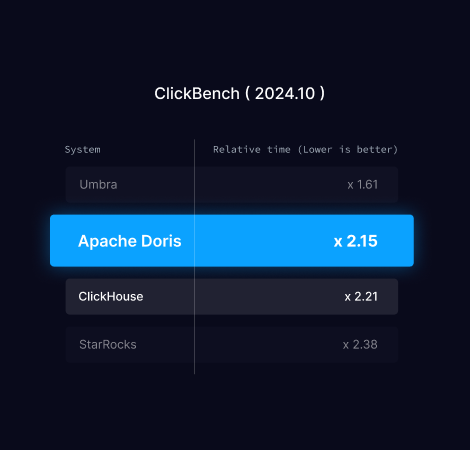
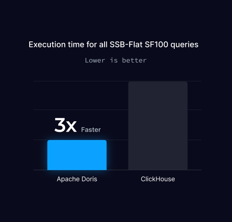
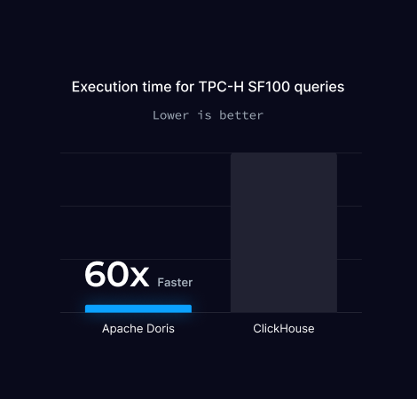
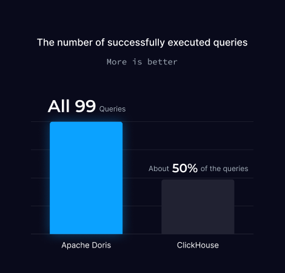
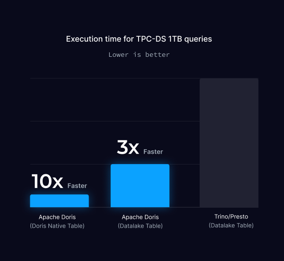
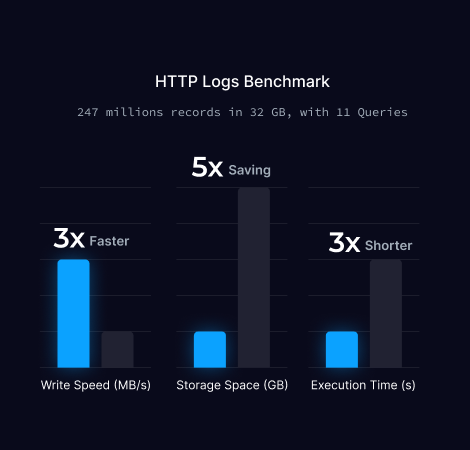
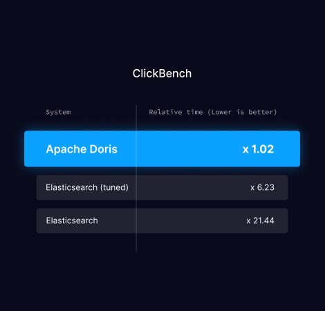

On this page

## What's Apache Doris[​](#whats-apache-doris "Direct link to What's Apache Doris")

Apache Doris is an MPP-based real-time data warehouse known for its high query speed. For queries on large datasets, it returns results in sub-seconds. It supports both high-concurrency point queries and high-throughput complex analysis. It can be used for report analysis, ad-hoc queries, unified data warehouse, and data lake query acceleration. Based on Apache Doris, users can build applications for user behavior analysis, A/B testing platform, log analysis, user profile analysis, and e-commerce order analysis.

Apache Doris, formerly known as Palo, was initially created to support Baidu's ad reporting business. It was officially open-sourced in 2017 and donated by Baidu to the Apache Software Foundation in July 2018, where it was operated by members of the incubator project management committee under the guidance of Apache mentors. In June 2022, Apache Doris graduated from the Apache incubator as a Top-Level Project. By now, the Apache Doris community has gathered more than 700 contributors from hundreds of companies in different industries, with over 120 monthly active contributors.

Apache Doris has a wide user base. It has been used in production environments of over 5000 companies worldwide, including giants such as TikTok, Baidu, Tencent, and NetEase. It is also widely used across industries from finance, retailing, and telecommunications to energy, manufacturing, medical care, etc.

## Usage Scenarios[​](#usage-scenarios "Direct link to Usage Scenarios")

As shown in the figure below, after various data integrations and processing, data sources are typically ingested into the real-time data warehouse Doris and offline lakehouses (such as Hive, Iceberg, and Hudi). These are widely used in OLAP analysis scenarios.


Apache Doris is widely used in the following scenarios:

* **Real-time Data Analysis**:

  * **Real-time Reporting and Decision-making**: Doris provides real-time updated reports and dashboards for both internal and external enterprise use, supporting real-time decision-making in automated processes.
  * **Ad Hoc Analysis**: Doris offers multidimensional data analysis capabilities, enabling rapid business intelligence analysis and ad hoc queries to help users quickly uncover insights from complex data.
  * **User Profiling and Behavior Analysis**: Doris can analyze user behavior such as participation, retention, and conversion, while also supporting scenarios like population insights and crowd selection for behaviors analysis.
* **Lakehouse Analytics**:

  * **Lakehouse Query Acceleration**: Doris accelerates lakehouse data queries with its efficient query engine.
  * **Federated Analytics**: Doris supports federated queries across multiple data sources, simplifying architecture and eliminating data silos.
  * **Real-time Data Processing**: Doris combines real-time data streams and batch data processing capabilities to meet the needs of high concurrency and low-latency complex business requirements.
* **SQL-based Observability**:

  * **Log and Event Analysis**: Doris enables real-time or batch analysis of logs and events in distributed systems, helping to identify issues and optimize performance.

## Overall Architecture[​](#overall-architecture "Direct link to Overall Architecture")

Apache Doris uses the MySQL protocol, is highly compatible with MySQL syntax, and supports standard SQL. Users can access Apache Doris through various client tools, and it seamlessly integrates with BI tools. When deploying Apache Doris, you can choose between a storage-compute integrated architecture or a storage-compute separated architecture based on hardware environments and business needs.

### Storage-Compute Integrated Architecture[​](#storage-compute-integrated-architecture "Direct link to Storage-Compute Integrated Architecture")

The storage-compute integrated architecture of Apache Doris is streamlined and easy to maintain. As shown in the figure below, it consists of only two types of processes:

* **Frontend (FE):** Primarily responsible for handling user requests, query parsing and planning, metadata management, and node management tasks.
* **Backend (BE):** Primarily responsible for data storage and query execution. Data is partitioned into shards and stored with multiple replicas across BE nodes.


In a production environment, multiple FE nodes can be deployed for disaster recovery. Each FE node maintains a full copy of the metadata. The FE nodes are divided into three roles:

|  |  |  |  |  |  |  |  |
| --- | --- | --- | --- | --- | --- | --- | --- |
| Role Function|  |  |  |  |  |  | | --- | --- | --- | --- | --- | --- | | Master The FE Master node is responsible for metadata read and write operations. When metadata changes occur in the Master, they are synchronized to Follower or Observer nodes via the BDB JE protocol.|  |  |  |  | | --- | --- | --- | --- | | Follower The Follower node is responsible for reading metadata. If the Master node fails, a Follower node can be selected as the new Master.|  |  | | --- | --- | | Observer The Observer node is responsible for reading metadata and is mainly used to increase query concurrency. It does not participate in cluster leadership elections. | | | | | | | |

Both FE and BE processes are horizontally scalable, enabling a single cluster to support hundreds of machines and tens of petabytes of storage capacity. The FE and BE processes use a consistency protocol to ensure high availability of services and high reliability of data. The storage-compute integrated architecture is highly integrated, significantly reducing the operational complexity of distributed systems.

### Compute-Storage Decoupled[​](#compute-storage-decoupled "Direct link to Compute-Storage Decoupled")

Starting from version 3.0, a compute-storage decoupled deployment architecture can be chosen. The compute-storage decoupled version of Apache Doris utilizes a unified shared storage layer as the data storage space. By separating storage and computation, users can independently scale storage capacity and computing resources, thereby achieving optimal performance and cost efficiency. As shown in the figure below, the compute-storage decoupled architecture is divided into three layers:

* **Metadata Layer**: The metadata layer is primarily responsible for request planning, query parsing and planning, as well as metadata storage and management.
* **Compute Layer**: The compute layer consists of multiple compute groups, each of which can operate as an independent tenant handling business computations. Within each compute group, there are multiple stateless BE nodes, and BE nodes can be elastically scaled up or down at any time.
* **Storage Layer**: The storage layer can use shared storage solutions such as S3, HDFS, OSS, COS, OBS, Minio, and Ceph to store Doris's data files, including Segment files and inverted index files.


## Core Features of Apache Doris[​](#core-features-of-apache-doris "Direct link to Core Features of Apache Doris")

* **High Availability**: In Apache Doris, both metadata and data are stored with multiple replicas, synchronizing data logs via the quorum protocol. Data write is considered successful once a majority of replicas have completed the write, ensuring that the cluster remains available even if a few nodes fail. Apache Doris supports both same-city and cross-region disaster recovery, enabling dual-cluster master-slave modes. When some nodes experience failures, the cluster can automatically isolate the faulty nodes, preventing the overall cluster availability from being affected.
* **High Compatibility**: Apache Doris is highly compatible with the MySQL protocol and supports standard SQL syntax, covering most MySQL and Hive functions. This high compatibility allows users to seamlessly migrate and integrate existing applications and tools. Apache Doris supports the MySQL ecosystem, enabling users to connect Doris using MySQL Client tools for more convenient operations and maintenance. It also supports MySQL protocol compatibility for BI reporting tools and data transmission tools, ensuring efficiency and stability in data analysis and data transmission processes.
* **Real-Time Data Warehouse**: Based on Apache Doris, a real-time data warehouse service can be built. Apache Doris offers second-level data ingestion capabilities, capturing incremental changes from upstream online transactional databases into Doris within seconds. Leveraging vectorized engines, MPP architecture, and Pipeline execution engines, Doris provides sub-second data query capabilities, thereby constructing a high-performance, low-latency real-time data warehouse platform.
* **Unified Lakehouse**: Apache Doris can build a unified lakehouse architecture based on external data sources such as data lakes or relational databases. The Doris unified lakehouse solution enables seamless integration and free data flow between data lakes and data warehouses, helping users directly utilize data warehouse capabilities to solve data analysis problems in data lakes while fully leveraging data lake data management capabilities to enhance data value.
* **Flexible Modeling**: Apache Doris offers various modeling approaches, such as wide table models, pre-aggregation models, star/snowflake schemas, etc. During data import, data can be flattened into wide tables and written into Doris through compute engines like Flink or Spark, or data can be directly imported into Doris, performing data modeling operations through views, materialized views, or real-time multi-table joins.

## Technical overview[​](#technical-overview "Direct link to Technical overview")

Doris provides an efficient SQL interface and is fully compatible with the MySQL protocol. Its query engine is based on an MPP (Massively Parallel Processing) architecture, capable of efficiently executing complex analytical queries and achieving low-latency real-time queries. Through columnar storage technology for data encoding and compression, it significantly optimizes query performance and storage compression ratio.

### Interface[​](#interface "Direct link to Interface")

Apache Doris adopts the MySQL protocol, supports standard SQL, and is highly compatible with MySQL syntax. Users can access Apache Doris through various client tools and seamlessly integrate it with BI tools, including but not limited to Smartbi, DataEase, FineBI, Tableau, Power BI, and Apache Superset. Apache Doris can work as the data source for any BI tools that support the MySQL protocol.

### Storage engine[​](#storage-engine "Direct link to Storage engine")

Apache Doris has a columnar storage engine, which encodes, compresses, and reads data by column. This enables a very high data compression ratio and largely reduces unnecessary data scanning, thus making more efficient use of IO and CPU resources.

Apache Doris supports various index structures to minimize data scans:

* **Sorted Compound Key Index**: Users can specify three columns at most to form a compound sort key. This can effectively prune data to better support highly concurrent reporting scenarios.
* **Min/Max Index**: This enables effective data filtering in equivalence and range queries of numeric types.
* **BloomFilter Index**: This is very effective in equivalence filtering and pruning of high-cardinality columns.
* **Inverted Index**: This enables fast searching for any field.

Apache Doris supports a variety of data models and has optimized them for different scenarios:

* **Detail Model (Duplicate Key Model):** A detail data model designed to meet the detailed storage requirements of fact tables.
* **Primary Key Model (Unique Key Model):** Ensures unique keys; data with the same key is overwritten, enabling row-level data updates.
* **Aggregate Model (Aggregate Key Model):** Merges value columns with the same key, significantly improving performance through pre-aggregation.

Apache Doris also supports strongly consistent single-table materialized views and asynchronously refreshed multi-table materialized views. Single-table materialized views are automatically refreshed and maintained by the system, requiring no manual intervention from users. Multi-table materialized views can be refreshed periodically using in-cluster scheduling or external scheduling tools, reducing the complexity of data modeling.

### Query engine[​](#query-engine "Direct link to Query engine")

Apache Doris has an MPP-based query engine for parallel execution between and within nodes. It supports distributed shuffle join for large tables to better handle complicated queries.


The query engine of Apache Doris is fully vectorized, with all memory structures laid out in a columnar format. This can largely reduce virtual function calls, increase cache hit rates, and make efficient use of SIMD instructions. Apache Doris delivers a 5~10 times higher performance in wide table aggregation scenarios than non-vectorized engines.


Apache Doris uses adaptive query execution technology to dynamically adjust the execution plan based on runtime statistics. For example, it can generate a runtime filter and push it to the probe side. Specifically, it pushes the filters to the lowest-level scan node on the probe side, which largely reduces the data amount to be processed and increases join performance. The runtime filter of Apache Doris supports In/Min/Max/Bloom Filter.


Apache Doris uses a Pipeline execution engine that breaks down queries into multiple sub-tasks for parallel execution, fully leveraging multi-core CPU capabilities. It simultaneously addresses the thread explosion problem by limiting the number of query threads. The Pipeline execution engine reduces data copying and sharing, optimizes sorting and aggregation operations, thereby significantly improving query efficiency and throughput.

In terms of the optimizer, Apache Doris employs a combined optimization strategy of CBO (Cost-Based Optimizer), RBO (Rule-Based Optimizer), and HBO (History-Based Optimizer). RBO supports constant folding, subquery rewriting, predicate pushdown, and more. CBO supports join reordering and other optimizations. HBO recommends the optimal execution plan based on historical query information. These multiple optimization measures ensure that Doris can enumerate high-performance query plans across various types of queries.

[Report issue](https://github.com/apache/doris-website/issues/new?title=Issue on docs&body=Path:false)

[Doris Homepage](/)[Ask Questions on Discussion](https://github.com/apache/doris/discussions)[Chat on Slack](https://doris.apache.org/slack)[Chat on Discord](https://discord.gg/ATXQqX8g8F)

On This Page

* [What's Apache Doris](#whats-apache-doris)* [Usage Scenarios](#usage-scenarios)* [Overall Architecture](#overall-architecture)
      * [Storage-Compute Integrated Architecture](#storage-compute-integrated-architecture)* [Compute-Storage Decoupled](#compute-storage-decoupled)* [Core Features of Apache Doris](#core-features-of-apache-doris)* [Technical overview](#technical-overview)
          * [Interface](#interface)* [Storage engine](#storage-engine)* [Query engine](#query-engine)

---
On this page

This document highlights common issues that new users may encounter, with the goal of accelerating the POC process. The content is organized by the typical POC workflow:

1. **Table Design** — Choose the data model, sort key, partitioning, and bucketing strategy.
2. **Data Loading** — Pick the right loading method and avoid common pitfalls.
3. **Query Tuning** — Diagnose slow queries and optimize bucketing and index configuration.
4. **Data Lake Queries** — Additional optimization tips for Lakehouse scenarios.

## Table Design[​](#table-design "Direct link to Table Design")

Creating a table in Doris involves four decisions that affect load and query performance: data model, sort key, partitioning, and bucketing.

### Data Model[​](#data-model "Direct link to Data Model")

Choose the model based on how your data is written:

|  |  |  |  |  |  |  |  |  |  |  |  |
| --- | --- | --- | --- | --- | --- | --- | --- | --- | --- | --- | --- |
| Data Characteristics Recommended Model Why|  |  |  |  |  |  |  |  |  | | --- | --- | --- | --- | --- | --- | --- | --- | --- | | Append-only (logs, events, facts) **Duplicate Key** (default) Keeps all rows, best query performance|  |  |  |  |  |  | | --- | --- | --- | --- | --- | --- | | Updated by primary key (CDC, upsert) **Unique Key** New rows replace old rows with the same key|  |  |  | | --- | --- | --- | | Pre-aggregated metrics (PV, UV, sums) **Aggregate Key** Rows are merged with SUM/MAX/MIN at write time | | | | | | | | | | | |

**Duplicate Key works for most scenarios.** See [Data Model Overview](/docs/4.x/gettingStarted/table-design/data-model/overview/).

### Sort Key[​](#sort-key "Direct link to Sort Key")

Doris builds a [prefix index](/docs/4.x/gettingStarted/table-design/index/prefix-index/) on the first 36 bytes of key columns. Follow these principles when setting the sort key:

* **Frequently filtered columns first**: Put the columns most commonly used in WHERE conditions at the front.
* **Fixed-size types first**: Place INT, BIGINT, DATE, and other fixed-size types before VARCHAR, because the prefix index stops at the first VARCHAR column.
* **Add inverted indexes**: For columns not covered by the prefix index, add [inverted indexes](/docs/4.x/gettingStarted/table-design/index/inverted-index/overview/) to speed up filtering.

### Partitioning[​](#partitioning "Direct link to Partitioning")

If you have a time column, use `AUTO PARTITION BY RANGE(date_trunc(time_col, 'day'))` to enable [partition pruning](/docs/4.x/gettingStarted/table-design/data-partitioning/auto-partitioning/). Doris skips irrelevant partitions automatically.

### Bucketing[​](#bucketing "Direct link to Bucketing")

Default is **Random bucketing** (recommended for Duplicate Key tables). Use `DISTRIBUTED BY HASH(col)` if you frequently filter or join on a specific column. See [Data Bucketing](/docs/4.x/gettingStarted/table-design/data-partitioning/data-bucketing/).

**How to choose bucket count:**

|  |  |  |  |  |  |  |  |  |  |
| --- | --- | --- | --- | --- | --- | --- | --- | --- | --- |
| Principle Details|  |  |  |  |  |  |  |  | | --- | --- | --- | --- | --- | --- | --- | --- | | Multiple of BE count Ensures even data distribution. When BEs are added later, queries typically scan multiple partitions, so performance holds up|  |  |  |  |  |  | | --- | --- | --- | --- | --- | --- | | As low as possible Avoids producing small files|  |  |  |  | | --- | --- | --- | --- | | Compressed data per bucket ≤ 20 GB ≤ 10 GB for Unique Key tables. Check with `SHOW TABLETS FROM your_table`| No more than 128 per partition Consider adding more partitions first if you need more. In extreme cases the upper bound is 1024, but this is rarely needed in production | | | | | | | | | |

### Example Templates[​](#example-templates "Direct link to Example Templates")

#### Log / Event Analytics[​](#log--event-analytics "Direct link to Log / Event Analytics")

```
CREATE TABLE app_logs  
(  
    log_time      DATETIME    NOT NULL,  
    log_level     VARCHAR(10),  
    service_name  VARCHAR(50),  
    trace_id      VARCHAR(64),  
    message       STRING,  
    INDEX idx_message (message) USING INVERTED PROPERTIES("parser" = "unicode")  
)  
AUTO PARTITION BY RANGE(date_trunc(`log_time`, 'day'))  
()  
DISTRIBUTED BY RANDOM BUCKETS 10;
```

#### Real-Time Dashboard with Upsert (CDC)[​](#real-time-dashboard-with-upsert-cdc "Direct link to Real-Time Dashboard with Upsert (CDC)")

```
CREATE TABLE user_profiles  
(  
    user_id       BIGINT      NOT NULL,  
    username      VARCHAR(50),  
    email         VARCHAR(100),  
    status        TINYINT,  
    updated_at    DATETIME  
)  
UNIQUE KEY(user_id)  
DISTRIBUTED BY HASH(user_id) BUCKETS 10;
```

#### Metrics Aggregation[​](#metrics-aggregation "Direct link to Metrics Aggregation")

```
CREATE TABLE site_metrics  
(  
    dt            DATE        NOT NULL,  
    site_id       INT         NOT NULL,  
    pv            BIGINT      SUM DEFAULT '0',  
    uv            BIGINT      MAX DEFAULT '0'  
)  
AGGREGATE KEY(dt, site_id)  
AUTO PARTITION BY RANGE(date_trunc(`dt`, 'day'))  
()  
DISTRIBUTED BY HASH(site_id) BUCKETS 10;
```

## Data Loading[​](#data-loading "Direct link to Data Loading")

Choose the right loading method and follow these best practices to avoid common performance issues:

* **Don't use `INSERT INTO VALUES` for bulk data.** Use [Stream Load](/docs/4.x/gettingStarted/data-operate/import/import-way/stream-load-manual/) or [Broker Load](/docs/4.x/gettingStarted/data-operate/import/import-way/broker-load-manual/) instead. See [Loading Overview](/docs/4.x/gettingStarted/data-operate/import/load-manual/).
* **Batch writes on the client side.** High-frequency small imports cause version accumulation. If not feasible, use [Group Commit](/docs/4.x/gettingStarted/data-operate/import/group-commit-manual/).
* **Break large imports into smaller batches.** A failed long-running import must restart from scratch. Use [INSERT INTO SELECT with S3 TVF](/docs/4.x/gettingStarted/data-operate/import/streaming-job/streaming-job-tvf/) for incremental import.
* **Enable `load_to_single_tablet`** for Duplicate Key tables with Random bucketing to reduce write amplification.

See [Load Best Practices](/docs/4.x/gettingStarted/data-operate/import/load-best-practices/).

## Query Tuning[​](#query-tuning "Direct link to Query Tuning")

### Bucketing[​](#bucketing-1 "Direct link to Bucketing")

Bucket count directly affects query parallelism and scheduling overhead — strike a balance between the two:

* **Don't over-bucket.** Too many small tablets create scheduling overhead and can degrade query performance by up to 50%.
* **Don't under-bucket.** Too few tablets limit CPU parallelism.
* **Avoid data skew.** Check tablet sizes with `SHOW TABLETS`. Switch to Random bucketing or a higher-cardinality bucket column if sizes vary significantly.

See [Bucketing](#bucketing) for sizing guidelines.

### Indexes[​](#indexes "Direct link to Indexes")

* **Put the right columns in the sort key.** Unlike systems such as PostgreSQL, Doris only indexes the first 36 bytes of key columns and stops at the first VARCHAR. Columns beyond this prefix won't benefit from the sort key. Add [inverted indexes](/docs/4.x/gettingStarted/table-design/index/inverted-index/overview/) for those columns. See [Sort Key](#sort-key).

### Diagnostic Tools[​](#diagnostic-tools "Direct link to Diagnostic Tools")

See [Query Profile](/docs/4.x/gettingStarted/query-acceleration/query-profile/) to diagnose slow queries.

## Data Lake Queries[​](#data-lake-queries "Direct link to Data Lake Queries")

If your POC involves querying data in Hive, Iceberg, Paimon, or other data lakes through Doris (i.e., a Lakehouse scenario), the following points have the greatest impact on test results.

### Ensure Partition Pruning is Effective[​](#ensure-partition-pruning-is-effective "Direct link to Ensure Partition Pruning is Effective")

Lake tables often hold massive amounts of data. Always include partition columns in your WHERE conditions so that Doris only scans the necessary partitions. Use `EXPLAIN <SQL>` to check the `partition` field and verify that pruning is working:

```
0:VPAIMON_SCAN_NODE(88)  
    partition=203/0          -- 203 partitions pruned, 0 actually scanned
```

If the partition count is much higher than expected, check whether your WHERE conditions correctly match the partition columns.

### Enable Data Cache[​](#enable-data-cache "Direct link to Enable Data Cache")

Remote storage (HDFS/object storage) has significantly higher IO latency than local disks. Data Cache caches recently accessed remote data on BE local disks, **delivering near-internal-table query performance for repeated queries on the same dataset**.

* Cache is disabled by default. See the [Data Cache](/docs/4.x/gettingStarted/lakehouse/data-cache/) documentation to configure and enable it.
* Since version 4.0.2, **cache warmup** is supported, allowing you to proactively load hot data before POC testing.

tip

During POC, run a query once to populate the cache, then use the latency of the second query as the benchmark. This more accurately reflects steady-state production performance.

### Address Small Files[​](#address-small-files "Direct link to Address Small Files")

Data lake storage often contains a large number of small files. Small files get split into many splits, increasing FE memory pressure (potentially causing OOM) and raising query planning overhead.

* **Fix at source (recommended):** Periodically compact small files on the Hive/Spark side, keeping each file above 128 MB.
* **Doris-side safeguard:** Use `SET max_file_split_num = 50000;` (supported since 4.0.4) to limit the maximum number of splits per scan and prevent OOM.

### Use Query Profile for Diagnosis[​](#use-query-profile-for-diagnosis "Direct link to Use Query Profile for Diagnosis")

The bottleneck of data lake queries is typically IO rather than computation. [Query Profile](/docs/4.x/gettingStarted/query-acceleration/query-profile/) can help locate the root cause of slow queries. Focus on:

* **Split count and data volume**: Determine if too much data is being scanned.
* **MergeIO metrics**: If `MergedBytes` is much larger than `RequestBytes`, read amplification is severe. Reduce `merge_io_read_slice_size_bytes` (default 8 MB) to mitigate.
* **Cache hit rate**: Confirm that Data Cache is working effectively.

For more optimization techniques, see [Data Lake Query Optimization](/docs/4.x/gettingStarted/lakehouse/best-practices/optimization/).

[Report issue](https://github.com/apache/doris-website/issues/new?title=Issue on docs&body=Path:false)

[Doris Homepage](/)[Ask Questions on Discussion](https://github.com/apache/doris/discussions)[Chat on Slack](https://doris.apache.org/slack)[Chat on Discord](https://discord.gg/ATXQqX8g8F)

On This Page

* [Table Design](#table-design)
  * [Data Model](#data-model)* [Sort Key](#sort-key)* [Partitioning](#partitioning)* [Bucketing](#bucketing)* [Example Templates](#example-templates)* [Data Loading](#data-loading)* [Query Tuning](#query-tuning)
      * [Bucketing](#bucketing-1)* [Indexes](#indexes)* [Diagnostic Tools](#diagnostic-tools)* [Data Lake Queries](#data-lake-queries)
        * [Ensure Partition Pruning is Effective](#ensure-partition-pruning-is-effective)* [Enable Data Cache](#enable-data-cache)* [Address Small Files](#address-small-files)* [Use Query Profile for Diagnosis](#use-query-profile-for-diagnosis)

---
On this page

Warning:

The following rapid deployment methods are intended solely for local development and testing, and should not be used in production environments. The reasons are as follows:

1. **Data Vulnerability**: Data can be easily lost when using Docker deployment, as data is lost upon container destruction. Manual deployment of single-replica instances lacks data redundancy and backup capabilities, meaning machine failures could result in data loss.
2. **Single-Replica Configuration**: The table creation statements in the examples are all single-replica. In a production environment, multi-replica storage should be used to ensure data reliability.

## Use Docker for Quick Deployment[​](#use-docker-for-quick-deployment "Direct link to Use Docker for Quick Deployment")

Starting from Doris version 2.1.8, Docker can be used for rapid deployment.

### Step 1: Download the Quick-Start script[​](#step-1-download-the-quick-start-script "Direct link to Step 1: Download the Quick-Start script")

[Download the script](/files/start-doris.sh) , run the following command to grant it the corresponding execution permissions.

```
chmod 755 start-doris.sh
```

### Step 2: Start the cluster[​](#step-2-start-the-cluster "Direct link to Step 2: Start the cluster")

Run the script to start the cluster, using the `4.0.1` version by default

```
bash start-doris.sh
```

You can specify the startup version through the -v parameter, such as:

```
bash start-doris.sh -v 2.1.8
```

### Step 3: Connect to the cluster using MySQL client and check the cluster status[​](#step-3-connect-to-the-cluster-using-mysql-client-and-check-the-cluster-status "Direct link to Step 3: Connect to the cluster using MySQL client and check the cluster status")

```
## Check the FE status to ensure that both the Join and Alive columns are true.  
mysql -uroot -P9030 -h127.0.0.1 -e 'SELECT `host`, `join`, `alive` FROM frontends()'  
+-----------+------+-------+  
| host      | join | alive |  
+-----------+------+-------+  
| 127.0.0.1 | true | true  |  
+-----------+------+-------+  
  
## Check the BE status to ensure that the Alive column is true.  
mysql -uroot -P9030 -h127.0.0.1 -e 'SELECT `host`, `alive` FROM backends()'  
+-----------+-------+  
| host      | alive |  
+-----------+-------+  
| 127.0.0.1 |     1 |  
+-----------+-------+
```

## Local Quick Deployment[​](#local-quick-deployment "Direct link to Local Quick Deployment")

Environment Recommendations:

* **Operating System**: It is recommended to use AMD/ARM mainstream Linux environments such as Ubuntu and above.
* **Java Environment**: It is advised to use the Java 17 runtime environment.
* **User Permissions**: It is recommended to create a new Doris user on Linux and avoid using the root user for operations.

### Step 1: Download the Binary Package[​](#step-1-download-the-binary-package "Direct link to Step 1: Download the Binary Package")

Download the corresponding binary installation package from the Apache Doris website [here](https://doris.apache.org/download), and extract it.

### Step 2: Modify the Environment Variables[​](#step-2-modify-the-environment-variables "Direct link to Step 2: Modify the Environment Variables")

1. **Modify the system's maximum open file descriptor limit**

   Use the following command to adjust the maximum file descriptor limit. After making this change, you need to restart the session to apply the configuration:

   ```
   vi /etc/security/limits.conf   
   * soft nofile 1000000  
   * hard nofile 1000000
   ```
2. **Modify Virtual Memory Area**

   Use the following command to permanently modify the virtual memory area to at least 2000000, and apply the change immediately:

   ```
   cat >> /etc/sysctl.conf << EOF  
   vm.max_map_count = 2000000  
   EOF  
     
   ## Take effect immediately  
   sysctl -p
   ```

### Step 3: Install FE[​](#step-3-install-fe "Direct link to Step 3: Install FE")

1. **Configure FE**

   Modify the following contents in the FE configuration file `apache-doris/fe/conf/fe.conf`:

   ```
   ## Specify Java environment  
   JAVA_HOME=/home/doris/jdk  
     
   ## Specify the CIDR block for FE listening IP  
   priority_networks=127.0.0.1/32
   ```
2. **Start FE**

   Run the FE process by executing the `start_fe.sh` script:

   ```
   apache-doris/fe/bin/start_fe.sh --daemon
   ```
3. **Check FE Status**

   Connect to the cluster using MySQL client and check the cluster status:

   ```
   ## Check FE Status to ensure that both the Join and Alive columns are true  
   mysql -uroot -P9030 -h127.0.0.1 -e "show frontends;"  
   +-----------------------------------------+-----------+-------------+----------+-----------+---------+----------+----------+-----------+------+-------+-------------------+---------------------+----------+--------+-------------------------+------------------+  
   | Name                                    | Host      | EditLogPort | HttpPort | QueryPort | RpcPort | Role     | IsMaster | ClusterId | Join | Alive | ReplayedJournalId | LastHeartbeat       | IsHelper | ErrMsg | Version                 | CurrentConnected |  
   +-----------------------------------------+-----------+-------------+----------+-----------+---------+----------+----------+-----------+------+-------+-------------------+---------------------+----------+--------+-------------------------+------------------+  
   | fe_9d0169c5_b01f_478c_96ab_7c4e8602ec57 | 127.0.0.1 | 9010        | 8030     | 9030      | 9020    | FOLLOWER | true     | 656872880 | true | true  | 276               | 2024-07-28 18:07:39 | true     |        | doris-2.0.12-2971efd194 | Yes              |  
   +-----------------------------------------+-----------+-------------+----------+-----------+---------+----------+----------+-----------+------+-------+-------------------+---------------------+----------+--------+-------------------------+------------------+
   ```

### Step 4: Install BE[​](#step-4-install-be "Direct link to Step 4: Install BE")

1. **Configure BE**

   Modify the following contents in the BE configuration file `apache-doris/be/conf/be.conf`:

   ```
   ## Specify Java environment  
   JAVA_HOME=/home/doris/jdk  
     
   ## Specify the CIDR block for BE's listening IP  
   priority_networks=127.0.0.1/32
   ```
2. **Start BE**

   Start the BE process with the following command:

   ```
   apache-doris/be/bin/start_be.sh --daemon
   ```
3. **Register BE Node in the Cluster**

   Connect to the cluster using MySQL client:

   ```
   mysql -uroot -P9030 -h127.0.0.1
   ```

   Use the ADD BACKEND command to register the BE node:

   ```
   ALTER SYSTEM ADD BACKEND "127.0.0.1:9050";
   ```
4. **Check BE Status**

   Connect to the cluster using MySQL client and check the cluster status:

   ```
   ## Check BE Status to ensure that the Alive column is true  
   mysql -uroot -P9030 -h127.0.0.1 -e "show backends;"  
   +-----------+-----------+---------------+--------+----------+----------+---------------------+---------------------+-------+----------------------+-----------+------------------+--------------------+---------------+---------------+---------+----------------+--------------------+--------------------------+--------+-------------------------+-------------------------------------------------------------------------------------------------------------------------------+-------------------------+----------+  
   | BackendId | Host      | HeartbeatPort | BePort | HttpPort | BrpcPort | LastStartTime       | LastHeartbeat       | Alive | SystemDecommissioned | TabletNum | DataUsedCapacity | TrashUsedCapcacity | AvailCapacity | TotalCapacity | UsedPct | MaxDiskUsedPct | RemoteUsedCapacity | Tag                      | ErrMsg | Version                 | Status                                                                                                                        | HeartbeatFailureCounter | NodeRole |  
   +-----------+-----------+---------------+--------+----------+----------+---------------------+---------------------+-------+----------------------+-----------+------------------+--------------------+---------------+---------------+---------+----------------+--------------------+--------------------------+--------+-------------------------+-------------------------------------------------------------------------------------------------------------------------------+-------------------------+----------+  
   | 10156     | 127.0.0.1 | 9050          | 9060   | 8040     | 8060     | 2024-07-28 17:59:14 | 2024-07-28 18:08:24 | true  | false                | 14        | 0.000            | 0.000              | 8.342 GB      | 19.560 GB     | 57.35 % | 57.35 %        | 0.000              | {"location" : "default"} |        | doris-2.0.12-2971efd194 | {"lastSuccessReportTabletsTime":"2024-07-28 18:08:14","lastStreamLoadTime":-1,"isQueryDisabled":false,"isLoadDisabled":false} | 0                       | mix      |  
   +-----------+-----------+---------------+--------+----------+----------+---------------------+---------------------+-------+----------------------+-----------+------------------+--------------------+---------------+---------------+---------+----------------+--------------------+--------------------------+--------+-------------------------+-------------------------------------------------------------------------------------------------------------------------------+-------------------------+----------+
   ```

## Run Queries[​](#run-queries "Direct link to Run Queries")

1. **Connect to the cluster using MySQL client:**

   ```
   mysql -uroot -P9030 -h127.0.0.1
   ```
2. **Create database and test table:**

   ```
   create database demo;  
     
   use demo;   
   create table mytable  
   (  
       k1 TINYINT,  
       k2 DECIMAL(10, 2) DEFAULT "10.05",      
       k3 CHAR(10) COMMENT "string column",      
       k4 INT NOT NULL DEFAULT "1" COMMENT "int column"  
   )   
   COMMENT "my first table"  
   DISTRIBUTED BY HASH(k1) BUCKETS 1  
   PROPERTIES (  
    "replication_num" = "1"  
   );
   ```
3. **Import test data:**

   Insert test data using the Insert Into statement

   ```
   insert into mytable values  
   (1,0.14,'a1',20),  
   (2,1.04,'b2',21),  
   (3,3.14,'c3',22),  
   (4,4.35,'d4',23);
   ```
4. **Execute the following SQL query in the MySQL client to view the imported data:**

   ```
   MySQL [demo]> select * from demo.mytable;  
   +------+------+------+------+  
   | k1   | k2   | k3   | k4   |  
   +------+------+------+------+  
   |    1 | 0.14 | a1   |   20 |  
   |    2 | 1.04 | b2   |   21 |  
   |    3 | 3.14 | c3   |   22 |  
   |    4 | 4.35 | d4   |   23 |  
   +------+------+------+------+  
   4 rows in set (0.10 sec)
   ```

## FAQs[​](#faqs "Direct link to FAQs")

**Q: How do I install Docker on Mac?**

A: Download and install [Docker Desktop](https://www.docker.com/products/docker-desktop/).

**Q: Mac: "Error: Docker environment not detected" after Docker Desktop is installed**

A: Create a symlink:

```
sudo ln -s /Applications/Docker.app/Contents/Resources/bin/docker /usr/local/bin/docker
```

**Q: Mac: "error getting credentials - err: exit status 1, out: ``"**

A: This error is usually caused by Docker credential helper misconfiguration. For local development/testing, you can remove the `credsStore` field in `~/.docker/config.json` as a workaround. Note: This workaround stores credentials in plaintext and is only recommended for local development environments.

[Report issue](https://github.com/apache/doris-website/issues/new?title=Issue on docs&body=Path:false)

[Doris Homepage](/)[Ask Questions on Discussion](https://github.com/apache/doris/discussions)[Chat on Slack](https://doris.apache.org/slack)[Chat on Discord](https://discord.gg/ATXQqX8g8F)

On This Page

* [Use Docker for Quick Deployment](#use-docker-for-quick-deployment)
  * [Step 1: Download the Quick-Start script](#step-1-download-the-quick-start-script)* [Step 2: Start the cluster](#step-2-start-the-cluster)* [Step 3: Connect to the cluster using MySQL client and check the cluster status](#step-3-connect-to-the-cluster-using-mysql-client-and-check-the-cluster-status)* [Local Quick Deployment](#local-quick-deployment)
    * [Step 1: Download the Binary Package](#step-1-download-the-binary-package)* [Step 2: Modify the Environment Variables](#step-2-modify-the-environment-variables)* [Step 3: Install FE](#step-3-install-fe)* [Step 4: Install BE](#step-4-install-be)* [Run Queries](#run-queries)* [FAQs](#faqs)

---
On this page

Apache Doris and ClickHouse are both leading real-time analytical databases with columnar storage and fast query capabilities. Apache Doris offers significant advantages over ClickHouse in three critical areas: **10x faster join query performance** through its advanced MPP architecture with Cost-Based Optimizer, **lower infrastructure costs** via compute-storage separation that allows independent scaling of resources, and **superior real-time update performance** with its Merge-on-Write engine that maintains query speed during high-frequency data modifications.

## Featured Migration Cases[​](#featured-migration-cases "Direct link to Featured Migration Cases")


"Tencent Music's data platform has migrated from ClickHouse to Apache Doris, improving data timeliness and reducing maintenance costs. Doris' flexible ingestion methods and robust consistency protocol ensure high availability and reliability."

**Highlight:**

* Massive boost in multi-table join performance.* Easy scaling and maintenance.* Efficient data processing and real-time updates.


"Apache Doris has faster query response times than ClickHouse in the vast majority of scenarios, especially in complex join scenarios, where its performance is significantly superior to that of ClickHouse."

**Highlight:**

* Core business queries 2-3x.* Complex join queries 2-10x.* Can run all ClickHouse OOM queries.


"By replacing ClickHouse with Doris, Kwai successfully upgraded to a lakehouse architecture, simplifying the data pipeline and eliminating the need for data import, as Doris can directly access data lake data."

**Highlight:**

* Directly query of data lake data.* Improved query performance.* Flexible data governance with materialized views.

## Apache Doris vs. ClickHouse[​](#apache-doris-vs-clickhouse "Direct link to Apache Doris vs. ClickHouse")

|  |  |  |  |  |  |  |  |  |  |  |  |  |  |  |  |  |  |  |  |  |  |  |  |  |  |  |  |  |  |  |  |  |  |  |  |
| --- | --- | --- | --- | --- | --- | --- | --- | --- | --- | --- | --- | --- | --- | --- | --- | --- | --- | --- | --- | --- | --- | --- | --- | --- | --- | --- | --- | --- | --- | --- | --- | --- | --- | --- | --- |
| Apache Doris ClickHouse|  |  |  |  |  |  |  |  |  |  |  |  |  |  |  |  |  |  |  |  |  |  |  |  |  |  |  |  |  |  |  |  |  | | --- | --- | --- | --- | --- | --- | --- | --- | --- | --- | --- | --- | --- | --- | --- | --- | --- | --- | --- | --- | --- | --- | --- | --- | --- | --- | --- | --- | --- | --- | --- | --- | --- | | **Architecture & SQL** * Based on MPP architecture* Standard SQL support, MySQL-compatible   * Uses Scatter-Gather architecture* SQL-like capabilities but with non-standard SQL  | **Join Query Performance** * **2-10x faster joins** with true distributed join execution across nodes* Advanced Cost-Based Optimizer (CBO) automatically selects optimal join strategies (broadcast, shuffle, colocate)* Colocate Join eliminates network shuffle for pre-partitioned tables* Runtime Filter pushdown reduces data scanning by up to 90%* Transparent query acceleration - queries on base tables are automatically rewritten to use materialized views* Handles complex TPC-DS queries that cause OOM in ClickHouse   * Limited join capability - relies on subqueries and denormalization* No Cost-Based Optimizer; requires manual query tuning* Scatter-Gather architecture not designed for distributed joins* ~50% of TPC-DS queries fail due to unsupported correlated subqueries* No automatic query rewriting - must explicitly query materialized views; cannot accelerate queries on base tables* Frequent OOM errors on large multi-table queries  | **Real-time Updates** * **34x faster query performance** than ClickHouse for real-time update workloads* Merge-on-Write (MoW) engine with delete bitmap ensures query performance remains constant regardless of update frequency* Strongly consistent primary key model - updates are immediately visible with no stale reads* Supports high-throughput UPSERT operations without query performance degradation* Partial column updates minimize write amplification   * ReplacingMergeTree only supports eventual consistency - stale data visible until background merge* Using `FINAL` keyword for consistent reads causes 2-10x query slowdown* High update frequency leads to excessive merge overhead and query latency spikes  | **Transaction Support** * Full ACID transaction support for data ingestion* Atomic batch imports - all data loads succeed or fail together* Two-phase commit ensures data consistency across distributed nodes   * No transaction support* Partial data may be visible during failed imports* Requires application-level handling for data consistency  | **Query Concurrency** * **10x higher concurrency** - supports thousands of concurrent queries* Efficient memory management prevents OOM under high load* Query queue management with workload isolation   * Limited concurrent query support (typically <100)* Memory-intensive queries cause cluster instability* No built-in workload management  | **Data API** * Offers high-throughput read APIs based on Arrow-flight, facilitating integration with other engines such as data science/AI tools   * Only inefficient data reading via JDBC API  | **Building Open Lakehouse** * Serves as a Lakehouse SQL engine, supporting queries on Hive, Hudi, Iceberg, and Parquet data lake formats   * Limited Lakehouse integration capabilities  | **Operations & Maintenance** * Supports automatic scaling in, scaling out, and replica balancing   * Requires manual rebalancing during scaling operations  | **Performance** * In wide table benchmarks (ClickBench), Doris ranked top 1 or top 2 in October 2022 and October 2024, outperforming ClickHouse* In large TPC-H and TPC-DS tests, Doris achieved leading performance   * In terms of ClickBench performance, ClickHouse and Doris have been taking turns leading* Experiences many OOM (Out of Memory) queries in large TPC-H and TPC-DS tests  | **Cost Efficiency (Storage-Compute Separation)** * **Up to 70% cost reduction** by independently scaling compute and storage* Cold data stored on low-cost object storage (S3, HDFS, OSS) while hot data uses local SSD* Elastic compute scaling - add/remove nodes without data rebalancing* Multi-tier storage with automatic data temperature management* Pay only for the compute resources you need at any given time* Available as open-source feature since version 3.0   * Tightly coupled storage and compute - scaling requires both* Storage-compute separation only in proprietary ClickHouse Cloud* Scaling requires expensive data rebalancing across nodes* Must over-provision compute to handle peak loads* Higher total cost of ownership for variable workloads  | **Open Source** * Fully open source under the Apache Software Foundation; license and governance are community-driven and cannot be changed by any single entity.   * Open source, but controlled by a commercial company. | | | | | | | | | | | | | | | | | | | | | | | | | | | | | | | | | | | |

## Performance Comparison[​](#performance-comparison "Direct link to Performance Comparison")

### ClickBench Benchmark[​](#clickbench-benchmark "Direct link to ClickBench Benchmark")

ClickBench is a benchmarking tool created and maintained by the ClickHouse team to evaluate the performance of analytical databases.

It focuses on testing the performance of **large, flat tables rather than complex multi-table joins.** It uses real-world data from a major web analytics platform, covering typical scenarios such as clickstream analysis and structured logs.

The benchmark consists of a set of queries that test aggregation operations and single-table performance, without involving complex joins. This makes it especially useful for evaluating databases optimized for real-time analytics and large-scale data processing.



### SSB-Flat SF100 Benchmark[​](#ssb-flat-sf100-benchmark "Direct link to SSB-Flat SF100 Benchmark")

SSB-Flat SF100 is a benchmark designed to test the performance of analytical databases in handling large, wide tables.

It is derived from the Star Schema Benchmark (SSB) but flattens the star schema into a single wide table to **focus on the performance of single-table queries.**

The SF100 indicates that the data scale is 100 times the base size, making it a significant test for evaluating query performance and system scalability.



### TPC-H SF100 Benchmark[​](#tpc-h-sf100-benchmark "Direct link to TPC-H SF100 Benchmark")

The TPC-H benchmark with a scale factor of 100 (SF100) is a widely used standard for evaluating database performance. It includes a set of complex SQL queries designed to simulate real-world business intelligence workloads.

The SF100 indicates that the data size is 100 times the base size, making it a large-scale test to measure query performance and system scalability.

**Note: Since ClickHouse failed to execute 7 queries, the total execution time refers to the time taken by Doris to run all 22 queries, and by ClickHouse to run only 15 queries.**



### TPC-DS 1TB Benchmark[​](#tpc-ds-1tb-benchmark "Direct link to TPC-DS 1TB Benchmark")

TPC-DS 1TB is a widely recognized benchmark for evaluating the performance of data warehouses and analytical databases. It involves a dataset of approximately 1TB in size, containing around 6.35 billion records spread across 24 tables.

The benchmark includes 99 complex queries designed to test various aspects of database performance, such as joins, aggregations, and subqueries.

The TPC-DS schema is based on a snowflake schema, representing real-world scenarios like web, catalog, and store sales. The 1TB scale is considered a moderate size for data warehouses but is still challenging due to the complexity of the queries and the large number of records

**Note：TPC-DS makes heavy use of correlated subqueries which are at the time of testing (September 2024) not supported by ClickHouse. As a result, about 50% of benchmark queries will fail with errors.**



## More Migration Stories[​](#more-migration-stories "Direct link to More Migration Stories")

* [Less components, higher performance: Apache Doris instead of ClickHouse, MySQL, Presto, and HBase](https://doris.apache.org/blog/less-components-higher-performance-apache-doris-instead-of-clickhouse-mysql-presto-and-hbase)
* [Migrating from ClickHouse to Apache Doris: What happened?](https://doris.apache.org/blog/migrating-from-clickhouse-to-apache-doris-what-happened)
* [ClickHouse & Kudu to Doris: 10X concurrency increased, 70% latency down](https://doris.apache.org/blog/linkedcare)

[Report issue](https://github.com/apache/doris-website/issues/new?title=Issue on docs&body=Path:false)

[Doris Homepage](/)[Ask Questions on Discussion](https://github.com/apache/doris/discussions)[Chat on Slack](https://doris.apache.org/slack)[Chat on Discord](https://discord.gg/ATXQqX8g8F)

On This Page

* [Featured Migration Cases](#featured-migration-cases)* [Apache Doris vs. ClickHouse](#apache-doris-vs-clickhouse)* [Performance Comparison](#performance-comparison)
      * [ClickBench Benchmark](#clickbench-benchmark)* [SSB-Flat SF100 Benchmark](#ssb-flat-sf100-benchmark)* [TPC-H SF100 Benchmark](#tpc-h-sf100-benchmark)* [TPC-DS 1TB Benchmark](#tpc-ds-1tb-benchmark)* [More Migration Stories](#more-migration-stories)

---
On this page

## What's Apache Doris[​](#whats-apache-doris "Direct link to What's Apache Doris")

Apache Doris is an MPP-based real-time data warehouse known for its high query speed. For queries on large datasets, it returns results in sub-seconds. It supports both high-concurrency point queries and high-throughput complex analysis. It can be used for report analysis, ad-hoc queries, unified data warehouse, and data lake query acceleration. Based on Apache Doris, users can build applications for user behavior analysis, A/B testing platform, log analysis, user profile analysis, and e-commerce order analysis.

Apache Doris, formerly known as Palo, was initially created to support Baidu's ad reporting business. It was officially open-sourced in 2017 and donated by Baidu to the Apache Software Foundation in July 2018, where it was operated by members of the incubator project management committee under the guidance of Apache mentors. In June 2022, Apache Doris graduated from the Apache incubator as a Top-Level Project. By now, the Apache Doris community has gathered more than 700 contributors from hundreds of companies in different industries, with over 120 monthly active contributors.

Apache Doris has a wide user base. It has been used in production environments of over 5000 companies worldwide, including giants such as TikTok, Baidu, Tencent, and NetEase. It is also widely used across industries from finance, retailing, and telecommunications to energy, manufacturing, medical care, etc.

## Usage Scenarios[​](#usage-scenarios "Direct link to Usage Scenarios")

As shown in the figure below, after various data integrations and processing, data sources are typically ingested into the real-time data warehouse Doris and offline lakehouses (such as Hive, Iceberg, and Hudi). These are widely used in OLAP analysis scenarios.


Apache Doris is widely used in the following scenarios:

* **Real-time Data Analysis**:

  * **Real-time Reporting and Decision-making**: Doris provides real-time updated reports and dashboards for both internal and external enterprise use, supporting real-time decision-making in automated processes.
  * **Ad Hoc Analysis**: Doris offers multidimensional data analysis capabilities, enabling rapid business intelligence analysis and ad hoc queries to help users quickly uncover insights from complex data.
  * **User Profiling and Behavior Analysis**: Doris can analyze user behavior such as participation, retention, and conversion, while also supporting scenarios like population insights and crowd selection for behaviors analysis.
* **Lakehouse Analytics**:

  * **Lakehouse Query Acceleration**: Doris accelerates lakehouse data queries with its efficient query engine.
  * **Federated Analytics**: Doris supports federated queries across multiple data sources, simplifying architecture and eliminating data silos.
  * **Real-time Data Processing**: Doris combines real-time data streams and batch data processing capabilities to meet the needs of high concurrency and low-latency complex business requirements.
* **SQL-based Observability**:

  * **Log and Event Analysis**: Doris enables real-time or batch analysis of logs and events in distributed systems, helping to identify issues and optimize performance.

## Overall Architecture[​](#overall-architecture "Direct link to Overall Architecture")

Apache Doris uses the MySQL protocol, is highly compatible with MySQL syntax, and supports standard SQL. Users can access Apache Doris through various client tools, and it seamlessly integrates with BI tools. When deploying Apache Doris, you can choose between a storage-compute integrated architecture or a storage-compute separated architecture based on hardware environments and business needs.

### Storage-Compute Integrated Architecture[​](#storage-compute-integrated-architecture "Direct link to Storage-Compute Integrated Architecture")

The storage-compute integrated architecture of Apache Doris is streamlined and easy to maintain. As shown in the figure below, it consists of only two types of processes:

* **Frontend (FE):** Primarily responsible for handling user requests, query parsing and planning, metadata management, and node management tasks.
* **Backend (BE):** Primarily responsible for data storage and query execution. Data is partitioned into shards and stored with multiple replicas across BE nodes.


In a production environment, multiple FE nodes can be deployed for disaster recovery. Each FE node maintains a full copy of the metadata. The FE nodes are divided into three roles:

|  |  |  |  |  |  |  |  |
| --- | --- | --- | --- | --- | --- | --- | --- |
| Role Function|  |  |  |  |  |  | | --- | --- | --- | --- | --- | --- | | Master The FE Master node is responsible for metadata read and write operations. When metadata changes occur in the Master, they are synchronized to Follower or Observer nodes via the BDB JE protocol.|  |  |  |  | | --- | --- | --- | --- | | Follower The Follower node is responsible for reading metadata. If the Master node fails, a Follower node can be selected as the new Master.|  |  | | --- | --- | | Observer The Observer node is responsible for reading metadata and is mainly used to increase query concurrency. It does not participate in cluster leadership elections. | | | | | | | |

Both FE and BE processes are horizontally scalable, enabling a single cluster to support hundreds of machines and tens of petabytes of storage capacity. The FE and BE processes use a consistency protocol to ensure high availability of services and high reliability of data. The storage-compute integrated architecture is highly integrated, significantly reducing the operational complexity of distributed systems.

### Compute-Storage Decoupled[​](#compute-storage-decoupled "Direct link to Compute-Storage Decoupled")

Starting from version 3.0, a compute-storage decoupled deployment architecture can be chosen. The compute-storage decoupled version of Apache Doris utilizes a unified shared storage layer as the data storage space. By separating storage and computation, users can independently scale storage capacity and computing resources, thereby achieving optimal performance and cost efficiency. As shown in the figure below, the compute-storage decoupled architecture is divided into three layers:

* **Metadata Layer**: The metadata layer is primarily responsible for request planning, query parsing and planning, as well as metadata storage and management.
* **Compute Layer**: The compute layer consists of multiple compute groups, each of which can operate as an independent tenant handling business computations. Within each compute group, there are multiple stateless BE nodes, and BE nodes can be elastically scaled up or down at any time.
* **Storage Layer**: The storage layer can use shared storage solutions such as S3, HDFS, OSS, COS, OBS, Minio, and Ceph to store Doris's data files, including Segment files and inverted index files.


## Core Features of Apache Doris[​](#core-features-of-apache-doris "Direct link to Core Features of Apache Doris")

* **High Availability**: In Apache Doris, both metadata and data are stored with multiple replicas, synchronizing data logs via the quorum protocol. Data write is considered successful once a majority of replicas have completed the write, ensuring that the cluster remains available even if a few nodes fail. Apache Doris supports both same-city and cross-region disaster recovery, enabling dual-cluster master-slave modes. When some nodes experience failures, the cluster can automatically isolate the faulty nodes, preventing the overall cluster availability from being affected.
* **High Compatibility**: Apache Doris is highly compatible with the MySQL protocol and supports standard SQL syntax, covering most MySQL and Hive functions. This high compatibility allows users to seamlessly migrate and integrate existing applications and tools. Apache Doris supports the MySQL ecosystem, enabling users to connect Doris using MySQL Client tools for more convenient operations and maintenance. It also supports MySQL protocol compatibility for BI reporting tools and data transmission tools, ensuring efficiency and stability in data analysis and data transmission processes.
* **Real-Time Data Warehouse**: Based on Apache Doris, a real-time data warehouse service can be built. Apache Doris offers second-level data ingestion capabilities, capturing incremental changes from upstream online transactional databases into Doris within seconds. Leveraging vectorized engines, MPP architecture, and Pipeline execution engines, Doris provides sub-second data query capabilities, thereby constructing a high-performance, low-latency real-time data warehouse platform.
* **Unified Lakehouse**: Apache Doris can build a unified lakehouse architecture based on external data sources such as data lakes or relational databases. The Doris unified lakehouse solution enables seamless integration and free data flow between data lakes and data warehouses, helping users directly utilize data warehouse capabilities to solve data analysis problems in data lakes while fully leveraging data lake data management capabilities to enhance data value.
* **Flexible Modeling**: Apache Doris offers various modeling approaches, such as wide table models, pre-aggregation models, star/snowflake schemas, etc. During data import, data can be flattened into wide tables and written into Doris through compute engines like Flink or Spark, or data can be directly imported into Doris, performing data modeling operations through views, materialized views, or real-time multi-table joins.

## Technical overview[​](#technical-overview "Direct link to Technical overview")

Doris provides an efficient SQL interface and is fully compatible with the MySQL protocol. Its query engine is based on an MPP (Massively Parallel Processing) architecture, capable of efficiently executing complex analytical queries and achieving low-latency real-time queries. Through columnar storage technology for data encoding and compression, it significantly optimizes query performance and storage compression ratio.

### Interface[​](#interface "Direct link to Interface")

Apache Doris adopts the MySQL protocol, supports standard SQL, and is highly compatible with MySQL syntax. Users can access Apache Doris through various client tools and seamlessly integrate it with BI tools, including but not limited to Smartbi, DataEase, FineBI, Tableau, Power BI, and Apache Superset. Apache Doris can work as the data source for any BI tools that support the MySQL protocol.

### Storage engine[​](#storage-engine "Direct link to Storage engine")

Apache Doris has a columnar storage engine, which encodes, compresses, and reads data by column. This enables a very high data compression ratio and largely reduces unnecessary data scanning, thus making more efficient use of IO and CPU resources.

Apache Doris supports various index structures to minimize data scans:

* **Sorted Compound Key Index**: Users can specify three columns at most to form a compound sort key. This can effectively prune data to better support highly concurrent reporting scenarios.
* **Min/Max Index**: This enables effective data filtering in equivalence and range queries of numeric types.
* **BloomFilter Index**: This is very effective in equivalence filtering and pruning of high-cardinality columns.
* **Inverted Index**: This enables fast searching for any field.

Apache Doris supports a variety of data models and has optimized them for different scenarios:

* **Detail Model (Duplicate Key Model):** A detail data model designed to meet the detailed storage requirements of fact tables.
* **Primary Key Model (Unique Key Model):** Ensures unique keys; data with the same key is overwritten, enabling row-level data updates.
* **Aggregate Model (Aggregate Key Model):** Merges value columns with the same key, significantly improving performance through pre-aggregation.

Apache Doris also supports strongly consistent single-table materialized views and asynchronously refreshed multi-table materialized views. Single-table materialized views are automatically refreshed and maintained by the system, requiring no manual intervention from users. Multi-table materialized views can be refreshed periodically using in-cluster scheduling or external scheduling tools, reducing the complexity of data modeling.

### Query engine[​](#query-engine "Direct link to Query engine")

Apache Doris has an MPP-based query engine for parallel execution between and within nodes. It supports distributed shuffle join for large tables to better handle complicated queries.


The query engine of Apache Doris is fully vectorized, with all memory structures laid out in a columnar format. This can largely reduce virtual function calls, increase cache hit rates, and make efficient use of SIMD instructions. Apache Doris delivers a 5~10 times higher performance in wide table aggregation scenarios than non-vectorized engines.


Apache Doris uses adaptive query execution technology to dynamically adjust the execution plan based on runtime statistics. For example, it can generate a runtime filter and push it to the probe side. Specifically, it pushes the filters to the lowest-level scan node on the probe side, which largely reduces the data amount to be processed and increases join performance. The runtime filter of Apache Doris supports In/Min/Max/Bloom Filter.


Apache Doris uses a Pipeline execution engine that breaks down queries into multiple sub-tasks for parallel execution, fully leveraging multi-core CPU capabilities. It simultaneously addresses the thread explosion problem by limiting the number of query threads. The Pipeline execution engine reduces data copying and sharing, optimizes sorting and aggregation operations, thereby significantly improving query efficiency and throughput.

In terms of the optimizer, Apache Doris employs a combined optimization strategy of CBO (Cost-Based Optimizer), RBO (Rule-Based Optimizer), and HBO (History-Based Optimizer). RBO supports constant folding, subquery rewriting, predicate pushdown, and more. CBO supports join reordering and other optimizations. HBO recommends the optimal execution plan based on historical query information. These multiple optimization measures ensure that Doris can enumerate high-performance query plans across various types of queries.

[Report issue](https://github.com/apache/doris-website/issues/new?title=Issue on docs&body=Path:false)

[Doris Homepage](/)[Ask Questions on Discussion](https://github.com/apache/doris/discussions)[Chat on Slack](https://doris.apache.org/slack)[Chat on Discord](https://discord.gg/ATXQqX8g8F)

On This Page

* [What's Apache Doris](#whats-apache-doris)* [Usage Scenarios](#usage-scenarios)* [Overall Architecture](#overall-architecture)
      * [Storage-Compute Integrated Architecture](#storage-compute-integrated-architecture)* [Compute-Storage Decoupled](#compute-storage-decoupled)* [Core Features of Apache Doris](#core-features-of-apache-doris)* [Technical overview](#technical-overview)
          * [Interface](#interface)* [Storage engine](#storage-engine)* [Query engine](#query-engine)

---
On this page

Apache Doris and Trino/Presto are both popular data lakehouse query engines, but Doris outperforms Trino/Presto in terms of performance. While Trino/Presto are primarily query engines, Doris can also function as a standalone data warehouse. This enables enterprises to unify their data warehouse and Lakehouse query engine into one with Doris, simplifying their data architecture

* **Unified**: Doris unifies data warehouse and Lakehouse query engine, simplifying the tech stack
* **10x Query Performance**: Doris native table boosts query performance by up to 10x compared to Presto/Trino
* **2-3x Faster**: Doris as a Lakehouse engine is 2-3x faster than Presto/Trino

## Featured Migration Cases[​](#featured-migration-cases "Direct link to Featured Migration Cases")


“As the world-renowed internet giant, our early data platform used Trino, Pinot, Iceberg, and Kyuubi, but faced complexity, redundancy, and poor performance. By replacing them with Apache Doris, we unified its data lakehouse and query engine, **boosting performance and reducing costs by 30%.**”


“After switching from Presto to Doris, query performance significantly improved, **reducing query time from 20-40 seconds to 1-2 seconds.** By designing 2-3 materialized views based on common data dimensions, Doris can automatically match the optimal view for queries, further enhancing performance.”


“Using Trino and SparkSQL, query latency was at the minute level, and performance was low. **After switching to Doris, performance improved 2 times.** Doris also unified the tech stack, simplifying the management of real-time and interactive analytics tools.”

## Apache Doris vs. Trino / Presto[​](#apache-doris-vs-trino--presto "Direct link to Apache Doris vs. Trino / Presto")

|  |  |  |  |  |  |  |  |  |  |  |  |  |  |  |  |  |  |  |  |  |
| --- | --- | --- | --- | --- | --- | --- | --- | --- | --- | --- | --- | --- | --- | --- | --- | --- | --- | --- | --- | --- |
| Apache Doris Trino / Presto|  |  |  |  |  |  |  |  |  |  |  |  |  |  |  |  |  |  | | --- | --- | --- | --- | --- | --- | --- | --- | --- | --- | --- | --- | --- | --- | --- | --- | --- | --- | | **Architecture** * **Unified Architecture:** Combines the capabilities of a data warehouse and a Lakehouse query engine   * **Federated Querying:** Excels in querying across multiple heterogeneous data sources without data movement, but lacks built-in storage  | **Execution Engine** * Fully vectorized execution engine implemented in C++, for high-performance data processing   * Implemented primarily in Java, with vectorization currently in development as part of the Hummingbird project  | **Query Optimizer** * Advanced query optimizer with cost-based optimization for complex SQL operations like joins, aggregations, and sorting   * Supports cost-based optimization but with less advanced statistics collection and manual full collection  | **Caching Mechanisms** * **Metadata Caching:** In-memory metadata caching with TTL, auto-refresh, and incremental synchronization* **Data Caching:** Hot data caching on local SSDs for reduced network I/O* **Query Caching:** SQL Cache and Partition Cache for query result caching   * **Data Caching:** Relies on external caching solutions like Alluxio  | **Materialized Views** * **Incremental Refresh:** Supports incremental refresh and multiple update strategies* **Transparent Acceleration:** Query optimizer automatically routes queries to the most suitable materialized views   * **Manual Refresh:** Limited to manual, full refresh with less advanced features  | **Use Cases** * High-concurrency real-time analytics* Interactive analytics   * Only Interactive analytics | | | | | | | | | | | | | | | | | | | | |

## Performance Comparison[​](#performance-comparison "Direct link to Performance Comparison")

### TPC-DS 1TB Benchmark[​](#tpc-ds-1tb-benchmark "Direct link to TPC-DS 1TB Benchmark")

The TPC-DS 1TB Benchmark evaluates data warehouse performance using a 1TB dataset with 6.35 billion records across 24 tables. It includes 99 complex queries to test joins, aggregations, and subqueries. Based on a snowflake schema, it simulates real-world sales scenarios. The 1TB scale is challenging due to query complexity.

The test environment consists of:

* 1 FE/Coordinator node and 5 BE/Worker nodes.* Each node has 64 cores, 1.5TB of memory, and SSD storage.* HDFS is co-located on these nodes, and Hive tables are created.

In this test, using the same dataset and equal computing service, the results shows that:

* **When data is imported into Doris' internal tables and queried using Doris, it achieves the shortest execution time.*** **When Doris and Trino are used separately to query data directly from Hive tables, Doris demonstrates superior query acceleration performance in the data lake.**



[Report issue](https://github.com/apache/doris-website/issues/new?title=Issue on docs&body=Path:false)

[Doris Homepage](/)[Ask Questions on Discussion](https://github.com/apache/doris/discussions)[Chat on Slack](https://doris.apache.org/slack)[Chat on Discord](https://discord.gg/ATXQqX8g8F)

On This Page

* [Featured Migration Cases](#featured-migration-cases)* [Apache Doris vs. Trino / Presto](#apache-doris-vs-trino--presto)* [Performance Comparison](#performance-comparison)
      * [TPC-DS 1TB Benchmark](#tpc-ds-1tb-benchmark)

---
On this page

Elasticsearch and Apache Doris are both popular in observability, cybersecurity, and real-time analytics. However, Elasticsearch can be costly in terms of storage and write resources. Apache Doris reduces these costs through efficient storage and high compression, and offers comprehensive analytical capabilities, such as JOIN and superior query performance.

## Featured Migration Cases[​](#featured-migration-cases "Direct link to Featured Migration Cases")


“By replacing Elasticsearch with VeloDB(Powered by Apache Doris), GuanceDB showcases a big stride in improving data processing speed and reducing costs.”

**Highlight:**

* 70% Cost Reduction* 2-3x Faster full-text search performance* Variant Data type is flexible to handle semi-structured data in log tracing


“Previously, we used multiple components for complex security analysis... Adopting Doris as a unified solution has significantly improved data writes, query performance and storage efficiency.”

**Highlight:**

* 4x Faster write speeds* 3x Better query performance* 50% Storage space savings


“Compared to the original OLAP database, query performance has improved 5-10 times, concurrency has doubled, and analysis time has dropped from 10 minutes to under 1 minute for 90% of cases, all while using just one-third of the original resources.”

**Highlight:**

* 2x Increasing report analysis concurrency* 65% Storage space reduction* Simplified query with standard SQL

## Apache Doris vs. Elasticsearch[​](#apache-doris-vs-elasticsearch "Direct link to Apache Doris vs. Elasticsearch")

|  |  |  |  |  |  |  |  |  |  |  |  |  |  |  |  |  |  |
| --- | --- | --- | --- | --- | --- | --- | --- | --- | --- | --- | --- | --- | --- | --- | --- | --- | --- |
| Apache Doris Elasticsearch|  |  |  |  |  |  |  |  |  |  |  |  |  |  |  | | --- | --- | --- | --- | --- | --- | --- | --- | --- | --- | --- | --- | --- | --- | --- | | **Open Source License** * Licensed under Apache License 2.0* Stable License since governed by the Apache Software Foundation   * License changed from Apache License 2.0 to Elastic License, then to AGPL License* Changing license since governed by Elastic NV  | **Architecture** **Higher flexibility and elasticity:** * Strict workload isolation by workload group, powered by Linux CGroups, ideal for multi-tenancy* Compute-Storage decoupled and coupled modes   **Traditional deployment with limited elasticity:** * Soft Workload Isolation by Thread Group* Does not support decoupling compute and storage  | **Real-Time Data Writes** * High throughput: Indexing only on one replica* Pull-based ingestion via Kafka CDC, easier and simpler* Support Logstash and Beats output plugin   * Low throughput: Indexing for multiple data replicas* Requires additional tools like Logstash and Beats for pull-based ingestion, less convenient  | **Real-Time Data Storage** * Low storage consumption with compression rates up to 1:5 - 1:10* Unique model supports both write and read optimization (MoW & MoR), retaining 90% of write speed when data is duplicated by key* Aggregation model supports strong consistency, allows aggregated data updates, and coexists with original data* Flexible Schema Change to meet dynamic business needs   * High storage consumption with a compression ratio of 1:1.5* Unique model only supports write optimization, with write performance loss up to 3 times* The aggregation model does not allow aggregated data to be updated and does not coexist with the original data* Limited support for Schema Change  | **Real-Time Data Queries** * Lightning-Fast in various query workloads* Supports multi-table JOINs and optimization for complex analysis* Easy to use with standard SQL* Open MySQL ecosystem   * Good at point queries, but not suited for data analysis* No support for multi-table JOINs or complex analysis* Difficult for users due to custom DSL* Proprietary Elasticsearch ecosystem | | | | | | | | | | | | | | | | | |

## Performance Comparison[​](#performance-comparison "Direct link to Performance Comparison")

### Observability & Cyber Security[​](#observability--cyber-security "Direct link to Observability & Cyber Security")

The [HTTP Logs](https://elasticsearch-benchmarks.elastic.co/) benchmark is an official Elasticsearch performance test designed for log storage and analysis. It uses a real-world HTTP log dataset to **evaluate indexing performance, storage efficiency, and query performance.**

This benchmark comprises 11 queries commonly used in log analysis scenarios, including keyword search, time range queries, aggregations, and sorting. As a result, it is highly suitable for assessing performance in observability and network security analysis contexts.



### Real-Time Analytics[​](#real-time-analytics "Direct link to Real-Time Analytics")

ClickBench is a benchmarking tool to evaluate the performance of analytical databases. It focuses on testing the performance of large, flat tables rather than complex multi-table joins. It uses real-world data from a major web analytics platform, covering typical scenarios such as clickstream analysis and structured logs.

The benchmark consists of a set of queries that test aggregation operations and single-table performance, without involving complex joins. This makes it especially useful for evaluating databases optimized for real-time analytics and large-scale data processing.

Note: These test results are archived benchmarks captured in December 2024. Current real-time comparisons are maintained at [ClickBench](https://benchmark.clickhouse.com/#eyJzeXN0ZW0iOnsiQWxsb3lEQiI6ZmFsc2UsIkF0aGVuYSAocGFydGl0aW9uZWQpIjpmYWxzZSwiQXRoZW5hIChzaW5nbGUpIjpmYWxzZSwiQXVyb3JhIGZvciBNeVNRTCI6ZmFsc2UsIkF1cm9yYSBmb3IgUG9zdGdyZVNRTCI6ZmFsc2UsIkJ5Q29uaXR5IjpmYWxzZSwiQnl0ZUhvdXNlIjpmYWxzZSwiY2hEQiI6ZmFsc2UsIkNpdHVzIjpmYWxzZSwiQ2xpY2tIb3VzZSBDbG91ZCAoYXdzKSI6ZmFsc2UsIkNsaWNrSG91c2UgQ2xvdWQgKGdjcCkiOmZhbHNlLCJDbGlja0hvdXNlIChkYXRhIGxha2UsIHBhcnRpdGlvbmVkKSI6ZmFsc2UsIkNsaWNrSG91c2UgKGRhdGEgbGFrZSwgc2luZ2xlKSI6ZmFsc2UsIkNsaWNrSG91c2UgKFBhcnF1ZXQsIHBhcnRpdGlvbmVkKSI6ZmFsc2UsIkNsaWNrSG91c2UgKFBhcnF1ZXQsIHNpbmdsZSkiOmZhbHNlLCJDbGlja0hvdXNlICh3ZWIpIjpmYWxzZSwiQ2xpY2tIb3VzZSI6ZmFsc2UsIkNsaWNrSG91c2UgKHR1bmVkKSI6ZmFsc2UsIkNsaWNrSG91c2UgKHR1bmVkLCBtZW1vcnkpIjpmYWxzZSwiQ3JhdGVEQiI6ZmFsc2UsIkRhdGFiZW5kIjpmYWxzZSwiRGF0YUZ1c2lvbiAoUGFycXVldCwgcGFydGl0aW9uZWQpIjpmYWxzZSwiRGF0YUZ1c2lvbiAoUGFycXVldCwgc2luZ2xlKSI6ZmFsc2UsIkFwYWNoZSBEb3JpcyI6dHJ1ZSwiRHJ1aWQiOmZhbHNlLCJEdWNrREIgKFBhcnF1ZXQsIHBhcnRpdGlvbmVkKSI6ZmFsc2UsIkR1Y2tEQiI6ZmFsc2UsIkVsYXN0aWNzZWFyY2giOnRydWUsIkVsYXN0aWNzZWFyY2ggKHR1bmVkKSI6dHJ1ZSwiR2xhcmVEQiI6ZmFsc2UsIkdyZWVucGx1bSI6ZmFsc2UsIkhlYXZ5QUkiOmZhbHNlLCJIeWRyYSI6ZmFsc2UsIkluZm9icmlnaHQiOmZhbHNlLCJLaW5ldGljYSI6ZmFsc2UsIk1hcmlhREIgQ29sdW1uU3RvcmUiOmZhbHNlLCJNYXJpYURCIjpmYWxzZSwiTW9uZXREQiI6ZmFsc2UsIk1vbmdvREIiOmZhbHNlLCJNb3RoZXJkdWNrIjpmYWxzZSwiTXlTUUwgKE15SVNBTSkiOmZhbHNlLCJNeVNRTCI6ZmFsc2UsIk94bGEuY29tIjpmYWxzZSwiUGFyYWRlREIiOmZhbHNlLCJQaW5vdCI6ZmFsc2UsIlBvc3RncmVTUUwgKHR1bmVkKSI6ZmFsc2UsIlBvc3RncmVTUUwiOmZhbHNlLCJRdWVzdERCIChwYXJ0aXRpb25lZCkiOmZhbHNlLCJRdWVzdERCIjpmYWxzZSwiUmVkc2hpZnQiOmZhbHNlLCJTZWxlY3REQiI6ZmFsc2UsIlNpbmdsZVN0b3JlIjpmYWxzZSwiU25vd2ZsYWtlIjpmYWxzZSwiU1FMaXRlIjpmYWxzZSwiU3RhclJvY2tzIjpmYWxzZSwiVGFibGVzcGFjZSI6ZmFsc2UsIlRpbWVzY2FsZURCIChjb21wcmVzc2lvbikiOmZhbHNlLCJUaW1lc2NhbGVEQiI6ZmFsc2UsIlVtYnJhIjpmYWxzZX0sInR5cGUiOnsiQyI6dHJ1ZSwiY29sdW1uLW9yaWVudGVkIjp0cnVlLCJQb3N0Z3JlU1FMIGNvbXBhdGlibGUiOnRydWUsIm1hbmFnZWQiOnRydWUsImdjcCI6dHJ1ZSwic3RhdGVsZXNzIjp0cnVlLCJKYXZhIjp0cnVlLCJDKysiOnRydWUsIk15U1FMIGNvbXBhdGlibGUiOnRydWUsInJvdy1vcmllbnRlZCI6dHJ1ZSwiQ2xpY2tIb3VzZSBkZXJpdmF0aXZlIjp0cnVlLCJlbWJlZGRlZCI6dHJ1ZSwic2VydmVybGVzcyI6dHJ1ZSwiYXdzIjp0cnVlLCJSdXN0Ijp0cnVlLCJzZWFyY2giOnRydWUsImRvY3VtZW50Ijp0cnVlLCJhbmFseXRpY2FsIjp0cnVlLCJzb21ld2hhdCBQb3N0Z3JlU1FMIGNvbXBhdGlibGUiOnRydWUsInRpbWUtc2VyaWVzIjp0cnVlfSwibWFjaGluZSI6eyIxNiB2Q1BVIDEyOEdCIjp0cnVlLCI4IHZDUFUgNjRHQiI6dHJ1ZSwic2VydmVybGVzcyI6dHJ1ZSwiMTZhY3UiOnRydWUsImM2YS40eGxhcmdlLCA1MDBnYiBncDIiOnRydWUsIkwiOnRydWUsIk0iOnRydWUsIlMiOnRydWUsIlhTIjp0cnVlLCJjNmEubWV0YWwsIDUwMGdiIGdwMiI6dHJ1ZSwiMTkyR0IiOnRydWUsIjI0R0IiOnRydWUsIjM2MEdCIjp0cnVlLCI0OEdCIjp0cnVlLCI3MjBHQiI6dHJ1ZSwiOTZHQiI6dHJ1ZSwiMTQzMEdCIjp0cnVlLCJkZXYiOnRydWUsIjcwOEdCIjp0cnVlLCJjNW4uNHhsYXJnZSwgNTAwZ2IgZ3AyIjp0cnVlLCJjNS40eGxhcmdlLCA1MDBnYiBncDIiOnRydWUsImM2YS40eGxhcmdlLCAxNTAwZ2IgZ3AyIjp0cnVlLCJjbG91ZCI6dHJ1ZSwiZGMyLjh4bGFyZ2UiOnRydWUsInJhMy4xNnhsYXJnZSI6dHJ1ZSwicmEzLjR4bGFyZ2UiOnRydWUsInJhMy54bHBsdXMiOnRydWUsIlMyIjp0cnVlLCJTMjQiOnRydWUsIjJYTCI6dHJ1ZSwiM1hMIjp0cnVlLCI0WEwiOnRydWUsIlhMIjp0cnVlLCJMMSAtIDE2Q1BVIDMyR0IiOnRydWV9LCJjbHVzdGVyX3NpemUiOnsiMSI6dHJ1ZSwiMiI6dHJ1ZSwiNCI6dHJ1ZSwiOCI6dHJ1ZSwiMTYiOnRydWUsIjMyIjp0cnVlLCI2NCI6dHJ1ZSwiMTI4Ijp0cnVlLCJzZXJ2ZXJsZXNzIjp0cnVlLCJkZWRpY2F0ZWQiOnRydWUsInVuZGVmaW5lZCI6dHJ1ZX0sIm1ldHJpYyI6ImhvdCIsInF1ZXJpZXMiOlt0cnVlLHRydWUsdHJ1ZSx0cnVlLHRydWUsdHJ1ZSx0cnVlLHRydWUsdHJ1ZSx0cnVlLHRydWUsdHJ1ZSx0cnVlLHRydWUsdHJ1ZSx0cnVlLHRydWUsdHJ1ZSx0cnVlLHRydWUsdHJ1ZSx0cnVlLHRydWUsdHJ1ZSx0cnVlLHRydWUsdHJ1ZSx0cnVlLHRydWUsdHJ1ZSx0cnVlLHRydWUsdHJ1ZSx0cnVlLHRydWUsdHJ1ZSx0cnVlLHRydWUsdHJ1ZSx0cnVlLHRydWUsdHJ1ZSx0cnVlXX0=).



## More Migration Stories[​](#more-migration-stories "Direct link to More Migration Stories")

* [Why Apache Doris is a Better Alternative to Elasticsearch for Real-Time Analytics](https://medium.com/@kxiao.tiger/apache-doris-vs-elasticsearch-6f7c8232e012)
* [Creator of Talkie migrated from Loki and built a PB-scale logging system with Apache Doris](https://www.velodb.io/blog/883)
* [How Tencent Music saved 80% in costs by migrating from Elasticsearch to Apache Doris](https://www.velodb.io/blog/1395)
* [Apache Doris for log and time series data analysis in NetEase, why not Elasticsearch and InfluxDB?](https://www.velodb.io/blog/437)

[Report issue](https://github.com/apache/doris-website/issues/new?title=Issue on docs&body=Path:false)

[Doris Homepage](/)[Ask Questions on Discussion](https://github.com/apache/doris/discussions)[Chat on Slack](https://doris.apache.org/slack)[Chat on Discord](https://discord.gg/ATXQqX8g8F)

On This Page

* [Featured Migration Cases](#featured-migration-cases)* [Apache Doris vs. Elasticsearch](#apache-doris-vs-elasticsearch)* [Performance Comparison](#performance-comparison)
      * [Observability & Cyber Security](#observability--cyber-security)* [Real-Time Analytics](#real-time-analytics)* [More Migration Stories](#more-migration-stories)

---
