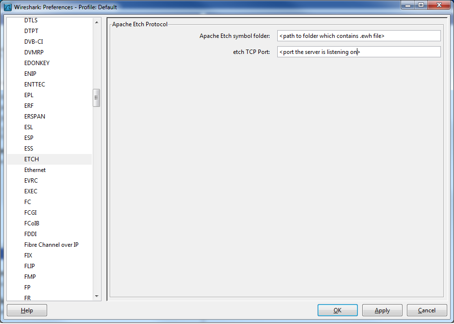
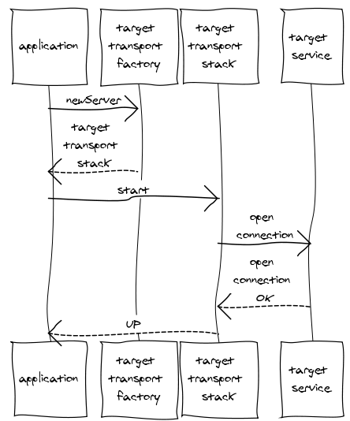
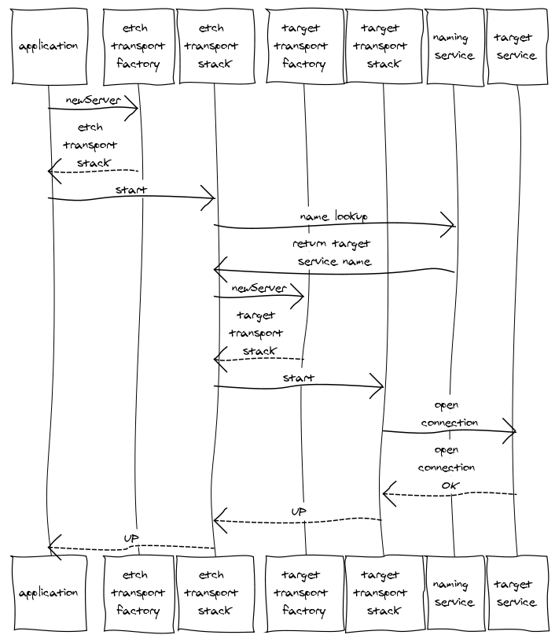
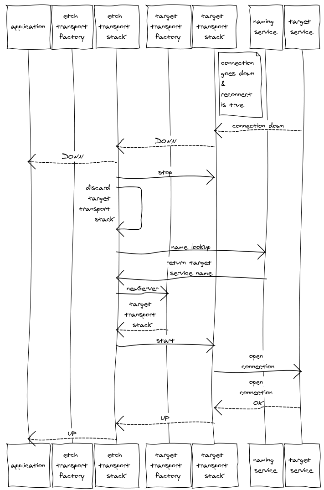
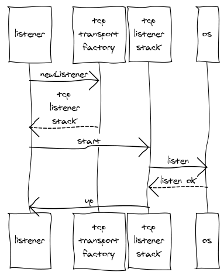
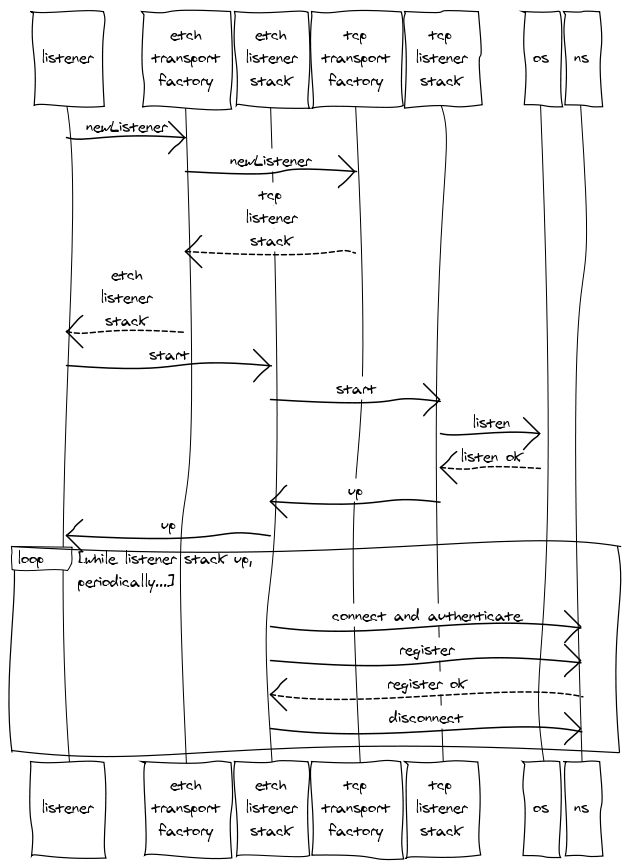

# Documentation[¶](#documentation "Permanent link")

*We are currently working on a restructuring and expansion of the Etch documentation. In the meanwhile you can use the existing documentation embedded below.*

---
# Get Involved[¶](#get-involved "Permanent link")

If you are new to Apache and open source and would like to learn more about how to work in open source, check this [page](http://apache.org/foundation/getinvolved.html).

The Apache Etch project is pleased about any contributions like documentation, source code, bug fixes or feedback. The following infos give you some suggestions on how you can get involved into Apache Etch.

* Subscribe to the [mailing lists](mailinglists.html). If you are interested in getting involved at the user level, subscribe to the user mailing list. If you are interested in the development of Etch, then subscribe to the developer list.
* Follow us on Twitter at <http://twitter.com/apacheetch>
* Help answer questions posted to the user mailing list for areas that you are familiar with. Your user experience can be very valuable to other users as well as developers on the project.
* Contribute to feature development. Just let the community know what you would like to work on. It is as easy as that.
* Identify [JIRAs](http://issues.apache.org/jira/browse/ETCH) in the area that you are interested and provide patches.
* The source is maintained in Apache's subversion. Information to the project source code is available [here](sources.html).
* Contribute to the user or developer documentation or website. Contribute updates to the Apche CMS content [here](http://svn.apache.org/repos/asf/etch/site/trunk/), create a patch and attach it to a JIRA issue. More infos about the Apache CMS can be found [here](http://svn.apache.org/repos/asf/etch/site/trunk/README).
* If in doubt about where to start, send a note to the mailing list and mention your area of interest. Any questions are welcome. We would like you to be involved.
* Provide Feedback: What is working well? What is not? Any help is good. Be part of the community.

## Reporting an Issue or Asking for New Features[¶](#reporting-an-issue-or-asking-for-new-features "Permanent link")

Please use Apache's [JIRA](http://issues.apache.org/jira/browse/ETCH) system to report bugs or request new features. First time users will need to create a login.

Search the existing JIRAs to see if what you want to create is already there. If not, create a new one. Make sure JIRAs are categorized correctly using JIRA categories and are created under the correct component area. Please include as much information as possible in your JIRA to help resolve the issue quicker. This can include version of the software used, platforms running on, steps to reproduce, test case, details of your requirement or even a patch if you have one.

You can always propose a release and drive the release with the content that you want. Another way to get a JIRA into a release is by providing a patch or working with other community members (volunteers) to help you get the problem fixed. You can also help by providing test cases.

In general, the best attempt is made to include as many JIRAs as possible depending on the level of community help. The voting mechanism in the JIRA system can be used to raise the importance of a JIRA to the attention of the committers. Adding comments in the JIRA would help the committers to understand why a JIRA is important to include in a given release.

## How to Submitting a Patch[¶](#how-to-submitting-a-patch "Permanent link")

Please follow the steps below to create a patch. It will be reviewed and committed by a committer in the project.

* Perform a full build with all tests enabled for the module the fix is for. Specific build procedures vary by sub-project.
* Confirm that the problem is fixed and include a test case where possible to help the person who is applying the patch to verify the fix.
* Generate the patch using svn diff command as follows:

  ```
      svn diff file.java > file.patch
  ```
* Try to give your patch files meaningful names, including the JIRA number
* Add your patch file as an attachment to the associated JIRA issue. You can do this by clicking on the 'Patch Available' box in the screen where the patch is being submitted.

---
# Source Code[¶](#source-code "Permanent link")

Each stable release provides also a tar and zip archive of the source code. The latest release can be found [here](downloads.html). If you would like to get the latest source code from a version control system you can do it with Subversion or Git.

The offical source is maintained in Apache's subversion repository at svn.apache.org. If you are a committer for the project, you should use the https url, otherwise (if you are just interested in a copy) then http is fine.

## Subversion[¶](#subversion "Permanent link")

If you only want browse the project sources, you can do this via a default webbrowser and this [link](http://svn.apache.org/repos/asf/etch/trunk/).

**Check out from Subversion**

Everbody is invited to check out the project sources out of our SVN repository. For committing source code changes, you need a username and password and only committers are allowed to do that. For all those of you, who are not familiar with Subversion, can get some basic information in the [online book](http://svnbook.red-bean.com/). If you do not have a Subversion client for your platform, you can get one at <http://subversion.tigris.org>.

Use the following command to check out:

```
svn co http://svn.apache.org/repos/asf/etch/trunk/
```

**Commit Changes to Subversion**

Use the following command to check out:

```
svn co https://svn.apache.org/repos/asf/etch/trunk/
```

and

```
svn commit
```

to commit changes. Each commit message should include a reference to a JIRA issue and a small note about the change.
Make sure that your *svn:eol-style* is set to *native* in order to use the proper line endings on your machine. These settings are normally located in your subversion config file within the auto-props section.

## Git[¶](#git "Permanent link")

Some of our developers use Git for source management. If you also interested in Git to manage your source code, check out Git documentation and proper client software at <http://git-scm.com/>.

Apache Etch has its own Git Repository at git://git.apache.org/etch.git. There is also a public read-only mirror of all of Apache's SVN at github site http://github.com/apache/etch.

Use the following command to clone the repository:

```
git clone git://git.apache.org/etch.git
```

Apache does not provide a Git Repository with write access. If you would like to work with Git in combination to the Apache SVN repository, please use Git SVN. The following command can be used to clone the SVN repository with Git. Man pages for git-svn can be found [here](http://www.kernel.org/pub/software/scm/git/docs/git-svn.html).

```
git svn clone https://svn.apache.org/repos/asf/etch/trunk/ -r HEAD
```

---
# Mailing Lists[¶](#mailing-lists "Permanent link")

The Apache Etch project maintains three mailing lists. Some of these are available in public.

### User Mailing List[¶](#user-mailing-list "Permanent link")

The user list is for general discussion or questions on using Etch. Etch developers monitor this list and provide assistance when needed.

* [Send](mailto:user@etch.apache.org)(user@etch.apache.org)
* [Subscribe](mailto:user-subscribe@etch.apache.org)(user-subscribe@etch.apache.org)
* [Unsubscribe](mailto:user-unsubscribe@etch.apache.org)(user-unsubscribe@etch.apache.org)
* [Archive](http://mail-archives.apache.org/mod_mbox/etch-user/)(http://mail-archives.apache.org/mod\_mbox/etch-user/)
* [Incubator Archive](http://mail-archives.apache.org/mod_mbox/incubator-etch-user/)(http://mail-archives.apache.org/mod\_mbox/incubator-etch-user/)

### Developer Mailing List[¶](#developer-mailing-list "Permanent link")

The developer list is for Etch developers to discuss ongoing work, make decisions, and vote on technical issues.

* [Send](mailto:dev@etch.apache.org)(dev@etch.apache.org)
* [Subscribe](mailto:dev-subscribe@etch.apache.org)(dev-subscribe@etch.apache.org)
* [Unsubscribe](mailto:dev-unsubscribe@etch.apache.org)(dev-unsubscribe@etch.apache.org)
* [Archive](http://mail-archives.apache.org/mod_mbox/etch-dev/)(http://mail-archives.apache.org/mod\_mbox/etch-dev/)
* [Incubator Archive](http://mail-archives.apache.org/mod_mbox/incubator-etch-dev/)(http://mail-archives.apache.org/mod\_mbox/incubator-etch-dev/)

### Commits Mailing List[¶](#commits-mailing-list "Permanent link")

The commits list receives notifications with diffs when changes are committed to the Etch source tree.

* [Subscribe](mailto:commits-subscribe@etch.apache.org)(commits-subscribe@etch.apache.org)
* [Unsubscribe](mailto:commits-unsubscribe@etch.apache.org)(commits-unsubscribe@etch.apache.org)
* [Archive](http://mail-archives.apache.org/mod_mbox/etch-commits/)(http://mail-archives.apache.org/mod\_mbox/etch-commits/)
* [Incubator Archive](http://mail-archives.apache.org/mod_mbox/incubator-etch-commits/)(http://mail-archives.apache.org/mod\_mbox/incubator-etch-commits/)

---
# Buildserver[¶](#buildserver "Permanent link")

The Apache Etch project use the Jenkins build server for doing Nightly Builds. At the moment the build is configured to run on a Windows as well on a Linux machine. You can reach the build server at [link](https://hudson.apache.org/hudson/view/A-F/view/Etch/).

---
# Apache Etch Downloads[¶](#apache-etch-downloads "Permanent link")

Welcome to the Apache Etch download page.

## Apache Etch 1.4.0 (Aug 2014)[¶](#apache-etch-140-aug-2014 "Permanent link")

Release Notes can be found [here](http://svn.apache.org/repos/asf/etch/releases/release-1.4.0/RELEASE_NOTES.txt). A list of known bugs for the 1.4.0 release is available [here](release-140-known-bugs).

| Description |  | Download Link | Signature |
| --- | --- | --- | --- |
| Etch 1.4.0 setup | (Windows) | [apache-etch-1.4.0-windows-x86-setup.exe](http://www.apache.org/dyn/closer.cgi/etch/1.4.0/apache-etch-1.4.0-windows-x86-setup.exe) | [MD5](https://www.apache.org/dist/etch/1.4.0/apache-etch-1.4.0-windows-x86-setup.exe.md5) [SHA-512](https://www.apache.org/dist/etch/1.4.0/apache-etch-1.4.0-windows-x86-setup.exe.sha) [ASC](https://www.apache.org/dist/etch/1.4.0/apache-etch-1.4.0-windows-x86-setup.exe.asc) |
| Etch 1.4.0 binary | (Windows) | [apache-etch-1.4.0-windows-x86-bin.zip](http://www.apache.org/dyn/closer.cgi/etch/1.4.0/apache-etch-1.4.0-windows-x86-bin.zip) | [MD5](https://www.apache.org/dist/etch/1.4.0/apache-etch-1.4.0-windows-x86-bin.zip.md5) [SHA-512](https://www.apache.org/dist/etch/1.4.0/apache-etch-1.4.0-windows-x86-bin.zip.sha) [ASC](https://www.apache.org/dist/etch/1.4.0/apache-etch-1.4.0-windows-x86-bin.zip.asc) |
||  |  |  |  |
| --- | --- | --- | --- |
| Etch 1.4.0 source | (Windows) | [apache-etch-1.4.0-src.zip](http://www.apache.org/dyn/closer.cgi/etch/1.4.0/apache-etch-1.4.0-src.zip) | [MD5](https://www.apache.org/dist/etch/1.4.0/apache-etch-1.4.0-src.zip.md5) [SHA-512](https://www.apache.org/dist/etch/1.4.0/apache-etch-1.4.0-src.zip.sha) [ASC](https://www.apache.org/dist/etch/1.4.0/apache-etch-1.4.0-src.zip.asc) |
| Etch 1.4.0 binary | (Linux) | [apache-etch-1.4.0-linux-x86-bin.tar.gz](http://www.apache.org/dyn/closer.cgi/etch/1.4.0/apache-etch-1.4.0-linux-x86-bin.tar.gz) | [MD5](https://www.apache.org/dist/etch/1.4.0/apache-etch-1.4.0-linux-x86-bin.tar.gz.md5) [SHA-512](https://www.apache.org/dist/etch/1.4.0/apache-etch-1.4.0-linux-x86-bin.tar.gz.sha) [ASC](https://www.apache.org/dist/etch/1.4.0/apache-etch-1.4.0-linux-x86-bin.tar.gz.asc) |
| Etch 1.4.0 source | (Linux) | [apache-etch-1.4.0-src.tar.gz](http://www.apache.org/dyn/closer.cgi/etch/1.4.0/apache-etch-1.4.0-src.tar.gz) | [MD5](https://www.apache.org/dist/etch/1.4.0/apache-etch-1.4.0-src.tar.gz.md5) [SHA-512](https://www.apache.org/dist/etch/1.4.0/apache-etch-1.4.0-src.tar.gz.sha) [ASC](https://www.apache.org/dist/etch/1.4.0/apache-etch-1.4.0-src.tar.gz.asc) |

## Verifying the downloads[¶](#verifying-the-downloads "Permanent link")

To ensure the integrity of the release artifacts they are digitally signed. You can find more information about
the way that we sign releases here. To verify the integrity of the downloaded files you must use signatures
downloaded from our main distribution directory not from the distribution mirrors.

MD5 checksums can be verified simply by regenerating the checksum and comparing it against the checksum
(the md5 file) supplied with the release. There are various utilities that can be used to generate the checksum,
for example

```
openssl md5 apache-etch-1.4.0-windows-x86-setup.exe
```

or

```
md5sum apache-etch-1.4.0-windows-x86-setup.exe
```

PGP signatures can be verified using PGP or GPG. First download the [KEYS](http://www.apache.org/dist/etch/KEYS) as well as the asc signature file for the relevant distribution. Make sure you get these files from our [main distribution directory](http://www.apache.org/dist/etch/), rather than from a mirror. Then verify the signatures using, for example

```
pgpk -a KEYS
pgpv apache-etch-1.4.0-windows-x86-setup.exe.asc
```

or

```
pgp -ka KEYS
pgp apache-etch-1.4.0-windows-x86-setup.exe.asc
```

or

```
gpg --import KEYS
gpg --verify apache-etch-1.4.0-windows-x86-setup.exe.asc
```

## Apache Etch release archives[¶](#apache-etch-release-archives "Permanent link")

All previous releases of Etch can be found in the [archives](archive.html).

---
# Getting Started[¶](#getting-started "Permanent link")

The following steps give you an introduction how to configure, build and work with the Apache Etch sources. At the the moment we support Windows and Linux builds.

1. [Preconditions](#Preconditions)
2. [Get the source code](#getSourceCode)
3. [Build sources](#buildSources)

After your build of Apache Etch was successful, you will be able to run the examples in the example directory.

### Preconditions[¶](#Preconditions "Permanent link")

The tools and libraries mentioned in the following listing must be available on your development machine in order to be able to work with Etch.
It is a good practice to set up a folder containing the external dependencies of all the bindings you would like to build. This folder will be called **ETCH\_EXTERNAL\_DEPENDS** later on.

You can use the workspace contents of our continous integration server as a reference
for your machine:

* Win32: <https://builds.apache.org/job/etch-trunk-windows-x86/ws/externals/>
* Linux: <https://builds.apache.org/job/etch-trunk-linux-x86/ws/externals/>

| Component | Prerequisites and dependencies |
| --- | --- |
| Etch compiler/code generator  **[mandatory for each binding]** | * Java JDK version 1.5\_011 or higher * Apache Ant 1.8.2 or higher * JavaCC 5.0 * JUnit 4.3.1 * Velocity 1.7 |
| Binding Java | no additional dependencies |
| Binding C# | * Apache Ant DotNet 1.1 * .NET Framework 4.0 (Visual Studio 2008 or higher) * (Mono 1.9 support is experimental) * NUnit 2.5.10.11092 |
| Binding C | * Apache APR 1.4.5 * Apache APR Util 1.3.12 * Apache APR iconv 1.2.1 * Cunit 2.1 * Apache Ant CMake 1.0 (cmakeant.jar) |

After the download of all the dependencies mentioned above you should now have the following structure (if you want to compile and build for all language bindings):

```
ETCH_EXTERNAL_DEPENDS/
  javacc/
    5.0/
      javacc.jar
  junit /
    4.3.1/
      junit-4.3.1.jar
  nunit/
    2.5.10.11092/
      [contents of nunit 2.5.10.11092 release tgz/zip]      
  velocity/
    1.7/
      velocity-dep-1.7.jar
  apache-ant/
    1.8.2/
      [contents of apache ant 1.8.2 release tgz/zip]
  apache-ant-cmake/
    1.0/
      cmakeant.jar
  apache-ant-dotnet/
    1.1/
      [contents of apache ant dotnet 1.1 release tgz/zip]
  apr/
    1.4.5/
      [apr binary installation, see above]
  cmake/
    2.8.6/
      [contents of cmake standalone 2.8.6 release tgz/zip]    
  cunit/
    2.1/
      [built cunit version, 
       on linux: you can skip this and use system libraries on your machine, e.g. apt-get install      libcunit1 libcunit1-dev
       on win32: see binding-c/runtime/c/README.txt for instructions on building cunit on Win32]
  nsis/ (WINDOWS ONLY)
    2.46/
      [skip if you want no installer built, else: contents of nsis 2.46 standalone zip/tgz]
```

### Get the source code[¶](#getSourceCode "Permanent link")

You can checkout the source tree by using the following SVN command:

```
svn co http://svn.apache.org/repos/asf/etch/trunk/
```

If you prefer to use Git you can use git-svn:

```
git svn clone http://svn.apache.org/repos/asf/etch/trunk/
```

### Build sources[¶](#buildSources "Permanent link")

As soon as all the required dependencies and the source is available on your machine, you are able to build Etch.

*Note for Linux 64-bit users:*   
In order to perform the 32-bit build of the C and C++ bindings make sure that you have installed the 32-bit support libraries. On Ubuntu you need the following packages:

```
ia32-libs
libc6.dev.i386
g++-multilib
gcc-multilib
```

##### Ant Build[¶](#ant-build "Permanent link")

1. Open the `scripts/antSetup.bat` (Windows) or `scripts/antSetup.sh` (Linux) with your favourite text editor
2. Check if every environment variable set by the script points to the right location
3. Run the antSetup script to prepare your build environment

   Win32:

   ```
   `scripts/antSetup.bat`
   ```

   Linux:

   ```
   `source scripts/antSetup.sh`
   ```
4. Check the correctness of the paths to the jar archives Etch depends on in the `build.dependencies` file inside the root folder.
5. Start build by executeing `ant debug` at the shell prompt

---
# Project Roadmap[¶](#project-roadmap "Permanent link")

The Apache Etch system currently includes the compiler, bindings for java, csharp and c, some documentation, and an ant based build system. Development for Etch cuts across the following categories:

* IDL, Toolchain, and Language Bindings
* Etch Services, of which there are two types
  * Standard IDL implementations that support service and application development
  * Services that support the Etch Cloud
* Validation and Testing
* Documentation

Some of the projects necessarily cut across the above categories, e.g adding a new transport requires some programming in each binding implementation and documentation, etc.

### IDL[¶](#idl "Permanent link")

The Etch language could be extended to include more descriptive information about the service being modeled. We have a few RFE's for extensions, some of which are well-thought out and some of which are sketchy.

* Annotations on message, struct, or exception fields which describe acceptable values. For example, a certain field might be required (not null) and the value within a specified range (e.g., percent: 0-100).
* @AsyncReceiver annotation, while solving a certain problem, forces an implementation which may or may not be necessary. And the lack of the annotation where necessary, causes a headache as the implementor is forced to edit the service description to fix it. Look for a better mechanism.
* @Deprecated and @Delete annotations on service elements to warn of retirement or retire elements but retain their information for historical reasons.
* Option to mixin statement to change the direction of the mixed in interface. This allows some flexibility in certain deployment styles.
* Certain service models, such as REST, include a few standard messages but are heavy on object modeling. Etch data modeling could be strengthened to allow modeling of RESTful api.

### Compiler[¶](#compiler "Permanent link")

* The internal structure of the compiler could certainly use some love, particularly in the areas of error handling.
* We desperately need some unit testing around the compiler, particularly negative tests (error conditions).
* The build is currently Ant. We're thinking it should be Maven. Maven support for non-java languages is, eh, not all that good. We have an Etch plugin for Ant and sort of Maven. The maven plugin needs to be way better. And having an Etch project archtype for Maven would be nice.
* Better support for Eclipse, Intelli-J, and Visual Studio would be nice.

### Language Bindings[¶](#language-bindings "Permanent link")

Improve the current language bindings. Add new bindings.

#### Java[¶](#java "Permanent link")

* Xml tagged data format.
* TlsConnection could use server certificate authentication handshake, client authentication via certificate.
* Message filters (i.e., KeepAlive and PwAuth) need to be robustified.
* Always more unit tests and code coverage.
* Java reference documentation e.g. as javadoc

#### CSharp[¶](#csharp "Permanent link")

* More or less the same as the Java binding

#### C[¶](#c "Permanent link")

* More or less the same as the Java binding

#### Other[¶](#other "Permanent link")

* We have started on Cpp, Ruby, Python, Javascript, and Google Go bindings. Some are more complete than others. I have heard of an Objective C binding. The sources for these are not yet part of standard Etch. We're not sure when or how that will happen.

### Architecture[¶](#architecture "Permanent link")

General aspects how the architecture could be extended and improved.

* More transport layers e.g. for SOAP, JMS, UDP, Jabber, Protocol Buffers.
* Efficient connection handling and support of many simultaneous connections.
* Transfer of big message e.g. streams [more](roadmap-architecture-message-size.html)
* Connection lifecycle management [more](roadmap-architecture-transport.html)

### Concepts of Application Services[¶](#concepts-of-application-services "Permanent link")

These are proposed services that could be used by any application or service. They abstract common activities through an Etch interface.

#### Cloud[¶](#cloud "Permanent link")

Etch Cloud services are services that facilitate the communication between multiple Etch consumers and producers. The following mantra is true for all Etch Cloud:

Neither a service (producer) nor application (consumer) should have to be overtly aware of any Etch cloud service. It should be possible to deploy a service or application with or without any supporting Etch cloud services, with no conditional code or changes to code. Etch cloud services are purely deployment time considerations and are not required for operation.

Etch Name Service - Etch URIs can be very long and cumbersome to maintain, the Etch Name Service allows an Etch Service to look-up the necessary connection URI using an abstract reference. [more](roadmap-concepts-nameservice.html)

Etch Router Service - Failover, redundancy, policy enforcement, geographic preference... the Etch Router helps Etch clients find just the right Etch service and stay connected. [more](roadmap-concepts-router.html)

#### Logging[¶](#logging "Permanent link")

General purpose network-hosted log catcher

#### Configuration[¶](#configuration "Permanent link")

Who needs YAML files, pull your configuration over the network [more](roadmap-service-configuration.html)

#### Authentication[¶](#authentication "Permanent link")

Many services in the web world have single sign on, Etch can too!

### Documentation[¶](#documentation "Permanent link")

General project infos are documented via this web page. The documentation about the Etch framework and different language binding will be done with Docbook and as HTML and PDF provided.

### Testing[¶](#testing "Permanent link")

While the unit tests assure some level of wire format compliance, nothing beats a validation test suite. We need to be able to plug in different (but compatible) transport options and then run a standard set of tests to verify that things still work (while mixing and matching bindings as well). There are two parts to this:

* Validate Suite Framework and Service definition
* Per binding implementation of the validation suite service

[Here](roadmap-testing-interoperabillity.html) you can find a discussion on Interoperability Testing Framework.

---
# Presentations[¶](#presentations "Permanent link")

The Etch middleware has been introduced on several events. Please find the slides and corresponding videos below:

* FOSDEM 2011
  * Slides at [Slideshare](http://www.slideshare.net/grandyho/apache-etch-introduction-fosdem-2011)
  * Video at [Youtube](http://www.youtube.com/watch?v=1h76ch2-G-M)
* Cisco Unified Application Environment Developer Conference
  * Slides can be found [here](http://developer.cisco.com/c/document_library/get_file?groupId=13403&folderId=63902&name=DLFE-8208.pdf)
  * Video is available [here](http://developer.cisco.com/web/cuae/devconf2008_session_3)

---
# Welcome to Apache Etch[¶](#welcome-to-apache-etch "Permanent link")

Etch is a cross-platform, language- and transport-independent framework for building
and consuming network services. The Etch toolset includes a network service description
language, a compiler, and binding libraries for a variety of programming languages.
Etch is also transport-independent, allowing for a variety of different transports
to be used based on need and circumstance. The goal of Etch is to make it simple to
define small, focused services that can be easily accessed, combined, and deployed
in a similar manner. With Etch, service development and consumption becomes no more
difficult than library development and consumption.

Etch was started because we wanted to have a way to write a concise, formal description of the message exchange between a client and a server, with that message exchange supporting a hefty set of requirements:

* support one-way and two-way, real-time communication
* high performance and scalability
* support clients and servers written in different languages
* support clients/servers running in a wide range of contexts (such as thin web client, embedded device, PC application, or server)
* support anyone adding new language bindings and new transports
* be fast and small, while still being flexible enough to satisfy requirements
* finally, it must be easy to use for developers both implementing and/or consuming the service.

## News[¶](#news "Permanent link")

* *Apache Etch 1.4.0*  
  This release contains a lot of improvements mainly for the C++-binding. Download the newest version from [downloads](downloads.html).  
  (2014-08-06)
* *Apache Etch 1.3.0*  
  The Apache Etch development team is pleased to announce the first stable release since Etch has become a TLP. You can download the newest version for our [download section](downloads.html).  
  The release contains a couple of bug fixes for different bindings and the feature complete C++-binding, which is now in beta state.  
  (2013-09-26)
* *Etch is an Apache TLP!*  
  We are happy and proud to announce that the Apache Board has decided in its board meeting in January to graduate the Apache Etch project.
  The "After-Graduation" process is ongoing. Follow us on [twitter (@apacheetch)](https://twitter.com/apacheetch) to stay up to date.
* *Etch C++ Binding alpha version*  
  The Apache Etch team has been working on the C++ Binding for the last few months. Now we are happy to announce that a first working alpha version is now available in the [SVN repository](sources.html). Check it out!
  For bug reports or feature request please refer to our [BugTracker](issue-tracking.html).
* *Apache Incubator Etch 1.2.0*  
  The Apache Etch development team is really pleased to announce the new stable build [Apache Etch 1.2.0-incubating](downloads.html).  
  (2012-01-03)
* *Apache Incubator Etch at FOSDEM 2011*  
  The Apache Etch project was present at FOSDEM 2011. Here you can finde the [slides](http://www.slideshare.net/grandyho/apache-etch-introduction-fosdem-2011) and a [video stream](http://www.youtube.com/watch?v=1h76ch2-G-M).  
  (2011-02-07)

## Project Status[¶](#project-status "Permanent link")

The Apache Etch project is permanently in progress. The latest stable version can be downloaded [here](downloads.html). The language bindings are currently in different states:

* Java - stable
* C# - stable
* C - stable
* C++ - beta
* Google Go - alpha
* Javascript - alpha
* Python - alpha

---
# How to make a release[¶](#how-to-make-a-release "Permanent link")

## Introduction[¶](#introduction "Permanent link")

Apache Etch releases are made according to the release policy of the Apache Software Foundation.
More information about this can be found here:
<http://www.apache.org/dev/release.html>

## Prerequisites[¶](#prerequisites "Permanent link")

This describes the necessary steps to be taken BEFORE drafting a release:

1. Update release depended files in trunk

   * Changelog: /Changelog.txt

     Update the file with the svn log output between the last release and the current trunk:

     ```
     svn log -r \:HEAD
     ```

     In order to get the revision of the last release you can e.g. use the command

     ```
     svn info https://svn.apache.org/repos/asf/etch/releases/release-\
     ```
   * Update the version numbers in all files. (e.g. grep the trunk for the last release version). You should get at least to following files:

     * /README.txt
     * /dist-README.txt
     * /compiler/src/main/java/org/apache/etch/compiler/Version.java
     * /doc/libs/global.ent
     * /etch.properties
   * Release notes: /RELEASE\_NOTES.txt

     The release notes do contain important information about the release. Please read through the existing content carefully, add new notes or remove obsolete remarks.
     At the end of the file the release notes exported from JIRA are attached. Those release notes can be copied from the [Roadmap](https://issues.apache.org/jira/browse/ETCH/?selectedTab=com.atlassian.jira.jira-projects-plugin:roadmap-panel) section of JIRA for the respective release.

## Create the release artifacts[¶](#create-the-release-artifacts "Permanent link")

Apache Etch is currently shipped both as a source package (mandatory according to ASF Policy!) and as a binary package for different platforms.  
Therefore you need the toolchains for Linux as well as Windows at hand in order to create all the release artifacts.

**Make sure all the stable bindings are building, the unit tests do succeed and all the examples are working.**

1. Source packages

   Create a zip-compressed archive and a tarball.

   ```
   svn export trunk/ apache-etch-\-src
   zip -r apache-etch-\-src.zip apache-etch-\-src
   tar cfzv apache-etch-\-src.tar.gz apache-etch-\-src/
   ```
2. Binary packages:

   The binaries are build with ant by calling the release target.

   ```
   On Linux:
   ant release -DEtch.property.platformVersion=x86 -DEtch.property.osVersion=linux
     

   On Windows:
   ant release -DEtch.property.platformVersion=x86 -DEtch.property.osVersion=windows
   ```

   After a successful build the binary packages are located at trunk/target/Installers/packages
3. Create checksums and signatures for all the created packages

   ```
   MD5
   gpg --print-md MD5 ${artifact} > ${artifact}.md5
     

   SHA512
   gpg --print-md SHA512 ${artifact} > ${artifact}.sha
     

   Signature
   gpg -u \ --armor --output ${artifact}.asc --detach-sig ${artifact}
   ```
4. Upload release candidate

   All the generated artifacts are committed to the [/dev](https://dist.apache.org/repos/dist/dev/etch/) tree of the dist repository in order to make them testable for other members of the PMC before they need to cast their vote.
5. Start [VOTE] thread on the dev@etch.a.o mailing list
6. Wait at least 72h for votes.

## Publish the release[¶](#publish-the-release "Permanent link")

As soon as a release got accepted, it can be published officially on the Apache servers.

1. Move the approved release candidate from the [/dev](https://dist.apache.org/repos/dist/dev/etch/) tree of the dist repository to the [/release](https://dist.apache.org/repos/dist/release/etch/) directory.
2. Update news and download section on the website.
3. Create known bugs webpage with link to the bug tracker.
4. Send out the good news on all known communication channels (mailing lists, [Etch's Twitter account](https://twitter.com/apacheetch)).

---
# Tools[¶](#tools "Permanent link")

The Apache Etch project developed also some tools to work with the Etch framework. Following you can find more about these.

### Wireshark Etch Tracing[¶](#wireshark-etch-tracing "Permanent link")

The Wireshark plugin for Etch uses compiler-generated files to disassemble the wire protocol (.ewh files). In the Wireshark Etch plugin preferences (Edit -> Preferences -> Protocols -> Etch), you can specify a path to your generated .ewh files and you will get your specific analyzed and displayed directly in Wireshark. The plugin is available in Wireshark since version 1.5.0.



---
# Bug Tracker[¶](#bug-tracker "Permanent link")

Please use [Apache\'s JIRA](http://issues.apache.org/jira/browse/ETCH) system to report bugs or request new features. The first time
you have to create a login name to get access to the system.

Search the existing JIRAs to see if what you want to create is already there. If not, create a new one. Make sure JIRAs are categorized correctly using JIRA categories and are created under the correct component area. Please include as much information as possible in your JIRA to help resolve the issue quicker. This can include version of the software used, platforms running on, steps to reproduce, test case, details of your requirement or even a patch if you have one.

Further information about how reporting an Issue or Asking for New Features can be found at [Get Involved](get-involved.html).

---
# Who we are[¶](#who-we-are "Permanent link")

**Apache Etch Developers**

Who: All of the volunteers who contribute to the Apache Etch project in the form of time, code, documentation. They are active on the developer mailing list, take part in discussions, supply patches, documentation, give constructive suggestions or comments.

Currently all developers are also committers.

**Apache Etch Committers**

Who: All of the volunteers who are developers to Apache Etch project and have write access to the subversion repository. All Committers have signed a Contributor License Agreement (CLA) on record. They are responsible for progress and technical aspects of the Apache Etch project.

Active:

* Scott Comer
* Youngjin Park
* Michael Fitzner
* Martin Veith

Inactive:

* Thomas Marsh
* Holger Grandy
* James Dixson
* Gaurav Sandhir
* J.D. Liau
* Rene Barrazza
* Seth Call
* James DeCocq

Further information about the project organisation with a list of all commiters and project mentors can be found [here](http://people.apache.org/committers-by-project.html#etch).

---
# Apache Etch Download-Archive[¶](#apache-etch-download-archive "Permanent link")

Welcome to the Apache Etch download archive page. Archived incubator releases of Etch can be found in the [archives](http://archive.apache.org/dist/incubator/etch/).

## Apache Etch 1.3.0 (Sep 2013)[¶](#apache-etch-130-sep-2013 "Permanent link")

Release Notes can be found [here](http://svn.apache.org/repos/asf/etch/releases/release-1.3.0/RELEASE_NOTES.txt). A list of known bugs for the 1.3.0 release is available [here](release-130-known-bugs).

| Description |  | Download Link | Signature |
| --- | --- | --- | --- |
| Etch 1.3.0 setup | (Windows) | [apache-etch-1.3.0-windows-x86-setup.exe](https://archive.apache.org/dist/etch/1.3.0/apache-etch-1.3.0-windows-x86-setup.exe) | [MD5](https://archive.apache.org/dist/etch/1.3.0/apache-etch-1.3.0-windows-x86-setup.exe.md5) [SHA-512](https://archive.apache.org/dist/etch/1.3.0/apache-etch-1.3.0-windows-x86-setup.exe.sha) [ASC](https://archive.apache.org/dist/etch/1.3.0/apache-etch-1.3.0-windows-x86-setup.exe.asc) |
| Etch 1.3.0 binary | (Windows) | [apache-etch-1.3.0-windows-x86-bin.zip](https://archive.apache.org/dist/etch/1.3.0/apache-etch-1.3.0-windows-x86-bin.zip) | [MD5](https://archive.apache.org/dist/etch/1.3.0/apache-etch-1.3.0-windows-x86-bin.zip.md5) [SHA-512](https://archive.apache.org/dist/etch/1.3.0/apache-etch-1.3.0-windows-x86-bin.zip.sha) [ASC](https://archive.apache.org/dist/etch/1.3.0/apache-etch-1.3.0-windows-x86-bin.zip.asc) |
||  |  |  |  |
| --- | --- | --- | --- |
| Etch 1.3.0 source | (Windows) | [apache-etch-1.3.0-src.zip](https://archive.apache.org/dist/etch/1.3.0/apache-etch-1.3.0-src.zip) | [MD5](https://archive.apache.org/dist/etch/1.3.0/apache-etch-1.3.0-src.zip.md5) [SHA-512](https://archive.apache.org/dist/etch/1.3.0/apache-etch-1.3.0-src.zip.sha) [ASC](https://archive.apache.org/dist/etch/1.3.0/apache-etch-1.3.0-src.zip.asc) |
| Etch 1.3.0 binary | (Linux) | [apache-etch-1.3.0-linux-x86-bin.tar.gz](https://archive.apache.org/dist/etch/1.3.0/apache-etch-1.3.0-linux-x86-bin.tar.gz) | [MD5](https://archive.apache.org/dist/etch/1.3.0/apache-etch-1.3.0-linux-x86-bin.tar.gz.md5) [SHA-512](https://archive.apache.org/dist/etch/1.3.0/apache-etch-1.3.0-linux-x86-bin.tar.gz.sha) [ASC](https://archive.apache.org/dist/etch/1.3.0/apache-etch-1.3.0-linux-x86-bin.tar.gz.asc) |
| Etch 1.3.0 source | (Linux) | [apache-etch-1.3.0-src.tar.gz](https://archive.apache.org/dist/etch/1.3.0/apache-etch-1.3.0-src.tar.gz) | [MD5](https://archive.apache.org/dist/etch/1.3.0/apache-etch-1.3.0-src.tar.gz.md5) [SHA-512](https://archive.apache.org/dist/etch/1.3.0/apache-etch-1.3.0-src.tar.gz.sha) [ASC](https://archive.apache.org/dist/etch/1.3.0/apache-etch-1.3.0-src.tar.gz.asc) |

## Apache Etch 1.2.0-incubating (Jan 2012)[¶](#apache-etch-120-incubating-jan-2012 "Permanent link")

Release Notes can be found [here](http://svn.apache.org/repos/asf/etch/releases/release-1.2.0-incubating/RELEASE_NOTES.txt). A list of known bugs for the 1.2.0-incubator release is available [here](release-120-incubating-known-bugs).

| Description |  | Download Link | Signature |
| --- | --- | --- | --- |
| Etch 1.2.0-incubating setup | (Windows) | [apache-etch-1.2.0-incubating-windows-x86-setup.exe](http://archive.apache.org/dist/incubator/etch/1.2.0-incubating/apache-etch-1.2.0-incubating-windows-x86-setup.exe) | [MD5](http://archive.apache.org/dist/incubator/etch/1.2.0-incubating/apache-etch-1.2.0-incubating-windows-x86-setup.exe.md5) [SHA-512](http://archive.apache.org/dist/incubator/etch/1.2.0-incubating/apache-etch-1.2.0-incubating-windows-x86-setup.exe.sha) [ASC](http://archive.apache.org/dist/incubator/etch/1.2.0-incubating/apache-etch-1.2.0-incubating-windows-x86-setup.exe.asc) |
| Etch 1.2.0-incubating binary | (Windows) | [apache-etch-1.2.0-incubating-windows-x86-bin.zip](http://archive.apache.org/dist/incubator/etch/1.2.0-incubating/apache-etch-1.2.0-incubating-windows-x86-bin.zip) | [MD5](http://archive.apache.org/dist/incubator/etch/1.2.0-incubating/apache-etch-1.2.0-incubating-windows-x86-bin.zip.md5) [SHA-512](http://archive.apache.org/dist/incubator/etch/1.2.0-incubating/apache-etch-1.2.0-incubating-windows-x86-bin.zip.sha) [ASC](http://archive.apache.org/dist/incubator/etch/1.2.0-incubating/apache-etch-1.2.0-incubating-windows-x86-bin.zip.asc) |
||  |  |  |  |
| --- | --- | --- | --- |
| Etch 1.2.0-incubating source | (Windows) | [apache-etch-1.2.0-incubating-src.zip](http://archive.apache.org/dist/incubator/etch/1.2.0-incubating/apache-etch-1.2.0-incubating-src.zip) | [MD5](http://archive.apache.org/dist/incubator/etch/1.2.0-incubating/apache-etch-1.2.0-incubating-src.zip.md5) [SHA-512](http://archive.apache.org/dist/incubator/etch/1.2.0-incubating/apache-etch-1.2.0-incubating-src.zip.sha) [ASC](http://archive.apache.org/dist/incubator/etch/1.2.0-incubating/apache-etch-1.2.0-incubating-src.zip.asc) |
| Etch 1.2.0-incubating binary | (Linux) | [apache-etch-1.2.0-incubating-linux-x86-bin.tar.gz](http://archive.apache.org/dist/incubator/etch/1.2.0-incubating/apache-etch-1.2.0-incubating-linux-x86-bin.tar.gz) | [MD5](http://archive.apache.org/dist/incubator/etch/1.2.0-incubating/apache-etch-1.2.0-incubating-linux-x86-bin.tar.gz.md5) [SHA-512](http://archive.apache.org/dist/incubator/etch/1.2.0-incubating/apache-etch-1.2.0-incubating-linux-x86-bin.tar.gz.sha) [ASC](http://archive.apache.org/dist/incubator/etch/1.2.0-incubating/apache-etch-1.2.0-incubating-linux-x86-bin.tar.gz.asc) |
| Etch 1.2.0-incubating source | (Linux) | [apache-etch-1.2.0-incubating-src.tar.gz](http://archive.apache.org/dist/incubator/etch/1.2.0-incubating/apache-etch-1.2.0-incubating-src.tar.gz) | [MD5](http://archive.apache.org/dist/incubator/etch/1.2.0-incubating/apache-etch-1.2.0-incubating-src.tar.gz.md5) [SHA-512](http://archive.apache.org/dist/incubator/etch/1.2.0-incubating/apache-etch-1.2.0-incubating-src.tar.gz.sha) [ASC](http://archive.apache.org/dist/incubator/etch/1.2.0-incubating/apache-etch-1.2.0-incubating-src.tar.gz.asc) |

## Apache Etch 1.1.0-incubating (Oct. 2010)[¶](#apache-etch-110-incubating-oct-2010 "Permanent link")

Release Notes can be found [here](http://svn.apache.org/repos/asf/etch/releases/release-1.1.0-incubating/RELEASE_NOTES.txt). A list of known bugs for the 1.1.0-incubator release is available [here](release-110-incubating-known-bugs).

| Description |  | Download Link | Signature |
| --- | --- | --- | --- |
| Etch 1.1.0-incubating setup | (Windows) | [apache-etch-1.1.0-incubating-windows-x86-setup.exe](http://archive.apache.org/dist/incubator/etch/1.1.0-incubating/apache-etch-1.1.0-incubating-windows-x86-setup.exe) | [MD5](http://archive.apache.org/dist/incubator/etch/1.1.0-incubating/apache-etch-1.1.0-incubating-windows-x86-setup.exe.md5) [SHA-1](http://archive.apache.org/dist/incubator/etch/1.1.0-incubating/apache-etch-1.1.0-incubating-windows-x86-setup.exe.sha) [ASC](http://archive.apache.org/dist/incubator/etch/1.1.0-incubating/apache-etch-1.1.0-incubating-windows-x86-setup.exe.asc) |
| Etch 1.1.0-incubating binary | (Windows) | [apache-etch-1.1.0-incubating-windows-x86-bin.zip](http://archive.apache.org/dist/incubator/etch/1.1.0-incubating/apache-etch-1.1.0-incubating-windows-x86-bin.zip) | [MD5](http://archive.apache.org/dist/incubator/etch/1.1.0-incubating/apache-etch-1.1.0-incubating-windows-x86-bin.zip.md5) [SHA-1](http://archive.apache.org/dist/incubator/etch/1.1.0-incubating/apache-etch-1.1.0-incubating-windows-x86-bin.zip.sha) [ASC](http://archive.apache.org/dist/incubator/etch/1.1.0-incubating/apache-etch-1.1.0-incubating-windows-x86-bin.zip.asc) |
||  |  |  |  |
| --- | --- | --- | --- |
| Etch 1.1.0-incubating source | (Windows) | [apache-etch-1.1.0-incubating-src.zip](http://archive.apache.org/dist/incubator/etch/1.1.0-incubating/apache-etch-1.1.0-incubating-src.zip) | [MD5](http://archive.apache.org/dist/incubator/etch/1.1.0-incubating/apache-etch-1.1.0-incubating-src.zip.md5) [SHA-1](http://archive.apache.org/dist/incubator/etch/1.1.0-incubating/apache-etch-1.1.0-incubating-src.zip.sha) [ASC](http://archive.apache.org/dist/incubator/etch/1.1.0-incubating/apache-etch-1.1.0-incubating-src.zip.asc) |
| Etch 1.1.0-incubating binary | (Linux) | [apache-etch-1.1.0-incubating-linux-x86-bin.tar.gz](http://archive.apache.org/dist/incubator/etch/1.1.0-incubating/apache-etch-1.1.0-incubating-linux-x86-bin.tar.gz) | [MD5](http://archive.apache.org/dist/incubator/etch/1.1.0-incubating/apache-etch-1.1.0-incubating-linux-x86-bin.tar.gz.md5) [SHA-1](http://archive.apache.org/dist/incubator/etch/1.1.0-incubating/apache-etch-1.1.0-incubating-linux-x86-bin.tar.gz.sha) [ASC](http://archive.apache.org/dist/incubator/etch/1.1.0-incubating/apache-etch-1.1.0-incubating-linux-x86-bin.tar.gz.asc) |
| Etch 1.1.0-incubating source | (Linux) | [apache-etch-1.1.0-incubating-src.tar.gz](http://archive.apache.org/dist/incubator/etch/1.1.0-incubating/apache-etch-1.1.0-incubating-src.tar.gz) | [MD5](http://archive.apache.org/dist/incubator/etch/1.1.0-incubating/apache-etch-1.1.0-incubating-src.tar.gz.md5) [SHA-1](http://archive.apache.org/dist/incubator/etch/1.1.0-incubating/apache-etch-1.1.0-incubating-src.tar.gz.sha) [ASC](http://archive.apache.org/dist/incubator/etch/1.1.0-incubating/apache-etch-1.1.0-incubating-src.tar.gz.asc) |

### Apache Etch 1.0.2-incubating (Mar. 2009)[¶](#apache-etch-102-incubating-mar-2009 "Permanent link")

This is the first release of Apache Etch through the ASF. It consists of a few bug fixes and an update license texts to conform with ASF standards. This release does not change the package names for the Etch libraries and is therefore compatible with applications linked against the previous [1.0.x releases of Etch](pre-apache-releases.html) from Cisco Systems.

Release Notes can be found [here](http://svn.apache.org/repos/asf/etch/releases/release-1.0.2/RELEASE_NOTES.txt).

| Description |  | Download Link | Signature |
| --- | --- | --- | --- |
| Etch 1.0.2-incubating setup | (Windows) | [apache-etch-1.0.2-incubating-setup.exe](http://archive.apache.org/dist/incubator/etch/1.0.2-incubating/apache-etch-1.0.2-incubating-setup.exe) | [MD5](http://archive.apache.org/dist/incubator/etch/1.0.2-incubating/apache-etch-1.0.2-incubating-setup.exe.md5) [SHA-1](http://archive.apache.org/dist/incubator/etch/1.0.2-incubating/apache-etch-1.0.2-incubating-setup.exe.sha) [ASC](http://archive.apache.org/dist/incubator/etch/1.0.2-incubating/apache-etch-1.0.2-incubating-setup.exe.asc) |
| Etch 1.0.2-incubating binary | (Windows) | [apache-etch-1.0.2-incubating-bin.zip](http://archive.apache.org/dist/incubator/etch/1.0.2-incubating/apache-etch-1.0.2-incubating-bin.zip) | [MD5](http://archive.apache.org/dist/incubator/etch/1.0.2-incubating/apache-etch-1.0.2-incubating-bin.zip.md5) [SHA-1](http://archive.apache.org/dist/incubator/etch/1.0.2-incubating/apache-etch-1.0.2-incubating-bin.zip.sha) [ASC](http://archive.apache.org/dist/incubator/etch/1.0.2-incubating/apache-etch-1.0.2-incubating-bin.zip.asc) |
||  |  |  |  |
| --- | --- | --- | --- |
| Etch 1.0.2-incubating source | (Windows) | [apache-etch-1.0.2-incubating-src.zip](http://archive.apache.org/dist/incubator/etch/1.0.2-incubating/apache-etch-1.0.2-incubating-src.zip) | [MD5](http://archive.apache.org/dist/incubator/etch/1.0.2-incubating/apache-etch-1.0.2-incubating-src.zip.md5) [SHA-1](http://archive.apache.org/dist/incubator/etch/1.0.2-incubating/apache-etch-1.0.2-incubating-src.zip.sha) [ASC](http://archive.apache.org/dist/incubator/etch/1.0.2-incubating/apache-etch-1.0.2-incubating-src.zip.asc) |
| Etch 1.0.2-incubating binary | (Linux) | [apache-etch-1.0.2-incubating-bin.tar.gz](http://archive.apache.org/dist/incubator/etch/1.0.2-incubating/apache-etch-1.0.2-incubating-bin.tar.gz) | [MD5](http://archive.apache.org/dist/incubator/etch/1.0.2-incubating/apache-etch-1.0.2-incubating-bin.tar.gz.md5) [SHA-1](http://archive.apache.org/dist/incubator/etch/1.0.2-incubating/apache-etch-1.0.2-incubating-bin.tar.gz.sha) [ASC](http://archive.apache.org/dist/incubator/etch/1.0.2-incubating/apache-etch-1.0.2-incubating-bin.tar.gz.asc) |
| Etch 1.0.2-incubating source | (Linux) | [apache-etch-1.0.2-incubating-src.tar.gz](http://archive.apache.org/dist/incubator/etch/1.0.2-incubating/apache-etch-1.0.2-incubating-src.tar.gz) | [MD5](http://archive.apache.org/dist/incubator/etch/1.0.2-incubating/apache-etch-1.0.2-incubating-src.tar.gz.md5) [SHA-1](http://archive.apache.org/dist/incubator/etch/1.0.2-incubating/apache-etch-1.0.2-incubating-src.tar.gz.sha) [ASC](http://archive.apache.org/dist/incubator/etch/1.0.2-incubating/apache-etch-1.0.2-incubating-src.tar.gz.asc) |

## Pre-Apache Etch Download-Archive[¶](#pre-apache-etch-download-archive "Permanent link")

All previous releases of Etch can be found [here](archive-pre-apache.html).

---
# Known bugs in 1.4.0[¶](#known-bugs-in-140 "Permanent link")

The list of known bugs is maintained in [Jira](https://issues.apache.org/jira/issues/?jql=project%20%3D%20ETCH%20AND%20affectedVersion%20%3D%20%221.4.0%22%20ORDER%20BY%20priority%20DESC)

---
# Etch Nameservice[¶](#etch-nameservice "Permanent link")

When an client is connecting to an etch service, a uri is used to specify the details of the connection. Likewise, a listener uses a uri to specify the details of the listening point. Typically this code looks something like thi

```
RemoteNameServiceServer server = NameServiceHelper.newServer(
    "tcp://host:4001?filter=KeepAlive&TcpTransport.reconnectDelay=4000", null, factory );
```

The uri specifies all the details of the etch connection in a convenient form. Yet the uri is still hard to manage. With it embedded in code we must recompile the client to change the connection details. We can load the uri from some other place, say a configuration file, environment variable, or the command line, but all we've done is move the problem to yet another hard to manage place. (Here 'manage' specifically refers to the process of obtaining the uri or updating it after a change.)

What can we do to make the uri easier to manage? The main issue is that the service implementation and deployment specifies what the uri should be. Any change to the service implementation or deployment could trigger a need to update the uri that clients use to connect to it. So, one fact (connection uri), one source (service implementation and deployment), but a delivery path which is not automatic and often includes a human. Can you imagine trying to update 30,000 clients with a new connection uri?

The classic solution applies here and represents the start of the next phase in etch development. Etch needs a Name Service.

### The Basics[¶](#the-basics "Permanent link")

At its heart a name service is easy. We use them every day without really thinking about them. Given a simple but abstract identifier a more complicated but concrete identifier is produced by some sort of lookup. In exchange for the abstraction, we obtain some independence from the complicated details of the concrete identifier, allowing the concrete identifier to change as needed by the environment. For example, apache.org is translated into the internet protocol v4 address 140.211.11.131 for us by dns. My name, sccomer, is translated into a uid (1079) by my nearby Linux box and used for all sorts of evil purposes. In both cases I can use the simple name as a substitute for the more complicated name seamlessly in the environments I work in. Let's call the abstract identifier the source. Let's call the concrete identifier the target.

In order for the name service to be useful to me, I have to be able to depend upon and trust it. That is, the translation process needs to be available when I need it, and the translations need to be accurate and, most importantly, secure. By secure I mean that if I'm going to connect to a service and supply some credentials and use it to do my work, I have an expectation that the service itself is reliable and trustworthy. That it is not being spoofed. This translates into access controls limiting who can make changes to the underlying data used to implement the name service translation, safeguards to prevent the translation being modified in transit, and some assurance that I'm using the right name service instance.

### The Requirements[¶](#the-requirements "Permanent link")

The following design principles are important to adhere to:

* A service or application should not have be overtly aware of the name service. It should be possible to deploy a service or application with or without the name service, with no conditional code or changes to code. Thus use of a name service is purely a deployment consideration and is not required.
* The name service should be supportable in a variety of styles or modes without changing the fundamental functional interface. Indeed, the basic contract should be very simple.

The name service should be defined using etch. Perhaps this is obvious but I'll say it here for completeness.

The source should be specified in a uri. This allows us to exchange the target uri for a source uri + name service api to achieve our goal.

The existing client framework would already be Naming Service ready, in the sense that, even with the old uri format, everything would work as it used to work before. This transparency allows the current clients to be completely forward compatible with the new Naming Service functionality underneath. Obviously, if the client decides to update the uri to the new uri (according to the Naming Service specifications), that would be supported too.

To implement the functionality of the name service we need to have these elements:

* An api to access the name translations, update them, etc.
* A mechanism to protect the name service api from unauthorized access.
* An etch connection scheme which uses the name service api to automate the translation process for the client, and the publishing mechanism for the listener.

### Source Format[¶](#source-format "Permanent link")

Within a given name service database may be many entries offering the same (or, essentially the same) api, that is, etch service name (e.g., etch.examples.perf.Perf). This is just as it is for any other service available over the network (nfs file servers, smtp mail servers, jabber im servers, etc.). This suggests that the api might be useful as an organizational concept for the name service database.

Suppose we partition the name space into domains based on the api being offered. Within a given api domain, there may be a number of named instances. The instance name is used to uniquely identify a running instance of the service offering the api. There may be several ways to access an instance (called schemes in etch). The instance might offer tls and soap schemes, for example.

This suggests a three part name: api, instance, and scheme. We can combine the three parts into a single name by using the slash character as a separator. This gives the name a path-like quality and also allows it to be easily embedded in a uri:

```
api/instance/scheme
```

One obvious way to express api is to use the fully qualified service name of the etch idl. These names are composed of standard identifiers separated by periods (e.g., org.apache.etch.examples.perf.Perf).

The instance name and scheme should not contain the slash character for obvious reasons. Since we want to embed these in a uri, the instance name and scheme should not contain any other uri significant characters either. If we stick to the same format as the api, we still have a large and interesting name space to work with.

Since the scheme corresponds to a uri scheme name, then the same uri scheme syntax is required. This is pretty much a standard identifier.

This partitioning of the source name is not required, just a suggestion.

So, here is a fully specified source for the Perf service named foo with tcp scheme:

```
org.apache.etch.examples.perf.Perf/foo/tcp
```

### Name Service Api Details[¶](#name-service-api-details "Permanent link")

Please see the accompanying [ns.etch](roadmap-service-configuration-idl.etch) file for specific api details and documentation.

### Etch Scheme[¶](#etch-scheme "Permanent link")

An etch scheme is introduced to gain automatic access to the name service. This removes from most clients and listeners any burden relating to name service, and makes using a name service essentially transparent (i.e., no program changes are required).

Here's an example etch scheme:

```
etch:org.apache.etch.examples.perf.Perf/foo/tcp
```

This would connect to a name service, lookup the source, and then connect to the returned target. We did have some words here about alternative specifications, perhaps searching based on location, etc. This was felt to complicate the api and could be handled in a better way by a more sophisticated service implementation.

### Nameservice Client and Listener details[¶](#nameservice-client-and-listener-details "Permanent link")

* Nameservice client details [more](roadmap-concepts-nameservice-client.html)
* Nameservice listener details [more](roadmap-concepts-nameservice-listener.html)

### FAQ[¶](#faq "Permanent link")

#### Which name service is used?[¶](#which-name-service-is-used "Permanent link")

The name service instance to be used might be configured in a number of ways:

* Via the source uri,
* Environment variable,
* Via web container, application resources, configuration file,
* Dhcp option (configures all clients within a subnet).

#### How does one configure the name service instance via the source uri?[¶](#how-does-one-configure-the-name-service-instance-via-the-source-uri "Permanent link")

The name service instance uri can be directly embedded into the source uri as follows:

```
etch://<name_service_ip:port>/org.apache.etch.examples.perf.Perf/foo/tcp
```

The host portion of the uri would be taken to be the location of the name service instance. The problem with this approach is that it isn't a well-formed uri. An alternative that works better is this:

```
etch:org.apache.etch.examples.perf.Perf/foo/tcp?ns=<uri for the name service instance>
```

This technique gives more flexibility at the cost of having to escape all the special characters in the ns uri.

#### How does one configure the name service instance via environment variable?[¶](#how-does-one-configure-the-name-service-instance-via-environment-variable "Permanent link")

Before the program is run, an environment variable would be defined which specified the uri of the name service. The name service code would know to look for that environment variable.

#### How does one configure the name service instance via web container, etc.[¶](#how-does-one-configure-the-name-service-instance-via-web-container-etc "Permanent link")

Many web containers have a mechanism for passing settings to a configured .war file. Alternatively, a specially named file in the path or a property in a configuration file would serve the purpose. It would be up to the installation / deployment process to set the appropriate value.

#### How does one configure the name service instance via dhcp?[¶](#how-does-one-configure-the-name-service-instance-via-dhcp "Permanent link")

Many enterprise class dhcp servers support a lightweight option system associated with the network, scope, or host. One can query these options by broadcasting the request onto the local network and receiving a response. Common option requests are for subnet mask, router, dns servers, domain name, lease time, etc. An option number would have to be assigned, and then the name service instance uri value configured as appropriate for each dhcp server in the network. Option space may be limited, so this may not be practical. See RFC 2132.

#### Can name service be partitioned or federated?[¶](#can-name-service-be-partitioned-or-federated "Permanent link")

Yes. The name space could have structure which suggests a hierarchy of name service instances serving various domains. A request to lookup or register a name not in the local domain could be routed to another name service instance for processing.

#### Can name service be replicated?[¶](#can-name-service-be-replicated "Permanent link")

Yes. Using the subscribe feature, one name service could replicate the contents of another (in a publisher/subscriber fashion). Lookup could be satisfied locally, while register could flow through to the publisher or the relationship could be more symmetric.

#### If I connect to a service using the uri etch:Foo/bar/tcp and the connection goes down, how do I reconnect?[¶](#if-i-connect-to-a-service-using-the-uri-etchfoobartcp-and-the-connection-goes-down-how-do-i-reconnect "Permanent link")

When a connection is brought up, the source is looked up to discover the target to connect to. If the connection goes down and is then brought up again, that lookup process must be repeated to ensure you are connection to the most current value of target for the given source.

---
# Etch Router[¶](#etch-router "Permanent link")

An Etch client may connect to an Etch service to consume APIs that the service provides. The client may have to
maintain connections to multiple Etch services for the following purposes:

* The client wants to consume multiple set of unique API's, and each set is provided by a different Etch service
* There are multiple Etch services that are providing the same set of API, and the Etch client wants to connect
  to only one of them at a time, and use the others as a backup for high availability purpose.

To simplify the client side maintenance of multiple service connections, we'll implement a generic Etch service
component to sit as a middle man between Etch clients and the API providers ( the Etch servers ). Let's call this
an "Etch Router".

## Basics[¶](#basics "Permanent link")

Basically, an Etch Router itself is an Etch server - it has its own Etch IDL which defines APIs and data types that
it implements. Any an Etch client who wants to consume API services may connect to the Etch Router - as the router's
"client" - and then be registered as an "application" in the router. Any an Etch server who wants to expose its API
to the Etch router's "applications" may also connect to the Etch router - as the router's "client" too - and then be
registered as the Etch Router's "service plugin".

At the plugin's registration time, the Etch Router should be able to identify the set of the APIs that the plugin can
provide for service. A plugin may be registered either as a "singleton" plugin - i.e. the API set that this plugin
provides is unique within the router, and no other plugin is providing any duplicate API service - or, as a member
plugin of a plugin group - a plugin group may contain mutiple plugin members which all provide the same set of API
service and has a fixed strategy in terms of choosing a member for connection, such as failover or round-robin.

When registering an application, the Etch Router should also be able to identify the set of APIs that the application
wants to consume - so that it knows whether the currently registered plugins may satisfy the API requirements. The Etch
Router may map these identified APIs to one or multiple "singleton plugin" or "plugin group"'s that provide the service.
Then the Etch Router will establish a dedicated client connection to each of the plugin or plugin members for this
registered application. The Etch router will maintain these connections for the application: when the application shuts down
its connection to the router, the router will shut down the dedicated connections to the plugins for that application as well.
When a plugin shuts down its connection to the router, all its associated connections that the router creates for the registered
applications will be cleaned up and another connection to a plugin member in the same plugin group (if available) will be
established for each of the applications, and the affected applications will be notified of this change as well.

On the application side, the Etch Router may be the only Etch server that the application connects to during its life time.
As long as the initial registration is successful, it may call the Etch router to consume any API that it claims during Etch
router registration, and doesn't have to know whether those APIs are provided by the same or different plugins, or whether the
connections to the plugins has been re-mapped down the road.

## Implementation Details[¶](#implementation-details "Permanent link")

A prototype implementation of this Etch-Router has been checked in at [here](http://svn.apache.org/repos/asf/etch/branches/router/services/router/)

### The "plugins" folder in Etch-Router's Home Directory[¶](#the-plugins-folder-in-etch-routers-home-directory "Permanent link")

When the Etch-Router (a Java Etch service) is starting up, it tries loading sub-directories under "plugin" folder in its home - the full path name of the "plugins" directory is configurable in the EtchRouter.properties file, by the property named "plugins.root.dir". Each sub-directory under this "plugins" folder is treated as a profile directory of a named "plugin group" - it usually contains two files:

* One XML binding file compiled from a typical service plugin's Etch IDL - this identifies the set of types and API's that the plugin implements.
* A properties file named metadata.txt - the content of this file may look like:

  ```
  plugin.group.type=roundrobina
  plugin.member.url.no1=tcp://127.0.0.1:4001
  plugin.member.metadata.no1=location\=LA
  plugin.member.url.no2=tcp://127.0.0.1:4002
  plugin.member.metadata.no2=location\=LA&language\=French
  ```

  This file defines the type of plugin group (currently "roundrobin" and "failover" are supported), and the URLs of the plugin members, or the Etch services that are providing API services defined by the XML binding. Additionally, each plugin member's service may also be marked with one or multiple properties via the "plugin.member.metadata." property.

The Etch-router will create one "plugin-group" object for each sub-directory under "plugins" and map all the methods defined in the directory's XML binding file to this named plugin-group.

### Plugin-group Monitor[¶](#plugin-group-monitor "Permanent link")

While the Etch-router is running, for each plugin-group that it has loaded, the router will monitor the "up and down" status of each plugin member by establishing a client connection to each member service URL defined in the group's metadata.txt file.

### Client Connections and API Method Mapping[¶](#client-connections-and-api-method-mapping "Permanent link")

Any an etch application may connect to the Etch-router service as an ordinary Etch service - it then may consume any an API method defined in any one of the router's plugin-group XML binding file. On the etch-router side, in the transport stack for each application client connection, a special "EtchRouterFilter" is added to intercept each message sent between the client and the service: if the message is a API method call sent from application client, by looking at the message ID, the router will know which plugin-group has the implementation of the method - then it will find out whether a dedicated client connection has been established to a live member service of the mapped plugin-group for the application client connection. If yes, then it will forward this message to that service connection channel, otherwise, it will ask the mapped plugin-group to create a new service connection to one of its live members (here roundrobin or failover strategy may be adopted to decide which member to choose) and book keep that mapping information for later reference.

So for each application client connected to the etch-router, the router may book keep several client connections to the plugin member services. When the application client disconnects, the router will clean up the corresponding plugin member connections associated to the application client; when any one of the plugin member connection is down, the router will ask the plugin group to re-establish another connection and maintain it for the same application client.

---
# Configuration Service[¶](#configuration-service "Permanent link")

The configuration service (and corresponding local components) allow for remote administration of a service or client. This remote administration is essential for enterprise deployments. The template main programs that etch creates for you have configuration information (service and listener uris) built into the code. If you go too far down this path then your programs will be hard to deploy as they will need to be recompiled to change settings. There is a natural evolutionary path often taken:

* Embedded code
* Command line (or plugin properties)
* Local configuration file
* Remote configuration file or database

At each level above we are trading off convenience for manageability. The last level is the most manageable for the operators, while the first level is the most convenient for the programmers.

The best practical systems often use a combination of the above techniques to achieve the goals of the project.

Another direction taken on configuration is whether the configuration information is static or dynamic. Static information is fixed once the program starts, dynamic configuration can change while the program is running. Consider a running service listener with some configured information for the listener uri and also the names, passwords, and other information for the users. Suppose it is statically configured. Some user information needs to be updated. The service must be stopped, the configuration updated, and the service started again. During that time the service is unavailable, and sometimes work in progress when the service went down is lost. Dynamic configuration would have allowed that service to remain available while the information was being updated.

## Requirements[¶](#requirements "Permanent link")

One of the goals of a configuration service should be to not make things so inconvenient for the programmers that the technique is abandoned. There are several ways that configuration interferes with programmers:

* The act of adding a new configuration item is burdensome.
* Development is hindered by requirement of using an external service.
* Different interfaces for local vs. remote configuration.
* Different interfaces for various languages.
* Parsing and checking configuration values.

From these we can come up with some requirements:

* Same api for local and remote configuration.
* Same api for various languages.
* Minimal information needed to get started during development.
* Self-contained / standalone development experience.
* Api delivers required data type.

Some other requirements come from extant ideas for configuration. XML brought us structured documents and this is perfect for configuration information as well. XML makes a lousy configuration medium because it is syntactically complex. Yaml has the advantage of being much simpler and just as powerful. Property files and command lines are initially easy but have no structure and run out of gas fast. Databases are good for structured data but are very complex to setup and use. File systems are nice and have a structured model but are perceived as heavyweight and difficult to manage. Let's go with yaml for a bit and see what we can use. Here's an example yaml file:

```
listenerUri: tcp://realty.net:4001
users:
    mary: { birthday: 1959-10-01, zip: 94001, pw: zowie1, active: true, interest: [ home, condo, apartment ] }
    jake: { birthday: 1967-01-19, zip: 78759, pw: flak33, active: false, interest: [ commercial ] }
```

Ok, we can see (or guess) the following:

* Structured organization (scalars, maps, lists)
* Easy syntax
* Simple scalar data types (boolean, integer, real, strings, dates)
* Easily supported in a variety of languages.

(I'm taking a subset of the possible yaml capabilities, ignoring references and complex language dependent data types.)

(Note that, while I'm talking about yaml, that I'm using it as a programmer friendly model.)

The data types supported by yaml match etch capabilities as well. So, let's call these a requirement.

* Data types supported include boolean, integers, reals, strings, dates, maps, sets, and lists.

In the example above, we see that users is a map with two elements, mary and jake. Mary (and jake) is a map with 5 elements. We can think of maps (and lists and scalars) as nodes in a directed acyclic graph, with maps and lists containing more nodes within and scalars only having values. If I have my finger on the node users, I can reference mary's birthday by using the path "mary/birthday". I could also globally reference jake's password as the path "/users/jake/pw". The second of mary's interests could be referenced as the path "interest/1" with value condo. This naming scheme looks like a file system or network db, and so it is.

* Configuration data is organized into a directed, acyclic graph of nodes. Each node has a unique id and is either a map, a list, or a scalar value. Each node has a single parent. Each node has a unique name relative to its parent, and a unique path of names relative to the root node.

This allows us to treat subtrees of the configuration data generically, such as the subtrees "users/mary" and "users/jake" which are each "a user". By this abstraction we can write code which maps configuration data onto objects.

Some generic operations are suggested for nodes:

* getParent, getName, getIndex, getPath, isRoot, isList, isMap, size

These operations work for all nodes. Given a node id, they return the appropriate property.

For nodes which are maps or lists, we need to be able to list the children:

* listConfigIds

Given a node id, lists the children of this node. A node id list is returned.

For nodes which are maps or lists, we need to be able to get a specific named (or indexed) child:

* getConfigPath, getConfigIndex

Given a node id and a path or index, gets the node id of the specified child node.

For nodes which are scalars, we need to be able to get the value:

* hasValue, getBoolean, getInteger, getDouble, getString, getDate, getMap, getList, getSet

The operation hasValue tests to see if the value is present, the get operations return the value as the requested data type if it is or can be converted to that type.

For convenience, the value getting operations include three extra methods: getMap, getList, and getSet. These take structural nodes and return them as best effort mappings into local equivalents of the raw underlying data. You lose the data conversion capabilities of the scalar access methods (getBoolean, etc.).

## Example[¶](#example "Permanent link")

Here is a code snippet to access a mary's birthday:

```
java.util.Date bd = service.getDate( service.getConfigPath( service.getRoot(), "users/mary/birthday" ) ) );
```

That's a bit of typing, eh? Generally you'd cache the value of root in a variable, and let's add a convenient operation to get a value given a node and a relative path without having to handle the node id ourselves:

```
Object root = service.getRoot();
...
java.util.Date bd = service.getDatePath( root, "users/mary/birthday" );
```

## Complete Configuration IDL[¶](#complete-configuration-idl "Permanent link")

Now, this interface I've defined, it includes only operations to access the configuration values, not change them. I've done it this way on purpose, so that we can quickly get started with a variety of sources and ignore the actual implementation. This interface could, in fact, be implemented in a variety of ways, including file system, network or relational db, property file, yaml file, xml file, command line, or environment variables. Where a particular service supports modification, it would perhaps require a specialized api for that. So, you'd define that api, mixin this basic access api, and that's your service. Clients (of the service) that only need to access the data would use just this basic access api.

I've not discussed operations relating to noticing updates (however accomplished). I'll catch up to that later. But they are in the access api. Here is a complete etch service [idl](roadmap-service-configuration-idl.etch).

---
# Connection Lifecycle at the Transport Stack[¶](#connection-lifecycle-at-the-transport-stack "Permanent link")

The Transport Stack is the framework which ties together the various pieces of the etch architecture within a binding. It also is the key to binding implementation consistency and to deploying cross platform services with the features we want.

Before going any further, please study the Transport Stack [Architecture](https://cwiki.apache.org/ETCH/architecture.html). Here are some proposals which affect the model of the transport stack.

## Auto Start, Reconnect, and Idle[¶](#auto-start-reconnect-and-idle "Permanent link")

When a client connects to a service it may use one of two models. The first is the temporary (acute) need model, the second is the continuous (chronic) need model.

### Temporary Need Model[¶](#temporary-need-model "Permanent link")

The temporary need model is based on the idea of occasionally needing one service or another to satisfy an immediate concern, such as a database query. Processing cannot continue until the need is satisfied:

```
... oops, need a service ...
server = BlahHelper.newServer( ... );
server._startAndWaitUp( 4000 );
answer = server.doSomethingForMe( ... );
server._stopAndWaitDown( 4000 );
server = null;
... further work.
```

When the service is not in active use it is stopped and does not consume any resources. There is no particular dependence upon the state of a continuously existing connection.

While straightforward, this model has a few warts. Once the service is started it must be stopped to correctly release the resources. Any exception thrown which might prevent \_stopAndWaitDown from being called must be neutralized, else a dangling server object is left connected. Let's fix the code to account for this:

```
... need some service ...
server = BlahHelper.newServer( ... );
try
{
    server._startAndWaitUp( 4000 );
    answer = server.doSomethingForMe( ... );
}
finally
{
    server._stopAndWaitDown( 4000 );
    server = null;
}
... further work.
```

Another wart occurs when there are closely spaced back to back needs for the service. The service is started and stopped only to be started again shortly. This is wasteful of resources on both ends of the connection, both in the creation of the object to manage the session and also in the network resources required to establish the connection

There are a few things we can do. Instead of creating and destroying the service stack on demand we could create one instance, only starting and stopping it as needed. This removes the need to have any of the parameters to newServer handy, one only needs to pass around server (or put it in a global):

```
... need some service ...
try
{
    server._startAndWaitUp( 4000 );
    answer = server.doSomethingForMe( ... );
}
finally
{
    server._stopAndWaitDown( 4000 );
}
... further work.
```

This introduces a problem, though, which is one of shared access. If any other thread might also desire access via server, we have to block it until we are done:

```
... need some service ...
synchronized (server)
{
    try
    {
        server._startAndWaitUp( 4000 );
        answer = server.doSomethingForMe( ... );
    }
    finally
    {
        server._stopAndWaitDown( 4000 );
    }
}
... further work.
```

This is better, but we're still starting and stopping a connection, perhaps to start and stop it again soon. Also we are blocking other uses of service when we might not need to. Wouldn't it be cool if the connection would start automatically if it was down and we made a request, and if after a period of inactivity it would stop automatically. Then we could just write this:

```
... need some service ...
answer = server.doSomethingForMe( ... );
...further work.
```

Now there is no need for the synchronize unless I'm going to make two back to back calls which must not be interrupted by any intermediate state changes (and all such calls must be similarly protected). Because the connection may go down between calls, there cannot be any dependence upon long term server statefulness. This applies even while we might have what we think of as a transaction going on:

```
... need some service ...
answer = server.doSomethingForMe( ... );
... dialog with the user ...
server.doSomethingElseForMe( ... );
... further work.
```

During the dialog with the user, the connection may automatically shut down because it is idle too long. The api doSomethingElseForMe cannot depend upon any state established by the api doSomethingForMe unless we somehow force the connection to stay up and block other simultaneous state changing requests.

```
... need some service ...
synchronized (server)
{
    try
    {
        server.transportControl( INCREMENT_IDLE_BLOCK );
        answer = server.doSomethingForMe( ... );
        ... dialog with the user ...
        server.doSomethingElseForMe( ... );
    }
    finally
    {
        server.transportControl( DECREMENT_IDLE_BLOCK );
    }
}
... further work.
```

The idle block, while non-zero, blocks any automatic idle connection shut down. As you can see, we're almost back where we started. Better to use a stateless api here.

In summary, there were two concepts mentioned here which may be interesting: AutoStart and IdleStop. These are primarily interesting when used in combination with stateless apis.

#### Initialization of Otherwise Stateless APIs[¶](#initialization-of-otherwise-stateless-apis "Permanent link")

A small note which might be helpful. While some apis are often easily rendered as stateless, some depend upon some initialization nonethess. An example is opening a connection to the Configuration service and then loading our assigned config resource. After that, we'd be good as the rest of the api is stateless.

We can achieve nirvana here if we realize that the session UP and DOWN messages can get us past this issue. When our session comes UP, we can immediately setup our initial state before any other requests are processed. This may require some changes to implement to a useful level of refinement, but that is easy.

### Continuous Need Mode[¶](#continuous-need-mode "Permanent link")

This is the regular connection mode that keep up the service connection for a long time.

---
# Transfer of Big Messages[¶](#transfer-of-big-messages "Permanent link")

During the development of etch, it was thought to be useful that the generated interfaces should be able to support more than one request outstanding at a time. Some requests might be very quick, some might take a long time. Normally requests are processed sequentially by the message reader thread. Etch offers options to manage long running requests while maintaining reactivity for quick requests made from another thread. This involves marking some requests to be dispatched to a thread pool, allowing the message reader thread to go back and process another request.

Both requests and responses are messages with identical structure. So, the transport layers are not about requests and responses, they are about messages. The name of the game is moving messages from here to there. Each direction (towards client, and towards server) are more or less independent. Messages sent are generally transmitted using the thread which originated the message. While a message is being transmitted, another thread also wanting to transmit a message must wait. On the receiving end there is a dedicated message receiver thread which reads one message at a time and dispatches it to a handler. So you can see, the wire, the medium of message transmission, can only be used by one thread at a time.

Now suppose there is a request which returns a big response. Other messages will be blocked waiting for the big message to pass over the wire. So big messages reduce our reactivity.

For example, a 10 kb message over 100 megabit link takes 1 ms to transit the link (assuming no hops). So another message behind that one will experience up to a 1 ms delay just for transit. But if the first message is 10 mb then the second message will experience a 1 s delay for transit. These numbers can be much worse when you consider multiple hops, congestion, etc.

Another issue with big messages is that they consume big memory while being processed. This is because the entire message must be buffered up before it can be parsed and delivered. This causes issues within the heap and also within a server which has perhaps thousands of clients. A common denial of service attack is to open a connection to the server, send all the data of a request except the last byte. Open another connection, repeat. Soon the server will be out of memory and all processing will stop.

If a server allows up to 1 mb messages, then if I open 1,000 connections and send 999,999 bytes of a 1,000,000 byte message to each one, I've soaked up 1 gb of memory on the server.

## Possible Solutions[¶](#possible-solutions "Permanent link")

* Don't allow big messages
* Don't send big messages
* Break up big messages
* Incrementally parse messages
* Timeout partial messages

### Don't allow big messages[¶](#dont-allow-big-messages "Permanent link")

Etch currently enforces a limit on the size of messages. The default value is around 16k. This limit can be adjusted. By keeping this number as small as is reasonable, you limit the impact of a denial of service attack.

### Don't send big messages[¶](#dont-send-big-messages "Permanent link")

This might seem easy, and it is a good idea to try, but it isn't always possible. The idea is to not request large blobs, rather to incrementally request smaller pieces. I'll give a couple of examples.

#### Reading a file[¶](#reading-a-file "Permanent link")

You're trying to read a file over the network. Read 8k bytes at a time instead of the whole file. Because etch allows multiple requests to be outstanding at once, you can even use a double buffering scheme to make it nearly as fast as one single request. Here is an example of single buffering:

```
String id = server.openFileForRead( "blah.jpg" );
beginRead();
try
{
    byte[] buf;
    while ((buf = server.readFile( id, 8192 )).length > 0)
        processData( buf );
}
finally
{
    endRead();
    server.closeFileForRead( id );
}
```

#### Database query[¶](#database-query "Permanent link")

Instead of reading hundreds or thousands of rows from a table, read a few rows at a time. Most databases support the notion of indexed result sets, so this can be pretty efficient. The server also has the option of caching the query result vs. rerunning the query. There might be issues with concurrent updates, beware.

```
int index = 0;
List rows;
while ((rows = server.query( "select * from foo", index, 20 )).size() > 0)
{
    processRows( rows );
    index += rows.size();
}
```

The second and third parameters to query are the offset into the result set and the count of items to return.

### Break up big messages[¶](#break-up-big-messages "Permanent link")

Sometimes it isn't possible for us at the api level to break up a big message. It might have deep structure which would be difficult to handle incrementally.

We could automatically break a big message up into smaller chunks, then send each chunk as a separate sub-message, then reassemble them on the other end. Other messages could slip in between and reactivity would be preserved.

We still have the denial of service problem whereby n-1 of our chunks have arrived. It is compounded because now we could also have many partial messages being buffered. How long do we hold a partial message before give up?

### Incrementally parse messages[¶](#incrementally-parse-messages "Permanent link")

Etch currently buffers up all the bytes of a message in a single large buffer before de-serializing it. The resulting single large buffer can constipate the heap. It also requires twice the storage, or more, to de-serialize a message, as we must de-serialize the entire message before we can free the buffer. If messages were buffered in chunks and parsed incrementally, buffers which have already been parsed may be discarded back to the heap sooner. Less constipation, and nearly half the storage requirement.

### Timeout partial messages[¶](#timeout-partial-messages "Permanent link")

A timeout mechanism on a connection should always be used. Etch's KeepAlive filter works for this. If the connection fails to make progress and the pipes become jammed, the connection should be closed and any partial buffers discarded. Where partial messages are allowed to exist, some perhaps similar mechanism needs to test for their presence and shutdown the connection if they get to be too old (because it is a denial of service attack).

---
# Interoperability Testing Framework[¶](#interoperability-testing-framework "Permanent link")

I've been thinking about this problem for awhile in the context of functional testing. In my group at Cisco a lot of our functional testing is not yet automated because it involves physical devices or complicated server configurations (and multiple servers). We've covered a lot of ground with unit testing, even to the point of a unit test setup which starts a service listener first. We've gotten some nice results with that, but it has its own problems. Mainly, it only works java-to-java and csharp-to-csharp. Plus with both service and client in the same process you get some non-standard interactions. And so I'm ready to take the next step and tackle the problem of automating a unit test which requires some additional server setups in other processes and languages.

A second issue is, once I have a setup, I want to be able to run it again and again with variations in arguments. This is hard to do within the unit testing framework itself.

A non-issue for now is automating tests which run on different hosts. So I don't want to do anything that disables that, but I'm not going to try to solve that problem right now. An example is a csharp client running on windows hitting a java server running on linux. So, good idea, we need that, but not today, not now.

### Model[¶](#model "Permanent link")

The model for an interoperability test is to run a test a number of times with different configurations. In a classic etch test, I might run the programs again and again with variations in the urls used to configure the listener and the client. For example, I might run the test with and without the Logger filter, or run the test with both tcp and tls transports.

```
interoptest ::= run*

run   ::= test "(" param* ")"

param ::= name "=" value  
name  ::= <string>  
value ::= <string>
```

The model for a test is setup, support, jig, and cleanup. Each of these is one or more programs which are run. First, the setup programs are run to completion, and perform any required initialization tasks (create required directories or files, init db, etc.). The support programs are then started. They will run for the duration of the test. The jig is a program which is then started and allowed to run to completion. This is best done as a unit test but doesn't have to be. When the jig is up, the support programs are stopped. Finally, the cleanup programs are run to completion, summarizing any test results and cleaning up the mess.

```
test    ::= setup* support* jig cleanup*

setup   ::= program "(" param* ")"
support ::= program "(" param* ")"
jig     ::= program "(" param* ")"
cleanup ::= program "(" param* ")"
```

The model for a program is a command line interface. This maps well to both windows and unix operating environments. A program to be run is specified as a series of tokens, the first of which is the program to run, the rest are the command line arguments. Environment variables may also be specified, as well as bindings for stdin, stdout, and stderr. A variation on the theme of binding stdout and stderr is to leave them coming to the console but to tag each line with a text prefix denoting the source. Finally, a timeout may be specified to allow for shutting down a program which gets hung (in this case, the program fails).

```
program ::= token+ env* stdin? stdout? stderr? stdouttag? stderrtag? timeout?

token   ::= <string>

env     ::= param

stdin   ::= filename  
stdout  ::= filename  
stderr  ::= filename

stdouttag ::= <string>  
stderrtag ::= <string>

filename ::= <string>
timeout  ::= integer
```

In this way a program may be defined with whatever inputs and outputs it needs, environment variables, and command line tokens. Then programs may be grouped together to implement a test, and then the tests may be run with variations in parameters.

#### Example[¶](#example "Permanent link")

```
<interoptest>
    <run test="java-java"/>
    <run test="csharp-csharp"/>
    <run test="java-csharp"/>
    <run test="csharp-java"/>

    <tests>
        <test name="java-java">
            <support>
                <prog name="java_MainPerfListener"/>
            </support>
            <jig>
                <prog name="java_MainPerfClient"/>
            </jig>
        </test>

        <test name="csharp-csharp">
            <support>
                <prog name="csharp_MainPerfListener"/>
            </support>
            <jig>
                <prog name="csharp_MainPerfClient"/>
            </jig>
        </test>

        <test name="java-csharp">
            <support>
                <prog name="java_MainPerfListener"/>
            </support>
            <jig>
                <prog name="csharp_MainPerfClient"/>
            </jig>
        </test>

        <test name="csharp-java">
            <support>
                <prog name="csharp_MainPerfListener"/>
            </support>
            <jig>
                <prog name="java_MainPerfClient"/>
            </jig>
        </test>
    </tests>

    <programs>
        <program name="java_MainPerfListener">
            <stdouttag>SOUT</stdouttag>
            <stderrtag>SERR</stderrtag>
            <tokens>
                <token>java</token>
                <token>-cp</token>
                <token>../etch/bin</token>
                <token>etch.examples.perf.MainPerfListener</token>
            </tokens>
        </program>

        <program name="java_MainPerfClient">
            <stdouttag>COUT</stdouttag>
            <stderrtag>CERR</stderrtag>
            <tokens>
                <token>java</token>
                <token>-cp</token>
                <token>../etch/bin</token>
                <token>etch.examples.perf.MainPerfClient</token>
            </tokens>
        </program>

        <program name="csharp_MainPerfListener">
            <stdouttag>SOUT</stdouttag>
            <stderrtag>SERR</stderrtag>
            <tokens>
                <token>../etch/examples/perf/src/main/csharp/PerfListenerProj/bin/Debug/PerfListener.exe</token>
            </tokens>
        </program>

        <program name="csharp_MainPerfClient">
            <stdouttag>SOUT</stdouttag>
            <stderrtag>SERR</stderrtag>
            <tokens>
                <token>../etch/examples/perf/src/main/csharp/PerfClientProj/bin/Debug/PerfClient.exe</token>
            </tokens>
        </program>
    </programs>
</interoptest>
```

---
# Pre-Apache Etch Download-Archive[¶](#pre-apache-etch-download-archive "Permanent link")

The first Apache-branded Etch release was [Release 1.0.2](archive.html). The following releases were completed before Etch was accepted into incubation at the ASF. The archives for these releases are all available from Cisco System's Developer Portal at the links provided below.

## Release 1.0.1[¶](#release-101 "Permanent link")

Release Notes can be found [here](http://developer.cisco.com/web/cuae/wikidocs?src=%2Fwiki%2Fdisplay%2FCUAE%2FEtch%20Release%201.0.1%20-%20Release%20Notes).

| Description |  | Download Link | MD5 |
| --- | --- | --- | --- |
| Etch 1.0.1 setup | (Windows) | [etch-1.0.1-installer-win32.zip](http://developer.cisco.com/c/document_library/get_file?p_l_id=13507&folderId=166385&name=DLFE-11826.zip) | e6c78c86eddcd442f10e012e05bcf304 |
| Etch 1.0.1 binary | (Windows) | [etch-1.0.1-bin.zip](http://developer.cisco.com/c/document_library/get_file?p_l_id=13507&folderId=166385&name=DLFE-11828.zip) | aac735cad2c6368ead399114797532b8 |
||  |  |  |  |
| --- | --- | --- | --- |
| Etch 1.0.1 source | (Windows) | [etch-1.0.1-src.zip](http://developer.cisco.com/c/document_library/get_file?p_l_id=13507&folderId=166385&name=DLFE-11830.zip) | 29bb3f3a02c4affdad5beb924d02d644 |
| Etch 1.0.1 binary | (Linux, OSX) | [etch-1.0.1-bin.tar.gz](http://developer.cisco.com/c/document_library/get_file?p_l_id=13507&folderId=166385&name=DLFE-11827.gz) | c45b8c258ed63a7f10fac4a0e1f7ba82 |
| Etch 1.0.1 source | (Linux, OSX) | [etch-1.0.1-src.tar.gz](http://developer.cisco.com/c/document_library/get_file?p_l_id=13507&folderId=166385&name=DLFE-11829.gz) | d1ea8eea4713c5afa712857f9728d359 |

## Release 1.0.0[¶](#release-100 "Permanent link")

| Description |  | Download Link | MD5 |
| --- | --- | --- | --- |
| Etch 1.0.0 setup | (Windows) | [etch-1.0.0-installer-win32.zip](http://developer.cisco.com/c/document_library/get_file?p_l_id=13507&folderId=166385&name=DLFE-10904.zip) | 4e72f25a3e728e45c27457e661c95bb1 |
||  |  |  |  |
| --- | --- | --- | --- |
| Etch 1.0.0 source | (Windows) | [etch-1.0.0-src.zip](http://developer.cisco.com/c/document_library/get_file?p_l_id=13507&folderId=166385&name=DLFE-10906.zip) | 97e1f93e8b0ca5f6e0cd5e9c387f570e |
| Etch 1.0.0 binary | (Linux, OSX) | [etch-1.0.0-bin.tar.gz](http://developer.cisco.com/c/document_library/get_file?p_l_id=13507&folderId=166385&name=DLFE-10905.gz) | 17002f172d34634064207b35cd72b0b9 |
| Etch 1.0.0 source | (Linux, OSX) | [etch-1.0.0-src.tar.gz](http://developer.cisco.com/c/document_library/get_file?p_l_id=13507&folderId=166385&name=DLFE-10907.gz) | ba3f1cf1f7c361950553fc6d35cd2620 |

---
# Known bugs in 1.1.0-incubating[¶](#known-bugs-in-110-incubating "Permanent link")

The list of known bugs is maintained in [Jira](https://issues.apache.org/jira/secure/IssueNavigator.jspa?reset=true&pid=12310835&fixfor=1.1.0&sorter%2Ffield=priority&sorter%2Forder=DESC)

---
# Known bugs in 1.2.0-incubating[¶](#known-bugs-in-120-incubating "Permanent link")

The list of known bugs is maintained in [Jira](https://issues.apache.org/jira/secure/IssueNavigator.jspa?reset=true&pid=12310835&fixfor=1.2.0&sorter%2Ffield=priority&sorter%2Forder=DESC)

---
# Known bugs in 1.3.0[¶](#known-bugs-in-130 "Permanent link")

The list of known bugs is maintained in [Jira](https://issues.apache.org/jira/issues/?jql=project%20%3D%20ETCH%20AND%20affectedVersion%20%3D%20%221.3.0%22%20ORDER%20BY%20priority%20DESC)

---
# Nameservice Client Details[¶](#nameservice-client-details "Permanent link")

A typical etch client, which prefers a tcp transport starts itself up with the following set of operations:

```
String uri = "tcp://localhost:4004";
RemoteBlahClient server = BlahHelper.newServer( uri, null, factory );
server._startAndWaitUp( 4000 );
```

Here is the flow related to creating and starting a new server on the client end:



## Naming Service enhancement: What changes?[¶](#naming-service-enhancement-what-changes "Permanent link")

With the naming service under the hood, the only thing that changes would be the uri string itself. Rest of the operations remain the same. Of course, the old uri would work perfectly fine as before ensuring that the addition of Name Service capabilities are backward compatible.

```
String uri = "etch:etch.examples.perf.Perf/foo"
RemoteBlahClient server = BlahHelper.newServer( uri, null, factory );
server._startAndWaitUp( 4000 );
```

The following figure explains the flow:



The "target transport stack/factory" in the figure could be any target transport like TCP, TLS, etc. This distinction would be clear from the uri returned by the name service or through the uri specified by the user itself (for further details, please visit the main page).

### Dealing with disconnection[¶](#dealing-with-disconnection "Permanent link")

There are three scenarios possible during a connection breakdown:

1. The application explicitly requests an end to the connection between itself and the target service. This will be of the form:

   ```
   server._stopAndWaitDown( 4000 );
   ```
2. There is an unexpected disconnect between the application and the target service. In order to maintain the most up to date name translation, every time a disconnect occurs, the old target transport stack would be discarded and a new one be created (using the latest translation) which would be then used to reconnect. The flow associated with this process is shown below:



---
/\* $Id$
\*
\* Licensed to the Apache Software Foundation (ASF) under one
\* or more contributor license agreements. See the NOTICE file
\* distributed with this work for additional information
\* regarding copyright ownership. The ASF licenses this file
\* to you under the Apache License, Version 2.0 (the
\* "License"); you may not use this file except in compliance
\* with the License. You may obtain a copy of the License at
\*
\* http://www.apache.org/licenses/LICENSE-2.0
\*
\* Unless required by applicable law or agreed to in writing,
\* software distributed under the License is distributed on an
\* "AS IS" BASIS, WITHOUT WARRANTIES OR CONDITIONS OF ANY
\* KIND, either express or implied. See the License for the
\* specific language governing permissions and limitations
\* under the License.
\*/
module org.apache.etch.services.config
/\*\*
\* Configuration service provides access to configuration data. The data is
\* modeled as a general tree structure with a root node which might be a scalar
\* (boolean, int, double, string, Datetime), a List, or a Map. A List is
\* indexed by int starting at 0, while a Map is indexed by non-empty string,
\* generally following identifier syntax (case-sensitive, initial alpha then
\* alphanumeric) but not required to. Each node in this tree is assigned an id.
\* The id of the root node is null.
\*
\* At a given node in the tree, you may navigate up to the parent, down to the
\* children, get the name, get the path (absolute, from the root), get the value
\* if a scalar, enumerate the children if a List or Map, test if it is the root,
\* a List, or a Map.
\*
\* This interface is only used to query configuration data, it does not include
\* a facility to list available configurations, nor to manage configurations. It
\* also does not include methods to alter existing configuration data, but it
\* does allow you to subscribe to receive notification of changes.
\*
\* Configuration data is organized into separate spaces. The space is called out
\* by name. You must have authorization to access the named space. There is no
\* particular meaning to the name outside the interpretation given by the target
\* service implementation. The configurations might come from a database, a
\* directory tree of yaml files, etc. For services, anyway, a good idea would be
\* to use the service name as it appears in the name service directory entry.
\*
\* Here is an example use of these interfaces:
\*
\* RemoteConfigurationServer server = ConfigurationHelper.newServer( ... );
\* server.\_startAndWaitUp( 4000 );
\* server.loadConfig( "org.apache.etch.services.ns.NameService/titan" );
\* String host = server.getStringPath( null, "host" );
\* int port = server.getIntegerPath( null, "port" );
\*
\* A path is a string delimited with '/' characters, much like a file system
\* path. A path which begins with a '/' is absolute and begins at the root.
\* Otherwise the path is relative to a specified node. The special names '.'
\* and '..' may be used to refer to the current node and the parent node.
\* When a path traverses a List, the index in the list is give as an integer in
\* the path (e.g., /users/1/age). This would refer to the age of the 2nd user
\* in a list of users. When a path is specified as null or blank, it is the same
\* as '.'.
\*/
@Timeout( 30000 )
service Configuration
{
/\*\*
\* ConfigurationException is used to report any problem loading a
\* Configuration.
\* @param msg a text description of the problem.
\*/
exception ConfigurationException( string msg )
/\*\*
\* Loads a configuration. Any previous configuration is discarded along
\* with any subscriptions. Depending upon the configuration service
\* capabilities, it may be able to monitor the configuration for changes
\* and automatically load them.
\* @param name the name of the configuration.
\* @return the id of the root node.
\* @throws ConfigurationException if there is any problem.
\*/
@Authorize( canLoad, name )
object loadConfig( string name )
throws ConfigurationException
/\*\*
\* Unloads the current configuration if any.
\*/
void unloadConfig()
/\*\*
\* Tests whether the configuration exists and can be loaded by this user.
\* @param name the name of the configuration.
\* @return true if the configuration exists and can be loaded by this user.
\*/
boolean canLoad( string name )
/\*\*
\* Tests whether a configuration has been loaded.
\* @return true if a configuration has been loaded.
\*/
boolean isLoaded()
/\*\*
\* Returns the id of the root node.
\* @return the id of the root node.
\*/
object getRoot()
/////////////////////
// NODE PROPERTIES //
/////////////////////
/\*\*
\* Gets the parent of a node.
\* @param id the id of a node.
\* @return the id of the parent of the node, or null if it is the root.
\*/
object getParent( object id )
/\*\*
\* Gets the name of a node which is a child of a map or list.
\* @param id the id of a node.
\* @return the name of the node. The name is a string if the parent is a
\* Map or a List, or "" (the empty string) if the value is the root.
\*/
string getName( object id )
/\*\*
\* Gets the index of a node which is a child of a list.
\* @param id the id of a node.
\* @return the index of the node if the parent is a list, or null otherwise.
\*/
int getIndex( object id )
/\*\*
\* Gets the path of a node.
\* @param id the id of a node.
\* @return the concatenation of the names of the ancestors of the node
\* with "/" between the names.
\*/
string getPath( object id )
/\*\*
\* Tests whether a node is the root.
\* @param id the id of a node.
\* @return true if the node is the root.
\*/
boolean isRoot( object id )
/\*\*
\* Tests whether a node is a List.
\* @param id the id of a node.
\* @return true if the node is a List.
\*/
boolean isList( object id )
/\*\*
\* Tests whether a node is a Map.
\* @param id the id of a node.
\* @return true if the node is a Map.
\*/
boolean isMap( object id )
/\*\*
\* Gets the number of children of a node which is a List or Map.
\* @param id the id of a node.
\* @return the number of children.
\*/
int size( object id )
//////////////
// CHILDREN //
//////////////
/\*\*
\* Lists the ids of the children of a node.
\* @param id the id of a node.
\* @param offset index into the result set of the first item to return. If
\* null, 0 is used.
\* @param count count of items to return. If null, all remaining items are
\* returned.
\* @return array of child ids, or null if the node is a scalar node.
\*/
object[] listConfigIds( object id, int offset, int count )
/\*\*
\* Lists the ids of the children of a node.
\* @param id the id of a node.
\* @param path a path relative to the node.
\* @param offset index into the result set of the first item to return. If
\* null, 0 is used.
\* @param count count of items to return. If null, all remaining items are
\* returned.
\* @return array of child ids, or null if the node is a scalar node.
\*/
object[] listConfigPathIds( object id, string path, int offset, int count )
/\*\*
\* Gets the id of a child of a node by index. The node must be a List.
\* @param id the id of a node.
\* @param index an index of the child node. Starts at 0.
\* @return id of the child.
\*/
object getConfigIndex( object id, int index )
/\*\*
\* Gets the id of a child of a node by path. The nodes along the path must
\* all be a List or Map except the last. Whenever a path element is being
\* applied to a list node, it must be an integer.
\* @param id the id of a node.
\* @param path a path relative to the node.
\* @return id of the child.
\*/
object getConfigPath( object id, string path )
////////////////////////
// NODE / PATH ACCESS //
////////////////////////
/\*\*
\* Tests whether a node has a value.
\* @param id the id of a node.
\* @param path a path relative to the node.
\* @return true if the node has a value.
\*/
boolean hasValuePath( object id, string path )
/\*\*
\* Gets the value value of a node.
\* @param id the id of a node.
\* @param path a path relative to the node.
\* @return the value of the node, or null if none. Note that the value may
\* not be the expected type. That depends upon the underlying
\* implementation. If you want the value as a specific type, use
\* getTypePath() methods below.
\*/
object getValuePath( object id, string path )
/\*\*
\* Gets the boolean value of a node.
\* @param id the id of a node.
\* @param path a path relative to the node.
\* @return the value of the node, or null if none.
\*/
boolean getBooleanPath( object id, string path )
/\*\*
\* Gets the integer value of a node.
\* @param id the id of a node.
\* @param path a path relative to the node.
\* @return the value of the node, or null if none.
\*/
int getIntegerPath( object id, string path )
/\*\*
\* Gets the double value of a node.
\* @param id the id of a node.
\* @param path a path relative to the node.
\* @return the value of the node, or null if none.
\*/
double getDoublePath( object id, string path )
/\*\*
\* Gets the string value of a node.
\* @param id the id of a node.
\* @param path a path relative to the node.
\* @return the value of the node, or null if none.
\*/
string getStringPath( object id, string path )
/\*\*
\* Gets the Datetime value of a node.
\* @param id the id of a node.
\* @param path a path relative to the node.
\* @return the value of the node, or null if none.
\*/
Datetime getDatePath( object id, string path )
/\*\*
\* Gets the List value of a node.
\* @param id the id of a node.
\* @param path a path relative to the node.
\* @param depth if any of the values in the list are themselves maps or
\* lists, recursively get those values too up to the specified depth. Depth
\* value of 0 means only get the values of the node itself.
\* @return the List value of the node.
\*/
List getListPath( object id, string path, int depth )
/\*\*
\* Gets the Map value of a node.
\* @param id the id of a node.
\* @param path a path relative to the node.
\* @param depth if any of the values in the map are themselves maps or
\* lists, recursively get those values too up to the specified depth. Depth
\* value of 0 means only get the values of the node itself.
\* @return the Map value of the node.
\*/
Map getMapPath( object id, string path, int depth )
/////////////////
// NODE ACCESS //
/////////////////
/\*\*
\* Tests whether a node has a value.
\* @param id the id of a node.
\* @return true if the node has a value.
\*/
boolean hasValue( object id )
/\*\*
\* Gets the value value of a node.
\* @param id the id of a node.
\* @return the value of the node, or null if none. Note that the value may
\* not be the expected type. That depends upon the underlying
\* implementation. If you want the value as a specific type, use getType()
\* methods below.
\*/
object getValue( object id )
/\*\*
\* Gets the boolean value of a node.
\* @param id the id of a node.
\* @return the value of the node, or null if none.
\*/
boolean getBoolean( object id )
/\*\*
\* Gets the integer value of a node.
\* @param id the id of a node.
\* @return the value of the node, or null if none.
\*/
int getInteger( object id )
/\*\*
\* Gets the double value of a node.
\* @param id the id of a node.
\* @return the value of the node, or null if none.
\*/
double getDouble( object id )
/\*\*
\* Gets the string value of a node.
\* @param id the id of a node.
\* @return the value of the node, or null if none.
\*/
string getString( object id )
/\*\*
\* Gets the Datetime value of a node.
\* @param id the id of a node.
\* @return the value of the node, or null if none.
\*/
Datetime getDate( object id )
/\*\*
\* Gets the List value of a node.
\* @param id the id of a node.
\* @param depth if any of the values in the list are themselves maps or
\* lists, recursively get those values too up to the specified depth. Depth
\* value of 0 means only get the values of the node itself.
\* @return the List value of the node.
\*/
List getList( object id, int depth )
/\*\*
\* Gets the Map value of a node.
\* @param id the id of a node.
\* @param depth if any of the values in the map are themselves maps or
\* lists, recursively get those values too up to the specified depth. Depth
\* value of 0 means only get the values of the node itself.
\* @return the Map value of the node.
\*/
Map getMap( object id, int depth )
/////////////////////////
// CHANGE NOTIFICATION //
/////////////////////////
/\*\*
\* Subscribes to changes at or below a node.
\* @param id the id of a node.
\*/
void subscribe( object id )
/\*\*
\* Subscribes to changes at or below a node.
\* @param id the id of a node.
\* @param path a path relative to the node.
\*/
void subscribePath( object id, string path )
/\*\*
\* Unsubscribes to changes at or below a node.
\* @param id the id of a node.
\*/
void unsubscribe( object id )
/\*\*
\* Unsubscribes to changes at or below a node.
\* @param id the id of a node.
\* @param path a path relative to the node.
\*/
void unsubscribePath( object id, string path )
/\*\*
\* Unsubscribes to all changes.
\*/
void unsubscribeAll()
/\*\*
\* Notifies client of changes to the values of nodes. Added or deleted nodes
\* are treated as updates to the parent. Reporting is done on a best effort
\* basis. The nodes reported might be an ancestor of the nodes which
\* actually changed.
\* @param updated the ids of nodes that have been updated.
\*/
@Direction( Client )
@AsyncReceiver( Queued )
void configValuesChanged( object[] updated )
}

---
# Nameservice Listener Details[¶](#nameservice-listener-details "Permanent link")

An etch service has at its core some sort of listener for new sessions, possibly more than one. While the examples are tcp, any sort of transport will work. Here is a typical sequence of operations:

```
String suri = "tcp://0.0.0.0:4004";
Transport<ServerFactory> listener = PerfHelper.newListener( suri, null, factory );
listener.transportControl( Transport.START_AND_WAIT_UP, 4000 );
System.out.println( "listener ready" );
```

Listener is a short name for a listener transport stack. When the listener is issued the control "start", a tcp server socket is created, then a listen command is issued to the socket, then a thread is created to repeatedly call accept on the server socket and delivers any result to higher-levels of the listener transport stack. The higher levels take an accepted socket, wrap it in a session transport stack, and start the session. Thus a new connection is born. Once the listener thread is running, the listener's session is notified that the listener is "up" (the session is the top of the listener transport stack while the tcp server socket is the bottom).

Here is a diagram of the flow related to creating and starting a listener:



## How to Register a Service[¶](#how-to-register-a-service "Permanent link")

One of our tenets is that we don't want to have to modify a service to cause it to be registered with a name service. First let's look at what sort of code we're trying to get rid of:

```
String nsuri = "tcp://ns:4002";
String name = "Perf/foo";
String curi = "tcp://foo:4004";

RemoteNameServiceServer server = NameServiceHelper.newServer( nsuri, null, factory );
server._startAndWaitUp( 4000 );
server.register( name, curi );
server._stopAndWaitDown( 4000 );
server = null;
```

This code would normally be inserted just after the message "listener ready" is printed. The result is that once the listener was up and ready, it would register itself with the name service, giving its assigned api and instance name (Perf/foo) and the uri that clients should use to attempt to connect. Omitted from this code is how the server authenticates with the name service. Also omitted is the loop wrapping the sequence from start to finish with a sleep inserted to periodically re-register the name in case the name service forgets.

## How to Do It Right[¶](#how-to-do-it-right "Permanent link")

In order to eliminate the code above we need to listen using a different transport (use etch: instead of tcp:) and supply enough information on the uri to allow the etch transport to register for us. Here is a listener uri which does this:

```
String suri = "etch:Perf/foo?ns=tcp://ns:4002&curi=tcp://foo:4004&suri=tcp://0.0.0.0:4004";
```

Use this with the code from the introduction to complete the task.

Here is a diagram of the flow related to creating and starting a listener with name service registration included:



---
