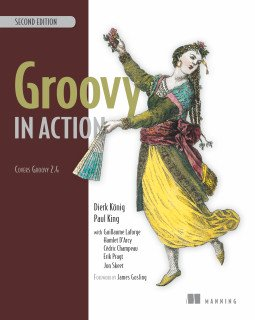
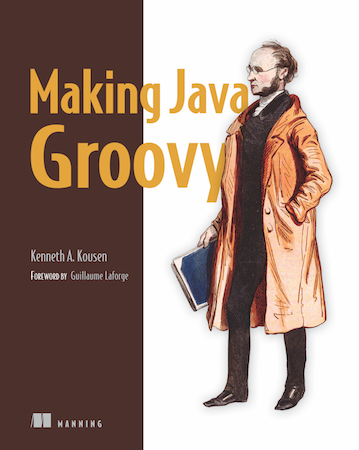
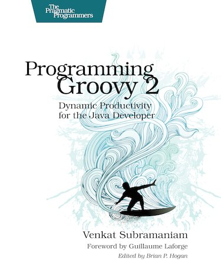
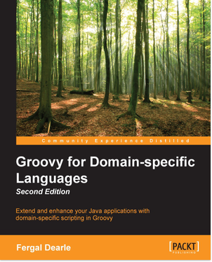
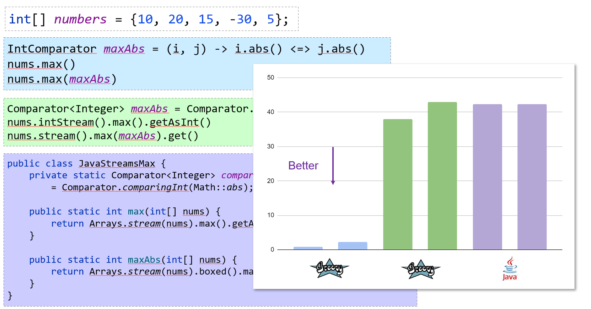
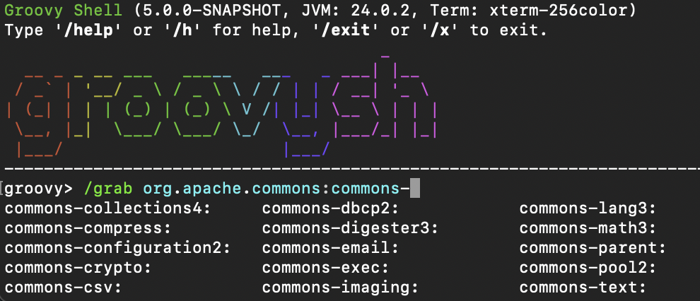
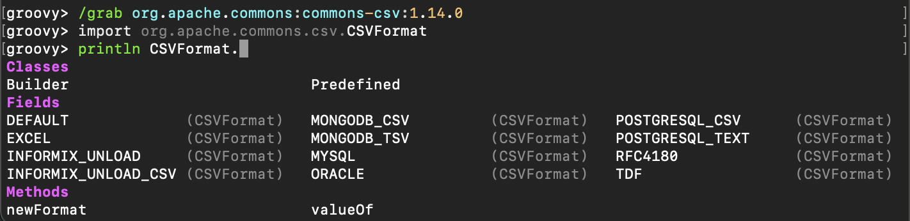
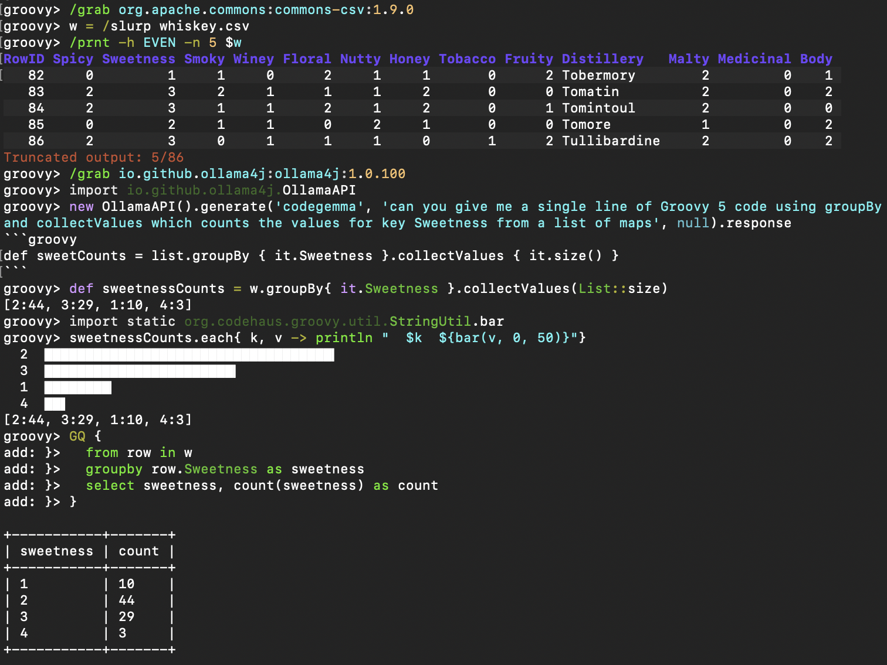
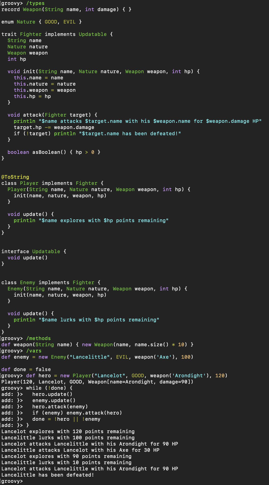
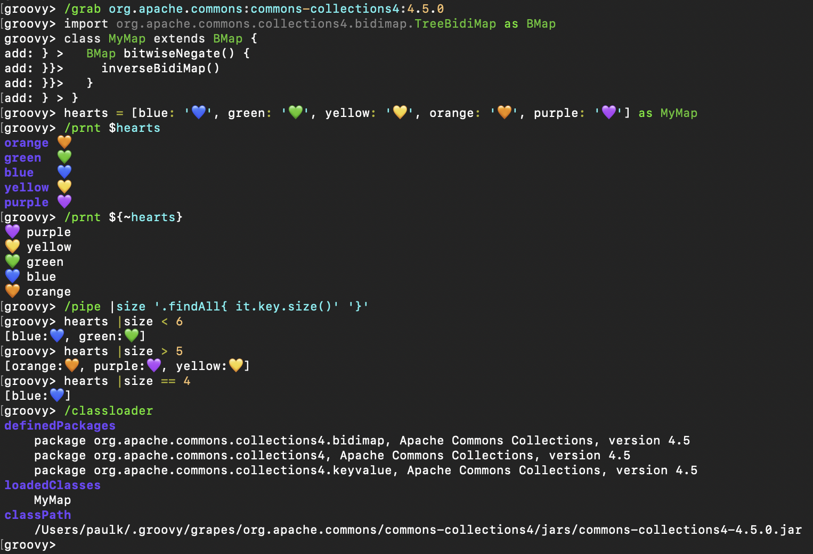

## Getting started

* [Download Groovy](download.html)
* [Install Groovy](install.html)
* [Differences with Java](differences.html)
* [The Groovy Development Kit](groovy-dev-kit.html)
* [Runtime and compile-time metaprogramming](metaprogramming.html)
* [The Grape dependency manager](grape.html)
* [Testing guide](testing.html)
* [Domain-Specific Languages](dsls.html)
* [Integrating Groovy into applications](integrating.html)
* [Security](security.html)
* [Design patterns in Groovy](design-patterns.html)
* [Style guide](style-guide.html)

## Language Specification

* [Syntax](syntax.html)
* [Operators](operators.html)
* [Program structure](structure.html)
* [Object orientation](objectorientation.html)
* [Closures](closures.html)
* [Semantics](semantics.html)

---
* [**Table of contents**](#)

# IDE integration

Many IDEs and text editors support the Groovy programming language.

| Editor | Syntax highlighting | Code completion | Refactoring |
| --- | --- | --- | --- |
| [Groovy Eclipse Plugin](https://github.com/groovy/groovy-eclipse) | Yes | Yes | Yes |
| [IntelliJ IDEA](https://www.jetbrains.com/help/idea/groovy.html) | Yes | Yes | Yes |
| [Netbeans](https://netbeans.apache.org/tutorial/main/kb/docs/java/groovy-quickstart/) | Yes | Yes | Yes |
| [Groovy Emacs Modes](https://github.com/Groovy-Emacs-Modes/groovy-emacs-modes) | Yes | No | No |
| [TextMate](https://github.com/textmate/groovy.tmbundle) | Yes | No | No |
| [vim](http://www.vim.org/) | Yes | No | No |
| [UltraEdit](http://www.ultraedit.com/) | Yes | No | No |
| [SlickEdit](https://www.slickedit.com/) | Yes | No | No |
| [EditRocket](https://editrocket.com/features/groovy_editor.html) | Yes | No | No |
|  |  |  |  |
| --- | --- | --- | --- |
| [VSCode](https://code.visualstudio.com/) | Yes | No | [Yes](https://marketplace.visualstudio.com/items?itemName=NicolasVuillamy.vscode-groovy-lint) |

---
* [**Table of contents**](#)

* [1. The groovydoc command line tool](#Groovydoc-CommandLine)
  * [1.1. Java Versions](#_java_versions)
* [2. The groovydoc Ant task](#Groovydoc-Ant)
  * [2.1. Required taskdef](#ThegroovydocAnttask-Requiredtaskdef)
  * [2.2. <groovydoc> Attributes](#ThegroovydocAnttask-groovydocAttributes)
  * [2.3. <groovydoc> Nested Elements](#ThegroovydocAnttask-groovydocNestedElements)
    * [2.3.1. link](#ThegroovydocAnttask-link)
    * [2.3.2. Example #1 - <groovydoc> Ant task](#ThegroovydocAnttask-Example1-groovydocAnttask)
    * [2.3.3. Example #2 - Executing <groovydoc> from Groovy](#ThegroovydocAnttask-Example2-ExecutinggroovydocfromGroovy)
  * [2.4. Custom templates](#_custom_templates)
    * [2.4.1. Custom Groovydoc class](#_custom_groovydoc_class)
    * [2.4.2. Using the custom groovydoc task](#_using_the_custom_groovydoc_task)
* [3. GMavenPlus Maven Plugin](#Groovydoc-GMavenPlus)

# groovydoc - the Groovy documentation generator

GroovyDoc is a tool responsible for generating documentation from your code. It acts like the Javadoc tool in the
Java world but is capable of handling both `groovy` and `java` files. The distribution comes with two ways of generating
documentation: from [command line](#Groovydoc-CommandLine) or from [Apache Ant](#Groovydoc-Ant). Other build tools
like Maven or Gradle also offer wrappers for Groovydoc.

## [1. The groovydoc command line tool](#Groovydoc-CommandLine)

The `groovydoc` command line can be invoked to generate groovydocs:

```
groovydoc [options] [packagenames] [sourcefiles]
```

where options must be picked from the following table:

| Short version | Long version | Description |
| --- | --- | --- |
| -author |  | Include @author paragraphs (currently not used) |
| -charset <charset> |  | Charset for cross-platform viewing of generated documentation |
| -classpath, -cp | --classpath | Specify where to find the class files - must be first argument |
| -d | --destdir <dir> | Destination directory for output files |
|  | --debug | Enable debug output |
| -doctitle <html> |  | Include title for the overview page |
| -exclude <pkglist> |  | Specify a list of packages to exclude (separated by colons for all operating systems) |
| -fileEncoding <charset> |  | Charset for generated documentation files |
| -footer <html> |  | Include footer text for each page |
| -header <html> |  | Include header text for each page |
| -help | --help | Display help message |
| -nomainforscripts |  | Don’t include the implicit 'public static void main' method for scripts |
| -noscripts |  | Don’t process Groovy Scripts |
| -notimestamp |  | Don’t include timestamp within hidden comment in generated HTML |
| -noversionstamp |  | Don’t include Groovy version within hidden comment in generated HTML |
| -overview <file> |  | Read overview documentation from HTML file |
| -package |  | Show package/protected/public classes and members |
| -private |  | Show all classes and members |
| -protected |  | Show protected/public classes and members (default) |
| -public |  | Show only public classes and members |
| -quiet |  | Suppress superfluous output |
| -sourcepath <pathlist> |  | Specify where to find source files (dirs separated by platform path separator) |
| -stylesheetfile <path> |  | File to change style of the generated documentation |
| -verbose |  | Enable verbose output |
|  | --version | Display the version |
| -windowtitle <text> |  | Browser window title for the documentation |
|  |  |  |
| --- | --- | --- |
| -javaversion <version> |  | The version of the Java source files |

### [1.1. Java Versions](#_java_versions)

The supported Java Versions for `groovydoc` are defined by the JavaParser library’s [LanguageLevel](https://www.javadoc.io/doc/com.github.javaparser/javaparser-core/3.28.0/com/github/javaparser/ParserConfiguration.LanguageLevel.html) class.

## [2. The groovydoc Ant task](#Groovydoc-Ant)

The `groovydoc` Ant task allows generating groovydocs from an Ant build.

### [2.1. Required taskdef](#ThegroovydocAnttask-Requiredtaskdef)

Assuming all the groovy jars you need are in *my.classpath* (this will be `groovy-VERSION.jar`,
`groovy-ant-VERSION.jar`, `groovy-groovydoc-VERSION.jar` plus any modules and transitive dependencies you might be using)
you will need to declare this task at some point in the build.xml prior to the groovydoc task being invoked.

```
<taskdef name         = "groovydoc"
         classname    = "org.codehaus.groovy.ant.Groovydoc"
         classpathref = "my.classpath"/>
```

### [2.2. <groovydoc> Attributes](#ThegroovydocAnttask-groovydocAttributes)

| Attribute | Description | Required |
| --- | --- | --- |
| destdir | Location to store the class files. | Yes |
| sourcepath | The sourcepath to use. | No |
| packagenames | Comma separated list of package files (with terminating wildcard). | No |
| use | Create class and package usage pages. | No |
| windowtitle | Browser window title for the documentation (text). | No |
| doctitle | Include title for the package index(first) page (html-code). | No |
| header | Include header text for each page (html-code). | No |
| footer | Include footer text for each page (html-code). | No |
| overview | Read overview documentation from HTML file. | No |
| private | Show all classes and members (i.e. including private ones) if set to ``true''. | No |
|  |  |  |
| --- | --- | --- |
| javaversion | The version of the Java source files. | No |

### [2.3. <groovydoc> Nested Elements](#ThegroovydocAnttask-groovydocNestedElements)

#### [2.3.1. link](#ThegroovydocAnttask-link)

Create link to groovydoc/javadoc output at the given URL.

| Attribute | Description | Required |
| --- | --- | --- |
| packages | Comma separated list of package prefixes | Yes |
|  |  |  |
| --- | --- | --- |
| href | Base URL of external site | Yes |

#### [2.3.2. Example #1 - <groovydoc> Ant task](#ThegroovydocAnttask-Example1-groovydocAnttask)

```
<taskdef name           = "groovydoc"
         classname      = "org.codehaus.groovy.ant.Groovydoc"
         classpathref   = "path_to_groovy_all"/>

<groovydoc destdir      = "${docsDirectory}/gapi"
           sourcepath   = "${mainSourceDirectory}"
           packagenames = "**.*"
           use          = "true"
           windowtitle  = "${title}"
           doctitle     = "${title}"
           header       = "${title}"
           footer       = "${docFooter}"
           overview     = "src/main/overview.html"
           private      = "false">
        <link packages="java.,org.xml.,javax.,org.xml." href="http://docs.oracle.com/javase/8/docs/api/"/>
        <link packages="org.apache.tools.ant."          href="http://docs.groovy-lang.org/docs/ant/api/"/>
        <link packages="org.junit.,junit.framework."    href="http://junit.org/junit4/javadoc/latest/"/>
        <link packages="groovy.,org.codehaus.groovy."   href="http://docs.groovy-lang.org/latest/html/api/"/>
        <link packages="org.codehaus.gmaven."           href="http://groovy.github.io/gmaven/apidocs/"/>
</groovydoc>
```

#### [2.3.3. Example #2 - Executing <groovydoc> from Groovy](#ThegroovydocAnttask-Example2-ExecutinggroovydocfromGroovy)

```
def ant = new AntBuilder()
ant.taskdef(name: "groovydoc", classname: "org.codehaus.groovy.ant.Groovydoc")
ant.groovydoc(
    destdir      : "${docsDirectory}/gapi",
    sourcepath   : "${mainSourceDirectory}",
    packagenames : "**.*",
    use          : "true",
    windowtitle  : "${title}",
    doctitle     : "${title}",
    header       : "${title}",
    footer       : "${docFooter}",
    overview     : "src/main/overview.html",
    private      : "false") {
        link(packages:"java.,org.xml.,javax.,org.xml.",href:"http://docs.oracle.com/javase/8/docs/api/")
        link(packages:"groovy.,org.codehaus.groovy.",  href:"http://docs.groovy-lang.org/latest/html/api/")
        link(packages:"org.apache.tools.ant.",         href:"http://docs.groovy-lang.org/docs/ant/api/")
        link(packages:"org.junit.,junit.framework.",   href:"http://junit.org/junit4/javadoc/latest/")
        link(packages:"org.codehaus.gmaven.",          href:"http://groovy.github.io/gmaven/apidocs/")
}
```

### [2.4. Custom templates](#_custom_templates)

The `groovydoc` Ant task supports custom templates, but it requires two steps:

1. A custom groovydoc class
2. A new groovydoc task definition

#### [2.4.1. Custom Groovydoc class](#_custom_groovydoc_class)

The first step requires you to extend the `Groovydoc` class, like in the following example:

```
package org.codehaus.groovy.tools.groovydoc;

import org.codehaus.groovy.ant.Groovydoc;

/**
 * Overrides GroovyDoc's default class template - for testing purpose only.
 */
public class CustomGroovyDoc extends Groovydoc {

    @Override
    protected String[] getClassTemplates() {
        return new String[]{"org/codehaus/groovy/tools/groovydoc/testfiles/classDocName.html"};
    }
}
```

You can override the following methods:

* `getClassTemplates` for class-level templates
* `getPackageTemplates` for package-level templates
* `getDocTemplates` for top-level templates

You can find the list of default templates in the `org.codehaus.groovy.tools.groovydoc.gstringTemplates.GroovyDocTemplateInfo`
class.

#### [2.4.2. Using the custom groovydoc task](#_using_the_custom_groovydoc_task)

Once you’ve written the class, using it is just a matter of redefining the `groovydoc` task:

```
<taskdef name           = "groovydoc"
         classname      = "org.codehaus.groovy.ant.CustomGroovyDoc"
         classpathref   = "path_to_groovy_all"/>
```

Please note that template customization is provided as is. APIs are subject to change, so you must consider this as a
fragile feature.

## [3. GMavenPlus Maven Plugin](#Groovydoc-GMavenPlus)

[GMavenPlus](https://github.com/groovy/GMavenPlus) is a Maven plugin with goals that
support GroovyDoc generation.

---
# Flat learning curve

Concise, readable and expressive syntax, easy to learn for Java developers,
flexible typing makes it more friendly for Python programmers or data scientists

---
* [**Table of contents**](#)

* [1. Comments](#_comments)
  * [1.1. Single-line comment](#_single_line_comment)
  * [1.2. Multiline comment](#_multiline_comment)
  * [1.3. Groovydoc comment](#_groovydoc_comment)
  * [1.4. Shebang line](#_shebang_line)
* [2. Keywords](#_keywords)
* [3. Identifiers](#_identifiers)
  * [3.1. Normal identifiers](#_normal_identifiers)
  * [3.2. Quoted identifiers](#_quoted_identifiers)
* [4. Strings](#all-strings)
  * [4.1. Single-quoted string](#_single_quoted_string)
  * [4.2. String concatenation](#_string_concatenation)
  * [4.3. Triple-single-quoted string](#_triple_single_quoted_string)
    * [4.3.1. Escaping special characters](#_escaping_special_characters)
    * [4.3.2. Unicode escape sequence](#_unicode_escape_sequence)
  * [4.4. Double-quoted string](#_double_quoted_string)
    * [4.4.1. String interpolation](#_string_interpolation)
    * [4.4.2. Special case of interpolating closure expressions](#_special_case_of_interpolating_closure_expressions)
    * [4.4.3. Interoperability with Java](#_interoperability_with_java)
    * [4.4.4. GString and String hashCodes](#_gstring_and_string_hashcodes)
  * [4.5. Triple-double-quoted string](#_triple_double_quoted_string)
  * [4.6. Slashy string](#_slashy_string)
    * [4.6.1. Special cases](#_special_cases)
  * [4.7. Dollar slashy string](#_dollar_slashy_string)
  * [4.8. String summary table](#_string_summary_table)
  * [4.9. Characters](#_characters)
* [5. Numbers](#_numbers)
  * [5.1. Integral literals](#_integral_literals)
    * [5.1.1. Alternative non-base 10 representations](#_alternative_non_base_10_representations)
      * [Binary literal](#_binary_literal)
      * [Octal literal](#_octal_literal)
      * [Hexadecimal literal](#_hexadecimal_literal)
  * [5.2. Decimal literals](#_decimal_literals)
  * [5.3. Underscore in literals](#_underscore_in_literals)
  * [5.4. Number type suffixes](#_number_type_suffixes)
  * [5.5. Math operations](#_math_operations)
    * [5.5.1. The case of the division operator](#integer_division)
    * [5.5.2. The case of the power operator](#power_operator)
* [6. Booleans](#_booleans)
* [7. Lists](#_lists)
* [8. Arrays](#_arrays)
  * [8.1. Java-style array initialization](#_java_style_array_initialization)
* [9. Maps](#_maps)

# Syntax

This chapter covers the syntax of the Groovy programming language.
The grammar of the language derives from the Java grammar,
but enhances it with specific constructs for Groovy, and allows certain simplifications.

## [1. Comments](#_comments)

### [1.1. Single-line comment](#_single_line_comment)

Single-line comments start with `//` and can be found at any position in the line.
The characters following `//`, until the end of the line, are considered part of the comment.

```
// a standalone single line comment
println "hello" // a comment till the end of the line
```

### [1.2. Multiline comment](#_multiline_comment)

A multiline comment starts with `/*` and can be found at any position in the line.
The characters following `/*` will be considered part of the comment, including new line characters,
up to the first `*/` closing the comment.
Multiline comments can thus be put at the end of a statement, or even inside a statement.

```
/* a standalone multiline comment
   spanning two lines */
println "hello" /* a multiline comment starting
                   at the end of a statement */
println 1 /* one */ + 2 /* two */
```

### [1.3. Groovydoc comment](#_groovydoc_comment)

Similarly to multiline comments, Groovydoc comments are multiline, but start with `/**` and end with `*/`.
Lines following the first Groovydoc comment line can optionally start with a star `*`.
Those comments are associated with:

* type definitions (classes, interfaces, enums, annotations),
* fields and properties definitions
* methods definitions

Although the compiler will not complain about Groovydoc comments not being associated with the above language elements,
you should prepend those constructs with the comment right before it.

```
/**
 * A Class description
 */
class Person {
    /** the name of the person */
    String name

    /**
     * Creates a greeting method for a certain person.
     *
     * @param otherPerson the person to greet
     * @return a greeting message
     */
    String greet(String otherPerson) {
       "Hello ${otherPerson}"
    }
}
```

Groovydoc follows the same conventions as Java’s own Javadoc.
So you’ll be able to use the same tags as with Javadoc.

In addition, Groovy supports **Runtime Groovydoc** since 3.0.0, i.e. Groovydoc can be retained at runtime.

|  |  |
| --- | --- |
|  | Runtime Groovydoc is disabled by default. It can be enabled by adding JVM option `-Dgroovy.attach.runtime.groovydoc=true` |

The Runtime Groovydoc starts with `/**@` and ends with `*/`, for example:

```
/**@
 * Some class groovydoc for Foo
 */
class Foo {
    /**@
     * Some method groovydoc for bar
     */
    void bar() {
    }
}

assert Foo.class.groovydoc.content.contains('Some class groovydoc for Foo') (1)
assert Foo.class.getMethod('bar', new Class[0]).groovydoc.content.contains('Some method groovydoc for bar') (2)
```

|  |  |
| --- | --- |
| **1** | Get the runtime groovydoc for class `Foo` |
| **2** | Get the runtime groovydoc for method `bar` |

### [1.4. Shebang line](#_shebang_line)

Beside the single-line comment, there is a special line comment, often called the *shebang* line understood by UNIX systems
which allows scripts to be run directly from the command-line, provided you have installed the Groovy distribution
and the `groovy` command is available on the `PATH`.

```
#!/usr/bin/env groovy
println "Hello from the shebang line"
```

|  |  |
| --- | --- |
|  | The `#` character must be the first character of the file. Any indentation would yield a compilation error. |

## [2. Keywords](#_keywords)

Groovy has the following reserved keywords:

Table 1. Reserved Keywords


|  |  |  |  |
| --- | --- | --- | --- |
| abstract | assert | break | case |
| catch | class | const | continue |
| def | default | do | else |
| enum | extends | final | finally |
| for | goto | if | implements |
| import | instanceof | interface | native |
| new | null | non-sealed | package |
| public | protected | private | return |
| static | strictfp | super | switch |
| synchronized | this | threadsafe | throw |
| throws | transient | try | while |

Of these, `const`, `goto`, `strictfp`, and `threadsafe` are not currently in use.

The reserved keywords can’t in general be used for variable, field and method names.

A trick allows methods to be defined having the same name as a keyword
by surrounding the name in quotes as shown in the following example:

```
// reserved keywords can be used for method names if quoted
def "abstract"() { true }
// when calling such methods, the name must be qualified using "this."
this.abstract()
```

Using such names might be confusing and is often best to avoid.
The trick is primarily intended to enable certain Java integration scenarios
and certain [DSL](https://docs.groovy-lang.org/latest/html/documentation/core-domain-specific-languages.html) scenarios where
having "verbs" and "nouns" with the same name as keywords may be desirable.

In addition, Groovy has the following contextual keywords:

Table 2. Contextual Keywords


|  |  |  |  |
| --- | --- | --- | --- |
| as | in | permits | record |
| sealed | trait | var | yields |

These words are only keywords in certain contexts and can be more freely used in some places,
in particular for variables, fields and method names.

This extra lenience allows using method or variable names that were not keywords in earlier
versions of Groovy or are not keywords in Java. Examples are shown here:

```
// contextual keywords can be used for field and variable names
def as = true
assert as

// contextual keywords can be used for method names
def in() { true }
// when calling such methods, the name only needs to be qualified using "this." in scenarios which would be ambiguous
this.in()
```

Groovy programmers familiar with these contextual keywords may still wish to avoid
using those names unless there is a good reason to use such a name.

The restrictions on reserved keywords also apply for the
primitive types, the boolean literals and the null literal (all of which are discussed later):

Table 3. Other reserved words


|  |  |  |  |
| --- | --- | --- | --- |
| null | true | false | boolean |
| char | byte | short | int |
| long | float | double |  |

While not recommended, the same trick as for reserved keywords can be used:

```
def "null"() { true }  // not recommended; potentially confusing
assert this.null()     // must be qualified
```

Using such words as method names is potentially confusing and is often best to avoid, however,
it might be useful for certain kinds of [DSLs](https://docs.groovy-lang.org/latest/html/documentation/core-domain-specific-languages.html).

## [3. Identifiers](#_identifiers)

### [3.1. Normal identifiers](#_normal_identifiers)

Identifiers start with a letter, a dollar or an underscore.
They cannot start with a number.

A letter can be in the following ranges:

* 'a' to 'z' (lowercase ascii letter)
* 'A' to 'Z' (uppercase ascii letter)
* '\u00C0' to '\u00D6'
* '\u00D8' to '\u00F6'
* '\u00F8' to '\u00FF'
* '\u0100' to '\uFFFE'

Then following characters can contain letters and numbers.

Here are a few examples of valid identifiers (here, variable names):

```
def name
def item3
def with_underscore
def $dollarStart
```

But the following ones are invalid identifiers:

```
def 3tier
def a+b
def a#b
```

All keywords are also valid identifiers when following a dot:

```
foo.as
foo.assert
foo.break
foo.case
foo.catch
```

### [3.2. Quoted identifiers](#_quoted_identifiers)

Quoted identifiers appear after the dot of a dotted expression.
For instance, the `name` part of the `person.name` expression can be quoted with `person."name"` or `person.'name'`.
This is particularly interesting when certain identifiers contain illegal characters that are forbidden by the Java Language Specification,
but which are allowed by Groovy when quoted. For example, characters like a dash, a space, an exclamation mark, etc.

```
def map = [:]

map."an identifier with a space and double quotes" = "ALLOWED"
map.'with-dash-signs-and-single-quotes' = "ALLOWED"

assert map."an identifier with a space and double quotes" == "ALLOWED"
assert map.'with-dash-signs-and-single-quotes' == "ALLOWED"
```

As we shall see in the [following section on strings](#all-strings), Groovy provides different string literals.
All kind of strings are actually allowed after the dot:

```
map.'single quote'
map."double quote"
map.'''triple single quote'''
map."""triple double quote"""
map./slashy string/
map.$/dollar slashy string/$
```

There’s a difference between plain character strings and Groovy’s GStrings (interpolated strings),
as in that the latter case, the interpolated values are inserted in the final string for evaluating the whole identifier:

```
def firstname = "Homer"
map."Simpson-${firstname}" = "Homer Simpson"

assert map.'Simpson-Homer' == "Homer Simpson"
```

## [4. Strings](#all-strings)

Text literals are represented in the form of chain of characters called strings.
Groovy lets you instantiate `java.lang.String` objects, as well as GStrings (`groovy.lang.GString`)
which are also called *interpolated strings* in other programming languages.

### [4.1. Single-quoted string](#_single_quoted_string)

Single-quoted strings are a series of characters surrounded by single quotes:

```
'a single-quoted string'
```

|  |  |
| --- | --- |
|  | Single-quoted strings are plain `java.lang.String` and don’t support interpolation. |

### [4.2. String concatenation](#_string_concatenation)

All the Groovy strings can be concatenated with the `+` operator:

```
assert 'ab' == 'a' + 'b'
```

### [4.3. Triple-single-quoted string](#_triple_single_quoted_string)

Triple-single-quoted strings are a series of characters surrounded by triplets of single quotes:

```
'''a triple-single-quoted string'''
```

|  |  |
| --- | --- |
|  | Triple-single-quoted strings are plain `java.lang.String` and don’t support interpolation. |

Triple-single-quoted strings may span multiple lines.
The content of the string can cross line boundaries without the need to split the string in several pieces
and without concatenation or newline escape characters:

```
def aMultilineString = '''line one
line two
line three'''
```

If your code is indented, for example in the body of the method of a class, your string will contain the whitespace of the indentation.
The Groovy Development Kit contains methods for stripping out the indentation with the `String#stripIndent()` method,
and with the `String#stripMargin()` method that takes a delimiter character to identify the text to remove from the beginning of a string.

When creating a string as follows:

```
def startingAndEndingWithANewline = '''
line one
line two
line three
'''
```

You will notice that the resulting string contains a newline character as first character.
It is possible to strip that character by escaping the newline with a backslash:

```
def strippedFirstNewline = '''\
line one
line two
line three
'''

assert !strippedFirstNewline.startsWith('\n')
```

#### [4.3.1. Escaping special characters](#_escaping_special_characters)

You can escape single quotes with the backslash character to avoid terminating the string literal:

```
'an escaped single quote: \' needs a backslash'
```

And you can escape the escape character itself with a double backslash:

```
'an escaped escape character: \\ needs a double backslash'
```

Some special characters also use the backslash as escape character:

| Escape sequence | Character |
| --- | --- |
| \b | backspace |
| \f | formfeed |
| \n | newline |
| \r | carriage return |
| \s | single space |
| \t | tabulation |
| \\ | backslash |
| \' | single quote within a single-quoted string (and optional for triple-single-quoted and double-quoted strings) |
| \" | double quote within a double-quoted string (and optional for triple-double-quoted and single-quoted strings) |

We’ll see some more escaping details when it comes to other types of strings discussed later.

#### [4.3.2. Unicode escape sequence](#_unicode_escape_sequence)

For characters that are not present on your keyboard, you can use unicode escape sequences:
a backslash, followed by 'u', then 4 hexadecimal digits.

For example, the Euro currency symbol can be represented with:

```
'The Euro currency symbol: \u20AC'
```

### [4.4. Double-quoted string](#_double_quoted_string)

Double-quoted strings are a series of characters surrounded by double quotes:

```
"a double-quoted string"
```

|  |  |
| --- | --- |
|  | Double-quoted strings are plain `java.lang.String` if there’s no interpolated expression, but are `groovy.lang.GString` instances if interpolation is present. |

|  |  |
| --- | --- |
|  | To escape a double quote, you can use the backslash character: "A double quote: \"". |

#### [4.4.1. String interpolation](#_string_interpolation)

Any Groovy expression can be interpolated in all string literals, apart from single and triple-single-quoted strings.
Interpolation is the act of replacing a placeholder in the string with its value upon evaluation of the string.
The placeholder expressions are surrounded by `${}`. The curly braces may be omitted for unambiguous dotted expressions,
i.e. we can use just a $ prefix in those cases.
If the GString is ever passed to a method taking a String, the expression value inside the placeholder
is evaluated to its string representation (by calling `toString()` on that expression) and the resulting
String is passed to the method.

Here, we have a string with a placeholder referencing a local variable:

```
def name = 'Guillaume' // a plain string
def greeting = "Hello ${name}"

assert greeting.toString() == 'Hello Guillaume'
```

Any Groovy expression is valid, as we can see in this example with an arithmetic expression:

```
def sum = "The sum of 2 and 3 equals ${2 + 3}"
assert sum.toString() == 'The sum of 2 and 3 equals 5'
```

|  |  |
| --- | --- |
|  | Not only are expressions allowed in between the `${}` placeholder, but so are statements. However, a statement’s value is just `null`. So if several statements are inserted in that placeholder, the last one should somehow return a meaningful value to be inserted. For instance, "The sum of 1 and 2 is equal to ${def a = 1; def b = 2; a + b}" is supported and works as expected but a good practice is usually to stick to simple expressions inside GString placeholders. |

In addition to `${}` placeholders, we can also use a lone `$` sign prefixing a dotted expression:

```
def person = [name: 'Guillaume', age: 36]
assert "$person.name is $person.age years old" == 'Guillaume is 36 years old'
```

But only dotted expressions of the form `a.b`, `a.b.c`, etc, are valid. Expressions containing parentheses like method calls,
curly braces for closures, dots which aren’t part of a property expression or arithmetic operators would be invalid.
Given the following variable definition of a number:

```
def number = 3.14
```

The following statement will throw a `groovy.lang.MissingPropertyException` because Groovy believes you’re trying to access the `toString` property of that number, which doesn’t exist:

```
shouldFail(MissingPropertyException) {
    println "$number.toString()"
}
```

|  |  |
| --- | --- |
|  | You can think of `"$number.toString()"` as being interpreted by the parser as `"${number.toString}()"`. |

Similarly, if the expression is ambiguous, you need to keep the curly braces:

```
String thing = 'treasure'
assert 'The x-coordinate of the treasure is represented by treasure.x' ==
    "The x-coordinate of the $thing is represented by $thing.x"   // <= Not allowed: ambiguous!!
assert 'The x-coordinate of the treasure is represented by treasure.x' ==
        "The x-coordinate of the $thing is represented by ${thing}.x"  // <= Curly braces required
```

If you need to escape the `$` or `${}` placeholders in a GString so they appear as is without interpolation,
you just need to use a `\` backslash character to escape the dollar sign:

```
assert '$5' == "\$5"
assert '${name}' == "\${name}"
```

#### [4.4.2. Special case of interpolating closure expressions](#_special_case_of_interpolating_closure_expressions)

So far, we’ve seen we could interpolate arbitrary expressions inside the `${}` placeholder, but there is a special case and notation for closure expressions. When the placeholder contains an arrow, `${→}`, the expression is actually a closure expression — you can think of it as a closure with a dollar prepended in front of it:

```
def sParameterLessClosure = "1 + 2 == ${-> 3}" (1)
assert sParameterLessClosure == '1 + 2 == 3'

def sOneParamClosure = "1 + 2 == ${ w -> w << 3}" (2)
assert sOneParamClosure == '1 + 2 == 3'
```

|  |  |
| --- | --- |
| **1** | The closure is a parameterless closure which doesn’t take arguments. |
| **2** | Here, the closure takes a single `java.io.StringWriter` argument, to which you can append content with the `<<` leftShift operator. In either case, both placeholders are embedded closures. |

In appearance, it looks like a more verbose way of defining expressions to be interpolated,
but closures have an interesting advantage over mere expressions: lazy evaluation.

Let’s consider the following sample:

```
def number = 1 (1)
def eagerGString = "value == ${number}"
def lazyGString = "value == ${ -> number }"

assert eagerGString == "value == 1" (2)
assert lazyGString ==  "value == 1" (3)

number = 2 (4)
assert eagerGString == "value == 1" (5)
assert lazyGString ==  "value == 2" (6)
```

|  |  |
| --- | --- |
| **1** | We define a `number` variable containing `1` that we then interpolate within two GStrings, as an expression in `eagerGString` and as a closure in `lazyGString`. |
| **2** | We expect the resulting string to contain the same string value of 1 for `eagerGString`. |
| **3** | Similarly for `lazyGString` |
| **4** | Then we change the value of the variable to a new number |
| **5** | With a plain interpolated expression, the value was actually bound at the time of creation of the GString. |
| **6** | But with a closure expression, the closure is called upon each coercion of the GString into String, resulting in an updated string containing the new number value. |

|  |  |
| --- | --- |
|  | An embedded closure expression taking more than one parameter will generate an exception at runtime. Only closures with zero or one parameter are allowed. |

#### [4.4.3. Interoperability with Java](#_interoperability_with_java)

When a method (whether implemented in Java or Groovy) expects a `java.lang.String`,
but we pass a `groovy.lang.GString` instance,
the `toString()` method of the GString is automatically and transparently called.

```
String takeString(String message) {         (4)
    assert message instanceof String        (5)
    return message
}

def message = "The message is ${'hello'}"   (1)
assert message instanceof GString           (2)

def result = takeString(message)            (3)
assert result instanceof String
assert result == 'The message is hello'
```

|  |  |
| --- | --- |
| **1** | We create a GString variable |
| **2** | We double-check it’s an instance of the GString |
| **3** | We then pass that GString to a method taking a String as parameter |
| **4** | The signature of the `takeString()` method explicitly says its sole parameter is a String |
| **5** | We also verify that the parameter is indeed a String and not a GString. |

#### [4.4.4. GString and String hashCodes](#_gstring_and_string_hashcodes)

Although interpolated strings can be used in lieu of plain Java strings,
they differ with strings in a particular way: their hashCodes are different.
Plain Java strings are immutable, whereas the resulting String representation of a GString can vary,
depending on its interpolated values.
Even for the same resulting string, GStrings and Strings don’t have the same hashCode.

```
assert "one: ${1}".hashCode() != "one: 1".hashCode()
```

GString and Strings having different hashCode values, using GString as Map keys should be avoided,
especially if we try to retrieve an associated value with a String instead of a GString.

```
def key = "a"
def m = ["${key}": "letter ${key}"]     (1)

assert m["a"] == null                   (2)
```

|  |  |
| --- | --- |
| **1** | The map is created with an initial pair whose key is a GString |
| **2** | When we try to fetch the value with a String key, we will not find it, as Strings and GString have different hashCode values |

### [4.5. Triple-double-quoted string](#_triple_double_quoted_string)

Triple-double-quoted strings behave like double-quoted strings, with the addition that they are multiline, like the triple-single-quoted strings.

```
def name = 'Groovy'
def template = """
    Dear Mr ${name},

    You're the winner of the lottery!

    Yours sincerly,

    Dave
"""

assert template.toString().contains('Groovy')
```

|  |  |
| --- | --- |
|  | Neither double quotes nor single quotes need be escaped in triple-double-quoted strings. |

### [4.6. Slashy string](#_slashy_string)

Beyond the usual quoted strings, Groovy offers slashy strings, which use `/` as the opening and closing delimiter.
Slashy strings are particularly useful for defining regular expressions and patterns,
as there is no need to escape backslashes.

Example of a slashy string:

```
def fooPattern = /.*foo.*/
assert fooPattern == '.*foo.*'
```

Only forward slashes need to be escaped with a backslash:

```
def escapeSlash = /The character \/ is a forward slash/
assert escapeSlash == 'The character / is a forward slash'
```

Slashy strings are multiline:

```
def multilineSlashy = /one
    two
    three/

assert multilineSlashy.contains('\n')
```

Slashy strings can be thought of as just another way to define a GString but with different escaping rules. They hence support interpolation:

```
def color = 'blue'
def interpolatedSlashy = /a ${color} car/

assert interpolatedSlashy == 'a blue car'
```

#### [4.6.1. Special cases](#_special_cases)

An empty slashy string cannot be represented with a double forward slash, as it’s understood by the Groovy parser as a line comment.
That’s why the following assert would actually not compile as it would look like a non-terminated statement:

```
assert '' == //
```

As slashy strings were mostly designed to make regexp easier so a few things that
are errors in GStrings like `$()` or `$5` will work with slashy strings.

Remember that escaping backslashes is not required. An alternative way of thinking of this is
that in fact escaping is not supported. The slashy string `/\t/` won’t contain a tab but instead
a backslash followed by the character 't'. Escaping is only allowed for the slash character, i.e. `/\/folder/`
will be a slashy string containing `'/folder'`. A consequence of slash escaping is that a slashy string
can’t end with a backslash. Otherwise that will escape the slashy string terminator.
You can instead use a special trick, `/ends with slash ${'\\'}/`. But best just avoid using a slashy string in such a case.

### [4.7. Dollar slashy string](#_dollar_slashy_string)

Dollar slashy strings are multiline GStrings delimited with an opening `$/` and a closing `/$`.
The escaping character is the dollar sign, and it can escape another dollar, or a forward slash.
Escaping for the dollar and forward slash characters is only needed where conflicts arise with
the special use of those characters. The characters `$foo` would normally indicate a GString
placeholder, so those four characters can be entered into a dollar slashy string by escaping the dollar, i.e. `$$foo`.
Similarly, you will need to escape a dollar slashy closing delimiter if you want it to appear in your string.

Here are a few examples:

```
def name = "Guillaume"
def date = "April, 1st"

def dollarSlashy = $/
    Hello $name,
    today we're ${date}.

    $ dollar sign
    $$ escaped dollar sign
    \ backslash
    / forward slash
    $/ escaped forward slash
    $$$/ escaped opening dollar slashy
    $/$$ escaped closing dollar slashy
/$

assert [
    'Guillaume',
    'April, 1st',
    '$ dollar sign',
    '$ escaped dollar sign',
    '\\ backslash',
    '/ forward slash',
    '/ escaped forward slash',
    '$/ escaped opening dollar slashy',
    '/$ escaped closing dollar slashy'
].every { dollarSlashy.contains(it) }
```

It was created to overcome some of the limitations of the slashy string escaping rules.
Use it when its escaping rules suit your string contents (typically if it has some slashes you don’t want to escape).

### [4.8. String summary table](#_string_summary_table)

|  |  |  |  |  |
| --- | --- | --- | --- | --- |
| String name | String syntax | Interpolated | Multiline | Escape character |
| Single-quoted | `'…​'` |  |  | `\` |
| Triple-single-quoted | `'''…​'''` |  |  | `\` |
| Double-quoted | `"…​"` |  |  | `\` |
| Triple-double-quoted | `"""…​"""` |  |  | `\` |
| Slashy | `/…​/` |  |  | `\` |
| Dollar slashy | `$/…​/$` |  |  | `$` |

### [4.9. Characters](#_characters)

Unlike Java, Groovy doesn’t have an explicit character literal.
However, you can be explicit about making a Groovy string an actual character, by three different means:

```
char c1 = 'A' (1)
assert c1 instanceof Character

def c2 = 'B' as char (2)
assert c2 instanceof Character

def c3 = (char)'C' (3)
assert c3 instanceof Character
```

|  |  |
| --- | --- |
| **1** | by being explicit when declaring a variable holding the character by specifying the `char` type |
| **2** | by using type coercion with the `as` operator |
| **3** | by using a cast to char operation |

|  |  |
| --- | --- |
|  | The first option *1* is interesting when the character is held in a variable, while the other two (*2* and *3*) are more interesting when a char value must be passed as argument of a method call. |

## [5. Numbers](#_numbers)

Groovy supports different kinds of integral literals and decimal literals, backed by the usual `Number` types of Java.

### [5.1. Integral literals](#_integral_literals)

The integral literal types are the same as in Java:

* `byte`
* `char`
* `short`
* `int`
* `long`
* `java.math.BigInteger`

You can create integral numbers of those types with the following declarations:

```
// primitive types
byte  b = 1
char  c = 2
short s = 3
int   i = 4
long  l = 5

// infinite precision
BigInteger bi =  6
```

If you use optional typing by using the `def` keyword, the type of the integral number will vary:
it’ll adapt to the capacity of the type that can hold that number.

For positive numbers:

```
def a = 1
assert a instanceof Integer

// Integer.MAX_VALUE
def b = 2147483647
assert b instanceof Integer

// Integer.MAX_VALUE + 1
def c = 2147483648
assert c instanceof Long

// Long.MAX_VALUE
def d = 9223372036854775807
assert d instanceof Long

// Long.MAX_VALUE + 1
def e = 9223372036854775808
assert e instanceof BigInteger
```

As well as for negative numbers:

```
def na = -1
assert na instanceof Integer

// Integer.MIN_VALUE
def nb = -2147483648
assert nb instanceof Integer

// Integer.MIN_VALUE - 1
def nc = -2147483649
assert nc instanceof Long

// Long.MIN_VALUE
def nd = -9223372036854775808
assert nd instanceof Long

// Long.MIN_VALUE - 1
def ne = -9223372036854775809
assert ne instanceof BigInteger
```

#### [5.1.1. Alternative non-base 10 representations](#_alternative_non_base_10_representations)

Numbers can also be represented in binary, octal, hexadecimal and decimal bases.

##### [Binary literal](#_binary_literal)

Binary numbers start with a `0b` prefix:

```
int xInt = 0b10101111
assert xInt == 175

short xShort = 0b11001001
assert xShort == 201 as short

byte xByte = 0b11
assert xByte == 3 as byte

long xLong = 0b101101101101
assert xLong == 2925l

BigInteger xBigInteger = 0b111100100001
assert xBigInteger == 3873g

int xNegativeInt = -0b10101111
assert xNegativeInt == -175
```

##### [Octal literal](#_octal_literal)

Octal numbers are specified in the typical format of `0` followed by octal digits.

```
int xInt = 077
assert xInt == 63

short xShort = 011
assert xShort == 9 as short

byte xByte = 032
assert xByte == 26 as byte

long xLong = 0246
assert xLong == 166l

BigInteger xBigInteger = 01111
assert xBigInteger == 585g

int xNegativeInt = -077
assert xNegativeInt == -63
```

##### [Hexadecimal literal](#_hexadecimal_literal)

Hexadecimal numbers are specified in the typical format of `0x` followed by hex digits.

```
int xInt = 0x77
assert xInt == 119

short xShort = 0xaa
assert xShort == 170 as short

byte xByte = 0x3a
assert xByte == 58 as byte

long xLong = 0xffff
assert xLong == 65535l

BigInteger xBigInteger = 0xaaaa
assert xBigInteger == 43690g

Double xDouble = new Double('0x1.0p0')
assert xDouble == 1.0d

int xNegativeInt = -0x77
assert xNegativeInt == -119
```

### [5.2. Decimal literals](#_decimal_literals)

The decimal literal types are the same as in Java:

* `float`
* `double`
* `java.math.BigDecimal`

You can create decimal numbers of those types with the following declarations:

```
// primitive types
float  f = 1.234
double d = 2.345

// infinite precision
BigDecimal bd =  3.456
```

Decimals can use exponents, with the `e` or `E` exponent letter, followed by an optional sign,
and an integral number representing the exponent:

```
assert 1e3  ==  1_000.0
assert 2E4  == 20_000.0
assert 3e+1 ==     30.0
assert 4E-2 ==      0.04
assert 5e-1 ==      0.5
```

Conveniently for exact decimal number calculations, Groovy chooses `java.math.BigDecimal` as its decimal number type.
In addition, both `float` and `double` are supported, but require an explicit type declaration, type coercion or suffix.
Even if `BigDecimal` is the default for decimal numbers, such literals are accepted in methods or closures taking `float` or `double` as parameter types.

|  |  |
| --- | --- |
|  | Decimal numbers can’t be represented using a binary, octal or hexadecimal representation. |

### [5.3. Underscore in literals](#_underscore_in_literals)

When writing long literal numbers, it’s harder on the eye to figure out how some numbers are grouped together, for example with groups of thousands, of words, etc. By allowing you to place underscore in number literals, it’s easier to spot those groups:

```
long creditCardNumber = 1234_5678_9012_3456L
long socialSecurityNumbers = 999_99_9999L
double monetaryAmount = 12_345_132.12
long hexBytes = 0xFF_EC_DE_5E
long hexWords = 0xFFEC_DE5E
long maxLong = 0x7fff_ffff_ffff_ffffL
long alsoMaxLong = 9_223_372_036_854_775_807L
long bytes = 0b11010010_01101001_10010100_10010010
```

### [5.4. Number type suffixes](#_number_type_suffixes)

We can force a number (including binary, octals and hexadecimals) to have a specific type by giving a suffix (see table below), either uppercase or lowercase.

| Type | Suffix |
| --- | --- |
| BigInteger | `G` or `g` |
| Long | `L` or `l` |
| Integer | `I` or `i` |
| BigDecimal | `G` or `g` |
| Double | `D` or `d` |
| Float | `F` or `f` |

Examples:

```
assert 42I == Integer.valueOf('42')
assert 42i == Integer.valueOf('42') // lowercase i more readable
assert 123L == Long.valueOf("123") // uppercase L more readable
assert 2147483648 == Long.valueOf('2147483648') // Long type used, value too large for an Integer
assert 456G == new BigInteger('456')
assert 456g == new BigInteger('456')
assert 123.45 == new BigDecimal('123.45') // default BigDecimal type used
assert .321 == new BigDecimal('.321')
assert 1.200065D == Double.valueOf('1.200065')
assert 1.234F == Float.valueOf('1.234')
assert 1.23E23D == Double.valueOf('1.23E23')
assert 0b1111L.class == Long // binary
assert 0xFFi.class == Integer // hexadecimal
assert 034G.class == BigInteger // octal
```

### [5.5. Math operations](#_math_operations)

Although [operators](https://docs.groovy-lang.org/latest/html/documentation/core-operators.html#groovy-operators) are covered in more detail elsewhere, it’s important to discuss the behavior of math operations
and what their resulting types are.

Division and power binary operations aside (covered below),

* binary operations between `byte`, `char`, `short` and `int` result in `int`
* binary operations involving `long` with `byte`, `char`, `short` and `int` result in `long`
* binary operations involving `BigInteger` and any other integral type result in `BigInteger`
* binary operations involving `BigDecimal` with `byte`, `char`, `short`, `int` and `BigInteger` result in `BigDecimal`
* binary operations between `float`, `double` and `BigDecimal` result in `double`
* binary operations between two `BigDecimal` result in `BigDecimal`

The following table summarizes those rules:

|  | byte | char | short | int | long | BigInteger | float | double | BigDecimal |
| --- | --- | --- | --- | --- | --- | --- | --- | --- | --- |
| **byte** | int | int | int | int | long | BigInteger | double | double | BigDecimal |
| **char** |  | int | int | int | long | BigInteger | double | double | BigDecimal |
| **short** |  |  | int | int | long | BigInteger | double | double | BigDecimal |
| **int** |  |  |  | int | long | BigInteger | double | double | BigDecimal |
| **long** |  |  |  |  | long | BigInteger | double | double | BigDecimal |
| **BigInteger** |  |  |  |  |  | BigInteger | double | double | BigDecimal |
| **float** |  |  |  |  |  |  | double | double | double |
| **double** |  |  |  |  |  |  |  | double | double |
| **BigDecimal** |  |  |  |  |  |  |  |  | BigDecimal |

|  |  |
| --- | --- |
|  | Thanks to Groovy’s operator overloading, the usual arithmetic operators work as well with `BigInteger` and `BigDecimal`, unlike in Java where you have to use explicit methods for operating on those numbers. |

#### [5.5.1. The case of the division operator](#integer_division)

The division operators `/` (and `/=` for division and assignment) produce a `double` result
if either operand is a `float` or `double`, and a `BigDecimal` result otherwise
(when both operands are any combination of an integral type `short`, `char`, `byte`, `int`, `long`,
`BigInteger` or `BigDecimal`).

`BigDecimal` division is performed with the `divide()` method if the division is exact
(i.e. yielding a result that can be represented within the bounds of the same precision and scale),
or using a `MathContext` with a [precision](http://docs.oracle.com/javase/7/docs/api/java/math/BigDecimal.html#precision())
of the maximum of the two operands' precision plus an extra precision of 10,
and a [scale](http://docs.oracle.com/javase/7/docs/api/java/math/BigDecimal.html#scale())
of the maximum of 10 and the maximum of the operands' scale.

|  |  |
| --- | --- |
|  | For integer division like in Java, you should use the `intdiv()` method, as Groovy doesn’t provide a dedicated integer division operator symbol. |

#### [5.5.2. The case of the power operator](#power_operator)

The power operation is represented by the `**` operator, with two parameters: the base and the exponent.
The result of the power operation depends on its operands, and the result of the operation
(in particular if the result can be represented as an integral value).

The following rules are used by Groovy’s power operation to determine the resulting type:

* If the exponent is a decimal value

  * if the result can be represented as an `Integer`, then return an `Integer`
  * else if the result can be represented as a `Long`, then return a `Long`
  * otherwise return a `Double`
* If the exponent is an integral value

  * if the exponent is strictly negative, then return an `Integer`, `Long` or `Double` if the result value fits in that type
  * if the exponent is positive or zero

    * if the base is a `BigDecimal`, then return a `BigDecimal` result value
    * if the base is a `BigInteger`, then return a `BigInteger` result value
    * if the base is an `Integer`, then return an `Integer` if the result value fits in it, otherwise a `BigInteger`
    * if the base is a `Long`, then return a `Long` if the result value fits in it, otherwise a `BigInteger`

We can illustrate those rules with a few examples:

```
// base and exponent are ints and the result can be represented by an Integer
assert    2    **   3    instanceof Integer    //  8
assert   10    **   9    instanceof Integer    //  1_000_000_000

// the base is a long, so fit the result in a Long
// (although it could have fit in an Integer)
assert    5L   **   2    instanceof Long       //  25

// the result can't be represented as an Integer or Long, so return a BigInteger
assert  100    **  10    instanceof BigInteger //  10e20
assert 1234    ** 123    instanceof BigInteger //  170515806212727042875...

// the base is a BigDecimal and the exponent a negative int
// but the result can be represented as an Integer
assert    0.5  **  -2    instanceof Integer    //  4

// the base is an int, and the exponent a negative float
// but again, the result can be represented as an Integer
assert    1    **  -0.3f instanceof Integer    //  1

// the base is an int, and the exponent a negative int
// but the result will be calculated as a Double
// (both base and exponent are actually converted to doubles)
assert   10    **  -1    instanceof Double     //  0.1

// the base is a BigDecimal, and the exponent is an int, so return a BigDecimal
assert    1.2  **  10    instanceof BigDecimal //  6.1917364224

// the base is a float or double, and the exponent is an int
// but the result can only be represented as a Double value
assert    3.4f **   5    instanceof Double     //  454.35430372146965
assert    5.6d **   2    instanceof Double     //  31.359999999999996

// the exponent is a decimal value
// and the result can only be represented as a Double value
assert    7.8  **   1.9  instanceof Double     //  49.542708423868476
assert    2    **   0.1f instanceof Double     //  1.0717734636432956
```

## [6. Booleans](#_booleans)

Boolean is a special data type that is used to represent truth values: `true` and `false`.
Use this data type for simple flags that track true/false [conditions](https://docs.groovy-lang.org/latest/html/documentation/core-operators.html#_conditional_operators).

Boolean values can be stored in variables, assigned into fields, just like any other data type:

```
def myBooleanVariable = true
boolean untypedBooleanVar = false
booleanField = true
```

`true` and `false` are the only two primitive boolean values.
But more complex boolean expressions can be represented using [logical operators](https://docs.groovy-lang.org/latest/html/documentation/core-operators.html#_logical_operators).

In addition, Groovy has [special rules](https://docs.groovy-lang.org/latest/html/documentation/core-semantics.html#the-groovy-truth) (often referred to as *Groovy Truth*)
for coercing non-boolean objects to a boolean value.

## [7. Lists](#_lists)

Groovy uses a comma-separated list of values, surrounded by square brackets, to denote lists.
Groovy lists are plain JDK `java.util.List`, as Groovy doesn’t define its own collection classes.
The concrete list implementation used when defining list literals are `java.util.ArrayList` by default,
unless you decide to specify otherwise, as we shall see later on.

```
def numbers = [1, 2, 3]         (1)

assert numbers instanceof List  (2)
assert numbers.size() == 3      (3)
```

|  |  |
| --- | --- |
| **1** | We define a list numbers delimited by commas and surrounded by square brackets, and we assign that list into a variable |
| **2** | The list is an instance of Java’s `java.util.List` interface |
| **3** | The size of the list can be queried with the `size()` method, and shows our list contains 3 elements |

In the above example, we used a homogeneous list, but you can also create lists containing values of heterogeneous types:

```
def heterogeneous = [1, "a", true]  (1)
```

|  |  |
| --- | --- |
| **1** | Our list here contains a number, a string and a boolean value |

We mentioned that by default, list literals are actually instances of `java.util.ArrayList`,
but it is possible to use a different backing type for our lists,
thanks to using type coercion with the `as` operator, or with explicit type declaration for your variables:

```
def arrayList = [1, 2, 3]
assert arrayList instanceof java.util.ArrayList

def linkedList = [2, 3, 4] as LinkedList    (1)
assert linkedList instanceof java.util.LinkedList

LinkedList otherLinked = [3, 4, 5]          (2)
assert otherLinked instanceof java.util.LinkedList
```

|  |  |
| --- | --- |
| **1** | We use coercion with the `as` operator to explicitly request a `java.util.LinkedList` implementation |
| **2** | We can say that the variable holding the list literal is of type `java.util.LinkedList` |

You can access elements of the list with the `[]` subscript operator (both for reading and setting values)
with positive indices or negative indices to access elements from the end of the list, as well as with ranges,
and use the `<<` leftShift operator to append elements to a list:

```
def letters = ['a', 'b', 'c', 'd']

assert letters[0] == 'a'     (1)
assert letters[1] == 'b'

assert letters[-1] == 'd'    (2)
assert letters[-2] == 'c'

letters[2] = 'C'             (3)
assert letters[2] == 'C'

letters << 'e'               (4)
assert letters[ 4] == 'e'
assert letters[-1] == 'e'

assert letters[1, 3] == ['b', 'd']         (5)
assert letters[2..4] == ['C', 'd', 'e']    (6)
```

|  |  |
| --- | --- |
| **1** | Access the first element of the list (zero-based counting) |
| **2** | Access the last element of the list with a negative index: -1 is the first element from the end of the list |
| **3** | Use an assignment to set a new value for the third element of the list |
| **4** | Use the `<<` leftShift operator to append an element at the end of the list |
| **5** | Access two elements at once, returning a new list containing those two elements |
| **6** | Use a range to access a range of values from the list, from a start to an end element position |

As lists can be heterogeneous in nature, lists can also contain other lists to create multidimensional lists:

```
def multi = [[0, 1], [2, 3]]     (1)
assert multi[1][0] == 2          (2)
```

|  |  |
| --- | --- |
| **1** | Define a list of numbers |
| **2** | Access the second element of the top-most list, and the first element of the inner list |

## [8. Arrays](#_arrays)

Groovy reuses the list notation for arrays, but to make such literals arrays,
you need to explicitly define the type of the array through coercion or type declaration.

```
String[] arrStr = ['Ananas', 'Banana', 'Kiwi']  (1)

assert arrStr instanceof String[]    (2)
assert !(arrStr instanceof List)

def numArr = [1, 2, 3] as int[]      (3)

assert numArr instanceof int[]       (4)
assert numArr.size() == 3
```

|  |  |
| --- | --- |
| **1** | Define an array of strings using explicit variable type declaration |
| **2** | Assert that we created an array of strings |
| **3** | Create an array of ints with the `as` operator |
| **4** | Assert that we created an array of primitive ints |

You can also create multi-dimensional arrays:

```
def matrix3 = new Integer[3][3]         (1)
assert matrix3.size() == 3

Integer[][] matrix2                     (2)
matrix2 = [[1, 2], [3, 4]]
assert matrix2 instanceof Integer[][]
```

|  |  |
| --- | --- |
| **1** | You can define the bounds of a new array |
| **2** | Or declare an array without specifying its bounds |

Access to elements of an array follows the same notation as for lists:

```
String[] names = ['Cédric', 'Guillaume', 'Jochen', 'Paul']
assert names[0] == 'Cédric'     (1)

names[2] = 'Blackdrag'          (2)
assert names[2] == 'Blackdrag'
```

|  |  |
| --- | --- |
| **1** | Retrieve the first element of the array |
| **2** | Set the value of the third element of the array to a new value |

### [8.1. Java-style array initialization](#_java_style_array_initialization)

Groovy has always supported literal list/array definitions using square brackets
and has avoided Java-style curly braces so as not to conflict with closure definitions.
In the case where the curly braces come immediately after an array type declaration however,
there is no ambiguity with closure definitions,
so Groovy 3 and above support that variant of the Java array initialization expression.

Examples:

```
def primes = new int[] {2, 3, 5, 7, 11}
assert primes.size() == 5 && primes.sum() == 28
assert primes.class.name == '[I'

def pets = new String[] {'cat', 'dog'}
assert pets.size() == 2 && pets.sum() == 'catdog'
assert pets.class.name == '[Ljava.lang.String;'

// traditional Groovy alternative still supported
String[] groovyBooks = [ 'Groovy in Action', 'Making Java Groovy' ]
assert groovyBooks.every{ it.contains('Groovy') }
```

## [9. Maps](#_maps)

Sometimes called dictionaries or associative arrays in other languages, Groovy features maps.
Maps associate keys to values, separating keys and values with colons, and each key/value pairs with commas,
and the whole keys and values surrounded by square brackets.

```
def colors = [red: '#FF0000', green: '#00FF00', blue: '#0000FF']   (1)

assert colors['red'] == '#FF0000'    (2)
assert colors.green  == '#00FF00'    (3)

colors['pink'] = '#FF00FF'           (4)
colors.yellow  = '#FFFF00'           (5)

assert colors.pink == '#FF00FF'
assert colors['yellow'] == '#FFFF00'

assert colors instanceof java.util.LinkedHashMap
```

|  |  |
| --- | --- |
| **1** | We define a map of string color names, associated with their hexadecimal-coded html colors |
| **2** | We use the subscript notation to check the content associated with the `red` key |
| **3** | We can also use the property notation to assert the color green’s hexadecimal representation |
| **4** | Similarly, we can use the subscript notation to add a new key/value pair |
| **5** | Or the property notation, to add the `yellow` color |

|  |  |
| --- | --- |
|  | When using names for the keys, we actually define string keys in the map. |

|  |  |
| --- | --- |
|  | Groovy creates maps that are actually instances of `java.util.LinkedHashMap`. |

If you try to access a key which is not present in the map:

```
assert colors.unknown == null

def emptyMap = [:]
assert emptyMap.anyKey == null
```

You will retrieve a `null` result.

In the examples above, we used string keys, but you can also use values of other types as keys:

```
def numbers = [1: 'one', 2: 'two']

assert numbers[1] == 'one'
```

Here, we used numbers as keys, as numbers can unambiguously be recognized as numbers,
so Groovy will not create a string key like in our previous examples.
But consider the case you want to pass a variable in lieu of the key, to have the value of that variable become the key:

```
def key = 'name'
def person = [key: 'Guillaume']      (1)

assert !person.containsKey('name')   (2)
assert person.containsKey('key')     (3)
```

|  |  |
| --- | --- |
| **1** | The `key` associated with the `'Guillaume'` name will actually be the `"key"` string, not the value associated with the `key` variable |
| **2** | The map doesn’t contain the `'name'` key |
| **3** | Instead, the map contains a `'key'` key |

|  |  |
| --- | --- |
|  | You can also pass quoted strings as well as keys: ["name": "Guillaume"]. This is mandatory if your key string isn’t a valid identifier, for example if you wanted to create a string key containing a dash like in: ["street-name": "Main street"]. |

When you need to pass variable values as keys in your map definitions, you must surround the variable or expression with parentheses:

```
person = [(key): 'Guillaume']        (1)

assert person.containsKey('name')    (2)
assert !person.containsKey('key')    (3)
```

|  |  |
| --- | --- |
| **1** | This time, we surround the `key` variable with parentheses, to instruct the parser we are passing a variable rather than defining a string key |
| **2** | The map does contain the `name` key |
| **3** | But the map doesn’t contain the `key` key as before |

---
* [**Table of contents**](#)

* [1. Groovy : Groovy Console](#title-heading)
* [2. Basics](#GroovyConsole-Basics)
* [3. Features](#GroovyConsole-Features)
  * [3.1. Command-line Options and Arguments](#GroovyConsole-Command-lineOptionsandArguments)
  * [3.2. Running Scripts](#GroovyConsole-RunningScripts)
  * [3.3. Editing Files](#GroovyConsole-EditingFiles)
  * [3.4. History and results](#GroovyConsole-Historyandresults)
  * [3.5. Interrupting a script](#GroovyConsole-Interrupt)
  * [3.6. And more](#GroovyConsole-Andmore)
* [4. Embedding the Console](#GroovyConsole-EmbeddingtheConsole)
* [5. Visualizing script output results](#GroovyConsole-Visualizingscriptoutputresults)
* [6. Advanced debugging: AST browser](#GroovyConsole-ASTbrowser)
* [7. Advanced debugging: CST browser](#GroovyConsole-CSTbrowser)

# groovyConsole - the Groovy Swing console

## [1. Groovy : Groovy Console](#title-heading)

The Groovy Swing Console allows a user to enter and run Groovy scripts.
This page documents the features of this user interface.

## [2. Basics](#GroovyConsole-Basics)


1. Groovy Console is launched via `groovyConsole` or
   `groovyConsole.bat`, both located in `$GROOVY_HOME/bin`
2. The Console has an input area and an output area.
3. You type a Groovy script in the input area.
4. When you select `Run` from the `Actions` menu, the console
   compiles the script and runs it.
5. Anything that would normally be printed on `System.out` is printed in
   the output area.
6. If the script returns a non-null result, that result is printed.

## [3. Features](#GroovyConsole-Features)

### [3.1. Command-line Options and Arguments](#GroovyConsole-Command-lineOptionsandArguments)

The Groovy Console supports several options to control classpath and other features.

```
./bin/groovyConsole --help
Usage: groovyConsole [options] [filename]
The Groovy Swing Console allows a user to enter and run Groovy scripts.
      --configscript=PARAM   A script for tweaking the compiler configuration options
      -cp, -classpath, --classpath
                             Specify where to find the class files - must be first
                               argument
  -D, --define=<name=value>  Define a system property
  -h, --help                 Display this help message
  -pa, --parameters          Generate metadata for reflection on method parameter
                               names (jdk8+ only)
  -pr, --enable-preview      Enable preview Java features (jdk12+ only)
  -V, --version              Display the version
```

### [3.2. Running Scripts](#GroovyConsole-RunningScripts)

There are several shortcuts that you can use to run scripts or code snippets:

* `Ctrl+Enter` and `Ctrl+R` are both shortcut keys for `Run Script`.
* If you highlight just part of the text in the input area, then Groovy
  runs just that text.
* The result of a script is the value of the last expression
  executed.
* You can turn the System.out capture on and off by selecting `Capture
  System.out` from the `Actions` menu

### [3.3. Editing Files](#GroovyConsole-EditingFiles)

You can open any text file, edit it, run it (as a Groovy Script) and
then save it again when you are finished.

* Select `File > Open` (shortcut key `ctrl+O`) to open a file
* Select `File > Save` (shortcut key `ctrl+S`) to save a file
* Select `File > New File` (shortcut key `ctrl+Q`) to start again with a
  blank input area

### [3.4. History and results](#GroovyConsole-Historyandresults)

* You can pop up a gui inspector on the last (non-null) result by
  selecting `Inspect Last` from the `Actions` menu. The inspector is a
  convenient way to view lists and maps.
* The console remembers the last ten script runs. You can scroll back
  and forth through the history by selecting `Next` and `Previous`
  from the `Edit` menu. `Ctrl-N` and `ctrl-P` are convenient shortcut keys.
* The last (non-null) result is bound to a variable named `_` (an
  underscore).
* The last result (null and non-null) for every run in the history is
  bound into a list variable named  (two underscores). The result of
  the last run is `[-1]`, the result of the second to last run is
  `__[-2]` and so forth.

### [3.5. Interrupting a script](#GroovyConsole-Interrupt)

The Groovy console is a very handy tool to develop scripts. Often, you will
find yourself running a script multiple times until it works the way you want
it to. However, what if your code takes too long to finish or worse, creates
an infinite loop? Interrupting script execution can be achieved by clicking
the `interrupt` button on the small dialog box that pops up when a script
is executing or through the `interrupt` icon in the toolbar.


However, this may not be sufficient to interrupt a script: clicking the button
will interrupt the execution thread, but if your code doesn’t handle the interrupt
flag, the script is likely to keep running without you being able to effectively
stop it. To avoid that, you have to make sure that the `Script > Allow interruption`
menu item is flagged. This will automatically apply an AST transformation to your
script which will take care of checking the interrupt flag (`@ThreadInterrupt`).
This way, you guarantee that the script can be interrupted even if you don’t explicitly
handle interruption, at the cost of extra execution time.

### [3.6. And more](#GroovyConsole-Andmore)

* You can change the font size by selecting `Smaller Font` or `Larger
  Font` from the `Actions menu`
* The console can be run as an Applet thanks to `groovy.ui.ConsoleApplet`
* Code is auto indented when you hit return
* You can drag’n’drop a Groovy script over the text area to open a file
* You can modify the classpath with which the script in the console is
  being run by adding a new JAR or a directory to the classpath from the
  `Script` menu
* Error hyperlinking from the output area when a compilation error is
  expected or when an exception is thrown

## [4. Embedding the Console](#GroovyConsole-EmbeddingtheConsole)

To embed a Swing console in your application, simply create the Console
object, load some variables, and then launch it. The console can be embedded in
either Java or Groovy code. The Java code for this is:

```
import groovy.ui.Console;

    ...
    Console console = new Console();
    console.setVariable("var1", getValueOfVar1());
    console.setVariable("var2", getValueOfVar2());
    console.run();
    ...
```

Once the console is launched, you can use the variable values in Groovy
code.

## [5. Visualizing script output results](#GroovyConsole-Visualizingscriptoutputresults)

You can customize the way script output results are visualized. Let’s
see how we can customize this. For example, viewing a map result would
show something like this:


What you see here is the usual textual representation of a Map. But,
what if we enabled custom visualization of certain results? The Swing
console allows you to do just that. First of all, you have to ensure
that the visualization option is ticked: `View → Visualize Script
Results` — for the record, all settings of the Groovy Console are stored
and remembered thanks to the Preference API. There are a few result
visualizations built-in: if the script returns a `java.awt.Image`, a
`javax.swing.Icon`, or a `java.awt.Component` with no parent, the object is
displayed instead of its `toString()` representation. Otherwise,
everything else is still just represented as text. Now, create the
following Groovy script in `~/.groovy/OutputTransforms.groovy`:

```
import javax.swing.*

transforms << { result ->
    if (result instanceof Map) {
        def table = new JTable(
            result.collect{ k, v ->
                [k, v?.inspect()] as Object[]
            } as Object[][],
            ['Key', 'Value'] as Object[])
        table.preferredViewportSize = table.preferredSize
        return new JScrollPane(table)
    }
}
```

The Groovy Swing console will execute that script on startup, injecting
a transforms list in the binding of the script, so that you can add your
own script results representations. In our case, we transform the Map
into a nice-looking Swing JTable. We’re now able to visualize maps
in a friendly and attractive fashion, as the screenshot below shows:


## [6. Advanced debugging: AST browser](#GroovyConsole-ASTbrowser)

Groovy Console can visualize the AST (Abstract Syntax Tree) representing
the currently edited script, as shown by the screenshot below. This is
useful when you want to understand how an AST transformation
is working and particularly handy if you are developing your own AST transform.
In the example below, we have annotated our class with the `@Immutable` annotation
and the Groovy compiler has generated a lot of boilerplate code for us.
We can see the code for the generated equals method in the `Source` tab.


We can even examine the JVM bytecode generated by the compiler.
In the image below we are looking at the bytecode for the Groovy
expression `LocalDate.parse('2020/02/10', 'yyyy/MM/dd')`.


## [7. Advanced debugging: CST browser](#GroovyConsole-CSTbrowser)

Groovy Console can visualize the CST (Concrete Syntax Tree) representing
the initial parsing of the script. This is mainly useful for parsing gurus.


---
* [**Table of contents**](#)

* [1. Working with IO](#_working_with_io)
  * [1.1. Reading files](#_reading_files)
  * [1.2. Writing files](#_writing_files)
  * [1.3. Traversing file trees](#_traversing_file_trees)
  * [1.4. Data and objects](#_data_and_objects)
  * [1.5. Executing External Processes](#process-management)
* [2. Working with collections](#_working_with_collections)
  * [2.1. Lists](#Collections-Lists)
    * [2.1.1. List literals](#_list_literals)
    * [2.1.2. List as a boolean expression](#_list_as_a_boolean_expression)
    * [2.1.3. Iterating on a list](#_iterating_on_a_list)
    * [2.1.4. Manipulating lists](#_manipulating_lists)
      * [Filtering and searching](#List-Filtering)
      * [Adding or removing elements](#_adding_or_removing_elements)
      * [Set operations](#_set_operations)
      * [Sorting](#_sorting)
      * [Duplicating elements](#_duplicating_elements)
  * [2.2. Maps](#Collections-Maps)
    * [2.2.1. Map literals](#_map_literals)
    * [2.2.2. Map property notation](#_map_property_notation)
    * [2.2.3. Iterating on maps](#_iterating_on_maps)
    * [2.2.4. Manipulating maps](#_manipulating_maps)
      * [Adding or removing elements](#_adding_or_removing_elements_2)
      * [Keys, values and entries](#JN1035-Maps-Collectionviewsofamap)
      * [Filtering and searching](#_filtering_and_searching)
      * [Grouping](#Maps-Grouping)
  * [2.3. Ranges](#Collections-Ranges)
  * [2.4. Syntax enhancements for collections](#_syntax_enhancements_for_collections)
    * [2.4.1. GPath support](#_gpath_support)
    * [2.4.2. Spread operator](#_spread_operator)
    * [2.4.3. The star-dot `\*.' operator](#Collections-Gettingefficientwiththestar-dotoperator)
    * [2.4.4. Slicing with the subscript operator](#Collections-Slicingwiththesubscriptoperator)
  * [2.5. Enhanced Collection Methods](#Collections-EnhancedCollectionMethods)
* [3. Working with arrays](#_working_with_arrays)
  * [3.1. Arrays](#Arrays)
    * [3.1.1. Array literals](#_array_literals)
    * [3.1.2. Iterating on a list](#_iterating_on_a_list_2)
    * [3.1.3. Other useful methods](#_other_useful_methods)
* [4. Working with legacy Date/Calendar types](#_working_with_legacy_datecalendar_types)
* [5. Working with Date/Time types](#_working_with_datetime_types)
  * [5.1. Formatting and parsing](#_formatting_and_parsing)
  * [5.2. Manipulating date/time](#_manipulating_datetime)
    * [5.2.1. Addition and subtraction](#_addition_and_subtraction)
    * [5.2.2. Multiplication and division](#_multiplication_and_division)
    * [5.2.3. Incrementing and decrementing](#_incrementing_and_decrementing)
    * [5.2.4. Negation](#_negation)
  * [5.3. Interacting with date/time values](#_interacting_with_datetime_values)
    * [5.3.1. Property notation](#_property_notation)
    * [5.3.2. Ranges, `upto`, and `downto`](#_ranges_upto_and_downto)
    * [5.3.3. Combining date/time values](#_combining_datetime_values)
    * [5.3.4. Creating periods and durations](#_creating_periods_and_durations)
  * [5.4. Converting between legacy and JSR 310 types](#_converting_between_legacy_and_jsr_310_types)
* [6. Handy utilities](#_handy_utilities)
  * [6.1. ConfigSlurper](#_configslurper)
  * [6.2. Expando](#_expando)
  * [6.3. Observable list, map and set](#_observable_list_map_and_set)

# The Groovy Development Kit

## [1. Working with IO](#_working_with_io)

Groovy provides a number of
[helper methods](https://groovy-lang.org/gdk.html) for working
with I/O. While you could use standard Java code in Groovy to deal with those,
Groovy provides much more convenient ways to handle files, streams, readers, …​

In particular, you should take a look at methods added to:

* the `java.io.File` class : <http://docs.groovy-lang.org/latest/html/groovy-jdk/java/io/File.html>
* the `java.io.InputStream` class: <http://docs.groovy-lang.org/latest/html/groovy-jdk/java/io/InputStream.html>
* the `java.io.OutputStream` class: <http://docs.groovy-lang.org/latest/html/groovy-jdk/java/io/OutputStream.html>
* the `java.io.Reader` class: <http://docs.groovy-lang.org/latest/html/groovy-jdk/java/io/Reader.html>
* the `java.io.Writer` class: <http://docs.groovy-lang.org/latest/html/groovy-jdk/java/io/Writer.html>
* the `java.nio.file.Path` class: <http://docs.groovy-lang.org/latest/html/groovy-jdk/java/nio/file/Path.html>

The following section focuses on sample idiomatic constructs using helper methods available above but is not meant
to be a complete description of all available methods. For that, please read the [GDK API](https://groovy-lang.org/gdk.html).

### [1.1. Reading files](#_reading_files)

As a first example, let’s see how you would print all lines of a text file in Groovy:

```
new File(baseDir, 'haiku.txt').eachLine { line ->
    println line
}
```

The `eachLine` method is a method added to the `File` class automatically by Groovy and has many variants, for example
if you need to know the line number, you can use this variant:

```
new File(baseDir, 'haiku.txt').eachLine { line, nb ->
    println "Line $nb: $line"
}
```

If for whatever reason an exception is thrown in the `eachLine` body, the method makes sure that the resource
is properly closed. This is true for all I/O resource methods that Groovy adds.

For example in some cases you will prefer to use a `Reader`, but still benefit from the automatic resource management
from Groovy. In the next example, the reader **will** be closed even if the exception occurs:

```
def count = 0, MAXSIZE = 3
new File(baseDir,"haiku.txt").withReader { reader ->
    while (reader.readLine()) {
        if (++count > MAXSIZE) {
            throw new RuntimeException('Haiku should only have 3 verses')
        }
    }
}
```

Should you need to collect the lines of a text file into a list, you can do:

```
def list = new File(baseDir, 'haiku.txt').collect {it}
```

Or you can even leverage the `as` operator to get the contents of the file into an array of lines:

```
def array = new File(baseDir, 'haiku.txt') as String[]
```

How many times did you have to get the contents of a file into a `byte[]` and how much code does it require? Groovy
makes it very easy actually:

```
byte[] contents = file.bytes
```

Working with I/O is not limited to dealing with files. In fact, a lot of operations rely on input/output streams,
hence why Groovy adds a lot of support methods to those, as you can see in the
[documentation](http://docs.groovy-lang.org/latest/html/groovy-jdk/java/io/InputStream.html).

As an example, you can obtain an `InputStream` from a `File` very easily:

```
def is = new File(baseDir,'haiku.txt').newInputStream()
// do something ...
is.close()
```

However you can see that it requires you to deal with closing the inputstream. In Groovy it is in general a better
idea to use the `withInputStream` idiom that will take care of that for you:

```
new File(baseDir,'haiku.txt').withInputStream { stream ->
    // do something ...
}
```

### [1.2. Writing files](#_writing_files)

Of course in some cases you won’t want to read but write a file. One of the options is to use a `Writer`:

```
new File(baseDir,'haiku.txt').withWriter('utf-8') { writer ->
    writer.writeLine 'Into the ancient pond'
    writer.writeLine 'A frog jumps'
    writer.writeLine 'Water’s sound!'
}
```

But for such a simple example, using the `<<` operator would have been enough:

```
new File(baseDir,'haiku.txt') << '''Into the ancient pond
A frog jumps
Water’s sound!'''
```

Of course we do not always deal with text contents, so you could use the `Writer` or directly write bytes as in
this example:

```
file.bytes = [66,22,11]
```

Of course you can also directly deal with output streams. For example, here is how you would create an output
stream to write into a file:

```
def os = new File(baseDir,'data.bin').newOutputStream()
// do something ...
os.close()
```

However you can see that it requires you to deal with closing the output stream. Again it is in general a better
idea to use the `withOutputStream` idiom that will handle the exceptions and close the stream in any case:

```
new File(baseDir,'data.bin').withOutputStream { stream ->
    // do something ...
}
```

### [1.3. Traversing file trees](#_traversing_file_trees)

In scripting contexts it is a common task to traverse a file tree in order to find some specific files and do
something with them. Groovy provides multiple methods to do this. For example you can perform something on all files
of a directory:

```
dir.eachFile { file ->                      (1)
    println file.name
}
dir.eachFileMatch(~/.*\.txt/) { file ->     (2)
    println file.name
}
```

|  |  |
| --- | --- |
| **1** | executes the closure code on each file found in the directory |
| **2** | executes the closure code on files in the directory matching the specified pattern |

Often you will have to deal with a deeper hierarchy of files, in which case you can use `eachFileRecurse`:

```
dir.eachFileRecurse { file ->                      (1)
    println file.name
}

dir.eachFileRecurse(FileType.FILES) { file ->      (2)
    println file.name
}
```

|  |  |
| --- | --- |
| **1** | executes the closure code on each file or directory found in the directory, recursively |
| **2** | executes the closure code only on files, but recursively |

For more complex traversal techniques you can use the `traverse` method, which requires you to set a special flag
indicating what to do with the traversal:

```
dir.traverse { file ->
    if (file.directory && file.name=='bin') {
        FileVisitResult.TERMINATE                   (1)
    } else {
        println file.name
        FileVisitResult.CONTINUE                    (2)
    }

}
```

|  |  |
| --- | --- |
| **1** | if the current file is a directory and its name is `bin`, stop the traversal |
| **2** | otherwise print the file name and continue |

### [1.4. Data and objects](#_data_and_objects)

In Java it is not uncommon to serialize and deserialize data using the `java.io.DataOutputStream` and
`java.io.DataInputStream` classes respectively. Groovy will make it even easier to deal with them. For example, you could
serialize data into a file and deserialize it using this code:

```
boolean b = true
String message = 'Hello from Groovy'
// Serialize data into a file
file.withDataOutputStream { out ->
    out.writeBoolean(b)
    out.writeUTF(message)
}
// ...
// Then read it back
file.withDataInputStream { input ->
    assert input.readBoolean() == b
    assert input.readUTF() == message
}
```

And similarly, if the data you want to serialize implements the `Serializable` interface, you can proceed with
an object output stream, as illustrated here:

```
Person p = new Person(name:'Bob', age:76)
// Serialize data into a file
file.withObjectOutputStream { out ->
    out.writeObject(p)
}
// ...
// Then read it back
file.withObjectInputStream { input ->
    def p2 = input.readObject()
    assert p2.name == p.name
    assert p2.age == p.age
}
```

### [1.5. Executing External Processes](#process-management)

The previous section described how easy it was to deal with files, readers or streams in Groovy. However in domains
like system administration or devops it is often required to communicate with external processes.

Groovy provides a simple way to execute command line processes. Simply
write the command line as a string and call the `execute()` method.
E.g., on a \*nix machine (or a Windows machine with appropriate \*nix
commands installed), you can execute this:

```
def process = "ls -l".execute()             (1)
println "Found text ${process.text}"        (2)
```

|  |  |
| --- | --- |
| **1** | executes the `ls` command in an external process |
| **2** | consume the output of the command and retrieve the text |

The `execute()` method returns a `java.lang.Process` instance which will
subsequently allow the in/out/err streams to be processed and the exit
value from the process to be inspected etc.

e.g. here is the same command as above but we will now process the
resulting stream a line at a time:

```
def process = "ls -l".execute()             (1)
process.in.eachLine { line ->               (2)
    println line                            (3)
}
```

|  |  |
| --- | --- |
| **1** | executes the `ls` command in an external process |
| **2** | for each line of the input stream of the process |
| **3** | print the line |

It is worth noting that `in` corresponds to an input stream to the standard output of the command. `out` will refer
to a stream where you can send data to the process (its standard input).

Remember that many commands are shell built-ins and need special
handling. So if you want a listing of files in a directory on a Windows
machine and write:

```
def process = "dir".execute()
println "${process.text}"
```

you will receive an `IOException` saying  *Cannot run program "dir":
CreateProcess error=2, The system cannot find the file specified.*

This is because `dir` is built-in to the Windows shell (`cmd.exe`) and
can’t be run as a simple executable. Instead, you will need to write:

```
def process = "cmd /c dir".execute()
println "${process.text}"
```

Also, because this functionality currently makes use of
`java.lang.Process` undercover, the deficiencies of that class
must be taken into consideration. In particular, the javadoc
for this class says:

> Because some native platforms only provide limited buffer size for
> standard input and output streams, failure to promptly write the input
> stream or read the output stream of the subprocess may cause the
> subprocess to block, and even deadlock

Because of this, Groovy provides some additional helper methods which
make stream handling for processes easier.

Here is how to gobble all of the output (including the error stream
output) from your process:

```
def p = "rm -f foo.tmp".execute([], tmpDir)
p.consumeProcessOutput()
p.waitFor()
```

There are also variations of `consumeProcessOutput` that make use of `StringBuffer`, `InputStream`,
`OutputStream` etc…​ For a complete list, please read the
[GDK API for java.lang.Process](http://docs.groovy-lang.org/latest/html/groovy-jdk/java/lang/Process.html)

In addition, there is a `pipeTo` command (mapped to `|`
to allow overloading) which lets the output stream of one process be fed
into the input stream of another process.

Here are some examples of use:

Pipes in action

```
proc1 = 'ls'.execute()
proc2 = 'tr -d o'.execute()
proc3 = 'tr -d e'.execute()
proc4 = 'tr -d i'.execute()
proc1 | proc2 | proc3 | proc4
proc4.waitFor()
if (proc4.exitValue()) {
    println proc4.err.text
} else {
    println proc4.text
}
```

Consuming errors

```
def sout = new StringBuilder()
def serr = new StringBuilder()
proc2 = 'tr -d o'.execute()
proc3 = 'tr -d e'.execute()
proc4 = 'tr -d i'.execute()
proc4.consumeProcessOutput(sout, serr)
proc2 | proc3 | proc4
[proc2, proc3].each { it.consumeProcessErrorStream(serr) }
proc2.withWriter { writer ->
    writer << 'testfile.groovy'
}
proc4.waitForOrKill(1000)
println "Standard output: $sout"
println "Standard error: $serr"
```

## [2. Working with collections](#_working_with_collections)

Groovy provides native support for various collection types, including [lists](#Collections-Lists),
[maps](#Collections-Maps) or [ranges](#Collections-Ranges). Most of those are based on the Java
collection types and decorated with additional methods found in the [Groovy development kit](http://www.groovy-lang.org/gdk.html).

### [2.1. Lists](#Collections-Lists)

#### [2.1.1. List literals](#_list_literals)

You can create lists as follows. Notice that `[]` is the empty list
expression.

```
def list = [5, 6, 7, 8]
assert list.get(2) == 7
assert list[2] == 7
assert list instanceof java.util.List

def emptyList = []
assert emptyList.size() == 0
emptyList.add(5)
assert emptyList.size() == 1
```

Each list expression creates an implementation of [java.util.List](http://docs.oracle.com/javase/8/docs/api/java/util/List.html).

Of course lists can be used as a source to construct another list:

```
def list1 = ['a', 'b', 'c']
//construct a new list, seeded with the same items as in list1
def list2 = new ArrayList<String>(list1)

assert list2 == list1 // == checks that each corresponding element is the same

// clone() can also be called
def list3 = list1.clone()
assert list3 == list1
```

A list is an ordered collection of objects:

```
def list = [5, 6, 7, 8]
assert list.size() == 4
assert list.getClass() == ArrayList     // the specific kind of list being used

assert list[2] == 7                     // indexing starts at 0
assert list.getAt(2) == 7               // equivalent method to subscript operator []
assert list.get(2) == 7                 // alternative method

list[2] = 9
assert list == [5, 6, 9, 8,]           // trailing comma OK

list.putAt(2, 10)                       // equivalent method to [] when value being changed
assert list == [5, 6, 10, 8]
assert list.set(2, 11) == 10            // alternative method that returns old value
assert list == [5, 6, 11, 8]

assert ['a', 1, 'a', 'a', 2.5, 2.5f, 2.5d, 'hello', 7g, null, 9 as byte]
//objects can be of different types; duplicates allowed

assert [1, 2, 3, 4, 5][-1] == 5             // use negative indices to count from the end
assert [1, 2, 3, 4, 5][-2] == 4
assert [1, 2, 3, 4, 5].getAt(-2) == 4       // getAt() available with negative index...
try {
    [1, 2, 3, 4, 5].get(-2)                 // but negative index not allowed with get()
    assert false
} catch (e) {
    assert e instanceof IndexOutOfBoundsException
}
```

#### [2.1.2. List as a boolean expression](#_list_as_a_boolean_expression)

Lists can be evaluated as a `boolean` value:

```
assert ![]             // an empty list evaluates as false

//all other lists, irrespective of contents, evaluate as true
assert [1] && ['a'] && [0] && [0.0] && [false] && [null]
```

#### [2.1.3. Iterating on a list](#_iterating_on_a_list)

Iterating on elements of a list is usually done calling the `each` and `eachWithIndex` methods, which execute code on each
item of a list:

```
[1, 2, 3].each {
    println "Item: $it" // `it` is an implicit parameter corresponding to the current element
}
['a', 'b', 'c'].eachWithIndex { it, i -> // `it` is the current element, while `i` is the index
    println "$i: $it"
}
```

In addition to iterating, it is often useful to create a new list by transforming each of its elements into
something else. This operation, often called mapping, is done in Groovy thanks to the `collect` method:

```
assert [1, 2, 3].collect { it * 2 } == [2, 4, 6]

// shortcut syntax instead of collect
assert [1, 2, 3]*.multiply(2) == [1, 2, 3].collect { it.multiply(2) }

def list = [0]
// it is possible to give `collect` the list which collects the elements
assert [1, 2, 3].collect(list) { it * 2 } == [0, 2, 4, 6]
assert list == [0, 2, 4, 6]
```

#### [2.1.4. Manipulating lists](#_manipulating_lists)

##### [Filtering and searching](#List-Filtering)

The [Groovy development kit](http://www.groovy-lang.org/gdk.html) contains a lot of methods on collections that enhance
the standard collections with pragmatic methods, some of which are illustrated here:

```
assert [1, 2, 3].find { it > 1 } == 2           // find 1st element matching criteria
assert [1, 2, 3].findAll { it > 1 } == [2, 3]   // find all elements matching critieria
assert ['a', 'b', 'c', 'd', 'e'].findIndexOf {      // find index of 1st element matching criteria
    it in ['c', 'e', 'g']
} == 2

assert ['a', 'b', 'c', 'd', 'c'].indexOf('c') == 2  // index returned
assert ['a', 'b', 'c', 'd', 'c'].indexOf('z') == -1 // index -1 means value not in list
assert ['a', 'b', 'c', 'd', 'c'].lastIndexOf('c') == 4

assert [1, 2, 3].every { it < 5 }               // returns true if all elements match the predicate
assert ![1, 2, 3].every { it < 3 }
assert [1, 2, 3].any { it > 2 }                 // returns true if any element matches the predicate
assert ![1, 2, 3].any { it > 3 }

assert [1, 2, 3, 4, 5, 6].sum() == 21                // sum anything with a plus() method
assert ['a', 'b', 'c', 'd', 'e'].sum {
    it == 'a' ? 1 : it == 'b' ? 2 : it == 'c' ? 3 : it == 'd' ? 4 : it == 'e' ? 5 : 0
    // custom value to use in sum
} == 15
assert ['a', 'b', 'c', 'd', 'e'].sum { ((char) it) - ((char) 'a') } == 10
assert ['a', 'b', 'c', 'd', 'e'].sum() == 'abcde'
assert [['a', 'b'], ['c', 'd']].sum() == ['a', 'b', 'c', 'd']

// an initial value can be provided
assert [].sum(1000) == 1000
assert [1, 2, 3].sum(1000) == 1006

assert [1, 2, 3].join('-') == '1-2-3'           // String joining
assert [1, 2, 3].inject('counting: ') {
    str, item -> str + item                     // reduce operation
} == 'counting: 123'
assert [1, 2, 3].inject(0) { count, item ->
    count + item
} == 6
```

And here is idiomatic Groovy code for finding the maximum and minimum in a collection:

```
def list = [9, 4, 2, 10, 5]
assert list.max() == 10
assert list.min() == 2

// we can also compare single characters, as anything comparable
assert ['x', 'y', 'a', 'z'].min() == 'a'

// we can use a closure to specify the sorting behaviour
def list2 = ['abc', 'z', 'xyzuvw', 'Hello', '321']
assert list2.max { it.size() } == 'xyzuvw'
assert list2.min { it.size() } == 'z'
```

In addition to closures, you can use a `Comparator` to define the comparison criteria:

```
Comparator mc = { a, b -> a == b ? 0 : (a < b ? -1 : 1) }

def list = [7, 4, 9, -6, -1, 11, 2, 3, -9, 5, -13]
assert list.max(mc) == 11
assert list.min(mc) == -13

Comparator mc2 = { a, b -> a == b ? 0 : (Math.abs(a) < Math.abs(b)) ? -1 : 1 }


assert list.max(mc2) == -13
assert list.min(mc2) == -1

assert list.max { a, b -> a.equals(b) ? 0 : Math.abs(a) < Math.abs(b) ? -1 : 1 } == -13
assert list.min { a, b -> a.equals(b) ? 0 : Math.abs(a) < Math.abs(b) ? -1 : 1 } == -1
```

##### [Adding or removing elements](#_adding_or_removing_elements)

We can use `[]` to assign a new empty list and `<<` to append items to it:

```
def list = []
assert list.empty

list << 5
assert list.size() == 1

list << 7 << 'i' << 11
assert list == [5, 7, 'i', 11]

list << ['m', 'o']
assert list == [5, 7, 'i', 11, ['m', 'o']]

//first item in chain of << is target list
assert ([1, 2] << 3 << [4, 5] << 6) == [1, 2, 3, [4, 5], 6]

//using leftShift is equivalent to using <<
assert ([1, 2, 3] << 4) == ([1, 2, 3].leftShift(4))
```

We can add to a list in many ways:

```
assert [1, 2] + 3 + [4, 5] + 6 == [1, 2, 3, 4, 5, 6]
// equivalent to calling the `plus` method
assert [1, 2].plus(3).plus([4, 5]).plus(6) == [1, 2, 3, 4, 5, 6]

def a = [1, 2, 3]
a += 4      // creates a new list and assigns it to `a`
a += [5, 6]
assert a == [1, 2, 3, 4, 5, 6]

assert [1, *[222, 333], 456] == [1, 222, 333, 456]
assert [*[1, 2, 3]] == [1, 2, 3]
assert [1, [2, 3, [4, 5], 6], 7, [8, 9]].flatten() == [1, 2, 3, 4, 5, 6, 7, 8, 9]

def list = [1, 2]
list.add(3)
list.addAll([5, 4])
assert list == [1, 2, 3, 5, 4]

list = [1, 2]
list.add(1, 3) // add 3 just before index 1
assert list == [1, 3, 2]

list.addAll(2, [5, 4]) //add [5,4] just before index 2
assert list == [1, 3, 5, 4, 2]

list = ['a', 'b', 'z', 'e', 'u', 'v', 'g']
list[8] = 'x' // the [] operator is growing the list as needed
// nulls inserted if required
assert list == ['a', 'b', 'z', 'e', 'u', 'v', 'g', null, 'x']
```

It is however important that the `+` operator on a list is **not mutating**. Compared to `<<`, it will create a new
list, which is often not what you want and can lead to performance issues.

The [Groovy development kit](http://www.groovy-lang.org/gdk.html) also contains methods allowing you to easily remove elements from a list by value:

```
assert ['a','b','c','b','b'] - 'c' == ['a','b','b','b']
assert ['a','b','c','b','b'] - 'b' == ['a','c']
assert ['a','b','c','b','b'] - ['b','c'] == ['a']

def list = [1,2,3,4,3,2,1]
list -= 3           // creates a new list by removing `3` from the original one
assert list == [1,2,4,2,1]
assert ( list -= [2,4] ) == [1,1]
```

It is also possible to remove an element by passing its index to the `remove` method, in which case the list is mutated:

```
def list = ['a','b','c','d','e','f','b','b','a']
assert list.remove(2) == 'c'        // remove the third element, and return it
assert list == ['a','b','d','e','f','b','b','a']
```

In case you only want to remove the first element having the same value in a list, instead of removing all
elements, you can call the `remove` method passing the value:

```
def list= ['a','b','c','b','b']
assert list.remove('c')             // remove 'c', and return true because element removed
assert list.remove('b')             // remove first 'b', and return true because element removed

assert ! list.remove('z')           // return false because no elements removed
assert list == ['a','b','b']
```

As you can see, there are two `remove` methods available. One that takes an integer and removes an element
by its index, and another that will remove the first element that matches the passed value. So what should we
do when we have a list of integers? In this case, you may wish to use `removeAt` to remove an element by its
index, and `removeElement` to remove the first element that matches a value.

```
def list = [1,2,3,4,5,6,2,2,1]

assert list.remove(2) == 3          // this removes the element at index 2, and returns it
assert list == [1,2,4,5,6,2,2,1]

assert list.removeElement(2)        // remove first 2 and return true
assert list == [1,4,5,6,2,2,1]

assert ! list.removeElement(8)      // return false because 8 is not in the list
assert list == [1,4,5,6,2,2,1]

assert list.removeAt(1) == 4        // remove element at index 1, and return it
assert list == [1,5,6,2,2,1]
```

Of course, `removeAt` and `removeElement` will work with lists of any type.

Additionally, removing all the elements in a list can be done by calling the `clear` method:

```
def list= ['a',2,'c',4]
list.clear()
assert list == []
```

##### [Set operations](#_set_operations)

The [Groovy development kit](http://www.groovy-lang.org/gdk.html) also includes methods making it easy to reason on sets:

```
assert 'a' in ['a','b','c']             // returns true if an element belongs to the list
assert ['a','b','c'].contains('a')      // equivalent to the `contains` method in Java
assert [1,3,4].containsAll([1,4])       // `containsAll` will check that all elements are found

assert [1,2,3,3,3,3,4,5].count(3) == 4  // count the number of elements which have some value
assert [1,2,3,3,3,3,4,5].count {
    it%2==0                             // count the number of elements which match the predicate
} == 2

assert [1,2,4,6,8,10,12].intersect([1,3,6,9,12]) == [1,6,12]

assert [1,2,3].disjoint( [4,6,9] )
assert ![1,2,3].disjoint( [2,4,6] )
```

##### [Sorting](#_sorting)

Working with collections often implies sorting. Groovy offers a variety of options to sort lists,
from using closures to comparators, as in the following examples:

```
assert [6, 3, 9, 2, 7, 1, 5].sort() == [1, 2, 3, 5, 6, 7, 9]

def list = ['abc', 'z', 'xyzuvw', 'Hello', '321']
assert list.sort {
    it.size()
} == ['z', 'abc', '321', 'Hello', 'xyzuvw']

def list2 = [7, 4, -6, -1, 11, 2, 3, -9, 5, -13]
assert list2.sort { a, b -> a == b ? 0 : Math.abs(a) < Math.abs(b) ? -1 : 1 } ==
        [-1, 2, 3, 4, 5, -6, 7, -9, 11, -13]

Comparator mc = { a, b -> a == b ? 0 : Math.abs(a) < Math.abs(b) ? -1 : 1 }

// JDK 8+ only
// list2.sort(mc)
// assert list2 == [-1, 2, 3, 4, 5, -6, 7, -9, 11, -13]

def list3 = [6, -3, 9, 2, -7, 1, 5]

Collections.sort(list3)
assert list3 == [-7, -3, 1, 2, 5, 6, 9]

Collections.sort(list3, mc)
assert list3 == [1, 2, -3, 5, 6, -7, 9]
```

##### [Duplicating elements](#_duplicating_elements)

The [Groovy development kit](http://www.groovy-lang.org/gdk.html) also takes advantage of operator overloading to provide methods allowing duplication of elements
of a list:

```
assert [1, 2, 3] * 3 == [1, 2, 3, 1, 2, 3, 1, 2, 3]
assert [1, 2, 3].multiply(2) == [1, 2, 3, 1, 2, 3]
assert Collections.nCopies(3, 'b') == ['b', 'b', 'b']

// nCopies from the JDK has different semantics than multiply for lists
assert Collections.nCopies(2, [1, 2]) == [[1, 2], [1, 2]] //not [1,2,1,2]
```

### [2.2. Maps](#Collections-Maps)

#### [2.2.1. Map literals](#_map_literals)

In Groovy, maps (also known as associative arrays) can be created using the map literal syntax: `[:]`:

```
def map = [name: 'Gromit', likes: 'cheese', id: 1234]
assert map.get('name') == 'Gromit'
assert map.get('id') == 1234
assert map['name'] == 'Gromit'
assert map['id'] == 1234
assert map instanceof java.util.Map

def emptyMap = [:]
assert emptyMap.size() == 0
emptyMap.put("foo", 5)
assert emptyMap.size() == 1
assert emptyMap.get("foo") == 5
```

Map keys are strings by default: `[a:1]` is equivalent to `['a':1]`. This can be confusing if you define a variable
named `a` and that you want the **value** of `a` to be the key in your map. If this is the case, then you **must** escape
the key by adding parenthesis, like in the following example:

```
def a = 'Bob'
def ages = [a: 43]
assert ages['Bob'] == null // `Bob` is not found
assert ages['a'] == 43     // because `a` is a literal!

ages = [(a): 43]            // now we escape `a` by using parenthesis
assert ages['Bob'] == 43   // and the value is found!
```

In addition to map literals, it is possible, to get a new copy of a map, to clone it:

```
def map = [
        simple : 123,
        complex: [a: 1, b: 2]
]
def map2 = map.clone()
assert map2.get('simple') == map.get('simple')
assert map2.get('complex') == map.get('complex')
map2.get('complex').put('c', 3)
assert map.get('complex').get('c') == 3
```

The resulting map is a **shallow** copy of the original one, as illustrated in the previous example.

#### [2.2.2. Map property notation](#_map_property_notation)

Maps also act like beans so you can use the property notation to get/set
items inside the `Map` as long as the keys are strings which are valid
Groovy identifiers:

```
def map = [name: 'Gromit', likes: 'cheese', id: 1234]
assert map.name == 'Gromit'     // can be used instead of map.get('name')
assert map.id == 1234

def emptyMap = [:]
assert emptyMap.size() == 0
emptyMap.foo = 5
assert emptyMap.size() == 1
assert emptyMap.foo == 5
```

Note: by design `map.foo` will always look for the key `foo` in the map. This
means `foo.class` will return `null` on a map that doesn’t contain the `class` key. Should you really want to know
the class, then you must use `getClass()`:

```
def map = [name: 'Gromit', likes: 'cheese', id: 1234]
assert map.class == null
assert map.get('class') == null
assert map.getClass() == LinkedHashMap // this is probably what you want

map = [1      : 'a',
       (true) : 'p',
       (false): 'q',
       (null) : 'x',
       'null' : 'z']
assert map.containsKey(1) // 1 is not an identifier so used as is
assert map.true == null
assert map.false == null
assert map.get(true) == 'p'
assert map.get(false) == 'q'
assert map.null == 'z'
assert map.get(null) == 'x'
```

#### [2.2.3. Iterating on maps](#_iterating_on_maps)

As usual in the [Groovy development kit](http://www.groovy-lang.org/gdk.html), idiomatic iteration on maps makes use of the `each` and `eachWithIndex` methods.
It’s worth noting that maps created using the map literal notation are **ordered**, that is to say that if you iterate
on map entries, it is guaranteed that the entries will be returned in the same order they were added in the map.

```
def map = [
        Bob  : 42,
        Alice: 54,
        Max  : 33
]

// `entry` is a map entry
map.each { entry ->
    println "Name: $entry.key Age: $entry.value"
}

// `entry` is a map entry, `i` the index in the map
map.eachWithIndex { entry, i ->
    println "$i - Name: $entry.key Age: $entry.value"
}

// Alternatively you can use key and value directly
map.each { key, value ->
    println "Name: $key Age: $value"
}

// Key, value and i as the index in the map
map.eachWithIndex { key, value, i ->
    println "$i - Name: $key Age: $value"
}
```

#### [2.2.4. Manipulating maps](#_manipulating_maps)

##### [Adding or removing elements](#_adding_or_removing_elements_2)

Adding an element to a map can be done either using the `put` method, the subscript operator or using `putAll`:

```
def defaults = [1: 'a', 2: 'b', 3: 'c', 4: 'd']
def overrides = [2: 'z', 5: 'x', 13: 'x']

def result = new LinkedHashMap(defaults)
result.put(15, 't')
result[17] = 'u'
result.putAll(overrides)
assert result == [1: 'a', 2: 'z', 3: 'c', 4: 'd', 5: 'x', 13: 'x', 15: 't', 17: 'u']
```

Removing all the elements of a map can be done by calling the `clear` method:

```
def m = [1:'a', 2:'b']
assert m.get(1) == 'a'
m.clear()
assert m == [:]
```

Maps generated using the map literal syntax are using the object `equals` and `hashcode` methods. This means that
you should **never** use an object which hash code is subject to change over time, or you wouldn’t be able to get
the associated value back.

It is also worth noting that you should **never** use a `GString` as the key of a map, because the hash code of a `GString`
is not the same as the hash code of an equivalent `String`:

```
def key = 'some key'
def map = [:]
def gstringKey = "${key.toUpperCase()}"
map.put(gstringKey,'value')
assert map.get('SOME KEY') == null
```

##### [Keys, values and entries](#JN1035-Maps-Collectionviewsofamap)

We can inspect the keys, values, and entries in a view:

```
def map = [1:'a', 2:'b', 3:'c']

def entries = map.entrySet()
entries.each { entry ->
  assert entry.key in [1,2,3]
  assert entry.value in ['a','b','c']
}

def keys = map.keySet()
assert keys == [1,2,3] as Set
```

Mutating values returned by the view (be it a map entry, a key or a value) is highly discouraged because success
of the operation directly depends on the type of the map being manipulated. In particular, Groovy relies on collections
from the JDK that in general make no guarantee that a collection can safely be manipulated through `keySet`, `entrySet`, or
`values`.

##### [Filtering and searching](#_filtering_and_searching)

The [Groovy development kit](http://www.groovy-lang.org/gdk.html) contains filtering, searching and collecting methods similar to those found
for [lists](#List-Filtering):

```
def people = [
    1: [name:'Bob', age: 32, gender: 'M'],
    2: [name:'Johnny', age: 36, gender: 'M'],
    3: [name:'Claire', age: 21, gender: 'F'],
    4: [name:'Amy', age: 54, gender:'F']
]

def bob = people.find { it.value.name == 'Bob' } // find a single entry
def females = people.findAll { it.value.gender == 'F' }

// both return entries, but you can use collect to retrieve the ages for example
def ageOfBob = bob.value.age
def agesOfFemales = females.collect {
    it.value.age
}

assert ageOfBob == 32
assert agesOfFemales == [21,54]

// but you could also use a key/pair value as the parameters of the closures
def agesOfMales = people.findAll { id, person ->
    person.gender == 'M'
}.collect { id, person ->
    person.age
}
assert agesOfMales == [32, 36]

// `every` returns true if all entries match the predicate
assert people.every { id, person ->
    person.age > 18
}

// `any` returns true if any entry matches the predicate

assert people.any { id, person ->
    person.age == 54
}
```

##### [Grouping](#Maps-Grouping)

We can group a list into a map using some criteria:

```
assert ['a', 7, 'b', [2, 3]].groupBy {
    it.class
} == [(String)   : ['a', 'b'],
      (Integer)  : [7],
      (ArrayList): [[2, 3]]
]

assert [
        [name: 'Clark', city: 'London'], [name: 'Sharma', city: 'London'],
        [name: 'Maradona', city: 'LA'], [name: 'Zhang', city: 'HK'],
        [name: 'Ali', city: 'HK'], [name: 'Liu', city: 'HK'],
].groupBy { it.city } == [
        London: [[name: 'Clark', city: 'London'],
                 [name: 'Sharma', city: 'London']],
        LA    : [[name: 'Maradona', city: 'LA']],
        HK    : [[name: 'Zhang', city: 'HK'],
                 [name: 'Ali', city: 'HK'],
                 [name: 'Liu', city: 'HK']],
]
```

### [2.3. Ranges](#Collections-Ranges)

Ranges allow you to create a list of sequential values. These can be
used as `List` since
[Range](http://docs.groovy-lang.org/latest/html/api/groovy/lang/Range.html) extends
[java.util.List](http://docs.oracle.com/javase/8/docs/api/java/util/List.html).

Ranges defined with the `..` notation are inclusive (that is the list
contains the from and to value).

Ranges defined with the `..<` notation are half-open, they include the
first value but not the last value.

Ranges defined with the `<..` notation are also half-open, they include the
last value but not the first value.

Ranges defined with the `<..<` notation are full-open, they do not include the
first value nor the last value.

```
// an inclusive range
def range = 5..8
assert range.size() == 4
assert range.get(2) == 7
assert range[2] == 7
assert range instanceof java.util.List
assert range.contains(5)
assert range.contains(8)

// lets use a half-open range
range = 5..<8
assert range.size() == 3
assert range.get(2) == 7
assert range[2] == 7
assert range instanceof java.util.List
assert range.contains(5)
assert !range.contains(8)

//get the end points of the range without using indexes
range = 1..10
assert range.from == 1
assert range.to == 10
```

Note that int ranges are implemented efficiently, creating a lightweight
Java object containing a from and to value.

Ranges can be used for any Java object which implements java.lang.Comparable
for comparison and also have methods `next()` and `previous()` to return the
next / previous item in the range. For example, you can create a range of `String` elements:

```
// an inclusive range
def range = 'a'..'d'
assert range.size() == 4
assert range.get(2) == 'c'
assert range[2] == 'c'
assert range instanceof java.util.List
assert range.contains('a')
assert range.contains('d')
assert !range.contains('e')
```

You can iterate on a range using a `for` loop:

```
for (i in 1..10) {
    println "Hello ${i}"
}
```

but alternatively you can achieve the same effect in a more Groovy idiomatic style, by iterating a range
with `each` method:

```
(1..10).each { i ->
    println "Hello ${i}"
}
```

Ranges can be also used in the `switch` statement:

```
switch (years) {
    case 1..10: interestRate = 0.076; break;
    case 11..25: interestRate = 0.052; break;
    default: interestRate = 0.037;
}
```

### [2.4. Syntax enhancements for collections](#_syntax_enhancements_for_collections)

#### [2.4.1. GPath support](#_gpath_support)

Thanks to the support of property notation for both lists and maps, Groovy provides syntactic sugar making it
really easy to deal with nested collections, as illustrated in the following examples:

```
def listOfMaps = [['a': 11, 'b': 12], ['a': 21, 'b': 22]]
assert listOfMaps.a == [11, 21] //GPath notation
assert listOfMaps*.a == [11, 21] //spread dot notation

listOfMaps = [['a': 11, 'b': 12], ['a': 21, 'b': 22], null]
assert listOfMaps*.a == [11, 21, null] // caters for null values
assert listOfMaps*.a == listOfMaps.collect { it?.a } //equivalent notation
// But this will only collect non-null values
assert listOfMaps.a == [11,21]
```

#### [2.4.2. Spread operator](#_spread_operator)

The spread operator can be used to "inline" a collection into another. It is syntactic sugar which often avoids calls
to `putAll` and facilitates the realization of one-liners:

```
assert [ 'z': 900,
         *: ['a': 100, 'b': 200], 'a': 300] == ['a': 300, 'b': 200, 'z': 900]
//spread map notation in map definition
assert [*: [3: 3, *: [5: 5]], 7: 7] == [3: 3, 5: 5, 7: 7]

def f = { [1: 'u', 2: 'v', 3: 'w'] }
assert [*: f(), 10: 'zz'] == [1: 'u', 10: 'zz', 2: 'v', 3: 'w']
//spread map notation in function arguments
f = { map -> map.c }
assert f(*: ['a': 10, 'b': 20, 'c': 30], 'e': 50) == 30

f = { m, i, j, k -> [m, i, j, k] }
//using spread map notation with mixed unnamed and named arguments
assert f('e': 100, *[4, 5], *: ['a': 10, 'b': 20, 'c': 30], 6) ==
        [["e": 100, "b": 20, "c": 30, "a": 10], 4, 5, 6]
```

#### [2.4.3. The star-dot `\*.' operator](#Collections-Gettingefficientwiththestar-dotoperator)

The "star-dot" operator is a shortcut operator allowing you to call a method or a property on all elements of a
collection:

```
assert [1, 3, 5] == ['a', 'few', 'words']*.size()

class Person {
    String name
    int age
}
def persons = [new Person(name:'Hugo', age:17), new Person(name:'Sandra',age:19)]
assert [17, 19] == persons*.age
```

#### [2.4.4. Slicing with the subscript operator](#Collections-Slicingwiththesubscriptoperator)

You can index into lists, arrays, maps using the subscript expression. It is interesting that strings
are considered as special kinds of collections in that context:

```
def text = 'nice cheese gromit!'
def x = text[2]

assert x == 'c'
assert x.class == String

def sub = text[5..10]
assert sub == 'cheese'

def list = [10, 11, 12, 13]
def answer = list[2,3]
assert answer == [12,13]
```

Notice that you can use ranges to extract part of a collection:

```
list = 100..200
sub = list[1, 3, 20..25, 33]
assert sub == [101, 103, 120, 121, 122, 123, 124, 125, 133]
```

The subscript operator can be used to update an existing collection (for collection type which are not immutable):

```
list = ['a','x','x','d']
list[1..2] = ['b','c']
assert list == ['a','b','c','d']
```

It is worth noting that negative indices are allowed, to extract more easily from the end of a collection:

```
text = "nice cheese gromit!"
x = text[-1]
assert x == "!"
```

You can use negative indices to count from the end of the List, array,
String etc.

```
def name = text[-7..-2]
assert name == "gromit"
```

Eventually, if you use a backwards range (the starting index is greater than
the end index), then the answer is reversed.

```
text = "nice cheese gromit!"
name = text[3..1]
assert name == "eci"
```

### [2.5. Enhanced Collection Methods](#Collections-EnhancedCollectionMethods)

In addition to [lists](#Collections-Lists), [maps](#Collections-Maps) or [ranges](#Collections-Ranges), Groovy offers
a lot of additional methods for filtering, collecting, grouping, counting, …​ which are directly available on either
collections or more easily iterables.

In particular, we invite you to read the [Groovy development kit](http://www.groovy-lang.org/gdk.html) API docs and specifically:

* methods added to `Iterable` can be found [here](http://docs.groovy-lang.org/latest/html/groovy-jdk/java/lang/Iterable.html)
* methods added to `Iterator` can be found [here](http://docs.groovy-lang.org/latest/html/groovy-jdk/java/util/Iterator.html)
* methods added to `Collection` can be found [here](http://docs.groovy-lang.org/latest/html/groovy-jdk/java/util/Collection.html)
* methods added to `List` can be found [here](http://docs.groovy-lang.org/latest/html/groovy-jdk/java/util/List.html)
* methods added to `Map` can be found [here](http://docs.groovy-lang.org/latest/html/groovy-jdk/java/util/Map.html)

## [3. Working with arrays](#_working_with_arrays)

Groovy provides array support based on Java arrays with several extensions found in the [Groovy development kit](http://www.groovy-lang.org/gdk.html). The overall
intention is that whether you are using an array or a collection, the code for working with the aggregate remains the same.

### [3.1. Arrays](#Arrays)

#### [3.1.1. Array literals](#_array_literals)

You can create arrays as follows. Notice that `[]` is also used as the empty array
expression when given an explicit array type.

```
Number[] nums = [5, 6, 7, 8]
assert nums[1] == 6
assert nums.getAt(2) == 7                // alternative syntax
assert nums[-1] == 8                     // negative indices
assert nums instanceof Number[]

int[] primes = [2, 3, 5, 7]              // primitives
assert primes instanceof int[]

def odds = [1, 3, 5] as int[]            // alt syntax 1
assert odds instanceof int[]

def evens = new int[]{2, 4, 6}           // alt syntax 2
assert evens instanceof int[]

// empty array examples
Number[] emptyNums = []
assert emptyNums instanceof Number[] && emptyNums.size() == 0

var emptyObjects = new Object[0]         // alternative syntax 1
assert emptyObjects instanceof Object[] && emptyObjects.size() == 0

def emptyStrings = new String[]{}        // alternative syntax 2
assert emptyStrings instanceof String[] && emptyStrings.size() == 0

// multi-dimension examples
int[][] manyInts = [ [1,2], [3,4] ]
assert manyInts instanceof int[][] && manyInts.size() == 2
assert manyInts[0].size() == 2 && manyInts[1].size() == 2

def manyStrings = new String[][] { {'one','two'}, {'three','four'}, }
assert manyStrings instanceof String[][] && manyStrings.size() == 2
assert manyStrings[0].size() == 2 && manyStrings[1].size() == 2
assert manyStrings[0][0] == 'one'
assert manyStrings[-1][-1] == 'four'
```

#### [3.1.2. Iterating on a list](#_iterating_on_a_list_2)

Iterating on elements of a list is usually done calling the `each` and `eachWithIndex` methods, which execute code on each
item of a list:

```
String[] vowels = ['a', 'e', 'i', 'o', 'u']
var result = ''
vowels.each {
    result += it
}
assert result == 'aeiou'
result = ''
vowels.eachWithIndex { v, i ->
    result += v * i         // index starts from 0
}
assert result == 'eiiooouuuu'

result = ''
int[] nums = [0, 1, 2]
nums.eachWithIndex { value, index ->
    result += value.doubleValue()
}
assert result == '0.01.02.0'
```

#### [3.1.3. Other useful methods](#_other_useful_methods)

There are numerous other GDK methods for working with arrays.
Just be a little careful to read the documentation.
For collections, there are some mutating methods which alter
the original collection and others which produce new collections,
leaving the original untouched.
Since arrays are of a fixed size, we wouldn’t expect mutating
methods which altered an array’s size. Often instead, such methods return
collections. Here are some interesting array GDK methods:

```
int[] nums = [1, 2, 3]
def doubled = nums.collect { it * 2 }
assert doubled == [2, 4, 6] && doubled instanceof List
def tripled = nums*.multiply(3)
assert tripled == [3, 6, 9] && doubled instanceof List

assert nums.any{ it > 2 }
assert nums.every{ it < 4 }
assert nums.average() == 2
assert nums.min() == 1
assert nums.max() == 3
assert nums.sum() == 6
assert nums.indices == [0, 1, 2]
assert nums.swap(0, 2) == [3, 2, 1] as int[]
```

## [4. Working with legacy Date/Calendar types](#_working_with_legacy_datecalendar_types)

The `groovy-dateutil` module supports numerous extensions for working with
Java’s classic `Date` and `Calendar` classes.

You can access the properties of a `Date` or `Calendar` using the normal array index notation
with the constant field numbers from the `Calendar` class as shown in the following example:

```
import static java.util.Calendar.*    (1)

def cal = Calendar.instance
cal[YEAR] = 2000                      (2)
cal[MONTH] = JANUARY                  (2)
cal[DAY_OF_MONTH] = 1                 (2)
assert cal[DAY_OF_WEEK] == SATURDAY   (3)
```

|  |  |
| --- | --- |
| **1** | Import the constants |
| **2** | Setting the calendar’s year, month and day of month |
| **3** | Accessing the calendar’s day of week |

Groovy supports arithmetic on and iteration between `Date` and `Calendar` instances as shown in the following example:

```
def utc = TimeZone.getTimeZone('UTC')
Date date = Date.parse("yyyy-MM-dd HH:mm", "2010-05-23 09:01", utc)

def prev = date - 1
def next = date + 1

def diffInDays = next - prev
assert diffInDays == 2

int count = 0
prev.upto(next) { count++ }
assert count == 3
```

You can parse strings into dates and output dates into formatted strings:

```
def orig = '2000-01-01'
def newYear = Date.parse('yyyy-MM-dd', orig)
assert newYear[DAY_OF_WEEK] == SATURDAY
assert newYear.format('yyyy-MM-dd') == orig
assert newYear.format('dd/MM/yyyy') == '01/01/2000'
```

You can also create a new Date or Calendar based on an existing one:

```
def newYear = Date.parse('yyyy-MM-dd', '2000-01-01')
def newYearsEve = newYear.copyWith(
    year: 1999,
    month: DECEMBER,
    dayOfMonth: 31
)
assert newYearsEve[DAY_OF_WEEK] == FRIDAY
```

## [5. Working with Date/Time types](#_working_with_datetime_types)

The `groovy-datetime` module supports numerous extensions for working with
the [Date/Time API](http://www.oracle.com/technetwork/articles/java/jf14-date-time-2125367.html)
introduced in Java 8. This documentation refers to the data types defined by this API as
"JSR 310 types."

### [5.1. Formatting and parsing](#_formatting_and_parsing)

A common use case when working with date/time types is to convert them to Strings (formatting)
and from Strings (parsing). Groovy provides these additional formatting methods:

| Method | Description | Example |
| --- | --- | --- |
| `getDateString()` | For `LocalDate` and `LocalDateTime`, formats with [`DateTimeFormatter.ISO_LOCAL_DATE`](https://docs.oracle.com/javase/8/docs/api/java/time/format/DateTimeFormatter.html#ISO_LOCAL_DATE) | `2018-03-10` |
|  | For `OffsetDateTime`, formats with [`DateTimeFormatter.ISO_OFFSET_DATE`](https://docs.oracle.com/javase/8/docs/api/java/time/format/DateTimeFormatter.html#ISO_OFFSET_DATE) | `2018-03-10+04:00` |
|  | For `ZonedDateTime`, formats with [`DateTimeFormatter.ISO_LOCAL_DATE`](https://docs.oracle.com/javase/8/docs/api/java/time/format/DateTimeFormatter.html#ISO_LOCAL_DATE) and appends the `ZoneId` short name | `2018-03-10EST` |
| `getDateTimeString()` | For `LocalDateTime`, formats with [`DateTimeFormatter.ISO_LOCAL_DATE_TIME`](https://docs.oracle.com/javase/8/docs/api/java/time/format/DateTimeFormatter.html#ISO_LOCAL_DATE_TIME) | `2018-03-10T20:30:45` |
|  | For `OffsetDateTime`, formats with [`DateTimeFormatter.ISO_OFFSET_DATE_TIME`](https://docs.oracle.com/javase/8/docs/api/java/time/format/DateTimeFormatter.html#ISO_OFFSET_DATE_TIME) | `2018-03-10T20:30:45+04:00` |
|  | For `ZonedDateTime`, formats with [`DateTimeFormatter.ISO_LOCAL_DATE_TIME`](https://docs.oracle.com/javase/8/docs/api/java/time/format/DateTimeFormatter.html#ISO_LOCAL_DATE_TIME) and appends the `ZoneId` short name | `2018-03-10T20:30:45EST` |
| `getTimeString()` | For `LocalTime` and `LocalDateTime`, formats with [`DateTimeFormatter.ISO_LOCAL_TIME`](https://docs.oracle.com/javase/8/docs/api/java/time/format/DateTimeFormatter.html#ISO_LOCAL_TIME) | `20:30:45` |
|  | For `OffsetTime` and `OffsetDateTime`, formats with [`DateTimeFormatter.ISO_OFFSET_TIME`](https://docs.oracle.com/javase/8/docs/api/java/time/format/DateTimeFormatter.html#ISO_OFFSET_TIME) formatter | `20:30:45+04:00` |
|  | For `ZonedDateTime`, formats with [`DateTimeFormatter.ISO_LOCAL_TIME`](https://docs.oracle.com/javase/8/docs/api/java/time/format/DateTimeFormatter.html#ISO_LOCAL_TIME) and appends the `ZoneId` short name | `20:30:45EST` |
| `format(FormatStyle style)` | For `LocalTime` and `OffsetTime`, formats with [`DateTimeFormatter.ofLocalizedTime(style)`](https://docs.oracle.com/javase/8/docs/api/java/time/format/DateTimeFormatter.html#ofLocalizedTime-java.time.format.FormatStyle-) | `4:30 AM` (with style `FormatStyle.SHORT`, e.g.) |
|  | For `LocalDate`, formats with [`DateTimeFormatter.ofLocalizedDate(style)`](https://docs.oracle.com/javase/8/docs/api/java/time/format/DateTimeFormatter.html#ofLocalizedDate-java.time.format.FormatStyle-) | `Saturday, March 10, 2018` (with style `FormatStyle.FULL`, e.g.) |
|  | For `LocalDateTime`, `OffsetDateTime`, and `ZonedDateTime` formats with [`DateTimeFormatter.ofLocalizedDateTime(style)`](https://docs.oracle.com/javase/8/docs/api/java/time/format/DateTimeFormatter.html#ofLocalizedDateTime-java.time.format.FormatStyle-) | `Mar 10, 2019 4:30:45 AM` (with style `FormatStyle.MEDIUM`, e.g.) |
| `format(String pattern)` | Formats with [`DateTimeFormatter.ofPattern(pattern)`](https://docs.oracle.com/javase/8/docs/api/java/time/format/DateTimeFormatter.html#ofPattern-java.lang.String-) | `03/10/2018` (with pattern ’MM/dd/yyyy', e.g.) |

For parsing, Groovy adds a static `parse` method to many of the JSR 310 types. The method
takes two arguments: the value to be formatted and the pattern to use. The pattern is
defined by the
[`java.time.format.DateTimeFormatter` API](https://docs.oracle.com/javase/8/docs/api/java/time/format/DateTimeFormatter.html).
As an example:

```
def date = LocalDate.parse('Jun 3, 04', 'MMM d, yy')
assert date == LocalDate.of(2004, Month.JUNE, 3)

def time = LocalTime.parse('4:45', 'H:mm')
assert time == LocalTime.of(4, 45, 0)

def offsetTime = OffsetTime.parse('09:47:51-1234', 'HH:mm:ssZ')
assert offsetTime == OffsetTime.of(9, 47, 51, 0, ZoneOffset.ofHoursMinutes(-12, -34))

def dateTime = ZonedDateTime.parse('2017/07/11 9:47PM Pacific Standard Time', 'yyyy/MM/dd h:mma zzzz')
assert dateTime == ZonedDateTime.of(
        LocalDate.of(2017, 7, 11),
        LocalTime.of(21, 47, 0),
        ZoneId.of('America/Los_Angeles')
)
```

Note that these `parse` methods have a different argument ordering than the static
`parse` method Groovy added to `java.util.Date`.
This was done to be consistent with the existing `parse` methods of the Date/Time API.

### [5.2. Manipulating date/time](#_manipulating_datetime)

#### [5.2.1. Addition and subtraction](#_addition_and_subtraction)

`Temporal` types have `plus` and `minus` methods for adding or subtracting a provided
`java.time.temporal.TemporalAmount` argument. Because Groovy maps the `+` and `-` operators
to single-argument methods of these names, a more natural expression syntax can be used to add and subtract.

```
def aprilFools = LocalDate.of(2018, Month.APRIL, 1)

def nextAprilFools = aprilFools + Period.ofDays(365) // add 365 days
assert nextAprilFools.year == 2019

def idesOfMarch = aprilFools - Period.ofDays(17) // subtract 17 days
assert idesOfMarch.dayOfMonth == 15
assert idesOfMarch.month == Month.MARCH
```

Groovy provides additional `plus` and `minus` methods that accept an integer argument,
enabling the above to be rewritten more succinctly:

```
def nextAprilFools = aprilFools + 365 // add 365 days
def idesOfMarch = aprilFools - 17 // subtract 17 days
```

The unit of these integers depends on the JSR 310 type operand. As evident above,
integers used with `ChronoLocalDate` types like `LocalDate` have a unit of
[days](https://docs.oracle.com/javase/8/docs/api/java/time/temporal/ChronoUnit.html#DAYShttp://days).
Integers used with `Year` and `YearMonth` have a unit of
[years](https://docs.oracle.com/javase/8/docs/api/java/time/temporal/ChronoUnit.html#YEARS) and
[months](https://docs.oracle.com/javase/8/docs/api/java/time/temporal/ChronoUnit.html#MONTHS), respectively.
All other types have a unit of
[seconds](https://docs.oracle.com/javase/8/docs/api/java/time/temporal/ChronoUnit.html#SECONDS),
such as `LocalTime`, for instance:

```
def mars = LocalTime.of(12, 34, 56) // 12:34:56 pm

def thirtySecondsToMars = mars - 30 // go back 30 seconds
assert thirtySecondsToMars.second == 26
```

#### [5.2.2. Multiplication and division](#_multiplication_and_division)

The `*` operator can be used to multiply `Period` and `Duration` instances by an
integer value; the `/` operator can be used to divide `Duration` instances by an integer value.

```
def period = Period.ofMonths(1) * 2 // a 1-month period times 2
assert period.months == 2

def duration = Duration.ofSeconds(10) / 5// a 10-second duration divided by 5
assert duration.seconds == 2
```

#### [5.2.3. Incrementing and decrementing](#_incrementing_and_decrementing)

The `++` and `--` operators can be used increment and decrement date/time values by one unit. Since the JSR 310 types
are immutable, the operation will create a new instance with the incremented/decremented value and reassign it to the
reference.

```
def year = Year.of(2000)
--year // decrement by one year
assert year.value == 1999

def offsetTime = OffsetTime.of(0, 0, 0, 0, ZoneOffset.UTC) // 00:00:00.000 UTC
offsetTime++ // increment by one second
assert offsetTime.second == 1
```

#### [5.2.4. Negation](#_negation)

The `Duration` and `Period` types represent a negative or positive length of time.
These can be negated with the unary `-` operator.

```
def duration = Duration.ofSeconds(-15)
def negated = -duration
assert negated.seconds == 15
```

### [5.3. Interacting with date/time values](#_interacting_with_datetime_values)

#### [5.3.1. Property notation](#_property_notation)

The
[`getLong(TemporalField)`](https://docs.oracle.com/javase/8/docs/api/java/time/temporal/TemporalAccessor.html#getLong-java.time.temporal.TemporalField-)
method of `TemporalAccessor` types (e.g. `LocalDate`,
`LocalTime`, `ZonedDateTime`, etc.) and the
[`get(TemporalUnit)`](https://docs.oracle.com/javase/8/docs/api/java/time/temporal/TemporalAmount.html#get-java.time.temporal.TemporalUnit-)
method of `TemporalAmount` types (namely `Period` and `Duration`), can be invoked with
Groovy’s property notation. For example:

```
def date = LocalDate.of(2018, Month.MARCH, 12)
assert date[ChronoField.YEAR] == 2018
assert date[ChronoField.MONTH_OF_YEAR] == Month.MARCH.value
assert date[ChronoField.DAY_OF_MONTH] == 12
assert date[ChronoField.DAY_OF_WEEK] == DayOfWeek.MONDAY.value

def period = Period.ofYears(2).withMonths(4).withDays(6)
assert period[ChronoUnit.YEARS] == 2
assert period[ChronoUnit.MONTHS] == 4
assert period[ChronoUnit.DAYS] == 6
```

#### [5.3.2. Ranges, `upto`, and `downto`](#_ranges_upto_and_downto)

The JSR 310 types can be used with the [range operator](https://docs.groovy-lang.org/latest/html/documentation/core-operators.html#_range_operator).
The following example iterates between today and the `LocalDate` six days from now,
printing out the day of the week for each iteration. As both range bounds are inclusive,
this prints all seven days of the week.

```
def start = LocalDate.now()
def end = start + 6 // 6 days later
(start..end).each { date ->
    println date.dayOfWeek
}
```

The `upto` method will accomplish the same as the range in the above example.
The `upto` method iterates from the earlier `start` value (inclusive) to the later `end` value
(also inclusive), calling the closure with the incremented `next` value once per iteration.

```
def start = LocalDate.now()
def end = start + 6 // 6 days later
start.upto(end) { next ->
    println next.dayOfWeek
}
```

The `downto` method iterates in the opposite direction, from a later `start` value
to an earlier `end` value.

The unit of iteration for `upto`, `downto`, and ranges is the same as the unit for addition
and subtraction: `LocalDate` iterates by one day at a time,
`YearMonth` iterates by one month, `Year` by one year, and everything else by one second.
Both methods also support an optional a `TemporalUnit` argument to change the unit of
iteration.

Consider the following example, where March 1st, 2018 is iterated up to March 2nd, 2018
using an iteration unit of
[months](https://docs.oracle.com/javase/8/docs/api/java/time/temporal/ChronoUnit.html#MONTHS).

```
def start = LocalDate.of(2018, Month.MARCH, 1)
def end = start + 1 // 1 day later

int iterationCount = 0
start.upto(end, ChronoUnit.MONTHS) { next ->
    println next
    ++iterationCount
}

assert iterationCount == 1
```

Since the `start` date is inclusive, the closure is called with a `next` date value of March 1st.
The `upto` method then increments the date by one month, yielding the date, April 1st.
Because this date is *after* the specified `end` date of March 2nd, the iteration stops immediately,
having only called the closure once. This behavior is the same for the `downto` method except that
the iteration will stop as soon as the value of `next` becomes earlier than the targeted `end` date.

In short, when iterating with the `upto` or `downto` methods with a custom unit of iteration,
the current value of iteration will never exceed the end value.

#### [5.3.3. Combining date/time values](#_combining_datetime_values)

The left-shift operator (`<<`) can be used to combine two JSR 310 types into an aggregate type.
For example, a `LocalDate` can be left-shifted into a `LocalTime` to produce a composite
`LocalDateTime` instance.

```
MonthDay monthDay = Month.JUNE << 3 // June 3rd
LocalDate date = monthDay << Year.of(2015) // 3-Jun-2015
LocalDateTime dateTime = date << LocalTime.NOON // 3-Jun-2015 @ 12pm
OffsetDateTime offsetDateTime = dateTime << ZoneOffset.ofHours(-5) // 3-Jun-2015 @ 12pm UTC-5
```

The left-shift operator is reflexive; the order of the operands does not matter.

```
def year = Year.of(2000)
def month = Month.DECEMBER

YearMonth a = year << month
YearMonth b = month << year
assert a == b
```

#### [5.3.4. Creating periods and durations](#_creating_periods_and_durations)

The right-shift operator (`>>`) produces a value representing the period or duration between the
operands. For `ChronoLocalDate`, `YearMonth`, and `Year`, the operator yields
a `Period` instance:

```
def newYears = LocalDate.of(2018, Month.JANUARY, 1)
def aprilFools = LocalDate.of(2018, Month.APRIL, 1)

def period = newYears >> aprilFools
assert period instanceof Period
assert period.months == 3
```

The operator produces a `Duration` for the time-aware JSR types:

```
def duration = LocalTime.NOON >> (LocalTime.NOON + 30)
assert duration instanceof Duration
assert duration.seconds == 30
```

If the value on the left-hand side of the operator is earlier than the value on the right-hand
side, the result is positive. If the left-hand side is later than the right-hand side, the
result is negative:

```
def decade = Year.of(2010) >> Year.of(2000)
assert decade.years == -10
```

### [5.4. Converting between legacy and JSR 310 types](#_converting_between_legacy_and_jsr_310_types)

Despite the shortcomings of `Date`, `Calendar`, and `TimeZone` types in the `java.util` package
they are fairly common in Java APIs (at least in those prior to Java 8).
To accommodate use of such APIs, Groovy provides methods for converting between the
JSR 310 types and legacy types.

Most JSR types have been fitted with `toDate()` and `toCalendar()` methods for
converting to relatively equivalent `java.util.Date` and `java.util.Calendar` values.
Both `ZoneId` and `ZoneOffset` have been given a `toTimeZone()` method for converting to
`java.util.TimeZone`.

```
// LocalDate to java.util.Date
def valentines = LocalDate.of(2018, Month.FEBRUARY, 14)
assert valentines.toDate().format('MMMM dd, yyyy') == 'February 14, 2018'

// LocalTime to java.util.Date
def noon = LocalTime.of(12, 0, 0)
assert noon.toDate().format('HH:mm:ss') == '12:00:00'

// ZoneId to java.util.TimeZone
def newYork = ZoneId.of('America/New_York')
assert newYork.toTimeZone() == TimeZone.getTimeZone('America/New_York')

// ZonedDateTime to java.util.Calendar
def valAtNoonInNY = ZonedDateTime.of(valentines, noon, newYork)
assert valAtNoonInNY.toCalendar().getTimeZone().toZoneId() == newYork
```

Note that when converting to a legacy type:

* Nanosecond values are truncated to milliseconds. A `LocalTime`, for example, with a `ChronoUnit.NANOS` value
  of 999,999,999 nanoseconds translates to 999 milliseconds.
* When converting the "local" types (`LocalDate`, `LocalTime`, and `LocalDateTime`), the time zone of the
  returned `Date` or `Calendar` will be the system default.
* When converting a time-only type (`LocalTime` or `OffsetTime`), the year/month/day of the `Date` or `Calendar` is set
  to the current date.
* When converting a date-only type (`LocalDate`), the time value of the `Date` or `Calendar` will be cleared,
  i.e. `00:00:00.000`.
* When converting an `OffsetDateTime` to a `Calendar`, only the hours and minutes of the `ZoneOffset` convey
  into the corresponding `TimeZone`. Fortunately, Zone Offsets with non-zero seconds are rare.

Groovy has added a number of methods to `Date` and `Calendar`
for converting into the various JSR 310 types:

```
Date legacy = Date.parse('yyyy-MM-dd HH:mm:ss.SSS', '2010-04-03 10:30:58.999')

assert legacy.toLocalDate() == LocalDate.of(2010, 4, 3)
assert legacy.toLocalTime() == LocalTime.of(10, 30, 58, 999_000_000) // 999M ns = 999ms
assert legacy.toOffsetTime().hour == 10
assert legacy.toYear() == Year.of(2010)
assert legacy.toMonth() == Month.APRIL
assert legacy.toDayOfWeek() == DayOfWeek.SATURDAY
assert legacy.toMonthDay() == MonthDay.of(Month.APRIL, 3)
assert legacy.toYearMonth() == YearMonth.of(2010, Month.APRIL)
assert legacy.toLocalDateTime().year == 2010
assert legacy.toOffsetDateTime().dayOfMonth == 3
assert legacy.toZonedDateTime().zone == ZoneId.systemDefault()
```

## [6. Handy utilities](#_handy_utilities)

### [6.1. ConfigSlurper](#_configslurper)

`ConfigSlurper` is a utility class for reading configuration files defined in the form of Groovy scripts. Like it is
the case with Java `*.properties` files, `ConfigSlurper` allows a dot notation. But in addition, it allows for Closure scoped
configuration values and arbitrary object types.

```
def config = new ConfigSlurper().parse('''
    app.date = new Date()  (1)
    app.age  = 42
    app {                  (2)
        name = "Test${42}"
    }
''')

assert config.app.date instanceof Date
assert config.app.age == 42
assert config.app.name == 'Test42'
```

|  |  |
| --- | --- |
| **1** | Usage of the dot notation |
| **2** | Usage of Closure scopes as an alternative to the dot notation |

As can be seen in the above example, the `parse` method can be used to retrieve `groovy.util.ConfigObject` instances. The
`ConfigObject` is a specialized `java.util.Map` implementation that either returns the configured value or a new `ConfigObject`
instance but never `null`.

```
def config = new ConfigSlurper().parse('''
    app.date = new Date()
    app.age  = 42
    app.name = "Test${42}"
''')

assert config.test != null   (1)
```

|  |  |
| --- | --- |
| **1** | `config.test` has not been specified yet it returns a `ConfigObject` when being called. |

In the case of a dot being part of a configuration variable name, it can be escaped by using single or double quotes.

```
def config = new ConfigSlurper().parse('''
    app."person.age"  = 42
''')

assert config.app."person.age" == 42
```

In addition, `ConfigSlurper` comes with support for `environments`. The `environments` method can be used to hand over
a Closure instance that itself may consist of a several sections. Let’s say we wanted to create a particular configuration
value for the development environment. When creating the `ConfigSlurper` instance we can use the `ConfigSlurper(String)`
constructor to specify the target environment.

```
def config = new ConfigSlurper('development').parse('''
  environments {
       development {
           app.port = 8080
       }

       test {
           app.port = 8082
       }

       production {
           app.port = 80
       }
  }
''')

assert config.app.port == 8080
```

|  |  |
| --- | --- |
|  | The `ConfigSlurper` environments aren’t restricted to any particular environment names. It solely depends on the `ConfigSlurper` client code what value are supported and interpreted accordingly. |

The `environments` method is built-in but the `registerConditionalBlock` method can be used to register other method names
in addition to the `environments` name.

```
def slurper = new ConfigSlurper()
slurper.registerConditionalBlock('myProject', 'developers')   (1)

def config = slurper.parse('''
  sendMail = true

  myProject {
       developers {
           sendMail = false
       }
  }
''')

assert !config.sendMail
```

|  |  |
| --- | --- |
| **1** | Once the new block is registered `ConfigSlurper` can parse it. |

For Java integration purposes the `toProperties` method can be used to convert the `ConfigObject` to a `java.util.Properties`
object that might be stored to a `*.properties` text file. Be aware though that the configuration values are converted to
`String` instances during adding them to the newly created `Properties` instance.

```
def config = new ConfigSlurper().parse('''
    app.date = new Date()
    app.age  = 42
    app {
        name = "Test${42}"
    }
''')

def properties = config.toProperties()

assert properties."app.date" instanceof String
assert properties."app.age" == '42'
assert properties."app.name" == 'Test42'
```

### [6.2. Expando](#_expando)

The `Expando` class can be used to create a dynamically expandable object. Despite its name it does not use the
`ExpandoMetaClass` underneath. Each `Expando` object represents a standalone, dynamically-crafted instance that can be
extended with properties (or methods) at runtime.

```
def expando = new Expando()
expando.name = 'John'

assert expando.name == 'John'
```

A special case occurs when a dynamic property registers a `Closure` code block. Once being registered it can be invoked
as it would be done with a method call.

```
def expando = new Expando()
expando.toString = { -> 'John' }
expando.say = { String s -> "John says: ${s}" }

assert expando as String == 'John'
assert expando.say('Hi') == 'John says: Hi'
```

### [6.3. Observable list, map and set](#_observable_list_map_and_set)

Groovy comes with observable lists, maps and sets. Each of these collections trigger `java.beans.PropertyChangeEvent` events when elements
are added, removed or changed. Note that a `PropertyChangeEvent` is not only signalling that a certain event has
occurred, moreover, it holds information on the property name and the old/new value a certain property has been changed to.

Depending on the type of change that has happened, observable collections might fire more specialized `PropertyChangeEvent`
types. For example, adding an element to an observable list fires an `ObservableList.ElementAddedEvent` event.

```
def event                                       (1)
def listener = {
    if (it instanceof ObservableList.ElementEvent)  {  (2)
        event = it
    }
} as PropertyChangeListener


def observable = [1, 2, 3] as ObservableList    (3)
observable.addPropertyChangeListener(listener)  (4)

observable.add 42                               (5)

assert event instanceof ObservableList.ElementAddedEvent

def elementAddedEvent = event as ObservableList.ElementAddedEvent
assert elementAddedEvent.changeType == ObservableList.ChangeType.ADDED
assert elementAddedEvent.index == 3
assert elementAddedEvent.oldValue == null
assert elementAddedEvent.newValue == 42
```

|  |  |
| --- | --- |
| **1** | Declares a `PropertyChangeEventListener` that is capturing the fired events |
| **2** | `ObservableList.ElementEvent` and its descendant types are relevant for this listener |
| **3** | Creates an `ObservableList` from the given list |
| **4** | Registers the listener |
| **5** | Triggers an `ObservableList.ElementAddedEvent` event |

|  |  |
| --- | --- |
|  | Be aware that adding an element in fact causes two events to be triggered. The first is of type `ObservableList.ElementAddedEvent`, the second is a plain `PropertyChangeEvent` that informs listeners about the change of property `size`. |

The `ObservableList.ElementClearedEvent` event type is another interesting one. Whenever multiple
elements are removed, for example when calling `clear()`, it holds the elements being removed from the list.

```
def event
def listener = {
    if (it instanceof ObservableList.ElementEvent)  {
        event = it
    }
} as PropertyChangeListener


def observable = [1, 2, 3] as ObservableList
observable.addPropertyChangeListener(listener)

observable.clear()

assert event instanceof ObservableList.ElementClearedEvent

def elementClearedEvent = event as ObservableList.ElementClearedEvent
assert elementClearedEvent.values == [1, 2, 3]
assert observable.size() == 0
```

To get an overview of all the supported event types the reader is encouraged to have a look at the JavaDoc documentation
or the source code of the observable collection in use.

`ObservableMap` and `ObservableSet` come with the same concepts as we have seen for `ObservableList` in this section.

---


Apache Grails is an Open Source, full stack, web application framework for the JVM. It takes advantage of the Apache Groovy programming language and convention over configuration to provide a productive and stream-lined development experience.

[Learn more...](https://grails.apache.org/)

---
[Apache Groovy™](index.html)

* [Learn](learn.html)
* [Documentation](documentation.html)
* [Download](https://groovy.apache.org/download.html)
* [Support](support.html)
* [Contribute](https://groovy.apache.org/)
* [Ecosystem](ecosystem.html)
* [Blog posts](https://groovy.apache.org/blog)
* [Socialize](#)

---
* [**Table of contents**](#)

* [1. Types](#_types)
  * [1.1. Primitive types](#_primitive_types)
  * [1.2. Reference Types](#_reference_types)
  * [1.3. Generics](#generics)
* [2. Classes](#_classes)
  * [2.1. Normal class](#_normal_class)
  * [2.2. Inner class](#_inner_class)
    * [2.2.1. Anonymous inner class](#_anonymous_inner_class)
    * [2.2.2. Abstract class](#_abstract_class)
  * [2.3. Inheritance](#_inheritance)
  * [2.4. Superclasses](#superclass)
  * [2.5. Interfaces](#interfaces)
* [3. Class members](#_class_members)
  * [3.1. Constructors](#_constructors)
    * [3.1.1. Positional parameters](#_positional_parameters)
    * [3.1.2. Named parameters](#_named_parameters)
  * [3.2. Methods](#_methods)
    * [3.2.1. Method definition](#_method_definition)
    * [3.2.2. Named parameters](#_named_parameters_2)
      * [Mixing named and positional parameters](#_mixing_named_and_positional_parameters)
    * [3.2.3. Default arguments](#_default_arguments)
    * [3.2.4. Varargs](#_varargs)
    * [3.2.5. Method selection algorithm](#_method_selection_algorithm)
    * [3.2.6. Exception declaration](#_exception_declaration)
  * [3.3. Fields and Properties](#_fields_and_properties)
    * [3.3.1. Fields](#fields)
    * [3.3.2. Properties](#properties)
      * [Property naming conventions](#_property_naming_conventions)
      * [Modifiers on a property](#_modifiers_on_a_property)
      * [Annotations on a property](#_annotations_on_a_property)
      * [Split property definition with an explicit backing field](#split-properties)
      * [Explicit accessor methods](#_explicit_accessor_methods)
* [4. Annotations](#_annotations)
  * [4.1. Annotation definition](#ann-definition)
    * [4.1.1. Annotation placement](#ann-placement)
    * [4.1.2. Annotation member values](#_annotation_member_values)
    * [4.1.3. Retention policy](#_retention_policy)
    * [4.1.4. Closure annotation parameters](#_closure_annotation_parameters)
  * [4.2. Meta-annotations](#_meta_annotations)
    * [4.2.1. Declaring meta-annotations](#_declaring_meta_annotations)
    * [4.2.2. Behavior of meta-annotations](#meta-ann-behavior)
    * [4.2.3. Meta-annotation parameters](#meta-ann-members)
    * [4.2.4. Handling duplicate annotations in meta-annotations](#handling_duplicate_annotations)
    * [4.2.5. Custom meta-annotation processors](#meta-ann-processor)
* [5. Traits](#_traits)
  * [5.1. Methods](#_methods_2)
    * [5.1.1. Public methods](#_public_methods)
    * [5.1.2. Abstract methods](#_abstract_methods)
    * [5.1.3. Private methods](#_private_methods)
    * [5.1.4. Final methods](#_final_methods)
  * [5.2. The meaning of this](#_the_meaning_of_this)
  * [5.3. Interfaces](#_interfaces)
  * [5.4. Properties](#_properties)
  * [5.5. Fields](#_fields)
    * [5.5.1. Private fields](#_private_fields)
    * [5.5.2. Public fields](#_public_fields)
  * [5.6. Composition of behaviors](#_composition_of_behaviors)
  * [5.7. Overriding default methods](#_overriding_default_methods)
  * [5.8. Extending traits](#_extending_traits)
    * [5.8.1. Simple inheritance](#_simple_inheritance)
    * [5.8.2. Multiple inheritance](#_multiple_inheritance)
  * [5.9. Duck typing and traits](#_duck_typing_and_traits)
    * [5.9.1. Dynamic code](#_dynamic_code)
    * [5.9.2. Dynamic methods in a trait](#_dynamic_methods_in_a_trait)
  * [5.10. Multiple inheritance conflicts](#_multiple_inheritance_conflicts)
    * [5.10.1. Default conflict resolution](#_default_conflict_resolution)
    * [5.10.2. User conflict resolution](#_user_conflict_resolution)
  * [5.11. Runtime implementation of traits](#_runtime_implementation_of_traits)
    * [5.11.1. Implementing a trait at runtime](#_implementing_a_trait_at_runtime)
    * [5.11.2. Implementing multiple traits at once](#_implementing_multiple_traits_at_once)
  * [5.12. Chaining behavior](#_chaining_behavior)
    * [5.12.1. Semantics of super inside a trait](#_semantics_of_super_inside_a_trait)
  * [5.13. Advanced features](#_advanced_features)
    * [5.13.1. SAM type coercion](#_sam_type_coercion)
    * [5.13.2. Differences with Java 8 default methods](#_differences_with_java_8_default_methods)
  * [5.14. Differences with mixins](#_differences_with_mixins)
  * [5.15. Static methods, properties and fields](#_static_methods_properties_and_fields)
  * [5.16. Inheritance of state gotchas](#_inheritance_of_state_gotchas)
  * [5.17. Self types](#_self_types)
    * [5.17.1. Type constraints on traits](#_type_constraints_on_traits)
    * [5.17.2. The @SelfType annotation](#traits-selftype)
    * [5.17.3. Differences with Sealed annotation (incubating)](#_differences_with_sealed_annotation_incubating)
  * [5.18. Limitations](#_limitations)
    * [5.18.1. Compatibility with AST transformations](#_compatibility_with_ast_transformations)
    * [5.18.2. Prefix and postfix operations](#_prefix_and_postfix_operations)
* [6. Record classes (incubating)](#_record_classes_incubating)
  * [6.1. Special record features](#_special_record_features)
    * [6.1.1. Compact constructor](#_compact_constructor)
    * [6.1.2. Serializability](#_serializability)
  * [6.2. Groovy enhancements](#_groovy_enhancements)
    * [6.2.1. Argument defaults](#_argument_defaults)
    * [6.2.2. Declarative `toString` customization](#_declarative_tostring_customization)
    * [6.2.3. Obtaining a list of the record component values](#_obtaining_a_list_of_the_record_component_values)
    * [6.2.4. Obtaining a map of the record component values](#_obtaining_a_map_of_the_record_component_values)
    * [6.2.5. Obtaining the number of components in a record](#_obtaining_the_number_of_components_in_a_record)
    * [6.2.6. Obtaining the nth component from a record](#_obtaining_the_nth_component_from_a_record)
  * [6.3. Optional Groovy features](#_optional_groovy_features)
    * [6.3.1. Copying](#_copying)
    * [6.3.2. Deep immutability](#_deep_immutability)
    * [6.3.3. Obtaining the components of a record as a typed tuple](#_obtaining_the_components_of_a_record_as_a_typed_tuple)
  * [6.4. Other differences to Java](#_other_differences_to_java)
* [7. Sealed hierarchies (incubating)](#_sealed_hierarchies_incubating)
  * [7.1. Differences to Java](#_differences_to_java)

# Object orientation

This chapter covers the object-oriented aspects of the Groovy programming language.

## [1. Types](#_types)

### [1.1. Primitive types](#_primitive_types)

Groovy supports the same primitive types as defined by the [Java Language Specification](https://docs.oracle.com/javase/specs/jls/se14/html/):

* integral types: `byte` (8 bit), `short` (16 bit), `int` (32 bit) and `long` (64 bit)
* floating-point types: `float` (32 bit) and `double` (64 bit)
* the `boolean` type (one of `true` or `false`)
* the `char` type (16 bit, usable as a numeric type, representing a UTF-16 code)

Also like Java, Groovy uses the respective wrapper classes when objects corresponding to any
of the primitive types are required:

Table 1. primitive wrappers


| Primitive type | Wrapper class |
| --- | --- |
| boolean | Boolean |
| char | Character |
| short | Short |
| int | Integer |
| long | Long |
| float | Float |
| double | Double |

Automatic boxing and unboxing occur when, for instance, calling a method requiring
the wrapper class and passing it a primitive variable as the parameter, or vice-versa.
This is similar to Java but Groovy takes the idea further.

In most scenarios, you can treat a primitive just like it was the full object wrapper equivalent.
For instance, you can call `.toString()` or `.equals(other)` on a primitive.
Groovy autowraps and unwraps between references and primitives as needed.

Here’s an example using `int` which is declared as a static field in a class (discussed shortly):

```
class Foo {
    static int i
}

assert Foo.class.getDeclaredField('i').type == int.class           (1)
assert Foo.i.class != int.class && Foo.i.class == Integer.class    (2)
```

|  |  |
| --- | --- |
| **1** | Primitive type is respected in the bytecode |
| **2** | Looking at the field at runtime shows it has been autowrapped |

Now you may be concerned that this means every time you use a mathematical operator on a reference to a primitive
that you’ll incur the cost of unboxing and reboxing the primitive. But this is not the case, as Groovy will compile
your operators into their [method equivalents](https://docs.groovy-lang.org/latest/html/documentation/core-operators.html#_operator-overloading) and uses those instead.
Additionally, Groovy will automatically unbox to a primitive when calling a Java method that takes a primitive
parameter and automatically box primitive method return values from Java. However, be aware there are some
[differences](https://docs.groovy-lang.org/latest/html/documentation/core-differences-java.html#_primitives_and_wrappers) from Java’s method resolution.

### [1.2. Reference Types](#_reference_types)

Apart from primitives, everything else is an object and has an associated class defining its type.
We’ll discuss classes, and class-related or class-like things like interfaces, traits and records shortly.

We might declare two variables, of type String and List, as follows:

```
String movie = 'The Matrix'
List actors = ['Keanu Reeves', 'Hugo Weaving']
```

### [1.3. Generics](#generics)

Groovy carries across the same concepts with regard to generics as Java.
When defining classes and methods, it is possible to use a type parameter and create
a generic class, interface, method or constructor.

Usage of generic classes and methods, regardless of whether they are defined in Java
or Groovy, may involve supplying a type argument.

We might declare a variable, of type *"list of string"*, as follows:

```
List<String> roles = ['Trinity', 'Morpheus']
```

Java employs type erasure for backwards compatibility with earlier versions of Java.
Dynamic Groovy can be thought of as more aggressively applying type erasure.
In general, less generics type information will be checked at compile time.
Groovy’s static nature employs similar checks to Java with regard to generics information.

## [2. Classes](#_classes)

Groovy classes are very similar to Java classes, and are compatible with Java ones at JVM level.
They may have methods, fields and properties (think JavaBeans properties but with less boilerplate).
Classes and class members can have the same modifiers (public, protected, private, static, etc.) as in Java
with some minor differences at the source level which are explained shortly.

The key differences between Groovy classes and their Java counterparts are:

* Classes or methods with no visibility modifier are automatically public (a special annotation can be used to achieve package private visibility).
* Fields with no visibility modifier are turned into properties automatically, which results in less verbose code,
  since explicit getter and setter methods aren’t needed. More on this aspect will be covered in the [fields and properties section](#fields).
* Classes do not need to have the same base name as their source file definitions but it is highly recommended in most scenarios (see also the next point about scripts).
* One source file may contain one or more classes (but if a file contains any code not in a class, it is considered a script). Scripts are just classes with some
  special conventions and will have the same name as their source file (so don’t include a class definition within a script having the same name as the script source file).

The following code presents an example class.

```
class Person {                       (1)

    String name                      (2)
    Integer age

    def increaseAge(Integer years) { (3)
        this.age += years
    }
}
```

|  |  |
| --- | --- |
| **1** | class beginning, with the name `Person` |
| **2** | string field and property named `name` |
| **3** | method definition |

### [2.1. Normal class](#_normal_class)

Normal classes refer to classes which are top level and concrete. This means they can be instantiated without restrictions from any other classes or scripts. This way, they can only be public (even though the `public` keyword may be suppressed). Classes are instantiated by calling their constructors, using the `new` keyword, as in the following snippet.

```
def p = new Person()
```

### [2.2. Inner class](#_inner_class)

Inner classes are defined within another classes. The enclosing class can use the inner class as usual. On the other side, an inner class can access members of its enclosing class, even if they are private. Classes other than the enclosing class are not allowed to access inner classes. Here is an example:

```
class Outer {
    private String privateStr

    def callInnerMethod() {
        new Inner().methodA()       (1)
    }

    class Inner {                   (2)
        def methodA() {
            println "${privateStr}." (3)
        }
    }
}
```

|  |  |
| --- | --- |
| **1** | the inner class is instantiated and its method gets called |
| **2** | inner class definition, inside its enclosing class |
| **3** | even being private, a field of the enclosing class is accessed by the inner class |

There are some reasons for using inner classes:

* They increase encapsulation by hiding the inner class from other classes, which do not need to know about it. This also leads to cleaner packages and workspaces.
* They provide a good organization, by grouping classes that are used by only one class.
* They lead to more maintainable codes, since inner classes are near the classes that use them.

It is common for an inner class to be an implementation of some interface whose method(s) are needed by the outer class.
The code below illustrates this typical usage pattern, here being used with threads.

```
class Outer2 {
    private String privateStr = 'some string'

    def startThread() {
       new Thread(new Inner2()).start()
    }

    class Inner2 implements Runnable {
        void run() {
            println "${privateStr}."
        }
    }
}
```

Note that the class `Inner2` is defined only to provide an implementation of the method `run` to class `Outer2`.
Anonymous inner classes help to eliminate verbosity in this case.
That topic is covered shortly.

Groovy 3+ also supports Java syntax for non-static inner class instantiation, for example:

```
class Computer {
    class Cpu {
        int coreNumber

        Cpu(int coreNumber) {
            this.coreNumber = coreNumber
        }
    }
}

assert 4 == new Computer().new Cpu(4).coreNumber
```

#### [2.2.1. Anonymous inner class](#_anonymous_inner_class)

The earlier example of an inner class (`Inner2`) can be simplified with an anonymous inner class.
The same functionality can be achieved with the following code:

```
class Outer3 {
    private String privateStr = 'some string'

    def startThread() {
        new Thread(new Runnable() {      (1)
            void run() {
                println "${privateStr}."
            }
        }).start()                       (2)
    }
}
```

|  |  |
| --- | --- |
| **1** | comparing with the last example of previous section, the `new Inner2()` was replaced by `new Runnable()` along with all its implementation |
| **2** | the method `start` is invoked normally |

Thus, there was no need to define a new class to be used just once.

#### [2.2.2. Abstract class](#_abstract_class)

Abstract classes represent generic concepts, thus, they cannot be instantiated, being created to be subclassed.
Their members include fields/properties and abstract or concrete methods.
Abstract methods do not have implementation, and must be implemented by concrete subclasses.

```
abstract class Abstract {         (1)
    String name

    abstract def abstractMethod() (2)

    def concreteMethod() {
        println 'concrete'
    }
}
```

|  |  |
| --- | --- |
| **1** | abstract classes must be declared with `abstract` keyword |
| **2** | abstract methods must also be declared with `abstract` keyword |

Abstract classes are commonly compared to interfaces.
There are at least two important differences of choosing one or another.
First, while abstract classes may contain fields/properties and concrete methods, interfaces may contain only abstract methods (method signatures).
Moreover, one class can implement several interfaces, whereas it can extend just one class, abstract or not.

### [2.3. Inheritance](#_inheritance)

Inheritance in Groovy resembles inheritance in Java.
It provides a mechanism for a child class (or subclass) to reuse
code or properties from a parent (or super class).
Classes related through inheritance form an inheritance hierarchy.
Common behavior and members are pushed up the hierarchy to reduce duplication.
Specializations occur in child classes.

Different forms of inheritance are supported:

* *implementation* inheritance where code (methods, fields or properties) from a [superclass](#superclass) or from
  one or more [traits](#_traits) is reused by a child class
* *contract* inheritance where a class promises to provide particular abstract methods defined in a [superclass](#superclass),
  or defined in one or more [traits](#_traits) or [interfaces](#interfaces).

### [2.4. Superclasses](#superclass)

Parent classes share visible fields, properties or methods with child classes.
A child class may have at most one parent class.
The `extends` keyword is used immediately prior to giving the superclass type.

### [2.5. Interfaces](#interfaces)

An interface defines a contract that a class needs to conform to.
Typically, an interface defines zero or more abstract method definitions,
but does not define the method’s implementation.

Here is a `Greeter` interface defining one `greet` method:

```
interface Greeter {                                         (1)
    void greet(String name)                                 (2)
}
```

|  |  |
| --- | --- |
| **1** | an interface needs to be declared using the `interface` keyword |
| **2** | the abstract method signature for the `greet` method |

Such method signatures are public by default.
It is an error to use `protected` or package-private methods in interfaces:

```
interface Greeter {
    protected void greet(String name)                       (1)
}
```

|  |  |
| --- | --- |
| **1** | Using `protected` is a compile-time error |

A class *implements* an interface if it defines the interface in its `implements` list or if any of its superclasses
does:

```
class SystemGreeter implements Greeter {                    (1)
    void greet(String name) {                               (2)
        println "Hello $name"
    }
}

def greeter = new SystemGreeter()
assert greeter instanceof Greeter                           (3)
```

|  |  |
| --- | --- |
| **1** | The `SystemGreeter` declares the `Greeter` interface using the `implements` keyword |
| **2** | Then implements the required `greet` method |
| **3** | Any instance of `SystemGreeter` is also an instance of the `Greeter` interface |

An interface can extend another interface:

```
interface ExtendedGreeter extends Greeter {                 (1)
    void sayBye(String name)
}
```

|  |  |
| --- | --- |
| **1** | the `ExtendedGreeter` interface extends the `Greeter` interface using the `extends` keyword |

It is worth noting that for a class to be an instance of an interface, it has to be explicit. For example, the following
class defines the `greet` method as it is declared in the `Greeter` interface, but does not declare `Greeter` in its
interfaces:

```
class DefaultGreeter {
    void greet(String name) { println "Hello" }
}

greeter = new DefaultGreeter()
assert !(greeter instanceof Greeter)
```

In other words, Groovy does not define structural typing. It is however possible to make an instance of an object
implement an interface at runtime, using the `as` coercion operator:

```
greeter = new DefaultGreeter()                              (1)
coerced = greeter as Greeter                                (2)
assert coerced instanceof Greeter                           (3)
```

|  |  |
| --- | --- |
| **1** | create an instance of `DefaultGreeter` that does not implement the interface |
| **2** | coerce the instance into a `Greeter` at runtime |
| **3** | the coerced instance implements the `Greeter` interface |

You can see that there are two distinct objects: one is the source object, a `DefaultGreeter` instance, which does not
implement the interface. The other is an instance of `Greeter` that delegates to the coerced object.

|  |  |
| --- | --- |
|  | Groovy [traits](#_traits) are close to interfaces, but support other important features described elsewhere in this manual. If you need more power than offered by interfaces, consider using traits. |

While interfaces typically contain abstract method definitions,
non-abstract methods are also possible.
Variants allowed are `default`, `static`, or `private`:

* Default methods provide a mechanism to evolve API functionality.
  You can add new functionality to existing interfaces but maintain
  binary compatibility with code written for older versions of those interfaces.
  Shared functionality for default methods may be placed in private methods.
* Static methods provide a mechanism to associate methods directly
  an interface class without it impacting the OO contracts or being overridden.
  You could use them for writing factory or utility methods without
  creating an additional utility class.

## [3. Class members](#_class_members)

### [3.1. Constructors](#_constructors)

Constructors are special methods used to initialize an object with a specific state. As with normal methods,
it is possible for a class to declare more than one constructor, so long as each constructor has a unique
type signature. If an object doesn’t require any parameters during construction, it may use a *no-arg* constructor.
If no constructors are supplied, an empty no-arg constructor will be provided by the Groovy compiler.

Groovy supports two invocation styles:

* *positional parameters* are used in a similar to how you would use Java constructors
* *named parameters* allow you to specify parameter names when invoking the constructor.

#### [3.1.1. Positional parameters](#_positional_parameters)

To create an object by using positional parameters, the respective class needs to declare one or more
constructors. In the case of multiple constructors, each must have a unique type signature. The constructors can also
be added to the class using the [groovy.transform.TupleConstructor](https://docs.groovy-lang.org/5.0.5/html/gapi/index.html?groovy/transform/TupleConstructor.html) annotation.

Typically, once at least one constructor is declared, the class can only be instantiated by having one of its
constructors called. It is worth noting that, in this case, you can’t normally create the class with named parameters.
Groovy does support named parameters so long as the class contains a no-arg constructor or provides a constructor which
takes a `Map` argument as the first (and potentially only) argument - see the next section for details.

There are three forms of using a declared constructor. The first one is the normal Java way, with the `new` keyword.
The others rely on coercion of lists into the desired types. In this case, it is possible to coerce with the `as`
keyword and by statically typing the variable.

```
class PersonConstructor {
    String name
    Integer age

    PersonConstructor(name, age) {          (1)
        this.name = name
        this.age = age
    }
}

def person1 = new PersonConstructor('Marie', 1)  (2)
def person2 = ['Marie', 2] as PersonConstructor  (3)
PersonConstructor person3 = ['Marie', 3]         (4)
```

|  |  |
| --- | --- |
| **1** | Constructor declaration |
| **2** | Constructor invocation, classic Java way |
| **3** | Constructor usage, using coercion with `as` keyword |
| **4** | Constructor usage, using coercion in assignment |

#### [3.1.2. Named parameters](#_named_parameters)

If no (or a no-arg) constructor is declared, it is possible to create objects by passing parameters in the form of a
map (property/value pairs). This can be in handy in cases where one wants to allow several combinations of parameters.
Otherwise, by using traditional positional parameters it would be necessary to declare all possible constructors.
Having a constructor where the first (and perhaps only) argument is a `Map` argument is also supported - such a
constructor may also be added using the [groovy.transform.MapConstructor](https://docs.groovy-lang.org/5.0.5/html/gapi/index.html?groovy/transform/MapConstructor.html) annotation.

```
class PersonWOConstructor {                                  (1)
    String name
    Integer age
}

def person4 = new PersonWOConstructor()                      (2)
def person5 = new PersonWOConstructor(name: 'Marie')         (3)
def person6 = new PersonWOConstructor(age: 1)                (4)
def person7 = new PersonWOConstructor(name: 'Marie', age: 2) (5)
```

|  |  |
| --- | --- |
| **1** | No constructor declared |
| **2** | No parameters given in the instantiation |
| **3** | `name` parameter given in the instantiation |
| **4** | `age` parameter given in the instantiation |
| **5** | `name` and `age` parameters given in the instantiation |

It is important to highlight, however, that this approach gives more power to the constructor caller,
while imposing an increased responsibility on the caller to get the names and value types correct.
Thus, if greater control is desired, declaring constructors using positional parameters might be preferred.

Notes:

* While the example above supplied no constructor, you can also supply a no-arg constructor
  or a constructor where the first argument is a `Map`, most typically it’s the only argument.
* When no (or a no-arg) constructor is declared, Groovy replaces the named constructor call by a call
  to the no-arg constructor followed by calls to the setter for each supplied named property.
* When the first argument is a Map, Groovy combines all named parameters into a Map (regardless of ordering)
  and supplies the map as the first parameter. This can be a good approach if your properties are declared as
  `final` (since they will be set in the constructor rather than after the fact with setters).
* You can support both named and positional construction
  by supply both positional constructors as well as a no-arg or Map constructor.
* You can support hybrid construction by having a constructor where the first argument
  is a Map but there are also additional positional parameters. Use this style with caution.

### [3.2. Methods](#_methods)

Groovy methods are quite similar to other languages. Some peculiarities will be shown in the next subsections.

#### [3.2.1. Method definition](#_method_definition)

A method is defined with a return type or with the `def` keyword, to make the return type untyped. A method can also receive any number of arguments, which may not have their types explicitly declared. Java modifiers can be used normally, and if no visibility modifier is provided, the method is public.

Methods in Groovy always return some value. If no `return` statement is provided, the value evaluated in the last line executed will be returned. For instance, note that none of the following methods uses the `return` keyword.

```
def someMethod() { 'method called' }                           (1)
String anotherMethod() { 'another method called' }             (2)
def thirdMethod(param1) { "$param1 passed" }                   (3)
static String fourthMethod(String param1) { "$param1 passed" } (4)
```

|  |  |
| --- | --- |
| **1** | Method with no return type declared and no parameter |
| **2** | Method with explicit return type and no parameter |
| **3** | Method with a parameter with no type defined |
| **4** | Static method with a String parameter |

#### [3.2.2. Named parameters](#_named_parameters_2)

Like constructors, normal methods can also be called with named parameters.
To support this notation, a convention is used where the first argument to the method is a `Map`.
In the method body, the parameter values can be accessed as in normal maps (`map.key`).
If the method has just a single Map argument, all supplied parameters must be named.

```
def foo(Map args) { "${args.name}: ${args.age}" }
foo(name: 'Marie', age: 1)
```

##### [Mixing named and positional parameters](#_mixing_named_and_positional_parameters)

Named parameters can be mixed with positional parameters.
The same convention applies, in this case, in addition to the `Map` argument as the first argument,
the method in question will have additional positional arguments as needed.
Supplied positional parameters when calling the method must be in order.
The named parameters can be in any position. They are grouped into the map and supplied as
the first parameter automatically.

```
def foo(Map args, Integer number) { "${args.name}: ${args.age}, and the number is ${number}" }
foo(name: 'Marie', age: 1, 23)  (1)
foo(23, name: 'Marie', age: 1)  (2)
```

|  |  |
| --- | --- |
| **1** | Method call with additional `number` argument of `Integer` type |
| **2** | Method call with changed order of arguments |

If we don’t have the Map as the first argument, then a Map must be supplied for that argument instead of named parameters.
Failure to do so will lead to `groovy.lang.MissingMethodException`:

```
def foo(Integer number, Map args) { "${args.name}: ${args.age}, and the number is ${number}" }
foo(name: 'Marie', age: 1, 23)  (1)
```

|  |  |
| --- | --- |
| **1** | Method call throws `groovy.lang.MissingMethodException: No signature of method: foo() is applicable for argument types: (LinkedHashMap, Integer) values: [[name:Marie, age:1], 23]`, because the named argument `Map` parameter is not defined as the first argument |

Above exception can be avoided if we replace named arguments with an explicit `Map` argument:

```
def foo(Integer number, Map args) { "${args.name}: ${args.age}, and the number is ${number}" }
foo(23, [name: 'Marie', age: 1])  (1)
```

|  |  |
| --- | --- |
| **1** | Explicit `Map` argument in place of named arguments makes invocation valid |

|  |  |
| --- | --- |
|  | Although Groovy allows you to mix named and positional parameters, it can lead to unnecessary confusion. Mix named and positional arguments with caution. |

#### [3.2.3. Default arguments](#_default_arguments)

Default arguments make parameters optional.
If the argument is not supplied, the method assumes a default value.

```
def foo(String par1, Integer par2 = 1) { [name: par1, age: par2] }
assert foo('Marie').age == 1
```

Parameters are dropped from the right, however mandatory parameters are never dropped.

```
def baz(a = 'a', int b, c = 'c', boolean d, e = 'e') { "$a $b $c $d $e" }

assert baz(42, true) == 'a 42 c true e'
assert baz('A', 42, true) == 'A 42 c true e'
assert baz('A', 42, 'C', true) == 'A 42 C true e'
assert baz('A', 42, 'C', true, 'E') == 'A 42 C true E'
```

The same rule applies to constructors as well as methods.
If using `@TupleConstructor`, additional configuration options apply.

#### [3.2.4. Varargs](#_varargs)

Groovy supports methods with a variable number of arguments. They are defined like this: `def foo(p1, …​, pn, T…​ args)`.
Here `foo` supports `n` arguments by default, but also an unspecified number of further arguments exceeding `n`.

```
def foo(Object... args) { args.length }
assert foo() == 0
assert foo(1) == 1
assert foo(1, 2) == 2
```

This example defines a method `foo`, that can take any number of arguments, including no arguments at all.
`args.length` will return the number of arguments given. Groovy allows `T[]` as an alternative notation to `T…​`.
That means any method with an array as last parameter is seen by Groovy as a method that can take a variable number of arguments.

```
def foo(Object[] args) { args.length }
assert foo() == 0
assert foo(1) == 1
assert foo(1, 2) == 2
```

If a method with varargs is called with `null` as the vararg parameter, then the argument will be `null` and not an array of length one with `null` as the only element.

```
def foo(Object... args) { args }
assert foo(null) == null
```

If a varargs method is called with an array as an argument, then the argument will be that array instead of an array of length one containing the given array as the only element.

```
def foo(Object... args) { args }
Integer[] ints = [1, 2]
assert foo(ints) == [1, 2]
```

Another important point are varargs in combination with method overloading. In case of method overloading Groovy will select the most specific method.
For example if a method `foo` takes a varargs argument of type `T` and another method `foo` also takes one argument of type `T`, the second method is preferred.

```
def foo(Object... args) { 1 }
def foo(Object x) { 2 }
assert foo() == 1
assert foo(1) == 2
assert foo(1, 2) == 1
```

#### [3.2.5. Method selection algorithm](#_method_selection_algorithm)

Dynamic Groovy supports [multiple dispatch](https://en.wikipedia.org/wiki/Multiple_dispatch) (aka multimethods).
When calling a method, the actual method invoked is determined
dynamically based on the run-time type of methods arguments.
First the method name and number of arguments will be considered (including allowance for varargs),
and then the type of each argument.
Consider the following method definitions:

```
def method(Object o1, Object o2) { 'o/o' }
def method(Integer i, String  s) { 'i/s' }
def method(String  s, Integer i) { 's/i' }
```

Perhaps as expected, calling `method` with `String` and `Integer` parameters,
invokes our third method definition.

```
assert method('foo', 42) == 's/i'
```

Of more interest here is when the types are not known at compile time.
Perhaps the arguments are declared to be of type `Object` (a list of such objects in our case).
Java would determine that the `method(Object, Object)` variant would be selected in all
cases (unless casts were used) but as can be seen in the following example, Groovy uses the runtime type
and will invoke each of our methods once (and normally, no casting is needed):

```
List<List<Object>> pairs = [['foo', 1], [2, 'bar'], [3, 4]]
assert pairs.collect { a, b -> method(a, b) } == ['s/i', 'i/s', 'o/o']
```

For each of the first two of our three method invocations an exact match of argument types was found.
For the third invocation, an exact match of `method(Integer, Integer)` wasn’t found but `method(Object, Object)`
is still valid and will be selected.

Method selection then is about finding the *closest fit* from valid method candidates which have compatible
parameter types.
So, `method(Object, Object)` is also valid for the first two invocations but is not as close a match
as the variants where types exactly match.
To determine the closest fit, the runtime has a notion of the *distance* an actual argument
type is away from the declared parameter type and tries to minimise the total distance across all parameters.

The following table illustrates some factors which affect the distance calculation.

| Aspect | Example |
| --- | --- |
| Directly implemented interfaces match more closely than ones from further up the inheritance hierarchy. | Given these interface and method definitions:  ``` interface I1 {} interface I2 extends I1 {} interface I3 {} class Clazz implements I3, I2 {}  def method(I1 i1) { 'I1' } def method(I3 i3) { 'I3' } ```  The directly implemented interface will match:  ``` assert method(new Clazz()) == 'I3' ``` |
| An Object array is preferred over an Object. | ``` def method(Object[] arg) { 'array' } def method(Object arg) { 'object' }  assert method([] as Object[]) == 'array' ``` |
| Non-vararg variants are favored over vararg variants. | ``` def method(String s, Object... vargs) { 'vararg' } def method(String s) { 'non-vararg' }  assert method('foo') == 'non-vararg' ``` |
| If two vararg variants are applicable, the one which uses the minimum number of vararg arguments is preferred. | ``` def method(String s, Object... vargs) { 'two vargs' } def method(String s, Integer i, Object... vargs) { 'one varg' }  assert method('foo', 35, new Date()) == 'one varg' ``` |
| Interfaces are preferred over super classes. | ``` interface I {} class Base {} class Child extends Base implements I {}  def method(Base b) { 'superclass' } def method(I i) { 'interface' }  assert method(new Child()) == 'interface' ``` |
| For a primitive argument type, a declared parameter type which is the same or slightly larger is preferred. | ``` def method(Long l) { 'Long' } def method(Short s) { 'Short' } def method(BigInteger bi) { 'BigInteger' }  assert method(35) == 'Long' ``` |

In the case where two variants have exactly the same distance, this is deemed ambiguous and will cause a runtime exception:

```
def method(Date d, Object o) { 'd/o' }
def method(Object o, String s) { 'o/s' }

def ex = shouldFail {
    println method(new Date(), 'baz')
}
assert ex.message.contains('Ambiguous method overloading')
```

Casting can be used to select the desired method:

```
assert method(new Date(), (Object)'baz') == 'd/o'
assert method((Object)new Date(), 'baz') == 'o/s'
```

#### [3.2.6. Exception declaration](#_exception_declaration)

Groovy automatically allows you to treat checked exceptions like unchecked exceptions.
This means that you don’t need to declare any checked exceptions that a method may throw
as shown in the following example which can throw a `FileNotFoundException` if the file isn’t found:

```
def badRead() {
    new File('doesNotExist.txt').text
}

shouldFail(FileNotFoundException) {
    badRead()
}
```

Nor will you be required to surround the call to the `badRead` method in the previous example within a try/catch
block - though you are free to do so if you wish.

If you wish to declare any exceptions that your code might throw (checked or otherwise) you are free to do so.
Adding exceptions won’t change how the code is used from any other Groovy code but can be seen as documentation
for the human reader of your code. The exceptions will become part of the method declaration in the bytecode,
so if your code might be called from Java, it might be useful to include them.
Using an explicit checked exception declaration is illustrated in the following example:

```
def badRead() throws FileNotFoundException {
    new File('doesNotExist.txt').text
}

shouldFail(FileNotFoundException) {
    badRead()
}
```

### [3.3. Fields and Properties](#_fields_and_properties)

#### [3.3.1. Fields](#fields)

A field is a member of a class, interface or trait which stores data.
A field defined in a Groovy source file has:

* a mandatory *access modifier* (`public`, `protected`, or `private`)
* one or more optional *modifiers* (`static`, `final`, `synchronized`)
* an optional *type*
* a mandatory *name*

```
class Data {
    private int id                                  (1)
    protected String description                    (2)
    public static final boolean DEBUG = false       (3)
}
```

|  |  |
| --- | --- |
| **1** | a `private` field named `id`, of type `int` |
| **2** | a `protected` field named `description`, of type `String` |
| **3** | a `public static final` field named *DEBUG* of type `boolean` |

A field may be initialized directly at declaration:

```
class Data {
    private String id = IDGenerator.next() (1)
    // ...
}
```

|  |  |
| --- | --- |
| **1** | the private field `id` is initialized with `IDGenerator.next()` |

It is possible to omit the type declaration of a field. This is however considered a bad practice and in general it
is a good idea to use strong typing for fields:

```
class BadPractice {
    private mapping                         (1)
}
class GoodPractice {
    private Map<String,String> mapping      (2)
}
```

|  |  |
| --- | --- |
| **1** | the field `mapping` doesn’t declare a type |
| **2** | the field `mapping` has a strong type |

The difference between the two is important if you want to use optional type checking later.
It is also important as a way to document the class design.
However, in some cases like scripting or if you want to rely on duck typing it may be useful
to omit the type.

#### [3.3.2. Properties](#properties)

A property is an externally visible feature of a class. Rather than just using a public field to represent
such features (which provides a more limited abstraction and would restrict refactoring possibilities),
the typical approach in Java is to follow the conventions outlined in the
[JavaBeans Specification](https://download.oracle.com/otndocs/jcp/7224-javabeans-1.01-fr-spec-oth-JSpec/), i.e. represent the property using a
combination of a private backing field and getters/setters. Groovy follows these same conventions
but provides a simpler way to define the property. You can define a property with:

* an **absent** access modifier (no `public`, `protected` or `private`)
* one or more optional *modifiers* (`static`, `final`, `synchronized`)
* an optional *type*
* a mandatory *name*

Groovy will then generate the getters/setters appropriately. For example:

```
class Person {
    String name                             (1)
    int age                                 (2)
}
```

|  |  |
| --- | --- |
| **1** | creates a backing `private String name` field, a `getName` and a `setName` method |
| **2** | creates a backing `private int age` field, a `getAge` and a `setAge` method |

If a property is declared `final`, no setter is generated:

```
class Person {
    final String name                   (1)
    final int age                       (2)
    Person(String name, int age) {
        this.name = name                (3)
        this.age = age                  (4)
    }
}
```

|  |  |
| --- | --- |
| **1** | defines a read-only property of type `String` |
| **2** | defines a read-only property of type `int` |
| **3** | assigns the `name` parameter to the `name` field |
| **4** | assigns the `age` parameter to the `age` field |

Properties are accessed by name and will call the getter or setter transparently, unless the code is in the class
which defines the property:

```
class Person {
    String name
    void name(String name) {
        this.name = "Wonder $name"      (1)
    }
    String title() {
        this.name                       (2)
    }
}
def p = new Person()
p.name = 'Diana'                        (3)
assert p.name == 'Diana'                (4)
p.name('Woman')                         (5)
assert p.title() == 'Wonder Woman'      (6)
```

|  |  |
| --- | --- |
| **1** | `this.name` will directly access the field because the property is accessed from within the class that defines it |
| **2** | similarly a read access is done directly on the `name` field |
| **3** | write access to the property is done outside of the `Person` class so it will implicitly call `setName` |
| **4** | read access to the property is done outside of the `Person` class so it will implicitly call `getName` |
| **5** | this will call the `name` method on `Person` which performs a direct access to the field |
| **6** | this will call the `title` method on `Person` which performs a direct read access to the field |

It is worth noting that this behavior of accessing the backing field directly is done in order to prevent a stack
overflow when using the property access syntax within a class that defines the property.

It is possible to list the properties of a class thanks to the meta `properties` field of an instance:

```
class Person {
    String name
    int age
}
def p = new Person()
assert p.properties.keySet().containsAll(['name','age'])
```

By convention, Groovy will recognize properties even if there is no backing field
provided there are getters or setters
that follow the Java Beans specification. For example:

```
class PseudoProperties {
    // a pseudo property "name"
    void setName(String name) {}
    String getName() {}

    // a pseudo read-only property "age"
    int getAge() { 42 }

    // a pseudo write-only property "groovy"
    void setGroovy(boolean groovy) {  }
}
def p = new PseudoProperties()
p.name = 'Foo'                      (1)
assert p.age == 42                  (2)
p.groovy = true                     (3)
```

|  |  |
| --- | --- |
| **1** | writing `p.name` is allowed because there is a pseudo-property `name` |
| **2** | reading `p.age` is allowed because there is a pseudo-readonly property `age` |
| **3** | writing `p.groovy` is allowed because there is a pseudo-write-only property `groovy` |

This syntactic sugar is at the core of many DSLs written in Groovy.

##### [Property naming conventions](#_property_naming_conventions)

It is generally recommended that the first two letters of a property name are
lowercase and for multi-word properties that camel case is used.
In those cases, generated getters and setters will have a name formed by capitalizing the
property name and adding a `get` or `set` prefix (or optionally "is" for a boolean getter).
So, `getLength` would be a getter for a `length` property and `setFirstName` a setter for a `firstName` property.
`isEmpty` might be the getter method name for a property named `empty`.

|  |  |
| --- | --- |
|  | Property names starting with a capital letter would have getters/setters with just the prefix added. So, the property `Foo` is allowed even though it isn’t following the recommended naming conventions. For this property, the accessor methods would be `setFoo` and `getFoo`. A consequence of this is that you aren’t allowed to have both a `foo` and a `Foo` property, since they would have the same named accessor methods. |

The JavaBeans specification makes a special case for properties which typically might be acronyms.
If the first two letters of a property name are uppercase, no capitalization is performed
(or more importantly, no decapitalization is done if generating the property name from the accessor method name).
So, `getURL` would be the getter for a `URL` property.

|  |  |
| --- | --- |
|  | Because of the special "acronym handling" property naming logic in the JavaBeans specification, the conversion to and from a property name are non-symmetrical. This leads to some strange edge cases. Groovy adopts a naming convention that avoids one ambiguity that might seem a little strange but was popular at the time of Groovy’s design and has remained (so far) for historical reasons. Groovy looks at the second letter of a property name. If that is a capital, the property is deemed to be one of the acronym style properties and no capitalization is done, otherwise normal capitalization is done. Although we *never* recommend it, it does allow you to have what might seem like "duplicate named" properties, e.g. you can have `aProp` and `AProp`, or `pNAME` and `PNAME`. The getters would be `getaProp` and `getAProp`, and `getpNAME` and `getPNAME` respectively. |

##### [Modifiers on a property](#_modifiers_on_a_property)

We have already seen that properties are defined by omitting the visibility modifier.
In general, any other modifiers, e.g. `transient` would be copied across to the field.
Two special cases are worth noting:

* `final`, which we saw earlier is for read-only properties, is copied onto the backing field but also causes no setter to be defined
* `static` is copied onto the backing field but also causes the accessor methods to be static

If you wish to have a modifier like `final` also carried over to the accessor methods,
you can write your properties long hand or consider using a [split property definition](#split-properties).

##### [Annotations on a property](#_annotations_on_a_property)

Annotations, including those associated with AST transforms,
are copied on to the backing field for the property.
This allows AST transforms which are applicable to fields to
be applied to properties, e.g.:

```
class Animal {
    int lowerCount = 0
    @Lazy String name = { lower().toUpperCase() }()
    String lower() { lowerCount++; 'sloth' }
}

def a = new Animal()
assert a.lowerCount == 0  (1)
assert a.name == 'SLOTH'  (2)
assert a.lowerCount == 1  (3)
```

|  |  |
| --- | --- |
| **1** | Confirms no eager initialization |
| **2** | Normal property access |
| **3** | Confirms initialization upon property access |

##### [Split property definition with an explicit backing field](#split-properties)

Groovy’s property syntax is a convenient shorthand when your class design
follows certain conventions which align with common JavaBean practice.
If your class doesn’t exactly fit these conventions,
you can certainly write the getter, setter and backing field long hand like you would in Java.
However, Groovy does provide a split definition capability which still provides
a shortened syntax while allowing slight adjustments to the conventions.
For a split definition, you write a field and a property with the same name and type.
Only one of the field or property may have an initial value.

For split properties, annotations on the field remain on the backing field for the property.
Annotations on the property part of the definition are copied onto the getter and setter methods.

This mechanism allows a number of common variations that property users may wish
to use if the standard property definition doesn’t exactly fit their needs.
For example, if the backing field should be `protected` rather than `private`:

```
class HasPropertyWithProtectedField {
    protected String name  (1)
    String name            (2)
}
```

|  |  |
| --- | --- |
| **1** | Protected backing field for name property instead of normal private one |
| **2** | Declare name property |

Or, the same example but with a package-private backing field:

```
class HasPropertyWithPackagePrivateField {
    String name                (1)
    @PackageScope String name  (2)
}
```

|  |  |
| --- | --- |
| **1** | Declare name property |
| **2** | Package-private backing field for name property instead of normal private one |

As a final example, we may wish to apply method-related AST transforms,
or in general, any annotation to the setters/getters,
e.g. to have the accessors be synchronized:

```
class HasPropertyWithSynchronizedAccessorMethods {
    private String name        (1)
    @Synchronized String name  (2)
}
```

|  |  |
| --- | --- |
| **1** | Backing field for name property |
| **2** | Declare name property with annotation for setter/getter |

##### [Explicit accessor methods](#_explicit_accessor_methods)

The automatic generation of accessor methods doesn’t occur if there
is an explicit definition of the getter or setter in the class.
This allows you to modify the normal behavior of such a getter or setter if needed.
Inherited accessor methods aren’t normally considered but if an inherited
accessor method is marked final, that will also cause no generation of an
additional accessor method to honor the `final` requirement of no subclassing of such methods.

## [4. Annotations](#_annotations)

### [4.1. Annotation definition](#ann-definition)

An annotation is a kind of special interface dedicated at annotating elements of the code. An annotation is a type which
superinterface is the [java.lang.annotation.Annotation](https://docs.oracle.com/en/java/javase/11/docs/api/index.html?java/lang/annotation/Annotation.html) interface. Annotations are declared in a very
similar way to interfaces, using the `@interface` keyword:

```
@interface SomeAnnotation {}
```

An annotation may define members in the form of methods without bodies and an optional default value. The possible
member types are limited to:

* primitive types
* [java.lang.String](https://docs.oracle.com/en/java/javase/11/docs/api/index.html?java/lang/String.html)
* [java.lang.Class](https://docs.oracle.com/en/java/javase/11/docs/api/index.html?java/lang/Class.html)
* an [java.lang.Enum](https://docs.oracle.com/en/java/javase/11/docs/api/index.html?java/lang/Enum.html)
* another [java.lang.annotation.Annotation](https://docs.oracle.com/en/java/javase/11/docs/api/index.html?java/lang/annotation/Annotation.html)
* or any array of the above

For example:

```
@interface SomeAnnotation {
    String value()                          (1)
}
@interface SomeAnnotation {
    String value() default 'something'      (2)
}
@interface SomeAnnotation {
    int step()                              (3)
}
@interface SomeAnnotation {
    Class appliesTo()                       (4)
}
@interface SomeAnnotation {}
@interface SomeAnnotations {
    SomeAnnotation[] value()                (5)
}
enum DayOfWeek { mon, tue, wed, thu, fri, sat, sun }
@interface Scheduled {
    DayOfWeek dayOfWeek()                   (6)
}
```

|  |  |
| --- | --- |
| **1** | an annotation defining a `value` member of type `String` |
| **2** | an annotation defining a `value` member of type `String` with a default value of `something` |
| **3** | an annotation defining a `step` member of type the primitive type `int` |
| **4** | an annotation defining a `appliesTo` member of type `Class` |
| **5** | an annotation defining a `value` member which type is an array of another annotation type |
| **6** | an annotation defining a `dayOfWeek` member which type is the enumeration type `DayOfWeek` |

Unlike in the Java language, in Groovy, an annotation can be used to alter the semantics of the language. It is especially
true of AST transformations which will generate code based on annotations.

#### [4.1.1. Annotation placement](#ann-placement)

An annotation can be applied on various elements of the code:

```
@SomeAnnotation                 (1)
void someMethod() {
    // ...
}

@SomeAnnotation                 (2)
class SomeClass {}

@SomeAnnotation String someVar  (3)
```

|  |  |
| --- | --- |
| **1** | `@SomeAnnotation` applies to the `someMethod` method |
| **2** | `@SomeAnnotation` applies to the `SomeClass` class |
| **3** | `@SomeAnnotation` applies to the `someVar` variable |

In order to limit the scope where an annotation can be applied, it is necessary to declare it on the annotation
definition, using the [java.lang.annotation.Target](https://docs.oracle.com/en/java/javase/11/docs/api/index.html?java/lang/annotation/Target.html) annotation. For example, here is how you would
declare that an annotation can be applied to a class or a method:

```
import java.lang.annotation.ElementType
import java.lang.annotation.Target

@Target([ElementType.METHOD, ElementType.TYPE])     (1)
@interface SomeAnnotation {}                        (2)
```

|  |  |
| --- | --- |
| **1** | the `@Target` annotation is meant to annotate an annotation with a scope. |
| **2** | `@SomeAnnotation` will therefore only be allowed on `TYPE` or `METHOD` |

The list of possible targets is available in the [java.lang.annotation.ElementType](https://docs.oracle.com/en/java/javase/11/docs/api/index.html?java/lang/annotation/ElementType.html).

|  |  |
| --- | --- |
|  | Groovy does not support the [java.lang.annotation.ElementType#TYPE\_PARAMETER](https://docs.oracle.com/en/java/javase/11/docs/api/index.html?java/lang/annotation/ElementType.html#TYPE_PARAMETER) and [java.lang.annotation.ElementType#TYPE\_PARAMETER](https://docs.oracle.com/en/java/javase/11/docs/api/index.html?java/lang/annotation/ElementType.html#TYPE_PARAMETER) element types which were introduced in Java 8. |

#### [4.1.2. Annotation member values](#_annotation_member_values)

When an annotation is used, it is required to set at least all members that do not have a default value. For example:

```
@interface Page {
    int statusCode()
}

@Page(statusCode=404)
void notFound() {
    // ...
}
```

However it is possible to omit `value=` in the declaration of the value of an annotation if the member `value` is the
only one being set:

```
@interface Page {
    String value()
    int statusCode() default 200
}

@Page(value='/home')                    (1)
void home() {
    // ...
}

@Page('/users')                         (2)
void userList() {
    // ...
}

@Page(value='error',statusCode=404)     (3)
void notFound() {
    // ...
}
```

|  |  |
| --- | --- |
| **1** | we can omit the `statusCode` because it has a default value, but `value` needs to be set |
| **2** | since `value` is the only mandatory member without a default, we can omit `value=` |
| **3** | if both `value` and `statusCode` need to be set, it is required to use `value=` for the default `value` member |

#### [4.1.3. Retention policy](#_retention_policy)

The visibility of an annotation depends on its retention policy. The retention policy of an annotation is set using
the [java.lang.annotation.Retention](https://docs.oracle.com/en/java/javase/11/docs/api/index.html?java/lang/annotation/Retention.html) annotation:

```
import java.lang.annotation.Retention
import java.lang.annotation.RetentionPolicy

@Retention(RetentionPolicy.SOURCE)                   (1)
@interface SomeAnnotation {}                         (2)
```

|  |  |
| --- | --- |
| **1** | the `@Retention` annotation annotates the `@SomeAnnotation` annotation |
| **2** | so `@SomeAnnotation` will have a `SOURCE` retention |

The list of possible retention targets and description is available in the
[java.lang.annotation.RetentionPolicy](https://docs.oracle.com/en/java/javase/11/docs/api/index.html?java/lang/annotation/RetentionPolicy.html) enumeration. The
choice usually depends on whether you want an annotation to be visible at
compile time or runtime.

#### [4.1.4. Closure annotation parameters](#_closure_annotation_parameters)

An interesting feature of annotations in Groovy is that you can use a closure as an annotation value. Therefore
annotations may be used with a wide variety of expressions and still have IDE support. For example, imagine a
framework where you want to execute some methods based on environmental constraints like the JDK version or the OS.
One could write the following code:

```
class Tasks {
    Set result = []
    void alwaysExecuted() {
        result << 1
    }
    @OnlyIf({ jdk>=6 })
    void supportedOnlyInJDK6() {
        result << 'JDK 6'
    }
    @OnlyIf({ jdk>=7 && windows })
    void requiresJDK7AndWindows() {
        result << 'JDK 7 Windows'
    }
}
```

For the `@OnlyIf` annotation to accept a `Closure` as an argument, you only have to declare the `value` as a `Class`:

```
@Retention(RetentionPolicy.RUNTIME)
@interface OnlyIf {
    Class value()                    (1)
}
```

To complete the example, let’s write a sample runner that would use that information:

```
class Runner {
    static <T> T run(Class<T> taskClass) {
        def tasks = taskClass.newInstance()                                         (1)
        def params = [jdk: 6, windows: false]                                       (2)
        tasks.class.declaredMethods.each { m ->                                     (3)
            if (Modifier.isPublic(m.modifiers) && m.parameterTypes.length == 0) {   (4)
                def onlyIf = m.getAnnotation(OnlyIf)                                (5)
                if (onlyIf) {
                    Closure cl = onlyIf.value().newInstance(tasks,tasks)            (6)
                    cl.delegate = params                                            (7)
                    if (cl()) {                                                     (8)
                        m.invoke(tasks)                                             (9)
                    }
                } else {
                    m.invoke(tasks)                                                 (10)
                }
            }
        }
        tasks                                                                       (11)
    }
}
```

|  |  |
| --- | --- |
| **1** | create a new instance of the class passed as an argument (the task class) |
| **2** | emulate an environment which is JDK 6 and not Windows |
| **3** | iterate on all declared methods of the task class |
| **4** | if the method is public and takes no arguments |
| **5** | try to find the `@OnlyIf` annotation |
| **6** | if it is found get the `value` and create a new `Closure` out of it |
| **7** | set the `delegate` of the closure to our environment variable |
| **8** | call the closure, which is the annotation closure. It will return a `boolean` |
| **9** | if it is `true`, call the method |
| **10** | if the method is not annotated with `@OnlyIf`, execute the method anyway |
| **11** | after that, return the task object |

Then the runner can be used this way:

```
def tasks = Runner.run(Tasks)
assert tasks.result == [1, 'JDK 6'] as Set
```

### [4.2. Meta-annotations](#_meta_annotations)

#### [4.2.1. Declaring meta-annotations](#_declaring_meta_annotations)

Meta-annotations, also known as annotation aliases are annotations that
are replaced at compile time by other annotations (one meta-annotation
is an alias for one or more annotations). Meta-annotations can be used to
reduce the size of code involving multiple annotations.

Let’s start with a simple example. Imagine you have the `@Service`
and `@Transactional` annotations and that you want to annotate a class
with both:

```
@Service
@Transactional
class MyTransactionalService {}
```

Given the multiplication of annotations that you could add to the same class, a meta-annotation
could help by reducing the two annotations with a single one having the very same semantics. For example,
we might want to write this instead:

```
@TransactionalService                           (1)
class MyTransactionalService {}
```

|  |  |
| --- | --- |
| **1** | `@TransactionalService` is a meta-annotation |

A meta-annotation is declared as a regular annotation but annotated with `@AnnotationCollector` and the
list of annotations it is collecting. In our case, the `@TransactionalService` annotation can be written:

```
import groovy.transform.AnnotationCollector

@Service                                        (1)
@Transactional                                  (2)
@AnnotationCollector                            (3)
@interface TransactionalService {
}
```

|  |  |
| --- | --- |
| **1** | annotate the meta-annotation with `@Service` |
| **2** | annotate the meta-annotation with `@Transactional` |
| **3** | annotate the meta-annotation with `@AnnotationCollector` |

#### [4.2.2. Behavior of meta-annotations](#meta-ann-behavior)

Groovy supports both *precompiled* and *source form*
meta-annotations. This means that your meta-annotation *may* be
precompiled, or you can have it in the same source tree as the one you
are currently compiling.

INFO: Meta-annotations are a Groovy-only feature. There is
no chance for you to annotate a Java class with a meta-annotation and
hope it will do the same as in Groovy. Likewise, you cannot write a
meta-annotation in Java: both the meta-annotation definition **and** usage
have to be Groovy code. But you can happily collect Java annotations
and Groovy annotations within your meta-annotation.

When the Groovy compiler encounters a class annotated with a
meta-annotation, it **replaces** it with the collected annotations. So,
in our previous example, it will
replace `@TransactionalService` with `@Transactional` and `@Service`:

```
def annotations = MyTransactionalService.annotations*.annotationType()
assert (Service in annotations)
assert (Transactional in annotations)
```

The conversion from a meta-annotation to the collected annotations is performed during the
*semantic analysis* compilation phase.

In addition to replacing the alias with the collected annotations, a meta-annotation is capable of
processing them, including arguments.

#### [4.2.3. Meta-annotation parameters](#meta-ann-members)

Meta-annotations can collect annotations which have parameters. To illustrate this,
we will imagine two annotations, each of them accepting one argument:

```
@Timeout(after=3600)
@Dangerous(type='explosive')
```

And suppose that you want to create a meta-annotation named `@Explosive`:

```
@Timeout(after=3600)
@Dangerous(type='explosive')
@AnnotationCollector
public @interface Explosive {}
```

By default, when the annotations are replaced, they will get the
annotation parameter values **as they were defined in the alias**. More interesting,
the meta-annotation supports overriding specific values:

```
@Explosive(after=0)                 (1)
class Bomb {}
```

|  |  |
| --- | --- |
| **1** | the `after` value provided as a parameter to `@Explosive` overrides the one defined in the `@Timeout` annotation |

If two annotations define the same parameter name, the default processor
will copy the annotation value to all annotations that accept this parameter:

```
@Retention(RetentionPolicy.RUNTIME)
public @interface Foo {
   String value()                                   (1)
}
@Retention(RetentionPolicy.RUNTIME)
public @interface Bar {
    String value()                                  (2)
}

@Foo
@Bar
@AnnotationCollector
public @interface FooBar {}                         (3)

@Foo('a')
@Bar('b')
class Bob {}                                        (4)

assert Bob.getAnnotation(Foo).value() == 'a'        (5)
println Bob.getAnnotation(Bar).value() == 'b'       (6)

@FooBar('a')
class Joe {}                                        (7)
assert Joe.getAnnotation(Foo).value() == 'a'        (8)
println Joe.getAnnotation(Bar).value() == 'a'       (9)
```

|  |  |
| --- | --- |
| **1** | the `@Foo` annotation defines the `value` member of type `String` |
| **2** | the `@Bar` annotation also defines the `value` member of type `String` |
| **3** | the `@FooBar` meta-annotation aggregates `@Foo` and `@Bar` |
| **4** | class `Bob` is annotated with `@Foo` and `@Bar` |
| **5** | the value of the `@Foo` annotation on `Bob` is `a` |
| **6** | while the value of the `@Bar` annotation on `Bob` is `b` |
| **7** | class `Joe` is annotated with `@FooBar` |
| **8** | then the value of the `@Foo` annotation on `Joe` is `a` |
| **9** | and the value of the `@Bar` annotation on `Joe` is also `a` |

In the second case, the meta-annotation value was copied in
both `@Foo` and `@Bar` annotations.

|  |  |
| --- | --- |
|  | It is a compile time error if the collected annotations define the same members with incompatible types. For example if on the previous example `@Foo` defined a value of type `String` but `@Bar` defined a value of type `int`. |

It is however possible to customize the behavior of meta-annotations and describe how collected
annotations are expanded. We’ll look at how to do that shortly but first there is an advanced
processing option to cover.

#### [4.2.4. Handling duplicate annotations in meta-annotations](#handling_duplicate_annotations)

The `@AnnotationCollector` annotation supports a `mode` parameter which can be used to
alter how the default processor handles annotation replacement in the presence of
duplicate annotations.

INFO: Custom processors (discussed next) may or may not support this parameter.

As an example, suppose you create a meta-annotation containing the `@ToString` annotation
and then place your meta-annotation on a class that already has an explicit `@ToString`
annotation. Should this be an error? Should both annotations be applied? Does one take
priority over the other? There is no correct answer. In some scenarios it might be
quite appropriate for any of these answers to be correct. So, rather than trying to
preempt one correct way to handle the duplicate annotation issue, Groovy lets you
write your own custom meta-annotation processors (covered next) and lets you write
whatever checking logic you like within AST transforms - which are a frequent target for
aggregating. Having said that, by simply setting the `mode`, a number of commonly
expected scenarios are handled automatically for you within any extra coding.
The behavior of the `mode` parameter is determined by the `AnnotationCollectorMode`
enum value chosen and is summarized in the following table.

|  |  |
| --- | --- |
| Mode | Description |
| DUPLICATE | Annotations from the annotation collection will always be inserted. After all transforms have been run, it will be an error if multiple annotations (excluding those with SOURCE retention) exist. |
| PREFER\_COLLECTOR | Annotations from the collector will be added and any existing annotations with the same name will be removed. |
| PREFER\_COLLECTOR\_MERGED | Annotations from the collector will be added and any existing annotations with the same name will be removed but any new parameters found within existing annotations will be merged into the added annotation. |
| PREFER\_EXPLICIT | Annotations from the collector will be ignored if any existing annotations with the same name are found. |
| PREFER\_EXPLICIT\_MERGED | Annotations from the collector will be ignored if any existing annotations with the same name are found but any new parameters on the collector annotation will be added to existing annotations. |

#### [4.2.5. Custom meta-annotation processors](#meta-ann-processor)

A custom annotation processor will let you choose how to expand a
meta-annotation into collected annotations. The behaviour of the meta-annotation is,
in this case, totally up to you. To do this, you must:

* create a meta-annotation processor, extending [org.codehaus.groovy.transform.AnnotationCollectorTransform](https://docs.groovy-lang.org/5.0.5/html/gapi/index.html?org/codehaus/groovy/transform/AnnotationCollectorTransform.html)
* declare the processor to be used in the meta-annotation declaration

To illustrate this, we are going to explore how the meta-annotation `@CompileDynamic` is implemented.

`@CompileDynamic` is a meta-annotation that expands itself
to `@CompileStatic(TypeCheckingMode.SKIP)`. The problem is that the
default meta annotation processor doesn’t support enums and the
annotation value `TypeCheckingMode.SKIP` is one.

The naive implementation here would not work:

```
@CompileStatic(TypeCheckingMode.SKIP)
@AnnotationCollector
public @interface CompileDynamic {}
```

Instead, we will define it like this:

```
@AnnotationCollector(processor = "org.codehaus.groovy.transform.CompileDynamicProcessor")
public @interface CompileDynamic {
}
```

The first thing you may notice is that our interface is no longer
annotated with `@CompileStatic`. The reason for this is that we rely on
the `processor` parameter instead, that references a class which
will **generate** the annotation.

Here is how the custom processor is implemented:

CompileDynamicProcessor.groovy

```
@CompileStatic                                                                  (1)
class CompileDynamicProcessor extends AnnotationCollectorTransform {            (2)
    private static final ClassNode CS_NODE = ClassHelper.make(CompileStatic)    (3)
    private static final ClassNode TC_NODE = ClassHelper.make(TypeCheckingMode) (4)

    List<AnnotationNode> visit(AnnotationNode collector,                        (5)
                               AnnotationNode aliasAnnotationUsage,             (6)
                               AnnotatedNode aliasAnnotated,                    (7)
                               SourceUnit source) {                             (8)
        def node = new AnnotationNode(CS_NODE)                                  (9)
        def enumRef = new PropertyExpression(
            new ClassExpression(TC_NODE), "SKIP")                               (10)
        node.addMember("value", enumRef)                                        (11)
        Collections.singletonList(node)                                         (12)
    }
}
```

|  |  |
| --- | --- |
| **1** | our custom processor is written in Groovy, and for better compilation performance, we use static compilation |
| **2** | the custom processor has to extend [org.codehaus.groovy.transform.AnnotationCollectorTransform](https://docs.groovy-lang.org/5.0.5/html/gapi/index.html?org/codehaus/groovy/transform/AnnotationCollectorTransform.html) |
| **3** | create a class node representing the `@CompileStatic` annotation type |
| **4** | create a class node representing the `TypeCheckingMode` enum type |
| **5** | `collector` is the `@AnnotationCollector` node found in the meta-annotation. Usually unused. |
| **6** | `aliasAnnotationUsage` is the meta-annotation being expanded, here it is `@CompileDynamic` |
| **7** | `aliasAnnotated` is the node being annotated with the meta-annotation |
| **8** | `sourceUnit` is the `SourceUnit` being compiled |
| **9** | we create a new annotation node for `@CompileStatic` |
| **10** | we create an expression equivalent to `TypeCheckingMode.SKIP` |
| **11** | we add that expression to the annotation node, which is now `@CompileStatic(TypeCheckingMode.SKIP)` |
| **12** | return the generated annotation |

In the example, the `visit` method is the only method which has to be overridden. It is meant to return a list of
annotation nodes that will be added to the node annotated with the meta-annotation. In this example, we return a
single one corresponding to `@CompileStatic(TypeCheckingMode.SKIP)`.

## [5. Traits](#_traits)

Traits are a structural construct of the language which allows:

* composition of behaviors
* runtime implementation of interfaces
* behavior overriding
* compatibility with static type checking/compilation

They can be seen as **interfaces** carrying both **default implementations** and **state**. A trait is defined using the
`trait` keyword:

```
trait FlyingAbility {                           (1)
        String fly() { "I'm flying!" }          (2)
}
```

|  |  |
| --- | --- |
| **1** | declaration of a trait |
| **2** | declaration of a method inside a trait |

Then it can be used like a normal interface using the `implements` keyword:

```
class Bird implements FlyingAbility {}          (1)
def b = new Bird()                              (2)
assert b.fly() == "I'm flying!"                 (3)
```

|  |  |
| --- | --- |
| **1** | Adds the trait `FlyingAbility` to the `Bird` class capabilities |
| **2** | instantiate a new `Bird` |
| **3** | the `Bird` class automatically gets the behavior of the `FlyingAbility` trait |

Traits allow a wide range of capabilities, from simple composition to testing, which are described thoroughly in this section.

### [5.1. Methods](#_methods_2)

#### [5.1.1. Public methods](#_public_methods)

Declaring a method in a trait can be done like any regular method in a class:

```
trait FlyingAbility {                           (1)
        String fly() { "I'm flying!" }          (2)
}
```

|  |  |
| --- | --- |
| **1** | declaration of a trait |
| **2** | declaration of a method inside a trait |

#### [5.1.2. Abstract methods](#_abstract_methods)

In addition, traits may declare *abstract* methods too, which therefore need to be implemented in the class implementing the trait:

```
trait Greetable {
    abstract String name()                              (1)
    String greeting() { "Hello, ${name()}!" }           (2)
}
```

|  |  |
| --- | --- |
| **1** | implementing class will have to declare the `name` method |
| **2** | can be mixed with a concrete method |

Then the trait can be used like this:

```
class Person implements Greetable {                     (1)
    String name() { 'Bob' }                             (2)
}

def p = new Person()
assert p.greeting() == 'Hello, Bob!'                    (3)
```

|  |  |
| --- | --- |
| **1** | implement the trait `Greetable` |
| **2** | since `name` was abstract, it is required to implement it |
| **3** | then `greeting` can be called |

#### [5.1.3. Private methods](#_private_methods)

Traits may also define private methods. Those methods will not appear in the trait contract interface:

```
trait Greeter {
    private String greetingMessage() {                      (1)
        'Hello from a private method!'
    }
    String greet() {
        def m = greetingMessage()                           (2)
        println m
        m
    }
}
class GreetingMachine implements Greeter {}                 (3)
def g = new GreetingMachine()
assert g.greet() == "Hello from a private method!"          (4)
try {
    assert g.greetingMessage()                              (5)
} catch (MissingMethodException e) {
    println "greetingMessage is private in trait"
}
```

|  |  |
| --- | --- |
| **1** | define a private method `greetingMessage` in the trait |
| **2** | the public `greet` message calls `greetingMessage` by default |
| **3** | create a class implementing the trait |
| **4** | `greet` can be called |
| **5** | but not `greetingMessage` |

|  |  |
| --- | --- |
|  | Traits only support `public` and `private` methods. Neither `protected` nor `package private` scopes are supported. |

#### [5.1.4. Final methods](#_final_methods)

If we have a class implementing a trait, conceptually implementations from the trait methods
are "inherited" into the class. But, in reality, there is no base class containing such
implementations. Rather, they are woven directly into the class. A final modifier on a method
just indicates what the modifier will be for the woven method. While it would likely be
considered bad style to inherit and override or multiply inherit methods with the same
signature but a mix of final and non-final variants, Groovy doesn’t prohibit this scenario.
Normal method selection applies and the modifier used will be determined from the resulting method.
You might consider creating a base class which implements the desired trait(s) if you
want trait implementation methods that can’t be overridden.

### [5.2. The meaning of this](#_the_meaning_of_this)

`this` represents the implementing instance. Think of a trait as a superclass. This means that when you write:

```
trait Introspector {
    def whoAmI() { this }
}
class Foo implements Introspector {}
def foo = new Foo()
```

then calling:

```
foo.whoAmI()
```

will return the same instance:

```
assert foo.whoAmI().is(foo)
```

### [5.3. Interfaces](#_interfaces)

Traits may implement interfaces, in which case the interfaces are declared using the `implements` keyword:

```
interface Named {                                       (1)
    String name()
}
trait Greetable implements Named {                      (2)
    String greeting() { "Hello, ${name()}!" }
}
class Person implements Greetable {                     (3)
    String name() { 'Bob' }                             (4)
}

def p = new Person()
assert p.greeting() == 'Hello, Bob!'                    (5)
assert p instanceof Named                               (6)
assert p instanceof Greetable                           (7)
```

|  |  |
| --- | --- |
| **1** | declaration of a normal interface |
| **2** | add `Named` to the list of implemented interfaces |
| **3** | declare a class that implements the `Greetable` trait |
| **4** | implement the missing `name` method |
| **5** | the `greeting` implementation comes from the trait |
| **6** | make sure `Person` implements the `Named` interface |
| **7** | make sure `Person` implements the `Greetable` trait |

### [5.4. Properties](#_properties)

A trait may define properties, like in the following example:

```
trait Named {
    String name                             (1)
}
class Person implements Named {}            (2)
def p = new Person(name: 'Bob')             (3)
assert p.name == 'Bob'                      (4)
assert p.getName() == 'Bob'                 (5)
```

|  |  |
| --- | --- |
| **1** | declare a property `name` inside a trait |
| **2** | declare a class which implements the trait |
| **3** | the property is automatically made visible |
| **4** | it can be accessed using the regular property accessor |
| **5** | or using the regular getter syntax |

### [5.5. Fields](#_fields)

#### [5.5.1. Private fields](#_private_fields)

Since traits allow the use of private methods, it can also be interesting to use private fields to store state. Traits
will let you do that:

```
trait Counter {
    private int count = 0                   (1)
    int count() { count += 1; count }       (2)
}
class Foo implements Counter {}             (3)
def f = new Foo()
assert f.count() == 1                       (4)
assert f.count() == 2
```

|  |  |
| --- | --- |
| **1** | declare a private field `count` inside a trait |
| **2** | declare a public method `count` that increments the counter and returns it |
| **3** | declare a class that implements the `Counter` trait |
| **4** | the `count` method can use the private field to keep state |

|  |  |
| --- | --- |
|  | This is a major difference with [Java 8 virtual extension methods](http://docs.oracle.com/javase/tutorial/java/IandI/defaultmethods.html). While virtual extension methods do not carry state, traits can. Moreover, traits in Groovy are supported starting with Java 6, because their implementation does not rely on virtual extension methods. This means that even if a trait can be seen from a Java class as a regular interface, that interface will **not** have default methods, only abstract ones. |

#### [5.5.2. Public fields](#_public_fields)

Public fields work the same way as private fields, but in order to avoid the [diamond problem](http://en.wikipedia.org/wiki/Multiple_inheritance#The_diamond_problem),
field names are remapped in the implementing class:

```
trait Named {
    public String name                      (1)
}
class Person implements Named {}            (2)
def p = new Person()                        (3)
p.Named__name = 'Bob'                       (4)
```

|  |  |
| --- | --- |
| **1** | declare a public **field** inside the trait |
| **2** | declare a class implementing the trait |
| **3** | create an instance of that class |
| **4** | the public field is available, but renamed |

The name of the field depends on the fully qualified name of the trait. All dots (`.`) in package are replaced with an underscore (`_`), and the final name includes a double underscore.
So if the type of the field is `String`, the name of the package is `my.package`, the name of the trait is `Foo` and the name of the field is `bar`,
in the implementing class, the public field will appear as:

```
String my_package_Foo__bar
```

|  |  |
| --- | --- |
|  | While traits support public fields, it is not recommended to use them and considered as a bad practice. |

### [5.6. Composition of behaviors](#_composition_of_behaviors)

Traits can be used to implement multiple inheritance in a controlled way. For example, we can have the following traits:

```
trait FlyingAbility {                           (1)
        String fly() { "I'm flying!" }          (2)
}
trait SpeakingAbility {
    String speak() { "I'm speaking!" }
}
```

And a class implementing both traits:

```
class Duck implements FlyingAbility, SpeakingAbility {} (1)

def d = new Duck()                                      (2)
assert d.fly() == "I'm flying!"                         (3)
assert d.speak() == "I'm speaking!"                     (4)
```

|  |  |
| --- | --- |
| **1** | the `Duck` class implements both `FlyingAbility` and `SpeakingAbility` |
| **2** | creates a new instance of `Duck` |
| **3** | we can call the method `fly` from `FlyingAbility` |
| **4** | but also the method `speak` from `SpeakingAbility` |

Traits encourage the reuse of capabilities among objects, and the creation of new classes by the composition of existing behavior.

### [5.7. Overriding default methods](#_overriding_default_methods)

Traits provide default implementations for methods, but it is possible to override them in the implementing class. For example, we
can slightly change the example above, by having a duck which quacks:

```
class Duck implements FlyingAbility, SpeakingAbility {
    String quack() { "Quack!" }                         (1)
    String speak() { quack() }                          (2)
}

def d = new Duck()
assert d.fly() == "I'm flying!"                         (3)
assert d.quack() == "Quack!"                            (4)
assert d.speak() == "Quack!"                            (5)
```

|  |  |
| --- | --- |
| **1** | define a method specific to `Duck`, named `quack` |
| **2** | override the default implementation of `speak` so that we use `quack` instead |
| **3** | the duck is still flying, from the default implementation |
| **4** | `quack` comes from the `Duck` class |
| **5** | `speak` no longer uses the default implementation from `SpeakingAbility` |

### [5.8. Extending traits](#_extending_traits)

#### [5.8.1. Simple inheritance](#_simple_inheritance)

Traits may extend another trait, in which case you must use the `extends` keyword:

```
trait Named {
    String name                                     (1)
}
trait Polite extends Named {                        (2)
    String introduce() { "Hello, I am $name" }      (3)
}
class Person implements Polite {}
def p = new Person(name: 'Alice')                   (4)
assert p.introduce() == 'Hello, I am Alice'         (5)
```

|  |  |
| --- | --- |
| **1** | the `Named` trait defines a single `name` property |
| **2** | the `Polite` trait **extends** the `Named` trait |
| **3** | `Polite` adds a new method which has access to the `name` property of the super-trait |
| **4** | the `name` property is visible from the `Person` class implementing `Polite` |
| **5** | as is the `introduce` method |

#### [5.8.2. Multiple inheritance](#_multiple_inheritance)

Alternatively, a trait may extend multiple traits. In that case, all super traits must be declared in the `implements`
clause:

```
trait WithId {                                      (1)
    Long id
}
trait WithName {                                    (2)
    String name
}
trait Identified implements WithId, WithName {}     (3)
```

|  |  |
| --- | --- |
| **1** | `WithId` trait defines the `id` property |
| **2** | `WithName` trait defines the `name` property |
| **3** | `Identified` is a trait which inherits both `WithId` and `WithName` |

### [5.9. Duck typing and traits](#_duck_typing_and_traits)

#### [5.9.1. Dynamic code](#_dynamic_code)

Traits can call any dynamic code, like a normal Groovy class. This means that you can, in the body of a method, call
methods which are supposed to exist in an implementing class, without having to explicitly declare them in an interface.
This means that traits are fully compatible with duck typing:

```
trait SpeakingDuck {
    String speak() { quack() }                      (1)
}
class Duck implements SpeakingDuck {
    String methodMissing(String name, args) {
        "${name.capitalize()}!"                     (2)
    }
}
def d = new Duck()
assert d.speak() == 'Quack!'                        (3)
```

|  |  |
| --- | --- |
| **1** | the `SpeakingDuck` expects the `quack` method to be defined |
| **2** | the `Duck` class does implement the method using *methodMissing* |
| **3** | calling the `speak` method triggers a call to `quack` which is handled by `methodMissing` |

#### [5.9.2. Dynamic methods in a trait](#_dynamic_methods_in_a_trait)

It is also possible for a trait to implement MOP methods like `methodMissing` or `propertyMissing`, in which case implementing classes
will inherit the behavior from the trait, like in this example:

```
trait DynamicObject {                               (1)
    private Map props = [:]
    def methodMissing(String name, args) {
        name.toUpperCase()
    }
    def propertyMissing(String name) {
        props.get(name)
    }
    void setProperty(String name, Object value) {
        props.put(name, value)
    }
}

class Dynamic implements DynamicObject {
    String existingProperty = 'ok'                  (2)
    String existingMethod() { 'ok' }                (3)
}
def d = new Dynamic()
assert d.existingProperty == 'ok'                   (4)
assert d.foo == null                                (5)
d.foo = 'bar'                                       (6)
assert d.foo == 'bar'                               (7)
assert d.existingMethod() == 'ok'                   (8)
assert d.someMethod() == 'SOMEMETHOD'               (9)
```

|  |  |
| --- | --- |
| **1** | create a trait implementing several MOP methods |
| **2** | the `Dynamic` class defines a property |
| **3** | the `Dynamic` class defines a method |
| **4** | calling an existing property will call the method from `Dynamic` |
| **5** | calling a non-existing property will call the method from the trait |
| **6** | will call `setProperty` defined on the trait |
| **7** | will call `getProperty` defined on the trait |
| **8** | calling an existing method on `Dynamic` |
| **9** | but calling a non-existing method thanks to the trait `methodMissing` |

### [5.10. Multiple inheritance conflicts](#_multiple_inheritance_conflicts)

#### [5.10.1. Default conflict resolution](#_default_conflict_resolution)

It is possible for a class to implement multiple traits. If some trait defines a method with the same signature as a
method in another trait, we have a conflict:

```
trait A {
    String exec() { 'A' }               (1)
}
trait B {
    String exec() { 'B' }               (2)
}
class C implements A,B {}               (3)
```

|  |  |
| --- | --- |
| **1** | trait `A` defines a method named `exec` returning a `String` |
| **2** | trait `B` defines the very same method |
| **3** | class `C` implements both traits |

In this case, the default behavior is that the method from the **last declared trait** in the `implements` clause wins.
Here, `B` is declared after `A` so the method from `B` will be picked up:

```
def c = new C()
assert c.exec() == 'B'
```

#### [5.10.2. User conflict resolution](#_user_conflict_resolution)

In case this behavior is not the one you want, you can explicitly choose which method to call using the `Trait.super.foo` syntax.
In the example above, we can ensure the method from trait A is invoked by writing this:

```
class C implements A,B {
    String exec() { A.super.exec() }    (1)
}
def c = new C()
assert c.exec() == 'A'                  (2)
```

|  |  |
| --- | --- |
| **1** | explicit call of `exec` from the trait `A` |
| **2** | calls the version from `A` instead of using the default resolution, which would be the one from `B` |

### [5.11. Runtime implementation of traits](#_runtime_implementation_of_traits)

#### [5.11.1. Implementing a trait at runtime](#_implementing_a_trait_at_runtime)

Groovy also supports implementing traits dynamically at runtime. It allows you to "decorate" an existing object using a
trait. As an example, let’s start with this trait and the following class:

```
trait Extra {
    String extra() { "I'm an extra method" }            (1)
}
class Something {                                       (2)
    String doSomething() { 'Something' }                (3)
}
```

|  |  |
| --- | --- |
| **1** | the `Extra` trait defines an `extra` method |
| **2** | the `Something` class does **not** implement the `Extra` trait |
| **3** | `Something` only defines a method `doSomething` |

Then if we do:

```
def s = new Something()
s.extra()
```

the call to extra would fail because `Something` is not implementing `Extra`. It is possible to do it at runtime with
the following syntax:

```
def s = new Something() as Extra                        (1)
s.extra()                                               (2)
s.doSomething()                                         (3)
```

|  |  |
| --- | --- |
| **1** | use of the **as** keyword to coerce an object to a trait **at runtime** |
| **2** | then `extra` can be called on the object |
| **3** | and `doSomething` is still callable |

|  |  |
| --- | --- |
|  | When coercing an object to a trait, the result of the operation is not the same instance. It is guaranteed that the coerced object will implement both the trait **and** the interfaces that the original object implements, but the result will **not** be an instance of the original class. |

#### [5.11.2. Implementing multiple traits at once](#_implementing_multiple_traits_at_once)

Should you need to implement several traits at once, you can use the `withTraits` method instead of the `as` keyword:

```
trait A { void methodFromA() {} }
trait B { void methodFromB() {} }

class C {}

def c = new C()
c.methodFromA()                     (1)
c.methodFromB()                     (2)
def d = c.withTraits A, B           (3)
d.methodFromA()                     (4)
d.methodFromB()                     (5)
```

|  |  |
| --- | --- |
| **1** | call to `methodFromA` will fail because `C` doesn’t implement `A` |
| **2** | call to `methodFromB` will fail because `C` doesn’t implement `B` |
| **3** | `withTraits` will wrap `c` into something which implements `A` and `B` |
| **4** | `methodFromA` will now pass because `d` implements `A` |
| **5** | `methodFromB` will now pass because `d` also implements `B` |

|  |  |
| --- | --- |
|  | When coercing an object to multiple traits, the result of the operation is not the same instance. It is guaranteed that the coerced object will implement both the traits **and** the interfaces that the original object implements, but the result will **not** be an instance of the original class. |

### [5.12. Chaining behavior](#_chaining_behavior)

Groovy supports the concept of *stackable traits*. The idea is to delegate from one trait to the other if the current trait
is not capable of handling a message. To illustrate this, let’s imagine a message handler interface like this:

```
interface MessageHandler {
    void on(String message, Map payload)
}
```

Then you can compose a message handler by applying small behaviors. For example, let’s define a default handler in the
form of a trait:

```
trait DefaultHandler implements MessageHandler {
    void on(String message, Map payload) {
        println "Received $message with payload $payload"
    }
}
```

Then any class can inherit the behavior of the default handler by implementing the trait:

```
class SimpleHandler implements DefaultHandler {}
```

Now what if you want to log all messages, in addition to the default handler? One option is to write this:

```
class SimpleHandlerWithLogging implements DefaultHandler {
    void on(String message, Map payload) {                                  (1)
        println "Seeing $message with payload $payload"                     (2)
        DefaultHandler.super.on(message, payload)                           (3)
    }
}
```

|  |  |
| --- | --- |
| **1** | explicitly implement the `on` method |
| **2** | perform logging |
| **3** | continue by delegating to the `DefaultHandler` trait |

This works but this approach has drawbacks:

1. the logging logic is bound to a "concrete" handler
2. we have an explicit reference to `DefaultHandler` in the `on` method, meaning that if we happen to change the trait that our class implements, code will be broken

As an alternative, we can write another trait which responsibility is limited to logging:

```
trait LoggingHandler implements MessageHandler {                            (1)
    void on(String message, Map payload) {
        println "Seeing $message with payload $payload"                     (2)
        super.on(message, payload)                                          (3)
    }
}
```

|  |  |
| --- | --- |
| **1** | the logging handler is itself a handler |
| **2** | prints the message it receives |
| **3** | then `super` makes it delegate the call to the next trait in the chain |

Then our class can be rewritten as this:

```
class HandlerWithLogger implements DefaultHandler, LoggingHandler {}
def loggingHandler = new HandlerWithLogger()
loggingHandler.on('test logging', [:])
```

which will print:

```
Seeing test logging with payload [:]
Received test logging with payload [:]
```

As the priority rules imply that `LoggerHandler` wins because it is declared last, then a call to `on` will use
the implementation from `LoggingHandler`. But the latter has a call to `super`, which means the next trait in the
chain. Here, the next trait is `DefaultHandler` so **both** will be called:

The interest of this approach becomes more evident if we add a third handler, which is responsible for handling messages
that start with `say`:

```
trait SayHandler implements MessageHandler {
    void on(String message, Map payload) {
        if (message.startsWith("say")) {                                    (1)
            println "I say ${message - 'say'}!"
        } else {
            super.on(message, payload)                                      (2)
        }
    }
}
```

|  |  |
| --- | --- |
| **1** | a handler specific precondition |
| **2** | if the precondition is not met, pass the message to the next handler in the chain |

Then our final handler looks like this:

```
class Handler implements DefaultHandler, SayHandler, LoggingHandler {}
def h = new Handler()
h.on('foo', [:])
h.on('sayHello', [:])
```

Which means:

* messages will first go through the logging handler
* the logging handler calls `super` which will delegate to the next handler, which is the `SayHandler`
* if the message starts with `say`, then the handler consumes the message
* if not, the `say` handler delegates to the next handler in the chain

This approach is very powerful because it allows you to write handlers that do not know each other and yet let you
combine them in the order you want. For example, if we execute the code, it will print:

```
Seeing foo with payload [:]
Received foo with payload [:]
Seeing sayHello with payload [:]
I say Hello!
```

but if we move the logging handler to be the second one in the chain, the output is different:

```
class AlternateHandler implements DefaultHandler, LoggingHandler, SayHandler {}
h = new AlternateHandler()
h.on('foo', [:])
h.on('sayHello', [:])
```

prints:

```
Seeing foo with payload [:]
Received foo with payload [:]
I say Hello!
```

The reason is that now, since the `SayHandler` consumes the message without calling `super`, the logging handler is
not called anymore.

#### [5.12.1. Semantics of super inside a trait](#_semantics_of_super_inside_a_trait)

If a class implements multiple traits and a call to an unqualified `super` is found, then:

1. if the class implements another trait, the call delegates to the next trait in the chain
2. if there isn’t any trait left in the chain, `super` refers to the super class of the implementing class (*this*)

For example, it is possible to decorate final classes thanks to this behavior:

```
trait Filtering {                                       (1)
    StringBuilder append(String str) {                  (2)
        def subst = str.replace('o','')                 (3)
        super.append(subst)                             (4)
    }
    String toString() { super.toString() }              (5)
}
def sb = new StringBuilder().withTraits Filtering       (6)
sb.append('Groovy')
assert sb.toString() == 'Grvy'                          (7)
```

|  |  |
| --- | --- |
| **1** | define a trait named `Filtering`, supposed to be applied on a `StringBuilder` at runtime |
| **2** | redefine the `append` method |
| **3** | remove all 'o’s from the string |
| **4** | then delegate to `super` |
| **5** | in case `toString` is called, delegate to `super.toString` |
| **6** | runtime implementation of the `Filtering` trait on a `StringBuilder` instance |
| **7** | the string which has been appended no longer contains the letter `o` |

In this example, when `super.append` is encountered, there is no other trait implemented by the target object, so the
method which is called is the original `append` method, that is to say the one from `StringBuilder`. The same trick
is used for `toString`, so that the string representation of the proxy object which is generated delegates to the
`toString` of the `StringBuilder` instance.

### [5.13. Advanced features](#_advanced_features)

#### [5.13.1. SAM type coercion](#_sam_type_coercion)

If a trait defines a single abstract method, it is candidate for SAM (Single Abstract Method) type coercion. For example,
imagine the following trait:

```
trait Greeter {
    String greet() { "Hello $name" }        (1)
    abstract String getName()               (2)
}
```

|  |  |
| --- | --- |
| **1** | the `greet` method is not abstract and calls the abstract method `getName` |
| **2** | `getName` is an abstract method |

Since `getName` is the *single abstract method* in the `Greeter` trait, you can write:

```
Greeter greeter = { 'Alice' }               (1)
```

|  |  |
| --- | --- |
| **1** | the closure "becomes" the implementation of the `getName` single abstract method |

or even:

```
void greet(Greeter g) { println g.greet() } (1)
greet { 'Alice' }                           (2)
```

|  |  |
| --- | --- |
| **1** | the greet method accepts the SAM type Greeter as parameter |
| **2** | we can call it directly with a closure |

#### [5.13.2. Differences with Java 8 default methods](#_differences_with_java_8_default_methods)

In Java 8, interfaces can have default implementations of methods. If a class implements an interface and does not provide
an implementation for a default method, then the implementation from the interface is chosen. Traits behave the same but
with a major difference: the implementation from the trait is **always** used if the class declares the trait in its interface
list **and** that it doesn’t provide an implementation **even** if a super class does.

This feature can be used to compose behaviors in a very precise way, in case you want to override the behavior of an
already implemented method.

To illustrate the concept, let’s start with this simple example:

```
import groovy.test.GroovyTestCase
import groovy.transform.CompileStatic
import org.codehaus.groovy.control.CompilerConfiguration
import org.codehaus.groovy.control.customizers.ASTTransformationCustomizer
import org.codehaus.groovy.control.customizers.ImportCustomizer

class SomeTest extends GroovyTestCase {
    def config
    def shell

    void setup() {
        config = new CompilerConfiguration()
        shell = new GroovyShell(config)
    }
    void testSomething() {
        assert shell.evaluate('1+1') == 2
    }
    void otherTest() { /* ... */ }
}
```

In this example, we create a simple test case which uses two properties (*config* and *shell*) and uses those in
multiple test methods. Now imagine that you want to test the same, but with another distinct compiler configuration.
One option is to create a subclass of `SomeTest`:

```
class AnotherTest extends SomeTest {
    void setup() {
        config = new CompilerConfiguration()
        config.addCompilationCustomizers( ... )
        shell = new GroovyShell(config)
    }
}
```

It works, but what if you have actually multiple test classes, and that you want to test the new configuration for all
those test classes? Then you would have to create a distinct subclass for each test class:

```
class YetAnotherTest extends SomeTest {
    void setup() {
        config = new CompilerConfiguration()
        config.addCompilationCustomizers( ... )
        shell = new GroovyShell(config)
    }
}
```

Then what you see is that the `setup` method of both tests is the same. The idea, then, is to create a trait:

```
trait MyTestSupport {
    void setup() {
        config = new CompilerConfiguration()
        config.addCompilationCustomizers( new ASTTransformationCustomizer(CompileStatic) )
        shell = new GroovyShell(config)
    }
}
```

Then use it in the subclasses:

```
class AnotherTest extends SomeTest implements MyTestSupport {}
class YetAnotherTest extends SomeTest2 implements MyTestSupport {}
...
```

It would allow us to dramatically reduce the boilerplate code, and reduces the risk of forgetting to change the setup
code in case we decide to change it. Even if `setup` is already implemented in the super class, since the test class declares
the trait in its interface list, the behavior will be borrowed from the trait implementation!

This feature is in particular useful when you don’t have access to the super class source code. It can be used to
mock methods or force a particular implementation of a method in a subclass. It lets you refactor your code to keep
the overridden logic in a single trait and inherit a new behavior just by implementing it. The alternative, of course,
is to override the method in **every** place you would have used the new code.

|  |  |
| --- | --- |
|  | It’s worth noting that if you use runtime traits, the methods from the trait are **always** preferred to those of the proxied object: |

```
class Person {
    String name                                         (1)
}
trait Bob {
    String getName() { 'Bob' }                          (2)
}

def p = new Person(name: 'Alice')
assert p.name == 'Alice'                                (3)
def p2 = p as Bob                                       (4)
assert p2.name == 'Bob'                                 (5)
```

|  |  |
| --- | --- |
| **1** | the `Person` class defines a `name` property which results in a `getName` method |
| **2** | `Bob` is a trait which defines `getName` as returning `Bob` |
| **3** | the default object will return *Alice* |
| **4** | `p2` coerces `p` into `Bob` at runtime |
| **5** | `getName` returns *Bob* because `getName` is taken from the **trait** |

|  |  |
| --- | --- |
|  | Again, don’t forget that dynamic trait coercion returns a distinct object which only implements the original interfaces, as well as the traits. |

### [5.14. Differences with mixins](#_differences_with_mixins)

There are several conceptual differences with mixins, as they are available in Groovy. Note that we are talking about
runtime mixins, not the @Mixin annotation which is deprecated in favour of traits.

First of all, methods defined in a trait are visible in bytecode:

* internally, the trait is represented as an interface (without default or static methods) and several helper classes
* this means that an object implementing a trait effectively implements an *interface*
* those methods are visible from Java
* they are compatible with type checking and static compilation

Methods added through a mixin are, on the contrary, only visible at runtime:

```
class A { String methodFromA() { 'A' } }        (1)
class B { String methodFromB() { 'B' } }        (2)
A.metaClass.mixin B                             (3)
def o = new A()
assert o.methodFromA() == 'A'                   (4)
assert o.methodFromB() == 'B'                   (5)
assert o instanceof A                           (6)
assert !(o instanceof B)                        (7)
```

|  |  |
| --- | --- |
| **1** | class `A` defines `methodFromA` |
| **2** | class `B` defines `methodFromB` |
| **3** | mixin B into A |
| **4** | we can call `methodFromA` |
| **5** | we can also call `methodFromB` |
| **6** | the object is an instance of `A` |
| **7** | but it’s **not** an instanceof `B` |

The last point is actually a very important and illustrates a place where mixins have an advantage over traits: the instances
are **not** modified, so if you mixin some class into another, there isn’t a third class generated, and methods which respond to
A will continue responding to A even if mixed in.

### [5.15. Static methods, properties and fields](#_static_methods_properties_and_fields)

|  |  |
| --- | --- |
|  | The following instructions are subject to caution. Static member support is work in progress and still experimental. The information below is valid for 5.0.5 only. |

It is possible to define static methods in a trait, but it comes with numerous limitations:

* Traits with static methods cannot be compiled statically or type checked. All static methods,
  properties and field are accessed dynamically (it’s a limitation from the JVM).
* Static methods do not appear within the generated interfaces for each trait.
* The trait is interpreted as a *template* for the implementing class, which means that each
  implementing class will get its own static methods, properties and fields. So a static member
  declared on a trait doesn’t belong to the `Trait`, but to its implementing class.
* You should typically not mix static and instance methods of the same signature. The normal
  rules for applying traits apply (including multiple inheritance conflict resolution). If the
  method chosen is static but some implemented trait has an instance variant, a compilation error
  will occur. If the method chosen is the instance variant, the static variant will be ignored
  (the behavior is similar to static methods in Java interfaces for this case).

Let’s start with a simple example:

```
trait TestHelper {
    public static boolean CALLED = false        (1)
    static void init() {                        (2)
        CALLED = true                           (3)
    }
}
class Foo implements TestHelper {}
Foo.init()                                      (4)
assert Foo.TestHelper__CALLED                   (5)
```

|  |  |
| --- | --- |
| **1** | the static field is declared in the trait |
| **2** | a static method is also declared in the trait |
| **3** | the static field is updated *within* the trait |
| **4** | a static method *init* is made available to the implementing class |
| **5** | the static field is *remapped* to avoid the diamond issue |

As usual, it is not recommended to use public fields. Anyway, should you want this, you must understand that the following code would fail:

```
Foo.CALLED = true
```

because there is *no* static field *CALLED* defined on the trait itself. Likewise, if you have two distinct implementing classes, each one gets a distinct static field:

```
class Bar implements TestHelper {}              (1)
class Baz implements TestHelper {}              (2)
Bar.init()                                      (3)
assert Bar.TestHelper__CALLED                   (4)
assert !Baz.TestHelper__CALLED                  (5)
```

|  |  |
| --- | --- |
| **1** | class `Bar` implements the trait |
| **2** | class `Baz` also implements the trait |
| **3** | `init` is only called on `Bar` |
| **4** | the static field `CALLED` on `Bar` is updated |
| **5** | but the static field `CALLED` on `Baz` is not, because it is **distinct** |

### [5.16. Inheritance of state gotchas](#_inheritance_of_state_gotchas)

We have seen that traits are stateful. It is possible for a trait to define fields or properties, but when a class implements a trait, it gets those fields/properties on
a per-trait basis. So consider the following example:

```
trait IntCouple {
    int x = 1
    int y = 2
    int sum() { x+y }
}
```

The trait defines two properties, `x` and `y`, as well as a `sum` method. Now let’s create a class which implements the trait:

```
class BaseElem implements IntCouple {
    int f() { sum() }
}
def base = new BaseElem()
assert base.f() == 3
```

The result of calling `f` is `3`, because `f` delegates to `sum` in the trait, which has state. But what if we write this instead?

```
class Elem implements IntCouple {
    int x = 3                                       (1)
    int y = 4                                       (2)
    int f() { sum() }                               (3)
}
def elem = new Elem()
```

|  |  |
| --- | --- |
| **1** | Override property `x` |
| **2** | Override property `y` |
| **3** | Call `sum` from trait |

If you call `elem.f()`, what is the expected output? Actually it is:

```
assert elem.f() == 3
```

The reason is that the `sum` method accesses the *fields* of the trait. So it is using the `x` and `y` values defined
in the trait. If you want to use the values from the implementing class, then you need to dereference fields by using
getters and setters, like in this last example:

```
trait IntCouple {
    int x = 1
    int y = 2
    int sum() { getX()+getY() }
}

class Elem implements IntCouple {
    int x = 3
    int y = 4
    int f() { sum() }
}
def elem = new Elem()
assert elem.f() == 7
```

### [5.17. Self types](#_self_types)

#### [5.17.1. Type constraints on traits](#_type_constraints_on_traits)

Sometimes you will want to write a trait that can only be applied to some type. For example, you may want to apply a
trait on a class that extends another class which is beyond your control, and still be able to call those methods.
To illustrate this, let’s start with this example:

```
class CommunicationService {
    static void sendMessage(String from, String to, String message) {       (1)
        println "$from sent [$message] to $to"
    }
}

class Device { String id }                                                  (2)

trait Communicating {
    void sendMessage(Device to, String message) {
        CommunicationService.sendMessage(id, to.id, message)                (3)
    }
}

class MyDevice extends Device implements Communicating {}                   (4)

def bob = new MyDevice(id:'Bob')
def alice = new MyDevice(id:'Alice')
bob.sendMessage(alice,'secret')                                             (5)
```

|  |  |
| --- | --- |
| **1** | A `Service` class, beyond your control (in a library, …​) defines a `sendMessage` method |
| **2** | A `Device` class, beyond your control (in a library, …​) |
| **3** | Defines a communicating trait for devices that can call the service |
| **4** | Defines `MyDevice` as a communicating device |
| **5** | The method from the trait is called, and `id` is resolved |

It is clear, here, that the `Communicating` trait can only apply to `Device`. However, there’s no explicit
contract to indicate that, because traits cannot extend classes. However, the code compiles and runs perfectly
fine, because `id` in the trait method will be resolved dynamically. The problem is that there is nothing that
prevents the trait from being applied to any class which is **not** a `Device`. Any class which has an `id` would
work, while any class that does not have an `id` property would cause a runtime error.

The problem is even more complex if you want to enable type checking or apply `@CompileStatic` on the trait: because
the trait knows nothing about itself being a `Device`, the type checker will complain saying that it does not find
the `id` property.

One possibility is to explicitly add a `getId` method in the trait, but it would not solve all issues. What if a method
requires `this` as a parameter, and actually requires it to be a `Device`?

```
class SecurityService {
    static void check(Device d) { if (d.id==null) throw new SecurityException() }
}
```

If you want to be able to call `this` in the trait, then you will explicitly need to cast `this` into a `Device`. This can
quickly become unreadable with explicit casts to `this` everywhere.

#### [5.17.2. The @SelfType annotation](#traits-selftype)

In order to make this contract explicit, and to make the type checker aware of the *type of itself*, Groovy provides
a `@SelfType` annotation that will:

* let you declare the types that a class that implements this trait must inherit or implement
* throw a compile-time error if those type constraints are not satisfied

So in our previous example, we can fix the trait using the `@groovy.transform.SelfType` annotation:

```
@SelfType(Device)
@CompileStatic
trait Communicating {
    void sendMessage(Device to, String message) {
        SecurityService.check(this)
        CommunicationService.sendMessage(id, to.id, message)
    }
}
```

Now if you try to implement this trait on a class that is **not** a device, a compile-time error will occur:

```
class MyDevice implements Communicating {} // forgot to extend Device
```

The error will be:

```
class 'MyDevice' implements trait 'Communicating' but does not extend self type class 'Device'
```

In conclusion, self types are a powerful way of declaring constraints on traits without having to declare the contract
directly in the trait or having to use casts everywhere, maintaining separation of concerns as tight as it should be.

#### [5.17.3. Differences with Sealed annotation (incubating)](#_differences_with_sealed_annotation_incubating)

Both `@Sealed` and `@SelfType` restrict classes which use a trait but in orthogonal ways.
Consider the following example:

```
interface HasHeight { double getHeight() }
interface HasArea { double getArea() }

@SelfType([HasHeight, HasArea])                       (1)
@Sealed(permittedSubclasses=[UnitCylinder,UnitCube])  (2)
trait HasVolume {
    double getVolume() { height * area }
}

final class UnitCube implements HasVolume, HasHeight, HasArea {
    // for the purposes of this example: h=1, w=1, l=1
    double height = 1d
    double area = 1d
}

final class UnitCylinder implements HasVolume, HasHeight, HasArea {
    // for the purposes of this example: h=1, diameter=1
    // radius=diameter/2, area=PI * r^2
    double height = 1d
    double area = Math.PI * 0.5d**2
}

assert new UnitCube().volume == 1d
assert new UnitCylinder().volume == 0.7853981633974483d
```

|  |  |
| --- | --- |
| **1** | All usages of the `HasVolume` trait must implement or extend both `HasHeight` and `HasArea` |
| **2** | Only `UnitCube` or `UnitCylinder` can use the trait |

For the degenerate case where a single class implements a trait, e.g.:

```
final class Foo implements FooTrait {}
```

Then, either:

```
@SelfType(Foo)
trait FooTrait {}
```

or:

```
@Sealed(permittedSubclasses='Foo') (1)
trait FooTrait {}
```

|  |  |
| --- | --- |
| **1** | Or just `@Sealed` if `Foo` and `FooTrait` are in the same source file |

could express this constraint. Generally, the former of these is preferred.

### [5.18. Limitations](#_limitations)

#### [5.18.1. Compatibility with AST transformations](#_compatibility_with_ast_transformations)

|  |  |
| --- | --- |
|  | Traits are not officially compatible with AST transformations. Some of them, like `@CompileStatic` will be applied on the trait itself (not on implementing classes), while others will apply on both the implementing class and the trait. There is absolutely no guarantee that an AST transformation will run on a trait as it does on a regular class, so use it at your own risk! |

#### [5.18.2. Prefix and postfix operations](#_prefix_and_postfix_operations)

Within traits, prefix and postfix operations are not allowed if they update a field of the trait:

```
trait Counting {
    int x
    void inc() {
        x++                             (1)
    }
    void dec() {
        --x                             (2)
    }
}
class Counter implements Counting {}
def c = new Counter()
c.inc()
```

|  |  |
| --- | --- |
| **1** | `x` is defined within the trait, postfix increment is not allowed |
| **2** | `x` is defined within the trait, prefix decrement is not allowed |

A workaround is to use the `+=` operator instead.

## [6. Record classes (incubating)](#_record_classes_incubating)

Record classes, or *records* for short, are a special kind of class
useful for modelling plain data aggregates.
They provide a compact syntax with less ceremony than normal classes.
Groovy already has AST transforms such as `@Immutable` and `@Canonical`
which already dramatically reduce ceremony but records have been
introduced in Java and record classes in Groovy are designed to align
with Java record classes.

For example, suppose we want to create a `Message` record
representing an email message. For the purposes of this example,
let’s simplify such a message to contain just a *from* email address,
a *to* email address, and a message *body*. We can define such
a record as follows:

```
record Message(String from, String to, String body) { }
```

We’d use the record class in the same way as a normal class, as shown below:

```
def msg = new Message('me@myhost.com', 'you@yourhost.net', 'Hello!')
assert msg.toString() == 'Message[from=me@myhost.com, to=you@yourhost.net, body=Hello!]'
```

The reduced ceremony saves us from defining explicit fields, getters and
`toString`, `equals` and `hashCode` methods. In fact, it’s a shorthand
for the following rough equivalent:

```
final class Message extends Record {
    private final String from
    private final String to
    private final String body
    private static final long serialVersionUID = 0

    /* constructor(s) */

    final String toString() { /*...*/ }

    final boolean equals(Object other) { /*...*/ }

    final int hashCode() { /*...*/ }

    String from() { from }
    // other getters ...
}
```

Note the special naming convention for record getters. They are the same name as the field
(rather than the often common JavaBean convention of capitalized with a "get" prefix).
Rather than referring to a record’s fields or properties, the term *component*
is typically used for records. So our `Message` record has `from`, `to`, and `body` components.

Like in Java, you can override the normally implicitly supplied methods
by writing your own:

```
record Point3D(int x, int y, int z) {
    String toString() {
        "Point3D[coords=$x,$y,$z]"
    }
}

assert new Point3D(10, 20, 30).toString() == 'Point3D[coords=10,20,30]'
```

You can also use generics with records in the normal way. For example, consider the following `Coord` record definition:

```
record Coord<T extends Number>(T v1, T v2){
    double distFromOrigin() { Math.sqrt(v1()**2 + v2()**2 as double) }
}
```

It can be used as follows:

```
def r1 = new Coord<Integer>(3, 4)
assert r1.distFromOrigin() == 5
def r2 = new Coord<Double>(6d, 2.5d)
assert r2.distFromOrigin() == 6.5d
```

### [6.1. Special record features](#_special_record_features)

#### [6.1.1. Compact constructor](#_compact_constructor)

Records have an implicit constructor. This can be overridden in the normal way
by providing your own constructor - you need to make sure you set all the fields
if you do this.
However, for succinctness, a compact constructor syntax can be used where
the parameter declaration part of a normal constructor is elided.
For this special case, the normal implicit constructor is still provided
but is augmented by the supplied statements in the compact constructor definition:

```
public record Warning(String message) {
    public Warning {
        Objects.requireNonNull(message)
        message = message.toUpperCase()
    }
}

def w = new Warning('Help')
assert w.message() == 'HELP'
```

#### [6.1.2. Serializability](#_serializability)

Groovy *native* records follow the
[special conventions](https://docs.oracle.com/en/java/javase/16/docs/specs/records-serialization.html)
for serializability which apply to Java records.
Groovy *record-like* classes (discussed below) follow normal Java class serializability conventions.

### [6.2. Groovy enhancements](#_groovy_enhancements)

#### [6.2.1. Argument defaults](#_argument_defaults)

Groovy supports default values for constructor arguments.
This capability is also available for records as shown in the following record definition
which has default values for `y` and `color`:

```
record ColoredPoint(int x, int y = 0, String color = 'white') {}
```

Arguments when left off (dropping one or more arguments from the right) are replaced
with their defaults values as shown in the following example:

```
assert new ColoredPoint(5, 5, 'black').toString() == 'ColoredPoint[x=5, y=5, color=black]'
assert new ColoredPoint(5, 5).toString() == 'ColoredPoint[x=5, y=5, color=white]'
assert new ColoredPoint(5).toString() == 'ColoredPoint[x=5, y=0, color=white]'
```

This processing follows normal Groovy conventions for default arguments for constructors, essentially automatically providing the constructors with the following signatures:

```
ColoredPoint(int, int, String)
ColoredPoint(int, int)
ColoredPoint(int)
```

Named arguments may also be used (default values also apply here):

```
assert new ColoredPoint(x: 5).toString() == 'ColoredPoint[x=5, y=0, color=white]'
assert new ColoredPoint(x: 0, y: 5).toString() == 'ColoredPoint[x=0, y=5, color=white]'
```

You can disable default argument processing as shown here:

```
@TupleConstructor(defaultsMode=DefaultsMode.OFF)
record ColoredPoint2(int x, int y, String color) {}
assert new ColoredPoint2(4, 5, 'red').toString() == 'ColoredPoint2[x=4, y=5, color=red]'
```

This will produce a single constructor as per the default with Java.
It will be an error if you drop off arguments in this scenario.

You can force all properties to have a default value as shown here:

```
@TupleConstructor(defaultsMode=DefaultsMode.ON)
record ColoredPoint3(int x, int y = 0, String color = 'white') {}
assert new ColoredPoint3(y: 5).toString() == 'ColoredPoint3[x=0, y=5, color=white]'
```

Any property/field without an explicit initial value will be given the default value for the argument’s type (null, or zero/false for primitives).

Diving deeper

We previously described a `Message` record and displayed it’s rough equivalent.
Groovy in fact steps through an intermediate stage where the `record` keyword
is replaced by the `class` keyword and an accompanying `@RecordType` annotation:

```
@RecordType
class Message {
    String from
    String to
    String body
}
```

Then `@RecordType` itself is processed as a *meta-annotation* (annotation collector)
and expanded into its constituent sub-annotations such as `@TupleConstructor`, `@POJO`,
`@RecordBase`, and others. This is in some sense an implementation detail which can often be ignored.
However, if you wish to customise or configure the record implementation,
you may wish to drop back to the `@RecordType` style or augment your record class
with one of the constituent sub-annotations.

#### [6.2.2. Declarative `toString` customization](#_declarative_tostring_customization)

As per Java, you can customize a record’s `toString` method by writing your own.
If you prefer a more declarative style, you can alternatively use Groovy’s `@ToString` transform
to override the default record `toString`.
As an example, you can a three-dimensional point record as follows:

```
package threed

import groovy.transform.ToString

@ToString(ignoreNulls=true, cache=true, includeNames=true,
          leftDelimiter='[', rightDelimiter=']', nameValueSeparator='=')
record Point(Integer x, Integer y, Integer z=null) { }

assert new Point(10, 20).toString() == 'threed.Point[x=10, y=20]'
```

We customise the `toString` by including the package name (excluded by default for records)
and by caching the `toString` value since it won’t change for this immutable record.
We are also ignoring null values (the default value for `z` in our definition).

We can have a similar definition for a two-dimensional point:

```
package twod

import groovy.transform.ToString

@ToString(ignoreNulls=true, cache=true, includeNames=true,
          leftDelimiter='[', rightDelimiter=']', nameValueSeparator='=')
record Point(Integer x, Integer y) { }

assert new Point(10, 20).toString() == 'twod.Point[x=10, y=20]'
```

We can see here that without the package name it would have the same toString as our previous example.

#### [6.2.3. Obtaining a list of the record component values](#_obtaining_a_list_of_the_record_component_values)

We can obtain the component values from a record as a list like so:

```
record Point(int x, int y, String color) { }

def p = new Point(100, 200, 'green')
def (x, y, c) = p.toList()
assert x == 100
assert y == 200
assert c == 'green'
```

You can use `@RecordOptions(toList=false)` to disable this feature.

#### [6.2.4. Obtaining a map of the record component values](#_obtaining_a_map_of_the_record_component_values)

We can obtain the component values from a record as a map like so:

```
record Point(int x, int y, String color) { }

def p = new Point(100, 200, 'green')
assert p.toMap() == [x: 100, y: 200, color: 'green']
```

You can use `@RecordOptions(toMap=false)` to disable this feature.

#### [6.2.5. Obtaining the number of components in a record](#_obtaining_the_number_of_components_in_a_record)

We can obtain the number of components in a record like so:

```
record Point(int x, int y, String color) { }

def p = new Point(100, 200, 'green')
assert p.size() == 3
```

You can use `@RecordOptions(size=false)` to disable this feature.

#### [6.2.6. Obtaining the nth component from a record](#_obtaining_the_nth_component_from_a_record)

We can use Groovy’s normal positional indexing to obtain a particular component in a record like so:

```
record Point(int x, int y, String color) { }

def p = new Point(100, 200, 'green')
assert p[1] == 200
```

You can use `@RecordOptions(getAt=false)` to disable this feature.

### [6.3. Optional Groovy features](#_optional_groovy_features)

#### [6.3.1. Copying](#_copying)

It can be useful to make a copy of a record with some components changed.
This can be done using an optional `copyWith` method which takes named arguments.
Record components are set from the supplied arguments.
For components not mentioned, a (shallow) copy of the original record component is used.
Here is how you might use `copyWith` for the `Fruit` record:

```
@RecordOptions(copyWith=true)
record Fruit(String name, double price) {}
def apple = new Fruit('Apple', 11.6)
assert 'Apple' == apple.name()
assert 11.6 == apple.price()

def orange = apple.copyWith(name: 'Orange')
assert orange.toString() == 'Fruit[name=Orange, price=11.6]'
```

The `copyWith` functionality can be disabled by setting the
`RecordOptions#copyWith` annotation attribute to `false`.

#### [6.3.2. Deep immutability](#_deep_immutability)

As with Java, records by default offer shallow immutability.
Groovy’s `@Immutable` transform performs defensive copying for a range of mutable
data types. Records can make use of this defensive copying to gain deep immutability as follows:

```
@ImmutableProperties
record Shopping(List items) {}

def items = ['bread', 'milk']
def shop = new Shopping(items)
items << 'chocolate'
assert shop.items() == ['bread', 'milk']
```

These examples illustrate the principal behind
Groovy’s record feature offering three levels of convenience:

* Using the `record` keyword for maximum succinctness
* Supporting low-ceremony customization using declarative annotations
* Allowing normal method implementations when full control is required

#### [6.3.3. Obtaining the components of a record as a typed tuple](#_obtaining_the_components_of_a_record_as_a_typed_tuple)

You can obtain the components of a record as a typed tuple:

```
import groovy.transform.*

@RecordOptions(components=true)
record Point(int x, int y, String color) { }

@CompileStatic
def method() {
    def p1 = new Point(100, 200, 'green')
    def (int x1, int y1, String c1) = p1.components()
    assert x1 == 100
    assert y1 == 200
    assert c1 == 'green'

    def p2 = new Point(10, 20, 'blue')
    def (x2, y2, c2) = p2.components()
    assert x2 * 10 == 100
    assert y2 ** 2 == 400
    assert c2.toUpperCase() == 'BLUE'

    def p3 = new Point(1, 2, 'red')
    assert p3.components() instanceof Tuple3
}

method()
```

Groovy has a limited number of `TupleN` classes.
If you have a large number of components in your record, you might not be able to use this feature.

### [6.4. Other differences to Java](#_other_differences_to_java)

Groovy supports creating *record-like* classes as well as native records.
Record-like classes don’t extend Java’s `Record` class and such classes
won’t be seen by Java as records but will otherwise have similar properties.

The `@RecordOptions` annotation (part of `@RecordType`) supports a `mode` annotation attribute
which can take one of three values (with `AUTO` being the default):

NATIVE
:   Produces a class similar to what Java would do. Produces an error when compiling on JDKs earlier than JDK16.

EMULATE
:   Produces a record-like class for all JDK versions.

AUTO
:   Produces a native record for JDK16+ and emulates the record otherwise.

Whether you use the `record` keyword or the `@RecordType` annotation
is independent of the mode.

## [7. Sealed hierarchies (incubating)](#_sealed_hierarchies_incubating)

Sealed classes, interfaces and traits restrict which subclasses can extend/implement them.
Prior to sealed classes, class hierarchy designers had two main options:

* Make a class final to allow no extension.
* Make the class public and non-final to allow extension by anyone.

Sealed classes provide a middle-ground compared to these all or nothing choices.

Sealed classes are also more flexible than other tricks previously used
to try to achieve a middle-ground. For example, for class hierarchies,
access modifiers like protected and package-private give some ability to restrict inheritance
hierarchies but often at the expense of flexible use of those hierarchies.

Sealed hierarchies provide full inheritance within a known hierarchy of classes, interfaces
and traits but disable or only provide controlled inheritance outside the hierarchy.

As an example, suppose we want to create a shape hierarchy containing
only circles and squares. We also want a shape interface to
be able to refer to instances in our hierarchy.
We can create the hierarchy as follows:

```
sealed interface ShapeI permits Circle,Square { }
final class Circle implements ShapeI { }
final class Square implements ShapeI { }
```

Groovy also supports an alternative annotation syntax.
We think the keyword style is nicer but you might choose the annotation style if your editor doesn’t yet have Groovy 4 support.

```
@Sealed(permittedSubclasses=[Circle,Square]) interface ShapeI { }
final class Circle implements ShapeI { }
final class Square implements ShapeI { }
```

We can have a reference of type `ShapeI` which, thanks to the `permits` clause,
can point to either a `Circle` or `Square` and, since our classes are `final`,
we know no additional classes will be added to our hierarchy in the future.
At least not without changing the `permits` clause and recompiling.

In general, we might want to have some parts of our class hierarchy
immediately locked down like we have here, where we marked the
subclasses as `final` but other times we might want to allow further
controlled inheritance.

```
sealed class Shape permits Circle,Polygon,Rectangle { }

final class Circle extends Shape { }

class Polygon extends Shape { }
non-sealed class RegularPolygon extends Polygon { }
final class Hexagon extends Polygon { }

sealed class Rectangle extends Shape permits Square{ }
final class Square extends Rectangle { }
```

<Click to see the alternate annotations syntax>

```
@Sealed(permittedSubclasses=[Circle,Polygon,Rectangle]) class Shape { }

final class Circle extends Shape { }

class Polygon extends Shape { }
@NonSealed class RegularPolygon extends Polygon { }
final class Hexagon extends Polygon { }

@Sealed(permittedSubclasses=Square) class Rectangle extends Shape { }
final class Square extends Rectangle { }
```

In this example, our permitted subclasses for `Shape` are `Circle`, `Polygon`, and `Rectangle`.
`Circle` is `final` and hence that part of the hierarchy cannot be extended.
`Polygon` is implicitly non-sealed and `RegularPolygon` is explicitly marked as `non-sealed`.
That means our hierarchy is open to any further extension by subclassing,
as seen with `Polygon → RegularPolygon` and `RegularPolygon → Hexagon`.
`Rectangle` is itself sealed which means that part of the hierarchy can be extended
but only in a controlled way (only `Square` is permitted).

Sealed classes are useful for creating enum-like related classes
which need to contain instance specific data. For instance, we might have the following enum:

```
enum Weather { Rainy, Cloudy, Sunny }
def forecast = [Weather.Rainy, Weather.Sunny, Weather.Cloudy]
assert forecast.toString() == '[Rainy, Sunny, Cloudy]'
```

but we now wish to also add weather specific instance data to weather forecasts.
We can alter our abstraction as follows:

```
sealed abstract class Weather { }
@Immutable(includeNames=true) class Rainy extends Weather { Integer expectedRainfall }
@Immutable(includeNames=true) class Sunny extends Weather { Integer expectedTemp }
@Immutable(includeNames=true) class Cloudy extends Weather { Integer expectedUV }
def forecast = [new Rainy(12), new Sunny(35), new Cloudy(6)]
assert forecast.toString() == '[Rainy(expectedRainfall:12), Sunny(expectedTemp:35), Cloudy(expectedUV:6)]'
```

Sealed hierarchies are also useful when specifying Algebraic or Abstract Data Types (ADTs) as shown in the following example:

```
import groovy.transform.*

sealed interface Tree<T> {}
@Singleton final class Empty implements Tree {
    String toString() { 'Empty' }
}
@Canonical final class Node<T> implements Tree<T> {
    T value
    Tree<T> left, right
}

Tree<Integer> tree = new Node<>(42, new Node<>(0, Empty.instance, Empty.instance), Empty.instance)
assert tree.toString() == 'Node(42, Node(0, Empty, Empty), Empty)'
```

Sealed hierarchies work well with records as shown in the following example:

```
sealed interface Expr {}
record ConstExpr(int i) implements Expr {}
record PlusExpr(Expr e1, Expr e2) implements Expr {}
record MinusExpr(Expr e1, Expr e2) implements Expr {}
record NegExpr(Expr e) implements Expr {}

def threePlusNegOne = new PlusExpr(new ConstExpr(3), new NegExpr(new ConstExpr(1)))
assert threePlusNegOne.toString() == 'PlusExpr[e1=ConstExpr[i=3], e2=NegExpr[e=ConstExpr[i=1]]]'
```

### [7.1. Differences to Java](#_differences_to_java)

* Java provides no default modifier for subclasses of sealed classes
  and requires that one of `final`, `sealed` or `non-sealed` be specified.
  Groovy defaults to *non-sealed* but you can still use `non-sealed/@NonSealed` if you wish.
  We anticipate the style checking tool CodeNarc will eventually have a rule that
  looks for the presence of `non-sealed` so developers wanting that stricter
  style will be able to use CodeNarc and that rule if they want.
* Currently, Groovy doesn’t check that all classes mentioned in `permittedSubclasses`
  are available at compile-time and compiled along with the base sealed class.
  This may change in a future version of Groovy.

Groovy supports annotating classes as sealed as well as "native" sealed classes.

The `@SealedOptions` annotation supports a `mode` annotation attribute
which can take one of three values (with `AUTO` being the default):

NATIVE
:   Produces a class similar to what Java would do.
    Produces an error when compiling on JDKs earlier than JDK17.

EMULATE
:   Indicates the class is sealed using the `@Sealed` annotation.
    This mechanism works with the Groovy compiler for JDK8+ but is not recognised by the Java compiler.

AUTO
:   Produces a native record for JDK17+ and emulates the record otherwise.

Whether you use the `sealed` keyword or the `@Sealed` annotation
is independent of the mode.

---
* [**Table of contents**](#)

* [1. Runtime metaprogramming](#_runtime_metaprogramming)
  * [1.1. GroovyObject interface](#_groovyobject_interface)
    * [1.1.1. invokeMethod](#_invokemethod)
    * [1.1.2. get/setProperty](#_getsetproperty)
    * [1.1.3. get/setMetaClass](#_getsetmetaclass)
  * [1.2. get/setAttribute](#_getsetattribute)
  * [1.3. methodMissing](#_methodmissing)
  * [1.4. propertyMissing](#_propertymissing)
  * [1.5. static methodMissing](#_static_methodmissing)
  * [1.6. static propertyMissing](#_static_propertymissing)
  * [1.7. GroovyInterceptable](#_groovyinterceptable)
  * [1.8. Categories](#categories)
  * [1.9. Metaclasses](#_metaclasses)
    * [1.9.1. The default metaclass `MetaClassImpl`](#_the_default_metaclass_metaclassimpl)
    * [1.9.2. Custom metaclasses](#_custom_metaclasses)
      * [Delegating metaclass](#_delegating_metaclass)
      * [Magic package](#_magic_package)
    * [1.9.3. Per instance metaclass](#_per_instance_metaclass)
    * [1.9.4. ExpandoMetaClass](#metaprogramming_emc)
      * [Methods](#_methods)
      * [Properties](#_properties)
      * [Constructors](#_constructors)
      * [Static Methods](#_static_methods)
      * [Borrowing Methods](#_borrowing_methods)
      * [Dynamic Method Names](#_dynamic_method_names)
      * [Runtime Discovery](#_runtime_discovery)
      * [GroovyObject Methods](#_groovyobject_methods)
      * [Overriding Static invokeMethod](#_overriding_static_invokemethod)
      * [Extending Interfaces](#_extending_interfaces)
  * [1.10. Extension modules](#_extension_modules)
    * [1.10.1. Extending existing classes](#_extending_existing_classes)
    * [1.10.2. Instance methods](#_instance_methods)
    * [1.10.3. Static methods](#_static_methods_2)
    * [1.10.4. Module descriptor](#module-descriptor)
    * [1.10.5. Extension modules and classpath](#_extension_modules_and_classpath)
    * [1.10.6. Compatibility with type checking](#_compatibility_with_type_checking)
* [2. Compile-time metaprogramming](#_compile_time_metaprogramming)
  * [2.1. Available AST transformations](#_available_ast_transformations)
    * [2.1.1. Code generation transformations](#_code_generation_transformations)
      * [`@groovy.transform.ToString`](#xform-ToString)
      * [`@groovy.transform.EqualsAndHashCode`](#xform-EqualsAndHashCode)
      * [`@groovy.transform.TupleConstructor`](#xform-TupleConstructor)
      * [Implementation Details](#_implementation_details)
      * [Immutability support](#_immutability_support)
      * [Customization options](#_customization_options)
      * [`@groovy.transform.MapConstructor`](#xform-MapConstructor)
      * [`@groovy.transform.Canonical`](#xform-Canonical)
      * [`@groovy.transform.InheritConstructors`](#xform-InheritConstructors)
      * [`@groovy.lang.Category`](#xform-Category)
      * [`@groovy.transform.IndexedProperty`](#xform-IndexedProperty)
      * [`@groovy.lang.Lazy`](#xform-Lazy)
      * [`@groovy.lang.Newify`](#xform-Newify)
      * [`@groovy.transform.Sortable`](#xform-Sortable)
      * [`@groovy.transform.builder.Builder`](#xform-Builder)
      * [`@groovy.transform.AutoImplement`](#xform-AutoImplement)
      * [`@groovy.transform.NullCheck`](#xform-NullCheck)
    * [2.1.2. Class design annotations](#_class_design_annotations)
      * [`@groovy.transform.BaseScript`](#xform-BaseScript)
      * [`@groovy.lang.Delegate`](#xform-Delegate)
      * [`@groovy.transform.Immutable`](#xform-Immutable)
      * [`@groovy.transform.ImmutableBase`](#xform-ImmutableBase)
      * [`@groovy.transform.PropertyOptions`](#xform-PropertyOptions)
      * [`@groovy.transform.VisibilityOptions`](#xform-VisibilityOptions)
      * [`@groovy.transform.ImmutableOptions`](#xform-ImmutableOptions)
      * [`@groovy.transform.KnownImmutable`](#xform-KnownImmutable)
      * [`@groovy.transform.Memoized`](#xform-Memoized)
      * [`@groovy.transform.TailRecursive`](#xform-TailRecursive)
      * [`@groovy.lang.Singleton`](#xform-Singleton)
      * [`@groovy.lang.Mixin`](#xform-Mixin)
    * [2.1.3. Logging improvements](#_logging_improvements)
      * [`@groovy.util.logging.Log`](#xform-Log)
      * [`@groovy.util.logging.Commons`](#xform-Commons)
      * [`@groovy.util.logging.Log4j`](#xform-Log4j)
      * [`@groovy.util.logging.Log4j2`](#xform-Log4j2)
      * [`@groovy.util.logging.Slf4j`](#xform-Slf4j)
      * [`@groovy.util.logging.PlatformLog`](#xform-PlatformLog)
    * [2.1.4. Declarative concurrency](#_declarative_concurrency)
      * [`@groovy.transform.Synchronized`](#xform-Synchronized)
      * [`@groovy.transform.WithReadLock` and `@groovy.transform.WithWriteLock`](#xform-WithReadLock)
    * [2.1.5. Easier cloning and externalizing](#_easier_cloning_and_externalizing)
      * [`@groovy.transform.AutoClone`](#xform-AutoClone)
      * [`@groovy.transform.AutoExternalize`](#xform-AutoExternalize)
    * [2.1.6. Safer scripting](#_safer_scripting)
      * [`@groovy.transform.ThreadInterrupt`](#xform-ThreadInterrupt)
      * [`@groovy.transform.TimedInterrupt`](#xform-TimedInterrupt)
      * [`@groovy.transform.ConditionalInterrupt`](#xform-ConditionalInterrupt)
    * [2.1.7. Compiler directives](#_compiler_directives)
      * [`@groovy.transform.Field`](#xform-Field)
      * [`@groovy.transform.PackageScope`](#xform-PackageScope)
      * [`@groovy.transform.Final`](#xform-Final)
      * [`@groovy.transform.AutoFinal`](#xform-AutoFinal)
      * [`@groovy.transform.AnnotationCollector`](#xform-AnnotationCollector)
      * [`@groovy.transform.TypeChecked`](#xform-TypeChecked)
      * [`@groovy.transform.CompileStatic`](#xform-CompileStatic)
      * [`@groovy.transform.CompileDynamic`](#xform-CompileDynamic)
      * [`@groovy.lang.DelegatesTo`](#xform-DelegatesTo)
      * [`@groovy.transform.SelfType`](#xform-SelfType)
    * [2.1.8. Swing patterns](#_swing_patterns)
      * [`@groovy.beans.Bindable`](#xform-Bindable)
      * [`@groovy.beans.ListenerList`](#xform-ListenerList)
      * [`@groovy.beans.Vetoable`](#xform-Vetoable)
    * [2.1.9. Test assistance](#_test_assistance)
      * [`@groovy.test.NotYetImplemented`](#xform-NotYetImplemented)
      * [`@groovy.transform.ASTTest`](#xform-ASTTest)
    * [2.1.10. Grape handling](#_grape_handling)
      * [`@groovy.lang.Grab`](#xform-Grab)
      * [`@groovy.lang.GrabConfig`](#xform-GrabConfig)
      * [`@groovy.lang.GrabExclude`](#xform-GrabExclude)
      * [`@groovy.lang.GrabResolver`](#xform-GrabResolver)
      * [`@groovy.lang.Grapes`](#xform-Grapes)
  * [2.2. Developing AST transformations](#developing-ast-xforms)
    * [2.2.1. Compilation phases guide](#_compilation_phases_guide)
    * [2.2.2. Local transformations](#transforms-local)
    * [2.2.3. Global transformations](#transforms-global)
    * [2.2.4. AST API guide](#_ast_api_guide)
      * [AbstractASTTransformation](#_abstractasttransformation)
      * [ClassCodeExpressionTransformer](#_classcodeexpressiontransformer)
      * [AST Nodes](#_ast_nodes)
    * [2.2.5. Macros](#_macros)
      * [Introduction](#_introduction)
      * [Statements and expressions](#_statements_and_expressions)
      * [Variable substitution](#_variable_substitution)
      * [MacroClass](#_macroclass)
      * [@Macro methods](#_macro_methods)
    * [2.2.6. Testing AST transformations](#_testing_ast_transformations)
      * [Separating source trees](#_separating_source_trees)
      * [Debugging AST transformations](#_debugging_ast_transformations)
      * [ASTMatcher](#_astmatcher)
      * [ASTTest](#_asttest)
    * [2.2.7. External references](#_external_references)

# Runtime and compile-time metaprogramming

The Groovy language supports two flavors of metaprogramming: runtime and compile-time.
The first allows altering the class model and the behavior of a program at runtime while the second only occurs
at compile-time. Both have pros and cons that we will detail in this section.

## [1. Runtime metaprogramming](#_runtime_metaprogramming)

With runtime metaprogramming we can postpone to runtime the decision to intercept, inject and even synthesize methods of classes and interfaces. For a deep understanding of Groovy’s metaobject protocol (MOP) we need to understand Groovy objects and Groovy’s method handling.
In Groovy we work with three kinds of objects: POJO, POGO and Groovy Interceptors. Groovy allows metaprogramming for all types of objects but in a different manner.

* POJO - A regular Java object whose class can be written in Java or any other language for the JVM.
* POGO - A Groovy object whose class is written in Groovy. It extends `java.lang.Object` and implements the [groovy.lang.GroovyObject](https://docs.groovy-lang.org/5.0.5/html/gapi/index.html?groovy/lang/GroovyObject.html) interface by default.
* Groovy Interceptor - A Groovy object that implements the [groovy.lang.GroovyInterceptable](https://docs.groovy-lang.org/5.0.5/html/gapi/index.html?groovy/lang/GroovyInterceptable.html) interface and has method-interception capability which is discussed in the [GroovyInterceptable](#_groovyinterceptable) section.

For every method call Groovy checks whether the object is a POJO or a POGO. For POJOs, Groovy fetches its `MetaClass` from the [groovy.lang.MetaClassRegistry](https://docs.groovy-lang.org/5.0.5/html/gapi/index.html?groovy/lang/MetaClassRegistry.html) and delegates method invocation to it. For POGOs, Groovy takes more steps, as illustrated in the following figure:


Figure 1. Groovy interception mechanism

### [1.1. GroovyObject interface](#_groovyobject_interface)

[groovy.lang.GroovyObject](https://docs.groovy-lang.org/5.0.5/html/gapi/index.html?groovy/lang/GroovyObject.html) is the main interface in Groovy as the `Object` class is in Java. `GroovyObject` has a default implementation in the [groovy.lang.GroovyObjectSupport](https://docs.groovy-lang.org/5.0.5/html/gapi/index.html?groovy/lang/GroovyObjectSupport.html) class and it is responsible to transfer invocation to the [groovy.lang.MetaClass](https://docs.groovy-lang.org/5.0.5/html/gapi/index.html?groovy/lang/MetaClass.html) object. The `GroovyObject` source looks like this:

```
package groovy.lang;

public interface GroovyObject {

    Object invokeMethod(String name, Object args);

    Object getProperty(String propertyName);

    void setProperty(String propertyName, Object newValue);

    MetaClass getMetaClass();

    void setMetaClass(MetaClass metaClass);
}
```

#### [1.1.1. invokeMethod](#_invokemethod)

This method is primarily intended to be used in conjunction with the [GroovyInterceptable](#_groovyinterceptable)
interface or an object’s `MetaClass` where it will intercept all method calls.

It is also invoked when the method called is not present on a Groovy object. Here is a simple example using an
overridden `invokeMethod()` method:

```
class SomeGroovyClass {

    def invokeMethod(String name, Object args) {
        return "called invokeMethod $name $args"
    }

    def test() {
        return 'method exists'
    }
}

def someGroovyClass = new SomeGroovyClass()

assert someGroovyClass.test() == 'method exists'
assert someGroovyClass.someMethod() == 'called invokeMethod someMethod []'
```

However, the use of `invokeMethod` to intercept missing methods is discouraged. In cases where the intent is to only
intercept method calls in the case of a failed method dispatch use [methodMissing](#_methodmissing)
instead.

#### [1.1.2. get/setProperty](#_getsetproperty)

Every read access to a property can be intercepted by overriding the `getProperty()` method of the current object.
Here is a simple example:

```
class SomeGroovyClass {

    def property1 = 'ha'
    def field2 = 'ho'
    def field4 = 'hu'

    def getField1() {
        return 'getHa'
    }

    def getProperty(String name) {
        if (name != 'field3')
            return metaClass.getProperty(this, name) (1)
        else
            return 'field3'
    }
}

def someGroovyClass = new SomeGroovyClass()

assert someGroovyClass.field1 == 'getHa'
assert someGroovyClass.field2 == 'ho'
assert someGroovyClass.field3 == 'field3'
assert someGroovyClass.field4 == 'hu'
```

|  |  |
| --- | --- |
| **1** | Forwards the request to the getter for all properties except `field3`. |

You can intercept write access to properties by overriding the `setProperty()` method:

```
class POGO {

    String property 

    void setProperty(String name, Object value) {
        this.@"$name" = 'overridden'
    }
}

def pogo = new POGO()
pogo.property = 'a'

assert pogo.property == 'overridden'
```

#### [1.1.3. get/setMetaClass](#_getsetmetaclass)

You can access an object’s `metaClass` or set your own `MetaClass` implementation for changing the default interception mechanism. For example, you can write your own implementation of the `MetaClass` interface and assign it to objects in order to change the interception mechanism:

```
// getMetaclass
someObject.metaClass

// setMetaClass
someObject.metaClass = new OwnMetaClassImplementation()
```

|  |  |
| --- | --- |
|  | You can find an additional example in the [GroovyInterceptable](#_groovyinterceptable) topic. |

### [1.2. get/setAttribute](#_getsetattribute)

This functionality is related to the `MetaClass` implementation. In the default implementation you can access fields without invoking their getters and setters. The examples below demonstrates this approach:

```
class SomeGroovyClass {

    def field1 = 'ha'
    def field2 = 'ho'

    def getField1() {
        return 'getHa'
    }
}

def someGroovyClass = new SomeGroovyClass()

assert someGroovyClass.metaClass.getAttribute(someGroovyClass, 'field1') == 'ha'
assert someGroovyClass.metaClass.getAttribute(someGroovyClass, 'field2') == 'ho'
```

```
class POGO {

    private String field
    String property1

    void setProperty1(String property1) {
        this.property1 = "setProperty1"
    }
}

def pogo = new POGO()
pogo.metaClass.setAttribute(pogo, 'field', 'ha')
pogo.metaClass.setAttribute(pogo, 'property1', 'ho')

assert pogo.field == 'ha'
assert pogo.property1 == 'ho'
```

### [1.3. methodMissing](#_methodmissing)

Groovy supports the concept of `methodMissing`. This method differs from `invokeMethod` in that it
is only invoked in the case of a failed method dispatch when no method can be found for the given name and/or the
given arguments:

```
class Foo {

   def methodMissing(String name, def args) {
        return "this is me"
   }
}

assert new Foo().someUnknownMethod(42l) == 'this is me'
```

Typically when using `methodMissing` it is possible to cache the result for the next time the same method is called.

For example, consider dynamic finders in GORM. These are implemented in terms of `methodMissing`. The code resembles
something like this:

```
class GORM {

   def dynamicMethods = [...] // an array of dynamic methods that use regex

   def methodMissing(String name, args) {
       def method = dynamicMethods.find { it.match(name) }
       if(method) {
          GORM.metaClass."$name" = { Object[] varArgs ->
             method.invoke(delegate, name, varArgs)
          }
          return method.invoke(delegate,name, args)
       }
       else throw new MissingMethodException(name, delegate, args)
   }
}
```

Notice how, if we find a method to invoke, we then dynamically register a new method on the fly using [ExpandoMetaClass](#metaprogramming_emc).
This is so that the next time the same method is called it is more efficient. This way of using `methodMissing` does not have
the overhead of `invokeMethod` *and* is not expensive from the second call on.

### [1.4. propertyMissing](#_propertymissing)

Groovy supports the concept of `propertyMissing` for intercepting otherwise failing property resolution attempts. In the
case of a getter method, `propertyMissing` takes a single `String` argument containing the property name:

```
class Foo {
   def propertyMissing(String name) { name }
}

assert new Foo().boo == 'boo'
```

The `propertyMissing(String)` method is only called when no getter method for the given property can be found by the Groovy
runtime.

For setter methods a second `propertyMissing` definition can be added that takes an additional value argument:

```
class Foo {
   def storage = [:]
   def propertyMissing(String name, value) { storage[name] = value }
   def propertyMissing(String name) { storage[name] }
}

def f = new Foo()
f.foo = "bar"

assert f.foo == "bar"
```

As with `methodMissing` it is best practice to dynamically register new properties at runtime to improve the overall lookup
performance.

### [1.5. static methodMissing](#_static_methodmissing)

Static variant of `methodMissing` method can be added via the [ExpandoMetaClass](#metaprogramming_emc)
or can be implemented at the class level with `$static_methodMissing` method.

```
class Foo {
    static def $static_methodMissing(String name, Object args) {
        return "Missing static method name is $name"
    }
}

assert Foo.bar() == 'Missing static method name is bar'
```

### [1.6. static propertyMissing](#_static_propertymissing)

Static variant of `propertyMissing` method can be added via the [ExpandoMetaClass](#metaprogramming_emc)
or can be implemented at the class level with `$static_propertyMissing` method.

```
class Foo {
    static def $static_propertyMissing(String name) {
        return "Missing static property name is $name"
    }
}

assert Foo.foobar == 'Missing static property name is foobar'
```

### [1.7. GroovyInterceptable](#_groovyinterceptable)

The [groovy.lang.GroovyInterceptable](https://docs.groovy-lang.org/5.0.5/html/gapi/index.html?groovy/lang/GroovyInterceptable.html) interface is marker interface that extends `GroovyObject` and is used to notify the Groovy runtime that all methods should be intercepted through the method dispatcher mechanism of the Groovy runtime.

```
package groovy.lang;

public interface GroovyInterceptable extends GroovyObject {
}
```

When a Groovy object implements the `GroovyInterceptable` interface, its `invokeMethod()` is called for any method calls. Below you can see a simple example of an object of this type:

```
class Interception implements GroovyInterceptable {

    def definedMethod() { }

    def invokeMethod(String name, Object args) {
        'invokedMethod'
    }
}
```

The next piece of code is a test which shows that both calls to existing and non-existing methods will return the same value.

```
class InterceptableTest extends GroovyTestCase {

    void testCheckInterception() {
        def interception = new Interception()

        assert interception.definedMethod() == 'invokedMethod'
        assert interception.someMethod() == 'invokedMethod'
    }
}
```

|  |  |
| --- | --- |
|  | We cannot use default groovy methods like `println` because these methods are injected into all Groovy objects so they will be intercepted too. |

If we want to intercept all method calls but do not want to implement the `GroovyInterceptable` interface we can implement `invokeMethod()` on an object’s `MetaClass`.
This approach works for both POGOs and POJOs, as shown by this example:

```
class InterceptionThroughMetaClassTest extends GroovyTestCase {

    void testPOJOMetaClassInterception() {
        String invoking = 'ha'
        invoking.metaClass.invokeMethod = { String name, Object args ->
            'invoked'
        }

        assert invoking.length() == 'invoked'
        assert invoking.someMethod() == 'invoked'
    }

    void testPOGOMetaClassInterception() {
        Entity entity = new Entity('Hello')
        entity.metaClass.invokeMethod = { String name, Object args ->
            'invoked'
        }

        assert entity.build(new Object()) == 'invoked'
        assert entity.someMethod() == 'invoked'
    }
}
```

|  |  |
| --- | --- |
|  | Additional information about `MetaClass` can be found in the [MetaClasses](#_metaclasses) section. |

### [1.8. Categories](#categories)

There are situations where it is useful if a class *not* under control had additional methods. In order to enable this
capability, Groovy implements a feature borrowed from Objective-C, called *Categories*.

Categories are implemented with so-called *category classes*. A category class is special in that it needs to meet certain
pre-defined rules for defining extension methods.

There are a few categories that are included in the system for adding functionality to classes that make them more
usable within the Groovy environment:

* [groovy.time.TimeCategory](https://docs.groovy-lang.org/5.0.5/html/gapi/index.html?groovy/time/TimeCategory.html)
* [groovy.servlet.ServletCategory](https://docs.groovy-lang.org/5.0.5/html/gapi/index.html?groovy/servlet/ServletCategory.html)
* [groovy.xml.dom.DOMCategory](https://docs.groovy-lang.org/5.0.5/html/gapi/index.html?groovy/xml/dom/DOMCategory.html)

Category classes aren’t enabled by default. To use the methods defined in a category class it is necessary to apply
the scoped `use` method that is provided by the GDK and available from inside every Groovy object instance:

```
use(TimeCategory) {
    println 1.minute.from.now       (1)
    println 10.hours.ago

    def someDate = new Date()       (2)
    println someDate - 3.months
}
```

|  |  |
| --- | --- |
| **1** | `TimeCategory` adds methods to `Integer` |
| **2** | `TimeCategory` adds methods to `Date` |

The `use` method takes the category class as its first parameter and a closure code block as second parameter. Inside the
`Closure` access to the category methods is available. As can be seen in the example above even JDK classes
like `java.lang.Integer` or `java.util.Date` can be enriched with user-defined methods.

A category needs not to be directly exposed to the user code, the following will also do:

```
class JPACategory{
  // Let's enhance JPA EntityManager without getting into the JSR committee
  static void persistAll(EntityManager em , Object[] entities) { //add an interface to save all
    entities?.each { em.persist(it) }
  }
}

def transactionContext = {
  EntityManager em, Closure c ->
  def tx = em.transaction
  try {
    tx.begin()
    use(JPACategory) {
      c()
    }
    tx.commit()
  } catch (e) {
    tx.rollback()
  } finally {
    //cleanup your resource here
  }
}

// user code, they always forget to close resource in exception, some even forget to commit, let's not rely on them.
EntityManager em; //probably injected
transactionContext (em) {
 em.persistAll(obj1, obj2, obj3)
 // let's do some logics here to make the example sensible
 em.persistAll(obj2, obj4, obj6)
}
```

When we have a look at the `groovy.time.TimeCategory` class we see that the extension methods are all declared as `static`
methods. In fact, this is one of the requirements that must be met by category classes for its methods to be successfully added to
a class inside the `use` code block:

```
public class TimeCategory {

    public static Date plus(final Date date, final BaseDuration duration) {
        return duration.plus(date);
    }

    public static Date minus(final Date date, final BaseDuration duration) {
        final Calendar cal = Calendar.getInstance();

        cal.setTime(date);
        cal.add(Calendar.YEAR, -duration.getYears());
        cal.add(Calendar.MONTH, -duration.getMonths());
        cal.add(Calendar.DAY_OF_YEAR, -duration.getDays());
        cal.add(Calendar.HOUR_OF_DAY, -duration.getHours());
        cal.add(Calendar.MINUTE, -duration.getMinutes());
        cal.add(Calendar.SECOND, -duration.getSeconds());
        cal.add(Calendar.MILLISECOND, -duration.getMillis());

        return cal.getTime();
    }

    // ...
```

Another requirement is the first argument of the static method must define the type the method is attached to once being activated. The
other arguments are the normal arguments the method will take as parameters.

Because of the parameter and static method convention, category method definitions may be a bit less intuitive than
normal method definitions. As an alternative Groovy comes with a `@Category` annotation that transforms annotated classes
into category classes at compile-time.

```
class Distance {
    def number
    String toString() { "${number}m" }
}

@Category(Number)
class NumberCategory {
    Distance getMeters() {
        new Distance(number: this)
    }
}

use(NumberCategory) {
    assert 42.meters.toString() == '42m'
}
```

Applying the `@Category` annotation has the advantage of being able to use instance methods without the target type as a
first parameter. The target type class is given as an argument to the annotation instead.

|  |  |
| --- | --- |
|  | There is a distinct section on `@Category` in the [compile-time metaprogramming section](#xform-Category). |

### [1.9. Metaclasses](#_metaclasses)

As explained earlier, Metaclasses play a central role in method resolution.
For every method invocation from groovy code, Groovy will find the `MetaClass` for the given object
and delegate the method resolution to the metaclass via
[groovy.lang.MetaClass#invokeMethod(java.lang.Class,java.lang.Object,java.lang.String,java.lang.Object,boolean,boolean)](https://docs.groovy-lang.org/5.0.5/html/gapi/?groovy/lang/MetaClass.html#invokeMethod(java.lang.Class,java.lang.Object,java.lang.String,java.lang.Object,boolean,boolean))
which should not be confused with
[groovy.lang.GroovyObject#invokeMethod(java.lang.String,java.lang.Object)](https://docs.groovy-lang.org/5.0.5/html/gapi/?groovy/lang/GroovyObject.html#invokeMethod(java.lang.String,java.lang.Object))
which happens to be a method that the metaclass may eventually call.

#### [1.9.1. The default metaclass `MetaClassImpl`](#_the_default_metaclass_metaclassimpl)

By default, objects get an instance of `MetaClassImpl` that implements the default method lookup.
This method lookup includes looking up of the method in the object class ("regular" method) but also if no
method is found this way it will resort to calling `methodMissing` and ultimately
[groovy.lang.GroovyObject#invokeMethod(java.lang.String,java.lang.Object)](https://docs.groovy-lang.org/5.0.5/html/gapi/?groovy/lang/GroovyObject.html#invokeMethod(java.lang.String,java.lang.Object))

```
class Foo {}

def f = new Foo()

assert f.metaClass =~ /MetaClassImpl/
```

#### [1.9.2. Custom metaclasses](#_custom_metaclasses)

You can change the metaclass of any object or class and replace it with a
custom implementation of the `MetaClass` [groovy.lang.MetaClass](https://docs.groovy-lang.org/5.0.5/html/gapi/index.html?groovy/lang/MetaClass.html).
Usually you will want to extend one of the existing metaclasses such as
`MetaClassImpl`, `DelegatingMetaClass`, `ExpandoMetaClass`, or `ProxyMetaClass`;
otherwise you will need to implement the complete method lookup logic.
Before using a new metaclass instance you should call
[groovy.lang.MetaClass#initialize()](https://docs.groovy-lang.org/5.0.5/html/gapi/?groovy/lang/MetaClass.html#initialize()),
otherwise the metaclass may or may not behave as expected.

##### [Delegating metaclass](#_delegating_metaclass)

If you only need to decorate an existing metaclass the `DelegatingMetaClass` simplifies that use case.
The old metaclass implementation is still accessible via `super` making it easy to apply
pretransformations to the inputs, routing to other methods and postprocessing the outputs.

```
class Foo { def bar() { "bar" } }

class MyFooMetaClass extends DelegatingMetaClass {
  MyFooMetaClass(MetaClass metaClass) { super(metaClass) }
  MyFooMetaClass(Class theClass) { super(theClass) }

  Object invokeMethod(Object object, String methodName, Object[] args) {
     def result = super.invokeMethod(object,methodName.toLowerCase(), args)
     result.toUpperCase();
  }
}


def mc =  new MyFooMetaClass(Foo.metaClass)
mc.initialize()

Foo.metaClass = mc
def f = new Foo()

assert f.BAR() == "BAR" // the new metaclass routes .BAR() to .bar() and uppercases the result
```

##### [Magic package](#_magic_package)

It is possible to change the metaclass at startup time by giving the metaclass a specially crafted (magic) class name and package name. In order to change the metaclass for `java.lang.Integer` it’s enough to put a class `groovy.runtime.metaclass.java.lang.IntegerMetaClass` in the classpath. This is useful, for example, when working with frameworks if you want to do metaclass changes before your code is executed by the framework. The general form of the magic package is `groovy.runtime.metaclass.[package].[class]MetaClass`. In the example below the `[package]` is `java.lang` and the `[class]` is `Integer`:

```
// file: IntegerMetaClass.groovy
package groovy.runtime.metaclass.java.lang;

class IntegerMetaClass extends DelegatingMetaClass {
  IntegerMetaClass(MetaClass metaClass) { super(metaClass) }
  IntegerMetaClass(Class theClass) { super(theClass) }
  Object invokeMethod(Object object, String name, Object[] args) {
    if (name =~ /isBiggerThan/) {
      def other = name.split(/isBiggerThan/)[1].toInteger()
      object > other
    } else {
      return super.invokeMethod(object,name, args);
    }
  }
}
```

By compiling the above file with `groovyc IntegerMetaClass.groovy` a `./groovy/runtime/metaclass/java/lang/IntegerMetaClass.class` will be generated. The example below will use this new metaclass:

```
// File testInteger.groovy
def i = 10

assert i.isBiggerThan5()
assert !i.isBiggerThan15()

println i.isBiggerThan5()
```

By running that file with `groovy -cp . testInteger.groovy` the `IntegerMetaClass` will be in the classpath and therefore it will become the metaclass for `java.lang.Integer` intercepting the method calls to `isBiggerThan*()` methods.

#### [1.9.3. Per instance metaclass](#_per_instance_metaclass)

You can change the metaclass of individual objects separately, so it’s possible to have multiple object of the same class with different metaclasses.

```
class Foo { def bar() { "bar" }}

class FooMetaClass extends DelegatingMetaClass {
  FooMetaClass(MetaClass metaClass) { super(metaClass) }
  Object invokeMethod(Object object, String name, Object[] args) {
      super.invokeMethod(object,name,args).toUpperCase()
  }
}

def f1 = new Foo()
def f2 = new Foo()
f2.metaClass = new FooMetaClass(f2.metaClass)

assert f1.bar() == "bar"
assert f2.bar() == "BAR"
assert f1.metaClass =~ /MetaClassImpl/
assert f2.metaClass =~ /FooMetaClass/
assert f1.class.toString() == "class Foo"
assert f2.class.toString() == "class Foo"
```

#### [1.9.4. ExpandoMetaClass](#metaprogramming_emc)

Groovy comes with a special `MetaClass` the so-called `ExpandoMetaClass`. It is special in that it allows for dynamically
adding or changing methods, constructors, properties and even static methods by using a neat closure syntax.

Applying those modifications can be especially useful in mocking or stubbing scenarios as shown in the [Testing Guide](https://docs.groovy-lang.org/latest/html/documentation/core-testing-guide.html#testing_guide_emc).

Every `java.lang.Class` is supplied by Groovy with a special `metaClass` property that will give you a reference to an
`ExpandoMetaClass` instance. This instance can then be used to add methods or change the behaviour of already existing
ones.

|  |  |
| --- | --- |
|  | By default `ExpandoMetaClass` doesn’t do inheritance. To enable this you must call `ExpandoMetaClass#enableGlobally()` before your app starts such as in the main method or servlet bootstrap. |

The following sections go into detail on how `ExpandoMetaClass` can be used in various scenarios.

##### [Methods](#_methods)

Once the `ExpandoMetaClass` is accessed by calling the `metaClass` property, methods can be added by using either the left shift
`<<` or the `=` operator.

|  |  |
| --- | --- |
|  | Note that the left shift operator is used to *append* a new method. If a public method with the same name and parameter types is declared by the class or interface, including those inherited from superclasses and superinterfaces but excluding those added to the `metaClass` at runtime, an exception will be thrown. If you want to *replace* a method declared by the class or interface you can use the `=` operator. |

The operators are applied on a non-existent property of `metaClass` passing an instance of a `Closure` code block.

```
class Book {
   String title
}

Book.metaClass.titleInUpperCase << {-> title.toUpperCase() }

def b = new Book(title:"The Stand")

assert "THE STAND" == b.titleInUpperCase()
```

The example above shows how a new method can be added to a class by accessing the `metaClass` property and using the `<<` or
`=` operator to assign a `Closure` code block. The `Closure` parameters are interpreted as method parameters. Parameterless methods
can be added by using the `{→ …​}` syntax.

##### [Properties](#_properties)

`ExpandoMetaClass` supports two mechanisms for adding or overriding properties.

Firstly, it has support for declaring a *mutable property* by simply assigning a value to a property of `metaClass`:

```
class Book {
   String title
}

Book.metaClass.author = "Stephen King"
def b = new Book()

assert "Stephen King" == b.author
```

Another way is to add getter and/or setter methods by using the standard mechanisms for adding instance methods.

```
class Book {
  String title
}
Book.metaClass.getAuthor << {-> "Stephen King" }

def b = new Book()

assert "Stephen King" == b.author
```

In the source code example above the property is dictated by the closure and is a read-only property. It is feasible to add
an equivalent setter method but then the property value needs to be stored for later usage. This could be done as
shown in the following example.

```
class Book {
  String title
}

def properties = Collections.synchronizedMap([:])

Book.metaClass.setAuthor = { String value ->
   properties[System.identityHashCode(delegate) + "author"] = value
}
Book.metaClass.getAuthor = {->
   properties[System.identityHashCode(delegate) + "author"]
}
```

This is not the only technique however. For example in a servlet container one way might be to store the values in
the currently executing request as request attributes (as is done in some cases in Grails).

##### [Constructors](#_constructors)

Constructors can be added by using a special `constructor` property. Either the `<<` or `=` operator can be used
to assign a `Closure` code block. The `Closure` arguments will become the constructor arguments when the code is
executed at runtime.

```
class Book {
    String title
}
Book.metaClass.constructor << { String title -> new Book(title:title) }

def book = new Book('Groovy in Action - 2nd Edition')
assert book.title == 'Groovy in Action - 2nd Edition'
```

|  |  |
| --- | --- |
|  | Be careful when adding constructors however, as it is very easy to get into stack overflow troubles. |

##### [Static Methods](#_static_methods)

Static methods can be added using the same technique as instance methods with the addition of the `static` qualifier
before the method name.

```
class Book {
   String title
}

Book.metaClass.static.create << { String title -> new Book(title:title) }

def b = Book.create("The Stand")
```

##### [Borrowing Methods](#_borrowing_methods)

With `ExpandoMetaClass` it is possible to use Groovy’s method pointer syntax to borrow methods from other classes.

```
class Person {
    String name
}
class MortgageLender {
   def borrowMoney() {
      "buy house"
   }
}

def lender = new MortgageLender()

Person.metaClass.buyHouse = lender.&borrowMoney

def p = new Person()

assert "buy house" == p.buyHouse()
```

##### [Dynamic Method Names](#_dynamic_method_names)

Since Groovy allows you to use Strings as property names this in turns allows you to dynamically create method and
property names at runtime. To create a method with a dynamic name simply use the language feature of reference property
names as strings.

```
class Person {
   String name = "Fred"
}

def methodName = "Bob"

Person.metaClass."changeNameTo${methodName}" = {-> delegate.name = "Bob" }

def p = new Person()

assert "Fred" == p.name

p.changeNameToBob()

assert "Bob" == p.name
```

The same concept can be applied to static methods and properties.

One application of dynamic method names can be found in the Grails web application framework. The concept of "dynamic
codecs" is implemented by using dynamic method names.

`HTMLCodec` Class

```
class HTMLCodec {
    static encode = { theTarget ->
        HtmlUtils.htmlEscape(theTarget.toString())
    }

    static decode = { theTarget ->
    	HtmlUtils.htmlUnescape(theTarget.toString())
    }
}
```

The example above shows a codec implementation. Grails comes with various codec implementations each defined in a single class.
At runtime there will be multiple codec classes in the application classpath. At application startup the framework adds
a `encodeXXX` and a `decodeXXX` method to certain metaclasses where `XXX` is the first part of the codec class name (e.g.
`encodeHTML`). This mechanism is in the following shown in some Groovy pseudocode:

```
def codecs = classes.findAll { it.name.endsWith('Codec') }

codecs.each { codec ->
    Object.metaClass."encodeAs${codec.name-'Codec'}" = { codec.newInstance().encode(delegate) }
    Object.metaClass."decodeFrom${codec.name-'Codec'}" = { codec.newInstance().decode(delegate) }
}


def html = '<html><body>hello</body></html>'

assert '<html><body>hello</body></html>' == html.encodeAsHTML()
```

##### [Runtime Discovery](#_runtime_discovery)

At runtime it is often useful to know what other methods or properties exist at the time the method is executed. `ExpandoMetaClass`
provides the following methods as of this writing:

* `getMetaMethod`
* `hasMetaMethod`
* `getMetaProperty`
* `hasMetaProperty`

Why can’t you just use reflection? Well because Groovy is different, it has the methods that are "real" methods and
methods that are available only at runtime. These are sometimes (but not always) represented as MetaMethods. The
MetaMethods tell you what methods are available at runtime, thus your code can adapt.

This is of particular use when overriding `invokeMethod`, `getProperty` and/or `setProperty`.

##### [GroovyObject Methods](#_groovyobject_methods)

Another feature of `ExpandoMetaClass` is that it allows to override the methods `invokeMethod`, `getProperty` and
`setProperty`, all of them can be found in the `groovy.lang.GroovyObject` class.

The following example shows how to override `invokeMethod`:

```
class Stuff {
   def invokeMe() { "foo" }
}

Stuff.metaClass.invokeMethod = { String name, args ->
   def metaMethod = Stuff.metaClass.getMetaMethod(name, args)
   def result
   if(metaMethod) result = metaMethod.invoke(delegate,args)
   else {
      result = "bar"
   }
   result
}

def stf = new Stuff()

assert "foo" == stf.invokeMe()
assert "bar" == stf.doStuff()
```

The first step in the `Closure` code is to look up the `MetaMethod` for the given name and arguments. If the method
can be found everything is fine and it is delegated to. If not, a dummy value is returned.

|  |  |
| --- | --- |
|  | A `MetaMethod` is a method that is known to exist on the `MetaClass` whether added at runtime or at compile-time. |

The same logic can be used to override `setProperty` or `getProperty`.

```
class Person {
   String name = "Fred"
}

Person.metaClass.getProperty = { String name ->
   def metaProperty = Person.metaClass.getMetaProperty(name)
   def result
   if(metaProperty) result = metaProperty.getProperty(delegate)
   else {
      result = "Flintstone"
   }
   result
}

def p = new Person()

assert "Fred" == p.name
assert "Flintstone" == p.other
```

The important thing to note here is that instead of a `MetaMethod` a `MetaProperty` instance is looked up. If that exists
the `getProperty` method of the `MetaProperty` is called, passing the delegate.

##### [Overriding Static invokeMethod](#_overriding_static_invokemethod)

`ExpandoMetaClass` even allows for overriding static method with a special `invokeMethod` syntax.

```
class Stuff {
   static invokeMe() { "foo" }
}

Stuff.metaClass.'static'.invokeMethod = { String name, args ->
   def metaMethod = Stuff.metaClass.getStaticMetaMethod(name, args)
   def result
   if(metaMethod) result = metaMethod.invoke(delegate,args)
   else {
      result = "bar"
   }
   result
}

assert "foo" == Stuff.invokeMe()
assert "bar" == Stuff.doStuff()
```

The logic that is used for overriding the static method is the same as we’ve seen before for overriding instance methods. The
only difference is the access to the `metaClass.static` property and the call to `getStaticMethodName` for retrieving
the static `MetaMethod` instance.

##### [Extending Interfaces](#_extending_interfaces)

It is possible to add methods onto interfaces with `ExpandoMetaClass`. To do this however, it **must** be enabled
globally using the `ExpandoMetaClass.enableGlobally()` method before application start-up.

```
List.metaClass.sizeDoubled = {-> delegate.size() * 2 }

def list = []

list << 1
list << 2

assert 4 == list.sizeDoubled()
```

### [1.10. Extension modules](#_extension_modules)

#### [1.10.1. Extending existing classes](#_extending_existing_classes)

An extension module allows you to add new methods to existing classes, including classes which are precompiled, like
classes from the JDK. Those new methods, unlike those defined through a metaclass or using a category, are available
globally. For example, when you write:

Standard extension method

```
def file = new File(...)
def contents = file.getText('utf-8')
```

The `getText` method doesn’t exist on the `File` class. However, Groovy knows it because it is defined in a special
class, `ResourceGroovyMethods`:

ResourceGroovyMethods.java

```
public static String getText(File file, String charset) throws IOException {
 return IOGroovyMethods.getText(newReader(file, charset));
}
```

You may notice that the extension method is defined using a static method in a helper class (where various extension
methods are defined). The first argument of the `getText` method corresponds to the receiver, while additional parameters
correspond to the arguments of the extension method. So here, we are defining a method called *getText* on
the `File` class (because the first argument is of type `File`), which takes a single argument as a parameter (the encoding `String`).

The process of creating an extension module is simple:

* write an extension class like above
* write a module descriptor file

Then you have to make the extension module visible to Groovy, which is as simple as having the extension module classes
and descriptor available on classpath. This means that you have the choice:

* either provide the classes and module descriptor directly on classpath
* or bundle your extension module into a jar for reusability

An extension module may add two kind of methods to a class:

* instance methods (to be called on an instance of a class)
* static methods (to be called on the class itself)

#### [1.10.2. Instance methods](#_instance_methods)

To add an instance method to an existing class, you need to create an extension class. For example, let’s say you
want to add a `maxRetries` method on `Integer` which accepts a closure and executes it at most *n* times until no
exception is thrown. To do that, you only need to write the following:

MaxRetriesExtension.groovy

```
class MaxRetriesExtension {                                     (1)
    static void maxRetries(Integer self, Closure code) {        (2)
        assert self >= 0
        int retries = self
        Throwable e = null
        while (retries > 0) {
            try {
                code.call()
                break
            } catch (Throwable err) {
                e = err
                retries--
            }
        }
        if (retries == 0 && e) {
            throw e
        }
    }
}
```

|  |  |
| --- | --- |
| **1** | The extension class |
| **2** | First argument of the static method corresponds to the receiver of the message, that is to say the extended instance |

Then, after [having declared your extension class](#module-descriptor), you can call it this way:

```
int i=0
5.maxRetries {
    i++
}
assert i == 1
i=0
try {
    5.maxRetries {
        i++
        throw new RuntimeException("oops")
    }
} catch (RuntimeException e) {
    assert i == 5
}
```

#### [1.10.3. Static methods](#_static_methods_2)

It is also possible to add static methods to a class. In that case, the static method needs to be defined in its **own**
file. Static and instance extension methods **cannot** be present in the same class.

StaticStringExtension.groovy

```
class StaticStringExtension {                                       (1)
    static String greeting(String self) {                           (2)
        'Hello, world!'
    }
}
```

|  |  |
| --- | --- |
| **1** | The static extension class |
| **2** | First argument of the static method corresponds to the class being extended and is **unused** |

In which case you can call it directly on the `String` class:

```
assert String.greeting() == 'Hello, world!'
```

#### [1.10.4. Module descriptor](#module-descriptor)

For Groovy to be able to load your extension methods, you must declare
your extension helper classes. You must create a file named
`org.codehaus.groovy.runtime.ExtensionModule` into the
`META-INF/groovy` directory:

org.codehaus.groovy.runtime.ExtensionModule

```
moduleName=Test module for specifications
moduleVersion=1.0-test
extensionClasses=support.MaxRetriesExtension
staticExtensionClasses=support.StaticStringExtension
```

The module descriptor requires 4 keys:

* *moduleName* : the name of your module
* *moduleVersion*: the version of your module. Note that version number
  is only used to check that you don’t load the same module in two
  different versions.
* *extensionClasses*: the list of extension helper classes for instance
  methods. You can provide several classes, given that they are comma
  separated.
* *staticExtensionClasses*: the list of extension helper classes for
  static methods. You can provide several classes, given that they are
  comma separated.

Note that it is not required for a module to define both static helpers
and instance helpers, and that you may add several classes to a single
module. You can also extend different classes in a single module without
problem. It is even possible to use different classes in a single
extension class, but it is recommended to group extension methods into
classes by feature set.

#### [1.10.5. Extension modules and classpath](#_extension_modules_and_classpath)

It’s worth noting that you can’t use an extension which is compiled at the same time as code using it. That means that
to use an extension, it **has** to be available on classpath, as compiled classes, before the code using it gets compiled.
Usually, this means that you can’t have the *test* classes in the same source unit as the extension class itself. Since
in general, test sources are separated from normal sources and executed in another step of the build, this is not an issue.

#### [1.10.6. Compatibility with type checking](#_compatibility_with_type_checking)

Unlike categories, extension modules are compatible with type checking: if they are found on classpath, then the type
checker is aware of the extension methods and will not complain when you call them. It is also compatible with static
compilation.

## [2. Compile-time metaprogramming](#_compile_time_metaprogramming)

Compile-time metaprogramming in Groovy allows code generation at compile-time. Those transformations are altering the
Abstract Syntax Tree (AST) of a program, which is why in Groovy we call it AST transformations. AST transformations
allow you to hook into the compilation process, modify the AST and continue the compilation process to generate regular
bytecode. Compared to runtime metaprogramming, this has the advantage of making the changes visible in the class file
itself (that is to say, in the bytecode). Making it visible in the bytecode is important for example if you want the
transformations to be part of the class contract (implementing interfaces, extending abstract classes, …​) or even
if you need your class to be callable from Java (or other JVM languages). For example, an AST transformation can add
methods to a class. If you do it with runtime metaprogramming, the new method would only be visible from Groovy. If you
do the same using compile-time metaprogramming, the method would be visible from Java too. Last but not least, performance
would likely be better with compile-time metaprogramming (because no initialization phase is required).

In this section, we will start with explaining the various compile-time transformations that are bundled with the Groovy
distribution. In a subsequent section, we will describe how you can [implement your own AST transformations](#developing-ast-xforms)
and what are the disadvantages of this technique.

### [2.1. Available AST transformations](#_available_ast_transformations)

Groovy comes with various AST transformations covering different needs: reducing boilerplate (code generation), implementing
design patterns (delegation, …​), logging, declarative concurrency, cloning, safer scripting, tweaking the compilation,
implementing Swing patterns, testing and eventually managing dependencies. If none of those AST transformations cover
your needs, you can still implement your own, as show in section [Developing your own AST transformations](#developing-ast-xforms).

AST transformations can be separated into two categories:

* global AST transformations are applied transparently, globally, as soon as they are found on compile classpath
* local AST transformations are applied by annotating the source code with markers. Unlike global AST transformations,
  local AST transformations may support parameters.

Groovy doesn’t ship with any global AST transformation, but you can find a list of local AST transformations
available for you to use in your code here:

#### [2.1.1. Code generation transformations](#_code_generation_transformations)

This category of transformation includes AST transformations which help removing boilerplate code. This is typically
code that you have to write but that does not carry any useful information. By autogenerating this boilerplate code,
the code you have to write is left clean and concise and the chance of introducing an error by getting such
boilerplate code incorrect is reduced.

##### [`@groovy.transform.ToString`](#xform-ToString)

The `@ToString` AST transformation generates a human-readable `toString` representation of the class. For example,
annotating the `Person` class like below will automatically generate the `toString` method for you:

```
import groovy.transform.ToString

@ToString
class Person {
    String firstName
    String lastName
}
```

With this definition, then the following assertion passes, meaning that a `toString` method taking the field values from
the class and printing them out has been generated:

```
def p = new Person(firstName: 'Jack', lastName: 'Nicholson')
assert p.toString() == 'Person(Jack, Nicholson)'
```

The `@ToString` annotation accepts several parameters which are summarized in the following table:

| Attribute | Default value | Description | Example |
| --- | --- | --- | --- |
| excludes | Empty list | List of properties to exclude from toString | ``` @ToString(excludes=['firstName']) class Person {     String firstName     String lastName }  def p = new Person(firstName: 'Jack', lastName: 'Nicholson') assert p.toString() == 'Person(Nicholson)' ``` |
| includes | Undefined marker list (indicates all fields) | List of fields to include in toString | ``` @ToString(includes=['lastName']) class Person {     String firstName     String lastName }  def p = new Person(firstName: 'Jack', lastName: 'Nicholson') assert p.toString() == 'Person(Nicholson)' ``` |
| includeSuper | False | Should superclass be included in toString | ``` @ToString class Id { long id }  @ToString(includeSuper=true) class Person extends Id {     String firstName     String lastName }  def p = new Person(id:1, firstName: 'Jack', lastName: 'Nicholson') assert p.toString() == 'Person(Jack, Nicholson, Id(1))' ``` |
| includeNames | false | Whether to include names of properties in generated toString. | ``` @ToString(includeNames=true) class Person {     String firstName     String lastName }  def p = new Person(firstName: 'Jack', lastName: 'Nicholson') assert p.toString() == 'Person(firstName:Jack, lastName:Nicholson)' ``` |
| includeFields | False | Should fields be included in toString, in addition to properties | ``` @ToString(includeFields=true) class Person {     String firstName     String lastName     private int age     void test() {        age = 42     } }  def p = new Person(firstName: 'Jack', lastName: 'Nicholson') p.test() assert p.toString() == 'Person(Jack, Nicholson, 42)' ``` |
| includeSuperProperties | False | Should super properties be included in toString | ``` class Person {     String name }  @ToString(includeSuperProperties = true, includeNames = true) class BandMember extends Person {     String bandName }  def bono = new BandMember(name:'Bono', bandName: 'U2').toString()  assert bono.toString() == 'BandMember(bandName:U2, name:Bono)' ``` |
| includeSuperFields | False | Should visible super fields be included in toString | ``` class Person {     protected String name }  @ToString(includeSuperFields = true, includeNames = true) @MapConstructor(includeSuperFields = true) class BandMember extends Person {     String bandName }  def bono = new BandMember(name:'Bono', bandName: 'U2').toString()  assert bono.toString() == 'BandMember(bandName:U2, name:Bono)' ``` |
| ignoreNulls | False | Should properties/fields with null value be displayed | ``` @ToString(ignoreNulls=true) class Person {     String firstName     String lastName }  def p = new Person(firstName: 'Jack') assert p.toString() == 'Person(Jack)' ``` |
| includePackage | True | Use fully qualified class name instead of simple name in toString | ``` @ToString(includePackage=true) class Person {     String firstName     String lastName }  def p = new Person(firstName: 'Jack', lastName:'Nicholson') assert p.toString() == 'acme.Person(Jack, Nicholson)' ``` |
| allProperties | True | Include all JavaBean properties in toString | ``` @ToString(includeNames=true) class Person {     String firstName     String getLastName() { 'Nicholson' } }  def p = new Person(firstName: 'Jack') assert p.toString() == 'acme.Person(firstName:Jack, lastName:Nicholson)' ``` |
| cache | False | Cache the toString string. Should only be set to true if the class is immutable. | ``` @ToString(cache=true) class Person {     String firstName     String lastName }  def p = new Person(firstName: 'Jack', lastName:'Nicholson') def s1 = p.toString() def s2 = p.toString() assert s1 == s2 assert s1 == 'Person(Jack, Nicholson)' assert s1.is(s2) // same instance ``` |
| allNames | False | Should fields and/or properties with internal names be included in the generated toString | ``` @ToString(allNames=true) class Person {     String $firstName }  def p = new Person($firstName: "Jack") assert p.toString() == 'acme.Person(Jack)' ``` |

##### [`@groovy.transform.EqualsAndHashCode`](#xform-EqualsAndHashCode)

The `@EqualsAndHashCode` AST transformation aims at generating `equals` and `hashCode` methods for you. The generated
hashcode follows the best practices as described in *Effective Java* by *Josh Bloch*:

```
import groovy.transform.EqualsAndHashCode

@EqualsAndHashCode
class Person {
    String firstName
    String lastName
}

def p1 = new Person(firstName: 'Jack', lastName: 'Nicholson')
def p2 = new Person(firstName: 'Jack', lastName: 'Nicholson')

assert p1==p2
assert p1.hashCode() == p2.hashCode()
```

There are several options available to tweak the behavior of `@EqualsAndHashCode`:

| Attribute | Default value | Description | Example |
| --- | --- | --- | --- |
| excludes | Empty list | List of properties to exclude from equals/hashCode | ``` import groovy.transform.EqualsAndHashCode  @EqualsAndHashCode(excludes=['firstName']) class Person {     String firstName     String lastName }  def p1 = new Person(firstName: 'Jack', lastName: 'Nicholson') def p2 = new Person(firstName: 'Bob', lastName: 'Nicholson')  assert p1==p2 assert p1.hashCode() == p2.hashCode() ``` |
| includes | Undefined marker list (indicating all fields) | List of fields to include in equals/hashCode | ``` import groovy.transform.EqualsAndHashCode  @EqualsAndHashCode(includes=['lastName']) class Person {     String firstName     String lastName }  def p1 = new Person(firstName: 'Jack', lastName: 'Nicholson') def p2 = new Person(firstName: 'Bob', lastName: 'Nicholson')  assert p1==p2 assert p1.hashCode() == p2.hashCode() ``` |
| cache | False | Cache the hashCode computation. Should only be set to true if the class is immutable. | ``` import groovy.transform.EqualsAndHashCode import groovy.transform.Immutable  @Immutable class SlowHashCode {     static final SLEEP_PERIOD = 500      int hashCode() {         sleep SLEEP_PERIOD         127     } }  @EqualsAndHashCode(cache=true) @Immutable class Person {     SlowHashCode slowHashCode = new SlowHashCode() }  def p = new Person() p.hashCode()  def start = System.currentTimeMillis() p.hashCode() assert System.currentTimeMillis() - start < SlowHashCode.SLEEP_PERIOD ``` |
| callSuper | False | Whether to include super in equals and hashCode calculations | ``` import groovy.transform.EqualsAndHashCode  @EqualsAndHashCode class Living {     String race }  @EqualsAndHashCode(callSuper=true) class Person extends Living {     String firstName     String lastName }  def p1 = new Person(race:'Human', firstName: 'Jack', lastName: 'Nicholson') def p2 = new Person(race: 'Human being', firstName: 'Jack', lastName: 'Nicholson')  assert p1!=p2 assert p1.hashCode() != p2.hashCode() ``` |
| includeFields | False | Should fields be included in equals/hashCode, in addition to properties | ``` import groovy.transform.EqualsAndHashCode  @EqualsAndHashCode(includeFields=true) class Person {     private String firstName      Person(String firstName) {         this.firstName = firstName     } }  def p1 = new Person('Jack') def p2 = new Person('Jack') def p3 = new Person('Bob')  assert p1 == p2 assert p1 != p3 ``` |
| useCanEqual | True | Should equals call canEqual helper method. | See <http://www.artima.com/lejava/articles/equality.html> |
| allProperties | False | Should JavaBean properties be included in equals and hashCode calculations | ``` @EqualsAndHashCode(allProperties=true, excludes='first, last') class Person {     String first, last     String getInitials() { first[0] + last[0] } }  def p1 = new Person(first: 'Jack', last: 'Smith') def p2 = new Person(first: 'Jack', last: 'Spratt') def p3 = new Person(first: 'Bob', last: 'Smith')  assert p1 == p2 assert p1.hashCode() == p2.hashCode() assert p1 != p3 assert p1.hashCode() != p3.hashCode() ``` |
| allNames | False | Should fields and/or properties with internal names be included in equals and hashCode calculations | ``` import groovy.transform.EqualsAndHashCode  @EqualsAndHashCode(allNames=true) class Person {     String $firstName }  def p1 = new Person($firstName: 'Jack') def p2 = new Person($firstName: 'Bob')  assert p1 != p2 assert p1.hashCode() != p2.hashCode() ``` |

##### [`@groovy.transform.TupleConstructor`](#xform-TupleConstructor)

The `@TupleConstructor` annotation aims at eliminating boilerplate code by generating constructors for you. A tuple
constructor is created having a parameter for each property (and possibly each field). Each parameter has a default value
(using the initial value of the property if present or otherwise Java’s default value according to the properties type).

##### [Implementation Details](#_implementation_details)

Normally you don’t need to understand the implementation details of the generated constructor(s); you just use them in the normal way.
However, if you want to add multiple constructors, understand Java integration options or meet requirements of some
dependency injection frameworks, then some details are useful.

As previously mentioned, the generated constructor has default values applied. In later compilation phases,
the Groovy compiler’s standard default value processing behavior is then applied.
The end result is that multiple constructors are placed within the bytecode of your class.
This provides a well understood semantics and is also useful for Java integration purposes. As an example, the
following code will generate 3 constructors:

```
import groovy.transform.TupleConstructor

@TupleConstructor
class Person {
    String firstName
    String lastName
}

// traditional map-style constructor
def p1 = new Person(firstName: 'Jack', lastName: 'Nicholson')
// generated tuple constructor
def p2 = new Person('Jack', 'Nicholson')
// generated tuple constructor with default value for second property
def p3 = new Person('Jack')
```

The first constructor is a no-arg constructor which allows the traditional map-style construction so long as
you don’t have final properties. Groovy calls the no-arg constructor and then the relevant setters under the covers.
It is worth noting that if the first property (or field) has type LinkedHashMap or if there is a single Map,
AbstractMap or HashMap property (or field), then the map-style named arguments won’t be available.

The other constructors are generated by taking the properties in the order they are defined. Groovy will generate as
many constructors as there are properties (or fields, depending on the options).

Setting the `defaults` attribute (see the available configuration options table) to `false`, disables the normal default values behavior which means:

* Exactly one constructor will be produced
* Attempting to use an initial value will produce an error
* Map-style named arguments won’t be available

This attribute is normally only used in situations where another Java framework is
expecting exactly one constructor, e.g. injection frameworks or JUnit parameterized runners.

##### [Immutability support](#_immutability_support)

If the `@PropertyOptions` annotation is also found on the class with the `@TupleConstructor` annotation,
then the generated constructor may contain custom property handling logic.
The `propertyHandler` attribute on the `@PropertyOptions` annotation could for instance be set to
`ImmutablePropertyHandler` which will result in the addition of the necessary logic for immutable classes
(defensive copy in, cloning, etc.). This normally would happen automatically behind the scenes when you use
the `@Immutable` meta-annotation.
Some of the annotation attributes might not be supported by all property handlers.

##### [Customization options](#_customization_options)

The `@TupleConstructor` AST transformation accepts several annotation attributes:

| Attribute | Default value | Description | Example |
| --- | --- | --- | --- |
| excludes | Empty list | List of properties to exclude from tuple constructor generation | ``` import groovy.transform.TupleConstructor  @TupleConstructor(excludes=['lastName']) class Person {     String firstName     String lastName }  def p1 = new Person(firstName: 'Jack', lastName: 'Nicholson') def p2 = new Person('Jack') try {     // will fail because the second property is excluded     def p3 = new Person('Jack', 'Nicholson') } catch (e) {     assert e.message.contains ('Could not find matching constructor') } ``` |
| includes | Undefined list (indicates all fields) | List of fields to include in tuple constructor generation | ``` import groovy.transform.TupleConstructor  @TupleConstructor(includes=['firstName']) class Person {     String firstName     String lastName }  def p1 = new Person(firstName: 'Jack', lastName: 'Nicholson') def p2 = new Person('Jack') try {     // will fail because the second property is not included     def p3 = new Person('Jack', 'Nicholson') } catch (e) {     assert e.message.contains ('Could not find matching constructor') } ``` |
| includeProperties | True | Should properties be included in tuple constructor generation | ``` import groovy.transform.TupleConstructor  @TupleConstructor(includeProperties=false) class Person {     String firstName     String lastName }  def p1 = new Person(firstName: 'Jack', lastName: 'Nicholson')  try {     def p2 = new Person('Jack', 'Nicholson') } catch(e) {     // will fail because properties are not included } ``` |
| includeFields | False | Should fields be included in tuple constructor generation, in addition to properties | ``` import groovy.transform.TupleConstructor  @TupleConstructor(includeFields=true) class Person {     String firstName     String lastName     private String occupation     public String toString() {         "$firstName $lastName: $occupation"     } }  def p1 = new Person(firstName: 'Jack', lastName: 'Nicholson', occupation: 'Actor') def p2 = new Person('Jack', 'Nicholson', 'Actor')  assert p1.firstName == p2.firstName assert p1.lastName == p2.lastName assert p1.toString() == 'Jack Nicholson: Actor' assert p1.toString() == p2.toString() ``` |
| includeSuperProperties | True | Should properties from super classes be included in tuple constructor generation | ``` import groovy.transform.TupleConstructor  class Base {     String occupation }  @TupleConstructor(includeSuperProperties=true) class Person extends Base {     String firstName     String lastName     public String toString() {         "$firstName $lastName: $occupation"     } }  def p1 = new Person(firstName: 'Jack', lastName: 'Nicholson')  def p2 = new Person('Actor', 'Jack', 'Nicholson')  assert p1.firstName == p2.firstName assert p1.lastName == p2.lastName assert p1.toString() == 'Jack Nicholson: null' assert p2.toString() == 'Jack Nicholson: Actor' ``` |
| includeSuperFields | False | Should fields from super classes be included in tuple constructor generation | ``` import groovy.transform.TupleConstructor  class Base {     protected String occupation     public String occupation() { this.occupation } }  @TupleConstructor(includeSuperFields=true) class Person extends Base {     String firstName     String lastName     public String toString() {         "$firstName $lastName: ${occupation()}"     } }  def p1 = new Person(firstName: 'Jack', lastName: 'Nicholson', occupation: 'Actor')  def p2 = new Person('Actor', 'Jack', 'Nicholson')  assert p1.firstName == p2.firstName assert p1.lastName == p2.lastName assert p1.toString() == 'Jack Nicholson: Actor' assert p2.toString() == p1.toString() ``` |
| callSuper | False | Should super properties be called within a call to the parent constructor rather than set as properties | ``` import groovy.transform.TupleConstructor  class Base {     String occupation     Base() {}     Base(String job) { occupation = job?.toLowerCase() } }  @TupleConstructor(includeSuperProperties = true, callSuper=true) class Person extends Base {     String firstName     String lastName     public String toString() {         "$firstName $lastName: $occupation"     } }  def p1 = new Person(firstName: 'Jack', lastName: 'Nicholson')  def p2 = new Person('ACTOR', 'Jack', 'Nicholson')  assert p1.firstName == p2.firstName assert p1.lastName == p2.lastName assert p1.toString() == 'Jack Nicholson: null' assert p2.toString() == 'Jack Nicholson: actor' ``` |
| force | False | By default, the transformation will do nothing if a constructor is already defined. Setting this attribute to true, the constructor will be generated and it’s your responsibility to ensure that no duplicate constructor is defined. | ``` import groovy.transform.*  @ToString @TupleConstructor(force=true) final class Person {     String name     // explicit constructor would normally disable tuple constructor     Person(String first, String last) { this("$first $last") } }  assert new Person('john smith').toString() == 'Person(john smith)' assert new Person('john', 'smith').toString() == 'Person(john smith)' ``` |
| defaults | True | Indicates that default value processing is enabled for constructor parameters. Set to false to obtain exactly one constructor but with initial value support and named-arguments disabled. | ``` @ToString @TupleConstructor(defaults=false) class Musician {   String name   String instrument   int born }  assert new Musician('Jimi', 'Guitar', 1942).toString() == 'Musician(Jimi, Guitar, 1942)' assert Musician.constructors.size() == 1 ``` |
| useSetters | False | By default, the transformation will directly set the backing field of each property from its corresponding constructor parameter. Setting this attribute to true, the constructor will instead call setters if they exist. It’s usually deemed bad style from within a constructor to call setters that can be overridden. It’s your responsibility to avoid such bad style. | ``` import groovy.transform.*  @ToString @TupleConstructor(useSetters=true) final class Foo {     String bar     void setBar(String bar) {         this.bar = bar?.toUpperCase() // null-safe     } }  assert new Foo('cat').toString() == 'Foo(CAT)' assert new Foo(bar: 'cat').toString() == 'Foo(CAT)' ``` |
| allNames | False | Should fields and/or properties with internal names be included within the constructor | ``` import groovy.transform.TupleConstructor  @TupleConstructor(allNames=true) class Person {     String $firstName }  def p = new Person('Jack')  assert p.$firstName == 'Jack' ``` |
| allProperties | False | Should JavaBean properties be included within the constructor | ``` @TupleConstructor(allProperties=true) class Person {     String first     private String last     void setLast(String last) {         this.last = last     }     String getName() { "$first $last" } }  assert new Person('john', 'smith').name == 'john smith' ``` |
| pre | empty | A closure containing statements to be inserted at the start of the generated constructor(s) | ``` import groovy.transform.TupleConstructor  @TupleConstructor(pre={ first = first?.toLowerCase() }) class Person {     String first }  def p = new Person('Jack')  assert p.first == 'jack' ``` |
| post | empty | A closure containing statements to be inserted at the end of the generated constructor(s) | ``` import groovy.transform.TupleConstructor import static groovy.test.GroovyAssert.shouldFail  @TupleConstructor(post={ assert first }) class Person {     String first }  def jack = new Person('Jack') shouldFail {   def unknown = new Person() } ``` |

Setting the `defaults` annotation attribute to `false` and the `force` annotation attribute to `true` allows
multiple tuple constructors to be created by using different customization options for the different cases
(provided each case has a different type signature) as shown in the following example:

```
class Named {
  String name
}

@ToString(includeSuperProperties=true, ignoreNulls=true, includeNames=true, includeFields=true)
@TupleConstructor(force=true, defaults=false)
@TupleConstructor(force=true, defaults=false, includeFields=true)
@TupleConstructor(force=true, defaults=false, includeSuperProperties=true)
class Book extends Named {
  Integer published
  private Boolean fiction
  Book() {}
}

assert new Book("Regina", 2015).toString() == 'Book(published:2015, name:Regina)'
assert new Book(2015, false).toString() == 'Book(published:2015, fiction:false)'
assert new Book(2015).toString() == 'Book(published:2015)'
assert new Book().toString() == 'Book()'
assert Book.constructors.size() == 4
```

Similarly, here is another example using different options for `includes`:

```
@ToString(includeSuperProperties=true, ignoreNulls=true, includeNames=true, includeFields=true)
@TupleConstructor(force=true, defaults=false, includes='name,year')
@TupleConstructor(force=true, defaults=false, includes='year,fiction')
@TupleConstructor(force=true, defaults=false, includes='name,fiction')
class Book {
    String name
    Integer year
    Boolean fiction
}

assert new Book("Regina", 2015).toString() == 'Book(name:Regina, year:2015)'
assert new Book(2015, false).toString() == 'Book(year:2015, fiction:false)'
assert new Book("Regina", false).toString() == 'Book(name:Regina, fiction:false)'
assert Book.constructors.size() == 3
```

##### [`@groovy.transform.MapConstructor`](#xform-MapConstructor)

The `@MapConstructor` annotation aims at eliminating boilerplate code by generating a map constructor for you. A map
constructor is created such that each property in the class is set based on the value in the supplied map
having the key with the name of the property. Usage is as shown in this example:

```
import groovy.transform.*

@ToString
@MapConstructor
class Person {
    String firstName
    String lastName
}

def p1 = new Person(firstName: 'Jack', lastName: 'Nicholson')
assert p1.toString() == 'Person(Jack, Nicholson)'
```

The generated constructor will be roughly like this:

```
public Person(Map args) {
    if (args.containsKey('firstName')) {
        this.firstName = args.get('firstName')
    }
    if (args.containsKey('lastName')) {
        this.lastName = args.get('lastName')
    }
}
```

##### [`@groovy.transform.Canonical`](#xform-Canonical)

The `@Canonical` meta-annotation combines the [@ToString](#xform-ToString),
[@EqualsAndHashCode](#xform-EqualsAndHashCode) and [@TupleConstructor](#xform-TupleConstructor)
annotations:

```
import groovy.transform.Canonical

@Canonical
class Person {
    String firstName
    String lastName
}
def p1 = new Person(firstName: 'Jack', lastName: 'Nicholson')
assert p1.toString() == 'Person(Jack, Nicholson)' // Effect of @ToString

def p2 = new Person('Jack','Nicholson') // Effect of @TupleConstructor
assert p2.toString() == 'Person(Jack, Nicholson)'

assert p1==p2 // Effect of @EqualsAndHashCode
assert p1.hashCode()==p2.hashCode() // Effect of @EqualsAndHashCode
```

A similar immutable class can be generated using the [@Immutable](#xform-Immutable) meta-annotation instead.
The `@Canonical` meta-annotation supports the configuration options found in the annotations
it aggregates. See those annotations for more details.

```
import groovy.transform.Canonical

@Canonical(excludes=['lastName'])
class Person {
    String firstName
    String lastName
}
def p1 = new Person(firstName: 'Jack', lastName: 'Nicholson')
assert p1.toString() == 'Person(Jack)' // Effect of @ToString(excludes=['lastName'])

def p2 = new Person('Jack') // Effect of @TupleConstructor(excludes=['lastName'])
assert p2.toString() == 'Person(Jack)'

assert p1==p2 // Effect of @EqualsAndHashCode(excludes=['lastName'])
assert p1.hashCode()==p2.hashCode() // Effect of @EqualsAndHashCode(excludes=['lastName'])
```

The `@Canonical` meta-annotation can be used in conjunction with an explicit use one or more of its
component annotations, like this:

```
import groovy.transform.Canonical

@Canonical(excludes=['lastName'])
class Person {
    String firstName
    String lastName
}
def p1 = new Person(firstName: 'Jack', lastName: 'Nicholson')
assert p1.toString() == 'Person(Jack)' // Effect of @ToString(excludes=['lastName'])

def p2 = new Person('Jack') // Effect of @TupleConstructor(excludes=['lastName'])
assert p2.toString() == 'Person(Jack)'

assert p1==p2 // Effect of @EqualsAndHashCode(excludes=['lastName'])
assert p1.hashCode()==p2.hashCode() // Effect of @EqualsAndHashCode(excludes=['lastName'])
```

Any applicable annotation attributes from `@Canonical` are passed along to the explicit annotation but
attributes already existing in the explicit annotation take precedence.

##### [`@groovy.transform.InheritConstructors`](#xform-InheritConstructors)

The `@InheritConstructor` AST transformation aims at generating constructors matching super constructors for you. This
is in particular useful when overriding exception classes:

```
import groovy.transform.InheritConstructors

@InheritConstructors
class CustomException extends Exception {}

// all those are generated constructors
new CustomException()
new CustomException("A custom message")
new CustomException("A custom message", new RuntimeException())
new CustomException(new RuntimeException())

// Java 7 only
// new CustomException("A custom message", new RuntimeException(), false, true)
```

The `@InheritConstructor` AST transformation supports the following configuration options:

| Attribute | Default value | Description | Example |
| --- | --- | --- | --- |
| constructorAnnotations | False | Whether to carry over annotations from the constructor during copying | ``` @Retention(RetentionPolicy.RUNTIME) @Target([ElementType.CONSTRUCTOR]) public @interface ConsAnno {}  class Base {   @ConsAnno Base() {} }  @InheritConstructors(constructorAnnotations=true) class Child extends Base {}  assert Child.constructors[0].annotations[0].annotationType().name == 'groovy.transform.Generated' assert Child.constructors[0].annotations[1].annotationType().name == 'ConsAnno' ``` |
| parameterAnnotations | False | Whether to carry over annotations from the constructor parameters when copying the constructor | ``` @Retention(RetentionPolicy.RUNTIME) @Target([ElementType.PARAMETER]) public @interface ParamAnno {}  class Base {   Base(@ParamAnno String name) {} }  @InheritConstructors(parameterAnnotations=true) class Child extends Base {}  assert Child.constructors[0].parameterAnnotations[0][0].annotationType().name == 'ParamAnno' ``` |

##### [`@groovy.lang.Category`](#xform-Category)

The `@Category` AST transformation simplifies the creation of Groovy categories. Historically, a Groovy category was
written like this:

```
class TripleCategory {
    public static Integer triple(Integer self) {
        3*self
    }
}
use (TripleCategory) {
    assert 9 == 3.triple()
}
```

The `@Category` transformation lets you write the same using an instance-style class, rather than a static class style.
This removes the need for having the first argument of each method being the receiver. The category can be written like
this:

```
@Category(Integer)
class TripleCategory {
    public Integer triple() { 3*this }
}
use (TripleCategory) {
    assert 9 == 3.triple()
}
```

Note that the mixed in class can be referenced using `this` instead. It’s also worth noting that using instance fields
in a category class is inherently unsafe: categories are not stateful (like traits).

##### [`@groovy.transform.IndexedProperty`](#xform-IndexedProperty)

The `@IndexedProperty` annotation aims at generating indexed getters/setters for properties of list/array types.
This is in particular useful if you want to use a Groovy class from Java. While Groovy supports GPath to access properties,
this is not available from Java. The `@IndexedProperty` annotation will generate indexed properties of the following
form:

```
class SomeBean {
    @IndexedProperty String[] someArray = new String[2]
    @IndexedProperty List someList = []
}

def bean = new SomeBean()
bean.setSomeArray(0, 'value')
bean.setSomeList(0, 123)

assert bean.someArray[0] == 'value'
assert bean.someList == [123]
```

##### [`@groovy.lang.Lazy`](#xform-Lazy)

The `@Lazy` AST transformation implements lazy initialization of fields. For example, the following code:

```
class SomeBean {
    @Lazy LinkedList myField
}
```

will produce the following code:

```
List $myField
List getMyField() {
    if ($myField!=null) { return $myField }
    else {
        $myField = new LinkedList()
        return $myField
    }
}
```

The default value which is used to initialize the field is the default constructor of the declaration type. It is possible
to define a default value by using a closure on the right hand side of the property assignment, as in the following
example:

```
class SomeBean {
    @Lazy LinkedList myField = { ['a','b','c']}()
}
```

In that case, the generated code looks like the following:

```
List $myField
List getMyField() {
    if ($myField!=null) { return $myField }
    else {
        $myField = { ['a','b','c']}()
        return $myField
    }
}
```

If the field is declared volatile then initialization will be synchronized using the
[double-checked locking](http://en.wikipedia.org/wiki/Double-checked_locking) pattern.

Using the `soft=true` parameter, the helper field will use a `SoftReference` instead, providing a simple way to
implement caching. In that case, if the garbage collector decides to collect the reference, initialization will occur
the next time the field is accessed.

##### [`@groovy.lang.Newify`](#xform-Newify)

The `@Newify` AST transformation is used to bring alternative syntaxes to construct objects:

* Using the `Python` style:

```
@Newify([Tree,Leaf])
class TreeBuilder {
    Tree tree = Tree(Leaf('A'),Leaf('B'),Tree(Leaf('C')))
}
```

* or using the `Ruby` style:

```
@Newify([Tree,Leaf])
class TreeBuilder {
    Tree tree = Tree.new(Leaf.new('A'),Leaf.new('B'),Tree.new(Leaf.new('C')))
}
```

The `Ruby` version can be disabled by setting the `auto` flag to `false`.

##### [`@groovy.transform.Sortable`](#xform-Sortable)

The `@Sortable` AST transformation is used to help write classes that are `Comparable` and easily sorted
typically by numerous properties. It is easy to use as shown in the following example where we annotate
the `Person` class:

```
import groovy.transform.Sortable

@Sortable class Person {
    String first
    String last
    Integer born
}
```

The generated class has the following properties:

* it implements the `Comparable` interface
* it contains a `compareTo` method with an implementation based on the natural ordering of the `first`, `last` and `born` properties
* it has three methods returning comparators: `comparatorByFirst`, `comparatorByLast` and `comparatorByBorn`.

The generated `compareTo` method will look like this:

```
public int compareTo(java.lang.Object obj) {
    if (this.is(obj)) {
        return 0
    }
    if (!(obj instanceof Person)) {
        return -1
    }
    java.lang.Integer value = this.first <=> obj.first
    if (value != 0) {
        return value
    }
    value = this.last <=> obj.last
    if (value != 0) {
        return value
    }
    value = this.born <=> obj.born
    if (value != 0) {
        return value
    }
    return 0
}
```

As an example of the generated comparators, the `comparatorByFirst` comparator will have a `compare` method that looks like this:

```
public int compare(java.lang.Object arg0, java.lang.Object arg1) {
    if (arg0 == arg1) {
        return 0
    }
    if (arg0 != null && arg1 == null) {
        return -1
    }
    if (arg0 == null && arg1 != null) {
        return 1
    }
    return arg0.first <=> arg1.first
}
```

The `Person` class can be used wherever a `Comparable` is expected and the generated comparators
wherever a `Comparator` is expected as shown by these examples:

```
def people = [
    new Person(first: 'Johnny', last: 'Depp', born: 1963),
    new Person(first: 'Keira', last: 'Knightley', born: 1985),
    new Person(first: 'Geoffrey', last: 'Rush', born: 1951),
    new Person(first: 'Orlando', last: 'Bloom', born: 1977)
]

assert people[0] > people[2]
assert people.sort()*.last == ['Rush', 'Depp', 'Knightley', 'Bloom']
assert people.sort(false, Person.comparatorByFirst())*.first == ['Geoffrey', 'Johnny', 'Keira', 'Orlando']
assert people.sort(false, Person.comparatorByLast())*.last == ['Bloom', 'Depp', 'Knightley', 'Rush']
assert people.sort(false, Person.comparatorByBorn())*.last == ['Rush', 'Depp', 'Bloom', 'Knightley']
```

Normally, all properties are used in the generated `compareTo` method in the priority order in which they are defined.
You can include or exclude certain properties from the generated `compareTo` method by giving a list of property names
in the `includes` or `excludes` annotation attributes. If using `includes`, the order of the property names given will
determine the priority of properties when comparing. To illustrate, consider the following `Person` class definition:

```
@Sortable(includes='first,born') class Person {
    String last
    int born
    String first
}
```

It will have two comparator methods `comparatorByFirst` and `comparatorByBorn` and the generated `compareTo` method will look like this:

```
public int compareTo(java.lang.Object obj) {
    if (this.is(obj)) {
        return 0
    }
    if (!(obj instanceof Person)) {
        return -1
    }
    java.lang.Integer value = this.first <=> obj.first
    if (value != 0) {
        return value
    }
    value = this.born <=> obj.born
    if (value != 0) {
        return value
    }
    return 0
}
```

This `Person` class can be used as follows:

```
def people = [
    new Person(first: 'Ben', last: 'Affleck', born: 1972),
    new Person(first: 'Ben', last: 'Stiller', born: 1965)
]

assert people.sort()*.last == ['Stiller', 'Affleck']
```

The behavior of the `@Sortable` AST transformation can be further changed using the following additional parameters:

| Attribute | Default value | Description | Example |
| --- | --- | --- | --- |
| allProperties | True | Should JavaBean properties (ordered after native properties) be used | ``` import groovy.transform.*  @Canonical(includeFields = true) @Sortable(allProperties = true, includes = 'nameSize') class Player {   String name   int getNameSize() { name.size() } }  def finalists = [   new Player('Serena'),   new Player('Venus'),   new Player('CoCo'),   new Player('Mirjana') ]  assert finalists.sort()*.name == ['CoCo', 'Venus', 'Serena', 'Mirjana'] ``` |
| allNames | False | Should properties with "internal" names be used | ``` import groovy.transform.*  @Canonical(allNames = true) @Sortable(allNames = false) class Player {   String $country   String name }  def finalists = [   new Player('USA', 'Serena'),   new Player('USA', 'Venus'),   new Player('USA', 'CoCo'),   new Player('Croatian', 'Mirjana') ]  assert finalists.sort()*.name == ['Mirjana', 'CoCo', 'Serena', 'Venus'] ``` |
| includeSuperProperties | False | Should super properties also be used (ordered first) | ``` class Person {   String name }  @Canonical(includeSuperProperties = true) @Sortable(includeSuperProperties = true) class Citizen extends Person {   String country }  def people = [   new Citizen('Bob', 'Italy'),   new Citizen('Cathy', 'Hungary'),   new Citizen('Cathy', 'Egypt'),   new Citizen('Bob', 'Germany'),   new Citizen('Alan', 'France') ]  assert people.sort()*.name == ['Alan', 'Bob', 'Bob', 'Cathy', 'Cathy'] assert people.sort()*.country == ['France', 'Germany', 'Italy', 'Egypt', 'Hungary'] ``` |

##### [`@groovy.transform.builder.Builder`](#xform-Builder)

The `@Builder` AST transformation is used to help write classes that can be created using *fluent* api calls.
The transform supports multiple building strategies to cover a range of cases and there are a number
of configuration options to customize the building process. If you’re an AST hacker, you can also define your own
strategy class. The following table lists the available strategies that are bundled with Groovy and the
configuration options each strategy supports.

|  |  |  |  |  |  |  |  |  |
| --- | --- | --- | --- | --- | --- | --- | --- | --- |
| Strategy | Description | builderClassName | builderMethodName | buildMethodName | prefix | includes/excludes | includeSuperProperties | allNames |
| `SimpleStrategy` | chained setters | n/a | n/a | n/a | yes, default "set" | yes | n/a | yes, default `false` |
| `ExternalStrategy` | explicit builder class, class being built untouched | n/a | n/a | yes, default "build" | yes, default "" | yes | yes, default `false` | yes, default `false` |
| `DefaultStrategy` | creates a nested helper class | yes, default *<TypeName>*Builder | yes, default "builder" | yes, default "build" | yes, default "" | yes | yes, default `false` | yes, default `false` |
| `InitializerStrategy` | creates a nested helper class providing type-safe fluent creation | yes, default *<TypeName>*Initializer | yes, default "createInitializer" | yes, default "create" but usually only used internally | yes, default "" | yes | yes, default `false` | yes, default `false` |

SimpleStrategy

To use the `SimpleStrategy`, annotate your Groovy class using the `@Builder` annotation, and specify the strategy as shown in this example:

```
import groovy.transform.builder.*

@Builder(builderStrategy=SimpleStrategy)
class Person {
    String first
    String last
    Integer born
}
```

Then, just call the setters in a chained fashion as shown here:

```
def p1 = new Person().setFirst('Johnny').setLast('Depp').setBorn(1963)
assert "$p1.first $p1.last" == 'Johnny Depp'
```

For each property, a generated setter will be created which looks like this:

```
public Person setFirst(java.lang.String first) {
    this.first = first
    return this
}
```

You can specify a prefix as shown in this example:

```
import groovy.transform.builder.*

@Builder(builderStrategy=SimpleStrategy, prefix="")
class Person {
    String first
    String last
    Integer born
}
```

And calling the chained setters would look like this:

```
def p = new Person().first('Johnny').last('Depp').born(1963)
assert "$p.first $p.last" == 'Johnny Depp'
```

You can use the `SimpleStrategy` in conjunction with `@TupleConstructor`. If your `@Builder`
annotation doesn’t have explicit `includes` or `excludes` annotation attributes but your `@TupleConstructor`
annotation does, the ones from `@TupleConstructor` will be re-used for `@Builder`. The same applies for any
annotation aliases which combine `@TupleConstructor` such as `@Canonical`.

The annotation attribute `useSetters` can be used if you have a setter which you want called as part of the
construction process. See the JavaDoc for details.

The annotation attributes `builderClassName`, `buildMethodName`, `builderMethodName`, `forClass` and `includeSuperProperties` are not supported for this strategy.

|  |  |
| --- | --- |
|  | Groovy already has built-in building mechanisms. Don’t rush to using `@Builder` if the built-in mechanisms meet your needs. Some examples: |

```
def p2 = new Person(first: 'Keira', last: 'Knightley', born: 1985)
def p3 = new Person().tap {
    first = 'Geoffrey'
    last = 'Rush'
    born = 1951
}
```

ExternalStrategy

To use the `ExternalStrategy`, create and annotate a Groovy builder class using the `@Builder` annotation, specify the
class the builder is for using `forClass` and indicate use of the `ExternalStrategy`.
Suppose you have the following class you would like a builder for:

```
class Person {
    String first
    String last
    int born
}
```

you explicitly create and use your builder class as follows:

```
import groovy.transform.builder.*

@Builder(builderStrategy=ExternalStrategy, forClass=Person)
class PersonBuilder { }

def p = new PersonBuilder().first('Johnny').last('Depp').born(1963).build()
assert "$p.first $p.last" == 'Johnny Depp'
```

Note that the (normally empty) builder class you provide will be filled in with appropriate setters and a build method.
The generated build method will look something like:

```
public Person build() {
    Person _thePerson = new Person()
    _thePerson.first = first
    _thePerson.last = last
    _thePerson.born = born
    return _thePerson
}
```

The class you are creating the builder for can be any Java or Groovy class following the normal JavaBean conventions,
e.g. a no-arg constructor and setters for the properties. Here is an example using a Java class:

```
import groovy.transform.builder.*

@Builder(builderStrategy=ExternalStrategy, forClass=javax.swing.DefaultButtonModel)
class ButtonModelBuilder {}

def model = new ButtonModelBuilder().enabled(true).pressed(true).armed(true).rollover(true).selected(true).build()
assert model.isArmed()
assert model.isPressed()
assert model.isEnabled()
assert model.isSelected()
assert model.isRollover()
```

The generated builder can be customised using the `prefix`, `includes`, `excludes` and `buildMethodName` annotation attributes.
Here is an example illustrating various customisations:

```
import groovy.transform.builder.*
import groovy.transform.Canonical

@Canonical
class Person {
    String first
    String last
    int born
}

@Builder(builderStrategy=ExternalStrategy, forClass=Person, includes=['first', 'last'], buildMethodName='create', prefix='with')
class PersonBuilder { }

def p = new PersonBuilder().withFirst('Johnny').withLast('Depp').create()
assert "$p.first $p.last" == 'Johnny Depp'
```

The `builderMethodName` and `builderClassName` annotation attributes for `@Builder` aren’t applicable for this strategy.

You can use the `ExternalStrategy` in conjunction with `@TupleConstructor`. If your `@Builder` annotation doesn’t have
explicit `includes` or `excludes` annotation attributes but the `@TupleConstructor` annotation of the class you are creating
the builder for does, the ones from `@TupleConstructor` will be re-used for `@Builder`. The same applies for any
annotation aliases which combine `@TupleConstructor` such as `@Canonical`.

DefaultStrategy

To use the `DefaultStrategy`, annotate your Groovy class using the `@Builder` annotation as shown in this example:

```
import groovy.transform.builder.Builder

@Builder
class Person {
    String firstName
    String lastName
    int age
}

def person = Person.builder().firstName("Robert").lastName("Lewandowski").age(21).build()
assert person.firstName == "Robert"
assert person.lastName == "Lewandowski"
assert person.age == 21
```

If you want, you can customize various aspects of the building process
using the `builderClassName`, `buildMethodName`, `builderMethodName`, `prefix`, `includes` and `excludes` annotation attributes,
some of which are used in the example here:

```
import groovy.transform.builder.Builder

@Builder(buildMethodName='make', builderMethodName='maker', prefix='with', excludes='age')
class Person {
    String firstName
    String lastName
    int age
}

def p = Person.maker().withFirstName("Robert").withLastName("Lewandowski").make()
assert "$p.firstName $p.lastName" == "Robert Lewandowski"
```

This strategy also supports annotating static methods and constructors. In this case, the static method or constructor
parameters become the properties to use for building purposes and in the case of static methods, the return type
of the method becomes the target class being built. If you have more than one `@Builder` annotation used within
a class (at either the class, method or constructor positions) then it is up to you to ensure that the generated
helper classes and factory methods have unique names (i.e. no more than one can use the default name values).
Here is an example highlighting method and constructor usage (and also illustrating the renaming required for unique names).

```
import groovy.transform.builder.*
import groovy.transform.*

@ToString
@Builder
class Person {
  String first, last
  int born

  Person(){}

  @Builder(builderClassName='MovieBuilder', builderMethodName='byRoleBuilder')
  Person(String roleName) {
     if (roleName == 'Jack Sparrow') {
         this.first = 'Johnny'; this.last = 'Depp'; this.born = 1963
     }
  }

  @Builder(builderClassName='NameBuilder', builderMethodName='nameBuilder', prefix='having', buildMethodName='fullName')
  static String join(String first, String last) {
      first + ' ' + last
  }

  @Builder(builderClassName='SplitBuilder', builderMethodName='splitBuilder')
  static Person split(String name, int year) {
      def parts = name.split(' ')
      new Person(first: parts[0], last: parts[1], born: year)
  }
}

assert Person.splitBuilder().name("Johnny Depp").year(1963).build().toString() == 'Person(Johnny, Depp, 1963)'
assert Person.byRoleBuilder().roleName("Jack Sparrow").build().toString() == 'Person(Johnny, Depp, 1963)'
assert Person.nameBuilder().havingFirst('Johnny').havingLast('Depp').fullName() == 'Johnny Depp'
assert Person.builder().first("Johnny").last('Depp').born(1963).build().toString() == 'Person(Johnny, Depp, 1963)'
```

The `forClass` annotation attribute is not supported for this strategy.

InitializerStrategy

To use the `InitializerStrategy`, annotate your Groovy class using the `@Builder` annotation, and specify the strategy as shown in this example:

```
import groovy.transform.builder.*
import groovy.transform.*

@ToString
@Builder(builderStrategy=InitializerStrategy)
class Person {
    String firstName
    String lastName
    int age
}
```

Your class will be locked down to have a single public constructor taking a "fully set" initializer.
It will also have a factory method to create the initializer. These are used as follows:

```
@CompileStatic
def firstLastAge() {
    assert new Person(Person.createInitializer().firstName("John").lastName("Smith").age(21)).toString() == 'Person(John, Smith, 21)'
}
firstLastAge()
```

Any attempt to use the initializer which doesn’t involve setting all the properties (though order is not important) will result in
a compilation error. If you don’t need this level of strictness, you don’t need to use `@CompileStatic`.

You can use the `InitializerStrategy` in conjunction with `@Canonical` and `@Immutable`. If your `@Builder` annotation
doesn’t have explicit `includes` or `excludes` annotation attributes but your `@Canonical` annotation does, the ones
from `@Canonical` will be re-used for `@Builder`. Here is an example using `@Builder` with `@Immutable`:

```
import groovy.transform.builder.*
import groovy.transform.*
import static groovy.transform.options.Visibility.PRIVATE

@Builder(builderStrategy=InitializerStrategy)
@Immutable
@VisibilityOptions(PRIVATE)
class Person {
    String first
    String last
    int born
}

def publicCons = Person.constructors
assert publicCons.size() == 1

@CompileStatic
def createFirstLastBorn() {
  def p = new Person(Person.createInitializer().first('Johnny').last('Depp').born(1963))
  assert "$p.first $p.last $p.born" == 'Johnny Depp 1963'
}

createFirstLastBorn()
```

The annotation attribute `useSetters` can be used if you have a setter which you want called as part of the
construction process. See the JavaDoc for details.

This strategy also supports annotating static methods and constructors. In this case, the static method or constructor
parameters become the properties to use for building purposes and in the case of static methods, the return type
of the method becomes the target class being built. If you have more than one `@Builder` annotation used within
a class (at either the class, method or constructor positions) then it is up to you to ensure that the generated
helper classes and factory methods have unique names (i.e. no more than one can use the default name values).
For an example of method and constructor usage but using the `DefaultStrategy` strategy, consult that strategy’s
documentation.

The annotation attribute `forClass` is not supported for this strategy.

##### [`@groovy.transform.AutoImplement`](#xform-AutoImplement)

The `@AutoImplement` AST transformation supplies dummy implementations for any found abstract methods from
superclasses or interfaces. The dummy implementation is the same for all abstract methods found and can be:

* essentially empty (exactly true for void methods and for methods with a return type, returns the default value for
  that type)
* a statement that throws a specified exception (with optional message)
* some user supplied code

The first example illustrates the default case. Our class is annotated with `@AutoImplement`,
has a superclass and a single interface as can be seen here:

```
import groovy.transform.AutoImplement

@AutoImplement
class MyNames extends AbstractList<String> implements Closeable { }
```

A `void close()` method from the
`Closeable` interface is supplied and left empty. Implementations are also supplied
for the three abstract methods from the super class. The `get`, `addAll` and `size` methods
have return types of `String`, `boolean` and `int` respectively with default values
`null`, `false` and `0`. We can use our class (and check the expected return type for one
of the methods) using the following code:

```
assert new MyNames().size() == 0
```

It is also worthwhile examining the equivalent generated code:

```
class MyNames implements Closeable extends AbstractList<String> {

    String get(int param0) {
        return null
    }

    boolean addAll(Collection<? extends String> param0) {
        return false
    }

    void close() throws Exception {
    }

    int size() {
        return 0
    }

}
```

The second example illustrates the simplest exception case. Our class is annotated with `@AutoImplement`,
has a superclass and an annotation attribute indicates that an `IOException` should be thrown if any of
our "dummy" methods are called. Here is the class definition:

```
@AutoImplement(exception=IOException)
class MyWriter extends Writer { }
```

We can use the class (and check the expected exception is thrown for one
of the methods) using the following code:

```
import static groovy.test.GroovyAssert.shouldFail

shouldFail(IOException) {
  new MyWriter().flush()
}
```

It is also worthwhile examining the equivalent generated code where three void methods
have been provided all of which throw the supplied exception:

```
class MyWriter extends Writer {

    void flush() throws IOException {
        throw new IOException()
    }

    void write(char[] param0, int param1, int param2) throws IOException {
        throw new IOException()
    }

    void close() throws Exception {
        throw new IOException()
    }

}
```

The third example illustrates the exception case with a supplied message. Our class is annotated with `@AutoImplement`,
implements an interface, and has annotation attributes to indicate that an `UnsupportedOperationException` with
`Not supported by MyIterator` as the message should be thrown for any supplied methods. Here is the class definition:

```
@AutoImplement(exception=UnsupportedOperationException, message='Not supported by MyIterator')
class MyIterator implements Iterator<String> { }
```

We can use the class (and check the expected exception is thrown and has the correct message
for one of the methods) using the following code:

```
def ex = shouldFail(UnsupportedOperationException) {
     new MyIterator().hasNext()
}
assert ex.message == 'Not supported by MyIterator'
```

It is also worthwhile examining the equivalent generated code where three void methods
have been provided all of which throw the supplied exception:

```
class MyIterator implements Iterator<String> {

    boolean hasNext() {
        throw new UnsupportedOperationException('Not supported by MyIterator')
    }

    String next() {
        throw new UnsupportedOperationException('Not supported by MyIterator')
    }

}
```

The fourth example illustrates the case of user supplied code. Our class is annotated with `@AutoImplement`,
implements an interface, has an explicitly overridden `hasNext` method, and has an annotation attribute containing the
supplied code for any supplied methods. Here is the class definition:

```
@AutoImplement(code = { throw new UnsupportedOperationException('Should never be called but was called on ' + new Date()) })
class EmptyIterator implements Iterator<String> {
    boolean hasNext() { false }
}
```

We can use the class (and check the expected exception is thrown and has a message of the expected form)
using the following code:

```
def ex = shouldFail(UnsupportedOperationException) {
     new EmptyIterator().next()
}
assert ex.message.startsWith('Should never be called but was called on ')
```

It is also worthwhile examining the equivalent generated code where the `next` method has been supplied:

```
class EmptyIterator implements java.util.Iterator<String> {

    boolean hasNext() {
        false
    }

    String next() {
        throw new UnsupportedOperationException('Should never be called but was called on ' + new Date())
    }

}
```

##### [`@groovy.transform.NullCheck`](#xform-NullCheck)

The `@NullCheck` AST transformation adds null-check guard statements to constructors and methods
which cause those methods to fail early when supplied with null arguments.
It can be seen as a form of defensive programming.
The annotation can be added to individual methods or constructors, or to the class
in which case it will apply to all methods/constructors.

```
@NullCheck
String longerOf(String first, String second) {
    first.size() >= second.size() ? first : second
}

assert longerOf('cat', 'canary') == 'canary'
def ex = shouldFail(IllegalArgumentException) {
    longerOf('cat', null)
}
assert ex.message == 'second cannot be null'
```

#### [2.1.2. Class design annotations](#_class_design_annotations)

This category of annotations are aimed at simplifying the implementation of well-known design patterns (delegation,
singleton, …​) by using a declarative style.

##### [`@groovy.transform.BaseScript`](#xform-BaseScript)

`@BaseScript` is used within scripts to indicate that the script should
extend from a custom script base class rather than `groovy.lang.Script`.
See the documentation for [domain specific languages](https://docs.groovy-lang.org/latest/html/documentation/core-domain-specific-languages.html#dsl-basescript) for further details.

##### [`@groovy.lang.Delegate`](#xform-Delegate)

The `@Delegate` AST transformation aims at implementing the delegation design pattern. In the following class:

```
class Event {
    @Delegate Date when
    String title
}
```

The `when` property is annotated with `@Delegate`, meaning that the `Event` class will delegate calls to `Date` methods
to the `when` property. In this case, the generated code looks like this:

```
class Event {
    Date when
    String title
    boolean before(Date other) {
        when.before(other)
    }
    // ...
}
```

Then you can call the `before` method, for example, directly on the `Event` class:

```
def ev = new Event(title:'Groovy keynote', when: Date.parse('yyyy/MM/dd', '2013/09/10'))
def now = new Date()
assert ev.before(now)
```

Instead of annotating a property (or field), you can also annotate a method.
In this case, the method can be thought of as a getter or factory method for the delegate.
As an example, here is a class which (rather unusually) has a pool of delegates which are
accessed in a round-robin fashion:

```
class Test {
    private int robinCount = 0
    private List<List> items = [[0], [1], [2]]

    @Delegate
    List getRoundRobinList() {
        items[robinCount++ % items.size()]
    }

    void checkItems(List<List> testValue) {
        assert items == testValue
    }
}
```

Here is an example usage of that class:

```
def t = new Test()
t << 'fee'
t << 'fi'
t << 'fo'
t << 'fum'
t.checkItems([[0, 'fee', 'fum'], [1, 'fi'], [2, 'fo']])
```

Using a standard list in this round-robin fashion would violate many expected properties of lists, so
don’t expect the above class to do anything useful beyond this trivial example.

The behavior of the `@Delegate` AST transformation can be changed using the following parameters:

| Attribute | Default value | Description | Example |
| --- | --- | --- | --- |
| interfaces | True | Should the interfaces implemented by the field be implemented by the class too | ``` interface Greeter { void sayHello() } class MyGreeter implements Greeter { void sayHello() { println 'Hello!'} }  class DelegatingGreeter { // no explicit interface     @Delegate MyGreeter greeter = new MyGreeter() } def greeter = new DelegatingGreeter() assert greeter instanceof Greeter // interface was added transparently ``` |
| deprecated | false | If true, also delegates methods annotated with @Deprecated | ``` class WithDeprecation {     @Deprecated     void foo() {} } class WithoutDeprecation {     @Deprecated     void bar() {} } class Delegating {     @Delegate(deprecated=true) WithDeprecation with = new WithDeprecation()     @Delegate WithoutDeprecation without = new WithoutDeprecation() } def d = new Delegating() d.foo() // passes thanks to deprecated=true d.bar() // fails because of @Deprecated ``` |
| methodAnnotations | False | Whether to carry over annotations from the methods of the delegate to your delegating method. | ``` class WithAnnotations {     @Transactional     void method() {     } } class DelegatingWithoutAnnotations {     @Delegate WithAnnotations delegate } class DelegatingWithAnnotations {     @Delegate(methodAnnotations = true) WithAnnotations delegate } def d1 = new DelegatingWithoutAnnotations() def d2 = new DelegatingWithAnnotations() assert d1.class.getDeclaredMethod('method').annotations.length==1 assert d2.class.getDeclaredMethod('method').annotations.length==2 ``` |
| parameterAnnotations | False | Whether to carry over annotations from the method parameters of the delegate to your delegating method. | ``` class WithAnnotations {     void method(@NotNull String str) {     } } class DelegatingWithoutAnnotations {     @Delegate WithAnnotations delegate } class DelegatingWithAnnotations {     @Delegate(parameterAnnotations = true) WithAnnotations delegate } def d1 = new DelegatingWithoutAnnotations() def d2 = new DelegatingWithAnnotations() assert d1.class.getDeclaredMethod('method',String).parameterAnnotations[0].length==0 assert d2.class.getDeclaredMethod('method',String).parameterAnnotations[0].length==1 ``` |
| excludes | Empty array | A list of methods to be excluded from delegation. For more fine-grained control, see also `excludeTypes`. | ``` class Worker {     void task1() {}     void task2() {} } class Delegating {     @Delegate(excludes=['task2']) Worker worker = new Worker() } def d = new Delegating() d.task1() // passes d.task2() // fails because method is excluded ``` |
| includes | Undefined marker array (indicates all methods) | A list of methods to be included in delegation. For more fine-grained control, see also `includeTypes`. | ``` class Worker {     void task1() {}     void task2() {} } class Delegating {     @Delegate(includes=['task1']) Worker worker = new Worker() } def d = new Delegating() d.task1() // passes d.task2() // fails because method is not included ``` |
| excludeTypes | Empty array | A list of interfaces containing method signatures to be excluded from delegation | ``` interface AppendStringSelector {     StringBuilder append(String str) } class UpperStringBuilder {     @Delegate(excludeTypes=AppendStringSelector)     StringBuilder sb1 = new StringBuilder()      @Delegate(includeTypes=AppendStringSelector)     StringBuilder sb2 = new StringBuilder()      String toString() { sb1.toString() + sb2.toString().toUpperCase() } } def usb = new UpperStringBuilder() usb.append(3.5d) usb.append('hello') usb.append(true) assert usb.toString() == '3.5trueHELLO' ``` |
| includeTypes | Undefined marker array (indicates no list be default) | A list of interfaces containing method signatures to be included in delegation | ``` interface AppendBooleanSelector {     StringBuilder append(boolean b) } interface AppendFloatSelector {     StringBuilder append(float b) } class NumberBooleanBuilder {     @Delegate(includeTypes=AppendBooleanSelector, interfaces=false)     StringBuilder nums = new StringBuilder()     @Delegate(includeTypes=[AppendFloatSelector], interfaces=false)     StringBuilder bools = new StringBuilder()     String result() { "${nums.toString()} ~ ${bools.toString()}" } } def b = new NumberBooleanBuilder() b.append(true) b.append(3.14f) b.append(false) b.append(0.0f) assert b.result() == "truefalse ~ 3.140.0" b.append(3.5d) // would fail because we didn't include append(double) ``` |
| allNames | False | Should the delegate pattern be also applied to methods with internal names | ``` class Worker {     void task$() {} } class Delegating {     @Delegate(allNames=true) Worker worker = new Worker() } def d = new Delegating() d.task$() //passes ``` |

##### [`@groovy.transform.Immutable`](#xform-Immutable)

The `@Immutable` meta-annotation combines the following annotations:

* [@ToString](#xform-ToString)
* [@EqualsAndHashCode](#xform-EqualsAndHashCode)
* [@TupleConstructor](#xform-TupleConstructor)
* [@MapConstructor](#xform-MapConstructor)
* [@Final](#xform-Final)
* [@ImmutableBase](#xform-ImmutableBase)
* [@ImmutableOptions](#xform-ImmutableOptions)
* [@PropertyOptions](#xform-PropertyOptions)
* [@KnownImmutable](#xform-KnownImmutable)

The `@Immutable` meta-annotation simplifies the creation of immutable classes. Immutable classes are useful
since they are often easier to reason about and are inherently thread-safe.
See [Effective Java, Minimize Mutability](http://www.informit.com/store/effective-java-9780134685991) for all the details
about how to achieve immutable classes in Java. The `@Immutable` meta-annotation does most of the things described
in *Effective Java* for you automatically.
To use the meta-annotation, all you have to do is annotate the class like in the following example:

```
import groovy.transform.Immutable

@Immutable
class Point {
    int x
    int y
}
```

One of the requirements for immutable classes is that there is no way to modify any state information within the class.
One requirement to achieve this is to use immutable classes for each property or alternatively perform special coding
such as defensive copy in and defensive copy out for any mutable properties within the constructors
and property getters. Between `@ImmutableBase`, `@MapConstructor` and `@TupleConstructor` properties
are either identified as immutable or the special coding for numerous known cases is handled automatically.
Various mechanisms are provided for you to extend the handled property types which are allowed. See
`@ImmutableOptions` and `@KnownImmutable` for details.

The results of applying `@Immutable` to a class are pretty similar to those of
applying the [@Canonical](#xform-Canonical) meta-annotation but the generated class will have extra
logic to handle immutability. You will observe this by, for instance, trying to modify a property
which will result in a `ReadOnlyPropertyException` being thrown since the backing field for the property
will have been automatically made final.

The `@Immutable` meta-annotation supports the configuration options found in the annotations
it aggregates. See those annotations for more details.

##### [`@groovy.transform.ImmutableBase`](#xform-ImmutableBase)

Immutable classes generated with `@ImmutableBase` are automatically made final. Also, the type of each property is checked
and various checks are made on the class, for example, public instance fields currently aren’t allowed. It also generates
a `copyWith` constructor if desired.

The following annotation attribute is supported:

| Attribute | Default value | Description | Example |
| --- | --- | --- | --- |
| copyWith | false | A boolean whether to generate a `copyWith( Map )` method. | ``` import groovy.transform.Immutable  @Immutable( copyWith=true ) class User {     String  name     Integer age }  def bob   = new User( 'bob', 43 ) def alice = bob.copyWith( name:'alice' ) assert alice.name == 'alice' assert alice.age  == 43 ``` |

##### [`@groovy.transform.PropertyOptions`](#xform-PropertyOptions)

This annotation allows you to specify a custom property handler to be used by transformations
during class construction. It is ignored by the main Groovy compiler but is referenced by other transformations
like `@TupleConstructor`, `@MapConstructor`, and `@ImmutableBase`. It is frequently used behind the
scenes by the `@Immutable` meta-annotation.

##### [`@groovy.transform.VisibilityOptions`](#xform-VisibilityOptions)

This annotation allows you to specify a custom visibility for a construct generated by another transformation.
It is ignored by the main Groovy compiler but is referenced by other transformations
like `@TupleConstructor`, `@MapConstructor`, and `@NamedVariant`.

##### [`@groovy.transform.ImmutableOptions`](#xform-ImmutableOptions)

Groovy’s immutability support relies on a predefined list of known immutable classes (like `java.net.URI` or `java.lang.String`
and fails if you use a type which is not in that list, you are allowed to add to the list of known immutable types
thanks to the following annotation attributes of the `@ImmutableOptions` annotation:

| Attribute | Default value | Description | Example |
| --- | --- | --- | --- |
| knownImmutableClasses | Empty list | A list of classes which are deemed immutable. | ``` import groovy.transform.Immutable import groovy.transform.TupleConstructor  @TupleConstructor final class Point {     final int x     final int y     public String toString() { "($x,$y)" } }  @Immutable(knownImmutableClasses=[Point]) class Triangle {     Point a,b,c } ``` |
| knownImmutables | Empty list | A list of property names which are deemed immutable. | ``` import groovy.transform.Immutable import groovy.transform.TupleConstructor  @TupleConstructor final class Point {     final int x     final int y     public String toString() { "($x,$y)" } }  @Immutable(knownImmutables=['a','b','c']) class Triangle {     Point a,b,c } ``` |

If you deem a type as immutable and it isn’t one of the ones automatically handled, then it is up to you
to correctly code that class to ensure immutability.

##### [`@groovy.transform.KnownImmutable`](#xform-KnownImmutable)

The `@KnownImmutable` annotation isn’t actually one that triggers any AST transformations. It is simply
a marker annotation. You can annotate your classes with the annotation (including Java classes) and they
will be recognized as acceptable types for members within an immutable class. This saves you having to
explicitly use the `knownImmutables` or `knownImmutableClasses` annotation attributes from `@ImmutableOptions`.

##### [`@groovy.transform.Memoized`](#xform-Memoized)

The `@Memoized` AST transformations simplifies the implementation of caching by allowing the result of method calls
to be cached just by annotating the method with `@Memoized`. Let’s imagine the following method:

```
long longComputation(int seed) {
    // slow computation
    Thread.sleep(100*seed)
    System.nanoTime()
}
```

This emulates a long computation, based on the actual parameters of the method. Without `@Memoized`, each method call
would take several seconds plus it would return a random result:

```
def x = longComputation(1)
def y = longComputation(1)
assert x!=y
```

Adding `@Memoized` changes the semantics of the method by adding caching, based on the parameters:

```
@Memoized
long longComputation(int seed) {
    // slow computation
    Thread.sleep(100*seed)
    System.nanoTime()
}

def x = longComputation(1) // returns after 100 milliseconds
def y = longComputation(1) // returns immediately
def z = longComputation(2) // returns after 200 milliseconds
assert x==y
assert x!=z
```

The size of the cache can be configured using two optional parameters:

* *protectedCacheSize*: the number of results which are guaranteed not to be cleared after garbage collection
* *maxCacheSize*: the maximum number of results that can be kept in memory

By default, the size of the cache is unlimited and no cache result is protected from garbage collection. Setting a
*protectedCacheSize>0* would create an unlimited cache with some results protected. Setting *maxCacheSize>0* would
create a limited cache but without any protection from garbage protection. Setting both would create a limited,
protected cache.

##### [`@groovy.transform.TailRecursive`](#xform-TailRecursive)

The `@TailRecursive` annotation can be used to automatically transform a recursive call at the end of a method
into an equivalent iterative version of the same code. This avoids stack overflow due to too many recursive calls.
Below is an example of use when calculating factorial:

```
import groovy.transform.CompileStatic
import groovy.transform.TailRecursive

@CompileStatic
class Factorial {

    @TailRecursive
    static BigInteger factorial( BigInteger i, BigInteger product = 1) {
        if( i == 1) {
            return product
        }
        return factorial(i-1, product*i)
    }
}

assert Factorial.factorial(1) == 1
assert Factorial.factorial(3) == 6
assert Factorial.factorial(5) == 120
assert Factorial.factorial(50000).toString().size() == 213237 // Big number and no Stack Overflow
```

Currently, the annotation will only work for self-recursive method calls, i.e. a single recursive call to the exact same method again.
Consider using Closures and `trampoline()` if you have a scenario involving simple mutual recursion.
Also note that only non-void methods are currently handled (void calls will result in a compilation error).

|  |  |
| --- | --- |
|  | Currently, some forms of method overloading can trick the compiler, and some non-tail recursive calls are erroneously treated as tail recursive. |

##### [`@groovy.lang.Singleton`](#xform-Singleton)

The `@Singleton` annotation can be used to implement the singleton design pattern on a class. The singleton instance
is defined eagerly by default, using class initialization, or lazily, in which case the field is initialized using
double-checked locking.

```
@Singleton
class GreetingService {
    String greeting(String name) { "Hello, $name!" }
}
assert GreetingService.instance.greeting('Bob') == 'Hello, Bob!'
```

By default, the singleton is created eagerly when the class is initialized and available through the `instance` property.
It is possible to change the name of the singleton using the `property` parameter:

```
@Singleton(property='theOne')
class GreetingService {
    String greeting(String name) { "Hello, $name!" }
}

assert GreetingService.theOne.greeting('Bob') == 'Hello, Bob!'
```

And it is also possible to make initialization lazy using the `lazy` parameter:

```
class Collaborator {
    public static boolean init = false
}
@Singleton(lazy=true,strict=false)
class GreetingService {
    static void init() {}
    GreetingService() {
        Collaborator.init = true
    }
    String greeting(String name) { "Hello, $name!" }
}
GreetingService.init() // make sure class is initialized
assert Collaborator.init == false
GreetingService.instance
assert Collaborator.init == true
assert GreetingService.instance.greeting('Bob') == 'Hello, Bob!'
```

In this example, we also set the `strict` parameter to false, which allows us to define our own constructor.

##### [`@groovy.lang.Mixin`](#xform-Mixin)

Deprecated. Consider using traits instead.

#### [2.1.3. Logging improvements](#_logging_improvements)

Groovy provides a family of AST transformations that help with integration of the most widely
used logging frameworks. There is a transform and associated annotation for each of the common frameworks.
These transforms provide a streamlined declarative approach to using the logging framework.
In each case, the transform will:

* add a static final `log` field to the annotated class corresponding to the logger
* wrap all calls to `log.level()` into the appropriate `log.isLevelEnabled` guard, depending on the underlying framework

Those transformations support two parameters:

* `value` (default `log`) corresponds to the name of the logger field
* `category` (defaults to the class name) is the name of the logger category

It’s worth noting that annotating a class with one of those annotations doesn’t
prevent you from using the logging framework using the normal long-hand approach.

##### [`@groovy.util.logging.Log`](#xform-Log)

The first logging AST transformation available is the `@Log` annotation which relies on the JDK logging framework. Writing:

```
@groovy.util.logging.Log
class Greeter {
    void greet() {
        log.info 'Called greeter'
        println 'Hello, world!'
    }
}
```

is equivalent to writing:

```
import java.util.logging.Level
import java.util.logging.Logger

class Greeter {
    private static final Logger log = Logger.getLogger(Greeter.name)
    void greet() {
        if (log.isLoggable(Level.INFO)) {
            log.info 'Called greeter'
        }
        println 'Hello, world!'
    }
}
```

##### [`@groovy.util.logging.Commons`](#xform-Commons)

Groovy supports the [Apache Commons Logging](http://commons.apache.org/proper/commons-logging/) framework using the
`@Commons` annotation. Writing:

```
@groovy.util.logging.Commons
class Greeter {
    void greet() {
        log.debug 'Called greeter'
        println 'Hello, world!'
    }
}
```

is equivalent to writing:

```
import org.apache.commons.logging.LogFactory
import org.apache.commons.logging.Log

class Greeter {
    private static final Log log = LogFactory.getLog(Greeter)
    void greet() {
        if (log.isDebugEnabled()) {
            log.debug 'Called greeter'
        }
        println 'Hello, world!'
    }
}
```

You still need to add the appropriate commons-logging jar to your classpath.

##### [`@groovy.util.logging.Log4j`](#xform-Log4j)

Groovy supports the [Apache Log4j 1.x](http://logging.apache.org/log4j/1.2/) framework using the
`@Log4j` annotation. Writing:

```
@groovy.util.logging.Log4j
class Greeter {
    void greet() {
        log.debug 'Called greeter'
        println 'Hello, world!'
    }
}
```

is equivalent to writing:

```
import org.apache.log4j.Logger

class Greeter {
    private static final Logger log = Logger.getLogger(Greeter)
    void greet() {
        if (log.isDebugEnabled()) {
            log.debug 'Called greeter'
        }
        println 'Hello, world!'
    }
}
```

You still need to add the appropriate log4j jar to your classpath.
This annotation can also be used with the compatible [reload4j](https://reload4j.qos.ch/) log4j
drop-in replacement, just use the jar from that project instead of a log4j jar.

##### [`@groovy.util.logging.Log4j2`](#xform-Log4j2)

Groovy supports the [Apache Log4j 2.x](http://logging.apache.org/log4j/2.x/) framework using the
`@Log4j2` annotation. Writing:

```
@groovy.util.logging.Log4j2
class Greeter {
    void greet() {
        log.debug 'Called greeter'
        println 'Hello, world!'
    }
}
```

is equivalent to writing:

```
import org.apache.logging.log4j.LogManager
import org.apache.logging.log4j.Logger

class Greeter {
    private static final Logger log = LogManager.getLogger(Greeter)
    void greet() {
        if (log.isDebugEnabled()) {
            log.debug 'Called greeter'
        }
        println 'Hello, world!'
    }
}
```

You still need to add the appropriate log4j2 jar to your classpath.

##### [`@groovy.util.logging.Slf4j`](#xform-Slf4j)

Groovy supports the [Simple Logging Facade for Java (SLF4J)](http://www.slf4j.org/) framework using the
`@Slf4j` annotation. Writing:

```
@groovy.util.logging.Slf4j
class Greeter {
    void greet() {
        log.debug 'Called greeter'
        println 'Hello, world!'
    }
}
```

is equivalent to writing:

```
import org.slf4j.LoggerFactory
import org.slf4j.Logger

class Greeter {
    private static final Logger log = LoggerFactory.getLogger(Greeter)
    void greet() {
        if (log.isDebugEnabled()) {
            log.debug 'Called greeter'
        }
        println 'Hello, world!'
    }
}
```

You still need to add the appropriate slf4j jar(s) to your classpath.

##### [`@groovy.util.logging.PlatformLog`](#xform-PlatformLog)

Groovy supports the [Java Platform Logging API and Service](https://openjdk.org/jeps/264)
framework using the `@PlatformLog` annotation. Writing:

```
@groovy.util.logging.PlatformLog
class Greeter {
    void greet() {
        log.info 'Called greeter'
        println 'Hello, world!'
    }
}
```

is equivalent to writing:

```
import java.lang.System.Logger
import java.lang.System.LoggerFinder
import static java.lang.System.Logger.Level.INFO

class Greeter {
    private static final transient Logger log =
        LoggerFinder.loggerFinder.getLogger(Greeter.class.name, Greeter.class.module)
    void greet() {
        log.log INFO, 'Called greeter'
        println 'Hello, world!'
    }
}
```

You need to be using JDK 9+ to use this capability.

#### [2.1.4. Declarative concurrency](#_declarative_concurrency)

The Groovy language provides a set of annotations aimed at simplifying common concurrency patterns in a declarative
approach.

##### [`@groovy.transform.Synchronized`](#xform-Synchronized)

The `@Synchronized` AST transformations works in a similar way to the `synchronized` keyword but locks on different
objects for safer concurrency. It can be applied on any method or static method:

```
import groovy.transform.Synchronized

import java.util.concurrent.Executors
import java.util.concurrent.TimeUnit

class Counter {
    int cpt
    @Synchronized
    int incrementAndGet() {
        cpt++
    }
    int get() {
        cpt
    }
}
```

Writing this is equivalent to creating a lock object and wrapping the whole method into a synchronized block:

```
class Counter {
    int cpt
    private final Object $lock = new Object()

    int incrementAndGet() {
        synchronized($lock) {
            cpt++
        }
    }
    int get() {
        cpt
    }

}
```

By default, `@Synchronized` creates a field named `$lock` (or `$LOCK` for a static method) but you can make it use any
field you want by specifying the value attribute, like in the following example:

```
import groovy.transform.Synchronized

import java.util.concurrent.Executors
import java.util.concurrent.TimeUnit

class Counter {
    int cpt
    private final Object myLock = new Object()

    @Synchronized('myLock')
    int incrementAndGet() {
        cpt++
    }
    int get() {
        cpt
    }
}
```

##### [`@groovy.transform.WithReadLock` and `@groovy.transform.WithWriteLock`](#xform-WithReadLock)

The `@WithReadLock` AST transformation works in conjunction with the `@WithWriteLock` transformation
to provide read/write synchronization using the `ReentrantReadWriteLock` facility that the JDK provides. The annotation
can be added to a method or a static method. It will transparently create a `$reentrantLock` final field (or
`$REENTRANTLOCK` for a static method) and proper synchronization code will be added. For example, the following code:

```
import groovy.transform.WithReadLock
import groovy.transform.WithWriteLock

class Counters {
    public final Map<String,Integer> map = [:].withDefault { 0 }

    @WithReadLock
    int get(String id) {
        map.get(id)
    }

    @WithWriteLock
    void add(String id, int num) {
        Thread.sleep(200) // emulate long computation
        map.put(id, map.get(id)+num)
    }
}
```

is equivalent to this:

```
import groovy.transform.WithReadLock as WithReadLock
import groovy.transform.WithWriteLock as WithWriteLock

public class Counters {

    private final Map<String, Integer> map
    private final java.util.concurrent.locks.ReentrantReadWriteLock $reentrantlock

    public int get(java.lang.String id) {
        $reentrantlock.readLock().lock()
        try {
            map.get(id)
        }
        finally {
            $reentrantlock.readLock().unlock()
        }
    }

    public void add(java.lang.String id, int num) {
        $reentrantlock.writeLock().lock()
        try {
            java.lang.Thread.sleep(200)
            map.put(id, map.get(id) + num )
        }
        finally {
            $reentrantlock.writeLock().unlock()
        }
    }
}
```

Both `@WithReadLock` and `@WithWriteLock` support specifying an alternative lock object. In that case, the referenced
field must be declared by the user, like in the following alternative:

```
import groovy.transform.WithReadLock
import groovy.transform.WithWriteLock

import java.util.concurrent.locks.ReentrantReadWriteLock

class Counters {
    public final Map<String,Integer> map = [:].withDefault { 0 }
    private final ReentrantReadWriteLock customLock = new ReentrantReadWriteLock()

    @WithReadLock('customLock')
    int get(String id) {
        map.get(id)
    }

    @WithWriteLock('customLock')
    void add(String id, int num) {
        Thread.sleep(200) // emulate long computation
        map.put(id, map.get(id)+num)
    }
}
```

For details

* See Javadoc for [groovy.transform.WithReadLock](https://docs.groovy-lang.org/5.0.5/html/gapi/index.html?groovy/transform/WithReadLock.html)
* See Javadoc for [groovy.transform.WithWriteLock](https://docs.groovy-lang.org/5.0.5/html/gapi/index.html?groovy/transform/WithWriteLock.html)

#### [2.1.5. Easier cloning and externalizing](#_easier_cloning_and_externalizing)

Groovy provides two annotations aimed at facilitating the implementation of `Cloneable` and `Externalizable` interfaces,
respectively named `@AutoClone` and `@AutoExternalize`.

##### [`@groovy.transform.AutoClone`](#xform-AutoClone)

The `@AutoClone` annotation is aimed at implementing the `@java.lang.Cloneable` interface using various strategies, thanks to the `style` parameter:

* the default `AutoCloneStyle.CLONE` strategy calls `super.clone()` first then `clone()` on each cloneable property
* the `AutoCloneStyle.SIMPLE` strategy uses a regular constructor call and copies properties from the source to the clone
* the `AutoCloneStyle.COPY_CONSTRUCTOR` strategy creates and uses a copy constructor
* the `AutoCloneStyle.SERIALIZATION` strategy uses serialization (or externalization) to clone the object

Each of those strategies have pros and cons which are discussed in the Javadoc for [groovy.transform.AutoClone](https://docs.groovy-lang.org/5.0.5/html/gapi/index.html?groovy/transform/AutoClone.html) and [groovy.transform.AutoCloneStyle](https://docs.groovy-lang.org/5.0.5/html/gapi/index.html?groovy/transform/AutoCloneStyle.html) .

For example, the following example:

```
import groovy.transform.AutoClone

@AutoClone
class Book {
    String isbn
    String title
    List<String> authors
    Date publicationDate
}
```

is equivalent to this:

```
class Book implements Cloneable {
    String isbn
    String title
    List<String> authors
    Date publicationDate

    public Book clone() throws CloneNotSupportedException {
        Book result = super.clone()
        result.authors = authors instanceof Cloneable ? (List) authors.clone() : authors
        result.publicationDate = publicationDate.clone()
        result
    }
}
```

Note that the String properties aren’t explicitly handled because Strings are immutable and the `clone()` method from `Object` will copy the String references. The same would apply to primitive fields and most of the concrete subclasses of `java.lang.Number`.

In addition to cloning styles, `@AutoClone` supports multiple options:

| Attribute | Default value | Description | Example |
| --- | --- | --- | --- |
| excludes | Empty list | A list of property or field names that need to be excluded from cloning. A string consisting of a comma-separated field/property names is also allowed. See [groovy.transform.AutoClone#excludes](https://docs.groovy-lang.org/5.0.5/html/gapi/index.html?groovy/transform/AutoClone.html#excludes) for details | ``` import groovy.transform.AutoClone import groovy.transform.AutoCloneStyle  @AutoClone(style=AutoCloneStyle.SIMPLE,excludes='authors') class Book {     String isbn     String title     List authors     Date publicationDate } ``` |
| includeFields | false | By default, only properties are cloned. Setting this flag to true will also clone fields. | ``` import groovy.transform.AutoClone import groovy.transform.AutoCloneStyle  @AutoClone(style=AutoCloneStyle.SIMPLE,includeFields=true) class Book {     String isbn     String title     List authors     protected Date publicationDate } ``` |

##### [`@groovy.transform.AutoExternalize`](#xform-AutoExternalize)

The `@AutoExternalize` AST transformation will assist in the creation of `java.io.Externalizable` classes. It will
automatically add the interface to the class and generate the `writeExternal` and `readExternal` methods. For example, this
code:

```
import groovy.transform.AutoExternalize

@AutoExternalize
class Book {
    String isbn
    String title
    float price
}
```

will be converted into:

```
class Book implements java.io.Externalizable {
    String isbn
    String title
    float price

    void writeExternal(ObjectOutput out) throws IOException {
        out.writeObject(isbn)
        out.writeObject(title)
        out.writeFloat( price )
    }

    public void readExternal(ObjectInput oin) {
        isbn = (String) oin.readObject()
        title = (String) oin.readObject()
        price = oin.readFloat()
    }

}
```

The `@AutoExternalize` annotation supports two parameters which will let you slightly customize its behavior:

| Attribute | Default value | Description | Example |
| --- | --- | --- | --- |
| excludes | Empty list | A list of property or field names that need to be excluded from externalizing. A string consisting of a comma-separated field/property names is also allowed. See [groovy.transform.AutoExternalize#excludes](https://docs.groovy-lang.org/5.0.5/html/gapi/index.html?groovy/transform/AutoExternalize.html#excludes) for details | ``` import groovy.transform.AutoExternalize  @AutoExternalize(excludes='price') class Book {     String isbn     String title     float price } ``` |
| includeFields | false | By default, only properties are externalized. Setting this flag to true will also clone fields. | ``` import groovy.transform.AutoExternalize  @AutoExternalize(includeFields=true) class Book {     String isbn     String title     protected float price } ``` |

#### [2.1.6. Safer scripting](#_safer_scripting)

The Groovy language makes it easy to execute user scripts at runtime (for example using [groovy.lang.GroovyShell](https://docs.groovy-lang.org/5.0.5/html/gapi/index.html?groovy/lang/GroovyShell.html)),
but how do you make sure that a script won’t eat all CPU (infinite loops) or that concurrent scripts won’t slowly consume
all available threads of a thread pool? Groovy provides several annotations which are aimed towards safer scripting,
generating code which will for example allow you to interrupt execution automatically.

##### [`@groovy.transform.ThreadInterrupt`](#xform-ThreadInterrupt)

One complicated situation in the JVM world is when a thread can’t be stopped. The `Thread#stop` method exists but is
deprecated (and isn’t reliable) so your only chance lies in `Thread#interrupt`. Calling the latter will set the
`interrupt` flag on the thread, but it will **not** stop the execution of the thread. This is problematic because it’s the
responsibility of the code executing in the thread to check the interrupt flag and properly exit. This makes sense when
you, as a developer, know that the code you are executing is meant to be run in an independent thread, but in general,
you don’t know it. It’s even worse with user scripts, who might not even know what a thread is (think of DSLs).

`@ThreadInterrupt` simplifies this by adding thread interruption checks at critical places in the code:

* loops (for, while)
* first instruction of a method
* first instruction of a closure body

Let’s imagine the following user script:

```
while (true) {
    i++
}
```

This is an obvious infinite loop. If this code executes in its own thread, interrupting wouldn’t help: if you `join` on
the thread, then the calling code would be able to continue, but the thread would still be alive, running in background
without any ability for you to stop it, slowly causing thread starvation.

One possibility to work around this is to set up your shell this way:

```
def config = new CompilerConfiguration()
config.addCompilationCustomizers(
        new ASTTransformationCustomizer(ThreadInterrupt)
)
def binding = new Binding(i:0)
def shell = new GroovyShell(binding,config)
```

The shell is then configured to automatically apply the `@ThreadInterrupt` AST transformations on all scripts. This allows
you to execute user scripts this way:

```
def t = Thread.start {
    shell.evaluate(userCode)
}
t.join(1000) // give at most 1000ms for the script to complete
if (t.alive) {
    t.interrupt()
}
```

The transformation automatically modified user code like this:

```
while (true) {
    if (Thread.currentThread().interrupted) {
        throw new InterruptedException('The current thread has been interrupted.')
    }
    i++
}
```

The check which is introduced inside the loop guarantees that if the `interrupt` flag is set on the current thread, an
exception will be thrown, interrupting the execution of the thread.

`@ThreadInterrupt` supports multiple options that will let you further customize the behavior of the transformation:

| Attribute | Default value | Description | Example |
| --- | --- | --- | --- |
| thrown | `java.lang.InterruptedException` | Specifies the type of exception which is thrown if the thread is interrupted. | ``` class BadException extends Exception {     BadException(String message) { super(message) } }  def config = new CompilerConfiguration() config.addCompilationCustomizers(         new ASTTransformationCustomizer(thrown:BadException, ThreadInterrupt) ) def binding = new Binding(i:0) def shell = new GroovyShell(this.class.classLoader,binding,config)  def userCode = """ try {     while (true) {         i++     } } catch (BadException e) {     i = -1 } """  def t = Thread.start {     shell.evaluate(userCode) } t.join(1000) // give at most 1s for the script to complete assert binding.i > 0 if (t.alive) {     t.interrupt() } Thread.sleep(500) assert binding.i == -1''' ``` |
| checkOnMethodStart | true | Should an interruption check be inserted at the beginning of each method body. See [groovy.transform.ThreadInterrupt](https://docs.groovy-lang.org/5.0.5/html/gapi/index.html?groovy/transform/ThreadInterrupt.html) for details. | ``` @ThreadInterrupt(checkOnMethodStart=false) ``` |
| applyToAllClasses | true | Should the transformation be applied on all classes of the same source unit (in the same source file). See [groovy.transform.ThreadInterrupt](https://docs.groovy-lang.org/5.0.5/html/gapi/index.html?groovy/transform/ThreadInterrupt.html) for details. | ``` @ThreadInterrupt(applyToAllClasses=false) class A { ... } // interrupt checks added class B { ... } // no interrupt checks ``` |
| applyToAllMembers | true | Should the transformation be applied on all members of class. See [groovy.transform.ThreadInterrupt](https://docs.groovy-lang.org/5.0.5/html/gapi/index.html?groovy/transform/ThreadInterrupt.html) for details. | ``` class A {     @ThreadInterrupt(applyToAllMembers=false)     void method1() { ... } // interrupt checked added     void method2() { ... } // no interrupt checks } ``` |

##### [`@groovy.transform.TimedInterrupt`](#xform-TimedInterrupt)

The `@TimedInterrupt` AST transformation tries to solve a slightly different problem from [`@groovy.transform.ThreadInterrupt`](#xform-ThreadInterrupt): instead of checking the `interrupt` flag of the thread, it will automatically
throw an exception if the thread has been running for too long.

|  |  |
| --- | --- |
|  | This annotation does **not** spawn a monitoring thread. Instead, it works in a similar manner as `@ThreadInterrupt` by placing checks at appropriate places in the code. This means that if you have a thread blocked by I/O, it will **not** be interrupted. |

Imagine the following user code:

```
def fib(int n) { n<2?n:fib(n-1)+fib(n-2) }

result = fib(600)
```

The implementation of the famous Fibonacci number computation here is far from optimized. If it is called with a high `n` value, it can take minutes to answer. With `@TimedInterrupt`, you can
choose how long a script is allowed to run. The following setup code will allow the user script to run for 1 second at max:

```
def config = new CompilerConfiguration()
config.addCompilationCustomizers(
        new ASTTransformationCustomizer(value:1, TimedInterrupt)
)
def binding = new Binding(result:0)
def shell = new GroovyShell(this.class.classLoader, binding,config)
```

This code is equivalent to annotating a class with `@TimedInterrupt` like this:

```
@TimedInterrupt(value=1, unit=TimeUnit.SECONDS)
class MyClass {
    def fib(int n) {
        n<2?n:fib(n-1)+fib(n-2)
    }
}
```

`@TimedInterrupt` supports multiple options that will let you further customize the behavior of the transformation:

| Attribute | Default value | Description | Example |
| --- | --- | --- | --- |
| value | Long.MAX\_VALUE | Used in combination with `unit` to specify after how long execution times out. | ``` @TimedInterrupt(value=500L, unit= TimeUnit.MILLISECONDS, applyToAllClasses = false) class Slow {     def fib(n) { n<2?n:fib(n-1)+fib(n-2) } } def result def t = Thread.start {     result = new Slow().fib(500) } t.join(5000) assert result == null assert !t.alive ``` |
| unit | TimeUnit.SECONDS | Used in combination with `value` to specify after how long execution times out. | ``` @TimedInterrupt(value=500L, unit= TimeUnit.MILLISECONDS, applyToAllClasses = false) class Slow {     def fib(n) { n<2?n:fib(n-1)+fib(n-2) } } def result def t = Thread.start {     result = new Slow().fib(500) } t.join(5000) assert result == null assert !t.alive ``` |
| thrown | `java.util.concurrent.TimeoutException` | Specifies the type of exception which is thrown if timeout is reached. | ``` @TimedInterrupt(thrown=TooLongException, applyToAllClasses = false, value=1L) class Slow {     def fib(n) { Thread.sleep(100); n<2?n:fib(n-1)+fib(n-2) } } def result def t = Thread.start {     try {         result = new Slow().fib(50)     } catch (TooLongException e) {         result = -1     } } t.join(5000) assert result == -1 ``` |
| checkOnMethodStart | true | Should an interruption check be inserted at the beginning of each method body. See [groovy.transform.TimedInterrupt](https://docs.groovy-lang.org/5.0.5/html/gapi/index.html?groovy/transform/TimedInterrupt.html) for details. | ``` @TimedInterrupt(checkOnMethodStart=false) ``` |
| applyToAllClasses | true | Should the transformation be applied on all classes of the same source unit (in the same source file). See [groovy.transform.TimedInterrupt](https://docs.groovy-lang.org/5.0.5/html/gapi/index.html?groovy/transform/TimedInterrupt.html) for details. | ``` @TimedInterrupt(applyToAllClasses=false) class A { ... } // interrupt checks added class B { ... } // no interrupt checks ``` |
| applyToAllMembers | true | Should the transformation be applied on all members of class. See [groovy.transform.TimedInterrupt](https://docs.groovy-lang.org/5.0.5/html/gapi/index.html?groovy/transform/TimedInterrupt.html) for details. | ``` class A {     @TimedInterrupt(applyToAllMembers=false)     void method1() { ... } // interrupt checked added     void method2() { ... } // no interrupt checks } ``` |

|  |  |
| --- | --- |
|  | `@TimedInterrupt` is currently not compatible with static methods! |

##### [`@groovy.transform.ConditionalInterrupt`](#xform-ConditionalInterrupt)

The last annotation for safer scripting is the base annotation when you want to interrupt a script using a custom strategy. In particular, this is the annotation of choice if you
want to use resource management (limit the number of calls to an API, …​). In the following example, user code is using an infinite loop, but `@ConditionalInterrupt` will allow us
to check a quota manager and interrupt automatically the script:

```
@ConditionalInterrupt({Quotas.disallow('user')})
class UserCode {
    void doSomething() {
        int i=0
        while (true) {
            println "Consuming resources ${++i}"
        }
    }
}
```

The quota checking is very basic here, but it can be any code:

```
class Quotas {
    static def quotas = [:].withDefault { 10 }
    static boolean disallow(String userName) {
        println "Checking quota for $userName"
        (quotas[userName]--)<0
    }
}
```

We can make sure `@ConditionalInterrupt` works properly using this test code:

```
assert Quotas.quotas['user'] == 10
def t = Thread.start {
    new UserCode().doSomething()
}
t.join(5000)
assert !t.alive
assert Quotas.quotas['user'] < 0
```

Of course, in practice, it is unlikely that `@ConditionalInterrupt` will be itself added by hand on user code. It can be injected in a similar manner as the example shown in the
[ThreadInterrupt](#xform-ThreadInterrupt) section, using the [org.codehaus.groovy.control.customizers.ASTTransformationCustomizer](https://docs.groovy-lang.org/5.0.5/html/gapi/index.html?org/codehaus/groovy/control/customizers/ASTTransformationCustomizer.html) :

```
def config = new CompilerConfiguration()
def checkExpression = new ClosureExpression(
        Parameter.EMPTY_ARRAY,
        new ExpressionStatement(
                new MethodCallExpression(new ClassExpression(ClassHelper.make(Quotas)), 'disallow', new ConstantExpression('user'))
        )
)
config.addCompilationCustomizers(
        new ASTTransformationCustomizer(value: checkExpression, ConditionalInterrupt)
)

def shell = new GroovyShell(this.class.classLoader,new Binding(),config)

def userCode = """
        int i=0
        while (true) {
            println "Consuming resources \\${++i}"
        }
"""

assert Quotas.quotas['user'] == 10
def t = Thread.start {
    shell.evaluate(userCode)
}
t.join(5000)
assert !t.alive
assert Quotas.quotas['user'] < 0
```

`@ConditionalInterrupt` supports multiple options that will let you further customize the behavior of the transformation:

| Attribute | Default value | Description | Example |
| --- | --- | --- | --- |
| value |  | The closure which will be called to check if execution is allowed. If the closure returns false, execution is allowed. If it returns true, then an exception will be thrown. | ``` @ConditionalInterrupt({ ... }) ``` |
| thrown | `java.lang.InterruptedException` | Specifies the type of exception which is thrown if execution should be aborted. | ``` config.addCompilationCustomizers(         new ASTTransformationCustomizer(thrown: QuotaExceededException,value: checkExpression, ConditionalInterrupt) ) assert Quotas.quotas['user'] == 10 def t = Thread.start {     try {         shell.evaluate(userCode)     } catch (QuotaExceededException) {         Quotas.quotas['user'] = 'Quota exceeded'     } } t.join(5000) assert !t.alive assert Quotas.quotas['user'] == 'Quota exceeded' ``` |
| checkOnMethodStart | true | Should an interruption check be inserted at the beginning of each method body. See [groovy.transform.ConditionalInterrupt](https://docs.groovy-lang.org/5.0.5/html/gapi/index.html?groovy/transform/ConditionalInterrupt.html) for details. | ``` @ConditionalInterrupt(checkOnMethodStart=false) ``` |
| applyToAllClasses | true | Should the transformation be applied on all classes of the same source unit (in the same source file). See [groovy.transform.ConditionalInterrupt](https://docs.groovy-lang.org/5.0.5/html/gapi/index.html?groovy/transform/ConditionalInterrupt.html) for details. | ``` @ConditionalInterrupt(applyToAllClasses=false) class A { ... } // interrupt checks added class B { ... } // no interrupt checks ``` |
| applyToAllMembers | true | Should the transformation be applied on all members of class. See [groovy.transform.ConditionalInterrupt](https://docs.groovy-lang.org/5.0.5/html/gapi/index.html?groovy/transform/ConditionalInterrupt.html) for details. | ``` class A {     @ConditionalInterrupt(applyToAllMembers=false)     void method1() { ... } // interrupt checked added     void method2() { ... } // no interrupt checks } ``` |

#### [2.1.7. Compiler directives](#_compiler_directives)

This category of AST transformations groups annotations which have a direct impact on the semantics of the code, rather
than focusing on code generation. With that regards, they can be seen as compiler directives that either change the
behavior of a program at compile time or runtime.

##### [`@groovy.transform.Field`](#xform-Field)

The `@Field` annotation only makes sense in the context of a script and aims at solving a common scoping error with
scripts. The following example will for example fail at runtime:

```
def x

String line() {
    "="*x
}

x=3
assert "===" == line()
x=5
assert "=====" == line()
```

The error that is thrown may be difficult to interpret: groovy.lang.MissingPropertyException: No such property: x. The reason is that scripts are compiled
to classes and the script body is itself compiled as a single *run()* method. Methods which are defined in the scripts are independent, so the code above is
equivalent to this:

```
class MyScript extends Script {

    String line() {
        "="*x
    }

    public def run() {
        def x
        x=3
        assert "===" == line()
        x=5
        assert "=====" == line()
    }
}
```

So `def x` is effectively interpreted as a local variable, outside of the scope of the `line` method. The `@Field` AST transformation aims at fixing this
by changing the scope of the variable to a field of the enclosing script:

```
@Field def x

String line() {
    "="*x
}

x=3
assert "===" == line()
x=5
assert "=====" == line()
```

The resulting, equivalent, code is now:

```
class MyScript extends Script {

    def x

    String line() {
        "="*x
    }

    public def run() {
        x=3
        assert "===" == line()
        x=5
        assert "=====" == line()
    }
}
```

##### [`@groovy.transform.PackageScope`](#xform-PackageScope)

By default, Groovy visibility rules imply that if you create a field without specifying a modifier, then the field is interpreted as a property:

```
class Person {
    String name // this is a property
}
```

Should you want to create a package private field instead of a property (private field+getter/setter), then annotate your field with `@PackageScope`:

```
class Person {
    @PackageScope String name // not a property anymore
}
```

The `@PackageScope` annotation can also be used for classes, methods and constructors. In addition, by specifying a list
of `PackageScopeTarget` values as the annotation attribute at the class level, all members within that class that don’t
have an explicit modifier and match the provided `PackageScopeTarget` will remain package protected. For example to apply
to fields within a class use the following annotation:

```
import static groovy.transform.PackageScopeTarget.FIELDS
@PackageScope(FIELDS)
class Person {
  String name     // not a property, package protected
  Date dob        // not a property, package protected
  private int age // explicit modifier, so won't be touched
}
```

The `@PackageScope` annotation is seldom used as part of normal Groovy conventions but is sometimes useful
for factory methods that should be visible internally within a package or for methods or constructors provided
for testing purposes, or when integrating with third-party libraries which require such visibility conventions.

##### [`@groovy.transform.Final`](#xform-Final)

`@Final` is essentially an alias for the `final` modifier.
The intention is that you would almost never use the `@Final` annotation directly (just use `final`).
However, when creating meta-annotations that should apply
the final modifier to the node being annotated, you can mix in `@Final`, e.g..

```
@AnnotationCollector([Singleton,Final]) @interface MySingleton {}

@MySingleton
class GreetingService {
    String greeting(String name) { "Hello, $name!" }
}
assert GreetingService.instance.greeting('Bob') == 'Hello, Bob!'
assert Modifier.isFinal(GreetingService.modifiers)
```

##### [`@groovy.transform.AutoFinal`](#xform-AutoFinal)

The `@AutoFinal` annotation instructs the compiler to automatically insert the final modifier
in numerous places within the annotated node. If applied on a method (or constructor), the parameters
for that method (or constructor) will be marked as final. If applied on a class definition, the same
treatment will occur for all declared methods and constructors within that class.

It is often considered bad practice to reassign parameters of a method or constructor with its body.
By adding the final modifier to all parameter declarations you can avoid this practice entirely.
Some programmers feel that adding final everywhere increases the amount of boilerplate code and makes the
method signatures somewhat noisy. An alternative might instead be to use a code review process or apply
a [codenarc](http://codenarc.org) [rule](https://codenarc.github.io/CodeNarc/codenarc-rules-convention.html#parameterreassignment-rule)
to give warnings if that practice is observed but these alternatives might lead to delayed feedback during
quality checking rather than within the IDE or during compilation. The `@AutoFinal` annotation aims to
maximise compiler/IDE feedback while retaining succinct code with minimum boilerplate noise.

The following example illustrates applying the annotation at the class level:

```
import groovy.transform.AutoFinal

@AutoFinal
class Person {
    private String first, last

    Person(String first, String last) {
        this.first = first
        this.last = last
    }

    String fullName(String separator) {
        "$first$separator$last"
    }

    String greeting(String salutation) {
        "$salutation, $first"
    }
}
```

In this example, the two parameters for the constructor and the single parameter for
both the `fullname` and `greeting` methods will be final. Attempts to modify those parameters within the
constructor or method bodies will be flagged by the compiler.

The following example illustrates applying the annotation at the method level:

```
class Calc {
    @AutoFinal
    int add(int a, int b) { a + b }

    int mult(int a, int b) { a * b }
}
```

Here, the `add` method will have final parameters but the `mult` method will remain unchanged.

##### [`@groovy.transform.AnnotationCollector`](#xform-AnnotationCollector)

`@AnnotationCollector` allows the creation of meta-annotations, which are described in a [dedicated section](https://docs.groovy-lang.org/latest/html/documentation/core-object-orientation.html#_meta_annotations).

##### [`@groovy.transform.TypeChecked`](#xform-TypeChecked)

`@TypeChecked` activates compile-time type checking on your Groovy code. See [section on type checking](https://docs.groovy-lang.org/latest/html/documentation/core-semantics.html#static-type-checking) for details.

##### [`@groovy.transform.CompileStatic`](#xform-CompileStatic)

`@CompileStatic` activates static compilation on your Groovy code. See [section on type checking](https://docs.groovy-lang.org/latest/html/documentation/core-semantics.html#static-type-checking) for details.

##### [`@groovy.transform.CompileDynamic`](#xform-CompileDynamic)

`@CompileDynamic` disables static compilation on parts of your Groovy code. See [section on type checking](https://docs.groovy-lang.org/latest/html/documentation/core-semantics.html#static-type-checking) for details.

##### [`@groovy.lang.DelegatesTo`](#xform-DelegatesTo)

`@DelegatesTo` is not, technically speaking, an AST transformation. It is aimed at documenting code and helping the compiler in case you are
using [type checking](#xform-TypeChecked) or [static compilation](#xform-CompileStatic). The annotation is described thoroughly in the
[DSL section](https://docs.groovy-lang.org/latest/html/documentation/core-domain-specific-languages.html#section-delegatesto) of this guide.

##### [`@groovy.transform.SelfType`](#xform-SelfType)

`@SelfType` is not an AST transformation but rather a marker interface used
with traits. See the [traits documentation](https://docs.groovy-lang.org/latest/html/documentation/core-domain-specific-languages.html#traits-selftype) for further details.

#### [2.1.8. Swing patterns](#_swing_patterns)

##### [`@groovy.beans.Bindable`](#xform-Bindable)

`@Bindable` is an AST transformation that transforms a regular property into a bound property (according to the [JavaBeans specification](http://download.oracle.com/otndocs/jcp/7224-javabeans-1.01-fr-spec-oth-JSpec/)).
The `@Bindable` annotation can be placed on a property or a class. To convert all properties of a class into bound properties, on can annotate the class like in this example:

```
import groovy.beans.Bindable

@Bindable
class Person {
    String name
    int age
}
```

This is equivalent to writing this:

```
import java.beans.PropertyChangeListener
import java.beans.PropertyChangeSupport

class Person {
    final private PropertyChangeSupport this$propertyChangeSupport

    String name
    int age

    public void addPropertyChangeListener(PropertyChangeListener listener) {
        this$propertyChangeSupport.addPropertyChangeListener(listener)
    }

    public void addPropertyChangeListener(String name, PropertyChangeListener listener) {
        this$propertyChangeSupport.addPropertyChangeListener(name, listener)
    }

    public void removePropertyChangeListener(PropertyChangeListener listener) {
        this$propertyChangeSupport.removePropertyChangeListener(listener)
    }

    public void removePropertyChangeListener(String name, PropertyChangeListener listener) {
        this$propertyChangeSupport.removePropertyChangeListener(name, listener)
    }

    public void firePropertyChange(String name, Object oldValue, Object newValue) {
        this$propertyChangeSupport.firePropertyChange(name, oldValue, newValue)
    }

    public PropertyChangeListener[] getPropertyChangeListeners() {
        return this$propertyChangeSupport.getPropertyChangeListeners()
    }

    public PropertyChangeListener[] getPropertyChangeListeners(String name) {
        return this$propertyChangeSupport.getPropertyChangeListeners(name)
    }
}
```

`@Bindable` therefore removes a lot of boilerplate from your class, dramatically increasing readability. If the annotation is put on a single property, only that property is bound:

```
import groovy.beans.Bindable

class Person {
    String name
    @Bindable int age
}
```

##### [`@groovy.beans.ListenerList`](#xform-ListenerList)

The `@ListenerList` AST transformation generates code for adding, removing and getting the list of listeners to a class, just by annotating a collection property:

```
import java.awt.event.ActionListener
import groovy.beans.ListenerList

class Component {
    @ListenerList
    List<ActionListener> listeners;
}
```

The transform will generate the appropriate add/remove methods based on the generic type of the list. In addition, it will also create `fireXXX` methods based on the public methods declared on the class:

```
import java.awt.event.ActionEvent
import java.awt.event.ActionListener as ActionListener
import groovy.beans.ListenerList as ListenerList

public class Component {

    @ListenerList
    private List<ActionListener> listeners

    public void addActionListener(ActionListener listener) {
        if ( listener == null) {
            return
        }
        if ( listeners == null) {
            listeners = []
        }
        listeners.add(listener)
    }

    public void removeActionListener(ActionListener listener) {
        if ( listener == null) {
            return
        }
        if ( listeners == null) {
            listeners = []
        }
        listeners.remove(listener)
    }

    public ActionListener[] getActionListeners() {
        Object __result = []
        if ( listeners != null) {
            __result.addAll(listeners)
        }
        return (( __result ) as ActionListener[])
    }

    public void fireActionPerformed(ActionEvent param0) {
        if ( listeners != null) {
            ArrayList<ActionListener> __list = new ArrayList<ActionListener>(listeners)
            for (def listener : __list ) {
                listener.actionPerformed(param0)
            }
        }
    }
}
```

`@Bindable` supports multiple options that will let you further customize the behavior of the transformation:

| Attribute | Default value | Description | Example |
| --- | --- | --- | --- |
| name | Generic type name | By default, the suffix which will be appended to add/remove/…​ methods is the simple class name of the generic type of the list. | ``` class Component {     @ListenerList(name='item')     List<ActionListener> listeners; } ``` |
| synchronize | false | If set to true, generated methods will be synchronized | ``` class Component {     @ListenerList(synchronize = true)     List<ActionListener> listeners; } ``` |

##### [`@groovy.beans.Vetoable`](#xform-Vetoable)

The `@Vetoable` annotation works in a similar manner to `@Bindable` but generates constrained property according to the JavaBeans specification, instead of bound properties. The annotation
can be placed on a class, meaning that all properties will be converted to constrained properties, or on a single property. For example, annotating this class with `@Vetoable`:

```
import groovy.beans.Vetoable

import java.beans.PropertyVetoException
import java.beans.VetoableChangeListener

@Vetoable
class Person {
    String name
    int age
}
```

is equivalent to writing this:

```
public class Person {

    private String name
    private int age
    final private java.beans.VetoableChangeSupport this$vetoableChangeSupport

    public void addVetoableChangeListener(VetoableChangeListener listener) {
        this$vetoableChangeSupport.addVetoableChangeListener(listener)
    }

    public void addVetoableChangeListener(String name, VetoableChangeListener listener) {
        this$vetoableChangeSupport.addVetoableChangeListener(name, listener)
    }

    public void removeVetoableChangeListener(VetoableChangeListener listener) {
        this$vetoableChangeSupport.removeVetoableChangeListener(listener)
    }

    public void removeVetoableChangeListener(String name, VetoableChangeListener listener) {
        this$vetoableChangeSupport.removeVetoableChangeListener(name, listener)
    }

    public void fireVetoableChange(String name, Object oldValue, Object newValue) throws PropertyVetoException {
        this$vetoableChangeSupport.fireVetoableChange(name, oldValue, newValue)
    }

    public VetoableChangeListener[] getVetoableChangeListeners() {
        return this$vetoableChangeSupport.getVetoableChangeListeners()
    }

    public VetoableChangeListener[] getVetoableChangeListeners(String name) {
        return this$vetoableChangeSupport.getVetoableChangeListeners(name)
    }

    public void setName(String value) throws PropertyVetoException {
        this.fireVetoableChange('name', name, value)
        name = value
    }

    public void setAge(int value) throws PropertyVetoException {
        this.fireVetoableChange('age', age, value)
        age = value
    }
}
```

If the annotation is put on a single property, only that property is made vetoable:

```
import groovy.beans.Vetoable

class Person {
    String name
    @Vetoable int age
}
```

#### [2.1.9. Test assistance](#_test_assistance)

##### [`@groovy.test.NotYetImplemented`](#xform-NotYetImplemented)

`@NotYetImplemented` is used to invert the result of a JUnit 3/4 test case. It is in particular useful if a feature is not yet implemented but the test is. In that case, it is expected
that the test fails. Marking it with `@NotYetImplemented` will inverse the result of the test, like in this example:

```
import groovy.test.GroovyTestCase
import groovy.test.NotYetImplemented

class Maths {
    static int fib(int n) {
        // todo: implement later
    }
}

class MathsTest extends GroovyTestCase {
    @NotYetImplemented
    void testFib() {
        def dataTable = [
                1:1,
                2:1,
                3:2,
                4:3,
                5:5,
                6:8,
                7:13
        ]
        dataTable.each { i, r ->
            assert Maths.fib(i) == r
        }
    }
}
```

Another advantage of using this technique is that you can write test cases for bugs before knowing how to fix them. If some time in the future, a modification in the code fixes a bug by side effect,
you’ll be notified because a test which was expected to fail passed.

##### [`@groovy.transform.ASTTest`](#xform-ASTTest)

`@ASTTest` is a special AST transformation meant to help debugging other AST transformations or the Groovy compiler itself. It will let the developer "explore" the AST during compilation and
perform assertions on the AST rather than on the result of compilation. This means that this AST transformations gives access to the AST before the bytecode is produced. `@ASTTest` can be
placed on any annotable node and requires two parameters:

* *phase*: sets at which phase at which `@ASTTest` will be triggered. The test code will work on the AST tree at the end of this phase.
* *value*: the code which will be executed once the phase is reached, on the annotated node

|  |  |
| --- | --- |
|  | Compile phase has to be chosen from one of [org.codehaus.groovy.control.CompilePhase](https://docs.groovy-lang.org/5.0.5/html/gapi/index.html?org/codehaus/groovy/control/CompilePhase.html) . However, since it is not possible to annotate a node twice with the same annotation, you will not be able to use `@ASTTest` on the same node at two distinct compile phases. |

`value` is a closure expression which has access to a special variable `node` corresponding to the annotated node, and a helper `lookup` method which will be discussed [here](#asttest-lookup).
For example, you can annotate a class node like this:

```
import groovy.transform.ASTTest
import org.codehaus.groovy.ast.ClassNode

@ASTTest(phase=CONVERSION, value={   (1)
    assert node instanceof ClassNode (2)
    assert node.name == 'Person'     (3)
})
class Person {
}
```

|  |  |
| --- | --- |
| **1** | we’re checking the state of the Abstract Syntax Tree after the CONVERSION phase |
| **2** | node refers to the AST node which is annotated by @ASTTest |
| **3** | it can be used to perform assertions at compile time |

One interesting feature of `@ASTTest` is that if an assertion fails, then **compilation will fail**. Now imagine that we want to check the behavior of an AST transformation at compile time.
We will take `@PackageScope` here, and we will want to verify that a property annotated with `@PackageScope` becomes a package private field. For this, we have to know at which phase the
transform runs, which can be found in [org.codehaus.groovy.transform.PackageScopeASTTransformation](https://docs.groovy-lang.org/5.0.5/html/gapi/index.html?org/codehaus/groovy/transform/PackageScopeASTTransformation.html) : semantic analysis. Then a test can be written like this:

```
import groovy.transform.ASTTest
import groovy.transform.PackageScope

@ASTTest(phase=SEMANTIC_ANALYSIS, value={
    def nameNode = node.properties.find { it.name == 'name' }
    def ageNode = node.properties.find { it.name == 'age' }
    assert nameNode
    assert ageNode == null // shouldn't be a property anymore
    def ageField = node.getDeclaredField 'age'
    assert ageField.modifiers == 0
})
class Person {
    String name
    @PackageScope int age
}
```

The `@ASTTest` annotation can only be placed wherever the grammar allows it. Sometimes, you would like to test the contents of an AST node which is not annotable. In this case,
`@ASTTest` provides a convenient `lookup` method which will search the AST for nodes which are labelled with a special token:

```
def list = lookup('anchor') (1)
Statement stmt = list[0] (2)
```

|  |  |
| --- | --- |
| **1** | returns the list of AST nodes which label is 'anchor' |
| **2** | it is always necessary to choose which element to process since lookup always returns a list |

Imagine, for example, that you want to test the declared type of a for loop variable. Then you can do it like this:

```
import groovy.transform.ASTTest
import groovy.transform.PackageScope
import org.codehaus.groovy.ast.ClassHelper
import org.codehaus.groovy.ast.expr.DeclarationExpression
import org.codehaus.groovy.ast.stmt.ForStatement

class Something {
    @ASTTest(phase=SEMANTIC_ANALYSIS, value={
        def forLoop = lookup('anchor')[0]
        assert forLoop instanceof ForStatement
        def decl = forLoop.collectionExpression.expressions[0]
        assert decl instanceof DeclarationExpression
        assert decl.variableExpression.name == 'i'
        assert decl.variableExpression.originType == ClassHelper.int_TYPE
    })
    void someMethod() {
        int x = 1;
        int y = 10;
        anchor: for (int i=0; i<x+y; i++) {
            println "$i"
        }
    }
}
```

`@ASTTest` also exposes those variables inside the test closure:

* `node` corresponds to the annotated node, as usual
* `compilationUnit` gives access to the current `org.codehaus.groovy.control.CompilationUnit`
* `compilePhase` returns the current compile phase (`org.codehaus.groovy.control.CompilePhase`)

The latter is interesting if you don’t specify the `phase` attribute. In that case, the closure will be executed after
each compile phase after (and including) `SEMANTIC_ANALYSIS`. The context of the transformation is kept after each phase,
giving you a chance to check what changed between two phases.

As an example, here is how you could dump the list of AST transformations registered on a class node:

```
import groovy.transform.ASTTest
import groovy.transform.CompileStatic
import groovy.transform.Immutable
import org.codehaus.groovy.ast.ClassNode
import org.codehaus.groovy.control.CompilePhase

@ASTTest(value={
    System.err.println "Compile phase: $compilePhase"
    ClassNode cn = node
    System.err.println "Global AST xforms: ${compilationUnit?.ASTTransformationsContext?.globalTransformNames}"
    CompilePhase.values().each {
        def transforms = cn.getTransforms(it)
        if (transforms) {
            System.err.println "Ast xforms for phase $it:"
            transforms.each { map ->
                System.err.println(map)
            }
        }
    }
})
@CompileStatic
@Immutable
class Foo {
}
```

And here is how you can memorize variables for testing between two phases:

```
import groovy.transform.ASTTest
import groovy.transform.ToString
import org.codehaus.groovy.ast.ClassNode
import org.codehaus.groovy.control.CompilePhase

@ASTTest(value={
    if (compilePhase == CompilePhase.INSTRUCTION_SELECTION) {           (1)
        println "toString() was added at phase: ${added}"
        assert added == CompilePhase.CANONICALIZATION                   (2)
    } else {
        if (node.getDeclaredMethods('toString') && added == null) {     (3)
            added = compilePhase                                        (4)
        }
    }
})
@ToString
class Foo {
    String name
}
```

|  |  |
| --- | --- |
| **1** | if the current compile phase is instruction selection |
| **2** | then we want to make sure `toString` was added at `CANONICALIZATION` |
| **3** | otherwise, if `toString` exists and that the variable from the context, `added` is null |
| **4** | then it means that this compile phase is the one where `toString` was added |

#### [2.1.10. Grape handling](#_grape_handling)

##### [`@groovy.lang.Grab`](#xform-Grab)

##### [`@groovy.lang.GrabConfig`](#xform-GrabConfig)

##### [`@groovy.lang.GrabExclude`](#xform-GrabExclude)

##### [`@groovy.lang.GrabResolver`](#xform-GrabResolver)

##### [`@groovy.lang.Grapes`](#xform-Grapes)

`Grape` is a dependency management engine embedded into Groovy, relying on several annotations which are described
thoroughly in this [section of the guide](https://docs.groovy-lang.org/latest/html/documentation/grape.html#section-grape).

### [2.2. Developing AST transformations](#developing-ast-xforms)

There are two kinds of transformations: global and local transformations.

* [Global transformations](#transforms-global) are applied by the compiler on the code being compiled,
  wherever the transformation applies. Compiled classes that implement global transformations
  are in a JAR added to the classpath of the compiler and contain service locator file
  `META-INF/services/org.codehaus.groovy.transform.ASTTransformation` with a line with the name of the
  transformation class. The transformation class must have a no-arg constructor and implement the
  `org.codehaus.groovy.transform.ASTTransformation` interface.
  It will be run against **every source in the compilation**, so if you want fast compilation times, don’t create transformations which
  scan all the AST in an expansive and time-consuming manner.
* [Local transformations](#transforms-local) are transformations applied locally by annotating code elements you want to
  transform. For this, we reuse the annotation notation, and those annotations should implement
  `org.codehaus.groovy.transform.ASTTransformation`. The compiler will discover them and apply the
  transformation on these code elements.

#### [2.2.1. Compilation phases guide](#_compilation_phases_guide)

Groovy AST transformations must be performed in one of the nine defined
compilation phases ([org.codehaus.groovy.control.CompilePhase](https://docs.groovy-lang.org/5.0.5/html/gapi/index.html?org/codehaus/groovy/control/CompilePhase.html)).

Global transformations may be applied in any phase, but local
transformations may only be applied in the semantic analysis phase or
later. Briefly, the compiler phases are:

* *Initialization*: source files are opened and environment configured
* *Parsing*: the grammar is used to produce tree of tokens representing
  the source code
* *Conversion*: An abstract syntax tree (AST) is created from token trees.
* *Semantic Analysis*: Performs consistency and validity checks that the
  grammar can’t check for, and resolves classes.
* *Canonicalization*: Complete building the AST
* *Instruction Selection*: instruction set is chosen, for example Java 6 or Java 7 bytecode level
* *Class Generation*: creates the bytecode of the class in memory
* *Output*: write the binary output to the file system
* *Finalization*: Perform any last cleanup

Generally speaking, there is more type information available later in
the phases. If your transformation is concerned with reading the AST,
then a later phase where information is more plentiful might be a good
choice. If your transformation is concerned with writing AST, then an
earlier phase where the tree is more sparse might be more convenient.

#### [2.2.2. Local transformations](#transforms-local)

Local AST transformations are relative to the context they are applied to. In
most cases, the context is defined by an annotation that will define the scope
of the transform. For example, annotating a field would mean that the transformation
*applies to* the field, while annotating the class would mean that the transformation
*applies to* the whole class.

As a naive and simple example, consider wanting to write a `@WithLogging`
transformation that would add console messages at the start and end of a
method invocation. So the following "Hello World" example would
actually print "Hello World" along with a start and stop message:

Poor man’s aspect oriented programming

```
@WithLogging
def greet() {
    println "Hello World"
}

greet()
```

A local AST transformation is an easy way to do this. It requires two things:

* a definition of the `@WithLogging` annotation
* an implementation of [org.codehaus.groovy.transform.ASTTransformation](https://docs.groovy-lang.org/5.0.5/html/gapi/index.html?org/codehaus/groovy/transform/ASTTransformation.html) that adds the logging
  expressions to the method

An `ASTTransformation` is a callback that gives you access to the
[org.codehaus.groovy.control.SourceUnit](https://docs.groovy-lang.org/5.0.5/html/gapi/index.html?org/codehaus/groovy/control/SourceUnit.html),
through which you can get a reference to the
[org.codehaus.groovy.ast.ModuleNode](https://docs.groovy-lang.org/5.0.5/html/gapi/index.html?org/codehaus/groovy/ast/ModuleNode.html) (AST).

The AST (Abstract Syntax Tree) is a tree structure consisting mostly of
[org.codehaus.groovy.ast.expr.Expression](https://docs.groovy-lang.org/5.0.5/html/gapi/index.html?org/codehaus/groovy/ast/expr/Expression.html) (expressions) or
[org.codehaus.groovy.ast.expr.Statement](https://docs.groovy-lang.org/5.0.5/html/gapi/index.html?org/codehaus/groovy/ast/expr/Statement.html) (statements). An easy way to
learn about the AST is to explore it in a debugger. Once you have the AST,
you can analyze it to find out information about the code or rewrite it to add
new functionality.

The local transformation annotation is the simple part. Here is the
`@WithLogging` one:

```
import org.codehaus.groovy.transform.GroovyASTTransformationClass

import java.lang.annotation.ElementType
import java.lang.annotation.Retention
import java.lang.annotation.RetentionPolicy
import java.lang.annotation.Target

@Retention(RetentionPolicy.SOURCE)
@Target([ElementType.METHOD])
@GroovyASTTransformationClass(["gep.WithLoggingASTTransformation"])
public @interface WithLogging {
}
```

The annotation retention can be `SOURCE` because you won’t need the annotation
past that. The element type here is `METHOD`, the `@WithLogging` because the annotation
applies to methods.

But the most important part is the
`@GroovyASTTransformationClass` annotation. This links the `@WithLogging`
annotation to the `ASTTransformation` class you will write.
`gep.WithLoggingASTTransformation` is the fully qualified class name of the
`ASTTransformation` we are going to write. This line wires the annotation to the transformation.

With this in place, the Groovy compiler is going to invoke
`gep.WithLoggingASTTransformation` every time an `@WithLogging` is found in a
source unit. Any breakpoint set within `LoggingASTTransformation` will now
be hit within the IDE when running the sample script.

The `ASTTransformation` class is a little more complex. Here is the
very simple, and very naive, transformation to add a method start and
stop message for `@WithLogging`:

```
@CompileStatic                                                                  (1)
@GroovyASTTransformation(phase=CompilePhase.SEMANTIC_ANALYSIS)                  (2)
class WithLoggingASTTransformation implements ASTTransformation {               (3)

    @Override
    void visit(ASTNode[] nodes, SourceUnit sourceUnit) {                        (4)
        MethodNode method = (MethodNode) nodes[1]                               (5)

        def startMessage = createPrintlnAst("Starting $method.name")            (6)
        def endMessage = createPrintlnAst("Ending $method.name")                (7)

        def existingStatements = ((BlockStatement)method.code).statements       (8)
        existingStatements.add(0, startMessage)                                 (9)
        existingStatements.add(endMessage)                                      (10)

    }

    private static Statement createPrintlnAst(String message) {                 (11)
        new ExpressionStatement(
            new MethodCallExpression(
                new VariableExpression("this"),
                new ConstantExpression("println"),
                new ArgumentListExpression(
                    new ConstantExpression(message)
                )
            )
        )
    }
}
```

|  |  |
| --- | --- |
| **1** | even if not mandatory, if you write an AST transformation in Groovy, it is highly recommended to use `CompileStatic` because it will improve performance of the compiler. |
| **2** | annotate with [org.codehaus.groovy.transform.GroovyASTTransformation](https://docs.groovy-lang.org/5.0.5/html/gapi/index.html?org/codehaus/groovy/transform/GroovyASTTransformation.html) to tell at which compilation phase the transform needs to run. Here, it’s at the *semantic analysis* phase. |
| **3** | implement the `ASTTransformation` interface |
| **4** | which only has a single `visit` method |
| **5** | the `nodes` parameter is a 2 AST node array, for which the first one is the annotation node (`@WithLogging`) and the second one is the annotated node (the method node) |
| **6** | create a statement that will print a message when we enter the method |
| **7** | create a statement that will print a message when we exit the method |
| **8** | get the method body, which in this case is a `BlockStatement` |
| **9** | add the enter method message before the first statement of existing code |
| **10** | append the exit method message after the last statement of existing code |
| **11** | creates an `ExpressionStatement` wrapping a `MethodCallExpression` corresponding to `this.println("message")` |

It is important to notice that for the brevity of this example, we didn’t make the necessary checks, such as checking
that the annotated node is really a `MethodNode`, or that the method body is an instance of `BlockStatement`. This
exercise is left to the reader.

Note the creation of the new println statements in the
`createPrintlnAst(String)` method. Creating AST for code is not always
simple. In this case we need to construct a new method call, passing in
the receiver/variable, the name of the method, and an argument list.
When creating AST, it might be helpful to write the code you’re trying
to create in a Groovy file and then inspect the AST of that code in the
debugger to learn what to create. Then write a function like
`createPrintlnAst` using what you learned through the debugger.

In the end:

```
@WithLogging
def greet() {
    println "Hello World"
}

greet()
```

Produces:

```
Starting greet
Hello World
Ending greet
```

|  |  |
| --- | --- |
|  | It is important to note that an AST transformation participates directly in the compilation process. A common error by beginners is to have the AST transformation code in the same source tree as a class that uses the transformation. Being in the same source tree in general means that they are compiled at the same time. Since the transformation itself is going to be compiled in phases and that each compile phase processes all files of the same source unit before going to the next one, there’s a direct consequence: the transformation will not be compiled before the class that uses it! In conclusion, AST transformations need to be precompiled before you can use them. In general, it is as easy as having them in a separate source tree. |

#### [2.2.3. Global transformations](#transforms-global)

Global AST transformation are similar to local one with a major difference: they do not need an annotation, meaning that
they are applied *globally*, that is to say on each class being compiled. It is therefore very important to limit their
use to last resort, because it can have a significant impact on the compiler performance.

Following the example of the [local AST transformation](#transforms-local), imagine that we would like to trace all
methods, and not only those which are annotated with `@WithLogging`. Basically, we need this code to behave the same
as the one annotated with `@WithLogging` before:

```
def greet() {
    println "Hello World"
}

greet()
```

To make this work, there are two steps:

1. create the `org.codehaus.groovy.transform.ASTTransformation` descriptor inside the `META-INF/services` directory
2. create the `ASTTransformation` implementation

The descriptor file is required and must be found on classpath. It will contain a single line:

META-INF/services/org.codehaus.groovy.transform.ASTTransformation

```
gep.WithLoggingASTTransformation
```

The code for the transformation looks similar to the local case, but instead of using the `ASTNode[]` parameter, we need
to use the `SourceUnit` instead:

gep/WithLoggingASTTransformation.groovy

```
@CompileStatic                                                                  (1)
@GroovyASTTransformation(phase=CompilePhase.SEMANTIC_ANALYSIS)                  (2)
class WithLoggingASTTransformation implements ASTTransformation {               (3)

    @Override
    void visit(ASTNode[] nodes, SourceUnit sourceUnit) {                        (4)
        def methods = sourceUnit.AST.methods                                    (5)
        methods.each { method ->                                                (6)
            def startMessage = createPrintlnAst("Starting $method.name")        (7)
            def endMessage = createPrintlnAst("Ending $method.name")            (8)

            def existingStatements = ((BlockStatement)method.code).statements   (9)
            existingStatements.add(0, startMessage)                             (10)
            existingStatements.add(endMessage)                                  (11)
        }
    }

    private static Statement createPrintlnAst(String message) {                 (12)
        new ExpressionStatement(
            new MethodCallExpression(
                new VariableExpression("this"),
                new ConstantExpression("println"),
                new ArgumentListExpression(
                    new ConstantExpression(message)
                )
            )
        )
    }
}
```

|  |  |
| --- | --- |
| **1** | even if not mandatory, if you write an AST transformation in Groovy, it is highly recommended to use `CompileStatic` because it will improve performance of the compiler. |
| **2** | annotate with [org.codehaus.groovy.transform.GroovyASTTransformation](https://docs.groovy-lang.org/5.0.5/html/gapi/index.html?org/codehaus/groovy/transform/GroovyASTTransformation.html) to tell at which compilation phase the transform needs to run. Here, it’s at the *semantic analysis* phase. |
| **3** | implement the `ASTTransformation` interface |
| **4** | which only has a single `visit` method |
| **5** | the `sourceUnit` parameter gives access to the source being compiled, so we get the AST of the current source and retrieve the list of methods from this file |
| **6** | we iterate on each method from the source file |
| **7** | create a statement that will print a message when we enter the method |
| **8** | create a statement that will print a message when we exit the method |
| **9** | get the method body, which in this case is a `BlockStatement` |
| **10** | add the enter method message before the first statement of existing code |
| **11** | append the exit method message after the last statement of existing code |
| **12** | creates an `ExpressionStatement` wrapping a `MethodCallExpression` corresponding to `this.println("message")` |

#### [2.2.4. AST API guide](#_ast_api_guide)

##### [AbstractASTTransformation](#_abstractasttransformation)

While you have seen that you can directly implement the `ASTTransformation` interface, in almost all cases you will not
do this but extend the [org.codehaus.groovy.transform.AbstractASTTransformation](https://docs.groovy-lang.org/5.0.5/html/gapi/index.html?org/codehaus/groovy/transform/AbstractASTTransformation.html) class. This class provides several
utility methods that make AST transformations easier to write. Almost all AST transformations included in Groovy
extend this class.

##### [ClassCodeExpressionTransformer](#_classcodeexpressiontransformer)

It is a common use case to be able to transform an expression into another. Groovy provides a class which makes it
very easy to do this: [org.codehaus.groovy.ast.ClassCodeExpressionTransformer](https://docs.groovy-lang.org/5.0.5/html/gapi/index.html?org/codehaus/groovy/ast/ClassCodeExpressionTransformer.html)

To illustrate this, let’s create a `@Shout` transformation that will transform all `String` constants in method call
arguments into their uppercase version. For example:

```
@Shout
def greet() {
    println "Hello World"
}

greet()
```

should print:

```
HELLO WORLD
```

Then the code for the transformation can use the `ClassCodeExpressionTransformer` to make this easier:

```
@CompileStatic
@GroovyASTTransformation(phase=CompilePhase.SEMANTIC_ANALYSIS)
class ShoutASTTransformation implements ASTTransformation {

    @Override
    void visit(ASTNode[] nodes, SourceUnit sourceUnit) {
        ClassCodeExpressionTransformer trn = new ClassCodeExpressionTransformer() {         (1)
            private boolean inArgList = false
            @Override
            protected SourceUnit getSourceUnit() {
                sourceUnit                                                                  (2)
            }

            @Override
            Expression transform(final Expression exp) {
                if (exp instanceof ArgumentListExpression) {
                    inArgList = true
                } else if (inArgList &&
                    exp instanceof ConstantExpression && exp.value instanceof String) {
                    return new ConstantExpression(exp.value.toUpperCase())                  (3)
                }
                def trn = super.transform(exp)
                inArgList = false
                trn
            }
        }
        trn.visitMethod((MethodNode)nodes[1])                                               (4)
    }
}
```

|  |  |
| --- | --- |
| **1** | Internally the transformation creates a `ClassCodeExpressionTransformer` |
| **2** | The transformer needs to return the source unit |
| **3** | if a constant expression of type string is detected inside an argument list, transform it into its upper case version |
| **4** | call the transformer on the method being annotated |

##### [AST Nodes](#_ast_nodes)

|  |  |
| --- | --- |
|  | Writing an AST transformation requires a deep knowledge of the internal Groovy API. In particular it requires knowledge about the AST classes. Since those classes are internal, there are chances that the API will change in the future, meaning that your transformations *could* break. Despite that warning, the AST has been very stable over time and such a thing rarely happens. |

Classes of the Abstract Syntax Tree belong to the `org.codehaus.groovy.ast` package. It is recommended to the reader
to use the Groovy Console, in particular the AST browser tool, to gain knowledge about those classes.
Another resource for learning is the [AST Builder](https://github.com/apache/groovy/tree/master/subprojects/groovy-astbuilder/src/test/groovy/org/codehaus/groovy/ast/builder)
test suite.

#### [2.2.5. Macros](#_macros)

##### [Introduction](#_introduction)

Until version 2.5.0, when developing AST transformations, developers should have a deep knowledge about how the AST
(Abstract Syntax Tree) was built by the compiler in order to know how to add new expressions or statements during
compile time.

Although the use of `org.codehaus.groovy.ast.tool.GeneralUtils` static methods could mitigate the burden of creating
expressions and statements, it’s still a low-level way of writing those AST nodes directly.
We needed something to abstract us from writing the AST directly and that’s exactly what Groovy macros were made for.
They allow you to directly add code during compilation, without having to translate the code you had in mind to the
`org.codehaus.groovy.ast.*` node related classes.

##### [Statements and expressions](#_statements_and_expressions)

Let’s see an example, lets create a local AST transformation: `@AddMessageMethod`. When applied to a given class it
will add a new method called `getMessage` to that class. The method will return "42". The annotation is pretty
straight forward:

```
@Retention(RetentionPolicy.SOURCE)
@Target([ElementType.TYPE])
@GroovyASTTransformationClass(["metaprogramming.AddMethodASTTransformation"])
@interface AddMethod { }
```

What would the AST transformation look like without the use of a macro ? Something like this:

```
@GroovyASTTransformation(phase = CompilePhase.INSTRUCTION_SELECTION)
class AddMethodASTTransformation extends AbstractASTTransformation {
    @Override
    void visit(ASTNode[] nodes, SourceUnit source) {
        ClassNode classNode = (ClassNode) nodes[1]

        ReturnStatement code =
                new ReturnStatement(                              (1)
                        new ConstantExpression("42"))             (2)

        MethodNode methodNode =
                new MethodNode(
                        "getMessage",
                        ACC_PUBLIC,
                        ClassHelper.make(String),
                        [] as Parameter[],
                        [] as ClassNode[],
                        code)                                     (3)

        classNode.addMethod(methodNode)                           (4)
    }
}
```

|  |  |
| --- | --- |
| **1** | Create a return statement |
| **2** | Create a constant expression "42" |
| **3** | Adding the code to the new method |
| **4** | Adding the new method to the annotated class |

If you’re not used to the AST API, that definitely doesn’t look like the code you had in mind. Now look how the
previous code simplifies with the use of macros.

```
@GroovyASTTransformation(phase = CompilePhase.INSTRUCTION_SELECTION)
class AddMethodWithMacrosASTTransformation extends AbstractASTTransformation {
    @Override
    void visit(ASTNode[] nodes, SourceUnit source) {
        ClassNode classNode = (ClassNode) nodes[1]

        ReturnStatement simplestCode = macro { return "42" }   (1)

        MethodNode methodNode =
                new MethodNode(
                        "getMessage",
                        ACC_PUBLIC,
                        ClassHelper.make(String),
                        [] as Parameter[],
                        [] as ClassNode[],
                        simplestCode)                          (2)

        classNode.addMethod(methodNode)                        (3)
    }
}
```

|  |  |
| --- | --- |
| **1** | Much simpler. You wanted to add a return statement that returned "42" and that’s exactly what you can read inside the `macro` utility method. Your plain code will be translated for you to a `org.codehaus.groovy.ast.stmt.ReturnStatement` |
| **2** | Adding the return statement to the new method |
| **3** | Adding the new code to the annotated class |

Although the `macro` method is used in this example to create a **statement** the `macro` method could also be used to create
**expressions** as well, it depends on which `macro` signature you use:

* `macro(Closure)`: Create a given statement with the code inside the closure.
* `macro(Boolean,Closure)`: if **true** wrap expressions inside the closure inside a statement, if **false** then return
  an expression
* `macro(CompilePhase, Closure)`: Create a given statement with the code inside the closure in a specific compile phase
* `macro(CompilePhase, Boolean, Closure)`: Create a statement or an expression (true == statement, false == expression)
  in a specific compilation phase.

|  |  |
| --- | --- |
|  | All these signatures can be found at `org.codehaus.groovy.macro.runtime.MacroGroovyMethods` |

Sometimes we could be only interested in creating a given expression, not the whole statement, in order to do that we
should use any of the `macro` invocations with a boolean parameter:

```
@GroovyASTTransformation(phase = CompilePhase.INSTRUCTION_SELECTION)
class AddGetTwoASTTransformation extends AbstractASTTransformation {

    BinaryExpression onePlusOne() {
        return macro(false) { 1 + 1 }                                      (1)
    }

    @Override
    void visit(ASTNode[] nodes, SourceUnit source) {
        ClassNode classNode = nodes[1]
        BinaryExpression expression = onePlusOne()                         (2)
        ReturnStatement returnStatement = GeneralUtils.returnS(expression) (3)

        MethodNode methodNode =
                new MethodNode("getTwo",
                        ACC_PUBLIC,
                        ClassHelper.Integer_TYPE,
                        [] as Parameter[],
                        [] as ClassNode[],
                        returnStatement                                    (4)
                )

        classNode.addMethod(methodNode)                                    (5)
    }
}
```

|  |  |
| --- | --- |
| **1** | We’re telling macro not to wrap the expression in a statement, we’re only interested in the expression |
| **2** | Assigning the expression |
| **3** | Creating a `ReturnStatement` using a method from `GeneralUtils` and returning the expression |
| **4** | Adding the code to the new method |
| **5** | Adding the method to the class |

##### [Variable substitution](#_variable_substitution)

Macros are great but we can’t create anything useful or reusable if our macros couldn’t receive parameters or resolve
surrounding variables.

In the following example we’re creating an AST transformation `@MD5` that when applied to a given String field will
add a method returning the MD5 value of that field.

```
@Retention(RetentionPolicy.SOURCE)
@Target([ElementType.FIELD])
@GroovyASTTransformationClass(["metaprogramming.MD5ASTTransformation"])
@interface MD5 { }
```

And the transformation:

```
@GroovyASTTransformation(phase = CompilePhase.CANONICALIZATION)
class MD5ASTTransformation extends AbstractASTTransformation {

    @Override
    void visit(ASTNode[] nodes, SourceUnit source) {
        FieldNode fieldNode = nodes[1]
        ClassNode classNode = fieldNode.declaringClass
        String capitalizedName = fieldNode.name.capitalize()
        MethodNode methodNode = new MethodNode(
                "get${capitalizedName}MD5",
                ACC_PUBLIC,
                ClassHelper.STRING_TYPE,
                [] as Parameter[],
                [] as ClassNode[],
                buildMD5MethodCode(fieldNode))

        classNode.addMethod(methodNode)
    }

    BlockStatement buildMD5MethodCode(FieldNode fieldNode) {
        VariableExpression fieldVar = GeneralUtils.varX(fieldNode.name) (1)

        return macro(CompilePhase.SEMANTIC_ANALYSIS, true) {            (2)
            return java.security.MessageDigest
                    .getInstance('MD5')
                    .digest($v { fieldVar }.getBytes())                 (3)
                    .encodeHex()
                    .toString()
        }
    }
}
```

|  |  |
| --- | --- |
| **1** | We need a reference to a variable expression |
| **2** | If using a class outside the standard packages we should add any needed imports or use the qualified name. When using the qualified name of a given static method you need to make sure it’s resolved in the proper compile phase. In this particular case we’re instructing the macro to resolve it at the SEMANTIC\_ANALYSIS phase, which is the first compile phase with type information. |
| **3** | In order to substitute any `expression` inside the macro we need to use the `$v` method. `$v` receives a closure as an argument, and the closure is only allowed to substitute expressions, meaning classes inheriting `org.codehaus.groovy.ast.expr.Expression`. |

##### [MacroClass](#_macroclass)

As we mentioned earlier, the `macro` method is only capable of producing `statements` and `expressions`. But what if we
want to produce other types of nodes, such as a method, a field and so on?

`org.codehaus.groovy.macro.transform.MacroClass` can be used to create **classes** (ClassNode instances) in our
transformations the same way we created statements and expressions with the `macro` method before.

The next example is a local transformation `@Statistics`. When applied to a given class, it will add two methods
**getMethodCount()** and **getFieldCount()** which return how many methods and fields within the class respectively. Here
is the marker annotation.

```
@Retention(RetentionPolicy.SOURCE)
@Target([ElementType.TYPE])
@GroovyASTTransformationClass(["metaprogramming.StatisticsASTTransformation"])
@interface Statistics {}
```

And the AST transformation:

```
@CompileStatic
@GroovyASTTransformation(phase = CompilePhase.INSTRUCTION_SELECTION)
class StatisticsASTTransformation extends AbstractASTTransformation {

    @Override
    void visit(ASTNode[] nodes, SourceUnit source) {
        ClassNode classNode = (ClassNode) nodes[1]
        ClassNode templateClass = buildTemplateClass(classNode)  (1)

        templateClass.methods.each { MethodNode node ->          (2)
            classNode.addMethod(node)
        }
    }

    @CompileDynamic
    ClassNode buildTemplateClass(ClassNode reference) {          (3)
        def methodCount = constX(reference.methods.size())       (4)
        def fieldCount = constX(reference.fields.size())         (5)

        return new MacroClass() {
            class Statistics {
                java.lang.Integer getMethodCount() {             (6)
                    return $v { methodCount }
                }

                java.lang.Integer getFieldCount() {              (7)
                    return $v { fieldCount }
                }
            }
        }
    }
}
```

|  |  |
| --- | --- |
| **1** | Creating a template class |
| **2** | Adding template class methods to the annotated class |
| **3** | Passing the reference class |
| **4** | Extracting reference class method count value expression |
| **5** | Extracting reference class field count value expression |
| **6** | Building the **getMethodCount()** method using reference’s method count value expression |
| **7** | Building the **getFieldCount()** method using reference’s field count value expression |

Basically we’ve created the **Statistics** class as a template to avoid writing low level AST API, then we
copied methods created in the template class to their final destination.

|  |  |
| --- | --- |
|  | Types inside the `MacroClass` implementation should be resolved inside, that’s why we had to write `java.lang.Integer` instead of simply writing `Integer`. |

|  |  |
| --- | --- |
|  | Notice that we’re using `@CompileDynamic`. That’s because the way we use `MacroClass` is like we were actually implementing it. So if you were using `@CompileStatic` it will complain because an implementation of an abstract class can’t be another different class. |

##### [@Macro methods](#_macro_methods)

You have seen that by using `macro` you can save yourself a lot of work but you might wonder where
that method came from. You didn’t declare it or static import it. You can think of it as a special
global method (or if you prefer, a method on every `Object`). This is much like how the `println`
extension method is defined. But unlike `println` which becomes a method selected for execution
later in the compilation process, `macro` expansion is done early in the compilation process.
The declaration of `macro` as one of the available methods for this early expansion is done
by annotating a `macro` method definition with the `@Macro` annotation and making that method
available using a similar mechanism for extension modules. Such methods are known as *macro* methods
and the good news is you can define your own.

To define your own macro method, create a class in a similar way to an extension module and
add a method such as:

```
public class ExampleMacroMethods {

    @Macro
    public static Expression safe(MacroContext macroContext, MethodCallExpression callExpression) {
        return ternaryX(
                notNullX(callExpression.getObjectExpression()),
                callExpression,
                constX(null)
        );
    }
    ...
}
```

Now you would register this as an extension module using a `org.codehaus.groovy.runtime.ExtensionModule`
file within the `META-INF/groovy` directory.

Now, assuming that the class and meta info file are on your classpath, you can use the
macro method in the following way:

```
def nullObject = null
assert null == safe(safe(nullObject.hashcode()).toString())
```

#### [2.2.6. Testing AST transformations](#_testing_ast_transformations)

##### [Separating source trees](#_separating_source_trees)

This section is about good practices in regard to testing AST transformations. Previous sections highlighted the fact
that to be able to execute an AST transformation, it has to be precompiled. It might sound obvious but a lot of people
get caught on this, trying to use an AST transformation in the same source tree as where it is defined.

The first tip for testing AST transformation is therefore to separate test sources from the sources of the transform.
Again, this is nothing but best practices, but you must make sure that your build too does actually compile them separately.
This is the case by default with both [Apache Maven](http://maven.apache.org) and [Gradle](http://gradle.org).

##### [Debugging AST transformations](#_debugging_ast_transformations)

It is very handy to be able to put a breakpoint in an AST transformation, so that you can debug your code in the IDE.
However, you might be surprised to see that your IDE doesn’t stop on the breakpoint. The reason is actually simple: if
your IDE uses the Groovy compiler to compile the unit tests for your AST transformation, then the compilation is triggered
from the IDE, but the process which will compile the files doesn’t have debugging options. It’s only when the test case
is executed that the debugging options are set on the virtual machine. In short: it is too late, the class has been compiled
already, and your transformation is already applied.

A very easy workaround is to use the `GroovyTestCase` class which provides an `assertScript` method. This means that
instead of writing this in a test case:

```
static class Subject {
    @MyTransformToDebug
    void methodToBeTested() {}
}

void testMyTransform() {
    def c = new Subject()
    c.methodToBeTested()
}
```

You should write:

```
void testMyTransformWithBreakpoint() {
    assertScript '''
        import metaprogramming.MyTransformToDebug

        class Subject {
            @MyTransformToDebug
            void methodToBeTested() {}
        }
        def c = new Subject()
        c.methodToBeTested()
    '''
}
```

The difference is that when you use `assertScript`, the code in the `assertScript` block is compiled **when the
unit test is executed**. That is to say that this time, the `Subject` class will be compiled with debugging active, and
the breakpoint is going to be hit.

##### [ASTMatcher](#_astmatcher)

Sometimes you may want to make assertions over AST nodes; perhaps to filter the nodes, or to make sure a given
transformation has built the expected AST node.

**Filtering nodes**

For instance if you would like to apply a given transformation only to a specific set of AST nodes, you could
use **ASTMatcher** to filter these nodes. The following example shows how to transform a given expression to
another. Using **ASTMatcher** it looks for a specific expression `1 + 1` and it transforms it to `3`. That’s why
we called it the `@Joking` example.

First we create the `@Joking` annotation that only can be applied to methods:

```
@Retention(RetentionPolicy.SOURCE)
@Target([ElementType.METHOD])
@GroovyASTTransformationClass(["metaprogramming.JokingASTTransformation"])
@interface Joking { }
```

Then the transformation, that only applies an instance of `org.codehaus.groovy.ast.ClassCodeExpressionTransformer`
to all the expressions within the method code block.

```
@CompileStatic
@GroovyASTTransformation(phase = CompilePhase.INSTRUCTION_SELECTION)
class JokingASTTransformation extends AbstractASTTransformation {
    @Override
    void visit(ASTNode[] nodes, SourceUnit source) {
        MethodNode methodNode = (MethodNode) nodes[1]

        methodNode
            .getCode()
            .visit(new ConvertOnePlusOneToThree(source))  (1)
    }
}
```

|  |  |
| --- | --- |
| **1** | Get the method’s code statement and apply the expression transformer |

And this is when the **ASTMatcher** is used to apply the transformation only to those expressions matching
the expression `1 + 1`.

```
class ConvertOnePlusOneToThree extends ClassCodeExpressionTransformer {
    SourceUnit sourceUnit

    ConvertOnePlusOneToThree(SourceUnit sourceUnit) {
        this.sourceUnit = sourceUnit
    }

    @Override
    Expression transform(Expression exp) {
        Expression ref = macro { 1 + 1 }     (1)

        if (ASTMatcher.matches(ref, exp)) {  (2)
            return macro { 3 }               (3)
        }

        return super.transform(exp)
    }
}
```

|  |  |
| --- | --- |
| **1** | Builds the expression used as reference pattern |
| **2** | Checks the current expression evaluated matches the reference expression |
| **3** | If it matches then replaces the current expression with the expression built with `macro` |

Then you could test the implementation as follows:

```
package metaprogramming

class Something {
    @Joking
    Integer getResult() {
        return 1 + 1
    }
}

assert new Something().result == 3
```

**Unit testing AST transforms**

Normally we test AST transformations just checking that the final use of the transformation does what we expect. But
it would be great if we could have an easy way to check, for example, that the nodes the transformation adds are what
we expected from the beginning.

The following transformation adds a new method `giveMeTwo` to an annotated class.

```
@GroovyASTTransformation(phase = CompilePhase.INSTRUCTION_SELECTION)
class TwiceASTTransformation extends AbstractASTTransformation {

    static final String VAR_X = 'x'

    @Override
    void visit(ASTNode[] nodes, SourceUnit source) {
        ClassNode classNode = (ClassNode) nodes[1]
        MethodNode giveMeTwo = getTemplateClass(sumExpression)
            .getDeclaredMethods('giveMeTwo')
            .first()

        classNode.addMethod(giveMeTwo)                  (1)
    }

    BinaryExpression getSumExpression() {               (2)
        return macro {
            $v{ varX(VAR_X) } +
            $v{ varX(VAR_X) }
        }
    }

    ClassNode getTemplateClass(Expression expression) { (3)
        return new MacroClass() {
            class Template {
                java.lang.Integer giveMeTwo(java.lang.Integer x) {
                    return $v { expression }
                }
            }
        }
    }
}
```

|  |  |
| --- | --- |
| **1** | Adding the method to the annotated class |
| **2** | Building a binary expression. The binary expression uses the same variable expression in both sides of the `+` token (check `varX` method at **org.codehaus.groovy.ast.tool.GeneralUtils**). |
| **3** | Builds a new **ClassNode** with a method called `giveMeTwo` which returns the result of an expression passed as parameter. |

Now instead of creating a test executing the transformation over a given sample code. I would like to check that
the construction of the binary expression is done properly:

```
void testTestingSumExpression() {
    use(ASTMatcher) {                 (1)
        TwiceASTTransformation sample = new TwiceASTTransformation()
        Expression referenceNode = macro {
            a + a                     (2)
        }.withConstraints {           (3)
            placeholder 'a'           (4)
        }

        assert sample
            .sumExpression
            .matches(referenceNode)   (5)
    }
}
```

|  |  |
| --- | --- |
| **1** | Using ASTMatcher as a category |
| **2** | Build a template node |
| **3** | Apply some constraints to that template node |
| **4** | Tells compiler that `a` is a placeholder. |
| **5** | Asserts reference node and current node are equal |

Of course you can/should always check the actual execution:

```
void testASTBehavior() {
    assertScript '''
    package metaprogramming

    @Twice
    class AAA {

    }

    assert new AAA().giveMeTwo(1) == 2
    '''
}
```

##### [ASTTest](#_asttest)

Last but not least, testing an AST transformation is also about testing the state of the AST **during compilation**. Groovy
provides a tool named `@ASTTest` for this: it is an annotation that will let you add assertions on an abstract syntax
tree. Please check the [documentation for ASTTest](#xform-ASTTest) for more details.

#### [2.2.7. External references](#_external_references)

If you are interested in a step-by-step tutorial about writing AST transformations, you can follow
[this workshop](http://melix.github.io/ast-workshop/).

---
* [**Table of contents**](#)

* [1. Quick start](#_quick_start)
  * [1.1. Add a Dependency](#_add_a_dependency)
  * [1.2. Specify Additional Repositories](#Grape-SpecifyAdditionalRepositories)
  * [1.3. Maven Classifiers](#Grape-MavenClassifiers)
  * [1.4. Excluding Transitive Dependencies](#Grape-ExcludingTransitiveDependencies)
  * [1.5. JDBC Drivers](#Grape-JDBCDrivers)
  * [1.6. Using Grape From the Groovy Shell](#Grape-UsingGrapeFromtheGroovyShell)
  * [1.7. Proxy settings](#Grape-Proxysettings)
  * [1.8. Logging](#Grape-Logging)
* [2. Detail](#Grape-Detail)
* [3. Usage](#Grape-Usage)
  * [3.1. Annotation](#Grape-Annotation)
  * [3.2. Multiple Grape Annotations](#Grape-MultipleGrapeAnnotations)
  * [3.3. Method call](#Grape-Methodcall)
    * [3.3.1. grab(HashMap) Parameters](#Grape-grabHashMapParameters)
    * [3.3.2. Arguments Map arguments](#Grape-ArgumentsMaparguments)
  * [3.4. Command Line Tool](#Grape-CommandLineTool)
  * [3.5. Advanced configuration](#Grape-Advancedconfiguration)
    * [3.5.1. Repository Directory](#Grape-RepositoryDirectory)
    * [3.5.2. Customize Ivy settings](#Grape-CustomizeIvysettings)
  * [3.6. More Examples](#Grape-MoreExamples)

# The Grape dependency manager

## [1. Quick start](#_quick_start)

### [1.1. Add a Dependency](#_add_a_dependency)

Grape is a JAR dependency manager embedded into Groovy. Grape lets you quickly add maven repository dependencies to your
classpath, making scripting even easier. The simplest use is as simple as adding an annotation to your script:

```
@Grab(group='org.springframework', module='spring-orm', version='5.2.8.RELEASE')
import org.springframework.jdbc.core.JdbcTemplate
```

`@Grab` also supports a shorthand notation:

```
@Grab('org.springframework:spring-orm:5.2.8.RELEASE')
import org.springframework.jdbc.core.JdbcTemplate
```

Note that we are using an annotated import here, which is the recommended way. You can also search for
dependencies on [mvnrepository.com](http://mvnrepository.com) and it will
provide you the `@Grab` annotation form of the `pom.xml` entry.

### [1.2. Specify Additional Repositories](#Grape-SpecifyAdditionalRepositories)

Not all dependencies are in maven central. You can add new ones like
this:

```
@GrabResolver(name='restlet', root='http://maven.restlet.org/')
@Grab(group='org.restlet', module='org.restlet', version='1.1.6')
```

### [1.3. Maven Classifiers](#Grape-MavenClassifiers)

Some maven dependencies need classifiers in order to be able to resolve.
You can fix that like this:

```
@Grab(group='net.sf.json-lib', module='json-lib', version='2.2.3', classifier='jdk15')
```

### [1.4. Excluding Transitive Dependencies](#Grape-ExcludingTransitiveDependencies)

Sometimes you will want to exclude transitive dependencies as you might
be already using a slightly different but compatible version of some
artifact. You can do this as follows:

```
@Grab('net.sourceforge.htmlunit:htmlunit:2.8')
@GrabExclude('xml-apis:xml-apis')
```

### [1.5. JDBC Drivers](#Grape-JDBCDrivers)

Because of the way JDBC drivers are loaded, you’ll need to configure
Grape to attach JDBC driver dependencies to the system class loader.
I.e:

```
@GrabConfig(systemClassLoader=true)
@Grab(group='mysql', module='mysql-connector-java', version='5.1.6')
```

### [1.6. Using Grape From the Groovy Shell](#Grape-UsingGrapeFromtheGroovyShell)

From groovysh use the method call variant:

```
groovy.grape.Grape.grab(group:'org.springframework', module:'spring', version:'2.5.6')
```

### [1.7. Proxy settings](#Grape-Proxysettings)

If you are behind a firewall and/or need to use Groovy/Grape through a
proxy server, you can specify those settings on the command like via the
`http.proxyHost` and `http.proxyPort` system properties:

```
groovy -Dhttp.proxyHost=yourproxy -Dhttp.proxyPort=8080 yourscript.groovy
```

Or you can make this system-wide by adding these properties to your
JAVA\_OPTS environment variable:

```
JAVA_OPTS = -Dhttp.proxyHost=yourproxy -Dhttp.proxyPort=8080
```

### [1.8. Logging](#Grape-Logging)

If you want to see what Grape is doing set the system property
`groovy.grape.report.downloads` to `true` (e.g. add
`-Dgroovy.grape.report.downloads=true` to invocation or JAVA\_OPTS) and Grape will
print the following infos to System.error:

* Starting resolve of a dependency
* Starting download of an artifact
* Retrying download of an artifact
* Download size and time for downloaded artifacts

To log with even more verbosity, increase the Ivy log level
(defaults to `-1`). For example `-Divy.message.logger.level=4`.

## [2. Detail](#Grape-Detail)

Grape (The *Groovy Adaptable Packaging Engine* or *Groovy Advanced
Packaging Engine*) is the infrastructure enabling the grab() calls in
Groovy, a set of classes leveraging [Ivy](http://ant.apache.org/ivy/) to allow for a repository driven
module system for Groovy. This allows a developer to write a script with
an essentially arbitrary library requirement, and ship just the script.
Grape will, at runtime, download as needed and link the named libraries
and all dependencies forming a transitive closure when the script is run
from existing repositories such as Maven Central.

Grape follows the Ivy conventions for module version identification,
with naming change.

* `group` - Which module group the module comes from. Translates
  directly to a Maven groupId or an Ivy Organization. Any group matching
  `/groovy[x][\..*]^/` is reserved and may have special meaning to the
  groovy endorsed modules.
* `module` - The name of the module to load. Translated directly to a
  Maven artifactId or an Ivy artifact.
* `version` - The version of the module to use. Either a literal version
  `1.1-RC3' or an Ivy Range `[2.2.1,)' meaning 2.2.1 or any greater
  version).
* `classifier` - The optional classifier to use (for example, *jdk15*)

The downloaded modules will be stored according to Ivy’s standard
mechanism with a cache root of `~/.groovy/grapes`

## [3. Usage](#Grape-Usage)

### [3.1. Annotation](#Grape-Annotation)

One or more `groovy.lang.Grab` annotations can be added at any place that
annotations are accepted to tell the compiler that this code relies on
the specific library. This will have the effect of adding the library to
the classloader of the groovy compiler. This annotation is detected and
evaluated before any other resolution of classes in the script, so
imported classes can be properly resolved by a `@Grab` annotation.

```
import com.jidesoft.swing.JideSplitButton
@Grab(group='com.jidesoft', module='jide-oss', version='[2.2.1,2.3.0)')
public class TestClassAnnotation {
    public static String testMethod () {
        return JideSplitButton.class.name
    }
}
```

An appropriate `grab(…​)` call will be added to the static initializer
of the class of the containing class (or script class in the case of an
annotated script element).

### [3.2. Multiple Grape Annotations](#Grape-MultipleGrapeAnnotations)

In early versions of Groovy, if you wanted to use a Grab annotation multiple times
on the same node you had to use the `@Grapes` annotation, e.g.:

```
@Grapes([
   @Grab(group='commons-primitives', module='commons-primitives', version='1.0'),
   @Grab(group='org.ccil.cowan.tagsoup', module='tagsoup', version='0.9.7')])
class Example {
// ...
}
```

Otherwise you’d encounter the following error:

```
Cannot specify duplicate annotation on the same member
```

But in recent versions, @Grapes is purely optional.

Technical notes:

* Originally, Groovy stored the Grab annotations for access at runtime
  and duplicates aren’t allowed in the bytecode. In current versions, @Grab has only
  SOURCE retention, so the multiple occurrences aren’t an issue.
* Future versions of Grape may support using the Grapes annotation to
  provide a level of structuring, e.g. allowing a GrabExclude or GrabResolver
  annotation to apply to only a subset of the Grab annotations.

### [3.3. Method call](#Grape-Methodcall)

Typically a call to grab will occur early in the script or in class
initialization. This is to ensure that the libraries are made available
to the ClassLoader before the groovy code relies on the code. A couple
of typical calls may appear as follows:

```
import groovy.grape.Grape
// random maven library
Grape.grab(group:'com.jidesoft', module:'jide-oss', version:'[2.2.0,)')
Grape.grab([group:'org.apache.ivy', module:'ivy', version:'2.0.0-beta1', conf:['default', 'optional']],
     [group:'org.apache.ant', module:'ant', version:'1.7.0'])
```

* Multiple calls to grab in the same context with the same parameters
  should be idempotent. However, if the same code is called with a
  different `ClassLoader` context then resolution may be re-run.
* If the `args` map passed into the `grab` call has an attribute
  `noExceptions` that evaluates true no exceptions will be thrown.
* `grab` requires that a `RootLoader` or `GroovyClassLoader` be specified or
  be in the `ClassLoader` chain of the calling class. By default failure to
  have such a `ClassLoader` available will result in module resolution and
  an exception being thrown

  * The ClassLoader passed in via the `classLoader:` argument and its
    parent classloaders.
  * The ClassLoader of the object passed in as the `referenceObject:`
    argument, and its parent classloaders.
  * The ClassLoader of the class issuing the call to `grab`

#### [3.3.1. grab(HashMap) Parameters](#Grape-grabHashMapParameters)

* `group:` - <String> - Which module group the module comes from.
  Translates directly to a Maven groupId. Any group matching
  `/groovy(|\..|x|x\..)/` is reserved and may have special meaning to the
  groovy endorsed modules.
* `module:` - <String> - The name of the module to load. Translated
  directly to a Maven artifactId.
* `version:` - <String> and possibly <Range> - The version of the module
  to use. Either a literal version `1.1-RC3' or an Ivy Range `[2.2.1,)'
  meaning 2.2.1 or any greater version).
* `classifier:` - <String> - The Maven classifier to resolve by.
* `conf:` - <String>, default `` default' - The configuration or scope of
  the module to download. The default conf is `default: `` which maps to the
  maven `runtime` and `master` scopes.
* `force:`- <boolean>, defaults true - Used to indicate that this
  revision must be used in case of conflicts, independently of
* conflicts manager
* `changing:` - <boolean>, default false - Whether the artifact can
  change without its version designation changing.
* `transitive:` - <boolean>, default true - Whether to resolve other
  dependencies this module has or not.

There are two principal variants of `grab`, one with a single Map and
one with an arguments Map and multiple dependencies map. A call to the
single map grab is the same as calling grab with the same map passed in
twice, so grab arguments and dependencies can be mixed in the same map,
and grab can be called as a single method with named parameters.

There are synonyms for these parameters. Submitting more than one is a
runtime exception.

* `group:`, `groupId:`, `organisation:`, `organization:`, `org:`
* `module:`, `artifactId:`, `artifact:`
* `version:`, `revision:`, `rev:`
* `conf:`, `scope:`, `configuration:`

#### [3.3.2. Arguments Map arguments](#Grape-ArgumentsMaparguments)

* `classLoader:` - <GroovyClassLoader> or <RootClassLoader> - The
  ClassLoader to add resolved Jars to
* `refObject:` - <Object> - The closest parent ClassLoader for the
  object’s class will be treated as though it were passed in as
  `classLoader:`
* `validate:` - <boolean>, default false - Should poms or ivy files be
  validated (true), or should we trust the cache (false).
* `noExceptions:` - <boolean>, default false - If ClassLoader resolution
  or repository querying fails, should we throw an exception (false) or
  fail silently (true).

### [3.4. Command Line Tool](#Grape-CommandLineTool)

Grape added a command line executable `grape' that allows for the
inspection and management of the local grape cache.

```
grape install [-hv] <group> <module> [<version>] [<classifier>]
```

This installs the specified groovy module or maven artifact. If a
version is specified that specific version will be installed, otherwise
the most recent version will be used (as if `\*' we passed in).

```
grape list
```

Lists locally installed modules (with their full maven name in the case
of groovy modules) and versions.

```
grape resolve [-adhisv] (<groupId> <artifactId> <version>)+
```

This returns the file locations of the jars representing the artifacts
for the specified module(s) and the respective transitive dependencies.
You may optionally pass in -ant, -dos, or -shell to get the dependencies
expressed in a format applicable for an ant script, windows batch file,
or unix shell script respectively. -ivy may be passed to see the
dependencies expressed in an ivy like format.

```
grape uninstall [-hv] <group> <module> <version>
```

This uninstalls a particular grape: it non-transitively removes the
respective jar file from the grape cache.

### [3.5. Advanced configuration](#Grape-Advancedconfiguration)

#### [3.5.1. Repository Directory](#Grape-RepositoryDirectory)

If you need to change the directory grape uses for downloading libraries
you can specify the grape.root system property to change the default
(which is ~/.groovy/grapes)

```
groovy -Dgrape.root=/repo/grapes yourscript.groovy
```

#### [3.5.2. Customize Ivy settings](#Grape-CustomizeIvysettings)

You can customize the ivy settings that Grape uses by creating a
~/.groovy/grapeConfig.xml file. If no such file exists,
[here](https://github.com/apache/groovy/blob/master/src/resources/groovy/grape/defaultGrapeConfig.xml)
are the default settings used by Grape.

For more information on how to customize these settings, please refer to
the [Ivy
documentation](https://ant.apache.org/ivy/history/latest-milestone/index.html).

### [3.6. More Examples](#Grape-MoreExamples)

Using Apache Commons Collections:

```
// create and use a primitive array list
@Grab(group='commons-primitives', module='commons-primitives', version='1.0')
import org.apache.commons.collections.primitives.ArrayIntList

def createEmptyInts() { new ArrayIntList() }

def ints = createEmptyInts()
ints.add(0, 42)
assert ints.size() == 1
assert ints.get(0) == 42
```

Using TagSoup:

```
// find the PDF links of the Java specifications
@Grab(group='org.ccil.cowan.tagsoup', module='tagsoup', version='1.2.1')
def getHtml() {
    def parser = new XmlParser(new org.ccil.cowan.tagsoup.Parser())
    parser.parse("https://docs.oracle.com/javase/specs/")
}
html.body.'**'.a.@href.grep(~/.*\.pdf/).each{ println it }
```

Using Google Collections:

```
import com.google.common.collect.HashBiMap
@Grab(group='com.google.code.google-collections', module='google-collect', version='snapshot-20080530')
def getFruit() { [grape:'purple', lemon:'yellow', orange:'orange'] as HashBiMap }
assert fruit.lemon == 'yellow'
assert fruit.inverse().yellow == 'lemon'
```

Launching a Jetty server to serve Groovy templates:

```
@Grab('org.eclipse.jetty.aggregate:jetty-server:8.1.19.v20160209')
@Grab('org.eclipse.jetty.aggregate:jetty-servlet:8.1.19.v20160209')
@Grab('javax.servlet:javax.servlet-api:3.0.1')
import org.eclipse.jetty.server.Server
import org.eclipse.jetty.servlet.ServletContextHandler
import groovy.servlet.TemplateServlet

def runServer(duration) {
    def server = new Server(8080)
    def context = new ServletContextHandler(server, "/", ServletContextHandler.SESSIONS)
    context.resourceBase = "."
    context.addServlet(TemplateServlet, "*.gsp")
    server.start()
    sleep duration
    server.stop()
}

runServer(10000)
```

Grape will download Jetty and its dependencies on first launch of this
script, and cache them. We create a new Jetty Server on port 8080,
then expose Groovy’s TemplateServlet at the root of the context — Groovy
comes with its own powerful template engine mechanism. We start the
server and let it run for a certain duration. Each time someone will hit
http://localhost:8080/somepage.gsp, it will display the somepage.gsp
template to the user — those template pages should be situated in the
same directory as this server script.

---
* [**Table of contents**](#)

* [1. TomlSlurper](#toml_tomlslurper)
  * [1.1. Builders](#_builders)

# Processing TOML

Groovy has an optional `groovy-toml` module which provides support for converting between Groovy objects and TOML. The classes dedicated to
TOML serialisation and parsing are found in the `groovy.toml` package.

## [1. TomlSlurper](#toml_tomlslurper)

`TomlSlurper` is a class that parses TOML text or reader content into Groovy data structures (objects) such as maps, lists and
primitive types like `Integer`, `Double`, `Boolean` and `String`.

The class comes with a bunch of overloaded `parse` methods plus some special methods such as `parseText`
and others. For the next example we will use the `parseText` method. It parses a TOML `String` and recursively converts it to a
list or map of objects. The other `parse*` methods are similar in that they return a TOML `String` but for different parameter
types.

```
        def ts = new TomlSlurper()
        def toml = ts.parseText '''
language = "groovy"
sudo = "required"
dist = "trusty"
before_script = [ "unset _JAVA_OPTIONS\\n\\n    \\n" ]

[[matrix.include]]
jdk = "openjdk10"

[[matrix.include]]
jdk = "oraclejdk9"

[[matrix.include]]
jdk = "oraclejdk8"
'''

        assert 'groovy' == toml.language
        assert 'required' == toml.sudo
        assert 'trusty' == toml.dist
        assert ['openjdk10', 'oraclejdk9', 'oraclejdk8'] ==  toml.matrix.include.jdk
        assert ['unset _JAVA_OPTIONS'] == toml.before_script*.trim()
```

Notice the result is a plain map and can be handled like a normal Groovy object instance. `TomlSlurper` parses the
given TOML as defined by the [Tom’s Obvious, Minimal Language](https://toml.io/en/v1.0.0-rc.3).

As `TomlSlurper` is returning pure Groovy object instances without any special TOML classes in the back, its usage
is transparent. In fact, `TomlSlurper` results conform to GPath expressions. GPath is a powerful expression language
that is supported by multiple slurpers for different data formats (`XmlSlurper` for XML being one example).

|  |  |
| --- | --- |
|  | For more details please have a look at the section on [GPath expressions](https://docs.groovy-lang.org/latest/html/documentation/core-semantics.html#gpath_expressions). |

The following table gives an overview of the TOML types and the corresponding Groovy data types:

| TOML | Groovy |
| --- | --- |
| string | `java.lang.String` |
| number | `java.lang.BigDecimal` or `java.lang.Integer` |
| object | `java.util.LinkedHashMap` |
| array | `java.util.ArrayList` |
| true | `true` |
| false | `false` |
| null | `null` |
| date | `java.util.Date` based on the `yyyy-MM-dd’T’HH:mm:ssZ` date format |

|  |  |
| --- | --- |
|  | Whenever a value in TOML is `null`, `TomlSlurper` supplements it with the Groovy `null` value. This is in contrast to other TOML parsers that represent a `null` value with a library-provided singleton object. |

### [1.1. Builders](#_builders)

Another way to create TOML from Groovy is to use `TomlBuilder`. The builder provide a
DSL which allows to formulate an object graph which is then converted to TOML.

```
        def builder = new TomlBuilder()
        builder.records {
            car {
                name 'HSV Maloo'
                make 'Holden'
                year 2006
                country 'Australia'
                homepage new URL('http://example.org')
                record {
                    type 'speed'
                    description 'production pickup truck with speed of 271kph'
                }
            }
        }

        assert builder.toString() == '''\
records.car.name = 'HSV Maloo'
records.car.make = 'Holden'
records.car.year = 2006
records.car.country = 'Australia'
records.car.homepage = 'http://example.org'
records.car.record.type = 'speed'
records.car.record.description = 'production pickup truck with speed of 271kph'
'''
```

---
* [**Table of contents**](#)

* [1. Default imports](#_default_imports)
* [2. Multi-methods](#_multi_methods)
* [3. Array initializers](#_array_initializers)
* [4. Package scope visibility](#_package_scope_visibility)
* [5. ARM blocks](#_arm_blocks)
* [6. Inner classes](#_inner_classes)
  * [6.1. Static inner classes](#_static_inner_classes)
  * [6.2. Anonymous Inner Classes](#_anonymous_inner_classes)
  * [6.3. Creating Instances of Non-Static Inner Classes](#_creating_instances_of_non_static_inner_classes)
* [7. Lambda expressions and the method reference operator](#_lambda_expressions_and_the_method_reference_operator)
* [8. GStrings](#_gstrings)
* [9. String and Character literals](#_string_and_character_literals)
* [10. Behaviour of `==`](#_behaviour_of)
* [11. Primitives and wrappers](#_primitives_and_wrappers)
  * [11.1. Numeric Primitive Optimisation with `@CompileStatic`](#primitive-optimisation-numbers)
  * [11.2. Positive/Negative zero edge case](#zero-edge-case)
* [12. Conversions](#_conversions)
* [13. Extra keywords](#_extra_keywords)

# Differences with Java

Groovy tries to be as natural as possible for Java developers. We’ve
tried to follow the principle of least surprise when designing Groovy,
particularly for developers learning Groovy who’ve come from a Java
background.

Here we list all the major differences between Java and Groovy.

## [1. Default imports](#_default_imports)

All these packages and classes are imported by default, i.e. you do not
have to use an explicit `import` statement to use them:

* java.io.\*
* java.lang.\*
* java.math.BigDecimal
* java.math.BigInteger
* java.net.\*
* java.time.\*
* java.util.\*
* groovy.lang.\*
* groovy.util.\*

## [2. Multi-methods](#_multi_methods)

In Groovy, the methods which will be invoked are chosen at runtime. This is called runtime dispatch or multi-methods. It
means that the method will be chosen based on the types of the arguments at runtime. In Java, this is the opposite: methods
are chosen at compile time, based on the declared types.

The following code, written as Java code, can be compiled in both Java and Groovy, but it will behave differently:

```
int method(String arg) {
    return 1;
}
int method(Object arg) {
    return 2;
}
Object o = "Object";
int result = method(o);
```

In Java, you would have:

```
assertEquals(2, result);
```

Whereas in Groovy:

```
assertEquals(1, result);
```

That is because Java will use the static information type, which is that `o` is declared as an `Object`, whereas
Groovy will choose at runtime, when the method is actually called. Since it is called with a `String`, then the
`String` version is called.

## [3. Array initializers](#_array_initializers)

In Java, array initializers take either of these two forms:

```
int[] array = {1, 2, 3};             // Java array initializer shorthand syntax
int[] array2 = new int[] {4, 5, 6};  // Java array initializer long syntax
```

In Groovy, the `{ …​ }` block is reserved for closures.
That means that you cannot create array literals using Java’s array initializer shorthand syntax.
You instead borrow Groovy’s literal list notation like this:

```
int[] array = [1, 2, 3]
```

For Groovy 3+, you can optionally use the Java’s array initializer long syntax:

```
def array2 = new int[] {1, 2, 3} // Groovy 3.0+ supports the Java-style array initialization long syntax
```

## [4. Package scope visibility](#_package_scope_visibility)

In Groovy, omitting a modifier on a field doesn’t result in a package-private field like in Java:

```
class Person {
    String name
}
```

Instead, it is used to create a *property*, that is to say a *private field*, an associated *getter* and an associated
*setter*.

It is possible to create a package-private field by annotating it with `@PackageScope`:

```
class Person {
    @PackageScope String name
}
```

## [5. ARM blocks](#_arm_blocks)

Java 7 introduced ARM (Automatic Resource Management) blocks (also know as try-with-resources) blocks like this:

```
Path file = Paths.get("/path/to/file");
Charset charset = Charset.forName("UTF-8");
try (BufferedReader reader = Files.newBufferedReader(file, charset)) {
    String line;
    while ((line = reader.readLine()) != null) {
        System.out.println(line);
    }

} catch (IOException e) {
    e.printStackTrace();
}
```

Such blocks are supported from Groovy 3+.
However, Groovy provides various methods relying on closures, which have the same effect while being more idiomatic. For example:

```
new File('/path/to/file').eachLine('UTF-8') {
   println it
}
```

or, if you want a version closer to Java:

```
new File('/path/to/file').withReader('UTF-8') { reader ->
   reader.eachLine {
       println it
   }
}
```

## [6. Inner classes](#_inner_classes)

|  |  |
| --- | --- |
|  | The implementation of anonymous inner classes and nested classes follow Java closely, but there are some differences, e.g. local variables accessed from within such classes don’t have to be final. We piggyback on some implementation details we use for `groovy.lang.Closure` when generating inner class bytecode. |

### [6.1. Static inner classes](#_static_inner_classes)

Here’s an example of static inner class:

```
class A {
    static class B {}
}

new A.B()
```

The usage of static inner classes is the best supported one. If you
absolutely need an inner class, you should make it a static one.

### [6.2. Anonymous Inner Classes](#_anonymous_inner_classes)

```
import java.util.concurrent.CountDownLatch
import java.util.concurrent.TimeUnit

CountDownLatch called = new CountDownLatch(1)

Timer timer = new Timer()
timer.schedule(new TimerTask() {
    void run() {
        called.countDown()
    }
}, 0)

assert called.await(10, TimeUnit.SECONDS)
```

### [6.3. Creating Instances of Non-Static Inner Classes](#_creating_instances_of_non_static_inner_classes)

In Java you can do this:

```
public class Y {
    public class X {}
    public X foo() {
        return new X();
    }
    public static X createX(Y y) {
        return y.new X();
    }
}
```

Before 3.0.0, Groovy doesn’t support the `y.new X()` syntax. Instead, you have to write `new X(y)`, like in the code below:

```
public class Y {
    public class X {}
    public X foo() {
        return new X()
    }
    public static X createX(Y y) {
        return new X(y)
    }
}
```

|  |  |
| --- | --- |
|  | Caution though, Groovy supports calling methods with one parameter without giving an argument. The parameter will then have the value null. Basically the same rules apply to calling a constructor. There is a danger that you will write new X() instead of new X(this) for example. Since this might also be the regular way we have not yet found a good way to prevent this problem. |

|  |  |
| --- | --- |
|  | Groovy 3.0.0 supports Java style syntax for creating instances of non-static inner classes. |

## [7. Lambda expressions and the method reference operator](#_lambda_expressions_and_the_method_reference_operator)

Java 8+ supports lambda expressions and the method reference operator (`::`):

```
Runnable run = () -> System.out.println("Run");  // Java
list.forEach(System.out::println);
```

Groovy 3 and above also support these within the Parrot parser.
In earlier versions of Groovy you should use closures instead:

```
Runnable run = { println 'run' }
list.each { println it } // or list.each(this.&println)
```

## [8. GStrings](#_gstrings)

As double-quoted string literals are interpreted as `GString` values, Groovy may fail
with compile error or produce subtly different code if a class with `String` literal
containing a dollar character is compiled with Groovy and Java compiler.

While typically, Groovy will auto-cast between `GString` and `String` if an API declares
the type of a parameter, beware of Java APIs that accept an `Object` parameter and then
check the actual type.

## [9. String and Character literals](#_string_and_character_literals)

Singly-quoted literals in Groovy are used for `String`, and double-quoted result in
`String` or `GString`, depending whether there is interpolation in the literal.

```
assert 'c'.class == String
assert "c".class == String
assert "c${1}".class in GString
```

Groovy will automatically cast a single-character `String` to `char` only when assigning to
a variable of type `char`. When calling methods with arguments of type `char` we need
to either cast explicitly or make sure the value has been cast in advance.

```
char a = 'a'
assert Character.digit(a, 16) == 10: 'But Groovy does boxing'
assert Character.digit((char) 'a', 16) == 10

try {
  assert Character.digit('a', 16) == 10
  assert false: 'Need explicit cast'
} catch(MissingMethodException e) {
}
```

Groovy supports two styles of casting and in the case of casting to `char` there
are subtle differences when casting a multi-char strings. The Groovy style cast is
more lenient and will take the first character, while the C-style cast will fail
with exception.

```
// for single char strings, both are the same
assert ((char) "c").class == Character
assert ("c" as char).class == Character

// for multi char strings they are not
try {
  ((char) 'cx') == 'c'
  assert false: 'will fail - not castable'
} catch(GroovyCastException e) {
}
assert ('cx' as char) == 'c'
assert 'cx'.asType(char) == 'c'
```

## [10. Behaviour of `==`](#_behaviour_of)

In Java, `==` means equality of primitive types or identity for objects.
In Groovy, `==` means equality in all places.
For non-primitives, it translates to `a.compareTo(b) == 0`,
when evaluating equality for `Comparable` objects,
and `a.equals(b)` otherwise.

To check for identity (reference equality), use the `is` method: `a.is(b)`.
From Groovy 3, you can also use the `===` operator (or negated version): `a === b` (or `c !== d`).

## [11. Primitives and wrappers](#_primitives_and_wrappers)

In a pure object-oriented language, everything would be an object.
Java takes the stance that primitive types, such as int, boolean and double,
are used very frequently and worthy of special treatment.
Primitives can be efficiently stored and manipulated but can’t be used in all contexts where an object could be used.
Luckily, Java auto boxes and unboxes primitives when they are passed as parameters or used as return types:

```
public class Main {           // Java

   float f1 = 1.0f;
   Float f2 = 2.0f;

   float add(Float a1, float a2) { return a1 + a2; }

   Float calc() { return add(f1, f2); } (1)

    public static void main(String[] args) {
       Float calcResult = new Main().calc();
       System.out.println(calcResult); // => 3.0
    }
}
```

|  |  |
| --- | --- |
| **1** | The `add` method expects wrapper then primitive type arguments, but we are supplying parameters with a primitive then wrapper type. Similarly, the return type from `add` is primitive, but we need the wrapper type. |

Groovy does the same:

```
class Main {

    float f1 = 1.0f
    Float f2 = 2.0f

    float add(Float a1, float a2) { a1 + a2 }

    Float calc() { add(f1, f2) }
}

assert new Main().calc() == 3.0
```

Groovy, also supports primitives and object types, however, it goes a little further
in pushing OO purity; it tries hard to treat *everything* as an object.
Any primitive typed variable or field can be treated like an object, and it
will be [auto-wrapped](https://docs.groovy-lang.org/latest/html/documentation/core-object-orientation.html#_primitive_types) as needed.
While primitive types might be used under the covers,
their use should be indistinguishable from normal object use whenever possible,
and they will be boxed/unboxed as needed.

Here is a little example using Java trying to (incorrectly for Java) dereference a primitive `float`:

```
public class Main {           // Java

    public float z1 = 0.0f;

    public static void main(String[] args){
      new Main().z1.equals(1.0f); // DOESN'T COMPILE, error: float cannot be dereferenced
    }
}
```

The same example using Groovy compiles and runs successfully:

```
class Main {
    float z1 = 0.0f
}
assert !(new Main().z1.equals(1.0f))
```

Because of Groovy’s additional use of un/boxing, it does not follow
Java’s behavior of widening taking priority over boxing.
Here’s an example using `int`

```
int i
m(i)

void m(long l) {           (1)
    println "in m(long)"
}

void m(Integer i) {        (2)
    println "in m(Integer)"
}
```

|  |  |
| --- | --- |
| **1** | This is the method that Java would call, since widening has precedence over unboxing. |
| **2** | This is the method Groovy actually calls, since all primitive references use their wrapper class. |

### [11.1. Numeric Primitive Optimisation with `@CompileStatic`](#primitive-optimisation-numbers)

Since Groovy converts to wrapper classes in more places, you might wonder
whether it produces less efficient bytecode for numeric expressions.
Groovy has a highly optimised set of classes for doing math computations.
When using `@CompileStatic`, expressions involving only primitives
uses the same bytecode that Java would use.

### [11.2. Positive/Negative zero edge case](#zero-edge-case)

Java float/double operations for both primitives and wrapper classes follow the IEEE 754 standard
but there is an interesting edge case involving positive and negative zero.
The standard supports distinguishing between these two cases and while in many scenarios
programmers may not care about the difference, in some mathematical or data science scenarios
it is important to cater for the distinction.

For primitives, Java maps down onto a special
[bytecode instruction](https://docs.oracle.com/javase/specs/jvms/se7/html/jvms-6.html#jvms-6.5.dcmp_op)
when comparing such values which has the property that
"Positive zero and negative zero are considered equal".

```
jshell> float f1 = 0.0f
f1 ==> 0.0

jshell> float f2 = -0.0f
f2 ==> -0.0

jshell> f1 == f2
$3 ==> true
```

For the wrapper classes, e.g. [java.base/java.lang.Float#equals(java.lang.Object)](https://docs.oracle.com/en/java/javase/11/docs/api/index.html?java/base/java/lang/Float.html#equals(java.lang.Object)),
the result is `false` for this same case.

```
jshell> Float f1 = 0.0f
f1 ==> 0.0

jshell> Float f2 = -0.0f
f2 ==> -0.0

jshell> f1.equals(f2)
$3 ==> false
```

Groovy on the one hand tries to follow Java behavior closely, but on the other
switches automatically between primitives and wrapped equivalents in more places.
To avoid confusion we recommend the following guidelines:

* If you wish to distinguish between positive and negative zero, use the `equals`
  method directly or cast any primitives to their wrapper equivalent before using `==`.
* If you wish to ignore the difference between positive and negative zero, use the `equalsIgnoreZeroSign`
  method directly or cast any non-primitives to their primitive equivalent before using `==`.

These guidelines are illustrated in the following example:

```
float f1 = 0.0f
float f2 = -0.0f
Float f3 = 0.0f
Float f4 = -0.0f

assert f1 == f2
assert (Float) f1 != (Float) f2

assert f3 != f4         (1)
assert (float) f3 == (float) f4

assert !f1.equals(f2)
assert !f3.equals(f4)

assert f1.equalsIgnoreZeroSign(f2)
assert f3.equalsIgnoreZeroSign(f4)
```

|  |  |
| --- | --- |
| **1** | Recall that for non-primitives, `==` maps to `.equals()` |

## [12. Conversions](#_conversions)

Java does automatic widening and narrowing
[conversions](https://docs.oracle.com/javase/specs/jls/se7/html/jls-5.html).

Table 1. Java Conversions


|  |  |  |  |  |  |  |  |  |
| --- | --- | --- | --- | --- | --- | --- | --- | --- |
|  | **Converts to** | | | | | | | |
| **Converts from** | **boolean** | **byte** | **short** | **char** | **int** | **long** | **float** | **double** |
| **boolean** | - | N | N | N | N | N | N | N |
| **byte** | N | - | Y | C | Y | Y | Y | Y |
| **short** | N | C | - | C | Y | Y | Y | Y |
| **char** | N | C | C | - | Y | Y | Y | Y |
| **int** | N | C | C | C | - | Y | T | Y |
| **long** | N | C | C | C | C | - | T | T |
| **float** | N | C | C | C | C | C | - | Y |
| **double** | N | C | C | C | C | C | C | - |

* 'Y' indicates a conversion Java can make
* 'C' indicates a conversion Java can make when there is an explicit cast
* 'T` indicates a conversion Java can make but data is truncated
* 'N' indicates a conversion Java can’t make

Groovy expands greatly on this.

Table 2. Groovy Conversions


|  |  |  |  |  |  |  |  |  |  |  |  |  |  |  |  |  |  |  |
| --- | --- | --- | --- | --- | --- | --- | --- | --- | --- | --- | --- | --- | --- | --- | --- | --- | --- | --- |
|  | **Converts to** | | | | | | | | | | | | | | | | | |
| **Converts from** | `boolean` | `Boolean` | `byte` | `Byte` | `short` | `Short` | `char` | `Character` | `int` | `Integer` | `long` | `Long` | `BigInteger` | `float` | `Float` | `double` | `Double` | `BigDecimal` |
| **`boolean`** | - | B | N | N | N | N | N | N | N | N | N | N | N | N | N | N | N | N |
| **`Boolean`** | B | - | N | N | N | N | N | N | N | N | N | N | N | N | N | N | N | N |
| **`byte`** | T | T | - | B | Y | Y | Y | D | Y | Y | Y | Y | Y | Y | Y | Y | Y | Y |
| **`Byte`** | T | T | B | - | Y | Y | Y | D | Y | Y | Y | Y | Y | Y | Y | Y | Y | Y |
| **`short`** | T | T | D | D | - | B | Y | D | Y | Y | Y | Y | Y | Y | Y | Y | Y | Y |
| **`Short`** | T | T | D | T | B | - | Y | D | Y | Y | Y | Y | Y | Y | Y | Y | Y | Y |
| **`char`** | T | T | Y | D | Y | D | - | D | Y | D | Y | D | D | Y | D | Y | D | D |
| **`Character`** | T | T | D | D | D | D | D | - | D | D | D | D | D | D | D | D | D | D |
| **`int`** | T | T | D | D | D | D | Y | D | - | B | Y | Y | Y | Y | Y | Y | Y | Y |
| **`Integer`** | T | T | D | D | D | D | Y | D | B | - | Y | Y | Y | Y | Y | Y | Y | Y |
| **`long`** | T | T | D | D | D | D | Y | D | D | D | - | B | Y | T | T | T | T | Y |
| **`Long`** | T | T | D | D | D | T | Y | D | D | T | B | - | Y | T | T | T | T | Y |
| **`BigInteger`** | T | T | D | D | D | D | D | D | D | D | D | D | - | D | D | D | D | T |
| **`float`** | T | T | D | D | D | D | T | D | D | D | D | D | D | - | B | Y | Y | Y |
| **`Float`** | T | T | D | T | D | T | T | D | D | T | D | T | D | B | - | Y | Y | Y |
| **`double`** | T | T | D | D | D | D | T | D | D | D | D | D | D | D | D | - | B | Y |
| **`Double`** | T | T | D | T | D | T | T | D | D | T | D | T | D | D | T | B | - | Y |
| **`BigDecimal`** | T | T | D | D | D | D | D | D | D | D | D | D | D | T | D | T | D | - |

* 'Y' indicates a conversion Groovy can make
* 'D' indicates a conversion Groovy can make when compiled dynamically or explicitly cast
* 'T' indicates a conversion Groovy can make but data is truncated
* 'B' indicates a boxing/unboxing operation
* 'N' indicates a conversion Groovy can’t make.

The truncation uses [Groovy Truth](https://docs.groovy-lang.org/latest/html/documentation/core-semantics.html#the-groovy-truth) when converting to `boolean`/`Boolean`. Converting
from a number to a character casts the `Number.intvalue()` to `char`. Groovy constructs `BigInteger` and `BigDecimal`
using `Number.doubleValue()` when converting from a `Float` or `Double`, otherwise it constructs using `toString()`.
Other conversions have their behavior defined by `java.lang.Number`.

## [13. Extra keywords](#_extra_keywords)

Groovy has many of the same keywords as Java and Groovy 3 and above also has the same `var` reserved type as Java.
In addition, Groovy has the following keywords:

* `as`
* `def`
* `in`
* `trait`
* `it` // within closures

Groovy is less stringent than Java in that it allows some keywords to appear in places that would be illegal in Java,
e.g. the following is valid: `var var = [def: 1, as: 2, in: 3, trait: 4]`.
Never-the-less, you are discouraged from using the above keywords in places that might cause confusion even when
the compiler might be happy. In particular, avoid using them for variable, method and class names,
so our previous `var var` example would be considered poor style.

Additional documentation is available for [keywords](https://docs.groovy-lang.org/latest/html/documentation/core-syntax.html#_keywords).

---
* [**Table of contents**](#)

* [1. Package names](#_package_names)
* [2. Imports](#_imports)
  * [2.1. Default imports](#_default_imports)
  * [2.2. Simple import](#_simple_import)
  * [2.3. Star import](#_star_import)
  * [2.4. Static import](#_static_import)
  * [2.5. Static import aliasing](#_static_import_aliasing)
  * [2.6. Static star import](#_static_star_import)
  * [2.7. Import aliasing](#_import_aliasing)
  * [2.8. Namespace conflicts](#_namespace_conflicts)
* [3. Scripts versus classes](#_scripts_versus_classes)
  * [3.1. Motivation for scripts](#_motivation_for_scripts)
  * [3.2. `Script` class](#_script_class)
  * [3.3. Methods](#_methods)
  * [3.4. Variables](#_variables)
  * [3.5. Convenience variations](#_convenience_variations)
* [4. JEP 445 compatible scripts](#_jep_445_compatible_scripts)
  * [4.1. Differences with Java JEP 445 behavior](#_differences_with_java_jep_445_behavior)

# Program structure

This chapter covers the program structure of the Groovy programming language.

## [1. Package names](#_package_names)

Package names play exactly the same role as in Java. They allow us to separate the code base without any conflicts. Groovy classes must specify their package before the class definition, else the default package is assumed.

Defining a package is very similar to Java:

```
// defining a package named com.yoursite
package com.yoursite
```

To refer to some class `Foo` in the `com.yoursite.com` package you will need to use the fully qualified name `com.yoursite.com.Foo`, or else you can use an `import` statement as we’ll see below.

## [2. Imports](#_imports)

In order to refer to any class you need a qualified reference to its package. Groovy follows Java’s notion of allowing `import` statement to resolve class references.

For example, Groovy provides several builder classes, such as `MarkupBuilder`. `MarkupBuilder` is inside the package `groovy.xml` so in order to use this class, you need to `import` it as shown:

```
// importing the class MarkupBuilder
import groovy.xml.MarkupBuilder

// using the imported class to create an object
def xml = new MarkupBuilder()

assert xml != null
```

### [2.1. Default imports](#_default_imports)

Default imports are the imports that Groovy language provides by default. For example look at the following code:

```
long time = LocalDateTime.now().toEpochSecond(ZoneOffset.UTC)
Date date = new Date(time)
```

The same code in Java needs an import statement to `Date` class like this: import java.util.Date. Groovy by default imports these classes for you.

The below imports are added by groovy for you:

```
import java.lang.*
import java.util.*
import java.io.*
import java.net.*
import java.time.*
import groovy.lang.*
import groovy.util.*
import java.math.BigInteger
import java.math.BigDecimal
```

This is done because the classes from these packages are most commonly used. By importing these boilerplate code is reduced.

### [2.2. Simple import](#_simple_import)

A simple import is an import statement where you fully define the class name along with the package. For example the import statement `import groovy.xml.MarkupBuilder` in the code below is a simple import which directly refers to a class inside a package.

```
// importing the class MarkupBuilder
import groovy.xml.MarkupBuilder

// using the imported class to create an object
def xml = new MarkupBuilder()

assert xml != null
```

### [2.3. Star import](#_star_import)

Groovy, like Java, provides a special way to import all classes from a package using `*`, the so-called on-demand or star import. `MarkupBuilder` is a class which is in package `groovy.xml`, alongside another class called `StreamingMarkupBuilder`. In case you need to use both classes, you can do:

```
import groovy.xml.MarkupBuilder
import groovy.xml.StreamingMarkupBuilder

def markupBuilder = new MarkupBuilder()

assert markupBuilder != null

assert new StreamingMarkupBuilder() != null
```

That’s perfectly valid code. But with a `*` import, we can achieve the same effect with just one line. The star imports all the classes under package `groovy.xml`:

```
import groovy.xml.*

def markupBuilder = new MarkupBuilder()

assert markupBuilder != null

assert new StreamingMarkupBuilder() != null
```

One problem with `*` imports is that they can clutter your local namespace. But with the kinds of aliasing provided by Groovy, this can be solved easily.

### [2.4. Static import](#_static_import)

Groovy’s static import capability allows you to reference imported classes as if they were static methods in your own class:

```
import static java.lang.Boolean.FALSE

assert !FALSE //use directly, without Boolean prefix!
```

This is similar to Java’s static import capability but is a more dynamic than Java in that it allows you to define methods with the same name as an imported method as long as you have different types:

```
import static java.lang.String.format (1)

class SomeClass {

    String format(Integer i) { (2)
        i.toString()
    }

    static void main(String[] args) {
        assert format('String') == 'String' (3)
        assert new SomeClass().format(Integer.valueOf(1)) == '1'
    }
}
```

|  |  |
| --- | --- |
| **1** | static import of method |
| **2** | declaration of method with same name as method statically imported above, but with a different parameter type |
| **3** | compile error in Java, but is valid Groovy code |

If you have the same signature, the imported method takes precedence.

### [2.5. Static import aliasing](#_static_import_aliasing)

Static imports with the `as` keyword provide an elegant solution to namespace problems. Suppose you want to get a `Calendar` instance, using its `getInstance()` method. It’s a static method, so we can use a static import. But instead of calling `getInstance()` every time, which can be misleading when separated from its class name, we can import it with an alias, to increase code readability:

```
import static Calendar.getInstance as now

assert now().class == Calendar.getInstance().class
```

Now, that’s clean!

### [2.6. Static star import](#_static_star_import)

A static star import is very similar to the regular star import. It will import all the static members from the given class.

For example, let’s say we need to calculate sines and cosines for our application. The class `java.lang.Math` has static methods named `sin` and `cos` which fit our need. With the help of a static star import, we can do:

```
import static java.lang.Math.*

assert sin(0) == 0.0
assert cos(0) == 1.0
```

As you can see, we were able to access the methods `sin` and `cos` directly, without the `Math.` prefix.

### [2.7. Import aliasing](#_import_aliasing)

With type aliasing, we can refer to a fully qualified class name using a name of our choice. This can be done with the `as` keyword, as before.

For example we can import `java.sql.Date` as `SQLDate` and use it in the same file as `java.util.Date` without having to use the fully qualified name of either class:

```
import java.util.Date
import java.sql.Date as SQLDate

Date utilDate = new Date(1000L)
SQLDate sqlDate = new SQLDate(1000L)

assert utilDate instanceof java.util.Date
assert sqlDate instanceof java.sql.Date
```

### [2.8. Namespace conflicts](#_namespace_conflicts)

Similar to Java, it is an error in Groovy to specify multiple imports with the same name but different types:

```
import java.awt.List
import java.util.List // error: name already declared
```

And to declare an import and a top-level type with the same name:

```
import java.util.List
class List { } // error: name already declared
```

However, inner types can shadow names from the unit scope:

```
import java.util.List
class Main {
    class List { } // allowed; "List" refers to this type within `Main`'s scope and `java.util.List` elsewhere
}
```

## [3. Scripts versus classes](#_scripts_versus_classes)

Groovy supports both scripts and classes. From Groovy 5,
Groovy also supports [JEP 445](https://openjdk.org/jeps/445) compatible scripts.

### [3.1. Motivation for scripts](#_motivation_for_scripts)

Take the following code for example:

Main.groovy

```
class Main {                                    (1)
    static void main(String... args) {          (2)
        println 'Groovy world!'                 (3)
    }
}
```

|  |  |
| --- | --- |
| **1** | define a `Main` class, the name is arbitrary |
| **2** | the `public static void main(String[])` method is usable as the main method of the class |
| **3** | the main body of the method |

This is typical code that you would find coming from Java, where code **has** to be embedded into a class to be executable.
Groovy makes it easier, the following code is equivalent:

Main.groovy

```
println 'Groovy world!'
```

A script can be considered as a class without needing to explicitly declare it.
There are some differences which we’ll cover next. First, we’ll cover Groovy’s
main `Script` class. Then, we’ll cover JEP 445 compatible classes.

### [3.2. `Script` class](#_script_class)

A [groovy.lang.Script](https://docs.groovy-lang.org/5.0.5/html/gapi/index.html?groovy/lang/Script.html) is always compiled into a class. The Groovy compiler will compile the class for you,
with the body of the script copied into a `run` method. The previous example is therefore compiled as if it was the
following:

Main.groovy

```
import org.codehaus.groovy.runtime.InvokerHelper
class Main extends Script {                     (1)
    def run() {                                 (2)
        println 'Groovy world!'                 (3)
    }
    static void main(String[] args) {           (4)
        InvokerHelper.runScript(Main, args)     (5)
    }
}
```

|  |  |
| --- | --- |
| **1** | The `Main` class extends the `groovy.lang.Script` class |
| **2** | `groovy.lang.Script` requires a `run` method returning a value |
| **3** | the script body goes into the `run` method |
| **4** | the `main` method is automatically generated |
| **5** | and delegates the execution of the script on the `run` method |

If the script is in a file, then the base name of the file is used to determine the name of the generated script class.
In this example, if the name of the file is `Main.groovy`, then the script class is going to be `Main`.

### [3.3. Methods](#_methods)

It is possible to define methods into a script, as illustrated here:

```
int fib(int n) {
    n < 2 ? 1 : fib(n-1) + fib(n-2)
}
assert fib(10)==89
```

You can also mix methods and code. The generated script class will carry all methods into the script class, and
assemble all script bodies into the `run` method:

```
println 'Hello'                                 (1)

int power(int n) { 2**n }                       (2)

println "2^6==${power(6)}"                      (3)
```

|  |  |
| --- | --- |
| **1** | script begins |
| **2** | a method is defined within the script body |
| **3** | and script continues |

Statements 1 and 3 are sometimes referred to as "loose" statements.
They are not contained within an explicit enclosing method or class.
Loose statements are assembled sequentially into the `run` method.

So, the above code is internally converted into:

```
import org.codehaus.groovy.runtime.InvokerHelper
class Main extends Script {
    int power(int n) { 2** n}                   (1)
    def run() {
        println 'Hello'                         (2)
        println "2^6==${power(6)}"              (3)
    }
    static void main(String[] args) {
        InvokerHelper.runScript(Main, args)
    }
}
```

|  |  |
| --- | --- |
| **1** | the `power` method is copied as-is into the generated script class |
| **2** | first statement is copied into the `run` method |
| **3** | second statement is copied into the `run` method |

|  |  |
| --- | --- |
|  | Even if Groovy creates a class from your script, it is totally transparent for the user. In particular, scripts are compiled to bytecode, and line numbers are preserved. This implies that if an exception is thrown in a script, the stack trace will show line numbers corresponding to the original script, not the generated code that we have shown. |

### [3.4. Variables](#_variables)

Variables in a script do not require a type definition. This means that this script:

```
int x = 1
int y = 2
assert x+y == 3
```

will behave the same as:

```
x = 1
y = 2
assert x+y == 3
```

However, there is a semantic difference between the two:

* if the variable is declared as in the first example, it is a *local variable*. It will be declared in the `run`
  method that the compiler will generate and will **not** be visible outside of the script main body. In particular, such
  a variable will **not** be visible in other methods of the script
* if the variable is undeclared, it goes into the [groovy.lang.Script#getBinding()](https://docs.groovy-lang.org/5.0.5/html/gapi/index.html?groovy/lang/Script.html#getBinding()). The binding is
  visible from the methods, and is especially important if you use a script to interact with an application and need to
  share data between the script and the application. Readers might refer to the
  [integration guide](https://docs.groovy-lang.org/latest/html/documentation/guide-integrating.html#_integrating_groovy_in_a_java_application) for more information.

|  |  |
| --- | --- |
|  | Another approach to making a variable visible to all methods, is to use the [@Field annotation](https://docs.groovy-lang.org/latest/html/documentation/core-metaprogramming.html#xform-Field). A variable annotated this way will become a field of the generated script class and, as for local variables, access won’t involve the script `Binding`. If you have a local variable or script field with the same name as a binding variable, we recommend renaming one of them to avoid potential confusion. If that’s not possible, you can use `binding.varName` to access the binding variable. |

### [3.5. Convenience variations](#_convenience_variations)

As mentioned previously, normally, `public static void main` and `run` methods
are automatically added to your script, so it is normally illegal to add your own versions
of either of those; you would see a duplicate method compiler error if you tried.

However, there are some exceptions where the above rules don’t apply.
If your script contains *only* a compatible main method and no other loose statements,
or *only* a no-arg `run` instance method (from Groovy 5), then it is allowed.
In this case, no loose statements (because there aren’t any) are collected into the `run` method.
The method you supplied is used instead of Groovy adding the respective method(s).

This can be useful if you need to add an annotation to the otherwise implicitly added
`main` or `run` methods as this example shows:

```
@CompileStatic
static main(args) {
    println 'Groovy world!'
}
```

To be recognised as a convenience variation, as well as having no loose statements,
the parameter for the `main` method should be:

* untyped as above (`Object` type),
* or of type `String[]`,
* or have no arguments (from Groovy 5).

From Groovy 5, a no-arg instance `run` variant is also supported.
This also allows annotations to be added.
The `run` variant follows the JEP 445 rules for field declarations
(hence doesn’t need to use the `@Field` annotation)
as this example involving Jackson JSON serialization shows:

```
@JsonIgnoreProperties(["binding"])
def run() {
    var mapper = new ObjectMapper()
    assert mapper.writeValueAsString(this) == '{"pets":["cat","dog"]}'
}

public pets = ['cat', 'dog']
```

The `run` variant is recommended if you need your script to extend the `Script` class
and have access to the script context and bindings. If you don’t have that requirement,
providing one of the `main` variants will create a JEP 445 compatible class which won’t
extend `Script`. We’ll cover JEP 445 compatible scripts in more detail next.

## [4. JEP 445 compatible scripts](#_jep_445_compatible_scripts)

From Groovy 5, support has been added for JEP 445 compatible scripts containing
a `main` method. Such scripts have several differences to normal Groovy `Script` classes:

* they won’t have a `public static void main` method added
* they won’t extend the `Script` class and hence won’t have access to the script
  context or binding variables
* allows additional class-level *fields* and *methods* to be defined in addition to `main`
* can’t have "loose" statements outside the `main` method (excluding any field definitions)

A simple example might look like:

```
void main(args) {
    println new Date()
}
```

An example with additional fields and methods might look like:

```
def main() {
    assert upper(foo) + lower(bar) == 'FOObar'
}

def upper(s) { s.toUpperCase() }

def lower = String::toLowerCase
def (foo, bar) = ['Foo', 'Bar']      (1)
```

|  |  |
| --- | --- |
| **1** | Note that multi-assignment syntax is supported and results in separate field definitions for each component. |

### [4.1. Differences with Java JEP 445 behavior](#_differences_with_java_jep_445_behavior)

There are some differences with Groovy’s JEP 445 support and that offered by Java:

* Java supports either a no-arg `main` method or one containing a single `String[]` parameter.
  Groovy also adds support for a single untyped (`Object`) parameter, e.g. `def main(args) { …​ }`.
  This addition is known by the Groovy runner but would not be known by the
  Java launch protocol for a JDK supporting JEP 445.
* Java supports `void` main methods. Groovy also adds support for untyped `def` (`Object`) methods,
  e.g. `def main(…​)` as well as `void main(…​)`.
  This addition is known by the Groovy runner but would not be known by the Java launch protocol
  for a JDK supporting JEP 445.
* For static `main` variants, Groovy *promotes* the no-arg or untyped variants to have the
  standard `public static void main(String[] args)` signature. This is for compatibility
  with versions of Groovy prior to Groovy 5 (where JEP 445 support was added).
  As a consequence, such classes are compatible with the Java launch protocol prior to JEP 445 support.
* Groovy’s runner has been made aware of JEP 445 compatible classes and can run all variations
  for JDK11 and above and without the need for preview mode to be enabled.

---
* [**Table of contents**](#)

* [1. JsonSlurper](#json_jsonslurper)
  * [1.1. Parser Variants](#_parser_variants)
* [2. JsonOutput](#_jsonoutput)
  * [2.1. Customizing Output](#_customizing_output)
    * [2.1.1. Formatted Output](#_formatted_output)
  * [2.2. Builders](#_builders)

# Parsing and producing JSON

Groovy comes with integrated support for converting between Groovy objects and JSON. The classes dedicated to
JSON serialisation and parsing are found in the `groovy.json` package.

## [1. JsonSlurper](#json_jsonslurper)

`JsonSlurper` is a class that parses JSON text or reader content into Groovy data structures (objects) such as maps, lists and
primitive types like `Integer`, `Double`, `Boolean` and `String`.

The class comes with a bunch of overloaded `parse` methods plus some special methods such as `parseText`,
`parseFile` and others. For the next example we will use the `parseText` method. It parses a JSON `String` and recursively converts it to a
list or map of objects. The other `parse*` methods are similar in that they return a JSON `String` but for different parameter
types.

```
def jsonSlurper = new JsonSlurper()
def object = jsonSlurper.parseText('{ "name": "John Doe" } /* some comment */')

assert object instanceof Map
assert object.name == 'John Doe'
```

Notice the result is a plain map and can be handled like a normal Groovy object instance. `JsonSlurper` parses the
given JSON as defined by the [ECMA-404 JSON Interchange Standard](https://ecma-international.org/publications-and-standards/standards/ecma-404/)
plus support for JavaScript comments and dates.

In addition to maps `JsonSlurper` supports JSON arrays which are converted to lists.

```
def jsonSlurper = new JsonSlurper()
def object = jsonSlurper.parseText('{ "myList": [4, 8, 15, 16, 23, 42] }')

assert object instanceof Map
assert object.myList instanceof List
assert object.myList == [4, 8, 15, 16, 23, 42]
```

The JSON standard supports the following primitive data types: string, number, object, `true`, `false` and `null`. `JsonSlurper`
converts these JSON types into corresponding Groovy types.

```
def jsonSlurper = new JsonSlurper()
def object = jsonSlurper.parseText '''
    { "simple": 123,
      "fraction": 123.66,
      "exponential": 123e12
    }'''

assert object instanceof Map
assert object.simple.class == Integer
assert object.fraction.class == BigDecimal
assert object.exponential.class == BigDecimal
```

As `JsonSlurper` is returning pure Groovy object instances without any special JSON classes in the back, its usage
is transparent. In fact, `JsonSlurper` results conform to GPath expressions. GPath is a powerful expression language
that is supported by multiple slurpers for different data formats (`XmlSlurper` for XML being one example).

|  |  |
| --- | --- |
|  | For more details please have a look at the section on [GPath expressions](https://docs.groovy-lang.org/latest/html/documentation/core-semantics.html#gpath_expressions). |

The following table gives an overview of the JSON types and the corresponding Groovy data types:

| JSON | Groovy |
| --- | --- |
| string | `java.lang.String` |
| number | `java.lang.BigDecimal` or `java.lang.Integer` |
| object | `java.util.LinkedHashMap` |
| array | `java.util.ArrayList` |
| true | `true` |
| false | `false` |
| null | `null` |
| date | `java.util.Date` based on the `yyyy-MM-dd’T’HH:mm:ssZ` date format |

|  |  |
| --- | --- |
|  | Whenever a value in JSON is `null`, `JsonSlurper` supplements it with the Groovy `null` value. This is in contrast to other JSON parsers that represent a `null` value with a library-provided singleton object. |

### [1.1. Parser Variants](#_parser_variants)

`JsonSlurper` comes with a couple of parser implementations. Each parser fits different requirements, it could well be that for certain
scenarios the `JsonSlurper` default parser is not the best bet for all situations. Here is an overview of the shipped parser implementations:

* The `JsonParserCharArray` parser basically takes a JSON string and operates on the underlying character array. During value
  conversion it copies character sub-arrays (a mechanism known as "chopping") and operates on them.
* The `JsonFastParser` is a special variant of the `JsonParserCharArray` and is the fastest parser. However, it is not the
  default parser for a reason. `JsonFastParser` is a so-called index-overlay parser. During parsing of the given JSON `String` it
  tries as hard as possible to avoid creating new char arrays or `String` instances. It keeps pointers to
  the underlying original character array only. In addition, it defers object creation as late as possible. If parsed maps are
  put into long-term caches care must be taken as the map objects might not be created and still consist of pointer to the
  original char buffer only. However, `JsonFastParser` comes with a special chop mode which dices up the char buffer
  early to keep a small copy of the original buffer. Recommendation is to use the `JsonFastParser` for JSON buffers
  under 2MB and keeping the long-term cache restriction in mind.
* The `JsonParserLax` is a special variant of the `JsonParserCharArray` parser. It has similar performance characteristics as `JsonFastParser`
  but differs in that it isn’t exclusively relying on the ECMA-404 JSON grammar. For example it allows for comments, no quote strings etc.
* The `JsonParserUsingCharacterSource` is a special parser for very large files. It uses a technique called "character windowing" to
  parse large JSON files (large means files over 2MB size in this case) with constant performance characteristics.

The default parser implementation for `JsonSlurper` is `JsonParserCharArray`. The `JsonParserType` enumeration contains constants for
the parser implementations described above:

| Implementation | Constant |
| --- | --- |
| `JsonParserCharArray` | `JsonParserType#CHAR_BUFFER` |
| `JsonFastParser` | `JsonParserType#INDEX_OVERLAY` |
| `JsonParserLax` | `JsonParserType#LAX` |
| `JsonParserUsingCharacterSource` | `JsonParserType#CHARACTER_SOURCE` |

Changing the parser implementation is as easy as setting the `JsonParserType` with a call to `JsonSlurper#setType()`.

```
def jsonSlurper = new JsonSlurper(type: JsonParserType.INDEX_OVERLAY)
def object = jsonSlurper.parseText('{ "myList": [4, 8, 15, 16, 23, 42] }')

assert object instanceof Map
assert object.myList instanceof List
assert object.myList == [4, 8, 15, 16, 23, 42]
```

## [2. JsonOutput](#_jsonoutput)

`JsonOutput` is responsible for serialising Groovy objects into JSON strings. It can be seen as companion object to
[JsonSlurper](#json_jsonslurper), being a JSON parser.

`JsonOutput` comes with overloaded, static `toJson` methods. Each `toJson` implementation takes a different parameter type.
The static methods can either be used directly or by importing the methods with a static import statement.

The result of a `toJson` call is a `String` containing the JSON code.

```
def json = JsonOutput.toJson([name: 'John Doe', age: 42])

assert json == '{"name":"John Doe","age":42}'
```

`JsonOutput` does not only support primitive, maps or list data types to be serialized to JSON, it goes further and even
has support for serialising POGOs, that is, plain-old Groovy objects.

```
class Person { String name }

def json = JsonOutput.toJson([ new Person(name: 'John'), new Person(name: 'Max') ])

assert json == '[{"name":"John"},{"name":"Max"}]'
```

### [2.1. Customizing Output](#_customizing_output)

If you need control over the serialized output you can use a `JsonGenerator`. The `JsonGenerator.Options` builder
can be used to create a customized generator. One or more options can be set on this builder in order to alter
the resulting output. When you are done setting the options simply call the `build()` method in order to get a fully
configured instance that will generate output based on the options selected.

```
class Person {
    String name
    String title
    int age
    String password
    Date dob
    URL favoriteUrl
}

Person person = new Person(name: 'John', title: null, age: 21, password: 'secret',
                            dob: Date.parse('yyyy-MM-dd', '1984-12-15'),
                            favoriteUrl: new URL('http://groovy-lang.org/'))

def generator = new JsonGenerator.Options()
    .excludeNulls()
    .dateFormat('yyyy@MM')
    .excludeFieldsByName('age', 'password')
    .excludeFieldsByType(URL)
    .build()

assert generator.toJson(person) == '{"name":"John","dob":"1984@12"}'
```

A closure can be used to transform a type. These closure converters are registered for a given type and will be
called any time that type or a subtype is encountered. The first parameter to the closure is an object matching the
type for which the converter is registered and this parameter is required. The closure may take an optional second
`String` parameter and this will be set to the key name if one is available.

```
class Person {
    String name
    URL favoriteUrl
}

Person person = new Person(name: 'John', favoriteUrl: new URL('http://groovy-lang.org/json.html#_jsonoutput'))

def generator = new JsonGenerator.Options()
    .addConverter(URL) { URL u, String key ->
        if (key == 'favoriteUrl') {
            u.getHost()
        } else {
            u
        }
    }
    .build()

assert generator.toJson(person) == '{"name":"John","favoriteUrl":"groovy-lang.org"}'

// No key available when generating a JSON Array
def list = [new URL('http://groovy-lang.org/json.html#_jsonoutput')]
assert generator.toJson(list) == '["http://groovy-lang.org/json.html#_jsonoutput"]'

// First parameter to the converter must match the type for which it is registered
shouldFail(IllegalArgumentException) {
    new JsonGenerator.Options()
        .addConverter(Date) { Calendar cal -> }
}
```

#### [2.1.1. Formatted Output](#_formatted_output)

As we saw in previous examples, the JSON output is not pretty printed per default. However, the `prettyPrint` method in `JsonOutput` comes
to rescue for this task.

```
def json = JsonOutput.toJson([name: 'John Doe', age: 42])

assert json == '{"name":"John Doe","age":42}'

assert JsonOutput.prettyPrint(json) == '''\
{
    "name": "John Doe",
    "age": 42
}'''.stripIndent()
```

`prettyPrint` takes a `String` as single parameter; therefore, it can be applied on arbitrary JSON `String` instances, not only the result of
`JsonOutput.toJson`.

### [2.2. Builders](#_builders)

Another way to create JSON from Groovy is to use `JsonBuilder` or `StreamingJsonBuilder`. Both builders provide a
DSL which allows to formulate an object graph which is then converted to JSON.

|  |  |
| --- | --- |
|  | For more details on builders, have a look at the builders chapter which covers both [JsonBuilder](https://docs.groovy-lang.org/latest/html/documentation/core-domain-specific-languages.html#_jsonbuilder) and [StreamingJsonBuilder](https://docs.groovy-lang.org/latest/html/documentation/core-domain-specific-languages.html#_streamingjsonbuilder). |

---
[Apache Groovy™](index.html)

* [Learn](learn.html)
* [Documentation](documentation.html)
* [Download](https://groovy.apache.org/download.html)
* [Support](support.html)
* [Contribute](https://groovy.apache.org/)
* [Ecosystem](ecosystem.html)
* [Blog posts](https://groovy.apache.org/blog)
* [Socialize](#)

---
* [**Table of contents**](#)

* [1. Parsing XML](#_parsing_xml)
  * [1.1. XmlParser and XmlSlurper](#_xmlparser_and_xmlslurper)
  * [1.2. DOMCategory](#_domcategory)
* [2. GPath](#_gpath)
  * [2.1. Simply traversing the tree](#_simply_traversing_the_tree)
  * [2.2. Flexible navigation with children (\*), depthFirst (\*\*) and breadthFirst](#_flexible_navigation_with_children_depthfirst_and_breadthfirst)
* [3. Creating XML](#_creating_xml)
  * [3.1. MarkupBuilder](#_markupbuilder)
  * [3.2. StreamingMarkupBuilder](#_streamingmarkupbuilder)
  * [3.3. MarkupBuilderHelper](#_markupbuilderhelper)
  * [3.4. DOMToGroovy](#_domtogroovy)
* [4. Manipulating XML](#_manipulating_xml)
  * [4.1. Adding nodes](#_adding_nodes)
  * [4.2. Modifying / Removing nodes](#_modifying_removing_nodes)
  * [4.3. Printing XML](#_printing_xml)
    * [4.3.1. XmlUtil](#_xmlutil)

# Processing XML

## [1. Parsing XML](#_parsing_xml)

### [1.1. XmlParser and XmlSlurper](#_xmlparser_and_xmlslurper)

The most commonly used approach for parsing XML with Groovy is to use
one of:

* `groovy.xml.XmlParser`
* `groovy.xml.XmlSlurper`

Both have the same approach to parse an XML. Both come with a bunch of
overloaded parse methods plus some special methods such as `parseText`,
parseFile and others. For the next example we will use the `parseText`
method. It parses an XML `String` and recursively converts it to a list
or map of objects.

XmlSlurper

```
def text = '''
    <list>
        <technology>
            <name>Groovy</name>
        </technology>
    </list>
'''

def list = new XmlSlurper().parseText(text) (1)

assert list instanceof groovy.xml.slurpersupport.GPathResult (2)
assert list.technology.name == 'Groovy' (3)
```

|  |  |
| --- | --- |
| **1** | Parsing the XML and returning the root node as a GPathResult |
| **2** | Checking we’re using a GPathResult |
| **3** | Traversing the tree in a GPath style |

XmlParser

```
def text = '''
    <list>
        <technology>
            <name>Groovy</name>
        </technology>
    </list>
'''

def list = new XmlParser().parseText(text) (1)

assert list instanceof groovy.util.Node (2)
assert list.technology.name.text() == 'Groovy' (3)
```

|  |  |
| --- | --- |
| **1** | Parsing the XML and returning the root node as a Node |
| **2** | Checking we’re using a Node |
| **3** | Traversing the tree in a GPath style |

Let’s see the **similarities** between `XMLParser` and `XMLSlurper` first:

* Both are based on `SAX` so they both are low memory footprint
* Both can update/transform the XML

But they have key **differences**:

* `XmlSlurper` evaluates the structure lazily. So if you update the xml
  you’ll have to evaluate the whole tree again.
* `XmlSlurper` returns `GPathResult` instances when parsing XML
* `XmlParser` returns `Node` objects when parsing XML

When to use one or the another?

|  |  |
| --- | --- |
|  | There is a discussion at [StackOverflow](http://stackoverflow.com/questions/7558019/groovy-xmlslurper-vs-xmlparser). The conclusions written here are based partially on this entry. |

* **If you want to transform an existing document to another** then
  `XmlSlurper` will be the choice
* **If you want to update and read at the same time** then `XmlParser` is
  the choice.

The rationale behind this is that every time you create a node with
`XmlSlurper` it won’t be available until you parse the document again
with another `XmlSlurper` instance. Need to read just a few nodes
XmlSlurper is for you ".

* **If you just have to read a few nodes** `XmlSlurper` should be your
  choice, since it will not have to create a complete structure in
  memory"

In general both classes perform similar way. Even the way of using
GPath expressions with them are the same (both use `breadthFirst()` and
`depthFirst()` expressions). So I guess it depends on the write/read
frequency.

### [1.2. DOMCategory](#_domcategory)

There is another way of parsing XML documents with Groovy with the
use of `groovy.xml.dom.DOMCategory` which is a category class which
adds GPath style operations to Java’s DOM classes.

|  |  |
| --- | --- |
|  | Java has in-built support for DOM processing of XML using classes representing the various parts of XML documents, e.g. `Document`, `Element`, `NodeList`, `Attr` etc. For more information about these classes, refer to the respective JavaDocs. |

Having an XML like the following:

```
static def CAR_RECORDS = '''
<records>
  <car name='HSV Maloo' make='Holden' year='2006'>
    <country>Australia</country>
    <record type='speed'>Production Pickup Truck with speed of 271kph</record>
  </car>
  <car name='P50' make='Peel' year='1962'>
    <country>Isle of Man</country>
    <record type='size'>Smallest Street-Legal Car at 99cm wide and 59 kg in weight</record>
  </car>
  <car name='Royale' make='Bugatti' year='1931'>
    <country>France</country>
    <record type='price'>Most Valuable Car at $15 million</record>
  </car>
</records>
'''
```

You can parse it using `groovy.xml.DOMBuilder` and
`groovy.xml.dom.DOMCategory`.

```
def reader = new StringReader(CAR_RECORDS)
def doc = DOMBuilder.parse(reader) (1)
def records = doc.documentElement

use(DOMCategory) { (2)
    assert records.car.size() == 3
}
```

|  |  |
| --- | --- |
| **1** | Parsing the XML |
| **2** | Creating `DOMCategory` scope to be able to use helper method calls |

## [2. GPath](#_gpath)

The most common way of querying XML in Groovy is using `GPath`:

*GPath is a path expression language integrated into Groovy which
allows parts of nested structured data to be identified. In this
sense, it has similar aims and scope as XPath does for XML. The two
main places where you use GPath expressions is when dealing with
nested POJOs or when dealing with XML*

It is similar to [XPath](https://en.wikipedia.org/wiki/XPath)
expressions and you can use it not only with XML but also with POJO
classes. As an example, you can specify a path to an object or element
of interest:

* `a.b.c` → for XML, yields all the `<c>` elements inside `<b>` inside `<a>`
* `a.b.c` → all POJOs, yields the `<c>` properties for all the `<b>`
  properties of `<a>` (sort of like a.getB().getC() in JavaBeans)

For XML, you can also specify attributes, e.g.:

* `a["@href"]` → the href attribute of all the a elements
* `a.'@href'` → an alternative way of expressing this
* `a.@href` → an alternative way of expressing this when using XmlSlurper

Let’s illustrate this with an example:

```
static final String books = '''
    <response version-api="2.0">
        <value>
            <books>
                <book available="20" id="1">
                    <title>Don Quixote</title>
                    <author id="1">Miguel de Cervantes</author>
                </book>
                <book available="14" id="2">
                    <title>Catcher in the Rye</title>
                   <author id="2">JD Salinger</author>
               </book>
               <book available="13" id="3">
                   <title>Alice in Wonderland</title>
                   <author id="3">Lewis Carroll</author>
               </book>
               <book available="5" id="4">
                   <title>Don Quixote</title>
                   <author id="4">Miguel de Cervantes</author>
               </book>
           </books>
       </value>
    </response>
'''
```

### [2.1. Simply traversing the tree](#_simply_traversing_the_tree)

First thing we could do is to get a value using POJO’s notation. Let’s
get the first book’s author’s name

Getting node value

```
def response = new XmlSlurper().parseText(books)
def authorResult = response.value.books.book[0].author

assert authorResult.text() == 'Miguel de Cervantes'
```

First we parse the document with `XmlSlurper` and then we have to
consider the returning value as the root of the XML document, so in
this case is "response".

That’s why we start traversing the document from response and then
`value.books.book[0].author`. Note that in `XPath` the node arrays starts
in [1] instead of [0], but because `GPath` is Java-based it begins at
index 0.

In the end we’ll have the instance of the `author` node and because we
wanted the text inside that node we should be calling the `text()`
method. The `author` node is an instance of `GPathResult` type and
`text()` a method giving us the content of that node as a String.

When using `GPath` with an XML parsed with `XmlSlurper` we’ll have as a
result a `GPathResult` object. `GPathResult` has many other convenient
methods to convert the text inside a node to any other type such as:

* `toInteger()`
* `toFloat()`
* `toBigInteger()`
* …​

All these methods try to convert a `String` to the appropriate type.

If we were using an XML parsed with `XmlParser` we could be dealing with
instances of type `Node`. But still all the actions applied to
`GPathResult` in these examples could be applied to a Node as
well. Creators of both parsers took into account `GPath` compatibility.

Next step is to get some values from a given node’s attribute. In the following sample
we want to get the first book’s author’s id. We’ll be using two different approaches. Let’s see the code first:

Getting an attribute’s value

```
def response = new XmlSlurper().parseText(books)

def book = response.value.books.book[0] (1)
def bookAuthorId1 = book.@id (2)
def bookAuthorId2 = book['@id'] (3)

assert bookAuthorId1 == '1' (4)
assert bookAuthorId1.toInteger() == 1 (5)
assert bookAuthorId1 == bookAuthorId2
```

|  |  |
| --- | --- |
| **1** | Getting the first book node |
| **2** | Getting the book’s id attribute `@id` |
| **3** | Getting the book’s id attribute with `map notation` `['@id']` |
| **4** | Getting the value as a String |
| **5** | Getting the value of the attribute as an `Integer` |

As you can see there are two types of notations to get attributes,
the

* *direct notation* with `@nameoftheattribute`
* *map notation* using `['@nameoftheattribute']`

Both of them are equally valid.

### [2.2. Flexible navigation with children (\*), depthFirst (\*\*) and breadthFirst](#_flexible_navigation_with_children_depthfirst_and_breadthfirst)

If you ever have used XPath, you may have used expressions like:

* `/following-sibling::othernode` : Look for a node "othernode" in the same level
* `//` : Look everywhere

More or less we have their counterparts in GPath with the shortcuts `*` (aka `children()`) and `**` (aka `depthFirst()`).

The first example shows a simple use of `*`, which only iterates over the direct children of the node.

Using \*

```
def response = new XmlSlurper().parseText(books)

// .'*' could be replaced by .children()
def catcherInTheRye = response.value.books.'*'.find { node ->
    // node.@id == 2 could be expressed as node['@id'] == 2
    node.name() == 'book' && node.@id == '2'
}

assert catcherInTheRye.title.text() == 'Catcher in the Rye'
```

This test searches for any child nodes of the "books" node matching the given
condition. In a bit more detail, the expression says: *Look for any node with
a tag name equal to 'book' having an id with a value of '2' directly under
the 'books' node*.

This operation roughly corresponds to the `breadthFirst()` method, except that
it only stops at **one level** instead of continuing to the inner levels.

What if we would like to look for a given value
without having to know exactly where it is. Let’s say that the
only thing we know is the id of the author "Lewis Carroll" . How are
we going to be able to find that book? Using `**` is the solution:

Using \*\*

```
def response = new XmlSlurper().parseText(books)

// .'**' could be replaced by .depthFirst()
def bookId = response.'**'.find { book ->
    book.author.text() == 'Lewis Carroll'
}.@id

assert bookId == 3
```

`**` is the same as looking for something *everywhere in the
tree from this point down*. In this case, we’ve used the method
`find(Closure cl)` to find just the first occurrence.

What if we want to collect all book’s titles? That’s easy, just use `findAll`:

```
def response = new XmlSlurper().parseText(books)

def titles = response.'**'.findAll { node -> node.name() == 'title' }*.text()

assert titles.size() == 4
```

In the last two examples, `**` is used as a shortcut for the `depthFirst()`
method. It goes as far down the tree as it can while navigating down the
tree from a given node. The `breadthFirst()` method finishes off all nodes
on a given level before traversing down to the next level.

The following example shows the difference between these two methods:

depthFirst() vs .breadthFirst

```
def response = new XmlSlurper().parseText(books)
def nodeName = { node -> node.name() }
def withId2or3 = { node -> node.@id in [2, 3] }

assert ['book', 'author', 'book', 'author'] ==
        response.value.books.depthFirst().findAll(withId2or3).collect(nodeName)
assert ['book', 'book', 'author', 'author'] ==
        response.value.books.breadthFirst().findAll(withId2or3).collect(nodeName)
```

In this example, we search for any nodes with an id attribute with value 2 or 3.
There are both `book` and `author` nodes that match that criteria. The different
traversal orders will find the same nodes in each case but in different orders
corresponding to how the tree was traversed.

It is worth mentioning again that there are some useful methods
converting a node’s value to an integer, float, etc. Those methods
could be convenient when doing comparisons like this:

helpers

```
def response = new XmlSlurper().parseText(books)

def titles = response.value.books.book.findAll { book ->
    /* You can use toInteger() over the GPathResult object */
    book.@id.toInteger() > 2
}*.title

assert titles.size() == 2
```

In this case the number 2 has been hardcoded but imagine that value
could have come from any other source (database…​ etc.).

## [3. Creating XML](#_creating_xml)

The most commonly used approach for creating XML with Groovy is to use
a builder, i.e. one of:

* `groovy.xml.MarkupBuilder`
* `groovy.xml.StreamingMarkupBuilder`

### [3.1. MarkupBuilder](#_markupbuilder)

Here is an example of using Groovy’s MarkupBuilder to create a new XML file:

Creating Xml with MarkupBuilder

```
def writer = new StringWriter()
def xml = new MarkupBuilder(writer) (1)

xml.records() { (2)
    car(name: 'HSV Maloo', make: 'Holden', year: 2006) {
        country('Australia')
        record(type: 'speed', 'Production Pickup Truck with speed of 271kph')
    }
    car(name: 'Royale', make: 'Bugatti', year: 1931) {
        country('France')
        record(type: 'price', 'Most Valuable Car at $15 million')
    }
}

def records = new XmlSlurper().parseText(writer.toString()) (3)

assert records.car.first().name.text() == 'HSV Maloo'
assert records.car.last().name.text() == 'Royale'
```

|  |  |
| --- | --- |
| **1** | Create an instance of `MarkupBuilder` |
| **2** | Start creating the XML tree |
| **3** | Create an instance of `XmlSlurper` to traverse and test the generated XML |

Let’s take a look a little bit closer:

Creating XML elements

```
def xmlString = "<movie>the godfather</movie>" (1)

def xmlWriter = new StringWriter() (2)
def xmlMarkup = new MarkupBuilder(xmlWriter)

xmlMarkup.movie("the godfather") (3)

assert xmlString == xmlWriter.toString() (4)
```

|  |  |
| --- | --- |
| **1** | We’re creating a reference string to compare against |
| **2** | The `xmlWriter` instance is used by `MarkupBuilder` to convert the xml representation to a String instance eventually |
| **3** | The `xmlMarkup.movie(…​)` call will create an XML node with a tag called `movie` and with content `the godfather`. |

Creating XML elements with attributes

```
def xmlString = "<movie id='2'>the godfather</movie>"

def xmlWriter = new StringWriter()
def xmlMarkup = new MarkupBuilder(xmlWriter)

xmlMarkup.movie(id: "2", "the godfather") (1)

assert xmlString == xmlWriter.toString()
```

|  |  |
| --- | --- |
| **1** | This time in order to create both attributes and node content you can create as many map entries as you like and finally add a value to set the node’s content |

|  |  |
| --- | --- |
|  | The value could be any `Object`, the value will be serialized to its `String` representation. |

Creating XML nested elements

```
def xmlWriter = new StringWriter()
def xmlMarkup = new MarkupBuilder(xmlWriter)

xmlMarkup.movie(id: 2) { (1)
    name("the godfather")
}

def movie = new XmlSlurper().parseText(xmlWriter.toString())

assert movie.@id == 2
assert movie.name.text() == 'the godfather'
```

|  |  |
| --- | --- |
| **1** | A closure represents the children elements of a given node. Notice this time instead of using a String for the attribute we’re using a number. |

Sometimes you may want to use a specific namespace in your xml documents:

Namespace aware

```
def xmlWriter = new StringWriter()
def xmlMarkup = new MarkupBuilder(xmlWriter)

xmlMarkup
        .'x:movies'('xmlns:x': 'http://www.groovy-lang.org') { (1)
    'x:movie'(id: 1, 'the godfather')
    'x:movie'(id: 2, 'ronin')
}

def movies =
        new XmlSlurper() (2)
                .parseText(xmlWriter.toString())
                .declareNamespace(x: 'http://www.groovy-lang.org')

assert movies.'x:movie'.last().@id == 2
assert movies.'x:movie'.last().text() == 'ronin'
```

|  |  |
| --- | --- |
| **1** | Creating a node with a given namespace `xmlns:x` |
| **2** | Creating a `XmlSlurper` registering the namespace to be able to test the XML we just created |

What about having some more meaningful example. We may want to
generate more elements, to have some logic when creating our XML:

Mix code

```
def xmlWriter = new StringWriter()
def xmlMarkup = new MarkupBuilder(xmlWriter)

xmlMarkup
        .'x:movies'('xmlns:x': 'http://www.groovy-lang.org') {
    (1..3).each { n -> (1)
        'x:movie'(id: n, "the godfather $n")
        if (n % 2 == 0) { (2)
            'x:movie'(id: n, "the godfather $n (Extended)")
        }
    }
}

def movies =
        new XmlSlurper()
                .parseText(xmlWriter.toString())
                .declareNamespace(x: 'http://www.groovy-lang.org')

assert movies.'x:movie'.size() == 4
assert movies.'x:movie'*.text().every { name -> name.startsWith('the') }
```

|  |  |
| --- | --- |
| **1** | Generating elements from a range |
| **2** | Using a conditional for creating a given element |

Of course the instance of a builder can be passed as a parameter to
refactor/modularize your code:

Mix code

```
def xmlWriter = new StringWriter()
def xmlMarkup = new MarkupBuilder(xmlWriter)

(1)
Closure<MarkupBuilder> buildMovieList = { MarkupBuilder builder ->
    (1..3).each { n ->
        builder.'x:movie'(id: n, "the godfather $n")
        if (n % 2 == 0) {
            builder.'x:movie'(id: n, "the godfather $n (Extended)")
        }
    }

    return builder
}

xmlMarkup.'x:movies'('xmlns:x': 'http://www.groovy-lang.org') {
    buildMovieList(xmlMarkup) (2)
}

def movies =
        new XmlSlurper()
                .parseText(xmlWriter.toString())
                .declareNamespace(x: 'http://www.groovy-lang.org')

assert movies.'x:movie'.size() == 4
assert movies.'x:movie'*.text().every { name -> name.startsWith('the') }
```

|  |  |
| --- | --- |
| **1** | In this case we’ve created a Closure to handle the creation of a list of movies |
| **2** | Just using the `buildMovieList` function when necessary |

### [3.2. StreamingMarkupBuilder](#_streamingmarkupbuilder)

The class `groovy.xml.StreamingMarkupBuilder` is a builder class for
creating XML markup. This implementation uses a
`groovy.xml.streamingmarkupsupport.StreamingMarkupWriter` to handle
output.

Using StreamingMarkupBuilder

```
def xml = new StreamingMarkupBuilder().bind { (1)
    records {
        car(name: 'HSV Maloo', make: 'Holden', year: 2006) { (2)
            country('Australia')
            record(type: 'speed', 'Production Pickup Truck with speed of 271kph')
        }
        car(name: 'P50', make: 'Peel', year: 1962) {
            country('Isle of Man')
            record(type: 'size', 'Smallest Street-Legal Car at 99cm wide and 59 kg in weight')
        }
        car(name: 'Royale', make: 'Bugatti', year: 1931) {
            country('France')
            record(type: 'price', 'Most Valuable Car at $15 million')
        }
    }
}

def records = new XmlSlurper().parseText(xml.toString()) (3)

assert records.car.size() == 3
assert records.car.find { it.@name == 'P50' }.country.text() == 'Isle of Man'
```

|  |  |
| --- | --- |
| **1** | Note that `StreamingMarkupBuilder.bind` returns a `Writable` instance that may be used to stream the markup to a Writer |
| **2** | We’re capturing the output in a String to parse it again and check the structure of the generated XML with `XmlSlurper`. |

### [3.3. MarkupBuilderHelper](#_markupbuilderhelper)

The `groovy.xml.MarkupBuilderHelper` is, as its name reflects, a
helper for `groovy.xml.MarkupBuilder`.

This helper normally can be accessed from within an instance of class
`groovy.xml.MarkupBuilder` or an instance of
`groovy.xml.StreamingMarkupBuilder`.

This helper could be handy in situations when you may want to:

* Produce a comment in the output
* Produce an XML processing instruction in the output
* Produce an XML declaration in the output
* Print data in the body of the current tag, escaping XML entities
* Print data in the body of the current tag

In both `MarkupBuilder` and `StreamingMarkupBuilder` this helper is
accessed by the property `mkp`:

Using MarkupBuilder’s 'mkp'

```
def xmlWriter = new StringWriter()
def xmlMarkup = new MarkupBuilder(xmlWriter).rules {
    mkp.comment('THIS IS THE MAIN RULE') (1)
    rule(sentence: mkp.yield('3 > n')) (2)
}

(3)
assert xmlWriter.toString().contains('3 &gt; n')
assert xmlWriter.toString().contains('<!-- THIS IS THE MAIN RULE -->')
```

|  |  |
| --- | --- |
| **1** | Using `mkp` to create a comment in the XML |
| **2** | Using `mkp` to generate an escaped value |
| **3** | Checking both assumptions were true |

Here is another example to show the use of `mkp` property accessible
from within the `bind` method scope when using
`StreamingMarkupBuilder`:

Using StreamingMarkupBuilder’s 'mkp'

```
def xml = new StreamingMarkupBuilder().bind {
    records {
        car(name: mkp.yield('3 < 5')) (1)
        car(name: mkp.yieldUnescaped('1 < 3')) (2)
    }
}

assert xml.toString().contains('3 &lt; 5')
assert xml.toString().contains('1 < 3')
```

|  |  |
| --- | --- |
| **1** | If we want to generate an escaped value for the name attribute with `mkp.yield` |
| **2** | Checking the values later on with `XmlSlurper` |

### [3.4. DOMToGroovy](#_domtogroovy)

Suppose we have an existing XML document and we want to automate
generation of the markup without having to type it all in? We just
need to use `org.codehaus.groovy.tools.xml.DOMToGroovy` as shown in
the following example:

Building MarkupBuilder from DOMToGroovy

```
def songs = """
    <songs>
      <song>
        <title>Here I go</title>
        <band>Whitesnake</band>
      </song>
    </songs>
"""

def builder =
        javax.xml.parsers.DocumentBuilderFactory.newInstance().newDocumentBuilder()

def inputStream = new ByteArrayInputStream(songs.bytes)
def document = builder.parse(inputStream)
def output = new StringWriter()
def converter = new DomToGroovy(new PrintWriter(output)) (1)

converter.print(document) (2)

String xmlRecovered =
        new GroovyShell()
                .evaluate("""
           def writer = new StringWriter()
           def builder = new groovy.xml.MarkupBuilder(writer)
           builder.${output}

           return writer.toString()
        """) (3)

assert new XmlSlurper().parseText(xmlRecovered).song.title.text() == 'Here I go' (4)
```

|  |  |
| --- | --- |
| **1** | Creating `DOMToGroovy` instance |
| **2** | Converts the XML to `MarkupBuilder` calls which are available in the output `StringWriter` |
| **3** | Using `output` variable to create the whole MarkupBuilder |
| **4** | Back to XML string |

## [4. Manipulating XML](#_manipulating_xml)

In this chapter you’ll see the different ways of adding / modifying /
removing nodes using `XmlSlurper` or `XmlParser`. The xml we are going
to be handling is the following:

```
def xml = """
<response version-api="2.0">
    <value>
        <books>
            <book id="2">
                <title>Don Quixote</title>
                <author id="1">Miguel de Cervantes</author>
            </book>
        </books>
    </value>
</response>
"""
```

### [4.1. Adding nodes](#_adding_nodes)

The main difference between `XmlSlurper` and `XmlParser` is that when
former creates the nodes they won’t be available until the document’s
been evaluated again, so you should parse the transformed document
again in order to be able to see the new nodes. So keep that in mind
when choosing any of both approaches.

If you needed to see a node right after creating it then `XmlParser`
should be your choice, but if you’re planning to do many changes to
the XML and send the result to another process maybe `XmlSlurper` would
be more efficient.

You can’t create a new node directly using the `XmlSlurper` instance,
but you can with `XmlParser`. The way of creating a new node from
XmlParser is through its method `createNode(..)`

```
def parser = new XmlParser()
def response = parser.parseText(xml)
def numberOfResults = parser.createNode(
        response,
        new QName("numberOfResults"),
        [:]
)

numberOfResults.value = "1"
assert response.numberOfResults.text() == "1"
```

The `createNode()` method receives the following parameters:

* parent node (could be null)
* The qualified name for the tag (In this case we only use the local
  part without any namespace). We’re using an instance of
  `groovy.namespace.QName`
* A map with the tag’s attributes (None in this particular case)

Anyway you won’t normally be creating a node from the parser instance
but from the parsed XML instance. That is from a `Node` or a
`GPathResult` instance.

Take a look at the next example. We are parsing the xml with `XmlParser`
and then creating a new node from the parsed document’s instance
(Notice the method here is slightly different in the way it receives
the parameters):

```
def parser = new XmlParser()
def response = parser.parseText(xml)

response.appendNode(
        new QName("numberOfResults"),
        [:],
        "1"
)

response.numberOfResults.text() == "1"
```

When using `XmlSlurper`, `GPathResult` instances don’t have `createNode()`
method.

### [4.2. Modifying / Removing nodes](#_modifying_removing_nodes)

We know how to parse the document, add new nodes, now I want to change
a given node’s content. Let’s start using `XmlParser` and `Node`. This
example changes the first book information to actually another book.

```
def response = new XmlParser().parseText(xml)

/* Use the same syntax as groovy.xml.MarkupBuilder */
response.value.books.book[0].replaceNode { (1)
    book(id: "3") {
        title("To Kill a Mockingbird")
        author(id: "3", "Harper Lee")
    }
}

def newNode = response.value.books.book[0]

assert newNode.name() == "book"
assert newNode.@id == "3"
assert newNode.title.text() == "To Kill a Mockingbird"
assert newNode.author.text() == "Harper Lee"
assert newNode.author.@id.first() == "3"
```

When using `replaceNode()` the closure we pass as parameter should
follow the same rules as if we were using `groovy.xml.MarkupBuilder`:

Here’s the same example using `XmlSlurper`:

```
def response = new XmlSlurper().parseText(books)

/* Use the same syntax as groovy.xml.MarkupBuilder */
response.value.books.book[0].replaceNode {
    book(id: "3") {
        title("To Kill a Mockingbird")
        author(id: "3", "Harper Lee")
    }
}

assert response.value.books.book[0].title.text() == "Don Quixote"

/* That mkp is a special namespace used to escape away from the normal building mode
   of the builder and get access to helper markup methods
   'yield', 'pi', 'comment', 'out', 'namespaces', 'xmlDeclaration' and
   'yieldUnescaped' */
def result = new StreamingMarkupBuilder().bind { mkp.yield response }.toString()
def changedResponse = new XmlSlurper().parseText(result)

assert changedResponse.value.books.book[0].title.text() == "To Kill a Mockingbird"
```

Notice how using `XmlSlurper` we have to parse the transformed document
again in order to find the created nodes. In this particular example
could be a little bit annoying isn’t it?

Finally both parsers also use the same approach for adding a new
attribute to a given attribute. This time again the difference is
whether you want the new nodes to be available right away or
not. First `XmlParser`:

```
def parser = new XmlParser()
def response = parser.parseText(xml)

response.@numberOfResults = "1"

assert response.@numberOfResults == "1"
```

And `XmlSlurper`:

```
def response = new XmlSlurper().parseText(books)
response.@numberOfResults = "2"

assert response.@numberOfResults == "2"
```

When using `XmlSlurper`, adding a new attribute does **not** require you to perform a new evaluation.

### [4.3. Printing XML](#_printing_xml)

#### [4.3.1. XmlUtil](#_xmlutil)

Sometimes is useful to get not only the value of a given node but the
node itself (for instance to add this node to another XML).

For that you can use `groovy.xml.XmlUtil` class. It has several static
methods to serialize the xml fragment from several type of sources
(Node, GPathResult, String…​)

Getting a node as a string

```
def response = new XmlParser().parseText(xml)
def nodeToSerialize = response.'**'.find { it.name() == 'author' }
def nodeAsText = XmlUtil.serialize(nodeToSerialize)

assert nodeAsText ==
        XmlUtil.serialize('<?xml version="1.0" encoding="UTF-8"?><author id="1">Miguel de Cervantes</author>')
```

---
# Available lists

|  |  |  |  |  |
| --- | --- | --- | --- | --- |
| users@groovy.apache.org*General purpose list for questions and discussion about Groovy* | [Browse](https://lists.apache.org/list.html?users@groovy.apache.org) | [Subscribe](mailto:users-subscribe@groovy.apache.org) | [Unsubscribe](mailto:users-unsubscribe@groovy.apache.org) | [Archive](http://mail-archives.apache.org/mod_mbox/groovy-users/) |
| dev@groovy.apache.org*More focused list about the language implementation and its evolution* | [Browse](https://lists.apache.org/list.html?dev@groovy.apache.org) | [Subscribe](mailto:dev-subscribe@groovy.apache.org) | [Unsubscribe](mailto:dev-unsubscribe@groovy.apache.org) | [Archive](http://mail-archives.apache.org/mod_mbox/groovy-dev/) |
| commits@groovy.apache.org*Tracks all commits* | [Browse](https://lists.apache.org/list.html?commits@groovy.apache.org) | [Subscribe](mailto:commits-subscribe@groovy.apache.org) | [Unsubscribe](mailto:commits-unsubscribe@groovy.apache.org) | [Archive](http://mail-archives.apache.org/mod_mbox/groovy-commits/) |
| notifications@groovy.apache.org*Contains JIRA and Github notifications* | [Browse](https://lists.apache.org/list.html?notifications@groovy.apache.org) | [Subscribe](mailto:notifications-subscribe@groovy.apache.org) | [Unsubscribe](mailto:notifications-unsubscribe@groovy.apache.org) | [Archive](http://mail-archives.apache.org/mod_mbox/groovy-notifications/) |

---

## Alternative mailing-list archives

* You can also find archives on mail-archive.com: [users](https://www.mail-archive.com/users@groovy.apache.org/) [dev](https://www.mail-archive.com/dev@groovy.apache.org/) [commits](https://www.mail-archive.com/commits@groovy.apache.org/) [notifications](https://www.mail-archive.com/notifications@groovy.apache.org/)
* You can also find some historic dev mailing-list archives on MARC: [groovy-dev](https://marc.info/?l=groovy-dev&r=1&s=groovy&q=b&w=4)
* Historically, the mailing lists were also available through Nabble. These are archived on the Internet Archive: [combined](https://web.archive.org/web/20210507154652/http://groovy.329449.n5.nabble.com/)

---
* [**Table of contents**](#)

* [1. Applying @Invariant, @Requires and @Ensures](#_applying_invariant_requires_and_ensures)
* [2. More Features](#_more_features)
* [3. The Stack Example](#_the_stack_example)
* [4. Annotation closure rules](#_annotation_closure_rules)
* [5. Use within scripts](#_use_within_scripts)

# Design by contract support

This module provides contract annotations that support the specification of class-invariants,
as well as pre- and post-conditions on Groovy classes and interfaces.
Special support is provided so that post-conditions may refer to the old value of variables
or to the result value associated with calling a method.

## [1. Applying @Invariant, @Requires and @Ensures](#_applying_invariant_requires_and_ensures)

With Groovy contracts in your classpath, contracts can be applied on a Groovy
class or interface by using one of the annotations found in the `groovy.contracts`
package.

```
package acme

import groovy.contracts.*

@Invariant({ speed() >= 0 })
class Rocket {
    int speed = 0
    boolean started = true

    @Requires({ isStarted() })
    @Ensures({ old.speed < speed })
    def accelerate(inc) { speed += inc }

    def speed() { speed }
}

def r = new Rocket()
r.accelerate(5)
```

## [2. More Features](#_more_features)

Groovy contracts supports the following feature set:

* definition of class invariants, pre- and post-conditions via @Invariant, @Requires and @Ensures
* inheritance of class invariants, pre- and post-conditions of concrete predecessor classes
* inheritance of class invariants, pre- and post-conditions in implemented interfaces
* usage of old and result variable in post-condition assertions
* assertion injection in Plain Old Groovy Objects (POGOs)
* human-readable assertion messages, based on Groovy power asserts
* enabling contracts at package- or class-level with @AssertionsEnabled
* enable or disable contract checking with Java’s -ea and -da VM parameters
* annotation contracts: a way to reuse reappearing contract elements in a project domain model
* detection of circular assertion method calls

## [3. The Stack Example](#_the_stack_example)

Currently, Groovy contracts supports 3 annotations: @Invariant, @Requires and @Ensures – all of them work
as annotations with closures, where closures allow you to specify arbitrary code pieces as annotation parameters:

```
import groovy.contracts.*

@Invariant({ elements != null })
class Stack<T> {

    List<T> elements

    @Ensures({ is_empty() })
    def Stack()  {
        elements = []
    }

    @Requires({ preElements?.size() > 0 })
    @Ensures({ !is_empty() })
    def Stack(List<T> preElements)  {
        elements = preElements
    }

    boolean is_empty()  {
        elements.isEmpty()
    }

    @Requires({ !is_empty() })
    T last_item()  {
        elements.get(count() - 1)
    }

    def count() {
        elements.size()
    }

    @Ensures({ result == true ? count() > 0 : count() >= 0  })
    boolean has(T item)  {
        elements.contains(item)
    }

    @Ensures({ last_item() == item })
    def push(T item)  {
       elements.add(item)
    }

    @Requires({ !is_empty() })
    @Ensures({ last_item() == item })
    def replace(T item)  {
        remove()
        elements.add(item)
    }

    @Requires({ !is_empty() })
    @Ensures({ result != null })
    T remove()  {
        elements.remove(count() - 1)
    }

    String toString() { elements.toString() }
}

def stack = new Stack<Integer>()
```

The example above specifies a class-invariant and methods with pre- and post-conditions.
Note, that preconditions may reference method arguments and post-conditions have access
to the method’s result with the result variable and old instance variables values with old.

Indeed, Groovy AST transformations change these assertion annotations into Java assertion
statements (can be turned on and off with a JVM param) and inject them at appropriate places,
e.g. class-invariants are used to check an object’s state before and after each method call.

## [4. Annotation closure rules](#_annotation_closure_rules)

* Invariants should reference class fields only.
* Preconditions may reference class fields and arguments.
* Postconditions may reference class fields, arguments, the `result` and
  the old value of class fields using the syntax `old.fieldname`.

Old values of class fields will only be stored where Groovy
contracts knows how to make a copy. Currently, this means
fields with a `Cloneable` class type, primitives, the primitive
wrapper types, `BigInteger`, `BigDecimal`, and G/Strings.

## [5. Use within scripts](#_use_within_scripts)

Currently, Groovy contracts intentionally doesn’t support scripts,
but you can use them with JEP-445 compatible scripts from Groovy 5
as shown in this example:

```
import groovy.contracts.*
import org.apache.groovy.contracts.*
import static groovy.test.GroovyAssert.shouldFail

@Requires({ arg > 0 })
@Ensures({ result < arg })
def sqrt(arg) { Math.sqrt(arg) }

def main() {
    assert sqrt(4) == 2
    shouldFail(PreconditionViolation) { sqrt(-1) }
}
```

You could even place an `@Invariant` annotation on the `main` method
and it will be moved to the generated script class.

---
* [**Table of contents**](#)

* [1. Syntax](#_syntax)
  * [1.1. Defining a closure](#_defining_a_closure)
  * [1.2. Closures as an object](#closure-as-object)
  * [1.3. Calling a closure](#_calling_a_closure)
* [2. Parameters](#_parameters)
  * [2.1. Normal parameters](#_normal_parameters)
  * [2.2. Implicit parameter](#implicit-it)
  * [2.3. Varargs](#_varargs)
* [3. Delegation strategy](#_delegation_strategy)
  * [3.1. Groovy closures vs lambda expressions](#_groovy_closures_vs_lambda_expressions)
  * [3.2. Owner, delegate and this](#closure-owner)
    * [3.2.1. The meaning of this](#closure-this)
    * [3.2.2. Owner of a closure](#_owner_of_a_closure)
    * [3.2.3. Delegate of a closure](#_delegate_of_a_closure)
    * [3.2.4. Delegation strategy](#_delegation_strategy_2)
    * [3.2.5. Delegation strategy in the presence of metaprogramming](#_delegation_strategy_in_the_presence_of_metaprogramming)
* [4. Closures in GStrings](#_closures_in_gstrings)
* [5. Closure coercion](#_closure_coercion)
* [6. Functional programming](#_functional_programming)
  * [6.1. Currying](#_currying)
    * [6.1.1. Left currying](#_left_currying)
    * [6.1.2. Right currying](#_right_currying)
    * [6.1.3. Index based currying](#_index_based_currying)
  * [6.2. Memoization](#_memoization)
  * [6.3. Composition](#_composition)
  * [6.4. Trampoline](#_trampoline)
  * [6.5. Method pointers](#_method_pointers)

# Closures

This chapter covers Groovy Closures. A closure in Groovy is an open, anonymous, block of code that can take arguments,
return a value and be assigned to a variable. A closure may reference variables declared in its surrounding scope. In
opposition to the formal definition of a closure, `Closure` in the Groovy language can also contain free variables which
are defined outside of its surrounding scope. While breaking the formal concept of a closure, it offers a variety of
advantages which are described in this chapter.

## [1. Syntax](#_syntax)

### [1.1. Defining a closure](#_defining_a_closure)

A closure definition follows this syntax:

```
{ [closureParameters -> ] statements }
```

Where `[closureParameters->]` is an optional comma-delimited list of
parameters, and statements are 0 or more Groovy statements. The parameters
look similar to a method parameter list, and these parameters may be
typed or untyped.

When a parameter list is specified, the `->` character
is required and serves to separate the arguments from the closure body.
The *statements* portion consists of 0, 1, or many Groovy statements.

Some examples of valid closure definitions:

```
{ item++ }                                          (1)

{ -> item++ }                                       (2)

{ println it }                                      (3)

{ it -> println it }                                (4)

{ name -> println name }                            (5)

{ String x, int y ->                                (6)
    println "hey ${x} the value is ${y}"
}

{ reader ->                                         (7)
    def line = reader.readLine()
    line.trim()
}
```

|  |  |
| --- | --- |
| **1** | A closure referencing a variable named `item` |
| **2** | It is possible to explicitly separate closure parameters from code by adding an arrow (`->`) |
| **3** | A closure using an implicit parameter (`it`) |
| **4** | An alternative version where `it` is an explicit parameter |
| **5** | In that case it is often better to use an explicit name for the parameter |
| **6** | A closure accepting two typed parameters |
| **7** | A closure can contain multiple statements |

### [1.2. Closures as an object](#closure-as-object)

A closure is an instance of the `groovy.lang.Closure` class, making it assignable to a variable or a field as any
other variable, despite being a block of code:

```
def listener = { e -> println "Clicked on $e.source" }      (1)
assert listener instanceof Closure
Closure callback = { println 'Done!' }                      (2)
Closure<Boolean> isTextFile = {
    File it -> it.name.endsWith('.txt')                     (3)
}
```

|  |  |
| --- | --- |
| **1** | You can assign a closure to a variable, and it is an instance of `groovy.lang.Closure` |
| **2** | If not using `def` or `var`, use `groovy.lang.Closure` as the type |
| **3** | Optionally, you can specify the return type of the closure by using the generic type of `groovy.lang.Closure` |

### [1.3. Calling a closure](#_calling_a_closure)

A closure, as an anonymous block of code, can be called like any other method. If you define a closure which takes
no argument like this:

```
def code = { 123 }
```

Then the code inside the closure will only be executed when you *call* the closure, which can be done by using the
variable as if it was a regular method:

```
assert code() == 123
```

Alternatively, you can be explicit and use the `call` method:

```
assert code.call() == 123
```

The principle is the same if the closure accepts arguments:

```
def isOdd = { int i -> i%2 != 0 }                           (1)
assert isOdd(3) == true                                     (2)
assert isOdd.call(2) == false                               (3)

def isEven = { it%2 == 0 }                                  (4)
assert isEven(3) == false                                   (5)
assert isEven.call(2) == true                               (6)
```

|  |  |
| --- | --- |
| **1** | define a closure which accepts an `int` as a parameter |
| **2** | it can be called directly |
| **3** | or using the `call` method |
| **4** | same goes for a closure with an implicit argument (`it`) |
| **5** | which can be called directly using `(arg)` |
| **6** | or using `call` |

Unlike a method, a closure **always** returns a value when called. The next section discusses how to declare closure arguments, when to use them and what is the [implicit
"it" parameter](#implicit-it).

## [2. Parameters](#_parameters)

### [2.1. Normal parameters](#_normal_parameters)

Parameters of closures follow the same principle as parameters of regular methods:

* an optional type
* a name
* an optional default value

Parameters are separated with commas:

```
def closureWithOneArg = { str -> str.toUpperCase() }
assert closureWithOneArg('groovy') == 'GROOVY'

def closureWithOneArgAndExplicitType = { String str -> str.toUpperCase() }
assert closureWithOneArgAndExplicitType('groovy') == 'GROOVY'

def closureWithTwoArgs = { a,b -> a+b }
assert closureWithTwoArgs(1,2) == 3

def closureWithTwoArgsAndExplicitTypes = { int a, int b -> a+b }
assert closureWithTwoArgsAndExplicitTypes(1,2) == 3

def closureWithTwoArgsAndOptionalTypes = { a, int b -> a+b }
assert closureWithTwoArgsAndOptionalTypes(1,2) == 3

def closureWithTwoArgAndDefaultValue = { int a, int b=2 -> a+b }
assert closureWithTwoArgAndDefaultValue(1) == 3
```

### [2.2. Implicit parameter](#implicit-it)

When a closure does not explicitly define a parameter list (using `->`), a closure **always** defines an implicit
parameter, named `it`. This means that this code:

```
def greeting = { "Hello, $it!" }
assert greeting('Patrick') == 'Hello, Patrick!'
```

is strictly equivalent to this one:

```
def greeting = { it -> "Hello, $it!" }
assert greeting('Patrick') == 'Hello, Patrick!'
```

If you want to declare a closure which accepts no argument and must be restricted to calls without arguments,
then you **must** declare it with an explicit empty argument list:

```
def magicNumber = { -> 42 }

// this call will fail because the closure doesn't accept any argument
magicNumber(11)
```

### [2.3. Varargs](#_varargs)

It is possible for a closure to declare variable arguments like any other method. *Vargs* methods are methods that
can accept a variable number of arguments if the last parameter is of variable length (or an array) like in the next
examples:

```
def concat1 = { String... args -> args.join('') }           (1)
assert concat1('abc','def') == 'abcdef'                     (2)
def concat2 = { String[] args -> args.join('') }            (3)
assert concat2('abc', 'def') == 'abcdef'

def multiConcat = { int n, String... args ->                (4)
    args.join('')*n
}
assert multiConcat(2, 'abc','def') == 'abcdefabcdef'
```

|  |  |
| --- | --- |
| **1** | A closure accepting a variable number of strings as first parameter |
| **2** | It may be called using any number of arguments **without** having to explicitly wrap them into an array |
| **3** | The same behavior is directly available if the *args* parameter is declared as an array |
| **4** | As long as the **last** parameter is an array or an explicit vargs type |

## [3. Delegation strategy](#_delegation_strategy)

### [3.1. Groovy closures vs lambda expressions](#_groovy_closures_vs_lambda_expressions)

Groovy defines closures as [instances of the Closure class](#closure-as-object). It makes it very different from
[lambda expressions in Java 8](https://docs.oracle.com/javase/tutorial/java/javaOO/lambdaexpressions.html). Delegation is a
key concept in Groovy closures which has no equivalent in lambdas. The ability to *change the delegate* or *change the
delegation strategy* of closures make it possible to design beautiful domain specific languages (DSLs) in Groovy.

### [3.2. Owner, delegate and this](#closure-owner)

To understand the concept of delegate, we must first explain the meaning of `this` inside a closure. A closure actually
defines 3 distinct things:

* `this` corresponds to the *enclosing class* where the closure is defined
* `owner` corresponds to the *enclosing object* where the closure is defined, which may be either a class or a closure
* `delegate` corresponds to a third party object where methods calls or properties are resolved whenever the receiver of
  the message is not defined

#### [3.2.1. The meaning of this](#closure-this)

In a closure, calling `getThisObject` will return the enclosing class where the closure is defined. It is equivalent to
using an explicit `this`:

```
class Enclosing {
    void run() {
        def whatIsThisObject = { getThisObject() }          (1)
        assert whatIsThisObject() == this                   (2)
        def whatIsThis = { this }                           (3)
        assert whatIsThis() == this                         (4)
    }
}
class EnclosedInInnerClass {
    class Inner {
        Closure cl = { this }                               (5)
    }
    void run() {
        def inner = new Inner()
        assert inner.cl() == inner                          (6)
    }
}
class NestedClosures {
    void run() {
        def nestedClosures = {
            def cl = { this }                               (7)
            cl()
        }
        assert nestedClosures() == this                     (8)
    }
}
```

|  |  |
| --- | --- |
| **1** | a closure is defined inside the `Enclosing` class, and returns `getThisObject` |
| **2** | calling the closure will return the instance of `Enclosing` where the closure is defined |
| **3** | in general, you will just want to use the shortcut `this` notation |
| **4** | and it returns **exactly** the same object |
| **5** | if the closure is defined in an inner class |
| **6** | `this` in the closure **will** return the inner class, not the top-level one |
| **7** | in case of nested closures, like here `cl` being defined inside the scope of `nestedClosures` |
| **8** | then `this` corresponds to the closest outer class, not the enclosing closure! |

It is of course possible to call methods from the enclosing class this way:

```
class Person {
    String name
    int age
    String toString() { "$name is $age years old" }

    String dump() {
        def cl = {
            String msg = this.toString()               (1)
            println msg
            msg
        }
        cl()
    }
}
def p = new Person(name:'Janice', age:74)
assert p.dump() == 'Janice is 74 years old'
```

|  |  |
| --- | --- |
| **1** | the closure calls `toString` on `this`, which will actually call the `toString` method on the enclosing object, that is to say the `Person` instance |

#### [3.2.2. Owner of a closure](#_owner_of_a_closure)

The owner of a closure is very similar to the definition of [this in a closure](#closure-this) with a subtle difference:
it will return the direct enclosing object, be it a closure or a class:

```
class Enclosing {
    void run() {
        def whatIsOwnerMethod = { getOwner() }               (1)
        assert whatIsOwnerMethod() == this                   (2)
        def whatIsOwner = { owner }                          (3)
        assert whatIsOwner() == this                         (4)
    }
}
class EnclosedInInnerClass {
    class Inner {
        Closure cl = { owner }                               (5)
    }
    void run() {
        def inner = new Inner()
        assert inner.cl() == inner                           (6)
    }
}
class NestedClosures {
    void run() {
        def nestedClosures = {
            def cl = { owner }                               (7)
            cl()
        }
        assert nestedClosures() == nestedClosures            (8)
    }
}
```

|  |  |
| --- | --- |
| **1** | a closure is defined inside the `Enclosing` class, and returns `getOwner` |
| **2** | calling the closure will return the instance of `Enclosing` where the closure is defined |
| **3** | in general, you will just want to use the shortcut `owner` notation |
| **4** | and it returns **exactly** the same object |
| **5** | if the closure is defined in an inner class |
| **6** | `owner` in the closure **will** return the inner class, not the top-level one |
| **7** | but in case of nested closures, like here `cl` being defined inside the scope of `nestedClosures` |
| **8** | then `owner` corresponds to the enclosing closure, hence a different object from `this`! |

#### [3.2.3. Delegate of a closure](#_delegate_of_a_closure)

The delegate of a closure can be accessed by using the `delegate` property or calling the `getDelegate` method. It is a
powerful concept for building domain specific languages in Groovy. While [this](#closure-this) and [owner](#closure-owner)
refer to the lexical scope of a closure, the delegate is a user defined object that a closure will use. By default, the
delegate is set to `owner`:

```
class Enclosing {
    void run() {
        def cl = { getDelegate() }                          (1)
        def cl2 = { delegate }                              (2)
        assert cl() == cl2()                                (3)
        assert cl() == this                                 (4)
        def enclosed = {
            { -> delegate }.call()                          (5)
        }
        assert enclosed() == enclosed                       (6)
    }
}
```

|  |  |
| --- | --- |
| **1** | you can get the delegate of a closure calling the `getDelegate` method |
| **2** | or using the `delegate` property |
| **3** | both return the same object |
| **4** | which is the enclosing class or closure |
| **5** | in particular in case of nested closures |
| **6** | `delegate` will correspond to the `owner` |

The delegate of a closure can be changed to **any object**. Let’s illustrate this by creating two classes which are not
subclasses of each other but both define a property called `name`:

```
class Person {
    String name
}
class Thing {
    String name
}

def p = new Person(name: 'Norman')
def t = new Thing(name: 'Teapot')
```

Then let’s define a closure which fetches the `name` property on the delegate:

```
def upperCasedName = { delegate.name.toUpperCase() }
```

Then by changing the delegate of the closure, you can see that the target object will change:

```
upperCasedName.delegate = p
assert upperCasedName() == 'NORMAN'
upperCasedName.delegate = t
assert upperCasedName() == 'TEAPOT'
```

At this point, the behavior is not different from having a `target` variable defined in the lexical scope of the closure:

```
def target = p
def upperCasedNameUsingVar = { target.name.toUpperCase() }
assert upperCasedNameUsingVar() == 'NORMAN'
```

However, there are major differences:

* in the last example, *target* is a local variable referenced from within the closure
* the delegate can be used transparently, that is to say without prefixing method calls with `delegate.` as explained
  in the next paragraph.

#### [3.2.4. Delegation strategy](#_delegation_strategy_2)

Whenever, in a closure, a property is accessed without explicitly setting a receiver object, then a delegation strategy
is involved:

```
class Person {
    String name
}
def p = new Person(name:'Igor')
def cl = { name.toUpperCase() }                 (1)
cl.delegate = p                                 (2)
assert cl() == 'IGOR'                           (3)
```

|  |  |
| --- | --- |
| **1** | `name` is not referencing a variable in the lexical scope of the closure |
| **2** | we can change the delegate of the closure to be an instance of `Person` |
| **3** | and the method call will succeed |

The reason this code works is that the `name` property will be resolved transparently on the `delegate` object! This is
a very powerful way to resolve properties or method calls inside closures. There’s no need to set an explicit `delegate.`
receiver: the call will be made because the default delegation strategy of the closure makes it so. A closure actually
defines multiple resolution strategies that you can choose:

* `Closure.OWNER_FIRST` is the **default strategy**. If a property/method exists on the **owner**, then it will be called on
  the owner. If not, then the **delegate** is used.
* `Closure.DELEGATE_FIRST` reverses the logic: the **delegate** is used first, then the **owner**
* `Closure.OWNER_ONLY` will only resolve the property/method lookup on the owner: the delegate will be ignored.
* `Closure.DELEGATE_ONLY` will only resolve the property/method lookup on the delegate: the owner will be ignored.
* `Closure.TO_SELF` can be used by developers who need advanced meta-programming techniques and wish to implement a
  custom resolution strategy: the resolution will not be made on the owner or the delegate but only on the closure class
  itself. It makes only sense to use this if you implement your own subclass of `Closure`.

Let’s illustrate the default "owner first" strategy with this code:

```
class Person {
    String name
    def pretty = { "My name is $name" }             (1)
    String toString() {
        pretty()
    }
}
class Thing {
    String name                                     (2)
}

def p = new Person(name: 'Sarah')
def t = new Thing(name: 'Teapot')

assert p.toString() == 'My name is Sarah'           (3)
p.pretty.delegate = t                               (4)
assert p.toString() == 'My name is Sarah'           (5)
```

|  |  |
| --- | --- |
| **1** | for the illustration, we define a closure member which references "name" |
| **2** | both the `Person` and the `Thing` class define a `name` property |
| **3** | Using the default strategy, the `name` property is resolved on the owner first |
| **4** | so if we change the `delegate` to `t` which is an instance of `Thing` |
| **5** | there is no change in the result: `name` is first resolved on the `owner` of the closure |

However, it is possible to change the resolution strategy of the closure:

```
p.pretty.resolveStrategy = Closure.DELEGATE_FIRST
assert p.toString() == 'My name is Teapot'
```

By changing the `resolveStrategy`, we are modifying the way Groovy will resolve the "implicit this" references: in this
case, `name` will first be looked in the delegate, then if not found, on the owner. Since `name` is defined in the
delegate, an instance of `Thing`, then this value is used.

The difference between "delegate first" and "delegate only" or "owner first" and "owner only" can be illustrated if one
of the delegate (resp. owner) does **not** have such a method or property:

```
class Person {
    String name
    int age
    def fetchAge = { age }
}
class Thing {
    String name
}

def p = new Person(name:'Jessica', age:42)
def t = new Thing(name:'Printer')
def cl = p.fetchAge
cl.delegate = p
assert cl() == 42          (1)
cl.delegate = t
assert cl() == 42          (1)

cl.resolveStrategy = Closure.DELEGATE_ONLY
cl.delegate = p
assert cl() == 42          (2)
cl.delegate = t
try {
    cl()                   (3)
    assert false
} catch (MissingPropertyException ex) {
    // "age" is not defined on the delegate
}
```

|  |  |
| --- | --- |
| **1** | for "owner first" it doesn’t matter what the delegate is |
| **2** | for "delegate only" having `p` as the delegate succeeds |
| **3** | for "delegate only" having `t` as the delegate fails |

In this example, we define two classes which both have a `name` property but only the `Person` class declares an `age`.
The `Person` class also declares a closure which references `age`. We can change the default resolution strategy from
"owner first" to "delegate only". Since the owner of the closure is the `Person` class, then we can check that if the
delegate is an instance of `Person`, calling the closure is successful, but if we call it with a delegate being an
instance of `Thing`, it fails with a `groovy.lang.MissingPropertyException`. Despite the closure being defined inside
the `Person` class, the owner is not used.

|  |  |
| --- | --- |
|  | A comprehensive explanation about how to use this feature to develop DSLs can be found in a [dedicated section of the manual](https://docs.groovy-lang.org/latest/html/documentation/core-domain-specific-languages.html). |

#### [3.2.5. Delegation strategy in the presence of metaprogramming](#_delegation_strategy_in_the_presence_of_metaprogramming)

When describing the "owner first" delegation strategy we spoke
about using a property/method from the owner if it "*existed*" otherwise
using the respective property/method from the delegate. And a similar
story for "delegate first" but in reverse. Instead of using the word
"*existed*", it would have been more accurate to use the wording "*handled*".
That means that for "owner first", if the property/method exists in
the owner, or it has a propertyMissing/methodMissing hook, then the owner
will handle the member access.

We can see this in action with a slightly altered version of our previous example:

```
class Person {
    String name
    int age
    def fetchAge = { age }
}
class Thing {
    String name
    def propertyMissing(String name) { -1 }
}

def p = new Person(name:'Jessica', age:42)
def t = new Thing(name:'Printer')
def cl = p.fetchAge
cl.resolveStrategy = Closure.DELEGATE_FIRST
cl.delegate = p
assert cl() == 42
cl.delegate = t
assert cl() == -1
```

In this example, even though our instance of the `Thing` class (our delegate for the last use of `cl`) has no `age` property,
the fact that it handles the missing property via its `propertyMissing` hook,
means that `age` will be `-1`.

## [4. Closures in GStrings](#_closures_in_gstrings)

Take the following code:

```
def x = 1
def gs = "x = ${x}"
assert gs == 'x = 1'
```

The code behaves as you would expect, but what happens if you add:

```
x = 2
assert gs == 'x = 2'
```

You will see that the assert fails! There are two reasons for this:

* a GString only evaluates lazily the `toString` representation of values
* the syntax `${x}` in a GString does **not** represent a closure but an **expression** to `$x`, evaluated when the GString
  is created.

In our example, the `GString` is created with an expression referencing `x`. When the `GString` is created, the **value**
of `x` is 1, so the `GString` is created with a value of 1. When the assert is triggered, the `GString` is evaluated
and 1 is converted to a `String` using `toString`. When we change `x` to 2, we did change the value of `x`, but it is
a different object, and the `GString` still references the old one.

|  |  |
| --- | --- |
|  | A `GString` will only change its `toString` representation if the values it references are mutating. If the references change, nothing will happen. |

If you need a real closure in a GString and for example enforce lazy evaluation of variables, you need to use the
alternate syntax `${→ x}` like in the fixed example:

```
def x = 1
def gs = "x = ${-> x}"
assert gs == 'x = 1'

x = 2
assert gs == 'x = 2'
```

And let’s illustrate how it differs from mutation with this code:

```
class Person {
    String name
    String toString() { name }          (1)
}
def sam = new Person(name:'Sam')        (2)
def lucy = new Person(name:'Lucy')      (3)
def p = sam                             (4)
def gs = "Name: ${p}"                   (5)
assert gs == 'Name: Sam'                (6)
p = lucy                                (7)
assert gs == 'Name: Sam'                (8)
sam.name = 'Lucy'                       (9)
assert gs == 'Name: Lucy'               (10)
```

|  |  |
| --- | --- |
| **1** | the `Person` class has a `toString` method returning the `name` property |
| **2** | we create a first `Person` named *Sam* |
| **3** | we create another `Person` named *Lucy* |
| **4** | the `p` variable is set to `Sam` |
| **5** | and a closure is created, referencing the value of `p`, that is to say *Sam* |
| **6** | so when we evaluate the string, it returns *Sam* |
| **7** | if we change `p` to *Lucy* |
| **8** | the string still evaluates to *Sam* because it was the **value** of `p` when the `GString` was created |
| **9** | so if we mutate *Sam* to change the name to *Lucy* |
| **10** | this time the `GString` is correctly mutated |

So if you don’t want to rely on mutating objects or wrapping objects, you **must** use closures in `GString` by explicitly
declaring an empty argument list:

```
class Person {
    String name
    String toString() { name }
}
def sam = new Person(name:'Sam')
def lucy = new Person(name:'Lucy')
def p = sam
// Create a GString with lazy evaluation of "p"
def gs = "Name: ${-> p}"
assert gs == 'Name: Sam'
p = lucy
assert gs == 'Name: Lucy'
```

## [5. Closure coercion](#_closure_coercion)

Closures can be converted into interfaces or single-abstract method types. Please refer to
[this section of the manual](https://docs.groovy-lang.org/latest/html/documentation/core-semantics.html#closure-coercion) for a complete description.

## [6. Functional programming](#_functional_programming)

Closures, like [lambda expressions in Java 8](https://docs.oracle.com/javase/tutorial/java/javaOO/lambdaexpressions.html) are at the core of the functional programming paradigm in Groovy. Some functional programming
operations on functions are available directly on the `Closure` class, like illustrated in this section.

### [6.1. Currying](#_currying)

In Groovy, currying refers to the concept of partial application. It does **not** correspond to the real concept of currying
in functional programming because of the different scoping rules that Groovy applies on closures. Currying in Groovy will
let you set the value of one parameter of a closure, and it will return a new closure accepting one less argument.

#### [6.1.1. Left currying](#_left_currying)

Left currying is the fact of setting the left-most parameter of a closure, like in this example:

```
def nCopies = { int n, String str -> str*n }    (1)
def twice = nCopies.curry(2)                    (2)
assert twice('bla') == 'blabla'                 (3)
assert twice('bla') == nCopies(2, 'bla')        (4)
```

|  |  |
| --- | --- |
| **1** | the `nCopies` closure defines two parameters |
| **2** | `curry` will set the first parameter to `2`, creating a new closure (function) which accepts a single `String` |
| **3** | so the new function call be called with only a `String` |
| **4** | and it is equivalent to calling `nCopies` with two parameters |

#### [6.1.2. Right currying](#_right_currying)

Similarly to left currying, it is possible to set the right-most parameter of a closure:

```
def nCopies = { int n, String str -> str*n }    (1)
def blah = nCopies.rcurry('bla')                (2)
assert blah(2) == 'blabla'                      (3)
assert blah(2) == nCopies(2, 'bla')             (4)
```

|  |  |
| --- | --- |
| **1** | the `nCopies` closure defines two parameters |
| **2** | `rcurry` will set the last parameter to `bla`, creating a new closure (function) which accepts a single `int` |
| **3** | so the new function call be called with only an `int` |
| **4** | and it is equivalent to calling `nCopies` with two parameters |

#### [6.1.3. Index based currying](#_index_based_currying)

In case a closure accepts more than 2 parameters, it is possible to set an arbitrary parameter using `ncurry`:

```
def volume = { double l, double w, double h -> l*w*h }      (1)
def fixedWidthVolume = volume.ncurry(1, 2d)                 (2)
assert volume(3d, 2d, 4d) == fixedWidthVolume(3d, 4d)       (3)
def fixedWidthAndHeight = volume.ncurry(1, 2d, 4d)          (4)
assert volume(3d, 2d, 4d) == fixedWidthAndHeight(3d)        (5)
```

|  |  |
| --- | --- |
| **1** | the `volume` function defines 3 parameters |
| **2** | `ncurry` will set the second parameter (index = 1) to `2d`, creating a new volume function which accepts length and height |
| **3** | that function is equivalent to calling `volume` omitting the width |
| **4** | it is also possible to set multiple parameters, starting from the specified index |
| **5** | the resulting function accepts as many parameters as the initial one minus the number of parameters set by `ncurry` |

### [6.2. Memoization](#_memoization)

Memoization allows the result of the call of a closure to be cached. It is interesting if the computation done by a
function (closure) is slow, but you know that this function is going to be called often with the same arguments. A
typical example is the Fibonacci suite. A naive implementation may look like this:

```
def fib
fib = { long n -> n<2?n:fib(n-1)+fib(n-2) }
assert fib(15) == 610 // slow!
```

It is a naive implementation because 'fib' is often called recursively with the same arguments, leading to an exponential
algorithm:

* computing `fib(15)` requires the result of `fib(14)` and `fib(13)`
* computing `fib(14)` requires the result of `fib(13)` and `fib(12)`

Since calls are recursive, you can already see that we will compute the same values again and again, although they could
be cached. This naive implementation can be "fixed" by caching the result of calls using `memoize`:

```
fib = { long n -> n<2?n:fib(n-1)+fib(n-2) }.memoize()
assert fib(25) == 75025 // fast!
```

|  |  |
| --- | --- |
|  | The cache works **using the actual values of the arguments**. This means that you should be very careful if you use memoization with something else than primitive or boxed primitive types. |

The behavior of the cache can be tweaked using alternate methods:

* `memoizeAtMost` will generate a new closure which caches **at most** *n* values
* `memoizeAtLeast` will generate a new closure which caches **at least** *n* values
* `memoizeBetween` will generate a new closure which caches **at least** *n* values and **at most** *n* values

The cache used in all memoize variants is an LRU cache.

### [6.3. Composition](#_composition)

Closure composition corresponds to the concept of function composition, that is to say creating a new function by
composing two or more functions (chaining calls), as illustrated in this example:

```
def plus2  = { it + 2 }
def times3 = { it * 3 }

def times3plus2 = plus2 << times3
assert times3plus2(3) == 11
assert times3plus2(4) == plus2(times3(4))

def plus2times3 = times3 << plus2
assert plus2times3(3) == 15
assert plus2times3(5) == times3(plus2(5))

// reverse composition
assert times3plus2(3) == (times3 >> plus2)(3)
```

### [6.4. Trampoline](#_trampoline)

Recursive algorithms are often restricted by a physical limit: the maximum stack height. For example, if you call a method
that recursively calls itself too deep, you will eventually receive a `StackOverflowException`.

An approach that helps in those situations is by using `Closure` and its trampoline capability.

Closures are wrapped in a `TrampolineClosure`. Upon calling, a trampolined `Closure` will call the original `Closure` waiting
for its result. If the outcome of the call is another instance of a `TrampolineClosure`, created perhaps as a result
to a call to the `trampoline()` method, the `Closure` will again be invoked. This repetitive invocation of returned
trampolined Closures instances will continue until a value other than a trampolined `Closure` is returned. That value
will become the final result of the trampoline. That way, calls are made serially, rather than filling the stack.

Here’s an example of the use of `trampoline()` to implement the factorial function:

```
def factorial
factorial = { int n, def accu = 1G ->
    if (n < 2) return accu
    factorial.trampoline(n - 1, n * accu)
}
factorial = factorial.trampoline()

assert factorial(1)    == 1
assert factorial(3)    == 1 * 2 * 3
assert factorial(1000) // == 402387260.. plus another 2560 digits
```

### [6.5. Method pointers](#_method_pointers)

It is often practical to be able to use a regular method as a closure. For example, you might want to use the currying
abilities of a closure, but those are not available to normal methods. In Groovy, you can obtain a closure from any
method with the [method pointer operator](https://docs.groovy-lang.org/latest/html/documentation/core-operators.html#method-pointer-operator).

---


---
## Is Groovy an Open Source project?

Yes, Groovy is an Open Source programming language project, licensed under the [Apache License v2](http://www.apache.org/licenses/LICENSE-2.0). You can see the license header in all the source files of the project, as well as a [license file](https://github.com/apache/groovy/blob/master/LICENSE) at the root of the project

## What are the differences between Groovy and Java?

Groovy is closely related to Java but offers many productivity features like closures, builders, and dynamic typing. Learn more about the [differences between Groovy and Java](differences.html).

## Does Groovy support static typing?

Yes! While Groovy is dynamic by nature, it provides `@TypeChecked` for compile-time checking and `@CompileStatic` for Java-like performance. See the [Groovy 2.0 release notes](releasenotes/groovy-2.0.html) for details.

## How do I install Groovy?

The easiest way to install Groovy is via [SDKMAN!](http://sdkman.io). Alternatively, you can download the binary distribution from our [download page](download.html).

## Where can I get help or ask questions?

You can join the [mailing lists](mailing-lists.html), chat with the community on [Slack](https://www.groovycommunity.com/), or ask questions on [Stack Overflow](https://stackoverflow.com/questions/tagged/groovy).

---
* [**Table of contents**](#)

* [1. Groovy : Groovy Shell](#_groovy_groovy_shell)
  * [1.1. Features](#GroovyShell-Features)
  * [1.2. Command-line Options and Arguments](#GroovyShell-Command-lineOptionsandArguments)
  * [1.3. Repl model](#GroovyShell-Model)
  * [1.4. Evaluating Expressions](#GroovyShell-EvaluatingExpressions)
    * [1.4.1. Simple Expressions](#GroovyShell-SimpleExpressions)
    * [1.4.2. Evaluation Result](#GroovyShell-EvaluationResult)
    * [1.4.3. Multi-line Expressions](#GroovyShell-Multi-lineExpressions)
    * [1.4.4. Defining types](#GroovyShell-DefineTypes)
    * [1.4.5. Variables](#GroovyShell-Variables)
    * [1.4.6. Methods](#GroovyShell-Methods)
    * [1.4.7. Exceptions](#GroovyShell-Exceptions)
  * [1.5. Commands](#GroovyShell-Commands)
    * [1.5.1. `/alias`](#GroovyShell-alias)
    * [1.5.2. `/cat`](#GroovyShell-cat)
    * [1.5.3. `/cd`](#GroovyShell-cd)
    * [1.5.4. `/classloader`](#GroovyShell-classloader)
    * [1.5.5. `/clear`](#GroovyShell-clear)
    * [1.5.6. `/colors`](#GroovyShell-colors)
    * [1.5.7. `/console`](#GroovyShell-console)
    * [1.5.8. `/date`](#GroovyShell-date)
    * [1.5.9. `/del`](#GroovyShell-del)
    * [1.5.10. `/doc`](#GroovyShell-doc)
    * [1.5.11. `/echo`](#GroovyShell-echo)
    * [1.5.12. `/exit`](#GroovyShell-exit)
    * [1.5.13. `/grab`](#GroovyShell-grab)
    * [1.5.14. `/grep`](#GroovyShell-grep)
    * [1.5.15. `/head`](#GroovyShell-head)
    * [1.5.16. `/history`](#GroovyShell-history)
    * [1.5.17. `import`](#GroovyShell-import)
    * [1.5.18. `/imports`](#GroovyShell-imports)
    * [1.5.19. `/inspect`](#GroovyShell-inspect)
    * [1.5.20. `/less`](#GroovyShell-less)
    * [1.5.21. `/load`](#GroovyShell-load)
    * [1.5.22. `/ls`](#GroovyShell-ls)
    * [1.5.23. `/nano`](#GroovyShell-nano)
    * [1.5.24. `/pipe`](#GroovyShell-pipe)
    * [1.5.25. `/prnt`](#GroovyShell-prnt)
    * [1.5.26. `/pwd`](#GroovyShell-pwd)
    * [1.5.27. `/reset`](#GroovyShell-reset)
    * [1.5.28. `/save`](#GroovyShell-save)
    * [1.5.29. `/setopt`](#GroovyShell-setopt)
    * [1.5.30. `/setvar`](#GroovyShell-setvar)
    * [1.5.31. `/show`](#GroovyShell-show)
    * [1.5.32. `/slurp`](#GroovyShell-slurp)
    * [1.5.33. `/sort`](#GroovyShell-sort)
    * [1.5.34. `/tail`](#GroovyShell-tail)
    * [1.5.35. `/types`](#GroovyShell-types)
    * [1.5.36. `/ttop`](#GroovyShell-ttop)
    * [1.5.37. `/unsetopt`](#GroovyShell-unsetopt)
    * [1.5.38. `/wc`](#GroovyShell-wc)
    * [1.5.39. `/unalias`](#GroovyShell-unalias)
  * [1.6. State](#GroovyShell-State)
    * [1.6.1. History](#GroovyShell-History)
  * [1.7. Widgets](#GroovyShell-widgets)
  * [1.8. Advanced Topics](#GroovyShell-Advanced)
    * [1.8.1. REPL Model Details](#GroovyShell-ReplModelDetails)
      * [Using binding (shared) variables](#_using_binding_shared_variables)
      * [Using local variables](#_using_local_variables)
    * [1.8.2. Gotchas](#_gotchas)
    * [1.8.3. Platform Problems](#_platform_problems)

# groovysh - the Groovy repl-like shell

## [1. Groovy : Groovy Shell](#_groovy_groovy_shell)

The Groovy Shell, aka. `groovysh` is a command-line application which
allows easy access to evaluate Groovy expressions, define classes and
run simple experiments.

### [1.1. Features](#GroovyShell-Features)

* Rich cross-platform line editing, history and completion thanks
  to [JLine3](https://github.com/jline/jline3).
* ANSI colors (prompt, exception traces, etc).
* Simple, yet robust, command system with online help, user alias
  support and more.

### [1.2. Command-line Options and Arguments](#GroovyShell-Command-lineOptionsandArguments)

The shell supports several options to control various features.

```
> groovysh --help

Usage: groovysh [options] [...]
The Groovy Shell, aka groovysh, is a command-line application which allows easy
access to evaluate Groovy expressions, define classes and run simple experiments.
  -c, --encoding=<CHARSET>   The encoding to use
  -C, --color[=<FLAG>]       Enable or disable use of ANSI colors
      -cp, -classpath, --classpath
                             Specify where to find the class files - must be
                               first argument
  -d, --debug                Enable debug output
  -D, --define=<name=value>  Define a system property
  -e, --evaluate=<CODE>      Evaluate the code first when starting interactive
                               session
  -h, --help                 Display this help message
      -pa, --parameters      Generate metadata for reflection on method
                               parameter names
      -pr, --enable-preview  Enable preview Java features (jdk12+ only) - must
                               be after classpath but before other arguments
  -q, --quiet                Suppress superfluous output
  -T, --terminal=<TYPE>      Specify the terminal TYPE to use
  -v, --verbose              Enable verbose output
  -V, --version              Display the version
```

Here is an example showing the `-q`|`--quiet` and `-e`|`--evaluate` options:


### [1.3. Repl model](#GroovyShell-Model)

The Groovy Shell is a Read-Eval-Print Loop (REPL) which allows you to
interactively evaluate Groovy expressions and statements,
define classes and other types, invoke commands, and run simple experiments.

When you input a line, the shell will try to determine if the input you
have given is a complete valid expression, statement, or definition.
If not complete, it will prompt you for more input.
If it is complete, it will execute the input, and print the result,
if any, to the console. Each input you enter is executed in isolation.

There are some exceptions to this conceptual model. Any import statements
entered will be remembered and used for all subsequent evaluations.
Similarly, with some caveats we’ll discuss next, any previously defined classes, methods, and potentially variables will be available.

The shell has the concept of shared variables. Given that subsequent statements
are run in isolation, you should store any results needed for later use in shared variables.

Many Groovy tutorials and examples use the `def` keyword or a type to define variables.
Script examples might distinguish between local variables with a type and script
binding variables where no type, nor the `def` or `var` type placeholders,
are given. The script binding is the exact equivalent to the shell’s shared variables.

Because such statements are so common, the shell has a special mode
called *interpreter mode* which allows you to use typed variables.
The following table summarizes the differences between the two modes:

| interpreterMode | off | on |
| --- | --- | --- |
| imports | remembered | |
| types | available | |
| methods | converted to closure shared variables | remembered |
| shared variables | available | |
| local variables | forgotten | remembered |

Conceptually, for things that are *remembered* in the above table,
it is as if you included the related code at the start of each of your inputs.

The shell also has the concept of the "current buffer". This is the collection of all type,
method, imports, and variable definitions. The ordering of these snippets is retained,
which is important for the shell, since it is only executing one snippet at a time,
it typically requires everything needed for a snippet to be pre-defined.
This is different to a compiler which might compile multiple source files at once,
and resolve references between types as needed.

### [1.4. Evaluating Expressions](#GroovyShell-EvaluatingExpressions)

#### [1.4.1. Simple Expressions](#GroovyShell-SimpleExpressions)

```
groovy> println "Hello"
Hello
```

#### [1.4.2. Evaluation Result](#GroovyShell-EvaluationResult)

When a complete expression is found, it is compiled and evaluated. The
result of the evaluation is stored into the `_` variable.

#### [1.4.3. Multi-line Expressions](#GroovyShell-Multi-lineExpressions)

Multi-line/complex expressions (like closure or class definitions) may
be defined over several lines. When the shell detects that it has a
complete expression it will compile and evaluate it.

#### [1.4.4. Defining types](#GroovyShell-DefineTypes)

You can define all the normal types, e.g. a class:

```
groovy> class Foo {
add: } >   def bar() {
add: }}>     println "baz"
add: }}>   }
add: } > }
```

And use it in the normal way.

```
groovy> foo = new Foo()
groovy> foo.bar()
baz
```

Defined classes are known to the shell and can be used in completion:


#### [1.4.5. Variables](#GroovyShell-Variables)

Shell variables are **all** untyped (i.e. no `def` or other type information).

This **will** set a shell variable:

```
foo = "bar"
```

But, this will evaluate a local variable and will **not** be saved to the shell’s environment:

```
def foo = "bar"
```

This behavior can be changed by activating [interpreter mode](#GroovyShell-InterpreterMode).

Variables definitions having the same name as existing definitions will replace the old definition with the new one.

#### [1.4.6. Methods](#GroovyShell-Methods)

Methods can be defined in the shell, and will be saved for later use.

Defining a method is easy:

```
groovy> def hello(name) {
add: }>   println("Hello $name")
add: }> }
```

And then using it is as one might expect:

```
groovy> hello "Jason"
Hello Jason
```

If a method definition has the same signature as an existing definition,
the old definition will be replaced with the new one.

When in *interpreterMode*, methods are remembered and given as extra statements
when executing the next input.

When not in *interpreterMode*, the shell internally creates a closure to encapsulate
the method and stores it in the shared variables.
In this case, variables and methods share the same namespace.

#### [1.4.7. Exceptions](#GroovyShell-Exceptions)

If an exception is thrown, the shell will print the exception message
and set a special `exception` shared variable.


### [1.5. Commands](#GroovyShell-Commands)

The shell has a number of different commands, which provide rich access
to the shell’s environment.

Commands all have a *name*, e.g. `/help` and `/prnt`.
Commands may also have some predefined system *aliases*, e.g. `/h`.
Users may also create their own aliases. This section will list commands in
alphabetical order, but you can also use the `/help` command to list
the available commands:

```
groovy> /help
    /!           execute shell command
    /alias       create command alias
    /cat         concatenate and print FILES
    /cd          change directory
    /classloader display/manage Groovy classLoader data
    /clear       clear terminal
    /colors      view 256-color table and ANSI-styles
    /console     launch Groovy console
    /date        display date
    /del         delete console variables, methods, classes and imports
    /doc         open document on browser
    /echo        echos a value
    /exit        exit from app/script
    /grab        add maven repository dependencies to classpath
    /grep        search for PATTERN in each FILE or standard input.
    /head        display first lines of files
    /help        command help
    /highlighter manage nanorc theme system
    /history     list history of commands
    /imports     show/delete import statements
    /inspect     display/browse object info on terminal/object browser
    /keymap      manipulate keymaps
    /less        file pager
    /load        load state/a file into the buffer
    /ls          list files
    /methods     show/delete methods
    /nano        edit files
    /pipe        create/delete pipe operator
    /prnt        print object
    /pwd         print working directory
    /reset       clear the buffer
    /save        save state/the buffer to a file
    /setopt      set options
    /setvar      set lineReader variable value
    /show        list console variables
    /slurp       slurp file or string variable context to object
    /sort        writes sorted standard input to standard output.
    /tail        display last lines of files
    /ttop        display and update sorted information about threads
    /types       show/delete types
    /unalias     remove command alias
    /unsetopt    unset options
    /vars        show/delete variable declarations
    /wc          word, line, character, and byte count
    /widget      manipulate widgets
```

While in the interactive shell, you can ask for help for any command to
get more details about its syntax or function. You can use `/help <command>`
or `<command> --help`. Here is an example of
what happens when you ask for help for the `/help` command:

```
groovy> /help /help
help -  command help
Usage: help [TOPIC...]
  -? --help                      Displays command help
     --groups                    Commands are grouped by registries
  -i --info                      List commands with a short command info
```

#### [1.5.1. `/alias`](#GroovyShell-alias)

Create an alias for a commandline fragment. The fragment could be Groovy code
or a shell command. When evaluating a commandline, the alias will be replaced
with the fragment:


The `/cat` command is already available. As can be seen here, aliases
are replaced before command selection, so with the above alias in place,
we actually invoke `/less -F` command, which has syntax highlighting,
instead of the builtin `/cat` which doesn’t.

The fragment is expected to be at the start of a line but other text may follow:


Aliases are persisted in a `.groovysh/aliases.json` file in the user home directory.

See also the `/unalias` command, which allows aliases to be removed.

#### [1.5.2. `/cat`](#GroovyShell-cat)

Concatenate and print files:

```
groovy> /cat answers.json answers.toml
{
    "answer": {
        "universe":
        42
    }
}
[answer]
universe = 42
```

See also the `/less` command, which can be used to display the contents of a file
a page at a time with syntax highlighting.

#### [1.5.3. `/cd`](#GroovyShell-cd)

Change the current working directory. `groovysh` keeps track of a *current working directory*. You can view it with `/pwd` and change it with `/cd`.

The `groovysh` file commands
(`/cat`, `/less`, `/head`, `/slurp`, `/load`, `/ls`, etc.) will use the current working directory.

|  |  |
| --- | --- |
|  | The JVM running `groovysh` also has its own concept of the current working directory, which is the directory in which `groovysh` was started, so `/!ls` and `/ls` may not show the same files. Using `/!cd` only changes the working directory within the context of that one shell command. |

There is a predefined shared variable `PWD` which can assist with invoking shell commands. So, on unix platforms, `/ls` will list the same files as `/!ls $PWD`.

See also the `/pwd` command, which prints the current working directory.


#### [1.5.4. `/classloader`](#GroovyShell-classloader)

Display and manage the Groovy classloader data.

Let’s `/grab` a dependency, define a class using it, and then use the `/classloader` command to see the classloader data:


#### [1.5.5. `/clear`](#GroovyShell-clear)

Clears the screen.

#### [1.5.6. `/colors`](#GroovyShell-colors)

Displays the available colors.


This can be useful when configuring the console options, for example the `PRNT_COLORS`:


As this example shows, you can mix color names (like *black* and *magenta*), theme colors (like *NUMBER*), and color numbers (like *75*).

Here is an example for `HELP_COLORS`:


Here is an example for `LS_COLORS`:


See the [REPL Console Customization](https://github.com/jline/jline3/wiki/REPL-Console-Customization)
documentation for more details about such customization.

#### [1.5.7. `/console`](#GroovyShell-console)

Displays the current buffer in the GroovyConsole.


#### [1.5.8. `/date`](#GroovyShell-date)

Groovy has numerous classes for working with dates and time.

Here are some examples using the legacy date/calendar classes:

```
groovy> println new Date()
Tue Aug 19 14:35:22 AEST 2025
groovy> printf '%1ta %1$tb %1$td %1$tT %1$tZ %1$tY%n', new Date()
Tue Aug 19 14:35:22 AEST 2025
groovy> println Calendar.instance.time
Tue Aug 19 14:35:22 AEST 2025
groovy> println new Date().format('dd-MMM-yyyy HH:mm')
19-Aug-2025 14:35
```

Here are some examples using the `java.time` classes:

```
groovy> println LocalDateTime.now()
2025-08-19T14:17:35.383665
groovy> println Instant.now()
2025-08-19T04:17:35.590829Z
groovy> printf '%1ta %1$tb %1$td %1$tT %1$tY%n', LocalDateTime.now()
Tue Aug 19 14:47:35 2025
groovy> println LocalDateTime.now().format('dd-MMM-yyyy HH:mm')
19-Aug-2025 14:47
```

The `/date` command is an alternative for those familiar with the unix `date` commandL:

```
groovy> /date -R
Tue, 19 Aug 2025 14:17:05 +10
groovy> /date --rfc-3339=seconds
2025-08-19 14:17:05+10
groovy> /date --rfc-3339=time
Aug Tue 19 14:17:05 2025
```

#### [1.5.9. `/del`](#GroovyShell-del)

Deletes objects from the shell. The command looks for any
variable, method, type, shared data, or import with the given name and deletes it.

Here we create two variables, `x` and `y`, then delete the `x` variable:


See also, the `/vars`, `/methods`, `/types`, and `/imports` commands.
These offer a `-d`|`--delete` option to delete the respective objects
with completion.

#### [1.5.10. `/doc`](#GroovyShell-doc)

Open documentation in a browser.

Documentation can be found for Groovy classes like this:

```
groovy> /doc groovy.lang.Tuple
```

For Java classes, the `/doc` command will look for the class in the JDK documentation
as well as in the groovy-jdk if Groovy has any extensions for that class:

```
groovy> /doc java.util.List
```

Documentation is also extensible, so you can add your own documentation
using regex patterns. For example, if you add the following line to your `~/.groovy/groovysh_init.groovy` file:

```
CONSOLE_OPTIONS.docs.groovy='https://groovy-lang.org/documentation.html'
CONSOLE_OPTIONS.docs.'org/jline/.*'='https://www.javadoc.io/doc/org.jline/jline/latest/'
```

Then, the following commands will open the Groovy documentation page and the
JLine documentation for `Terminal` respectively in your browser:

```
groovy> /doc groovy
groovy> /doc org.jline.terminal.Terminal
```

#### [1.5.11. `/echo`](#GroovyShell-echo)

The `/echo` command outputs its arguments to the console. Arguments are output verbatim,
but variable expansion is also supported.


See also the `/prnt` command, which is similar but may perform additional formatting
on the output(s).

#### [1.5.12. `/exit`](#GroovyShell-exit)

Exit the shell.

This is the **only** way to exit the shell. Well, you can still `CTRL-Z` on unix platforms,
but things like `CTRL_C` are trapped. (See JLine3 documentation for more details.)

#### [1.5.13. `/grab`](#GroovyShell-grab)

Grab a dependency (Maven, Ivy, etc.) from Internet sources or cache,
and add it to the Groovy Shell environment.

```
groovy> /grab org.apache.commons:commons-collections4:4.5.0
groovy> import org.apache.commons.collections4.bidimap.TreeBidiMap
groovy> TreeBidiMap t = [apple: 'red']
{apple=red}
groovy> t.inverseBidiMap()
{red=apple}
```

Completion is available. Currently, completion options are populated
by known artifacts in the local Maven (~/.m2) and Grape (~/.groovy/grapes) repositories. In the future, completion from a remote repositories may be supported.

```
groovy> /grab org.apache.commons:commons-<TAB>
commons-collections4:     commons-dbcp2:            commons-lang3:
commons-compress:         commons-digester3:        commons-math3:
commons-configuration2:   commons-email:            commons-parent:
commons-crypto:           commons-exec:             commons-pool2:
commons-csv:              commons-imaging:          commons-text:
```

This command can be given at any time to add new dependencies.

#### [1.5.14. `/grep`](#GroovyShell-grep)

The `/grep` command searches for patterns in files or standard input.


#### [1.5.15. `/head`](#GroovyShell-head)

The `/head` command displays the start of a file.

```
groovy> /head -n2 fruit.txt
apple
banana
```

#### [1.5.16. `/history`](#GroovyShell-history)

Display, manage and recall edit-line history. The `/history` command has numerous options
which let you list (with various options), save, read, and clear the edit-line history.

```
groovy> /history -?
history -  list history of commands
Usage: history [-dnrfEie] [-m match] [first] [last]
       history -ARWI [filename]
       history -s [old=new] [command]
       history --clear
       history --save
  -? --help                      Displays command help
     --clear                     Clear history
     --save                      Save history
  -m match                       If option -m is present the first argument is taken as a pattern
                                 and only the history events matching the pattern will be shown
  -d                             Print timestamps for each event
  -f                             Print full time date stamps in the US format
  -E                             Print full time date stamps in the European format
  -i                             Print full time date stamps in ISO8601 format
  -n                             Suppresses command numbers
  -r                             Reverses the order of the commands
  -A                             Appends the history out to the given file
  -R                             Reads the history from the given file
  -W                             Writes the history out to the given file
  -I                             If added to -R, only the events that are not contained within the internal list are added
                                 If added to -W or -A, only the events that are new since the last incremental operation
                                 to the file are added
  [first] [last]                 These optional arguments may be specified as a number or as a string. A negative number
                                 is used as an offset to the current history event number. A string specifies the most
                                 recent event beginning with the given string.
  -e                             Uses the nano editor to edit the commands before executing
  -s                             Re-executes the command without invoking an editor
```

Here is an example of using the `/history` command:


#### [1.5.17. `import`](#GroovyShell-import)

Add a custom import which will be included for all shell evaluations.

```
groovy> import java.util.concurrent.BlockingDeque
```

This command can be given at any time to add new imports.

Completion is available and prompts a level at a time using the package structure of all known classes.

```
groovy> import java.util.concurrent.<TAB>
others
atomic                        locks
Classes
AbstractExecutorService       ConcurrentSkipListMap         ForkJoinPool
ArrayBlockingQueue            ConcurrentSkipListSet         ForkJoinTask
...
```

Once an import statement has been executed, relevant classes will become available for completion:


#### [1.5.18. `/imports`](#GroovyShell-imports)

You can use this to list and delete existing imports.

```
groovy> /imports
import java.util.concurrent.BlockingQueue
```

#### [1.5.19. `/inspect`](#GroovyShell-inspect)

Display or browse object info on the terminal or object browser.


Using the `--gui/-g` option displays the object in Groovy’s object browser:


#### [1.5.20. `/less`](#GroovyShell-less)

Display the contents of a file (usually a page at a time).
Formatting of common file types is supported.


If no filename is given, the contents of the current buffer are displayed.

#### [1.5.21. `/load`](#GroovyShell-load)

Load a file into the buffer.

If no filename is given as an argument, the current shared variables are
loaded from the `.groovy/groovysh.ser` file in the user home directory.

#### [1.5.22. `/ls`](#GroovyShell-ls)

The `/ls` command lists files.

```
groovy> /ls subprojects
                     groovy-dateutil      groovy-swing
..                   groovy-docgenerator  groovy-templates
binary-compatibility groovy-ginq          groovy-test
groovy-all           groovy-groovydoc     groovy-test-junit5
groovy-ant           groovy-groovysh      groovy-testng
groovy-astbuilder    groovy-jmx           groovy-toml
groovy-binary        groovy-json          groovy-typecheckers
groovy-bom           groovy-jsr223        groovy-xml
groovy-cli-commons   groovy-macro         groovy-yaml
groovy-cli-picocli   groovy-macro-library performance
groovy-console       groovy-nio           stress
groovy-contracts     groovy-servlet       tests-preview
groovy-datetime      groovy-sql
```

Wildcard support is available, so you can use `/ls *.groovy` to list all Groovy files in the current directory. File patterns which involve asterisks as well as slashes can sometimes be confused with Groovy’s comment syntax, so quote the pattern if in doubt:

```
groovy> /ls '**/bu*.gradle'
bootstrap/build.gradle                        subprojects/groovy-datetime/build.gradle      subprojects/groovy-swing/build.gradle
build-logic/build.gradle                      subprojects/groovy-dateutil/build.gradle      subprojects/groovy-templates/build.gradle
build.gradle                                  subprojects/groovy-docgenerator/build.gradle  subprojects/groovy-test-junit5/build.gradle
gradle/build-scans.gradle                     subprojects/groovy-ginq/build.gradle          subprojects/groovy-test/build.gradle
subprojects/binary-compatibility/build.gradle subprojects/groovy-groovydoc/build.gradle     subprojects/groovy-testng/build.gradle
subprojects/groovy-all/build.gradle           subprojects/groovy-groovysh/build.gradle      subprojects/groovy-toml/build.gradle
subprojects/groovy-ant/build.gradle           subprojects/groovy-jmx/build.gradle           subprojects/groovy-typecheckers/build.gradle
subprojects/groovy-astbuilder/build.gradle    subprojects/groovy-json/build.gradle          subprojects/groovy-xml/build.gradle
subprojects/groovy-binary/build.gradle        subprojects/groovy-jsr223/build.gradle        subprojects/groovy-yaml/build.gradle
subprojects/groovy-bom/build.gradle           subprojects/groovy-macro-library/build.gradle subprojects/performance/build.gradle
subprojects/groovy-cli-commons/build.gradle   subprojects/groovy-macro/build.gradle         subprojects/stress/build.gradle
subprojects/groovy-cli-picocli/build.gradle   subprojects/groovy-nio/build.gradle           subprojects/tests-preview/build.gradle
subprojects/groovy-console/build.gradle       subprojects/groovy-servlet/build.gradle
subprojects/groovy-contracts/build.gradle     subprojects/groovy-sql/build.gradle
```

#### [1.5.23. `/nano`](#GroovyShell-nano)

Edit files or the current buffer.

The `/nano` command has numerous options:


You can use the `/nano` command to edit files or the current buffer:


If editing the current buffer, when you exit and then save,
the buffer will be reloaded with the edited contents.

#### [1.5.24. `/pipe`](#GroovyShell-pipe)

The `/pipe` command lets you create and delete custom pipe operators.

There are several builtin pipe and pipe-like operators:

* The *pipe and* operator (|&&) executes the right hand side only if the execution of the left hand side succeeds
* The *pipe or* operator (|||) executes the right hand side only if the execution of the left hand side fails
* The *pipe flip* operator (|;) flips the left and right hand side expressions
* The *output redirect* operator (|>) redirects the output to a file
* The *append output redirect* operator (|>>) redirects the output by appending to a file

For the pipe *and* and *or* operators, *succeeds* means executing without
throwing an exception and returning a non-null, non-empty, non-zero result,
i.e. `true` according to *Groovy truth*.

Here are some examples for *and* and *or*:


Pipe operators are handled by the shell. The left and right hand sides
will be either repl commands or code passed to the Groovy engine for execution.

The pipe *flip* operator is most commonly used with commands:

```
groovy> /widget -l |; /prnt -s JSON
[
    "_autosuggest-end-of-line (_autosuggest-end-of-line)",
    "_autosuggest-forward-char (_autosuggest-forward-char)",
    ...
]
```

It is less common, but it can also be used with code:

```
groovy> 4 |; 8 -
4
groovy> 4 |; 8 *
32
groovy> 4 |; 8 /
2
groovy> 4 |; 8 +
12
groovy> 4 |; 8 %
0
groovy> 4 |; 8 **
4096
```

You can also define your own custom pipe operators, defined using `/pipe [OPERATOR] [PREFIX] [POSTFIX]`,
as these examples show:


JLine functionality includes support for *named pipes* and *pipe aliases*.

Here is a named pipe for finding fruit with small names:

```
groovy> /pipe smallFruit '.findAll{ it.size() <' '}'
groovy> fruit | smallFruit 6
[apple, date]
```

Here is a pipe alias:

```
groovy> /alias sizes '|. it.size()'
groovy> fruit | sizes
[5, 6, 6, 4, 10]
```

The pipe alias always has the pipe it is aliasing at the start, `|.` in the above example.

|  |  |
| --- | --- |
|  | Care should be taken when using named pipes along with Groovy code that uses Groovy’s pipe operator (`|`), AKA binary OR operator, as this can lead to conflicts.  Is the expression `x | y` the binary OR of two variables, or making use of a named pipe with name `y`?  Spaces in Groovy are normally not significant, but the Groovy Shell is using JLine console functionality which requires spaces around the pipe operator before a named pipe and is bracket aware. So, `x| y`, `x |y`, `x|y`, and `(x | y)` will be passed to Groovy for execution. The Groovy Shell also passes `x | y` to Groovy if `y` is not a known named pipe.  ``` groovy> x = 4 groovy> y = 8 groovy> x | y 12 groovy> /pipe y '+1' '' groovy> x | y 5 ```  Getting back to how you can avoid conflicts, one convention you could use to avoid conflicts is to use brackets or avoid spaces when wanting the binary OR operator, and use spaces and no brackets when wanting to use a named pipe.  Another alternative, is to define a custom pipe name instead of a named pipe:  ``` groovy> /pipe |smallFruit '.findAll{ it.size() <' '}' groovy> fruit |smallFruit 6 [apple, date, fig, grape] groovy> /pipe smallFruit  [.findAll{ it.size() <, }] |smallFruit [.findAll{ it.size() <, }] ```  Here, the custom pipe named `|smallFruit`, is different to the named pipe `smallFruit`. The former mustn’t have a space, the latter must have one. If you use only the first of these, you can have a convention of using spaces when you want a binary OR. |

As a final example, let’s use a custom pipe with the output redirection
operators to find fruit with large names:


#### [1.5.25. `/prnt`](#GroovyShell-prnt)

The `/prnt` command outputs its argument to the console. Both variable expansion
and formatting are supported.


See also the `/echo` command, which is similar but takes multiple arguments.
It also supports variable expansion but doesn’t support formatting.

#### [1.5.26. `/pwd`](#GroovyShell-pwd)

The `/pwd` command prints the current working directory.

```
groovy> /pwd
/Users/paulk/Projects/groovy
```

#### [1.5.27. `/reset`](#GroovyShell-reset)

Clears the current buffer and shared variables.

#### [1.5.28. `/save`](#GroovyShell-save)

Saves the buffer’s contents to a file.

If no filename is given as an argument, the current shared variables are
saved into the `.groovy/groovysh.ser` file in the user home directory.

#### [1.5.29. `/setopt`](#GroovyShell-setopt)

Set options.

```
groovy> /setopt -?
setopt -  set options
Usage: setopt [-m] option ...
setopt
-? --help                      Displays command help
-m                             Use pattern matching
```

If no option is given, the current set options are displayed.

```
groovy> /setopt
disable-event-expansion
use-forward-slash
insert-bracket
no-empty-word-options
groovy>
```

See also `/unsetopt` to unset options.

#### [1.5.30. `/setvar`](#GroovyShell-setvar)

Set linereader variable values.

```
groovy> /setvar
history-file: /Users/paulk/.groovy/groovysh_history
indentation: 2
list-max: 100
secondary-prompt-pattern: %M%P >
groovy>
```

#### [1.5.31. `/show`](#GroovyShell-show)

Show the shared variables (the binding). These include your shared variables
as well as a few used for configuring various shell features.


#### [1.5.32. `/slurp`](#GroovyShell-slurp)

Slurp files to shared variables. Groovy has a bunch of slurpers for
various formats like XML, JSON, YAML, etc. You can use those in your code
if you like, but the `/slurp` command can be a convenience shortcut.
It supports most of the common formats, including JSON, XML, YAML, CSV, TOML and property files.


As you can see in the usage information at the end of the above image,
you can also provide an encoding and a format. If no format is given,
`UTF_8` is the default. If no format is given, the shell will try to
determine the format from the extension of the file (if given).
If no format or file extension is given, the `/slurp` command makes
a rudimentary attempt to determine the format by looking at the content,
e.g. the json format is determined in the following example:


Although the details of the exact object returned are an implementation
detail which may change in the future, the current behavior is as follows:

| Format | Notes |
| --- | --- |
| JSON | Uses JsonSlurper, returns a lazy Map. |
| TOML | Uses TomlSlurper, returns a lazy Map. |
| YAML | Uses YamlSlurper, returns a lazy Map. |
| XML | Uses XmlParser, returns a Node. |
| PROPERTIES | Returns a Properties file, which is a Map-like object. |
| CSV | Uses Apache Commons CSV if on the classpath. Assumes a header row which is used to create a list (the rows) of maps from column name to value. |
| TEXT | Reads the file as raw lines (or argument as a line). |
| NONE | If you want the raw text rather than parsed content. |

If these do change in the future, the replacement will be a compatible
implementation, that follows the normal GPath conventions.

If you want more advanced control over the slurping,
you can use Groovy’s "Slurper" classes directly, e.g. `new XmlSlurper().parseText(…​)`.

#### [1.5.33. `/sort`](#GroovyShell-sort)

The `/sort` command sorts files or standard input.


#### [1.5.34. `/tail`](#GroovyShell-tail)

The `/tail` command displays the end of a file.

```
groovy> /tail -n2 fruit.txt
date
elderberry
```

#### [1.5.35. `/types`](#GroovyShell-types)

Show the declared types (enums, interfaces, classes, traits, annotation definitions, and records).


Types can be deleted using `/types -d` (completion is available) but see also the `/del` command:


#### [1.5.36. `/ttop`](#GroovyShell-ttop)

Display information about threads.


Various options are available:

```
groovy> /ttop --help
ttop -  display and update sorted information about threads
Usage: ttop [OPTIONS]
  -? --help                   Show help
  -o --order=ORDER            Comma separated list of sorting keys
  -t --stats=STATS            Comma separated list of stats to display
  -s --seconds=SECONDS        Delay between updates in seconds
  -m --millis=MILLIS          Delay between updates in milliseconds
  -n --nthreads=NTHREADS      Only display up to NTHREADS threads
```

#### [1.5.37. `/unsetopt`](#GroovyShell-unsetopt)

Unset options.

```
groovy> /unsetopt -?
unsetopt -  unset options
Usage: unsetopt [-m] option ...
       unsetopt
  -? --help                      Displays command help
  -m                             Use pattern matching
```

If no option is given, the current unset options are displayed.

```
groovy> /unsetopt
complete-in-word
complete-matcher-camelcase
no-complete-matcher-typo
history-verify
no-history-ignore-space
no-history-ignore-dups
no-history-reduce-blanks
no-history-beep
no-history-incremental
no-history-timestamped
no-auto-group
no-auto-menu
no-auto-list
auto-menu-list
recognize-exact
no-group
group-persist
case-insensitive
list-ambiguous
list-packed
list-rows-first
glob-complete
menu-complete
auto-fresh-line
delay-line-wrap
no-auto-param-slash
no-auto-remove-slash
insert-tab
mouse
disable-highlighter
no-bracketed-paste
erase-line-on-finish
case-insensitive-search
disable-undo
groovy>
```

See also `/setopt` to set options.

#### [1.5.38. `/wc`](#GroovyShell-wc)

The `/wc` command displays word, line, character, and byte counts.

```
groovy> /wc LICENSE
     262    1754   13493 LICENSE
```

#### [1.5.39. `/unalias`](#GroovyShell-unalias)

Allows aliases to be removed.


Removed aliases will also be removed from persistent storage.

### [1.6. State](#GroovyShell-State)

#### [1.6.1. History](#GroovyShell-History)

History is stored in the file `$HOME/.groovy/groovysh_history`.

### [1.7. Widgets](#GroovyShell-widgets)

JLine provides a [powerful widget system](https://jline.org/docs/advanced/widgets/)
that lets you extend the functionality of its line reader.
A number of builtin widgets are available including `end-of-line`, `beginning-of-line`, `forward-word`, `backward-word`, `kill-word`, `backward-kill-word`, `capitalize-word`, `transpose-words`, and `yank-pop`, just to name a few. You can use the `/keymap` command to see the key bindings for these widgets.

Groovy also includes JLine’s *tailtip* and *autosuggest* widget functionality.
You can see the related widgets by using the `/widget -l` command, which lists custom widgets.

```
groovy> /widget -l
_autosuggest-end-of-line (_autosuggest-end-of-line)
_autosuggest-forward-char (_autosuggest-forward-char)
_autosuggest-forward-word (_autosuggest-forward-word)
_tailtip-accept-line (_tailtip-accept-line)
_tailtip-backward-delete-char (_tailtip-backward-delete-char)
_tailtip-delete-char (_tailtip-delete-char)
_tailtip-expand-or-complete (_tailtip-expand-or-complete)
_tailtip-kill-line (_tailtip-kill-line)
_tailtip-kill-whole-line (_tailtip-kill-whole-line)
_tailtip-redisplay (_tailtip-redisplay)
_tailtip-self-insert (_tailtip-self-insert)
autosuggest-toggle (autosuggest-toggle)
tailtip-toggle (tailtip-toggle)
tailtip-window (tailtip-window)
```

These are available but not enabled by default.
You can enable them using the related *toggle* widgets. You can see what
[key bindings](https://jline.org/docs/advanced/key-bindings)
are associated with these widgets by using the `/keymap` command.

```
groovy> /keymap
...
"^[s" tailtip-toggle
"^[v" autosuggest-toggle
...
```

Normally, completions are shown when you hit the 'TAB' key, but with the tailtip widget enabled,
you can see completions as you type., as well as additional usage information given in the
tailtip window as seen here for a command:


And here for some code:


With the autosuggest widget enabled, you can see suggestions for what to type next
as you type, based on your history, as seen here:


You can accept the entire suggestion or a word at a time. Both widgets can be enabled.

### [1.8. Advanced Topics](#GroovyShell-Advanced)

#### [1.8.1. REPL Model Details](#GroovyShell-ReplModelDetails)

The style of coding you use in a REPL is slightly different from
what you might use in a script. The style you use may also depend on
whether you are using the Groovy Shell in *interpreter mode* or not.

##### [Using binding (shared) variables](#_using_binding_shared_variables)

Regardless of interpreter mode you can use shared variables:

```
groovy> fruit = []
groovy> fruit << 'peach'
[peach]
groovy> fruit << 'pear'
[peach, pear]
groovy> assert fruit == ['peach', 'pear']
```

Use the `/show` command to see the shared variables.

##### [Using local variables](#_using_local_variables)

You should treat local variables as if you were using immutable data structures.
An input which mutates a local variable will likely be undone by subsequent statements.

Only in interpreter mode:

```
groovy> def noFruit = []
[]
groovy> def oneFruit = noFruit << 'peach'
[peach]
groovy> def twoFruit = oneFruit << 'pear'
[peach, pear]
groovy> assert twoFruit == ['peach', 'pear']
```

By the time you get to the last statement, the previous three local variable
definitions are remembered, so the assertion will pass.

Avoid this (relevant to interpreter mode):

```
groovy> def fruit = []
[]
groovy> fruit << 'peach'
[peach]
groovy> fruit << 'pear'
[pear]
groovy> assert fruit == []
```

The `def fruit = []` will be *remembered* before executing each of the next three statements.

#### [1.8.2. Gotchas](#_gotchas)

The Groovy Shell attempts to blend a Groovy programming environment with
a shell-like scripting environment. Sometimes the two are at odds.
As one example, don’t try `/ls /tmp/.txt`. The `/` will be interpreted
as the start of a comment. Instead, quote the argument like this `/ls '/tmp/*.txt'`.

#### [1.8.3. Platform Problems](#_platform_problems)

The Groovy Shell relies heavily on the JLine3 library for its platform
support. If you have specific platform problems, please refer to the
JLine documentation.

---
* [**Table of contents**](#)

* [1. Groovy integration mechanisms](#_groovy_integration_mechanisms)
  * [1.1. Eval](#integ-eval)
  * [1.2. GroovyShell](#integ-groovyshell)
    * [1.2.1. Multiple sources](#_multiple_sources)
    * [1.2.2. Sharing data between a script and the application](#_sharing_data_between_a_script_and_the_application)
    * [1.2.3. Custom script class](#_custom_script_class)
  * [1.3. GroovyClassLoader](#groovyclassloader)
  * [1.4. GroovyScriptEngine](#_groovyscriptengine)
  * [1.5. CompilationUnit](#_compilationunit)
* [2. JSR 223 javax.script API](#jsr223)

# Integrating Groovy into applications

## [1. Groovy integration mechanisms](#_groovy_integration_mechanisms)

The Groovy language proposes several ways to integrate itself into applications (Java or even Groovy) at runtime, from
the most basic, simple code execution to the most complete, integrating caching and compiler customization.

|  |  |
| --- | --- |
|  | All the examples written in this section are using Groovy, but the same integration mechanisms can be used from Java. |

### [1.1. Eval](#integ-eval)

The `groovy.util.Eval` class is the simplest way to execute Groovy dynamically at runtime. This can be done by calling the `me`
method:

```
import groovy.util.Eval

assert Eval.me('33*3') == 99
assert Eval.me('"foo".toUpperCase()') == 'FOO'
```

`Eval` supports multiple variants that accept parameters for simple evaluation:

```
assert Eval.x(4, '2*x') == 8                (1)
assert Eval.me('k', 4, '2*k') == 8          (2)
assert Eval.xy(4, 5, 'x*y') == 20           (3)
assert Eval.xyz(4, 5, 6, 'x*y+z') == 26     (4)
```

|  |  |
| --- | --- |
| **1** | Simple evaluation with one bound parameter named `x` |
| **2** | Same evaluation, with a custom bound parameter named `k` |
| **3** | Simple evaluation with two bound parameters named `x` and `y` |
| **4** | Simple evaluation with three bound parameters named `x`, `y` and `z` |

The `Eval` class makes it very easy to evaluate simple scripts, but doesn’t scale: there is no caching of the script, and
it isn’t meant to evaluate more than one-liners.

### [1.2. GroovyShell](#integ-groovyshell)

#### [1.2.1. Multiple sources](#_multiple_sources)

The `groovy.lang.GroovyShell` class is the preferred way to evaluate scripts with the ability to cache the resulting
script instance. Although the `Eval` class returns the result of the execution of the compiled script, the `GroovyShell`
class offers more options.

```
def shell = new GroovyShell()                           (1)
def result = shell.evaluate '3*5'                       (2)
def result2 = shell.evaluate(new StringReader('3*5'))   (3)
assert result == result2
def script = shell.parse '3*5'                          (4)
assert script instanceof groovy.lang.Script
assert script.run() == 15                               (5)
```

|  |  |
| --- | --- |
| **1** | create a new `GroovyShell` instance |
| **2** | can be used as `Eval` with direct execution of the code |
| **3** | can read from multiple sources (`String`, `Reader`, `File`, `InputStream`) |
| **4** | can defer execution of the script. `parse` returns a `Script` instance |
| **5** | `Script` defines a `run` method |

#### [1.2.2. Sharing data between a script and the application](#_sharing_data_between_a_script_and_the_application)

It is possible to share data between the application and the script using a `groovy.lang.Binding`:

```
def sharedData = new Binding()                          (1)
def shell = new GroovyShell(sharedData)                 (2)
def now = new Date()
sharedData.setProperty('text', 'I am shared data!')     (3)
sharedData.setProperty('date', now)                     (4)

String result = shell.evaluate('"At $date, $text"')     (5)

assert result == "At $now, I am shared data!"
```

|  |  |
| --- | --- |
| **1** | create a new `Binding` that will contain shared data |
| **2** | create a `GroovyShell` using this shared data |
| **3** | add a string to the binding |
| **4** | add a date to the binding (you are not limited to simple types) |
| **5** | evaluate the script |

Note that it is also possible to write from the script into the binding:

```
def sharedData = new Binding()                          (1)
def shell = new GroovyShell(sharedData)                 (2)

shell.evaluate('foo=123')                               (3)

assert sharedData.getProperty('foo') == 123             (4)
```

|  |  |
| --- | --- |
| **1** | create a new `Binding` instance |
| **2** | create a new `GroovyShell` using that shared data |
| **3** | use an **undeclared** variable to store the result into the binding |
| **4** | read the result from the caller |

It is important to understand that you need to use an undeclared variable if you want to write into the binding. Using
`def` or an `explicit` type like in the example below would fail because you would then create a *local variable*:

```
def sharedData = new Binding()
def shell = new GroovyShell(sharedData)

shell.evaluate('int foo=123')

try {
    assert sharedData.getProperty('foo')
} catch (MissingPropertyException e) {
    println "foo is defined as a local variable"
}
```

|  |  |
| --- | --- |
|  | You must be very careful when using shared data in a multithreaded environment. The `Binding` instance that you pass to `GroovyShell` is **not** thread safe, and shared by all scripts. |

It is possible to work around the shared instance of `Binding` by leveraging the `Script` instance which is returned
by `parse`:

```
def shell = new GroovyShell()

def b1 = new Binding(x:3)                       (1)
def b2 = new Binding(x:4)                       (2)
def script = shell.parse('x = 2*x')
script.binding = b1
script.run()
script.binding = b2
script.run()
assert b1.getProperty('x') == 6
assert b2.getProperty('x') == 8
assert b1 != b2
```

|  |  |
| --- | --- |
| **1** | will store the `x` variable inside `b1` |
| **2** | will store the `x` variable inside `b2` |

However, you must be aware that you are still sharing the **same instance** of a script. So this technique cannot be
used if you have two threads working on the same script. In that case, you must make sure of creating two distinct
script instances:

```
def shell = new GroovyShell()

def b1 = new Binding(x:3)
def b2 = new Binding(x:4)
def script1 = shell.parse('x = 2*x')            (1)
def script2 = shell.parse('x = 2*x')            (2)
assert script1 != script2
script1.binding = b1                            (3)
script2.binding = b2                            (4)
def t1 = Thread.start { script1.run() }         (5)
def t2 = Thread.start { script2.run() }         (6)
[t1,t2]*.join()                                 (7)
assert b1.getProperty('x') == 6
assert b2.getProperty('x') == 8
assert b1 != b2
```

|  |  |
| --- | --- |
| **1** | create an instance of script for thread 1 |
| **2** | create an instance of script for thread 2 |
| **3** | assign first binding to script 1 |
| **4** | assign second binding to script 2 |
| **5** | start first script in a separate thread |
| **6** | start second script in a separate thread |
| **7** | wait for completion |

In case you need thread safety like here, it is more advisable to use the [GroovyClassLoader](#groovyclassloader)
directly instead.

#### [1.2.3. Custom script class](#_custom_script_class)

We have seen that the `parse` method returns an instance of `groovy.lang.Script`, but it is possible to use a custom
class, given that it extends `Script` itself. It can be used to provide additional behavior to the script like in
the example below:

```
abstract class MyScript extends Script {
    String name

    String greet() {
        "Hello, $name!"
    }
}
```

The custom class defines a property called `name` and a new method called `greet`. This class can be used as the script
base class by using a custom configuration:

```
import org.codehaus.groovy.control.CompilerConfiguration

def config = new CompilerConfiguration()                                    (1)
config.scriptBaseClass = 'MyScript'                                         (2)

def shell = new GroovyShell(this.class.classLoader, new Binding(), config)  (3)
def script = shell.parse('greet()')                                         (4)
assert script instanceof MyScript
script.setName('Michel')
assert script.run() == 'Hello, Michel!'
```

|  |  |
| --- | --- |
| **1** | create a `CompilerConfiguration` instance |
| **2** | instruct it to use `MyScript` as the base class for scripts |
| **3** | then use the compiler configuration when you create the shell |
| **4** | the script now has access to the new method `greet` |

|  |  |
| --- | --- |
|  | You are not limited to the sole *scriptBaseClass* configuration. You can use any of the compiler configuration tweaks, including the [compilation customizers](https://docs.groovy-lang.org/latest/html/documentation/core-domain-specific-languages.html#compilation-customizers). |

### [1.3. GroovyClassLoader](#groovyclassloader)

In the [previous section](#integ-groovyshell), we have shown that `GroovyShell` was an easy tool to execute scripts, but
it makes it complicated to compile anything but scripts. Internally, it makes use of the `groovy.lang.GroovyClassLoader`,
which is at the heart of the compilation and loading of classes at runtime.

By leveraging the `GroovyClassLoader` instead of `GroovyShell`, you will be able to load classes, instead of instances
of scripts:

```
import groovy.lang.GroovyClassLoader

def gcl = new GroovyClassLoader()                                           (1)
def clazz = gcl.parseClass('class Foo { void doIt() { println "ok" } }')    (2)
assert clazz.name == 'Foo'                                                  (3)
def o = clazz.newInstance()                                                 (4)
o.doIt()                                                                    (5)
```

|  |  |
| --- | --- |
| **1** | create a new `GroovyClassLoader` |
| **2** | `parseClass` will return an instance of `Class` |
| **3** | you can check that the class which is returns is really the one defined in the script |
| **4** | and you can create a new instance of the class, which is not a script |
| **5** | then call any method on it |

|  |  |
| --- | --- |
|  | A GroovyClassLoader keeps a reference of all the classes it created, so it is easy to create a memory leak. In particular, if you execute the same script twice, if it is a String, then you obtain two distinct classes! |

```
import groovy.lang.GroovyClassLoader

def gcl = new GroovyClassLoader()
def clazz1 = gcl.parseClass('class Foo { }')                                (1)
def clazz2 = gcl.parseClass('class Foo { }')                                (2)
assert clazz1.name == 'Foo'                                                 (3)
assert clazz2.name == 'Foo'
assert clazz1 != clazz2                                                     (4)
```

|  |  |
| --- | --- |
| **1** | dynamically create a class named "Foo" |
| **2** | create an identical looking class, using a separate `parseClass` call |
| **3** | make sure both classes have the same name |
| **4** | but they are actually different! |

The reason is that a `GroovyClassLoader` doesn’t keep track of the source text. If you want to have the same instance,
then the source **must** be a file, like in this example:

```
def gcl = new GroovyClassLoader()
def clazz1 = gcl.parseClass(file)                                           (1)
def clazz2 = gcl.parseClass(new File(file.absolutePath))                    (2)
assert clazz1.name == 'Foo'                                                 (3)
assert clazz2.name == 'Foo'
assert clazz1 == clazz2                                                     (4)
```

|  |  |
| --- | --- |
| **1** | parse a class from a `File` |
| **2** | parse a class from a distinct file instance, but pointing to the same physical file |
| **3** | make sure our classes have the same name |
| **4** | but now, they are the same instance |

Using a `File` as input, the `GroovyClassLoader` is capable of **caching** the generated class file, which avoids
creating multiple classes at runtime for the same source.

### [1.4. GroovyScriptEngine](#_groovyscriptengine)

The `groovy.util.GroovyScriptEngine` class provides a flexible foundation for applications which rely on script
reloading and script dependencies. While `GroovyShell` focuses on standalone `Script`s and `GroovyClassLoader` handles
dynamic compilation and loading of any Groovy class, the `GroovyScriptEngine` will add a layer on top of `GroovyClassLoader`
to handle both script dependencies and reloading.

To illustrate this, we will create a script engine and execute code in an infinite loop. First of all, you need to create
a directory with the following script inside:

ReloadingTest.groovy

```
class Greeter {
    String sayHello() {
        def greet = "Hello, world!"
        greet
    }
}

new Greeter()
```

then you can execute this code using a `GroovyScriptEngine`:

```
def binding = new Binding()
def engine = new GroovyScriptEngine([tmpDir.toURI().toURL()] as URL[])          (1)

while (true) {
    def greeter = engine.run('ReloadingTest.groovy', binding)                   (2)
    println greeter.sayHello()                                                  (3)
    Thread.sleep(1000)
}
```

|  |  |
| --- | --- |
| **1** | create a script engine which will look for sources into our source directory |
| **2** | execute the script, which will return an instance of `Greeter` |
| **3** | print the greeting message |

At this point, you should see a message printed every second:

```
Hello, world!
Hello, world!
...
```

**Without** interrupting the script execution, now replace the contents of the `ReloadingTest` file with:

ReloadingTest.groovy

```
class Greeter {
    String sayHello() {
        def greet = "Hello, Groovy!"
        greet
    }
}

new Greeter()
```

And the message should change to:

```
Hello, world!
...
Hello, Groovy!
Hello, Groovy!
...
```

But it is also possible to have a dependency on another script. To illustrate this, create the following file into
the same directory, without interrupting the executing script:

Dependency.groovy

```
class Dependency {
    String message = 'Hello, dependency 1'
}
```

and update the `ReloadingTest` script like this:

ReloadingTest.groovy

```
import Dependency

class Greeter {
    String sayHello() {
        def greet = new Dependency().message
        greet
    }
}

new Greeter()
```

And this time, the message should change to:

```
Hello, Groovy!
...
Hello, dependency 1!
Hello, dependency 1!
...
```

And as a last test, you can update the `Dependency.groovy` file without touching the `ReloadingTest` file:

Dependency.groovy

```
class Dependency {
    String message = 'Hello, dependency 2'
}
```

And you should observe that the dependent file was reloaded:

```
Hello, dependency 1!
...
Hello, dependency 2!
Hello, dependency 2!
```

### [1.5. CompilationUnit](#_compilationunit)

Ultimately, it is possible to perform more operations during compilation by relying directly on the
`org.codehaus.groovy.control.CompilationUnit` class. This class is responsible for determining the various steps of
compilation and would let you introduce new steps or even stop compilation at various phases. This is for example how
stub generation is done, for the joint compiler.

However, overriding `CompilationUnit` is not recommended and should only be done if no other standard solution works.

## [2. JSR 223 javax.script API](#jsr223)

|  |  |
| --- | --- |
|  | JSR-223 is a standard API for calling scripting frameworks in Java. It is available since Java 6 and aims at providing a common framework for calling multiple languages from Java. Groovy provides its own richer integration mechanisms, and if you don’t plan to use multiple languages in the same application, it is recommended that you use the Groovy integration mechanisms instead of the limited JSR-223 API. |

Here is how you need to initialize the JSR-223 engine to talk to Groovy from Java:

```
import javax.script.ScriptEngine;
import javax.script.ScriptEngineManager;
import javax.script.ScriptException;
...
ScriptEngineManager factory = new ScriptEngineManager();
ScriptEngine engine = factory.getEngineByName("groovy");
```

Then you can execute Groovy scripts easily:

```
Integer sum = (Integer) engine.eval("(1..10).sum()");
assertEquals(Integer.valueOf(55), sum);
```

It is also possible to share variables:

```
engine.put("first", "HELLO");
engine.put("second", "world");
String result = (String) engine.eval("first.toLowerCase() + ' ' + second.toUpperCase()");
assertEquals("hello WORLD", result);
```

This next example illustrates calling an invokable function:

```
import javax.script.Invocable;
...
ScriptEngineManager factory = new ScriptEngineManager();
ScriptEngine engine = factory.getEngineByName("groovy");
String fact = "def factorial(n) { n == 1 ? 1 : n * factorial(n - 1) }";
engine.eval(fact);
Invocable inv = (Invocable) engine;
Object[] params = {5};
Object result = inv.invokeFunction("factorial", params);
assertEquals(Integer.valueOf(120), result);
```

The engine keeps per default hard references to the script functions. To
change this you should set an engine level scoped attribute to the script
context of the name `#jsr223.groovy.engine.keep.globals` with a
String being `phantom` to use phantom references, `weak` to use weak
references or `soft` to use soft references - casing is ignored. Any
other string will cause the use of hard references.

---
* [Security updates](#security)[CVE-2015-3253](#CVE-2015-3253)[CVE-2016-6814](#CVE-2016-6814)[CVE-2020-17521](#CVE-2020-17521)[Reporting problems](#reporting)

# Security updates

Here you can find information about security patches or updates released for Apache Groovy. Note that unless specified otherwise,
no binary or source patches are available. To obtain a security fix, you need to upgrade to the latest maintained version of Apache Groovy.

Releases prior to 2.4.4 were not released under Apache so no official patches for security updates are available for older versions.

## CVE-2015-3253 Apache Groovy Information Disclosure

Severity: Important

Vendor: The Apache Software Foundation

Versions Affected:

* Unsupported Codehaus versions of Groovy from 1.7.0 to 2.4.3
* Fixed in version 2.4.4

Impact:

Remote execution of untrusted code, DoS

Description:

When an application has Groovy on the classpath and uses standard Java serialization mechanisms to communicate between servers, or to store local data, it is possible for an attacker to bake a special serialized object that will execute code directly when deserialized. All applications which rely on serialization and do not isolate the code which deserializes objects are subject to this vulnerability.

Mitigation:

Apache Groovy 2.4.4 is the first supported release under the Apache Software Foundation. It is strongly recommended that all users using serialization upgrade to this version.
If you cannot upgrade or rely on an older, unsupported version of Groovy, you can apply the following patch on the `MethodClosure` class (`src/main/org/codehaus/groovy/runtime/MethodClosure.java`):

```
 public class MethodClosure extends Closure {
+    private Object readResolve() {
+        throw new UnsupportedOperationException();
+    }
```

Alternatively, you should make sure to use a custom security policy file (using the standard Java security manager) or make sure that you do not rely on serialization to communicate remotely.

Credit:

This vulnerability was discovered by:

* cpnrodzc7 working with HP’s Zero Day Initiative

References:

* [CVE-2015-3253: Remote execution of untrusted code](http://cve.mitre.org/cgi-bin/cvename.cgi?name=CVE-2015-3253)
* <https://groovy-lang.org/security.html>

## CVE-2016-6814 Apache Groovy Information Disclosure

Severity: Important

Vendor: The Apache Software Foundation

Versions Affected:

* Unsupported Codehaus versions of Groovy from 1.7.0 to 2.4.3
* Apache Groovy 2.4.4 to 2.4.7
* Fixed in version 2.4.8

Impact:

Remote execution of untrusted code, DoS

Description:

When an application with Groovy on classpath uses standard
Java serialization mechanisms, e.g. to communicate between servers
or to store local data, it is possible for an attacker to bake a special
serialized object that will execute code directly when deserialized.
All applications which rely on serialization and do not isolate the
code which deserializes objects are subject to this vulnerability.
This is similar to CVE-2015-3253 but this exploit involves extra
wrapping of objects and catching of exceptions which are now safe
guarded against.

Mitigation:

Users of Groovy relying on (de)serialization with the affected versions
should apply one of the following mitigations:

* Isolate the code doing the (de)serialization
* Upgrade to Apache Groovy 2.4.8 or later
* Users of older versions of Groovy can apply the following patch to the
  `MethodClosure` class (`src/main/org/codehaus/groovy/runtime/MethodClosure.java`):

```
public class MethodClosure extends Closure {
+    private void readObject(java.io.ObjectInputStream stream) throws
IOException, ClassNotFoundException {
+        if (ALLOW_RESOLVE) {
+            stream.defaultReadObject();
+        }
+        throw new UnsupportedOperationException();
+    }
```

Credit:

This vulnerability was discovered by:

* Sam Thomas of Pentest Limited working with Trend Micro’s Zero Day Initiative

History:

* 2016-09-20 Original advisory
* 2017-01-12 Updated information on affected versions

References:

* [CVE-2016-6814: Remote execution of untrusted code](http://cve.mitre.org/cgi-bin/cvename.cgi?name=CVE-2016-6814)
* <https://groovy-lang.org/security.html>

## CVE-2020-17521 Apache Groovy Information Disclosure

Severity: Important

Vendor: The Apache Software Foundation

Versions Affected:

Unsupported Codehaus versions of Groovy from 2.0 to 2.4.4.
Apache Groovy versions 2.4.4 to 2.4.20, 2.5.0 to 2.5.13,
3.0.0 to 3.0.6, and 4.0.0-alpha-1.

Fixed in versions 2.4.21, 2.5.14, 3.0.7, 4.0.0-alpha-2

Impact:

This vulnerability potentially impacts Unix-like systems, and very old
versions of Mac OSX and Windows. On such OS versions, Groovy may create
temporary directories within the OS temporary directory which is shared
between all users on affected systems. Groovy will create such directories
for internal use when producing Java Stubs (very low impact) or on behalf
of user code via two extension methods[4,5] for creating temporary directories.
If Groovy user code uses either of these extension methods, and stores
executable code in the resulting temporary directory, then the risk is high,
since this can lead to local privilege escalation. If such Groovy code is making
use of the temporary directory to store sensitive information, then the risk is
medium, since such information could be exposed or modified.

When analyzing the impact of this vulnerability, here are the important
questions to ask:

Is the Groovy code running on a machine with an impacted operating system?
Do other users have access to the machine running the Groovy code?
Does the Groovy code create temporary directories using Groovy’s
createTempDir extension methods[4,5]?

If you answer no to any of these questions, you are not affected.
If you answered yes, does the Groovy code write or store executable code
in the temporary directory? If you answer yes, the risk is high, and can lead to
local privilege escalation. Does the Groovy code write sensitive information,
like API keys or passwords, into the temporary directory? If you answer yes,
the risk is medium, and information may be exposed or modified.

Description:

Groovy was making use of a method in the JDK which is now flagged as not
suitable for security-sensitive contexts. In addition, Groovy wasn’t checking
a flag related to successful creation of the temporary directory which leads
to a race condition whereby the vulnerability exists[1].

For the fixed versions, Groovy 2.5 and above is now using a newer JDK method
which creates a directory that is only readable by the user running the Groovy
code. The same is true for the fixed Groovy 2.4 version except if running
on a pre-JDK7 version of the JDK in which case a fallback implementation is
used which now checks for successful creation of the temporary directory.
This eliminates the high-risk scenario involving the race condition whereby
executables or information could be modified, but still leaves the potential
for sensitive information leakage. Groovy 2.4/JDK 6 users are recommended
to use the `java.io.tmpdir` mitigation.

Mitigation:

Setting the `java.io.tmpdir` system environment variable to a directory
that is exclusively owned by the executing user will fix this vulnerability
for all operating systems and all Groovy versions.

Users who cannot easily move to the fixed Groovy versions may wish to
consider using the JDK’s Files#createTempDirectory method instead of the
Groovy extension methods.

Credit:

This vulnerability was discovered by Jonathan Leitschuh (<https://twitter.com/jlleitschuh>)

Similar Vulnerabilities:

* Jetty - <https://github.com/eclipse/jetty.project/security/advisories/GHSA-g3wg-6mcf-8jj6>
* JUnit4 - <https://github.com/junit-team/junit4/security/advisories/GHSA-269g-pwp5-87pp>
* Google Guava - <https://github.com/google/guava/issues/4011>
* Apache Ant - <https://nvd.nist.gov/vuln/detail/CVE-2020-1945>
* JetBrains Kotlin Compiler - <https://nvd.nist.gov/vuln/detail/CVE-2020-15824>

References:

[1] CWE-379: Creation of Temporary File in Directory with Insecure Permissions (<https://cwe.mitre.org/data/definitions/379.html>)
[2] "File.createTempFile" should not be used to create a directory (<https://rules.sonarsource.com/java/RSPEC-5445/>)
[3] Groovy CVE list (<https://groovy-lang.org/security.html>)
[4] <https://docs.groovy-lang.org/latest/html/groovy-jdk/java/io/File.html#createTempDir(>)
[5] <https://docs.groovy-lang.org/latest/html/groovy-jdk/java/io/File.html#createTempDir(java.lang.String,%20java.lang.String>)
[6] related Jira issue: <https://issues.apache.org/jira/browse/GROOVY-9824>

## Reporting problems

The Apache Software Foundation takes a very active stance in eliminating security problems in its software products.
If you have questions about how to configure or use Groovy securely, you should send them to the users [mailing list](mailing-lists.html).
If you find any security problems due to bugs in Groovy software, you should raise issues in the [bug tracker](contribute.html#reporting-issues).
The Apache Software Foundation has a dedicated [security team](http://www.apache.org/security/) which you may contact should the need arise.

---
* [**Table of contents**](#)

* [1. groovyc, the Groovy compiler](#section-groovyc-compiler)
* [2. Ant task](#_ant_task)
* [3. Gant](#Gant)
* [4. Gradle](#Gradle)
* [5. Maven integration](#_maven_integration)
  * [5.1. GMaven and GMavenPlus](#_gmaven_and_gmavenplus)
    * [5.1.1. GMaven](#section-gmaven)
    * [5.1.2. GMavenPlus](#section-gmavenplus)
    * [5.1.3. GMaven 2](#section-gmaven2)
  * [5.2. The Groovy Eclipse Maven plugin](#section-groovyeclipse)
* [6. Joint compilation](#section-jointcompilation)
* [7. Android support](#section-android)

# groovyc - the Groovy compiler

## [1. groovyc, the Groovy compiler](#section-groovyc-compiler)

`groovyc` is the Groovy compiler command line tool. It allows you to compile Groovy sources into bytecode. It plays
the same role as `javac` in the Java world. The easiest way to compile a Groovy script or class is to run the following command:

```
groovyc MyClass.groovy
```

This will produce a `MyClass.class` file (as well as other .class files depending on the contents of the source). `groovyc` supports
a number of command line switches:

| Short version | Long version | Description | Example |
| --- | --- | --- | --- |
| -cp | -classpath, --classpath | Specify the compilation classpath. Must be the first argument. | groovyc -cp lib/dep.jar MyClass.groovy |
|  | --sourcepath | Directory where to find source files. Not used anymore. Specifying this parameter will have no effect. |  |
|  | --temp | Temporary directory for the compiler |  |
|  | --encoding | Encoding of the source files | groovyc --encoding utf-8 script.groovy |
|  | --help | Displays help for the command line groovyc tool | groovyc --help |
| -d |  | Specify where to place generated class files. | groovyc -d target Person.groovy |
| -v | --version | Displays the compiler version | groovyc -v |
| -e | --exception | Displays the stack trace in case of compilation error | groovyc -e script.groovy |
| -j | --jointCompilation\* | Enables joint compilation | groovyc -j A.groovy B.java |
| -b | --basescript | Base class name for scripts (must derive from Script) |  |
|  | --configscript | Advanced compiler configuration script | groovyc --configscript config/config.groovy src/Person.groovy |
| -Jproperty=value |  | Properties to be passed to `javac` if joint compilation is enabled | groovyc -j -Jtarget=1.6 -Jsource=1.6 A.groovy B.java |
| -Fflag |  | Flags to be passed to `javac` if joint compilation is enabled | groovyc -j -Fnowarn A.groovy B.java |
| -pa | --parameters | Generates metadata for reflection on method parameter names. Requires Java 8+. | groovyc --parameters Person.groovy |
| -pr | --enable-preview | Enable preview Java features (jdk12+ only). | groovy --enable-preview Person.groovy |
|  |  |  |  |
| --- | --- | --- | --- |
| @argfile |  | Read options and source files from specified file. | groovyc @conf/args |

**Notes:**
\* for a full description of joint compilation, see [the joint compilation section](#section-jointcompilation).

## [2. Ant task](#_ant_task)

See the [groovyc Ant task](https://docs.groovy-lang.org/latest/html/documentation/groovyc-ant-task.html#groovyc-ant-task-using) documentation.
It allows the Groovy compiler to be invoked from [Apache Ant](http://ant.apache.org/).

## [3. Gant](#Gant)

[Gant](https://github.com/Gant/Gant) is a tool for scripting Ant tasks using Groovy
instead of XML to specify the logic. As such, it has exactly the same features
as the Groovyc Ant task.

## [4. Gradle](#Gradle)

[Gradle](http://www.gradle.org/) is a build tool that allows you to leverage the
flexibility of [Ant](http://ant.apache.org/), while keeping the simplicity of
convention over configuration that tools like [Maven](http://maven.apache.org/)
offer. Builds are specified using a Groovy DSL, which offers great flexibility
and succinctness.

## [5. Maven integration](#_maven_integration)

There are several approaches to compiling Groovy code in your Maven
projects. [GMavenPlus](#section-gmavenplus) is the
most flexible and feature rich, but like most Groovy compiler tools, it can
have difficulties with joint Java-Groovy projects (for the same reason
[GMaven](#section-gmaven) and [Gradle](#Gradle) can have issues).
The [Groovy-Eclipse compiler plugin for Maven](#section-groovyeclipse)
sidesteps the joint compilation issues. Read
[this](https://github.com/groovy/groovy-eclipse/wiki/Groovy-Eclipse-Maven-plugin#why-another-groovy-compiler-for-maven-what-about-gmaven)
for a deeper discussion of the benefits and disadvantages of the two
approaches.

A third approach is to use Maven’s Ant plugin to compile a groovy
project. Note that the Ant plugin is bound to the compile and
test-compile phases of the build in the example below. It will be
invoked during these phases and the contained tasks will be carried out
which runs the Groovy compiler over the source and test directories. The
resulting Java classes will coexist with and be treated like any
standard Java classes compiled from Java source and will appear no
different to the JRE, or the JUnit runtime.

```
<project xmlns="http://maven.apache.org/POM/4.0.0" xmlns:xsi="http://www.w3.org/2001/XMLSchema-instance"
    xsi:schemaLocation="http://maven.apache.org/POM/4.0.0 http://maven.apache.org/maven-v4_0_0.xsd">
    <modelVersion>4.0.0</modelVersion>
    <groupId>com.mycomp.MyGroovy</groupId>
    <artifactId>MyGroovy</artifactId>
    <packaging>jar</packaging>
    <version>1.0-SNAPSHOT</version>
    <name>Maven Example building a Groovy project</name>
    <dependencies>
        <dependency>
            <groupId>junit</groupId>
            <artifactId>junit</artifactId>
            <version>3.8.1</version>
            <scope>test</scope>
        </dependency>
        <dependency>
            <groupId>org.codehaus.groovy</groupId>
            <artifactId>groovy-all</artifactId>
            <version>2.5.0</version>
            <type>pom</type> <!-- required JUST since Groovy 2.5.0 -->
        </dependency>
    </dependencies>
    <build>
        <plugins>
            <plugin>
                <artifactId>maven-antrun-plugin</artifactId>
                <executions>
                    <execution>
                        <id>compile</id>
                        <phase>compile</phase>
                        <configuration>
                            <tasks>
                                <mkdir dir="${basedir}/src/main/groovy"/>
                                <taskdef name="groovyc"
                                    classname="org.codehaus.groovy.ant.Groovyc">
                                    <classpath refid="maven.compile.classpath"/>
                                </taskdef>
                                <mkdir dir="${project.build.outputDirectory}"/>
                                <groovyc destdir="${project.build.outputDirectory}"
                                    srcdir="${basedir}/src/main/groovy/" listfiles="true">
                                    <classpath refid="maven.compile.classpath"/>
                                </groovyc>
                            </tasks>
                        </configuration>
                        <goals>
                            <goal>run</goal>
                        </goals>
                    </execution>
                    <execution>
                        <id>test-compile</id>
                        <phase>test-compile</phase>
                        <configuration>
                            <tasks>
                                <mkdir dir="${basedir}/src/test/groovy"/>
                                <taskdef name="groovyc"
                                    classname="org.codehaus.groovy.ant.Groovyc">
                                    <classpath refid="maven.test.classpath"/>
                                </taskdef>
                                <mkdir dir="${project.build.testOutputDirectory}"/>
                                <groovyc destdir="${project.build.testOutputDirectory}"
                                    srcdir="${basedir}/src/test/groovy/" listfiles="true">
                                    <classpath refid="maven.test.classpath"/>
                                </groovyc>
                            </tasks>
                        </configuration>
                        <goals>
                            <goal>run</goal>
                        </goals>
                    </execution>
                </executions>
            </plugin>
        </plugins>
    </build>
</project>
```

This assumes you have a Maven project setup with `groovy` subfolders
as peers to the java src and test subfolders. You can use the `java`/`jar`
archetype to set this up then rename the java folders to groovy or keep
the java folders and just create groovy peer folders. There exists, also
a groovy plugin which has not been tested or used in production. After
defining the build section as in the above example, you can invoke the
typical Maven build phases normally. For example, `mvn test` will
execute the test phase, compiling Groovy source and Groovy test source
and finally executing the unit tests. If you run `mvn jar` it will
execute the jar phase bundling up all of your compiled production
classes into a jar after all the unit tests pass. For more detail on
Maven build phases consult the Maven2 documentation.

### [5.1. GMaven and GMavenPlus](#_gmaven_and_gmavenplus)

#### [5.1.1. GMaven](#section-gmaven)

[GMaven](https://github.com/groovy/gmaven) is the original Maven plugin
for Groovy, supporting both compiling and scripting Groovy.

**Important:**

You should be aware that GMaven is **not supported anymore** and can have
difficulties with [joint compilation](#section-jointcompilation).
[GMavenPlus](#section-gmavenplus) can be a good replacement, but if you
are having problems with joint compilation, you might consider the
[Groovy Eclipse maven plugin](#section-groovyeclipse).

#### [5.1.2. GMavenPlus](#section-gmavenplus)

[GMavenPlus](https://github.com/groovy/GMavenPlus) is a rewrite of
[GMaven](#section-gmaven) and is in active development. It supports most of the
features of GMaven (a couple notable exceptions being
[mojo Javadoc tags](http://maven.apache.org/plugin-tools/maven-plugin-tools-java/index.html)
and support for older Groovy versions). Its joint compilation uses stubs (which
means it has the same potential issues as [GMaven](#section-gmaven) and [Gradle](#Gradle)). The main
advantages over its predecessor are that it supports recent Groovy versions,
InvokeDynamic, Groovy on Android, GroovyDoc, and configuration scripts.

#### [5.1.3. GMaven 2](#section-gmaven2)

Unlike the name might seem to suggest, [GMaven 2](http://groovy.github.io/gmaven/)
is not aimed at replacing [GMaven](#section-gmaven). In fact, it removes the
non-scripting features of the GMaven plugin. It has not yet had any release and
appears to be inactive currently.

### [5.2. The Groovy Eclipse Maven plugin](#section-groovyeclipse)

[Groovy-Eclipse](https://github.com/groovy/groovy-eclipse/wiki/Groovy-Eclipse-Maven-plugin)
provides a compiler plugin for Maven. Using the compiler
plugin, it is possible to compile your maven projects using the
Groovy-Eclipse compiler. One feature unavailable elsewhere is
stubless joint compilation.

## [6. Joint compilation](#section-jointcompilation)

Joint compilation means that the Groovy compiler will parse the
Groovy source files, create stubs for all of them, invoke the Java
compiler to compile the stubs along with Java sources, and then continue
compilation in the normal Groovy compiler way. This allows mixing of
Java and Groovy files without constraint.

Joint compilation can be enabled using the `-j` flag with the command-line compiler,
or using a nested tag and all the attributes and further nested tags as required
for the Ant task.

It is important to know that if you don’t enable joint compilation and try to compile
Java source files with the Groovy compiler, the Java source files will be compiled as
if they were Groovy sources. In some situations, this might work since most of the Java
syntax is compatible with Groovy, but there are a number of places where semantics could be different.

## [7. Android support](#section-android)

It is possible to write an Android application in Groovy. However this requires a special
version of the compiler, meaning that you cannot use the regular
[groovyc tool](#section-groovyc-compiler) to target Android bytecode. In particular, Groovy
provides specific JAR files for Android, which have a classifier of `grooid`. In order to make
things easier, a [Gradle plugin](https://github.com/groovy/groovy-android-gradle-plugin) adds
support for the Groovy language in the Android Gradle toolchain.

The plugin can be applied like this:

```
buildscript {
    repositories {
        mavenCentral()
    }
    dependencies {
        classpath 'com.android.tools.build:gradle:2.1.2'
        classpath 'org.codehaus.groovy:groovy-android-gradle-plugin:1.0.0'
    }
}

apply plugin: 'groovyx.android'
```

Then you will need to add a dependency on the `grooid` version of the Groovy compiler:

```
dependencies {
    compile 'org.codehaus.groovy:groovy:2.4.7:grooid'
}
```

Note that if a Groovy jar does not provide a `grooid` classifier alternative, then it means
that the jar is directly compatible with Android. In that case, you can add the dependency directly
like this:

```
dependencies {
    compile 'org.codehaus.groovy:groovy:2.4.7:grooid'       // requires the grooid classifier
    compile ('org.codehaus.groovy:groovy-json:2.4.7') {     // no grooid version available
        transitive = false                                  // so do not depend on non-grooid version
    }
}
```

Note that the `transitive=false` parameter for `groovy-json` will let Gradle download the JSON support jar
without adding a dependency onto the normal jar of Groovy.

Please make sure to go to the [plugin homepage](https://github.com/groovy/groovy-android-gradle-plugin) in order to
find the latest documentation and version.

---
* [**Table of contents**](#)

* [1. GINQ a.k.a. Groovy-Integrated Query](#_ginq_a_k_a_groovy_integrated_query)
  * [1.1. GINQ Syntax](#_ginq_syntax)
    * [1.1.1. Data Source](#_data_source)
      * [`Iterable` Data Source](#_iterable_data_source)
      * [`Stream` Data Source](#_stream_data_source)
      * [Array Data Source](#_array_data_source)
      * [GINQ Result Set Data Source](#_ginq_result_set_data_source)
    * [1.1.2. Projection](#_projection)
      * [Distinct](#_distinct)
    * [1.1.3. Filtering](#_filtering)
      * [In](#_in)
      * [Not In](#_not_in)
      * [Exists](#_exists)
      * [Not Exists](#_not_exists)
    * [1.1.4. Joining](#_joining)
    * [1.1.5. Grouping](#_grouping)
      * [Aggregate Functions](#_aggregate_functions)
    * [1.1.6. Sorting](#_sorting)
    * [1.1.7. Pagination](#_pagination)
    * [1.1.8. Nested GINQ](#_nested_ginq)
      * [Nested GINQ in `from` clause](#_nested_ginq_in_from_clause)
      * [Nested GINQ in `where` clause](#_nested_ginq_in_where_clause)
      * [Nested GINQ in `select` clause](#_nested_ginq_in_select_clause)
    * [1.1.9. Window Functions](#_window_functions)
      * [`rowNumber`](#_rownumber)
      * [`rank`, `denseRank`, `percentRank`, `cumeDist` and `ntile`](#_rank_denserank_percentrank_cumedist_and_ntile)
      * [`lead` and `lag`](#_lead_and_lag)
      * [`firstValue`, `lastValue` and `nthValue`](#_firstvalue_lastvalue_and_nthvalue)
      * [`min`, `max`, `count`, `sum`, `avg`, `median`, `stdev`, `stdevp`, `var` ,`varp` and `agg`](#_min_max_count_sum_avg_median_stdev_stdevp_var_varp_and_agg)
  * [1.2. GINQ Tips](#_ginq_tips)
    * [1.2.1. Row Number](#_row_number)
    * [1.2.2. List Comprehension](#_list_comprehension)
    * [1.2.3. Query & Update](#_query_update)
    * [1.2.4. Alternative for `with` clause](#_alternative_for_with_clause)
    * [1.2.5. Alternative for `case-when`](#_alternative_for_case_when)
    * [1.2.6. Query JSON](#_query_json)
    * [1.2.7. Parallel Querying](#_parallel_querying)
    * [1.2.8. Customize GINQ](#_customize_ginq)
    * [1.2.9. Optimize GINQ](#_optimize_ginq)
  * [1.3. GINQ Examples](#_ginq_examples)
    * [1.3.1. Generate Multiplication Table](#_generate_multiplication_table)
    * [1.3.2. More examples](#_more_examples)

# SQL-like querying of collections

Groovy’s `groovy-ginq` module provides a higher-level abstraction over collections.
It could perform queries against in-memory collections of objects in SQL-like style.
Also, querying XML, JSON, YAML, etc. could also be supported because they can be parsed into collections.
As GORM and jOOQ are powerful enough to support querying DB, we will cover collections first.

## [1. GINQ a.k.a. Groovy-Integrated Query](#_ginq_a_k_a_groovy_integrated_query)

GINQ is a DSL for querying with SQL-like syntax, which consists of the following structure:

```
GQ, i.e. abbreviation for GINQ
|__ from
|   |__ <data_source_alias> in <data_source>
|__ [join/innerjoin/leftjoin/rightjoin/fulljoin/crossjoin]*
|   |__ <data_source_alias> in <data_source>
|   |__ on <condition> ((&& | ||) <condition>)* (NOTE: `crossjoin` does not need `on` clause)
|__ [where]
|   |__ <condition> ((&& | ||) <condition>)*
|__ [groupby]
|   |__ <expression> [as <alias>] (, <expression> [as <alias>])*
|   |__ [having]
|       |__ <condition> ((&& | ||) <condition>)*
|__ [orderby]
|   |__ <expression> [in (asc|desc)] (, <expression> [in (asc|desc)])*
|__ [limit]
|   |__ [<offset>,] <size>
|__ select
    |__ <expression> [as <alias>] (, <expression> [as <alias>])*
```

|  |  |
| --- | --- |
|  | `[]` means the related clause is optional, `*` means zero or more times, and `+` means one or more times. Also, the clauses of GINQ are order sensitive, so the order of clauses should be kept as the above structure |

As we could see, the simplest GINQ consists of a `from` clause and a `select` clause, which looks like:

```
from n in [0, 1, 2]
select n
```

|  |  |
| --- | --- |
|  | *ONLY ONE* `from` clause is required in GINQ. Also, GINQ supports multiple data sources through `from` and the related joins. |

As a DSL, GINQ should be wrapped with the following block to be executed:

```
GQ { /* GINQ CODE */ }
```

For example,

```
def numbers = [0, 1, 2]
assert [0, 1, 2] == GQ {
    from n in numbers
    select n
}.toList()
```

```
import java.util.stream.Collectors

def numbers = [0, 1, 2]
assert '0#1#2' == GQ {
    from n in numbers
    select n
}.stream()
    .map(e -> String.valueOf(e))
    .collect(Collectors.joining('#'))
```

And it is strongly recommended to use `def` to define the variable for the result of GINQ execution,
which is a `Queryable` instance that is lazy.

```
def result = GQ {
    /* GINQ CODE */
}
def stream = result.stream() // get the stream from GINQ result
def list = result.toList() // get the list from GINQ result
```

|  |  |
| --- | --- |
|  | Currently GINQ can not work well when STC is enabled. |

Also, GINQ could be written in a method marked with `@GQ`:

```
@GQ
def someGinqMethod() {
    /* GINQ CODE */
}
```

For example,

* Mark the `ginq` method as a GINQ method with `@GQ` annotation:

```
@groovy.ginq.transform.GQ
def ginq(list, b, e) {
    from n in list
    where b < n && n < e
    select n
}

assert [3, 4] == ginq([1, 2, 3, 4, 5, 6], 2, 5).toList()
```

* Specify the result type as `List`:

```
import groovy.ginq.transform.GQ

@GQ(List)
def ginq(b, e) {
    from n in [1, 2, 3, 4, 5, 6]
    where b < n && n < e
    select n
}

assert [3, 4] == ginq(2, 5)
```

|  |  |
| --- | --- |
|  | GINQ supports many result types, e.g. `List`, `Set`, `Collection`, `Iterable`, `Iterator`, `java.util.stream.Stream` and array types. |

* Enable parallel querying:

```
import groovy.ginq.transform.GQ

@GQ(parallel=true)
def ginq(x) {
    from n in [1, 2, 3]
    where n < x
    select n
}

assert [1] == ginq(2).toList()
```

### [1.1. GINQ Syntax](#_ginq_syntax)

#### [1.1.1. Data Source](#_data_source)

The data source for GINQ could be specified by `from` clause, which is equivalent to SQL’s `FROM`.
Currently GINQ supports `Iterable`, `Stream`, array and GINQ result set as its data source:

##### [`Iterable` Data Source](#_iterable_data_source)

```
from n in [1, 2, 3] select n
```

##### [`Stream` Data Source](#_stream_data_source)

```
from n in [1, 2, 3].stream() select n
```

##### [Array Data Source](#_array_data_source)

```
from n in new int[] {1, 2, 3} select n
```

##### [GINQ Result Set Data Source](#_ginq_result_set_data_source)

```
def vt = GQ {from m in [1, 2, 3] select m}
assert [1, 2, 3] == GQ {
    from n in vt select n
}.toList()
```

#### [1.1.2. Projection](#_projection)

The column names could be renamed with `as` clause:

```
def result = GQ {
    from n in [1, 2, 3]
    select Math.pow(n, 2) as powerOfN
}
assert [[1, 1], [4, 4], [9, 9]] == result.stream().map(r -> [r[0], r.powerOfN]).toList()
```

|  |  |
| --- | --- |
|  | The renamed column could be referenced by its new name, e.g. `r.powerOfN`. Also, it could be referenced by its index, e.g. `r[0]` |

```
assert [[1, 1], [2, 4], [3, 9]] == GQ {
    from v in (
        from n in [1, 2, 3]
        select n, Math.pow(n, 2) as powerOfN
    )
    select v.n, v.powerOfN
}.toList()
```

|  |  |
| --- | --- |
|  | `select P1, P2, …​, Pn` is a simplified syntax of `select new NamedRecord(P1, P2, …​, Pn)` when and only when `n` >= 2. Also, `NamedRecord` instance will be created if `as` clause is used. The values stored in the `NamedRecord` could be referenced by their names. |

Construct new objects as column values:

```
@groovy.transform.EqualsAndHashCode
class Person {
    String name
    Person(String name) {
        this.name = name
    }
}
def persons = [new Person('Daniel'), new Person('Paul'), new Person('Eric')]
assert persons == GQ {
    from n in ['Daniel', 'Paul', 'Eric']
    select new Person(n)
}.toList()
```

##### [Distinct](#_distinct)

`distinct` is equivalent to SQL’s `DISTINCT`

```
def result = GQ {
    from n in [1, 2, 2, 3, 3, 3]
    select distinct(n)
}
assert [1, 2, 3] == result.toList()
```

```
def result = GQ {
    from n in [1, 2, 2, 3, 3, 3]
    select distinct(n, n + 1)
}
assert [[1, 2], [2, 3], [3, 4]] == result.toList()
```

#### [1.1.3. Filtering](#_filtering)

`where` is equivalent to SQL’s `WHERE`

```
from n in [0, 1, 2, 3, 4, 5]
where n > 0 && n <= 3
select n * 2
```

##### [In](#_in)

```
from n in [0, 1, 2]
where n in [1, 2]
select n
```

```
from n in [0, 1, 2]
where n in (
    from m in [1, 2]
    select m
)
select n
```

```
import static groovy.lang.Tuple.tuple
assert [0, 1] == GQ {
    from n in [0, 1, 2]
    where tuple(n, n + 1) in (
        from m in [1, 2]
        select m - 1, m
    )
    select n
}.toList()
```

##### [Not In](#_not_in)

```
from n in [0, 1, 2]
where n !in [1, 2]
select n
```

```
from n in [0, 1, 2]
where n !in (
    from m in [1, 2]
    select m
)
select n
```

```
import static groovy.lang.Tuple.tuple
assert [2] == GQ {
    from n in [0, 1, 2]
    where tuple(n, n + 1) !in (
        from m in [1, 2]
        select m - 1, m
    )
    select n
}.toList()
```

##### [Exists](#_exists)

```
from n in [1, 2, 3]
where (
    from m in [2, 3]
    where m == n
    select m
).exists()
select n
```

##### [Not Exists](#_not_exists)

```
from n in [1, 2, 3]
where !(
    from m in [2, 3]
    where m == n
    select m
).exists()
select n
```

#### [1.1.4. Joining](#_joining)

More data sources for GINQ could be specified by join clauses.

```
from n1 in [1, 2, 3]
join n2 in [1, 3] on n1 == n2
select n1, n2
```

|  |  |
| --- | --- |
|  | `join` is preferred over `innerjoin` and `innerhashjoin` as it has better readability, and it is smart enough to choose the correct concrete join(i.e. `innerjoin` or `innerhashjoin`) by its `on` clause. |

```
from n1 in [1, 2, 3]
innerjoin n2 in [1, 3] on n1 == n2
select n1, n2
```

```
from n1 in [1, 2, 3]
leftjoin n2 in [2, 3, 4] on n1 == n2
select n1, n2
```

```
from n1 in [2, 3, 4]
rightjoin n2 in [1, 2, 3] on n1 == n2
select n1, n2
```

```
from n1 in [1, 2, 3]
fulljoin n2 in [2, 3, 4] on n1 == n2
select n1, n2
```

```
from n1 in [1, 2, 3]
crossjoin n2 in [3, 4, 5]
select n1, n2
```

hash join is especially efficient when data sources contain lots of objects

```
from n1 in [1, 2, 3]
innerhashjoin n2 in [1, 3] on n1 == n2
select n1, n2
```

```
from n1 in [1, 2, 3]
lefthashjoin n2 in [2, 3, 4] on n1 == n2
select n1, n2
```

```
from n1 in [2, 3, 4]
righthashjoin n2 in [1, 2, 3] on n1 == n2
select n1, n2
```

```
from n1 in [1, 2, 3]
fullhashjoin n2 in [2, 3, 4] on n1 == n2
select n1, n2
```

|  |  |
| --- | --- |
|  | Only binary expressions(`==`, `&&`) are allowed in the `on` clause of hash join |

#### [1.1.5. Grouping](#_grouping)

`groupby` is equivalent to SQL’s `GROUP BY`, and `having` is equivalent to SQL’s `HAVING`.
Each field in any nonaggregate expression in the `select` clause **must** be included in the `groupby` clause.

```
from n in [1, 1, 3, 3, 6, 6, 6]
groupby n
select n, count(n)
```

```
from n in [1, 1, 3, 3, 6, 6, 6]
groupby n
having n >= 3
select n, count(n)
```

```
from n in [1, 1, 3, 3, 6, 6, 6]
groupby n
having count() < 3
select n, count()
```

The group columns could be renamed with `as` clause:

```
from s in ['ab', 'ac', 'bd', 'acd', 'bcd', 'bef']
groupby s.size() as length, s[0] as firstChar
select length, firstChar, max(s)
```

```
from s in ['ab', 'ac', 'bd', 'acd', 'bcd', 'bef']
groupby s.size() as length, s[0] as firstChar
having length == 3 && firstChar == 'b'
select length, firstChar, max(s)
```

##### [Aggregate Functions](#_aggregate_functions)

GINQ provides some built-in aggregate functions:

| Function | Argument Type(s) | Return Type | Description |
| --- | --- | --- | --- |
| count() |  | java.lang.Long | number of rows, similar to `count(*)` in SQL |
| count(*expression*) | any | java.lang.Long | number of rows for which the value of *expression* is not `null` |
| min(*expression*) | java.lang.Comparable | same as argument type | minimum value of expression across all non-null values |
| max(*expression*) | java.lang.Comparable | same as argument type | maximum value of expression across all non-null values |
| sum(*expression*) | java.lang.Number | java.math.BigDecimal | sum of expression across all non-null values |
| avg(*expression*) | java.lang.Number | java.math.BigDecimal | the average (arithmetic mean) of all non-null values |
| list(*expression*) | any | java.util.List | the aggregated list of all non-null values |
| median(*expression*) | java.lang.Number | java.math.BigDecimal | value such that the number of non-null values above and below it is the same ("middle" value, not necessarily same as average or mean) |
| stdev(*expression*) | java.lang.Number | java.math.BigDecimal | the statistical standard deviation of all non-null values |
| stdevp(*expression*) | java.lang.Number | java.math.BigDecimal | the statistical standard deviation for the population for all non-null values |
| var(*expression*) | java.lang.Number | java.math.BigDecimal | the statistical variance of all non-null values |
| varp(*expression*) | java.lang.Number | java.math.BigDecimal | the statistical variance for the population for all non-null values |
| agg(*expression*) | any | any | customizes the aggregation logic in *expression* and returns single value |

```
from n in [1, 1, 3, 3, 6, 6, 6]
groupby n
select n, count()
```

```
from s in ['a', 'b', 'cd', 'ef']
groupby s.size() as length
select length, min(s)
```

```
from s in ['a', 'b', 'cd', 'ef']
groupby s.size() as length
select length, max(s)
```

```
from n in [1, 1, 3, 3, 6, 6, 6]
groupby n
select n, sum(n)
```

```
from n in [1, 1, 3, 3, 6, 6, 6]
groupby n
select n, avg(n)
```

```
from n in [1, 1, 3, 3, 6, 6, 6]
groupby n
select n, median(n)
```

```
assert [['A', ['APPLE', 'APRICOT']],
        ['B', ['BANANA']],
        ['C', ['CANTALOUPE']]] == GQL {
    from fruit in ['Apple', 'Apricot', 'Banana', 'Cantaloupe']
    groupby fruit[0] as firstChar
    select firstChar, list(fruit.toUpperCase()) as fruit_list
}
```

```
def persons = [new Person('Linda', 100, 'Female'),
               new Person('Daniel', 135, 'Male'),
               new Person('David', 122, 'Male')]
assert [['Male', ['Daniel', 'David']], ['Female', ['Linda']]] == GQL {
    from p in persons
    groupby p.gender
    select p.gender, list(p.name)
}
```

```
from n in [1, 1, 3, 3, 6, 6, 6]
groupby n
select n, agg(_g.stream().map(r -> r.n).reduce(BigDecimal.ZERO, BigDecimal::add))
```

|  |  |
| --- | --- |
|  | `_g` is an implicit variable for `agg` aggregate function, it represents the grouped `Queryable` object and its record(e.g. `r`) could reference the data source by alias(e.g. `n`) |

```
from fruit in ['Apple', 'Apricot', 'Banana', 'Cantaloupe']
groupby fruit.substring(0, 1) as firstChar
select firstChar, agg(_g.stream().map(r -> r.fruit).toList()) as fruit_list
```

Also, we could apply the aggregate functions for the whole GINQ result, i.e. no `groupby` clause is needed:

```
assert [3] == GQ {
    from n in [1, 2, 3]
    select max(n)
}.toList()
```

```
assert [[1, 3, 2, 2, 6, 3, 3, 6]] == GQ {
    from n in [1, 2, 3]
    select min(n), max(n), avg(n), median(n), sum(n), count(n), count(),
            agg(_g.stream().map(r -> r.n).reduce(BigDecimal.ZERO, BigDecimal::add))
}.toList()
```

```
assert [0.816496580927726] == GQ {
    from n in [1, 2, 3]
    select stdev(n)
}.toList()
```

```
assert [1] == GQ {
    from n in [1, 2, 3]
    select stdevp(n)
}.toList()
```

```
assert [0.6666666666666667] == GQ {
    from n in [1, 2, 3]
    select var(n)
}.toList()
```

```
assert [1] == GQ {
    from n in [1, 2, 3]
    select varp(n)
}.toList()
```

#### [1.1.6. Sorting](#_sorting)

`orderby` is equivalent to SQL’s `ORDER BY`

```
from n in [1, 5, 2, 6]
orderby n
select n
```

|  |  |
| --- | --- |
|  | `in asc` is optional when sorting `in` ascending order |

```
from n in [1, 5, 2, 6]
orderby n in asc
select n
```

```
from n in [1, 5, 2, 6]
orderby n in desc
select n
```

```
from s in ['a', 'b', 'ef', 'cd']
orderby s.length() in desc, s in asc
select s
```

```
from s in ['a', 'b', 'ef', 'cd']
orderby s.length() in desc, s
select s
```

```
from n in [1, null, 5, null, 2, 6]
orderby n in asc(nullslast)
select n
```

|  |  |
| --- | --- |
|  | `nullslast` is equivalent to SQL’s `NULLS LAST` and applied by default. `nullsfirst` is equivalent to SQL’s `NULLS FIRST`. |

```
from n in [1, null, 5, null, 2, 6]
orderby n in asc(nullsfirst)
select n
```

```
from n in [1, null, 5, null, 2, 6]
orderby n in desc(nullslast)
select n
```

```
from n in [1, null, 5, null, 2, 6]
orderby n in desc(nullsfirst)
select n
```

#### [1.1.7. Pagination](#_pagination)

`limit` is similar to the `limit` clause of MySQL, which could specify the `offset`(first argument) and `size`(second argument) for paginating,
or just specify the only one argument as `size`

```
from n in [1, 2, 3, 4, 5]
limit 3
select n
```

```
from n in [1, 2, 3, 4, 5]
limit 1, 3
select n
```

#### [1.1.8. Nested GINQ](#_nested_ginq)

##### [Nested GINQ in `from` clause](#_nested_ginq_in_from_clause)

```
from v in (
    from n in [1, 2, 3]
    select n
)
select v
```

##### [Nested GINQ in `where` clause](#_nested_ginq_in_where_clause)

```
from n in [0, 1, 2]
where n in (
    from m in [1, 2]
    select m
)
select n
```

```
from n in [0, 1, 2]
where (
    from m in [1, 2]
    where m == n
    select m
).exists()
select n
```

##### [Nested GINQ in `select` clause](#_nested_ginq_in_select_clause)

```
assert [null, 2, 3] == GQ {
    from n in [1, 2, 3]
    select (
        from m in [2, 3, 4]
        where m == n
        limit 1
        select m
    )
}.toList()
```

|  |  |
| --- | --- |
|  | It’s recommended to use `limit 1` to restrict the count of sub-query result because `TooManyValuesException` will be thrown if more than one values returned |

We could use `as` clause to name the sub-query result

```
assert [[1, null], [2, 2], [3, 3]] == GQ {
    from n in [1, 2, 3]
    select n, (
        from m in [2, 3, 4]
        where m == n
        select m
    ) as sqr
}.toList()
```

#### [1.1.9. Window Functions](#_window_functions)

Window can be defined by `partitionby`, `orderby`, `rows` and `range`:

```
over(
    [partitionby <expression> (, <expression>)*]
    [orderby <expression> (, <expression>)*
       [rows <lower>, <upper> | range <lower>, <upper>]]
)
```

* `0` used as bound of `rows` and `range` clause is equivalent to SQL’s `CURRENT ROW`, and negative means `PRECEDING`, positive means `FOLLOWING`
* `null` used as the lower bound of `rows` and `range` clause is equivalent to SQL’s `UNBOUNDED PRECEDING`
* `null` used as the upper bound of `rows` and `range` clause is equivalent to SQL’s `UNBOUNDED FOLLOWING`

Also, GINQ provides some built-in window functions:

| Function | Argument Type(s) | Return Type | Description |
| --- | --- | --- | --- |
| rowNumber() |  | java.lang.Long | number of the current row within its partition, counting from `0` |
| rank() |  | java.lang.Long | rank of the current row with gaps |
| denseRank() |  | java.lang.Long | rank of the current row without gaps |
| percentRank() |  | java.math.BigDecimal | relative rank of the current row: (rank - 1) / (total rows - 1) |
| cumeDist() |  | java.math.BigDecimal | relative rank of the current row: (number of rows preceding or peer with current row) / (total rows) |
| ntile(*expression*) | java.lang.Long | java.lang.Long | bucket index ranging from `0` to `expression - 1`, dividing the partition as equally as possible |
| lead(*expression* [, *offset* [, *default*]]) | any [, java.lang.Long [, same as *expression* type]] | same as *expression* type | returns *expression* evaluated at the row that is *offset* rows after the current row within the partition; if there is no such row, instead return *default* (which must be of the same type as *expression*). Both *offset* and *default* are evaluated with respect to the current row. If omitted, *offset* defaults to `1` and *default* to `null` |
| lag(*expression* [, *offset* [, *default*]]) | any [, java.lang.Long [, same as *expression* type]] | same as *expression* type | returns *expression* evaluated at the row that is *offset* rows before the current row within the partition; if there is no such row, instead return *default* (which must be of the same type as *expression*). Both *offset* and *default* are evaluated with respect to the current row. If omitted, *offset* defaults to `1` and *default* to `null` |
| firstValue(*expression*) | any | same type as *expression* | returns *expression* evaluated at the row that is the first row of the window frame |
| lastValue(*expression*) | any | same type as *expression* | returns *expression* evaluated at the row that is the last row of the window frame |
| nthValue(*expression*, *n*) | any, java.lang.Long | same type as *expression* | returns *expression* evaluated at the row that is the *nth* row of the window frame |
| count() |  | java.lang.Long | number of rows, similar to `count(*)` in SQL |
| count(*expression*) | any | java.lang.Long | number of rows for which the value of *expression* is not `null` |
| min(*expression*) | java.lang.Comparable | same as argument type | minimum value of expression across all non-null values |
| max(*expression*) | java.lang.Comparable | same as argument type | maximum value of expression across all non-null values |
| sum(*expression*) | java.lang.Number | java.math.BigDecimal | sum of expression across all non-null values |
| avg(*expression*) | java.lang.Number | java.math.BigDecimal | the average (arithmetic mean) of all non-null values |
| median(*expression*) | java.lang.Number | java.math.BigDecimal | value such that the number of non-null values above and below it is the same ("middle" value, not necessarily same as average or mean) |
| stdev(*expression*) | java.lang.Number | java.math.BigDecimal | the statistical standard deviation of all non-null values |
| stdevp(*expression*) | java.lang.Number | java.math.BigDecimal | the statistical standard deviation for the population for all non-null values |
| var(*expression*) | java.lang.Number | java.math.BigDecimal | the statistical variance of all non-null values |
| varp(*expression*) | java.lang.Number | java.math.BigDecimal | the statistical variance for the population for all non-null values |
| agg(*expression*) | any | any | **INCUBATING**: customizes the aggregation logic in *expression* and returns single value |

##### [`rowNumber`](#_rownumber)

```
assert [[2, 1, 1, 1], [1, 0, 0, 2], [null, 3, 3, 3], [3, 2, 2, 0]] == GQ {
    from n in [2, 1, null, 3]
    select n, (rowNumber() over(orderby n)),
              (rowNumber() over(orderby n in asc)),
              (rowNumber() over(orderby n in desc))
}.toList()
```

```
assert [[1, 0, 1, 2, 3], [2, 1, 2, 1, 2], [null, 3, 0, 3, 0], [3, 2, 3, 0, 1]] == GQ {
    from n in [1, 2, null, 3]
    select n, (rowNumber() over(orderby n in asc(nullslast))),
              (rowNumber() over(orderby n in asc(nullsfirst))),
              (rowNumber() over(orderby n in desc(nullslast))),
              (rowNumber() over(orderby n in desc(nullsfirst)))
}.toList()
```

|  |  |
| --- | --- |
|  | The parentheses around the window function is required. |

##### [`rank`, `denseRank`, `percentRank`, `cumeDist` and `ntile`](#_rank_denserank_percentrank_cumedist_and_ntile)

```
assert [['a', 1, 1], ['b', 2, 2], ['b', 2, 2],
        ['c', 4, 3], ['c', 4, 3], ['d', 6, 4],
        ['e', 7, 5]] == GQ {
    from s in ['a', 'b', 'b', 'c', 'c', 'd', 'e']
    select s,
        (rank() over(orderby s)),
        (denseRank() over(orderby s))
}.toList()
```

```
assert [[60, 0, 0.4], [60, 0, 0.4], [80, 0.5, 0.8], [80, 0.5, 0.8], [100, 1, 1]] == GQ {
    from n in [60, 60, 80, 80, 100]
    select n,
        (percentRank() over(orderby n)),
        (cumeDist() over(orderby n))
}.toList()
```

```
assert [[1, 0], [2, 0], [3, 0],
        [4, 1], [5, 1],
        [6, 2], [7, 2],[8, 2],
        [9, 3], [10, 3]] == GQ {
    from n in 1..10
    select n, (ntile(4) over(orderby n))
}.toList()
```

##### [`lead` and `lag`](#_lead_and_lag)

```
assert [[2, 3], [1, 2], [3, null]] == GQ {
    from n in [2, 1, 3]
    select n, (lead(n) over(orderby n))
}.toList()
```

```
assert [[2, 3], [1, 2], [3, null]] == GQ {
    from n in [2, 1, 3]
    select n, (lead(n) over(orderby n in asc))
}.toList()
```

```
assert [['a', 'bc'], ['ab', null], ['b', 'a'], ['bc', 'ab']] == GQ {
    from s in ['a', 'ab', 'b', 'bc']
    select s, (lead(s) over(orderby s.length(), s in desc))
}.toList()
```

```
assert [['a', null], ['ab', null], ['b', 'a'], ['bc', 'ab']] == GQ {
    from s in ['a', 'ab', 'b', 'bc']
    select s, (lead(s) over(partitionby s.length() orderby s.length(), s in desc))
}.toList()
```

```
assert [[2, 1], [1, null], [3, 2]] == GQ {
    from n in [2, 1, 3]
    select n, (lag(n) over(orderby n))
}.toList()
```

```
assert [[2, 3], [1, 2], [3, null]] == GQ {
    from n in [2, 1, 3]
    select n, (lag(n) over(orderby n in desc))
}.toList()
```

```
assert [['a', null], ['b', 'a'], ['aa', null], ['bb', 'aa']] == GQ {
    from s in ['a', 'b', 'aa', 'bb']
    select s, (lag(s) over(partitionby s.length() orderby s))
}.toList()
```

```
assert [[2, 3, 1], [1, 2, null], [3, null, 2]] == GQ {
    from n in [2, 1, 3]
    select n, (lead(n) over(orderby n)), (lag(n) over(orderby n))
}.toList()
```

The offset can be specified other than the default offset `1`:

```
assert [[2, null, null], [1, 3, null], [3, null, 1]] == GQ {
    from n in [2, 1, 3]
    select n, (lead(n, 2) over(orderby n)), (lag(n, 2) over(orderby n))
}.toList()
```

The default value can be returned when the index specified by offset is out of window, e.g. `'NONE'`:

```
assert [[2, 'NONE', 'NONE'], [1, 3, 'NONE'], [3, 'NONE', 1]] == GQ {
    from n in [2, 1, 3]
    select n, (lead(n, 2, 'NONE') over(orderby n)), (lag(n, 2, 'NONE') over(orderby n))
}.toList()
```

##### [`firstValue`, `lastValue` and `nthValue`](#_firstvalue_lastvalue_and_nthvalue)

```
assert [[2, 1], [1, 1], [3, 2]] == GQ {
    from n in [2, 1, 3]
    select n, (firstValue(n) over(orderby n rows -1, 1))
}.toList()
```

```
assert [[2, 3], [1, 2], [3, 3]] == GQ {
    from n in [2, 1, 3]
    select n, (lastValue(n) over(orderby n rows -1, 1))
}.toList()
```

```
assert [[2, 2], [1, 1], [3, 3]] == GQ {
    from n in [2, 1, 3]
    select n, (firstValue(n) over(orderby n rows 0, 1))
}.toList()
```

```
assert [[2, 1], [1, null], [3, 1]] == GQ {
    from n in [2, 1, 3]
    select n, (firstValue(n) over(orderby n rows -2, -1))
}.toList()
```

```
assert [[2, 1], [1, null], [3, 2]] == GQ {
    from n in [2, 1, 3]
    select n, (lastValue(n) over(orderby n rows -2, -1))
}.toList()
```

```
assert [[2, 3], [1, 3], [3, null]] == GQ {
    from n in [2, 1, 3]
    select n, (lastValue(n) over(orderby n rows 1, 2))
}.toList()
```

```
assert [[2, 3], [1, 2], [3, null]] == GQ {
    from n in [2, 1, 3]
    select n, (firstValue(n) over(orderby n rows 1, 2))
}.toList()
```

```
assert [[2, 2], [1, 1], [3, 3]] == GQ {
    from n in [2, 1, 3]
    select n, (lastValue(n) over(orderby n rows -1, 0))
}.toList()
```

```
assert [[2, 1], [1, 1], [3, 1]] == GQ {
    from n in [2, 1, 3]
    select n, (firstValue(n) over(orderby n rows null, 1))
}.toList()
```

```
assert [[2, 3], [1, 3], [3, 3]] == GQ {
    from n in [2, 1, 3]
    select n, (lastValue(n) over(orderby n rows -1, null))
}.toList()
```

```
assert [['a', 'a', 'b'], ['aa', 'aa', 'bb'], ['b', 'a', 'b'], ['bb', 'aa', 'bb']] == GQ {
    from s in ['a', 'aa', 'b', 'bb']
    select s, (firstValue(s) over(partitionby s.length() orderby s)),
            (lastValue(s) over(partitionby s.length() orderby s))
}.toList()
```

```
assert [[1, 1, 2, 3, null], [2, 1, 2, 3, null], [3, 1, 2, 3, null]] == GQ {
    from n in 1..3
    select n, (nthValue(n, 0) over(orderby n)),
              (nthValue(n, 1) over(orderby n)),
              (nthValue(n, 2) over(orderby n)),
              (nthValue(n, 3) over(orderby n))
}.toList()
```

##### [`min`, `max`, `count`, `sum`, `avg`, `median`, `stdev`, `stdevp`, `var` ,`varp` and `agg`](#_min_max_count_sum_avg_median_stdev_stdevp_var_varp_and_agg)

```
assert [['a', 'a', 'b'], ['b', 'a', 'b'], ['aa', 'aa', 'bb'], ['bb', 'aa', 'bb']] == GQ {
    from s in ['a', 'b', 'aa', 'bb']
    select s, (min(s) over(partitionby s.length())), (max(s) over(partitionby s.length()))
}.toList()
```

```
assert [[1, 2, 2, 2, 1, 1], [1, 2, 2, 2, 1, 1],
        [2, 2, 2, 4, 2, 2], [2, 2, 2, 4, 2, 2],
        [3, 2, 2, 6, 3, 3], [3, 2, 2, 6, 3, 3]] == GQ {
    from n in [1, 1, 2, 2, 3, 3]
    select n, (count() over(partitionby n)),
              (count(n) over(partitionby n)),
              (sum(n) over(partitionby n)),
              (avg(n) over(partitionby n)),
              (median(n) over(partitionby n))
}.toList()
```

```
assert [[2, 6, 3, 1, 3, 4], [1, 6, 3, 1, 3, 4],
        [3, 6, 3, 1, 3, 4], [null, 6, 3, 1, 3, 4]] == GQ {
    from n in [2, 1, 3, null]
    select n, (sum(n) over()),
              (max(n) over()),
              (min(n) over()),
              (count(n) over()),
              (count() over())
}.toList()
```

```
assert [[1, 1, 1], [2, 2, 3], [5, 2, 10], [5, 2, 10]] == GQ {
    from n in [1, 2, 5, 5]
    select n, (count() over(orderby n range -2, 0)),
              (sum(n) over(orderby n range -2, 0))
}.toList()
```

```
assert [[1, 2, 3], [2, 1, 2], [5, 2, 10], [5, 2, 10]] == GQ {
    from n in [1, 2, 5, 5]
    select n, (count() over(orderby n range 0, 1)),
              (sum(n) over(orderby n range 0, 1))
}.toList()
```

```
assert [[1, 2, 3], [2, 2, 3], [5, 2, 10], [5, 2, 10]] == GQ {
    from n in [1, 2, 5, 5]
    select n, (count() over(orderby n range -1, 1)),
              (sum(n) over(orderby n range -1, 1))
}.toList()
```

```
assert [[1, 1, 2], [2, 0, 0], [5, 0, 0], [5, 0, 0]] == GQ {
    from n in [1, 2, 5, 5]
    select n, (count() over(orderby n in desc range 1, 2)),
              (sum(n) over(orderby n in desc range 1, 2))
}.toList()
```

```
assert [[1, 0, 0], [2, 1, 1], [5, 0, 0], [5, 0, 0]] == GQ {
    from n in [1, 2, 5, 5]
    select n, (count() over(orderby n in desc range -2, -1)),
              (sum(n) over(orderby n in desc range -2, -1))
}.toList()
```

```
assert [[1, 3, 12], [2, 2, 10], [5, 0, 0], [5, 0, 0]] == GQ {
    from n in [1, 2, 5, 5]
    select n, (count() over(orderby n range 1, null)),
              (sum(n) over(orderby n range 1, null))
}.toList()
```

```
assert [[1, 2, 3], [2, 2, 3], [5, 4, 13], [5, 4, 13]] == GQ {
    from n in [1, 2, 5, 5]
    select n, (count() over(orderby n range null, 1)),
              (sum(n) over(orderby n range null, 1))
}.toList()
```

```
assert [[1, 0.816496580927726],
        [2, 0.816496580927726],
        [3, 0.816496580927726]] == GQ {
    from n in [1, 2, 3]
    select n, (stdev(n) over())
}.toList()
```

```
assert [[1, 1], [2, 1], [3, 1]] == GQ {
    from n in [1, 2, 3]
    select n, (stdevp(n) over())
}.toList()
```

```
assert [[1, 0.6666666666666667],
        [2, 0.6666666666666667],
        [3, 0.6666666666666667]] == GQ {
    from n in [1, 2, 3]
    select n, (var(n) over())
}.toList()
```

```
assert [[1, 1], [2, 1], [3, 1]] == GQ {
    from n in [1, 2, 3]
    select n, (varp(n) over())
}.toList()
```

```
assert [[1, 4], [2, 2], [3, 4]] == GQ {
    from n in [1, 2, 3]
    select n,
           (agg(_g.stream().map(r -> r.n).reduce(BigDecimal.ZERO, BigDecimal::add)) over(partitionby n % 2))
}.toList()
```

### [1.2. GINQ Tips](#_ginq_tips)

#### [1.2.1. Row Number](#_row_number)

`_rn` is the implicit variable representing row number for each record in the result set. It starts with `0`

```
from n in [1, 2, 3]
select _rn, n
```

#### [1.2.2. List Comprehension](#_list_comprehension)

List comprehension is an elegant way to define and create lists based on existing lists:

```
assert [4, 16, 36, 64, 100] == GQ {from n in 1..<11 where n % 2 == 0 select n ** 2}.toList()
```

```
assert [4, 16, 36, 64, 100] == GQ {from n in 1..<11 where n % 2 == 0 select n ** 2} as List
```

```
assert [4, 16, 36, 64, 100] == GQL {from n in 1..<11 where n % 2 == 0 select n ** 2}
```

|  |  |
| --- | --- |
|  | `GQL {…​}` is the abbreviation of `GQ {…​}.toList()` |

GINQ could be used as list comprehension in the loops directly:

```
def result = []
for (def x : GQ {from n in 1..<11 where n % 2 == 0 select n ** 2}) {
    result << x
}
assert [4, 16, 36, 64, 100] == result
```

#### [1.2.3. Query & Update](#_query_update)

This is like `update` statement in SQL

```
import groovy.transform.*
@TupleConstructor
@EqualsAndHashCode
@ToString
class Person {
    String name
    String nickname
}

def linda = new Person('Linda', null)
def david = new Person('David', null)
def persons = [new Person('Daniel', 'ShanFengXiaoZi'), linda, david]
def result = GQ {
    from p in persons
    where p.nickname == null
    select p
}.stream()
    .peek(p -> { p.nickname = 'Unknown' }) // update `nickname`
    .toList()

def expected = [new Person('Linda', 'Unknown'), new Person('David', 'Unknown')]
assert expected == result
assert ['Unknown', 'Unknown'] == [linda, david]*.nickname // ensure the original objects are updated
```

#### [1.2.4. Alternative for `with` clause](#_alternative_for_with_clause)

GINQ does not support `with` clause for now, but we could define a temporary variable to workaround:

```
def v = GQ { from n in [1, 2, 3] where n < 3 select n }
def result = GQ {
    from n in v
    where n > 1
    select n
}
assert [2] == result.toList()
```

#### [1.2.5. Alternative for `case-when`](#_alternative_for_case_when)

`case-when` of SQL could be replaced with switch expression:

```
assert ['a', 'b', 'c', 'c'] == GQ {
    from n in [1, 2, 3, 4]
    select switch (n) {
        case 1 -> 'a'
        case 2 -> 'b'
        default -> 'c'
    }
}.toList()
```

#### [1.2.6. Query JSON](#_query_json)

```
import groovy.json.JsonSlurper
def json = new JsonSlurper().parseText('''
    {
        "fruits": [
            {"name": "Orange", "price": 11},
            {"name": "Apple", "price": 6},
            {"name": "Banana", "price": 4},
            {"name": "Mongo", "price": 29},
            {"name": "Durian", "price": 32}
        ]
    }
''')

def expected = [['Mongo', 29], ['Orange', 11], ['Apple', 6], ['Banana', 4]]
assert expected == GQ {
    from f in json.fruits
    where f.price < 32
    orderby f.price in desc
    select f.name, f.price
}.toList()
```

#### [1.2.7. Parallel Querying](#_parallel_querying)

Parallel querying is especially efficient when querying big data sources. It is disabled by default, but we could enable it by hand:

```
assert [[1, 1], [2, 2], [3, 3]] == GQ(parallel: true) {
    from n1 in 1..1000
    join n2 in 1..10000 on n2 == n1
    where n1 <= 3 && n2 <= 5
    select n1, n2
}.toList()
```

As parallel querying will use a shared thread pool, the following code can release resources after all GINQ statements execution are completed, and it will wait util all tasks of threads are completed.

```
GQ {
    shutdown
}
```

|  |  |
| --- | --- |
|  | Once `shutdown` is issued, parallel querying can not work anymore. |

The following code is equivalent to the above code, in other words, `immediate` is optional:

```
GQ {
    shutdown immediate
}
```

Shutdown without waiting tasks to complete:

```
GQ {
    shutdown abort
}
```

#### [1.2.8. Customize GINQ](#_customize_ginq)

For advanced users, you could customize GINQ behaviour by specifying your own target code generator.
For example, we could specify the qualified class name `org.apache.groovy.ginq.provider.collection.GinqAstWalker` as the target code generator to generate GINQ method calls for querying collections,
which is the default behaviour of GINQ:

```
assert [0, 1, 2] == GQ(astWalker: 'org.apache.groovy.ginq.provider.collection.GinqAstWalker') {
    from n in [0, 1, 2]
    select n
}.toList()
```

#### [1.2.9. Optimize GINQ](#_optimize_ginq)

GINQ optimizer is enabled by default for better performance. It will transform the GINQ AST to achieve better execution plan.
We could disable it by hand:

```
assert [[2, 2]] == GQ(optimize: false) {
    from n1 in [1, 2, 3]
    join n2 in [1, 2, 3] on n1 == n2
    where n1 > 1 &&  n2 < 3
    select n1, n2
}.toList()
```

### [1.3. GINQ Examples](#_ginq_examples)

#### [1.3.1. Generate Multiplication Table](#_generate_multiplication_table)

```
from v in (
    from a in 1..9
    join b in 1..9 on a <= b
    select a as f, b as s, "$a * $b = ${a * b}".toString() as r
)
groupby v.s
select max(v.f == 1 ? v.r : '') as v1,
       max(v.f == 2 ? v.r : '') as v2,
       max(v.f == 3 ? v.r : '') as v3,
       max(v.f == 4 ? v.r : '') as v4,
       max(v.f == 5 ? v.r : '') as v5,
       max(v.f == 6 ? v.r : '') as v6,
       max(v.f == 7 ? v.r : '') as v7,
       max(v.f == 8 ? v.r : '') as v8,
       max(v.f == 9 ? v.r : '') as v9
```

#### [1.3.2. More examples](#_more_examples)

link: the latest [GINQ examples](https://github.com/apache/groovy/blob/master/subprojects/groovy-ginq/src/spec/test/org/apache/groovy/ginq/GinqTest.groovy)

|  |  |
| --- | --- |
|  | Some examples in the above link require the latest SNAPSHOT version of Groovy to run. |

---
[Apache Groovy™](index.html)

* [Learn](learn.html)
* [Documentation](documentation.html)
* [Download](https://groovy.apache.org/download.html)
* [Support](support.html)
* [Contribute](https://groovy.apache.org/)
* [Ecosystem](ecosystem.html)
* [Blog posts](https://groovy.apache.org/blog)
* [Socialize](#)

---
* [**Table of contents**](#)

* [1. Introduction](#_introduction)
* [2. Monitoring the JVM](#_monitoring_the_jvm)
* [3. Monitoring Tomcat](#_monitoring_tomcat)
* [4. OC4J Example](#_oc4j_example)
* [5. WebLogic Example](#_weblogic_example)
* [6. Spring Example](#_spring_example)
* [7. Troubleshooting](#_troubleshooting)
  * [7.1. java.lang.SecurityException](#_java_lang_securityexception)
* [8. JmxBuilder](#jmx_jmxbuilder)
  * [8.1. Instantiating JmxBuilder](#_instantiating_jmxbuilder)
  * [8.2. JMX Connectors](#_jmx_connectors)
    * [8.2.1. Connector Server](#_connector_server)
    * [8.2.2. Connector Client](#_connector_client)
  * [8.3. JmxBuilder MBean Export](#_jmxbuilder_mbean_export)
    * [8.3.1. Implicit vs Explicit Descriptors](#_implicit_vs_explicit_descriptors)
    * [8.3.2. The JmxBuilder.export() Node](#_the_jmxbuilder_export_node)
    * [8.3.3. JmxBuilder.export() Syntax](#_jmxbuilder_export_syntax)
    * [8.3.4. Integration with GroovyMBean Class](#_integration_with_groovymbean_class)
    * [8.3.5. MBean Registration with JmxBuilder.bean()](#_mbean_registration_with_jmxbuilder_bean)
      * [Implicit Export](#_implicit_export)
        * [JConsole view of Exported Bean](#_jconsole_view_of_exported_bean)
    * [8.3.6. JmxBuilder.bean() Syntax](#_jmxbuilder_bean_syntax)
    * [8.3.7. Bean() Node - Specifying MBean ObjectName](#_bean_node_specifying_mbean_objectname)
  * [8.4. Bean() Node - Attribute Export](#_bean_node_attribute_export)
    * [8.4.1. Export All Attributes with Wildcard "\*"](#_export_all_attributes_with_wildcard)
    * [8.4.2. Export Attribute List](#_export_attribute_list)
    * [8.4.3. Export Attribute with Explicit Descriptors](#_export_attribute_with_explicit_descriptors)
  * [8.5. Bean() Node - Constructor Export](#_bean_node_constructor_export)
    * [8.5.1. Export all Constructors with "\*"](#_export_all_constructors_with)
    * [8.5.2. Export Constructors using Parameter Descriptor](#_export_constructors_using_parameter_descriptor)
    * [8.5.3. Export Constructor with Explicit Descriptors](#_export_constructor_with_explicit_descriptors)
  * [8.6. Bean() Node - Operation Export](#_bean_node_operation_export)
    * [8.6.1. Export All Operations with "\*"](#_export_all_operations_with)
    * [8.6.2. Export Operation List](#_export_operation_list)
    * [8.6.3. Export Operations by Signature](#_export_operations_by_signature)
    * [8.6.4. Export Operations with Explicit Descriptors](#_export_operations_with_explicit_descriptors)
  * [8.7. Embedding Descriptor](#_embedding_descriptor)
  * [8.8. Timer Export](#_timer_export)
    * [8.8.1. Timer Node Syntax](#_timer_node_syntax)
    * [8.8.2. Exporting a Timer](#_exporting_a_timer)
    * [8.8.3. Timer Period](#_timer_period)
  * [8.9. JmxBuilder and Events](#_jmxbuilder_and_events)
    * [8.9.1. Event Handling Closures](#_event_handling_closures)
      * [Parameterless](#_parameterless)
      * [With Event Parameter](#_with_event_parameter)
    * [8.9.2. Handling Attribute onChange Event](#_handling_attribute_onchange_event)
    * [8.9.3. Attribute onChange Event Object](#_attribute_onchange_event_object)
    * [8.9.4. Handling Operation onCall Event](#_handling_operation_oncall_event)
    * [8.9.5. Operation onCall Event Object](#_operation_oncall_event_object)
  * [8.10. Listener MBean](#_listener_mbean)
    * [8.10.1. Listening to JMX Events](#_listening_to_jmx_events)
    * [8.10.2. Listener Node Syntax](#_listener_node_syntax)
  * [8.11. Emitting JMX Events](#_emitting_jmx_events)
    * [8.11.1. Emitter Syntax](#_emitter_syntax)
    * [8.11.2. Declare the Emitter](#_declare_the_emitter)
    * [8.11.3. Broadcast Event](#_broadcast_event)
    * [8.11.4. Sending Event Objects](#_sending_event_objects)
* [9. Further JMX Information](#_further_jmx_information)

# Working with JMX

## [1. Introduction](#_introduction)

The [Java Management Extensions (JMX)](https://www.oracle.com/java/technologies/javase/javamanagement.html)
technology provides a standard way of managing resources such as applications, devices, and services on the JDK.
Each resource to be managed is represented by a *Managed Bean* (or *MBean*).
Given that Groovy sits directly on top of Java, Groovy can leverage the tremendous amount of work already
done for JMX with Java. In addition, Groovy provides a `GroovyMBean` class, in the `groovy-jmx` module,
which makes an MBean look like a normal Groovy object and simplifies Groovy code for interacting with MBeans.
For example, the following code:

```
println server.getAttribute(beanName, 'Age')
server.setAttribute(beanName, new Attribute('Name', 'New name'))
Object[] params = [5, 20]
String[] signature = [Integer.TYPE, Integer.TYPE]
println server.invoke(beanName, 'add', params, signature)
```

can be simplified to:

```
def mbean = new GroovyMBean(server, beanName)
println mbean.Age
mbean.Name = 'New name'
println mbean.add(5, 20)
```

The remainder of this page shows you how to:

* Monitor the JVM using MXBeans
* Monitor Apache Tomcat and display statistics
* Monitor Oracle OC4J and display information
* Monitor BEA WebLogic and display information
* Leverage Spring’s MBean annotation support to export your Groovy beans as MBeans

## [2. Monitoring the JVM](#_monitoring_the_jvm)

MBeans are not accessed directly by an application but are managed by a repository called an *MBean server*. Java includes a special MBean server called the *platform MBean server*, which is built into the JVM. Platform MBeans are registered in this server using unique names.

You can monitor the JVM through its platform MBeans with the following code:

```
import java.lang.management.*

def os = ManagementFactory.operatingSystemMXBean
println """OPERATING SYSTEM:
\tarchitecture = $os.arch
\tname = $os.name
\tversion = $os.version
\tprocessors = $os.availableProcessors
"""

def rt = ManagementFactory.runtimeMXBean
println """RUNTIME:
\tname = $rt.name
\tspec name = $rt.specName
\tvendor = $rt.specVendor
\tspec version = $rt.specVersion
\tmanagement spec version = $rt.managementSpecVersion
"""

def cl = ManagementFactory.classLoadingMXBean
println """CLASS LOADING SYSTEM:
\tisVerbose = ${cl.isVerbose()}
\tloadedClassCount = $cl.loadedClassCount
\ttotalLoadedClassCount = $cl.totalLoadedClassCount
\tunloadedClassCount = $cl.unloadedClassCount
"""

def comp = ManagementFactory.compilationMXBean
println """COMPILATION:
\ttotalCompilationTime = $comp.totalCompilationTime
"""

def mem = ManagementFactory.memoryMXBean
def heapUsage = mem.heapMemoryUsage
def nonHeapUsage = mem.nonHeapMemoryUsage
println """MEMORY:
HEAP STORAGE:
\tcommitted = $heapUsage.committed
\tinit = $heapUsage.init
\tmax = $heapUsage.max
\tused = $heapUsage.used
NON-HEAP STORAGE:
\tcommitted = $nonHeapUsage.committed
\tinit = $nonHeapUsage.init
\tmax = $nonHeapUsage.max
\tused = $nonHeapUsage.used
"""

ManagementFactory.memoryPoolMXBeans.each { mp ->
    println "\tname: " + mp.name
    String[] mmnames = mp.memoryManagerNames
    mmnames.each{ mmname ->
        println "\t\tManager Name: $mmname"
    }
    println "\t\tmtype = $mp.type"
    println "\t\tUsage threshold supported = " + mp.isUsageThresholdSupported()
}
println()

def td = ManagementFactory.threadMXBean
println "THREADS:"
td.allThreadIds.each { tid ->
    println "\tThread name = ${td.getThreadInfo(tid).threadName}"
}
println()

println "GARBAGE COLLECTION:"
ManagementFactory.garbageCollectorMXBeans.each { gc ->
    println "\tname = $gc.name"
    println "\t\tcollection count = $gc.collectionCount"
    println "\t\tcollection time = $gc.collectionTime"
    String[] mpoolNames = gc.memoryPoolNames
    mpoolNames.each { mpoolName ->
        println "\t\tmpool name = $mpoolName"
    }
}
```

When run, you will see something like this:

```
OPERATING SYSTEM:
            	architecture = amd64
            	name = Windows 10
            	version = 10.0
            	processors = 12

RUNTIME:
            	name = 724176@QUOKKA
            	spec name = Java Virtual Machine Specification
            	vendor = Oracle Corporation
            	spec version = 11
            	management spec version = 2.0

CLASS LOADING SYSTEM:
            	isVerbose = false
            	loadedClassCount = 6962
            	totalLoadedClassCount = 6969
            	unloadedClassCount = 0

COMPILATION:
            	totalCompilationTime = 7548

MEMORY:
            HEAP STORAGE:
            	committed = 645922816
            	init = 536870912
            	max = 8560574464
            	used = 47808352
            NON-HEAP STORAGE:
            	committed = 73859072
            	init = 7667712
            	max = -1
            	used = 70599520

	name: CodeHeap 'non-nmethods'
		Manager Name: CodeCacheManager
		mtype = Non-heap memory
		Usage threshold supported = true
	name: Metaspace
		Manager Name: Metaspace Manager
		mtype = Non-heap memory
		Usage threshold supported = true
	name: CodeHeap 'profiled nmethods'
		Manager Name: CodeCacheManager
		mtype = Non-heap memory
		Usage threshold supported = true
	name: Compressed Class Space
		Manager Name: Metaspace Manager
		mtype = Non-heap memory
		Usage threshold supported = true
	name: G1 Eden Space
		Manager Name: G1 Old Generation
		Manager Name: G1 Young Generation
		mtype = Heap memory
		Usage threshold supported = false
	name: G1 Old Gen
		Manager Name: G1 Old Generation
		Manager Name: G1 Young Generation
		mtype = Heap memory
		Usage threshold supported = true
	name: G1 Survivor Space
		Manager Name: G1 Old Generation
		Manager Name: G1 Young Generation
		mtype = Heap memory
		Usage threshold supported = false
	name: CodeHeap 'non-profiled nmethods'
		Manager Name: CodeCacheManager
		mtype = Non-heap memory
		Usage threshold supported = true

THREADS:
	Thread name = Reference Handler
	Thread name = Finalizer
	Thread name = Signal Dispatcher
	Thread name = Attach Listener
	Thread name = Common-Cleaner
	Thread name = Java2D Disposer
	Thread name = AWT-Shutdown
	Thread name = AWT-Windows
	Thread name = Image Fetcher 0
	Thread name = AWT-EventQueue-0
	Thread name = D3D Screen Updater
	Thread name = DestroyJavaVM
	Thread name = TimerQueue
	Thread name = Thread-0

GARBAGE COLLECTION:
	name = G1 Young Generation
		collection count = 6
		collection time = 69
		mpool name = G1 Eden Space
		mpool name = G1 Survivor Space
		mpool name = G1 Old Gen
	name = G1 Old Generation
		collection count = 0
		collection time = 0
		mpool name = G1 Eden Space
		mpool name = G1 Survivor Space
		mpool name = G1 Old Gen
```

## [3. Monitoring Tomcat](#_monitoring_tomcat)

First start up [Tomcat](https://tomcat.apache.org) with JMX monitoring enabled by setting the following:

```
set JAVA_OPTS=-Dcom.sun.management.jmxremote -Dcom.sun.management.jmxremote.port=9004\
 -Dcom.sun.management.jmxremote.authenticate=false -Dcom.sun.management.jmxremote.ssl=false
```

You can do this in your startup script and may choose any available port, we used 9004.

The following code uses JMX to discover the available MBeans in the running Tomcat, determine which are web modules,
extract the processing time for each web module and displays the result in a graph using JFreeChart:

```
import groovy.swing.SwingBuilder
import groovy.jmx.GroovyMBean

import javax.management.ObjectName
import javax.management.remote.JMXConnectorFactory as JmxFactory
import javax.management.remote.JMXServiceURL as JmxUrl
import javax.swing.WindowConstants as WC

import org.jfree.chart.ChartFactory
import org.jfree.data.category.DefaultCategoryDataset as Dataset
import org.jfree.chart.plot.PlotOrientation as Orientation

def serverUrl = 'service:jmx:rmi:///jndi/rmi://localhost:9004/jmxrmi'
def server = JmxFactory.connect(new JmxUrl(serverUrl)).MBeanServerConnection
def serverInfo = new GroovyMBean(server, 'Catalina:type=Server').serverInfo
println "Connected to: $serverInfo"

def query = new ObjectName('Catalina:*')
String[] allNames = server.queryNames(query, null)
def modules = allNames.findAll { name ->
    name.contains('j2eeType=WebModule')
}.collect{ new GroovyMBean(server, it) }

println "Found ${modules.size()} web modules. Processing ..."
def dataset = new Dataset()

modules.each { m ->
    println m.name()
    dataset.addValue m.processingTime, 0, m.path
}

def labels = ['Time per Module', 'Module', 'Time']
def options = [false, true, true]
def chart = ChartFactory.createBarChart(*labels, dataset,
                Orientation.VERTICAL, *options)
def swing = new SwingBuilder()
def frame = swing.frame(title:'Catalina Module Processing Time', defaultCloseOperation:WC.DISPOSE_ON_CLOSE) {
    panel(id:'canvas') { rigidArea(width:800, height:350) }
}
frame.pack()
frame.show()
chart.draw(swing.canvas.graphics, swing.canvas.bounds)
```

When run, we will see a trace of progress being made:

```
Connected to: Apache Tomcat/9.0.37
Found 5 web modules. Processing ...
Catalina:j2eeType=WebModule,name=//localhost/docs,J2EEApplication=none,J2EEServer=none
Catalina:j2eeType=WebModule,name=//localhost/manager,J2EEApplication=none,J2EEServer=none
Catalina:j2eeType=WebModule,name=//localhost/,J2EEApplication=none,J2EEServer=none
Catalina:j2eeType=WebModule,name=//localhost/examples,J2EEApplication=none,J2EEServer=none
Catalina:j2eeType=WebModule,name=//localhost/host-manager,J2EEApplication=none,J2EEServer=none
```

The output will look like this:


Note: if you get errors running this script, see the **Troubleshooting** section below.

## [4. OC4J Example](#_oc4j_example)

Here is a script to access OC4J and print out some information about the server, its runtime and (as an example) the configured JMS destinations:

```
import javax.management.remote.*
import oracle.oc4j.admin.jmx.remote.api.JMXConnectorConstant

def serverUrl = new JMXServiceURL('service:jmx:rmi://localhost:23791')
def serverPath = 'oc4j:j2eeType=J2EEServer,name=standalone'
def jvmPath = 'oc4j:j2eeType=JVM,name=single,J2EEServer=standalone'
def provider = 'oracle.oc4j.admin.jmx.remote'
def credentials = [
    (JMXConnectorConstant.CREDENTIALS_LOGIN_KEY): 'oc4jadmin',
    (JMXConnectorConstant.CREDENTIALS_PASSWORD_KEY): 'admin'
]
def env = [
    (JMXConnectorFactory.PROTOCOL_PROVIDER_PACKAGES): provider,
    (JMXConnector.CREDENTIALS): credentials
]
def server = JmxFactory.connect(serverUrl, env).MBeanServerConnection
def serverInfo = new GroovyMBean(server, serverPath)
def jvmInfo = new GroovyMBean(server, jvmPath)
println """Connected to $serverInfo.node. \
Server started ${new Date(serverInfo.startTime)}.
OC4J version:  $serverInfo.serverVersion from $serverInfo.serverVendor
JVM version:   $jvmInfo.javaVersion from $jvmInfo.javaVendor
Memory usage:  $jvmInfo.freeMemory bytes free, \
$jvmInfo.totalMemory bytes total
"""

def query = new javax.management.ObjectName('oc4j:*')
String[] allNames = server.queryNames(query, null)
def dests = allNames.findAll { name ->
    name.contains('j2eeType=JMSDestinationResource')
}.collect { new GroovyMBean(server, it) }

println "Found ${dests.size()} JMS destinations. Listing ..."
dests.each { d -> println "$d.name: $d.location" }
```

Here is the result of running this script:

```
Connected to LYREBIRD. Server started Thu May 31 21:04:54 EST 2007.
OC4J version:  11.1.1.0.0 from Oracle Corp.
JVM version:   1.6.0_01 from Sun Microsystems Inc.
Memory usage:  8709976 bytes free, 25153536 bytes total

Found 5 JMS destinations. Listing ...
Demo Queue: jms/demoQueue
Demo Topic: jms/demoTopic
jms/Oc4jJmsExceptionQueue: jms/Oc4jJmsExceptionQueue
jms/RAExceptionQueue: jms/RAExceptionQueue
OracleASRouter_store: OracleASRouter_store
```

As a slight variation, this script displays a pie chart of memory usage using JFreeChart:

```
import org.jfree.chart.ChartFactory
import javax.swing.WindowConstants as WC
import javax.management.remote.*
import oracle.oc4j.admin.jmx.remote.api.JMXConnectorConstant

def url = 'service:jmx:rmi://localhost:23791'
def credentials = [:]
credentials[JMXConnectorConstant.CREDENTIALS_LOGIN_KEY] = "oc4jadmin"
credentials[JMXConnectorConstant.CREDENTIALS_PASSWORD_KEY] = "password"
def env = [:]
env[JMXConnectorFactory.PROTOCOL_PROVIDER_PACKAGES] = "oracle.oc4j.admin.jmx.remote"
env[JMXConnector.CREDENTIALS] = credentials
def server = JMXConnectorFactory.connect(new JMXServiceURL(url), env).MBeanServerConnection
def jvmInfo = new GroovyMBean(server, 'oc4j:j2eeType=JVM,name=single,J2EEServer=standalone')

def piedata = new org.jfree.data.general.DefaultPieDataset()
piedata.setValue "Free", jvmInfo.freeMemory
piedata.setValue "Used", jvmInfo.totalMemory - jvmInfo.freeMemory

def options = [true, true, true]
def chart = ChartFactory.createPieChart('OC4J Memory Usage', piedata, *options)
chart.backgroundPaint = java.awt.Color.white
def swing = new groovy.swing.SwingBuilder()
def frame = swing.frame(title:'OC4J Memory Usage', defaultCloseOperation:WC.EXIT_ON_CLOSE) {
    panel(id:'canvas') { rigidArea(width:350, height:250) }
}
frame.pack()
frame.show()
chart.draw(swing.canvas.graphics, swing.canvas.bounds)
```

Which looks like:


## [5. WebLogic Example](#_weblogic_example)

This script prints out information about the server followed by information about JMS Destinations (as an example). Many other mbeans are [available](http://docs.oracle.com/cd/E13222_01/wls/docs90/wlsmbeanref/core/index.html).

```
import javax.management.remote.*
import javax.management.*
import javax.naming.Context
import groovy.jmx.GroovyMBean

def urlRuntime = '/jndi/weblogic.management.mbeanservers.runtime'
def urlBase = 'service:jmx:t3://localhost:7001'

def serviceURL = new JMXServiceURL(urlBase + urlRuntime)
def h = new Hashtable()
h.put(Context.SECURITY_PRINCIPAL, 'weblogic')
h.put(Context.SECURITY_CREDENTIALS, 'weblogic')
h.put(JMXConnectorFactory.PROTOCOL_PROVIDER_PACKAGES, 'weblogic.management.remote')
def server = JMXConnectorFactory.connect(serviceURL, h).MBeanServerConnection
def domainName = new ObjectName('com.bea:Name=RuntimeService,Type=weblogic.management.mbeanservers.runtime.RuntimeServiceMBean')
def rtName = server.getAttribute(domainName, 'ServerRuntime')
def rt = new GroovyMBean(server, rtName)
println "Server: name=$rt.Name, state=$rt.State, version=$rt.WeblogicVersion"
def destFilter = Query.match(Query.attr('Type'), Query.value('JMSDestinationRuntime'))
server.queryNames(new ObjectName('com.bea:*'), destFilter).each { name ->
    def jms = new GroovyMBean(server, name)
    println "JMS Destination: name=$jms.Name, type=$jms.DestinationType, messages=$jms.MessagesReceivedCount"
}
```

Here is the output:

```
Server: name=examplesServer, state=RUNNING, version=WebLogic Server 10.0  Wed May 9 18:10:27 EDT 2007 933139
JMS Destination: name=examples-jms!exampleTopic, type=Topic, messages=0
JMS Destination: name=examples-jms!exampleQueue, type=Queue, messages=0
JMS Destination: name=examples-jms!jms/MULTIDATASOURCE_MDB_QUEUE, type=Queue, messages=0
JMS Destination: name=examplesJMSServer!examplesJMSServer.TemporaryQueue0, type=Queue, messages=68
JMS Destination: name=examples-jms!quotes, type=Topic, messages=0
JMS Destination: name=examples-jms!weblogic.wsee.wseeExamplesDestinationQueue, type=Queue, messages=0
JMS Destination: name=examples-jms!weblogic.examples.ejb30.ExampleQueue, type=Queue, messages=0
```

## [6. Spring Example](#_spring_example)

You can also use Spring to automatically register beans as JMX aware.

Here is an example class (Calculator.groovy):

```
import org.springframework.jmx.export.annotation.*

@ManagedResource(objectName="bean:name=calcMBean", description="Calculator MBean")
public class Calculator {

    private int invocations

    @ManagedAttribute(description="The Invocation Attribute")
    public int getInvocations() {
        return invocations
    }

    private int base = 10

    @ManagedAttribute(description="The Base to use when adding strings")
    public int getBase() {
        return base
    }

    @ManagedAttribute(description="The Base to use when adding strings")
    public void setBase(int base) {
        this.base = base
    }

    @ManagedOperation(description="Add two numbers")
    @ManagedOperationParameters([
        @ManagedOperationParameter(name="x", description="The first number"),
        @ManagedOperationParameter(name="y", description="The second number")])
    public int add(int x, int y) {
        invocations++
        return x + y
    }

    @ManagedOperation(description="Add two strings representing numbers of a particular base")
    @ManagedOperationParameters([
        @ManagedOperationParameter(name="x", description="The first number"),
        @ManagedOperationParameter(name="y", description="The second number")])
    public String addStrings(String x, String y) {
        invocations++
        def result = Integer.valueOf(x, base) + Integer.valueOf(y, base)
        return Integer.toString(result, base)
    }
}
```

Here is the Spring configuration file (beans.xml):

```
<?xml version="1.0" encoding="UTF-8"?>
<beans xmlns="http://www.springframework.org/schema/beans"
       xmlns:xsi="http://www.w3.org/2001/XMLSchema-instance"
       xsi:schemaLocation="
http://www.springframework.org/schema/beans http://www.springframework.org/schema/beans/spring-beans.xsd">
    <bean id="mbeanServer"
          class="org.springframework.jmx.support.MBeanServerFactoryBean">
        <property name="locateExistingServerIfPossible" value="true"/>
    </bean>

    <bean id="exporter"
          class="org.springframework.jmx.export.MBeanExporter">
        <property name="assembler" ref="assembler"/>
        <property name="namingStrategy" ref="namingStrategy"/>
        <property name="beans">
            <map>
                <entry key="bean:name=defaultCalcName" value-ref="calcBean"/>
            </map>
        </property>
        <property name="server" ref="mbeanServer"/>
        <property name="autodetect" value="true"/>
    </bean>

    <bean id="jmxAttributeSource"
          class="org.springframework.jmx.export.annotation.AnnotationJmxAttributeSource"/>

    <!-- will create management interface using annotation metadata -->
    <bean id="assembler"
          class="org.springframework.jmx.export.assembler.MetadataMBeanInfoAssembler">
        <property name="attributeSource" ref="jmxAttributeSource"/>
    </bean>

    <!-- will pick up the ObjectName from the annotation -->
    <bean id="namingStrategy"
          class="org.springframework.jmx.export.naming.MetadataNamingStrategy">
        <property name="attributeSource" ref="jmxAttributeSource"/>
    </bean>

    <bean id="calcBean"
          class="Calculator">
        <property name="base" value="10"/>
    </bean>
</beans>
```

Here is a script which uses this bean and configuration:

```
import org.springframework.context.support.ClassPathXmlApplicationContext
import java.lang.management.ManagementFactory
import javax.management.ObjectName
import javax.management.Attribute
import groovy.jmx.GroovyMBean

// get normal bean
def ctx = new ClassPathXmlApplicationContext("beans.xml")
def calc = ctx.getBean("calcBean")

Thread.start {
    // access bean via JMX, use a separate thread just to
    // show that we could access remotely if we wanted
    def server = ManagementFactory.platformMBeanServer
    def mbean = new GroovyMBean(server, 'bean:name=calcMBean')
    sleep 1000
    assert 8 == mbean.add(7, 1)
    mbean.Base = 8
    assert '10' == mbean.addStrings('7', '1')
    mbean.Base = 16
    sleep 2000
    println "Number of invocations: $mbean.Invocations"
    println mbean
}

assert 15 == calc.add(9, 6)
assert '11' == calc.addStrings('10', '1')
sleep 2000
assert '20' == calc.addStrings('1f', '1')
```

And here is the resulting output:

```
Number of invocations: 5
MBean Name:
  bean:name=calcMBean

Attributes:
  (rw) int Base
  (r) int Invocations
Operations:
  int add(int x, int y)
  java.lang.String addStrings(java.lang.String x, java.lang.String y)
  int getInvocations()
  int getBase()
  void setBase(int p1)
```

You can even attach to the process while it is running with [jconsole](https://docs.oracle.com/en/java/javase/14/management/using-jconsole.html). It will look something like:


We started the Groovy application with the `-Dcom.sun.management.jmxremote` JVM argument.

See also:

* [Dynamic language beans in Spring](https://docs.spring.io/spring/docs/current/spring-framework-reference/languages.html#dynamic-language-beans)
* [Spring JMX Documentation](https://docs.spring.io/spring/docs/current/spring-framework-reference/integration.html#jmx)

## [7. Troubleshooting](#_troubleshooting)

### [7.1. java.lang.SecurityException](#_java_lang_securityexception)

If you get the following error, your container’s JMX access is password protected:

```
java.lang.SecurityException: Authentication failed! Credentials required
```

To fix that, add an environment with the credentials when connecting, like this (password has to be set before that):

```
def jmxEnv = null
if (password != null) {
    jmxEnv = [(JMXConnector.CREDENTIALS): (String[])["monitor", password]]
}
def connector = JMXConnectorFactory.connect(new JMXServiceURL(serverUrl), jmxEnv)
```

Details for the software you are trying to monitor/manage may differ slightly. Check out the other examples using credentials above if appropriate (e.g. OC4J and WebLogic). If you still have troubles, you will have to consult the documentation for the software you are trying to monitor/manage for details on how to provide credentials.

## [8. JmxBuilder](#jmx_jmxbuilder)

**JmxBuilder is a Groovy-based domain specific language for the Java Management Extension (JMX) API**. It uses the builder pattern (FactoryBuilder) to create an internal DSL that facilitates the exposure of POJO’s and Groovy beans as management components via the MBean server. JmxBuilder hides the complexity of creating and exporting management beans via the JMX API and provides a set of natural Groovy constructs to interact with the JMX infrastructure.

### [8.1. Instantiating JmxBuilder](#_instantiating_jmxbuilder)

To start using JmxBuilder, simply make sure the jar file is on your class path. Then you can do the following in your code:

```
def jmx = new JmxBuilder()
```

**That’s it!** You are now ready to use the JmxBuilder.

**NOTE**

* You can pass in an instance of **your own MBeanServer** to the builder (**JmxBuilder(MBeanServer)**)
* If no MBeanServer is specified, the builder instance will default to the underlying platform MBeanServer.

Once you have an instance of JmxBuilder, you are now ready to invoke any of its builder nodes.

### [8.2. JMX Connectors](#_jmx_connectors)

Remote connectivity is a crucial part of the JMX architecture. JmxBuilder facilitates the creation of connector servers and connector clients with a minimal amount of coding.

#### [8.2.1. Connector Server](#_connector_server)

JmxBuilder.connectorServer() supports the full Connector api syntax and will let you specify properties, override the URL, specify your own host, etc.

**Syntax**

```
jmx.connectorServer(
    protocol:"rmi",
    host:"...",
    port:1099,
    url:"...",
    properties:[
        "authenticate":true|false,
        "passwordFile":"...",
        "accessFile":"...",
        "sslEnabled" : true | false
        // any valid connector property
    ]
)
```

Note that the serverConnector node will accept four ServerConnector property aliases (authenticate, passwordFile,accessFile, and sslEnabled). You can use these aliases or provided any of the RMI-supported properties.

**Example - Connector Server (see correction below)**

```
jmx.connectorServer(port: 9000).start()
```

The snippet above returns an RMI connector that will start listening on port 9000. By default, the builder will internally generate URL **"service:jmx:rmi:///jndi/rmi://localhost:9000/jmxrmi"**.

*NOTE: Sadly you are as likely to get something like the following when attempting to run the previous snippet of code (example is incomplete, see below):*

```
Caught: java.io.IOException: Cannot bind to URL [rmi://localhost:9000/jmxrmi]: javax.naming.ServiceUnavailableException [Root exception is java.rmi.ConnectException: Connection refused to host: localhost; nested exception is:
?????? java.net.ConnectException: Connection refused]
??
```

*This occurs on Mac and Linux (CentOS 5) with Groovy 1.6 installed. Perhaps there were assumptions made about the configuration of the /etc/hosts file?*

|  |  |
| --- | --- |
|  | *The correct example is shown below.* |

**Connector Example (Corrected) - Connector Server**

The example above does not create the RMI registry. So, in order to export, you have to first export the RMI object registry (make sure to import `java.rmi.registry.LocateRegistry`).

```
import java.rmi.registry.LocateRegistry
//...

LocateRegistry.createRegistry(9000)
jmx.connectorServer(port: 9000).start()
```

#### [8.2.2. Connector Client](#_connector_client)

JmxBuilder.connectorClient() node lets you create JMX connector client object to connect to a JMX MBean Server.

**Syntax**

```
jmx.connectorClient (
    protocol:"rmi",
    host:"...",
    port:1099,
    url:"...",
)
```

**Example - Client Connector**

Creating a connector client can be done just as easily. With one line of code, you can create an instance of a JMX Connector Client as shown below.

```
def client = jmx.connectorClient(port: 9000)
client.connect()
```

You can then access the MBeanServerConnection associated with the connector using:

```
client.getMBeanServerConnection()
```

### [8.3. JmxBuilder MBean Export](#_jmxbuilder_mbean_export)

You can **export a Java object or a Groovy object** with minimal coding. JmxBuilder will even find and **export dynamic Groovy methods** injected at runtime.

#### [8.3.1. Implicit vs Explicit Descriptors](#_implicit_vs_explicit_descriptors)

When using the builder, you can **let JmxBuilder implicitly generate** all of your MBean descriptor info. This is useful when you want to write minimal code to quickly export your beans. You can also explicitly declare all descriptor info for the bean. This gives you total control on how you want to describe every piece of information that you want to export for the underlying bean.

#### [8.3.2. The JmxBuilder.export() Node](#_the_jmxbuilder_export_node)

The **JmxBuilder.export() node provides a container** where all management entities to be exported to the MBeanServer are placed. You can place one or more bean() or timer() nodes as children of the export() node. JmxBuilder will **automatically batch export the entities described** by the nodes to the MBean server for management (see example below).

```
def beans = jmx.export {
    bean(new Foo())
    bean(new Bar())
    bean(new SomeBar())
}
```

In the code snippet above, **JmxBuilder.export() will export three management beans** to the MBean server.

#### [8.3.3. JmxBuilder.export() Syntax](#_jmxbuilder_export_syntax)

JmxBuilder.export() node supports the **registrationPolicy** parameter to specify how JmxBuilder will behave to resolve bean name collision during MBean registration:

```
jmx.export(policy:"replace|ignore|error")
or
jmx.export(regPolicy:"replace|ignore|error")
```

* **replace** - JmxBuilder.export() will replace any bean already registered with the MBean during export.
* **ignore** - The bean being exported will be ignored if the same bean is already registered.
* **error** - JmxBuilder.export() throws an error upon bean name collision during registration.

#### [8.3.4. Integration with GroovyMBean Class](#_integration_with_groovymbean_class)

When you export an MBean to the MBeanServer, **JmxBuilder will return an instance of GroovyMBean** representing the management bean that have been exported by the builder. Nodes such as **bean()** and **timer()** will return an instances of GroovyMBean when they are invoked. The **export()** node returns an **array of all of GroovyMBean[]** representing all managed objects exported to the MBean server.

#### [8.3.5. MBean Registration with JmxBuilder.bean()](#_mbean_registration_with_jmxbuilder_bean)

This portion of this reference uses class **RequestController** to illustrate how to use JmxBuilder to export runtime management beans. The class is for illustration purpose and can be a POJO or a Groovy bean.

**RequestController**

```
class RequestController {
    // constructors
    RequestController() { super() }
    RequestController(Map resource) { }

    // attributes
    boolean isStarted() { true }
    int getRequestCount() { 0 }
    int getResourceCount() { 0 }
    void setRequestLimit(int limit) { }
    int getRequestLimit() { 0 }

    // operations
    void start() { }
    void stop() { }
    void putResource(String name, Object resource) { }
    void makeRequest(String res) { }
    void makeRequest() { }
}
```

##### [Implicit Export](#_implicit_export)

As mentioned earlier, you can use JmxBuilder’s flexible syntax to export any POJO/POGO with no descriptor. The builder can automatically describe all aspects of the management beans using implicit defaults. These default values can easily be overridden as we’ll see in this in the next section.

The simplest way to export a POJO or POGO is listed below.

```
jmx.export {
    bean(new RequestController(resource: "Hello World"))
}
```

**What this does:**

* First, the **JmxBuilder.export() node will export** an MBean to the MBeanServer representing **the declared POJO** instance.
* The builder will **generate a default ObjectName** for the MBean and all other MBean descriptor information.
* **JmxBuilder will automatically export** all declared **attributes** (MBean getter/setters), **constructors**, and **operations** on the instance.
* The exported **attributes** will have **read-only** visibility.

Remember, **JmxBuilder.export() returns an array of GroovyMBean[] objects** for all exported instances. So, once you call JmxBuilder.export(), **you have immediate access to the underlying MBean proxy** (via GroovyMBean).

###### [JConsole view of Exported Bean](#_jconsole_view_of_exported_bean)


#### [8.3.6. JmxBuilder.bean() Syntax](#_jmxbuilder_bean_syntax)

The JmxBuilder.bean() node supports an extensive set of descriptors to describe your bean for management. The JMX MBeanServer uses these descriptors to expose metadata about the bean exposed for management.

```
jmx.export {
    bean(
        target:bean instance,
        name:ObjectName,
        desc:"...",
        attributes:"*",
        attributes:[]
        attributes:[ "AttrubuteName1","AttributeName2",...,"AttributeName_n" ]
        attributes:[
            "AttributeName":"*",
            "AttributeName":[
                desc:"...",
                defaultValue:value,
                writable:true|false,
                editable:true|false,
                onChange:{event-> // event handler}
            ]
        ],

        constructors:"*",
        constructors:[
            "Constructor Name":[],
            "Constructor Name":[ "ParamType1","ParamType2,...,ParamType_n" ],
            "Constructor Name":[
                desc:"...",
                params:[
                    "ParamType1":"*",
                    "ParamType2":[desc:"...", name:"..."],...,
                    "ParamType_n":[desc:"...", name:"..."]
                ]
            ]
        ],

        operations:"*",
        operations:[ "OperationName1", "OperationName2",...,"OperationNameN" ],
        operations:[
            "OperationName1":"*",
            "OperationName2":[ "type1","type2,"type3" ]
            "OperationName3":[
                desc:"...",
                params:[
                    "ParamType1":"*"
                    "ParamType2":[desc:"...", name:"..."],...,
                    "ParamType_n":[desc:"...", name:"..."]
                ],
                onInvoked:{event-> JmxBuilder.send(event:"", to:"")}
            ]
        ],

        listeners:[
            "ListenerName1":[event: "...", from:ObjectName, call:{event->}],
            "ListenerName2":[event: "...", from:ObjectName, call:&methodPointer]
        ]

    )
}
```

Instead of describing the entire node, the following section explore each attribute separately.

#### [8.3.7. Bean() Node - Specifying MBean ObjectName](#_bean_node_specifying_mbean_objectname)

Using the bean() node descriptors, you can specify your own MBean ObjectName.

```
def ctrl = new RequestController(resource:"Hello World")
def beans = jmx.export {
    bean(target: ctrl, name: "jmx.tutorial:type=Object")
}
```

The ObjectName can be specified as a String or an instance of the ObjectName.

### [8.4. Bean() Node - Attribute Export](#_bean_node_attribute_export)

JMX attributes are the setters and getters on the underlying bean. The JmxBuilder.bean() node provides several ways to flexibly describe and export MBean attributes. You can combine them however you want to achieve any level of attribute visibility. Let’s take a look.

#### [8.4.1. Export All Attributes with Wildcard "\*"](#_export_all_attributes_with_wildcard)

The following code snippet **will describe and export all attributes** on the bean as read-only. **JmxBuilder will use default values** to describe the attributes that exported for management.

```
def objName = new ObjectName("jmx.tutorial:type=Object")
def beans = jmx.export {
    bean(target: new RequestController(),
    name: objName,
    attributes: "*")
}
```

#### [8.4.2. Export Attribute List](#_export_attribute_list)

JmxBuilder will let you specify a list of attributes to export.

```
def objName = new ObjectName("jmx.tutorial:type=Object")
def beans = jmx.export {
    bean(
        target: new RequestController(),
        name: objName,
        attributes: ["Resource", "RequestCount"]
    )
}
```

In the snippet above, **only the "Resource" and "RequestCount" attributes will be exported**. Again, since no descriptors are provided, **JmxBuilder will use sensible defaults** to describe the exported attributes.

#### [8.4.3. Export Attribute with Explicit Descriptors](#_export_attribute_with_explicit_descriptors)

One of the strengths of JmxBuilder is its flexibility in describing MBean. With the builder you can describe all aspects of the MBeans attribute that you want to export to the MBeanServer (see syntax above).

```
def objName = new ObjectName("jmx.tutorial:type=Object")
def beans = jmx.export {
    bean(
        target: new RequestController(),
        name: objName,
        attributes: [
            "Resource": [desc: "The resource to request.", readable: true, writable: true, defaultValue: "Hello"],
            "RequestCount": "*"
        ]
    )
}
```

In the snippet above, attribute **"Resource" is fully-described** using all supported descriptors (i.e. desc, readable, writable, defaultValue) for a JMX attribute. However, we use the wildcard to describe attribute **RequestCount** and it will be exported and described using defaults.

### [8.5. Bean() Node - Constructor Export](#_bean_node_constructor_export)

JmxBuilder **supports the explicit description and export of constructors** defined in the underlying bean. There are several options available when exporting constructors. You can combine them however you want to achieve the desired level of manageability.

#### [8.5.1. Export all Constructors with "\*"](#_export_all_constructors_with)

You can use the builder’s special "\*" **notation to export all constructors** declared on the underlying bean. The builder will use default values to describe the MBean constructors.

```
def objName = new ObjectName("jmx.tutorial:type=Object")
def beans = jmx.export {
    bean(
        target: new RequestController(),
        name: objName,
        constructors: "*"
    )
}
```

#### [8.5.2. Export Constructors using Parameter Descriptor](#_export_constructors_using_parameter_descriptor)

JmxBuilder lets you **target specific constructor** to export **by describing the parameter signature**. This is useful when you have several constructors with different parameter signature and you want to export specific constructors.

```
def objName = new ObjectName("jmx.tutorial:type=Object")
def beans = jmx.export {
    bean(
        target: new RequestController(),
        name: objName,
        constructors: [
            "RequestController": ["Object"]
        ]
    )
}
```

Here, JmxBuilder will **export a constructor that takes one parameter of type "Object"**. Again, JmxBuilder will use default values to fill in the description of the constructor and the parameters.

#### [8.5.3. Export Constructor with Explicit Descriptors](#_export_constructor_with_explicit_descriptors)

JmxBuilder allows you to **fully-describe** the constructor that you want to target for export (see syntax above).

```
def objName = new ObjectName("jmx.tutorial:type=Object")
def beans = jmx.export {
    bean(target: new RequestController(), name: objName,
        constructors: [
            "RequestController": [
                desc: "Constructor takes param",
                params: ["Object" : [name: "Resource", desc: "Resource for controller"]]
            ]
        ]
    )
}
```

In the code above, JmxBuilder will target a constructor that takes one parameter for export to the MBeanServer. Notice how the constructor can be fully-described using all optional descriptor keys including parameter descriptors.

### [8.6. Bean() Node - Operation Export](#_bean_node_operation_export)

Similar to constructors, JmxBuilder supports the description and export of MBean operations using a flexible notation (see above for syntax). You can combine these notations however you want to achieve the level of operation manageability desired.

#### [8.6.1. Export All Operations with "\*"](#_export_all_operations_with)

You can use the builder’s special "\*" **notation to export all operations** defined on the bean to be exposed for management. The builder will use default descriptor values for the operations being exported.

```
def objName = new ObjectName("jmx.tutorial:type=Object")
def beans = jmx.export {
    bean(
        target: new RequestController(),
        name: objName,
        operations: "*"
    )
}
```

In this snippet, JmxBuilder will **export all bean operations** and will use default values to describe them in the MBeanServer.

#### [8.6.2. Export Operation List](#_export_operation_list)

JmxBuilder has a shorthand notation that lets you quickly target operations to be exported by providing a list of methods to export.

```
def objName = new ObjectName("jmx.tutorial:type=Object")
def beans = jmx.export {
    bean(
        target: new RequestController(),
        name: objName,
        operations: ["start", "stop"]
    )
}
```

In the snippet above, the **builder will only export methods start() and stop()**. All other methods will be ignored. JmxBuilder will use default descriptor values to describe the operations being exported.

#### [8.6.3. Export Operations by Signature](#_export_operations_by_signature)

Using JmxBuilder, you can target methods to export for management using the methods' parameter signature. This is useful when you want to distinguish methods with the same name that you want to export (i.e. stop() instead of stop(boolean)).

```
def objName = new ObjectName("jmx.tutorial:type=Object")
def beans = jmx.export {
    bean(
        target: new RequestController(),
        name: objName,
        operations: [
            "makeRequest": ["String"]
        ]
    )
}
```

In the snippet above, JmxBuilder would **select method makeRequest(String)** to be exported instead of the other version makeRequest() which takes no parameter. In this shorthand context, the signature is specified as a list of type (i.e. "String").

#### [8.6.4. Export Operations with Explicit Descriptors](#_export_operations_with_explicit_descriptors)

JmxBuilder supports detailed descriptors for bean operations. You can supply deep descriptor info about any operation on your bean including a name, description, method parameters, parameter type, and parameter description.

```
def objName = new ObjectName("jmx.tutorial:type=Object")
def beans = jmx.export {
    bean(target: new RequestController(), name: objName,
        operations: [
            "start": [desc: "Starts request controller"],
            "stop": [desc: "Stops the request controller"],
            "setResource": [params: ["Object"]],
            "makeRequest": [
                desc: "Executes the request.",
                params: [
                    "String": [name: "Resource", desc: "The resource to request"]
                ]
            ]
        ]
    )
}
```

The snippet above shows all the ways JmxBuilder allows you to describe an operation targeted for management:

* Operations **start() and stop()** are described by the "desc" key (this is enough since there are no params).
* In operation **setResource()** uses of a shorthand version of **params**: to describe the parameters for the method.
* **makeRequest()** uses the extended descriptor syntax to describe all aspects of the operation.

### [8.7. Embedding Descriptor](#_embedding_descriptor)

JmxBuilder supports the ability to **embed descriptors directly in your Groovy class**. So, instead of wrapping your description around the declared object (as we’ve seen here), you can embed your JMX descriptors directly in your class.

**RequestControllerGroovy**

```
class RequestControllerGroovy {
    // attributes
    boolean started
    int requestCount
    int resourceCount
    int requestLimit
    Map resources

    // operations
    void start() { }
    void stop(){ }
    void putResource(String name, Object resource) { }
    void makeRequest(String res) { }
    void makeRequest() { }

    static descriptor = [
        name: "jmx.builder:type=EmbeddedObject",
        operations: ["start", "stop", "putResource"],
        attributes: "*"
    ]
}

// export
jmx.export(
    bean(new RequestControllerGroovy())
)
```

There are two things going on in the code above:

* Groovy class RequestControllerGroovy is defined and includes a **static descriptor** member. That member is used to declare a JmxBuilder descriptor to describe member of the class targeted for JMX export.
* The second part of the code shows how to use JmxBuilder to export that class for management.

### [8.8. Timer Export](#_timer_export)

JMX standards mandate that the implementation of the API makes available a timer service. Since JMX is a component-based architecture, timers provide an excellent signalling mechanism to communicate to registered listener components in the MBeanServer. JmxBuilder supports the creation and export of timers using the same easy syntax we’ve seen so far.

#### [8.8.1. Timer Node Syntax](#_timer_node_syntax)

```
timer(
    name:ObjectName,
    event:"...",
    message:"...",
    data:dataValue
    startDate:"now"|dateValue
    period:"99d"|"99h"|"99m"|"99s"|99
    occurrences:long
)
```

The timer() node supports several attributes:

* **name**: - Required The qualified JMX ObjectName instance (or String) for the timer.
* **event**: - The JMX event type string that will be broadcast with every timing signal (default **"jmx.builder.event"**).
* **message**: - An optional string value that can be sent to listeners.
* **data**: - An optional object that can be sent to listeners of timing signal.
* **startDate**: - When to start timer. Set of valid values [ "now", date object ]. Default is "now"
* **period**: - A timer’s period expressed as either a number of millisecond or time unit (day, hour, minute, second). See description below.
* **occurrences**: - A number indicating the number of time to repeat timer. Default is forever.

#### [8.8.2. Exporting a Timer](#_exporting_a_timer)

```
def timer = jmx.timer(name: "jmx.builder:type=Timer", event: "heartbeat", period: "1s")
timer.start()
```

This snippet above **describes, creates, and exports a standard JMX Timer** component. Here, the **timer()** node **returns a GroovyMBean** that represents the registered timer MBean in the MBeanServer.

An **alternative way of exporting timers** is within the JmxBuilder.export() node.

```
def beans = jmx.export {
    timer(name: "jmx.builder:type=Timer1", event: "event.signal", period: "1s")
    timer(name: "jmx.builder:type=Timer2", event: "event.log", period: "1s")
}
beans[0].start()
beans[1].start()
```

#### [8.8.3. Timer Period](#_timer_period)

The **timer() node supports a flexible notation** for specifying the **timer period values**. You can specify the time in second, minutes, hour, and day. The default is millisecond.

* timer(**period: 100**) = 100 millisecond
* timer(**period: "1s"**) = 1 second
* timer(**period: "1m"**) = 1 minute
* timer(**period: "1h"**) = 1 hour
* timer(**period: "1d"**) = 1 day

The node will automatically translate.

### [8.9. JmxBuilder and Events](#_jmxbuilder_and_events)

An integral part of **JMX** is its **event model**. Registered management beans can **communicate with each other by broadcasting events** on the MBeanServer’s event bus. **JmxBuilder provides several ways to easily listen and react to events** broadcasted on the MBeanServer’s event bus. Developers can **capture any event on the bus or throw their own** to be consumed by other components registered on the MBeanServer.

#### [8.9.1. Event Handling Closures](#_event_handling_closures)

JmxBuilder leverages Groovy’s use of closures to provide simple, yet elegant, mean of reacting to JMX events. JmxBuilder supports two closure signatures:

##### [Parameterless](#_parameterless)

```
callback = { ->
    // event handling code here.
}
```

JmxBuilder executes the closure and passes no information about the event that was captured on the bus.

##### [With Event Parameter](#_with_event_parameter)

```
callback = { event ->
    // event handling code
}
```

JmxBuilder will pass an **"event" object to the closure** using this format. The event object contains information about the event was intercepted so that it can be handled by the handler. The parameter will contain different set of info depending on the event that was captured.

#### [8.9.2. Handling Attribute onChange Event](#_handling_attribute_onchange_event)

When describing attributes (see bean() node section above), you can **provide a closure (or method pointer) for callback to be executed when the value of the attribute is updated** on the exported MBean. This gives developers an opportunity to listen to and react to state changes on the MBean.

```
jmx.export {
    bean(
        target: new RequestController(), name: "jmx.tutorial:type=Object",
        attributes: [
            "Resource": [
                readable: true, writable: true,
                onChange: { e ->
                    println e.oldValue
                    println e.newValue
                }
            ]
        ]
    )
}
```

The sample snippet above shows how to **specify an "onChange" callback closure** when describing MBean attributes. In this sample code, whenever attribute "Resource" is updated via the exported MBean, the **onChange event will be executed**.

#### [8.9.3. Attribute onChange Event Object](#_attribute_onchange_event_object)

When handling the attribute onChange event, the handler closure will receive an event object with the following info:

* event.**oldValue** - the previous attribute value before the change event.
* event.**newValue** - the new value of the attribute after the change.
* event.**attribute** - the name of the attribute on which the event occurred.
* event.**attributeType** - the data type of the attribute that causes the event.
* event.**sequenceNumber** - a numeric value representing the sequence number of event.
* event.**timeStamp** - a time stamp for the event occurrence.

#### [8.9.4. Handling Operation onCall Event](#_handling_operation_oncall_event)

Similar to mbean attributes, JmxBuilder affords developers the **ability to listen for operation invocation** on an MBean registered in the MBeaServer. JmxBuilder accepts a **callback closure that will be executed after the MBean method has invoked**.

```
class EventHandler {
    void handleStart(e){
        println e
    }
}
```

```
def handler = new EventHandler()

def beans = jmx.export {
    bean(target: new RequestController(), name: "jmx.tutorial:type=Object",
        operations: [
            "start": [
                desc:"Starts request controller",
                onCall:handler.&handleStart
            ]
        ]
    )
}
```

The snippet above **shows how to declare an "onCall" closure to be used as listener** when operation "start()" is invoked on the MBean. This sample **uses the method pointer syntax** to illustrate the versatility of JmxBuilder.

#### [8.9.5. Operation onCall Event Object](#_operation_oncall_event_object)

When handling the operation onCall event, the callback closure will receive an event object with the following info:

* event.**event** - the event type string that was broadcasted.
* event.**source** - The object on which the method was invoked.
* event.**data** - the data type of the attribute that causes the event.
* event.**sequenceNumber** - a numeric value representing the sequence number of event.
* event.**timeStamp** - a time stamp for the event occurrence.

### [8.10. Listener MBean](#_listener_mbean)

When you export an MBean with the bean() node, you can define events the MBean can listen and react to. The bean() node provides a "listeners:" attribute that lets you define event listeners that your bean can react to.

```
def beans = jmx.export {
    timer(name: "jmx.builder:type=Timer", event: "heartbeat", period: "1s").start()
    bean(target: new RequestController(), name: "jmx.tutorial:type=Object",
        operations: "*",
        listeners: [
            heartbeat: [
                from: "jmx.builder:type=Timer",
                call: { e ->
                    println e
                }
            ]
        ]
    )
}
```

In the sample above, we see the **syntax for adding listeners to an exported MBean**.

* First, a **timer is exported** and started.
* Then, an **MBean is declared that will listen to the timer** event and do something meaningful.
* The **"heartbeat:"** name is arbitrary and has no correlation to the timer declared above.
* The **source** of the event **is specified using the "from:" attribute**.

You can also specify an **event type** you are interested in receiving from a broadcaster (since a broadcaster can be emitting multiple events).

#### [8.10.1. Listening to JMX Events](#_listening_to_jmx_events)

In some cases, you will want to create stand-alone event listeners (not attached to exported MBeans). JmxBuilder provides the Listener() node to let you create JMX listeners that can listen to MBeanServer events. This is useful when creating JMX client applications to monitor/manage JMX agents on remote JMX MBeanServers.

#### [8.10.2. Listener Node Syntax](#_listener_node_syntax)

```
jmx.listener(
    event: "...",
    from: "object name" | ObjectName,
    call: { event-> }
)
```

Here is the description of the **listener()** node attributes:

* event: An optional string that identifies the JMX event type to listen for.
* from (required): The JMX ObjectName of the component to listen to. This can be specified as a string or an instance of ObjectName.
* call: The closure to execute when the event is captured. This can also be specified as a Groovy method pointer.

Here is an example of JmxBuilder’s listener node:

```
jmx.timer(name: "jmx.builder:type=Timer", period: "1s").start()

jmx.listener(
    from: "jmx.builder:type=Timer",
    call: { e ->
        println "beep..."
    }
)
```

This example shows how you can use a stand-alone listener (outside an MBean export). Here, we **export a timer with a 1 second** resolution. Then, we specify a listener to that timer that will print "beep" every second.

### [8.11. Emitting JMX Events](#_emitting_jmx_events)

JmxBuilder provides the **tools needed to broadcast your own events** on the MBeanServer’s event bus. There are no restrictions on the event type you can broadcast. You simply **declare your emitter** and the event type that you want to send, then **broadcast your event** at any time. Any registered component in the MBeanServer can register themselves to listen to your events.

#### [8.11.1. Emitter Syntax](#_emitter_syntax)

```
jmx.emitter(name:"Object:Name", event:"type")
```

The attributes for the node Emitter() can be summarized as follows:

* name: an optional JMX ObjectName used to register your emitter in the MBeanServer. Default is jmx.builder:type=Emitter,name=Emitter@OBJECT\_HASH\_VALUE
* event: an option string value that describes the JMX event type. Default is **"jmx.builder.event.emitter"**.

#### [8.11.2. Declare the Emitter](#_declare_the_emitter)

```
def emitter = jmx.emitter()
```

The snippet **declares the emitter using implicit descriptor syntax**. JmxBuilder will do the followings:

* Create and register an emitter MBean with a default ObjectName.
* Setup a **default event type** with value **"jmx.builder.event.emitter"**.
* Return a GroovyMBean representing the emitter.

As with other nodes in the builder, **you can override all keys in the emitter() node**. You can specify the **ObjectName** and the **event type**.

#### [8.11.3. Broadcast Event](#_broadcast_event)

Once you have declared your emitter, you can broadcast your event.

```
emitter.send()
```

The sample above shows the **emitter sending an event**, once it has been declared. Any JMX component registered in the MBeanServer can register to receive message from this emitter.

#### [8.11.4. Sending Event Objects](#_sending_event_objects)

You can optionally pass data to the receiver when you send the message.

```
emitter.send("Hello!")
```

If you use an **event listener closure (see above) that accepts a parameter**, you can access that value.

## [9. Further JMX Information](#_further_jmx_information)

* [Monitoring the Java Virtual Machine](http://www.ddj.com/dept/java/184406481?pgno=1)
* [Using Groovy for System Management](http://buttso.blogspot.com/2006/05/using-groovy-for-system-management.html)
* [Groovier jconsole!](https://web.archive.org/web/20170818125929/https://blogs.oracle.com/sundararajan/groovier-jconsole)
* [JMX Scripts with Eclipse Monkey](http://jmesnil.net/weblog/2007/05/23/jmx-scripts-with-eclipse-monkey)
* [Using JMX to monitor Apache ActiveMQ](http://activemq.apache.org/jmx.html)

---
There are numerous ways to get help with Groovy™:

* discuss language usage or direction with other Groovy users and developers through the [mailing lists](mailing-lists.html) - this is the place for all official discussions
* discuss matters on [Slack](https://www.groovycommunity.com/); it's run by Groovy enthusiasts in the community for casual conversations and Q&A
* ask a question on [Stack Overflow](https://stackoverflow.com/questions/tagged/groovy); these are answered by Groovy enthusiasts in the community
* find known issues (or create new ones) in our [bug tracker](reporting-issues.html)
* attend upcoming [events and conferences](events.html) to learn more about Groovy and to share your experience with others
* visit a local [user group](usergroups.html) to meet other Groovy enthusiasts

If you click on the socialize link in the menu, you will also find other ways to interact
with the Groovy community, and follow the news around the ecosystem.

---
* [**Table of contents**](#)

* [1. groovy, the Groovy command](#section-groovy-commandline)

# groovy - the Groovy command-line

## [1. groovy, the Groovy command](#section-groovy-commandline)

`groovy` invokes the Groovy command line processor. It allows you to run inline Groovy expressions, and scripts, tests or application within groovy files.
It plays a similar role to `java` in the Java world but handles inline scripts and rather than invoking class files, it is normally called with scripts
and will automatically call the Groovy compiler as needed.

The easiest way to run a Groovy script, test or application is to run the following command at your shell prompt:

```
> groovy MyScript.groovy
```

The `.groovy` part is optional. The `groovy` command supports a number of command line switches:

| Short version | Long version | Description | Example |
| --- | --- | --- | --- |
| -a | --autosplit <splitPattern> | split lines using splitPattern (default '\s') using implicit 'split' variable |  |
| -b | --basescript <class> | Base class name for scripts (must derive from Script) |  |
| -c | --encoding <charset> | specify the encoding of the files |  |
| -cp <path> | -classpath <path>  --classpath <path> | Specify the compilation classpath. Must be the first argument. | groovy -cp lib/dep.jar MyScript |
|  | --configscript <path> | Advanced compiler configuration script | groovy --configscript config/config.groovy src/Person.groovy |
| -D | --define <name=value> | define a system property |  |
| -d | --debug | debug mode will print out full stack traces |  |
|  | --disableopt <optlist> | disables one or all optimization elements.  optlist can be a comma separated list with the elements:  all (disables all optimizations),  int (disable any int based optimizations) |  |
| -e <script> |  | specify an inline command line script | groovy -e "println new Date()" |
| -h | --help | Displays usage information for the command line groovy command | groovy --help |
| -i <extension> |  | modify files in place; create backup if extension is given (e.g. '.bak') |  |
| -l <port> |  | listen on a port and process inbound lines (default: 1960) |  |
| -n |  | process files line by line using implicit 'line' variable |  |
| -p |  | process files line by line and print result (see also -n) |  |
| -v | --version | display the Groovy and JVM versions | groovy -v |
| -pa | --parameters | Generates metadata for reflection on method parameter names on JDK 8 and above. Defaults to false. | groovy --parameters Person.groovy |
|  |  |  |  |
| --- | --- | --- | --- |
| -pr | --enable-preview | Enable preview Java features (jdk12+ only). | groovy --enable-preview Person.groovy |

---
* [**Table of contents**](#)

* [1. No semicolons](#_no_semicolons)
* [2. Return keyword optional](#_return_keyword_optional)
* [3. Def and type](#_def_and_type)
* [4. Public by default](#_public_by_default)
* [5. Omitting parentheses](#_omitting_parentheses)
* [6. Classes as first-class citizens](#_classes_as_first_class_citizens)
* [7. Getters and Setters](#_getters_and_setters)
* [8. Initializing beans with named parameters and the default constructor](#_initializing_beans_with_named_parameters_and_the_default_constructor)
* [9. Using `with()` and `tap()` for repeated operations on the same bean](#_using_with_and_tap_for_repeated_operations_on_the_same_bean)
* [10. Equals and `==`](#_equals_and)
* [11. GStrings (interpolation, multiline)](#_gstrings_interpolation_multiline)
* [12. Native syntax for data structures](#_native_syntax_for_data_structures)
* [13. The Groovy Development Kit](#_the_groovy_development_kit)
* [14. The power of switch](#_the_power_of_switch)
* [15. Import aliasing](#_import_aliasing)
* [16. Groovy Truth](#_groovy_truth)
* [17. Safe graph navigation](#_safe_graph_navigation)
* [18. Assert](#_assert)
* [19. Elvis operator for default values](#_elvis_operator_for_default_values)
* [20. Catch any exception](#_catch_any_exception)
* [21. Optional typing advice](#_optional_typing_advice)

# Style guide

A Java developer embarking on a Groovy adventure will always have Java in mind, and will progressively learn Groovy,
one feature at a time, becoming more productive and writing more idiomatic Groovy code.
This document’s purpose is to guide such a developer along the way, teaching some common Groovy syntax style,
new operators, and new features like closures, etc.
This guide is not complete and only serves as a quick intro and a base for further guideline sections
should you feel like contributing to the document and enhancing it.

## [1. No semicolons](#_no_semicolons)

When coming from a C / C++ / C# / Java background, we’re so used to semicolons, that we put them everywhere.
Even worse, Groovy supports 99% of Java’s syntax, and sometimes,
it’s so easy to paste some Java code into your Groovy programs, that you end up with tons of semicolons everywhere.
But…​ semicolons are optional in Groovy, you can omit them, and it’s more idiomatic to remove them.

## [2. Return keyword optional](#_return_keyword_optional)

In Groovy, the last expression evaluated in the body of a method can be returned without necessitating the `return` keyword.
Especially for short methods and for closures, it’s nicer to omit it for brevity:

```
String toString() { return "a server" }
String toString() { "a server" }
```

But sometimes, this doesn’t look too good when you’re using a variable, and see it visually twice on two rows:

```
def props() {
    def m1 = [a: 1, b: 2]
    m2 = m1.findAll { k, v -> v % 2 == 0 }
    m2.c = 3
    m2
}
```

In such case, either putting a newline before the last expression, or explicitly using `return` may yield better readability.

I, for myself, sometimes use the `return` keyword, sometimes not, it’s often a matter of taste.
But often, inside of closure, we omit it more often than not, for example. So even if the keyword is optional,
this is by no means mandatory to not use it if you think it halters the readability of your code.

A word of caution, however. When using methods which are defined with the `def` keyword instead of a specific concrete type,
you may be surprised to see the last expression being returned sometimes. So usually prefer using a specific return type like void or a type.
In our example above, imagine we forgot to put m2 as last statement to be returned,
the last expression would be `m2.c = 3`, which would return…​ `3`, and not the map you expect.

Statements like `if`/`else`, `try`/`catch` can thus return a value as well, as there’s a "last expression" evaluated in those statements:

```
def foo(n) {
    if(n == 1) {
        "Roshan"
    } else {
        "Dawrani"
    }
}

assert foo(1) == "Roshan"
assert foo(2) == "Dawrani"
```

## [3. Def and type](#_def_and_type)

As we’re talking about `def` and types, I often see developers using both `def` and a type. But `def` is redundant here.
So make a choice, either use `def` or a type.

So don’t write:

```
def String name = "Guillaume"
```

But:

```
String name = "Guillaume"
```

When using `def` in Groovy, the actual type holder is `Object` (so you can assign any object to variables defined with `def`,
and return any kind of object if a method is declared returning `def`).

When defining a method with untyped parameters, you can use `def` but it’s not needed, so we tend to omit them.
So instead of:

```
void doSomething(def param1, def param2) { }
```

Prefer:

```
void doSomething(param1, param2) { }
```

But as we mention in the last section of the document, it’s usually better to type your method parameters,
so as to help with documenting your code, and also help IDEs for code-completion,
or for leveraging the static type checking or static compilation capabilities of Groovy.

Another place where `def` is redundant and should be avoided is when defining constructors:

```
class MyClass {
    def MyClass() {}
}
```

Instead, just remove the `def`:

```
class MyClass {
    MyClass() {}
}
```

## [4. Public by default](#_public_by_default)

By default, Groovy considers classes and methods `public`.
So you don’t have to use the `public` modifier everywhere something is public.
Only if it’s not public, you should put a visibility modifier.

So instead of:

```
public class Server {
    public String toString() { return "a server" }
}
```

Prefer the more concise:

```
class Server {
    String toString() { "a server" }
}
```

You may wonder about the 'package-scope' visibility,
and the fact Groovy allows one to omit 'public' means that this scope is not supported by default,
but there’s actually a special Groovy annotation which allows you to use that visibility:

```
class Server {
    @PackageScope Cluster cluster
}
```

## [5. Omitting parentheses](#_omitting_parentheses)

Groovy allows you to omit the parentheses for top-level expressions, like with the `println` command:

```
println "Hello"
method a, b
```

vs:

```
println("Hello")
method(a, b)
```

When a closure is the last parameter of a method call, like when using Groovy’s `each{}` iteration mechanism,
you can put the closure outside the closing parentheses, and even omit the parentheses:

```
list.each( { println it } )
list.each(){ println it }
list.each  { println it }
```

Always prefer the third form, which is more natural, as an empty pair of parentheses is just useless syntactical noise!

In some cases parentheses are required, such as when making nested method calls or when calling a method without parameters.

```
def foo(n) { n }
def bar() { 1 }

println foo 1 // won't work
def m = bar   // won't work
```

## [6. Classes as first-class citizens](#_classes_as_first_class_citizens)

The `.class` suffix is not needed in Groovy, a bit like in Java’s `instanceof`.

For example:

```
connection.doPost(BASE_URI + "/modify.hqu", params, ResourcesResponse.class)
```

Using GStrings we’re going to cover below, and using first class citizens:

```
connection.doPost("${BASE_URI}/modify.hqu", params, ResourcesResponse)
```

## [7. Getters and Setters](#_getters_and_setters)

In Groovy, a getter and a setter form what we call a "property",
and offer a shortcut notation for accessing and setting such properties.
So instead of the Java-way of calling getters / setters, you can use a field-like access notation:

```
resourceGroup.getResourcePrototype().getName() == SERVER_TYPE_NAME
resourceGroup.resourcePrototype.name == SERVER_TYPE_NAME

resourcePrototype.setName("something")
resourcePrototype.name = "something"
```

When writing your beans in Groovy, often called POGOs (Plain Old Groovy Objects),
you don’t have to create the field and getter / setter yourself, but let the Groovy compiler do it for you.

So instead of:

```
class Person {
    private String name
    String getName() { return name }
    void setName(String name) { this.name = name }
}
```

You can simply write:

```
class Person {
    String name
}
```

As you can see, a freestanding 'field' without modifier visibility actually
makes the Groovy compiler to generate a private field and a getter and setter for you.

When using such POGOs from Java, the getter and setter are indeed there, and can be used as usual, of course.

Although the compiler creates the usual getter/setter logic,
if you wish to do anything additional or different in those getters/setters,
you’re free to still provide them, and the compiler will use your logic, instead of the default generated one.

## [8. Initializing beans with named parameters and the default constructor](#_initializing_beans_with_named_parameters_and_the_default_constructor)

With a bean like:

```
class Server {
    String name
    Cluster cluster
}
```

Instead of setting each setter in subsequent statements as follows:

```
def server = new Server()
server.name = "Obelix"
server.cluster = aCluster
```

You can use named parameters with the default constructor (first the constructor is called, then the setters are called in the sequence in which they are specified in the map):

```
def server = new Server(name: "Obelix", cluster: aCluster)
```

## [9. Using `with()` and `tap()` for repeated operations on the same bean](#_using_with_and_tap_for_repeated_operations_on_the_same_bean)

Named-parameters with the default constructor is interesting when creating new instances,
but what if you are updating an instance that was given to you, do you have to repeat the 'server' prefix again and again?
No, thanks to the `with()` and `tap()` methods that Groovy adds on all objects of any kind:

```
server.name = application.name
server.status = status
server.sessionCount = 3
server.start()
server.stop()
```

vs:

```
server.with {
    name = application.name
    status = status
    sessionCount = 3
    start()
    stop()
}
```

As with any closure in Groovy, the last statement is considered the return value. In the example above this is the result of `stop()`. To use this as a builder, that just returns the incoming object, there is also `tap()`:

```
def person = new Person().with {
    name = "Ada Lovelace"
    it // Note the explicit mention of it as the return value
}
```

vs:

```
def person = new Person().tap {
    name = "Ada Lovelace"
}
```

Note: you can also use `with(true)` instead of `tap()` and `with(false)` instead of `with()`.

## [10. Equals and `==`](#_equals_and)

Java’s `==` is actually Groovy’s `is()` method, and Groovy’s `==` is a clever `equals()`!

To compare the references of objects, instead of `==`, you should use `a.is(b)`.

But to do the usual `equals()` comparison, you should prefer Groovy’s `==`,
as it also takes care of avoiding `NullPointerException`, independently of whether the left or right is `null` or not.

Instead of:

```
status != null && status.equals(ControlConstants.STATUS_COMPLETED)
```

Do:

```
status == ControlConstants.STATUS_COMPLETED
```

## [11. GStrings (interpolation, multiline)](#_gstrings_interpolation_multiline)

We often use string and variable concatenation in Java, with many opening `/` closing of double quotes, plus signs,
and `\n` characters for newlines.
With interpolated strings (called GStrings), such strings look better and are less painful to type:

```
throw new Exception("Unable to convert resource: " + resource)
```

vs:

```
throw new Exception("Unable to convert resource: ${resource}")
```

Inside the curly braces, you can put any kind of expression, not just variables.
For simple variables, or `variable.property`, you can even drop the curly braces:

```
throw new Exception("Unable to convert resource: $resource")
```

You can even lazily evaluate those expressions using a closure notation with `${-> resource }`.
When the GString will be coerced to a String, it’ll evaluate the closure and get the `toString()` representation of the return value.

Example:

```
int i = 3

def s1 = "i's value is: ${i}"
def s2 = "i's value is: ${-> i}"

i++

assert s1 == "i's value is: 3" // eagerly evaluated, takes the value on creation
assert s2 == "i's value is: 4" // lazily evaluated, takes the new value into account
```

When strings and their concatenated expression are long in Java:

```
throw new PluginException("Failed to execute command list-applications:" +
    " The group with name " +
    parameterMap.groupname[0] +
    " is not compatible group of type " +
    SERVER_TYPE_NAME)
```

You can use the `\` continuation character (this is not a multiline string):

```
throw new PluginException("Failed to execute command list-applications: \
The group with name ${parameterMap.groupname[0]} \
is not compatible group of type ${SERVER_TYPE_NAME}")
```

Or using multiline strings with triple quotes:

```
throw new PluginException("""Failed to execute command list-applications:
    The group with name ${parameterMap.groupname[0]}
    is not compatible group of type ${SERVER_TYPE_NAME)}""")
```

You can also strip the indentation appearing on the left side of the multiline strings by calling `.stripIndent()` on that string.

Also note the difference between single quotes and double quotes in Groovy: single quotes always create Java Strings,
without interpolation of variables, whereas double quotes either create Java Strings or GStrings when interpolated variables are present.

For multiline strings, you can triple the quotes: i.e. triple double quotes for GStrings and triple single quotes for mere Strings.

If you need to write regular expression patterns, you should use the "slashy" string notation:

```
assert "foooo/baaaaar" ==~ /fo+\/ba+r/
```

The advantage of the "slashy" notation is that you don’t need to double escape backslashes, making working with regex a bit simpler.

Last but not least, prefer using single quoted strings when you need string constants,
and use double-quoted strings when you are explicitly relying on string interpolation.

## [12. Native syntax for data structures](#_native_syntax_for_data_structures)

Groovy provides native syntax constructs for data structures like lists, maps, regex, or ranges of values.
Make sure to leverage them in your Groovy programs.

Here are some examples of those native constructs:

```
def list = [1, 4, 6, 9]

// by default, keys are Strings, no need to quote them
// you can wrap keys with () like [(variableStateAcronym): stateName] to insert a variable or object as a key.
def map = [CA: 'California', MI: 'Michigan']

// ranges can be inclusive and exclusive
def range = 10..20 // inclusive
assert range.size() == 11
// use brackets if you need to call a method on a range definition
assert (10..<20).size() == 10 // exclusive

def pattern = ~/fo*/

// equivalent to add()
list << 5

// call contains()
assert 4 in list
assert 5 in list
assert 15 in range

// subscript notation
assert list[1] == 4

// add a new key value pair
map << [WA: 'Washington']
// subscript notation
assert map['CA'] == 'California'
// property notation
assert map.WA == 'Washington'

// matches() strings against patterns
assert 'foo' ==~ pattern
```

## [13. The Groovy Development Kit](#_the_groovy_development_kit)

Continuing on the data structures, when you need to iterate over collections,
Groovy provides various additional methods, decorating Java’s core data structures,
like `each{}`, `find{}`, `findAll{}`, `every{}`, `collect{}`, `inject{}`.
These methods add a functional flavor to the programming language and help working with complex algorithms more easily.
Lots of new methods are applied to various types, through decoration, thanks to the dynamic nature of the language.
You can find lots of very useful methods on String, Files, Streams, Collections, and much more:

<http://groovy-lang.org/gdk.html>

## [14. The power of switch](#_the_power_of_switch)

Groovy’s `switch` is much more powerful than in C-ish languages which usually only accept primitives and assimilated.
Groovy’s `switch` accepts pretty much any kind of type.

```
def x = 1.23
def result = ""
switch (x) {
    case "foo": result = "found foo"
    // lets fall through
    case "bar": result += "bar"
    case [4, 5, 6, 'inList']:
        result = "list"
        break
    case 12..30:
        result = "range"
        break
    case Integer:
        result = "integer"
        break
    case Number:
        result = "number"
        break
    case { it > 3 }:
        result = "number > 3"
        break
    default: result = "default"
}
assert result == "number"
```

And more generally, types with an `isCase()` method can also decide whether a value corresponds with a case

## [15. Import aliasing](#_import_aliasing)

In Java, when using two classes of the same name but from different packages, like `java.util.List`
and `java.awt.List`, you can import one class, but have to use a fully-qualified name for the other.

Also sometimes, in your code, multiple usages of a long class name, can increase verbosity and
reduce clarity of the code.

To improve such situations, Groovy features import aliasing:

```
import java.util.List as UtilList
import java.awt.List as AwtList
import javax.swing.WindowConstants as WC

UtilList list1 = [WC.EXIT_ON_CLOSE]
assert list1.size() instanceof Integer
def list2 = new AwtList()
assert list2.size() instanceof java.awt.Dimension
```

You can also use aliasing when importing methods statically:

```
import static java.lang.Math.abs as mabs
assert mabs(-4) == 4
```

## [16. Groovy Truth](#_groovy_truth)

All objects can be 'coerced' to a boolean value: everything that’s `null`, `void`, equal to zero,
or empty evaluates to `false`, and if not, evaluates to `true`.

So instead of writing:

```
if (name != null && name.length > 0) {}
```

You can just do:

```
if (name) {}
```

Same thing for collections, etc.

Thus, you can use some shortcuts in things like `while()`, `if()`, the ternary operator, the Elvis operator (see below), etc.

It’s even possible to customize the Groovy Truth, by adding a boolean `asBoolean()` method to your classes!

## [17. Safe graph navigation](#_safe_graph_navigation)

Groovy supports a variant of the `.` operator to safely navigate an object graph.

In Java, when you’re interested in a node deep in the graph and need to check for `null`,
you often end up writing complex `if`, or nested `if` statements like this:

```
if (order != null) {
    if (order.getCustomer() != null) {
        if (order.getCustomer().getAddress() != null) {
            System.out.println(order.getCustomer().getAddress());
        }
    }
}
```

With `?.` safe dereference operator, you can simplify such code with:

```
println order?.customer?.address
```

Nulls are checked throughout the call chain and no `NullPointerException` will be thrown if any element is `null`,
and the resulting value will be null if something’s `null`.

## [18. Assert](#_assert)

To check your parameters, your return values, and more, you can use the `assert` statement.

Contrary to Java’s `assert`, Groovy’s `assert`s don’t need to be activated to be working, so an `assert` is always checked.

```
def check(String name) {
    // name non-null and non-empty according to Groovy Truth
    assert name
    // safe navigation + Groovy Truth to check
    assert name?.size() > 3
}
```

You’ll also notice the nice output that Groovy’s "Power Assert" statement provides,
with a graph view of the various values of each sub-expression being asserted.

## [19. Elvis operator for default values](#_elvis_operator_for_default_values)

The Elvis operator is a special ternary operator shortcut which is handy to use for default values.

We often have to write code like:

```
def result = name != null ? name : "Unknown"
```

Thanks to Groovy Truth, the `null` check can be simplified to just 'name'.

And to go even further, since you return 'name' anyway, instead of repeating name twice in this ternary expression,
we can somehow remove what’s in between the question mark and colon, by using the Elvis operator, so that the above becomes:

```
def result = name ?: "Unknown"
```

## [20. Catch any exception](#_catch_any_exception)

If you don’t really care about the type of the exception which is thrown inside your `try` block,
you can simply catch any of them and simply omit the type of the caught exception.
So instead of catching the exceptions like in:

```
try {
    // ...
} catch (Exception t) {
    // something bad happens
}
```

Then catch anything ('any' or 'all', or whatever makes you think it’s anything):

```
try {
    // ...
} catch (any) {
    // something bad happens
}
```

|  |  |
| --- | --- |
|  | Note that it’s catching all Exceptions, not `Throwable`s. If you need to really catch "everything", you’ll have to be explicit and say you want to catch `Throwable`s. |

## [21. Optional typing advice](#_optional_typing_advice)

I’ll finish on some words on when and how to use optional typing.
Groovy lets you decide whether you use explicit strong typing, or when you use `def`.

I’ve got a rather simple rule of thumb: whenever the code you’re writing is going to be used by others as a public API,
you should always favor the use of strong typing, it helps making the contract stronger,
avoids possible passed arguments type mistakes, gives better documentation, and also helps the IDE with code completion.
Whenever the code is for your use only, like private methods,
or when the IDE can easily infer the type, then you’re more free to decide when to type or not.

---
* [**Table of contents**](#)

* [1. Patterns](#_patterns)
  * [1.1. Abstract Factory Pattern](#_abstract_factory_pattern)
    * [1.1.1. Example](#_example)
  * [1.2. Adapter Pattern](#_adapter_pattern)
    * [1.2.1. Delegation Example](#_delegation_example)
    * [1.2.2. Inheritance Example](#_inheritance_example)
    * [1.2.3. Adapting using Closures](#_adapting_using_closures)
    * [1.2.4. Adapting using the ExpandoMetaClass](#_adapting_using_the_expandometaclass)
  * [1.3. Bouncer Pattern](#_bouncer_pattern)
    * [1.3.1. Null Checking Example](#_null_checking_example)
    * [1.3.2. Validation Example](#_validation_example)
  * [1.4. Chain of Responsibility Pattern](#_chain_of_responsibility_pattern)
    * [1.4.1. Example using traditional classes](#_example_using_traditional_classes)
    * [1.4.2. Example using simplifying strategies](#_example_using_simplifying_strategies)
    * [1.4.3. When not to use](#_when_not_to_use)
    * [1.4.4. Going further](#_going_further)
  * [1.5. Command Pattern](#_command_pattern)
    * [1.5.1. Example with traditional classes](#_example_with_traditional_classes)
    * [1.5.2. Simplifying variations](#_simplifying_variations)
  * [1.6. Composite Pattern](#_composite_pattern)
    * [1.6.1. Example](#_example_2)
  * [1.7. Decorator Pattern](#_decorator_pattern)
    * [1.7.1. Traditional Example](#_traditional_example)
    * [1.7.2. Simplifying with closures or lambdas](#_simplifying_with_closures_or_lambdas)
    * [1.7.3. A touch of dynamic behaviour](#_a_touch_of_dynamic_behaviour)
    * [1.7.4. Runtime behaviour embellishment](#_runtime_behaviour_embellishment)
    * [1.7.5. More dynamic decorating](#_more_dynamic_decorating)
    * [1.7.6. Decorating with an Interceptor](#_decorating_with_an_interceptor)
    * [1.7.7. Decorating with java.lang.reflect.Proxy](#_decorating_with_java_lang_reflect_proxy)
    * [1.7.8. Decorating with Spring](#_decorating_with_spring)
    * [1.7.9. Asynchronous Decorators using GPars](#_asynchronous_decorators_using_gpars)
  * [1.8. Delegation Pattern](#_delegation_pattern)
    * [1.8.1. Implement Delegation Pattern using ExpandoMetaClass](#_implement_delegation_pattern_using_expandometaclass)
    * [1.8.2. Implement Delegation Pattern using @Delegate annotation](#_implement_delegation_pattern_using_delegate_annotation)
  * [1.9. Flyweight Pattern](#_flyweight_pattern)
    * [1.9.1. Example](#_example_3)
  * [1.10. Iterator Pattern](#_iterator_pattern)
  * [1.11. Loan my Resource Pattern](#_loan_my_resource_pattern)
    * [1.11.1. Example](#_example_4)
  * [1.12. Using Monoids](#_using_monoids)
    * [1.12.1. A touch of formalism](#_a_touch_of_formalism)
    * [1.12.2. Benefits of monoids](#_benefits_of_monoids)
    * [1.12.3. Working with Non-monoids](#_working_with_non_monoids)
  * [1.13. Null Object Pattern](#_null_object_pattern)
    * [1.13.1. Simple Example](#_simple_example)
    * [1.13.2. Tree Example](#_tree_example)
  * [1.14. Observer Pattern](#_observer_pattern)
    * [1.14.1. Example](#_example_5)
    * [1.14.2. @Bindable and @Vetoable](#_bindable_and_vetoable)
  * [1.15. Pimp my Library Pattern](#_pimp_my_library_pattern)
    * [1.15.1. Example](#_example_6)
  * [1.16. Proxy Pattern](#_proxy_pattern)
    * [1.16.1. Example](#_example_7)
  * [1.17. Singleton Pattern](#_singleton_pattern)
    * [1.17.1. Example: The Classic Java Singleton](#_example_the_classic_java_singleton)
    * [1.17.2. Example: Singleton via MetaProgramming](#_example_singleton_via_metaprogramming)
    * [1.17.3. Guice Example](#_guice_example)
    * [1.17.4. Spring Example](#_spring_example)
    * [1.17.5. Further information](#_further_information)
  * [1.18. State Pattern](#_state_pattern)
    * [1.18.1. Example](#_example_8)
    * [1.18.2. Variation 1: Leveraging Interface-Oriented Design](#_variation_1_leveraging_interface_oriented_design)
    * [1.18.3. Variation 2: Extract State Pattern Logic](#_variation_2_extract_state_pattern_logic)
    * [1.18.4. Variation 3: Bring on the DSL](#_variation_3_bring_on_the_dsl)
  * [1.19. Strategy Pattern](#_strategy_pattern)
    * [1.19.1. Example using traditional class hierarchy](#_example_using_traditional_class_hierarchy)
    * [1.19.2. Example using closures](#_example_using_closures)
    * [1.19.3. Example using lambdas](#_example_using_lambdas)
  * [1.20. Template Method Pattern](#_template_method_pattern)
    * [1.20.1. Example with traditional classes](#_example_with_traditional_classes_2)
    * [1.20.2. Example with simplifying strategies](#_example_with_simplifying_strategies)
  * [1.21. Visitor Pattern](#_visitor_pattern)
    * [1.21.1. Simple Example](#_simple_example_2)
    * [1.21.2. Advanced Example](#_advanced_example)
      * [When to use this](#_when_to_use_this)
      * [What happens if we add a new type?](#_what_happens_if_we_add_a_new_type)
      * [What if we want to have different iteration patterns?](#_what_if_we_want_to_have_different_iteration_patterns)
      * [Make it Groovy](#_make_it_groovy)
      * [Summary](#_summary)
    * [1.21.3. Further Information](#_further_information_2)
* [2. References](#_references)

# Design patterns in Groovy

Using [design patterns](https://en.wikipedia.org/wiki/Design_pattern_%28computer_science%29) with Java is a well-established topic.
Design patterns also apply to Groovy:

* some patterns carry over directly (and can make use of normal Groovy syntax improvements for greater readability)
* some patterns are no longer required because they are built right into the language or because Groovy supports a better way of achieving the intent of the pattern
* some patterns that have to be expressed at the design level in other languages can be implemented directly in Groovy (due to the way Groovy can blur the distinction between design and implementation)

## [1. Patterns](#_patterns)

### [1.1. Abstract Factory Pattern](#_abstract_factory_pattern)

The [Abstract Factory Pattern](http://en.wikipedia.org/wiki/Abstract_factory_pattern) provides a way to encapsulate a group of individual factories that have a common theme. It embodies the intent of a normal factory, i.e. remove the need for code using an interface to know the concrete implementation behind the interface, but applies to a set of interfaces and selects an entire family of concrete classes which implement those interfaces.

As an example, I might have interfaces Button, TextField and Scrollbar. I might have WindowsButton, MacButton, FlashButton as concrete classes for Button. I might have WindowsScrollBar, MacScrollBar and FlashScrollBar as concrete implementations for ScrollBar. Using the Abstract Factory Pattern should allow me to select which windowing system (i.e. Windows, Mac, Flash) I want to use once and from then on should be able to write code that references the interfaces but is always using the appropriate concrete classes (all from the one windowing system) under the covers.

#### [1.1.1. Example](#_example)

Suppose we want to write a game system. We might note that many games have very similar features and control.

We decide to try to split the common and game-specific code into separate classes.

First let’s look at the game-specific code for a [Two-up](http://en.wikipedia.org/wiki/Two-Up) game:

```
class TwoupMessages {
    def welcome = 'Welcome to the twoup game, you start with $1000'
    def done = 'Sorry, you have no money left, goodbye'
}

class TwoupInputConverter {
    def convert(input) { input.toInteger() }
}

class TwoupControl {
    private money = 1000
    private random = new Random()
    private tossWasHead() {
        def next = random.nextInt()
        return next % 2 == 0
    }
    def moreTurns() {
        if (money > 0) {
            println "You have $money, how much would you like to bet?"
            return true
        }

        false
    }
    def play(amount) {
        def coin1 = tossWasHead()
        def coin2 = tossWasHead()
        if (coin1 && coin2) {
            money += amount
            println 'You win'
        } else if (!coin1 && !coin2) {
            money -= amount
            println 'You lose'
        } else {
            println 'Draw'
        }
    }
}
```

Now, let’s look at the game-specific code for a number guessing game:

```
class GuessGameMessages {
    def welcome = 'Welcome to the guessing game, my secret number is between 1 and 100'
    def done = 'Correct'
}

class GuessGameInputConverter {
    def convert(input) { input.toInteger() }
}

class GuessGameControl {
    private lower = 1
    private upper = 100
    private guess = new Random().nextInt(upper - lower) + lower
    def moreTurns() {
        def done = (lower == guess || upper == guess)
        if (!done) {
            println "Enter a number between $lower and $upper"
        }

        !done
    }
    def play(nextGuess) {
        if (nextGuess <= guess) {
            lower = [lower, nextGuess].max()
        }
        if (nextGuess >= guess) {
            upper = [upper, nextGuess].min()
        }
    }
}
```

Now, let’s write our factory code:

```
def guessFactory = [messages: GuessGameMessages, control: GuessGameControl, converter: GuessGameInputConverter]
def twoupFactory = [messages: TwoupMessages, control: TwoupControl, converter: TwoupInputConverter]

class GameFactory {
    def static factory
    def static getMessages() { return factory.messages.newInstance() }
    def static getControl() { return factory.control.newInstance() }
    def static getConverter() { return factory.converter.newInstance() }
}
```

The important aspect of this factory is that it allows selection of an entire family of concrete classes.

Here is how we would use the factory:

```
GameFactory.factory = twoupFactory
def messages = GameFactory.messages
def control = GameFactory.control
def converter = GameFactory.converter
println messages.welcome
def reader = new BufferedReader(new InputStreamReader(System.in))
while (control.moreTurns()) {
    def input = reader.readLine().trim()
    control.play(converter.convert(input))
}
println messages.done
```

Note that the first line configures which family of concrete game classes we will use. It’s not important that we selected which family to use by using the factory property as shown in the first line. Other ways would be equally valid examples of this pattern. For example, we may have asked the user which game they wanted to play or determined which game from an environment setting.

With the code as shown, the game might look like this when run:

```
Welcome to the twoup game, you start with $1000
You have 1000, how much would you like to bet?
300
Draw
You have 1000, how much would you like to bet?
700
You win
You have 1700, how much would you like to bet?
1700
You lose
Sorry, you have no money left, goodbye
```

If we change the first line of the script to GameFactory.factory = guessFactory, then the sample run might look like this:

```
Welcome to the guessing game, my secret number is between 1 and 100
Enter a number between 1 and 100
75
Enter a number between 1 and 75
35
Enter a number between 1 and 35
15
Enter a number between 1 and 15
5
Enter a number between 5 and 15
10
Correct
```

### [1.2. Adapter Pattern](#_adapter_pattern)

The [Adapter Pattern](https://en.wikipedia.org/wiki/Adapter_pattern) (sometimes called the wrapper pattern) allows objects satisfying one interface to be used where another type of interface is expected. There are two typical flavours of the pattern: the *delegation* flavour and the *inheritance* flavour.

#### [1.2.1. Delegation Example](#_delegation_example)

Suppose we have the following classes:

```
class SquarePeg {
    def width
}

class RoundPeg {
    def radius
}

class RoundHole {
    def radius
    def pegFits(peg) {
        peg.radius <= radius
    }
    String toString() { "RoundHole with radius $radius" }
}
```

We can ask the `RoundHole` class if a `RoundPeg` fits in it, but if we ask the same question for a `SquarePeg`, then it will fail because the `SquarePeg` class doesn’t have a `radius` property (i.e. doesn’t satisfy the required interface).

To get around this problem, we can create an adapter to make it appear to have the correct interface. It would look like this:

```
class SquarePegAdapter {
    def peg
    def getRadius() {
        Math.sqrt(((peg.width / 2) ** 2) * 2)
    }
    String toString() {
        "SquarePegAdapter with peg width $peg.width (and notional radius $radius)"
    }
}
```

We can use the adapter like this:

```
def hole = new RoundHole(radius: 4.0)
(4..7).each { w ->
    def peg = new SquarePegAdapter(peg: new SquarePeg(width: w))
    if (hole.pegFits(peg)) {
        println "peg $peg fits in hole $hole"
    } else {
        println "peg $peg does not fit in hole $hole"
    }
}
```

Which results in the following output:

```
peg SquarePegAdapter with peg width 4 (and notional radius 2.8284271247461903) fits in hole RoundHole with radius 4.0
peg SquarePegAdapter with peg width 5 (and notional radius 3.5355339059327378) fits in hole RoundHole with radius 4.0
peg SquarePegAdapter with peg width 6 (and notional radius 4.242640687119285) does not fit in hole RoundHole with radius 4.0
peg SquarePegAdapter with peg width 7 (and notional radius 4.949747468305833) does not fit in hole RoundHole with radius 4.0
```

#### [1.2.2. Inheritance Example](#_inheritance_example)

Let’s consider the same example again using inheritance. First, here are the original classes (unchanged):

```
class SquarePeg {
    def width
}

class RoundPeg {
    def radius
}

class RoundHole {
    def radius
    def pegFits(peg) {
        peg.radius <= radius
    }
    String toString() { "RoundHole with radius $radius" }
}
```

An adapter using inheritance:

```
class SquarePegAdapter extends SquarePeg {
    def getRadius() {
        Math.sqrt(((width / 2) ** 2) * 2)
    }
    String toString() {
        "SquarePegAdapter with width $width (and notional radius $radius)"
    }
}
```

Using the adapter:

```
def hole = new RoundHole(radius: 4.0)
(4..7).each { w ->
    def peg = new SquarePegAdapter(width: w)
    if (hole.pegFits(peg)) {
        println "peg $peg fits in hole $hole"
    } else {
        println "peg $peg does not fit in hole $hole"
    }
}
```

The output:

```
peg SquarePegAdapter with width 4 (and notional radius 2.8284271247461903) fits in hole RoundHole with radius 4.0
peg SquarePegAdapter with width 5 (and notional radius 3.5355339059327378) fits in hole RoundHole with radius 4.0
peg SquarePegAdapter with width 6 (and notional radius 4.242640687119285) does not fit in hole RoundHole with radius 4.0
peg SquarePegAdapter with width 7 (and notional radius 4.949747468305833) does not fit in hole RoundHole with radius 4.0
```

#### [1.2.3. Adapting using Closures](#_adapting_using_closures)

As a variation of the previous examples, we could instead define the following interface:

```
interface RoundThing {
    def getRadius()
}
```

We can then define an adapter as a closure as follows:

```
def adapter = {
    p -> [getRadius: { Math.sqrt(((p.width / 2) ** 2) * 2) }] as RoundThing
}
```

And use it like this:

```
def peg = new SquarePeg(width: 4)
if (hole.pegFits(adapter(peg))) {
    // ... as before
}
```

#### [1.2.4. Adapting using the ExpandoMetaClass](#_adapting_using_the_expandometaclass)

As of Groovy 1.1, there is a built-in MetaClass which can automatically add properties and methods dynamically.

Here is how the example would work using that feature:

```
def peg = new SquarePeg(width: 4)
peg.metaClass.radius = Math.sqrt(((peg.width / 2) ** 2) * 2)
```

After you create a peg object, you can simply add a property to it on the fly. No need to change the original class and no need for an adapter class.

### [1.3. Bouncer Pattern](#_bouncer_pattern)

The [Bouncer Pattern](http://www.c2.com/cgi/wiki?BouncerPattern) describes usage of a method whose sole purpose is to either throw an exception (when particular conditions hold) or do nothing. Such methods are often used to defensively guard pre-conditions of a method.

When writing utility methods, you should always guard against faulty input arguments. When writing internal methods, you may be able to ensure that certain pre-conditions always hold by having sufficient unit tests in place. Under such circumstances, you may reduce the desirability to have guards on your methods.

Groovy differs from other languages in that you frequently use the `assert` method within your methods rather than having a large number of utility checker methods or classes.

#### [1.3.1. Null Checking Example](#_null_checking_example)

We might have a utility method such as:

```
class NullChecker {
    static check(name, arg) {
        if (arg == null) {
            throw new IllegalArgumentException(name + ' is null')
        }
    }
}
```

And we would use it like this:

```
void doStuff(String name, Object value) {
    NullChecker.check('name', name)
    NullChecker.check('value', value)
    // do stuff
}
```

But a more Groovy way to do this would simply be like this:

```
void doStuff(String name, Object value) {
    assert name != null, 'name should not be null'
    assert value != null, 'value should not be null'
    // do stuff
}
```

#### [1.3.2. Validation Example](#_validation_example)

As an alternative example, we might have this utility method:

```
class NumberChecker {
    static final String NUMBER_PATTERN = "\\\\d+(\\\\.\\\\d+(E-?\\\\d+)?)?"
    static isNumber(str) {
        if (!str ==~ NUMBER_PATTERN) {
            throw new IllegalArgumentException("Argument '$str' must be a number")
        }
    }
    static isNotZero(number) {
        if (number == 0) {
            throw new IllegalArgumentException('Argument must not be 0')
        }
    }
}
```

And we would use it like this:

```
def stringDivide(String dividendStr, String divisorStr) {
    NumberChecker.isNumber(dividendStr)
    NumberChecker.isNumber(divisorStr)
    def dividend = dividendStr.toDouble()
    def divisor = divisorStr.toDouble()
    NumberChecker.isNotZero(divisor)
    dividend / divisor
}

println stringDivide('1.2E2', '3.0')
// => 40.0
```

But with Groovy we could just as easily use:

```
def stringDivide(String dividendStr, String divisorStr) {
    assert dividendStr =~ NumberChecker.NUMBER_PATTERN
    assert divisorStr =~ NumberChecker.NUMBER_PATTERN
    def dividend = dividendStr.toDouble()
    def divisor = divisorStr.toDouble()
    assert divisor != 0, 'Divisor must not be 0'
    dividend / divisor
}
```

### [1.4. Chain of Responsibility Pattern](#_chain_of_responsibility_pattern)

In the Chain of Responsibility Pattern, objects using and implementing an interface (one or more methods) are intentionally loosely coupled. A set of objects that *implement* the interface are organised in a list (or in rare cases a tree). Objects using the interface make requests from the first *implementor* object. It will decide whether to perform any action itself and whether to pass the request further down the line in the list (or tree). Sometimes a default implementation for some request is also coded into the pattern if none of the implementors respond to the request.

#### [1.4.1. Example using traditional classes](#_example_using_traditional_classes)

In this example, the script sends requests to the `lister` object. The `lister` points to a `UnixLister` object. If it can’t handle the request, it sends the request to the `WindowsLister`. If it can’t handle the request, it sends the request to the `DefaultLister`.

```
class UnixLister {
    private nextInLine
    UnixLister(next) { nextInLine = next }
    def listFiles(dir) {
        if (System.getProperty('os.name') == 'Linux') {
            println "ls $dir".execute().text
        } else {
            nextInLine.listFiles(dir)
        }
    }
}

class WindowsLister {
    private nextInLine
    WindowsLister(next) { nextInLine = next }
    def listFiles(dir) {
        if (System.getProperty('os.name').startsWith('Windows')) {
            println "cmd.exe /c dir $dir".execute().text
        } else {
            nextInLine.listFiles(dir)
        }
    }
}

class DefaultLister {
    def listFiles(dir) {
        new File(dir).eachFile { f -> println f }
    }
}

def lister = new UnixLister(new WindowsLister(new DefaultLister()))

lister.listFiles('Downloads')
```

The output will be a list of files (with slightly different format depending on the operating system).

Here is a UML representation:


#### [1.4.2. Example using simplifying strategies](#_example_using_simplifying_strategies)

For simple cases, consider simplifying your code by not requiring the chain of classes.
Instead, use Groovy truth and the elvis operator as shown here:

```
String unixListFiles(dir) {
    if (System.getProperty('os.name') == 'Linux') {
        "ls $dir".execute().text
    }
}

String windowsListFiles(dir) {
    if (System.getProperty('os.name').startsWith('Windows')) {
        "cmd.exe /c dir $dir".execute().text
    }
}

String defaultListFiles(dir) {
    new File(dir).listFiles().collect{ f -> f.name }.join('\\n')
}

def dir = 'Downloads'
println unixListFiles(dir) ?: windowsListFiles(dir) ?: defaultListFiles(dir)
```

Or Groovy’s switch as shown here:

```
String listFiles(dir) {
    switch(dir) {
    case { System.getProperty('os.name') == 'Linux' }:
        return "ls $dir".execute().text
    case { System.getProperty('os.name').startsWith('Windows') }:
        return "cmd.exe /c dir $dir".execute().text
    default:
        new File(dir).listFiles().collect{ f -> f.name }.join('\\n')
    }
}

println listFiles('Downloads')
```

Alternatively, for Groovy 3+, consider using streams of lambdas as shown here:

```
Optional<String> unixListFiles(String dir) {
    Optional.ofNullable(dir)
        .filter(d -> System.getProperty('os.name') == 'Linux')
        .map(d -> "ls $d".execute().text)
}

Optional<String> windowsListFiles(String dir) {
    Optional.ofNullable(dir)
        .filter(d -> System.getProperty('os.name').startsWith('Windows'))
        .map(d -> "cmd.exe /c dir $d".execute().text)
}

Optional<String> defaultListFiles(String dir) {
    Optional.ofNullable(dir)
        .map(d -> new File(d).listFiles().collect{ f -> f.name }.join('\\n'))
}

def dir = 'Downloads'
def handlers = [this::unixListFiles, this::windowsListFiles, this::defaultListFiles]
println handlers.stream()
    .map(f -> f(dir))
    .filter(Optional::isPresent)
    .map(Optional::get)
    .findFirst()
    .get()
```

#### [1.4.3. When not to use](#_when_not_to_use)

If your use of chain of responsibility involves frequent use of the `instanceof` operator, like here:

```
import static Math.PI as π
abstract class Shape {
    String name
}
class Polygon extends Shape {
    String name
    double lengthSide
    int numSides
}
class Circle extends Shape {
    double radius
}

class CircleAreaCalculator {
    def next
    def area(shape) {
        if (shape instanceof Circle) {            (1)
            return shape.radius ** 2 * π
        } else {
            next.area(shape)
        }
    }
}
class SquareAreaCalculator {
    def next
    def area(shape) {
        if (shape instanceof Polygon && shape.numSides == 4) {      (1)
            return shape.lengthSide ** 2
        } else {
            next.area(shape)
        }
    }
}
class DefaultAreaCalculator {
    def area(shape) {
        throw new IllegalArgumentException("Don't know how to calculate area for $shape")
    }
}

def chain = new CircleAreaCalculator(next: new SquareAreaCalculator(next: new DefaultAreaCalculator()))
def shapes = [
    new Circle(name: 'Circle', radius: 5.0),
    new Polygon(name: 'Square', lengthSide: 10.0, numSides: 4)
]
shapes.each { println chain.area(it) }
```

|  |  |
| --- | --- |
| **1** | instanceof code smell |

It could indicate that instead of using the chain of responsibility pattern, you might consider
using richer types, perhaps in combination with Groovy’s multimethods. For example, perhaps this:

```
// ...
class Square extends Polygon {
    // ...
}

double area(Circle c) {
    c.radius ** 2 * π
}

double area(Square s) {
    s.lengthSide ** 2
}

def shapes = [
    new Circle(radius: 5.0),
    new Square(lengthSide: 10.0, numSides: 4)
]
shapes.each { println area(it) }
```

or using more traditional object-oriented style like this:

```
import static Math.PI as π
interface Shape {
    double area()
}
abstract class Polygon implements Shape {
    double lengthSide
    int numSides
    abstract double area()
}
class Circle implements Shape {
    double radius
    double area() {
        radius ** 2 * π
    }
}
class Square extends Polygon {
    // ...
    double area() {
        lengthSide ** 2
    }
}

def shapes = [
    new Circle(radius: 5.0),
    new Square(lengthSide: 10.0, numSides: 4)
]
shapes.each { println it.area() }
```

#### [1.4.4. Going further](#_going_further)

Other variations to this pattern:

* we could have an explicit interface in the traditional example, e.g. `Lister`, to statically type the implementations but because of *duck-typing* this is optional
* we could use a chain tree instead of a list, e.g. `if (animal.hasBackbone())` delegate to `VertebrateHandler` else delegate to `InvertebrateHandler`
* we could always pass down the chain even if we processed a request (no early return)
* we could decide at some point to not respond and not pass down the chain (pre-emptive abort)
* we could use Groovy’s meta-programming capabilities to pass unknown methods down the chain, e.g. combine
  chain of responsibility with the use of `methodMissing`

### [1.5. Command Pattern](#_command_pattern)

The [Command Pattern](https://en.wikipedia.org/wiki/Command_pattern) is a pattern for
loosely coupling a client object which wants to execute a series of commands and
receiver objects which enact those commands.
Instead of talking to receivers directly, clients interact with an intermediary object
which then relays the necessary commands to the receivers.
The pattern is in common use within the JDK, for example the api:javax.swing.Action[] class in Swing
decouples swing code from receivers like buttons, menu items and panels.

The class diagram showing the typical classes is:


The sequence of interactions is as shown below for an arbitrary receiver:


#### [1.5.1. Example with traditional classes](#_example_with_traditional_classes)

The relevant classes required for turning a light on and off (see the example in the earlier wikipedia reference)
would be as follows:

```
interface Command {
    void execute()
}

// invoker class
class Switch {
    private final Map<String, Command> commandMap = new HashMap<>()

    void register(String commandName, Command command) {
        commandMap[commandName] = command
    }

    void execute(String commandName) {
        Command command = commandMap[commandName]
        if (!command) {
            throw new IllegalStateException("no command registered for " + commandName)
        }
        command.execute()
    }
}

// receiver class
class Light {
    void turnOn() {
        println "The light is on"
    }

    void turnOff() {
        println "The light is off"
    }
}

class SwitchOnCommand implements Command {
    Light light

    @Override // Command
    void execute() {
        light.turnOn()
    }
}

class SwitchOffCommand implements Command {
    Light light

    @Override // Command
    void execute() {
        light.turnOff()
    }
}

Light lamp = new Light()
Command switchOn = new SwitchOnCommand(light: lamp)
Command switchOff = new SwitchOffCommand(light: lamp)

Switch mySwitch = new Switch()
mySwitch.register("on", switchOn)
mySwitch.register("off", switchOff)

mySwitch.execute("on")
mySwitch.execute("off")
```

Our client scripts sends `execute` commands to an intermediary and knows nothing
about any specific receivers, or any specific action method names and arguments.

#### [1.5.2. Simplifying variations](#_simplifying_variations)

Given that Groovy has first-class function support, we can do away with the
actual command classes (like `SwitchOnCommand`) by instead using closures as shown here:

```
interface Command {
    void execute()
}

// invoker class
class Switch {
    private final Map<String, Command> commandMap = [:]

    void register(String commandName, Command command) {
        commandMap[commandName] = command
    }

    void execute(String commandName) {
        Command command = commandMap[commandName]
        if (!command) {
            throw new IllegalStateException("no command registered for $commandName")
        }
        command.execute()
    }
}

// receiver class
class Light {
    void turnOn() {
        println 'The light is on'
    }

    void turnOff() {
        println 'The light is off'
    }
}

Light lamp = new Light()

Switch mySwitch = new Switch()
mySwitch.register("on", lamp.&turnOn)       (1)
mySwitch.register("off", lamp.&turnOff)     (1)

mySwitch.execute("on")
mySwitch.execute("off")
```

|  |  |
| --- | --- |
| **1** | Command closures (here method closures) but could be lambdas/method references for Groovy 3+ |

We can simplify further using the JDK’s existing `Runnable` interface
and using a switch map rather than a separate `Switch` class as shown here:

```
class Light {
    void turnOn() {
        println 'The light is on'
    }

    void turnOff() {
        println 'The light is off'
    }
}

class Door {
    static void unlock() {
        println 'The door is unlocked'
    }
}

Light lamp = new Light()
Map<String, Runnable> mySwitch = [
    on: lamp::turnOn,
    off: lamp::turnOff,
    unlock: Door::unlock
]

mySwitch.on()
mySwitch.off()
mySwitch.unlock()
```

We have added an additional `Door` receiver to illustrate how to expand the original example.
Running this script results in:

```
The light is on
The light is off
The door is unlocked
```

As a variation, if the command names aren’t important to us,
we can forgo using the switch map and just have a list of tasks to invoke as shown here:

```
// ...
List<Runnable> tasks = [lamp::turnOn, lamp::turnOff, Door::unlock]
tasks.each{ it.run() }
```

### [1.6. Composite Pattern](#_composite_pattern)

The [Composite Pattern](https://en.wikipedia.org/wiki/Composite_pattern) allows you to treat single instances of an object the same way as a group of objects. The pattern is often used with hierarchies of objects. Typically, one or more methods should be callable in the same way for either *leaf* or *composite* nodes within the hierarchy. In such a case, composite nodes typically invoke the same named method for each of their children nodes.

#### [1.6.1. Example](#_example_2)

Consider this usage of the composite pattern where we want to call `toString()` on either `Leaf` or `Composite` objects.


In Java, the `Component` class is essential as it provides the type used for both leaf and composite nodes. In Groovy, because of duck-typing, we don’t need it for that purpose, however, it can still serve as a useful place to place common behaviour between the leaf and composite nodes.

For our purposes, we will assemble the following hierarchy of components.


Here is the code:

```
abstract class Component {
    def name
    def toString(indent) {
        ("-" * indent) + name
    }
}

class Composite extends Component {
    private children = []
    def toString(indent) {
        def s = super.toString(indent)
        children.each { child ->
            s += "\\n" + child.toString(indent + 1)
        }
        s
    }
    def leftShift(component) {
        children << component
    }
}

class Leaf extends Component { }

def root = new Composite(name: "root")
root << new Leaf(name: "leaf A")
def comp = new Composite(name: "comp B")
root << comp
root << new Leaf(name: "leaf C")
comp << new Leaf(name: "leaf B1")
comp << new Leaf(name: "leaf B2")
println root.toString(0)
```

Here is the resulting output:

```
root
-leaf A
-comp B
--leaf B1
--leaf B2
-leaf C
```

### [1.7. Decorator Pattern](#_decorator_pattern)

The [Decorator Pattern](https://en.wikipedia.org/wiki/Decorator_pattern) provides a mechanism to embellish the behaviour of an object without changing its essential interface. A decorated object should be able to be substituted wherever the original (non-decorated) object was expected. Decoration typically does not involve modifying the source code of the original object and decorators should be able to be combined in flexible ways to produce objects with several embellishments.

#### [1.7.1. Traditional Example](#_traditional_example)

Suppose we have the following `Logger` class.

```
class Logger {
    def log(String message) {
        println message
    }
}
```

There might be times when it is useful to timestamp a log message, or times when we might want to change the case of the message. We could try to build all of this functionality into our `Logger` class. If we did that, the `Logger` class would start to be very complex. Also, everyone would obtain all of the features even when they might want only a small subset of the features. Finally, feature interaction would become quite difficult to control.

To overcome these drawbacks, we instead define two decorator classes. Uses of the `Logger` class are free to embellish their base logger with zero or more decorator classes in whatever order they desire. The classes look like this:

```
class TimeStampingLogger extends Logger {
    private Logger logger
    TimeStampingLogger(logger) {
        this.logger = logger
    }
    def log(String message) {
        def now = Calendar.instance
        logger.log("$now.time: $message")
    }
}

class UpperLogger extends Logger {
    private Logger logger
    UpperLogger(logger) {
        this.logger = logger
    }
    def log(String message) {
        logger.log(message.toUpperCase())
    }
}
```

We can use the decorators like so:

```
def logger = new UpperLogger(new TimeStampingLogger(new Logger()))
logger.log("G'day Mate")
// => Tue May 22 07:13:50 EST 2007: G'DAY MATE
```

You can see that we embellish the logger behaviour with both decorators. Because of the order we chose to apply the decorators, our log message comes out capitalised and the timestamp is in normal case. If we swap the order around, let’s see what happens:

```
logger = new TimeStampingLogger(new UpperLogger(new Logger()))
logger.log('Hi There')
// => TUE MAY 22 07:13:50 EST 2007: HI THERE
```

Now the timestamp itself has also been changed to be uppercase.

#### [1.7.2. Simplifying with closures or lambdas](#_simplifying_with_closures_or_lambdas)

Closures make it easy to represent code. We can use that fact to
make a general purpose logger class that accepts the decoration code as a closure.
This saves us defining many decoration classes.

```
class DecoratingLogger {
    def decoration = Closure.IDENTITY

    def log(String message) {
        println decoration(message)
    }
}

def upper = { it.toUpperCase() }
def stamp = { "$Calendar.instance.time: $it" }
def logger = new DecoratingLogger(decoration: stamp << upper)
logger.log("G'day Mate")
// Sat Aug 29 15:28:29 AEST 2020: G'DAY MATE
```

We can use the same approach with lambdas:

```
import java.util.function.Function

class DecoratingLogger {
    Function<String, String> decoration = Function.identity()

    def log(String message) {
        println decoration.apply(message)
    }
}

Function<String, String> upper = s -> s.toUpperCase()
Function<String, String> stamp = s -> "$Calendar.instance.time: $s"
def logger = new DecoratingLogger(decoration: upper.andThen(stamp))
logger.log("G'day Mate")
// => Sat Aug 29 15:38:28 AEST 2020: G'DAY MATE
```

#### [1.7.3. A touch of dynamic behaviour](#_a_touch_of_dynamic_behaviour)

Our previous decorators were specific to `Logger` objects. We can use Groovy’s Meta-Object Programming capabilities to create a decorator which is far more general purpose in nature. Consider this class:

```
class GenericLowerDecorator {
    private delegate
    GenericLowerDecorator(delegate) {
        this.delegate = delegate
    }
    def invokeMethod(String name, args) {
        def newargs = args.collect { arg ->
            if (arg instanceof String) {
                return arg.toLowerCase()
            } else {
                return arg
            }
        }
        delegate.invokeMethod(name, newargs)
    }
}
```

It takes any class and decorates it so that any `String` method parameter will automatically be changed to lower case.

```
logger = new GenericLowerDecorator(new TimeStampingLogger(new Logger()))
logger.log('IMPORTANT Message')
// => Tue May 22 07:27:18 EST 2007: important message
```

Just be careful with ordering here. The original decorators were restricted to decorating `Logger` objects. This decorator works with any object type, so we can’t swap the ordering around, i.e. this won’t work:

```
// Can't mix and match Interface-Oriented and Generic decorators
// logger = new TimeStampingLogger(new GenericLowerDecorator(new Logger()))
```

We could overcome this limitation be generating an appropriate Proxy type at runtime but we won’t complicate the example here.

#### [1.7.4. Runtime behaviour embellishment](#_runtime_behaviour_embellishment)

You can also consider using the `ExpandoMetaClass` from Groovy 1.1 to dynamically embellish a class with behaviour. This isn’t the normal style of usage of the decorator pattern (it certainly isn’t nearly as flexible) but may help you to achieve similar results in some cases without creating a new class.

Here’s what the code looks like:

```
// current mechanism to enable ExpandoMetaClass
GroovySystem.metaClassRegistry.metaClassCreationHandle = new ExpandoMetaClassCreationHandle()

def logger = new Logger()
logger.metaClass.log = { String m -> println 'message: ' + m.toUpperCase() }
logger.log('x')
// => message: X
```

This achieves a similar result to applying a single decorator but we have no way to easily apply and remove embellishments on the fly.

#### [1.7.5. More dynamic decorating](#_more_dynamic_decorating)

Suppose we have a calculator class (Actually any class would do).

```
class Calc {
    def add(a, b) { a + b }
}
```

We might be interested in observing usage of the class over time. If it is buried deep within our codebase, it might be hard to determine when it is being called and with what parameters. Also, it might be hard to know if it is performing well. We can easily make a generic tracing decorator that prints out tracing information whenever any method on the `Calc` class is called and also provide timing information about how long it took to execute. Here is the code for the tracing decorator:

```
class TracingDecorator {
    private delegate
    TracingDecorator(delegate) {
        this.delegate = delegate
    }
    def invokeMethod(String name, args) {
        println "Calling $name$args"
        def before = System.currentTimeMillis()
        def result = delegate.invokeMethod(name, args)
        println "Got $result in ${System.currentTimeMillis()-before} ms"
        result
    }
}
```

Here is how to use the class in a script:

```
def tracedCalc = new TracingDecorator(new Calc())
assert 15 == tracedCalc.add(3, 12)
```

And here is what you would see after running this script:

```
Calling add{3, 12}
Got 15 in 31 ms
```

#### [1.7.6. Decorating with an Interceptor](#_decorating_with_an_interceptor)

The above timing example hooks into the lifecycle of Groovy objects (via `invokeMethod`). This is such an important style performing meta-programming that Groovy has special support for this style of decorating using *interceptors*.

Groovy even comes with a built-in `TracingInterceptor`. We can extend the built-in class like this:

```
class TimingInterceptor extends TracingInterceptor {
    private beforeTime
    def beforeInvoke(object, String methodName, Object[] arguments) {
        super.beforeInvoke(object, methodName, arguments)
        beforeTime = System.currentTimeMillis()
    }
    Object afterInvoke(Object object, String methodName, Object[] arguments, Object result) {
        super.afterInvoke(object, methodName, arguments, result)
        def duration = System.currentTimeMillis() - beforeTime
        writer.write("Duration: $duration ms\\n")
        writer.flush()
        result
    }
}
```

Here is an example of using this new class:

```
def proxy = ProxyMetaClass.getInstance(Calc)
proxy.interceptor = new TimingInterceptor()
proxy.use {
    assert 7 == new Calc().add(1, 6)
}
```

And here is the output:

```
before Calc.ctor()
after  Calc.ctor()
Duration: 0 ms
before Calc.add(java.lang.Integer, java.lang.Integer)
after  Calc.add(java.lang.Integer, java.lang.Integer)
Duration: 2 ms
```

#### [1.7.7. Decorating with java.lang.reflect.Proxy](#_decorating_with_java_lang_reflect_proxy)

If you are trying to decorate an object (i.e. just a particular instance of the class, not the class generally), then you can use Java’s `java.lang.reflect.Proxy`. Groovy makes working with this easier than just Java. Below is a code sample taken out of a grails project that wraps a `java.sql.Connection` so that it’s close method is a no-op:

```
protected Sql getGroovySql() {
    final Connection con = session.connection()
    def invoker = { object, method, args ->
        if (method.name == "close") {
            log.debug("ignoring call to Connection.close() for use by groovy.sql.Sql")
        } else {
            log.trace("delegating $method")
            return con.invokeMethod(method.name, args)
        }
    } as InvocationHandler;
    def proxy = Proxy.newProxyInstance( getClass().getClassLoader(), [Connection] as Class[], invoker )
    return new Sql(proxy)
}
```

If there were many methods to intercept, then this approach could be modified to look up closure in a map by method name and invoke it.

#### [1.7.8. Decorating with Spring](#_decorating_with_spring)

The [Spring Framework](https://spring.io/) allows decorators to be applied with *interceptors* (you may have heard the terms *advice* or *aspect*). You can leverage this mechanism from Groovy as well.

First define a class that you want to decorate (we’ll also use an interface as is normal Spring practice):

Here’s the interface:

```
interface Calc {
    def add(a, b)
}
```

Here’s the class:

```
class CalcImpl implements Calc {
    def add(a, b) { a + b }
}
```

Now, we define our wiring in a file called `beans.xml` as follows:

```
<?xml version="1.0" encoding="UTF-8"?>
<beans xmlns="http://www.springframework.org/schema/beans"
	xmlns:xsi="http://www.w3.org/2001/XMLSchema-instance"
	xmlns:lang="http://www.springframework.org/schema/lang"
	xsi:schemaLocation="
		http://www.springframework.org/schema/beans https://www.springframework.org/schema/beans/spring-beans.xsd
		http://www.springframework.org/schema/lang https://www.springframework.org/schema/lang/spring-lang.xsd">

    <bean id="performanceInterceptor" autowire="no"
          class="org.springframework.aop.interceptor.PerformanceMonitorInterceptor">
        <property name="loggerName" value="performance"/>
    </bean>
    <bean id="calc" class="util.CalcImpl"/>
    <bean class="org.springframework.aop.framework.autoproxy.BeanNameAutoProxyCreator">
        <property name="beanNames" value="calc"/>
        <property name="interceptorNames" value="performanceInterceptor"/>
    </bean>
</beans>
```

Now, our script looks like this:

```
@Grab('org.springframework:spring-context:5.2.8.RELEASE')
import org.springframework.context.support.ClassPathXmlApplicationContext

def ctx = new ClassPathXmlApplicationContext('beans.xml')
def calc = ctx.getBean('calc')
println calc.add(3, 25)
```

And when we run it, we see the results:

```
21/05/2007 23:02:35 org.springframework.aop.interceptor.PerformanceMonitorInterceptor invokeUnderTrace
FINEST: StopWatch 'util.Calc.add': running time (millis) = 16
```

You may have to adjust your `logging.properties` file for messages at log level `FINEST` to be displayed.

#### [1.7.9. Asynchronous Decorators using GPars](#_asynchronous_decorators_using_gpars)

The following example is inspired by some of the early example code for the
[Panini](http://design.cs.iastate.edu/~panini/) programming language.
These days, you’ll see this style used with async functions in JavaScript.

```
@Grab('org.codehaus.gpars:gpars:0.10')
import static groovyx.gpars.GParsPool.withPool

interface Document {
    void print()
    String getText()
}

class DocumentImpl implements Document {
    def document
    void print() { println document }
    String getText() { document }
}

def words(String text) {
    text.replaceAll('[^a-zA-Z]', ' ').trim().split("\\\\s+")*.toLowerCase()
}

def avgWordLength = {
    def words = words(it.text)
    sprintf "Avg Word Length: %4.2f", words*.size().sum() / words.size()
}
def modeWord = {
    def wordGroups = words(it.text).groupBy {it}.collectEntries { k, v -> [k, v.size()] }
    def maxSize = wordGroups*.value.max()
    def maxWords = wordGroups.findAll { it.value == maxSize }
    "Mode Word(s): ${maxWords*.key.join(', ')} ($maxSize occurrences)"
}
def wordCount = { d -> "Word Count: " + words(d.text).size() }

def asyncDecorator(Document d, Closure c) {
    ProxyGenerator.INSTANCE.instantiateDelegate([print: {
        withPool {
            def result = c.callAsync(d)
            d.print()
            println result.get()
        }
    }], [Document], d)
}

Document d = asyncDecorator(asyncDecorator(asyncDecorator(
        new DocumentImpl(document:"This is the file with the words in it\\n\\t\\nDo you see the words?\\n"),
//        new DocumentImpl(document: new File('AsyncDecorator.groovy').text),
        wordCount), modeWord), avgWordLength)
d.print()
```

### [1.8. Delegation Pattern](#_delegation_pattern)

The [Delegation Pattern](https://en.wikipedia.org/wiki/Delegation_pattern) is a technique where an object’s behavior (public methods) is implemented by delegating responsibility to one or more associated objects.

Groovy allows the traditional style of applying the delegation pattern, e.g. see [Replace Inheritance with Delegation](https://refactoring.com/catalog/replaceSuperclassWithDelegate.html).

#### [1.8.1. Implement Delegation Pattern using ExpandoMetaClass](#_implement_delegation_pattern_using_expandometaclass)

The [groovy.lang.ExpandoMetaClass](https://docs.groovy-lang.org/5.0.5/html/gapi/index.html?groovy/lang/ExpandoMetaClass.html) allows usage of this pattern to be encapsulated in a library. This allows Groovy to emulate similar libraries available for the Ruby language.

Consider the following library class:

```
class Delegator {
    private targetClass
    private delegate
    Delegator(targetClass, delegate) {
        this.targetClass = targetClass
        this.delegate = delegate
    }
    def delegate(String methodName) {
        delegate(methodName, methodName)
    }
    def delegate(String methodName, String asMethodName) {
        targetClass.metaClass."$asMethodName" = delegate.&"$methodName"
    }
    def delegateAll(String[] names) {
        names.each { delegate(it) }
    }
    def delegateAll(Map names) {
        names.each { k, v -> delegate(k, v) }
    }
    def delegateAll() {
        delegate.class.methods*.name.each { delegate(it) }
    }
}
```

With this in your classpath, you can now apply the delegation pattern dynamically as shown in the following examples. First, consider we have the following classes:

```
class Person {
    String name
}

class MortgageLender {
    def borrowAmount(amount) {
       "borrow \\$$amount"
    }
    def borrowFor(thing) {
       "buy \\$thing"
    }
}

def lender = new MortgageLender()

def delegator = new Delegator(Person, lender)
```

We can now use the *delegator* to automatically borrow methods from the *lender* object to extend the *Person* class. We can borrow the methods as is or with a rename:

```
delegator.delegate 'borrowFor'
delegator.delegate 'borrowAmount', 'getMoney'

def p = new Person()

println p.borrowFor('present')   // => buy present
println p.getMoney(50)
```

The first line above, adds the *borrowFor* method to the *Person* class by delegating to the *lender* object. The second line adds a *getMoney* method to the *Person* class by delegating to the *lender* object’s *borrowAmount* method.

Alternatively, we could borrow multiple methods like this:

```
delegator.delegateAll 'borrowFor', 'borrowAmount'
```

Which adds these two methods to the *Person* class.

Or if we want all the methods, like this:

```
delegator.delegateAll()
```

Which will make all the methods in the delegate object available in the *Person* class.

Alternatively, we can use a map notation to rename multiple methods:

```
delegator.delegateAll borrowAmount:'getMoney', borrowFor:'getThing'
```

#### [1.8.2. Implement Delegation Pattern using @Delegate annotation](#_implement_delegation_pattern_using_delegate_annotation)

Since version 1.6 you can use the built-in delegation mechanism which is based on AST transformation.

This make delegation even easier:

```
class Person {
    def name
    @Delegate MortgageLender mortgageLender = new MortgageLender()
}

class MortgageLender {
    def borrowAmount(amount) {
       "borrow \\$$amount"
    }
    def borrowFor(thing) {
       "buy $thing"
    }
}

def p = new Person()

assert "buy present" == p.borrowFor('present')
assert "borrow \\$50" == p.borrowAmount(50)
```

### [1.9. Flyweight Pattern](#_flyweight_pattern)

The [Flyweight Pattern](http://en.wikipedia.org/wiki/Flyweight_pattern) is a pattern for greatly reducing memory requirements by not requiring that heavy-weight objects be created in large numbers when dealing with systems that contain many things that are mostly the same. If for instance, a document was modelled using a complex character class that knew about unicode, fonts, positioning, etc., then the memory requirements could be quite large for large documents if each physical character in the document required its own character class instance. Instead, characters themselves might be kept within Strings and we might have one character class (or a small number such as one character class for each font type) that knew the specifics of how to deal with characters.

In such circumstances, we call the state that is shared with many other things (e.g. the character type) *intrinsic* state. It is captured within the heavy-weight class. The state which distinguishes the physical character (maybe just its ASCII code or Unicode) is called its *extrinsic* state.

#### [1.9.1. Example](#_example_3)

First we are going to model some complex aircraft (the first being a hoax competitor of the second - though that is not relevant to the example).

```
class Boeing797 {
    def wingspan = '80.8 m'
    def capacity = 1000
    def speed = '1046 km/h'
    def range = '14400 km'
    // ...
}
```


```
class Airbus380 {
    def wingspan = '79.8 m'
    def capacity = 555
    def speed = '912 km/h'
    def range = '10370 km'
    // ...
}
```


If we want to model our fleet, our first attempt might involve using many instances of these heavy-weight objects. It turns out though that only a few small pieces of state (our extrinsic state) change for each aircraft, so we will have singletons for the heavy-weight objects and capture the extrinsic state (bought date and asset number in the code below) separately.

```
class FlyweightFactory {
    static instances = [797: new Boeing797(), 380: new Airbus380()]
}

class Aircraft {
    private type         // intrinsic state
    private assetNumber  // extrinsic state
    private bought       // extrinsic state
    Aircraft(typeCode, assetNumber, bought) {
        type = FlyweightFactory.instances[typeCode]
        this.assetNumber = assetNumber
        this.bought = bought
    }
    def describe() {
        println """
        Asset Number: $assetNumber
        Capacity: $type.capacity people
        Speed: $type.speed
        Range: $type.range
        Bought: $bought
        """
    }
}

def fleet = [
    new Aircraft(380, 1001, '10-May-2007'),
    new Aircraft(380, 1002, '10-Nov-2007'),
    new Aircraft(797, 1003, '10-May-2008'),
    new Aircraft(797, 1004, '10-Nov-2008')
]

fleet.each { p -> p.describe() }
```

So here, even if our fleet contained hundreds of planes, we would only have one heavy-weight object for each type of aircraft.

As a further efficiency measure, we might use lazy creation of the flyweight objects rather than create the initial map up front as in the above example.

Running this script results in:

```
Asset Number: 1001
Capacity: 555 people
Speed: 912 km/h
Range: 10370 km
Bought: 10-May-2007

Asset Number: 1002
Capacity: 555 people
Speed: 912 km/h
Range: 10370 km
Bought: 10-Nov-2007

Asset Number: 1003
Capacity: 1000 people
Speed: 1046 km/h
Range: 14400 km
Bought: 10-May-2008

Asset Number: 1004
Capacity: 1000 people
Speed: 1046 km/h
Range: 14400 km
Bought: 10-Nov-2008
```

### [1.10. Iterator Pattern](#_iterator_pattern)

The [Iterator Pattern](https://en.wikipedia.org/wiki/Iterator_pattern) allows sequential access to the elements of an aggregate object without exposing its underlying representation.

Groovy has the iterator pattern built right in to many of its closure operators, e.g. `each` and `eachWithIndex` as well as the `for .. in` loop.

For example:

```
def printAll(container) {
    for (item in container) { println item }
}

def numbers = [ 1,2,3,4 ]
def months = [ Mar:31, Apr:30, May:31 ]
def colors = [ java.awt.Color.BLACK, java.awt.Color.WHITE ]
printAll numbers
printAll months
printAll colors
```

Results in the output:

```
1
2
3
4
May=31
Mar=31
Apr=30
java.awt.Color[r=0,g=0,b=0]
java.awt.Color[r=255,g=255,b=255]
```

Another example:

```
colors.eachWithIndex { item, pos ->
    println "Position $pos contains '$item'"
}
```

Results in:

```
Position 0 contains 'java.awt.Color[r=0,g=0,b=0]'
Position 1 contains 'java.awt.Color[r=255,g=255,b=255]'
```

The iterator pattern is also built in to other special operators such as the `eachByte`, `eachFile`, `eachDir`, `eachLine`, `eachObject`, `eachMatch` operators for working with streams, URLs, files, directories and regular expressions matches.

### [1.11. Loan my Resource Pattern](#_loan_my_resource_pattern)

The [Loan my Resource](https://wiki.scala-lang.org/display/SYGN/Loan) pattern ensures that a resource is deterministically disposed of once it goes out of scope.

This pattern is built in to many Groovy helper methods. You should consider using it yourself if you need to work with resources in ways beyond what Groovy supports.

#### [1.11.1. Example](#_example_4)

Consider the following code which works with a file. First we might write some line to the file and then print its size:

```
def f = new File('junk.txt')
f.withPrintWriter { pw ->
    pw.println(new Date())
    pw.println(this.class.name)
}
println f.size()
// => 42
```

We could also read back the contents of the file a line at a time and print each line out:

```
f.eachLine { line ->
    println line
}
// =>
// Mon Jun 18 22:38:17 EST 2007
// RunPattern
```

Note that normal Java `Reader` and `PrintWriter` objects were used under the covers by Groovy but the code writer did not have to worry about explicitly creating or closing those resources. The built-in Groovy methods loan the respective reader or writer to the closure code and then tidy up after themselves. So, you are using this pattern without having to do any work.

Sometimes however, you wish to do things slightly differently to what you can get for free using Groovy’s built-in mechanisms. You should consider utilising this pattern within your own resource-handling operations.

Consider how you might process the list of words on each line within the file. We could actually do this one too using Groovy’s built-in functions, but bear with us and assume we have to do some resource handling ourselves. Here is how we might write the code without using this pattern:

```
def reader = f.newReader()
reader.splitEachLine(' ') { wordList ->
    println wordList
}
reader.close()
// =>
// [ "Mon", "Jun", "18", "22:38:17", "EST", "2007" ]
// [ "RunPattern" ]
```

Notice that we now have an explicit call to `close()` in our code. If we didn’t code it just right (here we didn’t surround the code in a `try …​ finally` block, we run the risk of leaving the file handle open.

Let’s now apply the loan pattern. First, we’ll write a helper method:

```
def withListOfWordsForEachLine(File f, Closure c) {
    def r = f.newReader()
    try {
        r.splitEachLine(' ', c)
    } finally {
        r?.close()
    }
}
```

Now, we can re-write our code as follows:

```
withListOfWordsForEachLine(f) { wordList ->
    println wordList
}
// =>
// [ "Mon", "Jun", "18", "22:38:17", "EST", "2007" ]
// [ "RunPattern" ]
```

This is much simpler and has removed the explicit `close()`. This is now catered for in one spot so we can apply the appropriate level of testing or reviewing in just one spot to be sure we have no problems.

### [1.12. Using Monoids](#_using_monoids)

[Monoids](https://en.wikipedia.org/wiki/Monoid#Monoids_in_computer_science) allow
the mechanics of an aggregation algorithm to be separated from the algorithm-specific logic associated with that aggregation.
It is often thought to be a functional design pattern.

Perhaps, it is easiest seen with an example. Consider the code for integer sum, integer product and string concatenation.
We might note various similarities:

```
def nums = [1, 2, 3, 4]

def sum = 0    (1)
for (num in nums) { sum += num }    (2)
assert sum == 10

def product = 1    (1)
for (num in nums) { product *= num }    (2)
assert product == 24

def letters = ['a', 'b', 'c']

def concat = ''    (1)
for (letter in letters) { concat += letter }    (2)
assert concat == 'abc'
```

|  |  |
| --- | --- |
| **1** | Initialize an aggregate counter |
| **2** | Loop throw elements with for/while/iteration adjusting counter |

We can remove the duplicate aggregation coding and the tease out the important differences for each algorithm.
We might instead use Groovy’s `inject` method. This is a *fold* operation in functional programming jargon.

```
assert nums.inject(0){ total, next -> total + next } == 10
assert nums.inject(1){ total, next -> total * next } == 24
assert letters.inject(''){ total, next -> total + next } == 'abc'
```

Here the first parameter is the initial value, and the supplied closure contains the algorithm-specific logic.

Similarly, for Groovy 3+, we can use the JDK stream API and lambda syntax as follows:

```
assert nums.stream().reduce(0, (total, next) -> total + next) == 10
assert nums.stream().reduce(1, (total, next) -> total * next) == 24
assert letters.stream().reduce('', (total, next) -> total + next) == 'abc'
```

#### [1.12.1. A touch of formalism](#_a_touch_of_formalism)

Looking at these examples, we might think all aggregation can be supported this way.
In fact, we look for certain characteristics to ensure that this aggregation pattern will apply:

* Closure: performing the aggregation step should produce a result of the same type as the elements being aggregated.

Examples: `1L + 3L` produces a `Long`, and `'foo' + 'bar'` produces a `String`.  
Non-monoid examples: `'foo'.size() + 'bar'.size()` (takes strings, returns an integer),
the type *odd numbers* with respect to addition, algorithms which don’t handle null arguments if such arguments are possible.

|  |  |
| --- | --- |
|  | When using the term *closure* here, we simply mean closed under the operation, not the Groovy `Closure` class. |

* Associativity: the order in which we apply the aggregation step should not matter.

Examples: `(1 + 3) + 5` is the same as `1 + (3 + 5)`, and `('a' + 'b') + 'c'` is the same as `'a' + ('b' + 'c')`.  
Non-monoid example: `(10 - 5) - 3` is not equal to `10 - (5 - 3)` therefore integers are not a monoid with respect to subtraction.

* Identity element (sometimes also called a 'zero' element):
  there should be an element which aggregated with any element returns the original element.

Examples: `0 + 42 == 42`, `42 + 0 == 42`, `1 * 42 == 42`, and `'' + 'foo' == 'foo'`.  
Non-monoid example: the type *non-empty strings* is not a monoid with respect to concatenation.

If your algorithm doesn’t satisfy all the monoid properties, that doesn’t mean aggregation isn’t possible.
It just means that you won’t get all the benefits from monoids, which we’ll cover shortly, or you might have
a little more work to do.
Also, you might be able to convert your data structures slightly to turn your problem into one involving monoids.
We’ll cover that topic a little later in this section.

#### [1.12.2. Benefits of monoids](#_benefits_of_monoids)

Consider adding the integers 10 through 16.
Because the operation of addition for integers is a monoid, we already know that we can save writing code
and instead use the approach we saw in the earlier `inject` examples.
There are some other nice properties.

Because of the *closure* property,
if we have a pairwise method like `sum(Integer a, Integer b)`, then for a monoid, we can always
extend that method to work with a list, e.g. `sum(List<Integer> nums)` or `sum(Integer first, Integer…​ rest)`.

Because of *associativity*,
we can employ some interesting ways to solve the aggregation including:

* Divide and conquer algorithms which break the problem into smaller pieces
* Various incremental algorithms for example memoization would allow summing from 1..5
  to potentially start part way through be reusing a cached value of summing 1..4 if that had been calculated earlier
* Inherent parallelization can make use of multiple cores

Let’s just look at the first of these in more detail. With a multicore
processor, one core could add `10` plus `11`, another core `12` plus `13`, and so on.
We’d use the *identity* element if needed (shown being added to `16` in our example).
Then the intermediate results could also be added together concurrently and so on until the result was reached.


We have reduced the amount of code we need to write, and we also have potential performance gains.

Here is how we might code the previous example using the [GPars](http://gpars.org/)
concurrency and parallelism framework (two alternatives shown):

```
def nums = 10..16
GParsPool.withPool {
    assert 91 == nums.injectParallel(0){ total, next -> total + next }
    assert 91 == nums.parallel.reduce(0, (total, next) -> total + next)
}
```

#### [1.12.3. Working with Non-monoids](#_working_with_non_monoids)

Suppose we want to find the average of the numbers 1..10. Groovy has a built-in method for this:

```
assert (1..10).average() == 5.5
```

Now, suppose we want to build our own monoid solution instead of using the built-in version.
It might seem difficult to find the *identity* element. After all:

```
assert (0..10).average() == 5
```

Similarly, if we are tempted to write the pairwise aggregation closure it might be something like:

```
def avg = { a, b -> (a + b) / 2 }
```

What `b` can we use for the *identity* element here so that our equation returns the original?
We need to use `a`, but that isn’t a fixed value, so there is no *identity*.

Also, associativity doesn’t hold for this initial attempt at defining `avg` as these examples show:

```
assert 6 == avg(avg(10, 2), 6)
assert 7 == avg(10, avg(2, 6))
```

Also, what about our *closure* property? Our original numbers were integers, but our average (`5.5`)
is not. We can solve this by making our average work for any `Number` instances, but it might not always be this easy.

It might appear that this problem is not amenable to a monoidal solution.
However, there are numerous ways to bring monoids into the solution.

We can split it into two parts:

```
def nums = 1..10
def total = nums.sum()
def avg = total / nums.size()
assert avg == 5.5
```

The calculation of `sum()` can follow monoid rules and then our last step can calculate the average.
We can even do a concurrent version with GPars:

```
withPool {
    assert 5.5 == nums.sumParallel() / nums.size()
}
```

Here, we were using the built-in `sum()` method (and `sumParallel()` for the GPars example),
but if you were doing it by hand, the monoid nature of that part of your calculation would
make it easier to write your own code for that step.

Alternatively, we can introduce a helper data structure that reworks the problem to be a monoid.
Instead of just keeping the total, let’s keep a list containing the total and count of numbers.
The code could look something like this:

```
def holder = nums
    .collect{ [it, 1] }
    .inject{ a, b -> [a[0] + b[0], a[1] + b[1]] }
def avg = holder[0] / holder[1]
assert avg == 5.5
```

Or, to be a little fancier, we could introduce a class for our data structure and even calculate
concurrently:

```
class AverageHolder {
    int total
    int count
    AverageHolder plus(AverageHolder other) {
        return new AverageHolder(total: total + other.total,
                                 count: count + other.count)
    }
    static final AverageHolder ZERO =
        new AverageHolder(total: 0, count: 0)
}

def asHolder = {
    it instanceof Integer ? new AverageHolder(total: it, count : 1) : it
}
def pairwiseAggregate = { aggregate, next ->
    asHolder(aggregate) + asHolder(next)
}
withPool {
    def holder = nums.injectParallel(AverageHolder.ZERO, pairwiseAggregate)
    def avg = holder.with{ total / count }
    assert avg == 5.5
}
```

### [1.13. Null Object Pattern](#_null_object_pattern)

The [Null Object Pattern](https://en.wikipedia.org/wiki/Null_object_pattern) involves using a special object place-marker object representing null. Typically, if you have a reference to null, you can’t invoke `reference.field` or `reference.method()` You receive the dreaded `NullPointerException`. The null object pattern uses a special object representing null, instead of using an actual `null`. This allows you to invoke field and method references on the null object. The result of using the null object should semantically be equivalent to *doing nothing*.

#### [1.13.1. Simple Example](#_simple_example)

Suppose we have the following system:

```
class Job {
    def salary
}

class Person {
    def name
    def Job job
}

def people = [
    new Person(name: 'Tom', job: new Job(salary: 1000)),
    new Person(name: 'Dick', job: new Job(salary: 1200)),
]

def biggestSalary = people.collect { p -> p.job.salary }.max()
println biggestSalary
```

When run, this prints out `1200`. Suppose now that we now invoke:

```
people << new Person(name: 'Harry')
```

If we now try to calculate `biggestSalary` again, we receive a null pointer exception.

To overcome this problem, we can introduce a `NullJob` class and change the above statement to become:

```
class NullJob extends Job { def salary = 0 }

people << new Person(name: 'Harry', job: new NullJob())
biggestSalary = people.collect { p -> p.job.salary }.max()
println biggestSalary
```

This works as we require but it’s not always the best way to do this with Groovy. Groovy’s safe-dereference operator (`?.`) operator and null aware closures often allow Groovy to avoid the need to create a special null object or null class. This is illustrated by examining a groovier way to write the above example:

```
people << new Person(name:'Harry')
biggestSalary = people.collect { p -> p.job?.salary }.max()
println biggestSalary
```

Two things are going on here to allow this to work. First of all, `max()` is *'null aware'* so that [300, null, 400].max() == 400. Secondly, with the `?.` operator, an expression like `p?.job?.salary` will be equal to null if `salary` is equal to null, or if `job` is equal ` null or if `p` is equal to null. You don’t need to code a complex nested if ... then ... else to avoid a `NullPointerException`.

#### [1.13.2. Tree Example](#_tree_example)

Consider the following example where we want to calculate size, cumulative sum and cumulative product of all the values in a tree structure.

Our first attempt has special logic within the calculation methods to handle null values.

```
class NullHandlingTree {
    def left, right, value

    def size() {
        1 + (left ? left.size() : 0) + (right ? right.size() : 0)
    }

    def sum() {
       value + (left ? left.sum() : 0) + (right ? right.sum() : 0)
    }

    def product() {
       value * (left ? left.product() : 1) * (right ? right.product() : 1)
    }
}

def root = new NullHandlingTree(
    value: 2,
    left: new NullHandlingTree(
        value: 3,
        right: new NullHandlingTree(value: 4),
        left: new NullHandlingTree(value: 5)
    )
)

println root.size()
println root.sum()
println root.product()
```

If we introduce the null object pattern (here by defining the `NullTree` class), we can now simplify the logic in the `size()`, `sum()` and`product()` methods. These methods now much more clearly represent the logic for the normal (and now universal) case. Each of the methods within `NullTree` returns a value which represents doing nothing.

```
class Tree {
    def left = new NullTree(), right = new NullTree(), value

    def size() {
        1 + left.size() + right.size()
    }

    def sum() {
       value + left.sum() + right.sum()
    }

    def product() {
       value * left.product() * right.product()
    }
}

class NullTree {
    def size() { 0 }
    def sum() { 0 }
    def product() { 1 }
}

def root = new Tree(
    value: 2,
    left: new Tree(
        value: 3,
        right: new Tree(value: 4),
        left: new Tree(value: 5)
    )
)

println root.size()
println root.sum()
println root.product()
```

The result of running either of these examples is:

```
4
14
120
```

Note: a slight variation with the null object pattern is to combine it with the singleton pattern. So, we wouldn’t write new NullTree() wherever we needed a null object as shown above. Instead we would have a single null object instance which we would place within our data structures as needed.

### [1.14. Observer Pattern](#_observer_pattern)

The [Observer Pattern](https://en.wikipedia.org/wiki/Observer_pattern) allows one or more *observers* to be notified
about changes or events from a *subject* object.


#### [1.14.1. Example](#_example_5)

Here is a typical implementation of the classic pattern:

```
interface Observer {
    void update(message)
}

class Subject {
    private List observers = []
    void register(observer) {
        observers << observer
    }
    void unregister(observer) {
        observers -= observer
    }
    void notifyAll(message) {
        observers.each{ it.update(message) }
    }
}

class ConcreteObserver1 implements Observer {
    def messages = []
    void update(message) {
        messages << message
    }
}

class ConcreteObserver2 implements Observer {
    def messages = []
    void update(message) {
        messages << message.toUpperCase()
    }
}

def o1a = new ConcreteObserver1()
def o1b = new ConcreteObserver1()
def o2 = new ConcreteObserver2()
def observers = [o1a, o1b, o2]
new Subject().with {
    register(o1a)
    register(o2)
    notifyAll('one')
}
new Subject().with {
    register(o1b)
    register(o2)
    notifyAll('two')
}
def expected = [['one'], ['two'], ['ONE', 'TWO']]
assert observers*.messages == expected
```

Using Closures, we can avoid creating the concrete observer classes as shown below:

```
interface Observer {
    void update(message)
}

class Subject {
    private List observers = []
    void register(Observer observer) {
        observers << observer
    }
    void unregister(observer) {
        observers -= observer
    }
    void notifyAll(message) {
        observers.each{ it.update(message) }
    }
}

def messages1a = [], messages1b = [], messages2 = []
def o2 = { messages2 << it.toUpperCase() }
new Subject().with {
    register{ messages1a << it }
    register(o2)
    notifyAll('one')
}
new Subject().with {
    register{ messages1b << it }
    register(o2)
    notifyAll('two')
}
def expected = [['one'], ['two'], ['ONE', 'TWO']]
assert [messages1a, messages1b, messages2] == expected
```

As a variation for Groovy 3+, let’s consider dropping the `Observer` interface and using lambdas as shown below:

```
import java.util.function.Consumer

class Subject {
    private List<Consumer> observers = []
    void register(Consumer observer) {
        observers << observer
    }
    void unregister(observer) {
        observers -= observer
    }
    void notifyAll(message) {
        observers.each{ it.accept(message) }
    }
}

def messages1a = [], messages1b = [], messages2 = []
def o2 = { messages2 << it.toUpperCase() }
new Subject().with {
    register(s -> messages1a << s)
    register(s -> messages2 << s.toUpperCase())
    notifyAll('one')
}
new Subject().with {
    register(s -> messages1b << s)
    register(s -> messages2 << s.toUpperCase())
    notifyAll('two')
}
def expected = [['one'], ['two'], ['ONE', 'TWO']]
assert [messages1a, messages1b, messages2] == expected
```

We are now calling the `accept` method from `Consumer` rather
than the `update` method from `Observer`.

#### [1.14.2. @Bindable and @Vetoable](#_bindable_and_vetoable)

The JDK has some built-in classes which follow the observer pattern.
The `java.util.Observer` and `java.util.Observable` classes are deprecated from JDK 9 due to various limitations.
Instead, you are recommended to use various more powerful classes in the `java.beans` package such as `java.beans.PropertyChangeListener`.
Luckily, Groovy has some built-in transforms ([groovy.beans.Bindable](https://docs.groovy-lang.org/5.0.5/html/gapi/index.html?groovy/beans/Bindable.html) and [groovy.beans.Vetoable](https://docs.groovy-lang.org/5.0.5/html/gapi/index.html?groovy/beans/Vetoable.html))
which support for some key classes from that package.

```
import groovy.beans.*
import java.beans.*

class PersonBean {
    @Bindable String first
    @Bindable String last
    @Vetoable Integer age
}

def messages = [:].withDefault{[]}
new PersonBean().with {
    addPropertyChangeListener{ PropertyChangeEvent ev ->
        messages[ev.propertyName] << "prop: $ev.newValue"
    }
    addVetoableChangeListener{ PropertyChangeEvent ev ->
        def name = ev.propertyName
        if (name == 'age' && ev.newValue > 40)
            throw new PropertyVetoException()
        messages[name] << "veto: $ev.newValue"
    }
    first = 'John'
    age = 35
    last = 'Smith'
    first = 'Jane'
    age = 42
}

def expected = [
    first:['prop: John', 'prop: Jane'],
    age:['veto: 35'],
    last:['prop: Smith']
]
assert messages == expected
```

Here, methods like `addPropertyChangeListener` perform the same role as `registerObserver` in previous examples.
There is a `firePropertyChange` method corresponding to `notifyAll`/`notifyObservers` in previous examples but Groovy adds that
automatically here, so it isn’t visible in the source code. There is also a `propertyChange` method that corresponds
to the `update` method in previous examples, though again, that isn’t visible here.

### [1.15. Pimp my Library Pattern](#_pimp_my_library_pattern)

The [Pimp my Library](http://www.artima.com/weblogs/viewpost.jsp?thread=179766) Pattern suggests an approach for extending a library that nearly does everything that you need but just needs a little more. It assumes that you do not have source code for the library of interest.

#### [1.15.1. Example](#_example_6)

Suppose we want to make use of the built-in Integer facilities in Groovy (which build upon the features already in Java). Those libraries have nearly all of the features we want but not quite everything. We may not have all of the source code to the Groovy and Java libraries so we can’t just change the library. Instead we augment the library. Groovy has a number of ways to do this. One way is to use a Category.

First, we’ll define a suitable category.

```
class EnhancedInteger {
    static boolean greaterThanAll(Integer self, Object[] others) {
        greaterThanAll(self, others)
    }
    static boolean greaterThanAll(Integer self, others) {
        others.every { self > it }
    }
}
```

We have added two methods which augment the Integer methods by providing the `greaterThanAll` method. Categories follow conventions where they are defined as static methods with a special first parameter representing the class we wish to extend. The greaterThanAll(Integer self, others) static method becomes the `greaterThanAll(other)` instance method.

We defined two versions of `greaterThanAll`. One which works for collections, ranges etc. The other which works with a variable number of `Integer` arguments.

Here is how you would use the category.

```
use(EnhancedInteger) {
    assert 4.greaterThanAll(1, 2, 3)
    assert !5.greaterThanAll(2, 4, 6)
    assert 5.greaterThanAll(-4..4)
    assert 5.greaterThanAll([])
    assert !5.greaterThanAll([4, 5])
}
```

As you can see, using this technique you can effectively enrich an original class without having access to its source code. Moreover, you can apply different enrichments in different parts of the system as well as work with un-enriched objects if we need to.

### [1.16. Proxy Pattern](#_proxy_pattern)

The [Proxy Pattern](https://en.wikipedia.org/wiki/Proxy_pattern) allows one object to act as a pretend replacement for some other object. In general, whoever is using the proxy, doesn’t realise that they are not using the real thing. The pattern is useful when the real object is hard to create or use: it may exist over a network connection, or be a large object in memory, or be a file, database or some other resource that is expensive or impossible to duplicate.

#### [1.16.1. Example](#_example_7)

One common use of the proxy pattern is when talking to remote objects in a different JVM. Here is the client code for creating a proxy that talks via sockets to a server object as well as an example usage:

```
class AccumulatorProxy {
    def accumulate(args) {
        def result
        def s = new Socket("localhost", 54321)
        s.withObjectStreams { ois, oos ->
            oos << args
            result = ois.readObject()
        }
        s.close()
        return result
    }
}

println new AccumulatorProxy().accumulate([1, 2, 3, 4, 5, 6, 7, 8, 9, 10])
// => 55
```

Here is what your server code might look like (start this first):

```
class Accumulator {
    def accumulate(args) {
        args.inject(0) { total, arg -> total += arg }
    }
}

def port = 54321
def accumulator = new Accumulator()
def server = new ServerSocket(port)
println "Starting server on port $port"
while(true) {
    server.accept() { socket ->
        socket.withObjectStreams { ois, oos ->
            def args = ois.readObject()
            oos << accumulator.accumulate(args)
        }
    }
}
```

### [1.17. Singleton Pattern](#_singleton_pattern)

The [Singleton Pattern](http://en.wikipedia.org/wiki/Singleton_pattern) is used to make sure only one object of a particular class is ever created. This can be useful when exactly one object is needed to coordinate actions across a system; perhaps for efficiency where creating lots of identical objects would be wasteful, perhaps because a particular algorithm needing a single point of control is required or perhaps when an object is used to interact with a non-shareable resource.

Weaknesses of the Singleton pattern include:

* It can reduce reuse. For instance, there are issues if you want to use inheritance with Singletons. If `SingletonB` extends `SingletonA`, should there be exactly (at most) one instance of each or should the creation of an object from one of the classes prohibit creation from the other. Also, if you decide both classes can have an instance, how do you override the `getInstance()` method which is static?
* It is also hard to test singletons in general because of the static methods but Groovy can support that if required.

#### [1.17.1. Example: The Classic Java Singleton](#_example_the_classic_java_singleton)

Suppose we wish to create a class for collecting votes. Because getting the right number of votes may be very important, we decide to use the singleton pattern. There will only ever be one `VoteCollector` object, so it makes it easier for us to reason about that objects creation and use.

```
class VoteCollector {
    def votes = 0
    private static final INSTANCE = new VoteCollector()
    static getInstance() { return INSTANCE }
    private VoteCollector() { }
    def display() { println "Collector:${hashCode()}, Votes:$votes" }
}
```

Some points of interest in this code:

* it has a private constructor, so no `VoteCollector` objects can be created in our system (except for the `INSTANCE` we create)
* the `INSTANCE` is also private, so it can’t be changed once set
* we haven’t made the updating of votes thread-safe at this point (it doesn’t add to this example)
* the vote collector instance is not lazily created (if we never reference the class, the instance won’t be created; however, as soon as we reference the class, the instance will be created even if not needed initially)

We can use this singleton class in some script code as follows:

```
def collector = VoteCollector.instance
collector.display()
collector.votes++
collector = null

Thread.start{
    def collector2 = VoteCollector.instance
    collector2.display()
    collector2.votes++
    collector2 = null
}.join()

def collector3 = VoteCollector.instance
collector3.display()
```

Here we used the instance 3 times. The second usage was even in a different thread (but don’t try this in a scenario with a new class loader).

Running this script yields (your hashcode value will vary):

```
Collector:15959960, Votes:0
Collector:15959960, Votes:1
Collector:15959960, Votes:2
```

Variations to this pattern:

* To support lazy-loading and multi-threading, we could just use the `synchronized` keyword with the `getInstance()` method. This has a performance hit but will work.
* We can consider variations involving double-checked locking and the `volatile` keyword, but see the limitations of this approach [here](http://www.ibm.com/developerworks/java/library/j-dcl/index.html).

#### [1.17.2. Example: Singleton via MetaProgramming](#_example_singleton_via_metaprogramming)

Groovy’s meta-programming capabilities allow concepts like the singleton pattern to be enacted in a far more fundamental way. This example illustrates a simple way to use Groovy’s meta-programming capabilities to achieve the singleton pattern but not necessarily the most efficient way.

Suppose we want to keep track of the total number of calculations that a calculator performs. One way to do that is to use a singleton for the calculator class and keep a variable in the class with the count.

First we define some base classes. A `Calculator` class which performs calculations and records how many such calculations it performs and a `Client` class which acts as a facade to the calculator.

```
class Calculator {
    private total = 0
    def add(a, b) { total++; a + b }
    def getTotalCalculations() { 'Total Calculations: ' + total }
    String toString() { 'Calc: ' + hashCode() }
}

class Client {
    def calc = new Calculator()
    def executeCalc(a, b) { calc.add(a, b) }
    String toString() { 'Client: ' + hashCode() }
}
```

Now we can define and register a *MetaClass* which intercepts all attempts to create a `Calculator` object and always provides a pre-created instance instead. We also register this MetaClass with the Groovy system:

```
class CalculatorMetaClass extends MetaClassImpl {
    private static final INSTANCE = new Calculator()
    CalculatorMetaClass() { super(Calculator) }
    def invokeConstructor(Object[] arguments) { return INSTANCE }
}

def registry = GroovySystem.metaClassRegistry
registry.setMetaClass(Calculator, new CalculatorMetaClass())
```

Now we use instances of our `Client` class from within a script. The client class will attempt to create new instances of the calculator but will always get the singleton.

```
def client = new Client()
assert 3 == client.executeCalc(1, 2)
println "$client, $client.calc, $client.calc.totalCalculations"

client = new Client()
assert 4 == client.executeCalc(2, 2)
println "$client, $client.calc, $client.calc.totalCalculations"
```

Here is the result of running this script (your hashcode values may vary):

```
Client: 7306473, Calc: 24230857, Total Calculations: 1
Client: 31436753, Calc: 24230857, Total Calculations: 2
```

#### [1.17.3. Guice Example](#_guice_example)

We can also implement the Singleton Pattern using [Guice](https://github.com/google/guice).

Consider the Calculator example again.

Guice is a Java-oriented framework that supports Interface-Oriented design. Hence we create a `Calculator` interface first. We can then create our `CalculatorImpl` implementation and a `Client` object which our script will interact with. The `Client` class isn’t strictly needed for this example but allows us to show that non-singleton instances are the default. Here is the code:

```
@Grapes([@Grab('aopalliance:aopalliance:1.0'), @Grab('com.google.code.guice:guice:1.0')])
import com.google.inject.*

interface Calculator {
    def add(a, b)
}

class CalculatorImpl implements Calculator {
    private total = 0
    def add(a, b) { total++; a + b }
    def getTotalCalculations() { 'Total Calculations: ' + total }
    String toString() { 'Calc: ' + hashCode() }
}

class Client {
    @Inject Calculator calc
    def executeCalc(a, b) { calc.add(a, b) }
    String toString() { 'Client: ' + hashCode() }
}

def injector = Guice.createInjector (
    [configure: { binding ->
        binding.bind(Calculator)
               .to(CalculatorImpl)
               .asEagerSingleton() } ] as Module
)

def client = injector.getInstance(Client)
assert 3 == client.executeCalc(1, 2)
println "$client, $client.calc, $client.calc.totalCalculations"

client = injector.getInstance(Client)
assert 4 == client.executeCalc(2, 2)
println "$client, $client.calc, $client.calc.totalCalculations"
```

Note the `@Inject` annotation in the `Client` class. We can always tell right in the source code which fields will be injected.

In this example we chose to use an *explicit* binding. All of our dependencies (ok, only one in this example at the moment) are configured in the binding. The Guide injector knows about the binding and injects the dependencies as required when we create objects. For the singleton pattern to hold, you must always use Guice to create your instances. Nothing shown so far would stop you creating another instance of the calculator manually using new CalculatorImpl() which would of course violate the desired singleton behaviour.

In other scenarios (though probably not in large systems), we could choose to express dependencies using annotations, such as the following example shows:

```
@Grapes([@Grab('aopalliance:aopalliance:1.0'), @Grab('com.google.code.guice:guice:1.0')])
import com.google.inject.*

@ImplementedBy(CalculatorImpl)
interface Calculator {
    // as before ...
}

@Singleton
class CalculatorImpl implements Calculator {
    // as before ...
}

class Client {
    // as before ...
}

def injector = Guice.createInjector()

// ...
```

Note the `@Singleton` annotation on the `CalculatorImpl` class and the `@ImplementedBy` annotation in the `Calculator` interface.

When run, the above example (using either approach) yields (your hashcode values will vary):

```
Client: 8897128, Calc: 17431955, Total Calculations: 1
Client: 21145613, Calc: 17431955, Total Calculations: 2
```

You can see that we obtained a new client object whenever we asked for an instance but it was injected with the same calculator object.

#### [1.17.4. Spring Example](#_spring_example)

We can do the Calculator example again using Spring as follows:

```
@Grapes([@Grab('org.springframework:spring-core:5.2.8.RELEASE'), @Grab('org.springframework:spring-beans:5.2.8.RELEASE')])
import org.springframework.beans.factory.support.*

interface Calculator {
    def add(a, b)
}

class CalculatorImpl implements Calculator {
    private total = 0
    def add(a, b) { total++; a + b }
    def getTotalCalculations() { 'Total Calculations: ' + total }
    String toString() { 'Calc: ' + hashCode() }
}

class Client {
    Client(Calculator calc) { this.calc = calc }
    def calc
    def executeCalc(a, b) { calc.add(a, b) }
    String toString() { 'Client: ' + hashCode() }
}

// Here we 'wire' up our dependencies through the API. Alternatively,
// we could use XML-based configuration or the Grails Bean Builder DSL.
def factory = new DefaultListableBeanFactory()
factory.registerBeanDefinition('calc', new RootBeanDefinition(CalculatorImpl))
def beanDef = new RootBeanDefinition(Client, false)
beanDef.setAutowireMode(AbstractBeanDefinition.AUTOWIRE_AUTODETECT)
factory.registerBeanDefinition('client', beanDef)

def client = factory.getBean('client')
assert 3 == client.executeCalc(1, 2)
println "$client, $client.calc, $client.calc.totalCalculations"

client = factory.getBean('client')
assert 4 == client.executeCalc(2, 2)
println "$client, $client.calc, $client.calc.totalCalculations"
```

And here is the result (your hashcode values will vary):

```
Client: 29418586, Calc: 10580099, Total Calculations: 1
Client: 14800362, Calc: 10580099, Total Calculations: 2
```

#### [1.17.5. Further information](#_further_information)

* [Simply Singleton](http://www.javaworld.com/javaworld/jw-04-2003/jw-0425-designpatterns.html?page=1)
* [Use your singletons wisely](http://www.ibm.com/developerworks/webservices/library/co-single/index.html)
* [Double-checked locking and the Singleton pattern](http://www.ibm.com/developerworks/java/library/j-dcl/index.html)
* [Lazy Loading Singletons](https://web.archive.org/web/20160807234810/http://blog.crazybob.org/2007/01/lazy-loading-singletons.html)
* [Implementing the Singleton Pattern in C#](https://csharpindepth.com/Articles/Singleton)

### [1.18. State Pattern](#_state_pattern)

The [State Pattern](https://en.wikipedia.org/wiki/State_pattern) provides a structured approach to partitioning the behaviour within complex systems. The overall behaviour of a system is partitioned into well-defined states. Typically, each state is implemented by a class. The overall system behaviour can be determined firstly by knowing the *current state* of the system; secondly, by understanding the behaviour possible while in that state (as embodied in the methods of the class corresponding to that state).

#### [1.18.1. Example](#_example_8)

Here is an example:

```
class Client {
    def context = new Context()
    def connect() {
        context.state.connect()
    }
    def disconnect() {
        context.state.disconnect()
    }
    def send_message(message) {
        context.state.send_message(message)
    }
    def receive_message() {
        context.state.receive_message()
    }
}

class Context {
    def state = new Offline(this)
}

class ClientState {
    def context
    ClientState(context) {
        this.context = context
        inform()
    }
}

class Offline extends ClientState {
    Offline(context) {
        super(context)
    }
    def inform() {
        println "offline"
    }
    def connect() {
        context.state = new Online(context)
    }
    def disconnect() {
        println "error: not connected"
    }
    def send_message(message) {
        println "error: not connected"
    }
    def receive_message() {
        println "error: not connected"
    }
}

class Online extends ClientState {
    Online(context) {
        super(context)
    }
    def inform() {
        println "connected"
    }
    def connect() {
        println "error: already connected"
    }
    def disconnect() {
        context.state = new Offline(context)
    }
    def send_message(message) {
        println "\"$message\" sent"
    }
    def receive_message() {
        println "message received"
    }
}

client = new Client()
client.send_message("Hello")
client.connect()
client.send_message("Hello")
client.connect()
client.receive_message()
client.disconnect()
```

Here is the output:

```
offline
error: not connected
connected
"Hello" sent
error: already connected
message received
offline
```

One of the great things about a dynamic language like Groovy though is that we can take this example and express it in many different ways depending on our particular needs. Some potential variations for this example are shown below.

#### [1.18.2. Variation 1: Leveraging Interface-Oriented Design](#_variation_1_leveraging_interface_oriented_design)

One approach we could take is to leverage [Interface-Oriented Design](http://www.pragmaticprogrammer.com/titles/kpiod/index.html). To do this, we could introduce the following interface:

```
interface State {
    def connect()
    def disconnect()
    def send_message(message)
    def receive_message()
}
```

Then our `Client`, `Online` and 'Offline` classes could be modified to implement that interface, e.g.:

```
class Client implements State {
  // ... as before ...
}

class Online implements State {
  // ... as before ...
}

class Offline implements State {
  // ... as before ...
}
```

You might ask: Haven’t we just introduced additional boilerplate code? Can’t we rely on duck-typing for this? The answer is 'yes' and 'no'. We can get away with duck-typing but one of the key intentions of the state pattern is to partition complexity. If we know that the *client* class and each *state* class all satisfy one interface, then we have placed some key boundaries around the complexity. We can look at any state class in isolation and know the bounds of behaviour possible for that state.

We don’t have to use interfaces for this, but it helps express the intent of this particular style of partitioning and it helps reduce the size of our unit tests (we would have to have additional tests in place to express this intent in languages which have less support for interface-oriented design).

#### [1.18.3. Variation 2: Extract State Pattern Logic](#_variation_2_extract_state_pattern_logic)

Alternatively, or in combination with other variations, we might decide to extract some of our State Pattern logic into helper classes. For example, we could define the following classes in a state pattern package/jar/script:

```
abstract class InstanceProvider {
    static def registry = GroovySystem.metaClassRegistry
    static def create(objectClass, param) {
        registry.getMetaClass(objectClass).invokeConstructor([param] as Object[])
    }
}

abstract class Context {
    private context
    protected setContext(context) {
        this.context = context
    }
    def invokeMethod(String name, Object arg) {
        context.invokeMethod(name, arg)
    }
    def startFrom(initialState) {
        setContext(InstanceProvider.create(initialState, this))
    }
}

abstract class State {
    private client

    State(client) { this.client = client }

    def transitionTo(nextState) {
        client.setContext(InstanceProvider.create(nextState, client))
    }
}
```

This is all quite generic and can be used wherever we want to introduce the state pattern. Here is what our code would look like now:

```
class Client extends Context {
    Client() {
        startFrom(Offline)
    }
}

class Offline extends State {
    Offline(client) {
        super(client)
        println "offline"
    }
    def connect() {
        transitionTo(Online)
    }
    def disconnect() {
        println "error: not connected"
    }
    def send_message(message) {
        println "error: not connected"
    }
    def receive_message() {
        println "error: not connected"
    }
}

class Online extends State {
    Online(client) {
        super(client)
        println "connected"
    }
    def connect() {
        println "error: already connected"
    }
    def disconnect() {
        transitionTo(Offline)
    }
    def send_message(message) {
        println "\"$message\" sent"
    }
    def receive_message() {
        println "message received"
    }
}

client = new Client()
client.send_message("Hello")
client.connect()
client.send_message("Hello")
client.connect()
client.receive_message()
client.disconnect()
```

You can see here the `startFrom` and `transitionTo` methods begin to give our example code a DSL feel.

#### [1.18.4. Variation 3: Bring on the DSL](#_variation_3_bring_on_the_dsl)

Alternatively, or in combination with other variations, we might decide to fully embrace a Domain Specific Language (DSL) approach to this example.

We can define the following generic helper functions (first discussed [here](https://web.archive.org/web/20170624004445/http://www.bytemycode.com:80/snippets/snippet/640/)):

```
class Grammar {
    def fsm

    def event
    def fromState
    def toState

    Grammar(a_fsm) {
        fsm = a_fsm
    }

    def on(a_event) {
        event = a_event
        this
    }

    def on(a_event, a_transitioner) {
        on(a_event)
        a_transitioner.delegate = this
        a_transitioner.call()
        this
    }

    def from(a_fromState) {
        fromState = a_fromState
        this
    }

    def to(a_toState) {
        assert a_toState, "Invalid toState: $a_toState"
        toState = a_toState
        fsm.registerTransition(this)
        this
    }

    def isValid() {
        event && fromState && toState
    }

    public String toString() {
        "$event: $fromState=>$toState"
    }
}
```

```
class FiniteStateMachine {
    def transitions = [:]

    def initialState
    def currentState

    FiniteStateMachine(a_initialState) {
        assert a_initialState, "You need to provide an initial state"
        initialState = a_initialState
        currentState = a_initialState
    }

    def record() {
        Grammar.newInstance(this)
    }

    def reset() {
        currentState = initialState
    }

    def isState(a_state) {
        currentState == a_state
    }

    def registerTransition(a_grammar) {
        assert a_grammar.isValid(), "Invalid transition ($a_grammar)"
        def transition
        def event = a_grammar.event
        def fromState = a_grammar.fromState
        def toState = a_grammar.toState

        if (!transitions[event]) {
            transitions[event] = [:]
        }

        transition = transitions[event]
        assert !transition[fromState], "Duplicate fromState $fromState for transition $a_grammar"
        transition[fromState] = toState
    }

    def fire(a_event) {
        assert currentState, "Invalid current state '$currentState': passed into constructor"
        assert transitions.containsKey(a_event), "Invalid event '$a_event', should be one of ${transitions.keySet()}"
        def transition = transitions[a_event]
        def nextState = transition[currentState]
        assert nextState, "There is no transition from '$currentState' to any other state"
        currentState = nextState
        currentState
    }
}
```

Now we can define and test our state machine like this:

```
class StatePatternDslTest extends GroovyTestCase {
    private fsm

    protected void setUp() {
        fsm = FiniteStateMachine.newInstance('offline')
        def recorder = fsm.record()
        recorder.on('connect').from('offline').to('online')
        recorder.on('disconnect').from('online').to('offline')
        recorder.on('send_message').from('online').to('online')
        recorder.on('receive_message').from('online').to('online')
    }

    void testInitialState() {
        assert fsm.isState('offline')
    }

    void testOfflineState() {
        shouldFail{
            fsm.fire('send_message')
        }
        shouldFail{
            fsm.fire('receive_message')
        }
        shouldFail{
            fsm.fire('disconnect')
        }
        assert 'online' == fsm.fire('connect')
    }

    void testOnlineState() {
        fsm.fire('connect')
        fsm.fire('send_message')
        fsm.fire('receive_message')
        shouldFail{
            fsm.fire('connect')
        }
        assert 'offline' == fsm.fire('disconnect')
    }
}
```

This example isn’t an exact equivalent of the others. It doesn’t use predefined `Online` and `Offline` classes.
Instead, it defines the entire state machine on the fly as needed.
See the [previous reference](https://web.archive.org/web/20170624004445/http://www.bytemycode.com:80/snippets/snippet/640/) for more elaborate examples of this style.

See also: [Model-based testing using ModelJUnit](https://web.archive.org/web/20150102211229/http://groovy.codehaus.org/Model-based+testing+using+ModelJUnit)

### [1.19. Strategy Pattern](#_strategy_pattern)

The [Strategy Pattern](http://en.wikipedia.org/wiki/Strategy_pattern) allows you to abstract away particular algorithms from their usage. This allows you to easily swap the algorithm being used without having to change the calling code. The general form of the pattern is:


In Groovy, because of its ability to treat code as a first class object using anonymous methods (which we loosely call *Closures*), the need for the strategy pattern is greatly reduced. You can simply place algorithms inside Closures.

#### [1.19.1. Example using traditional class hierarchy](#_example_using_traditional_class_hierarchy)

First let’s look at the traditional way of encapsulating the Strategy Pattern.

```
interface Calc {
    def execute(n, m)
}

class CalcByMult implements Calc {
    def execute(n, m) { n * m }
}

class CalcByManyAdds implements Calc {
    def execute(n, m) {
        def result = 0
        n.times{
            result += m
        }

        result
    }
}

def sampleData = [
    [3, 4, 12],
    [5, -5, -25]
]

Calc[] multiplicationStrategies = [
    new CalcByMult(),
    new CalcByManyAdds()
]

sampleData.each{ data ->
    multiplicationStrategies.each { calc ->
        assert data[2] == calc.execute(data[0], data[1])
    }
}
```

Here we have defined an interface `Calc` which our concrete strategy classes will implement (we could also have used an abstract class).
We then defined two algorithms for doing simple multiplication: `CalcByMult` the normal way, and CalcByManyAdds using only addition (don’t try this one using negative numbers - yes we could fix this but it would just make the example longer).
We then use normal [polymorphism](http://en.wikipedia.org/wiki/Polymorphism_in_object-oriented_programming) to invoke the algorithms.

#### [1.19.2. Example using closures](#_example_using_closures)

Here is the Groovier way to achieve the same thing using Closures:

```
def multiplicationStrategies = [
    { n, m -> n * m },
    { n, m -> def result = 0; n.times{ result += m }; result }
]

def sampleData = [
    [3, 4, 12],
    [5, -5, -25]
]

sampleData.each{ data ->
    multiplicationStrategies.each { calc ->
        assert data[2] == calc(data[0], data[1])
    }
}
```

#### [1.19.3. Example using lambdas](#_example_using_lambdas)

For Groovy 3+, we can leverage lambda syntax:

```
interface Calc {
    def execute(n, m)
}

List<Calc> multiplicationStrategies = [
    (n, m) -> n * m,
    (n, m) -> { def result = 0; n.times{ result += m }; result }
]

def sampleData = [
    [3, 4, 12],
    [5, -5, -25]
]

sampleData.each{ data ->
    multiplicationStrategies.each { calc ->
        assert data[2] == calc(data[0], data[1])
    }
}
```

Or we can use the built-in JDK `BiFunction` class:

```
import java.util.function.BiFunction

List<BiFunction<Integer, Integer, Integer>> multiplicationStrategies = [
    (n, m) -> n * m,
    (n, m) -> { def result = 0; n.times{ result += m }; result }
]

def sampleData = [
    [3, 4, 12],
    [5, -5, -25]
]

sampleData.each{ data ->
    multiplicationStrategies.each { calc ->
        assert data[2] == calc(data[0], data[1])
    }
}
```

### [1.20. Template Method Pattern](#_template_method_pattern)

The [Template Method Pattern](https://en.wikipedia.org/wiki/Template_method_pattern) abstracts
away the details of several algorithms.
The generic part of an algorithm is contained within a base class.
Particular implementation details are captured within child classes.
The generic pattern of classes involved looks like this:


#### [1.20.1. Example with traditional classes](#_example_with_traditional_classes_2)

In this example, the base `Accumulator` class captures the essence of the accumulation algorithm.
The child classes `Sum` and `Product` provide particular customised ways to use the generic accumulation algorithm.

```
abstract class Accumulator {
    protected initial
    abstract doAccumulate(total, v)
    def accumulate(values) {
        def total = initial
        values.each { v -> total = doAccumulate(total, v) }
        total
    }
}

class Sum extends Accumulator {
    def Sum() { initial = 0 }
    def doAccumulate(total, v) { total + v }
}

class Product extends Accumulator {
    def Product() { initial = 1 }
    def doAccumulate(total, v) { total * v }
}

assert 10 == new Sum().accumulate([1,2,3,4])
assert 24 == new Product().accumulate([1,2,3,4])
```

#### [1.20.2. Example with simplifying strategies](#_example_with_simplifying_strategies)

In this particular case, you could use Groovy’s inject method to achieve a similar result using Closures:

```
Closure addAll = { total, item -> total += item }
def accumulated = [1, 2, 3, 4].inject(0, addAll)
assert accumulated == 10
```

Thanks to duck-typing, this would also work with other objects which support an add (`plus()` in Groovy) method, e.g.:

```
accumulated = [ "1", "2", "3", "4" ].inject("", addAll)
assert accumulated == "1234"
```

We could also do the multiplication case as follows (re-writing as a one-liner):

```
assert 24 == [1, 2, 3, 4].inject(1) { total, item -> total *= item }
```

Using closures this way looks like the [Strategy Pattern](#_strategy_pattern), but if we realise
that Groovy’s `inject` method is the generic part of the algorithm for our template method,
then the Closures become the customised parts of the template method pattern.

For Groovy 3+, we can use lambda syntax as an alternative to the closure syntax:

```
assert 10 == [1, 2, 3, 4].stream().reduce(0, (l, r) -> l + r)
assert 24 == [1, 2, 3, 4].stream().reduce(1, (l, r) -> l * r)
assert '1234' == ['1', '2', '3', '4'].stream().reduce('', (l, r) -> l + r)
```

Here the stream api’s `reduce` method is the generic part of the algorithm for our template method,
and the lambdas are the customised parts of the template method pattern.

### [1.21. Visitor Pattern](#_visitor_pattern)

The [Visitor Pattern](https://en.wikipedia.org/wiki/Visitor_pattern) is one of those well-known but not
often used patterns. Perhaps this is because it seems a little complex at first.
But once you become familiar with it, it becomes a powerful way to evolve your code
and as we’ll see, Groovy provides ways to reduce some to the complexity, so there is
no reason not to consider using this pattern.

The goal of the pattern is to separate an algorithm from an object structure.
A practical result of this separation is the ability to add new operations to existing
object structures without modifying those structures.

#### [1.21.1. Simple Example](#_simple_example_2)

This example considers how to calculate the bounds of shapes (or collections of shapes).
Our first attempt uses the traditional visitor pattern.
We will see a more Groovy way to do this shortly.

```
abstract class Shape { }

@ToString(includeNames=true)
class Rectangle extends Shape {
    def x, y, w, h

    Rectangle(x, y, w, h) {
        this.x = x; this.y = y; this.w = w; this.h = h
    }

    def union(rect) {
        if (!rect) return this
        def minx = [rect.x, x].min()
        def maxx = [rect.x + rect.w, x + w].max()
        def miny = [rect.y, y].min()
        def maxy = [rect.y + rect.h, y + h].max()
        new Rectangle(minx, miny, maxx - minx, maxy - miny)
    }

    def accept(visitor) {
        visitor.visit_rectangle(this)
    }
}

class Line extends Shape {
    def x1, y1, x2, y2

    Line(x1, y1, x2, y2) {
        this.x1 = x1; this.y1 = y1; this.x2 = x2; this.y2 = y2
    }

    def accept(visitor){
        visitor.visit_line(this)
    }
}

class Group extends Shape {
    def shapes = []
    def add(shape) { shapes += shape }
    def remove(shape) { shapes -= shape }
    def accept(visitor) {
        visitor.visit_group(this)
    }
}

class BoundingRectangleVisitor {
    def bounds

    def visit_rectangle(rectangle) {
        if (bounds)
            bounds = bounds.union(rectangle)
        else
            bounds = rectangle
    }

    def visit_line(line) {
        def line_bounds = new Rectangle([line.x1, line.x2].min(),
                                        [line.y1, line.y2].min(),
                                        line.x2 - line.y1,
                                        line.x2 - line.y2)
        if (bounds)
            bounds = bounds.union(line_bounds)
        else
            bounds = line_bounds
    }

    def visit_group(group) {
        group.shapes.each { shape -> shape.accept(this) }
    }
}

def group = new Group()
group.add(new Rectangle(100, 40, 10, 5))
group.add(new Rectangle(100, 70, 10, 5))
group.add(new Line(90, 30, 60, 5))
def visitor = new BoundingRectangleVisitor()
group.accept(visitor)
bounding_box = visitor.bounds
assert bounding_box.toString() == 'Rectangle(x:60, y:5, w:50, h:70)'
```

That took quite a bit of code, but the idea now is that we could add
further algorithms just by adding new visitors with our shape classes remaining
unchanged, e.g. we could add a total area visitor or a collision detection visitor.

We can improve the clarity of our code (and shrink it to about half the size) by
making use of Groovy Closures as follows:

```
abstract class Shape {
    def accept(Closure yield) { yield(this) }
}

@ToString(includeNames=true)
class Rectangle extends Shape {
    def x, y, w, h
    def bounds() { this }
    def union(rect) {
        if (!rect) return this
        def minx = [ rect.x, x ].min()
        def maxx = [ rect.x + rect.w, x + w ].max()
        def miny = [ rect.y, y ].min()
        def maxy = [ rect.y + rect.h, y + h ].max()
        new Rectangle(x:minx, y:miny, w:maxx - minx, h:maxy - miny)
    }
}

class Line extends Shape {
    def x1, y1, x2, y2
    def bounds() {
        new Rectangle(x:[x1, x2].min(), y:[y1, y2].min(),
                      w:(x2 - x1).abs(), h:(y2 - y1).abs())
    }
}

class Group {
    def shapes = []
    def leftShift(shape) { shapes += shape }
    def accept(Closure yield) { shapes.each{it.accept(yield)} }
}

def group = new Group()
group << new Rectangle(x:100, y:40, w:10, h:5)
group << new Rectangle(x:100, y:70, w:10, h:5)
group << new Line(x1:90, y1:30, x2:60, y2:5)
def bounds
group.accept{ bounds = it.bounds().union(bounds) }
assert bounds.toString() == 'Rectangle(x:60, y:5, w:50, h:70)'
```

Or, using lambdas as follows:

```
abstract class Shape {
    def accept(Function<Shape, Shape> yield) { yield.apply(this) }
}

@ToString(includeNames=true)
class Rectangle extends Shape {
    /* ... same as with Closures ... */
}

class Line extends Shape {
    /* ... same as with Closures ... */
}

class Group {
    def shapes = []
    def leftShift(shape) { shapes += shape }
    def accept(Function<Shape, Shape> yield) {
        shapes.stream().forEach(s -> s.accept(yield))
    }
}

def group = new Group()
group << new Rectangle(x:100, y:40, w:10, h:5)
group << new Rectangle(x:100, y:70, w:10, h:5)
group << new Line(x1:90, y1:30, x2:60, y2:5)
def bounds
group.accept(s -> { bounds = s.bounds().union(bounds) })
assert bounds.toString() == 'Rectangle(x:60, y:5, w:50, h:70)'
```

#### [1.21.2. Advanced Example](#_advanced_example)

Let’s consider another example to illustrate some more points about this pattern.

```
interface Visitor {
    void visit(NodeType1 n1)
    void visit(NodeType2 n2)
}

interface Visitable {
    void accept(Visitor visitor)
}

class NodeType1 implements Visitable {
    Visitable[] children = new Visitable[0]
    void accept(Visitor visitor) {
        visitor.visit(this)
        for(int i = 0; i < children.length; ++i) {
            children[i].accept(visitor)
        }
    }
}

class NodeType2 implements Visitable {
    Visitable[] children = new Visitable[0]
    void accept(Visitor visitor) {
        visitor.visit(this)
        for(int i = 0; i < children.length; ++i) {
            children[i].accept(visitor)
        }
    }
}

class NodeType1Counter implements Visitor {
    int count = 0
    void visit(NodeType1 n1) {
        count++
    }
    void visit(NodeType2 n2){}
}
```

If we now use `NodeType1Counter` on a tree like this:

```
NodeType1 root = new NodeType1()
root.children = new Visitable[]{new NodeType1(), new NodeType2()}

def counter = new NodeType1Counter()
root.accept(counter)
assert counter.count == 2
```

Then we have one `NodeType1` object as root and one of the children is also a `NodeType1` instance.
The other child is a `NodeType2` instance.
That means using `NodeType1Counter` here should count 2 `NodeType1` objects as the last statement verifies.

##### [When to use this](#_when_to_use_this)

This example illustrates some of the advantages of the visitor pattern.
For example, while our visitor has state (the count of `NodeType1` objects), the tree of objects itself is not changed.
Similarly, if we wanted to have a visitor counting all node types,
or one that counts how many different types are used, or one that gathers information
using methods special to the node types, again, the visitor alone is all that would need to be written.

##### [What happens if we add a new type?](#_what_happens_if_we_add_a_new_type)

In this case we might have a fair bit of work to do. We probably have to change the `Visitor` interface to accept the new type,
and change potentially most existing visitors based on that interface change,
and we have to write the new type itself.
A better approach is to write a default implementation of the visitor which all concrete visitors will extend.
We’ll see this approach in use shortly.

##### [What if we want to have different iteration patterns?](#_what_if_we_want_to_have_different_iteration_patterns)

Then you have a problem.
Since the node describes how to iterate, you have no influence and stop iteration at a point or change the order.
So maybe we should change this a little to this:

```
interface Visitor {
    void visit(NodeType1 n1)
    void visit(NodeType2 n2)
}

class DefaultVisitor implements Visitor{
    void visit(NodeType1 n1) {
        for(int i = 0; i < n1.children.length; ++i) {
            n1.children[i].accept(this)
        }
    }
    void visit(NodeType2 n2) {
        for(int i = 0; i < n2.children.length; ++i) {
            n2.children[i].accept(this)
        }
    }
}

interface Visitable {
    void accept(Visitor visitor)
}

class NodeType1 implements Visitable {
    Visitable[] children = new Visitable[0]
    void accept(Visitor visitor) {
        visitor.visit(this)
    }
}

class NodeType2 implements Visitable {
    Visitable[] children = new Visitable[0];
    void accept(Visitor visitor) {
        visitor.visit(this)
    }
}

class NodeType1Counter extends DefaultVisitor {
    int count = 0
    void visit(NodeType1 n1) {
        count++
        super.visit(n1)
    }
}
```

Some small changes but with big effect.
The visitor is now recursive and tells me how to iterate.
The implementation in the Nodes is minimized to `visitor.visit(this)`, `DefaultVisitor` is now able to catch the new types, we can stop iteration by not delegating to super.
Of course the big disadvantage now is that it is no longer iterative, but you can’t get all the benefits.

##### [Make it Groovy](#_make_it_groovy)

The question now is how to make that a bit more Groovy.
Didn’t you find this `visitor.visit(this)` strange? Why is it there?
The answer is to simulate double dispatch.
In Java, the compile time type is used, so for `visitor.visit(children[i])` the compiler won’t be
able to find the correct method, because `Visitor` does not contain a method `visit(Visitable)`.
And even if it would, we would like to visit the more special methods with `NodeType1` or `NodeType2`.

Now Groovy is not using the static type, Groovy uses the runtime type.
This means we can use `visitor.visit(children[i])` without any problem.
Since we minimized the accept method to just do the double dispatch part and
since the runtime type system of Groovy will already cover that, do we need the accept method?
Not really, but we can do even more.
We had the disadvantage of not knowing how to handle unknown tree elements.
We had to *extend* the interface `Visitor` for that, resulting in changes to `DefaultVisitor` and
then we have the task to provide a useful default like iterating the node or not doing anything at all.
Now with Groovy we can catch that case by adding a `visit(Visitable)` method that does nothing.
That would be the same in Java btw.

But don’t let us stop here. Do we need the `Visitor` interface?
If we don’t have the accept method, then we don’t need the `Visitor` interface at all.
So the new code would be:

```
class DefaultVisitor {
    void visit(NodeType1 n1) {
        n1.children.each { visit(it) }
    }
    void visit(NodeType2 n2) {
        n2.children.each { visit(it) }
    }
    void visit(Visitable v) { }
}

interface Visitable { }

class NodeType1 implements Visitable {
    Visitable[] children = []
}

class NodeType2 implements Visitable {
    Visitable[] children = []
}

class NodeType1Counter extends DefaultVisitor {
    int count = 0
    void visit(NodeType1 n1) {
        count++
        super.visit(n1)
    }
}
```

Looks like we saved a few lines of code here, but we made more.
The `Visitable` nodes now do not refer to any `Visitor` class or interface.
This is about the best level of separation you might expect here, but we can go further.
Let’s change the `Visitable` interface a little and let it return the children we want to visit next.
This allows us a general iteration method.

```
class DefaultVisitor {
    void visit(Visitable v) {
        doIteration(v)
    }
    void doIteration(Visitable v) {
        v.children.each {
            visit(it)
        }
    }
}

interface Visitable {
    Visitable[] getChildren()
}

class NodeType1 implements Visitable {
    Visitable[] children = []
}

class NodeType2 implements Visitable {
    Visitable[] children = []
}

class NodeType1Counter extends DefaultVisitor {
    int count = 0
    void visit(NodeType1 n1) {
        count++
        super.visit(n1)
    }
}
```

`DefaultVisitor` now looks a bit different.
It has a `doIteration` method that will get the children it should iterate over and then call visit on each element.
Per default this will call `visit(Visitable)` which then iterates over the children of this child.
`Visitable` has also changed to ensure that any node will be able to return children (even if empty).
We didn’t have to change the `NodeType1` and `NodeType2` class, because the way the children field was
defined already made them a property, which means Groovy is so nice to generate a get method for us.
Now the really interesting part is `NodeType1Counter`, it is interesting because we have not changed it.
`super.visit(n1)` will now call `visit(Visitable)` which will call `doIteration` which will start the next level of iteration.
So no change. But `visit(it)` will call `visit(NodeType1)` if it is of type `NodeType1`.
In fact, we don’t need the `doIteration` method, we could do that in `visit(Visitable)` too,
but this variant has some benefits. It allows us to write a new `Visitor` that overwrites visit(`Visitable`)
for error cases which of course means we must not do `super.visit(n1)` but `doIteration(n1)`.

##### [Summary](#_summary)

In the end we got ~40% less code, a robust and stable architecture,
and we completely removed the Visitor from the Visitable.
To achieve the same in Java, you would probably need to resort to reflection.

The visitor pattern has sometimes been described as a poor fit for extreme programming
techniques because you need to make changes to so many classes all the time.
With our design, if we add new types we don’t need to change anything.
So, the pattern is a good fit for agile approaches when using Groovy.

There are variants of the Visitor pattern, like the [acyclic visitor pattern](https://java-design-patterns.com/patterns/acyclic-visitor/),
that try to solve the problem of adding new node types with special visitors.
The implementations of these visitors have their own code smells, like using casts, overuse of `instanceof`, and other tricks.
What’s more the problems such approaches are trying to solve don’t occur within the Groovy version. We recommend avoiding that variant of this pattern.

Finally, in case it isn’t obvious, `NodeType1Counter` could be implemented in Java as well.
Groovy will recognize the visit methods and call them as needed because `DefaultVisitor` is still Groovy and does all the magic.

#### [1.21.3. Further Information](#_further_information_2)

* [Componentization: the Visitor example](http://se.ethz.ch/~meyer/publications/computer/visitor.pdf)

## [2. References](#_references)

1. Erich Gamma, Richard Helm, Ralph Johnson, John Vlissides (1995). *Design Patterns: Elements of Reusable Object-Oriented Software*. Addison-Wesley. ISBN 0-201-63361-2.

   * *The canonical reference of design patterns.*
2. Martin Fowler (1999). *Refactoring: Improving the Design of Existing Code*. Addison-Wesley. ISBN 0-201-48567-2.
3. Joshua Kerievsky (2004). *Refactoring To Patterns*. Addison-Wesley. ISBN 0-321-21335-1.
4. Eric Freeman, Elisabeth Freeman, Kathy Sierra, Bert Bates (2004). *Head First Design Patterns*. O’Reilly. ISBN 0-596-00712-4.

   * *A great book to read, informative as well as amusing.*
5. Dierk Koenig with Andrew Glover, Paul King, Guillaume Laforge and Jon Skeet (2007). *Groovy in Action*. Manning. ISBN 1-932394-84-2.

   * *Discusses Visitor, Builder and other Patterns.*
6. Brad Appleton (1999). [Pizza Inversion - a Pattern for Efficient Resource Consumption](http://www.bradapp.com/docs/pizza-inv.html).

   * *One of the most frequently used patterns by many software engineers!*
7. *Design Patterns in Dynamic Languages* by Neil Ford. [Design Patterns in Dynamic Languages](https://github.com/nealford/presentations/blob/master/Design%20Patterns%20in%20Dynamic%20Languages%20(Neal%20Ford).pdf).

---
* [**Table of contents**](#)

* [1. YamlSlurper](#yaml_yamlslurper)
  * [1.1. Builders](#_builders)

# Processing YAML

Groovy has an optional `groovy-yaml` module which provides support for converting between Groovy objects and YAML. The classes dedicated to
YAML serialisation and parsing are found in the `groovy.yaml` package.

## [1. YamlSlurper](#yaml_yamlslurper)

`YamlSlurper` is a class that parses YAML text or reader content into Groovy data structures (objects) such as maps, lists and
primitive types like `Integer`, `Double`, `Boolean` and `String`.

The class comes with a bunch of overloaded `parse` methods plus some special methods such as `parseText`
and others. For the next example we will use the `parseText` method. It parses a YAML `String` and recursively converts it to a
list or map of objects. The other `parse*` methods are similar in that they return a YAML `String` but for different parameter
types.

```
        def ys = new YamlSlurper()
        def yaml = ys.parseText '''
language: groovy
sudo: required
dist: trusty

matrix:
  include:
    - jdk: openjdk10
    - jdk: oraclejdk9
    - jdk: oraclejdk8

before_script:
  - |
    unset _JAVA_OPTIONS

        '''

        assert 'groovy' == yaml.language
        assert 'required' == yaml.sudo
        assert 'trusty' == yaml.dist
        assert ['openjdk10', 'oraclejdk9', 'oraclejdk8'] ==  yaml.matrix.include.jdk
        assert ['unset _JAVA_OPTIONS'] == yaml.before_script*.trim()
```

Notice the result is a plain map and can be handled like a normal Groovy object instance. `YamlSlurper` parses the
given YAML as defined by the [YAML Ain’t Markup Language (YAML™)](http://yaml.org/spec/1.2/spec.html).

As `YamlSlurper` is returning pure Groovy object instances without any special YAML classes in the back, its usage
is transparent. In fact, `YamlSlurper` results conform to GPath expressions. GPath is a powerful expression language
that is supported by multiple slurpers for different data formats (`XmlSlurper` for XML being one example).

|  |  |
| --- | --- |
|  | For more details please have a look at the section on [GPath expressions](https://docs.groovy-lang.org/latest/html/documentation/core-semantics.html#gpath_expressions). |

The following table gives an overview of the YAML types and the corresponding Groovy data types:

| YAML | Groovy |
| --- | --- |
| string | `java.lang.String` |
| number | `java.lang.BigDecimal` or `java.lang.Integer` |
| object | `java.util.LinkedHashMap` |
| array | `java.util.ArrayList` |
| true | `true` |
| false | `false` |
| null | `null` |
| date | `java.util.Date` based on the `yyyy-MM-dd’T’HH:mm:ssZ` date format |

|  |  |
| --- | --- |
|  | Whenever a value in YAML is `null`, `YamlSlurper` supplements it with the Groovy `null` value. This is in contrast to other YAML parsers that represent a `null` value with a library-provided singleton object. |

### [1.1. Builders](#_builders)

Another way to create YAML from Groovy is to use `YamlBuilder`. The builder provide a
DSL which allows to formulate an object graph which is then converted to YAML.

```
        def builder = new YamlBuilder()
        builder.records {
            car {
                name 'HSV Maloo'
                make 'Holden'
                year 2006
                country 'Australia'
                homepage new URL('http://example.org')
                record {
                    type 'speed'
                    description 'production pickup truck with speed of 271kph'
                }
            }
        }

        assert builder.toString() == '''---
records:
  car:
    name: "HSV Maloo"
    make: "Holden"
    year: 2006
    country: "Australia"
    homepage: "http://example.org"
    record:
      type: "speed"
      description: "production pickup truck with speed of 271kph"
'''
```

---
* [**Table of contents**](#)

* [1. Introduction](#_introduction)
* [2. Template framework](#_template_framework)
* [3. SimpleTemplateEngine](#_simpletemplateengine)
  * [3.1. Advanced Usage Note](#_advanced_usage_note)
* [4. StreamingTemplateEngine](#_streamingtemplateengine)
* [5. GStringTemplateEngine](#_gstringtemplateengine)
* [6. XmlTemplateEngine](#_xmltemplateengine)
* [7. The MarkupTemplateEngine](#_the_markuptemplateengine)
  * [7.1. The template format](#_the_template_format)
    * [7.1.1. Basics](#_basics)
    * [7.1.2. Support methods](#_support_methods)
    * [7.1.3. Includes](#_includes)
    * [7.1.4. Fragments](#_fragments)
    * [7.1.5. Layouts](#_layouts)
  * [7.2. Rendering contents](#_rendering_contents)
    * [7.2.1. Creation of a template engine](#_creation_of_a_template_engine)
    * [7.2.2. Configuration options](#markuptemplate-config)
    * [7.2.3. Automatic formatting](#markuptemplate-autoformat)
    * [7.2.4. Automatic escaping](#markuptemplate-autoescape)
    * [7.2.5. Common gotchas](#markuptemplate-gotchas)
      * [Strings containing markup](#_strings_containing_markup)
    * [7.2.6. Internationalization](#markuptemplate-i18n)
    * [7.2.7. Custom template classes](#markuptemplate-basetemplate)
  * [7.3. Type checked templates](#_type_checked_templates)
    * [7.3.1. Optional type checking](#_optional_type_checking)
    * [7.3.2. Alternative declaration of types](#_alternative_declaration_of_types)
    * [7.3.3. Performance of type checked templates](#_performance_of_type_checked_templates)
* [8. Other solutions](#_other_solutions)

# Template engines

## [1. Introduction](#_introduction)

Groovy supports multiple ways to generate text dynamically including `GStrings`, `printf` and [MarkupBuilder](https://docs.groovy-lang.org/latest/html/documentation/xml-userguide.html#_markupbuilder) just to name a few.
In addition to these, there is a dedicated template framework which is well-suited to applications where the text to be generated follows the form of a static template.

## [2. Template framework](#_template_framework)

The template framework in Groovy consists of a `TemplateEngine` abstract base class that engines must implement
and a `Template` interface that the resulting templates they generate must implement.

Included with Groovy are several template engines:

* `SimpleTemplateEngine` - for basic templates
* `StreamingTemplateEngine` - functionally equivalent to `SimpleTemplateEngine`, but can handle strings larger than 64k
* `GStringTemplateEngine` - stores the template as writeable closures (useful for streaming scenarios)
* `XmlTemplateEngine` - works well when the template and output are valid XML
* `MarkupTemplateEngine` - a very complete, optimized, template engine

## [3. SimpleTemplateEngine](#_simpletemplateengine)

Shown here is the `SimpleTemplateEngine` that allows you to use JSP-like scriptlets (see example below), script, and EL expressions
in your template in order to generate parametrized text. Here is an example of using the system:

```
def text = 'Dear "$firstname $lastname",\nSo nice to meet you in <% print city %>.\nSee you in ${month},\n${signed}'

def binding = ["firstname":"Sam", "lastname":"Pullara", "city":"San Francisco", "month":"December", "signed":"Groovy-Dev"]

def engine = new groovy.text.SimpleTemplateEngine()
def template = engine.createTemplate(text).make(binding)

def result = 'Dear "Sam Pullara",\nSo nice to meet you in San Francisco.\nSee you in December,\nGroovy-Dev'

assert result == template.toString()
```

While it is generally not deemed good practice to mix processing logic in your template (or view), sometimes very simple logic can be useful.
E.g. in the example above, we could change this:

```
$firstname
```

to this (assuming we have set up a static import for capitalize **inside** the template):

```
${firstname.capitalize()}
```

or this:

```
<% print city %>
```

to this:

```
<% print city == "New York" ? "The Big Apple" : city %>
```

### [3.1. Advanced Usage Note](#_advanced_usage_note)

If you happen to be embedding your template directly in your script (as we did above) you have to be careful about backslash escaping.
Because the template string itself will be parsed by Groovy before it is passed to the templating framework, you have to
escape any backslashes inside GString expressions or scriptlet 'code' that are entered as part of a Groovy program.
E.g. if we wanted quotes around *The Big Apple* above, we would use:

```
<% print city == "New York" ? "\\"The Big Apple\\"" : city %>
```

Similarly, if we wanted a newline, we would use:

```
\\n
```

in any GString expression or scriptlet 'code' that appears inside a Groovy script. A normal “\n” is fine within
the static template text itself or if the entire template itself is in an external template file.
Similarly, to represent an actual backslash in your text you would need

```
\\\\
```

in an external file or

```
\\\\
```

in any GString expression or scriptlet 'code'. (Note: the necessity to have this extra slash may go away
in a future version of Groovy if we can find an easy way to support such a change.)

## [4. StreamingTemplateEngine](#_streamingtemplateengine)

The `StreamingTemplateEngine` engine is functionally equivalent to the `SimpleTemplateEngine`,
but creates the template using writable closures making it more scalable for large templates.
Specifically this template engine can handle strings larger than 64k.

It uses JSP style <% %> script and <%= %> expression syntax or GString style expressions.
The variable 'out' is bound to the writer that the template is being written to.

Frequently, the template source will be a file but here we show a simple example providing the template as a string:

```
def text = '''\
Dear <% out.print firstname %> ${lastname},

We <% if (accepted) out.print 'are pleased' else out.print 'regret' %> \
to inform you that your paper entitled
'$title' was ${ accepted ? 'accepted' : 'rejected' }.

The conference committee.'''

def template = new groovy.text.StreamingTemplateEngine().createTemplate(text)

def binding = [
    firstname : "Grace",
    lastname  : "Hopper",
    accepted  : true,
    title     : 'Groovy for COBOL programmers'
]

String response = template.make(binding)

assert response == '''Dear Grace Hopper,

We are pleased to inform you that your paper entitled
'Groovy for COBOL programmers' was accepted.

The conference committee.'''
```

## [5. GStringTemplateEngine](#_gstringtemplateengine)

As an example of using the `GStringTemplateEngine`, here is the example above done again (with a few changes to show some other options).
First we will store the template in a file this time:

test.template

```
Dear "$firstname $lastname",
So nice to meet you in <% out << (city == "New York" ? "\\"The Big Apple\\"" : city) %>.
See you in ${month},
${signed}
```

Note that we used `out` instead of `print` to support the streaming nature of `GStringTemplateEngine`.
Because we have the template in a separate file, there is no need to escape the backslashes. Here is how we call it:

```
def f = new File('test.template')
def engine = new groovy.text.GStringTemplateEngine()
def template = engine.createTemplate(f).make(binding)
println template.toString()
```

and here is the output:

```
Dear "Sam Pullara",
So nice to meet you in "The Big Apple".
See you in December,
Groovy-Dev
```

## [6. XmlTemplateEngine](#_xmltemplateengine)

`XmlTemplateEngine` for use in templating scenarios where both the template source and the expected output are intended to be XML.
Templates may use the normal `${expression}` and `$variable` notations to insert an arbitrary expression into the template.
In addition, support is also provided for special tags: `<gsp:scriptlet>` (for inserting code fragments) and `<gsp:expression>`
(for code fragments which produce output).

Comments and processing instructions will be removed as part of processing and special XML characters such
as `<`, `>`, `"` and `'` will be escaped using the respective XML notation.
The output will also be indented using standard XML pretty printing.

The xmlns namespace definition for gsp: tags will be removed but other namespace definitions will be preserved
(but may change to an equivalent position within the XML tree).

Normally, the template source will be in a file but here is a simple example providing the XML template as a string:

```
def binding = [firstname: 'Jochen', lastname: 'Theodorou', nickname: 'blackdrag', salutation: 'Dear']
def engine = new groovy.text.XmlTemplateEngine()
def text = '''\
    <document xmlns:gsp='http://groovy.codehaus.org/2005/gsp' xmlns:foo='baz' type='letter'>
        <gsp:scriptlet>def greeting = "${salutation}est"</gsp:scriptlet>
        <gsp:expression>greeting</gsp:expression>
        <foo:to>$firstname "$nickname" $lastname</foo:to>
        How are you today?
    </document>
'''
def template = engine.createTemplate(text).make(binding)
println template.toString()
```

This example will produce this output:

```
<document type='letter'>
  Dearest
  <foo:to xmlns:foo='baz'>
    Jochen &quot;blackdrag&quot; Theodorou
  </foo:to>
  How are you today?
</document>
```

## [7. The MarkupTemplateEngine](#_the_markuptemplateengine)

This template engine is a template engine primarily aimed at generating XML-like markup (XML, XHTML, HTML5, …​), but that
can be used to generate any text based content. Unlike traditional template engines, this one relies on a DSL that uses the
builder syntax. Here is a sample template:

```
xmlDeclaration()
cars {
   cars.each {
       car(make: it.make, model: it.model)
   }
}
```

If you feed it with the following model:

```
model = [cars: [new Car(make: 'Peugeot', model: '508'), new Car(make: 'Toyota', model: 'Prius')]]
```

It would be rendered as:

```
<?xml version='1.0'?>
<cars><car make='Peugeot' model='508'/><car make='Toyota' model='Prius'/></cars>
```

The key features of this template engine are:

* a *markup builder like* syntax
* templates are compiled into bytecode
* fast rendering
* optional type checking of the model
* includes
* internationalization support
* fragments/layouts

### [7.1. The template format](#_the_template_format)

#### [7.1.1. Basics](#_basics)

Templates consist of Groovy code. Let’s explore the first example more thoroughly:

```
xmlDeclaration()                                (1)
cars {                                          (2)
   cars.each {                                  (3)
       car(make: it.make, model: it.model)      (4)
   }                                            (5)
}
```

|  |  |
| --- | --- |
| **1** | renders the XML declaration string. |
| **2** | opens a `cars` tag |
| **3** | `cars` is a variable found in the *template model*, which is a list of `Car` instances |
| **4** | for each item, we create a `car` tag with the attributes from the `Car` instance |
| **5** | closes the `cars` tag |

As you can see, regular Groovy code can be used in the template. Here, we are calling `each` on a list (retrieved from the model), allowing us to
render one `car` tag per entry.

In a similar fashion, rendering HTML code is as simple as this:

```
yieldUnescaped '<!DOCTYPE html>'                                                    (1)
html(lang:'en') {                                                                   (2)
    head {                                                                          (3)
        meta('http-equiv':'"Content-Type" content="text/html; charset=utf-8"')      (4)
        title('My page')                                                            (5)
    }                                                                               (6)
    body {                                                                          (7)
        p('This is an example of HTML contents')                                    (8)
    }                                                                               (9)
}                                                                                   (10)
```

|  |  |
| --- | --- |
| **1** | renders the HTML doctype special tag |
| **2** | opens the `html` tag with an attribute |
| **3** | opens the `head` tag |
| **4** | renders a `meta` tag with one `http-equiv` attribute |
| **5** | renders the `title` tag |
| **6** | closes the `head` tag |
| **7** | opens the `body` tag |
| **8** | renders a `p` tag |
| **9** | closes the `body` tag |
| **10** | closes the `html` tag |

The output is straightforward:

```
<!DOCTYPE html><html lang='en'><head><meta http-equiv='"Content-Type" content="text/html; charset=utf-8"'/><title>My page</title></head><body><p>This is an example of HTML contents</p></body></html>
```

|  |  |
| --- | --- |
|  | With some [configuration](#markuptemplate-config), you can have the output pretty printed, with newlines and indent automatically added. |

#### [7.1.2. Support methods](#_support_methods)

In the previous example, the doctype declaration was rendered using the `yieldUnescaped` method. We have also seen the `xmlDeclaration` method.
The template engine provides several support methods that will help you render contents appropriately:

| Method | Description | Example |
| --- | --- | --- |
| yield | Renders contents, but escapes it before rendering | **Template**:  ``` yield 'Some text with <angle brackets>' ```  **Output**:  ``` Some text with &lt;angle brackets&gt; ``` |
| yieldUnescaped | Renders raw contents. The argument is rendered as is, without escaping. | **Template**:  ``` yieldUnescaped 'Some text with <angle brackets>' ```  **Output**:  ``` Some text with <angle brackets> ``` |
| xmlDeclaration | Renders an XML declaration String. If the encoding is specified in the configuration, it is written in the declaration. | **Template**:  ``` xmlDeclaration() ```  **Output**:  ``` <?xml version='1.0'?> ```  If `TemplateConfiguration#getDeclarationEncoding` is not null:  **Output**:  ``` <?xml version='1.0' encoding='UTF-8'?> ``` |
| comment | Renders raw contents inside an XML comment | **Template**:  ``` comment 'This is <a href='https://docs.groovy-lang.org/latest/html/documentation/foo.html'>commented out</a>' ```  **Output**:  ``` <!--This is <a href='https://docs.groovy-lang.org/latest/html/documentation/foo.html'>commented out</a>--> ``` |
| newLine | Renders a new line. See also `TemplateConfiguration#setAutoNewLine` and `TemplateConfiguration#setNewLineString`. | **Template**:  ``` p('text') newLine() p('text on new line') ```  **Output**:  ``` <p>text</p> <p>text on new line</p> ``` |
| pi | Renders an XML processing instruction. | **Template**:  ``` pi("xml-stylesheet":[href:"mystyle.css", type:"text/css"]) ```  **Output**:  ``` <?xml-stylesheet href='mystyle.css' type='text/css'?> ``` |
| tryEscape | Returns an escaped string for an object, if it is a `String` (or any type derived from `CharSequence`). Otherwise returns the object itself. | **Template**:  ``` yieldUnescaped tryEscape('Some text with <angle brackets>') ```  **Output**:  ``` Some text with &lt;angle brackets&gt; ``` |

#### [7.1.3. Includes](#_includes)

The `MarkupTemplateEngine` supports inclusion of contents from another file. Included contents may be:

* another template
* raw contents
* contents to be escaped

Including another template can be done using:

```
include template: 'other_template.tpl'
```

Including a file as raw contents, without escaping it, can be done like this:

```
include unescaped: 'raw.txt'
```

Eventually, inclusion of text that should be escaped before rendering can be done using:

```
include escaped: 'to_be_escaped.txt'
```

Alternatively, you can use the following helper methods instead:

* `includeGroovy(<name>)` to include another template
* `includeEscaped(<name>)` to include another file with escaping
* `includeUnescaped(<name>)` to include another file without escaping

Calling those methods instead of the `include xxx:` syntax can be useful if the name of the file to be included is dynamic (stored in a variable for example).
Files to be included (independently of their type, template or text) are found on **classpath**. This is one of the reasons why the `MarkupTemplateEngine` takes
an optional `ClassLoader` as constructor argument (the other reason being that you can include code referencing other classes in a template).

If you don’t want your templates to be on classpath, the `MarkupTemplateEngine` accepts a convenient constructor that lets you define the directory where
templates are to be found.

#### [7.1.4. Fragments](#_fragments)

Fragments are nested templates. They can be used to provide improved composition in a single template. A fragment consists of
a string, the inner template, and a model, used to render this template. Consider the following template:

```
ul {
    pages.each {
        fragment "li(line)", line:it
    }
}
```

The `fragment` element creates a nested template, and renders it with a model which is specific to this template. Here,
we have the `li(line)` fragment, where `line` is bound to `it`. Since `it` corresponds to the iteration of `pages`,
we will generate a single `li` element for each page in our model:

```
<ul><li>Page 1</li><li>Page 2</li></ul>
```

Fragments are interesting to factorize template elements. They come at the price of the compilation of a fragment per template, and they cannot
be externalized.

#### [7.1.5. Layouts](#_layouts)

Layouts, unlike fragments, refer to other templates. They can be used to compose templates and share common structures. This is often
interesting if you have, for example, a common HTML page setup, and that you only want to replace the body. This can be done easily
with a *layout*. First of all, you need to create a layout template:

layout-main.tpl

```
html {
    head {
        title(title)                (1)
    }
    body {
        bodyContents()              (2)
    }
}
```

|  |  |
| --- | --- |
| **1** | the `title` variable (inside the title tag) is a layout variable |
| **2** | the `bodyContents` call will render the body |

Then what you need is a template that includes the layout:

```
layout 'layout-main.tpl',                                   (1)
    title: 'Layout example',                                (2)
    bodyContents: contents { p('This is the body') }        (3)
```

|  |  |
| --- | --- |
| **1** | use the `main-layout.tpl` layout file |
| **2** | set the `title` variable |
| **3** | set the `bodyContents` |

As you can see, `bodyContents` will be rendered inside the layout, thanks to the `bodyContents()` call in the layout file. As
a result, the template will be rendered as this:

```
<html><head><title>Layout example</title></head><body><p>This is the body</p></body></html>
```

The call to the `contents` method is used to tell the template engine that the block of code is in fact a specification of a
template, instead of a helper function to be rendered directly. If you don’t add `contents` before your specification, then
the contents would be rendered, but you would also see a random string generated, corresponding to the result value of the block.

Layouts are a powerful way to share common elements across multiple
templates, without having to rewrite everything or use includes.

Layouts use, by default, a model which is independent from the model of the page where they are used. It is however possible
to make them inherit from the parent model. Imagine that the model is defined like this:

```
model = new HashMap<String,Object>();
model.put('title','Title from main model');
```

and the following template:

```
layout 'layout-main.tpl', true,                             (1)
    bodyContents: contents { p('This is the body') }
```

|  |  |
| --- | --- |
| **1** | note the use of `true` to enable model inheritance |

then it is not necessary to pass the `title` value to the layout as in the [previous example](#example-layout-simple). The result will be:

```
<html><head><title>Title from main model</title></head><body><p>This is the body</p></body></html>
```

But it is also possible to override a value from the parent model:

```
layout 'layout-main.tpl', true,                             (1)
    title: 'overridden title',                               (2)
    bodyContents: contents { p('This is the body') }
```

|  |  |
| --- | --- |
| **1** | `true` means inherit from the parent model |
| **2** | but `title` is overridden |

then the output will be:

```
<html><head><title>overridden title</title></head><body><p>This is the body</p></body></html>
```

### [7.2. Rendering contents](#_rendering_contents)

#### [7.2.1. Creation of a template engine](#_creation_of_a_template_engine)

On the server side, rendering templates require an instance of `groovy.text.markup.MarkupTemplateEngine` and a
`groovy.text.markup.TemplateConfiguration`:

```
TemplateConfiguration config = new TemplateConfiguration();         (1)
MarkupTemplateEngine engine = new MarkupTemplateEngine(config);     (2)
Template template = engine.createTemplate("p('test template')");    (3)
Map<String, Object> model = new HashMap<>();                        (4)
Writable output = template.make(model);                             (5)
output.writeTo(writer);                                             (6)
```

|  |  |
| --- | --- |
| **1** | creates a template configuration |
| **2** | creates a template engine with this configuration |
| **3** | creates a template instance from a `String` |
| **4** | creates a model to be used in the template |
| **5** | bind the model to the template instance |
| **6** | render output |

There are several possible options to parse templates:

* from a `String`, using `createTemplate(String)`
* from a `Reader`, using `createTemplate(Reader)`
* from a `URL`, using `createTemplate(URL)`
* given a template name, using `createTemplateByPath(String)`

The last version should in general be preferred:

```
Template template = engine.createTemplateByPath("main.tpl");
Writable output = template.make(model);
output.writeTo(writer);
```

#### [7.2.2. Configuration options](#markuptemplate-config)

The behavior of the engine can be tweaked with several configuration options accessible through the `TemplateConfiguration` class:

| Option | Default value | Description | Example |
| --- | --- | --- | --- |
| declarationEncoding | null | Determines the value of the encoding to be written when `xmlDeclaration` is called. It does **not** influence the writer you are using as output. | **Template**:  ``` xmlDeclaration() ```  **Output**:  ``` <?xml version='1.0'?> ```  If `TemplateConfiguration#getDeclarationEncoding` is not null:  **Output**:  ``` <?xml version='1.0' encoding='UTF-8'?> ``` |
| expandEmptyElements | false | If true, empty tags are rendered in their expanded form. | **Template**:  ``` p() ```  **Output**:  ``` <p/> ```  If `expandEmptyElements` is true:  **Output**:  ``` <p></p> ``` |
| useDoubleQuotes | false | If true, use double quotes for attributes instead of simple quotes | **Template**:  ``` tag(attr:'value') ```  **Output**:  ``` <tag attr='value'/> ```  If `useDoubleQuotes` is true:  **Output**:  ``` <tag attr="value"/> ``` |
| newLineString | System default (system property `line.separator`) | Allows to choose what string is used when a new line is rendered | **Template**:  ``` p('foo') newLine() p('baz') ```  If `newLineString='BAR'`:  **Output**:  ``` <p>foo</p>BAR<p>baz</p> ``` |
| autoEscape | false | If true, variables from models are automatically escaped before rendering. | See [the auto escape section](#markuptemplate-autoescape) |
| autoIndent | false | If true, performs automatic indentation after new lines | See [the auto formatting section](#markuptemplate-autoformat) |
| autoIndentString | four (4) spaces | The string to be used as indent. | See [the auto formatting section](#markuptemplate-autoformat) |
| autoNewLine | false | If true, performs automatic insertion of new lines | See [the auto formatting section](#markuptemplate-autoformat) |
| baseTemplateClass | `groovy.text.markup.BaseTemplate` | Sets the super class of compiled templates. This can be used to provide application specific templates. | See [the custom templates section](#markuptemplate-basetemplate) |
| locale | Default locale | Sets the default locale for templates. | See [the internationalization section](#markuptemplate-i18n) |

|  |  |
| --- | --- |
|  | Once the template engine has been created, it is **unsafe** to change the configuration. |

#### [7.2.3. Automatic formatting](#markuptemplate-autoformat)

By default, the template engine will render output without any specific formatting. Some [configuration options](#markuptemplate-config) can improve the situation:

* `autoIndent` is responsible for auto-indenting after a new line is inserted
* `autoNewLine` is responsible for automatically inserting new lines based on the original formatting of the template source

In general, it is recommended to set both `autoIndent` and `autoNewLine` to true if you want human-readable, pretty printed, output:

```
config.setAutoNewLine(true);
config.setAutoIndent(true);
```

Using the following template:

```
html {
    head {
        title('Title')
    }
}
```

The output will now be:

```
<html>
    <head>
        <title>Title</title>
    </head>
</html>
```

We can slightly change the template so that the `title` instruction is found on the same line as the `head` one:

```
html {
    head { title('Title')
    }
}
```

And the output will reflect that:

```
<html>
    <head><title>Title</title>
    </head>
</html>
```

New lines are **only** inserted where curly braces for tags are found, and the insertion corresponds to where the nested content is found. This means that
tags in the body of another tag will **not** trigger new lines unless they use curly braces themselves:

```
html {
    head {
        meta(attr:'value')          (1)
        title('Title')              (2)
        newLine()                   (3)
        meta(attr:'value2')         (4)
    }
}
```

|  |  |
| --- | --- |
| **1** | a new line is inserted because `meta` is not on the same line as `head` |
| **2** | no new line is inserted, because we’re on the same depth as the previous tag |
| **3** | we can force rendering of a new line by explicitly calling `newLine` |
| **4** | and this tag will be rendered on a separate line |

This time, the output will be:

```
<html>
    <head>
        <meta attr='value'/><title>Title</title>
        <meta attr='value2'/>
    </head>
</html>
```

By default, the renderer uses four(4) spaces as indent, but you can change it by setting the `TemplateConfiguration#autoIndentString` property.

#### [7.2.4. Automatic escaping](#markuptemplate-autoescape)

By default, contents which is read from the model is rendered **as is**. If this contents comes from user input, it can be sensible, and you might
want to escape it by default, for example to avoid XSS injection. For that, the template configuration provides an option which will automatically
escape objects from the model, as long as they inherit from `CharSequence` (typically, `String`s).

Let’s imagine the following setup:

```
config.setAutoEscape(false);
model = new HashMap<String,Object>();
model.put("unsafeContents", "I am an <html> hacker.");
```

and the following template:

```
html {
    body {
        div(unsafeContents)
    }
}
```

Then you wouldn’t want the HTML from `unsafeContents` to be rendered as is, because of potential security issues:

```
<html><body><div>I am an <html> hacker.</div></body></html>
```

Automatic escaping will fix this:

```
config.setAutoEscape(true);
```

And now the output is properly escaped:

```
<html><body><div>I am an &lt;html&gt; hacker.</div></body></html>
```

Note that using automatic escaping doesn’t prevent you from including unescaped contents from the model. To do this, your template should then explicitly
mention that a model variable should not be escaped by prefixing it with `unescaped.`, like in this example:

Explicit bypass of automatic escaping

```
html {
    body {
        div(unescaped.unsafeContents)
    }
}
```

#### [7.2.5. Common gotchas](#markuptemplate-gotchas)

##### [Strings containing markup](#_strings_containing_markup)

Say that you want to generate a `<p>` tag which contains a string containing markup:

```
p {
    yield "This is a "
    a(href:'target.html', "link")
    yield " to another page"
}
```

and generates:

```
<p>This is a <a href='target.html'>link</a> to another page</p>
```

Can’t this be written shorter? A naive alternative would be:

```
p {
    yield "This is a ${a(href:'target.html', "link")} to another page"
}
```

but the result will not look as expected:

```
<p><a href='target.html'>link</a>This is a  to another page</p>
```

The reason is that the markup template engine is a *streaming* engine. In the original version, the first `yield` call
generates a string which is streamed to the output, then the `a` link is generated and streamed, and then the last `yield`
call is streamed, leading in an execution **in order**. But with the string version above, the order of execution is different:

* the `yield` call requires an argument, a *string*
* that arguments need to be evaluated *before* the *yield* call is generated

so evaluating the string leads to an execution of the `a(href:…​)` call **before** `yield` is itself called. This is not
what you want to do. Instead, you want to generate a *string* which contains markup, which is then passed to the `yield`
call. This can be done this way:

```
p("This is a ${stringOf {a(href:'target.html', "link")}} to another page")
```

Note the `stringOf` call, which basically tells the markup template engine that the underlying markup needs to be rendered
separately and exported as a string. Note that for simple expressions, `stringOf` can be replaced by an alternate tag
notation that starts with a *dollar* sign:

```
p("This is a ${$a(href:'target.html', "link")} to another page")
```

|  |  |
| --- | --- |
|  | It is worth noting that using `stringOf` or the special `$tag` notation triggers the creation of a distinct string writer which is then used to render the markup. It is slower than using the version with calls to `yield` which perform direct streaming of the markup instead. |

#### [7.2.6. Internationalization](#markuptemplate-i18n)

The template engine has native support for internationalization. For that, when you create the `TemplateConfiguration`, you can provide
a `Locale` which is the default locale to be used for templates. Each template may have different versions, one for each locale. The
name of the template makes the difference:

* `file.tpl`: default template file
* `file_fr_FR.tpl`: french version of the template
* `file_en_US.tpl`: american english version of the template
* …​

When a template is rendered or included, then:

* if the template name or include name **explicitly** sets a locale, the **specific** version is included, or the default version if not found
* if the template name doesn’t include a locale, the version for the `TemplateConfiguration` locale is used, or the default version if not found

For example, imagine the default locale is set to `Locale.ENGLISH` and that the main template includes:

Use an explicit locale in include

```
include template: 'locale_include_fr_FR.tpl'
```

then the template is rendered using the specific template:

Bypass the template configuration

```
Texte en français
```

Using an include without specifying a locale will make the template engine look for a template with the configured locale, and if not, fallback to the default, like here:

Don’t use a locale in include

```
include template: 'locale_include.tpl'
```

Fallback to the default template

```
Default text
```

However, changing the default locale of the template engine to `Locale.FRANCE` will change the output, because the template engine will now look for a file
with the `fr_FR` locale:

Don’t fall back to the default template because a locale specific template was found

```
Texte en français
```

This strategy lets you translate your templates one by one, by relying on default templates, for which no locale is set in the file name.

#### [7.2.7. Custom template classes](#markuptemplate-basetemplate)

By default, templates created inherit the `groovy.text.markup.BaseTemplate` class. It may be interesting for an application to provide a different
template class, for example to provide additional helper methods which are aware of the application, or customized rendering primitives (for HTML,
for example).

The template engine provides this ability by setting an alternative `baseTemplateClass` in the `TemplateConfiguration`:

```
config.setBaseTemplateClass(MyTemplate.class);
```

The custom base class has to extend `BaseClass` like in this example:

```
public abstract class MyTemplate extends BaseTemplate {
    private List<Module> modules
    public MyTemplate(
            final MarkupTemplateEngine templateEngine,
            final Map model,
            final Map<String, String> modelTypes,
            final TemplateConfiguration configuration) {
        super(templateEngine, model, modelTypes, configuration)
    }

    List<Module> getModules() {
        return modules
    }

    void setModules(final List<Module> modules) {
        this.modules = modules
    }

    boolean hasModule(String name) {
        modules?.any { it.name == name }
    }
}
```

This example shows a class which provides an additional method named `hasModule`, which can then be used directly in the template:

```
if (hasModule('foo')) {
    p 'Found module [foo]'
} else {
    p 'Module [foo] not found'
}
```

### [7.3. Type checked templates](#_type_checked_templates)

#### [7.3.1. Optional type checking](#_optional_type_checking)

Even if templates are not type checked, they are statically compiled. This means that once the templates are compiled, performance should be very good. For some
applications, it might be good to make sure that templates are valid before they are actually rendered. This means failing template compilation, for example, if
a method on a model variable doesn’t exist.

The `MarkupTemplateEngine` provides such a facility. Templates can be optionally type checked. For that, the developer must provide additional information at
template creation time, which is the types of the variables found in the model. Imagine a model exposing a list of pages, where a page is defined as:

Page.groovy

```
public class Page {

    Long id
    String title
    String body
}
```

Then a list of pages can be exposed in the model, like this:

```
Page p = new Page();
p.setTitle("Sample page");
p.setBody("Page body");
List<Page> pages = new LinkedList<>();
pages.add(p);
model = new HashMap<String,Object>();
model.put("pages", pages);
```

A template can use it easily:

```
pages.each { page ->                    (1)
    p("Page title: $page.title")        (2)
    p(page.text)                        (3)
}
```

|  |  |
| --- | --- |
| **1** | iterate on pages from the model |
| **2** | `page.title` is valid |
| **3** | `page.text` is **not** (should be `page.body`) |

Without type checking, the compilation of the template succeeds, because the template engine doesn’t know about the model until a page
is actually rendered. This means that the problem would only surface at runtime, once the page is rendered:

Runtime error

```
No such property: text
```

In some situations, this can be complicated to sort out or even notice. By declaring the type of the `pages` to the template engine, we’re now capable of failing at compile time:

```
modelTypes = new HashMap<String,String>();                                          (1)
modelTypes.put("pages", "List<Page>");                                              (2)
Template template = engine.createTypeCheckedModelTemplate("main.tpl", modelTypes)   (3)
```

|  |  |
| --- | --- |
| **1** | create a map which will hold the model types |
| **2** | declare the type of the `pages` variables (note the use of a string for the type) |
| **3** | use `createTypeCheckedModelTemplate` instead of `createTemplate` |

This time, when the template is compiled at the last line, an error occurs:

Template compilation time error

```
[Static type checking] - No such property: text for class: Page
```

This means that you don’t need to wait for the page to be rendered to see an error. The use of `createTypeCheckedModelTemplate` is mandatory.

#### [7.3.2. Alternative declaration of types](#_alternative_declaration_of_types)

Alternatively, if the developer is also the one who writes the templates, it is possible to declare the types of the expected variables
directly in the template. In this case, even if you call `createTemplate`, it will be type checked:

Inline declaration of types

```
modelTypes = {                          (1)
    List<Page> pages                    (2)
}

pages.each { page ->
    p("Page title: $page.title")
    p(page.text)
}
```

|  |  |
| --- | --- |
| **1** | types need to be declared in the `modelTypes` header |
| **2** | declare one variable per object in the model |

#### [7.3.3. Performance of type checked templates](#_performance_of_type_checked_templates)

An additional interest of using type checked models is that performance should improve. By telling the type checker what are the expected types,
you also let the compiler generate optimized code for that, so if you are looking for the best performance, consider using type checked templates.

## [8. Other solutions](#_other_solutions)

Also, there are other templating solutions that can be used along with Groovy,
such as [FreeMarker](http://freemarker.org), [Velocity](http://velocity.apache.org), [StringTemplate](http://stringtemplate.org) and others.

---
* [**Table of contents**](#)

* [1. Connecting to the database](#_connecting_to_the_database)
  * [1.1. Connecting with a DataSource](#_connecting_with_a_datasource)
  * [1.2. Connecting using @Grab](#_connecting_using_grab)
* [2. Executing SQL](#_executing_sql)
  * [2.1. Creating tables](#_creating_tables)
* [3. Basic CRUD operations](#_basic_crud_operations)
  * [3.1. Creating/Inserting data](#_creatinginserting_data)
  * [3.2. Reading rows](#_reading_rows)
  * [3.3. Updating rows](#_updating_rows)
  * [3.4. Deleting rows](#_deleting_rows)
* [4. Advanced SQL operations](#_advanced_sql_operations)
  * [4.1. Working with transactions](#_working_with_transactions)
  * [4.2. Using batches](#_using_batches)
  * [4.3. Performing pagination](#_performing_pagination)
  * [4.4. Fetching metadata](#_fetching_metadata)
  * [4.5. Named and named-ordinal parameters](#_named_and_named_ordinal_parameters)
  * [4.6. Stored procedures](#_stored_procedures)
* [5. Using DataSets](#_using_datasets)

# Working with a relational database

Groovy’s `groovy-sql` module provides a higher-level abstraction over Java’s JDBC technology. JDBC itself provides
a lower-level but fairly comprehensive API which provides uniform access to a whole variety of supported relational database systems.
We’ll use HSQLDB in our examples here but you can alternatively use Oracle, SQL Server, MySQL and a host of others.
The most frequently used class within the `groovy-sql` module is the `groovy.sql.Sql` class which raises the JDBC
abstractions up one level. We’ll cover that first.

## [1. Connecting to the database](#_connecting_to_the_database)

Connecting to a database with Groovy’s `Sql` class requires four pieces of information:

* The database uniform resource locator (URL)
* Username
* Password
* The driver class name (which can be derived automatically in some situations)

For our HSQLDB database, the values will be something like that shown in the following table:

| Property | Value |
| --- | --- |
| url | `jdbc:hsqldb:mem:yourdb` |
| user | sa (or your *username*) |
| password | *yourPassword* |
| driver | `org.hsqldb.jdbcDriver` |

Consult the documentation for the JDBC driver that you plan to use to determine the correct values for your situation.

The `Sql` class has a `newInstance` factory method which takes these parameters. You would typically use it as follows:

Connecting to HSQLDB

```
import groovy.sql.Sql

def url = 'jdbc:hsqldb:mem:yourDB'
def user = 'sa'
def password = ''
def driver = 'org.hsqldb.jdbcDriver'
def sql = Sql.newInstance(url, user, password, driver)

// use 'sql' instance ...

sql.close()
```

If you don’t want to have to handle resource handling yourself (i.e. call `close()` manually) then you can use the `withInstance` variation as shown here:

Connecting to HSQLDB (`withInstance` variation)

```
Sql.withInstance(url, user, password, driver) { sql ->
  // use 'sql' instance ...
}
```

### [1.1. Connecting with a DataSource](#_connecting_with_a_datasource)

It is often preferred to use a DataSource. You may have one available to you from a connection pool.
Here we’ll use the one provided as part of the HSQLDB driver jar as shown here:

Connecting to HSQLDB with a DataSource

```
import groovy.sql.Sql
import org.hsqldb.jdbc.JDBCDataSource

def dataSource = new JDBCDataSource(
    database: 'jdbc:hsqldb:mem:yourDB', user: 'sa', password: '')
def sql = new Sql(dataSource)

// use then close 'sql' instance ...
```

If you have your own connection pooling, the details will be different, e.g. for Apache Commons DBCP:

Connecting to HSQLDB with a DataSource using Apache Commons DBCP

```
@Grab('org.apache.commons:commons-dbcp2:2.7.0')
import groovy.sql.Sql
import org.apache.commons.dbcp2.BasicDataSource

def ds = new BasicDataSource(driverClassName: "org.hsqldb.jdbcDriver",
    url: 'jdbc:hsqldb:mem:yourDB', username: 'sa', password: '')
def sql = new Sql(ds)
// use then close 'sql' instance ...
```

### [1.2. Connecting using @Grab](#_connecting_using_grab)

The previous examples assume that the necessary database driver jar is already on your classpath.
For a self-contained script you can add `@Grab` statements to the top of the script to automatically download the necessary jar as shown here:

Connecting to HSQLDB using @Grab

```
@Grab('org.hsqldb:hsqldb:2.7.4')
@GrabConfig(systemClassLoader=true)
// create, use, and then close sql instance ...
```

The `@GrabConfig` statement is necessary to make sure the system classloader is used. This ensures that the driver classes and
system classes like `java.sql.DriverManager` are in the same classloader.

## [2. Executing SQL](#_executing_sql)

You can execute arbitrary SQL commands using the `execute()` method. Let’s have a look at using it to create a table.

### [2.1. Creating tables](#_creating_tables)

The simplest way to execute SQL is to call the `execute()` method passing the SQL you wish to execute as a String as shown here:

Creating a table

```
// ... create 'sql' instance
sql.execute '''
  CREATE TABLE Author (
    id          INTEGER GENERATED BY DEFAULT AS IDENTITY,
    firstname   VARCHAR(64),
    lastname    VARCHAR(64)
  );
'''
// close 'sql' instance ...
```

There is a variant of this method which takes a GString and another with a list of parameters. There are also other variants with similar names: `executeInsert` and `executeUpdate`.
We’ll see examples of these variants in other examples in this section.

## [3. Basic CRUD operations](#_basic_crud_operations)

The basic operations on a database are Create, Read, Update and Delete (the so-called CRUD operations). We’ll examine each of these in turn.

### [3.1. Creating/Inserting data](#_creatinginserting_data)

You can use the same `execute()` statement we saw earlier but to insert a row by using a SQL insert statement as follows:

Inserting a row

```
sql.execute "INSERT INTO Author (firstname, lastname) VALUES ('Dierk', 'Koenig')"
```

You can use a special `executeInsert` method instead of `execute`. This will return a list of all keys generated.
Both the `execute` and `executeInsert` methods allow you to place '?' placeholders into your SQL string and supply a list of parameters.
In this case a PreparedStatement is used which avoids any risk of SQL injection. The following example illustrates `executeInsert` using placeholders and parameters:

Inserting a row using executeInsert with placeholders and parameters

```
def insertSql = 'INSERT INTO Author (firstname, lastname) VALUES (?,?)'
def params = ['Jon', 'Skeet']
def keys = sql.executeInsert insertSql, params
assert keys[0] == [1]
```

In addition, both the `execute` and `executeInsert` methods allow you to use GStrings. Any '$' placeholders within the SQL are assumed
to be placeholders. An escaping mechanism exists if you want to supply part of the GString with a variable in a
position which isn’t where normal placeholders go within SQL. See the GroovyDoc for more details.
Also, `executeInsert` allows you to supply a list of key column names, when multiple keys are returned and you are only interested in some of them.
Here is a fragment illustrating key name specification and GStrings:

Inserting a row using executeInsert with a GString and specifying key names

```
def first = 'Guillaume'
def last = 'Laforge'
def myKeyNames = ['ID']
def myKeys = sql.executeInsert """
  INSERT INTO Author (firstname, lastname)
  VALUES (${first}, ${last})
""", myKeyNames
assert myKeys[0] == [ID: 2]
```

### [3.2. Reading rows](#_reading_rows)

Reading rows of data from the database is accomplished using one of several available methods: `query`, `eachRow`, `firstRow` and `rows`.

Use the `query` method if you want to iterate through the `ResultSet` returned by the underlying JDBC API as shown here:

Reading data using `query`

```
def expected = ['Dierk Koenig', 'Jon Skeet', 'Guillaume Laforge']

def rowNum = 0
sql.query('SELECT firstname, lastname FROM Author') { resultSet ->
  while (resultSet.next()) {
    def first = resultSet.getString(1)
    def last = resultSet.getString('lastname')
    assert expected[rowNum++] == "$first $last"
  }
}
```

Use the `eachRow` method if you want a slightly higher-level abstraction which provides a Groovy friendly map-like abstraction for the `ResultSet` as shown here:

Reading data using `eachRow`

```
rowNum = 0
sql.eachRow('SELECT firstname, lastname FROM Author') { row ->
  def first = row[0]
  def last = row.lastname
  assert expected[rowNum++] == "$first $last"
}
```

Note that you can use Groovy list-style and map-style notations when accessing the row of data.

Use the `firstRow` method if you for similar functionality as `eachRow` but returning only one row of data as shown here:

Reading data using `firstRow`

```
def first = sql.firstRow('SELECT lastname, firstname FROM Author')
assert first.values().sort().join(',') == 'Dierk,Koenig'
```

Use the `rows` method if you want to process a list of map-like data structures as shown here:

Reading data using `rows`

```
List authors = sql.rows('SELECT firstname, lastname FROM Author')
assert authors.size() == 3
assert authors.collect { "$it.FIRSTNAME ${it[-1]}" } == expected
```

Note that the map-like abstraction has case-insensitive keys (hence we can use 'FIRSTNAME' or 'firstname' as the key) and
also that -ve indices (a standard Groovy feature) works when using an index value (to count column numbers from the right).

You can also use any of the above methods to return scalar values, though typically `firstRow` is all that is required in such cases. An example returning the count of rows is shown here:

Reading scalar values

```
assert sql.firstRow('SELECT COUNT(*) AS num FROM Author').num == 3
```

### [3.3. Updating rows](#_updating_rows)

Updating rows can again be done using the `execute()` method. Just use a SQL update statement as the argument to the method.
You can insert an author with just a lastname and then update the row to also have a firstname as follows:

Updating a row

```
sql.execute "INSERT INTO Author (lastname) VALUES ('Thorvaldsson')"
sql.execute "UPDATE Author SET firstname='Erik' where lastname='Thorvaldsson'"
```

There is also a special `executeUpdate` variant which returns the number of rows updated as a result of executing the SQL.
For example, you can change the lastname of an author as follows:

Using executeUpdate

```
def updateSql = "UPDATE Author SET lastname='Pragt' where lastname='Thorvaldsson'"
def updateCount = sql.executeUpdate updateSql
assert updateCount == 1

def row = sql.firstRow "SELECT * FROM Author where firstname = 'Erik'"
assert "${row.firstname} ${row.lastname}" == 'Erik Pragt'
```

### [3.4. Deleting rows](#_deleting_rows)

The `execute` method is also used for deleting rows as this example shows:

Deleting rows

```
assert sql.firstRow('SELECT COUNT(*) as num FROM Author').num == 3
sql.execute "DELETE FROM Author WHERE lastname = 'Skeet'"
assert sql.firstRow('SELECT COUNT(*) as num FROM Author').num == 2
```

## [4. Advanced SQL operations](#_advanced_sql_operations)

### [4.1. Working with transactions](#_working_with_transactions)

The easiest way to perform database operations within a transaction is to include the database operation within a `withTransaction` closure as shown in the following example:

A successful transaction

```
assert sql.firstRow('SELECT COUNT(*) as num FROM Author').num == 0
sql.withTransaction {
  sql.execute "INSERT INTO Author (firstname, lastname) VALUES ('Dierk', 'Koenig')"
  sql.execute "INSERT INTO Author (firstname, lastname) VALUES ('Jon', 'Skeet')"
}
assert sql.firstRow('SELECT COUNT(*) as num FROM Author').num == 2
```

Here the database starts empty and has two rows after successful completion of the operation. Outside the scope of the
transaction, the database is never seen as having just one row.

If something goes wrong, any earlier operations within the `withTransaction` block are rolled back.
We can see that in operation in the following example where we use database metadata (more details coming up shortly) to find the
maximum allowable size of the `firstname` column and then attempt to enter a firstname one larger than that maximum value as shown here:

A failed transaction will cause a rollback

```
def maxFirstnameLength
def metaClosure = { meta -> maxFirstnameLength = meta.getPrecision(1) }
def rowClosure = {}
def rowCountBefore = sql.firstRow('SELECT COUNT(*) as num FROM Author').num
try {
  sql.withTransaction {
    sql.execute "INSERT INTO Author (firstname) VALUES ('Dierk')"
    sql.eachRow "SELECT firstname FROM Author WHERE firstname = 'Dierk'", metaClosure, rowClosure
    sql.execute "INSERT INTO Author (firstname) VALUES (?)", 'X' * (maxFirstnameLength + 1)
  }
} catch(ignore) { println ignore.message }
def rowCountAfter = sql.firstRow('SELECT COUNT(*) as num FROM Author').num
assert rowCountBefore == rowCountAfter
```

Even though the first sql execute succeeds initially, it will be rolled back and the number of rows will remain the same.

### [4.2. Using batches](#_using_batches)

When dealing with large volumes of data, particularly when inserting such data, it can be more efficient to chunk the data into batches. This is done
using the `withBatch` statement as shown in the following example:

Batching SQL statements

```
sql.withBatch(3) { stmt ->
  stmt.addBatch "INSERT INTO Author (firstname, lastname) VALUES ('Dierk', 'Koenig')"
  stmt.addBatch "INSERT INTO Author (firstname, lastname) VALUES ('Paul', 'King')"
  stmt.addBatch "INSERT INTO Author (firstname, lastname) VALUES ('Guillaume', 'Laforge')"
  stmt.addBatch "INSERT INTO Author (firstname, lastname) VALUES ('Hamlet', 'D''Arcy')"
  stmt.addBatch "INSERT INTO Author (firstname, lastname) VALUES ('Cedric', 'Champeau')"
  stmt.addBatch "INSERT INTO Author (firstname, lastname) VALUES ('Erik', 'Pragt')"
  stmt.addBatch "INSERT INTO Author (firstname, lastname) VALUES ('Jon', 'Skeet')"
}
```

After executing these statements, there will be 7 new rows in the database. In fact, they will have been added in batches
even though you can’t easily tell that after that fact. If you want to confirm what is going on under the covers, you can
add a little bit of extra logging into your program. Add the following lines before the `withBatch` statement:

Logging additional SQL information

```
import java.util.logging.*

// next line will add fine logging
Logger.getLogger('groovy.sql').level = Level.FINE
// also adjust logging.properties file in JRE_HOME/lib to have:
// java.util.logging.ConsoleHandler.level = FINE
```

With this extra logging turned on, and the changes made as per the above comment for the logging.properties file, you should see
output such as:

SQL logging output with batching enable

```
FINE: Successfully executed batch with 3 command(s)
Apr 19, 2015 8:38:42 PM groovy.sql.BatchingStatementWrapper processResult

FINE: Successfully executed batch with 3 command(s)
Apr 19, 2015 8:38:42 PM groovy.sql.BatchingStatementWrapper processResult

FINE: Successfully executed batch with 1 command(s)
Apr 19, 2015 8:38:42 PM groovy.sql.Sql getStatement
```

We should also note, that any combination of SQL statements can be added to the batch. They don’t all have to be
inserting a new row to the same table.

We noted earlier that to avoid SQL injection, we encourage you to use prepared statements, this is achieved using the
variants of methods which take GStrings or a list of extra parameters. Prepared statements can be used in combination
with batches as shown in the following example:

Batching prepared statements

```
def qry = 'INSERT INTO Author (firstname, lastname) VALUES (?,?)'
sql.withBatch(3, qry) { ps ->
  ps.addBatch('Dierk', 'Koenig')
  ps.addBatch('Paul', 'King')
  ps.addBatch('Guillaume', 'Laforge')
  ps.addBatch('Hamlet', "D'Arcy")
  ps.addBatch('Cedric', 'Champeau')
  ps.addBatch('Erik', 'Pragt')
  ps.addBatch('Jon', 'Skeet')
}
```

This provides a much safer option if the data could come from a user such as via a script or a web form. Of course, given
that a prepared statement is being used, you are limited to a batch of the same SQL operation (insert in our example)
to the one table.

### [4.3. Performing pagination](#_performing_pagination)

When presenting large tables of data to a user, it is often convenient to present information a page at
a time. Many of Groovy’s SQL retrieval methods have extra parameters which can be used to select a particular
page of interest. The starting position and page size are specified as integers as shown in the following example
using `rows`:

Retrieving pages of data

```
def qry = 'SELECT * FROM Author'
assert sql.rows(qry, 1, 3)*.firstname == ['Dierk', 'Paul', 'Guillaume']
assert sql.rows(qry, 4, 3)*.firstname == ['Hamlet', 'Cedric', 'Erik']
assert sql.rows(qry, 7, 3)*.firstname == ['Jon']
```

### [4.4. Fetching metadata](#_fetching_metadata)

JDBC metadata can be retrieved in numerous ways. Perhaps the most basic approach is to extract the
metadata from any row as shown in the following example which examines the tablename, column names and column type names:

Using row metadata

```
sql.eachRow("SELECT * FROM Author WHERE firstname = 'Dierk'") { row ->
  def md = row.getMetaData()
  assert md.getTableName(1) == 'AUTHOR'
  assert (1..md.columnCount).collect{ md.getColumnName(it) } == ['ID', 'FIRSTNAME', 'LASTNAME']
  assert (1..md.columnCount).collect{ md.getColumnTypeName(it) } == ['INTEGER', 'VARCHAR', 'VARCHAR']
}
```

And another slight variant to the previous example, this time also looking at the column label:

Also using row metadata

```
sql.eachRow("SELECT firstname AS first FROM Author WHERE firstname = 'Dierk'") { row ->
  def md = row.getMetaData()
  assert md.getColumnName(1) == 'FIRSTNAME'
  assert md.getColumnLabel(1) == 'FIRST'
}
```

Accessing metadata is quite common, so Groovy also provides variants to many of its methods that let you
supply a closure that will be called once with the row metadata in addition to the normal row closure
which is called for each row. The following example illustrates the two closure variant for `eachRow`:

Using row and metadata closures

```
def metaClosure = { meta -> assert meta.getColumnName(1) == 'FIRSTNAME' }
def rowClosure = { row -> assert row.FIRSTNAME == 'Dierk' }
sql.eachRow("SELECT firstname FROM Author WHERE firstname = 'Dierk'", metaClosure, rowClosure)
```

Note that our SQL query will only return one row, so we could have equally used `firstRow` for the previous example.

Finally, JDBC also provides metadata per connection (not just for rows). You can also access such metadata from Groovy as shown in this example:

Using connection metadata

```
def md = sql.connection.metaData
assert md.driverName == 'HSQL Database Engine Driver'
assert md.databaseProductVersion == '2.7.4'
assert ['JDBCMajorVersion', 'JDBCMinorVersion'].collect{ md[it] } == [4, 2]
assert md.stringFunctions.tokenize(',').contains('CONCAT')
def rs = md.getTables(null, null, 'AUTH%', null)
assert rs.next()
assert rs.getString('TABLE_NAME').startsWith('AUTHOR')
```

Consult the JavaDoc for your driver to find out what metadata information is available for you to access.

### [4.5. Named and named-ordinal parameters](#_named_and_named_ordinal_parameters)

Groovy supports some additional alternative placeholder syntax variants. The GString variants
are typically preferred over these alternatives but the alternatives are useful for Java integration
purposes and sometimes in templating scenarios where GStrings might already be in heavy use as part
of a template. The named parameter variants are much like the String plus list of parameter variants but
instead of having a list of `?` placeholders followed by a list of parameters, you have one or more
placeholders having the form `:propName` or `?.propName` and a single map, named arguments or a
domain object as the parameter. The map or domain object should have a property named `propName`
corresponding to each supplied placeholder.

Here is an example using the colon form:

Named parameters (colon form)

```
sql.execute "INSERT INTO Author (firstname, lastname) VALUES (:first, :last)", first: 'Dierk', last: 'Koenig'
```

And another example using the question mark form:

Named parameters (question mark form)

```
sql.execute "INSERT INTO Author (firstname, lastname) VALUES (?.first, ?.last)", first: 'Jon', last: 'Skeet'
```

If the information you need to supply is spread across multiple maps or domain objects you can
use the question mark form with an additional ordinal index as shown here:

Named-ordinal parameters

```
class Rockstar { String first, last }
def pogo = new Rockstar(first: 'Paul', last: 'McCartney')
def map = [lion: 'King']
sql.execute "INSERT INTO Author (firstname, lastname) VALUES (?1.first, ?2.lion)", pogo, map
```

### [4.6. Stored procedures](#_stored_procedures)

The exact syntax for creating a stored procedure or function varies slightly between different databases.
For the HSQLDB database we are using, we can create a stored function which returns the initials of all authors in a table
as follows:

Creating a stored function

```
sql.execute """
  CREATE FUNCTION SELECT_AUTHOR_INITIALS()
  RETURNS TABLE (firstInitial VARCHAR(1), lastInitial VARCHAR(1))
  READS SQL DATA
  RETURN TABLE (
    SELECT LEFT(Author.firstname, 1) as firstInitial, LEFT(Author.lastname, 1) as lastInitial
    FROM Author
  )
"""
```

We can use a SQL `CALL` statement to invoke the function using Groovy’s normal SQL retrieval methods.
Here is an example using `eachRow`.

Creating a stored procedure or function

```
def result = []
sql.eachRow('CALL SELECT_AUTHOR_INITIALS()') {
  result << "$it.firstInitial$it.lastInitial"
}
assert result == ['DK', 'JS', 'GL']
```

Here is the code for creating another stored function, this one taking the lastname as a parameter:

Creating a stored function with a parameter

```
sql.execute """
  CREATE FUNCTION FULL_NAME (p_lastname VARCHAR(64))
  RETURNS VARCHAR(100)
  READS SQL DATA
  BEGIN ATOMIC
    DECLARE ans VARCHAR(100);
    SELECT CONCAT(firstname, ' ', lastname) INTO ans
    FROM Author WHERE lastname = p_lastname;
    RETURN ans;
  END
"""
```

We can use the placeholder syntax to specify where the parameter belongs and note the special placeholder position to indicate the result:

Using a stored function with a parameter

```
def result = sql.firstRow("{? = call FULL_NAME(?)}", ['Koenig'])
assert result[0] == 'Dierk Koenig'
```

Finally, here is a stored procedure with input and output parameters:

Creating a stored procedure with input and output parameters

```
sql.execute """
  CREATE PROCEDURE CONCAT_NAME (OUT fullname VARCHAR(100),
    IN first VARCHAR(50), IN last VARCHAR(50))
  BEGIN ATOMIC
    SET fullname = CONCAT(first, ' ', last);
  END
"""
```

To use the `CONCAT_NAME` stored procedure parameter, we make use of a special `call` method. Any input parameters are simply provided
as parameters to the method call. For output parameters, the resulting type must be specified as shown here:

Using a stored procedure with input and output parameters

```
sql.call("{call CONCAT_NAME(?, ?, ?)}", [Sql.VARCHAR, 'Dierk', 'Koenig']) {
  fullname -> assert fullname == 'Dierk Koenig'
}
```

Creating a stored procedure with an input/output parameter

```
sql.execute """
  CREATE PROCEDURE CHECK_ID_POSITIVE_IN_OUT ( INOUT p_err VARCHAR(64), IN pparam INTEGER, OUT re VARCHAR(15))
  BEGIN ATOMIC
    IF pparam > 0 THEN
      set p_err = p_err || '_OK';
      set re = 'RET_OK';
    ELSE
      set p_err = p_err || '_ERROR';
      set re = 'RET_ERROR';
    END IF;
  END;
"""
```

Using a stored procedure with an input/output parameter

```
def scall = "{call CHECK_ID_POSITIVE_IN_OUT(?, ?, ?)}"
sql.call scall, [Sql.inout(Sql.VARCHAR("MESSAGE")), 1, Sql.VARCHAR], {
  res, p_err -> assert res == 'MESSAGE_OK' && p_err == 'RET_OK'
}
```

## [5. Using DataSets](#_using_datasets)

Groovy provides a [groovy.sql.DataSet](https://docs.groovy-lang.org/5.0.5/html/gapi/index.html?groovy/sql/DataSet.html) class which enhances the [groovy.sql.Sql](https://docs.groovy-lang.org/5.0.5/html/gapi/index.html?groovy/sql/Sql.html) class
with what can be thought of as mini [ORM](https://en.wikipedia.org/wiki/Object-relational_mapping) functionality.
Databases are accessed and queried using POGO fields and operators rather than JDBC-level API calls and RDBMS column names.

So, instead of a query like:

```
def qry = """SELECT * FROM Author
  WHERE (firstname > ?)
  AND (lastname < ?)
  ORDER BY lastname DESC"""
def params = ['Dierk', 'Pragt']
def result = sql.rows(qry, params)
assert result*.firstname == ['Eric', 'Guillaume', 'Paul']
```

You can write code like this:

```
def authorDS = sql.dataSet('Author')
def result = authorDS.findAll{ it.firstname > 'Dierk' }
        .findAll{ it.lastname < 'Pragt' }
        .sort{ it.lastname }
        .reverse()
assert result.rows()*.firstname == ['Eric', 'Guillaume', 'Paul']
```

Here we have a helper "domain" class:

```
class Author {
    String firstname
    String lastname
}
```

Database access and manipulation involves creating or working with
instances of the domain class.

---
* [Support](support.html)
* [Contribute](https://groovy.apache.org/index.html)
* [**Reporting issues**](reporting-issues.html)
* [Mailing lists](mailing-lists.html)
* [Events](events.html)
* [User groups](usergroups.html)
* [Thanks](thanks.html)

Improve this doc

# Reporting Issues

## Reporting issues

The Groovy project is using the [JIRA bug tracker](https://issues.apache.org/jira/browse/GROOVY/) to report and track issues, feature enhancements, and new features.

Here is a checklist before creating a new issue:

* Check the [existing documentation](https://groovy.apache.org/#documenting) to make sure the behavior you are reporting is really a bug, not a feature.
* Check the [existing issues](https://issues.apache.org/jira/browse/GROOVY/) to make sure you aren't experiencing an existing known bug. (In this case feel free to add additional information to the existing issue if you have new information.)
* You'll frequently wish to discuss your issue first on one of the [mailing lists](mailing-lists.html)
  or in one of the forums to make sure what you believe is a bug isn't really
  a feature or to gather support and ideas for your feature enhancement request.
  Alternatively, consider using the [Slack](https://www.groovycommunity.com/) channel. (This channel is not endorsed by the Apache Software Foundation; it's run by Groovy enthusiasts in the community.)

NOTE: While we don't absolutely exclude you from asking questions within Jira (as distinct from reporting technical issues), you'll probably receive much better support from the mailing lists or forums.

If proceeding with reporting a new issue, here are some tips for making a good bug/issue report:

* A meaningful title that captures how you believe Groovy is working incorrectly
* Relevant version information: Groovy version(s) showing the problem, Groovy version where the behavior last worked, JDK version, operating system or third-party library versions if relevant
* Any relevant stacktraces
* Preconditions and steps to reproduce the bug. Preferably with no (or as few as possible) dependencies on third-party projects/libraries
* Actual and expected results
* Any relevant additional information: are you using indy, static compilation, local meta-programming additions, other libraries that might have metaprogramming in play.

Ready to report a new issue? (You'll need to sign up and log in, before proceeding.)

Report an issue

---
Groovy and its ecosystem are often represented at various Java-oriented conferences,
but there are also events fully dedicated to the Groovy ecosystem.
Here are upcoming ones you might be interested in learning about.

---


## [Community over Code Glasgow 2026](https://communityovercode.org/)

### Glasgow, UK   —    *October 11-14, 2026*

The latest innovations from dozens of Apache projects and their communities in a collaborative,
vendor-neutral environment.

---

---
* [**Table of contents**](#)

* [1. Arithmetic operators](#_arithmetic_operators)
  * [1.1. Normal arithmetic operators](#_normal_arithmetic_operators)
  * [1.2. Unary operators](#_unary_operators)
  * [1.3. Assignment arithmetic operators](#_assignment_arithmetic_operators)
* [2. Relational operators](#_relational_operators)
* [3. Logical operators](#_logical_operators)
  * [3.1. Precedence](#_precedence)
  * [3.2. Short-circuiting](#_short_circuiting)
* [4. Bitwise and bit shift operators](#_bitwise_and_bit_shift_operators)
  * [4.1. Bitwise operators](#_bitwise_operators)
  * [4.2. Bit shift operators](#_bit_shift_operators)
* [5. Conditional operators](#_conditional_operators)
  * [5.1. Not operator](#_not_operator)
  * [5.2. Ternary operator](#_ternary_operator)
  * [5.3. Elvis operator](#_elvis_operator)
  * [5.4. Elvis assignment operator](#_elvis_assignment_operator)
* [6. Object operators](#_object_operators)
  * [6.1. Safe navigation operator](#_safe_navigation_operator)
  * [6.2. Direct field access operator](#_direct_field_access_operator)
  * [6.3. Method pointer operator](#method-pointer-operator)
  * [6.4. Method reference operator](#method-reference-operator)
* [7. Regular expression operators](#_regular_expression_operators)
  * [7.1. Pattern operator](#_pattern_operator)
  * [7.2. Find operator](#_find_operator)
  * [7.3. Match operator](#_match_operator)
  * [7.4. Comparing Find vs Match operators](#_comparing_find_vs_match_operators)
* [8. Other operators](#_other_operators)
  * [8.1. Spread operator](#_spread_operator)
    * [8.1.1. Spreading method arguments](#_spreading_method_arguments)
    * [8.1.2. Spread list elements](#_spread_list_elements)
    * [8.1.3. Spread map elements](#_spread_map_elements)
  * [8.2. Range operator](#_range_operator)
  * [8.3. Spaceship operator](#_spaceship_operator)
  * [8.4. Subscript operator](#subscript-operator)
  * [8.5. Safe index operator](#_safe_index_operator)
  * [8.6. Membership operator](#_membership_operator)
  * [8.7. Identity operator](#_identity_operator)
  * [8.8. Coercion operator](#_coercion_operator)
  * [8.9. Diamond operator](#_diamond_operator)
  * [8.10. Call operator](#_call_operator)
* [9. Operator precedence](#_operator_precedence)
* [10. Operator overloading](#Operator-Overloading)

# Operators

This chapter covers the operators of the Groovy programming language.

## [1. Arithmetic operators](#_arithmetic_operators)

Groovy supports the usual familiar arithmetic operators you find in mathematics and in other programming languages like Java.
All the Java arithmetic operators are supported. Let’s go through them in the following examples.

### [1.1. Normal arithmetic operators](#_normal_arithmetic_operators)

The following binary arithmetic operators are available in Groovy:

| Operator | Purpose | Remarks |
| --- | --- | --- |
| `+` | addition |  |
| `-` | subtraction |  |
| `*` | multiplication |  |
| `/` | division | Use `intdiv()` for integer division, and see the section about [integer division](https://docs.groovy-lang.org/latest/html/documentation/core-syntax.html#integer_division) for more information on the return type of the division. |
| `%` | remainder |  |
| `**` | power | See the section about [the power operation](https://docs.groovy-lang.org/latest/html/documentation/core-syntax.html#power_operator) for more information on the return type of the operation. |

Here are a few examples of usage of those operators:

```
assert  1  + 2 == 3
assert  4  - 3 == 1
assert  3  * 5 == 15
assert  3  / 2 == 1.5
assert 10  % 3 == 1
assert  2 ** 3 == 8
```

### [1.2. Unary operators](#_unary_operators)

The `+` and `-` operators are also available as unary operators:

```
assert +3 == 3
assert -4 == 0 - 4

assert -(-1) == 1  (1)
```

|  |  |
| --- | --- |
| **1** | Note the usage of parentheses to surround an expression to apply the unary minus to that surrounded expression. |

In terms of unary arithmetics operators, the `++` (increment) and `--` (decrement) operators are available,
both in prefix and postfix notation:

```
def a = 2
def b = a++ * 3             (1)

assert a == 3 && b == 6

def c = 3
def d = c-- * 2             (2)

assert c == 2 && d == 6

def e = 1
def f = ++e + 3             (3)

assert e == 2 && f == 5

def g = 4
def h = --g + 1             (4)

assert g == 3 && h == 4
```

|  |  |
| --- | --- |
| **1** | The postfix increment will increment `a` after the expression has been evaluated and assigned into `b` |
| **2** | The postfix decrement will decrement `c` after the expression has been evaluated and assigned into `d` |
| **3** | The prefix increment will increment `e` before the expression is evaluated and assigned into `f` |
| **4** | The prefix decrement will decrement `g` before the expression is evaluated and assigned into `h` |

For the unary not operator on Booleans, see [Conditional operators](#_conditional_operators).

### [1.3. Assignment arithmetic operators](#_assignment_arithmetic_operators)

The binary arithmetic operators we have seen above are also available in an assignment form:

* `+=`
* `-=`
* `*=`
* `/=`
* `%=`
* `**=`

Let’s see them in action:

```
def a = 4
a += 3

assert a == 7

def b = 5
b -= 3

assert b == 2

def c = 5
c *= 3

assert c == 15

def d = 10
d /= 2

assert d == 5

def e = 10
e %= 3

assert e == 1

def f = 3
f **= 2

assert f == 9
```

## [2. Relational operators](#_relational_operators)

Relational operators allow comparisons between objects, to know if two objects are the same or different,
or if one is greater than, less than, or equal to the other.

The following operators are available:

| Operator | Purpose |
| --- | --- |
| `==` | equal |
| `!=` | different |
| `<` | less than |
| `<=` | less than or equal |
| `>` | greater than |
| `>=` | greater than or equal |
| `===` | identical (Since Groovy 3.0.0) |
| `!==` | not identical (Since Groovy 3.0.0) |

Here are some examples of simple number comparisons using these operators:

```
assert 1 + 2 == 3
assert 3 != 4

assert -2 < 3
assert 2 <= 2
assert 3 <= 4

assert 5 > 1
assert 5 >= -2
```

Both `===` and `!==` are supported which are the same as calling the `is()` method,
and negating a call to the `is()` method respectively.

```
import groovy.transform.EqualsAndHashCode

@EqualsAndHashCode
class Creature { String type }

def cat = new Creature(type: 'cat')
def copyCat = cat
def lion = new Creature(type: 'cat')

assert cat.equals(lion) // Java logical equality
assert cat == lion      // Groovy shorthand operator

assert cat.is(copyCat)  // Groovy identity
assert cat === copyCat  // operator shorthand
assert cat !== lion     // negated operator shorthand
```

## [3. Logical operators](#_logical_operators)

Groovy offers three logical operators for boolean expressions:

* `&&`: logical "and"
* `||`: logical "or"
* `!`: logical "not"

Let’s illustrate them with the following examples:

```
assert !false           (1)
assert true && true     (2)
assert true || false    (3)
```

|  |  |
| --- | --- |
| **1** | "not" false is true |
| **2** | true "and" true is true |
| **3** | true "or" false is true |

### [3.1. Precedence](#_precedence)

The logical "not" has a higher priority than the logical "and".

```
assert (!false && false) == false   (1)
```

|  |  |
| --- | --- |
| **1** | Here, the assertion is true (as the expression in parentheses is false), because "not" has a higher precedence than "and", so it only applies to the first "false" term; otherwise, it would have applied to the result of the "and", turned it into true, and the assertion would have failed |

The logical "and" has a higher priority than the logical "or".

```
assert true || true && false        (1)
```

|  |  |
| --- | --- |
| **1** | Here, the assertion is true, because "and" has a higher precedence than "or", therefore the "or" is executed last and returns true, having one true argument; otherwise, the "and" would have executed last and returned false, having one false argument, and the assertion would have failed |

### [3.2. Short-circuiting](#_short_circuiting)

The logical `||` operator supports short-circuiting: if the left operand is true, it knows that the result will be true in any case, so it won’t evaluate the right operand.
The right operand will be evaluated only if the left operand is false.

Likewise for the logical `&&` operator: if the left operand is false, it knows that the result will be false in any case, so it won’t evaluate the right operand.
The right operand will be evaluated only if the left operand is true.

```
boolean checkIfCalled() {   (1)
    called = true
}

called = false
true || checkIfCalled()
assert !called              (2)

called = false
false || checkIfCalled()
assert called               (3)

called = false
false && checkIfCalled()
assert !called              (4)

called = false
true && checkIfCalled()
assert called               (5)
```

|  |  |
| --- | --- |
| **1** | We create a function that sets the `called` flag to true whenever it’s called |
| **2** | In the first case, after resetting the called flag, we confirm that if the left operand to `||` is true, the function is not called, as `||` short-circuits the evaluation of the right operand |
| **3** | In the second case, the left operand is false and so the function is called, as indicated by the fact our flag is now true |
| **4** | Likewise for `&&`, we confirm that the function is not called with a false left operand |
| **5** | But the function is called with a true left operand |

## [4. Bitwise and bit shift operators](#_bitwise_and_bit_shift_operators)

### [4.1. Bitwise operators](#_bitwise_operators)

Groovy offers four bitwise operators:

* `&`: bitwise "and"
* `|`: bitwise "or"
* `^`: bitwise "xor" (exclusive "or")
* `~`: bitwise negation

Bitwise operators can be applied on arguments which are of type `byte`, `short`, `int`, `long`, or `BigInteger`.
If one of the arguments is a `BigInteger`, the result will be of type `BigInteger`;
otherwise, if one of the arguments is a `long`, the result will be of type `long`;
otherwise, the result will be of type `int`:

```
int a = 0b00101010
assert a == 42
int b = 0b00001000
assert b == 8
assert (a & a) == a                     (1)
assert (a & b) == b                     (2)
assert (a | a) == a                     (3)
assert (a | b) == a                     (4)

int mask = 0b11111111                   (5)
assert ((a ^ a) & mask) == 0b00000000   (6)
assert ((a ^ b) & mask) == 0b00100010   (7)
assert ((~a) & mask)    == 0b11010101   (8)
```

|  |  |
| --- | --- |
| **1** | bitwise and |
| **2** | bitwise and returns common bits |
| **3** | bitwise or |
| **4** | bitwise or returns all '1' bits |
| **5** | setting a mask to check only the last 8 bits |
| **6** | bitwise exclusive or on self returns 0 |
| **7** | bitwise exclusive or |
| **8** | bitwise negation |

It’s worth noting that the internal representation of primitive types follow the [Java Language Specification](http://docs.oracle.com/javase/specs/jls/se8/html/jls-4.html). In particular,
primitive types are signed, meaning that for a bitwise negation, it is always good to use a mask to retrieve only the necessary bits.

In Groovy, bitwise operators are [overloadable](#Operator-Overloading), meaning that you can define the behavior of those operators for any kind of object.

### [4.2. Bit shift operators](#_bit_shift_operators)

Groovy offers three bit shift operators:

* `<<`: left shift
* `>>`: right shift
* `>>>`: right shift unsigned

All three operators are applicable where the left argument is of type `byte`, `short`, `int`, or `long`.
The first two operators can also be applied where the left argument is of type `BigInteger`.
If the left argument is a `BigInteger`, the result will be of type `BigInteger`;
otherwise, if the left argument is a `long`, the result will be of type `long`;
otherwise, the result will be of type `int`:

```
assert 12.equals(3 << 2)           (1)
assert 24L.equals(3L << 3)         (1)
assert 48G.equals(3G << 4)         (1)

assert 4095 == -200 >>> 20
assert -1 == -200 >> 20
assert 2G == 5G >> 1
assert -3G == -5G >> 1
```

|  |  |
| --- | --- |
| **1** | `equals` method used instead of `==` to confirm result type |

In Groovy, bit shift operators are [overloadable](#Operator-Overloading), meaning that you can define the behavior of those operators for any kind of object.

## [5. Conditional operators](#_conditional_operators)

### [5.1. Not operator](#_not_operator)

The "not" operator is represented with an exclamation mark (`!`) and inverts the result of the underlying boolean expression. In
particular, it is possible to combine the `not` operator with the [Groovy truth](https://docs.groovy-lang.org/latest/html/documentation/core-semantics.html#the-groovy-truth):

```
assert (!true)    == false                      (1)
assert (!'foo')   == false                      (2)
assert (!'')      == true                       (3)
```

|  |  |
| --- | --- |
| **1** | the negation of `true` is `false` |
| **2** | 'foo' is a non-empty string, evaluating to `true`, so negation returns `false` |
| **3** | '' is an empty string, evaluating to `false`, so negation returns `true` |

### [5.2. Ternary operator](#_ternary_operator)

The ternary operator is a shortcut expression that is equivalent to an if/else branch assigning some value to a variable.

Instead of:

```
if (string!=null && string.length()>0) {
    result = 'Found'
} else {
    result = 'Not found'
}
```

You can write:

```
result = (string!=null && string.length()>0) ? 'Found' : 'Not found'
```

The ternary operator is also compatible with the [Groovy truth](https://docs.groovy-lang.org/latest/html/documentation/core-semantics.html#the-groovy-truth), so you can make it even simpler:

```
result = string ? 'Found' : 'Not found'
```

### [5.3. Elvis operator](#_elvis_operator)

The "Elvis operator" is a shortening of the ternary operator. One instance of where this is handy is for returning
a 'sensible default' value if an expression resolves to `false`-ish (as in
[Groovy truth](https://docs.groovy-lang.org/latest/html/documentation/core-semantics.html#the-groovy-truth)). A simple example might look like this:

```
displayName = user.name ? user.name : 'Anonymous'   (1)
displayName = user.name ?: 'Anonymous'              (2)
```

|  |  |
| --- | --- |
| **1** | with the ternary operator, you have to repeat the value you want to assign |
| **2** | with the Elvis operator, the value, which is tested, is used if it is not `false`-ish |

Usage of the Elvis operator reduces the verbosity of your code and reduces the risks of errors in case of refactorings,
by removing the need to duplicate the expression which is tested in both the condition and the positive return value.

### [5.4. Elvis assignment operator](#_elvis_assignment_operator)

Groovy 3.0.0 introduces the Elvis operator, for example:

```
import groovy.transform.ToString

@ToString(includePackage = false)
class Element {
    String name
    int atomicNumber
}

def he = new Element(name: 'Helium')
he.with {
    name = name ?: 'Hydrogen'   // existing Elvis operator
    atomicNumber ?= 2           // new Elvis assignment shorthand
}
assert he.toString() == 'Element(Helium, 2)'
```

## [6. Object operators](#_object_operators)

### [6.1. Safe navigation operator](#_safe_navigation_operator)

The Safe Navigation operator is used to avoid a `NullPointerException`. Typically when you have a reference to an object
you might need to verify that it is not `null` before accessing methods or properties of the object. To avoid this, the safe
navigation operator will simply return `null` instead of throwing an exception, like so:

```
def person = Person.find { it.id == 123 }    (1)
def name = person?.name                      (2)
assert name == null                          (3)
```

|  |  |
| --- | --- |
| **1** | `find` will return a `null` instance |
| **2** | use of the null-safe operator prevents from a `NullPointerException` |
| **3** | result is `null` |

### [6.2. Direct field access operator](#_direct_field_access_operator)

Normally in Groovy, when you write code like this:

```
class User {
    public final String name                 (1)
    User(String name) { this.name = name}
    String getName() { "Name: $name" }       (2)
}
def user = new User('Bob')
assert user.name == 'Name: Bob'              (3)
```

|  |  |
| --- | --- |
| **1** | public field `name` |
| **2** | a getter for `name` that returns a custom string |
| **3** | calls the getter |

The `user.name` call triggers a call to the property of the same name, that is to say, here, to the getter for `name`. If
you want to retrieve the field instead of calling the getter, you can use the direct field access operator:

```
assert user.@name == 'Bob'                   (1)
```

|  |  |
| --- | --- |
| **1** | use of `.@` forces usage of the field instead of the getter |

### [6.3. Method pointer operator](#method-pointer-operator)

The method pointer operator (`.&`) can be used to store a reference to a method in a variable,
in order to call it later:

```
def str = 'example of method reference'            (1)
def fun = str.&toUpperCase                         (2)
def upper = fun()                                  (3)
assert upper == str.toUpperCase()                  (4)
```

|  |  |
| --- | --- |
| **1** | the `str` variable contains a `String` |
| **2** | we store a reference to the `toUpperCase` method on the `str` instance inside a variable named `fun` |
| **3** | `fun` can be called like a regular method |
| **4** | we can check that the result is the same as if we had called it directly on `str` |

There are multiple advantages in using method pointers. First of all, the type of such a method pointer is
a `groovy.lang.Closure`, so it can be used in any place a closure would be used. In particular, it is suitable to
convert an existing method for the needs of the strategy pattern:

```
def transform(List elements, Closure action) {                    (1)
    def result = []
    elements.each {
        result << action(it)
    }
    result
}
String describe(Person p) {                                       (2)
    "$p.name is $p.age"
}
def action = this.&describe                                       (3)
def list = [
    new Person(name: 'Bob',   age: 42),
    new Person(name: 'Julia', age: 35)]                           (4)
assert transform(list, action) == ['Bob is 42', 'Julia is 35']    (5)
```

|  |  |
| --- | --- |
| **1** | the `transform` method takes each element of the list and calls the `action` closure on them, returning a new list |
| **2** | we define a function that takes a `Person` and returns a `String` |
| **3** | we create a method pointer on that function |
| **4** | we create the list of elements we want to collect the descriptors |
| **5** | the method pointer can be used where a `Closure` was expected |

Method pointers are bound by the receiver and a method name. Arguments are resolved at runtime, meaning that if you have
multiple methods with the same name, the syntax is not different, only resolution of the appropriate method to be called
will be done at runtime:

```
def doSomething(String str) { str.toUpperCase() }    (1)
def doSomething(Integer x) { 2*x }                   (2)
def reference = this.&doSomething                    (3)
assert reference('foo') == 'FOO'                     (4)
assert reference(123)   == 246                       (5)
```

|  |  |
| --- | --- |
| **1** | define an overloaded `doSomething` method accepting a `String` as an argument |
| **2** | define an overloaded `doSomething` method accepting an `Integer` as an argument |
| **3** | create a single method pointer on `doSomething`, without specifying argument types |
| **4** | using the method pointer with a `String` calls the `String` version of `doSomething` |
| **5** | using the method pointer with an `Integer` calls the `Integer` version of `doSomething` |

To align with Java 8 method reference expectations, in Groovy 3 and above, you can use `new` as the
method name to obtain a method pointer to the constructor:

```
def foo  = BigInteger.&new
def fortyTwo = foo('42')
assert fortyTwo == 42G
```

Also in Groovy 3 and above, you can obtain a method pointer to an instance method of a class.
This method pointer takes an additional parameter being the receiver instance to
invoke the method on:

```
def instanceMethod = String.&toUpperCase
assert instanceMethod('foo') == 'FOO'
```

For backwards compatibility, any static methods that happen to have the correct
parameters for the call will be given precedence over instance methods for this case.

### [6.4. Method reference operator](#method-reference-operator)

The Parrot parser in Groovy 3+ supports the Java 8+ method reference operator.
The method reference operator (`::`) can be used to reference a method or constructor
in contexts expecting a functional interface. This overlaps somewhat with the functionality
provided by Groovy’s method pointer operator. Indeed, for dynamic Groovy, the method
reference operator is just an alias for the method pointer operator.
For static Groovy, the operator results in bytecode similar to the bytecode
that Java would produce for the same context.

Some examples highlighting various supported method reference cases are shown in the following script:

```
import groovy.transform.CompileStatic
import static java.util.stream.Collectors.toList

@CompileStatic
void methodRefs() {
    assert 6G == [1G, 2G, 3G].stream().reduce(0G, BigInteger::add)                           (1)

    assert [4G, 5G, 6G] == [1G, 2G, 3G].stream().map(3G::add).collect(toList())              (2)

    assert [1G, 2G, 3G] == [1L, 2L, 3L].stream().map(BigInteger::valueOf).collect(toList())  (3)

    assert [1G, 2G, 3G] == [1L, 2L, 3L].stream().map(3G::valueOf).collect(toList())          (4)
}

methodRefs()
```

|  |  |
| --- | --- |
| **1** | class instance method reference: add(BigInteger val) is an instance method in BigInteger |
| **2** | object instance method reference: add(BigInteger val) is an instance method for object 3G |
| **3** | class static method reference: valueOf(long val) is a static method for class BigInteger |
| **4** | object static method reference: valueOf(long val) is a static method for object 3G (some consider this bad style in normal circumstances) |

Some examples highlighting various supported constructor reference cases are shown in the following script:

```
@CompileStatic
void constructorRefs() {
    assert [1, 2, 3] == ['1', '2', '3'].stream().map(Integer::valueOf).collect(toList())  (1)

    def result = [1, 2, 3].stream().toArray(Integer[]::new)                           (2)
    assert result instanceof Integer[]
    assert result.toString() == '[1, 2, 3]'
}

constructorRefs()
```

|  |  |
| --- | --- |
| **1** | class constructor reference |
| **2** | array constructor reference |

## [7. Regular expression operators](#_regular_expression_operators)

### [7.1. Pattern operator](#_pattern_operator)

The pattern operator (`~`) provides a simple way to create a `java.util.regex.Pattern` instance:

```
def p = ~/foo/
assert p instanceof Pattern
```

while in general, you find the pattern operator with an expression in a slashy-string, it can be used with any kind of
`String` in Groovy:

```
p = ~'foo'                                                        (1)
p = ~"foo"                                                        (2)
p = ~$/dollar/slashy $ string/$                                   (3)
p = ~"${pattern}"                                                 (4)
```

|  |  |
| --- | --- |
| **1** | using single quote strings |
| **2** | using double quotes strings |
| **3** | the dollar-slashy string lets you use slashes and the dollar sign without having to escape them |
| **4** | you can also use a GString! |

|  |  |
| --- | --- |
|  | While you can use most String forms with the Pattern, Find and Match operators, we recommend using the slashy string most of the time to save having to remember the otherwise needed escaping requirements. |

### [7.2. Find operator](#_find_operator)

Alternatively to building a pattern, you can use the find operator `=~` to directly create a `java.util.regex.Matcher` instance:

```
def text = "some text to match"
def m = text =~ /match/                                           (1)
assert m instanceof Matcher                                       (2)
if (!m) {                                                         (3)
    throw new RuntimeException("Oops, text not found!")
}
```

|  |  |
| --- | --- |
| **1** | `=~` creates a matcher against the `text` variable, using the pattern on the right hand side |
| **2** | the return type of `=~` is a `Matcher` |
| **3** | equivalent to calling `if (!m.find(0))` |

Since a `Matcher` coerces to a `boolean` by calling its `find` method, the `=~` operator is consistent with the simple
use of Perl’s `=~` operator, when it appears as a predicate (in `if`, `?:`, etc.). When the intent is to iterate over
matches of the specified pattern (in `while`, etc.) call `find()` directly on the matcher or use the `iterator` DGM.

### [7.3. Match operator](#_match_operator)

The match operator (`==~`) is a slight variation of the find operator, that does not return a `Matcher` but a boolean
and requires a strict match of the input string:

```
m = text ==~ /match/                                              (1)
assert m instanceof Boolean                                       (2)
if (m) {                                                          (3)
    throw new RuntimeException("Should not reach that point!")
}
```

|  |  |
| --- | --- |
| **1** | `==~` matches the subject with the regular expression, but match must be strict |
| **2** | the return type of `==~` is therefore a `boolean` |
| **3** | equivalent to calling `if (text ==~ /match/)` |

### [7.4. Comparing Find vs Match operators](#_comparing_find_vs_match_operators)

Typically, the match operator is used when the pattern involves a single exact match, otherwise
the find operator might be more useful.

```
assert 'two words' ==~ /\S+\s+\S+/
assert 'two words' ==~ /^\S+\s+\S+$/         (1)
assert !(' leading space' ==~ /\S+\s+\S+/)   (2)

def m1 = 'two words' =~ /^\S+\s+\S+$/
assert m1.size() == 1                          (3)
def m2 = 'now three words' =~ /^\S+\s+\S+$/    (4)
assert m2.size() == 0                          (5)
def m3 = 'now three words' =~ /\S+\s+\S+/
assert m3.size() == 1                          (6)
assert m3[0] == 'now three'
def m4 = ' leading space' =~ /\S+\s+\S+/
assert m4.size() == 1                          (7)
assert m4[0] == 'leading space'
def m5 = 'and with four words' =~ /\S+\s+\S+/
assert m5.size() == 2                          (8)
assert m5[0] == 'and with'
assert m5[1] == 'four words'
```

|  |  |
| --- | --- |
| **1** | equivalent, but explicit ^ and $ are discouraged since they aren’t needed |
| **2** | no match because of leading space |
| **3** | one match |
| **4** | ^ and $ indicate exact match required |
| **5** | zero matches |
| **6** | one match, greedily starting at first word |
| **7** | one match, ignores leading space |
| **8** | two matches |

## [8. Other operators](#_other_operators)

### [8.1. Spread operator](#_spread_operator)

The Spread-dot Operator (`*.`), often abbreviated to just Spread Operator, is used to invoke an action on all items
of an aggregate object. It is equivalent to calling the action on each item and collecting the result into a list:

```
class Car {
    String make
    String model
}
def cars = [
       new Car(make: 'Peugeot', model: '508'),
       new Car(make: 'Renault', model: 'Clio')]       (1)
def makes = cars*.make                                (2)
assert makes == ['Peugeot', 'Renault']                (3)
```

|  |  |
| --- | --- |
| **1** | build a list of `Car` items. The list is an aggregate of objects. |
| **2** | call the spread operator on the list, accessing the `make` property of each item |
| **3** | returns a list of strings corresponding to the collection of `make` items |

The expression `cars*.make` is equivalent to `cars.collect{ it.make }`.
Groovy’s GPath notation allows a short-cut when the referenced property
isn’t a property of the containing list, in that case it is automatically
spread. In the previously mentioned case, the expression `cars.make` can
be used, though retaining the explicit spread-dot operator is often recommended.

The spread operator is null-safe, meaning that if an element of the collection is null,
it will return null instead of throwing a `NullPointerException`:

```
cars = [
   new Car(make: 'Peugeot', model: '508'),
   null,                                              (1)
   new Car(make: 'Renault', model: 'Clio')]
assert cars*.make == ['Peugeot', null, 'Renault']     (2)
assert null*.make == null                             (3)
```

|  |  |
| --- | --- |
| **1** | build a list for which one of the elements is `null` |
| **2** | using the spread operator will **not** throw a `NullPointerException` |
| **3** | the receiver might also be null, in which case the return value is `null` |

The spread operator can be used on any class which implements the `Iterable` interface:

```
class Component {
    Integer id
    String name
}
class CompositeObject implements Iterable<Component> {
    def components = [
        new Component(id: 1, name: 'Foo'),
        new Component(id: 2, name: 'Bar')]

    @Override
    Iterator<Component> iterator() {
        components.iterator()
    }
}
def composite = new CompositeObject()
assert composite*.id == [1,2]
assert composite*.name == ['Foo','Bar']
```

Use multiple invocations of the spread-dot operator (here `cars*.models*.name`) when
working with aggregates of data structures which themselves contain aggregates:

```
class Make {
    String name
    List<Model> models
}

@Canonical
class Model {
    String name
}

def cars = [
    new Make(name: 'Peugeot',
             models: [new Model('408'), new Model('508')]),
    new Make(name: 'Renault',
             models: [new Model('Clio'), new Model('Captur')])
]

def makes = cars*.name
assert makes == ['Peugeot', 'Renault']

def models = cars*.models*.name
assert models == [['408', '508'], ['Clio', 'Captur']]
assert models.sum() == ['408', '508', 'Clio', 'Captur'] // flatten one level
assert models.flatten() == ['408', '508', 'Clio', 'Captur'] // flatten all levels (one in this case)
```

Consider using the `collectNested` DGM method instead of the spread-dot operator for collections of collections:

```
class Car {
    String make
    String model
}
def cars = [
   [
       new Car(make: 'Peugeot', model: '408'),
       new Car(make: 'Peugeot', model: '508')
   ], [
       new Car(make: 'Renault', model: 'Clio'),
       new Car(make: 'Renault', model: 'Captur')
   ]
]
def models = cars.collectNested{ it.model }
assert models == [['408', '508'], ['Clio', 'Captur']]
```

#### [8.1.1. Spreading method arguments](#_spreading_method_arguments)

There may be situations when the arguments of a method call can be found in a list that you need to adapt to the method
arguments. In such situations, you can use the spread operator to call the method. For example, imagine you have the
following method signature:

```
int function(int x, int y, int z) {
    x*y+z
}
```

then if you have the following list:

```
def args = [4,5,6]
```

you can call the method without having to define intermediate variables:

```
assert function(*args) == 26
```

It is even possible to mix normal arguments with spread ones:

```
args = [4]
assert function(*args,5,6) == 26
```

#### [8.1.2. Spread list elements](#_spread_list_elements)

When used inside a list literal, the spread operator acts as if the spread element contents were inlined into the list:

```
def items = [4,5]                      (1)
def list = [1,2,3,*items,6]            (2)
assert list == [1,2,3,4,5,6]           (3)
```

|  |  |
| --- | --- |
| **1** | `items` is a list |
| **2** | we want to insert the contents of the `items` list directly into `list` without having to call `addAll` |
| **3** | the contents of `items` has been inlined into `list` |

#### [8.1.3. Spread map elements](#_spread_map_elements)

The spread map operator works in a similar manner as the spread list operator, but for maps. It allows you to inline
the contents of a map into another map literal, like in the following example:

```
def m1 = [c:3, d:4]                   (1)
def map = [a:1, b:2, *:m1]            (2)
assert map == [a:1, b:2, c:3, d:4]    (3)
```

|  |  |
| --- | --- |
| **1** | `m1` is the map that we want to inline |
| **2** | we use the `*:m1` notation to spread the contents of `m1` into `map` |
| **3** | `map` contains all the elements of `m1` |

The position of the spread map operator is relevant, like illustrated in the following example:

```
def m1 = [c:3, d:4]                   (1)
def map = [a:1, b:2, *:m1, d: 8]      (2)
assert map == [a:1, b:2, c:3, d:8]    (3)
```

|  |  |
| --- | --- |
| **1** | `m1` is the map that we want to inline |
| **2** | we use the `*:m1` notation to spread the contents of `m1` into `map`, but redefine the key `d` **after** spreading |
| **3** | `map` contains all the expected keys, but `d` was redefined |

### [8.2. Range operator](#_range_operator)

Groovy supports the concept of ranges and provides a notation (`..`) to create ranges of objects:

```
def range = 0..5                                    (1)
assert (0..5).collect() == [0, 1, 2, 3, 4, 5]       (2)
assert (0..<5).collect() == [0, 1, 2, 3, 4]         (3)
assert (0<..5).collect() == [1, 2, 3, 4, 5]         (4)
assert (0<..<5).collect() == [1, 2, 3, 4]           (5)
assert (0..5) instanceof List                       (6)
assert (0..5).size() == 6                           (7)
```

|  |  |
| --- | --- |
| **1** | a simple range of integers, stored into a local variable |
| **2** | an `IntRange`, with inclusive bounds |
| **3** | an `IntRange`, with exclusive upper bound |
| **4** | an `IntRange`, with exclusive lower bound |
| **5** | an `IntRange`, with exclusive lower and upper bounds |
| **6** | a `groovy.lang.Range` implements the `List` interface |
| **7** | meaning that you can call the `size` method on it |

Ranges implementation is lightweight, meaning that only the lower and upper bounds are stored. You can create a range
from any `Comparable` object that has `next()` and `previous()` methods to determine the next / previous item in the range.
For example, you can create a range of characters this way:

```
assert ('a'..'d').collect() == ['a','b','c','d']
```

### [8.3. Spaceship operator](#_spaceship_operator)

The spaceship operator (`<=>`) delegates to the `compareTo` method:

```
assert (1 <=> 1) == 0
assert (1 <=> 2) == -1
assert (2 <=> 1) == 1
assert ('a' <=> 'z') == -1
```

### [8.4. Subscript operator](#subscript-operator)

The subscript operator is a shorthand notation for `getAt` or `putAt`, depending on whether you find it on
the left hand side or the right hand side of an assignment:

```
def list = [0,1,2,3,4]
assert list[2] == 2                         (1)
list[2] = 4                                 (2)
assert list[0..2] == [0,1,4]                (3)
list[0..2] = [6,6,6]                        (4)
assert list == [6,6,6,3,4]                  (5)
```

|  |  |
| --- | --- |
| **1** | `[2]` can be used instead of `getAt(2)` |
| **2** | if on left hand side of an assignment, will call `putAt` |
| **3** | `getAt` also supports ranges |
| **4** | so does `putAt` |
| **5** | the list is mutated |

The subscript operator, in combination with a custom implementation of `getAt`/`putAt` is a convenient way for destructuring
objects:

```
class User {
    Long id
    String name
    def getAt(int i) {                                             (1)
        switch (i) {
            case 0: return id
            case 1: return name
        }
        throw new IllegalArgumentException("No such element $i")
    }
    void putAt(int i, def value) {                                 (2)
        switch (i) {
            case 0: id = value; return
            case 1: name = value; return
        }
        throw new IllegalArgumentException("No such element $i")
    }
}
def user = new User(id: 1, name: 'Alex')                           (3)
assert user[0] == 1                                                (4)
assert user[1] == 'Alex'                                           (5)
user[1] = 'Bob'                                                    (6)
assert user.name == 'Bob'                                          (7)
```

|  |  |
| --- | --- |
| **1** | the `User` class defines a custom `getAt` implementation |
| **2** | the `User` class defines a custom `putAt` implementation |
| **3** | create a sample user |
| **4** | using the subscript operator with index 0 allows retrieving the user id |
| **5** | using the subscript operator with index 1 allows retrieving the user name |
| **6** | we can use the subscript operator to write to a property thanks to the delegation to `putAt` |
| **7** | and check that it’s really the property `name` which was changed |

### [8.5. Safe index operator](#_safe_index_operator)

Groovy 3.0.0 introduces safe indexing operator, i.e. `?[]`, which is similar to `?.`. For example:

```
String[] array = ['a', 'b']
assert 'b' == array?[1]      // get using normal array index
array?[1] = 'c'              // set using normal array index
assert 'c' == array?[1]

array = null
assert null == array?[1]     // return null for all index values
array?[1] = 'c'              // quietly ignore attempt to set value
assert null == array?[1]

def personInfo = [name: 'Daniel.Sun', location: 'Shanghai']
assert 'Daniel.Sun' == personInfo?['name']      // get using normal map index
personInfo?['name'] = 'sunlan'                  // set using normal map index
assert 'sunlan' == personInfo?['name']

personInfo = null
assert null == personInfo?['name']              // return null for all map values
personInfo?['name'] = 'sunlan'                  // quietly ignore attempt to set value
assert null == personInfo?['name']
```

### [8.6. Membership operator](#_membership_operator)

The membership operator (`in`) is equivalent to calling the `isCase` method. In the context of a `List`, it is equivalent
to calling `contains`, like in the following example:

```
def list = ['Grace','Rob','Emmy']
assert ('Emmy' in list)                     (1)
assert ('Alex' !in list)                    (2)
```

|  |  |
| --- | --- |
| **1** | equivalent to calling `list.contains('Emmy')` or `list.isCase('Emmy')` |
| **2** | membership negation equivalent to calling `!list.contains('Emmy')` or `!list.isCase('Emmy')` |

### [8.7. Identity operator](#_identity_operator)

In Groovy, using `==` to test equality is different from using the same operator in Java. In Groovy, it is calling `equals`.
If you want to compare reference equality, you should use `is` like in the following example:

```
def list1 = ['Groovy 1.8','Groovy 2.0','Groovy 2.3']        (1)
def list2 = ['Groovy 1.8','Groovy 2.0','Groovy 2.3']        (2)
assert list1 == list2                                       (3)
assert !list1.is(list2)                                     (4)
assert list1 !== list2                                      (5)
```

|  |  |
| --- | --- |
| **1** | Create a list of strings |
| **2** | Create another list of strings containing the same elements |
| **3** | using `==`, we test object equality, equivalent to `list1.equals(list2)` in Java |
| **4** | using `is`, we can check that references are distinct, equivalent to `list1 == list2` in Java |
| **5** | using `===` or `!==` (supported and recommended since Groovy 3.0.0), we can also check whether references are distinct or not, equivalent to `list1 == list2` and `list1 != list2` in Java |

### [8.8. Coercion operator](#_coercion_operator)

The coercion operator (`as`) is a variant of casting. Coercion converts object from one type to another **without** them
being compatible for assignment. Let’s take an example:

```
String input = '42'
Integer num = (Integer) input                      (1)
```

|  |  |
| --- | --- |
| **1** | `String` is not assignable to an `Integer`, so it will produce a `ClassCastException` at runtime |

This can be fixed by using *coercion* instead:

```
String input = '42'
Integer num = input as Integer                      (1)
```

|  |  |
| --- | --- |
| **1** | `String` is not assignable to an `Integer`, but use of `as` will *coerce* it to an `Integer` |

When an object is coerced into another, unless the target type is the same as the source type, coercion will return a
**new** object. The rules of coercion differ depending on the source and target types, and coercion may fail if no conversion
rules are found. Custom conversion rules may be implemented thanks to the `asType` method:

```
class Identifiable {
    String name
}
class User {
    Long id
    String name
    def asType(Class target) {                                              (1)
        if (target == Identifiable) {
            return new Identifiable(name: name)
        }
        throw new ClassCastException("User cannot be coerced into $target")
    }
}
def u = new User(name: 'Xavier')                                            (2)
def p = u as Identifiable                                                   (3)
assert p instanceof Identifiable                                            (4)
assert !(p instanceof User)                                                 (5)
```

|  |  |
| --- | --- |
| **1** | the `User` class defines a custom conversion rule from `User` to `Identifiable` |
| **2** | we create an instance of `User` |
| **3** | we coerce the `User` instance into an `Identifiable` |
| **4** | the target is an instance of `Identifiable` |
| **5** | the target is not an instance of `User` anymore |

### [8.9. Diamond operator](#_diamond_operator)

The diamond operator (`<>`) is a syntactic sugar only operator added to support compatibility with the operator of the
same name in Java 7. It is used to indicate that generic types should be inferred from the declaration:

```
List<String> strings = new LinkedList<>()
```

In dynamic Groovy, this is totally unused. In statically type checked Groovy, it is also optional since the Groovy
type checker performs type inference whether this operator is present or not.

### [8.10. Call operator](#_call_operator)

The call operator `()` is used to call a method named `call` implicitly. For any object which defines a `call` method,
you can omit the `.call` part and use the call operator instead:

```
class MyCallable {
    int call(int x) {           (1)
        2*x
    }
}

def mc = new MyCallable()
assert mc.call(2) == 4          (2)
assert mc(2) == 4               (3)
```

|  |  |
| --- | --- |
| **1** | `MyCallable` defines a method named `call`. Note that it doesn’t need to implement `java.util.concurrent.Callable` |
| **2** | we can call the method using the classic method call syntax |
| **3** | or we can omit `.call` thanks to the call operator |

## [9. Operator precedence](#_operator_precedence)

The table below lists all groovy operators in order of precedence.

| Level | Operator(s) | Name(s) |
| --- | --- | --- |
| 1 | `new`   `()` | object creation, explicit parentheses |
|  | `()`   `{}`   `[]` | method call, closure, literal list/map |
|  | `.`   `.&`   `.@` | member access, method closure, field/attribute access |
|  | `?.`   `*`   `*.`   `*:` | safe dereferencing, spread, spread-dot, spread-map |
|  | `~`   `!`   `(type)` | bitwise negate/pattern, not, typecast |
|  | `[]`   `?[]`   `++`   `--` | list/map/array (safe) index, post inc/decrement |
| 2 | `**` | power |
| 3 | `` +` {nbsp} `--` {nbsp} ` ``   `-` | pre inc/decrement, unary plus, unary minus |
| 4 | `*`   `/`   `%` | multiply, div, remainder |
| 5 | `+`   `-` | addition, subtraction |
| 6 | `<<`   `>>`   `>>>`   `..`   `..<`   `<..<`   `<..` | left/right (unsigned) shift, inclusive/exclusive ranges |
| 7 | `<`   `<=`   `>`   `>=`   `in`   `!in`   `instanceof`   `!instanceof`   `as` | less/greater than/or equal, in, not in, instanceof, not instanceof, type coercion |
| 8 | `==`   `!=`   `<=>`   `===`   `!==` | equals, not equals, compare to, identical to, not identical to |
|  | `=~`   `==~` | regex find, regex match |
| 9 | `&` | binary/bitwise and |
| 10 | `^` | binary/bitwise xor |
| 11 | `|` | binary/bitwise or |
| 12 | `&&` | logical and |
| 13 | `||` | logical or |
| 13.5 | `==>` | logical implication |
| 14 | `? :` | ternary conditional |
|  | `?:` | elvis operator |
| 15 | `=`   `**=`   `*=`   `/=`   `%=`   `+=`   `-=`    `<<=`   `>>=`   `>>>=`   `&=`   `^=`   `|=`     `?=` | various assignments |

## [10. Operator overloading](#Operator-Overloading)

Groovy allows you to overload the various operators so that they can be used with your own classes. Consider this simple
class:

```
class Bucket {
    int size

    Bucket(int size) { this.size = size }

    Bucket plus(Bucket other) {                     (1)
        return new Bucket(this.size + other.size)
    }
}
```

|  |  |
| --- | --- |
| **1** | `Bucket` implements a special method called `plus()` |

Just by implementing the `plus()` method, the `Bucket` class can now be used with the `+` operator like so:

```
def b1 = new Bucket(4)
def b2 = new Bucket(11)
assert (b1 + b2).size == 15                         (1)
```

|  |  |
| --- | --- |
| **1** | The two `Bucket` objects can be added together with the `+` operator |

All (non-comparator) Groovy operators have a corresponding method that you can implement in your own classes. The only
requirements are that your method is public, has the correct name, and has the correct number of arguments. The argument
types depend on what types you want to support on the right hand side of the operator. For example, you could support
the statement

```
assert (b1 + 11).size == 15
```

by implementing the `plus()` method with this signature:

```
Bucket plus(int capacity) {
    return new Bucket(this.size + capacity)
}
```

Here is a complete list of the operators and their corresponding methods:

| Operator | Method | Operator | Method |
| --- | --- | --- | --- |
| `+` | a.plus(b) | `a[b]` | a.getAt(b) |
| `-` | a.minus(b) | `a[b] = c` | a.putAt(b, c) |
| `*` | a.multiply(b) | `a in b` | b.isCase(a) |
| `/` | a.div(b) | `<<` | a.leftShift(b) |
| `%` | a.mod(b) | `>>` | a.rightShift(b) |
| `**` | a.power(b) | `>>>` | a.rightShiftUnsigned(b) |
| `|` | a.or(b) | `++` | a.next() |
| `&` | a.and(b) | `--` | a.previous() |
| `^` | a.xor(b) | `+a` | a.positive() |
| `as` | a.asType(b) | `-a` | a.negative() |
| `a()` | a.call() | `~a` | a.bitwiseNegate() |

---
Groovy would not be the successful Open Source project it is today,
without the help of its users, forming the base of a wider Groovy
community and [ecosystem](ecosystem.html) of projects using Groovy.

The Apache Groovy team would like to thank:

* [The Apache Software Foundation](http://www.apache.org) which owns
  the project. We want to [thank](http://www.apache.org/foundation/thanks.html) the Apache
  Software Foundation and its sponsors for providing support for the Apache Community of open-source software projects.
* [JetBrains](http://www.jetbrains.com/) cover the cost of our server
  which runs our continuous integration server, hosts our documentation and website,
  and they are also offering free licenses for
  the [TeamCity](http://www.jetbrains.com/teamcity/) integration server and
  the [IntelliJ IDEA](http://www.jetbrains.com/idea/) development environment.
* [JFrog](http://www.jfrog.com/) provide infrastructure
  for deploying and hosting snapshots and releases of older versions of Groovy
  and an additional mirror for newer versions,
  thanks to their [Artifactory](https://jfrog.com/artifactory/) offering.

Sponsors are a key ingredient of the success of the Apache projects.
If you consider helping the project in any way,
please don't hesitate to contact the Groovy development team.
Your help will be most appreciated.

---
Welcome to the learning section of the Groovy website.

First of all, you will need to [get started](documentation.html#gettingstarted)
by installing Groovy on your system or project.

Once all set up, we invite you to have a look at the Groovy
[documentation](documentation.html), which explains all the
[details of the language](documentation.html#languagespecification), such as how to use the
[tools](documentation.html#tools)
that come with a Groovy installation, and how to tackle more complex tasks with the various
[module user guides](documentation.html#groovymoduleguides).

But there are other ways to learn more about Groovy, thanks to [books](#books)
and [presentations](#videos) given about Groovy at conferences.

---

## Books

Another great approach to learning Groovy is to read the various books published
on the language:

* 

* [More info](http://www.manning.com/koenig2/)


# [Groovy in Action, Second Edition](http://www.manning.com/koenig2/)

By Dierk König, Paul King, Guillaume Laforge, Hamlet D'Arcy, Cédric Champeau, Erik Pragt, and Jon Skeet

The undisputed definitive reference on the Groovy programming language, authored by core members of the development team.

* 

* [More info](http://www.manning.com/kousen/)


# [Making Java Groovy](http://www.manning.com/kousen/)

By Ken Kousen

Make Java development easier by adding Groovy. Each chapter focuses on a task Java developers do, like building, testing, or working with databases or restful web services, and shows ways Groovy can help.

* 

* [More info](https://pragprog.com/titles/vslg2/programming-groovy-2/)


# [Programming Groovy 2](https://pragprog.com/titles/vslg2/programming-groovy-2/)

By Venkat Subramaniam

Dynamic productivity for the Java developer

* 

* [More info](https://www.packtpub.com/product/groovy-2-cookbook/9781849519366/)


# [Groovy 2 Cookbook](https://www.packtpub.com/product/groovy-2-cookbook/9781849519366/)

By Andrey Adamovitch, Luciano Fiandeso

Over 90 recipes that provide solutions to everyday programming challenges using the powerful features of Groovy 2

* 

* [More info](https://www.packtpub.com/product/groovy-for-domain-specific-languages/9781849695404/)


# [Groovy for Domain-Specific Languages - Second Edition](https://www.packtpub.com/product/groovy-for-domain-specific-languages/9781849695404/)

By Fergal Dearle

Extend and enhance your Java applications with domain-specific scripting in Groovy

* 

* [More info](https://leanpub.com/groovy-goodness-notebook)


# [Groovy Goodness Notebook](https://leanpub.com/groovy-goodness-notebook)

By Hubert A. Klein Ikkink

Experience the Groovy programming language through code snippets. Learn more about (hidden) Groovy features with code snippets and short articles. The articles and code will get you started quickly and will give more insight in Groovy.

* 

* [More info](https://link.springer.com/book/10.1007/978-1-4842-2117-4)


# [Learning Groovy](https://link.springer.com/book/10.1007/978-1-4842-2117-4)

By Adam L. Davis

Start building powerful apps that take advantage of the dynamic scripting capabilities of the Groovy language. This book covers Groovy fundamentals, such as installing Groovy, using Groovy tools, and working with the Groovy Development Kit (GDK). You'll also learn more advanced aspects of Groovy.

* 

* [More info](http://www.casadocodigo.com.br/products/livro-grails)


# [Falando de Grails](http://www.casadocodigo.com.br/products/livro-grails)

By Henrique Lobo Weissmann

For Groovy and Grails developers, authored by the founder of Grails Brasil based on his experiences as a Groovy and Grails consultant.

---

## Presentations

Many Groovy-related presentations have been recorded at [conferences](events.html)
that you might wish to have a look at, to learn more about Groovy, delve into particular topics, and more.

Below are a few selected presentations given at Groovy-related conferences.

[](https://www.youtube.com/watch?v=2NGeaIwmnC8&list=PLwxhnQ2Qv3xuE4JEKBpyE2AbbM_7G0EN1&index=5)

[# The Groovy ecosystem revisited](https://www.youtube.com/watch?v=2NGeaIwmnC8&list=PLwxhnQ2Qv3xuE4JEKBpyE2AbbM_7G0EN1&index=5)By Andrés Almiray

[slides](http://fr.slideshare.net/aalmiray/gr8conf-groovy-ecosystem)

Groovy is a well established player in the JVM since a few years ago.
Its increased popularity across the years has spawned several projects that conform the Groovy Ecosystem.
You've probably heard of Grails, Gradle, Griffon and Spock.
But what about the rest of projects that are just waiting around the corner to be discovered and make your life easier?
This talk presents them tools and libraries that use Groovy as the main driving force to get the job done.

[](https://www.youtube.com/watch?v=1xvg8Wcj-hg&list=PLwxhnQ2Qv3xuE4JEKBpyE2AbbM_7G0EN1&index=9)

[# Metaprogramming with the Groovy runtime](https://www.youtube.com/watch?v=1xvg8Wcj-hg&list=PLwxhnQ2Qv3xuE4JEKBpyE2AbbM_7G0EN1&index=9)By Jeff Brown

The dynamic runtime nature of Groovy is one of the things that sets it apart from standard Java and makes it a fantastic language for building dynamic applications for the Java Platform.
The metaprogramming capabilities offered by the language provide everything that an application development team needs to build systems that are far more capable than their all Java counterparts.
This Part 1 of 2 will cover the runtime metaprogramming capabilities of Groovy. The session will dive deep into Groovy's Meta Object Protocol (MOP) which implements the incredibly dynamic runtime dispatch mechanism.
The session will include a lot of live code demonstrating really powerful runtime features of the language.
This session is focused specifically on Groovy's runtime metaprogramming capabilities.
Part 2 of 2 will cover Groovy's compile time metaprogramming capabilities

[](https://www.youtube.com/watch?v=GfIhxi7L6R0&list=PLwxhnQ2Qv3xuE4JEKBpyE2AbbM_7G0EN1&index=17)

[# Groovy Puzzlers](https://www.youtube.com/watch?v=GfIhxi7L6R0&list=PLwxhnQ2Qv3xuE4JEKBpyE2AbbM_7G0EN1&index=17)By Noam Tenne

Remember the epic Java Puzzlers? Here's the Groovy version, and we have some neat ones!
Even though we are totally a Grails shop here at JFrog, some of these had us scratching our heads for days trying to figure them out.
And there is more!
Contributions from the truly Groovy senseis, including Guillaume Laforge, Andrés Almiray, Tim Yates, Ken Kousen
make this talk an unforgettable journey to Groovy.
In this talk, you'll have the expected dose of fun and enlightenment hearing about our mistakes and failures, great and small,
in hard core Groovy/Grails development.

You can find more presentations:

* [GR8Conf YouTube channel](https://www.youtube.com/channel/UCJXNOMywewNmau4hzAy4LjA/videos)
* [GR8Conf US YouTube channel](https://www.youtube.com/user/GR8ConfUS/videos)
* [Greach YouTube channel](https://www.youtube.com/user/TheGreachChannel/videos)

---

## Courses

Another great resource for learning Groovy is through a course. You could spend time hunting down
various videos on the web but these courses have all the information you need packed into one place.

[](https://www.udemy.com/apache-groovy/?couponCode=LEARN_GROOVY)

[# The Complete Apache Groovy Developer Course](https://www.udemy.com/apache-groovy/?couponCode=LEARN_GROOVY)By Dan Vega

I am going to teach you everything you need to know to start using The Groovy Programming language.
If you're a beginner programmer with a some experience in another language like Python or Ruby this course is for you.
Dynamic languages are generally thought of as easier for total beginners to learn because they're flexible and fun.
If you're an existing Java Developer (Beginner or Experienced) this course is also for you.

This course is packed with almost 14 hours of content. We are going to start off with getting your
development environment up and running and then go through the very basics of the language.
From there we are going to build on that in each section cover topics like closures, meta-programming,
builders and so much more.

[](https://www.oreilly.com/library/view/groovy-programming-fundamentals/9781491926253/)

[# Groovy Fundamentals](https://www.oreilly.com/library/view/groovy-programming-fundamentals/9781491926253/)By Ken Kousen

Learn the advantages of using Groovy by itself and with existing Java projects. This video workshop takes
you into the heart of this JVM language and shows you how Groovy can help increase your productivity through
dynamic language features similar to those of Python, Ruby, and Smalltalk.

[](https://learning.oreilly.com/videos/practical-groovy-programming/9781491930908/)

[# Practical Groovy Programming](https://learning.oreilly.com/videos/practical-groovy-programming/9781491930908/)By Ken Kousen

Take your basic Groovy skills to the next level with this practical video workshop. Presenter and Java consultant
Ken Kousen shows you how to work with XML and JSON, implement runtime metaprogramming, and use several AST transformations.
You'll also dive into operator overloading, Groovy SQL, and the Groovy JDK.

[](https://learning.oreilly.com/videos/mastering-groovy-programming/9781491930915)

[# Mastering Groovy Programming](https://learning.oreilly.com/videos/mastering-groovy-programming/9781491930915)By Ken Kousen

Learn advanced techniques for working with the Groovy programming language. In this video workshop, presenter
and Java consultant Ken Kousen shows you how to create RESTful web services, conduct Unit Tests, apply Groovy's
functional programming features, and use Java's Spring Framework in conjunction with Groovy.

[](https://objectcomputing.com/services/training/catalog/grails/groovy-beginner-to-advanced)

[# Groovy Beginner To Advanced](https://objectcomputing.com/services/training/catalog/grails/groovy-beginner-to-advanced)By Object Computing

This 2-day, comprehensive course covers a lot of material and takes JVM developers from beginner to advanced
with the Groovy language by way of comprehensive lecture, demonstration, and hands-on exercises.
Developers will leave the experience with all of the skills needed to effectively use the Groovy programming
language to build many kinds of JVM applications.

[](https://objectcomputing.com/services/training/catalog/grails/advanced-groovy-metaprogramming-with-grails-3)

[# Groovy Metaprogramming](https://objectcomputing.com/services/training/catalog/grails/advanced-groovy-metaprogramming-with-grails-3)By Object Computing

The course covers, in-depth, how Groovy's dynamic dispatch mechanism works and how application and plugin
code can participate with that dispatch mechanism to provide more simple application code. You'll also learn
techniques that may be applied at compile time to enhance classes, including AST Transformations,
automatically enhancing Grails artifacts with traits and more.

---
Improve this doc

# Search

You can search the Groovy website, the Groovy documentation, and the Groovy APIs,
with the Google Custom Search box below. Please type your search query, and hit enter:

---

---
* [**Table of contents**](#)

* [1. Download](#_download)
  * [1.1. Stable](#_stable)
  * [1.2. Snapshots](#_snapshots)
  * [1.3. Prerequisites](#_prerequisites)
* [2. Maven Repository](#_maven_repository)
* [3. SDKMAN! (The Software Development Kit Manager)](#SDKMAN)
* [4. Other ways to get Groovy](#_other_ways_to_get_groovy)
  * [4.1. Installation on Mac OS X](#_installation_on_mac_os_x)
    * [4.1.1. MacPorts](#_macports)
    * [4.1.2. Homebrew](#_homebrew)
  * [4.2. Installation on Windows](#_installation_on_windows)
  * [4.3. Other Distributions](#_other_distributions)
  * [4.4. Source Code](#_source_code)
  * [4.5. IDE plugin](#_ide_plugin)
* [5. Install Binary](#_install_binary)

# Install Groovy

## [1. Download](#_download)

From the [download](https://groovy.apache.org/download.html) page,
you will be able to download the distribution (binary and source),
the Windows installer (a community artifact) and the documentation for **Groovy**.

For a quick and effortless start on Mac OSX, Linux, WSL2 or Cygwin, you can use [SDKMAN!](https://sdkman.io/)
(The Software Development Kit Manager) to download and configure any **Groovy** version of your choice.
Basic [instructions](#SDKMAN) can be found below.

### [1.1. Stable](#_stable)

* **Download zip**: [**Binary Release**](https://groovy.jfrog.io/artifactory/dist-release-local/groovy-zips/apache-groovy-binary-5.0.5.zip) | [Source Release](https://groovy.jfrog.io/artifactory/dist-release-local/groovy-zips/apache-groovy-src-5.0.5.zip)
* **Download documentation**: [**JavaDoc and zipped online documentation**](https://groovy.jfrog.io/artifactory/dist-release-local/groovy-zips/apache-groovy-docs-5.0.5.zip)
* **Combined binary / source / documentation bundle**: [**Distribution bundle**](https://groovy.jfrog.io/artifactory/dist-release-local/groovy-zips/apache-groovy-sdk-5.0.5.zip)

You can learn more about this version in the [release notes](https://groovy-lang.org/releasenotes/groovy-5.0.html) or in the [changelog](https://groovy-lang.org/changelogs/changelog-5.0.5.html).

If you plan on using invokedynamic support, [read those notes](https://docs.groovy-lang.org/latest/html/documentation/invokedynamic-support.html).

### [1.2. Snapshots](#_snapshots)

For those who want to test the very latest versions of Groovy and live on the bleeding edge, you can use our [snapshot builds](https://repository.apache.org/content/groups/snapshots/org/apache/groovy).
As soon as a build succeeds on our continuous integration server a snapshot is deployed to this repository.
These snapshots are not official releases and are intended for integration testing by the development
community prior to official versions being released. We welcome any feedback.

### [1.3. Prerequisites](#_prerequisites)

Groovy 5.0 requires Java 11+ with support for up to Java 25.

Various Groovy CI servers run the test suite (with more than 10000 tests) across numerous versions of Java.
Those servers are also useful to look at to confirm supported Java versions for different Groovy releases.

## [2. Maven Repository](#_maven_repository)

If you wish to embed Groovy in your application, you may just prefer to point your build
to your favourite maven repository or the Groovy [artifactory instance](https://groovy.jfrog.io/artifactory/libs-release-local/).
Please see the [download page](https://groovy.apache.org/download.html#buildtools) for available modules for each Groovy version.

## [3. SDKMAN! (The Software Development Kit Manager)](#SDKMAN)

This tool makes installing Groovy on any Bash platform (Mac OSX, Linux, Cygwin, Solaris or FreeBSD) very easy.

Simply open a new terminal and enter:

```
$ curl -s "https://get.sdkman.io" | bash
```

Follow the instructions on-screen to complete installation.

Open a new terminal or type the command:

```
$ source "$HOME/.sdkman/bin/sdkman-init.sh"
```

Then install the latest stable Groovy:

```
$ sdk install groovy
```

After installation is complete and you’ve made it your default version, test it with:

```
$ groovy -version
```

That’s all there is to it!

## [4. Other ways to get Groovy](#_other_ways_to_get_groovy)

### [4.1. Installation on Mac OS X](#_installation_on_mac_os_x)

#### [4.1.1. MacPorts](#_macports)

If you’re on macOS and have [MacPorts](https://www.macports.org) installed, you can run:

```
sudo port install groovy
```

#### [4.1.2. Homebrew](#_homebrew)

If you’re on macOS and have [Homebrew](https://brew.sh/) installed, you can run:

```
brew install groovy
```

### [4.2. Installation on Windows](#_installation_on_windows)

If you’re on Windows, you can also use the [Windows installer](https://groovy.jfrog.io/artifactory/dist-release-local/groovy-windows-installer/).

### [4.3. Other Distributions](#_other_distributions)

You may download other distributions of Groovy from the ASF
[archive repository](https://archive.apache.org/dist/groovy/)
or from the Groovy
[artifactory instance](https://groovy.jfrog.io/artifactory/dist-release-local/groovy-zips/) (also includes pre-ASF versions).

### [4.4. Source Code](#_source_code)

If you prefer to live on the bleeding edge, you can also grab the [source code from GitHub](https://github.com/apache/groovy).

### [4.5. IDE plugin](#_ide_plugin)

If you are an IDE user, you can just grab the latest [IDE plugin](https://docs.groovy-lang.org/latest/html/documentation/tools-ide.html) and follow the plugin installation instructions.

## [5. Install Binary](#_install_binary)

These instructions describe how to install a binary distribution of **Groovy**:

* [Download](https://groovy.apache.org/download.html) a binary distribution of Groovy and unpack it into some folder on your local file system.
* Set your `GROOVY_HOME` environment variable to the directory where you unpacked the distribution.
* Add `GROOVY_HOME/bin` to your `PATH` environment variable.
* Set your `JAVA_HOME` environment variable to point to your JDK. On OS X this is `/Library/Java/Home`, on other unixes its often `/usr/java` etc. If you’ve already installed tools like Ant or Maven you’ve probably already done this step.

You should now have Groovy installed properly. You can test this by typing the following in a command shell:

```
groovysh
```

Which should create an interactive groovy shell where you can type Groovy statements. Or to run the [Swing interactive console](https://docs.groovy-lang.org/latest/html/documentation/groovy-console.html#title-heading) type:

```
groovyConsole
```

To run a specific Groovy script type:

```
groovy SomeScript
```

---
* [**Table of contents**](#)

* [1. Statements](#_statements)
  * [1.1. Variable definition](#_variable_definition)
  * [1.2. Variable assignment](#_variable_assignment)
    * [1.2.1. Multiple assignment](#_multiple_assignment)
    * [1.2.2. Overflow and Underflow](#_overflow_and_underflow)
    * [1.2.3. Object destructuring with multiple assignment](#_object_destructuring_with_multiple_assignment)
  * [1.3. Control structures](#_control_structures)
    * [1.3.1. Conditional structures](#_conditional_structures)
      * [if / else](#_if_else)
      * [switch / case](#_switch_case)
    * [1.3.2. Looping structures](#_looping_structures)
      * [Classic for loop](#_classic_for_loop)
      * [Enhanced classic Java-style for loop](#_enhanced_classic_java_style_for_loop)
      * [Multi-assignment in combination with for loop](#_multi_assignment_in_combination_with_for_loop)
      * [for in loop](#_for_in_loop)
      * [while loop](#_while_loop)
      * [do/while loop](#_dowhile_loop)
    * [1.3.3. Exception handling](#_exception_handling)
    * [1.3.4. try / catch / finally](#_try_catch_finally)
    * [1.3.5. Multi-catch](#_multi_catch)
    * [1.3.6. ARM Try with resources](#_arm_try_with_resources)
  * [1.4. Power assertion](#_power_assertion)
  * [1.5. Labeled statements](#_labeled_statements)
* [2. Expressions](#_expressions)
  * [2.1. GPath expressions](#gpath_expressions)
    * [2.1.1. Object navigation](#_object_navigation)
    * [2.1.2. Expression Deconstruction](#_expression_deconstruction)
    * [2.1.3. GPath for XML navigation](#_gpath_for_xml_navigation)
* [3. Promotion and coercion](#_promotion_and_coercion)
  * [3.1. Number promotion](#_number_promotion)
  * [3.2. Closure to type coercion](#closure-coercion)
    * [3.2.1. Assigning a closure to a SAM type](#_assigning_a_closure_to_a_sam_type)
    * [3.2.2. Calling a method accepting a SAM type with a closure](#_calling_a_method_accepting_a_sam_type_with_a_closure)
    * [3.2.3. Closure to arbitrary type coercion](#_closure_to_arbitrary_type_coercion)
  * [3.3. Map to type coercion](#_map_to_type_coercion)
  * [3.4. String to enum coercion](#_string_to_enum_coercion)
  * [3.5. Custom type coercion](#_custom_type_coercion)
  * [3.6. Class literals vs variables and the as operator](#_class_literals_vs_variables_and_the_as_operator)
* [4. Optionality](#_optionality)
  * [4.1. Optional parentheses](#_optional_parentheses)
  * [4.2. Optional semicolons](#_optional_semicolons)
  * [4.3. Optional return keyword](#_optional_return_keyword)
  * [4.4. Optional public keyword](#_optional_public_keyword)
* [5. The Groovy Truth](#the-groovy-truth)
  * [5.1. Boolean expressions](#_boolean_expressions)
  * [5.2. Collections and Arrays](#_collections_and_arrays)
  * [5.3. Matchers](#_matchers)
  * [5.4. Iterators and Enumerations](#_iterators_and_enumerations)
  * [5.5. Maps](#_maps)
  * [5.6. Strings](#_strings)
  * [5.7. Numbers](#_numbers)
  * [5.8. Object References](#_object_references)
  * [5.9. Customizing the truth with asBoolean() methods](#_customizing_the_truth_with_asboolean_methods)
* [6. Typing](#_typing)
  * [6.1. Optional typing](#_optional_typing)
  * [6.2. Static type checking](#static-type-checking)
    * [6.2.1. The `@TypeChecked` annotation](#_the_typechecked_annotation)
      * [Activating type checking at compile time](#_activating_type_checking_at_compile_time)
      * [Skipping sections](#_skipping_sections)
    * [6.2.2. Type checking assignments](#_type_checking_assignments)
    * [6.2.3. List and map constructors](#_list_and_map_constructors)
    * [6.2.4. Method resolution](#_method_resolution)
    * [6.2.5. Type inference](#type-inference)
      * [Principles](#_principles)
      * [Variables vs fields in type inference](#_variables_vs_fields_in_type_inference)
      * [Collection literal type inference](#_collection_literal_type_inference)
      * [Least upper bound](#section-lub)
      * [instanceof inference](#_instanceof_inference)
      * [Flow typing](#section-flow-typing)
      * [Advanced type inference](#_advanced_type_inference)
    * [6.2.6. Closures and type inference](#_closures_and_type_inference)
      * [Return type inference](#_return_type_inference)
      * [Parameter type inference](#_parameter_type_inference)
        * [Explicit closure parameters](#_explicit_closure_parameters)
        * [Parameters inferred from single-abstract method types](#_parameters_inferred_from_single_abstract_method_types)
        * [The `@ClosureParams` annotation](#_the_closureparams_annotation)
      * [`@DelegatesTo`](#_delegatesto)
  * [6.3. Static compilation](#_static_compilation)
    * [6.3.1. Dynamic vs static](#_dynamic_vs_static)
    * [6.3.2. The `@CompileStatic` annotation](#compilestatic-annotation)
    * [6.3.3. Key benefits](#_key_benefits)
* [7. Type checking extensions](#_type_checking_extensions)
  * [7.1. Writing a type checking extension](#_writing_a_type_checking_extension)
    * [7.1.1. Towards a smarter type checker](#_towards_a_smarter_type_checker)
    * [7.1.2. The extensions attribute](#Typecheckingextensions-Howdoesitwork)
    * [7.1.3. A DSL for type checking](#_a_dsl_for_type_checking)
    * [7.1.4. Type checking extensions API](#Typecheckingextensions-TheAPI)
      * [AST](#Typecheckingextensions-AST)
      * [Events](#Typecheckingextensions-Events)
    * [7.1.5. Working with extensions](#Typecheckingextensions-Workingwithextensions)
      * [Support classes](#Typecheckingextensions-Supportclasses)
      * [Class nodes](#Typecheckingextensions-Classnodes)
      * [Helping the type checker](#Typecheckingextensions-Helpingthetypechecker)
      * [Throwing an error](#Typecheckingextensions-Throwinganerror)
      * [isXXXExpression](#Typecheckingextensions-isXXXExpression)
      * [Virtual methods](#Typecheckingextensions-Virtualmethods)
      * [Scoping](#Typecheckingextensions-Scoping)
      * [Other useful methods](#Typecheckingextensions-Otherusefulmethods)
  * [7.2. Advanced type checking extensions](#_advanced_type_checking_extensions)
    * [7.2.1. Precompiled type checking extensions](#_precompiled_type_checking_extensions)
    * [7.2.2. Using @Grab in a type checking extension](#_using_grab_in_a_type_checking_extension)
    * [7.2.3. Sharing or packaging type checking extensions](#_sharing_or_packaging_type_checking_extensions)
    * [7.2.4. Global type checking extensions](#_global_type_checking_extensions)
    * [7.2.5. Type checking extensions and @CompileStatic](#_type_checking_extensions_and_compilestatic)
    * [7.2.6. Mixed mode compilation](#mixed-mode)
    * [7.2.7. Transforming the AST in an extension](#ast-xform-as-extension)
    * [7.2.8. Examples](#_examples)

# Semantics

This chapter covers the semantics of the Groovy programming language.

## [1. Statements](#_statements)

### [1.1. Variable definition](#_variable_definition)

Variables can be defined using either their type (like `String`) or by using the keyword `def` followed by a variable name:

```
String x
def y
```

`def` acts as a type placeholder, i.e. a replacement for the type name,
when you do not want to give an explicit type.
It could be that you don’t care about the type at compile time
or are relying on type inference (with Groovy’s static nature).
It is mandatory for variable definitions to have a type or placeholder.
If left out, the type name will be deemed to refer to an existing variable (presumably declared earlier).
For scripts, undeclared variables are assumed to come from the Script binding.
In other cases, you will get a missing property (dynamic Groovy) or compile time error (static Groovy).
If you think of `def` as an alias of `Object`, you will understand in an instant.

Variable definitions can provide an initial value,
in which case it’s like having a declaration and assignment (which we cover next) all in one.

|  |  |
| --- | --- |
|  | Variable definition types can be refined by using generics, like in `List<String> names`. To learn more about the generics support, please read the [generics section](https://docs.groovy-lang.org/latest/html/documentation/core-object-orientation.html#generics). |

|  |  |
| --- | --- |
|  | Java introduced the `var` reserved type from Java 10. It also acts like a type placeholder for variable definitions, similar to `def` above. So, for compatibility with Java, Groovy also lets you define variables using `var` as follows:  ``` var z ```  In the context of variable definitions, you can think of `var` as an alias for `def`. You might use `var` if you have cut-n-pasted some Java code into your codebase, or if the audience (readers or maintainers) of your codebase are primarily Java-aware folks, and you want to make the code look familiar to them. |

### [1.2. Variable assignment](#_variable_assignment)

You can assign values to variables for later use. Try the following:

```
x = 1
println x

x = new java.util.Date()
println x

x = -3.1499392
println x

x = false
println x

x = "Hi"
println x
```

#### [1.2.1. Multiple assignment](#_multiple_assignment)

Groovy supports multiple assignment, i.e. where multiple variables can be assigned at once, e.g.:

```
def (a, b, c) = [10, 20, 'foo']
assert a == 10 && b == 20 && c == 'foo'
```

You can provide types as part of the declaration if you wish:

```
def (int i, String j) = [10, 'foo']
assert i == 10 && j == 'foo'
```

As well as used when declaring variables it also applies to existing variables:

```
def nums = [1, 3, 5]
def a, b, c
(a, b, c) = nums
assert a == 1 && b == 3 && c == 5
```

The syntax works for arrays as well as lists, as well as methods that return either of these:

```
def (_, month, year) = "18th June 2009".split()
assert "In $month of $year" == 'In June of 2009'
```

#### [1.2.2. Overflow and Underflow](#_overflow_and_underflow)

If the left hand side has too many variables, excess ones are filled with null’s:

```
def (a, b, c) = [1, 2]
assert a == 1 && b == 2 && c == null
```

If the right hand side has too many variables, the extra ones are ignored:

```
def (a, b) = [1, 2, 3]
assert a == 1 && b == 2
```

#### [1.2.3. Object destructuring with multiple assignment](#_object_destructuring_with_multiple_assignment)

In the section describing Groovy’s operators,
the case of the [subscript operator](https://docs.groovy-lang.org/latest/html/documentation/core-operators.html#subscript-operator) has been covered,
explaining how you can override the `getAt()`/`putAt()` method.

With this technique, we can combine multiple assignments and the subscript operator methods to implement *object destructuring*.

Consider the following immutable `Coordinates` class, containing a pair of longitude and latitude doubles,
and notice our implementation of the `getAt()` method:

```
@Immutable
class Coordinates {
    double latitude
    double longitude

    double getAt(int idx) {
        if (idx == 0) latitude
        else if (idx == 1) longitude
        else throw new Exception('Wrong coordinate index, use 0 or 1')
    }
}
```

Now let’s instantiate this class and destructure its longitude and latitude:

```
def coordinates = new Coordinates(latitude: 43.23, longitude: 3.67) (1)

def (la, lo) = coordinates                                          (2)

assert la == 43.23                                                  (3)
assert lo == 3.67
```

|  |  |
| --- | --- |
| **1** | we create an instance of the `Coordinates` class |
| **2** | then, we use a multiple assignment to get the individual longitude and latitude values |
| **3** | and we can finally assert their values. |

### [1.3. Control structures](#_control_structures)

#### [1.3.1. Conditional structures](#_conditional_structures)

##### [if / else](#_if_else)

Groovy supports the usual if - else syntax from Java

```
def x = false
def y = false

if ( !x ) {
    x = true
}

assert x == true

if ( x ) {
    x = false
} else {
    y = true
}

assert x == y
```

Groovy also supports the normal Java "nested" if then else if syntax:

```
if ( ... ) {
    ...
} else if (...) {
    ...
} else {
    ...
}
```

##### [switch / case](#_switch_case)

The switch statement in Groovy is backwards compatible with Java code; so you can fall through cases sharing the same code for multiple matches.

One difference though is that the Groovy switch statement can handle any kind of switch value and different kinds of matching can be performed.

```
def x = 1.23
def result = ""

switch (x) {
  case "foo":
    result = "found foo"
    // lets fall through

  case "bar":
    result += "bar"

  case [4, 5, 6, 'inList']:
    result = "list"
    break

  case 12..30:
    result = "range"
    break

  case Integer:
    result = "integer"
    break

  case Number:
    result = "number"
    break

  case ~/fo*/: // toString() representation of x matches the pattern?
    result = "foo regex"
    break

  case { it < 0 }: // or { x < 0 }
    result = "negative"
    break

  default:
    result = "default"
}

assert result == "number"
```

Switch supports the following kinds of comparisons:

* Class case values match if the switch value is an instance of the class
* Regular expression case values match if the `toString()` representation of the switch value matches the regex
* Collection case values match if the switch value is contained in the collection. This also includes ranges (since they are Lists)
* Closure case values match if the calling the closure returns a result which is true according to the [Groovy truth](#the-groovy-truth)
* If none of the above are used then the case value matches if the case value equals the switch value

|  |  |
| --- | --- |
|  | When using a closure case value, the default `it` parameter is actually the switch value (in our example, variable `x`). |

Groovy also supports switch expressions as shown in the following example:

```
def partner = switch(person) {
    case 'Romeo'  -> 'Juliet'
    case 'Adam'   -> 'Eve'
    case 'Antony' -> 'Cleopatra'
    case 'Bonnie' -> 'Clyde'
}
```

#### [1.3.2. Looping structures](#_looping_structures)

##### [Classic for loop](#_classic_for_loop)

Groovy supports the standard Java / C for loop:

```
String message = ''
for (int i = 0; i < 5; i += 1) {
    message += 'Hi '
}
assert message == 'Hi Hi Hi Hi Hi '
```

##### [Enhanced classic Java-style for loop](#_enhanced_classic_java_style_for_loop)

The more elaborate form of Java’s classic for loop with comma-separate expressions
is now supported. Example:

```
def facts = []
def count = 5
for (int fact = 1, i = 1; i <= count; i++, fact *= i) {
    facts << fact
}
assert facts == [1, 2, 6, 24, 120]
```

##### [Multi-assignment in combination with for loop](#_multi_assignment_in_combination_with_for_loop)

Groovy has supported multi-assignment statements since Groovy 1.6:

```
// multi-assignment with types
def (String x, int y) = ['foo', 42]
assert "$x $y" == 'foo 42'
```

These can now appear in for loops:

```
// multi-assignment goes loopy
def baNums = []
for (def (String u, int v) = ['bar', 42]; v < 45; u++, v++) {
    baNums << "$u $v"
}
assert baNums == ['bar 42', 'bas 43', 'bat 44']
```

##### [for in loop](#_for_in_loop)

The for loop in Groovy is much simpler and works with any kind of array, collection, Map, etc.

```
// iterate over a range
def x = 0
for ( i in 0..9 ) {
    x += i
}
assert x == 45

// iterate over a list
x = 0
for ( i in [0, 1, 2, 3, 4] ) {
    x += i
}
assert x == 10

// iterate over an array
x = 0
for ( i in new int[]{0, 1, 2, 3, 4} ) {
    x += i
}
assert x == 10

// iterate over a map
def map = [a:1, b:2, c:3]
x = 0
for ( e in map ) {
    x += e.value
}
assert x == 6

// iterate over values in a map
x = 0
for ( v in map.values() ) {
    x += v
}
assert x == 6

// iterate over the characters in a string
def list = []
for ( c in 'abc' ) {
    list.add(c)
}
assert list == ['a', 'b', 'c']

// iterate with index
for ( int i, k in map.keySet() ) {
    assert map.get(k) == i + 1
}
```

|  |  |
| --- | --- |
|  | Groovy also supports the Java colon variation with colons: `for (char c : text) {}` |

##### [while loop](#_while_loop)

Groovy supports the usual while {…​} loops like Java:

```
def x = 0
def y = 5

while ( y-- > 0 ) {
    x++
}

assert x == 5
```

##### [do/while loop](#_dowhile_loop)

Java’s class do/while loop is now supported. Example:

```
// classic Java-style do..while loop
def count = 5
def fact = 1
do {
    fact *= count--
} while(count > 1)
assert fact == 120
```

#### [1.3.3. Exception handling](#_exception_handling)

Exception handling is the same as Java.

#### [1.3.4. try / catch / finally](#_try_catch_finally)

You can specify a complete `try-catch-finally`, a `try-catch`, or a `try-finally` set of blocks.

|  |  |
| --- | --- |
|  | Braces are required around each block’s body. |

```
try {
    'moo'.toLong()   // this will generate an exception
    assert false     // asserting that this point should never be reached
} catch ( e ) {
    assert e in NumberFormatException
}
```

We can put code within a 'finally' clause following a matching 'try' clause, so that regardless of whether the code in the 'try' clause throws an exception, the code in the finally clause will always execute:

```
def z
try {
    def i = 7, j = 0
    try {
        def k = i / j
        assert false        //never reached due to Exception in previous line
    } finally {
        z = 'reached here'  //always executed even if Exception thrown
    }
} catch ( e ) {
    assert e in ArithmeticException
    assert z == 'reached here'
}
```

#### [1.3.5. Multi-catch](#_multi_catch)

With the multi catch block (since Groovy 2.0), we’re able to define several exceptions to be catch and treated by the same catch block:

```
try {
    /* ... */
} catch ( IOException | NullPointerException e ) {
    /* one block to handle 2 exceptions */
}
```

#### [1.3.6. ARM Try with resources](#_arm_try_with_resources)

Groovy often provides better alternatives to Java 7’s `try`-with-resources statement for Automatic Resource Management (ARM).
That syntax is now supported for Java programmers migrating to Groovy and still wanting to use the old style:

```
class FromResource extends ByteArrayInputStream {
    @Override
    void close() throws IOException {
        super.close()
        println "FromResource closing"
    }

    FromResource(String input) {
        super(input.toLowerCase().bytes)
    }
}

class ToResource extends ByteArrayOutputStream {
    @Override
    void close() throws IOException {
        super.close()
        println "ToResource closing"
    }
}

def wrestle(s) {
    try (
            FromResource from = new FromResource(s)
            ToResource to = new ToResource()
    ) {
        to << from
        return to.toString()
    }
}

def wrestle2(s) {
    FromResource from = new FromResource(s)
    try (from; ToResource to = new ToResource()) { // Enhanced try-with-resources in Java 9+
        to << from
        return to.toString()
    }
}

assert wrestle("ARM was here!").contains('arm')
assert wrestle2("ARM was here!").contains('arm')
```

Which yields the following output:

```
ToResource closing
FromResource closing
ToResource closing
FromResource closing
```

### [1.4. Power assertion](#_power_assertion)

Unlike Java with which Groovy shares the `assert` keyword, the latter in Groovy behaves very differently. First of all,
an assertion in Groovy is always executed, independently of the `-ea` flag of the JVM. It makes this a first class choice
for unit tests. The notion of "power asserts" is directly related to how the Groovy `assert` behaves.

A power assertion is decomposed into 3 parts:

```
assert [left expression] == [right expression] : (optional message)
```

The result of the assertion is very different from what you would get in Java. If the assertion is true, then nothing
happens. If the assertion is false, then it provides a visual representation of the value of each sub-expressions of the
expression being asserted. For example:

```
assert 1+1 == 3
```

Will yield:

```
Caught: Assertion failed:

assert 1+1 == 3
        |  |
        2  false
```

Power asserts become very interesting when the expressions are more complex, like in the next example:

```
def x = 2
def y = 7
def z = 5
def calc = { a,b -> a*b+1 }
assert calc(x,y) == [x,z].sum()
```

Which will print the value for each sub-expression:

```
assert calc(x,y) == [x,z].sum()
       |    | |  |   | |  |
       15   2 7  |   2 5  7
                 false
```

In case you don’t want a pretty printed error message like above, you can fall back to a custom error message by
changing the optional message part of the assertion, like in this example:

```
def x = 2
def y = 7
def z = 5
def calc = { a,b -> a*b+1 }
assert calc(x,y) == z*z : 'Incorrect computation result'
```

Which will print the following error message:

```
Incorrect computation result. Expression: (calc.call(x, y) == (z * z)). Values: z = 5, z = 5
```

### [1.5. Labeled statements](#_labeled_statements)

Any statement can be associated with a label. Labels do not impact the semantics of the code and can be used to make
the code easier to read like in the following example:

```
given:
    def x = 1
    def y = 2
when:
    def z = x+y
then:
    assert z == 3
```

Despite not changing the semantics of the labelled statement, it is possible to use labels in the `break` instruction
as a target for jump, as in the next example. However, even if this is allowed, this coding style is in general considered
a bad practice:

```
for (int i=0;i<10;i++) {
    for (int j=0;j<i;j++) {
        println "j=$j"
        if (j == 5) {
            break exit
        }
    }
    exit: println "i=$i"
}
```

It is important to understand that by default labels have no impact on the semantics of the code, however they belong to the abstract
syntax tree (AST) so it is possible for an AST transformation to use that information to perform transformations over
the code, hence leading to different semantics. This is in particular what the [Spock Framework](http://spockframework.github.io/spock/docs/current/index.html)
does to make testing easier.

## [2. Expressions](#_expressions)

Expressions are the building blocks of Groovy programs that are used to reference
existing values and execute code to create new ones.

Groovy supports many of the same kinds of expressions as Java, including:

Table 1. Expressions like Java


|  |  |
| --- | --- |
| Example expression(s) | Description |
| `foo` | the name of a variable, field, parameter, …​ |
| `this`, `super`, `it` | special names |
| `true`, `10`, `"bar"` | literals |
| `String.class` | Class literal |
| `(` *expression* `)` | parenthesised expressions |
| `foo++`, `~bar` | Unary [operator](https://docs.groovy-lang.org/latest/html/documentation/core-operators.html) expressions |
| `foo + bar`, `bar * baz` | Binary [operator](https://docs.groovy-lang.org/latest/html/documentation/core-operators.html) expressions |
| `foo ? bar : baz` | Ternary [operator](https://docs.groovy-lang.org/latest/html/documentation/core-operators.html) expressions |
| `(Integer x, Integer y) → x + y` | Lambda expressions |
| ``` assert 'bar' == switch('foo') {   case 'foo' -> 'bar' } ``` | switch expressions |

Groovy also has some of its own special expressions:

Table 2. Special expressions


|  |  |
| --- | --- |
| Example expression(s) | Description |
| `String` | Abbreviated class literal (when not ambiguous) |
| `{ x, y → x + y }` | Closure expressions |
| `[1, 3, 5]` | literal list expressions |
| `[a:2, b:4, c:6]` | literal map expressions |

Groovy also expands on the normal dot-notation used in Java for member access.
Groovy provides special support for accessing hierarchical data structures by specifying the
path in the hierarchy of some data of interest.
These *Groovy path* expressions are known as GPath expressions.

### [2.1. GPath expressions](#gpath_expressions)

`GPath` is a path expression language integrated into Groovy which allows parts of nested structured data to be identified. In this
sense, it has similar aims and scope as XPath does for XML. GPath is often used in the context of processing XML, but it really applies
to any object graph. Where XPath uses a filesystem-like path notation, a tree hierarchy with parts separated by a slash `/`, GPath **use a
dot-object notation** to perform object navigation.

As an example, you can specify a path to an object or element of interest:

* `a.b.c` → for XML, yields all the `c` elements inside `b` inside `a`
* `a.b.c` → for POJOs, yields the `c` properties for all the `b` properties of `a` (sort of like `a.getB().getC()` in JavaBeans)

In both cases, the GPath expression can be viewed as a query on an object graph. For POJOs, the object graph is most often built by the
program being written through object instantiation and composition; for XML processing, the object graph is the result of `parsing`
the XML text, most often with classes like XmlParser or XmlSlurper. See [Processing XML](https://docs.groovy-lang.org/latest/html/documentation/xml-userguide.html#processing-xml)
for more in-depth details on consuming XML in Groovy.

|  |  |
| --- | --- |
|  | When querying the object graph generated from XmlParser or XmlSlurper, a GPath expression can refer to attributes defined on elements with the `@` notation:  * `a["@href"]` → map-like notation : the href attribute of all the a elements * `a.'@href'` → property notation : an alternative way of expressing this * `a.@href` → direct notation : yet another alternative way of expressing this |

#### [2.1.1. Object navigation](#_object_navigation)

Let’s see an example of a GPath expression on a simple *object graph*, the one obtained using java reflection. Suppose you are in a non-static method of a
class having another method named `aMethodFoo`

```
void aMethodFoo() { println "This is aMethodFoo." } (0)
```

the following GPath expression will get the name of that method:

```
assert ['aMethodFoo'] == this.class.methods.name.grep(~/.*Foo/)
```

*More precisely*, the above GPath expression produces a list of String, each being the name of an existing method on `this` where that name ends with `Foo`.

Now, given the following methods also defined in that class:

```
void aMethodBar() { println "This is aMethodBar." } (1)
void anotherFooMethod() { println "This is anotherFooMethod." } (2)
void aSecondMethodBar() { println "This is aSecondMethodBar." } (3)
```

then the following GPath expression will get the names of **(1)** and **(3)**, but not **(2)** or **(0)**:

```
assert ['aMethodBar', 'aSecondMethodBar'] as Set == this.class.methods.name.grep(~/.*Bar/) as Set
```

#### [2.1.2. Expression Deconstruction](#_expression_deconstruction)

We can decompose the expression `this.class.methods.name.grep(~/.*Bar/)` to get an idea of how a GPath is evaluated:

`this.class`
:   property accessor, equivalent to `this.getClass()` in Java, yields a `Class` object.

`this.class.methods`
:   property accessor, equivalent to `this.getClass().getMethods()`, yields an array of `Method` objects.

`this.class.methods.name`
:   apply a property accessor on each element of an array and produce a list of the results.

`this.class.methods.name.grep(…​)`
:   call method `grep` on each element of the list yielded by `this.class.methods.name` and produce a list of the results.

|  |  |
| --- | --- |
|  | A sub-expression like `this.class.methods` yields an array because this is what calling `this.getClass().getMethods()` in Java would produce. `GPath` expressions do not have a convention where a `s` means a list or anything like that. |

One powerful feature of GPath expression is that property access on a collection is converted to a *property access on each element of the collection* with
the results collected into a collection. Therefore, the expression `this.class.methods.name` could be expressed as follows in Java:

```
List<String> methodNames = new ArrayList<String>();
for (Method method : this.getClass().getMethods()) {
   methodNames.add(method.getName());
}
return methodNames;
```

Array access notation can also be used in a GPath expression where a collection is present :

```
assert 'aSecondMethodBar' == this.class.methods.name.grep(~/.*Bar/).sort()[1]
```

|  |  |
| --- | --- |
|  | array access are zero-based in GPath expressions |

#### [2.1.3. GPath for XML navigation](#_gpath_for_xml_navigation)

Here is an example with an XML document and various form of GPath expressions:

```
def xmlText = """
              | <root>
              |   <level>
              |      <sublevel id='1'>
              |        <keyVal>
              |          <key>mykey</key>
              |          <value>value 123</value>
              |        </keyVal>
              |      </sublevel>
              |      <sublevel id='2'>
              |        <keyVal>
              |          <key>anotherKey</key>
              |          <value>42</value>
              |        </keyVal>
              |        <keyVal>
              |          <key>mykey</key>
              |          <value>fizzbuzz</value>
              |        </keyVal>
              |      </sublevel>
              |   </level>
              | </root>
              """
def root = new XmlSlurper().parseText(xmlText.stripMargin())
assert root.level.size() == 1 (1)
assert root.level.sublevel.size() == 2 (2)
assert root.level.sublevel.findAll { it.@id == 1 }.size() == 1 (3)
assert root.level.sublevel[1].keyVal[0].key.text() == 'anotherKey' (4)
```

|  |  |
| --- | --- |
| **1** | There is one `level` node under `root` |
| **2** | There are two `sublevel` nodes under `root/level` |
| **3** | There is one element `sublevel` having an attribute `id` with value `1` |
| **4** | Text value of `key` element of first `keyVal` element of second `sublevel` element under `root/level` is 'anotherKey' |

Further details about GPath expressions for XML are in the
[XML User Guide](https://docs.groovy-lang.org/latest/html/documentation/xml-userguide.html#processing-xml).

## [3. Promotion and coercion](#_promotion_and_coercion)

### [3.1. Number promotion](#_number_promotion)

The rules of number promotion are specified in the section on [math operations](https://docs.groovy-lang.org/latest/html/documentation/core-syntax.html#_math_operations).

### [3.2. Closure to type coercion](#closure-coercion)

#### [3.2.1. Assigning a closure to a SAM type](#_assigning_a_closure_to_a_sam_type)

A SAM type is a type which defines a single abstract method. This includes:

Functional interfaces

```
interface Predicate<T> {
    boolean accept(T obj)
}
```

Abstract classes with single abstract method

```
abstract class Greeter {
    abstract String getName()
    void greet() {
        println "Hello, $name"
    }
}
```

Any closure can be converted into a SAM type using the `as` operator:

```
Predicate filter = { it.contains 'G' } as Predicate
assert filter.accept('Groovy') == true

Greeter greeter = { 'Groovy' } as Greeter
greeter.greet()
```

However, the `as Type` expression is optional since Groovy 2.2.0. You can omit it and simply write:

```
Predicate filter = { it.contains 'G' }
assert filter.accept('Groovy') == true

Greeter greeter = { 'Groovy' }
greeter.greet()
```

which means you are also allowed to use method pointers, as shown in the following example:

```
boolean doFilter(String s) { s.contains('G') }

Predicate filter = this.&doFilter
assert filter.accept('Groovy') == true

Greeter greeter = GroovySystem.&getVersion
greeter.greet()
```

#### [3.2.2. Calling a method accepting a SAM type with a closure](#_calling_a_method_accepting_a_sam_type_with_a_closure)

The second and probably more important use case for closure to SAM type coercion is calling a method which accepts
a SAM type. Imagine the following method:

```
public <T> List<T> filter(List<T> source, Predicate<T> predicate) {
    source.findAll { predicate.accept(it) }
}
```

Then you can call it with a closure, without having to create an explicit implementation of the interface:

```
assert filter(['Java','Groovy'], { it.contains 'G'} as Predicate) == ['Groovy']
```

But since Groovy 2.2.0, you are also able to omit the explicit coercion and call the method as if it used a closure:

```
assert filter(['Java','Groovy']) { it.contains 'G'} == ['Groovy']
```

As you can see, this has the advantage of letting you use the closure syntax for method calls, that is to say put the
closure outside the parenthesis, improving the readability of your code.

#### [3.2.3. Closure to arbitrary type coercion](#_closure_to_arbitrary_type_coercion)

In addition to SAM types, a closure can be coerced to any type and in particular interfaces. Let’s define the
following interface:

```
interface FooBar {
    int foo()
    void bar()
}
```

You can coerce a closure into the interface using the `as` keyword:

```
def impl = { println 'ok'; 123 } as FooBar
```

This produces a class for which all methods are implemented using the closure:

```
assert impl.foo() == 123
impl.bar()
```

But it is also possible to coerce a closure to any class. For example, we can replace the `interface` that we defined
with `class` without changing the assertions:

```
class FooBar {
    int foo() { 1 }
    void bar() { println 'bar' }
}

def impl = { println 'ok'; 123 } as FooBar

assert impl.foo() == 123
impl.bar()
```

### [3.3. Map to type coercion](#_map_to_type_coercion)

Usually using a single closure to implement an interface or a class with multiple methods is not the way to go. As an
alternative, Groovy allows you to coerce a map into an interface or a class. In that case, keys of the map are
interpreted as method names, while the values are the method implementation. The following example illustrates the
coercion of a map into an `Iterator`:

```
def map
map = [
  i: 10,
  hasNext: { map.i > 0 },
  next: { map.i-- },
]
def iter = map as Iterator
```

Of course this is a rather contrived example, but illustrates the concept. You only need to implement those methods
that are actually called, but if a method is called that doesn’t exist in the map a `MissingMethodException` or an
`UnsupportedOperationException` is thrown, depending on the arguments passed to the call,
as in the following example:

```
interface X {
    void f()
    void g(int n)
    void h(String s, int n)
}

x = [ f: {println "f called"} ] as X
x.f() // method exists
x.g() // MissingMethodException here
x.g(5) // UnsupportedOperationException here
```

The type of the exception depends on the call itself:

* `MissingMethodException` if the arguments of the call do not match those from the interface/class
* `UnsupportedOperationException` if the arguments of the call match one of the overloaded methods of the interface/class

### [3.4. String to enum coercion](#_string_to_enum_coercion)

Groovy allows transparent `String` (or `GString`) to enum values coercion. Imagine you define the following enum:

```
enum State {
    up,
    down
}
```

then you can assign a string to the enum without having to use an explicit `as` coercion:

```
State st = 'up'
assert st == State.up
```

It is also possible to use a `GString` as the value:

```
def val = "up"
State st = "${val}"
assert st == State.up
```

However, this would throw a runtime error (`IllegalArgumentException`):

```
State st = 'not an enum value'
```

Note that it is also possible to use implicit coercion in switch statements:

```
State switchState(State st) {
    switch (st) {
        case 'up':
            return State.down // explicit constant
        case 'down':
            return 'up' // implicit coercion for return types
    }
}
```

in particular, see how the `case` use string constants. But if you call a method that uses an enum with a `String`
argument, you still have to use an explicit `as` coercion:

```
assert switchState('up' as State) == State.down
assert switchState(State.down) == State.up
```

### [3.5. Custom type coercion](#_custom_type_coercion)

It is possible for a class to define custom coercion strategies by implementing the `asType` method. Custom coercion
is invoked using the `as` operator and is never implicit. As an example,
imagine you defined two classes, `Polar` and `Cartesian`, like in the following example:

```
class Polar {
    double r
    double phi
}
class Cartesian {
   double x
   double y
}
```

And that you want to convert from polar coordinates to cartesian coordinates. One way of doing this is to define
the `asType` method in the `Polar` class:

```
def asType(Class target) {
    if (Cartesian==target) {
        return new Cartesian(x: r*cos(phi), y: r*sin(phi))
    }
}
```

which allows you to use the `as` coercion operator:

```
def sigma = 1E-16
def polar = new Polar(r:1.0,phi:PI/2)
def cartesian = polar as Cartesian
assert abs(cartesian.x-sigma) < sigma
```

Putting it all together, the `Polar` class looks like this:

```
class Polar {
    double r
    double phi
    def asType(Class target) {
        if (Cartesian==target) {
            return new Cartesian(x: r*cos(phi), y: r*sin(phi))
        }
    }
}
```

but it is also possible to define `asType` outside of the `Polar` class, which can be practical if you want to define
custom coercion strategies for "closed" classes or classes for which you don’t own the source code, for example using
a metaclass:

```
Polar.metaClass.asType = { Class target ->
    if (Cartesian==target) {
        return new Cartesian(x: r*cos(phi), y: r*sin(phi))
    }
}
```

### [3.6. Class literals vs variables and the as operator](#_class_literals_vs_variables_and_the_as_operator)

Using the `as` keyword is only possible if you have a static reference to a class, like in the following code:

```
interface Greeter {
    void greet()
}
def greeter = { println 'Hello, Groovy!' } as Greeter // Greeter is known statically
greeter.greet()
```

But what if you get the class by reflection, for example by calling `Class.forName`?

```
Class clazz = Class.forName('Greeter')
```

Trying to use the reference to the class with the `as` keyword would fail:

```
greeter = { println 'Hello, Groovy!' } as clazz
// throws:
// unable to resolve class clazz
// @ line 9, column 40.
//   greeter = { println 'Hello, Groovy!' } as clazz
```

It is failing because the `as` keyword only works with class literals. Instead, you need to call the `asType` method:

```
greeter = { println 'Hello, Groovy!' }.asType(clazz)
greeter.greet()
```

## [4. Optionality](#_optionality)

### [4.1. Optional parentheses](#_optional_parentheses)

Method calls can omit the parentheses if there is at least one parameter and there is no ambiguity:

```
println 'Hello World'
def maximum = Math.max 5, 10
```

Parentheses are required for method calls without parameters or ambiguous method calls:

```
println()
println(Math.max(5, 10))
```

### [4.2. Optional semicolons](#_optional_semicolons)

In Groovy semicolons at the end of the line can be omitted, if the line contains only a single statement.

This means that:

```
assert true;
```

can be more idiomatically written as:

```
assert true
```

Multiple statements in a line require semicolons to separate them:

```
boolean a = true; assert a
```

### [4.3. Optional return keyword](#_optional_return_keyword)

In Groovy, the last expression evaluated in the body of a method or a closure is returned. This means that the `return` keyword is optional.

```
int add(int a, int b) {
    return a+b
}
assert add(1, 2) == 3
```

Can be shortened to:

```
int add(int a, int b) {
    a+b
}
assert add(1, 2) == 3
```

### [4.4. Optional public keyword](#_optional_public_keyword)

By default, Groovy classes and methods are `public`. Therefore this class:

```
public class Server {
    public String toString() { "a server" }
}
```

is identical to this class:

```
class Server {
    String toString() { "a server" }
}
```

## [5. The Groovy Truth](#the-groovy-truth)

Groovy decides whether an expression is true or false by applying the rules given below.

### [5.1. Boolean expressions](#_boolean_expressions)

True if the corresponding Boolean value is `true`.

```
assert true
assert !false
```

### [5.2. Collections and Arrays](#_collections_and_arrays)

Non-empty Collections and arrays are true.

```
assert [1, 2, 3]
assert ![]
```

### [5.3. Matchers](#_matchers)

True if the Matcher has at least one match.

```
assert ('a' =~ /a/)
assert !('a' =~ /b/)
```

### [5.4. Iterators and Enumerations](#_iterators_and_enumerations)

Iterators and Enumerations with further elements are coerced to true.

```
assert [0].iterator()
assert ![].iterator()
Vector v = [0] as Vector
Enumeration enumeration = v.elements()
assert enumeration
enumeration.nextElement()
assert !enumeration
```

### [5.5. Maps](#_maps)

Non-empty Maps are evaluated to true.

```
assert ['one' : 1]
assert ![:]
```

### [5.6. Strings](#_strings)

Non-empty Strings, GStrings and CharSequences are coerced to true.

```
assert 'a'
assert !''
def nonEmpty = 'a'
assert "$nonEmpty"
def empty = ''
assert !"$empty"
```

### [5.7. Numbers](#_numbers)

Non-zero numbers are true.

```
assert 1
assert 3.5
assert !0
```

### [5.8. Object References](#_object_references)

Non-null object references are coerced to true.

```
assert new Object()
assert !null
```

### [5.9. Customizing the truth with asBoolean() methods](#_customizing_the_truth_with_asboolean_methods)

In order to customize whether groovy evaluates your object to `true` or `false` implement the `asBoolean()` method:

```
class Color {
    String name

    boolean asBoolean(){
        name == 'green' ? true : false 
    }
}
```

Groovy will call this method to coerce your object to a boolean value, e.g.:

```
assert new Color(name: 'green')
assert !new Color(name: 'red')
```

## [6. Typing](#_typing)

### [6.1. Optional typing](#_optional_typing)

Optional typing is the idea that a program can work even if you don’t put an explicit type on a variable. Being a dynamic
language, Groovy naturally implements that feature, for example when you declare a variable:

```
String aString = 'foo'                      (1)
assert aString.toUpperCase()                (2)
```

|  |  |
| --- | --- |
| **1** | `foo` is declared using an explicit type, `String` |
| **2** | we can call the `toUpperCase` method on a `String` |

Groovy will let you write this instead:

```
def aString = 'foo'                         (1)
assert aString.toUpperCase()                (2)
```

|  |  |
| --- | --- |
| **1** | `foo` is declared using `def` |
| **2** | we can still call the `toUpperCase` method, because the type of `aString` is resolved at runtime |

So it doesn’t matter that you use an explicit type here. It is in particular interesting when you combine this feature
with [static type checking](#static-type-checking), because the type checker performs type inference.

Likewise, Groovy doesn’t make it mandatory to declare the types of a parameter in a method:

```
String concat(String a, String b) {
    a+b
}
assert concat('foo','bar') == 'foobar'
```

can be rewritten using `def` as both return type and parameter types, in order to take advantage of duck typing, as
illustrated in this example:

```
def concat(def a, def b) {                              (1)
    a+b
}
assert concat('foo','bar') == 'foobar'                  (2)
assert concat(1,2) == 3                                 (3)
```

|  |  |
| --- | --- |
| **1** | both the return type and the parameter types use `def` |
| **2** | it makes it possible to use the method with `String` |
| **3** | but also with `int` since the `plus` method is defined |

|  |  |
| --- | --- |
|  | Using the `def` keyword here is recommended to describe the intent of a method which is supposed to work on any type, but technically, we could use `Object` instead and the result would be the same: `def` is, in Groovy, strictly equivalent to using `Object`. |

Eventually, the type can be removed altogether from both the return type and the descriptor. But if you want to remove
it from the return type, you then need to add an explicit modifier for the method, so that the compiler can make a difference
between a method declaration and a method call, like illustrated in this example:

```
private concat(a,b) {                                   (1)
    a+b
}
assert concat('foo','bar') == 'foobar'                  (2)
assert concat(1,2) == 3                                 (3)
```

|  |  |
| --- | --- |
| **1** | if we want to omit the return type, an explicit modifier has to be set. |
| **2** | it is still possible to use the method with `String` |
| **3** | and also with `int` |

|  |  |
| --- | --- |
|  | Omitting types is in general considered a bad practice in method parameters or method return types for public APIs. While using `def` in a local variable is not really a problem because the visibility of the variable is limited to the method itself, while set on a method parameter, `def` will be converted to `Object` in the method signature, making it difficult for users to know which is the expected type of the arguments. This means that you should limit this to cases where you are explicitly relying on duck typing. |

### [6.2. Static type checking](#static-type-checking)

By default, Groovy performs minimal type checking at compile time. Since it is primarily a dynamic language,
most checks that a static compiler would normally do aren’t possible at compile time. A method added via runtime
metaprogramming might alter a class or object’s runtime behavior. Let’s illustrate why in the
following example:

```
class Person {                                                          (1)
    String firstName
    String lastName
}
def p = new Person(firstName: 'Raymond', lastName: 'Devos')             (2)
assert p.formattedName == 'Raymond Devos'                               (3)
```

|  |  |
| --- | --- |
| **1** | the `Person` class only defines two properties, `firstName` and `lastName` |
| **2** | we can create an instance of Person |
| **3** | and call a method named `formattedName` |

It is quite common in dynamic languages for code such as the above example not to throw any error. How can this be?
In Java, this would typically fail at compile time. However, in Groovy, it will not fail at compile time, and if coded
correctly, will also not fail at runtime. In fact, to make this work at runtime, **one** possibility is to rely on
runtime metaprogramming. So just adding this line after the declaration of the `Person` class is enough:

```
Person.metaClass.getFormattedName = { "$delegate.firstName $delegate.lastName" }
```

This means that in general, in Groovy, you can’t make any assumption about the type of an object beyond its declaration
type, and even if you know it, you can’t determine at compile time what method will be called, or which property will
be retrieved. It has a lot of interest, going from writing DSLs to testing, which is discussed in other sections of this
manual.

However, if your program doesn’t rely on dynamic features and that you come from the static world (in particular, from
a Java mindset), not catching such "errors" at compile time can be surprising. As we have seen in the previous example,
the compiler cannot be sure this is an error. To make it aware that it is, you have to explicitly instruct the compiler
that you are switching to a type checked mode. This can be done by annotating a class or a method with `@groovy.transform.TypeChecked`.

When type checking is activated, the compiler performs much more work:

* type inference is activated, meaning that even if you use `def` on a local variable for example, the type checker will be
  able to infer the type of the variable from the assignments
* method calls are resolved at compile time, meaning that if a method is not declared on a class, the compiler will throw an error
* in general, all the compile time errors that you are used to find in a static language will appear: method not found, property not found,
  incompatible types for method calls, number precision errors, …​

In this section, we will describe the behavior of the type checker in various situations and explain the limits of using
`@TypeChecked` on your code.

#### [6.2.1. The `@TypeChecked` annotation](#_the_typechecked_annotation)

##### [Activating type checking at compile time](#_activating_type_checking_at_compile_time)

The `groovy.transform.TypeChecked` annotation enables type checking. It can be placed on a class:

```
@groovy.transform.TypeChecked
class Calculator {
    int sum(int x, int y) { x+y }
}
```

Or on a method:

```
class Calculator {
    @groovy.transform.TypeChecked
    int sum(int x, int y) { x+y }
}
```

In the first case, all methods, properties, fields, inner classes, …​ of the annotated class will be type checked, whereas
in the second case, only the method and potential closures or anonymous inner classes that it contains will be type checked.

##### [Skipping sections](#_skipping_sections)

The scope of type checking can be restricted. For example, if a class is type checked, you can instruct the type checker
to skip a method by annotating it with `@TypeChecked(TypeCheckingMode.SKIP)`:

```
import groovy.transform.TypeChecked
import groovy.transform.TypeCheckingMode

@TypeChecked                                        (1)
class GreetingService {
    String greeting() {                             (2)
        doGreet()
    }

    @TypeChecked(TypeCheckingMode.SKIP)             (3)
    private String doGreet() {
        def b = new SentenceBuilder()
        b.Hello.my.name.is.John                     (4)
        b
    }
}
def s = new GreetingService()
assert s.greeting() == 'Hello my name is John'
```

|  |  |
| --- | --- |
| **1** | the `GreetingService` class is marked as type checked |
| **2** | so the `greeting` method is automatically type checked |
| **3** | but `doGreet` is marked with `SKIP` |
| **4** | the type checker doesn’t complain about missing properties here |

In the previous example, `SentenceBuilder` relies on dynamic code. There’s no real `Hello` method or property, so the
type checker would normally complain and compilation would fail. Since the method that uses the builder is marked with
`TypeCheckingMode.SKIP`, type checking is *skipped* for this method, so the code will compile, even if the rest of the
class is type checked.

The following sections describe the semantics of type checking in Groovy.

#### [6.2.2. Type checking assignments](#_type_checking_assignments)

An object `o` of type `A` can be assigned to a variable of type `T` if and only if:

* `T` equals `A`

  ```
  Date now = new Date()
  ```
* *or* `T` is one of `String`, `boolean`, `Boolean` or `Class`

  ```
  String s = new Date() // implicit call to toString
  Boolean boxed = 'some string'       // Groovy truth
  boolean prim = 'some string'        // Groovy truth
  Class clazz = 'java.lang.String'    // class coercion
  ```
* *or* `o` is null and `T` is not a primitive type

  ```
  String s = null         // passes
  int i = null            // fails
  ```
* *or* `T` is an array and `A` is an array and the component type of `A` is assignable to the component type of `T`

  ```
  int[] i = new int[4]        // passes
  int[] i = new String[4]     // fails
  ```
* *or* `T` is an array and `A` is a collection or stream and the component type of `A` is assignable to the component type of `T`

  ```
  int[] i = [1,2,3]               // passes
  int[] i = [1,2, new Date()]     // fails
  Set set = [1,2,3]
  Number[] na = set               // passes
  def stream = Arrays.stream(1,2,3)
  int[] i = stream                // passes
  ```
* *or* `T` is a superclass of `A`

  ```
  AbstractList list = new ArrayList()     // passes
  LinkedList list = new ArrayList()       // fails
  ```
* *or* `T` is an interface implemented by `A`

  ```
  List list = new ArrayList()             // passes
  RandomAccess list = new LinkedList()    // fails
  ```
* *or* `T` or `A` are a primitive type and their boxed types are assignable

  ```
  int i = 0
  Integer bi = 1
  int x = Integer.valueOf(123)
  double d = Float.valueOf(5f)
  ```
* *or* `T` extends `groovy.lang.Closure` and `A` is a SAM-type (single abstract method type)

  ```
  Runnable r = { println 'Hello' }
  interface SAMType {
      int doSomething()
  }
  SAMType sam = { 123 }
  assert sam.doSomething() == 123
  abstract class AbstractSAM {
      int calc() { 2* value() }
      abstract int value()
  }
  AbstractSAM c = { 123 }
  assert c.calc() == 246
  ```
* *or* `T` and `A` derive from `java.lang.Number` and conform to the following table

Table 3. Number types (java.lang.XXX)


| T | A | Examples |
| --- | --- | --- |
| Double | Any but BigDecimal or BigInteger | ``` Double d1 = 4d Double d2 = 4f Double d3 = 4l Double d4 = 4i Double d5 = (short) 4 Double d6 = (byte) 4 ``` |
| Float | Any type but BigDecimal, BigInteger or Double | ``` Float f1 = 4f Float f2 = 4l Float f3 = 4i Float f4 = (short) 4 Float f5 = (byte) 4 ``` |
| Long | Any type but BigDecimal, BigInteger, Double or Float | ``` Long l1 = 4l Long l2 = 4i Long l3 = (short) 4 Long l4 = (byte) 4 ``` |
| Integer | Any type but BigDecimal, BigInteger, Double, Float or Long | ``` Integer i1 = 4i Integer i2 = (short) 4 Integer i3 = (byte) 4 ``` |
| Short | Any type but BigDecimal, BigInteger, Double, Float, Long or Integer | ``` Short s1 = (short) 4 Short s2 = (byte) 4 ``` |
| Byte | Byte | ``` Byte b1 = (byte) 4 ``` |

#### [6.2.3. List and map constructors](#_list_and_map_constructors)

In addition to the assignment rules above, if an assignment is deemed invalid, in type checked mode, a *list* literal or a *map* literal `A` can be assigned
to a variable of type `T` if:

* the assignment is a variable declaration and `A` is a list literal and `T` has a constructor whose parameters match the types of the elements in the list literal
* the assignment is a variable declaration and `A` is a map literal and `T` has a no-arg constructor and a property for each of the map keys

For example, instead of writing:

```
@groovy.transform.TupleConstructor
class Person {
    String firstName
    String lastName
}
Person classic = new Person('Ada','Lovelace')
```

You can use a "list constructor":

```
Person list = ['Ada','Lovelace']
```

or a "map constructor":

```
Person map = [firstName:'Ada', lastName:'Lovelace']
```

If you use a map constructor, additional checks are done on the keys of the map to check if a property of the same name
is defined. For example, the following will fail at compile time:

```
@groovy.transform.TupleConstructor
class Person {
    String firstName
    String lastName
}
Person map = [firstName:'Ada', lastName:'Lovelace', age: 24]     (1)
```

|  |  |
| --- | --- |
| **1** | The type checker will throw an error `No such property: age for class: Person` at compile time |

#### [6.2.4. Method resolution](#_method_resolution)

In type checked mode, methods are resolved at compile time. Resolution works by name and arguments. The return type is
irrelevant to method selection. Types of arguments are matched against the types of the parameters following those rules:

An argument `o` of type `A` can be used for a parameter of type `T` if and only if:

* `T` equals `A`

  ```
  int sum(int x, int y) {
      x+y
  }
  assert sum(3,4) == 7
  ```
* *or* `T` is a `String` and `A` is a `GString`

  ```
  String format(String str) {
      "Result: $str"
  }
  assert format("${3+4}") == "Result: 7"
  ```
* *or* `o` is null and `T` is not a primitive type

  ```
  String format(int value) {
      "Result: $value"
  }
  assert format(7) == "Result: 7"
  format(null)           // fails
  ```
* *or* `T` is an array and `A` is an array and the component type of `A` is assignable to the component type of `T`

  ```
  String format(String[] values) {
      "Result: ${values.join(' ')}"
  }
  assert format(['a','b'] as String[]) == "Result: a b"
  format([1,2] as int[])              // fails
  ```
* *or* `T` is a superclass of `A`

  ```
  String format(AbstractList list) {
      list.join(',')
  }
  format(new ArrayList())              // passes
  String format(LinkedList list) {
      list.join(',')
  }
  format(new ArrayList())              // fails
  ```
* *or* `T` is an interface implemented by `A`

  ```
  String format(List list) {
      list.join(',')
  }
  format(new ArrayList())                  // passes
  String format(RandomAccess list) {
      'foo'
  }
  format(new LinkedList())                 // fails
  ```
* *or* `T` or `A` are a primitive type and their boxed types are assignable

  ```
  int sum(int x, Integer y) {
      x+y
  }
  assert sum(3, new Integer(4)) == 7
  assert sum(new Integer(3), 4) == 7
  assert sum(new Integer(3), new Integer(4)) == 7
  assert sum(new Integer(3), 4) == 7
  ```
* *or* `T` extends `groovy.lang.Closure` and `A` is a SAM-type (single abstract method type)

  ```
  interface SAMType {
      int doSomething()
  }
  int twice(SAMType sam) { 2*sam.doSomething() }
  assert twice { 123 } == 246
  abstract class AbstractSAM {
      int calc() { 2* value() }
      abstract int value()
  }
  int eightTimes(AbstractSAM sam) { 4*sam.calc() }
  assert eightTimes { 123 } == 984
  ```
* *or* `T` and `A` derive from `java.lang.Number` and conform to the same rules as [assignment of numbers](#number-assignment)

If a method with the appropriate name and arguments is not found at compile time, an error is thrown. The difference with "normal" Groovy is
illustrated in the following example:

```
class MyService {
    void doSomething() {
        printLine 'Do something'            (1)
    }
}
```

|  |  |
| --- | --- |
| **1** | `printLine` is an error, but since we’re in a dynamic mode, the error is not caught at compile time |

The example above shows a class that Groovy will be able to compile. However, if you try to create an instance of `MyService` and call the
`doSomething` method, then it will fail **at runtime**, because `printLine` doesn’t exist. Of course, we already showed how Groovy could make
this a perfectly valid call, for example by catching `MethodMissingException` or implementing a custom metaclass, but if you know you’re
not in such a case, `@TypeChecked` comes handy:

```
@groovy.transform.TypeChecked
class MyService {
    void doSomething() {
        printLine 'Do something'            (1)
    }
}
```

|  |  |
| --- | --- |
| **1** | `printLine` is this time a compile-time error |

Just adding `@TypeChecked` will trigger compile time method resolution. The type checker will try to find a method `printLine` accepting
a `String` on the `MyService` class, but cannot find one. It will fail compilation with the following message:

`Cannot find matching method MyService#printLine(java.lang.String)`

|  |  |
| --- | --- |
|  | It is important to understand the logic behind the type checker: it is a compile-time check, so by definition, the type checker is not aware of any kind of **runtime** metaprogramming that you do. This means that code which is perfectly valid without `@TypeChecked` will **not** compile anymore if you activate type checking. This is in particular true if you think of duck typing: |

```
class Duck {
    void quack() {              (1)
        println 'Quack!'
    }
}
class QuackingBird {
    void quack() {              (2)
        println 'Quack!'
    }
}
@groovy.transform.TypeChecked
void accept(quacker) {
    quacker.quack()             (3)
}
accept(new Duck())              (4)
```

|  |  |
| --- | --- |
| **1** | we define a `Duck` class which defines a `quack` method |
| **2** | we define another `QuackingBird` class which also defines a `quack` method |
| **3** | `quacker` is loosely typed, so since the method is `@TypeChecked`, we will obtain a compile-time error |
| **4** | even if in non type-checked Groovy, this would have passed |

There are possible workarounds, like introducing an interface, but basically, by activating type checking, you gain type safety
but you loose some features of the language. Hopefully, Groovy introduces some features like flow typing to reduce the gap between
type-checked and non type-checked Groovy.

#### [6.2.5. Type inference](#type-inference)

##### [Principles](#_principles)

When code is annotated with `@TypeChecked`, the compiler performs type inference. It doesn’t simply rely on static types, but also uses various
techniques to infer the types of variables, return types, literals, …​ so that the code remains as clean as possible even if you activate the
type checker.

The simplest example is inferring the type of a variable:

```
def message = 'Welcome to Groovy!'              (1)
println message.toUpperCase()                   (2)
println message.upper() // compile time error   (3)
```

|  |  |
| --- | --- |
| **1** | a variable is declared using the `def` keyword |
| **2** | calling `toUpperCase` is allowed by the type checker |
| **3** | calling `upper` will fail at compile time |

The reason the call to `toUpperCase` works is because the type of `message` was *inferred* as being a `String`.

##### [Variables vs fields in type inference](#_variables_vs_fields_in_type_inference)

It is worth noting that although the compiler performs type inference on local variables, it does **not** perform any kind
of type inference on fields, always falling back to the **declared type** of a field. To illustrate this, let’s take a
look at this example:

```
class SomeClass {
    def someUntypedField                                                                (1)
    String someTypedField                                                               (2)

    void someMethod() {
        someUntypedField = '123'                                                        (3)
        someUntypedField = someUntypedField.toUpperCase()  // compile-time error        (4)
    }

    void someSafeMethod() {
        someTypedField = '123'                                                          (5)
        someTypedField = someTypedField.toUpperCase()                                   (6)
    }

    void someMethodUsingLocalVariable() {
        def localVariable = '123'                                                       (7)
        someUntypedField = localVariable.toUpperCase()                                  (8)
    }
}
```

|  |  |
| --- | --- |
| **1** | `someUntypedField` uses `def` as a declaration type |
| **2** | `someTypedField` uses `String` as a declaration type |
| **3** | we can assign **anything** to `someUntypedField` |
| **4** | yet calling `toUpperCase` fails at compile time because the field is not typed properly |
| **5** | we can assign a `String` to a field of type `String` |
| **6** | and this time `toUpperCase` is allowed |
| **7** | if we assign a `String` to a local variable |
| **8** | then calling `toUpperCase` is allowed on the local variable |

Why such a difference? The reason is *thread safety*. At compile time, we can’t make **any** guarantee about the type of
a field. Any thread can access any field at any time and between the moment a field is assigned a variable of some
type in a method and the time is used the line after, another thread may have changed the contents of the field. This
is not the case for local variables: we know if they "escape" or not, so we can make sure that the type of a variable is
constant (or not) over time. Note that even if a field is final, the JVM makes no guarantee about it, so the type checker
doesn’t behave differently if a field is final or not.

|  |  |
| --- | --- |
|  | This is one of the reasons why we recommend to use **typed** fields. While using `def` for local variables is perfectly fine thanks to type inference, this is not the case for fields, which also belong to the public API of a class, hence the type is important. |

##### [Collection literal type inference](#_collection_literal_type_inference)

Groovy provides a syntax for various type literals. There are three native collection literals in Groovy:

* lists, using the `[]` literal
* maps, using the `[:]` literal
* ranges, using `from..to` (inclusive), `from..<to` (right exclusive),`from<..to` (left exclusive) and `from<..<to` (full exclusive)

The inferred type of a literal depends on the elements of the literal, as illustrated in the following table:

| Literal | Inferred type |
| --- | --- |
| ``` def list = [] ``` | `java.util.List` |
| ``` def list = ['foo','bar'] ``` | `java.util.List<String>` |
| ``` def list = ["${foo}","${bar}"] ``` | `java.util.List<GString>` be careful, a `GString` is **not** a `String`! |
| ``` def map = [:] ``` | `java.util.LinkedHashMap` |
| ``` def map1 = [someKey: 'someValue'] def map2 = ['someKey': 'someValue'] ``` | `java.util.LinkedHashMap<String,String>` |
| ``` def map = ["${someKey}": 'someValue'] ``` | `java.util.LinkedHashMap<GString,String>` be careful, the key is a `GString`! |
| ``` def intRange = (0..10) ``` | `groovy.lang.IntRange` |
| ``` def charRange = ('a'..'z') ``` | `groovy.lang.Range<String>` : uses the type of the bounds to infer the component type of the range |

As you can see, with the noticeable exception of the `IntRange`, the inferred type makes use of generics types to describe
the contents of a collection. In case the collection contains elements of different types, the type checker still performs
type inference of the components, but uses the notion of [least upper bound](#section-lub).

##### [Least upper bound](#section-lub)

In Groovy, the *least upper bound* of two types `A` and `B` is defined as a type which:

* superclass corresponds to the common super class of `A` and `B`
* interfaces correspond to the interfaces implemented by both `A` and `B`
* if `A` or `B` is a primitive type and that `A` isn’t equal to `B`, the least upper bound of `A` and `B` is the least
  upper bound of their wrapper types

If `A` and `B` only have one (1) interface in common and that their common superclass is `Object`, then the LUB of both
is the common interface.

The least upper bound represents the minimal type to which both `A` and `B` can be assigned. So for example, if `A` and `B`
are both `String`, then the LUB (least upper bound) of both is also `String`.

```
class Top {}
class Bottom1 extends Top {}
class Bottom2 extends Top {}

assert leastUpperBound(String, String) == String                    (1)
assert leastUpperBound(ArrayList, LinkedList) == AbstractList       (2)
assert leastUpperBound(ArrayList, List) == List                     (3)
assert leastUpperBound(List, List) == List                          (4)
assert leastUpperBound(Bottom1, Bottom2) == Top                     (5)
assert leastUpperBound(List, Serializable) == Object                (6)
```

|  |  |
| --- | --- |
| **1** | the LUB of `String` and `String` is `String` |
| **2** | the LUB of `ArrayList` and `LinkedList` is their common super type, `AbstractList` |
| **3** | the LUB of `ArrayList` and `List` is their only common interface, `List` |
| **4** | the LUB of two identical interfaces is the interface itself |
| **5** | the LUB of `Bottom1` and `Bottom2` is their superclass `Top` |
| **6** | the LUB of two types which have nothing in common is `Object` |

In those examples, the LUB is always representable as a normal, JVM supported, type. But Groovy internally represents the LUB
as a type which can be more complex, and that you wouldn’t be able to use to define a variable for example. To illustrate this,
let’s continue with this example:

```
interface Foo {}
class Top {}
class Bottom extends Top implements Serializable, Foo {}
class SerializableFooImpl implements Serializable, Foo {}
```

What is the least upper bound of `Bottom` and `SerializableFooImpl`? They don’t have a common super class (apart from `Object`),
but they do share 2 interfaces (`Serializable` and `Foo`), so their least upper bound is a type which represents the union of
two interfaces (`Serializable` and `Foo`). This type cannot be defined in the source code, yet Groovy knows about it.

In the context of collection type inference (and generic type inference in general), this becomes handy, because the type of the
components is inferred as the least upper bound. We can illustrate why this is important in the following example:

```
interface Greeter { void greet() }                  (1)
interface Salute { void salute() }                  (2)

class A implements Greeter, Salute {                (3)
    void greet() { println "Hello, I'm A!" }
    void salute() { println "Bye from A!" }
}
class B implements Greeter, Salute {                (4)
    void greet() { println "Hello, I'm B!" }
    void salute() { println "Bye from B!" }
    void exit() { println 'No way!' }               (5)
}
def list = [new A(), new B()]                       (6)
list.each {
    it.greet()                                      (7)
    it.salute()                                     (8)
    it.exit()                                       (9)
}
```

|  |  |
| --- | --- |
| **1** | the `Greeter` interface defines a single method, `greet` |
| **2** | the `Salute` interface defines a single method, `salute` |
| **3** | class `A` implements both `Greeter` and `Salute` but there’s no explicit interface extending both |
| **4** | same for `B` |
| **5** | but `B` defines an additional `exit` method |
| **6** | the type of `list` is inferred as "list of the LUB of `A` and `B`" |
| **7** | so it is possible to call `greet` which is defined on both `A` and `B` through the `Greeter` interface |
| **8** | and it is possible to call `salute` which is defined on both `A` and `B` through the `Salute` interface |
| **9** | yet calling `exit` is a compile time error because it doesn’t belong to the LUB of `A` and `B` (only defined in `B`) |

The error message will look like:

```
[Static type checking] - Cannot find matching method Greeter or Salute#exit()
```

which indicates that the `exit` method is neither defines on `Greeter` nor `Salute`, which are the two interfaces defined
in the least upper bound of `A` and `B`.

##### [instanceof inference](#_instanceof_inference)

In normal, non type checked, Groovy, you can write things like:

```
class Greeter {
    String greeting() { 'Hello' }
}

void doSomething(def o) {
    if (o instanceof Greeter) {     (1)
        println o.greeting()        (2)
    }
}

doSomething(new Greeter())
```

|  |  |
| --- | --- |
| **1** | guard the method call with an `instanceof` check |
| **2** | make the call |

The method call works because of dynamic dispatch (the method is selected at runtime). The equivalent code in Java would
require to cast `o` to a `Greeter` before calling the `greeting` method, because methods are selected at compile time:

```
if (o instanceof Greeter) {
    System.out.println(((Greeter)o).greeting());
}
```

However, in Groovy, even if you add `@TypeChecked` (and thus activate type checking) on the `doSomething` method, the
cast is **not** necessary. The compiler embeds *instanceof* inference that makes the cast optional.

##### [Flow typing](#section-flow-typing)

Flow typing is an important concept of Groovy in type checked mode and an extension of type inference. The idea is that
the compiler is capable of inferring the type of variables in the flow of the code, not just at initialization:

```
@groovy.transform.TypeChecked
void flowTyping() {
    def o = 'foo'                       (1)
    o = o.toUpperCase()                 (2)
    o = 9d                              (3)
    o = Math.sqrt(o)                    (4)
}
```

|  |  |
| --- | --- |
| **1** | first, `o` is declared using `def` and assigned a `String` |
| **2** | the compiler inferred that `o` is a `String`, so calling `toUpperCase` is allowed |
| **3** | `o` is reassigned with a `double` |
| **4** | calling `Math.sqrt` passes compilation because the compiler knows that at this point, `o` is a `double` |

So the type checker is *aware* of the fact that the concrete type of a variable is different over time. In particular,
if you replace the last assignment with:

```
o = 9d
o = o.toUpperCase()
```

The type checker will now fail at compile time, because it knows that `o` is a `double` when `toUpperCase` is called,
so it’s a type error.

It is important to understand that it is not the fact of declaring a variable with `def` that triggers type inference.
Flow typing works for **any** variable of any type. Declaring a variable with an explicit type only constrains what you
can assign to the variable:

```
@groovy.transform.TypeChecked
void flowTypingWithExplicitType() {
    List list = ['a','b','c']           (1)
    list = list*.toUpperCase()          (2)
    list = 'foo'                        (3)
}
```

|  |  |
| --- | --- |
| **1** | `list` is declared as an unchecked `List` and assigned a list literal of strings |
| **2** | this line passes compilation because of flow typing: the type checker knows that `list` is at this point an `ArrayList<String>` |
| **3** | but you can’t assign a `String` to a `List` so this is a type checking error |

You can also note that even if the variable is declared **without** generics information, the type checker knows what is
the component type. Therefore, such code would fail compilation:

```
@groovy.transform.TypeChecked
void flowTypingTypeConstraints1() {
    def list = ['a','b','c']            (1)
    list.add(1)                         (2)
}
@groovy.transform.TypeChecked
void flowTypingTypeConstraints2() {
    List<?> list = []                   (3)
    list.addAll(['a','b','c'])          (4)
    list.add(1)                         (5)
}
```

|  |  |
| --- | --- |
| **1** | `list` is inferred as `ArrayList<String>` |
| **2** | so adding an `int` to a `ArrayList<String>` is a compile-time error |
| **3** | `list` is declared as `List<?>` |
| **4** | the inferred type of `list` here is `List<capture-of ?>`, so calling `addAll` with a list of anything is a compile-time error |
| **5** | and calling `add` with an `int` is also a compile-time error for the same reason; only `add(null)` is allowed |

Fixing this requires adding an explicit, non-wildcard type argument:

```
@groovy.transform.TypeChecked
void flowTypingTypeConstraints3() {
    List<Serializable> list = []        (1)
    list.addAll(['a','b','c'])          (2)
    list.add(1)                         (3)
}
```

|  |  |
| --- | --- |
| **1** | `list` is declared as `List<Serializable>` and initialized with an empty list |
| **2** | elements added to the list conform to the declaration type of the list |
| **3** | and adding an integer is allowed |

Flow typing has been introduced to reduce the difference in semantics between classic and static Groovy. In particular,
consider the behavior of this code in Java:

```
public Integer compute(String str) {
    return str.length();
}
public String compute(Object o) {
    return "Nope";
}
// ...
Object string = "Some string";          (1)
Object result = compute(string);        (2)
System.out.println(result);             (3)
```

|  |  |
| --- | --- |
| **1** | `o` is declared as an `Object` and assigned a `String` |
| **2** | we call the `compute` method with `o` |
| **3** | and print the result |

In Java, this code will output `Nope`, because method selection is done at compile time and based on the **declared** types.
So even if `o` is a `String` at runtime, it is still the `Object` version which is called, because `o` has been declared
as an `Object`. To be short, in Java, declared types are most important, be it variable types, parameter types or return
types.

In Groovy, we could write:

```
int compute(String string) { string.length() }
String compute(Object o) { "Nope" }
Object o = 'string'
def result = compute(o)
println result
```

But this time, it will return `6`, because the method which is chosen **at runtime**, based on the *actual*
argument types. So at runtime, `o` is a `String` so the `String` variant is used. Note that this behavior has nothing
to do with type checking, it’s the way Groovy works in general: dynamic dispatch.

In type checked Groovy, we want to make sure the type checker selects the same method **at compile time**, that the runtime
would choose. It is not possible in general, due to the semantics of the language, but we can make things better with flow
typing. With flow typing, `o` is *inferred* as a `String` when the `compute` method is called, so the version which takes
a `String` and returns an `int` is chosen. This means that we can infer the return type of the method to be an `int`, and
not a `String`. This is important for subsequent calls and type safety.

So in type checked Groovy, flow typing is a very important concept, which also implies that if `@TypeChecked` is applied,
methods are selected based on the *inferred types* of the arguments, not on the declared types. This doesn’t ensure 100%
type safety, because the type checker *may* select a wrong method, but it ensures the closest semantics to dynamic Groovy.

##### [Advanced type inference](#_advanced_type_inference)

A combination of [flow typing](#section-flow-typing) and [least upper bound inference](#section-lub) is used to perform
advanced type inference and ensure type safety in multiple situations. In particular, program control structures are
likely to alter the inferred type of a variable:

```
class Top {
   void methodFromTop() {}
}
class Bottom extends Top {
   void methodFromBottom() {}
}
def o
if (someCondition) {
    o = new Top()                               (1)
} else {
    o = new Bottom()                            (2)
}
o.methodFromTop()                               (3)
o.methodFromBottom()  // compilation error      (4)
```

|  |  |
| --- | --- |
| **1** | if `someCondition` is true, `o` is assigned a `Top` |
| **2** | if `someCondition` is false, `o` is assigned a `Bottom` |
| **3** | calling `methodFromTop` is safe |
| **4** | but calling `methodFromBottom` is not, so it’s a compile time error |

When the type checker visits an `if/else` control structure, it checks all variables which are assigned in `if/else` branches
and computes the [least upper bound](#section-lub) of all assignments. This type is the type of the inferred variable
after the `if/else` block, so in this example, `o` is assigned a `Top` in the `if` branch and a `Bottom` in the `else`
branch. The [LUB](#section-lub) of those is a `Top`, so after the conditional branches, the compiler infers `o` as being
a `Top`. Calling `methodFromTop` will therefore be allowed, but not `methodFromBottom`.

The same reasoning exists with closures and in particular closure shared variables. A closure shared variable is a variable
which is defined outside of a closure, but used inside a closure, as in this example:

```
def text = 'Hello, world!'                          (1)
def closure = {
    println text                                    (2)
}
```

|  |  |
| --- | --- |
| **1** | a variable named `text` is declared |
| **2** | `text` is used from inside a closure. It is a *closure shared variable*. |

Groovy allows developers to use those variables without requiring them to be final. This means that a closure shared
variable can be reassigned inside a closure:

```
String result
doSomething { String it ->
    result = "Result: $it"
}
result = result?.toUpperCase()
```

The problem is that a closure is an independent block of code that can be executed (or not) at **any** time. In particular,
`doSomething` may be asynchronous, for example. This means that the body of a closure doesn’t belong to the main control
flow. For that reason, the type checker also computes, for each closure shared variable, the [LUB](#section-lub) of all
assignments of the variable, and will use that `LUB` as the inferred type outside of the scope of the closure, like in
this example:

```
class Top {
   void methodFromTop() {}
}
class Bottom extends Top {
   void methodFromBottom() {}
}
def o = new Top()                               (1)
Thread.start {
    o = new Bottom()                            (2)
}
o.methodFromTop()                               (3)
o.methodFromBottom()  // compilation error      (4)
```

|  |  |
| --- | --- |
| **1** | a closure-shared variable is first assigned a `Top` |
| **2** | inside the closure, it is assigned a `Bottom` |
| **3** | `methodFromTop` is allowed |
| **4** | `methodFromBottom` is a compilation error |

Here, it is clear that when `methodFromBottom` is called, there’s no guarantee, at compile-time or runtime that the
type of `o` will *effectively* be a `Bottom`. There are chances that it will be, but we can’t make sure, because it’s
asynchronous. So the type checker will only allow calls on the [least upper bound](#section-lub), which is here a `Top`.

#### [6.2.6. Closures and type inference](#_closures_and_type_inference)

The type checker performs special inference on closures, resulting on additional checks on one side and improved fluency
on the other side.

##### [Return type inference](#_return_type_inference)

The first thing that the type checker is capable of doing is inferring the *return type* of a closure. This is simply
illustrated in the following example:

```
@groovy.transform.TypeChecked
int testClosureReturnTypeInference(String arg) {
    def cl = { "Arg: $arg" }                                (1)
    def val = cl()                                          (2)

    val.length()                                            (3)
}
```

|  |  |
| --- | --- |
| **1** | a closure is defined, and it returns a string (more precisely a `GString`) |
| **2** | we call the closure and assign the result to a variable |
| **3** | the type checker inferred that the closure would return a string, so calling `length()` is allowed |

As you can see, unlike a method which declares its return type explicitly, there’s no need to declare the return type
of a closure: its type is inferred from the body of the closure.

Closures vs methods

It’s worth noting that return type inference is only applicable to closures. While the type checker could do the
same on a method, it is in practice not desirable: *in general*, methods can be overridden and it is not statically
possible to make sure that the method which is called is not an overridden version. So flow typing would actually
think that a method returns something, while in reality, it could return something else, like illustrated in the
following example:

```
@TypeChecked
class A {
    def compute() { 'some string' }             (1)
    def computeFully() {
        compute().toUpperCase()                 (2)
    }
}
@TypeChecked
class B extends A {
    def compute() { 123 }                       (3)
}
```

|  |  |
| --- | --- |
| **1** | class `A` defines a method `compute` which effectively returns a `String` |
| **2** | this will fail compilation because the return type of `compute` is `def`(aka `Object`) |
| **3** | class `B` extends `A` and redefines `compute`, this type returning an `int` |

As you can see, if the type checker relied on the inferred return type of a method, with [flow typing](#section-flow-typing),
the type checker could determine that it is ok to call `toUpperCase`. It is in fact an **error**, because a subclass can
override `compute` and return a different object. Here, `B#compute` returns an `int`, so someone calling `computeFully`
on an instance of `B` would see a runtime error. The compiler prevents this from happening by using the declared return
type of methods instead of the inferred return type.

For consistency, this behavior is the same for **every** method, even if they are static or final.

##### [Parameter type inference](#_parameter_type_inference)

In addition to the return type, it is possible for a closure to infer its parameter types from the context. There are
two ways for the compiler to infer the parameter types:

* through *implicit SAM type coercion*
* through API metadata

To illustrate this, lets start with an example that will fail compilation due to the inability for the type checker
to infer the parameter types:

```
class Person {
    String name
    int age
}

void inviteIf(Person p, Closure<Boolean> predicate) {           (1)
    if (predicate.call(p)) {
        // send invite
        // ...
    }
}

@groovy.transform.TypeChecked
void failCompilation() {
    Person p = new Person(name: 'Gerard', age: 55)
    inviteIf(p) {                                               (2)
        it.age >= 18 // No such property: age                   (3)
    }
}
```

|  |  |
| --- | --- |
| **1** | the `inviteIf` method accepts a `Person` and a `Closure` |
| **2** | we call it with a `Person` and a `Closure` |
| **3** | yet `it` is not statically known as being a `Person` and compilation fails |

In this example, the closure body contains `it.age`. With dynamic, not type checked code, this would work, because the
type of `it` would be a `Person` at runtime. Unfortunately, at compile-time, there’s no way to know what is the type
of `it`, just by reading the signature of `inviteIf`.

###### [Explicit closure parameters](#_explicit_closure_parameters)

To be short, the type checker doesn’t have enough contextual information on the `inviteIf` method to determine statically
the type of `it`. This means that the method call needs to be rewritten like this:

```
inviteIf(p) { Person it ->                                  (1)
    it.age >= 18
}
```

|  |  |
| --- | --- |
| **1** | the type of `it` needs to be declared explicitly |

By explicitly declaring the type of the `it` variable, you can work around the problem and make this code statically
checked.

###### [Parameters inferred from single-abstract method types](#_parameters_inferred_from_single_abstract_method_types)

For an API or framework designer, there are two ways to make this more elegant for users, so that they don’t have to
declare an explicit type for the closure parameters. The first one, and easiest, is to replace the closure with a
SAM type:

```
interface Predicate<On> { boolean apply(On e) }                 (1)

void inviteIf(Person p, Predicate<Person> predicate) {          (2)
    if (predicate.apply(p)) {
        // send invite
        // ...
    }
}

@groovy.transform.TypeChecked
void passesCompilation() {
    Person p = new Person(name: 'Gerard', age: 55)

    inviteIf(p) {                                               (3)
        it.age >= 18                                            (4)
    }
}
```

|  |  |
| --- | --- |
| **1** | declare a `SAM` interface with an `apply` method |
| **2** | `inviteIf` now uses a `Predicate<Person>` instead of a `Closure<Boolean>` |
| **3** | there’s no need to declare the type of the `it` variable anymore |
| **4** | `it.age` compiles properly, the type of `it` is inferred from the `Predicate#apply` method signature |

|  |  |
| --- | --- |
|  | By using this technique, we leverage the *automatic coercion of closures to SAM types* feature of Groovy. Whether you should use a *SAM type* or a *Closure* really depends on what you need to do. In a lot of cases, using a SAM interface is enough, especially if you consider functional interfaces as they are found in Java 8. However, closures provide features that are not accessible to functional interfaces. In particular, closures can have a delegate, and owner and can be manipulated as objects (for example, cloned, serialized, curried, …​) before being called. They can also support multiple signatures (polymorphism). So if you need that kind of manipulation, it is preferable to switch to the most advanced type inference annotations which are described below. |

The original issue that needs to be solved when it comes to closure parameter type inference, that is to say, statically
determining the types of the arguments of a closure *without* having to have them explicitly declared, is that the Groovy
type system inherits the Java type system, which is insufficient to describe the types of the arguments.

###### [The `@ClosureParams` annotation](#_the_closureparams_annotation)

Groovy provides an annotation, `@ClosureParams` which is aimed at completing type information. This annotation is primarily
aimed at framework and API developers who want to extend the capabilities of the type checker by providing type inference
metadata. This is important if your library makes use of closures and that you want the maximum level of tooling support
too.

Let’s illustrate this by fixing the original example, introducing the `@ClosureParams` annotation:

```
import groovy.transform.stc.ClosureParams
import groovy.transform.stc.FirstParam
void inviteIf(Person p, @ClosureParams(FirstParam) Closure<Boolean> predicate) {        (1)
    if (predicate.call(p)) {
        // send invite
        // ...
    }
}
inviteIf(p) {                                                                       (2)
    it.age >= 18
}
```

|  |  |
| --- | --- |
| **1** | the closure parameter is annotated with `@ClosureParams` |
| **2** | it’s not necessary to use an explicit type for `it`, which is inferred |

The `@ClosureParams` annotation minimally accepts one argument, which is named a *type hint*. A type hint is a class which
is responsible for completing type information at compile time for the closure. In this example, the type hint being used
is `groovy.transform.stc.FirstParam` which indicated to the type checker that the closure will accept one parameter
whose type is the type of the first parameter of the method. In this case, the first parameter of the method is `Person`,
so it indicates to the type checker that the first parameter of the closure is in fact a `Person`.

A second optional argument is named *options*. Its semantics depend on the *type hint* class. Groovy comes with
various bundled type hints, illustrated in the table below:

Table 4. Predefined type hints


| Type hint | Polymorphic? | Description and examples |
| --- | --- | --- |
| `FirstParam`  `SecondParam`  `ThirdParam` | No | The first (resp. second, third) parameter type of the method  ``` import groovy.transform.stc.FirstParam void doSomething(String str, @ClosureParams(FirstParam) Closure c) {     c(str) } doSomething('foo') { println it.toUpperCase() } ```  ``` import groovy.transform.stc.SecondParam void withHash(String str, int seed, @ClosureParams(SecondParam) Closure c) {     c(31*str.hashCode()+seed) } withHash('foo', (int)System.currentTimeMillis()) {     int mod = it%2 } ```  ``` import groovy.transform.stc.ThirdParam String format(String prefix, String postfix, String o, @ClosureParams(ThirdParam) Closure c) {     "$prefix${c(o)}$postfix" } assert format('foo', 'bar', 'baz') {     it.toUpperCase() } == 'fooBAZbar' ``` |
| `FirstParam.FirstGenericType`  `SecondParam.FirstGenericType`  `ThirdParam.FirstGenericType` | No | The first generic type of the first (resp. second, third) parameter of the method  ``` import groovy.transform.stc.FirstParam public <T> void doSomething(List<T> strings, @ClosureParams(FirstParam.FirstGenericType) Closure c) {     strings.each {         c(it)     } } doSomething(['foo','bar']) { println it.toUpperCase() } doSomething([1,2,3]) { println(2*it) } ```  Variants for `SecondGenericType` and `ThirdGenericType` exist for all `FirstParam`, `SecondParam` and `ThirdParam` type hints. |
| `SimpleType` | No | A type hint for which the type of closure parameters comes from the options string.  ``` import groovy.transform.stc.SimpleType public void doSomething(@ClosureParams(value=SimpleType,options=['java.lang.String','int']) Closure c) {     c('foo',3) } doSomething { str, len ->     assert str.length() == len } ```  This type hint supports a **single** signature and each of the parameter is specified as a value of the *options* array using a fully-qualified type name or a primitive type. |
| `MapEntryOrKeyValue` | Yes | A dedicated type hint for closures that either work on a `Map.Entry` single parameter, or two parameters corresponding to the key and the value.  ``` import groovy.transform.stc.MapEntryOrKeyValue public <K,V> void doSomething(Map<K,V> map, @ClosureParams(MapEntryOrKeyValue) Closure c) {     // ... } doSomething([a: 'A']) { k,v ->     assert k.toUpperCase() == v.toUpperCase() } doSomething([abc: 3]) { e ->     assert e.key.length() == e.value } ```  This type hint **requires** that the first argument is a `Map` type, and infers the closure parameter types from the map actual key/value types. |
| `FromAbstractTypeMethods` | Yes | Infers closure parameter types from the abstract method of some type. A signature is inferred for **each** abstract method.  ``` import groovy.transform.stc.FromAbstractTypeMethods abstract class Foo {     abstract void firstSignature(int x, int y)     abstract void secondSignature(String str) } void doSomething(@ClosureParams(value=FromAbstractTypeMethods, options=["Foo"]) Closure cl) {     // ... } doSomething { a, b -> a+b } doSomething { s -> s.toUpperCase() } ```  If there are multiple signatures like in the example above, the type checker will **only** be able to infer the types of the arguments if the arity of each method is different. In the example above, `firstSignature` takes 2 arguments and `secondSignature` takes 1 argument, so the type checker can infer the argument types based on the number of arguments. But see the optional resolver class attribute discussed next. |
| `FromString` | Yes | Infers the closure parameter types from the `options` argument. The `options` argument consists of an array of comma-separated non-primitive types. Each element of the array corresponds to a single signature, and each comma in an element separate parameters of the signature. In short, this is the most generic type hint, and each string of the `options` map is **parsed** as if it was a signature literal. While being very powerful, this type hint must be avoided if you can because it increases the compilation times due to the necessity of parsing the type signatures.  A single signature for a closure accepting a `String`:  ``` import groovy.transform.stc.FromString void doSomething(@ClosureParams(value=FromString, options=["String","String,Integer"]) Closure cl) {     // ... } doSomething { s -> s.toUpperCase() } doSomething { s,i -> s.toUpperCase()*i } ```  A polymorphic closure, accepting either a `String` or a `String, Integer`:  ``` import groovy.transform.stc.FromString void doSomething(@ClosureParams(value=FromString, options=["String","String,Integer"]) Closure cl) {     // ... } doSomething { s -> s.toUpperCase() } doSomething { s,i -> s.toUpperCase()*i } ```  A polymorphic closure, accepting either a `T` or a pair `T,T`:  ``` import groovy.transform.stc.FromString public <T> void doSomething(T e, @ClosureParams(value=FromString, options=["T","T,T"]) Closure cl) {     // ... } doSomething('foo') { s -> s.toUpperCase() } doSomething('foo') { s1,s2 -> assert s1.toUpperCase() == s2.toUpperCase() } ``` |

|  |  |
| --- | --- |
|  | Even though you use `FirstParam`, `SecondParam` or `ThirdParam` as a type hint, it doesn’t strictly mean that the argument which will be passed to the closure **will** be the first (resp. second, third) argument of the method call. It only means that the **type** of the parameter of the closure will be the **same** as the type of the first (resp. second, third) argument of the method call. |

In short, the lack of the `@ClosureParams` annotation on a method accepting a `Closure` will **not** fail compilation. If
present (and it can be present in Java sources as well as Groovy sources), then the type checker has **more** information
and can perform additional type inference. This makes this feature particularly interesting for framework developers.

A third optional argument is named *conflictResolutionStrategy*. It can reference a class (extending from
`ClosureSignatureConflictResolver`) that can perform additional resolution of parameter types if more than
one are found after initial inference calculations are complete. Groovy comes with a default type resolver
which does nothing, and another which selects the first signature if multiple are found. The resolver is
only invoked if more than one signature is found and is by design a post processor. Any statements which need
injected typing information must pass one of the parameter signatures determined through type hints. The
resolver then picks among the returned candidate signatures.

##### [`@DelegatesTo`](#_delegatesto)

The `@DelegatesTo` annotation is used by the type checker to infer the type of the delegate. It allows the API designer
to instruct the compiler what is the type of the delegate and the delegation strategy. The `@DelegatesTo` annotation is
discussed in a [specific section](https://docs.groovy-lang.org/latest/html/documentation/core-domain-specific-languages.html#section-delegatesto).

### [6.3. Static compilation](#_static_compilation)

#### [6.3.1. Dynamic vs static](#_dynamic_vs_static)

In the [type checking section](#static-type-checking), we have seen that Groovy provides optional type checking thanks to the
`@TypeChecked` annotation. The type checker runs at compile time and performs a static analysis of dynamic code. The
program will behave exactly the same whether type checking has been enabled or not. This means that the `@TypeChecked`
annotation is neutral in regard to the semantics of a program. Even though it may be necessary to add type information
in the sources so that the program is considered type safe, in the end, the semantics of the program are the same.

While this may sound fine, there is actually one issue with this: type checking of dynamic code, done at compile time, is
by definition only correct if no runtime specific behavior occurs. For example, the following program passes type checking:

```
class Computer {
    int compute(String str) {
        str.length()
    }
    String compute(int x) {
        String.valueOf(x)
    }
}

@groovy.transform.TypeChecked
void test() {
    def computer = new Computer()
    computer.with {
        assert compute(compute('foobar')) =='6'
    }
}
```

There are two `compute` methods. One accepts a `String` and returns an `int`, the other accepts an `int` and returns
a `String`. If you compile this, it is considered type safe: the inner `compute('foobar')` call will return an `int`,
and calling `compute` on this `int` will in turn return a `String`.

Now, before calling `test()`, consider adding the following line:

```
Computer.metaClass.compute = { String str -> new Date() }
```

Using runtime metaprogramming, we’re actually modifying the behavior of the `compute(String)` method, so that instead of
returning the length of the provided argument, it will return a `Date`. If you execute the program, it will fail at
runtime. Since this line can be added from anywhere, in any thread, there’s absolutely no way for the type checker to
statically make sure that no such thing happens. In short, the type checker is vulnerable to monkey patching. This is
just one example, but this illustrates the concept that doing static analysis of a dynamic program is inherently wrong.

The Groovy language provides an alternative annotation to `@TypeChecked` which will actually make sure that the methods
which are inferred as being called **will** effectively be called at runtime. This annotation turns the Groovy compiler
into a **static compiler**, where all method calls are resolved at compile time **and** the generated bytecode makes sure
that this happens: the annotation is `@groovy.transform.CompileStatic`.

#### [6.3.2. The `@CompileStatic` annotation](#compilestatic-annotation)

The `@CompileStatic` annotation can be added anywhere the `@TypeChecked` annotation can be used, that is to say on
a class or a method. It is not necessary to add both `@TypeChecked` and `@CompileStatic`, as `@CompileStatic` performs
everything `@TypeChecked` does, but in addition triggers static compilation.

Let’s take the [example which failed](#typechecked-defeated), but this time let’s replace the `@TypeChecked` annotation
with `@CompileStatic`:

```
class Computer {
    int compute(String str) {
        str.length()
    }
    String compute(int x) {
        String.valueOf(x)
    }
}

@groovy.transform.CompileStatic
void test() {
    def computer = new Computer()
    computer.with {
        assert compute(compute('foobar')) =='6'
    }
}
Computer.metaClass.compute = { String str -> new Date() }
test()
```

This is the **only** difference. If we execute this program, this time, there is no runtime error. The `test` method
became immune to monkey patching, because the `compute` methods which are called in its body are linked at compile
time, so even if the metaclass of `Computer` changes, the program still behaves **as expected by the type checker**.

#### [6.3.3. Key benefits](#_key_benefits)

There are several benefits of using `@CompileStatic` on your code:

* type safety
* immunity to [monkey patching](#compilestatic-annotation)
* performance improvements

The performance improvements depend on the kind of program you are executing. If it is I/O bound, the difference between
statically compiled code and dynamic code is barely noticeable. On highly CPU intensive code, since the bytecode which
is generated is very close, if not equal, to the one that Java would produce for an equivalent program, the performance
is greatly improved.

|  |  |
| --- | --- |
|  | Using the *invokedynamic* version of Groovy, which is accessible to people using JDK 7 and above, the performance of the dynamic code should be very close to the performance of statically compiled code. Sometimes, it can even be faster! There is only one way to determine which version you should choose: measuring. The reason is that depending on your program **and** the JVM that you use, the performance can be significantly different. In particular, the *invokedynamic* version of Groovy is very sensitive to the JVM version in use. |

## [7. Type checking extensions](#_type_checking_extensions)

### [7.1. Writing a type checking extension](#_writing_a_type_checking_extension)

#### [7.1.1. Towards a smarter type checker](#_towards_a_smarter_type_checker)

Despite being a dynamic language, Groovy can be used with a [static type checker](#static-type-checking)
at compile time, enabled using the `@TypeChecked` annotation. In this mode, the
compiler becomes more verbose and throws errors for, example, typos, non-existent
methods, etc. This comes with a few limitations though, most of them coming from
the fact that Groovy remains inherently a dynamic language. For example, you
wouldn’t be able to use type checking on code that uses the markup builder:

```
def builder = new MarkupBuilder(out)
builder.html {
    head {
        // ...
    }
    body {
        p 'Hello, world!'
    }
}
```

In the previous example, none of the `html`, `head`, `body` or `p` methods
exist. However if you execute the code, it works because Groovy uses dynamic dispatch
and converts those method calls at runtime. In this builder, there’s no limitation about
the number of tags that you can use, nor the attributes, which means there is no chance
for a type checker to know about all the possible methods (tags) at compile time, unless
you create a builder dedicated to HTML for example.

Groovy is a platform of choice when it comes to implement internal DSLs. The flexible syntax,
combined with runtime and compile-time metaprogramming capabilities make Groovy an interesting
choice because it allows the programmer to focus on the DSL rather than
on tooling or implementation. Since Groovy DSLs are Groovy code, it’s
easy to have IDE support without having to write a dedicated plugin for
example.

In a lot of cases, DSL engines are written in Groovy (or Java) then user
code is executed as scripts, meaning that you have some kind of wrapper
on top of user logic. The wrapper may consist, for example, in a
`GroovyShell` or `GroovyScriptEngine` that performs some tasks transparently
before running the script (adding imports, applying AST transforms,
extending a base script,…). Often, user written scripts come to
production without testing because the DSL logic comes to a point
where **any** user may write code using the DSL syntax. In the end, a user
may just ignore that what they write is actually **code**. This adds some
challenges for the DSL implementer, such as securing execution of user
code or, in this case, early reporting of errors.

For example, imagine a DSL which goal is to drive a rover on Mars
remotely. Sending a message to the rover takes around 15 minutes. If the
rover executes the script and fails with an error (say a typo), you have
two problems:

* first, feedback comes only after 30 minutes (the time needed for the
  rover to get the script and the time needed to receive the error)
* second, some portion of the script has been executed and you may have
  to change the fixed script significantly (implying that you need to know
  the current state of the rover…)

Type checking extensions is a mechanism that will
allow the developer of a DSL engine to make those scripts safer by
applying the same kind of checks that static type checking allows on
regular groovy classes.

The principle, here, is to fail early, that is
to say fail compilation of scripts as soon as possible, and if possible
provide feedback to the user (including nice error messages).

In short, the idea behind type checking extensions is to make the compiler
aware of all the runtime metaprogramming tricks that the DSL uses, so that
scripts can benefit the same level of compile-time checks as a verbose statically
compiled code would have. We will see that you can go even further by performing
checks that a normal type checker wouldn’t do, delivering powerful compile-time
checks for your users.

#### [7.1.2. The extensions attribute](#Typecheckingextensions-Howdoesitwork)

The `@TypeChecked` annotation supports an attribute
named `extensions`. This parameter takes an array of strings
corresponding to a list of *type checking extensions scripts*. Those
scripts are found at **compile time** on classpath. For example, you would
write:

```
@TypeChecked(extensions='/path/to/myextension.groovy')
void foo() { ...}
```

In that case, the *foo* methods would be type checked with the rules of
the normal type checker completed by those found in
the *myextension.groovy* script. Note that while internally the type
checker supports multiple mechanisms to implement type checking
extensions (including plain old java code), the recommended way is to
use those type checking extension scripts.

#### [7.1.3. A DSL for type checking](#_a_dsl_for_type_checking)

The idea behind type checking extensions is to use a DSL to extend the
type checker capabilities. This DSL allows you to hook into the
compilation process, more specifically the type checking phase, using an
"event-driven" API. For example, when the type checker enters a method
body, it throws a *beforeVisitMethod* event that the extension can react to:

```
beforeVisitMethod { methodNode ->
 println "Entering ${methodNode.name}"
}
```

Imagine that you have this rover DSL at hand. A user would write:

```
robot.move 100
```

If you have a class defined as such:

```
class Robot {
    Robot move(int qt) { this }
}
```

The script can be type checked before being executed using the following
script:

```
def config = new CompilerConfiguration()
config.addCompilationCustomizers(
    new ASTTransformationCustomizer(TypeChecked)            (1)
)
def shell = new GroovyShell(config)                         (2)
def robot = new Robot()
shell.setVariable('robot', robot)
shell.evaluate(script)                                      (3)
```

|  |  |
| --- | --- |
| **1** | a compiler configuration adds the `@TypeChecked` annotation to all classes |
| **2** | use the configuration in a `GroovyShell` |
| **3** | so that scripts compiled using the shell are compiled with `@TypeChecked` without the user having to add it explicitly |

Using the compiler configuration above, we can apply *@TypeChecked*
transparently to the script. In that case, it will fail at compile
time:

```
[Static type checking] - The variable [robot] is undeclared.
```

Now, we will slightly update the configuration to include the
``extensions'' parameter:

```
config.addCompilationCustomizers(
    new ASTTransformationCustomizer(
        TypeChecked,
        extensions:['robotextension.groovy'])
)
```

Then add the following to your classpath:

robotextension.groovy

```
unresolvedVariable { var ->
    if ('robot'==var.name) {
        storeType(var, classNodeFor(Robot))
        handled = true
    }
}
```

Here, we’re telling the compiler that if an *unresolved variable* is found
and that the name of the variable is *robot*, then we can make sure that the type of this
variable is `Robot`.

#### [7.1.4. Type checking extensions API](#Typecheckingextensions-TheAPI)

##### [AST](#Typecheckingextensions-AST)

The type checking API is a low level API, dealing with the Abstract
Syntax Tree. You will have to know your AST well to develop extensions,
even if the DSL makes it much easier than just dealing with AST code
from plain Java or Groovy.

##### [Events](#Typecheckingextensions-Events)

The type checker sends the following events, to which an extension
script can react:

|  |  |
| --- | --- |
| **Event name** | setup |
| **Called When** | Called after the type checker finished initialization |
| **Arguments** | none |
| **Usage** | ``` setup {     // this is called before anything else } ```  Can be used to perform setup of your extension |

|  |  |
| --- | --- |
| **Event name** | finish |
| **Called When** | Called after the type checker completed type checking |
| **Arguments** | none |
| **Usage** | ``` finish {     // this is after completion     // of all type checking } ```  Can be used to perform additional checks after the type checker has finished its job. |

|  |  |
| --- | --- |
| **Event name** | unresolvedVariable |
| **Called When** | Called when the type checker finds an unresolved variable |
| **Arguments** | VariableExpression vexp |
| **Usage** | ``` unresolvedVariable { VariableExpression vexp ->     if (vexp.name == 'people') {         storeType(vexp, LIST_TYPE)         handled = true     } } ```  Allows the developer to help the type checker with user-injected variables. |

|  |  |
| --- | --- |
| **Event name** | unresolvedProperty |
| **Called When** | Called when the type checker cannot find a property on the receiver |
| **Arguments** | PropertyExpression pexp |
| **Usage** | ``` unresolvedProperty { PropertyExpression pexp ->     if (pexp.propertyAsString == 'longueur' &&             getType(pexp.objectExpression) == STRING_TYPE) {         storeType(pexp, int_TYPE)         handled = true     } } ```  Allows the developer to handle "dynamic" properties |

|  |  |
| --- | --- |
| **Event name** | unresolvedAttribute |
| **Called When** | Called when the type checker cannot find an attribute on the receiver |
| **Arguments** | AttributeExpression aexp |
| **Usage** | ``` unresolvedAttribute { AttributeExpression aexp ->     if (getType(aexp.objectExpression) == STRING_TYPE) {         storeType(aexp, STRING_TYPE)         handled = true     } } ```  Allows the developer to handle missing attributes |

|  |  |
| --- | --- |
| **Event name** | beforeMethodCall |
| **Called When** | Called before the type checker starts type checking a method call |
| **Arguments** | MethodCall call |
| **Usage** | ``` beforeMethodCall { call ->     if (isMethodCallExpression(call)             && call.methodAsString=='toUpperCase') {         addStaticTypeError('Not allowed',call)         handled = true     } } ```  Allows you to intercept method calls before the type checker performs its own checks. This is useful if you want to replace the default type checking with a custom one for a limited scope. In that case, you must set the handled flag to true, so that the type checker skips its own checks. |

|  |  |
| --- | --- |
| **Event name** | afterMethodCall |
| **Called When** | Called once the type checker has finished type checking a method call |
| **Arguments** | MethodCall call |
| **Usage** | ``` afterMethodCall { call ->     if (getTargetMethod(call).name=='toUpperCase') {         addStaticTypeError('Not allowed',call)         handled = true     } } ```  Allow you to perform additional checks after the type checker has done its own checks. This is in particular useful if you want to perform the standard type checking tests but also want to ensure additional type safety, for example checking the arguments against each other.Note that `afterMethodCall` is called even if you did `beforeMethodCall` and set the handled flag to true. |

|  |  |
| --- | --- |
| **Event name** | onMethodSelection |
| **Called When** | Called by the type checker when it finds a method appropriate for a method call |
| **Arguments** | Expression expr, MethodNode node |
| **Usage** | ``` onMethodSelection { expr, node ->     if (node.declaringClass.name == 'java.lang.String') {         // calling a method on 'String'         // let’s perform additional checks!         if (++count>2) {             addStaticTypeError("You can use only 2 calls on String in your source code",expr)         }     } } ```  The type checker works by inferring argument types of a method call, then chooses a target method. If it finds one that corresponds, then it triggers this event. It is for example interesting if you want to react on a specific method call, such as entering the scope of a method that takes a closure as argument (as in builders).Please note that this event may be thrown for various types of expressions, not only method calls (binary expressions for example). |

|  |  |
| --- | --- |
| **Event name** | methodNotFound |
| **Called When** | Called by the type checker when it fails to find an appropriate method for a method call |
| **Arguments** | ClassNode receiver, String name, ArgumentListExpression argList, ClassNode[] argTypes,MethodCall call |
| **Usage** | ``` methodNotFound { receiver, name, argList, argTypes, call ->     // receiver is the inferred type of the receiver     // name is the name of the called method     // argList is the list of arguments the method was called with     // argTypes is the array of inferred types for each argument     // call is the method call for which we couldn’t find a target method     if (receiver==classNodeFor(String)             && name=='longueur'             && argList.size()==0) {         handled = true         return newMethod('longueur', classNodeFor(String))     } } ```  Unlike `onMethodSelection`, this event is sent when the type checker cannot find a target method for a method call (instance or static). It gives you the chance to intercept the error before it is sent to the user, but also set the target method.For this, you need to return a list of `MethodNode`. In most situations, you would either return: an empty list, meaning that you didn’t find a corresponding method, a list with exactly one element, saying that there’s no doubt about the target methodIf you return more than one MethodNode, then the compiler would throw an error to the user stating that the method call is ambiguous, listing the possible methods.For convenience, if you want to return only one method, you are allowed to return it directly instead of wrapping it into a list. |

|  |  |
| --- | --- |
| **Event name** | beforeVisitMethod |
| **Called When** | Called by the type checker before type checking a method body |
| **Arguments** | MethodNode node |
| **Usage** | ``` beforeVisitMethod { methodNode ->     // tell the type checker we will handle the body by ourselves     handled = methodNode.name.startsWith('skip') } ```  The type checker will call this method before starting to type check a method body. If you want, for example, to perform type checking by yourself instead of letting the type checker do it, you have to set the handled flag to true. This event can also be used to help define the scope of your extension (for example, applying it only if you are inside method foo). |

|  |  |
| --- | --- |
| **Event name** | afterVisitMethod |
| **Called When** | Called by the type checker after type checking a method body |
| **Arguments** | MethodNode node |
| **Usage** | ``` afterVisitMethod { methodNode ->     scopeExit {         if (methods>2) {             addStaticTypeError("Method ${methodNode.name} contains more than 2 method calls", methodNode)         }     } } ```  Gives you the opportunity to perform additional checks after a method body is visited by the type checker. This is useful if you collect information, for example, and want to perform additional checks once everything has been collected. |

|  |  |
| --- | --- |
| **Event name** | beforeVisitClass |
| **Called When** | Called by the type checker before type checking a class |
| **Arguments** | ClassNode node |
| **Usage** | ``` beforeVisitClass { ClassNode classNode ->     def name = classNode.nameWithoutPackage     if (!(name[0] in 'A'..'Z')) {         addStaticTypeError("Class '${name}' doesn't start with an uppercase letter",classNode)     } } ```  If a class is type checked, then before visiting the class, this event will be sent. It is also the case for inner classes defined inside a class annotated with `@TypeChecked`. It can help you define the scope of your extension, or you can even totally replace the visit of the type checker with a custom type checking implementation. For that, you would have to set the `handled` flag to `true`. |

|  |  |
| --- | --- |
| **Event name** | afterVisitClass |
| **Called When** | Called by the type checker after having finished the visit of a type checked class |
| **Arguments** | ClassNode node |
| **Usage** | ``` afterVisitClass { ClassNode classNode ->     def name = classNode.nameWithoutPackage     if (!(name[0] in 'A'..'Z')) {         addStaticTypeError("Class '${name}' doesn't start with an uppercase letter",classNode)     } } ```  Called for every class being type checked after the type checker finished its work. This includes classes annotated with `@TypeChecked` and any inner/anonymous class defined in the same class with is not skipped. |

|  |  |
| --- | --- |
| **Event name** | incompatibleAssignment |
| **Called When** | Called when the type checker thinks that an assignment is incorrect, meaning that the right-hand side of an assignment is incompatible with the left-hand side |
| **Arguments** | ClassNode lhsType, ClassNode rhsType, Expression assignment |
| **Usage** | ``` incompatibleAssignment { lhsType, rhsType, expr ->     if (isBinaryExpression(expr) && isAssignment(expr.operation.type)) {         if (lhsType==classNodeFor(int) && rhsType==classNodeFor(Closure)) {             handled = true         }     } } ```  Gives the developer the ability to handle incorrect assignments. This is for example useful if a class overrides `setProperty`, because in that case it is possible that assigning a variable of one type to a property of another type is handled through that runtime mechanism. In that case, you can help the type checker just by telling it that the assignment is valid (using `handled` set to `true`). |

|  |  |
| --- | --- |
| **Event name** | incompatibleReturnType |
| **Called When** | Called when the type checker thinks that a return value is incompatibe with the return type of the enclosing closure or method |
| **Arguments** | ReturnStatement statement, ClassNode valueType |
| **Usage** | ``` incompatibleReturnType { stmt, type ->     if (type == STRING_TYPE) {         handled = true     } } ```  Gives the developer the ability to handle incorrect return values. This is for example useful when the return value will undergo implicit conversion or the enclosing closure’s target type is difficult to infer properly. In that case, you can help the type checker just by telling it that the assignment is valid (by setting the `handled` property). |

|  |  |
| --- | --- |
| **Event name** | ambiguousMethods |
| **Called When** | Called when the type checker cannot choose between several candidate methods |
| **Arguments** | List<MethodNode> methods,  Expression origin |
| **Usage** | ``` ambiguousMethods { methods, origin ->     // choose the method which has an Integer as parameter type     methods.find { it.parameters.any { it.type == classNodeFor(Integer) } } } ```  Gives the developer the ability to handle incorrect assignments. This is for example useful if a class overrides `setProperty`, because in that case it is possible that assigning a variable of one type to a property of another type is handled through that runtime mechanism. In that case, you can help the type checker just by telling it that the assignment is valid (using `handled` set to `true`). |

Of course, an extension script may consist of several blocks, and you
can have multiple blocks responding to the same event. This makes the
DSL look nicer and easier to write. However, reacting to events is far
from sufficient. If you know you can react to events, you also need to
deal with the errors, which implies several *helper* methods that will
make things easier.

#### [7.1.5. Working with extensions](#Typecheckingextensions-Workingwithextensions)

##### [Support classes](#Typecheckingextensions-Supportclasses)

The DSL relies on a support class called [org.codehaus.groovy.transform.stc.GroovyTypeCheckingExtensionSupport](https://docs.groovy-lang.org/5.0.5/html/gapi/index.html?org/codehaus/groovy/transform/stc/GroovyTypeCheckingExtensionSupport.html) .
This class itself extends [org.codehaus.groovy.transform.stc.TypeCheckingExtension](https://docs.groovy-lang.org/5.0.5/html/gapi/index.html?org/codehaus/groovy/transform/stc/TypeCheckingExtension.html) .
Those two classes define a number of *helper* methods that will make working
with the AST easier, especially regarding type checking. One interesting
thing to know is that you **have access to the type checker**. This means
that you can programmatically call methods of the type checker,
including those that allow you to **throw compilation errors**.

The extension script delegates to the [org.codehaus.groovy.transform.stc.GroovyTypeCheckingExtensionSupport](https://docs.groovy-lang.org/5.0.5/html/gapi/index.html?org/codehaus/groovy/transform/stc/GroovyTypeCheckingExtensionSupport.html) class,
meaning that you have direct access to the following variables:

* *context*: the type checker context, of type [org.codehaus.groovy.transform.stc.TypeCheckingContext](https://docs.groovy-lang.org/5.0.5/html/gapi/index.html?org/codehaus/groovy/transform/stc/TypeCheckingContext.html)
* *typeCheckingVisitor*: the type checker itself, a [org.codehaus.groovy.transform.stc.StaticTypeCheckingVisitor](https://docs.groovy-lang.org/5.0.5/html/gapi/index.html?org/codehaus/groovy/transform/stc/StaticTypeCheckingVisitor.html) instance
* *generatedMethods*: a list of "generated methods", which is in fact the list of "dummy" methods that you can create
  inside a type checking extension using the `newMethod` calls

The type checking context contains a lot of information that is useful
in context for the type checker. For example, the current stack of
enclosing method calls, binary expressions, closures, … This information
is in particular important if you have to know *where* you are when an
error occurs and that you want to handle it.

In addition to facilities provided by `GroovyTypeCheckingExtensionSupport` and `StaticTypeCheckingVisitor`,
a type-checking DSL script imports static members from [org.codehaus.groovy.ast.ClassHelper](https://docs.groovy-lang.org/5.0.5/html/gapi/index.html?org/codehaus/groovy/ast/ClassHelper.html) and
[org.codehaus.groovy.transform.stc.StaticTypeCheckingSupport](https://docs.groovy-lang.org/5.0.5/html/gapi/index.html?org/codehaus/groovy/transform/stc/StaticTypeCheckingSupport.html) granting access to common types via
`OBJECT_TYPE`, `STRING_TYPE`, `THROWABLE_TYPE`, etc. and checks like `missesGenericsTypes(ClassNode)`,
`isClassClassNodeWrappingConcreteType(ClassNode)` and so on.

##### [Class nodes](#Typecheckingextensions-Classnodes)

Handling class nodes is something that needs particular attention when
you work with a type checking extension. Compilation works with an
abstract syntax tree (AST) and the tree may not be complete when you are
type checking a class. This also means that when you refer to types, you
must not use class literals such as `String` or `HashSet`, but to class
nodes representing those types. This requires a certain level of
abstraction and understanding how Groovy deals with class nodes. To make
things easier, Groovy supplies several helper methods to deal with class
nodes. For example, if you want to say "the type for String", you can
write:

```
assert classNodeFor(String) instanceof ClassNode
```

You would also note that there is a variant of *classNodeFor* that takes
a `String` as an argument, instead of a `Class`. In general, you
should **not** use that one, because it would create a class node for
which the name is `String`, but without any method, any property, …
defined on it. The first version returns a class node that is *resolved*
but the second one returns one that is *not*. So the latter should be
reserved for very special cases.

The second problem that you might encounter is referencing a type which
is not yet compiled. This may happen more often than you think. For
example, when you compile a set of files together. In that case, if you
want to say "that variable is of type Foo" but `Foo` is not yet
compiled, you can still refer to the `Foo` class node
using `lookupClassNodeFor`:

```
assert lookupClassNodeFor('Foo') instanceof ClassNode
```

##### [Helping the type checker](#Typecheckingextensions-Helpingthetypechecker)

Say that you know that variable `foo` is of type `Foo` and you want to
tell the type checker about it. Then you can use the `storeType` method,
which takes two arguments: the first one is the node for which you want
to store the type and the second one is the type of the node. If you
look at the implementation of `storeType`, you would see that it
delegates to the type checker equivalent method, which itself does a lot
of work to store node metadata. You would also see that storing the type
is not limited to variables: you can set the type of any expression.

Likewise, getting the type of an AST node is just a matter of
calling `getType` on that node. This would in general be what you want,
but there’s something that you must understand:

* `getType` returns the **inferred type** of an expression. This means
  that it will not return, for a variable declared of type `Object` the
  class node for `Object`, but the inferred type of this variable **at this
  point of the code** (flow typing)
* if you want to access the origin type of a variable (or
  field/parameter), then you must call the appropriate method on the AST
  node

##### [Throwing an error](#Typecheckingextensions-Throwinganerror)

To throw a type checking error, you only have to call the
`addStaticTypeError` method which takes two arguments:

* a *message* which is a string that will be displayed to the end user
* an *AST node* responsible for the error. It’s better to provide the best
  suiting AST node because it will be used to retrieve the line and column
  numbers

##### [isXXXExpression](#Typecheckingextensions-isXXXExpression)

It is often required to know the type of an AST node. For readability,
the DSL provides a special isXXXExpression method that will delegate to
`x instance of XXXExpression`. For example, instead of writing:

```
if (node instanceof BinaryExpression) {
   ...
}
```

you can just write:

```
if (isBinaryExpression(node)) {
   ...
}
```

##### [Virtual methods](#Typecheckingextensions-Virtualmethods)

When you perform type checking of dynamic code, you may often face the
case when you know that a method call is valid but there is no "real"
method behind it. As an example, take the Grails dynamic finders. You
can have a method call consisting of a method named *findByName(…)*. As
there’s no *findByName* method defined in the bean, the type checker
would complain. Yet, you would know that this method wouldn’t fail at
runtime, and you can even tell what is the return type of this method.
For this case, the DSL supports two special constructs that consist of
*phantom methods*. This means that you will return a method node that
doesn’t really exist but is defined in the context of type checking.
Three methods exist:

* `newMethod(String name, Class returnType)`
* `newMethod(String name, ClassNode returnType)`
* `newMethod(String name, Callable<ClassNode> return Type)`

All three variants do the same: they create a new method node which name
is the supplied name and define the return type of this method.
Moreover, the type checker would add those methods in
the `generatedMethods` list (see `isGenerated` below). The reason why we
only set a name and a return type is that it is only what you need in
90% of the cases. For example, in the `findByName` example upper, the
only thing you need to know is that `findByName` wouldn’t fail at
runtime, and that it returns a domain class. The `Callable` version of
return type is interesting because it defers the computation of the
return type when the type checker actually needs it. This is interesting
because in some circumstances, you may not know the actual return type
when the type checker demands it, so you can use a closure that will be
called each time `getReturnType` is called by the type checker on this
method node. If you combine this with deferred checks, you can achieve
pretty complex type checking including handling of forward references.

```
newMethod(name) {
    // each time getReturnType on this method node will be called, this closure will be called!
    println 'Type checker called me!'
    lookupClassNodeFor(Foo) // return type
}
```

Should you need more than the name and return type, you can always
create a new `MethodNode` by yourself.

##### [Scoping](#Typecheckingextensions-Scoping)

Scoping is very important in DSL type checking and is one of the reasons
why we couldn’t use a *pointcut* based approach to DSL type checking.
Basically, you must be able to define very precisely when your extension
applies and when it does not. Moreover, you must be able to handle
situations that a regular type checker would not be able to handle, such
as forward references:

```
point a(1,1)
line a,b // b is referenced afterwards!
point b(5,2)
```

Say for example that you want to handle a builder:

```
builder.foo {
   bar
   baz(bar)
}
```

Your extension, then, should only be active once you’ve entered
the `foo` method, and inactive outside this scope. But you could have
complex situations like multiple builders in the same file or embedded
builders (builders in builders). While you should not try to fix all
this from start (you must accept limitations to type checking), the type
checker does offer a nice mechanism to handle this: a scoping stack,
using the `newScope` and `scopeExit` methods.

* `newScope` creates a new scope and puts it on top of the stack
* `scopeExits` pops a scope from the stack

A scope consists of:

* a parent scope
* a map of custom data

If you want to look at the implementation, it’s simply a `LinkedHashMap`
([org.codehaus.groovy.transform.stc.GroovyTypeCheckingExtensionSupport.TypeCheckingScope](https://docs.groovy-lang.org/5.0.5/html/gapi/index.html?org/codehaus/groovy/transform/stc/GroovyTypeCheckingExtensionSupport/TypeCheckingScope.html)),
but it’s quite powerful. For example, you can use such a scope to store
a list of closures to be executed when you exit the scope. This is how
you would handle forward references:

```
def scope = newScope()
scope.secondPassChecks = []
//...
scope.secondPassChecks << { println 'executed later' }
// ...
scopeExit {
    secondPassChecks*.run() // execute deferred checks
}
```

That is to say, that if at some point you are not able to determine the
type of an expression, or that you are not able to check at this point
that an assignment is valid or not, you can still make the check later…
This is a very powerful feature. Now, `newScope` and `scopeExit`
provide some interesting syntactic sugar:

```
newScope {
    secondPassChecks = []
}
```

At anytime in the DSL, you can access the current scope
using `getCurrentScope()` or more simply `currentScope`:

```
//...
currentScope.secondPassChecks << { println 'executed later' }
// ...
```

The general schema would then be:

* determine a *pointcut* where you push a new scope on stack and
  initialize custom variables within this scope
* using the various events, you can use the information stored in your
  custom scope to perform checks, defer checks,…
* determine a *pointcut* where you exit the scope, call `scopeExit`
  and eventually perform additional checks

##### [Other useful methods](#Typecheckingextensions-Otherusefulmethods)

For the complete list of helper methods, please refer to
the [org.codehaus.groovy.transform.stc.GroovyTypeCheckingExtensionSupport](https://docs.groovy-lang.org/5.0.5/html/gapi/index.html?org/codehaus/groovy/transform/stc/GroovyTypeCheckingExtensionSupport.html) and 
[org.codehaus.groovy.transform.stc.TypeCheckingExtension](https://docs.groovy-lang.org/5.0.5/html/gapi/index.html?org/codehaus/groovy/transform/stc/TypeCheckingExtension.html) classes. However,
take special attention to those methods:

* `isDynamic`: takes a VariableExpression as argument and returns true
  if the variable is a DynamicExpression, which means, in a script, that
  it wasn’t defined using a type or `def`.
* `isGenerated`: takes a MethodNode as an argument and tells if the
  method is one that was generated by the type checker extension using
  the `newMethod` method
* `isAnnotatedBy`: takes an AST node and a Class (or ClassNode), and
  tells if the node is annotated with this class. For example:
  `isAnnotatedBy(node, NotNull)`
* `getTargetMethod`: takes a method call as argument and returns
  the `MethodNode` that the type checker has determined for it
* `delegatesTo`: emulates the behaviour of the `@DelegatesTo`
  annotation. It allows you to tell that the argument will delegate to a
  specific type (you can also specify the delegation strategy)

### [7.2. Advanced type checking extensions](#_advanced_type_checking_extensions)

#### [7.2.1. Precompiled type checking extensions](#_precompiled_type_checking_extensions)

All the examples above use type checking scripts. They are found in source form in classpath, meaning that:

* a Groovy source file, corresponding to the type checking extension, is available on compilation classpath
* this file is compiled by the Groovy compiler for each source unit being compiled (often, a source unit corresponds
  to a single file)

It is a very convenient way to develop type checking extensions, however it implies a slower compilation phase, because
of the compilation of the extension itself for each file being compiled. For those reasons, it can be practical to rely
on a precompiled extension. You have two options to do this:

* write the extension in Groovy, compile it, then use a reference to the extension class instead of the source
* write the extension in Java, compile it, then use a reference to the extension class

Writing a type checking extension in Groovy is the easiest path. Basically, the idea is that the type checking extension
script becomes the body of the main method of a type checking extension class, as illustrated here:

```
import org.codehaus.groovy.transform.stc.GroovyTypeCheckingExtensionSupport

class PrecompiledExtension extends GroovyTypeCheckingExtensionSupport.TypeCheckingDSL {     (1)
    @Override
    Object run() {                                                                          (2)
        unresolvedVariable { var ->
            if ('robot'==var.name) {
                storeType(var, classNodeFor(Robot))                                         (3)
                handled = true
            }
        }
    }
}
```

|  |  |
| --- | --- |
| **1** | extending the `TypeCheckingDSL` class is the easiest |
| **2** | then the extension code needs to go inside the `run` method |
| **3** | and you can use the very same events as an extension written in source form |

Setting up the extension is very similar to using a source form extension:

```
config.addCompilationCustomizers(
    new ASTTransformationCustomizer(
        TypeChecked,
        extensions:['typing.PrecompiledExtension'])
)
```

The difference is that instead of using a path in classpath, you just specify the fully qualified class name of the
precompiled extension.

In case you really want to write an extension in Java, then you will not benefit from the type checking extension DSL.
The extension above can be rewritten in Java this way:

```
import org.codehaus.groovy.ast.ClassHelper;
import org.codehaus.groovy.ast.expr.VariableExpression;
import org.codehaus.groovy.transform.stc.AbstractTypeCheckingExtension;


import org.codehaus.groovy.transform.stc.StaticTypeCheckingVisitor;

public class PrecompiledJavaExtension extends AbstractTypeCheckingExtension {                   (1)

    public PrecompiledJavaExtension(final StaticTypeCheckingVisitor typeCheckingVisitor) {
        super(typeCheckingVisitor);
    }

    @Override
    public boolean handleUnresolvedVariableExpression(final VariableExpression vexp) {          (2)
        if ("robot".equals(vexp.getName())) {
            storeType(vexp, ClassHelper.make(Robot.class));
            setHandled(true);
            return true;
        }
        return false;
    }

}
```

|  |  |
| --- | --- |
| **1** | extend the `AbstractTypeCheckingExtension` class |
| **2** | then override the `handleXXX` methods as required |

#### [7.2.2. Using @Grab in a type checking extension](#_using_grab_in_a_type_checking_extension)

It is totally possible to use the `@Grab` annotation in a type checking extension.
This means you can include libraries that would only be
available at compile time. In that case, you must understand that you
would increase the time of compilation significantly (at least, the
first time it grabs the dependencies).

#### [7.2.3. Sharing or packaging type checking extensions](#_sharing_or_packaging_type_checking_extensions)

A type checking extension is just a script that need to be on classpath. As such,
you can share it as is, or bundle it in a jar file that would be added to classpath.

#### [7.2.4. Global type checking extensions](#_global_type_checking_extensions)

While you can configure the compiler to transparently add type checking extensions to your
script, there is currently no way to apply an extension transparently just by having it on
classpath.

#### [7.2.5. Type checking extensions and @CompileStatic](#_type_checking_extensions_and_compilestatic)

Type checking extensions are used with `@TypeChecked` but can also be used with `@CompileStatic`. However, you must
be aware that:

* a type checking extension used with `@CompileStatic` will in general not be sufficient to let the compiler know how
  to generate statically compilable code from "unsafe" code
* it is possible to use a type checking extension with `@CompileStatic` just to enhance type checking, that is to say
  introduce **more** compilation errors, without actually dealing with dynamic code

Let’s explain the first point, which is that even if you use an extension, the compiler will not know how to compile
your code statically: technically, even if you tell the type checker what is the type of a dynamic
variable, for example, it would not know how to compile it. Is it `getBinding('foo')`, `getProperty('foo')`,
`delegate.getFoo()`,…? There’s absolutely no direct way to tell the static compiler how to compile such
code even if you use a type checking extension (that would, again, only give hints about the type).

One possible solution for this particular example is to instruct the compiler to use [mixed mode compilation](#mixed-mode).
The more advanced one is to use [AST transformations during type checking](#ast-xform-as-extension) but it is far more
complex.

Type checking extensions allow you to help the type checker where it
fails, but it also allows you to fail where it doesn’t. In that context,
it makes sense to support extensions for `@CompileStatic` too. Imagine
an extension that is capable of type checking SQL queries. In that case,
the extension would be valid in both dynamic and static context, because
without the extension, the code would still pass.

#### [7.2.6. Mixed mode compilation](#mixed-mode)

In the previous section, we highlighted the fact that you can activate type checking extensions with
`@CompileStatic`. In that context, the type checker would not complain anymore about some unresolved variables or
unknown method calls, but it would still wouldn’t know how to compile them statically.

Mixed mode compilation offers a third way, which is to instruct the compiler that whenever an unresolved variable
or method call is found, then it should fall back to a dynamic mode. This is possible thanks to type checking extensions
and a special `makeDynamic` call.

To illustrate this, let’s come back to the `Robot` example:

```
robot.move 100
```

And let’s try to activate our type checking extension using `@CompileStatic` instead of `@TypeChecked`:

```
def config = new CompilerConfiguration()
config.addCompilationCustomizers(
    new ASTTransformationCustomizer(
        CompileStatic,                                      (1)
        extensions:['robotextension.groovy'])               (2)
)
def shell = new GroovyShell(config)
def robot = new Robot()
shell.setVariable('robot', robot)
shell.evaluate(script)
```

|  |  |
| --- | --- |
| **1** | Apply `@CompileStatic` transparently |
| **2** | Activate the type checking extension |

The script will run fine because the static compiler is told about the type of the `robot` variable, so it is capable
of making a direct call to `move`. But before that, how did the compiler know how to get the `robot` variable? In fact
by default, in a type checking extension, setting `handled=true` on an unresolved variable will automatically trigger
a dynamic resolution, so in this case you don’t have anything special to make the compiler use a mixed mode. However,
let’s slightly update our example, starting from the robot script:

```
move 100
```

Here you can notice that there is no reference to `robot` anymore. Our extension will not help then because we will not
be able to instruct the compiler that `move` is done on a `Robot` instance. This example of code can be executed in a
totally dynamic way thanks to the help of a [groovy.util.DelegatingScript](https://docs.groovy-lang.org/5.0.5/html/gapi/index.html?groovy/util/DelegatingScript.html):

```
def config = new CompilerConfiguration()
config.scriptBaseClass = 'groovy.util.DelegatingScript'     (1)
def shell = new GroovyShell(config)
def runner = shell.parse(script)                            (2)
runner.setDelegate(new Robot())                             (3)
runner.run()                                                (4)
```

|  |  |
| --- | --- |
| **1** | we configure the compiler to use a `DelegatingScript` as the base class |
| **2** | the script source needs to be parsed and will return an instance of `DelegatingScript` |
| **3** | we can then call `setDelegate` to use a `Robot` as the delegate of the script |
| **4** | then execute the script. `move` will be directly executed on the delegate |

If we want this to pass with `@CompileStatic`, we have to use a type checking extension, so let’s update our configuration:

```
config.addCompilationCustomizers(
    new ASTTransformationCustomizer(
        CompileStatic,                                      (1)
        extensions:['robotextension2.groovy'])              (2)
)
```

|  |  |
| --- | --- |
| **1** | apply `@CompileStatic` transparently |
| **2** | use an alternate type checking extension meant to recognize the call to `move` |

Then in the previous section we have learnt how to deal with unrecognized method calls, so we are able to write this
extension:

robotextension2.groovy

```
methodNotFound { receiver, name, argList, argTypes, call ->
    if (isMethodCallExpression(call)                        (1)
        && call.implicitThis                                (2)
        && 'move'==name                                     (3)
        && argTypes.length==1                               (4)
        && argTypes[0] == classNodeFor(int)                 (5)
    ) {
        handled = true                                      (6)
        newMethod('move', classNodeFor(Robot))              (7)
    }
}
```

|  |  |
| --- | --- |
| **1** | if the call is a method call (not a static method call) |
| **2** | that this call is made on "implicit this" (no explicit `this.`) |
| **3** | that the method being called is `move` |
| **4** | and that the call is done with a single argument |
| **5** | and that argument is of type `int` |
| **6** | then tell the type checker that the call is valid |
| **7** | and that the return type of the call is `Robot` |

If you try to execute this code, then you could be surprised that it actually fails at runtime:

```
java.lang.NoSuchMethodError: java.lang.Object.move()Ltyping/Robot;
```

The reason is very simple: while the type checking extension is sufficient for `@TypeChecked`, which does not involve
static compilation, it is not enough for `@CompileStatic` which requires additional information. In this case, you told
the compiler that the method existed, but you didn’t explain to it **what** method it is in reality, and what is the
receiver of the message (the delegate).

Fixing this is very easy and just implies replacing the `newMethod` call with something else:

robotextension3.groovy

```
methodNotFound { receiver, name, argList, argTypes, call ->
    if (isMethodCallExpression(call)
        && call.implicitThis
        && 'move'==name
        && argTypes.length==1
        && argTypes[0] == classNodeFor(int)
    ) {
        makeDynamic(call, classNodeFor(Robot))              (1)
    }
}
```

|  |  |
| --- | --- |
| **1** | tell the compiler that the call should be made dynamic |

The `makeDynamic` call does 3 things:

* it returns a virtual method just like `newMethod`
* automatically sets the `handled` flag to `true` for you
* but also marks the `call` to be done dynamically

So when it comes time for the compiler to generate bytecode for the call to `move`, since it is now marked as a dynamic call,
it falls back to the dynamic compiler and lets it handle the call. And since the extension tells us that the return
type of the dynamic call is a `Robot`, subsequent calls will be done statically!

Some might wonder why the static compiler doesn’t do this by default without an extension. It is a design decision.
If the code is statically compiled, we normally want compile-time type safety and the best performance.
If unrecognized variables/method calls were automatically made dynamic, you’d partially lose compile-time type safety.
Typos and some scenarios of incorrect typing would no longer be caught at compile time!

In short, if you want to have mixed mode compilation, it **has** to be explicit, through a type checking extension, so
that the compiler, and the designer of the DSL, are totally aware of exactly when typing rules are relaxed.

`makeDynamic` can be used on 3 kinds of AST nodes:

* a method node (`MethodNode`)
* a variable (`VariableExpression`)
* a property expression (`PropertyExpression`)

If that is not enough, then it means that static compilation cannot be done directly and that you have to rely on AST
transformations.

#### [7.2.7. Transforming the AST in an extension](#ast-xform-as-extension)

Type checking extensions look very attractive from an AST transformation design point of view: extensions have access
to context like inferred types, which is often nice to have. And an extension has a direct access to the abstract
syntax tree. Since you have access to the AST, there is nothing in theory that prevents
you from modifying the AST. However, we do not recommend you to do so, unless you are an advanced AST transformation
designer and well aware of the compiler internals:

* First of all, you would explicitly break the contract of type checking, which is to annotate,
  and only annotate the AST. Type checking should **not** modify the AST tree because you wouldn’t be able to
  guarantee anymore that code without the *@TypeChecked* annotation
  behaves the same without the annotation.
* If your extension is meant to work with *@CompileStatic*, then you **can** modify the AST because
  this is indeed what *@CompileStatic* will eventually do. Static compilation doesn’t guarantee the same semantics at
  dynamic Groovy so there is effectively a difference between code compiled with *@CompileStatic* and code compiled
  with *@TypeChecked*. It’s up to you to choose whatever strategy you want to update the AST, but probably
  using an AST transformation that runs before type checking is easier.
* if you cannot rely on a transformation that kicks in before the type checker, then you must be **very** careful

|  |  |
| --- | --- |
|  | The type checking phase is the last phase running in the compiler before bytecode generation. All other AST transformations run before that and the compiler does a very good job at "fixing" incorrect AST generated before the type checking phase. As soon as you perform a transformation during type checking, for example directly in a type checking extension, then you have to do all this work of generating a 100% compiler compliant abstract syntax tree by yourself, which can easily become complex. That’s why we do not recommend to go that way if you are beginning with type checking extensions and AST transformations. |

#### [7.2.8. Examples](#_examples)

Examples of real life type checking extensions are easy to find. You can download the source code for Groovy and
take a look at the
[TypeCheckingExtensionsTest](https://github.com/apache/groovy/blob/master/src/test/groovy/groovy/transform/stc/TypeCheckingExtensionsTest.groovy)
class which is linked to
[various extension scripts](https://github.com/apache/groovy/tree/master/src/test-resources/groovy/transform/stc).

An example of a complex type checking extension can be found in the [Markup Template Engine](https://docs.groovy-lang.org/latest/html/documentation/templating.html#_the_markuptemplateengine)
source code: this template engine relies on a type checking extension and AST transformations to transform templates into
fully statically compiled code. Sources for this can be found
[here](https://github.com/apache/groovy/tree/master/subprojects/groovy-templates/src/main/groovy/groovy/text/markup).

---
* [**Table of contents**](#)

* [1. Groovlets](#_groovlets)
* [2. Implicit variables](#_implicit_variables)
* [3. Setting up Groovlets](#_setting_up_groovlets)

# Servlet support

The `groovy-servlet` module supports the following features:

* A `GroovyServlet` class let you use Groovy scripts as Servlets (called *Groovylets*).
* A `TemplateServlet` class which supports running Groovy’s template engines to generate servlet content. A typical use case is to write Groovy Server Pages (GSPs) which are similar to Java Server Pages (JSPs) but embed Groovy code
  rather than Java code.
* An `AbstractHttpServlet` class for defining traditional Servlets.
* Helper classes like `ServletBinding` and `ServletCategory` which let you access some of the features offered by the `groovy-servlet` module in additional contexts.

From Groovy 5, `groovy-servlet` supports Jakarta EE Servlet specifications. Javax EE servlet specifications are supported in version before Groovy 5 or with Groovy 5 by using the `javax` classifier when specifying your dependency.

## [1. Groovlets](#_groovlets)

You can write (Java) Servlets in Groovy (called Groovlets).

This is supported by the `GroovyServlet` class. It will automatically compile your `.groovy` source files, turn them into bytecode, load the Class and cache it until you change the source file.

Here’s a simple example to show you the kind of things you can do from a Groovlet.

Notice the use of implicit variables to access the `session`, `output` and `request`. Also notice that this is more like a script as the code isn’t wrapped with a class definition.

```
if (!session) {
  session = request.getSession(true)
}

if (!session.counter) {
  session.counter = 1
}

println """
<html>
    <head>
        <title>Groovy Servlet</title>
    </head>
    <body>
        <p>
Hello, ${request.remoteHost}: ${session.counter}! ${new Date()}
        </p>
    </body>
</html>
"""
session.counter = session.counter + 1
```

Or, do the same thing using MarkupBuilder:

```
if (!session) {
    session = request.getSession(true)
}

if (!session.counter) {
    session.counter = 1
}

html.html { // html is implicitly bound to new MarkupBuilder(out)
  head {
      title('Groovy Servlet')
  }
  body {
    p("Hello, ${request.remoteHost}: ${session.counter}! ${new Date()}")
  }
}
session.counter = session.counter + 1
```

## [2. Implicit variables](#_implicit_variables)

The following variables are ready for use in Groovlets:

| variable name | bound to | note |
| --- | --- | --- |
| request | ServletRequest | - |
| response | ServletResponse | - |
| context | ServletContext | - |
| application | ServletContext | - |
| session | getSession(false) | can be null! see <1> |
| params |  | a Map object |
| headers |  | a Map object |
| out | response.getWriter() | see <2> |
| sout | response.getOutputStream() | see <2> |
| html | new MarkupBuilder(out) | see <2> |
| json | new StreamingJsonBuilder(out) | see <2> |

1. The session variable is only set, if there was already a session object. See the `if (session == null)` checks in the examples above.
2. These variables cannot be re-assigned inside a `Groovlet`. They are bound on first access, allowing to e.g. calling methods on the `response` object before using `out`.

## [3. Setting up Groovlets](#_setting_up_groovlets)

The traditional configuration approach for declaring new servlets is to add them to your Servlet engine configuration, e.g. you might add the following to your `web.xml`:

```
<servlet>
    <servlet-name>Groovy</servlet-name>
    <servlet-class>groovy.servlet.GroovyServlet</servlet-class>
</servlet>

<servlet-mapping>
    <servlet-name>Groovy</servlet-name>
    <url-pattern>*.groovy</url-pattern>
</servlet-mapping>
```

Then put the required groovy jar files into `WEB-INF/lib`.

Now put the .groovy files in, say, the root directory (i.e. where you would put your html files). The `GroovyServlet` takes care of compiling the .groovy files.

So for example using [Apache Tomcat](https://tomcat.apache.org/) you could edit `tomcat/conf/server.xml` like this:

```
<Context path="/groovy" docBase="/path_to_servlet_base"/>
```

Then access it with <http://localhost:8080/groovy/hello.groovy>

Some Servlet engines let you define Servlets programmatically, e.g. here is how you might use [Jetty](https://jetty.org/) with Groovlets enabled:

```
import groovy.servlet.GroovyServlet
import org.eclipse.jetty.server.Server
import org.eclipse.jetty.ee9.servlet.ServletContextHandler

var server = new Server(8080)
var handler = new ServletContextHandler(server, '/', ServletContextHandler.SESSIONS)
handler.baseResourceAsString = 'path_to_servlet_base'
handler.addServlet(GroovyServlet, '*.groovy')
server.start()
server.join()
```

---
* [**Table of contents**](#)

* [1. Command chains](#_command_chains)
* [2. Operator overloading](#_operator_overloading)
* [3. Script base classes](#_script_base_classes)
  * [3.1. The Script class](#_the_script_class)
  * [3.2. The @BaseScript annotation](#dsl-basescript)
  * [3.3. Alternate abstract method](#_alternate_abstract_method)
* [4. Adding properties to numbers](#_adding_properties_to_numbers)
* [5. @DelegatesTo](#section-delegatesto)
  * [5.1. Explaining delegation strategy at compile time](#TheDelegatesToannotation-DSLsmadeeasy)
  * [5.2. @DelegatesTo](#TheDelegatesToannotation-DelegatesTo)
  * [5.3. DelegatesTo modes](#TheDelegatesToannotation-DelegatesTomodes)
    * [5.3.1. Simple delegation](#TheDelegatesToannotation-Simpledelegation)
    * [5.3.2. Delegation strategy](#TheDelegatesToannotation-Delegationstrategy)
    * [5.3.3. Delegate to parameter](#TheDelegatesToannotation-Delegatetoparameter)
    * [5.3.4. Multiple closures](#TheDelegatesToannotation-Multipleclosures)
    * [5.3.5. Delegating to a generic type](#_delegating_to_a_generic_type)
    * [5.3.6. Delegating to an arbitrary type](#_delegating_to_an_arbitrary_type)
* [6. Compilation customizers](#compilation-customizers)
  * [6.1. Introduction](#_introduction)
  * [6.2. Import customizer](#_import_customizer)
  * [6.3. AST transformation customizer](#_ast_transformation_customizer)
  * [6.4. Secure AST customizer](#_secure_ast_customizer)
  * [6.5. Source aware customizer](#_source_aware_customizer)
  * [6.6. Customizer builder](#_customizer_builder)
    * [6.6.1. Import customizer](#_import_customizer_2)
    * [6.6.2. AST transformation customizer](#_ast_transformation_customizer_2)
    * [6.6.3. Secure AST customizer](#_secure_ast_customizer_2)
    * [6.6.4. Source aware customizer](#_source_aware_customizer_2)
    * [6.6.5. Inlining a customizer](#_inlining_a_customizer)
    * [6.6.6. Multiple customizers](#_multiple_customizers)
  * [6.7. The `configscript` commandline parameter](#_the_configscript_commandline_parameter)
    * [6.7.1. Configscript example: Static compilation by default](#_configscript_example_static_compilation_by_default)
    * [6.7.2. Configscript example: Setting system properties](#_configscript_example_setting_system_properties)
  * [6.8. AST transformations](#_ast_transformations)
* [7. Custom type checking extensions](#_custom_type_checking_extensions)
* [8. Builders](#_builders)
  * [8.1. Existing builders](#_existing_builders)
    * [8.1.1. MarkupBuilder](#_markupbuilder)
    * [8.1.2. StreamingMarkupBuilder](#_streamingmarkupbuilder)
    * [8.1.3. SaxBuilder](#_saxbuilder)
    * [8.1.4. StaxBuilder](#_staxbuilder)
    * [8.1.5. DOMBuilder](#_dombuilder)
    * [8.1.6. NodeBuilder](#_nodebuilder)
    * [8.1.7. JsonBuilder](#_jsonbuilder)
    * [8.1.8. StreamingJsonBuilder](#_streamingjsonbuilder)
    * [8.1.9. SwingBuilder](#swingbuilder)
    * [8.1.10. AntBuilder](#antbuilder)
    * [8.1.11. CliBuilder](#_clibuilder)
      * [Using Annotations and an interface](#_using_annotations_and_an_interface)
      * [Using Annotations and an instance](#_using_annotations_and_an_instance)
      * [Using Annotations and a script](#_using_annotations_and_a_script)
      * [Options with arguments](#_options_with_arguments)
      * [Specifying a type](#_specifying_a_type)
      * [Custom parsing of the argument String](#_custom_parsing_of_the_argument_string)
      * [Options with multiple arguments](#_options_with_multiple_arguments)
      * [Types and multiple arguments](#_types_and_multiple_arguments)
      * [Setting a default value](#_setting_a_default_value)
      * [Use with `TypeChecked`](#_use_with_typechecked)
      * [Advanced CLI Usage](#_advanced_cli_usage)
        * [Apache Commons CLI](#_apache_commons_cli)
        * [Picocli](#_picocli)
    * [8.1.12. ObjectGraphBuilder](#_objectgraphbuilder)
    * [8.1.13. JmxBuilder](#_jmxbuilder)
    * [8.1.14. FileTreeBuilder](#_filetreebuilder)
  * [8.2. Creating a builder](#_creating_a_builder)
    * [8.2.1. BuilderSupport](#_buildersupport)
    * [8.2.2. FactoryBuilderSupport](#_factorybuildersupport)

# Domain-Specific Languages

## [1. Command chains](#_command_chains)

Groovy lets you omit parentheses around the arguments of a
method call for top-level statements. "command chain" feature extends this by allowing us to chain such
parentheses-free method calls, requiring neither parentheses around arguments, nor dots between the chained calls.
The general idea is that a call like `a b c d` will actually be equivalent to `a(b).c(d)`. This
also works with multiple arguments, closure arguments, and even named arguments. Furthermore, such command chains can
also appear on the right-hand side of assignments. Let’s have a look at some examples
supported by this new syntax:

```
// equivalent to: turn(left).then(right)
turn left then right

// equivalent to: take(2.pills).of(chloroquinine).after(6.hours)
take 2.pills of chloroquinine after 6.hours

// equivalent to: paint(wall).with(red, green).and(yellow)
paint wall with red, green and yellow

// with named parameters too
// equivalent to: check(that: margarita).tastes(good)
check that: margarita tastes good

// with closures as parameters
// equivalent to: given({}).when({}).then({})
given { } when { } then { }
```

It is also possible to use methods in the chain which take no arguments,
but in that case, the parentheses are needed:

```
// equivalent to: select(all).unique().from(names)
select all unique() from names
```

If your command chain contains an odd number of elements, the chain will
be composed of method / arguments, and will finish by a final property
access:

```
// equivalent to: take(3).cookies
// and also this: take(3).getCookies()
take 3 cookies
```

This command chain approach opens up interesting possibilities in terms of the much wider range of DSLs which
can now be written in Groovy.

The above examples illustrate using a command chain based DSL but not how to create one. There are various strategies
that you can use, but to illustrate creating such a DSL, we will show a couple of examples - first using maps and Closures:

```
show = { println it }
square_root = { Math.sqrt(it) }

def please(action) {
  [the: { what ->
    [of: { n -> action(what(n)) }]
  }]
}

// equivalent to: please(show).the(square_root).of(100)
please show the square_root of 100
// ==> 10.0
```

As a second example, consider how you might write a DSL for simplifying
one of your existing APIs. Maybe you need to put this code in front of
customers, business analysts or testers who might be not hard-core Java
developers. We’ll use the `Splitter` from the Google
[Guava libraries](https://github.com/google/guava) project as it
already has a nice Fluent API. Here is how we might use it out of the
box:

```
@Grab('com.google.guava:guava:r09')
import com.google.common.base.*
def result = Splitter.on(',').trimResults(CharMatcher.is('_' as char)).split("_a ,_b_ ,c__").iterator().toList()
```

It reads fairly well for a Java developer but if that is not your target
audience or you have many such statements to write, it could be
considered a little verbose. Again, there are many options for writing a
DSL. We’ll keep it simple with Maps and Closures. We’ll first write a
helper method:

```
@Grab('com.google.guava:guava:r09')
import com.google.common.base.*
def split(string) {
  [on: { sep ->
    [trimming: { trimChar ->
      Splitter.on(sep).trimResults(CharMatcher.is(trimChar as char)).split(string).iterator().toList()
    }]
  }]
}
```

now instead of this line from our original example:

```
def result = Splitter.on(',').trimResults(CharMatcher.is('_' as char)).split("_a ,_b_ ,c__").iterator().toList()
```

we can write this:

```
def result = split "_a ,_b_ ,c__" on ',' trimming '_\'
```

## [2. Operator overloading](#_operator_overloading)

Various operators in Groovy are mapped onto regular method calls on objects.

This allows you to provide your own Java or Groovy objects which can take advantage of operator overloading. The following table describes the operators supported in Groovy and the methods they map to.

| Operator | Method |
| --- | --- |
| `a + b` | a.plus(b) |
| `a - b` | a.minus(b) |
| `a * b` | a.multiply(b) |
| `a ** b` | a.power(b) |
| `a / b` | a.div(b) |
| `a % b` | a.mod(b) |
| `a | b` | a.or(b) |
| `a & b` | a.and(b) |
| `a ^ b` | a.xor(b) |
| `a++` or `++a` | a.next() |
| `a--` or `--a` | a.previous() |
| `a[b]` | a.getAt(b) |
| `a[b] = c` | a.putAt(b, c) |
| `a << b` | a.leftShift(b) |
| `a >> b` | a.rightShift(b) |
| `a >>> b` | a.rightShiftUnsigned(b) |
| `switch(a) { case(b) : }` | b.isCase(a) |
| `if(a)` | a.asBoolean() |
| `~a` | a.bitwiseNegate() |
| `-a` | a.negative() |
| `+a` | a.positive() |
| `a as b` | a.asType(b) |
| `a == b` | a.equals(b) |
| `a != b` | ! a.equals(b) |
| `a <=> b` | a.compareTo(b) |
| `a > b` | a.compareTo(b) > 0 |
| `a >= b` | a.compareTo(b) >= 0 |
| `a \< b` | a.compareTo(b) < 0 |
| `a <= b` | a.compareTo(b) <= 0 |

## [3. Script base classes](#_script_base_classes)

### [3.1. The Script class](#_the_script_class)

Groovy scripts are always compiled to classes. For example, a script as simple as:

```
println 'Hello from Groovy'
```

is compiled to a class extending the abstract [groovy.lang.Script](https://docs.groovy-lang.org/5.0.5/html/gapi/index.html?groovy/lang/Script.html) class. This class contains a single abstract
method called *run*. When a script is compiled, then its body will become the *run* method, while the other methods
found in the script are found in the implementing class. The `Script` class provides base support for integration
with your application through the `Binding` object, as illustrated in this example:

```
def binding = new Binding()             (1)
def shell = new GroovyShell(binding)    (2)
binding.setVariable('x',1)              (3)
binding.setVariable('y',3)
shell.evaluate 'z=2*x+y'                (4)
assert binding.getVariable('z') == 5    (5)
```

|  |  |
| --- | --- |
| **1** | a binding is used to share data between the script and the calling class |
| **2** | a `GroovyShell` can be used with this binding |
| **3** | input variables are set from the calling class inside the binding |
| **4** | then the script is evaluated |
| **5** | and the `z` variable has been "exported" into the binding |

This is a very practical way to share data between the caller and the script, however it may be insufficient or not
practical in some cases. For that purpose, Groovy allows you to set your own base script class. A base script class
has to extend [groovy.lang.Script](https://docs.groovy-lang.org/5.0.5/html/gapi/index.html?groovy/lang/Script.html) and be a single abstract method type:

```
abstract class MyBaseClass extends Script {
    String name
    public void greet() { println "Hello, $name!" }
}
```

Then the custom script base class can be declared in the compiler configuration, for example:

```
def config = new CompilerConfiguration()                                (1)
config.scriptBaseClass = 'MyBaseClass'                                  (2)
def shell = new GroovyShell(this.class.classLoader, config)             (3)
shell.evaluate """
    setName 'Judith'                                                    (4)
    greet()
"""
```

|  |  |
| --- | --- |
| **1** | create a custom compiler configuration |
| **2** | set the base script class to our custom base script class |
| **3** | then create a `GroovyShell` using that configuration |
| **4** | the script will then extend the base script class, giving direct access to the `name` property and `greet` method |

### [3.2. The @BaseScript annotation](#dsl-basescript)

As an alternative, it is also possible to use the `@BaseScript` annotation directly into a script:

```
import groovy.transform.BaseScript

@BaseScript MyBaseClass baseScript
setName 'Judith'
greet()
```

where `@BaseScript` should annotate a variable which type is the class of the base script. Alternatively, you can set
the base script class as a member of the `@BaseScript` annotation itself:

```
@BaseScript(MyBaseClass)
import groovy.transform.BaseScript

setName 'Judith'
greet()
```

When using the special no-args `run` method, you can even annotate
that method as shown here:

```
abstract class CustomScript extends Script {
    int getTheMeaningOfLife() { 42 }
}

@BaseScript(CustomScript)
def run() {
    assert theMeaningOfLife == 42
}
```

### [3.3. Alternate abstract method](#_alternate_abstract_method)

We have seen that the base script class is a single abstract method type that needs to implement the `run` method. The
`run` method is executed by the script engine automatically. In some circumstances it may be interesting to have a base
class which implements the `run` method, but provides an alternative abstract method to be used for the script body.
For example, the base script `run` method might perform some initialization before the `run` method is executed. This
is possible by doing this:

```
abstract class MyBaseClass extends Script {
    int count
    abstract void scriptBody()                              (1)
    def run() {
        count++                                             (2)
        scriptBody()                                        (3)
        count                                               (4)
    }
}
```

|  |  |
| --- | --- |
| **1** | the base script class should define one (and only one) abstract method |
| **2** | the `run` method can be overridden and perform a task before executing the script body |
| **3** | `run` calls the abstract `scriptBody` method which will delegate to the user script |
| **4** | then it can return something else than the value from the script |

If you execute this code:

```
def result = shell.evaluate """
    println 'Ok'
"""
assert result == 1
```

Then you will see that the script is executed, but the result of the evaluation is `1` as returned by the `run`
method of the base class. It is even clearer if you use `parse` instead of `evaluate`, because it would allow you to
execute the `run` method several times on the same script instance:

```
def script = shell.parse("println 'Ok'")
assert script.run() == 1
assert script.run() == 2
```

## [4. Adding properties to numbers](#_adding_properties_to_numbers)

In Groovy number types are considered equal to any other types. As such, it is possible to enhance numbers by adding
properties or methods to them. This can be very handy when dealing with measurable quantities for example. Details about
how existing classes can be enhanced in Groovy are found in the [extension
modules](https://docs.groovy-lang.org/latest/html/documentation/core-metaprogramming.html#_extension_modules) section or the [categories](https://docs.groovy-lang.org/latest/html/documentation/core-metaprogramming.html#categories) section.

An illustration of this can be found in Groovy using the `TimeCategory`:

```
use(TimeCategory) {
    println 1.minute.from.now       (1)
    println 10.hours.ago

    def someDate = new Date()       (2)
    println someDate - 3.months
}
```

|  |  |
| --- | --- |
| **1** | using the `TimeCategory`, a property `minute` is added to the `Integer` class |
| **2** | similarly, the `months` method returns a `groovy.time.DatumDependentDuration` which can be used in calculus |

Categories are lexically bound, making them a great fit for internal DSLs.

## [5. @DelegatesTo](#section-delegatesto)

### [5.1. Explaining delegation strategy at compile time](#TheDelegatesToannotation-DSLsmadeeasy)

`@groovy.lang.DelegatesTo` is a documentation and compile-time annotation aimed at:

* documenting APIs that use closures as arguments
* providing type information for the static type checker and compiler

The Groovy language is a platform of choice for building DSLs. Using
closures, it’s quite easy to create custom control structures, as well
as it is simple to create builders. Imagine that you have the following
code:

```
email {
    from 'dsl-guru@mycompany.com'
    to 'john.doe@waitaminute.com'
    subject 'The pope has resigned!'
    body {
        p 'Really, the pope has resigned!'
    }
}
```

One way of implementing this is using the builder strategy, which
implies a method, named `email` which accepts a closure as an argument.
The method may delegate subsequent calls to an object that implements
the `from`, `to`, `subject` and `body` methods. Again, `body` is a
method which accepts a closure as an argument and that uses the builder
strategy.

Implementing such a builder is usually done the following way:

```
def email(Closure cl) {
    def email = new EmailSpec()
    def code = cl.rehydrate(email, this, this)
    code.resolveStrategy = Closure.DELEGATE_ONLY
    code()
}
```

the `EmailSpec` class implements the `from`, `to`, … methods. By
calling `rehydrate`, we’re creating a copy of the closure for which we
set the `delegate`, `owner` and `thisObject` values. Setting the owner
and the `this` object is not very important here since we will use the
`DELEGATE_ONLY` strategy which says that the method calls will be
resolved only against the delegate of the closure.

```
class EmailSpec {
    void from(String from) { println "From: $from"}
    void to(String... to) { println "To: $to"}
    void subject(String subject) { println "Subject: $subject"}
    void body(Closure body) {
        def bodySpec = new BodySpec()
        def code = body.rehydrate(bodySpec, this, this)
        code.resolveStrategy = Closure.DELEGATE_ONLY
        code()
    }
}
```

The `EmailSpec` class has itself a `body` method accepting a closure that is cloned and executed. This is what
we call the builder pattern in Groovy.

One of the problems with the code that we’ve shown is that the user of
the `email` method doesn’t have any information about the methods that
he’s allowed to call inside the closure. The only possible information
is from the method documentation. There are two issues with this: first
of all, documentation is not always written, and if it is, it’s not
always available (javadoc not downloaded, for example). Second, it
doesn’t help IDEs. What would be really interesting, here, is for IDEs
to help the developer by suggesting, once they are in the closure body,
methods that exist on the `email` class.

Moreover, if the user calls a method in the closure which is not defined
by the `EmailSpec` class, the IDE should at least issue a warning (because
it’s very likely that it will break at runtime).

One more problem with the code above is that it is not compatible with static type checking. Type checking would let
the user know if a method call is authorized at compile time instead of runtime, but if you try to perform type
checking on this code:

```
email {
    from 'dsl-guru@mycompany.com'
    to 'john.doe@waitaminute.com'
    subject 'The pope has resigned!'
    body {
        p 'Really, the pope has resigned!'
    }
}
```

Then the type checker will know that there’s an `email` method accepting
a `Closure`, but it will complain about every method call **inside** the
closure, because `from`, for example, is not a method which is defined
in the class. Indeed, it’s defined in the `EmailSpec` class and it has
absolutely no hint to help it knowing that the closure delegate will, at
runtime, be of type `EmailSpec`:

```
@groovy.transform.TypeChecked
void sendEmail() {
    email {
        from 'dsl-guru@mycompany.com'
        to 'john.doe@waitaminute.com'
        subject 'The pope has resigned!'
        body {
            p 'Really, the pope has resigned!'
        }
    }
}
```

will fail compilation with errors like this one:

```
[Static type checking] - Cannot find matching method MyScript#from(java.lang.String). Please check if the declared type is correct and if the method exists.
 @ line 31, column 21.
                       from 'dsl-guru@mycompany.com'
```

### [5.2. @DelegatesTo](#TheDelegatesToannotation-DelegatesTo)

For those reasons, Groovy 2.1 introduced a new annotation
named `@DelegatesTo`. The goal of this annotation is to solve both the
documentation issue, that will let your IDE know about the expected
methods in the closure body, and it will also solve the type checking
issue, by giving hints to the compiler about what are the potential
receivers of method calls in the closure body.

The idea is to annotate the `Closure` parameter of the `email` method:

```
def email(@DelegatesTo(EmailSpec) Closure cl) {
    def email = new EmailSpec()
    def code = cl.rehydrate(email, this, this)
    code.resolveStrategy = Closure.DELEGATE_ONLY
    code()
}
```

What we’ve done here is telling the compiler (or the IDE) that when the
method will be called with a closure, the delegate of this closure will
be set to an object of type `email`. But there is still a problem: the
default delegation strategy is not the one which is used in our method.
So we will give more information and tell the compiler (or the IDE) that
the delegation strategy is also changed:

```
def email(@DelegatesTo(strategy=Closure.DELEGATE_ONLY, value=EmailSpec) Closure cl) {
    def email = new EmailSpec()
    def code = cl.rehydrate(email, this, this)
    code.resolveStrategy = Closure.DELEGATE_ONLY
    code()
}
```

Now, both the IDE and the type checker (if you are using `@TypeChecked`)
will be aware of the delegate and the delegation strategy. This is very
nice because it will both allow the IDE to provide smart completion, but
it will also remove errors at compile time that exist only because the
behaviour of the program is normally only known at runtime!

The following code will now pass compilation:

```
@TypeChecked
void doEmail() {
    email {
        from 'dsl-guru@mycompany.com'
        to 'john.doe@waitaminute.com'
        subject 'The pope has resigned!'
        body {
            p 'Really, the pope has resigned!'
        }
    }
}
```

### [5.3. DelegatesTo modes](#TheDelegatesToannotation-DelegatesTomodes)

`@DelegatesTo` supports multiple modes that we will describe with examples
in this section.

#### [5.3.1. Simple delegation](#TheDelegatesToannotation-Simpledelegation)

In this mode, the only mandatory parameter is the *value* which says to
which class we delegate calls. Nothing more. We’re telling the compiler
that the type of the delegate will **always** be of the type documented
by `@DelegatesTo` (note that it can be a subclass, but if it is, the
methods defined by the subclass will not be visible to the type
checker).

```
void body(@DelegatesTo(BodySpec) Closure cl) {
    // ...
}
```

#### [5.3.2. Delegation strategy](#TheDelegatesToannotation-Delegationstrategy)

In this mode, you must specify both the delegate class **and** a
delegation strategy. This must be used if the closure will not be called
with the default delegation strategy, which is `Closure.OWNER_FIRST`.

```
void body(@DelegatesTo(strategy=Closure.DELEGATE_ONLY, value=BodySpec) Closure cl) {
    // ...
}
```

#### [5.3.3. Delegate to parameter](#TheDelegatesToannotation-Delegatetoparameter)

In this variant, we will tell the compiler that we are delegating to
another parameter of the method. Take the following code:

```
def exec(Object target, Closure code) {
   def clone = code.rehydrate(target, this, this)
   clone()
}
```

Here, the delegate which will be used is **not** created inside the `exec`
method. In fact, we take an argument of the method and delegate to it.
Usage may look like this:

```
def email = new Email()
exec(email) {
   from '...'
   to '...'
   send()
}
```

Each of the method calls are delegated to the `email` parameter. This is
a widely used pattern which is also supported by `@DelegatesTo` using a
companion annotation:

```
def exec(@DelegatesTo.Target Object target, @DelegatesTo Closure code) {
   def clone = code.rehydrate(target, this, this)
   clone()
}
```

A closure is annotated with `@DelegatesTo`, but this time, without
specifying any class. Instead, we’re annotating another parameter
with `@DelegatesTo.Target`. The type of the delegate is then determined
at compile time. One could think that we are using the parameter type,
which in this case is `Object` but this is not true. Take this code:

```
class Greeter {
   void sayHello() { println 'Hello' }
}
def greeter = new Greeter()
exec(greeter) {
   sayHello()
}
```

Remember that this works out of the box **without** having to annotate
with `@DelegatesTo`. However, to make the IDE aware of the delegate
type, or the **type checker** aware of it, we need to add `@DelegatesTo`.
And in this case, it will know that the `Greeter` variable is of
type `Greeter`, so it will not report errors on the *sayHello*
method **even if the exec method doesn’t explicitly define the target as
of type Greeter**. This is a very powerful feature, because it prevents
you from writing multiple versions of the same `exec` method for
different receiver types!

In this mode, the `@DelegatesTo` annotation also supports the `strategy`
parameter that we’ve described upper.

#### [5.3.4. Multiple closures](#TheDelegatesToannotation-Multipleclosures)

In the previous example, the `exec` method accepted only one closure,
but you may have methods that take multiple closures:

```
void fooBarBaz(Closure foo, Closure bar, Closure baz) {
    ...
}
```

Then nothing prevents you from annotating each closure
with `@DelegatesTo`:

```
class Foo { void foo(String msg) { println "Foo ${msg}!" } }
class Bar { void bar(int x) { println "Bar ${x}!" } }
class Baz { void baz(Date d) { println "Baz ${d}!" } }

void fooBarBaz(@DelegatesTo(Foo) Closure foo, @DelegatesTo(Bar) Closure bar, @DelegatesTo(Baz) Closure baz) {
   ...
}
```

But more importantly, if you have multiple closures **and** multiple
arguments, you can use several targets:

```
void fooBarBaz(
    @DelegatesTo.Target('foo') foo,
    @DelegatesTo.Target('bar') bar,
    @DelegatesTo.Target('baz') baz,

    @DelegatesTo(target='foo') Closure cl1,
    @DelegatesTo(target='bar') Closure cl2,
    @DelegatesTo(target='baz') Closure cl3) {
    cl1.rehydrate(foo, this, this).call()
    cl2.rehydrate(bar, this, this).call()
    cl3.rehydrate(baz, this, this).call()
}

def a = new Foo()
def b = new Bar()
def c = new Baz()
fooBarBaz(
    a, b, c,
    { foo('Hello') },
    { bar(123) },
    { baz(new Date()) }
)
```

|  |  |
| --- | --- |
|  | At this point, you may wonder why we don’t use the parameter names as references. The reason is that the information (the parameter name) is not always available (it’s a debug-only information), so it’s a limitation of the JVM. |

#### [5.3.5. Delegating to a generic type](#_delegating_to_a_generic_type)

In some situations, it is interesting to instruct the IDE or the compiler that the delegate type will not be a parameter
but a generic type. Imagine a configurator that runs on a list of elements:

```
public <T> void configure(List<T> elements, Closure configuration) {
   elements.each { e->
      def clone = configuration.rehydrate(e, this, this)
      clone.resolveStrategy = Closure.DELEGATE_FIRST
      clone.call()
   }
}
```

Then this method can be called with any list like this:

```
@groovy.transform.ToString
class Realm {
   String name
}
List<Realm> list = []
3.times { list << new Realm() }
configure(list) {
   name = 'My Realm'
}
assert list.every { it.name == 'My Realm' }
```

To let the type checker and the IDE know that the `configure` method calls the closure on each element of the list, you
need to use `@DelegatesTo` differently:

```
public <T> void configure(
    @DelegatesTo.Target List<T> elements,
    @DelegatesTo(strategy=Closure.DELEGATE_FIRST, genericTypeIndex=0) Closure configuration) {
   def clone = configuration.rehydrate(e, this, this)
   clone.resolveStrategy = Closure.DELEGATE_FIRST
   clone.call()
}
```

`@DelegatesTo` takes an optional `genericTypeIndex` argument that tells what is the index of the generic type that will
be used as the delegate type. This **must** be used in conjunction with `@DelegatesTo.Target` and the index starts at 0. In
the example above, that means that the delegate type is resolved against `List<T>`, and since the generic type at index
0 is `T` and inferred as a `Realm`, the type checker infers that the delegate type will be of type `Realm`.

|  |  |
| --- | --- |
|  | We’re using a `genericTypeIndex` instead of a placeholder (`T`) because of JVM limitations. |

#### [5.3.6. Delegating to an arbitrary type](#_delegating_to_an_arbitrary_type)

It is possible that none of the options above can represent the type you want to delegate to. For example, let’s define
a mapper class which is parametrized with an object and defines a map method which returns an object of another type:

```
class Mapper<T,U> {                             (1)
    final T value                               (2)
    Mapper(T value) { this.value = value }
    U map(Closure<U> producer) {                (3)
        producer.delegate = value
        producer()
    }
}
```

|  |  |
| --- | --- |
| **1** | The mapper class takes two generic type arguments: the source type and the target type |
| **2** | The source object is stored in a final field |
| **3** | The `map` method asks to convert the source object to a target object |

As you can see, the method signature from `map` does not give any information about what object will
be manipulated by the closure. Reading the method body, we know that it will be the `value` which is
of type `T`, but `T` is not found in the method signature, so we are facing a case where none of the
available options for `@DelegatesTo` is suitable. For example, if we try to statically compile this code:

```
def mapper = new Mapper<String,Integer>('Hello')
assert mapper.map { length() } == 5
```

Then the compiler will fail with:

```
Static type checking] - Cannot find matching method TestScript0#length()
```

In that case, you can use the `type` member of the `@DelegatesTo` annotation to reference `T` as a type token:

```
class Mapper<T,U> {
    final T value
    Mapper(T value) { this.value = value }
    U map(@DelegatesTo(type="T") Closure<U> producer) {  (1)
        producer.delegate = value
        producer()
    }
}
```

|  |  |
| --- | --- |
| **1** | The `@DelegatesTo` annotation references a generic type which is not found in the method signature |

Note that you are not limited to generic type tokens. The `type` member can be used to represent complex types, such
as `List<T>` or `Map<T,List<U>>`. The reason why you should use that in last resort is that the type is only checked
when the type checker finds usage of `@DelegatesTo`, not when the annotated method itself is compiled. This means that
type safety is only ensured at the call site. Additionally, compilation will be slower (though probably unnoticeable for
most cases).

## [6. Compilation customizers](#compilation-customizers)

### [6.1. Introduction](#_introduction)

Whether you are using `groovyc` to compile classes or a `GroovyShell`,
for example, to execute scripts, under the hood, a *compiler configuration* is used. This configuration holds information
like the source encoding or the classpath but it can also be used to perform more operations like adding imports by
default, applying AST transformations transparently or disabling global AST transformations.

The goal of compilation customizers is to make those common tasks easy to implement. For that, the `CompilerConfiguration`
class is the entry point. The general schema will always be based on the following code:

```
import org.codehaus.groovy.control.CompilerConfiguration
// create a configuration
def config = new CompilerConfiguration()
// tweak the configuration
config.addCompilationCustomizers(...)
// run your script
def shell = new GroovyShell(config)
shell.evaluate(script)
```

Compilation customizers must extend the *org.codehaus.groovy.control.customizers.CompilationCustomizer* class. A customizer works:

* on a specific compilation phase
* on *every* class node being compiled

You can implement your own compilation customizer but Groovy includes some of the most common operations.

### [6.2. Import customizer](#_import_customizer)

Using this compilation customizer, your code will have imports added
transparently. This is in particular useful for scripts implementing a
DSL where you want to avoid users from having to write imports. The
import customizer will let you add all the variants of imports the
Groovy language allows, that is:

* class imports, optionally aliased
* star imports
* static imports, optionally aliased
* static star imports

```
import org.codehaus.groovy.control.customizers.ImportCustomizer

def icz = new ImportCustomizer()
// "normal" import
icz.addImports('java.util.concurrent.atomic.AtomicInteger', 'java.util.concurrent.ConcurrentHashMap')
// "aliases" import
icz.addImport('CHM', 'java.util.concurrent.ConcurrentHashMap')
// "static" import
icz.addStaticImport('java.lang.Math', 'PI') // import static java.lang.Math.PI
// "aliased static" import
icz.addStaticImport('pi', 'java.lang.Math', 'PI') // import static java.lang.Math.PI as pi
// "star" import
icz.addStarImports 'java.util.concurrent' // import java.util.concurrent.*
// "static star" import
icz.addStaticStars 'java.lang.Math' // import static java.lang.Math.*
```

A detailed description of all shortcuts can be found in [org.codehaus.groovy.control.customizers.ImportCustomizer](https://docs.groovy-lang.org/5.0.5/html/gapi/index.html?org/codehaus/groovy/control/customizers/ImportCustomizer.html)

### [6.3. AST transformation customizer](#_ast_transformation_customizer)

The AST transformation customizer is meant to apply AST transformations
transparently. Unlike global AST transformations that apply on every
class being compiled as long as the transform is found on classpath
(which has drawbacks like increasing the compilation time or side
effects due to transformations applied where they should not), the
customizer will allow you to selectively apply a transform only for
specific scripts or classes.

As an example, let’s say you want to be able to use `@Log` in a script.
The problem is that `@Log` is normally applied on a class node and a
script, by definition, doesn’t require one. But implementation wise,
scripts are classes, it’s just that you cannot annotate this implicit
class node with `@Log`. Using the AST customizer, you have a workaround
to do it:

```
import org.codehaus.groovy.control.customizers.ASTTransformationCustomizer
import groovy.util.logging.Log

def acz = new ASTTransformationCustomizer(Log)
config.addCompilationCustomizers(acz)
```

That’s all! Internally, the `@Log` AST transformation is applied to
every class node in the compilation unit. This means that it will be
applied to the script, but also to classes defined within the script.

If the AST transformation that you are using accepts parameters, you can
use parameters in the constructor too:

```
def acz = new ASTTransformationCustomizer(Log, value: 'LOGGER')
// use name 'LOGGER' instead of the default 'log'
config.addCompilationCustomizers(acz)
```

As the AST transformation customizers works with objects instead of AST
nodes, not all values can be converted to AST transformation parameters.
For example, primitive types are converted to `ConstantExpression` (that
is `LOGGER` is converted to `new ConstantExpression('LOGGER')`, but if
your AST transformation takes a closure as an argument, then you have to
give it a `ClosureExpression`, like in the following example:

```
def configuration = new CompilerConfiguration()
def expression = new AstBuilder().buildFromCode(CompilePhase.CONVERSION) { -> true }.expression[0]
def customizer = new ASTTransformationCustomizer(ConditionalInterrupt, value: expression, thrown: SecurityException)
configuration.addCompilationCustomizers(customizer)
def shell = new GroovyShell(configuration)
shouldFail(SecurityException) {
    shell.evaluate("""
        // equivalent to adding @ConditionalInterrupt(value={true}, thrown: SecurityException)
        class MyClass {
            void doIt() { }
        }
        new MyClass().doIt()
    """)
}
```

For a complete list of options, please refer to [org.codehaus.groovy.control.customizers.ASTTransformationCustomizer](https://docs.groovy-lang.org/5.0.5/html/gapi/index.html?org/codehaus/groovy/control/customizers/ASTTransformationCustomizer.html)

### [6.4. Secure AST customizer](#_secure_ast_customizer)

This customizer will allow the developer of a DSL to restrict the
**grammar** of the language, for example, to prevent users from using particular constructs.
It is only ``secure'' in that one aspect, i.e. limiting the allowable constructs within a DSL.
It does **not** replace a security manager which might additionally
be needed as an orthogonal aspect of overall security.
The only reason for it to exist is to limit the expressiveness of the
language. This customizer only works at the AST (abstract syntax tree)
level, not at runtime! It can be strange at first glance, but it makes
much more sense if you think of Groovy as a platform to build DSLs. You
may not want a user to have a complete language at hand. In the example
below, we will demonstrate it using an example of language that only
allows arithmetic operations, but this customizer allows you to:

* allow/disallow creation of closures
* allow/disallow imports
* allow/disallow package definition
* allow/disallow definition of methods
* restrict the receivers of method calls
* restrict the kind of AST expressions a user can use
* restrict the tokens (grammar-wise) a user can use
* restrict the types of the constants that can be used in code

For all those features, the secure AST customizer works using either an
allowed list (list of elements that are permitted) **or** a disallowed list (list of
elements that are not permitted). For each type of feature (imports,
tokens, …) you have the choice to use either an allowed or disallowed list,
but you can mix dis/allowed lists for distinct features. Typically,
you will choose allowed lists (which permits only the constructs listed and disallows all others).

```
import org.codehaus.groovy.control.customizers.SecureASTCustomizer
import static org.codehaus.groovy.syntax.Types.* (1)

def scz = new SecureASTCustomizer()
scz.with {
    closuresAllowed = false // user will not be able to write closures
    methodDefinitionAllowed = false // user will not be able to define methods
    allowedImports = [] // empty allowed list means imports are disallowed
    allowedStaticImports = [] // same for static imports
    allowedStaticStarImports = ['java.lang.Math'] // only java.lang.Math is allowed
    // the list of tokens the user can find
    // constants are defined in org.codehaus.groovy.syntax.Types
    allowedTokens = [ (1)
            PLUS,
            MINUS,
            MULTIPLY,
            DIVIDE,
            REMAINDER,
            POWER,
            PLUS_PLUS,
            MINUS_MINUS,
            COMPARE_EQUAL,
            COMPARE_NOT_EQUAL,
            COMPARE_LESS_THAN,
            COMPARE_LESS_THAN_EQUAL,
            COMPARE_GREATER_THAN,
            COMPARE_GREATER_THAN_EQUAL,
    ].asImmutable()
    // limit the types of constants that a user can define to number types only
    allowedConstantTypesClasses = [ (2)
            Integer,
            Float,
            Long,
            Double,
            BigDecimal,
            Integer.TYPE,
            Long.TYPE,
            Float.TYPE,
            Double.TYPE
    ].asImmutable()
    // method calls are only allowed if the receiver is of one of those types
    // be careful, it's not a runtime type!
    allowedReceiversClasses = [ (2)
            Math,
            Integer,
            Float,
            Double,
            Long,
            BigDecimal
    ].asImmutable()
}
```

|  |  |
| --- | --- |
| **1** | use for token types from [org.codehaus.groovy.syntax.Types](https://docs.groovy-lang.org/5.0.5/html/gapi/index.html?org/codehaus/groovy/syntax/Types.html) |
| **2** | you can use class literals here |

If what the secure AST customizer provides out of the box isn’t enough
for your needs, before creating your own compilation customizer, you
might be interested in the expression and statement checkers that the
AST customizer supports. Basically, it allows you to add custom checks
on the AST tree, on expressions (expression checkers) or statements
(statement checkers). For this, you must
implement `org.codehaus.groovy.control.customizers.SecureASTCustomizer.StatementChecker`
or `org.codehaus.groovy.control.customizers.SecureASTCustomizer.ExpressionChecker`.

Those interfaces define a single method called `isAuthorized`, returning
a boolean, and taking a `Statement` (or `Expression`) as a parameter. It
allows you to perform complex logic over expressions or statements to
tell if a user is allowed to do it or not.

For example, there’s no predefined configuration flag in the customizer which
will let you prevent people from using an attribute expression. Using a custom
checker, it is trivial:

```
def scz = new SecureASTCustomizer()
def checker = { expr ->
    !(expr instanceof AttributeExpression)
} as SecureASTCustomizer.ExpressionChecker
scz.addExpressionCheckers(checker)
```

Then we can make sure that this works by evaluating a simple script:

```
new GroovyShell(config).evaluate '''
    class A {
        int val
    }

    def a = new A(val: 123)
    a.@val (1)
'''
```

|  |  |
| --- | --- |
| **1** | will fail compilation |

Statements can be checked using [org.codehaus.groovy.control.customizers.SecureASTCustomizer.StatementChecker](https://docs.groovy-lang.org/5.0.5/html/gapi/index.html?org/codehaus/groovy/control/customizers/SecureASTCustomizer/StatementChecker.html)
Expressions can be checked using [org.codehaus.groovy.control.customizers.SecureASTCustomizer.ExpressionChecker](https://docs.groovy-lang.org/5.0.5/html/gapi/index.html?org/codehaus/groovy/control/customizers/SecureASTCustomizer/ExpressionChecker.html)

### [6.5. Source aware customizer](#_source_aware_customizer)

This customizer may be used as a filter on other customizers. The
filter, in that case, is the `org.codehaus.groovy.control.SourceUnit`.
For this, the source aware customizer takes another customizer as a
delegate, and it will apply customization of that delegate only and only
if predicates on the source unit match.

`SourceUnit` gives you access to multiple things but in particular the
file being compiled (if compiling from a file, of course). It gives
you the potential to perform operation based on the file name, for
example. Here is how you would create a source aware customizer:

```
import org.codehaus.groovy.control.customizers.SourceAwareCustomizer
import org.codehaus.groovy.control.customizers.ImportCustomizer

def delegate = new ImportCustomizer()
def sac = new SourceAwareCustomizer(delegate)
```

Then you can use predicates on the source aware customizer:

```
// the customizer will only be applied to classes contained in a file name ending with 'Bean'
sac.baseNameValidator = { baseName ->
    baseName.endsWith 'Bean'
}

// the customizer will only be applied to files which extension is '.spec'
sac.extensionValidator = { ext -> ext == 'spec' }

// source unit validation
// allow compilation only if the file contains at most 1 class
sac.sourceUnitValidator = { SourceUnit sourceUnit -> sourceUnit.AST.classes.size() == 1 }

// class validation
// the customizer will only be applied to classes ending with 'Bean'
sac.classValidator = { ClassNode cn -> cn.endsWith('Bean') }
```

### [6.6. Customizer builder](#_customizer_builder)

If you are using compilation customizers in Groovy code (like the
examples above) then you can use an alternative syntax to customize compilation.
A builder (`org.codehaus.groovy.control.customizers.builder.CompilerCustomizationBuilder`)
simplifies the creation of customizers using a hierarchical DSL.

```
import org.codehaus.groovy.control.CompilerConfiguration
import static org.codehaus.groovy.control.customizers.builder.CompilerCustomizationBuilder.withConfig (1)

def conf = new CompilerConfiguration()
withConfig(conf) {
    // ... (2)
}
```

|  |  |
| --- | --- |
| **1** | static import of the builder method |
| **2** | configuration goes here |

The code sample above shows how to use the builder. A static
method, *withConfig*, takes a closure corresponding to the builder code,
and automatically registers compilation customizers to the
configuration. Every compilation customizer available in the distribution
can be configured this way:

#### [6.6.1. Import customizer](#_import_customizer_2)

```
withConfig(configuration) {
   imports { // imports customizer
      normal 'my.package.MyClass' // a normal import
      alias 'AI', 'java.util.concurrent.atomic.AtomicInteger' // an aliased import
      star 'java.util.concurrent' // star imports
      staticMember 'java.lang.Math', 'PI' // static import
      staticMember 'pi', 'java.lang.Math', 'PI' // aliased static import
   }
}
```

#### [6.6.2. AST transformation customizer](#_ast_transformation_customizer_2)

```
withConfig(conf) {
   ast(Log) (1)
}

withConfig(conf) {
   ast(Log, value: 'LOGGER') (2)
}
```

|  |  |
| --- | --- |
| **1** | apply @Log transparently |
| **2** | apply @Log with a different name for the logger |

#### [6.6.3. Secure AST customizer](#_secure_ast_customizer_2)

```
withConfig(conf) {
   secureAst {
       closuresAllowed = false
       methodDefinitionAllowed = false
   }
}
```

#### [6.6.4. Source aware customizer](#_source_aware_customizer_2)

```
withConfig(configuration){
    source(extension: 'sgroovy') {
        ast(CompileStatic) (1)
    }
}

withConfig(configuration){
    source(extensions: ['sgroovy','sg']) {
        ast(CompileStatic) (2)
    }
}

withConfig(configuration) {
    source(extensionValidator: { it.name in ['sgroovy','sg']}) {
        ast(CompileStatic) (2)
    }
}

withConfig(configuration) {
    source(basename: 'foo') {
        ast(CompileStatic) (3)
    }
}

withConfig(configuration) {
    source(basenames: ['foo', 'bar']) {
        ast(CompileStatic) (4)
    }
}

withConfig(configuration) {
    source(basenameValidator: { it in ['foo', 'bar'] }) {
        ast(CompileStatic) (4)
    }
}

withConfig(configuration) {
    source(unitValidator: { unit -> !unit.AST.classes.any { it.name == 'Baz' } }) {
        ast(CompileStatic) (5)
    }
}
```

|  |  |
| --- | --- |
| **1** | apply CompileStatic AST annotation on .sgroovy files |
| **2** | apply CompileStatic AST annotation on .sgroovy or .sg files |
| **3** | apply CompileStatic AST annotation on files whose name is 'foo' |
| **4** | apply CompileStatic AST annotation on files whose name is 'foo' or 'bar' |
| **5** | apply CompileStatic AST annotation on files that do not contain a class named 'Baz' |

#### [6.6.5. Inlining a customizer](#_inlining_a_customizer)

Inlined customizer allows you to write a compilation customizer
directly, without having to create a class for it.

```
withConfig(configuration) {
    inline(phase:'CONVERSION') { source, context, classNode ->  (1)
        println "visiting $classNode"                           (2)
    }
}
```

|  |  |
| --- | --- |
| **1** | define an inlined customizer which will execute at the CONVERSION phase |
| **2** | prints the name of the class node being compiled |

#### [6.6.6. Multiple customizers](#_multiple_customizers)

Of course, the builder allows you to define multiple customizers at
once:

```
withConfig(configuration) {
   ast(ToString)
   ast(EqualsAndHashCode)
}
```

### [6.7. The `configscript` commandline parameter](#_the_configscript_commandline_parameter)

So far, we have described how you can customize compilation using
a `CompilationConfiguration` class, but this is only possible if you
embed Groovy and that you create your own instances
of `CompilerConfiguration` (then use it to create a
`GroovyShell`, `GroovyScriptEngine`, …).

If you want it to be applied on the classes you compile with the normal
Groovy compiler (that is to say with `groovyc`, `ant` or `gradle`,
for example), it is possible to use a commandline parameter named `configscript`
that takes a Groovy configuration script as argument.

This script gives you access to the `CompilerConfiguration` instance **before**
the files are compiled (exposed into the configuration script as a variable named `configuration`),
so that you can tweak it.

It also transparently integrates the compiler configuration builder above. As an example, let’s see
how you would activate static compilation by default on all classes.

#### [6.7.1. Configscript example: Static compilation by default](#_configscript_example_static_compilation_by_default)

Normally, classes in Groovy are compiled with a dynamic runtime. You can activate static compilation
by placing an annotation named `@CompileStatic` on any class. Some people would like to have this
mode activated by default, that is to say not having to annotate (potentially many) classes.
Using `configscript`, makes this possible.
First of all, you need to create a file named `config.groovy` into say `src/conf` with
the following contents:

```
withConfig(configuration) { (1)
   ast(groovy.transform.CompileStatic)
}
```

|  |  |
| --- | --- |
| **1** | *configuration* references a `CompilerConfiguration` instance |

That is actually all you need. You don’t have to import the builder, it’s automatically
exposed in the script. Then, compile your files using the following command line:

```
groovyc -configscript src/conf/config.groovy src/main/groovy/MyClass.groovy
```

We strongly recommend you to separate configuration files from classes,
hence why we suggest using the `src/main` and `src/conf` directories above.

#### [6.7.2. Configscript example: Setting system properties](#_configscript_example_setting_system_properties)

In a configuration script you can also set system properties, e.g.:

```
System.setProperty('spock.iKnowWhatImDoing.disableGroovyVersionCheck', 'true')
```

If you have numerous system properties to set, then using a configuration file
will reduce the need to set a bunch of system properties with a long command line
or appropriately defined environment variable.
You can also share all the settings by simply sharing the config file.

### [6.8. AST transformations](#_ast_transformations)

If:

* runtime metaprogramming doesn’t allow you to do what you want
* you need to improve the performance of the execution of your DSLs
* you want to leverage the same syntax as Groovy but with different semantics
* you want to improve support for type checking in your DSLs

Then AST transformations are the way to go. Unlike the techniques used so far, AST transformations are meant to
change or generate code before it is compiled to bytecode. AST transformations are capable of adding new methods at
compile time for example, or totally changing the body of a method based on your needs. They are a very powerful tool
but also come at the price of not being easy to write. For more information about AST transformations, please take
a look at the [compile-time
metaprogramming](https://docs.groovy-lang.org/latest/html/documentation/index.html#_compile_time_metaprogramming) section of this manual.

## [7. Custom type checking extensions](#_custom_type_checking_extensions)

It may be interesting, in some circumstances, to provide feedback about wrong code to the user as soon as possible,
that is to say when the DSL script is compiled, rather than having to wait for the execution of the script. However,
this is not often possible with dynamic code. Groovy actually provides a practical answer to this known as
[type checking extensions](https://docs.groovy-lang.org/latest/html/documentation/type-checking-extensions.html).

## [8. Builders](#_builders)

Many tasks require building things and the builder pattern is one technique
used by developers to make building things easier, especially building
of structures which are hierarchical in nature.
This pattern is so ubiquitous that Groovy has special built-in support.
Firstly, there are many built-in builders. Secondly, there are
classes which make it easier to write your own builders.

### [8.1. Existing builders](#_existing_builders)

Groovy comes with many built-in builders. Let’s look at some of them.

#### [8.1.1. MarkupBuilder](#_markupbuilder)

See [Creating Xml - MarkupBuilder](https://docs.groovy-lang.org/latest/html/documentation/xml-userguide.html#_markupbuilder).

#### [8.1.2. StreamingMarkupBuilder](#_streamingmarkupbuilder)

See [Creating Xml - StreamingMarkupBuilder](https://docs.groovy-lang.org/latest/html/documentation/xml-userguide.html#_streamingmarkupbuilder).

#### [8.1.3. SaxBuilder](#_saxbuilder)

A builder for generating [Simple API for XML (SAX)](https://en.wikipedia.org/wiki/Simple_API_for_XML) events.

If you have the following SAX handler:

```
class LogHandler extends org.xml.sax.helpers.DefaultHandler {

    String log = ''

    void startElement(String uri, String localName, String qName, org.xml.sax.Attributes attributes) {
        log += "Start Element: $localName, "
    }

    void endElement(String uri, String localName, String qName) {
        log += "End Element: $localName, "
    }
}
```

You can use `SaxBuilder` to generate SAX events for the handler like this:

```
def handler = new LogHandler()
def builder = new groovy.xml.SAXBuilder(handler)

builder.root() {
    helloWorld()
}
```

And then check that everything worked as expected:

```
assert handler.log == 'Start Element: root, Start Element: helloWorld, End Element: helloWorld, End Element: root, '
```

#### [8.1.4. StaxBuilder](#_staxbuilder)

A Groovy builder that works with [Streaming API for XML (StAX)](https://en.wikipedia.org/wiki/StAX) processors.

Here is a simple example using the StAX implementation of Java to generate XML:

```
def factory = javax.xml.stream.XMLOutputFactory.newInstance()
def writer = new StringWriter()
def builder = new groovy.xml.StaxBuilder(factory.createXMLStreamWriter(writer))

builder.root(attribute:1) {
    elem1('hello')
    elem2('world')
}

assert writer.toString() == '<?xml version="1.0" ?><root attribute="1"><elem1>hello</elem1><elem2>world</elem2></root>'
```

An external library such as [Jettison](https://github.com/jettison-json/jettison) can be used as follows:

```
@Grab('org.codehaus.jettison:jettison:1.3.3')
@GrabExclude('stax:stax-api') // part of Java 6 and later
import org.codehaus.jettison.mapped.*

def writer = new StringWriter()
def mappedWriter = new MappedXMLStreamWriter(new MappedNamespaceConvention(), writer)
def builder = new groovy.xml.StaxBuilder(mappedWriter)

builder.root(attribute:1) {
     elem1('hello')
     elem2('world')
}

assert writer.toString() == '{"root":{"@attribute":"1","elem1":"hello","elem2":"world"}}'
```

#### [8.1.5. DOMBuilder](#_dombuilder)

A builder for parsing HTML, XHTML and XML into a [W3C DOM](https://en.wikipedia.org/wiki/Document_Object_Model) tree.

For example this XML `String`:

```
String recordsXML = '''
    <records>
      <car name='HSV Maloo' make='Holden' year='2006'>
        <country>Australia</country>
        <record type='speed'>Production Pickup Truck with speed of 271kph</record>
      </car>
      <car name='P50' make='Peel' year='1962'>
        <country>Isle of Man</country>
        <record type='size'>Smallest Street-Legal Car at 99cm wide and 59 kg in weight</record>
      </car>
      <car name='Royale' make='Bugatti' year='1931'>
        <country>France</country>
        <record type='price'>Most Valuable Car at $15 million</record>
      </car>
    </records>'''
```

Can be parsed into a DOM tree with a `DOMBuilder` like this:

```
def reader = new StringReader(recordsXML)
def doc = groovy.xml.DOMBuilder.parse(reader)
```

And then processed further e.g. by using [DOMCategory](https://docs.groovy-lang.org/latest/html/documentation/xml-userguide.html#_domcategory):

```
def records = doc.documentElement
use(groovy.xml.dom.DOMCategory) {
    assert records.car.size() == 3
}
```

#### [8.1.6. NodeBuilder](#_nodebuilder)

`NodeBuilder` is used for creating nested trees of [groovy.util.Node](https://docs.groovy-lang.org/5.0.5/html/gapi/index.html?groovy/util/Node.html) objects for handling arbitrary data.
To create a simple user list you use a `NodeBuilder` like this:

```
def nodeBuilder = new NodeBuilder()
def userlist = nodeBuilder.userlist {
    user(id: '1', firstname: 'John', lastname: 'Smith') {
        address(type: 'home', street: '1 Main St.', city: 'Springfield', state: 'MA', zip: '12345')
        address(type: 'work', street: '2 South St.', city: 'Boston', state: 'MA', zip: '98765')
    }
    user(id: '2', firstname: 'Alice', lastname: 'Doe')
}
```

Now you can process the data further, e.g. by using [GPath expressions](https://docs.groovy-lang.org/latest/html/documentation/core-semantics.html#gpath_expressions):

```
assert userlist.user.@firstname.join(', ') == 'John, Alice'
assert userlist.user.find { it.@lastname == 'Smith' }.address.size() == 2
```

#### [8.1.7. JsonBuilder](#_jsonbuilder)

Groovy’s `JsonBuilder` makes it easy to create Json. For example to create this Json string:

```
String carRecords = '''
    {
        "records": {
        "car": {
            "name": "HSV Maloo",
            "make": "Holden",
            "year": 2006,
            "country": "Australia",
            "record": {
              "type": "speed",
              "description": "production pickup truck with speed of 271kph"
            }
          }
      }
    }
'''
```

you can use a `JsonBuilder` like this:

```
JsonBuilder builder = new JsonBuilder()
builder.records {
  car {
        name 'HSV Maloo'
        make 'Holden'
        year 2006
        country 'Australia'
        record {
            type 'speed'
            description 'production pickup truck with speed of 271kph'
        }
  }
}
String json = JsonOutput.prettyPrint(builder.toString())
```

We use [JsonUnit](https://github.com/lukas-krecan/JsonUnit) to check that the builder produced the expected result:

```
JsonAssert.assertJsonEquals(json, carRecords)
```

If you need to customize the generated output you can pass a `JsonGenerator` instance when creating a `JsonBuilder`:

```
import groovy.json.*

def generator = new JsonGenerator.Options()
        .excludeNulls()
        .excludeFieldsByName('make', 'country', 'record')
        .excludeFieldsByType(Number)
        .addConverter(URL) { url -> "http://groovy-lang.org" }
        .build()

JsonBuilder builder = new JsonBuilder(generator)
builder.records {
  car {
        name 'HSV Maloo'
        make 'Holden'
        year 2006
        country 'Australia'
        homepage new URL('http://example.org')
        record {
            type 'speed'
            description 'production pickup truck with speed of 271kph'
        }
  }
}

assert builder.toString() == '{"records":{"car":{"name":"HSV Maloo","homepage":"http://groovy-lang.org"}}}'
```

#### [8.1.8. StreamingJsonBuilder](#_streamingjsonbuilder)

Unlike `JsonBuilder` which creates a data structure in memory, which is handy in those situations where you want to alter the structure programmatically before output,
`StreamingJsonBuilder` directly streams to a writer without any intermediate memory data structure.
If you do not need to modify the structure and want a more memory-efficient approach, use `StreamingJsonBuilder`.

The usage of `StreamingJsonBuilder` is similar to `JsonBuilder`. In order to create this Json string:

```
String carRecords = """
    {
      "records": {
        "car": {
          "name": "HSV Maloo",
          "make": "Holden",
          "year": 2006,
          "country": "Australia",
          "record": {
            "type": "speed",
            "description": "production pickup truck with speed of 271kph"
          }
        }
      }
    }
"""
```

you use a `StreamingJsonBuilder` like this:

```
StringWriter writer = new StringWriter()
StreamingJsonBuilder builder = new StreamingJsonBuilder(writer)
builder.records {
    car {
        name 'HSV Maloo'
        make 'Holden'
        year 2006
        country 'Australia'
        record {
            type 'speed'
            description 'production pickup truck with speed of 271kph'
        }
    }
}
String json = JsonOutput.prettyPrint(writer.toString())
```

We use [JsonUnit](https://github.com/lukas-krecan/JsonUnit) to check the expected result:

```
JsonAssert.assertJsonEquals(json, carRecords)
```

If you need to customize the generated output you can pass a `JsonGenerator` instance when creating a `StreamingJsonBuilder`:

```
def generator = new JsonGenerator.Options()
        .excludeNulls()
        .excludeFieldsByName('make', 'country', 'record')
        .excludeFieldsByType(Number)
        .addConverter(URL) { url -> "http://groovy-lang.org" }
        .build()

StringWriter writer = new StringWriter()
StreamingJsonBuilder builder = new StreamingJsonBuilder(writer, generator)

builder.records {
    car {
        name 'HSV Maloo'
        make 'Holden'
        year 2006
        country 'Australia'
        homepage new URL('http://example.org')
        record {
            type 'speed'
            description 'production pickup truck with speed of 271kph'
        }
    }
}

assert writer.toString() == '{"records":{"car":{"name":"HSV Maloo","homepage":"http://groovy-lang.org"}}}'
```

#### [8.1.9. SwingBuilder](#swingbuilder)

`SwingBuilder` allows you to create full-fledged Swing GUIs in a declarative and concise fashion. It accomplishes this by employing a common idiom in Groovy, builders.
Builders handle the busywork of creating complex objects for you, such as instantiating children, calling Swing methods, and attaching these children to their parents.
As a consequence, your code is much more readable and maintainable, while still allowing you to access to the full range of Swing components.

Here’s a simple example of using `SwingBuilder`:

```
import groovy.swing.SwingBuilder
import java.awt.BorderLayout as BL

count = 0
new SwingBuilder().edt {
  frame(title: 'Frame', size: [250, 75], show: true) {
    borderLayout()
    textlabel = label(text: 'Click the button!', constraints: BL.NORTH)
    button(text:'Click Me',
         actionPerformed: {count++; textlabel.text = "Clicked ${count} time(s)."; println "clicked"}, constraints:BL.SOUTH)
  }
}
```

Here is what it will look like:


This hierarchy of components would normally be created through a series of repetitive instantiations, setters, and finally attaching this child to its respective parent.
Using `SwingBuilder`, however, allows you to define this hierarchy in its native form, which makes the interface design understandable simply by reading the code.

The flexibility shown here is made possible by leveraging the many programming features built-in to Groovy, such as closures, implicit constructor calling, import aliasing, and string interpolation.
Of course, these do not have to be fully understood in order to use `SwingBuilder`; as you can see from the code above, their uses are intuitive.

Here is a slightly more involved example, with an example of `SwingBuilder` code re-use via a closure.

```
import groovy.swing.SwingBuilder
import javax.swing.*
import java.awt.*

def swing = new SwingBuilder()

def sharedPanel = {
     swing.panel() {
        label("Shared Panel")
    }
}

count = 0
swing.edt {
    frame(title: 'Frame', defaultCloseOperation: JFrame.EXIT_ON_CLOSE, pack: true, show: true) {
        vbox {
            textlabel = label('Click the button!')
            button(
                text: 'Click Me',
                actionPerformed: {
                    count++
                    textlabel.text = "Clicked ${count} time(s)."
                    println "Clicked!"
                }
            )
            widget(sharedPanel())
            widget(sharedPanel())
        }
    }
}
```

Here’s another variation that relies on observable beans and binding:

```
import groovy.swing.SwingBuilder
import groovy.beans.Bindable

class MyModel {
   @Bindable int count = 0
}

def model = new MyModel()
new SwingBuilder().edt {
  frame(title: 'Java Frame', size: [100, 100], locationRelativeTo: null, show: true) {
    gridLayout(cols: 1, rows: 2)
    label(text: bind(source: model, sourceProperty: 'count', converter: { v ->  v? "Clicked $v times": ''}))
    button('Click me!', actionPerformed: { model.count++ })
  }
}
```

[@Bindable](https://docs.groovy-lang.org/latest/html/documentation/core-metaprogramming.html#xform-Bindable) is one of the core AST Transformations. It generates all the required boilerplate code to turn a simple bean into an observable one. The `bind()` node creates appropriate `PropertyChangeListeners` that will update the interested parties whenever a `PropertyChangeEvent` is fired.

#### [8.1.10. AntBuilder](#antbuilder)

|  |  |
| --- | --- |
|  | Here we describe `AntBuilder` which lets you write Ant build scripts in Groovy rather than XML. You may also be interested in using Groovy from Ant using the [Groovy Ant task](https://docs.groovy-lang.org/latest/html/documentation/groovy-ant-task.html#groovy-ant-task-using). |

Despite being primarily a build tool, [Apache Ant](https://ant.apache.org/) is
a very practical tool for manipulating files including zip files, copy, resource processing, and more.
But if ever you’ve been working with a `build.xml` file or some *Jelly script*
and found yourself a little restricted by all those pointy brackets, or
found it a bit weird using XML as a scripting language and wanted
something a little cleaner and more straight forward, then maybe Ant
scripting with Groovy might be what you’re after.

Groovy has a helper class called `AntBuilder` which makes the scripting
of Ant tasks really easy; allowing a real scripting language to be used
for programming constructs (variables, methods, loops, logical
branching, classes etc). It still looks like a neat concise version of
Ant’s XML without all those pointy brackets; though you can mix and
match this markup inside your script. Ant itself is a collection of jar
files. By adding them to your classpath, you can easily use them within
Groovy as is. We believe using `AntBuilder` leads to more concise and
readily understood syntax.

`AntBuilder` exposes Ant tasks directly using the convenient builder notation that
we are used to in Groovy. Here is the most basic example, which is printing a message
on the standard output:

```
def ant = new groovy.ant.AntBuilder()          (1)
ant.echo('hello from Ant!')         (2)
```

|  |  |
| --- | --- |
| **1** | creates an instance of `AntBuilder` |
| **2** | executes the `echo` task with the message in parameter |

Imagine that you need to create a ZIP file. It can be as simple as:

```
def ant = new AntBuilder()
ant.zip(destfile: 'sources.zip', basedir: 'src')
```

In the next example, we demonstrate the use of `AntBuilder` to copy a list of files
using a classical Ant pattern directly in Groovy:

```
// let's just call one task
ant.echo("hello")

// here is an example of a block of Ant inside GroovyMarkup
ant.sequential {
    echo("inside sequential")
    def myDir = "build/AntTest/"
    mkdir(dir: myDir)
    copy(todir: myDir) {
        fileset(dir: "src/test") {
            include(name: "**/*.groovy")
        }
    }
    echo("done")
}

// now let's do some normal Groovy again
def file = new File(ant.project.baseDir,"build/AntTest/some/pkg/MyTest.groovy")
assert file.exists()
```

Another example would be iterating over a list of files matching a specific pattern:

```
// let's create a scanner of filesets
def scanner = ant.fileScanner {
    fileset(dir:"src/test") {
        include(name:"**/My*.groovy")
    }
}

// now let's iterate over
def found = false
for (f in scanner) {
    println("Found file $f")
    found = true
    assert f instanceof File
    assert f.name.endsWith(".groovy")
}
assert found
```

Or executing a JUnit test:

```
ant.junit {
    classpath { pathelement(path: '.') }
    test(name:'some.pkg.MyTest')
}
```

We can even go further by compiling and executing a Java file directly from Groovy:

```
ant.echo(file:'Temp.java', '''
    class Temp {
        public static void main(String[] args) {
            System.out.println("Hello");
        }
    }
''')
ant.javac(srcdir:'.', includes:'Temp.java', fork:'true')
ant.java(classpath:'.', classname:'Temp', fork:'true')
ant.echo('Done')
```

It is worth mentioning that `AntBuilder` is included in [Gradle](https://gradle.org/), so you can use it in Gradle
just like you would in Groovy. Additional documentation can be found in the
[Gradle manual](https://gradle.org/docs/current/userguide/ant.html).

#### [8.1.11. CliBuilder](#_clibuilder)

`CliBuilder` provides a compact way to specify the available options for a commandline application and then
automatically parse the application’s commandline parameters according to that specification. By convention,
a distinction is made between *option* commandline parameters and any remaining parameters which are passed
to an application as its arguments. Typically, several types of options might be supported such as `-V` or
`--tabsize=4`. `CliBuilder` removes the burden of developing lots of code for commandline processing.
Instead, it supports a somewhat declarative approach to declaring your options and then provides a single call
to parse the commandline parameters with a simple mechanism to interrogate the options (you can think of this
as a simple model for your options).

Even though the details of each commandline you create could be quite different, the same main steps are
followed each time. First, a `CliBuilder` instance is created. Then, allowed commandline options are defined.
This can be done using a *dynamic api* style or an *annotation* style.
The commandline parameters are then parsed according to the options specification resulting in a
collection of options which are then interrogated.

Here is a simple example `Greeter.groovy` script illustrating usage:

```
// import of CliBuilder not shown                          (1)
// specify parameters
def cli = new CliBuilder(usage: 'groovy Greeter [option]') (2)
cli.a(longOpt: 'audience', args: 1, 'greeting audience')   (3)
cli.h(longOpt: 'help', 'display usage')                    (4)

// parse and process parameters
def options = cli.parse(args)                              (5)
if (options.h) cli.usage()                                 (6)
else println "Hello ${options.a ? options.a : 'World'}"    (7)
```

|  |  |
| --- | --- |
| **1** | Earlier versions of Groovy had a CliBuilder in the `groovy.util` package and no import was necessary. In Groovy 2.5, this approach became deprecated: applications should instead choose the `groovy.cli.picocli` or `groovy.cli.commons` version. The groovy.util version in Groovy 2.5 points to the commons-cli version for backwards compatibility but has been removed in Groovy 3.0. |
| **2** | define a new `CliBuilder` instance specifying an optional usage string |
| **3** | specify a `-a` option taking a single argument with an optional long variant `--audience` |
| **4** | specify a `-h` option taking no arguments with an optional long variant `--help` |
| **5** | parse the commandline parameters supplied to the script |
| **6** | if the `h` option is found display a usage message |
| **7** | display a standard greeting or, if the `a` option is found, a customized greeting |

Running this script with no commandline parameters, i.e.:

```
> groovy Greeter
```

results in the following output:

```
Hello World
```

Running this script with `-h` as the single commandline parameter, i.e.:

```
> groovy Greeter -h
```

results in the following output:

```
usage: groovy Greeter [option]
 -a,--audience <arg>   greeting audience
 -h,--help             display usage
```

Running this script with `--audience Groovologist` as the commandline parameters, i.e.:

```
> groovy Greeter --audience Groovologist
```

results in the following output:

```
Hello Groovologist
```

When creating the `CliBuilder` instance in the above example, we set the optional `usage` property
within the constructor call. This follows Groovy’s normal ability to set additional properties
of the instance during construction. There are numerous other properties which can be set
such as `header` and `footer`. For the complete set of available properties, see the
available properties for the [groovy.util.CliBuilder](https://docs.groovy-lang.org/5.0.5/html/gapi/index.html?groovy/util/CliBuilder.html) class.

When defining an allowed commandline option, both a short name (e.g. "h" for the `help` option shown previously)
and a short description (e.g. "display usage" for the `help` option) must be supplied.
In our example above, we also set some
additional properties such as `longOpt` and `args`. The following additional
properties are supported when specifying an allowed commandline option:

| Name | Description | Type |
| --- | --- | --- |
| argName | the name of the argument for this option used in output | `String` |
| longOpt | the long representation or long name of the option | `String` |
| args | the number of argument values | `int` or `String`     (1) |
| optionalArg | whether the argument value is optional | `boolean` |
| required | whether the option is mandatory | `boolean` |
| type | the type of this option | `Class` |
| valueSeparator | the character that is the value separator | `char`     (2) |
| defaultValue | a default value | `String` |
| convert | converts the incoming String to the required type | `Closure`     (1) |

(1) More details later  
(2) Single character Strings are coerced to chars in special cases in Groovy

If you have an option with only a `longOpt` variant, you can use the special shortname of '\_'
to specify the option, e.g. : `cli._(longOpt: 'verbose', 'enable verbose logging')`.
Some of the remaining named parameters should be fairly self-explanatory while others deserve
a bit more explanation. But before further explanations, let’s look at ways of using
`CliBuilder` with annotations.

##### [Using Annotations and an interface](#_using_annotations_and_an_interface)

Rather than making a series of method calls (albeit in a very declarative mini-DSL form)
to specify the allowable options, you can provide an interface specification of the allowable options where
annotations are used to indicate and provide details for those options and for how unprocessed
parameters are handled. Two annotations are used: [groovy.cli.Option](https://docs.groovy-lang.org/5.0.5/html/gapi/index.html?groovy/cli/Option.html) and [groovy.cli.Unparsed](https://docs.groovy-lang.org/5.0.5/html/gapi/index.html?groovy/cli/Unparsed.html).

Here is how such a specification can be defined:

```
interface GreeterI {
    @Option(shortName='h', description='display usage') Boolean help()        (1)
    @Option(shortName='a', description='greeting audience') String audience() (2)
    @Unparsed(description = "positional parameters") List remaining()         (3)
}
```

|  |  |
| --- | --- |
| **1** | Specify a Boolean option set using `-h` or `--help` |
| **2** | Specify a String option set using `-a` or `--audience` |
| **3** | Specify where any remaining parameters will be stored |

Note how the long name is automatically determined from the interface method name.
You can use the `longName` annotation attribute to override that behavior and specify
a custom long name if you wish or use a longName of '\_' to indicate that no long name
is to be provided. You will need to specify a shortName in such a case.

Here is how you could use the interface specification:

```
// import CliBuilder not shown
def cli = new CliBuilder(usage: 'groovy Greeter')  (1)
def argz = '--audience Groovologist'.split()
def options = cli.parseFromSpec(GreeterI, argz)             (2)
assert options.audience() == 'Groovologist'                 (3)

argz = '-h Some Other Args'.split()
options = cli.parseFromSpec(GreeterI, argz)                 (4)
assert options.help()
assert options.remaining() == ['Some', 'Other', 'Args']     (5)
```

|  |  |
| --- | --- |
| **1** | Create a `CliBuilder` instance as before with optional properties |
| **2** | Parse parameters using the interface specification |
| **3** | Interrogate options using the methods from the interface |
| **4** | Parse a different set of parameters |
| **5** | Interrogate the remaining parameters |

When `parseFromSpec` is called, `CliBuilder` automatically creates an instance implementing the interface
and populates it. You simply call the interface methods to interrogate the option values.

##### [Using Annotations and an instance](#_using_annotations_and_an_instance)

Alternatively, perhaps you already have a domain class containing the option information.
You can simply annotate properties or setters from that class to enable `CliBuilder` to appropriately
populate your domain object. Each annotation both describes that option’s properties through the annotation
attributes and indicates the setter the `CliBuilder` will use to populate that option in your domain object.

Here is how such a specification can be defined:

```
class GreeterC {
    @Option(shortName='h', description='display usage')
    Boolean help                        (1)

    private String audience
    @Option(shortName='a', description='greeting audience')
    void setAudience(String audience) { (2)
        this.audience = audience
    }
    String getAudience() { audience }

    @Unparsed(description = "positional parameters")
    List remaining                      (3)
}
```

|  |  |
| --- | --- |
| **1** | Indicate that a Boolean property is an option |
| **2** | Indicate that a String property (with explicit setter) is an option |
| **3** | Specify where any remaining args will be stored |

And here is how you could use the specification:

```
// import CliBuilder not shown
def cli = new CliBuilder(usage: 'groovy Greeter [option]') (1)
def options = new GreeterC()                               (2)
def argz = '--audience Groovologist foo'.split()
cli.parseFromInstance(options, argz)                       (3)
assert options.audience == 'Groovologist'                  (4)
assert options.remaining == ['foo']                        (5)
```

|  |  |
| --- | --- |
| **1** | Create a `CliBuilder` instance as before with optional parameters |
| **2** | Create an instance for `CliBuilder` to populate |
| **3** | Parse arguments populating the supplied instance |
| **4** | Interrogate the String option property |
| **5** | Interrogate the remaining arguments property |

When `parseFromInstance` is called, `CliBuilder` automatically populates your instance.
You simply interrogate the instance properties (or whatever accessor methods you have provided
in your domain object) to access the option values.

##### [Using Annotations and a script](#_using_annotations_and_a_script)

Finally, there are two additional convenience annotation aliases specifically for scripts. They
simply combine the previously mentioned annotations and [groovy.transform.Field](https://docs.groovy-lang.org/5.0.5/html/gapi/index.html?groovy/transform/Field.html).
The groovydoc for those annotations reveals the details: [groovy.cli.OptionField](https://docs.groovy-lang.org/5.0.5/html/gapi/index.html?groovy/cli/OptionField.html) and
[groovy.cli.UnparsedField](https://docs.groovy-lang.org/5.0.5/html/gapi/index.html?groovy/cli/UnparsedField.html).

Here is an example using those annotations in a self-contained script that would be called
with the same arguments as shown for the instance example earlier:

```
// import CliBuilder not shown
import groovy.cli.OptionField
import groovy.cli.UnparsedField

@OptionField String audience
@OptionField Boolean help
@UnparsedField List remaining
new CliBuilder().parseFromInstance(this, args)
assert audience == 'Groovologist'
assert remaining == ['foo']
```

##### [Options with arguments](#_options_with_arguments)

We saw in our initial example that some options act like flags, e.g. `Greeter -h` but
others take an argument, e.g. `Greeter --audience Groovologist`. The simplest cases
involve options which act like flags or have a single (potentially optional) argument.
Here is an example involving those cases:

```
// import CliBuilder not shown
def cli = new CliBuilder()
cli.a(args: 0, 'a arg') (1)
cli.b(args: 1, 'b arg') (2)
cli.c(args: 1, optionalArg: true, 'c arg') (3)
def options = cli.parse('-a -b foo -c bar baz'.split()) (4)

assert options.a == true
assert options.b == 'foo'
assert options.c == 'bar'
assert options.arguments() == ['baz']

options = cli.parse('-a -c -b foo bar baz'.split()) (5)

assert options.a == true
assert options.c == true
assert options.b == 'foo'
assert options.arguments() == ['bar', 'baz']
```

|  |  |
| --- | --- |
| **1** | An option that is simply a flag - the default; setting args to 0 is allowed but not needed. |
| **2** | An option with exactly one argument |
| **3** | An option with an optional argument; it acts like a flag if the option is left out |
| **4** | An example using this spec where an argument is supplied to the 'c' option |
| **5** | An example using this spec where no argument is supplied to the 'c' option; it’s just a flag |

Note: when an option with an optional argument is encountered, it will (somewhat) greedily consume the
next parameter from the supplied commandline parameters. If however, the next parameter matches a known long or short
option (with leading single or double hyphens), that will take precedence, e.g. `-b` in the above example.

Option arguments may also be specified using the annotation style. Here is an interface option specification
illustrating such a definition:

```
interface WithArgsI {
    @Option boolean a()
    @Option String b()
    @Option(optionalArg=true) String[] c()
    @Unparsed List remaining()
}
```

And here is how it is used:

```
def cli = new CliBuilder()
def options = cli.parseFromSpec(WithArgsI, '-a -b foo -c bar baz'.split())
assert options.a()
assert options.b() == 'foo'
assert options.c() == ['bar']
assert options.remaining() == ['baz']

options = cli.parseFromSpec(WithArgsI, '-a -c -b foo bar baz'.split())
assert options.a()
assert options.c() == []
assert options.b() == 'foo'
assert options.remaining() == ['bar', 'baz']
```

This example makes use of an array-typed option specification. We cover this in more detail shortly when we discuss
multiple arguments.

##### [Specifying a type](#_specifying_a_type)

Arguments on the commandline are by nature Strings (or arguably can be considered Booleans for flags) but can be
converted to richer types automatically by supplying additional typing information. For the
annotation-based argument definition style, these types are supplied using the field types for annotation
properties or return types of annotated methods (or the setter argument type for setter methods).
For the dynamic method style of argument definition a special 'type' property is supported
which allows you to specify a Class name.

When an explicit type is defined, the `args` named-parameter is assumed to be 1 (except for Boolean-typed
options where it is 0 by default). An explicit `args` parameter can still be provided if needed.
Here is an example using types with the dynamic api argument definition style:

```
def argz = '''-a John -b -d 21 -e 1980 -f 3.5 -g 3.14159
    -h cv.txt -i DOWN and some more'''.split()
def cli = new CliBuilder()
cli.a(type: String, 'a-arg')
cli.b(type: boolean, 'b-arg')
cli.c(type: Boolean, 'c-arg')
cli.d(type: int, 'd-arg')
cli.e(type: Long, 'e-arg')
cli.f(type: Float, 'f-arg')
cli.g(type: BigDecimal, 'g-arg')
cli.h(type: File, 'h-arg')
cli.i(type: RoundingMode, 'i-arg')
def options = cli.parse(argz)
assert options.a == 'John'
assert options.b
assert !options.c
assert options.d == 21
assert options.e == 1980L
assert options.f == 3.5f
assert options.g == 3.14159
assert options.h == new File('cv.txt')
assert options.i == RoundingMode.DOWN
assert options.arguments() == ['and', 'some', 'more']
```

Primitives, numeric types, files, enums and arrays thereof, are supported (they are converted using
[org.codehaus.groovy.runtime.StringGroovyMethods#asType](https://docs.groovy-lang.org/5.0.5/html/gapi/index.html?org/codehaus/groovy/runtime/StringGroovyMethods.html#asType)).

##### [Custom parsing of the argument String](#_custom_parsing_of_the_argument_string)

If the supported types aren’t sufficient, you can supply a closure to handle the String to rich type conversion
for you. Here is a sample using the dynamic api style:

```
def argz = '''-a John -b Mary -d 2016-01-01 and some more'''.split()
def cli = new CliBuilder()
def lower = { it.toLowerCase() }
cli.a(convert: lower, 'a-arg')
cli.b(convert: { it.toUpperCase() }, 'b-arg')
cli.d(convert: { Date.parse('yyyy-MM-dd', it) }, 'd-arg')
def options = cli.parse(argz)
assert options.a == 'john'
assert options.b == 'MARY'
assert options.d.format('dd-MM-yyyy') == '01-01-2016'
assert options.arguments() == ['and', 'some', 'more']
```

Alternatively, you can use the annotation style by supplying the conversion closure as an annotation parameter.
Here is an example specification:

```
interface WithConvertI {
    @Option(convert={ it.toLowerCase() }) String a()
    @Option(convert={ it.toUpperCase() }) String b()
    @Option(convert={ Date.parse("yyyy-MM-dd", it) }) Date d()
    @Unparsed List remaining()
}
```

And an example using that specification:

```
Date newYears = Date.parse("yyyy-MM-dd", "2016-01-01")
def argz = '''-a John -b Mary -d 2016-01-01 and some more'''.split()
def cli = new CliBuilder()
def options = cli.parseFromSpec(WithConvertI, argz)
assert options.a() == 'john'
assert options.b() == 'MARY'
assert options.d() == newYears
assert options.remaining() == ['and', 'some', 'more']
```

##### [Options with multiple arguments](#_options_with_multiple_arguments)

Multiple arguments are also supported using an `args` value greater than 1. There is a special named parameter,
`valueSeparator`, which can also be optionally used when processing multiple arguments. It allows some additional
flexibility in the syntax supported when supplying such argument lists on the commandline. For example,
supplying a value separator of ',' allows a comma-delimited list of values to be passed on the commandline.

The `args` value is normally an integer. It can be optionally supplied as a String. There are two special
String symbols: `` ` and `\*`.
The `*` value means 0 or more. The ` `` value means 1 or more.
The `*` value is the same as using `+` and also setting the `optionalArg` value to true.

Accessing the multiple arguments follows a special convention. Simply add an 's' to the normal property
you would use to access the argument option and you will retrieve all the supplied arguments as a list.
So, for a short option named 'a', you access the first 'a' argument using `options.a` and the list of
all arguments using `options.as`. It’s fine to have a shortname or longname ending in 's' so long as you
don’t also have the singular variant without the 's'. So, if `name` is one of your options with multiple arguments
and `guess` is another with a single argument, there will be no confusion using `options.names` and `options.guess`.

Here is an excerpt highlighting the use of multiple arguments:

```
// import CliBuilder not shown
def cli = new CliBuilder()
cli.a(args: 2, 'a-arg')
cli.b(args: '2', valueSeparator: ',', 'b-arg') (1)
cli.c(args: '+', valueSeparator: ',', 'c-arg') (2)

def options = cli.parse('-a 1 2 3 4'.split()) (3)
assert options.a == '1' (4)
assert options.as == ['1', '2'] (5)
assert options.arguments() == ['3', '4']

options = cli.parse('-a1 -a2 3'.split()) (6)
assert options.as == ['1', '2']
assert options.arguments() == ['3']

options = cli.parse(['-b1,2']) (7)
assert options.bs == ['1', '2']

options = cli.parse(['-c', '1'])
assert options.cs == ['1']

options = cli.parse(['-c1'])
assert options.cs == ['1']

options = cli.parse(['-c1,2,3'])
assert options.cs == ['1', '2', '3']
```

|  |  |
| --- | --- |
| **1** | Args value supplied as a String and comma value separator specified |
| **2** | One or more arguments are allowed |
| **3** | Two commandline parameters will be supplied as the 'b' option’s list of arguments |
| **4** | Access the 'a' option’s first argument |
| **5** | Access the 'a' option’s list of arguments |
| **6** | An alternative syntax for specifying two arguments for the 'a' option |
| **7** | The arguments to the 'b' option supplied as a comma-separated value |

As an alternative to accessing multiple arguments using the *plural name* approach, you can use an
array-based type for the option. In this case, all options will always be returned via the array
which is accessed via the normal singular name. We’ll see an example of this next when discussing
types.

Multiple arguments are also supported using the annotation style of option definition by using an
array type for the annotated class member (method or property) as this example shows:

```
interface ValSepI {
    @Option(numberOfArguments=2) String[] a()
    @Option(numberOfArgumentsString='2', valueSeparator=',') String[] b()
    @Option(numberOfArgumentsString='+', valueSeparator=',') String[] c()
    @Unparsed remaining()
}
```

And used as follows:

```
def cli = new CliBuilder()

def options = cli.parseFromSpec(ValSepI, '-a 1 2 3 4'.split())
assert options.a() == ['1', '2']
assert options.remaining() == ['3', '4']

options = cli.parseFromSpec(ValSepI, '-a1 -a2 3'.split())
assert options.a() == ['1', '2']
assert options.remaining() == ['3']

options = cli.parseFromSpec(ValSepI, ['-b1,2'] as String[])
assert options.b() == ['1', '2']

options = cli.parseFromSpec(ValSepI, ['-c', '1'] as String[])
assert options.c() == ['1']

options = cli.parseFromSpec(ValSepI, ['-c1'] as String[])
assert options.c() == ['1']

options = cli.parseFromSpec(ValSepI, ['-c1,2,3'] as String[])
assert options.c() == ['1', '2', '3']
```

##### [Types and multiple arguments](#_types_and_multiple_arguments)

Here is an example using types and multiple arguments with the dynamic api argument definition style:

```
def argz = '''-j 3 4 5 -k1.5,2.5,3.5 and some more'''.split()
def cli = new CliBuilder()
cli.j(args: 3, type: int[], 'j-arg')
cli.k(args: '+', valueSeparator: ',', type: BigDecimal[], 'k-arg')
def options = cli.parse(argz)
assert options.js == [3, 4, 5] (1)
assert options.j == [3, 4, 5]  (1)
assert options.k == [1.5, 2.5, 3.5]
assert options.arguments() == ['and', 'some', 'more']
```

|  |  |
| --- | --- |
| **1** | For an array type, the trailing 's' can be used but isn’t needed |

##### [Setting a default value](#_setting_a_default_value)

Groovy makes it easy using the Elvis operator to provide a default value at the point of usage of some variable,
e.g. `String x = someVariable ?: 'some default'`. But sometimes you wish to make such a default part of the
options specification to minimise the interrogators work in later stages. `CliBuilder` supports the `defaultValue`
property to cater for this scenario.

Here is how you could use it using the dynamic api style:

```
def cli = new CliBuilder()
cli.f longOpt: 'from', type: String, args: 1, defaultValue: 'one', 'f option'
cli.t longOpt: 'to', type: int, defaultValue: '35', 't option'

def options = cli.parse('-f two'.split())
assert options.hasOption('f')
assert options.f == 'two'
assert !options.hasOption('t')
assert options.t == 35

options = cli.parse('-t 45'.split())
assert !options.hasOption('from')
assert options.from == 'one'
assert options.hasOption('to')
assert options.to == 45
```

Similarly, you might want such a specification using the annotation style. Here is an example using an interface
specification:

```
interface WithDefaultValueI {
    @Option(shortName='f', defaultValue='one') String from()
    @Option(shortName='t', defaultValue='35') int to()
}
```

Which would be used like this:

```
def cli = new CliBuilder()

def options = cli.parseFromSpec(WithDefaultValueI, '-f two'.split())
assert options.from() == 'two'
assert options.to() == 35

options = cli.parseFromSpec(WithDefaultValueI, '-t 45'.split())
assert options.from() == 'one'
assert options.to() == 45
```

You can also use the `defaultValue` annotation attribute when using annotations with an instance,
though it’s probably just as easy to provide an initial value for the property (or backing field).

##### [Use with `TypeChecked`](#_use_with_typechecked)

The dynamic api style of using `CliBuilder` is inherently dynamic but you have a few options
should you want to make use of Groovy’s static type checking capabilities. Firstly, consider using the
annotation style, for example, here is an interface option specification:

```
interface TypeCheckedI{
    @Option String name()
    @Option int age()
    @Unparsed List remaining()
}
```

And it can be used in combination with `@TypeChecked` as shown here:

```
@TypeChecked
void testTypeCheckedInterface() {
    def argz = "--name John --age 21 and some more".split()
    def cli = new CliBuilder()
    def options = cli.parseFromSpec(TypeCheckedI, argz)
    String n = options.name()
    int a = options.age()
    assert n == 'John' && a == 21
    assert options.remaining() == ['and', 'some', 'more']
}
```

Secondly, there is a feature of the dynamic api style which offers some support. The definition statements
are inherently dynamic but actually return a value which we have ignored in earlier examples.
The returned value is in fact a `TypedOption<Type>` and special `getAt` support allows the options
to be interrogated using the typed option, e.g. `options[savedTypeOption]`. So, if you have statements
similar to these in a non type checked part of your code:

```
def cli = new CliBuilder()
TypedOption<Integer> age = cli.a(longOpt: 'age', type: Integer, 'some age option')
```

Then, the following statements can be in a separate part of your code which is type checked:

```
def args = '--age 21'.split()
def options = cli.parse(args)
int a = options[age]
assert a == 21
```

Finally, there is one additional convenience method offered by `CliBuilder` to even allow the
definition part to be type checked. It is a slightly more verbose method call. Instead of using
the short name (the *opt* name) in the method call, you use a fixed name of `option` and
supply the `opt` value as a property. You must also specify the type directly as shown in
the following example:

```
import groovy.cli.TypedOption
import groovy.transform.TypeChecked

@TypeChecked
void testTypeChecked() {
    def cli = new CliBuilder()
    TypedOption<String> name = cli.option(String, opt: 'n', longOpt: 'name', 'name option')
    TypedOption<Integer> age = cli.option(Integer, longOpt: 'age', 'age option')
    def argz = "--name John --age 21 and some more".split()
    def options = cli.parse(argz)
    String n = options[name]
    int a = options[age]
    assert n == 'John' && a == 21
    assert options.arguments() == ['and', 'some', 'more']
}
```

##### [Advanced CLI Usage](#_advanced_cli_usage)

|  |  |
| --- | --- |
|  | **NOTE** Advanced CLI features  `CliBuilder` can be thought of as a Groovy friendly wrapper on top of either [picocli](https://github.com/remkop/picocli) or [Apache Commons CLI](https://commons.apache.org/proper/commons-cli/). If there is a feature not provided by `CliBuilder` that you know is supported in the underlying library, the current `CliBuilder` implementation (and various Groovy language features) make it easy for you to call the underlying library methods directly. Doing so is a pragmatic way to leverage the Groovy-friendly syntax offered by `CliBuilder` and yet still access some of the underlying library’s advanced features. A word of caution however; future versions of `CliBuilder` could potentially use another underlying library and in that event, some porting work may be required for your Groovy classes and/or scripts. |

###### [Apache Commons CLI](#_apache_commons_cli)

As an example, here is some code for making use of Apache Commons CLI’s grouping mechanism:

```
import org.apache.commons.cli.*

def cli = new CliBuilder()
cli.f longOpt: 'from', 'f option'
cli.u longOpt: 'until', 'u option'
def optionGroup = new OptionGroup()
optionGroup.with {
  addOption cli.option('o', [longOpt: 'output'], 'o option')
  addOption cli.option('d', [longOpt: 'directory'], 'd option')
}
cli.options.addOptionGroup optionGroup
assert !cli.parse('-d -o'.split()) (1)
```

|  |  |
| --- | --- |
| **1** | The parse will fail since only one option from a group can be used at a time. |

###### [Picocli](#_picocli)

Below are some features available in the picocli version of `CliBuilder`.

**New property: errorWriter**

When users of your application give invalid command line arguments,
CliBuilder writes an error message and the usage help message to the `stderr` output stream.
It doesn’t use the `stdout` stream to prevent the error message from being parsed when your program’s
output is used as input for another process.
You can customize the destination by setting the `errorWriter` to a different value.

On the other hand, `CliBuilder.usage()` prints the usage help message to the `stdout` stream.
This way, when users request help (e.g. with a `--help` parameter),
they can pipe the output to a utility like `less` or `grep`.

You can specify different writers for testing.
*Be aware that for backwards compatibility, setting the `writer` property to a different value
will set **both** the `writer` and the `errorWriter` to the specified writer.*

**ANSI colors**

The picocli version of CliBuilder renders the usage help message in ANSI colors on supported platforms automatically.
If desired you can [customize](http://picocli.info/#_usage_help_with_styles_and_colors) this.
(An example follows below.)

**New property: name**

As before, you can set the synopsis of the usage help message with the `usage` property.
You may be interested in a small improvement:
if you only set the command `name`, a synopsis will be generated automatically,
with repeating elements followed by `…​` and optional elements surrounded with `[` and `]`.
(An example follows below.)

**New property: usageMessage**

This property exposes a `UsageMessageSpec` object from the underlying picocli library,
which gives fine-grained control over various sections of the usage help message. For example:

```
def cli = new CliBuilder()
cli.name = "myapp"
cli.usageMessage.with {
    headerHeading("@|bold,underline Header heading:|@%n")
    header("Header 1", "Header 2")                     // before the synopsis
    synopsisHeading("%n@|bold,underline Usage:|@ ")
    descriptionHeading("%n@|bold,underline Description heading:|@%n")
    description("Description 1", "Description 2")      // after the synopsis
    optionListHeading("%n@|bold,underline Options heading:|@%n")
    footerHeading("%n@|bold,underline Footer heading:|@%n")
    footer("Footer 1", "Footer 2")
}
cli.a('option a description')
cli.b('option b description')
cli.c(args: '*', 'option c description')
cli.usage()
```

Gives this output:


**Property: parser**

The `parser` property gives access to the picocli `ParserSpec` object that can be used to customize the parser behavior.

This can be useful when the `CliBuilder` options to control the parser are not fine-grained enough.
For example, for backward compatibility with the Commons CLI implementation of `CliBuilder`, by default `CliBuilder` stops looking for options when an unknown option is encountered, and subsequent command line arguments are treated as positional parameters.
`CliBuilder` provides a `stopAtNonOption` property, and by setting this to `false` you can make the parser more strict, so an unknown option results in `error: Unknown option: '-x'`.

But what if you want to treat unknown options as positional parameters, and still process subsequent command line arguments as options?

This can be accomplished with the `parser` property.
For example:

```
def cli = new CliBuilder()
cli.parser.stopAtPositional(false)
cli.parser.unmatchedOptionsArePositionalParams(true)
// ...
def opts = cli.parse(args)
// ...
```

See the [documentation](http://picocli.info/apidocs/picocli/CommandLine.Model.ParserSpec.html) for details.

**Map options**

Finally, if your application has options that are key-value pairs, you may be interested in picocli’s support for maps. For example:

```
import java.util.concurrent.TimeUnit
import static java.util.concurrent.TimeUnit.DAYS
import static java.util.concurrent.TimeUnit.HOURS

def cli = new CliBuilder()
cli.D(args: 2,   valueSeparator: '=', 'the old way')                          (1)
cli.X(type: Map, 'the new way')                                               (2)
cli.Z(type: Map, auxiliaryTypes: [TimeUnit, Integer].toArray(), 'typed map')  (3)

def options = cli.parse('-Da=b -Dc=d -Xx=y -Xi=j -ZDAYS=2 -ZHOURS=23'.split())(4)
assert options.Ds == ['a', 'b', 'c', 'd']                                     (5)
assert options.Xs == [ 'x':'y', 'i':'j' ]                                     (6)
assert options.Zs == [ (DAYS as TimeUnit):2, (HOURS as TimeUnit):23 ]         (7)
```

|  |  |
| --- | --- |
| **1** | Previously, `key=value` pairs were split up into parts and added to a list |
| **2** | Picocli map support: simply specify `Map` as the type of the option |
| **3** | You can even specify the type of the map elements |
| **4** | To compare, let’s specify two key-value pairs for each option |
| **5** | Previously, all key-value pairs end up in a list and it is up to the application to work with this list |
| **6** | Picocli returns the key-value pairs as a `Map` |
| **7** | Both keys and values of the map can be strongly typed |

**Controlling the Picocli version**

To use a specific version of picocli, add a dependency to that version in your build configuration.
If running scripts using a pre-installed version of Groovy, use the `@Grab` annotation to control the version of picocli to use in `CliBuilder`.

```
@GrabConfig(systemClassLoader=true)
@Grab('info.picocli:picocli:4.2.0')
import groovy.cli.picocli.CliBuilder

def cli = new CliBuilder()
```

#### [8.1.12. ObjectGraphBuilder](#_objectgraphbuilder)

`ObjectGraphBuilder` is a builder for an arbitrary graph of beans that
follow the JavaBean convention. It is in particular useful for creating test data.

Let’s start with a list of classes that belong to your domain:

```
package com.acme

class Company {
    String name
    Address address
    List employees = []
}

class Address {
    String line1
    String line2
    int zip
    String state
}

class Employee {
    String name
    int employeeId
    Address address
    Company company
}
```

Then using `ObjectGraphBuilder` building a `Company` with three employees is as
easy as:

```
def builder = new ObjectGraphBuilder()                          (1)
builder.classLoader = this.class.classLoader                    (2)
builder.classNameResolver = "com.acme"                          (3)

def acme = builder.company(name: 'ACME') {                      (4)
    3.times {
        employee(id: it.toString(), name: "Drone $it") {        (5)
            address(line1:"Post street")                        (6)
        }
    }
}

assert acme != null
assert acme instanceof Company
assert acme.name == 'ACME'
assert acme.employees.size() == 3
def employee = acme.employees[0]
assert employee instanceof Employee
assert employee.name == 'Drone 0'
assert employee.address instanceof Address
```

|  |  |
| --- | --- |
| **1** | creates a new object graph builder |
| **2** | sets the classloader where the classes will be resolved |
| **3** | sets the base package name for classes to be resolved |
| **4** | creates a `Company` instance |
| **5** | with 3 `Employee` instances |
| **6** | each of them having a distinct `Address` |

Behind the scenes, the object graph builder:

* will try to match a node name into a `Class`, using a default `ClassNameResolver` strategy that requires a package name
* then will create an instance of the appropriate class using a default `NewInstanceResolver` strategy that calls a no-arg constructor
* resolves the parent/child relationship for nested nodes, involving two other strategies:

  * `RelationNameResolver` will yield the name of the child property in the parent, and the name of the parent property
    in the child (if any, in this case, `Employee` has a parent property aptly named `company`)
  * `ChildPropertySetter` will insert the child into the parent taking into account if the child belongs to a `Collection`
    or not (in this case `employees` should be a list of `Employee` instances in `Company`).

All 4 strategies have a default implementation that work as expected if
the code follows the usual conventions for writing JavaBeans. In case any of your beans or objects do not follow the convention
you may plug your own implementation of each strategy. For example imagine that you need to build a class which is
immutable:

```
@Immutable
class Person {
    String name
    int age
}
```

Then if you try to create a `Person` with the builder:

```
def person = builder.person(name:'Jon', age:17)
```

It will fail at runtime with:

```
Cannot set read-only property: name for class: com.acme.Person
```

Fixing this can be done by changing the new instance strategy:

```
builder.newInstanceResolver = { Class klazz, Map attributes ->
    if (klazz.getConstructor(Map)) {
        def o = klazz.newInstance(attributes)
        attributes.clear()
        return o
    }
    klazz.newInstance()
}
```

`ObjectGraphBuilder` supports ids per node, meaning
that you can store a reference to a node in the builder. This is
useful when multiple objects reference the same instance. Because a
property named `id` may be of business meaning in some domain models
`ObjectGraphBuilder` has a strategy named `IdentifierResolver` that you
may configure to change the default name value. The same may
happen with the property used for referencing a previously saved
instance, a strategy named `ReferenceResolver` will yield the
appropriate value (default is `refId'):

```
def company = builder.company(name: 'ACME') {
    address(id: 'a1', line1: '123 Groovy Rd', zip: 12345, state: 'JV')          (1)
    employee(name: 'Duke', employeeId: 1, address: a1)                          (2)
    employee(name: 'John', employeeId: 2 ){
      address( refId: 'a1' )                                                    (3)
    }
}
```

|  |  |
| --- | --- |
| **1** | an address can be created with an `id` |
| **2** | an employee can reference the address directly with its id |
| **3** | or use the `refId` attribute corresponding to the `id` of the corresponding address |

Its worth mentioning that you cannot modify the properties of a
referenced bean.

#### [8.1.13. JmxBuilder](#_jmxbuilder)

See [Working with JMX - JmxBuilder](https://docs.groovy-lang.org/latest/html/documentation/jmx.html#jmx_jmxbuilder) for details.

#### [8.1.14. FileTreeBuilder](#_filetreebuilder)

[groovy.util.FileTreeBuilder](https://docs.groovy-lang.org/5.0.5/html/gapi/index.html?groovy/util/FileTreeBuilder.html) is a builder for generating a file directory structure from a specification. For example, to create the following tree:

```
 src/
  |--- main
  |     |--- groovy
  |            |--- Foo.groovy
  |--- test
        |--- groovy
               |--- FooTest.groovy
```

You can use a `FileTreeBuilder` like this:

```
tmpDir = File.createTempDir()
def fileTreeBuilder = new FileTreeBuilder(tmpDir)
fileTreeBuilder.dir('src') {
    dir('main') {
       dir('groovy') {
          file('Foo.groovy', 'println "Hello"')
       }
    }
    dir('test') {
       dir('groovy') {
          file('FooTest.groovy', 'class FooTest extends groovy.test.GroovyTestCase {}')
       }
    }
 }
```

To check that everything worked as expected we use the following `assert`s:

```
assert new File(tmpDir, '/src/main/groovy/Foo.groovy').text == 'println "Hello"'
assert new File(tmpDir, '/src/test/groovy/FooTest.groovy').text == 'class FooTest extends groovy.test.GroovyTestCase {}'
```

`FileTreeBuilder` also supports a shorthand syntax:

```
tmpDir = File.createTempDir()
def fileTreeBuilder = new FileTreeBuilder(tmpDir)
fileTreeBuilder.src {
    main {
       groovy {
          'Foo.groovy'('println "Hello"')
       }
    }
    test {
       groovy {
          'FooTest.groovy'('class FooTest extends groovy.test.GroovyTestCase {}')
       }
    }
 }
```

This produces the same directory structure as above, as shown by these `assert`s:

```
assert new File(tmpDir, '/src/main/groovy/Foo.groovy').text == 'println "Hello"'
assert new File(tmpDir, '/src/test/groovy/FooTest.groovy').text == 'class FooTest extends groovy.test.GroovyTestCase {}'
```

### [8.2. Creating a builder](#_creating_a_builder)

While Groovy has many built-in builders, the builder pattern is so common,
you will no doubt eventually come across a building requirement that
hasn’t been catered for by those built-in builders.
The good news is that you can build your own.
You can do everything from scratch by relying on Groovy’s
metaprogramming capabilities. Alternatively, the `BuilderSupport`
and `FactoryBuilderSupport` classes make designing your own
builders much easier.

#### [8.2.1. BuilderSupport](#_buildersupport)

One approach to building a builder is to subclass `BuilderSupport`.
With this approach, the general idea is to override one or more of a number of
*lifecycle* methods including `setParent`, `nodeCompleted` and some or
all of the `createNode` methods from the `BuilderSupport` abstract class.

As an example, suppose we want to create a builder of
tracking athletic training programs. Each program is made
up of a number of sets and each set has its own steps.
A step might itself be a set of smaller steps.
For each `set` or `step`, we might wish to record
the `distance` required (or `time`), whether to `repeat`
the steps a certain number of times, whether to take a `break`
between each step and so forth.

For the simplicity of this example, we’ll capture the training
programming using maps and lists. A set has a list of steps.
Information like `repeat` count or `distance` will be tracked
in a map of attributes for each step and set.

The builder implementation is as follows:

* Override a couple of the `createNode` methods.
  We’ll create a map capturing the set name, an empty list of steps,
  and potentially some attributes.
* Whenever we complete a node we’ll add the node to the list of steps
  for the parent (if any).

The code looks like this:

```
class TrainingBuilder1 extends BuilderSupport {
    protected createNode(name) {
        [name: name, steps: []]
    }

    protected createNode(name, Map attributes) {
        createNode(name) + attributes
    }

    void nodeCompleted(maybeParent, node) {
        if (maybeParent) maybeParent.steps << node
    }

    // unused lifecycle methods
    protected void setParent(parent, child) { }
    protected createNode(name, Map attributes, value) { }
    protected createNode(name, value) { }
}
```

Next, we’ll write a little helper method which recursively
adds up the distances of all substeps, accounting for repeated steps
as needed.

```
def total(map) {
    if (map.distance) return map.distance
    def repeat = map.repeat ?: 1
    repeat * map.steps.sum{ total(it) }
}
```

Finally, we can now use our builder and helper method to create a
swimming training program and check its total distance:

```
def training = new TrainingBuilder1()

def monday = training.swimming {
    warmup(repeat: 3) {
        freestyle(distance: 50)
        breaststroke(distance: 50)
    }
    endurance(repeat: 20) {
        freestyle(distance: 50, break: 15)
    }
    warmdown {
        kick(distance: 100)
        choice(distance: 100)
    }
}

assert 1500 == total(monday)
```

#### [8.2.2. FactoryBuilderSupport](#_factorybuildersupport)

A second approach to building a builder is to subclass `FactoryBuilderSupport`.
This builder has similar goals to `BuilderSupport` but with extra features
to simplify domain class construction.

With this approach, the general idea is to override one or more of a number of
*lifecycle* methods including `resolveFactory`, `nodeCompleted` and `postInstantiate` methods from the `FactoryBuilderSupport` abstract class.

We’ll use the same example as for the previous `BuilderSupport` example;
a builder of tracking athletic training programs.

For this example, rather than capturing the training
programming using maps and lists, we’ll use some simple domain classes.

The builder implementation is as follows:

* Override the `resolveFactory` method to return a special
  factory which returns classes by capitalizing the names used in our mini DSL.
* Whenever we complete a node we’ll add the node to the list of steps
  for the parent (if any).

The code, including the code for the special factory class, looks like this:

```
import static org.apache.groovy.util.BeanUtils.capitalize

class TrainingBuilder2 extends FactoryBuilderSupport {
    def factory = new TrainingFactory(loader: getClass().classLoader)

    protected Factory resolveFactory(name, Map attrs, value) {
        factory
    }

    void nodeCompleted(maybeParent, node) {
        if (maybeParent) maybeParent.steps << node
    }
}

class TrainingFactory extends AbstractFactory {
    ClassLoader loader
    def newInstance(FactoryBuilderSupport fbs, name, value, Map attrs) {
        def clazz = loader.loadClass(capitalize(name))
        value ? clazz.newInstance(value: value) : clazz.newInstance()
    }
}
```

Rather than using lists and maps, we’ll have some simple domain classes
and related traits:

```
trait HasDistance {
    int distance
}

trait Container extends HasDistance {
    List steps = []
    int repeat
}

class Cycling implements Container { }

class Interval implements Container { }

class Sprint implements HasDistance {}

class Tempo implements HasDistance {}
```

Just like for the `BuilderSupport` example, it is useful to have a helper method
to calculate the total distance covered during the training session.
The implementation is very similar to our earlier example, but is adjusted
to work well with our newly defined traits.

```
def total(HasDistance c) {
    c.distance
}

def total(Container c) {
    if (c.distance) return c.distance
    def repeat = c.repeat ?: 1
    repeat * c.steps.sum{ total(it) }
}
```

Finally, we can now use our new builder and helper methods to create a
cycling training program and check its total distance:

```
def training = new TrainingBuilder2()

def tuesday = training.cycling {
    interval(repeat: 5) {
        sprint(distance: 400)
        tempo(distance: 3600)
    }
}

assert 20000 == total(tuesday)
```

---
* [**Table of contents**](#)

* [1. Introduction](#_introduction)
* [2. Language Features](#_language_features)
  * [2.1. Power Assertions](#_power_assertions)
  * [2.2. Mocking and Stubbing](#_mocking_and_stubbing)
    * [2.2.1. Map Coercion](#_map_coercion)
    * [2.2.2. Closure Coercion](#_closure_coercion)
    * [2.2.3. MockFor and StubFor](#_mockfor_and_stubfor)
    * [2.2.4. Expando Meta-Class (EMC)](#testing_guide_emc)
  * [2.3. GDK Methods](#_gdk_methods)
    * [2.3.1. Iterable#combinations](#_iterablecombinations)
    * [2.3.2. Iterable#eachCombination](#_iterableeachcombination)
  * [2.4. Tool Support](#_tool_support)
    * [2.4.1. Test Code Coverage](#_test_code_coverage)
* [3. Testing with JUnit](#_testing_with_junit)
  * [3.1. JUnit 3](#_junit_3)
    * [3.1.1. Assertion Methods](#_assertion_methods)
    * [3.1.2. shouldFail Methods](#_shouldfail_methods)
    * [3.1.3. notYetImplemented Method](#_notyetimplemented_method)
  * [3.2. JUnit 4](#_junit_4)
  * [3.3. JUnit 5](#_junit_5)
* [4. Testing with Spock](#_testing_with_spock)
  * [4.1. Specifications](#_specifications)
  * [4.2. More Spock](#_more_spock)
* [5. Functional Tests with Geb](#_functional_tests_with_geb)
  * [5.1. A Geb Script](#_a_geb_script)
  * [5.2. More Geb](#_more_geb)

# Testing guide

## [1. Introduction](#_introduction)

The Groovy programming language comes with great support for writing tests. In addition to the language
features and test integration with state-of-the-art testing libraries and frameworks, the Groovy ecosystem has born
a rich set of testing libraries and frameworks.

This chapter will start with language specific testing features and continue with a closer look at JUnit
integration, Spock for specifications, and Geb for functional tests. Finally, we’ll do an overview of other testing
libraries known to be working with Groovy.

## [2. Language Features](#_language_features)

Besides integrated support for JUnit, the Groovy programming language comes with features that have proven
to be very valuable for test-driven development. This section gives insight on them.

### [2.1. Power Assertions](#_power_assertions)

Writing tests means formulating assumptions by using assertions. In Java this can be done by using the `assert`
keyword that has been added in J2SE 1.4. In Java, `assert` statements can be enabled via the JVM parameters `-ea`
(or `-enableassertions`) and `-da` (or `-disableassertions`). Assertion statements in Java are disabled by default.

Groovy comes with a rather *powerful variant* of `assert` also known as *power assertion statement*. Groovy’s power
`assert` differs from the Java version in its output given the boolean expression validates to `false`:

```
def x = 1
assert x == 2

// Output:             (1)
//
// Assertion failed:
// assert x == 2
//        | |
//        1 false
```

|  |  |
| --- | --- |
| **1** | This section shows the std-err output |

The `java.lang.AssertionError` that is thrown whenever the assertion can not be validated successfully, contains
an extended version of the original exception message. The power assertion output shows evaluation results from
the outer to the inner expression.

The power assertion statements true power unleashes in complex Boolean statements, or statements with
collections or other `toString`-enabled classes:

```
def x = [1,2,3,4,5]
assert (x << 6) == [6,7,8,9,10]

// Output:
//
// Assertion failed:
// assert (x << 6) == [6,7,8,9,10]
//         | |     |
//         | |     false
//         | [1, 2, 3, 4, 5, 6]
//         [1, 2, 3, 4, 5, 6]
```

Another important difference from Java is that in Groovy assertions are *enabled by default*. It has been a language design
decision to remove the possibility to deactivate assertions. Or, as Bertrand Meyer stated, `it makes no sense to take
off your swim ring if you put your feet into real water`.

One thing to be aware of are methods with side effects inside Boolean expressions in power assertion statements. As
the internal error message construction mechanism does only store references to instances under target,
it happens that the error message text is invalid at rendering time in case of side-effecting methods involved:

```
assert [[1,2,3,3,3,3,4]].first().unique() == [1,2,3]

// Output:
//
// Assertion failed:
// assert [[1,2,3,3,3,3,4]].first().unique() == [1,2,3]
//                          |       |        |
//                          |       |        false
//                          |       [1, 2, 3, 4]
//                          [1, 2, 3, 4]           (1)
```

|  |  |
| --- | --- |
| **1** | The error message shows the actual state of the collection, not the state before the `unique` method was applied |

|  |  |
| --- | --- |
|  | If you choose to provide a custom assertion error message this can be done by using the Java syntax `assert expression1 : expression2` where `expression1` is the Boolean expression and `expression2` is the custom error message. Be aware though that this will disable the power assert and will fully fall back to custom error messages on assertion errors. |

### [2.2. Mocking and Stubbing](#_mocking_and_stubbing)

Groovy has excellent built-in support for a range of mocking and stubbing alternatives. When using Java, dynamic mocking
frameworks are very popular. A key reason for this is that it is hard work creating custom hand-crafted mocks using Java.
Such frameworks can be used easily with Groovy if you choose but creating custom mocks is much easier in Groovy. You
can often get away with simple maps or closures to build your custom mocks.

The following sections show ways to create mocks and stubs with Groovy language features only.

#### [2.2.1. Map Coercion](#_map_coercion)

By using maps or expandos, we can incorporate desired behaviour of a collaborator very easily as shown here:

```
class TranslationService {
    String convert(String key) {
        return "test"
    }
}

def service = [convert: { String key -> 'some text' }] as TranslationService
assert 'some text' == service.convert('key.text')
```

The `as` operator can be used to coerce a map to a particular class. The given map keys are interpreted as
method names and the values, being `groovy.lang.Closure` blocks, are interpreted as method code blocks.

|  |  |
| --- | --- |
|  | Be aware that map coercion can get into the way if you deal with custom `java.util.Map` descendant classes in combination with the `as` operator. The map coercion mechanism is targeted directly at certain collection classes, it doesn’t take custom classes into account. |

#### [2.2.2. Closure Coercion](#_closure_coercion)

The 'as' operator can be used with closures in a neat way which is great for developer testing in simple scenarios.
We haven’t found this technique to be so powerful that we want to do away with dynamic mocking, but it can be very
useful in simple cases none-the-less.

Classes or interfaces holding a single method, including SAM (single abstract method) classes, can be used to coerce
a closure block to be an object of the given type. Be aware that for doing this, Groovy internally create a proxy object
descending for the given class. So the object will not be a direct instance of the given class. This important if, for
example, the generated proxy object’s metaclass is altered afterwards.

Let’s have an example on coercing a closure to be of a specific type:

```
def service = { String key -> 'some text' } as TranslationService
assert 'some text' == service.convert('key.text')
```

Groovy supports a feature called implicit SAM coercion. This means that the `as` operator is not necessary in situations
where the runtime can infer the target SAM type. This type of coercion might be useful in tests to mock entire SAM
classes:

```
abstract class BaseService {
    abstract void doSomething()
}

BaseService service = { -> println 'doing something' }
service.doSomething()
```

#### [2.2.3. MockFor and StubFor](#_mockfor_and_stubfor)

The Groovy mocking and stubbing classes can be found in the `groovy.mock.interceptor` package.

The `MockFor` class supports (typically unit) testing of classes in isolation by allowing a *strictly ordered* expectation
of the behavior of collaborators to be defined. A typical test scenario involves a class under test and one or more collaborators. In such a scenario it is
often desirable to just test the business logic of the class under test. One strategy for doing that is to replace
the collaborator instances with simplified mock objects to help isolate out the logic in the test target. MockFor
allows such mocks to be created using meta-programming. The desired behavior of collaborators is defined as a behavior
specification. The behavior is enforced and checked automatically.

Let’s assume our target classes looked like this:

```
class Person {
    String first, last
}

class Family {
    Person father, mother
    def nameOfMother() { "$mother.first $mother.last" }
}
```

With `MockFor`, a mock expectation is always sequence dependent and its use automatically ends with a call to `verify`:

```
def mock = new MockFor(Person)      (1)
mock.demand.getFirst{ 'dummy' }
mock.demand.getLast{ 'name' }
mock.use {                          (2)
    def mary = new Person(first:'Mary', last:'Smith')
    def f = new Family(mother:mary)
    assert f.nameOfMother() == 'dummy name'
}
mock.expect.verify()                (3)
```

|  |  |
| --- | --- |
| **1** | a new mock is created by a new instance of `MockFor` |
| **2** | a `Closure` is passed to `use` which enables the mocking functionality |
| **3** | a call to `verify` checks whether the sequence and number of method calls is as expected |

The `StubFor` class supports (typically unit) testing of classes in isolation by allowing a *loosely-ordered* expectation
of the behavior of collaborators to be defined. A typical test scenario involves a class under test and one or more
collaborators. In such a scenario it is often desirable to just test the business logic of the CUT. One strategy for
doing that is to replace the collaborator instances with simplified stub objects to help isolate out the logic
in the target class. `StubFor` allows such stubs to be created using meta-programming. The desired behavior of
collaborators is defined as a behavior specification.

In contrast to `MockFor` the stub expectation checked with `verify` is sequence independent and its use is optional:

```
def stub = new StubFor(Person)      (1)
stub.demand.with {                  (2)
    getLast{ 'name' }
    getFirst{ 'dummy' }
}
stub.use {                          (3)
    def john = new Person(first:'John', last:'Smith')
    def f = new Family(father:john)
    assert f.father.first == 'dummy'
    assert f.father.last == 'name'
}
stub.expect.verify()                (4)
```

|  |  |
| --- | --- |
| **1** | a new stub is created by a new instance of `StubFor` |
| **2** | the `with` method is used for delegating all calls inside the closure to the `StubFor` instance |
| **3** | a `Closure` is passed to `use` which enables the stubbing functionality |
| **4** | a call to `verify` (optional) checks whether the number of method calls is as expected |

`MockFor` and `StubFor` can not be used to test statically compiled classes e.g. for Java classes or Groovy classes that
make use of `@CompileStatic`. To stub and/or mock these classes you can use Spock or one of the Java mocking libraries.

#### [2.2.4. Expando Meta-Class (EMC)](#testing_guide_emc)

Groovy includes a special `MetaClass` the so-called `ExpandoMetaClass` (EMC). It allows to dynamically add methods,
constructors, properties and static methods using a neat closure syntax.

Every `java.lang.Class` is supplied with a special `metaClass` property that will give a reference to an
`ExpandoMetaClass` instance. The expando metaclass is not restricted to custom classes, it can be used for
JDK classes like for example `java.lang.String` as well:

```
String.metaClass.swapCase = {->
    def sb = new StringBuffer()
    delegate.each {
        sb << (Character.isUpperCase(it as char) ? Character.toLowerCase(it as char) :
            Character.toUpperCase(it as char))
    }
    sb.toString()
}

def s = "heLLo, worLD!"
assert s.swapCase() == 'HEllO, WORld!'
```

The `ExpandoMetaClass` is a rather good candidate for mocking functionality as it allows for more advanced stuff
like mocking static methods

```
class Book {
    String title
}

Book.metaClass.static.create << { String title -> new Book(title:title) }

def b = Book.create("The Stand")
assert b.title == 'The Stand'
```

or even constructors

```
Book.metaClass.constructor << { String title -> new Book(title:title) }

def b = new Book("The Stand")
assert b.title == 'The Stand'
```

|  |  |
| --- | --- |
|  | Mocking constructors might seem like a hack that’s better not even to be considered but even there might be valid use cases. An example can be found in Grails where domain class constructors are added at run-time with the help of `ExpandoMetaClass`. This lets the domain object register itself in the Spring application context and allows for injection of services or other beans controlled by the dependency-injection container. |

If you want to change the `metaClass` property on a per test method level you need to remove the changes that were
done to the metaclass, otherwise those changes would be persistent across test method calls. Changes are removed by
replacing the metaclass in the `GroovyMetaClassRegistry`:

```
GroovySystem.metaClassRegistry.removeMetaClass(String)
```

Another alternative is to register a `MetaClassRegistryChangeEventListener`, track the changed classes and remove
the changes in the cleanup method of your chosen testing runtime. A good example can be found
[in the Grails web
development framework](https://github.com/grails/grails-core/blob/master/grails-bootstrap/src/main/groovy/grails/build/support/MetaClassRegistryCleaner.java).

Besides using the `ExpandoMetaClass` on a class-level, there is also support for using the metaclass on a per-object
level:

```
def b = new Book(title: "The Stand")
b.metaClass.getTitle {-> 'My Title' }

assert b.title == 'My Title'
```

In this case the metaclass change is related to the instance only. Depending on the test scenario this might be a better
fit than the global metaclass change.

### [2.3. GDK Methods](#_gdk_methods)

The following section gives a brief overview on GDK methods that can be leveraged in test case scenarios, for example for
test data generation.

#### [2.3.1. Iterable#combinations](#_iterablecombinations)

The `combinations` method that is added on `java.lang.Iterable` compliant classes can be used to get a list of
combinations from a list containing two or more sub-lists:

```
void testCombinations() {
    def combinations = [[2, 3],[4, 5, 6]].combinations()
    assert combinations == [[2, 4], [3, 4], [2, 5], [3, 5], [2, 6], [3, 6]]
}
```

The method could be used in test case scenarios to generate all possible argument combinations for a specific method
call.

#### [2.3.2. Iterable#eachCombination](#_iterableeachcombination)

The `eachCombination` method that is added on `java.lang.Iterable` can be used to apply a function (or in this
case a `groovy.lang.Closure`) to each if the combinations that has been built by the `combinations` method:

`eachCombination` is a GDK method that is added to all classes conforming to the `java.lang.Iterable` interface.
It applies a function on each combination of the input lists:

```
void testEachCombination() {
    [[2, 3],[4, 5, 6]].eachCombination { println it[0] + it[1] }
}
```

The method could be used in the testing context to call methods with each of the generated combinations.

### [2.4. Tool Support](#_tool_support)

#### [2.4.1. Test Code Coverage](#_test_code_coverage)

Code coverage is a useful measure of the effectiveness of (unit) tests. A program with high code coverage has a
lower chance to hold critical bugs than a program with no or low coverage. To get code coverage metrics,
the generated byte-code usually needs to be instrumented before the tests are executed. One tool with Groovy support
for this task is [Cobertura](http://cobertura.github.io/cobertura/).

The following code listing shows an example on how to enable Cobertura test coverage reports in a Gradle build script from
a Groovy project:

```
def pluginVersion = '<plugin version>'
def groovyVersion = '<groovy version>'
def junitVersion = '<junit version>'

buildscript {
    repositories {
        mavenCentral()
    }
    dependencies {
        classpath 'com.eriwen:gradle-cobertura-plugin:${pluginVersion}'
    }
}

apply plugin: 'groovy'
apply plugin: 'cobertura'

repositories {
    mavenCentral()
}

dependencies {
    compile "org.codehaus.groovy:groovy-all:${groovyVersion}"
    testCompile "junit:junit:${junitVersion}"
}

cobertura {
    format = 'html'
    includes = ['**/*.java', '**/*.groovy']
    excludes = ['com/thirdparty/**/*.*']
}
```

Several output formats can be chosen for Cobertura coverage reports and test code coverage reports can be added to
continuous integration build tasks.

## [3. Testing with JUnit](#_testing_with_junit)

Groovy simplifies JUnit testing in the following ways:

* You use the same overall practices as you would when testing with Java but you
  can adopt much of Groovy’s concise syntax in your tests making them succinct. You can even use
  the capabilities for writing testing domain specific languages (DSLs) if you feel so inclined.
* There are numerous helper classes that simplify many testing activities. The details differ
  in some cases depending on the version of JUnit you are using. We’ll cover those details shortly.
* Groovy’s PowerAssert mechanism is wonderful to use in your tests
* Groovy deems that tests are so important you should be able to run them as easily as scripts or classes.
  This is why Groovy includes an automatic test runner when using the `groovy` command or the GroovyConsole.
  This gives you some additional options over and above running your tests

In the following sections we will have a closer look at JUnit 3, 4 and 5 Groovy integration.

### [3.1. JUnit 3](#_junit_3)

Maybe one of the most prominent Groovy classes supporting JUnit 3 tests is the `GroovyTestCase` class. Being
derived from `junit.framework.TestCase` it offers a bunch of additional methods that make testing in Groovy a breeze.

|  |  |
| --- | --- |
|  | Although `GroovyTestCase` inherits from `TestCase` doesn’t mean you can’t use JUnit 4 features in your project. In fact, the most recent Groovy versions come with a bundled JUnit 4 and that comes with a backwards compatible `TestCase` implementation. There have been some discussion on the Groovy mailing-list on whether to use `GroovyTestCase` or JUnit 4 with the result that it is mostly a matter of taste, but with `GroovyTestCase` you get a bunch of methods for free that make certain types of tests easier to write. |

In this section, we will have a look at some of the methods provided by `GroovyTestCase`. A full list of these can be
found in the JavaDoc documentation for [groovy.test.GroovyTestCase](https://docs.groovy-lang.org/5.0.5/html/gapi/index.html?groovy/test/GroovyTestCase.html) ,
don’t forget it is inherited from `junit.framework.TestCase` which inherits all the `assert*` methods.

#### [3.1.1. Assertion Methods](#_assertion_methods)

`GroovyTestCase` is inherited from `junit.framework.TestCase` therefore it inherits a large number of assertion methods
being available to be called in every test method:

```
class MyTestCase extends GroovyTestCase {

    void testAssertions() {
        assertTrue(1 == 1)
        assertEquals("test", "test")

        def x = "42"
        assertNotNull "x must not be null", x
        assertNull null

        assertSame x, x
    }

}
```

As can be seen above, in contrast to Java it is possible to leave out the parenthesis in most situations which
leads to even more readability of JUnit assertion method call expressions.

An interesting assertion method that is added by `GroovyTestCase` is `assertScript`. It ensures that the given Groovy
code string succeeds without any exception:

```
void testScriptAssertions() {
    assertScript '''
        def x = 1
        def y = 2

        assert x + y == 3
    '''
}
```

#### [3.1.2. shouldFail Methods](#_shouldfail_methods)

`shouldFail` can be used to check whether the given code block fails or not. In case it fails, the assertion does hold,
otherwise the assertion fails:

```
void testInvalidIndexAccess1() {
    def numbers = [1,2,3,4]
    shouldFail {
        numbers.get(4)
    }
}
```

The example above uses the basic `shouldFail` method interface that takes a `groovy.lang.Closure` as a single argument.
The `Closure` instance holds the code that is supposed to be breaking during run-time.

If we wanted to assert `shouldFail` on a specific `java.lang.Exception` type we could have done so by using the `shouldFail`
implementation that takes the `Exception` class as first argument and the `Closure` as second argument:

```
void testInvalidIndexAccess2() {
    def numbers = [1,2,3,4]
    shouldFail IndexOutOfBoundsException, {
        numbers.get(4)
    }
}
```

If anything other than `IndexOutOfBoundsException` (or a descendant class of it) is thrown, the test case will fail.

A pretty nice feature of `shouldFail` hasn’t been visible so far: it returns the exception message. This is really
useful if you want to assert on the exception error message:

```
void testInvalidIndexAccess3() {
    def numbers = [1,2,3,4]
    def msg = shouldFail IndexOutOfBoundsException, {
        numbers.get(4)
    }
    assert msg.contains('Index: 4, Size: 4') ||
        msg.contains('Index 4 out-of-bounds for length 4') ||
        msg.contains('Index 4 out of bounds for length 4')
}
```

#### [3.1.3. notYetImplemented Method](#_notyetimplemented_method)

The `notYetImplemented` method has been greatly influenced by HtmlUnit. It allows to write a test method but mark it
as not yet implemented. As long as the test method fails and is marked with `notYetImplemented` the test goes green:

```
void testNotYetImplemented1() {
    if (notYetImplemented()) return   (1)

    assert 1 == 2                     (2)
}
```

|  |  |
| --- | --- |
| **1** | a call to `notYetImplemented` is necessary for `GroovyTestCase` to get the current method stack. |
| **2** | as long as the test evaluates to `false` the test execution will be successful. |

An alternative to the `notYetImplemented` method is the `@NotYetImplemented` annotation. It allows for annotating a
method as not yet implemented, with the exact same behavior as `GroovyTestCase#notYetImplemented` but without the need
for the `notYetImplemented` method call:

```
@NotYetImplemented
void testNotYetImplemented2() {
    assert 1 == 2
}
```

### [3.2. JUnit 4](#_junit_4)

Groovy can be used to write JUnit 4 test cases without any restrictions. The `groovy.test.GroovyAssert` holds
various static methods that can be used as replacement for the `GroovyTestCase` methods in JUnit 4 tests:

```
import org.junit.Test

import static groovy.test.GroovyAssert.shouldFail

class JUnit4ExampleTests {

    @Test
    void indexOutOfBoundsAccess() {
        def numbers = [1,2,3,4]
        shouldFail {
            numbers.get(4)
        }
    }

}
```

As can be seen in the example above, the static methods found in `GroovyAssert` are imported at the beginning of the
class definition thus `shouldFail` can be used the same way it can be used in a `GroovyTestCase`.

|  |  |
| --- | --- |
|  | `groovy.test.GroovyAssert` descends from `org.junit.Assert` that means it inherits all JUnit assertion methods. However, with the introduction of the power assertion statement, it turned out to be *good practice to rely on assertion statements* instead of using the JUnit assertion methods with the improved message being the main reason. |

It is worth mentioning that `GroovyAssert.shouldFail` is not absolutely identical to `GroovyTestCase.shouldFail`. While
`GroovyTestCase.shouldFail` returns the exception message, `GroovyAssert.shouldFail` returns the exception itself. It
takes a few more keystrokes to get the message, but in return you can access other properties and methods of the
exception:

```
@Test
void shouldFailReturn() {
    def e = shouldFail {
        throw new RuntimeException('foo',
                                   new RuntimeException('bar'))
    }
    assert e instanceof RuntimeException
    assert e.message == 'foo'
    assert e.cause.message == 'bar'
}
```

### [3.3. JUnit 5](#_junit_5)

Much of the approach and helper classes described under JUnit4 apply when using JUnit5 however JUnit5
uses some slightly different class annotations when writing your tests. See the [JUnit5](https://junit.org) documentation
for more details.

Create your test classes as per normal JUnit5 guidelines as shown in this example:

```
class MyTest {
  @Test
  void streamSum() {
    assertTrue(Stream.of(1, 2, 3)
      .mapToInt(i -> i)
      .sum() > 5, () -> "Sum should be greater than 5")
  }

  @RepeatedTest(value=2, name = "{displayName} {currentRepetition}/{totalRepetitions}")
  void streamSumRepeated() {
    assert Stream.of(1, 2, 3).mapToInt(i -> i).sum() == 6
  }

  private boolean isPalindrome(s) { s == s.reverse()  }

  @ParameterizedTest                                                              (1)
  @ValueSource(strings = [ "racecar", "radar", "able was I ere I saw elba" ])
  void palindromes(String candidate) {
    assert isPalindrome(candidate)
  }

  @TestFactory
  def dynamicTestCollection() {[
    dynamicTest("Add test") { -> assert 1 + 1 == 2 },
    dynamicTest("Multiply Test", () -> { assert 2 * 3 == 6 })
  ]}
}
```

|  |  |
| --- | --- |
| **1** | This test requires the additional `org.junit.jupiter:junit-jupiter-params` dependency if not already in your project. |

You can run the tests in your IDE or build tool if it supports and is configured for JUnit5.
If you run the above test in the GroovyConsole or via the `groovy` command, you will see a short text summary of the
result of running the test:

```
JUnit5 launcher: passed=8, failed=0, skipped=0, time=246ms
```

More detailed information is available at the `FINE` logging level. You can configure your logging to display such
information or do it programmatically as follows:

```
@BeforeAll
static void init() {
  def logger = Logger.getLogger(LoggingListener.name)
  logger.level = Level.FINE
  logger.addHandler(new ConsoleHandler(level: Level.FINE))
}
```

## [4. Testing with Spock](#_testing_with_spock)

Spock is a testing and specification framework for Java and Groovy applications. What makes it stand out from the
crowd is its beautiful and highly expressive specification DSL. In practice, Spock specifications are written as
Groovy classes. Although written in Groovy they can be used to test Java classes. Spock can be used for unit,
integration or BDD (behavior-driven-development) testing, it doesn’t put itself into a specific category of testing
frameworks or libraries.

|  |  |
| --- | --- |
|  | Beside these awesome features Spock is a good example on how to leverage advanced Groovy programming language features in third party libraries, for example, by using Groovy AST transformations. |

|  |  |
| --- | --- |
|  | This section should not serve as detailed guide on how to use Spock, it should rather give an impression what Spock is about and how it can be leveraged for unit, integration, functional or any other type of testing. |

The next section we will have a first look at the anatomy of a Spock specification. It should give a
pretty good feeling on what Spock is up to.

### [4.1. Specifications](#_specifications)

Spock lets you write specifications that describe features (properties, aspects) exhibited by a system of
interest. The "system" can be anything between a single class and an entire application, a more advanced term for it is
*system under specification*. The *feature description* starts from a specific snapshot of the system and its
collaborators, this snapshot is called the *feature’s fixture*.

Spock specification classes are derived from `spock.lang.Specification`. A concrete specification class might consist
of fields, fixture methods, features methods and helper methods.

Let’s have a look at a simple specification with a single feature method for an imaginary `Stack` class:

```
class StackSpec extends Specification {

    def "adding an element leads to size increase"() {  (1)
        setup: "a new stack instance is created"        (2)
            def stack = new Stack()

        when:                                           (3)
            stack.push 42

        then:                                           (4)
            stack.size() == 1
    }
}
```

|  |  |
| --- | --- |
| **1** | Feature method, is by convention named with a String literal. |
| **2** | Setup block, here is where any setup work for this feature needs to be done. |
| **3** | When block describes a stimulus, a certain action under target by this feature specification. |
| **4** | Then block any expressions that can be used to validate the result of the code that was triggered by the when block. |

Spock feature specifications are defined as methods inside a `spock.lang.Specification` class. They describe the feature
by using a String literal instead of a method name.

A feature method holds multiple blocks, in our example we used `setup`, `when` and `then`. The `setup` block is special
in that it is optional and allows to configure local variables visible inside the feature method. The `when` block
defines the stimulus and is a companion of the `then` block which describes the response to the stimulus.

Note that the `setup` method in the `StackSpec` above additionally
has a description String. Description Strings are optional and can be added after block labels (like `setup`, `when`,
`then`).

### [4.2. More Spock](#_more_spock)

Spock provides much more features like data tables or advanced mocking capabilities. Feel free to consult the
[Spock GitHub page](https://github.com/spockframework/spock) for more documentation and download information.

## [5. Functional Tests with Geb](#_functional_tests_with_geb)

Geb is a functional web testing and scraper library that integrates with JUnit and Spock. It is based upon the
Selenium web drivers and, like Spock, provides a Groovy DSL to write functional tests for web applications.

Geb has great features that make it a good fit for a functional testing library:

* DOM access via a JQuery-like `$` function
* implements the *page pattern*
* support for modularization of certain web components (e.g. menu-bars, etc.) with *modules*
* integration with JavaScript via the JS variable

|  |  |
| --- | --- |
|  | This section should not serve as detailed guide on how to use Geb, it should rather give an impression what Geb is about and how it can be leveraged functional testing. |

The next section will give an example on how Geb can be used to write a functional test for a simple
web page with a single search field.

### [5.1. A Geb Script](#_a_geb_script)

Although Geb can be used standalone in a Groovy script, in many scenarios it’s used in combination with other testing
frameworks. Geb comes with various base classes that can be used in JUnit 3, 4, TestNG or Spock tests. The base classes
are part of additional Geb modules that need to be added as a dependency.

For example, the following `@Grab` dependencies can be used to run Geb with the Selenium Firefox driver in
JUnit4 tests. The module that is needed for JUnit 3/4 support is `geb-junit4`:

```
@Grab('org.gebish:geb-core:0.9.2')
@Grab('org.gebish:geb-junit4:0.9.2')
@Grab('org.seleniumhq.selenium:selenium-firefox-driver:2.26.0')
@Grab('org.seleniumhq.selenium:selenium-support:2.26.0')
```

The central class in Geb is the `geb.Browser` class. As its name implies it is used
to browse pages and access DOM elements:

```
import geb.Browser
import org.openqa.selenium.firefox.FirefoxDriver

def browser = new Browser(driver: new FirefoxDriver(), baseUrl: 'http://myhost:8080/myapp')  (1)
browser.drive {
    go "/login"                        (2)

    $("#username").text = 'John'       (3)
    $("#password").text = 'Doe'

    $("#loginButton").click()

    assert title == "My Application - Dashboard"
}
```

|  |  |
| --- | --- |
| **1** | A new `Browser` instance is created. In this case it uses the Selenium `FirefoxDriver` and sets the `baseUrl`. |
| **2** | `go` is used to navigate to a URL or relative URI |
| **3** | `$` together with CSS selectors is used to access the `username` and `password` DOM fields. |

The `Browser` class comes with a `drive` method that delegates all method/property calls to the current
`browser` instance. The `Browser` configuration must not be done inline, it can also be externalized in a
`GebConfig.groovy` configuration file for example. In practice, the usage of the `Browser` class is mostly hidden
by Geb test base classes. They delegate all missing properties and method calls to the current `browser` instance
that exists in the background:

```
class SearchTests extends geb.junit4.GebTest {

    @Test
    void executeSearch() {
        go 'http://somehost/mayapp/search'              (1)
        $('#searchField').text = 'John Doe'             (2)
        $('#searchButton').click()                      (3)

        assert $('.searchResult a').first().text() == 'Mr. John Doe' (4)
    }
}
```

|  |  |
| --- | --- |
| **1** | `Browser#go` takes a relative or absolute link and calls the page. |
| **2** | `Browser#$` is used to access DOM content. Any CSS selectors supported by the underlying Selenium drivers are allowed |
| **3** | `click` is used to click a button. |
| **4** | `$` is used to get the first link out of the `searchResult` block |

The example above shows a simple Geb web test with the JUnit 4 base class `geb.junit4.GebTest`. Note that in this case
the `Browser` configuration is externalized. `GebTest` delegates methods like `go` and `$` to the underlying `browser`
instance.

### [5.2. More Geb](#_more_geb)

In the previous section we only scratched the surface of the available Geb features. More information on Geb can be found
at the [project homepage](http://gebish.org).

---
We're living in a virtual world, but it's great from time to time to be able to meet in real life,
chat with other Groovy users, discover new aspects of the language or platform,
attend presentations about special features or ecosystem projects, and more.
Groovy user groups are there for you to exchange with others about your favorite language.

* [Asia](#asia)
* [Europe](#europe)
* [North-America](#northamerica)
* [South-America](#southamerica)

---

## Asia

### India

* [Bangalore Groovy Grails Meetup](http://www.meetup.com/Bangalore-Groovy-Grails-Meetup/)

### Japan

* [Japan Grails/Groovy User Group](http://www.jggug.org/)

---

## Europe

### Denmark

* [Aarhus Groovy & Grails Meetup](https://www.linkedin.com/groups/3702945/)

### France

* Paris Groovy Grails User Group

### Germany

* Berlin Groovy User Group (Inactive)

### Israel

* Groovy & Grails Israel User Group

### Poland

* Warsaw Groovy User Group (Inactive)

### Spain

* [Madrid Groovy User Group](http://www.meetup.com/madrid-gug/)

### The Netherlands

* [Dutch Groovy and Grails User Group (NLGUG)](http://www.meetup.com/nl-gug/)

---

## North-America

### United States

* Austin Groovy and Grails User Group (TX) (Inactive)
* Boston Groovy, Grails, Spring Meetup (B2GS) (Inactive)
* Coder Consortium of Sacramento (Inactive)
* [Groovy Users of Minnesota](https://www.meetup.com/groovymn/)
* NYC Groovy / Grails Meetup (Inactive)
* [Pittsburgh Groovy Programming](http://www.meetup.com/Pittsburgh-Groovy-Programming/)

---

## South-America

### Brazil

* [Grails Brasil - Groovy and Grails users group of Brazil](https://www.facebook.com/groups/grails.brasil/)
* [Brazil Groovy and Grails Meetup](http://www.meetup.com/groovybr)

---
* [Release notes for Groovy 2.0](#releasenotes)
* [Highlights](#_highlights)
* [A static theme for a dynamic language](#Groovy20releasenotes-Astaticthemeforadynamiclanguage)
* [The Java 7 and JDK 7 theme](#Groovy20releasenotes-TheJava7andJDK7theme)
* [A more modular Groovy](#Groovy20releasenotes-AmoremodularGroovy)
* [Summary](#Groovy20releasenotes-Summary)

# Release notes for Groovy 2.0

## Highlights

***A Static Theme for a Dynamic Language***

* Introduction of **Static Type Checking** (`@TypeChecked`) to catch errors at compile time.
* **Static Compilation** (`@CompileStatic`) for Java-like performance and smaller bytecode.

***JDK 7 Integration***

* Support for the `invokedynamic` JVM instruction for improved performance.
* Project Coin enhancements: binary literals, underscores in numbers, and multi-catch blocks.

***Modularity***

* Groovy JAR split into smaller, functional modules (JSON, SQL, XML, etc.).
* **Extension Modules** for decorating existing classes (including JDK ones) with new methods.

The newly released Groovy 2.0 brings key static features to the language
with static type checking and static compilation, adopts JDK 7 related
improvements with Project Coin syntax enhancements and the support of
the new `invokedynamic` JVM instruction, and becomes more modular
than before. In this article, we’re going to look into those new
features in more detail.

## A static theme for a dynamic language

### Static type checking

Groovy, by nature, is and will always be a dynamic language. However,
Groovy is often used as a "Java scripting language", or as a "better
Java" (i.e. a Java with less boilerplate and more power features). A lot
of Java developers actually use and embed Groovy in their Java
applications as an extension language, to author more expressive
business rules, to further customize the application for different
customers, etc. For such Java-oriented use cases, developers don’t need
all the dynamic capabilities offered by the language, and they usually
expect the same kind of feedback from the Groovy compiler as the one
given by javac. In particular, they want to get compilation errors
(rather than runtime errors) for things like typos on variable or method
names, incorrect type assignments and the like. That’s why Groovy 2
features static type checking support.

#### Spotting obvious typos

The static type checker is built using Groovy’s existing powerful AST
(Abstract Syntax Tree) transformation mechanisms but for those not
familiar with these mechanisms you can think of it as an optional
compiler plugin triggered through an annotation. Being an optional
feature, you are not forced to use it if you don’t need it. To trigger
static type checking, just use the @TypeChecked annotation on a method
or on a class to turn on checking at your desired level of granularity.
Let’s see that in action with a first example:

```
import groovy.transform.TypeChecked

void someMethod() {}

@TypeChecked
void test() {
    // compilation error:
    // cannot find matching method sommeeMethod()
    sommeeMethod()

    def name = "Marion"
    // compilation error:
    // the variable naaammme is undeclared
    println naaammme
}
```

We annotated the test() method with the @TypeChecked annotation, which
instructs the Groovy compiler to run the static type checking for that
particular method at compilation time. We’re trying to call someMethod()
with some obvious typos, and to print the name variable again with
another typo, and the compiler will throw two compilation errors because
respectively, the method and variable are not found or declared.

#### Check your assignments and return values

The static type checker also verifies that the return types and values
of your assignments are coherent:

```
import groovy.transform.TypeChecked

@TypeChecked
Date test() {
    // compilation error:
    // cannot assign value of Date
    // to variable of type int
    int object = new Date()

    String[] letters = ['a', 'b', 'c']

    // compilation error:
    // cannot assign value of type String
    // to variable of type Date
    Date aDateVariable = letters[0]

    // compilation error:
    // cannot return value of type String
    // on method returning type Date
    return "today"
}
```

In this example, the compiler will complain about the fact you cannot
assign a Date in an int variable, nor can you return a String instead of
a Date value specified in the method signature. The compilation error
from the middle of the script is also interesting, as not only does it
complain of the wrong assignment, but also because it shows type
inference at play, because the type checker, of course, knows that
letters[0] is of type String, because we’re dealing with an array of
Strings.

#### More on type inference

Since we’re mentioning type inference, let’s have a look at some other
occurrences of it. We mentioned the type checker tracks the return types
and values:

```
import groovy.transform.TypeChecked

@TypeChecked
int method() {
   if (true) {
       // compilation error:
       // cannot return value of type String
       // on method returning type int
       'String'
   } else {
       42
   }
}
```

Given a method returning a value of primitive type int, the type
checker is able to also check the values returned from different
constructs like if / else branches, try / catch blocks or switch / case
blocks. Here, in our example, one branch of the if / else blocks tries
to return a String value instead of a primitive int, and the compiler
complains about it.

#### Common type conversions still allowed

The static type checker, however, won’t complain about certain automatic
type conversions that Groovy supports. For instance, for method
signatures returning String, boolean or Class, Groovy converts return
values to these types automatically:

```
import groovy.transform.TypeChecked

@TypeChecked
boolean booleanMethod() {
   "non empty strings are evaluated to true"
}

assert booleanMethod() == true

@TypeChecked
String stringMethod() {
   // StringBuilder converted to String calling toString()
   new StringBuilder() << "non empty string"
}

assert stringMethod() instanceof String

@TypeChecked
Class classMethod() {
   // the java.util.List class will be returned
   "java.util.List"
}

assert classMethod() == List
```

The static type checker is also clever enough to do type inference:

```
import groovy.transform.TypeChecked

@TypeChecked
void method() {
   def name = "  Guillaume  "

   // String type inferred (even inside GString)
   println "NAME = ${name.toUpperCase()}"

   // Groovy GDK method support
   // (GDK operator overloading too)
   println name.trim()

   int[] numbers = [1, 2, 3]
   // Element n is an int
   for (int n in numbers) {
       println n
   }
}
```

Although the name variable was defined with def, the type checker
understands it is of type String. Then, when this variable is used in
the interpolated string, it knows it can call String’s toUpperCase()
method, or the trim() method later one, which is a method added by the
Groovy Development Kit decorating the String class. Last, when iterating
over the elements of an array of primitive ints, it also understands
that an element of that array is obviously an int.

#### Mixing dynamic features and statically typed methods

An important aspect to have in mind is that using the static type
checking facility restricts what you are allowed to use in Groovy. Most
runtime dynamic features are not allowed, as they can’t be statically
type checked at compilation time. So adding a new method at runtime
through the type’s metaclasses is not allowed. But when you need to use
some particular dynamic feature, like Groovy’s builders, you can opt out
of static type checking should you wish to.

The @TypeChecked annotation can be put at the class level or at the
method level. So if you want to have a whole class type checked, put the
annotation on the class, and if you want only a few methods type
checked, put the annotation on just those methods. Also, if you want to
have everything type checked, except a specific method, you can annotate
the latter with @TypeChecked(TypeCheckingMode.SKIP) — or
@TypeChecked(SKIP) for short, if you statically import the associated
enum. Let’s illustrate the situation with the following script, where
the greeting() method is type checked, whereas the generateMarkup()
method is not:

```
import groovy.transform.TypeChecked
import groovy.xml.MarkupBuilder

// this method and its code are type checked
@TypeChecked
String greeting(String name) {
   generateMarkup(name.toUpperCase())
}

// this method isn't type checked
// and you can use dynamic features like the markup builder
String generateMarkup(String name) {
   def sw = new StringWriter()
   new MarkupBuilder(sw).html {
       body {
           div name
       }
   }
   sw.toString()
}

assert greeting("Cédric").contains("CÉDRIC")
```

#### Type inference and instanceof checks

Current production releases of Java don’t support general type
inference; hence we find today many places where code is often quite
verbose and cluttered with boilerplate constructs. This obscures the
intent of the code and without the support of powerful IDEs is also
harder to write. This is the case with instanceof checks: You often
check the class of a value with instanceof inside an if condition, and
afterwards in the if block, you must still use casts to be able to use
methods of the value at hand. In plain Groovy, as well as in the new
static type checking mode, you can completely get rid of those casts.

```
import groovy.transform.TypeChecked
import groovy.xml.MarkupBuilder

@TypeChecked
String test(Object val) {
   if (val instanceof String) {
       // unlike Java:
       // return ((String)val).toUpperCase()
       val.toUpperCase()
   } else if (val instanceof Number) {
       // unlike Java:
       // return ((Number)val).intValue().multiply(2)
       val.intValue() * 2
   }
}

assert test('abc') == 'ABC'
assert test(123)   == '246'
```

In the above example, the static type checker knows that the val
parameter is of type String inside the if block, and of type Number in
the else if block, without requiring any cast.

#### Lowest Upper Bound

The static type checker goes a bit further in terms of type inference in
the sense that it has a more granular understanding of the type of your
objects. Consider the following code:

```
import groovy.transform.TypeChecked

// inferred return type:
// a list of numbers which are comparable and serializable
@TypeChecked test() {
   // an integer and a BigDecimal
   return [1234, 3.14]
}
```

In this example, we return, intuitively, a list of numbers: an Integer
and a BigDecimal. But the static type checker computes what we call a
"lowest upper bound", which is actually a list of numbers which are
also serializable and comparable. It’s not possible to denote that type
with the standard Java type notation, but if we had some kind of
intersection operator like an ampersand, it could look like List<Number
& Serializable & Comparable>.

#### Flow typing

Although this is not really recommended as a good practice, sometimes
developers use the same untyped variable to store values of different
types. Look at this method body:

```
import groovy.transform.TypeChecked

@TypeChecked test() {
   def var = 123             // inferred type is int
   var = "123"               // assign var with a String

   println var.toInteger()   // no problem, no need to cast

   var = 123
   println var.toUpperCase() // error, var is int!
}
```

The var variable is initialized with an int. Then, a String is assigned.
The "flow typing" algorithm follows the flow of assignment and
understands that the variable now holds a String, so the static type
checker will be happy with the toInteger() method added by Groovy on top
of String. Next, a number is put back in the var variable, but then,
when calling toUpperCase(), the type checker will throw a compilation
error, as there’s no toUpperCase() method on Integer.

There are some special cases for the flow typing algorithm when a
variable is shared with a closure which are interesting. What happens
when a local variable is referenced in a closure inside a method where
that variable is defined? Let’s have a look at this example:

```
import groovy.transform.TypeChecked

@TypeChecked test() {
   def var = "abc"
   def cl = {
       if (new Random().nextBoolean()) var = new Date()
   }
   cl()
   var.toUpperCase() // compilation error!
}
```

The var local variable is assigned a String, but then, var might be
assigned a Date if some random value is true. Typically, it’s only at
runtime that we really know if the condition in the if statement of the
closure is made or not. Hence, at compile-time, there’s no chance the
compiler can know if var now contains a String or a Date. That’s why the
compiler will actually complain about the toUpperCase() call, as it is
not able to infer that the variable contains a String or not. This
example is certainly a bit contrived, but there are some more
interesting cases:

```
import groovy.transform.TypeChecked

class A           { void foo() {} }
class B extends A { void bar() {} }

@TypeChecked test() {
   def var = new A()
   def cl = { var = new B() }
   cl()
   // var is at least an instance of A
   // so we are allowed to call method foo()
   var.foo()
}
```

In the test() method above, var is assigned an instance of A, and then
an instance of B in the closure which is call afterwards, so we can at
least infer that var is of type A.

All those checks added to the Groovy compiler are done at compile-time,
but the generated bytecode is still the same dynamic code as usual — no
changes in behavior at all.

Since the compiler now knows a lot more about your program in terms of
types, it opens up some interesting possibilities: what about compiling
that type checked code statically? The obvious advantage will be that
the generated bytecode will more closely resemble the bytecode created
by the javac compiler itself, making statically compiled Groovy code as
fast as plain Java, among other advantages. In the next section, we’ll
learn more about Groovy’s static compilation.

### Static compilation

As we shall see in the following chapter about the JDK 7 alignments,
Groovy 2.0 supports the new `invokedynamic` instruction of the JVM
and its related APIs, facilitating the development of dynamic languages
on the Java platform and bringing some additional performance to
Groovy’s dynamic calls. However, unfortunately shall I say, JDK 7 is not
widely deployed in production at the time of this writing, so not
everybody has the chance to run on the latest version. So developers
looking for performance improvements would not see many changes in
Groovy 2.0, if they aren’t able to run on JDK 7. Luckily, the Groovy
development team thought those developers could get interesting
performance boost, among other advantages, by allowing type checked code
to be compiled statically.  
   
Without further ado, let’s dive in and use the new @CompileStatic
transform:

```
import groovy.transform.CompileStatic

@CompileStatic
int squarePlusOne(int num) {
   num * num + 1
}

assert squarePlusOne(3) == 10 
```

This time, instead of using @TypeChecked, use @CompileStatic, and your
code will be statically compiled, and the bytecode generated here will
look like javac’s bytecode, running just as fast. Like the @TypeChecked
annotation, @CompileStatic can annotate classes and methods, and
@CompileStatic(SKIP) can bypass static compilation for a specific
method, when its class is marked with @CompileStatic.  
   
Another advantage of the javac-like bytecode generation is that the size
of the bytecode for those annotated methods will be smaller than the
usual bytecode generated by Groovy for dynamic methods, since to support
Groovy’s dynamic features, the bytecode in the dynamic case contains
additional instructions to call into Groovy’s runtime system.  
   
Last but not least, static compilation can be used by framework or
library code writers to help avoid adverse interactions when dynamic
metaprogramming is in use in several parts of the codebase. The dynamic
features available in languages like Groovy are what give developers
incredible power and flexibility but if care is not taken, different
assumptions can exist in different parts of the system in regard to
what metaprogramming features are in play and this can have unintended
consequences. As a slightly contrived example, consider what happens if
you are using two different libraries, both of which add a similarly
named but differently implemented method to one of your core classes.
What behaviour is expected? Experienced users of dynamic languages will
have seen this problem before and probably heard it referred to as
"monkey patching". Being able to statically compile parts of your code
base — those parts that don’t need dynamic features — shields you from
the effects of monkey patching, as the statically compiled code doesn’t
go through Groovy’s dynamic runtime system. Although dynamic runtime
aspects of the language are not allowed in a static compilation context,
all the usual AST transformation mechanisms work just as well as before,
since most AST transforms perform their magic at compilation time.  
   
In terms of performance, Groovy’s statically compiled code is usually
more or less as fast as javac’s. In the few micro-benchmarks the
development team used, performance is identical in several cases, and
sometimes it’s slightly slower.  
   
Historically, thanks to the transparent and seamless integration of Java
and Groovy, we used to advise developers to optimize some hotspot
routines in Java for further performance gains, but now, with this
static compilation option, this is no longer the case, and people
wishing to develop their projects in full Groovy can do so.

## The Java 7 and JDK 7 theme

The grammar of the Groovy programming language actually derives from the
Java grammar itself, but obviously, Groovy provides additional nice
shortcuts to make developers more productive. This familiarity of syntax
for Java developers has always been a key selling point for the project
and its wide adoption, thanks to a flat learning curve. And of course,
we expect Groovy users and newcomers to also want to benefit from the
few syntax refinements offered by Java 7 with its "Project Coin"
additions.  
   
Beyond the syntax aspects, JDK 7 also brings interesting novelties to
its APIs, and for a first time in a long time, even a new bytecode
instruction called `invoke dynamic`, which is geared towards helping
implementors develop their dynamic languages more easily and benefit
from more performance.

### Project Coin syntax enhancements

Since day 1 (that was back in 2003 already!) Groovy has had several
syntax enhancements and features on top of Java. One can think of
closures, for example, but also the ability to put more than just
discrete values in switch / case statements, where Java 7 only allows
Strings in addition. So some Project Coin syntax enhancements,
like Strings in switch, were already present in Groovy. However, some
enhancements are new, such as binary literals, underscore in number
literals, or the multi catch block, and Groovy 2 supports them. The sole
omission from the Project Coin enhancements is the "try with
resources" construct, for which Groovy already provides various
alternatives through the rich API of the Groovy Development Kit.

#### Binary literals

In Java 6 and before, as well as in Groovy, numbers could be represented
in decimal, octal and hexadecimal bases, and with Java 7 and Groovy 2,
you can use a binary notation with the `0b` prefix:

```
int x = 0b10101111
assert x == 175

byte aByte = 0b00100001
assert aByte == 33

int anInt = 0b1010000101000101
assert anInt == 41285
```

#### Underscore in number literals

When writing long literal numbers, it’s harder on the eye to figure out
how some numbers are grouped together, for example with groups of
thousands, of words, etc. By allowing you to place underscore in number
literals, it’s easier to spot those groups:

```
long creditCardNumber = 1234_5678_9012_3456L
long socialSecurityNumbers = 999_99_9999L
double monetaryAmount = 12_345_132.12
long hexBytes = 0xFF_EC_DE_5E
long hexWords = 0xFFEC_DE5E
long maxLong = 0x7fff_ffff_ffff_ffffL
long alsoMaxLong = 9_223_372_036_854_775_807L
long bytes = 0b11010010_01101001_10010100_10010010
```

#### Multicatch block

When catching exceptions, we often replicate the catch block for two or
more exceptions as we want to handle them in the same way. A workaround
is either to factor out the commonalities in its own method, or in a
more ugly fashion to have a catch-all approach by catching Exception, or
worse, Throwable. With the multi catch block, we’re able to define
several exceptions to be caught and treated by the same catch block:

```
try {
   /* ... */
} catch(IOException | NullPointerException e) {
   /* one block to handle 2 exceptions */
}
```

### Invoke Dynamic support

As we mentioned earlier in this article, JDK 7 came with a new bytecode
instruction called `invokedynamic`, as well as with its associated
APIs. Their goal is to help dynamic language implementors in their job
of crafting their languages on top of the Java platform, by simplifying
the wiring of dynamic method calls, by defining "call sites" where
dynamic method call section can be cached, "method handles" as method
pointers, "class values" to store any kind of metadata along class
objects, and a few other things. One caveat though, despite promising
performance improvements, `invokedynamic` hasn’t yet fully been
optimized inside the JVM, and doesn’t yet always deliver the best
performance possible, but update after update, the optimizations are
coming.  
   
Groovy brought its own implementation techniques, to speed up method
selection and invocation with "call site caching", to store
metaclasses (the dynamic runtime equivalent of classes) with its
metaclass registry, to perform native primitive calculations as fast as
Java, and much more. But with the advent of `invokedynamic`, we can
rebase the implementation of Groovy on top of these APIs and this JVM
bytecode instruction, to gain performance improvements and to simplify
our code base.  
   
If you’re lucky to run on JDK 7, you’ll be able to use a new version of
the Groovy JARs which has been compiled with the `invokedynamic`
support. Those JARs are easily recognizable as they use the `-indy`
classifier in their names.

#### Enabling invoke dynamic support

Using the `indy` JARs is not enough, however, to compile your Groovy
code so that it leverages the `invokedynamic` support. For that,
you’ll have to use the –indy flag when using the `groovyc` compiler or
the `groovy` command. This also means that even if you’re using the
indy JARs, you can still target JDK 5 or 6 for compilation.   
   
Similarly, if you’re using the groovyc Ant task for compiling your
projects, you can also specify the indy attribute:

```
...
<taskdef name="groovyc"
        classname="org.codehaus.groovy.ant.Groovyc"
        classpathref="cp"/>
...
<groovyc srcdir="${srcDir}" destdir="${destDir}" indy="true">
   <classpath>
...
   </classpath>
</groovyc>
... 
```

The Groovy Eclipse Maven compiler plugin hasn’t yet been updated with
the support of Groovy 2.0 but this will be the case shortly. For GMaven
plugin users, although it’s possible to configure the plugin to use
Groovy 2.0 already, there’s currently no flag to enable the invoke
dynamic support. Again, GMaven will also be updated soon in that
regard.  
   
When integrating Groovy in your Java applications, with GroovyShell, for
example, you can also enable the invoke dynamic support by passing a
CompilerConfiguration instance to the GroovyShell constructor on which
you access and set the optimization options:

```
CompilerConfiguration config = new CompilerConfiguration();
config.getOptimizationOptions().put("indy", true);
config.getOptimizationOptions().put("int", false);
GroovyShell shell = new GroovyShell(config); 
```

As invokedynamic is supposed to be a full replacement to dynamic method
dispatch, it is also necessary to disable the primitive optimizations
which generate extra bytecode that is here to optimize edge cases. Even
if it is in some cases slower than with primitive optimizations
activated, future versions of the JVM will feature an improved JIT which
will be capable of inlining most of the calls and remove unnecessary
boxings.

#### Promising performance improvements

In our testing, we noticed some interesting performance gains in some
areas, whereas other programs could run slower than when not using the
invoke dynamic support. The Groovy team has further performance
improvements in the pipeline for Groovy 2.1 however, but we noticed the
JVM isn’t yet finely tuned and still has a long way to go to be fully
optimized. But fortunately, upcoming JDK 7 updates (in particular update
8) should already contain such improvements, so the situation can only
improve. Furthermore, as invoke dynamic is used for the implementation
of JDK 8 Lambdas, we can be sure more improvements are forthcoming.

## A more modular Groovy

We’ll finish our journey through the new features of Groovy 2.0 by
speaking about modularity. Just like Java, Groovy is not just a
language, but it’s also a set of APIs serving various purposes:
templating, Swing UI building, Ant scripting, JMX integration, SQL
access, servlet serving, and more. The Groovy deliverables were bundling
all these features and APIs inside a single big JAR. However, not
everybody needs everything at all times in their own applications: you
might be interested in the template engine and the servlets if you’re
writing some web application, but you might only need the Swing builder
when working on a rich desktop client program.

### Groovy modules

So the first goal of the modularity aspect of this release is to
actually split the original Groovy JAR into smaller modules, smaller
JARs. The core Groovy JAR is now twice as small, and we have the
following feature modules available:

* Ant: for scripting Ant tasks for automating administration tasks
* BSF: for integrating Groovy in your Java applications with the old
  Apache Bean Scripting Framework
* Console: module containing the Groovy Swing console
* GroovyDoc: for documenting your Groovy and Java classes
* Groovysh: module corresponding to the Groovysh command-line shell
* JMX: for exposing and consuming JMX beans
* JSON: for producing and consuming JSON payloads
* JSR-223: for integrating Groovy in your Java applications with the JDK
  6+ javax.scripting APIs
* Servlet: for writing and serving Groovy script servlets and templates
* SQL: for querying relational databases
* Swing: for building Swing UIs
* Templates: for using the template engine
* Test: for some test support, like the GroovyTestCase, mocking, and
  more
* TestNG: for writing TestNG tests in Groovy
* XML: for producing and consuming XML documents

With Groovy 2, you’re now able to just pick up the modules you’re
interested in, rather than bringing everything on your classpath.
However, we still provide the `all` JAR which contains everything, if
you don’t want to complicate your dependencies for just a few megabytes
of saved space. We also provide those JARs compiled with the `invokedynamic`
support as well, for those running on JDK 7.

### Extension modules

The work on making Groovy more modular also yielded an interesting new
feature: extension modules. By splitting Groovy into smaller modules, a
mechanism for modules to contribute extension methods has been created.
That way, extension modules can provide instance and static methods to
other classes, including the ones from the JDK or third-party libraries.
Groovy uses this mechanism to decorate classes from the JDK, to add new
useful methods to classes like String, File, streams, and many more —
for example, a getText() method on URL allows you to retrieve the
content of a remote URL through an HTTP get. Notice also that those
extension methods in your modules are also understood by the static type
checker and compiler. But let’s now have a look at how you can add new
methods to existing types.

#### Contributing an instance method

To add new methods to an existing type, you’ll have to create a helper
class that will contain those methods. Inside that helper class, all the
extension methods will actually be public (the default for Groovy but
required if implementing in Java) and static (although they will be
available on instances of that class). They will always take a first
parameter which is actually the instance on which this method will be
called. And then following parameters will be the parameters passed when
calling the method. This is the same convention used for Groovy
categories.  
   
Say we want to add a greets() method on String, that would greet the
name of the person passed in parameters, so that you could that method
as follows:

```
assert "Guillaume".greets("Paul") == "Hi Paul, I'm Guillaume"
```

To accomplish that, you will create a helper class with an extension
method like so:

```
 
package com.acme

class MyExtension {
   static String greets(String self, String name) {
       "Hi ${name}, I'm ${self}"
   }
}
```

#### Contributing a static method

Static extension methods are defined using the same mechanism, but have
to be declared in a separate class. The extension module descriptor then
determines whether the class provides instance or static methods. Let’s
add a new static method to Random to get a random integer between two
values, you could proceed as in this class:

```
package com.acme

class MyStaticExtension {
   static String between(Random selfType, int start, int end) {
       new Random().nextInt(end - start + 1) + start
   }
} 
```

That way, you are able to use that extension method as follows:

```
Random.between(3, 4)
```

#### Extension module descriptor

Once you’ve coded your helper classes (in Groovy or even in Java)
containing the extension methods, you need to create a descriptor for
your module. You must create a file called
org.codehaus.groovy.runtime.ExtensionModule in the META-INF/services
directory of your module archive. Four essential fields can be defined,
to tell the Groovy runtime about the name and version of your module, as
well as to point at your helper classes for extension methods with a
comma-separated list of class names. Here is what our final module
descriptor looks like:

```
moduleName = MyExtension
moduleVersion = 1.0
extensionClasses = com.acme.MyExtension
staticExtensionClasses = com.acme.MyStaticExtension
```

With this extension module descriptor on the classpath, you are now able
to use those extension methods in your code, without needing an import
or anything else, as those extension methods are automatically
registered.

#### Grabbing an extension

With the @Grab annotation in your scripts, you can fetch dependencies
from Maven repositories like Maven Central. With the addition of the
@GrabResolver annotation, you can specify your own location for your
dependencies as well. If you are "grabbing" an extension module
dependency through this mechanism, the extension method will also be
installed automatically. Ideally, for consistency, your module name and
version should be coherent with the artifact id and version of your
artifact.

## Summary

Groovy is very popular among Java developers and offers them a mature
platform and ecosystem for their application needs. But without resting
still, the Groovy development team continues to further improve the
language and its APIs to help its users increase their productivity on
the Java platform.   
   
Groovy 2.0 responds to three key themes:

* More performance: with the support of JDK 7 Invoke Dynamic to speed up
  Groovy for those lucky to have JDK 7 already in production, but also
  with static compilation for JDK 5 and beyond for everyone, and
  particularly those ready to abandon some aspects of dynamicity to shield
  themselves from the reach of "monkey patching" and to gain the same
  speed as Java.
* More Java friendliness: with the support of the Java 7 Project Coin
  enhancements to keep Groovy and Java as close syntax cousins as ever,
  and with the static type checker to have the same level of  feedback and
  type safety as provided by the javac compiler for developers using
  Groovy as a Java scripting language
* More modularity: with a new level of modularity, Groovy opens the
  doors for smaller deliverables, for example for integration in mobile
  applications on Android, and allowing the Groovy APIs to grow and evolve
  with newer versions and newer extension modules, as well as allowing
  users to contribute extension methods to existing types.

---
Would you like to help us make the Groovy™ programming language even better?
There are many ways in which you can get involved, make a difference and help
the Groovy development team to make Groovy even, well, groovier?
We really appreciate and welcome contributions and you can help us by:

* helping other users or discussing future language directions on the [mailing lists](https://groovy-lang.org/mailing-lists.html)
* contributing to discussions on [Slack](https://www.groovycommunity.com/) - this channel is not endorsed by the Apache Software Foundation, it's run by Groovy enthusiasts in the community for casual conversations and Q&A,
* reporting or fixing [issues](#reporting-issues) you encounter in our [bug tracker](https://issues.apache.org/jira/browse/GROOVY)
* [documenting](#documenting) various aspects of the language or its APIs
* [writing a blog post](#blogging) about some Groovy feature or your Groovy usage
* creating or commenting on the [Groovy Enhancement Proposals](wiki/geps.html) which describe how we make significant changes to the language
* improving this [website](https://github.com/apache/groovy-website)
* covering the code base with more tests to avoid future regressions,
* and of course, by [contributing bug fixes or new features](#code)

---

## Discussing on the mailing lists and forums

If you encounter a problem, want to discuss a new feature,
share interesting findings, and more, then the [mailing lists](https://groovy-lang.org/mailing-lists.html)
are the place to go to start a conversation with the Groovy developers
and other Groovy users. Discussions on the mailing list are archived.
It's the place to go to for all formal discussions or if you want to
search the archives.

Alternatively, for more casual conversations and Q&A, consider using the [Slack](https://www.groovycommunity.com/) channel. (This channel is not endorsed by the Apache Software Foundation; it's run by Groovy enthusiasts in the community.)

---

## Reporting issues

If you are wanting to search existing issues, raise a new one or are keen
to fix some existing issues, then you should become familiar with Groovy's [Bug tracker](https://issues.apache.org/jira/browse/GROOVY).

Before submitting a new issue, we recommend you read our guide to [reporting issues](https://groovy-lang.org/reporting-issues.html)

Report an issue

---

## Writing a blog post

Groovy has a lot of great features that some folks have never heard of.
Why not write an interesting post about your favourite feature. You can
use your own blogging platform or create a pull request for a new post in the [blog part](https://github.com/apache/groovy-website/tree/asf-site/site/src/site/blog) of our website which are published onto our own [blogging site](https://groovy.apache.org/blog).

---

## Improving the documentation

The documentation of the Groovy programming language comes in various forms:

* the [reference documentation](https://groovy-lang.org/single-page-documentation.html) covering the language specification, the user guides, getting started, and more.
* the [GroovyDoc APIs](https://groovy-lang.org/api.html) documenting the classes of the Groovy code base
* the [Groovy GDK](https://groovy-lang.org/gdk.html) documentation, explaining how Groovy enriches the JDK APIs
* this [website](https://github.com/apache/groovy-website)

To contribute to the Groovy reference documentation, this [blog post](https://groovy.apache.org/blog/create-groovy-blog) about writing your own post will give you numerous pointers.

All the above is stored in our code [repositories on Github](https://github.com/apache/groovy-website), so having an account on Github would be ideal.

Contributing to this website is fairly easy, if you have a Github account already,
as you can click on the *Improve this doc* buttons that you can see on all the pages of this website.
So don't hesitate to help us improve it, fix typos, broken language, clarify complicated sections,
add new material, etc.

Please check the following section for more information on how to contribute to our codebase.

---

## Contributing code

If you know the area you want to contribute to, this is great, but if you are looking for
some first contributions, the Groovy development team tries to maintain a [list of tickets](https://issues.apache.org/jira/secure/IssueNavigator%21executeAdvanced.jspa?jqlQuery=project%3DGROOVY+and+labels+%3D+contrib+AND+resolution%3DUnresolved&runQuery=true&clear=true)
of possible easy contributions that could get you started on your journey
to become a Groovy committer. Just raise your hand on the Groovy developer [mailing list](https://groovy-lang.org/mailing-lists.html) to tell us about your desire to work on that ticket.

For more complicated tasks, the best approach is also to bring that to the attention of the Groovy developers,
so they can give you some guidance on how best to tackle a particular problem, discuss implementation ideas
and the semantics or scope of the proposed change.

### Cloning the code base

To work on the Groovy code base, you should be proficient enough in [git](https://git-scm.com/) and you should have an account on [Github](https://github.com/) to be able to create [pull requests](https://help.github.com/articles/creating-a-pull-request) with your changes.

Please fork <https://github.com/apache/groovy> and create a local clone of your fork as explained in [fork a repo](https://help.github.com/articles/fork-a-repo/).

Make sure you configure Git appropriately with the same email that you registered with on Github:

```
git config --global user.name "YOUR NAME"
git config --global user.email "YOUR EMAIL"
```

You can verify these are configured appropriately by running:

```
git config --list
```

### Working on the code base

If you are working with the IntelliJ IDEA development environment, this [screencast](http://melix.github.io/blog/2014/06/contribute-groovy-ide.html) gives lots of details on how to setup your IDE.

Then, to work on the Groovy code base, to build and test Groovy, you can follow the [instructions](https://github.com/apache/groovy/blob/master/README.adoc) from the readme file in the Groovy repository.

The most important command you will have to run before sending your changes is the test command:

```
./gradlew test
```

For a successful contribution, all tests should be green!

### Creating a pull request

Once you are satisfied with your changes:

* commit your changes in your local branch
* push your changes to your remote branch on Github
* send us a [pull request](https://help.github.com/articles/creating-a-pull-request)

---
[Apache Groovy™](index.html)

* [Learn](learn.html)
* [Documentation](documentation.html)
* [Download](https://groovy.apache.org/download.html)
* [Support](support.html)
* [Contribute](https://groovy.apache.org/)
* [Ecosystem](ecosystem.html)
* [Blog posts](https://groovy.apache.org/blog)
* [Socialize](#)

---
* [Release notes for Groovy 5.0](#releasenotes)
* [Highlights](#_highlights)
* [Extension method additions and improvements](#_extension_method_additions_and_improvements)
* [Additional Scripting Variations](#_additional_scripting_variations)
* [Improved Web Content Creation](#_improved_web_content_creation)
* [Improved Type Checking](#_improved_type_checking)
* [AST transform additions and improvements](#_ast_transform_additions_and_improvements)
* [New and improved Groovysh Repl](#Groovy5.0-groovysh)
* [Java compatibility improvements](#Groovy5.0-javasyntax)
* [Other improvements](#Groovy5.0-other)
* [Breaking changes](#Groovy5.0-breaking)
* [JDK requirements](#Groovy5.0-requirements)
* [More information](#Groovy5.0-more-info)

# Release notes for Groovy 5.0

Groovy 5 builds upon existing features of earlier versions of Groovy.
In addition, it incorporates numerous new features and streamlines various legacy aspects of the Groovy codebase.

## Highlights

***Broader JDK Support***

* Full compatibility with JDK 11–25.
* Many JDK 17–25 language features available for use on earlier JDKs.

***Substantial Extension Method Expansion***

* 350+ new and improved methods to boost productivity.
* Up to **10× faster** array operations.
* Lazy iterator methods offering stream-like behavior **without the overhead**.
* New utilities beyond the standard JDK for richer out-of-the-box functionality.

***Enhanced AST Transforms***

* New `@OperatorRename` transform for seamless operator overloading in third-party libraries.

***Revamped REPL (groovysh)***

* Built on JLine 3 with cross-platform terminal support.
* Colorized syntax highlighting, intelligent output, history, and completion.

***Improved Java Interoperability***

* Pattern matching for `instanceof`.
* Support for JEP-512 compact source files and instance main methods.

***Modern Web Standards***

* Enhanced web content creation with both Jakarta and legacy Javax support.

***Type Checking Enhancements***

* Stronger-than-Java format string checking.

***Additional Language Goodies***

* Infinite iterator generation.
* Index variables in loops.

## Extension method additions and improvements

Groovy provides over 2000 extension methods to 150+ JDK classes to enhance JDK functionality, with **350 new methods added in Groovy 5**. These methods reduce dependency on third-party libraries for common tasks, and make code more intuitive. Let’s explore some highlights from those 350 new methods.

### Additional Collection extensions

The `repeat` method repeats the elements in a collection a certain number of times, or infinitely.
The finite variant is an alias for `multiply`, the '\*' operator.

```
def words = ['row'].repeat(3) + ['your', 'boat']
assert words.join(' ') == 'row row row your boat'

def batman = ['na'].repeat().take(13).join('-') + '...Batman'
assert batman == 'na-na-na-na-na-na-na-na-na-na-na-na-na...Batman'
```

The `zip` method creates tuples from elements of two collections, grouping elements with the same index.
In the case of differing size collections, the number of tuples created will be
equal to the size of the shorter of the two collections.

The `zipAll` method provides a way to handle collections of different sizes, giving
default values in that case.
The number of tuples created will be
equal to the size of the longer of the two collections.

```
def one = ['🍎'].repeat(4)
def two = ['🍏'].repeat(3)
assert one.zip(two).toString() == '[[🍎, 🍏], [🍎, 🍏], [🍎, 🍏]]'
assert two.zip(one).toString() == '[[🍏, 🍎], [🍏, 🍎], [🍏, 🍎]]'
assert one.zipAll(two, '_', '🍌')*.join() == ['🍎🍏', '🍎🍏', '🍎🍏', '🍎🍌']
assert two.zipAll(one, '🍊', '_')*.join() == ['🍏🍎', '🍏🍎', '🍏🍎', '🍊🍎']
```

The `interleave` method interleaves the elements from two collections.
If the collections are of different sizes, interleaving will stop once one
of the collections has no more elements. An optional boolean parameter allows the remaining
elements of the longer collection to be appended to the end of the result.

When the collections are the same size, the same result could be achieved by zipping
the collections and then flattening the result, but `interleave` is more efficient
and provides options for handling the case when the collections are different sizes.

```
def gs = ['🅶'].repeat(5)
def hs = ['💚'].repeat(3)
assert gs.interleave(hs).join() == '🅶💚🅶💚🅶💚'
assert hs.interleave(gs, true).join() == '💚🅶💚🅶💚🅶🅶🅶'
```

The `flattenMany` method is a close cousin to the
`collectMany` method. These are Groovy’s `flatMap`-like methods.

```
var items = ["1", "2", "foo", "3", "bar"]
var toInt = s -> s.number ? Optional.of(s.toInteger()) : Optional.empty()
assert items.flattenMany(toInt) == [1, 2, 3]
assert items.flattenMany(String::toList) == ['1', '2', 'f', 'o', 'o', '3', 'b', 'a', 'r']
assert items.flattenMany{ it.split(/[aeiou]/) } == ['1', '2', 'f', '3', 'b', 'r']

assert ['01/02/99', '12/12/23'].flattenMany{ it.split('/') } ==
    ['01', '02', '99', '12', '12', '23']
```

If you are working solely with collections, using `collectMany` will offer
improved type inference with type checked code. If you also want to
flat other things like arrays and optionals, `flattenMany` gives some
added flexibility.

There are additional variants of `collectEntries` for arrays, iterables and iterators
with separate functions for transforming the keys and values. There are variants
with and without collectors.
There are also variants which transform just the key or value.
The `withCollectedKeys` method collects key/value pairs for each item with the
item as the value and the key being the item transformed by the supplied function.
The `withCollectedValues` method collects key/value pairs for each item with the
item as the key and the value being the item transformed by the supplied function.

```
def languages = ['Groovy', 'Java', 'Kotlin', 'Scala']

def collector = [clojure:7]
assert languages.collectEntries(collector, String::toLowerCase, String::size) ==
    [clojure:7, groovy:6, java:4, kotlin:6, scala:5]
assert languages.withCollectedKeys(s -> s.take(1)) ==
    [G:'Groovy', J:'Java', K:'Kotlin', S:'Scala']
assert languages.withCollectedValues(s -> s.size()) ==
    [Groovy:6, Java:4, Kotlin:6, Scala:5]
```

There are also equivalent variants for maps. The `collectEntries` method
takes separate functions for transforming the keys and values.
The `collectKeys` and `collectValues` variants take a single function
for transforming just the keys and values respectively.

```
def lengths = [Groovy:6, Java:4, Kotlin:6, Scala:5]

assert lengths.collectEntries(String::toLowerCase, { it ** 2 }) ==
    [groovy:36, java:16, kotlin:36, scala:25]
assert lengths.collectKeys{ it[0] } == [G:6, J:4, K:6, S:5]
assert lengths.collectValues(Math.&pow.rcurry(2)) ==
    [Groovy:36.0, Java:16.0, Kotlin:36.0, Scala:25.0]
assert lengths.collectValues(Math.&pow.curry(2).memoize()) ==
    [Groovy:64.0, Java:16.0, Kotlin:64.0, Scala:32.0]
```

There are a number of new extensions for Sets including operator overload
variants:

```
var a = [1, 2, 3] as Set
var b = [2, 3, 4] as Set
assert a.union(b) == [1, 2, 3, 4] as Set
assert a.intersect(b) == [2, 3] as Set
assert (a | b) == [1, 2, 3, 4] as Set
assert (a & b) == [2, 3] as Set
assert (a ^ b) == [1, 4] as Set

Set d = ['a', 'B', 'c']
Set e = ['A', 'b', 'D']
assert d.and(e, String.CASE_INSENSITIVE_ORDER) == ['a', 'B'] as Set
assert e.union(d, String.CASE_INSENSITIVE_ORDER) == ['A', 'b', 'D', 'c'] as Set
```

The `injectAll` method is like `inject` but collects intermediate results.
This is like the `scan` gatherer in JDK24 or the prefix scan operation in `Arrays#parallelPrefix`.

```
def letters = 'a'..'d'
assert ['a', 'ab', 'abc', 'abcd'] == letters.injectAll('', String::plus)
assert ['a', 'ab', 'abc', 'abcd'] == letters.stream().gather(Gatherers.scan(()->'', String::plus)).toList() // JDK24+

Integer[] nums = 1..4
Arrays.parallelPrefix(nums, Integer::plus)
assert [1, 3, 6, 10] == nums
assert [1, 3, 6, 10] == (1..4).injectAll(0, Integer::plus)
```

The `partitionPoint` method is used when processing partitioned (often sorted) collections.
You can use it to find the first and last index of a partition in a collection.
For a sorted collection, this would tell you where you could insert a new element and maintain
sorted ordering.

```
def nums = [0, 1, 1, 3, 4, 4, 4, 5, 7, 9]
def lower = nums.partitionPoint{ it < 4 }
def upper = nums.partitionPoint{ it <= 4 }
assert [lower, upper] == [4, 7]
nums.indices.every {
    it in lower..<upper ==> nums[it] == 4
}
```

The JDK’s `List#subList` method is very handy for working with mutating methods from the JDK Collections API
on part of a list. Groovy 5, now offers a version of that method taking a range.

```
def fruit = ['🍏', '🍎', '🍉', '🍋', '🍇']
def apples = fruit.subList(0..<2)
assert apples == ['🍏', '🍎']
apples.clear()
assert fruit == ['🍉', '🍋', '🍇']
```

A known feature of some queues within the JDK Collections API,
is that the standard iterator for queues like `PriorityQueue` don’t return elements in priority order.
Instead, the `poll()` method is used to return the next highest priority element.
The `drain` method provides an easy way to poll all the elements from a queue.

```
def letters = new PriorityQueue(String.CASE_INSENSITIVE_ORDER)
letters.addAll(['Z', 'y', 'X', 'a', 'B', 'c'])
assert letters.toList() == ['a', 'B', 'c', 'Z', 'X', 'y'] // uses iterator()
assert letters.drain() == ['a', 'B', 'c', 'X', 'y', 'Z']
assert letters.empty
```

#### Checked collections

Java, being statically typed, tries hard to ensure type safety at compile time
but provides some flexibility to work with objects whose type can only be
checked at runtime. Because of type erasure, Java’s runtime checking is curtailed
to some degree. It is not unusual for errant programs to fail, e.g. with a ClassCastException. The issue is the failure may occur
a long way from the part of the code which caused the problem. The CheckedXXX
classes within `java.util.Collections` provide a way to improve type safety and
find such issues at the origin of the problem. When debugging errant code,
one recommendation is to wrap your collections with the checked classes.
Once the error is found and fixed, remove the wrapping code for better performance.

Code using Groovy’s dynamic
nature can be even more lenient than Java code, so Groovy can benefit from these
classes even more than Java, so we made them easy to use with an `asChecked`
method added for the common collection types.

```
// assume type checking turned off
List<String> names = ['john', 'pete']
names << 'mary' // ok
names << 35     // danger! but unnoticed at this point
println names*.toUpperCase() // fails here
```

In this example, we could turn type checking on for immediate feedback
but in general we might be using a library with less information available
due to type erasure. In any case, we can use `asChecked` to fail early:

```
// assume type checking turned off
List<String> names = ['john', 'pete'].asChecked(String)
names << 'mary' // ok
names << 35     // boom! fails early
```

The `asChecked` methods add to the existing `asImmutable`, `asUnmodifiable`, and `asSynchronized` methods.

#### Iterator extension method improvements

The JDK stream API provides excellent functionality for working with streams of data.
It works really nicely with Groovy, but Groovy also offers a rich set of extension
methods on Iterators as an alternative approach for processing streams of data.
The following Iterator extension methods were added or improved for Groovy 5:

`chop`, `collate`, `collect`, `collecting`, `collectEntries`, `collectingEntries`, `collectMany`, `collectingMany`, `countBy`, `findingAll`, `findIndexValues`, `findingResults`, `flatten`, `flattenMany`, `injectAll`,
`interleave`, `join`, `plus`, `repeat`, `tapEvery`, `withCollectedKeys`, `withCollectedValues`, `zip`, and `zipAll`.

We have seen some of these before, but the variants ending in "ing"
might look slightly different and some explanation is useful.
The streams API makes the distinction between intermediate and terminal operations.
The rough equivalent for Iterator methods is that methods with an Iterator return type are a little
like intermediate operations, and methods with a non-Iterator return type are a little like terminal operations.
There are many of both types in the iterator extension methods.
Methods like `drop`, `takeWhile`, `withIndex`, and `unique` all return Iterators (i.e. a stream of data).
Whereas `count`, `inject`, `max`, `every`, `any`, `find`, and `findIndexOf` all return simple numbers or booleans.

For historical reasons, there are some methods which return a List. There are times when you want the whole
list and other times when lazy Iterator processing is more appropriate. For most methods on Iterators,
we return Iterators, and you can call `toList()` to get the whole list if you want it.
But for backwards-compatibility of a handful of long-standing methods,
Groovy provides both eager and lazy variants:

| Eager | Lazy |
| --- | --- |
| collect | collecting |
| collectEntries | collectingEntries |
| collectMany | collectingMany |
| findAll | findingAll |
| findResults | findingResults |

The lazy variants are necessary when working with infinite streams of data and, like streams,
will be more efficient in scenarios where lots of processing *might*
be needed, but an early return is also possible.

As an example, here is an eager example which uses a few hundred Mb of memory and takes a couple of minutes to run:

```
assert (0..1000000)
    .collect(n -> 1..n)        // [1..1, 1..2, 1..3, ...]
    .collect(r -> r.sum())     // [1, 3, 6, 10, ...]
    .collate(2)                // [[1, 3], [6, 10], ...]
    .collect{ a, b -> a * b }  // [3, 60, 315, ...]
    .findAll{ it % 2 }         // [3, 315, ...]
    .take(3) == [3, 315, 2475]
```

On the same machine, the lazy version uses a few hundred Kb of memory and takes a few 10s of milliseconds to run:

```
assert (1..100000).iterator()
    .collecting(n -> 1..n)        // [1..1, 1..2, 1..3, ...]
    .collecting(r -> r.sum())     // [1, 3, 6, 10, ...]
    .collate(2)                   // [[1, 3], [6, 10], ...]
    .collecting{ a, b -> a * b }  // [3, 60, 315, ...]
    .findingAll{ it % 2 }         // [3, 315, ...]
    .take(3)
    .toList() == [3, 315, 2475]
```

You can also switch readily between the stream and iterator APIs:

```
assert (1..100000).iterator()
    .collecting(n -> 1..n)
    .stream()
    .map(r -> r.sum())
    .iterator()
    .collate(2)
    .collecting{ a, b -> a * b }
    .stream()
    .filter{ it % 2 }
    .limit(3)
    .toList() == [3, 315, 2475]
```

|  |  |
| --- | --- |
| Note | A desirable property of Groovy’s extension methods is that the series of calls needed for performing a series of operations is the same regardless of whether arrays, iterables, or iterators are being used. That currently isn’t the case for the 5 methods mentioned above for the case where you want iterator return types for subsequent calls. This might sound like a flaw, but it’s more like the case where for Java streams, some custom functionality could be implemented using either intermediate (Gatherer) or terminal (Collector) operators. |

+
Having said that, a future release of Groovy may improve this
situation. It might provide aliases, like `map` for `collect`,
`filter` for `findAll`, etc. Alternatively, it might provide methods like
`collecting` for iterables and arrays. We are assessing usage of the current
changes before potentially offering such alternatives.

### Additional array extensions

There are over 220 added or enhanced extension methods on Object and primitive arrays.
For single dimension arrays, we have: `any`, `chop`, `collectEntries`, `column`, `countBy`,
`each`, `eachColumn`, `eachWithIndex`, `equals`, `every`, `first`, `flattenMany`, `head`, `indexOf`,
`indexed`, `init`, `injectAll`, `join`, `last`, `lastIndexOf`, `max`, `maxComparing`,
`min`, `minComparing`, `partitionPoint`, `putAt`, `reverse`, `reverseEach`, `sort`,
`sum`, `tail`, `toSet`, `withCollectedKeys`, `withCollectedValues`, `withIndex`, `zip`, and `zipping`.
For multidimensional arrays we have: `flatten`, `transpose`, and `transposing`.

Here are some examples:

```
int[] nums = -3..2
assert nums.any{ it > 1 }
       && nums.every(n -> n < 4)
       && nums.join(' ') == '-3 -2 -1 0 1 2'
       && nums.head() == -3
       && nums.tail() == -2..2
       && nums.withIndex().take(2)*.join(' ') == ['-3 0', '-2 1']
       && nums.chop(3, 3) == [[-3, -2, -1], [0, 1, 2]]
       && nums.max() == 2
       && nums.max{ it.abs() } == -3
       && nums.reverse() == 2..-3
       && nums.partitionPoint{ it <= 1 } == 5

String[] letters = 'a'..'d'
assert letters.last() == 'd'
       && letters.countBy{ it < 'b' } == [(true):1, (false):3]
       && letters.withIndex()*.join()
           == ['a0', 'b1', 'c2', 'd3']
       && letters.indexed().collectEntries{ k, v -> [k, v * k] }
           == [0:'', 1:'b', 2:'cc', 3:'ddd']
       && letters.indexed().collectMany{ k, v -> [v] * k }
           == ['b', 'c', 'c', 'd', 'd', 'd']
       && letters.withCollectedValues(String::toUpperCase)
           == ['a':'A', 'b':'B', 'c':'C', 'd':'D']
       && letters.withCollectedKeys(String::toUpperCase)
           == ['A':'a', 'B':'b', 'C':'c', 'D':'d']
       && letters.injectAll('') { carry, next -> carry + next }
           == ['a', 'ab', 'abc', 'abcd']

letters[1..2] = 'YZ'.split('')
assert letters == ['a', 'Y', 'Z', 'd']

int[][] matrix = [[1,   2],
                  [10,  20],
                  [100, 200]]
assert matrix.transpose() == [[1, 10, 100],
                              [2, 20, 200]]
assert matrix.flatten() == [1, 2, 10, 20, 100, 200]
```

In some cases, the methods existed for a few of the primitive array types but now work with more.
In numerous cases, the functionality was only available by converting the array to a list first - which was easy but increased memory usage and decreased performance.
For other cases, implementations now avoid un/boxing where possible.
All up this means that Groovy now works better in data science scenarios
allowing more streamlined and performant code. Here is one microbenchmark showing
the performance of the new array extension methods compared to equivalent Java and Groovy stream operations:



### Additional File and Path extensions

There are some additional extension methods for `File` objects:

```
def myscript = new File('MyScript.groovy')
assert myscript     // Groovy truth: true if the file exists
assert myscript.extension == 'groovy'
assert myscript.baseName == 'MyScript'
```

And similar methods for `Path` objects:

```
def mypic = path.resolve('MyFigure.png')
assert mypic       // Groovy truth: true if the file exists
assert mypic.extension == 'png'
assert mypic.baseName == 'MyFigure'
```

### Additional String extensions

Additional `next` and `previous` methods and a `codePoints` method were added for Strings.
A `getLength` method was added for `StringBuilder` and `StringBuffer`.
These help with simpler String processing in a number of scenarios:

```
assert (1..3).collect('💙'::next) == ['💚', '💛', '💜']
assert '❤️'.codePoints.size() == 2
assert new StringBuilder('FooBar').tap{ length -= 3 }.toString() == 'Foo'
```

### Additional Stream extensions

Many of Groovy’s shortcut notations (like the *plus* and *spread-dot* operators) are already supported for streams.
Groovy 5 adds support for the `getAt(int)` and `getAt(IntRange)` index operators
as short-circuiting terminal stream operations:

```
def nums = (10..20).stream()
assert nums[5] == 15
def letters = ('a'..'d').stream()
assert letters[1..2] == 'b'..'c'
```

### Additional BitSet extensions

Groovy already supports numerous shortcut notations for the JDK’s `BitSet` class (like the `and` ("&"), `or` ("|"), `xor` ("^"), `bitwiseNegate` ("~"), and index operators).
Groovy 5 adds support for the `leftShift` ("<<"), `rightShift` (">>"), and `rightShiftUnsigned` (">>>") operators:

```
def fortyTwo = BitSet.valueOf(42)
assert BitSet.valueOf(84) == fortyTwo << 1
assert BitSet.valueOf(21) == fortyTwo >> 1
```

## Additional Scripting Variations

[JEP 512](https://openjdk.org/jeps/512), targeted for JDK25
(and previewed in earlier JDKs:
[JEP 445](https://openjdk.org/jeps/445)
[JEP 463](https://openjdk.org/jeps/463)
[JEP 477](https://openjdk.org/jeps/477)
[JEP 495](https://openjdk.org/jeps/495)
),
introduces a new `main` method signature and compact source notation for Java classes.
Groovy 5 supports this new notation, as well as Groovy’s traditional scripts,
and an alternative abbreviated form.

Let’s recap the story so far. First, a traditional (Java) class:

```
public class HelloWorld {                       // Java (also Groovy)
    public static void main(String[] args) {
        System.out.println("Hello, World!");
    }
}
```

Second, a traditional Groovy script:

```
println 'Hello, World!'
```

Groovy scripts are given implicit `main` and `run` methods and an implicit class definition.
Variable declarations in scripts are local variable declarations in the implicit `run` method
unless annotated with `@Field`, in which case they become field definitions of the implicit class.

Third, the "instance main" method proposed for JEP 512 in Java with an implicit class definition:

```
void main() {                                   // Java JDK25 (also Groovy 5+)
    IO.println("Hello, World!");
}
```

Variants with arguments are also supported as are "static main" methods.

Groovy supports such methods on JDK11+ and supports some slight simplifications:

```
def main() {
    println 'Hello, World!'
}
```

Finally, Groovy also provides an "instance run" method as an alternative form:

```
def run() {
    println 'Hello, World!'
}
```

You may wonder why Groovy supports the JEP 512 notation when the traditional Groovy script
is shorter? Firstly, there is Java compatibility, but also there are scenarios where we might like
to use method or class annotations, and that is hard to do for an implicit method or an implicit class.

`TYPE` targeted annotations on the `main` or `run` method will be moved to the generated
script class. `METHOD` targeted annotations remain on the method.

Classes created with an "instance main" method (like above) are JEP 512 compatible
classes and will need to be invoked from the JDK with JEP 512 capability enabled
or using the Groovy runner which now supports such classes from JDK11+.

For backwards compatibility, classes created with a static `main` method are
*promoted* to have the normal public static void main signature. They can be run
like normal Java or Groovy classes.

There are variants in Java and Groovy to also have arguments available:

```
@CompileStatic
static main(args) {
    println 'Groovy world!'
}
```

JEP 512 compatible classes may also contain other field and method definitions as shown here:

```
def main() {
    assert upper(foo) + lower(bar) == 'FOObar'
}

def upper(s) { s.toUpperCase() }

def lower = String::toLowerCase
def (foo, bar) = ['Foo', 'Bar']
```

But they can’t contain any other "uncontained" statements, otherwise they
are treated like a normal Groovy script. Another important distinction for JEP 512
compatible classes is that fields (like `lower`, `foo`, and `bar` in the above example)
don’t need to be annotated with `@Field`.

An additional form is also supported which involves supplying a `run` method
instead of a `main` method.
This provides an alternate form to the earlier shown `main` variants.
The difference is that rather than producing a JEP 512 compatible class, Groovy
produces a script class which extends the `Script` class in the normal way and has
access to the normal script binding and context. The use case is again where you
might want to supply annotations, e.g.:

```
@JsonIgnoreProperties(["binding"])
def run() {
    var mapper = new ObjectMapper()
    assert mapper.writeValueAsString(this) == '{"pets":["cat","dog"]}'
}

public pets = ['cat', 'dog']
```

To summarise:

* If you need access to the script binding or context, write a traditional class that extends the `Script` class,
  or a traditional Groovy script, or use the `run` method.
* If you use the supported `main` or `run` method variants, you can have field definitions and other methods,
  and you don’t need `@Field`. Consider these if you don’t like `@Field` or you want to use annotations on the
  implicit class or the main/run method.
* If your source file has any statements outside methods that aren’t field declarations,
  it will be treated as a traditional Groovy script.
* Use the "instance main" method variant if you want the generated bytecode to follow JEP 512 conventions.
  You will need JDK25+ to run from Java, or JDK11+ to run from Groovy.

## Improved Web Content Creation

### Jakarta EE support

The `groovy-servlet` module supports:

* Writing servlets as Groovy scripts (*Groovlets*), e.g.:

  ```
  html.html {
      head {
           title 'My first Groovlet'
      }
      body { h1 'Welcome to Groovlets!' }
  }
  ```
* Writing servlets as Groovy classes (typically extending `AbstractHttpServlet`)
* Writing Template-style, JSP-like *Groovy Server Pages* which combine (typically) HTML with Groovy control-logic within special tags

Groovy 5 defaults to Jakarta EE versions of the Servlet-related standards.
This mostly involves using versions of the underlying classes with different
package names.

When writing Groovlets or GSPs, the change in package name might not be apparent,
since for simple examples, like the one shown above, the package names don’t appear, but the underlying classes being used would change.
If you are using Groovylets, your transition to Jakarta EE should be a little
easier.

You can still obtain the older Javax EE versions of the relevant classes using
the "javax" classifier when specifying your dependency on `groovy-servlet`.

## Improved Type Checking

Groovy’s type checking is extensible. This allows you to weaken or strengthen
type checking. In Groovy 5, we’ve added a type checker for format strings.
Errors in such strings are often not detected until runtime, but now you
can check them at compile time. It adds to the existing regex checking
capabilities.

### An Optional Type Checker for Format Strings

The `format` methods in `java.util.Formatter`, and other similar methods,
support formatted printing in the style of C’s `printf` method with a
format string and zero or more arguments.

Let’s consider an example which produces a string comprised of three terms:

* a floating-point representation (`%f`) of PI (with 2 decimal places of precision),
* the hex representation (`%X`) of 15 (as two uppercase digits with a leading 0),
* and the Boolean (`%B`) `True` (in uppercase).

The assertion checks our expectations:

```
assert String.format('%4.2f %02X %B', Math.PI, 15, true) == '3.14 0F TRUE'
```

This is a powerful method supporting numerous conversions and flags.
If the developer supplies incorrect conversions or flags,
they will receive one of numerous possible runtime errors.
As examples, consider the following mistakes and resulting runtime exceptions:

* supplying a String as the parameter for either of the first two arguments results in an
  `IllegalFormatConversionException`,
* leaving out the last argument results in a
  `MissingFormatArgumentException`,
* supplying the *leading zero* flag for the Boolean parameter results in a
  `FlagsConversionMismatchException`.

The goal of the `FormatStringChecker` is to eliminate
a large number of such runtime errors. If the API call passes type checking,
it will be guaranteed to succeed at runtime.

## AST transform additions and improvements

### Making Operators More Groovy

There is a new `OperatorRename` AST transform.
This is very useful when using third-party libraries which use different
names to those used by Groovy’s operator overloading functionality.
For example, using the Apache Commons Numbers Fraction library:

```
@OperatorRename(plus='add')
def testAddOfTwoFractions() {
    var half = Fraction.of(1, 2)
    var third = Fraction.of(1, 3)
    assert half.add(third) == Fraction.of(5, 6)  // old style still works
    assert half + third == Fraction.of(5, 6)     // fraction '+' operator!
}
```

This transform is quite handy when using various matrix packages.
Such packages often align with Groovy’s operator overloading conventions
for many, but usually not all, operators.
For instance, you might like to rename:

* `mult` to `multiply` if using Ejml
* `add` to `plus` if using Commons Math matrices
* `sub` to `minus` if using Nd4j matrices

Groovy has excellent support for writing Domain Specific Languages (DSLs),
but using the `@OperatorRename` transform means we can skip constructing our own DSL in simple cases.

### Additional type safety for generated map constructors and copyWith methods

Groovy provides named parameter support through a convention of using a Map as the first parameter
for a Groovy or Java method. Such methods annotated with `@NamedParam` allow
Groovy’s static compiler to provide full compile-time type safety including detecting unknown arguments.
Good IDEs will also provide auto-completion and checking for such methods.

Groovy has a couple of dozen methods annotated in this way and also automatically generates
such annotations already when using the `@NamedVariant` annotation or for records.
With Groovy 5, the `@NamedParam` annotation is now also added automatically when using
`@MapConstructor` (used by `@Immutable` and `@Canonical`) and the `copyWith` option for `@Immutable`.

```
@Immutable(copyWith = true)
class DoctorWho {
    String first, last
    Integer number
}
```

If we try to create a `DoctorWho` object with an unknown parameter, or use the `copyWith` method
with incorrect types, we will get runtime errors for dynamic Groovy and compile-time errors
for static Groovy (shown below):

```
[Static type checking] - unexpected named arg: born
 @ line 11, column 65.
def dr4 = new DoctorWho(first: 'Tom', last: 'Baker', number: 4, born: 1934)
                                                                ^

[Static type checking] - argument for named param 'number' has type 'java.lang.String' but expected 'java.lang.Integer'.
 @ line 12, column 40.
def dr6 = dr4.copyWith(first: 'Colin', number: 'six')
                                       ^
2 errors
```

## New and improved Groovysh Repl

The `groovysh` command-line repl has been migrated to
[JLine3](https://github.com/jline/jline3)
and has many improvements including:

* Cross-platform line editing, history and completion
* Rich set of commands giving a shell-like experience including:

  * `/grab` to add Maven dependencies to the classpath
  * `/prnt` to print objects in a human-readable format
  * `/inspect` to browse object information
  * `/slurp` to shortcut data ingestion
  * `/nano` to edit files in the terminal
* ANSI colors (syntax highlighting, prompt, exception traces, etc)
* Online help, user alias support and more

Here is an example showing completion when using the `/grab` command:



Here is an example showing completion for some code:



Here is an example showing `/slurp` and `/prnt` while processing data involving Whiskey flavors; we’ll make an Ollama API call and use GQ queries to show a few more features:



The available commands are:

```
groovy> /help
    /!           execute shell command
    /alias       create command alias
    /cat         concatenate and print FILES
    /cd          change directory
    /classloader display/manage Groovy classLoader data
    /clear       clear terminal
    /colors      view 256-color table and ANSI-styles
    /console     launch Groovy console
    /date        display date
    /del         delete console variables, methods, classes and imports
    /doc         open document on browser
    /echo        echos a value
    /exit        exit from app/script
    /grab        add maven repository dependencies to classpath
    /grep        search for PATTERN in each FILE or standard input.
    /head        display first lines of files
    /help        command help
    /highlighter manage nanorc theme system
    /history     list history of commands
    /imports     show/delete import statements
    /inspect     display/browse object info on terminal/object browser
    /keymap      manipulate keymaps
    /less        file pager
    /load        load state/a file into the buffer
    /ls          list files
    /methods     show/delete methods
    /nano        edit files
    /pipe        create/delete pipe operator
    /prnt        print object
    /pwd         print working directory
    /reset       clear the buffer
    /save        save state/the buffer to a file
    /setopt      set options
    /setvar      set lineReader variable value
    /show        list console variables
    /slurp       slurp file or string variable context to object
    /sort        writes sorted standard input to standard output.
    /tail        display last lines of files
    /ttop        display and update sorted information about threads
    /types       show/delete types
    /unalias     remove command alias
    /unsetopt    unset options
    /vars        show/delete variable declarations
    /wc          word, line, character, and byte count
    /widget      manipulate widgets
```

Here is an example of a mini RPG game showing types, methods and variable definitions:



Here is an example showing the `/pipe` and `/classloader` commands:



## Java compatibility improvements

### Multi-dimensional array notation

Groovy uses the curly braces `{ }` syntax when defining closures.
Early versions of Groovy excluded the use of any array literals to avoid conflict with the closure syntax,
and instead piggybacked on the list literal notation. Recent Groovy versions have allowed
single dimension array literals in contexts which are unambiguous. Groovy 5 extends
this to support multidimensional arrays using the Java syntax
([GROOVY-8551](https://issues.apache.org/jira/browse/GROOVY-8551)).
The existing forms using list notation remain supported.

```
int[] nums1 = [1, 2, 3]
def nums2 = [1, 2, 3] as int[]
def nums3 = new int[] {1, 2, 3}

int[][] numsA = [[1,2,3] as int[],[4,5,6] as int[]]
int[][] numsB = [[1,2,3],[4,5,6]]         // also with static type checking for Groovy 5
def numsC = [[1,2,3],[4,5,6]] as int[][]
def numsD = new int[][] {{1,2,3},{4,5,6}}        // added for Groovy 5
```

### Pattern Matching for instanceof

JDK16 added support for [Pattern Matching for instanceof (JEP 394)](https://openjdk.org/jeps/394).
It is intended to allow simplification for code where there is an `instanceof` test followed by a cast, like this:

```
if (obj instanceof String) {              // Java
    String s = (String) obj;
    // use s, e.g.
    System.out.println(s.toUpperCase());
}
```

Such code can be replaced with the shortened form:

```
if (obj instanceof String s) {            // Java
    System.out.println(s.toUpperCase());
}
```

In Groovy, this syntax isn’t needed since the following will work just fine (via duck typing for dynamic Groovy, and type inference when using the static nature):

```
if (obj instanceof String) {
    println obj.toUpperCase()
}
```

But, for improved compatibility with Java, Groovy 5 supports the JEP-394 syntax ([GROOVY-10943](https://issues.apache.org/jira/browse/GROOVY-10943)).

### Underscore as a placeholder

The use of "\_" (underscore) as a placeholder for unused parameters is earmarked
for inclusion in future Java versions (see "Treatment of underscores" in [JEP 302: Lambda Leftovers](https://openjdk.org/jeps/302)).
This is available in Groovy 5 ([GROOVY-10943](https://issues.apache.org/jira/browse/GROOVY-10943)).

Some examples:

```
// unused components in multi-assignment
var (_, y, m, _, _, d) = Calendar.instance
println "Today is $y-${m+1}-$d" // Today is 2023-8-23

// unused lambda parameters
def c = (_, _, a, b) -> a + b
def d = (_, a, _, b) -> a + b
def e = (_, a, b, _) -> a + b
assert c(1000, 100, 10, 1) == 11
assert d(1000, 100, 10, 1) == 101
assert e(1000, 100, 10, 1) == 110

// unused closure parameters
def f = { a, _, _, b -> a + b }
def g = { a, _, b, _ -> a + b }
def h = { a, b, _, _ -> a + b }
assert f(1000, 100, 10, 1) == 1001
assert g(1000, 100, 10, 1) == 1010
assert h(1000, 100, 10, 1) == 1100
```

### Native support for default, private and static methods in interfaces

Earlier versions of Groovy supported the syntax of default methods in interfaces,
but implemented them using traits. In Groovy 5, default, private and static methods
in interfaces are now supported natively
([GROOVY-8299](https://issues.apache.org/jira/browse/GROOVY-8299()).
This improves various integration scenarios with mixed Groovy and Java codebases.

## Other improvements

### Automatic java.time.\* import

Groovy automatically imports several commons packages, like `java.lang`, `java.util`, and `java.io`.
Groovy 5 adds `java.time` to this list, so you can use classes like `LocalDate`, `LocalTime`, and `LocalDateTime`
without needing to import them explicitly. This puts the `java.time` classes on equal footing with the `java.util.Date` and `java.util.Calendar` classes, which have always been automatically imported.
This makes scripts and domain classes much simpler to read and write.

Only the classes in the `java.time` package are automatically imported, so you still need to import
classes in the `java.time` subpackages if you need them.

See also the note in breaking changes if you have been using classes in the default (no) package having the same names as `java.time` classes.

### Infinite Iterator generation

The JDK Streams API provides methods like `Stream.iterate` and `Stream.generate` to
create infinite streams of data (and there are variants in other classes like the `IntStream` class).
Groovy 5 provides equivalent methods for infinite Iterators.

Creating and using an iterator of infinite odd numbers might look like this:

```
assert Iterators.iterate(1, n -> n + 2).take(5).toList() == [1, 3, 5, 7, 9]
```

Creating and using an iterator of infinite consonants could look like this:

```
def consonants = ('a'..'z') - ['a', 'e', 'i', 'o', 'u']
def count = 0
def consonantSupplier = { consonants[count++ % consonants.size()] } as Supplier
assert Iterators.generate(consonantSupplier).take(5).toList() == ['b', 'c', 'd', 'f', 'g']
```

### Additional methods for generating combinations

Groovy already provides various methods for working with combinations and permutations of elements.
Groovy 5 adds some extra options with `Iterators.combine` and `Iterables.combine` methods for generating combinations of elements from named sources including infinite sources.

If we have some Iterable sources of numbers and letters, we can combine them as follows:

```
assert Iterables.combine(num: 1..2, letter: 'a'..'c').toList() == [
    [num:1, letter:'a'], [num:1, letter:'b'], [num:1, letter:'c'],
    [num:2, letter:'a'], [num:2, letter:'b'], [num:2, letter:'c']
]
```

There is an equivalent method where the sources are Iterators.
If more than one source is infinite, you might want to set the optional
`fairOrdering` boolean parameter to `true`. Otherwise, you’d get
an infinite number of combinations with the *even* value always being `0` and the *odd* value
iterating through all odd numbers, or vice versa.

Generating combinations of odds and evens with fair ordering could look like this:

```
assert Iterators.combine(
    even: Iterators.iterate(0, n -> n + 2),
    odd: Iterators.iterate(1, n -> n + 2),
    true
).take(10).toList() == [
  [even:0, odd:1],
  [even:0, odd:3],
  [even:2, odd:1],
  [even:2, odd:3],
  [even:0, odd:5],
  [even:2, odd:5],
  [even:4, odd:1],
  [even:4, odd:3],
  [even:4, odd:5],
  [even:0, odd:7]
]
```

### A new "logical implication" operator

Groovy 5 introduces a new operator, `==>`, which is the *logical implication* operator.
This follows languages like Racket, Eiffel, and Dafny. We chose the "==>" syntax
to match what Dafny uses (and what has been proposed for Scala). It is short-circuiting,
like the existing equivalent, `!A || B`, but is often clearer in
preconditions, postconditions, invariants and some other logical expressions:

```
assert false ==> false
assert false ==> true
assert false ==> new RuntimeException()
assert true ==> true
assert !(true ==> false)
```

This operator corresponds to the `implies` extension method for `Boolean` values, but
is a not an overrideable operator, instead being expanded to its equivalent form `!A || B`.
Bear this in mind if using this operator in your Domain Specific Language (DSL) code.

### Support for `var` with multi-assignment

The `var` keyword can be used in combination with multi-assignment:

```
var (x, y) = [1, 2]
assert x == 1 && y == 2
```

### Support for an index variable in loops

You can now declare an index variable in a for loop definition:

```
var list = []
var hearts = ['💙', '💚', '💛', '💜']
for (int idx, var heart in hearts) {
    idx.times { list << heart }
}
assert list.join() == '💚💛💛💜💜💜'
```

### Match operator support for named-capturing groups

Groovy’s match operator, `=~`, already provides a convenient notation for accessing regex capturing groups by index:

```
def issueRegex = /(\w+)-(\d+)/
def m = 'GROOVY-11701' =~ issueRegex
assert m[0][1] == 'GROOVY'
assert m[0][2] == '11701'
```

Groovy 5 also supports accessing groups by name using the JDKs regex support for *named-capturing groups*,
with index access still available:

```
def issueRegex = /(?<project>\w+)-(?<number>\d+)/
def m = 'GROOVY-11701' =~ issueRegex
assert m[0][1] == 'GROOVY'
assert m[0]['project'] == 'GROOVY'
assert m[0].number == '11701'
```

### Ascii barchart utility method

There is now a utility method to produce simple ascii-art barcharts. The following code:

```
[
    'Sunday', 'Monday', 'Tuesday',
    'Wednesday', 'Thursday',
    'Friday', 'Saturday'
].each { day ->
    def label = day.padRight(12)
    def bar = bar(day.size(), 0, 10, 10)
    println "\n$label$bar"
}
```

produces this output:


## Breaking changes

* The return type for the `findIndexValues` extension method for an `Iterator`
  was changed to `Iterator` from `List`. This facilitates calling a series of iterator extension methods in sequence and retaining the inherent lazy nature of the iterator. If you need all index values calculated eagerly, simply add `.toList()`. If a subsequent extension method is called, no change may be needed. ([GROOVY-11647](https://issues.apache.org/jira/browse/GROOVY-11647))
* The `chop` extension method accepts a sequence of numbers representing sizes of chopped chunks to return. Previous behavior was to return a list for each asked for size including when the chopped collection was fully used,
  giving one or more empty lists in that case. For other language and libraries offering similar functionality, the common behavior is to stop once the chopped collection is fully used. Groovy 5 now defaults to the common behavior but has an optional boolean to obtain the previous behavior. ([GROOVY-11604](https://issues.apache.org/jira/browse/GROOVY-11604))
* The return type for the `chop` extension method for an `Iterator`
  was changed to `Iterator<List>` from `List<List>`. This facilitates calling a series of iterator extension methods in sequence and retaining the inherent lazy nature of the iterator. If you need all chopped lists calculated eagerly, simply add `.toList()`. If a subsequent extension method is called, no change may be needed. ([GROOVY-11599](https://issues.apache.org/jira/browse/GROOVY-11599))
* Anonymous inner class visibility was made package-private instead of public to align with Java semantics ([GROOVY-11481](https://issues.apache.org/jira/browse/GROOVY-11481))
* There was a breaking change for an edge case involving nulls and the "spread-dot" operator that shouldn’t affect most users ([GROOVY-11453](https://issues.apache.org/jira/browse/GROOVY-11453))
* Consistency was improved for Map-based property access with respect to visibility ([GROOVY-11403](https://issues.apache.org/jira/browse/GROOVY-11403) and
  [GROOVY-11367](https://issues.apache.org/jira/browse/GROOVY-11367))
* Visibility was tightened/aligned for package-private fields, properties and methods ([GROOVY-11357](https://issues.apache.org/jira/browse/GROOVY-11357))
* In earlier versions of Groovy,
  the compiler was lenient when finding duplicate imports or an import
  and a similarly-named class definition.
  While having duplicates was considered *poor style*, the compiler followed the
  lenient behavior of letting the last definition "win", ignoring earlier definitions.
  E.g. for two imports (Groovy 1-4):

  ```
  import java.util.Date
  import java.sql.Date

  println Date // => class java.sql.Date
  ```

  or an import and a class definition (Groovy 1-4):

  ```
  import java.sql.Date
  class Date { }

  println Date // => class Date
  ```

  or a regular import and an alias import (Groovy 1-4):

  ```
  import java.util.Date
  import java.util.Calendar as Date // don't do this!

  println Date // => class java.util.Calendar
  ```

  From Groovy 5, the compiler now follows Java behavior and gives an error in such cases
  ([GROOVY-8254](https://issues.apache.org/jira/browse/GROOVY-8254)). A slightly more
  lenient approach is taken when using `groovysh`. For the `groovysh` repl, a newly entered
  import is deemed to override an old import with the same simple name,
  with the old import being discarded ([GROOVY-11224](https://issues.apache.org/jira/browse/GROOVY-11224)).
* Scripts containing a static `main` method and no statements outside that method have changed slightly
  for improved JEP 512 compatibility. The script class for such methods no longer extends `Script` and
  hence no longer has access to the script context or bindings. For many such scripts, access to the
  binding isn’t needed and there is now a simpler structure for those scripts. If you have a script with such a method, convert it to a normal Groovy script, or change it to instead use a no-arg instance `run` method.
  ([GROOVY-11118](https://issues.apache.org/jira/browse/GROOVY-11118))
* The `getProperty` method allows for getting properties that don’t exist within a class.
  Previously, static properties from an outer class were given priority over overrides
  by `getProperty`. This is in conflict with the priority given to outer classes in other places.
  ([GROOVY-10985](https://issues.apache.org/jira/browse/GROOVY-10985))
* The minus operator for sets in Groovy was subject to an existing
  [JDK bug](https://bugs.openjdk.org/browse/JDK-6394757)
  in the JDK’s `AbstractSet#removeAll` method. The behavior now conforms
  with the behavior of the fix being proposed for that bug.
  If for some strange reason you rely on the buggy behavior, you can use
  the `removeAll` method directly rather than the `minus` operator (at least until it is fixed in the JDK).
  ([GROOVY-10964](https://issues.apache.org/jira/browse/GROOVY-10964))
* Groovy 4 had a `$getLookup` method used to work around stricter JPMS access requirements.
  Groovy no longer needs this hook. This method is not normally visible or of use to
  typical Groovy users but if framework writers are making use of that hook,
  they should rework their code.
  ([GROOVY-10931](https://issues.apache.org/jira/browse/GROOVY-10931))
* Groovy was incorrectly setting a null default value for annotations
  without a default value. If framework writers have made use of,
  or coded around the buggy behavior, they may need to rework their code.
  It might mean simplification by removing a workaround.
  ([GROOVY-10862](https://issues.apache.org/jira/browse/GROOVY-10862))
* Some Groovy AST transform annotations, like `@ToString`, `@AutoClone`, and `@Sortable` were given
  `RUNTIME` retention even though Groovy itself and typical Groovy user
  behavior never needs access to that annotation at runtime. This was
  done with a view that perhaps some future tools or framework might
  be able to use that information in some useful way. We know of no such
  frameworks or tools, so we have changed the retention to `SOURCE` to
  give cleaner class files and reflect Groovy’s use of those annotations.
  Annotation collectors like `@Immutable` (`RUNTIME` for legacy reasons),
  and `@Canonical` (`CLASS` for potential future tooling though not currently stored)
  are also now `SOURCE` retention.
  ([GROOVY-10855](https://issues.apache.org/jira/browse/GROOVY-10855))
* Explicit `abstract` or `final` modifiers on an Enum definition were previously
  ignored but now cause a compilation error. If you have used those modifiers, remove them
  from your source files.
  ([GROOVY-10811](https://issues.apache.org/jira/browse/GROOVY-10811))
* Groovy’s `%` operator is called the "remainder" operator. Informally,
  it is also known as the "mod" operator and indeed, for operator overloading
  purposes we have historically used the `mod` method. While this name is in
  part just a convention, it can cause some confusion, since for example,
  the `BigInteger` class has both `remainder` and `mod` methods and
  our behavior, like Java’s, follows the behavior of the `remainder` method.
  In Groovy 5, operator overloading for `%` is now handled by the `remainder` method.
  Fallback behavior is supported and workarounds exist for folks already using the `mod` method.
  ([GROOVY-10800](https://issues.apache.org/jira/browse/GROOVY-10800))
* It is now possible to create a custom class loader that extends `GroovyClassLoader` which
  uses a different cache class for the source cache.
  Anyone doing this and relying on the specific type for the protected `sourceCache` field should change their
  code to use the `FlexibleEvictableCache` interface type rather than the previous hard-coded implementation class.
  ([GROOVY-9742](https://issues.apache.org/jira/browse/GROOVY-9742))
* Improvements have been made to include additional checking for captured types.
  ([GROOVY-9074](https://issues.apache.org/jira/browse/GROOVY-9074))
* Improvements have been made to better align how method selection
  is performed between the dynamic Groovy runtime and with static compilation.
  ([GROOVY-8788](https://issues.apache.org/jira/browse/GROOVY-8788))
* Improvements have been made when mixing `@TupleConstructor` and traits with default values.
  ([GROOVY-8219](https://issues.apache.org/jira/browse/GROOVY-8219),
* Improvements have been made to improve consistency when accessing fields within Map-like classes.
  ([GROOVY-6144](https://issues.apache.org/jira/browse/GROOVY-6144),
  [GROOVY-5001](https://issues.apache.org/jira/browse/GROOVY-5001))
* The `java.time` packages are an additional default import in Groovy 5.
  If you have classes in the default (no) package with the same names as classes in the `java.time` package,
  you will need to rename those classes, or place them in a package, or use an import alias, to avoid conflicts.
  The most common classes that might conflict are `Year`, `Month`, and `Duration`.
  ([GROOVY-11513](https://issues.apache.org/jira/browse/GROOVY-11513))

## JDK requirements

Groovy 5 requires JDK17+ to build and JDK11 is the
minimum version of the JRE that we support.
Groovy 5 has been tested on JDK versions 11 through 25.

## More information

You can browse all the [tickets closed for Groovy 5.0 in JIRA](../changelogs/changelog-5.0.0-unreleased.html).

---
* [Changelog for Groovy 5.0.5](#changelog)
* [Bug](#type0)
* [Dependency upgrade](#type1)
* [Improvement](#type2)

# Changelog for Groovy 5.0.5

## Bug

* [[GROOVY-11745](https://issues.apache.org/jira/browse/GROOVY-11745)] - Groovy5 calling Groovy4 library with setter throws NPE
* [[GROOVY-11854](https://issues.apache.org/jira/browse/GROOVY-11854)] - Enclosing method not set for AIC in script statements
* [[GROOVY-11856](https://issues.apache.org/jira/browse/GROOVY-11856)] - Compiler writes extra cast for method call on list expression
* [[GROOVY-11860](https://issues.apache.org/jira/browse/GROOVY-11860)] - apply @Final transform to constructor produces class format error
* [[GROOVY-11862](https://issues.apache.org/jira/browse/GROOVY-11862)] - trait field initializer results in setter call error
* [[GROOVY-11864](https://issues.apache.org/jira/browse/GROOVY-11864)] - instanceof pattern is incorrectly applied to downstream code in type checker
* [[GROOVY-11865](https://issues.apache.org/jira/browse/GROOVY-11865)] - AST compilation customizer support for array or list of enum values
* [[GROOVY-11870](https://issues.apache.org/jira/browse/GROOVY-11870)] - STC: setter call list and dynamic-type addition
* [[GROOVY-11872](https://issues.apache.org/jira/browse/GROOVY-11872)] - SC: compile static method and default parameter values
* [[GROOVY-11874](https://issues.apache.org/jira/browse/GROOVY-11874)] - SC: map getAt null safety
* [[GROOVY-11875](https://issues.apache.org/jira/browse/GROOVY-11875)] - Inner classes property vs field access
* [[GROOVY-11876](https://issues.apache.org/jira/browse/GROOVY-11876)] - SwingBuilder closure bind: typed vs untyped (def) property
* [[GROOVY-11877](https://issues.apache.org/jira/browse/GROOVY-11877)] - anon. inner class is never static
* [[GROOVY-7785](https://issues.apache.org/jira/browse/GROOVY-7785)] - Stack overflow when using too many chained method calls

## Dependency upgrade

* [[GROOVY-11847](https://issues.apache.org/jira/browse/GROOVY-11847)] - Bump jackson to 2.21.0
* [[GROOVY-11850](https://issues.apache.org/jira/browse/GROOVY-11850)] - Bump logback to 1.5.27 (test dependency)
* [[GROOVY-11851](https://issues.apache.org/jira/browse/GROOVY-11851)] - Bump junit5 jupiter/platform to 5.14.2/1.14.2
* [[GROOVY-11852](https://issues.apache.org/jira/browse/GROOVY-11852)] - Bump testng to 7.12.0
* [[GROOVY-11869](https://issues.apache.org/jira/browse/GROOVY-11869)] - Bump junit5 jupiter/platform to 5.14.3/1.14.3
* [[GROOVY-11880](https://issues.apache.org/jira/browse/GROOVY-11880)] - Bump jline to 3.30.9
* [[GROOVY-11882](https://issues.apache.org/jira/browse/GROOVY-11882)] - Bump logback to 1.5.32 (test dependency)
* [[GROOVY-11883](https://issues.apache.org/jira/browse/GROOVY-11883)] - Bump jackson to 2.21.2

## Improvement

* [[GROOVY-11842](https://issues.apache.org/jira/browse/GROOVY-11842)] - Invokedynamic first invocation should not have a line with IndyInterface

---
Oops! The page you are looking for does not exist!

We could not find the page you are looking for. Maybe you are looking for one of those?

* The [reference documentation](https://docs.groovy-lang.org/latest/html/documentation) of the Groovy language.
* The latest [Javadocs](https://docs.groovy-lang.org/latest/html/api) of the language.
* The latest [Groovydocs](https://docs.groovy-lang.org/latest/html/gapi) of the language.
* Description of [the Groovy development kit APIs](https://docs.groovy-lang.org/latest/html/groovy-jdk).

---
Oops! The page you are looking for does not exist!

We could not find the page you are looking for. Maybe you are looking for one of those?

* The [reference documentation](https://docs.groovy-lang.org/latest/html/documentation) of the Groovy language.
* The latest [Javadocs](https://docs.groovy-lang.org/latest/html/api) of the language.
* The latest [Groovydocs](https://docs.groovy-lang.org/latest/html/gapi) of the language.
* Description of [the Groovy development kit APIs](https://docs.groovy-lang.org/latest/html/groovy-jdk).

---
Improve this doc

# Search

You can search the Groovy website, the Groovy documentation, and the Groovy APIs,
with the Google Custom Search box below. Please type your search query, and hit enter:

---

---
# Flat learning curve

Concise, readable and expressive syntax, easy to learn for Java developers,
flexible typing makes it more friendly for Python programmers or data scientists

---
# Available lists

|  |  |  |  |  |
| --- | --- | --- | --- | --- |
| users@groovy.apache.org*General purpose list for questions and discussion about Groovy* | [Browse](https://lists.apache.org/list.html?users@groovy.apache.org) | [Subscribe](mailto:users-subscribe@groovy.apache.org) | [Unsubscribe](mailto:users-unsubscribe@groovy.apache.org) | [Archive](http://mail-archives.apache.org/mod_mbox/groovy-users/) |
| dev@groovy.apache.org*More focused list about the language implementation and its evolution* | [Browse](https://lists.apache.org/list.html?dev@groovy.apache.org) | [Subscribe](mailto:dev-subscribe@groovy.apache.org) | [Unsubscribe](mailto:dev-unsubscribe@groovy.apache.org) | [Archive](http://mail-archives.apache.org/mod_mbox/groovy-dev/) |
| commits@groovy.apache.org*Tracks all commits* | [Browse](https://lists.apache.org/list.html?commits@groovy.apache.org) | [Subscribe](mailto:commits-subscribe@groovy.apache.org) | [Unsubscribe](mailto:commits-unsubscribe@groovy.apache.org) | [Archive](http://mail-archives.apache.org/mod_mbox/groovy-commits/) |
| notifications@groovy.apache.org*Contains JIRA and Github notifications* | [Browse](https://lists.apache.org/list.html?notifications@groovy.apache.org) | [Subscribe](mailto:notifications-subscribe@groovy.apache.org) | [Unsubscribe](mailto:notifications-unsubscribe@groovy.apache.org) | [Archive](http://mail-archives.apache.org/mod_mbox/groovy-notifications/) |

---

## Alternative mailing-list archives

* You can also find archives on mail-archive.com: [users](https://www.mail-archive.com/users@groovy.apache.org/) [dev](https://www.mail-archive.com/dev@groovy.apache.org/) [commits](https://www.mail-archive.com/commits@groovy.apache.org/) [notifications](https://www.mail-archive.com/notifications@groovy.apache.org/)
* You can also find some historic dev mailing-list archives on MARC: [groovy-dev](https://marc.info/?l=groovy-dev&r=1&s=groovy&q=b&w=4)
* Historically, the mailing lists were also available through Nabble. These are archived on the Internet Archive: [combined](https://web.archive.org/web/20210507154652/http://groovy.329449.n5.nabble.com/)

---
## Getting started

* [Download Groovy](download.html)
* [Install Groovy](install.html)
* [Differences with Java](differences.html)
* [The Groovy Development Kit](groovy-dev-kit.html)
* [Runtime and compile-time metaprogramming](metaprogramming.html)
* [The Grape dependency manager](grape.html)
* [Testing guide](testing.html)
* [Domain-Specific Languages](dsls.html)
* [Integrating Groovy into applications](integrating.html)
* [Security](security.html)
* [Design patterns in Groovy](design-patterns.html)
* [Style guide](style-guide.html)

## Language Specification

* [Syntax](syntax.html)
* [Operators](operators.html)
* [Program structure](structure.html)
* [Object orientation](objectorientation.html)
* [Closures](closures.html)
* [Semantics](semantics.html)

---
There are numerous ways to get help with Groovy™:

* discuss language usage or direction with other Groovy users and developers through the [mailing lists](mailing-lists.html) - this is the place for all official discussions
* discuss matters on [Slack](https://www.groovycommunity.com/); it's run by Groovy enthusiasts in the community for casual conversations and Q&A
* ask a question on [Stack Overflow](https://stackoverflow.com/questions/tagged/groovy); these are answered by Groovy enthusiasts in the community
* find known issues (or create new ones) in our [bug tracker](reporting-issues.html)
* attend upcoming [events and conferences](events.html) to learn more about Groovy and to share your experience with others
* visit a local [user group](usergroups.html) to meet other Groovy enthusiasts

If you click on the socialize link in the menu, you will also find other ways to interact
with the Groovy community, and follow the news around the ecosystem.

---
Groovy and its ecosystem are often represented at various Java-oriented conferences,
but there are also events fully dedicated to the Groovy ecosystem.
Here are upcoming ones you might be interested in learning about.

---


## [Community over Code Glasgow 2026](https://communityovercode.org/)

### Glasgow, UK   —    *October 11-14, 2026*

The latest innovations from dozens of Apache projects and their communities in a collaborative,
vendor-neutral environment.

---

---


Apache Grails is an Open Source, full stack, web application framework for the JVM. It takes advantage of the Apache Groovy programming language and convention over configuration to provide a productive and stream-lined development experience.

[Learn more...](https://grails.apache.org/)

---
* [Support](support.html)
* [Contribute](https://groovy.apache.org/index.html)
* [**Reporting issues**](reporting-issues.html)
* [Mailing lists](mailing-lists.html)
* [Events](events.html)
* [User groups](usergroups.html)
* [Thanks](thanks.html)

Improve this doc

# Reporting Issues

## Reporting issues

The Groovy project is using the [JIRA bug tracker](https://issues.apache.org/jira/browse/GROOVY/) to report and track issues, feature enhancements, and new features.

Here is a checklist before creating a new issue:

* Check the [existing documentation](https://groovy.apache.org/#documenting) to make sure the behavior you are reporting is really a bug, not a feature.
* Check the [existing issues](https://issues.apache.org/jira/browse/GROOVY/) to make sure you aren't experiencing an existing known bug. (In this case feel free to add additional information to the existing issue if you have new information.)
* You'll frequently wish to discuss your issue first on one of the [mailing lists](mailing-lists.html)
  or in one of the forums to make sure what you believe is a bug isn't really
  a feature or to gather support and ideas for your feature enhancement request.
  Alternatively, consider using the [Slack](https://www.groovycommunity.com/) channel. (This channel is not endorsed by the Apache Software Foundation; it's run by Groovy enthusiasts in the community.)

NOTE: While we don't absolutely exclude you from asking questions within Jira (as distinct from reporting technical issues), you'll probably receive much better support from the mailing lists or forums.

If proceeding with reporting a new issue, here are some tips for making a good bug/issue report:

* A meaningful title that captures how you believe Groovy is working incorrectly
* Relevant version information: Groovy version(s) showing the problem, Groovy version where the behavior last worked, JDK version, operating system or third-party library versions if relevant
* Any relevant stacktraces
* Preconditions and steps to reproduce the bug. Preferably with no (or as few as possible) dependencies on third-party projects/libraries
* Actual and expected results
* Any relevant additional information: are you using indy, static compilation, local meta-programming additions, other libraries that might have metaprogramming in play.

Ready to report a new issue? (You'll need to sign up and log in, before proceeding.)

Report an issue

---
Welcome to the learning section of the Groovy website.

First of all, you will need to [get started](documentation.html#gettingstarted)
by installing Groovy on your system or project.

Once all set up, we invite you to have a look at the Groovy
[documentation](documentation.html), which explains all the
[details of the language](documentation.html#languagespecification), such as how to use the
[tools](documentation.html#tools)
that come with a Groovy installation, and how to tackle more complex tasks with the various
[module user guides](documentation.html#groovymoduleguides).

But there are other ways to learn more about Groovy, thanks to [books](#books)
and [presentations](#videos) given about Groovy at conferences.

---

## Books

Another great approach to learning Groovy is to read the various books published
on the language:

* 

* [More info](http://www.manning.com/koenig2/)


# [Groovy in Action, Second Edition](http://www.manning.com/koenig2/)

By Dierk König, Paul King, Guillaume Laforge, Hamlet D'Arcy, Cédric Champeau, Erik Pragt, and Jon Skeet

The undisputed definitive reference on the Groovy programming language, authored by core members of the development team.

* 

* [More info](http://www.manning.com/kousen/)


# [Making Java Groovy](http://www.manning.com/kousen/)

By Ken Kousen

Make Java development easier by adding Groovy. Each chapter focuses on a task Java developers do, like building, testing, or working with databases or restful web services, and shows ways Groovy can help.

* 

* [More info](https://pragprog.com/titles/vslg2/programming-groovy-2/)


# [Programming Groovy 2](https://pragprog.com/titles/vslg2/programming-groovy-2/)

By Venkat Subramaniam

Dynamic productivity for the Java developer

* 

* [More info](https://www.packtpub.com/product/groovy-2-cookbook/9781849519366/)


# [Groovy 2 Cookbook](https://www.packtpub.com/product/groovy-2-cookbook/9781849519366/)

By Andrey Adamovitch, Luciano Fiandeso

Over 90 recipes that provide solutions to everyday programming challenges using the powerful features of Groovy 2

* 

* [More info](https://www.packtpub.com/product/groovy-for-domain-specific-languages/9781849695404/)


# [Groovy for Domain-Specific Languages - Second Edition](https://www.packtpub.com/product/groovy-for-domain-specific-languages/9781849695404/)

By Fergal Dearle

Extend and enhance your Java applications with domain-specific scripting in Groovy

* 

* [More info](https://leanpub.com/groovy-goodness-notebook)


# [Groovy Goodness Notebook](https://leanpub.com/groovy-goodness-notebook)

By Hubert A. Klein Ikkink

Experience the Groovy programming language through code snippets. Learn more about (hidden) Groovy features with code snippets and short articles. The articles and code will get you started quickly and will give more insight in Groovy.

* 

* [More info](https://link.springer.com/book/10.1007/978-1-4842-2117-4)


# [Learning Groovy](https://link.springer.com/book/10.1007/978-1-4842-2117-4)

By Adam L. Davis

Start building powerful apps that take advantage of the dynamic scripting capabilities of the Groovy language. This book covers Groovy fundamentals, such as installing Groovy, using Groovy tools, and working with the Groovy Development Kit (GDK). You'll also learn more advanced aspects of Groovy.

* 

* [More info](http://www.casadocodigo.com.br/products/livro-grails)


# [Falando de Grails](http://www.casadocodigo.com.br/products/livro-grails)

By Henrique Lobo Weissmann

For Groovy and Grails developers, authored by the founder of Grails Brasil based on his experiences as a Groovy and Grails consultant.

---

## Presentations

Many Groovy-related presentations have been recorded at [conferences](events.html)
that you might wish to have a look at, to learn more about Groovy, delve into particular topics, and more.

Below are a few selected presentations given at Groovy-related conferences.

[](https://www.youtube.com/watch?v=2NGeaIwmnC8&list=PLwxhnQ2Qv3xuE4JEKBpyE2AbbM_7G0EN1&index=5)

[# The Groovy ecosystem revisited](https://www.youtube.com/watch?v=2NGeaIwmnC8&list=PLwxhnQ2Qv3xuE4JEKBpyE2AbbM_7G0EN1&index=5)By Andrés Almiray

[slides](http://fr.slideshare.net/aalmiray/gr8conf-groovy-ecosystem)

Groovy is a well established player in the JVM since a few years ago.
Its increased popularity across the years has spawned several projects that conform the Groovy Ecosystem.
You've probably heard of Grails, Gradle, Griffon and Spock.
But what about the rest of projects that are just waiting around the corner to be discovered and make your life easier?
This talk presents them tools and libraries that use Groovy as the main driving force to get the job done.

[](https://www.youtube.com/watch?v=1xvg8Wcj-hg&list=PLwxhnQ2Qv3xuE4JEKBpyE2AbbM_7G0EN1&index=9)

[# Metaprogramming with the Groovy runtime](https://www.youtube.com/watch?v=1xvg8Wcj-hg&list=PLwxhnQ2Qv3xuE4JEKBpyE2AbbM_7G0EN1&index=9)By Jeff Brown

The dynamic runtime nature of Groovy is one of the things that sets it apart from standard Java and makes it a fantastic language for building dynamic applications for the Java Platform.
The metaprogramming capabilities offered by the language provide everything that an application development team needs to build systems that are far more capable than their all Java counterparts.
This Part 1 of 2 will cover the runtime metaprogramming capabilities of Groovy. The session will dive deep into Groovy's Meta Object Protocol (MOP) which implements the incredibly dynamic runtime dispatch mechanism.
The session will include a lot of live code demonstrating really powerful runtime features of the language.
This session is focused specifically on Groovy's runtime metaprogramming capabilities.
Part 2 of 2 will cover Groovy's compile time metaprogramming capabilities

[](https://www.youtube.com/watch?v=GfIhxi7L6R0&list=PLwxhnQ2Qv3xuE4JEKBpyE2AbbM_7G0EN1&index=17)

[# Groovy Puzzlers](https://www.youtube.com/watch?v=GfIhxi7L6R0&list=PLwxhnQ2Qv3xuE4JEKBpyE2AbbM_7G0EN1&index=17)By Noam Tenne

Remember the epic Java Puzzlers? Here's the Groovy version, and we have some neat ones!
Even though we are totally a Grails shop here at JFrog, some of these had us scratching our heads for days trying to figure them out.
And there is more!
Contributions from the truly Groovy senseis, including Guillaume Laforge, Andrés Almiray, Tim Yates, Ken Kousen
make this talk an unforgettable journey to Groovy.
In this talk, you'll have the expected dose of fun and enlightenment hearing about our mistakes and failures, great and small,
in hard core Groovy/Grails development.

You can find more presentations:

* [GR8Conf YouTube channel](https://www.youtube.com/channel/UCJXNOMywewNmau4hzAy4LjA/videos)
* [GR8Conf US YouTube channel](https://www.youtube.com/user/GR8ConfUS/videos)
* [Greach YouTube channel](https://www.youtube.com/user/TheGreachChannel/videos)

---

## Courses

Another great resource for learning Groovy is through a course. You could spend time hunting down
various videos on the web but these courses have all the information you need packed into one place.

[](https://www.udemy.com/apache-groovy/?couponCode=LEARN_GROOVY)

[# The Complete Apache Groovy Developer Course](https://www.udemy.com/apache-groovy/?couponCode=LEARN_GROOVY)By Dan Vega

I am going to teach you everything you need to know to start using The Groovy Programming language.
If you're a beginner programmer with a some experience in another language like Python or Ruby this course is for you.
Dynamic languages are generally thought of as easier for total beginners to learn because they're flexible and fun.
If you're an existing Java Developer (Beginner or Experienced) this course is also for you.

This course is packed with almost 14 hours of content. We are going to start off with getting your
development environment up and running and then go through the very basics of the language.
From there we are going to build on that in each section cover topics like closures, meta-programming,
builders and so much more.

[](https://www.oreilly.com/library/view/groovy-programming-fundamentals/9781491926253/)

[# Groovy Fundamentals](https://www.oreilly.com/library/view/groovy-programming-fundamentals/9781491926253/)By Ken Kousen

Learn the advantages of using Groovy by itself and with existing Java projects. This video workshop takes
you into the heart of this JVM language and shows you how Groovy can help increase your productivity through
dynamic language features similar to those of Python, Ruby, and Smalltalk.

[](https://learning.oreilly.com/videos/practical-groovy-programming/9781491930908/)

[# Practical Groovy Programming](https://learning.oreilly.com/videos/practical-groovy-programming/9781491930908/)By Ken Kousen

Take your basic Groovy skills to the next level with this practical video workshop. Presenter and Java consultant
Ken Kousen shows you how to work with XML and JSON, implement runtime metaprogramming, and use several AST transformations.
You'll also dive into operator overloading, Groovy SQL, and the Groovy JDK.

[](https://learning.oreilly.com/videos/mastering-groovy-programming/9781491930915)

[# Mastering Groovy Programming](https://learning.oreilly.com/videos/mastering-groovy-programming/9781491930915)By Ken Kousen

Learn advanced techniques for working with the Groovy programming language. In this video workshop, presenter
and Java consultant Ken Kousen shows you how to create RESTful web services, conduct Unit Tests, apply Groovy's
functional programming features, and use Java's Spring Framework in conjunction with Groovy.

[](https://objectcomputing.com/services/training/catalog/grails/groovy-beginner-to-advanced)

[# Groovy Beginner To Advanced](https://objectcomputing.com/services/training/catalog/grails/groovy-beginner-to-advanced)By Object Computing

This 2-day, comprehensive course covers a lot of material and takes JVM developers from beginner to advanced
with the Groovy language by way of comprehensive lecture, demonstration, and hands-on exercises.
Developers will leave the experience with all of the skills needed to effectively use the Groovy programming
language to build many kinds of JVM applications.

[](https://objectcomputing.com/services/training/catalog/grails/advanced-groovy-metaprogramming-with-grails-3)

[# Groovy Metaprogramming](https://objectcomputing.com/services/training/catalog/grails/advanced-groovy-metaprogramming-with-grails-3)By Object Computing

The course covers, in-depth, how Groovy's dynamic dispatch mechanism works and how application and plugin
code can participate with that dispatch mechanism to provide more simple application code. You'll also learn
techniques that may be applied at compile time to enhance classes, including AST Transformations,
automatically enhancing Grails artifacts with traits and more.

---
* [Changelog for Groovy 5.0.0-unreleased](#changelog)
* [Bug](#type0)
* [Dependency upgrade](#type1)
* [Improvement](#type2)
* [New Feature](#type3)
* [Question](#type4)
* [Sub-task](#type5)
* [Task](#type6)
* [Wish](#type7)

# Changelog for Groovy 5.0.0-unreleased

## Bug

* [[GROOVY-10095](https://issues.apache.org/jira/browse/GROOVY-10095)] - Wrong LUB when involving a numeric constant and null
* [[GROOVY-10359](https://issues.apache.org/jira/browse/GROOVY-10359)] - STC misses type error when involving a variable with a char a declared type
* [[GROOVY-10371](https://issues.apache.org/jira/browse/GROOVY-10371)] - STC involves improper subtyping rules for parameterized types with wildcard types
* [[GROOVY-10381](https://issues.apache.org/jira/browse/GROOVY-10381)] - No compiler error for class that implements interfaces with duplicated default methods
* [[GROOVY-10527](https://issues.apache.org/jira/browse/GROOVY-10527)] - Extension method getProperties() returns raw map
* [[GROOVY-10568](https://issues.apache.org/jira/browse/GROOVY-10568)] - MissingMethodException using method-pointer operator in superclass
* [[GROOVY-10588](https://issues.apache.org/jira/browse/GROOVY-10588)] - TypeChecked/CompileStatic wildcard problems
* [[GROOVY-10592](https://issues.apache.org/jira/browse/GROOVY-10592)] - Java static interface methods cannot be located using property notation in dynamic context
* [[GROOVY-10617](https://issues.apache.org/jira/browse/GROOVY-10617)] - Return statement insertion generates unnecessary dynamic cast
* [[GROOVY-10636](https://issues.apache.org/jira/browse/GROOVY-10636)] - STC: closure array or varargs parameter not properly type-checked
* [[GROOVY-10695](https://issues.apache.org/jira/browse/GROOVY-10695)] - StackOverflowError when calling a static method.
* [[GROOVY-10750](https://issues.apache.org/jira/browse/GROOVY-10750)] - Compiler does not resolve compile-time constants in string concatenation
* [[GROOVY-10763](https://issues.apache.org/jira/browse/GROOVY-10763)] - ClassNode setSuperClass and setInterfaces should update usingGenerics
* [[GROOVY-10770](https://issues.apache.org/jira/browse/GROOVY-10770)] - Multiple @CompileStatic annotations don't combine extensions
* [[GROOVY-10792](https://issues.apache.org/jira/browse/GROOVY-10792)] - Declared generic parameter on method not transferred to Closure
* [[GROOVY-10800](https://issues.apache.org/jira/browse/GROOVY-10800)] - The % operator returns unexpected results for negative numbers for BigIntegers \*
* [[GROOVY-10811](https://issues.apache.org/jira/browse/GROOVY-10811)] - Missing errors for improper enum declaration \*
* [[GROOVY-10818](https://issues.apache.org/jira/browse/GROOVY-10818)] - STC: Cannot choose between TimeDuration#plus(Duration) and Duration#plus(TimeDuration)
* [[GROOVY-10858](https://issues.apache.org/jira/browse/GROOVY-10858)] - STC method reference return type checking
* [[GROOVY-10862](https://issues.apache.org/jira/browse/GROOVY-10862)] - Annotation default set for every binary method \*
* [[GROOVY-10904](https://issues.apache.org/jira/browse/GROOVY-10904)] - STC doesn't find property accessor on nested class
* [[GROOVY-10930](https://issues.apache.org/jira/browse/GROOVY-10930)] - STC accepts program although constructor reference is invalid
* [[GROOVY-10936](https://issues.apache.org/jira/browse/GROOVY-10936)] - Patterns conditionally created using pattern operator ~ are cast to String/GString
* [[GROOVY-10971](https://issues.apache.org/jira/browse/GROOVY-10971)] - STC is looking for the wrong constructor reference
* [[GROOVY-10974](https://issues.apache.org/jira/browse/GROOVY-10974)] - Fail to perform SAM conversion using method references
* [[GROOVY-10975](https://issues.apache.org/jira/browse/GROOVY-10975)] - STC rejects program when passing method reference in parameterized function
* [[GROOVY-10985](https://issues.apache.org/jira/browse/GROOVY-10985)] - Precedence of self property over outer class field \*
* [[GROOVY-11014](https://issues.apache.org/jira/browse/GROOVY-11014)] - CompileStatic & Elvis operator: Cannot assign literal value of type (java.lang.Number or java.lang.Comparable) to variable of type double
* [[GROOVY-11026](https://issues.apache.org/jira/browse/GROOVY-11026)] - NPE when checking compatibility of method reference
* [[GROOVY-11051](https://issues.apache.org/jira/browse/GROOVY-11051)] - Static compiler does not coerce Groovy truth from closures
* [[GROOVY-11060](https://issues.apache.org/jira/browse/GROOVY-11060)] - SC internal error when spreading inside list literal
* [[GROOVY-11071](https://issues.apache.org/jira/browse/GROOVY-11071)] - Compiler error related to getAt and interface methods
* [[GROOVY-11073](https://issues.apache.org/jira/browse/GROOVY-11073)] - Cannot infer type of parameterized method when dealing with arrays
* [[GROOVY-11117](https://issues.apache.org/jira/browse/GROOVY-11117)] - return first nested interface when GroovyClassLoader.parseClass parse interfaces with nested interfaces
* [[GROOVY-11121](https://issues.apache.org/jira/browse/GROOVY-11121)] - unexpected error when having overloaded methods, one of which receiving an Iterable
* [[GROOVY-11128](https://issues.apache.org/jira/browse/GROOVY-11128)] - implicit-this access within closure to private members in declaring class when invoked from derived class
* [[GROOVY-11144](https://issues.apache.org/jira/browse/GROOVY-11144)] - MissingPropertyEx when accessing private static field in closure of same class
* [[GROOVY-11163](https://issues.apache.org/jira/browse/GROOVY-11163)] - Class parsing does not set erasure of type param with bounds
* [[GROOVY-11170](https://issues.apache.org/jira/browse/GROOVY-11170)] - Fix edge cases for SecureASTCustomizer
* [[GROOVY-11178](https://issues.apache.org/jira/browse/GROOVY-11178)] - JSR308 constructor call annotations not resolved or available
* [[GROOVY-11179](https://issues.apache.org/jira/browse/GROOVY-11179)] - JSR308 inline constants for annotations in class header
* [[GROOVY-11180](https://issues.apache.org/jira/browse/GROOVY-11180)] - Regression: STC loses track of package-scope constants
* [[GROOVY-11182](https://issues.apache.org/jira/browse/GROOVY-11182)] - Primitive array Varargs Java incompatibility
* [[GROOVY-11185](https://issues.apache.org/jira/browse/GROOVY-11185)] - each after transpose with 2 arguments does not compile
* [[GROOVY-11189](https://issues.apache.org/jira/browse/GROOVY-11189)] - STC LUB of List and Set is not Collection for Java 21
* [[GROOVY-11192](https://issues.apache.org/jira/browse/GROOVY-11192)] - Code that causes Groovy Compiler Crash
* [[GROOVY-11196](https://issues.apache.org/jira/browse/GROOVY-11196)] - ambiguous method error for tap on null receiver
* [[GROOVY-11198](https://issues.apache.org/jira/browse/GROOVY-11198)] - access to public static variable forbidden in enum
* [[GROOVY-11199](https://issues.apache.org/jira/browse/GROOVY-11199)] - inner class cannot set property of enclosing class that has a getter without a setter
* [[GROOVY-11200](https://issues.apache.org/jira/browse/GROOVY-11200)] - JsonSlurper parses badly format JSON without throwing exception
* [[GROOVY-11206](https://issues.apache.org/jira/browse/GROOVY-11206)] - Concatenated strings not treated as compile-time constants
* [[GROOVY-11207](https://issues.apache.org/jira/browse/GROOVY-11207)] - STC rejects concatenated string as annotation parameter
* [[GROOVY-11209](https://issues.apache.org/jira/browse/GROOVY-11209)] - XmlUtil escapeControlCharacters escapes control characters 0-30 instead of 0-31
* [[GROOVY-11212](https://issues.apache.org/jira/browse/GROOVY-11212)] - Access to private fields of superclass from a block fails in subclass
* [[GROOVY-11223](https://issues.apache.org/jira/browse/GROOVY-11223)] - STC: error message for inaccessible setter is not too helpful
* [[GROOVY-11224](https://issues.apache.org/jira/browse/GROOVY-11224)] - Reconsider name duplication for groovysh \*
* [[GROOVY-11239](https://issues.apache.org/jira/browse/GROOVY-11239)] - VerifyError for explicit this parameter and default argument(s)
* [[GROOVY-11241](https://issues.apache.org/jira/browse/GROOVY-11241)] - Regression in STC generics solution
* [[GROOVY-11254](https://issues.apache.org/jira/browse/GROOVY-11254)] - Compiler crash: ClassNode#getTypeClass for TemporalAccessor called before the type class is set
* [[GROOVY-11256](https://issues.apache.org/jira/browse/GROOVY-11256)] - Fail to identify direct call of abstract method
* [[GROOVY-11257](https://issues.apache.org/jira/browse/GROOVY-11257)] - [STC] Cannot detect the type of Optional in some cases
* [[GROOVY-11258](https://issues.apache.org/jira/browse/GROOVY-11258)] - AssertJ collection mapping is badly supported
* [[GROOVY-11265](https://issues.apache.org/jira/browse/GROOVY-11265)] - Runtime rehydrate error for closure in interface default method
* [[GROOVY-11269](https://issues.apache.org/jira/browse/GROOVY-11269)] - GroovyClassDoc has empty 'enumConstants' when call method GroovyDocParser.getClassDocsFromSingleSource(...)
* [[GROOVY-11273](https://issues.apache.org/jira/browse/GROOVY-11273)] - Fail to identify updates on final variables declared in default methods
* [[GROOVY-11274](https://issues.apache.org/jira/browse/GROOVY-11274)] - Not reporting error when implicit default constructor is private
* [[GROOVY-11284](https://issues.apache.org/jira/browse/GROOVY-11284)] - Generated size() method on records performs unnecessary boxing
* [[GROOVY-11285](https://issues.apache.org/jira/browse/GROOVY-11285)] - Generated toList() and toMap() methods on records perform unnecessary wrapping
* [[GROOVY-11286](https://issues.apache.org/jira/browse/GROOVY-11286)] - Extraneous bytecode generated after calls to void methods
* [[GROOVY-11288](https://issues.apache.org/jira/browse/GROOVY-11288)] - Unnecessary bytecode generated after variable assignment
* [[GROOVY-11290](https://issues.apache.org/jira/browse/GROOVY-11290)] - STC: multiple instanceof checks produce different results
* [[GROOVY-11292](https://issues.apache.org/jira/browse/GROOVY-11292)] - Class without sealed parent cannot be non-sealed
* [[GROOVY-11293](https://issues.apache.org/jira/browse/GROOVY-11293)] - Error "BUG! At this point argument array length and parameter array length should be the same"
* [[GROOVY-11296](https://issues.apache.org/jira/browse/GROOVY-11296)] - shuffled modifies input array
* [[GROOVY-11297](https://issues.apache.org/jira/browse/GROOVY-11297)] - Fail to identify duplicate constructor declaration
* [[GROOVY-11299](https://issues.apache.org/jira/browse/GROOVY-11299)] - ClassNode getField(String), getMethods(String) and others return from super interface when class uses extends
* [[GROOVY-11301](https://issues.apache.org/jira/browse/GROOVY-11301)] - References to inaccesible methods with static compilation leads to runtime error
* [[GROOVY-11302](https://issues.apache.org/jira/browse/GROOVY-11302)] - Method call with type args loses information within trait
* [[GROOVY-11304](https://issues.apache.org/jira/browse/GROOVY-11304)] - The script running reports a null pointer.
* [[GROOVY-11308](https://issues.apache.org/jira/browse/GROOVY-11308)] - DefaultGroovyMethods#unique now returns null for empty or 1 element input
* [[GROOVY-11311](https://issues.apache.org/jira/browse/GROOVY-11311)] - Groovy Closure not retaining param annotations, but only for the default single object param case
* [[GROOVY-11313](https://issues.apache.org/jira/browse/GROOVY-11313)] - Closure owner seems to be overwritten
* [[GROOVY-11319](https://issues.apache.org/jira/browse/GROOVY-11319)] - Access to a private property of a parent object is not caught
* [[GROOVY-11323](https://issues.apache.org/jira/browse/GROOVY-11323)] - Interface default method and static import precedence
* [[GROOVY-11325](https://issues.apache.org/jira/browse/GROOVY-11325)] - @NamedVariant self referential default values are not correctly resolved when calculations are involved
* [[GROOVY-11328](https://issues.apache.org/jira/browse/GROOVY-11328)] - Groovy 4.0.19 - Unable to start (picocli)
* [[GROOVY-11329](https://issues.apache.org/jira/browse/GROOVY-11329)] - Class using trait and @Immutable and allProperties gives BUG! exception in phase 'canonicalization' NPE
* [[GROOVY-11335](https://issues.apache.org/jira/browse/GROOVY-11335)] - STC: for loop element type inference with multiple instanceof
* [[GROOVY-11339](https://issues.apache.org/jira/browse/GROOVY-11339)] - AutoImplement and method with default arguments
* [[GROOVY-11341](https://issues.apache.org/jira/browse/GROOVY-11341)] - @CompileStatic: Compilation fails due to a synthetic bridge method in the subclass
* [[GROOVY-11352](https://issues.apache.org/jira/browse/GROOVY-11352)] - Reference to this in ctor before this/super call false positive
* [[GROOVY-11353](https://issues.apache.org/jira/browse/GROOVY-11353)] - SC: variable initialized to null and assigned primitive value in loop
* [[GROOVY-11356](https://issues.apache.org/jira/browse/GROOVY-11356)] - STC: missing property error for implicit-this reference to private super field or method
* [[GROOVY-11357](https://issues.apache.org/jira/browse/GROOVY-11357)] - Package-private field and method or property have different treatment \*
* [[GROOVY-11358](https://issues.apache.org/jira/browse/GROOVY-11358)] - STC: error for abstract class private or package-private field access
* [[GROOVY-11362](https://issues.apache.org/jira/browse/GROOVY-11362)] - implicit type of catch parameter is written as Object
* [[GROOVY-11363](https://issues.apache.org/jira/browse/GROOVY-11363)] - Bootstrap method error for method reference used with a primitive literal
* [[GROOVY-11364](https://issues.apache.org/jira/browse/GROOVY-11364)] - STC loses generic specialization on inheritance
* [[GROOVY-11365](https://issues.apache.org/jira/browse/GROOVY-11365)] - IllegalAccessError when using protected method as reference
* [[GROOVY-11366](https://issues.apache.org/jira/browse/GROOVY-11366)] - STC: callable (closure) property from super class
* [[GROOVY-11369](https://issues.apache.org/jira/browse/GROOVY-11369)] - STC: map properties "class" and "empty" indicated as read-only
* [[GROOVY-11371](https://issues.apache.org/jira/browse/GROOVY-11371)] - unsafe conversion of array of reference type to an array of primitive type
* [[GROOVY-11372](https://issues.apache.org/jira/browse/GROOVY-11372)] - STC: write property via extension method
* [[GROOVY-11373](https://issues.apache.org/jira/browse/GROOVY-11373)] - IllegalAccessError writing package-private property of other-package map-based type
* [[GROOVY-11375](https://issues.apache.org/jira/browse/GROOVY-11375)] - Power binary expression finds incorrect type - currently uses declaration inferred type
* [[GROOVY-11376](https://issues.apache.org/jira/browse/GROOVY-11376)] - SC: put entry replaced write field for public and protected of map-based type
* [[GROOVY-11378](https://issues.apache.org/jira/browse/GROOVY-11378)] - array or collection coercion of non-collection iterable produces single-element result
* [[GROOVY-11380](https://issues.apache.org/jira/browse/GROOVY-11380)] - STC: property reference to generated method not recognized
* [[GROOVY-11381](https://issues.apache.org/jira/browse/GROOVY-11381)] - STC: field and interface default method accessor property
* [[GROOVY-11383](https://issues.apache.org/jira/browse/GROOVY-11383)] - incorrect comparison is missed by the compiler
* [[GROOVY-11384](https://issues.apache.org/jira/browse/GROOVY-11384)] - STC: map property access within closure
* [[GROOVY-11385](https://issues.apache.org/jira/browse/GROOVY-11385)] - reference to the constructor of an abstract class is not detected
* [[GROOVY-11386](https://issues.apache.org/jira/browse/GROOVY-11386)] - STC: closure property precedence
* [[GROOVY-11393](https://issues.apache.org/jira/browse/GROOVY-11393)] - STC: error for non-static member of class delegate
* [[GROOVY-11394](https://issues.apache.org/jira/browse/GROOVY-11394)] - STC: zero-parameter closure call with args
* [[GROOVY-11399](https://issues.apache.org/jira/browse/GROOVY-11399)] - STC: inferred type of closure delegate, owner and thisObject
* [[GROOVY-11400](https://issues.apache.org/jira/browse/GROOVY-11400)] - STC: closure parameter metadata after re-assignment of variable
* [[GROOVY-11401](https://issues.apache.org/jira/browse/GROOVY-11401)] - STC: inferred type of name within closure (delegate property versus owner field) \*
* [[GROOVY-11402](https://issues.apache.org/jira/browse/GROOVY-11402)] - STC: inferred type of this.name within closure
* [[GROOVY-11412](https://issues.apache.org/jira/browse/GROOVY-11412)] - SC: outer class field and self dynamic property
* [[GROOVY-11413](https://issues.apache.org/jira/browse/GROOVY-11413)] - ClassNode makeArray() and make(Type[].class) differences
* [[GROOVY-11427](https://issues.apache.org/jira/browse/GROOVY-11427)] - unexpected crash in class generation "On receiver: x with message: getAt and arguments: 0"
* [[GROOVY-11436](https://issues.apache.org/jira/browse/GROOVY-11436)] - [GINQ] Some non-ascii characters in ascii table can not align correctly in console
* [[GROOVY-11438](https://issues.apache.org/jira/browse/GROOVY-11438)] - STC: loss of precision check for typecast number literals
* [[GROOVY-11440](https://issues.apache.org/jira/browse/GROOVY-11440)] - invalid reference to an array constructor leads to type unsafe results
* [[GROOVY-11448](https://issues.apache.org/jira/browse/GROOVY-11448)] - General error during canonicalization when having closure with default args
* [[GROOVY-11450](https://issues.apache.org/jira/browse/GROOVY-11450)] - flow typing can lead to type unsafe results when having nested ifs
* [[GROOVY-11451](https://issues.apache.org/jira/browse/GROOVY-11451)] - IncompatibleClassChange with map-style constructor and overloaded setters
* [[GROOVY-11453](https://issues.apache.org/jira/browse/GROOVY-11453)] - Spread-safe operator differences and efficiencies \*
* [[GROOVY-11457](https://issues.apache.org/jira/browse/GROOVY-11457)] - STC does not properly handle try/catch in flow typing leading to type unsafety
* [[GROOVY-11459](https://issues.apache.org/jira/browse/GROOVY-11459)] - weak hashing algorithm (使用弱哈希算法)
* [[GROOVY-11467](https://issues.apache.org/jira/browse/GROOVY-11467)] - Failed to find method when using method reference on a class field
* [[GROOVY-11469](https://issues.apache.org/jira/browse/GROOVY-11469)] - Empty execute method in groovy.sql.Sql
* [[GROOVY-11471](https://issues.apache.org/jira/browse/GROOVY-11471)] - Assignments in closures can introduce issues in flow typing
* [[GROOVY-11474](https://issues.apache.org/jira/browse/GROOVY-11474)] - flow typing on loops can introduce type unsafety
* [[GROOVY-11479](https://issues.apache.org/jira/browse/GROOVY-11479)] - crash when annotating a lambda parameter
* [[GROOVY-11480](https://issues.apache.org/jira/browse/GROOVY-11480)] - Cast exception when using qualified this in lambda
* [[GROOVY-11481](https://issues.apache.org/jira/browse/GROOVY-11481)] - anonymous inner class visibility \*
* [[GROOVY-11483](https://issues.apache.org/jira/browse/GROOVY-11483)] - reference to outer class non-private static field before special ctor call
* [[GROOVY-11485](https://issues.apache.org/jira/browse/GROOVY-11485)] - undefined default constructor of outer class causes runtime exception
* [[GROOVY-11486](https://issues.apache.org/jira/browse/GROOVY-11486)] - DGM flatten return type is often incorrect
* [[GROOVY-11490](https://issues.apache.org/jira/browse/GROOVY-11490)] - ClassCastException when assigning a lambda returning null into a SAM expecting a primitive
* [[GROOVY-11507](https://issues.apache.org/jira/browse/GROOVY-11507)] - "class" and "empty" listed as map properties
* [[GROOVY-11512](https://issues.apache.org/jira/browse/GROOVY-11512)] - Inconsistent isAttribute & getAttribute behavior in Groovy 4 with traits
* [[GROOVY-11522](https://issues.apache.org/jira/browse/GROOVY-11522)] - Possible Null Pointer Dereference in VariableScopeVisitor.java
* [[GROOVY-11524](https://issues.apache.org/jira/browse/GROOVY-11524)] - Error with circular loading of installed providers when using transitive dependency groovy 4.0.23 in docker
* [[GROOVY-11549](https://issues.apache.org/jira/browse/GROOVY-11549)] - False positive "Can't have an abstract method in a non-abstract class." when implement Java interfaces
* [[GROOVY-11550](https://issues.apache.org/jira/browse/GROOVY-11550)] - False negative "name clash" when method in child class changes a type argument
* [[GROOVY-11553](https://issues.apache.org/jira/browse/GROOVY-11553)] - org.abego.treelayout:org.abego.treelayout.core dependency should be runtimeOnly
* [[GROOVY-11559](https://issues.apache.org/jira/browse/GROOVY-11559)] - BUG! exception in phase 'instruction selection' of @CompileStatic method
* [[GROOVY-11560](https://issues.apache.org/jira/browse/GROOVY-11560)] - Invalid compiler error for class which overrides a method having duplicate default definitions from interfaces
* [[GROOVY-11562](https://issues.apache.org/jira/browse/GROOVY-11562)] - final class property is not reported as final in its MetaProperty#modifiers
* [[GROOVY-11563](https://issues.apache.org/jira/browse/GROOVY-11563)] - CompileStatic does not detect type mismatch on "+="
* [[GROOVY-11564](https://issues.apache.org/jira/browse/GROOVY-11564)] - SC: call site writer makes reference to removed method
* [[GROOVY-11565](https://issues.apache.org/jira/browse/GROOVY-11565)] - empty if/else seems to confuse the parser
* [[GROOVY-11567](https://issues.apache.org/jira/browse/GROOVY-11567)] - Field transform does not handle closure or anonymous class in assert, return, etc.
* [[GROOVY-11568](https://issues.apache.org/jira/browse/GROOVY-11568)] - Call to private method fails when using Custom MetaClass
* [[GROOVY-11570](https://issues.apache.org/jira/browse/GROOVY-11570)] - Groovy 4/5 not working in OSGi container
* [[GROOVY-11572](https://issues.apache.org/jira/browse/GROOVY-11572)] - STC: spread on non-iterable type causes compiler error
* [[GROOVY-11579](https://issues.apache.org/jira/browse/GROOVY-11579)] - Reproduction of GROOVY-11548 with Generic Parameters
* [[GROOVY-11581](https://issues.apache.org/jira/browse/GROOVY-11581)] - byte array casted to array list when calling parent method from nested class
* [[GROOVY-11585](https://issues.apache.org/jira/browse/GROOVY-11585)] - instanceof with parameterized type
* [[GROOVY-11591](https://issues.apache.org/jira/browse/GROOVY-11591)] - safe call evaluates arguments
* [[GROOVY-11595](https://issues.apache.org/jira/browse/GROOVY-11595)] - for loop variable modifiers
* [[GROOVY-11597](https://issues.apache.org/jira/browse/GROOVY-11597)] - STC: element type of enum class
* [[GROOVY-11600](https://issues.apache.org/jira/browse/GROOVY-11600)] - Static compiler should treat inner records as static
* [[GROOVY-11607](https://issues.apache.org/jira/browse/GROOVY-11607)] - Nested <src> in <groovyc> Ant task is not handled nicely
* [[GROOVY-11611](https://issues.apache.org/jira/browse/GROOVY-11611)] - Calls to the outer class's super from an inner class does not work
* [[GROOVY-11614](https://issues.apache.org/jira/browse/GROOVY-11614)] - Enums in switch/case statements that are not fully qualified will cause a groovy compile error but Java requires enums to "not" be fully qualified
* [[GROOVY-11616](https://issues.apache.org/jira/browse/GROOVY-11616)] - Functions that take var args will default the type of the first argument, java tries to find the common parent type from all arguments
* [[GROOVY-11621](https://issues.apache.org/jira/browse/GROOVY-11621)] - Assigning null to a List or Map using bracket notation does not work with @CompileStatic
* [[GROOVY-11623](https://issues.apache.org/jira/browse/GROOVY-11623)] - Default values for array members in annotations
* [[GROOVY-11624](https://issues.apache.org/jira/browse/GROOVY-11624)] - Unable to use statically imported const string in annotation
* [[GROOVY-11627](https://issues.apache.org/jira/browse/GROOVY-11627)] - Compile Error when private and public functions use same name in compile static mode
* [[GROOVY-11630](https://issues.apache.org/jira/browse/GROOVY-11630)] - Extraneous bytecode generated after calls to void DGM methods
* [[GROOVY-11639](https://issues.apache.org/jira/browse/GROOVY-11639)] - interface extends interface and uses static field in default method
* [[GROOVY-11642](https://issues.apache.org/jira/browse/GROOVY-11642)] - source offset of inner class declaration with annotation
* [[GROOVY-11644](https://issues.apache.org/jira/browse/GROOVY-11644)] - Record classes with a map parameter cause errors with duplicate map constructors
* [[GROOVY-11663](https://issues.apache.org/jira/browse/GROOVY-11663)] - STC: trait extends trait and tries to use static field
* [[GROOVY-11664](https://issues.apache.org/jira/browse/GROOVY-11664)] - STC: method call with class literals
* [[GROOVY-11666](https://issues.apache.org/jira/browse/GROOVY-11666)] - Incremental compilation in groovyc Ant task is not working properly
* [[GROOVY-11667](https://issues.apache.org/jira/browse/GROOVY-11667)] - GPathResult and attribute syntax within inner class
* [[GROOVY-11671](https://issues.apache.org/jira/browse/GROOVY-11671)] - Groovy 4\_0\_X branch fails
* [[GROOVY-11674](https://issues.apache.org/jira/browse/GROOVY-11674)] - Grails reproducible build
* [[GROOVY-11676](https://issues.apache.org/jira/browse/GROOVY-11676)] - Method reference using class name results in bogus error message
* [[GROOVY-11681](https://issues.apache.org/jira/browse/GROOVY-11681)] - Return statement throws a compile error inside a closure
* [[GROOVY-11685](https://issues.apache.org/jira/browse/GROOVY-11685)] - Static type checking fails with groovy 5.x
* [[GROOVY-11694](https://issues.apache.org/jira/browse/GROOVY-11694)] - SC: implicit-this call to static method of super class from another package
* [[GROOVY-11695](https://issues.apache.org/jira/browse/GROOVY-11695)] - [GINQ] `groupby` alias can not be found in `switch` expression of `orderby`
* [[GROOVY-11702](https://issues.apache.org/jira/browse/GROOVY-11702)] - Tuple#toArray doesn't honor expected contract for immutability
* [[GROOVY-11703](https://issues.apache.org/jira/browse/GROOVY-11703)] - Fails to compile due to forbidden access to `this` of interface
* [[GROOVY-11707](https://issues.apache.org/jira/browse/GROOVY-11707)] - Inherting the same Generic Interface at different levels in an inheritance hierachy causes error
* [[GROOVY-11711](https://issues.apache.org/jira/browse/GROOVY-11711)] - Templates not recognized for inner classes in certain scenarios
* [[GROOVY-11719](https://issues.apache.org/jira/browse/GROOVY-11719)] - Generics Compilation Bug
* [[GROOVY-11720](https://issues.apache.org/jira/browse/GROOVY-11720)] - [GINQ] Failed to recognize sub-query in where clause
* [[GROOVY-3142](https://issues.apache.org/jira/browse/GROOVY-3142)] - Unable to access inherited private fields from a closure within an inherited method
* [[GROOVY-3908](https://issues.apache.org/jira/browse/GROOVY-3908)] - groovyc should enforce correct usage of "continue"
* [[GROOVY-4020](https://issues.apache.org/jira/browse/GROOVY-4020)] - ClassFormatError when using the name including "-" sign
* [[GROOVY-4487](https://issues.apache.org/jira/browse/GROOVY-4487)] - null.class inconsistent with null.getClass() [NullObject]
* [[GROOVY-4721](https://issues.apache.org/jira/browse/GROOVY-4721)] - variable declared in try block is in scope in finally block
* [[GROOVY-4843](https://issues.apache.org/jira/browse/GROOVY-4843)] - Mocking a method with byte[] parameter type throws a ClassCastException: ArrayList cannot be cast to Number
* [[GROOVY-5001](https://issues.apache.org/jira/browse/GROOVY-5001)] - Map access is given higher precedence when trying to access fields/properties in classes which implement java.util.Map or extend java.util.HashMap or java.util.Properties \*
* [[GROOVY-5051](https://issues.apache.org/jira/browse/GROOVY-5051)] - 'this' uses in a superclass is treated as subclass, preventing acces to private members
* [[GROOVY-5491](https://issues.apache.org/jira/browse/GROOVY-5491)] - HashMap subclass property access inconsistent
* [[GROOVY-5744](https://issues.apache.org/jira/browse/GROOVY-5744)] - Multiple assignment from Iterator skips every other element
* [[GROOVY-5760](https://issues.apache.org/jira/browse/GROOVY-5760)] - CLONE - dash in script filename
* [[GROOVY-5881](https://issues.apache.org/jira/browse/GROOVY-5881)] - Type inference breaks in longer transitive generic structures
* [[GROOVY-5893](https://issues.apache.org/jira/browse/GROOVY-5893)] - Return type of "inject" is not inferred properly
* [[GROOVY-6144](https://issues.apache.org/jira/browse/GROOVY-6144)] - Confusing treatment of m['foo'], m.get('foo'), m.foo, m.getFoo() for Maps \*
* [[GROOVY-6146](https://issues.apache.org/jira/browse/GROOVY-6146)] - Calling a Java vararg method from Groovy with a null argument cast to the vararg type behaves differently than in Java
* [[GROOVY-6277](https://issues.apache.org/jira/browse/GROOVY-6277)] - super class private members are preferred over public members of the current class with lower priority
* [[GROOVY-6324](https://issues.apache.org/jira/browse/GROOVY-6324)] - Cannot call closure like a method in type checked mode
* [[GROOVY-6335](https://issues.apache.org/jira/browse/GROOVY-6335)] - MissingPropertyException when private static property is used inside a nested closure and called from a child class
* [[GROOVY-6363](https://issues.apache.org/jira/browse/GROOVY-6363)] - The extension mechanism do not work when a method named "X" is a added to class having a private method named "X"
* [[GROOVY-6429](https://issues.apache.org/jira/browse/GROOVY-6429)] - flow typing detects unexpected error at if-else flow
* [[GROOVY-6567](https://issues.apache.org/jira/browse/GROOVY-6567)] - delegate is NullObject instance for closure metamethods invoked on null
* [[GROOVY-6591](https://issues.apache.org/jira/browse/GROOVY-6591)] - error message glitch for LUB
* [[GROOVY-6663](https://issues.apache.org/jira/browse/GROOVY-6663)] - Incorrect order of calling super.method when depth more than two and first class is generic
* [[GROOVY-6668](https://issues.apache.org/jira/browse/GROOVY-6668)] - Static compiler doesn't coerce GString for getAt() call
* [[GROOVY-6939](https://issues.apache.org/jira/browse/GROOVY-6939)] - Calling "each" on an untyped model variable with two arguments causes doCall error
* [[GROOVY-7407](https://issues.apache.org/jira/browse/GROOVY-7407)] - Compilation not thread safe if Grape / Ivy is used in Groovy scripts
* [[GROOVY-7439](https://issues.apache.org/jira/browse/GROOVY-7439)] - Compilation errors using groovy trait and @CompileStatic and @Slf4j("LOG")
* [[GROOVY-7670](https://issues.apache.org/jira/browse/GROOVY-7670)] - CLONE - dash in script filename
* [[GROOVY-7734](https://issues.apache.org/jira/browse/GROOVY-7734)] - ClassNode tryFindPossibleMethod only defined for TupleExpression
* [[GROOVY-7861](https://issues.apache.org/jira/browse/GROOVY-7861)] - asType(null) called in @CompileStatic method returns a string 'null'
* [[GROOVY-7984](https://issues.apache.org/jira/browse/GROOVY-7984)] - @SelfType does not allow trait to be added dynamically
* [[GROOVY-8096](https://issues.apache.org/jira/browse/GROOVY-8096)] - setScriptBaseClass with Java base class breaks @Field initialization from Binding due to generated call to wrong constructor
* [[GROOVY-8145](https://issues.apache.org/jira/browse/GROOVY-8145)] - Cross-project @Log + static import issue
* [[GROOVY-8168](https://issues.apache.org/jira/browse/GROOVY-8168)] - When using Interface: BigDecimal cannot be cast to Double
* [[GROOVY-8184](https://issues.apache.org/jira/browse/GROOVY-8184)] - Class constant withouts .class in annotation value resolves as VariableExpression
* [[GROOVY-8212](https://issues.apache.org/jira/browse/GROOVY-8212)] - coerce GString to String when used as Map key
* [[GROOVY-8219](https://issues.apache.org/jira/browse/GROOVY-8219)] - Add @TupleConstructor(includeFields = true) to a class implements a trait which contains properties will cause NPE \*
* [[GROOVY-8254](https://issues.apache.org/jira/browse/GROOVY-8254)] - Alias is ignored in constructor call \*
* [[GROOVY-8283](https://issues.apache.org/jira/browse/GROOVY-8283)] - Field shadowing not considered in STC \*
* [[GROOVY-8488](https://issues.apache.org/jira/browse/GROOVY-8488)] - STC: floating-point literals no longer accepted as args to method with double parameter
* [[GROOVY-8499](https://issues.apache.org/jira/browse/GROOVY-8499)] - Glitch with native lambda support when supplied with incorrect arity lambda
* [[GROOVY-8555](https://issues.apache.org/jira/browse/GROOVY-8555)] - The private keyword of an instance variable is causing a behavior change in a map class
* [[GROOVY-8560](https://issues.apache.org/jira/browse/GROOVY-8560)] - Spread operator type conversion error
* [[GROOVY-8587](https://issues.apache.org/jira/browse/GROOVY-8587)] - Calling super in an overridden method results in MissingMethodException when method indirectly inherited from trait
* [[GROOVY-8657](https://issues.apache.org/jira/browse/GROOVY-8657)] - Resource variable is accessible from finally block
* [[GROOVY-8788](https://issues.apache.org/jira/browse/GROOVY-8788)] - Inconsistency in extension method selection with @CompileStatic \*
* [[GROOVY-8854](https://issues.apache.org/jira/browse/GROOVY-8854)] - MissingMethodException when a public method on a trait calls a static private one in a class hierarchy
* [[GROOVY-8875](https://issues.apache.org/jira/browse/GROOVY-8875)] - NullObject.metaClass
* [[GROOVY-8948](https://issues.apache.org/jira/browse/GROOVY-8948)] - BigDecimal to primitive conversion not working
* [[GROOVY-9074](https://issues.apache.org/jira/browse/GROOVY-9074)] - CompileStatic does not throw expected exception \*
* [[GROOVY-9154](https://issues.apache.org/jira/browse/GROOVY-9154)] - JSR308 info incomplete in bytecode
* [[GROOVY-9155](https://issues.apache.org/jira/browse/GROOVY-9155)] - JSR308 annotation attributes not being validated
* [[GROOVY-9306](https://issues.apache.org/jira/browse/GROOVY-9306)] - error for enum constant with comma followed by method \*
* [[GROOVY-9367](https://issues.apache.org/jira/browse/GROOVY-9367)] - org.codehaus.groovy.runtime.MetaClassHelper#getClassWithNullAndWrapper should return NullObject when accept null
* [[GROOVY-9523](https://issues.apache.org/jira/browse/GROOVY-9523)] - MissingMethodException when referencing a private enum method
* [[GROOVY-9530](https://issues.apache.org/jira/browse/GROOVY-9530)] - Groovy compiler inlines constants from precompiled classes when it's not safe to do so
* [[GROOVY-9596](https://issues.apache.org/jira/browse/GROOVY-9596)] - Cannot access protected field of Java superclass with --illegal-access=deny
* [[GROOVY-9742](https://issues.apache.org/jira/browse/GROOVY-9742)] - GroovyClassLoader.parseClass() StampedCommonCache.getAndPut() hang \*
* [[GROOVY-9801](https://issues.apache.org/jira/browse/GROOVY-9801)] - Stub generator omits default interface methods
* [[GROOVY-9850](https://issues.apache.org/jira/browse/GROOVY-9850)] - STC: add error for write of private or package-private field of super class
* [[GROOVY-9873](https://issues.apache.org/jira/browse/GROOVY-9873)] - SAM type or functional interface referenced from a method is not visible from class loader
* [[GROOVY-9987](https://issues.apache.org/jira/browse/GROOVY-9987)] - MissingMethodException when a base class calls a private static method inside a closure

## Dependency upgrade

* [[GROOVY-10485](https://issues.apache.org/jira/browse/GROOVY-10485)] - Bump jarjar to 1.8.1 (build dependency)
* [[GROOVY-10781](https://issues.apache.org/jira/browse/GROOVY-10781)] - Bump testng to 7.6.1
* [[GROOVY-10837](https://issues.apache.org/jira/browse/GROOVY-10837)] - Bump logback-classic to 1.4.4 (test dependency)
* [[GROOVY-10839](https://issues.apache.org/jira/browse/GROOVY-10839)] - Bump checkstyle to 10.4
* [[GROOVY-10842](https://issues.apache.org/jira/browse/GROOVY-10842)] - Bump dependency-license-report plugin to 2.1 (build dependency)
* [[GROOVY-10849](https://issues.apache.org/jira/browse/GROOVY-10849)] - Bump logback-classic to 1.4.5 (test dependency)
* [[GROOVY-10873](https://issues.apache.org/jira/browse/GROOVY-10873)] - Bump testng to 7.7.0
* [[GROOVY-10874](https://issues.apache.org/jira/browse/GROOVY-10874)] - Bump checkstyle to 10.5.0 (build dependency)
* [[GROOVY-10895](https://issues.apache.org/jira/browse/GROOVY-10895)] - Bump checkstyle to 10.6.0 (build dependency)
* [[GROOVY-10896](https://issues.apache.org/jira/browse/GROOVY-10896)] - Bump testng to 7.7.1
* [[GROOVY-10948](https://issues.apache.org/jira/browse/GROOVY-10948)] - Bump org.sonarqube from 3.5.0.2730 to 4.0.0.2929 (build dependency)
* [[GROOVY-10991](https://issues.apache.org/jira/browse/GROOVY-10991)] - Bump logback-classic to 1.4.6 (test dependency)
* [[GROOVY-11017](https://issues.apache.org/jira/browse/GROOVY-11017)] - Bump jarjar to 1.8.2 (build dependency)
* [[GROOVY-11034](https://issues.apache.org/jira/browse/GROOVY-11034)] - Bump checkstyle to 10.10.0 (build dependency)
* [[GROOVY-11038](https://issues.apache.org/jira/browse/GROOVY-11038)] - Bump logback-classic to 1.4.7 (test dependency)
* [[GROOVY-11093](https://issues.apache.org/jira/browse/GROOVY-11093)] - Bump gradle to 8.1.1 (build dependency)
* [[GROOVY-11096](https://issues.apache.org/jira/browse/GROOVY-11096)] - Bump testng to 7.8.0
* [[GROOVY-11101](https://issues.apache.org/jira/browse/GROOVY-11101)] - Bump checkstyle to 10.12.0 (build dependency)
* [[GROOVY-11102](https://issues.apache.org/jira/browse/GROOVY-11102)] - Bump logback-classic to 1.4.8 (test dependency)
* [[GROOVY-11134](https://issues.apache.org/jira/browse/GROOVY-11134)] - Bump checkstyle to 10.12.1 (build dependency)
* [[GROOVY-11138](https://issues.apache.org/jira/browse/GROOVY-11138)] - Bump gradle to 8.5
* [[GROOVY-11139](https://issues.apache.org/jira/browse/GROOVY-11139)] - Bump checkstyle to 10.12.2 (build dependency)
* [[GROOVY-11140](https://issues.apache.org/jira/browse/GROOVY-11140)] - Bump Codenarc to 3.3.0-groovy-4.0 (build dependency)
* [[GROOVY-11147](https://issues.apache.org/jira/browse/GROOVY-11147)] - Bump logback-classic to 1.4.9 (test dependency)
* [[GROOVY-11160](https://issues.apache.org/jira/browse/GROOVY-11160)] - Bump ivy to 2.5.2 (includes CVE-2022-46751)
* [[GROOVY-11162](https://issues.apache.org/jira/browse/GROOVY-11162)] - Bump ant version to 1.10.14
* [[GROOVY-11171](https://issues.apache.org/jira/browse/GROOVY-11171)] - Bump slf4j to 2.0.9 (test and standard install dependency)
* [[GROOVY-11172](https://issues.apache.org/jira/browse/GROOVY-11172)] - Bump jqwik to 1.8.0 (test dependency)
* [[GROOVY-11173](https://issues.apache.org/jira/browse/GROOVY-11173)] - Bump picocli to 4.7.5
* [[GROOVY-11174](https://issues.apache.org/jira/browse/GROOVY-11174)] - Bump logback-classic to 1.4.11 (test dependency)
* [[GROOVY-11175](https://issues.apache.org/jira/browse/GROOVY-11175)] - Bump javaparser to 3.25.5
* [[GROOVY-11176](https://issues.apache.org/jira/browse/GROOVY-11176)] - Bump checkstyle to 10.12.3 (build dependency)
* [[GROOVY-11187](https://issues.apache.org/jira/browse/GROOVY-11187)] - Bump asm to 9.6
* [[GROOVY-11210](https://issues.apache.org/jira/browse/GROOVY-11210)] - Bump Commons CLI to 1.6.0
* [[GROOVY-11214](https://issues.apache.org/jira/browse/GROOVY-11214)] - Bump jansi to 2.4.1
* [[GROOVY-11215](https://issues.apache.org/jira/browse/GROOVY-11215)] - Bump JUnit Jupiter/JUnit Platform to 5.10.1/1.10.1
* [[GROOVY-11216](https://issues.apache.org/jira/browse/GROOVY-11216)] - Bump checkstyle to 10.12.4 (build dependency)
* [[GROOVY-11217](https://issues.apache.org/jira/browse/GROOVY-11217)] - Bump Spotbugs/Spotbugs annotations to 4.8.0 (build dependency)
* [[GROOVY-11218](https://issues.apache.org/jira/browse/GROOVY-11218)] - Bump jackson/jackson-databind to 2.15.3
* [[GROOVY-11219](https://issues.apache.org/jira/browse/GROOVY-11219)] - Bump javaparser to 3.25.6
* [[GROOVY-11220](https://issues.apache.org/jira/browse/GROOVY-11220)] - Bump jqwik to 1.8.1 (test dependency)
* [[GROOVY-11232](https://issues.apache.org/jira/browse/GROOVY-11232)] - Bump jqwik to 1.8.2 (test dependency)
* [[GROOVY-11233](https://issues.apache.org/jira/browse/GROOVY-11233)] - Bump log4j2 version to 2.22.0 (test dependency)
* [[GROOVY-11234](https://issues.apache.org/jira/browse/GROOVY-11234)] - Bump Spotbugs/Spotbugs annotations to 4.8.1 (build dependency)
* [[GROOVY-11235](https://issues.apache.org/jira/browse/GROOVY-11235)] - Bump jackson/jackson-databind to 2.16.0
* [[GROOVY-11236](https://issues.apache.org/jira/browse/GROOVY-11236)] - Bump checkstyle to 10.12.5 (build dependency)
* [[GROOVY-11243](https://issues.apache.org/jira/browse/GROOVY-11243)] - Bump antlr to 4.13.1.3
* [[GROOVY-11245](https://issues.apache.org/jira/browse/GROOVY-11245)] - Bump javaparser to 3.25.7
* [[GROOVY-11246](https://issues.apache.org/jira/browse/GROOVY-11246)] - Bump Spotbugs/Spotbugs annotations to 4.8.3 (build dependency)
* [[GROOVY-11247](https://issues.apache.org/jira/browse/GROOVY-11247)] - Bump logback-classic to 1.4.14 (test dependency)
* [[GROOVY-11249](https://issues.apache.org/jira/browse/GROOVY-11249)] - Bump checkstyle to 10.12.6 (build dependency)
* [[GROOVY-11277](https://issues.apache.org/jira/browse/GROOVY-11277)] - Bump testng to 7.9.0
* [[GROOVY-11278](https://issues.apache.org/jira/browse/GROOVY-11278)] - Bump slf4j to 2.0.11 (test and standard install dependency)
* [[GROOVY-11279](https://issues.apache.org/jira/browse/GROOVY-11279)] - Bump log4j2 version to 2.22.1 (test dependency)
* [[GROOVY-11280](https://issues.apache.org/jira/browse/GROOVY-11280)] - Bump javaparser to 3.25.8
* [[GROOVY-11281](https://issues.apache.org/jira/browse/GROOVY-11281)] - Bump checkstyle to 10.12.7 (build dependency)
* [[GROOVY-11282](https://issues.apache.org/jira/browse/GROOVY-11282)] - Bump jackson/jackson-databind to 2.16.1
* [[GROOVY-11300](https://issues.apache.org/jira/browse/GROOVY-11300)] - Bump asciidoctor gradle plugins to 4.0.2 (build dependency)
* [[GROOVY-11315](https://issues.apache.org/jira/browse/GROOVY-11315)] - Bump checkstyle to 10.13.0 (build dependency)
* [[GROOVY-11316](https://issues.apache.org/jira/browse/GROOVY-11316)] - Bump Codenarc to 3.4.0-groovy-4.0 (build dependency)
* [[GROOVY-11317](https://issues.apache.org/jira/browse/GROOVY-11317)] - Bump slf4j to 2.0.12 (test and standard install dependency)
* [[GROOVY-11318](https://issues.apache.org/jira/browse/GROOVY-11318)] - Bump JUnit Jupiter/JUnit Platform to 5.10.2/1.10.2
* [[GROOVY-11321](https://issues.apache.org/jira/browse/GROOVY-11321)] - Bump log4j2 version to 2.23.0 (test dependency)
* [[GROOVY-11322](https://issues.apache.org/jira/browse/GROOVY-11322)] - Bump logback-classic to 1.5.0 (test dependency)
* [[GROOVY-11324](https://issues.apache.org/jira/browse/GROOVY-11324)] - Bump qdox to 2.1.0
* [[GROOVY-11331](https://issues.apache.org/jira/browse/GROOVY-11331)] - Bump javaparser to 3.25.9
* [[GROOVY-11332](https://issues.apache.org/jira/browse/GROOVY-11332)] - Bump checkstyle to 10.14.0 (build dependency)
* [[GROOVY-11333](https://issues.apache.org/jira/browse/GROOVY-11333)] - Bump logback-classic to 1.5.3 (test dependency)
* [[GROOVY-11334](https://issues.apache.org/jira/browse/GROOVY-11334)] - Bump jqwik to 1.8.3 (test dependency)
* [[GROOVY-11336](https://issues.apache.org/jira/browse/GROOVY-11336)] - Bump jackson/jackson-databind to 2.16.2
* [[GROOVY-11337](https://issues.apache.org/jira/browse/GROOVY-11337)] - Bump asciidoctorj-diagram to 2.3.0
* [[GROOVY-11338](https://issues.apache.org/jira/browse/GROOVY-11338)] - Bump asciidoctorj-pdf to 2.3.14
* [[GROOVY-11343](https://issues.apache.org/jira/browse/GROOVY-11343)] - Bump asm to 9.7
* [[GROOVY-11344](https://issues.apache.org/jira/browse/GROOVY-11344)] - Bump jackson/jackson-databind to 2.17.0
* [[GROOVY-11345](https://issues.apache.org/jira/browse/GROOVY-11345)] - Bump jqwik to 1.8.4 (test dependency)
* [[GROOVY-11346](https://issues.apache.org/jira/browse/GROOVY-11346)] - Bump checkstyle to 10.14.2 (build dependency)
* [[GROOVY-11348](https://issues.apache.org/jira/browse/GROOVY-11348)] - Bump gradle to 8.7 (build)
* [[GROOVY-11349](https://issues.apache.org/jira/browse/GROOVY-11349)] - Bump asciidoctorj pdf to 2.3.15
* [[GROOVY-11350](https://issues.apache.org/jira/browse/GROOVY-11350)] - Bump log4j2 version to 2.23.1 (test dependency)
* [[GROOVY-11354](https://issues.apache.org/jira/browse/GROOVY-11354)] - Bump javaparser to 3.25.10
* [[GROOVY-11355](https://issues.apache.org/jira/browse/GROOVY-11355)] - Bump checkstyle to 10.15.0 (build dependency)
* [[GROOVY-11361](https://issues.apache.org/jira/browse/GROOVY-11361)] - Bump Commons CLI to 1.7.0
* [[GROOVY-11395](https://issues.apache.org/jira/browse/GROOVY-11395)] - Bump jackson to 2.17.1
* [[GROOVY-11396](https://issues.apache.org/jira/browse/GROOVY-11396)] - Bump picocli to 4.7.6
* [[GROOVY-11398](https://issues.apache.org/jira/browse/GROOVY-11398)] - Bump javaparser to 3.26.0
* [[GROOVY-11404](https://issues.apache.org/jira/browse/GROOVY-11404)] - Bump asciidoctorj-pdf to 2.3.17
* [[GROOVY-11405](https://issues.apache.org/jira/browse/GROOVY-11405)] - Bump japicmp to 0.4.3
* [[GROOVY-11407](https://issues.apache.org/jira/browse/GROOVY-11407)] - Bump spotbugs to 4.8.5
* [[GROOVY-11408](https://issues.apache.org/jira/browse/GROOVY-11408)] - Bump commons-cli to 1.8.0
* [[GROOVY-11416](https://issues.apache.org/jira/browse/GROOVY-11416)] - Bump antlr to 4.13.1.4
* [[GROOVY-11417](https://issues.apache.org/jira/browse/GROOVY-11417)] - Bump antlr to 4.13.1.5
* [[GROOVY-11418](https://issues.apache.org/jira/browse/GROOVY-11418)] - Bump hsqldb to 2.7.3 (test dependency)
* [[GROOVY-11419](https://issues.apache.org/jira/browse/GROOVY-11419)] - Bump slf4j to 2.0.13 (test and standard install dependency)
* [[GROOVY-11420](https://issues.apache.org/jira/browse/GROOVY-11420)] - Bump jqwik to 1.8.5 (test dependency)
* [[GROOVY-11421](https://issues.apache.org/jira/browse/GROOVY-11421)] - Bump logback-classic to 1.5.6 (test dependency)
* [[GROOVY-11422](https://issues.apache.org/jira/browse/GROOVY-11422)] - Bump testng to 7.10.2
* [[GROOVY-11423](https://issues.apache.org/jira/browse/GROOVY-11423)] - Bump checkstyle to 10.17.0 (build dependency)
* [[GROOVY-11424](https://issues.apache.org/jira/browse/GROOVY-11424)] - Bump spotbugs to 4.8.6
* [[GROOVY-11425](https://issues.apache.org/jira/browse/GROOVY-11425)] - Bump gson to 2.11.0 (test dependency)
* [[GROOVY-11426](https://issues.apache.org/jira/browse/GROOVY-11426)] - Bump javaparser to 3.26.1
* [[GROOVY-11429](https://issues.apache.org/jira/browse/GROOVY-11429)] - Bump junit to 5.10.3
* [[GROOVY-11433](https://issues.apache.org/jira/browse/GROOVY-11433)] - Bump jackson to 2.17.2
* [[GROOVY-11435](https://issues.apache.org/jira/browse/GROOVY-11435)] - Bump asciidoctorj-diagram to 2.3.1
* [[GROOVY-11441](https://issues.apache.org/jira/browse/GROOVY-11441)] - Bump gradle to 8.9
* [[GROOVY-11452](https://issues.apache.org/jira/browse/GROOVY-11452)] - Bump asciidoctorj-pdf to 2.3.18
* [[GROOVY-11455](https://issues.apache.org/jira/browse/GROOVY-11455)] - Bump junit to 5.11.0
* [[GROOVY-11456](https://issues.apache.org/jira/browse/GROOVY-11456)] - Bump gradle to 8.10
* [[GROOVY-11458](https://issues.apache.org/jira/browse/GROOVY-11458)] - Bump javaparser to 3.26.2
* [[GROOVY-11460](https://issues.apache.org/jira/browse/GROOVY-11460)] - Bump slf4j to 2.0.16 (test and standard install dependency)
* [[GROOVY-11461](https://issues.apache.org/jira/browse/GROOVY-11461)] - Bump logback-classic to 1.5.7 (test dependency)
* [[GROOVY-11462](https://issues.apache.org/jira/browse/GROOVY-11462)] - Bump Codenarc to 3.5.0-groovy-4.0 (build dependency)
* [[GROOVY-11463](https://issues.apache.org/jira/browse/GROOVY-11463)] - Bump ant version to 1.10.15
* [[GROOVY-11464](https://issues.apache.org/jira/browse/GROOVY-11464)] - Bump commons-cli to 1.9.0
* [[GROOVY-11465](https://issues.apache.org/jira/browse/GROOVY-11465)] - Bump jqwik to 1.9.0 (test dependency)
* [[GROOVY-11466](https://issues.apache.org/jira/browse/GROOVY-11466)] - Bump checkstyle to 10.18.1 (build dependency)
* [[GROOVY-11472](https://issues.apache.org/jira/browse/GROOVY-11472)] - Bump logback-classic to 1.5.8 (test dependency)
* [[GROOVY-11473](https://issues.apache.org/jira/browse/GROOVY-11473)] - Bump log4j2 version to 2.24.0 (test dependency)
* [[GROOVY-11484](https://issues.apache.org/jira/browse/GROOVY-11484)] - Downgrade asciidoctorj-diagram to 2.2.10 due to errors
* [[GROOVY-11494](https://issues.apache.org/jira/browse/GROOVY-11494)] - Bump gradle to 8.10.2
* [[GROOVY-11497](https://issues.apache.org/jira/browse/GROOVY-11497)] - Bump asm to 9.7.1
* [[GROOVY-11498](https://issues.apache.org/jira/browse/GROOVY-11498)] - Bump junit to 5.11.2
* [[GROOVY-11499](https://issues.apache.org/jira/browse/GROOVY-11499)] - Bump jackson to 2.18.0
* [[GROOVY-11500](https://issues.apache.org/jira/browse/GROOVY-11500)] - Bump japicmp to 0.4.4
* [[GROOVY-11501](https://issues.apache.org/jira/browse/GROOVY-11501)] - Bump log4j2 to 2.24.1
* [[GROOVY-11502](https://issues.apache.org/jira/browse/GROOVY-11502)] - Bump asciidoctorj-pdf to 2.3.19
* [[GROOVY-11503](https://issues.apache.org/jira/browse/GROOVY-11503)] - Bump asciidoctorj-diagram to 2.2.17
* [[GROOVY-11504](https://issues.apache.org/jira/browse/GROOVY-11504)] - Bump jqwik to 1.9.1 (test dependency)
* [[GROOVY-11505](https://issues.apache.org/jira/browse/GROOVY-11505)] - Bump logback to 1.5.11 (test dependency)
* [[GROOVY-11506](https://issues.apache.org/jira/browse/GROOVY-11506)] - Bump checkstyle to 10.18.2 (build dependency)
* [[GROOVY-11510](https://issues.apache.org/jira/browse/GROOVY-11510)] - Bump junit5 to 5.11.3
* [[GROOVY-11511](https://issues.apache.org/jira/browse/GROOVY-11511)] - Bump logback to 1.5.12
* [[GROOVY-11514](https://issues.apache.org/jira/browse/GROOVY-11514)] - Bump jackson to 2.18.1
* [[GROOVY-11517](https://issues.apache.org/jira/browse/GROOVY-11517)] - Bump checkstyle to 10.20.0 (build dependency)
* [[GROOVY-11519](https://issues.apache.org/jira/browse/GROOVY-11519)] - Bump xstream to 1.4.21
* [[GROOVY-11523](https://issues.apache.org/jira/browse/GROOVY-11523)] - Bump gradle to 8.11.1 (build dependency)
* [[GROOVY-11526](https://issues.apache.org/jira/browse/GROOVY-11526)] - Bump jackson/jackson-databind to 2.18.2
* [[GROOVY-11527](https://issues.apache.org/jira/browse/GROOVY-11527)] - Bump log4j2 to 2.24.2 (test dependency)
* [[GROOVY-11528](https://issues.apache.org/jira/browse/GROOVY-11528)] - Bump cyclonedx-gradle-plugin to 1.10.0
* [[GROOVY-11529](https://issues.apache.org/jira/browse/GROOVY-11529)] - Bump qdox to 2.2.0
* [[GROOVY-11530](https://issues.apache.org/jira/browse/GROOVY-11530)] - Bump japicmp to 0.4.5 (build dependency)
* [[GROOVY-11533](https://issues.apache.org/jira/browse/GROOVY-11533)] - Bump junit5 to 5.11.4
* [[GROOVY-11534](https://issues.apache.org/jira/browse/GROOVY-11534)] - Bump javaparser to 3.26.3
* [[GROOVY-11535](https://issues.apache.org/jira/browse/GROOVY-11535)] - Bump commons-io to 2.18.0
* [[GROOVY-11536](https://issues.apache.org/jira/browse/GROOVY-11536)] - Bump antlr4 to 4.13.2.4
* [[GROOVY-11537](https://issues.apache.org/jira/browse/GROOVY-11537)] - Bump gradle to 8.12 (build dependency)
* [[GROOVY-11538](https://issues.apache.org/jira/browse/GROOVY-11538)] - Bump ivy to 2.5.3
* [[GROOVY-11543](https://issues.apache.org/jira/browse/GROOVY-11543)] - Bump hsqldb to 2.7.4 (test dependency)
* [[GROOVY-11544](https://issues.apache.org/jira/browse/GROOVY-11544)] - Bump jqwik to 1.9.2 (test dependency)
* [[GROOVY-11545](https://issues.apache.org/jira/browse/GROOVY-11545)] - Bump logback to 1.5.16 (test dependency)
* [[GROOVY-11546](https://issues.apache.org/jira/browse/GROOVY-11546)] - Bump log4j2 to 2.24.3 (test dependency)
* [[GROOVY-11547](https://issues.apache.org/jira/browse/GROOVY-11547)] - Bump checkstyle to 10.21.1 (build dependency)
* [[GROOVY-11554](https://issues.apache.org/jira/browse/GROOVY-11554)] - Bump antlr to 4.13.2.5
* [[GROOVY-11555](https://issues.apache.org/jira/browse/GROOVY-11555)] - Bump antlr to 4.13.2.6
* [[GROOVY-11556](https://issues.apache.org/jira/browse/GROOVY-11556)] - Bump jarjar to 1.14.1 (build dependency)
* [[GROOVY-11557](https://issues.apache.org/jira/browse/GROOVY-11557)] - Bump spotbugs to 4.9.0 (build dependency)
* [[GROOVY-11574](https://issues.apache.org/jira/browse/GROOVY-11574)] - Bump junit5/junit5platform to 5.12.0/1.12.0
* [[GROOVY-11575](https://issues.apache.org/jira/browse/GROOVY-11575)] - Bump gradle to 8.12.1 (build dependency)
* [[GROOVY-11583](https://issues.apache.org/jira/browse/GROOVY-11583)] - Bump checkstyle to 10.21.4 (build dependency)
* [[GROOVY-11584](https://issues.apache.org/jira/browse/GROOVY-11584)] - Bump gradle to 8.13 (build dependency)
* [[GROOVY-11588](https://issues.apache.org/jira/browse/GROOVY-11588)] - Bump jackson to 2.18.3
* [[GROOVY-11592](https://issues.apache.org/jira/browse/GROOVY-11592)] - Bump asm to 9.8
* [[GROOVY-11594](https://issues.apache.org/jira/browse/GROOVY-11594)] - Bump junit5 to 5.12.1
* [[GROOVY-11598](https://issues.apache.org/jira/browse/GROOVY-11598)] - Bump javaparser to 3.26.4
* [[GROOVY-11608](https://issues.apache.org/jira/browse/GROOVY-11608)] - Bump junit5 to 5.12.2
* [[GROOVY-11620](https://issues.apache.org/jira/browse/GROOVY-11620)] - Bump slf4j to 2.0.17 (test and standard install dependency)
* [[GROOVY-11625](https://issues.apache.org/jira/browse/GROOVY-11625)] - Bump picocli to 4.7.7
* [[GROOVY-11626](https://issues.apache.org/jira/browse/GROOVY-11626)] - Bump japicmp to 0.4.6
* [[GROOVY-11637](https://issues.apache.org/jira/browse/GROOVY-11637)] - Bump gradle to 8.14 (build dependency)
* [[GROOVY-11638](https://issues.apache.org/jira/browse/GROOVY-11638)] - Bump jackson to 2.19.0
* [[GROOVY-11645](https://issues.apache.org/jira/browse/GROOVY-11645)] - Bump jansi to 2.4.2
* [[GROOVY-11646](https://issues.apache.org/jira/browse/GROOVY-11646)] - Bump codenarc to 3.6.0
* [[GROOVY-11651](https://issues.apache.org/jira/browse/GROOVY-11651)] - Bump antlr to 4.13.2.7
* [[GROOVY-11652](https://issues.apache.org/jira/browse/GROOVY-11652)] - Bump spotbugs to 4.9.3
* [[GROOVY-11672](https://issues.apache.org/jira/browse/GROOVY-11672)] - Bump logback to 1.5.18 (test dependency)
* [[GROOVY-11686](https://issues.apache.org/jira/browse/GROOVY-11686)] - Bump gradle to 8.14.1
* [[GROOVY-11687](https://issues.apache.org/jira/browse/GROOVY-11687)] - Bump junit to 5.13.0
* [[GROOVY-11696](https://issues.apache.org/jira/browse/GROOVY-11696)] - Bump junit to 5.13.1
* [[GROOVY-11697](https://issues.apache.org/jira/browse/GROOVY-11697)] - Bump gradle to 8.14.2
* [[GROOVY-11699](https://issues.apache.org/jira/browse/GROOVY-11699)] - Bump javaparser to 3.27.0
* [[GROOVY-11700](https://issues.apache.org/jira/browse/GROOVY-11700)] - Bump jackson to 2.19.1
* [[GROOVY-11704](https://issues.apache.org/jira/browse/GROOVY-11704)] - Bump junit5 to 5.13.2
* [[GROOVY-11708](https://issues.apache.org/jira/browse/GROOVY-11708)] - Bump junit5 to 5.13.3
* [[GROOVY-11709](https://issues.apache.org/jira/browse/GROOVY-11709)] - Bump log4j2 to 2.25.0
* [[GROOVY-11710](https://issues.apache.org/jira/browse/GROOVY-11710)] - Bump jqwik to 1.9.3
* [[GROOVY-11716](https://issues.apache.org/jira/browse/GROOVY-11716)] - Bump gradle to 8.14.3
* [[GROOVY-11718](https://issues.apache.org/jira/browse/GROOVY-11718)] - Bump jackson to 2.19.2
* [[GROOVY-11722](https://issues.apache.org/jira/browse/GROOVY-11722)] - Bump junit5 jupiter/platform to 5.13.4/1.13.4
* [[GROOVY-11723](https://issues.apache.org/jira/browse/GROOVY-11723)] - Bump log4j2 to 2.25.1
* [[GROOVY-11724](https://issues.apache.org/jira/browse/GROOVY-11724)] - Bump testng to 7.11.0
* [[GROOVY-11725](https://issues.apache.org/jira/browse/GROOVY-11725)] - Bump checkstyle to 10.26.1 (build dependency)
* [[GROOVY-11727](https://issues.apache.org/jira/browse/GROOVY-11727)] - Bump commons-cli to 1.10.0

## Improvement

* [[GROOVY-10223](https://issues.apache.org/jira/browse/GROOVY-10223)] - Add support for Optional to DefaultTypeTransformation.asCollection()
* [[GROOVY-10278](https://issues.apache.org/jira/browse/GROOVY-10278)] - CompilerConfiguration: improve target bytecode selection
* [[GROOVY-10473](https://issues.apache.org/jira/browse/GROOVY-10473)] - Extend streams support to spread and subscript
* [[GROOVY-10597](https://issues.apache.org/jira/browse/GROOVY-10597)] - STC: support spread arguments for varargs
* [[GROOVY-10616](https://issues.apache.org/jira/browse/GROOVY-10616)] - Add peek extension method for Optional, OptionalInt, OptionalLong and OptionalDouble
* [[GROOVY-10655](https://issues.apache.org/jira/browse/GROOVY-10655)] - Add extension method for coercing AtomicBoolean to boolean value
* [[GROOVY-10666](https://issues.apache.org/jira/browse/GROOVY-10666)] - Implement multiple-assignment (aka destructuring) via getAt(IntRange) or iterator()
* [[GROOVY-10672](https://issues.apache.org/jira/browse/GROOVY-10672)] - Provide a stream 'from' DGM method taking an IntRange
* [[GROOVY-10682](https://issues.apache.org/jira/browse/GROOVY-10682)] - Provide eachWithIndex for primitive arrays
* [[GROOVY-10687](https://issues.apache.org/jira/browse/GROOVY-10687)] - JEP 181: replace bridge methods with nest-based access control
* [[GROOVY-10845](https://issues.apache.org/jira/browse/GROOVY-10845)] - Add type checking for enum constant constructor call
* [[GROOVY-10855](https://issues.apache.org/jira/browse/GROOVY-10855)] - Meta-annotation retention policy and target \*
* [[GROOVY-10879](https://issues.apache.org/jira/browse/GROOVY-10879)] - Potential additional DGM collectEntries variants
* [[GROOVY-10898](https://issues.apache.org/jira/browse/GROOVY-10898)] - Provide tail/init/head/first/last for primitive arrays
* [[GROOVY-10905](https://issues.apache.org/jira/browse/GROOVY-10905)] - Improve matching implicit arg closures to SAM types
* [[GROOVY-10909](https://issues.apache.org/jira/browse/GROOVY-10909)] - bytecode for in, !in, !() and ?:
* [[GROOVY-10916](https://issues.apache.org/jira/browse/GROOVY-10916)] - Provide min/max closure/comparator variants for primitive arrays
* [[GROOVY-10921](https://issues.apache.org/jira/browse/GROOVY-10921)] - Optimised variants for AGM#each
* [[GROOVY-10943](https://issues.apache.org/jira/browse/GROOVY-10943)] - Treat multiple underscores as placeholders in multi-assignment statements and closure/lambda parameters
* [[GROOVY-10949](https://issues.apache.org/jira/browse/GROOVY-10949)] - Add asBoolean for File and Path meaning the file or path exists
* [[GROOVY-10953](https://issues.apache.org/jira/browse/GROOVY-10953)] - Extend multi-assignment type checking to Range expressions
* [[GROOVY-10964](https://issues.apache.org/jira/browse/GROOVY-10964)] - List.minus() slow for Numbers \*
* [[GROOVY-10993](https://issues.apache.org/jira/browse/GROOVY-10993)] - Produce and publish CycloneDX SBOM artifacts
* [[GROOVY-11039](https://issues.apache.org/jira/browse/GROOVY-11039)] - DGM every for primitive arrays
* [[GROOVY-11055](https://issues.apache.org/jira/browse/GROOVY-11055)] - Support lambda expression as named value
* [[GROOVY-11070](https://issues.apache.org/jira/browse/GROOVY-11070)] - ObjectArrayStaticTypesHelper does not handle negative indices
* [[GROOVY-11092](https://issues.apache.org/jira/browse/GROOVY-11092)] - STC: support coerced closure argument destructuring (for list and tuple)
* [[GROOVY-11145](https://issues.apache.org/jira/browse/GROOVY-11145)] - add a join() method for Iterable/List
* [[GROOVY-11146](https://issues.apache.org/jira/browse/GROOVY-11146)] - Support flattening of Optionals in flatten/flattenMany
* [[GROOVY-11156](https://issues.apache.org/jira/browse/GROOVY-11156)] - Groovy should no longer use MagicAccessorImpl from sun.reflect
* [[GROOVY-11167](https://issues.apache.org/jira/browse/GROOVY-11167)] - JsonOutput should handle Records like POGOs
* [[GROOVY-11181](https://issues.apache.org/jira/browse/GROOVY-11181)] - Improve STC error message for non-functional interface
* [[GROOVY-11184](https://issues.apache.org/jira/browse/GROOVY-11184)] - JSR308: improve support for explicit-this type annotations
* [[GROOVY-11186](https://issues.apache.org/jira/browse/GROOVY-11186)] - Support spread method arguments for iterable, iterator and stream
* [[GROOVY-11190](https://issues.apache.org/jira/browse/GROOVY-11190)] - Jakarta EE 9 compatibility for groovy-servlet
* [[GROOVY-11203](https://issues.apache.org/jira/browse/GROOVY-11203)] - IllegalArgumentException: null argument for primitive parameter
* [[GROOVY-11213](https://issues.apache.org/jira/browse/GROOVY-11213)] - indexOf extension method for arrays
* [[GROOVY-11225](https://issues.apache.org/jira/browse/GROOVY-11225)] - shouldFail return type
* [[GROOVY-11230](https://issues.apache.org/jira/browse/GROOVY-11230)] - ProxyGenerator creates a lot of AtomicReference instances regardless of "groovy.adapter.cache.default.size" setting
* [[GROOVY-11240](https://issues.apache.org/jira/browse/GROOVY-11240)] - Tweak cleanup DFA cache of parser
* [[GROOVY-11253](https://issues.apache.org/jira/browse/GROOVY-11253)] - Identity variants for DGM#countBy
* [[GROOVY-11255](https://issues.apache.org/jira/browse/GROOVY-11255)] - DGM#flatten flattens nested structures including arrays but not primitive arrays
* [[GROOVY-11260](https://issues.apache.org/jira/browse/GROOVY-11260)] - ASTMatcher should support matching a var-arg placeholder
* [[GROOVY-11262](https://issues.apache.org/jira/browse/GROOVY-11262)] - Avoid processing duplicated entries within META-INF
* [[GROOVY-11270](https://issues.apache.org/jira/browse/GROOVY-11270)] - Don't truncate argument types in MissingMethodException
* [[GROOVY-11272](https://issues.apache.org/jira/browse/GROOVY-11272)] - Generate `serialVersionUID` for each closure
* [[GROOVY-11289](https://issues.apache.org/jira/browse/GROOVY-11289)] - STC: error message for improper property initialization includes internal "<UnionType:"
* [[GROOVY-11295](https://issues.apache.org/jira/browse/GROOVY-11295)] - Optimise generated next() and previous() in enums
* [[GROOVY-11305](https://issues.apache.org/jira/browse/GROOVY-11305)] - STC: support for-each or for-in loop for implicitly-Iterable type
* [[GROOVY-11309](https://issues.apache.org/jira/browse/GROOVY-11309)] - Optimise bytecode for empty list expressions
* [[GROOVY-11342](https://issues.apache.org/jira/browse/GROOVY-11342)] - SQL enhancement to allow metadata access for execute
* [[GROOVY-11360](https://issues.apache.org/jira/browse/GROOVY-11360)] - Issue a warning when accessing static fields that are "shadowed" by get() methods
* [[GROOVY-11367](https://issues.apache.org/jira/browse/GROOVY-11367)] - property semantics of map-based types \*
* [[GROOVY-11374](https://issues.apache.org/jira/browse/GROOVY-11374)] - MethodCallExpression getText() support for type arguments and dynamic selector
* [[GROOVY-11403](https://issues.apache.org/jira/browse/GROOVY-11403)] - property semantics of map-based types (pt.2) \*
* [[GROOVY-11406](https://issues.apache.org/jira/browse/GROOVY-11406)] - Make Console.prefs public accessible
* [[GROOVY-11432](https://issues.apache.org/jira/browse/GROOVY-11432)] - Support method references/method pointers in annotations
* [[GROOVY-11443](https://issues.apache.org/jira/browse/GROOVY-11443)] - Support multiple Requires/Ensures/Invariant annotations in groovy-contracts
* [[GROOVY-11478](https://issues.apache.org/jira/browse/GROOVY-11478)] - Enable GroovyClassLoader to be ParallelCapable
* [[GROOVY-11491](https://issues.apache.org/jira/browse/GROOVY-11491)] - Add support for join and group by in ginq
* [[GROOVY-11513](https://issues.apache.org/jira/browse/GROOVY-11513)] - java.time.\* should be imported automatically \*
* [[GROOVY-11520](https://issues.apache.org/jira/browse/GROOVY-11520)] - Remove deprecated collections
* [[GROOVY-11541](https://issues.apache.org/jira/browse/GROOVY-11541)] - Sql should accept wildcard parameters
* [[GROOVY-11573](https://issues.apache.org/jira/browse/GROOVY-11573)] - Propagate parameters flag from compiler configuration to javac
* [[GROOVY-11577](https://issues.apache.org/jira/browse/GROOVY-11577)] - Add withIndex/indexed methods for ArrayGroovyMethods
* [[GROOVY-11582](https://issues.apache.org/jira/browse/GROOVY-11582)] - Explore pruning MANIFEST attributes
* [[GROOVY-11596](https://issues.apache.org/jira/browse/GROOVY-11596)] - Additional DGM lazy iterator methods
* [[GROOVY-11599](https://issues.apache.org/jira/browse/GROOVY-11599)] - Make DGM#chop(Iterator, int...) lazy \*
* [[GROOVY-11601](https://issues.apache.org/jira/browse/GROOVY-11601)] - remove support for expression list in for-each statement
* [[GROOVY-11602](https://issues.apache.org/jira/browse/GROOVY-11602)] - Add DGM#toTuple(Map.Entry)
* [[GROOVY-11604](https://issues.apache.org/jira/browse/GROOVY-11604)] - Add returnEarly boolean variant for DGM#chop \*
* [[GROOVY-11606](https://issues.apache.org/jira/browse/GROOVY-11606)] - Lazy findAll, collect, collectMany
* [[GROOVY-11619](https://issues.apache.org/jira/browse/GROOVY-11619)] - Replace buildscan-recipes with simplified custom value generation
* [[GROOVY-11640](https://issues.apache.org/jira/browse/GROOVY-11640)] - GC pause by Metadata GC Threshold for weeks then turned to Full GC
* [[GROOVY-11647](https://issues.apache.org/jira/browse/GROOVY-11647)] - Change return type of DGM#findIndexValues(Iterator) methods \*
* [[GROOVY-11658](https://issues.apache.org/jira/browse/GROOVY-11658)] - Groovyc ant task is excessively verbose
* [[GROOVY-11659](https://issues.apache.org/jira/browse/GROOVY-11659)] - STC: assign range to primitive array
* [[GROOVY-11668](https://issues.apache.org/jira/browse/GROOVY-11668)] - Groovydoc fails to produce documentation for some files with higher Java language level code
* [[GROOVY-11669](https://issues.apache.org/jira/browse/GROOVY-11669)] - SC: class method reference
* [[GROOVY-11673](https://issues.apache.org/jira/browse/GROOVY-11673)] - Add an explicit mention of selected license for JavaParser for BIN/SDK.
* [[GROOVY-11680](https://issues.apache.org/jira/browse/GROOVY-11680)] - Java stubs use deprecated constant constructors in some cases
* [[GROOVY-11684](https://issues.apache.org/jira/browse/GROOVY-11684)] - The constructor produced by MapConstructor and the Immutable copyWith method should include NamedParam information
* [[GROOVY-11688](https://issues.apache.org/jira/browse/GROOVY-11688)] - Potential minor improvement to STC error message
* [[GROOVY-11689](https://issues.apache.org/jira/browse/GROOVY-11689)] - @Delegate generates random method orders
* [[GROOVY-11690](https://issues.apache.org/jira/browse/GROOVY-11690)] - Slightly expanded error messages
* [[GROOVY-11691](https://issues.apache.org/jira/browse/GROOVY-11691)] - Missing ClosureParams for NioExtensions#eachFile(Path, Closure)
* [[GROOVY-11692](https://issues.apache.org/jira/browse/GROOVY-11692)] - Add a Stream#size extension method that is an alias for Stream#count
* [[GROOVY-11693](https://issues.apache.org/jira/browse/GROOVY-11693)] - missed specific error message in extension module loading
* [[GROOVY-6022](https://issues.apache.org/jira/browse/GROOVY-6022)] - Static type checker should not register errors for ellipsis closure parameter annotated with @DelegatesTo
* [[GROOVY-6260](https://issues.apache.org/jira/browse/GROOVY-6260)] - "Possible solutions" message is confusing because it doesn't reflect whether a property is read-only or write-only
* [[GROOVY-6285](https://issues.apache.org/jira/browse/GROOVY-6285)] - Null safety: delegate constructor selection using static param types
* [[GROOVY-6925](https://issues.apache.org/jira/browse/GROOVY-6925)] - Cannot enable static type checking on a method where static compilation has been disabled
* [[GROOVY-7319](https://issues.apache.org/jira/browse/GROOVY-7319)] - Add primitive array min() and max()
* [[GROOVY-7919](https://issues.apache.org/jira/browse/GROOVY-7919)] - Unexpected behaviour of in operator on an Iterable
* [[GROOVY-8064](https://issues.apache.org/jira/browse/GROOVY-8064)] - Confusing error message when trying to access a property which is actually a method
* [[GROOVY-8299](https://issues.apache.org/jira/browse/GROOVY-8299)] - Generate bytecode for interface with default, private and static methods
* [[GROOVY-8411](https://issues.apache.org/jira/browse/GROOVY-8411)] - Support instanceof-like flow typing for class literal switch case
* [[GROOVY-8412](https://issues.apache.org/jira/browse/GROOVY-8412)] - Support !instanceof flow typing for else case
* [[GROOVY-8551](https://issues.apache.org/jira/browse/GROOVY-8551)] - Java compatibility: support multi-dimensional array initializers
* [[GROOVY-8566](https://issues.apache.org/jira/browse/GROOVY-8566)] - Array initialization from list literal without "as" should be supported under static compilation for multi-dimension arrays
* [[GROOVY-8591](https://issues.apache.org/jira/browse/GROOVY-8591)] - Consider additional target bytecode checks and/or simplification in some areas
* [[GROOVY-8859](https://issues.apache.org/jira/browse/GROOVY-8859)] - fix trait private method consistency
* [[GROOVY-9464](https://issues.apache.org/jira/browse/GROOVY-9464)] - GroovyDoc: List inherited properties

## New Feature

* [[GROOVY-10683](https://issues.apache.org/jira/browse/GROOVY-10683)] - Consider enhancing for loop to provide access to loop index or iterator
* [[GROOVY-10942](https://issues.apache.org/jira/browse/GROOVY-10942)] - Add `extension` & `baseName` extension methods
* [[GROOVY-10980](https://issues.apache.org/jira/browse/GROOVY-10980)] - Provide an AST transform to rename operator methods
* [[GROOVY-11103](https://issues.apache.org/jira/browse/GROOVY-11103)] - Provide an ascii barchart method
* [[GROOVY-11127](https://issues.apache.org/jira/browse/GROOVY-11127)] - Add '|', '&', and '^' operators to Set and SortedSet
* [[GROOVY-11194](https://issues.apache.org/jira/browse/GROOVY-11194)] - groovyc missing features from the library compiler
* [[GROOVY-11229](https://issues.apache.org/jira/browse/GROOVY-11229)] - Support instanceof variable
* [[GROOVY-11238](https://issues.apache.org/jira/browse/GROOVY-11238)] - Logical implication operator revisited
* [[GROOVY-11252](https://issues.apache.org/jira/browse/GROOVY-11252)] - StringGroovyMethods should have a getCodePoints method
* [[GROOVY-11261](https://issues.apache.org/jira/browse/GROOVY-11261)] - Provide a custom type checker for format strings
* [[GROOVY-11306](https://issues.apache.org/jira/browse/GROOVY-11306)] - Provide left/right shift operators for BitSet
* [[GROOVY-11351](https://issues.apache.org/jira/browse/GROOVY-11351)] - Add zip and transposing extension methods
* [[GROOVY-11539](https://issues.apache.org/jira/browse/GROOVY-11539)] - float variants for min/max in ArrayGroovyMethods
* [[GROOVY-11540](https://issues.apache.org/jira/browse/GROOVY-11540)] - Provide sum variants in ArrayGroovyMethods which take a unary operator
* [[GROOVY-11586](https://issues.apache.org/jira/browse/GROOVY-11586)] - Provide an injectAll DGM method
* [[GROOVY-11603](https://issues.apache.org/jira/browse/GROOVY-11603)] - Add Lazy generators for iterators
* [[GROOVY-11636](https://issues.apache.org/jira/browse/GROOVY-11636)] - Create SGM#next/previous methods which act like next/previous but also takes an integer repeat count
* [[GROOVY-11643](https://issues.apache.org/jira/browse/GROOVY-11643)] - Add column, eachColumn to AGM
* [[GROOVY-11649](https://issues.apache.org/jira/browse/GROOVY-11649)] - Create partitionPoint extension method variants
* [[GROOVY-11650](https://issues.apache.org/jira/browse/GROOVY-11650)] - Create drain extension method for Queues
* [[GROOVY-11653](https://issues.apache.org/jira/browse/GROOVY-11653)] - Create DGM#sort(List) and AGM#sort(T[]) variants that take an IntRange
* [[GROOVY-11654](https://issues.apache.org/jira/browse/GROOVY-11654)] - Create AGM#putAt variants
* [[GROOVY-11656](https://issues.apache.org/jira/browse/GROOVY-11656)] - Create SGM#getLength methods for StringBuilder/StringBuffer
* [[GROOVY-11678](https://issues.apache.org/jira/browse/GROOVY-11678)] - Create DGM#subList(IntRange) method
* [[GROOVY-11701](https://issues.apache.org/jira/browse/GROOVY-11701)] - Improved named-capturing group support for Groovy matchers
* [[GROOVY-4232](https://issues.apache.org/jira/browse/GROOVY-4232)] - Better support for CheckedCollections

## Question

* [[GROOVY-10438](https://issues.apache.org/jira/browse/GROOVY-10438)] - DGM: getMetaPropertyValues and getProperties includes private entries

## Sub-task

* [[GROOVY-10060](https://issues.apache.org/jira/browse/GROOVY-10060)] - Support private interface methods
* [[GROOVY-11118](https://issues.apache.org/jira/browse/GROOVY-11118)] - Initial JEP 521/445 compatibility \*
* [[GROOVY-11165](https://issues.apache.org/jira/browse/GROOVY-11165)] - JEP 445 compatibility additional functionality
* [[GROOVY-11237](https://issues.apache.org/jira/browse/GROOVY-11237)] - Support static interface methods
* [[GROOVY-11717](https://issues.apache.org/jira/browse/GROOVY-11717)] - Update Groovysh to JLine3: initial version
* [[GROOVY-11728](https://issues.apache.org/jira/browse/GROOVY-11728)] - Additional work on groovysh for rc-1
* [[GROOVY-2433](https://issues.apache.org/jira/browse/GROOVY-2433)] - Closure in base class unable to call private methods when invoked from derived class
* [[GROOVY-3073](https://issues.apache.org/jira/browse/GROOVY-3073)] - Private inheritance bug: Closure accessing private method
* [[GROOVY-5438](https://issues.apache.org/jira/browse/GROOVY-5438)] - Private field inaccessible in closure when using a subclass

## Task

* [[GROOVY-11164](https://issues.apache.org/jira/browse/GROOVY-11164)] - Mark main/run methods in scripts as @Generated
* [[GROOVY-11197](https://issues.apache.org/jira/browse/GROOVY-11197)] - Support JDK 22
* [[GROOVY-11330](https://issues.apache.org/jira/browse/GROOVY-11330)] - Remove experimental AGM @Incubating methods now that selection by parameter count is improved
* [[GROOVY-11347](https://issues.apache.org/jira/browse/GROOVY-11347)] - Support JDK 23
* [[GROOVY-11661](https://issues.apache.org/jira/browse/GROOVY-11661)] - Add JDK 25 constant
* [[GROOVY-11662](https://issues.apache.org/jira/browse/GROOVY-11662)] - Add JDK24 Constant

## Wish

* [[GROOVY-10931](https://issues.apache.org/jira/browse/GROOVY-10931)] - Remove $getLookup method generation (Groovy 4+) \*
* [[GROOVY-11314](https://issues.apache.org/jira/browse/GROOVY-11314)] - JsonOutput Pretty Print always escapes characters

\* potentially breaking change (read issue for details - even minor differences are sometimes flagged as potentially breaking changes)

---
Groovy would not be the successful Open Source project it is today,
without the help of its users, forming the base of a wider Groovy
community and [ecosystem](ecosystem.html) of projects using Groovy.

The Apache Groovy team would like to thank:

* [The Apache Software Foundation](http://www.apache.org) which owns
  the project. We want to [thank](http://www.apache.org/foundation/thanks.html) the Apache
  Software Foundation and its sponsors for providing support for the Apache Community of open-source software projects.
* [JetBrains](http://www.jetbrains.com/) cover the cost of our server
  which runs our continuous integration server, hosts our documentation and website,
  and they are also offering free licenses for
  the [TeamCity](http://www.jetbrains.com/teamcity/) integration server and
  the [IntelliJ IDEA](http://www.jetbrains.com/idea/) development environment.
* [JFrog](http://www.jfrog.com/) provide infrastructure
  for deploying and hosting snapshots and releases of older versions of Groovy
  and an additional mirror for newer versions,
  thanks to their [Artifactory](https://jfrog.com/artifactory/) offering.

Sponsors are a key ingredient of the success of the Apache projects.
If you consider helping the project in any way,
please don't hesitate to contact the Groovy development team.
Your help will be most appreciated.

---
Oops! The page you are looking for does not exist!

We could not find the page you are looking for. Maybe you are looking for one of those?

* The [reference documentation](https://docs.groovy-lang.org/latest/html/documentation) of the Groovy language.
* The latest [Javadocs](https://docs.groovy-lang.org/latest/html/api) of the language.
* The latest [Groovydocs](https://docs.groovy-lang.org/latest/html/gapi) of the language.
* Description of [the Groovy development kit APIs](https://docs.groovy-lang.org/latest/html/groovy-jdk).

---
* [Security updates](#security)[CVE-2015-3253](#CVE-2015-3253)[CVE-2016-6814](#CVE-2016-6814)[CVE-2020-17521](#CVE-2020-17521)[Reporting problems](#reporting)

# Security updates

Here you can find information about security patches or updates released for Apache Groovy. Note that unless specified otherwise,
no binary or source patches are available. To obtain a security fix, you need to upgrade to the latest maintained version of Apache Groovy.

Releases prior to 2.4.4 were not released under Apache so no official patches for security updates are available for older versions.

## CVE-2015-3253 Apache Groovy Information Disclosure

Severity: Important

Vendor: The Apache Software Foundation

Versions Affected:

* Unsupported Codehaus versions of Groovy from 1.7.0 to 2.4.3
* Fixed in version 2.4.4

Impact:

Remote execution of untrusted code, DoS

Description:

When an application has Groovy on the classpath and uses standard Java serialization mechanisms to communicate between servers, or to store local data, it is possible for an attacker to bake a special serialized object that will execute code directly when deserialized. All applications which rely on serialization and do not isolate the code which deserializes objects are subject to this vulnerability.

Mitigation:

Apache Groovy 2.4.4 is the first supported release under the Apache Software Foundation. It is strongly recommended that all users using serialization upgrade to this version.
If you cannot upgrade or rely on an older, unsupported version of Groovy, you can apply the following patch on the `MethodClosure` class (`src/main/org/codehaus/groovy/runtime/MethodClosure.java`):

```
 public class MethodClosure extends Closure {
+    private Object readResolve() {
+        throw new UnsupportedOperationException();
+    }
```

Alternatively, you should make sure to use a custom security policy file (using the standard Java security manager) or make sure that you do not rely on serialization to communicate remotely.

Credit:

This vulnerability was discovered by:

* cpnrodzc7 working with HP’s Zero Day Initiative

References:

* [CVE-2015-3253: Remote execution of untrusted code](http://cve.mitre.org/cgi-bin/cvename.cgi?name=CVE-2015-3253)
* <https://groovy-lang.org/security.html>

## CVE-2016-6814 Apache Groovy Information Disclosure

Severity: Important

Vendor: The Apache Software Foundation

Versions Affected:

* Unsupported Codehaus versions of Groovy from 1.7.0 to 2.4.3
* Apache Groovy 2.4.4 to 2.4.7
* Fixed in version 2.4.8

Impact:

Remote execution of untrusted code, DoS

Description:

When an application with Groovy on classpath uses standard
Java serialization mechanisms, e.g. to communicate between servers
or to store local data, it is possible for an attacker to bake a special
serialized object that will execute code directly when deserialized.
All applications which rely on serialization and do not isolate the
code which deserializes objects are subject to this vulnerability.
This is similar to CVE-2015-3253 but this exploit involves extra
wrapping of objects and catching of exceptions which are now safe
guarded against.

Mitigation:

Users of Groovy relying on (de)serialization with the affected versions
should apply one of the following mitigations:

* Isolate the code doing the (de)serialization
* Upgrade to Apache Groovy 2.4.8 or later
* Users of older versions of Groovy can apply the following patch to the
  `MethodClosure` class (`src/main/org/codehaus/groovy/runtime/MethodClosure.java`):

```
public class MethodClosure extends Closure {
+    private void readObject(java.io.ObjectInputStream stream) throws
IOException, ClassNotFoundException {
+        if (ALLOW_RESOLVE) {
+            stream.defaultReadObject();
+        }
+        throw new UnsupportedOperationException();
+    }
```

Credit:

This vulnerability was discovered by:

* Sam Thomas of Pentest Limited working with Trend Micro’s Zero Day Initiative

History:

* 2016-09-20 Original advisory
* 2017-01-12 Updated information on affected versions

References:

* [CVE-2016-6814: Remote execution of untrusted code](http://cve.mitre.org/cgi-bin/cvename.cgi?name=CVE-2016-6814)
* <https://groovy-lang.org/security.html>

## CVE-2020-17521 Apache Groovy Information Disclosure

Severity: Important

Vendor: The Apache Software Foundation

Versions Affected:

Unsupported Codehaus versions of Groovy from 2.0 to 2.4.4.
Apache Groovy versions 2.4.4 to 2.4.20, 2.5.0 to 2.5.13,
3.0.0 to 3.0.6, and 4.0.0-alpha-1.

Fixed in versions 2.4.21, 2.5.14, 3.0.7, 4.0.0-alpha-2

Impact:

This vulnerability potentially impacts Unix-like systems, and very old
versions of Mac OSX and Windows. On such OS versions, Groovy may create
temporary directories within the OS temporary directory which is shared
between all users on affected systems. Groovy will create such directories
for internal use when producing Java Stubs (very low impact) or on behalf
of user code via two extension methods[4,5] for creating temporary directories.
If Groovy user code uses either of these extension methods, and stores
executable code in the resulting temporary directory, then the risk is high,
since this can lead to local privilege escalation. If such Groovy code is making
use of the temporary directory to store sensitive information, then the risk is
medium, since such information could be exposed or modified.

When analyzing the impact of this vulnerability, here are the important
questions to ask:

Is the Groovy code running on a machine with an impacted operating system?
Do other users have access to the machine running the Groovy code?
Does the Groovy code create temporary directories using Groovy’s
createTempDir extension methods[4,5]?

If you answer no to any of these questions, you are not affected.
If you answered yes, does the Groovy code write or store executable code
in the temporary directory? If you answer yes, the risk is high, and can lead to
local privilege escalation. Does the Groovy code write sensitive information,
like API keys or passwords, into the temporary directory? If you answer yes,
the risk is medium, and information may be exposed or modified.

Description:

Groovy was making use of a method in the JDK which is now flagged as not
suitable for security-sensitive contexts. In addition, Groovy wasn’t checking
a flag related to successful creation of the temporary directory which leads
to a race condition whereby the vulnerability exists[1].

For the fixed versions, Groovy 2.5 and above is now using a newer JDK method
which creates a directory that is only readable by the user running the Groovy
code. The same is true for the fixed Groovy 2.4 version except if running
on a pre-JDK7 version of the JDK in which case a fallback implementation is
used which now checks for successful creation of the temporary directory.
This eliminates the high-risk scenario involving the race condition whereby
executables or information could be modified, but still leaves the potential
for sensitive information leakage. Groovy 2.4/JDK 6 users are recommended
to use the `java.io.tmpdir` mitigation.

Mitigation:

Setting the `java.io.tmpdir` system environment variable to a directory
that is exclusively owned by the executing user will fix this vulnerability
for all operating systems and all Groovy versions.

Users who cannot easily move to the fixed Groovy versions may wish to
consider using the JDK’s Files#createTempDirectory method instead of the
Groovy extension methods.

Credit:

This vulnerability was discovered by Jonathan Leitschuh (<https://twitter.com/jlleitschuh>)

Similar Vulnerabilities:

* Jetty - <https://github.com/eclipse/jetty.project/security/advisories/GHSA-g3wg-6mcf-8jj6>
* JUnit4 - <https://github.com/junit-team/junit4/security/advisories/GHSA-269g-pwp5-87pp>
* Google Guava - <https://github.com/google/guava/issues/4011>
* Apache Ant - <https://nvd.nist.gov/vuln/detail/CVE-2020-1945>
* JetBrains Kotlin Compiler - <https://nvd.nist.gov/vuln/detail/CVE-2020-15824>

References:

[1] CWE-379: Creation of Temporary File in Directory with Insecure Permissions (<https://cwe.mitre.org/data/definitions/379.html>)
[2] "File.createTempFile" should not be used to create a directory (<https://rules.sonarsource.com/java/RSPEC-5445/>)
[3] Groovy CVE list (<https://groovy-lang.org/security.html>)
[4] <https://docs.groovy-lang.org/latest/html/groovy-jdk/java/io/File.html#createTempDir(>)
[5] <https://docs.groovy-lang.org/latest/html/groovy-jdk/java/io/File.html#createTempDir(java.lang.String,%20java.lang.String>)
[6] related Jira issue: <https://issues.apache.org/jira/browse/GROOVY-9824>

## Reporting problems

The Apache Software Foundation takes a very active stance in eliminating security problems in its software products.
If you have questions about how to configure or use Groovy securely, you should send them to the users [mailing list](mailing-lists.html).
If you find any security problems due to bugs in Groovy software, you should raise issues in the [bug tracker](contribute.html#reporting-issues).
The Apache Software Foundation has a dedicated [security team](http://www.apache.org/security/) which you may contact should the need arise.

---
## Is Groovy an Open Source project?

Yes, Groovy is an Open Source programming language project, licensed under the [Apache License v2](http://www.apache.org/licenses/LICENSE-2.0). You can see the license header in all the source files of the project, as well as a [license file](https://github.com/apache/groovy/blob/master/LICENSE) at the root of the project

## What are the differences between Groovy and Java?

Groovy is closely related to Java but offers many productivity features like closures, builders, and dynamic typing. Learn more about the [differences between Groovy and Java](differences.html).

## Does Groovy support static typing?

Yes! While Groovy is dynamic by nature, it provides `@TypeChecked` for compile-time checking and `@CompileStatic` for Java-like performance. See the [Groovy 2.0 release notes](releasenotes/groovy-2.0.html) for details.

## How do I install Groovy?

The easiest way to install Groovy is via [SDKMAN!](http://sdkman.io). Alternatively, you can download the binary distribution from our [download page](download.html).

## Where can I get help or ask questions?

You can join the [mailing lists](mailing-lists.html), chat with the community on [Slack](https://www.groovycommunity.com/), or ask questions on [Stack Overflow](https://stackoverflow.com/questions/tagged/groovy).

---
We're living in a virtual world, but it's great from time to time to be able to meet in real life,
chat with other Groovy users, discover new aspects of the language or platform,
attend presentations about special features or ecosystem projects, and more.
Groovy user groups are there for you to exchange with others about your favorite language.

* [Asia](#asia)
* [Europe](#europe)
* [North-America](#northamerica)
* [South-America](#southamerica)

---

## Asia

### India

* [Bangalore Groovy Grails Meetup](http://www.meetup.com/Bangalore-Groovy-Grails-Meetup/)

### Japan

* [Japan Grails/Groovy User Group](http://www.jggug.org/)

---

## Europe

### Denmark

* [Aarhus Groovy & Grails Meetup](https://www.linkedin.com/groups/3702945/)

### France

* Paris Groovy Grails User Group

### Germany

* Berlin Groovy User Group (Inactive)

### Israel

* Groovy & Grails Israel User Group

### Poland

* Warsaw Groovy User Group (Inactive)

### Spain

* [Madrid Groovy User Group](http://www.meetup.com/madrid-gug/)

### The Netherlands

* [Dutch Groovy and Grails User Group (NLGUG)](http://www.meetup.com/nl-gug/)

---

## North-America

### United States

* Austin Groovy and Grails User Group (TX) (Inactive)
* Boston Groovy, Grails, Spring Meetup (B2GS) (Inactive)
* Coder Consortium of Sacramento (Inactive)
* [Groovy Users of Minnesota](https://www.meetup.com/groovymn/)
* NYC Groovy / Grails Meetup (Inactive)
* [Pittsburgh Groovy Programming](http://www.meetup.com/Pittsburgh-Groovy-Programming/)

---

## South-America

### Brazil

* [Grails Brasil - Groovy and Grails users group of Brazil](https://www.facebook.com/groups/grails.brasil/)
* [Brazil Groovy and Grails Meetup](http://www.meetup.com/groovybr)

---
* [**Table of contents**](#)

* [1. Groovlets](#_groovlets)
* [2. Implicit variables](#_implicit_variables)
* [3. Setting up Groovlets](#_setting_up_groovlets)

# Servlet support

The `groovy-servlet` module supports the following features:

* A `GroovyServlet` class let you use Groovy scripts as Servlets (called *Groovylets*).
* A `TemplateServlet` class which supports running Groovy’s template engines to generate servlet content. A typical use case is to write Groovy Server Pages (GSPs) which are similar to Java Server Pages (JSPs) but embed Groovy code
  rather than Java code.
* An `AbstractHttpServlet` class for defining traditional Servlets.
* Helper classes like `ServletBinding` and `ServletCategory` which let you access some of the features offered by the `groovy-servlet` module in additional contexts.

From Groovy 5, `groovy-servlet` supports Jakarta EE Servlet specifications. Javax EE servlet specifications are supported in version before Groovy 5 or with Groovy 5 by using the `javax` classifier when specifying your dependency.

## [1. Groovlets](#_groovlets)

You can write (Java) Servlets in Groovy (called Groovlets).

This is supported by the `GroovyServlet` class. It will automatically compile your `.groovy` source files, turn them into bytecode, load the Class and cache it until you change the source file.

Here’s a simple example to show you the kind of things you can do from a Groovlet.

Notice the use of implicit variables to access the `session`, `output` and `request`. Also notice that this is more like a script as the code isn’t wrapped with a class definition.

```
if (!session) {
  session = request.getSession(true)
}

if (!session.counter) {
  session.counter = 1
}

println """
<html>
    <head>
        <title>Groovy Servlet</title>
    </head>
    <body>
        <p>
Hello, ${request.remoteHost}: ${session.counter}! ${new Date()}
        </p>
    </body>
</html>
"""
session.counter = session.counter + 1
```

Or, do the same thing using MarkupBuilder:

```
if (!session) {
    session = request.getSession(true)
}

if (!session.counter) {
    session.counter = 1
}

html.html { // html is implicitly bound to new MarkupBuilder(out)
  head {
      title('Groovy Servlet')
  }
  body {
    p("Hello, ${request.remoteHost}: ${session.counter}! ${new Date()}")
  }
}
session.counter = session.counter + 1
```

## [2. Implicit variables](#_implicit_variables)

The following variables are ready for use in Groovlets:

| variable name | bound to | note |
| --- | --- | --- |
| request | ServletRequest | - |
| response | ServletResponse | - |
| context | ServletContext | - |
| application | ServletContext | - |
| session | getSession(false) | can be null! see <1> |
| params |  | a Map object |
| headers |  | a Map object |
| out | response.getWriter() | see <2> |
| sout | response.getOutputStream() | see <2> |
| html | new MarkupBuilder(out) | see <2> |
| json | new StreamingJsonBuilder(out) | see <2> |

1. The session variable is only set, if there was already a session object. See the `if (session == null)` checks in the examples above.
2. These variables cannot be re-assigned inside a `Groovlet`. They are bound on first access, allowing to e.g. calling methods on the `response` object before using `out`.

## [3. Setting up Groovlets](#_setting_up_groovlets)

The traditional configuration approach for declaring new servlets is to add them to your Servlet engine configuration, e.g. you might add the following to your `web.xml`:

```
<servlet>
    <servlet-name>Groovy</servlet-name>
    <servlet-class>groovy.servlet.GroovyServlet</servlet-class>
</servlet>

<servlet-mapping>
    <servlet-name>Groovy</servlet-name>
    <url-pattern>*.groovy</url-pattern>
</servlet-mapping>
```

Then put the required groovy jar files into `WEB-INF/lib`.

Now put the .groovy files in, say, the root directory (i.e. where you would put your html files). The `GroovyServlet` takes care of compiling the .groovy files.

So for example using [Apache Tomcat](https://tomcat.apache.org/) you could edit `tomcat/conf/server.xml` like this:

```
<Context path="/groovy" docBase="/path_to_servlet_base"/>
```

Then access it with <http://localhost:8080/groovy/hello.groovy>

Some Servlet engines let you define Servlets programmatically, e.g. here is how you might use [Jetty](https://jetty.org/) with Groovlets enabled:

```
import groovy.servlet.GroovyServlet
import org.eclipse.jetty.server.Server
import org.eclipse.jetty.ee9.servlet.ServletContextHandler

var server = new Server(8080)
var handler = new ServletContextHandler(server, '/', ServletContextHandler.SESSIONS)
handler.baseResourceAsString = 'path_to_servlet_base'
handler.addServlet(GroovyServlet, '*.groovy')
server.start()
server.join()
```

---
* [**Table of contents**](#)

* [1. Groovy integration mechanisms](#_groovy_integration_mechanisms)
  * [1.1. Eval](#integ-eval)
  * [1.2. GroovyShell](#integ-groovyshell)
    * [1.2.1. Multiple sources](#_multiple_sources)
    * [1.2.2. Sharing data between a script and the application](#_sharing_data_between_a_script_and_the_application)
    * [1.2.3. Custom script class](#_custom_script_class)
  * [1.3. GroovyClassLoader](#groovyclassloader)
  * [1.4. GroovyScriptEngine](#_groovyscriptengine)
  * [1.5. CompilationUnit](#_compilationunit)
* [2. JSR 223 javax.script API](#jsr223)

# Integrating Groovy into applications

## [1. Groovy integration mechanisms](#_groovy_integration_mechanisms)

The Groovy language proposes several ways to integrate itself into applications (Java or even Groovy) at runtime, from
the most basic, simple code execution to the most complete, integrating caching and compiler customization.

|  |  |
| --- | --- |
|  | All the examples written in this section are using Groovy, but the same integration mechanisms can be used from Java. |

### [1.1. Eval](#integ-eval)

The `groovy.util.Eval` class is the simplest way to execute Groovy dynamically at runtime. This can be done by calling the `me`
method:

```
import groovy.util.Eval

assert Eval.me('33*3') == 99
assert Eval.me('"foo".toUpperCase()') == 'FOO'
```

`Eval` supports multiple variants that accept parameters for simple evaluation:

```
assert Eval.x(4, '2*x') == 8                (1)
assert Eval.me('k', 4, '2*k') == 8          (2)
assert Eval.xy(4, 5, 'x*y') == 20           (3)
assert Eval.xyz(4, 5, 6, 'x*y+z') == 26     (4)
```

|  |  |
| --- | --- |
| **1** | Simple evaluation with one bound parameter named `x` |
| **2** | Same evaluation, with a custom bound parameter named `k` |
| **3** | Simple evaluation with two bound parameters named `x` and `y` |
| **4** | Simple evaluation with three bound parameters named `x`, `y` and `z` |

The `Eval` class makes it very easy to evaluate simple scripts, but doesn’t scale: there is no caching of the script, and
it isn’t meant to evaluate more than one-liners.

### [1.2. GroovyShell](#integ-groovyshell)

#### [1.2.1. Multiple sources](#_multiple_sources)

The `groovy.lang.GroovyShell` class is the preferred way to evaluate scripts with the ability to cache the resulting
script instance. Although the `Eval` class returns the result of the execution of the compiled script, the `GroovyShell`
class offers more options.

```
def shell = new GroovyShell()                           (1)
def result = shell.evaluate '3*5'                       (2)
def result2 = shell.evaluate(new StringReader('3*5'))   (3)
assert result == result2
def script = shell.parse '3*5'                          (4)
assert script instanceof groovy.lang.Script
assert script.run() == 15                               (5)
```

|  |  |
| --- | --- |
| **1** | create a new `GroovyShell` instance |
| **2** | can be used as `Eval` with direct execution of the code |
| **3** | can read from multiple sources (`String`, `Reader`, `File`, `InputStream`) |
| **4** | can defer execution of the script. `parse` returns a `Script` instance |
| **5** | `Script` defines a `run` method |

#### [1.2.2. Sharing data between a script and the application](#_sharing_data_between_a_script_and_the_application)

It is possible to share data between the application and the script using a `groovy.lang.Binding`:

```
def sharedData = new Binding()                          (1)
def shell = new GroovyShell(sharedData)                 (2)
def now = new Date()
sharedData.setProperty('text', 'I am shared data!')     (3)
sharedData.setProperty('date', now)                     (4)

String result = shell.evaluate('"At $date, $text"')     (5)

assert result == "At $now, I am shared data!"
```

|  |  |
| --- | --- |
| **1** | create a new `Binding` that will contain shared data |
| **2** | create a `GroovyShell` using this shared data |
| **3** | add a string to the binding |
| **4** | add a date to the binding (you are not limited to simple types) |
| **5** | evaluate the script |

Note that it is also possible to write from the script into the binding:

```
def sharedData = new Binding()                          (1)
def shell = new GroovyShell(sharedData)                 (2)

shell.evaluate('foo=123')                               (3)

assert sharedData.getProperty('foo') == 123             (4)
```

|  |  |
| --- | --- |
| **1** | create a new `Binding` instance |
| **2** | create a new `GroovyShell` using that shared data |
| **3** | use an **undeclared** variable to store the result into the binding |
| **4** | read the result from the caller |

It is important to understand that you need to use an undeclared variable if you want to write into the binding. Using
`def` or an `explicit` type like in the example below would fail because you would then create a *local variable*:

```
def sharedData = new Binding()
def shell = new GroovyShell(sharedData)

shell.evaluate('int foo=123')

try {
    assert sharedData.getProperty('foo')
} catch (MissingPropertyException e) {
    println "foo is defined as a local variable"
}
```

|  |  |
| --- | --- |
|  | You must be very careful when using shared data in a multithreaded environment. The `Binding` instance that you pass to `GroovyShell` is **not** thread safe, and shared by all scripts. |

It is possible to work around the shared instance of `Binding` by leveraging the `Script` instance which is returned
by `parse`:

```
def shell = new GroovyShell()

def b1 = new Binding(x:3)                       (1)
def b2 = new Binding(x:4)                       (2)
def script = shell.parse('x = 2*x')
script.binding = b1
script.run()
script.binding = b2
script.run()
assert b1.getProperty('x') == 6
assert b2.getProperty('x') == 8
assert b1 != b2
```

|  |  |
| --- | --- |
| **1** | will store the `x` variable inside `b1` |
| **2** | will store the `x` variable inside `b2` |

However, you must be aware that you are still sharing the **same instance** of a script. So this technique cannot be
used if you have two threads working on the same script. In that case, you must make sure of creating two distinct
script instances:

```
def shell = new GroovyShell()

def b1 = new Binding(x:3)
def b2 = new Binding(x:4)
def script1 = shell.parse('x = 2*x')            (1)
def script2 = shell.parse('x = 2*x')            (2)
assert script1 != script2
script1.binding = b1                            (3)
script2.binding = b2                            (4)
def t1 = Thread.start { script1.run() }         (5)
def t2 = Thread.start { script2.run() }         (6)
[t1,t2]*.join()                                 (7)
assert b1.getProperty('x') == 6
assert b2.getProperty('x') == 8
assert b1 != b2
```

|  |  |
| --- | --- |
| **1** | create an instance of script for thread 1 |
| **2** | create an instance of script for thread 2 |
| **3** | assign first binding to script 1 |
| **4** | assign second binding to script 2 |
| **5** | start first script in a separate thread |
| **6** | start second script in a separate thread |
| **7** | wait for completion |

In case you need thread safety like here, it is more advisable to use the [GroovyClassLoader](#groovyclassloader)
directly instead.

#### [1.2.3. Custom script class](#_custom_script_class)

We have seen that the `parse` method returns an instance of `groovy.lang.Script`, but it is possible to use a custom
class, given that it extends `Script` itself. It can be used to provide additional behavior to the script like in
the example below:

```
abstract class MyScript extends Script {
    String name

    String greet() {
        "Hello, $name!"
    }
}
```

The custom class defines a property called `name` and a new method called `greet`. This class can be used as the script
base class by using a custom configuration:

```
import org.codehaus.groovy.control.CompilerConfiguration

def config = new CompilerConfiguration()                                    (1)
config.scriptBaseClass = 'MyScript'                                         (2)

def shell = new GroovyShell(this.class.classLoader, new Binding(), config)  (3)
def script = shell.parse('greet()')                                         (4)
assert script instanceof MyScript
script.setName('Michel')
assert script.run() == 'Hello, Michel!'
```

|  |  |
| --- | --- |
| **1** | create a `CompilerConfiguration` instance |
| **2** | instruct it to use `MyScript` as the base class for scripts |
| **3** | then use the compiler configuration when you create the shell |
| **4** | the script now has access to the new method `greet` |

|  |  |
| --- | --- |
|  | You are not limited to the sole *scriptBaseClass* configuration. You can use any of the compiler configuration tweaks, including the [compilation customizers](https://docs.groovy-lang.org/latest/html/documentation/core-domain-specific-languages.html#compilation-customizers). |

### [1.3. GroovyClassLoader](#groovyclassloader)

In the [previous section](#integ-groovyshell), we have shown that `GroovyShell` was an easy tool to execute scripts, but
it makes it complicated to compile anything but scripts. Internally, it makes use of the `groovy.lang.GroovyClassLoader`,
which is at the heart of the compilation and loading of classes at runtime.

By leveraging the `GroovyClassLoader` instead of `GroovyShell`, you will be able to load classes, instead of instances
of scripts:

```
import groovy.lang.GroovyClassLoader

def gcl = new GroovyClassLoader()                                           (1)
def clazz = gcl.parseClass('class Foo { void doIt() { println "ok" } }')    (2)
assert clazz.name == 'Foo'                                                  (3)
def o = clazz.newInstance()                                                 (4)
o.doIt()                                                                    (5)
```

|  |  |
| --- | --- |
| **1** | create a new `GroovyClassLoader` |
| **2** | `parseClass` will return an instance of `Class` |
| **3** | you can check that the class which is returns is really the one defined in the script |
| **4** | and you can create a new instance of the class, which is not a script |
| **5** | then call any method on it |

|  |  |
| --- | --- |
|  | A GroovyClassLoader keeps a reference of all the classes it created, so it is easy to create a memory leak. In particular, if you execute the same script twice, if it is a String, then you obtain two distinct classes! |

```
import groovy.lang.GroovyClassLoader

def gcl = new GroovyClassLoader()
def clazz1 = gcl.parseClass('class Foo { }')                                (1)
def clazz2 = gcl.parseClass('class Foo { }')                                (2)
assert clazz1.name == 'Foo'                                                 (3)
assert clazz2.name == 'Foo'
assert clazz1 != clazz2                                                     (4)
```

|  |  |
| --- | --- |
| **1** | dynamically create a class named "Foo" |
| **2** | create an identical looking class, using a separate `parseClass` call |
| **3** | make sure both classes have the same name |
| **4** | but they are actually different! |

The reason is that a `GroovyClassLoader` doesn’t keep track of the source text. If you want to have the same instance,
then the source **must** be a file, like in this example:

```
def gcl = new GroovyClassLoader()
def clazz1 = gcl.parseClass(file)                                           (1)
def clazz2 = gcl.parseClass(new File(file.absolutePath))                    (2)
assert clazz1.name == 'Foo'                                                 (3)
assert clazz2.name == 'Foo'
assert clazz1 == clazz2                                                     (4)
```

|  |  |
| --- | --- |
| **1** | parse a class from a `File` |
| **2** | parse a class from a distinct file instance, but pointing to the same physical file |
| **3** | make sure our classes have the same name |
| **4** | but now, they are the same instance |

Using a `File` as input, the `GroovyClassLoader` is capable of **caching** the generated class file, which avoids
creating multiple classes at runtime for the same source.

### [1.4. GroovyScriptEngine](#_groovyscriptengine)

The `groovy.util.GroovyScriptEngine` class provides a flexible foundation for applications which rely on script
reloading and script dependencies. While `GroovyShell` focuses on standalone `Script`s and `GroovyClassLoader` handles
dynamic compilation and loading of any Groovy class, the `GroovyScriptEngine` will add a layer on top of `GroovyClassLoader`
to handle both script dependencies and reloading.

To illustrate this, we will create a script engine and execute code in an infinite loop. First of all, you need to create
a directory with the following script inside:

ReloadingTest.groovy

```
class Greeter {
    String sayHello() {
        def greet = "Hello, world!"
        greet
    }
}

new Greeter()
```

then you can execute this code using a `GroovyScriptEngine`:

```
def binding = new Binding()
def engine = new GroovyScriptEngine([tmpDir.toURI().toURL()] as URL[])          (1)

while (true) {
    def greeter = engine.run('ReloadingTest.groovy', binding)                   (2)
    println greeter.sayHello()                                                  (3)
    Thread.sleep(1000)
}
```

|  |  |
| --- | --- |
| **1** | create a script engine which will look for sources into our source directory |
| **2** | execute the script, which will return an instance of `Greeter` |
| **3** | print the greeting message |

At this point, you should see a message printed every second:

```
Hello, world!
Hello, world!
...
```

**Without** interrupting the script execution, now replace the contents of the `ReloadingTest` file with:

ReloadingTest.groovy

```
class Greeter {
    String sayHello() {
        def greet = "Hello, Groovy!"
        greet
    }
}

new Greeter()
```

And the message should change to:

```
Hello, world!
...
Hello, Groovy!
Hello, Groovy!
...
```

But it is also possible to have a dependency on another script. To illustrate this, create the following file into
the same directory, without interrupting the executing script:

Dependency.groovy

```
class Dependency {
    String message = 'Hello, dependency 1'
}
```

and update the `ReloadingTest` script like this:

ReloadingTest.groovy

```
import Dependency

class Greeter {
    String sayHello() {
        def greet = new Dependency().message
        greet
    }
}

new Greeter()
```

And this time, the message should change to:

```
Hello, Groovy!
...
Hello, dependency 1!
Hello, dependency 1!
...
```

And as a last test, you can update the `Dependency.groovy` file without touching the `ReloadingTest` file:

Dependency.groovy

```
class Dependency {
    String message = 'Hello, dependency 2'
}
```

And you should observe that the dependent file was reloaded:

```
Hello, dependency 1!
...
Hello, dependency 2!
Hello, dependency 2!
```

### [1.5. CompilationUnit](#_compilationunit)

Ultimately, it is possible to perform more operations during compilation by relying directly on the
`org.codehaus.groovy.control.CompilationUnit` class. This class is responsible for determining the various steps of
compilation and would let you introduce new steps or even stop compilation at various phases. This is for example how
stub generation is done, for the joint compiler.

However, overriding `CompilationUnit` is not recommended and should only be done if no other standard solution works.

## [2. JSR 223 javax.script API](#jsr223)

|  |  |
| --- | --- |
|  | JSR-223 is a standard API for calling scripting frameworks in Java. It is available since Java 6 and aims at providing a common framework for calling multiple languages from Java. Groovy provides its own richer integration mechanisms, and if you don’t plan to use multiple languages in the same application, it is recommended that you use the Groovy integration mechanisms instead of the limited JSR-223 API. |

Here is how you need to initialize the JSR-223 engine to talk to Groovy from Java:

```
import javax.script.ScriptEngine;
import javax.script.ScriptEngineManager;
import javax.script.ScriptException;
...
ScriptEngineManager factory = new ScriptEngineManager();
ScriptEngine engine = factory.getEngineByName("groovy");
```

Then you can execute Groovy scripts easily:

```
Integer sum = (Integer) engine.eval("(1..10).sum()");
assertEquals(Integer.valueOf(55), sum);
```

It is also possible to share variables:

```
engine.put("first", "HELLO");
engine.put("second", "world");
String result = (String) engine.eval("first.toLowerCase() + ' ' + second.toUpperCase()");
assertEquals("hello WORLD", result);
```

This next example illustrates calling an invokable function:

```
import javax.script.Invocable;
...
ScriptEngineManager factory = new ScriptEngineManager();
ScriptEngine engine = factory.getEngineByName("groovy");
String fact = "def factorial(n) { n == 1 ? 1 : n * factorial(n - 1) }";
engine.eval(fact);
Invocable inv = (Invocable) engine;
Object[] params = {5};
Object result = inv.invokeFunction("factorial", params);
assertEquals(Integer.valueOf(120), result);
```

The engine keeps per default hard references to the script functions. To
change this you should set an engine level scoped attribute to the script
context of the name `#jsr223.groovy.engine.keep.globals` with a
String being `phantom` to use phantom references, `weak` to use weak
references or `soft` to use soft references - casing is ignored. Any
other string will cause the use of hard references.

---
* [**Table of contents**](#)

* [1. Groovy : Groovy Shell](#_groovy_groovy_shell)
  * [1.1. Features](#GroovyShell-Features)
  * [1.2. Command-line Options and Arguments](#GroovyShell-Command-lineOptionsandArguments)
  * [1.3. Repl model](#GroovyShell-Model)
  * [1.4. Evaluating Expressions](#GroovyShell-EvaluatingExpressions)
    * [1.4.1. Simple Expressions](#GroovyShell-SimpleExpressions)
    * [1.4.2. Evaluation Result](#GroovyShell-EvaluationResult)
    * [1.4.3. Multi-line Expressions](#GroovyShell-Multi-lineExpressions)
    * [1.4.4. Defining types](#GroovyShell-DefineTypes)
    * [1.4.5. Variables](#GroovyShell-Variables)
    * [1.4.6. Methods](#GroovyShell-Methods)
    * [1.4.7. Exceptions](#GroovyShell-Exceptions)
  * [1.5. Commands](#GroovyShell-Commands)
    * [1.5.1. `/alias`](#GroovyShell-alias)
    * [1.5.2. `/cat`](#GroovyShell-cat)
    * [1.5.3. `/cd`](#GroovyShell-cd)
    * [1.5.4. `/classloader`](#GroovyShell-classloader)
    * [1.5.5. `/clear`](#GroovyShell-clear)
    * [1.5.6. `/colors`](#GroovyShell-colors)
    * [1.5.7. `/console`](#GroovyShell-console)
    * [1.5.8. `/date`](#GroovyShell-date)
    * [1.5.9. `/del`](#GroovyShell-del)
    * [1.5.10. `/doc`](#GroovyShell-doc)
    * [1.5.11. `/echo`](#GroovyShell-echo)
    * [1.5.12. `/exit`](#GroovyShell-exit)
    * [1.5.13. `/grab`](#GroovyShell-grab)
    * [1.5.14. `/grep`](#GroovyShell-grep)
    * [1.5.15. `/head`](#GroovyShell-head)
    * [1.5.16. `/history`](#GroovyShell-history)
    * [1.5.17. `import`](#GroovyShell-import)
    * [1.5.18. `/imports`](#GroovyShell-imports)
    * [1.5.19. `/inspect`](#GroovyShell-inspect)
    * [1.5.20. `/less`](#GroovyShell-less)
    * [1.5.21. `/load`](#GroovyShell-load)
    * [1.5.22. `/ls`](#GroovyShell-ls)
    * [1.5.23. `/nano`](#GroovyShell-nano)
    * [1.5.24. `/pipe`](#GroovyShell-pipe)
    * [1.5.25. `/prnt`](#GroovyShell-prnt)
    * [1.5.26. `/pwd`](#GroovyShell-pwd)
    * [1.5.27. `/reset`](#GroovyShell-reset)
    * [1.5.28. `/save`](#GroovyShell-save)
    * [1.5.29. `/setopt`](#GroovyShell-setopt)
    * [1.5.30. `/setvar`](#GroovyShell-setvar)
    * [1.5.31. `/show`](#GroovyShell-show)
    * [1.5.32. `/slurp`](#GroovyShell-slurp)
    * [1.5.33. `/sort`](#GroovyShell-sort)
    * [1.5.34. `/tail`](#GroovyShell-tail)
    * [1.5.35. `/types`](#GroovyShell-types)
    * [1.5.36. `/ttop`](#GroovyShell-ttop)
    * [1.5.37. `/unsetopt`](#GroovyShell-unsetopt)
    * [1.5.38. `/wc`](#GroovyShell-wc)
    * [1.5.39. `/unalias`](#GroovyShell-unalias)
  * [1.6. State](#GroovyShell-State)
    * [1.6.1. History](#GroovyShell-History)
  * [1.7. Widgets](#GroovyShell-widgets)
  * [1.8. Advanced Topics](#GroovyShell-Advanced)
    * [1.8.1. REPL Model Details](#GroovyShell-ReplModelDetails)
      * [Using binding (shared) variables](#_using_binding_shared_variables)
      * [Using local variables](#_using_local_variables)
    * [1.8.2. Gotchas](#_gotchas)
    * [1.8.3. Platform Problems](#_platform_problems)

# groovysh - the Groovy repl-like shell

## [1. Groovy : Groovy Shell](#_groovy_groovy_shell)

The Groovy Shell, aka. `groovysh` is a command-line application which
allows easy access to evaluate Groovy expressions, define classes and
run simple experiments.

### [1.1. Features](#GroovyShell-Features)

* Rich cross-platform line editing, history and completion thanks
  to [JLine3](https://github.com/jline/jline3).
* ANSI colors (prompt, exception traces, etc).
* Simple, yet robust, command system with online help, user alias
  support and more.

### [1.2. Command-line Options and Arguments](#GroovyShell-Command-lineOptionsandArguments)

The shell supports several options to control various features.

```
> groovysh --help

Usage: groovysh [options] [...]
The Groovy Shell, aka groovysh, is a command-line application which allows easy
access to evaluate Groovy expressions, define classes and run simple experiments.
  -c, --encoding=<CHARSET>   The encoding to use
  -C, --color[=<FLAG>]       Enable or disable use of ANSI colors
      -cp, -classpath, --classpath
                             Specify where to find the class files - must be
                               first argument
  -d, --debug                Enable debug output
  -D, --define=<name=value>  Define a system property
  -e, --evaluate=<CODE>      Evaluate the code first when starting interactive
                               session
  -h, --help                 Display this help message
      -pa, --parameters      Generate metadata for reflection on method
                               parameter names
      -pr, --enable-preview  Enable preview Java features (jdk12+ only) - must
                               be after classpath but before other arguments
  -q, --quiet                Suppress superfluous output
  -T, --terminal=<TYPE>      Specify the terminal TYPE to use
  -v, --verbose              Enable verbose output
  -V, --version              Display the version
```

Here is an example showing the `-q`|`--quiet` and `-e`|`--evaluate` options:


### [1.3. Repl model](#GroovyShell-Model)

The Groovy Shell is a Read-Eval-Print Loop (REPL) which allows you to
interactively evaluate Groovy expressions and statements,
define classes and other types, invoke commands, and run simple experiments.

When you input a line, the shell will try to determine if the input you
have given is a complete valid expression, statement, or definition.
If not complete, it will prompt you for more input.
If it is complete, it will execute the input, and print the result,
if any, to the console. Each input you enter is executed in isolation.

There are some exceptions to this conceptual model. Any import statements
entered will be remembered and used for all subsequent evaluations.
Similarly, with some caveats we’ll discuss next, any previously defined classes, methods, and potentially variables will be available.

The shell has the concept of shared variables. Given that subsequent statements
are run in isolation, you should store any results needed for later use in shared variables.

Many Groovy tutorials and examples use the `def` keyword or a type to define variables.
Script examples might distinguish between local variables with a type and script
binding variables where no type, nor the `def` or `var` type placeholders,
are given. The script binding is the exact equivalent to the shell’s shared variables.

Because such statements are so common, the shell has a special mode
called *interpreter mode* which allows you to use typed variables.
The following table summarizes the differences between the two modes:

| interpreterMode | off | on |
| --- | --- | --- |
| imports | remembered | |
| types | available | |
| methods | converted to closure shared variables | remembered |
| shared variables | available | |
| local variables | forgotten | remembered |

Conceptually, for things that are *remembered* in the above table,
it is as if you included the related code at the start of each of your inputs.

The shell also has the concept of the "current buffer". This is the collection of all type,
method, imports, and variable definitions. The ordering of these snippets is retained,
which is important for the shell, since it is only executing one snippet at a time,
it typically requires everything needed for a snippet to be pre-defined.
This is different to a compiler which might compile multiple source files at once,
and resolve references between types as needed.

### [1.4. Evaluating Expressions](#GroovyShell-EvaluatingExpressions)

#### [1.4.1. Simple Expressions](#GroovyShell-SimpleExpressions)

```
groovy> println "Hello"
Hello
```

#### [1.4.2. Evaluation Result](#GroovyShell-EvaluationResult)

When a complete expression is found, it is compiled and evaluated. The
result of the evaluation is stored into the `_` variable.

#### [1.4.3. Multi-line Expressions](#GroovyShell-Multi-lineExpressions)

Multi-line/complex expressions (like closure or class definitions) may
be defined over several lines. When the shell detects that it has a
complete expression it will compile and evaluate it.

#### [1.4.4. Defining types](#GroovyShell-DefineTypes)

You can define all the normal types, e.g. a class:

```
groovy> class Foo {
add: } >   def bar() {
add: }}>     println "baz"
add: }}>   }
add: } > }
```

And use it in the normal way.

```
groovy> foo = new Foo()
groovy> foo.bar()
baz
```

Defined classes are known to the shell and can be used in completion:


#### [1.4.5. Variables](#GroovyShell-Variables)

Shell variables are **all** untyped (i.e. no `def` or other type information).

This **will** set a shell variable:

```
foo = "bar"
```

But, this will evaluate a local variable and will **not** be saved to the shell’s environment:

```
def foo = "bar"
```

This behavior can be changed by activating [interpreter mode](#GroovyShell-InterpreterMode).

Variables definitions having the same name as existing definitions will replace the old definition with the new one.

#### [1.4.6. Methods](#GroovyShell-Methods)

Methods can be defined in the shell, and will be saved for later use.

Defining a method is easy:

```
groovy> def hello(name) {
add: }>   println("Hello $name")
add: }> }
```

And then using it is as one might expect:

```
groovy> hello "Jason"
Hello Jason
```

If a method definition has the same signature as an existing definition,
the old definition will be replaced with the new one.

When in *interpreterMode*, methods are remembered and given as extra statements
when executing the next input.

When not in *interpreterMode*, the shell internally creates a closure to encapsulate
the method and stores it in the shared variables.
In this case, variables and methods share the same namespace.

#### [1.4.7. Exceptions](#GroovyShell-Exceptions)

If an exception is thrown, the shell will print the exception message
and set a special `exception` shared variable.


### [1.5. Commands](#GroovyShell-Commands)

The shell has a number of different commands, which provide rich access
to the shell’s environment.

Commands all have a *name*, e.g. `/help` and `/prnt`.
Commands may also have some predefined system *aliases*, e.g. `/h`.
Users may also create their own aliases. This section will list commands in
alphabetical order, but you can also use the `/help` command to list
the available commands:

```
groovy> /help
    /!           execute shell command
    /alias       create command alias
    /cat         concatenate and print FILES
    /cd          change directory
    /classloader display/manage Groovy classLoader data
    /clear       clear terminal
    /colors      view 256-color table and ANSI-styles
    /console     launch Groovy console
    /date        display date
    /del         delete console variables, methods, classes and imports
    /doc         open document on browser
    /echo        echos a value
    /exit        exit from app/script
    /grab        add maven repository dependencies to classpath
    /grep        search for PATTERN in each FILE or standard input.
    /head        display first lines of files
    /help        command help
    /highlighter manage nanorc theme system
    /history     list history of commands
    /imports     show/delete import statements
    /inspect     display/browse object info on terminal/object browser
    /keymap      manipulate keymaps
    /less        file pager
    /load        load state/a file into the buffer
    /ls          list files
    /methods     show/delete methods
    /nano        edit files
    /pipe        create/delete pipe operator
    /prnt        print object
    /pwd         print working directory
    /reset       clear the buffer
    /save        save state/the buffer to a file
    /setopt      set options
    /setvar      set lineReader variable value
    /show        list console variables
    /slurp       slurp file or string variable context to object
    /sort        writes sorted standard input to standard output.
    /tail        display last lines of files
    /ttop        display and update sorted information about threads
    /types       show/delete types
    /unalias     remove command alias
    /unsetopt    unset options
    /vars        show/delete variable declarations
    /wc          word, line, character, and byte count
    /widget      manipulate widgets
```

While in the interactive shell, you can ask for help for any command to
get more details about its syntax or function. You can use `/help <command>`
or `<command> --help`. Here is an example of
what happens when you ask for help for the `/help` command:

```
groovy> /help /help
help -  command help
Usage: help [TOPIC...]
  -? --help                      Displays command help
     --groups                    Commands are grouped by registries
  -i --info                      List commands with a short command info
```

#### [1.5.1. `/alias`](#GroovyShell-alias)

Create an alias for a commandline fragment. The fragment could be Groovy code
or a shell command. When evaluating a commandline, the alias will be replaced
with the fragment:


The `/cat` command is already available. As can be seen here, aliases
are replaced before command selection, so with the above alias in place,
we actually invoke `/less -F` command, which has syntax highlighting,
instead of the builtin `/cat` which doesn’t.

The fragment is expected to be at the start of a line but other text may follow:


Aliases are persisted in a `.groovysh/aliases.json` file in the user home directory.

See also the `/unalias` command, which allows aliases to be removed.

#### [1.5.2. `/cat`](#GroovyShell-cat)

Concatenate and print files:

```
groovy> /cat answers.json answers.toml
{
    "answer": {
        "universe":
        42
    }
}
[answer]
universe = 42
```

See also the `/less` command, which can be used to display the contents of a file
a page at a time with syntax highlighting.

#### [1.5.3. `/cd`](#GroovyShell-cd)

Change the current working directory. `groovysh` keeps track of a *current working directory*. You can view it with `/pwd` and change it with `/cd`.

The `groovysh` file commands
(`/cat`, `/less`, `/head`, `/slurp`, `/load`, `/ls`, etc.) will use the current working directory.

|  |  |
| --- | --- |
|  | The JVM running `groovysh` also has its own concept of the current working directory, which is the directory in which `groovysh` was started, so `/!ls` and `/ls` may not show the same files. Using `/!cd` only changes the working directory within the context of that one shell command. |

There is a predefined shared variable `PWD` which can assist with invoking shell commands. So, on unix platforms, `/ls` will list the same files as `/!ls $PWD`.

See also the `/pwd` command, which prints the current working directory.


#### [1.5.4. `/classloader`](#GroovyShell-classloader)

Display and manage the Groovy classloader data.

Let’s `/grab` a dependency, define a class using it, and then use the `/classloader` command to see the classloader data:


#### [1.5.5. `/clear`](#GroovyShell-clear)

Clears the screen.

#### [1.5.6. `/colors`](#GroovyShell-colors)

Displays the available colors.


This can be useful when configuring the console options, for example the `PRNT_COLORS`:


As this example shows, you can mix color names (like *black* and *magenta*), theme colors (like *NUMBER*), and color numbers (like *75*).

Here is an example for `HELP_COLORS`:


Here is an example for `LS_COLORS`:


See the [REPL Console Customization](https://github.com/jline/jline3/wiki/REPL-Console-Customization)
documentation for more details about such customization.

#### [1.5.7. `/console`](#GroovyShell-console)

Displays the current buffer in the GroovyConsole.


#### [1.5.8. `/date`](#GroovyShell-date)

Groovy has numerous classes for working with dates and time.

Here are some examples using the legacy date/calendar classes:

```
groovy> println new Date()
Tue Aug 19 14:35:22 AEST 2025
groovy> printf '%1ta %1$tb %1$td %1$tT %1$tZ %1$tY%n', new Date()
Tue Aug 19 14:35:22 AEST 2025
groovy> println Calendar.instance.time
Tue Aug 19 14:35:22 AEST 2025
groovy> println new Date().format('dd-MMM-yyyy HH:mm')
19-Aug-2025 14:35
```

Here are some examples using the `java.time` classes:

```
groovy> println LocalDateTime.now()
2025-08-19T14:17:35.383665
groovy> println Instant.now()
2025-08-19T04:17:35.590829Z
groovy> printf '%1ta %1$tb %1$td %1$tT %1$tY%n', LocalDateTime.now()
Tue Aug 19 14:47:35 2025
groovy> println LocalDateTime.now().format('dd-MMM-yyyy HH:mm')
19-Aug-2025 14:47
```

The `/date` command is an alternative for those familiar with the unix `date` commandL:

```
groovy> /date -R
Tue, 19 Aug 2025 14:17:05 +10
groovy> /date --rfc-3339=seconds
2025-08-19 14:17:05+10
groovy> /date --rfc-3339=time
Aug Tue 19 14:17:05 2025
```

#### [1.5.9. `/del`](#GroovyShell-del)

Deletes objects from the shell. The command looks for any
variable, method, type, shared data, or import with the given name and deletes it.

Here we create two variables, `x` and `y`, then delete the `x` variable:


See also, the `/vars`, `/methods`, `/types`, and `/imports` commands.
These offer a `-d`|`--delete` option to delete the respective objects
with completion.

#### [1.5.10. `/doc`](#GroovyShell-doc)

Open documentation in a browser.

Documentation can be found for Groovy classes like this:

```
groovy> /doc groovy.lang.Tuple
```

For Java classes, the `/doc` command will look for the class in the JDK documentation
as well as in the groovy-jdk if Groovy has any extensions for that class:

```
groovy> /doc java.util.List
```

Documentation is also extensible, so you can add your own documentation
using regex patterns. For example, if you add the following line to your `~/.groovy/groovysh_init.groovy` file:

```
CONSOLE_OPTIONS.docs.groovy='https://groovy-lang.org/documentation.html'
CONSOLE_OPTIONS.docs.'org/jline/.*'='https://www.javadoc.io/doc/org.jline/jline/latest/'
```

Then, the following commands will open the Groovy documentation page and the
JLine documentation for `Terminal` respectively in your browser:

```
groovy> /doc groovy
groovy> /doc org.jline.terminal.Terminal
```

#### [1.5.11. `/echo`](#GroovyShell-echo)

The `/echo` command outputs its arguments to the console. Arguments are output verbatim,
but variable expansion is also supported.


See also the `/prnt` command, which is similar but may perform additional formatting
on the output(s).

#### [1.5.12. `/exit`](#GroovyShell-exit)

Exit the shell.

This is the **only** way to exit the shell. Well, you can still `CTRL-Z` on unix platforms,
but things like `CTRL_C` are trapped. (See JLine3 documentation for more details.)

#### [1.5.13. `/grab`](#GroovyShell-grab)

Grab a dependency (Maven, Ivy, etc.) from Internet sources or cache,
and add it to the Groovy Shell environment.

```
groovy> /grab org.apache.commons:commons-collections4:4.5.0
groovy> import org.apache.commons.collections4.bidimap.TreeBidiMap
groovy> TreeBidiMap t = [apple: 'red']
{apple=red}
groovy> t.inverseBidiMap()
{red=apple}
```

Completion is available. Currently, completion options are populated
by known artifacts in the local Maven (~/.m2) and Grape (~/.groovy/grapes) repositories. In the future, completion from a remote repositories may be supported.

```
groovy> /grab org.apache.commons:commons-<TAB>
commons-collections4:     commons-dbcp2:            commons-lang3:
commons-compress:         commons-digester3:        commons-math3:
commons-configuration2:   commons-email:            commons-parent:
commons-crypto:           commons-exec:             commons-pool2:
commons-csv:              commons-imaging:          commons-text:
```

This command can be given at any time to add new dependencies.

#### [1.5.14. `/grep`](#GroovyShell-grep)

The `/grep` command searches for patterns in files or standard input.


#### [1.5.15. `/head`](#GroovyShell-head)

The `/head` command displays the start of a file.

```
groovy> /head -n2 fruit.txt
apple
banana
```

#### [1.5.16. `/history`](#GroovyShell-history)

Display, manage and recall edit-line history. The `/history` command has numerous options
which let you list (with various options), save, read, and clear the edit-line history.

```
groovy> /history -?
history -  list history of commands
Usage: history [-dnrfEie] [-m match] [first] [last]
       history -ARWI [filename]
       history -s [old=new] [command]
       history --clear
       history --save
  -? --help                      Displays command help
     --clear                     Clear history
     --save                      Save history
  -m match                       If option -m is present the first argument is taken as a pattern
                                 and only the history events matching the pattern will be shown
  -d                             Print timestamps for each event
  -f                             Print full time date stamps in the US format
  -E                             Print full time date stamps in the European format
  -i                             Print full time date stamps in ISO8601 format
  -n                             Suppresses command numbers
  -r                             Reverses the order of the commands
  -A                             Appends the history out to the given file
  -R                             Reads the history from the given file
  -W                             Writes the history out to the given file
  -I                             If added to -R, only the events that are not contained within the internal list are added
                                 If added to -W or -A, only the events that are new since the last incremental operation
                                 to the file are added
  [first] [last]                 These optional arguments may be specified as a number or as a string. A negative number
                                 is used as an offset to the current history event number. A string specifies the most
                                 recent event beginning with the given string.
  -e                             Uses the nano editor to edit the commands before executing
  -s                             Re-executes the command without invoking an editor
```

Here is an example of using the `/history` command:


#### [1.5.17. `import`](#GroovyShell-import)

Add a custom import which will be included for all shell evaluations.

```
groovy> import java.util.concurrent.BlockingDeque
```

This command can be given at any time to add new imports.

Completion is available and prompts a level at a time using the package structure of all known classes.

```
groovy> import java.util.concurrent.<TAB>
others
atomic                        locks
Classes
AbstractExecutorService       ConcurrentSkipListMap         ForkJoinPool
ArrayBlockingQueue            ConcurrentSkipListSet         ForkJoinTask
...
```

Once an import statement has been executed, relevant classes will become available for completion:


#### [1.5.18. `/imports`](#GroovyShell-imports)

You can use this to list and delete existing imports.

```
groovy> /imports
import java.util.concurrent.BlockingQueue
```

#### [1.5.19. `/inspect`](#GroovyShell-inspect)

Display or browse object info on the terminal or object browser.


Using the `--gui/-g` option displays the object in Groovy’s object browser:


#### [1.5.20. `/less`](#GroovyShell-less)

Display the contents of a file (usually a page at a time).
Formatting of common file types is supported.


If no filename is given, the contents of the current buffer are displayed.

#### [1.5.21. `/load`](#GroovyShell-load)

Load a file into the buffer.

If no filename is given as an argument, the current shared variables are
loaded from the `.groovy/groovysh.ser` file in the user home directory.

#### [1.5.22. `/ls`](#GroovyShell-ls)

The `/ls` command lists files.

```
groovy> /ls subprojects
                     groovy-dateutil      groovy-swing
..                   groovy-docgenerator  groovy-templates
binary-compatibility groovy-ginq          groovy-test
groovy-all           groovy-groovydoc     groovy-test-junit5
groovy-ant           groovy-groovysh      groovy-testng
groovy-astbuilder    groovy-jmx           groovy-toml
groovy-binary        groovy-json          groovy-typecheckers
groovy-bom           groovy-jsr223        groovy-xml
groovy-cli-commons   groovy-macro         groovy-yaml
groovy-cli-picocli   groovy-macro-library performance
groovy-console       groovy-nio           stress
groovy-contracts     groovy-servlet       tests-preview
groovy-datetime      groovy-sql
```

Wildcard support is available, so you can use `/ls *.groovy` to list all Groovy files in the current directory. File patterns which involve asterisks as well as slashes can sometimes be confused with Groovy’s comment syntax, so quote the pattern if in doubt:

```
groovy> /ls '**/bu*.gradle'
bootstrap/build.gradle                        subprojects/groovy-datetime/build.gradle      subprojects/groovy-swing/build.gradle
build-logic/build.gradle                      subprojects/groovy-dateutil/build.gradle      subprojects/groovy-templates/build.gradle
build.gradle                                  subprojects/groovy-docgenerator/build.gradle  subprojects/groovy-test-junit5/build.gradle
gradle/build-scans.gradle                     subprojects/groovy-ginq/build.gradle          subprojects/groovy-test/build.gradle
subprojects/binary-compatibility/build.gradle subprojects/groovy-groovydoc/build.gradle     subprojects/groovy-testng/build.gradle
subprojects/groovy-all/build.gradle           subprojects/groovy-groovysh/build.gradle      subprojects/groovy-toml/build.gradle
subprojects/groovy-ant/build.gradle           subprojects/groovy-jmx/build.gradle           subprojects/groovy-typecheckers/build.gradle
subprojects/groovy-astbuilder/build.gradle    subprojects/groovy-json/build.gradle          subprojects/groovy-xml/build.gradle
subprojects/groovy-binary/build.gradle        subprojects/groovy-jsr223/build.gradle        subprojects/groovy-yaml/build.gradle
subprojects/groovy-bom/build.gradle           subprojects/groovy-macro-library/build.gradle subprojects/performance/build.gradle
subprojects/groovy-cli-commons/build.gradle   subprojects/groovy-macro/build.gradle         subprojects/stress/build.gradle
subprojects/groovy-cli-picocli/build.gradle   subprojects/groovy-nio/build.gradle           subprojects/tests-preview/build.gradle
subprojects/groovy-console/build.gradle       subprojects/groovy-servlet/build.gradle
subprojects/groovy-contracts/build.gradle     subprojects/groovy-sql/build.gradle
```

#### [1.5.23. `/nano`](#GroovyShell-nano)

Edit files or the current buffer.

The `/nano` command has numerous options:


You can use the `/nano` command to edit files or the current buffer:


If editing the current buffer, when you exit and then save,
the buffer will be reloaded with the edited contents.

#### [1.5.24. `/pipe`](#GroovyShell-pipe)

The `/pipe` command lets you create and delete custom pipe operators.

There are several builtin pipe and pipe-like operators:

* The *pipe and* operator (|&&) executes the right hand side only if the execution of the left hand side succeeds
* The *pipe or* operator (|||) executes the right hand side only if the execution of the left hand side fails
* The *pipe flip* operator (|;) flips the left and right hand side expressions
* The *output redirect* operator (|>) redirects the output to a file
* The *append output redirect* operator (|>>) redirects the output by appending to a file

For the pipe *and* and *or* operators, *succeeds* means executing without
throwing an exception and returning a non-null, non-empty, non-zero result,
i.e. `true` according to *Groovy truth*.

Here are some examples for *and* and *or*:


Pipe operators are handled by the shell. The left and right hand sides
will be either repl commands or code passed to the Groovy engine for execution.

The pipe *flip* operator is most commonly used with commands:

```
groovy> /widget -l |; /prnt -s JSON
[
    "_autosuggest-end-of-line (_autosuggest-end-of-line)",
    "_autosuggest-forward-char (_autosuggest-forward-char)",
    ...
]
```

It is less common, but it can also be used with code:

```
groovy> 4 |; 8 -
4
groovy> 4 |; 8 *
32
groovy> 4 |; 8 /
2
groovy> 4 |; 8 +
12
groovy> 4 |; 8 %
0
groovy> 4 |; 8 **
4096
```

You can also define your own custom pipe operators, defined using `/pipe [OPERATOR] [PREFIX] [POSTFIX]`,
as these examples show:


JLine functionality includes support for *named pipes* and *pipe aliases*.

Here is a named pipe for finding fruit with small names:

```
groovy> /pipe smallFruit '.findAll{ it.size() <' '}'
groovy> fruit | smallFruit 6
[apple, date]
```

Here is a pipe alias:

```
groovy> /alias sizes '|. it.size()'
groovy> fruit | sizes
[5, 6, 6, 4, 10]
```

The pipe alias always has the pipe it is aliasing at the start, `|.` in the above example.

|  |  |
| --- | --- |
|  | Care should be taken when using named pipes along with Groovy code that uses Groovy’s pipe operator (`|`), AKA binary OR operator, as this can lead to conflicts.  Is the expression `x | y` the binary OR of two variables, or making use of a named pipe with name `y`?  Spaces in Groovy are normally not significant, but the Groovy Shell is using JLine console functionality which requires spaces around the pipe operator before a named pipe and is bracket aware. So, `x| y`, `x |y`, `x|y`, and `(x | y)` will be passed to Groovy for execution. The Groovy Shell also passes `x | y` to Groovy if `y` is not a known named pipe.  ``` groovy> x = 4 groovy> y = 8 groovy> x | y 12 groovy> /pipe y '+1' '' groovy> x | y 5 ```  Getting back to how you can avoid conflicts, one convention you could use to avoid conflicts is to use brackets or avoid spaces when wanting the binary OR operator, and use spaces and no brackets when wanting to use a named pipe.  Another alternative, is to define a custom pipe name instead of a named pipe:  ``` groovy> /pipe |smallFruit '.findAll{ it.size() <' '}' groovy> fruit |smallFruit 6 [apple, date, fig, grape] groovy> /pipe smallFruit  [.findAll{ it.size() <, }] |smallFruit [.findAll{ it.size() <, }] ```  Here, the custom pipe named `|smallFruit`, is different to the named pipe `smallFruit`. The former mustn’t have a space, the latter must have one. If you use only the first of these, you can have a convention of using spaces when you want a binary OR. |

As a final example, let’s use a custom pipe with the output redirection
operators to find fruit with large names:


#### [1.5.25. `/prnt`](#GroovyShell-prnt)

The `/prnt` command outputs its argument to the console. Both variable expansion
and formatting are supported.


See also the `/echo` command, which is similar but takes multiple arguments.
It also supports variable expansion but doesn’t support formatting.

#### [1.5.26. `/pwd`](#GroovyShell-pwd)

The `/pwd` command prints the current working directory.

```
groovy> /pwd
/Users/paulk/Projects/groovy
```

#### [1.5.27. `/reset`](#GroovyShell-reset)

Clears the current buffer and shared variables.

#### [1.5.28. `/save`](#GroovyShell-save)

Saves the buffer’s contents to a file.

If no filename is given as an argument, the current shared variables are
saved into the `.groovy/groovysh.ser` file in the user home directory.

#### [1.5.29. `/setopt`](#GroovyShell-setopt)

Set options.

```
groovy> /setopt -?
setopt -  set options
Usage: setopt [-m] option ...
setopt
-? --help                      Displays command help
-m                             Use pattern matching
```

If no option is given, the current set options are displayed.

```
groovy> /setopt
disable-event-expansion
use-forward-slash
insert-bracket
no-empty-word-options
groovy>
```

See also `/unsetopt` to unset options.

#### [1.5.30. `/setvar`](#GroovyShell-setvar)

Set linereader variable values.

```
groovy> /setvar
history-file: /Users/paulk/.groovy/groovysh_history
indentation: 2
list-max: 100
secondary-prompt-pattern: %M%P >
groovy>
```

#### [1.5.31. `/show`](#GroovyShell-show)

Show the shared variables (the binding). These include your shared variables
as well as a few used for configuring various shell features.


#### [1.5.32. `/slurp`](#GroovyShell-slurp)

Slurp files to shared variables. Groovy has a bunch of slurpers for
various formats like XML, JSON, YAML, etc. You can use those in your code
if you like, but the `/slurp` command can be a convenience shortcut.
It supports most of the common formats, including JSON, XML, YAML, CSV, TOML and property files.


As you can see in the usage information at the end of the above image,
you can also provide an encoding and a format. If no format is given,
`UTF_8` is the default. If no format is given, the shell will try to
determine the format from the extension of the file (if given).
If no format or file extension is given, the `/slurp` command makes
a rudimentary attempt to determine the format by looking at the content,
e.g. the json format is determined in the following example:


Although the details of the exact object returned are an implementation
detail which may change in the future, the current behavior is as follows:

| Format | Notes |
| --- | --- |
| JSON | Uses JsonSlurper, returns a lazy Map. |
| TOML | Uses TomlSlurper, returns a lazy Map. |
| YAML | Uses YamlSlurper, returns a lazy Map. |
| XML | Uses XmlParser, returns a Node. |
| PROPERTIES | Returns a Properties file, which is a Map-like object. |
| CSV | Uses Apache Commons CSV if on the classpath. Assumes a header row which is used to create a list (the rows) of maps from column name to value. |
| TEXT | Reads the file as raw lines (or argument as a line). |
| NONE | If you want the raw text rather than parsed content. |

If these do change in the future, the replacement will be a compatible
implementation, that follows the normal GPath conventions.

If you want more advanced control over the slurping,
you can use Groovy’s "Slurper" classes directly, e.g. `new XmlSlurper().parseText(…​)`.

#### [1.5.33. `/sort`](#GroovyShell-sort)

The `/sort` command sorts files or standard input.


#### [1.5.34. `/tail`](#GroovyShell-tail)

The `/tail` command displays the end of a file.

```
groovy> /tail -n2 fruit.txt
date
elderberry
```

#### [1.5.35. `/types`](#GroovyShell-types)

Show the declared types (enums, interfaces, classes, traits, annotation definitions, and records).


Types can be deleted using `/types -d` (completion is available) but see also the `/del` command:


#### [1.5.36. `/ttop`](#GroovyShell-ttop)

Display information about threads.


Various options are available:

```
groovy> /ttop --help
ttop -  display and update sorted information about threads
Usage: ttop [OPTIONS]
  -? --help                   Show help
  -o --order=ORDER            Comma separated list of sorting keys
  -t --stats=STATS            Comma separated list of stats to display
  -s --seconds=SECONDS        Delay between updates in seconds
  -m --millis=MILLIS          Delay between updates in milliseconds
  -n --nthreads=NTHREADS      Only display up to NTHREADS threads
```

#### [1.5.37. `/unsetopt`](#GroovyShell-unsetopt)

Unset options.

```
groovy> /unsetopt -?
unsetopt -  unset options
Usage: unsetopt [-m] option ...
       unsetopt
  -? --help                      Displays command help
  -m                             Use pattern matching
```

If no option is given, the current unset options are displayed.

```
groovy> /unsetopt
complete-in-word
complete-matcher-camelcase
no-complete-matcher-typo
history-verify
no-history-ignore-space
no-history-ignore-dups
no-history-reduce-blanks
no-history-beep
no-history-incremental
no-history-timestamped
no-auto-group
no-auto-menu
no-auto-list
auto-menu-list
recognize-exact
no-group
group-persist
case-insensitive
list-ambiguous
list-packed
list-rows-first
glob-complete
menu-complete
auto-fresh-line
delay-line-wrap
no-auto-param-slash
no-auto-remove-slash
insert-tab
mouse
disable-highlighter
no-bracketed-paste
erase-line-on-finish
case-insensitive-search
disable-undo
groovy>
```

See also `/setopt` to set options.

#### [1.5.38. `/wc`](#GroovyShell-wc)

The `/wc` command displays word, line, character, and byte counts.

```
groovy> /wc LICENSE
     262    1754   13493 LICENSE
```

#### [1.5.39. `/unalias`](#GroovyShell-unalias)

Allows aliases to be removed.


Removed aliases will also be removed from persistent storage.

### [1.6. State](#GroovyShell-State)

#### [1.6.1. History](#GroovyShell-History)

History is stored in the file `$HOME/.groovy/groovysh_history`.

### [1.7. Widgets](#GroovyShell-widgets)

JLine provides a [powerful widget system](https://jline.org/docs/advanced/widgets/)
that lets you extend the functionality of its line reader.
A number of builtin widgets are available including `end-of-line`, `beginning-of-line`, `forward-word`, `backward-word`, `kill-word`, `backward-kill-word`, `capitalize-word`, `transpose-words`, and `yank-pop`, just to name a few. You can use the `/keymap` command to see the key bindings for these widgets.

Groovy also includes JLine’s *tailtip* and *autosuggest* widget functionality.
You can see the related widgets by using the `/widget -l` command, which lists custom widgets.

```
groovy> /widget -l
_autosuggest-end-of-line (_autosuggest-end-of-line)
_autosuggest-forward-char (_autosuggest-forward-char)
_autosuggest-forward-word (_autosuggest-forward-word)
_tailtip-accept-line (_tailtip-accept-line)
_tailtip-backward-delete-char (_tailtip-backward-delete-char)
_tailtip-delete-char (_tailtip-delete-char)
_tailtip-expand-or-complete (_tailtip-expand-or-complete)
_tailtip-kill-line (_tailtip-kill-line)
_tailtip-kill-whole-line (_tailtip-kill-whole-line)
_tailtip-redisplay (_tailtip-redisplay)
_tailtip-self-insert (_tailtip-self-insert)
autosuggest-toggle (autosuggest-toggle)
tailtip-toggle (tailtip-toggle)
tailtip-window (tailtip-window)
```

These are available but not enabled by default.
You can enable them using the related *toggle* widgets. You can see what
[key bindings](https://jline.org/docs/advanced/key-bindings)
are associated with these widgets by using the `/keymap` command.

```
groovy> /keymap
...
"^[s" tailtip-toggle
"^[v" autosuggest-toggle
...
```

Normally, completions are shown when you hit the 'TAB' key, but with the tailtip widget enabled,
you can see completions as you type., as well as additional usage information given in the
tailtip window as seen here for a command:


And here for some code:


With the autosuggest widget enabled, you can see suggestions for what to type next
as you type, based on your history, as seen here:


You can accept the entire suggestion or a word at a time. Both widgets can be enabled.

### [1.8. Advanced Topics](#GroovyShell-Advanced)

#### [1.8.1. REPL Model Details](#GroovyShell-ReplModelDetails)

The style of coding you use in a REPL is slightly different from
what you might use in a script. The style you use may also depend on
whether you are using the Groovy Shell in *interpreter mode* or not.

##### [Using binding (shared) variables](#_using_binding_shared_variables)

Regardless of interpreter mode you can use shared variables:

```
groovy> fruit = []
groovy> fruit << 'peach'
[peach]
groovy> fruit << 'pear'
[peach, pear]
groovy> assert fruit == ['peach', 'pear']
```

Use the `/show` command to see the shared variables.

##### [Using local variables](#_using_local_variables)

You should treat local variables as if you were using immutable data structures.
An input which mutates a local variable will likely be undone by subsequent statements.

Only in interpreter mode:

```
groovy> def noFruit = []
[]
groovy> def oneFruit = noFruit << 'peach'
[peach]
groovy> def twoFruit = oneFruit << 'pear'
[peach, pear]
groovy> assert twoFruit == ['peach', 'pear']
```

By the time you get to the last statement, the previous three local variable
definitions are remembered, so the assertion will pass.

Avoid this (relevant to interpreter mode):

```
groovy> def fruit = []
[]
groovy> fruit << 'peach'
[peach]
groovy> fruit << 'pear'
[pear]
groovy> assert fruit == []
```

The `def fruit = []` will be *remembered* before executing each of the next three statements.

#### [1.8.2. Gotchas](#_gotchas)

The Groovy Shell attempts to blend a Groovy programming environment with
a shell-like scripting environment. Sometimes the two are at odds.
As one example, don’t try `/ls /tmp/.txt`. The `/` will be interpreted
as the start of a comment. Instead, quote the argument like this `/ls '/tmp/*.txt'`.

#### [1.8.3. Platform Problems](#_platform_problems)

The Groovy Shell relies heavily on the JLine3 library for its platform
support. If you have specific platform problems, please refer to the
JLine documentation.

---
* [**Table of contents**](#)

* [1. Command chains](#_command_chains)
* [2. Operator overloading](#_operator_overloading)
* [3. Script base classes](#_script_base_classes)
  * [3.1. The Script class](#_the_script_class)
  * [3.2. The @BaseScript annotation](#dsl-basescript)
  * [3.3. Alternate abstract method](#_alternate_abstract_method)
* [4. Adding properties to numbers](#_adding_properties_to_numbers)
* [5. @DelegatesTo](#section-delegatesto)
  * [5.1. Explaining delegation strategy at compile time](#TheDelegatesToannotation-DSLsmadeeasy)
  * [5.2. @DelegatesTo](#TheDelegatesToannotation-DelegatesTo)
  * [5.3. DelegatesTo modes](#TheDelegatesToannotation-DelegatesTomodes)
    * [5.3.1. Simple delegation](#TheDelegatesToannotation-Simpledelegation)
    * [5.3.2. Delegation strategy](#TheDelegatesToannotation-Delegationstrategy)
    * [5.3.3. Delegate to parameter](#TheDelegatesToannotation-Delegatetoparameter)
    * [5.3.4. Multiple closures](#TheDelegatesToannotation-Multipleclosures)
    * [5.3.5. Delegating to a generic type](#_delegating_to_a_generic_type)
    * [5.3.6. Delegating to an arbitrary type](#_delegating_to_an_arbitrary_type)
* [6. Compilation customizers](#compilation-customizers)
  * [6.1. Introduction](#_introduction)
  * [6.2. Import customizer](#_import_customizer)
  * [6.3. AST transformation customizer](#_ast_transformation_customizer)
  * [6.4. Secure AST customizer](#_secure_ast_customizer)
  * [6.5. Source aware customizer](#_source_aware_customizer)
  * [6.6. Customizer builder](#_customizer_builder)
    * [6.6.1. Import customizer](#_import_customizer_2)
    * [6.6.2. AST transformation customizer](#_ast_transformation_customizer_2)
    * [6.6.3. Secure AST customizer](#_secure_ast_customizer_2)
    * [6.6.4. Source aware customizer](#_source_aware_customizer_2)
    * [6.6.5. Inlining a customizer](#_inlining_a_customizer)
    * [6.6.6. Multiple customizers](#_multiple_customizers)
  * [6.7. The `configscript` commandline parameter](#_the_configscript_commandline_parameter)
    * [6.7.1. Configscript example: Static compilation by default](#_configscript_example_static_compilation_by_default)
    * [6.7.2. Configscript example: Setting system properties](#_configscript_example_setting_system_properties)
  * [6.8. AST transformations](#_ast_transformations)
* [7. Custom type checking extensions](#_custom_type_checking_extensions)
* [8. Builders](#_builders)
  * [8.1. Existing builders](#_existing_builders)
    * [8.1.1. MarkupBuilder](#_markupbuilder)
    * [8.1.2. StreamingMarkupBuilder](#_streamingmarkupbuilder)
    * [8.1.3. SaxBuilder](#_saxbuilder)
    * [8.1.4. StaxBuilder](#_staxbuilder)
    * [8.1.5. DOMBuilder](#_dombuilder)
    * [8.1.6. NodeBuilder](#_nodebuilder)
    * [8.1.7. JsonBuilder](#_jsonbuilder)
    * [8.1.8. StreamingJsonBuilder](#_streamingjsonbuilder)
    * [8.1.9. SwingBuilder](#swingbuilder)
    * [8.1.10. AntBuilder](#antbuilder)
    * [8.1.11. CliBuilder](#_clibuilder)
      * [Using Annotations and an interface](#_using_annotations_and_an_interface)
      * [Using Annotations and an instance](#_using_annotations_and_an_instance)
      * [Using Annotations and a script](#_using_annotations_and_a_script)
      * [Options with arguments](#_options_with_arguments)
      * [Specifying a type](#_specifying_a_type)
      * [Custom parsing of the argument String](#_custom_parsing_of_the_argument_string)
      * [Options with multiple arguments](#_options_with_multiple_arguments)
      * [Types and multiple arguments](#_types_and_multiple_arguments)
      * [Setting a default value](#_setting_a_default_value)
      * [Use with `TypeChecked`](#_use_with_typechecked)
      * [Advanced CLI Usage](#_advanced_cli_usage)
        * [Apache Commons CLI](#_apache_commons_cli)
        * [Picocli](#_picocli)
    * [8.1.12. ObjectGraphBuilder](#_objectgraphbuilder)
    * [8.1.13. JmxBuilder](#_jmxbuilder)
    * [8.1.14. FileTreeBuilder](#_filetreebuilder)
  * [8.2. Creating a builder](#_creating_a_builder)
    * [8.2.1. BuilderSupport](#_buildersupport)
    * [8.2.2. FactoryBuilderSupport](#_factorybuildersupport)

# Domain-Specific Languages

## [1. Command chains](#_command_chains)

Groovy lets you omit parentheses around the arguments of a
method call for top-level statements. "command chain" feature extends this by allowing us to chain such
parentheses-free method calls, requiring neither parentheses around arguments, nor dots between the chained calls.
The general idea is that a call like `a b c d` will actually be equivalent to `a(b).c(d)`. This
also works with multiple arguments, closure arguments, and even named arguments. Furthermore, such command chains can
also appear on the right-hand side of assignments. Let’s have a look at some examples
supported by this new syntax:

```
// equivalent to: turn(left).then(right)
turn left then right

// equivalent to: take(2.pills).of(chloroquinine).after(6.hours)
take 2.pills of chloroquinine after 6.hours

// equivalent to: paint(wall).with(red, green).and(yellow)
paint wall with red, green and yellow

// with named parameters too
// equivalent to: check(that: margarita).tastes(good)
check that: margarita tastes good

// with closures as parameters
// equivalent to: given({}).when({}).then({})
given { } when { } then { }
```

It is also possible to use methods in the chain which take no arguments,
but in that case, the parentheses are needed:

```
// equivalent to: select(all).unique().from(names)
select all unique() from names
```

If your command chain contains an odd number of elements, the chain will
be composed of method / arguments, and will finish by a final property
access:

```
// equivalent to: take(3).cookies
// and also this: take(3).getCookies()
take 3 cookies
```

This command chain approach opens up interesting possibilities in terms of the much wider range of DSLs which
can now be written in Groovy.

The above examples illustrate using a command chain based DSL but not how to create one. There are various strategies
that you can use, but to illustrate creating such a DSL, we will show a couple of examples - first using maps and Closures:

```
show = { println it }
square_root = { Math.sqrt(it) }

def please(action) {
  [the: { what ->
    [of: { n -> action(what(n)) }]
  }]
}

// equivalent to: please(show).the(square_root).of(100)
please show the square_root of 100
// ==> 10.0
```

As a second example, consider how you might write a DSL for simplifying
one of your existing APIs. Maybe you need to put this code in front of
customers, business analysts or testers who might be not hard-core Java
developers. We’ll use the `Splitter` from the Google
[Guava libraries](https://github.com/google/guava) project as it
already has a nice Fluent API. Here is how we might use it out of the
box:

```
@Grab('com.google.guava:guava:r09')
import com.google.common.base.*
def result = Splitter.on(',').trimResults(CharMatcher.is('_' as char)).split("_a ,_b_ ,c__").iterator().toList()
```

It reads fairly well for a Java developer but if that is not your target
audience or you have many such statements to write, it could be
considered a little verbose. Again, there are many options for writing a
DSL. We’ll keep it simple with Maps and Closures. We’ll first write a
helper method:

```
@Grab('com.google.guava:guava:r09')
import com.google.common.base.*
def split(string) {
  [on: { sep ->
    [trimming: { trimChar ->
      Splitter.on(sep).trimResults(CharMatcher.is(trimChar as char)).split(string).iterator().toList()
    }]
  }]
}
```

now instead of this line from our original example:

```
def result = Splitter.on(',').trimResults(CharMatcher.is('_' as char)).split("_a ,_b_ ,c__").iterator().toList()
```

we can write this:

```
def result = split "_a ,_b_ ,c__" on ',' trimming '_\'
```

## [2. Operator overloading](#_operator_overloading)

Various operators in Groovy are mapped onto regular method calls on objects.

This allows you to provide your own Java or Groovy objects which can take advantage of operator overloading. The following table describes the operators supported in Groovy and the methods they map to.

| Operator | Method |
| --- | --- |
| `a + b` | a.plus(b) |
| `a - b` | a.minus(b) |
| `a * b` | a.multiply(b) |
| `a ** b` | a.power(b) |
| `a / b` | a.div(b) |
| `a % b` | a.mod(b) |
| `a | b` | a.or(b) |
| `a & b` | a.and(b) |
| `a ^ b` | a.xor(b) |
| `a++` or `++a` | a.next() |
| `a--` or `--a` | a.previous() |
| `a[b]` | a.getAt(b) |
| `a[b] = c` | a.putAt(b, c) |
| `a << b` | a.leftShift(b) |
| `a >> b` | a.rightShift(b) |
| `a >>> b` | a.rightShiftUnsigned(b) |
| `switch(a) { case(b) : }` | b.isCase(a) |
| `if(a)` | a.asBoolean() |
| `~a` | a.bitwiseNegate() |
| `-a` | a.negative() |
| `+a` | a.positive() |
| `a as b` | a.asType(b) |
| `a == b` | a.equals(b) |
| `a != b` | ! a.equals(b) |
| `a <=> b` | a.compareTo(b) |
| `a > b` | a.compareTo(b) > 0 |
| `a >= b` | a.compareTo(b) >= 0 |
| `a \< b` | a.compareTo(b) < 0 |
| `a <= b` | a.compareTo(b) <= 0 |

## [3. Script base classes](#_script_base_classes)

### [3.1. The Script class](#_the_script_class)

Groovy scripts are always compiled to classes. For example, a script as simple as:

```
println 'Hello from Groovy'
```

is compiled to a class extending the abstract [groovy.lang.Script](https://docs.groovy-lang.org/5.0.5/html/gapi/index.html?groovy/lang/Script.html) class. This class contains a single abstract
method called *run*. When a script is compiled, then its body will become the *run* method, while the other methods
found in the script are found in the implementing class. The `Script` class provides base support for integration
with your application through the `Binding` object, as illustrated in this example:

```
def binding = new Binding()             (1)
def shell = new GroovyShell(binding)    (2)
binding.setVariable('x',1)              (3)
binding.setVariable('y',3)
shell.evaluate 'z=2*x+y'                (4)
assert binding.getVariable('z') == 5    (5)
```

|  |  |
| --- | --- |
| **1** | a binding is used to share data between the script and the calling class |
| **2** | a `GroovyShell` can be used with this binding |
| **3** | input variables are set from the calling class inside the binding |
| **4** | then the script is evaluated |
| **5** | and the `z` variable has been "exported" into the binding |

This is a very practical way to share data between the caller and the script, however it may be insufficient or not
practical in some cases. For that purpose, Groovy allows you to set your own base script class. A base script class
has to extend [groovy.lang.Script](https://docs.groovy-lang.org/5.0.5/html/gapi/index.html?groovy/lang/Script.html) and be a single abstract method type:

```
abstract class MyBaseClass extends Script {
    String name
    public void greet() { println "Hello, $name!" }
}
```

Then the custom script base class can be declared in the compiler configuration, for example:

```
def config = new CompilerConfiguration()                                (1)
config.scriptBaseClass = 'MyBaseClass'                                  (2)
def shell = new GroovyShell(this.class.classLoader, config)             (3)
shell.evaluate """
    setName 'Judith'                                                    (4)
    greet()
"""
```

|  |  |
| --- | --- |
| **1** | create a custom compiler configuration |
| **2** | set the base script class to our custom base script class |
| **3** | then create a `GroovyShell` using that configuration |
| **4** | the script will then extend the base script class, giving direct access to the `name` property and `greet` method |

### [3.2. The @BaseScript annotation](#dsl-basescript)

As an alternative, it is also possible to use the `@BaseScript` annotation directly into a script:

```
import groovy.transform.BaseScript

@BaseScript MyBaseClass baseScript
setName 'Judith'
greet()
```

where `@BaseScript` should annotate a variable which type is the class of the base script. Alternatively, you can set
the base script class as a member of the `@BaseScript` annotation itself:

```
@BaseScript(MyBaseClass)
import groovy.transform.BaseScript

setName 'Judith'
greet()
```

When using the special no-args `run` method, you can even annotate
that method as shown here:

```
abstract class CustomScript extends Script {
    int getTheMeaningOfLife() { 42 }
}

@BaseScript(CustomScript)
def run() {
    assert theMeaningOfLife == 42
}
```

### [3.3. Alternate abstract method](#_alternate_abstract_method)

We have seen that the base script class is a single abstract method type that needs to implement the `run` method. The
`run` method is executed by the script engine automatically. In some circumstances it may be interesting to have a base
class which implements the `run` method, but provides an alternative abstract method to be used for the script body.
For example, the base script `run` method might perform some initialization before the `run` method is executed. This
is possible by doing this:

```
abstract class MyBaseClass extends Script {
    int count
    abstract void scriptBody()                              (1)
    def run() {
        count++                                             (2)
        scriptBody()                                        (3)
        count                                               (4)
    }
}
```

|  |  |
| --- | --- |
| **1** | the base script class should define one (and only one) abstract method |
| **2** | the `run` method can be overridden and perform a task before executing the script body |
| **3** | `run` calls the abstract `scriptBody` method which will delegate to the user script |
| **4** | then it can return something else than the value from the script |

If you execute this code:

```
def result = shell.evaluate """
    println 'Ok'
"""
assert result == 1
```

Then you will see that the script is executed, but the result of the evaluation is `1` as returned by the `run`
method of the base class. It is even clearer if you use `parse` instead of `evaluate`, because it would allow you to
execute the `run` method several times on the same script instance:

```
def script = shell.parse("println 'Ok'")
assert script.run() == 1
assert script.run() == 2
```

## [4. Adding properties to numbers](#_adding_properties_to_numbers)

In Groovy number types are considered equal to any other types. As such, it is possible to enhance numbers by adding
properties or methods to them. This can be very handy when dealing with measurable quantities for example. Details about
how existing classes can be enhanced in Groovy are found in the [extension
modules](https://docs.groovy-lang.org/latest/html/documentation/core-metaprogramming.html#_extension_modules) section or the [categories](https://docs.groovy-lang.org/latest/html/documentation/core-metaprogramming.html#categories) section.

An illustration of this can be found in Groovy using the `TimeCategory`:

```
use(TimeCategory) {
    println 1.minute.from.now       (1)
    println 10.hours.ago

    def someDate = new Date()       (2)
    println someDate - 3.months
}
```

|  |  |
| --- | --- |
| **1** | using the `TimeCategory`, a property `minute` is added to the `Integer` class |
| **2** | similarly, the `months` method returns a `groovy.time.DatumDependentDuration` which can be used in calculus |

Categories are lexically bound, making them a great fit for internal DSLs.

## [5. @DelegatesTo](#section-delegatesto)

### [5.1. Explaining delegation strategy at compile time](#TheDelegatesToannotation-DSLsmadeeasy)

`@groovy.lang.DelegatesTo` is a documentation and compile-time annotation aimed at:

* documenting APIs that use closures as arguments
* providing type information for the static type checker and compiler

The Groovy language is a platform of choice for building DSLs. Using
closures, it’s quite easy to create custom control structures, as well
as it is simple to create builders. Imagine that you have the following
code:

```
email {
    from 'dsl-guru@mycompany.com'
    to 'john.doe@waitaminute.com'
    subject 'The pope has resigned!'
    body {
        p 'Really, the pope has resigned!'
    }
}
```

One way of implementing this is using the builder strategy, which
implies a method, named `email` which accepts a closure as an argument.
The method may delegate subsequent calls to an object that implements
the `from`, `to`, `subject` and `body` methods. Again, `body` is a
method which accepts a closure as an argument and that uses the builder
strategy.

Implementing such a builder is usually done the following way:

```
def email(Closure cl) {
    def email = new EmailSpec()
    def code = cl.rehydrate(email, this, this)
    code.resolveStrategy = Closure.DELEGATE_ONLY
    code()
}
```

the `EmailSpec` class implements the `from`, `to`, … methods. By
calling `rehydrate`, we’re creating a copy of the closure for which we
set the `delegate`, `owner` and `thisObject` values. Setting the owner
and the `this` object is not very important here since we will use the
`DELEGATE_ONLY` strategy which says that the method calls will be
resolved only against the delegate of the closure.

```
class EmailSpec {
    void from(String from) { println "From: $from"}
    void to(String... to) { println "To: $to"}
    void subject(String subject) { println "Subject: $subject"}
    void body(Closure body) {
        def bodySpec = new BodySpec()
        def code = body.rehydrate(bodySpec, this, this)
        code.resolveStrategy = Closure.DELEGATE_ONLY
        code()
    }
}
```

The `EmailSpec` class has itself a `body` method accepting a closure that is cloned and executed. This is what
we call the builder pattern in Groovy.

One of the problems with the code that we’ve shown is that the user of
the `email` method doesn’t have any information about the methods that
he’s allowed to call inside the closure. The only possible information
is from the method documentation. There are two issues with this: first
of all, documentation is not always written, and if it is, it’s not
always available (javadoc not downloaded, for example). Second, it
doesn’t help IDEs. What would be really interesting, here, is for IDEs
to help the developer by suggesting, once they are in the closure body,
methods that exist on the `email` class.

Moreover, if the user calls a method in the closure which is not defined
by the `EmailSpec` class, the IDE should at least issue a warning (because
it’s very likely that it will break at runtime).

One more problem with the code above is that it is not compatible with static type checking. Type checking would let
the user know if a method call is authorized at compile time instead of runtime, but if you try to perform type
checking on this code:

```
email {
    from 'dsl-guru@mycompany.com'
    to 'john.doe@waitaminute.com'
    subject 'The pope has resigned!'
    body {
        p 'Really, the pope has resigned!'
    }
}
```

Then the type checker will know that there’s an `email` method accepting
a `Closure`, but it will complain about every method call **inside** the
closure, because `from`, for example, is not a method which is defined
in the class. Indeed, it’s defined in the `EmailSpec` class and it has
absolutely no hint to help it knowing that the closure delegate will, at
runtime, be of type `EmailSpec`:

```
@groovy.transform.TypeChecked
void sendEmail() {
    email {
        from 'dsl-guru@mycompany.com'
        to 'john.doe@waitaminute.com'
        subject 'The pope has resigned!'
        body {
            p 'Really, the pope has resigned!'
        }
    }
}
```

will fail compilation with errors like this one:

```
[Static type checking] - Cannot find matching method MyScript#from(java.lang.String). Please check if the declared type is correct and if the method exists.
 @ line 31, column 21.
                       from 'dsl-guru@mycompany.com'
```

### [5.2. @DelegatesTo](#TheDelegatesToannotation-DelegatesTo)

For those reasons, Groovy 2.1 introduced a new annotation
named `@DelegatesTo`. The goal of this annotation is to solve both the
documentation issue, that will let your IDE know about the expected
methods in the closure body, and it will also solve the type checking
issue, by giving hints to the compiler about what are the potential
receivers of method calls in the closure body.

The idea is to annotate the `Closure` parameter of the `email` method:

```
def email(@DelegatesTo(EmailSpec) Closure cl) {
    def email = new EmailSpec()
    def code = cl.rehydrate(email, this, this)
    code.resolveStrategy = Closure.DELEGATE_ONLY
    code()
}
```

What we’ve done here is telling the compiler (or the IDE) that when the
method will be called with a closure, the delegate of this closure will
be set to an object of type `email`. But there is still a problem: the
default delegation strategy is not the one which is used in our method.
So we will give more information and tell the compiler (or the IDE) that
the delegation strategy is also changed:

```
def email(@DelegatesTo(strategy=Closure.DELEGATE_ONLY, value=EmailSpec) Closure cl) {
    def email = new EmailSpec()
    def code = cl.rehydrate(email, this, this)
    code.resolveStrategy = Closure.DELEGATE_ONLY
    code()
}
```

Now, both the IDE and the type checker (if you are using `@TypeChecked`)
will be aware of the delegate and the delegation strategy. This is very
nice because it will both allow the IDE to provide smart completion, but
it will also remove errors at compile time that exist only because the
behaviour of the program is normally only known at runtime!

The following code will now pass compilation:

```
@TypeChecked
void doEmail() {
    email {
        from 'dsl-guru@mycompany.com'
        to 'john.doe@waitaminute.com'
        subject 'The pope has resigned!'
        body {
            p 'Really, the pope has resigned!'
        }
    }
}
```

### [5.3. DelegatesTo modes](#TheDelegatesToannotation-DelegatesTomodes)

`@DelegatesTo` supports multiple modes that we will describe with examples
in this section.

#### [5.3.1. Simple delegation](#TheDelegatesToannotation-Simpledelegation)

In this mode, the only mandatory parameter is the *value* which says to
which class we delegate calls. Nothing more. We’re telling the compiler
that the type of the delegate will **always** be of the type documented
by `@DelegatesTo` (note that it can be a subclass, but if it is, the
methods defined by the subclass will not be visible to the type
checker).

```
void body(@DelegatesTo(BodySpec) Closure cl) {
    // ...
}
```

#### [5.3.2. Delegation strategy](#TheDelegatesToannotation-Delegationstrategy)

In this mode, you must specify both the delegate class **and** a
delegation strategy. This must be used if the closure will not be called
with the default delegation strategy, which is `Closure.OWNER_FIRST`.

```
void body(@DelegatesTo(strategy=Closure.DELEGATE_ONLY, value=BodySpec) Closure cl) {
    // ...
}
```

#### [5.3.3. Delegate to parameter](#TheDelegatesToannotation-Delegatetoparameter)

In this variant, we will tell the compiler that we are delegating to
another parameter of the method. Take the following code:

```
def exec(Object target, Closure code) {
   def clone = code.rehydrate(target, this, this)
   clone()
}
```

Here, the delegate which will be used is **not** created inside the `exec`
method. In fact, we take an argument of the method and delegate to it.
Usage may look like this:

```
def email = new Email()
exec(email) {
   from '...'
   to '...'
   send()
}
```

Each of the method calls are delegated to the `email` parameter. This is
a widely used pattern which is also supported by `@DelegatesTo` using a
companion annotation:

```
def exec(@DelegatesTo.Target Object target, @DelegatesTo Closure code) {
   def clone = code.rehydrate(target, this, this)
   clone()
}
```

A closure is annotated with `@DelegatesTo`, but this time, without
specifying any class. Instead, we’re annotating another parameter
with `@DelegatesTo.Target`. The type of the delegate is then determined
at compile time. One could think that we are using the parameter type,
which in this case is `Object` but this is not true. Take this code:

```
class Greeter {
   void sayHello() { println 'Hello' }
}
def greeter = new Greeter()
exec(greeter) {
   sayHello()
}
```

Remember that this works out of the box **without** having to annotate
with `@DelegatesTo`. However, to make the IDE aware of the delegate
type, or the **type checker** aware of it, we need to add `@DelegatesTo`.
And in this case, it will know that the `Greeter` variable is of
type `Greeter`, so it will not report errors on the *sayHello*
method **even if the exec method doesn’t explicitly define the target as
of type Greeter**. This is a very powerful feature, because it prevents
you from writing multiple versions of the same `exec` method for
different receiver types!

In this mode, the `@DelegatesTo` annotation also supports the `strategy`
parameter that we’ve described upper.

#### [5.3.4. Multiple closures](#TheDelegatesToannotation-Multipleclosures)

In the previous example, the `exec` method accepted only one closure,
but you may have methods that take multiple closures:

```
void fooBarBaz(Closure foo, Closure bar, Closure baz) {
    ...
}
```

Then nothing prevents you from annotating each closure
with `@DelegatesTo`:

```
class Foo { void foo(String msg) { println "Foo ${msg}!" } }
class Bar { void bar(int x) { println "Bar ${x}!" } }
class Baz { void baz(Date d) { println "Baz ${d}!" } }

void fooBarBaz(@DelegatesTo(Foo) Closure foo, @DelegatesTo(Bar) Closure bar, @DelegatesTo(Baz) Closure baz) {
   ...
}
```

But more importantly, if you have multiple closures **and** multiple
arguments, you can use several targets:

```
void fooBarBaz(
    @DelegatesTo.Target('foo') foo,
    @DelegatesTo.Target('bar') bar,
    @DelegatesTo.Target('baz') baz,

    @DelegatesTo(target='foo') Closure cl1,
    @DelegatesTo(target='bar') Closure cl2,
    @DelegatesTo(target='baz') Closure cl3) {
    cl1.rehydrate(foo, this, this).call()
    cl2.rehydrate(bar, this, this).call()
    cl3.rehydrate(baz, this, this).call()
}

def a = new Foo()
def b = new Bar()
def c = new Baz()
fooBarBaz(
    a, b, c,
    { foo('Hello') },
    { bar(123) },
    { baz(new Date()) }
)
```

|  |  |
| --- | --- |
|  | At this point, you may wonder why we don’t use the parameter names as references. The reason is that the information (the parameter name) is not always available (it’s a debug-only information), so it’s a limitation of the JVM. |

#### [5.3.5. Delegating to a generic type](#_delegating_to_a_generic_type)

In some situations, it is interesting to instruct the IDE or the compiler that the delegate type will not be a parameter
but a generic type. Imagine a configurator that runs on a list of elements:

```
public <T> void configure(List<T> elements, Closure configuration) {
   elements.each { e->
      def clone = configuration.rehydrate(e, this, this)
      clone.resolveStrategy = Closure.DELEGATE_FIRST
      clone.call()
   }
}
```

Then this method can be called with any list like this:

```
@groovy.transform.ToString
class Realm {
   String name
}
List<Realm> list = []
3.times { list << new Realm() }
configure(list) {
   name = 'My Realm'
}
assert list.every { it.name == 'My Realm' }
```

To let the type checker and the IDE know that the `configure` method calls the closure on each element of the list, you
need to use `@DelegatesTo` differently:

```
public <T> void configure(
    @DelegatesTo.Target List<T> elements,
    @DelegatesTo(strategy=Closure.DELEGATE_FIRST, genericTypeIndex=0) Closure configuration) {
   def clone = configuration.rehydrate(e, this, this)
   clone.resolveStrategy = Closure.DELEGATE_FIRST
   clone.call()
}
```

`@DelegatesTo` takes an optional `genericTypeIndex` argument that tells what is the index of the generic type that will
be used as the delegate type. This **must** be used in conjunction with `@DelegatesTo.Target` and the index starts at 0. In
the example above, that means that the delegate type is resolved against `List<T>`, and since the generic type at index
0 is `T` and inferred as a `Realm`, the type checker infers that the delegate type will be of type `Realm`.

|  |  |
| --- | --- |
|  | We’re using a `genericTypeIndex` instead of a placeholder (`T`) because of JVM limitations. |

#### [5.3.6. Delegating to an arbitrary type](#_delegating_to_an_arbitrary_type)

It is possible that none of the options above can represent the type you want to delegate to. For example, let’s define
a mapper class which is parametrized with an object and defines a map method which returns an object of another type:

```
class Mapper<T,U> {                             (1)
    final T value                               (2)
    Mapper(T value) { this.value = value }
    U map(Closure<U> producer) {                (3)
        producer.delegate = value
        producer()
    }
}
```

|  |  |
| --- | --- |
| **1** | The mapper class takes two generic type arguments: the source type and the target type |
| **2** | The source object is stored in a final field |
| **3** | The `map` method asks to convert the source object to a target object |

As you can see, the method signature from `map` does not give any information about what object will
be manipulated by the closure. Reading the method body, we know that it will be the `value` which is
of type `T`, but `T` is not found in the method signature, so we are facing a case where none of the
available options for `@DelegatesTo` is suitable. For example, if we try to statically compile this code:

```
def mapper = new Mapper<String,Integer>('Hello')
assert mapper.map { length() } == 5
```

Then the compiler will fail with:

```
Static type checking] - Cannot find matching method TestScript0#length()
```

In that case, you can use the `type` member of the `@DelegatesTo` annotation to reference `T` as a type token:

```
class Mapper<T,U> {
    final T value
    Mapper(T value) { this.value = value }
    U map(@DelegatesTo(type="T") Closure<U> producer) {  (1)
        producer.delegate = value
        producer()
    }
}
```

|  |  |
| --- | --- |
| **1** | The `@DelegatesTo` annotation references a generic type which is not found in the method signature |

Note that you are not limited to generic type tokens. The `type` member can be used to represent complex types, such
as `List<T>` or `Map<T,List<U>>`. The reason why you should use that in last resort is that the type is only checked
when the type checker finds usage of `@DelegatesTo`, not when the annotated method itself is compiled. This means that
type safety is only ensured at the call site. Additionally, compilation will be slower (though probably unnoticeable for
most cases).

## [6. Compilation customizers](#compilation-customizers)

### [6.1. Introduction](#_introduction)

Whether you are using `groovyc` to compile classes or a `GroovyShell`,
for example, to execute scripts, under the hood, a *compiler configuration* is used. This configuration holds information
like the source encoding or the classpath but it can also be used to perform more operations like adding imports by
default, applying AST transformations transparently or disabling global AST transformations.

The goal of compilation customizers is to make those common tasks easy to implement. For that, the `CompilerConfiguration`
class is the entry point. The general schema will always be based on the following code:

```
import org.codehaus.groovy.control.CompilerConfiguration
// create a configuration
def config = new CompilerConfiguration()
// tweak the configuration
config.addCompilationCustomizers(...)
// run your script
def shell = new GroovyShell(config)
shell.evaluate(script)
```

Compilation customizers must extend the *org.codehaus.groovy.control.customizers.CompilationCustomizer* class. A customizer works:

* on a specific compilation phase
* on *every* class node being compiled

You can implement your own compilation customizer but Groovy includes some of the most common operations.

### [6.2. Import customizer](#_import_customizer)

Using this compilation customizer, your code will have imports added
transparently. This is in particular useful for scripts implementing a
DSL where you want to avoid users from having to write imports. The
import customizer will let you add all the variants of imports the
Groovy language allows, that is:

* class imports, optionally aliased
* star imports
* static imports, optionally aliased
* static star imports

```
import org.codehaus.groovy.control.customizers.ImportCustomizer

def icz = new ImportCustomizer()
// "normal" import
icz.addImports('java.util.concurrent.atomic.AtomicInteger', 'java.util.concurrent.ConcurrentHashMap')
// "aliases" import
icz.addImport('CHM', 'java.util.concurrent.ConcurrentHashMap')
// "static" import
icz.addStaticImport('java.lang.Math', 'PI') // import static java.lang.Math.PI
// "aliased static" import
icz.addStaticImport('pi', 'java.lang.Math', 'PI') // import static java.lang.Math.PI as pi
// "star" import
icz.addStarImports 'java.util.concurrent' // import java.util.concurrent.*
// "static star" import
icz.addStaticStars 'java.lang.Math' // import static java.lang.Math.*
```

A detailed description of all shortcuts can be found in [org.codehaus.groovy.control.customizers.ImportCustomizer](https://docs.groovy-lang.org/5.0.5/html/gapi/index.html?org/codehaus/groovy/control/customizers/ImportCustomizer.html)

### [6.3. AST transformation customizer](#_ast_transformation_customizer)

The AST transformation customizer is meant to apply AST transformations
transparently. Unlike global AST transformations that apply on every
class being compiled as long as the transform is found on classpath
(which has drawbacks like increasing the compilation time or side
effects due to transformations applied where they should not), the
customizer will allow you to selectively apply a transform only for
specific scripts or classes.

As an example, let’s say you want to be able to use `@Log` in a script.
The problem is that `@Log` is normally applied on a class node and a
script, by definition, doesn’t require one. But implementation wise,
scripts are classes, it’s just that you cannot annotate this implicit
class node with `@Log`. Using the AST customizer, you have a workaround
to do it:

```
import org.codehaus.groovy.control.customizers.ASTTransformationCustomizer
import groovy.util.logging.Log

def acz = new ASTTransformationCustomizer(Log)
config.addCompilationCustomizers(acz)
```

That’s all! Internally, the `@Log` AST transformation is applied to
every class node in the compilation unit. This means that it will be
applied to the script, but also to classes defined within the script.

If the AST transformation that you are using accepts parameters, you can
use parameters in the constructor too:

```
def acz = new ASTTransformationCustomizer(Log, value: 'LOGGER')
// use name 'LOGGER' instead of the default 'log'
config.addCompilationCustomizers(acz)
```

As the AST transformation customizers works with objects instead of AST
nodes, not all values can be converted to AST transformation parameters.
For example, primitive types are converted to `ConstantExpression` (that
is `LOGGER` is converted to `new ConstantExpression('LOGGER')`, but if
your AST transformation takes a closure as an argument, then you have to
give it a `ClosureExpression`, like in the following example:

```
def configuration = new CompilerConfiguration()
def expression = new AstBuilder().buildFromCode(CompilePhase.CONVERSION) { -> true }.expression[0]
def customizer = new ASTTransformationCustomizer(ConditionalInterrupt, value: expression, thrown: SecurityException)
configuration.addCompilationCustomizers(customizer)
def shell = new GroovyShell(configuration)
shouldFail(SecurityException) {
    shell.evaluate("""
        // equivalent to adding @ConditionalInterrupt(value={true}, thrown: SecurityException)
        class MyClass {
            void doIt() { }
        }
        new MyClass().doIt()
    """)
}
```

For a complete list of options, please refer to [org.codehaus.groovy.control.customizers.ASTTransformationCustomizer](https://docs.groovy-lang.org/5.0.5/html/gapi/index.html?org/codehaus/groovy/control/customizers/ASTTransformationCustomizer.html)

### [6.4. Secure AST customizer](#_secure_ast_customizer)

This customizer will allow the developer of a DSL to restrict the
**grammar** of the language, for example, to prevent users from using particular constructs.
It is only ``secure'' in that one aspect, i.e. limiting the allowable constructs within a DSL.
It does **not** replace a security manager which might additionally
be needed as an orthogonal aspect of overall security.
The only reason for it to exist is to limit the expressiveness of the
language. This customizer only works at the AST (abstract syntax tree)
level, not at runtime! It can be strange at first glance, but it makes
much more sense if you think of Groovy as a platform to build DSLs. You
may not want a user to have a complete language at hand. In the example
below, we will demonstrate it using an example of language that only
allows arithmetic operations, but this customizer allows you to:

* allow/disallow creation of closures
* allow/disallow imports
* allow/disallow package definition
* allow/disallow definition of methods
* restrict the receivers of method calls
* restrict the kind of AST expressions a user can use
* restrict the tokens (grammar-wise) a user can use
* restrict the types of the constants that can be used in code

For all those features, the secure AST customizer works using either an
allowed list (list of elements that are permitted) **or** a disallowed list (list of
elements that are not permitted). For each type of feature (imports,
tokens, …) you have the choice to use either an allowed or disallowed list,
but you can mix dis/allowed lists for distinct features. Typically,
you will choose allowed lists (which permits only the constructs listed and disallows all others).

```
import org.codehaus.groovy.control.customizers.SecureASTCustomizer
import static org.codehaus.groovy.syntax.Types.* (1)

def scz = new SecureASTCustomizer()
scz.with {
    closuresAllowed = false // user will not be able to write closures
    methodDefinitionAllowed = false // user will not be able to define methods
    allowedImports = [] // empty allowed list means imports are disallowed
    allowedStaticImports = [] // same for static imports
    allowedStaticStarImports = ['java.lang.Math'] // only java.lang.Math is allowed
    // the list of tokens the user can find
    // constants are defined in org.codehaus.groovy.syntax.Types
    allowedTokens = [ (1)
            PLUS,
            MINUS,
            MULTIPLY,
            DIVIDE,
            REMAINDER,
            POWER,
            PLUS_PLUS,
            MINUS_MINUS,
            COMPARE_EQUAL,
            COMPARE_NOT_EQUAL,
            COMPARE_LESS_THAN,
            COMPARE_LESS_THAN_EQUAL,
            COMPARE_GREATER_THAN,
            COMPARE_GREATER_THAN_EQUAL,
    ].asImmutable()
    // limit the types of constants that a user can define to number types only
    allowedConstantTypesClasses = [ (2)
            Integer,
            Float,
            Long,
            Double,
            BigDecimal,
            Integer.TYPE,
            Long.TYPE,
            Float.TYPE,
            Double.TYPE
    ].asImmutable()
    // method calls are only allowed if the receiver is of one of those types
    // be careful, it's not a runtime type!
    allowedReceiversClasses = [ (2)
            Math,
            Integer,
            Float,
            Double,
            Long,
            BigDecimal
    ].asImmutable()
}
```

|  |  |
| --- | --- |
| **1** | use for token types from [org.codehaus.groovy.syntax.Types](https://docs.groovy-lang.org/5.0.5/html/gapi/index.html?org/codehaus/groovy/syntax/Types.html) |
| **2** | you can use class literals here |

If what the secure AST customizer provides out of the box isn’t enough
for your needs, before creating your own compilation customizer, you
might be interested in the expression and statement checkers that the
AST customizer supports. Basically, it allows you to add custom checks
on the AST tree, on expressions (expression checkers) or statements
(statement checkers). For this, you must
implement `org.codehaus.groovy.control.customizers.SecureASTCustomizer.StatementChecker`
or `org.codehaus.groovy.control.customizers.SecureASTCustomizer.ExpressionChecker`.

Those interfaces define a single method called `isAuthorized`, returning
a boolean, and taking a `Statement` (or `Expression`) as a parameter. It
allows you to perform complex logic over expressions or statements to
tell if a user is allowed to do it or not.

For example, there’s no predefined configuration flag in the customizer which
will let you prevent people from using an attribute expression. Using a custom
checker, it is trivial:

```
def scz = new SecureASTCustomizer()
def checker = { expr ->
    !(expr instanceof AttributeExpression)
} as SecureASTCustomizer.ExpressionChecker
scz.addExpressionCheckers(checker)
```

Then we can make sure that this works by evaluating a simple script:

```
new GroovyShell(config).evaluate '''
    class A {
        int val
    }

    def a = new A(val: 123)
    a.@val (1)
'''
```

|  |  |
| --- | --- |
| **1** | will fail compilation |

Statements can be checked using [org.codehaus.groovy.control.customizers.SecureASTCustomizer.StatementChecker](https://docs.groovy-lang.org/5.0.5/html/gapi/index.html?org/codehaus/groovy/control/customizers/SecureASTCustomizer/StatementChecker.html)
Expressions can be checked using [org.codehaus.groovy.control.customizers.SecureASTCustomizer.ExpressionChecker](https://docs.groovy-lang.org/5.0.5/html/gapi/index.html?org/codehaus/groovy/control/customizers/SecureASTCustomizer/ExpressionChecker.html)

### [6.5. Source aware customizer](#_source_aware_customizer)

This customizer may be used as a filter on other customizers. The
filter, in that case, is the `org.codehaus.groovy.control.SourceUnit`.
For this, the source aware customizer takes another customizer as a
delegate, and it will apply customization of that delegate only and only
if predicates on the source unit match.

`SourceUnit` gives you access to multiple things but in particular the
file being compiled (if compiling from a file, of course). It gives
you the potential to perform operation based on the file name, for
example. Here is how you would create a source aware customizer:

```
import org.codehaus.groovy.control.customizers.SourceAwareCustomizer
import org.codehaus.groovy.control.customizers.ImportCustomizer

def delegate = new ImportCustomizer()
def sac = new SourceAwareCustomizer(delegate)
```

Then you can use predicates on the source aware customizer:

```
// the customizer will only be applied to classes contained in a file name ending with 'Bean'
sac.baseNameValidator = { baseName ->
    baseName.endsWith 'Bean'
}

// the customizer will only be applied to files which extension is '.spec'
sac.extensionValidator = { ext -> ext == 'spec' }

// source unit validation
// allow compilation only if the file contains at most 1 class
sac.sourceUnitValidator = { SourceUnit sourceUnit -> sourceUnit.AST.classes.size() == 1 }

// class validation
// the customizer will only be applied to classes ending with 'Bean'
sac.classValidator = { ClassNode cn -> cn.endsWith('Bean') }
```

### [6.6. Customizer builder](#_customizer_builder)

If you are using compilation customizers in Groovy code (like the
examples above) then you can use an alternative syntax to customize compilation.
A builder (`org.codehaus.groovy.control.customizers.builder.CompilerCustomizationBuilder`)
simplifies the creation of customizers using a hierarchical DSL.

```
import org.codehaus.groovy.control.CompilerConfiguration
import static org.codehaus.groovy.control.customizers.builder.CompilerCustomizationBuilder.withConfig (1)

def conf = new CompilerConfiguration()
withConfig(conf) {
    // ... (2)
}
```

|  |  |
| --- | --- |
| **1** | static import of the builder method |
| **2** | configuration goes here |

The code sample above shows how to use the builder. A static
method, *withConfig*, takes a closure corresponding to the builder code,
and automatically registers compilation customizers to the
configuration. Every compilation customizer available in the distribution
can be configured this way:

#### [6.6.1. Import customizer](#_import_customizer_2)

```
withConfig(configuration) {
   imports { // imports customizer
      normal 'my.package.MyClass' // a normal import
      alias 'AI', 'java.util.concurrent.atomic.AtomicInteger' // an aliased import
      star 'java.util.concurrent' // star imports
      staticMember 'java.lang.Math', 'PI' // static import
      staticMember 'pi', 'java.lang.Math', 'PI' // aliased static import
   }
}
```

#### [6.6.2. AST transformation customizer](#_ast_transformation_customizer_2)

```
withConfig(conf) {
   ast(Log) (1)
}

withConfig(conf) {
   ast(Log, value: 'LOGGER') (2)
}
```

|  |  |
| --- | --- |
| **1** | apply @Log transparently |
| **2** | apply @Log with a different name for the logger |

#### [6.6.3. Secure AST customizer](#_secure_ast_customizer_2)

```
withConfig(conf) {
   secureAst {
       closuresAllowed = false
       methodDefinitionAllowed = false
   }
}
```

#### [6.6.4. Source aware customizer](#_source_aware_customizer_2)

```
withConfig(configuration){
    source(extension: 'sgroovy') {
        ast(CompileStatic) (1)
    }
}

withConfig(configuration){
    source(extensions: ['sgroovy','sg']) {
        ast(CompileStatic) (2)
    }
}

withConfig(configuration) {
    source(extensionValidator: { it.name in ['sgroovy','sg']}) {
        ast(CompileStatic) (2)
    }
}

withConfig(configuration) {
    source(basename: 'foo') {
        ast(CompileStatic) (3)
    }
}

withConfig(configuration) {
    source(basenames: ['foo', 'bar']) {
        ast(CompileStatic) (4)
    }
}

withConfig(configuration) {
    source(basenameValidator: { it in ['foo', 'bar'] }) {
        ast(CompileStatic) (4)
    }
}

withConfig(configuration) {
    source(unitValidator: { unit -> !unit.AST.classes.any { it.name == 'Baz' } }) {
        ast(CompileStatic) (5)
    }
}
```

|  |  |
| --- | --- |
| **1** | apply CompileStatic AST annotation on .sgroovy files |
| **2** | apply CompileStatic AST annotation on .sgroovy or .sg files |
| **3** | apply CompileStatic AST annotation on files whose name is 'foo' |
| **4** | apply CompileStatic AST annotation on files whose name is 'foo' or 'bar' |
| **5** | apply CompileStatic AST annotation on files that do not contain a class named 'Baz' |

#### [6.6.5. Inlining a customizer](#_inlining_a_customizer)

Inlined customizer allows you to write a compilation customizer
directly, without having to create a class for it.

```
withConfig(configuration) {
    inline(phase:'CONVERSION') { source, context, classNode ->  (1)
        println "visiting $classNode"                           (2)
    }
}
```

|  |  |
| --- | --- |
| **1** | define an inlined customizer which will execute at the CONVERSION phase |
| **2** | prints the name of the class node being compiled |

#### [6.6.6. Multiple customizers](#_multiple_customizers)

Of course, the builder allows you to define multiple customizers at
once:

```
withConfig(configuration) {
   ast(ToString)
   ast(EqualsAndHashCode)
}
```

### [6.7. The `configscript` commandline parameter](#_the_configscript_commandline_parameter)

So far, we have described how you can customize compilation using
a `CompilationConfiguration` class, but this is only possible if you
embed Groovy and that you create your own instances
of `CompilerConfiguration` (then use it to create a
`GroovyShell`, `GroovyScriptEngine`, …).

If you want it to be applied on the classes you compile with the normal
Groovy compiler (that is to say with `groovyc`, `ant` or `gradle`,
for example), it is possible to use a commandline parameter named `configscript`
that takes a Groovy configuration script as argument.

This script gives you access to the `CompilerConfiguration` instance **before**
the files are compiled (exposed into the configuration script as a variable named `configuration`),
so that you can tweak it.

It also transparently integrates the compiler configuration builder above. As an example, let’s see
how you would activate static compilation by default on all classes.

#### [6.7.1. Configscript example: Static compilation by default](#_configscript_example_static_compilation_by_default)

Normally, classes in Groovy are compiled with a dynamic runtime. You can activate static compilation
by placing an annotation named `@CompileStatic` on any class. Some people would like to have this
mode activated by default, that is to say not having to annotate (potentially many) classes.
Using `configscript`, makes this possible.
First of all, you need to create a file named `config.groovy` into say `src/conf` with
the following contents:

```
withConfig(configuration) { (1)
   ast(groovy.transform.CompileStatic)
}
```

|  |  |
| --- | --- |
| **1** | *configuration* references a `CompilerConfiguration` instance |

That is actually all you need. You don’t have to import the builder, it’s automatically
exposed in the script. Then, compile your files using the following command line:

```
groovyc -configscript src/conf/config.groovy src/main/groovy/MyClass.groovy
```

We strongly recommend you to separate configuration files from classes,
hence why we suggest using the `src/main` and `src/conf` directories above.

#### [6.7.2. Configscript example: Setting system properties](#_configscript_example_setting_system_properties)

In a configuration script you can also set system properties, e.g.:

```
System.setProperty('spock.iKnowWhatImDoing.disableGroovyVersionCheck', 'true')
```

If you have numerous system properties to set, then using a configuration file
will reduce the need to set a bunch of system properties with a long command line
or appropriately defined environment variable.
You can also share all the settings by simply sharing the config file.

### [6.8. AST transformations](#_ast_transformations)

If:

* runtime metaprogramming doesn’t allow you to do what you want
* you need to improve the performance of the execution of your DSLs
* you want to leverage the same syntax as Groovy but with different semantics
* you want to improve support for type checking in your DSLs

Then AST transformations are the way to go. Unlike the techniques used so far, AST transformations are meant to
change or generate code before it is compiled to bytecode. AST transformations are capable of adding new methods at
compile time for example, or totally changing the body of a method based on your needs. They are a very powerful tool
but also come at the price of not being easy to write. For more information about AST transformations, please take
a look at the [compile-time
metaprogramming](https://docs.groovy-lang.org/latest/html/documentation/index.html#_compile_time_metaprogramming) section of this manual.

## [7. Custom type checking extensions](#_custom_type_checking_extensions)

It may be interesting, in some circumstances, to provide feedback about wrong code to the user as soon as possible,
that is to say when the DSL script is compiled, rather than having to wait for the execution of the script. However,
this is not often possible with dynamic code. Groovy actually provides a practical answer to this known as
[type checking extensions](https://docs.groovy-lang.org/latest/html/documentation/type-checking-extensions.html).

## [8. Builders](#_builders)

Many tasks require building things and the builder pattern is one technique
used by developers to make building things easier, especially building
of structures which are hierarchical in nature.
This pattern is so ubiquitous that Groovy has special built-in support.
Firstly, there are many built-in builders. Secondly, there are
classes which make it easier to write your own builders.

### [8.1. Existing builders](#_existing_builders)

Groovy comes with many built-in builders. Let’s look at some of them.

#### [8.1.1. MarkupBuilder](#_markupbuilder)

See [Creating Xml - MarkupBuilder](https://docs.groovy-lang.org/latest/html/documentation/xml-userguide.html#_markupbuilder).

#### [8.1.2. StreamingMarkupBuilder](#_streamingmarkupbuilder)

See [Creating Xml - StreamingMarkupBuilder](https://docs.groovy-lang.org/latest/html/documentation/xml-userguide.html#_streamingmarkupbuilder).

#### [8.1.3. SaxBuilder](#_saxbuilder)

A builder for generating [Simple API for XML (SAX)](https://en.wikipedia.org/wiki/Simple_API_for_XML) events.

If you have the following SAX handler:

```
class LogHandler extends org.xml.sax.helpers.DefaultHandler {

    String log = ''

    void startElement(String uri, String localName, String qName, org.xml.sax.Attributes attributes) {
        log += "Start Element: $localName, "
    }

    void endElement(String uri, String localName, String qName) {
        log += "End Element: $localName, "
    }
}
```

You can use `SaxBuilder` to generate SAX events for the handler like this:

```
def handler = new LogHandler()
def builder = new groovy.xml.SAXBuilder(handler)

builder.root() {
    helloWorld()
}
```

And then check that everything worked as expected:

```
assert handler.log == 'Start Element: root, Start Element: helloWorld, End Element: helloWorld, End Element: root, '
```

#### [8.1.4. StaxBuilder](#_staxbuilder)

A Groovy builder that works with [Streaming API for XML (StAX)](https://en.wikipedia.org/wiki/StAX) processors.

Here is a simple example using the StAX implementation of Java to generate XML:

```
def factory = javax.xml.stream.XMLOutputFactory.newInstance()
def writer = new StringWriter()
def builder = new groovy.xml.StaxBuilder(factory.createXMLStreamWriter(writer))

builder.root(attribute:1) {
    elem1('hello')
    elem2('world')
}

assert writer.toString() == '<?xml version="1.0" ?><root attribute="1"><elem1>hello</elem1><elem2>world</elem2></root>'
```

An external library such as [Jettison](https://github.com/jettison-json/jettison) can be used as follows:

```
@Grab('org.codehaus.jettison:jettison:1.3.3')
@GrabExclude('stax:stax-api') // part of Java 6 and later
import org.codehaus.jettison.mapped.*

def writer = new StringWriter()
def mappedWriter = new MappedXMLStreamWriter(new MappedNamespaceConvention(), writer)
def builder = new groovy.xml.StaxBuilder(mappedWriter)

builder.root(attribute:1) {
     elem1('hello')
     elem2('world')
}

assert writer.toString() == '{"root":{"@attribute":"1","elem1":"hello","elem2":"world"}}'
```

#### [8.1.5. DOMBuilder](#_dombuilder)

A builder for parsing HTML, XHTML and XML into a [W3C DOM](https://en.wikipedia.org/wiki/Document_Object_Model) tree.

For example this XML `String`:

```
String recordsXML = '''
    <records>
      <car name='HSV Maloo' make='Holden' year='2006'>
        <country>Australia</country>
        <record type='speed'>Production Pickup Truck with speed of 271kph</record>
      </car>
      <car name='P50' make='Peel' year='1962'>
        <country>Isle of Man</country>
        <record type='size'>Smallest Street-Legal Car at 99cm wide and 59 kg in weight</record>
      </car>
      <car name='Royale' make='Bugatti' year='1931'>
        <country>France</country>
        <record type='price'>Most Valuable Car at $15 million</record>
      </car>
    </records>'''
```

Can be parsed into a DOM tree with a `DOMBuilder` like this:

```
def reader = new StringReader(recordsXML)
def doc = groovy.xml.DOMBuilder.parse(reader)
```

And then processed further e.g. by using [DOMCategory](https://docs.groovy-lang.org/latest/html/documentation/xml-userguide.html#_domcategory):

```
def records = doc.documentElement
use(groovy.xml.dom.DOMCategory) {
    assert records.car.size() == 3
}
```

#### [8.1.6. NodeBuilder](#_nodebuilder)

`NodeBuilder` is used for creating nested trees of [groovy.util.Node](https://docs.groovy-lang.org/5.0.5/html/gapi/index.html?groovy/util/Node.html) objects for handling arbitrary data.
To create a simple user list you use a `NodeBuilder` like this:

```
def nodeBuilder = new NodeBuilder()
def userlist = nodeBuilder.userlist {
    user(id: '1', firstname: 'John', lastname: 'Smith') {
        address(type: 'home', street: '1 Main St.', city: 'Springfield', state: 'MA', zip: '12345')
        address(type: 'work', street: '2 South St.', city: 'Boston', state: 'MA', zip: '98765')
    }
    user(id: '2', firstname: 'Alice', lastname: 'Doe')
}
```

Now you can process the data further, e.g. by using [GPath expressions](https://docs.groovy-lang.org/latest/html/documentation/core-semantics.html#gpath_expressions):

```
assert userlist.user.@firstname.join(', ') == 'John, Alice'
assert userlist.user.find { it.@lastname == 'Smith' }.address.size() == 2
```

#### [8.1.7. JsonBuilder](#_jsonbuilder)

Groovy’s `JsonBuilder` makes it easy to create Json. For example to create this Json string:

```
String carRecords = '''
    {
        "records": {
        "car": {
            "name": "HSV Maloo",
            "make": "Holden",
            "year": 2006,
            "country": "Australia",
            "record": {
              "type": "speed",
              "description": "production pickup truck with speed of 271kph"
            }
          }
      }
    }
'''
```

you can use a `JsonBuilder` like this:

```
JsonBuilder builder = new JsonBuilder()
builder.records {
  car {
        name 'HSV Maloo'
        make 'Holden'
        year 2006
        country 'Australia'
        record {
            type 'speed'
            description 'production pickup truck with speed of 271kph'
        }
  }
}
String json = JsonOutput.prettyPrint(builder.toString())
```

We use [JsonUnit](https://github.com/lukas-krecan/JsonUnit) to check that the builder produced the expected result:

```
JsonAssert.assertJsonEquals(json, carRecords)
```

If you need to customize the generated output you can pass a `JsonGenerator` instance when creating a `JsonBuilder`:

```
import groovy.json.*

def generator = new JsonGenerator.Options()
        .excludeNulls()
        .excludeFieldsByName('make', 'country', 'record')
        .excludeFieldsByType(Number)
        .addConverter(URL) { url -> "http://groovy-lang.org" }
        .build()

JsonBuilder builder = new JsonBuilder(generator)
builder.records {
  car {
        name 'HSV Maloo'
        make 'Holden'
        year 2006
        country 'Australia'
        homepage new URL('http://example.org')
        record {
            type 'speed'
            description 'production pickup truck with speed of 271kph'
        }
  }
}

assert builder.toString() == '{"records":{"car":{"name":"HSV Maloo","homepage":"http://groovy-lang.org"}}}'
```

#### [8.1.8. StreamingJsonBuilder](#_streamingjsonbuilder)

Unlike `JsonBuilder` which creates a data structure in memory, which is handy in those situations where you want to alter the structure programmatically before output,
`StreamingJsonBuilder` directly streams to a writer without any intermediate memory data structure.
If you do not need to modify the structure and want a more memory-efficient approach, use `StreamingJsonBuilder`.

The usage of `StreamingJsonBuilder` is similar to `JsonBuilder`. In order to create this Json string:

```
String carRecords = """
    {
      "records": {
        "car": {
          "name": "HSV Maloo",
          "make": "Holden",
          "year": 2006,
          "country": "Australia",
          "record": {
            "type": "speed",
            "description": "production pickup truck with speed of 271kph"
          }
        }
      }
    }
"""
```

you use a `StreamingJsonBuilder` like this:

```
StringWriter writer = new StringWriter()
StreamingJsonBuilder builder = new StreamingJsonBuilder(writer)
builder.records {
    car {
        name 'HSV Maloo'
        make 'Holden'
        year 2006
        country 'Australia'
        record {
            type 'speed'
            description 'production pickup truck with speed of 271kph'
        }
    }
}
String json = JsonOutput.prettyPrint(writer.toString())
```

We use [JsonUnit](https://github.com/lukas-krecan/JsonUnit) to check the expected result:

```
JsonAssert.assertJsonEquals(json, carRecords)
```

If you need to customize the generated output you can pass a `JsonGenerator` instance when creating a `StreamingJsonBuilder`:

```
def generator = new JsonGenerator.Options()
        .excludeNulls()
        .excludeFieldsByName('make', 'country', 'record')
        .excludeFieldsByType(Number)
        .addConverter(URL) { url -> "http://groovy-lang.org" }
        .build()

StringWriter writer = new StringWriter()
StreamingJsonBuilder builder = new StreamingJsonBuilder(writer, generator)

builder.records {
    car {
        name 'HSV Maloo'
        make 'Holden'
        year 2006
        country 'Australia'
        homepage new URL('http://example.org')
        record {
            type 'speed'
            description 'production pickup truck with speed of 271kph'
        }
    }
}

assert writer.toString() == '{"records":{"car":{"name":"HSV Maloo","homepage":"http://groovy-lang.org"}}}'
```

#### [8.1.9. SwingBuilder](#swingbuilder)

`SwingBuilder` allows you to create full-fledged Swing GUIs in a declarative and concise fashion. It accomplishes this by employing a common idiom in Groovy, builders.
Builders handle the busywork of creating complex objects for you, such as instantiating children, calling Swing methods, and attaching these children to their parents.
As a consequence, your code is much more readable and maintainable, while still allowing you to access to the full range of Swing components.

Here’s a simple example of using `SwingBuilder`:

```
import groovy.swing.SwingBuilder
import java.awt.BorderLayout as BL

count = 0
new SwingBuilder().edt {
  frame(title: 'Frame', size: [250, 75], show: true) {
    borderLayout()
    textlabel = label(text: 'Click the button!', constraints: BL.NORTH)
    button(text:'Click Me',
         actionPerformed: {count++; textlabel.text = "Clicked ${count} time(s)."; println "clicked"}, constraints:BL.SOUTH)
  }
}
```

Here is what it will look like:


This hierarchy of components would normally be created through a series of repetitive instantiations, setters, and finally attaching this child to its respective parent.
Using `SwingBuilder`, however, allows you to define this hierarchy in its native form, which makes the interface design understandable simply by reading the code.

The flexibility shown here is made possible by leveraging the many programming features built-in to Groovy, such as closures, implicit constructor calling, import aliasing, and string interpolation.
Of course, these do not have to be fully understood in order to use `SwingBuilder`; as you can see from the code above, their uses are intuitive.

Here is a slightly more involved example, with an example of `SwingBuilder` code re-use via a closure.

```
import groovy.swing.SwingBuilder
import javax.swing.*
import java.awt.*

def swing = new SwingBuilder()

def sharedPanel = {
     swing.panel() {
        label("Shared Panel")
    }
}

count = 0
swing.edt {
    frame(title: 'Frame', defaultCloseOperation: JFrame.EXIT_ON_CLOSE, pack: true, show: true) {
        vbox {
            textlabel = label('Click the button!')
            button(
                text: 'Click Me',
                actionPerformed: {
                    count++
                    textlabel.text = "Clicked ${count} time(s)."
                    println "Clicked!"
                }
            )
            widget(sharedPanel())
            widget(sharedPanel())
        }
    }
}
```

Here’s another variation that relies on observable beans and binding:

```
import groovy.swing.SwingBuilder
import groovy.beans.Bindable

class MyModel {
   @Bindable int count = 0
}

def model = new MyModel()
new SwingBuilder().edt {
  frame(title: 'Java Frame', size: [100, 100], locationRelativeTo: null, show: true) {
    gridLayout(cols: 1, rows: 2)
    label(text: bind(source: model, sourceProperty: 'count', converter: { v ->  v? "Clicked $v times": ''}))
    button('Click me!', actionPerformed: { model.count++ })
  }
}
```

[@Bindable](https://docs.groovy-lang.org/latest/html/documentation/core-metaprogramming.html#xform-Bindable) is one of the core AST Transformations. It generates all the required boilerplate code to turn a simple bean into an observable one. The `bind()` node creates appropriate `PropertyChangeListeners` that will update the interested parties whenever a `PropertyChangeEvent` is fired.

#### [8.1.10. AntBuilder](#antbuilder)

|  |  |
| --- | --- |
|  | Here we describe `AntBuilder` which lets you write Ant build scripts in Groovy rather than XML. You may also be interested in using Groovy from Ant using the [Groovy Ant task](https://docs.groovy-lang.org/latest/html/documentation/groovy-ant-task.html#groovy-ant-task-using). |

Despite being primarily a build tool, [Apache Ant](https://ant.apache.org/) is
a very practical tool for manipulating files including zip files, copy, resource processing, and more.
But if ever you’ve been working with a `build.xml` file or some *Jelly script*
and found yourself a little restricted by all those pointy brackets, or
found it a bit weird using XML as a scripting language and wanted
something a little cleaner and more straight forward, then maybe Ant
scripting with Groovy might be what you’re after.

Groovy has a helper class called `AntBuilder` which makes the scripting
of Ant tasks really easy; allowing a real scripting language to be used
for programming constructs (variables, methods, loops, logical
branching, classes etc). It still looks like a neat concise version of
Ant’s XML without all those pointy brackets; though you can mix and
match this markup inside your script. Ant itself is a collection of jar
files. By adding them to your classpath, you can easily use them within
Groovy as is. We believe using `AntBuilder` leads to more concise and
readily understood syntax.

`AntBuilder` exposes Ant tasks directly using the convenient builder notation that
we are used to in Groovy. Here is the most basic example, which is printing a message
on the standard output:

```
def ant = new groovy.ant.AntBuilder()          (1)
ant.echo('hello from Ant!')         (2)
```

|  |  |
| --- | --- |
| **1** | creates an instance of `AntBuilder` |
| **2** | executes the `echo` task with the message in parameter |

Imagine that you need to create a ZIP file. It can be as simple as:

```
def ant = new AntBuilder()
ant.zip(destfile: 'sources.zip', basedir: 'src')
```

In the next example, we demonstrate the use of `AntBuilder` to copy a list of files
using a classical Ant pattern directly in Groovy:

```
// let's just call one task
ant.echo("hello")

// here is an example of a block of Ant inside GroovyMarkup
ant.sequential {
    echo("inside sequential")
    def myDir = "build/AntTest/"
    mkdir(dir: myDir)
    copy(todir: myDir) {
        fileset(dir: "src/test") {
            include(name: "**/*.groovy")
        }
    }
    echo("done")
}

// now let's do some normal Groovy again
def file = new File(ant.project.baseDir,"build/AntTest/some/pkg/MyTest.groovy")
assert file.exists()
```

Another example would be iterating over a list of files matching a specific pattern:

```
// let's create a scanner of filesets
def scanner = ant.fileScanner {
    fileset(dir:"src/test") {
        include(name:"**/My*.groovy")
    }
}

// now let's iterate over
def found = false
for (f in scanner) {
    println("Found file $f")
    found = true
    assert f instanceof File
    assert f.name.endsWith(".groovy")
}
assert found
```

Or executing a JUnit test:

```
ant.junit {
    classpath { pathelement(path: '.') }
    test(name:'some.pkg.MyTest')
}
```

We can even go further by compiling and executing a Java file directly from Groovy:

```
ant.echo(file:'Temp.java', '''
    class Temp {
        public static void main(String[] args) {
            System.out.println("Hello");
        }
    }
''')
ant.javac(srcdir:'.', includes:'Temp.java', fork:'true')
ant.java(classpath:'.', classname:'Temp', fork:'true')
ant.echo('Done')
```

It is worth mentioning that `AntBuilder` is included in [Gradle](https://gradle.org/), so you can use it in Gradle
just like you would in Groovy. Additional documentation can be found in the
[Gradle manual](https://gradle.org/docs/current/userguide/ant.html).

#### [8.1.11. CliBuilder](#_clibuilder)

`CliBuilder` provides a compact way to specify the available options for a commandline application and then
automatically parse the application’s commandline parameters according to that specification. By convention,
a distinction is made between *option* commandline parameters and any remaining parameters which are passed
to an application as its arguments. Typically, several types of options might be supported such as `-V` or
`--tabsize=4`. `CliBuilder` removes the burden of developing lots of code for commandline processing.
Instead, it supports a somewhat declarative approach to declaring your options and then provides a single call
to parse the commandline parameters with a simple mechanism to interrogate the options (you can think of this
as a simple model for your options).

Even though the details of each commandline you create could be quite different, the same main steps are
followed each time. First, a `CliBuilder` instance is created. Then, allowed commandline options are defined.
This can be done using a *dynamic api* style or an *annotation* style.
The commandline parameters are then parsed according to the options specification resulting in a
collection of options which are then interrogated.

Here is a simple example `Greeter.groovy` script illustrating usage:

```
// import of CliBuilder not shown                          (1)
// specify parameters
def cli = new CliBuilder(usage: 'groovy Greeter [option]') (2)
cli.a(longOpt: 'audience', args: 1, 'greeting audience')   (3)
cli.h(longOpt: 'help', 'display usage')                    (4)

// parse and process parameters
def options = cli.parse(args)                              (5)
if (options.h) cli.usage()                                 (6)
else println "Hello ${options.a ? options.a : 'World'}"    (7)
```

|  |  |
| --- | --- |
| **1** | Earlier versions of Groovy had a CliBuilder in the `groovy.util` package and no import was necessary. In Groovy 2.5, this approach became deprecated: applications should instead choose the `groovy.cli.picocli` or `groovy.cli.commons` version. The groovy.util version in Groovy 2.5 points to the commons-cli version for backwards compatibility but has been removed in Groovy 3.0. |
| **2** | define a new `CliBuilder` instance specifying an optional usage string |
| **3** | specify a `-a` option taking a single argument with an optional long variant `--audience` |
| **4** | specify a `-h` option taking no arguments with an optional long variant `--help` |
| **5** | parse the commandline parameters supplied to the script |
| **6** | if the `h` option is found display a usage message |
| **7** | display a standard greeting or, if the `a` option is found, a customized greeting |

Running this script with no commandline parameters, i.e.:

```
> groovy Greeter
```

results in the following output:

```
Hello World
```

Running this script with `-h` as the single commandline parameter, i.e.:

```
> groovy Greeter -h
```

results in the following output:

```
usage: groovy Greeter [option]
 -a,--audience <arg>   greeting audience
 -h,--help             display usage
```

Running this script with `--audience Groovologist` as the commandline parameters, i.e.:

```
> groovy Greeter --audience Groovologist
```

results in the following output:

```
Hello Groovologist
```

When creating the `CliBuilder` instance in the above example, we set the optional `usage` property
within the constructor call. This follows Groovy’s normal ability to set additional properties
of the instance during construction. There are numerous other properties which can be set
such as `header` and `footer`. For the complete set of available properties, see the
available properties for the [groovy.util.CliBuilder](https://docs.groovy-lang.org/5.0.5/html/gapi/index.html?groovy/util/CliBuilder.html) class.

When defining an allowed commandline option, both a short name (e.g. "h" for the `help` option shown previously)
and a short description (e.g. "display usage" for the `help` option) must be supplied.
In our example above, we also set some
additional properties such as `longOpt` and `args`. The following additional
properties are supported when specifying an allowed commandline option:

| Name | Description | Type |
| --- | --- | --- |
| argName | the name of the argument for this option used in output | `String` |
| longOpt | the long representation or long name of the option | `String` |
| args | the number of argument values | `int` or `String`     (1) |
| optionalArg | whether the argument value is optional | `boolean` |
| required | whether the option is mandatory | `boolean` |
| type | the type of this option | `Class` |
| valueSeparator | the character that is the value separator | `char`     (2) |
| defaultValue | a default value | `String` |
| convert | converts the incoming String to the required type | `Closure`     (1) |

(1) More details later  
(2) Single character Strings are coerced to chars in special cases in Groovy

If you have an option with only a `longOpt` variant, you can use the special shortname of '\_'
to specify the option, e.g. : `cli._(longOpt: 'verbose', 'enable verbose logging')`.
Some of the remaining named parameters should be fairly self-explanatory while others deserve
a bit more explanation. But before further explanations, let’s look at ways of using
`CliBuilder` with annotations.

##### [Using Annotations and an interface](#_using_annotations_and_an_interface)

Rather than making a series of method calls (albeit in a very declarative mini-DSL form)
to specify the allowable options, you can provide an interface specification of the allowable options where
annotations are used to indicate and provide details for those options and for how unprocessed
parameters are handled. Two annotations are used: [groovy.cli.Option](https://docs.groovy-lang.org/5.0.5/html/gapi/index.html?groovy/cli/Option.html) and [groovy.cli.Unparsed](https://docs.groovy-lang.org/5.0.5/html/gapi/index.html?groovy/cli/Unparsed.html).

Here is how such a specification can be defined:

```
interface GreeterI {
    @Option(shortName='h', description='display usage') Boolean help()        (1)
    @Option(shortName='a', description='greeting audience') String audience() (2)
    @Unparsed(description = "positional parameters") List remaining()         (3)
}
```

|  |  |
| --- | --- |
| **1** | Specify a Boolean option set using `-h` or `--help` |
| **2** | Specify a String option set using `-a` or `--audience` |
| **3** | Specify where any remaining parameters will be stored |

Note how the long name is automatically determined from the interface method name.
You can use the `longName` annotation attribute to override that behavior and specify
a custom long name if you wish or use a longName of '\_' to indicate that no long name
is to be provided. You will need to specify a shortName in such a case.

Here is how you could use the interface specification:

```
// import CliBuilder not shown
def cli = new CliBuilder(usage: 'groovy Greeter')  (1)
def argz = '--audience Groovologist'.split()
def options = cli.parseFromSpec(GreeterI, argz)             (2)
assert options.audience() == 'Groovologist'                 (3)

argz = '-h Some Other Args'.split()
options = cli.parseFromSpec(GreeterI, argz)                 (4)
assert options.help()
assert options.remaining() == ['Some', 'Other', 'Args']     (5)
```

|  |  |
| --- | --- |
| **1** | Create a `CliBuilder` instance as before with optional properties |
| **2** | Parse parameters using the interface specification |
| **3** | Interrogate options using the methods from the interface |
| **4** | Parse a different set of parameters |
| **5** | Interrogate the remaining parameters |

When `parseFromSpec` is called, `CliBuilder` automatically creates an instance implementing the interface
and populates it. You simply call the interface methods to interrogate the option values.

##### [Using Annotations and an instance](#_using_annotations_and_an_instance)

Alternatively, perhaps you already have a domain class containing the option information.
You can simply annotate properties or setters from that class to enable `CliBuilder` to appropriately
populate your domain object. Each annotation both describes that option’s properties through the annotation
attributes and indicates the setter the `CliBuilder` will use to populate that option in your domain object.

Here is how such a specification can be defined:

```
class GreeterC {
    @Option(shortName='h', description='display usage')
    Boolean help                        (1)

    private String audience
    @Option(shortName='a', description='greeting audience')
    void setAudience(String audience) { (2)
        this.audience = audience
    }
    String getAudience() { audience }

    @Unparsed(description = "positional parameters")
    List remaining                      (3)
}
```

|  |  |
| --- | --- |
| **1** | Indicate that a Boolean property is an option |
| **2** | Indicate that a String property (with explicit setter) is an option |
| **3** | Specify where any remaining args will be stored |

And here is how you could use the specification:

```
// import CliBuilder not shown
def cli = new CliBuilder(usage: 'groovy Greeter [option]') (1)
def options = new GreeterC()                               (2)
def argz = '--audience Groovologist foo'.split()
cli.parseFromInstance(options, argz)                       (3)
assert options.audience == 'Groovologist'                  (4)
assert options.remaining == ['foo']                        (5)
```

|  |  |
| --- | --- |
| **1** | Create a `CliBuilder` instance as before with optional parameters |
| **2** | Create an instance for `CliBuilder` to populate |
| **3** | Parse arguments populating the supplied instance |
| **4** | Interrogate the String option property |
| **5** | Interrogate the remaining arguments property |

When `parseFromInstance` is called, `CliBuilder` automatically populates your instance.
You simply interrogate the instance properties (or whatever accessor methods you have provided
in your domain object) to access the option values.

##### [Using Annotations and a script](#_using_annotations_and_a_script)

Finally, there are two additional convenience annotation aliases specifically for scripts. They
simply combine the previously mentioned annotations and [groovy.transform.Field](https://docs.groovy-lang.org/5.0.5/html/gapi/index.html?groovy/transform/Field.html).
The groovydoc for those annotations reveals the details: [groovy.cli.OptionField](https://docs.groovy-lang.org/5.0.5/html/gapi/index.html?groovy/cli/OptionField.html) and
[groovy.cli.UnparsedField](https://docs.groovy-lang.org/5.0.5/html/gapi/index.html?groovy/cli/UnparsedField.html).

Here is an example using those annotations in a self-contained script that would be called
with the same arguments as shown for the instance example earlier:

```
// import CliBuilder not shown
import groovy.cli.OptionField
import groovy.cli.UnparsedField

@OptionField String audience
@OptionField Boolean help
@UnparsedField List remaining
new CliBuilder().parseFromInstance(this, args)
assert audience == 'Groovologist'
assert remaining == ['foo']
```

##### [Options with arguments](#_options_with_arguments)

We saw in our initial example that some options act like flags, e.g. `Greeter -h` but
others take an argument, e.g. `Greeter --audience Groovologist`. The simplest cases
involve options which act like flags or have a single (potentially optional) argument.
Here is an example involving those cases:

```
// import CliBuilder not shown
def cli = new CliBuilder()
cli.a(args: 0, 'a arg') (1)
cli.b(args: 1, 'b arg') (2)
cli.c(args: 1, optionalArg: true, 'c arg') (3)
def options = cli.parse('-a -b foo -c bar baz'.split()) (4)

assert options.a == true
assert options.b == 'foo'
assert options.c == 'bar'
assert options.arguments() == ['baz']

options = cli.parse('-a -c -b foo bar baz'.split()) (5)

assert options.a == true
assert options.c == true
assert options.b == 'foo'
assert options.arguments() == ['bar', 'baz']
```

|  |  |
| --- | --- |
| **1** | An option that is simply a flag - the default; setting args to 0 is allowed but not needed. |
| **2** | An option with exactly one argument |
| **3** | An option with an optional argument; it acts like a flag if the option is left out |
| **4** | An example using this spec where an argument is supplied to the 'c' option |
| **5** | An example using this spec where no argument is supplied to the 'c' option; it’s just a flag |

Note: when an option with an optional argument is encountered, it will (somewhat) greedily consume the
next parameter from the supplied commandline parameters. If however, the next parameter matches a known long or short
option (with leading single or double hyphens), that will take precedence, e.g. `-b` in the above example.

Option arguments may also be specified using the annotation style. Here is an interface option specification
illustrating such a definition:

```
interface WithArgsI {
    @Option boolean a()
    @Option String b()
    @Option(optionalArg=true) String[] c()
    @Unparsed List remaining()
}
```

And here is how it is used:

```
def cli = new CliBuilder()
def options = cli.parseFromSpec(WithArgsI, '-a -b foo -c bar baz'.split())
assert options.a()
assert options.b() == 'foo'
assert options.c() == ['bar']
assert options.remaining() == ['baz']

options = cli.parseFromSpec(WithArgsI, '-a -c -b foo bar baz'.split())
assert options.a()
assert options.c() == []
assert options.b() == 'foo'
assert options.remaining() == ['bar', 'baz']
```

This example makes use of an array-typed option specification. We cover this in more detail shortly when we discuss
multiple arguments.

##### [Specifying a type](#_specifying_a_type)

Arguments on the commandline are by nature Strings (or arguably can be considered Booleans for flags) but can be
converted to richer types automatically by supplying additional typing information. For the
annotation-based argument definition style, these types are supplied using the field types for annotation
properties or return types of annotated methods (or the setter argument type for setter methods).
For the dynamic method style of argument definition a special 'type' property is supported
which allows you to specify a Class name.

When an explicit type is defined, the `args` named-parameter is assumed to be 1 (except for Boolean-typed
options where it is 0 by default). An explicit `args` parameter can still be provided if needed.
Here is an example using types with the dynamic api argument definition style:

```
def argz = '''-a John -b -d 21 -e 1980 -f 3.5 -g 3.14159
    -h cv.txt -i DOWN and some more'''.split()
def cli = new CliBuilder()
cli.a(type: String, 'a-arg')
cli.b(type: boolean, 'b-arg')
cli.c(type: Boolean, 'c-arg')
cli.d(type: int, 'd-arg')
cli.e(type: Long, 'e-arg')
cli.f(type: Float, 'f-arg')
cli.g(type: BigDecimal, 'g-arg')
cli.h(type: File, 'h-arg')
cli.i(type: RoundingMode, 'i-arg')
def options = cli.parse(argz)
assert options.a == 'John'
assert options.b
assert !options.c
assert options.d == 21
assert options.e == 1980L
assert options.f == 3.5f
assert options.g == 3.14159
assert options.h == new File('cv.txt')
assert options.i == RoundingMode.DOWN
assert options.arguments() == ['and', 'some', 'more']
```

Primitives, numeric types, files, enums and arrays thereof, are supported (they are converted using
[org.codehaus.groovy.runtime.StringGroovyMethods#asType](https://docs.groovy-lang.org/5.0.5/html/gapi/index.html?org/codehaus/groovy/runtime/StringGroovyMethods.html#asType)).

##### [Custom parsing of the argument String](#_custom_parsing_of_the_argument_string)

If the supported types aren’t sufficient, you can supply a closure to handle the String to rich type conversion
for you. Here is a sample using the dynamic api style:

```
def argz = '''-a John -b Mary -d 2016-01-01 and some more'''.split()
def cli = new CliBuilder()
def lower = { it.toLowerCase() }
cli.a(convert: lower, 'a-arg')
cli.b(convert: { it.toUpperCase() }, 'b-arg')
cli.d(convert: { Date.parse('yyyy-MM-dd', it) }, 'd-arg')
def options = cli.parse(argz)
assert options.a == 'john'
assert options.b == 'MARY'
assert options.d.format('dd-MM-yyyy') == '01-01-2016'
assert options.arguments() == ['and', 'some', 'more']
```

Alternatively, you can use the annotation style by supplying the conversion closure as an annotation parameter.
Here is an example specification:

```
interface WithConvertI {
    @Option(convert={ it.toLowerCase() }) String a()
    @Option(convert={ it.toUpperCase() }) String b()
    @Option(convert={ Date.parse("yyyy-MM-dd", it) }) Date d()
    @Unparsed List remaining()
}
```

And an example using that specification:

```
Date newYears = Date.parse("yyyy-MM-dd", "2016-01-01")
def argz = '''-a John -b Mary -d 2016-01-01 and some more'''.split()
def cli = new CliBuilder()
def options = cli.parseFromSpec(WithConvertI, argz)
assert options.a() == 'john'
assert options.b() == 'MARY'
assert options.d() == newYears
assert options.remaining() == ['and', 'some', 'more']
```

##### [Options with multiple arguments](#_options_with_multiple_arguments)

Multiple arguments are also supported using an `args` value greater than 1. There is a special named parameter,
`valueSeparator`, which can also be optionally used when processing multiple arguments. It allows some additional
flexibility in the syntax supported when supplying such argument lists on the commandline. For example,
supplying a value separator of ',' allows a comma-delimited list of values to be passed on the commandline.

The `args` value is normally an integer. It can be optionally supplied as a String. There are two special
String symbols: `` ` and `\*`.
The `*` value means 0 or more. The ` `` value means 1 or more.
The `*` value is the same as using `+` and also setting the `optionalArg` value to true.

Accessing the multiple arguments follows a special convention. Simply add an 's' to the normal property
you would use to access the argument option and you will retrieve all the supplied arguments as a list.
So, for a short option named 'a', you access the first 'a' argument using `options.a` and the list of
all arguments using `options.as`. It’s fine to have a shortname or longname ending in 's' so long as you
don’t also have the singular variant without the 's'. So, if `name` is one of your options with multiple arguments
and `guess` is another with a single argument, there will be no confusion using `options.names` and `options.guess`.

Here is an excerpt highlighting the use of multiple arguments:

```
// import CliBuilder not shown
def cli = new CliBuilder()
cli.a(args: 2, 'a-arg')
cli.b(args: '2', valueSeparator: ',', 'b-arg') (1)
cli.c(args: '+', valueSeparator: ',', 'c-arg') (2)

def options = cli.parse('-a 1 2 3 4'.split()) (3)
assert options.a == '1' (4)
assert options.as == ['1', '2'] (5)
assert options.arguments() == ['3', '4']

options = cli.parse('-a1 -a2 3'.split()) (6)
assert options.as == ['1', '2']
assert options.arguments() == ['3']

options = cli.parse(['-b1,2']) (7)
assert options.bs == ['1', '2']

options = cli.parse(['-c', '1'])
assert options.cs == ['1']

options = cli.parse(['-c1'])
assert options.cs == ['1']

options = cli.parse(['-c1,2,3'])
assert options.cs == ['1', '2', '3']
```

|  |  |
| --- | --- |
| **1** | Args value supplied as a String and comma value separator specified |
| **2** | One or more arguments are allowed |
| **3** | Two commandline parameters will be supplied as the 'b' option’s list of arguments |
| **4** | Access the 'a' option’s first argument |
| **5** | Access the 'a' option’s list of arguments |
| **6** | An alternative syntax for specifying two arguments for the 'a' option |
| **7** | The arguments to the 'b' option supplied as a comma-separated value |

As an alternative to accessing multiple arguments using the *plural name* approach, you can use an
array-based type for the option. In this case, all options will always be returned via the array
which is accessed via the normal singular name. We’ll see an example of this next when discussing
types.

Multiple arguments are also supported using the annotation style of option definition by using an
array type for the annotated class member (method or property) as this example shows:

```
interface ValSepI {
    @Option(numberOfArguments=2) String[] a()
    @Option(numberOfArgumentsString='2', valueSeparator=',') String[] b()
    @Option(numberOfArgumentsString='+', valueSeparator=',') String[] c()
    @Unparsed remaining()
}
```

And used as follows:

```
def cli = new CliBuilder()

def options = cli.parseFromSpec(ValSepI, '-a 1 2 3 4'.split())
assert options.a() == ['1', '2']
assert options.remaining() == ['3', '4']

options = cli.parseFromSpec(ValSepI, '-a1 -a2 3'.split())
assert options.a() == ['1', '2']
assert options.remaining() == ['3']

options = cli.parseFromSpec(ValSepI, ['-b1,2'] as String[])
assert options.b() == ['1', '2']

options = cli.parseFromSpec(ValSepI, ['-c', '1'] as String[])
assert options.c() == ['1']

options = cli.parseFromSpec(ValSepI, ['-c1'] as String[])
assert options.c() == ['1']

options = cli.parseFromSpec(ValSepI, ['-c1,2,3'] as String[])
assert options.c() == ['1', '2', '3']
```

##### [Types and multiple arguments](#_types_and_multiple_arguments)

Here is an example using types and multiple arguments with the dynamic api argument definition style:

```
def argz = '''-j 3 4 5 -k1.5,2.5,3.5 and some more'''.split()
def cli = new CliBuilder()
cli.j(args: 3, type: int[], 'j-arg')
cli.k(args: '+', valueSeparator: ',', type: BigDecimal[], 'k-arg')
def options = cli.parse(argz)
assert options.js == [3, 4, 5] (1)
assert options.j == [3, 4, 5]  (1)
assert options.k == [1.5, 2.5, 3.5]
assert options.arguments() == ['and', 'some', 'more']
```

|  |  |
| --- | --- |
| **1** | For an array type, the trailing 's' can be used but isn’t needed |

##### [Setting a default value](#_setting_a_default_value)

Groovy makes it easy using the Elvis operator to provide a default value at the point of usage of some variable,
e.g. `String x = someVariable ?: 'some default'`. But sometimes you wish to make such a default part of the
options specification to minimise the interrogators work in later stages. `CliBuilder` supports the `defaultValue`
property to cater for this scenario.

Here is how you could use it using the dynamic api style:

```
def cli = new CliBuilder()
cli.f longOpt: 'from', type: String, args: 1, defaultValue: 'one', 'f option'
cli.t longOpt: 'to', type: int, defaultValue: '35', 't option'

def options = cli.parse('-f two'.split())
assert options.hasOption('f')
assert options.f == 'two'
assert !options.hasOption('t')
assert options.t == 35

options = cli.parse('-t 45'.split())
assert !options.hasOption('from')
assert options.from == 'one'
assert options.hasOption('to')
assert options.to == 45
```

Similarly, you might want such a specification using the annotation style. Here is an example using an interface
specification:

```
interface WithDefaultValueI {
    @Option(shortName='f', defaultValue='one') String from()
    @Option(shortName='t', defaultValue='35') int to()
}
```

Which would be used like this:

```
def cli = new CliBuilder()

def options = cli.parseFromSpec(WithDefaultValueI, '-f two'.split())
assert options.from() == 'two'
assert options.to() == 35

options = cli.parseFromSpec(WithDefaultValueI, '-t 45'.split())
assert options.from() == 'one'
assert options.to() == 45
```

You can also use the `defaultValue` annotation attribute when using annotations with an instance,
though it’s probably just as easy to provide an initial value for the property (or backing field).

##### [Use with `TypeChecked`](#_use_with_typechecked)

The dynamic api style of using `CliBuilder` is inherently dynamic but you have a few options
should you want to make use of Groovy’s static type checking capabilities. Firstly, consider using the
annotation style, for example, here is an interface option specification:

```
interface TypeCheckedI{
    @Option String name()
    @Option int age()
    @Unparsed List remaining()
}
```

And it can be used in combination with `@TypeChecked` as shown here:

```
@TypeChecked
void testTypeCheckedInterface() {
    def argz = "--name John --age 21 and some more".split()
    def cli = new CliBuilder()
    def options = cli.parseFromSpec(TypeCheckedI, argz)
    String n = options.name()
    int a = options.age()
    assert n == 'John' && a == 21
    assert options.remaining() == ['and', 'some', 'more']
}
```

Secondly, there is a feature of the dynamic api style which offers some support. The definition statements
are inherently dynamic but actually return a value which we have ignored in earlier examples.
The returned value is in fact a `TypedOption<Type>` and special `getAt` support allows the options
to be interrogated using the typed option, e.g. `options[savedTypeOption]`. So, if you have statements
similar to these in a non type checked part of your code:

```
def cli = new CliBuilder()
TypedOption<Integer> age = cli.a(longOpt: 'age', type: Integer, 'some age option')
```

Then, the following statements can be in a separate part of your code which is type checked:

```
def args = '--age 21'.split()
def options = cli.parse(args)
int a = options[age]
assert a == 21
```

Finally, there is one additional convenience method offered by `CliBuilder` to even allow the
definition part to be type checked. It is a slightly more verbose method call. Instead of using
the short name (the *opt* name) in the method call, you use a fixed name of `option` and
supply the `opt` value as a property. You must also specify the type directly as shown in
the following example:

```
import groovy.cli.TypedOption
import groovy.transform.TypeChecked

@TypeChecked
void testTypeChecked() {
    def cli = new CliBuilder()
    TypedOption<String> name = cli.option(String, opt: 'n', longOpt: 'name', 'name option')
    TypedOption<Integer> age = cli.option(Integer, longOpt: 'age', 'age option')
    def argz = "--name John --age 21 and some more".split()
    def options = cli.parse(argz)
    String n = options[name]
    int a = options[age]
    assert n == 'John' && a == 21
    assert options.arguments() == ['and', 'some', 'more']
}
```

##### [Advanced CLI Usage](#_advanced_cli_usage)

|  |  |
| --- | --- |
|  | **NOTE** Advanced CLI features  `CliBuilder` can be thought of as a Groovy friendly wrapper on top of either [picocli](https://github.com/remkop/picocli) or [Apache Commons CLI](https://commons.apache.org/proper/commons-cli/). If there is a feature not provided by `CliBuilder` that you know is supported in the underlying library, the current `CliBuilder` implementation (and various Groovy language features) make it easy for you to call the underlying library methods directly. Doing so is a pragmatic way to leverage the Groovy-friendly syntax offered by `CliBuilder` and yet still access some of the underlying library’s advanced features. A word of caution however; future versions of `CliBuilder` could potentially use another underlying library and in that event, some porting work may be required for your Groovy classes and/or scripts. |

###### [Apache Commons CLI](#_apache_commons_cli)

As an example, here is some code for making use of Apache Commons CLI’s grouping mechanism:

```
import org.apache.commons.cli.*

def cli = new CliBuilder()
cli.f longOpt: 'from', 'f option'
cli.u longOpt: 'until', 'u option'
def optionGroup = new OptionGroup()
optionGroup.with {
  addOption cli.option('o', [longOpt: 'output'], 'o option')
  addOption cli.option('d', [longOpt: 'directory'], 'd option')
}
cli.options.addOptionGroup optionGroup
assert !cli.parse('-d -o'.split()) (1)
```

|  |  |
| --- | --- |
| **1** | The parse will fail since only one option from a group can be used at a time. |

###### [Picocli](#_picocli)

Below are some features available in the picocli version of `CliBuilder`.

**New property: errorWriter**

When users of your application give invalid command line arguments,
CliBuilder writes an error message and the usage help message to the `stderr` output stream.
It doesn’t use the `stdout` stream to prevent the error message from being parsed when your program’s
output is used as input for another process.
You can customize the destination by setting the `errorWriter` to a different value.

On the other hand, `CliBuilder.usage()` prints the usage help message to the `stdout` stream.
This way, when users request help (e.g. with a `--help` parameter),
they can pipe the output to a utility like `less` or `grep`.

You can specify different writers for testing.
*Be aware that for backwards compatibility, setting the `writer` property to a different value
will set **both** the `writer` and the `errorWriter` to the specified writer.*

**ANSI colors**

The picocli version of CliBuilder renders the usage help message in ANSI colors on supported platforms automatically.
If desired you can [customize](http://picocli.info/#_usage_help_with_styles_and_colors) this.
(An example follows below.)

**New property: name**

As before, you can set the synopsis of the usage help message with the `usage` property.
You may be interested in a small improvement:
if you only set the command `name`, a synopsis will be generated automatically,
with repeating elements followed by `…​` and optional elements surrounded with `[` and `]`.
(An example follows below.)

**New property: usageMessage**

This property exposes a `UsageMessageSpec` object from the underlying picocli library,
which gives fine-grained control over various sections of the usage help message. For example:

```
def cli = new CliBuilder()
cli.name = "myapp"
cli.usageMessage.with {
    headerHeading("@|bold,underline Header heading:|@%n")
    header("Header 1", "Header 2")                     // before the synopsis
    synopsisHeading("%n@|bold,underline Usage:|@ ")
    descriptionHeading("%n@|bold,underline Description heading:|@%n")
    description("Description 1", "Description 2")      // after the synopsis
    optionListHeading("%n@|bold,underline Options heading:|@%n")
    footerHeading("%n@|bold,underline Footer heading:|@%n")
    footer("Footer 1", "Footer 2")
}
cli.a('option a description')
cli.b('option b description')
cli.c(args: '*', 'option c description')
cli.usage()
```

Gives this output:


**Property: parser**

The `parser` property gives access to the picocli `ParserSpec` object that can be used to customize the parser behavior.

This can be useful when the `CliBuilder` options to control the parser are not fine-grained enough.
For example, for backward compatibility with the Commons CLI implementation of `CliBuilder`, by default `CliBuilder` stops looking for options when an unknown option is encountered, and subsequent command line arguments are treated as positional parameters.
`CliBuilder` provides a `stopAtNonOption` property, and by setting this to `false` you can make the parser more strict, so an unknown option results in `error: Unknown option: '-x'`.

But what if you want to treat unknown options as positional parameters, and still process subsequent command line arguments as options?

This can be accomplished with the `parser` property.
For example:

```
def cli = new CliBuilder()
cli.parser.stopAtPositional(false)
cli.parser.unmatchedOptionsArePositionalParams(true)
// ...
def opts = cli.parse(args)
// ...
```

See the [documentation](http://picocli.info/apidocs/picocli/CommandLine.Model.ParserSpec.html) for details.

**Map options**

Finally, if your application has options that are key-value pairs, you may be interested in picocli’s support for maps. For example:

```
import java.util.concurrent.TimeUnit
import static java.util.concurrent.TimeUnit.DAYS
import static java.util.concurrent.TimeUnit.HOURS

def cli = new CliBuilder()
cli.D(args: 2,   valueSeparator: '=', 'the old way')                          (1)
cli.X(type: Map, 'the new way')                                               (2)
cli.Z(type: Map, auxiliaryTypes: [TimeUnit, Integer].toArray(), 'typed map')  (3)

def options = cli.parse('-Da=b -Dc=d -Xx=y -Xi=j -ZDAYS=2 -ZHOURS=23'.split())(4)
assert options.Ds == ['a', 'b', 'c', 'd']                                     (5)
assert options.Xs == [ 'x':'y', 'i':'j' ]                                     (6)
assert options.Zs == [ (DAYS as TimeUnit):2, (HOURS as TimeUnit):23 ]         (7)
```

|  |  |
| --- | --- |
| **1** | Previously, `key=value` pairs were split up into parts and added to a list |
| **2** | Picocli map support: simply specify `Map` as the type of the option |
| **3** | You can even specify the type of the map elements |
| **4** | To compare, let’s specify two key-value pairs for each option |
| **5** | Previously, all key-value pairs end up in a list and it is up to the application to work with this list |
| **6** | Picocli returns the key-value pairs as a `Map` |
| **7** | Both keys and values of the map can be strongly typed |

**Controlling the Picocli version**

To use a specific version of picocli, add a dependency to that version in your build configuration.
If running scripts using a pre-installed version of Groovy, use the `@Grab` annotation to control the version of picocli to use in `CliBuilder`.

```
@GrabConfig(systemClassLoader=true)
@Grab('info.picocli:picocli:4.2.0')
import groovy.cli.picocli.CliBuilder

def cli = new CliBuilder()
```

#### [8.1.12. ObjectGraphBuilder](#_objectgraphbuilder)

`ObjectGraphBuilder` is a builder for an arbitrary graph of beans that
follow the JavaBean convention. It is in particular useful for creating test data.

Let’s start with a list of classes that belong to your domain:

```
package com.acme

class Company {
    String name
    Address address
    List employees = []
}

class Address {
    String line1
    String line2
    int zip
    String state
}

class Employee {
    String name
    int employeeId
    Address address
    Company company
}
```

Then using `ObjectGraphBuilder` building a `Company` with three employees is as
easy as:

```
def builder = new ObjectGraphBuilder()                          (1)
builder.classLoader = this.class.classLoader                    (2)
builder.classNameResolver = "com.acme"                          (3)

def acme = builder.company(name: 'ACME') {                      (4)
    3.times {
        employee(id: it.toString(), name: "Drone $it") {        (5)
            address(line1:"Post street")                        (6)
        }
    }
}

assert acme != null
assert acme instanceof Company
assert acme.name == 'ACME'
assert acme.employees.size() == 3
def employee = acme.employees[0]
assert employee instanceof Employee
assert employee.name == 'Drone 0'
assert employee.address instanceof Address
```

|  |  |
| --- | --- |
| **1** | creates a new object graph builder |
| **2** | sets the classloader where the classes will be resolved |
| **3** | sets the base package name for classes to be resolved |
| **4** | creates a `Company` instance |
| **5** | with 3 `Employee` instances |
| **6** | each of them having a distinct `Address` |

Behind the scenes, the object graph builder:

* will try to match a node name into a `Class`, using a default `ClassNameResolver` strategy that requires a package name
* then will create an instance of the appropriate class using a default `NewInstanceResolver` strategy that calls a no-arg constructor
* resolves the parent/child relationship for nested nodes, involving two other strategies:

  * `RelationNameResolver` will yield the name of the child property in the parent, and the name of the parent property
    in the child (if any, in this case, `Employee` has a parent property aptly named `company`)
  * `ChildPropertySetter` will insert the child into the parent taking into account if the child belongs to a `Collection`
    or not (in this case `employees` should be a list of `Employee` instances in `Company`).

All 4 strategies have a default implementation that work as expected if
the code follows the usual conventions for writing JavaBeans. In case any of your beans or objects do not follow the convention
you may plug your own implementation of each strategy. For example imagine that you need to build a class which is
immutable:

```
@Immutable
class Person {
    String name
    int age
}
```

Then if you try to create a `Person` with the builder:

```
def person = builder.person(name:'Jon', age:17)
```

It will fail at runtime with:

```
Cannot set read-only property: name for class: com.acme.Person
```

Fixing this can be done by changing the new instance strategy:

```
builder.newInstanceResolver = { Class klazz, Map attributes ->
    if (klazz.getConstructor(Map)) {
        def o = klazz.newInstance(attributes)
        attributes.clear()
        return o
    }
    klazz.newInstance()
}
```

`ObjectGraphBuilder` supports ids per node, meaning
that you can store a reference to a node in the builder. This is
useful when multiple objects reference the same instance. Because a
property named `id` may be of business meaning in some domain models
`ObjectGraphBuilder` has a strategy named `IdentifierResolver` that you
may configure to change the default name value. The same may
happen with the property used for referencing a previously saved
instance, a strategy named `ReferenceResolver` will yield the
appropriate value (default is `refId'):

```
def company = builder.company(name: 'ACME') {
    address(id: 'a1', line1: '123 Groovy Rd', zip: 12345, state: 'JV')          (1)
    employee(name: 'Duke', employeeId: 1, address: a1)                          (2)
    employee(name: 'John', employeeId: 2 ){
      address( refId: 'a1' )                                                    (3)
    }
}
```

|  |  |
| --- | --- |
| **1** | an address can be created with an `id` |
| **2** | an employee can reference the address directly with its id |
| **3** | or use the `refId` attribute corresponding to the `id` of the corresponding address |

Its worth mentioning that you cannot modify the properties of a
referenced bean.

#### [8.1.13. JmxBuilder](#_jmxbuilder)

See [Working with JMX - JmxBuilder](https://docs.groovy-lang.org/latest/html/documentation/jmx.html#jmx_jmxbuilder) for details.

#### [8.1.14. FileTreeBuilder](#_filetreebuilder)

[groovy.util.FileTreeBuilder](https://docs.groovy-lang.org/5.0.5/html/gapi/index.html?groovy/util/FileTreeBuilder.html) is a builder for generating a file directory structure from a specification. For example, to create the following tree:

```
 src/
  |--- main
  |     |--- groovy
  |            |--- Foo.groovy
  |--- test
        |--- groovy
               |--- FooTest.groovy
```

You can use a `FileTreeBuilder` like this:

```
tmpDir = File.createTempDir()
def fileTreeBuilder = new FileTreeBuilder(tmpDir)
fileTreeBuilder.dir('src') {
    dir('main') {
       dir('groovy') {
          file('Foo.groovy', 'println "Hello"')
       }
    }
    dir('test') {
       dir('groovy') {
          file('FooTest.groovy', 'class FooTest extends groovy.test.GroovyTestCase {}')
       }
    }
 }
```

To check that everything worked as expected we use the following `assert`s:

```
assert new File(tmpDir, '/src/main/groovy/Foo.groovy').text == 'println "Hello"'
assert new File(tmpDir, '/src/test/groovy/FooTest.groovy').text == 'class FooTest extends groovy.test.GroovyTestCase {}'
```

`FileTreeBuilder` also supports a shorthand syntax:

```
tmpDir = File.createTempDir()
def fileTreeBuilder = new FileTreeBuilder(tmpDir)
fileTreeBuilder.src {
    main {
       groovy {
          'Foo.groovy'('println "Hello"')
       }
    }
    test {
       groovy {
          'FooTest.groovy'('class FooTest extends groovy.test.GroovyTestCase {}')
       }
    }
 }
```

This produces the same directory structure as above, as shown by these `assert`s:

```
assert new File(tmpDir, '/src/main/groovy/Foo.groovy').text == 'println "Hello"'
assert new File(tmpDir, '/src/test/groovy/FooTest.groovy').text == 'class FooTest extends groovy.test.GroovyTestCase {}'
```

### [8.2. Creating a builder](#_creating_a_builder)

While Groovy has many built-in builders, the builder pattern is so common,
you will no doubt eventually come across a building requirement that
hasn’t been catered for by those built-in builders.
The good news is that you can build your own.
You can do everything from scratch by relying on Groovy’s
metaprogramming capabilities. Alternatively, the `BuilderSupport`
and `FactoryBuilderSupport` classes make designing your own
builders much easier.

#### [8.2.1. BuilderSupport](#_buildersupport)

One approach to building a builder is to subclass `BuilderSupport`.
With this approach, the general idea is to override one or more of a number of
*lifecycle* methods including `setParent`, `nodeCompleted` and some or
all of the `createNode` methods from the `BuilderSupport` abstract class.

As an example, suppose we want to create a builder of
tracking athletic training programs. Each program is made
up of a number of sets and each set has its own steps.
A step might itself be a set of smaller steps.
For each `set` or `step`, we might wish to record
the `distance` required (or `time`), whether to `repeat`
the steps a certain number of times, whether to take a `break`
between each step and so forth.

For the simplicity of this example, we’ll capture the training
programming using maps and lists. A set has a list of steps.
Information like `repeat` count or `distance` will be tracked
in a map of attributes for each step and set.

The builder implementation is as follows:

* Override a couple of the `createNode` methods.
  We’ll create a map capturing the set name, an empty list of steps,
  and potentially some attributes.
* Whenever we complete a node we’ll add the node to the list of steps
  for the parent (if any).

The code looks like this:

```
class TrainingBuilder1 extends BuilderSupport {
    protected createNode(name) {
        [name: name, steps: []]
    }

    protected createNode(name, Map attributes) {
        createNode(name) + attributes
    }

    void nodeCompleted(maybeParent, node) {
        if (maybeParent) maybeParent.steps << node
    }

    // unused lifecycle methods
    protected void setParent(parent, child) { }
    protected createNode(name, Map attributes, value) { }
    protected createNode(name, value) { }
}
```

Next, we’ll write a little helper method which recursively
adds up the distances of all substeps, accounting for repeated steps
as needed.

```
def total(map) {
    if (map.distance) return map.distance
    def repeat = map.repeat ?: 1
    repeat * map.steps.sum{ total(it) }
}
```

Finally, we can now use our builder and helper method to create a
swimming training program and check its total distance:

```
def training = new TrainingBuilder1()

def monday = training.swimming {
    warmup(repeat: 3) {
        freestyle(distance: 50)
        breaststroke(distance: 50)
    }
    endurance(repeat: 20) {
        freestyle(distance: 50, break: 15)
    }
    warmdown {
        kick(distance: 100)
        choice(distance: 100)
    }
}

assert 1500 == total(monday)
```

#### [8.2.2. FactoryBuilderSupport](#_factorybuildersupport)

A second approach to building a builder is to subclass `FactoryBuilderSupport`.
This builder has similar goals to `BuilderSupport` but with extra features
to simplify domain class construction.

With this approach, the general idea is to override one or more of a number of
*lifecycle* methods including `resolveFactory`, `nodeCompleted` and `postInstantiate` methods from the `FactoryBuilderSupport` abstract class.

We’ll use the same example as for the previous `BuilderSupport` example;
a builder of tracking athletic training programs.

For this example, rather than capturing the training
programming using maps and lists, we’ll use some simple domain classes.

The builder implementation is as follows:

* Override the `resolveFactory` method to return a special
  factory which returns classes by capitalizing the names used in our mini DSL.
* Whenever we complete a node we’ll add the node to the list of steps
  for the parent (if any).

The code, including the code for the special factory class, looks like this:

```
import static org.apache.groovy.util.BeanUtils.capitalize

class TrainingBuilder2 extends FactoryBuilderSupport {
    def factory = new TrainingFactory(loader: getClass().classLoader)

    protected Factory resolveFactory(name, Map attrs, value) {
        factory
    }

    void nodeCompleted(maybeParent, node) {
        if (maybeParent) maybeParent.steps << node
    }
}

class TrainingFactory extends AbstractFactory {
    ClassLoader loader
    def newInstance(FactoryBuilderSupport fbs, name, value, Map attrs) {
        def clazz = loader.loadClass(capitalize(name))
        value ? clazz.newInstance(value: value) : clazz.newInstance()
    }
}
```

Rather than using lists and maps, we’ll have some simple domain classes
and related traits:

```
trait HasDistance {
    int distance
}

trait Container extends HasDistance {
    List steps = []
    int repeat
}

class Cycling implements Container { }

class Interval implements Container { }

class Sprint implements HasDistance {}

class Tempo implements HasDistance {}
```

Just like for the `BuilderSupport` example, it is useful to have a helper method
to calculate the total distance covered during the training session.
The implementation is very similar to our earlier example, but is adjusted
to work well with our newly defined traits.

```
def total(HasDistance c) {
    c.distance
}

def total(Container c) {
    if (c.distance) return c.distance
    def repeat = c.repeat ?: 1
    repeat * c.steps.sum{ total(it) }
}
```

Finally, we can now use our new builder and helper methods to create a
cycling training program and check its total distance:

```
def training = new TrainingBuilder2()

def tuesday = training.cycling {
    interval(repeat: 5) {
        sprint(distance: 400)
        tempo(distance: 3600)
    }
}

assert 20000 == total(tuesday)
```

---
[Apache Groovy™](index.html)

* [Learn](learn.html)
* [Documentation](documentation.html)
* [Download](https://groovy.apache.org/download.html)
* [Support](support.html)
* [Contribute](https://groovy.apache.org/)
* [Ecosystem](ecosystem.html)
* [Blog posts](https://groovy.apache.org/blog)
* [Socialize](#)

---
* [**Table of contents**](#)

* [1. Download](#_download)
  * [1.1. Stable](#_stable)
  * [1.2. Snapshots](#_snapshots)
  * [1.3. Prerequisites](#_prerequisites)
* [2. Maven Repository](#_maven_repository)
* [3. SDKMAN! (The Software Development Kit Manager)](#SDKMAN)
* [4. Other ways to get Groovy](#_other_ways_to_get_groovy)
  * [4.1. Installation on Mac OS X](#_installation_on_mac_os_x)
    * [4.1.1. MacPorts](#_macports)
    * [4.1.2. Homebrew](#_homebrew)
  * [4.2. Installation on Windows](#_installation_on_windows)
  * [4.3. Other Distributions](#_other_distributions)
  * [4.4. Source Code](#_source_code)
  * [4.5. IDE plugin](#_ide_plugin)
* [5. Install Binary](#_install_binary)

# Install Groovy

## [1. Download](#_download)

From the [download](https://groovy.apache.org/download.html) page,
you will be able to download the distribution (binary and source),
the Windows installer (a community artifact) and the documentation for **Groovy**.

For a quick and effortless start on Mac OSX, Linux, WSL2 or Cygwin, you can use [SDKMAN!](https://sdkman.io/)
(The Software Development Kit Manager) to download and configure any **Groovy** version of your choice.
Basic [instructions](#SDKMAN) can be found below.

### [1.1. Stable](#_stable)

* **Download zip**: [**Binary Release**](https://groovy.jfrog.io/artifactory/dist-release-local/groovy-zips/apache-groovy-binary-5.0.5.zip) | [Source Release](https://groovy.jfrog.io/artifactory/dist-release-local/groovy-zips/apache-groovy-src-5.0.5.zip)
* **Download documentation**: [**JavaDoc and zipped online documentation**](https://groovy.jfrog.io/artifactory/dist-release-local/groovy-zips/apache-groovy-docs-5.0.5.zip)
* **Combined binary / source / documentation bundle**: [**Distribution bundle**](https://groovy.jfrog.io/artifactory/dist-release-local/groovy-zips/apache-groovy-sdk-5.0.5.zip)

You can learn more about this version in the [release notes](https://groovy-lang.org/releasenotes/groovy-5.0.html) or in the [changelog](https://groovy-lang.org/changelogs/changelog-5.0.5.html).

If you plan on using invokedynamic support, [read those notes](https://docs.groovy-lang.org/latest/html/documentation/invokedynamic-support.html).

### [1.2. Snapshots](#_snapshots)

For those who want to test the very latest versions of Groovy and live on the bleeding edge, you can use our [snapshot builds](https://repository.apache.org/content/groups/snapshots/org/apache/groovy).
As soon as a build succeeds on our continuous integration server a snapshot is deployed to this repository.
These snapshots are not official releases and are intended for integration testing by the development
community prior to official versions being released. We welcome any feedback.

### [1.3. Prerequisites](#_prerequisites)

Groovy 5.0 requires Java 11+ with support for up to Java 25.

Various Groovy CI servers run the test suite (with more than 10000 tests) across numerous versions of Java.
Those servers are also useful to look at to confirm supported Java versions for different Groovy releases.

## [2. Maven Repository](#_maven_repository)

If you wish to embed Groovy in your application, you may just prefer to point your build
to your favourite maven repository or the Groovy [artifactory instance](https://groovy.jfrog.io/artifactory/libs-release-local/).
Please see the [download page](https://groovy.apache.org/download.html#buildtools) for available modules for each Groovy version.

## [3. SDKMAN! (The Software Development Kit Manager)](#SDKMAN)

This tool makes installing Groovy on any Bash platform (Mac OSX, Linux, Cygwin, Solaris or FreeBSD) very easy.

Simply open a new terminal and enter:

```
$ curl -s "https://get.sdkman.io" | bash
```

Follow the instructions on-screen to complete installation.

Open a new terminal or type the command:

```
$ source "$HOME/.sdkman/bin/sdkman-init.sh"
```

Then install the latest stable Groovy:

```
$ sdk install groovy
```

After installation is complete and you’ve made it your default version, test it with:

```
$ groovy -version
```

That’s all there is to it!

## [4. Other ways to get Groovy](#_other_ways_to_get_groovy)

### [4.1. Installation on Mac OS X](#_installation_on_mac_os_x)

#### [4.1.1. MacPorts](#_macports)

If you’re on macOS and have [MacPorts](https://www.macports.org) installed, you can run:

```
sudo port install groovy
```

#### [4.1.2. Homebrew](#_homebrew)

If you’re on macOS and have [Homebrew](https://brew.sh/) installed, you can run:

```
brew install groovy
```

### [4.2. Installation on Windows](#_installation_on_windows)

If you’re on Windows, you can also use the [Windows installer](https://groovy.jfrog.io/artifactory/dist-release-local/groovy-windows-installer/).

### [4.3. Other Distributions](#_other_distributions)

You may download other distributions of Groovy from the ASF
[archive repository](https://archive.apache.org/dist/groovy/)
or from the Groovy
[artifactory instance](https://groovy.jfrog.io/artifactory/dist-release-local/groovy-zips/) (also includes pre-ASF versions).

### [4.4. Source Code](#_source_code)

If you prefer to live on the bleeding edge, you can also grab the [source code from GitHub](https://github.com/apache/groovy).

### [4.5. IDE plugin](#_ide_plugin)

If you are an IDE user, you can just grab the latest [IDE plugin](https://docs.groovy-lang.org/latest/html/documentation/tools-ide.html) and follow the plugin installation instructions.

## [5. Install Binary](#_install_binary)

These instructions describe how to install a binary distribution of **Groovy**:

* [Download](https://groovy.apache.org/download.html) a binary distribution of Groovy and unpack it into some folder on your local file system.
* Set your `GROOVY_HOME` environment variable to the directory where you unpacked the distribution.
* Add `GROOVY_HOME/bin` to your `PATH` environment variable.
* Set your `JAVA_HOME` environment variable to point to your JDK. On OS X this is `/Library/Java/Home`, on other unixes its often `/usr/java` etc. If you’ve already installed tools like Ant or Maven you’ve probably already done this step.

You should now have Groovy installed properly. You can test this by typing the following in a command shell:

```
groovysh
```

Which should create an interactive groovy shell where you can type Groovy statements. Or to run the [Swing interactive console](https://docs.groovy-lang.org/latest/html/documentation/groovy-console.html#title-heading) type:

```
groovyConsole
```

To run a specific Groovy script type:

```
groovy SomeScript
```

---
* [**Table of contents**](#)

* [1. Syntax](#_syntax)
  * [1.1. Defining a closure](#_defining_a_closure)
  * [1.2. Closures as an object](#closure-as-object)
  * [1.3. Calling a closure](#_calling_a_closure)
* [2. Parameters](#_parameters)
  * [2.1. Normal parameters](#_normal_parameters)
  * [2.2. Implicit parameter](#implicit-it)
  * [2.3. Varargs](#_varargs)
* [3. Delegation strategy](#_delegation_strategy)
  * [3.1. Groovy closures vs lambda expressions](#_groovy_closures_vs_lambda_expressions)
  * [3.2. Owner, delegate and this](#closure-owner)
    * [3.2.1. The meaning of this](#closure-this)
    * [3.2.2. Owner of a closure](#_owner_of_a_closure)
    * [3.2.3. Delegate of a closure](#_delegate_of_a_closure)
    * [3.2.4. Delegation strategy](#_delegation_strategy_2)
    * [3.2.5. Delegation strategy in the presence of metaprogramming](#_delegation_strategy_in_the_presence_of_metaprogramming)
* [4. Closures in GStrings](#_closures_in_gstrings)
* [5. Closure coercion](#_closure_coercion)
* [6. Functional programming](#_functional_programming)
  * [6.1. Currying](#_currying)
    * [6.1.1. Left currying](#_left_currying)
    * [6.1.2. Right currying](#_right_currying)
    * [6.1.3. Index based currying](#_index_based_currying)
  * [6.2. Memoization](#_memoization)
  * [6.3. Composition](#_composition)
  * [6.4. Trampoline](#_trampoline)
  * [6.5. Method pointers](#_method_pointers)

# Closures

This chapter covers Groovy Closures. A closure in Groovy is an open, anonymous, block of code that can take arguments,
return a value and be assigned to a variable. A closure may reference variables declared in its surrounding scope. In
opposition to the formal definition of a closure, `Closure` in the Groovy language can also contain free variables which
are defined outside of its surrounding scope. While breaking the formal concept of a closure, it offers a variety of
advantages which are described in this chapter.

## [1. Syntax](#_syntax)

### [1.1. Defining a closure](#_defining_a_closure)

A closure definition follows this syntax:

```
{ [closureParameters -> ] statements }
```

Where `[closureParameters->]` is an optional comma-delimited list of
parameters, and statements are 0 or more Groovy statements. The parameters
look similar to a method parameter list, and these parameters may be
typed or untyped.

When a parameter list is specified, the `->` character
is required and serves to separate the arguments from the closure body.
The *statements* portion consists of 0, 1, or many Groovy statements.

Some examples of valid closure definitions:

```
{ item++ }                                          (1)

{ -> item++ }                                       (2)

{ println it }                                      (3)

{ it -> println it }                                (4)

{ name -> println name }                            (5)

{ String x, int y ->                                (6)
    println "hey ${x} the value is ${y}"
}

{ reader ->                                         (7)
    def line = reader.readLine()
    line.trim()
}
```

|  |  |
| --- | --- |
| **1** | A closure referencing a variable named `item` |
| **2** | It is possible to explicitly separate closure parameters from code by adding an arrow (`->`) |
| **3** | A closure using an implicit parameter (`it`) |
| **4** | An alternative version where `it` is an explicit parameter |
| **5** | In that case it is often better to use an explicit name for the parameter |
| **6** | A closure accepting two typed parameters |
| **7** | A closure can contain multiple statements |

### [1.2. Closures as an object](#closure-as-object)

A closure is an instance of the `groovy.lang.Closure` class, making it assignable to a variable or a field as any
other variable, despite being a block of code:

```
def listener = { e -> println "Clicked on $e.source" }      (1)
assert listener instanceof Closure
Closure callback = { println 'Done!' }                      (2)
Closure<Boolean> isTextFile = {
    File it -> it.name.endsWith('.txt')                     (3)
}
```

|  |  |
| --- | --- |
| **1** | You can assign a closure to a variable, and it is an instance of `groovy.lang.Closure` |
| **2** | If not using `def` or `var`, use `groovy.lang.Closure` as the type |
| **3** | Optionally, you can specify the return type of the closure by using the generic type of `groovy.lang.Closure` |

### [1.3. Calling a closure](#_calling_a_closure)

A closure, as an anonymous block of code, can be called like any other method. If you define a closure which takes
no argument like this:

```
def code = { 123 }
```

Then the code inside the closure will only be executed when you *call* the closure, which can be done by using the
variable as if it was a regular method:

```
assert code() == 123
```

Alternatively, you can be explicit and use the `call` method:

```
assert code.call() == 123
```

The principle is the same if the closure accepts arguments:

```
def isOdd = { int i -> i%2 != 0 }                           (1)
assert isOdd(3) == true                                     (2)
assert isOdd.call(2) == false                               (3)

def isEven = { it%2 == 0 }                                  (4)
assert isEven(3) == false                                   (5)
assert isEven.call(2) == true                               (6)
```

|  |  |
| --- | --- |
| **1** | define a closure which accepts an `int` as a parameter |
| **2** | it can be called directly |
| **3** | or using the `call` method |
| **4** | same goes for a closure with an implicit argument (`it`) |
| **5** | which can be called directly using `(arg)` |
| **6** | or using `call` |

Unlike a method, a closure **always** returns a value when called. The next section discusses how to declare closure arguments, when to use them and what is the [implicit
"it" parameter](#implicit-it).

## [2. Parameters](#_parameters)

### [2.1. Normal parameters](#_normal_parameters)

Parameters of closures follow the same principle as parameters of regular methods:

* an optional type
* a name
* an optional default value

Parameters are separated with commas:

```
def closureWithOneArg = { str -> str.toUpperCase() }
assert closureWithOneArg('groovy') == 'GROOVY'

def closureWithOneArgAndExplicitType = { String str -> str.toUpperCase() }
assert closureWithOneArgAndExplicitType('groovy') == 'GROOVY'

def closureWithTwoArgs = { a,b -> a+b }
assert closureWithTwoArgs(1,2) == 3

def closureWithTwoArgsAndExplicitTypes = { int a, int b -> a+b }
assert closureWithTwoArgsAndExplicitTypes(1,2) == 3

def closureWithTwoArgsAndOptionalTypes = { a, int b -> a+b }
assert closureWithTwoArgsAndOptionalTypes(1,2) == 3

def closureWithTwoArgAndDefaultValue = { int a, int b=2 -> a+b }
assert closureWithTwoArgAndDefaultValue(1) == 3
```

### [2.2. Implicit parameter](#implicit-it)

When a closure does not explicitly define a parameter list (using `->`), a closure **always** defines an implicit
parameter, named `it`. This means that this code:

```
def greeting = { "Hello, $it!" }
assert greeting('Patrick') == 'Hello, Patrick!'
```

is strictly equivalent to this one:

```
def greeting = { it -> "Hello, $it!" }
assert greeting('Patrick') == 'Hello, Patrick!'
```

If you want to declare a closure which accepts no argument and must be restricted to calls without arguments,
then you **must** declare it with an explicit empty argument list:

```
def magicNumber = { -> 42 }

// this call will fail because the closure doesn't accept any argument
magicNumber(11)
```

### [2.3. Varargs](#_varargs)

It is possible for a closure to declare variable arguments like any other method. *Vargs* methods are methods that
can accept a variable number of arguments if the last parameter is of variable length (or an array) like in the next
examples:

```
def concat1 = { String... args -> args.join('') }           (1)
assert concat1('abc','def') == 'abcdef'                     (2)
def concat2 = { String[] args -> args.join('') }            (3)
assert concat2('abc', 'def') == 'abcdef'

def multiConcat = { int n, String... args ->                (4)
    args.join('')*n
}
assert multiConcat(2, 'abc','def') == 'abcdefabcdef'
```

|  |  |
| --- | --- |
| **1** | A closure accepting a variable number of strings as first parameter |
| **2** | It may be called using any number of arguments **without** having to explicitly wrap them into an array |
| **3** | The same behavior is directly available if the *args* parameter is declared as an array |
| **4** | As long as the **last** parameter is an array or an explicit vargs type |

## [3. Delegation strategy](#_delegation_strategy)

### [3.1. Groovy closures vs lambda expressions](#_groovy_closures_vs_lambda_expressions)

Groovy defines closures as [instances of the Closure class](#closure-as-object). It makes it very different from
[lambda expressions in Java 8](https://docs.oracle.com/javase/tutorial/java/javaOO/lambdaexpressions.html). Delegation is a
key concept in Groovy closures which has no equivalent in lambdas. The ability to *change the delegate* or *change the
delegation strategy* of closures make it possible to design beautiful domain specific languages (DSLs) in Groovy.

### [3.2. Owner, delegate and this](#closure-owner)

To understand the concept of delegate, we must first explain the meaning of `this` inside a closure. A closure actually
defines 3 distinct things:

* `this` corresponds to the *enclosing class* where the closure is defined
* `owner` corresponds to the *enclosing object* where the closure is defined, which may be either a class or a closure
* `delegate` corresponds to a third party object where methods calls or properties are resolved whenever the receiver of
  the message is not defined

#### [3.2.1. The meaning of this](#closure-this)

In a closure, calling `getThisObject` will return the enclosing class where the closure is defined. It is equivalent to
using an explicit `this`:

```
class Enclosing {
    void run() {
        def whatIsThisObject = { getThisObject() }          (1)
        assert whatIsThisObject() == this                   (2)
        def whatIsThis = { this }                           (3)
        assert whatIsThis() == this                         (4)
    }
}
class EnclosedInInnerClass {
    class Inner {
        Closure cl = { this }                               (5)
    }
    void run() {
        def inner = new Inner()
        assert inner.cl() == inner                          (6)
    }
}
class NestedClosures {
    void run() {
        def nestedClosures = {
            def cl = { this }                               (7)
            cl()
        }
        assert nestedClosures() == this                     (8)
    }
}
```

|  |  |
| --- | --- |
| **1** | a closure is defined inside the `Enclosing` class, and returns `getThisObject` |
| **2** | calling the closure will return the instance of `Enclosing` where the closure is defined |
| **3** | in general, you will just want to use the shortcut `this` notation |
| **4** | and it returns **exactly** the same object |
| **5** | if the closure is defined in an inner class |
| **6** | `this` in the closure **will** return the inner class, not the top-level one |
| **7** | in case of nested closures, like here `cl` being defined inside the scope of `nestedClosures` |
| **8** | then `this` corresponds to the closest outer class, not the enclosing closure! |

It is of course possible to call methods from the enclosing class this way:

```
class Person {
    String name
    int age
    String toString() { "$name is $age years old" }

    String dump() {
        def cl = {
            String msg = this.toString()               (1)
            println msg
            msg
        }
        cl()
    }
}
def p = new Person(name:'Janice', age:74)
assert p.dump() == 'Janice is 74 years old'
```

|  |  |
| --- | --- |
| **1** | the closure calls `toString` on `this`, which will actually call the `toString` method on the enclosing object, that is to say the `Person` instance |

#### [3.2.2. Owner of a closure](#_owner_of_a_closure)

The owner of a closure is very similar to the definition of [this in a closure](#closure-this) with a subtle difference:
it will return the direct enclosing object, be it a closure or a class:

```
class Enclosing {
    void run() {
        def whatIsOwnerMethod = { getOwner() }               (1)
        assert whatIsOwnerMethod() == this                   (2)
        def whatIsOwner = { owner }                          (3)
        assert whatIsOwner() == this                         (4)
    }
}
class EnclosedInInnerClass {
    class Inner {
        Closure cl = { owner }                               (5)
    }
    void run() {
        def inner = new Inner()
        assert inner.cl() == inner                           (6)
    }
}
class NestedClosures {
    void run() {
        def nestedClosures = {
            def cl = { owner }                               (7)
            cl()
        }
        assert nestedClosures() == nestedClosures            (8)
    }
}
```

|  |  |
| --- | --- |
| **1** | a closure is defined inside the `Enclosing` class, and returns `getOwner` |
| **2** | calling the closure will return the instance of `Enclosing` where the closure is defined |
| **3** | in general, you will just want to use the shortcut `owner` notation |
| **4** | and it returns **exactly** the same object |
| **5** | if the closure is defined in an inner class |
| **6** | `owner` in the closure **will** return the inner class, not the top-level one |
| **7** | but in case of nested closures, like here `cl` being defined inside the scope of `nestedClosures` |
| **8** | then `owner` corresponds to the enclosing closure, hence a different object from `this`! |

#### [3.2.3. Delegate of a closure](#_delegate_of_a_closure)

The delegate of a closure can be accessed by using the `delegate` property or calling the `getDelegate` method. It is a
powerful concept for building domain specific languages in Groovy. While [this](#closure-this) and [owner](#closure-owner)
refer to the lexical scope of a closure, the delegate is a user defined object that a closure will use. By default, the
delegate is set to `owner`:

```
class Enclosing {
    void run() {
        def cl = { getDelegate() }                          (1)
        def cl2 = { delegate }                              (2)
        assert cl() == cl2()                                (3)
        assert cl() == this                                 (4)
        def enclosed = {
            { -> delegate }.call()                          (5)
        }
        assert enclosed() == enclosed                       (6)
    }
}
```

|  |  |
| --- | --- |
| **1** | you can get the delegate of a closure calling the `getDelegate` method |
| **2** | or using the `delegate` property |
| **3** | both return the same object |
| **4** | which is the enclosing class or closure |
| **5** | in particular in case of nested closures |
| **6** | `delegate` will correspond to the `owner` |

The delegate of a closure can be changed to **any object**. Let’s illustrate this by creating two classes which are not
subclasses of each other but both define a property called `name`:

```
class Person {
    String name
}
class Thing {
    String name
}

def p = new Person(name: 'Norman')
def t = new Thing(name: 'Teapot')
```

Then let’s define a closure which fetches the `name` property on the delegate:

```
def upperCasedName = { delegate.name.toUpperCase() }
```

Then by changing the delegate of the closure, you can see that the target object will change:

```
upperCasedName.delegate = p
assert upperCasedName() == 'NORMAN'
upperCasedName.delegate = t
assert upperCasedName() == 'TEAPOT'
```

At this point, the behavior is not different from having a `target` variable defined in the lexical scope of the closure:

```
def target = p
def upperCasedNameUsingVar = { target.name.toUpperCase() }
assert upperCasedNameUsingVar() == 'NORMAN'
```

However, there are major differences:

* in the last example, *target* is a local variable referenced from within the closure
* the delegate can be used transparently, that is to say without prefixing method calls with `delegate.` as explained
  in the next paragraph.

#### [3.2.4. Delegation strategy](#_delegation_strategy_2)

Whenever, in a closure, a property is accessed without explicitly setting a receiver object, then a delegation strategy
is involved:

```
class Person {
    String name
}
def p = new Person(name:'Igor')
def cl = { name.toUpperCase() }                 (1)
cl.delegate = p                                 (2)
assert cl() == 'IGOR'                           (3)
```

|  |  |
| --- | --- |
| **1** | `name` is not referencing a variable in the lexical scope of the closure |
| **2** | we can change the delegate of the closure to be an instance of `Person` |
| **3** | and the method call will succeed |

The reason this code works is that the `name` property will be resolved transparently on the `delegate` object! This is
a very powerful way to resolve properties or method calls inside closures. There’s no need to set an explicit `delegate.`
receiver: the call will be made because the default delegation strategy of the closure makes it so. A closure actually
defines multiple resolution strategies that you can choose:

* `Closure.OWNER_FIRST` is the **default strategy**. If a property/method exists on the **owner**, then it will be called on
  the owner. If not, then the **delegate** is used.
* `Closure.DELEGATE_FIRST` reverses the logic: the **delegate** is used first, then the **owner**
* `Closure.OWNER_ONLY` will only resolve the property/method lookup on the owner: the delegate will be ignored.
* `Closure.DELEGATE_ONLY` will only resolve the property/method lookup on the delegate: the owner will be ignored.
* `Closure.TO_SELF` can be used by developers who need advanced meta-programming techniques and wish to implement a
  custom resolution strategy: the resolution will not be made on the owner or the delegate but only on the closure class
  itself. It makes only sense to use this if you implement your own subclass of `Closure`.

Let’s illustrate the default "owner first" strategy with this code:

```
class Person {
    String name
    def pretty = { "My name is $name" }             (1)
    String toString() {
        pretty()
    }
}
class Thing {
    String name                                     (2)
}

def p = new Person(name: 'Sarah')
def t = new Thing(name: 'Teapot')

assert p.toString() == 'My name is Sarah'           (3)
p.pretty.delegate = t                               (4)
assert p.toString() == 'My name is Sarah'           (5)
```

|  |  |
| --- | --- |
| **1** | for the illustration, we define a closure member which references "name" |
| **2** | both the `Person` and the `Thing` class define a `name` property |
| **3** | Using the default strategy, the `name` property is resolved on the owner first |
| **4** | so if we change the `delegate` to `t` which is an instance of `Thing` |
| **5** | there is no change in the result: `name` is first resolved on the `owner` of the closure |

However, it is possible to change the resolution strategy of the closure:

```
p.pretty.resolveStrategy = Closure.DELEGATE_FIRST
assert p.toString() == 'My name is Teapot'
```

By changing the `resolveStrategy`, we are modifying the way Groovy will resolve the "implicit this" references: in this
case, `name` will first be looked in the delegate, then if not found, on the owner. Since `name` is defined in the
delegate, an instance of `Thing`, then this value is used.

The difference between "delegate first" and "delegate only" or "owner first" and "owner only" can be illustrated if one
of the delegate (resp. owner) does **not** have such a method or property:

```
class Person {
    String name
    int age
    def fetchAge = { age }
}
class Thing {
    String name
}

def p = new Person(name:'Jessica', age:42)
def t = new Thing(name:'Printer')
def cl = p.fetchAge
cl.delegate = p
assert cl() == 42          (1)
cl.delegate = t
assert cl() == 42          (1)

cl.resolveStrategy = Closure.DELEGATE_ONLY
cl.delegate = p
assert cl() == 42          (2)
cl.delegate = t
try {
    cl()                   (3)
    assert false
} catch (MissingPropertyException ex) {
    // "age" is not defined on the delegate
}
```

|  |  |
| --- | --- |
| **1** | for "owner first" it doesn’t matter what the delegate is |
| **2** | for "delegate only" having `p` as the delegate succeeds |
| **3** | for "delegate only" having `t` as the delegate fails |

In this example, we define two classes which both have a `name` property but only the `Person` class declares an `age`.
The `Person` class also declares a closure which references `age`. We can change the default resolution strategy from
"owner first" to "delegate only". Since the owner of the closure is the `Person` class, then we can check that if the
delegate is an instance of `Person`, calling the closure is successful, but if we call it with a delegate being an
instance of `Thing`, it fails with a `groovy.lang.MissingPropertyException`. Despite the closure being defined inside
the `Person` class, the owner is not used.

|  |  |
| --- | --- |
|  | A comprehensive explanation about how to use this feature to develop DSLs can be found in a [dedicated section of the manual](https://docs.groovy-lang.org/latest/html/documentation/core-domain-specific-languages.html). |

#### [3.2.5. Delegation strategy in the presence of metaprogramming](#_delegation_strategy_in_the_presence_of_metaprogramming)

When describing the "owner first" delegation strategy we spoke
about using a property/method from the owner if it "*existed*" otherwise
using the respective property/method from the delegate. And a similar
story for "delegate first" but in reverse. Instead of using the word
"*existed*", it would have been more accurate to use the wording "*handled*".
That means that for "owner first", if the property/method exists in
the owner, or it has a propertyMissing/methodMissing hook, then the owner
will handle the member access.

We can see this in action with a slightly altered version of our previous example:

```
class Person {
    String name
    int age
    def fetchAge = { age }
}
class Thing {
    String name
    def propertyMissing(String name) { -1 }
}

def p = new Person(name:'Jessica', age:42)
def t = new Thing(name:'Printer')
def cl = p.fetchAge
cl.resolveStrategy = Closure.DELEGATE_FIRST
cl.delegate = p
assert cl() == 42
cl.delegate = t
assert cl() == -1
```

In this example, even though our instance of the `Thing` class (our delegate for the last use of `cl`) has no `age` property,
the fact that it handles the missing property via its `propertyMissing` hook,
means that `age` will be `-1`.

## [4. Closures in GStrings](#_closures_in_gstrings)

Take the following code:

```
def x = 1
def gs = "x = ${x}"
assert gs == 'x = 1'
```

The code behaves as you would expect, but what happens if you add:

```
x = 2
assert gs == 'x = 2'
```

You will see that the assert fails! There are two reasons for this:

* a GString only evaluates lazily the `toString` representation of values
* the syntax `${x}` in a GString does **not** represent a closure but an **expression** to `$x`, evaluated when the GString
  is created.

In our example, the `GString` is created with an expression referencing `x`. When the `GString` is created, the **value**
of `x` is 1, so the `GString` is created with a value of 1. When the assert is triggered, the `GString` is evaluated
and 1 is converted to a `String` using `toString`. When we change `x` to 2, we did change the value of `x`, but it is
a different object, and the `GString` still references the old one.

|  |  |
| --- | --- |
|  | A `GString` will only change its `toString` representation if the values it references are mutating. If the references change, nothing will happen. |

If you need a real closure in a GString and for example enforce lazy evaluation of variables, you need to use the
alternate syntax `${→ x}` like in the fixed example:

```
def x = 1
def gs = "x = ${-> x}"
assert gs == 'x = 1'

x = 2
assert gs == 'x = 2'
```

And let’s illustrate how it differs from mutation with this code:

```
class Person {
    String name
    String toString() { name }          (1)
}
def sam = new Person(name:'Sam')        (2)
def lucy = new Person(name:'Lucy')      (3)
def p = sam                             (4)
def gs = "Name: ${p}"                   (5)
assert gs == 'Name: Sam'                (6)
p = lucy                                (7)
assert gs == 'Name: Sam'                (8)
sam.name = 'Lucy'                       (9)
assert gs == 'Name: Lucy'               (10)
```

|  |  |
| --- | --- |
| **1** | the `Person` class has a `toString` method returning the `name` property |
| **2** | we create a first `Person` named *Sam* |
| **3** | we create another `Person` named *Lucy* |
| **4** | the `p` variable is set to `Sam` |
| **5** | and a closure is created, referencing the value of `p`, that is to say *Sam* |
| **6** | so when we evaluate the string, it returns *Sam* |
| **7** | if we change `p` to *Lucy* |
| **8** | the string still evaluates to *Sam* because it was the **value** of `p` when the `GString` was created |
| **9** | so if we mutate *Sam* to change the name to *Lucy* |
| **10** | this time the `GString` is correctly mutated |

So if you don’t want to rely on mutating objects or wrapping objects, you **must** use closures in `GString` by explicitly
declaring an empty argument list:

```
class Person {
    String name
    String toString() { name }
}
def sam = new Person(name:'Sam')
def lucy = new Person(name:'Lucy')
def p = sam
// Create a GString with lazy evaluation of "p"
def gs = "Name: ${-> p}"
assert gs == 'Name: Sam'
p = lucy
assert gs == 'Name: Lucy'
```

## [5. Closure coercion](#_closure_coercion)

Closures can be converted into interfaces or single-abstract method types. Please refer to
[this section of the manual](https://docs.groovy-lang.org/latest/html/documentation/core-semantics.html#closure-coercion) for a complete description.

## [6. Functional programming](#_functional_programming)

Closures, like [lambda expressions in Java 8](https://docs.oracle.com/javase/tutorial/java/javaOO/lambdaexpressions.html) are at the core of the functional programming paradigm in Groovy. Some functional programming
operations on functions are available directly on the `Closure` class, like illustrated in this section.

### [6.1. Currying](#_currying)

In Groovy, currying refers to the concept of partial application. It does **not** correspond to the real concept of currying
in functional programming because of the different scoping rules that Groovy applies on closures. Currying in Groovy will
let you set the value of one parameter of a closure, and it will return a new closure accepting one less argument.

#### [6.1.1. Left currying](#_left_currying)

Left currying is the fact of setting the left-most parameter of a closure, like in this example:

```
def nCopies = { int n, String str -> str*n }    (1)
def twice = nCopies.curry(2)                    (2)
assert twice('bla') == 'blabla'                 (3)
assert twice('bla') == nCopies(2, 'bla')        (4)
```

|  |  |
| --- | --- |
| **1** | the `nCopies` closure defines two parameters |
| **2** | `curry` will set the first parameter to `2`, creating a new closure (function) which accepts a single `String` |
| **3** | so the new function call be called with only a `String` |
| **4** | and it is equivalent to calling `nCopies` with two parameters |

#### [6.1.2. Right currying](#_right_currying)

Similarly to left currying, it is possible to set the right-most parameter of a closure:

```
def nCopies = { int n, String str -> str*n }    (1)
def blah = nCopies.rcurry('bla')                (2)
assert blah(2) == 'blabla'                      (3)
assert blah(2) == nCopies(2, 'bla')             (4)
```

|  |  |
| --- | --- |
| **1** | the `nCopies` closure defines two parameters |
| **2** | `rcurry` will set the last parameter to `bla`, creating a new closure (function) which accepts a single `int` |
| **3** | so the new function call be called with only an `int` |
| **4** | and it is equivalent to calling `nCopies` with two parameters |

#### [6.1.3. Index based currying](#_index_based_currying)

In case a closure accepts more than 2 parameters, it is possible to set an arbitrary parameter using `ncurry`:

```
def volume = { double l, double w, double h -> l*w*h }      (1)
def fixedWidthVolume = volume.ncurry(1, 2d)                 (2)
assert volume(3d, 2d, 4d) == fixedWidthVolume(3d, 4d)       (3)
def fixedWidthAndHeight = volume.ncurry(1, 2d, 4d)          (4)
assert volume(3d, 2d, 4d) == fixedWidthAndHeight(3d)        (5)
```

|  |  |
| --- | --- |
| **1** | the `volume` function defines 3 parameters |
| **2** | `ncurry` will set the second parameter (index = 1) to `2d`, creating a new volume function which accepts length and height |
| **3** | that function is equivalent to calling `volume` omitting the width |
| **4** | it is also possible to set multiple parameters, starting from the specified index |
| **5** | the resulting function accepts as many parameters as the initial one minus the number of parameters set by `ncurry` |

### [6.2. Memoization](#_memoization)

Memoization allows the result of the call of a closure to be cached. It is interesting if the computation done by a
function (closure) is slow, but you know that this function is going to be called often with the same arguments. A
typical example is the Fibonacci suite. A naive implementation may look like this:

```
def fib
fib = { long n -> n<2?n:fib(n-1)+fib(n-2) }
assert fib(15) == 610 // slow!
```

It is a naive implementation because 'fib' is often called recursively with the same arguments, leading to an exponential
algorithm:

* computing `fib(15)` requires the result of `fib(14)` and `fib(13)`
* computing `fib(14)` requires the result of `fib(13)` and `fib(12)`

Since calls are recursive, you can already see that we will compute the same values again and again, although they could
be cached. This naive implementation can be "fixed" by caching the result of calls using `memoize`:

```
fib = { long n -> n<2?n:fib(n-1)+fib(n-2) }.memoize()
assert fib(25) == 75025 // fast!
```

|  |  |
| --- | --- |
|  | The cache works **using the actual values of the arguments**. This means that you should be very careful if you use memoization with something else than primitive or boxed primitive types. |

The behavior of the cache can be tweaked using alternate methods:

* `memoizeAtMost` will generate a new closure which caches **at most** *n* values
* `memoizeAtLeast` will generate a new closure which caches **at least** *n* values
* `memoizeBetween` will generate a new closure which caches **at least** *n* values and **at most** *n* values

The cache used in all memoize variants is an LRU cache.

### [6.3. Composition](#_composition)

Closure composition corresponds to the concept of function composition, that is to say creating a new function by
composing two or more functions (chaining calls), as illustrated in this example:

```
def plus2  = { it + 2 }
def times3 = { it * 3 }

def times3plus2 = plus2 << times3
assert times3plus2(3) == 11
assert times3plus2(4) == plus2(times3(4))

def plus2times3 = times3 << plus2
assert plus2times3(3) == 15
assert plus2times3(5) == times3(plus2(5))

// reverse composition
assert times3plus2(3) == (times3 >> plus2)(3)
```

### [6.4. Trampoline](#_trampoline)

Recursive algorithms are often restricted by a physical limit: the maximum stack height. For example, if you call a method
that recursively calls itself too deep, you will eventually receive a `StackOverflowException`.

An approach that helps in those situations is by using `Closure` and its trampoline capability.

Closures are wrapped in a `TrampolineClosure`. Upon calling, a trampolined `Closure` will call the original `Closure` waiting
for its result. If the outcome of the call is another instance of a `TrampolineClosure`, created perhaps as a result
to a call to the `trampoline()` method, the `Closure` will again be invoked. This repetitive invocation of returned
trampolined Closures instances will continue until a value other than a trampolined `Closure` is returned. That value
will become the final result of the trampoline. That way, calls are made serially, rather than filling the stack.

Here’s an example of the use of `trampoline()` to implement the factorial function:

```
def factorial
factorial = { int n, def accu = 1G ->
    if (n < 2) return accu
    factorial.trampoline(n - 1, n * accu)
}
factorial = factorial.trampoline()

assert factorial(1)    == 1
assert factorial(3)    == 1 * 2 * 3
assert factorial(1000) // == 402387260.. plus another 2560 digits
```

### [6.5. Method pointers](#_method_pointers)

It is often practical to be able to use a regular method as a closure. For example, you might want to use the currying
abilities of a closure, but those are not available to normal methods. In Groovy, you can obtain a closure from any
method with the [method pointer operator](https://docs.groovy-lang.org/latest/html/documentation/core-operators.html#method-pointer-operator).

---
* [**Table of contents**](#)

* [1. Working with IO](#_working_with_io)
  * [1.1. Reading files](#_reading_files)
  * [1.2. Writing files](#_writing_files)
  * [1.3. Traversing file trees](#_traversing_file_trees)
  * [1.4. Data and objects](#_data_and_objects)
  * [1.5. Executing External Processes](#process-management)
* [2. Working with collections](#_working_with_collections)
  * [2.1. Lists](#Collections-Lists)
    * [2.1.1. List literals](#_list_literals)
    * [2.1.2. List as a boolean expression](#_list_as_a_boolean_expression)
    * [2.1.3. Iterating on a list](#_iterating_on_a_list)
    * [2.1.4. Manipulating lists](#_manipulating_lists)
      * [Filtering and searching](#List-Filtering)
      * [Adding or removing elements](#_adding_or_removing_elements)
      * [Set operations](#_set_operations)
      * [Sorting](#_sorting)
      * [Duplicating elements](#_duplicating_elements)
  * [2.2. Maps](#Collections-Maps)
    * [2.2.1. Map literals](#_map_literals)
    * [2.2.2. Map property notation](#_map_property_notation)
    * [2.2.3. Iterating on maps](#_iterating_on_maps)
    * [2.2.4. Manipulating maps](#_manipulating_maps)
      * [Adding or removing elements](#_adding_or_removing_elements_2)
      * [Keys, values and entries](#JN1035-Maps-Collectionviewsofamap)
      * [Filtering and searching](#_filtering_and_searching)
      * [Grouping](#Maps-Grouping)
  * [2.3. Ranges](#Collections-Ranges)
  * [2.4. Syntax enhancements for collections](#_syntax_enhancements_for_collections)
    * [2.4.1. GPath support](#_gpath_support)
    * [2.4.2. Spread operator](#_spread_operator)
    * [2.4.3. The star-dot `\*.' operator](#Collections-Gettingefficientwiththestar-dotoperator)
    * [2.4.4. Slicing with the subscript operator](#Collections-Slicingwiththesubscriptoperator)
  * [2.5. Enhanced Collection Methods](#Collections-EnhancedCollectionMethods)
* [3. Working with arrays](#_working_with_arrays)
  * [3.1. Arrays](#Arrays)
    * [3.1.1. Array literals](#_array_literals)
    * [3.1.2. Iterating on a list](#_iterating_on_a_list_2)
    * [3.1.3. Other useful methods](#_other_useful_methods)
* [4. Working with legacy Date/Calendar types](#_working_with_legacy_datecalendar_types)
* [5. Working with Date/Time types](#_working_with_datetime_types)
  * [5.1. Formatting and parsing](#_formatting_and_parsing)
  * [5.2. Manipulating date/time](#_manipulating_datetime)
    * [5.2.1. Addition and subtraction](#_addition_and_subtraction)
    * [5.2.2. Multiplication and division](#_multiplication_and_division)
    * [5.2.3. Incrementing and decrementing](#_incrementing_and_decrementing)
    * [5.2.4. Negation](#_negation)
  * [5.3. Interacting with date/time values](#_interacting_with_datetime_values)
    * [5.3.1. Property notation](#_property_notation)
    * [5.3.2. Ranges, `upto`, and `downto`](#_ranges_upto_and_downto)
    * [5.3.3. Combining date/time values](#_combining_datetime_values)
    * [5.3.4. Creating periods and durations](#_creating_periods_and_durations)
  * [5.4. Converting between legacy and JSR 310 types](#_converting_between_legacy_and_jsr_310_types)
* [6. Handy utilities](#_handy_utilities)
  * [6.1. ConfigSlurper](#_configslurper)
  * [6.2. Expando](#_expando)
  * [6.3. Observable list, map and set](#_observable_list_map_and_set)

# The Groovy Development Kit

## [1. Working with IO](#_working_with_io)

Groovy provides a number of
[helper methods](https://groovy-lang.org/gdk.html) for working
with I/O. While you could use standard Java code in Groovy to deal with those,
Groovy provides much more convenient ways to handle files, streams, readers, …​

In particular, you should take a look at methods added to:

* the `java.io.File` class : <http://docs.groovy-lang.org/latest/html/groovy-jdk/java/io/File.html>
* the `java.io.InputStream` class: <http://docs.groovy-lang.org/latest/html/groovy-jdk/java/io/InputStream.html>
* the `java.io.OutputStream` class: <http://docs.groovy-lang.org/latest/html/groovy-jdk/java/io/OutputStream.html>
* the `java.io.Reader` class: <http://docs.groovy-lang.org/latest/html/groovy-jdk/java/io/Reader.html>
* the `java.io.Writer` class: <http://docs.groovy-lang.org/latest/html/groovy-jdk/java/io/Writer.html>
* the `java.nio.file.Path` class: <http://docs.groovy-lang.org/latest/html/groovy-jdk/java/nio/file/Path.html>

The following section focuses on sample idiomatic constructs using helper methods available above but is not meant
to be a complete description of all available methods. For that, please read the [GDK API](https://groovy-lang.org/gdk.html).

### [1.1. Reading files](#_reading_files)

As a first example, let’s see how you would print all lines of a text file in Groovy:

```
new File(baseDir, 'haiku.txt').eachLine { line ->
    println line
}
```

The `eachLine` method is a method added to the `File` class automatically by Groovy and has many variants, for example
if you need to know the line number, you can use this variant:

```
new File(baseDir, 'haiku.txt').eachLine { line, nb ->
    println "Line $nb: $line"
}
```

If for whatever reason an exception is thrown in the `eachLine` body, the method makes sure that the resource
is properly closed. This is true for all I/O resource methods that Groovy adds.

For example in some cases you will prefer to use a `Reader`, but still benefit from the automatic resource management
from Groovy. In the next example, the reader **will** be closed even if the exception occurs:

```
def count = 0, MAXSIZE = 3
new File(baseDir,"haiku.txt").withReader { reader ->
    while (reader.readLine()) {
        if (++count > MAXSIZE) {
            throw new RuntimeException('Haiku should only have 3 verses')
        }
    }
}
```

Should you need to collect the lines of a text file into a list, you can do:

```
def list = new File(baseDir, 'haiku.txt').collect {it}
```

Or you can even leverage the `as` operator to get the contents of the file into an array of lines:

```
def array = new File(baseDir, 'haiku.txt') as String[]
```

How many times did you have to get the contents of a file into a `byte[]` and how much code does it require? Groovy
makes it very easy actually:

```
byte[] contents = file.bytes
```

Working with I/O is not limited to dealing with files. In fact, a lot of operations rely on input/output streams,
hence why Groovy adds a lot of support methods to those, as you can see in the
[documentation](http://docs.groovy-lang.org/latest/html/groovy-jdk/java/io/InputStream.html).

As an example, you can obtain an `InputStream` from a `File` very easily:

```
def is = new File(baseDir,'haiku.txt').newInputStream()
// do something ...
is.close()
```

However you can see that it requires you to deal with closing the inputstream. In Groovy it is in general a better
idea to use the `withInputStream` idiom that will take care of that for you:

```
new File(baseDir,'haiku.txt').withInputStream { stream ->
    // do something ...
}
```

### [1.2. Writing files](#_writing_files)

Of course in some cases you won’t want to read but write a file. One of the options is to use a `Writer`:

```
new File(baseDir,'haiku.txt').withWriter('utf-8') { writer ->
    writer.writeLine 'Into the ancient pond'
    writer.writeLine 'A frog jumps'
    writer.writeLine 'Water’s sound!'
}
```

But for such a simple example, using the `<<` operator would have been enough:

```
new File(baseDir,'haiku.txt') << '''Into the ancient pond
A frog jumps
Water’s sound!'''
```

Of course we do not always deal with text contents, so you could use the `Writer` or directly write bytes as in
this example:

```
file.bytes = [66,22,11]
```

Of course you can also directly deal with output streams. For example, here is how you would create an output
stream to write into a file:

```
def os = new File(baseDir,'data.bin').newOutputStream()
// do something ...
os.close()
```

However you can see that it requires you to deal with closing the output stream. Again it is in general a better
idea to use the `withOutputStream` idiom that will handle the exceptions and close the stream in any case:

```
new File(baseDir,'data.bin').withOutputStream { stream ->
    // do something ...
}
```

### [1.3. Traversing file trees](#_traversing_file_trees)

In scripting contexts it is a common task to traverse a file tree in order to find some specific files and do
something with them. Groovy provides multiple methods to do this. For example you can perform something on all files
of a directory:

```
dir.eachFile { file ->                      (1)
    println file.name
}
dir.eachFileMatch(~/.*\.txt/) { file ->     (2)
    println file.name
}
```

|  |  |
| --- | --- |
| **1** | executes the closure code on each file found in the directory |
| **2** | executes the closure code on files in the directory matching the specified pattern |

Often you will have to deal with a deeper hierarchy of files, in which case you can use `eachFileRecurse`:

```
dir.eachFileRecurse { file ->                      (1)
    println file.name
}

dir.eachFileRecurse(FileType.FILES) { file ->      (2)
    println file.name
}
```

|  |  |
| --- | --- |
| **1** | executes the closure code on each file or directory found in the directory, recursively |
| **2** | executes the closure code only on files, but recursively |

For more complex traversal techniques you can use the `traverse` method, which requires you to set a special flag
indicating what to do with the traversal:

```
dir.traverse { file ->
    if (file.directory && file.name=='bin') {
        FileVisitResult.TERMINATE                   (1)
    } else {
        println file.name
        FileVisitResult.CONTINUE                    (2)
    }

}
```

|  |  |
| --- | --- |
| **1** | if the current file is a directory and its name is `bin`, stop the traversal |
| **2** | otherwise print the file name and continue |

### [1.4. Data and objects](#_data_and_objects)

In Java it is not uncommon to serialize and deserialize data using the `java.io.DataOutputStream` and
`java.io.DataInputStream` classes respectively. Groovy will make it even easier to deal with them. For example, you could
serialize data into a file and deserialize it using this code:

```
boolean b = true
String message = 'Hello from Groovy'
// Serialize data into a file
file.withDataOutputStream { out ->
    out.writeBoolean(b)
    out.writeUTF(message)
}
// ...
// Then read it back
file.withDataInputStream { input ->
    assert input.readBoolean() == b
    assert input.readUTF() == message
}
```

And similarly, if the data you want to serialize implements the `Serializable` interface, you can proceed with
an object output stream, as illustrated here:

```
Person p = new Person(name:'Bob', age:76)
// Serialize data into a file
file.withObjectOutputStream { out ->
    out.writeObject(p)
}
// ...
// Then read it back
file.withObjectInputStream { input ->
    def p2 = input.readObject()
    assert p2.name == p.name
    assert p2.age == p.age
}
```

### [1.5. Executing External Processes](#process-management)

The previous section described how easy it was to deal with files, readers or streams in Groovy. However in domains
like system administration or devops it is often required to communicate with external processes.

Groovy provides a simple way to execute command line processes. Simply
write the command line as a string and call the `execute()` method.
E.g., on a \*nix machine (or a Windows machine with appropriate \*nix
commands installed), you can execute this:

```
def process = "ls -l".execute()             (1)
println "Found text ${process.text}"        (2)
```

|  |  |
| --- | --- |
| **1** | executes the `ls` command in an external process |
| **2** | consume the output of the command and retrieve the text |

The `execute()` method returns a `java.lang.Process` instance which will
subsequently allow the in/out/err streams to be processed and the exit
value from the process to be inspected etc.

e.g. here is the same command as above but we will now process the
resulting stream a line at a time:

```
def process = "ls -l".execute()             (1)
process.in.eachLine { line ->               (2)
    println line                            (3)
}
```

|  |  |
| --- | --- |
| **1** | executes the `ls` command in an external process |
| **2** | for each line of the input stream of the process |
| **3** | print the line |

It is worth noting that `in` corresponds to an input stream to the standard output of the command. `out` will refer
to a stream where you can send data to the process (its standard input).

Remember that many commands are shell built-ins and need special
handling. So if you want a listing of files in a directory on a Windows
machine and write:

```
def process = "dir".execute()
println "${process.text}"
```

you will receive an `IOException` saying  *Cannot run program "dir":
CreateProcess error=2, The system cannot find the file specified.*

This is because `dir` is built-in to the Windows shell (`cmd.exe`) and
can’t be run as a simple executable. Instead, you will need to write:

```
def process = "cmd /c dir".execute()
println "${process.text}"
```

Also, because this functionality currently makes use of
`java.lang.Process` undercover, the deficiencies of that class
must be taken into consideration. In particular, the javadoc
for this class says:

> Because some native platforms only provide limited buffer size for
> standard input and output streams, failure to promptly write the input
> stream or read the output stream of the subprocess may cause the
> subprocess to block, and even deadlock

Because of this, Groovy provides some additional helper methods which
make stream handling for processes easier.

Here is how to gobble all of the output (including the error stream
output) from your process:

```
def p = "rm -f foo.tmp".execute([], tmpDir)
p.consumeProcessOutput()
p.waitFor()
```

There are also variations of `consumeProcessOutput` that make use of `StringBuffer`, `InputStream`,
`OutputStream` etc…​ For a complete list, please read the
[GDK API for java.lang.Process](http://docs.groovy-lang.org/latest/html/groovy-jdk/java/lang/Process.html)

In addition, there is a `pipeTo` command (mapped to `|`
to allow overloading) which lets the output stream of one process be fed
into the input stream of another process.

Here are some examples of use:

Pipes in action

```
proc1 = 'ls'.execute()
proc2 = 'tr -d o'.execute()
proc3 = 'tr -d e'.execute()
proc4 = 'tr -d i'.execute()
proc1 | proc2 | proc3 | proc4
proc4.waitFor()
if (proc4.exitValue()) {
    println proc4.err.text
} else {
    println proc4.text
}
```

Consuming errors

```
def sout = new StringBuilder()
def serr = new StringBuilder()
proc2 = 'tr -d o'.execute()
proc3 = 'tr -d e'.execute()
proc4 = 'tr -d i'.execute()
proc4.consumeProcessOutput(sout, serr)
proc2 | proc3 | proc4
[proc2, proc3].each { it.consumeProcessErrorStream(serr) }
proc2.withWriter { writer ->
    writer << 'testfile.groovy'
}
proc4.waitForOrKill(1000)
println "Standard output: $sout"
println "Standard error: $serr"
```

## [2. Working with collections](#_working_with_collections)

Groovy provides native support for various collection types, including [lists](#Collections-Lists),
[maps](#Collections-Maps) or [ranges](#Collections-Ranges). Most of those are based on the Java
collection types and decorated with additional methods found in the [Groovy development kit](http://www.groovy-lang.org/gdk.html).

### [2.1. Lists](#Collections-Lists)

#### [2.1.1. List literals](#_list_literals)

You can create lists as follows. Notice that `[]` is the empty list
expression.

```
def list = [5, 6, 7, 8]
assert list.get(2) == 7
assert list[2] == 7
assert list instanceof java.util.List

def emptyList = []
assert emptyList.size() == 0
emptyList.add(5)
assert emptyList.size() == 1
```

Each list expression creates an implementation of [java.util.List](http://docs.oracle.com/javase/8/docs/api/java/util/List.html).

Of course lists can be used as a source to construct another list:

```
def list1 = ['a', 'b', 'c']
//construct a new list, seeded with the same items as in list1
def list2 = new ArrayList<String>(list1)

assert list2 == list1 // == checks that each corresponding element is the same

// clone() can also be called
def list3 = list1.clone()
assert list3 == list1
```

A list is an ordered collection of objects:

```
def list = [5, 6, 7, 8]
assert list.size() == 4
assert list.getClass() == ArrayList     // the specific kind of list being used

assert list[2] == 7                     // indexing starts at 0
assert list.getAt(2) == 7               // equivalent method to subscript operator []
assert list.get(2) == 7                 // alternative method

list[2] = 9
assert list == [5, 6, 9, 8,]           // trailing comma OK

list.putAt(2, 10)                       // equivalent method to [] when value being changed
assert list == [5, 6, 10, 8]
assert list.set(2, 11) == 10            // alternative method that returns old value
assert list == [5, 6, 11, 8]

assert ['a', 1, 'a', 'a', 2.5, 2.5f, 2.5d, 'hello', 7g, null, 9 as byte]
//objects can be of different types; duplicates allowed

assert [1, 2, 3, 4, 5][-1] == 5             // use negative indices to count from the end
assert [1, 2, 3, 4, 5][-2] == 4
assert [1, 2, 3, 4, 5].getAt(-2) == 4       // getAt() available with negative index...
try {
    [1, 2, 3, 4, 5].get(-2)                 // but negative index not allowed with get()
    assert false
} catch (e) {
    assert e instanceof IndexOutOfBoundsException
}
```

#### [2.1.2. List as a boolean expression](#_list_as_a_boolean_expression)

Lists can be evaluated as a `boolean` value:

```
assert ![]             // an empty list evaluates as false

//all other lists, irrespective of contents, evaluate as true
assert [1] && ['a'] && [0] && [0.0] && [false] && [null]
```

#### [2.1.3. Iterating on a list](#_iterating_on_a_list)

Iterating on elements of a list is usually done calling the `each` and `eachWithIndex` methods, which execute code on each
item of a list:

```
[1, 2, 3].each {
    println "Item: $it" // `it` is an implicit parameter corresponding to the current element
}
['a', 'b', 'c'].eachWithIndex { it, i -> // `it` is the current element, while `i` is the index
    println "$i: $it"
}
```

In addition to iterating, it is often useful to create a new list by transforming each of its elements into
something else. This operation, often called mapping, is done in Groovy thanks to the `collect` method:

```
assert [1, 2, 3].collect { it * 2 } == [2, 4, 6]

// shortcut syntax instead of collect
assert [1, 2, 3]*.multiply(2) == [1, 2, 3].collect { it.multiply(2) }

def list = [0]
// it is possible to give `collect` the list which collects the elements
assert [1, 2, 3].collect(list) { it * 2 } == [0, 2, 4, 6]
assert list == [0, 2, 4, 6]
```

#### [2.1.4. Manipulating lists](#_manipulating_lists)

##### [Filtering and searching](#List-Filtering)

The [Groovy development kit](http://www.groovy-lang.org/gdk.html) contains a lot of methods on collections that enhance
the standard collections with pragmatic methods, some of which are illustrated here:

```
assert [1, 2, 3].find { it > 1 } == 2           // find 1st element matching criteria
assert [1, 2, 3].findAll { it > 1 } == [2, 3]   // find all elements matching critieria
assert ['a', 'b', 'c', 'd', 'e'].findIndexOf {      // find index of 1st element matching criteria
    it in ['c', 'e', 'g']
} == 2

assert ['a', 'b', 'c', 'd', 'c'].indexOf('c') == 2  // index returned
assert ['a', 'b', 'c', 'd', 'c'].indexOf('z') == -1 // index -1 means value not in list
assert ['a', 'b', 'c', 'd', 'c'].lastIndexOf('c') == 4

assert [1, 2, 3].every { it < 5 }               // returns true if all elements match the predicate
assert ![1, 2, 3].every { it < 3 }
assert [1, 2, 3].any { it > 2 }                 // returns true if any element matches the predicate
assert ![1, 2, 3].any { it > 3 }

assert [1, 2, 3, 4, 5, 6].sum() == 21                // sum anything with a plus() method
assert ['a', 'b', 'c', 'd', 'e'].sum {
    it == 'a' ? 1 : it == 'b' ? 2 : it == 'c' ? 3 : it == 'd' ? 4 : it == 'e' ? 5 : 0
    // custom value to use in sum
} == 15
assert ['a', 'b', 'c', 'd', 'e'].sum { ((char) it) - ((char) 'a') } == 10
assert ['a', 'b', 'c', 'd', 'e'].sum() == 'abcde'
assert [['a', 'b'], ['c', 'd']].sum() == ['a', 'b', 'c', 'd']

// an initial value can be provided
assert [].sum(1000) == 1000
assert [1, 2, 3].sum(1000) == 1006

assert [1, 2, 3].join('-') == '1-2-3'           // String joining
assert [1, 2, 3].inject('counting: ') {
    str, item -> str + item                     // reduce operation
} == 'counting: 123'
assert [1, 2, 3].inject(0) { count, item ->
    count + item
} == 6
```

And here is idiomatic Groovy code for finding the maximum and minimum in a collection:

```
def list = [9, 4, 2, 10, 5]
assert list.max() == 10
assert list.min() == 2

// we can also compare single characters, as anything comparable
assert ['x', 'y', 'a', 'z'].min() == 'a'

// we can use a closure to specify the sorting behaviour
def list2 = ['abc', 'z', 'xyzuvw', 'Hello', '321']
assert list2.max { it.size() } == 'xyzuvw'
assert list2.min { it.size() } == 'z'
```

In addition to closures, you can use a `Comparator` to define the comparison criteria:

```
Comparator mc = { a, b -> a == b ? 0 : (a < b ? -1 : 1) }

def list = [7, 4, 9, -6, -1, 11, 2, 3, -9, 5, -13]
assert list.max(mc) == 11
assert list.min(mc) == -13

Comparator mc2 = { a, b -> a == b ? 0 : (Math.abs(a) < Math.abs(b)) ? -1 : 1 }


assert list.max(mc2) == -13
assert list.min(mc2) == -1

assert list.max { a, b -> a.equals(b) ? 0 : Math.abs(a) < Math.abs(b) ? -1 : 1 } == -13
assert list.min { a, b -> a.equals(b) ? 0 : Math.abs(a) < Math.abs(b) ? -1 : 1 } == -1
```

##### [Adding or removing elements](#_adding_or_removing_elements)

We can use `[]` to assign a new empty list and `<<` to append items to it:

```
def list = []
assert list.empty

list << 5
assert list.size() == 1

list << 7 << 'i' << 11
assert list == [5, 7, 'i', 11]

list << ['m', 'o']
assert list == [5, 7, 'i', 11, ['m', 'o']]

//first item in chain of << is target list
assert ([1, 2] << 3 << [4, 5] << 6) == [1, 2, 3, [4, 5], 6]

//using leftShift is equivalent to using <<
assert ([1, 2, 3] << 4) == ([1, 2, 3].leftShift(4))
```

We can add to a list in many ways:

```
assert [1, 2] + 3 + [4, 5] + 6 == [1, 2, 3, 4, 5, 6]
// equivalent to calling the `plus` method
assert [1, 2].plus(3).plus([4, 5]).plus(6) == [1, 2, 3, 4, 5, 6]

def a = [1, 2, 3]
a += 4      // creates a new list and assigns it to `a`
a += [5, 6]
assert a == [1, 2, 3, 4, 5, 6]

assert [1, *[222, 333], 456] == [1, 222, 333, 456]
assert [*[1, 2, 3]] == [1, 2, 3]
assert [1, [2, 3, [4, 5], 6], 7, [8, 9]].flatten() == [1, 2, 3, 4, 5, 6, 7, 8, 9]

def list = [1, 2]
list.add(3)
list.addAll([5, 4])
assert list == [1, 2, 3, 5, 4]

list = [1, 2]
list.add(1, 3) // add 3 just before index 1
assert list == [1, 3, 2]

list.addAll(2, [5, 4]) //add [5,4] just before index 2
assert list == [1, 3, 5, 4, 2]

list = ['a', 'b', 'z', 'e', 'u', 'v', 'g']
list[8] = 'x' // the [] operator is growing the list as needed
// nulls inserted if required
assert list == ['a', 'b', 'z', 'e', 'u', 'v', 'g', null, 'x']
```

It is however important that the `+` operator on a list is **not mutating**. Compared to `<<`, it will create a new
list, which is often not what you want and can lead to performance issues.

The [Groovy development kit](http://www.groovy-lang.org/gdk.html) also contains methods allowing you to easily remove elements from a list by value:

```
assert ['a','b','c','b','b'] - 'c' == ['a','b','b','b']
assert ['a','b','c','b','b'] - 'b' == ['a','c']
assert ['a','b','c','b','b'] - ['b','c'] == ['a']

def list = [1,2,3,4,3,2,1]
list -= 3           // creates a new list by removing `3` from the original one
assert list == [1,2,4,2,1]
assert ( list -= [2,4] ) == [1,1]
```

It is also possible to remove an element by passing its index to the `remove` method, in which case the list is mutated:

```
def list = ['a','b','c','d','e','f','b','b','a']
assert list.remove(2) == 'c'        // remove the third element, and return it
assert list == ['a','b','d','e','f','b','b','a']
```

In case you only want to remove the first element having the same value in a list, instead of removing all
elements, you can call the `remove` method passing the value:

```
def list= ['a','b','c','b','b']
assert list.remove('c')             // remove 'c', and return true because element removed
assert list.remove('b')             // remove first 'b', and return true because element removed

assert ! list.remove('z')           // return false because no elements removed
assert list == ['a','b','b']
```

As you can see, there are two `remove` methods available. One that takes an integer and removes an element
by its index, and another that will remove the first element that matches the passed value. So what should we
do when we have a list of integers? In this case, you may wish to use `removeAt` to remove an element by its
index, and `removeElement` to remove the first element that matches a value.

```
def list = [1,2,3,4,5,6,2,2,1]

assert list.remove(2) == 3          // this removes the element at index 2, and returns it
assert list == [1,2,4,5,6,2,2,1]

assert list.removeElement(2)        // remove first 2 and return true
assert list == [1,4,5,6,2,2,1]

assert ! list.removeElement(8)      // return false because 8 is not in the list
assert list == [1,4,5,6,2,2,1]

assert list.removeAt(1) == 4        // remove element at index 1, and return it
assert list == [1,5,6,2,2,1]
```

Of course, `removeAt` and `removeElement` will work with lists of any type.

Additionally, removing all the elements in a list can be done by calling the `clear` method:

```
def list= ['a',2,'c',4]
list.clear()
assert list == []
```

##### [Set operations](#_set_operations)

The [Groovy development kit](http://www.groovy-lang.org/gdk.html) also includes methods making it easy to reason on sets:

```
assert 'a' in ['a','b','c']             // returns true if an element belongs to the list
assert ['a','b','c'].contains('a')      // equivalent to the `contains` method in Java
assert [1,3,4].containsAll([1,4])       // `containsAll` will check that all elements are found

assert [1,2,3,3,3,3,4,5].count(3) == 4  // count the number of elements which have some value
assert [1,2,3,3,3,3,4,5].count {
    it%2==0                             // count the number of elements which match the predicate
} == 2

assert [1,2,4,6,8,10,12].intersect([1,3,6,9,12]) == [1,6,12]

assert [1,2,3].disjoint( [4,6,9] )
assert ![1,2,3].disjoint( [2,4,6] )
```

##### [Sorting](#_sorting)

Working with collections often implies sorting. Groovy offers a variety of options to sort lists,
from using closures to comparators, as in the following examples:

```
assert [6, 3, 9, 2, 7, 1, 5].sort() == [1, 2, 3, 5, 6, 7, 9]

def list = ['abc', 'z', 'xyzuvw', 'Hello', '321']
assert list.sort {
    it.size()
} == ['z', 'abc', '321', 'Hello', 'xyzuvw']

def list2 = [7, 4, -6, -1, 11, 2, 3, -9, 5, -13]
assert list2.sort { a, b -> a == b ? 0 : Math.abs(a) < Math.abs(b) ? -1 : 1 } ==
        [-1, 2, 3, 4, 5, -6, 7, -9, 11, -13]

Comparator mc = { a, b -> a == b ? 0 : Math.abs(a) < Math.abs(b) ? -1 : 1 }

// JDK 8+ only
// list2.sort(mc)
// assert list2 == [-1, 2, 3, 4, 5, -6, 7, -9, 11, -13]

def list3 = [6, -3, 9, 2, -7, 1, 5]

Collections.sort(list3)
assert list3 == [-7, -3, 1, 2, 5, 6, 9]

Collections.sort(list3, mc)
assert list3 == [1, 2, -3, 5, 6, -7, 9]
```

##### [Duplicating elements](#_duplicating_elements)

The [Groovy development kit](http://www.groovy-lang.org/gdk.html) also takes advantage of operator overloading to provide methods allowing duplication of elements
of a list:

```
assert [1, 2, 3] * 3 == [1, 2, 3, 1, 2, 3, 1, 2, 3]
assert [1, 2, 3].multiply(2) == [1, 2, 3, 1, 2, 3]
assert Collections.nCopies(3, 'b') == ['b', 'b', 'b']

// nCopies from the JDK has different semantics than multiply for lists
assert Collections.nCopies(2, [1, 2]) == [[1, 2], [1, 2]] //not [1,2,1,2]
```

### [2.2. Maps](#Collections-Maps)

#### [2.2.1. Map literals](#_map_literals)

In Groovy, maps (also known as associative arrays) can be created using the map literal syntax: `[:]`:

```
def map = [name: 'Gromit', likes: 'cheese', id: 1234]
assert map.get('name') == 'Gromit'
assert map.get('id') == 1234
assert map['name'] == 'Gromit'
assert map['id'] == 1234
assert map instanceof java.util.Map

def emptyMap = [:]
assert emptyMap.size() == 0
emptyMap.put("foo", 5)
assert emptyMap.size() == 1
assert emptyMap.get("foo") == 5
```

Map keys are strings by default: `[a:1]` is equivalent to `['a':1]`. This can be confusing if you define a variable
named `a` and that you want the **value** of `a` to be the key in your map. If this is the case, then you **must** escape
the key by adding parenthesis, like in the following example:

```
def a = 'Bob'
def ages = [a: 43]
assert ages['Bob'] == null // `Bob` is not found
assert ages['a'] == 43     // because `a` is a literal!

ages = [(a): 43]            // now we escape `a` by using parenthesis
assert ages['Bob'] == 43   // and the value is found!
```

In addition to map literals, it is possible, to get a new copy of a map, to clone it:

```
def map = [
        simple : 123,
        complex: [a: 1, b: 2]
]
def map2 = map.clone()
assert map2.get('simple') == map.get('simple')
assert map2.get('complex') == map.get('complex')
map2.get('complex').put('c', 3)
assert map.get('complex').get('c') == 3
```

The resulting map is a **shallow** copy of the original one, as illustrated in the previous example.

#### [2.2.2. Map property notation](#_map_property_notation)

Maps also act like beans so you can use the property notation to get/set
items inside the `Map` as long as the keys are strings which are valid
Groovy identifiers:

```
def map = [name: 'Gromit', likes: 'cheese', id: 1234]
assert map.name == 'Gromit'     // can be used instead of map.get('name')
assert map.id == 1234

def emptyMap = [:]
assert emptyMap.size() == 0
emptyMap.foo = 5
assert emptyMap.size() == 1
assert emptyMap.foo == 5
```

Note: by design `map.foo` will always look for the key `foo` in the map. This
means `foo.class` will return `null` on a map that doesn’t contain the `class` key. Should you really want to know
the class, then you must use `getClass()`:

```
def map = [name: 'Gromit', likes: 'cheese', id: 1234]
assert map.class == null
assert map.get('class') == null
assert map.getClass() == LinkedHashMap // this is probably what you want

map = [1      : 'a',
       (true) : 'p',
       (false): 'q',
       (null) : 'x',
       'null' : 'z']
assert map.containsKey(1) // 1 is not an identifier so used as is
assert map.true == null
assert map.false == null
assert map.get(true) == 'p'
assert map.get(false) == 'q'
assert map.null == 'z'
assert map.get(null) == 'x'
```

#### [2.2.3. Iterating on maps](#_iterating_on_maps)

As usual in the [Groovy development kit](http://www.groovy-lang.org/gdk.html), idiomatic iteration on maps makes use of the `each` and `eachWithIndex` methods.
It’s worth noting that maps created using the map literal notation are **ordered**, that is to say that if you iterate
on map entries, it is guaranteed that the entries will be returned in the same order they were added in the map.

```
def map = [
        Bob  : 42,
        Alice: 54,
        Max  : 33
]

// `entry` is a map entry
map.each { entry ->
    println "Name: $entry.key Age: $entry.value"
}

// `entry` is a map entry, `i` the index in the map
map.eachWithIndex { entry, i ->
    println "$i - Name: $entry.key Age: $entry.value"
}

// Alternatively you can use key and value directly
map.each { key, value ->
    println "Name: $key Age: $value"
}

// Key, value and i as the index in the map
map.eachWithIndex { key, value, i ->
    println "$i - Name: $key Age: $value"
}
```

#### [2.2.4. Manipulating maps](#_manipulating_maps)

##### [Adding or removing elements](#_adding_or_removing_elements_2)

Adding an element to a map can be done either using the `put` method, the subscript operator or using `putAll`:

```
def defaults = [1: 'a', 2: 'b', 3: 'c', 4: 'd']
def overrides = [2: 'z', 5: 'x', 13: 'x']

def result = new LinkedHashMap(defaults)
result.put(15, 't')
result[17] = 'u'
result.putAll(overrides)
assert result == [1: 'a', 2: 'z', 3: 'c', 4: 'd', 5: 'x', 13: 'x', 15: 't', 17: 'u']
```

Removing all the elements of a map can be done by calling the `clear` method:

```
def m = [1:'a', 2:'b']
assert m.get(1) == 'a'
m.clear()
assert m == [:]
```

Maps generated using the map literal syntax are using the object `equals` and `hashcode` methods. This means that
you should **never** use an object which hash code is subject to change over time, or you wouldn’t be able to get
the associated value back.

It is also worth noting that you should **never** use a `GString` as the key of a map, because the hash code of a `GString`
is not the same as the hash code of an equivalent `String`:

```
def key = 'some key'
def map = [:]
def gstringKey = "${key.toUpperCase()}"
map.put(gstringKey,'value')
assert map.get('SOME KEY') == null
```

##### [Keys, values and entries](#JN1035-Maps-Collectionviewsofamap)

We can inspect the keys, values, and entries in a view:

```
def map = [1:'a', 2:'b', 3:'c']

def entries = map.entrySet()
entries.each { entry ->
  assert entry.key in [1,2,3]
  assert entry.value in ['a','b','c']
}

def keys = map.keySet()
assert keys == [1,2,3] as Set
```

Mutating values returned by the view (be it a map entry, a key or a value) is highly discouraged because success
of the operation directly depends on the type of the map being manipulated. In particular, Groovy relies on collections
from the JDK that in general make no guarantee that a collection can safely be manipulated through `keySet`, `entrySet`, or
`values`.

##### [Filtering and searching](#_filtering_and_searching)

The [Groovy development kit](http://www.groovy-lang.org/gdk.html) contains filtering, searching and collecting methods similar to those found
for [lists](#List-Filtering):

```
def people = [
    1: [name:'Bob', age: 32, gender: 'M'],
    2: [name:'Johnny', age: 36, gender: 'M'],
    3: [name:'Claire', age: 21, gender: 'F'],
    4: [name:'Amy', age: 54, gender:'F']
]

def bob = people.find { it.value.name == 'Bob' } // find a single entry
def females = people.findAll { it.value.gender == 'F' }

// both return entries, but you can use collect to retrieve the ages for example
def ageOfBob = bob.value.age
def agesOfFemales = females.collect {
    it.value.age
}

assert ageOfBob == 32
assert agesOfFemales == [21,54]

// but you could also use a key/pair value as the parameters of the closures
def agesOfMales = people.findAll { id, person ->
    person.gender == 'M'
}.collect { id, person ->
    person.age
}
assert agesOfMales == [32, 36]

// `every` returns true if all entries match the predicate
assert people.every { id, person ->
    person.age > 18
}

// `any` returns true if any entry matches the predicate

assert people.any { id, person ->
    person.age == 54
}
```

##### [Grouping](#Maps-Grouping)

We can group a list into a map using some criteria:

```
assert ['a', 7, 'b', [2, 3]].groupBy {
    it.class
} == [(String)   : ['a', 'b'],
      (Integer)  : [7],
      (ArrayList): [[2, 3]]
]

assert [
        [name: 'Clark', city: 'London'], [name: 'Sharma', city: 'London'],
        [name: 'Maradona', city: 'LA'], [name: 'Zhang', city: 'HK'],
        [name: 'Ali', city: 'HK'], [name: 'Liu', city: 'HK'],
].groupBy { it.city } == [
        London: [[name: 'Clark', city: 'London'],
                 [name: 'Sharma', city: 'London']],
        LA    : [[name: 'Maradona', city: 'LA']],
        HK    : [[name: 'Zhang', city: 'HK'],
                 [name: 'Ali', city: 'HK'],
                 [name: 'Liu', city: 'HK']],
]
```

### [2.3. Ranges](#Collections-Ranges)

Ranges allow you to create a list of sequential values. These can be
used as `List` since
[Range](http://docs.groovy-lang.org/latest/html/api/groovy/lang/Range.html) extends
[java.util.List](http://docs.oracle.com/javase/8/docs/api/java/util/List.html).

Ranges defined with the `..` notation are inclusive (that is the list
contains the from and to value).

Ranges defined with the `..<` notation are half-open, they include the
first value but not the last value.

Ranges defined with the `<..` notation are also half-open, they include the
last value but not the first value.

Ranges defined with the `<..<` notation are full-open, they do not include the
first value nor the last value.

```
// an inclusive range
def range = 5..8
assert range.size() == 4
assert range.get(2) == 7
assert range[2] == 7
assert range instanceof java.util.List
assert range.contains(5)
assert range.contains(8)

// lets use a half-open range
range = 5..<8
assert range.size() == 3
assert range.get(2) == 7
assert range[2] == 7
assert range instanceof java.util.List
assert range.contains(5)
assert !range.contains(8)

//get the end points of the range without using indexes
range = 1..10
assert range.from == 1
assert range.to == 10
```

Note that int ranges are implemented efficiently, creating a lightweight
Java object containing a from and to value.

Ranges can be used for any Java object which implements java.lang.Comparable
for comparison and also have methods `next()` and `previous()` to return the
next / previous item in the range. For example, you can create a range of `String` elements:

```
// an inclusive range
def range = 'a'..'d'
assert range.size() == 4
assert range.get(2) == 'c'
assert range[2] == 'c'
assert range instanceof java.util.List
assert range.contains('a')
assert range.contains('d')
assert !range.contains('e')
```

You can iterate on a range using a `for` loop:

```
for (i in 1..10) {
    println "Hello ${i}"
}
```

but alternatively you can achieve the same effect in a more Groovy idiomatic style, by iterating a range
with `each` method:

```
(1..10).each { i ->
    println "Hello ${i}"
}
```

Ranges can be also used in the `switch` statement:

```
switch (years) {
    case 1..10: interestRate = 0.076; break;
    case 11..25: interestRate = 0.052; break;
    default: interestRate = 0.037;
}
```

### [2.4. Syntax enhancements for collections](#_syntax_enhancements_for_collections)

#### [2.4.1. GPath support](#_gpath_support)

Thanks to the support of property notation for both lists and maps, Groovy provides syntactic sugar making it
really easy to deal with nested collections, as illustrated in the following examples:

```
def listOfMaps = [['a': 11, 'b': 12], ['a': 21, 'b': 22]]
assert listOfMaps.a == [11, 21] //GPath notation
assert listOfMaps*.a == [11, 21] //spread dot notation

listOfMaps = [['a': 11, 'b': 12], ['a': 21, 'b': 22], null]
assert listOfMaps*.a == [11, 21, null] // caters for null values
assert listOfMaps*.a == listOfMaps.collect { it?.a } //equivalent notation
// But this will only collect non-null values
assert listOfMaps.a == [11,21]
```

#### [2.4.2. Spread operator](#_spread_operator)

The spread operator can be used to "inline" a collection into another. It is syntactic sugar which often avoids calls
to `putAll` and facilitates the realization of one-liners:

```
assert [ 'z': 900,
         *: ['a': 100, 'b': 200], 'a': 300] == ['a': 300, 'b': 200, 'z': 900]
//spread map notation in map definition
assert [*: [3: 3, *: [5: 5]], 7: 7] == [3: 3, 5: 5, 7: 7]

def f = { [1: 'u', 2: 'v', 3: 'w'] }
assert [*: f(), 10: 'zz'] == [1: 'u', 10: 'zz', 2: 'v', 3: 'w']
//spread map notation in function arguments
f = { map -> map.c }
assert f(*: ['a': 10, 'b': 20, 'c': 30], 'e': 50) == 30

f = { m, i, j, k -> [m, i, j, k] }
//using spread map notation with mixed unnamed and named arguments
assert f('e': 100, *[4, 5], *: ['a': 10, 'b': 20, 'c': 30], 6) ==
        [["e": 100, "b": 20, "c": 30, "a": 10], 4, 5, 6]
```

#### [2.4.3. The star-dot `\*.' operator](#Collections-Gettingefficientwiththestar-dotoperator)

The "star-dot" operator is a shortcut operator allowing you to call a method or a property on all elements of a
collection:

```
assert [1, 3, 5] == ['a', 'few', 'words']*.size()

class Person {
    String name
    int age
}
def persons = [new Person(name:'Hugo', age:17), new Person(name:'Sandra',age:19)]
assert [17, 19] == persons*.age
```

#### [2.4.4. Slicing with the subscript operator](#Collections-Slicingwiththesubscriptoperator)

You can index into lists, arrays, maps using the subscript expression. It is interesting that strings
are considered as special kinds of collections in that context:

```
def text = 'nice cheese gromit!'
def x = text[2]

assert x == 'c'
assert x.class == String

def sub = text[5..10]
assert sub == 'cheese'

def list = [10, 11, 12, 13]
def answer = list[2,3]
assert answer == [12,13]
```

Notice that you can use ranges to extract part of a collection:

```
list = 100..200
sub = list[1, 3, 20..25, 33]
assert sub == [101, 103, 120, 121, 122, 123, 124, 125, 133]
```

The subscript operator can be used to update an existing collection (for collection type which are not immutable):

```
list = ['a','x','x','d']
list[1..2] = ['b','c']
assert list == ['a','b','c','d']
```

It is worth noting that negative indices are allowed, to extract more easily from the end of a collection:

```
text = "nice cheese gromit!"
x = text[-1]
assert x == "!"
```

You can use negative indices to count from the end of the List, array,
String etc.

```
def name = text[-7..-2]
assert name == "gromit"
```

Eventually, if you use a backwards range (the starting index is greater than
the end index), then the answer is reversed.

```
text = "nice cheese gromit!"
name = text[3..1]
assert name == "eci"
```

### [2.5. Enhanced Collection Methods](#Collections-EnhancedCollectionMethods)

In addition to [lists](#Collections-Lists), [maps](#Collections-Maps) or [ranges](#Collections-Ranges), Groovy offers
a lot of additional methods for filtering, collecting, grouping, counting, …​ which are directly available on either
collections or more easily iterables.

In particular, we invite you to read the [Groovy development kit](http://www.groovy-lang.org/gdk.html) API docs and specifically:

* methods added to `Iterable` can be found [here](http://docs.groovy-lang.org/latest/html/groovy-jdk/java/lang/Iterable.html)
* methods added to `Iterator` can be found [here](http://docs.groovy-lang.org/latest/html/groovy-jdk/java/util/Iterator.html)
* methods added to `Collection` can be found [here](http://docs.groovy-lang.org/latest/html/groovy-jdk/java/util/Collection.html)
* methods added to `List` can be found [here](http://docs.groovy-lang.org/latest/html/groovy-jdk/java/util/List.html)
* methods added to `Map` can be found [here](http://docs.groovy-lang.org/latest/html/groovy-jdk/java/util/Map.html)

## [3. Working with arrays](#_working_with_arrays)

Groovy provides array support based on Java arrays with several extensions found in the [Groovy development kit](http://www.groovy-lang.org/gdk.html). The overall
intention is that whether you are using an array or a collection, the code for working with the aggregate remains the same.

### [3.1. Arrays](#Arrays)

#### [3.1.1. Array literals](#_array_literals)

You can create arrays as follows. Notice that `[]` is also used as the empty array
expression when given an explicit array type.

```
Number[] nums = [5, 6, 7, 8]
assert nums[1] == 6
assert nums.getAt(2) == 7                // alternative syntax
assert nums[-1] == 8                     // negative indices
assert nums instanceof Number[]

int[] primes = [2, 3, 5, 7]              // primitives
assert primes instanceof int[]

def odds = [1, 3, 5] as int[]            // alt syntax 1
assert odds instanceof int[]

def evens = new int[]{2, 4, 6}           // alt syntax 2
assert evens instanceof int[]

// empty array examples
Number[] emptyNums = []
assert emptyNums instanceof Number[] && emptyNums.size() == 0

var emptyObjects = new Object[0]         // alternative syntax 1
assert emptyObjects instanceof Object[] && emptyObjects.size() == 0

def emptyStrings = new String[]{}        // alternative syntax 2
assert emptyStrings instanceof String[] && emptyStrings.size() == 0

// multi-dimension examples
int[][] manyInts = [ [1,2], [3,4] ]
assert manyInts instanceof int[][] && manyInts.size() == 2
assert manyInts[0].size() == 2 && manyInts[1].size() == 2

def manyStrings = new String[][] { {'one','two'}, {'three','four'}, }
assert manyStrings instanceof String[][] && manyStrings.size() == 2
assert manyStrings[0].size() == 2 && manyStrings[1].size() == 2
assert manyStrings[0][0] == 'one'
assert manyStrings[-1][-1] == 'four'
```

#### [3.1.2. Iterating on a list](#_iterating_on_a_list_2)

Iterating on elements of a list is usually done calling the `each` and `eachWithIndex` methods, which execute code on each
item of a list:

```
String[] vowels = ['a', 'e', 'i', 'o', 'u']
var result = ''
vowels.each {
    result += it
}
assert result == 'aeiou'
result = ''
vowels.eachWithIndex { v, i ->
    result += v * i         // index starts from 0
}
assert result == 'eiiooouuuu'

result = ''
int[] nums = [0, 1, 2]
nums.eachWithIndex { value, index ->
    result += value.doubleValue()
}
assert result == '0.01.02.0'
```

#### [3.1.3. Other useful methods](#_other_useful_methods)

There are numerous other GDK methods for working with arrays.
Just be a little careful to read the documentation.
For collections, there are some mutating methods which alter
the original collection and others which produce new collections,
leaving the original untouched.
Since arrays are of a fixed size, we wouldn’t expect mutating
methods which altered an array’s size. Often instead, such methods return
collections. Here are some interesting array GDK methods:

```
int[] nums = [1, 2, 3]
def doubled = nums.collect { it * 2 }
assert doubled == [2, 4, 6] && doubled instanceof List
def tripled = nums*.multiply(3)
assert tripled == [3, 6, 9] && doubled instanceof List

assert nums.any{ it > 2 }
assert nums.every{ it < 4 }
assert nums.average() == 2
assert nums.min() == 1
assert nums.max() == 3
assert nums.sum() == 6
assert nums.indices == [0, 1, 2]
assert nums.swap(0, 2) == [3, 2, 1] as int[]
```

## [4. Working with legacy Date/Calendar types](#_working_with_legacy_datecalendar_types)

The `groovy-dateutil` module supports numerous extensions for working with
Java’s classic `Date` and `Calendar` classes.

You can access the properties of a `Date` or `Calendar` using the normal array index notation
with the constant field numbers from the `Calendar` class as shown in the following example:

```
import static java.util.Calendar.*    (1)

def cal = Calendar.instance
cal[YEAR] = 2000                      (2)
cal[MONTH] = JANUARY                  (2)
cal[DAY_OF_MONTH] = 1                 (2)
assert cal[DAY_OF_WEEK] == SATURDAY   (3)
```

|  |  |
| --- | --- |
| **1** | Import the constants |
| **2** | Setting the calendar’s year, month and day of month |
| **3** | Accessing the calendar’s day of week |

Groovy supports arithmetic on and iteration between `Date` and `Calendar` instances as shown in the following example:

```
def utc = TimeZone.getTimeZone('UTC')
Date date = Date.parse("yyyy-MM-dd HH:mm", "2010-05-23 09:01", utc)

def prev = date - 1
def next = date + 1

def diffInDays = next - prev
assert diffInDays == 2

int count = 0
prev.upto(next) { count++ }
assert count == 3
```

You can parse strings into dates and output dates into formatted strings:

```
def orig = '2000-01-01'
def newYear = Date.parse('yyyy-MM-dd', orig)
assert newYear[DAY_OF_WEEK] == SATURDAY
assert newYear.format('yyyy-MM-dd') == orig
assert newYear.format('dd/MM/yyyy') == '01/01/2000'
```

You can also create a new Date or Calendar based on an existing one:

```
def newYear = Date.parse('yyyy-MM-dd', '2000-01-01')
def newYearsEve = newYear.copyWith(
    year: 1999,
    month: DECEMBER,
    dayOfMonth: 31
)
assert newYearsEve[DAY_OF_WEEK] == FRIDAY
```

## [5. Working with Date/Time types](#_working_with_datetime_types)

The `groovy-datetime` module supports numerous extensions for working with
the [Date/Time API](http://www.oracle.com/technetwork/articles/java/jf14-date-time-2125367.html)
introduced in Java 8. This documentation refers to the data types defined by this API as
"JSR 310 types."

### [5.1. Formatting and parsing](#_formatting_and_parsing)

A common use case when working with date/time types is to convert them to Strings (formatting)
and from Strings (parsing). Groovy provides these additional formatting methods:

| Method | Description | Example |
| --- | --- | --- |
| `getDateString()` | For `LocalDate` and `LocalDateTime`, formats with [`DateTimeFormatter.ISO_LOCAL_DATE`](https://docs.oracle.com/javase/8/docs/api/java/time/format/DateTimeFormatter.html#ISO_LOCAL_DATE) | `2018-03-10` |
|  | For `OffsetDateTime`, formats with [`DateTimeFormatter.ISO_OFFSET_DATE`](https://docs.oracle.com/javase/8/docs/api/java/time/format/DateTimeFormatter.html#ISO_OFFSET_DATE) | `2018-03-10+04:00` |
|  | For `ZonedDateTime`, formats with [`DateTimeFormatter.ISO_LOCAL_DATE`](https://docs.oracle.com/javase/8/docs/api/java/time/format/DateTimeFormatter.html#ISO_LOCAL_DATE) and appends the `ZoneId` short name | `2018-03-10EST` |
| `getDateTimeString()` | For `LocalDateTime`, formats with [`DateTimeFormatter.ISO_LOCAL_DATE_TIME`](https://docs.oracle.com/javase/8/docs/api/java/time/format/DateTimeFormatter.html#ISO_LOCAL_DATE_TIME) | `2018-03-10T20:30:45` |
|  | For `OffsetDateTime`, formats with [`DateTimeFormatter.ISO_OFFSET_DATE_TIME`](https://docs.oracle.com/javase/8/docs/api/java/time/format/DateTimeFormatter.html#ISO_OFFSET_DATE_TIME) | `2018-03-10T20:30:45+04:00` |
|  | For `ZonedDateTime`, formats with [`DateTimeFormatter.ISO_LOCAL_DATE_TIME`](https://docs.oracle.com/javase/8/docs/api/java/time/format/DateTimeFormatter.html#ISO_LOCAL_DATE_TIME) and appends the `ZoneId` short name | `2018-03-10T20:30:45EST` |
| `getTimeString()` | For `LocalTime` and `LocalDateTime`, formats with [`DateTimeFormatter.ISO_LOCAL_TIME`](https://docs.oracle.com/javase/8/docs/api/java/time/format/DateTimeFormatter.html#ISO_LOCAL_TIME) | `20:30:45` |
|  | For `OffsetTime` and `OffsetDateTime`, formats with [`DateTimeFormatter.ISO_OFFSET_TIME`](https://docs.oracle.com/javase/8/docs/api/java/time/format/DateTimeFormatter.html#ISO_OFFSET_TIME) formatter | `20:30:45+04:00` |
|  | For `ZonedDateTime`, formats with [`DateTimeFormatter.ISO_LOCAL_TIME`](https://docs.oracle.com/javase/8/docs/api/java/time/format/DateTimeFormatter.html#ISO_LOCAL_TIME) and appends the `ZoneId` short name | `20:30:45EST` |
| `format(FormatStyle style)` | For `LocalTime` and `OffsetTime`, formats with [`DateTimeFormatter.ofLocalizedTime(style)`](https://docs.oracle.com/javase/8/docs/api/java/time/format/DateTimeFormatter.html#ofLocalizedTime-java.time.format.FormatStyle-) | `4:30 AM` (with style `FormatStyle.SHORT`, e.g.) |
|  | For `LocalDate`, formats with [`DateTimeFormatter.ofLocalizedDate(style)`](https://docs.oracle.com/javase/8/docs/api/java/time/format/DateTimeFormatter.html#ofLocalizedDate-java.time.format.FormatStyle-) | `Saturday, March 10, 2018` (with style `FormatStyle.FULL`, e.g.) |
|  | For `LocalDateTime`, `OffsetDateTime`, and `ZonedDateTime` formats with [`DateTimeFormatter.ofLocalizedDateTime(style)`](https://docs.oracle.com/javase/8/docs/api/java/time/format/DateTimeFormatter.html#ofLocalizedDateTime-java.time.format.FormatStyle-) | `Mar 10, 2019 4:30:45 AM` (with style `FormatStyle.MEDIUM`, e.g.) |
| `format(String pattern)` | Formats with [`DateTimeFormatter.ofPattern(pattern)`](https://docs.oracle.com/javase/8/docs/api/java/time/format/DateTimeFormatter.html#ofPattern-java.lang.String-) | `03/10/2018` (with pattern ’MM/dd/yyyy', e.g.) |

For parsing, Groovy adds a static `parse` method to many of the JSR 310 types. The method
takes two arguments: the value to be formatted and the pattern to use. The pattern is
defined by the
[`java.time.format.DateTimeFormatter` API](https://docs.oracle.com/javase/8/docs/api/java/time/format/DateTimeFormatter.html).
As an example:

```
def date = LocalDate.parse('Jun 3, 04', 'MMM d, yy')
assert date == LocalDate.of(2004, Month.JUNE, 3)

def time = LocalTime.parse('4:45', 'H:mm')
assert time == LocalTime.of(4, 45, 0)

def offsetTime = OffsetTime.parse('09:47:51-1234', 'HH:mm:ssZ')
assert offsetTime == OffsetTime.of(9, 47, 51, 0, ZoneOffset.ofHoursMinutes(-12, -34))

def dateTime = ZonedDateTime.parse('2017/07/11 9:47PM Pacific Standard Time', 'yyyy/MM/dd h:mma zzzz')
assert dateTime == ZonedDateTime.of(
        LocalDate.of(2017, 7, 11),
        LocalTime.of(21, 47, 0),
        ZoneId.of('America/Los_Angeles')
)
```

Note that these `parse` methods have a different argument ordering than the static
`parse` method Groovy added to `java.util.Date`.
This was done to be consistent with the existing `parse` methods of the Date/Time API.

### [5.2. Manipulating date/time](#_manipulating_datetime)

#### [5.2.1. Addition and subtraction](#_addition_and_subtraction)

`Temporal` types have `plus` and `minus` methods for adding or subtracting a provided
`java.time.temporal.TemporalAmount` argument. Because Groovy maps the `+` and `-` operators
to single-argument methods of these names, a more natural expression syntax can be used to add and subtract.

```
def aprilFools = LocalDate.of(2018, Month.APRIL, 1)

def nextAprilFools = aprilFools + Period.ofDays(365) // add 365 days
assert nextAprilFools.year == 2019

def idesOfMarch = aprilFools - Period.ofDays(17) // subtract 17 days
assert idesOfMarch.dayOfMonth == 15
assert idesOfMarch.month == Month.MARCH
```

Groovy provides additional `plus` and `minus` methods that accept an integer argument,
enabling the above to be rewritten more succinctly:

```
def nextAprilFools = aprilFools + 365 // add 365 days
def idesOfMarch = aprilFools - 17 // subtract 17 days
```

The unit of these integers depends on the JSR 310 type operand. As evident above,
integers used with `ChronoLocalDate` types like `LocalDate` have a unit of
[days](https://docs.oracle.com/javase/8/docs/api/java/time/temporal/ChronoUnit.html#DAYShttp://days).
Integers used with `Year` and `YearMonth` have a unit of
[years](https://docs.oracle.com/javase/8/docs/api/java/time/temporal/ChronoUnit.html#YEARS) and
[months](https://docs.oracle.com/javase/8/docs/api/java/time/temporal/ChronoUnit.html#MONTHS), respectively.
All other types have a unit of
[seconds](https://docs.oracle.com/javase/8/docs/api/java/time/temporal/ChronoUnit.html#SECONDS),
such as `LocalTime`, for instance:

```
def mars = LocalTime.of(12, 34, 56) // 12:34:56 pm

def thirtySecondsToMars = mars - 30 // go back 30 seconds
assert thirtySecondsToMars.second == 26
```

#### [5.2.2. Multiplication and division](#_multiplication_and_division)

The `*` operator can be used to multiply `Period` and `Duration` instances by an
integer value; the `/` operator can be used to divide `Duration` instances by an integer value.

```
def period = Period.ofMonths(1) * 2 // a 1-month period times 2
assert period.months == 2

def duration = Duration.ofSeconds(10) / 5// a 10-second duration divided by 5
assert duration.seconds == 2
```

#### [5.2.3. Incrementing and decrementing](#_incrementing_and_decrementing)

The `++` and `--` operators can be used increment and decrement date/time values by one unit. Since the JSR 310 types
are immutable, the operation will create a new instance with the incremented/decremented value and reassign it to the
reference.

```
def year = Year.of(2000)
--year // decrement by one year
assert year.value == 1999

def offsetTime = OffsetTime.of(0, 0, 0, 0, ZoneOffset.UTC) // 00:00:00.000 UTC
offsetTime++ // increment by one second
assert offsetTime.second == 1
```

#### [5.2.4. Negation](#_negation)

The `Duration` and `Period` types represent a negative or positive length of time.
These can be negated with the unary `-` operator.

```
def duration = Duration.ofSeconds(-15)
def negated = -duration
assert negated.seconds == 15
```

### [5.3. Interacting with date/time values](#_interacting_with_datetime_values)

#### [5.3.1. Property notation](#_property_notation)

The
[`getLong(TemporalField)`](https://docs.oracle.com/javase/8/docs/api/java/time/temporal/TemporalAccessor.html#getLong-java.time.temporal.TemporalField-)
method of `TemporalAccessor` types (e.g. `LocalDate`,
`LocalTime`, `ZonedDateTime`, etc.) and the
[`get(TemporalUnit)`](https://docs.oracle.com/javase/8/docs/api/java/time/temporal/TemporalAmount.html#get-java.time.temporal.TemporalUnit-)
method of `TemporalAmount` types (namely `Period` and `Duration`), can be invoked with
Groovy’s property notation. For example:

```
def date = LocalDate.of(2018, Month.MARCH, 12)
assert date[ChronoField.YEAR] == 2018
assert date[ChronoField.MONTH_OF_YEAR] == Month.MARCH.value
assert date[ChronoField.DAY_OF_MONTH] == 12
assert date[ChronoField.DAY_OF_WEEK] == DayOfWeek.MONDAY.value

def period = Period.ofYears(2).withMonths(4).withDays(6)
assert period[ChronoUnit.YEARS] == 2
assert period[ChronoUnit.MONTHS] == 4
assert period[ChronoUnit.DAYS] == 6
```

#### [5.3.2. Ranges, `upto`, and `downto`](#_ranges_upto_and_downto)

The JSR 310 types can be used with the [range operator](https://docs.groovy-lang.org/latest/html/documentation/core-operators.html#_range_operator).
The following example iterates between today and the `LocalDate` six days from now,
printing out the day of the week for each iteration. As both range bounds are inclusive,
this prints all seven days of the week.

```
def start = LocalDate.now()
def end = start + 6 // 6 days later
(start..end).each { date ->
    println date.dayOfWeek
}
```

The `upto` method will accomplish the same as the range in the above example.
The `upto` method iterates from the earlier `start` value (inclusive) to the later `end` value
(also inclusive), calling the closure with the incremented `next` value once per iteration.

```
def start = LocalDate.now()
def end = start + 6 // 6 days later
start.upto(end) { next ->
    println next.dayOfWeek
}
```

The `downto` method iterates in the opposite direction, from a later `start` value
to an earlier `end` value.

The unit of iteration for `upto`, `downto`, and ranges is the same as the unit for addition
and subtraction: `LocalDate` iterates by one day at a time,
`YearMonth` iterates by one month, `Year` by one year, and everything else by one second.
Both methods also support an optional a `TemporalUnit` argument to change the unit of
iteration.

Consider the following example, where March 1st, 2018 is iterated up to March 2nd, 2018
using an iteration unit of
[months](https://docs.oracle.com/javase/8/docs/api/java/time/temporal/ChronoUnit.html#MONTHS).

```
def start = LocalDate.of(2018, Month.MARCH, 1)
def end = start + 1 // 1 day later

int iterationCount = 0
start.upto(end, ChronoUnit.MONTHS) { next ->
    println next
    ++iterationCount
}

assert iterationCount == 1
```

Since the `start` date is inclusive, the closure is called with a `next` date value of March 1st.
The `upto` method then increments the date by one month, yielding the date, April 1st.
Because this date is *after* the specified `end` date of March 2nd, the iteration stops immediately,
having only called the closure once. This behavior is the same for the `downto` method except that
the iteration will stop as soon as the value of `next` becomes earlier than the targeted `end` date.

In short, when iterating with the `upto` or `downto` methods with a custom unit of iteration,
the current value of iteration will never exceed the end value.

#### [5.3.3. Combining date/time values](#_combining_datetime_values)

The left-shift operator (`<<`) can be used to combine two JSR 310 types into an aggregate type.
For example, a `LocalDate` can be left-shifted into a `LocalTime` to produce a composite
`LocalDateTime` instance.

```
MonthDay monthDay = Month.JUNE << 3 // June 3rd
LocalDate date = monthDay << Year.of(2015) // 3-Jun-2015
LocalDateTime dateTime = date << LocalTime.NOON // 3-Jun-2015 @ 12pm
OffsetDateTime offsetDateTime = dateTime << ZoneOffset.ofHours(-5) // 3-Jun-2015 @ 12pm UTC-5
```

The left-shift operator is reflexive; the order of the operands does not matter.

```
def year = Year.of(2000)
def month = Month.DECEMBER

YearMonth a = year << month
YearMonth b = month << year
assert a == b
```

#### [5.3.4. Creating periods and durations](#_creating_periods_and_durations)

The right-shift operator (`>>`) produces a value representing the period or duration between the
operands. For `ChronoLocalDate`, `YearMonth`, and `Year`, the operator yields
a `Period` instance:

```
def newYears = LocalDate.of(2018, Month.JANUARY, 1)
def aprilFools = LocalDate.of(2018, Month.APRIL, 1)

def period = newYears >> aprilFools
assert period instanceof Period
assert period.months == 3
```

The operator produces a `Duration` for the time-aware JSR types:

```
def duration = LocalTime.NOON >> (LocalTime.NOON + 30)
assert duration instanceof Duration
assert duration.seconds == 30
```

If the value on the left-hand side of the operator is earlier than the value on the right-hand
side, the result is positive. If the left-hand side is later than the right-hand side, the
result is negative:

```
def decade = Year.of(2010) >> Year.of(2000)
assert decade.years == -10
```

### [5.4. Converting between legacy and JSR 310 types](#_converting_between_legacy_and_jsr_310_types)

Despite the shortcomings of `Date`, `Calendar`, and `TimeZone` types in the `java.util` package
they are fairly common in Java APIs (at least in those prior to Java 8).
To accommodate use of such APIs, Groovy provides methods for converting between the
JSR 310 types and legacy types.

Most JSR types have been fitted with `toDate()` and `toCalendar()` methods for
converting to relatively equivalent `java.util.Date` and `java.util.Calendar` values.
Both `ZoneId` and `ZoneOffset` have been given a `toTimeZone()` method for converting to
`java.util.TimeZone`.

```
// LocalDate to java.util.Date
def valentines = LocalDate.of(2018, Month.FEBRUARY, 14)
assert valentines.toDate().format('MMMM dd, yyyy') == 'February 14, 2018'

// LocalTime to java.util.Date
def noon = LocalTime.of(12, 0, 0)
assert noon.toDate().format('HH:mm:ss') == '12:00:00'

// ZoneId to java.util.TimeZone
def newYork = ZoneId.of('America/New_York')
assert newYork.toTimeZone() == TimeZone.getTimeZone('America/New_York')

// ZonedDateTime to java.util.Calendar
def valAtNoonInNY = ZonedDateTime.of(valentines, noon, newYork)
assert valAtNoonInNY.toCalendar().getTimeZone().toZoneId() == newYork
```

Note that when converting to a legacy type:

* Nanosecond values are truncated to milliseconds. A `LocalTime`, for example, with a `ChronoUnit.NANOS` value
  of 999,999,999 nanoseconds translates to 999 milliseconds.
* When converting the "local" types (`LocalDate`, `LocalTime`, and `LocalDateTime`), the time zone of the
  returned `Date` or `Calendar` will be the system default.
* When converting a time-only type (`LocalTime` or `OffsetTime`), the year/month/day of the `Date` or `Calendar` is set
  to the current date.
* When converting a date-only type (`LocalDate`), the time value of the `Date` or `Calendar` will be cleared,
  i.e. `00:00:00.000`.
* When converting an `OffsetDateTime` to a `Calendar`, only the hours and minutes of the `ZoneOffset` convey
  into the corresponding `TimeZone`. Fortunately, Zone Offsets with non-zero seconds are rare.

Groovy has added a number of methods to `Date` and `Calendar`
for converting into the various JSR 310 types:

```
Date legacy = Date.parse('yyyy-MM-dd HH:mm:ss.SSS', '2010-04-03 10:30:58.999')

assert legacy.toLocalDate() == LocalDate.of(2010, 4, 3)
assert legacy.toLocalTime() == LocalTime.of(10, 30, 58, 999_000_000) // 999M ns = 999ms
assert legacy.toOffsetTime().hour == 10
assert legacy.toYear() == Year.of(2010)
assert legacy.toMonth() == Month.APRIL
assert legacy.toDayOfWeek() == DayOfWeek.SATURDAY
assert legacy.toMonthDay() == MonthDay.of(Month.APRIL, 3)
assert legacy.toYearMonth() == YearMonth.of(2010, Month.APRIL)
assert legacy.toLocalDateTime().year == 2010
assert legacy.toOffsetDateTime().dayOfMonth == 3
assert legacy.toZonedDateTime().zone == ZoneId.systemDefault()
```

## [6. Handy utilities](#_handy_utilities)

### [6.1. ConfigSlurper](#_configslurper)

`ConfigSlurper` is a utility class for reading configuration files defined in the form of Groovy scripts. Like it is
the case with Java `*.properties` files, `ConfigSlurper` allows a dot notation. But in addition, it allows for Closure scoped
configuration values and arbitrary object types.

```
def config = new ConfigSlurper().parse('''
    app.date = new Date()  (1)
    app.age  = 42
    app {                  (2)
        name = "Test${42}"
    }
''')

assert config.app.date instanceof Date
assert config.app.age == 42
assert config.app.name == 'Test42'
```

|  |  |
| --- | --- |
| **1** | Usage of the dot notation |
| **2** | Usage of Closure scopes as an alternative to the dot notation |

As can be seen in the above example, the `parse` method can be used to retrieve `groovy.util.ConfigObject` instances. The
`ConfigObject` is a specialized `java.util.Map` implementation that either returns the configured value or a new `ConfigObject`
instance but never `null`.

```
def config = new ConfigSlurper().parse('''
    app.date = new Date()
    app.age  = 42
    app.name = "Test${42}"
''')

assert config.test != null   (1)
```

|  |  |
| --- | --- |
| **1** | `config.test` has not been specified yet it returns a `ConfigObject` when being called. |

In the case of a dot being part of a configuration variable name, it can be escaped by using single or double quotes.

```
def config = new ConfigSlurper().parse('''
    app."person.age"  = 42
''')

assert config.app."person.age" == 42
```

In addition, `ConfigSlurper` comes with support for `environments`. The `environments` method can be used to hand over
a Closure instance that itself may consist of a several sections. Let’s say we wanted to create a particular configuration
value for the development environment. When creating the `ConfigSlurper` instance we can use the `ConfigSlurper(String)`
constructor to specify the target environment.

```
def config = new ConfigSlurper('development').parse('''
  environments {
       development {
           app.port = 8080
       }

       test {
           app.port = 8082
       }

       production {
           app.port = 80
       }
  }
''')

assert config.app.port == 8080
```

|  |  |
| --- | --- |
|  | The `ConfigSlurper` environments aren’t restricted to any particular environment names. It solely depends on the `ConfigSlurper` client code what value are supported and interpreted accordingly. |

The `environments` method is built-in but the `registerConditionalBlock` method can be used to register other method names
in addition to the `environments` name.

```
def slurper = new ConfigSlurper()
slurper.registerConditionalBlock('myProject', 'developers')   (1)

def config = slurper.parse('''
  sendMail = true

  myProject {
       developers {
           sendMail = false
       }
  }
''')

assert !config.sendMail
```

|  |  |
| --- | --- |
| **1** | Once the new block is registered `ConfigSlurper` can parse it. |

For Java integration purposes the `toProperties` method can be used to convert the `ConfigObject` to a `java.util.Properties`
object that might be stored to a `*.properties` text file. Be aware though that the configuration values are converted to
`String` instances during adding them to the newly created `Properties` instance.

```
def config = new ConfigSlurper().parse('''
    app.date = new Date()
    app.age  = 42
    app {
        name = "Test${42}"
    }
''')

def properties = config.toProperties()

assert properties."app.date" instanceof String
assert properties."app.age" == '42'
assert properties."app.name" == 'Test42'
```

### [6.2. Expando](#_expando)

The `Expando` class can be used to create a dynamically expandable object. Despite its name it does not use the
`ExpandoMetaClass` underneath. Each `Expando` object represents a standalone, dynamically-crafted instance that can be
extended with properties (or methods) at runtime.

```
def expando = new Expando()
expando.name = 'John'

assert expando.name == 'John'
```

A special case occurs when a dynamic property registers a `Closure` code block. Once being registered it can be invoked
as it would be done with a method call.

```
def expando = new Expando()
expando.toString = { -> 'John' }
expando.say = { String s -> "John says: ${s}" }

assert expando as String == 'John'
assert expando.say('Hi') == 'John says: Hi'
```

### [6.3. Observable list, map and set](#_observable_list_map_and_set)

Groovy comes with observable lists, maps and sets. Each of these collections trigger `java.beans.PropertyChangeEvent` events when elements
are added, removed or changed. Note that a `PropertyChangeEvent` is not only signalling that a certain event has
occurred, moreover, it holds information on the property name and the old/new value a certain property has been changed to.

Depending on the type of change that has happened, observable collections might fire more specialized `PropertyChangeEvent`
types. For example, adding an element to an observable list fires an `ObservableList.ElementAddedEvent` event.

```
def event                                       (1)
def listener = {
    if (it instanceof ObservableList.ElementEvent)  {  (2)
        event = it
    }
} as PropertyChangeListener


def observable = [1, 2, 3] as ObservableList    (3)
observable.addPropertyChangeListener(listener)  (4)

observable.add 42                               (5)

assert event instanceof ObservableList.ElementAddedEvent

def elementAddedEvent = event as ObservableList.ElementAddedEvent
assert elementAddedEvent.changeType == ObservableList.ChangeType.ADDED
assert elementAddedEvent.index == 3
assert elementAddedEvent.oldValue == null
assert elementAddedEvent.newValue == 42
```

|  |  |
| --- | --- |
| **1** | Declares a `PropertyChangeEventListener` that is capturing the fired events |
| **2** | `ObservableList.ElementEvent` and its descendant types are relevant for this listener |
| **3** | Creates an `ObservableList` from the given list |
| **4** | Registers the listener |
| **5** | Triggers an `ObservableList.ElementAddedEvent` event |

|  |  |
| --- | --- |
|  | Be aware that adding an element in fact causes two events to be triggered. The first is of type `ObservableList.ElementAddedEvent`, the second is a plain `PropertyChangeEvent` that informs listeners about the change of property `size`. |

The `ObservableList.ElementClearedEvent` event type is another interesting one. Whenever multiple
elements are removed, for example when calling `clear()`, it holds the elements being removed from the list.

```
def event
def listener = {
    if (it instanceof ObservableList.ElementEvent)  {
        event = it
    }
} as PropertyChangeListener


def observable = [1, 2, 3] as ObservableList
observable.addPropertyChangeListener(listener)

observable.clear()

assert event instanceof ObservableList.ElementClearedEvent

def elementClearedEvent = event as ObservableList.ElementClearedEvent
assert elementClearedEvent.values == [1, 2, 3]
assert observable.size() == 0
```

To get an overview of all the supported event types the reader is encouraged to have a look at the JavaDoc documentation
or the source code of the observable collection in use.

`ObservableMap` and `ObservableSet` come with the same concepts as we have seen for `ObservableList` in this section.

---
* [**Table of contents**](#)

* [1. Arithmetic operators](#_arithmetic_operators)
  * [1.1. Normal arithmetic operators](#_normal_arithmetic_operators)
  * [1.2. Unary operators](#_unary_operators)
  * [1.3. Assignment arithmetic operators](#_assignment_arithmetic_operators)
* [2. Relational operators](#_relational_operators)
* [3. Logical operators](#_logical_operators)
  * [3.1. Precedence](#_precedence)
  * [3.2. Short-circuiting](#_short_circuiting)
* [4. Bitwise and bit shift operators](#_bitwise_and_bit_shift_operators)
  * [4.1. Bitwise operators](#_bitwise_operators)
  * [4.2. Bit shift operators](#_bit_shift_operators)
* [5. Conditional operators](#_conditional_operators)
  * [5.1. Not operator](#_not_operator)
  * [5.2. Ternary operator](#_ternary_operator)
  * [5.3. Elvis operator](#_elvis_operator)
  * [5.4. Elvis assignment operator](#_elvis_assignment_operator)
* [6. Object operators](#_object_operators)
  * [6.1. Safe navigation operator](#_safe_navigation_operator)
  * [6.2. Direct field access operator](#_direct_field_access_operator)
  * [6.3. Method pointer operator](#method-pointer-operator)
  * [6.4. Method reference operator](#method-reference-operator)
* [7. Regular expression operators](#_regular_expression_operators)
  * [7.1. Pattern operator](#_pattern_operator)
  * [7.2. Find operator](#_find_operator)
  * [7.3. Match operator](#_match_operator)
  * [7.4. Comparing Find vs Match operators](#_comparing_find_vs_match_operators)
* [8. Other operators](#_other_operators)
  * [8.1. Spread operator](#_spread_operator)
    * [8.1.1. Spreading method arguments](#_spreading_method_arguments)
    * [8.1.2. Spread list elements](#_spread_list_elements)
    * [8.1.3. Spread map elements](#_spread_map_elements)
  * [8.2. Range operator](#_range_operator)
  * [8.3. Spaceship operator](#_spaceship_operator)
  * [8.4. Subscript operator](#subscript-operator)
  * [8.5. Safe index operator](#_safe_index_operator)
  * [8.6. Membership operator](#_membership_operator)
  * [8.7. Identity operator](#_identity_operator)
  * [8.8. Coercion operator](#_coercion_operator)
  * [8.9. Diamond operator](#_diamond_operator)
  * [8.10. Call operator](#_call_operator)
* [9. Operator precedence](#_operator_precedence)
* [10. Operator overloading](#Operator-Overloading)

# Operators

This chapter covers the operators of the Groovy programming language.

## [1. Arithmetic operators](#_arithmetic_operators)

Groovy supports the usual familiar arithmetic operators you find in mathematics and in other programming languages like Java.
All the Java arithmetic operators are supported. Let’s go through them in the following examples.

### [1.1. Normal arithmetic operators](#_normal_arithmetic_operators)

The following binary arithmetic operators are available in Groovy:

| Operator | Purpose | Remarks |
| --- | --- | --- |
| `+` | addition |  |
| `-` | subtraction |  |
| `*` | multiplication |  |
| `/` | division | Use `intdiv()` for integer division, and see the section about [integer division](https://docs.groovy-lang.org/latest/html/documentation/core-syntax.html#integer_division) for more information on the return type of the division. |
| `%` | remainder |  |
| `**` | power | See the section about [the power operation](https://docs.groovy-lang.org/latest/html/documentation/core-syntax.html#power_operator) for more information on the return type of the operation. |

Here are a few examples of usage of those operators:

```
assert  1  + 2 == 3
assert  4  - 3 == 1
assert  3  * 5 == 15
assert  3  / 2 == 1.5
assert 10  % 3 == 1
assert  2 ** 3 == 8
```

### [1.2. Unary operators](#_unary_operators)

The `+` and `-` operators are also available as unary operators:

```
assert +3 == 3
assert -4 == 0 - 4

assert -(-1) == 1  (1)
```

|  |  |
| --- | --- |
| **1** | Note the usage of parentheses to surround an expression to apply the unary minus to that surrounded expression. |

In terms of unary arithmetics operators, the `++` (increment) and `--` (decrement) operators are available,
both in prefix and postfix notation:

```
def a = 2
def b = a++ * 3             (1)

assert a == 3 && b == 6

def c = 3
def d = c-- * 2             (2)

assert c == 2 && d == 6

def e = 1
def f = ++e + 3             (3)

assert e == 2 && f == 5

def g = 4
def h = --g + 1             (4)

assert g == 3 && h == 4
```

|  |  |
| --- | --- |
| **1** | The postfix increment will increment `a` after the expression has been evaluated and assigned into `b` |
| **2** | The postfix decrement will decrement `c` after the expression has been evaluated and assigned into `d` |
| **3** | The prefix increment will increment `e` before the expression is evaluated and assigned into `f` |
| **4** | The prefix decrement will decrement `g` before the expression is evaluated and assigned into `h` |

For the unary not operator on Booleans, see [Conditional operators](#_conditional_operators).

### [1.3. Assignment arithmetic operators](#_assignment_arithmetic_operators)

The binary arithmetic operators we have seen above are also available in an assignment form:

* `+=`
* `-=`
* `*=`
* `/=`
* `%=`
* `**=`

Let’s see them in action:

```
def a = 4
a += 3

assert a == 7

def b = 5
b -= 3

assert b == 2

def c = 5
c *= 3

assert c == 15

def d = 10
d /= 2

assert d == 5

def e = 10
e %= 3

assert e == 1

def f = 3
f **= 2

assert f == 9
```

## [2. Relational operators](#_relational_operators)

Relational operators allow comparisons between objects, to know if two objects are the same or different,
or if one is greater than, less than, or equal to the other.

The following operators are available:

| Operator | Purpose |
| --- | --- |
| `==` | equal |
| `!=` | different |
| `<` | less than |
| `<=` | less than or equal |
| `>` | greater than |
| `>=` | greater than or equal |
| `===` | identical (Since Groovy 3.0.0) |
| `!==` | not identical (Since Groovy 3.0.0) |

Here are some examples of simple number comparisons using these operators:

```
assert 1 + 2 == 3
assert 3 != 4

assert -2 < 3
assert 2 <= 2
assert 3 <= 4

assert 5 > 1
assert 5 >= -2
```

Both `===` and `!==` are supported which are the same as calling the `is()` method,
and negating a call to the `is()` method respectively.

```
import groovy.transform.EqualsAndHashCode

@EqualsAndHashCode
class Creature { String type }

def cat = new Creature(type: 'cat')
def copyCat = cat
def lion = new Creature(type: 'cat')

assert cat.equals(lion) // Java logical equality
assert cat == lion      // Groovy shorthand operator

assert cat.is(copyCat)  // Groovy identity
assert cat === copyCat  // operator shorthand
assert cat !== lion     // negated operator shorthand
```

## [3. Logical operators](#_logical_operators)

Groovy offers three logical operators for boolean expressions:

* `&&`: logical "and"
* `||`: logical "or"
* `!`: logical "not"

Let’s illustrate them with the following examples:

```
assert !false           (1)
assert true && true     (2)
assert true || false    (3)
```

|  |  |
| --- | --- |
| **1** | "not" false is true |
| **2** | true "and" true is true |
| **3** | true "or" false is true |

### [3.1. Precedence](#_precedence)

The logical "not" has a higher priority than the logical "and".

```
assert (!false && false) == false   (1)
```

|  |  |
| --- | --- |
| **1** | Here, the assertion is true (as the expression in parentheses is false), because "not" has a higher precedence than "and", so it only applies to the first "false" term; otherwise, it would have applied to the result of the "and", turned it into true, and the assertion would have failed |

The logical "and" has a higher priority than the logical "or".

```
assert true || true && false        (1)
```

|  |  |
| --- | --- |
| **1** | Here, the assertion is true, because "and" has a higher precedence than "or", therefore the "or" is executed last and returns true, having one true argument; otherwise, the "and" would have executed last and returned false, having one false argument, and the assertion would have failed |

### [3.2. Short-circuiting](#_short_circuiting)

The logical `||` operator supports short-circuiting: if the left operand is true, it knows that the result will be true in any case, so it won’t evaluate the right operand.
The right operand will be evaluated only if the left operand is false.

Likewise for the logical `&&` operator: if the left operand is false, it knows that the result will be false in any case, so it won’t evaluate the right operand.
The right operand will be evaluated only if the left operand is true.

```
boolean checkIfCalled() {   (1)
    called = true
}

called = false
true || checkIfCalled()
assert !called              (2)

called = false
false || checkIfCalled()
assert called               (3)

called = false
false && checkIfCalled()
assert !called              (4)

called = false
true && checkIfCalled()
assert called               (5)
```

|  |  |
| --- | --- |
| **1** | We create a function that sets the `called` flag to true whenever it’s called |
| **2** | In the first case, after resetting the called flag, we confirm that if the left operand to `||` is true, the function is not called, as `||` short-circuits the evaluation of the right operand |
| **3** | In the second case, the left operand is false and so the function is called, as indicated by the fact our flag is now true |
| **4** | Likewise for `&&`, we confirm that the function is not called with a false left operand |
| **5** | But the function is called with a true left operand |

## [4. Bitwise and bit shift operators](#_bitwise_and_bit_shift_operators)

### [4.1. Bitwise operators](#_bitwise_operators)

Groovy offers four bitwise operators:

* `&`: bitwise "and"
* `|`: bitwise "or"
* `^`: bitwise "xor" (exclusive "or")
* `~`: bitwise negation

Bitwise operators can be applied on arguments which are of type `byte`, `short`, `int`, `long`, or `BigInteger`.
If one of the arguments is a `BigInteger`, the result will be of type `BigInteger`;
otherwise, if one of the arguments is a `long`, the result will be of type `long`;
otherwise, the result will be of type `int`:

```
int a = 0b00101010
assert a == 42
int b = 0b00001000
assert b == 8
assert (a & a) == a                     (1)
assert (a & b) == b                     (2)
assert (a | a) == a                     (3)
assert (a | b) == a                     (4)

int mask = 0b11111111                   (5)
assert ((a ^ a) & mask) == 0b00000000   (6)
assert ((a ^ b) & mask) == 0b00100010   (7)
assert ((~a) & mask)    == 0b11010101   (8)
```

|  |  |
| --- | --- |
| **1** | bitwise and |
| **2** | bitwise and returns common bits |
| **3** | bitwise or |
| **4** | bitwise or returns all '1' bits |
| **5** | setting a mask to check only the last 8 bits |
| **6** | bitwise exclusive or on self returns 0 |
| **7** | bitwise exclusive or |
| **8** | bitwise negation |

It’s worth noting that the internal representation of primitive types follow the [Java Language Specification](http://docs.oracle.com/javase/specs/jls/se8/html/jls-4.html). In particular,
primitive types are signed, meaning that for a bitwise negation, it is always good to use a mask to retrieve only the necessary bits.

In Groovy, bitwise operators are [overloadable](#Operator-Overloading), meaning that you can define the behavior of those operators for any kind of object.

### [4.2. Bit shift operators](#_bit_shift_operators)

Groovy offers three bit shift operators:

* `<<`: left shift
* `>>`: right shift
* `>>>`: right shift unsigned

All three operators are applicable where the left argument is of type `byte`, `short`, `int`, or `long`.
The first two operators can also be applied where the left argument is of type `BigInteger`.
If the left argument is a `BigInteger`, the result will be of type `BigInteger`;
otherwise, if the left argument is a `long`, the result will be of type `long`;
otherwise, the result will be of type `int`:

```
assert 12.equals(3 << 2)           (1)
assert 24L.equals(3L << 3)         (1)
assert 48G.equals(3G << 4)         (1)

assert 4095 == -200 >>> 20
assert -1 == -200 >> 20
assert 2G == 5G >> 1
assert -3G == -5G >> 1
```

|  |  |
| --- | --- |
| **1** | `equals` method used instead of `==` to confirm result type |

In Groovy, bit shift operators are [overloadable](#Operator-Overloading), meaning that you can define the behavior of those operators for any kind of object.

## [5. Conditional operators](#_conditional_operators)

### [5.1. Not operator](#_not_operator)

The "not" operator is represented with an exclamation mark (`!`) and inverts the result of the underlying boolean expression. In
particular, it is possible to combine the `not` operator with the [Groovy truth](https://docs.groovy-lang.org/latest/html/documentation/core-semantics.html#the-groovy-truth):

```
assert (!true)    == false                      (1)
assert (!'foo')   == false                      (2)
assert (!'')      == true                       (3)
```

|  |  |
| --- | --- |
| **1** | the negation of `true` is `false` |
| **2** | 'foo' is a non-empty string, evaluating to `true`, so negation returns `false` |
| **3** | '' is an empty string, evaluating to `false`, so negation returns `true` |

### [5.2. Ternary operator](#_ternary_operator)

The ternary operator is a shortcut expression that is equivalent to an if/else branch assigning some value to a variable.

Instead of:

```
if (string!=null && string.length()>0) {
    result = 'Found'
} else {
    result = 'Not found'
}
```

You can write:

```
result = (string!=null && string.length()>0) ? 'Found' : 'Not found'
```

The ternary operator is also compatible with the [Groovy truth](https://docs.groovy-lang.org/latest/html/documentation/core-semantics.html#the-groovy-truth), so you can make it even simpler:

```
result = string ? 'Found' : 'Not found'
```

### [5.3. Elvis operator](#_elvis_operator)

The "Elvis operator" is a shortening of the ternary operator. One instance of where this is handy is for returning
a 'sensible default' value if an expression resolves to `false`-ish (as in
[Groovy truth](https://docs.groovy-lang.org/latest/html/documentation/core-semantics.html#the-groovy-truth)). A simple example might look like this:

```
displayName = user.name ? user.name : 'Anonymous'   (1)
displayName = user.name ?: 'Anonymous'              (2)
```

|  |  |
| --- | --- |
| **1** | with the ternary operator, you have to repeat the value you want to assign |
| **2** | with the Elvis operator, the value, which is tested, is used if it is not `false`-ish |

Usage of the Elvis operator reduces the verbosity of your code and reduces the risks of errors in case of refactorings,
by removing the need to duplicate the expression which is tested in both the condition and the positive return value.

### [5.4. Elvis assignment operator](#_elvis_assignment_operator)

Groovy 3.0.0 introduces the Elvis operator, for example:

```
import groovy.transform.ToString

@ToString(includePackage = false)
class Element {
    String name
    int atomicNumber
}

def he = new Element(name: 'Helium')
he.with {
    name = name ?: 'Hydrogen'   // existing Elvis operator
    atomicNumber ?= 2           // new Elvis assignment shorthand
}
assert he.toString() == 'Element(Helium, 2)'
```

## [6. Object operators](#_object_operators)

### [6.1. Safe navigation operator](#_safe_navigation_operator)

The Safe Navigation operator is used to avoid a `NullPointerException`. Typically when you have a reference to an object
you might need to verify that it is not `null` before accessing methods or properties of the object. To avoid this, the safe
navigation operator will simply return `null` instead of throwing an exception, like so:

```
def person = Person.find { it.id == 123 }    (1)
def name = person?.name                      (2)
assert name == null                          (3)
```

|  |  |
| --- | --- |
| **1** | `find` will return a `null` instance |
| **2** | use of the null-safe operator prevents from a `NullPointerException` |
| **3** | result is `null` |

### [6.2. Direct field access operator](#_direct_field_access_operator)

Normally in Groovy, when you write code like this:

```
class User {
    public final String name                 (1)
    User(String name) { this.name = name}
    String getName() { "Name: $name" }       (2)
}
def user = new User('Bob')
assert user.name == 'Name: Bob'              (3)
```

|  |  |
| --- | --- |
| **1** | public field `name` |
| **2** | a getter for `name` that returns a custom string |
| **3** | calls the getter |

The `user.name` call triggers a call to the property of the same name, that is to say, here, to the getter for `name`. If
you want to retrieve the field instead of calling the getter, you can use the direct field access operator:

```
assert user.@name == 'Bob'                   (1)
```

|  |  |
| --- | --- |
| **1** | use of `.@` forces usage of the field instead of the getter |

### [6.3. Method pointer operator](#method-pointer-operator)

The method pointer operator (`.&`) can be used to store a reference to a method in a variable,
in order to call it later:

```
def str = 'example of method reference'            (1)
def fun = str.&toUpperCase                         (2)
def upper = fun()                                  (3)
assert upper == str.toUpperCase()                  (4)
```

|  |  |
| --- | --- |
| **1** | the `str` variable contains a `String` |
| **2** | we store a reference to the `toUpperCase` method on the `str` instance inside a variable named `fun` |
| **3** | `fun` can be called like a regular method |
| **4** | we can check that the result is the same as if we had called it directly on `str` |

There are multiple advantages in using method pointers. First of all, the type of such a method pointer is
a `groovy.lang.Closure`, so it can be used in any place a closure would be used. In particular, it is suitable to
convert an existing method for the needs of the strategy pattern:

```
def transform(List elements, Closure action) {                    (1)
    def result = []
    elements.each {
        result << action(it)
    }
    result
}
String describe(Person p) {                                       (2)
    "$p.name is $p.age"
}
def action = this.&describe                                       (3)
def list = [
    new Person(name: 'Bob',   age: 42),
    new Person(name: 'Julia', age: 35)]                           (4)
assert transform(list, action) == ['Bob is 42', 'Julia is 35']    (5)
```

|  |  |
| --- | --- |
| **1** | the `transform` method takes each element of the list and calls the `action` closure on them, returning a new list |
| **2** | we define a function that takes a `Person` and returns a `String` |
| **3** | we create a method pointer on that function |
| **4** | we create the list of elements we want to collect the descriptors |
| **5** | the method pointer can be used where a `Closure` was expected |

Method pointers are bound by the receiver and a method name. Arguments are resolved at runtime, meaning that if you have
multiple methods with the same name, the syntax is not different, only resolution of the appropriate method to be called
will be done at runtime:

```
def doSomething(String str) { str.toUpperCase() }    (1)
def doSomething(Integer x) { 2*x }                   (2)
def reference = this.&doSomething                    (3)
assert reference('foo') == 'FOO'                     (4)
assert reference(123)   == 246                       (5)
```

|  |  |
| --- | --- |
| **1** | define an overloaded `doSomething` method accepting a `String` as an argument |
| **2** | define an overloaded `doSomething` method accepting an `Integer` as an argument |
| **3** | create a single method pointer on `doSomething`, without specifying argument types |
| **4** | using the method pointer with a `String` calls the `String` version of `doSomething` |
| **5** | using the method pointer with an `Integer` calls the `Integer` version of `doSomething` |

To align with Java 8 method reference expectations, in Groovy 3 and above, you can use `new` as the
method name to obtain a method pointer to the constructor:

```
def foo  = BigInteger.&new
def fortyTwo = foo('42')
assert fortyTwo == 42G
```

Also in Groovy 3 and above, you can obtain a method pointer to an instance method of a class.
This method pointer takes an additional parameter being the receiver instance to
invoke the method on:

```
def instanceMethod = String.&toUpperCase
assert instanceMethod('foo') == 'FOO'
```

For backwards compatibility, any static methods that happen to have the correct
parameters for the call will be given precedence over instance methods for this case.

### [6.4. Method reference operator](#method-reference-operator)

The Parrot parser in Groovy 3+ supports the Java 8+ method reference operator.
The method reference operator (`::`) can be used to reference a method or constructor
in contexts expecting a functional interface. This overlaps somewhat with the functionality
provided by Groovy’s method pointer operator. Indeed, for dynamic Groovy, the method
reference operator is just an alias for the method pointer operator.
For static Groovy, the operator results in bytecode similar to the bytecode
that Java would produce for the same context.

Some examples highlighting various supported method reference cases are shown in the following script:

```
import groovy.transform.CompileStatic
import static java.util.stream.Collectors.toList

@CompileStatic
void methodRefs() {
    assert 6G == [1G, 2G, 3G].stream().reduce(0G, BigInteger::add)                           (1)

    assert [4G, 5G, 6G] == [1G, 2G, 3G].stream().map(3G::add).collect(toList())              (2)

    assert [1G, 2G, 3G] == [1L, 2L, 3L].stream().map(BigInteger::valueOf).collect(toList())  (3)

    assert [1G, 2G, 3G] == [1L, 2L, 3L].stream().map(3G::valueOf).collect(toList())          (4)
}

methodRefs()
```

|  |  |
| --- | --- |
| **1** | class instance method reference: add(BigInteger val) is an instance method in BigInteger |
| **2** | object instance method reference: add(BigInteger val) is an instance method for object 3G |
| **3** | class static method reference: valueOf(long val) is a static method for class BigInteger |
| **4** | object static method reference: valueOf(long val) is a static method for object 3G (some consider this bad style in normal circumstances) |

Some examples highlighting various supported constructor reference cases are shown in the following script:

```
@CompileStatic
void constructorRefs() {
    assert [1, 2, 3] == ['1', '2', '3'].stream().map(Integer::valueOf).collect(toList())  (1)

    def result = [1, 2, 3].stream().toArray(Integer[]::new)                           (2)
    assert result instanceof Integer[]
    assert result.toString() == '[1, 2, 3]'
}

constructorRefs()
```

|  |  |
| --- | --- |
| **1** | class constructor reference |
| **2** | array constructor reference |

## [7. Regular expression operators](#_regular_expression_operators)

### [7.1. Pattern operator](#_pattern_operator)

The pattern operator (`~`) provides a simple way to create a `java.util.regex.Pattern` instance:

```
def p = ~/foo/
assert p instanceof Pattern
```

while in general, you find the pattern operator with an expression in a slashy-string, it can be used with any kind of
`String` in Groovy:

```
p = ~'foo'                                                        (1)
p = ~"foo"                                                        (2)
p = ~$/dollar/slashy $ string/$                                   (3)
p = ~"${pattern}"                                                 (4)
```

|  |  |
| --- | --- |
| **1** | using single quote strings |
| **2** | using double quotes strings |
| **3** | the dollar-slashy string lets you use slashes and the dollar sign without having to escape them |
| **4** | you can also use a GString! |

|  |  |
| --- | --- |
|  | While you can use most String forms with the Pattern, Find and Match operators, we recommend using the slashy string most of the time to save having to remember the otherwise needed escaping requirements. |

### [7.2. Find operator](#_find_operator)

Alternatively to building a pattern, you can use the find operator `=~` to directly create a `java.util.regex.Matcher` instance:

```
def text = "some text to match"
def m = text =~ /match/                                           (1)
assert m instanceof Matcher                                       (2)
if (!m) {                                                         (3)
    throw new RuntimeException("Oops, text not found!")
}
```

|  |  |
| --- | --- |
| **1** | `=~` creates a matcher against the `text` variable, using the pattern on the right hand side |
| **2** | the return type of `=~` is a `Matcher` |
| **3** | equivalent to calling `if (!m.find(0))` |

Since a `Matcher` coerces to a `boolean` by calling its `find` method, the `=~` operator is consistent with the simple
use of Perl’s `=~` operator, when it appears as a predicate (in `if`, `?:`, etc.). When the intent is to iterate over
matches of the specified pattern (in `while`, etc.) call `find()` directly on the matcher or use the `iterator` DGM.

### [7.3. Match operator](#_match_operator)

The match operator (`==~`) is a slight variation of the find operator, that does not return a `Matcher` but a boolean
and requires a strict match of the input string:

```
m = text ==~ /match/                                              (1)
assert m instanceof Boolean                                       (2)
if (m) {                                                          (3)
    throw new RuntimeException("Should not reach that point!")
}
```

|  |  |
| --- | --- |
| **1** | `==~` matches the subject with the regular expression, but match must be strict |
| **2** | the return type of `==~` is therefore a `boolean` |
| **3** | equivalent to calling `if (text ==~ /match/)` |

### [7.4. Comparing Find vs Match operators](#_comparing_find_vs_match_operators)

Typically, the match operator is used when the pattern involves a single exact match, otherwise
the find operator might be more useful.

```
assert 'two words' ==~ /\S+\s+\S+/
assert 'two words' ==~ /^\S+\s+\S+$/         (1)
assert !(' leading space' ==~ /\S+\s+\S+/)   (2)

def m1 = 'two words' =~ /^\S+\s+\S+$/
assert m1.size() == 1                          (3)
def m2 = 'now three words' =~ /^\S+\s+\S+$/    (4)
assert m2.size() == 0                          (5)
def m3 = 'now three words' =~ /\S+\s+\S+/
assert m3.size() == 1                          (6)
assert m3[0] == 'now three'
def m4 = ' leading space' =~ /\S+\s+\S+/
assert m4.size() == 1                          (7)
assert m4[0] == 'leading space'
def m5 = 'and with four words' =~ /\S+\s+\S+/
assert m5.size() == 2                          (8)
assert m5[0] == 'and with'
assert m5[1] == 'four words'
```

|  |  |
| --- | --- |
| **1** | equivalent, but explicit ^ and $ are discouraged since they aren’t needed |
| **2** | no match because of leading space |
| **3** | one match |
| **4** | ^ and $ indicate exact match required |
| **5** | zero matches |
| **6** | one match, greedily starting at first word |
| **7** | one match, ignores leading space |
| **8** | two matches |

## [8. Other operators](#_other_operators)

### [8.1. Spread operator](#_spread_operator)

The Spread-dot Operator (`*.`), often abbreviated to just Spread Operator, is used to invoke an action on all items
of an aggregate object. It is equivalent to calling the action on each item and collecting the result into a list:

```
class Car {
    String make
    String model
}
def cars = [
       new Car(make: 'Peugeot', model: '508'),
       new Car(make: 'Renault', model: 'Clio')]       (1)
def makes = cars*.make                                (2)
assert makes == ['Peugeot', 'Renault']                (3)
```

|  |  |
| --- | --- |
| **1** | build a list of `Car` items. The list is an aggregate of objects. |
| **2** | call the spread operator on the list, accessing the `make` property of each item |
| **3** | returns a list of strings corresponding to the collection of `make` items |

The expression `cars*.make` is equivalent to `cars.collect{ it.make }`.
Groovy’s GPath notation allows a short-cut when the referenced property
isn’t a property of the containing list, in that case it is automatically
spread. In the previously mentioned case, the expression `cars.make` can
be used, though retaining the explicit spread-dot operator is often recommended.

The spread operator is null-safe, meaning that if an element of the collection is null,
it will return null instead of throwing a `NullPointerException`:

```
cars = [
   new Car(make: 'Peugeot', model: '508'),
   null,                                              (1)
   new Car(make: 'Renault', model: 'Clio')]
assert cars*.make == ['Peugeot', null, 'Renault']     (2)
assert null*.make == null                             (3)
```

|  |  |
| --- | --- |
| **1** | build a list for which one of the elements is `null` |
| **2** | using the spread operator will **not** throw a `NullPointerException` |
| **3** | the receiver might also be null, in which case the return value is `null` |

The spread operator can be used on any class which implements the `Iterable` interface:

```
class Component {
    Integer id
    String name
}
class CompositeObject implements Iterable<Component> {
    def components = [
        new Component(id: 1, name: 'Foo'),
        new Component(id: 2, name: 'Bar')]

    @Override
    Iterator<Component> iterator() {
        components.iterator()
    }
}
def composite = new CompositeObject()
assert composite*.id == [1,2]
assert composite*.name == ['Foo','Bar']
```

Use multiple invocations of the spread-dot operator (here `cars*.models*.name`) when
working with aggregates of data structures which themselves contain aggregates:

```
class Make {
    String name
    List<Model> models
}

@Canonical
class Model {
    String name
}

def cars = [
    new Make(name: 'Peugeot',
             models: [new Model('408'), new Model('508')]),
    new Make(name: 'Renault',
             models: [new Model('Clio'), new Model('Captur')])
]

def makes = cars*.name
assert makes == ['Peugeot', 'Renault']

def models = cars*.models*.name
assert models == [['408', '508'], ['Clio', 'Captur']]
assert models.sum() == ['408', '508', 'Clio', 'Captur'] // flatten one level
assert models.flatten() == ['408', '508', 'Clio', 'Captur'] // flatten all levels (one in this case)
```

Consider using the `collectNested` DGM method instead of the spread-dot operator for collections of collections:

```
class Car {
    String make
    String model
}
def cars = [
   [
       new Car(make: 'Peugeot', model: '408'),
       new Car(make: 'Peugeot', model: '508')
   ], [
       new Car(make: 'Renault', model: 'Clio'),
       new Car(make: 'Renault', model: 'Captur')
   ]
]
def models = cars.collectNested{ it.model }
assert models == [['408', '508'], ['Clio', 'Captur']]
```

#### [8.1.1. Spreading method arguments](#_spreading_method_arguments)

There may be situations when the arguments of a method call can be found in a list that you need to adapt to the method
arguments. In such situations, you can use the spread operator to call the method. For example, imagine you have the
following method signature:

```
int function(int x, int y, int z) {
    x*y+z
}
```

then if you have the following list:

```
def args = [4,5,6]
```

you can call the method without having to define intermediate variables:

```
assert function(*args) == 26
```

It is even possible to mix normal arguments with spread ones:

```
args = [4]
assert function(*args,5,6) == 26
```

#### [8.1.2. Spread list elements](#_spread_list_elements)

When used inside a list literal, the spread operator acts as if the spread element contents were inlined into the list:

```
def items = [4,5]                      (1)
def list = [1,2,3,*items,6]            (2)
assert list == [1,2,3,4,5,6]           (3)
```

|  |  |
| --- | --- |
| **1** | `items` is a list |
| **2** | we want to insert the contents of the `items` list directly into `list` without having to call `addAll` |
| **3** | the contents of `items` has been inlined into `list` |

#### [8.1.3. Spread map elements](#_spread_map_elements)

The spread map operator works in a similar manner as the spread list operator, but for maps. It allows you to inline
the contents of a map into another map literal, like in the following example:

```
def m1 = [c:3, d:4]                   (1)
def map = [a:1, b:2, *:m1]            (2)
assert map == [a:1, b:2, c:3, d:4]    (3)
```

|  |  |
| --- | --- |
| **1** | `m1` is the map that we want to inline |
| **2** | we use the `*:m1` notation to spread the contents of `m1` into `map` |
| **3** | `map` contains all the elements of `m1` |

The position of the spread map operator is relevant, like illustrated in the following example:

```
def m1 = [c:3, d:4]                   (1)
def map = [a:1, b:2, *:m1, d: 8]      (2)
assert map == [a:1, b:2, c:3, d:8]    (3)
```

|  |  |
| --- | --- |
| **1** | `m1` is the map that we want to inline |
| **2** | we use the `*:m1` notation to spread the contents of `m1` into `map`, but redefine the key `d` **after** spreading |
| **3** | `map` contains all the expected keys, but `d` was redefined |

### [8.2. Range operator](#_range_operator)

Groovy supports the concept of ranges and provides a notation (`..`) to create ranges of objects:

```
def range = 0..5                                    (1)
assert (0..5).collect() == [0, 1, 2, 3, 4, 5]       (2)
assert (0..<5).collect() == [0, 1, 2, 3, 4]         (3)
assert (0<..5).collect() == [1, 2, 3, 4, 5]         (4)
assert (0<..<5).collect() == [1, 2, 3, 4]           (5)
assert (0..5) instanceof List                       (6)
assert (0..5).size() == 6                           (7)
```

|  |  |
| --- | --- |
| **1** | a simple range of integers, stored into a local variable |
| **2** | an `IntRange`, with inclusive bounds |
| **3** | an `IntRange`, with exclusive upper bound |
| **4** | an `IntRange`, with exclusive lower bound |
| **5** | an `IntRange`, with exclusive lower and upper bounds |
| **6** | a `groovy.lang.Range` implements the `List` interface |
| **7** | meaning that you can call the `size` method on it |

Ranges implementation is lightweight, meaning that only the lower and upper bounds are stored. You can create a range
from any `Comparable` object that has `next()` and `previous()` methods to determine the next / previous item in the range.
For example, you can create a range of characters this way:

```
assert ('a'..'d').collect() == ['a','b','c','d']
```

### [8.3. Spaceship operator](#_spaceship_operator)

The spaceship operator (`<=>`) delegates to the `compareTo` method:

```
assert (1 <=> 1) == 0
assert (1 <=> 2) == -1
assert (2 <=> 1) == 1
assert ('a' <=> 'z') == -1
```

### [8.4. Subscript operator](#subscript-operator)

The subscript operator is a shorthand notation for `getAt` or `putAt`, depending on whether you find it on
the left hand side or the right hand side of an assignment:

```
def list = [0,1,2,3,4]
assert list[2] == 2                         (1)
list[2] = 4                                 (2)
assert list[0..2] == [0,1,4]                (3)
list[0..2] = [6,6,6]                        (4)
assert list == [6,6,6,3,4]                  (5)
```

|  |  |
| --- | --- |
| **1** | `[2]` can be used instead of `getAt(2)` |
| **2** | if on left hand side of an assignment, will call `putAt` |
| **3** | `getAt` also supports ranges |
| **4** | so does `putAt` |
| **5** | the list is mutated |

The subscript operator, in combination with a custom implementation of `getAt`/`putAt` is a convenient way for destructuring
objects:

```
class User {
    Long id
    String name
    def getAt(int i) {                                             (1)
        switch (i) {
            case 0: return id
            case 1: return name
        }
        throw new IllegalArgumentException("No such element $i")
    }
    void putAt(int i, def value) {                                 (2)
        switch (i) {
            case 0: id = value; return
            case 1: name = value; return
        }
        throw new IllegalArgumentException("No such element $i")
    }
}
def user = new User(id: 1, name: 'Alex')                           (3)
assert user[0] == 1                                                (4)
assert user[1] == 'Alex'                                           (5)
user[1] = 'Bob'                                                    (6)
assert user.name == 'Bob'                                          (7)
```

|  |  |
| --- | --- |
| **1** | the `User` class defines a custom `getAt` implementation |
| **2** | the `User` class defines a custom `putAt` implementation |
| **3** | create a sample user |
| **4** | using the subscript operator with index 0 allows retrieving the user id |
| **5** | using the subscript operator with index 1 allows retrieving the user name |
| **6** | we can use the subscript operator to write to a property thanks to the delegation to `putAt` |
| **7** | and check that it’s really the property `name` which was changed |

### [8.5. Safe index operator](#_safe_index_operator)

Groovy 3.0.0 introduces safe indexing operator, i.e. `?[]`, which is similar to `?.`. For example:

```
String[] array = ['a', 'b']
assert 'b' == array?[1]      // get using normal array index
array?[1] = 'c'              // set using normal array index
assert 'c' == array?[1]

array = null
assert null == array?[1]     // return null for all index values
array?[1] = 'c'              // quietly ignore attempt to set value
assert null == array?[1]

def personInfo = [name: 'Daniel.Sun', location: 'Shanghai']
assert 'Daniel.Sun' == personInfo?['name']      // get using normal map index
personInfo?['name'] = 'sunlan'                  // set using normal map index
assert 'sunlan' == personInfo?['name']

personInfo = null
assert null == personInfo?['name']              // return null for all map values
personInfo?['name'] = 'sunlan'                  // quietly ignore attempt to set value
assert null == personInfo?['name']
```

### [8.6. Membership operator](#_membership_operator)

The membership operator (`in`) is equivalent to calling the `isCase` method. In the context of a `List`, it is equivalent
to calling `contains`, like in the following example:

```
def list = ['Grace','Rob','Emmy']
assert ('Emmy' in list)                     (1)
assert ('Alex' !in list)                    (2)
```

|  |  |
| --- | --- |
| **1** | equivalent to calling `list.contains('Emmy')` or `list.isCase('Emmy')` |
| **2** | membership negation equivalent to calling `!list.contains('Emmy')` or `!list.isCase('Emmy')` |

### [8.7. Identity operator](#_identity_operator)

In Groovy, using `==` to test equality is different from using the same operator in Java. In Groovy, it is calling `equals`.
If you want to compare reference equality, you should use `is` like in the following example:

```
def list1 = ['Groovy 1.8','Groovy 2.0','Groovy 2.3']        (1)
def list2 = ['Groovy 1.8','Groovy 2.0','Groovy 2.3']        (2)
assert list1 == list2                                       (3)
assert !list1.is(list2)                                     (4)
assert list1 !== list2                                      (5)
```

|  |  |
| --- | --- |
| **1** | Create a list of strings |
| **2** | Create another list of strings containing the same elements |
| **3** | using `==`, we test object equality, equivalent to `list1.equals(list2)` in Java |
| **4** | using `is`, we can check that references are distinct, equivalent to `list1 == list2` in Java |
| **5** | using `===` or `!==` (supported and recommended since Groovy 3.0.0), we can also check whether references are distinct or not, equivalent to `list1 == list2` and `list1 != list2` in Java |

### [8.8. Coercion operator](#_coercion_operator)

The coercion operator (`as`) is a variant of casting. Coercion converts object from one type to another **without** them
being compatible for assignment. Let’s take an example:

```
String input = '42'
Integer num = (Integer) input                      (1)
```

|  |  |
| --- | --- |
| **1** | `String` is not assignable to an `Integer`, so it will produce a `ClassCastException` at runtime |

This can be fixed by using *coercion* instead:

```
String input = '42'
Integer num = input as Integer                      (1)
```

|  |  |
| --- | --- |
| **1** | `String` is not assignable to an `Integer`, but use of `as` will *coerce* it to an `Integer` |

When an object is coerced into another, unless the target type is the same as the source type, coercion will return a
**new** object. The rules of coercion differ depending on the source and target types, and coercion may fail if no conversion
rules are found. Custom conversion rules may be implemented thanks to the `asType` method:

```
class Identifiable {
    String name
}
class User {
    Long id
    String name
    def asType(Class target) {                                              (1)
        if (target == Identifiable) {
            return new Identifiable(name: name)
        }
        throw new ClassCastException("User cannot be coerced into $target")
    }
}
def u = new User(name: 'Xavier')                                            (2)
def p = u as Identifiable                                                   (3)
assert p instanceof Identifiable                                            (4)
assert !(p instanceof User)                                                 (5)
```

|  |  |
| --- | --- |
| **1** | the `User` class defines a custom conversion rule from `User` to `Identifiable` |
| **2** | we create an instance of `User` |
| **3** | we coerce the `User` instance into an `Identifiable` |
| **4** | the target is an instance of `Identifiable` |
| **5** | the target is not an instance of `User` anymore |

### [8.9. Diamond operator](#_diamond_operator)

The diamond operator (`<>`) is a syntactic sugar only operator added to support compatibility with the operator of the
same name in Java 7. It is used to indicate that generic types should be inferred from the declaration:

```
List<String> strings = new LinkedList<>()
```

In dynamic Groovy, this is totally unused. In statically type checked Groovy, it is also optional since the Groovy
type checker performs type inference whether this operator is present or not.

### [8.10. Call operator](#_call_operator)

The call operator `()` is used to call a method named `call` implicitly. For any object which defines a `call` method,
you can omit the `.call` part and use the call operator instead:

```
class MyCallable {
    int call(int x) {           (1)
        2*x
    }
}

def mc = new MyCallable()
assert mc.call(2) == 4          (2)
assert mc(2) == 4               (3)
```

|  |  |
| --- | --- |
| **1** | `MyCallable` defines a method named `call`. Note that it doesn’t need to implement `java.util.concurrent.Callable` |
| **2** | we can call the method using the classic method call syntax |
| **3** | or we can omit `.call` thanks to the call operator |

## [9. Operator precedence](#_operator_precedence)

The table below lists all groovy operators in order of precedence.

| Level | Operator(s) | Name(s) |
| --- | --- | --- |
| 1 | `new`   `()` | object creation, explicit parentheses |
|  | `()`   `{}`   `[]` | method call, closure, literal list/map |
|  | `.`   `.&`   `.@` | member access, method closure, field/attribute access |
|  | `?.`   `*`   `*.`   `*:` | safe dereferencing, spread, spread-dot, spread-map |
|  | `~`   `!`   `(type)` | bitwise negate/pattern, not, typecast |
|  | `[]`   `?[]`   `++`   `--` | list/map/array (safe) index, post inc/decrement |
| 2 | `**` | power |
| 3 | `` +` {nbsp} `--` {nbsp} ` ``   `-` | pre inc/decrement, unary plus, unary minus |
| 4 | `*`   `/`   `%` | multiply, div, remainder |
| 5 | `+`   `-` | addition, subtraction |
| 6 | `<<`   `>>`   `>>>`   `..`   `..<`   `<..<`   `<..` | left/right (unsigned) shift, inclusive/exclusive ranges |
| 7 | `<`   `<=`   `>`   `>=`   `in`   `!in`   `instanceof`   `!instanceof`   `as` | less/greater than/or equal, in, not in, instanceof, not instanceof, type coercion |
| 8 | `==`   `!=`   `<=>`   `===`   `!==` | equals, not equals, compare to, identical to, not identical to |
|  | `=~`   `==~` | regex find, regex match |
| 9 | `&` | binary/bitwise and |
| 10 | `^` | binary/bitwise xor |
| 11 | `|` | binary/bitwise or |
| 12 | `&&` | logical and |
| 13 | `||` | logical or |
| 13.5 | `==>` | logical implication |
| 14 | `? :` | ternary conditional |
|  | `?:` | elvis operator |
| 15 | `=`   `**=`   `*=`   `/=`   `%=`   `+=`   `-=`    `<<=`   `>>=`   `>>>=`   `&=`   `^=`   `|=`     `?=` | various assignments |

## [10. Operator overloading](#Operator-Overloading)

Groovy allows you to overload the various operators so that they can be used with your own classes. Consider this simple
class:

```
class Bucket {
    int size

    Bucket(int size) { this.size = size }

    Bucket plus(Bucket other) {                     (1)
        return new Bucket(this.size + other.size)
    }
}
```

|  |  |
| --- | --- |
| **1** | `Bucket` implements a special method called `plus()` |

Just by implementing the `plus()` method, the `Bucket` class can now be used with the `+` operator like so:

```
def b1 = new Bucket(4)
def b2 = new Bucket(11)
assert (b1 + b2).size == 15                         (1)
```

|  |  |
| --- | --- |
| **1** | The two `Bucket` objects can be added together with the `+` operator |

All (non-comparator) Groovy operators have a corresponding method that you can implement in your own classes. The only
requirements are that your method is public, has the correct name, and has the correct number of arguments. The argument
types depend on what types you want to support on the right hand side of the operator. For example, you could support
the statement

```
assert (b1 + 11).size == 15
```

by implementing the `plus()` method with this signature:

```
Bucket plus(int capacity) {
    return new Bucket(this.size + capacity)
}
```

Here is a complete list of the operators and their corresponding methods:

| Operator | Method | Operator | Method |
| --- | --- | --- | --- |
| `+` | a.plus(b) | `a[b]` | a.getAt(b) |
| `-` | a.minus(b) | `a[b] = c` | a.putAt(b, c) |
| `*` | a.multiply(b) | `a in b` | b.isCase(a) |
| `/` | a.div(b) | `<<` | a.leftShift(b) |
| `%` | a.mod(b) | `>>` | a.rightShift(b) |
| `**` | a.power(b) | `>>>` | a.rightShiftUnsigned(b) |
| `|` | a.or(b) | `++` | a.next() |
| `&` | a.and(b) | `--` | a.previous() |
| `^` | a.xor(b) | `+a` | a.positive() |
| `as` | a.asType(b) | `-a` | a.negative() |
| `a()` | a.call() | `~a` | a.bitwiseNegate() |

---
* [**Table of contents**](#)

* [1. Connecting to the database](#_connecting_to_the_database)
  * [1.1. Connecting with a DataSource](#_connecting_with_a_datasource)
  * [1.2. Connecting using @Grab](#_connecting_using_grab)
* [2. Executing SQL](#_executing_sql)
  * [2.1. Creating tables](#_creating_tables)
* [3. Basic CRUD operations](#_basic_crud_operations)
  * [3.1. Creating/Inserting data](#_creatinginserting_data)
  * [3.2. Reading rows](#_reading_rows)
  * [3.3. Updating rows](#_updating_rows)
  * [3.4. Deleting rows](#_deleting_rows)
* [4. Advanced SQL operations](#_advanced_sql_operations)
  * [4.1. Working with transactions](#_working_with_transactions)
  * [4.2. Using batches](#_using_batches)
  * [4.3. Performing pagination](#_performing_pagination)
  * [4.4. Fetching metadata](#_fetching_metadata)
  * [4.5. Named and named-ordinal parameters](#_named_and_named_ordinal_parameters)
  * [4.6. Stored procedures](#_stored_procedures)
* [5. Using DataSets](#_using_datasets)

# Working with a relational database

Groovy’s `groovy-sql` module provides a higher-level abstraction over Java’s JDBC technology. JDBC itself provides
a lower-level but fairly comprehensive API which provides uniform access to a whole variety of supported relational database systems.
We’ll use HSQLDB in our examples here but you can alternatively use Oracle, SQL Server, MySQL and a host of others.
The most frequently used class within the `groovy-sql` module is the `groovy.sql.Sql` class which raises the JDBC
abstractions up one level. We’ll cover that first.

## [1. Connecting to the database](#_connecting_to_the_database)

Connecting to a database with Groovy’s `Sql` class requires four pieces of information:

* The database uniform resource locator (URL)
* Username
* Password
* The driver class name (which can be derived automatically in some situations)

For our HSQLDB database, the values will be something like that shown in the following table:

| Property | Value |
| --- | --- |
| url | `jdbc:hsqldb:mem:yourdb` |
| user | sa (or your *username*) |
| password | *yourPassword* |
| driver | `org.hsqldb.jdbcDriver` |

Consult the documentation for the JDBC driver that you plan to use to determine the correct values for your situation.

The `Sql` class has a `newInstance` factory method which takes these parameters. You would typically use it as follows:

Connecting to HSQLDB

```
import groovy.sql.Sql

def url = 'jdbc:hsqldb:mem:yourDB'
def user = 'sa'
def password = ''
def driver = 'org.hsqldb.jdbcDriver'
def sql = Sql.newInstance(url, user, password, driver)

// use 'sql' instance ...

sql.close()
```

If you don’t want to have to handle resource handling yourself (i.e. call `close()` manually) then you can use the `withInstance` variation as shown here:

Connecting to HSQLDB (`withInstance` variation)

```
Sql.withInstance(url, user, password, driver) { sql ->
  // use 'sql' instance ...
}
```

### [1.1. Connecting with a DataSource](#_connecting_with_a_datasource)

It is often preferred to use a DataSource. You may have one available to you from a connection pool.
Here we’ll use the one provided as part of the HSQLDB driver jar as shown here:

Connecting to HSQLDB with a DataSource

```
import groovy.sql.Sql
import org.hsqldb.jdbc.JDBCDataSource

def dataSource = new JDBCDataSource(
    database: 'jdbc:hsqldb:mem:yourDB', user: 'sa', password: '')
def sql = new Sql(dataSource)

// use then close 'sql' instance ...
```

If you have your own connection pooling, the details will be different, e.g. for Apache Commons DBCP:

Connecting to HSQLDB with a DataSource using Apache Commons DBCP

```
@Grab('org.apache.commons:commons-dbcp2:2.7.0')
import groovy.sql.Sql
import org.apache.commons.dbcp2.BasicDataSource

def ds = new BasicDataSource(driverClassName: "org.hsqldb.jdbcDriver",
    url: 'jdbc:hsqldb:mem:yourDB', username: 'sa', password: '')
def sql = new Sql(ds)
// use then close 'sql' instance ...
```

### [1.2. Connecting using @Grab](#_connecting_using_grab)

The previous examples assume that the necessary database driver jar is already on your classpath.
For a self-contained script you can add `@Grab` statements to the top of the script to automatically download the necessary jar as shown here:

Connecting to HSQLDB using @Grab

```
@Grab('org.hsqldb:hsqldb:2.7.4')
@GrabConfig(systemClassLoader=true)
// create, use, and then close sql instance ...
```

The `@GrabConfig` statement is necessary to make sure the system classloader is used. This ensures that the driver classes and
system classes like `java.sql.DriverManager` are in the same classloader.

## [2. Executing SQL](#_executing_sql)

You can execute arbitrary SQL commands using the `execute()` method. Let’s have a look at using it to create a table.

### [2.1. Creating tables](#_creating_tables)

The simplest way to execute SQL is to call the `execute()` method passing the SQL you wish to execute as a String as shown here:

Creating a table

```
// ... create 'sql' instance
sql.execute '''
  CREATE TABLE Author (
    id          INTEGER GENERATED BY DEFAULT AS IDENTITY,
    firstname   VARCHAR(64),
    lastname    VARCHAR(64)
  );
'''
// close 'sql' instance ...
```

There is a variant of this method which takes a GString and another with a list of parameters. There are also other variants with similar names: `executeInsert` and `executeUpdate`.
We’ll see examples of these variants in other examples in this section.

## [3. Basic CRUD operations](#_basic_crud_operations)

The basic operations on a database are Create, Read, Update and Delete (the so-called CRUD operations). We’ll examine each of these in turn.

### [3.1. Creating/Inserting data](#_creatinginserting_data)

You can use the same `execute()` statement we saw earlier but to insert a row by using a SQL insert statement as follows:

Inserting a row

```
sql.execute "INSERT INTO Author (firstname, lastname) VALUES ('Dierk', 'Koenig')"
```

You can use a special `executeInsert` method instead of `execute`. This will return a list of all keys generated.
Both the `execute` and `executeInsert` methods allow you to place '?' placeholders into your SQL string and supply a list of parameters.
In this case a PreparedStatement is used which avoids any risk of SQL injection. The following example illustrates `executeInsert` using placeholders and parameters:

Inserting a row using executeInsert with placeholders and parameters

```
def insertSql = 'INSERT INTO Author (firstname, lastname) VALUES (?,?)'
def params = ['Jon', 'Skeet']
def keys = sql.executeInsert insertSql, params
assert keys[0] == [1]
```

In addition, both the `execute` and `executeInsert` methods allow you to use GStrings. Any '$' placeholders within the SQL are assumed
to be placeholders. An escaping mechanism exists if you want to supply part of the GString with a variable in a
position which isn’t where normal placeholders go within SQL. See the GroovyDoc for more details.
Also, `executeInsert` allows you to supply a list of key column names, when multiple keys are returned and you are only interested in some of them.
Here is a fragment illustrating key name specification and GStrings:

Inserting a row using executeInsert with a GString and specifying key names

```
def first = 'Guillaume'
def last = 'Laforge'
def myKeyNames = ['ID']
def myKeys = sql.executeInsert """
  INSERT INTO Author (firstname, lastname)
  VALUES (${first}, ${last})
""", myKeyNames
assert myKeys[0] == [ID: 2]
```

### [3.2. Reading rows](#_reading_rows)

Reading rows of data from the database is accomplished using one of several available methods: `query`, `eachRow`, `firstRow` and `rows`.

Use the `query` method if you want to iterate through the `ResultSet` returned by the underlying JDBC API as shown here:

Reading data using `query`

```
def expected = ['Dierk Koenig', 'Jon Skeet', 'Guillaume Laforge']

def rowNum = 0
sql.query('SELECT firstname, lastname FROM Author') { resultSet ->
  while (resultSet.next()) {
    def first = resultSet.getString(1)
    def last = resultSet.getString('lastname')
    assert expected[rowNum++] == "$first $last"
  }
}
```

Use the `eachRow` method if you want a slightly higher-level abstraction which provides a Groovy friendly map-like abstraction for the `ResultSet` as shown here:

Reading data using `eachRow`

```
rowNum = 0
sql.eachRow('SELECT firstname, lastname FROM Author') { row ->
  def first = row[0]
  def last = row.lastname
  assert expected[rowNum++] == "$first $last"
}
```

Note that you can use Groovy list-style and map-style notations when accessing the row of data.

Use the `firstRow` method if you for similar functionality as `eachRow` but returning only one row of data as shown here:

Reading data using `firstRow`

```
def first = sql.firstRow('SELECT lastname, firstname FROM Author')
assert first.values().sort().join(',') == 'Dierk,Koenig'
```

Use the `rows` method if you want to process a list of map-like data structures as shown here:

Reading data using `rows`

```
List authors = sql.rows('SELECT firstname, lastname FROM Author')
assert authors.size() == 3
assert authors.collect { "$it.FIRSTNAME ${it[-1]}" } == expected
```

Note that the map-like abstraction has case-insensitive keys (hence we can use 'FIRSTNAME' or 'firstname' as the key) and
also that -ve indices (a standard Groovy feature) works when using an index value (to count column numbers from the right).

You can also use any of the above methods to return scalar values, though typically `firstRow` is all that is required in such cases. An example returning the count of rows is shown here:

Reading scalar values

```
assert sql.firstRow('SELECT COUNT(*) AS num FROM Author').num == 3
```

### [3.3. Updating rows](#_updating_rows)

Updating rows can again be done using the `execute()` method. Just use a SQL update statement as the argument to the method.
You can insert an author with just a lastname and then update the row to also have a firstname as follows:

Updating a row

```
sql.execute "INSERT INTO Author (lastname) VALUES ('Thorvaldsson')"
sql.execute "UPDATE Author SET firstname='Erik' where lastname='Thorvaldsson'"
```

There is also a special `executeUpdate` variant which returns the number of rows updated as a result of executing the SQL.
For example, you can change the lastname of an author as follows:

Using executeUpdate

```
def updateSql = "UPDATE Author SET lastname='Pragt' where lastname='Thorvaldsson'"
def updateCount = sql.executeUpdate updateSql
assert updateCount == 1

def row = sql.firstRow "SELECT * FROM Author where firstname = 'Erik'"
assert "${row.firstname} ${row.lastname}" == 'Erik Pragt'
```

### [3.4. Deleting rows](#_deleting_rows)

The `execute` method is also used for deleting rows as this example shows:

Deleting rows

```
assert sql.firstRow('SELECT COUNT(*) as num FROM Author').num == 3
sql.execute "DELETE FROM Author WHERE lastname = 'Skeet'"
assert sql.firstRow('SELECT COUNT(*) as num FROM Author').num == 2
```

## [4. Advanced SQL operations](#_advanced_sql_operations)

### [4.1. Working with transactions](#_working_with_transactions)

The easiest way to perform database operations within a transaction is to include the database operation within a `withTransaction` closure as shown in the following example:

A successful transaction

```
assert sql.firstRow('SELECT COUNT(*) as num FROM Author').num == 0
sql.withTransaction {
  sql.execute "INSERT INTO Author (firstname, lastname) VALUES ('Dierk', 'Koenig')"
  sql.execute "INSERT INTO Author (firstname, lastname) VALUES ('Jon', 'Skeet')"
}
assert sql.firstRow('SELECT COUNT(*) as num FROM Author').num == 2
```

Here the database starts empty and has two rows after successful completion of the operation. Outside the scope of the
transaction, the database is never seen as having just one row.

If something goes wrong, any earlier operations within the `withTransaction` block are rolled back.
We can see that in operation in the following example where we use database metadata (more details coming up shortly) to find the
maximum allowable size of the `firstname` column and then attempt to enter a firstname one larger than that maximum value as shown here:

A failed transaction will cause a rollback

```
def maxFirstnameLength
def metaClosure = { meta -> maxFirstnameLength = meta.getPrecision(1) }
def rowClosure = {}
def rowCountBefore = sql.firstRow('SELECT COUNT(*) as num FROM Author').num
try {
  sql.withTransaction {
    sql.execute "INSERT INTO Author (firstname) VALUES ('Dierk')"
    sql.eachRow "SELECT firstname FROM Author WHERE firstname = 'Dierk'", metaClosure, rowClosure
    sql.execute "INSERT INTO Author (firstname) VALUES (?)", 'X' * (maxFirstnameLength + 1)
  }
} catch(ignore) { println ignore.message }
def rowCountAfter = sql.firstRow('SELECT COUNT(*) as num FROM Author').num
assert rowCountBefore == rowCountAfter
```

Even though the first sql execute succeeds initially, it will be rolled back and the number of rows will remain the same.

### [4.2. Using batches](#_using_batches)

When dealing with large volumes of data, particularly when inserting such data, it can be more efficient to chunk the data into batches. This is done
using the `withBatch` statement as shown in the following example:

Batching SQL statements

```
sql.withBatch(3) { stmt ->
  stmt.addBatch "INSERT INTO Author (firstname, lastname) VALUES ('Dierk', 'Koenig')"
  stmt.addBatch "INSERT INTO Author (firstname, lastname) VALUES ('Paul', 'King')"
  stmt.addBatch "INSERT INTO Author (firstname, lastname) VALUES ('Guillaume', 'Laforge')"
  stmt.addBatch "INSERT INTO Author (firstname, lastname) VALUES ('Hamlet', 'D''Arcy')"
  stmt.addBatch "INSERT INTO Author (firstname, lastname) VALUES ('Cedric', 'Champeau')"
  stmt.addBatch "INSERT INTO Author (firstname, lastname) VALUES ('Erik', 'Pragt')"
  stmt.addBatch "INSERT INTO Author (firstname, lastname) VALUES ('Jon', 'Skeet')"
}
```

After executing these statements, there will be 7 new rows in the database. In fact, they will have been added in batches
even though you can’t easily tell that after that fact. If you want to confirm what is going on under the covers, you can
add a little bit of extra logging into your program. Add the following lines before the `withBatch` statement:

Logging additional SQL information

```
import java.util.logging.*

// next line will add fine logging
Logger.getLogger('groovy.sql').level = Level.FINE
// also adjust logging.properties file in JRE_HOME/lib to have:
// java.util.logging.ConsoleHandler.level = FINE
```

With this extra logging turned on, and the changes made as per the above comment for the logging.properties file, you should see
output such as:

SQL logging output with batching enable

```
FINE: Successfully executed batch with 3 command(s)
Apr 19, 2015 8:38:42 PM groovy.sql.BatchingStatementWrapper processResult

FINE: Successfully executed batch with 3 command(s)
Apr 19, 2015 8:38:42 PM groovy.sql.BatchingStatementWrapper processResult

FINE: Successfully executed batch with 1 command(s)
Apr 19, 2015 8:38:42 PM groovy.sql.Sql getStatement
```

We should also note, that any combination of SQL statements can be added to the batch. They don’t all have to be
inserting a new row to the same table.

We noted earlier that to avoid SQL injection, we encourage you to use prepared statements, this is achieved using the
variants of methods which take GStrings or a list of extra parameters. Prepared statements can be used in combination
with batches as shown in the following example:

Batching prepared statements

```
def qry = 'INSERT INTO Author (firstname, lastname) VALUES (?,?)'
sql.withBatch(3, qry) { ps ->
  ps.addBatch('Dierk', 'Koenig')
  ps.addBatch('Paul', 'King')
  ps.addBatch('Guillaume', 'Laforge')
  ps.addBatch('Hamlet', "D'Arcy")
  ps.addBatch('Cedric', 'Champeau')
  ps.addBatch('Erik', 'Pragt')
  ps.addBatch('Jon', 'Skeet')
}
```

This provides a much safer option if the data could come from a user such as via a script or a web form. Of course, given
that a prepared statement is being used, you are limited to a batch of the same SQL operation (insert in our example)
to the one table.

### [4.3. Performing pagination](#_performing_pagination)

When presenting large tables of data to a user, it is often convenient to present information a page at
a time. Many of Groovy’s SQL retrieval methods have extra parameters which can be used to select a particular
page of interest. The starting position and page size are specified as integers as shown in the following example
using `rows`:

Retrieving pages of data

```
def qry = 'SELECT * FROM Author'
assert sql.rows(qry, 1, 3)*.firstname == ['Dierk', 'Paul', 'Guillaume']
assert sql.rows(qry, 4, 3)*.firstname == ['Hamlet', 'Cedric', 'Erik']
assert sql.rows(qry, 7, 3)*.firstname == ['Jon']
```

### [4.4. Fetching metadata](#_fetching_metadata)

JDBC metadata can be retrieved in numerous ways. Perhaps the most basic approach is to extract the
metadata from any row as shown in the following example which examines the tablename, column names and column type names:

Using row metadata

```
sql.eachRow("SELECT * FROM Author WHERE firstname = 'Dierk'") { row ->
  def md = row.getMetaData()
  assert md.getTableName(1) == 'AUTHOR'
  assert (1..md.columnCount).collect{ md.getColumnName(it) } == ['ID', 'FIRSTNAME', 'LASTNAME']
  assert (1..md.columnCount).collect{ md.getColumnTypeName(it) } == ['INTEGER', 'VARCHAR', 'VARCHAR']
}
```

And another slight variant to the previous example, this time also looking at the column label:

Also using row metadata

```
sql.eachRow("SELECT firstname AS first FROM Author WHERE firstname = 'Dierk'") { row ->
  def md = row.getMetaData()
  assert md.getColumnName(1) == 'FIRSTNAME'
  assert md.getColumnLabel(1) == 'FIRST'
}
```

Accessing metadata is quite common, so Groovy also provides variants to many of its methods that let you
supply a closure that will be called once with the row metadata in addition to the normal row closure
which is called for each row. The following example illustrates the two closure variant for `eachRow`:

Using row and metadata closures

```
def metaClosure = { meta -> assert meta.getColumnName(1) == 'FIRSTNAME' }
def rowClosure = { row -> assert row.FIRSTNAME == 'Dierk' }
sql.eachRow("SELECT firstname FROM Author WHERE firstname = 'Dierk'", metaClosure, rowClosure)
```

Note that our SQL query will only return one row, so we could have equally used `firstRow` for the previous example.

Finally, JDBC also provides metadata per connection (not just for rows). You can also access such metadata from Groovy as shown in this example:

Using connection metadata

```
def md = sql.connection.metaData
assert md.driverName == 'HSQL Database Engine Driver'
assert md.databaseProductVersion == '2.7.4'
assert ['JDBCMajorVersion', 'JDBCMinorVersion'].collect{ md[it] } == [4, 2]
assert md.stringFunctions.tokenize(',').contains('CONCAT')
def rs = md.getTables(null, null, 'AUTH%', null)
assert rs.next()
assert rs.getString('TABLE_NAME').startsWith('AUTHOR')
```

Consult the JavaDoc for your driver to find out what metadata information is available for you to access.

### [4.5. Named and named-ordinal parameters](#_named_and_named_ordinal_parameters)

Groovy supports some additional alternative placeholder syntax variants. The GString variants
are typically preferred over these alternatives but the alternatives are useful for Java integration
purposes and sometimes in templating scenarios where GStrings might already be in heavy use as part
of a template. The named parameter variants are much like the String plus list of parameter variants but
instead of having a list of `?` placeholders followed by a list of parameters, you have one or more
placeholders having the form `:propName` or `?.propName` and a single map, named arguments or a
domain object as the parameter. The map or domain object should have a property named `propName`
corresponding to each supplied placeholder.

Here is an example using the colon form:

Named parameters (colon form)

```
sql.execute "INSERT INTO Author (firstname, lastname) VALUES (:first, :last)", first: 'Dierk', last: 'Koenig'
```

And another example using the question mark form:

Named parameters (question mark form)

```
sql.execute "INSERT INTO Author (firstname, lastname) VALUES (?.first, ?.last)", first: 'Jon', last: 'Skeet'
```

If the information you need to supply is spread across multiple maps or domain objects you can
use the question mark form with an additional ordinal index as shown here:

Named-ordinal parameters

```
class Rockstar { String first, last }
def pogo = new Rockstar(first: 'Paul', last: 'McCartney')
def map = [lion: 'King']
sql.execute "INSERT INTO Author (firstname, lastname) VALUES (?1.first, ?2.lion)", pogo, map
```

### [4.6. Stored procedures](#_stored_procedures)

The exact syntax for creating a stored procedure or function varies slightly between different databases.
For the HSQLDB database we are using, we can create a stored function which returns the initials of all authors in a table
as follows:

Creating a stored function

```
sql.execute """
  CREATE FUNCTION SELECT_AUTHOR_INITIALS()
  RETURNS TABLE (firstInitial VARCHAR(1), lastInitial VARCHAR(1))
  READS SQL DATA
  RETURN TABLE (
    SELECT LEFT(Author.firstname, 1) as firstInitial, LEFT(Author.lastname, 1) as lastInitial
    FROM Author
  )
"""
```

We can use a SQL `CALL` statement to invoke the function using Groovy’s normal SQL retrieval methods.
Here is an example using `eachRow`.

Creating a stored procedure or function

```
def result = []
sql.eachRow('CALL SELECT_AUTHOR_INITIALS()') {
  result << "$it.firstInitial$it.lastInitial"
}
assert result == ['DK', 'JS', 'GL']
```

Here is the code for creating another stored function, this one taking the lastname as a parameter:

Creating a stored function with a parameter

```
sql.execute """
  CREATE FUNCTION FULL_NAME (p_lastname VARCHAR(64))
  RETURNS VARCHAR(100)
  READS SQL DATA
  BEGIN ATOMIC
    DECLARE ans VARCHAR(100);
    SELECT CONCAT(firstname, ' ', lastname) INTO ans
    FROM Author WHERE lastname = p_lastname;
    RETURN ans;
  END
"""
```

We can use the placeholder syntax to specify where the parameter belongs and note the special placeholder position to indicate the result:

Using a stored function with a parameter

```
def result = sql.firstRow("{? = call FULL_NAME(?)}", ['Koenig'])
assert result[0] == 'Dierk Koenig'
```

Finally, here is a stored procedure with input and output parameters:

Creating a stored procedure with input and output parameters

```
sql.execute """
  CREATE PROCEDURE CONCAT_NAME (OUT fullname VARCHAR(100),
    IN first VARCHAR(50), IN last VARCHAR(50))
  BEGIN ATOMIC
    SET fullname = CONCAT(first, ' ', last);
  END
"""
```

To use the `CONCAT_NAME` stored procedure parameter, we make use of a special `call` method. Any input parameters are simply provided
as parameters to the method call. For output parameters, the resulting type must be specified as shown here:

Using a stored procedure with input and output parameters

```
sql.call("{call CONCAT_NAME(?, ?, ?)}", [Sql.VARCHAR, 'Dierk', 'Koenig']) {
  fullname -> assert fullname == 'Dierk Koenig'
}
```

Creating a stored procedure with an input/output parameter

```
sql.execute """
  CREATE PROCEDURE CHECK_ID_POSITIVE_IN_OUT ( INOUT p_err VARCHAR(64), IN pparam INTEGER, OUT re VARCHAR(15))
  BEGIN ATOMIC
    IF pparam > 0 THEN
      set p_err = p_err || '_OK';
      set re = 'RET_OK';
    ELSE
      set p_err = p_err || '_ERROR';
      set re = 'RET_ERROR';
    END IF;
  END;
"""
```

Using a stored procedure with an input/output parameter

```
def scall = "{call CHECK_ID_POSITIVE_IN_OUT(?, ?, ?)}"
sql.call scall, [Sql.inout(Sql.VARCHAR("MESSAGE")), 1, Sql.VARCHAR], {
  res, p_err -> assert res == 'MESSAGE_OK' && p_err == 'RET_OK'
}
```

## [5. Using DataSets](#_using_datasets)

Groovy provides a [groovy.sql.DataSet](https://docs.groovy-lang.org/5.0.5/html/gapi/index.html?groovy/sql/DataSet.html) class which enhances the [groovy.sql.Sql](https://docs.groovy-lang.org/5.0.5/html/gapi/index.html?groovy/sql/Sql.html) class
with what can be thought of as mini [ORM](https://en.wikipedia.org/wiki/Object-relational_mapping) functionality.
Databases are accessed and queried using POGO fields and operators rather than JDBC-level API calls and RDBMS column names.

So, instead of a query like:

```
def qry = """SELECT * FROM Author
  WHERE (firstname > ?)
  AND (lastname < ?)
  ORDER BY lastname DESC"""
def params = ['Dierk', 'Pragt']
def result = sql.rows(qry, params)
assert result*.firstname == ['Eric', 'Guillaume', 'Paul']
```

You can write code like this:

```
def authorDS = sql.dataSet('Author')
def result = authorDS.findAll{ it.firstname > 'Dierk' }
        .findAll{ it.lastname < 'Pragt' }
        .sort{ it.lastname }
        .reverse()
assert result.rows()*.firstname == ['Eric', 'Guillaume', 'Paul']
```

Here we have a helper "domain" class:

```
class Author {
    String firstname
    String lastname
}
```

Database access and manipulation involves creating or working with
instances of the domain class.

---
* [**Table of contents**](#)

* [1. Quick start](#_quick_start)
  * [1.1. Add a Dependency](#_add_a_dependency)
  * [1.2. Specify Additional Repositories](#Grape-SpecifyAdditionalRepositories)
  * [1.3. Maven Classifiers](#Grape-MavenClassifiers)
  * [1.4. Excluding Transitive Dependencies](#Grape-ExcludingTransitiveDependencies)
  * [1.5. JDBC Drivers](#Grape-JDBCDrivers)
  * [1.6. Using Grape From the Groovy Shell](#Grape-UsingGrapeFromtheGroovyShell)
  * [1.7. Proxy settings](#Grape-Proxysettings)
  * [1.8. Logging](#Grape-Logging)
* [2. Detail](#Grape-Detail)
* [3. Usage](#Grape-Usage)
  * [3.1. Annotation](#Grape-Annotation)
  * [3.2. Multiple Grape Annotations](#Grape-MultipleGrapeAnnotations)
  * [3.3. Method call](#Grape-Methodcall)
    * [3.3.1. grab(HashMap) Parameters](#Grape-grabHashMapParameters)
    * [3.3.2. Arguments Map arguments](#Grape-ArgumentsMaparguments)
  * [3.4. Command Line Tool](#Grape-CommandLineTool)
  * [3.5. Advanced configuration](#Grape-Advancedconfiguration)
    * [3.5.1. Repository Directory](#Grape-RepositoryDirectory)
    * [3.5.2. Customize Ivy settings](#Grape-CustomizeIvysettings)
  * [3.6. More Examples](#Grape-MoreExamples)

# The Grape dependency manager

## [1. Quick start](#_quick_start)

### [1.1. Add a Dependency](#_add_a_dependency)

Grape is a JAR dependency manager embedded into Groovy. Grape lets you quickly add maven repository dependencies to your
classpath, making scripting even easier. The simplest use is as simple as adding an annotation to your script:

```
@Grab(group='org.springframework', module='spring-orm', version='5.2.8.RELEASE')
import org.springframework.jdbc.core.JdbcTemplate
```

`@Grab` also supports a shorthand notation:

```
@Grab('org.springframework:spring-orm:5.2.8.RELEASE')
import org.springframework.jdbc.core.JdbcTemplate
```

Note that we are using an annotated import here, which is the recommended way. You can also search for
dependencies on [mvnrepository.com](http://mvnrepository.com) and it will
provide you the `@Grab` annotation form of the `pom.xml` entry.

### [1.2. Specify Additional Repositories](#Grape-SpecifyAdditionalRepositories)

Not all dependencies are in maven central. You can add new ones like
this:

```
@GrabResolver(name='restlet', root='http://maven.restlet.org/')
@Grab(group='org.restlet', module='org.restlet', version='1.1.6')
```

### [1.3. Maven Classifiers](#Grape-MavenClassifiers)

Some maven dependencies need classifiers in order to be able to resolve.
You can fix that like this:

```
@Grab(group='net.sf.json-lib', module='json-lib', version='2.2.3', classifier='jdk15')
```

### [1.4. Excluding Transitive Dependencies](#Grape-ExcludingTransitiveDependencies)

Sometimes you will want to exclude transitive dependencies as you might
be already using a slightly different but compatible version of some
artifact. You can do this as follows:

```
@Grab('net.sourceforge.htmlunit:htmlunit:2.8')
@GrabExclude('xml-apis:xml-apis')
```

### [1.5. JDBC Drivers](#Grape-JDBCDrivers)

Because of the way JDBC drivers are loaded, you’ll need to configure
Grape to attach JDBC driver dependencies to the system class loader.
I.e:

```
@GrabConfig(systemClassLoader=true)
@Grab(group='mysql', module='mysql-connector-java', version='5.1.6')
```

### [1.6. Using Grape From the Groovy Shell](#Grape-UsingGrapeFromtheGroovyShell)

From groovysh use the method call variant:

```
groovy.grape.Grape.grab(group:'org.springframework', module:'spring', version:'2.5.6')
```

### [1.7. Proxy settings](#Grape-Proxysettings)

If you are behind a firewall and/or need to use Groovy/Grape through a
proxy server, you can specify those settings on the command like via the
`http.proxyHost` and `http.proxyPort` system properties:

```
groovy -Dhttp.proxyHost=yourproxy -Dhttp.proxyPort=8080 yourscript.groovy
```

Or you can make this system-wide by adding these properties to your
JAVA\_OPTS environment variable:

```
JAVA_OPTS = -Dhttp.proxyHost=yourproxy -Dhttp.proxyPort=8080
```

### [1.8. Logging](#Grape-Logging)

If you want to see what Grape is doing set the system property
`groovy.grape.report.downloads` to `true` (e.g. add
`-Dgroovy.grape.report.downloads=true` to invocation or JAVA\_OPTS) and Grape will
print the following infos to System.error:

* Starting resolve of a dependency
* Starting download of an artifact
* Retrying download of an artifact
* Download size and time for downloaded artifacts

To log with even more verbosity, increase the Ivy log level
(defaults to `-1`). For example `-Divy.message.logger.level=4`.

## [2. Detail](#Grape-Detail)

Grape (The *Groovy Adaptable Packaging Engine* or *Groovy Advanced
Packaging Engine*) is the infrastructure enabling the grab() calls in
Groovy, a set of classes leveraging [Ivy](http://ant.apache.org/ivy/) to allow for a repository driven
module system for Groovy. This allows a developer to write a script with
an essentially arbitrary library requirement, and ship just the script.
Grape will, at runtime, download as needed and link the named libraries
and all dependencies forming a transitive closure when the script is run
from existing repositories such as Maven Central.

Grape follows the Ivy conventions for module version identification,
with naming change.

* `group` - Which module group the module comes from. Translates
  directly to a Maven groupId or an Ivy Organization. Any group matching
  `/groovy[x][\..*]^/` is reserved and may have special meaning to the
  groovy endorsed modules.
* `module` - The name of the module to load. Translated directly to a
  Maven artifactId or an Ivy artifact.
* `version` - The version of the module to use. Either a literal version
  `1.1-RC3' or an Ivy Range `[2.2.1,)' meaning 2.2.1 or any greater
  version).
* `classifier` - The optional classifier to use (for example, *jdk15*)

The downloaded modules will be stored according to Ivy’s standard
mechanism with a cache root of `~/.groovy/grapes`

## [3. Usage](#Grape-Usage)

### [3.1. Annotation](#Grape-Annotation)

One or more `groovy.lang.Grab` annotations can be added at any place that
annotations are accepted to tell the compiler that this code relies on
the specific library. This will have the effect of adding the library to
the classloader of the groovy compiler. This annotation is detected and
evaluated before any other resolution of classes in the script, so
imported classes can be properly resolved by a `@Grab` annotation.

```
import com.jidesoft.swing.JideSplitButton
@Grab(group='com.jidesoft', module='jide-oss', version='[2.2.1,2.3.0)')
public class TestClassAnnotation {
    public static String testMethod () {
        return JideSplitButton.class.name
    }
}
```

An appropriate `grab(…​)` call will be added to the static initializer
of the class of the containing class (or script class in the case of an
annotated script element).

### [3.2. Multiple Grape Annotations](#Grape-MultipleGrapeAnnotations)

In early versions of Groovy, if you wanted to use a Grab annotation multiple times
on the same node you had to use the `@Grapes` annotation, e.g.:

```
@Grapes([
   @Grab(group='commons-primitives', module='commons-primitives', version='1.0'),
   @Grab(group='org.ccil.cowan.tagsoup', module='tagsoup', version='0.9.7')])
class Example {
// ...
}
```

Otherwise you’d encounter the following error:

```
Cannot specify duplicate annotation on the same member
```

But in recent versions, @Grapes is purely optional.

Technical notes:

* Originally, Groovy stored the Grab annotations for access at runtime
  and duplicates aren’t allowed in the bytecode. In current versions, @Grab has only
  SOURCE retention, so the multiple occurrences aren’t an issue.
* Future versions of Grape may support using the Grapes annotation to
  provide a level of structuring, e.g. allowing a GrabExclude or GrabResolver
  annotation to apply to only a subset of the Grab annotations.

### [3.3. Method call](#Grape-Methodcall)

Typically a call to grab will occur early in the script or in class
initialization. This is to ensure that the libraries are made available
to the ClassLoader before the groovy code relies on the code. A couple
of typical calls may appear as follows:

```
import groovy.grape.Grape
// random maven library
Grape.grab(group:'com.jidesoft', module:'jide-oss', version:'[2.2.0,)')
Grape.grab([group:'org.apache.ivy', module:'ivy', version:'2.0.0-beta1', conf:['default', 'optional']],
     [group:'org.apache.ant', module:'ant', version:'1.7.0'])
```

* Multiple calls to grab in the same context with the same parameters
  should be idempotent. However, if the same code is called with a
  different `ClassLoader` context then resolution may be re-run.
* If the `args` map passed into the `grab` call has an attribute
  `noExceptions` that evaluates true no exceptions will be thrown.
* `grab` requires that a `RootLoader` or `GroovyClassLoader` be specified or
  be in the `ClassLoader` chain of the calling class. By default failure to
  have such a `ClassLoader` available will result in module resolution and
  an exception being thrown

  * The ClassLoader passed in via the `classLoader:` argument and its
    parent classloaders.
  * The ClassLoader of the object passed in as the `referenceObject:`
    argument, and its parent classloaders.
  * The ClassLoader of the class issuing the call to `grab`

#### [3.3.1. grab(HashMap) Parameters](#Grape-grabHashMapParameters)

* `group:` - <String> - Which module group the module comes from.
  Translates directly to a Maven groupId. Any group matching
  `/groovy(|\..|x|x\..)/` is reserved and may have special meaning to the
  groovy endorsed modules.
* `module:` - <String> - The name of the module to load. Translated
  directly to a Maven artifactId.
* `version:` - <String> and possibly <Range> - The version of the module
  to use. Either a literal version `1.1-RC3' or an Ivy Range `[2.2.1,)'
  meaning 2.2.1 or any greater version).
* `classifier:` - <String> - The Maven classifier to resolve by.
* `conf:` - <String>, default `` default' - The configuration or scope of
  the module to download. The default conf is `default: `` which maps to the
  maven `runtime` and `master` scopes.
* `force:`- <boolean>, defaults true - Used to indicate that this
  revision must be used in case of conflicts, independently of
* conflicts manager
* `changing:` - <boolean>, default false - Whether the artifact can
  change without its version designation changing.
* `transitive:` - <boolean>, default true - Whether to resolve other
  dependencies this module has or not.

There are two principal variants of `grab`, one with a single Map and
one with an arguments Map and multiple dependencies map. A call to the
single map grab is the same as calling grab with the same map passed in
twice, so grab arguments and dependencies can be mixed in the same map,
and grab can be called as a single method with named parameters.

There are synonyms for these parameters. Submitting more than one is a
runtime exception.

* `group:`, `groupId:`, `organisation:`, `organization:`, `org:`
* `module:`, `artifactId:`, `artifact:`
* `version:`, `revision:`, `rev:`
* `conf:`, `scope:`, `configuration:`

#### [3.3.2. Arguments Map arguments](#Grape-ArgumentsMaparguments)

* `classLoader:` - <GroovyClassLoader> or <RootClassLoader> - The
  ClassLoader to add resolved Jars to
* `refObject:` - <Object> - The closest parent ClassLoader for the
  object’s class will be treated as though it were passed in as
  `classLoader:`
* `validate:` - <boolean>, default false - Should poms or ivy files be
  validated (true), or should we trust the cache (false).
* `noExceptions:` - <boolean>, default false - If ClassLoader resolution
  or repository querying fails, should we throw an exception (false) or
  fail silently (true).

### [3.4. Command Line Tool](#Grape-CommandLineTool)

Grape added a command line executable `grape' that allows for the
inspection and management of the local grape cache.

```
grape install [-hv] <group> <module> [<version>] [<classifier>]
```

This installs the specified groovy module or maven artifact. If a
version is specified that specific version will be installed, otherwise
the most recent version will be used (as if `\*' we passed in).

```
grape list
```

Lists locally installed modules (with their full maven name in the case
of groovy modules) and versions.

```
grape resolve [-adhisv] (<groupId> <artifactId> <version>)+
```

This returns the file locations of the jars representing the artifacts
for the specified module(s) and the respective transitive dependencies.
You may optionally pass in -ant, -dos, or -shell to get the dependencies
expressed in a format applicable for an ant script, windows batch file,
or unix shell script respectively. -ivy may be passed to see the
dependencies expressed in an ivy like format.

```
grape uninstall [-hv] <group> <module> <version>
```

This uninstalls a particular grape: it non-transitively removes the
respective jar file from the grape cache.

### [3.5. Advanced configuration](#Grape-Advancedconfiguration)

#### [3.5.1. Repository Directory](#Grape-RepositoryDirectory)

If you need to change the directory grape uses for downloading libraries
you can specify the grape.root system property to change the default
(which is ~/.groovy/grapes)

```
groovy -Dgrape.root=/repo/grapes yourscript.groovy
```

#### [3.5.2. Customize Ivy settings](#Grape-CustomizeIvysettings)

You can customize the ivy settings that Grape uses by creating a
~/.groovy/grapeConfig.xml file. If no such file exists,
[here](https://github.com/apache/groovy/blob/master/src/resources/groovy/grape/defaultGrapeConfig.xml)
are the default settings used by Grape.

For more information on how to customize these settings, please refer to
the [Ivy
documentation](https://ant.apache.org/ivy/history/latest-milestone/index.html).

### [3.6. More Examples](#Grape-MoreExamples)

Using Apache Commons Collections:

```
// create and use a primitive array list
@Grab(group='commons-primitives', module='commons-primitives', version='1.0')
import org.apache.commons.collections.primitives.ArrayIntList

def createEmptyInts() { new ArrayIntList() }

def ints = createEmptyInts()
ints.add(0, 42)
assert ints.size() == 1
assert ints.get(0) == 42
```

Using TagSoup:

```
// find the PDF links of the Java specifications
@Grab(group='org.ccil.cowan.tagsoup', module='tagsoup', version='1.2.1')
def getHtml() {
    def parser = new XmlParser(new org.ccil.cowan.tagsoup.Parser())
    parser.parse("https://docs.oracle.com/javase/specs/")
}
html.body.'**'.a.@href.grep(~/.*\.pdf/).each{ println it }
```

Using Google Collections:

```
import com.google.common.collect.HashBiMap
@Grab(group='com.google.code.google-collections', module='google-collect', version='snapshot-20080530')
def getFruit() { [grape:'purple', lemon:'yellow', orange:'orange'] as HashBiMap }
assert fruit.lemon == 'yellow'
assert fruit.inverse().yellow == 'lemon'
```

Launching a Jetty server to serve Groovy templates:

```
@Grab('org.eclipse.jetty.aggregate:jetty-server:8.1.19.v20160209')
@Grab('org.eclipse.jetty.aggregate:jetty-servlet:8.1.19.v20160209')
@Grab('javax.servlet:javax.servlet-api:3.0.1')
import org.eclipse.jetty.server.Server
import org.eclipse.jetty.servlet.ServletContextHandler
import groovy.servlet.TemplateServlet

def runServer(duration) {
    def server = new Server(8080)
    def context = new ServletContextHandler(server, "/", ServletContextHandler.SESSIONS)
    context.resourceBase = "."
    context.addServlet(TemplateServlet, "*.gsp")
    server.start()
    sleep duration
    server.stop()
}

runServer(10000)
```

Grape will download Jetty and its dependencies on first launch of this
script, and cache them. We create a new Jetty Server on port 8080,
then expose Groovy’s TemplateServlet at the root of the context — Groovy
comes with its own powerful template engine mechanism. We start the
server and let it run for a certain duration. Each time someone will hit
http://localhost:8080/somepage.gsp, it will display the somepage.gsp
template to the user — those template pages should be situated in the
same directory as this server script.

---
* [**Table of contents**](#)

* [1. No semicolons](#_no_semicolons)
* [2. Return keyword optional](#_return_keyword_optional)
* [3. Def and type](#_def_and_type)
* [4. Public by default](#_public_by_default)
* [5. Omitting parentheses](#_omitting_parentheses)
* [6. Classes as first-class citizens](#_classes_as_first_class_citizens)
* [7. Getters and Setters](#_getters_and_setters)
* [8. Initializing beans with named parameters and the default constructor](#_initializing_beans_with_named_parameters_and_the_default_constructor)
* [9. Using `with()` and `tap()` for repeated operations on the same bean](#_using_with_and_tap_for_repeated_operations_on_the_same_bean)
* [10. Equals and `==`](#_equals_and)
* [11. GStrings (interpolation, multiline)](#_gstrings_interpolation_multiline)
* [12. Native syntax for data structures](#_native_syntax_for_data_structures)
* [13. The Groovy Development Kit](#_the_groovy_development_kit)
* [14. The power of switch](#_the_power_of_switch)
* [15. Import aliasing](#_import_aliasing)
* [16. Groovy Truth](#_groovy_truth)
* [17. Safe graph navigation](#_safe_graph_navigation)
* [18. Assert](#_assert)
* [19. Elvis operator for default values](#_elvis_operator_for_default_values)
* [20. Catch any exception](#_catch_any_exception)
* [21. Optional typing advice](#_optional_typing_advice)

# Style guide

A Java developer embarking on a Groovy adventure will always have Java in mind, and will progressively learn Groovy,
one feature at a time, becoming more productive and writing more idiomatic Groovy code.
This document’s purpose is to guide such a developer along the way, teaching some common Groovy syntax style,
new operators, and new features like closures, etc.
This guide is not complete and only serves as a quick intro and a base for further guideline sections
should you feel like contributing to the document and enhancing it.

## [1. No semicolons](#_no_semicolons)

When coming from a C / C++ / C# / Java background, we’re so used to semicolons, that we put them everywhere.
Even worse, Groovy supports 99% of Java’s syntax, and sometimes,
it’s so easy to paste some Java code into your Groovy programs, that you end up with tons of semicolons everywhere.
But…​ semicolons are optional in Groovy, you can omit them, and it’s more idiomatic to remove them.

## [2. Return keyword optional](#_return_keyword_optional)

In Groovy, the last expression evaluated in the body of a method can be returned without necessitating the `return` keyword.
Especially for short methods and for closures, it’s nicer to omit it for brevity:

```
String toString() { return "a server" }
String toString() { "a server" }
```

But sometimes, this doesn’t look too good when you’re using a variable, and see it visually twice on two rows:

```
def props() {
    def m1 = [a: 1, b: 2]
    m2 = m1.findAll { k, v -> v % 2 == 0 }
    m2.c = 3
    m2
}
```

In such case, either putting a newline before the last expression, or explicitly using `return` may yield better readability.

I, for myself, sometimes use the `return` keyword, sometimes not, it’s often a matter of taste.
But often, inside of closure, we omit it more often than not, for example. So even if the keyword is optional,
this is by no means mandatory to not use it if you think it halters the readability of your code.

A word of caution, however. When using methods which are defined with the `def` keyword instead of a specific concrete type,
you may be surprised to see the last expression being returned sometimes. So usually prefer using a specific return type like void or a type.
In our example above, imagine we forgot to put m2 as last statement to be returned,
the last expression would be `m2.c = 3`, which would return…​ `3`, and not the map you expect.

Statements like `if`/`else`, `try`/`catch` can thus return a value as well, as there’s a "last expression" evaluated in those statements:

```
def foo(n) {
    if(n == 1) {
        "Roshan"
    } else {
        "Dawrani"
    }
}

assert foo(1) == "Roshan"
assert foo(2) == "Dawrani"
```

## [3. Def and type](#_def_and_type)

As we’re talking about `def` and types, I often see developers using both `def` and a type. But `def` is redundant here.
So make a choice, either use `def` or a type.

So don’t write:

```
def String name = "Guillaume"
```

But:

```
String name = "Guillaume"
```

When using `def` in Groovy, the actual type holder is `Object` (so you can assign any object to variables defined with `def`,
and return any kind of object if a method is declared returning `def`).

When defining a method with untyped parameters, you can use `def` but it’s not needed, so we tend to omit them.
So instead of:

```
void doSomething(def param1, def param2) { }
```

Prefer:

```
void doSomething(param1, param2) { }
```

But as we mention in the last section of the document, it’s usually better to type your method parameters,
so as to help with documenting your code, and also help IDEs for code-completion,
or for leveraging the static type checking or static compilation capabilities of Groovy.

Another place where `def` is redundant and should be avoided is when defining constructors:

```
class MyClass {
    def MyClass() {}
}
```

Instead, just remove the `def`:

```
class MyClass {
    MyClass() {}
}
```

## [4. Public by default](#_public_by_default)

By default, Groovy considers classes and methods `public`.
So you don’t have to use the `public` modifier everywhere something is public.
Only if it’s not public, you should put a visibility modifier.

So instead of:

```
public class Server {
    public String toString() { return "a server" }
}
```

Prefer the more concise:

```
class Server {
    String toString() { "a server" }
}
```

You may wonder about the 'package-scope' visibility,
and the fact Groovy allows one to omit 'public' means that this scope is not supported by default,
but there’s actually a special Groovy annotation which allows you to use that visibility:

```
class Server {
    @PackageScope Cluster cluster
}
```

## [5. Omitting parentheses](#_omitting_parentheses)

Groovy allows you to omit the parentheses for top-level expressions, like with the `println` command:

```
println "Hello"
method a, b
```

vs:

```
println("Hello")
method(a, b)
```

When a closure is the last parameter of a method call, like when using Groovy’s `each{}` iteration mechanism,
you can put the closure outside the closing parentheses, and even omit the parentheses:

```
list.each( { println it } )
list.each(){ println it }
list.each  { println it }
```

Always prefer the third form, which is more natural, as an empty pair of parentheses is just useless syntactical noise!

In some cases parentheses are required, such as when making nested method calls or when calling a method without parameters.

```
def foo(n) { n }
def bar() { 1 }

println foo 1 // won't work
def m = bar   // won't work
```

## [6. Classes as first-class citizens](#_classes_as_first_class_citizens)

The `.class` suffix is not needed in Groovy, a bit like in Java’s `instanceof`.

For example:

```
connection.doPost(BASE_URI + "/modify.hqu", params, ResourcesResponse.class)
```

Using GStrings we’re going to cover below, and using first class citizens:

```
connection.doPost("${BASE_URI}/modify.hqu", params, ResourcesResponse)
```

## [7. Getters and Setters](#_getters_and_setters)

In Groovy, a getter and a setter form what we call a "property",
and offer a shortcut notation for accessing and setting such properties.
So instead of the Java-way of calling getters / setters, you can use a field-like access notation:

```
resourceGroup.getResourcePrototype().getName() == SERVER_TYPE_NAME
resourceGroup.resourcePrototype.name == SERVER_TYPE_NAME

resourcePrototype.setName("something")
resourcePrototype.name = "something"
```

When writing your beans in Groovy, often called POGOs (Plain Old Groovy Objects),
you don’t have to create the field and getter / setter yourself, but let the Groovy compiler do it for you.

So instead of:

```
class Person {
    private String name
    String getName() { return name }
    void setName(String name) { this.name = name }
}
```

You can simply write:

```
class Person {
    String name
}
```

As you can see, a freestanding 'field' without modifier visibility actually
makes the Groovy compiler to generate a private field and a getter and setter for you.

When using such POGOs from Java, the getter and setter are indeed there, and can be used as usual, of course.

Although the compiler creates the usual getter/setter logic,
if you wish to do anything additional or different in those getters/setters,
you’re free to still provide them, and the compiler will use your logic, instead of the default generated one.

## [8. Initializing beans with named parameters and the default constructor](#_initializing_beans_with_named_parameters_and_the_default_constructor)

With a bean like:

```
class Server {
    String name
    Cluster cluster
}
```

Instead of setting each setter in subsequent statements as follows:

```
def server = new Server()
server.name = "Obelix"
server.cluster = aCluster
```

You can use named parameters with the default constructor (first the constructor is called, then the setters are called in the sequence in which they are specified in the map):

```
def server = new Server(name: "Obelix", cluster: aCluster)
```

## [9. Using `with()` and `tap()` for repeated operations on the same bean](#_using_with_and_tap_for_repeated_operations_on_the_same_bean)

Named-parameters with the default constructor is interesting when creating new instances,
but what if you are updating an instance that was given to you, do you have to repeat the 'server' prefix again and again?
No, thanks to the `with()` and `tap()` methods that Groovy adds on all objects of any kind:

```
server.name = application.name
server.status = status
server.sessionCount = 3
server.start()
server.stop()
```

vs:

```
server.with {
    name = application.name
    status = status
    sessionCount = 3
    start()
    stop()
}
```

As with any closure in Groovy, the last statement is considered the return value. In the example above this is the result of `stop()`. To use this as a builder, that just returns the incoming object, there is also `tap()`:

```
def person = new Person().with {
    name = "Ada Lovelace"
    it // Note the explicit mention of it as the return value
}
```

vs:

```
def person = new Person().tap {
    name = "Ada Lovelace"
}
```

Note: you can also use `with(true)` instead of `tap()` and `with(false)` instead of `with()`.

## [10. Equals and `==`](#_equals_and)

Java’s `==` is actually Groovy’s `is()` method, and Groovy’s `==` is a clever `equals()`!

To compare the references of objects, instead of `==`, you should use `a.is(b)`.

But to do the usual `equals()` comparison, you should prefer Groovy’s `==`,
as it also takes care of avoiding `NullPointerException`, independently of whether the left or right is `null` or not.

Instead of:

```
status != null && status.equals(ControlConstants.STATUS_COMPLETED)
```

Do:

```
status == ControlConstants.STATUS_COMPLETED
```

## [11. GStrings (interpolation, multiline)](#_gstrings_interpolation_multiline)

We often use string and variable concatenation in Java, with many opening `/` closing of double quotes, plus signs,
and `\n` characters for newlines.
With interpolated strings (called GStrings), such strings look better and are less painful to type:

```
throw new Exception("Unable to convert resource: " + resource)
```

vs:

```
throw new Exception("Unable to convert resource: ${resource}")
```

Inside the curly braces, you can put any kind of expression, not just variables.
For simple variables, or `variable.property`, you can even drop the curly braces:

```
throw new Exception("Unable to convert resource: $resource")
```

You can even lazily evaluate those expressions using a closure notation with `${-> resource }`.
When the GString will be coerced to a String, it’ll evaluate the closure and get the `toString()` representation of the return value.

Example:

```
int i = 3

def s1 = "i's value is: ${i}"
def s2 = "i's value is: ${-> i}"

i++

assert s1 == "i's value is: 3" // eagerly evaluated, takes the value on creation
assert s2 == "i's value is: 4" // lazily evaluated, takes the new value into account
```

When strings and their concatenated expression are long in Java:

```
throw new PluginException("Failed to execute command list-applications:" +
    " The group with name " +
    parameterMap.groupname[0] +
    " is not compatible group of type " +
    SERVER_TYPE_NAME)
```

You can use the `\` continuation character (this is not a multiline string):

```
throw new PluginException("Failed to execute command list-applications: \
The group with name ${parameterMap.groupname[0]} \
is not compatible group of type ${SERVER_TYPE_NAME}")
```

Or using multiline strings with triple quotes:

```
throw new PluginException("""Failed to execute command list-applications:
    The group with name ${parameterMap.groupname[0]}
    is not compatible group of type ${SERVER_TYPE_NAME)}""")
```

You can also strip the indentation appearing on the left side of the multiline strings by calling `.stripIndent()` on that string.

Also note the difference between single quotes and double quotes in Groovy: single quotes always create Java Strings,
without interpolation of variables, whereas double quotes either create Java Strings or GStrings when interpolated variables are present.

For multiline strings, you can triple the quotes: i.e. triple double quotes for GStrings and triple single quotes for mere Strings.

If you need to write regular expression patterns, you should use the "slashy" string notation:

```
assert "foooo/baaaaar" ==~ /fo+\/ba+r/
```

The advantage of the "slashy" notation is that you don’t need to double escape backslashes, making working with regex a bit simpler.

Last but not least, prefer using single quoted strings when you need string constants,
and use double-quoted strings when you are explicitly relying on string interpolation.

## [12. Native syntax for data structures](#_native_syntax_for_data_structures)

Groovy provides native syntax constructs for data structures like lists, maps, regex, or ranges of values.
Make sure to leverage them in your Groovy programs.

Here are some examples of those native constructs:

```
def list = [1, 4, 6, 9]

// by default, keys are Strings, no need to quote them
// you can wrap keys with () like [(variableStateAcronym): stateName] to insert a variable or object as a key.
def map = [CA: 'California', MI: 'Michigan']

// ranges can be inclusive and exclusive
def range = 10..20 // inclusive
assert range.size() == 11
// use brackets if you need to call a method on a range definition
assert (10..<20).size() == 10 // exclusive

def pattern = ~/fo*/

// equivalent to add()
list << 5

// call contains()
assert 4 in list
assert 5 in list
assert 15 in range

// subscript notation
assert list[1] == 4

// add a new key value pair
map << [WA: 'Washington']
// subscript notation
assert map['CA'] == 'California'
// property notation
assert map.WA == 'Washington'

// matches() strings against patterns
assert 'foo' ==~ pattern
```

## [13. The Groovy Development Kit](#_the_groovy_development_kit)

Continuing on the data structures, when you need to iterate over collections,
Groovy provides various additional methods, decorating Java’s core data structures,
like `each{}`, `find{}`, `findAll{}`, `every{}`, `collect{}`, `inject{}`.
These methods add a functional flavor to the programming language and help working with complex algorithms more easily.
Lots of new methods are applied to various types, through decoration, thanks to the dynamic nature of the language.
You can find lots of very useful methods on String, Files, Streams, Collections, and much more:

<http://groovy-lang.org/gdk.html>

## [14. The power of switch](#_the_power_of_switch)

Groovy’s `switch` is much more powerful than in C-ish languages which usually only accept primitives and assimilated.
Groovy’s `switch` accepts pretty much any kind of type.

```
def x = 1.23
def result = ""
switch (x) {
    case "foo": result = "found foo"
    // lets fall through
    case "bar": result += "bar"
    case [4, 5, 6, 'inList']:
        result = "list"
        break
    case 12..30:
        result = "range"
        break
    case Integer:
        result = "integer"
        break
    case Number:
        result = "number"
        break
    case { it > 3 }:
        result = "number > 3"
        break
    default: result = "default"
}
assert result == "number"
```

And more generally, types with an `isCase()` method can also decide whether a value corresponds with a case

## [15. Import aliasing](#_import_aliasing)

In Java, when using two classes of the same name but from different packages, like `java.util.List`
and `java.awt.List`, you can import one class, but have to use a fully-qualified name for the other.

Also sometimes, in your code, multiple usages of a long class name, can increase verbosity and
reduce clarity of the code.

To improve such situations, Groovy features import aliasing:

```
import java.util.List as UtilList
import java.awt.List as AwtList
import javax.swing.WindowConstants as WC

UtilList list1 = [WC.EXIT_ON_CLOSE]
assert list1.size() instanceof Integer
def list2 = new AwtList()
assert list2.size() instanceof java.awt.Dimension
```

You can also use aliasing when importing methods statically:

```
import static java.lang.Math.abs as mabs
assert mabs(-4) == 4
```

## [16. Groovy Truth](#_groovy_truth)

All objects can be 'coerced' to a boolean value: everything that’s `null`, `void`, equal to zero,
or empty evaluates to `false`, and if not, evaluates to `true`.

So instead of writing:

```
if (name != null && name.length > 0) {}
```

You can just do:

```
if (name) {}
```

Same thing for collections, etc.

Thus, you can use some shortcuts in things like `while()`, `if()`, the ternary operator, the Elvis operator (see below), etc.

It’s even possible to customize the Groovy Truth, by adding a boolean `asBoolean()` method to your classes!

## [17. Safe graph navigation](#_safe_graph_navigation)

Groovy supports a variant of the `.` operator to safely navigate an object graph.

In Java, when you’re interested in a node deep in the graph and need to check for `null`,
you often end up writing complex `if`, or nested `if` statements like this:

```
if (order != null) {
    if (order.getCustomer() != null) {
        if (order.getCustomer().getAddress() != null) {
            System.out.println(order.getCustomer().getAddress());
        }
    }
}
```

With `?.` safe dereference operator, you can simplify such code with:

```
println order?.customer?.address
```

Nulls are checked throughout the call chain and no `NullPointerException` will be thrown if any element is `null`,
and the resulting value will be null if something’s `null`.

## [18. Assert](#_assert)

To check your parameters, your return values, and more, you can use the `assert` statement.

Contrary to Java’s `assert`, Groovy’s `assert`s don’t need to be activated to be working, so an `assert` is always checked.

```
def check(String name) {
    // name non-null and non-empty according to Groovy Truth
    assert name
    // safe navigation + Groovy Truth to check
    assert name?.size() > 3
}
```

You’ll also notice the nice output that Groovy’s "Power Assert" statement provides,
with a graph view of the various values of each sub-expression being asserted.

## [19. Elvis operator for default values](#_elvis_operator_for_default_values)

The Elvis operator is a special ternary operator shortcut which is handy to use for default values.

We often have to write code like:

```
def result = name != null ? name : "Unknown"
```

Thanks to Groovy Truth, the `null` check can be simplified to just 'name'.

And to go even further, since you return 'name' anyway, instead of repeating name twice in this ternary expression,
we can somehow remove what’s in between the question mark and colon, by using the Elvis operator, so that the above becomes:

```
def result = name ?: "Unknown"
```

## [20. Catch any exception](#_catch_any_exception)

If you don’t really care about the type of the exception which is thrown inside your `try` block,
you can simply catch any of them and simply omit the type of the caught exception.
So instead of catching the exceptions like in:

```
try {
    // ...
} catch (Exception t) {
    // something bad happens
}
```

Then catch anything ('any' or 'all', or whatever makes you think it’s anything):

```
try {
    // ...
} catch (any) {
    // something bad happens
}
```

|  |  |
| --- | --- |
|  | Note that it’s catching all Exceptions, not `Throwable`s. If you need to really catch "everything", you’ll have to be explicit and say you want to catch `Throwable`s. |

## [21. Optional typing advice](#_optional_typing_advice)

I’ll finish on some words on when and how to use optional typing.
Groovy lets you decide whether you use explicit strong typing, or when you use `def`.

I’ve got a rather simple rule of thumb: whenever the code you’re writing is going to be used by others as a public API,
you should always favor the use of strong typing, it helps making the contract stronger,
avoids possible passed arguments type mistakes, gives better documentation, and also helps the IDE with code completion.
Whenever the code is for your use only, like private methods,
or when the IDE can easily infer the type, then you’re more free to decide when to type or not.

---
* [**Table of contents**](#)

* [1. Runtime metaprogramming](#_runtime_metaprogramming)
  * [1.1. GroovyObject interface](#_groovyobject_interface)
    * [1.1.1. invokeMethod](#_invokemethod)
    * [1.1.2. get/setProperty](#_getsetproperty)
    * [1.1.3. get/setMetaClass](#_getsetmetaclass)
  * [1.2. get/setAttribute](#_getsetattribute)
  * [1.3. methodMissing](#_methodmissing)
  * [1.4. propertyMissing](#_propertymissing)
  * [1.5. static methodMissing](#_static_methodmissing)
  * [1.6. static propertyMissing](#_static_propertymissing)
  * [1.7. GroovyInterceptable](#_groovyinterceptable)
  * [1.8. Categories](#categories)
  * [1.9. Metaclasses](#_metaclasses)
    * [1.9.1. The default metaclass `MetaClassImpl`](#_the_default_metaclass_metaclassimpl)
    * [1.9.2. Custom metaclasses](#_custom_metaclasses)
      * [Delegating metaclass](#_delegating_metaclass)
      * [Magic package](#_magic_package)
    * [1.9.3. Per instance metaclass](#_per_instance_metaclass)
    * [1.9.4. ExpandoMetaClass](#metaprogramming_emc)
      * [Methods](#_methods)
      * [Properties](#_properties)
      * [Constructors](#_constructors)
      * [Static Methods](#_static_methods)
      * [Borrowing Methods](#_borrowing_methods)
      * [Dynamic Method Names](#_dynamic_method_names)
      * [Runtime Discovery](#_runtime_discovery)
      * [GroovyObject Methods](#_groovyobject_methods)
      * [Overriding Static invokeMethod](#_overriding_static_invokemethod)
      * [Extending Interfaces](#_extending_interfaces)
  * [1.10. Extension modules](#_extension_modules)
    * [1.10.1. Extending existing classes](#_extending_existing_classes)
    * [1.10.2. Instance methods](#_instance_methods)
    * [1.10.3. Static methods](#_static_methods_2)
    * [1.10.4. Module descriptor](#module-descriptor)
    * [1.10.5. Extension modules and classpath](#_extension_modules_and_classpath)
    * [1.10.6. Compatibility with type checking](#_compatibility_with_type_checking)
* [2. Compile-time metaprogramming](#_compile_time_metaprogramming)
  * [2.1. Available AST transformations](#_available_ast_transformations)
    * [2.1.1. Code generation transformations](#_code_generation_transformations)
      * [`@groovy.transform.ToString`](#xform-ToString)
      * [`@groovy.transform.EqualsAndHashCode`](#xform-EqualsAndHashCode)
      * [`@groovy.transform.TupleConstructor`](#xform-TupleConstructor)
      * [Implementation Details](#_implementation_details)
      * [Immutability support](#_immutability_support)
      * [Customization options](#_customization_options)
      * [`@groovy.transform.MapConstructor`](#xform-MapConstructor)
      * [`@groovy.transform.Canonical`](#xform-Canonical)
      * [`@groovy.transform.InheritConstructors`](#xform-InheritConstructors)
      * [`@groovy.lang.Category`](#xform-Category)
      * [`@groovy.transform.IndexedProperty`](#xform-IndexedProperty)
      * [`@groovy.lang.Lazy`](#xform-Lazy)
      * [`@groovy.lang.Newify`](#xform-Newify)
      * [`@groovy.transform.Sortable`](#xform-Sortable)
      * [`@groovy.transform.builder.Builder`](#xform-Builder)
      * [`@groovy.transform.AutoImplement`](#xform-AutoImplement)
      * [`@groovy.transform.NullCheck`](#xform-NullCheck)
    * [2.1.2. Class design annotations](#_class_design_annotations)
      * [`@groovy.transform.BaseScript`](#xform-BaseScript)
      * [`@groovy.lang.Delegate`](#xform-Delegate)
      * [`@groovy.transform.Immutable`](#xform-Immutable)
      * [`@groovy.transform.ImmutableBase`](#xform-ImmutableBase)
      * [`@groovy.transform.PropertyOptions`](#xform-PropertyOptions)
      * [`@groovy.transform.VisibilityOptions`](#xform-VisibilityOptions)
      * [`@groovy.transform.ImmutableOptions`](#xform-ImmutableOptions)
      * [`@groovy.transform.KnownImmutable`](#xform-KnownImmutable)
      * [`@groovy.transform.Memoized`](#xform-Memoized)
      * [`@groovy.transform.TailRecursive`](#xform-TailRecursive)
      * [`@groovy.lang.Singleton`](#xform-Singleton)
      * [`@groovy.lang.Mixin`](#xform-Mixin)
    * [2.1.3. Logging improvements](#_logging_improvements)
      * [`@groovy.util.logging.Log`](#xform-Log)
      * [`@groovy.util.logging.Commons`](#xform-Commons)
      * [`@groovy.util.logging.Log4j`](#xform-Log4j)
      * [`@groovy.util.logging.Log4j2`](#xform-Log4j2)
      * [`@groovy.util.logging.Slf4j`](#xform-Slf4j)
      * [`@groovy.util.logging.PlatformLog`](#xform-PlatformLog)
    * [2.1.4. Declarative concurrency](#_declarative_concurrency)
      * [`@groovy.transform.Synchronized`](#xform-Synchronized)
      * [`@groovy.transform.WithReadLock` and `@groovy.transform.WithWriteLock`](#xform-WithReadLock)
    * [2.1.5. Easier cloning and externalizing](#_easier_cloning_and_externalizing)
      * [`@groovy.transform.AutoClone`](#xform-AutoClone)
      * [`@groovy.transform.AutoExternalize`](#xform-AutoExternalize)
    * [2.1.6. Safer scripting](#_safer_scripting)
      * [`@groovy.transform.ThreadInterrupt`](#xform-ThreadInterrupt)
      * [`@groovy.transform.TimedInterrupt`](#xform-TimedInterrupt)
      * [`@groovy.transform.ConditionalInterrupt`](#xform-ConditionalInterrupt)
    * [2.1.7. Compiler directives](#_compiler_directives)
      * [`@groovy.transform.Field`](#xform-Field)
      * [`@groovy.transform.PackageScope`](#xform-PackageScope)
      * [`@groovy.transform.Final`](#xform-Final)
      * [`@groovy.transform.AutoFinal`](#xform-AutoFinal)
      * [`@groovy.transform.AnnotationCollector`](#xform-AnnotationCollector)
      * [`@groovy.transform.TypeChecked`](#xform-TypeChecked)
      * [`@groovy.transform.CompileStatic`](#xform-CompileStatic)
      * [`@groovy.transform.CompileDynamic`](#xform-CompileDynamic)
      * [`@groovy.lang.DelegatesTo`](#xform-DelegatesTo)
      * [`@groovy.transform.SelfType`](#xform-SelfType)
    * [2.1.8. Swing patterns](#_swing_patterns)
      * [`@groovy.beans.Bindable`](#xform-Bindable)
      * [`@groovy.beans.ListenerList`](#xform-ListenerList)
      * [`@groovy.beans.Vetoable`](#xform-Vetoable)
    * [2.1.9. Test assistance](#_test_assistance)
      * [`@groovy.test.NotYetImplemented`](#xform-NotYetImplemented)
      * [`@groovy.transform.ASTTest`](#xform-ASTTest)
    * [2.1.10. Grape handling](#_grape_handling)
      * [`@groovy.lang.Grab`](#xform-Grab)
      * [`@groovy.lang.GrabConfig`](#xform-GrabConfig)
      * [`@groovy.lang.GrabExclude`](#xform-GrabExclude)
      * [`@groovy.lang.GrabResolver`](#xform-GrabResolver)
      * [`@groovy.lang.Grapes`](#xform-Grapes)
  * [2.2. Developing AST transformations](#developing-ast-xforms)
    * [2.2.1. Compilation phases guide](#_compilation_phases_guide)
    * [2.2.2. Local transformations](#transforms-local)
    * [2.2.3. Global transformations](#transforms-global)
    * [2.2.4. AST API guide](#_ast_api_guide)
      * [AbstractASTTransformation](#_abstractasttransformation)
      * [ClassCodeExpressionTransformer](#_classcodeexpressiontransformer)
      * [AST Nodes](#_ast_nodes)
    * [2.2.5. Macros](#_macros)
      * [Introduction](#_introduction)
      * [Statements and expressions](#_statements_and_expressions)
      * [Variable substitution](#_variable_substitution)
      * [MacroClass](#_macroclass)
      * [@Macro methods](#_macro_methods)
    * [2.2.6. Testing AST transformations](#_testing_ast_transformations)
      * [Separating source trees](#_separating_source_trees)
      * [Debugging AST transformations](#_debugging_ast_transformations)
      * [ASTMatcher](#_astmatcher)
      * [ASTTest](#_asttest)
    * [2.2.7. External references](#_external_references)

# Runtime and compile-time metaprogramming

The Groovy language supports two flavors of metaprogramming: runtime and compile-time.
The first allows altering the class model and the behavior of a program at runtime while the second only occurs
at compile-time. Both have pros and cons that we will detail in this section.

## [1. Runtime metaprogramming](#_runtime_metaprogramming)

With runtime metaprogramming we can postpone to runtime the decision to intercept, inject and even synthesize methods of classes and interfaces. For a deep understanding of Groovy’s metaobject protocol (MOP) we need to understand Groovy objects and Groovy’s method handling.
In Groovy we work with three kinds of objects: POJO, POGO and Groovy Interceptors. Groovy allows metaprogramming for all types of objects but in a different manner.

* POJO - A regular Java object whose class can be written in Java or any other language for the JVM.
* POGO - A Groovy object whose class is written in Groovy. It extends `java.lang.Object` and implements the [groovy.lang.GroovyObject](https://docs.groovy-lang.org/5.0.5/html/gapi/index.html?groovy/lang/GroovyObject.html) interface by default.
* Groovy Interceptor - A Groovy object that implements the [groovy.lang.GroovyInterceptable](https://docs.groovy-lang.org/5.0.5/html/gapi/index.html?groovy/lang/GroovyInterceptable.html) interface and has method-interception capability which is discussed in the [GroovyInterceptable](#_groovyinterceptable) section.

For every method call Groovy checks whether the object is a POJO or a POGO. For POJOs, Groovy fetches its `MetaClass` from the [groovy.lang.MetaClassRegistry](https://docs.groovy-lang.org/5.0.5/html/gapi/index.html?groovy/lang/MetaClassRegistry.html) and delegates method invocation to it. For POGOs, Groovy takes more steps, as illustrated in the following figure:


Figure 1. Groovy interception mechanism

### [1.1. GroovyObject interface](#_groovyobject_interface)

[groovy.lang.GroovyObject](https://docs.groovy-lang.org/5.0.5/html/gapi/index.html?groovy/lang/GroovyObject.html) is the main interface in Groovy as the `Object` class is in Java. `GroovyObject` has a default implementation in the [groovy.lang.GroovyObjectSupport](https://docs.groovy-lang.org/5.0.5/html/gapi/index.html?groovy/lang/GroovyObjectSupport.html) class and it is responsible to transfer invocation to the [groovy.lang.MetaClass](https://docs.groovy-lang.org/5.0.5/html/gapi/index.html?groovy/lang/MetaClass.html) object. The `GroovyObject` source looks like this:

```
package groovy.lang;

public interface GroovyObject {

    Object invokeMethod(String name, Object args);

    Object getProperty(String propertyName);

    void setProperty(String propertyName, Object newValue);

    MetaClass getMetaClass();

    void setMetaClass(MetaClass metaClass);
}
```

#### [1.1.1. invokeMethod](#_invokemethod)

This method is primarily intended to be used in conjunction with the [GroovyInterceptable](#_groovyinterceptable)
interface or an object’s `MetaClass` where it will intercept all method calls.

It is also invoked when the method called is not present on a Groovy object. Here is a simple example using an
overridden `invokeMethod()` method:

```
class SomeGroovyClass {

    def invokeMethod(String name, Object args) {
        return "called invokeMethod $name $args"
    }

    def test() {
        return 'method exists'
    }
}

def someGroovyClass = new SomeGroovyClass()

assert someGroovyClass.test() == 'method exists'
assert someGroovyClass.someMethod() == 'called invokeMethod someMethod []'
```

However, the use of `invokeMethod` to intercept missing methods is discouraged. In cases where the intent is to only
intercept method calls in the case of a failed method dispatch use [methodMissing](#_methodmissing)
instead.

#### [1.1.2. get/setProperty](#_getsetproperty)

Every read access to a property can be intercepted by overriding the `getProperty()` method of the current object.
Here is a simple example:

```
class SomeGroovyClass {

    def property1 = 'ha'
    def field2 = 'ho'
    def field4 = 'hu'

    def getField1() {
        return 'getHa'
    }

    def getProperty(String name) {
        if (name != 'field3')
            return metaClass.getProperty(this, name) (1)
        else
            return 'field3'
    }
}

def someGroovyClass = new SomeGroovyClass()

assert someGroovyClass.field1 == 'getHa'
assert someGroovyClass.field2 == 'ho'
assert someGroovyClass.field3 == 'field3'
assert someGroovyClass.field4 == 'hu'
```

|  |  |
| --- | --- |
| **1** | Forwards the request to the getter for all properties except `field3`. |

You can intercept write access to properties by overriding the `setProperty()` method:

```
class POGO {

    String property 

    void setProperty(String name, Object value) {
        this.@"$name" = 'overridden'
    }
}

def pogo = new POGO()
pogo.property = 'a'

assert pogo.property == 'overridden'
```

#### [1.1.3. get/setMetaClass](#_getsetmetaclass)

You can access an object’s `metaClass` or set your own `MetaClass` implementation for changing the default interception mechanism. For example, you can write your own implementation of the `MetaClass` interface and assign it to objects in order to change the interception mechanism:

```
// getMetaclass
someObject.metaClass

// setMetaClass
someObject.metaClass = new OwnMetaClassImplementation()
```

|  |  |
| --- | --- |
|  | You can find an additional example in the [GroovyInterceptable](#_groovyinterceptable) topic. |

### [1.2. get/setAttribute](#_getsetattribute)

This functionality is related to the `MetaClass` implementation. In the default implementation you can access fields without invoking their getters and setters. The examples below demonstrates this approach:

```
class SomeGroovyClass {

    def field1 = 'ha'
    def field2 = 'ho'

    def getField1() {
        return 'getHa'
    }
}

def someGroovyClass = new SomeGroovyClass()

assert someGroovyClass.metaClass.getAttribute(someGroovyClass, 'field1') == 'ha'
assert someGroovyClass.metaClass.getAttribute(someGroovyClass, 'field2') == 'ho'
```

```
class POGO {

    private String field
    String property1

    void setProperty1(String property1) {
        this.property1 = "setProperty1"
    }
}

def pogo = new POGO()
pogo.metaClass.setAttribute(pogo, 'field', 'ha')
pogo.metaClass.setAttribute(pogo, 'property1', 'ho')

assert pogo.field == 'ha'
assert pogo.property1 == 'ho'
```

### [1.3. methodMissing](#_methodmissing)

Groovy supports the concept of `methodMissing`. This method differs from `invokeMethod` in that it
is only invoked in the case of a failed method dispatch when no method can be found for the given name and/or the
given arguments:

```
class Foo {

   def methodMissing(String name, def args) {
        return "this is me"
   }
}

assert new Foo().someUnknownMethod(42l) == 'this is me'
```

Typically when using `methodMissing` it is possible to cache the result for the next time the same method is called.

For example, consider dynamic finders in GORM. These are implemented in terms of `methodMissing`. The code resembles
something like this:

```
class GORM {

   def dynamicMethods = [...] // an array of dynamic methods that use regex

   def methodMissing(String name, args) {
       def method = dynamicMethods.find { it.match(name) }
       if(method) {
          GORM.metaClass."$name" = { Object[] varArgs ->
             method.invoke(delegate, name, varArgs)
          }
          return method.invoke(delegate,name, args)
       }
       else throw new MissingMethodException(name, delegate, args)
   }
}
```

Notice how, if we find a method to invoke, we then dynamically register a new method on the fly using [ExpandoMetaClass](#metaprogramming_emc).
This is so that the next time the same method is called it is more efficient. This way of using `methodMissing` does not have
the overhead of `invokeMethod` *and* is not expensive from the second call on.

### [1.4. propertyMissing](#_propertymissing)

Groovy supports the concept of `propertyMissing` for intercepting otherwise failing property resolution attempts. In the
case of a getter method, `propertyMissing` takes a single `String` argument containing the property name:

```
class Foo {
   def propertyMissing(String name) { name }
}

assert new Foo().boo == 'boo'
```

The `propertyMissing(String)` method is only called when no getter method for the given property can be found by the Groovy
runtime.

For setter methods a second `propertyMissing` definition can be added that takes an additional value argument:

```
class Foo {
   def storage = [:]
   def propertyMissing(String name, value) { storage[name] = value }
   def propertyMissing(String name) { storage[name] }
}

def f = new Foo()
f.foo = "bar"

assert f.foo == "bar"
```

As with `methodMissing` it is best practice to dynamically register new properties at runtime to improve the overall lookup
performance.

### [1.5. static methodMissing](#_static_methodmissing)

Static variant of `methodMissing` method can be added via the [ExpandoMetaClass](#metaprogramming_emc)
or can be implemented at the class level with `$static_methodMissing` method.

```
class Foo {
    static def $static_methodMissing(String name, Object args) {
        return "Missing static method name is $name"
    }
}

assert Foo.bar() == 'Missing static method name is bar'
```

### [1.6. static propertyMissing](#_static_propertymissing)

Static variant of `propertyMissing` method can be added via the [ExpandoMetaClass](#metaprogramming_emc)
or can be implemented at the class level with `$static_propertyMissing` method.

```
class Foo {
    static def $static_propertyMissing(String name) {
        return "Missing static property name is $name"
    }
}

assert Foo.foobar == 'Missing static property name is foobar'
```

### [1.7. GroovyInterceptable](#_groovyinterceptable)

The [groovy.lang.GroovyInterceptable](https://docs.groovy-lang.org/5.0.5/html/gapi/index.html?groovy/lang/GroovyInterceptable.html) interface is marker interface that extends `GroovyObject` and is used to notify the Groovy runtime that all methods should be intercepted through the method dispatcher mechanism of the Groovy runtime.

```
package groovy.lang;

public interface GroovyInterceptable extends GroovyObject {
}
```

When a Groovy object implements the `GroovyInterceptable` interface, its `invokeMethod()` is called for any method calls. Below you can see a simple example of an object of this type:

```
class Interception implements GroovyInterceptable {

    def definedMethod() { }

    def invokeMethod(String name, Object args) {
        'invokedMethod'
    }
}
```

The next piece of code is a test which shows that both calls to existing and non-existing methods will return the same value.

```
class InterceptableTest extends GroovyTestCase {

    void testCheckInterception() {
        def interception = new Interception()

        assert interception.definedMethod() == 'invokedMethod'
        assert interception.someMethod() == 'invokedMethod'
    }
}
```

|  |  |
| --- | --- |
|  | We cannot use default groovy methods like `println` because these methods are injected into all Groovy objects so they will be intercepted too. |

If we want to intercept all method calls but do not want to implement the `GroovyInterceptable` interface we can implement `invokeMethod()` on an object’s `MetaClass`.
This approach works for both POGOs and POJOs, as shown by this example:

```
class InterceptionThroughMetaClassTest extends GroovyTestCase {

    void testPOJOMetaClassInterception() {
        String invoking = 'ha'
        invoking.metaClass.invokeMethod = { String name, Object args ->
            'invoked'
        }

        assert invoking.length() == 'invoked'
        assert invoking.someMethod() == 'invoked'
    }

    void testPOGOMetaClassInterception() {
        Entity entity = new Entity('Hello')
        entity.metaClass.invokeMethod = { String name, Object args ->
            'invoked'
        }

        assert entity.build(new Object()) == 'invoked'
        assert entity.someMethod() == 'invoked'
    }
}
```

|  |  |
| --- | --- |
|  | Additional information about `MetaClass` can be found in the [MetaClasses](#_metaclasses) section. |

### [1.8. Categories](#categories)

There are situations where it is useful if a class *not* under control had additional methods. In order to enable this
capability, Groovy implements a feature borrowed from Objective-C, called *Categories*.

Categories are implemented with so-called *category classes*. A category class is special in that it needs to meet certain
pre-defined rules for defining extension methods.

There are a few categories that are included in the system for adding functionality to classes that make them more
usable within the Groovy environment:

* [groovy.time.TimeCategory](https://docs.groovy-lang.org/5.0.5/html/gapi/index.html?groovy/time/TimeCategory.html)
* [groovy.servlet.ServletCategory](https://docs.groovy-lang.org/5.0.5/html/gapi/index.html?groovy/servlet/ServletCategory.html)
* [groovy.xml.dom.DOMCategory](https://docs.groovy-lang.org/5.0.5/html/gapi/index.html?groovy/xml/dom/DOMCategory.html)

Category classes aren’t enabled by default. To use the methods defined in a category class it is necessary to apply
the scoped `use` method that is provided by the GDK and available from inside every Groovy object instance:

```
use(TimeCategory) {
    println 1.minute.from.now       (1)
    println 10.hours.ago

    def someDate = new Date()       (2)
    println someDate - 3.months
}
```

|  |  |
| --- | --- |
| **1** | `TimeCategory` adds methods to `Integer` |
| **2** | `TimeCategory` adds methods to `Date` |

The `use` method takes the category class as its first parameter and a closure code block as second parameter. Inside the
`Closure` access to the category methods is available. As can be seen in the example above even JDK classes
like `java.lang.Integer` or `java.util.Date` can be enriched with user-defined methods.

A category needs not to be directly exposed to the user code, the following will also do:

```
class JPACategory{
  // Let's enhance JPA EntityManager without getting into the JSR committee
  static void persistAll(EntityManager em , Object[] entities) { //add an interface to save all
    entities?.each { em.persist(it) }
  }
}

def transactionContext = {
  EntityManager em, Closure c ->
  def tx = em.transaction
  try {
    tx.begin()
    use(JPACategory) {
      c()
    }
    tx.commit()
  } catch (e) {
    tx.rollback()
  } finally {
    //cleanup your resource here
  }
}

// user code, they always forget to close resource in exception, some even forget to commit, let's not rely on them.
EntityManager em; //probably injected
transactionContext (em) {
 em.persistAll(obj1, obj2, obj3)
 // let's do some logics here to make the example sensible
 em.persistAll(obj2, obj4, obj6)
}
```

When we have a look at the `groovy.time.TimeCategory` class we see that the extension methods are all declared as `static`
methods. In fact, this is one of the requirements that must be met by category classes for its methods to be successfully added to
a class inside the `use` code block:

```
public class TimeCategory {

    public static Date plus(final Date date, final BaseDuration duration) {
        return duration.plus(date);
    }

    public static Date minus(final Date date, final BaseDuration duration) {
        final Calendar cal = Calendar.getInstance();

        cal.setTime(date);
        cal.add(Calendar.YEAR, -duration.getYears());
        cal.add(Calendar.MONTH, -duration.getMonths());
        cal.add(Calendar.DAY_OF_YEAR, -duration.getDays());
        cal.add(Calendar.HOUR_OF_DAY, -duration.getHours());
        cal.add(Calendar.MINUTE, -duration.getMinutes());
        cal.add(Calendar.SECOND, -duration.getSeconds());
        cal.add(Calendar.MILLISECOND, -duration.getMillis());

        return cal.getTime();
    }

    // ...
```

Another requirement is the first argument of the static method must define the type the method is attached to once being activated. The
other arguments are the normal arguments the method will take as parameters.

Because of the parameter and static method convention, category method definitions may be a bit less intuitive than
normal method definitions. As an alternative Groovy comes with a `@Category` annotation that transforms annotated classes
into category classes at compile-time.

```
class Distance {
    def number
    String toString() { "${number}m" }
}

@Category(Number)
class NumberCategory {
    Distance getMeters() {
        new Distance(number: this)
    }
}

use(NumberCategory) {
    assert 42.meters.toString() == '42m'
}
```

Applying the `@Category` annotation has the advantage of being able to use instance methods without the target type as a
first parameter. The target type class is given as an argument to the annotation instead.

|  |  |
| --- | --- |
|  | There is a distinct section on `@Category` in the [compile-time metaprogramming section](#xform-Category). |

### [1.9. Metaclasses](#_metaclasses)

As explained earlier, Metaclasses play a central role in method resolution.
For every method invocation from groovy code, Groovy will find the `MetaClass` for the given object
and delegate the method resolution to the metaclass via
[groovy.lang.MetaClass#invokeMethod(java.lang.Class,java.lang.Object,java.lang.String,java.lang.Object,boolean,boolean)](https://docs.groovy-lang.org/5.0.5/html/gapi/?groovy/lang/MetaClass.html#invokeMethod(java.lang.Class,java.lang.Object,java.lang.String,java.lang.Object,boolean,boolean))
which should not be confused with
[groovy.lang.GroovyObject#invokeMethod(java.lang.String,java.lang.Object)](https://docs.groovy-lang.org/5.0.5/html/gapi/?groovy/lang/GroovyObject.html#invokeMethod(java.lang.String,java.lang.Object))
which happens to be a method that the metaclass may eventually call.

#### [1.9.1. The default metaclass `MetaClassImpl`](#_the_default_metaclass_metaclassimpl)

By default, objects get an instance of `MetaClassImpl` that implements the default method lookup.
This method lookup includes looking up of the method in the object class ("regular" method) but also if no
method is found this way it will resort to calling `methodMissing` and ultimately
[groovy.lang.GroovyObject#invokeMethod(java.lang.String,java.lang.Object)](https://docs.groovy-lang.org/5.0.5/html/gapi/?groovy/lang/GroovyObject.html#invokeMethod(java.lang.String,java.lang.Object))

```
class Foo {}

def f = new Foo()

assert f.metaClass =~ /MetaClassImpl/
```

#### [1.9.2. Custom metaclasses](#_custom_metaclasses)

You can change the metaclass of any object or class and replace it with a
custom implementation of the `MetaClass` [groovy.lang.MetaClass](https://docs.groovy-lang.org/5.0.5/html/gapi/index.html?groovy/lang/MetaClass.html).
Usually you will want to extend one of the existing metaclasses such as
`MetaClassImpl`, `DelegatingMetaClass`, `ExpandoMetaClass`, or `ProxyMetaClass`;
otherwise you will need to implement the complete method lookup logic.
Before using a new metaclass instance you should call
[groovy.lang.MetaClass#initialize()](https://docs.groovy-lang.org/5.0.5/html/gapi/?groovy/lang/MetaClass.html#initialize()),
otherwise the metaclass may or may not behave as expected.

##### [Delegating metaclass](#_delegating_metaclass)

If you only need to decorate an existing metaclass the `DelegatingMetaClass` simplifies that use case.
The old metaclass implementation is still accessible via `super` making it easy to apply
pretransformations to the inputs, routing to other methods and postprocessing the outputs.

```
class Foo { def bar() { "bar" } }

class MyFooMetaClass extends DelegatingMetaClass {
  MyFooMetaClass(MetaClass metaClass) { super(metaClass) }
  MyFooMetaClass(Class theClass) { super(theClass) }

  Object invokeMethod(Object object, String methodName, Object[] args) {
     def result = super.invokeMethod(object,methodName.toLowerCase(), args)
     result.toUpperCase();
  }
}


def mc =  new MyFooMetaClass(Foo.metaClass)
mc.initialize()

Foo.metaClass = mc
def f = new Foo()

assert f.BAR() == "BAR" // the new metaclass routes .BAR() to .bar() and uppercases the result
```

##### [Magic package](#_magic_package)

It is possible to change the metaclass at startup time by giving the metaclass a specially crafted (magic) class name and package name. In order to change the metaclass for `java.lang.Integer` it’s enough to put a class `groovy.runtime.metaclass.java.lang.IntegerMetaClass` in the classpath. This is useful, for example, when working with frameworks if you want to do metaclass changes before your code is executed by the framework. The general form of the magic package is `groovy.runtime.metaclass.[package].[class]MetaClass`. In the example below the `[package]` is `java.lang` and the `[class]` is `Integer`:

```
// file: IntegerMetaClass.groovy
package groovy.runtime.metaclass.java.lang;

class IntegerMetaClass extends DelegatingMetaClass {
  IntegerMetaClass(MetaClass metaClass) { super(metaClass) }
  IntegerMetaClass(Class theClass) { super(theClass) }
  Object invokeMethod(Object object, String name, Object[] args) {
    if (name =~ /isBiggerThan/) {
      def other = name.split(/isBiggerThan/)[1].toInteger()
      object > other
    } else {
      return super.invokeMethod(object,name, args);
    }
  }
}
```

By compiling the above file with `groovyc IntegerMetaClass.groovy` a `./groovy/runtime/metaclass/java/lang/IntegerMetaClass.class` will be generated. The example below will use this new metaclass:

```
// File testInteger.groovy
def i = 10

assert i.isBiggerThan5()
assert !i.isBiggerThan15()

println i.isBiggerThan5()
```

By running that file with `groovy -cp . testInteger.groovy` the `IntegerMetaClass` will be in the classpath and therefore it will become the metaclass for `java.lang.Integer` intercepting the method calls to `isBiggerThan*()` methods.

#### [1.9.3. Per instance metaclass](#_per_instance_metaclass)

You can change the metaclass of individual objects separately, so it’s possible to have multiple object of the same class with different metaclasses.

```
class Foo { def bar() { "bar" }}

class FooMetaClass extends DelegatingMetaClass {
  FooMetaClass(MetaClass metaClass) { super(metaClass) }
  Object invokeMethod(Object object, String name, Object[] args) {
      super.invokeMethod(object,name,args).toUpperCase()
  }
}

def f1 = new Foo()
def f2 = new Foo()
f2.metaClass = new FooMetaClass(f2.metaClass)

assert f1.bar() == "bar"
assert f2.bar() == "BAR"
assert f1.metaClass =~ /MetaClassImpl/
assert f2.metaClass =~ /FooMetaClass/
assert f1.class.toString() == "class Foo"
assert f2.class.toString() == "class Foo"
```

#### [1.9.4. ExpandoMetaClass](#metaprogramming_emc)

Groovy comes with a special `MetaClass` the so-called `ExpandoMetaClass`. It is special in that it allows for dynamically
adding or changing methods, constructors, properties and even static methods by using a neat closure syntax.

Applying those modifications can be especially useful in mocking or stubbing scenarios as shown in the [Testing Guide](https://docs.groovy-lang.org/latest/html/documentation/core-testing-guide.html#testing_guide_emc).

Every `java.lang.Class` is supplied by Groovy with a special `metaClass` property that will give you a reference to an
`ExpandoMetaClass` instance. This instance can then be used to add methods or change the behaviour of already existing
ones.

|  |  |
| --- | --- |
|  | By default `ExpandoMetaClass` doesn’t do inheritance. To enable this you must call `ExpandoMetaClass#enableGlobally()` before your app starts such as in the main method or servlet bootstrap. |

The following sections go into detail on how `ExpandoMetaClass` can be used in various scenarios.

##### [Methods](#_methods)

Once the `ExpandoMetaClass` is accessed by calling the `metaClass` property, methods can be added by using either the left shift
`<<` or the `=` operator.

|  |  |
| --- | --- |
|  | Note that the left shift operator is used to *append* a new method. If a public method with the same name and parameter types is declared by the class or interface, including those inherited from superclasses and superinterfaces but excluding those added to the `metaClass` at runtime, an exception will be thrown. If you want to *replace* a method declared by the class or interface you can use the `=` operator. |

The operators are applied on a non-existent property of `metaClass` passing an instance of a `Closure` code block.

```
class Book {
   String title
}

Book.metaClass.titleInUpperCase << {-> title.toUpperCase() }

def b = new Book(title:"The Stand")

assert "THE STAND" == b.titleInUpperCase()
```

The example above shows how a new method can be added to a class by accessing the `metaClass` property and using the `<<` or
`=` operator to assign a `Closure` code block. The `Closure` parameters are interpreted as method parameters. Parameterless methods
can be added by using the `{→ …​}` syntax.

##### [Properties](#_properties)

`ExpandoMetaClass` supports two mechanisms for adding or overriding properties.

Firstly, it has support for declaring a *mutable property* by simply assigning a value to a property of `metaClass`:

```
class Book {
   String title
}

Book.metaClass.author = "Stephen King"
def b = new Book()

assert "Stephen King" == b.author
```

Another way is to add getter and/or setter methods by using the standard mechanisms for adding instance methods.

```
class Book {
  String title
}
Book.metaClass.getAuthor << {-> "Stephen King" }

def b = new Book()

assert "Stephen King" == b.author
```

In the source code example above the property is dictated by the closure and is a read-only property. It is feasible to add
an equivalent setter method but then the property value needs to be stored for later usage. This could be done as
shown in the following example.

```
class Book {
  String title
}

def properties = Collections.synchronizedMap([:])

Book.metaClass.setAuthor = { String value ->
   properties[System.identityHashCode(delegate) + "author"] = value
}
Book.metaClass.getAuthor = {->
   properties[System.identityHashCode(delegate) + "author"]
}
```

This is not the only technique however. For example in a servlet container one way might be to store the values in
the currently executing request as request attributes (as is done in some cases in Grails).

##### [Constructors](#_constructors)

Constructors can be added by using a special `constructor` property. Either the `<<` or `=` operator can be used
to assign a `Closure` code block. The `Closure` arguments will become the constructor arguments when the code is
executed at runtime.

```
class Book {
    String title
}
Book.metaClass.constructor << { String title -> new Book(title:title) }

def book = new Book('Groovy in Action - 2nd Edition')
assert book.title == 'Groovy in Action - 2nd Edition'
```

|  |  |
| --- | --- |
|  | Be careful when adding constructors however, as it is very easy to get into stack overflow troubles. |

##### [Static Methods](#_static_methods)

Static methods can be added using the same technique as instance methods with the addition of the `static` qualifier
before the method name.

```
class Book {
   String title
}

Book.metaClass.static.create << { String title -> new Book(title:title) }

def b = Book.create("The Stand")
```

##### [Borrowing Methods](#_borrowing_methods)

With `ExpandoMetaClass` it is possible to use Groovy’s method pointer syntax to borrow methods from other classes.

```
class Person {
    String name
}
class MortgageLender {
   def borrowMoney() {
      "buy house"
   }
}

def lender = new MortgageLender()

Person.metaClass.buyHouse = lender.&borrowMoney

def p = new Person()

assert "buy house" == p.buyHouse()
```

##### [Dynamic Method Names](#_dynamic_method_names)

Since Groovy allows you to use Strings as property names this in turns allows you to dynamically create method and
property names at runtime. To create a method with a dynamic name simply use the language feature of reference property
names as strings.

```
class Person {
   String name = "Fred"
}

def methodName = "Bob"

Person.metaClass."changeNameTo${methodName}" = {-> delegate.name = "Bob" }

def p = new Person()

assert "Fred" == p.name

p.changeNameToBob()

assert "Bob" == p.name
```

The same concept can be applied to static methods and properties.

One application of dynamic method names can be found in the Grails web application framework. The concept of "dynamic
codecs" is implemented by using dynamic method names.

`HTMLCodec` Class

```
class HTMLCodec {
    static encode = { theTarget ->
        HtmlUtils.htmlEscape(theTarget.toString())
    }

    static decode = { theTarget ->
    	HtmlUtils.htmlUnescape(theTarget.toString())
    }
}
```

The example above shows a codec implementation. Grails comes with various codec implementations each defined in a single class.
At runtime there will be multiple codec classes in the application classpath. At application startup the framework adds
a `encodeXXX` and a `decodeXXX` method to certain metaclasses where `XXX` is the first part of the codec class name (e.g.
`encodeHTML`). This mechanism is in the following shown in some Groovy pseudocode:

```
def codecs = classes.findAll { it.name.endsWith('Codec') }

codecs.each { codec ->
    Object.metaClass."encodeAs${codec.name-'Codec'}" = { codec.newInstance().encode(delegate) }
    Object.metaClass."decodeFrom${codec.name-'Codec'}" = { codec.newInstance().decode(delegate) }
}


def html = '<html><body>hello</body></html>'

assert '<html><body>hello</body></html>' == html.encodeAsHTML()
```

##### [Runtime Discovery](#_runtime_discovery)

At runtime it is often useful to know what other methods or properties exist at the time the method is executed. `ExpandoMetaClass`
provides the following methods as of this writing:

* `getMetaMethod`
* `hasMetaMethod`
* `getMetaProperty`
* `hasMetaProperty`

Why can’t you just use reflection? Well because Groovy is different, it has the methods that are "real" methods and
methods that are available only at runtime. These are sometimes (but not always) represented as MetaMethods. The
MetaMethods tell you what methods are available at runtime, thus your code can adapt.

This is of particular use when overriding `invokeMethod`, `getProperty` and/or `setProperty`.

##### [GroovyObject Methods](#_groovyobject_methods)

Another feature of `ExpandoMetaClass` is that it allows to override the methods `invokeMethod`, `getProperty` and
`setProperty`, all of them can be found in the `groovy.lang.GroovyObject` class.

The following example shows how to override `invokeMethod`:

```
class Stuff {
   def invokeMe() { "foo" }
}

Stuff.metaClass.invokeMethod = { String name, args ->
   def metaMethod = Stuff.metaClass.getMetaMethod(name, args)
   def result
   if(metaMethod) result = metaMethod.invoke(delegate,args)
   else {
      result = "bar"
   }
   result
}

def stf = new Stuff()

assert "foo" == stf.invokeMe()
assert "bar" == stf.doStuff()
```

The first step in the `Closure` code is to look up the `MetaMethod` for the given name and arguments. If the method
can be found everything is fine and it is delegated to. If not, a dummy value is returned.

|  |  |
| --- | --- |
|  | A `MetaMethod` is a method that is known to exist on the `MetaClass` whether added at runtime or at compile-time. |

The same logic can be used to override `setProperty` or `getProperty`.

```
class Person {
   String name = "Fred"
}

Person.metaClass.getProperty = { String name ->
   def metaProperty = Person.metaClass.getMetaProperty(name)
   def result
   if(metaProperty) result = metaProperty.getProperty(delegate)
   else {
      result = "Flintstone"
   }
   result
}

def p = new Person()

assert "Fred" == p.name
assert "Flintstone" == p.other
```

The important thing to note here is that instead of a `MetaMethod` a `MetaProperty` instance is looked up. If that exists
the `getProperty` method of the `MetaProperty` is called, passing the delegate.

##### [Overriding Static invokeMethod](#_overriding_static_invokemethod)

`ExpandoMetaClass` even allows for overriding static method with a special `invokeMethod` syntax.

```
class Stuff {
   static invokeMe() { "foo" }
}

Stuff.metaClass.'static'.invokeMethod = { String name, args ->
   def metaMethod = Stuff.metaClass.getStaticMetaMethod(name, args)
   def result
   if(metaMethod) result = metaMethod.invoke(delegate,args)
   else {
      result = "bar"
   }
   result
}

assert "foo" == Stuff.invokeMe()
assert "bar" == Stuff.doStuff()
```

The logic that is used for overriding the static method is the same as we’ve seen before for overriding instance methods. The
only difference is the access to the `metaClass.static` property and the call to `getStaticMethodName` for retrieving
the static `MetaMethod` instance.

##### [Extending Interfaces](#_extending_interfaces)

It is possible to add methods onto interfaces with `ExpandoMetaClass`. To do this however, it **must** be enabled
globally using the `ExpandoMetaClass.enableGlobally()` method before application start-up.

```
List.metaClass.sizeDoubled = {-> delegate.size() * 2 }

def list = []

list << 1
list << 2

assert 4 == list.sizeDoubled()
```

### [1.10. Extension modules](#_extension_modules)

#### [1.10.1. Extending existing classes](#_extending_existing_classes)

An extension module allows you to add new methods to existing classes, including classes which are precompiled, like
classes from the JDK. Those new methods, unlike those defined through a metaclass or using a category, are available
globally. For example, when you write:

Standard extension method

```
def file = new File(...)
def contents = file.getText('utf-8')
```

The `getText` method doesn’t exist on the `File` class. However, Groovy knows it because it is defined in a special
class, `ResourceGroovyMethods`:

ResourceGroovyMethods.java

```
public static String getText(File file, String charset) throws IOException {
 return IOGroovyMethods.getText(newReader(file, charset));
}
```

You may notice that the extension method is defined using a static method in a helper class (where various extension
methods are defined). The first argument of the `getText` method corresponds to the receiver, while additional parameters
correspond to the arguments of the extension method. So here, we are defining a method called *getText* on
the `File` class (because the first argument is of type `File`), which takes a single argument as a parameter (the encoding `String`).

The process of creating an extension module is simple:

* write an extension class like above
* write a module descriptor file

Then you have to make the extension module visible to Groovy, which is as simple as having the extension module classes
and descriptor available on classpath. This means that you have the choice:

* either provide the classes and module descriptor directly on classpath
* or bundle your extension module into a jar for reusability

An extension module may add two kind of methods to a class:

* instance methods (to be called on an instance of a class)
* static methods (to be called on the class itself)

#### [1.10.2. Instance methods](#_instance_methods)

To add an instance method to an existing class, you need to create an extension class. For example, let’s say you
want to add a `maxRetries` method on `Integer` which accepts a closure and executes it at most *n* times until no
exception is thrown. To do that, you only need to write the following:

MaxRetriesExtension.groovy

```
class MaxRetriesExtension {                                     (1)
    static void maxRetries(Integer self, Closure code) {        (2)
        assert self >= 0
        int retries = self
        Throwable e = null
        while (retries > 0) {
            try {
                code.call()
                break
            } catch (Throwable err) {
                e = err
                retries--
            }
        }
        if (retries == 0 && e) {
            throw e
        }
    }
}
```

|  |  |
| --- | --- |
| **1** | The extension class |
| **2** | First argument of the static method corresponds to the receiver of the message, that is to say the extended instance |

Then, after [having declared your extension class](#module-descriptor), you can call it this way:

```
int i=0
5.maxRetries {
    i++
}
assert i == 1
i=0
try {
    5.maxRetries {
        i++
        throw new RuntimeException("oops")
    }
} catch (RuntimeException e) {
    assert i == 5
}
```

#### [1.10.3. Static methods](#_static_methods_2)

It is also possible to add static methods to a class. In that case, the static method needs to be defined in its **own**
file. Static and instance extension methods **cannot** be present in the same class.

StaticStringExtension.groovy

```
class StaticStringExtension {                                       (1)
    static String greeting(String self) {                           (2)
        'Hello, world!'
    }
}
```

|  |  |
| --- | --- |
| **1** | The static extension class |
| **2** | First argument of the static method corresponds to the class being extended and is **unused** |

In which case you can call it directly on the `String` class:

```
assert String.greeting() == 'Hello, world!'
```

#### [1.10.4. Module descriptor](#module-descriptor)

For Groovy to be able to load your extension methods, you must declare
your extension helper classes. You must create a file named
`org.codehaus.groovy.runtime.ExtensionModule` into the
`META-INF/groovy` directory:

org.codehaus.groovy.runtime.ExtensionModule

```
moduleName=Test module for specifications
moduleVersion=1.0-test
extensionClasses=support.MaxRetriesExtension
staticExtensionClasses=support.StaticStringExtension
```

The module descriptor requires 4 keys:

* *moduleName* : the name of your module
* *moduleVersion*: the version of your module. Note that version number
  is only used to check that you don’t load the same module in two
  different versions.
* *extensionClasses*: the list of extension helper classes for instance
  methods. You can provide several classes, given that they are comma
  separated.
* *staticExtensionClasses*: the list of extension helper classes for
  static methods. You can provide several classes, given that they are
  comma separated.

Note that it is not required for a module to define both static helpers
and instance helpers, and that you may add several classes to a single
module. You can also extend different classes in a single module without
problem. It is even possible to use different classes in a single
extension class, but it is recommended to group extension methods into
classes by feature set.

#### [1.10.5. Extension modules and classpath](#_extension_modules_and_classpath)

It’s worth noting that you can’t use an extension which is compiled at the same time as code using it. That means that
to use an extension, it **has** to be available on classpath, as compiled classes, before the code using it gets compiled.
Usually, this means that you can’t have the *test* classes in the same source unit as the extension class itself. Since
in general, test sources are separated from normal sources and executed in another step of the build, this is not an issue.

#### [1.10.6. Compatibility with type checking](#_compatibility_with_type_checking)

Unlike categories, extension modules are compatible with type checking: if they are found on classpath, then the type
checker is aware of the extension methods and will not complain when you call them. It is also compatible with static
compilation.

## [2. Compile-time metaprogramming](#_compile_time_metaprogramming)

Compile-time metaprogramming in Groovy allows code generation at compile-time. Those transformations are altering the
Abstract Syntax Tree (AST) of a program, which is why in Groovy we call it AST transformations. AST transformations
allow you to hook into the compilation process, modify the AST and continue the compilation process to generate regular
bytecode. Compared to runtime metaprogramming, this has the advantage of making the changes visible in the class file
itself (that is to say, in the bytecode). Making it visible in the bytecode is important for example if you want the
transformations to be part of the class contract (implementing interfaces, extending abstract classes, …​) or even
if you need your class to be callable from Java (or other JVM languages). For example, an AST transformation can add
methods to a class. If you do it with runtime metaprogramming, the new method would only be visible from Groovy. If you
do the same using compile-time metaprogramming, the method would be visible from Java too. Last but not least, performance
would likely be better with compile-time metaprogramming (because no initialization phase is required).

In this section, we will start with explaining the various compile-time transformations that are bundled with the Groovy
distribution. In a subsequent section, we will describe how you can [implement your own AST transformations](#developing-ast-xforms)
and what are the disadvantages of this technique.

### [2.1. Available AST transformations](#_available_ast_transformations)

Groovy comes with various AST transformations covering different needs: reducing boilerplate (code generation), implementing
design patterns (delegation, …​), logging, declarative concurrency, cloning, safer scripting, tweaking the compilation,
implementing Swing patterns, testing and eventually managing dependencies. If none of those AST transformations cover
your needs, you can still implement your own, as show in section [Developing your own AST transformations](#developing-ast-xforms).

AST transformations can be separated into two categories:

* global AST transformations are applied transparently, globally, as soon as they are found on compile classpath
* local AST transformations are applied by annotating the source code with markers. Unlike global AST transformations,
  local AST transformations may support parameters.

Groovy doesn’t ship with any global AST transformation, but you can find a list of local AST transformations
available for you to use in your code here:

#### [2.1.1. Code generation transformations](#_code_generation_transformations)

This category of transformation includes AST transformations which help removing boilerplate code. This is typically
code that you have to write but that does not carry any useful information. By autogenerating this boilerplate code,
the code you have to write is left clean and concise and the chance of introducing an error by getting such
boilerplate code incorrect is reduced.

##### [`@groovy.transform.ToString`](#xform-ToString)

The `@ToString` AST transformation generates a human-readable `toString` representation of the class. For example,
annotating the `Person` class like below will automatically generate the `toString` method for you:

```
import groovy.transform.ToString

@ToString
class Person {
    String firstName
    String lastName
}
```

With this definition, then the following assertion passes, meaning that a `toString` method taking the field values from
the class and printing them out has been generated:

```
def p = new Person(firstName: 'Jack', lastName: 'Nicholson')
assert p.toString() == 'Person(Jack, Nicholson)'
```

The `@ToString` annotation accepts several parameters which are summarized in the following table:

| Attribute | Default value | Description | Example |
| --- | --- | --- | --- |
| excludes | Empty list | List of properties to exclude from toString | ``` @ToString(excludes=['firstName']) class Person {     String firstName     String lastName }  def p = new Person(firstName: 'Jack', lastName: 'Nicholson') assert p.toString() == 'Person(Nicholson)' ``` |
| includes | Undefined marker list (indicates all fields) | List of fields to include in toString | ``` @ToString(includes=['lastName']) class Person {     String firstName     String lastName }  def p = new Person(firstName: 'Jack', lastName: 'Nicholson') assert p.toString() == 'Person(Nicholson)' ``` |
| includeSuper | False | Should superclass be included in toString | ``` @ToString class Id { long id }  @ToString(includeSuper=true) class Person extends Id {     String firstName     String lastName }  def p = new Person(id:1, firstName: 'Jack', lastName: 'Nicholson') assert p.toString() == 'Person(Jack, Nicholson, Id(1))' ``` |
| includeNames | false | Whether to include names of properties in generated toString. | ``` @ToString(includeNames=true) class Person {     String firstName     String lastName }  def p = new Person(firstName: 'Jack', lastName: 'Nicholson') assert p.toString() == 'Person(firstName:Jack, lastName:Nicholson)' ``` |
| includeFields | False | Should fields be included in toString, in addition to properties | ``` @ToString(includeFields=true) class Person {     String firstName     String lastName     private int age     void test() {        age = 42     } }  def p = new Person(firstName: 'Jack', lastName: 'Nicholson') p.test() assert p.toString() == 'Person(Jack, Nicholson, 42)' ``` |
| includeSuperProperties | False | Should super properties be included in toString | ``` class Person {     String name }  @ToString(includeSuperProperties = true, includeNames = true) class BandMember extends Person {     String bandName }  def bono = new BandMember(name:'Bono', bandName: 'U2').toString()  assert bono.toString() == 'BandMember(bandName:U2, name:Bono)' ``` |
| includeSuperFields | False | Should visible super fields be included in toString | ``` class Person {     protected String name }  @ToString(includeSuperFields = true, includeNames = true) @MapConstructor(includeSuperFields = true) class BandMember extends Person {     String bandName }  def bono = new BandMember(name:'Bono', bandName: 'U2').toString()  assert bono.toString() == 'BandMember(bandName:U2, name:Bono)' ``` |
| ignoreNulls | False | Should properties/fields with null value be displayed | ``` @ToString(ignoreNulls=true) class Person {     String firstName     String lastName }  def p = new Person(firstName: 'Jack') assert p.toString() == 'Person(Jack)' ``` |
| includePackage | True | Use fully qualified class name instead of simple name in toString | ``` @ToString(includePackage=true) class Person {     String firstName     String lastName }  def p = new Person(firstName: 'Jack', lastName:'Nicholson') assert p.toString() == 'acme.Person(Jack, Nicholson)' ``` |
| allProperties | True | Include all JavaBean properties in toString | ``` @ToString(includeNames=true) class Person {     String firstName     String getLastName() { 'Nicholson' } }  def p = new Person(firstName: 'Jack') assert p.toString() == 'acme.Person(firstName:Jack, lastName:Nicholson)' ``` |
| cache | False | Cache the toString string. Should only be set to true if the class is immutable. | ``` @ToString(cache=true) class Person {     String firstName     String lastName }  def p = new Person(firstName: 'Jack', lastName:'Nicholson') def s1 = p.toString() def s2 = p.toString() assert s1 == s2 assert s1 == 'Person(Jack, Nicholson)' assert s1.is(s2) // same instance ``` |
| allNames | False | Should fields and/or properties with internal names be included in the generated toString | ``` @ToString(allNames=true) class Person {     String $firstName }  def p = new Person($firstName: "Jack") assert p.toString() == 'acme.Person(Jack)' ``` |

##### [`@groovy.transform.EqualsAndHashCode`](#xform-EqualsAndHashCode)

The `@EqualsAndHashCode` AST transformation aims at generating `equals` and `hashCode` methods for you. The generated
hashcode follows the best practices as described in *Effective Java* by *Josh Bloch*:

```
import groovy.transform.EqualsAndHashCode

@EqualsAndHashCode
class Person {
    String firstName
    String lastName
}

def p1 = new Person(firstName: 'Jack', lastName: 'Nicholson')
def p2 = new Person(firstName: 'Jack', lastName: 'Nicholson')

assert p1==p2
assert p1.hashCode() == p2.hashCode()
```

There are several options available to tweak the behavior of `@EqualsAndHashCode`:

| Attribute | Default value | Description | Example |
| --- | --- | --- | --- |
| excludes | Empty list | List of properties to exclude from equals/hashCode | ``` import groovy.transform.EqualsAndHashCode  @EqualsAndHashCode(excludes=['firstName']) class Person {     String firstName     String lastName }  def p1 = new Person(firstName: 'Jack', lastName: 'Nicholson') def p2 = new Person(firstName: 'Bob', lastName: 'Nicholson')  assert p1==p2 assert p1.hashCode() == p2.hashCode() ``` |
| includes | Undefined marker list (indicating all fields) | List of fields to include in equals/hashCode | ``` import groovy.transform.EqualsAndHashCode  @EqualsAndHashCode(includes=['lastName']) class Person {     String firstName     String lastName }  def p1 = new Person(firstName: 'Jack', lastName: 'Nicholson') def p2 = new Person(firstName: 'Bob', lastName: 'Nicholson')  assert p1==p2 assert p1.hashCode() == p2.hashCode() ``` |
| cache | False | Cache the hashCode computation. Should only be set to true if the class is immutable. | ``` import groovy.transform.EqualsAndHashCode import groovy.transform.Immutable  @Immutable class SlowHashCode {     static final SLEEP_PERIOD = 500      int hashCode() {         sleep SLEEP_PERIOD         127     } }  @EqualsAndHashCode(cache=true) @Immutable class Person {     SlowHashCode slowHashCode = new SlowHashCode() }  def p = new Person() p.hashCode()  def start = System.currentTimeMillis() p.hashCode() assert System.currentTimeMillis() - start < SlowHashCode.SLEEP_PERIOD ``` |
| callSuper | False | Whether to include super in equals and hashCode calculations | ``` import groovy.transform.EqualsAndHashCode  @EqualsAndHashCode class Living {     String race }  @EqualsAndHashCode(callSuper=true) class Person extends Living {     String firstName     String lastName }  def p1 = new Person(race:'Human', firstName: 'Jack', lastName: 'Nicholson') def p2 = new Person(race: 'Human being', firstName: 'Jack', lastName: 'Nicholson')  assert p1!=p2 assert p1.hashCode() != p2.hashCode() ``` |
| includeFields | False | Should fields be included in equals/hashCode, in addition to properties | ``` import groovy.transform.EqualsAndHashCode  @EqualsAndHashCode(includeFields=true) class Person {     private String firstName      Person(String firstName) {         this.firstName = firstName     } }  def p1 = new Person('Jack') def p2 = new Person('Jack') def p3 = new Person('Bob')  assert p1 == p2 assert p1 != p3 ``` |
| useCanEqual | True | Should equals call canEqual helper method. | See <http://www.artima.com/lejava/articles/equality.html> |
| allProperties | False | Should JavaBean properties be included in equals and hashCode calculations | ``` @EqualsAndHashCode(allProperties=true, excludes='first, last') class Person {     String first, last     String getInitials() { first[0] + last[0] } }  def p1 = new Person(first: 'Jack', last: 'Smith') def p2 = new Person(first: 'Jack', last: 'Spratt') def p3 = new Person(first: 'Bob', last: 'Smith')  assert p1 == p2 assert p1.hashCode() == p2.hashCode() assert p1 != p3 assert p1.hashCode() != p3.hashCode() ``` |
| allNames | False | Should fields and/or properties with internal names be included in equals and hashCode calculations | ``` import groovy.transform.EqualsAndHashCode  @EqualsAndHashCode(allNames=true) class Person {     String $firstName }  def p1 = new Person($firstName: 'Jack') def p2 = new Person($firstName: 'Bob')  assert p1 != p2 assert p1.hashCode() != p2.hashCode() ``` |

##### [`@groovy.transform.TupleConstructor`](#xform-TupleConstructor)

The `@TupleConstructor` annotation aims at eliminating boilerplate code by generating constructors for you. A tuple
constructor is created having a parameter for each property (and possibly each field). Each parameter has a default value
(using the initial value of the property if present or otherwise Java’s default value according to the properties type).

##### [Implementation Details](#_implementation_details)

Normally you don’t need to understand the implementation details of the generated constructor(s); you just use them in the normal way.
However, if you want to add multiple constructors, understand Java integration options or meet requirements of some
dependency injection frameworks, then some details are useful.

As previously mentioned, the generated constructor has default values applied. In later compilation phases,
the Groovy compiler’s standard default value processing behavior is then applied.
The end result is that multiple constructors are placed within the bytecode of your class.
This provides a well understood semantics and is also useful for Java integration purposes. As an example, the
following code will generate 3 constructors:

```
import groovy.transform.TupleConstructor

@TupleConstructor
class Person {
    String firstName
    String lastName
}

// traditional map-style constructor
def p1 = new Person(firstName: 'Jack', lastName: 'Nicholson')
// generated tuple constructor
def p2 = new Person('Jack', 'Nicholson')
// generated tuple constructor with default value for second property
def p3 = new Person('Jack')
```

The first constructor is a no-arg constructor which allows the traditional map-style construction so long as
you don’t have final properties. Groovy calls the no-arg constructor and then the relevant setters under the covers.
It is worth noting that if the first property (or field) has type LinkedHashMap or if there is a single Map,
AbstractMap or HashMap property (or field), then the map-style named arguments won’t be available.

The other constructors are generated by taking the properties in the order they are defined. Groovy will generate as
many constructors as there are properties (or fields, depending on the options).

Setting the `defaults` attribute (see the available configuration options table) to `false`, disables the normal default values behavior which means:

* Exactly one constructor will be produced
* Attempting to use an initial value will produce an error
* Map-style named arguments won’t be available

This attribute is normally only used in situations where another Java framework is
expecting exactly one constructor, e.g. injection frameworks or JUnit parameterized runners.

##### [Immutability support](#_immutability_support)

If the `@PropertyOptions` annotation is also found on the class with the `@TupleConstructor` annotation,
then the generated constructor may contain custom property handling logic.
The `propertyHandler` attribute on the `@PropertyOptions` annotation could for instance be set to
`ImmutablePropertyHandler` which will result in the addition of the necessary logic for immutable classes
(defensive copy in, cloning, etc.). This normally would happen automatically behind the scenes when you use
the `@Immutable` meta-annotation.
Some of the annotation attributes might not be supported by all property handlers.

##### [Customization options](#_customization_options)

The `@TupleConstructor` AST transformation accepts several annotation attributes:

| Attribute | Default value | Description | Example |
| --- | --- | --- | --- |
| excludes | Empty list | List of properties to exclude from tuple constructor generation | ``` import groovy.transform.TupleConstructor  @TupleConstructor(excludes=['lastName']) class Person {     String firstName     String lastName }  def p1 = new Person(firstName: 'Jack', lastName: 'Nicholson') def p2 = new Person('Jack') try {     // will fail because the second property is excluded     def p3 = new Person('Jack', 'Nicholson') } catch (e) {     assert e.message.contains ('Could not find matching constructor') } ``` |
| includes | Undefined list (indicates all fields) | List of fields to include in tuple constructor generation | ``` import groovy.transform.TupleConstructor  @TupleConstructor(includes=['firstName']) class Person {     String firstName     String lastName }  def p1 = new Person(firstName: 'Jack', lastName: 'Nicholson') def p2 = new Person('Jack') try {     // will fail because the second property is not included     def p3 = new Person('Jack', 'Nicholson') } catch (e) {     assert e.message.contains ('Could not find matching constructor') } ``` |
| includeProperties | True | Should properties be included in tuple constructor generation | ``` import groovy.transform.TupleConstructor  @TupleConstructor(includeProperties=false) class Person {     String firstName     String lastName }  def p1 = new Person(firstName: 'Jack', lastName: 'Nicholson')  try {     def p2 = new Person('Jack', 'Nicholson') } catch(e) {     // will fail because properties are not included } ``` |
| includeFields | False | Should fields be included in tuple constructor generation, in addition to properties | ``` import groovy.transform.TupleConstructor  @TupleConstructor(includeFields=true) class Person {     String firstName     String lastName     private String occupation     public String toString() {         "$firstName $lastName: $occupation"     } }  def p1 = new Person(firstName: 'Jack', lastName: 'Nicholson', occupation: 'Actor') def p2 = new Person('Jack', 'Nicholson', 'Actor')  assert p1.firstName == p2.firstName assert p1.lastName == p2.lastName assert p1.toString() == 'Jack Nicholson: Actor' assert p1.toString() == p2.toString() ``` |
| includeSuperProperties | True | Should properties from super classes be included in tuple constructor generation | ``` import groovy.transform.TupleConstructor  class Base {     String occupation }  @TupleConstructor(includeSuperProperties=true) class Person extends Base {     String firstName     String lastName     public String toString() {         "$firstName $lastName: $occupation"     } }  def p1 = new Person(firstName: 'Jack', lastName: 'Nicholson')  def p2 = new Person('Actor', 'Jack', 'Nicholson')  assert p1.firstName == p2.firstName assert p1.lastName == p2.lastName assert p1.toString() == 'Jack Nicholson: null' assert p2.toString() == 'Jack Nicholson: Actor' ``` |
| includeSuperFields | False | Should fields from super classes be included in tuple constructor generation | ``` import groovy.transform.TupleConstructor  class Base {     protected String occupation     public String occupation() { this.occupation } }  @TupleConstructor(includeSuperFields=true) class Person extends Base {     String firstName     String lastName     public String toString() {         "$firstName $lastName: ${occupation()}"     } }  def p1 = new Person(firstName: 'Jack', lastName: 'Nicholson', occupation: 'Actor')  def p2 = new Person('Actor', 'Jack', 'Nicholson')  assert p1.firstName == p2.firstName assert p1.lastName == p2.lastName assert p1.toString() == 'Jack Nicholson: Actor' assert p2.toString() == p1.toString() ``` |
| callSuper | False | Should super properties be called within a call to the parent constructor rather than set as properties | ``` import groovy.transform.TupleConstructor  class Base {     String occupation     Base() {}     Base(String job) { occupation = job?.toLowerCase() } }  @TupleConstructor(includeSuperProperties = true, callSuper=true) class Person extends Base {     String firstName     String lastName     public String toString() {         "$firstName $lastName: $occupation"     } }  def p1 = new Person(firstName: 'Jack', lastName: 'Nicholson')  def p2 = new Person('ACTOR', 'Jack', 'Nicholson')  assert p1.firstName == p2.firstName assert p1.lastName == p2.lastName assert p1.toString() == 'Jack Nicholson: null' assert p2.toString() == 'Jack Nicholson: actor' ``` |
| force | False | By default, the transformation will do nothing if a constructor is already defined. Setting this attribute to true, the constructor will be generated and it’s your responsibility to ensure that no duplicate constructor is defined. | ``` import groovy.transform.*  @ToString @TupleConstructor(force=true) final class Person {     String name     // explicit constructor would normally disable tuple constructor     Person(String first, String last) { this("$first $last") } }  assert new Person('john smith').toString() == 'Person(john smith)' assert new Person('john', 'smith').toString() == 'Person(john smith)' ``` |
| defaults | True | Indicates that default value processing is enabled for constructor parameters. Set to false to obtain exactly one constructor but with initial value support and named-arguments disabled. | ``` @ToString @TupleConstructor(defaults=false) class Musician {   String name   String instrument   int born }  assert new Musician('Jimi', 'Guitar', 1942).toString() == 'Musician(Jimi, Guitar, 1942)' assert Musician.constructors.size() == 1 ``` |
| useSetters | False | By default, the transformation will directly set the backing field of each property from its corresponding constructor parameter. Setting this attribute to true, the constructor will instead call setters if they exist. It’s usually deemed bad style from within a constructor to call setters that can be overridden. It’s your responsibility to avoid such bad style. | ``` import groovy.transform.*  @ToString @TupleConstructor(useSetters=true) final class Foo {     String bar     void setBar(String bar) {         this.bar = bar?.toUpperCase() // null-safe     } }  assert new Foo('cat').toString() == 'Foo(CAT)' assert new Foo(bar: 'cat').toString() == 'Foo(CAT)' ``` |
| allNames | False | Should fields and/or properties with internal names be included within the constructor | ``` import groovy.transform.TupleConstructor  @TupleConstructor(allNames=true) class Person {     String $firstName }  def p = new Person('Jack')  assert p.$firstName == 'Jack' ``` |
| allProperties | False | Should JavaBean properties be included within the constructor | ``` @TupleConstructor(allProperties=true) class Person {     String first     private String last     void setLast(String last) {         this.last = last     }     String getName() { "$first $last" } }  assert new Person('john', 'smith').name == 'john smith' ``` |
| pre | empty | A closure containing statements to be inserted at the start of the generated constructor(s) | ``` import groovy.transform.TupleConstructor  @TupleConstructor(pre={ first = first?.toLowerCase() }) class Person {     String first }  def p = new Person('Jack')  assert p.first == 'jack' ``` |
| post | empty | A closure containing statements to be inserted at the end of the generated constructor(s) | ``` import groovy.transform.TupleConstructor import static groovy.test.GroovyAssert.shouldFail  @TupleConstructor(post={ assert first }) class Person {     String first }  def jack = new Person('Jack') shouldFail {   def unknown = new Person() } ``` |

Setting the `defaults` annotation attribute to `false` and the `force` annotation attribute to `true` allows
multiple tuple constructors to be created by using different customization options for the different cases
(provided each case has a different type signature) as shown in the following example:

```
class Named {
  String name
}

@ToString(includeSuperProperties=true, ignoreNulls=true, includeNames=true, includeFields=true)
@TupleConstructor(force=true, defaults=false)
@TupleConstructor(force=true, defaults=false, includeFields=true)
@TupleConstructor(force=true, defaults=false, includeSuperProperties=true)
class Book extends Named {
  Integer published
  private Boolean fiction
  Book() {}
}

assert new Book("Regina", 2015).toString() == 'Book(published:2015, name:Regina)'
assert new Book(2015, false).toString() == 'Book(published:2015, fiction:false)'
assert new Book(2015).toString() == 'Book(published:2015)'
assert new Book().toString() == 'Book()'
assert Book.constructors.size() == 4
```

Similarly, here is another example using different options for `includes`:

```
@ToString(includeSuperProperties=true, ignoreNulls=true, includeNames=true, includeFields=true)
@TupleConstructor(force=true, defaults=false, includes='name,year')
@TupleConstructor(force=true, defaults=false, includes='year,fiction')
@TupleConstructor(force=true, defaults=false, includes='name,fiction')
class Book {
    String name
    Integer year
    Boolean fiction
}

assert new Book("Regina", 2015).toString() == 'Book(name:Regina, year:2015)'
assert new Book(2015, false).toString() == 'Book(year:2015, fiction:false)'
assert new Book("Regina", false).toString() == 'Book(name:Regina, fiction:false)'
assert Book.constructors.size() == 3
```

##### [`@groovy.transform.MapConstructor`](#xform-MapConstructor)

The `@MapConstructor` annotation aims at eliminating boilerplate code by generating a map constructor for you. A map
constructor is created such that each property in the class is set based on the value in the supplied map
having the key with the name of the property. Usage is as shown in this example:

```
import groovy.transform.*

@ToString
@MapConstructor
class Person {
    String firstName
    String lastName
}

def p1 = new Person(firstName: 'Jack', lastName: 'Nicholson')
assert p1.toString() == 'Person(Jack, Nicholson)'
```

The generated constructor will be roughly like this:

```
public Person(Map args) {
    if (args.containsKey('firstName')) {
        this.firstName = args.get('firstName')
    }
    if (args.containsKey('lastName')) {
        this.lastName = args.get('lastName')
    }
}
```

##### [`@groovy.transform.Canonical`](#xform-Canonical)

The `@Canonical` meta-annotation combines the [@ToString](#xform-ToString),
[@EqualsAndHashCode](#xform-EqualsAndHashCode) and [@TupleConstructor](#xform-TupleConstructor)
annotations:

```
import groovy.transform.Canonical

@Canonical
class Person {
    String firstName
    String lastName
}
def p1 = new Person(firstName: 'Jack', lastName: 'Nicholson')
assert p1.toString() == 'Person(Jack, Nicholson)' // Effect of @ToString

def p2 = new Person('Jack','Nicholson') // Effect of @TupleConstructor
assert p2.toString() == 'Person(Jack, Nicholson)'

assert p1==p2 // Effect of @EqualsAndHashCode
assert p1.hashCode()==p2.hashCode() // Effect of @EqualsAndHashCode
```

A similar immutable class can be generated using the [@Immutable](#xform-Immutable) meta-annotation instead.
The `@Canonical` meta-annotation supports the configuration options found in the annotations
it aggregates. See those annotations for more details.

```
import groovy.transform.Canonical

@Canonical(excludes=['lastName'])
class Person {
    String firstName
    String lastName
}
def p1 = new Person(firstName: 'Jack', lastName: 'Nicholson')
assert p1.toString() == 'Person(Jack)' // Effect of @ToString(excludes=['lastName'])

def p2 = new Person('Jack') // Effect of @TupleConstructor(excludes=['lastName'])
assert p2.toString() == 'Person(Jack)'

assert p1==p2 // Effect of @EqualsAndHashCode(excludes=['lastName'])
assert p1.hashCode()==p2.hashCode() // Effect of @EqualsAndHashCode(excludes=['lastName'])
```

The `@Canonical` meta-annotation can be used in conjunction with an explicit use one or more of its
component annotations, like this:

```
import groovy.transform.Canonical

@Canonical(excludes=['lastName'])
class Person {
    String firstName
    String lastName
}
def p1 = new Person(firstName: 'Jack', lastName: 'Nicholson')
assert p1.toString() == 'Person(Jack)' // Effect of @ToString(excludes=['lastName'])

def p2 = new Person('Jack') // Effect of @TupleConstructor(excludes=['lastName'])
assert p2.toString() == 'Person(Jack)'

assert p1==p2 // Effect of @EqualsAndHashCode(excludes=['lastName'])
assert p1.hashCode()==p2.hashCode() // Effect of @EqualsAndHashCode(excludes=['lastName'])
```

Any applicable annotation attributes from `@Canonical` are passed along to the explicit annotation but
attributes already existing in the explicit annotation take precedence.

##### [`@groovy.transform.InheritConstructors`](#xform-InheritConstructors)

The `@InheritConstructor` AST transformation aims at generating constructors matching super constructors for you. This
is in particular useful when overriding exception classes:

```
import groovy.transform.InheritConstructors

@InheritConstructors
class CustomException extends Exception {}

// all those are generated constructors
new CustomException()
new CustomException("A custom message")
new CustomException("A custom message", new RuntimeException())
new CustomException(new RuntimeException())

// Java 7 only
// new CustomException("A custom message", new RuntimeException(), false, true)
```

The `@InheritConstructor` AST transformation supports the following configuration options:

| Attribute | Default value | Description | Example |
| --- | --- | --- | --- |
| constructorAnnotations | False | Whether to carry over annotations from the constructor during copying | ``` @Retention(RetentionPolicy.RUNTIME) @Target([ElementType.CONSTRUCTOR]) public @interface ConsAnno {}  class Base {   @ConsAnno Base() {} }  @InheritConstructors(constructorAnnotations=true) class Child extends Base {}  assert Child.constructors[0].annotations[0].annotationType().name == 'groovy.transform.Generated' assert Child.constructors[0].annotations[1].annotationType().name == 'ConsAnno' ``` |
| parameterAnnotations | False | Whether to carry over annotations from the constructor parameters when copying the constructor | ``` @Retention(RetentionPolicy.RUNTIME) @Target([ElementType.PARAMETER]) public @interface ParamAnno {}  class Base {   Base(@ParamAnno String name) {} }  @InheritConstructors(parameterAnnotations=true) class Child extends Base {}  assert Child.constructors[0].parameterAnnotations[0][0].annotationType().name == 'ParamAnno' ``` |

##### [`@groovy.lang.Category`](#xform-Category)

The `@Category` AST transformation simplifies the creation of Groovy categories. Historically, a Groovy category was
written like this:

```
class TripleCategory {
    public static Integer triple(Integer self) {
        3*self
    }
}
use (TripleCategory) {
    assert 9 == 3.triple()
}
```

The `@Category` transformation lets you write the same using an instance-style class, rather than a static class style.
This removes the need for having the first argument of each method being the receiver. The category can be written like
this:

```
@Category(Integer)
class TripleCategory {
    public Integer triple() { 3*this }
}
use (TripleCategory) {
    assert 9 == 3.triple()
}
```

Note that the mixed in class can be referenced using `this` instead. It’s also worth noting that using instance fields
in a category class is inherently unsafe: categories are not stateful (like traits).

##### [`@groovy.transform.IndexedProperty`](#xform-IndexedProperty)

The `@IndexedProperty` annotation aims at generating indexed getters/setters for properties of list/array types.
This is in particular useful if you want to use a Groovy class from Java. While Groovy supports GPath to access properties,
this is not available from Java. The `@IndexedProperty` annotation will generate indexed properties of the following
form:

```
class SomeBean {
    @IndexedProperty String[] someArray = new String[2]
    @IndexedProperty List someList = []
}

def bean = new SomeBean()
bean.setSomeArray(0, 'value')
bean.setSomeList(0, 123)

assert bean.someArray[0] == 'value'
assert bean.someList == [123]
```

##### [`@groovy.lang.Lazy`](#xform-Lazy)

The `@Lazy` AST transformation implements lazy initialization of fields. For example, the following code:

```
class SomeBean {
    @Lazy LinkedList myField
}
```

will produce the following code:

```
List $myField
List getMyField() {
    if ($myField!=null) { return $myField }
    else {
        $myField = new LinkedList()
        return $myField
    }
}
```

The default value which is used to initialize the field is the default constructor of the declaration type. It is possible
to define a default value by using a closure on the right hand side of the property assignment, as in the following
example:

```
class SomeBean {
    @Lazy LinkedList myField = { ['a','b','c']}()
}
```

In that case, the generated code looks like the following:

```
List $myField
List getMyField() {
    if ($myField!=null) { return $myField }
    else {
        $myField = { ['a','b','c']}()
        return $myField
    }
}
```

If the field is declared volatile then initialization will be synchronized using the
[double-checked locking](http://en.wikipedia.org/wiki/Double-checked_locking) pattern.

Using the `soft=true` parameter, the helper field will use a `SoftReference` instead, providing a simple way to
implement caching. In that case, if the garbage collector decides to collect the reference, initialization will occur
the next time the field is accessed.

##### [`@groovy.lang.Newify`](#xform-Newify)

The `@Newify` AST transformation is used to bring alternative syntaxes to construct objects:

* Using the `Python` style:

```
@Newify([Tree,Leaf])
class TreeBuilder {
    Tree tree = Tree(Leaf('A'),Leaf('B'),Tree(Leaf('C')))
}
```

* or using the `Ruby` style:

```
@Newify([Tree,Leaf])
class TreeBuilder {
    Tree tree = Tree.new(Leaf.new('A'),Leaf.new('B'),Tree.new(Leaf.new('C')))
}
```

The `Ruby` version can be disabled by setting the `auto` flag to `false`.

##### [`@groovy.transform.Sortable`](#xform-Sortable)

The `@Sortable` AST transformation is used to help write classes that are `Comparable` and easily sorted
typically by numerous properties. It is easy to use as shown in the following example where we annotate
the `Person` class:

```
import groovy.transform.Sortable

@Sortable class Person {
    String first
    String last
    Integer born
}
```

The generated class has the following properties:

* it implements the `Comparable` interface
* it contains a `compareTo` method with an implementation based on the natural ordering of the `first`, `last` and `born` properties
* it has three methods returning comparators: `comparatorByFirst`, `comparatorByLast` and `comparatorByBorn`.

The generated `compareTo` method will look like this:

```
public int compareTo(java.lang.Object obj) {
    if (this.is(obj)) {
        return 0
    }
    if (!(obj instanceof Person)) {
        return -1
    }
    java.lang.Integer value = this.first <=> obj.first
    if (value != 0) {
        return value
    }
    value = this.last <=> obj.last
    if (value != 0) {
        return value
    }
    value = this.born <=> obj.born
    if (value != 0) {
        return value
    }
    return 0
}
```

As an example of the generated comparators, the `comparatorByFirst` comparator will have a `compare` method that looks like this:

```
public int compare(java.lang.Object arg0, java.lang.Object arg1) {
    if (arg0 == arg1) {
        return 0
    }
    if (arg0 != null && arg1 == null) {
        return -1
    }
    if (arg0 == null && arg1 != null) {
        return 1
    }
    return arg0.first <=> arg1.first
}
```

The `Person` class can be used wherever a `Comparable` is expected and the generated comparators
wherever a `Comparator` is expected as shown by these examples:

```
def people = [
    new Person(first: 'Johnny', last: 'Depp', born: 1963),
    new Person(first: 'Keira', last: 'Knightley', born: 1985),
    new Person(first: 'Geoffrey', last: 'Rush', born: 1951),
    new Person(first: 'Orlando', last: 'Bloom', born: 1977)
]

assert people[0] > people[2]
assert people.sort()*.last == ['Rush', 'Depp', 'Knightley', 'Bloom']
assert people.sort(false, Person.comparatorByFirst())*.first == ['Geoffrey', 'Johnny', 'Keira', 'Orlando']
assert people.sort(false, Person.comparatorByLast())*.last == ['Bloom', 'Depp', 'Knightley', 'Rush']
assert people.sort(false, Person.comparatorByBorn())*.last == ['Rush', 'Depp', 'Bloom', 'Knightley']
```

Normally, all properties are used in the generated `compareTo` method in the priority order in which they are defined.
You can include or exclude certain properties from the generated `compareTo` method by giving a list of property names
in the `includes` or `excludes` annotation attributes. If using `includes`, the order of the property names given will
determine the priority of properties when comparing. To illustrate, consider the following `Person` class definition:

```
@Sortable(includes='first,born') class Person {
    String last
    int born
    String first
}
```

It will have two comparator methods `comparatorByFirst` and `comparatorByBorn` and the generated `compareTo` method will look like this:

```
public int compareTo(java.lang.Object obj) {
    if (this.is(obj)) {
        return 0
    }
    if (!(obj instanceof Person)) {
        return -1
    }
    java.lang.Integer value = this.first <=> obj.first
    if (value != 0) {
        return value
    }
    value = this.born <=> obj.born
    if (value != 0) {
        return value
    }
    return 0
}
```

This `Person` class can be used as follows:

```
def people = [
    new Person(first: 'Ben', last: 'Affleck', born: 1972),
    new Person(first: 'Ben', last: 'Stiller', born: 1965)
]

assert people.sort()*.last == ['Stiller', 'Affleck']
```

The behavior of the `@Sortable` AST transformation can be further changed using the following additional parameters:

| Attribute | Default value | Description | Example |
| --- | --- | --- | --- |
| allProperties | True | Should JavaBean properties (ordered after native properties) be used | ``` import groovy.transform.*  @Canonical(includeFields = true) @Sortable(allProperties = true, includes = 'nameSize') class Player {   String name   int getNameSize() { name.size() } }  def finalists = [   new Player('Serena'),   new Player('Venus'),   new Player('CoCo'),   new Player('Mirjana') ]  assert finalists.sort()*.name == ['CoCo', 'Venus', 'Serena', 'Mirjana'] ``` |
| allNames | False | Should properties with "internal" names be used | ``` import groovy.transform.*  @Canonical(allNames = true) @Sortable(allNames = false) class Player {   String $country   String name }  def finalists = [   new Player('USA', 'Serena'),   new Player('USA', 'Venus'),   new Player('USA', 'CoCo'),   new Player('Croatian', 'Mirjana') ]  assert finalists.sort()*.name == ['Mirjana', 'CoCo', 'Serena', 'Venus'] ``` |
| includeSuperProperties | False | Should super properties also be used (ordered first) | ``` class Person {   String name }  @Canonical(includeSuperProperties = true) @Sortable(includeSuperProperties = true) class Citizen extends Person {   String country }  def people = [   new Citizen('Bob', 'Italy'),   new Citizen('Cathy', 'Hungary'),   new Citizen('Cathy', 'Egypt'),   new Citizen('Bob', 'Germany'),   new Citizen('Alan', 'France') ]  assert people.sort()*.name == ['Alan', 'Bob', 'Bob', 'Cathy', 'Cathy'] assert people.sort()*.country == ['France', 'Germany', 'Italy', 'Egypt', 'Hungary'] ``` |

##### [`@groovy.transform.builder.Builder`](#xform-Builder)

The `@Builder` AST transformation is used to help write classes that can be created using *fluent* api calls.
The transform supports multiple building strategies to cover a range of cases and there are a number
of configuration options to customize the building process. If you’re an AST hacker, you can also define your own
strategy class. The following table lists the available strategies that are bundled with Groovy and the
configuration options each strategy supports.

|  |  |  |  |  |  |  |  |  |
| --- | --- | --- | --- | --- | --- | --- | --- | --- |
| Strategy | Description | builderClassName | builderMethodName | buildMethodName | prefix | includes/excludes | includeSuperProperties | allNames |
| `SimpleStrategy` | chained setters | n/a | n/a | n/a | yes, default "set" | yes | n/a | yes, default `false` |
| `ExternalStrategy` | explicit builder class, class being built untouched | n/a | n/a | yes, default "build" | yes, default "" | yes | yes, default `false` | yes, default `false` |
| `DefaultStrategy` | creates a nested helper class | yes, default *<TypeName>*Builder | yes, default "builder" | yes, default "build" | yes, default "" | yes | yes, default `false` | yes, default `false` |
| `InitializerStrategy` | creates a nested helper class providing type-safe fluent creation | yes, default *<TypeName>*Initializer | yes, default "createInitializer" | yes, default "create" but usually only used internally | yes, default "" | yes | yes, default `false` | yes, default `false` |

SimpleStrategy

To use the `SimpleStrategy`, annotate your Groovy class using the `@Builder` annotation, and specify the strategy as shown in this example:

```
import groovy.transform.builder.*

@Builder(builderStrategy=SimpleStrategy)
class Person {
    String first
    String last
    Integer born
}
```

Then, just call the setters in a chained fashion as shown here:

```
def p1 = new Person().setFirst('Johnny').setLast('Depp').setBorn(1963)
assert "$p1.first $p1.last" == 'Johnny Depp'
```

For each property, a generated setter will be created which looks like this:

```
public Person setFirst(java.lang.String first) {
    this.first = first
    return this
}
```

You can specify a prefix as shown in this example:

```
import groovy.transform.builder.*

@Builder(builderStrategy=SimpleStrategy, prefix="")
class Person {
    String first
    String last
    Integer born
}
```

And calling the chained setters would look like this:

```
def p = new Person().first('Johnny').last('Depp').born(1963)
assert "$p.first $p.last" == 'Johnny Depp'
```

You can use the `SimpleStrategy` in conjunction with `@TupleConstructor`. If your `@Builder`
annotation doesn’t have explicit `includes` or `excludes` annotation attributes but your `@TupleConstructor`
annotation does, the ones from `@TupleConstructor` will be re-used for `@Builder`. The same applies for any
annotation aliases which combine `@TupleConstructor` such as `@Canonical`.

The annotation attribute `useSetters` can be used if you have a setter which you want called as part of the
construction process. See the JavaDoc for details.

The annotation attributes `builderClassName`, `buildMethodName`, `builderMethodName`, `forClass` and `includeSuperProperties` are not supported for this strategy.

|  |  |
| --- | --- |
|  | Groovy already has built-in building mechanisms. Don’t rush to using `@Builder` if the built-in mechanisms meet your needs. Some examples: |

```
def p2 = new Person(first: 'Keira', last: 'Knightley', born: 1985)
def p3 = new Person().tap {
    first = 'Geoffrey'
    last = 'Rush'
    born = 1951
}
```

ExternalStrategy

To use the `ExternalStrategy`, create and annotate a Groovy builder class using the `@Builder` annotation, specify the
class the builder is for using `forClass` and indicate use of the `ExternalStrategy`.
Suppose you have the following class you would like a builder for:

```
class Person {
    String first
    String last
    int born
}
```

you explicitly create and use your builder class as follows:

```
import groovy.transform.builder.*

@Builder(builderStrategy=ExternalStrategy, forClass=Person)
class PersonBuilder { }

def p = new PersonBuilder().first('Johnny').last('Depp').born(1963).build()
assert "$p.first $p.last" == 'Johnny Depp'
```

Note that the (normally empty) builder class you provide will be filled in with appropriate setters and a build method.
The generated build method will look something like:

```
public Person build() {
    Person _thePerson = new Person()
    _thePerson.first = first
    _thePerson.last = last
    _thePerson.born = born
    return _thePerson
}
```

The class you are creating the builder for can be any Java or Groovy class following the normal JavaBean conventions,
e.g. a no-arg constructor and setters for the properties. Here is an example using a Java class:

```
import groovy.transform.builder.*

@Builder(builderStrategy=ExternalStrategy, forClass=javax.swing.DefaultButtonModel)
class ButtonModelBuilder {}

def model = new ButtonModelBuilder().enabled(true).pressed(true).armed(true).rollover(true).selected(true).build()
assert model.isArmed()
assert model.isPressed()
assert model.isEnabled()
assert model.isSelected()
assert model.isRollover()
```

The generated builder can be customised using the `prefix`, `includes`, `excludes` and `buildMethodName` annotation attributes.
Here is an example illustrating various customisations:

```
import groovy.transform.builder.*
import groovy.transform.Canonical

@Canonical
class Person {
    String first
    String last
    int born
}

@Builder(builderStrategy=ExternalStrategy, forClass=Person, includes=['first', 'last'], buildMethodName='create', prefix='with')
class PersonBuilder { }

def p = new PersonBuilder().withFirst('Johnny').withLast('Depp').create()
assert "$p.first $p.last" == 'Johnny Depp'
```

The `builderMethodName` and `builderClassName` annotation attributes for `@Builder` aren’t applicable for this strategy.

You can use the `ExternalStrategy` in conjunction with `@TupleConstructor`. If your `@Builder` annotation doesn’t have
explicit `includes` or `excludes` annotation attributes but the `@TupleConstructor` annotation of the class you are creating
the builder for does, the ones from `@TupleConstructor` will be re-used for `@Builder`. The same applies for any
annotation aliases which combine `@TupleConstructor` such as `@Canonical`.

DefaultStrategy

To use the `DefaultStrategy`, annotate your Groovy class using the `@Builder` annotation as shown in this example:

```
import groovy.transform.builder.Builder

@Builder
class Person {
    String firstName
    String lastName
    int age
}

def person = Person.builder().firstName("Robert").lastName("Lewandowski").age(21).build()
assert person.firstName == "Robert"
assert person.lastName == "Lewandowski"
assert person.age == 21
```

If you want, you can customize various aspects of the building process
using the `builderClassName`, `buildMethodName`, `builderMethodName`, `prefix`, `includes` and `excludes` annotation attributes,
some of which are used in the example here:

```
import groovy.transform.builder.Builder

@Builder(buildMethodName='make', builderMethodName='maker', prefix='with', excludes='age')
class Person {
    String firstName
    String lastName
    int age
}

def p = Person.maker().withFirstName("Robert").withLastName("Lewandowski").make()
assert "$p.firstName $p.lastName" == "Robert Lewandowski"
```

This strategy also supports annotating static methods and constructors. In this case, the static method or constructor
parameters become the properties to use for building purposes and in the case of static methods, the return type
of the method becomes the target class being built. If you have more than one `@Builder` annotation used within
a class (at either the class, method or constructor positions) then it is up to you to ensure that the generated
helper classes and factory methods have unique names (i.e. no more than one can use the default name values).
Here is an example highlighting method and constructor usage (and also illustrating the renaming required for unique names).

```
import groovy.transform.builder.*
import groovy.transform.*

@ToString
@Builder
class Person {
  String first, last
  int born

  Person(){}

  @Builder(builderClassName='MovieBuilder', builderMethodName='byRoleBuilder')
  Person(String roleName) {
     if (roleName == 'Jack Sparrow') {
         this.first = 'Johnny'; this.last = 'Depp'; this.born = 1963
     }
  }

  @Builder(builderClassName='NameBuilder', builderMethodName='nameBuilder', prefix='having', buildMethodName='fullName')
  static String join(String first, String last) {
      first + ' ' + last
  }

  @Builder(builderClassName='SplitBuilder', builderMethodName='splitBuilder')
  static Person split(String name, int year) {
      def parts = name.split(' ')
      new Person(first: parts[0], last: parts[1], born: year)
  }
}

assert Person.splitBuilder().name("Johnny Depp").year(1963).build().toString() == 'Person(Johnny, Depp, 1963)'
assert Person.byRoleBuilder().roleName("Jack Sparrow").build().toString() == 'Person(Johnny, Depp, 1963)'
assert Person.nameBuilder().havingFirst('Johnny').havingLast('Depp').fullName() == 'Johnny Depp'
assert Person.builder().first("Johnny").last('Depp').born(1963).build().toString() == 'Person(Johnny, Depp, 1963)'
```

The `forClass` annotation attribute is not supported for this strategy.

InitializerStrategy

To use the `InitializerStrategy`, annotate your Groovy class using the `@Builder` annotation, and specify the strategy as shown in this example:

```
import groovy.transform.builder.*
import groovy.transform.*

@ToString
@Builder(builderStrategy=InitializerStrategy)
class Person {
    String firstName
    String lastName
    int age
}
```

Your class will be locked down to have a single public constructor taking a "fully set" initializer.
It will also have a factory method to create the initializer. These are used as follows:

```
@CompileStatic
def firstLastAge() {
    assert new Person(Person.createInitializer().firstName("John").lastName("Smith").age(21)).toString() == 'Person(John, Smith, 21)'
}
firstLastAge()
```

Any attempt to use the initializer which doesn’t involve setting all the properties (though order is not important) will result in
a compilation error. If you don’t need this level of strictness, you don’t need to use `@CompileStatic`.

You can use the `InitializerStrategy` in conjunction with `@Canonical` and `@Immutable`. If your `@Builder` annotation
doesn’t have explicit `includes` or `excludes` annotation attributes but your `@Canonical` annotation does, the ones
from `@Canonical` will be re-used for `@Builder`. Here is an example using `@Builder` with `@Immutable`:

```
import groovy.transform.builder.*
import groovy.transform.*
import static groovy.transform.options.Visibility.PRIVATE

@Builder(builderStrategy=InitializerStrategy)
@Immutable
@VisibilityOptions(PRIVATE)
class Person {
    String first
    String last
    int born
}

def publicCons = Person.constructors
assert publicCons.size() == 1

@CompileStatic
def createFirstLastBorn() {
  def p = new Person(Person.createInitializer().first('Johnny').last('Depp').born(1963))
  assert "$p.first $p.last $p.born" == 'Johnny Depp 1963'
}

createFirstLastBorn()
```

The annotation attribute `useSetters` can be used if you have a setter which you want called as part of the
construction process. See the JavaDoc for details.

This strategy also supports annotating static methods and constructors. In this case, the static method or constructor
parameters become the properties to use for building purposes and in the case of static methods, the return type
of the method becomes the target class being built. If you have more than one `@Builder` annotation used within
a class (at either the class, method or constructor positions) then it is up to you to ensure that the generated
helper classes and factory methods have unique names (i.e. no more than one can use the default name values).
For an example of method and constructor usage but using the `DefaultStrategy` strategy, consult that strategy’s
documentation.

The annotation attribute `forClass` is not supported for this strategy.

##### [`@groovy.transform.AutoImplement`](#xform-AutoImplement)

The `@AutoImplement` AST transformation supplies dummy implementations for any found abstract methods from
superclasses or interfaces. The dummy implementation is the same for all abstract methods found and can be:

* essentially empty (exactly true for void methods and for methods with a return type, returns the default value for
  that type)
* a statement that throws a specified exception (with optional message)
* some user supplied code

The first example illustrates the default case. Our class is annotated with `@AutoImplement`,
has a superclass and a single interface as can be seen here:

```
import groovy.transform.AutoImplement

@AutoImplement
class MyNames extends AbstractList<String> implements Closeable { }
```

A `void close()` method from the
`Closeable` interface is supplied and left empty. Implementations are also supplied
for the three abstract methods from the super class. The `get`, `addAll` and `size` methods
have return types of `String`, `boolean` and `int` respectively with default values
`null`, `false` and `0`. We can use our class (and check the expected return type for one
of the methods) using the following code:

```
assert new MyNames().size() == 0
```

It is also worthwhile examining the equivalent generated code:

```
class MyNames implements Closeable extends AbstractList<String> {

    String get(int param0) {
        return null
    }

    boolean addAll(Collection<? extends String> param0) {
        return false
    }

    void close() throws Exception {
    }

    int size() {
        return 0
    }

}
```

The second example illustrates the simplest exception case. Our class is annotated with `@AutoImplement`,
has a superclass and an annotation attribute indicates that an `IOException` should be thrown if any of
our "dummy" methods are called. Here is the class definition:

```
@AutoImplement(exception=IOException)
class MyWriter extends Writer { }
```

We can use the class (and check the expected exception is thrown for one
of the methods) using the following code:

```
import static groovy.test.GroovyAssert.shouldFail

shouldFail(IOException) {
  new MyWriter().flush()
}
```

It is also worthwhile examining the equivalent generated code where three void methods
have been provided all of which throw the supplied exception:

```
class MyWriter extends Writer {

    void flush() throws IOException {
        throw new IOException()
    }

    void write(char[] param0, int param1, int param2) throws IOException {
        throw new IOException()
    }

    void close() throws Exception {
        throw new IOException()
    }

}
```

The third example illustrates the exception case with a supplied message. Our class is annotated with `@AutoImplement`,
implements an interface, and has annotation attributes to indicate that an `UnsupportedOperationException` with
`Not supported by MyIterator` as the message should be thrown for any supplied methods. Here is the class definition:

```
@AutoImplement(exception=UnsupportedOperationException, message='Not supported by MyIterator')
class MyIterator implements Iterator<String> { }
```

We can use the class (and check the expected exception is thrown and has the correct message
for one of the methods) using the following code:

```
def ex = shouldFail(UnsupportedOperationException) {
     new MyIterator().hasNext()
}
assert ex.message == 'Not supported by MyIterator'
```

It is also worthwhile examining the equivalent generated code where three void methods
have been provided all of which throw the supplied exception:

```
class MyIterator implements Iterator<String> {

    boolean hasNext() {
        throw new UnsupportedOperationException('Not supported by MyIterator')
    }

    String next() {
        throw new UnsupportedOperationException('Not supported by MyIterator')
    }

}
```

The fourth example illustrates the case of user supplied code. Our class is annotated with `@AutoImplement`,
implements an interface, has an explicitly overridden `hasNext` method, and has an annotation attribute containing the
supplied code for any supplied methods. Here is the class definition:

```
@AutoImplement(code = { throw new UnsupportedOperationException('Should never be called but was called on ' + new Date()) })
class EmptyIterator implements Iterator<String> {
    boolean hasNext() { false }
}
```

We can use the class (and check the expected exception is thrown and has a message of the expected form)
using the following code:

```
def ex = shouldFail(UnsupportedOperationException) {
     new EmptyIterator().next()
}
assert ex.message.startsWith('Should never be called but was called on ')
```

It is also worthwhile examining the equivalent generated code where the `next` method has been supplied:

```
class EmptyIterator implements java.util.Iterator<String> {

    boolean hasNext() {
        false
    }

    String next() {
        throw new UnsupportedOperationException('Should never be called but was called on ' + new Date())
    }

}
```

##### [`@groovy.transform.NullCheck`](#xform-NullCheck)

The `@NullCheck` AST transformation adds null-check guard statements to constructors and methods
which cause those methods to fail early when supplied with null arguments.
It can be seen as a form of defensive programming.
The annotation can be added to individual methods or constructors, or to the class
in which case it will apply to all methods/constructors.

```
@NullCheck
String longerOf(String first, String second) {
    first.size() >= second.size() ? first : second
}

assert longerOf('cat', 'canary') == 'canary'
def ex = shouldFail(IllegalArgumentException) {
    longerOf('cat', null)
}
assert ex.message == 'second cannot be null'
```

#### [2.1.2. Class design annotations](#_class_design_annotations)

This category of annotations are aimed at simplifying the implementation of well-known design patterns (delegation,
singleton, …​) by using a declarative style.

##### [`@groovy.transform.BaseScript`](#xform-BaseScript)

`@BaseScript` is used within scripts to indicate that the script should
extend from a custom script base class rather than `groovy.lang.Script`.
See the documentation for [domain specific languages](https://docs.groovy-lang.org/latest/html/documentation/core-domain-specific-languages.html#dsl-basescript) for further details.

##### [`@groovy.lang.Delegate`](#xform-Delegate)

The `@Delegate` AST transformation aims at implementing the delegation design pattern. In the following class:

```
class Event {
    @Delegate Date when
    String title
}
```

The `when` property is annotated with `@Delegate`, meaning that the `Event` class will delegate calls to `Date` methods
to the `when` property. In this case, the generated code looks like this:

```
class Event {
    Date when
    String title
    boolean before(Date other) {
        when.before(other)
    }
    // ...
}
```

Then you can call the `before` method, for example, directly on the `Event` class:

```
def ev = new Event(title:'Groovy keynote', when: Date.parse('yyyy/MM/dd', '2013/09/10'))
def now = new Date()
assert ev.before(now)
```

Instead of annotating a property (or field), you can also annotate a method.
In this case, the method can be thought of as a getter or factory method for the delegate.
As an example, here is a class which (rather unusually) has a pool of delegates which are
accessed in a round-robin fashion:

```
class Test {
    private int robinCount = 0
    private List<List> items = [[0], [1], [2]]

    @Delegate
    List getRoundRobinList() {
        items[robinCount++ % items.size()]
    }

    void checkItems(List<List> testValue) {
        assert items == testValue
    }
}
```

Here is an example usage of that class:

```
def t = new Test()
t << 'fee'
t << 'fi'
t << 'fo'
t << 'fum'
t.checkItems([[0, 'fee', 'fum'], [1, 'fi'], [2, 'fo']])
```

Using a standard list in this round-robin fashion would violate many expected properties of lists, so
don’t expect the above class to do anything useful beyond this trivial example.

The behavior of the `@Delegate` AST transformation can be changed using the following parameters:

| Attribute | Default value | Description | Example |
| --- | --- | --- | --- |
| interfaces | True | Should the interfaces implemented by the field be implemented by the class too | ``` interface Greeter { void sayHello() } class MyGreeter implements Greeter { void sayHello() { println 'Hello!'} }  class DelegatingGreeter { // no explicit interface     @Delegate MyGreeter greeter = new MyGreeter() } def greeter = new DelegatingGreeter() assert greeter instanceof Greeter // interface was added transparently ``` |
| deprecated | false | If true, also delegates methods annotated with @Deprecated | ``` class WithDeprecation {     @Deprecated     void foo() {} } class WithoutDeprecation {     @Deprecated     void bar() {} } class Delegating {     @Delegate(deprecated=true) WithDeprecation with = new WithDeprecation()     @Delegate WithoutDeprecation without = new WithoutDeprecation() } def d = new Delegating() d.foo() // passes thanks to deprecated=true d.bar() // fails because of @Deprecated ``` |
| methodAnnotations | False | Whether to carry over annotations from the methods of the delegate to your delegating method. | ``` class WithAnnotations {     @Transactional     void method() {     } } class DelegatingWithoutAnnotations {     @Delegate WithAnnotations delegate } class DelegatingWithAnnotations {     @Delegate(methodAnnotations = true) WithAnnotations delegate } def d1 = new DelegatingWithoutAnnotations() def d2 = new DelegatingWithAnnotations() assert d1.class.getDeclaredMethod('method').annotations.length==1 assert d2.class.getDeclaredMethod('method').annotations.length==2 ``` |
| parameterAnnotations | False | Whether to carry over annotations from the method parameters of the delegate to your delegating method. | ``` class WithAnnotations {     void method(@NotNull String str) {     } } class DelegatingWithoutAnnotations {     @Delegate WithAnnotations delegate } class DelegatingWithAnnotations {     @Delegate(parameterAnnotations = true) WithAnnotations delegate } def d1 = new DelegatingWithoutAnnotations() def d2 = new DelegatingWithAnnotations() assert d1.class.getDeclaredMethod('method',String).parameterAnnotations[0].length==0 assert d2.class.getDeclaredMethod('method',String).parameterAnnotations[0].length==1 ``` |
| excludes | Empty array | A list of methods to be excluded from delegation. For more fine-grained control, see also `excludeTypes`. | ``` class Worker {     void task1() {}     void task2() {} } class Delegating {     @Delegate(excludes=['task2']) Worker worker = new Worker() } def d = new Delegating() d.task1() // passes d.task2() // fails because method is excluded ``` |
| includes | Undefined marker array (indicates all methods) | A list of methods to be included in delegation. For more fine-grained control, see also `includeTypes`. | ``` class Worker {     void task1() {}     void task2() {} } class Delegating {     @Delegate(includes=['task1']) Worker worker = new Worker() } def d = new Delegating() d.task1() // passes d.task2() // fails because method is not included ``` |
| excludeTypes | Empty array | A list of interfaces containing method signatures to be excluded from delegation | ``` interface AppendStringSelector {     StringBuilder append(String str) } class UpperStringBuilder {     @Delegate(excludeTypes=AppendStringSelector)     StringBuilder sb1 = new StringBuilder()      @Delegate(includeTypes=AppendStringSelector)     StringBuilder sb2 = new StringBuilder()      String toString() { sb1.toString() + sb2.toString().toUpperCase() } } def usb = new UpperStringBuilder() usb.append(3.5d) usb.append('hello') usb.append(true) assert usb.toString() == '3.5trueHELLO' ``` |
| includeTypes | Undefined marker array (indicates no list be default) | A list of interfaces containing method signatures to be included in delegation | ``` interface AppendBooleanSelector {     StringBuilder append(boolean b) } interface AppendFloatSelector {     StringBuilder append(float b) } class NumberBooleanBuilder {     @Delegate(includeTypes=AppendBooleanSelector, interfaces=false)     StringBuilder nums = new StringBuilder()     @Delegate(includeTypes=[AppendFloatSelector], interfaces=false)     StringBuilder bools = new StringBuilder()     String result() { "${nums.toString()} ~ ${bools.toString()}" } } def b = new NumberBooleanBuilder() b.append(true) b.append(3.14f) b.append(false) b.append(0.0f) assert b.result() == "truefalse ~ 3.140.0" b.append(3.5d) // would fail because we didn't include append(double) ``` |
| allNames | False | Should the delegate pattern be also applied to methods with internal names | ``` class Worker {     void task$() {} } class Delegating {     @Delegate(allNames=true) Worker worker = new Worker() } def d = new Delegating() d.task$() //passes ``` |

##### [`@groovy.transform.Immutable`](#xform-Immutable)

The `@Immutable` meta-annotation combines the following annotations:

* [@ToString](#xform-ToString)
* [@EqualsAndHashCode](#xform-EqualsAndHashCode)
* [@TupleConstructor](#xform-TupleConstructor)
* [@MapConstructor](#xform-MapConstructor)
* [@Final](#xform-Final)
* [@ImmutableBase](#xform-ImmutableBase)
* [@ImmutableOptions](#xform-ImmutableOptions)
* [@PropertyOptions](#xform-PropertyOptions)
* [@KnownImmutable](#xform-KnownImmutable)

The `@Immutable` meta-annotation simplifies the creation of immutable classes. Immutable classes are useful
since they are often easier to reason about and are inherently thread-safe.
See [Effective Java, Minimize Mutability](http://www.informit.com/store/effective-java-9780134685991) for all the details
about how to achieve immutable classes in Java. The `@Immutable` meta-annotation does most of the things described
in *Effective Java* for you automatically.
To use the meta-annotation, all you have to do is annotate the class like in the following example:

```
import groovy.transform.Immutable

@Immutable
class Point {
    int x
    int y
}
```

One of the requirements for immutable classes is that there is no way to modify any state information within the class.
One requirement to achieve this is to use immutable classes for each property or alternatively perform special coding
such as defensive copy in and defensive copy out for any mutable properties within the constructors
and property getters. Between `@ImmutableBase`, `@MapConstructor` and `@TupleConstructor` properties
are either identified as immutable or the special coding for numerous known cases is handled automatically.
Various mechanisms are provided for you to extend the handled property types which are allowed. See
`@ImmutableOptions` and `@KnownImmutable` for details.

The results of applying `@Immutable` to a class are pretty similar to those of
applying the [@Canonical](#xform-Canonical) meta-annotation but the generated class will have extra
logic to handle immutability. You will observe this by, for instance, trying to modify a property
which will result in a `ReadOnlyPropertyException` being thrown since the backing field for the property
will have been automatically made final.

The `@Immutable` meta-annotation supports the configuration options found in the annotations
it aggregates. See those annotations for more details.

##### [`@groovy.transform.ImmutableBase`](#xform-ImmutableBase)

Immutable classes generated with `@ImmutableBase` are automatically made final. Also, the type of each property is checked
and various checks are made on the class, for example, public instance fields currently aren’t allowed. It also generates
a `copyWith` constructor if desired.

The following annotation attribute is supported:

| Attribute | Default value | Description | Example |
| --- | --- | --- | --- |
| copyWith | false | A boolean whether to generate a `copyWith( Map )` method. | ``` import groovy.transform.Immutable  @Immutable( copyWith=true ) class User {     String  name     Integer age }  def bob   = new User( 'bob', 43 ) def alice = bob.copyWith( name:'alice' ) assert alice.name == 'alice' assert alice.age  == 43 ``` |

##### [`@groovy.transform.PropertyOptions`](#xform-PropertyOptions)

This annotation allows you to specify a custom property handler to be used by transformations
during class construction. It is ignored by the main Groovy compiler but is referenced by other transformations
like `@TupleConstructor`, `@MapConstructor`, and `@ImmutableBase`. It is frequently used behind the
scenes by the `@Immutable` meta-annotation.

##### [`@groovy.transform.VisibilityOptions`](#xform-VisibilityOptions)

This annotation allows you to specify a custom visibility for a construct generated by another transformation.
It is ignored by the main Groovy compiler but is referenced by other transformations
like `@TupleConstructor`, `@MapConstructor`, and `@NamedVariant`.

##### [`@groovy.transform.ImmutableOptions`](#xform-ImmutableOptions)

Groovy’s immutability support relies on a predefined list of known immutable classes (like `java.net.URI` or `java.lang.String`
and fails if you use a type which is not in that list, you are allowed to add to the list of known immutable types
thanks to the following annotation attributes of the `@ImmutableOptions` annotation:

| Attribute | Default value | Description | Example |
| --- | --- | --- | --- |
| knownImmutableClasses | Empty list | A list of classes which are deemed immutable. | ``` import groovy.transform.Immutable import groovy.transform.TupleConstructor  @TupleConstructor final class Point {     final int x     final int y     public String toString() { "($x,$y)" } }  @Immutable(knownImmutableClasses=[Point]) class Triangle {     Point a,b,c } ``` |
| knownImmutables | Empty list | A list of property names which are deemed immutable. | ``` import groovy.transform.Immutable import groovy.transform.TupleConstructor  @TupleConstructor final class Point {     final int x     final int y     public String toString() { "($x,$y)" } }  @Immutable(knownImmutables=['a','b','c']) class Triangle {     Point a,b,c } ``` |

If you deem a type as immutable and it isn’t one of the ones automatically handled, then it is up to you
to correctly code that class to ensure immutability.

##### [`@groovy.transform.KnownImmutable`](#xform-KnownImmutable)

The `@KnownImmutable` annotation isn’t actually one that triggers any AST transformations. It is simply
a marker annotation. You can annotate your classes with the annotation (including Java classes) and they
will be recognized as acceptable types for members within an immutable class. This saves you having to
explicitly use the `knownImmutables` or `knownImmutableClasses` annotation attributes from `@ImmutableOptions`.

##### [`@groovy.transform.Memoized`](#xform-Memoized)

The `@Memoized` AST transformations simplifies the implementation of caching by allowing the result of method calls
to be cached just by annotating the method with `@Memoized`. Let’s imagine the following method:

```
long longComputation(int seed) {
    // slow computation
    Thread.sleep(100*seed)
    System.nanoTime()
}
```

This emulates a long computation, based on the actual parameters of the method. Without `@Memoized`, each method call
would take several seconds plus it would return a random result:

```
def x = longComputation(1)
def y = longComputation(1)
assert x!=y
```

Adding `@Memoized` changes the semantics of the method by adding caching, based on the parameters:

```
@Memoized
long longComputation(int seed) {
    // slow computation
    Thread.sleep(100*seed)
    System.nanoTime()
}

def x = longComputation(1) // returns after 100 milliseconds
def y = longComputation(1) // returns immediately
def z = longComputation(2) // returns after 200 milliseconds
assert x==y
assert x!=z
```

The size of the cache can be configured using two optional parameters:

* *protectedCacheSize*: the number of results which are guaranteed not to be cleared after garbage collection
* *maxCacheSize*: the maximum number of results that can be kept in memory

By default, the size of the cache is unlimited and no cache result is protected from garbage collection. Setting a
*protectedCacheSize>0* would create an unlimited cache with some results protected. Setting *maxCacheSize>0* would
create a limited cache but without any protection from garbage protection. Setting both would create a limited,
protected cache.

##### [`@groovy.transform.TailRecursive`](#xform-TailRecursive)

The `@TailRecursive` annotation can be used to automatically transform a recursive call at the end of a method
into an equivalent iterative version of the same code. This avoids stack overflow due to too many recursive calls.
Below is an example of use when calculating factorial:

```
import groovy.transform.CompileStatic
import groovy.transform.TailRecursive

@CompileStatic
class Factorial {

    @TailRecursive
    static BigInteger factorial( BigInteger i, BigInteger product = 1) {
        if( i == 1) {
            return product
        }
        return factorial(i-1, product*i)
    }
}

assert Factorial.factorial(1) == 1
assert Factorial.factorial(3) == 6
assert Factorial.factorial(5) == 120
assert Factorial.factorial(50000).toString().size() == 213237 // Big number and no Stack Overflow
```

Currently, the annotation will only work for self-recursive method calls, i.e. a single recursive call to the exact same method again.
Consider using Closures and `trampoline()` if you have a scenario involving simple mutual recursion.
Also note that only non-void methods are currently handled (void calls will result in a compilation error).

|  |  |
| --- | --- |
|  | Currently, some forms of method overloading can trick the compiler, and some non-tail recursive calls are erroneously treated as tail recursive. |

##### [`@groovy.lang.Singleton`](#xform-Singleton)

The `@Singleton` annotation can be used to implement the singleton design pattern on a class. The singleton instance
is defined eagerly by default, using class initialization, or lazily, in which case the field is initialized using
double-checked locking.

```
@Singleton
class GreetingService {
    String greeting(String name) { "Hello, $name!" }
}
assert GreetingService.instance.greeting('Bob') == 'Hello, Bob!'
```

By default, the singleton is created eagerly when the class is initialized and available through the `instance` property.
It is possible to change the name of the singleton using the `property` parameter:

```
@Singleton(property='theOne')
class GreetingService {
    String greeting(String name) { "Hello, $name!" }
}

assert GreetingService.theOne.greeting('Bob') == 'Hello, Bob!'
```

And it is also possible to make initialization lazy using the `lazy` parameter:

```
class Collaborator {
    public static boolean init = false
}
@Singleton(lazy=true,strict=false)
class GreetingService {
    static void init() {}
    GreetingService() {
        Collaborator.init = true
    }
    String greeting(String name) { "Hello, $name!" }
}
GreetingService.init() // make sure class is initialized
assert Collaborator.init == false
GreetingService.instance
assert Collaborator.init == true
assert GreetingService.instance.greeting('Bob') == 'Hello, Bob!'
```

In this example, we also set the `strict` parameter to false, which allows us to define our own constructor.

##### [`@groovy.lang.Mixin`](#xform-Mixin)

Deprecated. Consider using traits instead.

#### [2.1.3. Logging improvements](#_logging_improvements)

Groovy provides a family of AST transformations that help with integration of the most widely
used logging frameworks. There is a transform and associated annotation for each of the common frameworks.
These transforms provide a streamlined declarative approach to using the logging framework.
In each case, the transform will:

* add a static final `log` field to the annotated class corresponding to the logger
* wrap all calls to `log.level()` into the appropriate `log.isLevelEnabled` guard, depending on the underlying framework

Those transformations support two parameters:

* `value` (default `log`) corresponds to the name of the logger field
* `category` (defaults to the class name) is the name of the logger category

It’s worth noting that annotating a class with one of those annotations doesn’t
prevent you from using the logging framework using the normal long-hand approach.

##### [`@groovy.util.logging.Log`](#xform-Log)

The first logging AST transformation available is the `@Log` annotation which relies on the JDK logging framework. Writing:

```
@groovy.util.logging.Log
class Greeter {
    void greet() {
        log.info 'Called greeter'
        println 'Hello, world!'
    }
}
```

is equivalent to writing:

```
import java.util.logging.Level
import java.util.logging.Logger

class Greeter {
    private static final Logger log = Logger.getLogger(Greeter.name)
    void greet() {
        if (log.isLoggable(Level.INFO)) {
            log.info 'Called greeter'
        }
        println 'Hello, world!'
    }
}
```

##### [`@groovy.util.logging.Commons`](#xform-Commons)

Groovy supports the [Apache Commons Logging](http://commons.apache.org/proper/commons-logging/) framework using the
`@Commons` annotation. Writing:

```
@groovy.util.logging.Commons
class Greeter {
    void greet() {
        log.debug 'Called greeter'
        println 'Hello, world!'
    }
}
```

is equivalent to writing:

```
import org.apache.commons.logging.LogFactory
import org.apache.commons.logging.Log

class Greeter {
    private static final Log log = LogFactory.getLog(Greeter)
    void greet() {
        if (log.isDebugEnabled()) {
            log.debug 'Called greeter'
        }
        println 'Hello, world!'
    }
}
```

You still need to add the appropriate commons-logging jar to your classpath.

##### [`@groovy.util.logging.Log4j`](#xform-Log4j)

Groovy supports the [Apache Log4j 1.x](http://logging.apache.org/log4j/1.2/) framework using the
`@Log4j` annotation. Writing:

```
@groovy.util.logging.Log4j
class Greeter {
    void greet() {
        log.debug 'Called greeter'
        println 'Hello, world!'
    }
}
```

is equivalent to writing:

```
import org.apache.log4j.Logger

class Greeter {
    private static final Logger log = Logger.getLogger(Greeter)
    void greet() {
        if (log.isDebugEnabled()) {
            log.debug 'Called greeter'
        }
        println 'Hello, world!'
    }
}
```

You still need to add the appropriate log4j jar to your classpath.
This annotation can also be used with the compatible [reload4j](https://reload4j.qos.ch/) log4j
drop-in replacement, just use the jar from that project instead of a log4j jar.

##### [`@groovy.util.logging.Log4j2`](#xform-Log4j2)

Groovy supports the [Apache Log4j 2.x](http://logging.apache.org/log4j/2.x/) framework using the
`@Log4j2` annotation. Writing:

```
@groovy.util.logging.Log4j2
class Greeter {
    void greet() {
        log.debug 'Called greeter'
        println 'Hello, world!'
    }
}
```

is equivalent to writing:

```
import org.apache.logging.log4j.LogManager
import org.apache.logging.log4j.Logger

class Greeter {
    private static final Logger log = LogManager.getLogger(Greeter)
    void greet() {
        if (log.isDebugEnabled()) {
            log.debug 'Called greeter'
        }
        println 'Hello, world!'
    }
}
```

You still need to add the appropriate log4j2 jar to your classpath.

##### [`@groovy.util.logging.Slf4j`](#xform-Slf4j)

Groovy supports the [Simple Logging Facade for Java (SLF4J)](http://www.slf4j.org/) framework using the
`@Slf4j` annotation. Writing:

```
@groovy.util.logging.Slf4j
class Greeter {
    void greet() {
        log.debug 'Called greeter'
        println 'Hello, world!'
    }
}
```

is equivalent to writing:

```
import org.slf4j.LoggerFactory
import org.slf4j.Logger

class Greeter {
    private static final Logger log = LoggerFactory.getLogger(Greeter)
    void greet() {
        if (log.isDebugEnabled()) {
            log.debug 'Called greeter'
        }
        println 'Hello, world!'
    }
}
```

You still need to add the appropriate slf4j jar(s) to your classpath.

##### [`@groovy.util.logging.PlatformLog`](#xform-PlatformLog)

Groovy supports the [Java Platform Logging API and Service](https://openjdk.org/jeps/264)
framework using the `@PlatformLog` annotation. Writing:

```
@groovy.util.logging.PlatformLog
class Greeter {
    void greet() {
        log.info 'Called greeter'
        println 'Hello, world!'
    }
}
```

is equivalent to writing:

```
import java.lang.System.Logger
import java.lang.System.LoggerFinder
import static java.lang.System.Logger.Level.INFO

class Greeter {
    private static final transient Logger log =
        LoggerFinder.loggerFinder.getLogger(Greeter.class.name, Greeter.class.module)
    void greet() {
        log.log INFO, 'Called greeter'
        println 'Hello, world!'
    }
}
```

You need to be using JDK 9+ to use this capability.

#### [2.1.4. Declarative concurrency](#_declarative_concurrency)

The Groovy language provides a set of annotations aimed at simplifying common concurrency patterns in a declarative
approach.

##### [`@groovy.transform.Synchronized`](#xform-Synchronized)

The `@Synchronized` AST transformations works in a similar way to the `synchronized` keyword but locks on different
objects for safer concurrency. It can be applied on any method or static method:

```
import groovy.transform.Synchronized

import java.util.concurrent.Executors
import java.util.concurrent.TimeUnit

class Counter {
    int cpt
    @Synchronized
    int incrementAndGet() {
        cpt++
    }
    int get() {
        cpt
    }
}
```

Writing this is equivalent to creating a lock object and wrapping the whole method into a synchronized block:

```
class Counter {
    int cpt
    private final Object $lock = new Object()

    int incrementAndGet() {
        synchronized($lock) {
            cpt++
        }
    }
    int get() {
        cpt
    }

}
```

By default, `@Synchronized` creates a field named `$lock` (or `$LOCK` for a static method) but you can make it use any
field you want by specifying the value attribute, like in the following example:

```
import groovy.transform.Synchronized

import java.util.concurrent.Executors
import java.util.concurrent.TimeUnit

class Counter {
    int cpt
    private final Object myLock = new Object()

    @Synchronized('myLock')
    int incrementAndGet() {
        cpt++
    }
    int get() {
        cpt
    }
}
```

##### [`@groovy.transform.WithReadLock` and `@groovy.transform.WithWriteLock`](#xform-WithReadLock)

The `@WithReadLock` AST transformation works in conjunction with the `@WithWriteLock` transformation
to provide read/write synchronization using the `ReentrantReadWriteLock` facility that the JDK provides. The annotation
can be added to a method or a static method. It will transparently create a `$reentrantLock` final field (or
`$REENTRANTLOCK` for a static method) and proper synchronization code will be added. For example, the following code:

```
import groovy.transform.WithReadLock
import groovy.transform.WithWriteLock

class Counters {
    public final Map<String,Integer> map = [:].withDefault { 0 }

    @WithReadLock
    int get(String id) {
        map.get(id)
    }

    @WithWriteLock
    void add(String id, int num) {
        Thread.sleep(200) // emulate long computation
        map.put(id, map.get(id)+num)
    }
}
```

is equivalent to this:

```
import groovy.transform.WithReadLock as WithReadLock
import groovy.transform.WithWriteLock as WithWriteLock

public class Counters {

    private final Map<String, Integer> map
    private final java.util.concurrent.locks.ReentrantReadWriteLock $reentrantlock

    public int get(java.lang.String id) {
        $reentrantlock.readLock().lock()
        try {
            map.get(id)
        }
        finally {
            $reentrantlock.readLock().unlock()
        }
    }

    public void add(java.lang.String id, int num) {
        $reentrantlock.writeLock().lock()
        try {
            java.lang.Thread.sleep(200)
            map.put(id, map.get(id) + num )
        }
        finally {
            $reentrantlock.writeLock().unlock()
        }
    }
}
```

Both `@WithReadLock` and `@WithWriteLock` support specifying an alternative lock object. In that case, the referenced
field must be declared by the user, like in the following alternative:

```
import groovy.transform.WithReadLock
import groovy.transform.WithWriteLock

import java.util.concurrent.locks.ReentrantReadWriteLock

class Counters {
    public final Map<String,Integer> map = [:].withDefault { 0 }
    private final ReentrantReadWriteLock customLock = new ReentrantReadWriteLock()

    @WithReadLock('customLock')
    int get(String id) {
        map.get(id)
    }

    @WithWriteLock('customLock')
    void add(String id, int num) {
        Thread.sleep(200) // emulate long computation
        map.put(id, map.get(id)+num)
    }
}
```

For details

* See Javadoc for [groovy.transform.WithReadLock](https://docs.groovy-lang.org/5.0.5/html/gapi/index.html?groovy/transform/WithReadLock.html)
* See Javadoc for [groovy.transform.WithWriteLock](https://docs.groovy-lang.org/5.0.5/html/gapi/index.html?groovy/transform/WithWriteLock.html)

#### [2.1.5. Easier cloning and externalizing](#_easier_cloning_and_externalizing)

Groovy provides two annotations aimed at facilitating the implementation of `Cloneable` and `Externalizable` interfaces,
respectively named `@AutoClone` and `@AutoExternalize`.

##### [`@groovy.transform.AutoClone`](#xform-AutoClone)

The `@AutoClone` annotation is aimed at implementing the `@java.lang.Cloneable` interface using various strategies, thanks to the `style` parameter:

* the default `AutoCloneStyle.CLONE` strategy calls `super.clone()` first then `clone()` on each cloneable property
* the `AutoCloneStyle.SIMPLE` strategy uses a regular constructor call and copies properties from the source to the clone
* the `AutoCloneStyle.COPY_CONSTRUCTOR` strategy creates and uses a copy constructor
* the `AutoCloneStyle.SERIALIZATION` strategy uses serialization (or externalization) to clone the object

Each of those strategies have pros and cons which are discussed in the Javadoc for [groovy.transform.AutoClone](https://docs.groovy-lang.org/5.0.5/html/gapi/index.html?groovy/transform/AutoClone.html) and [groovy.transform.AutoCloneStyle](https://docs.groovy-lang.org/5.0.5/html/gapi/index.html?groovy/transform/AutoCloneStyle.html) .

For example, the following example:

```
import groovy.transform.AutoClone

@AutoClone
class Book {
    String isbn
    String title
    List<String> authors
    Date publicationDate
}
```

is equivalent to this:

```
class Book implements Cloneable {
    String isbn
    String title
    List<String> authors
    Date publicationDate

    public Book clone() throws CloneNotSupportedException {
        Book result = super.clone()
        result.authors = authors instanceof Cloneable ? (List) authors.clone() : authors
        result.publicationDate = publicationDate.clone()
        result
    }
}
```

Note that the String properties aren’t explicitly handled because Strings are immutable and the `clone()` method from `Object` will copy the String references. The same would apply to primitive fields and most of the concrete subclasses of `java.lang.Number`.

In addition to cloning styles, `@AutoClone` supports multiple options:

| Attribute | Default value | Description | Example |
| --- | --- | --- | --- |
| excludes | Empty list | A list of property or field names that need to be excluded from cloning. A string consisting of a comma-separated field/property names is also allowed. See [groovy.transform.AutoClone#excludes](https://docs.groovy-lang.org/5.0.5/html/gapi/index.html?groovy/transform/AutoClone.html#excludes) for details | ``` import groovy.transform.AutoClone import groovy.transform.AutoCloneStyle  @AutoClone(style=AutoCloneStyle.SIMPLE,excludes='authors') class Book {     String isbn     String title     List authors     Date publicationDate } ``` |
| includeFields | false | By default, only properties are cloned. Setting this flag to true will also clone fields. | ``` import groovy.transform.AutoClone import groovy.transform.AutoCloneStyle  @AutoClone(style=AutoCloneStyle.SIMPLE,includeFields=true) class Book {     String isbn     String title     List authors     protected Date publicationDate } ``` |

##### [`@groovy.transform.AutoExternalize`](#xform-AutoExternalize)

The `@AutoExternalize` AST transformation will assist in the creation of `java.io.Externalizable` classes. It will
automatically add the interface to the class and generate the `writeExternal` and `readExternal` methods. For example, this
code:

```
import groovy.transform.AutoExternalize

@AutoExternalize
class Book {
    String isbn
    String title
    float price
}
```

will be converted into:

```
class Book implements java.io.Externalizable {
    String isbn
    String title
    float price

    void writeExternal(ObjectOutput out) throws IOException {
        out.writeObject(isbn)
        out.writeObject(title)
        out.writeFloat( price )
    }

    public void readExternal(ObjectInput oin) {
        isbn = (String) oin.readObject()
        title = (String) oin.readObject()
        price = oin.readFloat()
    }

}
```

The `@AutoExternalize` annotation supports two parameters which will let you slightly customize its behavior:

| Attribute | Default value | Description | Example |
| --- | --- | --- | --- |
| excludes | Empty list | A list of property or field names that need to be excluded from externalizing. A string consisting of a comma-separated field/property names is also allowed. See [groovy.transform.AutoExternalize#excludes](https://docs.groovy-lang.org/5.0.5/html/gapi/index.html?groovy/transform/AutoExternalize.html#excludes) for details | ``` import groovy.transform.AutoExternalize  @AutoExternalize(excludes='price') class Book {     String isbn     String title     float price } ``` |
| includeFields | false | By default, only properties are externalized. Setting this flag to true will also clone fields. | ``` import groovy.transform.AutoExternalize  @AutoExternalize(includeFields=true) class Book {     String isbn     String title     protected float price } ``` |

#### [2.1.6. Safer scripting](#_safer_scripting)

The Groovy language makes it easy to execute user scripts at runtime (for example using [groovy.lang.GroovyShell](https://docs.groovy-lang.org/5.0.5/html/gapi/index.html?groovy/lang/GroovyShell.html)),
but how do you make sure that a script won’t eat all CPU (infinite loops) or that concurrent scripts won’t slowly consume
all available threads of a thread pool? Groovy provides several annotations which are aimed towards safer scripting,
generating code which will for example allow you to interrupt execution automatically.

##### [`@groovy.transform.ThreadInterrupt`](#xform-ThreadInterrupt)

One complicated situation in the JVM world is when a thread can’t be stopped. The `Thread#stop` method exists but is
deprecated (and isn’t reliable) so your only chance lies in `Thread#interrupt`. Calling the latter will set the
`interrupt` flag on the thread, but it will **not** stop the execution of the thread. This is problematic because it’s the
responsibility of the code executing in the thread to check the interrupt flag and properly exit. This makes sense when
you, as a developer, know that the code you are executing is meant to be run in an independent thread, but in general,
you don’t know it. It’s even worse with user scripts, who might not even know what a thread is (think of DSLs).

`@ThreadInterrupt` simplifies this by adding thread interruption checks at critical places in the code:

* loops (for, while)
* first instruction of a method
* first instruction of a closure body

Let’s imagine the following user script:

```
while (true) {
    i++
}
```

This is an obvious infinite loop. If this code executes in its own thread, interrupting wouldn’t help: if you `join` on
the thread, then the calling code would be able to continue, but the thread would still be alive, running in background
without any ability for you to stop it, slowly causing thread starvation.

One possibility to work around this is to set up your shell this way:

```
def config = new CompilerConfiguration()
config.addCompilationCustomizers(
        new ASTTransformationCustomizer(ThreadInterrupt)
)
def binding = new Binding(i:0)
def shell = new GroovyShell(binding,config)
```

The shell is then configured to automatically apply the `@ThreadInterrupt` AST transformations on all scripts. This allows
you to execute user scripts this way:

```
def t = Thread.start {
    shell.evaluate(userCode)
}
t.join(1000) // give at most 1000ms for the script to complete
if (t.alive) {
    t.interrupt()
}
```

The transformation automatically modified user code like this:

```
while (true) {
    if (Thread.currentThread().interrupted) {
        throw new InterruptedException('The current thread has been interrupted.')
    }
    i++
}
```

The check which is introduced inside the loop guarantees that if the `interrupt` flag is set on the current thread, an
exception will be thrown, interrupting the execution of the thread.

`@ThreadInterrupt` supports multiple options that will let you further customize the behavior of the transformation:

| Attribute | Default value | Description | Example |
| --- | --- | --- | --- |
| thrown | `java.lang.InterruptedException` | Specifies the type of exception which is thrown if the thread is interrupted. | ``` class BadException extends Exception {     BadException(String message) { super(message) } }  def config = new CompilerConfiguration() config.addCompilationCustomizers(         new ASTTransformationCustomizer(thrown:BadException, ThreadInterrupt) ) def binding = new Binding(i:0) def shell = new GroovyShell(this.class.classLoader,binding,config)  def userCode = """ try {     while (true) {         i++     } } catch (BadException e) {     i = -1 } """  def t = Thread.start {     shell.evaluate(userCode) } t.join(1000) // give at most 1s for the script to complete assert binding.i > 0 if (t.alive) {     t.interrupt() } Thread.sleep(500) assert binding.i == -1''' ``` |
| checkOnMethodStart | true | Should an interruption check be inserted at the beginning of each method body. See [groovy.transform.ThreadInterrupt](https://docs.groovy-lang.org/5.0.5/html/gapi/index.html?groovy/transform/ThreadInterrupt.html) for details. | ``` @ThreadInterrupt(checkOnMethodStart=false) ``` |
| applyToAllClasses | true | Should the transformation be applied on all classes of the same source unit (in the same source file). See [groovy.transform.ThreadInterrupt](https://docs.groovy-lang.org/5.0.5/html/gapi/index.html?groovy/transform/ThreadInterrupt.html) for details. | ``` @ThreadInterrupt(applyToAllClasses=false) class A { ... } // interrupt checks added class B { ... } // no interrupt checks ``` |
| applyToAllMembers | true | Should the transformation be applied on all members of class. See [groovy.transform.ThreadInterrupt](https://docs.groovy-lang.org/5.0.5/html/gapi/index.html?groovy/transform/ThreadInterrupt.html) for details. | ``` class A {     @ThreadInterrupt(applyToAllMembers=false)     void method1() { ... } // interrupt checked added     void method2() { ... } // no interrupt checks } ``` |

##### [`@groovy.transform.TimedInterrupt`](#xform-TimedInterrupt)

The `@TimedInterrupt` AST transformation tries to solve a slightly different problem from [`@groovy.transform.ThreadInterrupt`](#xform-ThreadInterrupt): instead of checking the `interrupt` flag of the thread, it will automatically
throw an exception if the thread has been running for too long.

|  |  |
| --- | --- |
|  | This annotation does **not** spawn a monitoring thread. Instead, it works in a similar manner as `@ThreadInterrupt` by placing checks at appropriate places in the code. This means that if you have a thread blocked by I/O, it will **not** be interrupted. |

Imagine the following user code:

```
def fib(int n) { n<2?n:fib(n-1)+fib(n-2) }

result = fib(600)
```

The implementation of the famous Fibonacci number computation here is far from optimized. If it is called with a high `n` value, it can take minutes to answer. With `@TimedInterrupt`, you can
choose how long a script is allowed to run. The following setup code will allow the user script to run for 1 second at max:

```
def config = new CompilerConfiguration()
config.addCompilationCustomizers(
        new ASTTransformationCustomizer(value:1, TimedInterrupt)
)
def binding = new Binding(result:0)
def shell = new GroovyShell(this.class.classLoader, binding,config)
```

This code is equivalent to annotating a class with `@TimedInterrupt` like this:

```
@TimedInterrupt(value=1, unit=TimeUnit.SECONDS)
class MyClass {
    def fib(int n) {
        n<2?n:fib(n-1)+fib(n-2)
    }
}
```

`@TimedInterrupt` supports multiple options that will let you further customize the behavior of the transformation:

| Attribute | Default value | Description | Example |
| --- | --- | --- | --- |
| value | Long.MAX\_VALUE | Used in combination with `unit` to specify after how long execution times out. | ``` @TimedInterrupt(value=500L, unit= TimeUnit.MILLISECONDS, applyToAllClasses = false) class Slow {     def fib(n) { n<2?n:fib(n-1)+fib(n-2) } } def result def t = Thread.start {     result = new Slow().fib(500) } t.join(5000) assert result == null assert !t.alive ``` |
| unit | TimeUnit.SECONDS | Used in combination with `value` to specify after how long execution times out. | ``` @TimedInterrupt(value=500L, unit= TimeUnit.MILLISECONDS, applyToAllClasses = false) class Slow {     def fib(n) { n<2?n:fib(n-1)+fib(n-2) } } def result def t = Thread.start {     result = new Slow().fib(500) } t.join(5000) assert result == null assert !t.alive ``` |
| thrown | `java.util.concurrent.TimeoutException` | Specifies the type of exception which is thrown if timeout is reached. | ``` @TimedInterrupt(thrown=TooLongException, applyToAllClasses = false, value=1L) class Slow {     def fib(n) { Thread.sleep(100); n<2?n:fib(n-1)+fib(n-2) } } def result def t = Thread.start {     try {         result = new Slow().fib(50)     } catch (TooLongException e) {         result = -1     } } t.join(5000) assert result == -1 ``` |
| checkOnMethodStart | true | Should an interruption check be inserted at the beginning of each method body. See [groovy.transform.TimedInterrupt](https://docs.groovy-lang.org/5.0.5/html/gapi/index.html?groovy/transform/TimedInterrupt.html) for details. | ``` @TimedInterrupt(checkOnMethodStart=false) ``` |
| applyToAllClasses | true | Should the transformation be applied on all classes of the same source unit (in the same source file). See [groovy.transform.TimedInterrupt](https://docs.groovy-lang.org/5.0.5/html/gapi/index.html?groovy/transform/TimedInterrupt.html) for details. | ``` @TimedInterrupt(applyToAllClasses=false) class A { ... } // interrupt checks added class B { ... } // no interrupt checks ``` |
| applyToAllMembers | true | Should the transformation be applied on all members of class. See [groovy.transform.TimedInterrupt](https://docs.groovy-lang.org/5.0.5/html/gapi/index.html?groovy/transform/TimedInterrupt.html) for details. | ``` class A {     @TimedInterrupt(applyToAllMembers=false)     void method1() { ... } // interrupt checked added     void method2() { ... } // no interrupt checks } ``` |

|  |  |
| --- | --- |
|  | `@TimedInterrupt` is currently not compatible with static methods! |

##### [`@groovy.transform.ConditionalInterrupt`](#xform-ConditionalInterrupt)

The last annotation for safer scripting is the base annotation when you want to interrupt a script using a custom strategy. In particular, this is the annotation of choice if you
want to use resource management (limit the number of calls to an API, …​). In the following example, user code is using an infinite loop, but `@ConditionalInterrupt` will allow us
to check a quota manager and interrupt automatically the script:

```
@ConditionalInterrupt({Quotas.disallow('user')})
class UserCode {
    void doSomething() {
        int i=0
        while (true) {
            println "Consuming resources ${++i}"
        }
    }
}
```

The quota checking is very basic here, but it can be any code:

```
class Quotas {
    static def quotas = [:].withDefault { 10 }
    static boolean disallow(String userName) {
        println "Checking quota for $userName"
        (quotas[userName]--)<0
    }
}
```

We can make sure `@ConditionalInterrupt` works properly using this test code:

```
assert Quotas.quotas['user'] == 10
def t = Thread.start {
    new UserCode().doSomething()
}
t.join(5000)
assert !t.alive
assert Quotas.quotas['user'] < 0
```

Of course, in practice, it is unlikely that `@ConditionalInterrupt` will be itself added by hand on user code. It can be injected in a similar manner as the example shown in the
[ThreadInterrupt](#xform-ThreadInterrupt) section, using the [org.codehaus.groovy.control.customizers.ASTTransformationCustomizer](https://docs.groovy-lang.org/5.0.5/html/gapi/index.html?org/codehaus/groovy/control/customizers/ASTTransformationCustomizer.html) :

```
def config = new CompilerConfiguration()
def checkExpression = new ClosureExpression(
        Parameter.EMPTY_ARRAY,
        new ExpressionStatement(
                new MethodCallExpression(new ClassExpression(ClassHelper.make(Quotas)), 'disallow', new ConstantExpression('user'))
        )
)
config.addCompilationCustomizers(
        new ASTTransformationCustomizer(value: checkExpression, ConditionalInterrupt)
)

def shell = new GroovyShell(this.class.classLoader,new Binding(),config)

def userCode = """
        int i=0
        while (true) {
            println "Consuming resources \\${++i}"
        }
"""

assert Quotas.quotas['user'] == 10
def t = Thread.start {
    shell.evaluate(userCode)
}
t.join(5000)
assert !t.alive
assert Quotas.quotas['user'] < 0
```

`@ConditionalInterrupt` supports multiple options that will let you further customize the behavior of the transformation:

| Attribute | Default value | Description | Example |
| --- | --- | --- | --- |
| value |  | The closure which will be called to check if execution is allowed. If the closure returns false, execution is allowed. If it returns true, then an exception will be thrown. | ``` @ConditionalInterrupt({ ... }) ``` |
| thrown | `java.lang.InterruptedException` | Specifies the type of exception which is thrown if execution should be aborted. | ``` config.addCompilationCustomizers(         new ASTTransformationCustomizer(thrown: QuotaExceededException,value: checkExpression, ConditionalInterrupt) ) assert Quotas.quotas['user'] == 10 def t = Thread.start {     try {         shell.evaluate(userCode)     } catch (QuotaExceededException) {         Quotas.quotas['user'] = 'Quota exceeded'     } } t.join(5000) assert !t.alive assert Quotas.quotas['user'] == 'Quota exceeded' ``` |
| checkOnMethodStart | true | Should an interruption check be inserted at the beginning of each method body. See [groovy.transform.ConditionalInterrupt](https://docs.groovy-lang.org/5.0.5/html/gapi/index.html?groovy/transform/ConditionalInterrupt.html) for details. | ``` @ConditionalInterrupt(checkOnMethodStart=false) ``` |
| applyToAllClasses | true | Should the transformation be applied on all classes of the same source unit (in the same source file). See [groovy.transform.ConditionalInterrupt](https://docs.groovy-lang.org/5.0.5/html/gapi/index.html?groovy/transform/ConditionalInterrupt.html) for details. | ``` @ConditionalInterrupt(applyToAllClasses=false) class A { ... } // interrupt checks added class B { ... } // no interrupt checks ``` |
| applyToAllMembers | true | Should the transformation be applied on all members of class. See [groovy.transform.ConditionalInterrupt](https://docs.groovy-lang.org/5.0.5/html/gapi/index.html?groovy/transform/ConditionalInterrupt.html) for details. | ``` class A {     @ConditionalInterrupt(applyToAllMembers=false)     void method1() { ... } // interrupt checked added     void method2() { ... } // no interrupt checks } ``` |

#### [2.1.7. Compiler directives](#_compiler_directives)

This category of AST transformations groups annotations which have a direct impact on the semantics of the code, rather
than focusing on code generation. With that regards, they can be seen as compiler directives that either change the
behavior of a program at compile time or runtime.

##### [`@groovy.transform.Field`](#xform-Field)

The `@Field` annotation only makes sense in the context of a script and aims at solving a common scoping error with
scripts. The following example will for example fail at runtime:

```
def x

String line() {
    "="*x
}

x=3
assert "===" == line()
x=5
assert "=====" == line()
```

The error that is thrown may be difficult to interpret: groovy.lang.MissingPropertyException: No such property: x. The reason is that scripts are compiled
to classes and the script body is itself compiled as a single *run()* method. Methods which are defined in the scripts are independent, so the code above is
equivalent to this:

```
class MyScript extends Script {

    String line() {
        "="*x
    }

    public def run() {
        def x
        x=3
        assert "===" == line()
        x=5
        assert "=====" == line()
    }
}
```

So `def x` is effectively interpreted as a local variable, outside of the scope of the `line` method. The `@Field` AST transformation aims at fixing this
by changing the scope of the variable to a field of the enclosing script:

```
@Field def x

String line() {
    "="*x
}

x=3
assert "===" == line()
x=5
assert "=====" == line()
```

The resulting, equivalent, code is now:

```
class MyScript extends Script {

    def x

    String line() {
        "="*x
    }

    public def run() {
        x=3
        assert "===" == line()
        x=5
        assert "=====" == line()
    }
}
```

##### [`@groovy.transform.PackageScope`](#xform-PackageScope)

By default, Groovy visibility rules imply that if you create a field without specifying a modifier, then the field is interpreted as a property:

```
class Person {
    String name // this is a property
}
```

Should you want to create a package private field instead of a property (private field+getter/setter), then annotate your field with `@PackageScope`:

```
class Person {
    @PackageScope String name // not a property anymore
}
```

The `@PackageScope` annotation can also be used for classes, methods and constructors. In addition, by specifying a list
of `PackageScopeTarget` values as the annotation attribute at the class level, all members within that class that don’t
have an explicit modifier and match the provided `PackageScopeTarget` will remain package protected. For example to apply
to fields within a class use the following annotation:

```
import static groovy.transform.PackageScopeTarget.FIELDS
@PackageScope(FIELDS)
class Person {
  String name     // not a property, package protected
  Date dob        // not a property, package protected
  private int age // explicit modifier, so won't be touched
}
```

The `@PackageScope` annotation is seldom used as part of normal Groovy conventions but is sometimes useful
for factory methods that should be visible internally within a package or for methods or constructors provided
for testing purposes, or when integrating with third-party libraries which require such visibility conventions.

##### [`@groovy.transform.Final`](#xform-Final)

`@Final` is essentially an alias for the `final` modifier.
The intention is that you would almost never use the `@Final` annotation directly (just use `final`).
However, when creating meta-annotations that should apply
the final modifier to the node being annotated, you can mix in `@Final`, e.g..

```
@AnnotationCollector([Singleton,Final]) @interface MySingleton {}

@MySingleton
class GreetingService {
    String greeting(String name) { "Hello, $name!" }
}
assert GreetingService.instance.greeting('Bob') == 'Hello, Bob!'
assert Modifier.isFinal(GreetingService.modifiers)
```

##### [`@groovy.transform.AutoFinal`](#xform-AutoFinal)

The `@AutoFinal` annotation instructs the compiler to automatically insert the final modifier
in numerous places within the annotated node. If applied on a method (or constructor), the parameters
for that method (or constructor) will be marked as final. If applied on a class definition, the same
treatment will occur for all declared methods and constructors within that class.

It is often considered bad practice to reassign parameters of a method or constructor with its body.
By adding the final modifier to all parameter declarations you can avoid this practice entirely.
Some programmers feel that adding final everywhere increases the amount of boilerplate code and makes the
method signatures somewhat noisy. An alternative might instead be to use a code review process or apply
a [codenarc](http://codenarc.org) [rule](https://codenarc.github.io/CodeNarc/codenarc-rules-convention.html#parameterreassignment-rule)
to give warnings if that practice is observed but these alternatives might lead to delayed feedback during
quality checking rather than within the IDE or during compilation. The `@AutoFinal` annotation aims to
maximise compiler/IDE feedback while retaining succinct code with minimum boilerplate noise.

The following example illustrates applying the annotation at the class level:

```
import groovy.transform.AutoFinal

@AutoFinal
class Person {
    private String first, last

    Person(String first, String last) {
        this.first = first
        this.last = last
    }

    String fullName(String separator) {
        "$first$separator$last"
    }

    String greeting(String salutation) {
        "$salutation, $first"
    }
}
```

In this example, the two parameters for the constructor and the single parameter for
both the `fullname` and `greeting` methods will be final. Attempts to modify those parameters within the
constructor or method bodies will be flagged by the compiler.

The following example illustrates applying the annotation at the method level:

```
class Calc {
    @AutoFinal
    int add(int a, int b) { a + b }

    int mult(int a, int b) { a * b }
}
```

Here, the `add` method will have final parameters but the `mult` method will remain unchanged.

##### [`@groovy.transform.AnnotationCollector`](#xform-AnnotationCollector)

`@AnnotationCollector` allows the creation of meta-annotations, which are described in a [dedicated section](https://docs.groovy-lang.org/latest/html/documentation/core-object-orientation.html#_meta_annotations).

##### [`@groovy.transform.TypeChecked`](#xform-TypeChecked)

`@TypeChecked` activates compile-time type checking on your Groovy code. See [section on type checking](https://docs.groovy-lang.org/latest/html/documentation/core-semantics.html#static-type-checking) for details.

##### [`@groovy.transform.CompileStatic`](#xform-CompileStatic)

`@CompileStatic` activates static compilation on your Groovy code. See [section on type checking](https://docs.groovy-lang.org/latest/html/documentation/core-semantics.html#static-type-checking) for details.

##### [`@groovy.transform.CompileDynamic`](#xform-CompileDynamic)

`@CompileDynamic` disables static compilation on parts of your Groovy code. See [section on type checking](https://docs.groovy-lang.org/latest/html/documentation/core-semantics.html#static-type-checking) for details.

##### [`@groovy.lang.DelegatesTo`](#xform-DelegatesTo)

`@DelegatesTo` is not, technically speaking, an AST transformation. It is aimed at documenting code and helping the compiler in case you are
using [type checking](#xform-TypeChecked) or [static compilation](#xform-CompileStatic). The annotation is described thoroughly in the
[DSL section](https://docs.groovy-lang.org/latest/html/documentation/core-domain-specific-languages.html#section-delegatesto) of this guide.

##### [`@groovy.transform.SelfType`](#xform-SelfType)

`@SelfType` is not an AST transformation but rather a marker interface used
with traits. See the [traits documentation](https://docs.groovy-lang.org/latest/html/documentation/core-domain-specific-languages.html#traits-selftype) for further details.

#### [2.1.8. Swing patterns](#_swing_patterns)

##### [`@groovy.beans.Bindable`](#xform-Bindable)

`@Bindable` is an AST transformation that transforms a regular property into a bound property (according to the [JavaBeans specification](http://download.oracle.com/otndocs/jcp/7224-javabeans-1.01-fr-spec-oth-JSpec/)).
The `@Bindable` annotation can be placed on a property or a class. To convert all properties of a class into bound properties, on can annotate the class like in this example:

```
import groovy.beans.Bindable

@Bindable
class Person {
    String name
    int age
}
```

This is equivalent to writing this:

```
import java.beans.PropertyChangeListener
import java.beans.PropertyChangeSupport

class Person {
    final private PropertyChangeSupport this$propertyChangeSupport

    String name
    int age

    public void addPropertyChangeListener(PropertyChangeListener listener) {
        this$propertyChangeSupport.addPropertyChangeListener(listener)
    }

    public void addPropertyChangeListener(String name, PropertyChangeListener listener) {
        this$propertyChangeSupport.addPropertyChangeListener(name, listener)
    }

    public void removePropertyChangeListener(PropertyChangeListener listener) {
        this$propertyChangeSupport.removePropertyChangeListener(listener)
    }

    public void removePropertyChangeListener(String name, PropertyChangeListener listener) {
        this$propertyChangeSupport.removePropertyChangeListener(name, listener)
    }

    public void firePropertyChange(String name, Object oldValue, Object newValue) {
        this$propertyChangeSupport.firePropertyChange(name, oldValue, newValue)
    }

    public PropertyChangeListener[] getPropertyChangeListeners() {
        return this$propertyChangeSupport.getPropertyChangeListeners()
    }

    public PropertyChangeListener[] getPropertyChangeListeners(String name) {
        return this$propertyChangeSupport.getPropertyChangeListeners(name)
    }
}
```

`@Bindable` therefore removes a lot of boilerplate from your class, dramatically increasing readability. If the annotation is put on a single property, only that property is bound:

```
import groovy.beans.Bindable

class Person {
    String name
    @Bindable int age
}
```

##### [`@groovy.beans.ListenerList`](#xform-ListenerList)

The `@ListenerList` AST transformation generates code for adding, removing and getting the list of listeners to a class, just by annotating a collection property:

```
import java.awt.event.ActionListener
import groovy.beans.ListenerList

class Component {
    @ListenerList
    List<ActionListener> listeners;
}
```

The transform will generate the appropriate add/remove methods based on the generic type of the list. In addition, it will also create `fireXXX` methods based on the public methods declared on the class:

```
import java.awt.event.ActionEvent
import java.awt.event.ActionListener as ActionListener
import groovy.beans.ListenerList as ListenerList

public class Component {

    @ListenerList
    private List<ActionListener> listeners

    public void addActionListener(ActionListener listener) {
        if ( listener == null) {
            return
        }
        if ( listeners == null) {
            listeners = []
        }
        listeners.add(listener)
    }

    public void removeActionListener(ActionListener listener) {
        if ( listener == null) {
            return
        }
        if ( listeners == null) {
            listeners = []
        }
        listeners.remove(listener)
    }

    public ActionListener[] getActionListeners() {
        Object __result = []
        if ( listeners != null) {
            __result.addAll(listeners)
        }
        return (( __result ) as ActionListener[])
    }

    public void fireActionPerformed(ActionEvent param0) {
        if ( listeners != null) {
            ArrayList<ActionListener> __list = new ArrayList<ActionListener>(listeners)
            for (def listener : __list ) {
                listener.actionPerformed(param0)
            }
        }
    }
}
```

`@Bindable` supports multiple options that will let you further customize the behavior of the transformation:

| Attribute | Default value | Description | Example |
| --- | --- | --- | --- |
| name | Generic type name | By default, the suffix which will be appended to add/remove/…​ methods is the simple class name of the generic type of the list. | ``` class Component {     @ListenerList(name='item')     List<ActionListener> listeners; } ``` |
| synchronize | false | If set to true, generated methods will be synchronized | ``` class Component {     @ListenerList(synchronize = true)     List<ActionListener> listeners; } ``` |

##### [`@groovy.beans.Vetoable`](#xform-Vetoable)

The `@Vetoable` annotation works in a similar manner to `@Bindable` but generates constrained property according to the JavaBeans specification, instead of bound properties. The annotation
can be placed on a class, meaning that all properties will be converted to constrained properties, or on a single property. For example, annotating this class with `@Vetoable`:

```
import groovy.beans.Vetoable

import java.beans.PropertyVetoException
import java.beans.VetoableChangeListener

@Vetoable
class Person {
    String name
    int age
}
```

is equivalent to writing this:

```
public class Person {

    private String name
    private int age
    final private java.beans.VetoableChangeSupport this$vetoableChangeSupport

    public void addVetoableChangeListener(VetoableChangeListener listener) {
        this$vetoableChangeSupport.addVetoableChangeListener(listener)
    }

    public void addVetoableChangeListener(String name, VetoableChangeListener listener) {
        this$vetoableChangeSupport.addVetoableChangeListener(name, listener)
    }

    public void removeVetoableChangeListener(VetoableChangeListener listener) {
        this$vetoableChangeSupport.removeVetoableChangeListener(listener)
    }

    public void removeVetoableChangeListener(String name, VetoableChangeListener listener) {
        this$vetoableChangeSupport.removeVetoableChangeListener(name, listener)
    }

    public void fireVetoableChange(String name, Object oldValue, Object newValue) throws PropertyVetoException {
        this$vetoableChangeSupport.fireVetoableChange(name, oldValue, newValue)
    }

    public VetoableChangeListener[] getVetoableChangeListeners() {
        return this$vetoableChangeSupport.getVetoableChangeListeners()
    }

    public VetoableChangeListener[] getVetoableChangeListeners(String name) {
        return this$vetoableChangeSupport.getVetoableChangeListeners(name)
    }

    public void setName(String value) throws PropertyVetoException {
        this.fireVetoableChange('name', name, value)
        name = value
    }

    public void setAge(int value) throws PropertyVetoException {
        this.fireVetoableChange('age', age, value)
        age = value
    }
}
```

If the annotation is put on a single property, only that property is made vetoable:

```
import groovy.beans.Vetoable

class Person {
    String name
    @Vetoable int age
}
```

#### [2.1.9. Test assistance](#_test_assistance)

##### [`@groovy.test.NotYetImplemented`](#xform-NotYetImplemented)

`@NotYetImplemented` is used to invert the result of a JUnit 3/4 test case. It is in particular useful if a feature is not yet implemented but the test is. In that case, it is expected
that the test fails. Marking it with `@NotYetImplemented` will inverse the result of the test, like in this example:

```
import groovy.test.GroovyTestCase
import groovy.test.NotYetImplemented

class Maths {
    static int fib(int n) {
        // todo: implement later
    }
}

class MathsTest extends GroovyTestCase {
    @NotYetImplemented
    void testFib() {
        def dataTable = [
                1:1,
                2:1,
                3:2,
                4:3,
                5:5,
                6:8,
                7:13
        ]
        dataTable.each { i, r ->
            assert Maths.fib(i) == r
        }
    }
}
```

Another advantage of using this technique is that you can write test cases for bugs before knowing how to fix them. If some time in the future, a modification in the code fixes a bug by side effect,
you’ll be notified because a test which was expected to fail passed.

##### [`@groovy.transform.ASTTest`](#xform-ASTTest)

`@ASTTest` is a special AST transformation meant to help debugging other AST transformations or the Groovy compiler itself. It will let the developer "explore" the AST during compilation and
perform assertions on the AST rather than on the result of compilation. This means that this AST transformations gives access to the AST before the bytecode is produced. `@ASTTest` can be
placed on any annotable node and requires two parameters:

* *phase*: sets at which phase at which `@ASTTest` will be triggered. The test code will work on the AST tree at the end of this phase.
* *value*: the code which will be executed once the phase is reached, on the annotated node

|  |  |
| --- | --- |
|  | Compile phase has to be chosen from one of [org.codehaus.groovy.control.CompilePhase](https://docs.groovy-lang.org/5.0.5/html/gapi/index.html?org/codehaus/groovy/control/CompilePhase.html) . However, since it is not possible to annotate a node twice with the same annotation, you will not be able to use `@ASTTest` on the same node at two distinct compile phases. |

`value` is a closure expression which has access to a special variable `node` corresponding to the annotated node, and a helper `lookup` method which will be discussed [here](#asttest-lookup).
For example, you can annotate a class node like this:

```
import groovy.transform.ASTTest
import org.codehaus.groovy.ast.ClassNode

@ASTTest(phase=CONVERSION, value={   (1)
    assert node instanceof ClassNode (2)
    assert node.name == 'Person'     (3)
})
class Person {
}
```

|  |  |
| --- | --- |
| **1** | we’re checking the state of the Abstract Syntax Tree after the CONVERSION phase |
| **2** | node refers to the AST node which is annotated by @ASTTest |
| **3** | it can be used to perform assertions at compile time |

One interesting feature of `@ASTTest` is that if an assertion fails, then **compilation will fail**. Now imagine that we want to check the behavior of an AST transformation at compile time.
We will take `@PackageScope` here, and we will want to verify that a property annotated with `@PackageScope` becomes a package private field. For this, we have to know at which phase the
transform runs, which can be found in [org.codehaus.groovy.transform.PackageScopeASTTransformation](https://docs.groovy-lang.org/5.0.5/html/gapi/index.html?org/codehaus/groovy/transform/PackageScopeASTTransformation.html) : semantic analysis. Then a test can be written like this:

```
import groovy.transform.ASTTest
import groovy.transform.PackageScope

@ASTTest(phase=SEMANTIC_ANALYSIS, value={
    def nameNode = node.properties.find { it.name == 'name' }
    def ageNode = node.properties.find { it.name == 'age' }
    assert nameNode
    assert ageNode == null // shouldn't be a property anymore
    def ageField = node.getDeclaredField 'age'
    assert ageField.modifiers == 0
})
class Person {
    String name
    @PackageScope int age
}
```

The `@ASTTest` annotation can only be placed wherever the grammar allows it. Sometimes, you would like to test the contents of an AST node which is not annotable. In this case,
`@ASTTest` provides a convenient `lookup` method which will search the AST for nodes which are labelled with a special token:

```
def list = lookup('anchor') (1)
Statement stmt = list[0] (2)
```

|  |  |
| --- | --- |
| **1** | returns the list of AST nodes which label is 'anchor' |
| **2** | it is always necessary to choose which element to process since lookup always returns a list |

Imagine, for example, that you want to test the declared type of a for loop variable. Then you can do it like this:

```
import groovy.transform.ASTTest
import groovy.transform.PackageScope
import org.codehaus.groovy.ast.ClassHelper
import org.codehaus.groovy.ast.expr.DeclarationExpression
import org.codehaus.groovy.ast.stmt.ForStatement

class Something {
    @ASTTest(phase=SEMANTIC_ANALYSIS, value={
        def forLoop = lookup('anchor')[0]
        assert forLoop instanceof ForStatement
        def decl = forLoop.collectionExpression.expressions[0]
        assert decl instanceof DeclarationExpression
        assert decl.variableExpression.name == 'i'
        assert decl.variableExpression.originType == ClassHelper.int_TYPE
    })
    void someMethod() {
        int x = 1;
        int y = 10;
        anchor: for (int i=0; i<x+y; i++) {
            println "$i"
        }
    }
}
```

`@ASTTest` also exposes those variables inside the test closure:

* `node` corresponds to the annotated node, as usual
* `compilationUnit` gives access to the current `org.codehaus.groovy.control.CompilationUnit`
* `compilePhase` returns the current compile phase (`org.codehaus.groovy.control.CompilePhase`)

The latter is interesting if you don’t specify the `phase` attribute. In that case, the closure will be executed after
each compile phase after (and including) `SEMANTIC_ANALYSIS`. The context of the transformation is kept after each phase,
giving you a chance to check what changed between two phases.

As an example, here is how you could dump the list of AST transformations registered on a class node:

```
import groovy.transform.ASTTest
import groovy.transform.CompileStatic
import groovy.transform.Immutable
import org.codehaus.groovy.ast.ClassNode
import org.codehaus.groovy.control.CompilePhase

@ASTTest(value={
    System.err.println "Compile phase: $compilePhase"
    ClassNode cn = node
    System.err.println "Global AST xforms: ${compilationUnit?.ASTTransformationsContext?.globalTransformNames}"
    CompilePhase.values().each {
        def transforms = cn.getTransforms(it)
        if (transforms) {
            System.err.println "Ast xforms for phase $it:"
            transforms.each { map ->
                System.err.println(map)
            }
        }
    }
})
@CompileStatic
@Immutable
class Foo {
}
```

And here is how you can memorize variables for testing between two phases:

```
import groovy.transform.ASTTest
import groovy.transform.ToString
import org.codehaus.groovy.ast.ClassNode
import org.codehaus.groovy.control.CompilePhase

@ASTTest(value={
    if (compilePhase == CompilePhase.INSTRUCTION_SELECTION) {           (1)
        println "toString() was added at phase: ${added}"
        assert added == CompilePhase.CANONICALIZATION                   (2)
    } else {
        if (node.getDeclaredMethods('toString') && added == null) {     (3)
            added = compilePhase                                        (4)
        }
    }
})
@ToString
class Foo {
    String name
}
```

|  |  |
| --- | --- |
| **1** | if the current compile phase is instruction selection |
| **2** | then we want to make sure `toString` was added at `CANONICALIZATION` |
| **3** | otherwise, if `toString` exists and that the variable from the context, `added` is null |
| **4** | then it means that this compile phase is the one where `toString` was added |

#### [2.1.10. Grape handling](#_grape_handling)

##### [`@groovy.lang.Grab`](#xform-Grab)

##### [`@groovy.lang.GrabConfig`](#xform-GrabConfig)

##### [`@groovy.lang.GrabExclude`](#xform-GrabExclude)

##### [`@groovy.lang.GrabResolver`](#xform-GrabResolver)

##### [`@groovy.lang.Grapes`](#xform-Grapes)

`Grape` is a dependency management engine embedded into Groovy, relying on several annotations which are described
thoroughly in this [section of the guide](https://docs.groovy-lang.org/latest/html/documentation/grape.html#section-grape).

### [2.2. Developing AST transformations](#developing-ast-xforms)

There are two kinds of transformations: global and local transformations.

* [Global transformations](#transforms-global) are applied by the compiler on the code being compiled,
  wherever the transformation applies. Compiled classes that implement global transformations
  are in a JAR added to the classpath of the compiler and contain service locator file
  `META-INF/services/org.codehaus.groovy.transform.ASTTransformation` with a line with the name of the
  transformation class. The transformation class must have a no-arg constructor and implement the
  `org.codehaus.groovy.transform.ASTTransformation` interface.
  It will be run against **every source in the compilation**, so if you want fast compilation times, don’t create transformations which
  scan all the AST in an expansive and time-consuming manner.
* [Local transformations](#transforms-local) are transformations applied locally by annotating code elements you want to
  transform. For this, we reuse the annotation notation, and those annotations should implement
  `org.codehaus.groovy.transform.ASTTransformation`. The compiler will discover them and apply the
  transformation on these code elements.

#### [2.2.1. Compilation phases guide](#_compilation_phases_guide)

Groovy AST transformations must be performed in one of the nine defined
compilation phases ([org.codehaus.groovy.control.CompilePhase](https://docs.groovy-lang.org/5.0.5/html/gapi/index.html?org/codehaus/groovy/control/CompilePhase.html)).

Global transformations may be applied in any phase, but local
transformations may only be applied in the semantic analysis phase or
later. Briefly, the compiler phases are:

* *Initialization*: source files are opened and environment configured
* *Parsing*: the grammar is used to produce tree of tokens representing
  the source code
* *Conversion*: An abstract syntax tree (AST) is created from token trees.
* *Semantic Analysis*: Performs consistency and validity checks that the
  grammar can’t check for, and resolves classes.
* *Canonicalization*: Complete building the AST
* *Instruction Selection*: instruction set is chosen, for example Java 6 or Java 7 bytecode level
* *Class Generation*: creates the bytecode of the class in memory
* *Output*: write the binary output to the file system
* *Finalization*: Perform any last cleanup

Generally speaking, there is more type information available later in
the phases. If your transformation is concerned with reading the AST,
then a later phase where information is more plentiful might be a good
choice. If your transformation is concerned with writing AST, then an
earlier phase where the tree is more sparse might be more convenient.

#### [2.2.2. Local transformations](#transforms-local)

Local AST transformations are relative to the context they are applied to. In
most cases, the context is defined by an annotation that will define the scope
of the transform. For example, annotating a field would mean that the transformation
*applies to* the field, while annotating the class would mean that the transformation
*applies to* the whole class.

As a naive and simple example, consider wanting to write a `@WithLogging`
transformation that would add console messages at the start and end of a
method invocation. So the following "Hello World" example would
actually print "Hello World" along with a start and stop message:

Poor man’s aspect oriented programming

```
@WithLogging
def greet() {
    println "Hello World"
}

greet()
```

A local AST transformation is an easy way to do this. It requires two things:

* a definition of the `@WithLogging` annotation
* an implementation of [org.codehaus.groovy.transform.ASTTransformation](https://docs.groovy-lang.org/5.0.5/html/gapi/index.html?org/codehaus/groovy/transform/ASTTransformation.html) that adds the logging
  expressions to the method

An `ASTTransformation` is a callback that gives you access to the
[org.codehaus.groovy.control.SourceUnit](https://docs.groovy-lang.org/5.0.5/html/gapi/index.html?org/codehaus/groovy/control/SourceUnit.html),
through which you can get a reference to the
[org.codehaus.groovy.ast.ModuleNode](https://docs.groovy-lang.org/5.0.5/html/gapi/index.html?org/codehaus/groovy/ast/ModuleNode.html) (AST).

The AST (Abstract Syntax Tree) is a tree structure consisting mostly of
[org.codehaus.groovy.ast.expr.Expression](https://docs.groovy-lang.org/5.0.5/html/gapi/index.html?org/codehaus/groovy/ast/expr/Expression.html) (expressions) or
[org.codehaus.groovy.ast.expr.Statement](https://docs.groovy-lang.org/5.0.5/html/gapi/index.html?org/codehaus/groovy/ast/expr/Statement.html) (statements). An easy way to
learn about the AST is to explore it in a debugger. Once you have the AST,
you can analyze it to find out information about the code or rewrite it to add
new functionality.

The local transformation annotation is the simple part. Here is the
`@WithLogging` one:

```
import org.codehaus.groovy.transform.GroovyASTTransformationClass

import java.lang.annotation.ElementType
import java.lang.annotation.Retention
import java.lang.annotation.RetentionPolicy
import java.lang.annotation.Target

@Retention(RetentionPolicy.SOURCE)
@Target([ElementType.METHOD])
@GroovyASTTransformationClass(["gep.WithLoggingASTTransformation"])
public @interface WithLogging {
}
```

The annotation retention can be `SOURCE` because you won’t need the annotation
past that. The element type here is `METHOD`, the `@WithLogging` because the annotation
applies to methods.

But the most important part is the
`@GroovyASTTransformationClass` annotation. This links the `@WithLogging`
annotation to the `ASTTransformation` class you will write.
`gep.WithLoggingASTTransformation` is the fully qualified class name of the
`ASTTransformation` we are going to write. This line wires the annotation to the transformation.

With this in place, the Groovy compiler is going to invoke
`gep.WithLoggingASTTransformation` every time an `@WithLogging` is found in a
source unit. Any breakpoint set within `LoggingASTTransformation` will now
be hit within the IDE when running the sample script.

The `ASTTransformation` class is a little more complex. Here is the
very simple, and very naive, transformation to add a method start and
stop message for `@WithLogging`:

```
@CompileStatic                                                                  (1)
@GroovyASTTransformation(phase=CompilePhase.SEMANTIC_ANALYSIS)                  (2)
class WithLoggingASTTransformation implements ASTTransformation {               (3)

    @Override
    void visit(ASTNode[] nodes, SourceUnit sourceUnit) {                        (4)
        MethodNode method = (MethodNode) nodes[1]                               (5)

        def startMessage = createPrintlnAst("Starting $method.name")            (6)
        def endMessage = createPrintlnAst("Ending $method.name")                (7)

        def existingStatements = ((BlockStatement)method.code).statements       (8)
        existingStatements.add(0, startMessage)                                 (9)
        existingStatements.add(endMessage)                                      (10)

    }

    private static Statement createPrintlnAst(String message) {                 (11)
        new ExpressionStatement(
            new MethodCallExpression(
                new VariableExpression("this"),
                new ConstantExpression("println"),
                new ArgumentListExpression(
                    new ConstantExpression(message)
                )
            )
        )
    }
}
```

|  |  |
| --- | --- |
| **1** | even if not mandatory, if you write an AST transformation in Groovy, it is highly recommended to use `CompileStatic` because it will improve performance of the compiler. |
| **2** | annotate with [org.codehaus.groovy.transform.GroovyASTTransformation](https://docs.groovy-lang.org/5.0.5/html/gapi/index.html?org/codehaus/groovy/transform/GroovyASTTransformation.html) to tell at which compilation phase the transform needs to run. Here, it’s at the *semantic analysis* phase. |
| **3** | implement the `ASTTransformation` interface |
| **4** | which only has a single `visit` method |
| **5** | the `nodes` parameter is a 2 AST node array, for which the first one is the annotation node (`@WithLogging`) and the second one is the annotated node (the method node) |
| **6** | create a statement that will print a message when we enter the method |
| **7** | create a statement that will print a message when we exit the method |
| **8** | get the method body, which in this case is a `BlockStatement` |
| **9** | add the enter method message before the first statement of existing code |
| **10** | append the exit method message after the last statement of existing code |
| **11** | creates an `ExpressionStatement` wrapping a `MethodCallExpression` corresponding to `this.println("message")` |

It is important to notice that for the brevity of this example, we didn’t make the necessary checks, such as checking
that the annotated node is really a `MethodNode`, or that the method body is an instance of `BlockStatement`. This
exercise is left to the reader.

Note the creation of the new println statements in the
`createPrintlnAst(String)` method. Creating AST for code is not always
simple. In this case we need to construct a new method call, passing in
the receiver/variable, the name of the method, and an argument list.
When creating AST, it might be helpful to write the code you’re trying
to create in a Groovy file and then inspect the AST of that code in the
debugger to learn what to create. Then write a function like
`createPrintlnAst` using what you learned through the debugger.

In the end:

```
@WithLogging
def greet() {
    println "Hello World"
}

greet()
```

Produces:

```
Starting greet
Hello World
Ending greet
```

|  |  |
| --- | --- |
|  | It is important to note that an AST transformation participates directly in the compilation process. A common error by beginners is to have the AST transformation code in the same source tree as a class that uses the transformation. Being in the same source tree in general means that they are compiled at the same time. Since the transformation itself is going to be compiled in phases and that each compile phase processes all files of the same source unit before going to the next one, there’s a direct consequence: the transformation will not be compiled before the class that uses it! In conclusion, AST transformations need to be precompiled before you can use them. In general, it is as easy as having them in a separate source tree. |

#### [2.2.3. Global transformations](#transforms-global)

Global AST transformation are similar to local one with a major difference: they do not need an annotation, meaning that
they are applied *globally*, that is to say on each class being compiled. It is therefore very important to limit their
use to last resort, because it can have a significant impact on the compiler performance.

Following the example of the [local AST transformation](#transforms-local), imagine that we would like to trace all
methods, and not only those which are annotated with `@WithLogging`. Basically, we need this code to behave the same
as the one annotated with `@WithLogging` before:

```
def greet() {
    println "Hello World"
}

greet()
```

To make this work, there are two steps:

1. create the `org.codehaus.groovy.transform.ASTTransformation` descriptor inside the `META-INF/services` directory
2. create the `ASTTransformation` implementation

The descriptor file is required and must be found on classpath. It will contain a single line:

META-INF/services/org.codehaus.groovy.transform.ASTTransformation

```
gep.WithLoggingASTTransformation
```

The code for the transformation looks similar to the local case, but instead of using the `ASTNode[]` parameter, we need
to use the `SourceUnit` instead:

gep/WithLoggingASTTransformation.groovy

```
@CompileStatic                                                                  (1)
@GroovyASTTransformation(phase=CompilePhase.SEMANTIC_ANALYSIS)                  (2)
class WithLoggingASTTransformation implements ASTTransformation {               (3)

    @Override
    void visit(ASTNode[] nodes, SourceUnit sourceUnit) {                        (4)
        def methods = sourceUnit.AST.methods                                    (5)
        methods.each { method ->                                                (6)
            def startMessage = createPrintlnAst("Starting $method.name")        (7)
            def endMessage = createPrintlnAst("Ending $method.name")            (8)

            def existingStatements = ((BlockStatement)method.code).statements   (9)
            existingStatements.add(0, startMessage)                             (10)
            existingStatements.add(endMessage)                                  (11)
        }
    }

    private static Statement createPrintlnAst(String message) {                 (12)
        new ExpressionStatement(
            new MethodCallExpression(
                new VariableExpression("this"),
                new ConstantExpression("println"),
                new ArgumentListExpression(
                    new ConstantExpression(message)
                )
            )
        )
    }
}
```

|  |  |
| --- | --- |
| **1** | even if not mandatory, if you write an AST transformation in Groovy, it is highly recommended to use `CompileStatic` because it will improve performance of the compiler. |
| **2** | annotate with [org.codehaus.groovy.transform.GroovyASTTransformation](https://docs.groovy-lang.org/5.0.5/html/gapi/index.html?org/codehaus/groovy/transform/GroovyASTTransformation.html) to tell at which compilation phase the transform needs to run. Here, it’s at the *semantic analysis* phase. |
| **3** | implement the `ASTTransformation` interface |
| **4** | which only has a single `visit` method |
| **5** | the `sourceUnit` parameter gives access to the source being compiled, so we get the AST of the current source and retrieve the list of methods from this file |
| **6** | we iterate on each method from the source file |
| **7** | create a statement that will print a message when we enter the method |
| **8** | create a statement that will print a message when we exit the method |
| **9** | get the method body, which in this case is a `BlockStatement` |
| **10** | add the enter method message before the first statement of existing code |
| **11** | append the exit method message after the last statement of existing code |
| **12** | creates an `ExpressionStatement` wrapping a `MethodCallExpression` corresponding to `this.println("message")` |

#### [2.2.4. AST API guide](#_ast_api_guide)

##### [AbstractASTTransformation](#_abstractasttransformation)

While you have seen that you can directly implement the `ASTTransformation` interface, in almost all cases you will not
do this but extend the [org.codehaus.groovy.transform.AbstractASTTransformation](https://docs.groovy-lang.org/5.0.5/html/gapi/index.html?org/codehaus/groovy/transform/AbstractASTTransformation.html) class. This class provides several
utility methods that make AST transformations easier to write. Almost all AST transformations included in Groovy
extend this class.

##### [ClassCodeExpressionTransformer](#_classcodeexpressiontransformer)

It is a common use case to be able to transform an expression into another. Groovy provides a class which makes it
very easy to do this: [org.codehaus.groovy.ast.ClassCodeExpressionTransformer](https://docs.groovy-lang.org/5.0.5/html/gapi/index.html?org/codehaus/groovy/ast/ClassCodeExpressionTransformer.html)

To illustrate this, let’s create a `@Shout` transformation that will transform all `String` constants in method call
arguments into their uppercase version. For example:

```
@Shout
def greet() {
    println "Hello World"
}

greet()
```

should print:

```
HELLO WORLD
```

Then the code for the transformation can use the `ClassCodeExpressionTransformer` to make this easier:

```
@CompileStatic
@GroovyASTTransformation(phase=CompilePhase.SEMANTIC_ANALYSIS)
class ShoutASTTransformation implements ASTTransformation {

    @Override
    void visit(ASTNode[] nodes, SourceUnit sourceUnit) {
        ClassCodeExpressionTransformer trn = new ClassCodeExpressionTransformer() {         (1)
            private boolean inArgList = false
            @Override
            protected SourceUnit getSourceUnit() {
                sourceUnit                                                                  (2)
            }

            @Override
            Expression transform(final Expression exp) {
                if (exp instanceof ArgumentListExpression) {
                    inArgList = true
                } else if (inArgList &&
                    exp instanceof ConstantExpression && exp.value instanceof String) {
                    return new ConstantExpression(exp.value.toUpperCase())                  (3)
                }
                def trn = super.transform(exp)
                inArgList = false
                trn
            }
        }
        trn.visitMethod((MethodNode)nodes[1])                                               (4)
    }
}
```

|  |  |
| --- | --- |
| **1** | Internally the transformation creates a `ClassCodeExpressionTransformer` |
| **2** | The transformer needs to return the source unit |
| **3** | if a constant expression of type string is detected inside an argument list, transform it into its upper case version |
| **4** | call the transformer on the method being annotated |

##### [AST Nodes](#_ast_nodes)

|  |  |
| --- | --- |
|  | Writing an AST transformation requires a deep knowledge of the internal Groovy API. In particular it requires knowledge about the AST classes. Since those classes are internal, there are chances that the API will change in the future, meaning that your transformations *could* break. Despite that warning, the AST has been very stable over time and such a thing rarely happens. |

Classes of the Abstract Syntax Tree belong to the `org.codehaus.groovy.ast` package. It is recommended to the reader
to use the Groovy Console, in particular the AST browser tool, to gain knowledge about those classes.
Another resource for learning is the [AST Builder](https://github.com/apache/groovy/tree/master/subprojects/groovy-astbuilder/src/test/groovy/org/codehaus/groovy/ast/builder)
test suite.

#### [2.2.5. Macros](#_macros)

##### [Introduction](#_introduction)

Until version 2.5.0, when developing AST transformations, developers should have a deep knowledge about how the AST
(Abstract Syntax Tree) was built by the compiler in order to know how to add new expressions or statements during
compile time.

Although the use of `org.codehaus.groovy.ast.tool.GeneralUtils` static methods could mitigate the burden of creating
expressions and statements, it’s still a low-level way of writing those AST nodes directly.
We needed something to abstract us from writing the AST directly and that’s exactly what Groovy macros were made for.
They allow you to directly add code during compilation, without having to translate the code you had in mind to the
`org.codehaus.groovy.ast.*` node related classes.

##### [Statements and expressions](#_statements_and_expressions)

Let’s see an example, lets create a local AST transformation: `@AddMessageMethod`. When applied to a given class it
will add a new method called `getMessage` to that class. The method will return "42". The annotation is pretty
straight forward:

```
@Retention(RetentionPolicy.SOURCE)
@Target([ElementType.TYPE])
@GroovyASTTransformationClass(["metaprogramming.AddMethodASTTransformation"])
@interface AddMethod { }
```

What would the AST transformation look like without the use of a macro ? Something like this:

```
@GroovyASTTransformation(phase = CompilePhase.INSTRUCTION_SELECTION)
class AddMethodASTTransformation extends AbstractASTTransformation {
    @Override
    void visit(ASTNode[] nodes, SourceUnit source) {
        ClassNode classNode = (ClassNode) nodes[1]

        ReturnStatement code =
                new ReturnStatement(                              (1)
                        new ConstantExpression("42"))             (2)

        MethodNode methodNode =
                new MethodNode(
                        "getMessage",
                        ACC_PUBLIC,
                        ClassHelper.make(String),
                        [] as Parameter[],
                        [] as ClassNode[],
                        code)                                     (3)

        classNode.addMethod(methodNode)                           (4)
    }
}
```

|  |  |
| --- | --- |
| **1** | Create a return statement |
| **2** | Create a constant expression "42" |
| **3** | Adding the code to the new method |
| **4** | Adding the new method to the annotated class |

If you’re not used to the AST API, that definitely doesn’t look like the code you had in mind. Now look how the
previous code simplifies with the use of macros.

```
@GroovyASTTransformation(phase = CompilePhase.INSTRUCTION_SELECTION)
class AddMethodWithMacrosASTTransformation extends AbstractASTTransformation {
    @Override
    void visit(ASTNode[] nodes, SourceUnit source) {
        ClassNode classNode = (ClassNode) nodes[1]

        ReturnStatement simplestCode = macro { return "42" }   (1)

        MethodNode methodNode =
                new MethodNode(
                        "getMessage",
                        ACC_PUBLIC,
                        ClassHelper.make(String),
                        [] as Parameter[],
                        [] as ClassNode[],
                        simplestCode)                          (2)

        classNode.addMethod(methodNode)                        (3)
    }
}
```

|  |  |
| --- | --- |
| **1** | Much simpler. You wanted to add a return statement that returned "42" and that’s exactly what you can read inside the `macro` utility method. Your plain code will be translated for you to a `org.codehaus.groovy.ast.stmt.ReturnStatement` |
| **2** | Adding the return statement to the new method |
| **3** | Adding the new code to the annotated class |

Although the `macro` method is used in this example to create a **statement** the `macro` method could also be used to create
**expressions** as well, it depends on which `macro` signature you use:

* `macro(Closure)`: Create a given statement with the code inside the closure.
* `macro(Boolean,Closure)`: if **true** wrap expressions inside the closure inside a statement, if **false** then return
  an expression
* `macro(CompilePhase, Closure)`: Create a given statement with the code inside the closure in a specific compile phase
* `macro(CompilePhase, Boolean, Closure)`: Create a statement or an expression (true == statement, false == expression)
  in a specific compilation phase.

|  |  |
| --- | --- |
|  | All these signatures can be found at `org.codehaus.groovy.macro.runtime.MacroGroovyMethods` |

Sometimes we could be only interested in creating a given expression, not the whole statement, in order to do that we
should use any of the `macro` invocations with a boolean parameter:

```
@GroovyASTTransformation(phase = CompilePhase.INSTRUCTION_SELECTION)
class AddGetTwoASTTransformation extends AbstractASTTransformation {

    BinaryExpression onePlusOne() {
        return macro(false) { 1 + 1 }                                      (1)
    }

    @Override
    void visit(ASTNode[] nodes, SourceUnit source) {
        ClassNode classNode = nodes[1]
        BinaryExpression expression = onePlusOne()                         (2)
        ReturnStatement returnStatement = GeneralUtils.returnS(expression) (3)

        MethodNode methodNode =
                new MethodNode("getTwo",
                        ACC_PUBLIC,
                        ClassHelper.Integer_TYPE,
                        [] as Parameter[],
                        [] as ClassNode[],
                        returnStatement                                    (4)
                )

        classNode.addMethod(methodNode)                                    (5)
    }
}
```

|  |  |
| --- | --- |
| **1** | We’re telling macro not to wrap the expression in a statement, we’re only interested in the expression |
| **2** | Assigning the expression |
| **3** | Creating a `ReturnStatement` using a method from `GeneralUtils` and returning the expression |
| **4** | Adding the code to the new method |
| **5** | Adding the method to the class |

##### [Variable substitution](#_variable_substitution)

Macros are great but we can’t create anything useful or reusable if our macros couldn’t receive parameters or resolve
surrounding variables.

In the following example we’re creating an AST transformation `@MD5` that when applied to a given String field will
add a method returning the MD5 value of that field.

```
@Retention(RetentionPolicy.SOURCE)
@Target([ElementType.FIELD])
@GroovyASTTransformationClass(["metaprogramming.MD5ASTTransformation"])
@interface MD5 { }
```

And the transformation:

```
@GroovyASTTransformation(phase = CompilePhase.CANONICALIZATION)
class MD5ASTTransformation extends AbstractASTTransformation {

    @Override
    void visit(ASTNode[] nodes, SourceUnit source) {
        FieldNode fieldNode = nodes[1]
        ClassNode classNode = fieldNode.declaringClass
        String capitalizedName = fieldNode.name.capitalize()
        MethodNode methodNode = new MethodNode(
                "get${capitalizedName}MD5",
                ACC_PUBLIC,
                ClassHelper.STRING_TYPE,
                [] as Parameter[],
                [] as ClassNode[],
                buildMD5MethodCode(fieldNode))

        classNode.addMethod(methodNode)
    }

    BlockStatement buildMD5MethodCode(FieldNode fieldNode) {
        VariableExpression fieldVar = GeneralUtils.varX(fieldNode.name) (1)

        return macro(CompilePhase.SEMANTIC_ANALYSIS, true) {            (2)
            return java.security.MessageDigest
                    .getInstance('MD5')
                    .digest($v { fieldVar }.getBytes())                 (3)
                    .encodeHex()
                    .toString()
        }
    }
}
```

|  |  |
| --- | --- |
| **1** | We need a reference to a variable expression |
| **2** | If using a class outside the standard packages we should add any needed imports or use the qualified name. When using the qualified name of a given static method you need to make sure it’s resolved in the proper compile phase. In this particular case we’re instructing the macro to resolve it at the SEMANTIC\_ANALYSIS phase, which is the first compile phase with type information. |
| **3** | In order to substitute any `expression` inside the macro we need to use the `$v` method. `$v` receives a closure as an argument, and the closure is only allowed to substitute expressions, meaning classes inheriting `org.codehaus.groovy.ast.expr.Expression`. |

##### [MacroClass](#_macroclass)

As we mentioned earlier, the `macro` method is only capable of producing `statements` and `expressions`. But what if we
want to produce other types of nodes, such as a method, a field and so on?

`org.codehaus.groovy.macro.transform.MacroClass` can be used to create **classes** (ClassNode instances) in our
transformations the same way we created statements and expressions with the `macro` method before.

The next example is a local transformation `@Statistics`. When applied to a given class, it will add two methods
**getMethodCount()** and **getFieldCount()** which return how many methods and fields within the class respectively. Here
is the marker annotation.

```
@Retention(RetentionPolicy.SOURCE)
@Target([ElementType.TYPE])
@GroovyASTTransformationClass(["metaprogramming.StatisticsASTTransformation"])
@interface Statistics {}
```

And the AST transformation:

```
@CompileStatic
@GroovyASTTransformation(phase = CompilePhase.INSTRUCTION_SELECTION)
class StatisticsASTTransformation extends AbstractASTTransformation {

    @Override
    void visit(ASTNode[] nodes, SourceUnit source) {
        ClassNode classNode = (ClassNode) nodes[1]
        ClassNode templateClass = buildTemplateClass(classNode)  (1)

        templateClass.methods.each { MethodNode node ->          (2)
            classNode.addMethod(node)
        }
    }

    @CompileDynamic
    ClassNode buildTemplateClass(ClassNode reference) {          (3)
        def methodCount = constX(reference.methods.size())       (4)
        def fieldCount = constX(reference.fields.size())         (5)

        return new MacroClass() {
            class Statistics {
                java.lang.Integer getMethodCount() {             (6)
                    return $v { methodCount }
                }

                java.lang.Integer getFieldCount() {              (7)
                    return $v { fieldCount }
                }
            }
        }
    }
}
```

|  |  |
| --- | --- |
| **1** | Creating a template class |
| **2** | Adding template class methods to the annotated class |
| **3** | Passing the reference class |
| **4** | Extracting reference class method count value expression |
| **5** | Extracting reference class field count value expression |
| **6** | Building the **getMethodCount()** method using reference’s method count value expression |
| **7** | Building the **getFieldCount()** method using reference’s field count value expression |

Basically we’ve created the **Statistics** class as a template to avoid writing low level AST API, then we
copied methods created in the template class to their final destination.

|  |  |
| --- | --- |
|  | Types inside the `MacroClass` implementation should be resolved inside, that’s why we had to write `java.lang.Integer` instead of simply writing `Integer`. |

|  |  |
| --- | --- |
|  | Notice that we’re using `@CompileDynamic`. That’s because the way we use `MacroClass` is like we were actually implementing it. So if you were using `@CompileStatic` it will complain because an implementation of an abstract class can’t be another different class. |

##### [@Macro methods](#_macro_methods)

You have seen that by using `macro` you can save yourself a lot of work but you might wonder where
that method came from. You didn’t declare it or static import it. You can think of it as a special
global method (or if you prefer, a method on every `Object`). This is much like how the `println`
extension method is defined. But unlike `println` which becomes a method selected for execution
later in the compilation process, `macro` expansion is done early in the compilation process.
The declaration of `macro` as one of the available methods for this early expansion is done
by annotating a `macro` method definition with the `@Macro` annotation and making that method
available using a similar mechanism for extension modules. Such methods are known as *macro* methods
and the good news is you can define your own.

To define your own macro method, create a class in a similar way to an extension module and
add a method such as:

```
public class ExampleMacroMethods {

    @Macro
    public static Expression safe(MacroContext macroContext, MethodCallExpression callExpression) {
        return ternaryX(
                notNullX(callExpression.getObjectExpression()),
                callExpression,
                constX(null)
        );
    }
    ...
}
```

Now you would register this as an extension module using a `org.codehaus.groovy.runtime.ExtensionModule`
file within the `META-INF/groovy` directory.

Now, assuming that the class and meta info file are on your classpath, you can use the
macro method in the following way:

```
def nullObject = null
assert null == safe(safe(nullObject.hashcode()).toString())
```

#### [2.2.6. Testing AST transformations](#_testing_ast_transformations)

##### [Separating source trees](#_separating_source_trees)

This section is about good practices in regard to testing AST transformations. Previous sections highlighted the fact
that to be able to execute an AST transformation, it has to be precompiled. It might sound obvious but a lot of people
get caught on this, trying to use an AST transformation in the same source tree as where it is defined.

The first tip for testing AST transformation is therefore to separate test sources from the sources of the transform.
Again, this is nothing but best practices, but you must make sure that your build too does actually compile them separately.
This is the case by default with both [Apache Maven](http://maven.apache.org) and [Gradle](http://gradle.org).

##### [Debugging AST transformations](#_debugging_ast_transformations)

It is very handy to be able to put a breakpoint in an AST transformation, so that you can debug your code in the IDE.
However, you might be surprised to see that your IDE doesn’t stop on the breakpoint. The reason is actually simple: if
your IDE uses the Groovy compiler to compile the unit tests for your AST transformation, then the compilation is triggered
from the IDE, but the process which will compile the files doesn’t have debugging options. It’s only when the test case
is executed that the debugging options are set on the virtual machine. In short: it is too late, the class has been compiled
already, and your transformation is already applied.

A very easy workaround is to use the `GroovyTestCase` class which provides an `assertScript` method. This means that
instead of writing this in a test case:

```
static class Subject {
    @MyTransformToDebug
    void methodToBeTested() {}
}

void testMyTransform() {
    def c = new Subject()
    c.methodToBeTested()
}
```

You should write:

```
void testMyTransformWithBreakpoint() {
    assertScript '''
        import metaprogramming.MyTransformToDebug

        class Subject {
            @MyTransformToDebug
            void methodToBeTested() {}
        }
        def c = new Subject()
        c.methodToBeTested()
    '''
}
```

The difference is that when you use `assertScript`, the code in the `assertScript` block is compiled **when the
unit test is executed**. That is to say that this time, the `Subject` class will be compiled with debugging active, and
the breakpoint is going to be hit.

##### [ASTMatcher](#_astmatcher)

Sometimes you may want to make assertions over AST nodes; perhaps to filter the nodes, or to make sure a given
transformation has built the expected AST node.

**Filtering nodes**

For instance if you would like to apply a given transformation only to a specific set of AST nodes, you could
use **ASTMatcher** to filter these nodes. The following example shows how to transform a given expression to
another. Using **ASTMatcher** it looks for a specific expression `1 + 1` and it transforms it to `3`. That’s why
we called it the `@Joking` example.

First we create the `@Joking` annotation that only can be applied to methods:

```
@Retention(RetentionPolicy.SOURCE)
@Target([ElementType.METHOD])
@GroovyASTTransformationClass(["metaprogramming.JokingASTTransformation"])
@interface Joking { }
```

Then the transformation, that only applies an instance of `org.codehaus.groovy.ast.ClassCodeExpressionTransformer`
to all the expressions within the method code block.

```
@CompileStatic
@GroovyASTTransformation(phase = CompilePhase.INSTRUCTION_SELECTION)
class JokingASTTransformation extends AbstractASTTransformation {
    @Override
    void visit(ASTNode[] nodes, SourceUnit source) {
        MethodNode methodNode = (MethodNode) nodes[1]

        methodNode
            .getCode()
            .visit(new ConvertOnePlusOneToThree(source))  (1)
    }
}
```

|  |  |
| --- | --- |
| **1** | Get the method’s code statement and apply the expression transformer |

And this is when the **ASTMatcher** is used to apply the transformation only to those expressions matching
the expression `1 + 1`.

```
class ConvertOnePlusOneToThree extends ClassCodeExpressionTransformer {
    SourceUnit sourceUnit

    ConvertOnePlusOneToThree(SourceUnit sourceUnit) {
        this.sourceUnit = sourceUnit
    }

    @Override
    Expression transform(Expression exp) {
        Expression ref = macro { 1 + 1 }     (1)

        if (ASTMatcher.matches(ref, exp)) {  (2)
            return macro { 3 }               (3)
        }

        return super.transform(exp)
    }
}
```

|  |  |
| --- | --- |
| **1** | Builds the expression used as reference pattern |
| **2** | Checks the current expression evaluated matches the reference expression |
| **3** | If it matches then replaces the current expression with the expression built with `macro` |

Then you could test the implementation as follows:

```
package metaprogramming

class Something {
    @Joking
    Integer getResult() {
        return 1 + 1
    }
}

assert new Something().result == 3
```

**Unit testing AST transforms**

Normally we test AST transformations just checking that the final use of the transformation does what we expect. But
it would be great if we could have an easy way to check, for example, that the nodes the transformation adds are what
we expected from the beginning.

The following transformation adds a new method `giveMeTwo` to an annotated class.

```
@GroovyASTTransformation(phase = CompilePhase.INSTRUCTION_SELECTION)
class TwiceASTTransformation extends AbstractASTTransformation {

    static final String VAR_X = 'x'

    @Override
    void visit(ASTNode[] nodes, SourceUnit source) {
        ClassNode classNode = (ClassNode) nodes[1]
        MethodNode giveMeTwo = getTemplateClass(sumExpression)
            .getDeclaredMethods('giveMeTwo')
            .first()

        classNode.addMethod(giveMeTwo)                  (1)
    }

    BinaryExpression getSumExpression() {               (2)
        return macro {
            $v{ varX(VAR_X) } +
            $v{ varX(VAR_X) }
        }
    }

    ClassNode getTemplateClass(Expression expression) { (3)
        return new MacroClass() {
            class Template {
                java.lang.Integer giveMeTwo(java.lang.Integer x) {
                    return $v { expression }
                }
            }
        }
    }
}
```

|  |  |
| --- | --- |
| **1** | Adding the method to the annotated class |
| **2** | Building a binary expression. The binary expression uses the same variable expression in both sides of the `+` token (check `varX` method at **org.codehaus.groovy.ast.tool.GeneralUtils**). |
| **3** | Builds a new **ClassNode** with a method called `giveMeTwo` which returns the result of an expression passed as parameter. |

Now instead of creating a test executing the transformation over a given sample code. I would like to check that
the construction of the binary expression is done properly:

```
void testTestingSumExpression() {
    use(ASTMatcher) {                 (1)
        TwiceASTTransformation sample = new TwiceASTTransformation()
        Expression referenceNode = macro {
            a + a                     (2)
        }.withConstraints {           (3)
            placeholder 'a'           (4)
        }

        assert sample
            .sumExpression
            .matches(referenceNode)   (5)
    }
}
```

|  |  |
| --- | --- |
| **1** | Using ASTMatcher as a category |
| **2** | Build a template node |
| **3** | Apply some constraints to that template node |
| **4** | Tells compiler that `a` is a placeholder. |
| **5** | Asserts reference node and current node are equal |

Of course you can/should always check the actual execution:

```
void testASTBehavior() {
    assertScript '''
    package metaprogramming

    @Twice
    class AAA {

    }

    assert new AAA().giveMeTwo(1) == 2
    '''
}
```

##### [ASTTest](#_asttest)

Last but not least, testing an AST transformation is also about testing the state of the AST **during compilation**. Groovy
provides a tool named `@ASTTest` for this: it is an annotation that will let you add assertions on an abstract syntax
tree. Please check the [documentation for ASTTest](#xform-ASTTest) for more details.

#### [2.2.7. External references](#_external_references)

If you are interested in a step-by-step tutorial about writing AST transformations, you can follow
[this workshop](http://melix.github.io/ast-workshop/).

---
* [**Table of contents**](#)

* [1. Package names](#_package_names)
* [2. Imports](#_imports)
  * [2.1. Default imports](#_default_imports)
  * [2.2. Simple import](#_simple_import)
  * [2.3. Star import](#_star_import)
  * [2.4. Static import](#_static_import)
  * [2.5. Static import aliasing](#_static_import_aliasing)
  * [2.6. Static star import](#_static_star_import)
  * [2.7. Import aliasing](#_import_aliasing)
  * [2.8. Namespace conflicts](#_namespace_conflicts)
* [3. Scripts versus classes](#_scripts_versus_classes)
  * [3.1. Motivation for scripts](#_motivation_for_scripts)
  * [3.2. `Script` class](#_script_class)
  * [3.3. Methods](#_methods)
  * [3.4. Variables](#_variables)
  * [3.5. Convenience variations](#_convenience_variations)
* [4. JEP 445 compatible scripts](#_jep_445_compatible_scripts)
  * [4.1. Differences with Java JEP 445 behavior](#_differences_with_java_jep_445_behavior)

# Program structure

This chapter covers the program structure of the Groovy programming language.

## [1. Package names](#_package_names)

Package names play exactly the same role as in Java. They allow us to separate the code base without any conflicts. Groovy classes must specify their package before the class definition, else the default package is assumed.

Defining a package is very similar to Java:

```
// defining a package named com.yoursite
package com.yoursite
```

To refer to some class `Foo` in the `com.yoursite.com` package you will need to use the fully qualified name `com.yoursite.com.Foo`, or else you can use an `import` statement as we’ll see below.

## [2. Imports](#_imports)

In order to refer to any class you need a qualified reference to its package. Groovy follows Java’s notion of allowing `import` statement to resolve class references.

For example, Groovy provides several builder classes, such as `MarkupBuilder`. `MarkupBuilder` is inside the package `groovy.xml` so in order to use this class, you need to `import` it as shown:

```
// importing the class MarkupBuilder
import groovy.xml.MarkupBuilder

// using the imported class to create an object
def xml = new MarkupBuilder()

assert xml != null
```

### [2.1. Default imports](#_default_imports)

Default imports are the imports that Groovy language provides by default. For example look at the following code:

```
long time = LocalDateTime.now().toEpochSecond(ZoneOffset.UTC)
Date date = new Date(time)
```

The same code in Java needs an import statement to `Date` class like this: import java.util.Date. Groovy by default imports these classes for you.

The below imports are added by groovy for you:

```
import java.lang.*
import java.util.*
import java.io.*
import java.net.*
import java.time.*
import groovy.lang.*
import groovy.util.*
import java.math.BigInteger
import java.math.BigDecimal
```

This is done because the classes from these packages are most commonly used. By importing these boilerplate code is reduced.

### [2.2. Simple import](#_simple_import)

A simple import is an import statement where you fully define the class name along with the package. For example the import statement `import groovy.xml.MarkupBuilder` in the code below is a simple import which directly refers to a class inside a package.

```
// importing the class MarkupBuilder
import groovy.xml.MarkupBuilder

// using the imported class to create an object
def xml = new MarkupBuilder()

assert xml != null
```

### [2.3. Star import](#_star_import)

Groovy, like Java, provides a special way to import all classes from a package using `*`, the so-called on-demand or star import. `MarkupBuilder` is a class which is in package `groovy.xml`, alongside another class called `StreamingMarkupBuilder`. In case you need to use both classes, you can do:

```
import groovy.xml.MarkupBuilder
import groovy.xml.StreamingMarkupBuilder

def markupBuilder = new MarkupBuilder()

assert markupBuilder != null

assert new StreamingMarkupBuilder() != null
```

That’s perfectly valid code. But with a `*` import, we can achieve the same effect with just one line. The star imports all the classes under package `groovy.xml`:

```
import groovy.xml.*

def markupBuilder = new MarkupBuilder()

assert markupBuilder != null

assert new StreamingMarkupBuilder() != null
```

One problem with `*` imports is that they can clutter your local namespace. But with the kinds of aliasing provided by Groovy, this can be solved easily.

### [2.4. Static import](#_static_import)

Groovy’s static import capability allows you to reference imported classes as if they were static methods in your own class:

```
import static java.lang.Boolean.FALSE

assert !FALSE //use directly, without Boolean prefix!
```

This is similar to Java’s static import capability but is a more dynamic than Java in that it allows you to define methods with the same name as an imported method as long as you have different types:

```
import static java.lang.String.format (1)

class SomeClass {

    String format(Integer i) { (2)
        i.toString()
    }

    static void main(String[] args) {
        assert format('String') == 'String' (3)
        assert new SomeClass().format(Integer.valueOf(1)) == '1'
    }
}
```

|  |  |
| --- | --- |
| **1** | static import of method |
| **2** | declaration of method with same name as method statically imported above, but with a different parameter type |
| **3** | compile error in Java, but is valid Groovy code |

If you have the same signature, the imported method takes precedence.

### [2.5. Static import aliasing](#_static_import_aliasing)

Static imports with the `as` keyword provide an elegant solution to namespace problems. Suppose you want to get a `Calendar` instance, using its `getInstance()` method. It’s a static method, so we can use a static import. But instead of calling `getInstance()` every time, which can be misleading when separated from its class name, we can import it with an alias, to increase code readability:

```
import static Calendar.getInstance as now

assert now().class == Calendar.getInstance().class
```

Now, that’s clean!

### [2.6. Static star import](#_static_star_import)

A static star import is very similar to the regular star import. It will import all the static members from the given class.

For example, let’s say we need to calculate sines and cosines for our application. The class `java.lang.Math` has static methods named `sin` and `cos` which fit our need. With the help of a static star import, we can do:

```
import static java.lang.Math.*

assert sin(0) == 0.0
assert cos(0) == 1.0
```

As you can see, we were able to access the methods `sin` and `cos` directly, without the `Math.` prefix.

### [2.7. Import aliasing](#_import_aliasing)

With type aliasing, we can refer to a fully qualified class name using a name of our choice. This can be done with the `as` keyword, as before.

For example we can import `java.sql.Date` as `SQLDate` and use it in the same file as `java.util.Date` without having to use the fully qualified name of either class:

```
import java.util.Date
import java.sql.Date as SQLDate

Date utilDate = new Date(1000L)
SQLDate sqlDate = new SQLDate(1000L)

assert utilDate instanceof java.util.Date
assert sqlDate instanceof java.sql.Date
```

### [2.8. Namespace conflicts](#_namespace_conflicts)

Similar to Java, it is an error in Groovy to specify multiple imports with the same name but different types:

```
import java.awt.List
import java.util.List // error: name already declared
```

And to declare an import and a top-level type with the same name:

```
import java.util.List
class List { } // error: name already declared
```

However, inner types can shadow names from the unit scope:

```
import java.util.List
class Main {
    class List { } // allowed; "List" refers to this type within `Main`'s scope and `java.util.List` elsewhere
}
```

## [3. Scripts versus classes](#_scripts_versus_classes)

Groovy supports both scripts and classes. From Groovy 5,
Groovy also supports [JEP 445](https://openjdk.org/jeps/445) compatible scripts.

### [3.1. Motivation for scripts](#_motivation_for_scripts)

Take the following code for example:

Main.groovy

```
class Main {                                    (1)
    static void main(String... args) {          (2)
        println 'Groovy world!'                 (3)
    }
}
```

|  |  |
| --- | --- |
| **1** | define a `Main` class, the name is arbitrary |
| **2** | the `public static void main(String[])` method is usable as the main method of the class |
| **3** | the main body of the method |

This is typical code that you would find coming from Java, where code **has** to be embedded into a class to be executable.
Groovy makes it easier, the following code is equivalent:

Main.groovy

```
println 'Groovy world!'
```

A script can be considered as a class without needing to explicitly declare it.
There are some differences which we’ll cover next. First, we’ll cover Groovy’s
main `Script` class. Then, we’ll cover JEP 445 compatible classes.

### [3.2. `Script` class](#_script_class)

A [groovy.lang.Script](https://docs.groovy-lang.org/5.0.5/html/gapi/index.html?groovy/lang/Script.html) is always compiled into a class. The Groovy compiler will compile the class for you,
with the body of the script copied into a `run` method. The previous example is therefore compiled as if it was the
following:

Main.groovy

```
import org.codehaus.groovy.runtime.InvokerHelper
class Main extends Script {                     (1)
    def run() {                                 (2)
        println 'Groovy world!'                 (3)
    }
    static void main(String[] args) {           (4)
        InvokerHelper.runScript(Main, args)     (5)
    }
}
```

|  |  |
| --- | --- |
| **1** | The `Main` class extends the `groovy.lang.Script` class |
| **2** | `groovy.lang.Script` requires a `run` method returning a value |
| **3** | the script body goes into the `run` method |
| **4** | the `main` method is automatically generated |
| **5** | and delegates the execution of the script on the `run` method |

If the script is in a file, then the base name of the file is used to determine the name of the generated script class.
In this example, if the name of the file is `Main.groovy`, then the script class is going to be `Main`.

### [3.3. Methods](#_methods)

It is possible to define methods into a script, as illustrated here:

```
int fib(int n) {
    n < 2 ? 1 : fib(n-1) + fib(n-2)
}
assert fib(10)==89
```

You can also mix methods and code. The generated script class will carry all methods into the script class, and
assemble all script bodies into the `run` method:

```
println 'Hello'                                 (1)

int power(int n) { 2**n }                       (2)

println "2^6==${power(6)}"                      (3)
```

|  |  |
| --- | --- |
| **1** | script begins |
| **2** | a method is defined within the script body |
| **3** | and script continues |

Statements 1 and 3 are sometimes referred to as "loose" statements.
They are not contained within an explicit enclosing method or class.
Loose statements are assembled sequentially into the `run` method.

So, the above code is internally converted into:

```
import org.codehaus.groovy.runtime.InvokerHelper
class Main extends Script {
    int power(int n) { 2** n}                   (1)
    def run() {
        println 'Hello'                         (2)
        println "2^6==${power(6)}"              (3)
    }
    static void main(String[] args) {
        InvokerHelper.runScript(Main, args)
    }
}
```

|  |  |
| --- | --- |
| **1** | the `power` method is copied as-is into the generated script class |
| **2** | first statement is copied into the `run` method |
| **3** | second statement is copied into the `run` method |

|  |  |
| --- | --- |
|  | Even if Groovy creates a class from your script, it is totally transparent for the user. In particular, scripts are compiled to bytecode, and line numbers are preserved. This implies that if an exception is thrown in a script, the stack trace will show line numbers corresponding to the original script, not the generated code that we have shown. |

### [3.4. Variables](#_variables)

Variables in a script do not require a type definition. This means that this script:

```
int x = 1
int y = 2
assert x+y == 3
```

will behave the same as:

```
x = 1
y = 2
assert x+y == 3
```

However, there is a semantic difference between the two:

* if the variable is declared as in the first example, it is a *local variable*. It will be declared in the `run`
  method that the compiler will generate and will **not** be visible outside of the script main body. In particular, such
  a variable will **not** be visible in other methods of the script
* if the variable is undeclared, it goes into the [groovy.lang.Script#getBinding()](https://docs.groovy-lang.org/5.0.5/html/gapi/index.html?groovy/lang/Script.html#getBinding()). The binding is
  visible from the methods, and is especially important if you use a script to interact with an application and need to
  share data between the script and the application. Readers might refer to the
  [integration guide](https://docs.groovy-lang.org/latest/html/documentation/guide-integrating.html#_integrating_groovy_in_a_java_application) for more information.

|  |  |
| --- | --- |
|  | Another approach to making a variable visible to all methods, is to use the [@Field annotation](https://docs.groovy-lang.org/latest/html/documentation/core-metaprogramming.html#xform-Field). A variable annotated this way will become a field of the generated script class and, as for local variables, access won’t involve the script `Binding`. If you have a local variable or script field with the same name as a binding variable, we recommend renaming one of them to avoid potential confusion. If that’s not possible, you can use `binding.varName` to access the binding variable. |

### [3.5. Convenience variations](#_convenience_variations)

As mentioned previously, normally, `public static void main` and `run` methods
are automatically added to your script, so it is normally illegal to add your own versions
of either of those; you would see a duplicate method compiler error if you tried.

However, there are some exceptions where the above rules don’t apply.
If your script contains *only* a compatible main method and no other loose statements,
or *only* a no-arg `run` instance method (from Groovy 5), then it is allowed.
In this case, no loose statements (because there aren’t any) are collected into the `run` method.
The method you supplied is used instead of Groovy adding the respective method(s).

This can be useful if you need to add an annotation to the otherwise implicitly added
`main` or `run` methods as this example shows:

```
@CompileStatic
static main(args) {
    println 'Groovy world!'
}
```

To be recognised as a convenience variation, as well as having no loose statements,
the parameter for the `main` method should be:

* untyped as above (`Object` type),
* or of type `String[]`,
* or have no arguments (from Groovy 5).

From Groovy 5, a no-arg instance `run` variant is also supported.
This also allows annotations to be added.
The `run` variant follows the JEP 445 rules for field declarations
(hence doesn’t need to use the `@Field` annotation)
as this example involving Jackson JSON serialization shows:

```
@JsonIgnoreProperties(["binding"])
def run() {
    var mapper = new ObjectMapper()
    assert mapper.writeValueAsString(this) == '{"pets":["cat","dog"]}'
}

public pets = ['cat', 'dog']
```

The `run` variant is recommended if you need your script to extend the `Script` class
and have access to the script context and bindings. If you don’t have that requirement,
providing one of the `main` variants will create a JEP 445 compatible class which won’t
extend `Script`. We’ll cover JEP 445 compatible scripts in more detail next.

## [4. JEP 445 compatible scripts](#_jep_445_compatible_scripts)

From Groovy 5, support has been added for JEP 445 compatible scripts containing
a `main` method. Such scripts have several differences to normal Groovy `Script` classes:

* they won’t have a `public static void main` method added
* they won’t extend the `Script` class and hence won’t have access to the script
  context or binding variables
* allows additional class-level *fields* and *methods* to be defined in addition to `main`
* can’t have "loose" statements outside the `main` method (excluding any field definitions)

A simple example might look like:

```
void main(args) {
    println new Date()
}
```

An example with additional fields and methods might look like:

```
def main() {
    assert upper(foo) + lower(bar) == 'FOObar'
}

def upper(s) { s.toUpperCase() }

def lower = String::toLowerCase
def (foo, bar) = ['Foo', 'Bar']      (1)
```

|  |  |
| --- | --- |
| **1** | Note that multi-assignment syntax is supported and results in separate field definitions for each component. |

### [4.1. Differences with Java JEP 445 behavior](#_differences_with_java_jep_445_behavior)

There are some differences with Groovy’s JEP 445 support and that offered by Java:

* Java supports either a no-arg `main` method or one containing a single `String[]` parameter.
  Groovy also adds support for a single untyped (`Object`) parameter, e.g. `def main(args) { …​ }`.
  This addition is known by the Groovy runner but would not be known by the
  Java launch protocol for a JDK supporting JEP 445.
* Java supports `void` main methods. Groovy also adds support for untyped `def` (`Object`) methods,
  e.g. `def main(…​)` as well as `void main(…​)`.
  This addition is known by the Groovy runner but would not be known by the Java launch protocol
  for a JDK supporting JEP 445.
* For static `main` variants, Groovy *promotes* the no-arg or untyped variants to have the
  standard `public static void main(String[] args)` signature. This is for compatibility
  with versions of Groovy prior to Groovy 5 (where JEP 445 support was added).
  As a consequence, such classes are compatible with the Java launch protocol prior to JEP 445 support.
* Groovy’s runner has been made aware of JEP 445 compatible classes and can run all variations
  for JDK11 and above and without the need for preview mode to be enabled.

---
* [**Table of contents**](#)

* [1. TomlSlurper](#toml_tomlslurper)
  * [1.1. Builders](#_builders)

# Processing TOML

Groovy has an optional `groovy-toml` module which provides support for converting between Groovy objects and TOML. The classes dedicated to
TOML serialisation and parsing are found in the `groovy.toml` package.

## [1. TomlSlurper](#toml_tomlslurper)

`TomlSlurper` is a class that parses TOML text or reader content into Groovy data structures (objects) such as maps, lists and
primitive types like `Integer`, `Double`, `Boolean` and `String`.

The class comes with a bunch of overloaded `parse` methods plus some special methods such as `parseText`
and others. For the next example we will use the `parseText` method. It parses a TOML `String` and recursively converts it to a
list or map of objects. The other `parse*` methods are similar in that they return a TOML `String` but for different parameter
types.

```
        def ts = new TomlSlurper()
        def toml = ts.parseText '''
language = "groovy"
sudo = "required"
dist = "trusty"
before_script = [ "unset _JAVA_OPTIONS\\n\\n    \\n" ]

[[matrix.include]]
jdk = "openjdk10"

[[matrix.include]]
jdk = "oraclejdk9"

[[matrix.include]]
jdk = "oraclejdk8"
'''

        assert 'groovy' == toml.language
        assert 'required' == toml.sudo
        assert 'trusty' == toml.dist
        assert ['openjdk10', 'oraclejdk9', 'oraclejdk8'] ==  toml.matrix.include.jdk
        assert ['unset _JAVA_OPTIONS'] == toml.before_script*.trim()
```

Notice the result is a plain map and can be handled like a normal Groovy object instance. `TomlSlurper` parses the
given TOML as defined by the [Tom’s Obvious, Minimal Language](https://toml.io/en/v1.0.0-rc.3).

As `TomlSlurper` is returning pure Groovy object instances without any special TOML classes in the back, its usage
is transparent. In fact, `TomlSlurper` results conform to GPath expressions. GPath is a powerful expression language
that is supported by multiple slurpers for different data formats (`XmlSlurper` for XML being one example).

|  |  |
| --- | --- |
|  | For more details please have a look at the section on [GPath expressions](https://docs.groovy-lang.org/latest/html/documentation/core-semantics.html#gpath_expressions). |

The following table gives an overview of the TOML types and the corresponding Groovy data types:

| TOML | Groovy |
| --- | --- |
| string | `java.lang.String` |
| number | `java.lang.BigDecimal` or `java.lang.Integer` |
| object | `java.util.LinkedHashMap` |
| array | `java.util.ArrayList` |
| true | `true` |
| false | `false` |
| null | `null` |
| date | `java.util.Date` based on the `yyyy-MM-dd’T’HH:mm:ssZ` date format |

|  |  |
| --- | --- |
|  | Whenever a value in TOML is `null`, `TomlSlurper` supplements it with the Groovy `null` value. This is in contrast to other TOML parsers that represent a `null` value with a library-provided singleton object. |

### [1.1. Builders](#_builders)

Another way to create TOML from Groovy is to use `TomlBuilder`. The builder provide a
DSL which allows to formulate an object graph which is then converted to TOML.

```
        def builder = new TomlBuilder()
        builder.records {
            car {
                name 'HSV Maloo'
                make 'Holden'
                year 2006
                country 'Australia'
                homepage new URL('http://example.org')
                record {
                    type 'speed'
                    description 'production pickup truck with speed of 271kph'
                }
            }
        }

        assert builder.toString() == '''\
records.car.name = 'HSV Maloo'
records.car.make = 'Holden'
records.car.year = 2006
records.car.country = 'Australia'
records.car.homepage = 'http://example.org'
records.car.record.type = 'speed'
records.car.record.description = 'production pickup truck with speed of 271kph'
'''
```

---
* [**Table of contents**](#)

* [1. GINQ a.k.a. Groovy-Integrated Query](#_ginq_a_k_a_groovy_integrated_query)
  * [1.1. GINQ Syntax](#_ginq_syntax)
    * [1.1.1. Data Source](#_data_source)
      * [`Iterable` Data Source](#_iterable_data_source)
      * [`Stream` Data Source](#_stream_data_source)
      * [Array Data Source](#_array_data_source)
      * [GINQ Result Set Data Source](#_ginq_result_set_data_source)
    * [1.1.2. Projection](#_projection)
      * [Distinct](#_distinct)
    * [1.1.3. Filtering](#_filtering)
      * [In](#_in)
      * [Not In](#_not_in)
      * [Exists](#_exists)
      * [Not Exists](#_not_exists)
    * [1.1.4. Joining](#_joining)
    * [1.1.5. Grouping](#_grouping)
      * [Aggregate Functions](#_aggregate_functions)
    * [1.1.6. Sorting](#_sorting)
    * [1.1.7. Pagination](#_pagination)
    * [1.1.8. Nested GINQ](#_nested_ginq)
      * [Nested GINQ in `from` clause](#_nested_ginq_in_from_clause)
      * [Nested GINQ in `where` clause](#_nested_ginq_in_where_clause)
      * [Nested GINQ in `select` clause](#_nested_ginq_in_select_clause)
    * [1.1.9. Window Functions](#_window_functions)
      * [`rowNumber`](#_rownumber)
      * [`rank`, `denseRank`, `percentRank`, `cumeDist` and `ntile`](#_rank_denserank_percentrank_cumedist_and_ntile)
      * [`lead` and `lag`](#_lead_and_lag)
      * [`firstValue`, `lastValue` and `nthValue`](#_firstvalue_lastvalue_and_nthvalue)
      * [`min`, `max`, `count`, `sum`, `avg`, `median`, `stdev`, `stdevp`, `var` ,`varp` and `agg`](#_min_max_count_sum_avg_median_stdev_stdevp_var_varp_and_agg)
  * [1.2. GINQ Tips](#_ginq_tips)
    * [1.2.1. Row Number](#_row_number)
    * [1.2.2. List Comprehension](#_list_comprehension)
    * [1.2.3. Query & Update](#_query_update)
    * [1.2.4. Alternative for `with` clause](#_alternative_for_with_clause)
    * [1.2.5. Alternative for `case-when`](#_alternative_for_case_when)
    * [1.2.6. Query JSON](#_query_json)
    * [1.2.7. Parallel Querying](#_parallel_querying)
    * [1.2.8. Customize GINQ](#_customize_ginq)
    * [1.2.9. Optimize GINQ](#_optimize_ginq)
  * [1.3. GINQ Examples](#_ginq_examples)
    * [1.3.1. Generate Multiplication Table](#_generate_multiplication_table)
    * [1.3.2. More examples](#_more_examples)

# SQL-like querying of collections

Groovy’s `groovy-ginq` module provides a higher-level abstraction over collections.
It could perform queries against in-memory collections of objects in SQL-like style.
Also, querying XML, JSON, YAML, etc. could also be supported because they can be parsed into collections.
As GORM and jOOQ are powerful enough to support querying DB, we will cover collections first.

## [1. GINQ a.k.a. Groovy-Integrated Query](#_ginq_a_k_a_groovy_integrated_query)

GINQ is a DSL for querying with SQL-like syntax, which consists of the following structure:

```
GQ, i.e. abbreviation for GINQ
|__ from
|   |__ <data_source_alias> in <data_source>
|__ [join/innerjoin/leftjoin/rightjoin/fulljoin/crossjoin]*
|   |__ <data_source_alias> in <data_source>
|   |__ on <condition> ((&& | ||) <condition>)* (NOTE: `crossjoin` does not need `on` clause)
|__ [where]
|   |__ <condition> ((&& | ||) <condition>)*
|__ [groupby]
|   |__ <expression> [as <alias>] (, <expression> [as <alias>])*
|   |__ [having]
|       |__ <condition> ((&& | ||) <condition>)*
|__ [orderby]
|   |__ <expression> [in (asc|desc)] (, <expression> [in (asc|desc)])*
|__ [limit]
|   |__ [<offset>,] <size>
|__ select
    |__ <expression> [as <alias>] (, <expression> [as <alias>])*
```

|  |  |
| --- | --- |
|  | `[]` means the related clause is optional, `*` means zero or more times, and `+` means one or more times. Also, the clauses of GINQ are order sensitive, so the order of clauses should be kept as the above structure |

As we could see, the simplest GINQ consists of a `from` clause and a `select` clause, which looks like:

```
from n in [0, 1, 2]
select n
```

|  |  |
| --- | --- |
|  | *ONLY ONE* `from` clause is required in GINQ. Also, GINQ supports multiple data sources through `from` and the related joins. |

As a DSL, GINQ should be wrapped with the following block to be executed:

```
GQ { /* GINQ CODE */ }
```

For example,

```
def numbers = [0, 1, 2]
assert [0, 1, 2] == GQ {
    from n in numbers
    select n
}.toList()
```

```
import java.util.stream.Collectors

def numbers = [0, 1, 2]
assert '0#1#2' == GQ {
    from n in numbers
    select n
}.stream()
    .map(e -> String.valueOf(e))
    .collect(Collectors.joining('#'))
```

And it is strongly recommended to use `def` to define the variable for the result of GINQ execution,
which is a `Queryable` instance that is lazy.

```
def result = GQ {
    /* GINQ CODE */
}
def stream = result.stream() // get the stream from GINQ result
def list = result.toList() // get the list from GINQ result
```

|  |  |
| --- | --- |
|  | Currently GINQ can not work well when STC is enabled. |

Also, GINQ could be written in a method marked with `@GQ`:

```
@GQ
def someGinqMethod() {
    /* GINQ CODE */
}
```

For example,

* Mark the `ginq` method as a GINQ method with `@GQ` annotation:

```
@groovy.ginq.transform.GQ
def ginq(list, b, e) {
    from n in list
    where b < n && n < e
    select n
}

assert [3, 4] == ginq([1, 2, 3, 4, 5, 6], 2, 5).toList()
```

* Specify the result type as `List`:

```
import groovy.ginq.transform.GQ

@GQ(List)
def ginq(b, e) {
    from n in [1, 2, 3, 4, 5, 6]
    where b < n && n < e
    select n
}

assert [3, 4] == ginq(2, 5)
```

|  |  |
| --- | --- |
|  | GINQ supports many result types, e.g. `List`, `Set`, `Collection`, `Iterable`, `Iterator`, `java.util.stream.Stream` and array types. |

* Enable parallel querying:

```
import groovy.ginq.transform.GQ

@GQ(parallel=true)
def ginq(x) {
    from n in [1, 2, 3]
    where n < x
    select n
}

assert [1] == ginq(2).toList()
```

### [1.1. GINQ Syntax](#_ginq_syntax)

#### [1.1.1. Data Source](#_data_source)

The data source for GINQ could be specified by `from` clause, which is equivalent to SQL’s `FROM`.
Currently GINQ supports `Iterable`, `Stream`, array and GINQ result set as its data source:

##### [`Iterable` Data Source](#_iterable_data_source)

```
from n in [1, 2, 3] select n
```

##### [`Stream` Data Source](#_stream_data_source)

```
from n in [1, 2, 3].stream() select n
```

##### [Array Data Source](#_array_data_source)

```
from n in new int[] {1, 2, 3} select n
```

##### [GINQ Result Set Data Source](#_ginq_result_set_data_source)

```
def vt = GQ {from m in [1, 2, 3] select m}
assert [1, 2, 3] == GQ {
    from n in vt select n
}.toList()
```

#### [1.1.2. Projection](#_projection)

The column names could be renamed with `as` clause:

```
def result = GQ {
    from n in [1, 2, 3]
    select Math.pow(n, 2) as powerOfN
}
assert [[1, 1], [4, 4], [9, 9]] == result.stream().map(r -> [r[0], r.powerOfN]).toList()
```

|  |  |
| --- | --- |
|  | The renamed column could be referenced by its new name, e.g. `r.powerOfN`. Also, it could be referenced by its index, e.g. `r[0]` |

```
assert [[1, 1], [2, 4], [3, 9]] == GQ {
    from v in (
        from n in [1, 2, 3]
        select n, Math.pow(n, 2) as powerOfN
    )
    select v.n, v.powerOfN
}.toList()
```

|  |  |
| --- | --- |
|  | `select P1, P2, …​, Pn` is a simplified syntax of `select new NamedRecord(P1, P2, …​, Pn)` when and only when `n` >= 2. Also, `NamedRecord` instance will be created if `as` clause is used. The values stored in the `NamedRecord` could be referenced by their names. |

Construct new objects as column values:

```
@groovy.transform.EqualsAndHashCode
class Person {
    String name
    Person(String name) {
        this.name = name
    }
}
def persons = [new Person('Daniel'), new Person('Paul'), new Person('Eric')]
assert persons == GQ {
    from n in ['Daniel', 'Paul', 'Eric']
    select new Person(n)
}.toList()
```

##### [Distinct](#_distinct)

`distinct` is equivalent to SQL’s `DISTINCT`

```
def result = GQ {
    from n in [1, 2, 2, 3, 3, 3]
    select distinct(n)
}
assert [1, 2, 3] == result.toList()
```

```
def result = GQ {
    from n in [1, 2, 2, 3, 3, 3]
    select distinct(n, n + 1)
}
assert [[1, 2], [2, 3], [3, 4]] == result.toList()
```

#### [1.1.3. Filtering](#_filtering)

`where` is equivalent to SQL’s `WHERE`

```
from n in [0, 1, 2, 3, 4, 5]
where n > 0 && n <= 3
select n * 2
```

##### [In](#_in)

```
from n in [0, 1, 2]
where n in [1, 2]
select n
```

```
from n in [0, 1, 2]
where n in (
    from m in [1, 2]
    select m
)
select n
```

```
import static groovy.lang.Tuple.tuple
assert [0, 1] == GQ {
    from n in [0, 1, 2]
    where tuple(n, n + 1) in (
        from m in [1, 2]
        select m - 1, m
    )
    select n
}.toList()
```

##### [Not In](#_not_in)

```
from n in [0, 1, 2]
where n !in [1, 2]
select n
```

```
from n in [0, 1, 2]
where n !in (
    from m in [1, 2]
    select m
)
select n
```

```
import static groovy.lang.Tuple.tuple
assert [2] == GQ {
    from n in [0, 1, 2]
    where tuple(n, n + 1) !in (
        from m in [1, 2]
        select m - 1, m
    )
    select n
}.toList()
```

##### [Exists](#_exists)

```
from n in [1, 2, 3]
where (
    from m in [2, 3]
    where m == n
    select m
).exists()
select n
```

##### [Not Exists](#_not_exists)

```
from n in [1, 2, 3]
where !(
    from m in [2, 3]
    where m == n
    select m
).exists()
select n
```

#### [1.1.4. Joining](#_joining)

More data sources for GINQ could be specified by join clauses.

```
from n1 in [1, 2, 3]
join n2 in [1, 3] on n1 == n2
select n1, n2
```

|  |  |
| --- | --- |
|  | `join` is preferred over `innerjoin` and `innerhashjoin` as it has better readability, and it is smart enough to choose the correct concrete join(i.e. `innerjoin` or `innerhashjoin`) by its `on` clause. |

```
from n1 in [1, 2, 3]
innerjoin n2 in [1, 3] on n1 == n2
select n1, n2
```

```
from n1 in [1, 2, 3]
leftjoin n2 in [2, 3, 4] on n1 == n2
select n1, n2
```

```
from n1 in [2, 3, 4]
rightjoin n2 in [1, 2, 3] on n1 == n2
select n1, n2
```

```
from n1 in [1, 2, 3]
fulljoin n2 in [2, 3, 4] on n1 == n2
select n1, n2
```

```
from n1 in [1, 2, 3]
crossjoin n2 in [3, 4, 5]
select n1, n2
```

hash join is especially efficient when data sources contain lots of objects

```
from n1 in [1, 2, 3]
innerhashjoin n2 in [1, 3] on n1 == n2
select n1, n2
```

```
from n1 in [1, 2, 3]
lefthashjoin n2 in [2, 3, 4] on n1 == n2
select n1, n2
```

```
from n1 in [2, 3, 4]
righthashjoin n2 in [1, 2, 3] on n1 == n2
select n1, n2
```

```
from n1 in [1, 2, 3]
fullhashjoin n2 in [2, 3, 4] on n1 == n2
select n1, n2
```

|  |  |
| --- | --- |
|  | Only binary expressions(`==`, `&&`) are allowed in the `on` clause of hash join |

#### [1.1.5. Grouping](#_grouping)

`groupby` is equivalent to SQL’s `GROUP BY`, and `having` is equivalent to SQL’s `HAVING`.
Each field in any nonaggregate expression in the `select` clause **must** be included in the `groupby` clause.

```
from n in [1, 1, 3, 3, 6, 6, 6]
groupby n
select n, count(n)
```

```
from n in [1, 1, 3, 3, 6, 6, 6]
groupby n
having n >= 3
select n, count(n)
```

```
from n in [1, 1, 3, 3, 6, 6, 6]
groupby n
having count() < 3
select n, count()
```

The group columns could be renamed with `as` clause:

```
from s in ['ab', 'ac', 'bd', 'acd', 'bcd', 'bef']
groupby s.size() as length, s[0] as firstChar
select length, firstChar, max(s)
```

```
from s in ['ab', 'ac', 'bd', 'acd', 'bcd', 'bef']
groupby s.size() as length, s[0] as firstChar
having length == 3 && firstChar == 'b'
select length, firstChar, max(s)
```

##### [Aggregate Functions](#_aggregate_functions)

GINQ provides some built-in aggregate functions:

| Function | Argument Type(s) | Return Type | Description |
| --- | --- | --- | --- |
| count() |  | java.lang.Long | number of rows, similar to `count(*)` in SQL |
| count(*expression*) | any | java.lang.Long | number of rows for which the value of *expression* is not `null` |
| min(*expression*) | java.lang.Comparable | same as argument type | minimum value of expression across all non-null values |
| max(*expression*) | java.lang.Comparable | same as argument type | maximum value of expression across all non-null values |
| sum(*expression*) | java.lang.Number | java.math.BigDecimal | sum of expression across all non-null values |
| avg(*expression*) | java.lang.Number | java.math.BigDecimal | the average (arithmetic mean) of all non-null values |
| list(*expression*) | any | java.util.List | the aggregated list of all non-null values |
| median(*expression*) | java.lang.Number | java.math.BigDecimal | value such that the number of non-null values above and below it is the same ("middle" value, not necessarily same as average or mean) |
| stdev(*expression*) | java.lang.Number | java.math.BigDecimal | the statistical standard deviation of all non-null values |
| stdevp(*expression*) | java.lang.Number | java.math.BigDecimal | the statistical standard deviation for the population for all non-null values |
| var(*expression*) | java.lang.Number | java.math.BigDecimal | the statistical variance of all non-null values |
| varp(*expression*) | java.lang.Number | java.math.BigDecimal | the statistical variance for the population for all non-null values |
| agg(*expression*) | any | any | customizes the aggregation logic in *expression* and returns single value |

```
from n in [1, 1, 3, 3, 6, 6, 6]
groupby n
select n, count()
```

```
from s in ['a', 'b', 'cd', 'ef']
groupby s.size() as length
select length, min(s)
```

```
from s in ['a', 'b', 'cd', 'ef']
groupby s.size() as length
select length, max(s)
```

```
from n in [1, 1, 3, 3, 6, 6, 6]
groupby n
select n, sum(n)
```

```
from n in [1, 1, 3, 3, 6, 6, 6]
groupby n
select n, avg(n)
```

```
from n in [1, 1, 3, 3, 6, 6, 6]
groupby n
select n, median(n)
```

```
assert [['A', ['APPLE', 'APRICOT']],
        ['B', ['BANANA']],
        ['C', ['CANTALOUPE']]] == GQL {
    from fruit in ['Apple', 'Apricot', 'Banana', 'Cantaloupe']
    groupby fruit[0] as firstChar
    select firstChar, list(fruit.toUpperCase()) as fruit_list
}
```

```
def persons = [new Person('Linda', 100, 'Female'),
               new Person('Daniel', 135, 'Male'),
               new Person('David', 122, 'Male')]
assert [['Male', ['Daniel', 'David']], ['Female', ['Linda']]] == GQL {
    from p in persons
    groupby p.gender
    select p.gender, list(p.name)
}
```

```
from n in [1, 1, 3, 3, 6, 6, 6]
groupby n
select n, agg(_g.stream().map(r -> r.n).reduce(BigDecimal.ZERO, BigDecimal::add))
```

|  |  |
| --- | --- |
|  | `_g` is an implicit variable for `agg` aggregate function, it represents the grouped `Queryable` object and its record(e.g. `r`) could reference the data source by alias(e.g. `n`) |

```
from fruit in ['Apple', 'Apricot', 'Banana', 'Cantaloupe']
groupby fruit.substring(0, 1) as firstChar
select firstChar, agg(_g.stream().map(r -> r.fruit).toList()) as fruit_list
```

Also, we could apply the aggregate functions for the whole GINQ result, i.e. no `groupby` clause is needed:

```
assert [3] == GQ {
    from n in [1, 2, 3]
    select max(n)
}.toList()
```

```
assert [[1, 3, 2, 2, 6, 3, 3, 6]] == GQ {
    from n in [1, 2, 3]
    select min(n), max(n), avg(n), median(n), sum(n), count(n), count(),
            agg(_g.stream().map(r -> r.n).reduce(BigDecimal.ZERO, BigDecimal::add))
}.toList()
```

```
assert [0.816496580927726] == GQ {
    from n in [1, 2, 3]
    select stdev(n)
}.toList()
```

```
assert [1] == GQ {
    from n in [1, 2, 3]
    select stdevp(n)
}.toList()
```

```
assert [0.6666666666666667] == GQ {
    from n in [1, 2, 3]
    select var(n)
}.toList()
```

```
assert [1] == GQ {
    from n in [1, 2, 3]
    select varp(n)
}.toList()
```

#### [1.1.6. Sorting](#_sorting)

`orderby` is equivalent to SQL’s `ORDER BY`

```
from n in [1, 5, 2, 6]
orderby n
select n
```

|  |  |
| --- | --- |
|  | `in asc` is optional when sorting `in` ascending order |

```
from n in [1, 5, 2, 6]
orderby n in asc
select n
```

```
from n in [1, 5, 2, 6]
orderby n in desc
select n
```

```
from s in ['a', 'b', 'ef', 'cd']
orderby s.length() in desc, s in asc
select s
```

```
from s in ['a', 'b', 'ef', 'cd']
orderby s.length() in desc, s
select s
```

```
from n in [1, null, 5, null, 2, 6]
orderby n in asc(nullslast)
select n
```

|  |  |
| --- | --- |
|  | `nullslast` is equivalent to SQL’s `NULLS LAST` and applied by default. `nullsfirst` is equivalent to SQL’s `NULLS FIRST`. |

```
from n in [1, null, 5, null, 2, 6]
orderby n in asc(nullsfirst)
select n
```

```
from n in [1, null, 5, null, 2, 6]
orderby n in desc(nullslast)
select n
```

```
from n in [1, null, 5, null, 2, 6]
orderby n in desc(nullsfirst)
select n
```

#### [1.1.7. Pagination](#_pagination)

`limit` is similar to the `limit` clause of MySQL, which could specify the `offset`(first argument) and `size`(second argument) for paginating,
or just specify the only one argument as `size`

```
from n in [1, 2, 3, 4, 5]
limit 3
select n
```

```
from n in [1, 2, 3, 4, 5]
limit 1, 3
select n
```

#### [1.1.8. Nested GINQ](#_nested_ginq)

##### [Nested GINQ in `from` clause](#_nested_ginq_in_from_clause)

```
from v in (
    from n in [1, 2, 3]
    select n
)
select v
```

##### [Nested GINQ in `where` clause](#_nested_ginq_in_where_clause)

```
from n in [0, 1, 2]
where n in (
    from m in [1, 2]
    select m
)
select n
```

```
from n in [0, 1, 2]
where (
    from m in [1, 2]
    where m == n
    select m
).exists()
select n
```

##### [Nested GINQ in `select` clause](#_nested_ginq_in_select_clause)

```
assert [null, 2, 3] == GQ {
    from n in [1, 2, 3]
    select (
        from m in [2, 3, 4]
        where m == n
        limit 1
        select m
    )
}.toList()
```

|  |  |
| --- | --- |
|  | It’s recommended to use `limit 1` to restrict the count of sub-query result because `TooManyValuesException` will be thrown if more than one values returned |

We could use `as` clause to name the sub-query result

```
assert [[1, null], [2, 2], [3, 3]] == GQ {
    from n in [1, 2, 3]
    select n, (
        from m in [2, 3, 4]
        where m == n
        select m
    ) as sqr
}.toList()
```

#### [1.1.9. Window Functions](#_window_functions)

Window can be defined by `partitionby`, `orderby`, `rows` and `range`:

```
over(
    [partitionby <expression> (, <expression>)*]
    [orderby <expression> (, <expression>)*
       [rows <lower>, <upper> | range <lower>, <upper>]]
)
```

* `0` used as bound of `rows` and `range` clause is equivalent to SQL’s `CURRENT ROW`, and negative means `PRECEDING`, positive means `FOLLOWING`
* `null` used as the lower bound of `rows` and `range` clause is equivalent to SQL’s `UNBOUNDED PRECEDING`
* `null` used as the upper bound of `rows` and `range` clause is equivalent to SQL’s `UNBOUNDED FOLLOWING`

Also, GINQ provides some built-in window functions:

| Function | Argument Type(s) | Return Type | Description |
| --- | --- | --- | --- |
| rowNumber() |  | java.lang.Long | number of the current row within its partition, counting from `0` |
| rank() |  | java.lang.Long | rank of the current row with gaps |
| denseRank() |  | java.lang.Long | rank of the current row without gaps |
| percentRank() |  | java.math.BigDecimal | relative rank of the current row: (rank - 1) / (total rows - 1) |
| cumeDist() |  | java.math.BigDecimal | relative rank of the current row: (number of rows preceding or peer with current row) / (total rows) |
| ntile(*expression*) | java.lang.Long | java.lang.Long | bucket index ranging from `0` to `expression - 1`, dividing the partition as equally as possible |
| lead(*expression* [, *offset* [, *default*]]) | any [, java.lang.Long [, same as *expression* type]] | same as *expression* type | returns *expression* evaluated at the row that is *offset* rows after the current row within the partition; if there is no such row, instead return *default* (which must be of the same type as *expression*). Both *offset* and *default* are evaluated with respect to the current row. If omitted, *offset* defaults to `1` and *default* to `null` |
| lag(*expression* [, *offset* [, *default*]]) | any [, java.lang.Long [, same as *expression* type]] | same as *expression* type | returns *expression* evaluated at the row that is *offset* rows before the current row within the partition; if there is no such row, instead return *default* (which must be of the same type as *expression*). Both *offset* and *default* are evaluated with respect to the current row. If omitted, *offset* defaults to `1` and *default* to `null` |
| firstValue(*expression*) | any | same type as *expression* | returns *expression* evaluated at the row that is the first row of the window frame |
| lastValue(*expression*) | any | same type as *expression* | returns *expression* evaluated at the row that is the last row of the window frame |
| nthValue(*expression*, *n*) | any, java.lang.Long | same type as *expression* | returns *expression* evaluated at the row that is the *nth* row of the window frame |
| count() |  | java.lang.Long | number of rows, similar to `count(*)` in SQL |
| count(*expression*) | any | java.lang.Long | number of rows for which the value of *expression* is not `null` |
| min(*expression*) | java.lang.Comparable | same as argument type | minimum value of expression across all non-null values |
| max(*expression*) | java.lang.Comparable | same as argument type | maximum value of expression across all non-null values |
| sum(*expression*) | java.lang.Number | java.math.BigDecimal | sum of expression across all non-null values |
| avg(*expression*) | java.lang.Number | java.math.BigDecimal | the average (arithmetic mean) of all non-null values |
| median(*expression*) | java.lang.Number | java.math.BigDecimal | value such that the number of non-null values above and below it is the same ("middle" value, not necessarily same as average or mean) |
| stdev(*expression*) | java.lang.Number | java.math.BigDecimal | the statistical standard deviation of all non-null values |
| stdevp(*expression*) | java.lang.Number | java.math.BigDecimal | the statistical standard deviation for the population for all non-null values |
| var(*expression*) | java.lang.Number | java.math.BigDecimal | the statistical variance of all non-null values |
| varp(*expression*) | java.lang.Number | java.math.BigDecimal | the statistical variance for the population for all non-null values |
| agg(*expression*) | any | any | **INCUBATING**: customizes the aggregation logic in *expression* and returns single value |

##### [`rowNumber`](#_rownumber)

```
assert [[2, 1, 1, 1], [1, 0, 0, 2], [null, 3, 3, 3], [3, 2, 2, 0]] == GQ {
    from n in [2, 1, null, 3]
    select n, (rowNumber() over(orderby n)),
              (rowNumber() over(orderby n in asc)),
              (rowNumber() over(orderby n in desc))
}.toList()
```

```
assert [[1, 0, 1, 2, 3], [2, 1, 2, 1, 2], [null, 3, 0, 3, 0], [3, 2, 3, 0, 1]] == GQ {
    from n in [1, 2, null, 3]
    select n, (rowNumber() over(orderby n in asc(nullslast))),
              (rowNumber() over(orderby n in asc(nullsfirst))),
              (rowNumber() over(orderby n in desc(nullslast))),
              (rowNumber() over(orderby n in desc(nullsfirst)))
}.toList()
```

|  |  |
| --- | --- |
|  | The parentheses around the window function is required. |

##### [`rank`, `denseRank`, `percentRank`, `cumeDist` and `ntile`](#_rank_denserank_percentrank_cumedist_and_ntile)

```
assert [['a', 1, 1], ['b', 2, 2], ['b', 2, 2],
        ['c', 4, 3], ['c', 4, 3], ['d', 6, 4],
        ['e', 7, 5]] == GQ {
    from s in ['a', 'b', 'b', 'c', 'c', 'd', 'e']
    select s,
        (rank() over(orderby s)),
        (denseRank() over(orderby s))
}.toList()
```

```
assert [[60, 0, 0.4], [60, 0, 0.4], [80, 0.5, 0.8], [80, 0.5, 0.8], [100, 1, 1]] == GQ {
    from n in [60, 60, 80, 80, 100]
    select n,
        (percentRank() over(orderby n)),
        (cumeDist() over(orderby n))
}.toList()
```

```
assert [[1, 0], [2, 0], [3, 0],
        [4, 1], [5, 1],
        [6, 2], [7, 2],[8, 2],
        [9, 3], [10, 3]] == GQ {
    from n in 1..10
    select n, (ntile(4) over(orderby n))
}.toList()
```

##### [`lead` and `lag`](#_lead_and_lag)

```
assert [[2, 3], [1, 2], [3, null]] == GQ {
    from n in [2, 1, 3]
    select n, (lead(n) over(orderby n))
}.toList()
```

```
assert [[2, 3], [1, 2], [3, null]] == GQ {
    from n in [2, 1, 3]
    select n, (lead(n) over(orderby n in asc))
}.toList()
```

```
assert [['a', 'bc'], ['ab', null], ['b', 'a'], ['bc', 'ab']] == GQ {
    from s in ['a', 'ab', 'b', 'bc']
    select s, (lead(s) over(orderby s.length(), s in desc))
}.toList()
```

```
assert [['a', null], ['ab', null], ['b', 'a'], ['bc', 'ab']] == GQ {
    from s in ['a', 'ab', 'b', 'bc']
    select s, (lead(s) over(partitionby s.length() orderby s.length(), s in desc))
}.toList()
```

```
assert [[2, 1], [1, null], [3, 2]] == GQ {
    from n in [2, 1, 3]
    select n, (lag(n) over(orderby n))
}.toList()
```

```
assert [[2, 3], [1, 2], [3, null]] == GQ {
    from n in [2, 1, 3]
    select n, (lag(n) over(orderby n in desc))
}.toList()
```

```
assert [['a', null], ['b', 'a'], ['aa', null], ['bb', 'aa']] == GQ {
    from s in ['a', 'b', 'aa', 'bb']
    select s, (lag(s) over(partitionby s.length() orderby s))
}.toList()
```

```
assert [[2, 3, 1], [1, 2, null], [3, null, 2]] == GQ {
    from n in [2, 1, 3]
    select n, (lead(n) over(orderby n)), (lag(n) over(orderby n))
}.toList()
```

The offset can be specified other than the default offset `1`:

```
assert [[2, null, null], [1, 3, null], [3, null, 1]] == GQ {
    from n in [2, 1, 3]
    select n, (lead(n, 2) over(orderby n)), (lag(n, 2) over(orderby n))
}.toList()
```

The default value can be returned when the index specified by offset is out of window, e.g. `'NONE'`:

```
assert [[2, 'NONE', 'NONE'], [1, 3, 'NONE'], [3, 'NONE', 1]] == GQ {
    from n in [2, 1, 3]
    select n, (lead(n, 2, 'NONE') over(orderby n)), (lag(n, 2, 'NONE') over(orderby n))
}.toList()
```

##### [`firstValue`, `lastValue` and `nthValue`](#_firstvalue_lastvalue_and_nthvalue)

```
assert [[2, 1], [1, 1], [3, 2]] == GQ {
    from n in [2, 1, 3]
    select n, (firstValue(n) over(orderby n rows -1, 1))
}.toList()
```

```
assert [[2, 3], [1, 2], [3, 3]] == GQ {
    from n in [2, 1, 3]
    select n, (lastValue(n) over(orderby n rows -1, 1))
}.toList()
```

```
assert [[2, 2], [1, 1], [3, 3]] == GQ {
    from n in [2, 1, 3]
    select n, (firstValue(n) over(orderby n rows 0, 1))
}.toList()
```

```
assert [[2, 1], [1, null], [3, 1]] == GQ {
    from n in [2, 1, 3]
    select n, (firstValue(n) over(orderby n rows -2, -1))
}.toList()
```

```
assert [[2, 1], [1, null], [3, 2]] == GQ {
    from n in [2, 1, 3]
    select n, (lastValue(n) over(orderby n rows -2, -1))
}.toList()
```

```
assert [[2, 3], [1, 3], [3, null]] == GQ {
    from n in [2, 1, 3]
    select n, (lastValue(n) over(orderby n rows 1, 2))
}.toList()
```

```
assert [[2, 3], [1, 2], [3, null]] == GQ {
    from n in [2, 1, 3]
    select n, (firstValue(n) over(orderby n rows 1, 2))
}.toList()
```

```
assert [[2, 2], [1, 1], [3, 3]] == GQ {
    from n in [2, 1, 3]
    select n, (lastValue(n) over(orderby n rows -1, 0))
}.toList()
```

```
assert [[2, 1], [1, 1], [3, 1]] == GQ {
    from n in [2, 1, 3]
    select n, (firstValue(n) over(orderby n rows null, 1))
}.toList()
```

```
assert [[2, 3], [1, 3], [3, 3]] == GQ {
    from n in [2, 1, 3]
    select n, (lastValue(n) over(orderby n rows -1, null))
}.toList()
```

```
assert [['a', 'a', 'b'], ['aa', 'aa', 'bb'], ['b', 'a', 'b'], ['bb', 'aa', 'bb']] == GQ {
    from s in ['a', 'aa', 'b', 'bb']
    select s, (firstValue(s) over(partitionby s.length() orderby s)),
            (lastValue(s) over(partitionby s.length() orderby s))
}.toList()
```

```
assert [[1, 1, 2, 3, null], [2, 1, 2, 3, null], [3, 1, 2, 3, null]] == GQ {
    from n in 1..3
    select n, (nthValue(n, 0) over(orderby n)),
              (nthValue(n, 1) over(orderby n)),
              (nthValue(n, 2) over(orderby n)),
              (nthValue(n, 3) over(orderby n))
}.toList()
```

##### [`min`, `max`, `count`, `sum`, `avg`, `median`, `stdev`, `stdevp`, `var` ,`varp` and `agg`](#_min_max_count_sum_avg_median_stdev_stdevp_var_varp_and_agg)

```
assert [['a', 'a', 'b'], ['b', 'a', 'b'], ['aa', 'aa', 'bb'], ['bb', 'aa', 'bb']] == GQ {
    from s in ['a', 'b', 'aa', 'bb']
    select s, (min(s) over(partitionby s.length())), (max(s) over(partitionby s.length()))
}.toList()
```

```
assert [[1, 2, 2, 2, 1, 1], [1, 2, 2, 2, 1, 1],
        [2, 2, 2, 4, 2, 2], [2, 2, 2, 4, 2, 2],
        [3, 2, 2, 6, 3, 3], [3, 2, 2, 6, 3, 3]] == GQ {
    from n in [1, 1, 2, 2, 3, 3]
    select n, (count() over(partitionby n)),
              (count(n) over(partitionby n)),
              (sum(n) over(partitionby n)),
              (avg(n) over(partitionby n)),
              (median(n) over(partitionby n))
}.toList()
```

```
assert [[2, 6, 3, 1, 3, 4], [1, 6, 3, 1, 3, 4],
        [3, 6, 3, 1, 3, 4], [null, 6, 3, 1, 3, 4]] == GQ {
    from n in [2, 1, 3, null]
    select n, (sum(n) over()),
              (max(n) over()),
              (min(n) over()),
              (count(n) over()),
              (count() over())
}.toList()
```

```
assert [[1, 1, 1], [2, 2, 3], [5, 2, 10], [5, 2, 10]] == GQ {
    from n in [1, 2, 5, 5]
    select n, (count() over(orderby n range -2, 0)),
              (sum(n) over(orderby n range -2, 0))
}.toList()
```

```
assert [[1, 2, 3], [2, 1, 2], [5, 2, 10], [5, 2, 10]] == GQ {
    from n in [1, 2, 5, 5]
    select n, (count() over(orderby n range 0, 1)),
              (sum(n) over(orderby n range 0, 1))
}.toList()
```

```
assert [[1, 2, 3], [2, 2, 3], [5, 2, 10], [5, 2, 10]] == GQ {
    from n in [1, 2, 5, 5]
    select n, (count() over(orderby n range -1, 1)),
              (sum(n) over(orderby n range -1, 1))
}.toList()
```

```
assert [[1, 1, 2], [2, 0, 0], [5, 0, 0], [5, 0, 0]] == GQ {
    from n in [1, 2, 5, 5]
    select n, (count() over(orderby n in desc range 1, 2)),
              (sum(n) over(orderby n in desc range 1, 2))
}.toList()
```

```
assert [[1, 0, 0], [2, 1, 1], [5, 0, 0], [5, 0, 0]] == GQ {
    from n in [1, 2, 5, 5]
    select n, (count() over(orderby n in desc range -2, -1)),
              (sum(n) over(orderby n in desc range -2, -1))
}.toList()
```

```
assert [[1, 3, 12], [2, 2, 10], [5, 0, 0], [5, 0, 0]] == GQ {
    from n in [1, 2, 5, 5]
    select n, (count() over(orderby n range 1, null)),
              (sum(n) over(orderby n range 1, null))
}.toList()
```

```
assert [[1, 2, 3], [2, 2, 3], [5, 4, 13], [5, 4, 13]] == GQ {
    from n in [1, 2, 5, 5]
    select n, (count() over(orderby n range null, 1)),
              (sum(n) over(orderby n range null, 1))
}.toList()
```

```
assert [[1, 0.816496580927726],
        [2, 0.816496580927726],
        [3, 0.816496580927726]] == GQ {
    from n in [1, 2, 3]
    select n, (stdev(n) over())
}.toList()
```

```
assert [[1, 1], [2, 1], [3, 1]] == GQ {
    from n in [1, 2, 3]
    select n, (stdevp(n) over())
}.toList()
```

```
assert [[1, 0.6666666666666667],
        [2, 0.6666666666666667],
        [3, 0.6666666666666667]] == GQ {
    from n in [1, 2, 3]
    select n, (var(n) over())
}.toList()
```

```
assert [[1, 1], [2, 1], [3, 1]] == GQ {
    from n in [1, 2, 3]
    select n, (varp(n) over())
}.toList()
```

```
assert [[1, 4], [2, 2], [3, 4]] == GQ {
    from n in [1, 2, 3]
    select n,
           (agg(_g.stream().map(r -> r.n).reduce(BigDecimal.ZERO, BigDecimal::add)) over(partitionby n % 2))
}.toList()
```

### [1.2. GINQ Tips](#_ginq_tips)

#### [1.2.1. Row Number](#_row_number)

`_rn` is the implicit variable representing row number for each record in the result set. It starts with `0`

```
from n in [1, 2, 3]
select _rn, n
```

#### [1.2.2. List Comprehension](#_list_comprehension)

List comprehension is an elegant way to define and create lists based on existing lists:

```
assert [4, 16, 36, 64, 100] == GQ {from n in 1..<11 where n % 2 == 0 select n ** 2}.toList()
```

```
assert [4, 16, 36, 64, 100] == GQ {from n in 1..<11 where n % 2 == 0 select n ** 2} as List
```

```
assert [4, 16, 36, 64, 100] == GQL {from n in 1..<11 where n % 2 == 0 select n ** 2}
```

|  |  |
| --- | --- |
|  | `GQL {…​}` is the abbreviation of `GQ {…​}.toList()` |

GINQ could be used as list comprehension in the loops directly:

```
def result = []
for (def x : GQ {from n in 1..<11 where n % 2 == 0 select n ** 2}) {
    result << x
}
assert [4, 16, 36, 64, 100] == result
```

#### [1.2.3. Query & Update](#_query_update)

This is like `update` statement in SQL

```
import groovy.transform.*
@TupleConstructor
@EqualsAndHashCode
@ToString
class Person {
    String name
    String nickname
}

def linda = new Person('Linda', null)
def david = new Person('David', null)
def persons = [new Person('Daniel', 'ShanFengXiaoZi'), linda, david]
def result = GQ {
    from p in persons
    where p.nickname == null
    select p
}.stream()
    .peek(p -> { p.nickname = 'Unknown' }) // update `nickname`
    .toList()

def expected = [new Person('Linda', 'Unknown'), new Person('David', 'Unknown')]
assert expected == result
assert ['Unknown', 'Unknown'] == [linda, david]*.nickname // ensure the original objects are updated
```

#### [1.2.4. Alternative for `with` clause](#_alternative_for_with_clause)

GINQ does not support `with` clause for now, but we could define a temporary variable to workaround:

```
def v = GQ { from n in [1, 2, 3] where n < 3 select n }
def result = GQ {
    from n in v
    where n > 1
    select n
}
assert [2] == result.toList()
```

#### [1.2.5. Alternative for `case-when`](#_alternative_for_case_when)

`case-when` of SQL could be replaced with switch expression:

```
assert ['a', 'b', 'c', 'c'] == GQ {
    from n in [1, 2, 3, 4]
    select switch (n) {
        case 1 -> 'a'
        case 2 -> 'b'
        default -> 'c'
    }
}.toList()
```

#### [1.2.6. Query JSON](#_query_json)

```
import groovy.json.JsonSlurper
def json = new JsonSlurper().parseText('''
    {
        "fruits": [
            {"name": "Orange", "price": 11},
            {"name": "Apple", "price": 6},
            {"name": "Banana", "price": 4},
            {"name": "Mongo", "price": 29},
            {"name": "Durian", "price": 32}
        ]
    }
''')

def expected = [['Mongo', 29], ['Orange', 11], ['Apple', 6], ['Banana', 4]]
assert expected == GQ {
    from f in json.fruits
    where f.price < 32
    orderby f.price in desc
    select f.name, f.price
}.toList()
```

#### [1.2.7. Parallel Querying](#_parallel_querying)

Parallel querying is especially efficient when querying big data sources. It is disabled by default, but we could enable it by hand:

```
assert [[1, 1], [2, 2], [3, 3]] == GQ(parallel: true) {
    from n1 in 1..1000
    join n2 in 1..10000 on n2 == n1
    where n1 <= 3 && n2 <= 5
    select n1, n2
}.toList()
```

As parallel querying will use a shared thread pool, the following code can release resources after all GINQ statements execution are completed, and it will wait util all tasks of threads are completed.

```
GQ {
    shutdown
}
```

|  |  |
| --- | --- |
|  | Once `shutdown` is issued, parallel querying can not work anymore. |

The following code is equivalent to the above code, in other words, `immediate` is optional:

```
GQ {
    shutdown immediate
}
```

Shutdown without waiting tasks to complete:

```
GQ {
    shutdown abort
}
```

#### [1.2.8. Customize GINQ](#_customize_ginq)

For advanced users, you could customize GINQ behaviour by specifying your own target code generator.
For example, we could specify the qualified class name `org.apache.groovy.ginq.provider.collection.GinqAstWalker` as the target code generator to generate GINQ method calls for querying collections,
which is the default behaviour of GINQ:

```
assert [0, 1, 2] == GQ(astWalker: 'org.apache.groovy.ginq.provider.collection.GinqAstWalker') {
    from n in [0, 1, 2]
    select n
}.toList()
```

#### [1.2.9. Optimize GINQ](#_optimize_ginq)

GINQ optimizer is enabled by default for better performance. It will transform the GINQ AST to achieve better execution plan.
We could disable it by hand:

```
assert [[2, 2]] == GQ(optimize: false) {
    from n1 in [1, 2, 3]
    join n2 in [1, 2, 3] on n1 == n2
    where n1 > 1 &&  n2 < 3
    select n1, n2
}.toList()
```

### [1.3. GINQ Examples](#_ginq_examples)

#### [1.3.1. Generate Multiplication Table](#_generate_multiplication_table)

```
from v in (
    from a in 1..9
    join b in 1..9 on a <= b
    select a as f, b as s, "$a * $b = ${a * b}".toString() as r
)
groupby v.s
select max(v.f == 1 ? v.r : '') as v1,
       max(v.f == 2 ? v.r : '') as v2,
       max(v.f == 3 ? v.r : '') as v3,
       max(v.f == 4 ? v.r : '') as v4,
       max(v.f == 5 ? v.r : '') as v5,
       max(v.f == 6 ? v.r : '') as v6,
       max(v.f == 7 ? v.r : '') as v7,
       max(v.f == 8 ? v.r : '') as v8,
       max(v.f == 9 ? v.r : '') as v9
```

#### [1.3.2. More examples](#_more_examples)

link: the latest [GINQ examples](https://github.com/apache/groovy/blob/master/subprojects/groovy-ginq/src/spec/test/org/apache/groovy/ginq/GinqTest.groovy)

|  |  |
| --- | --- |
|  | Some examples in the above link require the latest SNAPSHOT version of Groovy to run. |

---
* [**Table of contents**](#)

* [1. Types](#_types)
  * [1.1. Primitive types](#_primitive_types)
  * [1.2. Reference Types](#_reference_types)
  * [1.3. Generics](#generics)
* [2. Classes](#_classes)
  * [2.1. Normal class](#_normal_class)
  * [2.2. Inner class](#_inner_class)
    * [2.2.1. Anonymous inner class](#_anonymous_inner_class)
    * [2.2.2. Abstract class](#_abstract_class)
  * [2.3. Inheritance](#_inheritance)
  * [2.4. Superclasses](#superclass)
  * [2.5. Interfaces](#interfaces)
* [3. Class members](#_class_members)
  * [3.1. Constructors](#_constructors)
    * [3.1.1. Positional parameters](#_positional_parameters)
    * [3.1.2. Named parameters](#_named_parameters)
  * [3.2. Methods](#_methods)
    * [3.2.1. Method definition](#_method_definition)
    * [3.2.2. Named parameters](#_named_parameters_2)
      * [Mixing named and positional parameters](#_mixing_named_and_positional_parameters)
    * [3.2.3. Default arguments](#_default_arguments)
    * [3.2.4. Varargs](#_varargs)
    * [3.2.5. Method selection algorithm](#_method_selection_algorithm)
    * [3.2.6. Exception declaration](#_exception_declaration)
  * [3.3. Fields and Properties](#_fields_and_properties)
    * [3.3.1. Fields](#fields)
    * [3.3.2. Properties](#properties)
      * [Property naming conventions](#_property_naming_conventions)
      * [Modifiers on a property](#_modifiers_on_a_property)
      * [Annotations on a property](#_annotations_on_a_property)
      * [Split property definition with an explicit backing field](#split-properties)
      * [Explicit accessor methods](#_explicit_accessor_methods)
* [4. Annotations](#_annotations)
  * [4.1. Annotation definition](#ann-definition)
    * [4.1.1. Annotation placement](#ann-placement)
    * [4.1.2. Annotation member values](#_annotation_member_values)
    * [4.1.3. Retention policy](#_retention_policy)
    * [4.1.4. Closure annotation parameters](#_closure_annotation_parameters)
  * [4.2. Meta-annotations](#_meta_annotations)
    * [4.2.1. Declaring meta-annotations](#_declaring_meta_annotations)
    * [4.2.2. Behavior of meta-annotations](#meta-ann-behavior)
    * [4.2.3. Meta-annotation parameters](#meta-ann-members)
    * [4.2.4. Handling duplicate annotations in meta-annotations](#handling_duplicate_annotations)
    * [4.2.5. Custom meta-annotation processors](#meta-ann-processor)
* [5. Traits](#_traits)
  * [5.1. Methods](#_methods_2)
    * [5.1.1. Public methods](#_public_methods)
    * [5.1.2. Abstract methods](#_abstract_methods)
    * [5.1.3. Private methods](#_private_methods)
    * [5.1.4. Final methods](#_final_methods)
  * [5.2. The meaning of this](#_the_meaning_of_this)
  * [5.3. Interfaces](#_interfaces)
  * [5.4. Properties](#_properties)
  * [5.5. Fields](#_fields)
    * [5.5.1. Private fields](#_private_fields)
    * [5.5.2. Public fields](#_public_fields)
  * [5.6. Composition of behaviors](#_composition_of_behaviors)
  * [5.7. Overriding default methods](#_overriding_default_methods)
  * [5.8. Extending traits](#_extending_traits)
    * [5.8.1. Simple inheritance](#_simple_inheritance)
    * [5.8.2. Multiple inheritance](#_multiple_inheritance)
  * [5.9. Duck typing and traits](#_duck_typing_and_traits)
    * [5.9.1. Dynamic code](#_dynamic_code)
    * [5.9.2. Dynamic methods in a trait](#_dynamic_methods_in_a_trait)
  * [5.10. Multiple inheritance conflicts](#_multiple_inheritance_conflicts)
    * [5.10.1. Default conflict resolution](#_default_conflict_resolution)
    * [5.10.2. User conflict resolution](#_user_conflict_resolution)
  * [5.11. Runtime implementation of traits](#_runtime_implementation_of_traits)
    * [5.11.1. Implementing a trait at runtime](#_implementing_a_trait_at_runtime)
    * [5.11.2. Implementing multiple traits at once](#_implementing_multiple_traits_at_once)
  * [5.12. Chaining behavior](#_chaining_behavior)
    * [5.12.1. Semantics of super inside a trait](#_semantics_of_super_inside_a_trait)
  * [5.13. Advanced features](#_advanced_features)
    * [5.13.1. SAM type coercion](#_sam_type_coercion)
    * [5.13.2. Differences with Java 8 default methods](#_differences_with_java_8_default_methods)
  * [5.14. Differences with mixins](#_differences_with_mixins)
  * [5.15. Static methods, properties and fields](#_static_methods_properties_and_fields)
  * [5.16. Inheritance of state gotchas](#_inheritance_of_state_gotchas)
  * [5.17. Self types](#_self_types)
    * [5.17.1. Type constraints on traits](#_type_constraints_on_traits)
    * [5.17.2. The @SelfType annotation](#traits-selftype)
    * [5.17.3. Differences with Sealed annotation (incubating)](#_differences_with_sealed_annotation_incubating)
  * [5.18. Limitations](#_limitations)
    * [5.18.1. Compatibility with AST transformations](#_compatibility_with_ast_transformations)
    * [5.18.2. Prefix and postfix operations](#_prefix_and_postfix_operations)
* [6. Record classes (incubating)](#_record_classes_incubating)
  * [6.1. Special record features](#_special_record_features)
    * [6.1.1. Compact constructor](#_compact_constructor)
    * [6.1.2. Serializability](#_serializability)
  * [6.2. Groovy enhancements](#_groovy_enhancements)
    * [6.2.1. Argument defaults](#_argument_defaults)
    * [6.2.2. Declarative `toString` customization](#_declarative_tostring_customization)
    * [6.2.3. Obtaining a list of the record component values](#_obtaining_a_list_of_the_record_component_values)
    * [6.2.4. Obtaining a map of the record component values](#_obtaining_a_map_of_the_record_component_values)
    * [6.2.5. Obtaining the number of components in a record](#_obtaining_the_number_of_components_in_a_record)
    * [6.2.6. Obtaining the nth component from a record](#_obtaining_the_nth_component_from_a_record)
  * [6.3. Optional Groovy features](#_optional_groovy_features)
    * [6.3.1. Copying](#_copying)
    * [6.3.2. Deep immutability](#_deep_immutability)
    * [6.3.3. Obtaining the components of a record as a typed tuple](#_obtaining_the_components_of_a_record_as_a_typed_tuple)
  * [6.4. Other differences to Java](#_other_differences_to_java)
* [7. Sealed hierarchies (incubating)](#_sealed_hierarchies_incubating)
  * [7.1. Differences to Java](#_differences_to_java)

# Object orientation

This chapter covers the object-oriented aspects of the Groovy programming language.

## [1. Types](#_types)

### [1.1. Primitive types](#_primitive_types)

Groovy supports the same primitive types as defined by the [Java Language Specification](https://docs.oracle.com/javase/specs/jls/se14/html/):

* integral types: `byte` (8 bit), `short` (16 bit), `int` (32 bit) and `long` (64 bit)
* floating-point types: `float` (32 bit) and `double` (64 bit)
* the `boolean` type (one of `true` or `false`)
* the `char` type (16 bit, usable as a numeric type, representing a UTF-16 code)

Also like Java, Groovy uses the respective wrapper classes when objects corresponding to any
of the primitive types are required:

Table 1. primitive wrappers


| Primitive type | Wrapper class |
| --- | --- |
| boolean | Boolean |
| char | Character |
| short | Short |
| int | Integer |
| long | Long |
| float | Float |
| double | Double |

Automatic boxing and unboxing occur when, for instance, calling a method requiring
the wrapper class and passing it a primitive variable as the parameter, or vice-versa.
This is similar to Java but Groovy takes the idea further.

In most scenarios, you can treat a primitive just like it was the full object wrapper equivalent.
For instance, you can call `.toString()` or `.equals(other)` on a primitive.
Groovy autowraps and unwraps between references and primitives as needed.

Here’s an example using `int` which is declared as a static field in a class (discussed shortly):

```
class Foo {
    static int i
}

assert Foo.class.getDeclaredField('i').type == int.class           (1)
assert Foo.i.class != int.class && Foo.i.class == Integer.class    (2)
```

|  |  |
| --- | --- |
| **1** | Primitive type is respected in the bytecode |
| **2** | Looking at the field at runtime shows it has been autowrapped |

Now you may be concerned that this means every time you use a mathematical operator on a reference to a primitive
that you’ll incur the cost of unboxing and reboxing the primitive. But this is not the case, as Groovy will compile
your operators into their [method equivalents](https://docs.groovy-lang.org/latest/html/documentation/core-operators.html#_operator-overloading) and uses those instead.
Additionally, Groovy will automatically unbox to a primitive when calling a Java method that takes a primitive
parameter and automatically box primitive method return values from Java. However, be aware there are some
[differences](https://docs.groovy-lang.org/latest/html/documentation/core-differences-java.html#_primitives_and_wrappers) from Java’s method resolution.

### [1.2. Reference Types](#_reference_types)

Apart from primitives, everything else is an object and has an associated class defining its type.
We’ll discuss classes, and class-related or class-like things like interfaces, traits and records shortly.

We might declare two variables, of type String and List, as follows:

```
String movie = 'The Matrix'
List actors = ['Keanu Reeves', 'Hugo Weaving']
```

### [1.3. Generics](#generics)

Groovy carries across the same concepts with regard to generics as Java.
When defining classes and methods, it is possible to use a type parameter and create
a generic class, interface, method or constructor.

Usage of generic classes and methods, regardless of whether they are defined in Java
or Groovy, may involve supplying a type argument.

We might declare a variable, of type *"list of string"*, as follows:

```
List<String> roles = ['Trinity', 'Morpheus']
```

Java employs type erasure for backwards compatibility with earlier versions of Java.
Dynamic Groovy can be thought of as more aggressively applying type erasure.
In general, less generics type information will be checked at compile time.
Groovy’s static nature employs similar checks to Java with regard to generics information.

## [2. Classes](#_classes)

Groovy classes are very similar to Java classes, and are compatible with Java ones at JVM level.
They may have methods, fields and properties (think JavaBeans properties but with less boilerplate).
Classes and class members can have the same modifiers (public, protected, private, static, etc.) as in Java
with some minor differences at the source level which are explained shortly.

The key differences between Groovy classes and their Java counterparts are:

* Classes or methods with no visibility modifier are automatically public (a special annotation can be used to achieve package private visibility).
* Fields with no visibility modifier are turned into properties automatically, which results in less verbose code,
  since explicit getter and setter methods aren’t needed. More on this aspect will be covered in the [fields and properties section](#fields).
* Classes do not need to have the same base name as their source file definitions but it is highly recommended in most scenarios (see also the next point about scripts).
* One source file may contain one or more classes (but if a file contains any code not in a class, it is considered a script). Scripts are just classes with some
  special conventions and will have the same name as their source file (so don’t include a class definition within a script having the same name as the script source file).

The following code presents an example class.

```
class Person {                       (1)

    String name                      (2)
    Integer age

    def increaseAge(Integer years) { (3)
        this.age += years
    }
}
```

|  |  |
| --- | --- |
| **1** | class beginning, with the name `Person` |
| **2** | string field and property named `name` |
| **3** | method definition |

### [2.1. Normal class](#_normal_class)

Normal classes refer to classes which are top level and concrete. This means they can be instantiated without restrictions from any other classes or scripts. This way, they can only be public (even though the `public` keyword may be suppressed). Classes are instantiated by calling their constructors, using the `new` keyword, as in the following snippet.

```
def p = new Person()
```

### [2.2. Inner class](#_inner_class)

Inner classes are defined within another classes. The enclosing class can use the inner class as usual. On the other side, an inner class can access members of its enclosing class, even if they are private. Classes other than the enclosing class are not allowed to access inner classes. Here is an example:

```
class Outer {
    private String privateStr

    def callInnerMethod() {
        new Inner().methodA()       (1)
    }

    class Inner {                   (2)
        def methodA() {
            println "${privateStr}." (3)
        }
    }
}
```

|  |  |
| --- | --- |
| **1** | the inner class is instantiated and its method gets called |
| **2** | inner class definition, inside its enclosing class |
| **3** | even being private, a field of the enclosing class is accessed by the inner class |

There are some reasons for using inner classes:

* They increase encapsulation by hiding the inner class from other classes, which do not need to know about it. This also leads to cleaner packages and workspaces.
* They provide a good organization, by grouping classes that are used by only one class.
* They lead to more maintainable codes, since inner classes are near the classes that use them.

It is common for an inner class to be an implementation of some interface whose method(s) are needed by the outer class.
The code below illustrates this typical usage pattern, here being used with threads.

```
class Outer2 {
    private String privateStr = 'some string'

    def startThread() {
       new Thread(new Inner2()).start()
    }

    class Inner2 implements Runnable {
        void run() {
            println "${privateStr}."
        }
    }
}
```

Note that the class `Inner2` is defined only to provide an implementation of the method `run` to class `Outer2`.
Anonymous inner classes help to eliminate verbosity in this case.
That topic is covered shortly.

Groovy 3+ also supports Java syntax for non-static inner class instantiation, for example:

```
class Computer {
    class Cpu {
        int coreNumber

        Cpu(int coreNumber) {
            this.coreNumber = coreNumber
        }
    }
}

assert 4 == new Computer().new Cpu(4).coreNumber
```

#### [2.2.1. Anonymous inner class](#_anonymous_inner_class)

The earlier example of an inner class (`Inner2`) can be simplified with an anonymous inner class.
The same functionality can be achieved with the following code:

```
class Outer3 {
    private String privateStr = 'some string'

    def startThread() {
        new Thread(new Runnable() {      (1)
            void run() {
                println "${privateStr}."
            }
        }).start()                       (2)
    }
}
```

|  |  |
| --- | --- |
| **1** | comparing with the last example of previous section, the `new Inner2()` was replaced by `new Runnable()` along with all its implementation |
| **2** | the method `start` is invoked normally |

Thus, there was no need to define a new class to be used just once.

#### [2.2.2. Abstract class](#_abstract_class)

Abstract classes represent generic concepts, thus, they cannot be instantiated, being created to be subclassed.
Their members include fields/properties and abstract or concrete methods.
Abstract methods do not have implementation, and must be implemented by concrete subclasses.

```
abstract class Abstract {         (1)
    String name

    abstract def abstractMethod() (2)

    def concreteMethod() {
        println 'concrete'
    }
}
```

|  |  |
| --- | --- |
| **1** | abstract classes must be declared with `abstract` keyword |
| **2** | abstract methods must also be declared with `abstract` keyword |

Abstract classes are commonly compared to interfaces.
There are at least two important differences of choosing one or another.
First, while abstract classes may contain fields/properties and concrete methods, interfaces may contain only abstract methods (method signatures).
Moreover, one class can implement several interfaces, whereas it can extend just one class, abstract or not.

### [2.3. Inheritance](#_inheritance)

Inheritance in Groovy resembles inheritance in Java.
It provides a mechanism for a child class (or subclass) to reuse
code or properties from a parent (or super class).
Classes related through inheritance form an inheritance hierarchy.
Common behavior and members are pushed up the hierarchy to reduce duplication.
Specializations occur in child classes.

Different forms of inheritance are supported:

* *implementation* inheritance where code (methods, fields or properties) from a [superclass](#superclass) or from
  one or more [traits](#_traits) is reused by a child class
* *contract* inheritance where a class promises to provide particular abstract methods defined in a [superclass](#superclass),
  or defined in one or more [traits](#_traits) or [interfaces](#interfaces).

### [2.4. Superclasses](#superclass)

Parent classes share visible fields, properties or methods with child classes.
A child class may have at most one parent class.
The `extends` keyword is used immediately prior to giving the superclass type.

### [2.5. Interfaces](#interfaces)

An interface defines a contract that a class needs to conform to.
Typically, an interface defines zero or more abstract method definitions,
but does not define the method’s implementation.

Here is a `Greeter` interface defining one `greet` method:

```
interface Greeter {                                         (1)
    void greet(String name)                                 (2)
}
```

|  |  |
| --- | --- |
| **1** | an interface needs to be declared using the `interface` keyword |
| **2** | the abstract method signature for the `greet` method |

Such method signatures are public by default.
It is an error to use `protected` or package-private methods in interfaces:

```
interface Greeter {
    protected void greet(String name)                       (1)
}
```

|  |  |
| --- | --- |
| **1** | Using `protected` is a compile-time error |

A class *implements* an interface if it defines the interface in its `implements` list or if any of its superclasses
does:

```
class SystemGreeter implements Greeter {                    (1)
    void greet(String name) {                               (2)
        println "Hello $name"
    }
}

def greeter = new SystemGreeter()
assert greeter instanceof Greeter                           (3)
```

|  |  |
| --- | --- |
| **1** | The `SystemGreeter` declares the `Greeter` interface using the `implements` keyword |
| **2** | Then implements the required `greet` method |
| **3** | Any instance of `SystemGreeter` is also an instance of the `Greeter` interface |

An interface can extend another interface:

```
interface ExtendedGreeter extends Greeter {                 (1)
    void sayBye(String name)
}
```

|  |  |
| --- | --- |
| **1** | the `ExtendedGreeter` interface extends the `Greeter` interface using the `extends` keyword |

It is worth noting that for a class to be an instance of an interface, it has to be explicit. For example, the following
class defines the `greet` method as it is declared in the `Greeter` interface, but does not declare `Greeter` in its
interfaces:

```
class DefaultGreeter {
    void greet(String name) { println "Hello" }
}

greeter = new DefaultGreeter()
assert !(greeter instanceof Greeter)
```

In other words, Groovy does not define structural typing. It is however possible to make an instance of an object
implement an interface at runtime, using the `as` coercion operator:

```
greeter = new DefaultGreeter()                              (1)
coerced = greeter as Greeter                                (2)
assert coerced instanceof Greeter                           (3)
```

|  |  |
| --- | --- |
| **1** | create an instance of `DefaultGreeter` that does not implement the interface |
| **2** | coerce the instance into a `Greeter` at runtime |
| **3** | the coerced instance implements the `Greeter` interface |

You can see that there are two distinct objects: one is the source object, a `DefaultGreeter` instance, which does not
implement the interface. The other is an instance of `Greeter` that delegates to the coerced object.

|  |  |
| --- | --- |
|  | Groovy [traits](#_traits) are close to interfaces, but support other important features described elsewhere in this manual. If you need more power than offered by interfaces, consider using traits. |

While interfaces typically contain abstract method definitions,
non-abstract methods are also possible.
Variants allowed are `default`, `static`, or `private`:

* Default methods provide a mechanism to evolve API functionality.
  You can add new functionality to existing interfaces but maintain
  binary compatibility with code written for older versions of those interfaces.
  Shared functionality for default methods may be placed in private methods.
* Static methods provide a mechanism to associate methods directly
  an interface class without it impacting the OO contracts or being overridden.
  You could use them for writing factory or utility methods without
  creating an additional utility class.

## [3. Class members](#_class_members)

### [3.1. Constructors](#_constructors)

Constructors are special methods used to initialize an object with a specific state. As with normal methods,
it is possible for a class to declare more than one constructor, so long as each constructor has a unique
type signature. If an object doesn’t require any parameters during construction, it may use a *no-arg* constructor.
If no constructors are supplied, an empty no-arg constructor will be provided by the Groovy compiler.

Groovy supports two invocation styles:

* *positional parameters* are used in a similar to how you would use Java constructors
* *named parameters* allow you to specify parameter names when invoking the constructor.

#### [3.1.1. Positional parameters](#_positional_parameters)

To create an object by using positional parameters, the respective class needs to declare one or more
constructors. In the case of multiple constructors, each must have a unique type signature. The constructors can also
be added to the class using the [groovy.transform.TupleConstructor](https://docs.groovy-lang.org/5.0.5/html/gapi/index.html?groovy/transform/TupleConstructor.html) annotation.

Typically, once at least one constructor is declared, the class can only be instantiated by having one of its
constructors called. It is worth noting that, in this case, you can’t normally create the class with named parameters.
Groovy does support named parameters so long as the class contains a no-arg constructor or provides a constructor which
takes a `Map` argument as the first (and potentially only) argument - see the next section for details.

There are three forms of using a declared constructor. The first one is the normal Java way, with the `new` keyword.
The others rely on coercion of lists into the desired types. In this case, it is possible to coerce with the `as`
keyword and by statically typing the variable.

```
class PersonConstructor {
    String name
    Integer age

    PersonConstructor(name, age) {          (1)
        this.name = name
        this.age = age
    }
}

def person1 = new PersonConstructor('Marie', 1)  (2)
def person2 = ['Marie', 2] as PersonConstructor  (3)
PersonConstructor person3 = ['Marie', 3]         (4)
```

|  |  |
| --- | --- |
| **1** | Constructor declaration |
| **2** | Constructor invocation, classic Java way |
| **3** | Constructor usage, using coercion with `as` keyword |
| **4** | Constructor usage, using coercion in assignment |

#### [3.1.2. Named parameters](#_named_parameters)

If no (or a no-arg) constructor is declared, it is possible to create objects by passing parameters in the form of a
map (property/value pairs). This can be in handy in cases where one wants to allow several combinations of parameters.
Otherwise, by using traditional positional parameters it would be necessary to declare all possible constructors.
Having a constructor where the first (and perhaps only) argument is a `Map` argument is also supported - such a
constructor may also be added using the [groovy.transform.MapConstructor](https://docs.groovy-lang.org/5.0.5/html/gapi/index.html?groovy/transform/MapConstructor.html) annotation.

```
class PersonWOConstructor {                                  (1)
    String name
    Integer age
}

def person4 = new PersonWOConstructor()                      (2)
def person5 = new PersonWOConstructor(name: 'Marie')         (3)
def person6 = new PersonWOConstructor(age: 1)                (4)
def person7 = new PersonWOConstructor(name: 'Marie', age: 2) (5)
```

|  |  |
| --- | --- |
| **1** | No constructor declared |
| **2** | No parameters given in the instantiation |
| **3** | `name` parameter given in the instantiation |
| **4** | `age` parameter given in the instantiation |
| **5** | `name` and `age` parameters given in the instantiation |

It is important to highlight, however, that this approach gives more power to the constructor caller,
while imposing an increased responsibility on the caller to get the names and value types correct.
Thus, if greater control is desired, declaring constructors using positional parameters might be preferred.

Notes:

* While the example above supplied no constructor, you can also supply a no-arg constructor
  or a constructor where the first argument is a `Map`, most typically it’s the only argument.
* When no (or a no-arg) constructor is declared, Groovy replaces the named constructor call by a call
  to the no-arg constructor followed by calls to the setter for each supplied named property.
* When the first argument is a Map, Groovy combines all named parameters into a Map (regardless of ordering)
  and supplies the map as the first parameter. This can be a good approach if your properties are declared as
  `final` (since they will be set in the constructor rather than after the fact with setters).
* You can support both named and positional construction
  by supply both positional constructors as well as a no-arg or Map constructor.
* You can support hybrid construction by having a constructor where the first argument
  is a Map but there are also additional positional parameters. Use this style with caution.

### [3.2. Methods](#_methods)

Groovy methods are quite similar to other languages. Some peculiarities will be shown in the next subsections.

#### [3.2.1. Method definition](#_method_definition)

A method is defined with a return type or with the `def` keyword, to make the return type untyped. A method can also receive any number of arguments, which may not have their types explicitly declared. Java modifiers can be used normally, and if no visibility modifier is provided, the method is public.

Methods in Groovy always return some value. If no `return` statement is provided, the value evaluated in the last line executed will be returned. For instance, note that none of the following methods uses the `return` keyword.

```
def someMethod() { 'method called' }                           (1)
String anotherMethod() { 'another method called' }             (2)
def thirdMethod(param1) { "$param1 passed" }                   (3)
static String fourthMethod(String param1) { "$param1 passed" } (4)
```

|  |  |
| --- | --- |
| **1** | Method with no return type declared and no parameter |
| **2** | Method with explicit return type and no parameter |
| **3** | Method with a parameter with no type defined |
| **4** | Static method with a String parameter |

#### [3.2.2. Named parameters](#_named_parameters_2)

Like constructors, normal methods can also be called with named parameters.
To support this notation, a convention is used where the first argument to the method is a `Map`.
In the method body, the parameter values can be accessed as in normal maps (`map.key`).
If the method has just a single Map argument, all supplied parameters must be named.

```
def foo(Map args) { "${args.name}: ${args.age}" }
foo(name: 'Marie', age: 1)
```

##### [Mixing named and positional parameters](#_mixing_named_and_positional_parameters)

Named parameters can be mixed with positional parameters.
The same convention applies, in this case, in addition to the `Map` argument as the first argument,
the method in question will have additional positional arguments as needed.
Supplied positional parameters when calling the method must be in order.
The named parameters can be in any position. They are grouped into the map and supplied as
the first parameter automatically.

```
def foo(Map args, Integer number) { "${args.name}: ${args.age}, and the number is ${number}" }
foo(name: 'Marie', age: 1, 23)  (1)
foo(23, name: 'Marie', age: 1)  (2)
```

|  |  |
| --- | --- |
| **1** | Method call with additional `number` argument of `Integer` type |
| **2** | Method call with changed order of arguments |

If we don’t have the Map as the first argument, then a Map must be supplied for that argument instead of named parameters.
Failure to do so will lead to `groovy.lang.MissingMethodException`:

```
def foo(Integer number, Map args) { "${args.name}: ${args.age}, and the number is ${number}" }
foo(name: 'Marie', age: 1, 23)  (1)
```

|  |  |
| --- | --- |
| **1** | Method call throws `groovy.lang.MissingMethodException: No signature of method: foo() is applicable for argument types: (LinkedHashMap, Integer) values: [[name:Marie, age:1], 23]`, because the named argument `Map` parameter is not defined as the first argument |

Above exception can be avoided if we replace named arguments with an explicit `Map` argument:

```
def foo(Integer number, Map args) { "${args.name}: ${args.age}, and the number is ${number}" }
foo(23, [name: 'Marie', age: 1])  (1)
```

|  |  |
| --- | --- |
| **1** | Explicit `Map` argument in place of named arguments makes invocation valid |

|  |  |
| --- | --- |
|  | Although Groovy allows you to mix named and positional parameters, it can lead to unnecessary confusion. Mix named and positional arguments with caution. |

#### [3.2.3. Default arguments](#_default_arguments)

Default arguments make parameters optional.
If the argument is not supplied, the method assumes a default value.

```
def foo(String par1, Integer par2 = 1) { [name: par1, age: par2] }
assert foo('Marie').age == 1
```

Parameters are dropped from the right, however mandatory parameters are never dropped.

```
def baz(a = 'a', int b, c = 'c', boolean d, e = 'e') { "$a $b $c $d $e" }

assert baz(42, true) == 'a 42 c true e'
assert baz('A', 42, true) == 'A 42 c true e'
assert baz('A', 42, 'C', true) == 'A 42 C true e'
assert baz('A', 42, 'C', true, 'E') == 'A 42 C true E'
```

The same rule applies to constructors as well as methods.
If using `@TupleConstructor`, additional configuration options apply.

#### [3.2.4. Varargs](#_varargs)

Groovy supports methods with a variable number of arguments. They are defined like this: `def foo(p1, …​, pn, T…​ args)`.
Here `foo` supports `n` arguments by default, but also an unspecified number of further arguments exceeding `n`.

```
def foo(Object... args) { args.length }
assert foo() == 0
assert foo(1) == 1
assert foo(1, 2) == 2
```

This example defines a method `foo`, that can take any number of arguments, including no arguments at all.
`args.length` will return the number of arguments given. Groovy allows `T[]` as an alternative notation to `T…​`.
That means any method with an array as last parameter is seen by Groovy as a method that can take a variable number of arguments.

```
def foo(Object[] args) { args.length }
assert foo() == 0
assert foo(1) == 1
assert foo(1, 2) == 2
```

If a method with varargs is called with `null` as the vararg parameter, then the argument will be `null` and not an array of length one with `null` as the only element.

```
def foo(Object... args) { args }
assert foo(null) == null
```

If a varargs method is called with an array as an argument, then the argument will be that array instead of an array of length one containing the given array as the only element.

```
def foo(Object... args) { args }
Integer[] ints = [1, 2]
assert foo(ints) == [1, 2]
```

Another important point are varargs in combination with method overloading. In case of method overloading Groovy will select the most specific method.
For example if a method `foo` takes a varargs argument of type `T` and another method `foo` also takes one argument of type `T`, the second method is preferred.

```
def foo(Object... args) { 1 }
def foo(Object x) { 2 }
assert foo() == 1
assert foo(1) == 2
assert foo(1, 2) == 1
```

#### [3.2.5. Method selection algorithm](#_method_selection_algorithm)

Dynamic Groovy supports [multiple dispatch](https://en.wikipedia.org/wiki/Multiple_dispatch) (aka multimethods).
When calling a method, the actual method invoked is determined
dynamically based on the run-time type of methods arguments.
First the method name and number of arguments will be considered (including allowance for varargs),
and then the type of each argument.
Consider the following method definitions:

```
def method(Object o1, Object o2) { 'o/o' }
def method(Integer i, String  s) { 'i/s' }
def method(String  s, Integer i) { 's/i' }
```

Perhaps as expected, calling `method` with `String` and `Integer` parameters,
invokes our third method definition.

```
assert method('foo', 42) == 's/i'
```

Of more interest here is when the types are not known at compile time.
Perhaps the arguments are declared to be of type `Object` (a list of such objects in our case).
Java would determine that the `method(Object, Object)` variant would be selected in all
cases (unless casts were used) but as can be seen in the following example, Groovy uses the runtime type
and will invoke each of our methods once (and normally, no casting is needed):

```
List<List<Object>> pairs = [['foo', 1], [2, 'bar'], [3, 4]]
assert pairs.collect { a, b -> method(a, b) } == ['s/i', 'i/s', 'o/o']
```

For each of the first two of our three method invocations an exact match of argument types was found.
For the third invocation, an exact match of `method(Integer, Integer)` wasn’t found but `method(Object, Object)`
is still valid and will be selected.

Method selection then is about finding the *closest fit* from valid method candidates which have compatible
parameter types.
So, `method(Object, Object)` is also valid for the first two invocations but is not as close a match
as the variants where types exactly match.
To determine the closest fit, the runtime has a notion of the *distance* an actual argument
type is away from the declared parameter type and tries to minimise the total distance across all parameters.

The following table illustrates some factors which affect the distance calculation.

| Aspect | Example |
| --- | --- |
| Directly implemented interfaces match more closely than ones from further up the inheritance hierarchy. | Given these interface and method definitions:  ``` interface I1 {} interface I2 extends I1 {} interface I3 {} class Clazz implements I3, I2 {}  def method(I1 i1) { 'I1' } def method(I3 i3) { 'I3' } ```  The directly implemented interface will match:  ``` assert method(new Clazz()) == 'I3' ``` |
| An Object array is preferred over an Object. | ``` def method(Object[] arg) { 'array' } def method(Object arg) { 'object' }  assert method([] as Object[]) == 'array' ``` |
| Non-vararg variants are favored over vararg variants. | ``` def method(String s, Object... vargs) { 'vararg' } def method(String s) { 'non-vararg' }  assert method('foo') == 'non-vararg' ``` |
| If two vararg variants are applicable, the one which uses the minimum number of vararg arguments is preferred. | ``` def method(String s, Object... vargs) { 'two vargs' } def method(String s, Integer i, Object... vargs) { 'one varg' }  assert method('foo', 35, new Date()) == 'one varg' ``` |
| Interfaces are preferred over super classes. | ``` interface I {} class Base {} class Child extends Base implements I {}  def method(Base b) { 'superclass' } def method(I i) { 'interface' }  assert method(new Child()) == 'interface' ``` |
| For a primitive argument type, a declared parameter type which is the same or slightly larger is preferred. | ``` def method(Long l) { 'Long' } def method(Short s) { 'Short' } def method(BigInteger bi) { 'BigInteger' }  assert method(35) == 'Long' ``` |

In the case where two variants have exactly the same distance, this is deemed ambiguous and will cause a runtime exception:

```
def method(Date d, Object o) { 'd/o' }
def method(Object o, String s) { 'o/s' }

def ex = shouldFail {
    println method(new Date(), 'baz')
}
assert ex.message.contains('Ambiguous method overloading')
```

Casting can be used to select the desired method:

```
assert method(new Date(), (Object)'baz') == 'd/o'
assert method((Object)new Date(), 'baz') == 'o/s'
```

#### [3.2.6. Exception declaration](#_exception_declaration)

Groovy automatically allows you to treat checked exceptions like unchecked exceptions.
This means that you don’t need to declare any checked exceptions that a method may throw
as shown in the following example which can throw a `FileNotFoundException` if the file isn’t found:

```
def badRead() {
    new File('doesNotExist.txt').text
}

shouldFail(FileNotFoundException) {
    badRead()
}
```

Nor will you be required to surround the call to the `badRead` method in the previous example within a try/catch
block - though you are free to do so if you wish.

If you wish to declare any exceptions that your code might throw (checked or otherwise) you are free to do so.
Adding exceptions won’t change how the code is used from any other Groovy code but can be seen as documentation
for the human reader of your code. The exceptions will become part of the method declaration in the bytecode,
so if your code might be called from Java, it might be useful to include them.
Using an explicit checked exception declaration is illustrated in the following example:

```
def badRead() throws FileNotFoundException {
    new File('doesNotExist.txt').text
}

shouldFail(FileNotFoundException) {
    badRead()
}
```

### [3.3. Fields and Properties](#_fields_and_properties)

#### [3.3.1. Fields](#fields)

A field is a member of a class, interface or trait which stores data.
A field defined in a Groovy source file has:

* a mandatory *access modifier* (`public`, `protected`, or `private`)
* one or more optional *modifiers* (`static`, `final`, `synchronized`)
* an optional *type*
* a mandatory *name*

```
class Data {
    private int id                                  (1)
    protected String description                    (2)
    public static final boolean DEBUG = false       (3)
}
```

|  |  |
| --- | --- |
| **1** | a `private` field named `id`, of type `int` |
| **2** | a `protected` field named `description`, of type `String` |
| **3** | a `public static final` field named *DEBUG* of type `boolean` |

A field may be initialized directly at declaration:

```
class Data {
    private String id = IDGenerator.next() (1)
    // ...
}
```

|  |  |
| --- | --- |
| **1** | the private field `id` is initialized with `IDGenerator.next()` |

It is possible to omit the type declaration of a field. This is however considered a bad practice and in general it
is a good idea to use strong typing for fields:

```
class BadPractice {
    private mapping                         (1)
}
class GoodPractice {
    private Map<String,String> mapping      (2)
}
```

|  |  |
| --- | --- |
| **1** | the field `mapping` doesn’t declare a type |
| **2** | the field `mapping` has a strong type |

The difference between the two is important if you want to use optional type checking later.
It is also important as a way to document the class design.
However, in some cases like scripting or if you want to rely on duck typing it may be useful
to omit the type.

#### [3.3.2. Properties](#properties)

A property is an externally visible feature of a class. Rather than just using a public field to represent
such features (which provides a more limited abstraction and would restrict refactoring possibilities),
the typical approach in Java is to follow the conventions outlined in the
[JavaBeans Specification](https://download.oracle.com/otndocs/jcp/7224-javabeans-1.01-fr-spec-oth-JSpec/), i.e. represent the property using a
combination of a private backing field and getters/setters. Groovy follows these same conventions
but provides a simpler way to define the property. You can define a property with:

* an **absent** access modifier (no `public`, `protected` or `private`)
* one or more optional *modifiers* (`static`, `final`, `synchronized`)
* an optional *type*
* a mandatory *name*

Groovy will then generate the getters/setters appropriately. For example:

```
class Person {
    String name                             (1)
    int age                                 (2)
}
```

|  |  |
| --- | --- |
| **1** | creates a backing `private String name` field, a `getName` and a `setName` method |
| **2** | creates a backing `private int age` field, a `getAge` and a `setAge` method |

If a property is declared `final`, no setter is generated:

```
class Person {
    final String name                   (1)
    final int age                       (2)
    Person(String name, int age) {
        this.name = name                (3)
        this.age = age                  (4)
    }
}
```

|  |  |
| --- | --- |
| **1** | defines a read-only property of type `String` |
| **2** | defines a read-only property of type `int` |
| **3** | assigns the `name` parameter to the `name` field |
| **4** | assigns the `age` parameter to the `age` field |

Properties are accessed by name and will call the getter or setter transparently, unless the code is in the class
which defines the property:

```
class Person {
    String name
    void name(String name) {
        this.name = "Wonder $name"      (1)
    }
    String title() {
        this.name                       (2)
    }
}
def p = new Person()
p.name = 'Diana'                        (3)
assert p.name == 'Diana'                (4)
p.name('Woman')                         (5)
assert p.title() == 'Wonder Woman'      (6)
```

|  |  |
| --- | --- |
| **1** | `this.name` will directly access the field because the property is accessed from within the class that defines it |
| **2** | similarly a read access is done directly on the `name` field |
| **3** | write access to the property is done outside of the `Person` class so it will implicitly call `setName` |
| **4** | read access to the property is done outside of the `Person` class so it will implicitly call `getName` |
| **5** | this will call the `name` method on `Person` which performs a direct access to the field |
| **6** | this will call the `title` method on `Person` which performs a direct read access to the field |

It is worth noting that this behavior of accessing the backing field directly is done in order to prevent a stack
overflow when using the property access syntax within a class that defines the property.

It is possible to list the properties of a class thanks to the meta `properties` field of an instance:

```
class Person {
    String name
    int age
}
def p = new Person()
assert p.properties.keySet().containsAll(['name','age'])
```

By convention, Groovy will recognize properties even if there is no backing field
provided there are getters or setters
that follow the Java Beans specification. For example:

```
class PseudoProperties {
    // a pseudo property "name"
    void setName(String name) {}
    String getName() {}

    // a pseudo read-only property "age"
    int getAge() { 42 }

    // a pseudo write-only property "groovy"
    void setGroovy(boolean groovy) {  }
}
def p = new PseudoProperties()
p.name = 'Foo'                      (1)
assert p.age == 42                  (2)
p.groovy = true                     (3)
```

|  |  |
| --- | --- |
| **1** | writing `p.name` is allowed because there is a pseudo-property `name` |
| **2** | reading `p.age` is allowed because there is a pseudo-readonly property `age` |
| **3** | writing `p.groovy` is allowed because there is a pseudo-write-only property `groovy` |

This syntactic sugar is at the core of many DSLs written in Groovy.

##### [Property naming conventions](#_property_naming_conventions)

It is generally recommended that the first two letters of a property name are
lowercase and for multi-word properties that camel case is used.
In those cases, generated getters and setters will have a name formed by capitalizing the
property name and adding a `get` or `set` prefix (or optionally "is" for a boolean getter).
So, `getLength` would be a getter for a `length` property and `setFirstName` a setter for a `firstName` property.
`isEmpty` might be the getter method name for a property named `empty`.

|  |  |
| --- | --- |
|  | Property names starting with a capital letter would have getters/setters with just the prefix added. So, the property `Foo` is allowed even though it isn’t following the recommended naming conventions. For this property, the accessor methods would be `setFoo` and `getFoo`. A consequence of this is that you aren’t allowed to have both a `foo` and a `Foo` property, since they would have the same named accessor methods. |

The JavaBeans specification makes a special case for properties which typically might be acronyms.
If the first two letters of a property name are uppercase, no capitalization is performed
(or more importantly, no decapitalization is done if generating the property name from the accessor method name).
So, `getURL` would be the getter for a `URL` property.

|  |  |
| --- | --- |
|  | Because of the special "acronym handling" property naming logic in the JavaBeans specification, the conversion to and from a property name are non-symmetrical. This leads to some strange edge cases. Groovy adopts a naming convention that avoids one ambiguity that might seem a little strange but was popular at the time of Groovy’s design and has remained (so far) for historical reasons. Groovy looks at the second letter of a property name. If that is a capital, the property is deemed to be one of the acronym style properties and no capitalization is done, otherwise normal capitalization is done. Although we *never* recommend it, it does allow you to have what might seem like "duplicate named" properties, e.g. you can have `aProp` and `AProp`, or `pNAME` and `PNAME`. The getters would be `getaProp` and `getAProp`, and `getpNAME` and `getPNAME` respectively. |

##### [Modifiers on a property](#_modifiers_on_a_property)

We have already seen that properties are defined by omitting the visibility modifier.
In general, any other modifiers, e.g. `transient` would be copied across to the field.
Two special cases are worth noting:

* `final`, which we saw earlier is for read-only properties, is copied onto the backing field but also causes no setter to be defined
* `static` is copied onto the backing field but also causes the accessor methods to be static

If you wish to have a modifier like `final` also carried over to the accessor methods,
you can write your properties long hand or consider using a [split property definition](#split-properties).

##### [Annotations on a property](#_annotations_on_a_property)

Annotations, including those associated with AST transforms,
are copied on to the backing field for the property.
This allows AST transforms which are applicable to fields to
be applied to properties, e.g.:

```
class Animal {
    int lowerCount = 0
    @Lazy String name = { lower().toUpperCase() }()
    String lower() { lowerCount++; 'sloth' }
}

def a = new Animal()
assert a.lowerCount == 0  (1)
assert a.name == 'SLOTH'  (2)
assert a.lowerCount == 1  (3)
```

|  |  |
| --- | --- |
| **1** | Confirms no eager initialization |
| **2** | Normal property access |
| **3** | Confirms initialization upon property access |

##### [Split property definition with an explicit backing field](#split-properties)

Groovy’s property syntax is a convenient shorthand when your class design
follows certain conventions which align with common JavaBean practice.
If your class doesn’t exactly fit these conventions,
you can certainly write the getter, setter and backing field long hand like you would in Java.
However, Groovy does provide a split definition capability which still provides
a shortened syntax while allowing slight adjustments to the conventions.
For a split definition, you write a field and a property with the same name and type.
Only one of the field or property may have an initial value.

For split properties, annotations on the field remain on the backing field for the property.
Annotations on the property part of the definition are copied onto the getter and setter methods.

This mechanism allows a number of common variations that property users may wish
to use if the standard property definition doesn’t exactly fit their needs.
For example, if the backing field should be `protected` rather than `private`:

```
class HasPropertyWithProtectedField {
    protected String name  (1)
    String name            (2)
}
```

|  |  |
| --- | --- |
| **1** | Protected backing field for name property instead of normal private one |
| **2** | Declare name property |

Or, the same example but with a package-private backing field:

```
class HasPropertyWithPackagePrivateField {
    String name                (1)
    @PackageScope String name  (2)
}
```

|  |  |
| --- | --- |
| **1** | Declare name property |
| **2** | Package-private backing field for name property instead of normal private one |

As a final example, we may wish to apply method-related AST transforms,
or in general, any annotation to the setters/getters,
e.g. to have the accessors be synchronized:

```
class HasPropertyWithSynchronizedAccessorMethods {
    private String name        (1)
    @Synchronized String name  (2)
}
```

|  |  |
| --- | --- |
| **1** | Backing field for name property |
| **2** | Declare name property with annotation for setter/getter |

##### [Explicit accessor methods](#_explicit_accessor_methods)

The automatic generation of accessor methods doesn’t occur if there
is an explicit definition of the getter or setter in the class.
This allows you to modify the normal behavior of such a getter or setter if needed.
Inherited accessor methods aren’t normally considered but if an inherited
accessor method is marked final, that will also cause no generation of an
additional accessor method to honor the `final` requirement of no subclassing of such methods.

## [4. Annotations](#_annotations)

### [4.1. Annotation definition](#ann-definition)

An annotation is a kind of special interface dedicated at annotating elements of the code. An annotation is a type which
superinterface is the [java.lang.annotation.Annotation](https://docs.oracle.com/en/java/javase/11/docs/api/index.html?java/lang/annotation/Annotation.html) interface. Annotations are declared in a very
similar way to interfaces, using the `@interface` keyword:

```
@interface SomeAnnotation {}
```

An annotation may define members in the form of methods without bodies and an optional default value. The possible
member types are limited to:

* primitive types
* [java.lang.String](https://docs.oracle.com/en/java/javase/11/docs/api/index.html?java/lang/String.html)
* [java.lang.Class](https://docs.oracle.com/en/java/javase/11/docs/api/index.html?java/lang/Class.html)
* an [java.lang.Enum](https://docs.oracle.com/en/java/javase/11/docs/api/index.html?java/lang/Enum.html)
* another [java.lang.annotation.Annotation](https://docs.oracle.com/en/java/javase/11/docs/api/index.html?java/lang/annotation/Annotation.html)
* or any array of the above

For example:

```
@interface SomeAnnotation {
    String value()                          (1)
}
@interface SomeAnnotation {
    String value() default 'something'      (2)
}
@interface SomeAnnotation {
    int step()                              (3)
}
@interface SomeAnnotation {
    Class appliesTo()                       (4)
}
@interface SomeAnnotation {}
@interface SomeAnnotations {
    SomeAnnotation[] value()                (5)
}
enum DayOfWeek { mon, tue, wed, thu, fri, sat, sun }
@interface Scheduled {
    DayOfWeek dayOfWeek()                   (6)
}
```

|  |  |
| --- | --- |
| **1** | an annotation defining a `value` member of type `String` |
| **2** | an annotation defining a `value` member of type `String` with a default value of `something` |
| **3** | an annotation defining a `step` member of type the primitive type `int` |
| **4** | an annotation defining a `appliesTo` member of type `Class` |
| **5** | an annotation defining a `value` member which type is an array of another annotation type |
| **6** | an annotation defining a `dayOfWeek` member which type is the enumeration type `DayOfWeek` |

Unlike in the Java language, in Groovy, an annotation can be used to alter the semantics of the language. It is especially
true of AST transformations which will generate code based on annotations.

#### [4.1.1. Annotation placement](#ann-placement)

An annotation can be applied on various elements of the code:

```
@SomeAnnotation                 (1)
void someMethod() {
    // ...
}

@SomeAnnotation                 (2)
class SomeClass {}

@SomeAnnotation String someVar  (3)
```

|  |  |
| --- | --- |
| **1** | `@SomeAnnotation` applies to the `someMethod` method |
| **2** | `@SomeAnnotation` applies to the `SomeClass` class |
| **3** | `@SomeAnnotation` applies to the `someVar` variable |

In order to limit the scope where an annotation can be applied, it is necessary to declare it on the annotation
definition, using the [java.lang.annotation.Target](https://docs.oracle.com/en/java/javase/11/docs/api/index.html?java/lang/annotation/Target.html) annotation. For example, here is how you would
declare that an annotation can be applied to a class or a method:

```
import java.lang.annotation.ElementType
import java.lang.annotation.Target

@Target([ElementType.METHOD, ElementType.TYPE])     (1)
@interface SomeAnnotation {}                        (2)
```

|  |  |
| --- | --- |
| **1** | the `@Target` annotation is meant to annotate an annotation with a scope. |
| **2** | `@SomeAnnotation` will therefore only be allowed on `TYPE` or `METHOD` |

The list of possible targets is available in the [java.lang.annotation.ElementType](https://docs.oracle.com/en/java/javase/11/docs/api/index.html?java/lang/annotation/ElementType.html).

|  |  |
| --- | --- |
|  | Groovy does not support the [java.lang.annotation.ElementType#TYPE\_PARAMETER](https://docs.oracle.com/en/java/javase/11/docs/api/index.html?java/lang/annotation/ElementType.html#TYPE_PARAMETER) and [java.lang.annotation.ElementType#TYPE\_PARAMETER](https://docs.oracle.com/en/java/javase/11/docs/api/index.html?java/lang/annotation/ElementType.html#TYPE_PARAMETER) element types which were introduced in Java 8. |

#### [4.1.2. Annotation member values](#_annotation_member_values)

When an annotation is used, it is required to set at least all members that do not have a default value. For example:

```
@interface Page {
    int statusCode()
}

@Page(statusCode=404)
void notFound() {
    // ...
}
```

However it is possible to omit `value=` in the declaration of the value of an annotation if the member `value` is the
only one being set:

```
@interface Page {
    String value()
    int statusCode() default 200
}

@Page(value='/home')                    (1)
void home() {
    // ...
}

@Page('/users')                         (2)
void userList() {
    // ...
}

@Page(value='error',statusCode=404)     (3)
void notFound() {
    // ...
}
```

|  |  |
| --- | --- |
| **1** | we can omit the `statusCode` because it has a default value, but `value` needs to be set |
| **2** | since `value` is the only mandatory member without a default, we can omit `value=` |
| **3** | if both `value` and `statusCode` need to be set, it is required to use `value=` for the default `value` member |

#### [4.1.3. Retention policy](#_retention_policy)

The visibility of an annotation depends on its retention policy. The retention policy of an annotation is set using
the [java.lang.annotation.Retention](https://docs.oracle.com/en/java/javase/11/docs/api/index.html?java/lang/annotation/Retention.html) annotation:

```
import java.lang.annotation.Retention
import java.lang.annotation.RetentionPolicy

@Retention(RetentionPolicy.SOURCE)                   (1)
@interface SomeAnnotation {}                         (2)
```

|  |  |
| --- | --- |
| **1** | the `@Retention` annotation annotates the `@SomeAnnotation` annotation |
| **2** | so `@SomeAnnotation` will have a `SOURCE` retention |

The list of possible retention targets and description is available in the
[java.lang.annotation.RetentionPolicy](https://docs.oracle.com/en/java/javase/11/docs/api/index.html?java/lang/annotation/RetentionPolicy.html) enumeration. The
choice usually depends on whether you want an annotation to be visible at
compile time or runtime.

#### [4.1.4. Closure annotation parameters](#_closure_annotation_parameters)

An interesting feature of annotations in Groovy is that you can use a closure as an annotation value. Therefore
annotations may be used with a wide variety of expressions and still have IDE support. For example, imagine a
framework where you want to execute some methods based on environmental constraints like the JDK version or the OS.
One could write the following code:

```
class Tasks {
    Set result = []
    void alwaysExecuted() {
        result << 1
    }
    @OnlyIf({ jdk>=6 })
    void supportedOnlyInJDK6() {
        result << 'JDK 6'
    }
    @OnlyIf({ jdk>=7 && windows })
    void requiresJDK7AndWindows() {
        result << 'JDK 7 Windows'
    }
}
```

For the `@OnlyIf` annotation to accept a `Closure` as an argument, you only have to declare the `value` as a `Class`:

```
@Retention(RetentionPolicy.RUNTIME)
@interface OnlyIf {
    Class value()                    (1)
}
```

To complete the example, let’s write a sample runner that would use that information:

```
class Runner {
    static <T> T run(Class<T> taskClass) {
        def tasks = taskClass.newInstance()                                         (1)
        def params = [jdk: 6, windows: false]                                       (2)
        tasks.class.declaredMethods.each { m ->                                     (3)
            if (Modifier.isPublic(m.modifiers) && m.parameterTypes.length == 0) {   (4)
                def onlyIf = m.getAnnotation(OnlyIf)                                (5)
                if (onlyIf) {
                    Closure cl = onlyIf.value().newInstance(tasks,tasks)            (6)
                    cl.delegate = params                                            (7)
                    if (cl()) {                                                     (8)
                        m.invoke(tasks)                                             (9)
                    }
                } else {
                    m.invoke(tasks)                                                 (10)
                }
            }
        }
        tasks                                                                       (11)
    }
}
```

|  |  |
| --- | --- |
| **1** | create a new instance of the class passed as an argument (the task class) |
| **2** | emulate an environment which is JDK 6 and not Windows |
| **3** | iterate on all declared methods of the task class |
| **4** | if the method is public and takes no arguments |
| **5** | try to find the `@OnlyIf` annotation |
| **6** | if it is found get the `value` and create a new `Closure` out of it |
| **7** | set the `delegate` of the closure to our environment variable |
| **8** | call the closure, which is the annotation closure. It will return a `boolean` |
| **9** | if it is `true`, call the method |
| **10** | if the method is not annotated with `@OnlyIf`, execute the method anyway |
| **11** | after that, return the task object |

Then the runner can be used this way:

```
def tasks = Runner.run(Tasks)
assert tasks.result == [1, 'JDK 6'] as Set
```

### [4.2. Meta-annotations](#_meta_annotations)

#### [4.2.1. Declaring meta-annotations](#_declaring_meta_annotations)

Meta-annotations, also known as annotation aliases are annotations that
are replaced at compile time by other annotations (one meta-annotation
is an alias for one or more annotations). Meta-annotations can be used to
reduce the size of code involving multiple annotations.

Let’s start with a simple example. Imagine you have the `@Service`
and `@Transactional` annotations and that you want to annotate a class
with both:

```
@Service
@Transactional
class MyTransactionalService {}
```

Given the multiplication of annotations that you could add to the same class, a meta-annotation
could help by reducing the two annotations with a single one having the very same semantics. For example,
we might want to write this instead:

```
@TransactionalService                           (1)
class MyTransactionalService {}
```

|  |  |
| --- | --- |
| **1** | `@TransactionalService` is a meta-annotation |

A meta-annotation is declared as a regular annotation but annotated with `@AnnotationCollector` and the
list of annotations it is collecting. In our case, the `@TransactionalService` annotation can be written:

```
import groovy.transform.AnnotationCollector

@Service                                        (1)
@Transactional                                  (2)
@AnnotationCollector                            (3)
@interface TransactionalService {
}
```

|  |  |
| --- | --- |
| **1** | annotate the meta-annotation with `@Service` |
| **2** | annotate the meta-annotation with `@Transactional` |
| **3** | annotate the meta-annotation with `@AnnotationCollector` |

#### [4.2.2. Behavior of meta-annotations](#meta-ann-behavior)

Groovy supports both *precompiled* and *source form*
meta-annotations. This means that your meta-annotation *may* be
precompiled, or you can have it in the same source tree as the one you
are currently compiling.

INFO: Meta-annotations are a Groovy-only feature. There is
no chance for you to annotate a Java class with a meta-annotation and
hope it will do the same as in Groovy. Likewise, you cannot write a
meta-annotation in Java: both the meta-annotation definition **and** usage
have to be Groovy code. But you can happily collect Java annotations
and Groovy annotations within your meta-annotation.

When the Groovy compiler encounters a class annotated with a
meta-annotation, it **replaces** it with the collected annotations. So,
in our previous example, it will
replace `@TransactionalService` with `@Transactional` and `@Service`:

```
def annotations = MyTransactionalService.annotations*.annotationType()
assert (Service in annotations)
assert (Transactional in annotations)
```

The conversion from a meta-annotation to the collected annotations is performed during the
*semantic analysis* compilation phase.

In addition to replacing the alias with the collected annotations, a meta-annotation is capable of
processing them, including arguments.

#### [4.2.3. Meta-annotation parameters](#meta-ann-members)

Meta-annotations can collect annotations which have parameters. To illustrate this,
we will imagine two annotations, each of them accepting one argument:

```
@Timeout(after=3600)
@Dangerous(type='explosive')
```

And suppose that you want to create a meta-annotation named `@Explosive`:

```
@Timeout(after=3600)
@Dangerous(type='explosive')
@AnnotationCollector
public @interface Explosive {}
```

By default, when the annotations are replaced, they will get the
annotation parameter values **as they were defined in the alias**. More interesting,
the meta-annotation supports overriding specific values:

```
@Explosive(after=0)                 (1)
class Bomb {}
```

|  |  |
| --- | --- |
| **1** | the `after` value provided as a parameter to `@Explosive` overrides the one defined in the `@Timeout` annotation |

If two annotations define the same parameter name, the default processor
will copy the annotation value to all annotations that accept this parameter:

```
@Retention(RetentionPolicy.RUNTIME)
public @interface Foo {
   String value()                                   (1)
}
@Retention(RetentionPolicy.RUNTIME)
public @interface Bar {
    String value()                                  (2)
}

@Foo
@Bar
@AnnotationCollector
public @interface FooBar {}                         (3)

@Foo('a')
@Bar('b')
class Bob {}                                        (4)

assert Bob.getAnnotation(Foo).value() == 'a'        (5)
println Bob.getAnnotation(Bar).value() == 'b'       (6)

@FooBar('a')
class Joe {}                                        (7)
assert Joe.getAnnotation(Foo).value() == 'a'        (8)
println Joe.getAnnotation(Bar).value() == 'a'       (9)
```

|  |  |
| --- | --- |
| **1** | the `@Foo` annotation defines the `value` member of type `String` |
| **2** | the `@Bar` annotation also defines the `value` member of type `String` |
| **3** | the `@FooBar` meta-annotation aggregates `@Foo` and `@Bar` |
| **4** | class `Bob` is annotated with `@Foo` and `@Bar` |
| **5** | the value of the `@Foo` annotation on `Bob` is `a` |
| **6** | while the value of the `@Bar` annotation on `Bob` is `b` |
| **7** | class `Joe` is annotated with `@FooBar` |
| **8** | then the value of the `@Foo` annotation on `Joe` is `a` |
| **9** | and the value of the `@Bar` annotation on `Joe` is also `a` |

In the second case, the meta-annotation value was copied in
both `@Foo` and `@Bar` annotations.

|  |  |
| --- | --- |
|  | It is a compile time error if the collected annotations define the same members with incompatible types. For example if on the previous example `@Foo` defined a value of type `String` but `@Bar` defined a value of type `int`. |

It is however possible to customize the behavior of meta-annotations and describe how collected
annotations are expanded. We’ll look at how to do that shortly but first there is an advanced
processing option to cover.

#### [4.2.4. Handling duplicate annotations in meta-annotations](#handling_duplicate_annotations)

The `@AnnotationCollector` annotation supports a `mode` parameter which can be used to
alter how the default processor handles annotation replacement in the presence of
duplicate annotations.

INFO: Custom processors (discussed next) may or may not support this parameter.

As an example, suppose you create a meta-annotation containing the `@ToString` annotation
and then place your meta-annotation on a class that already has an explicit `@ToString`
annotation. Should this be an error? Should both annotations be applied? Does one take
priority over the other? There is no correct answer. In some scenarios it might be
quite appropriate for any of these answers to be correct. So, rather than trying to
preempt one correct way to handle the duplicate annotation issue, Groovy lets you
write your own custom meta-annotation processors (covered next) and lets you write
whatever checking logic you like within AST transforms - which are a frequent target for
aggregating. Having said that, by simply setting the `mode`, a number of commonly
expected scenarios are handled automatically for you within any extra coding.
The behavior of the `mode` parameter is determined by the `AnnotationCollectorMode`
enum value chosen and is summarized in the following table.

|  |  |
| --- | --- |
| Mode | Description |
| DUPLICATE | Annotations from the annotation collection will always be inserted. After all transforms have been run, it will be an error if multiple annotations (excluding those with SOURCE retention) exist. |
| PREFER\_COLLECTOR | Annotations from the collector will be added and any existing annotations with the same name will be removed. |
| PREFER\_COLLECTOR\_MERGED | Annotations from the collector will be added and any existing annotations with the same name will be removed but any new parameters found within existing annotations will be merged into the added annotation. |
| PREFER\_EXPLICIT | Annotations from the collector will be ignored if any existing annotations with the same name are found. |
| PREFER\_EXPLICIT\_MERGED | Annotations from the collector will be ignored if any existing annotations with the same name are found but any new parameters on the collector annotation will be added to existing annotations. |

#### [4.2.5. Custom meta-annotation processors](#meta-ann-processor)

A custom annotation processor will let you choose how to expand a
meta-annotation into collected annotations. The behaviour of the meta-annotation is,
in this case, totally up to you. To do this, you must:

* create a meta-annotation processor, extending [org.codehaus.groovy.transform.AnnotationCollectorTransform](https://docs.groovy-lang.org/5.0.5/html/gapi/index.html?org/codehaus/groovy/transform/AnnotationCollectorTransform.html)
* declare the processor to be used in the meta-annotation declaration

To illustrate this, we are going to explore how the meta-annotation `@CompileDynamic` is implemented.

`@CompileDynamic` is a meta-annotation that expands itself
to `@CompileStatic(TypeCheckingMode.SKIP)`. The problem is that the
default meta annotation processor doesn’t support enums and the
annotation value `TypeCheckingMode.SKIP` is one.

The naive implementation here would not work:

```
@CompileStatic(TypeCheckingMode.SKIP)
@AnnotationCollector
public @interface CompileDynamic {}
```

Instead, we will define it like this:

```
@AnnotationCollector(processor = "org.codehaus.groovy.transform.CompileDynamicProcessor")
public @interface CompileDynamic {
}
```

The first thing you may notice is that our interface is no longer
annotated with `@CompileStatic`. The reason for this is that we rely on
the `processor` parameter instead, that references a class which
will **generate** the annotation.

Here is how the custom processor is implemented:

CompileDynamicProcessor.groovy

```
@CompileStatic                                                                  (1)
class CompileDynamicProcessor extends AnnotationCollectorTransform {            (2)
    private static final ClassNode CS_NODE = ClassHelper.make(CompileStatic)    (3)
    private static final ClassNode TC_NODE = ClassHelper.make(TypeCheckingMode) (4)

    List<AnnotationNode> visit(AnnotationNode collector,                        (5)
                               AnnotationNode aliasAnnotationUsage,             (6)
                               AnnotatedNode aliasAnnotated,                    (7)
                               SourceUnit source) {                             (8)
        def node = new AnnotationNode(CS_NODE)                                  (9)
        def enumRef = new PropertyExpression(
            new ClassExpression(TC_NODE), "SKIP")                               (10)
        node.addMember("value", enumRef)                                        (11)
        Collections.singletonList(node)                                         (12)
    }
}
```

|  |  |
| --- | --- |
| **1** | our custom processor is written in Groovy, and for better compilation performance, we use static compilation |
| **2** | the custom processor has to extend [org.codehaus.groovy.transform.AnnotationCollectorTransform](https://docs.groovy-lang.org/5.0.5/html/gapi/index.html?org/codehaus/groovy/transform/AnnotationCollectorTransform.html) |
| **3** | create a class node representing the `@CompileStatic` annotation type |
| **4** | create a class node representing the `TypeCheckingMode` enum type |
| **5** | `collector` is the `@AnnotationCollector` node found in the meta-annotation. Usually unused. |
| **6** | `aliasAnnotationUsage` is the meta-annotation being expanded, here it is `@CompileDynamic` |
| **7** | `aliasAnnotated` is the node being annotated with the meta-annotation |
| **8** | `sourceUnit` is the `SourceUnit` being compiled |
| **9** | we create a new annotation node for `@CompileStatic` |
| **10** | we create an expression equivalent to `TypeCheckingMode.SKIP` |
| **11** | we add that expression to the annotation node, which is now `@CompileStatic(TypeCheckingMode.SKIP)` |
| **12** | return the generated annotation |

In the example, the `visit` method is the only method which has to be overridden. It is meant to return a list of
annotation nodes that will be added to the node annotated with the meta-annotation. In this example, we return a
single one corresponding to `@CompileStatic(TypeCheckingMode.SKIP)`.

## [5. Traits](#_traits)

Traits are a structural construct of the language which allows:

* composition of behaviors
* runtime implementation of interfaces
* behavior overriding
* compatibility with static type checking/compilation

They can be seen as **interfaces** carrying both **default implementations** and **state**. A trait is defined using the
`trait` keyword:

```
trait FlyingAbility {                           (1)
        String fly() { "I'm flying!" }          (2)
}
```

|  |  |
| --- | --- |
| **1** | declaration of a trait |
| **2** | declaration of a method inside a trait |

Then it can be used like a normal interface using the `implements` keyword:

```
class Bird implements FlyingAbility {}          (1)
def b = new Bird()                              (2)
assert b.fly() == "I'm flying!"                 (3)
```

|  |  |
| --- | --- |
| **1** | Adds the trait `FlyingAbility` to the `Bird` class capabilities |
| **2** | instantiate a new `Bird` |
| **3** | the `Bird` class automatically gets the behavior of the `FlyingAbility` trait |

Traits allow a wide range of capabilities, from simple composition to testing, which are described thoroughly in this section.

### [5.1. Methods](#_methods_2)

#### [5.1.1. Public methods](#_public_methods)

Declaring a method in a trait can be done like any regular method in a class:

```
trait FlyingAbility {                           (1)
        String fly() { "I'm flying!" }          (2)
}
```

|  |  |
| --- | --- |
| **1** | declaration of a trait |
| **2** | declaration of a method inside a trait |

#### [5.1.2. Abstract methods](#_abstract_methods)

In addition, traits may declare *abstract* methods too, which therefore need to be implemented in the class implementing the trait:

```
trait Greetable {
    abstract String name()                              (1)
    String greeting() { "Hello, ${name()}!" }           (2)
}
```

|  |  |
| --- | --- |
| **1** | implementing class will have to declare the `name` method |
| **2** | can be mixed with a concrete method |

Then the trait can be used like this:

```
class Person implements Greetable {                     (1)
    String name() { 'Bob' }                             (2)
}

def p = new Person()
assert p.greeting() == 'Hello, Bob!'                    (3)
```

|  |  |
| --- | --- |
| **1** | implement the trait `Greetable` |
| **2** | since `name` was abstract, it is required to implement it |
| **3** | then `greeting` can be called |

#### [5.1.3. Private methods](#_private_methods)

Traits may also define private methods. Those methods will not appear in the trait contract interface:

```
trait Greeter {
    private String greetingMessage() {                      (1)
        'Hello from a private method!'
    }
    String greet() {
        def m = greetingMessage()                           (2)
        println m
        m
    }
}
class GreetingMachine implements Greeter {}                 (3)
def g = new GreetingMachine()
assert g.greet() == "Hello from a private method!"          (4)
try {
    assert g.greetingMessage()                              (5)
} catch (MissingMethodException e) {
    println "greetingMessage is private in trait"
}
```

|  |  |
| --- | --- |
| **1** | define a private method `greetingMessage` in the trait |
| **2** | the public `greet` message calls `greetingMessage` by default |
| **3** | create a class implementing the trait |
| **4** | `greet` can be called |
| **5** | but not `greetingMessage` |

|  |  |
| --- | --- |
|  | Traits only support `public` and `private` methods. Neither `protected` nor `package private` scopes are supported. |

#### [5.1.4. Final methods](#_final_methods)

If we have a class implementing a trait, conceptually implementations from the trait methods
are "inherited" into the class. But, in reality, there is no base class containing such
implementations. Rather, they are woven directly into the class. A final modifier on a method
just indicates what the modifier will be for the woven method. While it would likely be
considered bad style to inherit and override or multiply inherit methods with the same
signature but a mix of final and non-final variants, Groovy doesn’t prohibit this scenario.
Normal method selection applies and the modifier used will be determined from the resulting method.
You might consider creating a base class which implements the desired trait(s) if you
want trait implementation methods that can’t be overridden.

### [5.2. The meaning of this](#_the_meaning_of_this)

`this` represents the implementing instance. Think of a trait as a superclass. This means that when you write:

```
trait Introspector {
    def whoAmI() { this }
}
class Foo implements Introspector {}
def foo = new Foo()
```

then calling:

```
foo.whoAmI()
```

will return the same instance:

```
assert foo.whoAmI().is(foo)
```

### [5.3. Interfaces](#_interfaces)

Traits may implement interfaces, in which case the interfaces are declared using the `implements` keyword:

```
interface Named {                                       (1)
    String name()
}
trait Greetable implements Named {                      (2)
    String greeting() { "Hello, ${name()}!" }
}
class Person implements Greetable {                     (3)
    String name() { 'Bob' }                             (4)
}

def p = new Person()
assert p.greeting() == 'Hello, Bob!'                    (5)
assert p instanceof Named                               (6)
assert p instanceof Greetable                           (7)
```

|  |  |
| --- | --- |
| **1** | declaration of a normal interface |
| **2** | add `Named` to the list of implemented interfaces |
| **3** | declare a class that implements the `Greetable` trait |
| **4** | implement the missing `name` method |
| **5** | the `greeting` implementation comes from the trait |
| **6** | make sure `Person` implements the `Named` interface |
| **7** | make sure `Person` implements the `Greetable` trait |

### [5.4. Properties](#_properties)

A trait may define properties, like in the following example:

```
trait Named {
    String name                             (1)
}
class Person implements Named {}            (2)
def p = new Person(name: 'Bob')             (3)
assert p.name == 'Bob'                      (4)
assert p.getName() == 'Bob'                 (5)
```

|  |  |
| --- | --- |
| **1** | declare a property `name` inside a trait |
| **2** | declare a class which implements the trait |
| **3** | the property is automatically made visible |
| **4** | it can be accessed using the regular property accessor |
| **5** | or using the regular getter syntax |

### [5.5. Fields](#_fields)

#### [5.5.1. Private fields](#_private_fields)

Since traits allow the use of private methods, it can also be interesting to use private fields to store state. Traits
will let you do that:

```
trait Counter {
    private int count = 0                   (1)
    int count() { count += 1; count }       (2)
}
class Foo implements Counter {}             (3)
def f = new Foo()
assert f.count() == 1                       (4)
assert f.count() == 2
```

|  |  |
| --- | --- |
| **1** | declare a private field `count` inside a trait |
| **2** | declare a public method `count` that increments the counter and returns it |
| **3** | declare a class that implements the `Counter` trait |
| **4** | the `count` method can use the private field to keep state |

|  |  |
| --- | --- |
|  | This is a major difference with [Java 8 virtual extension methods](http://docs.oracle.com/javase/tutorial/java/IandI/defaultmethods.html). While virtual extension methods do not carry state, traits can. Moreover, traits in Groovy are supported starting with Java 6, because their implementation does not rely on virtual extension methods. This means that even if a trait can be seen from a Java class as a regular interface, that interface will **not** have default methods, only abstract ones. |

#### [5.5.2. Public fields](#_public_fields)

Public fields work the same way as private fields, but in order to avoid the [diamond problem](http://en.wikipedia.org/wiki/Multiple_inheritance#The_diamond_problem),
field names are remapped in the implementing class:

```
trait Named {
    public String name                      (1)
}
class Person implements Named {}            (2)
def p = new Person()                        (3)
p.Named__name = 'Bob'                       (4)
```

|  |  |
| --- | --- |
| **1** | declare a public **field** inside the trait |
| **2** | declare a class implementing the trait |
| **3** | create an instance of that class |
| **4** | the public field is available, but renamed |

The name of the field depends on the fully qualified name of the trait. All dots (`.`) in package are replaced with an underscore (`_`), and the final name includes a double underscore.
So if the type of the field is `String`, the name of the package is `my.package`, the name of the trait is `Foo` and the name of the field is `bar`,
in the implementing class, the public field will appear as:

```
String my_package_Foo__bar
```

|  |  |
| --- | --- |
|  | While traits support public fields, it is not recommended to use them and considered as a bad practice. |

### [5.6. Composition of behaviors](#_composition_of_behaviors)

Traits can be used to implement multiple inheritance in a controlled way. For example, we can have the following traits:

```
trait FlyingAbility {                           (1)
        String fly() { "I'm flying!" }          (2)
}
trait SpeakingAbility {
    String speak() { "I'm speaking!" }
}
```

And a class implementing both traits:

```
class Duck implements FlyingAbility, SpeakingAbility {} (1)

def d = new Duck()                                      (2)
assert d.fly() == "I'm flying!"                         (3)
assert d.speak() == "I'm speaking!"                     (4)
```

|  |  |
| --- | --- |
| **1** | the `Duck` class implements both `FlyingAbility` and `SpeakingAbility` |
| **2** | creates a new instance of `Duck` |
| **3** | we can call the method `fly` from `FlyingAbility` |
| **4** | but also the method `speak` from `SpeakingAbility` |

Traits encourage the reuse of capabilities among objects, and the creation of new classes by the composition of existing behavior.

### [5.7. Overriding default methods](#_overriding_default_methods)

Traits provide default implementations for methods, but it is possible to override them in the implementing class. For example, we
can slightly change the example above, by having a duck which quacks:

```
class Duck implements FlyingAbility, SpeakingAbility {
    String quack() { "Quack!" }                         (1)
    String speak() { quack() }                          (2)
}

def d = new Duck()
assert d.fly() == "I'm flying!"                         (3)
assert d.quack() == "Quack!"                            (4)
assert d.speak() == "Quack!"                            (5)
```

|  |  |
| --- | --- |
| **1** | define a method specific to `Duck`, named `quack` |
| **2** | override the default implementation of `speak` so that we use `quack` instead |
| **3** | the duck is still flying, from the default implementation |
| **4** | `quack` comes from the `Duck` class |
| **5** | `speak` no longer uses the default implementation from `SpeakingAbility` |

### [5.8. Extending traits](#_extending_traits)

#### [5.8.1. Simple inheritance](#_simple_inheritance)

Traits may extend another trait, in which case you must use the `extends` keyword:

```
trait Named {
    String name                                     (1)
}
trait Polite extends Named {                        (2)
    String introduce() { "Hello, I am $name" }      (3)
}
class Person implements Polite {}
def p = new Person(name: 'Alice')                   (4)
assert p.introduce() == 'Hello, I am Alice'         (5)
```

|  |  |
| --- | --- |
| **1** | the `Named` trait defines a single `name` property |
| **2** | the `Polite` trait **extends** the `Named` trait |
| **3** | `Polite` adds a new method which has access to the `name` property of the super-trait |
| **4** | the `name` property is visible from the `Person` class implementing `Polite` |
| **5** | as is the `introduce` method |

#### [5.8.2. Multiple inheritance](#_multiple_inheritance)

Alternatively, a trait may extend multiple traits. In that case, all super traits must be declared in the `implements`
clause:

```
trait WithId {                                      (1)
    Long id
}
trait WithName {                                    (2)
    String name
}
trait Identified implements WithId, WithName {}     (3)
```

|  |  |
| --- | --- |
| **1** | `WithId` trait defines the `id` property |
| **2** | `WithName` trait defines the `name` property |
| **3** | `Identified` is a trait which inherits both `WithId` and `WithName` |

### [5.9. Duck typing and traits](#_duck_typing_and_traits)

#### [5.9.1. Dynamic code](#_dynamic_code)

Traits can call any dynamic code, like a normal Groovy class. This means that you can, in the body of a method, call
methods which are supposed to exist in an implementing class, without having to explicitly declare them in an interface.
This means that traits are fully compatible with duck typing:

```
trait SpeakingDuck {
    String speak() { quack() }                      (1)
}
class Duck implements SpeakingDuck {
    String methodMissing(String name, args) {
        "${name.capitalize()}!"                     (2)
    }
}
def d = new Duck()
assert d.speak() == 'Quack!'                        (3)
```

|  |  |
| --- | --- |
| **1** | the `SpeakingDuck` expects the `quack` method to be defined |
| **2** | the `Duck` class does implement the method using *methodMissing* |
| **3** | calling the `speak` method triggers a call to `quack` which is handled by `methodMissing` |

#### [5.9.2. Dynamic methods in a trait](#_dynamic_methods_in_a_trait)

It is also possible for a trait to implement MOP methods like `methodMissing` or `propertyMissing`, in which case implementing classes
will inherit the behavior from the trait, like in this example:

```
trait DynamicObject {                               (1)
    private Map props = [:]
    def methodMissing(String name, args) {
        name.toUpperCase()
    }
    def propertyMissing(String name) {
        props.get(name)
    }
    void setProperty(String name, Object value) {
        props.put(name, value)
    }
}

class Dynamic implements DynamicObject {
    String existingProperty = 'ok'                  (2)
    String existingMethod() { 'ok' }                (3)
}
def d = new Dynamic()
assert d.existingProperty == 'ok'                   (4)
assert d.foo == null                                (5)
d.foo = 'bar'                                       (6)
assert d.foo == 'bar'                               (7)
assert d.existingMethod() == 'ok'                   (8)
assert d.someMethod() == 'SOMEMETHOD'               (9)
```

|  |  |
| --- | --- |
| **1** | create a trait implementing several MOP methods |
| **2** | the `Dynamic` class defines a property |
| **3** | the `Dynamic` class defines a method |
| **4** | calling an existing property will call the method from `Dynamic` |
| **5** | calling a non-existing property will call the method from the trait |
| **6** | will call `setProperty` defined on the trait |
| **7** | will call `getProperty` defined on the trait |
| **8** | calling an existing method on `Dynamic` |
| **9** | but calling a non-existing method thanks to the trait `methodMissing` |

### [5.10. Multiple inheritance conflicts](#_multiple_inheritance_conflicts)

#### [5.10.1. Default conflict resolution](#_default_conflict_resolution)

It is possible for a class to implement multiple traits. If some trait defines a method with the same signature as a
method in another trait, we have a conflict:

```
trait A {
    String exec() { 'A' }               (1)
}
trait B {
    String exec() { 'B' }               (2)
}
class C implements A,B {}               (3)
```

|  |  |
| --- | --- |
| **1** | trait `A` defines a method named `exec` returning a `String` |
| **2** | trait `B` defines the very same method |
| **3** | class `C` implements both traits |

In this case, the default behavior is that the method from the **last declared trait** in the `implements` clause wins.
Here, `B` is declared after `A` so the method from `B` will be picked up:

```
def c = new C()
assert c.exec() == 'B'
```

#### [5.10.2. User conflict resolution](#_user_conflict_resolution)

In case this behavior is not the one you want, you can explicitly choose which method to call using the `Trait.super.foo` syntax.
In the example above, we can ensure the method from trait A is invoked by writing this:

```
class C implements A,B {
    String exec() { A.super.exec() }    (1)
}
def c = new C()
assert c.exec() == 'A'                  (2)
```

|  |  |
| --- | --- |
| **1** | explicit call of `exec` from the trait `A` |
| **2** | calls the version from `A` instead of using the default resolution, which would be the one from `B` |

### [5.11. Runtime implementation of traits](#_runtime_implementation_of_traits)

#### [5.11.1. Implementing a trait at runtime](#_implementing_a_trait_at_runtime)

Groovy also supports implementing traits dynamically at runtime. It allows you to "decorate" an existing object using a
trait. As an example, let’s start with this trait and the following class:

```
trait Extra {
    String extra() { "I'm an extra method" }            (1)
}
class Something {                                       (2)
    String doSomething() { 'Something' }                (3)
}
```

|  |  |
| --- | --- |
| **1** | the `Extra` trait defines an `extra` method |
| **2** | the `Something` class does **not** implement the `Extra` trait |
| **3** | `Something` only defines a method `doSomething` |

Then if we do:

```
def s = new Something()
s.extra()
```

the call to extra would fail because `Something` is not implementing `Extra`. It is possible to do it at runtime with
the following syntax:

```
def s = new Something() as Extra                        (1)
s.extra()                                               (2)
s.doSomething()                                         (3)
```

|  |  |
| --- | --- |
| **1** | use of the **as** keyword to coerce an object to a trait **at runtime** |
| **2** | then `extra` can be called on the object |
| **3** | and `doSomething` is still callable |

|  |  |
| --- | --- |
|  | When coercing an object to a trait, the result of the operation is not the same instance. It is guaranteed that the coerced object will implement both the trait **and** the interfaces that the original object implements, but the result will **not** be an instance of the original class. |

#### [5.11.2. Implementing multiple traits at once](#_implementing_multiple_traits_at_once)

Should you need to implement several traits at once, you can use the `withTraits` method instead of the `as` keyword:

```
trait A { void methodFromA() {} }
trait B { void methodFromB() {} }

class C {}

def c = new C()
c.methodFromA()                     (1)
c.methodFromB()                     (2)
def d = c.withTraits A, B           (3)
d.methodFromA()                     (4)
d.methodFromB()                     (5)
```

|  |  |
| --- | --- |
| **1** | call to `methodFromA` will fail because `C` doesn’t implement `A` |
| **2** | call to `methodFromB` will fail because `C` doesn’t implement `B` |
| **3** | `withTraits` will wrap `c` into something which implements `A` and `B` |
| **4** | `methodFromA` will now pass because `d` implements `A` |
| **5** | `methodFromB` will now pass because `d` also implements `B` |

|  |  |
| --- | --- |
|  | When coercing an object to multiple traits, the result of the operation is not the same instance. It is guaranteed that the coerced object will implement both the traits **and** the interfaces that the original object implements, but the result will **not** be an instance of the original class. |

### [5.12. Chaining behavior](#_chaining_behavior)

Groovy supports the concept of *stackable traits*. The idea is to delegate from one trait to the other if the current trait
is not capable of handling a message. To illustrate this, let’s imagine a message handler interface like this:

```
interface MessageHandler {
    void on(String message, Map payload)
}
```

Then you can compose a message handler by applying small behaviors. For example, let’s define a default handler in the
form of a trait:

```
trait DefaultHandler implements MessageHandler {
    void on(String message, Map payload) {
        println "Received $message with payload $payload"
    }
}
```

Then any class can inherit the behavior of the default handler by implementing the trait:

```
class SimpleHandler implements DefaultHandler {}
```

Now what if you want to log all messages, in addition to the default handler? One option is to write this:

```
class SimpleHandlerWithLogging implements DefaultHandler {
    void on(String message, Map payload) {                                  (1)
        println "Seeing $message with payload $payload"                     (2)
        DefaultHandler.super.on(message, payload)                           (3)
    }
}
```

|  |  |
| --- | --- |
| **1** | explicitly implement the `on` method |
| **2** | perform logging |
| **3** | continue by delegating to the `DefaultHandler` trait |

This works but this approach has drawbacks:

1. the logging logic is bound to a "concrete" handler
2. we have an explicit reference to `DefaultHandler` in the `on` method, meaning that if we happen to change the trait that our class implements, code will be broken

As an alternative, we can write another trait which responsibility is limited to logging:

```
trait LoggingHandler implements MessageHandler {                            (1)
    void on(String message, Map payload) {
        println "Seeing $message with payload $payload"                     (2)
        super.on(message, payload)                                          (3)
    }
}
```

|  |  |
| --- | --- |
| **1** | the logging handler is itself a handler |
| **2** | prints the message it receives |
| **3** | then `super` makes it delegate the call to the next trait in the chain |

Then our class can be rewritten as this:

```
class HandlerWithLogger implements DefaultHandler, LoggingHandler {}
def loggingHandler = new HandlerWithLogger()
loggingHandler.on('test logging', [:])
```

which will print:

```
Seeing test logging with payload [:]
Received test logging with payload [:]
```

As the priority rules imply that `LoggerHandler` wins because it is declared last, then a call to `on` will use
the implementation from `LoggingHandler`. But the latter has a call to `super`, which means the next trait in the
chain. Here, the next trait is `DefaultHandler` so **both** will be called:

The interest of this approach becomes more evident if we add a third handler, which is responsible for handling messages
that start with `say`:

```
trait SayHandler implements MessageHandler {
    void on(String message, Map payload) {
        if (message.startsWith("say")) {                                    (1)
            println "I say ${message - 'say'}!"
        } else {
            super.on(message, payload)                                      (2)
        }
    }
}
```

|  |  |
| --- | --- |
| **1** | a handler specific precondition |
| **2** | if the precondition is not met, pass the message to the next handler in the chain |

Then our final handler looks like this:

```
class Handler implements DefaultHandler, SayHandler, LoggingHandler {}
def h = new Handler()
h.on('foo', [:])
h.on('sayHello', [:])
```

Which means:

* messages will first go through the logging handler
* the logging handler calls `super` which will delegate to the next handler, which is the `SayHandler`
* if the message starts with `say`, then the handler consumes the message
* if not, the `say` handler delegates to the next handler in the chain

This approach is very powerful because it allows you to write handlers that do not know each other and yet let you
combine them in the order you want. For example, if we execute the code, it will print:

```
Seeing foo with payload [:]
Received foo with payload [:]
Seeing sayHello with payload [:]
I say Hello!
```

but if we move the logging handler to be the second one in the chain, the output is different:

```
class AlternateHandler implements DefaultHandler, LoggingHandler, SayHandler {}
h = new AlternateHandler()
h.on('foo', [:])
h.on('sayHello', [:])
```

prints:

```
Seeing foo with payload [:]
Received foo with payload [:]
I say Hello!
```

The reason is that now, since the `SayHandler` consumes the message without calling `super`, the logging handler is
not called anymore.

#### [5.12.1. Semantics of super inside a trait](#_semantics_of_super_inside_a_trait)

If a class implements multiple traits and a call to an unqualified `super` is found, then:

1. if the class implements another trait, the call delegates to the next trait in the chain
2. if there isn’t any trait left in the chain, `super` refers to the super class of the implementing class (*this*)

For example, it is possible to decorate final classes thanks to this behavior:

```
trait Filtering {                                       (1)
    StringBuilder append(String str) {                  (2)
        def subst = str.replace('o','')                 (3)
        super.append(subst)                             (4)
    }
    String toString() { super.toString() }              (5)
}
def sb = new StringBuilder().withTraits Filtering       (6)
sb.append('Groovy')
assert sb.toString() == 'Grvy'                          (7)
```

|  |  |
| --- | --- |
| **1** | define a trait named `Filtering`, supposed to be applied on a `StringBuilder` at runtime |
| **2** | redefine the `append` method |
| **3** | remove all 'o’s from the string |
| **4** | then delegate to `super` |
| **5** | in case `toString` is called, delegate to `super.toString` |
| **6** | runtime implementation of the `Filtering` trait on a `StringBuilder` instance |
| **7** | the string which has been appended no longer contains the letter `o` |

In this example, when `super.append` is encountered, there is no other trait implemented by the target object, so the
method which is called is the original `append` method, that is to say the one from `StringBuilder`. The same trick
is used for `toString`, so that the string representation of the proxy object which is generated delegates to the
`toString` of the `StringBuilder` instance.

### [5.13. Advanced features](#_advanced_features)

#### [5.13.1. SAM type coercion](#_sam_type_coercion)

If a trait defines a single abstract method, it is candidate for SAM (Single Abstract Method) type coercion. For example,
imagine the following trait:

```
trait Greeter {
    String greet() { "Hello $name" }        (1)
    abstract String getName()               (2)
}
```

|  |  |
| --- | --- |
| **1** | the `greet` method is not abstract and calls the abstract method `getName` |
| **2** | `getName` is an abstract method |

Since `getName` is the *single abstract method* in the `Greeter` trait, you can write:

```
Greeter greeter = { 'Alice' }               (1)
```

|  |  |
| --- | --- |
| **1** | the closure "becomes" the implementation of the `getName` single abstract method |

or even:

```
void greet(Greeter g) { println g.greet() } (1)
greet { 'Alice' }                           (2)
```

|  |  |
| --- | --- |
| **1** | the greet method accepts the SAM type Greeter as parameter |
| **2** | we can call it directly with a closure |

#### [5.13.2. Differences with Java 8 default methods](#_differences_with_java_8_default_methods)

In Java 8, interfaces can have default implementations of methods. If a class implements an interface and does not provide
an implementation for a default method, then the implementation from the interface is chosen. Traits behave the same but
with a major difference: the implementation from the trait is **always** used if the class declares the trait in its interface
list **and** that it doesn’t provide an implementation **even** if a super class does.

This feature can be used to compose behaviors in a very precise way, in case you want to override the behavior of an
already implemented method.

To illustrate the concept, let’s start with this simple example:

```
import groovy.test.GroovyTestCase
import groovy.transform.CompileStatic
import org.codehaus.groovy.control.CompilerConfiguration
import org.codehaus.groovy.control.customizers.ASTTransformationCustomizer
import org.codehaus.groovy.control.customizers.ImportCustomizer

class SomeTest extends GroovyTestCase {
    def config
    def shell

    void setup() {
        config = new CompilerConfiguration()
        shell = new GroovyShell(config)
    }
    void testSomething() {
        assert shell.evaluate('1+1') == 2
    }
    void otherTest() { /* ... */ }
}
```

In this example, we create a simple test case which uses two properties (*config* and *shell*) and uses those in
multiple test methods. Now imagine that you want to test the same, but with another distinct compiler configuration.
One option is to create a subclass of `SomeTest`:

```
class AnotherTest extends SomeTest {
    void setup() {
        config = new CompilerConfiguration()
        config.addCompilationCustomizers( ... )
        shell = new GroovyShell(config)
    }
}
```

It works, but what if you have actually multiple test classes, and that you want to test the new configuration for all
those test classes? Then you would have to create a distinct subclass for each test class:

```
class YetAnotherTest extends SomeTest {
    void setup() {
        config = new CompilerConfiguration()
        config.addCompilationCustomizers( ... )
        shell = new GroovyShell(config)
    }
}
```

Then what you see is that the `setup` method of both tests is the same. The idea, then, is to create a trait:

```
trait MyTestSupport {
    void setup() {
        config = new CompilerConfiguration()
        config.addCompilationCustomizers( new ASTTransformationCustomizer(CompileStatic) )
        shell = new GroovyShell(config)
    }
}
```

Then use it in the subclasses:

```
class AnotherTest extends SomeTest implements MyTestSupport {}
class YetAnotherTest extends SomeTest2 implements MyTestSupport {}
...
```

It would allow us to dramatically reduce the boilerplate code, and reduces the risk of forgetting to change the setup
code in case we decide to change it. Even if `setup` is already implemented in the super class, since the test class declares
the trait in its interface list, the behavior will be borrowed from the trait implementation!

This feature is in particular useful when you don’t have access to the super class source code. It can be used to
mock methods or force a particular implementation of a method in a subclass. It lets you refactor your code to keep
the overridden logic in a single trait and inherit a new behavior just by implementing it. The alternative, of course,
is to override the method in **every** place you would have used the new code.

|  |  |
| --- | --- |
|  | It’s worth noting that if you use runtime traits, the methods from the trait are **always** preferred to those of the proxied object: |

```
class Person {
    String name                                         (1)
}
trait Bob {
    String getName() { 'Bob' }                          (2)
}

def p = new Person(name: 'Alice')
assert p.name == 'Alice'                                (3)
def p2 = p as Bob                                       (4)
assert p2.name == 'Bob'                                 (5)
```

|  |  |
| --- | --- |
| **1** | the `Person` class defines a `name` property which results in a `getName` method |
| **2** | `Bob` is a trait which defines `getName` as returning `Bob` |
| **3** | the default object will return *Alice* |
| **4** | `p2` coerces `p` into `Bob` at runtime |
| **5** | `getName` returns *Bob* because `getName` is taken from the **trait** |

|  |  |
| --- | --- |
|  | Again, don’t forget that dynamic trait coercion returns a distinct object which only implements the original interfaces, as well as the traits. |

### [5.14. Differences with mixins](#_differences_with_mixins)

There are several conceptual differences with mixins, as they are available in Groovy. Note that we are talking about
runtime mixins, not the @Mixin annotation which is deprecated in favour of traits.

First of all, methods defined in a trait are visible in bytecode:

* internally, the trait is represented as an interface (without default or static methods) and several helper classes
* this means that an object implementing a trait effectively implements an *interface*
* those methods are visible from Java
* they are compatible with type checking and static compilation

Methods added through a mixin are, on the contrary, only visible at runtime:

```
class A { String methodFromA() { 'A' } }        (1)
class B { String methodFromB() { 'B' } }        (2)
A.metaClass.mixin B                             (3)
def o = new A()
assert o.methodFromA() == 'A'                   (4)
assert o.methodFromB() == 'B'                   (5)
assert o instanceof A                           (6)
assert !(o instanceof B)                        (7)
```

|  |  |
| --- | --- |
| **1** | class `A` defines `methodFromA` |
| **2** | class `B` defines `methodFromB` |
| **3** | mixin B into A |
| **4** | we can call `methodFromA` |
| **5** | we can also call `methodFromB` |
| **6** | the object is an instance of `A` |
| **7** | but it’s **not** an instanceof `B` |

The last point is actually a very important and illustrates a place where mixins have an advantage over traits: the instances
are **not** modified, so if you mixin some class into another, there isn’t a third class generated, and methods which respond to
A will continue responding to A even if mixed in.

### [5.15. Static methods, properties and fields](#_static_methods_properties_and_fields)

|  |  |
| --- | --- |
|  | The following instructions are subject to caution. Static member support is work in progress and still experimental. The information below is valid for 5.0.5 only. |

It is possible to define static methods in a trait, but it comes with numerous limitations:

* Traits with static methods cannot be compiled statically or type checked. All static methods,
  properties and field are accessed dynamically (it’s a limitation from the JVM).
* Static methods do not appear within the generated interfaces for each trait.
* The trait is interpreted as a *template* for the implementing class, which means that each
  implementing class will get its own static methods, properties and fields. So a static member
  declared on a trait doesn’t belong to the `Trait`, but to its implementing class.
* You should typically not mix static and instance methods of the same signature. The normal
  rules for applying traits apply (including multiple inheritance conflict resolution). If the
  method chosen is static but some implemented trait has an instance variant, a compilation error
  will occur. If the method chosen is the instance variant, the static variant will be ignored
  (the behavior is similar to static methods in Java interfaces for this case).

Let’s start with a simple example:

```
trait TestHelper {
    public static boolean CALLED = false        (1)
    static void init() {                        (2)
        CALLED = true                           (3)
    }
}
class Foo implements TestHelper {}
Foo.init()                                      (4)
assert Foo.TestHelper__CALLED                   (5)
```

|  |  |
| --- | --- |
| **1** | the static field is declared in the trait |
| **2** | a static method is also declared in the trait |
| **3** | the static field is updated *within* the trait |
| **4** | a static method *init* is made available to the implementing class |
| **5** | the static field is *remapped* to avoid the diamond issue |

As usual, it is not recommended to use public fields. Anyway, should you want this, you must understand that the following code would fail:

```
Foo.CALLED = true
```

because there is *no* static field *CALLED* defined on the trait itself. Likewise, if you have two distinct implementing classes, each one gets a distinct static field:

```
class Bar implements TestHelper {}              (1)
class Baz implements TestHelper {}              (2)
Bar.init()                                      (3)
assert Bar.TestHelper__CALLED                   (4)
assert !Baz.TestHelper__CALLED                  (5)
```

|  |  |
| --- | --- |
| **1** | class `Bar` implements the trait |
| **2** | class `Baz` also implements the trait |
| **3** | `init` is only called on `Bar` |
| **4** | the static field `CALLED` on `Bar` is updated |
| **5** | but the static field `CALLED` on `Baz` is not, because it is **distinct** |

### [5.16. Inheritance of state gotchas](#_inheritance_of_state_gotchas)

We have seen that traits are stateful. It is possible for a trait to define fields or properties, but when a class implements a trait, it gets those fields/properties on
a per-trait basis. So consider the following example:

```
trait IntCouple {
    int x = 1
    int y = 2
    int sum() { x+y }
}
```

The trait defines two properties, `x` and `y`, as well as a `sum` method. Now let’s create a class which implements the trait:

```
class BaseElem implements IntCouple {
    int f() { sum() }
}
def base = new BaseElem()
assert base.f() == 3
```

The result of calling `f` is `3`, because `f` delegates to `sum` in the trait, which has state. But what if we write this instead?

```
class Elem implements IntCouple {
    int x = 3                                       (1)
    int y = 4                                       (2)
    int f() { sum() }                               (3)
}
def elem = new Elem()
```

|  |  |
| --- | --- |
| **1** | Override property `x` |
| **2** | Override property `y` |
| **3** | Call `sum` from trait |

If you call `elem.f()`, what is the expected output? Actually it is:

```
assert elem.f() == 3
```

The reason is that the `sum` method accesses the *fields* of the trait. So it is using the `x` and `y` values defined
in the trait. If you want to use the values from the implementing class, then you need to dereference fields by using
getters and setters, like in this last example:

```
trait IntCouple {
    int x = 1
    int y = 2
    int sum() { getX()+getY() }
}

class Elem implements IntCouple {
    int x = 3
    int y = 4
    int f() { sum() }
}
def elem = new Elem()
assert elem.f() == 7
```

### [5.17. Self types](#_self_types)

#### [5.17.1. Type constraints on traits](#_type_constraints_on_traits)

Sometimes you will want to write a trait that can only be applied to some type. For example, you may want to apply a
trait on a class that extends another class which is beyond your control, and still be able to call those methods.
To illustrate this, let’s start with this example:

```
class CommunicationService {
    static void sendMessage(String from, String to, String message) {       (1)
        println "$from sent [$message] to $to"
    }
}

class Device { String id }                                                  (2)

trait Communicating {
    void sendMessage(Device to, String message) {
        CommunicationService.sendMessage(id, to.id, message)                (3)
    }
}

class MyDevice extends Device implements Communicating {}                   (4)

def bob = new MyDevice(id:'Bob')
def alice = new MyDevice(id:'Alice')
bob.sendMessage(alice,'secret')                                             (5)
```

|  |  |
| --- | --- |
| **1** | A `Service` class, beyond your control (in a library, …​) defines a `sendMessage` method |
| **2** | A `Device` class, beyond your control (in a library, …​) |
| **3** | Defines a communicating trait for devices that can call the service |
| **4** | Defines `MyDevice` as a communicating device |
| **5** | The method from the trait is called, and `id` is resolved |

It is clear, here, that the `Communicating` trait can only apply to `Device`. However, there’s no explicit
contract to indicate that, because traits cannot extend classes. However, the code compiles and runs perfectly
fine, because `id` in the trait method will be resolved dynamically. The problem is that there is nothing that
prevents the trait from being applied to any class which is **not** a `Device`. Any class which has an `id` would
work, while any class that does not have an `id` property would cause a runtime error.

The problem is even more complex if you want to enable type checking or apply `@CompileStatic` on the trait: because
the trait knows nothing about itself being a `Device`, the type checker will complain saying that it does not find
the `id` property.

One possibility is to explicitly add a `getId` method in the trait, but it would not solve all issues. What if a method
requires `this` as a parameter, and actually requires it to be a `Device`?

```
class SecurityService {
    static void check(Device d) { if (d.id==null) throw new SecurityException() }
}
```

If you want to be able to call `this` in the trait, then you will explicitly need to cast `this` into a `Device`. This can
quickly become unreadable with explicit casts to `this` everywhere.

#### [5.17.2. The @SelfType annotation](#traits-selftype)

In order to make this contract explicit, and to make the type checker aware of the *type of itself*, Groovy provides
a `@SelfType` annotation that will:

* let you declare the types that a class that implements this trait must inherit or implement
* throw a compile-time error if those type constraints are not satisfied

So in our previous example, we can fix the trait using the `@groovy.transform.SelfType` annotation:

```
@SelfType(Device)
@CompileStatic
trait Communicating {
    void sendMessage(Device to, String message) {
        SecurityService.check(this)
        CommunicationService.sendMessage(id, to.id, message)
    }
}
```

Now if you try to implement this trait on a class that is **not** a device, a compile-time error will occur:

```
class MyDevice implements Communicating {} // forgot to extend Device
```

The error will be:

```
class 'MyDevice' implements trait 'Communicating' but does not extend self type class 'Device'
```

In conclusion, self types are a powerful way of declaring constraints on traits without having to declare the contract
directly in the trait or having to use casts everywhere, maintaining separation of concerns as tight as it should be.

#### [5.17.3. Differences with Sealed annotation (incubating)](#_differences_with_sealed_annotation_incubating)

Both `@Sealed` and `@SelfType` restrict classes which use a trait but in orthogonal ways.
Consider the following example:

```
interface HasHeight { double getHeight() }
interface HasArea { double getArea() }

@SelfType([HasHeight, HasArea])                       (1)
@Sealed(permittedSubclasses=[UnitCylinder,UnitCube])  (2)
trait HasVolume {
    double getVolume() { height * area }
}

final class UnitCube implements HasVolume, HasHeight, HasArea {
    // for the purposes of this example: h=1, w=1, l=1
    double height = 1d
    double area = 1d
}

final class UnitCylinder implements HasVolume, HasHeight, HasArea {
    // for the purposes of this example: h=1, diameter=1
    // radius=diameter/2, area=PI * r^2
    double height = 1d
    double area = Math.PI * 0.5d**2
}

assert new UnitCube().volume == 1d
assert new UnitCylinder().volume == 0.7853981633974483d
```

|  |  |
| --- | --- |
| **1** | All usages of the `HasVolume` trait must implement or extend both `HasHeight` and `HasArea` |
| **2** | Only `UnitCube` or `UnitCylinder` can use the trait |

For the degenerate case where a single class implements a trait, e.g.:

```
final class Foo implements FooTrait {}
```

Then, either:

```
@SelfType(Foo)
trait FooTrait {}
```

or:

```
@Sealed(permittedSubclasses='Foo') (1)
trait FooTrait {}
```

|  |  |
| --- | --- |
| **1** | Or just `@Sealed` if `Foo` and `FooTrait` are in the same source file |

could express this constraint. Generally, the former of these is preferred.

### [5.18. Limitations](#_limitations)

#### [5.18.1. Compatibility with AST transformations](#_compatibility_with_ast_transformations)

|  |  |
| --- | --- |
|  | Traits are not officially compatible with AST transformations. Some of them, like `@CompileStatic` will be applied on the trait itself (not on implementing classes), while others will apply on both the implementing class and the trait. There is absolutely no guarantee that an AST transformation will run on a trait as it does on a regular class, so use it at your own risk! |

#### [5.18.2. Prefix and postfix operations](#_prefix_and_postfix_operations)

Within traits, prefix and postfix operations are not allowed if they update a field of the trait:

```
trait Counting {
    int x
    void inc() {
        x++                             (1)
    }
    void dec() {
        --x                             (2)
    }
}
class Counter implements Counting {}
def c = new Counter()
c.inc()
```

|  |  |
| --- | --- |
| **1** | `x` is defined within the trait, postfix increment is not allowed |
| **2** | `x` is defined within the trait, prefix decrement is not allowed |

A workaround is to use the `+=` operator instead.

## [6. Record classes (incubating)](#_record_classes_incubating)

Record classes, or *records* for short, are a special kind of class
useful for modelling plain data aggregates.
They provide a compact syntax with less ceremony than normal classes.
Groovy already has AST transforms such as `@Immutable` and `@Canonical`
which already dramatically reduce ceremony but records have been
introduced in Java and record classes in Groovy are designed to align
with Java record classes.

For example, suppose we want to create a `Message` record
representing an email message. For the purposes of this example,
let’s simplify such a message to contain just a *from* email address,
a *to* email address, and a message *body*. We can define such
a record as follows:

```
record Message(String from, String to, String body) { }
```

We’d use the record class in the same way as a normal class, as shown below:

```
def msg = new Message('me@myhost.com', 'you@yourhost.net', 'Hello!')
assert msg.toString() == 'Message[from=me@myhost.com, to=you@yourhost.net, body=Hello!]'
```

The reduced ceremony saves us from defining explicit fields, getters and
`toString`, `equals` and `hashCode` methods. In fact, it’s a shorthand
for the following rough equivalent:

```
final class Message extends Record {
    private final String from
    private final String to
    private final String body
    private static final long serialVersionUID = 0

    /* constructor(s) */

    final String toString() { /*...*/ }

    final boolean equals(Object other) { /*...*/ }

    final int hashCode() { /*...*/ }

    String from() { from }
    // other getters ...
}
```

Note the special naming convention for record getters. They are the same name as the field
(rather than the often common JavaBean convention of capitalized with a "get" prefix).
Rather than referring to a record’s fields or properties, the term *component*
is typically used for records. So our `Message` record has `from`, `to`, and `body` components.

Like in Java, you can override the normally implicitly supplied methods
by writing your own:

```
record Point3D(int x, int y, int z) {
    String toString() {
        "Point3D[coords=$x,$y,$z]"
    }
}

assert new Point3D(10, 20, 30).toString() == 'Point3D[coords=10,20,30]'
```

You can also use generics with records in the normal way. For example, consider the following `Coord` record definition:

```
record Coord<T extends Number>(T v1, T v2){
    double distFromOrigin() { Math.sqrt(v1()**2 + v2()**2 as double) }
}
```

It can be used as follows:

```
def r1 = new Coord<Integer>(3, 4)
assert r1.distFromOrigin() == 5
def r2 = new Coord<Double>(6d, 2.5d)
assert r2.distFromOrigin() == 6.5d
```

### [6.1. Special record features](#_special_record_features)

#### [6.1.1. Compact constructor](#_compact_constructor)

Records have an implicit constructor. This can be overridden in the normal way
by providing your own constructor - you need to make sure you set all the fields
if you do this.
However, for succinctness, a compact constructor syntax can be used where
the parameter declaration part of a normal constructor is elided.
For this special case, the normal implicit constructor is still provided
but is augmented by the supplied statements in the compact constructor definition:

```
public record Warning(String message) {
    public Warning {
        Objects.requireNonNull(message)
        message = message.toUpperCase()
    }
}

def w = new Warning('Help')
assert w.message() == 'HELP'
```

#### [6.1.2. Serializability](#_serializability)

Groovy *native* records follow the
[special conventions](https://docs.oracle.com/en/java/javase/16/docs/specs/records-serialization.html)
for serializability which apply to Java records.
Groovy *record-like* classes (discussed below) follow normal Java class serializability conventions.

### [6.2. Groovy enhancements](#_groovy_enhancements)

#### [6.2.1. Argument defaults](#_argument_defaults)

Groovy supports default values for constructor arguments.
This capability is also available for records as shown in the following record definition
which has default values for `y` and `color`:

```
record ColoredPoint(int x, int y = 0, String color = 'white') {}
```

Arguments when left off (dropping one or more arguments from the right) are replaced
with their defaults values as shown in the following example:

```
assert new ColoredPoint(5, 5, 'black').toString() == 'ColoredPoint[x=5, y=5, color=black]'
assert new ColoredPoint(5, 5).toString() == 'ColoredPoint[x=5, y=5, color=white]'
assert new ColoredPoint(5).toString() == 'ColoredPoint[x=5, y=0, color=white]'
```

This processing follows normal Groovy conventions for default arguments for constructors, essentially automatically providing the constructors with the following signatures:

```
ColoredPoint(int, int, String)
ColoredPoint(int, int)
ColoredPoint(int)
```

Named arguments may also be used (default values also apply here):

```
assert new ColoredPoint(x: 5).toString() == 'ColoredPoint[x=5, y=0, color=white]'
assert new ColoredPoint(x: 0, y: 5).toString() == 'ColoredPoint[x=0, y=5, color=white]'
```

You can disable default argument processing as shown here:

```
@TupleConstructor(defaultsMode=DefaultsMode.OFF)
record ColoredPoint2(int x, int y, String color) {}
assert new ColoredPoint2(4, 5, 'red').toString() == 'ColoredPoint2[x=4, y=5, color=red]'
```

This will produce a single constructor as per the default with Java.
It will be an error if you drop off arguments in this scenario.

You can force all properties to have a default value as shown here:

```
@TupleConstructor(defaultsMode=DefaultsMode.ON)
record ColoredPoint3(int x, int y = 0, String color = 'white') {}
assert new ColoredPoint3(y: 5).toString() == 'ColoredPoint3[x=0, y=5, color=white]'
```

Any property/field without an explicit initial value will be given the default value for the argument’s type (null, or zero/false for primitives).

Diving deeper

We previously described a `Message` record and displayed it’s rough equivalent.
Groovy in fact steps through an intermediate stage where the `record` keyword
is replaced by the `class` keyword and an accompanying `@RecordType` annotation:

```
@RecordType
class Message {
    String from
    String to
    String body
}
```

Then `@RecordType` itself is processed as a *meta-annotation* (annotation collector)
and expanded into its constituent sub-annotations such as `@TupleConstructor`, `@POJO`,
`@RecordBase`, and others. This is in some sense an implementation detail which can often be ignored.
However, if you wish to customise or configure the record implementation,
you may wish to drop back to the `@RecordType` style or augment your record class
with one of the constituent sub-annotations.

#### [6.2.2. Declarative `toString` customization](#_declarative_tostring_customization)

As per Java, you can customize a record’s `toString` method by writing your own.
If you prefer a more declarative style, you can alternatively use Groovy’s `@ToString` transform
to override the default record `toString`.
As an example, you can a three-dimensional point record as follows:

```
package threed

import groovy.transform.ToString

@ToString(ignoreNulls=true, cache=true, includeNames=true,
          leftDelimiter='[', rightDelimiter=']', nameValueSeparator='=')
record Point(Integer x, Integer y, Integer z=null) { }

assert new Point(10, 20).toString() == 'threed.Point[x=10, y=20]'
```

We customise the `toString` by including the package name (excluded by default for records)
and by caching the `toString` value since it won’t change for this immutable record.
We are also ignoring null values (the default value for `z` in our definition).

We can have a similar definition for a two-dimensional point:

```
package twod

import groovy.transform.ToString

@ToString(ignoreNulls=true, cache=true, includeNames=true,
          leftDelimiter='[', rightDelimiter=']', nameValueSeparator='=')
record Point(Integer x, Integer y) { }

assert new Point(10, 20).toString() == 'twod.Point[x=10, y=20]'
```

We can see here that without the package name it would have the same toString as our previous example.

#### [6.2.3. Obtaining a list of the record component values](#_obtaining_a_list_of_the_record_component_values)

We can obtain the component values from a record as a list like so:

```
record Point(int x, int y, String color) { }

def p = new Point(100, 200, 'green')
def (x, y, c) = p.toList()
assert x == 100
assert y == 200
assert c == 'green'
```

You can use `@RecordOptions(toList=false)` to disable this feature.

#### [6.2.4. Obtaining a map of the record component values](#_obtaining_a_map_of_the_record_component_values)

We can obtain the component values from a record as a map like so:

```
record Point(int x, int y, String color) { }

def p = new Point(100, 200, 'green')
assert p.toMap() == [x: 100, y: 200, color: 'green']
```

You can use `@RecordOptions(toMap=false)` to disable this feature.

#### [6.2.5. Obtaining the number of components in a record](#_obtaining_the_number_of_components_in_a_record)

We can obtain the number of components in a record like so:

```
record Point(int x, int y, String color) { }

def p = new Point(100, 200, 'green')
assert p.size() == 3
```

You can use `@RecordOptions(size=false)` to disable this feature.

#### [6.2.6. Obtaining the nth component from a record](#_obtaining_the_nth_component_from_a_record)

We can use Groovy’s normal positional indexing to obtain a particular component in a record like so:

```
record Point(int x, int y, String color) { }

def p = new Point(100, 200, 'green')
assert p[1] == 200
```

You can use `@RecordOptions(getAt=false)` to disable this feature.

### [6.3. Optional Groovy features](#_optional_groovy_features)

#### [6.3.1. Copying](#_copying)

It can be useful to make a copy of a record with some components changed.
This can be done using an optional `copyWith` method which takes named arguments.
Record components are set from the supplied arguments.
For components not mentioned, a (shallow) copy of the original record component is used.
Here is how you might use `copyWith` for the `Fruit` record:

```
@RecordOptions(copyWith=true)
record Fruit(String name, double price) {}
def apple = new Fruit('Apple', 11.6)
assert 'Apple' == apple.name()
assert 11.6 == apple.price()

def orange = apple.copyWith(name: 'Orange')
assert orange.toString() == 'Fruit[name=Orange, price=11.6]'
```

The `copyWith` functionality can be disabled by setting the
`RecordOptions#copyWith` annotation attribute to `false`.

#### [6.3.2. Deep immutability](#_deep_immutability)

As with Java, records by default offer shallow immutability.
Groovy’s `@Immutable` transform performs defensive copying for a range of mutable
data types. Records can make use of this defensive copying to gain deep immutability as follows:

```
@ImmutableProperties
record Shopping(List items) {}

def items = ['bread', 'milk']
def shop = new Shopping(items)
items << 'chocolate'
assert shop.items() == ['bread', 'milk']
```

These examples illustrate the principal behind
Groovy’s record feature offering three levels of convenience:

* Using the `record` keyword for maximum succinctness
* Supporting low-ceremony customization using declarative annotations
* Allowing normal method implementations when full control is required

#### [6.3.3. Obtaining the components of a record as a typed tuple](#_obtaining_the_components_of_a_record_as_a_typed_tuple)

You can obtain the components of a record as a typed tuple:

```
import groovy.transform.*

@RecordOptions(components=true)
record Point(int x, int y, String color) { }

@CompileStatic
def method() {
    def p1 = new Point(100, 200, 'green')
    def (int x1, int y1, String c1) = p1.components()
    assert x1 == 100
    assert y1 == 200
    assert c1 == 'green'

    def p2 = new Point(10, 20, 'blue')
    def (x2, y2, c2) = p2.components()
    assert x2 * 10 == 100
    assert y2 ** 2 == 400
    assert c2.toUpperCase() == 'BLUE'

    def p3 = new Point(1, 2, 'red')
    assert p3.components() instanceof Tuple3
}

method()
```

Groovy has a limited number of `TupleN` classes.
If you have a large number of components in your record, you might not be able to use this feature.

### [6.4. Other differences to Java](#_other_differences_to_java)

Groovy supports creating *record-like* classes as well as native records.
Record-like classes don’t extend Java’s `Record` class and such classes
won’t be seen by Java as records but will otherwise have similar properties.

The `@RecordOptions` annotation (part of `@RecordType`) supports a `mode` annotation attribute
which can take one of three values (with `AUTO` being the default):

NATIVE
:   Produces a class similar to what Java would do. Produces an error when compiling on JDKs earlier than JDK16.

EMULATE
:   Produces a record-like class for all JDK versions.

AUTO
:   Produces a native record for JDK16+ and emulates the record otherwise.

Whether you use the `record` keyword or the `@RecordType` annotation
is independent of the mode.

## [7. Sealed hierarchies (incubating)](#_sealed_hierarchies_incubating)

Sealed classes, interfaces and traits restrict which subclasses can extend/implement them.
Prior to sealed classes, class hierarchy designers had two main options:

* Make a class final to allow no extension.
* Make the class public and non-final to allow extension by anyone.

Sealed classes provide a middle-ground compared to these all or nothing choices.

Sealed classes are also more flexible than other tricks previously used
to try to achieve a middle-ground. For example, for class hierarchies,
access modifiers like protected and package-private give some ability to restrict inheritance
hierarchies but often at the expense of flexible use of those hierarchies.

Sealed hierarchies provide full inheritance within a known hierarchy of classes, interfaces
and traits but disable or only provide controlled inheritance outside the hierarchy.

As an example, suppose we want to create a shape hierarchy containing
only circles and squares. We also want a shape interface to
be able to refer to instances in our hierarchy.
We can create the hierarchy as follows:

```
sealed interface ShapeI permits Circle,Square { }
final class Circle implements ShapeI { }
final class Square implements ShapeI { }
```

Groovy also supports an alternative annotation syntax.
We think the keyword style is nicer but you might choose the annotation style if your editor doesn’t yet have Groovy 4 support.

```
@Sealed(permittedSubclasses=[Circle,Square]) interface ShapeI { }
final class Circle implements ShapeI { }
final class Square implements ShapeI { }
```

We can have a reference of type `ShapeI` which, thanks to the `permits` clause,
can point to either a `Circle` or `Square` and, since our classes are `final`,
we know no additional classes will be added to our hierarchy in the future.
At least not without changing the `permits` clause and recompiling.

In general, we might want to have some parts of our class hierarchy
immediately locked down like we have here, where we marked the
subclasses as `final` but other times we might want to allow further
controlled inheritance.

```
sealed class Shape permits Circle,Polygon,Rectangle { }

final class Circle extends Shape { }

class Polygon extends Shape { }
non-sealed class RegularPolygon extends Polygon { }
final class Hexagon extends Polygon { }

sealed class Rectangle extends Shape permits Square{ }
final class Square extends Rectangle { }
```

<Click to see the alternate annotations syntax>

```
@Sealed(permittedSubclasses=[Circle,Polygon,Rectangle]) class Shape { }

final class Circle extends Shape { }

class Polygon extends Shape { }
@NonSealed class RegularPolygon extends Polygon { }
final class Hexagon extends Polygon { }

@Sealed(permittedSubclasses=Square) class Rectangle extends Shape { }
final class Square extends Rectangle { }
```

In this example, our permitted subclasses for `Shape` are `Circle`, `Polygon`, and `Rectangle`.
`Circle` is `final` and hence that part of the hierarchy cannot be extended.
`Polygon` is implicitly non-sealed and `RegularPolygon` is explicitly marked as `non-sealed`.
That means our hierarchy is open to any further extension by subclassing,
as seen with `Polygon → RegularPolygon` and `RegularPolygon → Hexagon`.
`Rectangle` is itself sealed which means that part of the hierarchy can be extended
but only in a controlled way (only `Square` is permitted).

Sealed classes are useful for creating enum-like related classes
which need to contain instance specific data. For instance, we might have the following enum:

```
enum Weather { Rainy, Cloudy, Sunny }
def forecast = [Weather.Rainy, Weather.Sunny, Weather.Cloudy]
assert forecast.toString() == '[Rainy, Sunny, Cloudy]'
```

but we now wish to also add weather specific instance data to weather forecasts.
We can alter our abstraction as follows:

```
sealed abstract class Weather { }
@Immutable(includeNames=true) class Rainy extends Weather { Integer expectedRainfall }
@Immutable(includeNames=true) class Sunny extends Weather { Integer expectedTemp }
@Immutable(includeNames=true) class Cloudy extends Weather { Integer expectedUV }
def forecast = [new Rainy(12), new Sunny(35), new Cloudy(6)]
assert forecast.toString() == '[Rainy(expectedRainfall:12), Sunny(expectedTemp:35), Cloudy(expectedUV:6)]'
```

Sealed hierarchies are also useful when specifying Algebraic or Abstract Data Types (ADTs) as shown in the following example:

```
import groovy.transform.*

sealed interface Tree<T> {}
@Singleton final class Empty implements Tree {
    String toString() { 'Empty' }
}
@Canonical final class Node<T> implements Tree<T> {
    T value
    Tree<T> left, right
}

Tree<Integer> tree = new Node<>(42, new Node<>(0, Empty.instance, Empty.instance), Empty.instance)
assert tree.toString() == 'Node(42, Node(0, Empty, Empty), Empty)'
```

Sealed hierarchies work well with records as shown in the following example:

```
sealed interface Expr {}
record ConstExpr(int i) implements Expr {}
record PlusExpr(Expr e1, Expr e2) implements Expr {}
record MinusExpr(Expr e1, Expr e2) implements Expr {}
record NegExpr(Expr e) implements Expr {}

def threePlusNegOne = new PlusExpr(new ConstExpr(3), new NegExpr(new ConstExpr(1)))
assert threePlusNegOne.toString() == 'PlusExpr[e1=ConstExpr[i=3], e2=NegExpr[e=ConstExpr[i=1]]]'
```

### [7.1. Differences to Java](#_differences_to_java)

* Java provides no default modifier for subclasses of sealed classes
  and requires that one of `final`, `sealed` or `non-sealed` be specified.
  Groovy defaults to *non-sealed* but you can still use `non-sealed/@NonSealed` if you wish.
  We anticipate the style checking tool CodeNarc will eventually have a rule that
  looks for the presence of `non-sealed` so developers wanting that stricter
  style will be able to use CodeNarc and that rule if they want.
* Currently, Groovy doesn’t check that all classes mentioned in `permittedSubclasses`
  are available at compile-time and compiled along with the base sealed class.
  This may change in a future version of Groovy.

Groovy supports annotating classes as sealed as well as "native" sealed classes.

The `@SealedOptions` annotation supports a `mode` annotation attribute
which can take one of three values (with `AUTO` being the default):

NATIVE
:   Produces a class similar to what Java would do.
    Produces an error when compiling on JDKs earlier than JDK17.

EMULATE
:   Indicates the class is sealed using the `@Sealed` annotation.
    This mechanism works with the Groovy compiler for JDK8+ but is not recognised by the Java compiler.

AUTO
:   Produces a native record for JDK17+ and emulates the record otherwise.

Whether you use the `sealed` keyword or the `@Sealed` annotation
is independent of the mode.

---
* [**Table of contents**](#)

* [1. YamlSlurper](#yaml_yamlslurper)
  * [1.1. Builders](#_builders)

# Processing YAML

Groovy has an optional `groovy-yaml` module which provides support for converting between Groovy objects and YAML. The classes dedicated to
YAML serialisation and parsing are found in the `groovy.yaml` package.

## [1. YamlSlurper](#yaml_yamlslurper)

`YamlSlurper` is a class that parses YAML text or reader content into Groovy data structures (objects) such as maps, lists and
primitive types like `Integer`, `Double`, `Boolean` and `String`.

The class comes with a bunch of overloaded `parse` methods plus some special methods such as `parseText`
and others. For the next example we will use the `parseText` method. It parses a YAML `String` and recursively converts it to a
list or map of objects. The other `parse*` methods are similar in that they return a YAML `String` but for different parameter
types.

```
        def ys = new YamlSlurper()
        def yaml = ys.parseText '''
language: groovy
sudo: required
dist: trusty

matrix:
  include:
    - jdk: openjdk10
    - jdk: oraclejdk9
    - jdk: oraclejdk8

before_script:
  - |
    unset _JAVA_OPTIONS

        '''

        assert 'groovy' == yaml.language
        assert 'required' == yaml.sudo
        assert 'trusty' == yaml.dist
        assert ['openjdk10', 'oraclejdk9', 'oraclejdk8'] ==  yaml.matrix.include.jdk
        assert ['unset _JAVA_OPTIONS'] == yaml.before_script*.trim()
```

Notice the result is a plain map and can be handled like a normal Groovy object instance. `YamlSlurper` parses the
given YAML as defined by the [YAML Ain’t Markup Language (YAML™)](http://yaml.org/spec/1.2/spec.html).

As `YamlSlurper` is returning pure Groovy object instances without any special YAML classes in the back, its usage
is transparent. In fact, `YamlSlurper` results conform to GPath expressions. GPath is a powerful expression language
that is supported by multiple slurpers for different data formats (`XmlSlurper` for XML being one example).

|  |  |
| --- | --- |
|  | For more details please have a look at the section on [GPath expressions](https://docs.groovy-lang.org/latest/html/documentation/core-semantics.html#gpath_expressions). |

The following table gives an overview of the YAML types and the corresponding Groovy data types:

| YAML | Groovy |
| --- | --- |
| string | `java.lang.String` |
| number | `java.lang.BigDecimal` or `java.lang.Integer` |
| object | `java.util.LinkedHashMap` |
| array | `java.util.ArrayList` |
| true | `true` |
| false | `false` |
| null | `null` |
| date | `java.util.Date` based on the `yyyy-MM-dd’T’HH:mm:ssZ` date format |

|  |  |
| --- | --- |
|  | Whenever a value in YAML is `null`, `YamlSlurper` supplements it with the Groovy `null` value. This is in contrast to other YAML parsers that represent a `null` value with a library-provided singleton object. |

### [1.1. Builders](#_builders)

Another way to create YAML from Groovy is to use `YamlBuilder`. The builder provide a
DSL which allows to formulate an object graph which is then converted to YAML.

```
        def builder = new YamlBuilder()
        builder.records {
            car {
                name 'HSV Maloo'
                make 'Holden'
                year 2006
                country 'Australia'
                homepage new URL('http://example.org')
                record {
                    type 'speed'
                    description 'production pickup truck with speed of 271kph'
                }
            }
        }

        assert builder.toString() == '''---
records:
  car:
    name: "HSV Maloo"
    make: "Holden"
    year: 2006
    country: "Australia"
    homepage: "http://example.org"
    record:
      type: "speed"
      description: "production pickup truck with speed of 271kph"
'''
```

---
* [**Table of contents**](#)

* [1. Comments](#_comments)
  * [1.1. Single-line comment](#_single_line_comment)
  * [1.2. Multiline comment](#_multiline_comment)
  * [1.3. Groovydoc comment](#_groovydoc_comment)
  * [1.4. Shebang line](#_shebang_line)
* [2. Keywords](#_keywords)
* [3. Identifiers](#_identifiers)
  * [3.1. Normal identifiers](#_normal_identifiers)
  * [3.2. Quoted identifiers](#_quoted_identifiers)
* [4. Strings](#all-strings)
  * [4.1. Single-quoted string](#_single_quoted_string)
  * [4.2. String concatenation](#_string_concatenation)
  * [4.3. Triple-single-quoted string](#_triple_single_quoted_string)
    * [4.3.1. Escaping special characters](#_escaping_special_characters)
    * [4.3.2. Unicode escape sequence](#_unicode_escape_sequence)
  * [4.4. Double-quoted string](#_double_quoted_string)
    * [4.4.1. String interpolation](#_string_interpolation)
    * [4.4.2. Special case of interpolating closure expressions](#_special_case_of_interpolating_closure_expressions)
    * [4.4.3. Interoperability with Java](#_interoperability_with_java)
    * [4.4.4. GString and String hashCodes](#_gstring_and_string_hashcodes)
  * [4.5. Triple-double-quoted string](#_triple_double_quoted_string)
  * [4.6. Slashy string](#_slashy_string)
    * [4.6.1. Special cases](#_special_cases)
  * [4.7. Dollar slashy string](#_dollar_slashy_string)
  * [4.8. String summary table](#_string_summary_table)
  * [4.9. Characters](#_characters)
* [5. Numbers](#_numbers)
  * [5.1. Integral literals](#_integral_literals)
    * [5.1.1. Alternative non-base 10 representations](#_alternative_non_base_10_representations)
      * [Binary literal](#_binary_literal)
      * [Octal literal](#_octal_literal)
      * [Hexadecimal literal](#_hexadecimal_literal)
  * [5.2. Decimal literals](#_decimal_literals)
  * [5.3. Underscore in literals](#_underscore_in_literals)
  * [5.4. Number type suffixes](#_number_type_suffixes)
  * [5.5. Math operations](#_math_operations)
    * [5.5.1. The case of the division operator](#integer_division)
    * [5.5.2. The case of the power operator](#power_operator)
* [6. Booleans](#_booleans)
* [7. Lists](#_lists)
* [8. Arrays](#_arrays)
  * [8.1. Java-style array initialization](#_java_style_array_initialization)
* [9. Maps](#_maps)

# Syntax

This chapter covers the syntax of the Groovy programming language.
The grammar of the language derives from the Java grammar,
but enhances it with specific constructs for Groovy, and allows certain simplifications.

## [1. Comments](#_comments)

### [1.1. Single-line comment](#_single_line_comment)

Single-line comments start with `//` and can be found at any position in the line.
The characters following `//`, until the end of the line, are considered part of the comment.

```
// a standalone single line comment
println "hello" // a comment till the end of the line
```

### [1.2. Multiline comment](#_multiline_comment)

A multiline comment starts with `/*` and can be found at any position in the line.
The characters following `/*` will be considered part of the comment, including new line characters,
up to the first `*/` closing the comment.
Multiline comments can thus be put at the end of a statement, or even inside a statement.

```
/* a standalone multiline comment
   spanning two lines */
println "hello" /* a multiline comment starting
                   at the end of a statement */
println 1 /* one */ + 2 /* two */
```

### [1.3. Groovydoc comment](#_groovydoc_comment)

Similarly to multiline comments, Groovydoc comments are multiline, but start with `/**` and end with `*/`.
Lines following the first Groovydoc comment line can optionally start with a star `*`.
Those comments are associated with:

* type definitions (classes, interfaces, enums, annotations),
* fields and properties definitions
* methods definitions

Although the compiler will not complain about Groovydoc comments not being associated with the above language elements,
you should prepend those constructs with the comment right before it.

```
/**
 * A Class description
 */
class Person {
    /** the name of the person */
    String name

    /**
     * Creates a greeting method for a certain person.
     *
     * @param otherPerson the person to greet
     * @return a greeting message
     */
    String greet(String otherPerson) {
       "Hello ${otherPerson}"
    }
}
```

Groovydoc follows the same conventions as Java’s own Javadoc.
So you’ll be able to use the same tags as with Javadoc.

In addition, Groovy supports **Runtime Groovydoc** since 3.0.0, i.e. Groovydoc can be retained at runtime.

|  |  |
| --- | --- |
|  | Runtime Groovydoc is disabled by default. It can be enabled by adding JVM option `-Dgroovy.attach.runtime.groovydoc=true` |

The Runtime Groovydoc starts with `/**@` and ends with `*/`, for example:

```
/**@
 * Some class groovydoc for Foo
 */
class Foo {
    /**@
     * Some method groovydoc for bar
     */
    void bar() {
    }
}

assert Foo.class.groovydoc.content.contains('Some class groovydoc for Foo') (1)
assert Foo.class.getMethod('bar', new Class[0]).groovydoc.content.contains('Some method groovydoc for bar') (2)
```

|  |  |
| --- | --- |
| **1** | Get the runtime groovydoc for class `Foo` |
| **2** | Get the runtime groovydoc for method `bar` |

### [1.4. Shebang line](#_shebang_line)

Beside the single-line comment, there is a special line comment, often called the *shebang* line understood by UNIX systems
which allows scripts to be run directly from the command-line, provided you have installed the Groovy distribution
and the `groovy` command is available on the `PATH`.

```
#!/usr/bin/env groovy
println "Hello from the shebang line"
```

|  |  |
| --- | --- |
|  | The `#` character must be the first character of the file. Any indentation would yield a compilation error. |

## [2. Keywords](#_keywords)

Groovy has the following reserved keywords:

Table 1. Reserved Keywords


|  |  |  |  |
| --- | --- | --- | --- |
| abstract | assert | break | case |
| catch | class | const | continue |
| def | default | do | else |
| enum | extends | final | finally |
| for | goto | if | implements |
| import | instanceof | interface | native |
| new | null | non-sealed | package |
| public | protected | private | return |
| static | strictfp | super | switch |
| synchronized | this | threadsafe | throw |
| throws | transient | try | while |

Of these, `const`, `goto`, `strictfp`, and `threadsafe` are not currently in use.

The reserved keywords can’t in general be used for variable, field and method names.

A trick allows methods to be defined having the same name as a keyword
by surrounding the name in quotes as shown in the following example:

```
// reserved keywords can be used for method names if quoted
def "abstract"() { true }
// when calling such methods, the name must be qualified using "this."
this.abstract()
```

Using such names might be confusing and is often best to avoid.
The trick is primarily intended to enable certain Java integration scenarios
and certain [DSL](https://docs.groovy-lang.org/latest/html/documentation/core-domain-specific-languages.html) scenarios where
having "verbs" and "nouns" with the same name as keywords may be desirable.

In addition, Groovy has the following contextual keywords:

Table 2. Contextual Keywords


|  |  |  |  |
| --- | --- | --- | --- |
| as | in | permits | record |
| sealed | trait | var | yields |

These words are only keywords in certain contexts and can be more freely used in some places,
in particular for variables, fields and method names.

This extra lenience allows using method or variable names that were not keywords in earlier
versions of Groovy or are not keywords in Java. Examples are shown here:

```
// contextual keywords can be used for field and variable names
def as = true
assert as

// contextual keywords can be used for method names
def in() { true }
// when calling such methods, the name only needs to be qualified using "this." in scenarios which would be ambiguous
this.in()
```

Groovy programmers familiar with these contextual keywords may still wish to avoid
using those names unless there is a good reason to use such a name.

The restrictions on reserved keywords also apply for the
primitive types, the boolean literals and the null literal (all of which are discussed later):

Table 3. Other reserved words


|  |  |  |  |
| --- | --- | --- | --- |
| null | true | false | boolean |
| char | byte | short | int |
| long | float | double |  |

While not recommended, the same trick as for reserved keywords can be used:

```
def "null"() { true }  // not recommended; potentially confusing
assert this.null()     // must be qualified
```

Using such words as method names is potentially confusing and is often best to avoid, however,
it might be useful for certain kinds of [DSLs](https://docs.groovy-lang.org/latest/html/documentation/core-domain-specific-languages.html).

## [3. Identifiers](#_identifiers)

### [3.1. Normal identifiers](#_normal_identifiers)

Identifiers start with a letter, a dollar or an underscore.
They cannot start with a number.

A letter can be in the following ranges:

* 'a' to 'z' (lowercase ascii letter)
* 'A' to 'Z' (uppercase ascii letter)
* '\u00C0' to '\u00D6'
* '\u00D8' to '\u00F6'
* '\u00F8' to '\u00FF'
* '\u0100' to '\uFFFE'

Then following characters can contain letters and numbers.

Here are a few examples of valid identifiers (here, variable names):

```
def name
def item3
def with_underscore
def $dollarStart
```

But the following ones are invalid identifiers:

```
def 3tier
def a+b
def a#b
```

All keywords are also valid identifiers when following a dot:

```
foo.as
foo.assert
foo.break
foo.case
foo.catch
```

### [3.2. Quoted identifiers](#_quoted_identifiers)

Quoted identifiers appear after the dot of a dotted expression.
For instance, the `name` part of the `person.name` expression can be quoted with `person."name"` or `person.'name'`.
This is particularly interesting when certain identifiers contain illegal characters that are forbidden by the Java Language Specification,
but which are allowed by Groovy when quoted. For example, characters like a dash, a space, an exclamation mark, etc.

```
def map = [:]

map."an identifier with a space and double quotes" = "ALLOWED"
map.'with-dash-signs-and-single-quotes' = "ALLOWED"

assert map."an identifier with a space and double quotes" == "ALLOWED"
assert map.'with-dash-signs-and-single-quotes' == "ALLOWED"
```

As we shall see in the [following section on strings](#all-strings), Groovy provides different string literals.
All kind of strings are actually allowed after the dot:

```
map.'single quote'
map."double quote"
map.'''triple single quote'''
map."""triple double quote"""
map./slashy string/
map.$/dollar slashy string/$
```

There’s a difference between plain character strings and Groovy’s GStrings (interpolated strings),
as in that the latter case, the interpolated values are inserted in the final string for evaluating the whole identifier:

```
def firstname = "Homer"
map."Simpson-${firstname}" = "Homer Simpson"

assert map.'Simpson-Homer' == "Homer Simpson"
```

## [4. Strings](#all-strings)

Text literals are represented in the form of chain of characters called strings.
Groovy lets you instantiate `java.lang.String` objects, as well as GStrings (`groovy.lang.GString`)
which are also called *interpolated strings* in other programming languages.

### [4.1. Single-quoted string](#_single_quoted_string)

Single-quoted strings are a series of characters surrounded by single quotes:

```
'a single-quoted string'
```

|  |  |
| --- | --- |
|  | Single-quoted strings are plain `java.lang.String` and don’t support interpolation. |

### [4.2. String concatenation](#_string_concatenation)

All the Groovy strings can be concatenated with the `+` operator:

```
assert 'ab' == 'a' + 'b'
```

### [4.3. Triple-single-quoted string](#_triple_single_quoted_string)

Triple-single-quoted strings are a series of characters surrounded by triplets of single quotes:

```
'''a triple-single-quoted string'''
```

|  |  |
| --- | --- |
|  | Triple-single-quoted strings are plain `java.lang.String` and don’t support interpolation. |

Triple-single-quoted strings may span multiple lines.
The content of the string can cross line boundaries without the need to split the string in several pieces
and without concatenation or newline escape characters:

```
def aMultilineString = '''line one
line two
line three'''
```

If your code is indented, for example in the body of the method of a class, your string will contain the whitespace of the indentation.
The Groovy Development Kit contains methods for stripping out the indentation with the `String#stripIndent()` method,
and with the `String#stripMargin()` method that takes a delimiter character to identify the text to remove from the beginning of a string.

When creating a string as follows:

```
def startingAndEndingWithANewline = '''
line one
line two
line three
'''
```

You will notice that the resulting string contains a newline character as first character.
It is possible to strip that character by escaping the newline with a backslash:

```
def strippedFirstNewline = '''\
line one
line two
line three
'''

assert !strippedFirstNewline.startsWith('\n')
```

#### [4.3.1. Escaping special characters](#_escaping_special_characters)

You can escape single quotes with the backslash character to avoid terminating the string literal:

```
'an escaped single quote: \' needs a backslash'
```

And you can escape the escape character itself with a double backslash:

```
'an escaped escape character: \\ needs a double backslash'
```

Some special characters also use the backslash as escape character:

| Escape sequence | Character |
| --- | --- |
| \b | backspace |
| \f | formfeed |
| \n | newline |
| \r | carriage return |
| \s | single space |
| \t | tabulation |
| \\ | backslash |
| \' | single quote within a single-quoted string (and optional for triple-single-quoted and double-quoted strings) |
| \" | double quote within a double-quoted string (and optional for triple-double-quoted and single-quoted strings) |

We’ll see some more escaping details when it comes to other types of strings discussed later.

#### [4.3.2. Unicode escape sequence](#_unicode_escape_sequence)

For characters that are not present on your keyboard, you can use unicode escape sequences:
a backslash, followed by 'u', then 4 hexadecimal digits.

For example, the Euro currency symbol can be represented with:

```
'The Euro currency symbol: \u20AC'
```

### [4.4. Double-quoted string](#_double_quoted_string)

Double-quoted strings are a series of characters surrounded by double quotes:

```
"a double-quoted string"
```

|  |  |
| --- | --- |
|  | Double-quoted strings are plain `java.lang.String` if there’s no interpolated expression, but are `groovy.lang.GString` instances if interpolation is present. |

|  |  |
| --- | --- |
|  | To escape a double quote, you can use the backslash character: "A double quote: \"". |

#### [4.4.1. String interpolation](#_string_interpolation)

Any Groovy expression can be interpolated in all string literals, apart from single and triple-single-quoted strings.
Interpolation is the act of replacing a placeholder in the string with its value upon evaluation of the string.
The placeholder expressions are surrounded by `${}`. The curly braces may be omitted for unambiguous dotted expressions,
i.e. we can use just a $ prefix in those cases.
If the GString is ever passed to a method taking a String, the expression value inside the placeholder
is evaluated to its string representation (by calling `toString()` on that expression) and the resulting
String is passed to the method.

Here, we have a string with a placeholder referencing a local variable:

```
def name = 'Guillaume' // a plain string
def greeting = "Hello ${name}"

assert greeting.toString() == 'Hello Guillaume'
```

Any Groovy expression is valid, as we can see in this example with an arithmetic expression:

```
def sum = "The sum of 2 and 3 equals ${2 + 3}"
assert sum.toString() == 'The sum of 2 and 3 equals 5'
```

|  |  |
| --- | --- |
|  | Not only are expressions allowed in between the `${}` placeholder, but so are statements. However, a statement’s value is just `null`. So if several statements are inserted in that placeholder, the last one should somehow return a meaningful value to be inserted. For instance, "The sum of 1 and 2 is equal to ${def a = 1; def b = 2; a + b}" is supported and works as expected but a good practice is usually to stick to simple expressions inside GString placeholders. |

In addition to `${}` placeholders, we can also use a lone `$` sign prefixing a dotted expression:

```
def person = [name: 'Guillaume', age: 36]
assert "$person.name is $person.age years old" == 'Guillaume is 36 years old'
```

But only dotted expressions of the form `a.b`, `a.b.c`, etc, are valid. Expressions containing parentheses like method calls,
curly braces for closures, dots which aren’t part of a property expression or arithmetic operators would be invalid.
Given the following variable definition of a number:

```
def number = 3.14
```

The following statement will throw a `groovy.lang.MissingPropertyException` because Groovy believes you’re trying to access the `toString` property of that number, which doesn’t exist:

```
shouldFail(MissingPropertyException) {
    println "$number.toString()"
}
```

|  |  |
| --- | --- |
|  | You can think of `"$number.toString()"` as being interpreted by the parser as `"${number.toString}()"`. |

Similarly, if the expression is ambiguous, you need to keep the curly braces:

```
String thing = 'treasure'
assert 'The x-coordinate of the treasure is represented by treasure.x' ==
    "The x-coordinate of the $thing is represented by $thing.x"   // <= Not allowed: ambiguous!!
assert 'The x-coordinate of the treasure is represented by treasure.x' ==
        "The x-coordinate of the $thing is represented by ${thing}.x"  // <= Curly braces required
```

If you need to escape the `$` or `${}` placeholders in a GString so they appear as is without interpolation,
you just need to use a `\` backslash character to escape the dollar sign:

```
assert '$5' == "\$5"
assert '${name}' == "\${name}"
```

#### [4.4.2. Special case of interpolating closure expressions](#_special_case_of_interpolating_closure_expressions)

So far, we’ve seen we could interpolate arbitrary expressions inside the `${}` placeholder, but there is a special case and notation for closure expressions. When the placeholder contains an arrow, `${→}`, the expression is actually a closure expression — you can think of it as a closure with a dollar prepended in front of it:

```
def sParameterLessClosure = "1 + 2 == ${-> 3}" (1)
assert sParameterLessClosure == '1 + 2 == 3'

def sOneParamClosure = "1 + 2 == ${ w -> w << 3}" (2)
assert sOneParamClosure == '1 + 2 == 3'
```

|  |  |
| --- | --- |
| **1** | The closure is a parameterless closure which doesn’t take arguments. |
| **2** | Here, the closure takes a single `java.io.StringWriter` argument, to which you can append content with the `<<` leftShift operator. In either case, both placeholders are embedded closures. |

In appearance, it looks like a more verbose way of defining expressions to be interpolated,
but closures have an interesting advantage over mere expressions: lazy evaluation.

Let’s consider the following sample:

```
def number = 1 (1)
def eagerGString = "value == ${number}"
def lazyGString = "value == ${ -> number }"

assert eagerGString == "value == 1" (2)
assert lazyGString ==  "value == 1" (3)

number = 2 (4)
assert eagerGString == "value == 1" (5)
assert lazyGString ==  "value == 2" (6)
```

|  |  |
| --- | --- |
| **1** | We define a `number` variable containing `1` that we then interpolate within two GStrings, as an expression in `eagerGString` and as a closure in `lazyGString`. |
| **2** | We expect the resulting string to contain the same string value of 1 for `eagerGString`. |
| **3** | Similarly for `lazyGString` |
| **4** | Then we change the value of the variable to a new number |
| **5** | With a plain interpolated expression, the value was actually bound at the time of creation of the GString. |
| **6** | But with a closure expression, the closure is called upon each coercion of the GString into String, resulting in an updated string containing the new number value. |

|  |  |
| --- | --- |
|  | An embedded closure expression taking more than one parameter will generate an exception at runtime. Only closures with zero or one parameter are allowed. |

#### [4.4.3. Interoperability with Java](#_interoperability_with_java)

When a method (whether implemented in Java or Groovy) expects a `java.lang.String`,
but we pass a `groovy.lang.GString` instance,
the `toString()` method of the GString is automatically and transparently called.

```
String takeString(String message) {         (4)
    assert message instanceof String        (5)
    return message
}

def message = "The message is ${'hello'}"   (1)
assert message instanceof GString           (2)

def result = takeString(message)            (3)
assert result instanceof String
assert result == 'The message is hello'
```

|  |  |
| --- | --- |
| **1** | We create a GString variable |
| **2** | We double-check it’s an instance of the GString |
| **3** | We then pass that GString to a method taking a String as parameter |
| **4** | The signature of the `takeString()` method explicitly says its sole parameter is a String |
| **5** | We also verify that the parameter is indeed a String and not a GString. |

#### [4.4.4. GString and String hashCodes](#_gstring_and_string_hashcodes)

Although interpolated strings can be used in lieu of plain Java strings,
they differ with strings in a particular way: their hashCodes are different.
Plain Java strings are immutable, whereas the resulting String representation of a GString can vary,
depending on its interpolated values.
Even for the same resulting string, GStrings and Strings don’t have the same hashCode.

```
assert "one: ${1}".hashCode() != "one: 1".hashCode()
```

GString and Strings having different hashCode values, using GString as Map keys should be avoided,
especially if we try to retrieve an associated value with a String instead of a GString.

```
def key = "a"
def m = ["${key}": "letter ${key}"]     (1)

assert m["a"] == null                   (2)
```

|  |  |
| --- | --- |
| **1** | The map is created with an initial pair whose key is a GString |
| **2** | When we try to fetch the value with a String key, we will not find it, as Strings and GString have different hashCode values |

### [4.5. Triple-double-quoted string](#_triple_double_quoted_string)

Triple-double-quoted strings behave like double-quoted strings, with the addition that they are multiline, like the triple-single-quoted strings.

```
def name = 'Groovy'
def template = """
    Dear Mr ${name},

    You're the winner of the lottery!

    Yours sincerly,

    Dave
"""

assert template.toString().contains('Groovy')
```

|  |  |
| --- | --- |
|  | Neither double quotes nor single quotes need be escaped in triple-double-quoted strings. |

### [4.6. Slashy string](#_slashy_string)

Beyond the usual quoted strings, Groovy offers slashy strings, which use `/` as the opening and closing delimiter.
Slashy strings are particularly useful for defining regular expressions and patterns,
as there is no need to escape backslashes.

Example of a slashy string:

```
def fooPattern = /.*foo.*/
assert fooPattern == '.*foo.*'
```

Only forward slashes need to be escaped with a backslash:

```
def escapeSlash = /The character \/ is a forward slash/
assert escapeSlash == 'The character / is a forward slash'
```

Slashy strings are multiline:

```
def multilineSlashy = /one
    two
    three/

assert multilineSlashy.contains('\n')
```

Slashy strings can be thought of as just another way to define a GString but with different escaping rules. They hence support interpolation:

```
def color = 'blue'
def interpolatedSlashy = /a ${color} car/

assert interpolatedSlashy == 'a blue car'
```

#### [4.6.1. Special cases](#_special_cases)

An empty slashy string cannot be represented with a double forward slash, as it’s understood by the Groovy parser as a line comment.
That’s why the following assert would actually not compile as it would look like a non-terminated statement:

```
assert '' == //
```

As slashy strings were mostly designed to make regexp easier so a few things that
are errors in GStrings like `$()` or `$5` will work with slashy strings.

Remember that escaping backslashes is not required. An alternative way of thinking of this is
that in fact escaping is not supported. The slashy string `/\t/` won’t contain a tab but instead
a backslash followed by the character 't'. Escaping is only allowed for the slash character, i.e. `/\/folder/`
will be a slashy string containing `'/folder'`. A consequence of slash escaping is that a slashy string
can’t end with a backslash. Otherwise that will escape the slashy string terminator.
You can instead use a special trick, `/ends with slash ${'\\'}/`. But best just avoid using a slashy string in such a case.

### [4.7. Dollar slashy string](#_dollar_slashy_string)

Dollar slashy strings are multiline GStrings delimited with an opening `$/` and a closing `/$`.
The escaping character is the dollar sign, and it can escape another dollar, or a forward slash.
Escaping for the dollar and forward slash characters is only needed where conflicts arise with
the special use of those characters. The characters `$foo` would normally indicate a GString
placeholder, so those four characters can be entered into a dollar slashy string by escaping the dollar, i.e. `$$foo`.
Similarly, you will need to escape a dollar slashy closing delimiter if you want it to appear in your string.

Here are a few examples:

```
def name = "Guillaume"
def date = "April, 1st"

def dollarSlashy = $/
    Hello $name,
    today we're ${date}.

    $ dollar sign
    $$ escaped dollar sign
    \ backslash
    / forward slash
    $/ escaped forward slash
    $$$/ escaped opening dollar slashy
    $/$$ escaped closing dollar slashy
/$

assert [
    'Guillaume',
    'April, 1st',
    '$ dollar sign',
    '$ escaped dollar sign',
    '\\ backslash',
    '/ forward slash',
    '/ escaped forward slash',
    '$/ escaped opening dollar slashy',
    '/$ escaped closing dollar slashy'
].every { dollarSlashy.contains(it) }
```

It was created to overcome some of the limitations of the slashy string escaping rules.
Use it when its escaping rules suit your string contents (typically if it has some slashes you don’t want to escape).

### [4.8. String summary table](#_string_summary_table)

|  |  |  |  |  |
| --- | --- | --- | --- | --- |
| String name | String syntax | Interpolated | Multiline | Escape character |
| Single-quoted | `'…​'` |  |  | `\` |
| Triple-single-quoted | `'''…​'''` |  |  | `\` |
| Double-quoted | `"…​"` |  |  | `\` |
| Triple-double-quoted | `"""…​"""` |  |  | `\` |
| Slashy | `/…​/` |  |  | `\` |
| Dollar slashy | `$/…​/$` |  |  | `$` |

### [4.9. Characters](#_characters)

Unlike Java, Groovy doesn’t have an explicit character literal.
However, you can be explicit about making a Groovy string an actual character, by three different means:

```
char c1 = 'A' (1)
assert c1 instanceof Character

def c2 = 'B' as char (2)
assert c2 instanceof Character

def c3 = (char)'C' (3)
assert c3 instanceof Character
```

|  |  |
| --- | --- |
| **1** | by being explicit when declaring a variable holding the character by specifying the `char` type |
| **2** | by using type coercion with the `as` operator |
| **3** | by using a cast to char operation |

|  |  |
| --- | --- |
|  | The first option *1* is interesting when the character is held in a variable, while the other two (*2* and *3*) are more interesting when a char value must be passed as argument of a method call. |

## [5. Numbers](#_numbers)

Groovy supports different kinds of integral literals and decimal literals, backed by the usual `Number` types of Java.

### [5.1. Integral literals](#_integral_literals)

The integral literal types are the same as in Java:

* `byte`
* `char`
* `short`
* `int`
* `long`
* `java.math.BigInteger`

You can create integral numbers of those types with the following declarations:

```
// primitive types
byte  b = 1
char  c = 2
short s = 3
int   i = 4
long  l = 5

// infinite precision
BigInteger bi =  6
```

If you use optional typing by using the `def` keyword, the type of the integral number will vary:
it’ll adapt to the capacity of the type that can hold that number.

For positive numbers:

```
def a = 1
assert a instanceof Integer

// Integer.MAX_VALUE
def b = 2147483647
assert b instanceof Integer

// Integer.MAX_VALUE + 1
def c = 2147483648
assert c instanceof Long

// Long.MAX_VALUE
def d = 9223372036854775807
assert d instanceof Long

// Long.MAX_VALUE + 1
def e = 9223372036854775808
assert e instanceof BigInteger
```

As well as for negative numbers:

```
def na = -1
assert na instanceof Integer

// Integer.MIN_VALUE
def nb = -2147483648
assert nb instanceof Integer

// Integer.MIN_VALUE - 1
def nc = -2147483649
assert nc instanceof Long

// Long.MIN_VALUE
def nd = -9223372036854775808
assert nd instanceof Long

// Long.MIN_VALUE - 1
def ne = -9223372036854775809
assert ne instanceof BigInteger
```

#### [5.1.1. Alternative non-base 10 representations](#_alternative_non_base_10_representations)

Numbers can also be represented in binary, octal, hexadecimal and decimal bases.

##### [Binary literal](#_binary_literal)

Binary numbers start with a `0b` prefix:

```
int xInt = 0b10101111
assert xInt == 175

short xShort = 0b11001001
assert xShort == 201 as short

byte xByte = 0b11
assert xByte == 3 as byte

long xLong = 0b101101101101
assert xLong == 2925l

BigInteger xBigInteger = 0b111100100001
assert xBigInteger == 3873g

int xNegativeInt = -0b10101111
assert xNegativeInt == -175
```

##### [Octal literal](#_octal_literal)

Octal numbers are specified in the typical format of `0` followed by octal digits.

```
int xInt = 077
assert xInt == 63

short xShort = 011
assert xShort == 9 as short

byte xByte = 032
assert xByte == 26 as byte

long xLong = 0246
assert xLong == 166l

BigInteger xBigInteger = 01111
assert xBigInteger == 585g

int xNegativeInt = -077
assert xNegativeInt == -63
```

##### [Hexadecimal literal](#_hexadecimal_literal)

Hexadecimal numbers are specified in the typical format of `0x` followed by hex digits.

```
int xInt = 0x77
assert xInt == 119

short xShort = 0xaa
assert xShort == 170 as short

byte xByte = 0x3a
assert xByte == 58 as byte

long xLong = 0xffff
assert xLong == 65535l

BigInteger xBigInteger = 0xaaaa
assert xBigInteger == 43690g

Double xDouble = new Double('0x1.0p0')
assert xDouble == 1.0d

int xNegativeInt = -0x77
assert xNegativeInt == -119
```

### [5.2. Decimal literals](#_decimal_literals)

The decimal literal types are the same as in Java:

* `float`
* `double`
* `java.math.BigDecimal`

You can create decimal numbers of those types with the following declarations:

```
// primitive types
float  f = 1.234
double d = 2.345

// infinite precision
BigDecimal bd =  3.456
```

Decimals can use exponents, with the `e` or `E` exponent letter, followed by an optional sign,
and an integral number representing the exponent:

```
assert 1e3  ==  1_000.0
assert 2E4  == 20_000.0
assert 3e+1 ==     30.0
assert 4E-2 ==      0.04
assert 5e-1 ==      0.5
```

Conveniently for exact decimal number calculations, Groovy chooses `java.math.BigDecimal` as its decimal number type.
In addition, both `float` and `double` are supported, but require an explicit type declaration, type coercion or suffix.
Even if `BigDecimal` is the default for decimal numbers, such literals are accepted in methods or closures taking `float` or `double` as parameter types.

|  |  |
| --- | --- |
|  | Decimal numbers can’t be represented using a binary, octal or hexadecimal representation. |

### [5.3. Underscore in literals](#_underscore_in_literals)

When writing long literal numbers, it’s harder on the eye to figure out how some numbers are grouped together, for example with groups of thousands, of words, etc. By allowing you to place underscore in number literals, it’s easier to spot those groups:

```
long creditCardNumber = 1234_5678_9012_3456L
long socialSecurityNumbers = 999_99_9999L
double monetaryAmount = 12_345_132.12
long hexBytes = 0xFF_EC_DE_5E
long hexWords = 0xFFEC_DE5E
long maxLong = 0x7fff_ffff_ffff_ffffL
long alsoMaxLong = 9_223_372_036_854_775_807L
long bytes = 0b11010010_01101001_10010100_10010010
```

### [5.4. Number type suffixes](#_number_type_suffixes)

We can force a number (including binary, octals and hexadecimals) to have a specific type by giving a suffix (see table below), either uppercase or lowercase.

| Type | Suffix |
| --- | --- |
| BigInteger | `G` or `g` |
| Long | `L` or `l` |
| Integer | `I` or `i` |
| BigDecimal | `G` or `g` |
| Double | `D` or `d` |
| Float | `F` or `f` |

Examples:

```
assert 42I == Integer.valueOf('42')
assert 42i == Integer.valueOf('42') // lowercase i more readable
assert 123L == Long.valueOf("123") // uppercase L more readable
assert 2147483648 == Long.valueOf('2147483648') // Long type used, value too large for an Integer
assert 456G == new BigInteger('456')
assert 456g == new BigInteger('456')
assert 123.45 == new BigDecimal('123.45') // default BigDecimal type used
assert .321 == new BigDecimal('.321')
assert 1.200065D == Double.valueOf('1.200065')
assert 1.234F == Float.valueOf('1.234')
assert 1.23E23D == Double.valueOf('1.23E23')
assert 0b1111L.class == Long // binary
assert 0xFFi.class == Integer // hexadecimal
assert 034G.class == BigInteger // octal
```

### [5.5. Math operations](#_math_operations)

Although [operators](https://docs.groovy-lang.org/latest/html/documentation/core-operators.html#groovy-operators) are covered in more detail elsewhere, it’s important to discuss the behavior of math operations
and what their resulting types are.

Division and power binary operations aside (covered below),

* binary operations between `byte`, `char`, `short` and `int` result in `int`
* binary operations involving `long` with `byte`, `char`, `short` and `int` result in `long`
* binary operations involving `BigInteger` and any other integral type result in `BigInteger`
* binary operations involving `BigDecimal` with `byte`, `char`, `short`, `int` and `BigInteger` result in `BigDecimal`
* binary operations between `float`, `double` and `BigDecimal` result in `double`
* binary operations between two `BigDecimal` result in `BigDecimal`

The following table summarizes those rules:

|  | byte | char | short | int | long | BigInteger | float | double | BigDecimal |
| --- | --- | --- | --- | --- | --- | --- | --- | --- | --- |
| **byte** | int | int | int | int | long | BigInteger | double | double | BigDecimal |
| **char** |  | int | int | int | long | BigInteger | double | double | BigDecimal |
| **short** |  |  | int | int | long | BigInteger | double | double | BigDecimal |
| **int** |  |  |  | int | long | BigInteger | double | double | BigDecimal |
| **long** |  |  |  |  | long | BigInteger | double | double | BigDecimal |
| **BigInteger** |  |  |  |  |  | BigInteger | double | double | BigDecimal |
| **float** |  |  |  |  |  |  | double | double | double |
| **double** |  |  |  |  |  |  |  | double | double |
| **BigDecimal** |  |  |  |  |  |  |  |  | BigDecimal |

|  |  |
| --- | --- |
|  | Thanks to Groovy’s operator overloading, the usual arithmetic operators work as well with `BigInteger` and `BigDecimal`, unlike in Java where you have to use explicit methods for operating on those numbers. |

#### [5.5.1. The case of the division operator](#integer_division)

The division operators `/` (and `/=` for division and assignment) produce a `double` result
if either operand is a `float` or `double`, and a `BigDecimal` result otherwise
(when both operands are any combination of an integral type `short`, `char`, `byte`, `int`, `long`,
`BigInteger` or `BigDecimal`).

`BigDecimal` division is performed with the `divide()` method if the division is exact
(i.e. yielding a result that can be represented within the bounds of the same precision and scale),
or using a `MathContext` with a [precision](http://docs.oracle.com/javase/7/docs/api/java/math/BigDecimal.html#precision())
of the maximum of the two operands' precision plus an extra precision of 10,
and a [scale](http://docs.oracle.com/javase/7/docs/api/java/math/BigDecimal.html#scale())
of the maximum of 10 and the maximum of the operands' scale.

|  |  |
| --- | --- |
|  | For integer division like in Java, you should use the `intdiv()` method, as Groovy doesn’t provide a dedicated integer division operator symbol. |

#### [5.5.2. The case of the power operator](#power_operator)

The power operation is represented by the `**` operator, with two parameters: the base and the exponent.
The result of the power operation depends on its operands, and the result of the operation
(in particular if the result can be represented as an integral value).

The following rules are used by Groovy’s power operation to determine the resulting type:

* If the exponent is a decimal value

  * if the result can be represented as an `Integer`, then return an `Integer`
  * else if the result can be represented as a `Long`, then return a `Long`
  * otherwise return a `Double`
* If the exponent is an integral value

  * if the exponent is strictly negative, then return an `Integer`, `Long` or `Double` if the result value fits in that type
  * if the exponent is positive or zero

    * if the base is a `BigDecimal`, then return a `BigDecimal` result value
    * if the base is a `BigInteger`, then return a `BigInteger` result value
    * if the base is an `Integer`, then return an `Integer` if the result value fits in it, otherwise a `BigInteger`
    * if the base is a `Long`, then return a `Long` if the result value fits in it, otherwise a `BigInteger`

We can illustrate those rules with a few examples:

```
// base and exponent are ints and the result can be represented by an Integer
assert    2    **   3    instanceof Integer    //  8
assert   10    **   9    instanceof Integer    //  1_000_000_000

// the base is a long, so fit the result in a Long
// (although it could have fit in an Integer)
assert    5L   **   2    instanceof Long       //  25

// the result can't be represented as an Integer or Long, so return a BigInteger
assert  100    **  10    instanceof BigInteger //  10e20
assert 1234    ** 123    instanceof BigInteger //  170515806212727042875...

// the base is a BigDecimal and the exponent a negative int
// but the result can be represented as an Integer
assert    0.5  **  -2    instanceof Integer    //  4

// the base is an int, and the exponent a negative float
// but again, the result can be represented as an Integer
assert    1    **  -0.3f instanceof Integer    //  1

// the base is an int, and the exponent a negative int
// but the result will be calculated as a Double
// (both base and exponent are actually converted to doubles)
assert   10    **  -1    instanceof Double     //  0.1

// the base is a BigDecimal, and the exponent is an int, so return a BigDecimal
assert    1.2  **  10    instanceof BigDecimal //  6.1917364224

// the base is a float or double, and the exponent is an int
// but the result can only be represented as a Double value
assert    3.4f **   5    instanceof Double     //  454.35430372146965
assert    5.6d **   2    instanceof Double     //  31.359999999999996

// the exponent is a decimal value
// and the result can only be represented as a Double value
assert    7.8  **   1.9  instanceof Double     //  49.542708423868476
assert    2    **   0.1f instanceof Double     //  1.0717734636432956
```

## [6. Booleans](#_booleans)

Boolean is a special data type that is used to represent truth values: `true` and `false`.
Use this data type for simple flags that track true/false [conditions](https://docs.groovy-lang.org/latest/html/documentation/core-operators.html#_conditional_operators).

Boolean values can be stored in variables, assigned into fields, just like any other data type:

```
def myBooleanVariable = true
boolean untypedBooleanVar = false
booleanField = true
```

`true` and `false` are the only two primitive boolean values.
But more complex boolean expressions can be represented using [logical operators](https://docs.groovy-lang.org/latest/html/documentation/core-operators.html#_logical_operators).

In addition, Groovy has [special rules](https://docs.groovy-lang.org/latest/html/documentation/core-semantics.html#the-groovy-truth) (often referred to as *Groovy Truth*)
for coercing non-boolean objects to a boolean value.

## [7. Lists](#_lists)

Groovy uses a comma-separated list of values, surrounded by square brackets, to denote lists.
Groovy lists are plain JDK `java.util.List`, as Groovy doesn’t define its own collection classes.
The concrete list implementation used when defining list literals are `java.util.ArrayList` by default,
unless you decide to specify otherwise, as we shall see later on.

```
def numbers = [1, 2, 3]         (1)

assert numbers instanceof List  (2)
assert numbers.size() == 3      (3)
```

|  |  |
| --- | --- |
| **1** | We define a list numbers delimited by commas and surrounded by square brackets, and we assign that list into a variable |
| **2** | The list is an instance of Java’s `java.util.List` interface |
| **3** | The size of the list can be queried with the `size()` method, and shows our list contains 3 elements |

In the above example, we used a homogeneous list, but you can also create lists containing values of heterogeneous types:

```
def heterogeneous = [1, "a", true]  (1)
```

|  |  |
| --- | --- |
| **1** | Our list here contains a number, a string and a boolean value |

We mentioned that by default, list literals are actually instances of `java.util.ArrayList`,
but it is possible to use a different backing type for our lists,
thanks to using type coercion with the `as` operator, or with explicit type declaration for your variables:

```
def arrayList = [1, 2, 3]
assert arrayList instanceof java.util.ArrayList

def linkedList = [2, 3, 4] as LinkedList    (1)
assert linkedList instanceof java.util.LinkedList

LinkedList otherLinked = [3, 4, 5]          (2)
assert otherLinked instanceof java.util.LinkedList
```

|  |  |
| --- | --- |
| **1** | We use coercion with the `as` operator to explicitly request a `java.util.LinkedList` implementation |
| **2** | We can say that the variable holding the list literal is of type `java.util.LinkedList` |

You can access elements of the list with the `[]` subscript operator (both for reading and setting values)
with positive indices or negative indices to access elements from the end of the list, as well as with ranges,
and use the `<<` leftShift operator to append elements to a list:

```
def letters = ['a', 'b', 'c', 'd']

assert letters[0] == 'a'     (1)
assert letters[1] == 'b'

assert letters[-1] == 'd'    (2)
assert letters[-2] == 'c'

letters[2] = 'C'             (3)
assert letters[2] == 'C'

letters << 'e'               (4)
assert letters[ 4] == 'e'
assert letters[-1] == 'e'

assert letters[1, 3] == ['b', 'd']         (5)
assert letters[2..4] == ['C', 'd', 'e']    (6)
```

|  |  |
| --- | --- |
| **1** | Access the first element of the list (zero-based counting) |
| **2** | Access the last element of the list with a negative index: -1 is the first element from the end of the list |
| **3** | Use an assignment to set a new value for the third element of the list |
| **4** | Use the `<<` leftShift operator to append an element at the end of the list |
| **5** | Access two elements at once, returning a new list containing those two elements |
| **6** | Use a range to access a range of values from the list, from a start to an end element position |

As lists can be heterogeneous in nature, lists can also contain other lists to create multidimensional lists:

```
def multi = [[0, 1], [2, 3]]     (1)
assert multi[1][0] == 2          (2)
```

|  |  |
| --- | --- |
| **1** | Define a list of numbers |
| **2** | Access the second element of the top-most list, and the first element of the inner list |

## [8. Arrays](#_arrays)

Groovy reuses the list notation for arrays, but to make such literals arrays,
you need to explicitly define the type of the array through coercion or type declaration.

```
String[] arrStr = ['Ananas', 'Banana', 'Kiwi']  (1)

assert arrStr instanceof String[]    (2)
assert !(arrStr instanceof List)

def numArr = [1, 2, 3] as int[]      (3)

assert numArr instanceof int[]       (4)
assert numArr.size() == 3
```

|  |  |
| --- | --- |
| **1** | Define an array of strings using explicit variable type declaration |
| **2** | Assert that we created an array of strings |
| **3** | Create an array of ints with the `as` operator |
| **4** | Assert that we created an array of primitive ints |

You can also create multi-dimensional arrays:

```
def matrix3 = new Integer[3][3]         (1)
assert matrix3.size() == 3

Integer[][] matrix2                     (2)
matrix2 = [[1, 2], [3, 4]]
assert matrix2 instanceof Integer[][]
```

|  |  |
| --- | --- |
| **1** | You can define the bounds of a new array |
| **2** | Or declare an array without specifying its bounds |

Access to elements of an array follows the same notation as for lists:

```
String[] names = ['Cédric', 'Guillaume', 'Jochen', 'Paul']
assert names[0] == 'Cédric'     (1)

names[2] = 'Blackdrag'          (2)
assert names[2] == 'Blackdrag'
```

|  |  |
| --- | --- |
| **1** | Retrieve the first element of the array |
| **2** | Set the value of the third element of the array to a new value |

### [8.1. Java-style array initialization](#_java_style_array_initialization)

Groovy has always supported literal list/array definitions using square brackets
and has avoided Java-style curly braces so as not to conflict with closure definitions.
In the case where the curly braces come immediately after an array type declaration however,
there is no ambiguity with closure definitions,
so Groovy 3 and above support that variant of the Java array initialization expression.

Examples:

```
def primes = new int[] {2, 3, 5, 7, 11}
assert primes.size() == 5 && primes.sum() == 28
assert primes.class.name == '[I'

def pets = new String[] {'cat', 'dog'}
assert pets.size() == 2 && pets.sum() == 'catdog'
assert pets.class.name == '[Ljava.lang.String;'

// traditional Groovy alternative still supported
String[] groovyBooks = [ 'Groovy in Action', 'Making Java Groovy' ]
assert groovyBooks.every{ it.contains('Groovy') }
```

## [9. Maps](#_maps)

Sometimes called dictionaries or associative arrays in other languages, Groovy features maps.
Maps associate keys to values, separating keys and values with colons, and each key/value pairs with commas,
and the whole keys and values surrounded by square brackets.

```
def colors = [red: '#FF0000', green: '#00FF00', blue: '#0000FF']   (1)

assert colors['red'] == '#FF0000'    (2)
assert colors.green  == '#00FF00'    (3)

colors['pink'] = '#FF00FF'           (4)
colors.yellow  = '#FFFF00'           (5)

assert colors.pink == '#FF00FF'
assert colors['yellow'] == '#FFFF00'

assert colors instanceof java.util.LinkedHashMap
```

|  |  |
| --- | --- |
| **1** | We define a map of string color names, associated with their hexadecimal-coded html colors |
| **2** | We use the subscript notation to check the content associated with the `red` key |
| **3** | We can also use the property notation to assert the color green’s hexadecimal representation |
| **4** | Similarly, we can use the subscript notation to add a new key/value pair |
| **5** | Or the property notation, to add the `yellow` color |

|  |  |
| --- | --- |
|  | When using names for the keys, we actually define string keys in the map. |

|  |  |
| --- | --- |
|  | Groovy creates maps that are actually instances of `java.util.LinkedHashMap`. |

If you try to access a key which is not present in the map:

```
assert colors.unknown == null

def emptyMap = [:]
assert emptyMap.anyKey == null
```

You will retrieve a `null` result.

In the examples above, we used string keys, but you can also use values of other types as keys:

```
def numbers = [1: 'one', 2: 'two']

assert numbers[1] == 'one'
```

Here, we used numbers as keys, as numbers can unambiguously be recognized as numbers,
so Groovy will not create a string key like in our previous examples.
But consider the case you want to pass a variable in lieu of the key, to have the value of that variable become the key:

```
def key = 'name'
def person = [key: 'Guillaume']      (1)

assert !person.containsKey('name')   (2)
assert person.containsKey('key')     (3)
```

|  |  |
| --- | --- |
| **1** | The `key` associated with the `'Guillaume'` name will actually be the `"key"` string, not the value associated with the `key` variable |
| **2** | The map doesn’t contain the `'name'` key |
| **3** | Instead, the map contains a `'key'` key |

|  |  |
| --- | --- |
|  | You can also pass quoted strings as well as keys: ["name": "Guillaume"]. This is mandatory if your key string isn’t a valid identifier, for example if you wanted to create a string key containing a dash like in: ["street-name": "Main street"]. |

When you need to pass variable values as keys in your map definitions, you must surround the variable or expression with parentheses:

```
person = [(key): 'Guillaume']        (1)

assert person.containsKey('name')    (2)
assert !person.containsKey('key')    (3)
```

|  |  |
| --- | --- |
| **1** | This time, we surround the `key` variable with parentheses, to instruct the parser we are passing a variable rather than defining a string key |
| **2** | The map does contain the `name` key |
| **3** | But the map doesn’t contain the `key` key as before |

---
* [**Table of contents**](#)

* [1. groovy, the Groovy command](#section-groovy-commandline)

# groovy - the Groovy command-line

## [1. groovy, the Groovy command](#section-groovy-commandline)

`groovy` invokes the Groovy command line processor. It allows you to run inline Groovy expressions, and scripts, tests or application within groovy files.
It plays a similar role to `java` in the Java world but handles inline scripts and rather than invoking class files, it is normally called with scripts
and will automatically call the Groovy compiler as needed.

The easiest way to run a Groovy script, test or application is to run the following command at your shell prompt:

```
> groovy MyScript.groovy
```

The `.groovy` part is optional. The `groovy` command supports a number of command line switches:

| Short version | Long version | Description | Example |
| --- | --- | --- | --- |
| -a | --autosplit <splitPattern> | split lines using splitPattern (default '\s') using implicit 'split' variable |  |
| -b | --basescript <class> | Base class name for scripts (must derive from Script) |  |
| -c | --encoding <charset> | specify the encoding of the files |  |
| -cp <path> | -classpath <path>  --classpath <path> | Specify the compilation classpath. Must be the first argument. | groovy -cp lib/dep.jar MyScript |
|  | --configscript <path> | Advanced compiler configuration script | groovy --configscript config/config.groovy src/Person.groovy |
| -D | --define <name=value> | define a system property |  |
| -d | --debug | debug mode will print out full stack traces |  |
|  | --disableopt <optlist> | disables one or all optimization elements.  optlist can be a comma separated list with the elements:  all (disables all optimizations),  int (disable any int based optimizations) |  |
| -e <script> |  | specify an inline command line script | groovy -e "println new Date()" |
| -h | --help | Displays usage information for the command line groovy command | groovy --help |
| -i <extension> |  | modify files in place; create backup if extension is given (e.g. '.bak') |  |
| -l <port> |  | listen on a port and process inbound lines (default: 1960) |  |
| -n |  | process files line by line using implicit 'line' variable |  |
| -p |  | process files line by line and print result (see also -n) |  |
| -v | --version | display the Groovy and JVM versions | groovy -v |
| -pa | --parameters | Generates metadata for reflection on method parameter names on JDK 8 and above. Defaults to false. | groovy --parameters Person.groovy |
|  |  |  |  |
| --- | --- | --- | --- |
| -pr | --enable-preview | Enable preview Java features (jdk12+ only). | groovy --enable-preview Person.groovy |

---
* [**Table of contents**](#)

* [1. Introduction](#_introduction)
* [2. Template framework](#_template_framework)
* [3. SimpleTemplateEngine](#_simpletemplateengine)
  * [3.1. Advanced Usage Note](#_advanced_usage_note)
* [4. StreamingTemplateEngine](#_streamingtemplateengine)
* [5. GStringTemplateEngine](#_gstringtemplateengine)
* [6. XmlTemplateEngine](#_xmltemplateengine)
* [7. The MarkupTemplateEngine](#_the_markuptemplateengine)
  * [7.1. The template format](#_the_template_format)
    * [7.1.1. Basics](#_basics)
    * [7.1.2. Support methods](#_support_methods)
    * [7.1.3. Includes](#_includes)
    * [7.1.4. Fragments](#_fragments)
    * [7.1.5. Layouts](#_layouts)
  * [7.2. Rendering contents](#_rendering_contents)
    * [7.2.1. Creation of a template engine](#_creation_of_a_template_engine)
    * [7.2.2. Configuration options](#markuptemplate-config)
    * [7.2.3. Automatic formatting](#markuptemplate-autoformat)
    * [7.2.4. Automatic escaping](#markuptemplate-autoescape)
    * [7.2.5. Common gotchas](#markuptemplate-gotchas)
      * [Strings containing markup](#_strings_containing_markup)
    * [7.2.6. Internationalization](#markuptemplate-i18n)
    * [7.2.7. Custom template classes](#markuptemplate-basetemplate)
  * [7.3. Type checked templates](#_type_checked_templates)
    * [7.3.1. Optional type checking](#_optional_type_checking)
    * [7.3.2. Alternative declaration of types](#_alternative_declaration_of_types)
    * [7.3.3. Performance of type checked templates](#_performance_of_type_checked_templates)
* [8. Other solutions](#_other_solutions)

# Template engines

## [1. Introduction](#_introduction)

Groovy supports multiple ways to generate text dynamically including `GStrings`, `printf` and [MarkupBuilder](https://docs.groovy-lang.org/latest/html/documentation/xml-userguide.html#_markupbuilder) just to name a few.
In addition to these, there is a dedicated template framework which is well-suited to applications where the text to be generated follows the form of a static template.

## [2. Template framework](#_template_framework)

The template framework in Groovy consists of a `TemplateEngine` abstract base class that engines must implement
and a `Template` interface that the resulting templates they generate must implement.

Included with Groovy are several template engines:

* `SimpleTemplateEngine` - for basic templates
* `StreamingTemplateEngine` - functionally equivalent to `SimpleTemplateEngine`, but can handle strings larger than 64k
* `GStringTemplateEngine` - stores the template as writeable closures (useful for streaming scenarios)
* `XmlTemplateEngine` - works well when the template and output are valid XML
* `MarkupTemplateEngine` - a very complete, optimized, template engine

## [3. SimpleTemplateEngine](#_simpletemplateengine)

Shown here is the `SimpleTemplateEngine` that allows you to use JSP-like scriptlets (see example below), script, and EL expressions
in your template in order to generate parametrized text. Here is an example of using the system:

```
def text = 'Dear "$firstname $lastname",\nSo nice to meet you in <% print city %>.\nSee you in ${month},\n${signed}'

def binding = ["firstname":"Sam", "lastname":"Pullara", "city":"San Francisco", "month":"December", "signed":"Groovy-Dev"]

def engine = new groovy.text.SimpleTemplateEngine()
def template = engine.createTemplate(text).make(binding)

def result = 'Dear "Sam Pullara",\nSo nice to meet you in San Francisco.\nSee you in December,\nGroovy-Dev'

assert result == template.toString()
```

While it is generally not deemed good practice to mix processing logic in your template (or view), sometimes very simple logic can be useful.
E.g. in the example above, we could change this:

```
$firstname
```

to this (assuming we have set up a static import for capitalize **inside** the template):

```
${firstname.capitalize()}
```

or this:

```
<% print city %>
```

to this:

```
<% print city == "New York" ? "The Big Apple" : city %>
```

### [3.1. Advanced Usage Note](#_advanced_usage_note)

If you happen to be embedding your template directly in your script (as we did above) you have to be careful about backslash escaping.
Because the template string itself will be parsed by Groovy before it is passed to the templating framework, you have to
escape any backslashes inside GString expressions or scriptlet 'code' that are entered as part of a Groovy program.
E.g. if we wanted quotes around *The Big Apple* above, we would use:

```
<% print city == "New York" ? "\\"The Big Apple\\"" : city %>
```

Similarly, if we wanted a newline, we would use:

```
\\n
```

in any GString expression or scriptlet 'code' that appears inside a Groovy script. A normal “\n” is fine within
the static template text itself or if the entire template itself is in an external template file.
Similarly, to represent an actual backslash in your text you would need

```
\\\\
```

in an external file or

```
\\\\
```

in any GString expression or scriptlet 'code'. (Note: the necessity to have this extra slash may go away
in a future version of Groovy if we can find an easy way to support such a change.)

## [4. StreamingTemplateEngine](#_streamingtemplateengine)

The `StreamingTemplateEngine` engine is functionally equivalent to the `SimpleTemplateEngine`,
but creates the template using writable closures making it more scalable for large templates.
Specifically this template engine can handle strings larger than 64k.

It uses JSP style <% %> script and <%= %> expression syntax or GString style expressions.
The variable 'out' is bound to the writer that the template is being written to.

Frequently, the template source will be a file but here we show a simple example providing the template as a string:

```
def text = '''\
Dear <% out.print firstname %> ${lastname},

We <% if (accepted) out.print 'are pleased' else out.print 'regret' %> \
to inform you that your paper entitled
'$title' was ${ accepted ? 'accepted' : 'rejected' }.

The conference committee.'''

def template = new groovy.text.StreamingTemplateEngine().createTemplate(text)

def binding = [
    firstname : "Grace",
    lastname  : "Hopper",
    accepted  : true,
    title     : 'Groovy for COBOL programmers'
]

String response = template.make(binding)

assert response == '''Dear Grace Hopper,

We are pleased to inform you that your paper entitled
'Groovy for COBOL programmers' was accepted.

The conference committee.'''
```

## [5. GStringTemplateEngine](#_gstringtemplateengine)

As an example of using the `GStringTemplateEngine`, here is the example above done again (with a few changes to show some other options).
First we will store the template in a file this time:

test.template

```
Dear "$firstname $lastname",
So nice to meet you in <% out << (city == "New York" ? "\\"The Big Apple\\"" : city) %>.
See you in ${month},
${signed}
```

Note that we used `out` instead of `print` to support the streaming nature of `GStringTemplateEngine`.
Because we have the template in a separate file, there is no need to escape the backslashes. Here is how we call it:

```
def f = new File('test.template')
def engine = new groovy.text.GStringTemplateEngine()
def template = engine.createTemplate(f).make(binding)
println template.toString()
```

and here is the output:

```
Dear "Sam Pullara",
So nice to meet you in "The Big Apple".
See you in December,
Groovy-Dev
```

## [6. XmlTemplateEngine](#_xmltemplateengine)

`XmlTemplateEngine` for use in templating scenarios where both the template source and the expected output are intended to be XML.
Templates may use the normal `${expression}` and `$variable` notations to insert an arbitrary expression into the template.
In addition, support is also provided for special tags: `<gsp:scriptlet>` (for inserting code fragments) and `<gsp:expression>`
(for code fragments which produce output).

Comments and processing instructions will be removed as part of processing and special XML characters such
as `<`, `>`, `"` and `'` will be escaped using the respective XML notation.
The output will also be indented using standard XML pretty printing.

The xmlns namespace definition for gsp: tags will be removed but other namespace definitions will be preserved
(but may change to an equivalent position within the XML tree).

Normally, the template source will be in a file but here is a simple example providing the XML template as a string:

```
def binding = [firstname: 'Jochen', lastname: 'Theodorou', nickname: 'blackdrag', salutation: 'Dear']
def engine = new groovy.text.XmlTemplateEngine()
def text = '''\
    <document xmlns:gsp='http://groovy.codehaus.org/2005/gsp' xmlns:foo='baz' type='letter'>
        <gsp:scriptlet>def greeting = "${salutation}est"</gsp:scriptlet>
        <gsp:expression>greeting</gsp:expression>
        <foo:to>$firstname "$nickname" $lastname</foo:to>
        How are you today?
    </document>
'''
def template = engine.createTemplate(text).make(binding)
println template.toString()
```

This example will produce this output:

```
<document type='letter'>
  Dearest
  <foo:to xmlns:foo='baz'>
    Jochen &quot;blackdrag&quot; Theodorou
  </foo:to>
  How are you today?
</document>
```

## [7. The MarkupTemplateEngine](#_the_markuptemplateengine)

This template engine is a template engine primarily aimed at generating XML-like markup (XML, XHTML, HTML5, …​), but that
can be used to generate any text based content. Unlike traditional template engines, this one relies on a DSL that uses the
builder syntax. Here is a sample template:

```
xmlDeclaration()
cars {
   cars.each {
       car(make: it.make, model: it.model)
   }
}
```

If you feed it with the following model:

```
model = [cars: [new Car(make: 'Peugeot', model: '508'), new Car(make: 'Toyota', model: 'Prius')]]
```

It would be rendered as:

```
<?xml version='1.0'?>
<cars><car make='Peugeot' model='508'/><car make='Toyota' model='Prius'/></cars>
```

The key features of this template engine are:

* a *markup builder like* syntax
* templates are compiled into bytecode
* fast rendering
* optional type checking of the model
* includes
* internationalization support
* fragments/layouts

### [7.1. The template format](#_the_template_format)

#### [7.1.1. Basics](#_basics)

Templates consist of Groovy code. Let’s explore the first example more thoroughly:

```
xmlDeclaration()                                (1)
cars {                                          (2)
   cars.each {                                  (3)
       car(make: it.make, model: it.model)      (4)
   }                                            (5)
}
```

|  |  |
| --- | --- |
| **1** | renders the XML declaration string. |
| **2** | opens a `cars` tag |
| **3** | `cars` is a variable found in the *template model*, which is a list of `Car` instances |
| **4** | for each item, we create a `car` tag with the attributes from the `Car` instance |
| **5** | closes the `cars` tag |

As you can see, regular Groovy code can be used in the template. Here, we are calling `each` on a list (retrieved from the model), allowing us to
render one `car` tag per entry.

In a similar fashion, rendering HTML code is as simple as this:

```
yieldUnescaped '<!DOCTYPE html>'                                                    (1)
html(lang:'en') {                                                                   (2)
    head {                                                                          (3)
        meta('http-equiv':'"Content-Type" content="text/html; charset=utf-8"')      (4)
        title('My page')                                                            (5)
    }                                                                               (6)
    body {                                                                          (7)
        p('This is an example of HTML contents')                                    (8)
    }                                                                               (9)
}                                                                                   (10)
```

|  |  |
| --- | --- |
| **1** | renders the HTML doctype special tag |
| **2** | opens the `html` tag with an attribute |
| **3** | opens the `head` tag |
| **4** | renders a `meta` tag with one `http-equiv` attribute |
| **5** | renders the `title` tag |
| **6** | closes the `head` tag |
| **7** | opens the `body` tag |
| **8** | renders a `p` tag |
| **9** | closes the `body` tag |
| **10** | closes the `html` tag |

The output is straightforward:

```
<!DOCTYPE html><html lang='en'><head><meta http-equiv='"Content-Type" content="text/html; charset=utf-8"'/><title>My page</title></head><body><p>This is an example of HTML contents</p></body></html>
```

|  |  |
| --- | --- |
|  | With some [configuration](#markuptemplate-config), you can have the output pretty printed, with newlines and indent automatically added. |

#### [7.1.2. Support methods](#_support_methods)

In the previous example, the doctype declaration was rendered using the `yieldUnescaped` method. We have also seen the `xmlDeclaration` method.
The template engine provides several support methods that will help you render contents appropriately:

| Method | Description | Example |
| --- | --- | --- |
| yield | Renders contents, but escapes it before rendering | **Template**:  ``` yield 'Some text with <angle brackets>' ```  **Output**:  ``` Some text with &lt;angle brackets&gt; ``` |
| yieldUnescaped | Renders raw contents. The argument is rendered as is, without escaping. | **Template**:  ``` yieldUnescaped 'Some text with <angle brackets>' ```  **Output**:  ``` Some text with <angle brackets> ``` |
| xmlDeclaration | Renders an XML declaration String. If the encoding is specified in the configuration, it is written in the declaration. | **Template**:  ``` xmlDeclaration() ```  **Output**:  ``` <?xml version='1.0'?> ```  If `TemplateConfiguration#getDeclarationEncoding` is not null:  **Output**:  ``` <?xml version='1.0' encoding='UTF-8'?> ``` |
| comment | Renders raw contents inside an XML comment | **Template**:  ``` comment 'This is <a href='https://docs.groovy-lang.org/latest/html/documentation/foo.html'>commented out</a>' ```  **Output**:  ``` <!--This is <a href='https://docs.groovy-lang.org/latest/html/documentation/foo.html'>commented out</a>--> ``` |
| newLine | Renders a new line. See also `TemplateConfiguration#setAutoNewLine` and `TemplateConfiguration#setNewLineString`. | **Template**:  ``` p('text') newLine() p('text on new line') ```  **Output**:  ``` <p>text</p> <p>text on new line</p> ``` |
| pi | Renders an XML processing instruction. | **Template**:  ``` pi("xml-stylesheet":[href:"mystyle.css", type:"text/css"]) ```  **Output**:  ``` <?xml-stylesheet href='mystyle.css' type='text/css'?> ``` |
| tryEscape | Returns an escaped string for an object, if it is a `String` (or any type derived from `CharSequence`). Otherwise returns the object itself. | **Template**:  ``` yieldUnescaped tryEscape('Some text with <angle brackets>') ```  **Output**:  ``` Some text with &lt;angle brackets&gt; ``` |

#### [7.1.3. Includes](#_includes)

The `MarkupTemplateEngine` supports inclusion of contents from another file. Included contents may be:

* another template
* raw contents
* contents to be escaped

Including another template can be done using:

```
include template: 'other_template.tpl'
```

Including a file as raw contents, without escaping it, can be done like this:

```
include unescaped: 'raw.txt'
```

Eventually, inclusion of text that should be escaped before rendering can be done using:

```
include escaped: 'to_be_escaped.txt'
```

Alternatively, you can use the following helper methods instead:

* `includeGroovy(<name>)` to include another template
* `includeEscaped(<name>)` to include another file with escaping
* `includeUnescaped(<name>)` to include another file without escaping

Calling those methods instead of the `include xxx:` syntax can be useful if the name of the file to be included is dynamic (stored in a variable for example).
Files to be included (independently of their type, template or text) are found on **classpath**. This is one of the reasons why the `MarkupTemplateEngine` takes
an optional `ClassLoader` as constructor argument (the other reason being that you can include code referencing other classes in a template).

If you don’t want your templates to be on classpath, the `MarkupTemplateEngine` accepts a convenient constructor that lets you define the directory where
templates are to be found.

#### [7.1.4. Fragments](#_fragments)

Fragments are nested templates. They can be used to provide improved composition in a single template. A fragment consists of
a string, the inner template, and a model, used to render this template. Consider the following template:

```
ul {
    pages.each {
        fragment "li(line)", line:it
    }
}
```

The `fragment` element creates a nested template, and renders it with a model which is specific to this template. Here,
we have the `li(line)` fragment, where `line` is bound to `it`. Since `it` corresponds to the iteration of `pages`,
we will generate a single `li` element for each page in our model:

```
<ul><li>Page 1</li><li>Page 2</li></ul>
```

Fragments are interesting to factorize template elements. They come at the price of the compilation of a fragment per template, and they cannot
be externalized.

#### [7.1.5. Layouts](#_layouts)

Layouts, unlike fragments, refer to other templates. They can be used to compose templates and share common structures. This is often
interesting if you have, for example, a common HTML page setup, and that you only want to replace the body. This can be done easily
with a *layout*. First of all, you need to create a layout template:

layout-main.tpl

```
html {
    head {
        title(title)                (1)
    }
    body {
        bodyContents()              (2)
    }
}
```

|  |  |
| --- | --- |
| **1** | the `title` variable (inside the title tag) is a layout variable |
| **2** | the `bodyContents` call will render the body |

Then what you need is a template that includes the layout:

```
layout 'layout-main.tpl',                                   (1)
    title: 'Layout example',                                (2)
    bodyContents: contents { p('This is the body') }        (3)
```

|  |  |
| --- | --- |
| **1** | use the `main-layout.tpl` layout file |
| **2** | set the `title` variable |
| **3** | set the `bodyContents` |

As you can see, `bodyContents` will be rendered inside the layout, thanks to the `bodyContents()` call in the layout file. As
a result, the template will be rendered as this:

```
<html><head><title>Layout example</title></head><body><p>This is the body</p></body></html>
```

The call to the `contents` method is used to tell the template engine that the block of code is in fact a specification of a
template, instead of a helper function to be rendered directly. If you don’t add `contents` before your specification, then
the contents would be rendered, but you would also see a random string generated, corresponding to the result value of the block.

Layouts are a powerful way to share common elements across multiple
templates, without having to rewrite everything or use includes.

Layouts use, by default, a model which is independent from the model of the page where they are used. It is however possible
to make them inherit from the parent model. Imagine that the model is defined like this:

```
model = new HashMap<String,Object>();
model.put('title','Title from main model');
```

and the following template:

```
layout 'layout-main.tpl', true,                             (1)
    bodyContents: contents { p('This is the body') }
```

|  |  |
| --- | --- |
| **1** | note the use of `true` to enable model inheritance |

then it is not necessary to pass the `title` value to the layout as in the [previous example](#example-layout-simple). The result will be:

```
<html><head><title>Title from main model</title></head><body><p>This is the body</p></body></html>
```

But it is also possible to override a value from the parent model:

```
layout 'layout-main.tpl', true,                             (1)
    title: 'overridden title',                               (2)
    bodyContents: contents { p('This is the body') }
```

|  |  |
| --- | --- |
| **1** | `true` means inherit from the parent model |
| **2** | but `title` is overridden |

then the output will be:

```
<html><head><title>overridden title</title></head><body><p>This is the body</p></body></html>
```

### [7.2. Rendering contents](#_rendering_contents)

#### [7.2.1. Creation of a template engine](#_creation_of_a_template_engine)

On the server side, rendering templates require an instance of `groovy.text.markup.MarkupTemplateEngine` and a
`groovy.text.markup.TemplateConfiguration`:

```
TemplateConfiguration config = new TemplateConfiguration();         (1)
MarkupTemplateEngine engine = new MarkupTemplateEngine(config);     (2)
Template template = engine.createTemplate("p('test template')");    (3)
Map<String, Object> model = new HashMap<>();                        (4)
Writable output = template.make(model);                             (5)
output.writeTo(writer);                                             (6)
```

|  |  |
| --- | --- |
| **1** | creates a template configuration |
| **2** | creates a template engine with this configuration |
| **3** | creates a template instance from a `String` |
| **4** | creates a model to be used in the template |
| **5** | bind the model to the template instance |
| **6** | render output |

There are several possible options to parse templates:

* from a `String`, using `createTemplate(String)`
* from a `Reader`, using `createTemplate(Reader)`
* from a `URL`, using `createTemplate(URL)`
* given a template name, using `createTemplateByPath(String)`

The last version should in general be preferred:

```
Template template = engine.createTemplateByPath("main.tpl");
Writable output = template.make(model);
output.writeTo(writer);
```

#### [7.2.2. Configuration options](#markuptemplate-config)

The behavior of the engine can be tweaked with several configuration options accessible through the `TemplateConfiguration` class:

| Option | Default value | Description | Example |
| --- | --- | --- | --- |
| declarationEncoding | null | Determines the value of the encoding to be written when `xmlDeclaration` is called. It does **not** influence the writer you are using as output. | **Template**:  ``` xmlDeclaration() ```  **Output**:  ``` <?xml version='1.0'?> ```  If `TemplateConfiguration#getDeclarationEncoding` is not null:  **Output**:  ``` <?xml version='1.0' encoding='UTF-8'?> ``` |
| expandEmptyElements | false | If true, empty tags are rendered in their expanded form. | **Template**:  ``` p() ```  **Output**:  ``` <p/> ```  If `expandEmptyElements` is true:  **Output**:  ``` <p></p> ``` |
| useDoubleQuotes | false | If true, use double quotes for attributes instead of simple quotes | **Template**:  ``` tag(attr:'value') ```  **Output**:  ``` <tag attr='value'/> ```  If `useDoubleQuotes` is true:  **Output**:  ``` <tag attr="value"/> ``` |
| newLineString | System default (system property `line.separator`) | Allows to choose what string is used when a new line is rendered | **Template**:  ``` p('foo') newLine() p('baz') ```  If `newLineString='BAR'`:  **Output**:  ``` <p>foo</p>BAR<p>baz</p> ``` |
| autoEscape | false | If true, variables from models are automatically escaped before rendering. | See [the auto escape section](#markuptemplate-autoescape) |
| autoIndent | false | If true, performs automatic indentation after new lines | See [the auto formatting section](#markuptemplate-autoformat) |
| autoIndentString | four (4) spaces | The string to be used as indent. | See [the auto formatting section](#markuptemplate-autoformat) |
| autoNewLine | false | If true, performs automatic insertion of new lines | See [the auto formatting section](#markuptemplate-autoformat) |
| baseTemplateClass | `groovy.text.markup.BaseTemplate` | Sets the super class of compiled templates. This can be used to provide application specific templates. | See [the custom templates section](#markuptemplate-basetemplate) |
| locale | Default locale | Sets the default locale for templates. | See [the internationalization section](#markuptemplate-i18n) |

|  |  |
| --- | --- |
|  | Once the template engine has been created, it is **unsafe** to change the configuration. |

#### [7.2.3. Automatic formatting](#markuptemplate-autoformat)

By default, the template engine will render output without any specific formatting. Some [configuration options](#markuptemplate-config) can improve the situation:

* `autoIndent` is responsible for auto-indenting after a new line is inserted
* `autoNewLine` is responsible for automatically inserting new lines based on the original formatting of the template source

In general, it is recommended to set both `autoIndent` and `autoNewLine` to true if you want human-readable, pretty printed, output:

```
config.setAutoNewLine(true);
config.setAutoIndent(true);
```

Using the following template:

```
html {
    head {
        title('Title')
    }
}
```

The output will now be:

```
<html>
    <head>
        <title>Title</title>
    </head>
</html>
```

We can slightly change the template so that the `title` instruction is found on the same line as the `head` one:

```
html {
    head { title('Title')
    }
}
```

And the output will reflect that:

```
<html>
    <head><title>Title</title>
    </head>
</html>
```

New lines are **only** inserted where curly braces for tags are found, and the insertion corresponds to where the nested content is found. This means that
tags in the body of another tag will **not** trigger new lines unless they use curly braces themselves:

```
html {
    head {
        meta(attr:'value')          (1)
        title('Title')              (2)
        newLine()                   (3)
        meta(attr:'value2')         (4)
    }
}
```

|  |  |
| --- | --- |
| **1** | a new line is inserted because `meta` is not on the same line as `head` |
| **2** | no new line is inserted, because we’re on the same depth as the previous tag |
| **3** | we can force rendering of a new line by explicitly calling `newLine` |
| **4** | and this tag will be rendered on a separate line |

This time, the output will be:

```
<html>
    <head>
        <meta attr='value'/><title>Title</title>
        <meta attr='value2'/>
    </head>
</html>
```

By default, the renderer uses four(4) spaces as indent, but you can change it by setting the `TemplateConfiguration#autoIndentString` property.

#### [7.2.4. Automatic escaping](#markuptemplate-autoescape)

By default, contents which is read from the model is rendered **as is**. If this contents comes from user input, it can be sensible, and you might
want to escape it by default, for example to avoid XSS injection. For that, the template configuration provides an option which will automatically
escape objects from the model, as long as they inherit from `CharSequence` (typically, `String`s).

Let’s imagine the following setup:

```
config.setAutoEscape(false);
model = new HashMap<String,Object>();
model.put("unsafeContents", "I am an <html> hacker.");
```

and the following template:

```
html {
    body {
        div(unsafeContents)
    }
}
```

Then you wouldn’t want the HTML from `unsafeContents` to be rendered as is, because of potential security issues:

```
<html><body><div>I am an <html> hacker.</div></body></html>
```

Automatic escaping will fix this:

```
config.setAutoEscape(true);
```

And now the output is properly escaped:

```
<html><body><div>I am an &lt;html&gt; hacker.</div></body></html>
```

Note that using automatic escaping doesn’t prevent you from including unescaped contents from the model. To do this, your template should then explicitly
mention that a model variable should not be escaped by prefixing it with `unescaped.`, like in this example:

Explicit bypass of automatic escaping

```
html {
    body {
        div(unescaped.unsafeContents)
    }
}
```

#### [7.2.5. Common gotchas](#markuptemplate-gotchas)

##### [Strings containing markup](#_strings_containing_markup)

Say that you want to generate a `<p>` tag which contains a string containing markup:

```
p {
    yield "This is a "
    a(href:'target.html', "link")
    yield " to another page"
}
```

and generates:

```
<p>This is a <a href='target.html'>link</a> to another page</p>
```

Can’t this be written shorter? A naive alternative would be:

```
p {
    yield "This is a ${a(href:'target.html', "link")} to another page"
}
```

but the result will not look as expected:

```
<p><a href='target.html'>link</a>This is a  to another page</p>
```

The reason is that the markup template engine is a *streaming* engine. In the original version, the first `yield` call
generates a string which is streamed to the output, then the `a` link is generated and streamed, and then the last `yield`
call is streamed, leading in an execution **in order**. But with the string version above, the order of execution is different:

* the `yield` call requires an argument, a *string*
* that arguments need to be evaluated *before* the *yield* call is generated

so evaluating the string leads to an execution of the `a(href:…​)` call **before** `yield` is itself called. This is not
what you want to do. Instead, you want to generate a *string* which contains markup, which is then passed to the `yield`
call. This can be done this way:

```
p("This is a ${stringOf {a(href:'target.html', "link")}} to another page")
```

Note the `stringOf` call, which basically tells the markup template engine that the underlying markup needs to be rendered
separately and exported as a string. Note that for simple expressions, `stringOf` can be replaced by an alternate tag
notation that starts with a *dollar* sign:

```
p("This is a ${$a(href:'target.html', "link")} to another page")
```

|  |  |
| --- | --- |
|  | It is worth noting that using `stringOf` or the special `$tag` notation triggers the creation of a distinct string writer which is then used to render the markup. It is slower than using the version with calls to `yield` which perform direct streaming of the markup instead. |

#### [7.2.6. Internationalization](#markuptemplate-i18n)

The template engine has native support for internationalization. For that, when you create the `TemplateConfiguration`, you can provide
a `Locale` which is the default locale to be used for templates. Each template may have different versions, one for each locale. The
name of the template makes the difference:

* `file.tpl`: default template file
* `file_fr_FR.tpl`: french version of the template
* `file_en_US.tpl`: american english version of the template
* …​

When a template is rendered or included, then:

* if the template name or include name **explicitly** sets a locale, the **specific** version is included, or the default version if not found
* if the template name doesn’t include a locale, the version for the `TemplateConfiguration` locale is used, or the default version if not found

For example, imagine the default locale is set to `Locale.ENGLISH` and that the main template includes:

Use an explicit locale in include

```
include template: 'locale_include_fr_FR.tpl'
```

then the template is rendered using the specific template:

Bypass the template configuration

```
Texte en français
```

Using an include without specifying a locale will make the template engine look for a template with the configured locale, and if not, fallback to the default, like here:

Don’t use a locale in include

```
include template: 'locale_include.tpl'
```

Fallback to the default template

```
Default text
```

However, changing the default locale of the template engine to `Locale.FRANCE` will change the output, because the template engine will now look for a file
with the `fr_FR` locale:

Don’t fall back to the default template because a locale specific template was found

```
Texte en français
```

This strategy lets you translate your templates one by one, by relying on default templates, for which no locale is set in the file name.

#### [7.2.7. Custom template classes](#markuptemplate-basetemplate)

By default, templates created inherit the `groovy.text.markup.BaseTemplate` class. It may be interesting for an application to provide a different
template class, for example to provide additional helper methods which are aware of the application, or customized rendering primitives (for HTML,
for example).

The template engine provides this ability by setting an alternative `baseTemplateClass` in the `TemplateConfiguration`:

```
config.setBaseTemplateClass(MyTemplate.class);
```

The custom base class has to extend `BaseClass` like in this example:

```
public abstract class MyTemplate extends BaseTemplate {
    private List<Module> modules
    public MyTemplate(
            final MarkupTemplateEngine templateEngine,
            final Map model,
            final Map<String, String> modelTypes,
            final TemplateConfiguration configuration) {
        super(templateEngine, model, modelTypes, configuration)
    }

    List<Module> getModules() {
        return modules
    }

    void setModules(final List<Module> modules) {
        this.modules = modules
    }

    boolean hasModule(String name) {
        modules?.any { it.name == name }
    }
}
```

This example shows a class which provides an additional method named `hasModule`, which can then be used directly in the template:

```
if (hasModule('foo')) {
    p 'Found module [foo]'
} else {
    p 'Module [foo] not found'
}
```

### [7.3. Type checked templates](#_type_checked_templates)

#### [7.3.1. Optional type checking](#_optional_type_checking)

Even if templates are not type checked, they are statically compiled. This means that once the templates are compiled, performance should be very good. For some
applications, it might be good to make sure that templates are valid before they are actually rendered. This means failing template compilation, for example, if
a method on a model variable doesn’t exist.

The `MarkupTemplateEngine` provides such a facility. Templates can be optionally type checked. For that, the developer must provide additional information at
template creation time, which is the types of the variables found in the model. Imagine a model exposing a list of pages, where a page is defined as:

Page.groovy

```
public class Page {

    Long id
    String title
    String body
}
```

Then a list of pages can be exposed in the model, like this:

```
Page p = new Page();
p.setTitle("Sample page");
p.setBody("Page body");
List<Page> pages = new LinkedList<>();
pages.add(p);
model = new HashMap<String,Object>();
model.put("pages", pages);
```

A template can use it easily:

```
pages.each { page ->                    (1)
    p("Page title: $page.title")        (2)
    p(page.text)                        (3)
}
```

|  |  |
| --- | --- |
| **1** | iterate on pages from the model |
| **2** | `page.title` is valid |
| **3** | `page.text` is **not** (should be `page.body`) |

Without type checking, the compilation of the template succeeds, because the template engine doesn’t know about the model until a page
is actually rendered. This means that the problem would only surface at runtime, once the page is rendered:

Runtime error

```
No such property: text
```

In some situations, this can be complicated to sort out or even notice. By declaring the type of the `pages` to the template engine, we’re now capable of failing at compile time:

```
modelTypes = new HashMap<String,String>();                                          (1)
modelTypes.put("pages", "List<Page>");                                              (2)
Template template = engine.createTypeCheckedModelTemplate("main.tpl", modelTypes)   (3)
```

|  |  |
| --- | --- |
| **1** | create a map which will hold the model types |
| **2** | declare the type of the `pages` variables (note the use of a string for the type) |
| **3** | use `createTypeCheckedModelTemplate` instead of `createTemplate` |

This time, when the template is compiled at the last line, an error occurs:

Template compilation time error

```
[Static type checking] - No such property: text for class: Page
```

This means that you don’t need to wait for the page to be rendered to see an error. The use of `createTypeCheckedModelTemplate` is mandatory.

#### [7.3.2. Alternative declaration of types](#_alternative_declaration_of_types)

Alternatively, if the developer is also the one who writes the templates, it is possible to declare the types of the expected variables
directly in the template. In this case, even if you call `createTemplate`, it will be type checked:

Inline declaration of types

```
modelTypes = {                          (1)
    List<Page> pages                    (2)
}

pages.each { page ->
    p("Page title: $page.title")
    p(page.text)
}
```

|  |  |
| --- | --- |
| **1** | types need to be declared in the `modelTypes` header |
| **2** | declare one variable per object in the model |

#### [7.3.3. Performance of type checked templates](#_performance_of_type_checked_templates)

An additional interest of using type checked models is that performance should improve. By telling the type checker what are the expected types,
you also let the compiler generate optimized code for that, so if you are looking for the best performance, consider using type checked templates.

## [8. Other solutions](#_other_solutions)

Also, there are other templating solutions that can be used along with Groovy,
such as [FreeMarker](http://freemarker.org), [Velocity](http://velocity.apache.org), [StringTemplate](http://stringtemplate.org) and others.

---
* [**Table of contents**](#)

* [1. groovyc, the Groovy compiler](#section-groovyc-compiler)
* [2. Ant task](#_ant_task)
* [3. Gant](#Gant)
* [4. Gradle](#Gradle)
* [5. Maven integration](#_maven_integration)
  * [5.1. GMaven and GMavenPlus](#_gmaven_and_gmavenplus)
    * [5.1.1. GMaven](#section-gmaven)
    * [5.1.2. GMavenPlus](#section-gmavenplus)
    * [5.1.3. GMaven 2](#section-gmaven2)
  * [5.2. The Groovy Eclipse Maven plugin](#section-groovyeclipse)
* [6. Joint compilation](#section-jointcompilation)
* [7. Android support](#section-android)

# groovyc - the Groovy compiler

## [1. groovyc, the Groovy compiler](#section-groovyc-compiler)

`groovyc` is the Groovy compiler command line tool. It allows you to compile Groovy sources into bytecode. It plays
the same role as `javac` in the Java world. The easiest way to compile a Groovy script or class is to run the following command:

```
groovyc MyClass.groovy
```

This will produce a `MyClass.class` file (as well as other .class files depending on the contents of the source). `groovyc` supports
a number of command line switches:

| Short version | Long version | Description | Example |
| --- | --- | --- | --- |
| -cp | -classpath, --classpath | Specify the compilation classpath. Must be the first argument. | groovyc -cp lib/dep.jar MyClass.groovy |
|  | --sourcepath | Directory where to find source files. Not used anymore. Specifying this parameter will have no effect. |  |
|  | --temp | Temporary directory for the compiler |  |
|  | --encoding | Encoding of the source files | groovyc --encoding utf-8 script.groovy |
|  | --help | Displays help for the command line groovyc tool | groovyc --help |
| -d |  | Specify where to place generated class files. | groovyc -d target Person.groovy |
| -v | --version | Displays the compiler version | groovyc -v |
| -e | --exception | Displays the stack trace in case of compilation error | groovyc -e script.groovy |
| -j | --jointCompilation\* | Enables joint compilation | groovyc -j A.groovy B.java |
| -b | --basescript | Base class name for scripts (must derive from Script) |  |
|  | --configscript | Advanced compiler configuration script | groovyc --configscript config/config.groovy src/Person.groovy |
| -Jproperty=value |  | Properties to be passed to `javac` if joint compilation is enabled | groovyc -j -Jtarget=1.6 -Jsource=1.6 A.groovy B.java |
| -Fflag |  | Flags to be passed to `javac` if joint compilation is enabled | groovyc -j -Fnowarn A.groovy B.java |
| -pa | --parameters | Generates metadata for reflection on method parameter names. Requires Java 8+. | groovyc --parameters Person.groovy |
| -pr | --enable-preview | Enable preview Java features (jdk12+ only). | groovy --enable-preview Person.groovy |
|  |  |  |  |
| --- | --- | --- | --- |
| @argfile |  | Read options and source files from specified file. | groovyc @conf/args |

**Notes:**
\* for a full description of joint compilation, see [the joint compilation section](#section-jointcompilation).

## [2. Ant task](#_ant_task)

See the [groovyc Ant task](https://docs.groovy-lang.org/latest/html/documentation/groovyc-ant-task.html#groovyc-ant-task-using) documentation.
It allows the Groovy compiler to be invoked from [Apache Ant](http://ant.apache.org/).

## [3. Gant](#Gant)

[Gant](https://github.com/Gant/Gant) is a tool for scripting Ant tasks using Groovy
instead of XML to specify the logic. As such, it has exactly the same features
as the Groovyc Ant task.

## [4. Gradle](#Gradle)

[Gradle](http://www.gradle.org/) is a build tool that allows you to leverage the
flexibility of [Ant](http://ant.apache.org/), while keeping the simplicity of
convention over configuration that tools like [Maven](http://maven.apache.org/)
offer. Builds are specified using a Groovy DSL, which offers great flexibility
and succinctness.

## [5. Maven integration](#_maven_integration)

There are several approaches to compiling Groovy code in your Maven
projects. [GMavenPlus](#section-gmavenplus) is the
most flexible and feature rich, but like most Groovy compiler tools, it can
have difficulties with joint Java-Groovy projects (for the same reason
[GMaven](#section-gmaven) and [Gradle](#Gradle) can have issues).
The [Groovy-Eclipse compiler plugin for Maven](#section-groovyeclipse)
sidesteps the joint compilation issues. Read
[this](https://github.com/groovy/groovy-eclipse/wiki/Groovy-Eclipse-Maven-plugin#why-another-groovy-compiler-for-maven-what-about-gmaven)
for a deeper discussion of the benefits and disadvantages of the two
approaches.

A third approach is to use Maven’s Ant plugin to compile a groovy
project. Note that the Ant plugin is bound to the compile and
test-compile phases of the build in the example below. It will be
invoked during these phases and the contained tasks will be carried out
which runs the Groovy compiler over the source and test directories. The
resulting Java classes will coexist with and be treated like any
standard Java classes compiled from Java source and will appear no
different to the JRE, or the JUnit runtime.

```
<project xmlns="http://maven.apache.org/POM/4.0.0" xmlns:xsi="http://www.w3.org/2001/XMLSchema-instance"
    xsi:schemaLocation="http://maven.apache.org/POM/4.0.0 http://maven.apache.org/maven-v4_0_0.xsd">
    <modelVersion>4.0.0</modelVersion>
    <groupId>com.mycomp.MyGroovy</groupId>
    <artifactId>MyGroovy</artifactId>
    <packaging>jar</packaging>
    <version>1.0-SNAPSHOT</version>
    <name>Maven Example building a Groovy project</name>
    <dependencies>
        <dependency>
            <groupId>junit</groupId>
            <artifactId>junit</artifactId>
            <version>3.8.1</version>
            <scope>test</scope>
        </dependency>
        <dependency>
            <groupId>org.codehaus.groovy</groupId>
            <artifactId>groovy-all</artifactId>
            <version>2.5.0</version>
            <type>pom</type> <!-- required JUST since Groovy 2.5.0 -->
        </dependency>
    </dependencies>
    <build>
        <plugins>
            <plugin>
                <artifactId>maven-antrun-plugin</artifactId>
                <executions>
                    <execution>
                        <id>compile</id>
                        <phase>compile</phase>
                        <configuration>
                            <tasks>
                                <mkdir dir="${basedir}/src/main/groovy"/>
                                <taskdef name="groovyc"
                                    classname="org.codehaus.groovy.ant.Groovyc">
                                    <classpath refid="maven.compile.classpath"/>
                                </taskdef>
                                <mkdir dir="${project.build.outputDirectory}"/>
                                <groovyc destdir="${project.build.outputDirectory}"
                                    srcdir="${basedir}/src/main/groovy/" listfiles="true">
                                    <classpath refid="maven.compile.classpath"/>
                                </groovyc>
                            </tasks>
                        </configuration>
                        <goals>
                            <goal>run</goal>
                        </goals>
                    </execution>
                    <execution>
                        <id>test-compile</id>
                        <phase>test-compile</phase>
                        <configuration>
                            <tasks>
                                <mkdir dir="${basedir}/src/test/groovy"/>
                                <taskdef name="groovyc"
                                    classname="org.codehaus.groovy.ant.Groovyc">
                                    <classpath refid="maven.test.classpath"/>
                                </taskdef>
                                <mkdir dir="${project.build.testOutputDirectory}"/>
                                <groovyc destdir="${project.build.testOutputDirectory}"
                                    srcdir="${basedir}/src/test/groovy/" listfiles="true">
                                    <classpath refid="maven.test.classpath"/>
                                </groovyc>
                            </tasks>
                        </configuration>
                        <goals>
                            <goal>run</goal>
                        </goals>
                    </execution>
                </executions>
            </plugin>
        </plugins>
    </build>
</project>
```

This assumes you have a Maven project setup with `groovy` subfolders
as peers to the java src and test subfolders. You can use the `java`/`jar`
archetype to set this up then rename the java folders to groovy or keep
the java folders and just create groovy peer folders. There exists, also
a groovy plugin which has not been tested or used in production. After
defining the build section as in the above example, you can invoke the
typical Maven build phases normally. For example, `mvn test` will
execute the test phase, compiling Groovy source and Groovy test source
and finally executing the unit tests. If you run `mvn jar` it will
execute the jar phase bundling up all of your compiled production
classes into a jar after all the unit tests pass. For more detail on
Maven build phases consult the Maven2 documentation.

### [5.1. GMaven and GMavenPlus](#_gmaven_and_gmavenplus)

#### [5.1.1. GMaven](#section-gmaven)

[GMaven](https://github.com/groovy/gmaven) is the original Maven plugin
for Groovy, supporting both compiling and scripting Groovy.

**Important:**

You should be aware that GMaven is **not supported anymore** and can have
difficulties with [joint compilation](#section-jointcompilation).
[GMavenPlus](#section-gmavenplus) can be a good replacement, but if you
are having problems with joint compilation, you might consider the
[Groovy Eclipse maven plugin](#section-groovyeclipse).

#### [5.1.2. GMavenPlus](#section-gmavenplus)

[GMavenPlus](https://github.com/groovy/GMavenPlus) is a rewrite of
[GMaven](#section-gmaven) and is in active development. It supports most of the
features of GMaven (a couple notable exceptions being
[mojo Javadoc tags](http://maven.apache.org/plugin-tools/maven-plugin-tools-java/index.html)
and support for older Groovy versions). Its joint compilation uses stubs (which
means it has the same potential issues as [GMaven](#section-gmaven) and [Gradle](#Gradle)). The main
advantages over its predecessor are that it supports recent Groovy versions,
InvokeDynamic, Groovy on Android, GroovyDoc, and configuration scripts.

#### [5.1.3. GMaven 2](#section-gmaven2)

Unlike the name might seem to suggest, [GMaven 2](http://groovy.github.io/gmaven/)
is not aimed at replacing [GMaven](#section-gmaven). In fact, it removes the
non-scripting features of the GMaven plugin. It has not yet had any release and
appears to be inactive currently.

### [5.2. The Groovy Eclipse Maven plugin](#section-groovyeclipse)

[Groovy-Eclipse](https://github.com/groovy/groovy-eclipse/wiki/Groovy-Eclipse-Maven-plugin)
provides a compiler plugin for Maven. Using the compiler
plugin, it is possible to compile your maven projects using the
Groovy-Eclipse compiler. One feature unavailable elsewhere is
stubless joint compilation.

## [6. Joint compilation](#section-jointcompilation)

Joint compilation means that the Groovy compiler will parse the
Groovy source files, create stubs for all of them, invoke the Java
compiler to compile the stubs along with Java sources, and then continue
compilation in the normal Groovy compiler way. This allows mixing of
Java and Groovy files without constraint.

Joint compilation can be enabled using the `-j` flag with the command-line compiler,
or using a nested tag and all the attributes and further nested tags as required
for the Ant task.

It is important to know that if you don’t enable joint compilation and try to compile
Java source files with the Groovy compiler, the Java source files will be compiled as
if they were Groovy sources. In some situations, this might work since most of the Java
syntax is compatible with Groovy, but there are a number of places where semantics could be different.

## [7. Android support](#section-android)

It is possible to write an Android application in Groovy. However this requires a special
version of the compiler, meaning that you cannot use the regular
[groovyc tool](#section-groovyc-compiler) to target Android bytecode. In particular, Groovy
provides specific JAR files for Android, which have a classifier of `grooid`. In order to make
things easier, a [Gradle plugin](https://github.com/groovy/groovy-android-gradle-plugin) adds
support for the Groovy language in the Android Gradle toolchain.

The plugin can be applied like this:

```
buildscript {
    repositories {
        mavenCentral()
    }
    dependencies {
        classpath 'com.android.tools.build:gradle:2.1.2'
        classpath 'org.codehaus.groovy:groovy-android-gradle-plugin:1.0.0'
    }
}

apply plugin: 'groovyx.android'
```

Then you will need to add a dependency on the `grooid` version of the Groovy compiler:

```
dependencies {
    compile 'org.codehaus.groovy:groovy:2.4.7:grooid'
}
```

Note that if a Groovy jar does not provide a `grooid` classifier alternative, then it means
that the jar is directly compatible with Android. In that case, you can add the dependency directly
like this:

```
dependencies {
    compile 'org.codehaus.groovy:groovy:2.4.7:grooid'       // requires the grooid classifier
    compile ('org.codehaus.groovy:groovy-json:2.4.7') {     // no grooid version available
        transitive = false                                  // so do not depend on non-grooid version
    }
}
```

Note that the `transitive=false` parameter for `groovy-json` will let Gradle download the JSON support jar
without adding a dependency onto the normal jar of Groovy.

Please make sure to go to the [plugin homepage](https://github.com/groovy/groovy-android-gradle-plugin) in order to
find the latest documentation and version.

---
[Apache Groovy™](index.html)

* [Learn](learn.html)
* [Documentation](documentation.html)
* [Download](https://groovy.apache.org/download.html)
* [Support](support.html)
* [Contribute](https://groovy.apache.org/)
* [Ecosystem](ecosystem.html)
* [Blog posts](https://groovy.apache.org/blog)
* [Socialize](#)

---
* [**Table of contents**](#)

* [1. Statements](#_statements)
  * [1.1. Variable definition](#_variable_definition)
  * [1.2. Variable assignment](#_variable_assignment)
    * [1.2.1. Multiple assignment](#_multiple_assignment)
    * [1.2.2. Overflow and Underflow](#_overflow_and_underflow)
    * [1.2.3. Object destructuring with multiple assignment](#_object_destructuring_with_multiple_assignment)
  * [1.3. Control structures](#_control_structures)
    * [1.3.1. Conditional structures](#_conditional_structures)
      * [if / else](#_if_else)
      * [switch / case](#_switch_case)
    * [1.3.2. Looping structures](#_looping_structures)
      * [Classic for loop](#_classic_for_loop)
      * [Enhanced classic Java-style for loop](#_enhanced_classic_java_style_for_loop)
      * [Multi-assignment in combination with for loop](#_multi_assignment_in_combination_with_for_loop)
      * [for in loop](#_for_in_loop)
      * [while loop](#_while_loop)
      * [do/while loop](#_dowhile_loop)
    * [1.3.3. Exception handling](#_exception_handling)
    * [1.3.4. try / catch / finally](#_try_catch_finally)
    * [1.3.5. Multi-catch](#_multi_catch)
    * [1.3.6. ARM Try with resources](#_arm_try_with_resources)
  * [1.4. Power assertion](#_power_assertion)
  * [1.5. Labeled statements](#_labeled_statements)
* [2. Expressions](#_expressions)
  * [2.1. GPath expressions](#gpath_expressions)
    * [2.1.1. Object navigation](#_object_navigation)
    * [2.1.2. Expression Deconstruction](#_expression_deconstruction)
    * [2.1.3. GPath for XML navigation](#_gpath_for_xml_navigation)
* [3. Promotion and coercion](#_promotion_and_coercion)
  * [3.1. Number promotion](#_number_promotion)
  * [3.2. Closure to type coercion](#closure-coercion)
    * [3.2.1. Assigning a closure to a SAM type](#_assigning_a_closure_to_a_sam_type)
    * [3.2.2. Calling a method accepting a SAM type with a closure](#_calling_a_method_accepting_a_sam_type_with_a_closure)
    * [3.2.3. Closure to arbitrary type coercion](#_closure_to_arbitrary_type_coercion)
  * [3.3. Map to type coercion](#_map_to_type_coercion)
  * [3.4. String to enum coercion](#_string_to_enum_coercion)
  * [3.5. Custom type coercion](#_custom_type_coercion)
  * [3.6. Class literals vs variables and the as operator](#_class_literals_vs_variables_and_the_as_operator)
* [4. Optionality](#_optionality)
  * [4.1. Optional parentheses](#_optional_parentheses)
  * [4.2. Optional semicolons](#_optional_semicolons)
  * [4.3. Optional return keyword](#_optional_return_keyword)
  * [4.4. Optional public keyword](#_optional_public_keyword)
* [5. The Groovy Truth](#the-groovy-truth)
  * [5.1. Boolean expressions](#_boolean_expressions)
  * [5.2. Collections and Arrays](#_collections_and_arrays)
  * [5.3. Matchers](#_matchers)
  * [5.4. Iterators and Enumerations](#_iterators_and_enumerations)
  * [5.5. Maps](#_maps)
  * [5.6. Strings](#_strings)
  * [5.7. Numbers](#_numbers)
  * [5.8. Object References](#_object_references)
  * [5.9. Customizing the truth with asBoolean() methods](#_customizing_the_truth_with_asboolean_methods)
* [6. Typing](#_typing)
  * [6.1. Optional typing](#_optional_typing)
  * [6.2. Static type checking](#static-type-checking)
    * [6.2.1. The `@TypeChecked` annotation](#_the_typechecked_annotation)
      * [Activating type checking at compile time](#_activating_type_checking_at_compile_time)
      * [Skipping sections](#_skipping_sections)
    * [6.2.2. Type checking assignments](#_type_checking_assignments)
    * [6.2.3. List and map constructors](#_list_and_map_constructors)
    * [6.2.4. Method resolution](#_method_resolution)
    * [6.2.5. Type inference](#type-inference)
      * [Principles](#_principles)
      * [Variables vs fields in type inference](#_variables_vs_fields_in_type_inference)
      * [Collection literal type inference](#_collection_literal_type_inference)
      * [Least upper bound](#section-lub)
      * [instanceof inference](#_instanceof_inference)
      * [Flow typing](#section-flow-typing)
      * [Advanced type inference](#_advanced_type_inference)
    * [6.2.6. Closures and type inference](#_closures_and_type_inference)
      * [Return type inference](#_return_type_inference)
      * [Parameter type inference](#_parameter_type_inference)
        * [Explicit closure parameters](#_explicit_closure_parameters)
        * [Parameters inferred from single-abstract method types](#_parameters_inferred_from_single_abstract_method_types)
        * [The `@ClosureParams` annotation](#_the_closureparams_annotation)
      * [`@DelegatesTo`](#_delegatesto)
  * [6.3. Static compilation](#_static_compilation)
    * [6.3.1. Dynamic vs static](#_dynamic_vs_static)
    * [6.3.2. The `@CompileStatic` annotation](#compilestatic-annotation)
    * [6.3.3. Key benefits](#_key_benefits)
* [7. Type checking extensions](#_type_checking_extensions)
  * [7.1. Writing a type checking extension](#_writing_a_type_checking_extension)
    * [7.1.1. Towards a smarter type checker](#_towards_a_smarter_type_checker)
    * [7.1.2. The extensions attribute](#Typecheckingextensions-Howdoesitwork)
    * [7.1.3. A DSL for type checking](#_a_dsl_for_type_checking)
    * [7.1.4. Type checking extensions API](#Typecheckingextensions-TheAPI)
      * [AST](#Typecheckingextensions-AST)
      * [Events](#Typecheckingextensions-Events)
    * [7.1.5. Working with extensions](#Typecheckingextensions-Workingwithextensions)
      * [Support classes](#Typecheckingextensions-Supportclasses)
      * [Class nodes](#Typecheckingextensions-Classnodes)
      * [Helping the type checker](#Typecheckingextensions-Helpingthetypechecker)
      * [Throwing an error](#Typecheckingextensions-Throwinganerror)
      * [isXXXExpression](#Typecheckingextensions-isXXXExpression)
      * [Virtual methods](#Typecheckingextensions-Virtualmethods)
      * [Scoping](#Typecheckingextensions-Scoping)
      * [Other useful methods](#Typecheckingextensions-Otherusefulmethods)
  * [7.2. Advanced type checking extensions](#_advanced_type_checking_extensions)
    * [7.2.1. Precompiled type checking extensions](#_precompiled_type_checking_extensions)
    * [7.2.2. Using @Grab in a type checking extension](#_using_grab_in_a_type_checking_extension)
    * [7.2.3. Sharing or packaging type checking extensions](#_sharing_or_packaging_type_checking_extensions)
    * [7.2.4. Global type checking extensions](#_global_type_checking_extensions)
    * [7.2.5. Type checking extensions and @CompileStatic](#_type_checking_extensions_and_compilestatic)
    * [7.2.6. Mixed mode compilation](#mixed-mode)
    * [7.2.7. Transforming the AST in an extension](#ast-xform-as-extension)
    * [7.2.8. Examples](#_examples)

# Semantics

This chapter covers the semantics of the Groovy programming language.

## [1. Statements](#_statements)

### [1.1. Variable definition](#_variable_definition)

Variables can be defined using either their type (like `String`) or by using the keyword `def` followed by a variable name:

```
String x
def y
```

`def` acts as a type placeholder, i.e. a replacement for the type name,
when you do not want to give an explicit type.
It could be that you don’t care about the type at compile time
or are relying on type inference (with Groovy’s static nature).
It is mandatory for variable definitions to have a type or placeholder.
If left out, the type name will be deemed to refer to an existing variable (presumably declared earlier).
For scripts, undeclared variables are assumed to come from the Script binding.
In other cases, you will get a missing property (dynamic Groovy) or compile time error (static Groovy).
If you think of `def` as an alias of `Object`, you will understand in an instant.

Variable definitions can provide an initial value,
in which case it’s like having a declaration and assignment (which we cover next) all in one.

|  |  |
| --- | --- |
|  | Variable definition types can be refined by using generics, like in `List<String> names`. To learn more about the generics support, please read the [generics section](https://docs.groovy-lang.org/latest/html/documentation/core-object-orientation.html#generics). |

|  |  |
| --- | --- |
|  | Java introduced the `var` reserved type from Java 10. It also acts like a type placeholder for variable definitions, similar to `def` above. So, for compatibility with Java, Groovy also lets you define variables using `var` as follows:  ``` var z ```  In the context of variable definitions, you can think of `var` as an alias for `def`. You might use `var` if you have cut-n-pasted some Java code into your codebase, or if the audience (readers or maintainers) of your codebase are primarily Java-aware folks, and you want to make the code look familiar to them. |

### [1.2. Variable assignment](#_variable_assignment)

You can assign values to variables for later use. Try the following:

```
x = 1
println x

x = new java.util.Date()
println x

x = -3.1499392
println x

x = false
println x

x = "Hi"
println x
```

#### [1.2.1. Multiple assignment](#_multiple_assignment)

Groovy supports multiple assignment, i.e. where multiple variables can be assigned at once, e.g.:

```
def (a, b, c) = [10, 20, 'foo']
assert a == 10 && b == 20 && c == 'foo'
```

You can provide types as part of the declaration if you wish:

```
def (int i, String j) = [10, 'foo']
assert i == 10 && j == 'foo'
```

As well as used when declaring variables it also applies to existing variables:

```
def nums = [1, 3, 5]
def a, b, c
(a, b, c) = nums
assert a == 1 && b == 3 && c == 5
```

The syntax works for arrays as well as lists, as well as methods that return either of these:

```
def (_, month, year) = "18th June 2009".split()
assert "In $month of $year" == 'In June of 2009'
```

#### [1.2.2. Overflow and Underflow](#_overflow_and_underflow)

If the left hand side has too many variables, excess ones are filled with null’s:

```
def (a, b, c) = [1, 2]
assert a == 1 && b == 2 && c == null
```

If the right hand side has too many variables, the extra ones are ignored:

```
def (a, b) = [1, 2, 3]
assert a == 1 && b == 2
```

#### [1.2.3. Object destructuring with multiple assignment](#_object_destructuring_with_multiple_assignment)

In the section describing Groovy’s operators,
the case of the [subscript operator](https://docs.groovy-lang.org/latest/html/documentation/core-operators.html#subscript-operator) has been covered,
explaining how you can override the `getAt()`/`putAt()` method.

With this technique, we can combine multiple assignments and the subscript operator methods to implement *object destructuring*.

Consider the following immutable `Coordinates` class, containing a pair of longitude and latitude doubles,
and notice our implementation of the `getAt()` method:

```
@Immutable
class Coordinates {
    double latitude
    double longitude

    double getAt(int idx) {
        if (idx == 0) latitude
        else if (idx == 1) longitude
        else throw new Exception('Wrong coordinate index, use 0 or 1')
    }
}
```

Now let’s instantiate this class and destructure its longitude and latitude:

```
def coordinates = new Coordinates(latitude: 43.23, longitude: 3.67) (1)

def (la, lo) = coordinates                                          (2)

assert la == 43.23                                                  (3)
assert lo == 3.67
```

|  |  |
| --- | --- |
| **1** | we create an instance of the `Coordinates` class |
| **2** | then, we use a multiple assignment to get the individual longitude and latitude values |
| **3** | and we can finally assert their values. |

### [1.3. Control structures](#_control_structures)

#### [1.3.1. Conditional structures](#_conditional_structures)

##### [if / else](#_if_else)

Groovy supports the usual if - else syntax from Java

```
def x = false
def y = false

if ( !x ) {
    x = true
}

assert x == true

if ( x ) {
    x = false
} else {
    y = true
}

assert x == y
```

Groovy also supports the normal Java "nested" if then else if syntax:

```
if ( ... ) {
    ...
} else if (...) {
    ...
} else {
    ...
}
```

##### [switch / case](#_switch_case)

The switch statement in Groovy is backwards compatible with Java code; so you can fall through cases sharing the same code for multiple matches.

One difference though is that the Groovy switch statement can handle any kind of switch value and different kinds of matching can be performed.

```
def x = 1.23
def result = ""

switch (x) {
  case "foo":
    result = "found foo"
    // lets fall through

  case "bar":
    result += "bar"

  case [4, 5, 6, 'inList']:
    result = "list"
    break

  case 12..30:
    result = "range"
    break

  case Integer:
    result = "integer"
    break

  case Number:
    result = "number"
    break

  case ~/fo*/: // toString() representation of x matches the pattern?
    result = "foo regex"
    break

  case { it < 0 }: // or { x < 0 }
    result = "negative"
    break

  default:
    result = "default"
}

assert result == "number"
```

Switch supports the following kinds of comparisons:

* Class case values match if the switch value is an instance of the class
* Regular expression case values match if the `toString()` representation of the switch value matches the regex
* Collection case values match if the switch value is contained in the collection. This also includes ranges (since they are Lists)
* Closure case values match if the calling the closure returns a result which is true according to the [Groovy truth](#the-groovy-truth)
* If none of the above are used then the case value matches if the case value equals the switch value

|  |  |
| --- | --- |
|  | When using a closure case value, the default `it` parameter is actually the switch value (in our example, variable `x`). |

Groovy also supports switch expressions as shown in the following example:

```
def partner = switch(person) {
    case 'Romeo'  -> 'Juliet'
    case 'Adam'   -> 'Eve'
    case 'Antony' -> 'Cleopatra'
    case 'Bonnie' -> 'Clyde'
}
```

#### [1.3.2. Looping structures](#_looping_structures)

##### [Classic for loop](#_classic_for_loop)

Groovy supports the standard Java / C for loop:

```
String message = ''
for (int i = 0; i < 5; i += 1) {
    message += 'Hi '
}
assert message == 'Hi Hi Hi Hi Hi '
```

##### [Enhanced classic Java-style for loop](#_enhanced_classic_java_style_for_loop)

The more elaborate form of Java’s classic for loop with comma-separate expressions
is now supported. Example:

```
def facts = []
def count = 5
for (int fact = 1, i = 1; i <= count; i++, fact *= i) {
    facts << fact
}
assert facts == [1, 2, 6, 24, 120]
```

##### [Multi-assignment in combination with for loop](#_multi_assignment_in_combination_with_for_loop)

Groovy has supported multi-assignment statements since Groovy 1.6:

```
// multi-assignment with types
def (String x, int y) = ['foo', 42]
assert "$x $y" == 'foo 42'
```

These can now appear in for loops:

```
// multi-assignment goes loopy
def baNums = []
for (def (String u, int v) = ['bar', 42]; v < 45; u++, v++) {
    baNums << "$u $v"
}
assert baNums == ['bar 42', 'bas 43', 'bat 44']
```

##### [for in loop](#_for_in_loop)

The for loop in Groovy is much simpler and works with any kind of array, collection, Map, etc.

```
// iterate over a range
def x = 0
for ( i in 0..9 ) {
    x += i
}
assert x == 45

// iterate over a list
x = 0
for ( i in [0, 1, 2, 3, 4] ) {
    x += i
}
assert x == 10

// iterate over an array
x = 0
for ( i in new int[]{0, 1, 2, 3, 4} ) {
    x += i
}
assert x == 10

// iterate over a map
def map = [a:1, b:2, c:3]
x = 0
for ( e in map ) {
    x += e.value
}
assert x == 6

// iterate over values in a map
x = 0
for ( v in map.values() ) {
    x += v
}
assert x == 6

// iterate over the characters in a string
def list = []
for ( c in 'abc' ) {
    list.add(c)
}
assert list == ['a', 'b', 'c']

// iterate with index
for ( int i, k in map.keySet() ) {
    assert map.get(k) == i + 1
}
```

|  |  |
| --- | --- |
|  | Groovy also supports the Java colon variation with colons: `for (char c : text) {}` |

##### [while loop](#_while_loop)

Groovy supports the usual while {…​} loops like Java:

```
def x = 0
def y = 5

while ( y-- > 0 ) {
    x++
}

assert x == 5
```

##### [do/while loop](#_dowhile_loop)

Java’s class do/while loop is now supported. Example:

```
// classic Java-style do..while loop
def count = 5
def fact = 1
do {
    fact *= count--
} while(count > 1)
assert fact == 120
```

#### [1.3.3. Exception handling](#_exception_handling)

Exception handling is the same as Java.

#### [1.3.4. try / catch / finally](#_try_catch_finally)

You can specify a complete `try-catch-finally`, a `try-catch`, or a `try-finally` set of blocks.

|  |  |
| --- | --- |
|  | Braces are required around each block’s body. |

```
try {
    'moo'.toLong()   // this will generate an exception
    assert false     // asserting that this point should never be reached
} catch ( e ) {
    assert e in NumberFormatException
}
```

We can put code within a 'finally' clause following a matching 'try' clause, so that regardless of whether the code in the 'try' clause throws an exception, the code in the finally clause will always execute:

```
def z
try {
    def i = 7, j = 0
    try {
        def k = i / j
        assert false        //never reached due to Exception in previous line
    } finally {
        z = 'reached here'  //always executed even if Exception thrown
    }
} catch ( e ) {
    assert e in ArithmeticException
    assert z == 'reached here'
}
```

#### [1.3.5. Multi-catch](#_multi_catch)

With the multi catch block (since Groovy 2.0), we’re able to define several exceptions to be catch and treated by the same catch block:

```
try {
    /* ... */
} catch ( IOException | NullPointerException e ) {
    /* one block to handle 2 exceptions */
}
```

#### [1.3.6. ARM Try with resources](#_arm_try_with_resources)

Groovy often provides better alternatives to Java 7’s `try`-with-resources statement for Automatic Resource Management (ARM).
That syntax is now supported for Java programmers migrating to Groovy and still wanting to use the old style:

```
class FromResource extends ByteArrayInputStream {
    @Override
    void close() throws IOException {
        super.close()
        println "FromResource closing"
    }

    FromResource(String input) {
        super(input.toLowerCase().bytes)
    }
}

class ToResource extends ByteArrayOutputStream {
    @Override
    void close() throws IOException {
        super.close()
        println "ToResource closing"
    }
}

def wrestle(s) {
    try (
            FromResource from = new FromResource(s)
            ToResource to = new ToResource()
    ) {
        to << from
        return to.toString()
    }
}

def wrestle2(s) {
    FromResource from = new FromResource(s)
    try (from; ToResource to = new ToResource()) { // Enhanced try-with-resources in Java 9+
        to << from
        return to.toString()
    }
}

assert wrestle("ARM was here!").contains('arm')
assert wrestle2("ARM was here!").contains('arm')
```

Which yields the following output:

```
ToResource closing
FromResource closing
ToResource closing
FromResource closing
```

### [1.4. Power assertion](#_power_assertion)

Unlike Java with which Groovy shares the `assert` keyword, the latter in Groovy behaves very differently. First of all,
an assertion in Groovy is always executed, independently of the `-ea` flag of the JVM. It makes this a first class choice
for unit tests. The notion of "power asserts" is directly related to how the Groovy `assert` behaves.

A power assertion is decomposed into 3 parts:

```
assert [left expression] == [right expression] : (optional message)
```

The result of the assertion is very different from what you would get in Java. If the assertion is true, then nothing
happens. If the assertion is false, then it provides a visual representation of the value of each sub-expressions of the
expression being asserted. For example:

```
assert 1+1 == 3
```

Will yield:

```
Caught: Assertion failed:

assert 1+1 == 3
        |  |
        2  false
```

Power asserts become very interesting when the expressions are more complex, like in the next example:

```
def x = 2
def y = 7
def z = 5
def calc = { a,b -> a*b+1 }
assert calc(x,y) == [x,z].sum()
```

Which will print the value for each sub-expression:

```
assert calc(x,y) == [x,z].sum()
       |    | |  |   | |  |
       15   2 7  |   2 5  7
                 false
```

In case you don’t want a pretty printed error message like above, you can fall back to a custom error message by
changing the optional message part of the assertion, like in this example:

```
def x = 2
def y = 7
def z = 5
def calc = { a,b -> a*b+1 }
assert calc(x,y) == z*z : 'Incorrect computation result'
```

Which will print the following error message:

```
Incorrect computation result. Expression: (calc.call(x, y) == (z * z)). Values: z = 5, z = 5
```

### [1.5. Labeled statements](#_labeled_statements)

Any statement can be associated with a label. Labels do not impact the semantics of the code and can be used to make
the code easier to read like in the following example:

```
given:
    def x = 1
    def y = 2
when:
    def z = x+y
then:
    assert z == 3
```

Despite not changing the semantics of the labelled statement, it is possible to use labels in the `break` instruction
as a target for jump, as in the next example. However, even if this is allowed, this coding style is in general considered
a bad practice:

```
for (int i=0;i<10;i++) {
    for (int j=0;j<i;j++) {
        println "j=$j"
        if (j == 5) {
            break exit
        }
    }
    exit: println "i=$i"
}
```

It is important to understand that by default labels have no impact on the semantics of the code, however they belong to the abstract
syntax tree (AST) so it is possible for an AST transformation to use that information to perform transformations over
the code, hence leading to different semantics. This is in particular what the [Spock Framework](http://spockframework.github.io/spock/docs/current/index.html)
does to make testing easier.

## [2. Expressions](#_expressions)

Expressions are the building blocks of Groovy programs that are used to reference
existing values and execute code to create new ones.

Groovy supports many of the same kinds of expressions as Java, including:

Table 1. Expressions like Java


|  |  |
| --- | --- |
| Example expression(s) | Description |
| `foo` | the name of a variable, field, parameter, …​ |
| `this`, `super`, `it` | special names |
| `true`, `10`, `"bar"` | literals |
| `String.class` | Class literal |
| `(` *expression* `)` | parenthesised expressions |
| `foo++`, `~bar` | Unary [operator](https://docs.groovy-lang.org/latest/html/documentation/core-operators.html) expressions |
| `foo + bar`, `bar * baz` | Binary [operator](https://docs.groovy-lang.org/latest/html/documentation/core-operators.html) expressions |
| `foo ? bar : baz` | Ternary [operator](https://docs.groovy-lang.org/latest/html/documentation/core-operators.html) expressions |
| `(Integer x, Integer y) → x + y` | Lambda expressions |
| ``` assert 'bar' == switch('foo') {   case 'foo' -> 'bar' } ``` | switch expressions |

Groovy also has some of its own special expressions:

Table 2. Special expressions


|  |  |
| --- | --- |
| Example expression(s) | Description |
| `String` | Abbreviated class literal (when not ambiguous) |
| `{ x, y → x + y }` | Closure expressions |
| `[1, 3, 5]` | literal list expressions |
| `[a:2, b:4, c:6]` | literal map expressions |

Groovy also expands on the normal dot-notation used in Java for member access.
Groovy provides special support for accessing hierarchical data structures by specifying the
path in the hierarchy of some data of interest.
These *Groovy path* expressions are known as GPath expressions.

### [2.1. GPath expressions](#gpath_expressions)

`GPath` is a path expression language integrated into Groovy which allows parts of nested structured data to be identified. In this
sense, it has similar aims and scope as XPath does for XML. GPath is often used in the context of processing XML, but it really applies
to any object graph. Where XPath uses a filesystem-like path notation, a tree hierarchy with parts separated by a slash `/`, GPath **use a
dot-object notation** to perform object navigation.

As an example, you can specify a path to an object or element of interest:

* `a.b.c` → for XML, yields all the `c` elements inside `b` inside `a`
* `a.b.c` → for POJOs, yields the `c` properties for all the `b` properties of `a` (sort of like `a.getB().getC()` in JavaBeans)

In both cases, the GPath expression can be viewed as a query on an object graph. For POJOs, the object graph is most often built by the
program being written through object instantiation and composition; for XML processing, the object graph is the result of `parsing`
the XML text, most often with classes like XmlParser or XmlSlurper. See [Processing XML](https://docs.groovy-lang.org/latest/html/documentation/xml-userguide.html#processing-xml)
for more in-depth details on consuming XML in Groovy.

|  |  |
| --- | --- |
|  | When querying the object graph generated from XmlParser or XmlSlurper, a GPath expression can refer to attributes defined on elements with the `@` notation:  * `a["@href"]` → map-like notation : the href attribute of all the a elements * `a.'@href'` → property notation : an alternative way of expressing this * `a.@href` → direct notation : yet another alternative way of expressing this |

#### [2.1.1. Object navigation](#_object_navigation)

Let’s see an example of a GPath expression on a simple *object graph*, the one obtained using java reflection. Suppose you are in a non-static method of a
class having another method named `aMethodFoo`

```
void aMethodFoo() { println "This is aMethodFoo." } (0)
```

the following GPath expression will get the name of that method:

```
assert ['aMethodFoo'] == this.class.methods.name.grep(~/.*Foo/)
```

*More precisely*, the above GPath expression produces a list of String, each being the name of an existing method on `this` where that name ends with `Foo`.

Now, given the following methods also defined in that class:

```
void aMethodBar() { println "This is aMethodBar." } (1)
void anotherFooMethod() { println "This is anotherFooMethod." } (2)
void aSecondMethodBar() { println "This is aSecondMethodBar." } (3)
```

then the following GPath expression will get the names of **(1)** and **(3)**, but not **(2)** or **(0)**:

```
assert ['aMethodBar', 'aSecondMethodBar'] as Set == this.class.methods.name.grep(~/.*Bar/) as Set
```

#### [2.1.2. Expression Deconstruction](#_expression_deconstruction)

We can decompose the expression `this.class.methods.name.grep(~/.*Bar/)` to get an idea of how a GPath is evaluated:

`this.class`
:   property accessor, equivalent to `this.getClass()` in Java, yields a `Class` object.

`this.class.methods`
:   property accessor, equivalent to `this.getClass().getMethods()`, yields an array of `Method` objects.

`this.class.methods.name`
:   apply a property accessor on each element of an array and produce a list of the results.

`this.class.methods.name.grep(…​)`
:   call method `grep` on each element of the list yielded by `this.class.methods.name` and produce a list of the results.

|  |  |
| --- | --- |
|  | A sub-expression like `this.class.methods` yields an array because this is what calling `this.getClass().getMethods()` in Java would produce. `GPath` expressions do not have a convention where a `s` means a list or anything like that. |

One powerful feature of GPath expression is that property access on a collection is converted to a *property access on each element of the collection* with
the results collected into a collection. Therefore, the expression `this.class.methods.name` could be expressed as follows in Java:

```
List<String> methodNames = new ArrayList<String>();
for (Method method : this.getClass().getMethods()) {
   methodNames.add(method.getName());
}
return methodNames;
```

Array access notation can also be used in a GPath expression where a collection is present :

```
assert 'aSecondMethodBar' == this.class.methods.name.grep(~/.*Bar/).sort()[1]
```

|  |  |
| --- | --- |
|  | array access are zero-based in GPath expressions |

#### [2.1.3. GPath for XML navigation](#_gpath_for_xml_navigation)

Here is an example with an XML document and various form of GPath expressions:

```
def xmlText = """
              | <root>
              |   <level>
              |      <sublevel id='1'>
              |        <keyVal>
              |          <key>mykey</key>
              |          <value>value 123</value>
              |        </keyVal>
              |      </sublevel>
              |      <sublevel id='2'>
              |        <keyVal>
              |          <key>anotherKey</key>
              |          <value>42</value>
              |        </keyVal>
              |        <keyVal>
              |          <key>mykey</key>
              |          <value>fizzbuzz</value>
              |        </keyVal>
              |      </sublevel>
              |   </level>
              | </root>
              """
def root = new XmlSlurper().parseText(xmlText.stripMargin())
assert root.level.size() == 1 (1)
assert root.level.sublevel.size() == 2 (2)
assert root.level.sublevel.findAll { it.@id == 1 }.size() == 1 (3)
assert root.level.sublevel[1].keyVal[0].key.text() == 'anotherKey' (4)
```

|  |  |
| --- | --- |
| **1** | There is one `level` node under `root` |
| **2** | There are two `sublevel` nodes under `root/level` |
| **3** | There is one element `sublevel` having an attribute `id` with value `1` |
| **4** | Text value of `key` element of first `keyVal` element of second `sublevel` element under `root/level` is 'anotherKey' |

Further details about GPath expressions for XML are in the
[XML User Guide](https://docs.groovy-lang.org/latest/html/documentation/xml-userguide.html#processing-xml).

## [3. Promotion and coercion](#_promotion_and_coercion)

### [3.1. Number promotion](#_number_promotion)

The rules of number promotion are specified in the section on [math operations](https://docs.groovy-lang.org/latest/html/documentation/core-syntax.html#_math_operations).

### [3.2. Closure to type coercion](#closure-coercion)

#### [3.2.1. Assigning a closure to a SAM type](#_assigning_a_closure_to_a_sam_type)

A SAM type is a type which defines a single abstract method. This includes:

Functional interfaces

```
interface Predicate<T> {
    boolean accept(T obj)
}
```

Abstract classes with single abstract method

```
abstract class Greeter {
    abstract String getName()
    void greet() {
        println "Hello, $name"
    }
}
```

Any closure can be converted into a SAM type using the `as` operator:

```
Predicate filter = { it.contains 'G' } as Predicate
assert filter.accept('Groovy') == true

Greeter greeter = { 'Groovy' } as Greeter
greeter.greet()
```

However, the `as Type` expression is optional since Groovy 2.2.0. You can omit it and simply write:

```
Predicate filter = { it.contains 'G' }
assert filter.accept('Groovy') == true

Greeter greeter = { 'Groovy' }
greeter.greet()
```

which means you are also allowed to use method pointers, as shown in the following example:

```
boolean doFilter(String s) { s.contains('G') }

Predicate filter = this.&doFilter
assert filter.accept('Groovy') == true

Greeter greeter = GroovySystem.&getVersion
greeter.greet()
```

#### [3.2.2. Calling a method accepting a SAM type with a closure](#_calling_a_method_accepting_a_sam_type_with_a_closure)

The second and probably more important use case for closure to SAM type coercion is calling a method which accepts
a SAM type. Imagine the following method:

```
public <T> List<T> filter(List<T> source, Predicate<T> predicate) {
    source.findAll { predicate.accept(it) }
}
```

Then you can call it with a closure, without having to create an explicit implementation of the interface:

```
assert filter(['Java','Groovy'], { it.contains 'G'} as Predicate) == ['Groovy']
```

But since Groovy 2.2.0, you are also able to omit the explicit coercion and call the method as if it used a closure:

```
assert filter(['Java','Groovy']) { it.contains 'G'} == ['Groovy']
```

As you can see, this has the advantage of letting you use the closure syntax for method calls, that is to say put the
closure outside the parenthesis, improving the readability of your code.

#### [3.2.3. Closure to arbitrary type coercion](#_closure_to_arbitrary_type_coercion)

In addition to SAM types, a closure can be coerced to any type and in particular interfaces. Let’s define the
following interface:

```
interface FooBar {
    int foo()
    void bar()
}
```

You can coerce a closure into the interface using the `as` keyword:

```
def impl = { println 'ok'; 123 } as FooBar
```

This produces a class for which all methods are implemented using the closure:

```
assert impl.foo() == 123
impl.bar()
```

But it is also possible to coerce a closure to any class. For example, we can replace the `interface` that we defined
with `class` without changing the assertions:

```
class FooBar {
    int foo() { 1 }
    void bar() { println 'bar' }
}

def impl = { println 'ok'; 123 } as FooBar

assert impl.foo() == 123
impl.bar()
```

### [3.3. Map to type coercion](#_map_to_type_coercion)

Usually using a single closure to implement an interface or a class with multiple methods is not the way to go. As an
alternative, Groovy allows you to coerce a map into an interface or a class. In that case, keys of the map are
interpreted as method names, while the values are the method implementation. The following example illustrates the
coercion of a map into an `Iterator`:

```
def map
map = [
  i: 10,
  hasNext: { map.i > 0 },
  next: { map.i-- },
]
def iter = map as Iterator
```

Of course this is a rather contrived example, but illustrates the concept. You only need to implement those methods
that are actually called, but if a method is called that doesn’t exist in the map a `MissingMethodException` or an
`UnsupportedOperationException` is thrown, depending on the arguments passed to the call,
as in the following example:

```
interface X {
    void f()
    void g(int n)
    void h(String s, int n)
}

x = [ f: {println "f called"} ] as X
x.f() // method exists
x.g() // MissingMethodException here
x.g(5) // UnsupportedOperationException here
```

The type of the exception depends on the call itself:

* `MissingMethodException` if the arguments of the call do not match those from the interface/class
* `UnsupportedOperationException` if the arguments of the call match one of the overloaded methods of the interface/class

### [3.4. String to enum coercion](#_string_to_enum_coercion)

Groovy allows transparent `String` (or `GString`) to enum values coercion. Imagine you define the following enum:

```
enum State {
    up,
    down
}
```

then you can assign a string to the enum without having to use an explicit `as` coercion:

```
State st = 'up'
assert st == State.up
```

It is also possible to use a `GString` as the value:

```
def val = "up"
State st = "${val}"
assert st == State.up
```

However, this would throw a runtime error (`IllegalArgumentException`):

```
State st = 'not an enum value'
```

Note that it is also possible to use implicit coercion in switch statements:

```
State switchState(State st) {
    switch (st) {
        case 'up':
            return State.down // explicit constant
        case 'down':
            return 'up' // implicit coercion for return types
    }
}
```

in particular, see how the `case` use string constants. But if you call a method that uses an enum with a `String`
argument, you still have to use an explicit `as` coercion:

```
assert switchState('up' as State) == State.down
assert switchState(State.down) == State.up
```

### [3.5. Custom type coercion](#_custom_type_coercion)

It is possible for a class to define custom coercion strategies by implementing the `asType` method. Custom coercion
is invoked using the `as` operator and is never implicit. As an example,
imagine you defined two classes, `Polar` and `Cartesian`, like in the following example:

```
class Polar {
    double r
    double phi
}
class Cartesian {
   double x
   double y
}
```

And that you want to convert from polar coordinates to cartesian coordinates. One way of doing this is to define
the `asType` method in the `Polar` class:

```
def asType(Class target) {
    if (Cartesian==target) {
        return new Cartesian(x: r*cos(phi), y: r*sin(phi))
    }
}
```

which allows you to use the `as` coercion operator:

```
def sigma = 1E-16
def polar = new Polar(r:1.0,phi:PI/2)
def cartesian = polar as Cartesian
assert abs(cartesian.x-sigma) < sigma
```

Putting it all together, the `Polar` class looks like this:

```
class Polar {
    double r
    double phi
    def asType(Class target) {
        if (Cartesian==target) {
            return new Cartesian(x: r*cos(phi), y: r*sin(phi))
        }
    }
}
```

but it is also possible to define `asType` outside of the `Polar` class, which can be practical if you want to define
custom coercion strategies for "closed" classes or classes for which you don’t own the source code, for example using
a metaclass:

```
Polar.metaClass.asType = { Class target ->
    if (Cartesian==target) {
        return new Cartesian(x: r*cos(phi), y: r*sin(phi))
    }
}
```

### [3.6. Class literals vs variables and the as operator](#_class_literals_vs_variables_and_the_as_operator)

Using the `as` keyword is only possible if you have a static reference to a class, like in the following code:

```
interface Greeter {
    void greet()
}
def greeter = { println 'Hello, Groovy!' } as Greeter // Greeter is known statically
greeter.greet()
```

But what if you get the class by reflection, for example by calling `Class.forName`?

```
Class clazz = Class.forName('Greeter')
```

Trying to use the reference to the class with the `as` keyword would fail:

```
greeter = { println 'Hello, Groovy!' } as clazz
// throws:
// unable to resolve class clazz
// @ line 9, column 40.
//   greeter = { println 'Hello, Groovy!' } as clazz
```

It is failing because the `as` keyword only works with class literals. Instead, you need to call the `asType` method:

```
greeter = { println 'Hello, Groovy!' }.asType(clazz)
greeter.greet()
```

## [4. Optionality](#_optionality)

### [4.1. Optional parentheses](#_optional_parentheses)

Method calls can omit the parentheses if there is at least one parameter and there is no ambiguity:

```
println 'Hello World'
def maximum = Math.max 5, 10
```

Parentheses are required for method calls without parameters or ambiguous method calls:

```
println()
println(Math.max(5, 10))
```

### [4.2. Optional semicolons](#_optional_semicolons)

In Groovy semicolons at the end of the line can be omitted, if the line contains only a single statement.

This means that:

```
assert true;
```

can be more idiomatically written as:

```
assert true
```

Multiple statements in a line require semicolons to separate them:

```
boolean a = true; assert a
```

### [4.3. Optional return keyword](#_optional_return_keyword)

In Groovy, the last expression evaluated in the body of a method or a closure is returned. This means that the `return` keyword is optional.

```
int add(int a, int b) {
    return a+b
}
assert add(1, 2) == 3
```

Can be shortened to:

```
int add(int a, int b) {
    a+b
}
assert add(1, 2) == 3
```

### [4.4. Optional public keyword](#_optional_public_keyword)

By default, Groovy classes and methods are `public`. Therefore this class:

```
public class Server {
    public String toString() { "a server" }
}
```

is identical to this class:

```
class Server {
    String toString() { "a server" }
}
```

## [5. The Groovy Truth](#the-groovy-truth)

Groovy decides whether an expression is true or false by applying the rules given below.

### [5.1. Boolean expressions](#_boolean_expressions)

True if the corresponding Boolean value is `true`.

```
assert true
assert !false
```

### [5.2. Collections and Arrays](#_collections_and_arrays)

Non-empty Collections and arrays are true.

```
assert [1, 2, 3]
assert ![]
```

### [5.3. Matchers](#_matchers)

True if the Matcher has at least one match.

```
assert ('a' =~ /a/)
assert !('a' =~ /b/)
```

### [5.4. Iterators and Enumerations](#_iterators_and_enumerations)

Iterators and Enumerations with further elements are coerced to true.

```
assert [0].iterator()
assert ![].iterator()
Vector v = [0] as Vector
Enumeration enumeration = v.elements()
assert enumeration
enumeration.nextElement()
assert !enumeration
```

### [5.5. Maps](#_maps)

Non-empty Maps are evaluated to true.

```
assert ['one' : 1]
assert ![:]
```

### [5.6. Strings](#_strings)

Non-empty Strings, GStrings and CharSequences are coerced to true.

```
assert 'a'
assert !''
def nonEmpty = 'a'
assert "$nonEmpty"
def empty = ''
assert !"$empty"
```

### [5.7. Numbers](#_numbers)

Non-zero numbers are true.

```
assert 1
assert 3.5
assert !0
```

### [5.8. Object References](#_object_references)

Non-null object references are coerced to true.

```
assert new Object()
assert !null
```

### [5.9. Customizing the truth with asBoolean() methods](#_customizing_the_truth_with_asboolean_methods)

In order to customize whether groovy evaluates your object to `true` or `false` implement the `asBoolean()` method:

```
class Color {
    String name

    boolean asBoolean(){
        name == 'green' ? true : false 
    }
}
```

Groovy will call this method to coerce your object to a boolean value, e.g.:

```
assert new Color(name: 'green')
assert !new Color(name: 'red')
```

## [6. Typing](#_typing)

### [6.1. Optional typing](#_optional_typing)

Optional typing is the idea that a program can work even if you don’t put an explicit type on a variable. Being a dynamic
language, Groovy naturally implements that feature, for example when you declare a variable:

```
String aString = 'foo'                      (1)
assert aString.toUpperCase()                (2)
```

|  |  |
| --- | --- |
| **1** | `foo` is declared using an explicit type, `String` |
| **2** | we can call the `toUpperCase` method on a `String` |

Groovy will let you write this instead:

```
def aString = 'foo'                         (1)
assert aString.toUpperCase()                (2)
```

|  |  |
| --- | --- |
| **1** | `foo` is declared using `def` |
| **2** | we can still call the `toUpperCase` method, because the type of `aString` is resolved at runtime |

So it doesn’t matter that you use an explicit type here. It is in particular interesting when you combine this feature
with [static type checking](#static-type-checking), because the type checker performs type inference.

Likewise, Groovy doesn’t make it mandatory to declare the types of a parameter in a method:

```
String concat(String a, String b) {
    a+b
}
assert concat('foo','bar') == 'foobar'
```

can be rewritten using `def` as both return type and parameter types, in order to take advantage of duck typing, as
illustrated in this example:

```
def concat(def a, def b) {                              (1)
    a+b
}
assert concat('foo','bar') == 'foobar'                  (2)
assert concat(1,2) == 3                                 (3)
```

|  |  |
| --- | --- |
| **1** | both the return type and the parameter types use `def` |
| **2** | it makes it possible to use the method with `String` |
| **3** | but also with `int` since the `plus` method is defined |

|  |  |
| --- | --- |
|  | Using the `def` keyword here is recommended to describe the intent of a method which is supposed to work on any type, but technically, we could use `Object` instead and the result would be the same: `def` is, in Groovy, strictly equivalent to using `Object`. |

Eventually, the type can be removed altogether from both the return type and the descriptor. But if you want to remove
it from the return type, you then need to add an explicit modifier for the method, so that the compiler can make a difference
between a method declaration and a method call, like illustrated in this example:

```
private concat(a,b) {                                   (1)
    a+b
}
assert concat('foo','bar') == 'foobar'                  (2)
assert concat(1,2) == 3                                 (3)
```

|  |  |
| --- | --- |
| **1** | if we want to omit the return type, an explicit modifier has to be set. |
| **2** | it is still possible to use the method with `String` |
| **3** | and also with `int` |

|  |  |
| --- | --- |
|  | Omitting types is in general considered a bad practice in method parameters or method return types for public APIs. While using `def` in a local variable is not really a problem because the visibility of the variable is limited to the method itself, while set on a method parameter, `def` will be converted to `Object` in the method signature, making it difficult for users to know which is the expected type of the arguments. This means that you should limit this to cases where you are explicitly relying on duck typing. |

### [6.2. Static type checking](#static-type-checking)

By default, Groovy performs minimal type checking at compile time. Since it is primarily a dynamic language,
most checks that a static compiler would normally do aren’t possible at compile time. A method added via runtime
metaprogramming might alter a class or object’s runtime behavior. Let’s illustrate why in the
following example:

```
class Person {                                                          (1)
    String firstName
    String lastName
}
def p = new Person(firstName: 'Raymond', lastName: 'Devos')             (2)
assert p.formattedName == 'Raymond Devos'                               (3)
```

|  |  |
| --- | --- |
| **1** | the `Person` class only defines two properties, `firstName` and `lastName` |
| **2** | we can create an instance of Person |
| **3** | and call a method named `formattedName` |

It is quite common in dynamic languages for code such as the above example not to throw any error. How can this be?
In Java, this would typically fail at compile time. However, in Groovy, it will not fail at compile time, and if coded
correctly, will also not fail at runtime. In fact, to make this work at runtime, **one** possibility is to rely on
runtime metaprogramming. So just adding this line after the declaration of the `Person` class is enough:

```
Person.metaClass.getFormattedName = { "$delegate.firstName $delegate.lastName" }
```

This means that in general, in Groovy, you can’t make any assumption about the type of an object beyond its declaration
type, and even if you know it, you can’t determine at compile time what method will be called, or which property will
be retrieved. It has a lot of interest, going from writing DSLs to testing, which is discussed in other sections of this
manual.

However, if your program doesn’t rely on dynamic features and that you come from the static world (in particular, from
a Java mindset), not catching such "errors" at compile time can be surprising. As we have seen in the previous example,
the compiler cannot be sure this is an error. To make it aware that it is, you have to explicitly instruct the compiler
that you are switching to a type checked mode. This can be done by annotating a class or a method with `@groovy.transform.TypeChecked`.

When type checking is activated, the compiler performs much more work:

* type inference is activated, meaning that even if you use `def` on a local variable for example, the type checker will be
  able to infer the type of the variable from the assignments
* method calls are resolved at compile time, meaning that if a method is not declared on a class, the compiler will throw an error
* in general, all the compile time errors that you are used to find in a static language will appear: method not found, property not found,
  incompatible types for method calls, number precision errors, …​

In this section, we will describe the behavior of the type checker in various situations and explain the limits of using
`@TypeChecked` on your code.

#### [6.2.1. The `@TypeChecked` annotation](#_the_typechecked_annotation)

##### [Activating type checking at compile time](#_activating_type_checking_at_compile_time)

The `groovy.transform.TypeChecked` annotation enables type checking. It can be placed on a class:

```
@groovy.transform.TypeChecked
class Calculator {
    int sum(int x, int y) { x+y }
}
```

Or on a method:

```
class Calculator {
    @groovy.transform.TypeChecked
    int sum(int x, int y) { x+y }
}
```

In the first case, all methods, properties, fields, inner classes, …​ of the annotated class will be type checked, whereas
in the second case, only the method and potential closures or anonymous inner classes that it contains will be type checked.

##### [Skipping sections](#_skipping_sections)

The scope of type checking can be restricted. For example, if a class is type checked, you can instruct the type checker
to skip a method by annotating it with `@TypeChecked(TypeCheckingMode.SKIP)`:

```
import groovy.transform.TypeChecked
import groovy.transform.TypeCheckingMode

@TypeChecked                                        (1)
class GreetingService {
    String greeting() {                             (2)
        doGreet()
    }

    @TypeChecked(TypeCheckingMode.SKIP)             (3)
    private String doGreet() {
        def b = new SentenceBuilder()
        b.Hello.my.name.is.John                     (4)
        b
    }
}
def s = new GreetingService()
assert s.greeting() == 'Hello my name is John'
```

|  |  |
| --- | --- |
| **1** | the `GreetingService` class is marked as type checked |
| **2** | so the `greeting` method is automatically type checked |
| **3** | but `doGreet` is marked with `SKIP` |
| **4** | the type checker doesn’t complain about missing properties here |

In the previous example, `SentenceBuilder` relies on dynamic code. There’s no real `Hello` method or property, so the
type checker would normally complain and compilation would fail. Since the method that uses the builder is marked with
`TypeCheckingMode.SKIP`, type checking is *skipped* for this method, so the code will compile, even if the rest of the
class is type checked.

The following sections describe the semantics of type checking in Groovy.

#### [6.2.2. Type checking assignments](#_type_checking_assignments)

An object `o` of type `A` can be assigned to a variable of type `T` if and only if:

* `T` equals `A`

  ```
  Date now = new Date()
  ```
* *or* `T` is one of `String`, `boolean`, `Boolean` or `Class`

  ```
  String s = new Date() // implicit call to toString
  Boolean boxed = 'some string'       // Groovy truth
  boolean prim = 'some string'        // Groovy truth
  Class clazz = 'java.lang.String'    // class coercion
  ```
* *or* `o` is null and `T` is not a primitive type

  ```
  String s = null         // passes
  int i = null            // fails
  ```
* *or* `T` is an array and `A` is an array and the component type of `A` is assignable to the component type of `T`

  ```
  int[] i = new int[4]        // passes
  int[] i = new String[4]     // fails
  ```
* *or* `T` is an array and `A` is a collection or stream and the component type of `A` is assignable to the component type of `T`

  ```
  int[] i = [1,2,3]               // passes
  int[] i = [1,2, new Date()]     // fails
  Set set = [1,2,3]
  Number[] na = set               // passes
  def stream = Arrays.stream(1,2,3)
  int[] i = stream                // passes
  ```
* *or* `T` is a superclass of `A`

  ```
  AbstractList list = new ArrayList()     // passes
  LinkedList list = new ArrayList()       // fails
  ```
* *or* `T` is an interface implemented by `A`

  ```
  List list = new ArrayList()             // passes
  RandomAccess list = new LinkedList()    // fails
  ```
* *or* `T` or `A` are a primitive type and their boxed types are assignable

  ```
  int i = 0
  Integer bi = 1
  int x = Integer.valueOf(123)
  double d = Float.valueOf(5f)
  ```
* *or* `T` extends `groovy.lang.Closure` and `A` is a SAM-type (single abstract method type)

  ```
  Runnable r = { println 'Hello' }
  interface SAMType {
      int doSomething()
  }
  SAMType sam = { 123 }
  assert sam.doSomething() == 123
  abstract class AbstractSAM {
      int calc() { 2* value() }
      abstract int value()
  }
  AbstractSAM c = { 123 }
  assert c.calc() == 246
  ```
* *or* `T` and `A` derive from `java.lang.Number` and conform to the following table

Table 3. Number types (java.lang.XXX)


| T | A | Examples |
| --- | --- | --- |
| Double | Any but BigDecimal or BigInteger | ``` Double d1 = 4d Double d2 = 4f Double d3 = 4l Double d4 = 4i Double d5 = (short) 4 Double d6 = (byte) 4 ``` |
| Float | Any type but BigDecimal, BigInteger or Double | ``` Float f1 = 4f Float f2 = 4l Float f3 = 4i Float f4 = (short) 4 Float f5 = (byte) 4 ``` |
| Long | Any type but BigDecimal, BigInteger, Double or Float | ``` Long l1 = 4l Long l2 = 4i Long l3 = (short) 4 Long l4 = (byte) 4 ``` |
| Integer | Any type but BigDecimal, BigInteger, Double, Float or Long | ``` Integer i1 = 4i Integer i2 = (short) 4 Integer i3 = (byte) 4 ``` |
| Short | Any type but BigDecimal, BigInteger, Double, Float, Long or Integer | ``` Short s1 = (short) 4 Short s2 = (byte) 4 ``` |
| Byte | Byte | ``` Byte b1 = (byte) 4 ``` |

#### [6.2.3. List and map constructors](#_list_and_map_constructors)

In addition to the assignment rules above, if an assignment is deemed invalid, in type checked mode, a *list* literal or a *map* literal `A` can be assigned
to a variable of type `T` if:

* the assignment is a variable declaration and `A` is a list literal and `T` has a constructor whose parameters match the types of the elements in the list literal
* the assignment is a variable declaration and `A` is a map literal and `T` has a no-arg constructor and a property for each of the map keys

For example, instead of writing:

```
@groovy.transform.TupleConstructor
class Person {
    String firstName
    String lastName
}
Person classic = new Person('Ada','Lovelace')
```

You can use a "list constructor":

```
Person list = ['Ada','Lovelace']
```

or a "map constructor":

```
Person map = [firstName:'Ada', lastName:'Lovelace']
```

If you use a map constructor, additional checks are done on the keys of the map to check if a property of the same name
is defined. For example, the following will fail at compile time:

```
@groovy.transform.TupleConstructor
class Person {
    String firstName
    String lastName
}
Person map = [firstName:'Ada', lastName:'Lovelace', age: 24]     (1)
```

|  |  |
| --- | --- |
| **1** | The type checker will throw an error `No such property: age for class: Person` at compile time |

#### [6.2.4. Method resolution](#_method_resolution)

In type checked mode, methods are resolved at compile time. Resolution works by name and arguments. The return type is
irrelevant to method selection. Types of arguments are matched against the types of the parameters following those rules:

An argument `o` of type `A` can be used for a parameter of type `T` if and only if:

* `T` equals `A`

  ```
  int sum(int x, int y) {
      x+y
  }
  assert sum(3,4) == 7
  ```
* *or* `T` is a `String` and `A` is a `GString`

  ```
  String format(String str) {
      "Result: $str"
  }
  assert format("${3+4}") == "Result: 7"
  ```
* *or* `o` is null and `T` is not a primitive type

  ```
  String format(int value) {
      "Result: $value"
  }
  assert format(7) == "Result: 7"
  format(null)           // fails
  ```
* *or* `T` is an array and `A` is an array and the component type of `A` is assignable to the component type of `T`

  ```
  String format(String[] values) {
      "Result: ${values.join(' ')}"
  }
  assert format(['a','b'] as String[]) == "Result: a b"
  format([1,2] as int[])              // fails
  ```
* *or* `T` is a superclass of `A`

  ```
  String format(AbstractList list) {
      list.join(',')
  }
  format(new ArrayList())              // passes
  String format(LinkedList list) {
      list.join(',')
  }
  format(new ArrayList())              // fails
  ```
* *or* `T` is an interface implemented by `A`

  ```
  String format(List list) {
      list.join(',')
  }
  format(new ArrayList())                  // passes
  String format(RandomAccess list) {
      'foo'
  }
  format(new LinkedList())                 // fails
  ```
* *or* `T` or `A` are a primitive type and their boxed types are assignable

  ```
  int sum(int x, Integer y) {
      x+y
  }
  assert sum(3, new Integer(4)) == 7
  assert sum(new Integer(3), 4) == 7
  assert sum(new Integer(3), new Integer(4)) == 7
  assert sum(new Integer(3), 4) == 7
  ```
* *or* `T` extends `groovy.lang.Closure` and `A` is a SAM-type (single abstract method type)

  ```
  interface SAMType {
      int doSomething()
  }
  int twice(SAMType sam) { 2*sam.doSomething() }
  assert twice { 123 } == 246
  abstract class AbstractSAM {
      int calc() { 2* value() }
      abstract int value()
  }
  int eightTimes(AbstractSAM sam) { 4*sam.calc() }
  assert eightTimes { 123 } == 984
  ```
* *or* `T` and `A` derive from `java.lang.Number` and conform to the same rules as [assignment of numbers](#number-assignment)

If a method with the appropriate name and arguments is not found at compile time, an error is thrown. The difference with "normal" Groovy is
illustrated in the following example:

```
class MyService {
    void doSomething() {
        printLine 'Do something'            (1)
    }
}
```

|  |  |
| --- | --- |
| **1** | `printLine` is an error, but since we’re in a dynamic mode, the error is not caught at compile time |

The example above shows a class that Groovy will be able to compile. However, if you try to create an instance of `MyService` and call the
`doSomething` method, then it will fail **at runtime**, because `printLine` doesn’t exist. Of course, we already showed how Groovy could make
this a perfectly valid call, for example by catching `MethodMissingException` or implementing a custom metaclass, but if you know you’re
not in such a case, `@TypeChecked` comes handy:

```
@groovy.transform.TypeChecked
class MyService {
    void doSomething() {
        printLine 'Do something'            (1)
    }
}
```

|  |  |
| --- | --- |
| **1** | `printLine` is this time a compile-time error |

Just adding `@TypeChecked` will trigger compile time method resolution. The type checker will try to find a method `printLine` accepting
a `String` on the `MyService` class, but cannot find one. It will fail compilation with the following message:

`Cannot find matching method MyService#printLine(java.lang.String)`

|  |  |
| --- | --- |
|  | It is important to understand the logic behind the type checker: it is a compile-time check, so by definition, the type checker is not aware of any kind of **runtime** metaprogramming that you do. This means that code which is perfectly valid without `@TypeChecked` will **not** compile anymore if you activate type checking. This is in particular true if you think of duck typing: |

```
class Duck {
    void quack() {              (1)
        println 'Quack!'
    }
}
class QuackingBird {
    void quack() {              (2)
        println 'Quack!'
    }
}
@groovy.transform.TypeChecked
void accept(quacker) {
    quacker.quack()             (3)
}
accept(new Duck())              (4)
```

|  |  |
| --- | --- |
| **1** | we define a `Duck` class which defines a `quack` method |
| **2** | we define another `QuackingBird` class which also defines a `quack` method |
| **3** | `quacker` is loosely typed, so since the method is `@TypeChecked`, we will obtain a compile-time error |
| **4** | even if in non type-checked Groovy, this would have passed |

There are possible workarounds, like introducing an interface, but basically, by activating type checking, you gain type safety
but you loose some features of the language. Hopefully, Groovy introduces some features like flow typing to reduce the gap between
type-checked and non type-checked Groovy.

#### [6.2.5. Type inference](#type-inference)

##### [Principles](#_principles)

When code is annotated with `@TypeChecked`, the compiler performs type inference. It doesn’t simply rely on static types, but also uses various
techniques to infer the types of variables, return types, literals, …​ so that the code remains as clean as possible even if you activate the
type checker.

The simplest example is inferring the type of a variable:

```
def message = 'Welcome to Groovy!'              (1)
println message.toUpperCase()                   (2)
println message.upper() // compile time error   (3)
```

|  |  |
| --- | --- |
| **1** | a variable is declared using the `def` keyword |
| **2** | calling `toUpperCase` is allowed by the type checker |
| **3** | calling `upper` will fail at compile time |

The reason the call to `toUpperCase` works is because the type of `message` was *inferred* as being a `String`.

##### [Variables vs fields in type inference](#_variables_vs_fields_in_type_inference)

It is worth noting that although the compiler performs type inference on local variables, it does **not** perform any kind
of type inference on fields, always falling back to the **declared type** of a field. To illustrate this, let’s take a
look at this example:

```
class SomeClass {
    def someUntypedField                                                                (1)
    String someTypedField                                                               (2)

    void someMethod() {
        someUntypedField = '123'                                                        (3)
        someUntypedField = someUntypedField.toUpperCase()  // compile-time error        (4)
    }

    void someSafeMethod() {
        someTypedField = '123'                                                          (5)
        someTypedField = someTypedField.toUpperCase()                                   (6)
    }

    void someMethodUsingLocalVariable() {
        def localVariable = '123'                                                       (7)
        someUntypedField = localVariable.toUpperCase()                                  (8)
    }
}
```

|  |  |
| --- | --- |
| **1** | `someUntypedField` uses `def` as a declaration type |
| **2** | `someTypedField` uses `String` as a declaration type |
| **3** | we can assign **anything** to `someUntypedField` |
| **4** | yet calling `toUpperCase` fails at compile time because the field is not typed properly |
| **5** | we can assign a `String` to a field of type `String` |
| **6** | and this time `toUpperCase` is allowed |
| **7** | if we assign a `String` to a local variable |
| **8** | then calling `toUpperCase` is allowed on the local variable |

Why such a difference? The reason is *thread safety*. At compile time, we can’t make **any** guarantee about the type of
a field. Any thread can access any field at any time and between the moment a field is assigned a variable of some
type in a method and the time is used the line after, another thread may have changed the contents of the field. This
is not the case for local variables: we know if they "escape" or not, so we can make sure that the type of a variable is
constant (or not) over time. Note that even if a field is final, the JVM makes no guarantee about it, so the type checker
doesn’t behave differently if a field is final or not.

|  |  |
| --- | --- |
|  | This is one of the reasons why we recommend to use **typed** fields. While using `def` for local variables is perfectly fine thanks to type inference, this is not the case for fields, which also belong to the public API of a class, hence the type is important. |

##### [Collection literal type inference](#_collection_literal_type_inference)

Groovy provides a syntax for various type literals. There are three native collection literals in Groovy:

* lists, using the `[]` literal
* maps, using the `[:]` literal
* ranges, using `from..to` (inclusive), `from..<to` (right exclusive),`from<..to` (left exclusive) and `from<..<to` (full exclusive)

The inferred type of a literal depends on the elements of the literal, as illustrated in the following table:

| Literal | Inferred type |
| --- | --- |
| ``` def list = [] ``` | `java.util.List` |
| ``` def list = ['foo','bar'] ``` | `java.util.List<String>` |
| ``` def list = ["${foo}","${bar}"] ``` | `java.util.List<GString>` be careful, a `GString` is **not** a `String`! |
| ``` def map = [:] ``` | `java.util.LinkedHashMap` |
| ``` def map1 = [someKey: 'someValue'] def map2 = ['someKey': 'someValue'] ``` | `java.util.LinkedHashMap<String,String>` |
| ``` def map = ["${someKey}": 'someValue'] ``` | `java.util.LinkedHashMap<GString,String>` be careful, the key is a `GString`! |
| ``` def intRange = (0..10) ``` | `groovy.lang.IntRange` |
| ``` def charRange = ('a'..'z') ``` | `groovy.lang.Range<String>` : uses the type of the bounds to infer the component type of the range |

As you can see, with the noticeable exception of the `IntRange`, the inferred type makes use of generics types to describe
the contents of a collection. In case the collection contains elements of different types, the type checker still performs
type inference of the components, but uses the notion of [least upper bound](#section-lub).

##### [Least upper bound](#section-lub)

In Groovy, the *least upper bound* of two types `A` and `B` is defined as a type which:

* superclass corresponds to the common super class of `A` and `B`
* interfaces correspond to the interfaces implemented by both `A` and `B`
* if `A` or `B` is a primitive type and that `A` isn’t equal to `B`, the least upper bound of `A` and `B` is the least
  upper bound of their wrapper types

If `A` and `B` only have one (1) interface in common and that their common superclass is `Object`, then the LUB of both
is the common interface.

The least upper bound represents the minimal type to which both `A` and `B` can be assigned. So for example, if `A` and `B`
are both `String`, then the LUB (least upper bound) of both is also `String`.

```
class Top {}
class Bottom1 extends Top {}
class Bottom2 extends Top {}

assert leastUpperBound(String, String) == String                    (1)
assert leastUpperBound(ArrayList, LinkedList) == AbstractList       (2)
assert leastUpperBound(ArrayList, List) == List                     (3)
assert leastUpperBound(List, List) == List                          (4)
assert leastUpperBound(Bottom1, Bottom2) == Top                     (5)
assert leastUpperBound(List, Serializable) == Object                (6)
```

|  |  |
| --- | --- |
| **1** | the LUB of `String` and `String` is `String` |
| **2** | the LUB of `ArrayList` and `LinkedList` is their common super type, `AbstractList` |
| **3** | the LUB of `ArrayList` and `List` is their only common interface, `List` |
| **4** | the LUB of two identical interfaces is the interface itself |
| **5** | the LUB of `Bottom1` and `Bottom2` is their superclass `Top` |
| **6** | the LUB of two types which have nothing in common is `Object` |

In those examples, the LUB is always representable as a normal, JVM supported, type. But Groovy internally represents the LUB
as a type which can be more complex, and that you wouldn’t be able to use to define a variable for example. To illustrate this,
let’s continue with this example:

```
interface Foo {}
class Top {}
class Bottom extends Top implements Serializable, Foo {}
class SerializableFooImpl implements Serializable, Foo {}
```

What is the least upper bound of `Bottom` and `SerializableFooImpl`? They don’t have a common super class (apart from `Object`),
but they do share 2 interfaces (`Serializable` and `Foo`), so their least upper bound is a type which represents the union of
two interfaces (`Serializable` and `Foo`). This type cannot be defined in the source code, yet Groovy knows about it.

In the context of collection type inference (and generic type inference in general), this becomes handy, because the type of the
components is inferred as the least upper bound. We can illustrate why this is important in the following example:

```
interface Greeter { void greet() }                  (1)
interface Salute { void salute() }                  (2)

class A implements Greeter, Salute {                (3)
    void greet() { println "Hello, I'm A!" }
    void salute() { println "Bye from A!" }
}
class B implements Greeter, Salute {                (4)
    void greet() { println "Hello, I'm B!" }
    void salute() { println "Bye from B!" }
    void exit() { println 'No way!' }               (5)
}
def list = [new A(), new B()]                       (6)
list.each {
    it.greet()                                      (7)
    it.salute()                                     (8)
    it.exit()                                       (9)
}
```

|  |  |
| --- | --- |
| **1** | the `Greeter` interface defines a single method, `greet` |
| **2** | the `Salute` interface defines a single method, `salute` |
| **3** | class `A` implements both `Greeter` and `Salute` but there’s no explicit interface extending both |
| **4** | same for `B` |
| **5** | but `B` defines an additional `exit` method |
| **6** | the type of `list` is inferred as "list of the LUB of `A` and `B`" |
| **7** | so it is possible to call `greet` which is defined on both `A` and `B` through the `Greeter` interface |
| **8** | and it is possible to call `salute` which is defined on both `A` and `B` through the `Salute` interface |
| **9** | yet calling `exit` is a compile time error because it doesn’t belong to the LUB of `A` and `B` (only defined in `B`) |

The error message will look like:

```
[Static type checking] - Cannot find matching method Greeter or Salute#exit()
```

which indicates that the `exit` method is neither defines on `Greeter` nor `Salute`, which are the two interfaces defined
in the least upper bound of `A` and `B`.

##### [instanceof inference](#_instanceof_inference)

In normal, non type checked, Groovy, you can write things like:

```
class Greeter {
    String greeting() { 'Hello' }
}

void doSomething(def o) {
    if (o instanceof Greeter) {     (1)
        println o.greeting()        (2)
    }
}

doSomething(new Greeter())
```

|  |  |
| --- | --- |
| **1** | guard the method call with an `instanceof` check |
| **2** | make the call |

The method call works because of dynamic dispatch (the method is selected at runtime). The equivalent code in Java would
require to cast `o` to a `Greeter` before calling the `greeting` method, because methods are selected at compile time:

```
if (o instanceof Greeter) {
    System.out.println(((Greeter)o).greeting());
}
```

However, in Groovy, even if you add `@TypeChecked` (and thus activate type checking) on the `doSomething` method, the
cast is **not** necessary. The compiler embeds *instanceof* inference that makes the cast optional.

##### [Flow typing](#section-flow-typing)

Flow typing is an important concept of Groovy in type checked mode and an extension of type inference. The idea is that
the compiler is capable of inferring the type of variables in the flow of the code, not just at initialization:

```
@groovy.transform.TypeChecked
void flowTyping() {
    def o = 'foo'                       (1)
    o = o.toUpperCase()                 (2)
    o = 9d                              (3)
    o = Math.sqrt(o)                    (4)
}
```

|  |  |
| --- | --- |
| **1** | first, `o` is declared using `def` and assigned a `String` |
| **2** | the compiler inferred that `o` is a `String`, so calling `toUpperCase` is allowed |
| **3** | `o` is reassigned with a `double` |
| **4** | calling `Math.sqrt` passes compilation because the compiler knows that at this point, `o` is a `double` |

So the type checker is *aware* of the fact that the concrete type of a variable is different over time. In particular,
if you replace the last assignment with:

```
o = 9d
o = o.toUpperCase()
```

The type checker will now fail at compile time, because it knows that `o` is a `double` when `toUpperCase` is called,
so it’s a type error.

It is important to understand that it is not the fact of declaring a variable with `def` that triggers type inference.
Flow typing works for **any** variable of any type. Declaring a variable with an explicit type only constrains what you
can assign to the variable:

```
@groovy.transform.TypeChecked
void flowTypingWithExplicitType() {
    List list = ['a','b','c']           (1)
    list = list*.toUpperCase()          (2)
    list = 'foo'                        (3)
}
```

|  |  |
| --- | --- |
| **1** | `list` is declared as an unchecked `List` and assigned a list literal of strings |
| **2** | this line passes compilation because of flow typing: the type checker knows that `list` is at this point an `ArrayList<String>` |
| **3** | but you can’t assign a `String` to a `List` so this is a type checking error |

You can also note that even if the variable is declared **without** generics information, the type checker knows what is
the component type. Therefore, such code would fail compilation:

```
@groovy.transform.TypeChecked
void flowTypingTypeConstraints1() {
    def list = ['a','b','c']            (1)
    list.add(1)                         (2)
}
@groovy.transform.TypeChecked
void flowTypingTypeConstraints2() {
    List<?> list = []                   (3)
    list.addAll(['a','b','c'])          (4)
    list.add(1)                         (5)
}
```

|  |  |
| --- | --- |
| **1** | `list` is inferred as `ArrayList<String>` |
| **2** | so adding an `int` to a `ArrayList<String>` is a compile-time error |
| **3** | `list` is declared as `List<?>` |
| **4** | the inferred type of `list` here is `List<capture-of ?>`, so calling `addAll` with a list of anything is a compile-time error |
| **5** | and calling `add` with an `int` is also a compile-time error for the same reason; only `add(null)` is allowed |

Fixing this requires adding an explicit, non-wildcard type argument:

```
@groovy.transform.TypeChecked
void flowTypingTypeConstraints3() {
    List<Serializable> list = []        (1)
    list.addAll(['a','b','c'])          (2)
    list.add(1)                         (3)
}
```

|  |  |
| --- | --- |
| **1** | `list` is declared as `List<Serializable>` and initialized with an empty list |
| **2** | elements added to the list conform to the declaration type of the list |
| **3** | and adding an integer is allowed |

Flow typing has been introduced to reduce the difference in semantics between classic and static Groovy. In particular,
consider the behavior of this code in Java:

```
public Integer compute(String str) {
    return str.length();
}
public String compute(Object o) {
    return "Nope";
}
// ...
Object string = "Some string";          (1)
Object result = compute(string);        (2)
System.out.println(result);             (3)
```

|  |  |
| --- | --- |
| **1** | `o` is declared as an `Object` and assigned a `String` |
| **2** | we call the `compute` method with `o` |
| **3** | and print the result |

In Java, this code will output `Nope`, because method selection is done at compile time and based on the **declared** types.
So even if `o` is a `String` at runtime, it is still the `Object` version which is called, because `o` has been declared
as an `Object`. To be short, in Java, declared types are most important, be it variable types, parameter types or return
types.

In Groovy, we could write:

```
int compute(String string) { string.length() }
String compute(Object o) { "Nope" }
Object o = 'string'
def result = compute(o)
println result
```

But this time, it will return `6`, because the method which is chosen **at runtime**, based on the *actual*
argument types. So at runtime, `o` is a `String` so the `String` variant is used. Note that this behavior has nothing
to do with type checking, it’s the way Groovy works in general: dynamic dispatch.

In type checked Groovy, we want to make sure the type checker selects the same method **at compile time**, that the runtime
would choose. It is not possible in general, due to the semantics of the language, but we can make things better with flow
typing. With flow typing, `o` is *inferred* as a `String` when the `compute` method is called, so the version which takes
a `String` and returns an `int` is chosen. This means that we can infer the return type of the method to be an `int`, and
not a `String`. This is important for subsequent calls and type safety.

So in type checked Groovy, flow typing is a very important concept, which also implies that if `@TypeChecked` is applied,
methods are selected based on the *inferred types* of the arguments, not on the declared types. This doesn’t ensure 100%
type safety, because the type checker *may* select a wrong method, but it ensures the closest semantics to dynamic Groovy.

##### [Advanced type inference](#_advanced_type_inference)

A combination of [flow typing](#section-flow-typing) and [least upper bound inference](#section-lub) is used to perform
advanced type inference and ensure type safety in multiple situations. In particular, program control structures are
likely to alter the inferred type of a variable:

```
class Top {
   void methodFromTop() {}
}
class Bottom extends Top {
   void methodFromBottom() {}
}
def o
if (someCondition) {
    o = new Top()                               (1)
} else {
    o = new Bottom()                            (2)
}
o.methodFromTop()                               (3)
o.methodFromBottom()  // compilation error      (4)
```

|  |  |
| --- | --- |
| **1** | if `someCondition` is true, `o` is assigned a `Top` |
| **2** | if `someCondition` is false, `o` is assigned a `Bottom` |
| **3** | calling `methodFromTop` is safe |
| **4** | but calling `methodFromBottom` is not, so it’s a compile time error |

When the type checker visits an `if/else` control structure, it checks all variables which are assigned in `if/else` branches
and computes the [least upper bound](#section-lub) of all assignments. This type is the type of the inferred variable
after the `if/else` block, so in this example, `o` is assigned a `Top` in the `if` branch and a `Bottom` in the `else`
branch. The [LUB](#section-lub) of those is a `Top`, so after the conditional branches, the compiler infers `o` as being
a `Top`. Calling `methodFromTop` will therefore be allowed, but not `methodFromBottom`.

The same reasoning exists with closures and in particular closure shared variables. A closure shared variable is a variable
which is defined outside of a closure, but used inside a closure, as in this example:

```
def text = 'Hello, world!'                          (1)
def closure = {
    println text                                    (2)
}
```

|  |  |
| --- | --- |
| **1** | a variable named `text` is declared |
| **2** | `text` is used from inside a closure. It is a *closure shared variable*. |

Groovy allows developers to use those variables without requiring them to be final. This means that a closure shared
variable can be reassigned inside a closure:

```
String result
doSomething { String it ->
    result = "Result: $it"
}
result = result?.toUpperCase()
```

The problem is that a closure is an independent block of code that can be executed (or not) at **any** time. In particular,
`doSomething` may be asynchronous, for example. This means that the body of a closure doesn’t belong to the main control
flow. For that reason, the type checker also computes, for each closure shared variable, the [LUB](#section-lub) of all
assignments of the variable, and will use that `LUB` as the inferred type outside of the scope of the closure, like in
this example:

```
class Top {
   void methodFromTop() {}
}
class Bottom extends Top {
   void methodFromBottom() {}
}
def o = new Top()                               (1)
Thread.start {
    o = new Bottom()                            (2)
}
o.methodFromTop()                               (3)
o.methodFromBottom()  // compilation error      (4)
```

|  |  |
| --- | --- |
| **1** | a closure-shared variable is first assigned a `Top` |
| **2** | inside the closure, it is assigned a `Bottom` |
| **3** | `methodFromTop` is allowed |
| **4** | `methodFromBottom` is a compilation error |

Here, it is clear that when `methodFromBottom` is called, there’s no guarantee, at compile-time or runtime that the
type of `o` will *effectively* be a `Bottom`. There are chances that it will be, but we can’t make sure, because it’s
asynchronous. So the type checker will only allow calls on the [least upper bound](#section-lub), which is here a `Top`.

#### [6.2.6. Closures and type inference](#_closures_and_type_inference)

The type checker performs special inference on closures, resulting on additional checks on one side and improved fluency
on the other side.

##### [Return type inference](#_return_type_inference)

The first thing that the type checker is capable of doing is inferring the *return type* of a closure. This is simply
illustrated in the following example:

```
@groovy.transform.TypeChecked
int testClosureReturnTypeInference(String arg) {
    def cl = { "Arg: $arg" }                                (1)
    def val = cl()                                          (2)

    val.length()                                            (3)
}
```

|  |  |
| --- | --- |
| **1** | a closure is defined, and it returns a string (more precisely a `GString`) |
| **2** | we call the closure and assign the result to a variable |
| **3** | the type checker inferred that the closure would return a string, so calling `length()` is allowed |

As you can see, unlike a method which declares its return type explicitly, there’s no need to declare the return type
of a closure: its type is inferred from the body of the closure.

Closures vs methods

It’s worth noting that return type inference is only applicable to closures. While the type checker could do the
same on a method, it is in practice not desirable: *in general*, methods can be overridden and it is not statically
possible to make sure that the method which is called is not an overridden version. So flow typing would actually
think that a method returns something, while in reality, it could return something else, like illustrated in the
following example:

```
@TypeChecked
class A {
    def compute() { 'some string' }             (1)
    def computeFully() {
        compute().toUpperCase()                 (2)
    }
}
@TypeChecked
class B extends A {
    def compute() { 123 }                       (3)
}
```

|  |  |
| --- | --- |
| **1** | class `A` defines a method `compute` which effectively returns a `String` |
| **2** | this will fail compilation because the return type of `compute` is `def`(aka `Object`) |
| **3** | class `B` extends `A` and redefines `compute`, this type returning an `int` |

As you can see, if the type checker relied on the inferred return type of a method, with [flow typing](#section-flow-typing),
the type checker could determine that it is ok to call `toUpperCase`. It is in fact an **error**, because a subclass can
override `compute` and return a different object. Here, `B#compute` returns an `int`, so someone calling `computeFully`
on an instance of `B` would see a runtime error. The compiler prevents this from happening by using the declared return
type of methods instead of the inferred return type.

For consistency, this behavior is the same for **every** method, even if they are static or final.

##### [Parameter type inference](#_parameter_type_inference)

In addition to the return type, it is possible for a closure to infer its parameter types from the context. There are
two ways for the compiler to infer the parameter types:

* through *implicit SAM type coercion*
* through API metadata

To illustrate this, lets start with an example that will fail compilation due to the inability for the type checker
to infer the parameter types:

```
class Person {
    String name
    int age
}

void inviteIf(Person p, Closure<Boolean> predicate) {           (1)
    if (predicate.call(p)) {
        // send invite
        // ...
    }
}

@groovy.transform.TypeChecked
void failCompilation() {
    Person p = new Person(name: 'Gerard', age: 55)
    inviteIf(p) {                                               (2)
        it.age >= 18 // No such property: age                   (3)
    }
}
```

|  |  |
| --- | --- |
| **1** | the `inviteIf` method accepts a `Person` and a `Closure` |
| **2** | we call it with a `Person` and a `Closure` |
| **3** | yet `it` is not statically known as being a `Person` and compilation fails |

In this example, the closure body contains `it.age`. With dynamic, not type checked code, this would work, because the
type of `it` would be a `Person` at runtime. Unfortunately, at compile-time, there’s no way to know what is the type
of `it`, just by reading the signature of `inviteIf`.

###### [Explicit closure parameters](#_explicit_closure_parameters)

To be short, the type checker doesn’t have enough contextual information on the `inviteIf` method to determine statically
the type of `it`. This means that the method call needs to be rewritten like this:

```
inviteIf(p) { Person it ->                                  (1)
    it.age >= 18
}
```

|  |  |
| --- | --- |
| **1** | the type of `it` needs to be declared explicitly |

By explicitly declaring the type of the `it` variable, you can work around the problem and make this code statically
checked.

###### [Parameters inferred from single-abstract method types](#_parameters_inferred_from_single_abstract_method_types)

For an API or framework designer, there are two ways to make this more elegant for users, so that they don’t have to
declare an explicit type for the closure parameters. The first one, and easiest, is to replace the closure with a
SAM type:

```
interface Predicate<On> { boolean apply(On e) }                 (1)

void inviteIf(Person p, Predicate<Person> predicate) {          (2)
    if (predicate.apply(p)) {
        // send invite
        // ...
    }
}

@groovy.transform.TypeChecked
void passesCompilation() {
    Person p = new Person(name: 'Gerard', age: 55)

    inviteIf(p) {                                               (3)
        it.age >= 18                                            (4)
    }
}
```

|  |  |
| --- | --- |
| **1** | declare a `SAM` interface with an `apply` method |
| **2** | `inviteIf` now uses a `Predicate<Person>` instead of a `Closure<Boolean>` |
| **3** | there’s no need to declare the type of the `it` variable anymore |
| **4** | `it.age` compiles properly, the type of `it` is inferred from the `Predicate#apply` method signature |

|  |  |
| --- | --- |
|  | By using this technique, we leverage the *automatic coercion of closures to SAM types* feature of Groovy. Whether you should use a *SAM type* or a *Closure* really depends on what you need to do. In a lot of cases, using a SAM interface is enough, especially if you consider functional interfaces as they are found in Java 8. However, closures provide features that are not accessible to functional interfaces. In particular, closures can have a delegate, and owner and can be manipulated as objects (for example, cloned, serialized, curried, …​) before being called. They can also support multiple signatures (polymorphism). So if you need that kind of manipulation, it is preferable to switch to the most advanced type inference annotations which are described below. |

The original issue that needs to be solved when it comes to closure parameter type inference, that is to say, statically
determining the types of the arguments of a closure *without* having to have them explicitly declared, is that the Groovy
type system inherits the Java type system, which is insufficient to describe the types of the arguments.

###### [The `@ClosureParams` annotation](#_the_closureparams_annotation)

Groovy provides an annotation, `@ClosureParams` which is aimed at completing type information. This annotation is primarily
aimed at framework and API developers who want to extend the capabilities of the type checker by providing type inference
metadata. This is important if your library makes use of closures and that you want the maximum level of tooling support
too.

Let’s illustrate this by fixing the original example, introducing the `@ClosureParams` annotation:

```
import groovy.transform.stc.ClosureParams
import groovy.transform.stc.FirstParam
void inviteIf(Person p, @ClosureParams(FirstParam) Closure<Boolean> predicate) {        (1)
    if (predicate.call(p)) {
        // send invite
        // ...
    }
}
inviteIf(p) {                                                                       (2)
    it.age >= 18
}
```

|  |  |
| --- | --- |
| **1** | the closure parameter is annotated with `@ClosureParams` |
| **2** | it’s not necessary to use an explicit type for `it`, which is inferred |

The `@ClosureParams` annotation minimally accepts one argument, which is named a *type hint*. A type hint is a class which
is responsible for completing type information at compile time for the closure. In this example, the type hint being used
is `groovy.transform.stc.FirstParam` which indicated to the type checker that the closure will accept one parameter
whose type is the type of the first parameter of the method. In this case, the first parameter of the method is `Person`,
so it indicates to the type checker that the first parameter of the closure is in fact a `Person`.

A second optional argument is named *options*. Its semantics depend on the *type hint* class. Groovy comes with
various bundled type hints, illustrated in the table below:

Table 4. Predefined type hints


| Type hint | Polymorphic? | Description and examples |
| --- | --- | --- |
| `FirstParam`  `SecondParam`  `ThirdParam` | No | The first (resp. second, third) parameter type of the method  ``` import groovy.transform.stc.FirstParam void doSomething(String str, @ClosureParams(FirstParam) Closure c) {     c(str) } doSomething('foo') { println it.toUpperCase() } ```  ``` import groovy.transform.stc.SecondParam void withHash(String str, int seed, @ClosureParams(SecondParam) Closure c) {     c(31*str.hashCode()+seed) } withHash('foo', (int)System.currentTimeMillis()) {     int mod = it%2 } ```  ``` import groovy.transform.stc.ThirdParam String format(String prefix, String postfix, String o, @ClosureParams(ThirdParam) Closure c) {     "$prefix${c(o)}$postfix" } assert format('foo', 'bar', 'baz') {     it.toUpperCase() } == 'fooBAZbar' ``` |
| `FirstParam.FirstGenericType`  `SecondParam.FirstGenericType`  `ThirdParam.FirstGenericType` | No | The first generic type of the first (resp. second, third) parameter of the method  ``` import groovy.transform.stc.FirstParam public <T> void doSomething(List<T> strings, @ClosureParams(FirstParam.FirstGenericType) Closure c) {     strings.each {         c(it)     } } doSomething(['foo','bar']) { println it.toUpperCase() } doSomething([1,2,3]) { println(2*it) } ```  Variants for `SecondGenericType` and `ThirdGenericType` exist for all `FirstParam`, `SecondParam` and `ThirdParam` type hints. |
| `SimpleType` | No | A type hint for which the type of closure parameters comes from the options string.  ``` import groovy.transform.stc.SimpleType public void doSomething(@ClosureParams(value=SimpleType,options=['java.lang.String','int']) Closure c) {     c('foo',3) } doSomething { str, len ->     assert str.length() == len } ```  This type hint supports a **single** signature and each of the parameter is specified as a value of the *options* array using a fully-qualified type name or a primitive type. |
| `MapEntryOrKeyValue` | Yes | A dedicated type hint for closures that either work on a `Map.Entry` single parameter, or two parameters corresponding to the key and the value.  ``` import groovy.transform.stc.MapEntryOrKeyValue public <K,V> void doSomething(Map<K,V> map, @ClosureParams(MapEntryOrKeyValue) Closure c) {     // ... } doSomething([a: 'A']) { k,v ->     assert k.toUpperCase() == v.toUpperCase() } doSomething([abc: 3]) { e ->     assert e.key.length() == e.value } ```  This type hint **requires** that the first argument is a `Map` type, and infers the closure parameter types from the map actual key/value types. |
| `FromAbstractTypeMethods` | Yes | Infers closure parameter types from the abstract method of some type. A signature is inferred for **each** abstract method.  ``` import groovy.transform.stc.FromAbstractTypeMethods abstract class Foo {     abstract void firstSignature(int x, int y)     abstract void secondSignature(String str) } void doSomething(@ClosureParams(value=FromAbstractTypeMethods, options=["Foo"]) Closure cl) {     // ... } doSomething { a, b -> a+b } doSomething { s -> s.toUpperCase() } ```  If there are multiple signatures like in the example above, the type checker will **only** be able to infer the types of the arguments if the arity of each method is different. In the example above, `firstSignature` takes 2 arguments and `secondSignature` takes 1 argument, so the type checker can infer the argument types based on the number of arguments. But see the optional resolver class attribute discussed next. |
| `FromString` | Yes | Infers the closure parameter types from the `options` argument. The `options` argument consists of an array of comma-separated non-primitive types. Each element of the array corresponds to a single signature, and each comma in an element separate parameters of the signature. In short, this is the most generic type hint, and each string of the `options` map is **parsed** as if it was a signature literal. While being very powerful, this type hint must be avoided if you can because it increases the compilation times due to the necessity of parsing the type signatures.  A single signature for a closure accepting a `String`:  ``` import groovy.transform.stc.FromString void doSomething(@ClosureParams(value=FromString, options=["String","String,Integer"]) Closure cl) {     // ... } doSomething { s -> s.toUpperCase() } doSomething { s,i -> s.toUpperCase()*i } ```  A polymorphic closure, accepting either a `String` or a `String, Integer`:  ``` import groovy.transform.stc.FromString void doSomething(@ClosureParams(value=FromString, options=["String","String,Integer"]) Closure cl) {     // ... } doSomething { s -> s.toUpperCase() } doSomething { s,i -> s.toUpperCase()*i } ```  A polymorphic closure, accepting either a `T` or a pair `T,T`:  ``` import groovy.transform.stc.FromString public <T> void doSomething(T e, @ClosureParams(value=FromString, options=["T","T,T"]) Closure cl) {     // ... } doSomething('foo') { s -> s.toUpperCase() } doSomething('foo') { s1,s2 -> assert s1.toUpperCase() == s2.toUpperCase() } ``` |

|  |  |
| --- | --- |
|  | Even though you use `FirstParam`, `SecondParam` or `ThirdParam` as a type hint, it doesn’t strictly mean that the argument which will be passed to the closure **will** be the first (resp. second, third) argument of the method call. It only means that the **type** of the parameter of the closure will be the **same** as the type of the first (resp. second, third) argument of the method call. |

In short, the lack of the `@ClosureParams` annotation on a method accepting a `Closure` will **not** fail compilation. If
present (and it can be present in Java sources as well as Groovy sources), then the type checker has **more** information
and can perform additional type inference. This makes this feature particularly interesting for framework developers.

A third optional argument is named *conflictResolutionStrategy*. It can reference a class (extending from
`ClosureSignatureConflictResolver`) that can perform additional resolution of parameter types if more than
one are found after initial inference calculations are complete. Groovy comes with a default type resolver
which does nothing, and another which selects the first signature if multiple are found. The resolver is
only invoked if more than one signature is found and is by design a post processor. Any statements which need
injected typing information must pass one of the parameter signatures determined through type hints. The
resolver then picks among the returned candidate signatures.

##### [`@DelegatesTo`](#_delegatesto)

The `@DelegatesTo` annotation is used by the type checker to infer the type of the delegate. It allows the API designer
to instruct the compiler what is the type of the delegate and the delegation strategy. The `@DelegatesTo` annotation is
discussed in a [specific section](https://docs.groovy-lang.org/latest/html/documentation/core-domain-specific-languages.html#section-delegatesto).

### [6.3. Static compilation](#_static_compilation)

#### [6.3.1. Dynamic vs static](#_dynamic_vs_static)

In the [type checking section](#static-type-checking), we have seen that Groovy provides optional type checking thanks to the
`@TypeChecked` annotation. The type checker runs at compile time and performs a static analysis of dynamic code. The
program will behave exactly the same whether type checking has been enabled or not. This means that the `@TypeChecked`
annotation is neutral in regard to the semantics of a program. Even though it may be necessary to add type information
in the sources so that the program is considered type safe, in the end, the semantics of the program are the same.

While this may sound fine, there is actually one issue with this: type checking of dynamic code, done at compile time, is
by definition only correct if no runtime specific behavior occurs. For example, the following program passes type checking:

```
class Computer {
    int compute(String str) {
        str.length()
    }
    String compute(int x) {
        String.valueOf(x)
    }
}

@groovy.transform.TypeChecked
void test() {
    def computer = new Computer()
    computer.with {
        assert compute(compute('foobar')) =='6'
    }
}
```

There are two `compute` methods. One accepts a `String` and returns an `int`, the other accepts an `int` and returns
a `String`. If you compile this, it is considered type safe: the inner `compute('foobar')` call will return an `int`,
and calling `compute` on this `int` will in turn return a `String`.

Now, before calling `test()`, consider adding the following line:

```
Computer.metaClass.compute = { String str -> new Date() }
```

Using runtime metaprogramming, we’re actually modifying the behavior of the `compute(String)` method, so that instead of
returning the length of the provided argument, it will return a `Date`. If you execute the program, it will fail at
runtime. Since this line can be added from anywhere, in any thread, there’s absolutely no way for the type checker to
statically make sure that no such thing happens. In short, the type checker is vulnerable to monkey patching. This is
just one example, but this illustrates the concept that doing static analysis of a dynamic program is inherently wrong.

The Groovy language provides an alternative annotation to `@TypeChecked` which will actually make sure that the methods
which are inferred as being called **will** effectively be called at runtime. This annotation turns the Groovy compiler
into a **static compiler**, where all method calls are resolved at compile time **and** the generated bytecode makes sure
that this happens: the annotation is `@groovy.transform.CompileStatic`.

#### [6.3.2. The `@CompileStatic` annotation](#compilestatic-annotation)

The `@CompileStatic` annotation can be added anywhere the `@TypeChecked` annotation can be used, that is to say on
a class or a method. It is not necessary to add both `@TypeChecked` and `@CompileStatic`, as `@CompileStatic` performs
everything `@TypeChecked` does, but in addition triggers static compilation.

Let’s take the [example which failed](#typechecked-defeated), but this time let’s replace the `@TypeChecked` annotation
with `@CompileStatic`:

```
class Computer {
    int compute(String str) {
        str.length()
    }
    String compute(int x) {
        String.valueOf(x)
    }
}

@groovy.transform.CompileStatic
void test() {
    def computer = new Computer()
    computer.with {
        assert compute(compute('foobar')) =='6'
    }
}
Computer.metaClass.compute = { String str -> new Date() }
test()
```

This is the **only** difference. If we execute this program, this time, there is no runtime error. The `test` method
became immune to monkey patching, because the `compute` methods which are called in its body are linked at compile
time, so even if the metaclass of `Computer` changes, the program still behaves **as expected by the type checker**.

#### [6.3.3. Key benefits](#_key_benefits)

There are several benefits of using `@CompileStatic` on your code:

* type safety
* immunity to [monkey patching](#compilestatic-annotation)
* performance improvements

The performance improvements depend on the kind of program you are executing. If it is I/O bound, the difference between
statically compiled code and dynamic code is barely noticeable. On highly CPU intensive code, since the bytecode which
is generated is very close, if not equal, to the one that Java would produce for an equivalent program, the performance
is greatly improved.

|  |  |
| --- | --- |
|  | Using the *invokedynamic* version of Groovy, which is accessible to people using JDK 7 and above, the performance of the dynamic code should be very close to the performance of statically compiled code. Sometimes, it can even be faster! There is only one way to determine which version you should choose: measuring. The reason is that depending on your program **and** the JVM that you use, the performance can be significantly different. In particular, the *invokedynamic* version of Groovy is very sensitive to the JVM version in use. |

## [7. Type checking extensions](#_type_checking_extensions)

### [7.1. Writing a type checking extension](#_writing_a_type_checking_extension)

#### [7.1.1. Towards a smarter type checker](#_towards_a_smarter_type_checker)

Despite being a dynamic language, Groovy can be used with a [static type checker](#static-type-checking)
at compile time, enabled using the `@TypeChecked` annotation. In this mode, the
compiler becomes more verbose and throws errors for, example, typos, non-existent
methods, etc. This comes with a few limitations though, most of them coming from
the fact that Groovy remains inherently a dynamic language. For example, you
wouldn’t be able to use type checking on code that uses the markup builder:

```
def builder = new MarkupBuilder(out)
builder.html {
    head {
        // ...
    }
    body {
        p 'Hello, world!'
    }
}
```

In the previous example, none of the `html`, `head`, `body` or `p` methods
exist. However if you execute the code, it works because Groovy uses dynamic dispatch
and converts those method calls at runtime. In this builder, there’s no limitation about
the number of tags that you can use, nor the attributes, which means there is no chance
for a type checker to know about all the possible methods (tags) at compile time, unless
you create a builder dedicated to HTML for example.

Groovy is a platform of choice when it comes to implement internal DSLs. The flexible syntax,
combined with runtime and compile-time metaprogramming capabilities make Groovy an interesting
choice because it allows the programmer to focus on the DSL rather than
on tooling or implementation. Since Groovy DSLs are Groovy code, it’s
easy to have IDE support without having to write a dedicated plugin for
example.

In a lot of cases, DSL engines are written in Groovy (or Java) then user
code is executed as scripts, meaning that you have some kind of wrapper
on top of user logic. The wrapper may consist, for example, in a
`GroovyShell` or `GroovyScriptEngine` that performs some tasks transparently
before running the script (adding imports, applying AST transforms,
extending a base script,…). Often, user written scripts come to
production without testing because the DSL logic comes to a point
where **any** user may write code using the DSL syntax. In the end, a user
may just ignore that what they write is actually **code**. This adds some
challenges for the DSL implementer, such as securing execution of user
code or, in this case, early reporting of errors.

For example, imagine a DSL which goal is to drive a rover on Mars
remotely. Sending a message to the rover takes around 15 minutes. If the
rover executes the script and fails with an error (say a typo), you have
two problems:

* first, feedback comes only after 30 minutes (the time needed for the
  rover to get the script and the time needed to receive the error)
* second, some portion of the script has been executed and you may have
  to change the fixed script significantly (implying that you need to know
  the current state of the rover…)

Type checking extensions is a mechanism that will
allow the developer of a DSL engine to make those scripts safer by
applying the same kind of checks that static type checking allows on
regular groovy classes.

The principle, here, is to fail early, that is
to say fail compilation of scripts as soon as possible, and if possible
provide feedback to the user (including nice error messages).

In short, the idea behind type checking extensions is to make the compiler
aware of all the runtime metaprogramming tricks that the DSL uses, so that
scripts can benefit the same level of compile-time checks as a verbose statically
compiled code would have. We will see that you can go even further by performing
checks that a normal type checker wouldn’t do, delivering powerful compile-time
checks for your users.

#### [7.1.2. The extensions attribute](#Typecheckingextensions-Howdoesitwork)

The `@TypeChecked` annotation supports an attribute
named `extensions`. This parameter takes an array of strings
corresponding to a list of *type checking extensions scripts*. Those
scripts are found at **compile time** on classpath. For example, you would
write:

```
@TypeChecked(extensions='/path/to/myextension.groovy')
void foo() { ...}
```

In that case, the *foo* methods would be type checked with the rules of
the normal type checker completed by those found in
the *myextension.groovy* script. Note that while internally the type
checker supports multiple mechanisms to implement type checking
extensions (including plain old java code), the recommended way is to
use those type checking extension scripts.

#### [7.1.3. A DSL for type checking](#_a_dsl_for_type_checking)

The idea behind type checking extensions is to use a DSL to extend the
type checker capabilities. This DSL allows you to hook into the
compilation process, more specifically the type checking phase, using an
"event-driven" API. For example, when the type checker enters a method
body, it throws a *beforeVisitMethod* event that the extension can react to:

```
beforeVisitMethod { methodNode ->
 println "Entering ${methodNode.name}"
}
```

Imagine that you have this rover DSL at hand. A user would write:

```
robot.move 100
```

If you have a class defined as such:

```
class Robot {
    Robot move(int qt) { this }
}
```

The script can be type checked before being executed using the following
script:

```
def config = new CompilerConfiguration()
config.addCompilationCustomizers(
    new ASTTransformationCustomizer(TypeChecked)            (1)
)
def shell = new GroovyShell(config)                         (2)
def robot = new Robot()
shell.setVariable('robot', robot)
shell.evaluate(script)                                      (3)
```

|  |  |
| --- | --- |
| **1** | a compiler configuration adds the `@TypeChecked` annotation to all classes |
| **2** | use the configuration in a `GroovyShell` |
| **3** | so that scripts compiled using the shell are compiled with `@TypeChecked` without the user having to add it explicitly |

Using the compiler configuration above, we can apply *@TypeChecked*
transparently to the script. In that case, it will fail at compile
time:

```
[Static type checking] - The variable [robot] is undeclared.
```

Now, we will slightly update the configuration to include the
``extensions'' parameter:

```
config.addCompilationCustomizers(
    new ASTTransformationCustomizer(
        TypeChecked,
        extensions:['robotextension.groovy'])
)
```

Then add the following to your classpath:

robotextension.groovy

```
unresolvedVariable { var ->
    if ('robot'==var.name) {
        storeType(var, classNodeFor(Robot))
        handled = true
    }
}
```

Here, we’re telling the compiler that if an *unresolved variable* is found
and that the name of the variable is *robot*, then we can make sure that the type of this
variable is `Robot`.

#### [7.1.4. Type checking extensions API](#Typecheckingextensions-TheAPI)

##### [AST](#Typecheckingextensions-AST)

The type checking API is a low level API, dealing with the Abstract
Syntax Tree. You will have to know your AST well to develop extensions,
even if the DSL makes it much easier than just dealing with AST code
from plain Java or Groovy.

##### [Events](#Typecheckingextensions-Events)

The type checker sends the following events, to which an extension
script can react:

|  |  |
| --- | --- |
| **Event name** | setup |
| **Called When** | Called after the type checker finished initialization |
| **Arguments** | none |
| **Usage** | ``` setup {     // this is called before anything else } ```  Can be used to perform setup of your extension |

|  |  |
| --- | --- |
| **Event name** | finish |
| **Called When** | Called after the type checker completed type checking |
| **Arguments** | none |
| **Usage** | ``` finish {     // this is after completion     // of all type checking } ```  Can be used to perform additional checks after the type checker has finished its job. |

|  |  |
| --- | --- |
| **Event name** | unresolvedVariable |
| **Called When** | Called when the type checker finds an unresolved variable |
| **Arguments** | VariableExpression vexp |
| **Usage** | ``` unresolvedVariable { VariableExpression vexp ->     if (vexp.name == 'people') {         storeType(vexp, LIST_TYPE)         handled = true     } } ```  Allows the developer to help the type checker with user-injected variables. |

|  |  |
| --- | --- |
| **Event name** | unresolvedProperty |
| **Called When** | Called when the type checker cannot find a property on the receiver |
| **Arguments** | PropertyExpression pexp |
| **Usage** | ``` unresolvedProperty { PropertyExpression pexp ->     if (pexp.propertyAsString == 'longueur' &&             getType(pexp.objectExpression) == STRING_TYPE) {         storeType(pexp, int_TYPE)         handled = true     } } ```  Allows the developer to handle "dynamic" properties |

|  |  |
| --- | --- |
| **Event name** | unresolvedAttribute |
| **Called When** | Called when the type checker cannot find an attribute on the receiver |
| **Arguments** | AttributeExpression aexp |
| **Usage** | ``` unresolvedAttribute { AttributeExpression aexp ->     if (getType(aexp.objectExpression) == STRING_TYPE) {         storeType(aexp, STRING_TYPE)         handled = true     } } ```  Allows the developer to handle missing attributes |

|  |  |
| --- | --- |
| **Event name** | beforeMethodCall |
| **Called When** | Called before the type checker starts type checking a method call |
| **Arguments** | MethodCall call |
| **Usage** | ``` beforeMethodCall { call ->     if (isMethodCallExpression(call)             && call.methodAsString=='toUpperCase') {         addStaticTypeError('Not allowed',call)         handled = true     } } ```  Allows you to intercept method calls before the type checker performs its own checks. This is useful if you want to replace the default type checking with a custom one for a limited scope. In that case, you must set the handled flag to true, so that the type checker skips its own checks. |

|  |  |
| --- | --- |
| **Event name** | afterMethodCall |
| **Called When** | Called once the type checker has finished type checking a method call |
| **Arguments** | MethodCall call |
| **Usage** | ``` afterMethodCall { call ->     if (getTargetMethod(call).name=='toUpperCase') {         addStaticTypeError('Not allowed',call)         handled = true     } } ```  Allow you to perform additional checks after the type checker has done its own checks. This is in particular useful if you want to perform the standard type checking tests but also want to ensure additional type safety, for example checking the arguments against each other.Note that `afterMethodCall` is called even if you did `beforeMethodCall` and set the handled flag to true. |

|  |  |
| --- | --- |
| **Event name** | onMethodSelection |
| **Called When** | Called by the type checker when it finds a method appropriate for a method call |
| **Arguments** | Expression expr, MethodNode node |
| **Usage** | ``` onMethodSelection { expr, node ->     if (node.declaringClass.name == 'java.lang.String') {         // calling a method on 'String'         // let’s perform additional checks!         if (++count>2) {             addStaticTypeError("You can use only 2 calls on String in your source code",expr)         }     } } ```  The type checker works by inferring argument types of a method call, then chooses a target method. If it finds one that corresponds, then it triggers this event. It is for example interesting if you want to react on a specific method call, such as entering the scope of a method that takes a closure as argument (as in builders).Please note that this event may be thrown for various types of expressions, not only method calls (binary expressions for example). |

|  |  |
| --- | --- |
| **Event name** | methodNotFound |
| **Called When** | Called by the type checker when it fails to find an appropriate method for a method call |
| **Arguments** | ClassNode receiver, String name, ArgumentListExpression argList, ClassNode[] argTypes,MethodCall call |
| **Usage** | ``` methodNotFound { receiver, name, argList, argTypes, call ->     // receiver is the inferred type of the receiver     // name is the name of the called method     // argList is the list of arguments the method was called with     // argTypes is the array of inferred types for each argument     // call is the method call for which we couldn’t find a target method     if (receiver==classNodeFor(String)             && name=='longueur'             && argList.size()==0) {         handled = true         return newMethod('longueur', classNodeFor(String))     } } ```  Unlike `onMethodSelection`, this event is sent when the type checker cannot find a target method for a method call (instance or static). It gives you the chance to intercept the error before it is sent to the user, but also set the target method.For this, you need to return a list of `MethodNode`. In most situations, you would either return: an empty list, meaning that you didn’t find a corresponding method, a list with exactly one element, saying that there’s no doubt about the target methodIf you return more than one MethodNode, then the compiler would throw an error to the user stating that the method call is ambiguous, listing the possible methods.For convenience, if you want to return only one method, you are allowed to return it directly instead of wrapping it into a list. |

|  |  |
| --- | --- |
| **Event name** | beforeVisitMethod |
| **Called When** | Called by the type checker before type checking a method body |
| **Arguments** | MethodNode node |
| **Usage** | ``` beforeVisitMethod { methodNode ->     // tell the type checker we will handle the body by ourselves     handled = methodNode.name.startsWith('skip') } ```  The type checker will call this method before starting to type check a method body. If you want, for example, to perform type checking by yourself instead of letting the type checker do it, you have to set the handled flag to true. This event can also be used to help define the scope of your extension (for example, applying it only if you are inside method foo). |

|  |  |
| --- | --- |
| **Event name** | afterVisitMethod |
| **Called When** | Called by the type checker after type checking a method body |
| **Arguments** | MethodNode node |
| **Usage** | ``` afterVisitMethod { methodNode ->     scopeExit {         if (methods>2) {             addStaticTypeError("Method ${methodNode.name} contains more than 2 method calls", methodNode)         }     } } ```  Gives you the opportunity to perform additional checks after a method body is visited by the type checker. This is useful if you collect information, for example, and want to perform additional checks once everything has been collected. |

|  |  |
| --- | --- |
| **Event name** | beforeVisitClass |
| **Called When** | Called by the type checker before type checking a class |
| **Arguments** | ClassNode node |
| **Usage** | ``` beforeVisitClass { ClassNode classNode ->     def name = classNode.nameWithoutPackage     if (!(name[0] in 'A'..'Z')) {         addStaticTypeError("Class '${name}' doesn't start with an uppercase letter",classNode)     } } ```  If a class is type checked, then before visiting the class, this event will be sent. It is also the case for inner classes defined inside a class annotated with `@TypeChecked`. It can help you define the scope of your extension, or you can even totally replace the visit of the type checker with a custom type checking implementation. For that, you would have to set the `handled` flag to `true`. |

|  |  |
| --- | --- |
| **Event name** | afterVisitClass |
| **Called When** | Called by the type checker after having finished the visit of a type checked class |
| **Arguments** | ClassNode node |
| **Usage** | ``` afterVisitClass { ClassNode classNode ->     def name = classNode.nameWithoutPackage     if (!(name[0] in 'A'..'Z')) {         addStaticTypeError("Class '${name}' doesn't start with an uppercase letter",classNode)     } } ```  Called for every class being type checked after the type checker finished its work. This includes classes annotated with `@TypeChecked` and any inner/anonymous class defined in the same class with is not skipped. |

|  |  |
| --- | --- |
| **Event name** | incompatibleAssignment |
| **Called When** | Called when the type checker thinks that an assignment is incorrect, meaning that the right-hand side of an assignment is incompatible with the left-hand side |
| **Arguments** | ClassNode lhsType, ClassNode rhsType, Expression assignment |
| **Usage** | ``` incompatibleAssignment { lhsType, rhsType, expr ->     if (isBinaryExpression(expr) && isAssignment(expr.operation.type)) {         if (lhsType==classNodeFor(int) && rhsType==classNodeFor(Closure)) {             handled = true         }     } } ```  Gives the developer the ability to handle incorrect assignments. This is for example useful if a class overrides `setProperty`, because in that case it is possible that assigning a variable of one type to a property of another type is handled through that runtime mechanism. In that case, you can help the type checker just by telling it that the assignment is valid (using `handled` set to `true`). |

|  |  |
| --- | --- |
| **Event name** | incompatibleReturnType |
| **Called When** | Called when the type checker thinks that a return value is incompatibe with the return type of the enclosing closure or method |
| **Arguments** | ReturnStatement statement, ClassNode valueType |
| **Usage** | ``` incompatibleReturnType { stmt, type ->     if (type == STRING_TYPE) {         handled = true     } } ```  Gives the developer the ability to handle incorrect return values. This is for example useful when the return value will undergo implicit conversion or the enclosing closure’s target type is difficult to infer properly. In that case, you can help the type checker just by telling it that the assignment is valid (by setting the `handled` property). |

|  |  |
| --- | --- |
| **Event name** | ambiguousMethods |
| **Called When** | Called when the type checker cannot choose between several candidate methods |
| **Arguments** | List<MethodNode> methods,  Expression origin |
| **Usage** | ``` ambiguousMethods { methods, origin ->     // choose the method which has an Integer as parameter type     methods.find { it.parameters.any { it.type == classNodeFor(Integer) } } } ```  Gives the developer the ability to handle incorrect assignments. This is for example useful if a class overrides `setProperty`, because in that case it is possible that assigning a variable of one type to a property of another type is handled through that runtime mechanism. In that case, you can help the type checker just by telling it that the assignment is valid (using `handled` set to `true`). |

Of course, an extension script may consist of several blocks, and you
can have multiple blocks responding to the same event. This makes the
DSL look nicer and easier to write. However, reacting to events is far
from sufficient. If you know you can react to events, you also need to
deal with the errors, which implies several *helper* methods that will
make things easier.

#### [7.1.5. Working with extensions](#Typecheckingextensions-Workingwithextensions)

##### [Support classes](#Typecheckingextensions-Supportclasses)

The DSL relies on a support class called [org.codehaus.groovy.transform.stc.GroovyTypeCheckingExtensionSupport](https://docs.groovy-lang.org/5.0.5/html/gapi/index.html?org/codehaus/groovy/transform/stc/GroovyTypeCheckingExtensionSupport.html) .
This class itself extends [org.codehaus.groovy.transform.stc.TypeCheckingExtension](https://docs.groovy-lang.org/5.0.5/html/gapi/index.html?org/codehaus/groovy/transform/stc/TypeCheckingExtension.html) .
Those two classes define a number of *helper* methods that will make working
with the AST easier, especially regarding type checking. One interesting
thing to know is that you **have access to the type checker**. This means
that you can programmatically call methods of the type checker,
including those that allow you to **throw compilation errors**.

The extension script delegates to the [org.codehaus.groovy.transform.stc.GroovyTypeCheckingExtensionSupport](https://docs.groovy-lang.org/5.0.5/html/gapi/index.html?org/codehaus/groovy/transform/stc/GroovyTypeCheckingExtensionSupport.html) class,
meaning that you have direct access to the following variables:

* *context*: the type checker context, of type [org.codehaus.groovy.transform.stc.TypeCheckingContext](https://docs.groovy-lang.org/5.0.5/html/gapi/index.html?org/codehaus/groovy/transform/stc/TypeCheckingContext.html)
* *typeCheckingVisitor*: the type checker itself, a [org.codehaus.groovy.transform.stc.StaticTypeCheckingVisitor](https://docs.groovy-lang.org/5.0.5/html/gapi/index.html?org/codehaus/groovy/transform/stc/StaticTypeCheckingVisitor.html) instance
* *generatedMethods*: a list of "generated methods", which is in fact the list of "dummy" methods that you can create
  inside a type checking extension using the `newMethod` calls

The type checking context contains a lot of information that is useful
in context for the type checker. For example, the current stack of
enclosing method calls, binary expressions, closures, … This information
is in particular important if you have to know *where* you are when an
error occurs and that you want to handle it.

In addition to facilities provided by `GroovyTypeCheckingExtensionSupport` and `StaticTypeCheckingVisitor`,
a type-checking DSL script imports static members from [org.codehaus.groovy.ast.ClassHelper](https://docs.groovy-lang.org/5.0.5/html/gapi/index.html?org/codehaus/groovy/ast/ClassHelper.html) and
[org.codehaus.groovy.transform.stc.StaticTypeCheckingSupport](https://docs.groovy-lang.org/5.0.5/html/gapi/index.html?org/codehaus/groovy/transform/stc/StaticTypeCheckingSupport.html) granting access to common types via
`OBJECT_TYPE`, `STRING_TYPE`, `THROWABLE_TYPE`, etc. and checks like `missesGenericsTypes(ClassNode)`,
`isClassClassNodeWrappingConcreteType(ClassNode)` and so on.

##### [Class nodes](#Typecheckingextensions-Classnodes)

Handling class nodes is something that needs particular attention when
you work with a type checking extension. Compilation works with an
abstract syntax tree (AST) and the tree may not be complete when you are
type checking a class. This also means that when you refer to types, you
must not use class literals such as `String` or `HashSet`, but to class
nodes representing those types. This requires a certain level of
abstraction and understanding how Groovy deals with class nodes. To make
things easier, Groovy supplies several helper methods to deal with class
nodes. For example, if you want to say "the type for String", you can
write:

```
assert classNodeFor(String) instanceof ClassNode
```

You would also note that there is a variant of *classNodeFor* that takes
a `String` as an argument, instead of a `Class`. In general, you
should **not** use that one, because it would create a class node for
which the name is `String`, but without any method, any property, …
defined on it. The first version returns a class node that is *resolved*
but the second one returns one that is *not*. So the latter should be
reserved for very special cases.

The second problem that you might encounter is referencing a type which
is not yet compiled. This may happen more often than you think. For
example, when you compile a set of files together. In that case, if you
want to say "that variable is of type Foo" but `Foo` is not yet
compiled, you can still refer to the `Foo` class node
using `lookupClassNodeFor`:

```
assert lookupClassNodeFor('Foo') instanceof ClassNode
```

##### [Helping the type checker](#Typecheckingextensions-Helpingthetypechecker)

Say that you know that variable `foo` is of type `Foo` and you want to
tell the type checker about it. Then you can use the `storeType` method,
which takes two arguments: the first one is the node for which you want
to store the type and the second one is the type of the node. If you
look at the implementation of `storeType`, you would see that it
delegates to the type checker equivalent method, which itself does a lot
of work to store node metadata. You would also see that storing the type
is not limited to variables: you can set the type of any expression.

Likewise, getting the type of an AST node is just a matter of
calling `getType` on that node. This would in general be what you want,
but there’s something that you must understand:

* `getType` returns the **inferred type** of an expression. This means
  that it will not return, for a variable declared of type `Object` the
  class node for `Object`, but the inferred type of this variable **at this
  point of the code** (flow typing)
* if you want to access the origin type of a variable (or
  field/parameter), then you must call the appropriate method on the AST
  node

##### [Throwing an error](#Typecheckingextensions-Throwinganerror)

To throw a type checking error, you only have to call the
`addStaticTypeError` method which takes two arguments:

* a *message* which is a string that will be displayed to the end user
* an *AST node* responsible for the error. It’s better to provide the best
  suiting AST node because it will be used to retrieve the line and column
  numbers

##### [isXXXExpression](#Typecheckingextensions-isXXXExpression)

It is often required to know the type of an AST node. For readability,
the DSL provides a special isXXXExpression method that will delegate to
`x instance of XXXExpression`. For example, instead of writing:

```
if (node instanceof BinaryExpression) {
   ...
}
```

you can just write:

```
if (isBinaryExpression(node)) {
   ...
}
```

##### [Virtual methods](#Typecheckingextensions-Virtualmethods)

When you perform type checking of dynamic code, you may often face the
case when you know that a method call is valid but there is no "real"
method behind it. As an example, take the Grails dynamic finders. You
can have a method call consisting of a method named *findByName(…)*. As
there’s no *findByName* method defined in the bean, the type checker
would complain. Yet, you would know that this method wouldn’t fail at
runtime, and you can even tell what is the return type of this method.
For this case, the DSL supports two special constructs that consist of
*phantom methods*. This means that you will return a method node that
doesn’t really exist but is defined in the context of type checking.
Three methods exist:

* `newMethod(String name, Class returnType)`
* `newMethod(String name, ClassNode returnType)`
* `newMethod(String name, Callable<ClassNode> return Type)`

All three variants do the same: they create a new method node which name
is the supplied name and define the return type of this method.
Moreover, the type checker would add those methods in
the `generatedMethods` list (see `isGenerated` below). The reason why we
only set a name and a return type is that it is only what you need in
90% of the cases. For example, in the `findByName` example upper, the
only thing you need to know is that `findByName` wouldn’t fail at
runtime, and that it returns a domain class. The `Callable` version of
return type is interesting because it defers the computation of the
return type when the type checker actually needs it. This is interesting
because in some circumstances, you may not know the actual return type
when the type checker demands it, so you can use a closure that will be
called each time `getReturnType` is called by the type checker on this
method node. If you combine this with deferred checks, you can achieve
pretty complex type checking including handling of forward references.

```
newMethod(name) {
    // each time getReturnType on this method node will be called, this closure will be called!
    println 'Type checker called me!'
    lookupClassNodeFor(Foo) // return type
}
```

Should you need more than the name and return type, you can always
create a new `MethodNode` by yourself.

##### [Scoping](#Typecheckingextensions-Scoping)

Scoping is very important in DSL type checking and is one of the reasons
why we couldn’t use a *pointcut* based approach to DSL type checking.
Basically, you must be able to define very precisely when your extension
applies and when it does not. Moreover, you must be able to handle
situations that a regular type checker would not be able to handle, such
as forward references:

```
point a(1,1)
line a,b // b is referenced afterwards!
point b(5,2)
```

Say for example that you want to handle a builder:

```
builder.foo {
   bar
   baz(bar)
}
```

Your extension, then, should only be active once you’ve entered
the `foo` method, and inactive outside this scope. But you could have
complex situations like multiple builders in the same file or embedded
builders (builders in builders). While you should not try to fix all
this from start (you must accept limitations to type checking), the type
checker does offer a nice mechanism to handle this: a scoping stack,
using the `newScope` and `scopeExit` methods.

* `newScope` creates a new scope and puts it on top of the stack
* `scopeExits` pops a scope from the stack

A scope consists of:

* a parent scope
* a map of custom data

If you want to look at the implementation, it’s simply a `LinkedHashMap`
([org.codehaus.groovy.transform.stc.GroovyTypeCheckingExtensionSupport.TypeCheckingScope](https://docs.groovy-lang.org/5.0.5/html/gapi/index.html?org/codehaus/groovy/transform/stc/GroovyTypeCheckingExtensionSupport/TypeCheckingScope.html)),
but it’s quite powerful. For example, you can use such a scope to store
a list of closures to be executed when you exit the scope. This is how
you would handle forward references:

```
def scope = newScope()
scope.secondPassChecks = []
//...
scope.secondPassChecks << { println 'executed later' }
// ...
scopeExit {
    secondPassChecks*.run() // execute deferred checks
}
```

That is to say, that if at some point you are not able to determine the
type of an expression, or that you are not able to check at this point
that an assignment is valid or not, you can still make the check later…
This is a very powerful feature. Now, `newScope` and `scopeExit`
provide some interesting syntactic sugar:

```
newScope {
    secondPassChecks = []
}
```

At anytime in the DSL, you can access the current scope
using `getCurrentScope()` or more simply `currentScope`:

```
//...
currentScope.secondPassChecks << { println 'executed later' }
// ...
```

The general schema would then be:

* determine a *pointcut* where you push a new scope on stack and
  initialize custom variables within this scope
* using the various events, you can use the information stored in your
  custom scope to perform checks, defer checks,…
* determine a *pointcut* where you exit the scope, call `scopeExit`
  and eventually perform additional checks

##### [Other useful methods](#Typecheckingextensions-Otherusefulmethods)

For the complete list of helper methods, please refer to
the [org.codehaus.groovy.transform.stc.GroovyTypeCheckingExtensionSupport](https://docs.groovy-lang.org/5.0.5/html/gapi/index.html?org/codehaus/groovy/transform/stc/GroovyTypeCheckingExtensionSupport.html) and 
[org.codehaus.groovy.transform.stc.TypeCheckingExtension](https://docs.groovy-lang.org/5.0.5/html/gapi/index.html?org/codehaus/groovy/transform/stc/TypeCheckingExtension.html) classes. However,
take special attention to those methods:

* `isDynamic`: takes a VariableExpression as argument and returns true
  if the variable is a DynamicExpression, which means, in a script, that
  it wasn’t defined using a type or `def`.
* `isGenerated`: takes a MethodNode as an argument and tells if the
  method is one that was generated by the type checker extension using
  the `newMethod` method
* `isAnnotatedBy`: takes an AST node and a Class (or ClassNode), and
  tells if the node is annotated with this class. For example:
  `isAnnotatedBy(node, NotNull)`
* `getTargetMethod`: takes a method call as argument and returns
  the `MethodNode` that the type checker has determined for it
* `delegatesTo`: emulates the behaviour of the `@DelegatesTo`
  annotation. It allows you to tell that the argument will delegate to a
  specific type (you can also specify the delegation strategy)

### [7.2. Advanced type checking extensions](#_advanced_type_checking_extensions)

#### [7.2.1. Precompiled type checking extensions](#_precompiled_type_checking_extensions)

All the examples above use type checking scripts. They are found in source form in classpath, meaning that:

* a Groovy source file, corresponding to the type checking extension, is available on compilation classpath
* this file is compiled by the Groovy compiler for each source unit being compiled (often, a source unit corresponds
  to a single file)

It is a very convenient way to develop type checking extensions, however it implies a slower compilation phase, because
of the compilation of the extension itself for each file being compiled. For those reasons, it can be practical to rely
on a precompiled extension. You have two options to do this:

* write the extension in Groovy, compile it, then use a reference to the extension class instead of the source
* write the extension in Java, compile it, then use a reference to the extension class

Writing a type checking extension in Groovy is the easiest path. Basically, the idea is that the type checking extension
script becomes the body of the main method of a type checking extension class, as illustrated here:

```
import org.codehaus.groovy.transform.stc.GroovyTypeCheckingExtensionSupport

class PrecompiledExtension extends GroovyTypeCheckingExtensionSupport.TypeCheckingDSL {     (1)
    @Override
    Object run() {                                                                          (2)
        unresolvedVariable { var ->
            if ('robot'==var.name) {
                storeType(var, classNodeFor(Robot))                                         (3)
                handled = true
            }
        }
    }
}
```

|  |  |
| --- | --- |
| **1** | extending the `TypeCheckingDSL` class is the easiest |
| **2** | then the extension code needs to go inside the `run` method |
| **3** | and you can use the very same events as an extension written in source form |

Setting up the extension is very similar to using a source form extension:

```
config.addCompilationCustomizers(
    new ASTTransformationCustomizer(
        TypeChecked,
        extensions:['typing.PrecompiledExtension'])
)
```

The difference is that instead of using a path in classpath, you just specify the fully qualified class name of the
precompiled extension.

In case you really want to write an extension in Java, then you will not benefit from the type checking extension DSL.
The extension above can be rewritten in Java this way:

```
import org.codehaus.groovy.ast.ClassHelper;
import org.codehaus.groovy.ast.expr.VariableExpression;
import org.codehaus.groovy.transform.stc.AbstractTypeCheckingExtension;


import org.codehaus.groovy.transform.stc.StaticTypeCheckingVisitor;

public class PrecompiledJavaExtension extends AbstractTypeCheckingExtension {                   (1)

    public PrecompiledJavaExtension(final StaticTypeCheckingVisitor typeCheckingVisitor) {
        super(typeCheckingVisitor);
    }

    @Override
    public boolean handleUnresolvedVariableExpression(final VariableExpression vexp) {          (2)
        if ("robot".equals(vexp.getName())) {
            storeType(vexp, ClassHelper.make(Robot.class));
            setHandled(true);
            return true;
        }
        return false;
    }

}
```

|  |  |
| --- | --- |
| **1** | extend the `AbstractTypeCheckingExtension` class |
| **2** | then override the `handleXXX` methods as required |

#### [7.2.2. Using @Grab in a type checking extension](#_using_grab_in_a_type_checking_extension)

It is totally possible to use the `@Grab` annotation in a type checking extension.
This means you can include libraries that would only be
available at compile time. In that case, you must understand that you
would increase the time of compilation significantly (at least, the
first time it grabs the dependencies).

#### [7.2.3. Sharing or packaging type checking extensions](#_sharing_or_packaging_type_checking_extensions)

A type checking extension is just a script that need to be on classpath. As such,
you can share it as is, or bundle it in a jar file that would be added to classpath.

#### [7.2.4. Global type checking extensions](#_global_type_checking_extensions)

While you can configure the compiler to transparently add type checking extensions to your
script, there is currently no way to apply an extension transparently just by having it on
classpath.

#### [7.2.5. Type checking extensions and @CompileStatic](#_type_checking_extensions_and_compilestatic)

Type checking extensions are used with `@TypeChecked` but can also be used with `@CompileStatic`. However, you must
be aware that:

* a type checking extension used with `@CompileStatic` will in general not be sufficient to let the compiler know how
  to generate statically compilable code from "unsafe" code
* it is possible to use a type checking extension with `@CompileStatic` just to enhance type checking, that is to say
  introduce **more** compilation errors, without actually dealing with dynamic code

Let’s explain the first point, which is that even if you use an extension, the compiler will not know how to compile
your code statically: technically, even if you tell the type checker what is the type of a dynamic
variable, for example, it would not know how to compile it. Is it `getBinding('foo')`, `getProperty('foo')`,
`delegate.getFoo()`,…? There’s absolutely no direct way to tell the static compiler how to compile such
code even if you use a type checking extension (that would, again, only give hints about the type).

One possible solution for this particular example is to instruct the compiler to use [mixed mode compilation](#mixed-mode).
The more advanced one is to use [AST transformations during type checking](#ast-xform-as-extension) but it is far more
complex.

Type checking extensions allow you to help the type checker where it
fails, but it also allows you to fail where it doesn’t. In that context,
it makes sense to support extensions for `@CompileStatic` too. Imagine
an extension that is capable of type checking SQL queries. In that case,
the extension would be valid in both dynamic and static context, because
without the extension, the code would still pass.

#### [7.2.6. Mixed mode compilation](#mixed-mode)

In the previous section, we highlighted the fact that you can activate type checking extensions with
`@CompileStatic`. In that context, the type checker would not complain anymore about some unresolved variables or
unknown method calls, but it would still wouldn’t know how to compile them statically.

Mixed mode compilation offers a third way, which is to instruct the compiler that whenever an unresolved variable
or method call is found, then it should fall back to a dynamic mode. This is possible thanks to type checking extensions
and a special `makeDynamic` call.

To illustrate this, let’s come back to the `Robot` example:

```
robot.move 100
```

And let’s try to activate our type checking extension using `@CompileStatic` instead of `@TypeChecked`:

```
def config = new CompilerConfiguration()
config.addCompilationCustomizers(
    new ASTTransformationCustomizer(
        CompileStatic,                                      (1)
        extensions:['robotextension.groovy'])               (2)
)
def shell = new GroovyShell(config)
def robot = new Robot()
shell.setVariable('robot', robot)
shell.evaluate(script)
```

|  |  |
| --- | --- |
| **1** | Apply `@CompileStatic` transparently |
| **2** | Activate the type checking extension |

The script will run fine because the static compiler is told about the type of the `robot` variable, so it is capable
of making a direct call to `move`. But before that, how did the compiler know how to get the `robot` variable? In fact
by default, in a type checking extension, setting `handled=true` on an unresolved variable will automatically trigger
a dynamic resolution, so in this case you don’t have anything special to make the compiler use a mixed mode. However,
let’s slightly update our example, starting from the robot script:

```
move 100
```

Here you can notice that there is no reference to `robot` anymore. Our extension will not help then because we will not
be able to instruct the compiler that `move` is done on a `Robot` instance. This example of code can be executed in a
totally dynamic way thanks to the help of a [groovy.util.DelegatingScript](https://docs.groovy-lang.org/5.0.5/html/gapi/index.html?groovy/util/DelegatingScript.html):

```
def config = new CompilerConfiguration()
config.scriptBaseClass = 'groovy.util.DelegatingScript'     (1)
def shell = new GroovyShell(config)
def runner = shell.parse(script)                            (2)
runner.setDelegate(new Robot())                             (3)
runner.run()                                                (4)
```

|  |  |
| --- | --- |
| **1** | we configure the compiler to use a `DelegatingScript` as the base class |
| **2** | the script source needs to be parsed and will return an instance of `DelegatingScript` |
| **3** | we can then call `setDelegate` to use a `Robot` as the delegate of the script |
| **4** | then execute the script. `move` will be directly executed on the delegate |

If we want this to pass with `@CompileStatic`, we have to use a type checking extension, so let’s update our configuration:

```
config.addCompilationCustomizers(
    new ASTTransformationCustomizer(
        CompileStatic,                                      (1)
        extensions:['robotextension2.groovy'])              (2)
)
```

|  |  |
| --- | --- |
| **1** | apply `@CompileStatic` transparently |
| **2** | use an alternate type checking extension meant to recognize the call to `move` |

Then in the previous section we have learnt how to deal with unrecognized method calls, so we are able to write this
extension:

robotextension2.groovy

```
methodNotFound { receiver, name, argList, argTypes, call ->
    if (isMethodCallExpression(call)                        (1)
        && call.implicitThis                                (2)
        && 'move'==name                                     (3)
        && argTypes.length==1                               (4)
        && argTypes[0] == classNodeFor(int)                 (5)
    ) {
        handled = true                                      (6)
        newMethod('move', classNodeFor(Robot))              (7)
    }
}
```

|  |  |
| --- | --- |
| **1** | if the call is a method call (not a static method call) |
| **2** | that this call is made on "implicit this" (no explicit `this.`) |
| **3** | that the method being called is `move` |
| **4** | and that the call is done with a single argument |
| **5** | and that argument is of type `int` |
| **6** | then tell the type checker that the call is valid |
| **7** | and that the return type of the call is `Robot` |

If you try to execute this code, then you could be surprised that it actually fails at runtime:

```
java.lang.NoSuchMethodError: java.lang.Object.move()Ltyping/Robot;
```

The reason is very simple: while the type checking extension is sufficient for `@TypeChecked`, which does not involve
static compilation, it is not enough for `@CompileStatic` which requires additional information. In this case, you told
the compiler that the method existed, but you didn’t explain to it **what** method it is in reality, and what is the
receiver of the message (the delegate).

Fixing this is very easy and just implies replacing the `newMethod` call with something else:

robotextension3.groovy

```
methodNotFound { receiver, name, argList, argTypes, call ->
    if (isMethodCallExpression(call)
        && call.implicitThis
        && 'move'==name
        && argTypes.length==1
        && argTypes[0] == classNodeFor(int)
    ) {
        makeDynamic(call, classNodeFor(Robot))              (1)
    }
}
```

|  |  |
| --- | --- |
| **1** | tell the compiler that the call should be made dynamic |

The `makeDynamic` call does 3 things:

* it returns a virtual method just like `newMethod`
* automatically sets the `handled` flag to `true` for you
* but also marks the `call` to be done dynamically

So when it comes time for the compiler to generate bytecode for the call to `move`, since it is now marked as a dynamic call,
it falls back to the dynamic compiler and lets it handle the call. And since the extension tells us that the return
type of the dynamic call is a `Robot`, subsequent calls will be done statically!

Some might wonder why the static compiler doesn’t do this by default without an extension. It is a design decision.
If the code is statically compiled, we normally want compile-time type safety and the best performance.
If unrecognized variables/method calls were automatically made dynamic, you’d partially lose compile-time type safety.
Typos and some scenarios of incorrect typing would no longer be caught at compile time!

In short, if you want to have mixed mode compilation, it **has** to be explicit, through a type checking extension, so
that the compiler, and the designer of the DSL, are totally aware of exactly when typing rules are relaxed.

`makeDynamic` can be used on 3 kinds of AST nodes:

* a method node (`MethodNode`)
* a variable (`VariableExpression`)
* a property expression (`PropertyExpression`)

If that is not enough, then it means that static compilation cannot be done directly and that you have to rely on AST
transformations.

#### [7.2.7. Transforming the AST in an extension](#ast-xform-as-extension)

Type checking extensions look very attractive from an AST transformation design point of view: extensions have access
to context like inferred types, which is often nice to have. And an extension has a direct access to the abstract
syntax tree. Since you have access to the AST, there is nothing in theory that prevents
you from modifying the AST. However, we do not recommend you to do so, unless you are an advanced AST transformation
designer and well aware of the compiler internals:

* First of all, you would explicitly break the contract of type checking, which is to annotate,
  and only annotate the AST. Type checking should **not** modify the AST tree because you wouldn’t be able to
  guarantee anymore that code without the *@TypeChecked* annotation
  behaves the same without the annotation.
* If your extension is meant to work with *@CompileStatic*, then you **can** modify the AST because
  this is indeed what *@CompileStatic* will eventually do. Static compilation doesn’t guarantee the same semantics at
  dynamic Groovy so there is effectively a difference between code compiled with *@CompileStatic* and code compiled
  with *@TypeChecked*. It’s up to you to choose whatever strategy you want to update the AST, but probably
  using an AST transformation that runs before type checking is easier.
* if you cannot rely on a transformation that kicks in before the type checker, then you must be **very** careful

|  |  |
| --- | --- |
|  | The type checking phase is the last phase running in the compiler before bytecode generation. All other AST transformations run before that and the compiler does a very good job at "fixing" incorrect AST generated before the type checking phase. As soon as you perform a transformation during type checking, for example directly in a type checking extension, then you have to do all this work of generating a 100% compiler compliant abstract syntax tree by yourself, which can easily become complex. That’s why we do not recommend to go that way if you are beginning with type checking extensions and AST transformations. |

#### [7.2.8. Examples](#_examples)

Examples of real life type checking extensions are easy to find. You can download the source code for Groovy and
take a look at the
[TypeCheckingExtensionsTest](https://github.com/apache/groovy/blob/master/src/test/groovy/groovy/transform/stc/TypeCheckingExtensionsTest.groovy)
class which is linked to
[various extension scripts](https://github.com/apache/groovy/tree/master/src/test-resources/groovy/transform/stc).

An example of a complex type checking extension can be found in the [Markup Template Engine](https://docs.groovy-lang.org/latest/html/documentation/templating.html#_the_markuptemplateengine)
source code: this template engine relies on a type checking extension and AST transformations to transform templates into
fully statically compiled code. Sources for this can be found
[here](https://github.com/apache/groovy/tree/master/subprojects/groovy-templates/src/main/groovy/groovy/text/markup).

---
* [**Table of contents**](#)

* [1. Patterns](#_patterns)
  * [1.1. Abstract Factory Pattern](#_abstract_factory_pattern)
    * [1.1.1. Example](#_example)
  * [1.2. Adapter Pattern](#_adapter_pattern)
    * [1.2.1. Delegation Example](#_delegation_example)
    * [1.2.2. Inheritance Example](#_inheritance_example)
    * [1.2.3. Adapting using Closures](#_adapting_using_closures)
    * [1.2.4. Adapting using the ExpandoMetaClass](#_adapting_using_the_expandometaclass)
  * [1.3. Bouncer Pattern](#_bouncer_pattern)
    * [1.3.1. Null Checking Example](#_null_checking_example)
    * [1.3.2. Validation Example](#_validation_example)
  * [1.4. Chain of Responsibility Pattern](#_chain_of_responsibility_pattern)
    * [1.4.1. Example using traditional classes](#_example_using_traditional_classes)
    * [1.4.2. Example using simplifying strategies](#_example_using_simplifying_strategies)
    * [1.4.3. When not to use](#_when_not_to_use)
    * [1.4.4. Going further](#_going_further)
  * [1.5. Command Pattern](#_command_pattern)
    * [1.5.1. Example with traditional classes](#_example_with_traditional_classes)
    * [1.5.2. Simplifying variations](#_simplifying_variations)
  * [1.6. Composite Pattern](#_composite_pattern)
    * [1.6.1. Example](#_example_2)
  * [1.7. Decorator Pattern](#_decorator_pattern)
    * [1.7.1. Traditional Example](#_traditional_example)
    * [1.7.2. Simplifying with closures or lambdas](#_simplifying_with_closures_or_lambdas)
    * [1.7.3. A touch of dynamic behaviour](#_a_touch_of_dynamic_behaviour)
    * [1.7.4. Runtime behaviour embellishment](#_runtime_behaviour_embellishment)
    * [1.7.5. More dynamic decorating](#_more_dynamic_decorating)
    * [1.7.6. Decorating with an Interceptor](#_decorating_with_an_interceptor)
    * [1.7.7. Decorating with java.lang.reflect.Proxy](#_decorating_with_java_lang_reflect_proxy)
    * [1.7.8. Decorating with Spring](#_decorating_with_spring)
    * [1.7.9. Asynchronous Decorators using GPars](#_asynchronous_decorators_using_gpars)
  * [1.8. Delegation Pattern](#_delegation_pattern)
    * [1.8.1. Implement Delegation Pattern using ExpandoMetaClass](#_implement_delegation_pattern_using_expandometaclass)
    * [1.8.2. Implement Delegation Pattern using @Delegate annotation](#_implement_delegation_pattern_using_delegate_annotation)
  * [1.9. Flyweight Pattern](#_flyweight_pattern)
    * [1.9.1. Example](#_example_3)
  * [1.10. Iterator Pattern](#_iterator_pattern)
  * [1.11. Loan my Resource Pattern](#_loan_my_resource_pattern)
    * [1.11.1. Example](#_example_4)
  * [1.12. Using Monoids](#_using_monoids)
    * [1.12.1. A touch of formalism](#_a_touch_of_formalism)
    * [1.12.2. Benefits of monoids](#_benefits_of_monoids)
    * [1.12.3. Working with Non-monoids](#_working_with_non_monoids)
  * [1.13. Null Object Pattern](#_null_object_pattern)
    * [1.13.1. Simple Example](#_simple_example)
    * [1.13.2. Tree Example](#_tree_example)
  * [1.14. Observer Pattern](#_observer_pattern)
    * [1.14.1. Example](#_example_5)
    * [1.14.2. @Bindable and @Vetoable](#_bindable_and_vetoable)
  * [1.15. Pimp my Library Pattern](#_pimp_my_library_pattern)
    * [1.15.1. Example](#_example_6)
  * [1.16. Proxy Pattern](#_proxy_pattern)
    * [1.16.1. Example](#_example_7)
  * [1.17. Singleton Pattern](#_singleton_pattern)
    * [1.17.1. Example: The Classic Java Singleton](#_example_the_classic_java_singleton)
    * [1.17.2. Example: Singleton via MetaProgramming](#_example_singleton_via_metaprogramming)
    * [1.17.3. Guice Example](#_guice_example)
    * [1.17.4. Spring Example](#_spring_example)
    * [1.17.5. Further information](#_further_information)
  * [1.18. State Pattern](#_state_pattern)
    * [1.18.1. Example](#_example_8)
    * [1.18.2. Variation 1: Leveraging Interface-Oriented Design](#_variation_1_leveraging_interface_oriented_design)
    * [1.18.3. Variation 2: Extract State Pattern Logic](#_variation_2_extract_state_pattern_logic)
    * [1.18.4. Variation 3: Bring on the DSL](#_variation_3_bring_on_the_dsl)
  * [1.19. Strategy Pattern](#_strategy_pattern)
    * [1.19.1. Example using traditional class hierarchy](#_example_using_traditional_class_hierarchy)
    * [1.19.2. Example using closures](#_example_using_closures)
    * [1.19.3. Example using lambdas](#_example_using_lambdas)
  * [1.20. Template Method Pattern](#_template_method_pattern)
    * [1.20.1. Example with traditional classes](#_example_with_traditional_classes_2)
    * [1.20.2. Example with simplifying strategies](#_example_with_simplifying_strategies)
  * [1.21. Visitor Pattern](#_visitor_pattern)
    * [1.21.1. Simple Example](#_simple_example_2)
    * [1.21.2. Advanced Example](#_advanced_example)
      * [When to use this](#_when_to_use_this)
      * [What happens if we add a new type?](#_what_happens_if_we_add_a_new_type)
      * [What if we want to have different iteration patterns?](#_what_if_we_want_to_have_different_iteration_patterns)
      * [Make it Groovy](#_make_it_groovy)
      * [Summary](#_summary)
    * [1.21.3. Further Information](#_further_information_2)
* [2. References](#_references)

# Design patterns in Groovy

Using [design patterns](https://en.wikipedia.org/wiki/Design_pattern_%28computer_science%29) with Java is a well-established topic.
Design patterns also apply to Groovy:

* some patterns carry over directly (and can make use of normal Groovy syntax improvements for greater readability)
* some patterns are no longer required because they are built right into the language or because Groovy supports a better way of achieving the intent of the pattern
* some patterns that have to be expressed at the design level in other languages can be implemented directly in Groovy (due to the way Groovy can blur the distinction between design and implementation)

## [1. Patterns](#_patterns)

### [1.1. Abstract Factory Pattern](#_abstract_factory_pattern)

The [Abstract Factory Pattern](http://en.wikipedia.org/wiki/Abstract_factory_pattern) provides a way to encapsulate a group of individual factories that have a common theme. It embodies the intent of a normal factory, i.e. remove the need for code using an interface to know the concrete implementation behind the interface, but applies to a set of interfaces and selects an entire family of concrete classes which implement those interfaces.

As an example, I might have interfaces Button, TextField and Scrollbar. I might have WindowsButton, MacButton, FlashButton as concrete classes for Button. I might have WindowsScrollBar, MacScrollBar and FlashScrollBar as concrete implementations for ScrollBar. Using the Abstract Factory Pattern should allow me to select which windowing system (i.e. Windows, Mac, Flash) I want to use once and from then on should be able to write code that references the interfaces but is always using the appropriate concrete classes (all from the one windowing system) under the covers.

#### [1.1.1. Example](#_example)

Suppose we want to write a game system. We might note that many games have very similar features and control.

We decide to try to split the common and game-specific code into separate classes.

First let’s look at the game-specific code for a [Two-up](http://en.wikipedia.org/wiki/Two-Up) game:

```
class TwoupMessages {
    def welcome = 'Welcome to the twoup game, you start with $1000'
    def done = 'Sorry, you have no money left, goodbye'
}

class TwoupInputConverter {
    def convert(input) { input.toInteger() }
}

class TwoupControl {
    private money = 1000
    private random = new Random()
    private tossWasHead() {
        def next = random.nextInt()
        return next % 2 == 0
    }
    def moreTurns() {
        if (money > 0) {
            println "You have $money, how much would you like to bet?"
            return true
        }

        false
    }
    def play(amount) {
        def coin1 = tossWasHead()
        def coin2 = tossWasHead()
        if (coin1 && coin2) {
            money += amount
            println 'You win'
        } else if (!coin1 && !coin2) {
            money -= amount
            println 'You lose'
        } else {
            println 'Draw'
        }
    }
}
```

Now, let’s look at the game-specific code for a number guessing game:

```
class GuessGameMessages {
    def welcome = 'Welcome to the guessing game, my secret number is between 1 and 100'
    def done = 'Correct'
}

class GuessGameInputConverter {
    def convert(input) { input.toInteger() }
}

class GuessGameControl {
    private lower = 1
    private upper = 100
    private guess = new Random().nextInt(upper - lower) + lower
    def moreTurns() {
        def done = (lower == guess || upper == guess)
        if (!done) {
            println "Enter a number between $lower and $upper"
        }

        !done
    }
    def play(nextGuess) {
        if (nextGuess <= guess) {
            lower = [lower, nextGuess].max()
        }
        if (nextGuess >= guess) {
            upper = [upper, nextGuess].min()
        }
    }
}
```

Now, let’s write our factory code:

```
def guessFactory = [messages: GuessGameMessages, control: GuessGameControl, converter: GuessGameInputConverter]
def twoupFactory = [messages: TwoupMessages, control: TwoupControl, converter: TwoupInputConverter]

class GameFactory {
    def static factory
    def static getMessages() { return factory.messages.newInstance() }
    def static getControl() { return factory.control.newInstance() }
    def static getConverter() { return factory.converter.newInstance() }
}
```

The important aspect of this factory is that it allows selection of an entire family of concrete classes.

Here is how we would use the factory:

```
GameFactory.factory = twoupFactory
def messages = GameFactory.messages
def control = GameFactory.control
def converter = GameFactory.converter
println messages.welcome
def reader = new BufferedReader(new InputStreamReader(System.in))
while (control.moreTurns()) {
    def input = reader.readLine().trim()
    control.play(converter.convert(input))
}
println messages.done
```

Note that the first line configures which family of concrete game classes we will use. It’s not important that we selected which family to use by using the factory property as shown in the first line. Other ways would be equally valid examples of this pattern. For example, we may have asked the user which game they wanted to play or determined which game from an environment setting.

With the code as shown, the game might look like this when run:

```
Welcome to the twoup game, you start with $1000
You have 1000, how much would you like to bet?
300
Draw
You have 1000, how much would you like to bet?
700
You win
You have 1700, how much would you like to bet?
1700
You lose
Sorry, you have no money left, goodbye
```

If we change the first line of the script to GameFactory.factory = guessFactory, then the sample run might look like this:

```
Welcome to the guessing game, my secret number is between 1 and 100
Enter a number between 1 and 100
75
Enter a number between 1 and 75
35
Enter a number between 1 and 35
15
Enter a number between 1 and 15
5
Enter a number between 5 and 15
10
Correct
```

### [1.2. Adapter Pattern](#_adapter_pattern)

The [Adapter Pattern](https://en.wikipedia.org/wiki/Adapter_pattern) (sometimes called the wrapper pattern) allows objects satisfying one interface to be used where another type of interface is expected. There are two typical flavours of the pattern: the *delegation* flavour and the *inheritance* flavour.

#### [1.2.1. Delegation Example](#_delegation_example)

Suppose we have the following classes:

```
class SquarePeg {
    def width
}

class RoundPeg {
    def radius
}

class RoundHole {
    def radius
    def pegFits(peg) {
        peg.radius <= radius
    }
    String toString() { "RoundHole with radius $radius" }
}
```

We can ask the `RoundHole` class if a `RoundPeg` fits in it, but if we ask the same question for a `SquarePeg`, then it will fail because the `SquarePeg` class doesn’t have a `radius` property (i.e. doesn’t satisfy the required interface).

To get around this problem, we can create an adapter to make it appear to have the correct interface. It would look like this:

```
class SquarePegAdapter {
    def peg
    def getRadius() {
        Math.sqrt(((peg.width / 2) ** 2) * 2)
    }
    String toString() {
        "SquarePegAdapter with peg width $peg.width (and notional radius $radius)"
    }
}
```

We can use the adapter like this:

```
def hole = new RoundHole(radius: 4.0)
(4..7).each { w ->
    def peg = new SquarePegAdapter(peg: new SquarePeg(width: w))
    if (hole.pegFits(peg)) {
        println "peg $peg fits in hole $hole"
    } else {
        println "peg $peg does not fit in hole $hole"
    }
}
```

Which results in the following output:

```
peg SquarePegAdapter with peg width 4 (and notional radius 2.8284271247461903) fits in hole RoundHole with radius 4.0
peg SquarePegAdapter with peg width 5 (and notional radius 3.5355339059327378) fits in hole RoundHole with radius 4.0
peg SquarePegAdapter with peg width 6 (and notional radius 4.242640687119285) does not fit in hole RoundHole with radius 4.0
peg SquarePegAdapter with peg width 7 (and notional radius 4.949747468305833) does not fit in hole RoundHole with radius 4.0
```

#### [1.2.2. Inheritance Example](#_inheritance_example)

Let’s consider the same example again using inheritance. First, here are the original classes (unchanged):

```
class SquarePeg {
    def width
}

class RoundPeg {
    def radius
}

class RoundHole {
    def radius
    def pegFits(peg) {
        peg.radius <= radius
    }
    String toString() { "RoundHole with radius $radius" }
}
```

An adapter using inheritance:

```
class SquarePegAdapter extends SquarePeg {
    def getRadius() {
        Math.sqrt(((width / 2) ** 2) * 2)
    }
    String toString() {
        "SquarePegAdapter with width $width (and notional radius $radius)"
    }
}
```

Using the adapter:

```
def hole = new RoundHole(radius: 4.0)
(4..7).each { w ->
    def peg = new SquarePegAdapter(width: w)
    if (hole.pegFits(peg)) {
        println "peg $peg fits in hole $hole"
    } else {
        println "peg $peg does not fit in hole $hole"
    }
}
```

The output:

```
peg SquarePegAdapter with width 4 (and notional radius 2.8284271247461903) fits in hole RoundHole with radius 4.0
peg SquarePegAdapter with width 5 (and notional radius 3.5355339059327378) fits in hole RoundHole with radius 4.0
peg SquarePegAdapter with width 6 (and notional radius 4.242640687119285) does not fit in hole RoundHole with radius 4.0
peg SquarePegAdapter with width 7 (and notional radius 4.949747468305833) does not fit in hole RoundHole with radius 4.0
```

#### [1.2.3. Adapting using Closures](#_adapting_using_closures)

As a variation of the previous examples, we could instead define the following interface:

```
interface RoundThing {
    def getRadius()
}
```

We can then define an adapter as a closure as follows:

```
def adapter = {
    p -> [getRadius: { Math.sqrt(((p.width / 2) ** 2) * 2) }] as RoundThing
}
```

And use it like this:

```
def peg = new SquarePeg(width: 4)
if (hole.pegFits(adapter(peg))) {
    // ... as before
}
```

#### [1.2.4. Adapting using the ExpandoMetaClass](#_adapting_using_the_expandometaclass)

As of Groovy 1.1, there is a built-in MetaClass which can automatically add properties and methods dynamically.

Here is how the example would work using that feature:

```
def peg = new SquarePeg(width: 4)
peg.metaClass.radius = Math.sqrt(((peg.width / 2) ** 2) * 2)
```

After you create a peg object, you can simply add a property to it on the fly. No need to change the original class and no need for an adapter class.

### [1.3. Bouncer Pattern](#_bouncer_pattern)

The [Bouncer Pattern](http://www.c2.com/cgi/wiki?BouncerPattern) describes usage of a method whose sole purpose is to either throw an exception (when particular conditions hold) or do nothing. Such methods are often used to defensively guard pre-conditions of a method.

When writing utility methods, you should always guard against faulty input arguments. When writing internal methods, you may be able to ensure that certain pre-conditions always hold by having sufficient unit tests in place. Under such circumstances, you may reduce the desirability to have guards on your methods.

Groovy differs from other languages in that you frequently use the `assert` method within your methods rather than having a large number of utility checker methods or classes.

#### [1.3.1. Null Checking Example](#_null_checking_example)

We might have a utility method such as:

```
class NullChecker {
    static check(name, arg) {
        if (arg == null) {
            throw new IllegalArgumentException(name + ' is null')
        }
    }
}
```

And we would use it like this:

```
void doStuff(String name, Object value) {
    NullChecker.check('name', name)
    NullChecker.check('value', value)
    // do stuff
}
```

But a more Groovy way to do this would simply be like this:

```
void doStuff(String name, Object value) {
    assert name != null, 'name should not be null'
    assert value != null, 'value should not be null'
    // do stuff
}
```

#### [1.3.2. Validation Example](#_validation_example)

As an alternative example, we might have this utility method:

```
class NumberChecker {
    static final String NUMBER_PATTERN = "\\\\d+(\\\\.\\\\d+(E-?\\\\d+)?)?"
    static isNumber(str) {
        if (!str ==~ NUMBER_PATTERN) {
            throw new IllegalArgumentException("Argument '$str' must be a number")
        }
    }
    static isNotZero(number) {
        if (number == 0) {
            throw new IllegalArgumentException('Argument must not be 0')
        }
    }
}
```

And we would use it like this:

```
def stringDivide(String dividendStr, String divisorStr) {
    NumberChecker.isNumber(dividendStr)
    NumberChecker.isNumber(divisorStr)
    def dividend = dividendStr.toDouble()
    def divisor = divisorStr.toDouble()
    NumberChecker.isNotZero(divisor)
    dividend / divisor
}

println stringDivide('1.2E2', '3.0')
// => 40.0
```

But with Groovy we could just as easily use:

```
def stringDivide(String dividendStr, String divisorStr) {
    assert dividendStr =~ NumberChecker.NUMBER_PATTERN
    assert divisorStr =~ NumberChecker.NUMBER_PATTERN
    def dividend = dividendStr.toDouble()
    def divisor = divisorStr.toDouble()
    assert divisor != 0, 'Divisor must not be 0'
    dividend / divisor
}
```

### [1.4. Chain of Responsibility Pattern](#_chain_of_responsibility_pattern)

In the Chain of Responsibility Pattern, objects using and implementing an interface (one or more methods) are intentionally loosely coupled. A set of objects that *implement* the interface are organised in a list (or in rare cases a tree). Objects using the interface make requests from the first *implementor* object. It will decide whether to perform any action itself and whether to pass the request further down the line in the list (or tree). Sometimes a default implementation for some request is also coded into the pattern if none of the implementors respond to the request.

#### [1.4.1. Example using traditional classes](#_example_using_traditional_classes)

In this example, the script sends requests to the `lister` object. The `lister` points to a `UnixLister` object. If it can’t handle the request, it sends the request to the `WindowsLister`. If it can’t handle the request, it sends the request to the `DefaultLister`.

```
class UnixLister {
    private nextInLine
    UnixLister(next) { nextInLine = next }
    def listFiles(dir) {
        if (System.getProperty('os.name') == 'Linux') {
            println "ls $dir".execute().text
        } else {
            nextInLine.listFiles(dir)
        }
    }
}

class WindowsLister {
    private nextInLine
    WindowsLister(next) { nextInLine = next }
    def listFiles(dir) {
        if (System.getProperty('os.name').startsWith('Windows')) {
            println "cmd.exe /c dir $dir".execute().text
        } else {
            nextInLine.listFiles(dir)
        }
    }
}

class DefaultLister {
    def listFiles(dir) {
        new File(dir).eachFile { f -> println f }
    }
}

def lister = new UnixLister(new WindowsLister(new DefaultLister()))

lister.listFiles('Downloads')
```

The output will be a list of files (with slightly different format depending on the operating system).

Here is a UML representation:


#### [1.4.2. Example using simplifying strategies](#_example_using_simplifying_strategies)

For simple cases, consider simplifying your code by not requiring the chain of classes.
Instead, use Groovy truth and the elvis operator as shown here:

```
String unixListFiles(dir) {
    if (System.getProperty('os.name') == 'Linux') {
        "ls $dir".execute().text
    }
}

String windowsListFiles(dir) {
    if (System.getProperty('os.name').startsWith('Windows')) {
        "cmd.exe /c dir $dir".execute().text
    }
}

String defaultListFiles(dir) {
    new File(dir).listFiles().collect{ f -> f.name }.join('\\n')
}

def dir = 'Downloads'
println unixListFiles(dir) ?: windowsListFiles(dir) ?: defaultListFiles(dir)
```

Or Groovy’s switch as shown here:

```
String listFiles(dir) {
    switch(dir) {
    case { System.getProperty('os.name') == 'Linux' }:
        return "ls $dir".execute().text
    case { System.getProperty('os.name').startsWith('Windows') }:
        return "cmd.exe /c dir $dir".execute().text
    default:
        new File(dir).listFiles().collect{ f -> f.name }.join('\\n')
    }
}

println listFiles('Downloads')
```

Alternatively, for Groovy 3+, consider using streams of lambdas as shown here:

```
Optional<String> unixListFiles(String dir) {
    Optional.ofNullable(dir)
        .filter(d -> System.getProperty('os.name') == 'Linux')
        .map(d -> "ls $d".execute().text)
}

Optional<String> windowsListFiles(String dir) {
    Optional.ofNullable(dir)
        .filter(d -> System.getProperty('os.name').startsWith('Windows'))
        .map(d -> "cmd.exe /c dir $d".execute().text)
}

Optional<String> defaultListFiles(String dir) {
    Optional.ofNullable(dir)
        .map(d -> new File(d).listFiles().collect{ f -> f.name }.join('\\n'))
}

def dir = 'Downloads'
def handlers = [this::unixListFiles, this::windowsListFiles, this::defaultListFiles]
println handlers.stream()
    .map(f -> f(dir))
    .filter(Optional::isPresent)
    .map(Optional::get)
    .findFirst()
    .get()
```

#### [1.4.3. When not to use](#_when_not_to_use)

If your use of chain of responsibility involves frequent use of the `instanceof` operator, like here:

```
import static Math.PI as π
abstract class Shape {
    String name
}
class Polygon extends Shape {
    String name
    double lengthSide
    int numSides
}
class Circle extends Shape {
    double radius
}

class CircleAreaCalculator {
    def next
    def area(shape) {
        if (shape instanceof Circle) {            (1)
            return shape.radius ** 2 * π
        } else {
            next.area(shape)
        }
    }
}
class SquareAreaCalculator {
    def next
    def area(shape) {
        if (shape instanceof Polygon && shape.numSides == 4) {      (1)
            return shape.lengthSide ** 2
        } else {
            next.area(shape)
        }
    }
}
class DefaultAreaCalculator {
    def area(shape) {
        throw new IllegalArgumentException("Don't know how to calculate area for $shape")
    }
}

def chain = new CircleAreaCalculator(next: new SquareAreaCalculator(next: new DefaultAreaCalculator()))
def shapes = [
    new Circle(name: 'Circle', radius: 5.0),
    new Polygon(name: 'Square', lengthSide: 10.0, numSides: 4)
]
shapes.each { println chain.area(it) }
```

|  |  |
| --- | --- |
| **1** | instanceof code smell |

It could indicate that instead of using the chain of responsibility pattern, you might consider
using richer types, perhaps in combination with Groovy’s multimethods. For example, perhaps this:

```
// ...
class Square extends Polygon {
    // ...
}

double area(Circle c) {
    c.radius ** 2 * π
}

double area(Square s) {
    s.lengthSide ** 2
}

def shapes = [
    new Circle(radius: 5.0),
    new Square(lengthSide: 10.0, numSides: 4)
]
shapes.each { println area(it) }
```

or using more traditional object-oriented style like this:

```
import static Math.PI as π
interface Shape {
    double area()
}
abstract class Polygon implements Shape {
    double lengthSide
    int numSides
    abstract double area()
}
class Circle implements Shape {
    double radius
    double area() {
        radius ** 2 * π
    }
}
class Square extends Polygon {
    // ...
    double area() {
        lengthSide ** 2
    }
}

def shapes = [
    new Circle(radius: 5.0),
    new Square(lengthSide: 10.0, numSides: 4)
]
shapes.each { println it.area() }
```

#### [1.4.4. Going further](#_going_further)

Other variations to this pattern:

* we could have an explicit interface in the traditional example, e.g. `Lister`, to statically type the implementations but because of *duck-typing* this is optional
* we could use a chain tree instead of a list, e.g. `if (animal.hasBackbone())` delegate to `VertebrateHandler` else delegate to `InvertebrateHandler`
* we could always pass down the chain even if we processed a request (no early return)
* we could decide at some point to not respond and not pass down the chain (pre-emptive abort)
* we could use Groovy’s meta-programming capabilities to pass unknown methods down the chain, e.g. combine
  chain of responsibility with the use of `methodMissing`

### [1.5. Command Pattern](#_command_pattern)

The [Command Pattern](https://en.wikipedia.org/wiki/Command_pattern) is a pattern for
loosely coupling a client object which wants to execute a series of commands and
receiver objects which enact those commands.
Instead of talking to receivers directly, clients interact with an intermediary object
which then relays the necessary commands to the receivers.
The pattern is in common use within the JDK, for example the api:javax.swing.Action[] class in Swing
decouples swing code from receivers like buttons, menu items and panels.

The class diagram showing the typical classes is:


The sequence of interactions is as shown below for an arbitrary receiver:


#### [1.5.1. Example with traditional classes](#_example_with_traditional_classes)

The relevant classes required for turning a light on and off (see the example in the earlier wikipedia reference)
would be as follows:

```
interface Command {
    void execute()
}

// invoker class
class Switch {
    private final Map<String, Command> commandMap = new HashMap<>()

    void register(String commandName, Command command) {
        commandMap[commandName] = command
    }

    void execute(String commandName) {
        Command command = commandMap[commandName]
        if (!command) {
            throw new IllegalStateException("no command registered for " + commandName)
        }
        command.execute()
    }
}

// receiver class
class Light {
    void turnOn() {
        println "The light is on"
    }

    void turnOff() {
        println "The light is off"
    }
}

class SwitchOnCommand implements Command {
    Light light

    @Override // Command
    void execute() {
        light.turnOn()
    }
}

class SwitchOffCommand implements Command {
    Light light

    @Override // Command
    void execute() {
        light.turnOff()
    }
}

Light lamp = new Light()
Command switchOn = new SwitchOnCommand(light: lamp)
Command switchOff = new SwitchOffCommand(light: lamp)

Switch mySwitch = new Switch()
mySwitch.register("on", switchOn)
mySwitch.register("off", switchOff)

mySwitch.execute("on")
mySwitch.execute("off")
```

Our client scripts sends `execute` commands to an intermediary and knows nothing
about any specific receivers, or any specific action method names and arguments.

#### [1.5.2. Simplifying variations](#_simplifying_variations)

Given that Groovy has first-class function support, we can do away with the
actual command classes (like `SwitchOnCommand`) by instead using closures as shown here:

```
interface Command {
    void execute()
}

// invoker class
class Switch {
    private final Map<String, Command> commandMap = [:]

    void register(String commandName, Command command) {
        commandMap[commandName] = command
    }

    void execute(String commandName) {
        Command command = commandMap[commandName]
        if (!command) {
            throw new IllegalStateException("no command registered for $commandName")
        }
        command.execute()
    }
}

// receiver class
class Light {
    void turnOn() {
        println 'The light is on'
    }

    void turnOff() {
        println 'The light is off'
    }
}

Light lamp = new Light()

Switch mySwitch = new Switch()
mySwitch.register("on", lamp.&turnOn)       (1)
mySwitch.register("off", lamp.&turnOff)     (1)

mySwitch.execute("on")
mySwitch.execute("off")
```

|  |  |
| --- | --- |
| **1** | Command closures (here method closures) but could be lambdas/method references for Groovy 3+ |

We can simplify further using the JDK’s existing `Runnable` interface
and using a switch map rather than a separate `Switch` class as shown here:

```
class Light {
    void turnOn() {
        println 'The light is on'
    }

    void turnOff() {
        println 'The light is off'
    }
}

class Door {
    static void unlock() {
        println 'The door is unlocked'
    }
}

Light lamp = new Light()
Map<String, Runnable> mySwitch = [
    on: lamp::turnOn,
    off: lamp::turnOff,
    unlock: Door::unlock
]

mySwitch.on()
mySwitch.off()
mySwitch.unlock()
```

We have added an additional `Door` receiver to illustrate how to expand the original example.
Running this script results in:

```
The light is on
The light is off
The door is unlocked
```

As a variation, if the command names aren’t important to us,
we can forgo using the switch map and just have a list of tasks to invoke as shown here:

```
// ...
List<Runnable> tasks = [lamp::turnOn, lamp::turnOff, Door::unlock]
tasks.each{ it.run() }
```

### [1.6. Composite Pattern](#_composite_pattern)

The [Composite Pattern](https://en.wikipedia.org/wiki/Composite_pattern) allows you to treat single instances of an object the same way as a group of objects. The pattern is often used with hierarchies of objects. Typically, one or more methods should be callable in the same way for either *leaf* or *composite* nodes within the hierarchy. In such a case, composite nodes typically invoke the same named method for each of their children nodes.

#### [1.6.1. Example](#_example_2)

Consider this usage of the composite pattern where we want to call `toString()` on either `Leaf` or `Composite` objects.


In Java, the `Component` class is essential as it provides the type used for both leaf and composite nodes. In Groovy, because of duck-typing, we don’t need it for that purpose, however, it can still serve as a useful place to place common behaviour between the leaf and composite nodes.

For our purposes, we will assemble the following hierarchy of components.


Here is the code:

```
abstract class Component {
    def name
    def toString(indent) {
        ("-" * indent) + name
    }
}

class Composite extends Component {
    private children = []
    def toString(indent) {
        def s = super.toString(indent)
        children.each { child ->
            s += "\\n" + child.toString(indent + 1)
        }
        s
    }
    def leftShift(component) {
        children << component
    }
}

class Leaf extends Component { }

def root = new Composite(name: "root")
root << new Leaf(name: "leaf A")
def comp = new Composite(name: "comp B")
root << comp
root << new Leaf(name: "leaf C")
comp << new Leaf(name: "leaf B1")
comp << new Leaf(name: "leaf B2")
println root.toString(0)
```

Here is the resulting output:

```
root
-leaf A
-comp B
--leaf B1
--leaf B2
-leaf C
```

### [1.7. Decorator Pattern](#_decorator_pattern)

The [Decorator Pattern](https://en.wikipedia.org/wiki/Decorator_pattern) provides a mechanism to embellish the behaviour of an object without changing its essential interface. A decorated object should be able to be substituted wherever the original (non-decorated) object was expected. Decoration typically does not involve modifying the source code of the original object and decorators should be able to be combined in flexible ways to produce objects with several embellishments.

#### [1.7.1. Traditional Example](#_traditional_example)

Suppose we have the following `Logger` class.

```
class Logger {
    def log(String message) {
        println message
    }
}
```

There might be times when it is useful to timestamp a log message, or times when we might want to change the case of the message. We could try to build all of this functionality into our `Logger` class. If we did that, the `Logger` class would start to be very complex. Also, everyone would obtain all of the features even when they might want only a small subset of the features. Finally, feature interaction would become quite difficult to control.

To overcome these drawbacks, we instead define two decorator classes. Uses of the `Logger` class are free to embellish their base logger with zero or more decorator classes in whatever order they desire. The classes look like this:

```
class TimeStampingLogger extends Logger {
    private Logger logger
    TimeStampingLogger(logger) {
        this.logger = logger
    }
    def log(String message) {
        def now = Calendar.instance
        logger.log("$now.time: $message")
    }
}

class UpperLogger extends Logger {
    private Logger logger
    UpperLogger(logger) {
        this.logger = logger
    }
    def log(String message) {
        logger.log(message.toUpperCase())
    }
}
```

We can use the decorators like so:

```
def logger = new UpperLogger(new TimeStampingLogger(new Logger()))
logger.log("G'day Mate")
// => Tue May 22 07:13:50 EST 2007: G'DAY MATE
```

You can see that we embellish the logger behaviour with both decorators. Because of the order we chose to apply the decorators, our log message comes out capitalised and the timestamp is in normal case. If we swap the order around, let’s see what happens:

```
logger = new TimeStampingLogger(new UpperLogger(new Logger()))
logger.log('Hi There')
// => TUE MAY 22 07:13:50 EST 2007: HI THERE
```

Now the timestamp itself has also been changed to be uppercase.

#### [1.7.2. Simplifying with closures or lambdas](#_simplifying_with_closures_or_lambdas)

Closures make it easy to represent code. We can use that fact to
make a general purpose logger class that accepts the decoration code as a closure.
This saves us defining many decoration classes.

```
class DecoratingLogger {
    def decoration = Closure.IDENTITY

    def log(String message) {
        println decoration(message)
    }
}

def upper = { it.toUpperCase() }
def stamp = { "$Calendar.instance.time: $it" }
def logger = new DecoratingLogger(decoration: stamp << upper)
logger.log("G'day Mate")
// Sat Aug 29 15:28:29 AEST 2020: G'DAY MATE
```

We can use the same approach with lambdas:

```
import java.util.function.Function

class DecoratingLogger {
    Function<String, String> decoration = Function.identity()

    def log(String message) {
        println decoration.apply(message)
    }
}

Function<String, String> upper = s -> s.toUpperCase()
Function<String, String> stamp = s -> "$Calendar.instance.time: $s"
def logger = new DecoratingLogger(decoration: upper.andThen(stamp))
logger.log("G'day Mate")
// => Sat Aug 29 15:38:28 AEST 2020: G'DAY MATE
```

#### [1.7.3. A touch of dynamic behaviour](#_a_touch_of_dynamic_behaviour)

Our previous decorators were specific to `Logger` objects. We can use Groovy’s Meta-Object Programming capabilities to create a decorator which is far more general purpose in nature. Consider this class:

```
class GenericLowerDecorator {
    private delegate
    GenericLowerDecorator(delegate) {
        this.delegate = delegate
    }
    def invokeMethod(String name, args) {
        def newargs = args.collect { arg ->
            if (arg instanceof String) {
                return arg.toLowerCase()
            } else {
                return arg
            }
        }
        delegate.invokeMethod(name, newargs)
    }
}
```

It takes any class and decorates it so that any `String` method parameter will automatically be changed to lower case.

```
logger = new GenericLowerDecorator(new TimeStampingLogger(new Logger()))
logger.log('IMPORTANT Message')
// => Tue May 22 07:27:18 EST 2007: important message
```

Just be careful with ordering here. The original decorators were restricted to decorating `Logger` objects. This decorator works with any object type, so we can’t swap the ordering around, i.e. this won’t work:

```
// Can't mix and match Interface-Oriented and Generic decorators
// logger = new TimeStampingLogger(new GenericLowerDecorator(new Logger()))
```

We could overcome this limitation be generating an appropriate Proxy type at runtime but we won’t complicate the example here.

#### [1.7.4. Runtime behaviour embellishment](#_runtime_behaviour_embellishment)

You can also consider using the `ExpandoMetaClass` from Groovy 1.1 to dynamically embellish a class with behaviour. This isn’t the normal style of usage of the decorator pattern (it certainly isn’t nearly as flexible) but may help you to achieve similar results in some cases without creating a new class.

Here’s what the code looks like:

```
// current mechanism to enable ExpandoMetaClass
GroovySystem.metaClassRegistry.metaClassCreationHandle = new ExpandoMetaClassCreationHandle()

def logger = new Logger()
logger.metaClass.log = { String m -> println 'message: ' + m.toUpperCase() }
logger.log('x')
// => message: X
```

This achieves a similar result to applying a single decorator but we have no way to easily apply and remove embellishments on the fly.

#### [1.7.5. More dynamic decorating](#_more_dynamic_decorating)

Suppose we have a calculator class (Actually any class would do).

```
class Calc {
    def add(a, b) { a + b }
}
```

We might be interested in observing usage of the class over time. If it is buried deep within our codebase, it might be hard to determine when it is being called and with what parameters. Also, it might be hard to know if it is performing well. We can easily make a generic tracing decorator that prints out tracing information whenever any method on the `Calc` class is called and also provide timing information about how long it took to execute. Here is the code for the tracing decorator:

```
class TracingDecorator {
    private delegate
    TracingDecorator(delegate) {
        this.delegate = delegate
    }
    def invokeMethod(String name, args) {
        println "Calling $name$args"
        def before = System.currentTimeMillis()
        def result = delegate.invokeMethod(name, args)
        println "Got $result in ${System.currentTimeMillis()-before} ms"
        result
    }
}
```

Here is how to use the class in a script:

```
def tracedCalc = new TracingDecorator(new Calc())
assert 15 == tracedCalc.add(3, 12)
```

And here is what you would see after running this script:

```
Calling add{3, 12}
Got 15 in 31 ms
```

#### [1.7.6. Decorating with an Interceptor](#_decorating_with_an_interceptor)

The above timing example hooks into the lifecycle of Groovy objects (via `invokeMethod`). This is such an important style performing meta-programming that Groovy has special support for this style of decorating using *interceptors*.

Groovy even comes with a built-in `TracingInterceptor`. We can extend the built-in class like this:

```
class TimingInterceptor extends TracingInterceptor {
    private beforeTime
    def beforeInvoke(object, String methodName, Object[] arguments) {
        super.beforeInvoke(object, methodName, arguments)
        beforeTime = System.currentTimeMillis()
    }
    Object afterInvoke(Object object, String methodName, Object[] arguments, Object result) {
        super.afterInvoke(object, methodName, arguments, result)
        def duration = System.currentTimeMillis() - beforeTime
        writer.write("Duration: $duration ms\\n")
        writer.flush()
        result
    }
}
```

Here is an example of using this new class:

```
def proxy = ProxyMetaClass.getInstance(Calc)
proxy.interceptor = new TimingInterceptor()
proxy.use {
    assert 7 == new Calc().add(1, 6)
}
```

And here is the output:

```
before Calc.ctor()
after  Calc.ctor()
Duration: 0 ms
before Calc.add(java.lang.Integer, java.lang.Integer)
after  Calc.add(java.lang.Integer, java.lang.Integer)
Duration: 2 ms
```

#### [1.7.7. Decorating with java.lang.reflect.Proxy](#_decorating_with_java_lang_reflect_proxy)

If you are trying to decorate an object (i.e. just a particular instance of the class, not the class generally), then you can use Java’s `java.lang.reflect.Proxy`. Groovy makes working with this easier than just Java. Below is a code sample taken out of a grails project that wraps a `java.sql.Connection` so that it’s close method is a no-op:

```
protected Sql getGroovySql() {
    final Connection con = session.connection()
    def invoker = { object, method, args ->
        if (method.name == "close") {
            log.debug("ignoring call to Connection.close() for use by groovy.sql.Sql")
        } else {
            log.trace("delegating $method")
            return con.invokeMethod(method.name, args)
        }
    } as InvocationHandler;
    def proxy = Proxy.newProxyInstance( getClass().getClassLoader(), [Connection] as Class[], invoker )
    return new Sql(proxy)
}
```

If there were many methods to intercept, then this approach could be modified to look up closure in a map by method name and invoke it.

#### [1.7.8. Decorating with Spring](#_decorating_with_spring)

The [Spring Framework](https://spring.io/) allows decorators to be applied with *interceptors* (you may have heard the terms *advice* or *aspect*). You can leverage this mechanism from Groovy as well.

First define a class that you want to decorate (we’ll also use an interface as is normal Spring practice):

Here’s the interface:

```
interface Calc {
    def add(a, b)
}
```

Here’s the class:

```
class CalcImpl implements Calc {
    def add(a, b) { a + b }
}
```

Now, we define our wiring in a file called `beans.xml` as follows:

```
<?xml version="1.0" encoding="UTF-8"?>
<beans xmlns="http://www.springframework.org/schema/beans"
	xmlns:xsi="http://www.w3.org/2001/XMLSchema-instance"
	xmlns:lang="http://www.springframework.org/schema/lang"
	xsi:schemaLocation="
		http://www.springframework.org/schema/beans https://www.springframework.org/schema/beans/spring-beans.xsd
		http://www.springframework.org/schema/lang https://www.springframework.org/schema/lang/spring-lang.xsd">

    <bean id="performanceInterceptor" autowire="no"
          class="org.springframework.aop.interceptor.PerformanceMonitorInterceptor">
        <property name="loggerName" value="performance"/>
    </bean>
    <bean id="calc" class="util.CalcImpl"/>
    <bean class="org.springframework.aop.framework.autoproxy.BeanNameAutoProxyCreator">
        <property name="beanNames" value="calc"/>
        <property name="interceptorNames" value="performanceInterceptor"/>
    </bean>
</beans>
```

Now, our script looks like this:

```
@Grab('org.springframework:spring-context:5.2.8.RELEASE')
import org.springframework.context.support.ClassPathXmlApplicationContext

def ctx = new ClassPathXmlApplicationContext('beans.xml')
def calc = ctx.getBean('calc')
println calc.add(3, 25)
```

And when we run it, we see the results:

```
21/05/2007 23:02:35 org.springframework.aop.interceptor.PerformanceMonitorInterceptor invokeUnderTrace
FINEST: StopWatch 'util.Calc.add': running time (millis) = 16
```

You may have to adjust your `logging.properties` file for messages at log level `FINEST` to be displayed.

#### [1.7.9. Asynchronous Decorators using GPars](#_asynchronous_decorators_using_gpars)

The following example is inspired by some of the early example code for the
[Panini](http://design.cs.iastate.edu/~panini/) programming language.
These days, you’ll see this style used with async functions in JavaScript.

```
@Grab('org.codehaus.gpars:gpars:0.10')
import static groovyx.gpars.GParsPool.withPool

interface Document {
    void print()
    String getText()
}

class DocumentImpl implements Document {
    def document
    void print() { println document }
    String getText() { document }
}

def words(String text) {
    text.replaceAll('[^a-zA-Z]', ' ').trim().split("\\\\s+")*.toLowerCase()
}

def avgWordLength = {
    def words = words(it.text)
    sprintf "Avg Word Length: %4.2f", words*.size().sum() / words.size()
}
def modeWord = {
    def wordGroups = words(it.text).groupBy {it}.collectEntries { k, v -> [k, v.size()] }
    def maxSize = wordGroups*.value.max()
    def maxWords = wordGroups.findAll { it.value == maxSize }
    "Mode Word(s): ${maxWords*.key.join(', ')} ($maxSize occurrences)"
}
def wordCount = { d -> "Word Count: " + words(d.text).size() }

def asyncDecorator(Document d, Closure c) {
    ProxyGenerator.INSTANCE.instantiateDelegate([print: {
        withPool {
            def result = c.callAsync(d)
            d.print()
            println result.get()
        }
    }], [Document], d)
}

Document d = asyncDecorator(asyncDecorator(asyncDecorator(
        new DocumentImpl(document:"This is the file with the words in it\\n\\t\\nDo you see the words?\\n"),
//        new DocumentImpl(document: new File('AsyncDecorator.groovy').text),
        wordCount), modeWord), avgWordLength)
d.print()
```

### [1.8. Delegation Pattern](#_delegation_pattern)

The [Delegation Pattern](https://en.wikipedia.org/wiki/Delegation_pattern) is a technique where an object’s behavior (public methods) is implemented by delegating responsibility to one or more associated objects.

Groovy allows the traditional style of applying the delegation pattern, e.g. see [Replace Inheritance with Delegation](https://refactoring.com/catalog/replaceSuperclassWithDelegate.html).

#### [1.8.1. Implement Delegation Pattern using ExpandoMetaClass](#_implement_delegation_pattern_using_expandometaclass)

The [groovy.lang.ExpandoMetaClass](https://docs.groovy-lang.org/5.0.5/html/gapi/index.html?groovy/lang/ExpandoMetaClass.html) allows usage of this pattern to be encapsulated in a library. This allows Groovy to emulate similar libraries available for the Ruby language.

Consider the following library class:

```
class Delegator {
    private targetClass
    private delegate
    Delegator(targetClass, delegate) {
        this.targetClass = targetClass
        this.delegate = delegate
    }
    def delegate(String methodName) {
        delegate(methodName, methodName)
    }
    def delegate(String methodName, String asMethodName) {
        targetClass.metaClass."$asMethodName" = delegate.&"$methodName"
    }
    def delegateAll(String[] names) {
        names.each { delegate(it) }
    }
    def delegateAll(Map names) {
        names.each { k, v -> delegate(k, v) }
    }
    def delegateAll() {
        delegate.class.methods*.name.each { delegate(it) }
    }
}
```

With this in your classpath, you can now apply the delegation pattern dynamically as shown in the following examples. First, consider we have the following classes:

```
class Person {
    String name
}

class MortgageLender {
    def borrowAmount(amount) {
       "borrow \\$$amount"
    }
    def borrowFor(thing) {
       "buy \\$thing"
    }
}

def lender = new MortgageLender()

def delegator = new Delegator(Person, lender)
```

We can now use the *delegator* to automatically borrow methods from the *lender* object to extend the *Person* class. We can borrow the methods as is or with a rename:

```
delegator.delegate 'borrowFor'
delegator.delegate 'borrowAmount', 'getMoney'

def p = new Person()

println p.borrowFor('present')   // => buy present
println p.getMoney(50)
```

The first line above, adds the *borrowFor* method to the *Person* class by delegating to the *lender* object. The second line adds a *getMoney* method to the *Person* class by delegating to the *lender* object’s *borrowAmount* method.

Alternatively, we could borrow multiple methods like this:

```
delegator.delegateAll 'borrowFor', 'borrowAmount'
```

Which adds these two methods to the *Person* class.

Or if we want all the methods, like this:

```
delegator.delegateAll()
```

Which will make all the methods in the delegate object available in the *Person* class.

Alternatively, we can use a map notation to rename multiple methods:

```
delegator.delegateAll borrowAmount:'getMoney', borrowFor:'getThing'
```

#### [1.8.2. Implement Delegation Pattern using @Delegate annotation](#_implement_delegation_pattern_using_delegate_annotation)

Since version 1.6 you can use the built-in delegation mechanism which is based on AST transformation.

This make delegation even easier:

```
class Person {
    def name
    @Delegate MortgageLender mortgageLender = new MortgageLender()
}

class MortgageLender {
    def borrowAmount(amount) {
       "borrow \\$$amount"
    }
    def borrowFor(thing) {
       "buy $thing"
    }
}

def p = new Person()

assert "buy present" == p.borrowFor('present')
assert "borrow \\$50" == p.borrowAmount(50)
```

### [1.9. Flyweight Pattern](#_flyweight_pattern)

The [Flyweight Pattern](http://en.wikipedia.org/wiki/Flyweight_pattern) is a pattern for greatly reducing memory requirements by not requiring that heavy-weight objects be created in large numbers when dealing with systems that contain many things that are mostly the same. If for instance, a document was modelled using a complex character class that knew about unicode, fonts, positioning, etc., then the memory requirements could be quite large for large documents if each physical character in the document required its own character class instance. Instead, characters themselves might be kept within Strings and we might have one character class (or a small number such as one character class for each font type) that knew the specifics of how to deal with characters.

In such circumstances, we call the state that is shared with many other things (e.g. the character type) *intrinsic* state. It is captured within the heavy-weight class. The state which distinguishes the physical character (maybe just its ASCII code or Unicode) is called its *extrinsic* state.

#### [1.9.1. Example](#_example_3)

First we are going to model some complex aircraft (the first being a hoax competitor of the second - though that is not relevant to the example).

```
class Boeing797 {
    def wingspan = '80.8 m'
    def capacity = 1000
    def speed = '1046 km/h'
    def range = '14400 km'
    // ...
}
```


```
class Airbus380 {
    def wingspan = '79.8 m'
    def capacity = 555
    def speed = '912 km/h'
    def range = '10370 km'
    // ...
}
```


If we want to model our fleet, our first attempt might involve using many instances of these heavy-weight objects. It turns out though that only a few small pieces of state (our extrinsic state) change for each aircraft, so we will have singletons for the heavy-weight objects and capture the extrinsic state (bought date and asset number in the code below) separately.

```
class FlyweightFactory {
    static instances = [797: new Boeing797(), 380: new Airbus380()]
}

class Aircraft {
    private type         // intrinsic state
    private assetNumber  // extrinsic state
    private bought       // extrinsic state
    Aircraft(typeCode, assetNumber, bought) {
        type = FlyweightFactory.instances[typeCode]
        this.assetNumber = assetNumber
        this.bought = bought
    }
    def describe() {
        println """
        Asset Number: $assetNumber
        Capacity: $type.capacity people
        Speed: $type.speed
        Range: $type.range
        Bought: $bought
        """
    }
}

def fleet = [
    new Aircraft(380, 1001, '10-May-2007'),
    new Aircraft(380, 1002, '10-Nov-2007'),
    new Aircraft(797, 1003, '10-May-2008'),
    new Aircraft(797, 1004, '10-Nov-2008')
]

fleet.each { p -> p.describe() }
```

So here, even if our fleet contained hundreds of planes, we would only have one heavy-weight object for each type of aircraft.

As a further efficiency measure, we might use lazy creation of the flyweight objects rather than create the initial map up front as in the above example.

Running this script results in:

```
Asset Number: 1001
Capacity: 555 people
Speed: 912 km/h
Range: 10370 km
Bought: 10-May-2007

Asset Number: 1002
Capacity: 555 people
Speed: 912 km/h
Range: 10370 km
Bought: 10-Nov-2007

Asset Number: 1003
Capacity: 1000 people
Speed: 1046 km/h
Range: 14400 km
Bought: 10-May-2008

Asset Number: 1004
Capacity: 1000 people
Speed: 1046 km/h
Range: 14400 km
Bought: 10-Nov-2008
```

### [1.10. Iterator Pattern](#_iterator_pattern)

The [Iterator Pattern](https://en.wikipedia.org/wiki/Iterator_pattern) allows sequential access to the elements of an aggregate object without exposing its underlying representation.

Groovy has the iterator pattern built right in to many of its closure operators, e.g. `each` and `eachWithIndex` as well as the `for .. in` loop.

For example:

```
def printAll(container) {
    for (item in container) { println item }
}

def numbers = [ 1,2,3,4 ]
def months = [ Mar:31, Apr:30, May:31 ]
def colors = [ java.awt.Color.BLACK, java.awt.Color.WHITE ]
printAll numbers
printAll months
printAll colors
```

Results in the output:

```
1
2
3
4
May=31
Mar=31
Apr=30
java.awt.Color[r=0,g=0,b=0]
java.awt.Color[r=255,g=255,b=255]
```

Another example:

```
colors.eachWithIndex { item, pos ->
    println "Position $pos contains '$item'"
}
```

Results in:

```
Position 0 contains 'java.awt.Color[r=0,g=0,b=0]'
Position 1 contains 'java.awt.Color[r=255,g=255,b=255]'
```

The iterator pattern is also built in to other special operators such as the `eachByte`, `eachFile`, `eachDir`, `eachLine`, `eachObject`, `eachMatch` operators for working with streams, URLs, files, directories and regular expressions matches.

### [1.11. Loan my Resource Pattern](#_loan_my_resource_pattern)

The [Loan my Resource](https://wiki.scala-lang.org/display/SYGN/Loan) pattern ensures that a resource is deterministically disposed of once it goes out of scope.

This pattern is built in to many Groovy helper methods. You should consider using it yourself if you need to work with resources in ways beyond what Groovy supports.

#### [1.11.1. Example](#_example_4)

Consider the following code which works with a file. First we might write some line to the file and then print its size:

```
def f = new File('junk.txt')
f.withPrintWriter { pw ->
    pw.println(new Date())
    pw.println(this.class.name)
}
println f.size()
// => 42
```

We could also read back the contents of the file a line at a time and print each line out:

```
f.eachLine { line ->
    println line
}
// =>
// Mon Jun 18 22:38:17 EST 2007
// RunPattern
```

Note that normal Java `Reader` and `PrintWriter` objects were used under the covers by Groovy but the code writer did not have to worry about explicitly creating or closing those resources. The built-in Groovy methods loan the respective reader or writer to the closure code and then tidy up after themselves. So, you are using this pattern without having to do any work.

Sometimes however, you wish to do things slightly differently to what you can get for free using Groovy’s built-in mechanisms. You should consider utilising this pattern within your own resource-handling operations.

Consider how you might process the list of words on each line within the file. We could actually do this one too using Groovy’s built-in functions, but bear with us and assume we have to do some resource handling ourselves. Here is how we might write the code without using this pattern:

```
def reader = f.newReader()
reader.splitEachLine(' ') { wordList ->
    println wordList
}
reader.close()
// =>
// [ "Mon", "Jun", "18", "22:38:17", "EST", "2007" ]
// [ "RunPattern" ]
```

Notice that we now have an explicit call to `close()` in our code. If we didn’t code it just right (here we didn’t surround the code in a `try …​ finally` block, we run the risk of leaving the file handle open.

Let’s now apply the loan pattern. First, we’ll write a helper method:

```
def withListOfWordsForEachLine(File f, Closure c) {
    def r = f.newReader()
    try {
        r.splitEachLine(' ', c)
    } finally {
        r?.close()
    }
}
```

Now, we can re-write our code as follows:

```
withListOfWordsForEachLine(f) { wordList ->
    println wordList
}
// =>
// [ "Mon", "Jun", "18", "22:38:17", "EST", "2007" ]
// [ "RunPattern" ]
```

This is much simpler and has removed the explicit `close()`. This is now catered for in one spot so we can apply the appropriate level of testing or reviewing in just one spot to be sure we have no problems.

### [1.12. Using Monoids](#_using_monoids)

[Monoids](https://en.wikipedia.org/wiki/Monoid#Monoids_in_computer_science) allow
the mechanics of an aggregation algorithm to be separated from the algorithm-specific logic associated with that aggregation.
It is often thought to be a functional design pattern.

Perhaps, it is easiest seen with an example. Consider the code for integer sum, integer product and string concatenation.
We might note various similarities:

```
def nums = [1, 2, 3, 4]

def sum = 0    (1)
for (num in nums) { sum += num }    (2)
assert sum == 10

def product = 1    (1)
for (num in nums) { product *= num }    (2)
assert product == 24

def letters = ['a', 'b', 'c']

def concat = ''    (1)
for (letter in letters) { concat += letter }    (2)
assert concat == 'abc'
```

|  |  |
| --- | --- |
| **1** | Initialize an aggregate counter |
| **2** | Loop throw elements with for/while/iteration adjusting counter |

We can remove the duplicate aggregation coding and the tease out the important differences for each algorithm.
We might instead use Groovy’s `inject` method. This is a *fold* operation in functional programming jargon.

```
assert nums.inject(0){ total, next -> total + next } == 10
assert nums.inject(1){ total, next -> total * next } == 24
assert letters.inject(''){ total, next -> total + next } == 'abc'
```

Here the first parameter is the initial value, and the supplied closure contains the algorithm-specific logic.

Similarly, for Groovy 3+, we can use the JDK stream API and lambda syntax as follows:

```
assert nums.stream().reduce(0, (total, next) -> total + next) == 10
assert nums.stream().reduce(1, (total, next) -> total * next) == 24
assert letters.stream().reduce('', (total, next) -> total + next) == 'abc'
```

#### [1.12.1. A touch of formalism](#_a_touch_of_formalism)

Looking at these examples, we might think all aggregation can be supported this way.
In fact, we look for certain characteristics to ensure that this aggregation pattern will apply:

* Closure: performing the aggregation step should produce a result of the same type as the elements being aggregated.

Examples: `1L + 3L` produces a `Long`, and `'foo' + 'bar'` produces a `String`.  
Non-monoid examples: `'foo'.size() + 'bar'.size()` (takes strings, returns an integer),
the type *odd numbers* with respect to addition, algorithms which don’t handle null arguments if such arguments are possible.

|  |  |
| --- | --- |
|  | When using the term *closure* here, we simply mean closed under the operation, not the Groovy `Closure` class. |

* Associativity: the order in which we apply the aggregation step should not matter.

Examples: `(1 + 3) + 5` is the same as `1 + (3 + 5)`, and `('a' + 'b') + 'c'` is the same as `'a' + ('b' + 'c')`.  
Non-monoid example: `(10 - 5) - 3` is not equal to `10 - (5 - 3)` therefore integers are not a monoid with respect to subtraction.

* Identity element (sometimes also called a 'zero' element):
  there should be an element which aggregated with any element returns the original element.

Examples: `0 + 42 == 42`, `42 + 0 == 42`, `1 * 42 == 42`, and `'' + 'foo' == 'foo'`.  
Non-monoid example: the type *non-empty strings* is not a monoid with respect to concatenation.

If your algorithm doesn’t satisfy all the monoid properties, that doesn’t mean aggregation isn’t possible.
It just means that you won’t get all the benefits from monoids, which we’ll cover shortly, or you might have
a little more work to do.
Also, you might be able to convert your data structures slightly to turn your problem into one involving monoids.
We’ll cover that topic a little later in this section.

#### [1.12.2. Benefits of monoids](#_benefits_of_monoids)

Consider adding the integers 10 through 16.
Because the operation of addition for integers is a monoid, we already know that we can save writing code
and instead use the approach we saw in the earlier `inject` examples.
There are some other nice properties.

Because of the *closure* property,
if we have a pairwise method like `sum(Integer a, Integer b)`, then for a monoid, we can always
extend that method to work with a list, e.g. `sum(List<Integer> nums)` or `sum(Integer first, Integer…​ rest)`.

Because of *associativity*,
we can employ some interesting ways to solve the aggregation including:

* Divide and conquer algorithms which break the problem into smaller pieces
* Various incremental algorithms for example memoization would allow summing from 1..5
  to potentially start part way through be reusing a cached value of summing 1..4 if that had been calculated earlier
* Inherent parallelization can make use of multiple cores

Let’s just look at the first of these in more detail. With a multicore
processor, one core could add `10` plus `11`, another core `12` plus `13`, and so on.
We’d use the *identity* element if needed (shown being added to `16` in our example).
Then the intermediate results could also be added together concurrently and so on until the result was reached.


We have reduced the amount of code we need to write, and we also have potential performance gains.

Here is how we might code the previous example using the [GPars](http://gpars.org/)
concurrency and parallelism framework (two alternatives shown):

```
def nums = 10..16
GParsPool.withPool {
    assert 91 == nums.injectParallel(0){ total, next -> total + next }
    assert 91 == nums.parallel.reduce(0, (total, next) -> total + next)
}
```

#### [1.12.3. Working with Non-monoids](#_working_with_non_monoids)

Suppose we want to find the average of the numbers 1..10. Groovy has a built-in method for this:

```
assert (1..10).average() == 5.5
```

Now, suppose we want to build our own monoid solution instead of using the built-in version.
It might seem difficult to find the *identity* element. After all:

```
assert (0..10).average() == 5
```

Similarly, if we are tempted to write the pairwise aggregation closure it might be something like:

```
def avg = { a, b -> (a + b) / 2 }
```

What `b` can we use for the *identity* element here so that our equation returns the original?
We need to use `a`, but that isn’t a fixed value, so there is no *identity*.

Also, associativity doesn’t hold for this initial attempt at defining `avg` as these examples show:

```
assert 6 == avg(avg(10, 2), 6)
assert 7 == avg(10, avg(2, 6))
```

Also, what about our *closure* property? Our original numbers were integers, but our average (`5.5`)
is not. We can solve this by making our average work for any `Number` instances, but it might not always be this easy.

It might appear that this problem is not amenable to a monoidal solution.
However, there are numerous ways to bring monoids into the solution.

We can split it into two parts:

```
def nums = 1..10
def total = nums.sum()
def avg = total / nums.size()
assert avg == 5.5
```

The calculation of `sum()` can follow monoid rules and then our last step can calculate the average.
We can even do a concurrent version with GPars:

```
withPool {
    assert 5.5 == nums.sumParallel() / nums.size()
}
```

Here, we were using the built-in `sum()` method (and `sumParallel()` for the GPars example),
but if you were doing it by hand, the monoid nature of that part of your calculation would
make it easier to write your own code for that step.

Alternatively, we can introduce a helper data structure that reworks the problem to be a monoid.
Instead of just keeping the total, let’s keep a list containing the total and count of numbers.
The code could look something like this:

```
def holder = nums
    .collect{ [it, 1] }
    .inject{ a, b -> [a[0] + b[0], a[1] + b[1]] }
def avg = holder[0] / holder[1]
assert avg == 5.5
```

Or, to be a little fancier, we could introduce a class for our data structure and even calculate
concurrently:

```
class AverageHolder {
    int total
    int count
    AverageHolder plus(AverageHolder other) {
        return new AverageHolder(total: total + other.total,
                                 count: count + other.count)
    }
    static final AverageHolder ZERO =
        new AverageHolder(total: 0, count: 0)
}

def asHolder = {
    it instanceof Integer ? new AverageHolder(total: it, count : 1) : it
}
def pairwiseAggregate = { aggregate, next ->
    asHolder(aggregate) + asHolder(next)
}
withPool {
    def holder = nums.injectParallel(AverageHolder.ZERO, pairwiseAggregate)
    def avg = holder.with{ total / count }
    assert avg == 5.5
}
```

### [1.13. Null Object Pattern](#_null_object_pattern)

The [Null Object Pattern](https://en.wikipedia.org/wiki/Null_object_pattern) involves using a special object place-marker object representing null. Typically, if you have a reference to null, you can’t invoke `reference.field` or `reference.method()` You receive the dreaded `NullPointerException`. The null object pattern uses a special object representing null, instead of using an actual `null`. This allows you to invoke field and method references on the null object. The result of using the null object should semantically be equivalent to *doing nothing*.

#### [1.13.1. Simple Example](#_simple_example)

Suppose we have the following system:

```
class Job {
    def salary
}

class Person {
    def name
    def Job job
}

def people = [
    new Person(name: 'Tom', job: new Job(salary: 1000)),
    new Person(name: 'Dick', job: new Job(salary: 1200)),
]

def biggestSalary = people.collect { p -> p.job.salary }.max()
println biggestSalary
```

When run, this prints out `1200`. Suppose now that we now invoke:

```
people << new Person(name: 'Harry')
```

If we now try to calculate `biggestSalary` again, we receive a null pointer exception.

To overcome this problem, we can introduce a `NullJob` class and change the above statement to become:

```
class NullJob extends Job { def salary = 0 }

people << new Person(name: 'Harry', job: new NullJob())
biggestSalary = people.collect { p -> p.job.salary }.max()
println biggestSalary
```

This works as we require but it’s not always the best way to do this with Groovy. Groovy’s safe-dereference operator (`?.`) operator and null aware closures often allow Groovy to avoid the need to create a special null object or null class. This is illustrated by examining a groovier way to write the above example:

```
people << new Person(name:'Harry')
biggestSalary = people.collect { p -> p.job?.salary }.max()
println biggestSalary
```

Two things are going on here to allow this to work. First of all, `max()` is *'null aware'* so that [300, null, 400].max() == 400. Secondly, with the `?.` operator, an expression like `p?.job?.salary` will be equal to null if `salary` is equal to null, or if `job` is equal ` null or if `p` is equal to null. You don’t need to code a complex nested if ... then ... else to avoid a `NullPointerException`.

#### [1.13.2. Tree Example](#_tree_example)

Consider the following example where we want to calculate size, cumulative sum and cumulative product of all the values in a tree structure.

Our first attempt has special logic within the calculation methods to handle null values.

```
class NullHandlingTree {
    def left, right, value

    def size() {
        1 + (left ? left.size() : 0) + (right ? right.size() : 0)
    }

    def sum() {
       value + (left ? left.sum() : 0) + (right ? right.sum() : 0)
    }

    def product() {
       value * (left ? left.product() : 1) * (right ? right.product() : 1)
    }
}

def root = new NullHandlingTree(
    value: 2,
    left: new NullHandlingTree(
        value: 3,
        right: new NullHandlingTree(value: 4),
        left: new NullHandlingTree(value: 5)
    )
)

println root.size()
println root.sum()
println root.product()
```

If we introduce the null object pattern (here by defining the `NullTree` class), we can now simplify the logic in the `size()`, `sum()` and`product()` methods. These methods now much more clearly represent the logic for the normal (and now universal) case. Each of the methods within `NullTree` returns a value which represents doing nothing.

```
class Tree {
    def left = new NullTree(), right = new NullTree(), value

    def size() {
        1 + left.size() + right.size()
    }

    def sum() {
       value + left.sum() + right.sum()
    }

    def product() {
       value * left.product() * right.product()
    }
}

class NullTree {
    def size() { 0 }
    def sum() { 0 }
    def product() { 1 }
}

def root = new Tree(
    value: 2,
    left: new Tree(
        value: 3,
        right: new Tree(value: 4),
        left: new Tree(value: 5)
    )
)

println root.size()
println root.sum()
println root.product()
```

The result of running either of these examples is:

```
4
14
120
```

Note: a slight variation with the null object pattern is to combine it with the singleton pattern. So, we wouldn’t write new NullTree() wherever we needed a null object as shown above. Instead we would have a single null object instance which we would place within our data structures as needed.

### [1.14. Observer Pattern](#_observer_pattern)

The [Observer Pattern](https://en.wikipedia.org/wiki/Observer_pattern) allows one or more *observers* to be notified
about changes or events from a *subject* object.


#### [1.14.1. Example](#_example_5)

Here is a typical implementation of the classic pattern:

```
interface Observer {
    void update(message)
}

class Subject {
    private List observers = []
    void register(observer) {
        observers << observer
    }
    void unregister(observer) {
        observers -= observer
    }
    void notifyAll(message) {
        observers.each{ it.update(message) }
    }
}

class ConcreteObserver1 implements Observer {
    def messages = []
    void update(message) {
        messages << message
    }
}

class ConcreteObserver2 implements Observer {
    def messages = []
    void update(message) {
        messages << message.toUpperCase()
    }
}

def o1a = new ConcreteObserver1()
def o1b = new ConcreteObserver1()
def o2 = new ConcreteObserver2()
def observers = [o1a, o1b, o2]
new Subject().with {
    register(o1a)
    register(o2)
    notifyAll('one')
}
new Subject().with {
    register(o1b)
    register(o2)
    notifyAll('two')
}
def expected = [['one'], ['two'], ['ONE', 'TWO']]
assert observers*.messages == expected
```

Using Closures, we can avoid creating the concrete observer classes as shown below:

```
interface Observer {
    void update(message)
}

class Subject {
    private List observers = []
    void register(Observer observer) {
        observers << observer
    }
    void unregister(observer) {
        observers -= observer
    }
    void notifyAll(message) {
        observers.each{ it.update(message) }
    }
}

def messages1a = [], messages1b = [], messages2 = []
def o2 = { messages2 << it.toUpperCase() }
new Subject().with {
    register{ messages1a << it }
    register(o2)
    notifyAll('one')
}
new Subject().with {
    register{ messages1b << it }
    register(o2)
    notifyAll('two')
}
def expected = [['one'], ['two'], ['ONE', 'TWO']]
assert [messages1a, messages1b, messages2] == expected
```

As a variation for Groovy 3+, let’s consider dropping the `Observer` interface and using lambdas as shown below:

```
import java.util.function.Consumer

class Subject {
    private List<Consumer> observers = []
    void register(Consumer observer) {
        observers << observer
    }
    void unregister(observer) {
        observers -= observer
    }
    void notifyAll(message) {
        observers.each{ it.accept(message) }
    }
}

def messages1a = [], messages1b = [], messages2 = []
def o2 = { messages2 << it.toUpperCase() }
new Subject().with {
    register(s -> messages1a << s)
    register(s -> messages2 << s.toUpperCase())
    notifyAll('one')
}
new Subject().with {
    register(s -> messages1b << s)
    register(s -> messages2 << s.toUpperCase())
    notifyAll('two')
}
def expected = [['one'], ['two'], ['ONE', 'TWO']]
assert [messages1a, messages1b, messages2] == expected
```

We are now calling the `accept` method from `Consumer` rather
than the `update` method from `Observer`.

#### [1.14.2. @Bindable and @Vetoable](#_bindable_and_vetoable)

The JDK has some built-in classes which follow the observer pattern.
The `java.util.Observer` and `java.util.Observable` classes are deprecated from JDK 9 due to various limitations.
Instead, you are recommended to use various more powerful classes in the `java.beans` package such as `java.beans.PropertyChangeListener`.
Luckily, Groovy has some built-in transforms ([groovy.beans.Bindable](https://docs.groovy-lang.org/5.0.5/html/gapi/index.html?groovy/beans/Bindable.html) and [groovy.beans.Vetoable](https://docs.groovy-lang.org/5.0.5/html/gapi/index.html?groovy/beans/Vetoable.html))
which support for some key classes from that package.

```
import groovy.beans.*
import java.beans.*

class PersonBean {
    @Bindable String first
    @Bindable String last
    @Vetoable Integer age
}

def messages = [:].withDefault{[]}
new PersonBean().with {
    addPropertyChangeListener{ PropertyChangeEvent ev ->
        messages[ev.propertyName] << "prop: $ev.newValue"
    }
    addVetoableChangeListener{ PropertyChangeEvent ev ->
        def name = ev.propertyName
        if (name == 'age' && ev.newValue > 40)
            throw new PropertyVetoException()
        messages[name] << "veto: $ev.newValue"
    }
    first = 'John'
    age = 35
    last = 'Smith'
    first = 'Jane'
    age = 42
}

def expected = [
    first:['prop: John', 'prop: Jane'],
    age:['veto: 35'],
    last:['prop: Smith']
]
assert messages == expected
```

Here, methods like `addPropertyChangeListener` perform the same role as `registerObserver` in previous examples.
There is a `firePropertyChange` method corresponding to `notifyAll`/`notifyObservers` in previous examples but Groovy adds that
automatically here, so it isn’t visible in the source code. There is also a `propertyChange` method that corresponds
to the `update` method in previous examples, though again, that isn’t visible here.

### [1.15. Pimp my Library Pattern](#_pimp_my_library_pattern)

The [Pimp my Library](http://www.artima.com/weblogs/viewpost.jsp?thread=179766) Pattern suggests an approach for extending a library that nearly does everything that you need but just needs a little more. It assumes that you do not have source code for the library of interest.

#### [1.15.1. Example](#_example_6)

Suppose we want to make use of the built-in Integer facilities in Groovy (which build upon the features already in Java). Those libraries have nearly all of the features we want but not quite everything. We may not have all of the source code to the Groovy and Java libraries so we can’t just change the library. Instead we augment the library. Groovy has a number of ways to do this. One way is to use a Category.

First, we’ll define a suitable category.

```
class EnhancedInteger {
    static boolean greaterThanAll(Integer self, Object[] others) {
        greaterThanAll(self, others)
    }
    static boolean greaterThanAll(Integer self, others) {
        others.every { self > it }
    }
}
```

We have added two methods which augment the Integer methods by providing the `greaterThanAll` method. Categories follow conventions where they are defined as static methods with a special first parameter representing the class we wish to extend. The greaterThanAll(Integer self, others) static method becomes the `greaterThanAll(other)` instance method.

We defined two versions of `greaterThanAll`. One which works for collections, ranges etc. The other which works with a variable number of `Integer` arguments.

Here is how you would use the category.

```
use(EnhancedInteger) {
    assert 4.greaterThanAll(1, 2, 3)
    assert !5.greaterThanAll(2, 4, 6)
    assert 5.greaterThanAll(-4..4)
    assert 5.greaterThanAll([])
    assert !5.greaterThanAll([4, 5])
}
```

As you can see, using this technique you can effectively enrich an original class without having access to its source code. Moreover, you can apply different enrichments in different parts of the system as well as work with un-enriched objects if we need to.

### [1.16. Proxy Pattern](#_proxy_pattern)

The [Proxy Pattern](https://en.wikipedia.org/wiki/Proxy_pattern) allows one object to act as a pretend replacement for some other object. In general, whoever is using the proxy, doesn’t realise that they are not using the real thing. The pattern is useful when the real object is hard to create or use: it may exist over a network connection, or be a large object in memory, or be a file, database or some other resource that is expensive or impossible to duplicate.

#### [1.16.1. Example](#_example_7)

One common use of the proxy pattern is when talking to remote objects in a different JVM. Here is the client code for creating a proxy that talks via sockets to a server object as well as an example usage:

```
class AccumulatorProxy {
    def accumulate(args) {
        def result
        def s = new Socket("localhost", 54321)
        s.withObjectStreams { ois, oos ->
            oos << args
            result = ois.readObject()
        }
        s.close()
        return result
    }
}

println new AccumulatorProxy().accumulate([1, 2, 3, 4, 5, 6, 7, 8, 9, 10])
// => 55
```

Here is what your server code might look like (start this first):

```
class Accumulator {
    def accumulate(args) {
        args.inject(0) { total, arg -> total += arg }
    }
}

def port = 54321
def accumulator = new Accumulator()
def server = new ServerSocket(port)
println "Starting server on port $port"
while(true) {
    server.accept() { socket ->
        socket.withObjectStreams { ois, oos ->
            def args = ois.readObject()
            oos << accumulator.accumulate(args)
        }
    }
}
```

### [1.17. Singleton Pattern](#_singleton_pattern)

The [Singleton Pattern](http://en.wikipedia.org/wiki/Singleton_pattern) is used to make sure only one object of a particular class is ever created. This can be useful when exactly one object is needed to coordinate actions across a system; perhaps for efficiency where creating lots of identical objects would be wasteful, perhaps because a particular algorithm needing a single point of control is required or perhaps when an object is used to interact with a non-shareable resource.

Weaknesses of the Singleton pattern include:

* It can reduce reuse. For instance, there are issues if you want to use inheritance with Singletons. If `SingletonB` extends `SingletonA`, should there be exactly (at most) one instance of each or should the creation of an object from one of the classes prohibit creation from the other. Also, if you decide both classes can have an instance, how do you override the `getInstance()` method which is static?
* It is also hard to test singletons in general because of the static methods but Groovy can support that if required.

#### [1.17.1. Example: The Classic Java Singleton](#_example_the_classic_java_singleton)

Suppose we wish to create a class for collecting votes. Because getting the right number of votes may be very important, we decide to use the singleton pattern. There will only ever be one `VoteCollector` object, so it makes it easier for us to reason about that objects creation and use.

```
class VoteCollector {
    def votes = 0
    private static final INSTANCE = new VoteCollector()
    static getInstance() { return INSTANCE }
    private VoteCollector() { }
    def display() { println "Collector:${hashCode()}, Votes:$votes" }
}
```

Some points of interest in this code:

* it has a private constructor, so no `VoteCollector` objects can be created in our system (except for the `INSTANCE` we create)
* the `INSTANCE` is also private, so it can’t be changed once set
* we haven’t made the updating of votes thread-safe at this point (it doesn’t add to this example)
* the vote collector instance is not lazily created (if we never reference the class, the instance won’t be created; however, as soon as we reference the class, the instance will be created even if not needed initially)

We can use this singleton class in some script code as follows:

```
def collector = VoteCollector.instance
collector.display()
collector.votes++
collector = null

Thread.start{
    def collector2 = VoteCollector.instance
    collector2.display()
    collector2.votes++
    collector2 = null
}.join()

def collector3 = VoteCollector.instance
collector3.display()
```

Here we used the instance 3 times. The second usage was even in a different thread (but don’t try this in a scenario with a new class loader).

Running this script yields (your hashcode value will vary):

```
Collector:15959960, Votes:0
Collector:15959960, Votes:1
Collector:15959960, Votes:2
```

Variations to this pattern:

* To support lazy-loading and multi-threading, we could just use the `synchronized` keyword with the `getInstance()` method. This has a performance hit but will work.
* We can consider variations involving double-checked locking and the `volatile` keyword, but see the limitations of this approach [here](http://www.ibm.com/developerworks/java/library/j-dcl/index.html).

#### [1.17.2. Example: Singleton via MetaProgramming](#_example_singleton_via_metaprogramming)

Groovy’s meta-programming capabilities allow concepts like the singleton pattern to be enacted in a far more fundamental way. This example illustrates a simple way to use Groovy’s meta-programming capabilities to achieve the singleton pattern but not necessarily the most efficient way.

Suppose we want to keep track of the total number of calculations that a calculator performs. One way to do that is to use a singleton for the calculator class and keep a variable in the class with the count.

First we define some base classes. A `Calculator` class which performs calculations and records how many such calculations it performs and a `Client` class which acts as a facade to the calculator.

```
class Calculator {
    private total = 0
    def add(a, b) { total++; a + b }
    def getTotalCalculations() { 'Total Calculations: ' + total }
    String toString() { 'Calc: ' + hashCode() }
}

class Client {
    def calc = new Calculator()
    def executeCalc(a, b) { calc.add(a, b) }
    String toString() { 'Client: ' + hashCode() }
}
```

Now we can define and register a *MetaClass* which intercepts all attempts to create a `Calculator` object and always provides a pre-created instance instead. We also register this MetaClass with the Groovy system:

```
class CalculatorMetaClass extends MetaClassImpl {
    private static final INSTANCE = new Calculator()
    CalculatorMetaClass() { super(Calculator) }
    def invokeConstructor(Object[] arguments) { return INSTANCE }
}

def registry = GroovySystem.metaClassRegistry
registry.setMetaClass(Calculator, new CalculatorMetaClass())
```

Now we use instances of our `Client` class from within a script. The client class will attempt to create new instances of the calculator but will always get the singleton.

```
def client = new Client()
assert 3 == client.executeCalc(1, 2)
println "$client, $client.calc, $client.calc.totalCalculations"

client = new Client()
assert 4 == client.executeCalc(2, 2)
println "$client, $client.calc, $client.calc.totalCalculations"
```

Here is the result of running this script (your hashcode values may vary):

```
Client: 7306473, Calc: 24230857, Total Calculations: 1
Client: 31436753, Calc: 24230857, Total Calculations: 2
```

#### [1.17.3. Guice Example](#_guice_example)

We can also implement the Singleton Pattern using [Guice](https://github.com/google/guice).

Consider the Calculator example again.

Guice is a Java-oriented framework that supports Interface-Oriented design. Hence we create a `Calculator` interface first. We can then create our `CalculatorImpl` implementation and a `Client` object which our script will interact with. The `Client` class isn’t strictly needed for this example but allows us to show that non-singleton instances are the default. Here is the code:

```
@Grapes([@Grab('aopalliance:aopalliance:1.0'), @Grab('com.google.code.guice:guice:1.0')])
import com.google.inject.*

interface Calculator {
    def add(a, b)
}

class CalculatorImpl implements Calculator {
    private total = 0
    def add(a, b) { total++; a + b }
    def getTotalCalculations() { 'Total Calculations: ' + total }
    String toString() { 'Calc: ' + hashCode() }
}

class Client {
    @Inject Calculator calc
    def executeCalc(a, b) { calc.add(a, b) }
    String toString() { 'Client: ' + hashCode() }
}

def injector = Guice.createInjector (
    [configure: { binding ->
        binding.bind(Calculator)
               .to(CalculatorImpl)
               .asEagerSingleton() } ] as Module
)

def client = injector.getInstance(Client)
assert 3 == client.executeCalc(1, 2)
println "$client, $client.calc, $client.calc.totalCalculations"

client = injector.getInstance(Client)
assert 4 == client.executeCalc(2, 2)
println "$client, $client.calc, $client.calc.totalCalculations"
```

Note the `@Inject` annotation in the `Client` class. We can always tell right in the source code which fields will be injected.

In this example we chose to use an *explicit* binding. All of our dependencies (ok, only one in this example at the moment) are configured in the binding. The Guide injector knows about the binding and injects the dependencies as required when we create objects. For the singleton pattern to hold, you must always use Guice to create your instances. Nothing shown so far would stop you creating another instance of the calculator manually using new CalculatorImpl() which would of course violate the desired singleton behaviour.

In other scenarios (though probably not in large systems), we could choose to express dependencies using annotations, such as the following example shows:

```
@Grapes([@Grab('aopalliance:aopalliance:1.0'), @Grab('com.google.code.guice:guice:1.0')])
import com.google.inject.*

@ImplementedBy(CalculatorImpl)
interface Calculator {
    // as before ...
}

@Singleton
class CalculatorImpl implements Calculator {
    // as before ...
}

class Client {
    // as before ...
}

def injector = Guice.createInjector()

// ...
```

Note the `@Singleton` annotation on the `CalculatorImpl` class and the `@ImplementedBy` annotation in the `Calculator` interface.

When run, the above example (using either approach) yields (your hashcode values will vary):

```
Client: 8897128, Calc: 17431955, Total Calculations: 1
Client: 21145613, Calc: 17431955, Total Calculations: 2
```

You can see that we obtained a new client object whenever we asked for an instance but it was injected with the same calculator object.

#### [1.17.4. Spring Example](#_spring_example)

We can do the Calculator example again using Spring as follows:

```
@Grapes([@Grab('org.springframework:spring-core:5.2.8.RELEASE'), @Grab('org.springframework:spring-beans:5.2.8.RELEASE')])
import org.springframework.beans.factory.support.*

interface Calculator {
    def add(a, b)
}

class CalculatorImpl implements Calculator {
    private total = 0
    def add(a, b) { total++; a + b }
    def getTotalCalculations() { 'Total Calculations: ' + total }
    String toString() { 'Calc: ' + hashCode() }
}

class Client {
    Client(Calculator calc) { this.calc = calc }
    def calc
    def executeCalc(a, b) { calc.add(a, b) }
    String toString() { 'Client: ' + hashCode() }
}

// Here we 'wire' up our dependencies through the API. Alternatively,
// we could use XML-based configuration or the Grails Bean Builder DSL.
def factory = new DefaultListableBeanFactory()
factory.registerBeanDefinition('calc', new RootBeanDefinition(CalculatorImpl))
def beanDef = new RootBeanDefinition(Client, false)
beanDef.setAutowireMode(AbstractBeanDefinition.AUTOWIRE_AUTODETECT)
factory.registerBeanDefinition('client', beanDef)

def client = factory.getBean('client')
assert 3 == client.executeCalc(1, 2)
println "$client, $client.calc, $client.calc.totalCalculations"

client = factory.getBean('client')
assert 4 == client.executeCalc(2, 2)
println "$client, $client.calc, $client.calc.totalCalculations"
```

And here is the result (your hashcode values will vary):

```
Client: 29418586, Calc: 10580099, Total Calculations: 1
Client: 14800362, Calc: 10580099, Total Calculations: 2
```

#### [1.17.5. Further information](#_further_information)

* [Simply Singleton](http://www.javaworld.com/javaworld/jw-04-2003/jw-0425-designpatterns.html?page=1)
* [Use your singletons wisely](http://www.ibm.com/developerworks/webservices/library/co-single/index.html)
* [Double-checked locking and the Singleton pattern](http://www.ibm.com/developerworks/java/library/j-dcl/index.html)
* [Lazy Loading Singletons](https://web.archive.org/web/20160807234810/http://blog.crazybob.org/2007/01/lazy-loading-singletons.html)
* [Implementing the Singleton Pattern in C#](https://csharpindepth.com/Articles/Singleton)

### [1.18. State Pattern](#_state_pattern)

The [State Pattern](https://en.wikipedia.org/wiki/State_pattern) provides a structured approach to partitioning the behaviour within complex systems. The overall behaviour of a system is partitioned into well-defined states. Typically, each state is implemented by a class. The overall system behaviour can be determined firstly by knowing the *current state* of the system; secondly, by understanding the behaviour possible while in that state (as embodied in the methods of the class corresponding to that state).

#### [1.18.1. Example](#_example_8)

Here is an example:

```
class Client {
    def context = new Context()
    def connect() {
        context.state.connect()
    }
    def disconnect() {
        context.state.disconnect()
    }
    def send_message(message) {
        context.state.send_message(message)
    }
    def receive_message() {
        context.state.receive_message()
    }
}

class Context {
    def state = new Offline(this)
}

class ClientState {
    def context
    ClientState(context) {
        this.context = context
        inform()
    }
}

class Offline extends ClientState {
    Offline(context) {
        super(context)
    }
    def inform() {
        println "offline"
    }
    def connect() {
        context.state = new Online(context)
    }
    def disconnect() {
        println "error: not connected"
    }
    def send_message(message) {
        println "error: not connected"
    }
    def receive_message() {
        println "error: not connected"
    }
}

class Online extends ClientState {
    Online(context) {
        super(context)
    }
    def inform() {
        println "connected"
    }
    def connect() {
        println "error: already connected"
    }
    def disconnect() {
        context.state = new Offline(context)
    }
    def send_message(message) {
        println "\"$message\" sent"
    }
    def receive_message() {
        println "message received"
    }
}

client = new Client()
client.send_message("Hello")
client.connect()
client.send_message("Hello")
client.connect()
client.receive_message()
client.disconnect()
```

Here is the output:

```
offline
error: not connected
connected
"Hello" sent
error: already connected
message received
offline
```

One of the great things about a dynamic language like Groovy though is that we can take this example and express it in many different ways depending on our particular needs. Some potential variations for this example are shown below.

#### [1.18.2. Variation 1: Leveraging Interface-Oriented Design](#_variation_1_leveraging_interface_oriented_design)

One approach we could take is to leverage [Interface-Oriented Design](http://www.pragmaticprogrammer.com/titles/kpiod/index.html). To do this, we could introduce the following interface:

```
interface State {
    def connect()
    def disconnect()
    def send_message(message)
    def receive_message()
}
```

Then our `Client`, `Online` and 'Offline` classes could be modified to implement that interface, e.g.:

```
class Client implements State {
  // ... as before ...
}

class Online implements State {
  // ... as before ...
}

class Offline implements State {
  // ... as before ...
}
```

You might ask: Haven’t we just introduced additional boilerplate code? Can’t we rely on duck-typing for this? The answer is 'yes' and 'no'. We can get away with duck-typing but one of the key intentions of the state pattern is to partition complexity. If we know that the *client* class and each *state* class all satisfy one interface, then we have placed some key boundaries around the complexity. We can look at any state class in isolation and know the bounds of behaviour possible for that state.

We don’t have to use interfaces for this, but it helps express the intent of this particular style of partitioning and it helps reduce the size of our unit tests (we would have to have additional tests in place to express this intent in languages which have less support for interface-oriented design).

#### [1.18.3. Variation 2: Extract State Pattern Logic](#_variation_2_extract_state_pattern_logic)

Alternatively, or in combination with other variations, we might decide to extract some of our State Pattern logic into helper classes. For example, we could define the following classes in a state pattern package/jar/script:

```
abstract class InstanceProvider {
    static def registry = GroovySystem.metaClassRegistry
    static def create(objectClass, param) {
        registry.getMetaClass(objectClass).invokeConstructor([param] as Object[])
    }
}

abstract class Context {
    private context
    protected setContext(context) {
        this.context = context
    }
    def invokeMethod(String name, Object arg) {
        context.invokeMethod(name, arg)
    }
    def startFrom(initialState) {
        setContext(InstanceProvider.create(initialState, this))
    }
}

abstract class State {
    private client

    State(client) { this.client = client }

    def transitionTo(nextState) {
        client.setContext(InstanceProvider.create(nextState, client))
    }
}
```

This is all quite generic and can be used wherever we want to introduce the state pattern. Here is what our code would look like now:

```
class Client extends Context {
    Client() {
        startFrom(Offline)
    }
}

class Offline extends State {
    Offline(client) {
        super(client)
        println "offline"
    }
    def connect() {
        transitionTo(Online)
    }
    def disconnect() {
        println "error: not connected"
    }
    def send_message(message) {
        println "error: not connected"
    }
    def receive_message() {
        println "error: not connected"
    }
}

class Online extends State {
    Online(client) {
        super(client)
        println "connected"
    }
    def connect() {
        println "error: already connected"
    }
    def disconnect() {
        transitionTo(Offline)
    }
    def send_message(message) {
        println "\"$message\" sent"
    }
    def receive_message() {
        println "message received"
    }
}

client = new Client()
client.send_message("Hello")
client.connect()
client.send_message("Hello")
client.connect()
client.receive_message()
client.disconnect()
```

You can see here the `startFrom` and `transitionTo` methods begin to give our example code a DSL feel.

#### [1.18.4. Variation 3: Bring on the DSL](#_variation_3_bring_on_the_dsl)

Alternatively, or in combination with other variations, we might decide to fully embrace a Domain Specific Language (DSL) approach to this example.

We can define the following generic helper functions (first discussed [here](https://web.archive.org/web/20170624004445/http://www.bytemycode.com:80/snippets/snippet/640/)):

```
class Grammar {
    def fsm

    def event
    def fromState
    def toState

    Grammar(a_fsm) {
        fsm = a_fsm
    }

    def on(a_event) {
        event = a_event
        this
    }

    def on(a_event, a_transitioner) {
        on(a_event)
        a_transitioner.delegate = this
        a_transitioner.call()
        this
    }

    def from(a_fromState) {
        fromState = a_fromState
        this
    }

    def to(a_toState) {
        assert a_toState, "Invalid toState: $a_toState"
        toState = a_toState
        fsm.registerTransition(this)
        this
    }

    def isValid() {
        event && fromState && toState
    }

    public String toString() {
        "$event: $fromState=>$toState"
    }
}
```

```
class FiniteStateMachine {
    def transitions = [:]

    def initialState
    def currentState

    FiniteStateMachine(a_initialState) {
        assert a_initialState, "You need to provide an initial state"
        initialState = a_initialState
        currentState = a_initialState
    }

    def record() {
        Grammar.newInstance(this)
    }

    def reset() {
        currentState = initialState
    }

    def isState(a_state) {
        currentState == a_state
    }

    def registerTransition(a_grammar) {
        assert a_grammar.isValid(), "Invalid transition ($a_grammar)"
        def transition
        def event = a_grammar.event
        def fromState = a_grammar.fromState
        def toState = a_grammar.toState

        if (!transitions[event]) {
            transitions[event] = [:]
        }

        transition = transitions[event]
        assert !transition[fromState], "Duplicate fromState $fromState for transition $a_grammar"
        transition[fromState] = toState
    }

    def fire(a_event) {
        assert currentState, "Invalid current state '$currentState': passed into constructor"
        assert transitions.containsKey(a_event), "Invalid event '$a_event', should be one of ${transitions.keySet()}"
        def transition = transitions[a_event]
        def nextState = transition[currentState]
        assert nextState, "There is no transition from '$currentState' to any other state"
        currentState = nextState
        currentState
    }
}
```

Now we can define and test our state machine like this:

```
class StatePatternDslTest extends GroovyTestCase {
    private fsm

    protected void setUp() {
        fsm = FiniteStateMachine.newInstance('offline')
        def recorder = fsm.record()
        recorder.on('connect').from('offline').to('online')
        recorder.on('disconnect').from('online').to('offline')
        recorder.on('send_message').from('online').to('online')
        recorder.on('receive_message').from('online').to('online')
    }

    void testInitialState() {
        assert fsm.isState('offline')
    }

    void testOfflineState() {
        shouldFail{
            fsm.fire('send_message')
        }
        shouldFail{
            fsm.fire('receive_message')
        }
        shouldFail{
            fsm.fire('disconnect')
        }
        assert 'online' == fsm.fire('connect')
    }

    void testOnlineState() {
        fsm.fire('connect')
        fsm.fire('send_message')
        fsm.fire('receive_message')
        shouldFail{
            fsm.fire('connect')
        }
        assert 'offline' == fsm.fire('disconnect')
    }
}
```

This example isn’t an exact equivalent of the others. It doesn’t use predefined `Online` and `Offline` classes.
Instead, it defines the entire state machine on the fly as needed.
See the [previous reference](https://web.archive.org/web/20170624004445/http://www.bytemycode.com:80/snippets/snippet/640/) for more elaborate examples of this style.

See also: [Model-based testing using ModelJUnit](https://web.archive.org/web/20150102211229/http://groovy.codehaus.org/Model-based+testing+using+ModelJUnit)

### [1.19. Strategy Pattern](#_strategy_pattern)

The [Strategy Pattern](http://en.wikipedia.org/wiki/Strategy_pattern) allows you to abstract away particular algorithms from their usage. This allows you to easily swap the algorithm being used without having to change the calling code. The general form of the pattern is:


In Groovy, because of its ability to treat code as a first class object using anonymous methods (which we loosely call *Closures*), the need for the strategy pattern is greatly reduced. You can simply place algorithms inside Closures.

#### [1.19.1. Example using traditional class hierarchy](#_example_using_traditional_class_hierarchy)

First let’s look at the traditional way of encapsulating the Strategy Pattern.

```
interface Calc {
    def execute(n, m)
}

class CalcByMult implements Calc {
    def execute(n, m) { n * m }
}

class CalcByManyAdds implements Calc {
    def execute(n, m) {
        def result = 0
        n.times{
            result += m
        }

        result
    }
}

def sampleData = [
    [3, 4, 12],
    [5, -5, -25]
]

Calc[] multiplicationStrategies = [
    new CalcByMult(),
    new CalcByManyAdds()
]

sampleData.each{ data ->
    multiplicationStrategies.each { calc ->
        assert data[2] == calc.execute(data[0], data[1])
    }
}
```

Here we have defined an interface `Calc` which our concrete strategy classes will implement (we could also have used an abstract class).
We then defined two algorithms for doing simple multiplication: `CalcByMult` the normal way, and CalcByManyAdds using only addition (don’t try this one using negative numbers - yes we could fix this but it would just make the example longer).
We then use normal [polymorphism](http://en.wikipedia.org/wiki/Polymorphism_in_object-oriented_programming) to invoke the algorithms.

#### [1.19.2. Example using closures](#_example_using_closures)

Here is the Groovier way to achieve the same thing using Closures:

```
def multiplicationStrategies = [
    { n, m -> n * m },
    { n, m -> def result = 0; n.times{ result += m }; result }
]

def sampleData = [
    [3, 4, 12],
    [5, -5, -25]
]

sampleData.each{ data ->
    multiplicationStrategies.each { calc ->
        assert data[2] == calc(data[0], data[1])
    }
}
```

#### [1.19.3. Example using lambdas](#_example_using_lambdas)

For Groovy 3+, we can leverage lambda syntax:

```
interface Calc {
    def execute(n, m)
}

List<Calc> multiplicationStrategies = [
    (n, m) -> n * m,
    (n, m) -> { def result = 0; n.times{ result += m }; result }
]

def sampleData = [
    [3, 4, 12],
    [5, -5, -25]
]

sampleData.each{ data ->
    multiplicationStrategies.each { calc ->
        assert data[2] == calc(data[0], data[1])
    }
}
```

Or we can use the built-in JDK `BiFunction` class:

```
import java.util.function.BiFunction

List<BiFunction<Integer, Integer, Integer>> multiplicationStrategies = [
    (n, m) -> n * m,
    (n, m) -> { def result = 0; n.times{ result += m }; result }
]

def sampleData = [
    [3, 4, 12],
    [5, -5, -25]
]

sampleData.each{ data ->
    multiplicationStrategies.each { calc ->
        assert data[2] == calc(data[0], data[1])
    }
}
```

### [1.20. Template Method Pattern](#_template_method_pattern)

The [Template Method Pattern](https://en.wikipedia.org/wiki/Template_method_pattern) abstracts
away the details of several algorithms.
The generic part of an algorithm is contained within a base class.
Particular implementation details are captured within child classes.
The generic pattern of classes involved looks like this:


#### [1.20.1. Example with traditional classes](#_example_with_traditional_classes_2)

In this example, the base `Accumulator` class captures the essence of the accumulation algorithm.
The child classes `Sum` and `Product` provide particular customised ways to use the generic accumulation algorithm.

```
abstract class Accumulator {
    protected initial
    abstract doAccumulate(total, v)
    def accumulate(values) {
        def total = initial
        values.each { v -> total = doAccumulate(total, v) }
        total
    }
}

class Sum extends Accumulator {
    def Sum() { initial = 0 }
    def doAccumulate(total, v) { total + v }
}

class Product extends Accumulator {
    def Product() { initial = 1 }
    def doAccumulate(total, v) { total * v }
}

assert 10 == new Sum().accumulate([1,2,3,4])
assert 24 == new Product().accumulate([1,2,3,4])
```

#### [1.20.2. Example with simplifying strategies](#_example_with_simplifying_strategies)

In this particular case, you could use Groovy’s inject method to achieve a similar result using Closures:

```
Closure addAll = { total, item -> total += item }
def accumulated = [1, 2, 3, 4].inject(0, addAll)
assert accumulated == 10
```

Thanks to duck-typing, this would also work with other objects which support an add (`plus()` in Groovy) method, e.g.:

```
accumulated = [ "1", "2", "3", "4" ].inject("", addAll)
assert accumulated == "1234"
```

We could also do the multiplication case as follows (re-writing as a one-liner):

```
assert 24 == [1, 2, 3, 4].inject(1) { total, item -> total *= item }
```

Using closures this way looks like the [Strategy Pattern](#_strategy_pattern), but if we realise
that Groovy’s `inject` method is the generic part of the algorithm for our template method,
then the Closures become the customised parts of the template method pattern.

For Groovy 3+, we can use lambda syntax as an alternative to the closure syntax:

```
assert 10 == [1, 2, 3, 4].stream().reduce(0, (l, r) -> l + r)
assert 24 == [1, 2, 3, 4].stream().reduce(1, (l, r) -> l * r)
assert '1234' == ['1', '2', '3', '4'].stream().reduce('', (l, r) -> l + r)
```

Here the stream api’s `reduce` method is the generic part of the algorithm for our template method,
and the lambdas are the customised parts of the template method pattern.

### [1.21. Visitor Pattern](#_visitor_pattern)

The [Visitor Pattern](https://en.wikipedia.org/wiki/Visitor_pattern) is one of those well-known but not
often used patterns. Perhaps this is because it seems a little complex at first.
But once you become familiar with it, it becomes a powerful way to evolve your code
and as we’ll see, Groovy provides ways to reduce some to the complexity, so there is
no reason not to consider using this pattern.

The goal of the pattern is to separate an algorithm from an object structure.
A practical result of this separation is the ability to add new operations to existing
object structures without modifying those structures.

#### [1.21.1. Simple Example](#_simple_example_2)

This example considers how to calculate the bounds of shapes (or collections of shapes).
Our first attempt uses the traditional visitor pattern.
We will see a more Groovy way to do this shortly.

```
abstract class Shape { }

@ToString(includeNames=true)
class Rectangle extends Shape {
    def x, y, w, h

    Rectangle(x, y, w, h) {
        this.x = x; this.y = y; this.w = w; this.h = h
    }

    def union(rect) {
        if (!rect) return this
        def minx = [rect.x, x].min()
        def maxx = [rect.x + rect.w, x + w].max()
        def miny = [rect.y, y].min()
        def maxy = [rect.y + rect.h, y + h].max()
        new Rectangle(minx, miny, maxx - minx, maxy - miny)
    }

    def accept(visitor) {
        visitor.visit_rectangle(this)
    }
}

class Line extends Shape {
    def x1, y1, x2, y2

    Line(x1, y1, x2, y2) {
        this.x1 = x1; this.y1 = y1; this.x2 = x2; this.y2 = y2
    }

    def accept(visitor){
        visitor.visit_line(this)
    }
}

class Group extends Shape {
    def shapes = []
    def add(shape) { shapes += shape }
    def remove(shape) { shapes -= shape }
    def accept(visitor) {
        visitor.visit_group(this)
    }
}

class BoundingRectangleVisitor {
    def bounds

    def visit_rectangle(rectangle) {
        if (bounds)
            bounds = bounds.union(rectangle)
        else
            bounds = rectangle
    }

    def visit_line(line) {
        def line_bounds = new Rectangle([line.x1, line.x2].min(),
                                        [line.y1, line.y2].min(),
                                        line.x2 - line.y1,
                                        line.x2 - line.y2)
        if (bounds)
            bounds = bounds.union(line_bounds)
        else
            bounds = line_bounds
    }

    def visit_group(group) {
        group.shapes.each { shape -> shape.accept(this) }
    }
}

def group = new Group()
group.add(new Rectangle(100, 40, 10, 5))
group.add(new Rectangle(100, 70, 10, 5))
group.add(new Line(90, 30, 60, 5))
def visitor = new BoundingRectangleVisitor()
group.accept(visitor)
bounding_box = visitor.bounds
assert bounding_box.toString() == 'Rectangle(x:60, y:5, w:50, h:70)'
```

That took quite a bit of code, but the idea now is that we could add
further algorithms just by adding new visitors with our shape classes remaining
unchanged, e.g. we could add a total area visitor or a collision detection visitor.

We can improve the clarity of our code (and shrink it to about half the size) by
making use of Groovy Closures as follows:

```
abstract class Shape {
    def accept(Closure yield) { yield(this) }
}

@ToString(includeNames=true)
class Rectangle extends Shape {
    def x, y, w, h
    def bounds() { this }
    def union(rect) {
        if (!rect) return this
        def minx = [ rect.x, x ].min()
        def maxx = [ rect.x + rect.w, x + w ].max()
        def miny = [ rect.y, y ].min()
        def maxy = [ rect.y + rect.h, y + h ].max()
        new Rectangle(x:minx, y:miny, w:maxx - minx, h:maxy - miny)
    }
}

class Line extends Shape {
    def x1, y1, x2, y2
    def bounds() {
        new Rectangle(x:[x1, x2].min(), y:[y1, y2].min(),
                      w:(x2 - x1).abs(), h:(y2 - y1).abs())
    }
}

class Group {
    def shapes = []
    def leftShift(shape) { shapes += shape }
    def accept(Closure yield) { shapes.each{it.accept(yield)} }
}

def group = new Group()
group << new Rectangle(x:100, y:40, w:10, h:5)
group << new Rectangle(x:100, y:70, w:10, h:5)
group << new Line(x1:90, y1:30, x2:60, y2:5)
def bounds
group.accept{ bounds = it.bounds().union(bounds) }
assert bounds.toString() == 'Rectangle(x:60, y:5, w:50, h:70)'
```

Or, using lambdas as follows:

```
abstract class Shape {
    def accept(Function<Shape, Shape> yield) { yield.apply(this) }
}

@ToString(includeNames=true)
class Rectangle extends Shape {
    /* ... same as with Closures ... */
}

class Line extends Shape {
    /* ... same as with Closures ... */
}

class Group {
    def shapes = []
    def leftShift(shape) { shapes += shape }
    def accept(Function<Shape, Shape> yield) {
        shapes.stream().forEach(s -> s.accept(yield))
    }
}

def group = new Group()
group << new Rectangle(x:100, y:40, w:10, h:5)
group << new Rectangle(x:100, y:70, w:10, h:5)
group << new Line(x1:90, y1:30, x2:60, y2:5)
def bounds
group.accept(s -> { bounds = s.bounds().union(bounds) })
assert bounds.toString() == 'Rectangle(x:60, y:5, w:50, h:70)'
```

#### [1.21.2. Advanced Example](#_advanced_example)

Let’s consider another example to illustrate some more points about this pattern.

```
interface Visitor {
    void visit(NodeType1 n1)
    void visit(NodeType2 n2)
}

interface Visitable {
    void accept(Visitor visitor)
}

class NodeType1 implements Visitable {
    Visitable[] children = new Visitable[0]
    void accept(Visitor visitor) {
        visitor.visit(this)
        for(int i = 0; i < children.length; ++i) {
            children[i].accept(visitor)
        }
    }
}

class NodeType2 implements Visitable {
    Visitable[] children = new Visitable[0]
    void accept(Visitor visitor) {
        visitor.visit(this)
        for(int i = 0; i < children.length; ++i) {
            children[i].accept(visitor)
        }
    }
}

class NodeType1Counter implements Visitor {
    int count = 0
    void visit(NodeType1 n1) {
        count++
    }
    void visit(NodeType2 n2){}
}
```

If we now use `NodeType1Counter` on a tree like this:

```
NodeType1 root = new NodeType1()
root.children = new Visitable[]{new NodeType1(), new NodeType2()}

def counter = new NodeType1Counter()
root.accept(counter)
assert counter.count == 2
```

Then we have one `NodeType1` object as root and one of the children is also a `NodeType1` instance.
The other child is a `NodeType2` instance.
That means using `NodeType1Counter` here should count 2 `NodeType1` objects as the last statement verifies.

##### [When to use this](#_when_to_use_this)

This example illustrates some of the advantages of the visitor pattern.
For example, while our visitor has state (the count of `NodeType1` objects), the tree of objects itself is not changed.
Similarly, if we wanted to have a visitor counting all node types,
or one that counts how many different types are used, or one that gathers information
using methods special to the node types, again, the visitor alone is all that would need to be written.

##### [What happens if we add a new type?](#_what_happens_if_we_add_a_new_type)

In this case we might have a fair bit of work to do. We probably have to change the `Visitor` interface to accept the new type,
and change potentially most existing visitors based on that interface change,
and we have to write the new type itself.
A better approach is to write a default implementation of the visitor which all concrete visitors will extend.
We’ll see this approach in use shortly.

##### [What if we want to have different iteration patterns?](#_what_if_we_want_to_have_different_iteration_patterns)

Then you have a problem.
Since the node describes how to iterate, you have no influence and stop iteration at a point or change the order.
So maybe we should change this a little to this:

```
interface Visitor {
    void visit(NodeType1 n1)
    void visit(NodeType2 n2)
}

class DefaultVisitor implements Visitor{
    void visit(NodeType1 n1) {
        for(int i = 0; i < n1.children.length; ++i) {
            n1.children[i].accept(this)
        }
    }
    void visit(NodeType2 n2) {
        for(int i = 0; i < n2.children.length; ++i) {
            n2.children[i].accept(this)
        }
    }
}

interface Visitable {
    void accept(Visitor visitor)
}

class NodeType1 implements Visitable {
    Visitable[] children = new Visitable[0]
    void accept(Visitor visitor) {
        visitor.visit(this)
    }
}

class NodeType2 implements Visitable {
    Visitable[] children = new Visitable[0];
    void accept(Visitor visitor) {
        visitor.visit(this)
    }
}

class NodeType1Counter extends DefaultVisitor {
    int count = 0
    void visit(NodeType1 n1) {
        count++
        super.visit(n1)
    }
}
```

Some small changes but with big effect.
The visitor is now recursive and tells me how to iterate.
The implementation in the Nodes is minimized to `visitor.visit(this)`, `DefaultVisitor` is now able to catch the new types, we can stop iteration by not delegating to super.
Of course the big disadvantage now is that it is no longer iterative, but you can’t get all the benefits.

##### [Make it Groovy](#_make_it_groovy)

The question now is how to make that a bit more Groovy.
Didn’t you find this `visitor.visit(this)` strange? Why is it there?
The answer is to simulate double dispatch.
In Java, the compile time type is used, so for `visitor.visit(children[i])` the compiler won’t be
able to find the correct method, because `Visitor` does not contain a method `visit(Visitable)`.
And even if it would, we would like to visit the more special methods with `NodeType1` or `NodeType2`.

Now Groovy is not using the static type, Groovy uses the runtime type.
This means we can use `visitor.visit(children[i])` without any problem.
Since we minimized the accept method to just do the double dispatch part and
since the runtime type system of Groovy will already cover that, do we need the accept method?
Not really, but we can do even more.
We had the disadvantage of not knowing how to handle unknown tree elements.
We had to *extend* the interface `Visitor` for that, resulting in changes to `DefaultVisitor` and
then we have the task to provide a useful default like iterating the node or not doing anything at all.
Now with Groovy we can catch that case by adding a `visit(Visitable)` method that does nothing.
That would be the same in Java btw.

But don’t let us stop here. Do we need the `Visitor` interface?
If we don’t have the accept method, then we don’t need the `Visitor` interface at all.
So the new code would be:

```
class DefaultVisitor {
    void visit(NodeType1 n1) {
        n1.children.each { visit(it) }
    }
    void visit(NodeType2 n2) {
        n2.children.each { visit(it) }
    }
    void visit(Visitable v) { }
}

interface Visitable { }

class NodeType1 implements Visitable {
    Visitable[] children = []
}

class NodeType2 implements Visitable {
    Visitable[] children = []
}

class NodeType1Counter extends DefaultVisitor {
    int count = 0
    void visit(NodeType1 n1) {
        count++
        super.visit(n1)
    }
}
```

Looks like we saved a few lines of code here, but we made more.
The `Visitable` nodes now do not refer to any `Visitor` class or interface.
This is about the best level of separation you might expect here, but we can go further.
Let’s change the `Visitable` interface a little and let it return the children we want to visit next.
This allows us a general iteration method.

```
class DefaultVisitor {
    void visit(Visitable v) {
        doIteration(v)
    }
    void doIteration(Visitable v) {
        v.children.each {
            visit(it)
        }
    }
}

interface Visitable {
    Visitable[] getChildren()
}

class NodeType1 implements Visitable {
    Visitable[] children = []
}

class NodeType2 implements Visitable {
    Visitable[] children = []
}

class NodeType1Counter extends DefaultVisitor {
    int count = 0
    void visit(NodeType1 n1) {
        count++
        super.visit(n1)
    }
}
```

`DefaultVisitor` now looks a bit different.
It has a `doIteration` method that will get the children it should iterate over and then call visit on each element.
Per default this will call `visit(Visitable)` which then iterates over the children of this child.
`Visitable` has also changed to ensure that any node will be able to return children (even if empty).
We didn’t have to change the `NodeType1` and `NodeType2` class, because the way the children field was
defined already made them a property, which means Groovy is so nice to generate a get method for us.
Now the really interesting part is `NodeType1Counter`, it is interesting because we have not changed it.
`super.visit(n1)` will now call `visit(Visitable)` which will call `doIteration` which will start the next level of iteration.
So no change. But `visit(it)` will call `visit(NodeType1)` if it is of type `NodeType1`.
In fact, we don’t need the `doIteration` method, we could do that in `visit(Visitable)` too,
but this variant has some benefits. It allows us to write a new `Visitor` that overwrites visit(`Visitable`)
for error cases which of course means we must not do `super.visit(n1)` but `doIteration(n1)`.

##### [Summary](#_summary)

In the end we got ~40% less code, a robust and stable architecture,
and we completely removed the Visitor from the Visitable.
To achieve the same in Java, you would probably need to resort to reflection.

The visitor pattern has sometimes been described as a poor fit for extreme programming
techniques because you need to make changes to so many classes all the time.
With our design, if we add new types we don’t need to change anything.
So, the pattern is a good fit for agile approaches when using Groovy.

There are variants of the Visitor pattern, like the [acyclic visitor pattern](https://java-design-patterns.com/patterns/acyclic-visitor/),
that try to solve the problem of adding new node types with special visitors.
The implementations of these visitors have their own code smells, like using casts, overuse of `instanceof`, and other tricks.
What’s more the problems such approaches are trying to solve don’t occur within the Groovy version. We recommend avoiding that variant of this pattern.

Finally, in case it isn’t obvious, `NodeType1Counter` could be implemented in Java as well.
Groovy will recognize the visit methods and call them as needed because `DefaultVisitor` is still Groovy and does all the magic.

#### [1.21.3. Further Information](#_further_information_2)

* [Componentization: the Visitor example](http://se.ethz.ch/~meyer/publications/computer/visitor.pdf)

## [2. References](#_references)

1. Erich Gamma, Richard Helm, Ralph Johnson, John Vlissides (1995). *Design Patterns: Elements of Reusable Object-Oriented Software*. Addison-Wesley. ISBN 0-201-63361-2.

   * *The canonical reference of design patterns.*
2. Martin Fowler (1999). *Refactoring: Improving the Design of Existing Code*. Addison-Wesley. ISBN 0-201-48567-2.
3. Joshua Kerievsky (2004). *Refactoring To Patterns*. Addison-Wesley. ISBN 0-321-21335-1.
4. Eric Freeman, Elisabeth Freeman, Kathy Sierra, Bert Bates (2004). *Head First Design Patterns*. O’Reilly. ISBN 0-596-00712-4.

   * *A great book to read, informative as well as amusing.*
5. Dierk Koenig with Andrew Glover, Paul King, Guillaume Laforge and Jon Skeet (2007). *Groovy in Action*. Manning. ISBN 1-932394-84-2.

   * *Discusses Visitor, Builder and other Patterns.*
6. Brad Appleton (1999). [Pizza Inversion - a Pattern for Efficient Resource Consumption](http://www.bradapp.com/docs/pizza-inv.html).

   * *One of the most frequently used patterns by many software engineers!*
7. *Design Patterns in Dynamic Languages* by Neil Ford. [Design Patterns in Dynamic Languages](https://github.com/nealford/presentations/blob/master/Design%20Patterns%20in%20Dynamic%20Languages%20(Neal%20Ford).pdf).

---
* [**Table of contents**](#)

* [1. The groovydoc command line tool](#Groovydoc-CommandLine)
  * [1.1. Java Versions](#_java_versions)
* [2. The groovydoc Ant task](#Groovydoc-Ant)
  * [2.1. Required taskdef](#ThegroovydocAnttask-Requiredtaskdef)
  * [2.2. <groovydoc> Attributes](#ThegroovydocAnttask-groovydocAttributes)
  * [2.3. <groovydoc> Nested Elements](#ThegroovydocAnttask-groovydocNestedElements)
    * [2.3.1. link](#ThegroovydocAnttask-link)
    * [2.3.2. Example #1 - <groovydoc> Ant task](#ThegroovydocAnttask-Example1-groovydocAnttask)
    * [2.3.3. Example #2 - Executing <groovydoc> from Groovy](#ThegroovydocAnttask-Example2-ExecutinggroovydocfromGroovy)
  * [2.4. Custom templates](#_custom_templates)
    * [2.4.1. Custom Groovydoc class](#_custom_groovydoc_class)
    * [2.4.2. Using the custom groovydoc task](#_using_the_custom_groovydoc_task)
* [3. GMavenPlus Maven Plugin](#Groovydoc-GMavenPlus)

# groovydoc - the Groovy documentation generator

GroovyDoc is a tool responsible for generating documentation from your code. It acts like the Javadoc tool in the
Java world but is capable of handling both `groovy` and `java` files. The distribution comes with two ways of generating
documentation: from [command line](#Groovydoc-CommandLine) or from [Apache Ant](#Groovydoc-Ant). Other build tools
like Maven or Gradle also offer wrappers for Groovydoc.

## [1. The groovydoc command line tool](#Groovydoc-CommandLine)

The `groovydoc` command line can be invoked to generate groovydocs:

```
groovydoc [options] [packagenames] [sourcefiles]
```

where options must be picked from the following table:

| Short version | Long version | Description |
| --- | --- | --- |
| -author |  | Include @author paragraphs (currently not used) |
| -charset <charset> |  | Charset for cross-platform viewing of generated documentation |
| -classpath, -cp | --classpath | Specify where to find the class files - must be first argument |
| -d | --destdir <dir> | Destination directory for output files |
|  | --debug | Enable debug output |
| -doctitle <html> |  | Include title for the overview page |
| -exclude <pkglist> |  | Specify a list of packages to exclude (separated by colons for all operating systems) |
| -fileEncoding <charset> |  | Charset for generated documentation files |
| -footer <html> |  | Include footer text for each page |
| -header <html> |  | Include header text for each page |
| -help | --help | Display help message |
| -nomainforscripts |  | Don’t include the implicit 'public static void main' method for scripts |
| -noscripts |  | Don’t process Groovy Scripts |
| -notimestamp |  | Don’t include timestamp within hidden comment in generated HTML |
| -noversionstamp |  | Don’t include Groovy version within hidden comment in generated HTML |
| -overview <file> |  | Read overview documentation from HTML file |
| -package |  | Show package/protected/public classes and members |
| -private |  | Show all classes and members |
| -protected |  | Show protected/public classes and members (default) |
| -public |  | Show only public classes and members |
| -quiet |  | Suppress superfluous output |
| -sourcepath <pathlist> |  | Specify where to find source files (dirs separated by platform path separator) |
| -stylesheetfile <path> |  | File to change style of the generated documentation |
| -verbose |  | Enable verbose output |
|  | --version | Display the version |
| -windowtitle <text> |  | Browser window title for the documentation |
|  |  |  |
| --- | --- | --- |
| -javaversion <version> |  | The version of the Java source files |

### [1.1. Java Versions](#_java_versions)

The supported Java Versions for `groovydoc` are defined by the JavaParser library’s [LanguageLevel](https://www.javadoc.io/doc/com.github.javaparser/javaparser-core/3.28.0/com/github/javaparser/ParserConfiguration.LanguageLevel.html) class.

## [2. The groovydoc Ant task](#Groovydoc-Ant)

The `groovydoc` Ant task allows generating groovydocs from an Ant build.

### [2.1. Required taskdef](#ThegroovydocAnttask-Requiredtaskdef)

Assuming all the groovy jars you need are in *my.classpath* (this will be `groovy-VERSION.jar`,
`groovy-ant-VERSION.jar`, `groovy-groovydoc-VERSION.jar` plus any modules and transitive dependencies you might be using)
you will need to declare this task at some point in the build.xml prior to the groovydoc task being invoked.

```
<taskdef name         = "groovydoc"
         classname    = "org.codehaus.groovy.ant.Groovydoc"
         classpathref = "my.classpath"/>
```

### [2.2. <groovydoc> Attributes](#ThegroovydocAnttask-groovydocAttributes)

| Attribute | Description | Required |
| --- | --- | --- |
| destdir | Location to store the class files. | Yes |
| sourcepath | The sourcepath to use. | No |
| packagenames | Comma separated list of package files (with terminating wildcard). | No |
| use | Create class and package usage pages. | No |
| windowtitle | Browser window title for the documentation (text). | No |
| doctitle | Include title for the package index(first) page (html-code). | No |
| header | Include header text for each page (html-code). | No |
| footer | Include footer text for each page (html-code). | No |
| overview | Read overview documentation from HTML file. | No |
| private | Show all classes and members (i.e. including private ones) if set to ``true''. | No |
|  |  |  |
| --- | --- | --- |
| javaversion | The version of the Java source files. | No |

### [2.3. <groovydoc> Nested Elements](#ThegroovydocAnttask-groovydocNestedElements)

#### [2.3.1. link](#ThegroovydocAnttask-link)

Create link to groovydoc/javadoc output at the given URL.

| Attribute | Description | Required |
| --- | --- | --- |
| packages | Comma separated list of package prefixes | Yes |
|  |  |  |
| --- | --- | --- |
| href | Base URL of external site | Yes |

#### [2.3.2. Example #1 - <groovydoc> Ant task](#ThegroovydocAnttask-Example1-groovydocAnttask)

```
<taskdef name           = "groovydoc"
         classname      = "org.codehaus.groovy.ant.Groovydoc"
         classpathref   = "path_to_groovy_all"/>

<groovydoc destdir      = "${docsDirectory}/gapi"
           sourcepath   = "${mainSourceDirectory}"
           packagenames = "**.*"
           use          = "true"
           windowtitle  = "${title}"
           doctitle     = "${title}"
           header       = "${title}"
           footer       = "${docFooter}"
           overview     = "src/main/overview.html"
           private      = "false">
        <link packages="java.,org.xml.,javax.,org.xml." href="http://docs.oracle.com/javase/8/docs/api/"/>
        <link packages="org.apache.tools.ant."          href="http://docs.groovy-lang.org/docs/ant/api/"/>
        <link packages="org.junit.,junit.framework."    href="http://junit.org/junit4/javadoc/latest/"/>
        <link packages="groovy.,org.codehaus.groovy."   href="http://docs.groovy-lang.org/latest/html/api/"/>
        <link packages="org.codehaus.gmaven."           href="http://groovy.github.io/gmaven/apidocs/"/>
</groovydoc>
```

#### [2.3.3. Example #2 - Executing <groovydoc> from Groovy](#ThegroovydocAnttask-Example2-ExecutinggroovydocfromGroovy)

```
def ant = new AntBuilder()
ant.taskdef(name: "groovydoc", classname: "org.codehaus.groovy.ant.Groovydoc")
ant.groovydoc(
    destdir      : "${docsDirectory}/gapi",
    sourcepath   : "${mainSourceDirectory}",
    packagenames : "**.*",
    use          : "true",
    windowtitle  : "${title}",
    doctitle     : "${title}",
    header       : "${title}",
    footer       : "${docFooter}",
    overview     : "src/main/overview.html",
    private      : "false") {
        link(packages:"java.,org.xml.,javax.,org.xml.",href:"http://docs.oracle.com/javase/8/docs/api/")
        link(packages:"groovy.,org.codehaus.groovy.",  href:"http://docs.groovy-lang.org/latest/html/api/")
        link(packages:"org.apache.tools.ant.",         href:"http://docs.groovy-lang.org/docs/ant/api/")
        link(packages:"org.junit.,junit.framework.",   href:"http://junit.org/junit4/javadoc/latest/")
        link(packages:"org.codehaus.gmaven.",          href:"http://groovy.github.io/gmaven/apidocs/")
}
```

### [2.4. Custom templates](#_custom_templates)

The `groovydoc` Ant task supports custom templates, but it requires two steps:

1. A custom groovydoc class
2. A new groovydoc task definition

#### [2.4.1. Custom Groovydoc class](#_custom_groovydoc_class)

The first step requires you to extend the `Groovydoc` class, like in the following example:

```
package org.codehaus.groovy.tools.groovydoc;

import org.codehaus.groovy.ant.Groovydoc;

/**
 * Overrides GroovyDoc's default class template - for testing purpose only.
 */
public class CustomGroovyDoc extends Groovydoc {

    @Override
    protected String[] getClassTemplates() {
        return new String[]{"org/codehaus/groovy/tools/groovydoc/testfiles/classDocName.html"};
    }
}
```

You can override the following methods:

* `getClassTemplates` for class-level templates
* `getPackageTemplates` for package-level templates
* `getDocTemplates` for top-level templates

You can find the list of default templates in the `org.codehaus.groovy.tools.groovydoc.gstringTemplates.GroovyDocTemplateInfo`
class.

#### [2.4.2. Using the custom groovydoc task](#_using_the_custom_groovydoc_task)

Once you’ve written the class, using it is just a matter of redefining the `groovydoc` task:

```
<taskdef name           = "groovydoc"
         classname      = "org.codehaus.groovy.ant.CustomGroovyDoc"
         classpathref   = "path_to_groovy_all"/>
```

Please note that template customization is provided as is. APIs are subject to change, so you must consider this as a
fragile feature.

## [3. GMavenPlus Maven Plugin](#Groovydoc-GMavenPlus)

[GMavenPlus](https://github.com/groovy/GMavenPlus) is a Maven plugin with goals that
support GroovyDoc generation.

---
* [**Table of contents**](#)

* [1. Applying @Invariant, @Requires and @Ensures](#_applying_invariant_requires_and_ensures)
* [2. More Features](#_more_features)
* [3. The Stack Example](#_the_stack_example)
* [4. Annotation closure rules](#_annotation_closure_rules)
* [5. Use within scripts](#_use_within_scripts)

# Design by contract support

This module provides contract annotations that support the specification of class-invariants,
as well as pre- and post-conditions on Groovy classes and interfaces.
Special support is provided so that post-conditions may refer to the old value of variables
or to the result value associated with calling a method.

## [1. Applying @Invariant, @Requires and @Ensures](#_applying_invariant_requires_and_ensures)

With Groovy contracts in your classpath, contracts can be applied on a Groovy
class or interface by using one of the annotations found in the `groovy.contracts`
package.

```
package acme

import groovy.contracts.*

@Invariant({ speed() >= 0 })
class Rocket {
    int speed = 0
    boolean started = true

    @Requires({ isStarted() })
    @Ensures({ old.speed < speed })
    def accelerate(inc) { speed += inc }

    def speed() { speed }
}

def r = new Rocket()
r.accelerate(5)
```

## [2. More Features](#_more_features)

Groovy contracts supports the following feature set:

* definition of class invariants, pre- and post-conditions via @Invariant, @Requires and @Ensures
* inheritance of class invariants, pre- and post-conditions of concrete predecessor classes
* inheritance of class invariants, pre- and post-conditions in implemented interfaces
* usage of old and result variable in post-condition assertions
* assertion injection in Plain Old Groovy Objects (POGOs)
* human-readable assertion messages, based on Groovy power asserts
* enabling contracts at package- or class-level with @AssertionsEnabled
* enable or disable contract checking with Java’s -ea and -da VM parameters
* annotation contracts: a way to reuse reappearing contract elements in a project domain model
* detection of circular assertion method calls

## [3. The Stack Example](#_the_stack_example)

Currently, Groovy contracts supports 3 annotations: @Invariant, @Requires and @Ensures – all of them work
as annotations with closures, where closures allow you to specify arbitrary code pieces as annotation parameters:

```
import groovy.contracts.*

@Invariant({ elements != null })
class Stack<T> {

    List<T> elements

    @Ensures({ is_empty() })
    def Stack()  {
        elements = []
    }

    @Requires({ preElements?.size() > 0 })
    @Ensures({ !is_empty() })
    def Stack(List<T> preElements)  {
        elements = preElements
    }

    boolean is_empty()  {
        elements.isEmpty()
    }

    @Requires({ !is_empty() })
    T last_item()  {
        elements.get(count() - 1)
    }

    def count() {
        elements.size()
    }

    @Ensures({ result == true ? count() > 0 : count() >= 0  })
    boolean has(T item)  {
        elements.contains(item)
    }

    @Ensures({ last_item() == item })
    def push(T item)  {
       elements.add(item)
    }

    @Requires({ !is_empty() })
    @Ensures({ last_item() == item })
    def replace(T item)  {
        remove()
        elements.add(item)
    }

    @Requires({ !is_empty() })
    @Ensures({ result != null })
    T remove()  {
        elements.remove(count() - 1)
    }

    String toString() { elements.toString() }
}

def stack = new Stack<Integer>()
```

The example above specifies a class-invariant and methods with pre- and post-conditions.
Note, that preconditions may reference method arguments and post-conditions have access
to the method’s result with the result variable and old instance variables values with old.

Indeed, Groovy AST transformations change these assertion annotations into Java assertion
statements (can be turned on and off with a JVM param) and inject them at appropriate places,
e.g. class-invariants are used to check an object’s state before and after each method call.

## [4. Annotation closure rules](#_annotation_closure_rules)

* Invariants should reference class fields only.
* Preconditions may reference class fields and arguments.
* Postconditions may reference class fields, arguments, the `result` and
  the old value of class fields using the syntax `old.fieldname`.

Old values of class fields will only be stored where Groovy
contracts knows how to make a copy. Currently, this means
fields with a `Cloneable` class type, primitives, the primitive
wrapper types, `BigInteger`, `BigDecimal`, and G/Strings.

## [5. Use within scripts](#_use_within_scripts)

Currently, Groovy contracts intentionally doesn’t support scripts,
but you can use them with JEP-445 compatible scripts from Groovy 5
as shown in this example:

```
import groovy.contracts.*
import org.apache.groovy.contracts.*
import static groovy.test.GroovyAssert.shouldFail

@Requires({ arg > 0 })
@Ensures({ result < arg })
def sqrt(arg) { Math.sqrt(arg) }

def main() {
    assert sqrt(4) == 2
    shouldFail(PreconditionViolation) { sqrt(-1) }
}
```

You could even place an `@Invariant` annotation on the `main` method
and it will be moved to the generated script class.

---
* [**Table of contents**](#)

* [1. Parsing XML](#_parsing_xml)
  * [1.1. XmlParser and XmlSlurper](#_xmlparser_and_xmlslurper)
  * [1.2. DOMCategory](#_domcategory)
* [2. GPath](#_gpath)
  * [2.1. Simply traversing the tree](#_simply_traversing_the_tree)
  * [2.2. Flexible navigation with children (\*), depthFirst (\*\*) and breadthFirst](#_flexible_navigation_with_children_depthfirst_and_breadthfirst)
* [3. Creating XML](#_creating_xml)
  * [3.1. MarkupBuilder](#_markupbuilder)
  * [3.2. StreamingMarkupBuilder](#_streamingmarkupbuilder)
  * [3.3. MarkupBuilderHelper](#_markupbuilderhelper)
  * [3.4. DOMToGroovy](#_domtogroovy)
* [4. Manipulating XML](#_manipulating_xml)
  * [4.1. Adding nodes](#_adding_nodes)
  * [4.2. Modifying / Removing nodes](#_modifying_removing_nodes)
  * [4.3. Printing XML](#_printing_xml)
    * [4.3.1. XmlUtil](#_xmlutil)

# Processing XML

## [1. Parsing XML](#_parsing_xml)

### [1.1. XmlParser and XmlSlurper](#_xmlparser_and_xmlslurper)

The most commonly used approach for parsing XML with Groovy is to use
one of:

* `groovy.xml.XmlParser`
* `groovy.xml.XmlSlurper`

Both have the same approach to parse an XML. Both come with a bunch of
overloaded parse methods plus some special methods such as `parseText`,
parseFile and others. For the next example we will use the `parseText`
method. It parses an XML `String` and recursively converts it to a list
or map of objects.

XmlSlurper

```
def text = '''
    <list>
        <technology>
            <name>Groovy</name>
        </technology>
    </list>
'''

def list = new XmlSlurper().parseText(text) (1)

assert list instanceof groovy.xml.slurpersupport.GPathResult (2)
assert list.technology.name == 'Groovy' (3)
```

|  |  |
| --- | --- |
| **1** | Parsing the XML and returning the root node as a GPathResult |
| **2** | Checking we’re using a GPathResult |
| **3** | Traversing the tree in a GPath style |

XmlParser

```
def text = '''
    <list>
        <technology>
            <name>Groovy</name>
        </technology>
    </list>
'''

def list = new XmlParser().parseText(text) (1)

assert list instanceof groovy.util.Node (2)
assert list.technology.name.text() == 'Groovy' (3)
```

|  |  |
| --- | --- |
| **1** | Parsing the XML and returning the root node as a Node |
| **2** | Checking we’re using a Node |
| **3** | Traversing the tree in a GPath style |

Let’s see the **similarities** between `XMLParser` and `XMLSlurper` first:

* Both are based on `SAX` so they both are low memory footprint
* Both can update/transform the XML

But they have key **differences**:

* `XmlSlurper` evaluates the structure lazily. So if you update the xml
  you’ll have to evaluate the whole tree again.
* `XmlSlurper` returns `GPathResult` instances when parsing XML
* `XmlParser` returns `Node` objects when parsing XML

When to use one or the another?

|  |  |
| --- | --- |
|  | There is a discussion at [StackOverflow](http://stackoverflow.com/questions/7558019/groovy-xmlslurper-vs-xmlparser). The conclusions written here are based partially on this entry. |

* **If you want to transform an existing document to another** then
  `XmlSlurper` will be the choice
* **If you want to update and read at the same time** then `XmlParser` is
  the choice.

The rationale behind this is that every time you create a node with
`XmlSlurper` it won’t be available until you parse the document again
with another `XmlSlurper` instance. Need to read just a few nodes
XmlSlurper is for you ".

* **If you just have to read a few nodes** `XmlSlurper` should be your
  choice, since it will not have to create a complete structure in
  memory"

In general both classes perform similar way. Even the way of using
GPath expressions with them are the same (both use `breadthFirst()` and
`depthFirst()` expressions). So I guess it depends on the write/read
frequency.

### [1.2. DOMCategory](#_domcategory)

There is another way of parsing XML documents with Groovy with the
use of `groovy.xml.dom.DOMCategory` which is a category class which
adds GPath style operations to Java’s DOM classes.

|  |  |
| --- | --- |
|  | Java has in-built support for DOM processing of XML using classes representing the various parts of XML documents, e.g. `Document`, `Element`, `NodeList`, `Attr` etc. For more information about these classes, refer to the respective JavaDocs. |

Having an XML like the following:

```
static def CAR_RECORDS = '''
<records>
  <car name='HSV Maloo' make='Holden' year='2006'>
    <country>Australia</country>
    <record type='speed'>Production Pickup Truck with speed of 271kph</record>
  </car>
  <car name='P50' make='Peel' year='1962'>
    <country>Isle of Man</country>
    <record type='size'>Smallest Street-Legal Car at 99cm wide and 59 kg in weight</record>
  </car>
  <car name='Royale' make='Bugatti' year='1931'>
    <country>France</country>
    <record type='price'>Most Valuable Car at $15 million</record>
  </car>
</records>
'''
```

You can parse it using `groovy.xml.DOMBuilder` and
`groovy.xml.dom.DOMCategory`.

```
def reader = new StringReader(CAR_RECORDS)
def doc = DOMBuilder.parse(reader) (1)
def records = doc.documentElement

use(DOMCategory) { (2)
    assert records.car.size() == 3
}
```

|  |  |
| --- | --- |
| **1** | Parsing the XML |
| **2** | Creating `DOMCategory` scope to be able to use helper method calls |

## [2. GPath](#_gpath)

The most common way of querying XML in Groovy is using `GPath`:

*GPath is a path expression language integrated into Groovy which
allows parts of nested structured data to be identified. In this
sense, it has similar aims and scope as XPath does for XML. The two
main places where you use GPath expressions is when dealing with
nested POJOs or when dealing with XML*

It is similar to [XPath](https://en.wikipedia.org/wiki/XPath)
expressions and you can use it not only with XML but also with POJO
classes. As an example, you can specify a path to an object or element
of interest:

* `a.b.c` → for XML, yields all the `<c>` elements inside `<b>` inside `<a>`
* `a.b.c` → all POJOs, yields the `<c>` properties for all the `<b>`
  properties of `<a>` (sort of like a.getB().getC() in JavaBeans)

For XML, you can also specify attributes, e.g.:

* `a["@href"]` → the href attribute of all the a elements
* `a.'@href'` → an alternative way of expressing this
* `a.@href` → an alternative way of expressing this when using XmlSlurper

Let’s illustrate this with an example:

```
static final String books = '''
    <response version-api="2.0">
        <value>
            <books>
                <book available="20" id="1">
                    <title>Don Quixote</title>
                    <author id="1">Miguel de Cervantes</author>
                </book>
                <book available="14" id="2">
                    <title>Catcher in the Rye</title>
                   <author id="2">JD Salinger</author>
               </book>
               <book available="13" id="3">
                   <title>Alice in Wonderland</title>
                   <author id="3">Lewis Carroll</author>
               </book>
               <book available="5" id="4">
                   <title>Don Quixote</title>
                   <author id="4">Miguel de Cervantes</author>
               </book>
           </books>
       </value>
    </response>
'''
```

### [2.1. Simply traversing the tree](#_simply_traversing_the_tree)

First thing we could do is to get a value using POJO’s notation. Let’s
get the first book’s author’s name

Getting node value

```
def response = new XmlSlurper().parseText(books)
def authorResult = response.value.books.book[0].author

assert authorResult.text() == 'Miguel de Cervantes'
```

First we parse the document with `XmlSlurper` and then we have to
consider the returning value as the root of the XML document, so in
this case is "response".

That’s why we start traversing the document from response and then
`value.books.book[0].author`. Note that in `XPath` the node arrays starts
in [1] instead of [0], but because `GPath` is Java-based it begins at
index 0.

In the end we’ll have the instance of the `author` node and because we
wanted the text inside that node we should be calling the `text()`
method. The `author` node is an instance of `GPathResult` type and
`text()` a method giving us the content of that node as a String.

When using `GPath` with an XML parsed with `XmlSlurper` we’ll have as a
result a `GPathResult` object. `GPathResult` has many other convenient
methods to convert the text inside a node to any other type such as:

* `toInteger()`
* `toFloat()`
* `toBigInteger()`
* …​

All these methods try to convert a `String` to the appropriate type.

If we were using an XML parsed with `XmlParser` we could be dealing with
instances of type `Node`. But still all the actions applied to
`GPathResult` in these examples could be applied to a Node as
well. Creators of both parsers took into account `GPath` compatibility.

Next step is to get some values from a given node’s attribute. In the following sample
we want to get the first book’s author’s id. We’ll be using two different approaches. Let’s see the code first:

Getting an attribute’s value

```
def response = new XmlSlurper().parseText(books)

def book = response.value.books.book[0] (1)
def bookAuthorId1 = book.@id (2)
def bookAuthorId2 = book['@id'] (3)

assert bookAuthorId1 == '1' (4)
assert bookAuthorId1.toInteger() == 1 (5)
assert bookAuthorId1 == bookAuthorId2
```

|  |  |
| --- | --- |
| **1** | Getting the first book node |
| **2** | Getting the book’s id attribute `@id` |
| **3** | Getting the book’s id attribute with `map notation` `['@id']` |
| **4** | Getting the value as a String |
| **5** | Getting the value of the attribute as an `Integer` |

As you can see there are two types of notations to get attributes,
the

* *direct notation* with `@nameoftheattribute`
* *map notation* using `['@nameoftheattribute']`

Both of them are equally valid.

### [2.2. Flexible navigation with children (\*), depthFirst (\*\*) and breadthFirst](#_flexible_navigation_with_children_depthfirst_and_breadthfirst)

If you ever have used XPath, you may have used expressions like:

* `/following-sibling::othernode` : Look for a node "othernode" in the same level
* `//` : Look everywhere

More or less we have their counterparts in GPath with the shortcuts `*` (aka `children()`) and `**` (aka `depthFirst()`).

The first example shows a simple use of `*`, which only iterates over the direct children of the node.

Using \*

```
def response = new XmlSlurper().parseText(books)

// .'*' could be replaced by .children()
def catcherInTheRye = response.value.books.'*'.find { node ->
    // node.@id == 2 could be expressed as node['@id'] == 2
    node.name() == 'book' && node.@id == '2'
}

assert catcherInTheRye.title.text() == 'Catcher in the Rye'
```

This test searches for any child nodes of the "books" node matching the given
condition. In a bit more detail, the expression says: *Look for any node with
a tag name equal to 'book' having an id with a value of '2' directly under
the 'books' node*.

This operation roughly corresponds to the `breadthFirst()` method, except that
it only stops at **one level** instead of continuing to the inner levels.

What if we would like to look for a given value
without having to know exactly where it is. Let’s say that the
only thing we know is the id of the author "Lewis Carroll" . How are
we going to be able to find that book? Using `**` is the solution:

Using \*\*

```
def response = new XmlSlurper().parseText(books)

// .'**' could be replaced by .depthFirst()
def bookId = response.'**'.find { book ->
    book.author.text() == 'Lewis Carroll'
}.@id

assert bookId == 3
```

`**` is the same as looking for something *everywhere in the
tree from this point down*. In this case, we’ve used the method
`find(Closure cl)` to find just the first occurrence.

What if we want to collect all book’s titles? That’s easy, just use `findAll`:

```
def response = new XmlSlurper().parseText(books)

def titles = response.'**'.findAll { node -> node.name() == 'title' }*.text()

assert titles.size() == 4
```

In the last two examples, `**` is used as a shortcut for the `depthFirst()`
method. It goes as far down the tree as it can while navigating down the
tree from a given node. The `breadthFirst()` method finishes off all nodes
on a given level before traversing down to the next level.

The following example shows the difference between these two methods:

depthFirst() vs .breadthFirst

```
def response = new XmlSlurper().parseText(books)
def nodeName = { node -> node.name() }
def withId2or3 = { node -> node.@id in [2, 3] }

assert ['book', 'author', 'book', 'author'] ==
        response.value.books.depthFirst().findAll(withId2or3).collect(nodeName)
assert ['book', 'book', 'author', 'author'] ==
        response.value.books.breadthFirst().findAll(withId2or3).collect(nodeName)
```

In this example, we search for any nodes with an id attribute with value 2 or 3.
There are both `book` and `author` nodes that match that criteria. The different
traversal orders will find the same nodes in each case but in different orders
corresponding to how the tree was traversed.

It is worth mentioning again that there are some useful methods
converting a node’s value to an integer, float, etc. Those methods
could be convenient when doing comparisons like this:

helpers

```
def response = new XmlSlurper().parseText(books)

def titles = response.value.books.book.findAll { book ->
    /* You can use toInteger() over the GPathResult object */
    book.@id.toInteger() > 2
}*.title

assert titles.size() == 2
```

In this case the number 2 has been hardcoded but imagine that value
could have come from any other source (database…​ etc.).

## [3. Creating XML](#_creating_xml)

The most commonly used approach for creating XML with Groovy is to use
a builder, i.e. one of:

* `groovy.xml.MarkupBuilder`
* `groovy.xml.StreamingMarkupBuilder`

### [3.1. MarkupBuilder](#_markupbuilder)

Here is an example of using Groovy’s MarkupBuilder to create a new XML file:

Creating Xml with MarkupBuilder

```
def writer = new StringWriter()
def xml = new MarkupBuilder(writer) (1)

xml.records() { (2)
    car(name: 'HSV Maloo', make: 'Holden', year: 2006) {
        country('Australia')
        record(type: 'speed', 'Production Pickup Truck with speed of 271kph')
    }
    car(name: 'Royale', make: 'Bugatti', year: 1931) {
        country('France')
        record(type: 'price', 'Most Valuable Car at $15 million')
    }
}

def records = new XmlSlurper().parseText(writer.toString()) (3)

assert records.car.first().name.text() == 'HSV Maloo'
assert records.car.last().name.text() == 'Royale'
```

|  |  |
| --- | --- |
| **1** | Create an instance of `MarkupBuilder` |
| **2** | Start creating the XML tree |
| **3** | Create an instance of `XmlSlurper` to traverse and test the generated XML |

Let’s take a look a little bit closer:

Creating XML elements

```
def xmlString = "<movie>the godfather</movie>" (1)

def xmlWriter = new StringWriter() (2)
def xmlMarkup = new MarkupBuilder(xmlWriter)

xmlMarkup.movie("the godfather") (3)

assert xmlString == xmlWriter.toString() (4)
```

|  |  |
| --- | --- |
| **1** | We’re creating a reference string to compare against |
| **2** | The `xmlWriter` instance is used by `MarkupBuilder` to convert the xml representation to a String instance eventually |
| **3** | The `xmlMarkup.movie(…​)` call will create an XML node with a tag called `movie` and with content `the godfather`. |

Creating XML elements with attributes

```
def xmlString = "<movie id='2'>the godfather</movie>"

def xmlWriter = new StringWriter()
def xmlMarkup = new MarkupBuilder(xmlWriter)

xmlMarkup.movie(id: "2", "the godfather") (1)

assert xmlString == xmlWriter.toString()
```

|  |  |
| --- | --- |
| **1** | This time in order to create both attributes and node content you can create as many map entries as you like and finally add a value to set the node’s content |

|  |  |
| --- | --- |
|  | The value could be any `Object`, the value will be serialized to its `String` representation. |

Creating XML nested elements

```
def xmlWriter = new StringWriter()
def xmlMarkup = new MarkupBuilder(xmlWriter)

xmlMarkup.movie(id: 2) { (1)
    name("the godfather")
}

def movie = new XmlSlurper().parseText(xmlWriter.toString())

assert movie.@id == 2
assert movie.name.text() == 'the godfather'
```

|  |  |
| --- | --- |
| **1** | A closure represents the children elements of a given node. Notice this time instead of using a String for the attribute we’re using a number. |

Sometimes you may want to use a specific namespace in your xml documents:

Namespace aware

```
def xmlWriter = new StringWriter()
def xmlMarkup = new MarkupBuilder(xmlWriter)

xmlMarkup
        .'x:movies'('xmlns:x': 'http://www.groovy-lang.org') { (1)
    'x:movie'(id: 1, 'the godfather')
    'x:movie'(id: 2, 'ronin')
}

def movies =
        new XmlSlurper() (2)
                .parseText(xmlWriter.toString())
                .declareNamespace(x: 'http://www.groovy-lang.org')

assert movies.'x:movie'.last().@id == 2
assert movies.'x:movie'.last().text() == 'ronin'
```

|  |  |
| --- | --- |
| **1** | Creating a node with a given namespace `xmlns:x` |
| **2** | Creating a `XmlSlurper` registering the namespace to be able to test the XML we just created |

What about having some more meaningful example. We may want to
generate more elements, to have some logic when creating our XML:

Mix code

```
def xmlWriter = new StringWriter()
def xmlMarkup = new MarkupBuilder(xmlWriter)

xmlMarkup
        .'x:movies'('xmlns:x': 'http://www.groovy-lang.org') {
    (1..3).each { n -> (1)
        'x:movie'(id: n, "the godfather $n")
        if (n % 2 == 0) { (2)
            'x:movie'(id: n, "the godfather $n (Extended)")
        }
    }
}

def movies =
        new XmlSlurper()
                .parseText(xmlWriter.toString())
                .declareNamespace(x: 'http://www.groovy-lang.org')

assert movies.'x:movie'.size() == 4
assert movies.'x:movie'*.text().every { name -> name.startsWith('the') }
```

|  |  |
| --- | --- |
| **1** | Generating elements from a range |
| **2** | Using a conditional for creating a given element |

Of course the instance of a builder can be passed as a parameter to
refactor/modularize your code:

Mix code

```
def xmlWriter = new StringWriter()
def xmlMarkup = new MarkupBuilder(xmlWriter)

(1)
Closure<MarkupBuilder> buildMovieList = { MarkupBuilder builder ->
    (1..3).each { n ->
        builder.'x:movie'(id: n, "the godfather $n")
        if (n % 2 == 0) {
            builder.'x:movie'(id: n, "the godfather $n (Extended)")
        }
    }

    return builder
}

xmlMarkup.'x:movies'('xmlns:x': 'http://www.groovy-lang.org') {
    buildMovieList(xmlMarkup) (2)
}

def movies =
        new XmlSlurper()
                .parseText(xmlWriter.toString())
                .declareNamespace(x: 'http://www.groovy-lang.org')

assert movies.'x:movie'.size() == 4
assert movies.'x:movie'*.text().every { name -> name.startsWith('the') }
```

|  |  |
| --- | --- |
| **1** | In this case we’ve created a Closure to handle the creation of a list of movies |
| **2** | Just using the `buildMovieList` function when necessary |

### [3.2. StreamingMarkupBuilder](#_streamingmarkupbuilder)

The class `groovy.xml.StreamingMarkupBuilder` is a builder class for
creating XML markup. This implementation uses a
`groovy.xml.streamingmarkupsupport.StreamingMarkupWriter` to handle
output.

Using StreamingMarkupBuilder

```
def xml = new StreamingMarkupBuilder().bind { (1)
    records {
        car(name: 'HSV Maloo', make: 'Holden', year: 2006) { (2)
            country('Australia')
            record(type: 'speed', 'Production Pickup Truck with speed of 271kph')
        }
        car(name: 'P50', make: 'Peel', year: 1962) {
            country('Isle of Man')
            record(type: 'size', 'Smallest Street-Legal Car at 99cm wide and 59 kg in weight')
        }
        car(name: 'Royale', make: 'Bugatti', year: 1931) {
            country('France')
            record(type: 'price', 'Most Valuable Car at $15 million')
        }
    }
}

def records = new XmlSlurper().parseText(xml.toString()) (3)

assert records.car.size() == 3
assert records.car.find { it.@name == 'P50' }.country.text() == 'Isle of Man'
```

|  |  |
| --- | --- |
| **1** | Note that `StreamingMarkupBuilder.bind` returns a `Writable` instance that may be used to stream the markup to a Writer |
| **2** | We’re capturing the output in a String to parse it again and check the structure of the generated XML with `XmlSlurper`. |

### [3.3. MarkupBuilderHelper](#_markupbuilderhelper)

The `groovy.xml.MarkupBuilderHelper` is, as its name reflects, a
helper for `groovy.xml.MarkupBuilder`.

This helper normally can be accessed from within an instance of class
`groovy.xml.MarkupBuilder` or an instance of
`groovy.xml.StreamingMarkupBuilder`.

This helper could be handy in situations when you may want to:

* Produce a comment in the output
* Produce an XML processing instruction in the output
* Produce an XML declaration in the output
* Print data in the body of the current tag, escaping XML entities
* Print data in the body of the current tag

In both `MarkupBuilder` and `StreamingMarkupBuilder` this helper is
accessed by the property `mkp`:

Using MarkupBuilder’s 'mkp'

```
def xmlWriter = new StringWriter()
def xmlMarkup = new MarkupBuilder(xmlWriter).rules {
    mkp.comment('THIS IS THE MAIN RULE') (1)
    rule(sentence: mkp.yield('3 > n')) (2)
}

(3)
assert xmlWriter.toString().contains('3 &gt; n')
assert xmlWriter.toString().contains('<!-- THIS IS THE MAIN RULE -->')
```

|  |  |
| --- | --- |
| **1** | Using `mkp` to create a comment in the XML |
| **2** | Using `mkp` to generate an escaped value |
| **3** | Checking both assumptions were true |

Here is another example to show the use of `mkp` property accessible
from within the `bind` method scope when using
`StreamingMarkupBuilder`:

Using StreamingMarkupBuilder’s 'mkp'

```
def xml = new StreamingMarkupBuilder().bind {
    records {
        car(name: mkp.yield('3 < 5')) (1)
        car(name: mkp.yieldUnescaped('1 < 3')) (2)
    }
}

assert xml.toString().contains('3 &lt; 5')
assert xml.toString().contains('1 < 3')
```

|  |  |
| --- | --- |
| **1** | If we want to generate an escaped value for the name attribute with `mkp.yield` |
| **2** | Checking the values later on with `XmlSlurper` |

### [3.4. DOMToGroovy](#_domtogroovy)

Suppose we have an existing XML document and we want to automate
generation of the markup without having to type it all in? We just
need to use `org.codehaus.groovy.tools.xml.DOMToGroovy` as shown in
the following example:

Building MarkupBuilder from DOMToGroovy

```
def songs = """
    <songs>
      <song>
        <title>Here I go</title>
        <band>Whitesnake</band>
      </song>
    </songs>
"""

def builder =
        javax.xml.parsers.DocumentBuilderFactory.newInstance().newDocumentBuilder()

def inputStream = new ByteArrayInputStream(songs.bytes)
def document = builder.parse(inputStream)
def output = new StringWriter()
def converter = new DomToGroovy(new PrintWriter(output)) (1)

converter.print(document) (2)

String xmlRecovered =
        new GroovyShell()
                .evaluate("""
           def writer = new StringWriter()
           def builder = new groovy.xml.MarkupBuilder(writer)
           builder.${output}

           return writer.toString()
        """) (3)

assert new XmlSlurper().parseText(xmlRecovered).song.title.text() == 'Here I go' (4)
```

|  |  |
| --- | --- |
| **1** | Creating `DOMToGroovy` instance |
| **2** | Converts the XML to `MarkupBuilder` calls which are available in the output `StringWriter` |
| **3** | Using `output` variable to create the whole MarkupBuilder |
| **4** | Back to XML string |

## [4. Manipulating XML](#_manipulating_xml)

In this chapter you’ll see the different ways of adding / modifying /
removing nodes using `XmlSlurper` or `XmlParser`. The xml we are going
to be handling is the following:

```
def xml = """
<response version-api="2.0">
    <value>
        <books>
            <book id="2">
                <title>Don Quixote</title>
                <author id="1">Miguel de Cervantes</author>
            </book>
        </books>
    </value>
</response>
"""
```

### [4.1. Adding nodes](#_adding_nodes)

The main difference between `XmlSlurper` and `XmlParser` is that when
former creates the nodes they won’t be available until the document’s
been evaluated again, so you should parse the transformed document
again in order to be able to see the new nodes. So keep that in mind
when choosing any of both approaches.

If you needed to see a node right after creating it then `XmlParser`
should be your choice, but if you’re planning to do many changes to
the XML and send the result to another process maybe `XmlSlurper` would
be more efficient.

You can’t create a new node directly using the `XmlSlurper` instance,
but you can with `XmlParser`. The way of creating a new node from
XmlParser is through its method `createNode(..)`

```
def parser = new XmlParser()
def response = parser.parseText(xml)
def numberOfResults = parser.createNode(
        response,
        new QName("numberOfResults"),
        [:]
)

numberOfResults.value = "1"
assert response.numberOfResults.text() == "1"
```

The `createNode()` method receives the following parameters:

* parent node (could be null)
* The qualified name for the tag (In this case we only use the local
  part without any namespace). We’re using an instance of
  `groovy.namespace.QName`
* A map with the tag’s attributes (None in this particular case)

Anyway you won’t normally be creating a node from the parser instance
but from the parsed XML instance. That is from a `Node` or a
`GPathResult` instance.

Take a look at the next example. We are parsing the xml with `XmlParser`
and then creating a new node from the parsed document’s instance
(Notice the method here is slightly different in the way it receives
the parameters):

```
def parser = new XmlParser()
def response = parser.parseText(xml)

response.appendNode(
        new QName("numberOfResults"),
        [:],
        "1"
)

response.numberOfResults.text() == "1"
```

When using `XmlSlurper`, `GPathResult` instances don’t have `createNode()`
method.

### [4.2. Modifying / Removing nodes](#_modifying_removing_nodes)

We know how to parse the document, add new nodes, now I want to change
a given node’s content. Let’s start using `XmlParser` and `Node`. This
example changes the first book information to actually another book.

```
def response = new XmlParser().parseText(xml)

/* Use the same syntax as groovy.xml.MarkupBuilder */
response.value.books.book[0].replaceNode { (1)
    book(id: "3") {
        title("To Kill a Mockingbird")
        author(id: "3", "Harper Lee")
    }
}

def newNode = response.value.books.book[0]

assert newNode.name() == "book"
assert newNode.@id == "3"
assert newNode.title.text() == "To Kill a Mockingbird"
assert newNode.author.text() == "Harper Lee"
assert newNode.author.@id.first() == "3"
```

When using `replaceNode()` the closure we pass as parameter should
follow the same rules as if we were using `groovy.xml.MarkupBuilder`:

Here’s the same example using `XmlSlurper`:

```
def response = new XmlSlurper().parseText(books)

/* Use the same syntax as groovy.xml.MarkupBuilder */
response.value.books.book[0].replaceNode {
    book(id: "3") {
        title("To Kill a Mockingbird")
        author(id: "3", "Harper Lee")
    }
}

assert response.value.books.book[0].title.text() == "Don Quixote"

/* That mkp is a special namespace used to escape away from the normal building mode
   of the builder and get access to helper markup methods
   'yield', 'pi', 'comment', 'out', 'namespaces', 'xmlDeclaration' and
   'yieldUnescaped' */
def result = new StreamingMarkupBuilder().bind { mkp.yield response }.toString()
def changedResponse = new XmlSlurper().parseText(result)

assert changedResponse.value.books.book[0].title.text() == "To Kill a Mockingbird"
```

Notice how using `XmlSlurper` we have to parse the transformed document
again in order to find the created nodes. In this particular example
could be a little bit annoying isn’t it?

Finally both parsers also use the same approach for adding a new
attribute to a given attribute. This time again the difference is
whether you want the new nodes to be available right away or
not. First `XmlParser`:

```
def parser = new XmlParser()
def response = parser.parseText(xml)

response.@numberOfResults = "1"

assert response.@numberOfResults == "1"
```

And `XmlSlurper`:

```
def response = new XmlSlurper().parseText(books)
response.@numberOfResults = "2"

assert response.@numberOfResults == "2"
```

When using `XmlSlurper`, adding a new attribute does **not** require you to perform a new evaluation.

### [4.3. Printing XML](#_printing_xml)

#### [4.3.1. XmlUtil](#_xmlutil)

Sometimes is useful to get not only the value of a given node but the
node itself (for instance to add this node to another XML).

For that you can use `groovy.xml.XmlUtil` class. It has several static
methods to serialize the xml fragment from several type of sources
(Node, GPathResult, String…​)

Getting a node as a string

```
def response = new XmlParser().parseText(xml)
def nodeToSerialize = response.'**'.find { it.name() == 'author' }
def nodeAsText = XmlUtil.serialize(nodeToSerialize)

assert nodeAsText ==
        XmlUtil.serialize('<?xml version="1.0" encoding="UTF-8"?><author id="1">Miguel de Cervantes</author>')
```

---
* [**Table of contents**](#)

* [1. Default imports](#_default_imports)
* [2. Multi-methods](#_multi_methods)
* [3. Array initializers](#_array_initializers)
* [4. Package scope visibility](#_package_scope_visibility)
* [5. ARM blocks](#_arm_blocks)
* [6. Inner classes](#_inner_classes)
  * [6.1. Static inner classes](#_static_inner_classes)
  * [6.2. Anonymous Inner Classes](#_anonymous_inner_classes)
  * [6.3. Creating Instances of Non-Static Inner Classes](#_creating_instances_of_non_static_inner_classes)
* [7. Lambda expressions and the method reference operator](#_lambda_expressions_and_the_method_reference_operator)
* [8. GStrings](#_gstrings)
* [9. String and Character literals](#_string_and_character_literals)
* [10. Behaviour of `==`](#_behaviour_of)
* [11. Primitives and wrappers](#_primitives_and_wrappers)
  * [11.1. Numeric Primitive Optimisation with `@CompileStatic`](#primitive-optimisation-numbers)
  * [11.2. Positive/Negative zero edge case](#zero-edge-case)
* [12. Conversions](#_conversions)
* [13. Extra keywords](#_extra_keywords)

# Differences with Java

Groovy tries to be as natural as possible for Java developers. We’ve
tried to follow the principle of least surprise when designing Groovy,
particularly for developers learning Groovy who’ve come from a Java
background.

Here we list all the major differences between Java and Groovy.

## [1. Default imports](#_default_imports)

All these packages and classes are imported by default, i.e. you do not
have to use an explicit `import` statement to use them:

* java.io.\*
* java.lang.\*
* java.math.BigDecimal
* java.math.BigInteger
* java.net.\*
* java.time.\*
* java.util.\*
* groovy.lang.\*
* groovy.util.\*

## [2. Multi-methods](#_multi_methods)

In Groovy, the methods which will be invoked are chosen at runtime. This is called runtime dispatch or multi-methods. It
means that the method will be chosen based on the types of the arguments at runtime. In Java, this is the opposite: methods
are chosen at compile time, based on the declared types.

The following code, written as Java code, can be compiled in both Java and Groovy, but it will behave differently:

```
int method(String arg) {
    return 1;
}
int method(Object arg) {
    return 2;
}
Object o = "Object";
int result = method(o);
```

In Java, you would have:

```
assertEquals(2, result);
```

Whereas in Groovy:

```
assertEquals(1, result);
```

That is because Java will use the static information type, which is that `o` is declared as an `Object`, whereas
Groovy will choose at runtime, when the method is actually called. Since it is called with a `String`, then the
`String` version is called.

## [3. Array initializers](#_array_initializers)

In Java, array initializers take either of these two forms:

```
int[] array = {1, 2, 3};             // Java array initializer shorthand syntax
int[] array2 = new int[] {4, 5, 6};  // Java array initializer long syntax
```

In Groovy, the `{ …​ }` block is reserved for closures.
That means that you cannot create array literals using Java’s array initializer shorthand syntax.
You instead borrow Groovy’s literal list notation like this:

```
int[] array = [1, 2, 3]
```

For Groovy 3+, you can optionally use the Java’s array initializer long syntax:

```
def array2 = new int[] {1, 2, 3} // Groovy 3.0+ supports the Java-style array initialization long syntax
```

## [4. Package scope visibility](#_package_scope_visibility)

In Groovy, omitting a modifier on a field doesn’t result in a package-private field like in Java:

```
class Person {
    String name
}
```

Instead, it is used to create a *property*, that is to say a *private field*, an associated *getter* and an associated
*setter*.

It is possible to create a package-private field by annotating it with `@PackageScope`:

```
class Person {
    @PackageScope String name
}
```

## [5. ARM blocks](#_arm_blocks)

Java 7 introduced ARM (Automatic Resource Management) blocks (also know as try-with-resources) blocks like this:

```
Path file = Paths.get("/path/to/file");
Charset charset = Charset.forName("UTF-8");
try (BufferedReader reader = Files.newBufferedReader(file, charset)) {
    String line;
    while ((line = reader.readLine()) != null) {
        System.out.println(line);
    }

} catch (IOException e) {
    e.printStackTrace();
}
```

Such blocks are supported from Groovy 3+.
However, Groovy provides various methods relying on closures, which have the same effect while being more idiomatic. For example:

```
new File('/path/to/file').eachLine('UTF-8') {
   println it
}
```

or, if you want a version closer to Java:

```
new File('/path/to/file').withReader('UTF-8') { reader ->
   reader.eachLine {
       println it
   }
}
```

## [6. Inner classes](#_inner_classes)

|  |  |
| --- | --- |
|  | The implementation of anonymous inner classes and nested classes follow Java closely, but there are some differences, e.g. local variables accessed from within such classes don’t have to be final. We piggyback on some implementation details we use for `groovy.lang.Closure` when generating inner class bytecode. |

### [6.1. Static inner classes](#_static_inner_classes)

Here’s an example of static inner class:

```
class A {
    static class B {}
}

new A.B()
```

The usage of static inner classes is the best supported one. If you
absolutely need an inner class, you should make it a static one.

### [6.2. Anonymous Inner Classes](#_anonymous_inner_classes)

```
import java.util.concurrent.CountDownLatch
import java.util.concurrent.TimeUnit

CountDownLatch called = new CountDownLatch(1)

Timer timer = new Timer()
timer.schedule(new TimerTask() {
    void run() {
        called.countDown()
    }
}, 0)

assert called.await(10, TimeUnit.SECONDS)
```

### [6.3. Creating Instances of Non-Static Inner Classes](#_creating_instances_of_non_static_inner_classes)

In Java you can do this:

```
public class Y {
    public class X {}
    public X foo() {
        return new X();
    }
    public static X createX(Y y) {
        return y.new X();
    }
}
```

Before 3.0.0, Groovy doesn’t support the `y.new X()` syntax. Instead, you have to write `new X(y)`, like in the code below:

```
public class Y {
    public class X {}
    public X foo() {
        return new X()
    }
    public static X createX(Y y) {
        return new X(y)
    }
}
```

|  |  |
| --- | --- |
|  | Caution though, Groovy supports calling methods with one parameter without giving an argument. The parameter will then have the value null. Basically the same rules apply to calling a constructor. There is a danger that you will write new X() instead of new X(this) for example. Since this might also be the regular way we have not yet found a good way to prevent this problem. |

|  |  |
| --- | --- |
|  | Groovy 3.0.0 supports Java style syntax for creating instances of non-static inner classes. |

## [7. Lambda expressions and the method reference operator](#_lambda_expressions_and_the_method_reference_operator)

Java 8+ supports lambda expressions and the method reference operator (`::`):

```
Runnable run = () -> System.out.println("Run");  // Java
list.forEach(System.out::println);
```

Groovy 3 and above also support these within the Parrot parser.
In earlier versions of Groovy you should use closures instead:

```
Runnable run = { println 'run' }
list.each { println it } // or list.each(this.&println)
```

## [8. GStrings](#_gstrings)

As double-quoted string literals are interpreted as `GString` values, Groovy may fail
with compile error or produce subtly different code if a class with `String` literal
containing a dollar character is compiled with Groovy and Java compiler.

While typically, Groovy will auto-cast between `GString` and `String` if an API declares
the type of a parameter, beware of Java APIs that accept an `Object` parameter and then
check the actual type.

## [9. String and Character literals](#_string_and_character_literals)

Singly-quoted literals in Groovy are used for `String`, and double-quoted result in
`String` or `GString`, depending whether there is interpolation in the literal.

```
assert 'c'.class == String
assert "c".class == String
assert "c${1}".class in GString
```

Groovy will automatically cast a single-character `String` to `char` only when assigning to
a variable of type `char`. When calling methods with arguments of type `char` we need
to either cast explicitly or make sure the value has been cast in advance.

```
char a = 'a'
assert Character.digit(a, 16) == 10: 'But Groovy does boxing'
assert Character.digit((char) 'a', 16) == 10

try {
  assert Character.digit('a', 16) == 10
  assert false: 'Need explicit cast'
} catch(MissingMethodException e) {
}
```

Groovy supports two styles of casting and in the case of casting to `char` there
are subtle differences when casting a multi-char strings. The Groovy style cast is
more lenient and will take the first character, while the C-style cast will fail
with exception.

```
// for single char strings, both are the same
assert ((char) "c").class == Character
assert ("c" as char).class == Character

// for multi char strings they are not
try {
  ((char) 'cx') == 'c'
  assert false: 'will fail - not castable'
} catch(GroovyCastException e) {
}
assert ('cx' as char) == 'c'
assert 'cx'.asType(char) == 'c'
```

## [10. Behaviour of `==`](#_behaviour_of)

In Java, `==` means equality of primitive types or identity for objects.
In Groovy, `==` means equality in all places.
For non-primitives, it translates to `a.compareTo(b) == 0`,
when evaluating equality for `Comparable` objects,
and `a.equals(b)` otherwise.

To check for identity (reference equality), use the `is` method: `a.is(b)`.
From Groovy 3, you can also use the `===` operator (or negated version): `a === b` (or `c !== d`).

## [11. Primitives and wrappers](#_primitives_and_wrappers)

In a pure object-oriented language, everything would be an object.
Java takes the stance that primitive types, such as int, boolean and double,
are used very frequently and worthy of special treatment.
Primitives can be efficiently stored and manipulated but can’t be used in all contexts where an object could be used.
Luckily, Java auto boxes and unboxes primitives when they are passed as parameters or used as return types:

```
public class Main {           // Java

   float f1 = 1.0f;
   Float f2 = 2.0f;

   float add(Float a1, float a2) { return a1 + a2; }

   Float calc() { return add(f1, f2); } (1)

    public static void main(String[] args) {
       Float calcResult = new Main().calc();
       System.out.println(calcResult); // => 3.0
    }
}
```

|  |  |
| --- | --- |
| **1** | The `add` method expects wrapper then primitive type arguments, but we are supplying parameters with a primitive then wrapper type. Similarly, the return type from `add` is primitive, but we need the wrapper type. |

Groovy does the same:

```
class Main {

    float f1 = 1.0f
    Float f2 = 2.0f

    float add(Float a1, float a2) { a1 + a2 }

    Float calc() { add(f1, f2) }
}

assert new Main().calc() == 3.0
```

Groovy, also supports primitives and object types, however, it goes a little further
in pushing OO purity; it tries hard to treat *everything* as an object.
Any primitive typed variable or field can be treated like an object, and it
will be [auto-wrapped](https://docs.groovy-lang.org/latest/html/documentation/core-object-orientation.html#_primitive_types) as needed.
While primitive types might be used under the covers,
their use should be indistinguishable from normal object use whenever possible,
and they will be boxed/unboxed as needed.

Here is a little example using Java trying to (incorrectly for Java) dereference a primitive `float`:

```
public class Main {           // Java

    public float z1 = 0.0f;

    public static void main(String[] args){
      new Main().z1.equals(1.0f); // DOESN'T COMPILE, error: float cannot be dereferenced
    }
}
```

The same example using Groovy compiles and runs successfully:

```
class Main {
    float z1 = 0.0f
}
assert !(new Main().z1.equals(1.0f))
```

Because of Groovy’s additional use of un/boxing, it does not follow
Java’s behavior of widening taking priority over boxing.
Here’s an example using `int`

```
int i
m(i)

void m(long l) {           (1)
    println "in m(long)"
}

void m(Integer i) {        (2)
    println "in m(Integer)"
}
```

|  |  |
| --- | --- |
| **1** | This is the method that Java would call, since widening has precedence over unboxing. |
| **2** | This is the method Groovy actually calls, since all primitive references use their wrapper class. |

### [11.1. Numeric Primitive Optimisation with `@CompileStatic`](#primitive-optimisation-numbers)

Since Groovy converts to wrapper classes in more places, you might wonder
whether it produces less efficient bytecode for numeric expressions.
Groovy has a highly optimised set of classes for doing math computations.
When using `@CompileStatic`, expressions involving only primitives
uses the same bytecode that Java would use.

### [11.2. Positive/Negative zero edge case](#zero-edge-case)

Java float/double operations for both primitives and wrapper classes follow the IEEE 754 standard
but there is an interesting edge case involving positive and negative zero.
The standard supports distinguishing between these two cases and while in many scenarios
programmers may not care about the difference, in some mathematical or data science scenarios
it is important to cater for the distinction.

For primitives, Java maps down onto a special
[bytecode instruction](https://docs.oracle.com/javase/specs/jvms/se7/html/jvms-6.html#jvms-6.5.dcmp_op)
when comparing such values which has the property that
"Positive zero and negative zero are considered equal".

```
jshell> float f1 = 0.0f
f1 ==> 0.0

jshell> float f2 = -0.0f
f2 ==> -0.0

jshell> f1 == f2
$3 ==> true
```

For the wrapper classes, e.g. [java.base/java.lang.Float#equals(java.lang.Object)](https://docs.oracle.com/en/java/javase/11/docs/api/index.html?java/base/java/lang/Float.html#equals(java.lang.Object)),
the result is `false` for this same case.

```
jshell> Float f1 = 0.0f
f1 ==> 0.0

jshell> Float f2 = -0.0f
f2 ==> -0.0

jshell> f1.equals(f2)
$3 ==> false
```

Groovy on the one hand tries to follow Java behavior closely, but on the other
switches automatically between primitives and wrapped equivalents in more places.
To avoid confusion we recommend the following guidelines:

* If you wish to distinguish between positive and negative zero, use the `equals`
  method directly or cast any primitives to their wrapper equivalent before using `==`.
* If you wish to ignore the difference between positive and negative zero, use the `equalsIgnoreZeroSign`
  method directly or cast any non-primitives to their primitive equivalent before using `==`.

These guidelines are illustrated in the following example:

```
float f1 = 0.0f
float f2 = -0.0f
Float f3 = 0.0f
Float f4 = -0.0f

assert f1 == f2
assert (Float) f1 != (Float) f2

assert f3 != f4         (1)
assert (float) f3 == (float) f4

assert !f1.equals(f2)
assert !f3.equals(f4)

assert f1.equalsIgnoreZeroSign(f2)
assert f3.equalsIgnoreZeroSign(f4)
```

|  |  |
| --- | --- |
| **1** | Recall that for non-primitives, `==` maps to `.equals()` |

## [12. Conversions](#_conversions)

Java does automatic widening and narrowing
[conversions](https://docs.oracle.com/javase/specs/jls/se7/html/jls-5.html).

Table 1. Java Conversions


|  |  |  |  |  |  |  |  |  |
| --- | --- | --- | --- | --- | --- | --- | --- | --- |
|  | **Converts to** | | | | | | | |
| **Converts from** | **boolean** | **byte** | **short** | **char** | **int** | **long** | **float** | **double** |
| **boolean** | - | N | N | N | N | N | N | N |
| **byte** | N | - | Y | C | Y | Y | Y | Y |
| **short** | N | C | - | C | Y | Y | Y | Y |
| **char** | N | C | C | - | Y | Y | Y | Y |
| **int** | N | C | C | C | - | Y | T | Y |
| **long** | N | C | C | C | C | - | T | T |
| **float** | N | C | C | C | C | C | - | Y |
| **double** | N | C | C | C | C | C | C | - |

* 'Y' indicates a conversion Java can make
* 'C' indicates a conversion Java can make when there is an explicit cast
* 'T` indicates a conversion Java can make but data is truncated
* 'N' indicates a conversion Java can’t make

Groovy expands greatly on this.

Table 2. Groovy Conversions


|  |  |  |  |  |  |  |  |  |  |  |  |  |  |  |  |  |  |  |
| --- | --- | --- | --- | --- | --- | --- | --- | --- | --- | --- | --- | --- | --- | --- | --- | --- | --- | --- |
|  | **Converts to** | | | | | | | | | | | | | | | | | |
| **Converts from** | `boolean` | `Boolean` | `byte` | `Byte` | `short` | `Short` | `char` | `Character` | `int` | `Integer` | `long` | `Long` | `BigInteger` | `float` | `Float` | `double` | `Double` | `BigDecimal` |
| **`boolean`** | - | B | N | N | N | N | N | N | N | N | N | N | N | N | N | N | N | N |
| **`Boolean`** | B | - | N | N | N | N | N | N | N | N | N | N | N | N | N | N | N | N |
| **`byte`** | T | T | - | B | Y | Y | Y | D | Y | Y | Y | Y | Y | Y | Y | Y | Y | Y |
| **`Byte`** | T | T | B | - | Y | Y | Y | D | Y | Y | Y | Y | Y | Y | Y | Y | Y | Y |
| **`short`** | T | T | D | D | - | B | Y | D | Y | Y | Y | Y | Y | Y | Y | Y | Y | Y |
| **`Short`** | T | T | D | T | B | - | Y | D | Y | Y | Y | Y | Y | Y | Y | Y | Y | Y |
| **`char`** | T | T | Y | D | Y | D | - | D | Y | D | Y | D | D | Y | D | Y | D | D |
| **`Character`** | T | T | D | D | D | D | D | - | D | D | D | D | D | D | D | D | D | D |
| **`int`** | T | T | D | D | D | D | Y | D | - | B | Y | Y | Y | Y | Y | Y | Y | Y |
| **`Integer`** | T | T | D | D | D | D | Y | D | B | - | Y | Y | Y | Y | Y | Y | Y | Y |
| **`long`** | T | T | D | D | D | D | Y | D | D | D | - | B | Y | T | T | T | T | Y |
| **`Long`** | T | T | D | D | D | T | Y | D | D | T | B | - | Y | T | T | T | T | Y |
| **`BigInteger`** | T | T | D | D | D | D | D | D | D | D | D | D | - | D | D | D | D | T |
| **`float`** | T | T | D | D | D | D | T | D | D | D | D | D | D | - | B | Y | Y | Y |
| **`Float`** | T | T | D | T | D | T | T | D | D | T | D | T | D | B | - | Y | Y | Y |
| **`double`** | T | T | D | D | D | D | T | D | D | D | D | D | D | D | D | - | B | Y |
| **`Double`** | T | T | D | T | D | T | T | D | D | T | D | T | D | D | T | B | - | Y |
| **`BigDecimal`** | T | T | D | D | D | D | D | D | D | D | D | D | D | T | D | T | D | - |

* 'Y' indicates a conversion Groovy can make
* 'D' indicates a conversion Groovy can make when compiled dynamically or explicitly cast
* 'T' indicates a conversion Groovy can make but data is truncated
* 'B' indicates a boxing/unboxing operation
* 'N' indicates a conversion Groovy can’t make.

The truncation uses [Groovy Truth](https://docs.groovy-lang.org/latest/html/documentation/core-semantics.html#the-groovy-truth) when converting to `boolean`/`Boolean`. Converting
from a number to a character casts the `Number.intvalue()` to `char`. Groovy constructs `BigInteger` and `BigDecimal`
using `Number.doubleValue()` when converting from a `Float` or `Double`, otherwise it constructs using `toString()`.
Other conversions have their behavior defined by `java.lang.Number`.

## [13. Extra keywords](#_extra_keywords)

Groovy has many of the same keywords as Java and Groovy 3 and above also has the same `var` reserved type as Java.
In addition, Groovy has the following keywords:

* `as`
* `def`
* `in`
* `trait`
* `it` // within closures

Groovy is less stringent than Java in that it allows some keywords to appear in places that would be illegal in Java,
e.g. the following is valid: `var var = [def: 1, as: 2, in: 3, trait: 4]`.
Never-the-less, you are discouraged from using the above keywords in places that might cause confusion even when
the compiler might be happy. In particular, avoid using them for variable, method and class names,
so our previous `var var` example would be considered poor style.

Additional documentation is available for [keywords](https://docs.groovy-lang.org/latest/html/documentation/core-syntax.html#_keywords).

---
* [**Table of contents**](#)

* [1. Introduction](#_introduction)
* [2. Language Features](#_language_features)
  * [2.1. Power Assertions](#_power_assertions)
  * [2.2. Mocking and Stubbing](#_mocking_and_stubbing)
    * [2.2.1. Map Coercion](#_map_coercion)
    * [2.2.2. Closure Coercion](#_closure_coercion)
    * [2.2.3. MockFor and StubFor](#_mockfor_and_stubfor)
    * [2.2.4. Expando Meta-Class (EMC)](#testing_guide_emc)
  * [2.3. GDK Methods](#_gdk_methods)
    * [2.3.1. Iterable#combinations](#_iterablecombinations)
    * [2.3.2. Iterable#eachCombination](#_iterableeachcombination)
  * [2.4. Tool Support](#_tool_support)
    * [2.4.1. Test Code Coverage](#_test_code_coverage)
* [3. Testing with JUnit](#_testing_with_junit)
  * [3.1. JUnit 3](#_junit_3)
    * [3.1.1. Assertion Methods](#_assertion_methods)
    * [3.1.2. shouldFail Methods](#_shouldfail_methods)
    * [3.1.3. notYetImplemented Method](#_notyetimplemented_method)
  * [3.2. JUnit 4](#_junit_4)
  * [3.3. JUnit 5](#_junit_5)
* [4. Testing with Spock](#_testing_with_spock)
  * [4.1. Specifications](#_specifications)
  * [4.2. More Spock](#_more_spock)
* [5. Functional Tests with Geb](#_functional_tests_with_geb)
  * [5.1. A Geb Script](#_a_geb_script)
  * [5.2. More Geb](#_more_geb)

# Testing guide

## [1. Introduction](#_introduction)

The Groovy programming language comes with great support for writing tests. In addition to the language
features and test integration with state-of-the-art testing libraries and frameworks, the Groovy ecosystem has born
a rich set of testing libraries and frameworks.

This chapter will start with language specific testing features and continue with a closer look at JUnit
integration, Spock for specifications, and Geb for functional tests. Finally, we’ll do an overview of other testing
libraries known to be working with Groovy.

## [2. Language Features](#_language_features)

Besides integrated support for JUnit, the Groovy programming language comes with features that have proven
to be very valuable for test-driven development. This section gives insight on them.

### [2.1. Power Assertions](#_power_assertions)

Writing tests means formulating assumptions by using assertions. In Java this can be done by using the `assert`
keyword that has been added in J2SE 1.4. In Java, `assert` statements can be enabled via the JVM parameters `-ea`
(or `-enableassertions`) and `-da` (or `-disableassertions`). Assertion statements in Java are disabled by default.

Groovy comes with a rather *powerful variant* of `assert` also known as *power assertion statement*. Groovy’s power
`assert` differs from the Java version in its output given the boolean expression validates to `false`:

```
def x = 1
assert x == 2

// Output:             (1)
//
// Assertion failed:
// assert x == 2
//        | |
//        1 false
```

|  |  |
| --- | --- |
| **1** | This section shows the std-err output |

The `java.lang.AssertionError` that is thrown whenever the assertion can not be validated successfully, contains
an extended version of the original exception message. The power assertion output shows evaluation results from
the outer to the inner expression.

The power assertion statements true power unleashes in complex Boolean statements, or statements with
collections or other `toString`-enabled classes:

```
def x = [1,2,3,4,5]
assert (x << 6) == [6,7,8,9,10]

// Output:
//
// Assertion failed:
// assert (x << 6) == [6,7,8,9,10]
//         | |     |
//         | |     false
//         | [1, 2, 3, 4, 5, 6]
//         [1, 2, 3, 4, 5, 6]
```

Another important difference from Java is that in Groovy assertions are *enabled by default*. It has been a language design
decision to remove the possibility to deactivate assertions. Or, as Bertrand Meyer stated, `it makes no sense to take
off your swim ring if you put your feet into real water`.

One thing to be aware of are methods with side effects inside Boolean expressions in power assertion statements. As
the internal error message construction mechanism does only store references to instances under target,
it happens that the error message text is invalid at rendering time in case of side-effecting methods involved:

```
assert [[1,2,3,3,3,3,4]].first().unique() == [1,2,3]

// Output:
//
// Assertion failed:
// assert [[1,2,3,3,3,3,4]].first().unique() == [1,2,3]
//                          |       |        |
//                          |       |        false
//                          |       [1, 2, 3, 4]
//                          [1, 2, 3, 4]           (1)
```

|  |  |
| --- | --- |
| **1** | The error message shows the actual state of the collection, not the state before the `unique` method was applied |

|  |  |
| --- | --- |
|  | If you choose to provide a custom assertion error message this can be done by using the Java syntax `assert expression1 : expression2` where `expression1` is the Boolean expression and `expression2` is the custom error message. Be aware though that this will disable the power assert and will fully fall back to custom error messages on assertion errors. |

### [2.2. Mocking and Stubbing](#_mocking_and_stubbing)

Groovy has excellent built-in support for a range of mocking and stubbing alternatives. When using Java, dynamic mocking
frameworks are very popular. A key reason for this is that it is hard work creating custom hand-crafted mocks using Java.
Such frameworks can be used easily with Groovy if you choose but creating custom mocks is much easier in Groovy. You
can often get away with simple maps or closures to build your custom mocks.

The following sections show ways to create mocks and stubs with Groovy language features only.

#### [2.2.1. Map Coercion](#_map_coercion)

By using maps or expandos, we can incorporate desired behaviour of a collaborator very easily as shown here:

```
class TranslationService {
    String convert(String key) {
        return "test"
    }
}

def service = [convert: { String key -> 'some text' }] as TranslationService
assert 'some text' == service.convert('key.text')
```

The `as` operator can be used to coerce a map to a particular class. The given map keys are interpreted as
method names and the values, being `groovy.lang.Closure` blocks, are interpreted as method code blocks.

|  |  |
| --- | --- |
|  | Be aware that map coercion can get into the way if you deal with custom `java.util.Map` descendant classes in combination with the `as` operator. The map coercion mechanism is targeted directly at certain collection classes, it doesn’t take custom classes into account. |

#### [2.2.2. Closure Coercion](#_closure_coercion)

The 'as' operator can be used with closures in a neat way which is great for developer testing in simple scenarios.
We haven’t found this technique to be so powerful that we want to do away with dynamic mocking, but it can be very
useful in simple cases none-the-less.

Classes or interfaces holding a single method, including SAM (single abstract method) classes, can be used to coerce
a closure block to be an object of the given type. Be aware that for doing this, Groovy internally create a proxy object
descending for the given class. So the object will not be a direct instance of the given class. This important if, for
example, the generated proxy object’s metaclass is altered afterwards.

Let’s have an example on coercing a closure to be of a specific type:

```
def service = { String key -> 'some text' } as TranslationService
assert 'some text' == service.convert('key.text')
```

Groovy supports a feature called implicit SAM coercion. This means that the `as` operator is not necessary in situations
where the runtime can infer the target SAM type. This type of coercion might be useful in tests to mock entire SAM
classes:

```
abstract class BaseService {
    abstract void doSomething()
}

BaseService service = { -> println 'doing something' }
service.doSomething()
```

#### [2.2.3. MockFor and StubFor](#_mockfor_and_stubfor)

The Groovy mocking and stubbing classes can be found in the `groovy.mock.interceptor` package.

The `MockFor` class supports (typically unit) testing of classes in isolation by allowing a *strictly ordered* expectation
of the behavior of collaborators to be defined. A typical test scenario involves a class under test and one or more collaborators. In such a scenario it is
often desirable to just test the business logic of the class under test. One strategy for doing that is to replace
the collaborator instances with simplified mock objects to help isolate out the logic in the test target. MockFor
allows such mocks to be created using meta-programming. The desired behavior of collaborators is defined as a behavior
specification. The behavior is enforced and checked automatically.

Let’s assume our target classes looked like this:

```
class Person {
    String first, last
}

class Family {
    Person father, mother
    def nameOfMother() { "$mother.first $mother.last" }
}
```

With `MockFor`, a mock expectation is always sequence dependent and its use automatically ends with a call to `verify`:

```
def mock = new MockFor(Person)      (1)
mock.demand.getFirst{ 'dummy' }
mock.demand.getLast{ 'name' }
mock.use {                          (2)
    def mary = new Person(first:'Mary', last:'Smith')
    def f = new Family(mother:mary)
    assert f.nameOfMother() == 'dummy name'
}
mock.expect.verify()                (3)
```

|  |  |
| --- | --- |
| **1** | a new mock is created by a new instance of `MockFor` |
| **2** | a `Closure` is passed to `use` which enables the mocking functionality |
| **3** | a call to `verify` checks whether the sequence and number of method calls is as expected |

The `StubFor` class supports (typically unit) testing of classes in isolation by allowing a *loosely-ordered* expectation
of the behavior of collaborators to be defined. A typical test scenario involves a class under test and one or more
collaborators. In such a scenario it is often desirable to just test the business logic of the CUT. One strategy for
doing that is to replace the collaborator instances with simplified stub objects to help isolate out the logic
in the target class. `StubFor` allows such stubs to be created using meta-programming. The desired behavior of
collaborators is defined as a behavior specification.

In contrast to `MockFor` the stub expectation checked with `verify` is sequence independent and its use is optional:

```
def stub = new StubFor(Person)      (1)
stub.demand.with {                  (2)
    getLast{ 'name' }
    getFirst{ 'dummy' }
}
stub.use {                          (3)
    def john = new Person(first:'John', last:'Smith')
    def f = new Family(father:john)
    assert f.father.first == 'dummy'
    assert f.father.last == 'name'
}
stub.expect.verify()                (4)
```

|  |  |
| --- | --- |
| **1** | a new stub is created by a new instance of `StubFor` |
| **2** | the `with` method is used for delegating all calls inside the closure to the `StubFor` instance |
| **3** | a `Closure` is passed to `use` which enables the stubbing functionality |
| **4** | a call to `verify` (optional) checks whether the number of method calls is as expected |

`MockFor` and `StubFor` can not be used to test statically compiled classes e.g. for Java classes or Groovy classes that
make use of `@CompileStatic`. To stub and/or mock these classes you can use Spock or one of the Java mocking libraries.

#### [2.2.4. Expando Meta-Class (EMC)](#testing_guide_emc)

Groovy includes a special `MetaClass` the so-called `ExpandoMetaClass` (EMC). It allows to dynamically add methods,
constructors, properties and static methods using a neat closure syntax.

Every `java.lang.Class` is supplied with a special `metaClass` property that will give a reference to an
`ExpandoMetaClass` instance. The expando metaclass is not restricted to custom classes, it can be used for
JDK classes like for example `java.lang.String` as well:

```
String.metaClass.swapCase = {->
    def sb = new StringBuffer()
    delegate.each {
        sb << (Character.isUpperCase(it as char) ? Character.toLowerCase(it as char) :
            Character.toUpperCase(it as char))
    }
    sb.toString()
}

def s = "heLLo, worLD!"
assert s.swapCase() == 'HEllO, WORld!'
```

The `ExpandoMetaClass` is a rather good candidate for mocking functionality as it allows for more advanced stuff
like mocking static methods

```
class Book {
    String title
}

Book.metaClass.static.create << { String title -> new Book(title:title) }

def b = Book.create("The Stand")
assert b.title == 'The Stand'
```

or even constructors

```
Book.metaClass.constructor << { String title -> new Book(title:title) }

def b = new Book("The Stand")
assert b.title == 'The Stand'
```

|  |  |
| --- | --- |
|  | Mocking constructors might seem like a hack that’s better not even to be considered but even there might be valid use cases. An example can be found in Grails where domain class constructors are added at run-time with the help of `ExpandoMetaClass`. This lets the domain object register itself in the Spring application context and allows for injection of services or other beans controlled by the dependency-injection container. |

If you want to change the `metaClass` property on a per test method level you need to remove the changes that were
done to the metaclass, otherwise those changes would be persistent across test method calls. Changes are removed by
replacing the metaclass in the `GroovyMetaClassRegistry`:

```
GroovySystem.metaClassRegistry.removeMetaClass(String)
```

Another alternative is to register a `MetaClassRegistryChangeEventListener`, track the changed classes and remove
the changes in the cleanup method of your chosen testing runtime. A good example can be found
[in the Grails web
development framework](https://github.com/grails/grails-core/blob/master/grails-bootstrap/src/main/groovy/grails/build/support/MetaClassRegistryCleaner.java).

Besides using the `ExpandoMetaClass` on a class-level, there is also support for using the metaclass on a per-object
level:

```
def b = new Book(title: "The Stand")
b.metaClass.getTitle {-> 'My Title' }

assert b.title == 'My Title'
```

In this case the metaclass change is related to the instance only. Depending on the test scenario this might be a better
fit than the global metaclass change.

### [2.3. GDK Methods](#_gdk_methods)

The following section gives a brief overview on GDK methods that can be leveraged in test case scenarios, for example for
test data generation.

#### [2.3.1. Iterable#combinations](#_iterablecombinations)

The `combinations` method that is added on `java.lang.Iterable` compliant classes can be used to get a list of
combinations from a list containing two or more sub-lists:

```
void testCombinations() {
    def combinations = [[2, 3],[4, 5, 6]].combinations()
    assert combinations == [[2, 4], [3, 4], [2, 5], [3, 5], [2, 6], [3, 6]]
}
```

The method could be used in test case scenarios to generate all possible argument combinations for a specific method
call.

#### [2.3.2. Iterable#eachCombination](#_iterableeachcombination)

The `eachCombination` method that is added on `java.lang.Iterable` can be used to apply a function (or in this
case a `groovy.lang.Closure`) to each if the combinations that has been built by the `combinations` method:

`eachCombination` is a GDK method that is added to all classes conforming to the `java.lang.Iterable` interface.
It applies a function on each combination of the input lists:

```
void testEachCombination() {
    [[2, 3],[4, 5, 6]].eachCombination { println it[0] + it[1] }
}
```

The method could be used in the testing context to call methods with each of the generated combinations.

### [2.4. Tool Support](#_tool_support)

#### [2.4.1. Test Code Coverage](#_test_code_coverage)

Code coverage is a useful measure of the effectiveness of (unit) tests. A program with high code coverage has a
lower chance to hold critical bugs than a program with no or low coverage. To get code coverage metrics,
the generated byte-code usually needs to be instrumented before the tests are executed. One tool with Groovy support
for this task is [Cobertura](http://cobertura.github.io/cobertura/).

The following code listing shows an example on how to enable Cobertura test coverage reports in a Gradle build script from
a Groovy project:

```
def pluginVersion = '<plugin version>'
def groovyVersion = '<groovy version>'
def junitVersion = '<junit version>'

buildscript {
    repositories {
        mavenCentral()
    }
    dependencies {
        classpath 'com.eriwen:gradle-cobertura-plugin:${pluginVersion}'
    }
}

apply plugin: 'groovy'
apply plugin: 'cobertura'

repositories {
    mavenCentral()
}

dependencies {
    compile "org.codehaus.groovy:groovy-all:${groovyVersion}"
    testCompile "junit:junit:${junitVersion}"
}

cobertura {
    format = 'html'
    includes = ['**/*.java', '**/*.groovy']
    excludes = ['com/thirdparty/**/*.*']
}
```

Several output formats can be chosen for Cobertura coverage reports and test code coverage reports can be added to
continuous integration build tasks.

## [3. Testing with JUnit](#_testing_with_junit)

Groovy simplifies JUnit testing in the following ways:

* You use the same overall practices as you would when testing with Java but you
  can adopt much of Groovy’s concise syntax in your tests making them succinct. You can even use
  the capabilities for writing testing domain specific languages (DSLs) if you feel so inclined.
* There are numerous helper classes that simplify many testing activities. The details differ
  in some cases depending on the version of JUnit you are using. We’ll cover those details shortly.
* Groovy’s PowerAssert mechanism is wonderful to use in your tests
* Groovy deems that tests are so important you should be able to run them as easily as scripts or classes.
  This is why Groovy includes an automatic test runner when using the `groovy` command or the GroovyConsole.
  This gives you some additional options over and above running your tests

In the following sections we will have a closer look at JUnit 3, 4 and 5 Groovy integration.

### [3.1. JUnit 3](#_junit_3)

Maybe one of the most prominent Groovy classes supporting JUnit 3 tests is the `GroovyTestCase` class. Being
derived from `junit.framework.TestCase` it offers a bunch of additional methods that make testing in Groovy a breeze.

|  |  |
| --- | --- |
|  | Although `GroovyTestCase` inherits from `TestCase` doesn’t mean you can’t use JUnit 4 features in your project. In fact, the most recent Groovy versions come with a bundled JUnit 4 and that comes with a backwards compatible `TestCase` implementation. There have been some discussion on the Groovy mailing-list on whether to use `GroovyTestCase` or JUnit 4 with the result that it is mostly a matter of taste, but with `GroovyTestCase` you get a bunch of methods for free that make certain types of tests easier to write. |

In this section, we will have a look at some of the methods provided by `GroovyTestCase`. A full list of these can be
found in the JavaDoc documentation for [groovy.test.GroovyTestCase](https://docs.groovy-lang.org/5.0.5/html/gapi/index.html?groovy/test/GroovyTestCase.html) ,
don’t forget it is inherited from `junit.framework.TestCase` which inherits all the `assert*` methods.

#### [3.1.1. Assertion Methods](#_assertion_methods)

`GroovyTestCase` is inherited from `junit.framework.TestCase` therefore it inherits a large number of assertion methods
being available to be called in every test method:

```
class MyTestCase extends GroovyTestCase {

    void testAssertions() {
        assertTrue(1 == 1)
        assertEquals("test", "test")

        def x = "42"
        assertNotNull "x must not be null", x
        assertNull null

        assertSame x, x
    }

}
```

As can be seen above, in contrast to Java it is possible to leave out the parenthesis in most situations which
leads to even more readability of JUnit assertion method call expressions.

An interesting assertion method that is added by `GroovyTestCase` is `assertScript`. It ensures that the given Groovy
code string succeeds without any exception:

```
void testScriptAssertions() {
    assertScript '''
        def x = 1
        def y = 2

        assert x + y == 3
    '''
}
```

#### [3.1.2. shouldFail Methods](#_shouldfail_methods)

`shouldFail` can be used to check whether the given code block fails or not. In case it fails, the assertion does hold,
otherwise the assertion fails:

```
void testInvalidIndexAccess1() {
    def numbers = [1,2,3,4]
    shouldFail {
        numbers.get(4)
    }
}
```

The example above uses the basic `shouldFail` method interface that takes a `groovy.lang.Closure` as a single argument.
The `Closure` instance holds the code that is supposed to be breaking during run-time.

If we wanted to assert `shouldFail` on a specific `java.lang.Exception` type we could have done so by using the `shouldFail`
implementation that takes the `Exception` class as first argument and the `Closure` as second argument:

```
void testInvalidIndexAccess2() {
    def numbers = [1,2,3,4]
    shouldFail IndexOutOfBoundsException, {
        numbers.get(4)
    }
}
```

If anything other than `IndexOutOfBoundsException` (or a descendant class of it) is thrown, the test case will fail.

A pretty nice feature of `shouldFail` hasn’t been visible so far: it returns the exception message. This is really
useful if you want to assert on the exception error message:

```
void testInvalidIndexAccess3() {
    def numbers = [1,2,3,4]
    def msg = shouldFail IndexOutOfBoundsException, {
        numbers.get(4)
    }
    assert msg.contains('Index: 4, Size: 4') ||
        msg.contains('Index 4 out-of-bounds for length 4') ||
        msg.contains('Index 4 out of bounds for length 4')
}
```

#### [3.1.3. notYetImplemented Method](#_notyetimplemented_method)

The `notYetImplemented` method has been greatly influenced by HtmlUnit. It allows to write a test method but mark it
as not yet implemented. As long as the test method fails and is marked with `notYetImplemented` the test goes green:

```
void testNotYetImplemented1() {
    if (notYetImplemented()) return   (1)

    assert 1 == 2                     (2)
}
```

|  |  |
| --- | --- |
| **1** | a call to `notYetImplemented` is necessary for `GroovyTestCase` to get the current method stack. |
| **2** | as long as the test evaluates to `false` the test execution will be successful. |

An alternative to the `notYetImplemented` method is the `@NotYetImplemented` annotation. It allows for annotating a
method as not yet implemented, with the exact same behavior as `GroovyTestCase#notYetImplemented` but without the need
for the `notYetImplemented` method call:

```
@NotYetImplemented
void testNotYetImplemented2() {
    assert 1 == 2
}
```

### [3.2. JUnit 4](#_junit_4)

Groovy can be used to write JUnit 4 test cases without any restrictions. The `groovy.test.GroovyAssert` holds
various static methods that can be used as replacement for the `GroovyTestCase` methods in JUnit 4 tests:

```
import org.junit.Test

import static groovy.test.GroovyAssert.shouldFail

class JUnit4ExampleTests {

    @Test
    void indexOutOfBoundsAccess() {
        def numbers = [1,2,3,4]
        shouldFail {
            numbers.get(4)
        }
    }

}
```

As can be seen in the example above, the static methods found in `GroovyAssert` are imported at the beginning of the
class definition thus `shouldFail` can be used the same way it can be used in a `GroovyTestCase`.

|  |  |
| --- | --- |
|  | `groovy.test.GroovyAssert` descends from `org.junit.Assert` that means it inherits all JUnit assertion methods. However, with the introduction of the power assertion statement, it turned out to be *good practice to rely on assertion statements* instead of using the JUnit assertion methods with the improved message being the main reason. |

It is worth mentioning that `GroovyAssert.shouldFail` is not absolutely identical to `GroovyTestCase.shouldFail`. While
`GroovyTestCase.shouldFail` returns the exception message, `GroovyAssert.shouldFail` returns the exception itself. It
takes a few more keystrokes to get the message, but in return you can access other properties and methods of the
exception:

```
@Test
void shouldFailReturn() {
    def e = shouldFail {
        throw new RuntimeException('foo',
                                   new RuntimeException('bar'))
    }
    assert e instanceof RuntimeException
    assert e.message == 'foo'
    assert e.cause.message == 'bar'
}
```

### [3.3. JUnit 5](#_junit_5)

Much of the approach and helper classes described under JUnit4 apply when using JUnit5 however JUnit5
uses some slightly different class annotations when writing your tests. See the [JUnit5](https://junit.org) documentation
for more details.

Create your test classes as per normal JUnit5 guidelines as shown in this example:

```
class MyTest {
  @Test
  void streamSum() {
    assertTrue(Stream.of(1, 2, 3)
      .mapToInt(i -> i)
      .sum() > 5, () -> "Sum should be greater than 5")
  }

  @RepeatedTest(value=2, name = "{displayName} {currentRepetition}/{totalRepetitions}")
  void streamSumRepeated() {
    assert Stream.of(1, 2, 3).mapToInt(i -> i).sum() == 6
  }

  private boolean isPalindrome(s) { s == s.reverse()  }

  @ParameterizedTest                                                              (1)
  @ValueSource(strings = [ "racecar", "radar", "able was I ere I saw elba" ])
  void palindromes(String candidate) {
    assert isPalindrome(candidate)
  }

  @TestFactory
  def dynamicTestCollection() {[
    dynamicTest("Add test") { -> assert 1 + 1 == 2 },
    dynamicTest("Multiply Test", () -> { assert 2 * 3 == 6 })
  ]}
}
```

|  |  |
| --- | --- |
| **1** | This test requires the additional `org.junit.jupiter:junit-jupiter-params` dependency if not already in your project. |

You can run the tests in your IDE or build tool if it supports and is configured for JUnit5.
If you run the above test in the GroovyConsole or via the `groovy` command, you will see a short text summary of the
result of running the test:

```
JUnit5 launcher: passed=8, failed=0, skipped=0, time=246ms
```

More detailed information is available at the `FINE` logging level. You can configure your logging to display such
information or do it programmatically as follows:

```
@BeforeAll
static void init() {
  def logger = Logger.getLogger(LoggingListener.name)
  logger.level = Level.FINE
  logger.addHandler(new ConsoleHandler(level: Level.FINE))
}
```

## [4. Testing with Spock](#_testing_with_spock)

Spock is a testing and specification framework for Java and Groovy applications. What makes it stand out from the
crowd is its beautiful and highly expressive specification DSL. In practice, Spock specifications are written as
Groovy classes. Although written in Groovy they can be used to test Java classes. Spock can be used for unit,
integration or BDD (behavior-driven-development) testing, it doesn’t put itself into a specific category of testing
frameworks or libraries.

|  |  |
| --- | --- |
|  | Beside these awesome features Spock is a good example on how to leverage advanced Groovy programming language features in third party libraries, for example, by using Groovy AST transformations. |

|  |  |
| --- | --- |
|  | This section should not serve as detailed guide on how to use Spock, it should rather give an impression what Spock is about and how it can be leveraged for unit, integration, functional or any other type of testing. |

The next section we will have a first look at the anatomy of a Spock specification. It should give a
pretty good feeling on what Spock is up to.

### [4.1. Specifications](#_specifications)

Spock lets you write specifications that describe features (properties, aspects) exhibited by a system of
interest. The "system" can be anything between a single class and an entire application, a more advanced term for it is
*system under specification*. The *feature description* starts from a specific snapshot of the system and its
collaborators, this snapshot is called the *feature’s fixture*.

Spock specification classes are derived from `spock.lang.Specification`. A concrete specification class might consist
of fields, fixture methods, features methods and helper methods.

Let’s have a look at a simple specification with a single feature method for an imaginary `Stack` class:

```
class StackSpec extends Specification {

    def "adding an element leads to size increase"() {  (1)
        setup: "a new stack instance is created"        (2)
            def stack = new Stack()

        when:                                           (3)
            stack.push 42

        then:                                           (4)
            stack.size() == 1
    }
}
```

|  |  |
| --- | --- |
| **1** | Feature method, is by convention named with a String literal. |
| **2** | Setup block, here is where any setup work for this feature needs to be done. |
| **3** | When block describes a stimulus, a certain action under target by this feature specification. |
| **4** | Then block any expressions that can be used to validate the result of the code that was triggered by the when block. |

Spock feature specifications are defined as methods inside a `spock.lang.Specification` class. They describe the feature
by using a String literal instead of a method name.

A feature method holds multiple blocks, in our example we used `setup`, `when` and `then`. The `setup` block is special
in that it is optional and allows to configure local variables visible inside the feature method. The `when` block
defines the stimulus and is a companion of the `then` block which describes the response to the stimulus.

Note that the `setup` method in the `StackSpec` above additionally
has a description String. Description Strings are optional and can be added after block labels (like `setup`, `when`,
`then`).

### [4.2. More Spock](#_more_spock)

Spock provides much more features like data tables or advanced mocking capabilities. Feel free to consult the
[Spock GitHub page](https://github.com/spockframework/spock) for more documentation and download information.

## [5. Functional Tests with Geb](#_functional_tests_with_geb)

Geb is a functional web testing and scraper library that integrates with JUnit and Spock. It is based upon the
Selenium web drivers and, like Spock, provides a Groovy DSL to write functional tests for web applications.

Geb has great features that make it a good fit for a functional testing library:

* DOM access via a JQuery-like `$` function
* implements the *page pattern*
* support for modularization of certain web components (e.g. menu-bars, etc.) with *modules*
* integration with JavaScript via the JS variable

|  |  |
| --- | --- |
|  | This section should not serve as detailed guide on how to use Geb, it should rather give an impression what Geb is about and how it can be leveraged functional testing. |

The next section will give an example on how Geb can be used to write a functional test for a simple
web page with a single search field.

### [5.1. A Geb Script](#_a_geb_script)

Although Geb can be used standalone in a Groovy script, in many scenarios it’s used in combination with other testing
frameworks. Geb comes with various base classes that can be used in JUnit 3, 4, TestNG or Spock tests. The base classes
are part of additional Geb modules that need to be added as a dependency.

For example, the following `@Grab` dependencies can be used to run Geb with the Selenium Firefox driver in
JUnit4 tests. The module that is needed for JUnit 3/4 support is `geb-junit4`:

```
@Grab('org.gebish:geb-core:0.9.2')
@Grab('org.gebish:geb-junit4:0.9.2')
@Grab('org.seleniumhq.selenium:selenium-firefox-driver:2.26.0')
@Grab('org.seleniumhq.selenium:selenium-support:2.26.0')
```

The central class in Geb is the `geb.Browser` class. As its name implies it is used
to browse pages and access DOM elements:

```
import geb.Browser
import org.openqa.selenium.firefox.FirefoxDriver

def browser = new Browser(driver: new FirefoxDriver(), baseUrl: 'http://myhost:8080/myapp')  (1)
browser.drive {
    go "/login"                        (2)

    $("#username").text = 'John'       (3)
    $("#password").text = 'Doe'

    $("#loginButton").click()

    assert title == "My Application - Dashboard"
}
```

|  |  |
| --- | --- |
| **1** | A new `Browser` instance is created. In this case it uses the Selenium `FirefoxDriver` and sets the `baseUrl`. |
| **2** | `go` is used to navigate to a URL or relative URI |
| **3** | `$` together with CSS selectors is used to access the `username` and `password` DOM fields. |

The `Browser` class comes with a `drive` method that delegates all method/property calls to the current
`browser` instance. The `Browser` configuration must not be done inline, it can also be externalized in a
`GebConfig.groovy` configuration file for example. In practice, the usage of the `Browser` class is mostly hidden
by Geb test base classes. They delegate all missing properties and method calls to the current `browser` instance
that exists in the background:

```
class SearchTests extends geb.junit4.GebTest {

    @Test
    void executeSearch() {
        go 'http://somehost/mayapp/search'              (1)
        $('#searchField').text = 'John Doe'             (2)
        $('#searchButton').click()                      (3)

        assert $('.searchResult a').first().text() == 'Mr. John Doe' (4)
    }
}
```

|  |  |
| --- | --- |
| **1** | `Browser#go` takes a relative or absolute link and calls the page. |
| **2** | `Browser#$` is used to access DOM content. Any CSS selectors supported by the underlying Selenium drivers are allowed |
| **3** | `click` is used to click a button. |
| **4** | `$` is used to get the first link out of the `searchResult` block |

The example above shows a simple Geb web test with the JUnit 4 base class `geb.junit4.GebTest`. Note that in this case
the `Browser` configuration is externalized. `GebTest` delegates methods like `go` and `$` to the underlying `browser`
instance.

### [5.2. More Geb](#_more_geb)

In the previous section we only scratched the surface of the available Geb features. More information on Geb can be found
at the [project homepage](http://gebish.org).

---
* [**Table of contents**](#)

* [1. JsonSlurper](#json_jsonslurper)
  * [1.1. Parser Variants](#_parser_variants)
* [2. JsonOutput](#_jsonoutput)
  * [2.1. Customizing Output](#_customizing_output)
    * [2.1.1. Formatted Output](#_formatted_output)
  * [2.2. Builders](#_builders)

# Parsing and producing JSON

Groovy comes with integrated support for converting between Groovy objects and JSON. The classes dedicated to
JSON serialisation and parsing are found in the `groovy.json` package.

## [1. JsonSlurper](#json_jsonslurper)

`JsonSlurper` is a class that parses JSON text or reader content into Groovy data structures (objects) such as maps, lists and
primitive types like `Integer`, `Double`, `Boolean` and `String`.

The class comes with a bunch of overloaded `parse` methods plus some special methods such as `parseText`,
`parseFile` and others. For the next example we will use the `parseText` method. It parses a JSON `String` and recursively converts it to a
list or map of objects. The other `parse*` methods are similar in that they return a JSON `String` but for different parameter
types.

```
def jsonSlurper = new JsonSlurper()
def object = jsonSlurper.parseText('{ "name": "John Doe" } /* some comment */')

assert object instanceof Map
assert object.name == 'John Doe'
```

Notice the result is a plain map and can be handled like a normal Groovy object instance. `JsonSlurper` parses the
given JSON as defined by the [ECMA-404 JSON Interchange Standard](https://ecma-international.org/publications-and-standards/standards/ecma-404/)
plus support for JavaScript comments and dates.

In addition to maps `JsonSlurper` supports JSON arrays which are converted to lists.

```
def jsonSlurper = new JsonSlurper()
def object = jsonSlurper.parseText('{ "myList": [4, 8, 15, 16, 23, 42] }')

assert object instanceof Map
assert object.myList instanceof List
assert object.myList == [4, 8, 15, 16, 23, 42]
```

The JSON standard supports the following primitive data types: string, number, object, `true`, `false` and `null`. `JsonSlurper`
converts these JSON types into corresponding Groovy types.

```
def jsonSlurper = new JsonSlurper()
def object = jsonSlurper.parseText '''
    { "simple": 123,
      "fraction": 123.66,
      "exponential": 123e12
    }'''

assert object instanceof Map
assert object.simple.class == Integer
assert object.fraction.class == BigDecimal
assert object.exponential.class == BigDecimal
```

As `JsonSlurper` is returning pure Groovy object instances without any special JSON classes in the back, its usage
is transparent. In fact, `JsonSlurper` results conform to GPath expressions. GPath is a powerful expression language
that is supported by multiple slurpers for different data formats (`XmlSlurper` for XML being one example).

|  |  |
| --- | --- |
|  | For more details please have a look at the section on [GPath expressions](https://docs.groovy-lang.org/latest/html/documentation/core-semantics.html#gpath_expressions). |

The following table gives an overview of the JSON types and the corresponding Groovy data types:

| JSON | Groovy |
| --- | --- |
| string | `java.lang.String` |
| number | `java.lang.BigDecimal` or `java.lang.Integer` |
| object | `java.util.LinkedHashMap` |
| array | `java.util.ArrayList` |
| true | `true` |
| false | `false` |
| null | `null` |
| date | `java.util.Date` based on the `yyyy-MM-dd’T’HH:mm:ssZ` date format |

|  |  |
| --- | --- |
|  | Whenever a value in JSON is `null`, `JsonSlurper` supplements it with the Groovy `null` value. This is in contrast to other JSON parsers that represent a `null` value with a library-provided singleton object. |

### [1.1. Parser Variants](#_parser_variants)

`JsonSlurper` comes with a couple of parser implementations. Each parser fits different requirements, it could well be that for certain
scenarios the `JsonSlurper` default parser is not the best bet for all situations. Here is an overview of the shipped parser implementations:

* The `JsonParserCharArray` parser basically takes a JSON string and operates on the underlying character array. During value
  conversion it copies character sub-arrays (a mechanism known as "chopping") and operates on them.
* The `JsonFastParser` is a special variant of the `JsonParserCharArray` and is the fastest parser. However, it is not the
  default parser for a reason. `JsonFastParser` is a so-called index-overlay parser. During parsing of the given JSON `String` it
  tries as hard as possible to avoid creating new char arrays or `String` instances. It keeps pointers to
  the underlying original character array only. In addition, it defers object creation as late as possible. If parsed maps are
  put into long-term caches care must be taken as the map objects might not be created and still consist of pointer to the
  original char buffer only. However, `JsonFastParser` comes with a special chop mode which dices up the char buffer
  early to keep a small copy of the original buffer. Recommendation is to use the `JsonFastParser` for JSON buffers
  under 2MB and keeping the long-term cache restriction in mind.
* The `JsonParserLax` is a special variant of the `JsonParserCharArray` parser. It has similar performance characteristics as `JsonFastParser`
  but differs in that it isn’t exclusively relying on the ECMA-404 JSON grammar. For example it allows for comments, no quote strings etc.
* The `JsonParserUsingCharacterSource` is a special parser for very large files. It uses a technique called "character windowing" to
  parse large JSON files (large means files over 2MB size in this case) with constant performance characteristics.

The default parser implementation for `JsonSlurper` is `JsonParserCharArray`. The `JsonParserType` enumeration contains constants for
the parser implementations described above:

| Implementation | Constant |
| --- | --- |
| `JsonParserCharArray` | `JsonParserType#CHAR_BUFFER` |
| `JsonFastParser` | `JsonParserType#INDEX_OVERLAY` |
| `JsonParserLax` | `JsonParserType#LAX` |
| `JsonParserUsingCharacterSource` | `JsonParserType#CHARACTER_SOURCE` |

Changing the parser implementation is as easy as setting the `JsonParserType` with a call to `JsonSlurper#setType()`.

```
def jsonSlurper = new JsonSlurper(type: JsonParserType.INDEX_OVERLAY)
def object = jsonSlurper.parseText('{ "myList": [4, 8, 15, 16, 23, 42] }')

assert object instanceof Map
assert object.myList instanceof List
assert object.myList == [4, 8, 15, 16, 23, 42]
```

## [2. JsonOutput](#_jsonoutput)

`JsonOutput` is responsible for serialising Groovy objects into JSON strings. It can be seen as companion object to
[JsonSlurper](#json_jsonslurper), being a JSON parser.

`JsonOutput` comes with overloaded, static `toJson` methods. Each `toJson` implementation takes a different parameter type.
The static methods can either be used directly or by importing the methods with a static import statement.

The result of a `toJson` call is a `String` containing the JSON code.

```
def json = JsonOutput.toJson([name: 'John Doe', age: 42])

assert json == '{"name":"John Doe","age":42}'
```

`JsonOutput` does not only support primitive, maps or list data types to be serialized to JSON, it goes further and even
has support for serialising POGOs, that is, plain-old Groovy objects.

```
class Person { String name }

def json = JsonOutput.toJson([ new Person(name: 'John'), new Person(name: 'Max') ])

assert json == '[{"name":"John"},{"name":"Max"}]'
```

### [2.1. Customizing Output](#_customizing_output)

If you need control over the serialized output you can use a `JsonGenerator`. The `JsonGenerator.Options` builder
can be used to create a customized generator. One or more options can be set on this builder in order to alter
the resulting output. When you are done setting the options simply call the `build()` method in order to get a fully
configured instance that will generate output based on the options selected.

```
class Person {
    String name
    String title
    int age
    String password
    Date dob
    URL favoriteUrl
}

Person person = new Person(name: 'John', title: null, age: 21, password: 'secret',
                            dob: Date.parse('yyyy-MM-dd', '1984-12-15'),
                            favoriteUrl: new URL('http://groovy-lang.org/'))

def generator = new JsonGenerator.Options()
    .excludeNulls()
    .dateFormat('yyyy@MM')
    .excludeFieldsByName('age', 'password')
    .excludeFieldsByType(URL)
    .build()

assert generator.toJson(person) == '{"name":"John","dob":"1984@12"}'
```

A closure can be used to transform a type. These closure converters are registered for a given type and will be
called any time that type or a subtype is encountered. The first parameter to the closure is an object matching the
type for which the converter is registered and this parameter is required. The closure may take an optional second
`String` parameter and this will be set to the key name if one is available.

```
class Person {
    String name
    URL favoriteUrl
}

Person person = new Person(name: 'John', favoriteUrl: new URL('http://groovy-lang.org/json.html#_jsonoutput'))

def generator = new JsonGenerator.Options()
    .addConverter(URL) { URL u, String key ->
        if (key == 'favoriteUrl') {
            u.getHost()
        } else {
            u
        }
    }
    .build()

assert generator.toJson(person) == '{"name":"John","favoriteUrl":"groovy-lang.org"}'

// No key available when generating a JSON Array
def list = [new URL('http://groovy-lang.org/json.html#_jsonoutput')]
assert generator.toJson(list) == '["http://groovy-lang.org/json.html#_jsonoutput"]'

// First parameter to the converter must match the type for which it is registered
shouldFail(IllegalArgumentException) {
    new JsonGenerator.Options()
        .addConverter(Date) { Calendar cal -> }
}
```

#### [2.1.1. Formatted Output](#_formatted_output)

As we saw in previous examples, the JSON output is not pretty printed per default. However, the `prettyPrint` method in `JsonOutput` comes
to rescue for this task.

```
def json = JsonOutput.toJson([name: 'John Doe', age: 42])

assert json == '{"name":"John Doe","age":42}'

assert JsonOutput.prettyPrint(json) == '''\
{
    "name": "John Doe",
    "age": 42
}'''.stripIndent()
```

`prettyPrint` takes a `String` as single parameter; therefore, it can be applied on arbitrary JSON `String` instances, not only the result of
`JsonOutput.toJson`.

### [2.2. Builders](#_builders)

Another way to create JSON from Groovy is to use `JsonBuilder` or `StreamingJsonBuilder`. Both builders provide a
DSL which allows to formulate an object graph which is then converted to JSON.

|  |  |
| --- | --- |
|  | For more details on builders, have a look at the builders chapter which covers both [JsonBuilder](https://docs.groovy-lang.org/latest/html/documentation/core-domain-specific-languages.html#_jsonbuilder) and [StreamingJsonBuilder](https://docs.groovy-lang.org/latest/html/documentation/core-domain-specific-languages.html#_streamingjsonbuilder). |

---
* [**Table of contents**](#)

# IDE integration

Many IDEs and text editors support the Groovy programming language.

| Editor | Syntax highlighting | Code completion | Refactoring |
| --- | --- | --- | --- |
| [Groovy Eclipse Plugin](https://github.com/groovy/groovy-eclipse) | Yes | Yes | Yes |
| [IntelliJ IDEA](https://www.jetbrains.com/help/idea/groovy.html) | Yes | Yes | Yes |
| [Netbeans](https://netbeans.apache.org/tutorial/main/kb/docs/java/groovy-quickstart/) | Yes | Yes | Yes |
| [Groovy Emacs Modes](https://github.com/Groovy-Emacs-Modes/groovy-emacs-modes) | Yes | No | No |
| [TextMate](https://github.com/textmate/groovy.tmbundle) | Yes | No | No |
| [vim](http://www.vim.org/) | Yes | No | No |
| [UltraEdit](http://www.ultraedit.com/) | Yes | No | No |
| [SlickEdit](https://www.slickedit.com/) | Yes | No | No |
| [EditRocket](https://editrocket.com/features/groovy_editor.html) | Yes | No | No |
|  |  |  |  |
| --- | --- | --- | --- |
| [VSCode](https://code.visualstudio.com/) | Yes | No | [Yes](https://marketplace.visualstudio.com/items?itemName=NicolasVuillamy.vscode-groovy-lint) |

---


---
* [**Table of contents**](#)

* [1. Groovy : Groovy Console](#title-heading)
* [2. Basics](#GroovyConsole-Basics)
* [3. Features](#GroovyConsole-Features)
  * [3.1. Command-line Options and Arguments](#GroovyConsole-Command-lineOptionsandArguments)
  * [3.2. Running Scripts](#GroovyConsole-RunningScripts)
  * [3.3. Editing Files](#GroovyConsole-EditingFiles)
  * [3.4. History and results](#GroovyConsole-Historyandresults)
  * [3.5. Interrupting a script](#GroovyConsole-Interrupt)
  * [3.6. And more](#GroovyConsole-Andmore)
* [4. Embedding the Console](#GroovyConsole-EmbeddingtheConsole)
* [5. Visualizing script output results](#GroovyConsole-Visualizingscriptoutputresults)
* [6. Advanced debugging: AST browser](#GroovyConsole-ASTbrowser)
* [7. Advanced debugging: CST browser](#GroovyConsole-CSTbrowser)

# groovyConsole - the Groovy Swing console

## [1. Groovy : Groovy Console](#title-heading)

The Groovy Swing Console allows a user to enter and run Groovy scripts.
This page documents the features of this user interface.

## [2. Basics](#GroovyConsole-Basics)


1. Groovy Console is launched via `groovyConsole` or
   `groovyConsole.bat`, both located in `$GROOVY_HOME/bin`
2. The Console has an input area and an output area.
3. You type a Groovy script in the input area.
4. When you select `Run` from the `Actions` menu, the console
   compiles the script and runs it.
5. Anything that would normally be printed on `System.out` is printed in
   the output area.
6. If the script returns a non-null result, that result is printed.

## [3. Features](#GroovyConsole-Features)

### [3.1. Command-line Options and Arguments](#GroovyConsole-Command-lineOptionsandArguments)

The Groovy Console supports several options to control classpath and other features.

```
./bin/groovyConsole --help
Usage: groovyConsole [options] [filename]
The Groovy Swing Console allows a user to enter and run Groovy scripts.
      --configscript=PARAM   A script for tweaking the compiler configuration options
      -cp, -classpath, --classpath
                             Specify where to find the class files - must be first
                               argument
  -D, --define=<name=value>  Define a system property
  -h, --help                 Display this help message
  -pa, --parameters          Generate metadata for reflection on method parameter
                               names (jdk8+ only)
  -pr, --enable-preview      Enable preview Java features (jdk12+ only)
  -V, --version              Display the version
```

### [3.2. Running Scripts](#GroovyConsole-RunningScripts)

There are several shortcuts that you can use to run scripts or code snippets:

* `Ctrl+Enter` and `Ctrl+R` are both shortcut keys for `Run Script`.
* If you highlight just part of the text in the input area, then Groovy
  runs just that text.
* The result of a script is the value of the last expression
  executed.
* You can turn the System.out capture on and off by selecting `Capture
  System.out` from the `Actions` menu

### [3.3. Editing Files](#GroovyConsole-EditingFiles)

You can open any text file, edit it, run it (as a Groovy Script) and
then save it again when you are finished.

* Select `File > Open` (shortcut key `ctrl+O`) to open a file
* Select `File > Save` (shortcut key `ctrl+S`) to save a file
* Select `File > New File` (shortcut key `ctrl+Q`) to start again with a
  blank input area

### [3.4. History and results](#GroovyConsole-Historyandresults)

* You can pop up a gui inspector on the last (non-null) result by
  selecting `Inspect Last` from the `Actions` menu. The inspector is a
  convenient way to view lists and maps.
* The console remembers the last ten script runs. You can scroll back
  and forth through the history by selecting `Next` and `Previous`
  from the `Edit` menu. `Ctrl-N` and `ctrl-P` are convenient shortcut keys.
* The last (non-null) result is bound to a variable named `_` (an
  underscore).
* The last result (null and non-null) for every run in the history is
  bound into a list variable named  (two underscores). The result of
  the last run is `[-1]`, the result of the second to last run is
  `__[-2]` and so forth.

### [3.5. Interrupting a script](#GroovyConsole-Interrupt)

The Groovy console is a very handy tool to develop scripts. Often, you will
find yourself running a script multiple times until it works the way you want
it to. However, what if your code takes too long to finish or worse, creates
an infinite loop? Interrupting script execution can be achieved by clicking
the `interrupt` button on the small dialog box that pops up when a script
is executing or through the `interrupt` icon in the toolbar.


However, this may not be sufficient to interrupt a script: clicking the button
will interrupt the execution thread, but if your code doesn’t handle the interrupt
flag, the script is likely to keep running without you being able to effectively
stop it. To avoid that, you have to make sure that the `Script > Allow interruption`
menu item is flagged. This will automatically apply an AST transformation to your
script which will take care of checking the interrupt flag (`@ThreadInterrupt`).
This way, you guarantee that the script can be interrupted even if you don’t explicitly
handle interruption, at the cost of extra execution time.

### [3.6. And more](#GroovyConsole-Andmore)

* You can change the font size by selecting `Smaller Font` or `Larger
  Font` from the `Actions menu`
* The console can be run as an Applet thanks to `groovy.ui.ConsoleApplet`
* Code is auto indented when you hit return
* You can drag’n’drop a Groovy script over the text area to open a file
* You can modify the classpath with which the script in the console is
  being run by adding a new JAR or a directory to the classpath from the
  `Script` menu
* Error hyperlinking from the output area when a compilation error is
  expected or when an exception is thrown

## [4. Embedding the Console](#GroovyConsole-EmbeddingtheConsole)

To embed a Swing console in your application, simply create the Console
object, load some variables, and then launch it. The console can be embedded in
either Java or Groovy code. The Java code for this is:

```
import groovy.ui.Console;

    ...
    Console console = new Console();
    console.setVariable("var1", getValueOfVar1());
    console.setVariable("var2", getValueOfVar2());
    console.run();
    ...
```

Once the console is launched, you can use the variable values in Groovy
code.

## [5. Visualizing script output results](#GroovyConsole-Visualizingscriptoutputresults)

You can customize the way script output results are visualized. Let’s
see how we can customize this. For example, viewing a map result would
show something like this:


What you see here is the usual textual representation of a Map. But,
what if we enabled custom visualization of certain results? The Swing
console allows you to do just that. First of all, you have to ensure
that the visualization option is ticked: `View → Visualize Script
Results` — for the record, all settings of the Groovy Console are stored
and remembered thanks to the Preference API. There are a few result
visualizations built-in: if the script returns a `java.awt.Image`, a
`javax.swing.Icon`, or a `java.awt.Component` with no parent, the object is
displayed instead of its `toString()` representation. Otherwise,
everything else is still just represented as text. Now, create the
following Groovy script in `~/.groovy/OutputTransforms.groovy`:

```
import javax.swing.*

transforms << { result ->
    if (result instanceof Map) {
        def table = new JTable(
            result.collect{ k, v ->
                [k, v?.inspect()] as Object[]
            } as Object[][],
            ['Key', 'Value'] as Object[])
        table.preferredViewportSize = table.preferredSize
        return new JScrollPane(table)
    }
}
```

The Groovy Swing console will execute that script on startup, injecting
a transforms list in the binding of the script, so that you can add your
own script results representations. In our case, we transform the Map
into a nice-looking Swing JTable. We’re now able to visualize maps
in a friendly and attractive fashion, as the screenshot below shows:


## [6. Advanced debugging: AST browser](#GroovyConsole-ASTbrowser)

Groovy Console can visualize the AST (Abstract Syntax Tree) representing
the currently edited script, as shown by the screenshot below. This is
useful when you want to understand how an AST transformation
is working and particularly handy if you are developing your own AST transform.
In the example below, we have annotated our class with the `@Immutable` annotation
and the Groovy compiler has generated a lot of boilerplate code for us.
We can see the code for the generated equals method in the `Source` tab.


We can even examine the JVM bytecode generated by the compiler.
In the image below we are looking at the bytecode for the Groovy
expression `LocalDate.parse('2020/02/10', 'yyyy/MM/dd')`.


## [7. Advanced debugging: CST browser](#GroovyConsole-CSTbrowser)

Groovy Console can visualize the CST (Concrete Syntax Tree) representing
the initial parsing of the script. This is mainly useful for parsing gurus.


---
* [**Table of contents**](#)

* [1. Introduction](#_introduction)
* [2. Monitoring the JVM](#_monitoring_the_jvm)
* [3. Monitoring Tomcat](#_monitoring_tomcat)
* [4. OC4J Example](#_oc4j_example)
* [5. WebLogic Example](#_weblogic_example)
* [6. Spring Example](#_spring_example)
* [7. Troubleshooting](#_troubleshooting)
  * [7.1. java.lang.SecurityException](#_java_lang_securityexception)
* [8. JmxBuilder](#jmx_jmxbuilder)
  * [8.1. Instantiating JmxBuilder](#_instantiating_jmxbuilder)
  * [8.2. JMX Connectors](#_jmx_connectors)
    * [8.2.1. Connector Server](#_connector_server)
    * [8.2.2. Connector Client](#_connector_client)
  * [8.3. JmxBuilder MBean Export](#_jmxbuilder_mbean_export)
    * [8.3.1. Implicit vs Explicit Descriptors](#_implicit_vs_explicit_descriptors)
    * [8.3.2. The JmxBuilder.export() Node](#_the_jmxbuilder_export_node)
    * [8.3.3. JmxBuilder.export() Syntax](#_jmxbuilder_export_syntax)
    * [8.3.4. Integration with GroovyMBean Class](#_integration_with_groovymbean_class)
    * [8.3.5. MBean Registration with JmxBuilder.bean()](#_mbean_registration_with_jmxbuilder_bean)
      * [Implicit Export](#_implicit_export)
        * [JConsole view of Exported Bean](#_jconsole_view_of_exported_bean)
    * [8.3.6. JmxBuilder.bean() Syntax](#_jmxbuilder_bean_syntax)
    * [8.3.7. Bean() Node - Specifying MBean ObjectName](#_bean_node_specifying_mbean_objectname)
  * [8.4. Bean() Node - Attribute Export](#_bean_node_attribute_export)
    * [8.4.1. Export All Attributes with Wildcard "\*"](#_export_all_attributes_with_wildcard)
    * [8.4.2. Export Attribute List](#_export_attribute_list)
    * [8.4.3. Export Attribute with Explicit Descriptors](#_export_attribute_with_explicit_descriptors)
  * [8.5. Bean() Node - Constructor Export](#_bean_node_constructor_export)
    * [8.5.1. Export all Constructors with "\*"](#_export_all_constructors_with)
    * [8.5.2. Export Constructors using Parameter Descriptor](#_export_constructors_using_parameter_descriptor)
    * [8.5.3. Export Constructor with Explicit Descriptors](#_export_constructor_with_explicit_descriptors)
  * [8.6. Bean() Node - Operation Export](#_bean_node_operation_export)
    * [8.6.1. Export All Operations with "\*"](#_export_all_operations_with)
    * [8.6.2. Export Operation List](#_export_operation_list)
    * [8.6.3. Export Operations by Signature](#_export_operations_by_signature)
    * [8.6.4. Export Operations with Explicit Descriptors](#_export_operations_with_explicit_descriptors)
  * [8.7. Embedding Descriptor](#_embedding_descriptor)
  * [8.8. Timer Export](#_timer_export)
    * [8.8.1. Timer Node Syntax](#_timer_node_syntax)
    * [8.8.2. Exporting a Timer](#_exporting_a_timer)
    * [8.8.3. Timer Period](#_timer_period)
  * [8.9. JmxBuilder and Events](#_jmxbuilder_and_events)
    * [8.9.1. Event Handling Closures](#_event_handling_closures)
      * [Parameterless](#_parameterless)
      * [With Event Parameter](#_with_event_parameter)
    * [8.9.2. Handling Attribute onChange Event](#_handling_attribute_onchange_event)
    * [8.9.3. Attribute onChange Event Object](#_attribute_onchange_event_object)
    * [8.9.4. Handling Operation onCall Event](#_handling_operation_oncall_event)
    * [8.9.5. Operation onCall Event Object](#_operation_oncall_event_object)
  * [8.10. Listener MBean](#_listener_mbean)
    * [8.10.1. Listening to JMX Events](#_listening_to_jmx_events)
    * [8.10.2. Listener Node Syntax](#_listener_node_syntax)
  * [8.11. Emitting JMX Events](#_emitting_jmx_events)
    * [8.11.1. Emitter Syntax](#_emitter_syntax)
    * [8.11.2. Declare the Emitter](#_declare_the_emitter)
    * [8.11.3. Broadcast Event](#_broadcast_event)
    * [8.11.4. Sending Event Objects](#_sending_event_objects)
* [9. Further JMX Information](#_further_jmx_information)

# Working with JMX

## [1. Introduction](#_introduction)

The [Java Management Extensions (JMX)](https://www.oracle.com/java/technologies/javase/javamanagement.html)
technology provides a standard way of managing resources such as applications, devices, and services on the JDK.
Each resource to be managed is represented by a *Managed Bean* (or *MBean*).
Given that Groovy sits directly on top of Java, Groovy can leverage the tremendous amount of work already
done for JMX with Java. In addition, Groovy provides a `GroovyMBean` class, in the `groovy-jmx` module,
which makes an MBean look like a normal Groovy object and simplifies Groovy code for interacting with MBeans.
For example, the following code:

```
println server.getAttribute(beanName, 'Age')
server.setAttribute(beanName, new Attribute('Name', 'New name'))
Object[] params = [5, 20]
String[] signature = [Integer.TYPE, Integer.TYPE]
println server.invoke(beanName, 'add', params, signature)
```

can be simplified to:

```
def mbean = new GroovyMBean(server, beanName)
println mbean.Age
mbean.Name = 'New name'
println mbean.add(5, 20)
```

The remainder of this page shows you how to:

* Monitor the JVM using MXBeans
* Monitor Apache Tomcat and display statistics
* Monitor Oracle OC4J and display information
* Monitor BEA WebLogic and display information
* Leverage Spring’s MBean annotation support to export your Groovy beans as MBeans

## [2. Monitoring the JVM](#_monitoring_the_jvm)

MBeans are not accessed directly by an application but are managed by a repository called an *MBean server*. Java includes a special MBean server called the *platform MBean server*, which is built into the JVM. Platform MBeans are registered in this server using unique names.

You can monitor the JVM through its platform MBeans with the following code:

```
import java.lang.management.*

def os = ManagementFactory.operatingSystemMXBean
println """OPERATING SYSTEM:
\tarchitecture = $os.arch
\tname = $os.name
\tversion = $os.version
\tprocessors = $os.availableProcessors
"""

def rt = ManagementFactory.runtimeMXBean
println """RUNTIME:
\tname = $rt.name
\tspec name = $rt.specName
\tvendor = $rt.specVendor
\tspec version = $rt.specVersion
\tmanagement spec version = $rt.managementSpecVersion
"""

def cl = ManagementFactory.classLoadingMXBean
println """CLASS LOADING SYSTEM:
\tisVerbose = ${cl.isVerbose()}
\tloadedClassCount = $cl.loadedClassCount
\ttotalLoadedClassCount = $cl.totalLoadedClassCount
\tunloadedClassCount = $cl.unloadedClassCount
"""

def comp = ManagementFactory.compilationMXBean
println """COMPILATION:
\ttotalCompilationTime = $comp.totalCompilationTime
"""

def mem = ManagementFactory.memoryMXBean
def heapUsage = mem.heapMemoryUsage
def nonHeapUsage = mem.nonHeapMemoryUsage
println """MEMORY:
HEAP STORAGE:
\tcommitted = $heapUsage.committed
\tinit = $heapUsage.init
\tmax = $heapUsage.max
\tused = $heapUsage.used
NON-HEAP STORAGE:
\tcommitted = $nonHeapUsage.committed
\tinit = $nonHeapUsage.init
\tmax = $nonHeapUsage.max
\tused = $nonHeapUsage.used
"""

ManagementFactory.memoryPoolMXBeans.each { mp ->
    println "\tname: " + mp.name
    String[] mmnames = mp.memoryManagerNames
    mmnames.each{ mmname ->
        println "\t\tManager Name: $mmname"
    }
    println "\t\tmtype = $mp.type"
    println "\t\tUsage threshold supported = " + mp.isUsageThresholdSupported()
}
println()

def td = ManagementFactory.threadMXBean
println "THREADS:"
td.allThreadIds.each { tid ->
    println "\tThread name = ${td.getThreadInfo(tid).threadName}"
}
println()

println "GARBAGE COLLECTION:"
ManagementFactory.garbageCollectorMXBeans.each { gc ->
    println "\tname = $gc.name"
    println "\t\tcollection count = $gc.collectionCount"
    println "\t\tcollection time = $gc.collectionTime"
    String[] mpoolNames = gc.memoryPoolNames
    mpoolNames.each { mpoolName ->
        println "\t\tmpool name = $mpoolName"
    }
}
```

When run, you will see something like this:

```
OPERATING SYSTEM:
            	architecture = amd64
            	name = Windows 10
            	version = 10.0
            	processors = 12

RUNTIME:
            	name = 724176@QUOKKA
            	spec name = Java Virtual Machine Specification
            	vendor = Oracle Corporation
            	spec version = 11
            	management spec version = 2.0

CLASS LOADING SYSTEM:
            	isVerbose = false
            	loadedClassCount = 6962
            	totalLoadedClassCount = 6969
            	unloadedClassCount = 0

COMPILATION:
            	totalCompilationTime = 7548

MEMORY:
            HEAP STORAGE:
            	committed = 645922816
            	init = 536870912
            	max = 8560574464
            	used = 47808352
            NON-HEAP STORAGE:
            	committed = 73859072
            	init = 7667712
            	max = -1
            	used = 70599520

	name: CodeHeap 'non-nmethods'
		Manager Name: CodeCacheManager
		mtype = Non-heap memory
		Usage threshold supported = true
	name: Metaspace
		Manager Name: Metaspace Manager
		mtype = Non-heap memory
		Usage threshold supported = true
	name: CodeHeap 'profiled nmethods'
		Manager Name: CodeCacheManager
		mtype = Non-heap memory
		Usage threshold supported = true
	name: Compressed Class Space
		Manager Name: Metaspace Manager
		mtype = Non-heap memory
		Usage threshold supported = true
	name: G1 Eden Space
		Manager Name: G1 Old Generation
		Manager Name: G1 Young Generation
		mtype = Heap memory
		Usage threshold supported = false
	name: G1 Old Gen
		Manager Name: G1 Old Generation
		Manager Name: G1 Young Generation
		mtype = Heap memory
		Usage threshold supported = true
	name: G1 Survivor Space
		Manager Name: G1 Old Generation
		Manager Name: G1 Young Generation
		mtype = Heap memory
		Usage threshold supported = false
	name: CodeHeap 'non-profiled nmethods'
		Manager Name: CodeCacheManager
		mtype = Non-heap memory
		Usage threshold supported = true

THREADS:
	Thread name = Reference Handler
	Thread name = Finalizer
	Thread name = Signal Dispatcher
	Thread name = Attach Listener
	Thread name = Common-Cleaner
	Thread name = Java2D Disposer
	Thread name = AWT-Shutdown
	Thread name = AWT-Windows
	Thread name = Image Fetcher 0
	Thread name = AWT-EventQueue-0
	Thread name = D3D Screen Updater
	Thread name = DestroyJavaVM
	Thread name = TimerQueue
	Thread name = Thread-0

GARBAGE COLLECTION:
	name = G1 Young Generation
		collection count = 6
		collection time = 69
		mpool name = G1 Eden Space
		mpool name = G1 Survivor Space
		mpool name = G1 Old Gen
	name = G1 Old Generation
		collection count = 0
		collection time = 0
		mpool name = G1 Eden Space
		mpool name = G1 Survivor Space
		mpool name = G1 Old Gen
```

## [3. Monitoring Tomcat](#_monitoring_tomcat)

First start up [Tomcat](https://tomcat.apache.org) with JMX monitoring enabled by setting the following:

```
set JAVA_OPTS=-Dcom.sun.management.jmxremote -Dcom.sun.management.jmxremote.port=9004\
 -Dcom.sun.management.jmxremote.authenticate=false -Dcom.sun.management.jmxremote.ssl=false
```

You can do this in your startup script and may choose any available port, we used 9004.

The following code uses JMX to discover the available MBeans in the running Tomcat, determine which are web modules,
extract the processing time for each web module and displays the result in a graph using JFreeChart:

```
import groovy.swing.SwingBuilder
import groovy.jmx.GroovyMBean

import javax.management.ObjectName
import javax.management.remote.JMXConnectorFactory as JmxFactory
import javax.management.remote.JMXServiceURL as JmxUrl
import javax.swing.WindowConstants as WC

import org.jfree.chart.ChartFactory
import org.jfree.data.category.DefaultCategoryDataset as Dataset
import org.jfree.chart.plot.PlotOrientation as Orientation

def serverUrl = 'service:jmx:rmi:///jndi/rmi://localhost:9004/jmxrmi'
def server = JmxFactory.connect(new JmxUrl(serverUrl)).MBeanServerConnection
def serverInfo = new GroovyMBean(server, 'Catalina:type=Server').serverInfo
println "Connected to: $serverInfo"

def query = new ObjectName('Catalina:*')
String[] allNames = server.queryNames(query, null)
def modules = allNames.findAll { name ->
    name.contains('j2eeType=WebModule')
}.collect{ new GroovyMBean(server, it) }

println "Found ${modules.size()} web modules. Processing ..."
def dataset = new Dataset()

modules.each { m ->
    println m.name()
    dataset.addValue m.processingTime, 0, m.path
}

def labels = ['Time per Module', 'Module', 'Time']
def options = [false, true, true]
def chart = ChartFactory.createBarChart(*labels, dataset,
                Orientation.VERTICAL, *options)
def swing = new SwingBuilder()
def frame = swing.frame(title:'Catalina Module Processing Time', defaultCloseOperation:WC.DISPOSE_ON_CLOSE) {
    panel(id:'canvas') { rigidArea(width:800, height:350) }
}
frame.pack()
frame.show()
chart.draw(swing.canvas.graphics, swing.canvas.bounds)
```

When run, we will see a trace of progress being made:

```
Connected to: Apache Tomcat/9.0.37
Found 5 web modules. Processing ...
Catalina:j2eeType=WebModule,name=//localhost/docs,J2EEApplication=none,J2EEServer=none
Catalina:j2eeType=WebModule,name=//localhost/manager,J2EEApplication=none,J2EEServer=none
Catalina:j2eeType=WebModule,name=//localhost/,J2EEApplication=none,J2EEServer=none
Catalina:j2eeType=WebModule,name=//localhost/examples,J2EEApplication=none,J2EEServer=none
Catalina:j2eeType=WebModule,name=//localhost/host-manager,J2EEApplication=none,J2EEServer=none
```

The output will look like this:


Note: if you get errors running this script, see the **Troubleshooting** section below.

## [4. OC4J Example](#_oc4j_example)

Here is a script to access OC4J and print out some information about the server, its runtime and (as an example) the configured JMS destinations:

```
import javax.management.remote.*
import oracle.oc4j.admin.jmx.remote.api.JMXConnectorConstant

def serverUrl = new JMXServiceURL('service:jmx:rmi://localhost:23791')
def serverPath = 'oc4j:j2eeType=J2EEServer,name=standalone'
def jvmPath = 'oc4j:j2eeType=JVM,name=single,J2EEServer=standalone'
def provider = 'oracle.oc4j.admin.jmx.remote'
def credentials = [
    (JMXConnectorConstant.CREDENTIALS_LOGIN_KEY): 'oc4jadmin',
    (JMXConnectorConstant.CREDENTIALS_PASSWORD_KEY): 'admin'
]
def env = [
    (JMXConnectorFactory.PROTOCOL_PROVIDER_PACKAGES): provider,
    (JMXConnector.CREDENTIALS): credentials
]
def server = JmxFactory.connect(serverUrl, env).MBeanServerConnection
def serverInfo = new GroovyMBean(server, serverPath)
def jvmInfo = new GroovyMBean(server, jvmPath)
println """Connected to $serverInfo.node. \
Server started ${new Date(serverInfo.startTime)}.
OC4J version:  $serverInfo.serverVersion from $serverInfo.serverVendor
JVM version:   $jvmInfo.javaVersion from $jvmInfo.javaVendor
Memory usage:  $jvmInfo.freeMemory bytes free, \
$jvmInfo.totalMemory bytes total
"""

def query = new javax.management.ObjectName('oc4j:*')
String[] allNames = server.queryNames(query, null)
def dests = allNames.findAll { name ->
    name.contains('j2eeType=JMSDestinationResource')
}.collect { new GroovyMBean(server, it) }

println "Found ${dests.size()} JMS destinations. Listing ..."
dests.each { d -> println "$d.name: $d.location" }
```

Here is the result of running this script:

```
Connected to LYREBIRD. Server started Thu May 31 21:04:54 EST 2007.
OC4J version:  11.1.1.0.0 from Oracle Corp.
JVM version:   1.6.0_01 from Sun Microsystems Inc.
Memory usage:  8709976 bytes free, 25153536 bytes total

Found 5 JMS destinations. Listing ...
Demo Queue: jms/demoQueue
Demo Topic: jms/demoTopic
jms/Oc4jJmsExceptionQueue: jms/Oc4jJmsExceptionQueue
jms/RAExceptionQueue: jms/RAExceptionQueue
OracleASRouter_store: OracleASRouter_store
```

As a slight variation, this script displays a pie chart of memory usage using JFreeChart:

```
import org.jfree.chart.ChartFactory
import javax.swing.WindowConstants as WC
import javax.management.remote.*
import oracle.oc4j.admin.jmx.remote.api.JMXConnectorConstant

def url = 'service:jmx:rmi://localhost:23791'
def credentials = [:]
credentials[JMXConnectorConstant.CREDENTIALS_LOGIN_KEY] = "oc4jadmin"
credentials[JMXConnectorConstant.CREDENTIALS_PASSWORD_KEY] = "password"
def env = [:]
env[JMXConnectorFactory.PROTOCOL_PROVIDER_PACKAGES] = "oracle.oc4j.admin.jmx.remote"
env[JMXConnector.CREDENTIALS] = credentials
def server = JMXConnectorFactory.connect(new JMXServiceURL(url), env).MBeanServerConnection
def jvmInfo = new GroovyMBean(server, 'oc4j:j2eeType=JVM,name=single,J2EEServer=standalone')

def piedata = new org.jfree.data.general.DefaultPieDataset()
piedata.setValue "Free", jvmInfo.freeMemory
piedata.setValue "Used", jvmInfo.totalMemory - jvmInfo.freeMemory

def options = [true, true, true]
def chart = ChartFactory.createPieChart('OC4J Memory Usage', piedata, *options)
chart.backgroundPaint = java.awt.Color.white
def swing = new groovy.swing.SwingBuilder()
def frame = swing.frame(title:'OC4J Memory Usage', defaultCloseOperation:WC.EXIT_ON_CLOSE) {
    panel(id:'canvas') { rigidArea(width:350, height:250) }
}
frame.pack()
frame.show()
chart.draw(swing.canvas.graphics, swing.canvas.bounds)
```

Which looks like:


## [5. WebLogic Example](#_weblogic_example)

This script prints out information about the server followed by information about JMS Destinations (as an example). Many other mbeans are [available](http://docs.oracle.com/cd/E13222_01/wls/docs90/wlsmbeanref/core/index.html).

```
import javax.management.remote.*
import javax.management.*
import javax.naming.Context
import groovy.jmx.GroovyMBean

def urlRuntime = '/jndi/weblogic.management.mbeanservers.runtime'
def urlBase = 'service:jmx:t3://localhost:7001'

def serviceURL = new JMXServiceURL(urlBase + urlRuntime)
def h = new Hashtable()
h.put(Context.SECURITY_PRINCIPAL, 'weblogic')
h.put(Context.SECURITY_CREDENTIALS, 'weblogic')
h.put(JMXConnectorFactory.PROTOCOL_PROVIDER_PACKAGES, 'weblogic.management.remote')
def server = JMXConnectorFactory.connect(serviceURL, h).MBeanServerConnection
def domainName = new ObjectName('com.bea:Name=RuntimeService,Type=weblogic.management.mbeanservers.runtime.RuntimeServiceMBean')
def rtName = server.getAttribute(domainName, 'ServerRuntime')
def rt = new GroovyMBean(server, rtName)
println "Server: name=$rt.Name, state=$rt.State, version=$rt.WeblogicVersion"
def destFilter = Query.match(Query.attr('Type'), Query.value('JMSDestinationRuntime'))
server.queryNames(new ObjectName('com.bea:*'), destFilter).each { name ->
    def jms = new GroovyMBean(server, name)
    println "JMS Destination: name=$jms.Name, type=$jms.DestinationType, messages=$jms.MessagesReceivedCount"
}
```

Here is the output:

```
Server: name=examplesServer, state=RUNNING, version=WebLogic Server 10.0  Wed May 9 18:10:27 EDT 2007 933139
JMS Destination: name=examples-jms!exampleTopic, type=Topic, messages=0
JMS Destination: name=examples-jms!exampleQueue, type=Queue, messages=0
JMS Destination: name=examples-jms!jms/MULTIDATASOURCE_MDB_QUEUE, type=Queue, messages=0
JMS Destination: name=examplesJMSServer!examplesJMSServer.TemporaryQueue0, type=Queue, messages=68
JMS Destination: name=examples-jms!quotes, type=Topic, messages=0
JMS Destination: name=examples-jms!weblogic.wsee.wseeExamplesDestinationQueue, type=Queue, messages=0
JMS Destination: name=examples-jms!weblogic.examples.ejb30.ExampleQueue, type=Queue, messages=0
```

## [6. Spring Example](#_spring_example)

You can also use Spring to automatically register beans as JMX aware.

Here is an example class (Calculator.groovy):

```
import org.springframework.jmx.export.annotation.*

@ManagedResource(objectName="bean:name=calcMBean", description="Calculator MBean")
public class Calculator {

    private int invocations

    @ManagedAttribute(description="The Invocation Attribute")
    public int getInvocations() {
        return invocations
    }

    private int base = 10

    @ManagedAttribute(description="The Base to use when adding strings")
    public int getBase() {
        return base
    }

    @ManagedAttribute(description="The Base to use when adding strings")
    public void setBase(int base) {
        this.base = base
    }

    @ManagedOperation(description="Add two numbers")
    @ManagedOperationParameters([
        @ManagedOperationParameter(name="x", description="The first number"),
        @ManagedOperationParameter(name="y", description="The second number")])
    public int add(int x, int y) {
        invocations++
        return x + y
    }

    @ManagedOperation(description="Add two strings representing numbers of a particular base")
    @ManagedOperationParameters([
        @ManagedOperationParameter(name="x", description="The first number"),
        @ManagedOperationParameter(name="y", description="The second number")])
    public String addStrings(String x, String y) {
        invocations++
        def result = Integer.valueOf(x, base) + Integer.valueOf(y, base)
        return Integer.toString(result, base)
    }
}
```

Here is the Spring configuration file (beans.xml):

```
<?xml version="1.0" encoding="UTF-8"?>
<beans xmlns="http://www.springframework.org/schema/beans"
       xmlns:xsi="http://www.w3.org/2001/XMLSchema-instance"
       xsi:schemaLocation="
http://www.springframework.org/schema/beans http://www.springframework.org/schema/beans/spring-beans.xsd">
    <bean id="mbeanServer"
          class="org.springframework.jmx.support.MBeanServerFactoryBean">
        <property name="locateExistingServerIfPossible" value="true"/>
    </bean>

    <bean id="exporter"
          class="org.springframework.jmx.export.MBeanExporter">
        <property name="assembler" ref="assembler"/>
        <property name="namingStrategy" ref="namingStrategy"/>
        <property name="beans">
            <map>
                <entry key="bean:name=defaultCalcName" value-ref="calcBean"/>
            </map>
        </property>
        <property name="server" ref="mbeanServer"/>
        <property name="autodetect" value="true"/>
    </bean>

    <bean id="jmxAttributeSource"
          class="org.springframework.jmx.export.annotation.AnnotationJmxAttributeSource"/>

    <!-- will create management interface using annotation metadata -->
    <bean id="assembler"
          class="org.springframework.jmx.export.assembler.MetadataMBeanInfoAssembler">
        <property name="attributeSource" ref="jmxAttributeSource"/>
    </bean>

    <!-- will pick up the ObjectName from the annotation -->
    <bean id="namingStrategy"
          class="org.springframework.jmx.export.naming.MetadataNamingStrategy">
        <property name="attributeSource" ref="jmxAttributeSource"/>
    </bean>

    <bean id="calcBean"
          class="Calculator">
        <property name="base" value="10"/>
    </bean>
</beans>
```

Here is a script which uses this bean and configuration:

```
import org.springframework.context.support.ClassPathXmlApplicationContext
import java.lang.management.ManagementFactory
import javax.management.ObjectName
import javax.management.Attribute
import groovy.jmx.GroovyMBean

// get normal bean
def ctx = new ClassPathXmlApplicationContext("beans.xml")
def calc = ctx.getBean("calcBean")

Thread.start {
    // access bean via JMX, use a separate thread just to
    // show that we could access remotely if we wanted
    def server = ManagementFactory.platformMBeanServer
    def mbean = new GroovyMBean(server, 'bean:name=calcMBean')
    sleep 1000
    assert 8 == mbean.add(7, 1)
    mbean.Base = 8
    assert '10' == mbean.addStrings('7', '1')
    mbean.Base = 16
    sleep 2000
    println "Number of invocations: $mbean.Invocations"
    println mbean
}

assert 15 == calc.add(9, 6)
assert '11' == calc.addStrings('10', '1')
sleep 2000
assert '20' == calc.addStrings('1f', '1')
```

And here is the resulting output:

```
Number of invocations: 5
MBean Name:
  bean:name=calcMBean

Attributes:
  (rw) int Base
  (r) int Invocations
Operations:
  int add(int x, int y)
  java.lang.String addStrings(java.lang.String x, java.lang.String y)
  int getInvocations()
  int getBase()
  void setBase(int p1)
```

You can even attach to the process while it is running with [jconsole](https://docs.oracle.com/en/java/javase/14/management/using-jconsole.html). It will look something like:


We started the Groovy application with the `-Dcom.sun.management.jmxremote` JVM argument.

See also:

* [Dynamic language beans in Spring](https://docs.spring.io/spring/docs/current/spring-framework-reference/languages.html#dynamic-language-beans)
* [Spring JMX Documentation](https://docs.spring.io/spring/docs/current/spring-framework-reference/integration.html#jmx)

## [7. Troubleshooting](#_troubleshooting)

### [7.1. java.lang.SecurityException](#_java_lang_securityexception)

If you get the following error, your container’s JMX access is password protected:

```
java.lang.SecurityException: Authentication failed! Credentials required
```

To fix that, add an environment with the credentials when connecting, like this (password has to be set before that):

```
def jmxEnv = null
if (password != null) {
    jmxEnv = [(JMXConnector.CREDENTIALS): (String[])["monitor", password]]
}
def connector = JMXConnectorFactory.connect(new JMXServiceURL(serverUrl), jmxEnv)
```

Details for the software you are trying to monitor/manage may differ slightly. Check out the other examples using credentials above if appropriate (e.g. OC4J and WebLogic). If you still have troubles, you will have to consult the documentation for the software you are trying to monitor/manage for details on how to provide credentials.

## [8. JmxBuilder](#jmx_jmxbuilder)

**JmxBuilder is a Groovy-based domain specific language for the Java Management Extension (JMX) API**. It uses the builder pattern (FactoryBuilder) to create an internal DSL that facilitates the exposure of POJO’s and Groovy beans as management components via the MBean server. JmxBuilder hides the complexity of creating and exporting management beans via the JMX API and provides a set of natural Groovy constructs to interact with the JMX infrastructure.

### [8.1. Instantiating JmxBuilder](#_instantiating_jmxbuilder)

To start using JmxBuilder, simply make sure the jar file is on your class path. Then you can do the following in your code:

```
def jmx = new JmxBuilder()
```

**That’s it!** You are now ready to use the JmxBuilder.

**NOTE**

* You can pass in an instance of **your own MBeanServer** to the builder (**JmxBuilder(MBeanServer)**)
* If no MBeanServer is specified, the builder instance will default to the underlying platform MBeanServer.

Once you have an instance of JmxBuilder, you are now ready to invoke any of its builder nodes.

### [8.2. JMX Connectors](#_jmx_connectors)

Remote connectivity is a crucial part of the JMX architecture. JmxBuilder facilitates the creation of connector servers and connector clients with a minimal amount of coding.

#### [8.2.1. Connector Server](#_connector_server)

JmxBuilder.connectorServer() supports the full Connector api syntax and will let you specify properties, override the URL, specify your own host, etc.

**Syntax**

```
jmx.connectorServer(
    protocol:"rmi",
    host:"...",
    port:1099,
    url:"...",
    properties:[
        "authenticate":true|false,
        "passwordFile":"...",
        "accessFile":"...",
        "sslEnabled" : true | false
        // any valid connector property
    ]
)
```

Note that the serverConnector node will accept four ServerConnector property aliases (authenticate, passwordFile,accessFile, and sslEnabled). You can use these aliases or provided any of the RMI-supported properties.

**Example - Connector Server (see correction below)**

```
jmx.connectorServer(port: 9000).start()
```

The snippet above returns an RMI connector that will start listening on port 9000. By default, the builder will internally generate URL **"service:jmx:rmi:///jndi/rmi://localhost:9000/jmxrmi"**.

*NOTE: Sadly you are as likely to get something like the following when attempting to run the previous snippet of code (example is incomplete, see below):*

```
Caught: java.io.IOException: Cannot bind to URL [rmi://localhost:9000/jmxrmi]: javax.naming.ServiceUnavailableException [Root exception is java.rmi.ConnectException: Connection refused to host: localhost; nested exception is:
?????? java.net.ConnectException: Connection refused]
??
```

*This occurs on Mac and Linux (CentOS 5) with Groovy 1.6 installed. Perhaps there were assumptions made about the configuration of the /etc/hosts file?*

|  |  |
| --- | --- |
|  | *The correct example is shown below.* |

**Connector Example (Corrected) - Connector Server**

The example above does not create the RMI registry. So, in order to export, you have to first export the RMI object registry (make sure to import `java.rmi.registry.LocateRegistry`).

```
import java.rmi.registry.LocateRegistry
//...

LocateRegistry.createRegistry(9000)
jmx.connectorServer(port: 9000).start()
```

#### [8.2.2. Connector Client](#_connector_client)

JmxBuilder.connectorClient() node lets you create JMX connector client object to connect to a JMX MBean Server.

**Syntax**

```
jmx.connectorClient (
    protocol:"rmi",
    host:"...",
    port:1099,
    url:"...",
)
```

**Example - Client Connector**

Creating a connector client can be done just as easily. With one line of code, you can create an instance of a JMX Connector Client as shown below.

```
def client = jmx.connectorClient(port: 9000)
client.connect()
```

You can then access the MBeanServerConnection associated with the connector using:

```
client.getMBeanServerConnection()
```

### [8.3. JmxBuilder MBean Export](#_jmxbuilder_mbean_export)

You can **export a Java object or a Groovy object** with minimal coding. JmxBuilder will even find and **export dynamic Groovy methods** injected at runtime.

#### [8.3.1. Implicit vs Explicit Descriptors](#_implicit_vs_explicit_descriptors)

When using the builder, you can **let JmxBuilder implicitly generate** all of your MBean descriptor info. This is useful when you want to write minimal code to quickly export your beans. You can also explicitly declare all descriptor info for the bean. This gives you total control on how you want to describe every piece of information that you want to export for the underlying bean.

#### [8.3.2. The JmxBuilder.export() Node](#_the_jmxbuilder_export_node)

The **JmxBuilder.export() node provides a container** where all management entities to be exported to the MBeanServer are placed. You can place one or more bean() or timer() nodes as children of the export() node. JmxBuilder will **automatically batch export the entities described** by the nodes to the MBean server for management (see example below).

```
def beans = jmx.export {
    bean(new Foo())
    bean(new Bar())
    bean(new SomeBar())
}
```

In the code snippet above, **JmxBuilder.export() will export three management beans** to the MBean server.

#### [8.3.3. JmxBuilder.export() Syntax](#_jmxbuilder_export_syntax)

JmxBuilder.export() node supports the **registrationPolicy** parameter to specify how JmxBuilder will behave to resolve bean name collision during MBean registration:

```
jmx.export(policy:"replace|ignore|error")
or
jmx.export(regPolicy:"replace|ignore|error")
```

* **replace** - JmxBuilder.export() will replace any bean already registered with the MBean during export.
* **ignore** - The bean being exported will be ignored if the same bean is already registered.
* **error** - JmxBuilder.export() throws an error upon bean name collision during registration.

#### [8.3.4. Integration with GroovyMBean Class](#_integration_with_groovymbean_class)

When you export an MBean to the MBeanServer, **JmxBuilder will return an instance of GroovyMBean** representing the management bean that have been exported by the builder. Nodes such as **bean()** and **timer()** will return an instances of GroovyMBean when they are invoked. The **export()** node returns an **array of all of GroovyMBean[]** representing all managed objects exported to the MBean server.

#### [8.3.5. MBean Registration with JmxBuilder.bean()](#_mbean_registration_with_jmxbuilder_bean)

This portion of this reference uses class **RequestController** to illustrate how to use JmxBuilder to export runtime management beans. The class is for illustration purpose and can be a POJO or a Groovy bean.

**RequestController**

```
class RequestController {
    // constructors
    RequestController() { super() }
    RequestController(Map resource) { }

    // attributes
    boolean isStarted() { true }
    int getRequestCount() { 0 }
    int getResourceCount() { 0 }
    void setRequestLimit(int limit) { }
    int getRequestLimit() { 0 }

    // operations
    void start() { }
    void stop() { }
    void putResource(String name, Object resource) { }
    void makeRequest(String res) { }
    void makeRequest() { }
}
```

##### [Implicit Export](#_implicit_export)

As mentioned earlier, you can use JmxBuilder’s flexible syntax to export any POJO/POGO with no descriptor. The builder can automatically describe all aspects of the management beans using implicit defaults. These default values can easily be overridden as we’ll see in this in the next section.

The simplest way to export a POJO or POGO is listed below.

```
jmx.export {
    bean(new RequestController(resource: "Hello World"))
}
```

**What this does:**

* First, the **JmxBuilder.export() node will export** an MBean to the MBeanServer representing **the declared POJO** instance.
* The builder will **generate a default ObjectName** for the MBean and all other MBean descriptor information.
* **JmxBuilder will automatically export** all declared **attributes** (MBean getter/setters), **constructors**, and **operations** on the instance.
* The exported **attributes** will have **read-only** visibility.

Remember, **JmxBuilder.export() returns an array of GroovyMBean[] objects** for all exported instances. So, once you call JmxBuilder.export(), **you have immediate access to the underlying MBean proxy** (via GroovyMBean).

###### [JConsole view of Exported Bean](#_jconsole_view_of_exported_bean)


#### [8.3.6. JmxBuilder.bean() Syntax](#_jmxbuilder_bean_syntax)

The JmxBuilder.bean() node supports an extensive set of descriptors to describe your bean for management. The JMX MBeanServer uses these descriptors to expose metadata about the bean exposed for management.

```
jmx.export {
    bean(
        target:bean instance,
        name:ObjectName,
        desc:"...",
        attributes:"*",
        attributes:[]
        attributes:[ "AttrubuteName1","AttributeName2",...,"AttributeName_n" ]
        attributes:[
            "AttributeName":"*",
            "AttributeName":[
                desc:"...",
                defaultValue:value,
                writable:true|false,
                editable:true|false,
                onChange:{event-> // event handler}
            ]
        ],

        constructors:"*",
        constructors:[
            "Constructor Name":[],
            "Constructor Name":[ "ParamType1","ParamType2,...,ParamType_n" ],
            "Constructor Name":[
                desc:"...",
                params:[
                    "ParamType1":"*",
                    "ParamType2":[desc:"...", name:"..."],...,
                    "ParamType_n":[desc:"...", name:"..."]
                ]
            ]
        ],

        operations:"*",
        operations:[ "OperationName1", "OperationName2",...,"OperationNameN" ],
        operations:[
            "OperationName1":"*",
            "OperationName2":[ "type1","type2,"type3" ]
            "OperationName3":[
                desc:"...",
                params:[
                    "ParamType1":"*"
                    "ParamType2":[desc:"...", name:"..."],...,
                    "ParamType_n":[desc:"...", name:"..."]
                ],
                onInvoked:{event-> JmxBuilder.send(event:"", to:"")}
            ]
        ],

        listeners:[
            "ListenerName1":[event: "...", from:ObjectName, call:{event->}],
            "ListenerName2":[event: "...", from:ObjectName, call:&methodPointer]
        ]

    )
}
```

Instead of describing the entire node, the following section explore each attribute separately.

#### [8.3.7. Bean() Node - Specifying MBean ObjectName](#_bean_node_specifying_mbean_objectname)

Using the bean() node descriptors, you can specify your own MBean ObjectName.

```
def ctrl = new RequestController(resource:"Hello World")
def beans = jmx.export {
    bean(target: ctrl, name: "jmx.tutorial:type=Object")
}
```

The ObjectName can be specified as a String or an instance of the ObjectName.

### [8.4. Bean() Node - Attribute Export](#_bean_node_attribute_export)

JMX attributes are the setters and getters on the underlying bean. The JmxBuilder.bean() node provides several ways to flexibly describe and export MBean attributes. You can combine them however you want to achieve any level of attribute visibility. Let’s take a look.

#### [8.4.1. Export All Attributes with Wildcard "\*"](#_export_all_attributes_with_wildcard)

The following code snippet **will describe and export all attributes** on the bean as read-only. **JmxBuilder will use default values** to describe the attributes that exported for management.

```
def objName = new ObjectName("jmx.tutorial:type=Object")
def beans = jmx.export {
    bean(target: new RequestController(),
    name: objName,
    attributes: "*")
}
```

#### [8.4.2. Export Attribute List](#_export_attribute_list)

JmxBuilder will let you specify a list of attributes to export.

```
def objName = new ObjectName("jmx.tutorial:type=Object")
def beans = jmx.export {
    bean(
        target: new RequestController(),
        name: objName,
        attributes: ["Resource", "RequestCount"]
    )
}
```

In the snippet above, **only the "Resource" and "RequestCount" attributes will be exported**. Again, since no descriptors are provided, **JmxBuilder will use sensible defaults** to describe the exported attributes.

#### [8.4.3. Export Attribute with Explicit Descriptors](#_export_attribute_with_explicit_descriptors)

One of the strengths of JmxBuilder is its flexibility in describing MBean. With the builder you can describe all aspects of the MBeans attribute that you want to export to the MBeanServer (see syntax above).

```
def objName = new ObjectName("jmx.tutorial:type=Object")
def beans = jmx.export {
    bean(
        target: new RequestController(),
        name: objName,
        attributes: [
            "Resource": [desc: "The resource to request.", readable: true, writable: true, defaultValue: "Hello"],
            "RequestCount": "*"
        ]
    )
}
```

In the snippet above, attribute **"Resource" is fully-described** using all supported descriptors (i.e. desc, readable, writable, defaultValue) for a JMX attribute. However, we use the wildcard to describe attribute **RequestCount** and it will be exported and described using defaults.

### [8.5. Bean() Node - Constructor Export](#_bean_node_constructor_export)

JmxBuilder **supports the explicit description and export of constructors** defined in the underlying bean. There are several options available when exporting constructors. You can combine them however you want to achieve the desired level of manageability.

#### [8.5.1. Export all Constructors with "\*"](#_export_all_constructors_with)

You can use the builder’s special "\*" **notation to export all constructors** declared on the underlying bean. The builder will use default values to describe the MBean constructors.

```
def objName = new ObjectName("jmx.tutorial:type=Object")
def beans = jmx.export {
    bean(
        target: new RequestController(),
        name: objName,
        constructors: "*"
    )
}
```

#### [8.5.2. Export Constructors using Parameter Descriptor](#_export_constructors_using_parameter_descriptor)

JmxBuilder lets you **target specific constructor** to export **by describing the parameter signature**. This is useful when you have several constructors with different parameter signature and you want to export specific constructors.

```
def objName = new ObjectName("jmx.tutorial:type=Object")
def beans = jmx.export {
    bean(
        target: new RequestController(),
        name: objName,
        constructors: [
            "RequestController": ["Object"]
        ]
    )
}
```

Here, JmxBuilder will **export a constructor that takes one parameter of type "Object"**. Again, JmxBuilder will use default values to fill in the description of the constructor and the parameters.

#### [8.5.3. Export Constructor with Explicit Descriptors](#_export_constructor_with_explicit_descriptors)

JmxBuilder allows you to **fully-describe** the constructor that you want to target for export (see syntax above).

```
def objName = new ObjectName("jmx.tutorial:type=Object")
def beans = jmx.export {
    bean(target: new RequestController(), name: objName,
        constructors: [
            "RequestController": [
                desc: "Constructor takes param",
                params: ["Object" : [name: "Resource", desc: "Resource for controller"]]
            ]
        ]
    )
}
```

In the code above, JmxBuilder will target a constructor that takes one parameter for export to the MBeanServer. Notice how the constructor can be fully-described using all optional descriptor keys including parameter descriptors.

### [8.6. Bean() Node - Operation Export](#_bean_node_operation_export)

Similar to constructors, JmxBuilder supports the description and export of MBean operations using a flexible notation (see above for syntax). You can combine these notations however you want to achieve the level of operation manageability desired.

#### [8.6.1. Export All Operations with "\*"](#_export_all_operations_with)

You can use the builder’s special "\*" **notation to export all operations** defined on the bean to be exposed for management. The builder will use default descriptor values for the operations being exported.

```
def objName = new ObjectName("jmx.tutorial:type=Object")
def beans = jmx.export {
    bean(
        target: new RequestController(),
        name: objName,
        operations: "*"
    )
}
```

In this snippet, JmxBuilder will **export all bean operations** and will use default values to describe them in the MBeanServer.

#### [8.6.2. Export Operation List](#_export_operation_list)

JmxBuilder has a shorthand notation that lets you quickly target operations to be exported by providing a list of methods to export.

```
def objName = new ObjectName("jmx.tutorial:type=Object")
def beans = jmx.export {
    bean(
        target: new RequestController(),
        name: objName,
        operations: ["start", "stop"]
    )
}
```

In the snippet above, the **builder will only export methods start() and stop()**. All other methods will be ignored. JmxBuilder will use default descriptor values to describe the operations being exported.

#### [8.6.3. Export Operations by Signature](#_export_operations_by_signature)

Using JmxBuilder, you can target methods to export for management using the methods' parameter signature. This is useful when you want to distinguish methods with the same name that you want to export (i.e. stop() instead of stop(boolean)).

```
def objName = new ObjectName("jmx.tutorial:type=Object")
def beans = jmx.export {
    bean(
        target: new RequestController(),
        name: objName,
        operations: [
            "makeRequest": ["String"]
        ]
    )
}
```

In the snippet above, JmxBuilder would **select method makeRequest(String)** to be exported instead of the other version makeRequest() which takes no parameter. In this shorthand context, the signature is specified as a list of type (i.e. "String").

#### [8.6.4. Export Operations with Explicit Descriptors](#_export_operations_with_explicit_descriptors)

JmxBuilder supports detailed descriptors for bean operations. You can supply deep descriptor info about any operation on your bean including a name, description, method parameters, parameter type, and parameter description.

```
def objName = new ObjectName("jmx.tutorial:type=Object")
def beans = jmx.export {
    bean(target: new RequestController(), name: objName,
        operations: [
            "start": [desc: "Starts request controller"],
            "stop": [desc: "Stops the request controller"],
            "setResource": [params: ["Object"]],
            "makeRequest": [
                desc: "Executes the request.",
                params: [
                    "String": [name: "Resource", desc: "The resource to request"]
                ]
            ]
        ]
    )
}
```

The snippet above shows all the ways JmxBuilder allows you to describe an operation targeted for management:

* Operations **start() and stop()** are described by the "desc" key (this is enough since there are no params).
* In operation **setResource()** uses of a shorthand version of **params**: to describe the parameters for the method.
* **makeRequest()** uses the extended descriptor syntax to describe all aspects of the operation.

### [8.7. Embedding Descriptor](#_embedding_descriptor)

JmxBuilder supports the ability to **embed descriptors directly in your Groovy class**. So, instead of wrapping your description around the declared object (as we’ve seen here), you can embed your JMX descriptors directly in your class.

**RequestControllerGroovy**

```
class RequestControllerGroovy {
    // attributes
    boolean started
    int requestCount
    int resourceCount
    int requestLimit
    Map resources

    // operations
    void start() { }
    void stop(){ }
    void putResource(String name, Object resource) { }
    void makeRequest(String res) { }
    void makeRequest() { }

    static descriptor = [
        name: "jmx.builder:type=EmbeddedObject",
        operations: ["start", "stop", "putResource"],
        attributes: "*"
    ]
}

// export
jmx.export(
    bean(new RequestControllerGroovy())
)
```

There are two things going on in the code above:

* Groovy class RequestControllerGroovy is defined and includes a **static descriptor** member. That member is used to declare a JmxBuilder descriptor to describe member of the class targeted for JMX export.
* The second part of the code shows how to use JmxBuilder to export that class for management.

### [8.8. Timer Export](#_timer_export)

JMX standards mandate that the implementation of the API makes available a timer service. Since JMX is a component-based architecture, timers provide an excellent signalling mechanism to communicate to registered listener components in the MBeanServer. JmxBuilder supports the creation and export of timers using the same easy syntax we’ve seen so far.

#### [8.8.1. Timer Node Syntax](#_timer_node_syntax)

```
timer(
    name:ObjectName,
    event:"...",
    message:"...",
    data:dataValue
    startDate:"now"|dateValue
    period:"99d"|"99h"|"99m"|"99s"|99
    occurrences:long
)
```

The timer() node supports several attributes:

* **name**: - Required The qualified JMX ObjectName instance (or String) for the timer.
* **event**: - The JMX event type string that will be broadcast with every timing signal (default **"jmx.builder.event"**).
* **message**: - An optional string value that can be sent to listeners.
* **data**: - An optional object that can be sent to listeners of timing signal.
* **startDate**: - When to start timer. Set of valid values [ "now", date object ]. Default is "now"
* **period**: - A timer’s period expressed as either a number of millisecond or time unit (day, hour, minute, second). See description below.
* **occurrences**: - A number indicating the number of time to repeat timer. Default is forever.

#### [8.8.2. Exporting a Timer](#_exporting_a_timer)

```
def timer = jmx.timer(name: "jmx.builder:type=Timer", event: "heartbeat", period: "1s")
timer.start()
```

This snippet above **describes, creates, and exports a standard JMX Timer** component. Here, the **timer()** node **returns a GroovyMBean** that represents the registered timer MBean in the MBeanServer.

An **alternative way of exporting timers** is within the JmxBuilder.export() node.

```
def beans = jmx.export {
    timer(name: "jmx.builder:type=Timer1", event: "event.signal", period: "1s")
    timer(name: "jmx.builder:type=Timer2", event: "event.log", period: "1s")
}
beans[0].start()
beans[1].start()
```

#### [8.8.3. Timer Period](#_timer_period)

The **timer() node supports a flexible notation** for specifying the **timer period values**. You can specify the time in second, minutes, hour, and day. The default is millisecond.

* timer(**period: 100**) = 100 millisecond
* timer(**period: "1s"**) = 1 second
* timer(**period: "1m"**) = 1 minute
* timer(**period: "1h"**) = 1 hour
* timer(**period: "1d"**) = 1 day

The node will automatically translate.

### [8.9. JmxBuilder and Events](#_jmxbuilder_and_events)

An integral part of **JMX** is its **event model**. Registered management beans can **communicate with each other by broadcasting events** on the MBeanServer’s event bus. **JmxBuilder provides several ways to easily listen and react to events** broadcasted on the MBeanServer’s event bus. Developers can **capture any event on the bus or throw their own** to be consumed by other components registered on the MBeanServer.

#### [8.9.1. Event Handling Closures](#_event_handling_closures)

JmxBuilder leverages Groovy’s use of closures to provide simple, yet elegant, mean of reacting to JMX events. JmxBuilder supports two closure signatures:

##### [Parameterless](#_parameterless)

```
callback = { ->
    // event handling code here.
}
```

JmxBuilder executes the closure and passes no information about the event that was captured on the bus.

##### [With Event Parameter](#_with_event_parameter)

```
callback = { event ->
    // event handling code
}
```

JmxBuilder will pass an **"event" object to the closure** using this format. The event object contains information about the event was intercepted so that it can be handled by the handler. The parameter will contain different set of info depending on the event that was captured.

#### [8.9.2. Handling Attribute onChange Event](#_handling_attribute_onchange_event)

When describing attributes (see bean() node section above), you can **provide a closure (or method pointer) for callback to be executed when the value of the attribute is updated** on the exported MBean. This gives developers an opportunity to listen to and react to state changes on the MBean.

```
jmx.export {
    bean(
        target: new RequestController(), name: "jmx.tutorial:type=Object",
        attributes: [
            "Resource": [
                readable: true, writable: true,
                onChange: { e ->
                    println e.oldValue
                    println e.newValue
                }
            ]
        ]
    )
}
```

The sample snippet above shows how to **specify an "onChange" callback closure** when describing MBean attributes. In this sample code, whenever attribute "Resource" is updated via the exported MBean, the **onChange event will be executed**.

#### [8.9.3. Attribute onChange Event Object](#_attribute_onchange_event_object)

When handling the attribute onChange event, the handler closure will receive an event object with the following info:

* event.**oldValue** - the previous attribute value before the change event.
* event.**newValue** - the new value of the attribute after the change.
* event.**attribute** - the name of the attribute on which the event occurred.
* event.**attributeType** - the data type of the attribute that causes the event.
* event.**sequenceNumber** - a numeric value representing the sequence number of event.
* event.**timeStamp** - a time stamp for the event occurrence.

#### [8.9.4. Handling Operation onCall Event](#_handling_operation_oncall_event)

Similar to mbean attributes, JmxBuilder affords developers the **ability to listen for operation invocation** on an MBean registered in the MBeaServer. JmxBuilder accepts a **callback closure that will be executed after the MBean method has invoked**.

```
class EventHandler {
    void handleStart(e){
        println e
    }
}
```

```
def handler = new EventHandler()

def beans = jmx.export {
    bean(target: new RequestController(), name: "jmx.tutorial:type=Object",
        operations: [
            "start": [
                desc:"Starts request controller",
                onCall:handler.&handleStart
            ]
        ]
    )
}
```

The snippet above **shows how to declare an "onCall" closure to be used as listener** when operation "start()" is invoked on the MBean. This sample **uses the method pointer syntax** to illustrate the versatility of JmxBuilder.

#### [8.9.5. Operation onCall Event Object](#_operation_oncall_event_object)

When handling the operation onCall event, the callback closure will receive an event object with the following info:

* event.**event** - the event type string that was broadcasted.
* event.**source** - The object on which the method was invoked.
* event.**data** - the data type of the attribute that causes the event.
* event.**sequenceNumber** - a numeric value representing the sequence number of event.
* event.**timeStamp** - a time stamp for the event occurrence.

### [8.10. Listener MBean](#_listener_mbean)

When you export an MBean with the bean() node, you can define events the MBean can listen and react to. The bean() node provides a "listeners:" attribute that lets you define event listeners that your bean can react to.

```
def beans = jmx.export {
    timer(name: "jmx.builder:type=Timer", event: "heartbeat", period: "1s").start()
    bean(target: new RequestController(), name: "jmx.tutorial:type=Object",
        operations: "*",
        listeners: [
            heartbeat: [
                from: "jmx.builder:type=Timer",
                call: { e ->
                    println e
                }
            ]
        ]
    )
}
```

In the sample above, we see the **syntax for adding listeners to an exported MBean**.

* First, a **timer is exported** and started.
* Then, an **MBean is declared that will listen to the timer** event and do something meaningful.
* The **"heartbeat:"** name is arbitrary and has no correlation to the timer declared above.
* The **source** of the event **is specified using the "from:" attribute**.

You can also specify an **event type** you are interested in receiving from a broadcaster (since a broadcaster can be emitting multiple events).

#### [8.10.1. Listening to JMX Events](#_listening_to_jmx_events)

In some cases, you will want to create stand-alone event listeners (not attached to exported MBeans). JmxBuilder provides the Listener() node to let you create JMX listeners that can listen to MBeanServer events. This is useful when creating JMX client applications to monitor/manage JMX agents on remote JMX MBeanServers.

#### [8.10.2. Listener Node Syntax](#_listener_node_syntax)

```
jmx.listener(
    event: "...",
    from: "object name" | ObjectName,
    call: { event-> }
)
```

Here is the description of the **listener()** node attributes:

* event: An optional string that identifies the JMX event type to listen for.
* from (required): The JMX ObjectName of the component to listen to. This can be specified as a string or an instance of ObjectName.
* call: The closure to execute when the event is captured. This can also be specified as a Groovy method pointer.

Here is an example of JmxBuilder’s listener node:

```
jmx.timer(name: "jmx.builder:type=Timer", period: "1s").start()

jmx.listener(
    from: "jmx.builder:type=Timer",
    call: { e ->
        println "beep..."
    }
)
```

This example shows how you can use a stand-alone listener (outside an MBean export). Here, we **export a timer with a 1 second** resolution. Then, we specify a listener to that timer that will print "beep" every second.

### [8.11. Emitting JMX Events](#_emitting_jmx_events)

JmxBuilder provides the **tools needed to broadcast your own events** on the MBeanServer’s event bus. There are no restrictions on the event type you can broadcast. You simply **declare your emitter** and the event type that you want to send, then **broadcast your event** at any time. Any registered component in the MBeanServer can register themselves to listen to your events.

#### [8.11.1. Emitter Syntax](#_emitter_syntax)

```
jmx.emitter(name:"Object:Name", event:"type")
```

The attributes for the node Emitter() can be summarized as follows:

* name: an optional JMX ObjectName used to register your emitter in the MBeanServer. Default is jmx.builder:type=Emitter,name=Emitter@OBJECT\_HASH\_VALUE
* event: an option string value that describes the JMX event type. Default is **"jmx.builder.event.emitter"**.

#### [8.11.2. Declare the Emitter](#_declare_the_emitter)

```
def emitter = jmx.emitter()
```

The snippet **declares the emitter using implicit descriptor syntax**. JmxBuilder will do the followings:

* Create and register an emitter MBean with a default ObjectName.
* Setup a **default event type** with value **"jmx.builder.event.emitter"**.
* Return a GroovyMBean representing the emitter.

As with other nodes in the builder, **you can override all keys in the emitter() node**. You can specify the **ObjectName** and the **event type**.

#### [8.11.3. Broadcast Event](#_broadcast_event)

Once you have declared your emitter, you can broadcast your event.

```
emitter.send()
```

The sample above shows the **emitter sending an event**, once it has been declared. Any JMX component registered in the MBeanServer can register to receive message from this emitter.

#### [8.11.4. Sending Event Objects](#_sending_event_objects)

You can optionally pass data to the receiver when you send the message.

```
emitter.send("Hello!")
```

If you use an **event listener closure (see above) that accepts a parameter**, you can access that value.

## [9. Further JMX Information](#_further_jmx_information)

* [Monitoring the Java Virtual Machine](http://www.ddj.com/dept/java/184406481?pgno=1)
* [Using Groovy for System Management](http://buttso.blogspot.com/2006/05/using-groovy-for-system-management.html)
* [Groovier jconsole!](https://web.archive.org/web/20170818125929/https://blogs.oracle.com/sundararajan/groovier-jconsole)
* [JMX Scripts with Eclipse Monkey](http://jmesnil.net/weblog/2007/05/23/jmx-scripts-with-eclipse-monkey)
* [Using JMX to monitor Apache ActiveMQ](http://activemq.apache.org/jmx.html)

---
Would you like to help us make the Groovy™ programming language even better?
There are many ways in which you can get involved, make a difference and help
the Groovy development team to make Groovy even, well, groovier?
We really appreciate and welcome contributions and you can help us by:

* helping other users or discussing future language directions on the [mailing lists](https://groovy-lang.org/mailing-lists.html)
* contributing to discussions on [Slack](https://www.groovycommunity.com/) - this channel is not endorsed by the Apache Software Foundation, it's run by Groovy enthusiasts in the community for casual conversations and Q&A,
* reporting or fixing [issues](#reporting-issues) you encounter in our [bug tracker](https://issues.apache.org/jira/browse/GROOVY)
* [documenting](#documenting) various aspects of the language or its APIs
* [writing a blog post](#blogging) about some Groovy feature or your Groovy usage
* creating or commenting on the [Groovy Enhancement Proposals](wiki/geps.html) which describe how we make significant changes to the language
* improving this [website](https://github.com/apache/groovy-website)
* covering the code base with more tests to avoid future regressions,
* and of course, by [contributing bug fixes or new features](#code)

---

## Discussing on the mailing lists and forums

If you encounter a problem, want to discuss a new feature,
share interesting findings, and more, then the [mailing lists](https://groovy-lang.org/mailing-lists.html)
are the place to go to start a conversation with the Groovy developers
and other Groovy users. Discussions on the mailing list are archived.
It's the place to go to for all formal discussions or if you want to
search the archives.

Alternatively, for more casual conversations and Q&A, consider using the [Slack](https://www.groovycommunity.com/) channel. (This channel is not endorsed by the Apache Software Foundation; it's run by Groovy enthusiasts in the community.)

---

## Reporting issues

If you are wanting to search existing issues, raise a new one or are keen
to fix some existing issues, then you should become familiar with Groovy's [Bug tracker](https://issues.apache.org/jira/browse/GROOVY).

Before submitting a new issue, we recommend you read our guide to [reporting issues](https://groovy-lang.org/reporting-issues.html)

Report an issue

---

## Writing a blog post

Groovy has a lot of great features that some folks have never heard of.
Why not write an interesting post about your favourite feature. You can
use your own blogging platform or create a pull request for a new post in the [blog part](https://github.com/apache/groovy-website/tree/asf-site/site/src/site/blog) of our website which are published onto our own [blogging site](https://groovy.apache.org/blog).

---

## Improving the documentation

The documentation of the Groovy programming language comes in various forms:

* the [reference documentation](https://groovy-lang.org/single-page-documentation.html) covering the language specification, the user guides, getting started, and more.
* the [GroovyDoc APIs](https://groovy-lang.org/api.html) documenting the classes of the Groovy code base
* the [Groovy GDK](https://groovy-lang.org/gdk.html) documentation, explaining how Groovy enriches the JDK APIs
* this [website](https://github.com/apache/groovy-website)

To contribute to the Groovy reference documentation, this [blog post](https://groovy.apache.org/blog/create-groovy-blog) about writing your own post will give you numerous pointers.

All the above is stored in our code [repositories on Github](https://github.com/apache/groovy-website), so having an account on Github would be ideal.

Contributing to this website is fairly easy, if you have a Github account already,
as you can click on the *Improve this doc* buttons that you can see on all the pages of this website.
So don't hesitate to help us improve it, fix typos, broken language, clarify complicated sections,
add new material, etc.

Please check the following section for more information on how to contribute to our codebase.

---

## Contributing code

If you know the area you want to contribute to, this is great, but if you are looking for
some first contributions, the Groovy development team tries to maintain a [list of tickets](https://issues.apache.org/jira/secure/IssueNavigator%21executeAdvanced.jspa?jqlQuery=project%3DGROOVY+and+labels+%3D+contrib+AND+resolution%3DUnresolved&runQuery=true&clear=true)
of possible easy contributions that could get you started on your journey
to become a Groovy committer. Just raise your hand on the Groovy developer [mailing list](https://groovy-lang.org/mailing-lists.html) to tell us about your desire to work on that ticket.

For more complicated tasks, the best approach is also to bring that to the attention of the Groovy developers,
so they can give you some guidance on how best to tackle a particular problem, discuss implementation ideas
and the semantics or scope of the proposed change.

### Cloning the code base

To work on the Groovy code base, you should be proficient enough in [git](https://git-scm.com/) and you should have an account on [Github](https://github.com/) to be able to create [pull requests](https://help.github.com/articles/creating-a-pull-request) with your changes.

Please fork <https://github.com/apache/groovy> and create a local clone of your fork as explained in [fork a repo](https://help.github.com/articles/fork-a-repo/).

Make sure you configure Git appropriately with the same email that you registered with on Github:

```
git config --global user.name "YOUR NAME"
git config --global user.email "YOUR EMAIL"
```

You can verify these are configured appropriately by running:

```
git config --list
```

### Working on the code base

If you are working with the IntelliJ IDEA development environment, this [screencast](http://melix.github.io/blog/2014/06/contribute-groovy-ide.html) gives lots of details on how to setup your IDE.

Then, to work on the Groovy code base, to build and test Groovy, you can follow the [instructions](https://github.com/apache/groovy/blob/master/README.adoc) from the readme file in the Groovy repository.

The most important command you will have to run before sending your changes is the test command:

```
./gradlew test
```

For a successful contribution, all tests should be green!

### Creating a pull request

Once you are satisfied with your changes:

* commit your changes in your local branch
* push your changes to your remote branch on Github
* send us a [pull request](https://help.github.com/articles/creating-a-pull-request)

---
* [Release notes for Groovy 2.0](#releasenotes)
* [Highlights](#_highlights)
* [A static theme for a dynamic language](#Groovy20releasenotes-Astaticthemeforadynamiclanguage)
* [The Java 7 and JDK 7 theme](#Groovy20releasenotes-TheJava7andJDK7theme)
* [A more modular Groovy](#Groovy20releasenotes-AmoremodularGroovy)
* [Summary](#Groovy20releasenotes-Summary)

# Release notes for Groovy 2.0

## Highlights

***A Static Theme for a Dynamic Language***

* Introduction of **Static Type Checking** (`@TypeChecked`) to catch errors at compile time.
* **Static Compilation** (`@CompileStatic`) for Java-like performance and smaller bytecode.

***JDK 7 Integration***

* Support for the `invokedynamic` JVM instruction for improved performance.
* Project Coin enhancements: binary literals, underscores in numbers, and multi-catch blocks.

***Modularity***

* Groovy JAR split into smaller, functional modules (JSON, SQL, XML, etc.).
* **Extension Modules** for decorating existing classes (including JDK ones) with new methods.

The newly released Groovy 2.0 brings key static features to the language
with static type checking and static compilation, adopts JDK 7 related
improvements with Project Coin syntax enhancements and the support of
the new `invokedynamic` JVM instruction, and becomes more modular
than before. In this article, we’re going to look into those new
features in more detail.

## A static theme for a dynamic language

### Static type checking

Groovy, by nature, is and will always be a dynamic language. However,
Groovy is often used as a "Java scripting language", or as a "better
Java" (i.e. a Java with less boilerplate and more power features). A lot
of Java developers actually use and embed Groovy in their Java
applications as an extension language, to author more expressive
business rules, to further customize the application for different
customers, etc. For such Java-oriented use cases, developers don’t need
all the dynamic capabilities offered by the language, and they usually
expect the same kind of feedback from the Groovy compiler as the one
given by javac. In particular, they want to get compilation errors
(rather than runtime errors) for things like typos on variable or method
names, incorrect type assignments and the like. That’s why Groovy 2
features static type checking support.

#### Spotting obvious typos

The static type checker is built using Groovy’s existing powerful AST
(Abstract Syntax Tree) transformation mechanisms but for those not
familiar with these mechanisms you can think of it as an optional
compiler plugin triggered through an annotation. Being an optional
feature, you are not forced to use it if you don’t need it. To trigger
static type checking, just use the @TypeChecked annotation on a method
or on a class to turn on checking at your desired level of granularity.
Let’s see that in action with a first example:

```
import groovy.transform.TypeChecked

void someMethod() {}

@TypeChecked
void test() {
    // compilation error:
    // cannot find matching method sommeeMethod()
    sommeeMethod()

    def name = "Marion"
    // compilation error:
    // the variable naaammme is undeclared
    println naaammme
}
```

We annotated the test() method with the @TypeChecked annotation, which
instructs the Groovy compiler to run the static type checking for that
particular method at compilation time. We’re trying to call someMethod()
with some obvious typos, and to print the name variable again with
another typo, and the compiler will throw two compilation errors because
respectively, the method and variable are not found or declared.

#### Check your assignments and return values

The static type checker also verifies that the return types and values
of your assignments are coherent:

```
import groovy.transform.TypeChecked

@TypeChecked
Date test() {
    // compilation error:
    // cannot assign value of Date
    // to variable of type int
    int object = new Date()

    String[] letters = ['a', 'b', 'c']

    // compilation error:
    // cannot assign value of type String
    // to variable of type Date
    Date aDateVariable = letters[0]

    // compilation error:
    // cannot return value of type String
    // on method returning type Date
    return "today"
}
```

In this example, the compiler will complain about the fact you cannot
assign a Date in an int variable, nor can you return a String instead of
a Date value specified in the method signature. The compilation error
from the middle of the script is also interesting, as not only does it
complain of the wrong assignment, but also because it shows type
inference at play, because the type checker, of course, knows that
letters[0] is of type String, because we’re dealing with an array of
Strings.

#### More on type inference

Since we’re mentioning type inference, let’s have a look at some other
occurrences of it. We mentioned the type checker tracks the return types
and values:

```
import groovy.transform.TypeChecked

@TypeChecked
int method() {
   if (true) {
       // compilation error:
       // cannot return value of type String
       // on method returning type int
       'String'
   } else {
       42
   }
}
```

Given a method returning a value of primitive type int, the type
checker is able to also check the values returned from different
constructs like if / else branches, try / catch blocks or switch / case
blocks. Here, in our example, one branch of the if / else blocks tries
to return a String value instead of a primitive int, and the compiler
complains about it.

#### Common type conversions still allowed

The static type checker, however, won’t complain about certain automatic
type conversions that Groovy supports. For instance, for method
signatures returning String, boolean or Class, Groovy converts return
values to these types automatically:

```
import groovy.transform.TypeChecked

@TypeChecked
boolean booleanMethod() {
   "non empty strings are evaluated to true"
}

assert booleanMethod() == true

@TypeChecked
String stringMethod() {
   // StringBuilder converted to String calling toString()
   new StringBuilder() << "non empty string"
}

assert stringMethod() instanceof String

@TypeChecked
Class classMethod() {
   // the java.util.List class will be returned
   "java.util.List"
}

assert classMethod() == List
```

The static type checker is also clever enough to do type inference:

```
import groovy.transform.TypeChecked

@TypeChecked
void method() {
   def name = "  Guillaume  "

   // String type inferred (even inside GString)
   println "NAME = ${name.toUpperCase()}"

   // Groovy GDK method support
   // (GDK operator overloading too)
   println name.trim()

   int[] numbers = [1, 2, 3]
   // Element n is an int
   for (int n in numbers) {
       println n
   }
}
```

Although the name variable was defined with def, the type checker
understands it is of type String. Then, when this variable is used in
the interpolated string, it knows it can call String’s toUpperCase()
method, or the trim() method later one, which is a method added by the
Groovy Development Kit decorating the String class. Last, when iterating
over the elements of an array of primitive ints, it also understands
that an element of that array is obviously an int.

#### Mixing dynamic features and statically typed methods

An important aspect to have in mind is that using the static type
checking facility restricts what you are allowed to use in Groovy. Most
runtime dynamic features are not allowed, as they can’t be statically
type checked at compilation time. So adding a new method at runtime
through the type’s metaclasses is not allowed. But when you need to use
some particular dynamic feature, like Groovy’s builders, you can opt out
of static type checking should you wish to.

The @TypeChecked annotation can be put at the class level or at the
method level. So if you want to have a whole class type checked, put the
annotation on the class, and if you want only a few methods type
checked, put the annotation on just those methods. Also, if you want to
have everything type checked, except a specific method, you can annotate
the latter with @TypeChecked(TypeCheckingMode.SKIP) — or
@TypeChecked(SKIP) for short, if you statically import the associated
enum. Let’s illustrate the situation with the following script, where
the greeting() method is type checked, whereas the generateMarkup()
method is not:

```
import groovy.transform.TypeChecked
import groovy.xml.MarkupBuilder

// this method and its code are type checked
@TypeChecked
String greeting(String name) {
   generateMarkup(name.toUpperCase())
}

// this method isn't type checked
// and you can use dynamic features like the markup builder
String generateMarkup(String name) {
   def sw = new StringWriter()
   new MarkupBuilder(sw).html {
       body {
           div name
       }
   }
   sw.toString()
}

assert greeting("Cédric").contains("CÉDRIC")
```

#### Type inference and instanceof checks

Current production releases of Java don’t support general type
inference; hence we find today many places where code is often quite
verbose and cluttered with boilerplate constructs. This obscures the
intent of the code and without the support of powerful IDEs is also
harder to write. This is the case with instanceof checks: You often
check the class of a value with instanceof inside an if condition, and
afterwards in the if block, you must still use casts to be able to use
methods of the value at hand. In plain Groovy, as well as in the new
static type checking mode, you can completely get rid of those casts.

```
import groovy.transform.TypeChecked
import groovy.xml.MarkupBuilder

@TypeChecked
String test(Object val) {
   if (val instanceof String) {
       // unlike Java:
       // return ((String)val).toUpperCase()
       val.toUpperCase()
   } else if (val instanceof Number) {
       // unlike Java:
       // return ((Number)val).intValue().multiply(2)
       val.intValue() * 2
   }
}

assert test('abc') == 'ABC'
assert test(123)   == '246'
```

In the above example, the static type checker knows that the val
parameter is of type String inside the if block, and of type Number in
the else if block, without requiring any cast.

#### Lowest Upper Bound

The static type checker goes a bit further in terms of type inference in
the sense that it has a more granular understanding of the type of your
objects. Consider the following code:

```
import groovy.transform.TypeChecked

// inferred return type:
// a list of numbers which are comparable and serializable
@TypeChecked test() {
   // an integer and a BigDecimal
   return [1234, 3.14]
}
```

In this example, we return, intuitively, a list of numbers: an Integer
and a BigDecimal. But the static type checker computes what we call a
"lowest upper bound", which is actually a list of numbers which are
also serializable and comparable. It’s not possible to denote that type
with the standard Java type notation, but if we had some kind of
intersection operator like an ampersand, it could look like List<Number
& Serializable & Comparable>.

#### Flow typing

Although this is not really recommended as a good practice, sometimes
developers use the same untyped variable to store values of different
types. Look at this method body:

```
import groovy.transform.TypeChecked

@TypeChecked test() {
   def var = 123             // inferred type is int
   var = "123"               // assign var with a String

   println var.toInteger()   // no problem, no need to cast

   var = 123
   println var.toUpperCase() // error, var is int!
}
```

The var variable is initialized with an int. Then, a String is assigned.
The "flow typing" algorithm follows the flow of assignment and
understands that the variable now holds a String, so the static type
checker will be happy with the toInteger() method added by Groovy on top
of String. Next, a number is put back in the var variable, but then,
when calling toUpperCase(), the type checker will throw a compilation
error, as there’s no toUpperCase() method on Integer.

There are some special cases for the flow typing algorithm when a
variable is shared with a closure which are interesting. What happens
when a local variable is referenced in a closure inside a method where
that variable is defined? Let’s have a look at this example:

```
import groovy.transform.TypeChecked

@TypeChecked test() {
   def var = "abc"
   def cl = {
       if (new Random().nextBoolean()) var = new Date()
   }
   cl()
   var.toUpperCase() // compilation error!
}
```

The var local variable is assigned a String, but then, var might be
assigned a Date if some random value is true. Typically, it’s only at
runtime that we really know if the condition in the if statement of the
closure is made or not. Hence, at compile-time, there’s no chance the
compiler can know if var now contains a String or a Date. That’s why the
compiler will actually complain about the toUpperCase() call, as it is
not able to infer that the variable contains a String or not. This
example is certainly a bit contrived, but there are some more
interesting cases:

```
import groovy.transform.TypeChecked

class A           { void foo() {} }
class B extends A { void bar() {} }

@TypeChecked test() {
   def var = new A()
   def cl = { var = new B() }
   cl()
   // var is at least an instance of A
   // so we are allowed to call method foo()
   var.foo()
}
```

In the test() method above, var is assigned an instance of A, and then
an instance of B in the closure which is call afterwards, so we can at
least infer that var is of type A.

All those checks added to the Groovy compiler are done at compile-time,
but the generated bytecode is still the same dynamic code as usual — no
changes in behavior at all.

Since the compiler now knows a lot more about your program in terms of
types, it opens up some interesting possibilities: what about compiling
that type checked code statically? The obvious advantage will be that
the generated bytecode will more closely resemble the bytecode created
by the javac compiler itself, making statically compiled Groovy code as
fast as plain Java, among other advantages. In the next section, we’ll
learn more about Groovy’s static compilation.

### Static compilation

As we shall see in the following chapter about the JDK 7 alignments,
Groovy 2.0 supports the new `invokedynamic` instruction of the JVM
and its related APIs, facilitating the development of dynamic languages
on the Java platform and bringing some additional performance to
Groovy’s dynamic calls. However, unfortunately shall I say, JDK 7 is not
widely deployed in production at the time of this writing, so not
everybody has the chance to run on the latest version. So developers
looking for performance improvements would not see many changes in
Groovy 2.0, if they aren’t able to run on JDK 7. Luckily, the Groovy
development team thought those developers could get interesting
performance boost, among other advantages, by allowing type checked code
to be compiled statically.  
   
Without further ado, let’s dive in and use the new @CompileStatic
transform:

```
import groovy.transform.CompileStatic

@CompileStatic
int squarePlusOne(int num) {
   num * num + 1
}

assert squarePlusOne(3) == 10 
```

This time, instead of using @TypeChecked, use @CompileStatic, and your
code will be statically compiled, and the bytecode generated here will
look like javac’s bytecode, running just as fast. Like the @TypeChecked
annotation, @CompileStatic can annotate classes and methods, and
@CompileStatic(SKIP) can bypass static compilation for a specific
method, when its class is marked with @CompileStatic.  
   
Another advantage of the javac-like bytecode generation is that the size
of the bytecode for those annotated methods will be smaller than the
usual bytecode generated by Groovy for dynamic methods, since to support
Groovy’s dynamic features, the bytecode in the dynamic case contains
additional instructions to call into Groovy’s runtime system.  
   
Last but not least, static compilation can be used by framework or
library code writers to help avoid adverse interactions when dynamic
metaprogramming is in use in several parts of the codebase. The dynamic
features available in languages like Groovy are what give developers
incredible power and flexibility but if care is not taken, different
assumptions can exist in different parts of the system in regard to
what metaprogramming features are in play and this can have unintended
consequences. As a slightly contrived example, consider what happens if
you are using two different libraries, both of which add a similarly
named but differently implemented method to one of your core classes.
What behaviour is expected? Experienced users of dynamic languages will
have seen this problem before and probably heard it referred to as
"monkey patching". Being able to statically compile parts of your code
base — those parts that don’t need dynamic features — shields you from
the effects of monkey patching, as the statically compiled code doesn’t
go through Groovy’s dynamic runtime system. Although dynamic runtime
aspects of the language are not allowed in a static compilation context,
all the usual AST transformation mechanisms work just as well as before,
since most AST transforms perform their magic at compilation time.  
   
In terms of performance, Groovy’s statically compiled code is usually
more or less as fast as javac’s. In the few micro-benchmarks the
development team used, performance is identical in several cases, and
sometimes it’s slightly slower.  
   
Historically, thanks to the transparent and seamless integration of Java
and Groovy, we used to advise developers to optimize some hotspot
routines in Java for further performance gains, but now, with this
static compilation option, this is no longer the case, and people
wishing to develop their projects in full Groovy can do so.

## The Java 7 and JDK 7 theme

The grammar of the Groovy programming language actually derives from the
Java grammar itself, but obviously, Groovy provides additional nice
shortcuts to make developers more productive. This familiarity of syntax
for Java developers has always been a key selling point for the project
and its wide adoption, thanks to a flat learning curve. And of course,
we expect Groovy users and newcomers to also want to benefit from the
few syntax refinements offered by Java 7 with its "Project Coin"
additions.  
   
Beyond the syntax aspects, JDK 7 also brings interesting novelties to
its APIs, and for a first time in a long time, even a new bytecode
instruction called `invoke dynamic`, which is geared towards helping
implementors develop their dynamic languages more easily and benefit
from more performance.

### Project Coin syntax enhancements

Since day 1 (that was back in 2003 already!) Groovy has had several
syntax enhancements and features on top of Java. One can think of
closures, for example, but also the ability to put more than just
discrete values in switch / case statements, where Java 7 only allows
Strings in addition. So some Project Coin syntax enhancements,
like Strings in switch, were already present in Groovy. However, some
enhancements are new, such as binary literals, underscore in number
literals, or the multi catch block, and Groovy 2 supports them. The sole
omission from the Project Coin enhancements is the "try with
resources" construct, for which Groovy already provides various
alternatives through the rich API of the Groovy Development Kit.

#### Binary literals

In Java 6 and before, as well as in Groovy, numbers could be represented
in decimal, octal and hexadecimal bases, and with Java 7 and Groovy 2,
you can use a binary notation with the `0b` prefix:

```
int x = 0b10101111
assert x == 175

byte aByte = 0b00100001
assert aByte == 33

int anInt = 0b1010000101000101
assert anInt == 41285
```

#### Underscore in number literals

When writing long literal numbers, it’s harder on the eye to figure out
how some numbers are grouped together, for example with groups of
thousands, of words, etc. By allowing you to place underscore in number
literals, it’s easier to spot those groups:

```
long creditCardNumber = 1234_5678_9012_3456L
long socialSecurityNumbers = 999_99_9999L
double monetaryAmount = 12_345_132.12
long hexBytes = 0xFF_EC_DE_5E
long hexWords = 0xFFEC_DE5E
long maxLong = 0x7fff_ffff_ffff_ffffL
long alsoMaxLong = 9_223_372_036_854_775_807L
long bytes = 0b11010010_01101001_10010100_10010010
```

#### Multicatch block

When catching exceptions, we often replicate the catch block for two or
more exceptions as we want to handle them in the same way. A workaround
is either to factor out the commonalities in its own method, or in a
more ugly fashion to have a catch-all approach by catching Exception, or
worse, Throwable. With the multi catch block, we’re able to define
several exceptions to be caught and treated by the same catch block:

```
try {
   /* ... */
} catch(IOException | NullPointerException e) {
   /* one block to handle 2 exceptions */
}
```

### Invoke Dynamic support

As we mentioned earlier in this article, JDK 7 came with a new bytecode
instruction called `invokedynamic`, as well as with its associated
APIs. Their goal is to help dynamic language implementors in their job
of crafting their languages on top of the Java platform, by simplifying
the wiring of dynamic method calls, by defining "call sites" where
dynamic method call section can be cached, "method handles" as method
pointers, "class values" to store any kind of metadata along class
objects, and a few other things. One caveat though, despite promising
performance improvements, `invokedynamic` hasn’t yet fully been
optimized inside the JVM, and doesn’t yet always deliver the best
performance possible, but update after update, the optimizations are
coming.  
   
Groovy brought its own implementation techniques, to speed up method
selection and invocation with "call site caching", to store
metaclasses (the dynamic runtime equivalent of classes) with its
metaclass registry, to perform native primitive calculations as fast as
Java, and much more. But with the advent of `invokedynamic`, we can
rebase the implementation of Groovy on top of these APIs and this JVM
bytecode instruction, to gain performance improvements and to simplify
our code base.  
   
If you’re lucky to run on JDK 7, you’ll be able to use a new version of
the Groovy JARs which has been compiled with the `invokedynamic`
support. Those JARs are easily recognizable as they use the `-indy`
classifier in their names.

#### Enabling invoke dynamic support

Using the `indy` JARs is not enough, however, to compile your Groovy
code so that it leverages the `invokedynamic` support. For that,
you’ll have to use the –indy flag when using the `groovyc` compiler or
the `groovy` command. This also means that even if you’re using the
indy JARs, you can still target JDK 5 or 6 for compilation.   
   
Similarly, if you’re using the groovyc Ant task for compiling your
projects, you can also specify the indy attribute:

```
...
<taskdef name="groovyc"
        classname="org.codehaus.groovy.ant.Groovyc"
        classpathref="cp"/>
...
<groovyc srcdir="${srcDir}" destdir="${destDir}" indy="true">
   <classpath>
...
   </classpath>
</groovyc>
... 
```

The Groovy Eclipse Maven compiler plugin hasn’t yet been updated with
the support of Groovy 2.0 but this will be the case shortly. For GMaven
plugin users, although it’s possible to configure the plugin to use
Groovy 2.0 already, there’s currently no flag to enable the invoke
dynamic support. Again, GMaven will also be updated soon in that
regard.  
   
When integrating Groovy in your Java applications, with GroovyShell, for
example, you can also enable the invoke dynamic support by passing a
CompilerConfiguration instance to the GroovyShell constructor on which
you access and set the optimization options:

```
CompilerConfiguration config = new CompilerConfiguration();
config.getOptimizationOptions().put("indy", true);
config.getOptimizationOptions().put("int", false);
GroovyShell shell = new GroovyShell(config); 
```

As invokedynamic is supposed to be a full replacement to dynamic method
dispatch, it is also necessary to disable the primitive optimizations
which generate extra bytecode that is here to optimize edge cases. Even
if it is in some cases slower than with primitive optimizations
activated, future versions of the JVM will feature an improved JIT which
will be capable of inlining most of the calls and remove unnecessary
boxings.

#### Promising performance improvements

In our testing, we noticed some interesting performance gains in some
areas, whereas other programs could run slower than when not using the
invoke dynamic support. The Groovy team has further performance
improvements in the pipeline for Groovy 2.1 however, but we noticed the
JVM isn’t yet finely tuned and still has a long way to go to be fully
optimized. But fortunately, upcoming JDK 7 updates (in particular update
8) should already contain such improvements, so the situation can only
improve. Furthermore, as invoke dynamic is used for the implementation
of JDK 8 Lambdas, we can be sure more improvements are forthcoming.

## A more modular Groovy

We’ll finish our journey through the new features of Groovy 2.0 by
speaking about modularity. Just like Java, Groovy is not just a
language, but it’s also a set of APIs serving various purposes:
templating, Swing UI building, Ant scripting, JMX integration, SQL
access, servlet serving, and more. The Groovy deliverables were bundling
all these features and APIs inside a single big JAR. However, not
everybody needs everything at all times in their own applications: you
might be interested in the template engine and the servlets if you’re
writing some web application, but you might only need the Swing builder
when working on a rich desktop client program.

### Groovy modules

So the first goal of the modularity aspect of this release is to
actually split the original Groovy JAR into smaller modules, smaller
JARs. The core Groovy JAR is now twice as small, and we have the
following feature modules available:

* Ant: for scripting Ant tasks for automating administration tasks
* BSF: for integrating Groovy in your Java applications with the old
  Apache Bean Scripting Framework
* Console: module containing the Groovy Swing console
* GroovyDoc: for documenting your Groovy and Java classes
* Groovysh: module corresponding to the Groovysh command-line shell
* JMX: for exposing and consuming JMX beans
* JSON: for producing and consuming JSON payloads
* JSR-223: for integrating Groovy in your Java applications with the JDK
  6+ javax.scripting APIs
* Servlet: for writing and serving Groovy script servlets and templates
* SQL: for querying relational databases
* Swing: for building Swing UIs
* Templates: for using the template engine
* Test: for some test support, like the GroovyTestCase, mocking, and
  more
* TestNG: for writing TestNG tests in Groovy
* XML: for producing and consuming XML documents

With Groovy 2, you’re now able to just pick up the modules you’re
interested in, rather than bringing everything on your classpath.
However, we still provide the `all` JAR which contains everything, if
you don’t want to complicate your dependencies for just a few megabytes
of saved space. We also provide those JARs compiled with the `invokedynamic`
support as well, for those running on JDK 7.

### Extension modules

The work on making Groovy more modular also yielded an interesting new
feature: extension modules. By splitting Groovy into smaller modules, a
mechanism for modules to contribute extension methods has been created.
That way, extension modules can provide instance and static methods to
other classes, including the ones from the JDK or third-party libraries.
Groovy uses this mechanism to decorate classes from the JDK, to add new
useful methods to classes like String, File, streams, and many more —
for example, a getText() method on URL allows you to retrieve the
content of a remote URL through an HTTP get. Notice also that those
extension methods in your modules are also understood by the static type
checker and compiler. But let’s now have a look at how you can add new
methods to existing types.

#### Contributing an instance method

To add new methods to an existing type, you’ll have to create a helper
class that will contain those methods. Inside that helper class, all the
extension methods will actually be public (the default for Groovy but
required if implementing in Java) and static (although they will be
available on instances of that class). They will always take a first
parameter which is actually the instance on which this method will be
called. And then following parameters will be the parameters passed when
calling the method. This is the same convention used for Groovy
categories.  
   
Say we want to add a greets() method on String, that would greet the
name of the person passed in parameters, so that you could that method
as follows:

```
assert "Guillaume".greets("Paul") == "Hi Paul, I'm Guillaume"
```

To accomplish that, you will create a helper class with an extension
method like so:

```
 
package com.acme

class MyExtension {
   static String greets(String self, String name) {
       "Hi ${name}, I'm ${self}"
   }
}
```

#### Contributing a static method

Static extension methods are defined using the same mechanism, but have
to be declared in a separate class. The extension module descriptor then
determines whether the class provides instance or static methods. Let’s
add a new static method to Random to get a random integer between two
values, you could proceed as in this class:

```
package com.acme

class MyStaticExtension {
   static String between(Random selfType, int start, int end) {
       new Random().nextInt(end - start + 1) + start
   }
} 
```

That way, you are able to use that extension method as follows:

```
Random.between(3, 4)
```

#### Extension module descriptor

Once you’ve coded your helper classes (in Groovy or even in Java)
containing the extension methods, you need to create a descriptor for
your module. You must create a file called
org.codehaus.groovy.runtime.ExtensionModule in the META-INF/services
directory of your module archive. Four essential fields can be defined,
to tell the Groovy runtime about the name and version of your module, as
well as to point at your helper classes for extension methods with a
comma-separated list of class names. Here is what our final module
descriptor looks like:

```
moduleName = MyExtension
moduleVersion = 1.0
extensionClasses = com.acme.MyExtension
staticExtensionClasses = com.acme.MyStaticExtension
```

With this extension module descriptor on the classpath, you are now able
to use those extension methods in your code, without needing an import
or anything else, as those extension methods are automatically
registered.

#### Grabbing an extension

With the @Grab annotation in your scripts, you can fetch dependencies
from Maven repositories like Maven Central. With the addition of the
@GrabResolver annotation, you can specify your own location for your
dependencies as well. If you are "grabbing" an extension module
dependency through this mechanism, the extension method will also be
installed automatically. Ideally, for consistency, your module name and
version should be coherent with the artifact id and version of your
artifact.

## Summary

Groovy is very popular among Java developers and offers them a mature
platform and ecosystem for their application needs. But without resting
still, the Groovy development team continues to further improve the
language and its APIs to help its users increase their productivity on
the Java platform.   
   
Groovy 2.0 responds to three key themes:

* More performance: with the support of JDK 7 Invoke Dynamic to speed up
  Groovy for those lucky to have JDK 7 already in production, but also
  with static compilation for JDK 5 and beyond for everyone, and
  particularly those ready to abandon some aspects of dynamicity to shield
  themselves from the reach of "monkey patching" and to gain the same
  speed as Java.
* More Java friendliness: with the support of the Java 7 Project Coin
  enhancements to keep Groovy and Java as close syntax cousins as ever,
  and with the static type checker to have the same level of  feedback and
  type safety as provided by the javac compiler for developers using
  Groovy as a Java scripting language
* More modularity: with a new level of modularity, Groovy opens the
  doors for smaller deliverables, for example for integration in mobile
  applications on Android, and allowing the Groovy APIs to grow and evolve
  with newer versions and newer extension modules, as well as allowing
  users to contribute extension methods to existing types.

---
Oops! The page you are looking for does not exist!

We could not find the page you are looking for. Maybe you are looking for one of those?

* The [reference documentation](https://docs.groovy-lang.org/latest/html/documentation) of the Groovy language.
* The latest [Javadocs](https://docs.groovy-lang.org/latest/html/api) of the language.
* The latest [Groovydocs](https://docs.groovy-lang.org/latest/html/gapi) of the language.
* Description of [the Groovy development kit APIs](https://docs.groovy-lang.org/latest/html/groovy-jdk).

---
Oops! The page you are looking for does not exist!

We could not find the page you are looking for. Maybe you are looking for one of those?

* The [reference documentation](https://docs.groovy-lang.org/latest/html/documentation) of the Groovy language.
* The latest [Javadocs](https://docs.groovy-lang.org/latest/html/api) of the language.
* The latest [Groovydocs](https://docs.groovy-lang.org/latest/html/gapi) of the language.
* Description of [the Groovy development kit APIs](https://docs.groovy-lang.org/latest/html/groovy-jdk).

---
